# 执行摘要

本报告围绕中国6—18岁儿童青少年的身心健康成长，从全景扫描、科学学习、健康生活、兴趣培养、目标方向以及家校协同六个维度，系统梳理了2025—2026年最新的实证数据、政策动态与科学研究成果，旨在为家庭养育和教育实践提供一份兼具循证基础与可操作性的深度参考。

**身心健康现状：缓慢改善但整体堪忧。** 中国儿童青少年近视率约50.7%，虽较2018年峰值（53.6%）有所回落，但仍远高于全球约36%的均值[瞿佳教授专访](https://m.tech.china.com/hea/hea/xinwen/2025/0623/062025_1689648.html "Vision China 2025")。6—17岁超重肥胖合计约19%，若不干预预计2030年将升至31.8%[卫健委食养指南2024年版](https://www.nhc.gov.cn/sps/c100088/202402/9ba512ba8e314a47a181db11d2fa188d/files/1743476134889_85723.pdf "趋势预测")。心理健康方面，留守青少年中近三成存在抑郁风险，家长心理健康反向题正确率仅6.9%[中科院心理所调查报告](https://www.stpt.edu.cn/xlyjyjxb/2025/0516/c582a42262/page.htm "心理健康蓝皮书")[中国网·心理健康蓝皮书](http://psy.china.com.cn/2025-04/29/content_43093074.htm "2025年4月")。2025—2026年国家层面密集出台"五健"促进行动计划、学生体质强健计划、健康学校建设等政策，政策力度空前，但落地仍面临教育功利化与资源配置不均的双重挑战。

**科学学习：从"学得多"转向"学得对"。** 中国高中生周学习时间达59.7小时，超过全国企业就业人员周均工作时长，但学习效率处于中等偏下水平[北京大学CFPS](https://cj.sina.cn/articles/view/1851422951/6e5a78e700101eiwe "CFPS 2022年数据")。认知科学研究表明，检索练习和间隔重复是经系统评估效用最高的学习策略，而学生最常用的反复阅读与划线标注效用最低[Dunlosky et al. 2013](https://journals.sagepub.com/doi/abs/10.1177/1529100612453266 "学习策略系统评估")。报告基于工作记忆、注意力与元认知的年龄发展规律，提出了分学段的学习策略适配框架和时间管理建议，强调保护学习内驱力是实现可持续学业进步的根本前提。

**健康生活：四维联动的系统工程。** 中国中小学生实际睡眠时长与推荐标准间存在约1.0—2.3小时的系统性缺口；仅约15%—36%的儿童青少年达到每日60分钟中高强度运动推荐量；86.93%学龄儿童奶类摄入严重不足。荟萃分析证实运动对儿童心理健康具有中等以上效应量（整体g=0.67），同伴关系问题对心理健康的直接因果效应在诸因素中最为强烈[JAMA Pediatrics](https://pubmed.ncbi.nlm.nih.gov/38285440/ "Liu et al., 2024")[JMIR Public Health Surveillance](https://publichealth.jmir.org/2025/1/e60125 "Stuke et al., 2025")。报告提出"作息—运动—营养—社交"四维联动的健康生活框架，以运动为核心杠杆撬动全面改善。

**兴趣培养：广泛探索优于早期专精。** 涵盖6096名运动员的荟萃分析表明，世界级成年运动员在童年期参与了更多的多运动项目训练[Güllich et al., 2021](https://journals.sagepub.com/doi/abs/10.1177/1745691620974772 "Perspectives on Psychological Science")。自我决定理论（SDT）揭示，满足自主性、胜任感和关联感三种基本心理需要是维持内在动机的关键机制；外在物质奖励对儿童内在动机的损害效应尤为显著[Deci et al., 1999](https://pubmed.ncbi.nlm.nih.gov/10589297/ "Psychological Bulletin")。报告依据兴趣发展四阶段模型，提出从"触发期广泛体验"到"投入期战略聚焦"的渐进式培养路径。

**目标与方向：自我认知驱动的发展过程。** 目标与方向并非外部赋予的终点，而是在自我认知不断深化中自然涌现的路标。Erikson心理社会发展理论和Marcia四种同一性状态模型为理解青少年的自我探索提供了理论框架。成长型心态干预在中国本土化实验中取得显著效果，对低龄和起点较低学生的效应更为突出[张军凤与云如先, 2025](https://xbjk.ecnu.edu.cn/CN/10.16382/j.cnki.1000-5560.2025.04.006 "华东师范大学学报")。报告整合自我认知发展、职业启蒙、价值观引导和目标设定四条线索，构建了分学段的发展路径框架。

**家校协同：构建支持性养育生态。** 权威型教养（高要求+高回应）在实证研究中与最积极的儿童发展结果关联最强[Kuppens & Ceulemans, 2018](https://pmc.ncbi.nlm.nih.gov/articles/PMC6323136/ "J Child Fam Stud")。正念养育干预的荟萃分析显示其可有效降低家长养育压力（g=0.44）并改善青少年心理健康[Burgdorf et al., 2019](https://pmc.ncbi.nlm.nih.gov/articles/PMC6562566/ "Front Psychol")。中国近半数（46.4%）儿童受人口流动影响，留守、离异和隔代养育家庭面临差异化挑战。报告基于Epstein家校合作框架与中国《家庭教育促进法》制度安排，为各类家庭结构提出分层次、分学段的可操作行动方案。

报告的核心判断是：**在"内卷"压力下，中国儿童青少年身心健康改善的关键，不在于进一步增加学习时间投入，而在于实现学习方法的科学化转型、生活方式的四维联动优化、兴趣与目标发展的内驱力保护，以及家校协同的系统性升级。** 这四个维度的改善相互强化、不可偏废，共同构成一条从"高消耗、低效率"走向"可持续、高质量"成长的可行路径。

# 第1章 中国儿童青少年身心健康全景——现状、政策与挑战

## 1.1 引言：为何需要一幅"全景图"

世界卫生组织（WHO）将健康定义为"生理、心理和社会适应的完好状态，而不仅仅是没有疾病"。对于中国约2.98亿0—17岁儿童青少年而言，身心健康既关乎个体当下的幸福感与发展潜力，也深刻影响着国家的人口素质与长远竞争力。然而，近视高发、肥胖率持续攀升、心理困扰蔓延、屏幕依赖加深——多重健康挑战正在交织叠加。2025年末至2026年初，国家层面密集出台了一系列重大政策，从《儿童青少年"五健"促进行动计划（2026—2030年）》到《学生体质强健计划》再到《全面推进健康学校建设的指导意见》，政策出台的密度与力度均传递出前所未有的紧迫信号。

本章旨在勾勒2025—2026年中国6—18岁儿童青少年身心健康的整体图景：梳理身体健康与心理健康的核心指标，开展国际横向比较，厘清政策演进脉络，并揭示当前中国家庭在养育实践中面临的主要结构性矛盾，从而为后续各章的深度探讨奠定事实基础与问题锚点。

## 1.2 身体健康核心指标：近视、肥胖与体质

### 1.2.1 近视：超半数儿童青少年的"国民病"

近视已成为中国儿童青少年面临的最突出公共卫生问题之一。全国综合防控儿童青少年近视专家宣讲团副团长、温州医科大学附属眼视光医院瞿佳教授于2025年6月在Vision China 2025论坛上披露，2018—2023年间全国儿童青少年近视率五年累计下降2.9个百分点，最新总体近视率为50.7%[瞿佳教授专访](https://m.tech.china.com/hea/hea/xinwen/2025/0623/062025_1689648.html "Vision China 2025瞿佳教授报告")。国家疾控局2024年3月公布的2022年监测数据显示，当年儿童青少年总体近视率为51.9%，较2021年的52.6%下降0.7个百分点[国家疾控局数据](https://www.fujian.gov.cn/xwdt/mszx/202403/t20240314_6414118.htm "2024年3月公布2022年监测数据")。两组数据的口径差异源于时间节点与调查方法的不同，但均表明总体近视率已从2018年53.6%的峰值缓步回落。

分学段来看，近视率随年级升高急剧攀升：6岁儿童近视率14.5%，小学生36.7%，初中生71.4%，高中生81.0%[瞿佳教授专访](https://m.tech.china.com/hea/hea/xinwen/2025/0623/062025_1689648.html "各学段近视率")。值得警惕的是，近视高发年龄段已从此前的8—12岁前移至6—10岁，"低龄化"趋势虽有所缓解但尚未根本扭转。在已近视学生中，轻、中、高度近视比例分别为53.3%、37.0%和9.7%，高度近视占比有所降低[国家疾控局数据](https://www.fujian.gov.cn/xwdt/mszx/202403/t20240314_6414118.htm "2022年近视程度构成")。

瞿佳教授直言，"卷"文化下过早、过重的学业负担是导致近视高发的重要原因——不少学校在期末将体育课改为文化课，学生户外活动时间严重不足[瞿佳教授专访](https://m.tech.china.com/hea/hea/xinwen/2025/0623/062025_1689648.html "学业负担与近视的关联")。2026年2月的一篇评论亦指出，即使在"双减"背景下，"很多学生反映自己感受到的主观学业压力仍在不断上升"[医师报评论](https://news.qq.com/rain/a/20260211A06UJT00 "2026年2月近视防控评论")。

### 1.2.2 超重与肥胖：上升曲线尚未拐头

超重肥胖是另一项持续恶化的健康威胁。据国家卫健委《中国居民营养与慢性病状况报告（2020年）》数据，6—17岁儿童青少年超重率为11.1%、肥胖率为7.9%，合计约19%[卫健委食养指南2024年版](https://www.nhc.gov.cn/sps/c100088/202402/9ba512ba8e314a47a181db11d2fa188d/files/1743476134889_85723.pdf "引用2020年慢性病报告数据")。在较低年龄段，"十四五"期间6岁以下儿童超重肥胖率由10.4%降至9.7%，取得初步成效[卫健委新闻发布会](http://www.news.cn/20250911/9bf818c60aad459eb0e93cbbc9576f7f/c.html "2025年9月11日")。然而，6—17岁学龄段的超重肥胖率仍呈上升态势，研究预测若不采取有效干预措施，2030年该年龄段超重肥胖率将攀升至31.8%[卫健委食养指南2024年版](https://www.nhc.gov.cn/sps/c100088/202402/9ba512ba8e314a47a181db11d2fa188d/files/1743476134889_85723.pdf "趋势预测")。

上述数据揭示出一组显著分化：中国在遏制幼儿肥胖方面已初见成效，但学龄儿童青少年的体重管理形势依然严峻，饮食结构失衡与运动量不足是主要驱动因素（详见第3章）。

### 1.2.3 体质达标率：缓慢改善中的短板

体质是衡量儿童青少年身体健康的综合性指标。2024年中小学生《国家学生体质健康标准》优良率为56.9%，较2023年的56.6%提高0.3个百分点，较2022年的55.1%累计提升1.8个百分点[国家统计局·儿童发展纲要监测报告](https://www.stats.gov.cn/xxgk/sjfb/zxfb2020/202512/t20251230_1962182.html "2025年12月30日发布")。连续三年的改善趋势值得肯定，但56.9%的优良率意味着仍有超过四成学生的体质仅达合格甚至不合格水平。

国家体育总局于2025年12月发布的《2025年全民健身活动状况调查公报》（覆盖31省141,145个有效样本）进一步揭示了一个关键短板：7—18岁青少年掌握至少一项运动技能的比例仅为23.9%[国家体育总局](https://www.sport.gov.cn/n20001280/n20745751/c29327174/content.html "2025年12月30日发布")。运动技能的匮乏严重制约了青少年自主参与锻炼的意愿与能力，使体质改善难以形成长效机制。

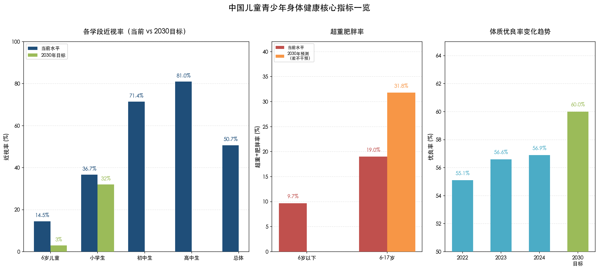

上图汇总了近视率、超重肥胖率和体质优良率三大核心指标的当前水平、变化趋势及2030年政策目标，直观呈现了"缓慢改善但整体水平仍堪忧"的基本格局。

## 1.3 心理健康核心指标：不容忽视的"隐性危机"

### 1.3.1 抑郁与焦虑风险检出率

如果说近视和肥胖是"看得见"的健康问题，心理健康困境则构成一场"隐性危机"。中国科学院心理研究所2024年完成、2025年发布的《心理健康蓝皮书（2023—2024）》基于全国5万余名四至十二年级学生的调查，揭示出令人忧虑的风险图谱：

- 留守青少年中，父母均外出者29.2%存在抑郁风险，远高于非留守群体；
- 父母情感忽视程度高的青少年中，约40.1%存在抑郁风险、23.1%存在焦虑风险；
- 父母从不就心理健康话题与孩子沟通时，46.2%的青少年存在抑郁风险[中科院心理所调查报告](https://www.stpt.edu.cn/xlyjyjxb/2025/0516/c582a42262/page.htm "2024年调查，2025年发布")。

需要说明的是，上述数据采用的是心理量表的"风险检出率"而非临床"患病率"，不同量表的阈值设定各异，跨研究比较时须审慎解读。尽管如此，接近三成到四成的风险检出水平已充分说明问题的严峻性。

### 1.3.2 心理健康与学业表现的叠加效应

心理健康问题与学业困难之间存在显著的相互强化关系。蓝皮书分报告数据显示：抑郁高风险青少年中，45.4%经常不想上学（无抑郁风险者该比例不到5%），17.1%存在不做作业或抄作业问题，28.9%认为"学习没有意义"[中科院心理所调查报告](https://www.stpt.edu.cn/xlyjyjxb/2025/0516/c582a42262/page.htm "心理健康蓝皮书分报告")。这组数据揭示了一条典型的恶性循环路径：心理困境直接侵蚀学习动力与学业表现，而成绩下滑又反过来加剧自我否定和心理恶化，形成"心理问题—厌学—成绩下滑—自我否定—心理加重"的负反馈回路。

### 1.3.3 短视频与数字媒体：新兴风险因子

蓝皮书同时聚焦了数字媒体对青少年心理健康的影响。调查显示，青少年日均短视频使用时长超过90分钟，高强度使用与抑郁、焦虑风险呈显著正相关；超两成青少年反映短视频对其睡眠质量或学习精力产生了消极影响[中科院心理所蓝皮书发布会](https://psych.cas.cn/news/xshd/202504/t20250417_7603581.html "2025年4月17日")。截至2025年，我国学龄期及以上未成年人触网率已接近98%[人民日报海外版](https://paper.people.com.cn/rmrbhwb/pc/content/202506/23/content_30081230.html "2025年6月")。2025年4月"未成年人模式"升级上线是技术监管层面的重要举措，但实际执行效果仍有待持续评估。

### 1.3.4 心理健康教育资源配置

在学校端，2024年小学配备专职心理健康教育教师的学校比例为45.6%，中学为67.4%，分别较2023年提高3.3和2.6个百分点[国家统计局·儿童发展纲要监测报告](https://www.stats.gov.cn/xxgk/sjfb/zxfb2020/202512/t20251230_1962182.html "2025年12月发布")。这一进步值得肯定，但小学端仍有过半学校缺乏专职心理教师，农村地区的缺口尤为突出。与此同时，家长端的心理健康素养严重不足——蓝皮书调查发现，家长正确回答心理健康反向题的正确率仅为6.9%[中国网·心理健康蓝皮书](http://psy.china.com.cn/2025-04/29/content_43093074.htm "2025年4月")。学校资源配置不足与家庭素养缺失形成双重缺口，致使大量存在心理困扰的青少年无法获得及时识别与有效支持。

## 1.4 国际比较：中国在全球坐标中的位置

将中国数据置于全球坐标系中有助于识别差异化特征与借鉴方向。

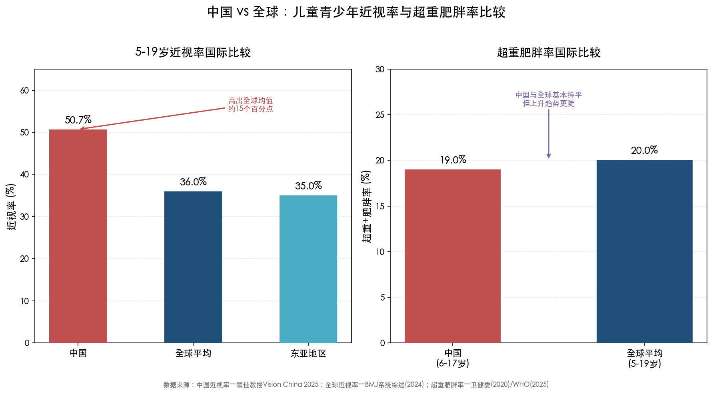

上图分别从近视率和超重肥胖率两个维度，将中国与全球及东亚地区的数据进行直观对比。

**近视率方面**，2024年9月发表于《英国眼科杂志》（British Journal of Ophthalmology）的一项系统综述与荟萃分析（涵盖50个国家276项研究、541万受试者）显示，全球5—19岁儿童青少年近视率从1990年的24%上升至2020—2023年的约36%，东亚地区最高（约35%），亚洲整体预计2050年将达69%[BMJ系统综述](https://bmjgroup.com/8612-2/ "2024年9月British Journal of Ophthalmology发表")。中国约50.7%的总体近视率远高于全球约36%的均值，在全球范围内处于显著的高位，反映出中国特定的教育压力与生活方式因素对视力健康的深度影响。

**超重肥胖方面**，WHO于2025年更新的数据显示，2022年全球5—19岁儿童青少年超重率约20%（含肥胖8%）[WHO肥胖实况报道](https://www.who.int/news-room/fact-sheets/detail/obesity-and-overweight "2025年更新版")。中国6—17岁约19%的合计超重肥胖率与全球水平基本持平，但需关注两个要点：其一，全球超重肥胖水平本身已被WHO界定为"流行病级别"，持平并不意味着可以放松警惕；其二，中国6—17岁超重肥胖率仍呈上升态势，若不采取有效干预措施，预计将快速超越全球均值。

**心理健康方面**，由于各国使用的筛查量表与阈值标准各异，严格的国际横向比较目前尚不可行。WHO和OECD尚未发布与中国直接可比的同龄段焦虑/抑郁检出率数据。但一个可以确认的全球性趋势是，COVID-19大流行后各国青少年心理健康问题普遍加剧，中国所面临的挑战并非孤例。

## 1.5 2025—2026年核心政策脉络：密集出台的"健康新政"

2025年末至2026年初，国家层面围绕儿童青少年身心健康密集出台了三项标志性政策，构成了未来五年的行动框架。

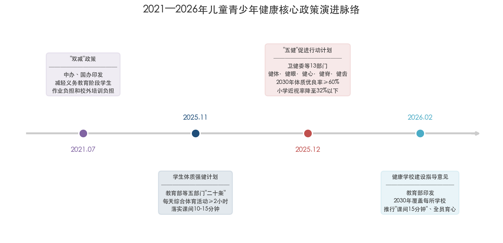

上图以时间轴形式呈现了从2021年"双减"政策到2026年"健康学校建设"指导意见的四项标志性政策演进脉络，每项政策的发布主体、核心要点和量化目标一目了然。

### 1.5.1 "五健"促进行动计划（2026—2030年）

2025年12月底至2026年1月初，国家卫健委等13部门联合发布《儿童青少年"五健"促进行动计划（2026—2030年）》，围绕健体、健眼、健心、健脊、健齿五大维度开展综合健康促进。该计划设定了明确的量化目标：到2030年，体质优良率达60%以上，6岁儿童近视率控制在3%左右，小学生近视率降至32%以下[人民日报](http://paper.people.com.cn/rmrb/pc/content/202601/07/content_30130250.html "2026年1月7日报道")。"五健"框架首次将健脊、健齿与传统的体质、视力、心理健康并列纳入政策体系，标志着决策层对儿童健康问题认知的系统化升级。在近视防控领域，该计划强调从"广泛覆盖"向"精准滴灌"转型，推行分级分类干预策略，并要求建立完善的儿童青少年视力健康电子档案[医师报评论](https://news.qq.com/rain/a/20260211A06UJT00 "2026年2月评论解读")。

### 1.5.2 学生体质强健计划（"二十条"）

2025年11月，教育部等五部门联合印发《关于实施学生体质强健计划的意见》（简称"二十条"），核心要求是推进中小学生每天综合体育活动时间不低于2小时[教育部官网](http://www.moe.gov.cn/jyb_xwfb/gzdt_gzdt/s5987/202511/t20251119_1420842.html "2025年11月19日发布")。教育部副部长王嘉毅于2025年6月的讲话中确认，"'2小时'体育活动已成为新学期的新气象、新风尚"，同时明确要求"落实课间10分钟、15分钟休息时间"[教育部讲话](http://www.moe.gov.cn/jyb_xwfb/moe_176/202506/t20250617_1194494.html "王嘉毅2025年6月讲话")。这一政策将每天体育活动从传统的"一节体育课"大幅扩展至2小时综合活动，标志着学校体育从"课程内"向"全天候"的范式转变。

### 1.5.3 全面推进健康学校建设

2026年2月，教育部印发《关于全面推进健康学校建设的指导意见》，明确到2030年健康学校建设覆盖每所学校，推行"课间15分钟"、全员育心等制度[教育部文件报道](https://cfsn.cn/news/detail/2314/336843.html "2026年2月28日")。该文件与前两项政策形成互补，将健康目标嵌入学校治理的全链条。

### 1.5.4 "双减"政策的持续推进与阶段性成效

上述新政均建立在2021年"双减"政策持续推进的基础之上。教育部副部长王嘉毅于2025年6月明确评估："'双减'三年目标总体实现。各地学校校内减负提质成效明显，课后服务质量、作业设计水平不断提升"；与此同时也坦承"校外培训存在反弹风险，一些学科类培训隐形变异、转入地下，违规竞赛加重学生负担"[教育部讲话](http://www.moe.gov.cn/jyb_xwfb/moe_176/202506/t20250617_1194494.html "2025年6月讲话")。

学术界的独立评估提供了更为细致的画面。一项覆盖全国7省47所义务教育学校、11,145名学生和10,655名家长的实证调查显示：超过80%的教师采用了情景教学和合作式学习等创新教学方法；95.56%的学校提供作业辅导和体育类课后服务，学生课后服务参与率从"双减"前的68.04%上升到75.20%。然而，46.38%的家长认为现有课后服务"不能替代校外学科类培训的效果"，课后服务的质量与吸引力仍有较大提升空间[人大复印报刊资料](https://www.rdfybk.com/qw/detail?id=911428 "双减三周年成效检视")。

综合来看，"双减"政策在减轻"明面上"的学业负担方面取得了实质性进展，但家长的教育焦虑与对优质教育资源的竞争并未消退，部分需求已转向隐性渠道。政策的长效机制仍处于探索构建之中。

## 1.6 结构性矛盾：健康理想与现实约束的张力

在政策密集发力的同时，中国家庭在养育实践中面临的深层结构性矛盾同样不容回避。这些矛盾并非单一政策所能化解，而是制度安排、文化传统与社会变迁交织作用的产物。

### 1.6.1 学业压力与健康需求的冲突

"卷"文化下，学业成绩仍是多数家庭最核心的关切。中国儿童中心2024年报告显示，90.8%的受访家长希望孩子学历达本科及以上，四分之一期望达到博士学历；44.8%的家长对升学结果感到非常或比较焦虑[中国儿童中心](https://www.ccc.org.cn/art/2024/7/9/art_52_224477.html "2024年报告")。在这种压力传导下，体育课被挤占、户外时间被压缩、睡眠不足成为普遍现象（第3章将详细探讨）。教育部副部长王嘉毅在2025年6月的讲话中直言："教育功利化和内卷倾向尚未根本扭转……唯分数、唯升学现象，以及教育内卷、超时长学习、违规补课、学业负担较重等问题还比较突出"[教育部讲话](http://www.moe.gov.cn/jyb_xwfb/moe_176/202506/t20250617_1194494.html "2025年6月讲话")。

### 1.6.2 数字化生存与心智发育的矛盾

学龄期及以上未成年人触网率接近98%，青少年日均短视频使用时长超过90分钟[人民日报海外版](https://paper.people.com.cn/rmrbhwb/pc/content/202506/23/content_30081230.html "2025年6月")[中科院心理所蓝皮书发布会](https://psych.cas.cn/news/xshd/202504/t20250417_7603581.html "2025年4月17日")。数字技术既是不可或缺的学习工具，也是注意力资源的最大竞争者。2025年4月"未成年人模式"的升级上线是技术监管的重要一步，但技术手段难以替代家庭层面的引导与规则建构（第3章和第4章将进一步探讨）。

### 1.6.3 心理健康认知与服务能力的鸿沟

家长心理健康知识水平达标率处于最低区间，反向题正确率仅为6.9%[中国网·心理健康蓝皮书](http://psy.china.com.cn/2025-04/29/content_43093074.htm "2025年4月")。与之相对的是，小学端仅45.6%的学校配备了专职心理教师[国家统计局·儿童发展纲要监测报告](https://www.stats.gov.cn/xxgk/sjfb/zxfb2020/202512/t20251230_1962182.html "2025年12月发布")。家庭"不会识别"与学校"无人可用"的双重缺口叠加，致使众多存在心理困扰的青少年成为沉默的多数。

### 1.6.4 城乡分化与留守困境

欠发达地区农村学生的抑郁风险高于全国平均水平，留守青少年中近三成存在抑郁风险，远高于非留守群体[科技日报](https://www.stdaily.com/web/gdxw/2025-04/17/content_326889.html "2025年4月17日")。国家统计局与UNICEF基于第七次人口普查数据的分析显示，36.4%的0—17岁儿童无法与父母双方共同居住，16.8%无法与父母任何一方居住[国家统计局与UNICEF](https://www.stats.gov.cn/zs/tjwh/tjkw/tjzl/202304/P020230419425666818737.pdf "2020年中国儿童人口状况")。家庭分离不仅直接增加了心理健康风险，也削弱了日常健康管理（如饮食、作息、屏幕时间控制）的执行能力。

## 1.7 小结与后续章节导引

本章的核心发现可概括为三个层面：

第一，中国儿童青少年身体健康呈现"缓慢改善但整体水平仍堪忧"的格局。近视率从2018年的53.6%降至约50.7%，体质优良率三年内累计提升1.8个百分点——这些进步来之不易，但超半数近视、近两成超重肥胖、四成以上体质未达优良的基本面并未改变。

第二，心理健康问题的严峻性与隐蔽性并存。留守、情感忽视、缺乏亲子沟通等因素使特定群体的抑郁风险检出率高达三至四成，而家长心理健康素养的严重不足进一步加剧了问题的隐蔽性。心理困境与学业困难之间的恶性循环已成为不可忽视的突出问题。

第三，政策回应力度空前但落地仍面临挑战。"五健"计划、"二十条"、健康学校建设三大政策构成了较为完整的顶层设计，但教育功利化倾向尚未根本扭转，学校资源配置不均、家长焦虑传导、数字化冲击等结构性矛盾仍在深层运作。

基于上述全景图，后续各章将分别聚焦科学学习（第2章）、健康生活（第3章）、兴趣培养（第4章）、目标与方向（第5章）以及家校协同（第6章），逐一探讨具体的策略与路径。每一章的分析均立足于本章揭示的身心健康现状与政策语境——降低近视率需要落实到每日的户外活动与用眼习惯，化解心理危机需要从亲子沟通和学校支持体系入手，而打破"内卷怪圈"则需要帮助孩子找到属于自己的目标与节奏。

# 第2章 科学学习——学业规划、学习方法与时间管理

学习是儿童青少年成长最核心的活动之一，然而"如何学"往往比"学多久"更为关键。认知科学与教育心理学数十年的研究积累，已为"什么样的学习策略最有效""不同年龄段的孩子应当如何安排学习节奏"等问题提供了坚实的证据基础。在中国中小学生学习时间投入已居全球前列、而学习效率与身心健康代价之间失衡日益突出的背景下，从"学得多"转向"学得对"已成为亟待解决的教育命题。本章围绕认知发展规律、高效学习策略、时间管理框架、学习内驱力以及AI辅助学习工具五个维度，为中国中小学生的科学学习提供系统性的循证参考。

## 2.1 认知发展基础：理解大脑的"成熟时间表"

科学的学习策略必须建立在对儿童青少年认知发展规律的准确理解之上。工作记忆、注意力和元认知是支撑学习活动的三项核心认知能力，其成熟时序存在显著差异，直接决定了不同学段的学习任务设计和策略选择。

### 2.1.1 工作记忆：从3.5个到4.5个"组块"的渐进扩展

工作记忆（working memory）是大脑同时保持和加工信息的能力，被广泛认为是学习过程中的核心"瓶颈"。Spencer（2020）基于动态场理论（Dynamic Field Theory）提出，工作记忆容量的发展源于神经网络局部兴奋和环绕抑制强度的渐进增加：7-8岁儿童的工作记忆容量约为3.5个项目，9-10岁增长至约4.4个项目，成人期达到约4-5个"组块"（chunk）的上限[Spencer 2020](https://pmc.ncbi.nlm.nih.gov/articles/PMC7984096/ "The development of working memory, Current Directions in Psychological Science, 29(6)")。这一发展规律对教学设计具有直接指导意义：小学低段（6-8岁）的单次学习内容应尽量控制在3-4个信息单元之内，避免因工作记忆过载而导致学习效果大打折扣；小学高段（9-11岁）以后方可逐步增加信息复杂度。

### 2.1.2 注意力：两个关键成熟节点与教学启示

注意力的发展并非匀速推进，而是呈现阶梯式的成熟轨迹。一项针对中国浙江省466名6-17岁儿童的研究揭示了注意力发展的两个关键节点：8-10岁时基本注意聚焦能力趋于成熟，12-14岁时复杂任务的准确性达到稳定水平；而执行功能（executive function）——包括抑制控制、认知灵活性和工作记忆更新——直到17岁仍在持续发展[Zhan et al. 2011](https://pmc.ncbi.nlm.nih.gov/articles/PMC3483869/ "Child Neuropsychology, 17(1), 82-95")。

上述发现对学习安排具有明确的实践指导价值。在小学低段，要求孩子长时间高度集中注意力并不现实，课堂和自主学习应以短时段、多切换的模式进行；进入初中后，可逐步增加单次学习时长和任务复杂度；高中生虽然注意力控制已较为成熟，但执行功能仍在发展完善中，面对需要高度自律的长时段自主学习时，仍需借助外部结构化支持（如明确的学习计划和阶段性目标）来弥补自我调控能力的不足。

### 2.1.3 元认知：学会"学习"的关键窗口期

元认知（metacognition）是对自身认知过程的监控和调节能力——通俗地说，即"知道自己知不知道"的能力。纵向研究表明，元认知在7-8岁开始自发涌现，12-15岁是其发展的关键阶段：13-14岁间元认知技能呈显著增长趋势，但14-15岁间增长不再显著，此后的发展高度依赖教育干预的质量[Katsantonis 2024](https://www.frontiersin.org/journals/psychology/articles/10.3389/fpsyg.2024.1383118/full "引用van der Stel & Veenman 2014纵向研究")。

然而，一个值得高度关注的现象是：基于1027名12-16岁青少年的研究发现，随年级升高，元认知自我调节水平反而呈现显著下降趋势。进一步分析表明，这一下降由学业动机的退化所中介驱动，其中掌握目标导向（即以理解和掌握知识为目标，而非仅以取得好成绩为目标）的下降是最核心的因素，独立解释元认知自我调节53%的方差[Katsantonis 2024](https://www.frontiersin.org/journals/psychology/articles/10.3389/fpsyg.2024.1383118/full "Frontiers in Psychology, 15, 1383118")。换言之，当学习动力从"我想弄懂"退化为"我要拿分"时，孩子反思和调整学习策略的能力也随之萎缩。de Boer等人（2018）的元分析进一步证实，元认知策略教学对学生学业表现具有持续正面影响，是学业成功的关键预测因子；若学校未能有效开展元认知培养，初中阶段学生的元认知水平可能不升反降[Katsantonis 2024](https://www.frontiersin.org/journals/psychology/articles/10.3389/fpsyg.2024.1383118/full "引用de Boer et al. 2018元分析")。

这组研究揭示了一个普遍但常被忽视的教育困境：在中国应试压力下，初中阶段恰恰是学业竞争骤然加剧的时期，对分数的单一追求很可能在无意中侵蚀了孩子"学会学习"的能力。家长和学校应当在小学高段至初中低段这一窗口期，有意识地培养孩子的元认知能力——包括学习前的计划制定、学习中的自我监控以及学习后的反思总结。

## 2.2 高效学习策略：经过科学验证的"学习工具箱"

一项具有重要影响力的发现是：学生日常最频繁使用的学习策略——反复阅读和划线标注——恰恰是经过系统评估后被证实效果最差的方法。Dunlosky等人（2013）在一篇里程碑式的系统评估中，对10种常见学习策略的效用进行了全面审查，结论明确而具有颠覆性：**高效用策略**为练习测试（practice testing，即检索练习）与分散练习（distributed practice，即间隔重复）；**中等效用**为精细化提问（elaborative interrogation）、自我解释（self-explanation）和交错练习（interleaved practice）；而总结、关键词记忆法、意象化、划线/高亮和重复阅读均为**低效用**[Dunlosky et al. 2013](https://journals.sagepub.com/doi/abs/10.1177/1529100612453266 "Psychological Science in the Public Interest, 14(1), 4-58")。

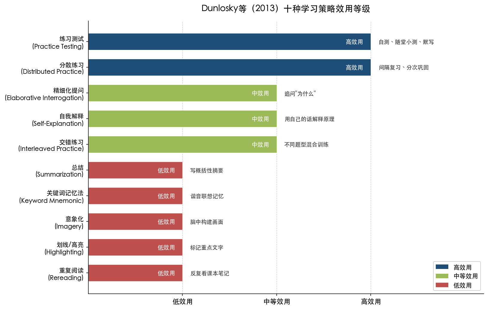

上图直观呈现了10种学习策略的效用分级。值得注意的是，排名最末的五种低效用策略——尤其是重复阅读和划线高亮——恰恰是中国中小学生最为熟悉和依赖的学习方式。这一认知错位提示，学习方法的科学化转型具有显著的提升空间。

### 2.2.1 检索练习：让大脑"主动提取"而非"被动接收"

检索练习（retrieval practice）的核心原理在于：主动从记忆中提取信息的过程本身即可强化记忆痕迹，其效果远优于被动地反复阅读同一材料。Roediger等人在美国一所中学六年级开展的为期1.5年实地实验为此提供了有力证据：经过检索练习的材料，学生期末考试正确率达79%，而未经测验的材料仅为67%，差距达12个百分点；将测验组与重复阅读组对比，前者成绩为91%，显著优于后者的83%[Roediger et al. 2011](https://pdf.retrievalpractice.org/guide/Roediger_Agarwal_etal_2011_JEPA.pdf "Journal of Experimental Psychology: Applied, 17(4), 382-395")。更具实践价值的是，该研究还发现97%的学生报告低风险测验（不计入成绩的小测验）提高了学习效果，65%的学生报告低风险测验降低了而非增加了考试焦虑。

在中国中小学情境中，检索练习可通过多种形式落地实施：课堂上的随堂小测、学习后的自我默写、乃至简单的"合上书本回忆要点"练习。其核心转变在于将学习效果的衡量标准从"看了多少遍"转向"能回忆出多少"。

### 2.2.2 间隔重复：对抗遗忘曲线的系统方法

间隔重复（spaced repetition）指将同一学习内容的复习分散到多个时间节点，而非集中于一次性突击。Dunlosky等人（2013）的系统评估将其与检索练习并列为两种最高效的学习策略，且适用于各年龄段、各学科和各类知识材料[Dunlosky et al. 2013](https://journals.sagepub.com/doi/abs/10.1177/1529100612453266 "学习策略按年龄段适用性分析")。其背后的神经机制在于：适当增加学习的时间间隔可降低大脑的重复抑制效应，使每次复习都更强烈地激活相关神经表征，从而增强长期记忆的保持效果[Xue et al. 2011](https://pmc.ncbi.nlm.nih.gov/articles/PMC6607761/ "Spaced Learning Enhances Episodic Memory by Increasing Neural Pattern Similarity")。

在实操层面，间隔重复的核心原则是"刚要遗忘时再复习"。以一种典型的复习节奏为例：今天学习的新内容，可分别在第1天、第3天、第7天、第14天、第30天安排简短复习。对小学生而言，家长可协助制定并监督复习时间表；进入初高中后，Anki等间隔重复软件则提供了自动化的复习管理工具，能够根据学生对每一知识点的掌握程度动态调整复习间隔。

### 2.2.3 交错练习与精细化提问：中等效用策略的合理运用

交错练习（interleaved practice）是指将不同类型的题目或概念交替练习，而非将同类问题集中重复训练。这一策略在数学学科中尤为有效，其机制在于迫使学习者在不同解题策略之间进行判断和切换，从而增强辨别能力和知识迁移能力。

精细化提问（elaborative interrogation）的操作方法更为简洁——在学习新知识时主动追问"为什么是这样？"。研究证据表明，这一策略在四年级及以上学生中已获充分验证，但对幼儿园和一年级学生效果不显著，原因可能在于低龄学生尚缺乏足够的先验知识来生成有意义的解释。先验知识构成重要的调节变量：高知识组通过精细化提问可提升24%的记忆成绩，而低知识组提升幅度约为12%[Dunlosky et al. 2013](https://journals.sagepub.com/doi/abs/10.1177/1529100612453266 "精细化提问效果的年龄与知识水平调节效应")。

### 2.2.4 各学段学习策略适配建议

基于上述认知发展规律和策略效用证据，可以整理出分学段的策略适配框架。下图以表格形式系统呈现了四个学段的认知能力发展水平与推荐学习策略的对应关系：

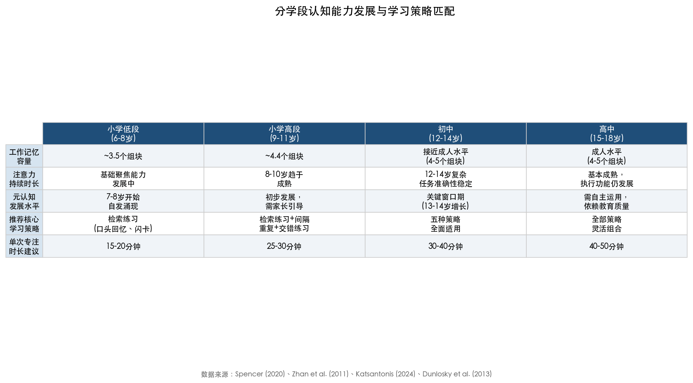

具体而言，各学段的策略运用要点如下：

**小学低段（6-8岁/1-3年级）**：以检索练习为核心策略，如每日睡前口头回忆当天学习要点、利用闪卡进行基础字词复习；间隔重复以家长协助安排为主；精细化提问尚不宜强求，可由家长以对话形式示范"为什么"式追问。

**小学高段（9-11岁/4-6年级）**：检索练习与间隔重复并用，开始引入交错练习（如数学不同题型的混合训练）；精细化提问进入适用期，应鼓励孩子在预习和复习中主动追问原因；同时初步培养元认知习惯，如每周进行一次"学习回顾"。

**初中（12-14岁/7-9年级）**：五种策略全面进入适用期；重点在于培养自主运用间隔重复计划的能力；交错练习和精细化提问应融入常规学习流程；元认知训练进入关键窗口期——应引导学生在每次考试后系统分析错因、反思学习方法的有效性。

**高中（15-18岁/10-12年级）**：学生应掌握全部策略并具备灵活组合运用的能力；可借助数字化工具辅助间隔重复和自我检测；元认知应发展为自主的"学习策略选择能力"——面对不同学科和任务类型，能够判断并选用最为高效的方法。

## 2.3 时间管理：学业负担与健康生活的科学配比

### 2.3.1 中国学生的学习时间现状

中国学生的每日学习总时长在国际上处于显著高位。北京大学中国家庭追踪调查（CFPS）2022年数据显示，中国高中生周学习时间为59.7小时（工作日日均9.95小时，周末日均4.97小时），初中生为55.2小时（工作日日均9.35小时，周末日均4.24小时），小学生为46小时（工作日日均7.75小时，周末日均3.62小时）[北京大学CFPS](https://cj.sina.cn/articles/view/1851422951/6e5a78e700101eiwe "北京大学中国家庭追踪调查2022年数据")。高中生的周学习时间已超过全国企业就业人员2023年周均工作49小时的水平，这一对比凸显了中国高中生所承受的学业负担之重。

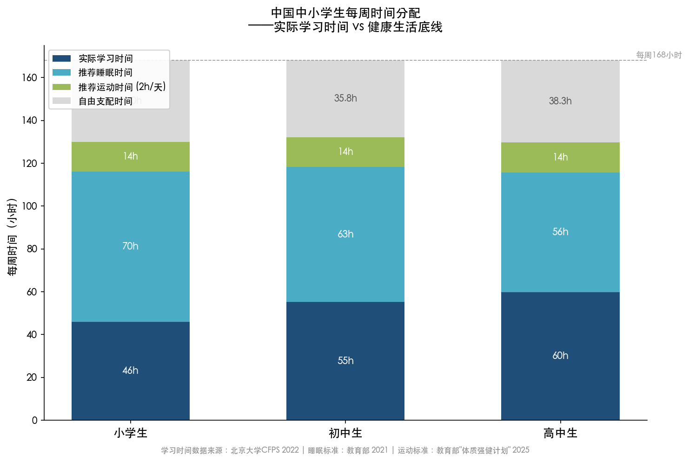

上图将每周168小时分解为实际学习时间、推荐睡眠时间、推荐运动时间和自由支配时间四个部分。可以直观看到，在满足教育部规定的睡眠标准和运动标准后，高中生每周的自由支配时间已被压缩至极为有限的水平。

"双减"政策实施后，高中生周学习时间从2018年的60.4小时降至2022年的59.7小时，初中生从55.9小时降至55.2小时，降幅均不足1.5%；小学生学习时间基本持平。北京师范大学中国教育创新研究院院长刘坚指出，若考虑投入产出比，中国学生的学习效率实际上处于"全球中等偏下水平"。这一判断虽然尖锐，却精准地指向了本章所要回答的核心问题：时间投入与学习成效之间并非简单的线性关系，提升学习效率的关键在于方法而非时长。

### 2.3.2 政策框架下的时间规范

2021年"双减"政策对学业负担上限做出了明确规定：小学一二年级不布置家庭书面作业；小学三至六年级书面作业平均完成时间不超过60分钟；初中不超过90分钟；校外培训机构不得占用节假日、休息日及寒暑假组织学科类培训[双减政策原文](https://www.sohu.com/a/479450934_121106875 "2021年7月24日中办、国办印发")。2025年11月，教育部等五部门联合印发的《关于实施学生体质强健计划的意见》进一步提出中小学生每天综合体育活动不低于2小时的要求[教育部官网](http://www.moe.gov.cn/jyb_xwfb/gzdt_gzdt/s5987/202511/t20251119_1420842.html "2025年11月19日发布")。这些政策框架传递的信号清晰而一致：学习时间需要做"减法"，运动和休息时间需要做"加法"。

与此同时，中国儿童中心2023年在全国11省12市123所学校超37000个家庭的调查显示，超97%的义务教育学校已开设课后服务，约90%的学生参与。初中生参与率（92.52%）高于小学生（87.35%），且初中生更倾向选择学科辅导（73.68%），小学生更倾向兴趣活动（57.86%）[中国儿童中心 2024](https://www.ccc.org.cn/art/2024/1/3/art_52_52461.html "《中国校外教育》2023年第6期")。课后服务在制度设计上延长了学生在校时间、减轻了家长接送压力，但其实际质量——究竟是高效的作业指导与兴趣拓展，还是变相的"加课"——将最终决定这一制度能否真正服务于学生的身心健康。

### 2.3.3 科学时间管理框架

基于认知科学规律和政策规范的双重视角，本节提出以下四项时间管理核心原则：

**原则一：尊重注意力节律，安排"专注-休息"交替模式。** 依据2.1节所述的注意力发展规律，小学低段学生单次专注时长以15-20分钟为宜，休息5-10分钟后进入下一轮学习；小学高段可延长至25-30分钟；初中生约30-40分钟；高中生可达40-50分钟。这一节奏安排与注意力发展的生理规律相吻合，有助于维持较高的学习质量。

**原则二：将高效学习策略嵌入时间规划。** 时间管理的核心不在于增加绝对学习时长，而在于提高单位时间的学习密度。每天30分钟的间隔重复结合检索练习的复习效果，在多数情况下优于2小时的反复阅读课本。将高效策略系统化地嵌入日常学习流程，是实现"提质减时"的关键。

**原则三：保障睡眠、运动和自由时间底线。** 教育部规定小学生每天睡眠时间不少于10小时、初中生不少于9小时、高中生不少于8小时；体育活动每天不低于2小时。在制定日程安排时，应优先锁定这些不可压缩的"底线时间"，再以剩余时间安排学习和兴趣活动，而非反其道而行之。

**原则四：周末应有明显的"节奏切换"。** CFPS数据显示，高中生周末日均学习仍达4.97小时，初中生4.24小时。适度的周末学习在备考阶段是合理的，但应留出充足的自由支配时间，用于运动、社交、兴趣探索和单纯的休憩。持续处于"始终在学"状态不仅会降低效率，还可能加速学习动机的耗竭。

### 2.3.4 分学段时间管理建议

**小学低段（6-8岁）**：在校课堂与课后服务合计约7-8小时；回家后书面作业尽量控制在30分钟以内（一二年级原则上不布置书面作业）；每天保证2小时户外活动或体育运动；亲子阅读与互动不少于30分钟；就寝时间不晚于21:20，确保10小时睡眠。

**小学高段（9-11岁）**：在校时间约8小时；家庭作业控制在60分钟以内；每天体育活动不低于1-2小时；自主阅读或兴趣活动30-60分钟；就寝时间不晚于21:30，保证9-10小时睡眠。

**初中（12-14岁）**：在校时间约9小时；家庭作业控制在90分钟以内；体育活动不低于1小时；自主学习（含复习、预习）约60分钟；就寝时间不晚于22:00，保证9小时睡眠。在此阶段应开始引导学生使用时间管理工具（如周计划表、任务清单），培养自主规划能力。

**高中（15-18岁）**：在校时间约9-10小时；自主学习（含作业）约2-3小时；体育活动不低于1小时；就寝时间不晚于23:00，保证8小时睡眠。应掌握优先级排序方法，学会区分"重要但不紧急"的学习任务（如薄弱环节的专项突破）和"紧急但不重要"的琐碎事务，将有限的时间配置在最具边际回报的学习活动上。

## 2.4 内驱力：从"被动完成"到"主动探究"的动力转换

### 2.4.1 掌握目标导向与学业动机的核心地位

认知科学研究反复证明，驱动高效学习的深层因素并非外部压力，而是内在动机。Katsantonis（2024）的研究量化了这一关系：学业动机因素合计解释元认知自我调节67.2%的方差。其中，**掌握目标**（mastery goal，即以理解和掌握知识为目的）是最强预测因子，独立解释53%的方差；其次是任务价值（6.2%）、表现目标（3%）和自我效能感（2%）[Katsantonis 2024](https://www.frontiersin.org/journals/psychology/articles/10.3389/fpsyg.2024.1383118/full "Cholesky分解模型结果")。

这组数据的实践含义十分清晰：维持孩子的学习内驱力是保持高质量学习策略运用的根本前提。当学习动力来源于"我想弄清楚这个问题"（掌握目标）而非"我要考过别人"（表现目标）时，学生更倾向于主动运用元认知策略——如自我检测、策略调整和深度加工——从而实现更持久、更深层的学业进步。

### 2.4.2 家长如何保护和培育学习内驱力

结合第4章将详细论述的自我决定理论（SDT），此处提出保护和培育学习内在动机的四项基本原则：

- **关注过程而非结果。** 对努力程度和策略选择的反馈（如"你这次用列表法整理知识点的方法很有效"）比对成绩本身的评价（如"你这次考了95分真棒"）更能强化内在动机和掌握目标导向。过程导向的反馈引导孩子将注意力聚焦于可控因素，而非不可控的结果。
- **允许合理的选择空间。** 在合理范围内让孩子参与学习安排的决策——例如选择先做哪科作业、选择课外阅读书目——能够满足自主性心理需求，增强对学习活动的投入感和掌控感。
- **设定"学习目标"而非"绩效目标"。** Locke与Latham（2002）基于35年系统研究证实，对于复杂任务而言，学习目标优于绩效目标。家长可引导孩子设定"本周弄懂分数乘法的原理"（学习目标），而非"本周数学测验考到90分"（绩效目标），从而将注意力导向知识的掌握而非分数的获取。
- **避免将学习与惩罚挂钩。** "考不好就不许玩"等惩罚性表述会使孩子将学习与负面情绪进行条件性关联，长期而言将损害学习的内在动机，甚至催生逃避行为。

## 2.5 AI辅助学习：机遇、边界与家长引导

### 2.5.1 AI学习工具的教育效果：现有证据

生成式人工智能正在迅速渗透中小学学习场景，其教育效果已成为全球关注的研究焦点。一项综合34项（准）实验研究、涵盖3042名K-12学生的荟萃分析显示，AI智能体对学生认知学习成果具有中度显著正效应（Hedges' g=0.404, 95% CI [0.242, 0.567], p<0.001）。按学习成果类型细分，AI对技能型学习成果的效应显著（g=0.391），对知识获取的效应较小但仍达统计显著水平（g=0.344），对高阶思维的效应量较大（g=0.540）但因样本量不足未达统计显著性[Liu et al. 2026](https://www.sciencedirect.com/science/article/pii/S2451958826000473 "Meta-analysis on the influence of AI agents on K-12 student cognitive performance")。

值得关注的是，学段构成重要的调节变量：AI对小学高段学生的效应最大（g=0.877, p<0.001），对初中生效应较小但显著（g=0.195），对高中生效应几乎可忽略且不具统计显著性（g=0.037）[Liu et al. 2026](https://www.sciencedirect.com/science/article/pii/S2451958826000473 "按学段分组的调节效应分析")。这一发现提示，AI工具在小学阶段对基础技能的巩固和练习作用最为突出，但随着学段升高，学生所需的批判性思维和自主学习能力更为复杂，简单的AI辅助可能难以产生同等效果。

布鲁金斯学会2026年1月发布的综述进一步指出，融合生成式AI的辅导平台在随机对照试验（RCT）中表现出显著学习增益，但其成功高度依赖于"教而不答"的教学设计原则——运用苏格拉底式追问、分步引导和认知负荷管理，而非直接提供现成答案[Brookings 2026](https://www.brookings.edu/articles/what-the-research-shows-about-generative-ai-in-tutoring/ "What the research shows about generative AI in tutoring")。这一发现与自主学习理论高度一致：若AI工具沦为"答案提供器"，将削弱而非增强学习效果。

### 2.5.2 中国的政策框架：分学段差异化管理

面对AI在教育领域的快速渗透，中国教育管理部门已建立起分学段的差异化管理框架。2025年5月，教育部发布《中小学生成式人工智能使用指南（2025年版）》，按学段做出明确区分：小学阶段禁止独自使用开放式内容生成功能；初中阶段可适度探索生成内容的逻辑性分析；高中阶段允许结合技术原理开展探究性学习。指南特别强调应避免在作业中简单复制AI生成内容[教育部 2025](https://www.edu.cn/xxh/focus/zc/202505/t20250513_2667992.shtml "《中小学生成式AI使用指南》全文")。

更早出台的"双减"政策已对AI学习工具做出前瞻性规范：线上培训每课时不超30分钟，明确禁止提供"拍照搜题"等惰化思维能力的不良学习方法[双减政策原文](https://www.sohu.com/a/479450934_121106875 "关于线上培训规范")。"拍照搜题"禁令的深层逻辑值得深思——当解题过程被完全跳过时，检索练习所带来的记忆强化机会也随之丧失，学习效果反而受到损害。

### 2.5.3 家长引导策略

综合上述研究证据和政策精神，针对AI学习工具的使用，可按学段提出以下引导建议：

**小学阶段（6-11岁）**：AI工具仅在家长监督下使用，且限定于辅助性功能（如字词发音示范、单词闪卡等结构化学习功能）；不鼓励使用开放式对话或内容生成功能；严格避免"拍照搜题"类应用，确保基础的检索练习和独立思考过程不被绕过。

**初中阶段（12-14岁）**：可逐步引入AI作为"学习伙伴"——用于整理知识框架、检验自己对概念的理解（如向AI解释一个概念并请其给出反馈）、生成练习题进行自我检测；但应明确"先独立思考，再借助AI"的使用顺序。家长宜定期了解孩子的AI使用情况，关注是否出现依赖性使用倾向。

**高中阶段（15-18岁）**：允许更为自主地使用AI辅助学习，应用范围可扩展至文献检索、论证逻辑分析、写作润色等高阶任务；同时应重点培养批判性评估AI输出的能力——AI生成内容并非始终准确，需要交叉验证和独立判断。鼓励将AI定位为"思维挑战者"而非"答案提供者"。

## 2.6 从"学习时间"到"学习质量"的范式转换

本章的核心主张可以概括为一句话：**从"学得多"转向"学得对"**。中国中小学生的学习时间投入已居全球前列——高中生周学习时间达59.7小时，超过全国企业就业人员的周均工作时长——但学习效率与身心健康代价之间的失衡日益突出。认知科学为这一困境提供了明确的化解路径：以检索练习和间隔重复替代低效的反复阅读，以元认知策略训练提升学习的自我调节能力，以科学的时间管理保障睡眠和运动的底线，以AI工具辅助而非替代思考过程。

学习方法的变革需要家庭与学校的协同推进。家长不必成为学科专家，但可以成为孩子学习方法的"教练"——帮助年幼的孩子建立复习节奏，引导青春期的孩子发展元认知策略，在各个年龄段始终保护孩子珍贵的学习内驱力。在"卷"文化盛行的大环境下，这种基于科学证据的"提质减时"路径不仅不会降低学业表现，反而有助于孩子以更健康、更可持续的方式实现学业与成长目标。

# 第3章 健康生活——作息、运动、营养与社交

学业成绩的背后，始终站着一个健康的身体。第2章所讨论的认知发展规律与学习策略，无一不以充足的睡眠、规律的运动、均衡的营养和良好的社交关系为生理与心理基础。世界卫生组织将"健康"定义为"身体、心理和社会适应的完好状态，而非仅仅是没有疾病"。当前中国儿童青少年在这四个维度上均面临不同程度的结构性短板：睡眠时长普遍低于推荐标准1.5—2.5小时，仅约15%—36%的儿童达到每日60分钟中高强度运动推荐量，近87%的学龄儿童奶类摄入严重不足，而社交媒体的高强度使用正在重塑同伴关系的形态与质量。本章围绕作息、运动、营养和社交四个维度，系统梳理科学规范与中国儿童青少年实际状况之间的差距，并提出面向不同学段的实践建议。

## 3.1 睡眠与作息：被"偷走"的睡眠时间

### 3.1.1 各年龄段睡眠需求的科学共识

睡眠是儿童青少年身体发育与认知功能恢复的核心环节。美国睡眠医学学会（AASM）2016年发布的权威共识指出，6—12岁儿童每24小时应保证9—12小时睡眠，13—18岁青少年应保证8—10小时；规律达到推荐睡眠时长与注意力、行为、学习、记忆、情绪调节及整体身心健康的显著改善密切相关[AASM官方建议](https://aasm.org/advocacy/position-statements/child-sleep-duration-health-advisory/ "AASM Child Sleep Duration Health Advisory, 2016年")。中国教育部2021年发布的《关于进一步加强中小学生睡眠管理工作的通知》在此基础上做出更为具体的规定：小学生每天睡眠应达10小时、初中生9小时、高中生8小时；小学上午上课不早于8:20，中学不早于8:00；小学生就寝不晚于21:20，初中生不晚于22:00，高中生不晚于23:00[教育部通知原文](http://www.moe.gov.cn/srcsite/A06/s3321/202104/t20210401_523901.html "教基厅函〔2021〕11号")。

从发育科学的角度审视上述标准：学龄期儿童的深度睡眠阶段（即慢波睡眠）是生长激素集中分泌的窗口，对骨骼和肌肉发育至关重要；进入青春期后，生物钟自然后移（即"睡眠相位延迟"），青少年倾向于晚睡晚起，过早的到校时间与其生物节律之间的冲突日益凸显。教育部将中学上课时间推迟至8:00的规定，正是对这一生理规律的政策回应。

### 3.1.2 中国中小学生睡眠现状：普遍不足

尽管政策标准已然明确，现实情况却不容乐观。新华社2025年3月的专题调查（1426份有效问卷）显示：77.19%的受访小学生家长反映孩子每天睡眠不足9小时，72.34%的初中生家长称孩子睡眠不足8小时，62.5%的高中生家长表示孩子睡眠不足7小时[新华社报道](http://gz.news.cn/20250321/dbe8a917ac564aae9c4bb312b2a51795/c.html "2025年3月21日")。在睡眠不足的归因上，49.37%的家长将作业量过多列为首要原因，40.25%则指出沉迷手机是导致睡眠时间被压缩的重要因素[新华社报道](http://gz.news.cn/20250321/dbe8a917ac564aae9c4bb312b2a51795/c.html "2025年3月21日")。

更大规模的全国性数据进一步印证了这一趋势。《中国睡眠研究报告2023》显示学生群体每晚平均睡眠时长仅为7.74小时；《2022中国国民健康睡眠白皮书》进一步拆分学段数据，初中生实际平均睡眠仅7.48小时、小学生7.65小时，均远低于教育部规定的9—10小时标准[新华社报道转引](http://gz.news.cn/20250321/dbe8a917ac564aae9c4bb312b2a51795/c.html "转引《中国睡眠研究报告2023》和《2022中国国民健康睡眠白皮书》")。如图3-1所示，中国中小学生实际睡眠时长与推荐标准之间存在约1.0—2.3小时的系统性缺口，小学阶段的差距尤为突出。

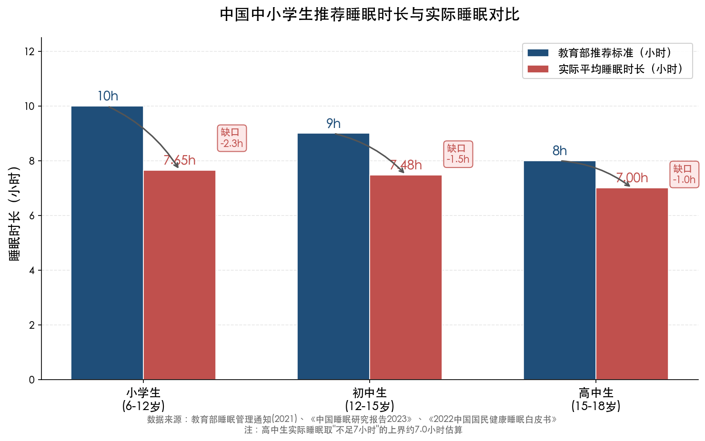

> **图3-1** 各学段教育部推荐睡眠时长与实际平均睡眠时长对比。小学生的睡眠缺口最大（约2.3小时），初中生次之（约1.5小时），高中生约1.0小时。数据来源：教育部睡眠管理通知（2021）、《中国睡眠研究报告2023》、《2022中国国民健康睡眠白皮书》。

### 3.1.3 科学作息制度的设计原则

针对上述睡眠缺口，科学的作息制度应遵循以下原则：

**按学段设定就寝与起床时间。** 综合教育部规定与AASM建议，小学生（6—12岁）应在21:00—21:20前入睡、次日6:30—7:00起床，保证至少9—10小时睡眠；初中生（12—15岁）在22:00前入睡、次日6:30—7:00起床，保证8—9小时；高中生（15—18岁）在23:00前入睡、次日6:30—7:00起床，保证至少7.5—8小时。

**建立稳定的睡前仪式。** 睡前30—60分钟应停止使用电子屏幕（美国卫生总监建议至少在睡前1小时停止使用电子设备），代之以阅读、拉伸或亲子对话等低唤醒活动[美国HHS卫生总监报告](https://www.hhs.gov/sites/default/files/sg-youth-mental-health-social-media-advisory.pdf "2023年")。睡前仪式的核心目的在于降低交感神经兴奋性，帮助大脑从"警觉模式"切换至"入睡准备状态"。

**周末作息保持一致。** 睡眠科学研究表明，周末大幅补觉（即"社会性时差"）会扰乱昼夜节律，不仅无法弥补工作日的睡眠债务，反而可能加剧周一的疲劳感。周末起床时间与工作日相差不宜超过1小时。

**主动管控作业节奏与电子产品使用。** 鉴于作业过多和手机沉迷是排名前两位的睡眠杀手（分别被49.37%和40.25%的家长提及），家长应与学校沟通合理的作业量，同时在家庭中设立"无电子产品区域"和"设备收纳时间"，为孩子创造有利于入睡的物理环境。

## 3.2 体育运动：从"知道重要"到"切实做到"

### 3.2.1 运动量推荐标准

关于儿童青少年应当达到的运动量，国际与国内权威指南已形成高度一致的共识。WHO 2020年发布的《身体活动与久坐行为指南》建议5—17岁儿童青少年每天应进行平均至少60分钟中高强度（MVPA）有氧身体活动，每周至少3次高强度有氧活动及增强肌肉和骨骼的活动，同时应尽量减少久坐行为[WHO 2020指南](https://bjsm.bmj.com/content/54/24/1451 "Bull et al., BJSM 2020;54:1451-1462")。中国《学龄儿童膳食指南（2022）》的核心推荐与此一致：每天累计至少60分钟中高强度身体活动，每周至少3次高强度活动和3次抗阻力活动，视屏时间每天不超过2小时[中国营养学会官网](http://dg.cnsoc.org/article/04/fKbTBSICRNCK7p3hsER1mg.html "2022版核心推荐")。2025年底至2026年初出台的《儿童青少年"五健"促进行动计划（2026—2030年）》进一步将"中小学生每天进行不少于60分钟中高强度身体运动"写入国家级行动目标[教育部通知](http://www.moe.gov.cn/jyb_xxgk/moe_1777/moe_1779/202603/t20260324_1431885.html "2026年3月发布")。

### 3.2.2 运动的多维健康效应

运动对儿童青少年的益处远不止于体重控制和体质达标。2024年发表于《JAMA Pediatrics》的一项大型荟萃分析（Liu等，覆盖76项研究、3007名参与者）系统量化了身体活动干预对儿童青少年心理健康的效应：整体心理健康改善效应量Hedges' g=0.67（95% CI 0.50—0.85），对认知功能的效应量g=0.74，对心理幸福感g=0.56，对内化问题（如焦虑、抑郁）g=0.72，对外化问题（如行为障碍）g=0.58[JAMA Pediatrics](https://pubmed.ncbi.nlm.nih.gov/38285440/ "Liu et al., 2024;178(3):e236251")。如图3-2所示，上述五个维度的效应量均达中等以上水平，表明运动是改善青少年心理健康具有充分循证依据的有效干预手段。

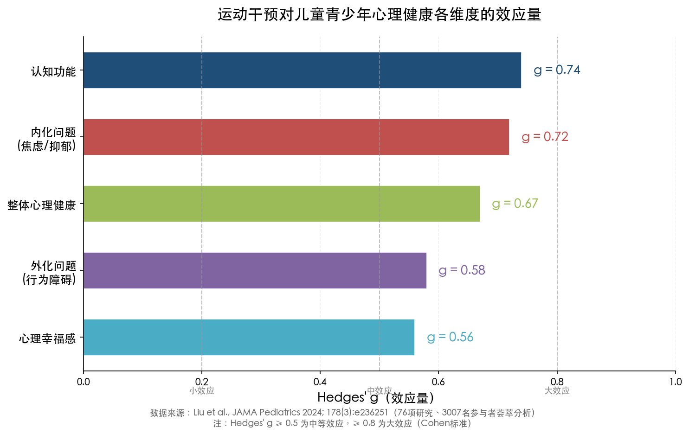

> **图3-2** 身体活动干预对儿童青少年心理健康五大维度的Hedges' g效应量。所有维度均超过Cohen中等效应阈值（0.5），其中认知功能和内化问题的改善效果最为突出。数据来源：Liu et al., JAMA Pediatrics 2024。

来自英国千禧队列（n=8599）和德国KiGGS队列（n=1212）的因果推断研究进一步揭示了运动效应的传导路径：同伴关系问题对青少年心理健康的直接因果效应最为强烈，而体育活动不足的直接效应相对较小[JMIR Public Health Surveillance](https://publichealth.jmir.org/2025/1/e60125 "Stuke et al., 2025;11:e60125")。这一发现提示，运动之所以能够有力促进心理健康，部分原因在于它提供了天然的社交场景——团队运动中的合作、竞争与沟通，本身即构成同伴关系建设的重要途径。

2019年全国学生体质与健康调研（95280名13—18岁汉族儿童青少年）的分析也印证了运动的"缓冲"功能：肥胖与高心理困扰呈正相关（肥胖组OR=1.13，95% CI 1.07—1.19），但这一关联仅在每日体育锻炼时间不足1小时的青少年中显著，在每日锻炼达到或超过1小时的群体中则不具有统计学意义[中华流行病学杂志](https://html.rhhz.net/zhlxbx/20231007.htm "董彦会等, 2023;44(10)")。换言之，充足的体育锻炼能够在一定程度上缓冲肥胖对心理健康的潜在负面影响。

### 3.2.3 中国儿童青少年运动达标现状：差距显著

然而，中国儿童青少年的实际运动水平与上述推荐标准之间存在巨大鸿沟。基于2016—2018年加速度计客观监测数据，中国儿童青少年每日MVPA达到60分钟的比例仅为36.30%[BMC Public Health](https://pubmed.ncbi.nlm.nih.gov/30760252/ "Zhu et al., 2019;19(1):197")。2019年全国学生体质与健康调研中，13—18岁儿童青少年平均每日体育锻炼时间达到或超过1小时的比例仅为17.1%，其中13—15岁为19.4%，16—18岁仅14.7%，女生（15.1%）显著低于男生（19.2%）[中华流行病学杂志](https://html.rhhz.net/zhlxbx/20231007.htm "2019年全国学生体质与健康调研数据")。2026年发表于《体育学刊》的一项多中心加速度计研究（1741名6—18岁儿童青少年）显示，仅15.3%的受试者满足每日至少60分钟MVPA的推荐量，女生满足率（6.1%）不及男生（25.0%）的四分之一[体育学刊](https://statics.scnu.edu.cn/pics/tyxk/2026/0325/1774430479874084.pdf "贾辰康等, 2026;33(2):145-152")。

《2025年全民健身活动状况调查公报》（国家体育总局，覆盖31省141145个有效样本）从运动技能角度揭示了问题的另一个侧面：7—18岁青少年中掌握至少一项运动技能的比例仅为23.9%[国家体育总局](https://www.sport.gov.cn/n20001280/n20745751/c29327174/content.html "2025年12月30日发布")。运动技能的缺失意味着，即便孩子有运动意愿，也可能因为"不会玩"而无法有效参与体育活动，由此形成"不会→不玩→更不会"的恶性循环。

### 3.2.4 分学段运动建议

结合上述证据，各学段的运动安排应兼顾发育特点与可行性：

**小学低段（6—8岁）：** 以游戏化运动为主，每天累计至少60分钟中高强度活动。重点发展基本运动技能（跑、跳、投、攀爬），运动形式应多样化而非单一化。此阶段应贯彻"运动即游戏"的理念，避免过早进入竞技训练模式。

**小学高段（9—11岁）：** 在基本运动技能基础上引入专项运动探索，建议尝试2—3项不同类型的运动（如一项球类、一项体操或舞蹈类、一项耐力类）。鼓励参加团队运动，借助运动的社交功能促进同伴关系发展。

**初中（12—14岁）：** 青春期身体发育加速，是发展力量、速度和心肺耐力的敏感期。每天60分钟MVPA中应包含至少20分钟高强度活动，可逐步深入1—2项运动，培养终身运动习惯。尤其需要警惕升学压力导致体育课被"让位"给文化课的现象——这一做法不仅违反政策要求，更与运动对学业表现的正向促进作用相悖。

**高中（15—18岁）：** 维持每天60分钟MVPA的底线，同时增加力量训练和柔韧性训练。鼓励自主选择运动项目，培养自我锻炼能力。学校应保障课间活动时间，落实2026年教育部《关于全面推进健康学校建设的指导意见》中关于"课间15分钟"的要求[教育部文件报道](https://cfsn.cn/news/detail/2314/336843.html "2026年2月28日")。

## 3.3 膳食营养：结构性失衡中的关键短板

### 3.3.1 学龄儿童膳食核心推荐

《中国学龄儿童膳食指南（2022）》围绕学龄期的特殊营养需求提出了针对性推荐：天天喝奶（每天300ml及以上）、足量饮水（每天800—1400ml）、不喝含糖饮料、禁止饮酒；同时强调吃好早餐、合理选择零食[中国营养学会官网](http://dg.cnsoc.org/article/04/fKbTBSICRNCK7p3hsER1mg.html "2022版核心推荐")。这些建议看似基础，但从全国数据来看，大多数中国学龄儿童的实际膳食结构与推荐之间存在系统性偏差。

### 3.3.2 中国学龄儿童食物摄入的结构性问题

中国疾控中心基于2016—2017年全国31省275个监测点数据的分析揭示了一幅令人警醒的图景：6—17岁学龄儿童中，86.93%奶类摄入不足推荐量的60%，79.67%鱼虾类摄入不足，76.21%蔬菜摄入不足，85.21%水果和坚果摄入不足；与此形成鲜明反差的是，76.06%的学龄儿童畜禽肉摄入超标[中国疾控中心](https://www.chinacdc.cn/jkkp/yyjk/rqyy/202408/t20240825_295585.html "于冬梅团队，2024年8月发布")。图3-3直观呈现了这一"高肉低奶、缺鱼少菜"的结构性失衡格局。

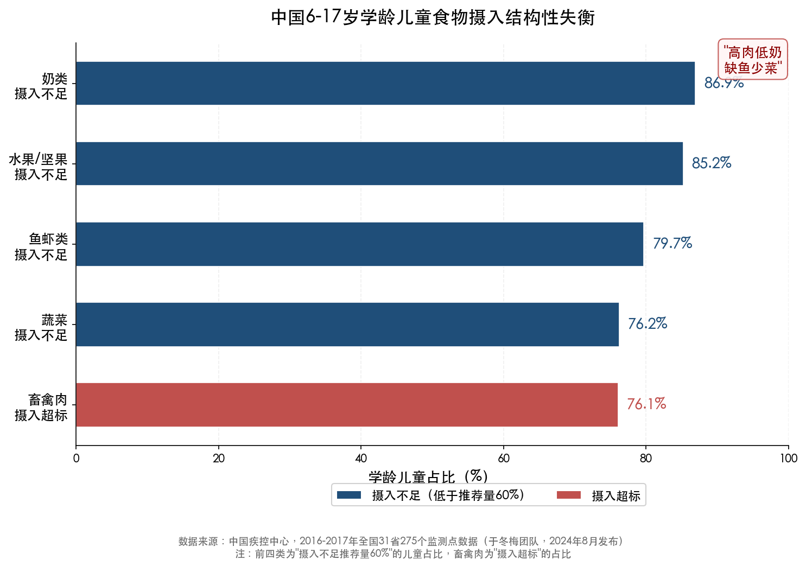

> **图3-3** 中国6—17岁学龄儿童五大类食物摄入偏离推荐量的比例。前四类食物（奶类、水果/坚果、鱼虾类、蔬菜）均有超过76%的儿童摄入严重不足，而畜禽肉则有76.1%的儿童摄入超标。数据来源：中国疾控中心2016—2017年全国31省275个监测点调查。

这一膳食结构的失衡导致中国学龄儿童在微量营养素方面面临多重短板。其中最突出的问题之一是钙摄入严重不足。《中国居民营养与慢性病状况报告（2020年）》显示，中国各年龄阶段儿童膳食钙摄入量不足推荐量的一半；全国居民平均每标准人日奶类摄入仅25.9g，不及推荐量（300g/天）的十分之一[农民日报](https://www.farmer.com.cn/2024/07/18/wap_99959868.html "转引《慢性病报告2020》，2024年7月")。对于正处于骨骼快速生长期的学龄儿童和青少年而言，持续性钙摄入不足将直接影响骨密度峰值的积累，增加成年后罹患骨质疏松的风险。

维生素D营养状况同样不容忽视。2025年BMJ Open发表的系统综述与荟萃分析（Ji等，纳入31项横断面研究，覆盖0—18岁健康儿童和青少年）显示，中国大陆儿童和青少年维生素D缺乏（25-羟基维生素D水平<50 nmol/L）的汇总患病率高达48%（95% CI：40%—57%）。亚组分析揭示了与年龄相关的显著下降趋势：婴儿期平均血清25(OH)D水平为82.35 nmol/L，而到青少年阶段降至50.98 nmol/L（p<0.05）[BMJ Open](https://www.bmjchina.com.cn/News/Companynews/2025/0721/2094.html "Ji et al., BMJ Open 2025;15:e094693")。维生素D缺乏不仅影响钙吸收和骨骼健康，还与免疫功能低下、情绪障碍等多种健康问题存在关联。考虑到中国学龄儿童普遍面临户外活动不足和奶类摄入匮乏的双重困境，维生素D缺乏的高发有其清晰的行为学解释。

### 3.3.3 分学段营养要点

**小学低段（6—8岁）：** 此阶段是培养饮食习惯的关键窗口期。应重点确保每天一杯奶（300ml）、充足的蔬菜水果（每天蔬菜300g以上、水果200g以上），以及规律的三餐加一次健康零食。家长尤应关注早餐质量——含优质蛋白、全谷物和果蔬的早餐能为上午的学习活动提供稳定的能量供应。

**小学高段（9—11岁）：** 进入快速生长前期，钙需求显著增加（推荐摄入量为1000mg/天）。除保持奶类摄入外，应增加豆制品、绿叶蔬菜等含钙食物。此阶段孩子开始独立选择零食，家长需引导其识别高糖、高盐食品，帮助建立"食物红绿灯"的概念。

**初中（12—14岁）：** 青春期发育高峰期，热量和蛋白质需求显著增加——男生每日热量需求可达2400—2800千卡，女生2000—2400千卡。铁的需求因月经来潮而在女生中尤为突出（推荐摄入量18mg/天），应注意通过红肉、动物内脏和深色蔬菜补充。维生素D的补充策略可结合户外运动（每天至少30分钟日照）和必要时的营养补充剂。

**高中（15—18岁）：** 学业压力大、作息不规律容易导致饮食紊乱。常见问题包括以"节约时间"为由不吃早餐、以含糖饮料代替白水、夜间大量摄入零食等。家长和学校应共同关注这一阶段学生的营养状况，学校食堂应提供营养均衡的餐食选择，引导学生形成自主管理膳食的能力。

## 3.4 社会交往：线上线下的双重挑战

### 3.4.1 同伴关系对心理健康的核心作用

前文讨论的运动对心理健康的促进机制中，社交功能是一条重要传导路径。事实上，同伴关系在儿童青少年心理发展中占据极为核心的位置。2025年发表于JMIR的研究（Stuke等，基于英国千禧队列n=8599和德国KiGGS队列n=1212），通过机器学习因果推断方法发现：在影响青少年心理健康发展的诸多因素中，同伴关系问题具有最为强烈的直接因果效应，其影响力远超体育活动不足（仅有小幅直接效应）和屏幕时间（直接效应极小）[JMIR Public Health Surveillance](https://publichealth.jmir.org/2025/1/e60125 "Stuke et al., 2025;11:e60125")。

这一发现具有重要的实践含义：帮助孩子建立和维护高质量的同伴关系，是促进其心理健康最有效的切入点之一。家长和学校应当在以下方面有所作为：为孩子提供充分的面对面社交机会（如课外活动、社区运动、同伴聚会）；系统教授社交技能（如倾听、共情、冲突解决）；及时识别和干预同伴欺凌与社交孤立问题。

### 3.4.2 社交媒体使用的"剂量—效应"关系

数字时代的社交活动日益向线上迁移，社交媒体对青少年心理健康的影响已成为全球性议题。中科院心理所发布的《心理健康蓝皮书（2023—2024）》显示，中国青少年日均短视频使用时间已超过90分钟，高强度使用与抑郁、焦虑风险显著正相关；超两成青少年反映短视频对其睡眠或学习精力产生了消极影响[中科院心理所蓝皮书发布会](https://psych.cas.cn/news/xshd/202504/t20250417_7603581.html "2025年4月17日")。

从国际研究证据来看，社交媒体使用与青少年心理问题之间呈现出"剂量—效应"特征。2024年发表于《JAMA Pediatrics》的大型荟萃分析（Fassi等，涵盖143项研究、超过109万名青少年）发现：社交媒体使用时长与青少年内化症状（焦虑、抑郁）存在显著但偏小的正相关（r=0.12, 95% CI 0.09—0.15）[JAMA Pediatrics](https://jamanetwork.com/journals/jamapediatrics/fullarticle/2819781 "Fassi et al., 2024")。这一整体关联性虽然统计学显著但效应量较小，提示"社交媒体"本身未必是核心致因——使用方式、时长和个体脆弱性因素的交互作用可能更为关键。

美国卫生总监2023年的专题报告提供了更为具体的阈值参考：每天社交媒体使用超过3小时的12—15岁青少年，面临的抑郁和焦虑风险是对照组的两倍。随机对照试验（RCT）证据表明，将社交媒体使用限制在每天30分钟以内并持续三周，可显著改善抑郁症状。该报告建议家长创建无电子产品区域，并在睡前至少1小时停止使用电子设备[美国HHS卫生总监报告](https://www.hhs.gov/sites/default/files/sg-youth-mental-health-social-media-advisory.pdf "2023年")。

### 3.4.3 建立健康的线上线下社交模式

综合上述证据，帮助孩子建立健康社交模式的核心策略可概括为"线下为主、线上为辅、总量可控"。

**小学阶段（6—12岁）：** 此阶段应以面对面社交为绝对主体，鼓励通过体育运动、兴趣小组、社区活动等方式建立同伴关系。社交媒体使用应处于家长的直接监督之下，娱乐性视屏时间每天不宜超过1小时。2025年4月上线的"未成年人模式"为家长管控提供了技术支持，但技术工具不应替代家长的陪伴和引导[人民日报海外版](https://paper.people.com.cn/rmrbhwb/pc/content/202506/23/content_30081230.html "2025年6月")。

**初中阶段（12—15岁）：** 同伴关系的重要性急剧上升，这是青少年社会化发展的核心阶段。线上社交开始成为同伴交流的重要渠道，完全禁止既不现实亦不可取。家长应与孩子共同制定社交媒体使用规则——每天总时长控制在1小时以内，并明确"不可使用"的场景（如餐桌上、就寝前、学习时段）。更为重要的是，家长应持续关注孩子在线上社交中是否遭遇欺凌、过度比较或不良信息侵扰。

**高中阶段（15—18岁）：** 青少年的自主性需求显著增强，社交媒体管理应逐步从"家长控制"转向"自我管理"。家长可引导孩子反思社交媒体使用对自身情绪和学习效率的实际影响，培养"有意识使用"的能力。在每天总量可控（不超过2小时）的前提下，鼓励孩子利用社交媒体拓展积极的学习和兴趣社群，而非被动消费短视频内容。区分"被动消费型"与"主动创造型"屏幕时间，是引导高中生合理使用社交媒体的关键分析框架。

## 3.5 四维联动：构建"作息—运动—营养—社交"的良性循环

睡眠、运动、营养和社交并非彼此孤立的四个维度，它们之间存在密切的交互影响和正反馈机制。充足的睡眠为白天的运动提供体力储备与神经恢复条件，而运动产生的适度疲劳则有助于夜间快速入睡和深度睡眠质量的提升；均衡的营养（特别是蛋白质、钙、铁和维生素D）为运动中的肌肉骨骼发育提供物质基础；团队运动和户外活动同时满足了运动需求和社交需求，而良好的同伴关系又反过来增强孩子对运动和健康饮食的社会动力。

将第1章的政策框架纳入视野，2025年底出台的"五健"促进行动计划和"学生体质强健计划"均以"每天综合体育活动不低于2小时"为核心抓手，同时覆盖健体、健眼、健心等多个维度[人民日报](http://paper.people.com.cn/rmrb/pc/content/202601/07/content_30130250.html "2026年1月7日报道") [教育部官网](http://www.moe.gov.cn/jyb_xwfb/gzdt_gzdt/s5987/202511/t20251119_1420842.html "2025年11月19日发布")。这些政策的内在逻辑正体现了"四维联动"的系统思维——运动时间增加→户外活动增加→近视风险降低、维生素D合成增加→心理健康改善→睡眠质量提升→学习效率提高。

对家庭而言，落实这一良性循环的起点在于"时间的重新分配"。当前中国中小学生的时间结构面临一个深层矛盾：作业和屏幕占据了过多时间，系统性地挤压了睡眠、运动和面对面社交的空间。家长可从以下三个切入点着手：其一，严格执行"双减"政策规定的作业时间上限，将节省出的时间优先用于运动和休息；其二，以"每天60分钟MVPA"为最低标准安排运动时间，优先选择具有社交属性的团队运动；其三，设立家庭层面的电子产品使用规则（如晚餐后至就寝前为"无屏幕家庭时间"），在限制被动屏幕使用的同时增加亲子交流和家庭户外活动。健康生活的四个维度环环相扣，任何单一维度的改善都可能带动其他维度的连锁提升；反之，任何一个维度的持续缺损也将对整体健康构成拖累。

# 第4章 兴趣培养——探索、坚持与平衡的艺术

前述章节讨论了科学学习策略与健康生活方式的构建，本章聚焦于一个同等关键却在实践中常被简化处理的议题：儿童青少年兴趣爱好的发现、发展与维持。兴趣既是学习动力的源泉，也是自我认知的桥梁，更是通向终身幸福感的重要路径。然而在当下中国教育生态中，兴趣培养面临"学业至上"文化的持续挤压——中国儿童中心2023年全国调查数据显示，进入初中后，文体才艺培训参与率明显下降，学科辅导参与率显著上升[中国儿童中心](https://www.ccc.org.cn/art/2024/7/9/art_52_224477.html "2024年报告")。如何在广泛探索与深度投入之间寻得平衡，如何区分适度引导与过度干预，如何保护孩子的内在动机免受外在奖励的侵蚀——这些问题需要来自发展心理学、动机科学和教育实践的系统性回答。

## 4.1 兴趣发展的科学阶段：从短暂好奇到稳定热爱

### 4.1.1 兴趣发展四阶段模型

理解兴趣培养的科学基础，首先需要认识到"兴趣"并非一种静态特质，而是一个动态发展的过程。Hidi与Renninger（2006）提出的兴趣发展四阶段模型为此提供了最具影响力的理论框架，该模型将兴趣从萌芽到成熟划分为四个阶段，每个阶段对应不同的心理特征与环境支持需求[Renninger & Su, 2012](https://works.swarthmore.edu/context/fac-education/article/1050/viewcontent/fac_education_51.pdf "Oxford Handbook of Human Motivation")：

**第一阶段：触发性情境兴趣。** 由外部环境刺激（如一堂生动的科学实验课、一次博物馆参观）引发的短暂注意力集中与积极情感。这一阶段的兴趣高度依赖环境触发，持续时间短暂，却是所有深层兴趣的起点。家长和教师的角色在于创造丰富多样的触发机会。

**第二阶段：维持性情境兴趣。** 在持续参与和外部支持下，最初的好奇心得以延续和深化。学习者开始主动关注相关信息，但仍需外部结构支撑（如固定的课程安排、同伴的陪伴）来维持投入。此阶段的关键风险在于，一旦外部支持撤除，兴趣便可能迅速消退。

**第三阶段：萌发性个人兴趣。** 学习者开始主动重新投入该领域，产生自发的探究性问题，不再完全依赖外部触发。更重要的是，他们开始将该活动与自我认同建立联结——"我是一个喜欢画画的人"而非仅仅"我正在画画"。

**第四阶段：成熟的个人兴趣。** 兴趣成为学习者稳定的自我调节资源。即使遭遇挫折和困难，他们仍能坚持投入，并能自主设定目标、寻找资源。处于这一阶段的个体会主动在挑战中寻求意义，而非回避困难。

贯穿四个阶段的核心转变机制在于"知识—价值—情感"三者的动态演变：随着兴趣的深化，学习者对该领域的知识储备持续增加，价值认知从外在功利取向转向内在意义取向，情感体验从简单的愉悦转向更深层次的满足与自我实现[Renninger & Su, 2012](https://works.swarthmore.edu/context/fac-education/article/1050/viewcontent/fac_education_51.pdf "兴趣发展三要素动态演变")。

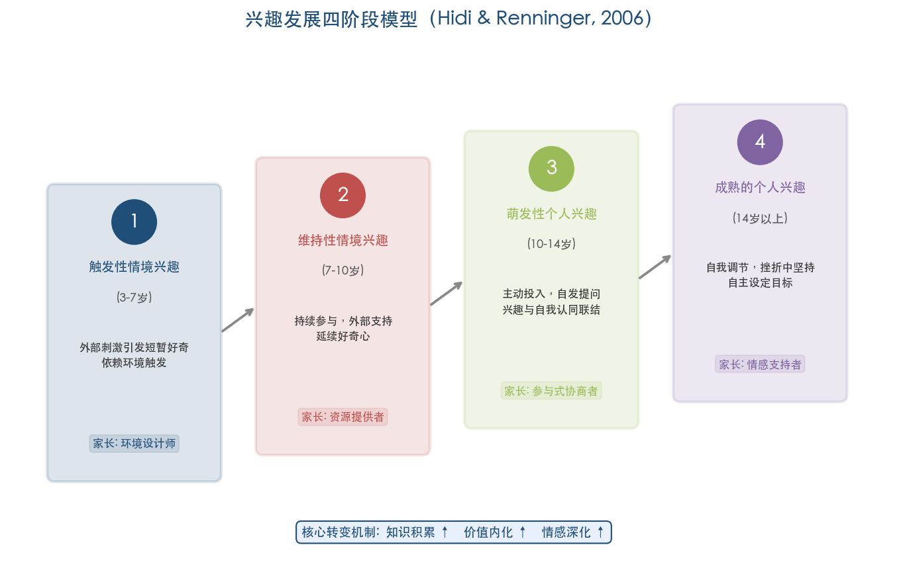

上图呈现了Hidi与Renninger（2006）兴趣发展四阶段模型的完整框架，包括各阶段对应的年龄区间、核心特征、家长角色定位以及贯穿始终的"知识积累—价值内化—情感深化"转变机制。

### 4.1.2 年龄与兴趣发展的关键节点

兴趣发展并非在真空中进行，而是与儿童认知和社会性发展紧密交织。研究表明，约8-10岁时儿童开始将自身能力与同伴进行系统性比较，这一社会比较能力的出现对兴趣维持构成重大挑战——当孩子发现自己在某个领域"不如别人"时，兴趣可能急剧下降。此时需要差异化的支持策略来帮助他们坚持尚处于起步阶段或感到落后的活动[Renninger & Su, 2012](https://works.swarthmore.edu/context/fac-education/article/1050/viewcontent/fac_education_51.pdf "年龄对兴趣发展方式的影响")。

Frenzel等（2010）对德国3193名5至9年级学生的纵向追踪进一步揭示了一个值得警醒的规律：学科兴趣整体随学段上升而下降，且学业竞争压力越大，下降幅度越陡峭。即便是经过精心培育的兴趣，在应试压力下也可能逐渐萎缩。学习者的元认知意识——即对自身兴趣和学习过程的反思能力——是兴趣能否维持的关键调节变量[Renninger & Su, 2012](https://works.swarthmore.edu/context/fac-education/article/1050/viewcontent/fac_education_51.pdf "引用Frenzel等2010纵向研究")。

年幼儿童（尤其是10岁以下）更依赖外部触发来产生兴趣，而青少年和成年人逐渐发展出"自我生成兴趣"的能力——即在缺乏外部刺激的情况下，仍能主动在一个领域中发现价值和乐趣。这一发现为分学段的兴趣引导策略提供了重要依据：对低学段儿童应注重提供丰富的"触发"环境，对高学段青少年则应更多关注价值引导和自主选择空间的拓展。

## 4.2 广泛探索还是早期专精：来自实证研究的回答

### 4.2.1 "一万小时定律"的挑战

关于儿童应尽早专注于某一领域还是广泛尝试不同活动，长期以来存在两种对立的理论主张。Ericsson等人（1993）的"刻意练习"理论认为，卓越表现是特定领域大量刻意练习的单调递增函数，起步越早、积累越多，最终水平越高。这一观点经由Malcolm Gladwell的"一万小时定律"广泛传播，深刻影响了全球家长的教养决策。

然而，Güllich、Macnamara与Hambrick（2021）发表在《Perspectives on Psychological Science》上的一项里程碑式荟萃分析，对上述假说提出了系统性挑战。该研究汇集51项国际研究中477个效应量，涵盖6096名运动员（其中772名世界级顶尖运动员），全面考察了早期专业化与多元化参与对竞技表现的预测效应[Güllich et al., 2021](https://journals.sagepub.com/doi/abs/10.1177/1745691620974772 "Perspectives on Psychological Science, 2021")。

研究揭示了三个核心发现：

**第一，世界级成年运动员在童年和青少年期参与了更多的多运动项目训练**（教练指导下的其他运动训练：d=0.52, 95% CI [0.36, 0.68], p<.001），进入主项运动的时间更晚，在主项中积累的训练量更少（d=-0.27, 95% CI [-0.46, -0.09], p=.004），且早期进步速度低于国家级运动员。

**第二，青少年阶段表现优秀的运动员，其发展模式与成年世界冠军恰恰相反**：他们更早开始主项训练（d=-0.28, p=.004），在主项中积累更多训练量（d=0.46, p<.001），但多运动训练经历较少。换言之，早期专业化确实能带来短期的青少年阶段优势，但这种优势无法延续至成年高水平竞技。

**第三，无论在主项还是其他运动中，儿童自发的非正式游戏（youth-led play）对最终竞技水平几乎没有预测效应**；真正具有预测意义的是教练指导下的多运动系统训练。

上述发现在不同运动类型中表现出高度一致性——无论是计量型运动（田径、游泳）、对抗型运动（柔道、摔跤）、球类运动（足球、篮球）还是艺术类运动（体操、花样滑冰），同样的模式均得到了重复验证。

### 4.2.2 Côté发展模型：采样期、专项期与投入期

与Güllich等人的荟萃分析发现高度一致，Côté等人提出的"运动参与发展模型"（DMSP）将青少年运动发展划分为三个阶段[Côté et al., 2009](https://issponline.org/wp-content/uploads/To_Sample_or_to_Specialize.pdf "ISSP Position Stand, IJSEP 2009, 9:7-17")：

**采样期（约6-12岁）**：此阶段的核心是参与多种运动并开展大量"审议式游戏"（deliberate play）。通过不同运动的体验，儿童得以发展广泛的身体、认知和社交技能基础。国际运动心理学会（ISSP）立场声明明确指出："早期多样化参与不会阻碍在成熟后达到高峰的运动项目中的精英运动参与。"

**专项期（约13-15岁）**：运动项目数量开始缩减，训练强度和竞赛投入逐步增加。这一阶段对应着青少年心理发展中同一性探索和能力认知成熟的关键期。Horn和Harris（2002）指出，约12-13岁时儿童才能充分理解努力、练习和能力对表现的差异化影响。

**投入期（约16岁以后）**：青少年在生理、认知、社交和情感维度上均达到可承受高强度专项训练的成熟度。Soberlak与Côté（2003）对职业冰球运动员的回溯研究显示，其总累积训练时长中仅10%来自采样期，56%来自投入期——这一分布进一步印证了"早期广泛体验、后期集中投入"的发展路径。

### 4.2.3 从运动到更广泛领域：Range思维

David Epstein（2019）在《Range: Why Generalists Triumph in a Specialized World》中将运动科学的上述发现推广到更广泛的知识与创造领域。他论证指出，在复杂且不可预测的"wicked"问题环境中（如科学研究、商业创新、艺术创作），广泛经验和晚期专业化通常优于早期专业化[Wikipedia: Range](https://en.wikipedia.org/wiki/Range:_Why_Generalists_Triumph_in_a_Specialized_World "2019年出版")。

Güllich等人（2021）的研究亦呼应了这一观点：科学领域存在类似模式——德国诺贝尔奖得主中42位（共48位）拥有跨学科学习或工作经历；与Leibnitz奖（德国最高国家科学奖）得主相比，诺贝尔奖得主获得学生奖学金的概率更低，获得正教授职位和获奖所需时间更长。早期多学科经历与渐进的初始进步相关联，但却与卓越表现的长期可持续性更强地关联在一起。

这些发现对中国家庭的启示尤为重要：在"赢在起跑线"的文化焦虑下，过早将孩子锁定在单一赛道上，不仅可能牺牲长期的卓越潜力，还可能因伤病、倦怠和动机衰减而缩短参与寿命。更为健康的发展路径是在12-13岁之前鼓励多元尝试，此后再根据孩子的兴趣取向和能力特征逐步聚焦。

## 4.3 内在动机的保护：自我决定理论的启示

### 4.3.1 三种基本心理需要

如果说兴趣发展四阶段模型解释了兴趣"如何"发展，那么Ryan与Deci（2000）的自我决定理论（Self-Determination Theory, SDT）则回答了兴趣"为何"得以维持或消亡这一核心机制问题。SDT的基本命题是：人类存在三种基本心理需要——自主性（autonomy）、胜任感（competence）和关联感（relatedness）。当这三种需要得到满足时，个体表现出更强的内在动机、更优的自我调节能力和更高的心理健康水平[Ryan & Deci, 2000](https://selfdeterminationtheory.org/SDT/documents/2000_RyanDeci_SDT.pdf "American Psychologist, 55(1), 68-78")。

**自主性**并非等同于完全的"自由放任"，而是指个体感到自身行为出于自愿选择而非被迫。在兴趣培养语境中，这意味着孩子应当感受到"我选择学钢琴"而非"妈妈让我学钢琴"。研究表明，支持自主性的教师使学生表现出更强的内在动机，而控制性教学方式——如强制性要求、条件性奖励、频繁的外部评价——则显著降低学习效果，尤其在需要概念性和创造性加工的任务中[Ryan & Deci, 2000](https://selfdeterminationtheory.org/SDT/documents/2000_RyanDeci_SDT.pdf "SDT中自主性支持的研究证据")。

**胜任感**指个体在与环境互动时体验到的有效性和掌控感。兴趣的深化离不开一系列"恰到好处"的挑战——既不至于简单到无聊，也不至于困难到绝望。Bandura的自我效能感研究（详见第5章）为此提供了更具体的操作框架。

**关联感**指个体在社群中感受到的归属与联结。孩子在兴趣班中与志同道合的同伴建立友谊，与欣赏他们进步的教练形成信任关系，这些社会联结本身就是兴趣得以维持的重要动力。

### 4.3.2 外在奖励的"挤出效应"

SDT框架中最具实践意义、也最值得家长警醒的发现之一，是外在奖励对内在动机的系统性损害——即"过度理由效应"（overjustification effect）。

Lepper、Greene与Nisbitt（1973）的经典实验首次对这一效应进行了系统验证。研究者将对画画具有内在兴趣的幼儿园儿童分为三组：预期奖励组（事先告知画好即有奖品）、意外奖励组和无奖励组。结果表明：1-2周后，预期奖励组自主选择画画的时间比例显著低于无奖励组（8.59%对比16.73%），画作质量评分亦更低（2.18对比2.85分）。仅仅是预先承诺的外在奖励，便将孩子对画画的内在兴趣削弱了近一半[Lepper et al., 1973](https://www.heartofcharacter.org/wp-content/uploads/Undermining_Childrens_Intrinsic_Interest_with_Ext-1.pdf "JPSP, 28(1), 129-137")。

Deci、Koestner与Ryan（1999）对128项研究的荟萃分析进一步量化了这一效应的广度与深度。与参与行为挂钩的奖励（engagement-contingent）、与完成任务挂钩的奖励（completion-contingent）和与表现水平挂钩的奖励（performance-contingent）均显著削弱内在动机，效应量分别为d=-0.40、d=-0.36和d=-0.28。尤其值得关注的是，**外在奖励对儿童内在动机的损害效应大于对大学生的损害效应**，表明年幼儿童在认知上更容易将外在奖励解读为行为的"原因"，从而替代原有的内在兴趣[Deci et al., 1999](https://pubmed.ncbi.nlm.nih.gov/10589297/ "Psychological Bulletin, 125(6), 627-668")。

然而，荟萃分析也揭示了一个重要的例外：**正向的言语反馈能够显著增强内在动机**（d=0.33）。这一发现为家长和教师提供了明确的行动指南——以具体而真诚的过程性表扬（"你在这幅画中尝试了很多新的色彩搭配，说明你一直在观察和思考"）取代物质性奖励或结果性评价（"考了第一名就给你买iPad"），是保护内在动机最有效的日常策略。

### 4.3.3 自主性支持型教养：引导与放手的平衡

SDT在亲子教育领域的研究表明，父母的自主性支持与儿童的自我调节及学业能力密切相关。Grolnick与Ryan（1989）的研究发现，自主性支持、适度参与和清晰结构提供三者的有机结合，最有利于儿童发展出健康的内在动机取向。相反，接触控制型照料的青少年更可能发展出物质主义价值取向，而受到良好养育的孩子则更重视个人成长和内在目标[Ryan & Deci, 2000](https://selfdeterminationtheory.org/SDT/documents/2000_RyanDeci_SDT.pdf "引用Grolnick & Ryan 1989, Kasser et al. 1995")。

在实践层面，自主性支持型教养可以体现为：在选择兴趣班时提供2-3个选项让孩子参与决策；在孩子想放弃时先探究原因，而非立即强制坚持或即刻同意放弃；承认孩子的感受（"我知道练琴有时候很枯燥"）而非否定其情绪。其核心在于，在设定必要行为边界的同时，最大限度地保留孩子的自主选择空间。

## 4.4 中国家庭兴趣培养的现实图景

### 4.4.1 "双减"后校外培训结构的重塑

2021年"双减"政策实施后，校外教育培训格局发生了深刻的结构性变化。中国儿童中心2023年全国调查（32252份有效样本）揭示了一幅复杂的图景：一方面，校外非学科类培训参与率显著上升——小学阶段从2021年的52.6%升至2022年的61.7%，初中从19.3%升至25.1%。分类来看，体育特长类增幅最高（+5.5个百分点），其次是文化艺术类（+3.9个百分点）和科技兴趣类（+2.6个百分点）[中国儿童中心](https://www.ccc.org.cn/art/2024/7/9/art_52_224477.html "2024年报告")。

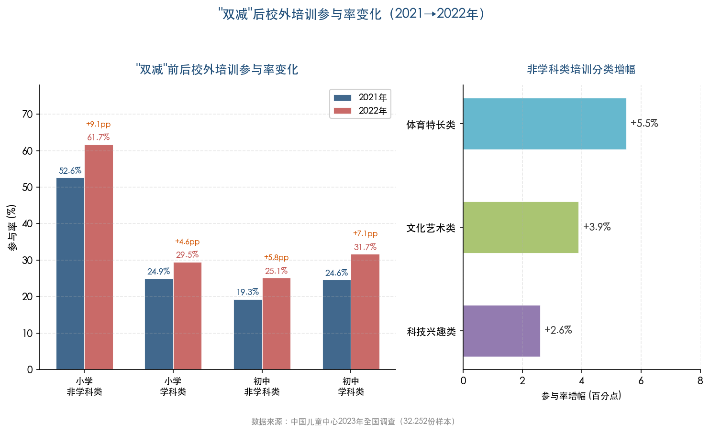

上图对比展示了2021年与2022年小学和初中阶段校外培训参与率的变化，以及非学科类培训三大分类的增幅排名。数据来源为中国儿童中心2023年全国调查（32252份样本）。

另一方面，校外学科类培训参与率不降反升：小学从24.9%升至29.5%，初中从24.6%升至31.7%。更值得关注的是，低收入家庭退出学科培训的比例（14.5%）高于全国平均水平（11.8%），而高收入家庭的教育支出基本未受影响[中国儿童中心](https://www.ccc.org.cn/art/2024/7/9/art_52_224477.html "家庭教育报告")。这一分化表明，"双减"政策在客观上可能加剧了教育资源获取的阶层差异，也凸显了政策传导在不同社会群体中的不均衡效应。

### 4.4.2 升学焦虑对兴趣培养的侵蚀

中国儿童中心的调查还揭示了家长教育期望与兴趣培养之间的深层张力：90.8%的受访家长期望孩子学历达本科及以上，其中四分之一期望博士学位；44.8%的家长对升学结果感到非常或比较焦虑。数据分析显示，焦虑程度越高的家长，越倾向于支持学科培训，越不倾向于支持非学科类兴趣培训[中国儿童中心](https://www.ccc.org.cn/art/2024/7/9/art_52_224477.html "家庭教育报告")。

这一发现与兴趣发展的科学规律形成了尖锐矛盾。从兴趣发展四阶段模型来看，初中阶段正是从"维持性情境兴趣"向"萌发性个人兴趣"过渡的关键时期——此时孩子开始将兴趣与自我认同建立联结。然而在升学焦虑的驱使下，大量家庭恰恰在这一关键阶段撤回对兴趣活动的支持，转向强化学科补习，导致兴趣培养在升学压力下发生显著异化。

### 4.4.3 家庭教育支出的结构与压力

北京大学中国教育财政科学研究所（CIEFR）基于全国家庭调查数据显示，2018-2019学年全国家庭教育支出平均为1.13万元/户，城镇家庭1.42万元是农村家庭8205元的1.7倍。从学前到大学本科阶段，单个孩子的家庭教育支出合计约23.3万元。全国各学段家庭教育支出总规模约2.16万亿元，相当于2018年GDP的2.4%[北京大学CIEFR](https://ciefr.pku.edu.cn/cbw/kyjb/4550639e6d7d4bdeb84fbd1e70ccb3e9.htm "2024年第1期简报")。

在如此巨大的经济投入下，家长对教育"回报"的期待自然水涨船高。中国儿童中心调查显示，70.4%儿童的日常主要照料人是母亲，55.9%的学习辅导由母亲承担。城市中产家庭出现了"母职经纪人化"现象——母亲承担起统筹规划孩子学习与课外活动的"经纪人"角色。超过三分之二的家长表示经常表扬、讲道理、鼓励独立思考，但升学焦虑驱使他们将培训视为实现高期望的工具，而非孩子自主发展的支持手段[中国儿童中心](https://www.ccc.org.cn/art/2024/7/9/art_52_224477.html "2024年报告")。这一矛盾折射出当前中国家庭教育中"理念认同"与"行为选择"之间的深层脱节。

## 4.5 分学段的兴趣培养策略框架

综合兴趣发展理论、自我决定理论框架、广泛探索的实证证据以及中国家庭的现实约束，本节为不同学段提出兴趣培养的策略建议。

### 4.5.1 学前至小学低段（3-8岁）：以"触发"为核心的广泛体验期

此阶段对应兴趣发展的第一、第二阶段（触发性与维持性情境兴趣），亦是Côté模型中"采样期"的起始阶段。核心策略包括：

- **提供多样化的环境触发**：绘画、音乐、体育、自然观察、手工、戏剧等多元活动均可尝试，无需过早锁定方向。如前所述，年幼儿童更依赖外部触发来产生兴趣，此阶段的广度远比深度重要。
- **以游戏和自由探索为主要形式**：Côté等人的DMSP模型强调，采样期应以"审议式游戏"（deliberate play）为主——即儿童主导、基于乐趣的活动形式，而非高度结构化的专项训练。
- **避免结果导向评价**：不以考级、获奖作为活动目标。Lepper等人（1973）的实验已证明，对这一年龄段的儿童，预期性外在奖励会显著削弱内在兴趣。正向的过程性反馈（"你今天搭的积木比昨天高了好多，是怎么做到的？"）是更为有效的激励方式。
- **接纳频繁更换的正常性**：此阶段孩子的"三分钟热度"是正常的发展特征，而非品格缺陷。每一次短暂的尝试都在帮助孩子积累经验、拓展能力基础。

### 4.5.2 小学高段（9-11岁）：从触发到维持的过渡期

此阶段对应兴趣发展的第二至第三阶段转换，是社会比较能力出现、兴趣面临"存活筛选"的关键节点。核心策略包括：

- **从"广度"逐步向"广度+适度深度"过渡**：活动项目可从5-6种逐步缩减到2-3种，在保持适当多元性的同时，鼓励在1-2个方向上投入更多时间和努力。
- **应对社会比较带来的挫败感**：8-10岁儿童开始意识到"我画得不如同桌好"，此时家长需要帮助孩子区分"比较性评价"和"进步性评价"，将关注点引向个人成长而非排名。这与第5章讨论的成长型心态培养紧密关联。
- **引入适度的结构和目标**：可开始设定阶段性小目标（如完成一首完整的曲子、参加一次社区展示），但目标应由孩子参与制定，以维护其自主性需要。
- **关注胜任感的持续建立**：提供"略高于当前水平"的适当挑战，使孩子持续体验到进步和掌控感。

### 4.5.3 初中阶段（12-14岁）：专项期的启动与兴趣身份认同

此阶段对应兴趣发展的第三阶段（萌发性个人兴趣），亦是Côté模型中"专项期"的开端和Erikson心理社会发展理论中"同一性vs.角色混乱"的前奏。核心策略包括：

- **尊重孩子的选择权**：Horn和Harris（2002）指出，12-13岁时儿童已能充分理解努力、练习和能力对表现的差异化影响，此时孩子对"继续还是放弃"某项活动的判断应当被更加认真地对待。
- **抵制"兴趣让位于升学"的冲动**：尽管学业压力客观加大，但从兴趣发展规律来看，这恰恰是兴趣与自我认同开始联结的关键时期。此时中断兴趣活动，其代价可能远超节省下来的学习时间——中国儿童中心的数据已显示，进入初中后文体才艺培训参与率显著下降。
- **引导从"喜欢做"到"理解为什么喜欢"**：帮助孩子发展对自身兴趣的元认知意识——例如"我喜欢编程，是因为创造新东西的感觉让我兴奋"。这种反思能力是兴趣能否从情境性升级为个人性的关键因素。
- **寻找学业与兴趣的协同点**：帮助孩子发现兴趣与学科学习之间的内在联系，例如编程与数学逻辑、绘画与几何空间、音乐与物理声学之间的知识迁移。

### 4.5.4 高中阶段（15-18岁）：投入期与战略性平衡

此阶段对应兴趣发展的第三至第四阶段过渡（从萌发到成熟），亦是Côté模型中的"投入期"。核心策略包括：

- **接受"战略性收缩"**：高中学业负担客观增大，将兴趣活动从3项缩减到1-2项是合理的调整。关键不在于活动数量，而在于所保留的活动是否仍能提供自主性、胜任感和关联感的满足。
- **将兴趣与未来方向探索相联结**：此阶段的兴趣活动可更多地与职业探索、自我认知相结合。一个在高中阶段对生物学保持深度兴趣的学生，其探索本身就构成了职业启蒙的一部分（详见第5章）。
- **支持在挫折中的坚持**：成熟个人兴趣的标志是面对困难仍能坚持。此时家长的角色不再是提供外部推动力，而是在孩子遇到瓶颈时提供情感支持和资源协助。
- **为兴趣保留"不可挤占"的时间**：即使在高考备战期，每周保留2-3小时投入自己真正热爱的活动，不仅不会拖累学业（第3章的证据表明适度休闲活动有利于学习效率），还有助于维持心理健康和生活意义感。

## 4.6 应对常见难题：频繁更换、瓶颈期与家长角色

### 4.6.1 频繁更换兴趣：何时坚持，何时放手

孩子频繁更换兴趣是许多家长的焦虑来源。基于兴趣发展理论，需要区分两种本质不同的情况：

**正常的探索性更换**：尤其在10岁以前，孩子在不同活动间的快速切换是采样期的正常表现。每次尝试都在帮助孩子积累对不同领域的认知、建立多元的技能基础，并逐步明确"我更喜欢什么"。Güllich等人（2021）的荟萃分析已表明，童年期的多运动参与经历与成年后更高水平的卓越表现呈正相关。

**因逃避困难而退出**：当孩子在进入学习平台期——即需要更多努力才能看到进步的阶段——时要求放弃，可能反映的是对挫折的回避而非真正的兴趣消退。此时适度的鼓励和坚持是有价值的，但"适度"的关键在于：坚持的理由应指向孩子自身的目标和价值（"你之前说过想在学校音乐会上演奏"），而非家长的外在期望（"我们已经花了这么多钱"）。

一个实用的判断框架是：如果孩子在活动过程中——而非仅在结果评价时——持续表现出消极情绪和抗拒，且持续时间超过一个合理的适应期（通常为4-8周），那么尊重其选择往往是更明智的做法。

### 4.6.2 瓶颈期的应对

几乎所有兴趣的深化都会经历"瓶颈期"——进步放缓、成就感下降、动力减退的阶段。从自我决定理论的视角看，瓶颈期往往意味着胜任感需要受到暂时性挫伤。有效的应对策略包括：

- **重新设定目标粒度**：将大目标分解为更小的、可感知进步的阶段性目标。当"弹会整首奏鸣曲"变得遥不可及时，"这周把第二乐章的引子弹流畅"便是一个能够重建胜任感的替代目标。
- **改变练习方式而非增加练习量**：第2章讨论的交错练习和检索练习策略同样适用于兴趣技能的学习——例如在钢琴练习中穿插不同作品的片段，或在绘画练习中交替进行临摹与自由创作。
- **寻找同伴和社群支持**：关联感是穿越瓶颈期的重要心理资源。与同样在学习该项技能的同伴交流心得、互相鼓励，或了解该领域杰出实践者的成长故事，都有助于恢复投入的动力。

### 4.6.3 家长角色的动态调整

随着孩子年龄增长，家长在兴趣培养中的角色应当经历从"安排者"到"支持者"再到"顾问"的渐进转变：

- **低学段（3-8岁）**：家长担任主要的"环境设计师"和"资源提供者"——负责创造丰富的体验机会、选择合适的活动环境、细心观察孩子的自然倾向。
- **中学段（9-12岁）**：家长转变为"参与式协商者"——在尊重孩子偏好的基础上提供经验建议、帮助分析利弊，同时将最终决策权逐步向孩子转移。
- **高学段（13岁以上）**：家长成为"后勤支持者和情感港湾"——提供必要的时间、资金和精力支持，在孩子遇到挫折时给予情感支撑，但不再主导方向选择。

Grolnick与Ryan（1989）的研究提示，这种角色转变的核心原则始终不变：高自主性支持、适度参与、清晰结构。无论处于哪个阶段，"控制型"教养方式——通过胁迫、条件性奖惩或情感操控来驱动孩子——都会系统性地损害内在动机和自我调节能力。

## 4.7 小结：兴趣培养的核心原则

综合本章的理论分析与实证证据，兴趣培养的核心原则可归纳为以下五点：

**第一，兴趣是动态发展的过程，而非固定不变的天赋。** 从触发到成熟需要经历四个阶段，每个阶段都需要与之匹配的环境支持。家长的任务不是"发现天赋"，而是创造条件让兴趣有机会萌芽和成长。

**第二，早期广泛探索优于早期专精。** 涵盖6096名运动员的荟萃分析和科学家传记研究均表明，多元化的早期经验为长期卓越奠定了更坚实的基础。"赢在起跑线"的思维模式可能恰恰导致"输在终点线"的结果。

**第三，保护内在动机是兴趣培养的核心任务。** 满足自主性、胜任感和关联感三种基本心理需要，避免以外在物质奖励替代内在动力，以过程性表扬替代结果性评价——这些原则适用于所有年龄段的儿童青少年。

**第四，学业与兴趣并非零和博弈。** 高质量的兴趣投入有助于培养元认知能力、自我调节能力和心理韧性，这些能力反过来亦能促进学业表现。在升学压力下完全牺牲兴趣活动，可能同时损害学业动力和心理健康。

**第五，家长角色应随孩子成长而动态调整。** 从环境设计师到参与式协商者再到情感支持者，核心原则始终是维持高自主性支持、适度参与和清晰结构的教养方式。

# 第5章 目标与方向——自我认知、职业启蒙与价值观引导

从兴趣的探索与坚持迈向人生目标的确立，是儿童青少年成长历程中一次质的跃迁。前一章探讨了如何帮助孩子发现并培养兴趣爱好，而本章聚焦的核心命题在于：孩子如何在不断积累的经验中认识自己、理解世界，进而形成与自身特点相匹配的阶段性目标和长远方向。这一过程涉及四个相互交织的维度——自我认知的逐步深化、职业世界的初步触达、价值观体系的内在建构，以及科学的目标设定与管理能力。本章将依次展开讨论，并在最后提供一个整合性的分学段发展框架。

## 5.1 自我认知的发展阶梯：从"我能做什么"到"我是谁"

### 5.1.1 Erikson心理社会发展理论的两个关键阶段

理解儿童青少年如何建立自我认知，须回到发展心理学的经典理论框架。Erikson的心理社会发展理论（psychosocial development theory）将人的一生划分为八个阶段，其中与中小学年龄段直接相关的两个阶段构成了自我认知发展的主线。

**第四阶段"勤奋感对自卑感"**（industry vs. inferiority）对应6-11岁的小学阶段。在这一时期，儿童进入学校体系，开始在学业、社交和技能活动中发展能力感。当孩子通过努力成功完成任务——无论是解出一道数学题、学会一首曲子还是在运动会上取得名次——他们逐渐形成"我是有能力的"这一积极自我概念，即"勤奋感"。相反，若持续遭遇失败或来自环境的否定性评价，儿童则容易产生自卑感，认为自己"不够好"[StatPearls综述](https://www.ncbi.nlm.nih.gov/books/NBK556096/ "2026年更新版Erikson发展阶段")。这一阶段的核心教育启示在于：小学阶段的教育和养育应当为孩子创造多元的"成功体验"，而非将评价标准收窄至学业成绩的单一维度。

**第五阶段"同一性对角色混乱"**（identity vs. role confusion）对应青春期，核心发展任务是形成稳定的自我同一性（ego identity）——即对"我是谁""我想成为什么样的人""我持有什么样的信念"等根本性问题形成连贯而清晰的回答。纵向研究证据表明，在成年早期完成同一性整合的个体，在亲密关系建立、社会贡献和个人完整性等方面均表现出更高水平；但"延迟完成"者亦可通过后续人生经验逐步追赶[StatPearls综述](https://www.ncbi.nlm.nih.gov/books/NBK556096/ "引用Mitchell et al. 2021纵向研究")。换言之，青春期是同一性探索的关键窗口，但并非唯一机会。

### 5.1.2 四种同一性状态与青少年心理健康

在Erikson理论基础上，Marcia进一步提出了四种自我同一性状态，为理解青少年的自我探索过程提供了更精细的分析框架。这四种状态由"探索程度"和"承诺程度"两个维度交叉界定：

- **同一性达成**（identity achievement）：经历了深入探索并做出了自主承诺，属于最成熟的同一性状态；
- **同一性早闭**（identity foreclosure）：未经充分探索便做出承诺，通常是接受了父母或权威人物的现成安排；
- **同一性延缓**（identity moratorium）：正处于积极探索之中，尚未做出明确承诺；
- **同一性扩散**（identity diffusion）：既无探索亦无承诺，表现为迷茫和漂移。

Meeus等人（2012）对1313名12-20岁荷兰青少年开展的五波纵向研究为上述模型提供了坚实的实证基础。研究发现，达成者占15.8%、早闭者39.6%、延缓者20.5%、扩散者20.7%。值得关注的是，16-20岁年龄组中同一性达成者的比例显著高于12-16岁组，表明自我同一性的形成在高中至大学阶段加速。在心理健康方面，达成者和早闭者的抑郁症状水平最低，而扩散者的心理风险最高[Meeus等](https://pmc.ncbi.nlm.nih.gov/articles/PMC3394234/ "Journal of Youth and Adolescence, 2012")。

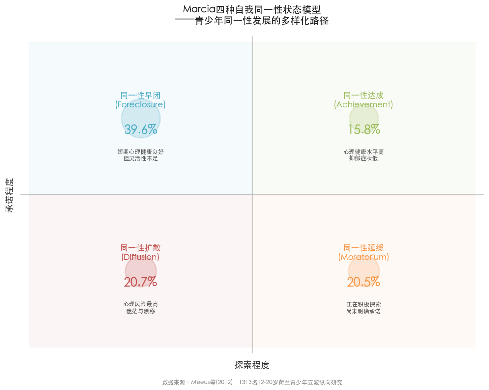

**图5-1 Marcia四种自我同一性状态模型**——以"探索程度"和"承诺程度"为两轴，呈现四种同一性状态的分布及其心理健康特征。数据来源为Meeus等人（2012）对1313名12-20岁青少年的五波纵向研究。

上述发现对中国家长有重要启示。首先，近40%的青少年处于"早闭"状态，意味着他们并非通过自主探索，而是通过接受父母的"预设路径"来获得确定感。虽然早闭者的短期心理健康指标良好，但其自我认知的稳定性和灵活性可能不足——当外部环境发生变化（如大学选专业后发现不感兴趣）时，缺乏自主探索经验的个体更容易陷入危机。其次，约五分之一的青少年处于"扩散"状态，这部分群体需要更为主动的教育引导和心理支持。

### 5.1.3 自我效能感：自我认知的动力引擎

如果说同一性回答的是"我是谁"，那么自我效能感（self-efficacy）回答的则是"我能做到什么"。Bandura（1977）提出，自我效能感来源于四种信息渠道：**成就经验**（最具影响力的来源，直接的成功体验建立自信）、**替代经验**（观察与自己相似的人成功完成任务）、**言语说服**（来自重要他人的鼓励和肯定）和**情绪唤起**（生理和情感状态的调节）。高自我效能感者倾向于设定更高的目标，面对挑战时表现出更强的坚韧性，并能更快地从挫折中恢复[APA综述](https://www.apa.org/research-practice/conduct-research/self-efficacy-human-agency "APA 2025年Breakthrough Research系列")。

在青少年发展领域，自我效能感的预测力已获得充分验证。Tsang等人（2012）的综述研究指出，自我效能感是预测青少年学业领域选择、大学专业和未来职业方向的关键变量。Catalano等人（1998）对25个经过严格评估的积极青少年发展项目的审查发现，每个有效项目都包含促进自我效能感的组成部分。研究同时强调，自我效能感的培养需要"年龄、性别、任务和文化特定"的策略——不存在放之四海而皆准的通用方案[Tsang等](https://pmc.ncbi.nlm.nih.gov/articles/PMC3351108/ "The Scientific World Journal, 2012")。

对于家长而言，培养孩子自我效能感的核心原则可归纳为四点：提供适度挑战的任务（"跳一跳够得着"），及时给予过程性肯定而非结果性评价，鼓励孩子观察和学习同伴的成功策略，以及帮助孩子管理焦虑情绪而非回避困难情境。

## 5.2 职业启蒙与生涯教育：打开认识世界的窗口

### 5.2.1 Super生涯发展理论与"成长阶段"

帮助孩子建立人生目标方向，并不意味着在小学阶段就要求他们"确定将来要做什么职业"。生涯发展理论的奠基人Super提出，0-14岁属于职业发展的"成长阶段"（growth stage），其核心特征是"发展自我概念、态度、需要和对工作世界的一般认识"。在Super的理论框架中，自我概念随时间和经验不断变化，职业发展是贯穿一生的动态过程[Careers New Zealand](https://www.careers.govt.nz/assets/pages/docs/career-theory-model-super.pdf "Super理论权威概述")。

换言之，中小学阶段的职业启蒙教育，其目标并非"选定职业"，而是帮助孩子了解职业世界的丰富性、建立对不同工作的基本认知，并将这些认知与自身的兴趣和能力初步对接。这一逻辑与前一章所讨论的兴趣发展四阶段模型高度契合——兴趣的广泛探索正是职业认知建构的重要途径。

### 5.2.2 中国职业启蒙教育的政策框架与实践现状

中国的职业启蒙教育已建立起相对完整的政策框架。教育部2017年印发的《中小学综合实践活动课程指导纲要》将"职业体验"纳入四大活动方式之一，要求自小学一年级至高中三年级全面实施，课时安排上小学1-2年级每周不少于1课时、3-6年级和初中每周不少于2课时[教育部纲要](http://www.moe.gov.cn/srcsite/A26/s8001/201710/t20171017_316616.html "2017年")。国务院2019年《国家职业教育改革实施方案》则鼓励中等职业学校联合中小学开展职业启蒙教育[国务院方案](https://infosharingp2-oss.camet.org.cn/u/cms/www/202306/250928496o4p.pdf "2019年")。

2025年1月，中共中央、国务院印发的《教育强国建设规划纲要（2024—2035年）》进一步明确"以职普融通拓宽学生成长成才通道"的方向，提出"支持普通中小学开展职业启蒙教育、劳动教育"，推动中等职业教育与普通高中教育融合发展[教育部官网](http://www.moe.gov.cn/jyb_xxgk/moe_1777/moe_1778/202501/t20250119_1176193.html "《教育强国建设规划纲要（2024—2035年）》全文")。2024年度《职业教育改革与发展报告》亦指出，基础教育阶段中小学已普遍结合劳动教育和技术课程建设职业体验基地，开展职业启蒙、职业认知和职业体验活动[央视教育频道](https://edu.cctv.com/2025/01/02/ARTIgeFYruLNPDfIEbhUABVh250102.shtml "2024职业教育改革与发展报告")。

在政策分层方面，2017年纲要按学段设定了差异化的职业体验目标：小学侧重"职业感知"（通过场馆参观、角色扮演等方式初步接触职业世界）；初中侧重"职业认知"（在发展兴趣专长的同时建立初步生涯规划意识）；高中侧重"职业生涯规划"（根据自身兴趣和专长进行系统规划与选择）[教育部纲要](http://www.moe.gov.cn/srcsite/A26/s8001/201710/t20171017_316616.html "2017年综合实践活动课程指导纲要")。这一分层逻辑与Super理论中成长阶段（0-14岁）向探索阶段（15-24岁）的过渡基本吻合。

然而，政策框架的完善与落地实施之间仍存在显著差距。研究指出，教育部相关文件多停留在原则性倡导层面，缺乏具体的目标、内容与评价标准，各地区多依赖地方性文件与学校自主探索[中学职业探索教育研究](https://pdf.hanspub.org/ve_1722481.pdf "价值、困境与路径分析")。在实践中，许多中小学的"职业体验"活动仍停留在"参观一次消防站""听一场职业讲座"的浅层体验层次，缺乏系统性课程设计和持续性的跟进引导。

### 5.2.3 国际生涯教育经验：芬兰、美国与日本

国际上已有多种经过验证的青少年生涯教育模式，可为中国实践提供有益参照。

**芬兰模式**以其系统性和专业性著称。芬兰7-9年级学生必须完成76学时的强制性生涯教育课程，推行"全校参与"模式——生涯教育并非某一门课的任务，而是全体教师共同参与的育人活动。芬兰的生涯辅导咨询师须持有硕士学位，师生配比约250:1，远高于多数国家水平。2021年芬兰将义务教育延长至12年（18岁），2015年起设立面向30岁以下人群的"一站式指导中心"（One-Stop Guidance Centres），提供教育、就业和社会服务的综合指导[OECD报告](https://www.oecd.org/content/dam/oecd/en/about/projects/edu/career-readiness/Finland-Access-to-Guidance-Counsellors-and-One-Stop-Guidance-Centres.pdf/_jcr_content/renditions/original./Finland-Access-to-Guidance-Counsellors-and-One-Stop-Guidance-Centres.pdf "OECD Career Readiness项目")。

**美国**的学校咨询师协会（ASCA）在2024年修订的立场声明中明确提出，职业教育应从幼儿园开始，从学前教育至三年级（pre-K–3）即向学生介绍职业世界[ASCA声明](https://www.schoolcounselor.org/Standards-Positions/Position-Statements/ASCA-Position-Statements/The-School-Counselor-and-Career-Development "2024年修订版")。**日本**文部科学省（MEXT）则推行小学阶段的"职场参观"、中学阶段为期5天的"职场体验"实习，并自2009年起建立贯穿K-12的"Career Passport"生涯档案制度，帮助学生持续积累和反思自身的职业探索经历。

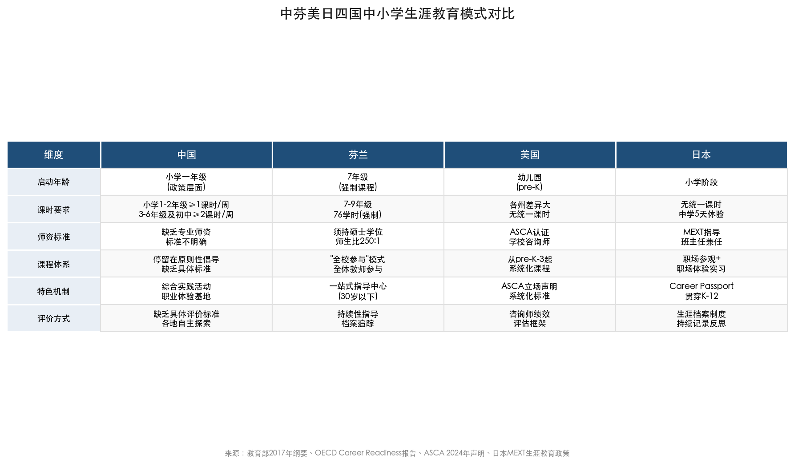

**图5-2 中芬美日四国中小学生涯教育模式对比**——从启动年龄、课时要求、师资标准、课程体系、特色机制和评价方式六个维度对比四国模式差异。

综合比较，四国经验共同揭示了有效生涯教育的几项核心要素：**早期启动**（从小学甚至幼儿园开始）、**系统化课程**（非一次性活动）、**专业化师资**（经过系统培训的生涯教育教师或咨询师）和**持续性记录**（生涯档案或成长记录）。这些要素在中国目前的实践中均有不同程度的短板，尤其是专业师资的匮乏和系统课程的缺位，是制约生涯教育质量提升的主要瓶颈。

## 5.3 价值观的形成与引导：在多元时代寻找稳定锚点

### 5.3.1 当代中国青少年的价值观图景

在信息过载和价值多元的时代，帮助孩子形成稳定积极的价值观体系是一项既紧迫又复杂的教育任务。盛小敏与魏军（2025）基于全国13973名青少年的调查，从学习与娱乐、家长与师长、同伴与集体、国家与世界、生态与环保五个维度全面描绘了当代青少年的价值观图景。研究发现，当代青少年的价值观呈现传统、现代与后现代三种取向的交织共存格局——青少年普遍认同后现代价值观（如个体自主、多元包容），同时在不同社会情境中对传统与现代价值观的认同存在差异化表达[盛小敏与魏军](https://se.tsinghua.edu.cn/info/1132/1932.htm "教育研究, 2025, 46(01), 70-80")。

这一发现揭示了一个重要事实：当代青少年的价值取向并非简单的"传统"或"叛逆"的二元对立，而是在多重文化语境中的动态整合。家长和教育者须认识到，试图用单一的价值框架"灌输"给孩子，不仅效果有限，甚至可能引发逆反心理。更有效的路径是在日常生活的具体情境中，通过对话、讨论和共同体验，帮助孩子在面对价值冲突时发展出批判性思考和自主判断的能力。

### 5.3.2 价值观引导的教育路径

价值观的形成并非一次性的"灌输"，而是在日常经历中逐步内化的过程。综合自我决定理论（SDT）和Erikson同一性理论的启示，有效的价值观教育应遵循以下四项原则：

**第一，尊重自主性。** Ryan与Deci（2000）的自我决定理论表明，当个体的自主性需要得到满足时，外在价值规范更容易被内化为内在信念[Ryan & Deci, 2000](https://selfdeterminationtheory.org/SDT/documents/2000_RyanDeci_SDT.pdf "American Psychologist, 55(1), 68-78")。强制性的价值灌输往往导致表面顺从而内心抵触。家长应鼓励孩子在面对道德和价值议题时表达自己的想法，通过平等对话而非权威压制来引导价值取向。

**第二，提供结构性支持。** 自主性并不等同于放任。孩子需要一个清晰的价值参照框架来理解世界的复杂性。家长通过自身行为示范、家庭规则的一致性执行以及对重大社会事件的共同讨论，为孩子提供价值判断的"脚手架"。

**第三，关注关联感。** 价值观的内化与孩子在家庭和社群中的归属感密切相关。感受到温暖、被接纳、与家人有情感连接的孩子，更容易认同家庭所传递的积极价值观，而非仅在压力下被动接受。

**第四，创造体验式学习机会。** 相比抽象的说教，具体的社会参与经验（如志愿服务、社区实践、文化活动）更能有效促进价值观的内化。前述日本的"职场体验"制度和芬兰的"全校参与"模式之所以有效，一个重要原因在于它们将价值观教育嵌入了真实的社会情境之中。

## 5.4 成长型心态与目标设定：将自我认知转化为行动

### 5.4.1 成长型心态：关于能力的根本信念

Dweck的成长型心态理论（growth mindset theory）提出，个体对自身能力是否可以通过努力改变的根本信念，深刻影响着其学习行为和目标设定方式。持固定型心态者倾向于认为智力和才能是天生不变的，因此更易设立"表现目标"（追求证明自己聪明）而回避挑战；持成长型心态者则相信能力可以通过努力发展，更倾向于设立"学习目标"（追求掌握和进步）并将失败视为学习机会[Dweck & Yeager, 2019](https://pmc.ncbi.nlm.nih.gov/articles/PMC6594552/ "Perspectives on Psychological Science")。

大规模实验证据有力支持了成长型心态干预的有效性。Yeager等人（2019）在Nature发表的全国性随机对照实验中，对美国超过14000名九年级学生实施了两次各25分钟的在线成长型心态干预。结果显示，干预使低成就学生的GPA提高了约0.10个绩点，"走上毕业轨道"的比率提高了4-8个百分点；即便在高成就学生群体中，干预也显著增强了其挑战寻求行为[Dweck & Yeager, 2019](https://pmc.ncbi.nlm.nih.gov/articles/PMC6594552/ "引用Yeager et al. 2019 Nature研究")。

### 5.4.2 成长型心态在中国情境下的本土化验证

成长型心态理论源于西方文化语境，其在强调勤奋传统的中国文化中是否同样适用，是一个备受关注的理论问题。张军凤与云如先（2025）的一项本土化研究为此提供了积极证据。该研究于2021—2024年在长三角地区一所农村小学开展了为期三年的随机干预实验和追踪调查，对象涵盖四年级和六年级共294名学生。研究团队设计了融入中华文化元素（如"我命由我不由天""天道酬勤""勤能补拙"等传统观念）的本土化成长型思维培养方案，包括SMART目标设定、"学习型"目标训练和同伴过程型反馈等模块。

采用倍差法（DID）评估的结果表明，干预显著提高了农村学生的成长型思维水平（回归系数β=0.612，p<0.001），且效应具有长期持续性。异质性分析进一步发现，干预对年龄越小的学生效果越大（四年级显著优于六年级，交互项β=-0.561，p<0.01），对初始思维水平越低的学生效应越强。在学习行为层面，成长型思维的提升有效抑制了消极学习动机、弱化了能力型归因（"我做不好是因为我笨"）、提高了过程型同伴反馈、并强化了努力型归因（"只要再努力就能进步"）[张军凤与云如先, 2025](https://xbjk.ecnu.edu.cn/CN/10.16382/j.cnki.1000-5560.2025.04.006 "华东师范大学学报（教育科学版）, 43(4), 53-69")。

这项研究的意义体现在三个方面：第一，它证明了成长型心态干预在中国集体主义和勤奋文化背景下同样有效，甚至可以与传统文化中的积极元素形成共振；第二，"越早干预效果越好"的发现支持了在小学阶段即开始系统培养成长型心态的做法；第三，对处境不利群体（如农村、低起点学生）的更大效应，表明成长型心态培养可以成为弥合教育公平差距的有效工具。

### 5.4.3 表扬的艺术：过程导向与结果导向

成长型心态的培养与日常教育中的表扬方式密切相关。Mueller与Dweck（1998）通过六项系列研究证明，对智力的表扬（如"你真聪明"）比对努力或过程的表扬（如"你的思考方式很棒""你在这道题上花了很多功夫"）更容易诱发固定型心态及无助反应。当被表扬"聪明"的孩子遭遇失败时，他们倾向于将原因归结为自身能力不足，从而选择回避挑战[Dweck & Yeager, 2019](https://pmc.ncbi.nlm.nih.gov/articles/PMC6594552/ "引用Mueller & Dweck 1998六项研究")。

这一发现对中国家庭尤为重要。在"别人家的孩子"式的社会比较文化中，家长往往习惯于用"你真棒""你比XXX强多了"来激励孩子，但这些表扬方式实质上是在强化固定型心态和表现目标取向。研究证据表明，有效的表扬应聚焦于努力过程、策略运用和进步幅度，而非天赋或结果排名。

## 5.5 科学的目标设定：从理论到实践

### 5.5.1 目标设定理论的核心机制

Locke与Latham（2002）基于35年研究回顾，系统揭示了目标设定影响绩效的核心规律。研究表明，目标难度与绩效之间存在正向线性关系（效应量d=0.52-0.82），具体且具有适度挑战性的目标显著优于"尽力而为"的模糊目标（d=0.42-0.80）。目标通过四种机制影响绩效：**指明方向**（引导注意力集中于目标相关活动）、**激活能量**（更高的目标激发更大的努力）、**增强持久性**（明确目标帮助个体在困难面前坚持）和**促进策略发现**（当常规方法不奏效时，目标推动个体寻找新策略）[Locke & Latham, 2002](https://med.stanford.edu/content/dam/sm/s-spire/documents/PD.locke-and-latham-retrospective_Paper.pdf "American Psychologist经典论文")。

尤为值得注意的是，对于复杂任务（如学习新知识、发展新技能），**学习目标**（"我要掌握这个技能"）比**绩效目标**（"我要达到90分"）更为有效。这是因为复杂任务需要策略探索和反复试错，而绩效目标带来的压力可能导致个体过早放弃有价值的探索。Seijts与Latham（2001）的实验进一步发现，明确分配学习目标可以"中和"个体固有的表现目标取向效应[Locke & Latham, 2002](https://med.stanford.edu/content/dam/sm/s-spire/documents/PD.locke-and-latham-retrospective_Paper.pdf "引用Seijts & Latham 2001实验")。

### 5.5.2 分学段的目标设定策略

将目标设定理论转化为面向不同年龄段孩子的实操策略，需要结合前文所述的认知发展规律（参见第2章关于工作记忆和元认知发展的讨论）以及自我认知发展阶段的特征。

**小学低段（6-8岁/1-3年级）：具象化的"小目标"**

这一阶段的儿童工作记忆容量有限（约3.5-4个项目），元认知能力尚在萌芽期。目标设定应遵循以下原则：目标要具体、可观察（"每天读15分钟故事书"而非"多读书"）；时间跨度短（以天或周为单位）；目标数量少（每次聚焦1-2个）；完成后给予即时的过程性反馈。此阶段目标设定的重点在于**培养习惯**和**建立成就感**，而非追求高难度的结果。

**小学高段（9-11岁/4-6年级）：初步的自我管理**

8-10岁起，儿童的基本注意聚焦能力趋于成熟，开始具备初步的自我监控能力。此时可以引入简单的目标管理工具，如"目标-行动-检查"三步框架：鼓励孩子参与目标的制定过程（"这学期你想在哪方面进步？"），将长期目标分解为短期里程碑，并通过可视化方式（如进度表、成长记录）追踪进展。张军凤等人的研究中，本土化干预方案在四年级学生中取得最为显著的效果，其中SMART目标设定和"学习型"目标训练是课程的核心模块[张军凤与云如先, 2025](https://xbjk.ecnu.edu.cn/CN/10.16382/j.cnki.1000-5560.2025.04.006 "干预课程设计中的SMART目标模块")，这一年龄段堪称目标设定能力培养的黄金窗口。

**初中（12-14岁/7-9年级）：从"学习目标"到初步规划**

12-14岁是复杂任务准确性趋于稳定、元认知技能快速增长的关键阶段。此时适宜引导孩子区分"学习目标"和"绩效目标"，理解两者的不同心理效应。结合职业启蒙教育，帮助孩子将自我认知（"我擅长什么、喜欢什么"）与目标方向（"我想在哪个领域深入"）初步对接。但应避免过早要求孩子"确定人生方向"——Marcia的研究表明，这一阶段约40%的青少年仍处于同一性的"延缓"或"扩散"状态，探索本身即是这一阶段的核心目标。

**高中（15-18岁/10-12年级）：系统性的生涯规划**

高中阶段的元认知能力基本成熟，自我同一性探索进入关键加速期。此时可以引入更系统的目标管理方法，包括长中短期目标的层级体系、基于自我分析的优势-劣势评估、大学和专业方向的初步探索等。与Super理论中"成长阶段"向"探索阶段"的过渡相一致，这一时期的重点是在保持开放性的同时逐步收敛探索范围，做出初步的方向性选择。

### 5.5.3 目标设定的常见陷阱

在实际养育实践中，目标设定领域存在几个需要警惕的常见问题。

**目标过高或过低。** 目标设定理论明确指出，目标难度与绩效正相关——但前提是个体具备必要的能力和资源。对于中国家庭而言，更常见的问题是目标设定过高：90.8%的受访家长希望孩子学历达本科及以上，四分之一期望博士学位[中国儿童中心](https://www.ccc.org.cn/art/2024/7/9/art_52_224477.html "2024年家庭教育报告")。过高的期望若转化为过高的目标要求，可能使孩子长期处于"目标落差"的挫败感中，反而损害其自我效能感和内在动机。

**绩效目标取代学习目标。** 在"分数至上"的评价文化中，家长和学校往往将"考到多少分""排名前多少名"作为核心目标。Locke与Latham的研究警示，绩效目标在简单重复性任务中固然有效，但在需要深度学习和策略探索的复杂任务中，可能适得其反。

**目标的外部强加与内部认同失衡。** 目标设定的有效性高度依赖于个体对目标的认同和承诺。由家长单方面制定、孩子被动执行的目标，其激励效果远不及孩子在引导下自主设定的目标。这与自我决定理论中"自主性"需要的满足直接相关。

## 5.6 整合框架：从自我认知到目标行动的发展路径

综合本章讨论，儿童青少年从自我认知到目标确立的发展，可以理解为一个多层次的动态过程。在认知层面，它从具体的能力感知（"我能做到这件事"）逐步发展为抽象的自我概念（"我是一个怎样的人"）；在情感层面，它从对成败的即时反应逐步发展为对自身价值的稳定评估；在行为层面，它从对外部指令的依从逐步发展为自主的目标设定与策略调整。

以下按学段整合本章核心建议：

| 学段 | 自我认知发展重点 | 职业启蒙重点 | 目标设定策略 | 家长角色 |
|------|-----------------|-------------|-------------|---------|
| 小学低段（6-8岁） | 通过多元活动建立"我能行"的基本能力感 | 职业感知：参观、角色扮演、绘本阅读 | 具象化小目标，以天/周为单位 | 提供丰富体验机会，给予过程性表扬 |
| 小学高段（9-11岁） | 开始社会比较，需要帮助建立多维度自我评价 | 职业认知：了解不同职业的内容和意义 | 初步自我管理，学习目标分解 | 引导自我反思，鼓励参与目标制定 |
| 初中（12-14岁） | 同一性探索起步，自我概念快速分化 | 职业探索：结合兴趣进行初步方向探索 | 区分学习目标与绩效目标 | 尊重探索需要，避免过早"定型" |
| 高中（15-18岁） | 同一性整合加速，价值观体系初步成形 | 生涯规划：优势评估与方向性选择 | 系统性长中短期目标体系 | 提供信息资源，支持自主决策 |

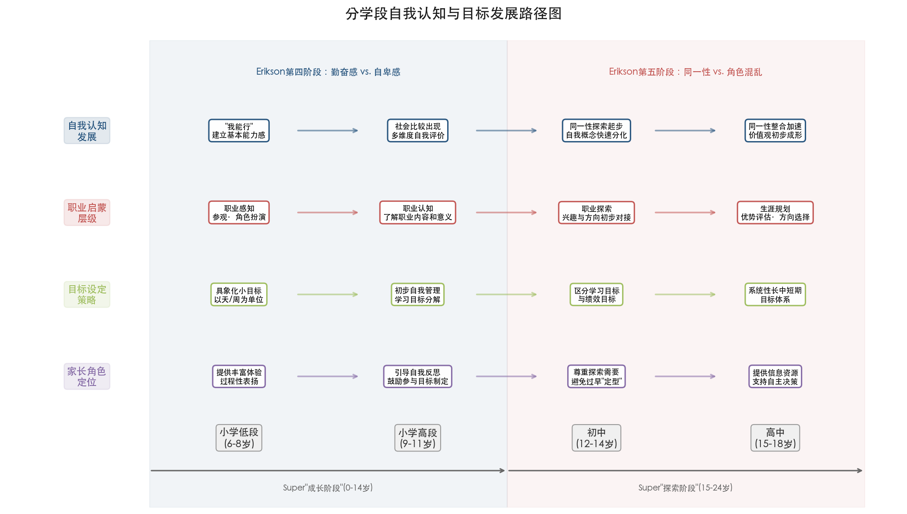

**图5-3 分学段自我认知与目标发展路径图**——以四学段（6-18岁）为横轴，纵向展示自我认知发展、职业启蒙层级、目标设定策略和家长角色四条并行发展轨道，底部标注Super生涯发展理论的阶段过渡。

这一框架的核心理念在于：目标和方向并非外部赋予的终点，而是在自我认知不断深化的过程中自然涌现的路标。家长和教育者的角色，不是替孩子规划好一切，而是提供足够的探索空间、适时的结构化支持和持续的情感安全感，让孩子在不断尝试和反思中找到属于自己的方向。正如Erikson理论所揭示的，每一个发展阶段都有其不可跨越的任务——急于求成反而可能导致"早闭"式的虚假确定感，唯有耐心的陪伴和引导才能帮助孩子最终实现真正的同一性达成。

# 第6章 家校协同与家长自我成长——构建支持性养育生态

前五章分别从全景扫描、科学学习、健康生活、兴趣培养和目标方向五个维度，提供了大量基于实证的策略建议。然而，所有策略最终都要在具体的家庭情境中落地，而家庭从来不是一个封闭系统——它与学校、社区乃至整个社会文化环境持续交互。Epstein（1995/2002）提出的"重叠影响领域"（overlapping spheres of influence）理论揭示了一个核心命题：家庭、学校和社区三个领域对儿童发展的影响相互交织、共同塑造，而非各自独立运作[Epstein框架应用研究](https://pmc.ncbi.nlm.nih.gov/articles/PMC11309007/ "Med Res Arch, 2024")。本章正是基于这一系统视角，从四个层面展开讨论：家校协同的理论基础与制度框架、教养方式的科学图谱与实践路径、家长自身的心理健康与自我调节、以及不同家庭结构下的差异化应对策略。在此基础上，本章将前五章的核心建议整合为分学段的家庭行动框架，为家长提供系统、可操作的养育指南。

## 6.1 家校协同的理论基础与制度框架

### 6.1.1 Epstein六种参与类型：从"被通知"到"共建设"

家校合作并非一个笼统的概念，而是包含多个层次和维度的系统性实践。美国约翰斯·霍普金斯大学学者Joyce Epstein在1995年提出、2002年进一步完善的六种家长参与类型框架，至今仍是该领域最具影响力的理论模型。这六种类型分别为：**养育**（parenting，帮助家庭建立支持性的家庭环境）、**沟通**（communicating，学校与家庭之间的双向信息交流）、**志愿服务**（volunteering，家长参与学校活动和课堂辅助）、**居家学习**（learning at home，学校指导家长在家中协助子女学习）、**决策参与**（decision making，家长参与学校治理和政策制定）、**社区协作**（collaborating with community，整合社区资源服务儿童发展）[Epstein框架应用研究](https://pmc.ncbi.nlm.nih.gov/articles/PMC11309007/ "Med Res Arch, 2024")。

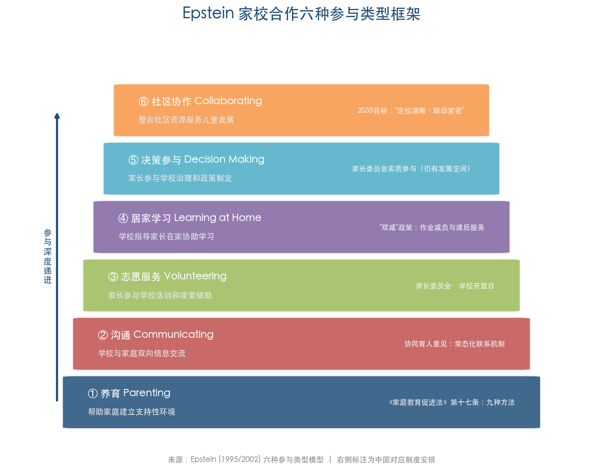

**图6-1 Epstein家校合作六种参与类型框架。** 从底部到顶部呈现参与深度的递进关系，右侧标注中国对应的制度安排。该框架的核心贡献在于将家校合作从"学校通知家长"的单向模式，扩展为双向互动乃至共同治理的多层次体系。

在中国情境中，目前多数学校的家校沟通仍集中在前两个层次——家长会（沟通）和教养指导（养育），而在决策参与和社区协作层面仍有较大发展空间。家长委员会虽已在各级学校普遍建立，但其实际功能往往停留在组织活动和传达信息层面，距离真正参与学校教育决策仍有距离。

### 6.1.2 中国制度供给：从《家庭教育促进法》到协同育人机制

中国在制度层面已为家校协同搭建了较为完整的法律和政策框架。2021年10月23日，全国人大常委会审议通过《中华人民共和国家庭教育促进法》，自2022年1月1日起施行，共六章五十五条[法律全文](https://npcobserver.com/wp-content/uploads/2023/10/2021-Family-Education-Promotion-Law_Gazette.pdf "全国人大常委会公报")。该法是中国首次以法律形式系统规范家庭教育，其核心制度安排涵盖三个层面：

**主体责任的法律明确。** 该法第十四条首次在法律层面确立"家长是第一任老师"的主体责任；第六条要求建立"家庭学校社会协同育人机制"；第二十六条呼应"双减"政策，要求"减轻义务教育阶段学生作业负担和校外培训负担，畅通学校家庭沟通渠道"[法律全文](https://npcobserver.com/wp-content/uploads/2023/10/2021-Family-Education-Promotion-Law_Gazette.pdf "2022年施行")。

**教育方法的法定指引。** 第十七条规定了九种家庭教育方法，包括"亲自养育、加强亲子陪伴""尊重差异、根据年龄和个性特点科学引导""父母与子女共同成长"等，这些表述与本报告前五章所讨论的科学原则高度一致[法律全文](https://npcobserver.com/wp-content/uploads/2023/10/2021-Family-Education-Promotion-Law_Gazette.pdf "第十七条九种方法")。

**特殊群体的制度保护。** 该法对特殊家庭结构给予了专门关注：离异家庭父母应相互配合履行家庭教育责任（第二十条），委托照护的父母应定期了解未成年人学习、生活和心理状况（第二十一条），国家和社会应对留守未成年人和困境儿童建档立卡、提供关爱服务（第三十条）[法律全文](https://npcobserver.com/wp-content/uploads/2023/10/2021-Family-Education-Promotion-Law_Gazette.pdf "特殊家庭条款")。

在政策执行层面，教育部等十三部门于2023年1月联合印发《关于健全学校家庭社会协同育人机制的意见》（教基〔2022〕7号），进一步细化了操作路径：班主任每学年对每名学生至少开展1次家访，每学期至少组织2次家庭教育指导活动，鼓励有条件的学校建立网上家长学校[教育部协同育人意见](http://www.moe.gov.cn/srcsite/A06/s3325/202301/t20230119_1039746.html "2023年1月13日发布")。该意见设定了分阶段目标：到"十四五"时期末基本建成制度体系，到2035年形成"定位清晰、机制健全、联动紧密、科学高效"的协同育人机制[教育部协同育人意见](http://www.moe.gov.cn/srcsite/A06/s3325/202301/t20230119_1039746.html "主要目标")。

值得注意的是，11部门于2022年4月联合印发的《关于指导推进家庭教育的五年规划（2021—2025年）》进一步要求：家庭教育指导服务阵地数量明显增加，稳定规范专业的指导服务队伍基本建立，覆盖城乡的家庭教育指导服务体系初步形成[五年规划](https://www.spp.gov.cn/spp/zdgz/202204/t20220412_553835.shtml "2021—2025年规划")。上述制度安排表明，中国已在法律和政策层面完成了家校协同的"顶层设计"，当前的核心挑战在于基层落地的质量与均衡性。

### 6.1.3 家长与学校建立建设性合作关系的实践路径

制度框架为家校合作提供了基本规则，但建设性的合作关系需要双方主动经营。结合Epstein框架和中国政策实践，家长与学校之间的有效协作宜遵循以下原则：

**主动沟通而非被动等待。** 家长不宜仅在收到学校通知或问题发生后才与教师联系。定期的、日常化的信息交流——了解孩子在校的学习进展、社交表现和情绪状态——是早期发现问题的关键。教育部协同育人意见所要求的"家庭联系册、电话、微信、网络等常态化联系"机制为此提供了制度支撑[教育部协同育人意见](http://www.moe.gov.cn/srcsite/A06/s3325/202301/t20230119_1039746.html "日常沟通途径")。

**理解学校的专业判断。** 正如第2章所讨论的认知发展规律和学习策略具有年龄敏感性，学校的教育教学安排通常基于专业考量。家长应充分理解学校的教育教学工作逻辑，在此基础上提出建设性意见，而非将自身的焦虑投射为对教师的压力。

**聚焦孩子发展而非单一成绩。** 家校沟通的内容不应局限于考试分数。如前述各章所论证的，睡眠质量（第3章）、运动习惯（第3章）、兴趣投入（第4章）、自我认知发展（第5章）都是儿童健康成长的重要维度。家长在与教师交流时，应将关注面拓展至这些领域。

**对特殊需求主动寻求支持。** 当孩子出现持续的学业困难、情绪问题或行为变化时，家长应及时与学校心理健康教师或班主任沟通。第1章数据显示，2024年配备专职心理健康教育教师的学校比例在小学为45.6%、中学为67.4%[国家统计局·儿童发展纲要监测报告](https://www.stats.gov.cn/xxgk/sjfb/zxfb2020/202512/t20251230_1962182.html "2025年12月发布")。尽管配备比例仍有提升空间，家长应充分知晓和利用已有的专业资源。

## 6.2 教养方式的科学图谱：权威型养育的实证优势

### 6.2.1 Baumrind-Maccoby教养方式四象限

理解教养方式的差异及其后果，是家长自我成长的第一步。发展心理学家Diana Baumrind于1966—1971年在加利福尼亚大学伯克利分校的纵向研究中，最先提出了三种教养方式的分类框架；随后Maccoby与Martin（1983）在此基础上，沿"要求"（demandingness）和"回应"（responsiveness）两个维度将其扩展为四种类型[Kuppens & Ceulemans, 2018](https://pmc.ncbi.nlm.nih.gov/articles/PMC6323136/ "J Child Fam Stud, 27(1)")：

- **权威型**（authoritative，高要求+高回应）：对孩子有明确的行为期望和规则，同时给予充分的温暖、解释和情感支持。实证研究中，该类型与最积极的发展结果关联最强。
- **专制型**（authoritarian，高要求+低回应）：强调服从和纪律，较少解释规则背后的理由，情感支持和自主空间有限。
- **放任型**（permissive，低要求+高回应）：对孩子温暖慈爱，但缺乏明确的行为边界和规则。
- **忽视型**（uninvolved/neglectful，低要求+低回应）：在行为管控和情感支持两方面均不足，通常与最差的发展结果相关联。

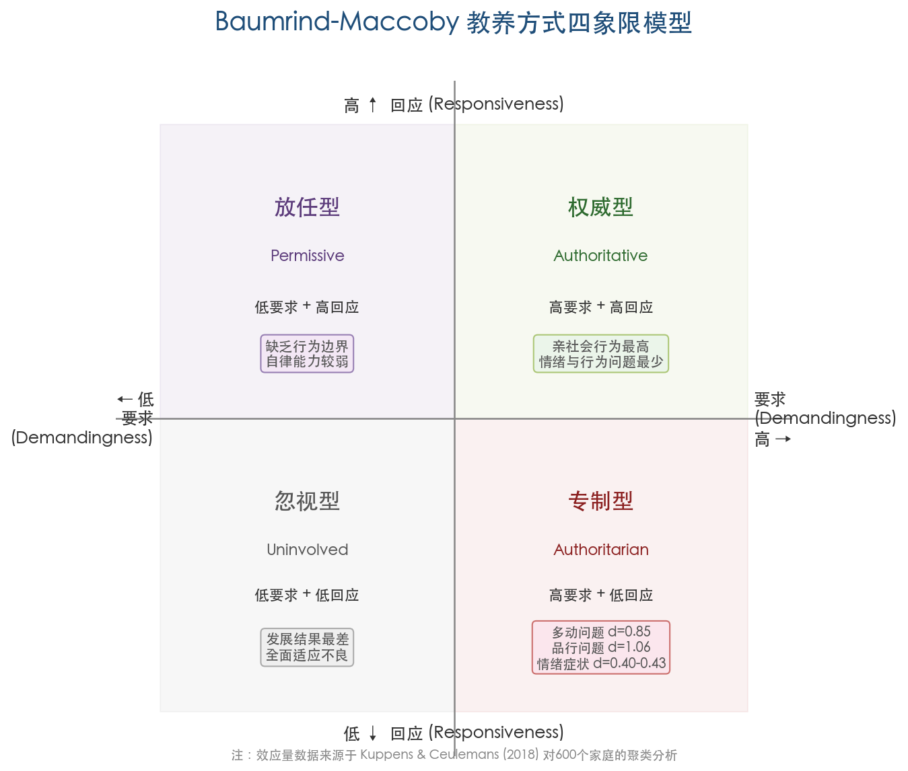

**图6-2 Baumrind-Maccoby教养方式四象限模型。** 横轴为"要求"维度，纵轴为"回应"维度，四个象限分别对应四种教养方式及其典型发展结果。效应量数据来源于Kuppens & Ceulemans（2018）对600个家庭的聚类分析。

### 6.2.2 实证验证：教养方式如何影响儿童行为和心理

Kuppens与Ceulemans（2018）对600个比利时家庭（儿童年龄8—10岁）的聚类分析为上述理论提供了严格的实证检验。研究结果清晰地表明：权威型父母的儿童在亲社会行为（prosocial behavior）上得分最高；专制型父母的儿童在多动问题（效应量d=0.85）、品行问题（d=1.06）和情绪症状（d=0.40—0.43）方面均显著高于权威型组，效应量达到中等至大的水平[Kuppens & Ceulemans, 2018](https://pmc.ncbi.nlm.nih.gov/articles/PMC6323136/ "实证验证教养方式效应")。

将上述发现置于中国语境中，需要关注两个问题。其一，中国传统教养文化中"严父""慈母"的角色分工，容易使家庭整体教养方式偏向"专制型"，或在两种风格间摇摆，造成孩子在规则边界上的困惑。其二，"双减"后中国家庭教育方式呈现"民主化与功利化并存"的张力——一方面家长在日常互动中越来越注重倾听和尊重，另一方面在学业问题上仍倾向于高压管控[中国儿童中心](https://www.ccc.org.cn/art/2024/7/9/art_52_224477.html "2024年报告")。这种不一致性本身即可能削弱权威型教养的效果，因为权威型的核心特征正是"高要求"与"高回应"的一致性和稳定性。

### 6.2.3 从理论到实践：权威型教养的操作要领

权威型教养并非一个抽象的心理学标签，而是可以转化为日常行为的操作原则。结合前述各章的具体建议，其核心要素可归纳如下：

**设立清晰且有弹性的规则。** 正如第2章讨论的时间管理策略所示，"规则"不意味着刚性的时间表，而是与孩子共同协商、有理由支撑的行为框架。例如，"每天先完成作业再进行屏幕娱乐"是一条规则，但具体的时间安排可以根据孩子的状态灵活调整。

**解释规则背后的理由。** "不许玩手机"与"我们约定每天屏幕时间不超过一小时，因为研究表明超过90分钟的短视频使用与抑郁和焦虑风险显著正相关"（参见第1章），两种表述产生的心理效果截然不同。前者是专制型的命令，后者是权威型的引导。

**在情感连接中施加影响。** 第4章讨论的自主支持（autonomy support）和第5章讨论的自我效能感理论都指出，孩子更容易内化来自亲密关系中的引导。当家长与孩子之间有充足的高质量陪伴和情感连接时，行为规则更容易被接受和执行。

**允许自然后果发生。** 在安全范围内，让孩子体验自身选择的后果——如晚上不按时准备导致第二天上学匆忙——比反复说教更能促进责任感的内化。这与第5章所讨论的"成就经验"作为自我效能感最重要来源的原理一脉相通。

## 6.3 家长心理健康：养育者的自我关照

### 6.3.1 家长焦虑的结构性来源

家长的心理状态并非孤立的个人问题，而是深嵌于社会结构之中。当前中国家长焦虑的主要来源可从以下几个维度加以分析：

**学业竞争压力。** "卷"文化渗透下，家长承受着来自升学体制、学校排名和同伴比较的多重压力。第1章指出，"双减"后校外培训供给锐减导致部分需求转向地下市场，低收入家庭退出率（14.5%）高于平均水平（11.8%），而高收入家庭教育支出基本不受影响，由此加剧了教育资源获取的阶层分化[中国儿童中心](https://www.ccc.org.cn/art/2024/7/9/art_52_224477.html "2024年报告")。这种结构性不平等使中低收入家庭的家长更易陷入焦虑——既担心孩子"掉队"，又缺乏足够资源进行弥补。

**信息过载与判断困难。** 互联网时代育儿信息呈爆炸式增长，但质量参差不齐。从"鸡娃"成功学到焦虑贩卖，从伪科学育儿法到过度医疗化的发展焦虑，家长面临前所未有的信息筛选负担。第1章数据显示，中国家长心理健康知识水平达标率最低，正确回答反向题的正确率仅6.9%[中国网·心理健康蓝皮书](http://psy.china.com.cn/2025-04/29/content_43093074.htm "2025年4月")，反映出家长在心理健康素养方面存在严重不足，也使其更易受到错误信息的误导。

**工作-家庭冲突。** 第七次人口普查（2020年）数据显示，中国家庭户均人口已从1982年的4.41人下降至2.62人[CCTV新闻](https://news.cctv.com/2021/05/20/ARTI9XFNJJC4DrCPu7nqq5kp210520.shtml "2021年5月报道")。核心化、小型化趋势意味着越来越多的家庭缺乏祖辈或其他亲属的日常照料支持，双职工家庭中的父母须在有限的时间和精力中同时满足工作绩效和子女陪伴的双重需求，角色冲突本身即构成焦虑的重要来源。

**家庭结构变化带来的挑战。** 2024年民政部数据显示，全国全年结婚登记610.6万对，较2023年减少157.4万对，降幅达20.5%，创1980年以来最低纪录；全年办理离婚登记262.1万对[民政部统计数据](https://news.southcn.com/node_179d29f1ce/8c7b1e5e18.shtml "南方网2025年2月报道")。家庭结构的多样化——单亲家庭、重组家庭、隔代养育家庭——使养育模式更趋复杂，而社会支持体系尚未充分回应这种多样性。

### 6.3.2 家长抑郁对儿童发展的代际传递

家长心理健康问题不仅影响其自身生活质量，更通过亲子互动的"传导机制"对儿童发展产生深远影响。加拿大儿科学会（CPS）在一篇综述中系统总结了母亲抑郁的代际效应：产后抑郁发生率约13%，其对儿童发展的影响贯穿各年龄阶段——婴儿期表现为注意力和唤醒调节失调，学龄前期表现为内化和外化问题增多，学龄期表现为适应功能受损和情感障碍风险升高，青少年期则面临重性抑郁和物质滥用的更高风险[CPS综述](https://pmc.ncbi.nlm.nih.gov/articles/PMC2724169/ "Paediatr Child Health, 9(8), 2004")。

尤其值得关注的是Hay等（2001）的纵向研究发现：产后三个月母亲患抑郁症的儿童，在11岁时智力测验得分更低、注意力问题更多，且男孩受影响更大。该效应独立于社会经济地位、母亲智力水平等多种控制变量。但研究同时表明，非抑郁父亲的积极参与能够"缓冲"母亲抑郁对婴儿的影响，有力说明了父亲在家庭养育系统中的补偿性作用[CPS综述](https://pmc.ncbi.nlm.nih.gov/articles/PMC2724169/ "引用Hay et al. 2001, Hossain et al. 1994")。

与此呼应的是第1章引用的《心理健康蓝皮书（2023—2024）》数据：父母情感忽视程度高的青少年中约40.1%存在抑郁风险、23.1%有焦虑风险；当父母从不就心理健康问题进行沟通时，46.2%的青少年存在抑郁风险[中科院心理所调查报告](https://www.stpt.edu.cn/xlyjyjxb/2025/0516/c582a42262/page.htm "2024年调查，2025年发布")。上述数据共同指向一个关键结论：家长的心理状态和情感投入质量是儿童心理健康最直接的预测因子之一。

### 6.3.3 正念养育：经过验证的家长自我调节策略

面对养育压力，家长需要的不仅是"育儿知识"，更是管理自身情绪和压力的能力。正念养育（mindful parenting）是近年来实证支持最为充分的家长干预方法之一。Duncan等（2009）提出的正念养育模型包含五个核心维度：**全神贯注地倾听**（listening with full attention）、**对自己和孩子的非评判性接纳**（nonjudgmental acceptance）、**对自己和孩子的情绪觉察**（emotional awareness）、**养育中的自我调节**（self-regulation in parenting）以及**对自己和孩子的慈悲心**（compassion for self and child）[Burgdorf et al., 2019](https://pmc.ncbi.nlm.nih.gov/articles/PMC6562566/ "引用Duncan et al. 2009模型")。

Burgdorf等（2019）对25项正念养育干预研究的系统综述与荟萃分析提供了量化证据：干预后家长养育压力小幅降低（效应量g=0.34, p<0.001），两个月随访时效应增至中等水平（g=0.53, p<0.001）；与对照组相比，正念组养育压力降低幅度显著更大（g=0.44, p=0.005）；青少年的心理健康结果亦出现小幅改善（g=0.27, p<0.001）[Burgdorf et al., 2019](https://pmc.ncbi.nlm.nih.gov/articles/PMC6562566/ "Front Psychol, 10:1336")。

一个特别值得注意的发现是：正念养育的效果在两个月随访时优于干预结束即刻测量，表明正念技能需要时间来内化和泛化。通常采用8周小组形式的正念养育课程，其核心设计理念正在于帮助家长将正念意识融入日常亲子互动，而非作为一次性的知识传授。

对于中国家长而言，正念养育的五个维度可转化为以下日常实践：

- **全神贯注倾听**——当孩子说话时放下手机和工作，用眼神接触和肢体语言表示关注；不急于评价或给出解决方案，先完整听完孩子的表达。
- **非评判性接纳**——当孩子的表现不如预期时（如考试成绩下降），先接纳当下的情绪（自己的失望和孩子的沮丧），再讨论改进方向。
- **情绪觉察**——家长需要学会识别自己在养育过程中被触发的情绪（如焦虑、愤怒、内疚），理解这些情绪往往源于自身的成长经历和社会压力，而非孩子的"问题"。
- **自我调节**——在情绪被触发时暂停反应，采用深呼吸或短暂离开等方式进行自我调节，避免在愤怒或焦虑状态下做出教养决策。
- **慈悲心**——对自己作为家长的不完美保持理解和宽容，接受"没有完美的父母"这一事实，将"足够好的父母"（good-enough parent）作为更健康的自我期待。

## 6.4 不同家庭结构的差异化挑战与应对

### 6.4.1 留守儿童家庭：1.38亿"流动影响"儿童的养育困境

家庭结构的多样性是中国儿童养育领域的独特挑战。国家统计局与联合国儿童基金会（UNICEF）基于第七次人口普查（2020年）数据的联合分析显示：中国0—17岁儿童共2.98亿人（占总人口21.1%），受人口流动影响的儿童高达1.38亿（46.4%），其中流动儿童（随迁子女）7109万人、留守儿童6693万人（农村留守4177万、城镇留守2516万）[国家统计局与UNICEF](https://www.stats.gov.cn/zs/tjwh/tjkw/tjzl/202304/P020230419425666818737.pdf "2020年中国儿童人口状况")。换言之，接近半数的中国儿童无法在完整的父母-子女共居条件下成长。

进一步的数据揭示了留守儿童面临的养育断裂风险：农村留守儿童中54.4%与父母一方居住，27.1%由祖父母隔代照料，12.9%独自留守；22.6%的0—2岁婴幼儿由母亲以外的人照料[国家统计局与UNICEF](https://www.stats.gov.cn/zs/tjwh/tjkw/tjzl/202304/P020230419425666818737.pdf "留守儿童照护结构")。需要指出的是，民政部按"父母双方均外出务工"狭义定义统计的留守儿童为644万人，与普查数据中广义定义下的4177万人存在巨大差距——这一口径差异意味着大量"半留守"儿童（父母一方外出）的养育需求可能被系统性低估[国家统计局与UNICEF](https://www.stats.gov.cn/zs/tjwh/tjkw/tjzl/202304/P020230419425666818737.pdf "两种留守定义的口径差异")。

第1章已引用的数据进一步呈现了留守对心理健康的影响：父母均外出的留守青少年中近三成（29.2%）存在抑郁风险，显著高于非留守群体[中科院心理所调查报告](https://www.stpt.edu.cn/xlyjyjxb/2025/0516/c582a42262/page.htm "心理健康蓝皮书")。

针对留守儿童家庭，《家庭教育促进法》第二十一条要求委托照护的父母"应当与被委托人、未成年人保持联系，定期了解未成年人学习、生活状况和心理状况，与被委托人共同履行家庭教育责任"[法律全文](https://npcobserver.com/wp-content/uploads/2023/10/2021-Family-Education-Promotion-Law_Gazette.pdf "第二十一条")。在实践层面，外出父母至少应做到以下几点：保持每日固定的视频通话时间（建议不低于15分钟），内容不应局限于"作业做了没有"，而应涵盖情感交流；与照护人（祖父母或其他亲属）就教养原则达成基本共识，减少隔代教养中的规则冲突；利用假期与孩子共度高质量相处时间，弥补日常陪伴的不足。

### 6.4.2 离异与重组家庭：降低冲突、维护共同养育

2024年全国办理离婚登记262.1万对[民政部统计数据](https://news.southcn.com/node_179d29f1ce/8c7b1e5e18.shtml "南方网2025年2月报道")，意味着每年有数百万儿童面临家庭结构的重大变化。《家庭教育促进法》第二十条明确规定：离异父母"应当相互配合履行家庭教育责任，任何一方不得拒绝或者怠于履行"[法律全文](https://npcobserver.com/wp-content/uploads/2023/10/2021-Family-Education-Promotion-Law_Gazette.pdf "第二十条")。

发展心理学研究一致表明，对儿童伤害最大的并非父母分居本身，而是父母之间的持续冲突及其引发的忠诚冲突——孩子被迫在两位家长之间"选边站"。因此，离异家庭最重要的养育原则是降低父母间的直接冲突水平，维持对孩子教养问题的理性沟通与合作。具体策略包括：不在孩子面前贬低另一方家长；就作息、规则、屏幕时间等核心教养议题保持基本一致；在孩子的重要活动（如学校开放日、运动会）中双方尽量共同参与或交替出席。

### 6.4.3 隔代养育家庭：发挥优势、弥补代际认知差距

在中国家庭中，祖辈参与养育是极为普遍的现象。前述数据显示，仅农村留守儿童中就有27.1%由祖父母隔代照料[国家统计局与UNICEF](https://www.stats.gov.cn/zs/tjwh/tjkw/tjzl/202304/P020230419425666818737.pdf "留守儿童照护结构")。即使在非留守的城市家庭中，双职工父母也大量依赖祖辈的日常照料支持。

隔代养育具有独特优势——祖辈通常拥有更充裕的时间、更稳定的情绪和更丰富的生活经验。但也面临代际认知差距的挑战，尤其体现在：对电子设备使用的管控能力不足（第1章数据显示学龄期及以上未成年人触网率近98%）、对儿童心理健康问题的识别意识薄弱（心理健康知识反向题正确率仅6.9%）、在饮食和运动方面可能因过度溺爱而偏离科学指导原则。

应对策略的核心在于建立"三代人的教养同盟"：父母作为教养方针的主要制定者，与祖辈就核心原则（如屏幕时间限制、就寝时间、零食管控）达成共识；定期向祖辈传递更新的育儿知识，用具体的、可操作的建议替代抽象的理念灌输；在出现分歧时，避免在孩子面前争论，而是通过私下沟通解决。

## 6.5 可靠育儿知识的获取与伪科学信息的识别

### 6.5.1 权威信息来源的分层体系

在信息泛滥的时代，"知道去哪里找答案"往往比"知道答案"更为重要。家长宜建立一套分层次的信息获取策略：

**第一层级（T1/T2权威来源，应作为核心参考）：**
- 国家卫健委官方网站及"健康中国"系列平台，发布权威的儿童健康指南和政策解读；
- 中国疾病预防控制中心妇幼保健中心，提供科学的儿童保健和营养指导；
- 中国儿童中心（全国妇联直属），定期发布儿童发展研究报告和家庭教育指导资源[中国儿童中心](https://www.ccc.org.cn/art/2024/7/9/art_52_224477.html "2024年报告")；
- 中华医学会儿科学分会和中华预防医学会，发布专业的临床指南和科普材料；
- 联合国儿童基金会（UNICEF）中国办公室，提供国际前沿的儿童发展研究成果和实践指南[国家统计局与UNICEF](https://www.stats.gov.cn/zs/tjwh/tjkw/tjzl/202304/P020230419425666818737.pdf "UNICEF与统计局联合报告")；
- 国家中小学智慧教育平台，教育部协同育人意见明确要求"不断拓展国家中小学智慧教育平台和全国网上家长学校服务功能"[教育部协同育人意见](http://www.moe.gov.cn/srcsite/A06/s3325/202301/t20230119_1039746.html "信息化平台建设")。

**第二层级（T2/T3有参考价值的来源，需交叉验证）：**
- 主流媒体的教育频道和健康频道（如人民日报、新华社、央视新闻的专题报道）；
- 知名儿童医院的官方科普账号；
- 经同行评审的学术期刊中文摘要或科普转化。

**第三层级（需审慎对待）：**
- 自媒体育儿账号、个人经验分享、社交媒体讨论——这类内容可提供视角参考和情感支持，但其中的核心结论和具体数据须与T1/T2来源交叉验证后方可采信。

### 6.5.2 识别伪科学育儿信息的关键特征

家长在面对育儿信息时，可通过以下特征识别潜在的伪科学内容：

**夸大单一因素的决定性作用。** 如"某一种食物/方法可以显著提高智力""错过某个关键期就永远无法弥补"——第5章关于同一性发展的研究恰恰表明，发展是一个持续终身的过程，"延迟完成者"亦可通过后续经验逐步追赶。

**缺乏具体研究来源或引用不存在的"国际研究"。** 可靠的育儿建议通常能指向具体的研究机构、期刊名称和研究年份。

**利用焦虑情绪进行商业推广。** 当一条育儿信息的核心目的在于销售某种产品或课程，且其论证逻辑建立在"不买就会耽误孩子"的焦虑之上时，应保持高度警惕。

**与主流科学共识明显矛盾。** 如声称"疫苗导致自闭症""左脑右脑可以分别训练"等已被科学界反复否定的论断。

## 6.6 构建可操作的家庭养育方案：分学段行动框架

综合前五章的核心建议和本章讨论的家校协同原则，以下提出一个面向不同学段的家庭行动框架。该框架遵循权威型教养的核心原则（高要求+高回应），并充分体现年龄敏感性——家长角色从低龄段的"监督者"逐步过渡为高年级的"情感后盾"。

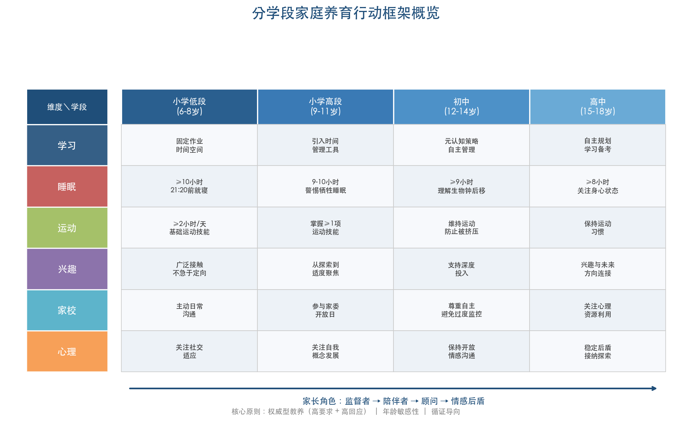

**图6-3 分学段家庭养育行动框架概览。** 该矩阵以学段为列、养育维度为行，呈现各学段核心行动要点的横向对比。底部标注家长角色的渐进转变方向。

### 小学低段（6—8岁/1—3年级）

| 维度 | 核心行动 | 要点说明 |
|------|---------|---------|
| 学习 | 建立固定的作业时间和空间 | 工作记忆容量约3.5个项目（第2章），单次学习任务不宜过长；家长在旁陪伴但不代做 |
| 生活 | 保障每天10小时睡眠，就寝不晚于21:20 | 77.19%小学生家长反映孩子睡眠不足9小时（第3章），需优先保障 |
| 运动 | 每天综合体育活动不低于2小时 | 响应教育部《学生体质强健计划》要求；运动技能掌握率仅23.9%（第3章），需重视基础运动技能培养 |
| 兴趣 | 广泛接触，不急于定向 | 此阶段处于兴趣发展"触发期"（第4章），创造多样化的体验机会比集中培训更重要 |
| 家校 | 主动与班主任保持日常沟通 | 关注孩子的社交适应和情绪状态，而非仅关注成绩 |
| 屏幕 | 每日屏幕娱乐时间控制在1小时以内 | 近视高发年龄已前移至6—10岁（第1章），低龄段尤需重视 |

### 小学高段（9—11岁/4—6年级）

| 维度 | 核心行动 | 要点说明 |
|------|---------|---------|
| 学习 | 引入简单的时间管理工具，逐步培养自主规划能力 | 工作记忆增至约4.4个项目（第2章），可适当增加复杂度；开始教授间隔复习、精细加工等高效策略 |
| 生活 | 保障每天9—10小时睡眠 | 作业量开始增加，需警惕以牺牲睡眠换取学习时间的倾向 |
| 运动 | 鼓励至少掌握一项运动技能，培养运动习惯 | 此阶段基本注意聚焦能力趋于成熟（8—10岁），适合系统性运动技能学习 |
| 兴趣 | 从广泛探索向适度聚焦过渡 | 进入"维持性情境兴趣"阶段（第4章），需要持续的外部支持和鼓励 |
| 家校 | 参与学校家长委员会、开放日活动 | 了解学校教育理念和方法，在家庭中给予配合与支持 |
| 心理 | 开始关注孩子的自我概念发展 | Erikson"勤奋感vs.自卑感"阶段（第5章），避免单一评价标准 |

### 初中（12—14岁/7—9年级）

| 维度 | 核心行动 | 要点说明 |
|------|---------|---------|
| 学习 | 引导孩子掌握元认知策略，逐步放手让其自主管理学习 | 元认知在12岁后加速发展（第2章），家长角色从"监督者"转向"顾问" |
| 生活 | 保障每天9小时睡眠；关注青春期生理变化 | 生物钟自然后移，不应简单归因为"懒"或"不自律" |
| 运动 | 维持运动习惯，警惕学业压力下运动时间被挤压 | 进入初中后文体培训参与率明显下降（第4章），需有意识保护 |
| 兴趣 | 支持深度投入，尊重从某些兴趣中退出的选择 | 进入"萌发性个人兴趣"阶段（第4章），兴趣开始与自我认同关联 |
| 家校 | 尊重孩子日益增长的自主需求，避免过度监控 | 同一性探索开始启动（第5章），家长过度控制可能导致"早闭" |
| 心理 | 保持开放的情感沟通渠道 | 46.2%的青少年在父母从不就心理健康沟通时存在抑郁风险（第1章） |

### 高中（15—18岁/10—12年级）

| 维度 | 核心行动 | 要点说明 |
|------|---------|---------|
| 学习 | 支持孩子自主规划学习和考试准备 | 执行功能在17岁前仍在发展（第2章），但应以自主管理为主 |
| 生活 | 保障每天8小时睡眠，关注高强度学业压力下的身心状态 | 62.5%高中生家长反映孩子睡眠不足7小时（第3章） |
| 目标 | 协助孩子进行自我认知探索和职业启蒙 | 同一性形成的关键窗口（第5章），提供探索机会而非代替决策 |
| 兴趣 | 支持将兴趣与未来方向建立连接 | "个人兴趣"阶段的深层投入与专业选择的关联性（第4、5章） |
| 家校 | 定期关注孩子的学校心理健康资源使用情况 | 中学配备专职心理教师的学校比例为67.4%（第1章） |
| 心理 | 作为稳定的情感后盾，接纳青少年的探索与波折 | 达成者和早闭者抑郁水平最低，扩散者风险最高（第5章），家长应支持而非限制探索 |

## 6.7 家长自我成长：终身学习者的养育之路

《家庭教育促进法》第十七条将"父母与子女共同成长"列为法定家庭教育方法之一[法律全文](https://npcobserver.com/wp-content/uploads/2023/10/2021-Family-Education-Promotion-Law_Gazette.pdf "第十七条")。这一表述蕴含深刻的教育智慧：养育不是家长对孩子的单向塑造，而是一个双向成长的过程。

本报告前五章讨论的许多原则同样适用于家长的自我发展。第2章讨论的成长型思维（growth mindset）提醒家长：养育能力并非固定天赋，而是可以通过学习和实践持续提升的技能。第4章讨论的兴趣发展四阶段模型表明，家长对自身兴趣的追求和投入本身就是对孩子最好的示范——当孩子看到父母在阅读、运动、学习新技能时保持热情和坚持，更有可能内化这种积极的生活态度。第5章讨论的自我效能感理论则提示，家长在养育中积累的"成就经验"——哪怕是很小的成功，如成功化解了一次亲子冲突、坚持了一个月的睡眠规律——都会增强家长对自身养育能力的信心。

与此同时，家长也需要接受自身的局限性。完美的养育并不存在，"足够好的父母"是一个更健康、更可持续的目标。英国精神分析学家Winnicott提出的"足够好的母亲"（good-enough mother）概念指出，适度的不完美反而有助于孩子发展独立应对挫折的能力。将这一理念延伸到整个家庭系统：当家长能够在犯错后向孩子坦诚道歉、在困难面前展示韧性而非焦虑崩溃、在自身不擅长的领域勇于承认并寻求帮助时，他们实际上在为孩子示范"如何做一个真实的、有韧性的人"——这或许是养育所能传递的最为深远的教育影响。

# 结论与风险提示

## 核心结论

本报告基于2025—2026年最新的政策文件、权威数据和经过同行评审的学术研究，对中国6—18岁儿童青少年身心健康成长进行了系统性的循证分析。综合六章内容，核心结论可归纳为以下五个方面。

**第一，中国儿童青少年正面临身体健康"缓慢改善但总体堪忧"与心理健康"隐性危机加深"的双重挑战。** 近视率约50.7%，超重肥胖合计约19%且仍在上升，体质优良率仅56.9%——三大核心指标虽有边际改善，但绝对水平依然严峻。心理健康方面，特定脆弱群体（留守、情感忽视、缺乏亲子沟通）的抑郁风险检出率高达三至四成，而家长和学校端的识别与干预能力严重不足。心理困境与学业困难之间的恶性循环——"心理问题—厌学—成绩下滑—自我否定—心理加重"——已成为不可忽视的突出风险。

**第二，学习效率的提升空间远大于学习时间的进一步延长。** 中国中小学生的学习时间投入已居全球前列，但认知科学的系统评估明确表明，学生最常用的学习方式（反复阅读、划线标注）效用最低，而检索练习和间隔重复等高效策略的运用严重不足。从"学得多"转向"学得对"，是在不增加时间成本甚至减少时间投入的前提下提升学业表现的可行路径。元认知能力的培养——尤其是在小学高段至初中低段这一关键窗口期——对学习效率的持续改善具有决定性意义。

**第三，睡眠、运动、营养和社交构成一个相互强化的健康系统，任何单一维度的持续缺损都将对整体健康产生连锁拖累。** 当前中国儿童青少年的时间结构面临深层矛盾：作业和屏幕占据过多时间，系统性挤压了睡眠（缺口1.0—2.3小时）、运动（达标率仅15%—36%）和面对面社交的空间。政策层面"每天综合体育活动不低于2小时"的要求为时间重新分配提供了制度支撑，但落地执行仍有待突破。运动作为核心杠杆，其效应通过改善心理健康、促进社交、提升睡眠质量和增加维生素D合成等多条路径同时发挥作用。

**第四，兴趣培养与目标方向的确立应遵循"先广泛探索、后渐进聚焦"的发展规律，而非"赢在起跑线"的线性竞争逻辑。** 涵盖6096名运动员的荟萃分析和科学家传记研究均表明，多元化的早期经验为长期卓越奠定了更坚实的基础。自我决定理论揭示，保护内在动机——满足自主性、胜任感和关联感三种基本心理需要——是兴趣得以持续深化的根本条件。在升学压力下完全牺牲兴趣活动，可能同时损害学业动力和心理健康。目标与方向的形成是一个自我认知不断深化的动态过程，家长的角色应从"替孩子规划"逐步转变为"支持孩子探索"。

**第五，家校协同和家长自我成长是所有策略落地的关键支撑。** 权威型教养（高要求+高回应）在实证研究中持续展现最优的儿童发展结果。但中国家庭面临"理念认同"与"行为选择"的深层脱节——多数家长认同尊重与倾听的重要性，但在学业问题上仍倾向于高压管控。正念养育为家长提供了经过验证的自我调节工具。针对留守、离异和隔代养育等不同家庭结构，需要差异化而非"一刀切"的支持策略。

## 局限性分析

**第一，数据时效性与可比性限制。** 本报告引用的核心数据来源于多个不同年份和口径的调查（如2016—2017年全国营养监测、2019年体质调研、2022年CFPS、2024年心理健康蓝皮书等），各数据源之间的抽样方法、测量工具和统计口径存在差异。尽管报告在引用时已标注数据年份和来源，但跨数据源的直接比较须审慎解读。部分数据（如运动达标率）基于加速度计客观测量与自报问卷两种方法，二者的结果可能存在系统性差异。

**第二，国际比较的有限性。** 心理健康领域，由于各国使用的筛查量表、阈值标准和诊断体系各异，严格的国际横向比较目前尚不可行。近视率和超重肥胖率的国际比较虽有更好的可比性基础，但中国与全球数据的年龄分段和调查年份仍存在差异。报告中的国际比较旨在提供方向性参考而非精确对标。

**第三，因果推断的审慎性。** 本报告引用的多数研究为横断面调查或相关性研究，仅少数采用了随机对照实验或纵向追踪设计。例如，"短视频使用与抑郁焦虑风险正相关"的发现尚不能等同于因果关系。报告在行文中对相关性与因果性的区分做了基本标注，但读者在将研究结论应用于实践时仍需注意这一区别。

**第四，策略建议的情境依赖性。** 报告提出的分学段策略框架（学习方法、时间管理、运动安排、兴趣培养、目标设定等）基于认知科学和发展心理学的一般性规律，但每个孩子的发展节奏、家庭资源、学校环境和地区条件各有不同。这些建议应被视为"参考框架"而非"标准答案"，家长和教育者需要根据具体情境进行灵活调整。

**第五，城乡差异与阶层分化的分析深度不足。** 报告在多处提及了城乡差异（如留守儿童心理健康风险、农村学校心理教师配备不足、低收入家庭在"双减"后退出培训比例更高等），但受制于现有公开数据的颗粒度，未能对这些差异进行更为深入和系统的专题分析。考虑到中国地区间发展不平衡的现实，不同经济发展水平和城乡类型地区的儿童青少年可能面临显著不同的健康挑战与资源约束。
