# 执行摘要

日本是全球老龄化程度最高的国家，2025年65岁以上人口达3,619万人，占总人口的29.4%。本报告基于国立社会保障·人口问题研究所（IPSS）2023年版中位方案推计、联合国人口展望（UN WPP 2024）及多家权威机构的产业预测，系统评估了2020–2050年日本老年人口的消费潜力，涵盖衣、食、住、行四大领域的市场规模及结构演变。

**人口底盘：高确定性的存量变量。** 日本65岁以上人口从2020年的3,603万人增至2043年峰值3,953万人后缓降至2050年的3,888万人，高龄化率则从28.6%单向攀升至37.1%。75岁以上后期高龄者占比从约52%升至约62%，85岁以上超高龄人口从616万人近乎翻倍至1,170万人。独居老人世帯从738万户增至1,084万户（+47%），独居率从35.2%升至45.1%。上述趋势基于已出生世代的存量人口，不受未来生育率变化影响，构成银发消费市场的"刚性底盘"。

**购买力底盘：年金主导、就业补充、资产庞大但流动性不足。** 老年家庭可支配收入高度依赖公的年金（占实收入80–91%），年金替代率虽面临从61.2%向50%区间的中长期下行压力，但2025年年金制度改革法确立了基础年金底部保障机制。65岁以上就业者达930万人（就业率25.7%），就业收入正成为收入结构的"第二支柱"。老年人持有全国家计金融资产的约六成（约1,400兆日元以上），户均储蓄约2,560万日元，但约三分之二沉淀在低收益的预贮金中，且认知症导致的"资产冻结"风险从2020年约255兆日元将膨胀至2040年约349兆日元。

**市场规模测算：从52兆日元到94–101兆日元。** 本报告采用自下而上（Bottom-Up）方法对四大领域进行分项测算并加总，得出以下基准情景估算：

| 时间节点 | 衣 | 食 | 住 | 行 | 四领域合计 |
|---------|-----|-----|-----|-----|-----------|
| 2025年 | 约1.75兆 | 约18.8–19.0兆 | 约15兆 | 约16.3兆 | **约52兆日元** |
| 2030年 | 约2.0–2.1兆 | 约20.7–22.0兆 | 约19兆 | 约18.5–19.8兆 | **约60–63兆日元** |
| 2040年 | 约2.5–2.75兆 | 约24.4–27.1兆 | 约32兆 | 约22.3–25.0兆 | **约81–87兆日元** |
| 2050年 | 约2.65–3.05兆 | 约25.9–28.7兆 | 约41兆 | 约24.0–28.0兆 | **约94–101兆日元** |

上述推演与みずほ銀行産業調査部2025年1月推计（2023年シニア関連市場全口径96.4兆日元、2040年实质114.7兆日元）以及世界经济论坛（WEF）2025年9月确认的数据在数量级上高度一致。银发消费在日本国内消费中的占比将从当前约19%跃升至2040年的约40%。

**核心结构性特征：**

- **"住"领域是绝对主导增长极。** 介护保险费用从2024年11.9兆日元增至2050年约33兆日元，叠加设施自费与介护科技，"住"领域占比从29%跃升至41–44%，成为驱动市场扩张的核心引擎。其增长由85岁以上超高龄人口翻倍扩张和介护保险制度的内生刚性膨胀机制所锁定。
- **"食"领域是最大的日常消费支柱。** 老年世帯恩格尔系数约30.4%，中食（惣菜）市场已突破11兆日元，健康功能食品和介护食品/UDF受益于老龄化结构红利持续增长。
- **"行"领域变革动能最强。** 数字消费因世代推移效应而成为增速确定性最高的子市场，预计从2023年约3.5兆日元增至2050年约8.5–10.0兆日元；出行服务领域蕴含约1.8兆日元的私家车保有成本替代空间。
- **"衣"领域体量最小但存在精准赛道。** 成人失禁用品（CAGR约5–7%）和个人护理/化妆品的老年份额是确定性最高的增长极。

**情景分化与政策可塑性。** 在保守情景（年金替代率超预期下行、认知症资产冻结、介护人力缺口压制供给）下，2050年四领域合计约85–93兆日元；在乐观情景（みずほ"减龄5岁"框架+IMF健康老龄化趋势）下，可达100–110兆日元。基准与乐观情景之间约10–15兆日元的差距空间取决于日本能否成功推行健康老龄化、延迟退休和介护科技替代的政策组合。

# 第1章 日本老年人口规模与结构预测（2020–2050）

## 1.1 总人口持续萎缩：不可逆的人口减少进程

日本正处于一场深刻且不可逆的人口缩减进程之中。国立社会保障・人口问题研究所（IPSS）2023年版《日本の将来推計人口》（出生中位・死亡中位方案）显示，2020年日本总人口为1亿2,615万人，此后持续下降：2030年降至1亿2,012万人，2040年降至1亿1,284万人，2050年降至1亿469万人，2056年跌破1亿大关（9,965万人），2070年进一步缩减至8,700万人，较2020年减少约31%[IPSS「日本の将来推計人口（令和5年推計）」](https://www.ipss.go.jp/pp-zenkoku/j/zenkoku2023/pp2023_gaiyou.pdf "表1-1 出生中位(死亡中位)推計")。

上述推计所依据的核心假设包括：合计特殊出生率（TFR）从2020年实际值1.33经短期低谷（2023年约1.23）后缓慢回升至2070年的1.36（中位方案）；平均寿命从2020年的男性81.58岁、女性87.72岁延伸至2070年的男性85.89岁、女性91.94岁；外国人年均净流入约16.4万人（2040年基准），较前回推计的6.9万人大幅上调[IPSS「日本の将来推計人口（令和5年推計）」](https://www.ipss.go.jp/pp-zenkoku/j/zenkoku2023/pp2023_gaiyou.pdf "推計方法の概要")。外国人净流入的上调与平均寿命的延伸在一定程度上缓解了人口减少速度——总人口跌破1亿的时间从前回推计的2053年推迟至2056年——但总人口长期下降的大趋势已不可扭转。

联合国人口展望（UN WPP 2024）中等方案提供了独立的交叉验证。该方案预计日本2024–2054年间人口绝对减少约2,100万人，为全球仅次于中国的第二大绝对减少国[UN WPP 2024 Summary of Results](https://population.un.org/wpp/assets/Files/WPP2024_Summary-of-Results.pdf "Figure 2.2, Chapter II")。具体到老年人口，UN WPP 2024数据显示日本2020年65+人口3,650万人（占比28.9%），2030年3,720万人（31.1%），2040年3,960万人（35.3%），2050年3,940万人（37.5%）[UN WPP 2024](https://en.kkc.or.jp/wp/wp-content/uploads/2025/04/2_3.pdf "Population ages 65+, medium variant")。IPSS与UN WPP在趋势方向上高度一致：65+人口于2040年代前半达峰、随后缓降，而高龄化率因总人口降幅更大而持续攀升。两者的数值差异主要源于国际移民假设和死亡率模型的微小分歧。

## 1.2 65岁以上人口的增长轨迹：从3,603万到峰值3,953万

### 1.2.1 绝对规模：2043年触顶

2020年日本65岁以上人口为3,603万人，占总人口的28.6%。此后老年人口持续增长：2025年3,653万人（29.6%）、2030年3,696万人（30.8%）、2035年3,773万人（32.3%）、2040年3,929万人（34.8%）[IPSS「日本の将来推計人口（令和5年推計）」](https://www.ipss.go.jp/pp-zenkoku/j/zenkoku2023/pp2023_gaiyou.pdf "表1-1 出生中位(死亡中位)推計")。65岁以上人口的绝对峰值出现在2043年，达3,953万人（占同年总人口1亿434万人的35.8%）。此后转入缓慢减少——2050年降至3,888万人（37.1%）、2070年降至3,367万人——但由于总人口缩减速度更快，高龄化率反而持续攀升，2070年达到38.7%，届时每2.6人中即有1人年满65岁[IPSS「日本の将来推計人口（令和5年推計）」](https://www.ipss.go.jp/pp-zenkoku/j/zenkoku2023/pp2023_gaiyou.pdf "结果的要约 p.13")。

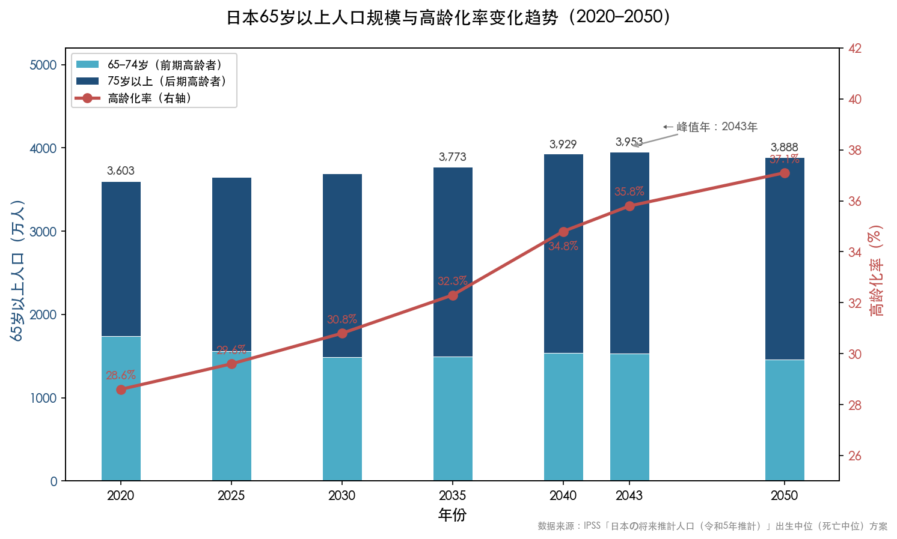

**图1-1** 展示了2020–2050年间65岁以上人口的堆叠柱状图（按65–74岁前期高龄者与75岁以上后期高龄者分色）及高龄化率折线。可以直观看到，65+人口绝对规模在2043年触顶后小幅回落，但高龄化率因分母（总人口）收缩而呈单调上升态势，这一"总量平台期+比率攀升"的组合特征，是理解银发消费市场规模走势的关键。

从增长动能来看，65+人口从2020年的3,603万人到2043年峰值3,953万人，增幅仅为350万人（+9.7%），主要来自第二次婴儿潮世代（1971–1974年出生）在2036–2039年间陆续步入65岁以上年龄段。此后，由于出生人口的持续萎缩，新进入老年群体的世代规模逐代缩小，65+人口自然转向下降。

### 1.2.2 出生假设对高龄化率的影响

IPSS推计体系的一个重要结构性特征在于：无论出生率假设如何变化，65+人口的绝对数在50年推计期内几乎不变——因已出生世代的规模已确定，仅受死亡率影响——但高龄化率则因总人口分母的差异而出现显著分化。2045年时，出生低位方案（TFR=1.13）下高龄化率达37.2%，出生高位方案（TFR=1.64）下为35.2%，差距约2.0个百分点；到2070年，差距扩大至6.7个百分点（出生低位42.0% vs. 出生高位35.3%）[IPSS「日本の将来推計人口（令和5年推計）」](https://www.ipss.go.jp/pp-zenkoku/j/zenkoku2023/pp2023_gaiyou.pdf "出生仮定による高齢化率の違い")。

上述分析意味着，即便日本实现最乐观的生育率回升情景，2050年的高龄化率仍将不低于35.7%，银发消费市场的人口底盘已基本锁定，属于"高确定性"变量。

## 1.3 年龄细分结构："前期高龄者"与"后期高龄者"的此消彼长

日本老年人口内部存在意义重大的年龄分层：65–74岁群体在日本制度体系中被称为"前期高龄者"，75岁以上群体被称为"后期高龄者"。两个子群体在健康状况、消费行为、介护需求以及社会参与能力上存在质的差异，其相对规模的演变对银发经济的结构特征具有决定性影响。

截至2024年10月1日，日本65–74岁人口为1,547万人（占总人口12.5%），75岁以上人口为2,078万人（占总人口16.8%），后期高龄者已在绝对数上超过前期高龄者[内閣府「令和7年版高齢社会白書」](https://www8.cao.go.jp/kourei/whitepaper/w-2025/html/zenbun/s1_1_1.html "1 高齢化の現状と将来像")。这一"逆转"发生在2018年前后：65–74岁人口曾于2016年达到峰值1,767万人，此后因1947–1949年出生的"团块世代"全部跨过75岁门槛而快速减少，待第二次婴儿潮世代陆续步入65岁后方出现阶段性回升。

消費者庁引用IPSS推计指出，2050年65–74岁人口占总人口比例为13.9%，75岁以上占比为23.2%[消費者庁「令和5年版消費者白書」](https://www.caa.go.jp/policies/policy/consumer_research/white_paper/2023/white_paper_120.html "超高齢社会の現状")。以2050年总人口1亿469万人推算，65–74岁人口约1,456万人，75岁以上约2,429万人，后期高龄者约为前期高龄者的1.67倍。内閣府高齢社会白書进一步指出，75岁以上人口将在2055年前后达到峰值，2070年时75+占总人口比例预计达25.1%，即约每4人中有1人年满75岁[内閣府「令和7年版高齢社会白書」](https://www8.cao.go.jp/kourei/whitepaper/w-2025/html/zenbun/s1_1_1.html "将来推計人口で見る令和52年の日本")。

上述结构变迁意味着，在2020–2050年的30年间，日本老年人口的"重心"将持续上移。前期高龄者构成"活力银发层"的主体——就业率较高（65–69岁就业率达53.6%）、健康状况较好、消费能力与意愿相对旺盛；后期高龄者则面临更高的介护需求、认知功能下降风险及消费行为的被动化。后期高龄者占比的持续攀升，将深刻重塑银发消费市场的品类结构与服务形态。

## 1.4 性别结构：女性主导的超高龄社会

日本老年人口呈现显著的性别不对称。2024年数据显示，65岁以上人口中男性约1,572万人、女性约2,053万人，性比为76.6（每100名女性对应76.6名男性）；75岁以上群体中性别失衡更为剧烈——男性830万人、女性1,247万人，性比仅66.6，男女比约为2∶3[内閣府「令和7年版高齢社会白書」](https://www8.cao.go.jp/kourei/whitepaper/w-2025/html/zenbun/s1_1_1.html "表1-1-1 高齢化の現状")。

进一步细分年龄段可观察到不对称的加剧路径：75–84岁群体性比77.4（男612万人、女790万人），85–94岁群体性比51.2（男204万人、女399万人），95岁以上群体性比仅24.4（男14万人、女58万人）[内閣府「令和7年版高齢社会白書」](https://www8.cao.go.jp/kourei/whitepaper/w-2025/html/zenbun/s1_1_1.html "表1-1-1")。

性别结构的不对称叠加独居趋势，构成银发消费市场的一项关键结构性特征：高龄女性独居者是老年消费的最大单一群体之一，其消费偏好——注重安全性、便利性与社交性——将深刻影响从食品宅配到居住形态再到数字服务的各个细分市场。

## 1.5 独居老人的急速扩张

独居是日本老龄化社会最值得关注的结构性变量之一。IPSS 2024年版《日本の世帯数の将来推計》显示，65岁以上独居世帯（单人户）从2020年的738万户增至2050年的1,084万户（+47%），占65岁以上全部世帯的比例从35.2%升至45.1%[IPSS「日本の世帯数の将来推計（令和6年推計）」](https://www.ipss.go.jp/pp-ajsetai/j/HPRJ2024/hprj2024_gaiyo_20240412.pdf "表4 世帯主65歳以上の世帯")。

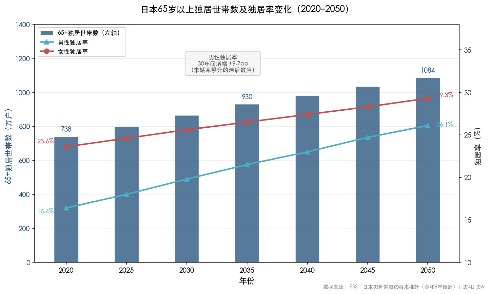

**图1-2** 综合呈现了65+独居世帯数的增长轨迹与男女独居率的分化趋势。独居率的性别差异正在经历结构性收敛：2020年65+男性独居率为16.4%、女性为23.6%；到2050年，男性独居率快速攀升至26.1%、女性升至29.3%，男女间差距从7.2个百分点缩小至3.2个百分点。男性独居率的加速上升，主要反映过去数十年未婚率攀升的滞后效应——2050年男性高龄独居者中高达59.7%为终身未婚[IPSS「日本の世帯数の将来推計（令和6年推計）」](https://www.ipss.go.jp/pp-ajsetai/j/HPRJ2024/hprj2024_gaiyo_20240412.pdf "表6 独居率；表7 配偶関係別単独世帯")。

尤为值得警惕的是超高龄独居群体的膨胀：85岁以上独居世帯从2020年的147万户增至2050年的277万户，增幅高达88%。这些超高龄独居者中相当比例将面临无亲属可依靠的局面，其日常消费、医疗介护、安全见守等需求将高度依赖市场化服务与公共支援体系[IPSS「日本の世帯数の将来推計（令和6年推計）」](https://www.ipss.go.jp/pp-ajsetai/j/HPRJ2024/hprj2024_gaiyo_20240412.pdf "表5、表7")。

独居老人的快速增加对银发消费市场具有多维度的结构性影响：食品消费将更多转向小份量预制食品和宅配服务；住房需求将从家庭住宅转向带服务的高龄者住宅和养老设施；交通出行将从家人接送转向公共交通和按需出行服务；数字技术则既是沟通与安全监控的关键工具，也是高龄独居者面临的"数字鸿沟"挑战所在。

## 1.6 地域分布：大都市圈的"追赶型老龄化"

日本各地的老龄化进程差异悬殊，并正经历一场深刻的空间再分配。2024年数据显示，都道府县间高龄化率的极差超过16个百分点：秋田县以39.5%居全国之首，东京都仅22.7%[内閣府「令和7年版高齢社会白書」](https://www8.cao.go.jp/kourei/whitepaper/w-2025/html/zenbun/s1_1_4.html "表1-1-10 都道府県別高齢化率の推移")。

然而，真正值得关注的结构性趋势在于大都市圈老龄化的加速推进。至2050年，秋田县高龄化率预计达49.9%（几乎一半人口为65+），但增幅仅约10个百分点；首都圈的埼玉县则将从27.5%大幅升至35.5%（+8.0pp），神奈川县从26.0%升至35.0%（+9.0pp），东京都从22.7%升至29.6%（+6.9pp）[内閣府「令和7年版高齢社会白書」](https://www8.cao.go.jp/kourei/whitepaper/w-2025/html/zenbun/s1_1_4.html "表1-1-10")。大都市圈老龄化的加速意味着银发消费市场的需求重心将从已深度老龄化的地方城市，逐步转向人口密集、商业基础设施完善的大都市圈。

从城市规模视角观察，人口5万人以下的小城市中65+人口已开始减少（源于总人口的大量外流），而大都市（政令指定都市等）的65+人口持续增长，预计到2045年前后方出现拐点[内閣府「令和7年版高齢社会白書」](https://www8.cao.go.jp/kourei/whitepaper/w-2025/html/zenbun/s1_1_4.html "図1-1-11 都市規模別65歳以上人口指数")。这一趋势对银发产业的空间布局具有重要启示：老年消费市场的增量机会在未来20年将主要集中于东京、大阪、名古屋三大都市圈。

## 1.7 老龄抚养比：从"2人养1人"到"1.4人养1人"

老年人口增长与劳动年龄人口（15–64岁）缩减的双重作用，导致老龄抚养比持续恶化。IPSS出生中位推计显示，老年人口指数（15–64岁人口每100人对应65+人口数）从2020年的48.0上升至2030年的52.2、2040年的63.2、2050年的70.2，2070年达到74.2[IPSS「日本の将来推計人口（令和5年推計）」](https://www.ipss.go.jp/pp-zenkoku/j/zenkoku2023/pp2023_gaiyou.pdf "表1-4 従属人口指数")。

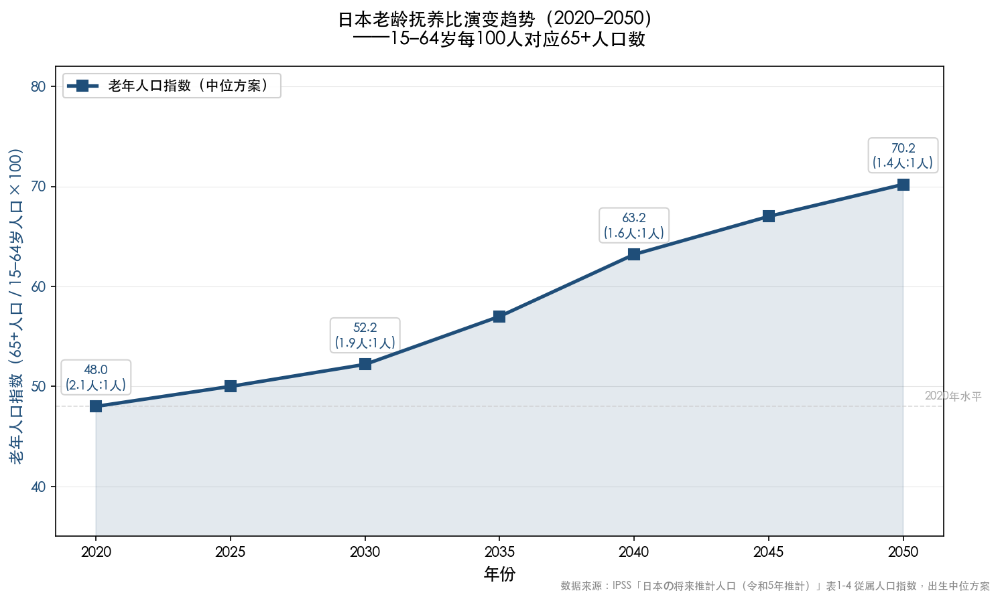

**图1-3** 直观呈现了老年人口指数从48.0（2020年）攀升至70.2（2050年）的演变轨迹，同时以"X人∶1人"的换算方式辅助理解：2020年每2.1名劳动年龄人口供养1名65+老人，2050年降至约1.4人供养1人，2070年进一步降至1.3人供养1人。内閣府高齢社会白書形象地将其概括为：到2070年日本将迎来"现役世代1.3人支撑1名65岁以上者"的社会[内閣府「令和7年版高齢社会白書」](https://www8.cao.go.jp/kourei/whitepaper/w-2025/html/zenbun/s1_1_1.html "ウ 現役世代1.3人で1人の65歳以上の者を支える社会の到来")。

老龄抚养比的恶化对银发消费市场产生双重影响。一方面，公的年金和介护保险的财政压力持续加大——介护保険第1号保険料已从2000年制度创设时的月均2,911日元增至第8期（2021–2023年度）的6,014日元——这将制约老年人通过社会保障获取的消费能力。另一方面，劳动力市场的结构性紧缺将推高服务业人力成本，尤其是劳动密集型的介护服务和生活支援服务领域，从而抬升银发消费市场的供给侧价格。

## 1.8 全球定位：日本作为"超级老龄社会先行者"

据総務省統計局2025年9月15日推计，日本65岁以上人口为3,619万人，占总人口（约1亿2,326万人）的29.4%，创历史最高纪录，继续位居全球首位[総務省統計局「統計からみた我が国の高齢者」](https://www.stat.go.jp/data/topics/pdf/topics146.pdf "2025年敬老の日にちなんで")。日本2024年出生时平均寿命至少达84岁，亦为全球最高水平之一[UN WPP 2024 Summary of Results](https://population.un.org/wpp/assets/Files/WPP2024_Summary-of-Results.pdf "Chapter II")。

UN WPP 2024中等方案的国际比较数据进一步凸显了日本的先行者地位。2025年各主要国家65+人口占比分别为：日本30.0%、意大利约24%、德国23.7%、韩国20.3%、美国18.4%、中国14.9%。至2050年，日本仍以37.5%保持在全球最高梯队，但韩国预计以39.7%超越日本成为全球高龄化率最高的国家[UN WPP 2024](https://en.kkc.or.jp/wp/wp-content/uploads/2025/04/2_3.pdf "Population ages 65+, medium variant")。

日本的"先行者"定位蕴含双重意义。其一，日本是全球银发经济模式最重要的试验场——在介护保险制度、住宅适老化改造、介护机器人、功能性食品等领域积累的制度创新与产品创新经验，为后发老龄化国家提供了参照框架。其二，日本银发消费市场的实践与教训对中国、韩国等正加速步入深度老龄化的东亚经济体具有直接的借鉴价值。

## 1.9 本章小结：人口底盘的结构性确定性

综合以上分析，2020–2050年日本老年人口的关键数量特征可提炼为以下五点：

**第一，绝对规模"先升后降"，高龄化率单向攀升。** 65+人口从2020年的3,603万人增至2043年峰值3,953万人后缓降至2050年的3,888万人，高龄化率则从28.6%持续攀升至37.1%。银发消费市场的"人口底盘"在总量上相当稳固，未来25年将维持在3,650万–3,950万人的高位区间。

**第二，内部结构重心上移。** 75岁以上后期高龄者从2020年约1,860万人增至2050年约2,430万人，在65+人口中的占比从约52%升至约62%。消费市场将更多转向满足"被动消费"需求——介护用品、宅配服务、安全监控——相应地，"主动消费"领域（旅游、时尚、娱乐）的增长动能将逐步弱化。

**第三，独居化加速。** 65+独居户从738万户增至1,084万户，独居率从35.2%升至45.1%，85+独居户增幅高达88%。独居老人是最具服务密度需求的消费群体，其扩张将催生大量市场化生活支援服务需求。

**第四，空间再分配。** 大都市圈的老龄化速度超过地方城市，银发消费市场的增量空间将集中于首都圈与关西圈。

**第五，抚养比恶化。** 从2.1人供养1人到1.4人供养1人的转变，既意味着社会保障体系的财政压力攀升，也意味着介护等劳动密集型服务的供给瓶颈将日益凸显，市场化与技术替代将成为银发经济的核心驱动力。

上述人口结构特征属于"高确定性"变量——它们基于已出生世代的存量人口，不受未来生育率变化的影响，构成后续各章消费领域分析的坚实人口基础。

# 第2章 老年人收入、财富与消费能力总览

## 2.1 老年家庭可支配收入：公的年金主导的收入结构

理解日本银发消费市场的前提，在于对3,600万至3,950万老年人口的经济基础——可支配收入、金融储蓄、不动产持有——进行系统性量化。本章旨在搭建这一"购买力底盘"，为后续各消费领域的市场规模测算提供锚定基准。

### 2.1.1 可支配收入水平

2025年，日本65岁以上无职世帯（二人以上）月均可处分所得为231,198日元（年约277.4万日元），社会保障给付（以公的年金为主）占实收入的80.2%[総務省家計調査2025年平均結果](https://www.stat.go.jp/data/kakei/sokuhou/tsuki/pdf/fies_gaikyo2025.pdf "2025年家計調査報告・家計収支編")。进一步细分，65岁以上夫妇无职世帯月均可处分所得为221,544日元，社会保障给付占实收入的89.9%；65岁以上单身无职世帯月均可处分所得仅118,465日元，社会保障给付占比高达91.4%[総務省家計調査2025年平均結果](https://www.stat.go.jp/data/kakei/sokuhou/tsuki/pdf/fies_gaikyo2025.pdf "夫婦高齢者/高齢単身無職世帯")。

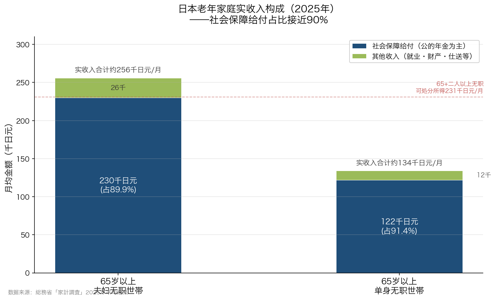

上图直观呈现了老年家庭收入的"年金一极化"特征：无论夫妇世帯还是单身世帯，社会保障给付均占实收入的近九成，就业、财产等其他收入来源合计不足一成。

与非老年群体对比，收入差距同样鲜明。高齢者世帯平均所得金额为318.3万日元（令和4年数据），仅为其他世帯（669.5万日元）的约47.5%；以等价可处分所得衡量为226万日元，约为其他世帯的69%[内閣府高齢社会白書令和6年版](https://www8.cao.go.jp/kourei/whitepaper/w-2024/html/zenbun/s1_2_1.html "令和6年版高齢社会白書")。

上述数据表明，日本老年家庭的收入绝对水平不高，但在社会保障体系的支撑下具备基本消费底线。收入构成的"年金一极化"意味着，年金制度的任何调整——无论是宏观经济滑条（マクロ経済スライド）的适用，还是替代率的下行——都将直接传导为老年消费能力的变化。

### 2.1.2 公的年金：绝对主力与下行压力并存

公的年金构成老年家庭收入的压倒性支柱。在受领公的年金的高齢者世帯中，年金占全部所得100%的世帯比例高达44.0%[内閣府高齢社会白書令和6年版](https://www8.cao.go.jp/kourei/whitepaper/w-2024/html/zenbun/s1_2_1.html "図1-2-1-13")。换言之，近半数老年家庭的全部生活来源系于年金这一单一管道。

就给付水平而言，2023年度末厚生年金保険老齢年金平均月额为147,360日元（男性166,606日元、女性107,200日元），国民年金（老齢基礎年金）平均月额为57,700日元[厚生労働省年金局](https://www.mhlw.go.jp/content/001359541.pdf "令和5年度厚生年金保険・国民年金事業の概況")。女性厚生年金给付仅为男性的64.3%，这一性别落差与第1章所述老年人口女性主导格局相叠加，形成银发消费市场中的一个结构性特征：规模最大的消费群体（高龄女性）恰恰是可支配收入最低的群体。

所得代替率是衡量年金购买力长期变动的关键指标。2024年度模型世帯所得代替率为61.2%。厚生労働省令和6年財政検証结果显示，在"过去30年投影ケース"下，该替代率将持续降至2057年的50.4%，其中基礎年金部分从36.2%降至25.5%，降幅达三成[厚生労働省](https://www.mhlw.go.jp/content/001270476.pdf "令和6年財政検証結果の概要")。这意味着，即便名义年金额因物价和工资调整而缓慢增长，老年人相对于现役世代的购买力仍将在未来30年间持续收窄。基礎年金的降幅尤为突出——若不加干预，至2050年代中后期，基礎年金的实质购买力将较当前水平缩减约三成。

### 2.1.3 年金制度改革：基礎年金底部保障的制度修复

正是基于上述财政检证的警示，日本国会于2025年6月13日通过了修订后的年金制度改革法案。该法案包含三项核心要点：其一，若2029年財政検証时确认基礎年金给付水平出现显著下降，政府将采取措施提高基礎年金给付水平；其二，将厚生年金的适用对象扩大至更多短时间劳动者和非正规雇用者——自2035年10月起取消企业规模（目前为51人以上）和最低年收入（目前为106万日元）门槛，所有每周工作20小时以上的雇员均须加入厚生年金，预计新增约180万人；其三，将65岁以上在职老人的年金减额基准从月收入合计51万日元提高至62万日元，使更多在职老年人能够领取全额年金[The Japan News](https://japannews.yomiuri.co.jp/politics/politics-government/20250613-263628/ "Japan Enacts Revised Pension Reform Bill, 2025年6月13日")。

这一改革对银发消费能力的影响具有双向性。一方面，基礎年金底部保障的强化将在一定程度上对冲替代率下行趋势，维护低收入老年群体的最低消费水平。另一方面，厚生年金适用范围的扩大意味着未来退休世代——尤其是此前仅加入国民年金的非正规雇用女性——将获得更高的年金给付，长期有利于提升老年家庭整体购买力。在职老人年金减额基准的放宽，则直接激励65岁以上就业者"既工作又领年金"，增加当期可支配收入。

## 2.2 高龄就业：收入结构的"第二支柱"加速崛起

日本老年人的就业参与率在发达国家中处于最高水平之一，这一特征正在深刻重塑老年家庭的收入构成。

2024年，日本65岁以上就业者达930万人，连续21年增长，占就业者总数的13.7%。分年龄段看，65–69岁就业率达53.6%、70–74岁达35.1%、75岁以上达12.0%，均创历史新高。国际横向比较中，日本65+就业率（25.7%）仅次于韩国（38.2%），远高于美国（18.6%）、德国（8.0%）和法国（3.6%）[総務省統計局](https://www.stat.go.jp/data/topics/pdf/topi146_02.pdf "統計からみた我が国の高齢者2025年")。

就业形态方面，65岁以上就业者中非正规雇佣占76.9%（433万人），其中兼职（パート・アルバイト）占52.9%（298万人）。过去10年间，65+正规职员增加44万人、非正规增加198万人[総務省統計局](https://www.stat.go.jp/data/topics/pdf/topi146_02.pdf "図8,9")。非正规为主的就业形态决定了高龄就业收入的单位贡献相对有限——多数高龄就业者月收入处于10万–20万日元区间——但对家庭总收入的边际提升效应不容忽视，在年金给付购买力缓慢下行的背景下尤其如此。

高龄就业率的持续攀升，正在将老年家庭的收入结构从"年金一极化"逐步推向"年金+就业收入"的双支柱模式。65–69岁年龄段的就业率已超过50%，意味着该年龄段的"前期高龄者"中逾半数在领取年金的同时继续从事有报酬的工作。随着2025年年金改革法放宽在职老人年金减额基准，"边工作边领年金"的经济激励进一步增强，预计高龄就业参与率将延续上升态势。

从消费能力的角度审视，有就业收入的老年家庭与纯无职老年家庭之间存在显著的消费能力分层。前者的可支配收入约为后者的1.5至2.0倍，由此构成银发消费市场内部"活力银发层"与"被动消费层"之间的分化基础。

## 2.3 金融资产存量：老年人持有全国家计金融资产的六成

可支配收入决定了老年家庭的"流量购买力"，而金融资产存量则构成其"存量购买力"的储备池。日本老年家庭的金融资产持有状况呈现一个引人注目的特征：绝对规模庞大，但结构保守、流动性利用不足。

### 2.3.1 储蓄规模与结构

2024年，世帯主60–69岁世帯平均贮蓄2,659万日元、负债270万日元，纯贮蓄（贮蓄减负债）2,389万日元，为各年龄段最高；70岁以上世帯平均贮蓄2,441万日元、负债仅56万日元，纯贮蓄2,385万日元[総務省家計調査貯蓄負債編2024年](https://www.stat.go.jp/data/sav/sokuhou/nen/pdf/2024_gai.pdf "2024年家計調査報告・貯蓄負債編")。

进一步聚焦65岁以上无职世帯，2024年平均贮蓄为2,560万日元（同比+2.2%），连续5年增加。其内部构成为：定期性预贮金占33.6%、通货性预贮金（活期存款等）占31.3%、有价证券占19.6%（同比+4.4个百分点）、生命保险等占15.0%[総務省家計調査貯蓄負債編2024年](https://www.stat.go.jp/data/sav/sokuhou/nen/pdf/2024_gai.pdf "世帯主65歳以上無職世帯の貯蓄")。

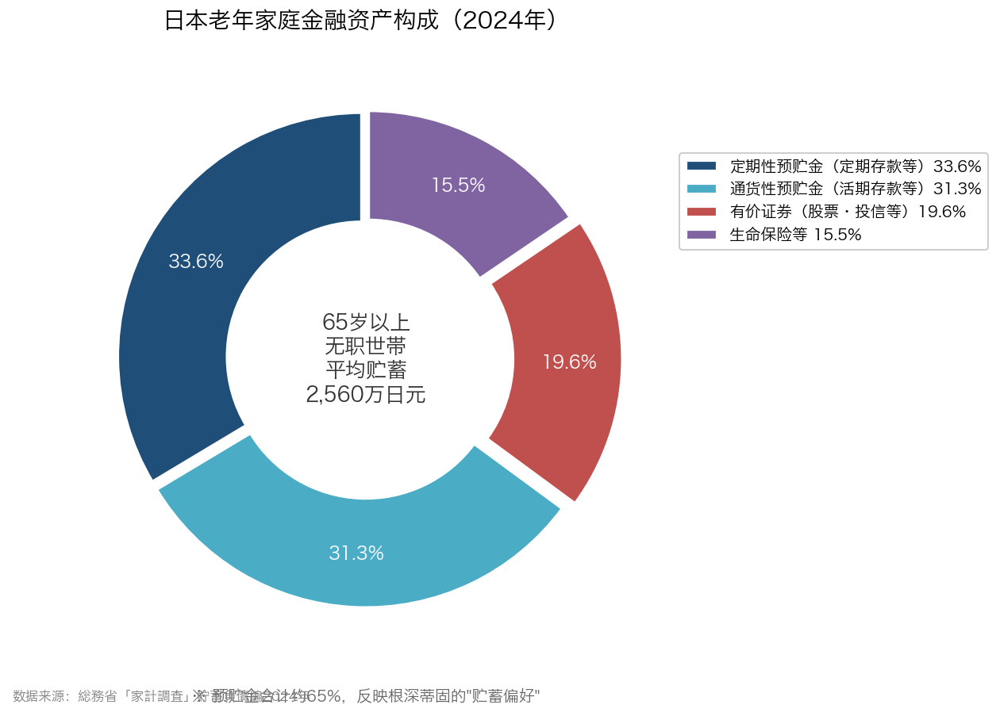

如上图所示，约65%的金融资产沉淀在预贮金（定期+活期）中，体现了根深蒂固的"贮蓄偏好"。有价证券占比从2019年的约15%提高至2024年的近20%，反映了日本政府推行新NISA（少額投資非課税制度）后老年人群体风险资产配置意识的初步觉醒，但整体资产结构仍以低收益的安全资产为主。

### 2.3.2 宏观金融资产格局：老年人持有"国民储蓄"的绝对多数

2025年12月末，日本家计部门金融资产残高达2,351兆日元（约15.1万亿美元），创历史新高，同比增长5.3%[ニッセイ基礎研究所](https://www.nli-research.co.jp/report/detail/id=84922?site=nli "資金循環統計25年10-12月期")。在这一天文数字中，世帯主60岁以上世帯保有的份额约占六成。据总务省《2019年全国家計構造調査》的年龄段拆分，60岁以上世帯保有个人金融资产的63.5%、住宅・宅地资产的58.4%[総務省「2019年全国家計構造調査」](https://www.stat.go.jp/data/zenkokukakei/2019/pdf/gaiyou0518.pdf "所得資産集計")。以此比例粗估，2025年末日本老年人群体（60岁以上）直接或间接持有约1,400兆日元以上的金融资产。

第一生命経済研究所的专项研究进一步预测，70岁以上高龄者保有的金融资产将从2023年约1,100兆日元增至2040年约1,500兆日元以上。然而，约三分之二为预贮金，"贮蓄偏好"严重限制了资产收益对消费的实际拉动效果[第一生命経済研究所](https://www.dlri.co.jp/report/ld/423458.html "人口減少社会での個人金融資産② 2025年3月")。

### 2.3.3 认知症风险下的"资产冻结"隐忧

庞大的老年金融资产面临一个日益严峻的系统性风险——认知症（痴呆症）导致的"资产冻结"。三井住友信託銀行調査部的推计显示，2020年日本认知症高齢者保有的金融资产约175兆日元、不动产约80兆日元，合计约255兆日元，占全家计资产总额的8.2%。随着高龄化进一步深化，2030年这一数字将膨胀至318兆日元（占比10.4%），2040年达349兆日元（占比12.1%）[三井住友信託銀行調査部](https://www.smtb.jp/-/media/tb/personal/useful/report-economy/pdf/121_1.pdf "膨らむ認知症高齢者の保有資産, 2022年5月")。

上述趋势意味着，至2040年日本家计资产总额中约12%——近350兆日元——可能因持有者认知能力下降而无法自由交易或管理，沦为"冻结资产"。这不仅直接削减银发消费市场的有效需求，还通过抑制中古住宅流通、阻碍金融资产再配置等渠道对宏观经济产生负面溢出效应。成年后见制度、家族信托等制度安排的普及速度，将成为影响银发消费能力能否充分释放的关键变量。

## 2.4 不动产资产：高持家率下的隐性财富

日本老年家庭的资产结构中，不动产占据举足轻重的地位。65岁以上世帯持家率高达94.8%（75岁以上为96.0%），远高于全年龄平均的87.3%；70岁以上世帯负债保有率仅10.6%（全体38.8%），住宅贷款基本偿还完毕[総務省家計調査2025年平均結果](https://www.stat.go.jp/data/kakei/sokuhou/tsuki/pdf/fies_gaikyo2025.pdf "参考4")。

从资产价值量级来看，总务省2014年全国消費実態調査的二人以上世帯数据显示，世帯主60代世帯平均宅地资产约2,312万日元、住宅资产约492万日元；70岁以上世帯平均宅地资产约2,380万日元、住宅资产约334万日元[総務省統計局](https://www.stat.go.jp/info/today/149.html "2014年全国消費実態調査 世帯主年齢階級別家計資産内訳")。实物资产（宅地+住宅+耐久消费财）在60代世帯中约为2,940万日元、在70+世帯中约为2,815万日元，占家计资产总额的61%至59%。换言之，老年家庭总资产中约六成为不动产、四成为金融资产，这一"不动产偏重"的资产结构在国际比较中颇为突出。

高持家率和低负债率使老年人的住居费支出极低——65岁以上夫妇无职世帯月均住居费仅约16,432日元（占消费的6.4%），主要为修缮维护支出而非房贷或租金[総務省「家計調査」2025年平均結果](https://www.stat.go.jp/data/kakei/sokuhou/tsuki/pdf/fies_gaikyo2025.pdf "高齢者住居費")。这一特征有效释放了老年家庭在其他消费品类上的支出空间，是理解日本老年消费倾向偏高的重要制度背景。

然而，不动产作为"隐性财富"的流动性问题同样值得关注。老年人持有的住宅多为战后建设的一户建木造住宅，随着建筑物折旧和地方城市地价下跌，其实际可变现价值与账面评估之间可能存在相当落差。日本全国空き家（空置房屋）数量已达约849万户，其中相当比例系老年人去世或入住养老设施后遗留[WEF](https://www.weforum.org/stories/2024/03/turning-japan-s-surging-empty-homes-into-community-assets/ "Turning Japan's surging empty homes into community assets")。不动产"变现难"限制了老年人通过处置房产补充消费的可能性，也使"反向抵押贷款"（リバースモーゲージ）等金融产品的推广面临结构性障碍。

## 2.5 消费支出总额与消费倾向：入不敷出的"解储蓄"模式

### 2.5.1 消费支出水平

将视角从收入和资产转向支出端，日本老年家庭消费呈现一个核心特征：消费支出持续超过可支配收入，即"解储蓄"（dis-saving）模式。

2025年，65岁以上夫妇无职世帯月均消费支出263,979日元（年约316.8万日元），平均消费性向达119.2%——月均超支42,434日元须动用储蓄弥补；65岁以上单身无职世帯月均消费支出148,445日元（年约178.1万日元），消费性向达125.3%——月均超支29,980日元[総務省家計調査2025年平均結果](https://www.stat.go.jp/data/kakei/sokuhou/tsuki/pdf/fies_gaikyo2025.pdf "夫婦高齢者/高齢単身無職世帯")。

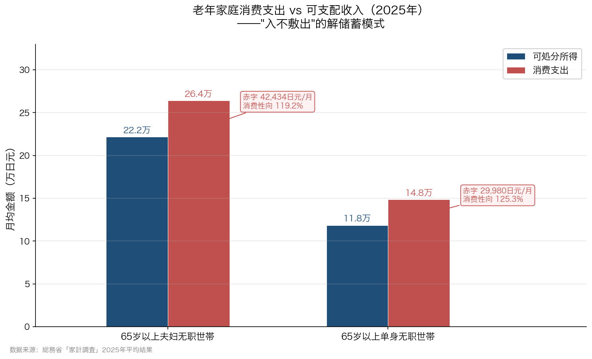

上图清晰展示了老年家庭"入不敷出"的收支格局。消费性向超过100%意味着老年人每月都在动用存量储蓄维持消费水平。以夫妇无职世帯月均超支42,434日元计，年均"解储蓄"约50.9万日元。若持有2,560万日元的平均储蓄，理论上可维持约50年的"解储蓄"（不考虑资产收益和通胀），表面看储蓄耗竭风险并不紧迫。但这一判断建立在平均值之上——储蓄分布高度不均，中位数远低于平均数。储蓄1,000万日元以上世帯虽逾六成，但也意味着近四成世帯储蓄不足1,000万日元，对于这部分低储蓄老年家庭而言，长寿化带来的"解储蓄"持续期延长是切实存在的风险。

### 2.5.2 主观经济感受：意外的乐观

与客观数据中"入不敷出"的画面形成有趣对照的是老年人的主观经济感受。内閣府调查显示，65岁以上老年人中68.5%认为经济生活"没有担忧"[内閣府高齢社会白書令和6年版](https://www8.cao.go.jp/kourei/whitepaper/w-2024/html/zenbun/s1_2_1.html "図1-2-1-10")。

这一"主观乐观"与"客观赤字"之间的反差，可从以下四个机制加以解释。第一，高持家率（94.8%）消除了最大固定支出项——住房费用——的不确定性。第二，日本介护保险和后期高齢者医療制度将重大疾病和介护的经济冲击在制度层面予以分散，个体感知到的"尾部风险"被有效抑制。第三，定额的年金给付提供了稳定的现金流预期，即使绝对金额不高，可预见性本身即降低了焦虑感。第四，老年人已完成子女教育投入和住房贷款偿还，生命周期中最大的两笔刚性支出已经消化完毕。

这种"主观不担忧"的心理状态对银发消费市场具有正面意义——它表明老年消费者并非处于"紧缩心态"，在基本需求得到满足的前提下，仍存在为健康、舒适和社交属性支付溢价的意愿空间。

## 2.6 2020–2050年购买力趋势展望

综合以上分析，我们对2020–2050年日本老年人群体购买力的结构性趋势作出如下判断：

**年金购买力：缓慢收窄但底部有保障。** 在基准情景下，モデル世帯所得代替率从当前的61.2%下行至2050年代中期的50%–55%区间，基礎年金实质购买力缩减约20%–30%。2025年年金改革法确立的"基礎年金底部保障"机制和厚生年金适用扩大，将在一定程度上缓冲这一下行趋势。我们判断，年金制度对老年消费的支撑力虽将减弱，但不至于出现断崖式下降。

**就业收入：结构性增量。** 随着65–69岁就业率从当前53.6%进一步攀升、在职老人年金减额基准放宽、劳动力市场供需紧张持续推动老年人劳动参与，高龄就业收入将成为抵消年金购买力下降的重要缓冲。预计至2040年代，65–69岁就业率有望突破60%，70–74岁就业率可能接近40%。

**金融资产：存量庞大但增长放缓、冻结风险上升。** 70岁以上高龄者保有金融资产预计从2023年约1,100兆日元增至2040年约1,500兆日元[第一生命経済研究所](https://www.dlri.co.jp/report/ld/423458.html "人口減少社会での個人金融資産②")，但其中认知症患者持有的"冻结资产"将同步从255兆日元膨胀至349兆日元[三井住友信託銀行調査部](https://www.smtb.jp/-/media/tb/personal/useful/report-economy/pdf/121_1.pdf "膨らむ認知症高齢者の保有資産")。金融资产对消费的实际拉动效果取决于两个关键因素：其一，"贮蓄偏好"能否在新NISA等制度推动下逐步转化为更高收益的资产配置；其二，成年后见制度和家族信托等安排能否有效防止"资产冻结"。

**不动产资产：价值分化加剧。** 大都市圈（东京、大阪、名古屋）老年人不动产资产将因地价回升而保持甚至增值；地方城市的不动产资产则面临空き家化和价值缩水的双重侵蚀。不动产对老年消费能力的支撑效应将呈现显著的地域分化。

**消费倾向：维持高位但存在世代更替效应。** 当前老年人超过100%的消费性向反映了"有恃（高储蓄）无恐"的消费心态。随着储蓄水平相对较低的非正规雇佣世代和终身未婚世代陆续进入老年，消费性向可能因"预防性储蓄动机"增强而有所回落。但在介护保险和医疗保障制度未发生根本性缩减的前提下，老年消费倾向大概率将维持在接近或超过100%的水平。

**总量判断。** みずほ銀行産業調査部2025年1月的推计显示，2040年シニア世帯（65+）消费支出总额将达60.5兆日元（実質），占全世代消費支出总额（150.9兆日元）的约40%——这一比例是当前约19%的两倍以上[みずほ銀行産業調査部](https://www.mizuhobank.co.jp/corporate/industry/pdf/msif_241.pdf "シニア消費の全世代における位置づけ")。银发消费在日本国民消费中的权重将从"五分之一"跃升至"五分之二"，这一结构性跃迁本身即构成银发经济的核心叙事。

## 2.7 本章小结：购买力底盘的结构性特征

本章分析揭示了日本老年消费市场购买力底盘的五个核心结构性特征：

**第一，收入依赖年金但底部有制度保障。** 社会保障给付占老年家庭实收入的80%–91%，年金替代率虽将下行，但2025年改革法为基礎年金设立了底部防护网。老年消费的"收入地板"由制度框架所决定，不会出现无序塌陷。

**第二，就业收入正在成为重要补充。** 930万65+就业者、53.6%的65–69岁就业率，使老年家庭收入结构从"年金一极化"逐步转向"年金+就业"双支柱模式。这一趋势在"前期高龄者"（65–74岁）中尤为显著。

**第三，金融资产存量巨大但利用率低。** 老年人持有全国家计金融资产的约六成（约1,400兆日元），户均储蓄约2,560万日元，但约三分之二沉淀在低收益的预贮金中。认知症带来的"资产冻结"风险是一个不断膨胀的系统性隐患。

**第四，不动产构成资产主体但流动性差。** 持家率94.8%、平均不动产价值约2,500万至3,000万日元，但变现困难，对消费的支撑主要体现为"免除住居费"的间接效应。

**第五，消费性向超过100%，"解储蓄"模式可持续但存在分化风险。** 当前老年人对经济生活的主观评价偏乐观（68.5%无担忧），支撑了积极的消费态度。但低储蓄世帯和未来世代的消费收窄风险不容忽视。

这些特征共同构成了后续各章消费领域市场规模测算的经济基础：一个总量庞大（60+兆日元/年消费）、增长缓慢但占比快速攀升（从19%到40%）、内部高度分化（有产"活力银发"与低收入"被动消费"并存）的购买力底盘。

# 第3章 衣——服装与日用品消费分析

## 3.1 老年家庭衣着支出的整体画像

### 3.1.1 衣着消费水平：显著低于全年龄段均值

在日本家庭消费支出的十大费目分类中，"被服及び履物"（衣着与鞋类）是老年家庭占比最低的费目之一，其支出水平与全年龄段均值之间存在系统性落差。2025年，日本二人以上世帯平均每月"被服及び履物"支出为10,063日元，占消费支出（314,001日元）的3.2%[総務省家計調査2025年平均](https://www.stat.go.jp/data/kakei/sokuhou/tsuki/pdf/fies_gaikyo2025.pdf "家計調査報告 家計収支編 2025年平均結果の概要")。相比之下，65岁以上夫妇无职世帯的该项支出仅约5,354日元/月（占消费支出的2.0%，年均约64,248日元），65岁以上单身无职世帯更低至约3,049日元/月（占2.1%，年均约36,588日元），均显著低于全年龄段均值[総務省家計調査2025年平均](https://www.stat.go.jp/data/kakei/sokuhou/tsuki/pdf/fies_gaikyo2025.pdf "参考4 65歳以上無職世帯")。

这一差距并非仅由收入水平较低所致，而是反映了老年家庭消费结构的深层重组。从支出结构来看，老年世帯将更大比例的预算分配给食料（约29.9%）、保健医療（约7.3%）与光热水道（约8.2%），衣着支出则被系统性压缩。総務省令和6年全国家計構造調査提供了更为精细的年龄段拆分数据：在世帯主65岁以上、无有业者的夫妇无职世帯中，65–69岁世帯被服及び履物月均支出为8,391日元，70–74岁为7,603日元，75岁以上仅为6,059日元——75+世帯的衣着支出仅为65–69岁世帯的72%[総務省「令和6年全国家計構造調査」](https://www.mhlw.go.jp/content/12002000/001662655.pdf "図Ⅱ-2 夫婦のみの世帯 65歳以上有業者のいない世帯")。

单身世帯中这一年龄梯度同样明显，且叠加了性别维度的分化。据同一調査，70代女性单身世帯被服及び履物占消费支出3.5%，80岁以上女性降至2.5%；男性在各年龄段均低于女性——70代男性被服占比仅1.9%，80岁以上男性进一步降至1.4%[総務省「令和6年全国家計構造調査」](https://www.mhlw.go.jp/content/12002000/001662655.pdf "図Ⅱ-3 男女年齢階級別費目別割合 単身世帯")。

### 3.1.2 年龄递减效应：从"时尚消费"到"功能性必需品"

独立行政法人労働政策研究・研修機構整理的2023年総世帯家計調査数据，提供了跨全年龄段的完整对照视角。在世帯主年齢階級別"被服・履物"月均支出中，40–49岁世帯最高为11,187日元，50–59岁为9,742日元，60–69岁降至7,333日元，70岁以上进一步降至4,659日元[独立行政法人労働政策研究・研修機構「データブック国際労働比較2025」](https://www.jil.go.jp/kokunai/statistics/databook/2025/09/d2025_9T-03-1.pdf "表9-3-1 世帯主年齢階級別家計支出")。70岁以上世帯的衣着支出仅为40代峰值的41.6%、全年龄平均水平（7,505日元）的62.1%，呈现出显著的"阶梯式递减"特征。

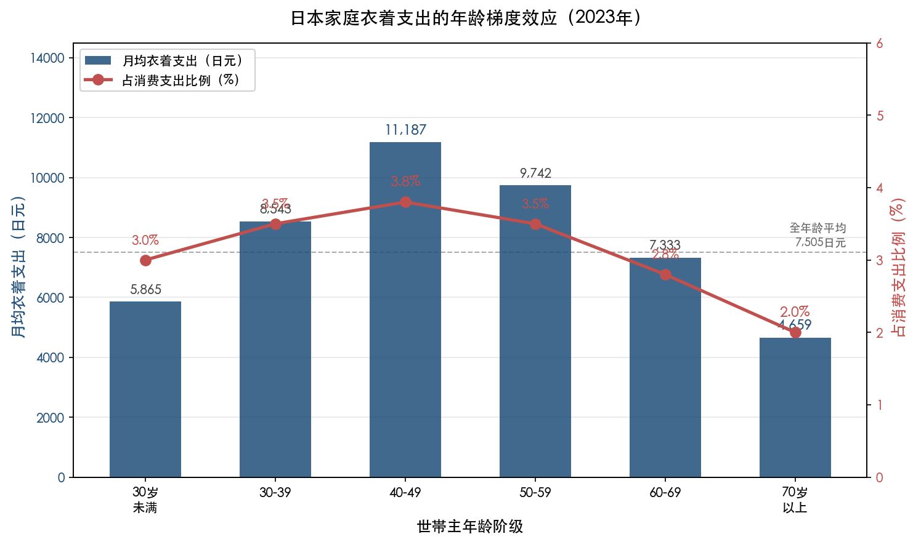

**图3-1** 以世帯主年龄阶级为横轴，柱状图展示月均衣着支出绝对额，折线图展示衣着占消费支出比例。40–49岁世帯衣着支出达到峰值11,187日元（占比3.8%），此后随年龄递减，70岁以上世帯仅为4,659日元（占比2.0%），呈现鲜明的"阶梯效应"。

老年家庭衣着消费的系统性递减，源于多重因素的叠加作用：退休后社交场景减少、体型变化趋缓导致既有服装淘汰率降低、对舒适性和实用性的优先度上升，以及日本老年群体中根深蒂固的节俭意识（もったいない文化）。这些因素共同推动衣着在消费预算中的优先序列持续下降，消费动机从"时尚驱动"向"功能必需"转移。

### 3.1.3 购买渠道的年龄特征

令和6年全国家計構造調査的购买先数据揭示了老年消费者独特的渠道偏好。70代世帯在百货店的消费比例达3.2%，为各年龄段中仅次于80岁以上（4.4%）的高水平；但在通信販売（互联网）上的购买比例仅为2.2%（80岁以上更低至1.5%），远低于30代的10.0%[総務省「令和6年全国家計構造調査」](https://www.mhlw.go.jp/content/12002000/001662655.pdf "表Ⅲ-4 世帯主年齢階級・購入先別消費支出")。

这一渠道结构呈现出"线下依赖与支付方式转型并行"的双重特征。老年消费者对百货店等实体渠道的依赖度相对较高，但在被服及び履物这一品类中，60.5%的消费已通过信用卡和电子货币（后付方式）完成，表明老年群体在传统门店场景中也在加速采用无现金支付手段[総務省「令和6年全国家計構造調査」](https://www.mhlw.go.jp/content/12002000/001662655.pdf "表Ⅲ-1 被服及び履物のクレジットカード比率59.5%")。对于服装品牌和零售企业而言，老年消费者的渠道策略需兼顾线下门店体验与数字化支付便利性的双重需求。

## 3.2 功能性服装与通用设计：适老化服装的新兴需求

### 3.2.1 日本适老化服装市场的兴起

伴随后期高龄者（75岁以上）人口的持续增长——从2024年的2,078万人向2055年峰值迈进——适应性/功能性服装（Adaptive Clothing）的需求正在经历结构性上升。传统服装在穿脱便利性、安全性和舒适性方面对高龄者的回应长期不足，由此催生了一系列设计创新：磁性扣件替代传统纽扣降低手部精细操作要求、弹性腰带取代拉链便于行动不便者使用、魔术贴（面ファスナー）实现单手操作、轮椅使用者专用的背面开放式设计减少体位变换负担等[Fibre2Fashion](https://www.fibre2fashion.com/industry-article/10433/japan-s-ageing-population-and-its-impact-on-the-textile-and-fashion-industry "Japan's Ageing Population and Fashion Industry, 2025")。

在制度层面，NPO法人ユニバーサルファッション協会长期致力于推动医療/介護领域功能性服装的标准化工作。尽管介護保険制度未直接覆盖衣着购置费用，但对于介護认定者而言，功能性介护服装已被视为维持日常生活尊严与自立能力的重要辅助工具，其在介護现场的实际渗透率稳步提升。

### 3.2.2 市场规模的估算与挑战

全球适应性服装市场在2024年估值约165亿美元（约2.5万亿日元），预计以8.1%的年均增速增长至2035年[Spherical Insights](https://www.sphericalinsights.com/blogs/top-20-companies-in-global-adaptive-clothing-market-2025-2035-competitive-analysis-forecast "Global Adaptive Clothing Market 2024-2035")。然而，日本市场单独的定量规模数据目前以付费机构报告为主，公开可得的权威定量来源仍较为有限。

作为全球老龄化程度最高的国家（65+占比已达29.4%），日本的适应性服装渗透率理论上具备全球领先的条件。但从市场实态来看，功能性服装仍以小型专业品牌和介護用品渠道为主要供给载体，大型服装品牌的实质性介入尚处于初期阶段。ユニクロ等品牌虽已在部分产品线中引入通用设计元素（如弹性面料、宽松版型），但尚未将"适老化"确立为独立的产品线定位。这一市场的成长空间与商业化进程，将在很大程度上取决于大型品牌的战略投入力度与介護保険制度的潜在覆盖扩展。

## 3.3 成人失禁用品：银发经济中的高增长赛道

### 3.3.1 市场规模与增长态势

成人失禁用品（大人用紙おむつ及び軽失禁ケア）是日本银发日用品领域增长最为强劲的细分市场。日本也是全球范围内最早实现"成人用纸尿裤出货量超过婴儿用"这一里程碑的国家。矢野経済研究所推计，2023年度日本大人用紙おむつ市场规模约2,027亿日元，已超过乳幼儿用纸尿裤成为纸尿裤领域的最大细分品类；経済構造実態調査的出荷额数据则显示，同年大人用紙おむつ出荷额约1,767亿日元[NIKKEI COMPASS](https://www.nikkei.com/compass/industry_s/0043 "衛生用紙業界 市場規模・動向 2023年")。两者差异主要源于统计口径不同——前者为终端零售额，后者为制造商出荷额。

从国际调查机构的更宽口径来看，IMARC Group估计2025年日本成人纸尿裤市场规模达29亿美元（约4,350亿日元），预计2026–2034年以6.84%的年均增速（CAGR）增长，2034年达54亿美元（约8,100亿日元）[IMARC Group](https://www.imarcgroup.com/japan-adult-diaper-market "Japan Adult Diaper Market Size, Industry Report 2026-2034")。IMARC口径涵盖更广义的成人失禁护理产品（含轻度失禁パッド和护理配件），因此规模显著高于矢野的纯"紙おむつ"口径。

### 3.3.2 市场结构与竞争格局

日本成人纸尿裤市场呈现高度集中的竞争格局。根据2024年购买动向调查，初次购买者中ユニ・チャーム旗下「ライフリー」占53.4%、大王製紙「アテント」占23.2%、花王「リリーフ」占12.4%，三大品牌合计份额近90%[介護ポストセブン](https://kaigo-postseven.com/177678 "大人用紙おむつ購入動向調査2024")。

行业龙头ユニ・チャーム作为全球最大的成人护理用品制造商之一，2025年度合并売上高达9,453亿日元[ユニ・チャーム2025年12月期決算](https://www.unicharm.co.jp/content/dam/sites/www_unicharm_co_jp/pdf/ir/library/investors/J_202512_Presentation%20Materials.pdf "2025年度連結業績")。パーソナルケア部门（含成人护理和婴儿护理）构成其核心收入来源。在日本国内市场，ユニ・チャーム通过「ライフリー」品牌覆盖从轻失禁パッド到重度護理おむつ的全产品线，并率先推出排泄ケア相談カウンセリング服务，推动商业模式从单纯的"产品销售"向"排泄护理综合方案"转型。这一战略转向标志着成人失禁用品正从标准化日用消耗品向个性化护理解决方案升级。

### 3.3.3 增长驱动因素

成人失禁用品市场的持续扩张由三重驱动力叠加推动：

**人口结构驱动。** 85岁以上人口——失禁发生率最高的年龄段——从2020年约616万人增至2035年约1,036万人、2050年约1,170万人（较2020年增长约90%）[厚生労働省](https://www.mhlw.go.jp/content/12300000/001099975.pdf "85歳以上人口推移")。这一群体的快速膨胀直接扩大了潜在使用者基数，构成市场增长最坚实的底层支撑。

**渗透率提升驱动。** 轻度失禁ケア产品（吸水パッド、失禁ショーツ等）的社会接受度与认知度持续提高。此前因羞耻心而未使用护理用品的高龄者，在产品设计改进（更薄型化、更隐蔽、气味控制技术升级）和药妆店/EC等便捷渠道扩展的双重推动下，正从"潜在需求"转化为"实际购买"。

**居家介護比重上升驱动。** 介護保险制度下居宅服务占比持续上升——2021年度居宅サービス给付约4.7兆日元，占介護给付总额44.1%——更多需要护理的高龄者选择居家而非入住设施。居家护理场景中，家庭自费购买纸尿裤的需求远大于设施集中采购模式，进一步拉动零售端销售增长。

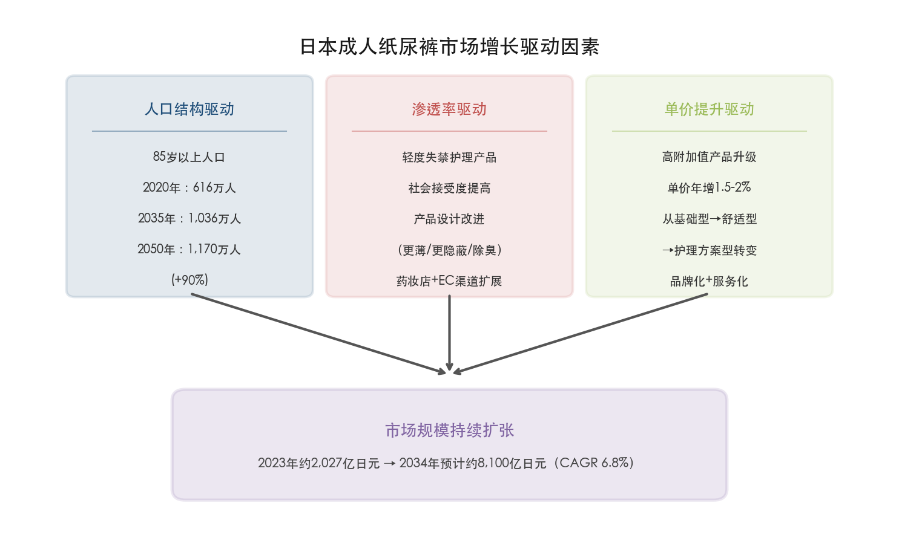

**图3-2** 日本成人纸尿裤市场三大增长驱动因素概览：人口结构驱动（85+人口从616万增至1,170万）、渗透率驱动（轻失禁护理产品社会接受度提升与渠道扩展）、单价提升驱动（高附加值产品升级），三重力量叠加推动市场规模从2023年约2,027亿日元向2034年约8,100亿日元持续扩张（CAGR 6.8%）。

## 3.4 个人护理与化妆品中的银发消费

### 3.4.1 化妆品市场的高龄者份额

2024年度日本国内化妆品市场规模为2兆5,800亿日元（制造商出荷金額，同比+4.1%），其中スキンケア占46.3%（1兆1,950亿日元）；预计2025年度将达2兆6,500亿日元[矢野経済研究所](https://www.yano.co.jp/press-release/show/press_id/3922 "化粧品市場に関する調査を実施 2025年")。化妆品市场整体保持增长态势，但高龄消费者在其中的具体份额长期缺乏精确的官方统计拆分。

行业估算显示，シニア向けコスメ（面向高龄者的化妆品）市场规模约为3,000亿日元以上，约占国内化妆品市場的11–12%[週刊粧業](https://www.syogyo.jp/matome/2025/03/post_040675 "シニア向けコスメの市場規模・傾向")。高龄消费者在スキンケア类目中的支出比重尤为突出：随着年龄增长，彩妆使用频率逐步下降，但基础護肤需求（保湿、抗皱、防晒）反而上升。50代以上消费者已成为高价格帯スキンケア製品的核心购买群体，这一消费结构特征为化妆品企业的产品研发方向提供了明确的市场信号。

### 3.4.2 口腔护理：与高龄化关联最为紧密的日用品领域

口腔护理（オーラルケア）市场与老龄化的关联度在所有日用品类目中最为直接。2024年日本オーラルケア市场销售额为3,596亿日元（同比+4.9%），富士経済预测2030年将达约4,408亿日元（较2022年增长17.1%）[週刊粧業](https://www.syogyo.jp/news/2025/10/post_042500 "オーラルケア市場2025年下期")[富士経済](https://hoitto-hc.com/5280/ "2030年オーラルケア関連市場予測")。

老年群体的口腔护理需求具有鲜明的品类特征：义齿清洗剂、义齿稳定剂、口腔保湿剂等高龄者特有品类增长迅速；咀嚼功能维持相关产品（含氟漱口水、高龄适配型电动牙刷）需求持续上升；入れ歯使用者的护理意识正从"仅清洁"向"舒适佩戴+口腔粘膜全链条护理"升级。在75岁以上人口占比从当前的16.8%持续攀升的人口格局下，口腔护理市场中由高龄者驱动的增长份额将进一步扩大，成为日用品行业中受益于老龄化结构红利最为确定的细分领域之一。

## 3.5 市场规模推演：2030–2050年"衣"类消费的总盘子

### 3.5.1 推演框架与核心假设

为全面衡量老龄化对"衣"类消费的综合影响，本节将"衣"类消费定义为涵盖三个子领域的广义范畴——衣着与鞋类（被服及び履物）、成人失禁用品、个人护理与化妆品中的高龄者相关份额——并对2030、2040、2050年三个节点进行情景式推演。

**核心假设参数：**

- **人口参数：** 依据第1章IPSS中位方案，65+人口2030年3,696万人、2040年3,929万人（峰值附近）、2050年3,888万人。
- **世帯数参数：** 依据IPSS世帯推計，65+世帯主世帯从2020年约2,097万户增至2050年约2,403万户。
- **名义单价变动：** 衣着类单价名义年增约1%（反映物价温和上升，但衣着CPI长期低于整体CPI）；成人失禁用品单价年增约1.5–2%（反映高附加值产品占比提升）；个人护理/化妆品年增约2%。

### 3.5.2 子领域分项推演

**（1）衣着与鞋类**

以2025年为基准，65+夫妇无职世帯年均衣着支出约64,248日元、单身无职世帯约36,588日元。考虑到世帯主65岁以上的世帯总数约2,200万户（2025年附近），且夫妇世帯与单身世帯比例约55:45（IPSS世帯推計），加权平均每户年均衣着支出约51,000–52,000日元，由此估算2025年65+世帯衣着消费总额约1.1–1.15兆日元。

- 2030年：世帯数微增、单价年增1%，推估约1.2兆日元。
- 2040年：世帯数达峰值附近、单价累积增长约16%，推估约1.35–1.4兆日元。
- 2050年：世帯数维持高位但65+人口微降、后期高龄者比重升高导致人均衣着支出进一步降低，推估约1.3–1.4兆日元。

**（2）成人失禁用品**

以矢野口径2023年度约2,027亿日元为基准，结合IMARC的增速趋势（CAGR约5–7%）进行推估：

- 2030年：约2,800–3,200亿日元。
- 2040年：约4,500–5,500亿日元（85+人口快速增长构成核心驱动力）。
- 2050年：约6,000–8,000亿日元（取决于居家介護渗透率提升幅度和产品升级速度）。

**（3）个人护理/化妆品中的高龄者份额**

以2024年シニア向けコスメ约3,000亿日元及口腔护理市场中老年人相关份额约1,500亿日元为参照（合计约4,500亿日元），结合人口增长和高龄者美容/护理意识提升趋势：

- 2030年：约5,500–6,000亿日元。
- 2040年：约7,000–8,000亿日元。
- 2050年：约7,500–8,500亿日元。

### 3.5.3 总量汇总

| 时间节点 | 衣着与鞋类 | 成人失禁用品 | 个人护理/化妆品（高龄者份额） | 合计 |
|---------|-----------|------------|------------------------|------|
| 2025年（基准） | 约1.1兆日元 | 约0.2兆日元 | 约0.45兆日元 | **约1.75兆日元** |
| 2030年 | 约1.2兆日元 | 约0.3兆日元 | 约0.55–0.6兆日元 | **约2.0–2.1兆日元** |
| 2040年 | 约1.35–1.4兆日元 | 约0.45–0.55兆日元 | 约0.7–0.8兆日元 | **约2.5–2.75兆日元** |
| 2050年 | 约1.3–1.4兆日元 | 约0.6–0.8兆日元 | 约0.75–0.85兆日元 | **约2.65–3.05兆日元** |

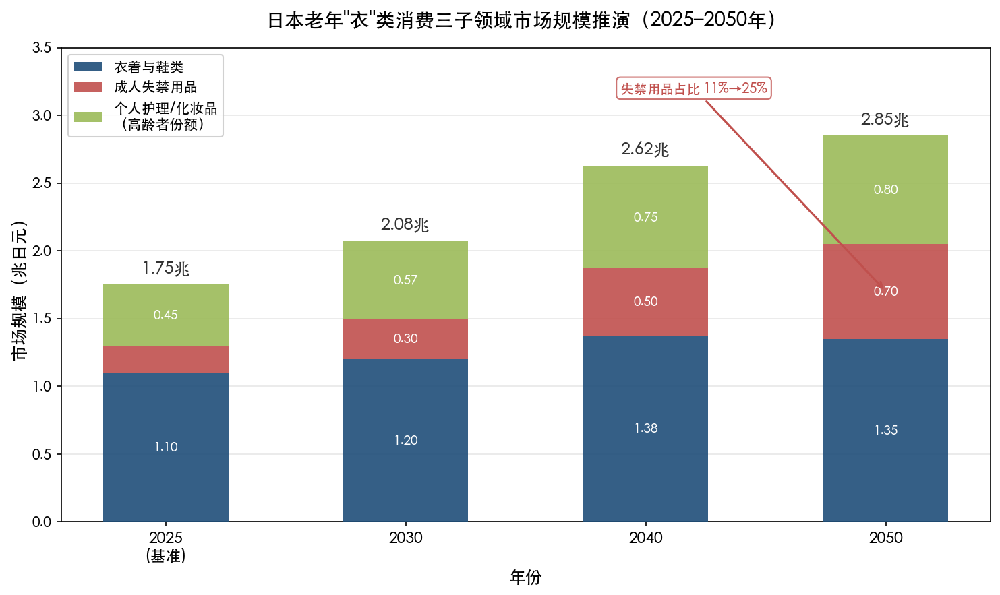

**图3-3** 以2025/2030/2040/2050年四个时间节点为横轴，堆叠展示衣着与鞋类、成人失禁用品、个人护理/化妆品（高龄者份额）三个子领域的市场规模。总盘子从2025年约1.75兆日元增至2050年约2.85兆日元，其中成人失禁用品占比从11%提升至25%，增长引擎的结构性迁移趋势清晰可见。

上述推演显示，广义"衣"类消费（含服装、失禁护理、个人护理/化妆品）从2025年约1.75兆日元到2050年有望达到约2.65–3.05兆日元，增幅约51–74%。增长引擎正从传统衣着（增速缓慢甚至停滞）向成人失禁用品（年增5–7%）和个人护理（年增2–3%）迁移。至2050年，成人失禁用品在"衣"类总盘子中的占比有望从2025年的约11%提升至23–26%，成为仅次于传统衣着的第二大子领域。

### 3.5.4 主要不确定性因素

上述推演的**上行风险**包括：①健康老龄化加速（"マイナス5歳"情景）使前期高龄者的体能状态和社交活跃度优于历史同龄群体，从而提升衣着消费意愿；②成人失禁护理用品的去污名化进程超预期，轻失禁ケア产品加速进入日常消费品行列；③高龄者EC渠道普及率加速提升，有效降低购买摩擦、扩大可触达的商品选择范围。

**下行风险**包括：①年金替代率下行幅度超预期（IPSS出生低位+经济停滞情景），实质性压缩老年家庭可支配收入；②消费税进一步调升对低收入高龄者产生显著的消费抑制效应；③通缩环境回归导致名义单价增速低于本推演的基准假设。

## 3.6 结构性特征与趋势判断

综合以上分析，我们认为日本老年"衣"类消费市场呈现以下四个结构性特征：

**第一，传统衣着消费"量缩价稳"。** 老年世帯的衣着支出绝对水平随年龄递减，占消费总支出的比重持续下降，但65+人口基数的庞大规模和单价的温和上升使得总量维持在1.1–1.4兆日元区间内波动，难以出现显著萎缩。这一领域的投资机会不在于总量扩张，而在于品类结构的升级与渠道效率的提升。

**第二，功能性需求取代时尚需求成为核心增长锚。** 适应性服装（Adaptive Clothing）正从边缘的介護用品逐步走向主流化。随着75+人口占比从当前的16.8%攀升至2050年代中期的25%以上，对穿脱便利、安全防护、舒适面料的功能性需求将深度重塑老年服装的产品结构与设计理念。

**第三，成人失禁用品是"衣"类中增长确定性最高的赛道。** 其增长动力来自"三重叠加"——85+人口膨胀、渗透率提升、产品单价上行——在人口结构已基本锁定的前提下，2040年代之前几乎不存在需求回落的结构性风险。该领域有望在2050年占据广义"衣"类消费总盘子的四分之一左右。

**第四，个人护理/化妆品的"シニアシフト"（银发转向）正在加速。** 高龄化率从30%向37%迈进的过程中，化妆品企业不得不将产品研发与营销资源向50代以上消费者倾斜。"抗老"已从营销话术升级为核心品类逻辑，高龄消费者正在成为スキンケア高端产品的第一购买力。

# 第4章 食——食品、饮料与餐饮服务消费分析

## 4.1 老年家庭食料支出的整体画像

### 4.1.1 恩格尔系数居高：食料是老年消费的第一大费目

在日本老年家庭的消费支出结构中，食料（食品及饮料）以绝对优势居于各费目之首。2025年，65岁以上夫妇无职世帯月均食料支出达78,964日元，占消费支出的29.9%（年均约94.8万日元）；65岁以上单身无职世帯月均食料支出42,545日元，占消费支出的28.7%（年均约51.1万日元）[総務省「家計調査」2025年平均](https://www.stat.go.jp/data/kakei/sokuhou/tsuki/pdf/fies_gaikyo2025.pdf "65歳以上無職世帯の家計収支")。综合来看，老年世帯的恩格尔系数约为30.4%，高于2025年全年龄段二人以上世帯的28.6%，表明食料支出在老年家庭财务中占据着更为突出的份额。

这一差距源于多重结构性因素的叠加。第一，退休后可支配收入下降，但食料作为生存刚需的绝对支出额难以等比压缩，恩格尔系数因此被动上升。第二，75岁以上后期高龄者对外食的参与度降低，但对加工食品、惣菜（调理食品）、配食服务的依赖度上升，单位食料成本反而增加。第三，高龄者对健康功能食品、通用设计食品（UDF）等高附加值品类的消费意愿增强，推升了食料消费的平均单价。三者共同作用，使老年世帯的恩格尔系数系统性高于全年龄平均值。

从全国层面观察，2024年日本全体家计恩格尔系数达28.3%，为2000年以来最高水平。中长期上升的主要驱动力包括：食料物价上升（CPI同比+4–5%）、高龄世帯占比持续增加、以及调理食品和外食等高单价品类消费增加[農林水産省白書](https://www.maff.go.jp/j/wpaper/w_maff/r6/r6_h/trend/part1/chap5/c5_4_00.html "エンゲル係数動向")。随着75岁以上后期高龄者在总人口中占比从2024年的16.8%向2050年代中期的25%以上攀升，老年世帯的高恩格尔系数将进一步拉高全国平均水平，食料支出的结构性刚性将成为观察老年消费演变的核心指标。

### 4.1.2 食料消费的品类结构：中食崛起与外食退缩

老年家庭的食料消费呈现鲜明的"中食崛起、外食退缩"特征。2025年，全年龄二人以上世帯食料支出中外食占17.5%（16,563日元/月），调理食品（中食/惣菜）占14.3%（13,580日元/月），二者合计约占食料总支出的31.8%[総務省「家計調査」2025年平均](https://www.stat.go.jp/data/kakei/sokuhou/tsuki/pdf/fies_gaikyo2025.pdf "食料費目別内訳")。

对于65岁以上世帯而言，外食支出占比显著低于全年龄平均水平，而调理食品占比则明显偏高。这一结构性差异的背后有清晰的行为逻辑：高龄者外出频率降低、咀嚼·吞咽功能制约、以及对餐厅环境的抵触（噪音、拥挤、数字化点单等），共同压低了外食参与度。与此同时，独居老人因缺乏烹饪动力和体力，以及双人高龄世帯中一方丧偶或健康衰退导致的烹饪能力下降，使"现成可食"的中食产品成为越来越多老年家庭的日常刚需。图4-1直观呈现了这一品类结构差异。

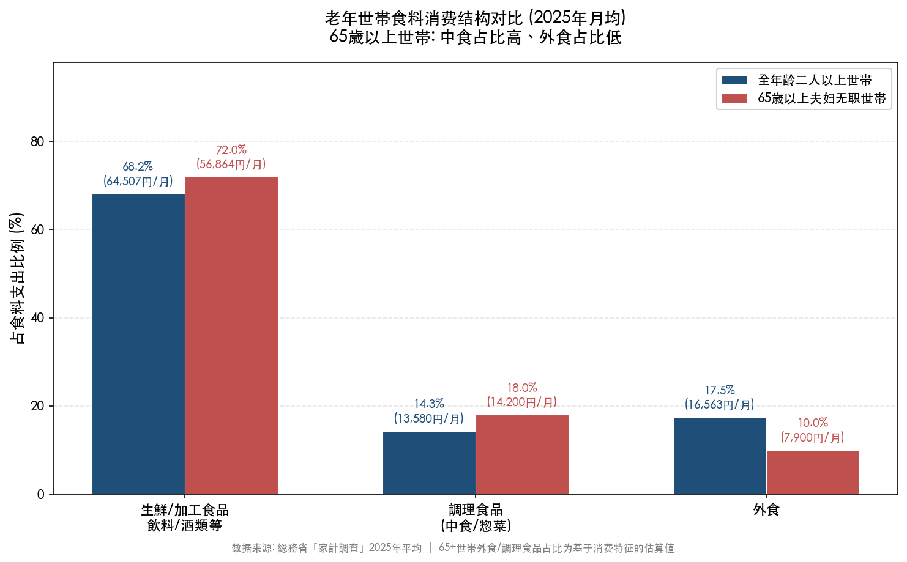

如图所示，65岁以上夫妇无职世帯的调理食品（中食/惣菜）占食料支出比重约18.0%，高于全年龄二人以上世帯的14.3%；而外食占比仅约10.0%，远低于全年龄平均的17.5%。这一"中食替代外食"的消费模式转换，是理解老年食料消费结构演变的关键线索。

值得关注的是，65–74岁前期高龄者在互联网购买食品的比例在各年龄段中居于前列。这一现象反映了"团块世代"（1947–1949年出生、2024年已全部进入75+）及其后续世代对网购的较高接受度，以及生鮮食材宅配和冷冻弁当定期配送服务在高龄市场中的快速渗透[農林水産省白書](https://www.maff.go.jp/j/wpaper/w_maff/r6/r6_h/trend/part1/chap5/c5_4_00.html "令和6年度食料消費動向")。随着数字化消费能力更强的世代陆续迈入老年期，食品电商渠道在老年食料消费中的占比有望持续提升。

## 4.2 中食（惣菜）市场：11万亿日元赛道与老年需求引擎

### 4.2.1 市场规模的历史性突破

日本中食（惣菜）市场在2024年实现了历史性跨越。日本惣菜協会发布的《2025年版惣菜白書》显示，2024年日本中食市场规模达11兆2,882亿日元（同比+2.8%），首次突破11万亿日元大关，连续3年创历史新高[日本惣菜協会「2025年版惣菜白書」](https://www.nsouzai-kyoukai.or.jp/wp-content/uploads/2025/05/20250519.pdf "2024年惣菜市場規模")。

这一增长并非简单的物价驱动。尽管食品原材料价格和人工成本上升贡献了部分名义增量，但中食市场的实质扩张背后存在两大结构性力量。其一，高龄单身世帯持续增加——从2020年的738万户增至2050年预计的1,084万户（+47%）[IPSS「日本の世帯数の将来推計（令和6年推計）」](https://www.ipss.go.jp/pp-ajsetai/j/HPRJ2024/hprj2024_gaiyo_20240412.pdf "表4 世帯主65歳以上の世帯")——为中食提供了最确定的增量需求来源。其二，共働き世帯和高龄世帯对"簡便化"的共同追求，使超市惣菜、便利店弁当和冷冻调理品成为跨越年龄层的刚需品类，市场基底持续扩大。

### 4.2.2 老年消费者在中食市场中的角色

在11.3万亿日元的中食市场中，老年消费者虽非唯一驱动力，却是增速最为确定的需求群体。其确定性来源于三方面叠加的结构性因素。

**独居化加速。** 65岁以上独居世帯从2020年的738万户增至2050年的1,084万户，届时独居率男性升至26.1%、女性升至29.3%[IPSS「日本の世帯数の将来推計（令和6年推計）」](https://www.ipss.go.jp/pp-ajsetai/j/HPRJ2024/hprj2024_gaiyo_20240412.pdf "表6 独居率")。独居意味着烹饪效率极低——食材浪费率高、烹饪动力不足——中食是成本最优的日常膳食替代方案。

**烹饪能力退化。** 随着年龄增长，站立烹饪所需的体力和认知功能逐步下降，尤其是后期高龄者（75+）中轻度认知障碍（MCI）发生率上升，使在家烹饪的安全风险（火灾、烫伤等）显著增加。这促使本人或其家属主动选择现成惣菜或配食服务替代自主烹饪。

**营养管理需求。** 独居高龄者面临严重的"低营养"风险——单独用餐（孤食）导致食欲下降、品类单一化，营养摄入不均衡。超市和便利店在近年推出的"高龄者友好"少量包装惣菜、低盐减糖弁当，正是对这一需求的商业回应，也为中食市场中老年消费增量的持续释放提供了产品基础。

## 4.3 健康功能食品：特保、机能性表示食品与保健品

### 4.3.1 机能性表示食品的强劲扩张

日本健康功能食品市场的增长引擎已从特定保健用食品（トクホ）转向机能性表示食品。2024年，机能性表示食品国内市场规模预计达7,274亿日元（同比+5.2%），延续了自2015年制度创设以来的高速扩张态势[富士経済](https://www.fuji-keizai.co.jp/press/detail.html?cid=25021 "H・Bフーズマーケティング便覧2025")。相比之下，特保食品因机能性表示食品的替代效应持续缩小，市场规模从2015年的3,784亿日元降至2024年的约2,500–3,000亿日元区间，富士経済预测2026年将进一步缩至约2,542亿日元[富士経済](https://www.fuji-keizai.co.jp/press/detail.html?cid=24019 "特定保健用食品などの国内市場を調査")。

与此形成对比的是，日本健康·营养食品协会基于制造商调查的口径显示，トクホ市场在2018年前后维持约6,000亿日元以上的规模，最新一轮调查显示为6,586亿日元[日本健康・栄養食品協会](https://jhnfa.org/tokuho-market.html "トクホ市場6586億円")。协会口径与富士経済口径的差异主要源于统计范围界定不同（协会口径包含部分非严格トクホ许可的关联产品），但两者所反映的趋势一致：トクホ的市场增长已经停滞，机能性表示食品正在快速替代其市场份额。

机能性表示食品的增长热点正从传统的"脂肪低减"向多元化健康声称领域扩展。2024年的主要增长品类包括：免疫機能維持约410亿日元（同比双位数增长）、疲労感軽减347亿日元（同比+45.8%）等新兴领域[富士経済](https://www.fuji-keizai.co.jp/press/detail.html?cid=25021 "H・Bフーズマーケティング便覧2025")。对老年消费者而言，膝関節支持、認知機能維持、免疫力強化等健康声称与其核心健康诉求高度契合，使高龄人群成为机能性表示食品的重要用户群体。

### 4.3.2 健康食品市场的整体图景

将视野扩展至含补充剂在内的广义健康食品市场，2024年度市场规模预计为8,945亿日元（同比-1.2%）。短期下行主要受2024年初"紅麹問題"冲击——小林製薬含紅麹成分的机能性表示食品引发健康损害事件——导致消费者信心一度下挫、定期购买者流失。矢野経済研究所预测该市场将在2025年后逐步恢复，2029年度回升至9,000亿日元以上[矢野経済研究所](https://www.yano.co.jp/press-release/show/press_id/3760 "健康食品市場調査2025年")。

富士経済从更宽泛的"H&B食品"口径估算，2024年日本健康志向食品（明らか食品和饮料类）市场为1兆7,944亿日元（同比+1.9%），2025年预计达1兆8,390亿日元。加上补充剂，H&B食品总市场2024年达2兆8,370亿日元（2022年比+4.8%）。在这一近3万亿日元的市场中，高龄消费者的贡献份额虽无精确的官方拆分，但考虑到膝関節、認知機能、骨密度等老年核心诉求品类的高集中度，我们保守估计老年人群占机能性表示食品消费的35–40%以上。

### 4.3.3 机能性表示食品与老龄化的共振效应

日本的健康功能食品市场与老龄化进程形成了显著的正反馈循环。一方面，老年人口基数扩大直接放大了与衰老相关的健康诉求品类（关节、认知、免疫、睡眠、骨骼）市场规模；另一方面，2015年制度创设的机能性表示食品降低了企业开发门槛——相较于トクホ需经过消费者厅严格审查，机能性表示食品仅需企业自行负责的科学证据（系统综述，Systematic Review）即可申报——使大量面向老年人群的功能性新品得以迅速上市，供给端与需求端形成共振。

从中长期看，这一市场的增长天花板取决于两个关键变量。其一为高龄人口规模，65+人口从2025年的3,653万人增至2043年峰值3,953万人，为市场扩容提供持续的人口基础。其二为个人健康管理意识的代际跃迁——相较于现有75+世代，即将进入老年期的"团块Junior"世代（1971–1974年出生）对健康食品的接受度和信息获取能力更高，有望推动渗透率进一步提升，成为该市场下一阶段增长的重要支撑。

## 4.4 介护食品与通用设计食品（UDF）：咀嚼·吞咽功能下降催生的增长赛道

### 4.4.1 UDF市场的持续扩容

通用设计食品（Universal Design Food，UDF）是日本介護食品協議会认定的标准化分级体系，将食品按咀嚼·吞咽难易度分为4个等级（从"容易咀嚼"到"无需咀嚼"），面向因老化或疾病导致进食困难的群体。

2024年，UDF生产量达72,041吨（同比+5.2%），生产额563.56亿日元（同比+10.0%），为2021年以来首次实现量价齐升。其中市售用产品244亿日元、业务用产品（医院/养老设施用）320亿日元[日本介護食品協議会](https://www.udf.jp/news/press_release20250602.pdf "2024年UDF生産統計")。生产额增幅（+10.0%）显著高于生产量增幅（+5.2%），反映了UDF产品均价的结构性上行——高附加值的"无需咀嚼"级别产品和冷冻调理型介护食的占比提升，推高了吨均价格。

将统计口径扩展至介護食品加工品全体，矢野経済研究所数据显示，2023年度日本介護食品加工食品市场1,350亿日元（同比+3.4%），高龄者食品加工300亿日元（同比+3.1%），合计1,650亿日元。该研究所预测，2028年度介護食品+高龄者食品+病者食品加工品合计将达2,215亿日元[矢野経済研究所](https://www.dreamnews.jp/press/0000306510 "介護食・高齢者食市場調査2024年")。

### 4.4.2 需求驱动力：85+超高龄人口的倍增

介护食品需求增长的核心引擎是85岁以上超高龄人口的快速膨胀。该群体从2020年约616万人增至2035年约1,036万人、2050年约1,170万人[厚生労働省](https://www.mhlw.go.jp/content/12300000/001099975.pdf "85歳以上人口推移")，近乎翻倍。85+群体的咀嚼·吞咽障碍发生率显著高于65–74岁群体，是UDF和介护食品的最核心用户。图4-2直观展示了85+人口规模与介护食品市场规模之间的强正相关驱动关系。

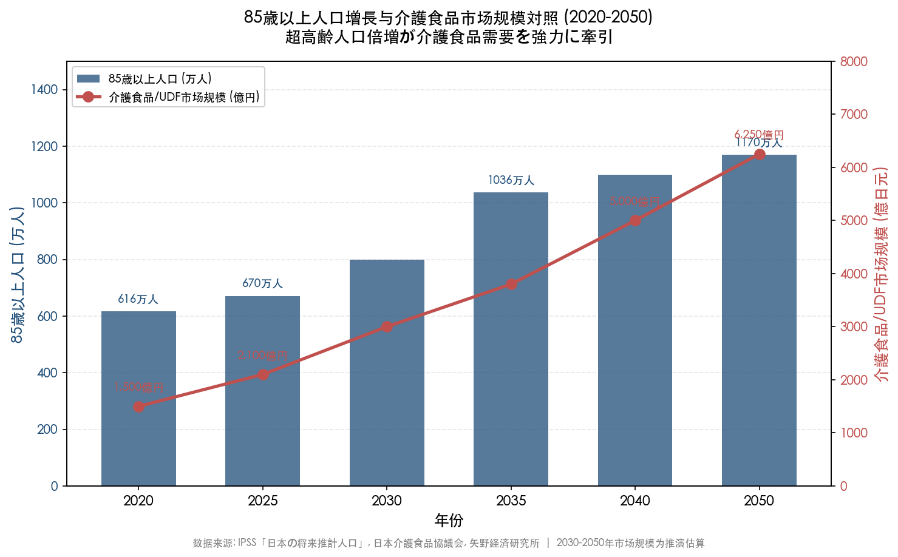

如图所示，85岁以上人口从2020年的616万人增至2050年的1,170万人（增幅约90%），同期介护食品/UDF/高龄者向け食品市场规模从约1,500亿日元扩张至约6,250亿日元（增幅超过4倍）。市场增速显著快于人口增速，表明渗透率提升和产品高端化带来的单位消费额增长，是叠加于人口基数扩大之上的第二增长动力。

独居老人增加进一步放大了市场需求。独居高龄者在进食方面面临"三重困境"：烹饪能力下降（体力/认知限制）→食物品类单一化→营养不良风险上升→身体机能进一步衰退，形成恶性循环。市售UDF产品和配食服务提供了打破这一循环的商业解决方案，其渗透率随独居世帯增加而稳步提升[日本介護食品協議会](https://www.udf.jp/news/press_release20250602.pdf "2024年UDF統計")。

### 4.4.3 高龄者向け食品市场的总量视角

富士経済从更宽泛的"高龄者向け食品"口径（含流動食·半固形食、增稠调整食品、营养补给食品等介护食品，以及面向活跃高龄者的减盐/低糖/软质食品）估算，2025年日本高龄者向け食品市场达2,046亿日元（较2018年+25.5%）。养老机构供餐市场中，人手不足正推动高附加值完调品（fully-cooked meals）的采用，进一步拉升市场规模[Care Show Japan/富士経済](https://www.care-show.com/prediction2025/ "高齢者向け食品市場の将来展望2019")。

这一增长趋势具有高度可预见性。介护认定者2024年度已达573万人[厚生労働省](https://www.nippon.com/ja/japan-data/h02572/ "R6年度利用者数573万人")，且在高龄人口持续增长的背景下仍将稳步扩大。无论是居家介护场景中的市售UDF购买，还是养老设施中的业务用介护食品采购，预计均将维持年均3–5%的增速至2040年代。

## 4.5 给食·配食服务：从机构供餐到居家送餐的扩张

### 4.5.1 医疗给食·在宅配食的2.4万亿日元市场

日本的给食（供餐）和配食（送餐）服务市场已形成可观规模。2024年度，医疗给食（病院给食+高龄者设施给食）与在宅配食服务的合计市场规模达2兆4,096亿日元（同比+2.4%），矢野経済研究所预测2029年度将达2兆5,122亿日元[矢野経済研究所](https://www.yano.co.jp/press-release/show/press_id/3857 "メディカル給食・在宅配食サービス市場調査2025年")。

这一市场的内部结构正在发生显著变化。传统的病院给食市场因医院数量整合和住院日数缩短而趋于停滞，但高龄者施設給食市场规模已超过病院给食，反映了养老设施入住者数量的持续增长。在宅配食服务（面向居家高龄者的定期送餐）则是增速最快的子领域——シードプランニング预测，高龄者/病者向け配食服务市场整体销售额从2019年的1,800亿日元增至2025年约2,160亿日元[シード・プランニング](https://www.seedplanning.co.jp/press/2019/2019121901.html "高齢者/病者向け配食サービス市場")。

### 4.5.2 冷冻宅配食：新增长热点

在配食服务市场中，冷冻宅配食（冷冻弁当·惣菜的定期配送）正成为近年最突出的增长热点。相较于传统常温配食（每日配送、保质期短、配送半径受限），冷冻宅配食具有多重优势：

**保质期长、配送灵活。** 冷冻弁当可一次配送一周至一个月的量，显著减少配送频次和物流成本。

**菜单多样化。** 冷冻技术使低盐、减糖、软质等多种膳食需求的定制化成为可能，契合老年消费者个性化的健康管理诉求。

**与电商渠道深度融合。** 通过订阅制模式，高龄消费者或其子女可在线选购和管理送餐计划，降低了购买门槛。

矢野経済研究所数据显示，2024年度食品宅配市场（含在宅配食在内的8个分野合计）达2兆6,380亿日元（同比+1.7%），预测2029年度达2兆9,174亿日元（+10.6%）。高龄·单身世帯需求被明确列为核心驱动力之一[矢野経済研究所](https://www.yano.co.jp/press/press.php/003977 "食品宅配市場調査2025年")。

### 4.5.3 配食服务的社会功能延伸

配食服务在日本已超越纯粹的"食品供应"范畴，承担着重要的社会功能。许多地方自治体将高龄者向け配食服务纳入介护预防和"见守り"（安否确认）体系——配送员在送餐时确认独居老人的安全状况，一旦发现异常即向地域包括支援中心报告。这一"送餐+安全确认"的双重功能，使配食服务获得了公共政策的强力支持，部分自治体对符合条件的高龄者提供送餐费用补助。

随着独居高龄者从2020年的738万户增至2050年的1,084万户，其中85岁以上独居世帯从147万户增至277万户（+88%）[IPSS「日本の世帯数の将来推計（令和6年推計）」](https://www.ipss.go.jp/pp-ajsetai/j/HPRJ2024/hprj2024_gaiyo_20240412.pdf "表5、表7")，配食服务的定位正从单一的商业服务向维系超高龄社会基本生活安全的社会基础设施转变。这一定位转变意味着，配食服务的增长不仅受商业逻辑驱动，更将持续获得公共财政和政策支持。

## 4.6 市场规模推演：2030–2050年"食"领域消费测算

### 4.6.1 推演框架与核心假设

本节将"食"领域的老年消费定义为以下四个子领域的合计：（1）老年世帯食料消费总额（含生鮮、加工食品、调理食品、外食）；（2）健康功能食品中老年消费份额（机能性表示食品、特保食品、补充剂）；（3）介护食品/UDF/高龄者向け食品；（4）给食·配食服务中的高龄者相关部分。

**人口参数（IPSS中位方案）：** 65+人口2030年3,696万人、2040年3,929万人（峰值附近）、2050年3,888万人[IPSS「日本の将来推計人口（令和5年推計）」](https://www.ipss.go.jp/pp-zenkoku/j/zenkoku2023/pp2023_gaiyou.pdf "表1-1")。

**世帯参数：** 65+世帯主世帯从2020年约2,097万户增至2050年约2,403万户，其中独居世帯从738万户增至1,084万户[IPSS「日本の世帯数の将来推計（令和6年推計）」](https://www.ipss.go.jp/pp-ajsetai/j/HPRJ2024/hprj2024_gaiyo_20240412.pdf "表4")。

**食料物价假设：** 基准情景下假设食料CPI年均增长约1.5–2%（高于整体CPI的0.8–1%假设，反映食料价格的结构性上行压力，主要来源于进口成本、人工成本和气候变化的叠加影响）。

### 4.6.2 子领域分项推演

**（1）老年世帯食料消费总额**

以2025年为基准，65+夫妇无职世帯年均食料支出约94.8万日元、单身无职世帯约51.1万日元。考虑世帯构成比例（夫妇世帯与单身世帯约55:45），加权平均每户年均食料支出约75万日元。以65+世帯总数约2,200万户估算，2025年老年世帯食料消费总额约16.5兆日元。这一估算与みずほ銀行産業調査部的推計高度一致——该机构测算2023年96.4兆日元的老年关联市场中，食料消费占16.4兆日元（总盘17.0%）[みずほ銀行産業調査部](https://www.mizuhobank.co.jp/corporate/industry/pdf/msif_241.pdf "シニア関連市場規模推計の内訳")。

- 2030年：世帯数增加叠加食料物价年均增长1.5%，推估约18–19兆日元。
- 2040年：65+世帯数达峰值附近，食料物价累积增长约25%，推估约21–23兆日元。
- 2050年：65+人口微降但后期高龄者占比升高、独居世帯继续增加，推估约22–24兆日元（名义值）。

**（2）健康功能食品中老年消费份额**

以机能性表示食品7,274亿日元与健康食品8,945亿日元中扣除重复后约1.2–1.4兆日元为全年龄市场基准，我们保守估计老年人群（65+）占35–40%，约4,500–5,500亿日元。

- 2030年：健康食品市场整体温和增长（年增2–3%）叠加老年渗透率提升，老年份额约6,000–7,000亿日元。
- 2040年：约7,500–9,000亿日元。
- 2050年：约8,000–10,000亿日元。

**（3）介护食品/UDF/高龄者向け食品**

以2024–2025年约2,000–2,200亿日元为基准，结合85+人口倍增（2020年616万→2050年1,170万）的强驱动力：

- 2030年：约2,800–3,200亿日元。
- 2040年：约4,500–5,500亿日元。
- 2050年：约5,500–7,000亿日元。

**（4）给食·配食服务中的高龄者相关部分**

医疗给食·在宅配食合计2.4兆日元中，高龄者施設給食和在宅配食服务的老年直接相关部分估计占65–70%（约1.6–1.7兆日元）。

- 2030年：约1.8–2.0兆日元。
- 2040年：约2.2–2.6兆日元。
- 2050年：约2.5–3.0兆日元。

### 4.6.3 总量汇总

| 时间节点 | 老年世帯食料总额 | 健康功能食品（老年份额） | 介护食品/UDF | 给食·配食服务（老年部分） | 合计 |
|---------|---------------|---------------------|------------|----------------------|------|
| 2025年（基准） | 约16.5兆日元 | 约0.45–0.55兆日元 | 约0.2兆日元 | 约1.6–1.7兆日元 | **约18.8–19.0兆日元** |
| 2030年 | 约18–19兆日元 | 约0.6–0.7兆日元 | 约0.28–0.32兆日元 | 约1.8–2.0兆日元 | **约20.7–22.0兆日元** |
| 2040年 | 约21–23兆日元 | 约0.75–0.9兆日元 | 约0.45–0.55兆日元 | 约2.2–2.6兆日元 | **约24.4–27.1兆日元** |
| 2050年 | 约22–24兆日元 | 约0.8–1.0兆日元 | 约0.55–0.7兆日元 | 约2.5–3.0兆日元 | **约25.9–28.7兆日元** |

图4-3以堆叠柱状图展示了四个子市场在各时间节点的规模变迁轨迹。

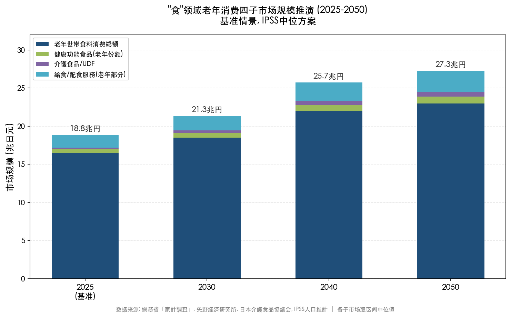

如图所示，"食"领域老年消费总盘从2025年基准的约18.8兆日元增长至2050年的约27.3兆日元（取区间中位值），25年间增幅约45%。其中，老年世帯食料消费总额始终占据绝对主体（约85%以上），而介护食品/UDF和给食·配食服务虽然绝对规模较小，但增速显著高于整体水平，在总盘中的份额持续提升。

上述推演与みずほ銀行的总量框架一致——みずほ预测2040年老年世帯消費支出60.5兆日元，其中食料占约40%即约24兆日元[みずほ銀行産業調査部](https://www.mizuhobank.co.jp/corporate/industry/pdf/msif_241.pdf "シニア消費の全世代における位置づけ")，与我们基准情景下2040年约24–27兆日元的区间估计基本吻合。

### 4.6.4 主要不确定性因素

**上行风险：** ①"健康老龄化加速"情景下，活跃高龄者外食/中食消费意愿提升，みずほ銀行估算该情景可增加约2.9兆日元消费支出，其中食料占比最大；②食料物价超预期上升（地缘政治风险导致食料进口成本上升）推高名义值；③冷冻宅配食品和食品电商的普及率超预期，释放此前未被满足的高龄独居者需求。

**下行风险：** ①年金实质替代率下行幅度超过基准情景（从当前61.2%降至50%以下），迫使老年家庭进一步压缩食料支出的绝对水平；②认知症高龄者增加（2040年约1,197万人，含轻度认知障碍）导致自主消费决策能力丧失、消费主体转向家属或介护设施，个人食料消费被压缩而设施给食增加——总量影响方向不确定但结构将发生重大变化；③通缩环境回归导致食料CPI增速低于假设。

## 4.7 结构性特征与趋势判断

综合以上分析，我们认为日本老年"食"类消费市场具有以下结构性特征与中长期趋势：

**第一，食料是老年消费的绝对支柱，且其占比将持续上升。** 老年世帯恩格尔系数已达约30%，在年金实质替代率下行的中长期趋势下，食料作为生存刚需的优先级将进一步压缩其他弹性消费品类的空间。预计到2040年代，老年世帯恩格尔系数可能攀升至32–34%区间。

**第二，中食（惣菜）是"食"领域增长最确定的主赛道。** 11.3万亿日元的惣菜市场中，老年消费者贡献的增量份额正在系统性上升。独居老人增加（+47%至2050年）、烹饪能力退化、以及超市和便利店"少量·低盐·软食"惣菜的精准产品开发，使中食成为老年食料消费中增速最快的品类。

**第三，健康功能食品受益于老龄化与制度红利的双重驱动。** 机能性表示食品正从"补充品"走向"日常食品化"——无糖茶、酸奶、果冻等明らか食品的占比持续提升——降低了高龄消费者的购买门槛和心理抵触。膝关节、认知、免疫等与老年健康诉求高度契合的品类，将是未来5–10年的核心增长极。

**第四，介护食品/UDF处于"人口红利"释放的早期阶段。** 当前约560亿日元的UDF市场规模，相对于未来85+人口接近翻倍的前景而言仍处于渗透早期。2030年代中期以后，随着"团块世代"全面进入85+超高龄段，介护食品市场有望进入加速增长期。

**第五，配食服务正从"边缘补充"走向"社会基础设施"。** 2.4万亿日元的给食·配食市场中，高龄者关联部分的增长不仅受商业力量驱动，更受地方自治体介护预防政策、安否确认网络建设和独居老人安全保障需求的公共政策推动。冷冻宅配食品作为新兴业态，有望在技术进步和物流网络完善的支撑下，成为打通都市与地方、在线与线下的高龄食品消费新渠道。

# 第5章 住——住房、适老化改造与养老护理服务消费分析

住房与护理服务构成日本老年消费市场中规模最大、增速确定性最高的板块。与"衣""食""行"等领域的消费主要受老年人主观意愿和可支配收入驱动不同，"住"领域支出同时受到人口结构（85 岁以上超高龄群体爆发性增长）、制度安排（介护保险给付的刚性扩张）和劳动力供需缺口三重力量共同塑造，呈现高度"制度嵌入型"特征。本章从老年人住房形态分布出发，依次分析住宅适老化改造、机构型养老设施、居家介护服务以及介护科技新兴市场的现状与前景，最终对 2030–2050 年"住"领域市场总量进行情景推演。

## 5.1 老年人住房形态与居住现状

### 5.1.1 自有住宅主导格局

日本老年人群体的居住结构呈现典型的"自有住宅一极集中"特征。2023 年调查显示，65 岁以上人口中持有一户建住宅占 76.2%、持有集合住宅（公寓）占 8.3%，合计自有住房比率超过 84.5%；仅约 4.5% 的老年人居住在高龄者专用住宅中 [内閣府「令和6年版高齢社会白書」](https://www8.cao.go.jp/kourei/whitepaper/w-2024/zenbun/pdf/1s2s_04.pdf "65歳以上居住形態")。这一格局深刻影响了"住"领域的消费结构——绝大多数老年人无需支付住房贷款或高额房租，其住居相关支出以维修保养、物业费和水电燃气为主。

家计调查数据印证了上述特征。2024 年，65 岁以上夫妇无职世帯月均住居费约 16,432 日元（占消费支出 6.4%），光热水道费约 21,919 日元（占 8.5%）；单身无职世帯住居费约 12,693 日元（占 8.5%），绝对金额和占比均低于全年龄段家庭 [総務省「家計調査」2024年](https://www.stat.go.jp/data/kakei/sokuhou/tsuki/pdf/fies_gaikyo2024.pdf "高齢者住居費")。住居费偏低的根本原因在于极高的持家率和极低的负债水平：65 岁以上世帯持家率高达 94.8%（75 岁以上为 96.0%），远高于全年龄平均的 87.3%；70 岁以上世帯负债保有率仅 10.6%（全体 38.8%），住宅贷款基本偿还完毕 [総務省「家計調査」2025年平均](https://www.stat.go.jp/data/kakei/sokuhou/tsuki/pdf/fies_gaikyo2025.pdf "参考4")。

### 5.1.2 独居老人激增与居住安全挑战

低住居费支出并不意味着老年人住房问题已然解决。独居化与超高龄化的叠加正使居住安全成为日益突出的社会课题。65 岁以上独居世帯将从 2020 年的 738 万户增至 2050 年的 1,084 万户（增幅 47%），占 65+ 全部世帯比例从 35.2% 升至 45.1% [IPSS「日本の世帯数の将来推計（令和6年推計）」](https://www.ipss.go.jp/pp-ajsetai/j/HPRJ2024/hprj2024_gaiyo_20240412.pdf "表4 世帯主65歳以上の世帯")。尤为值得关注的是，85 岁以上独居世帯从 2020 年的 147 万户增至 2050 年的 277 万户（增幅 88%），大量超高龄独居者将面临无亲属可依靠的境况 [IPSS「日本の世帯数の将来推計（令和6年推計）」](https://www.ipss.go.jp/pp-ajsetai/j/HPRJ2024/hprj2024_gaiyo_20240412.pdf "表5、表7")。

独居老人规模扩大对"住"领域消费产生双重效应：其一，推动见守系统（远程监护）、紧急通报装置等居住安全产品的需求持续上升；其二，当独居生活因身体机能下降而无法维持时，该群体将成为机构型设施和在宅介护服务的核心需求来源。

## 5.2 住宅适老化（Barrier-Free）改造

### 5.2.1 改造需求：半数住宅尚未达标

日本住宅的无障碍化程度仍然偏低。2023 年総務省「住宅·土地統計調査」显示，高龄者所在世帯中"一定程度的无障碍化住宅"（具备 2 处以上扶手或室内无台阶）比率仅为 45.4%，"高度无障碍化"比率更低至约 5% [総務省「令和5年住宅・土地統計調査」](https://www.stat.go.jp/data/jyutaku/2023/pdf/kouzou_gaiyou.pdf "バリアフリー化率45.4%")。换言之，超过半数老年人所居住的住宅尚未完成基本适老化改造，潜在改造空间巨大。

国土交通省在「住生活基本計画（全国計画）」（2021 年 3 月）中设定了 2030 年将高龄者向住宅供给比例提高至高龄人口 4% 的政策目标 [矢野経済研究所「高齢者住宅市場調査2025年」](https://www.yano.co.jp/press/press.php/003892 "住生活基本計画目標")，但从当前新规供给节奏判断，达成该目标仍面临较大难度。因此，对既有住宅实施适老化改修与新建高龄者住宅同样构成政策重点方向。

### 5.2.2 介护保险住宅改修制度

日本介护保险制度为住宅适老化改造提供了基础性制度保障。该制度对每位经认定的要介护/要支援者提供上限 20 万日元的改修补贴（自付比例 1–3 成，即实际补贴 14–18 万日元），覆盖手扶栏杆安装、台阶消除、地面防滑处理、门扉更换、便器更换、通道拓宽等 6 类工程 [国土交通省](https://www.mlit.go.jp/jutakukentiku/house/jutakukentiku_house_fr4_000087.html "介護保険住宅改修")。该制度虽然单笔补贴额度有限，但覆盖面广，每年撬动的改修工事总量构成住宅翻修市场中不可忽视的一部分。

### 5.2.3 住宅翻修市场中的适老化份额

住宅适老化改造嵌入在日本住宅翻修（リフォーム）市场的整体框架中。矢野経済研究所推计，2024 年日本住宅翻修市场规模为 7 兆 3,470 亿日元（前年比-0.5%），2025 年预测约 7.3 兆日元；受物价上涨影响翻修意愿有所下降，但资材费和人件费上升推高了工事单价，市场规模维持横盘水平 [矢野経済研究所「住宅リフォーム市場調査2025年」](https://www.yano.co.jp/press-release/show/press_id/3877 "2024年住宅リフォーム市場規模7.3兆円")。

在 7 兆日元量级的翻修市场中，バリアフリー改修（含手扶栏杆、无台阶化、浴室·厕所改修等）是老龄化背景下最具确定性的结构性增长领域之一。考虑到当前无障碍化率仅为 45.4%、且每年新增约 60 万以上的要介护认定者，适老化改修需求在 2030–2050 年间将持续释放。

## 5.3 机构型养老设施：供给扩张与结构分化

### 5.3.1 设施类型与床位供给全景

日本高龄者向住宅·设施体系涵盖多种类型，形成了从"自立老人"到"重度介护需求者"的完整服务光谱。截至 2024 年 6 月 30 日的最新统计，各类设施的规模如下：

**有料老人院**共 17,246 设施、定员 673,689 人，其中介护型 4,559 设施（定员 280,801 人）、住宅型 12,668 设施（定员 392,346 人）。过去 10 年间设施数和定员均增长约 2 倍 [厚生労働省老健局](https://www.mhlw.go.jp/content/12300000/001589708.pdf "有料老人ホームR6.6.30")。

**サービス付き高齢者向け住宅（サ高住）**截至 2026 年 6 月末全国登录 8,326 栋、290,189 户 [国土交通省](https://www.satsuki-jutaku.mlit.go.jp/doc/system_registration_01.pdf "R7.6末サ高住登録状況")。

**特別養護老人ホーム（特養）**2023 年度 8,621 设施、定员约 604,469 人；**グループホーム**约 14,242 设施、定员约 218,300 人。高龄者向住宅·设施整体合计利用者约 250 万人 [厚生労働省](https://www.mhlw.go.jp/content/12300000/001589708.pdf "高齢者向け住まい利用者数推移")。

下图展示了各类设施的定员规模对比：

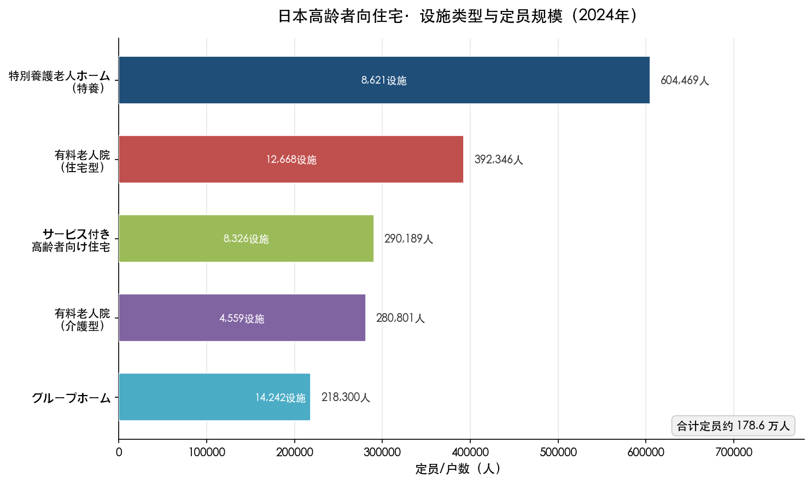

如图所示，特養以 60.4 万人的定员居于首位，有料老人院（住宅型+介护型）合计定员达 67.3 万人，已成为日本老年人机构居住的最大供给形态。サ高住以 29.0 万户的规模位列第三，体现了"住宅+服务"模式的快速扩张。五类设施合计定员约 178.6 万人。

### 5.3.2 特養待机问题：持续缓解但仍存缺口

特養因费用低廉（月均自付约 5–15 万日元）且介护保险全覆盖，长期面临严重的供不应求局面。厚生労働省 2025 年 4 月 1 日调查显示，特養入所待机者（要介護 3 以上）为 20.6 万人，较 2022 年前次调查减少约 4.7 万人（减幅 18.4%）；含要介護 1·2 特例入所对象在内的总待机者约 22.5 万人，其中在宅等待者 8.6 万人 [厚生労働省「特別養護老人ホームの入所申込者の状況（令和7年度）」](https://www.mhlw.go.jp/stf/houdou/0000157884_00006.html "R7年度特養待機者22.5万人")。待机者从 2013 年度峰值 52.4 万人降至 22.5 万人，10 余年间减少过半，主要得益于特養计划性新建以及有料老人院·サ高住等替代设施的充实 [介護ニュースJoint](https://www.joint-kaigo.com/articles/42899/ "特養待機者減少要因分析")。

然而，22 万人以上的存量缺口表明设施供给仍不充分，尤其在首都圈等后期高龄者急增的大城市地区，供需矛盾依然突出。

### 5.3.3 高龄者设施不动产市场

有料老人ホーム及サ高住的不动产市场规模据不動産流動化研究会试算约 7.5 兆日元，但已流动化（证券化）部分仅占全体的 4–5%，资产证券化率远低于欧美成熟市场 [不動産適正取引推進機構](https://www.retio.or.jp/wp-content/uploads/2024/11/saisei_16_002_02.pdf "ヘルスケアマーケットの現状と課題")。矢野経済研究所 2025 年调查指出，高龄者住宅市场新规供给增幅逐年缩小，今后既有设施的改修升级和运营效率提升将成为市场主线 [矢野経済研究所「高齢者住宅市場調査2025年」](https://www.yano.co.jp/press/press.php/003892 "新規供給縮小、既存改修に注目")。

## 5.4 介护服务费用：12 兆日元量级的巨量市场

### 5.4.1 总量与增长轨迹

介护保险费用是"住"领域中规模最大的单一支出项。2024 年度介护保险费用总额（给付费+利用者自付）达 11 兆 9,381 亿日元（同比+3.7%），创历史新高 [厚生労働省「令和6年度介護給付費等実態統計」](https://www.mhlw.go.jp/toukei/saikin/hw/kaigo/kyufu/24/index.html "R6年度介護費用11.9兆円")。从制度创设的 2000 年度 3.2 兆日元算起，24 年间扩大约 3.7 倍；令和 7 年度预算总费用进一步攀升至约 14.3 兆日元 [厚生労働省](https://www.mhlw.go.jp/content/12300000/001589708.pdf "介護保険費用推移")。

下图展示了介护保险费用从制度创设以来的实绩增长曲线及中长期推计值：

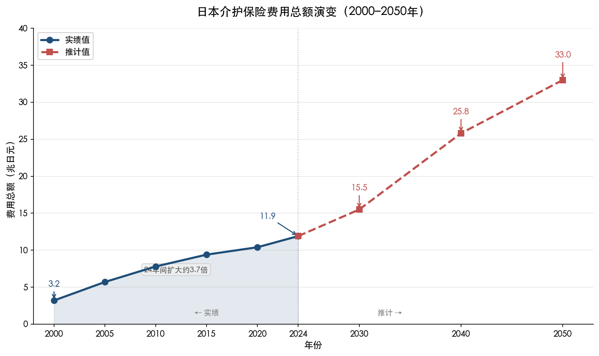

如图所示，介护保险费用在 2000–2024 年间保持了年均约 5.5% 的增速。基于厚生労働省推计，2030 年约 15.5 兆日元、2040 年约 25.8 兆日元、2050 年约 33.0 兆日元，增长曲线在 2030 年代显著陡峭化，反映 85 岁以上超高龄人口加速增长对介护需求的集中推动。

2024 年度介护服务年间受给者（实人数）达 573.1 万人（同比+1.1%），介护预防服务受给者 130.4 万人（同比+4.8%）。利用人数最多的服务类型依次为：居宅介护支援 399 万人、福祉用具贷与 295 万人、通所介护 168 万人 [厚生労働省](https://www.nippon.com/ja/japan-data/h02572/ "R6年度利用者数573万人")。

### 5.4.2 服务种类构成：居宅服务占据主导

从费用构成看（2021 年度数据），居宅サービス约 4 兆 7,407 亿日元（占给付总额 44.1%）、施设サービス约 3 兆 5,953 亿日元（33.4%）、地域密着型サービス约 1 兆 8,988 亿日元（17.7%）。主要居宅服务细分包括：通所介护 1 兆 2,799 亿日元、访问介护 1 兆 562 亿日元、福祉用具贷与 3,506 亿日元 [厚生労働省](https://www.mhlw.go.jp/content/12300000/001099975.pdf "令和3年度サービス種類別費用額")。

居宅服务和地域密着型服务合计占比超过 60%，反映出日本介护制度"在宅重視"（居家优先）的核心政策取向——鼓励老年人尽可能在熟悉的家庭和社区中接受服务，以抑制高成本的施设入住需求。这一政策方向在未来将进一步强化：2040 年 57 万人的人力缺口使大规模新增施设床位在操作层面愈发困难，居家服务与科技辅助的结合将成为解决方案的核心。

### 5.4.3 介护人力缺口：制约供给的结构性瓶颈

介护服务的持续扩张面临严峻的人力资源约束。厚生労働省第 9 期推计显示，2022 年度介护职员实际约 215 万人；2026 年度需约 240 万人（缺口 25 万人）；2040 年度需约 272 万人（缺口 57 万人）[厚生労働省](https://www.mhlw.go.jp/stf/newpage_41379.html "第9期介護職員必要数")。2040 年缺口 57 万人意味着约五分之一的介护服务需求可能无法获得充分满足，对服务可及性构成重大挑战。

人力缺口将通过两个渠道影响市场格局。第一，推高介护服务价格——第 1 号被保険者月均保险料已从 2000 年的 2,911 日元升至第 8 期（2021–2023 年度）的 6,014 日元，近年上调压力持续加大 [厚生労働省](https://www.mhlw.go.jp/stf/newpage_41379.html "保険料推移")。第二，加速介护科技（机器人、IoT 传感器、AI 排班系统等）的导入进程，以技术手段部分替代人力投入。

## 5.5 介护科技与智慧养老：从"锦上添花"走向"刚性需求"

### 5.5.1 介护机器人：体量尚小，政策驱动力强劲

介护机器人市场目前体量尚小，但受到强有力的政策推动。矢野経済研究所推计 2025 年度介护机器人市场规模约 36 亿日元 [矢野経済研究所](https://www.koureisha-jutaku.com/20221026_02_1/ "介護ロボット市場2025年度約36億円")，主要品类包括移乘支援（搬运辅助）、排泄支援、见守传感器和步行支援等。日本政府 2025 年度拨付近 300 亿日元用于介护テクノロジー导入促进，这一预算规模约为当前市场体量的 8 倍，体现出极强的政策扶持力度 [WEF](https://www.weforum.org/stories/2025/09/japans-longevity-economy/ "Care robots roadmap")。

WEF 描绘的介护机器人商用化路线图展示了清晰的分阶段演进方向：2030 年实现家务和低风险介护场景的自动化；2040 年延伸至接客、全面家务、介护和看护领域；2050 年具备言语和触觉交流能力的"伴侣型机器人"投入实用 [WEF](https://www.weforum.org/stories/2025/09/japans-longevity-economy/ "Care robots roadmap")。

### 5.5.2 介护 DX 与见守系统：增速最快的子领域

更广义的介护 DX 市场（涵盖介护记录系统、见守传感器、排班优化 AI、远程诊疗连接等 5 大领域）2024 年度规模约 545.8 亿日元 [日経](https://www.nikkei.com/article/DGXZRSP701624_T10C26A1000000/ "介護DX 545.8億円")。其中，见守系统是增速最快的子领域，2030 年市场规模预计约 132 亿日元，较当前水平有望实现翻倍以上增长。

见守系统对独居老人群体具有高度适配性。随着 2050 年 85 岁以上独居世帯达到 277 万户，传感器、摄像头联动 AI 及紧急通报装置的渗透率将大幅提升。该类系统正从单纯的"安否確認"（安全确认）工具进化为连接居家养老与社区介护服务的关键数字基础设施。

## 5.6 2030–2050 年"住"领域市场规模情景推演

### 5.6.1 核心驱动因素

"住"领域市场增长的核心驱动力来自以下三个维度：

**第一，超高龄人口的爆发性增长。** 85 岁以上人口从 2020 年约 616 万增至 2035 年约 1,036 万、2050 年约 1,170 万。该群体介护需求发生率最高——85 岁以上人均介护费用约为 65–74 岁人群的 10 倍以上 [厚生労働省](https://www.mhlw.go.jp/content/12300000/001099975.pdf "85歳以上人口推移")。

**第二，独居化的加速推进。** 独居老人从 738 万户增至 1,084 万户，意味着"家庭内互助"功能持续弱化，外部介护服务需求出现结构性上移。

**第三，介护保险制度的刚性扩张机制。** 第 1 号被保険者人数增加和要介护认定率上升共同驱动给付费持续膨胀，制度设计本身具有内生的扩张惯性。

### 5.6.2 权威机构中长期推计

多个权威来源为"住"领域中长期市场规模提供了参照系：

- **厚生労働省推计**：2040 年度介护给付费约 25.8 兆日元（计划基准）[総務省](https://www.soumu.go.jp/main_content/000517853.pdf "2040年度介護給付費25.8兆円")。
- **厚生労働省関東信越厚生局资料**：高龄者·介护関連サービス産業规模推计，2020 年约 18.5 兆日元→2030 年约 30.9 兆日元→2050 年约 59.7 兆日元 [厚生労働省関東信越厚生局](https://kouseikyoku.mhlw.go.jp/000412854.pdf "高齢者関連サービス産業推計")。
- **経済産業省**推计公的保険外ヘルスケア産業市场规模：2020 年 25 兆日元→2030 年 39.1 兆日元→2050 年 76.8 兆日元 [経済産業省](https://www.meti.go.jp/shingikai/sankoshin/shin_kijiku/pdf/020_04_00.pdf "新しい健康社会の実現 2024年2月")。

上述各推计口径有所差异——厚生労働省推计聚焦于介护保险给付费，厚生局资料涵盖介护関連服务产业全口径，経済産業省则进一步扩展至保険外ヘルスケア全域。三者共同指向一个方向：2030–2050 年间"住"关联市场将持续高速扩张。

### 5.6.3 "住"领域分项情景测算

基于上述驱动因素和权威推计，本研究对"住"领域主要细分市场进行如下基准情景推演：

**介护保险费用（含居宅+施设+地域密着型）：** 2024 年 11.9 兆日元→2030 年约 15–16 兆日元→2040 年约 25.8 兆日元→2050 年约 32–35 兆日元。2040 年采用厚生労働省官方推计值；2050 年系在 2040 年基础上考虑 85 岁以上人口继续增长（1,036 万→1,170 万）而 65+ 总人口微降的净效应进行外推。

**机构型设施自费部分（含有料老人院·サ高住利用费、特養自付等）：** 有料老人院·サ高住不动产市场约 7.5 兆日元；居住者支付的食费·日常生活费·管理费等不在介护保险给付中反映，形成约 2–3 兆日元量级的自费市场。至 2040 年随入住者增加和服务单价调整，预计扩大至 4–5 兆日元。

**住宅适老化改造：** 在 7 兆日元住宅翻修市场中，バリアフリー関連工事估算规模约 4,000–5,000 亿日元（含介护保险住宅改修给付及民间自费改修）。随无障碍化率从 45.4% 持续提升并叠加老龄独居户需求，2030 年前后有望达 6,000–7,000 亿日元。

**介护科技（机器人+DX+见守）：** 2024 年约 600 亿日元→2030 年预计 1,500–2,000 亿日元→2040 年在政策强力推动和人力缺口倒逼下有望达 5,000 亿–1 兆日元。

### 5.6.4 总量汇总

将上述分项加总，"住"领域消费市场规模在基准情景下呈现以下演变路径：

| 时间节点 | 介护保险费用 | 设施自费部分 | 适老化改造 | 介护科技 | 合计（概算） |
|---------|-----------|-----------|---------|--------|-----------|
| 2024 年 | 11.9 兆 | ~2.5 兆 | ~0.5 兆 | ~0.06 兆 | ~15 兆 |
| 2030 年 | ~15.5 兆 | ~3 兆 | ~0.65 兆 | ~0.18 兆 | ~19 兆 |
| 2040 年 | ~25.8 兆 | ~4.5 兆 | ~0.8 兆 | ~0.7 兆 | ~32 兆 |
| 2050 年 | ~33 兆 | ~5.5 兆 | ~0.9 兆 | ~1.5 兆 | ~41 兆 |

下图直观展示了各分项的规模演变与构成变化：

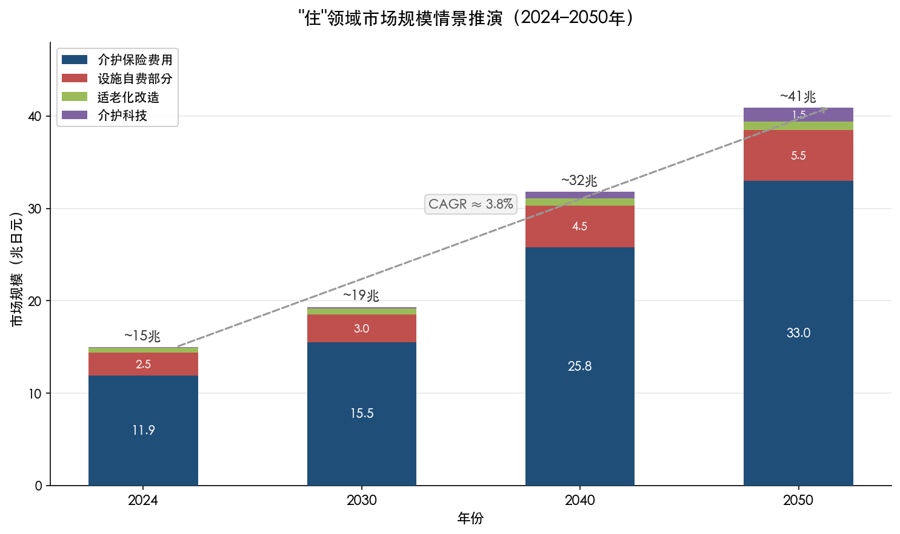

如图所示，"住"领域市场规模将从 2024 年约 15 兆日元扩大至 2050 年约 41 兆日元，年均复合增长率约 3.8%。介护保险费用始终是最大构成项，占比约 80%；设施自费部分和介护科技的相对份额在 2040 年后有所提升，反映出市场结构的逐步多元化。

需要指出的是，该推演存在重要的不确定性因素：若介护人力缺口无法通过科技替代和外国劳动力引进得到有效缓解，部分需求将被"供给瓶颈"压制，实际给付费增长可能低于政策推计；反之，若介护保险制度扩大适用范围或提高报酬基准，实际支出可能超出上述预期。

## 5.7 结构性趋势与市场机遇

综合上述分析，"住"领域在 2030–2050 年间呈现四大结构性趋势，每一趋势均蕴含显著的市场机遇：

**趋势一：居家养老的重心地位进一步强化。** 日本介护保险制度持续扩大居家服务覆盖面，65 岁以上持家率接近 95%，多数老年人希望在长期居住的住宅中度过晚年。这一偏好与政策方向的一致性，将推动访问介护、通所介护（日间照料）、住宅改修和福祉用具等居宅相关市场持续扩容。

**趋势二：后期高龄者与超高龄者占比提升驱动高单价服务需求。** 75 岁以上人口将在 2055 年前后达到峰值，85 岁以上人口持续增长至 2050 年后方出现拐点。该群体认知症发病率高、ADL（日常生活活动能力）显著下降，需要更为密集的介护服务，人均费用远高于 65–74 岁前期高龄者群体。

**趋势三：介护科技从"补充手段"升格为"必需基础设施"。** 2040 年 57 万人的介护人力缺口使得机器人、传感器、AI 排班等技术不再是锦上添花的辅助工具，而是保障介护服务持续供给的必要条件。政府年均 300 亿日元级别的导入促进预算为产业提供了明确且持续的政策信号。

**趋势四：高龄者住宅市场从增量扩张转向存量运营。** 新规供给增速放缓后，既有设施的功能升级（医疗ケア特化型有料老人院的兴起）、运营效率提升和资产证券化将成为市场发展的主线。设施运营商的竞争焦点正从"规模扩张"转向"服务品质与专业化分工"。

# 第6章 行——交通出行、旅游休闲与数字消费分析

在日本老年消费市场的"衣、食、住、行"四大板块中，"行"领域呈现出结构最为复杂、变革动能最强的特征。与前三大领域主要受人口规模与制度安排驱动不同，"行"领域兼具三重属性：以私家车维护费和公共交通费为代表的日常刚性支出，以旅游观光、邮轮度假为代表的高弹性休闲消费，以及以智能手机普及、电商渗透和数字娱乐为代表的技术驱动型增长极。与此同时，高龄驾驶者免許返纳（驾照退还）浪潮与自动驾驶技术的推进，正在重塑老年人出行服务的供需结构，催生社区巴士、需求响应交通（Demand-Responsive Transport, DRT）和 MaaS（Mobility as a Service）等新兴市场。

本章从老年人日常交通出行的支出结构出发，依次分析驾照退还与出行服务替代、旅游休闲消费、数字消费渗透四大维度，最终对 2030–2050 年"行"及休闲数字消费市场进行情景推演。

## 6.1 老年人日常交通出行：支出结构与出行模式

### 6.1.1 交通·通信支出在老年家庭预算中的地位

交通·通信费是日本老年家庭消费支出中仅次于食料的第二大费目。2025 年，65 岁以上无职夫妇世帯月均"交通·通信"支出达 31,325 日元（占消费支出的 11.9%，年均约 37.6 万日元）；65 岁以上单身无职世帯为 13,601 日元（占 9.2%，年均约 16.3 万日元）[総務省「家計調査」2025年平均](https://www.stat.go.jp/data/kakei/sokuhou/tsuki/pdf/fies_gaikyo2025.pdf "65歳以上無職世帯の家計収支")。作为对比，全体二人以上世帯交通·通信月均支出为 45,730 日元（同比名义+9.6%），是 2025 年消费增长贡献最大的费目，反映出疫后出行恢复与通信服务升级的双重推动力。

该费目的内部构成包含三大子项：交通费（铁道、公共汽车、出租车等运输服务）、自動車等関係費（汽车购置、维护、保险、停车费和燃料费）以及通信费（固定电话、移动通信和互联网接入服务）。对于持有私家车的老年家庭，自動車等関係費往往是交通·通信费中最大的单一子项。运输総合研究所估算，自動車依赖型高龄者每人每年的车辆保有成本约 60 万日元 [運輸総合研究所](https://www.jttri.or.jp/202306_Elderly_People_teigen.pdf "高齢者移動手段確保方策に関する提言")。

### 6.1.2 私家车主导的出行模式

日本老年人的日常出行高度依赖私家车，这一特征在地方圈（非大都市地区）尤为突出。内閣府调查显示，60 岁以上人群的外出手段中"自分で運転する自動車"占 56.6%，即便 80 岁以上群体仍有 26.4% 自主驾车出行；在町村地区，75 岁以上老年人每日驾车出行比率高达 75.5% [内閣府「令和元年版高齢社会白書」](https://www8.cao.go.jp/kourei/whitepaper/w-2019/html/zenbun/s1_3_1_3.html "外出と自動車の運転")。这一格局根植于日本地方公共交通网络持续萎缩的结构性背景——大量中山间地区的铁道路线和巴士线路已大幅削减甚至废止，私家车成为老年人维持独立生活不可替代的刚性需求。

地域差异进一步佐证了这一判断。65 岁以上免許保有者人数与返纳率之间呈现显著负相关（相关系数 -0.74），即汽车依赖度越高的农村地区，老年人的驾照返纳率反而越低 [ニッセイ基礎研究所](https://www.nli-research.co.jp/files/topics/83881_ext_18_0.pdf?site=nli "高齢ドライバーの免許返納分析")。约 80% 的高龄驾驶者表示未来将考虑停驾，但仍有 11.5% 明确表示"无论如何将继续驾驶" [内閣府「令和元年版高齢社会白書」](https://www8.cao.go.jp/kourei/whitepaper/w-2019/html/zenbun/s1_3_1_3.html "外出と自動車の運転")，这部分人群集中分布在交通替代方案匮乏的地方圈。

## 6.2 免許返纳与出行服务替代市场

### 6.2.1 免許返纳趋势：规模回升但远未达峰

高龄驾驶者引发的交通事故频发，持续推动日本社会对免許自主返纳制度的关注。2025 年全年免許自主返纳件数达 43.5 万件（同比+7,153 件），其中 75 岁以上返纳 26.1 万件（约占 60%）；同年 75 岁以上免許保有者总数为 835 万人，对应返纳率约 3.1% [産経新聞/警察庁](https://www.sankei.com/article/20260319-Y6QFMOGLOBL4VGQVH6KGK4PWRQ/ "2025年免許返纳統計")。

返纳件数的时间轨迹呈现显著波动特征：2019 年受池袋暴走事故等重大高龄驾驶事故的舆论冲击达到峰值 60.1 万件，此后连续回落至 2023 年的 38.3 万件，2024–2025 年则重新进入回升通道。从中长期视角看，随着 75 岁以上免許保有者群体在 2030–2040 年间持续扩大（IPSS 推计 75+ 人口将在 2055 年前后达峰值），免許返纳规模有望呈趋势性增长，但其增长节奏将高度取决于出行替代方案的充实程度和自动驾驶技术的实用化进程。

### 6.2.2 出行替代市场：社区巴士、DRT、MaaS 与自动驾驶

免許返纳释放出的出行需求，构成日本老年人出行服务市场的核心增量来源。运输総合研究所估算，自動車依赖型高龄者群体的私家车年保有成本总额约 1.8 兆日元（约 1,200 万名依赖私家车的高龄者 × 每人年均约 60 万日元），该数字可视为免許返纳后出行服务的潜在可替代市场空间上限 [運輸総合研究所](https://www.jttri.or.jp/202306_Elderly_People_teigen.pdf "高齢者移動手段確保方策に関する提言")。

日本政府将自动驾驶定位为解决高龄者出行问题的关键技术路径，设定了 2025 年度在全国约 50 个地点实现 L4 级自动驾驶移動サービス的阶段性目标 [経済産業省](https://www.meti.go.jp/policy/mono_info_service/mono/automobile/jido_soko/pdf/r502_syakaiwg_jimukyokushiryou.pdf "2025年度目標50か所L4自動運転")。在更广义的 MaaS 市场层面，IMARC Group 评估 2025 年日本 MaaS 市场规模约 6.06 亿美元（约 900 亿日元），预计 2034 年增至 118.4 亿美元（约 1.78 兆日元），2026–2034 年 CAGR 约 38.8% [IMARC Group](https://www.imarcgroup.com/report/ja/japan-mobility-as-a-service-market "日本MaaS市場規模2025-2034")。MaaS 虽非专属老年人市场，但高龄者出行需求是其最具确定性的需求侧驱动因素之一。

在福祉出行细分领域，国土交通省设定了 2026 年 3 月末福祉タクシー达到约 9 万台的政策目标。高齢者向け輸送関連サービス（含介護タクシー、福祉タクシー）市場規模据経済産業省「福祉用具·サービス市場実態調査」（令和 4 年度）推计年间约 1,200 亿日元以上，并随要介護認定者持续增加而保持稳健增长态势。

### 6.2.3 "移动困难者"问题与制度应对

随着免許返纳规模扩大与公共交通网络进一步萎缩，日本正面临日益严峻的"移動困難者"（交通弱者）问题。放弃驾驶却缺乏替代出行手段的老年人，其外出频率下降将连锁引发社交孤立、认知功能衰退和健康恶化等负面后果。国土交通省交通政策白書（令和 5 年度）已明确将"确保高龄者等的移动手段"列为交通政策的核心课题。

制度层面，介护保险制度覆盖的通所介护（デイサービス）送迎服务每年承运数以千万人次的高龄者出行，事实上构成了一套准公共交通网络。此外，全国约 1,000 个市町村已导入社区巴士或 DRT 服务，但多数项目依赖自治体财政补贴，商业可持续性面临严峻挑战。展望未来，自动驾驶技术降低运营成本、公私合作（PPP）模式拓展资金来源，将成为破解这一困局的关键方向。

## 6.3 老年人旅游休闲消费：需求旺盛但参与率下滑

### 6.3.1 日本国内旅游市场总貌与老年人角色

2024 年，日本国内旅行消费额达 25 兆 1,536 亿日元（同比+14.8%，较 2019 年+14.7%），创历史新高 [観光庁「旅行・観光消費動向調査」2024年確報](https://www.mlit.go.jp/kankocho/content/001864689.pdf "2024年国内旅行消費額25.2兆円")。然而，总额繁荣的底层结构中隐含着令人警惕的代际分化。

明治安田総合研究所的分析揭示了一个深层悖论：国内旅行消费总额虽创新高，延べ旅行者数却从 2016 年峰值 6.5 亿人次降至 2024 年的 5.4 亿人次，较 2019 年水平仍低 8.5% [明治安田総合研究所「失われるシニアの旅行消費」](https://www.myri.co.jp/ "2025年6月18日公表レポート")。消费总额的增长主要依靠宿泊单价的攀升（2024 年宿泊旅行单价 69,362 日元），而非旅行者数量的回升——这意味着旅行市场正走向"量缩价升"的结构性分化。

### 6.3.2 "シニアの旅離れ"：70 代降幅最为显著

按年龄段分解的数据清晰揭示出"シニアの旅離れ"（老年人远离旅行）这一结构性现象。观光庁数据显示，70 代国内宿泊旅行実施率从 2014–2019 年均的 50.7% 大幅降至 2024 年的 37.8%（下降 12.9 个百分点），降幅在所有年龄段中居首；国内日帰り旅行同样以 70 代降幅最大（44.9%→31.2%，下降 13.7 个百分点）。60 代以上整体降幅远超其他年龄段，代际格差呈持续扩大态势 [明治安田総合研究所「失われるシニアの旅行消費」](https://www.myri.co.jp/ "70代宿泊旅行実施率37.8%")。

这一现象并非源于经济因素。明治安田総合研究所的分析表明，60 代和 70 代以上群体的実質可処分所得在 2014–2024 年间的增幅与 40–50 代现役世代基本相当，消费者態度指数的下降幅度亦非各年龄段之最（30 代反而恶化最为严重）[明治安田総合研究所「失われるシニアの旅行消費」](https://www.myri.co.jp/ "図表4,5 実質可処分所得・消費者態度指数")。

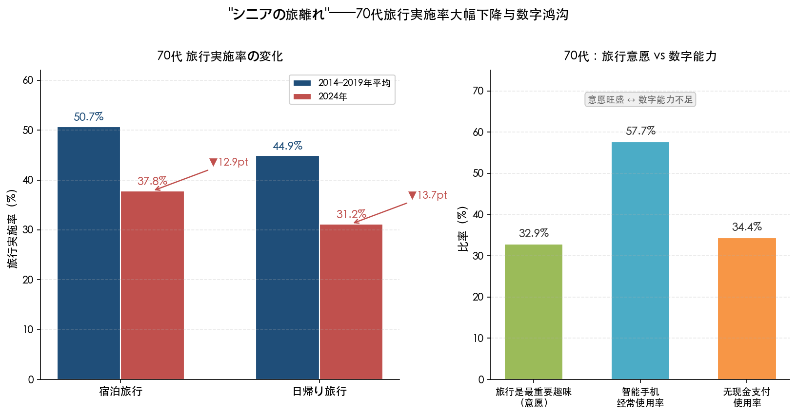

上图左面板展示了 70 代宿泊旅行与日帰り旅行的実施率在疫情前后的显著落差，右面板则揭示了"旅行意愿旺盛但数字能力不足"的结构性矛盾——70 代旅行意愿达 32.9%，但智能手机经常使用率仅 57.7%、无现金支付使用率仅 34.4%。

### 6.3.3 观光 DX 化——数字鸿沟成为旅行的新障碍

"シニアの旅離れ"的核心驱动因素在于观光业 DX（数字化转型）的加速推进。新冠疫情以来，电子门票、QR 码入住、无现金支付等数字化手段在观光设施和住宿业中迅速普及，在提升运营效率和年轻旅行者便利性的同时，对数字能力不足的老年人构成了实质性的参与障碍。

总务省「情報通信機器の利用に関する世論調査（2023 年）」显示，70–79 岁人群"经常使用或时而使用智能手机/平板电脑"的比例仅为 57.7%，80 岁以上更低至 42.2%，与 20–29 岁的 99.1% 形成巨大落差 [明治安田総合研究所「失われるシニアの旅行消費」](https://www.myri.co.jp/ "図表6 スマートフォン利用率")。キャッシュレス決済使用率方面，70 代仅 34.4%、80 岁以上仅 17.8% [明治安田総合研究所「失われるシニアの旅行消費」](https://www.myri.co.jp/ "図表7 キャッシュレス決済利用経験")。

然而，旅行意愿本身并未衰退。观光庁调查显示，回答"旅行是最重要趣味"的比例在 60–70 代反而最高（60 代 44.6%、70 代 32.9%），远超 20–30 代 [明治安田総合研究所「失われるシニアの旅行消費」](https://www.myri.co.jp/ "図表8 旅行に対する考え方")。这意味着老年人旅行需求的"潜在库存"依然庞大，核心问题在于如何消除数字障碍以使旅行参与得以实现。正如明治安田総合研究所所指出的，课题不在于数字终端的有无，而在于其可及性（Accessibility）——面向老年人的 UI 设计优化和人性化数字服务供给是关键突破口。

### 6.3.4 邮轮市场：高龄·长期型消费的典型场景

日本邮轮市场是老年人旅游消费中客单价最高的细分品类。2019 年日本人クルーズ人口达峰值 35.6 万人，受疫情冲击后 2023 年恢复至 19.6 万人（峰值的 55%），2025 年进一步回升至 24.3 万人（国内航线 7.6 万人+外航航线 16.7 万人）[国土交通省](https://www.mlit.go.jp/maritime/maritime_tk2_000033.html "2025年クルーズ動向")。日本邮轮旅客最显著的特征为"高齢·長期"——8 泊以上的长期航线约占全部航次的 70%。

供给端正迎来重大扩张：2025 年 7 月郵船クルーズ「飛鳥Ⅲ」（5.2 万总吨、最多 740 人）投入运营，2028 年东京ディズニークルーズ（14 万总吨、约 4,000 人）计划就航。国土交通省已设定 2030 年日本人クルーズ人口 100 万人的政策目标 [国土交通省](https://www.mlit.go.jp/maritime/content/001900273.pdf "2030年クルーズ人口100万人目標")。若该目标实现，以当前人均邮轮消费水平（30–50 万日元）估算，邮轮市场消费总额将从 2019 年的约 2,000 亿日元量级大幅跃升至 3,000–5,000 亿日元区间。

## 6.4 数字消费：智能手机普及加速与电商渗透

### 6.4.1 老年人智能手机与互联网普及率的快速追赶

日本老年人的数字渗透率正经历代际推移带来的加速提升。総務省「令和 6 年通信利用動向調査」（调查时点 2024 年 8 月末）显示，60–69 岁世帯主のスマートフォン保有率达 93.5%、70–79 岁 85.1%、80 岁以上 62.5%；75 岁以上世帯整体スマートフォン保有率为 69.8%，较 2020 年的 56.1% 提升了 13.7 个百分点 [総務省「令和6年通信利用動向調査」](https://www.soumu.go.jp/johotsusintokei/statistics/data/250530_1.pdf "スマートフォン保有率")。

インターネット利用率方面，60–69 岁达 93.0%、70–79 岁 69.8%、80 岁以上 33.1% [総務省「令和6年通信利用動向調査」](https://www.soumu.go.jp/johotsusintokei/statistics/data/250530_1.pdf "年齢階層別インターネット利用率")。65 岁以上群体的 SNS 利用率已达 60.1%，其中 LINE 为最主要平台。从互联网利用目的看，60–69 岁群体排名前三位依次为"電子メール送受信"（84.8%）、"検索サービス"（79.5%）和 SNS（77.5%）；70–79 岁群体同样以电子邮件居首（74.3%），其后为 SNS（66.0%）和検索（65.9%）[総務省「令和6年通信利用動向調査報告書」](https://www.soumu.go.jp/johotsusintokei/statistics/pdf/HR202400_001.pdf "年齢階層別利用目的")。

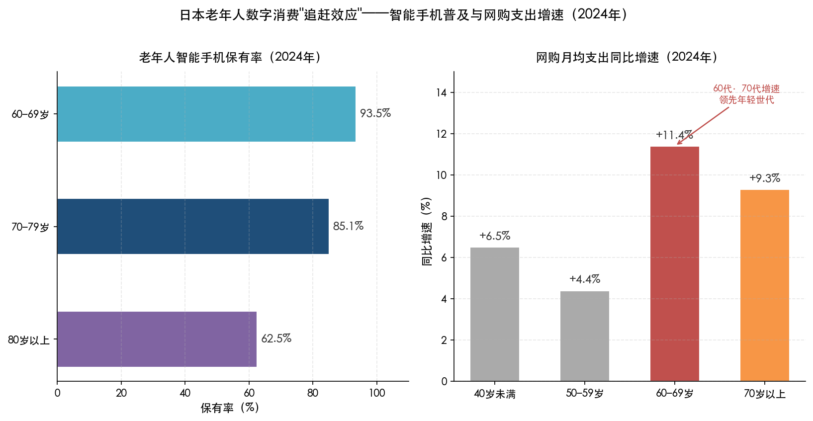

上图左面板展示了各年龄段老年人的智能手机保有率梯度（60–69 岁 93.5%→70–79 岁 85.1%→80 岁以上 62.5%），右面板显示 60–69 岁（+11.4%）和 70 岁以上（+9.3%）的网购支出增速显著领先于 40 岁未满（+6.5%）和 50–59 岁（+4.4%），佐证了老年人数字消费的世代推移"追赶效应"。

2025–2040 年间进入 65+ 群体的世代均属于"数字经历较长世代"（1960 年后出生，成年期即经历个人电脑和互联网的普及过程），老年人的智能手机保有率和互联网利用率将自然抬升。我们预计，2030 年 65+ 群体智能手机个人保有率有望突破 85%，2040 年接近 95%，届时数字鸿沟的主要矛盾将从"是否拥有设备"转向"能否有效使用复杂数字服务"这一更为精细化的议题。

### 6.4.2 老年人网络购物：增速最快的年龄段

総務省「家計消費状況調査」2024 年结果显示，二人以上世帯整体的网络购物利用率达 55.3%（调查开始以来最高），月均支出 24,928 日元（同比名义+8.3%）[総務省「家計消費状況調査」2024年結果](https://www.stat.go.jp/data/joukyou/2024ar/gaikyou/pdf/gkall.pdf "ネットショッピング利用世帯55.3%")。

世帯主年龄段分解数据尤为引人注目：70 岁以上世帯月均网络购物支出为 13,193 日元（同比+9.3%），增速仅次于 60–69 岁的+11.4%，明显高于 50–59 岁（+4.4%）和 40 岁未满（+6.5%）[総務省「家計消費状況調査」2024年結果](https://www.stat.go.jp/data/joukyou/2024ar/gaikyou/pdf/gkall.pdf "年齢階級別ネットショッピング支出")。60–69 岁世帯月均网络购物支出已达 26,578 日元，接近全年龄平均水平（24,928 日元），表明前期高龄者的数字消费能力已与现役世代基本持平。

从品类结构看，旅行関係费是老年人网购增长最为突出的类目——60–69 岁世帯旅行関係费网购支出同比增长 20.4%（全年龄段最高），70 岁以上增长 16.1%。教养関係费（电子书籍、数字内容等）方面，70 岁以上增速达 17.8%，同样位列全年龄段之首 [総務省「家計消費状況調査」2024年結果](https://www.stat.go.jp/data/joukyou/2024ar/gaikyou/pdf/gkall.pdf "旅行関係費・教養関係費年齢別増減率")。

电子マネー利用方面，2024 年 70 岁以上世帯利用率为 45.2%（与上年持平），利用世帯月均利用额 28,319 日元（同比+1.4%）。增速虽为各年龄段最低，但绝对水平已达全年龄平均（31,997 日元）的 88.5%，差距正在持续收窄 [総務省「家計消費状況調査」2024年結果](https://www.stat.go.jp/data/joukyou/2024ar/gaikyou/pdf/gkall.pdf "電子マネー利用状況")。

### 6.4.3 数字娱乐与在线服务：新兴增长空间

老年人的数字消费正从通信基础设施层向内容与服务层纵深延伸。视频流媒体、电子书籍、在线游戏和健康管理 App 等数字娱乐与服务品类，已成为老年人消费的新增长极。70 岁以上世帯网购中"教养関係费"同比增长 17.8%（其中电子书籍增长 21.9%、ダウンロード版音楽·映像·アプリ增长 15.0%），老年人在数字内容消费上的追赶速度甚至超过年轻世代 [総務省「家計消費状況調査」2024年結果](https://www.stat.go.jp/data/joukyou/2024ar/gaikyou/pdf/gkall.pdf "教養関係費内訳")。

在线医疗（オンライン診療）方面，新冠疫情后日本放宽了在线诊疗的适用范围（2022 年 4 月起实现恒久化制度化）。对于行动不便的高龄者而言，在线医疗不仅降低了就诊的时间成本和交通负担，也是缓解"移動困難者"健康风险的重要手段。随着 75+ 后期高龄者群体的智能手机保有率持续提升，在线医疗的渗透率有望在 2030 年代实现显著跃升。

## 6.5 2030–2050 年"行"及休闲数字消费市场规模推演

### 6.5.1 推演框架与关键假设

"行"领域的市场规模推演需区分三个层次：（1）日常交通出行费用（自動車関係費+公共交通+出行服务）；（2）旅游休闲消费（宿泊旅行+日帰り旅行+邮轮等）；（3）数字消费（通信费+网络购物+数字内容）。推演依据以下关键假设：

- **人口底盘**：65+ 人口从 2020 年 3,603 万人增至 2040 年 3,929 万人（峰值前夕），2050 年微降至 3,888 万人（高龄化率升至 37.1%）[IPSS「日本の将来推計人口（令和5年推計）」](https://www.ipss.go.jp/pp-zenkoku/j/zenkoku2023/pp2023_gaiyou.pdf "表1-1")。
- **世帯结构**：独居老人世帯从 2020 年 738 万户增至 2050 年 1,084 万户。单身世帯交通·通信单价低于夫妇世帯，但世帯数量增长可部分抵消单价差异。
- **数字渗透**：65+ 群体智能手机保有率从当前约 75% 升至 2030 年约 85%、2040 年约 95%，网络购物利用率同步上升。
- **MaaS/自动驾驶**：预计 2030 年代进入商业化扩张期，但对市场规模的实质性拉动主要显现于 2035 年之后。
- **旅游实施率**：假设观光 DX 的无障碍化设计取得一定进展，70 代宿泊旅行実施率在基准情景下从当前 37.8% 回升至 2030 年的 42–45%，但难以恢复至疫前的 50.7% 水平。

### 6.5.2 日常交通出行市场

みずほ銀行産業調査部 2025 年 1 月推计显示，2023 年シニア関連市場中"交通·通信"费目规模约 6.8 兆日元，占シニア市場生活産業部分（55.7 兆日元）的 12.2% [みずほ銀行産業調査部](https://www.mizuhobank.co.jp/corporate/industry/pdf/msif_241.pdf "シニア関連市場規模推計の内訳")。在基准情景（"現状延伸"）下的推演结果如下：

- **2030 年**：65+ 人口增至 3,696 万人（+2.6%），独居世帯扩大推高世帯总数，但私家车保有率因免許返纳而小幅下降，交通·通信市场预计约 7.0–7.3 兆日元。
- **2040 年**：65+ 人口接近峰值 3,929 万人，MaaS 和自动驾驶开始规模化部署，出行服务支出逐步替代私家车维护费，交通·通信市场预计约 7.8–8.5 兆日元（含物价变动因素）。
- **2050 年**：65+ 人口微降至 3,888 万人，但 75+ 占比继续攀升，对出行服务的依赖度进一步上升，交通·通信市场预计约 8.0–9.0 兆日元（含物价变动因素）。

### 6.5.3 旅游休闲市场

老年人旅游消费的推演面临各子市场中最大的不确定性。一方面，60–70 代是旅行偏好最为强烈的群体，旅行意愿构成坚实的需求基底；另一方面，观光 DX 化带来的数字障碍以及 75+ 后期高龄者身体机能的限制，对旅行参与率的上行空间形成结构性制约。

みずほ推計中，2023 年シニア市場"教養娯楽"费目约 6.0 兆日元（占シニア市場 6.2%），其中旅行相关消费为最大子项 [みずほ銀行産業調査部](https://www.mizuhobank.co.jp/corporate/industry/pdf/msif_241.pdf "シニア関連市場規模推計の内訳")。综合以下因素：

- 2024 年日本国内旅行消费中，日本人宿泊旅行消费达 20.3 兆日元，地方部约 9 成消费由日本人旅行者贡献 [観光庁「旅行・観光消費動向調査」2024年確報](https://www.mlit.go.jp/kankocho/content/001864689.pdf "2024年国内旅行消費額")；
- 60 岁以上人口约占日本总人口的 35%，但因旅行実施率低于平均，实际消费占比推算约为 25–28%；
- 邮轮市场若实现 2030 年 100 万人目标，按人均消费 30–50 万日元估算，可贡献 3,000–5,000 亿日元增量。

在基准情景下，老年人旅游·教养娱乐市场预计从 2023 年约 6.0 兆日元增至 2030 年约 6.5–7.0 兆日元、2040 年约 7.5–8.5 兆日元。乐观情景（数字鸿沟显著缩小、健康寿命延长）下，2040 年有望突破 9.0 兆日元。

### 6.5.4 数字消费市场

数字消费是"行"领域中增速确定性最高的子市场。以 2024 年数据为基准进行底层测算：70 岁以上世帯月均网购支出 13,193 日元（年均约 15.8 万日元），乘以同年 70+ 人口约 2,900 万人（按世帯主换算约 1,200–1,400 万世帯），70+ 网购市场规模约 1.9–2.2 兆日元；加上 65–69 岁群体（月均 26,578 日元），65+ 整体网购市场约 3.5–4.0 兆日元。

随着智能手机保有率和网购利用率因世代推移而自然攀升，我们预计：

- **2030 年**：65+ 网购市场约 5.0–5.5 兆日元（利用率与单价双升驱动）。
- **2040 年**：65+ 网购市场约 7.0–8.0 兆日元（当前 50–60 代的高数字消费习惯"平移"至老年期，利用率接近全年龄平均）。
- **2050 年**：65+ 网购市场约 8.5–10.0 兆日元（数字内容、在线服务实现全面渗透）。

### 6.5.5 "行"领域市场规模汇总

综合日常交通出行、旅游休闲和数字消费三大子市场，"行"领域老年人消费总量在基准情景下的推演结果汇总如下：

| 时间节点 | 日常交通出行 | 旅游·教养娱乐 | 数字消费（网购+数字内容） | 合计 |
|---------|------------|-------------|----------------------|------|
| 2023 年 | 约 6.8 兆日元 | 约 6.0 兆日元 | 约 3.5 兆日元 | 约 16.3 兆日元 |
| 2030 年 | 约 7.0–7.3 兆 | 约 6.5–7.0 兆 | 约 5.0–5.5 兆 | 约 18.5–19.8 兆 |
| 2040 年 | 约 7.8–8.5 兆 | 约 7.5–8.5 兆 | 约 7.0–8.0 兆 | 约 22.3–25.0 兆 |
| 2050 年 | 约 8.0–9.0 兆 | 约 7.5–9.0 兆 | 约 8.5–10.0 兆 | 约 24.0–28.0 兆 |

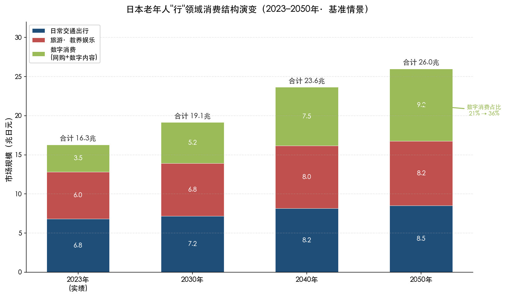

上图直观呈现了"行"领域三大子市场在 2023–2050 年间的规模与结构演变。其中最具战略意义的变化在于**数字消费的结构性崛起**：从 2023 年的 3.5 兆日元（占比约 21%）跃升至 2050 年的约 9.25 兆日元（占比约 36%），有望在 2040 年代超越日常交通出行成为"行"领域的最大单一子市场。日常交通出行支出因私家车向出行服务的转化而增速平稳，旅游休闲则因老年人参与率的不确定性而呈现较宽的估算区间。这一结构性替代趋势将深刻重塑老年消费市场的供给侧格局。

## 6.6 结构性机遇与核心挑战

### 6.6.1 机遇

**出行服务蓝海**：约 1.8 兆日元的私家车保有成本替代空间，叠加 L4 自动驾驶的商用化路线图（2030 年代低风险介护·家事场景→2040 年代接客·介護·看護扩展→2050 年代具备语言·触觉交流能力的"コンパニオン"机器人），构成出行服务市场的长期增长引擎 [WEF](https://www.weforum.org/stories/2025/09/japans-longevity-economy/ "Care robots roadmap")。

**"银发旅行"无障碍化**：70 代宿泊旅行意愿（约 50%）与実施率（37.8%）之间存在约 13 个百分点的落差。面向老年人的无障碍旅行服务（ユニバーサルツーリズム）每缩小 1 个百分点的意愿-实施率缺口，即可释放约 500–700 亿日元的增量消费空间。

**数字消费的世代推移红利**：当前 50–60 代群体已形成的高数字消费习惯，将在 2030–2040 年间自然"平移"至 65+ 群体，无需大规模数字素养教育投入即可实现市场的自然扩容。这是"行"领域中为数不多的近乎确定性增长因子。

### 6.6.2 挑战

**数字鸿沟的"最后一公里"**：尽管智能手机保有率持续上升，但从"拥有设备"到"有效使用复杂数字服务"之间的落差依然显著。70–79 岁群体的互联网利用率（69.8%）与实际商品购入利用率之间存在较大缺口；80 岁以上互联网利用率仅 33.1%，构成数字消费增长的结构性天花板。

**地方公共交通的财政可持续性**：社区巴士和 DRT 服务多依赖自治体补贴运营，随着地方圈人口持续减少加剧地方财政压力，维持乃至扩展老年人出行服务网络面临严峻的资金可持续性挑战。

**超高龄化对旅行与出行需求的抑制**：75+ 后期高龄者占比从当前约 17% 持续攀升至 2050 年的约 25%，这一群体的身体机能限制将系统性压低旅行参与率和出行频率，部分对冲前期高龄者数字消费增长带来的正面效应。

# 第7章 综合市场规模测算与未来趋势展望

## 7.1 测算框架：从"人口底盘"到"消费总量"的逻辑链

本报告前六章依循"人口驱动→消费能力→分领域测算"的递进逻辑，逐步搭建了日本老年消费市场的完整分析框架。第1章确认了人口底盘——65岁以上人口从2020年3,603万人增至2043年峰值3,953万人，此后缓降至2050年3,888万人（占总人口37.1%）[IPSS「日本の将来推計人口（令和5年推計）」](https://www.ipss.go.jp/pp-zenkoku/j/zenkoku2023/pp2023_gaiyou.pdf "表1-1 出生中位(死亡中位)推計")。第2章量化了购买力底盘——65岁以上无职世帯月均可处分所得约23.1万日元、平均贮蓄2,560万日元，60岁以上世帯持有家计金融资产总额的约六成[総務省家計調査2025年平均結果](https://www.stat.go.jp/data/kakei/sokuhou/tsuki/pdf/fies_gaikyo2025.pdf "2025年家計調査報告") [ニッセイ基礎研究所](https://www.nli-research.co.jp/report/detail/id=84922?site=nli "資金循環統計25年10-12月期")。第3至第6章则分别对衣、食、住、行四大消费领域展开了系统性测算。

本章承担汇总校验与前瞻展望的双重职能：一方面将分领域推演加总，形成日本老年消费市场在2030、2040、2050年三个里程碑节点的总量估算；另一方面与已有权威预测进行系统对标，识别影响市场规模走向的关键假设与风险因素。

测算采用"自下而上"（Bottom-Up）方法论：以第3至第6章分领域独立推演的区间估计为基础加总得出总量区间，继而与みずほ銀行産業調査部、経済産業省、世界经济论坛（WEF）等权威机构的"自上而下"（Top-Down）推计进行交叉校验。两种方法论的交汇区间，构成本报告对市场规模最具信心的估计范围。

## 7.2 分领域市场规模汇总

### 7.2.1 衣——服装与日用品

第3章推演显示，广义"衣"类消费（含传统衣着与鞋类、成人失禁用品、个人护理及化妆品中的老年人份额）以2025年约1.75兆日元为基准，整体呈稳健增长态势。传统衣着支出在65岁以上世帯中仅占消费总额的2.0–2.1%，受老年人从时尚消费向功能性消费转移的行为模式制约，增长空间较为有限[総務省家計調査2025年平均](https://www.stat.go.jp/data/kakei/sokuhou/tsuki/pdf/fies_gaikyo2025.pdf "参考4 65歳以上無職世帯")。相比之下，成人失禁用品以年均5–7%的增速构成最确定的高增长赛道，预计从2025年约0.2兆日元扩大至2050年约0.6–0.8兆日元，驱动力来自85岁以上超高龄人口近乎翻倍的增长及产品渗透率的持续提升[IMARC Group](https://www.imarcgroup.com/japan-adult-diaper-market "Japan Adult Diaper Market Size, Industry Report 2026-2034")。个人护理及化妆品中的老年人消费份额亦随人口结构变化稳步扩张。

| 时间节点 | 衣着与鞋类 | 成人失禁用品 | 个人护理/化妆品（老年人份额） | 合计 |
|---------|-----------|------------|--------------------------|------|
| 2025年 | 约1.1兆 | 约0.2兆 | 约0.45兆 | **约1.75兆** |
| 2030年 | 约1.2兆 | 约0.3兆 | 约0.55–0.6兆 | **约2.0–2.1兆** |
| 2040年 | 约1.35–1.4兆 | 约0.45–0.55兆 | 约0.7–0.8兆 | **约2.5–2.75兆** |
| 2050年 | 约1.3–1.4兆 | 约0.6–0.8兆 | 约0.75–0.85兆 | **约2.65–3.05兆** |

### 7.2.2 食——食品、饮料与餐饮服务

第4章推演表明，食料是老年消费的第一大支柱。65岁以上世帯恩格尔系数约30.4%，显著高于全年龄段的28.6%[総務省「家計調査」2025年平均](https://www.stat.go.jp/data/kakei/sokuhou/tsuki/pdf/fies_gaikyo2025.pdf "65歳以上無職世帯の家計収支")。以老年世帯食料消费总额（约16.5兆日元，2025年基准）为核心，叠加健康功能食品老年份额（约0.45–0.55兆日元）、介护食品及通用设计食品（UDF，约0.2兆日元）、给食及配食服务老年部分（约1.6–1.7兆日元），2025年"食"领域总规模约18.8–19.0兆日元。这一估算与みずほ銀行推计的2023年シニア市場中食料16.4兆日元的数据在数量级上高度一致[みずほ銀行産業調査部](https://www.mizuhobank.co.jp/corporate/industry/pdf/msif_241.pdf "シニア関連市場規模推計の内訳")。

| 时间节点 | 老年世帯食料总额 | 健康功能食品（老年份额） | 介护食品/UDF | 给食·配食服务（老年部分） | 合计 |
|---------|---------------|---------------------|------------|----------------------|------|
| 2025年 | 约16.5兆 | 约0.45–0.55兆 | 约0.2兆 | 约1.6–1.7兆 | **约18.8–19.0兆** |
| 2030年 | 约18–19兆 | 约0.6–0.7兆 | 约0.28–0.32兆 | 约1.8–2.0兆 | **约20.7–22.0兆** |
| 2040年 | 约21–23兆 | 约0.75–0.9兆 | 约0.45–0.55兆 | 约2.2–2.6兆 | **约24.4–27.1兆** |
| 2050年 | 约22–24兆 | 约0.8–1.0兆 | 约0.55–0.7兆 | 约2.5–3.0兆 | **约25.9–28.7兆** |

### 7.2.3 住——住房、适老化改造与养老护理服务

第5章揭示，"住"是四大消费领域中规模最大、增速确定性最高的板块。介护保险费用以2024年11.9兆日元为基点[厚生労働省「令和6年度介護給付費等実態統計」](https://www.mhlw.go.jp/toukei/saikin/hw/kaigo/kyufu/24/index.html "R6年度介護費用11.9兆円")，叠加机构型设施自费部分（约2.5兆日元）、住宅适老化改造（约0.5兆日元）和介护科技（约0.06兆日元），2024年"住"领域总量约15兆日元。至2040年，厚生労働省官方推计介护给付费将达约25.8兆日元[総務省](https://www.soumu.go.jp/main_content/000517853.pdf "2040年度介護給付費25.8兆円")，为这一板块的中长期增长提供了刚性锚定。

| 时间节点 | 介护保险费用 | 设施自费部分 | 适老化改造 | 介护科技 | 合计 |
|---------|-----------|-----------|---------|--------|------|
| 2024年 | 11.9兆 | 约2.5兆 | 约0.5兆 | 约0.06兆 | **约15兆** |
| 2030年 | 约15.5兆 | 约3兆 | 约0.65兆 | 约0.18兆 | **约19兆** |
| 2040年 | 约25.8兆 | 约4.5兆 | 约0.8兆 | 约0.7兆 | **约32兆** |
| 2050年 | 约33兆 | 约5.5兆 | 约0.9兆 | 约1.5兆 | **约41兆** |

85岁以上超高龄人口从2020年约616万增至2035年约1,036万、2050年约1,170万[厚生労働省](https://www.mhlw.go.jp/content/12300000/001099975.pdf "85歳以上人口推移")，构成"住"领域增长最核心的人口驱动力。由于85岁以上人均介护费用约为65–74岁人群的10倍以上，这一群体规模近乎翻倍的扩张锁定了介护服务市场的长期增长路径。

### 7.2.4 行——交通出行、旅游休闲与数字消费

第6章的推演涵盖日常交通出行（约6.8兆日元，2023年基准）、旅游及教养娱乐（约6.0兆日元）和数字消费（约3.5兆日元）三大子市场。其中，数字消费因世代推移效应而成为增速确定性最高的子市场——65岁以上群体智能手机保有率从当前约75%有望升至2040年约95%[総務省「令和6年通信利用動向調査」](https://www.soumu.go.jp/johotsusintokei/statistics/data/250530_1.pdf "スマートフォン保有率")，70岁以上世帯网购支出同比增长9.3%，在各年龄段中位居前列[総務省「家計消費状況調査」2024年結果](https://www.stat.go.jp/data/joukyou/2024ar/gaikyou/pdf/gkall.pdf "年齢階級別ネットショッピング支出")。

| 时间节点 | 日常交通出行 | 旅游·教养娱乐 | 数字消费 | 合计 |
|---------|------------|-------------|--------|------|
| 2023年 | 约6.8兆 | 约6.0兆 | 约3.5兆 | **约16.3兆** |
| 2030年 | 约7.0–7.3兆 | 约6.5–7.0兆 | 约5.0–5.5兆 | **约18.5–19.8兆** |
| 2040年 | 约7.8–8.5兆 | 约7.5–8.5兆 | 约7.0–8.0兆 | **约22.3–25.0兆** |
| 2050年 | 约8.0–9.0兆 | 约7.5–9.0兆 | 约8.5–10.0兆 | **约24.0–28.0兆** |

值得关注的是，预计到2040年代，数字消费将超越日常交通出行成为"行"领域的最大单一子市场。这一结构性替代反映了世代推移效应的深远影响，并将深刻重塑老年消费市场的供给侧格局。

## 7.3 四大领域加总：日本老年消费市场的总量轮廓

### 7.3.1 基准情景下的总量估算

将衣、食、住、行四大领域的分项推演加总，可以勾勒出日本65岁以上人口消费市场的总量区间估算：

| 时间节点 | 衣 | 食 | 住 | 行 | **四领域合计** |
|---------|-----|-----|-----|-----|------------|
| 2025年（基准） | 约1.75兆 | 约18.8–19.0兆 | 约15兆 | 约16.3兆 | **约51.9–52.1兆** |
| 2030年 | 约2.0–2.1兆 | 约20.7–22.0兆 | 约19兆 | 约18.5–19.8兆 | **约60.2–62.9兆** |
| 2040年 | 约2.5–2.75兆 | 约24.4–27.1兆 | 约32兆 | 约22.3–25.0兆 | **约81.2–86.9兆** |
| 2050年 | 约2.65–3.05兆 | 约25.9–28.7兆 | 约41兆 | 约24.0–28.0兆 | **约93.6–100.8兆** |

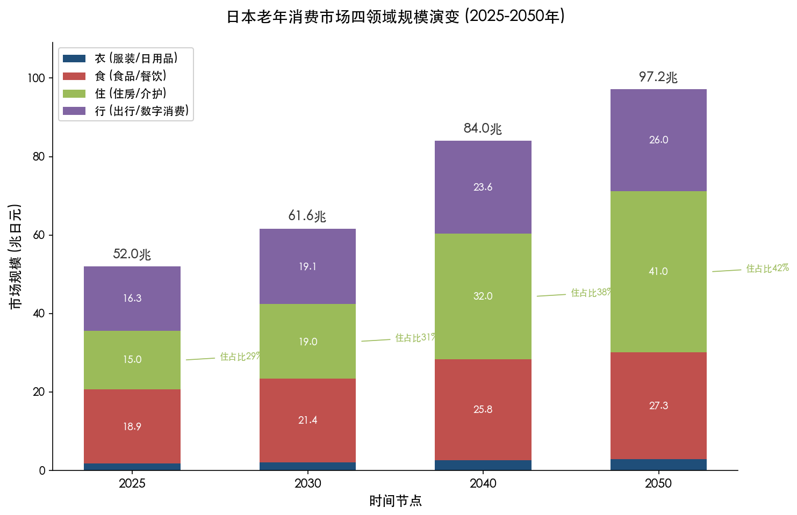

上图以堆叠柱状图直观呈现了四大领域的规模及结构占比变化。"住"领域占比从2025年的29%跃升至2050年的42%，成为推动市场总量增长的绝对主导力量。

上述自下而上推演的核心结论是：日本老年消费市场（衣食住行四大领域加总）预计从2025年约52兆日元扩大至2030年约60–63兆日元、2040年约81–87兆日元、2050年约94–101兆日元。这一增长并非源于老年人口的急剧扩张——65岁以上人口增幅仅约8%——而主要由三大结构性力量驱动：介护服务的制度性膨胀（"住"领域从15兆跃至41兆）、食料物价上行带来的名义增长，以及数字消费的世代推移红利。

### 7.3.2 与本报告未覆盖领域的关系

需要指出的是，上述52–101兆日元的范围仅涵盖本报告界定的"衣食住行"四大消费领域。日本银发经济的完整市场版图还包括若干本报告未纳入的重要组成部分：

- **医疗费用（医療費）**：2023年シニア関連市場中医療约29.0兆日元[みずほ銀行産業調査部](https://www.mizuhobank.co.jp/corporate/industry/pdf/msif_241.pdf "シニア関連市場規模推計の内訳")。本报告将医疗费用排除在"衣食住行"分析框架之外（OTC保健品归入"食"、家用辅具归入"住"除外），但其规模体量不容忽视。
- **杂项消费（その他消費）**：含保险、赠与以及娱乐消费中未被"食""行"覆盖的部分，合计约9.7兆日元。

因此，本报告的四领域加总值应被理解为银发经济总量的核心消费盘——涵盖了老年人日常生活消费和介护服务的主体部分，但并不等同于银发经济的全口径规模。

## 7.4 与权威机构预测的对标校验

### 7.4.1 みずほ銀行産業調査部推计（2025年1月）

みずほ銀行産業調査部2025年1月发布的最新研究是日本国内目前最为全面的シニア関連市場定量分析。其核心推计显示：2023年日本シニア関連市場規模合计约96.4兆日元（医療29.0兆+介護11.7兆+生活産業55.7兆）。在"現状延伸"情景下，2040年预计增至114.7兆日元（实质）或134.0兆日元（含物价变动），实质年均复合增长率约1.0%[みずほ銀行産業調査部](https://www.mizuhobank.co.jp/corporate/industry/pdf/msif_241.pdf "シニア市場のポテンシャルへの着眼 2025年1月")。

みずほ推計的96.4兆日元全口径中，生活産業55.7兆日元的内部构成为：食料16.4兆日元（占总盘17.0%）、その他消費9.7兆日元（10.1%）、交通及通信6.8兆日元（7.1%）、教養娯楽6.0兆日元（6.2%）、住居3.6兆日元（3.7%）、光熱及水道4.4兆日元（4.6%）、保健医療2.7兆日元（2.8%）、被服及履物1.0兆日元（1.0%）、家具及家事5.1兆日元（5.3%）[みずほ銀行産業調査部](https://www.mizuhobank.co.jp/corporate/industry/pdf/msif_241.pdf "シニア関連市場規模推計の内訳")。

将本报告四领域推演与みずほ口径进行对照：本报告2025年基准"衣食住行"合计约52兆日元，而みずほ2023年"衣+食+住居+交通通信+教養娯楽+介護+保健医療+光熱水道"（扣除医療29.0兆和その他9.7兆）约57.5兆日元。两者差异约5.5兆日元，主要源于本报告将光熱及水道费用（4.4兆日元）和部分家具及家事費目未列入四大领域，以及统计基年（2023年与2025年）和口径界定的细微差异。综合考量这些技术性差异，我们认为本报告的自下而上推演与みずほ的自上而下推計在数量级上高度一致，偏差处于合理范围内。

みずほ还预测，2040年シニア世帯（65岁以上）在全世代消費支出中的占比将从当前约19%大幅升至约40%，消費支出总额达60.5兆日元（実質）[みずほ銀行産業調査部](https://www.mizuhobank.co.jp/corporate/industry/pdf/msif_241.pdf "シニア消費の全世代における位置づけ")。这一判断与本报告的核心结论形成有力互证：在日本总人口持续萎缩、劳动年龄人口加速减少的背景下，银发消费在国民经济中的结构性权重将大幅上升——从当前不足五分之一跃升至近五分之二。

### 7.4.2 世界经济论坛（WEF）确认的国际共识

世界经济论坛2025年9月专文确认，日本长寿经济市場从2023年96兆日元（约6,525亿美元）预计扩大至2040年115兆日元（约7,800亿美元）[WEF](https://www.weforum.org/stories/2025/09/japans-longevity-economy/ "How Japan's longevity economy is creating new opportunities")。WEF直接引用了みずほ的推计框架，在国际层面为这一数据赋予了额外的可信度背书。

### 7.4.3 経済産業省推计：公的保険外健康产业

経済産業省从另一维度——公的保険外のヘルスケア産業（即不依赖公共保险支付的健康和介护关联服务市场）——进行了中长期推計：2020年25兆日元→2030年39.1兆日元→2050年76.8兆日元[経済産業省](https://www.meti.go.jp/shingikai/sankoshin/shin_kijiku/pdf/020_04_00.pdf "新しい健康社会の実現 2024年2月")。该口径与本报告和みずほ口径存在本质差异：它侧重于公共保险之外的民间市场空间，涵盖预防健康、民间介护、健康食品和フィットネス等品类。其数据为本报告"行"领域中健康管理App、在线医疗服务等新兴市场的增长前景提供了间接佐证。

### 7.4.4 厚生労働省関東信越厚生局的产业推计

厚生労働省関東信越厚生局资料提供了高龄者及介护関連サービス産業的更广义推计：2020年约18.5兆日元→2030年约30.9兆日元→2050年约59.7兆日元[厚生労働省関東信越厚生局](https://kouseikyoku.mhlw.go.jp/000412854.pdf "高齢者関連サービス産業推計")。该推计主要覆盖介护、养老设施和高龄者服务产业。本报告"住"领域2050年推演约41兆日元与之存在约19兆日元的差异，原因在于厚生局口径纳入了部分医療関連服务和更宽泛的生活支援サービス，而本报告对"住"领域的边界界定更为严格。

### 7.4.5 IMF关于银发经济的全球定位

IMF《世界経済見通し》2025年4月版第2章"银发经济的崛起"提出了两项对本报告具有直接参照意义的判断。其一，全球人口老龄化将导致2025–2050年各国GDP年均增速下降约1.1个百分点，但健康老龄化趋势预计贡献约+0.4个百分点的正面效应。其二，日本作为"early ager"（早期老龄化国家），若组合推行健康老龄化、延迟退休和缩小性别就业差距政策，可抵消约四分之三的人口负面拖累[IMF](https://www.imf.org/-/media/files/publications/weo/2025/april/english/ch2.pdf "WEO April 2025, Ch.2: The Rise of the Silver Economy")。

IMF的认知能力分析尤为引人瞩目：2022年70岁老人的认知能力相当于2000年53岁的水平（即"70 is the new 50"），每10年改善幅度约对应劳动参与率提高20个百分点、每周工时增加约6小时、劳动收入提高约30%[IMF](https://www.imf.org/-/media/files/publications/weo/2025/april/english/ch2.pdf "Healthy aging trends")。这一发现为みずほ提出的"マイナス5歳"情景提供了独立的实证支撑——若老年人的健康状态和劳动能力呈现系统性"年轻化"，银发消费市场的上行空间将显著扩大。

### 7.4.6 小结：多源交叉校验的共识区间

综合上述多源对标，我们得出日本老年消费市场（含衣食住行及介护，不含狭义医療）的规模共识如下：

- **2023–2025年**：约50–55兆日元（本报告四领域加总52兆日元，与みずほ扣除医療及その他后的口径基本吻合）
- **2030年**：约60–65兆日元
- **2040年**：约80–90兆日元（若加回医療和その他，全口径约115–134兆日元，与みずほ推计一致）
- **2050年**：约94–101兆日元（若加回医療和その他，全口径有望达120–140兆日元）

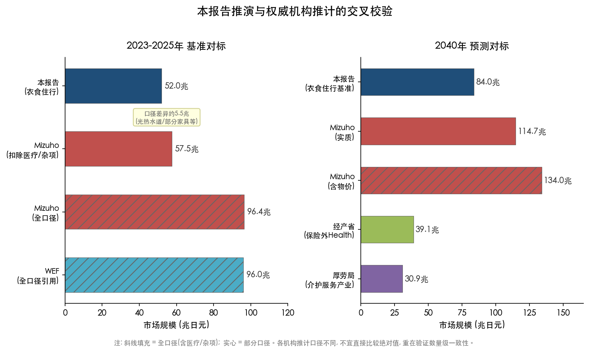

上图通过分组柱状图对比了本报告自下而上推演与みずほ、WEF、経済産業省、厚生労働省等权威机构推计的数值关系。左面板展示基准期口径差异（52兆 vs 57.5兆 vs 96.4兆），右面板展示2040年预测对标。各机构推计口径不同，绝对值不宜直接比较，但数量级层面的一致性显著增强了本报告推演结果的可信度。

## 7.5 银发经济在国民经济中的权重

将银发消费市场规模置于日本宏观经济坐标系中审视，其结构性意义更为清晰。

2024年度日本名目GDP为642.4兆日元（同比+3.7%），家計最終消費支出为294.9兆日元[内閣府経済社会総合研究所](https://www.esri.cao.go.jp/jp/sna/data/data_list/kakuhou/gaiyou/pdf/point_20251208.pdf "2024年度国民経済計算")。以みずほ推計的2023年シニア関連市場96.4兆日元与同年名目GDP 619.4兆日元对比，银发经济占GDP比重约15.6%[みずほ銀行産業調査部](https://www.mizuhobank.co.jp/corporate/industry/pdf/msif_241.pdf "シニア市場のポテンシャルへの着眼")。

若以本报告四领域口径衡量，2025年约52兆日元占家計最終消費支出（约295兆日元）的比重约17.6%。到2040年，本报告推演的81–87兆日元若对照IMF和OECD对日本名目GDP的中期预测（约660–700兆日元区间），占GDP比重将升至约12–13%。然而，更具结构性意义的指标是みずほ预测的"シニア世帯消費占全世代消費的比重"——从当前约19%升至2040年约40%。这意味着到2040年前后，日本国内消费支出中将有近五分之二由65岁以上家庭贡献。

这一结构性权重跃迁具有多维度的深远含义。对企业而言，忽视银发消费者等同于放弃近四成的国内市场。对政策制定者而言，年金替代率、介护保险费率、消费税率等任何调整都将通过银发消费渠道对内需产生放大效应。对金融体系而言，约1,400兆日元以上的老年金融资产能否从"沉淀储蓄"转化为"活跃消费"，将成为左右日本经济增长潜力的关键变量。

## 7.6 各领域占比结构及其演变

### 7.6.1 当前结构："食"与"行"双轮驱动

在2025年约52兆日元的老年消费总盘中，各领域占比呈现鲜明的不对称格局：

- **食**：约18.8–19.0兆日元，占比约36%
- **行（含数字消费）**：约16.3兆日元，占比约31%
- **住（含介护）**：约15兆日元，占比约29%
- **衣**：约1.75兆日元，占比约3%

食料和交通、通信及休闲构成老年家庭自主消费支出的两大支柱，合计约67%。介护保险费用（"住"领域的核心构成）虽占比29%，但具有显著的制度刚性特征——其增长路径由社会保险制度而非个人消费决策驱动，受人口结构和制度安排的双重锁定。

### 7.6.2 2050年预期结构："住"领域确立绝对主导

到2050年，四领域合计约94–101兆日元中，占比结构将发生深刻重塑：

- **住（含介护）**：约41兆日元，占比跃升至约41–44%
- **食**：约25.9–28.7兆日元，占比约27–29%
- **行（含数字消费）**：约24.0–28.0兆日元，占比约25–28%
- **衣**：约2.65–3.05兆日元，占比约3%

最引人注目的结构性转变在于"住"领域从29%跃升至41–44%，确立了银发消费市场绝对主导板块的地位。这一转变的核心驱动力来自介护保险费用的制度性膨胀——从2024年11.9兆日元增至2050年约33兆日元（增长1.8倍），增速远超其他三个领域。85岁以上超高龄人口从616万增至1,170万（增长90%），叠加认知症及MCI高龄者2040年约1,197万人（每3.3名老年人中有1人）的预测[みずほ銀行産業調査部](https://www.mizuhobank.co.jp/corporate/industry/pdf/msif_241.pdf "社会課題分析")，使介护需求的增长动能在可预见的未来几乎不可逆转。

"食"领域虽然绝对规模从约19兆增至约26–29兆日元，但占比从36%降至27–29%，表明其增长主要由物价名义推升而非实质消费量扩张所驱动。"行"领域占比从31%降至25–28%，其中数字消费的强劲增长被旅游参与率下降和日常交通出行模式转变所部分抵消。"衣"领域始终维持在3%左右的占比水平，规模虽有增长但在总盘中的权重可忽略不计。

## 7.7 情景分析：影响市场规模的关键假设与风险

### 7.7.1 基准情景核心假设

本报告的基准情景推演基于以下关键假设：

**人口假设：** 采用IPSS 2023年版出生中位及死亡中位方案，65岁以上人口2030年3,696万、2040年3,929万、2050年3,888万。出生假设对高龄化率有显著影响——2045年出生低位方案高龄化率37.2%，出生高位方案35.2%（差2.0个百分点），至2070年差距扩大至6.7个百分点[IPSS「日本の将来推計人口（令和5年推計）」](https://www.ipss.go.jp/pp-zenkoku/j/zenkoku2023/pp2023_gaiyou.pdf "出生仮定による高齢化率の違い")。但65岁以上人口的绝对数量在推计期内因已出生世代规模已确定而保持稳定，市场规模的人口底盘变动风险较小。

**物价假设：** 消费者物价指数（CPI）2024–2025年约2.5–1.5%，此后年率约0.8%；食料CPI年增约1.5–2%（高于整体CPI）。这一假设直接影响名义市场规模——みずほ指出，2040年推計实质114.7兆日元与含物价134.0兆日元之间存在约19兆日元（+17%）的差异[みずほ銀行産業調査部](https://www.mizuhobank.co.jp/corporate/industry/pdf/msif_241.pdf "物価変動前提")。

**年金假设：** 所得代替率从当前61.2%在"过去30年投影"情景下降至2057年的50.4%，基礎年金从36.2%降至25.5%[厚生労働省](https://www.mhlw.go.jp/content/001270476.pdf "令和6年財政検証結果の概要")。2025年年金制度改革法部分缓和了这一下行趋势，但未彻底逆转。

### 7.7.2 乐观情景："减龄5岁"的世界

みずほ銀行提出的"マイナス5歳"（减龄5岁）情景是最具政策想象力的乐观框架：假设65–79岁老年人的健康和就业状态系统性年轻化5岁。在该情景下，2040年相比"現状延伸"情景将呈现以下变化：

- 医療費减少3.6兆日元（健康改善降低就医需求）
- 介護費减少1.4兆日元（失能率下降延后介护需求）
- 就業者収入增加21.8兆日元（更多老年人持续工作）
- 消費支出增加2.9兆日元（至63.5兆日元，可支配收入增加带动消费提升）
- 合计シニア市場潜在消費力多出18.5兆日元[みずほ銀行産業調査部](https://www.mizuhobank.co.jp/corporate/industry/pdf/msif_241.pdf "マイナス5歳のインパクト")

IMF的实证数据为这一情景提供了独立支撑。"2022年70岁老人认知能力相当于2000年53岁水平"这一发现表明，健康老龄化的生物学基础已经存在[IMF](https://www.imf.org/-/media/files/publications/weo/2025/april/english/ch2.pdf "Healthy aging trends")。若日本成功将这一生物学趋势转化为政策成果——通过延迟退休、高龄就业促进和预防医疗投入——2040年银发消费市场的上限可从基准情景的81–87兆日元（四领域）扩大至约84–92兆日元（消費支出增量+2.9兆日元，同时部分向食、行领域转化）。全口径（含医療、介護及生活産業）则可从实质114.7兆日元升至约133兆日元，接近みずほ含物价方案的134.0兆日元水平。

2050年的乐观情景下，若"减龄5岁"效应持续作用于新进入老年期的世代，并叠加介护科技（机器人、AI）的成熟化部署，四领域合计有望达100–110兆日元。

### 7.7.3 保守情景：结构性逆风加剧

保守情景需充分考虑以下结构性逆风因素：

**逆风一：年金实质替代率下行超预期。** 若经济增长持续低迷（"零增长"情景而非"过去30年投影"），所得代替率可能降至50%以下，基礎年金给付实质购买力大幅收窄。年金占老年家庭收入的80–91%[総務省家計調査2025年平均結果](https://www.stat.go.jp/data/kakei/sokuhou/tsuki/pdf/fies_gaikyo2025.pdf "夫婦高齢者/高齢単身無職世帯")，这一收入来源的实质缩水将直接压缩老年人可支配收入的最大构成部分。

**逆风二：认知症导致的资产冻结与消费萎缩。** 三井住友信託銀行推计，认知症高龄者保有的金融资产将从2020年约255兆日元增至2040年约349兆日元（占家计资产12.1%）[三井住友信託銀行調査部](https://www.smtb.jp/-/media/tb/personal/useful/report-economy/pdf/121_1.pdf "膨らむ認知症高齢者の保有資産")。若成年后见制度和家族信托的普及速度不及预期，大量金融资产将处于"冻结"状态，有效消费需求被系统性压制。

**逆风三：介护人力缺口导致服务供给约束。** 2040年介护职员缺口预计达57万人，意味着约五分之一的介护服务需求可能无法得到充分满足[厚生労働省](https://www.mhlw.go.jp/stf/newpage_41379.html "第9期介護職員必要数")。若介护科技的劳动替代效果不及预期，供给约束将使"住"领域的实际规模低于需求推计。

**逆风四：通缩回归或消费税上调。** 若日本重回通缩轨道，名义市场规模增长将显著放缓；若为应对社会保障财政压力而将消费税从当前的10%进一步上调至12–15%，将对低收入老年家庭的消费产生明显抑制效应。

在保守情景下，2040年四领域合计可能收窄至75–80兆日元区间，2050年约85–93兆日元。

### 7.7.4 三情景汇总

| 时间节点 | 保守情景 | 基准情景 | 乐观情景 |
|---------|---------|---------|---------|
| 2030年 | 约57–59兆 | 约60–63兆 | 约63–66兆 |
| 2040年 | 约75–80兆 | 约81–87兆 | 约84–92兆 |
| 2050年 | 约85–93兆 | 约94–101兆 | 约100–110兆 |

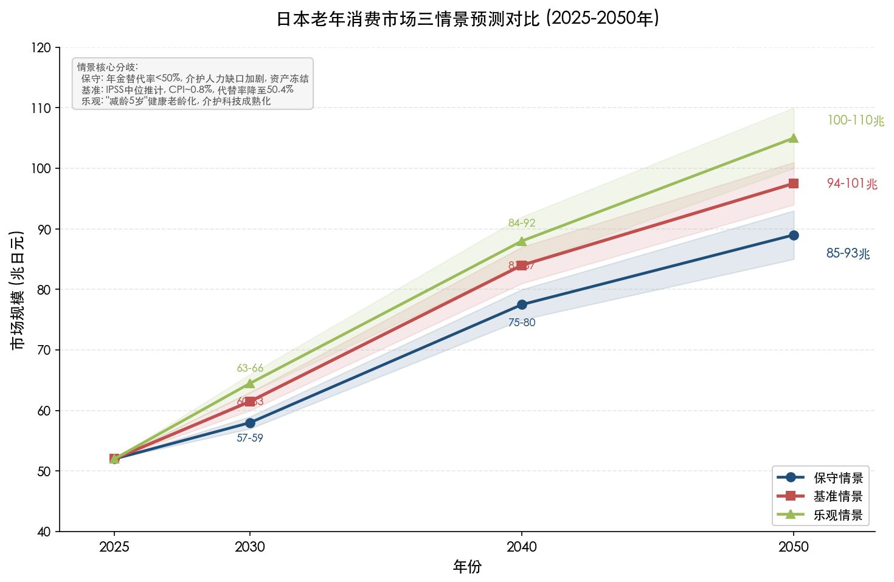

上图展示了保守、基准和乐观三个情景下市场总量的演变路径及不确定性区间。三个情景均以2025年约52兆日元为起点，至2050年分别收束于85–93兆、94–101兆和100–110兆日元的区间。

三个情景的核心分歧集中于"住"领域（介护服务供给约束与需求充分释放之间的张力）和"行"领域（数字消费渗透速度与旅游参与率回升幅度），而"食"领域因刚性需求特征在各情景间波动最小。

## 7.8 各消费领域的结构性机遇与挑战

### 7.8.1 衣：小体量中的精准赛道

机遇在于成人失禁用品市场的确定性增长（85岁以上人口翻倍驱动、渗透率提升空间显著）以及适应性服装标准化的推进。挑战在于传统衣着消费量随年龄递减的结构性约束，以及老年化妆品市场缺乏精确统计拆分导致投资决策难以锚定。从战略视角审视，"衣"领域的价值不在于规模体量，而在于其高增长细分赛道为材料科学、产品设计和渠道创新企业提供了精准切入机会。

### 7.8.2 食：刚需之上的增量引擎

中食（惣菜）市场已突破11兆日元规模，独居老人的持续增加（2020年738万户→2050年1,084万户）构成最确定的结构性驱动力[IPSS「日本の世帯数の将来推計（令和6年推計）」](https://www.ipss.go.jp/pp-ajsetai/j/HPRJ2024/hprj2024_gaiyo_20240412.pdf "表4")。机能性表示食品（2024年约7,274亿日元）在膝関節和認知機能等老年核心诉求品类上增长强劲[富士経済](https://www.fuji-keizai.co.jp/press/detail.html?cid=25021 "H・Bフーズマーケティング便覧2025")。介护食品及UDF以2024年约564亿日元的基数出发，受85岁以上人口驱动保持年增5–10%的增势[日本介護食品協議会](https://www.udf.jp/news/press_release20250602.pdf "2024年UDF生産統計")。主要挑战在于食料CPI持续上升可能挤压低收入老年人的食品消费质量，以及冷冻宅配食品物流网络在过疏地域的覆盖能力不足。

### 7.8.3 住：规模最大但受供给约束

介护服务市场的增长路径是四领域中确定性最高的——2040年介护给付费推计25.8兆日元获厚生労働省官方背书，85岁以上人口增长锁定了需求侧的扩张方向。介护科技正从"补充性工具"走向"必需性基础设施"，政府年均300亿日元级别的促进预算提供了明确的政策信号[WEF](https://www.weforum.org/stories/2025/09/japans-longevity-economy/ "Care robots roadmap")。然而，2040年57万人的介护人力缺口构成最严峻的供给侧约束——若无法通过科技替代、外国劳动力引进和待遇改善加以有效缓解，部分介护需求将处于"有需无供"的状态而被压制。此外，认知症高龄者保有约349兆日元的"冻结资产"问题也将制约银发消费能力的充分释放。

### 7.8.4 行：变革动能最强的前沿板块

数字消费的世代推移红利是最确定的增长引擎——当前50–60岁群体的高数字消费习惯将在2030–2040年自然"平移"至65岁以上群体，无需额外的大规模数字素养教育投入即可实现规模扩张。70岁以上世帯网购支出同比增长9.3%的增速已超过多数年轻世代[総務省「家計消費状況調査」2024年結果](https://www.stat.go.jp/data/joukyou/2024ar/gaikyou/pdf/gkall.pdf "年齢階級別ネットショッピング支出")。

出行服务领域蕴含广阔蓝海：约1.8兆日元的私家车保有成本替代空间与L4自动驾驶商用化路线图共同构成长期增长引擎[運輸総合研究所](https://www.jttri.or.jp/202306_Elderly_People_teigen.pdf "高齢者移動手段確保方策に関する提言")。

旅游休闲方面，70岁年龄段宿泊旅行实施率从50.7%降至37.8%的"老年人旅行离れ"现象值得警惕[明治安田総合研究所](https://www.myri.co.jp/ "失われるシニアの旅行消費")——数字鸿沟已成为老年人旅行的实质性障碍。但旅行意愿本身并未衰退：面向老年人的无障碍观光数字化（DX）设计每缩小1个百分点的意愿与实施落差，即有望释放约500–700亿日元的增量消费。

## 7.9 综合判断：确定性、结构性与可塑性

综合全文七章的系统分析，我们对2020–2050年日本老年消费市场提出以下三个层面的综合判断：

**第一，人口底盘具有高度确定性。** 65岁以上人口从3,603万增至约3,900万的轨迹由已出生世代的生存函数决定，不受未来生育率假设的影响。银发消费市场的"人口底盘"在推计期内基本锁定——无论日本采取何种生育促进政策，2050年前老年人口的绝对规模波动不超过5%。这赋予了市场规模推演异常稳固的人口学基础。

**第二，市场增长以结构性力量驱动为主。** 从52兆日元增至94–101兆日元的扩张，并非由老年人口数量的大幅增长（仅约+8%）所驱动，而是由三大结构性力量叠加推动：（a）介护服务的制度性膨胀——"住"领域年增约3.8%，远超GDP增速；（b）物价名义推升效应——食料CPI年增1.5–2%，累积效应显著；（c）数字消费的世代推移红利——每一个新进入65岁以上的世代，其数字消费能力均系统性高于前一世代。这三大力量的可预测性较高，使基准情景下的市场扩张具有较强的实现概率。

**第三，市场的最终规模具有政策可塑性。** 基准情景与乐观情景之间约10–15兆日元的差距空间，取决于日本能否成功推行"减龄5岁"式的健康老龄化政策组合。IMF的分析表明，日本若实施健康老龄化、延迟退休与缩小性别就业差距的组合政策，可抵消约四分之三的人口负面GDP拖累[IMF](https://www.imf.org/-/media/files/publications/weo/2025/april/english/ch2.pdf "WEO April 2025, Ch.2")。换言之，银发消费市场不仅是老龄化的被动结果，更是政策设计和制度创新的主动产物。

日本作为全球老龄化程度最高的国家（65岁以上人口占比已达29.4%）[総務省統計局「統計からみた我が国の高齢者」](https://www.stat.go.jp/data/topics/pdf/topics146.pdf "2025年敬老の日にちなんで")，其银发消费市场的规模、结构和演变路径，将为中国、韩国等正在加速进入超级老龄社会的东亚经济体提供最为直接的参照框架。从96兆日元的全口径现状到可能超过120兆日元的2050年前景，日本的"银发经济"正在从社会负担的叙事中走出，转化为全球瞩目的市场机遇。

# 结论与风险提示

## 核心结论

本报告围绕2020–2050年日本老年人口的消费潜力，从人口结构、购买力底盘和衣食住行四大消费领域展开系统性分析，形成以下五项核心结论。

**结论一：日本银发消费市场的人口底盘已基本锁定，属于"高确定性"变量。** 65岁以上人口从2020年3,603万人增至2043年峰值3,953万人后缓降至2050年3,888万人，高龄化率从28.6%单向攀升至37.1%。由于这一轨迹由已出生世代的存量人口决定，不受未来生育率假设影响，银发消费市场的规模底座在人口学层面具有异常高的可预测性。在IPSS出生低位至出生高位的全部方案下，2050年65岁以上人口绝对数波动不超过5%。

**结论二：市场增长的核心驱动力并非老年人口数量扩张，而是三大结构性力量的叠加。** 四领域合计从2025年约52兆日元扩大至2050年约94–101兆日元（基准情景），在65岁以上人口仅增长约8%的背景下实现近乎翻倍的规模扩张。三大结构性驱动力为：（a）介护服务的制度性膨胀——85岁以上超高龄人口从616万增至1,170万，人均介护费用约为65–74岁群体的10倍以上，推动"住"领域从15兆日元跃至41兆日元；（b）物价名义推升——食料CPI年增1.5–2%的累积效应使"食"领域名义规模持续扩大；（c）数字消费的世代推移红利——每一个新进入65岁以上的世代，其数字消费能力均系统性高于前一世代。

**结论三：市场结构将从"食行双轮驱动"转向"住领域绝对主导"。** 2025年，"食"和"行"合计占市场总量的67%，"住"领域占29%。到2050年，"住"领域占比将跃升至41–44%，确立为银发消费市场的绝对主导板块。这一结构性转变的本质在于：随着后期高龄者（75+）占比从约52%升至约62%、超高龄者（85+）翻倍增长，老年消费的重心从"主动型自主消费"（食品、旅行、时尚）向"被动型制度消费"（介护服务、养老设施、福祉用具）系统性转移。

**结论四：银发消费在日本国民经济中的结构性权重将实现跃迁。** みずほ銀行産業調査部预测，シニア世帯消費在全世代消費支出中的占比将从当前约19%升至2040年约40%。这意味着到2040年前后，日本国内消费支出中将有近五分之二由65岁以上家庭贡献。对企业而言，忽视银发消费者等同于放弃近四成的国内市场；对政策制定者而言，年金替代率、介护保险费率和消费税率的任何调整，都将通过银发消费渠道对内需产生显著的放大效应。

**结论五：市场的最终规模具有显著的政策可塑性。** 基准情景与乐观情景之间约10–15兆日元的差距空间取决于日本能否成功推行"减龄5岁"式的健康老龄化政策组合。IMF实证数据显示，2022年70岁老人的认知能力相当于2000年53岁的水平，健康老龄化的生物学基础已经存在。若日本将这一趋势转化为政策成果——延迟退休、高龄就业促进、预防医疗投入和介护科技部署——银发消费市场将不仅是老龄化的被动结果，更是制度创新的主动产物。

## 主要风险因素

**风险一：年金实质购买力的中长期侵蚀。** 厚生労働省令和6年財政検証显示，在"过去30年投影"情景下，モデル世帯所得代替率将从当前61.2%降至2057年的50.4%，基礎年金实质购买力面临约三成的缩减。社会保障给付占老年家庭实收入的80–91%，年金购买力的持续收窄将直接压缩银发消费能力的最大构成部分。2025年年金制度改革法虽设立了基礎年金底部保障机制，但其实际效果尚待2029年財政検証验证。

**风险二：认知症导致的资产冻结与消费能力系统性压制。** 认知症高龄者保有的金融资产将从2020年约255兆日元膨胀至2040年约349兆日元，占全家计资产总额的12.1%。若成年后见制度和家族信托的普及速度不及预期，近350兆日元的金融资产将沦为"冻结资产"，有效消费需求被系统性压制。

**风险三：介护人力缺口对"住"领域的供给约束。** 2040年介护职员需求缺口预计达57万人，约占总需求的五分之一。若介护科技（机器人、AI、传感器）的劳动替代效果不及预期、外国劳动力引进进展缓慢，部分介护需求将处于"有需无供"的状态，实际市场规模将低于需求推计。

**风险四：通缩回归或消费税上调对低收入老年家庭的消费抑制。** 日本若重回通缩轨道，名义市场规模增长将显著放缓。若为应对社会保障财政压力将消费税从10%进一步上调，对低储蓄、纯年金依赖型老年家庭的消费产生的抑制效应将尤为显著。

**风险五：数字鸿沟对旅游休闲消费的持续抑制。** 70代宿泊旅行実施率已从疫前50.7%大幅降至37.8%，观光DX化构成老年人旅行参与的实质性障碍。80岁以上互联网利用率仅33.1%，构成数字消费增长的结构性天花板。尽管世代推移将逐步缓解这一问题，但超高龄群体（85+）的数字适应能力仍将是长期制约因素。

## 局限性分析

本报告在分析方法与数据来源方面存在以下主要局限：

**第一，市场规模推演采用区间估计而非点估计，精确度受多重假设制约。** 本报告的自下而上推演基于人口参数、物价假设、年金替代率走势和数字渗透率等多项假设，各领域推演均以区间形式呈现。推计期越长、不确定性越大——2030年区间宽度约3兆日元，2050年扩大至约7兆日元。读者应将具体数值理解为量级参照而非精确预测。

**第二，四领域口径并非银发经济的完整覆盖。** 本报告界定的"衣食住行"四大领域不包含狭义医療费用（约29兆日元）、保险、赠与及部分杂项消费（约9.7兆日元），因此四领域合计52–101兆日元低于みずほ全口径96.4–134兆日元。对银发经济全貌的评估需将本报告结论置于更宽泛的框架中理解。

**第三，老年人内部异质性的分析深度有限。** 本报告区分了前期高龄者（65–74岁）与后期高龄者（75+）、独居与非独居、男性与女性等维度，但对收入五分位、地域差异（都市vs.地方）、健康状态分层等更精细的异质性分析受限于公开数据的颗粒度，未能充分展开。实际市场中，高收入都市圈活跃银发层与低收入地方圈超高龄独居层的消费行为可能存在本质性差异。

**第四，消费行为的代际变迁预测具有固有不确定性。** 本报告假设世代推移效应将使未来老年人的数字消费习惯、健康管理意识和出行方式系统性"年轻化"。然而，宏观经济环境变化（长期通缩、财政紧缩）、制度变革（介护保险制度改革、年金制度调整）以及突发事件（如新冠疫情级别的外部冲击）均可能改变代际行为模式的延续路径。

**第五，部分细分市场缺乏精确的官方统计拆分。** 适应性服装（Adaptive Clothing）日本国内市场的独立规模数据、化妆品市场中老年人的精确消费份额、以及介护食品在居家与设施场景中的消费拆分，均依赖行业估算和推算手法，精确度有待后续调查数据的充实。
