# Overview

Warren Buffett, Charlie Munger, and Duan Yongping are among the most influential practitioners of value investing in the modern era. Though separated by nationality, institutional context, and generational experience, all three trace their intellectual lineage to Benjamin Graham's foundational insight: that a security is a fractional ownership claim on a real business, not a speculative token whose value depends on the next buyer's willingness to pay. From this shared root, each investor developed a distinctive philosophy shaped by biography, temperament, and cultural formation — Buffett through six decades of capital allocation at Berkshire Hathaway, Munger through a polymathic intellectual architecture grounded in multidisciplinary mental models, and Duan through a cross-cultural synthesis that fused Buffett-Munger principles with the Confucian concept of "本分" (běn fèn, doing the right thing).

This report examines their investment philosophies across five analytical dimensions. The first chapter traces the intellectual origins of each framework — from Graham's classroom and Fisher's qualitative growth orientation, through Munger's "quality revolution," to Duan's entrepreneurial formation in China's consumer electronics industry. The second chapter identifies six core principles that govern their capital allocation: intrinsic value, margin of safety, economic moats, the preference for business quality over statistical cheapness, management integrity, and circle of competence. The third chapter compares their valuation methodologies and decision-making architectures — ranging from Buffett's owner-earnings framework, through Munger's latticework of mental models, to Duan's radically simplified binary judgment. The fourth chapter analyzes portfolio construction, concentration strategy, cash management, and selling discipline. The fifth chapter examines the behavioral and psychological dimensions that all three identify as the ultimate determinant of investment success. A concluding synthesis maps convergences and divergences, evaluates structural criticisms, and distills actionable principles.

The central finding is one of deep philosophical alignment beneath surface-level variation. All three investors define risk as permanent capital loss rather than volatility, practice concentrated portfolios anchored in genuine business understanding, reject market timing and macroeconomic forecasting, prioritize temperament over intellect, and treat restraint — knowing what not to do — as the primary source of long-term advantage. Their divergences are instructive rather than contradictory: differences in circle-of-competence width, intellectual formalization, tactical methodology, and cultural idiom reveal how a single tradition adapts to different minds and markets without losing its structural coherence.

# 第1章 Origins and Intellectual Foundations

The investment philosophies of Warren Buffett, Charlie Munger, and Duan Yongping share a common intellectual ancestor: Benjamin Graham's framework of intrinsic value, margin of safety, and market irrationality. Yet each investor arrived at this tradition through markedly different formative experiences. Buffett absorbed value investing directly from Graham at Columbia Business School and refined it across thirteen years of partnership management. Munger brought legal training, polymathic breadth, and a temperamental conviction that business quality matters more than statistical cheapness. Duan Yongping, having built one of China's most successful consumer electronics ecosystems from a failing state-owned factory, encountered the Buffett-Munger framework as an emigrant entrepreneur in California and fused it with a Confucian concept of duty he calls "本分" (běn fèn). Tracing these origins reveals not merely how a single intellectual tradition branched into complementary yet distinct investment worldviews, but why the philosophical commitments formed in each investor's early career continue to govern their capital allocation decisions decades later.

## 1.1 Warren Buffett: From Graham's Classroom to the Partnership Years

Warren Edward Buffett, born August 30, 1930, in Omaha, Nebraska, displayed a precocious affinity for numbers and commerce — purchasing his first stock at age eleven and filing his first tax return by thirteen. The decisive intellectual turning point came in 1950, when Buffett enrolled at Columbia Business School for the explicit purpose of studying under Benjamin Graham, co-author of *Security Analysis* (1934, with David Dodd) and author of *The Intelligent Investor* (1949). Graham's framework rested on three pillars that would become permanent fixtures of Buffett's thinking. The first was *intrinsic value* — the notion that a business possesses a calculable worth independent of its market quotation. The second was *margin of safety*, the discipline of purchasing securities only at a substantial discount to that intrinsic value. The third was the *"Mr. Market" allegory*, which reframes daily price fluctuations as the moods of an emotional counterparty rather than signals of fundamental change. Buffett received the only A+ grade Graham ever awarded in his investing course — an early marker of exceptional analytical aptitude applied within a rigorous intellectual tradition [Alice Schroeder, *The Snowball: Warren Buffett and the Business of Life* (Bantam Books, 2008), Chapters 1–17].

After graduating, Buffett joined Graham-Newman Corporation from 1954 to 1956, applying his mentor's methods in practice — buying statistically cheap securities trading below net current asset value, a technique often labeled "cigar butt" investing for the single remaining puff of value such positions offered. When Graham retired, Buffett returned to Omaha and, on May 1, 1956, launched Buffett Partnership Ltd. with $105,100 pooled from seven limited partners. Over the subsequent thirteen years, the partnership compounded at 29.5% annually before fees, against 7.4% for the Dow Jones Industrial Average, and never posted a losing year — a track record that established Buffett as the most accomplished direct disciple of the Graham school [Buffett Partnership Letters, 1957–1969].

These extraordinary results were achieved largely through Graham's quantitative framework, yet the seeds of evolution were already present. Buffett had encountered Philip Fisher's *Common Stocks and Uncommon Profits* (1958), which introduced a qualitative, growth-oriented dimension to stock selection. Fisher emphasized management quality, long product runways, and "scuttlebutt" research — gathering intelligence from competitors, suppliers, and customers rather than relying solely on financial statements. Buffett would later characterize his approach as "85% Graham and 15% Fisher," a remark commonly traced to a Forbes interview in the late 1960s, though its exact provenance has not been confirmed through a primary source. He subsequently conceded the ratio was improvised — "I think I just named the number" — suggesting that in practice the Fisher influence grew steadily, particularly as Buffett shifted from buying statistically cheap mediocre businesses toward holding high-quality companies capable of compounding capital over decades.

## 1.2 Charlie Munger: Law, Mental Models, and the Quality Revolution

Charles Thomas Munger, born January 1, 1924, in Omaha — who died on November 28, 2023, at the age of ninety-nine — brought to investing a mind shaped by disciplines far removed from Wall Street. He studied mathematics at the University of Michigan, trained as a meteorologist at the California Institute of Technology during World War II, and graduated magna cum laude from Harvard Law School in 1948, notably without ever completing an undergraduate degree. In 1962 he co-founded Munger, Tolles & Olson, which grew into one of California's most respected law firms. His legal background — evaluating evidence under adversarial conditions, constructing arguments, identifying weaknesses in reasoning — proved directly transferable to investment analysis [Berkshire Hathaway press release, November 28, 2023, https://www.berkshirehathaway.com/news/nov2823.pdf "Official announcement of Munger's death"; Janet Lowe, *Damn Right! Behind the Scenes with Berkshire Hathaway Billionaire Charlie Munger* (2000)].

Munger met Buffett in 1959, introduced through the Davis family in Omaha. The two recognized in each other a shared obsession with rational capital allocation, yet their intellectual temperaments diverged in ways that proved mutually enriching. Where Buffett had been trained in Graham's quantitative security analysis — screens, ratios, discounts to net asset value — Munger gravitated toward qualitative assessments of business quality, management character, and competitive positioning.

Munger's most distinctive intellectual contribution was what he termed the "latticework of mental models" — a multidisciplinary architecture for decision-making articulated most fully in his 1994 lecture at USC Business School, "A Lesson on Elementary, Worldly Wisdom." Investors, he argued, must draw on frameworks from psychology, physics, biology, economics, engineering, and history rather than rely on any single discipline. This architecture found its most applied expression in "The Psychology of Human Misjudgment," a talk first delivered at Harvard in 1995, in which Munger catalogued twenty-five standard causes of human cognitive error — from incentive-caused bias to lollapalooza effects, where multiple biases compound to produce extreme outcomes. Munger cited Benjamin Franklin as his most admired historical figure, and Franklin's *Poor Richard's Almanack* inspired the title of the compilation of Munger's own collected wisdom, *Poor Charlie's Almanack* (2005) [*Poor Charlie's Almanack* (2005); Janet Lowe, *Damn Right!*, Chapter 5].

Munger's most consequential contribution to the Buffett-Munger partnership, however, was a philosophical reorientation of the valuation framework itself. Graham's approach prized quantitative cheapness — buying a dollar of assets for fifty cents — but assigned limited weight to business quality beyond the balance sheet. Munger pressed Buffett toward a different calculus: rather than buying fair businesses at wonderful prices, one should seek wonderful businesses at fair prices. Buffett credited this shift directly to Munger in the 1989 Berkshire Hathaway annual letter: "It's far better to buy a wonderful company at a fair price than a fair company at a wonderful price. Charlie understood this early; I was a slow learner" [Buffett, *Berkshire Hathaway Annual Letter* (1989)](https://www.berkshirehathaway.com/letters/1989.html "1989 Annual Letter").

## 1.3 The See's Candies Inflection Point

The practical test of Munger's influence came in 1972 with Berkshire Hathaway's acquisition of See's Candies for $25 million. At the time, See's earned approximately $4 million pre-tax on $8 million of net tangible assets — a 50% pre-tax return on tangible capital. Under Graham's strict criteria, paying roughly 6.25 times pre-tax earnings for a confectionery business would have appeared expensive; Graham favored purchases at or below book value. Munger, however, recognized that See's possessed an intangible asset — brand loyalty powerful enough to sustain annual price increases without customer attrition — invisible on the balance sheet yet profoundly real in cash-flow terms.

The acquisition proved transformative. By the time Buffett wrote his fiftieth-anniversary annual letter in 2014, See's had generated $1.9 billion in cumulative pre-tax earnings while requiring only $40 million in additional invested capital — a return on incremental investment that few businesses in any industry have matched [Buffett, *Berkshire Hathaway Annual Letter* (2014)](https://www.berkshirehathaway.com/letters/2014ltr.pdf "2014 Annual Letter — 50th Anniversary"). See's became the template for the mature Buffett-Munger investment philosophy: seek businesses with high returns on tangible capital, strong pricing power, minimal reinvestment requirements, and management integrity. In Buffett's words from that same letter, Munger had redirected his thinking "from the cigar-butt approach to buying wonderful businesses."

This evolution did not repudiate Graham but extended his framework. The concept of intrinsic value remained central; what changed was the recognition that intangible competitive advantages — brand, customer captivity, organizational culture — could generate far greater compounding value over decades than a one-time statistical discount to net assets. Margin of safety, too, was redefined: for the mature Buffett-Munger partnership, the most durable margin of safety resided in owning a business whose economics improved year after year, not merely in purchasing assets at a temporary discount to liquidation value.

## 1.4 Duan Yongping: From Subor to Silicon Valley

Duan Yongping (段永平), born in 1961 in Nanchang, Jiangxi Province, arrived at value investing through a path entirely unlike those of his American counterparts. Where Buffett and Munger were products of Midwestern American capitalism and elite academic institutions, Duan's formative crucible was building consumer electronics businesses in the fast-industrializing Pearl River Delta of post-reform China.

After earning degrees from Zhejiang University and Renmin University (the latter in econometrics), Duan was assigned around 1989 to manage a struggling state-owned electronics factory in Zhongshan, Guangdong Province. He transformed it into Subor Electronics (小霸王), a household name producing educational computers and game consoles that reached millions of Chinese families. Despite this entrepreneurial success, Duan departed Subor in 1995 over ownership disputes: the state-owned enterprise structure made it impossible for him to receive equity in the company he had revitalized — a structural flaw that would decisively shape his subsequent approach to corporate governance.

In 1995, Duan founded BBK Electronics (步步高) in Dongguan, implementing an equity-sharing structure that gave key managers genuine ownership stakes — a deliberate correction of the governance deficiency that had driven him from Subor. BBK became the organizational incubator for what is now one of the world's largest consumer electronics ecosystems: Tony Chen (陈明永) led the creation of OPPO; Shen Wei (沈炜) built Vivo; OnePlus emerged as a subsidiary brand. These companies collectively ship hundreds of millions of smartphones annually. Duan's core management philosophy at BBK centered on "本分" (běn fèn) — a concept rooted in Confucian ethics translating approximately as "doing the right thing" or "fulfilling one's proper duty." At the enterprise level, 本分 meant focusing relentlessly on product quality, treating stakeholders with fairness, and resisting the temptation of speculative diversification.

Around 2001, Duan emigrated to the United States, settling in Atherton, California, and transitioned from active entrepreneur to full-time investor. During this period he undertook a systematic study of Warren Buffett's investment philosophy, reading Berkshire Hathaway's shareholder letters, *The Intelligent Investor*, and *Poor Charlie's Almanack*. He has described Buffett's annual letters as "the best MBA education you can get." The intellectual absorption was not merely academic: Duan recognized deep structural parallels between Buffett's investment principles and the operating philosophy he had already developed at BBK — the emphasis on long-term thinking over quarterly performance, the insistence on management integrity, and the preference for businesses with strong consumer franchises. These were principles Duan had practiced as a builder of brands before encountering them as formal investment doctrine.

## 1.5 The 2006 Buffett Lunch and a Bridge Between Traditions

In June 2006, Duan Yongping won the annual Buffett charity lunch auction with a then-record bid of $620,100, the proceeds benefiting the Glide Foundation in San Francisco. The event was more than a symbolic gesture: it marked the moment at which the Chinese adaptation of value investing gained its most visible personal connection to the American original.

Duan brought to the lunch a twenty-six-year-old associate named Huang Zheng (黄峥), who would later found Pinduoduo (拼多多, now PDD Holdings), one of China's largest e-commerce platforms. In a subsequent interview with *Caijing* (财经) magazine, Huang recalled: "Buffett talks about things that are really simple — things my mother could understand. The biggest significance of that meal for me was realizing that simplicity and common sense are the most powerful forces" [*Caijing* magazine interview with Huang Zheng; 36Kr, "巴菲特午餐的四位中国客人"]. This episode illustrates the cascading nature of intellectual influence within value investing: Graham shaped Buffett, Buffett and Munger shaped each other, and their combined framework in turn shaped Duan, who transmitted these ideas to the next generation of Chinese entrepreneurs and investors.

Duan's role as a cultural intermediary between Western value investing and Chinese capital markets warrants emphasis. Through prolific posting on Xueqiu (雪球), China's leading investment social platform, he translated Buffett-Munger principles into Chinese context for an audience of millions. His posts — characteristically direct, aphoristic, and grounded in personal operating experience — became primary texts for an entire generation of Chinese value investors. Where Buffett communicated through annual shareholder letters and Munger through lectures compiled in *Poor Charlie's Almanack*, Duan's medium was social media, reaching the rapidly expanding Chinese retail investor base of the 2010s.

## 1.6 Convergence and Divergence: Three Intellectual Traditions

All three investors trace their intellectual lineage to Benjamin Graham. The concept of intrinsic value as an objective property of a business, the insistence on margin of safety as protection against analytical error, and the treatment of market prices as opportunities rather than instructions — these Grahamian foundations are present in all three frameworks. Yet the traditions branching from this common root are meaningfully distinct, shaped by each investor's biography, cultural context, and professional formation.

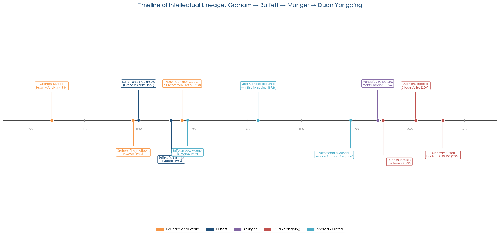

*Figure 1.1 — Key milestones in the transmission and adaptation of the value investing tradition, from Graham's foundational texts (1934–1949) through Buffett's partnership years, the Munger-influenced quality revolution, and Duan Yongping's cross-cultural synthesis.*

**Buffett's evolution** represents a progressive expansion from Graham's quantitative strictness toward a synthesis incorporating Fisher's qualitative growth orientation and Munger's emphasis on business quality. The progression is traceable through specific capital allocation decisions: the early partnership years reflect pure Graham methodology — statistical cheapness, net-net investing; the See's Candies acquisition in 1972 marks the Munger-influenced transition to quality-based investing; and the Coca-Cola purchase in 1988 — a $1.3 billion commitment to a business trading at a significant premium to book value but possessing one of the world's strongest consumer brands — represents the mature synthesis. Buffett remains fundamentally an empiricist: he learns from specific cases, generalizes reluctantly, and trusts accumulated experience over abstract theory.

**Munger's contribution** is the most intellectually systematic of the three. His "latticework of mental models" constitutes not merely an investment technique but an epistemological program — an argument that superior decision-making requires drawing on the full breadth of human knowledge. The twenty-five causes of human misjudgment catalogued in his 1995 Harvard lecture function as a checklist against cognitive error, applied not only to evaluating businesses but to auditing one's own reasoning process. Munger's intellectual heroes — Benjamin Franklin, Darwin, Cicero — are generalists and polymaths, not financial specialists. His favored aphorism, borrowed from the mathematician Carl Gustav Jacob Jacobi — "Invert, always invert" (*Man muss immer umkehren*) — encapsulates his method: understand a problem by studying its opposite; avoid stupidity rather than seek brilliance [*Poor Charlie's Almanack* (2005)].

**Duan Yongping's synthesis** is distinctive as a cross-cultural adaptation. He preserved virtually the entire core Buffett-Munger framework — intrinsic value, margin of safety, concentration, long-term holding, circle of competence — but integrated it with 本分, a concept operating simultaneously on two levels. As a criterion for evaluating management, 本分 demands that corporate leaders focus on product quality, treat stakeholders with integrity, and avoid speculative behavior — closely paralleling Buffett's emphasis on management honesty and Munger's focus on incentive alignment, yet rooted in Confucian rather than Enlightenment ethics. As a tool for investor self-discipline, 本分 means "doing the right thing, not the easy thing" and "admitting when you don't understand something" — a behavioral anchor functionally equivalent to Munger's emphasis on rationality, but expressed in the language of duty rather than cognitive science.

Duan also brought to value investing something neither Buffett nor Munger possessed in their early careers: the perspective of a technology entrepreneur who had built and scaled consumer hardware businesses. When Duan invested in NetEase at approximately $0.80 per share in 2002 — while the company teetered near delisting amid an SEC investigation — he was not merely reading financial statements but evaluating a business model from the inside, drawing on his own experience building consumer technology products in competitive Asian markets. Similarly, his early entry into Apple shares (around 2011–2012, several years before Buffett's 2016 position) reflected a tech-native understanding of ecosystem lock-in, hardware-software integration, and consumer brand dynamics that a traditional value investor trained exclusively on financial statements would have been slower to develop.

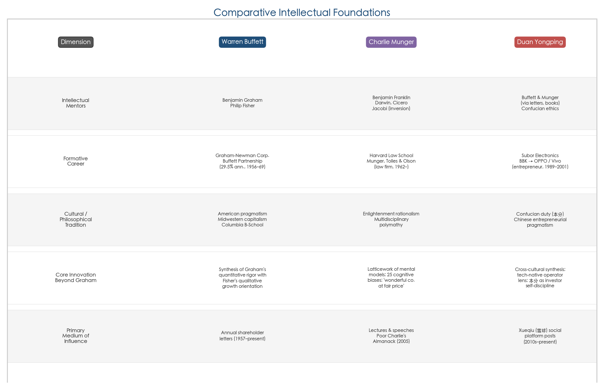

*Figure 1.2 — Structured comparison of the intellectual foundations of Buffett, Munger, and Duan Yongping across five dimensions: mentors, formative career experience, cultural tradition, core innovation beyond Graham, and primary medium of influence.*

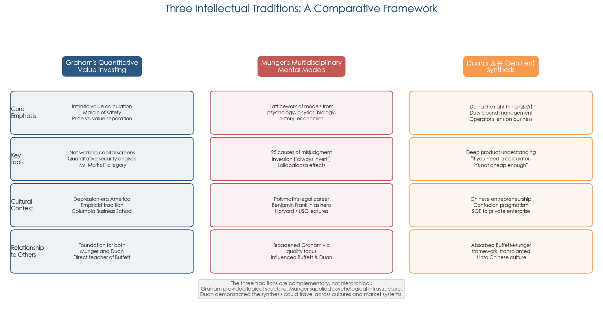

*Figure 1.3 — The three intellectual traditions — Graham's quantitative value investing, Munger's multidisciplinary mental models, and Duan's 本分 synthesis — examined through their core emphases, analytical tools, cultural contexts, and interrelationships.*

## 1.7 The Shared Foundation and Its Enduring Power

The intellectual foundations examined in this chapter share a unifying logic despite their distinct cultural and biographical origins. Graham provided the conceptual vocabulary: intrinsic value, margin of safety, Mr. Market. Fisher and Munger expanded the definition of value to encompass qualitative business characteristics invisible on the balance sheet. Buffett demonstrated through six decades of capital allocation that this expanded framework could compound wealth at extraordinary rates. Duan Yongping showed that the framework was not culturally bound to American capitalism — that its core principles, grounded in logic, patience, and intellectual honesty, could be transplanted across the Pacific and fused with a distinct ethical tradition to produce equally rigorous investment thinking.

The chapters that follow build on this foundation. Chapter 2 examines how each investor translates these philosophical origins into specific selection criteria — intrinsic value estimation, moat analysis, and management evaluation. Chapter 3 explores the decision-making frameworks and valuation methodologies through which investment conviction is formed and tested. The origins examined here matter because they explain *why* these investors think as they do: why Buffett trusts compounding over trading, why Munger insists on multidisciplinary breadth, and why Duan grounds his investment discipline in a concept of moral duty. Philosophy, in this domain, is not abstract — it is the source code of behavior under uncertainty.

# 第2章 Core Investment Principles and Selection Criteria

The investment philosophies of Warren Buffett, Charlie Munger, and Duan Yongping rest on a shared conceptual foundation, yet each investor has developed distinctive emphases and selection criteria shaped by temperament, institutional context, and lived experience. This chapter examines six core principles that guide their capital allocation: intrinsic value estimation, margin of safety, competitive advantages ("moats"), the preference for business quality over statistical cheapness, the non-negotiable requirement for management integrity, and the discipline of the circle of competence. Across these dimensions, the analysis reveals a striking philosophical convergence — and a set of nuanced divergences that illuminate how a single intellectual tradition can yield meaningfully different investment practices.

## Intrinsic Value: A Conceptual Compass, Not a Spreadsheet

All three investors anchor their decision-making in the concept of intrinsic value — the present value of all future cash flows a business will generate for its owners. Their approaches to estimating this figure, however, span a wide spectrum: from Buffett's formally articulated framework, through Munger's deliberate rejection of quantitative precision, to Duan's radical simplification.

Buffett provided his canonical definition in the 1994 Owner's Manual: "Intrinsic value can be defined simply: It is the discounted value of the cash that can be taken out of a business during its remaining life." He immediately cautioned that the calculation is inherently imprecise, acknowledging that two equally well-informed analysts might arrive at figures differing by more than 10% [Buffett, *An Owner's Manual*](https://www.berkshirehathaway.com/ownman.pdf "Berkshire Hathaway Owner's Manual, 1994"). This candor is essential to understanding the Buffett–Munger approach: intrinsic value serves as a conceptual anchor for decision-making, not a precise numerical target to be optimized in a spreadsheet.

The operational metric Buffett uses to approximate cash generation is "owner earnings," introduced in the appendix to his 1986 shareholder letter. Drawing on a detailed comparison of Scott Fetzer's economics before and after Berkshire's acquisition, he demonstrated how GAAP accounting can obscure true economic reality. Owner earnings, as Buffett defined them, consist of reported earnings plus depreciation, depletion, and amortization, plus certain other non-cash charges, minus the average annual capitalized expenditures for plant and equipment that the business requires to maintain its competitive position and unit volume [Buffett, *Berkshire Hathaway Annual Letter*](https://www.berkshirehathaway.com/letters/1986.html "1986 Annual Letter"). This metric strips away accounting fictions to reveal what a business actually delivers to its owners — and Buffett has warned repeatedly against treating EBITDA as a proxy for earning power. In the 2000 letter, he offered a characteristic admonishment: "References to EBITDA make us shudder — does management think the tooth fairy pays for capital expenditures?" [Buffett, *Berkshire Hathaway Annual Letter*](https://www.berkshirehathaway.com/letters/2000pdf.pdf "2000 Annual Letter").

Munger adopted a deliberately less formal stance. At the 2007 Berkshire annual meeting, he offered a memorable admission: "Warren often talks about these discounted cash flows. I've never seen him do one." Their shared methodology is better described as intuitive pattern-matching — "we sort of do it in our heads" — grounded in deep business understanding rather than computational precision [*Poor Charlie's Almanack*](# "2005 edition"); [Berkshire Hathaway Annual Meeting](# "2007 transcript"). For Munger, valuation precision matters far less than qualitative judgment about long-term business economics. His observation that "if a business earns 18% on capital over 20 or 30 years, even if you pay an expensive-looking price, you'll end up with a fine result" reframes the valuation question entirely: the operative inquiry is not "What is the exact fair value?" but "Is this business fundamentally excellent?" [*Poor Charlie's Almanack*](# "2005 edition").

Duan Yongping pushes simplification further still, stripping valuation to its conceptual essence: "If you need a calculator to figure out whether something is cheap, it probably isn't cheap enough." His approach is binary rather than quantitative — either an opportunity is obviously compelling, or he passes. This is not intellectual laziness but the logical endpoint of the Buffett–Munger framework: an investor who truly comprehends a business will recognize value when it appears, without requiring elaborate models. As Duan has written: "Most people think investing is about valuation. It's not. It's about understanding the business" [Duan Yongping, Xueqiu (雪球) posts](# "Chinese-language social investment platform").

The convergence among the three is unmistakable: intrinsic value is the intellectual foundation of their practice, but none treats it as a precise, calculable number. The divergence lies in the degree of formalization — Buffett offers the most structured framework (owner earnings, DCF as conceptual tool); Munger explicitly rejects formal calculation in favor of mental-model-driven pattern recognition; Duan reduces the entire process to a binary judgment anchored in business understanding.

## Margin of Safety: From Statistical Discount to Business Quality

Benjamin Graham's margin of safety — buying assets at a price substantially below estimated intrinsic value — is the principle all three investors cite as foundational. The concept has, however, undergone a significant evolution across the three frameworks, shifting from a primarily quantitative discount to a qualitative conception rooted in business excellence.

Buffett's reverence for Graham's concept is unambiguous. In the 1992 letter, he declared: "In *The Intelligent Investor*, Ben Graham explained a margin-of-safety concept that I believe to be — almost 50 years after first reading it — the cornerstone of investment success" [Buffett, *Berkshire Hathaway Annual Letter*](https://www.berkshirehathaway.com/letters/1992.html "1992 Annual Letter"). Crucially, Buffett does not specify a fixed numerical margin; the required discount varies with the predictability and quality of the underlying business. A company with highly stable, recurring cash flows warrants a narrower margin than one with volatile or unpredictable earnings — a variable-margin approach reflecting the practical reality that not all businesses carry equivalent analytical uncertainty.

Munger redefined the concept in a way that fundamentally expanded its meaning: "The best way to get a margin of safety is to buy a wonderful business that throws off lots of cash" [*Poor Charlie's Almanack*](# "2005 edition"). In Munger's view, the primary source of protection is not a static discount to a calculated value but the business itself. A company with durable competitive advantages, high returns on capital, and strong cash generation provides an inherent margin of safety because its future cash flows are more predictable and more resilient than those of a marginal business. This reconception was central to the shift from Graham-style "cigar butt" investing to the quality-focused compounding strategy that came to define Berkshire Hathaway.

Duan's articulation synthesizes both dimensions: "If you truly understand a company, a 30–40% discount to your estimate of value is sufficient. The key is truly understanding — most people overestimate their understanding" [Duan Yongping, Xueqiu (雪球) posts](# "Chinese-language social investment platform"). The emphasis on "truly understanding" echoes Munger's business-quality margin while retaining Graham's insistence on a price discount. Duan's formulation introduces an important epistemological humility — the greatest risk resides not in an inadequate discount but in an investor's failure to honestly assess the limits of their own understanding.

The evolution of margin of safety across these three investors traces a clear arc: from Graham's statistical discount on tangible assets, through Buffett's variable margin calibrated to business quality, to Munger's proposition that business excellence itself constitutes the primary margin, and finally to Duan's synthesis that marries a quantitative discount with epistemic honesty. All three converge on the insight that margin of safety is not merely a mathematical calculation but a comprehensive framework for managing the irreducible uncertainty inherent in any forward-looking investment decision.

## Economic Moats: The Architecture of Durable Competitive Advantage

The metaphor of the "economic moat" — a structural competitive advantage that protects a business from rivals — is perhaps the most widely recognized concept associated with Buffett's investment philosophy. The three investors apply this concept, however, with meaningfully different emphases, reflecting their distinct circles of competence and analytical temperaments.

Buffett introduced the moat metaphor in his 1995 shareholder letter: "The products or services that have wide, sustainable moats around them are the ones that deliver rewards to investors" [Buffett, *Berkshire Hathaway Annual Letter*](https://www.berkshirehathaway.com/letters/1995.html "1995 Annual Letter"). His taxonomy of moats encompasses several categories: brand power and intangible assets (See's Candies, Coca-Cola), low-cost production (GEICO), high switching costs, network effects, and regulatory advantages. Among these, Buffett consistently identifies pricing power as the single most revealing indicator of moat strength: "The single most important decision in evaluating a business is pricing power. If you've got the power to raise prices without losing business to a competitor, you've got a very good business" [Buffett, Financial Crisis Inquiry Commission interview](# "February 18, 2011"). This criterion is elegant in its simplicity — pricing power reveals the depth of customer captivity more reliably than any financial metric.

Buffett further refined his moat analysis through the franchise-versus-commodity framework articulated in the 1991 letter. A franchise, he wrote, "(1) is needed or desired; (2) is thought by its customers to have no close substitute; and (3) is not subject to price regulation." A franchise possesses pricing power and can tolerate some degree of mismanagement without losing its competitive position; a commodity business, by contrast, competes primarily on price and earns structurally low returns [Buffett, *Berkshire Hathaway Annual Letter*](https://www.berkshirehathaway.com/letters/1991.html "1991 Annual Letter"). This binary classification provides a powerful first filter for evaluating business quality.

Munger's contribution to moat analysis is the concept of "lollapalooza" combinations — situations where multiple competitive advantages reinforce each other to produce an effect far greater than the sum of individual moats. Costco exemplifies this: cost discipline enables low prices, which drives volume, which strengthens buying power, which further reduces costs, while simultaneously building intense customer loyalty through the membership model. Munger, who served on Costco's board from 1997 to 2023, described the company as one that "builds its moat wider every day." He also extended moat analysis into the domain of corporate culture: "The culture of the company is the moat" [Munger, Wesco Financial annual meeting](# "2003"); [*Poor Charlie's Almanack*](# "2005 edition"). This insight — that culture can function as a competitive advantage — is not easily captured by traditional competitive analysis frameworks but proves critical in practice.

Duan Yongping's moat analysis is shaped by his background as a consumer technology entrepreneur. His evaluative lens emphasizes demand-side moats — the quality of the customer relationship rather than supply-side cost advantages: "A good moat is when consumers buy your product not because it's the cheapest, but because they want your product specifically" [Duan Yongping, Xueqiu (雪球) posts](# "Chinese-language social investment platform"). This framing directly reflects the business logic of the BBK/OPPO/Vivo ecosystem he built, where brand loyalty and product quality commanded premium pricing in fiercely competitive smartphone markets.

Duan's moat examples are drawn primarily from the technology sector: Apple's ecosystem (combining switching costs, brand loyalty, and a services network effect), WeChat's billion-user network effect that renders the platform essentially irreplaceable in Chinese daily life, and NetEase's gaming IP and community loyalty. His analytical emphasis on ecosystem lock-in and network effects represents a distinctly modern adaptation of classical moat theory to the platform-economy era.

The taxonomy below maps five principal moat categories to representative portfolio holdings, illustrating how the three investors collectively span the full spectrum of competitive advantage types.

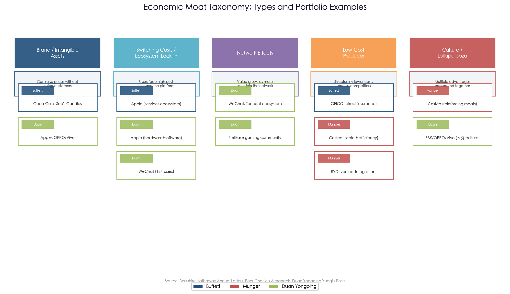
*Five moat archetypes mapped to the holdings of Buffett, Munger, and Duan Yongping. Color coding distinguishes each investor's portfolio examples.*

The three investors converge on the essential insight that moat durability matters more than moat width at any single point in time — a wide moat that is eroding poses greater danger than a narrower moat that is deepening. Their emphases diverge in instructive ways: Buffett focuses on pricing power and the franchise/commodity distinction; Munger highlights the multiplicative power of reinforcing advantages and the underappreciated role of culture; Duan centers on ecosystem lock-in and demand-side loyalty — a consumer-technology adaptation that extends classical moat theory into domains that did not exist when Buffett first deployed the metaphor.

## "Great Company at a Fair Price": The Quality Imperative

Perhaps no single insight better captures the philosophical evolution of Buffett–Munger value investing than the shift from bargain-hunting to quality-focused compounding. Buffett articulated the definitive formulation in his 1989 shareholder letter: "It's far better to buy a wonderful company at a fair price than a fair company at a wonderful price. Charlie understood this early; I was a slow learner" [Buffett, *Berkshire Hathaway Annual Letter*](https://www.berkshirehathaway.com/letters/1989.html "1989 Annual Letter"). This sentence crystallizes a transformation that took Buffett nearly two decades — from the Graham-trained bargain hunter of the 1960s to the quality-focused compounder he became from the 1980s onward.

The economic logic underpinning this shift is Munger's long-term return-on-equity convergence principle: "If a business earns 18% on capital over 20 or 30 years, even if you pay an expensive-looking price, you'll end up with a fine result" [*Poor Charlie's Almanack*](# "2005 edition"). The mathematics are inescapable: a business that reinvests retained earnings at persistently high returns will compound intrinsic value so rapidly that the initial entry price becomes almost irrelevant over sufficiently long holding periods. Conversely, a statistically cheap company earning poor returns on capital will destroy value regardless of purchase price — the "value trap" that has ensnared countless bargain hunters.

The See's Candies acquisition of 1972 stands as the paradigmatic demonstration. Berkshire paid $25 million for a business then earning approximately $4 million pre-tax on $8 million of net tangible assets — a 50% pre-tax return on tangible capital, but roughly 6.25 times pre-tax earnings, a price that seemed expensive by Graham's standards. By 2014, Buffett reported that See's had generated $1.9 billion in cumulative pre-tax profits while requiring only $40 million of incremental capital investment [Buffett, *Berkshire Hathaway Annual Letter*](https://www.berkshirehathaway.com/letters/2014ltr.pdf "2014 Annual Letter — 50th Anniversary"). The ratio of cumulative earnings to original purchase price — approximately 76:1 — renders the valuation debate at the time of purchase almost irrelevant in hindsight.

Duan Yongping takes the quality imperative to its logical conclusion: "I only buy great companies. I never buy a mediocre company no matter how cheap it is" [Duan Yongping, Xueqiu posts](# "Chinese-language social investment platform"). His portfolio history confirms this stated preference. His major positions — NetEase (purchased at approximately $0.80 per share in 2002, when the company was under SEC investigation and trading near delisting levels), Apple (initial purchases beginning around 2011, well before Buffett entered the stock in 2016), and Tencent — are all dominant platform businesses with exceptional returns on capital and powerful ecosystem moats [Duan Yongping, Xueqiu posts; Chinese and English financial media](# "T2 sources"). There is no evidence of Duan pursuing bargain-hunting in mediocre businesses at any point in his investment career.

Duan's NetEase purchase — his most celebrated investment — occupies an instructive middle ground. At $0.80 per share, with the company under SEC investigation and trading near its all-time low, the purchase bore superficial resemblance to a Graham-style deep-value play. Duan has, however, consistently framed it as a quality bet: he believed the underlying gaming business was fundamentally sound, that the accounting irregularities were manageable, and that the company's products were excellent. In April 2002, Duan and his wife purchased approximately 1.52 million shares for roughly $2 million, representing about 5% of NetEase's outstanding shares at the time [Chinese financial media; Moomoo/Futu financial news](# "T2 sources"). The stock subsequently returned approximately 50–100 times the purchase price. The critical distinction is that Duan was buying a fundamentally excellent business in temporary distress, not a mediocre business at a statistically cheap price — a difference that separates quality-focused contrarianism from indiscriminate bargain-hunting.

## Management Integrity: Intelligence, Energy, and the Non-Negotiable Third Quality

The three investors converge with remarkable consistency on one principle: management integrity is a non-negotiable prerequisite, and no degree of business quality or valuation discount can compensate for its absence. Each, however, frames the requirement with distinctive emphasis.

Buffett distills his management criteria to three qualities: intelligence, energy, and integrity — "without the third, the first two will kill you" [Berkshire Hathaway Annual Meeting remarks; Alice Schroeder, *The Snowball*](# "Bantam Books, 2008"). The phrasing is characteristically pithy, but the underlying logic is profound: intelligence and energy in the service of dishonest or self-dealing management will systematically destroy shareholder value — and do so more rapidly than stupidity or laziness would. Buffett's emphasis extends particularly to capital allocation skill: whether management deploys retained earnings at high returns or squanders capital on empire-building acquisitions, buybacks at inflated prices, or vanity projects.

Munger approaches management evaluation through the lens of incentive structures, drawing on his study of behavioral psychology: "Show me the incentive and I will show you the outcome" [Munger, "The Psychology of Human Misjudgment"](# "Harvard, 1995"); [*Poor Charlie's Almanack*](# "2005 edition"). Incentive-caused bias is the first of his 25 standard causes of human misjudgment, and he applies it directly to management assessment. The question is not merely whether management is honest in some abstract sense but whether the incentive structure aligns management behavior with long-term shareholder interests. Compensation structures that reward short-term earnings, excessive option grants that dilute ownership, and acquisition bonuses that encourage deal-making regardless of value creation all serve as red flags in Munger's framework. His core insight is that well-designed systems produce good outcomes more reliably than good intentions alone.

Duan Yongping's approach to management evaluation is inseparable from his core philosophical concept of "本分" (běn fèn) — a term without a precise English equivalent, encompassing doing the right thing, fulfilling one's duty, and staying true to one's role. Duan applies 本分 in two dimensions. First, as a management evaluation criterion: he seeks companies whose leaders focus relentlessly on product quality, treat stakeholders fairly, avoid speculation and financial engineering, and resist the temptation to pursue growth for its own sake. Second, as a framework for investor self-discipline: "本分 means doing the right thing, not the easy thing. It means admitting when you don't understand something" [Duan Yongping, Xueqiu (雪球) posts; Chinese media interviews](# "T1/T2 sources").

The three frameworks converge on integrity as non-negotiable but differ in emphasis along a revealing spectrum. Buffett prioritizes capital allocation skill and honesty — the ability to deploy earnings wisely and communicate transparently with shareholders. Munger emphasizes incentive alignment and rational behavior — the structural conditions that make integrity self-sustaining rather than dependent on personal virtue alone. Duan centers on cultural integrity and long-term duty — a holistic conception that integrates Eastern philosophical traditions (Confucian role-based ethics) with Western value investing's analytical framework. Taken together, they suggest that management quality is best assessed not through any single lens but through the intersection of personal character, institutional incentive design, and organizational culture.

## Circle of Competence: Knowing the Boundaries

The concept of the circle of competence — investing only within domains where one possesses genuine understanding — serves as a universal filter across all three frameworks. The size and shape of each investor's circle, however, varies dramatically.

Buffett articulated the principle in the 1996 Owner's Manual: "You don't have to be an expert on every company, or even many. You only have to be able to evaluate companies within your circle of competence. The size of that circle is not very important; knowing its boundaries, however, is vital" [Buffett, *An Owner's Manual*](https://www.berkshirehathaway.com/ownman.pdf "Owner's Manual, 1996"). This formulation is noteworthy for what it does not say: it does not claim that a larger circle is better. The critical skill is honest self-assessment of where understanding ends.

Buffett's own circle has been the broadest among the three, encompassing consumer brands (Coca-Cola, See's Candies), insurance (GEICO, General Re), media (Washington Post, Capital Cities/ABC), financial services (American Express, Wells Fargo, Bank of America), industrials and energy (BNSF Railway, Berkshire Hathaway Energy, Chevron), and — since 2016 — consumer technology (Apple). His multi-decade avoidance of technology stocks, followed by the massive Apple commitment beginning in 2016, illustrates both the discipline inherent in the circle-of-competence concept and its capacity for deliberate expansion as understanding deepens.

Munger's circle extends further geographically, most notably through the BYD investment in 2008 (approximately $232 million for a 10% stake) — a bet on a Chinese manufacturer of electric vehicles and batteries that required evaluating a non-U.S. company in a capital-intensive, rapidly evolving industry. Munger compared BYD's founder Wang Chuanfu to "a combination of Thomas Edison and Jack Welch" [Berkshire Hathaway Annual Meeting remarks](# "multiple years"); [*Poor Charlie's Almanack*](# "2005 edition"). This investment stretched beyond Buffett's own comfort zone and represented Munger's willingness to extend his circle into new geographies and industries when he perceived exceptional management talent and transformative potential.

Duan's circle is notably the narrowest and most self-consciously bounded: "I only invest in businesses I can understand. For me, that means consumer technology companies — Apple, Tencent, NetEase. I don't understand banks, oil companies, pharmaceutical companies" [Duan Yongping, Xueqiu (雪球) posts](# "Chinese-language social investment platform"). He explicitly declines banks (opaque balance sheet risks), commodities (no ability to assess intrinsic value), real estate, and Bitcoin ("no way to estimate intrinsic value"). This extreme self-limitation reflects Duan's entrepreneurial background: his deep personal experience building and managing consumer electronics and technology businesses provides genuine informational and experiential advantages when evaluating similar companies. A narrow circle, in this framework, is not a weakness but a disciplined acknowledgment that depth of understanding in a few domains produces superior outcomes to superficial familiarity across many.

## Illustrative Investments: Principles in Practice

The principles outlined above are best understood through their application to specific investment decisions, where abstract frameworks confront the complexity of real markets. The timeline below situates each landmark case study in its historical context, highlighting the moat types and entry conditions that informed the original theses.

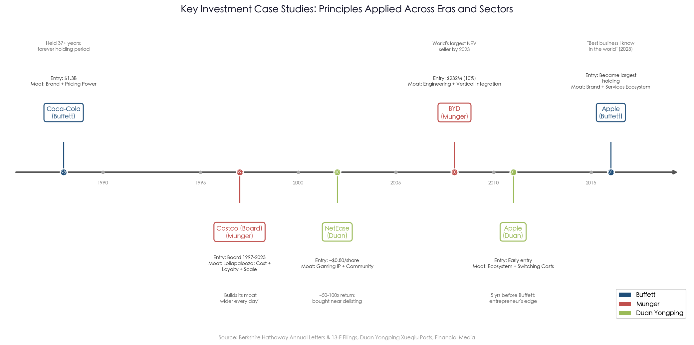
*Six landmark investments spanning 1988–2016, color-coded by investor. Entry prices, moat types, and outcomes illustrate the same quality-focused principles applied across eras and sectors.*

**Coca-Cola (Buffett, 1988).** Buffett invested approximately $1.3 billion in Coca-Cola beginning in 1988, shortly after the October 1987 market crash. The investment thesis rested on perhaps the world's most recognizable brand moat, extraordinary pricing power (consumers worldwide pay a premium for the trademark), and massive global distribution infrastructure. Coca-Cola's economics — high returns on invested capital, minimal maintenance capex, and a product consumed billions of times daily across nearly every country — exemplified the franchise-versus-commodity framework in its purest form. Buffett has held the position for over 37 years, the ultimate expression of the dictum that "our favorite holding period is forever" [Berkshire Hathaway annual letters and 13-F filings](# "1988–present").

**Apple (Buffett, 2016–present; Duan, 2011–present).** Buffett's entry into Apple, beginning in early 2016, represented a significant expansion of his circle of competence into consumer technology. He described Apple as "probably the best business I know in the world" at the 2023 annual meeting, framing it not as a technology company but as a consumer brand with unparalleled ecosystem switching costs, growing services revenue streams, and formidable pricing power [Berkshire Hathaway Annual Meeting](# "2023 transcript"). Duan Yongping, drawing on his consumer electronics background, identified the same qualities roughly five years earlier, with initial purchases reportedly beginning around 2011 [Duan Yongping, Xueqiu (雪球) posts](# "Chinese-language social investment platform"). The divergence in timing illustrates how circle-of-competence differences translate directly into investment timing: Duan's entrepreneurial experience with consumer hardware afforded him earlier conviction about Apple's ecosystem durability.

**Costco (Munger).** Munger served on Costco's board from 1997 to 2023 and considered the company a paradigmatic illustration of lollapalooza moat dynamics. Costco's low-cost structure, membership model, intense customer loyalty, and buying-power advantages compound upon each other to create a widening competitive advantage that is extraordinarily difficult for competitors to replicate. The business embodies Munger's principle that the best margin of safety comes from owning an excellent business: over multi-decade holding periods, Costco's reinforcing unit economics render the entry-valuation question almost secondary [*Poor Charlie's Almanack*](# "2005 edition"); [Berkshire Hathaway Annual Meeting remarks](# "multiple years").

**BYD (Munger, 2008).** Berkshire's approximately $232 million investment for a 10% stake in BYD represented Munger's most distinctive bet, extending the circle of competence into Chinese manufacturing, electric vehicles, and battery technology. The investment thesis centered on founder Wang Chuanfu's exceptional engineering talent, combined with BYD's vertically integrated manufacturing model and strategic positioning for the global EV transition. The bet proved extraordinarily successful: BYD became the world's largest seller of new energy vehicles by 2023, vindicating Munger's willingness to venture beyond conventional value-investing domains when he perceived exceptional management and transformative industry positioning.

**NetEase (Duan, 2002).** Duan's purchase of NetEase at approximately $0.80 per share in 2002 — when the company was under SEC investigation, its stock hovered near delisting levels, and the dot-com bust had devastated Chinese internet stocks — remains his most celebrated investment and perhaps the most dramatic application of contrarian, quality-focused investing in the Chinese market. The thesis was grounded in firsthand understanding of NetEase's gaming products and their appeal to Chinese consumers, conviction that the accounting issues were manageable and did not reflect fundamental business impairment, and a belief that intrinsic value vastly exceeded the distressed market price. The subsequent return of approximately 50–100 times the purchase price validated every dimension of the original analysis [Duan Yongping, Xueqiu (雪球) posts; Chinese and English financial media](# "T1/T2 sources").

## Comparative Synthesis: A Shared Framework with Distinctive Applications

The core investment principles of Buffett, Munger, and Duan display a degree of philosophical alignment that transcends superficial similarity. All three build their investment practice on intrinsic value as a conceptual compass, margin of safety as a multi-dimensional protection framework, moat durability as the primary determinant of long-term business value, business quality over statistical cheapness, management integrity as a non-negotiable filter, and honest self-assessment of the boundaries of understanding. The comparative matrix below distills these convergences and divergences across five analytical dimensions.

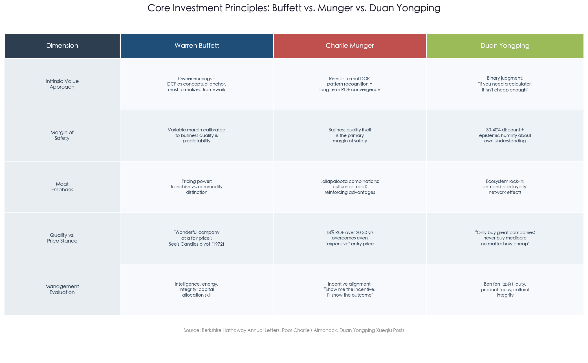
*Five-dimensional comparison of core investment principles. Each cell summarizes the investor's distinctive emphasis within a shared conceptual framework.*

The divergences, however, are analytically revealing. Buffett's framework is the most fully articulated — refined through six decades of annual letters into a comprehensive investment philosophy with specific operational tools (owner earnings, franchise-versus-commodity classification, circle of competence). Munger's contribution is primarily epistemological: he supplies the mental-model infrastructure, the behavioral psychology overlay, and the critical insight that business quality itself constitutes the best margin of safety. Duan's adaptation is the most culturally distinctive — he preserves virtually the entire Buffett–Munger framework but adds 本分 as an ethical-philosophical dimension, narrows the circle of competence to leverage his consumer technology expertise, and simplifies valuation to its binary essence.

Together, the three demonstrate that value investing is not a rigid system of rules but a set of flexible principles — anchored in intellectual honesty, disciplined by circle-of-competence boundaries, and animated by a relentless focus on business quality over market noise. The principles are universal; their application is irreducibly personal.

# 第3章 Valuation Methodology and Decision-Making Frameworks

The preceding chapter established *what* Buffett, Munger, and Duan Yongping seek in a business — durable competitive advantages, exceptional management, and pricing power. This chapter addresses the equally critical question of *how* they convert that understanding into concrete investment decisions. Their valuation methodologies, mental models, and decision-making heuristics form interlocking systems: each investor has developed a distinctive approach to the same fundamental problem — translating qualitative business judgment into a disciplined act of capital allocation under uncertainty. The differences among them are variations in emphasis rather than contradictions, arrayed along a continuum from Buffett's relatively structured analytical toolkit, through Munger's systematic cognitive architecture, to Duan Yongping's radically simplified binary judgment. Mapping these three approaches side by side reveals both the deep structural consistency of the value-investing tradition and the latitude it affords individual practitioners.

## Owner Earnings, DCF, and the Rejection of False Precision

The operational centerpiece of Buffett's valuation framework is the "owner earnings" concept introduced in his 1986 shareholder letter. Owner earnings — reported earnings plus depreciation and amortization, minus the capital expenditures required to maintain a business's competitive position — represent the cash a business actually delivers to its owners on a sustainable basis [Buffett, *Berkshire Hathaway Annual Letter* (1986), https://www.berkshirehathaway.com/letters/1986.html "1986 Annual Letter"]. This metric diverges sharply from the EBITDA convention favored on Wall Street. In his 2000 letter, Buffett drew the distinction with characteristic bluntness: "References to EBITDA make us shudder — does management think the tooth fairy pays for capital expenditures?" [Buffett, *Berkshire Hathaway Annual Letter* (2000), https://www.berkshirehathaway.com/letters/2000pdf.pdf "2000 Annual Letter"]. Equally distinctive is the deliberate rejection of mechanical precision. At the 1997 annual meeting, Buffett articulated the threshold test: "If the value of a company doesn't just scream at you, it's too close" [Berkshire Hathaway Annual Meeting, 1997].

The discounted cash flow model, in Buffett's hands, serves as a conceptual anchor rather than a computational tool. His 2000 letter illustrates the point with an analogy: calculating the value of a college education requires discounting the lifetime earnings differential attributable to the degree — a theoretically valid but practically imprecise exercise. The lesson is not that discounting is worthless but that precision beyond a broad range is illusory [Buffett, *Berkshire Hathaway Annual Letter* (2000), https://www.berkshirehathaway.com/letters/2000pdf.pdf "2000 Annual Letter"]. The practical corollary is that Buffett seeks opportunities where the gap between price and estimated value is so wide that analytical imprecision becomes immaterial — a principle that effectively fuses valuation methodology and margin of safety into a single discipline.

Alongside owner-earnings analysis, Buffett employs an earnings-yield comparison framework that benchmarks a stock's owner-earnings yield against the prevailing long-term U.S. Treasury bond yield. This approach featured prominently in his 1992 letter, where he traced the intellectual lineage to John Burr Williams' *The Theory of Investment Value* (1938), the foundational text establishing that the value of any financial asset equals the present value of its future cash flows [Buffett, *Berkshire Hathaway Annual Letter* (1992), https://www.berkshirehathaway.com/letters/1992.html "1992 Annual Letter"]. In the 1999 *Fortune* article "Mr. Buffett on the Stock Market," he deployed this framework to argue that broad market returns would likely disappoint over the ensuing decade — a prediction that proved remarkably prescient, as the S&P 500 delivered essentially flat nominal returns between 1999 and 2009 [Buffett, "Mr. Buffett on the Stock Market," *Fortune*, November 22, 1999].

The See's Candies case crystallizes how these valuation principles operate in practice. Berkshire acquired See's in 1972 for $25 million when the company generated approximately $4 million in pre-tax earnings on $8 million of net tangible assets — implying a 50% pre-tax return on tangible capital, purchased at roughly 6.25 times pre-tax earnings. By 2007, annual pre-tax earnings had grown to $82 million on just $40 million of tangible assets; by 2014, cumulative pre-tax earnings had reached $1.9 billion, with only $40 million in incremental invested capital across the entire four-decade holding period [Buffett, *Berkshire Hathaway Annual Letter* (2007), https://www.berkshirehathaway.com/letters/2007ltr.pdf "2007 Annual Letter"; Buffett, *Berkshire Hathaway Annual Letter* (2014), https://www.berkshirehathaway.com/letters/2014ltr.pdf "2014 Annual Letter"]. See's demonstrates the compounding force of a business that earns extraordinary returns on capital while requiring minimal reinvestment — precisely the economic profile that a DCF framework, properly understood, identifies as most valuable.

Buffett's 1988 Coca-Cola purchase provides a larger-scale illustration of the same logic. That year, Coca-Cola's owner earnings were approximately $828 million. Buffett initiated his position at roughly 15 times trailing earnings, ultimately accumulating approximately $1.3 billion in shares — a stake representing about 6.3% of the company [Berkshire Hathaway 13-F filings; Robert Hagstrom, *The Warren Buffett Way*]. Contemporary critics viewed the price as excessive for a consumer staples company. Buffett's framework, however, centered on the sustainability and growth trajectory of those owner earnings, the company's unrivaled global pricing power, and the favorable comparison between Coca-Cola's earnings yield and the prevailing Treasury rate. The subsequent three decades vindicated the approach: Berkshire's Coca-Cola holding, acquired at a cost basis of approximately $1.3 billion, has generated cumulative dividends alone exceeding $10 billion.

Munger explicitly rejects formal DCF calculations. At the 2007 Berkshire annual meeting, he remarked: "Warren often talks about these discounted cash flows. I've never seen him do one" [Berkshire Hathaway Annual Meeting, 2007]. His preferred substitute is long-term ROE convergence logic: "If a business earns 18% on capital over 20 or 30 years, even if you pay an expensive-looking price, you'll end up with a fine result" [*Poor Charlie's Almanack* (2005)]. This formulation sidesteps the need for precise valuation — if business quality is exceptional and the holding period sufficiently long, the entry price matters progressively less. In practice, Munger's method consists of identifying businesses whose economic characteristics are so favorable that even rough approximations of value yield obviously attractive purchase opportunities.

Duan Yongping carries the simplification impulse to its logical endpoint: "If you need a calculator to figure out whether something is cheap, it probably isn't cheap enough" [Duan Yongping, Xueqiu (雪球) posts]. His approach is explicitly binary — either an investment opportunity is obviously compelling or it belongs in the rejection pile. This stance reflects not intellectual laziness but the distillation of the Buffett–Munger insight that analytical precision beyond a certain threshold introduces noise rather than signal. Duan reframes the valuation question entirely: "Most people think investing is about valuation. It's not. It's about understanding the business" [Duan Yongping, Xueqiu (雪球) posts]. His 2002 purchase of NetEase at approximately $0.80 per share — when the company was under SEC investigation and trading near delisting levels — exemplifies this philosophy. No conventional DCF model could have justified the purchase; only deep understanding of the underlying business economics, and the conviction that those economics would eventually reassert themselves, made the investment possible. The position subsequently returned an estimated 50–100 times the initial outlay.

The three approaches form a continuum of decreasing formalization. Buffett provides the most structured analytical framework — owner earnings, earnings-yield comparisons, DCF as conceptual anchor. Munger strips away the formal machinery in favor of qualitative pattern recognition and ROE-based reasoning. Duan reduces the entire process to a binary judgment: understand the business deeply, and value will be self-evident. All three converge on a shared rejection of false precision — the recognition that elaborate financial models can create an illusion of certainty where none exists.

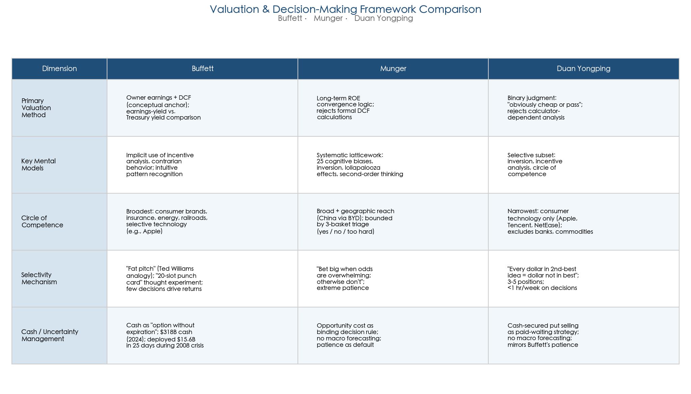

*Figure 1: Horizontal comparison of the three investors' decision-making frameworks across five dimensions — primary valuation method, key mental models, circle of competence, selectivity mechanism, and cash/uncertainty management. The continuum runs from Buffett's relatively formal analytical toolkit through Munger's systematic cognitive architecture to Duan's radically simplified binary approach. Sources: Berkshire Hathaway annual letters; Poor Charlie's Almanack (2005); Duan Yongping, Xueqiu posts.*

## Munger's Latticework of Mental Models: A Multidisciplinary Decision Architecture

Of the three investors, Munger articulates the most systematic general-purpose decision-making framework. His "latticework of mental models" — first presented in the landmark 1994 lecture "A Lesson on Elementary, Worldly Wisdom" at USC Business School — posits that effective decision-making demands a repertoire of models drawn from multiple disciplines: psychology, physics, biology, mathematics, economics, engineering, and history. No single model suffices; genuine understanding emerges only from the interplay of multiple frameworks applied to the same problem [Munger, "A Lesson on Elementary, Worldly Wisdom," USC Business School, 1994; *Poor Charlie's Almanack* (2005)]. The intellectual ambition is distinctive: where most investors operate within the conceptual vocabulary of finance alone, Munger insists that the relevant knowledge base extends across the full range of empirical disciplines.

The key models Munger has identified as most useful for investors span five source disciplines. From psychology: (1) incentive-caused bias — "Show me the incentive and I will show you the outcome" — the recognition that behavior is overwhelmingly shaped by incentive structures; (2) social proof and herd behavior, which explains why market manias persist far beyond rational justification; (3) availability bias, the tendency to overweight vivid or recent information; (4) commitment and consistency bias, which causes investors to cling to losing positions or outdated theses; and (5) "lollapalooza" effects, where multiple psychological and economic forces compound in the same direction, producing outcomes far more extreme than any single force could achieve. From mathematics and logic: (6) second-order thinking — the discipline of asking "and then what?" rather than stopping at first-order effects; (7) inversion — approaching problems backwards to identify what must be avoided; and (8) compound interest as the dominant force in long-term wealth creation. From engineering and the natural sciences: (9) redundancy and engineering margins of safety as analogues to financial margin of safety; and (10) critical mass — the point at which a business, network, or process achieves self-reinforcing momentum [*Poor Charlie's Almanack* (2005)].

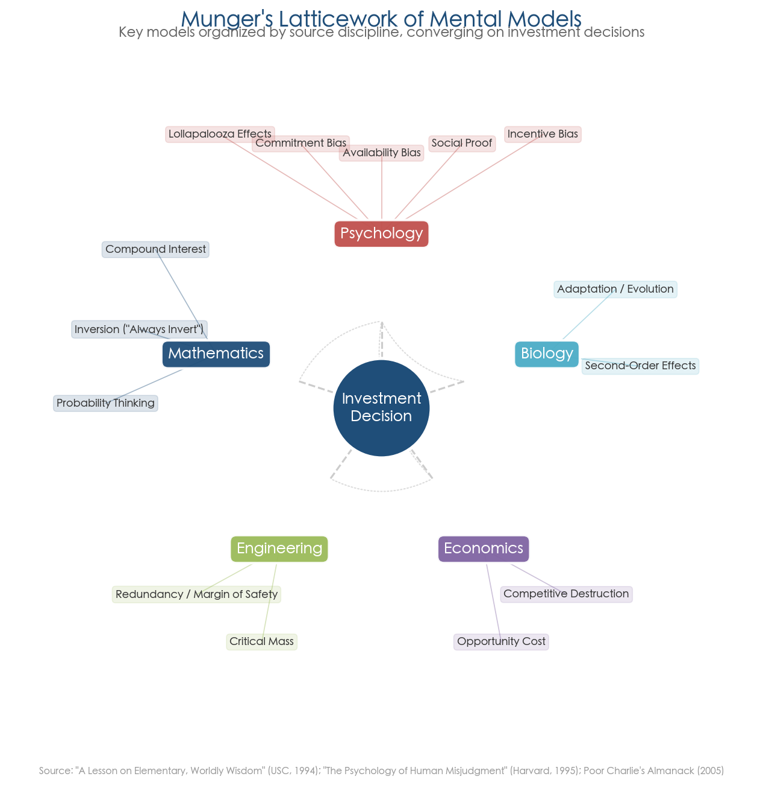

*Figure 2: Munger's key mental models organized by source discipline — psychology, mathematics, biology, engineering, and economics — converging on the central node of investment decision-making. The radial structure illustrates how cross-disciplinary thinking creates the "latticework" Munger considers essential to sound judgment. Sources: "A Lesson on Elementary, Worldly Wisdom" (USC, 1994); "The Psychology of Human Misjudgment" (Harvard, 1995); Poor Charlie's Almanack (2005).*

Munger's 1995 Harvard lecture, "The Psychology of Human Misjudgment," expanded the framework into a systematic taxonomy of 25 standard causes of cognitive error — from "reward and punishment superresponse tendency" (incentive bias) to "lollapalooza tendency" (the simultaneous compounding of multiple biases). This taxonomy functions not as an abstract intellectual exercise but as a practical decision-audit checklist: before committing capital, Munger systematically reviews whether any of these tendencies might be distorting his own judgment or the market's assessment of a business [Munger, "The Psychology of Human Misjudgment," Harvard, 1995; expanded in *Poor Charlie's Almanack* (2005)].

His 2003 lecture at UC Santa Barbara, "Academic Economics: Strengths and Faults After Considering Interdisciplinary Needs," extended the critique to the economics profession itself. Munger argued that academic economists' failure to incorporate insights from psychology, biology, and adjacent disciplines had produced a dangerously incomplete model of human economic behavior. He criticized the treatment of opportunity cost as a textbook abstraction rather than a practical decision tool and, more broadly, attacked the "physics envy" that led economists to privilege mathematical elegance over behavioral realism [Munger, "Academic Economics: Strengths and Faults After Considering Interdisciplinary Needs," UC Santa Barbara, 2003; reprinted in *Poor Charlie's Almanack*].

Among these models, inversion holds a special place in Munger's decision architecture. Tracing the concept to the German mathematician Carl Gustav Jacob Jacobi — "*Man muss immer umkehren*" (one must always invert) — Munger applied it memorably in his 1986 Harvard commencement address, "How to Guarantee a Life of Misery," which catalogued the surest paths to unhappiness as a method of illuminating the route to a good life. In investing, inversion manifests as the discipline of asking "What could destroy this business? What would cause me to lose money permanently?" *before* asking why an investment might succeed. At the 2007 Berkshire annual meeting, Munger distilled the underlying philosophy: "It is remarkable how much long-term advantage people like us have gotten by trying to be consistently not stupid, instead of trying to be very intelligent" [*Poor Charlie's Almanack* (2005); Berkshire Hathaway Annual Meeting, 2007].

Buffett deploys many of the same models implicitly — analyzing incentive structures when evaluating management, resisting social proof during market panics, rejecting macro forecasting to avoid availability bias and overconfidence. Yet he has never systematized these insights into a formal taxonomy. His approach rests on intuitive pattern recognition honed across more than seven decades, guided by a vast mental library of business cases rather than a structured checklist of cognitive biases.

Duan Yongping has adopted a selective subset of Munger's models, applying them within a deliberately narrower domain. Inversion is central to his moat analysis: "What could erode this moat? What would make consumers switch away?" When evaluating Apple, Duan inverts by asking what circumstances could cause users to abandon the iOS ecosystem — and concludes that the combination of switching costs, data lock-in, and habitual preference creates a moat extraordinarily difficult to erode [Duan Yongping, Xueqiu (雪球) posts]. Incentive analysis is the second model Duan applies most consistently, evaluating whether a company's management structure aligns long-term value creation with executive behavior. Circle of competence — the third key model — serves as his primary filter for determining which opportunities to consider at all.

The contrast in deployment is instructive. Munger operates as a systematic multidisciplinary thinker, drawing consciously from a broad latticework of models across disciplines. Buffett applies many of the same insights intuitively, without formal systematization. Duan focuses on a handful of models — inversion, incentive analysis, circle of competence — and applies them with extraordinary depth within a narrow domain. The differences are temperamental and contextual rather than philosophical: Munger's legal training and voracious intellectual appetite produced a systematic thinker; Buffett's seven-plus decades of pattern recognition produced a master of intuitive judgment; Duan's entrepreneurial background produced a practitioner who privileges deep domain expertise over intellectual breadth.

## Circle of Competence, the "Too Hard" Pile, and the Discipline of Exclusion

The concept of circle of competence — investing only in businesses one genuinely understands — is arguably the most practically consequential decision-making principle shared by all three investors. It functions as a negative filter: before asking whether a business is attractively valued, the investor must first determine whether that business falls within the boundary of genuine understanding. Buffett articulated the principle in the 1996 Owner's Manual: "You don't have to be an expert on every company, or even many. You only have to be able to evaluate companies within your circle of competence. The size of that circle is not very important; knowing its boundaries, however, is vital" [Buffett, *An Owner's Manual* (1996), https://www.berkshirehathaway.com/ownman.pdf "Owner's Manual"].

Buffett's own circle has expanded meaningfully over his career — from the Graham-style net-net and cigar-butt investments of the 1950s and 1960s, through consumer franchises (See's, Coca-Cola, Gillette) in the 1970s–1990s, to insurance and financial services (GEICO, General Re), energy (Berkshire Hathaway Energy), and most recently technology. His 2016 initiation of the Apple position represented a significant expansion, justified not by understanding semiconductor design or software engineering but by evaluating Apple as a consumer franchise with extraordinary brand loyalty, switching costs, and pricing power. At the 2023 annual meeting, Buffett called Apple "probably the best business I know in the world" [Berkshire Hathaway Annual Meeting, 2023]. Yet he has been equally forthright about the boundaries: at the 2017 annual meeting, he acknowledged missing Amazon and Google, characterizing their competitive trajectories as having exceeded his analytical comfort zone [Berkshire Hathaway Annual Meeting, 2017].

Munger formalized the rejection mechanism with his three-basket system, described at the 2002 Wesco annual meeting: every investment opportunity belongs in one of three categories — "yes, no, and too hard to understand." He estimated that 98–99% of opportunities belong in the "too hard" pile. Categories explicitly consigned to this basket include pharmaceuticals (unpredictable regulatory and clinical outcomes), short-cycle technology (competitive landscapes shift too rapidly for confident long-term prediction), investments in jurisdictions with unreliable rule of law, and macro forecasting of any kind [Munger, Wesco Financial Annual Meeting, 2002; Berkshire Hathaway Annual Meeting, 2006]. This ruthless triage is not a sign of intellectual limitation — Munger's range across disciplines far exceeds that of most investors — but a recognition that analytical confidence must precede capital commitment.

Paradoxically, Munger's own BYD investment (2008, approximately $232 million for a 10% stake) represented a deliberate stretch beyond his typical circle — a capital-intensive Chinese battery and electric vehicle manufacturer led by Wang Chuanfu, whom Munger compared to "a combination of Thomas Edison and Jack Welch" [Berkshire Hathaway Annual Meeting, 2009]. The BYD position illustrates an important nuance: the circle of competence is not a rigid boundary but a zone of genuine understanding that can be expanded through intensive study. Munger invested considerable time investigating BYD's operations and competitive position before committing capital, and the investment was initially made through his personal vehicle before Berkshire followed — at a scale that acknowledged the residual analytical uncertainty.

Duan Yongping operates with the narrowest circle of the three: "I only invest in businesses I can understand. For me, that means consumer technology companies — Apple, Tencent, NetEase. I don't understand banks, oil companies, pharmaceutical companies" [Duan Yongping, Xueqiu (雪球) posts]. He explicitly excludes banks (opaque balance sheet risks that even specialists struggle to evaluate), commodities (absence of sustainable competitive advantage), real estate, and Bitcoin ("no way to estimate intrinsic value"). This deliberately constrained circle reflects Duan's entrepreneurial background — decades of hands-on experience building and managing Subor, BBK Electronics, OPPO, and Vivo furnished genuine operational insight into consumer technology dynamics. He does not attempt to analyze industries where that experiential advantage disappears.

The narrowness of Duan's circle is a strategic choice rather than a limitation. By restricting his investment universe to perhaps five to ten companies he genuinely understands, he can devote extraordinary analytical depth to each position — producing the extreme conviction necessary for the concentrated portfolios discussed in the following chapter. The trade-off is explicit: breadth of opportunity set sacrificed for depth of understanding.

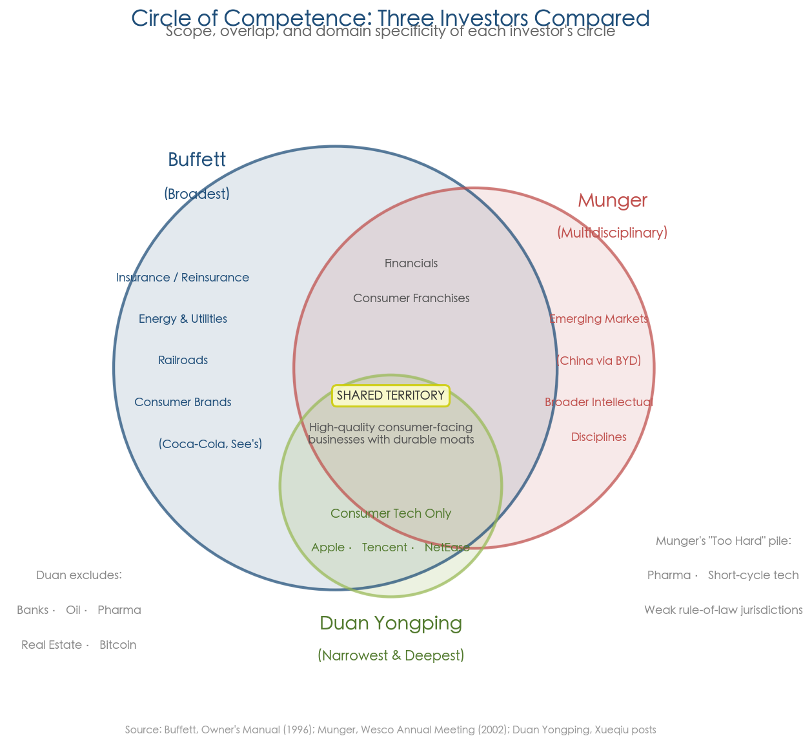

*Figure 3: Venn diagram comparing the scope, overlap, and domain specificity of each investor's circle of competence. Buffett's circle is the broadest (consumer brands, insurance, energy, railroads, selective technology); Munger's extends to emerging markets and broader intellectual disciplines; Duan's is the narrowest but deepest, focused exclusively on consumer technology. The shared territory — high-quality consumer-facing businesses with durable moats — represents the common ground where all three frameworks converge. Sources: Buffett, Owner's Manual (1996); Munger, Wesco Annual Meeting (2002); Duan Yongping, Xueqiu posts.*

The three investors' circles differ in diameter but converge on the principle that honest self-assessment of one's own understanding matters more than expanding the range of what one can analyze. Buffett's circle is the broadest, encompassing consumer brands, insurance, energy, railroads, and selectively technology. Munger's extends geographically (China via BYD) and intellectually (multidisciplinary analysis) but is bounded by his three-basket triage. Duan's is the narrowest yet the deepest within its domain. All three concur on the most critical point: the gravest investment errors arise not from poor analysis within the circle but from venturing confidently beyond its boundaries.

## The Fat Pitch, the Punch Card, and Disciplined Selectivity

The discipline of exclusion extends beyond business selection to the timing and frequency of investment decisions. All three investors share a profound commitment to extreme selectivity — the willingness to wait, sometimes for years, for the rare opportunity that satisfies every criterion simultaneously. This patience is not passive; it is an active allocation of analytical resources toward the handful of decisions that will determine long-term results.

Buffett's most vivid articulation of this principle draws on baseball. In his 1997 shareholder letter, referencing Ted Williams' *The Science of Hitting*, he observed that Williams divided the strike zone into 77 cells and swung only at pitches in his "happy zone," where his batting average exceeded .400. Buffett wrote: "In other words, waiting for the fat pitch would mean a trip to the Hall of Fame; swinging indiscriminately would mean a ticket to the minors." He then identified the crucial asymmetry between baseball and capital markets: "In investing, there are no called strikes. You can stand at the plate for months, even years, without swinging, and no umpire is going to call you out" [Buffett, *Berkshire Hathaway Annual Letter* (1997), https://www.berkshirehathaway.com/letters/1997.html "1997 Annual Letter"]. The absence of a penalty for inaction constitutes the structural advantage patient investors hold over institutional managers constrained by quarterly benchmarks, career risk, and the imperative to remain fully invested.

Buffett reinforced this insight with the "20-slot punch card" thought experiment, presented at the 1999 annual meeting: imagine receiving a card with only 20 holes at the start of an investing career, each representing one investment. "You'd really think carefully about what you did, and you'd be forced to load up on what you'd really thought about" [Berkshire Hathaway Annual Meeting, 1999]. The metaphor crystallizes the recognition that the cost of unnecessary action — diluting capital across marginal ideas — vastly exceeds the cost of patience. Over more than half a century, a handful of decisions — Coca-Cola, GEICO, the Apple position, the 2008 crisis deployments — account for a disproportionate share of Berkshire's total wealth creation.

Munger echoes this selectivity with characteristic directness: "The wise ones bet heavily when the world offers them that opportunity. They bet big when they have the odds. And the rest of the time, they don't. It's just that simple" [Munger, USC lecture, 1994; *Poor Charlie's Almanack* (2005)]. His practical application of this principle is visible in the extreme patience of both the Munger Partnership (1962–1975) and Daily Journal Corporation's investment portfolio — long periods of inactivity punctuated by decisive, concentrated commitments when the odds were overwhelmingly favorable.

Duan Yongping's formulation is equally uncompromising: "Every dollar I put into my second-best idea is a dollar not in my best idea" [Duan Yongping, Xueqiu (雪球) posts]. This framing transforms opportunity cost from an academic concept into a binding practical constraint. For Duan, who typically holds three to five positions, each additional holding represents a measurable dilution of capital allocated to his highest-conviction thesis. The result is extreme selectivity: extended periods of inactivity — Duan has stated that he devotes fewer than one hour per week to investment decisions — interrupted by decisive, concentrated commitments when his analysis identifies a rare conjunction of business quality, management integrity, and attractive price.

## Uncertainty, Opportunity Cost, and the Patience to Hold Cash

The most demanding test of any decision-making framework is its performance under conditions of genuine uncertainty — when attractive opportunities are scarce, the macro environment is ambiguous, and the pressure to deploy capital conflicts with the absence of compelling alternatives. All three investors share the conviction that inaction under such conditions represents not a failure of nerve but the highest form of discipline.

Munger elevated opportunity cost from a textbook concept to a central decision-making tool. At the 2006 Berkshire annual meeting, he stated: "The whole concept of opportunity cost is that you want to find the best thing you can do with each incremental dollar" [Berkshire Hathaway Annual Meeting, 2006]. In his 2003 UC Santa Barbara lecture, he criticized the economics profession for treating opportunity cost as a theoretical abstraction rather than a decision rule governing every capital allocation choice [Munger, "Academic Economics," UC Santa Barbara, 2003]. Within Munger's framework, every potential investment competes not against an index or a hurdle rate but against the single best alternative use of that capital — including the option of holding cash and waiting.

Buffett's application of opportunity cost is most visible in Berkshire's cash management. By year-end 2024, Berkshire held approximately $286.5 billion in short-term U.S. Treasury bills plus cash and equivalents, bringing total liquid resources to approximately $318 billion after adjusting for unsettled Treasury bill purchases and excluding cash held by the railroad and utility subsidiaries [Berkshire Hathaway 2024 Annual Report, https://www.berkshirehathaway.com/2024ar/2024ar.pdf "2024 Annual Report"]. This extraordinary cash position — the largest in Berkshire's history — reflects Buffett's unwavering willingness to forgo deployment when no available opportunity meets his criteria. As he characterized it in his 2012 letter, cash is "an option without an expiration date," a permanent claim on future opportunities whose value increases precisely when others are forced to sell [Buffett, *Berkshire Hathaway Annual Letter* (2012)].

The willingness to maintain massive cash balances distinguishes the Buffett–Munger framework from conventional institutional asset management, where cash is typically treated as "uninvested" capital earning below-benchmark returns. In Buffett's calculus, the opportunity cost of deploying capital into a mediocre investment exceeds the drag of earning Treasury-bill rates while awaiting an exceptional opportunity. This patience was vindicated most dramatically during the 2008 financial crisis, when Berkshire deployed approximately $15.6 billion in 25 days — including $5 billion in Goldman Sachs preferred stock bearing a 10% coupon and $3 billion in General Electric preferred stock on equivalent terms — at prices and structures available only to a counterparty with abundant, immediately deployable capital [Buffett, *Berkshire Hathaway Annual Letter* (2008), https://www.berkshirehathaway.com/letters/2008ltr.pdf "2008 Annual Letter"]. The episode demonstrated that patience combined with liquidity is itself a source of competitive advantage in capital markets.

Duan Yongping's smaller scale removes the deployment constraint that Berkshire faces — as an individual investor, he can allocate capital almost instantly into liquid public markets. Yet his behavior mirrors Buffett's patience in fundamental respects. Duan's approach to managing uncertainty incorporates a tactical element that neither Buffett nor Munger typically employs: the systematic use of cash-secured put selling as an entry strategy. By selling put options on companies he wants to own at prices he considers attractive, Duan collects option premium while waiting — effectively receiving compensation for his willingness to be patient. "Selling puts on a company I want to own is a way of getting paid to wait," he has explained [Duan Yongping, Xueqiu (雪球) posts]. This approach is consistent in principle with Buffett's equity index put-selling during 2007–2008, though Duan employs it far more regularly as a routine component of portfolio management.

The treatment of uncertainty also reveals a shared epistemological humility. None of the three investors claims any ability to forecast macroeconomic conditions or market direction. Buffett stated in his 1994 letter: "Charlie and I never have an opinion on the market because it wouldn't be any good and it might interfere with the opinions we have that are good" [Buffett, *Berkshire Hathaway Annual Letter* (1994)]. Munger echoed at the 2019 Daily Journal annual meeting: "I've never been able to forecast the macroeconomy. I don't even try" [Munger, Daily Journal Annual Meeting, 2019]. Duan is equally direct: "I never try to predict where the market is going" [Duan Yongping, Xueqiu (雪球) posts]. This consensus rejection of macro forecasting represents a deliberate allocation of analytical resources: all three conclude that the expected value of macro prediction is near zero and that the cognitive bandwidth it consumes is better directed toward understanding individual businesses with the depth necessary for high-conviction commitments.

The synthesis of these decision-making elements — valuation methodology, mental models, circle of competence, selectivity, and the management of uncertainty through patience and cash — forms a coherent, self-reinforcing system. Owner-earnings analysis identifies potentially attractive businesses; mental models audit the decision process for cognitive errors; circle of competence constrains the universe to genuinely understood opportunities; the fat-pitch discipline ensures capital is deployed only when the conjunction of quality and price is overwhelming; and the willingness to hold cash provides the structural flexibility to act decisively when such opportunities materialize. Each investor has calibrated this system to his own temperament and circumstances — Buffett with the broadest scope and most formal analytical tools, Munger with the most systematic cognitive architecture, Duan with the narrowest but deepest application — yet the underlying logic remains remarkably consistent across all three. The following chapter examines how these decision-making frameworks translate into concrete portfolio construction, concentration strategy, and risk management.

# 第4章 Portfolio Construction, Concentration, and Risk Management

Few topics divide mainstream finance and the Buffett–Munger–Duan school of investing as sharply as portfolio construction. Modern portfolio theory, born from Harry Markowitz's 1952 mean-variance framework, treats diversification as the singular "free lunch" available to investors. Buffett, Munger, and Duan Yongping reject this premise at its root. They hold that concentration—grounded in genuine business understanding—constitutes the superior strategy, that volatility is an irrelevant proxy for risk, and that cash functions not as a drag on returns but as a strategic weapon of first-order importance.

This chapter examines how each investor constructs portfolios, sizes positions, defines risk, deploys cash, and decides when to sell. A shared epistemological conviction emerges across all three frameworks: the depth of understanding, not the breadth of holdings, determines investment safety.

## 4.1 The Case for Concentration

### Buffett: Concentration as Intellectual Discipline

Buffett's most systematic argument for concentration appears in his 1993 shareholder letter: "We believe that a policy of portfolio concentration may well decrease risk if it raises, as it should, both the intensity with which an investor thinks about a business and the comfort level he must feel with its economic characteristics before buying into it." In the same letter, he posed the challenge directly: "I cannot understand why an investor of that sort elects to put money into a business that is his 20th favorite rather than simply adding that money to his top choices." [Buffett, *Berkshire Hathaway Annual Letter* (1993), https://www.berkshirehathaway.com/letters/1993.html "1993 Annual Letter"]

The argument was not merely theoretical. A decade earlier, in his 1984 speech "The Superinvestors of Graham-and-Doddsville" at Columbia Business School, Buffett marshaled empirical evidence. He presented the track records of nine investors trained in the Graham tradition—Walter Schloss, Tom Knapp, Bill Ruane, Charlie Munger, Rick Guerin, Stan Perlmeter, and others—many of whom ran highly concentrated portfolios. Their collective outperformance, Buffett argued, could not be explained by chance: they shared an intellectual origin (Graham's framework) yet operated independently with different portfolios, ruling out a common statistical artifact. The conclusion was unambiguous—concentration grounded in genuine knowledge enhances risk-adjusted returns. [Buffett, "The Superinvestors of Graham-and-Doddsville," *Columbia Business School Magazine*, Fall 1984]

At the 1996 Berkshire annual meeting, Buffett distilled the argument into one of his most quoted lines: "Diversification is protection against ignorance. It makes little sense if you know what you are doing." [Buffett, Berkshire Hathaway Annual Meeting, 1996; cited in *The Essays of Warren Buffett*, 5th Edition, 2022]

A frequently overlooked nuance, however, accompanies this stance. Buffett draws a sharp line between two investor archetypes: "know-something" investors capable of identifying five to ten sensibly priced companies with durable competitive advantages, and "know-nothing" investors—the vast majority—for whom broad diversification remains the optimal strategy. His 2013 letter translated the principle into a concrete personal directive: his will instructs the trustee to invest 90% of his wife's inheritance in "a very low-cost S&P 500 index fund" and 10% in short-term government bonds. [Buffett, *Berkshire Hathaway Annual Letter* (2013), https://www.berkshirehathaway.com/letters/2013ltr.pdf "2013 Annual Letter"]

Concentration, in Buffett's framework, is therefore not a blanket recommendation but a strategy reserved for those possessing the requisite knowledge, temperament, and time horizon. Buffett advocates concentration only where it is earned through superior understanding.

### Munger: Betting Heavily When the Odds Are Right

Munger's argument for concentration is more aggressive and more explicitly grounded in probability theory: "The wise ones bet heavily when the world offers them that opportunity. They bet big when they have the odds. And the rest of the time, they don't. It's just that simple." He invoked the Kelly Criterion—the mathematical formula for optimal position sizing as a function of edge and probability of success—to formalize the logic underpinning concentrated portfolios. [*Poor Charlie's Almanack* (2005); Munger, USC lecture, 1994]

On the alternative, Munger was characteristically blunt: "The idea of excessive diversification is madness." Wide diversification, in his view, structurally guarantees mediocrity by compelling an investor to hold businesses they do not fully understand while diluting the impact of their highest-conviction ideas. [*Poor Charlie's Almanack* (2005)]

Munger's own track record embodied this philosophy—along with its costs. The Munger Partnership (1962–1975) compounded at approximately 19.8% annually versus 5.2% for the Dow, yet the concentration that produced those returns exacted severe interim pain: the partnership suffered losses of −31.9% in 1973 and −31.5% in 1974, two consecutive years of roughly one-third drawdowns. Munger absorbed these losses without altering course, later citing the experience as evidence that concentration demands exceptional emotional endurance alongside intellectual conviction. [*Poor Charlie's Almanack*; Buffett, "Superinvestors of Graham-and-Doddsville," 1984]

### Duan Yongping: Extreme Concentration as a Test of Understanding

Duan Yongping carries the concentration principle further than either Buffett or Munger, maintaining a portfolio of typically three to five major positions. His rationale is uncompromising: "If you truly understand a company, you don't need to diversify. Diversification is an admission that you don't know what you're doing." [Duan Yongping, Xueqiu (雪球) posts]

His opportunity-cost logic mirrors Buffett's punch-card thinking but applies it more literally: "Every dollar I put into my second-best idea is a dollar not in my best idea." As of mid-2025, Duan's publicly disclosed portfolio remained overwhelmingly concentrated in Apple (approximately 62% of his equity holdings), with Tencent, Kweichow Moutai (贵州茅台), and a small number of other positions comprising the balance. [Duan Yongping, Xueqiu posts; GuruFocus portfolio tracking, Q2 2025]

Duan's most celebrated concentration bet was his 2002 purchase of NetEase (网易) at approximately $0.80 per share, when the company was near delisting and under SEC investigation. He committed a substantial fraction of his personal net worth to a single name at a moment of maximum uncertainty—a decision that ultimately returned an estimated 50–100x. The NetEase episode encapsulates the core of Duan's philosophy: deep business understanding, not portfolio diversification, constitutes the authentic source of safety. [Duan Yongping, Xueqiu posts; Chinese and English financial media]

## 4.2 Berkshire Hathaway's Portfolio: Concentration in Practice

The evolution of Berkshire Hathaway's public equity portfolio offers the most extensively documented case study of concentration investing at scale.

### The Apple Arc: From Value Entry to Systematic Unwind

Berkshire first purchased Apple shares in Q1 2016, when the stock traded at a mid-teens earnings multiple—a classic value entry point for a consumer franchise that the broader market still categorized as a hardware-dependent technology company. Over the following years, Buffett built the position into the largest single-stock holding in Berkshire's history. By September 30, 2023, Berkshire held 915.6 million Apple shares, representing approximately 40–50% of its entire public equity portfolio. [Berkshire Hathaway 13-F filings, SEC EDGAR]

Beginning in Q4 2023, Buffett initiated a sustained selling program that continued for seven consecutive quarters through Q4 2025—the final quarter of his tenure as CEO. The scale was extraordinary: 687.6 million shares were sold over this period, reducing the position by exactly 75%. The most dramatic single quarter was Q2 2024, when Berkshire divested 389.4 million shares (a 49.3% reduction) at an average reported price of approximately $210.62, generating roughly $82 billion in proceeds. [13Radar, "End of an Era: Berkshire Hathaway Slashes Apple Stake," March 2026, https://www.13radar.com/insight/end-of-an-era-berkshire-hathaway-slashes-apple-stake "13Radar analysis of Berkshire 13-F Q4 2025"]

By Q4 2025, Berkshire's remaining Apple position stood at 227.9 million shares. Apple remained the largest holding at approximately 22.6% of the $274 billion equity portfolio—still a meaningful concentration but no longer the overwhelming anchor it had been. [Berkshire Hathaway 13-F filing, Q4 2025, SEC EDGAR]

Buffett attributed the sales primarily to tax strategy (anticipating potential capital gains rate increases) and valuation discipline. As Apple's stock price climbed from $164.90 in early 2023 to $271.86 by Q4 2025, its valuation shifted from a reasonable consumer-franchise multiple to one pricing in speculative AI-driven growth expectations. Buffett evaluated Apple as a mature consumer brand with an extraordinary ecosystem moat; when the market began pricing it as a high-growth technology story, the gap between his assessment and the market's widened to the point where partial liquidation became the rational capital-allocation decision.

### Portfolio Concentration Metrics

Through Q1 2025, Berkshire's $258.7 billion public equity portfolio consisted of 36 positions, with the top five holdings—Apple, American Express, Coca-Cola, Bank of America, and Chevron—accounting for approximately 71% of total value. The top ten holdings represented roughly 89%. [Forbes, "Berkshire Hathaway's First Quarter 2025 Portfolio Moves," May 16, 2025, https://www.forbes.com/sites/bill_stone/2025/05/16/berkshire-hathaways-first-quarter-2025-portfolio-moves/ "Forbes Q1 2025 13-F analysis"]

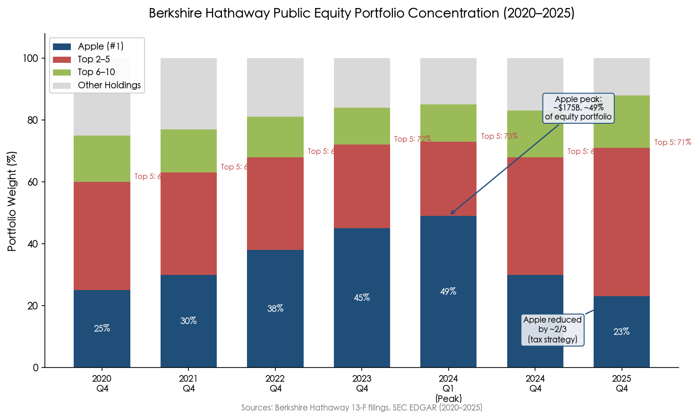

*Figure 4.1 — Evolution of Berkshire's portfolio concentration from 2020 through 2025. Apple's weight peaked at approximately 49% of the equity portfolio (~$175 billion) in Q1 2024 before declining to roughly 23% by Q4 2025 following the systematic selling program. Even as Apple's share contracted, top-five concentration remained elevated at 71%, as legacy holdings—particularly American Express and Coca-Cola—absorbed a larger proportional share. Data source: Berkshire Hathaway 13-F filings, SEC EDGAR (2020–2025).*

This degree of concentration is remarkable for a company managing over a quarter-trillion dollars in public equities. A typical large-cap mutual fund holds 60–120 positions, with top-ten concentration rarely exceeding 30–40%. Berkshire's portfolio structure effectively functions as a five-stock core with a long tail of smaller positions—a configuration far removed from conventional institutional practice and one that reflects Buffett's conviction that a handful of truly understood businesses produce nearly all long-term returns.

### Duan's Portfolio Compared

Duan Yongping's portfolio mirrors Berkshire's concentration philosophy at an individual scale, with even greater intensity. Where Berkshire's top holding represented 22–49% of its equity portfolio at various points, Duan's Apple position has consistently constituted 50–60% or more of his disclosed holdings. His portfolio universe is narrower—consumer technology and internet platforms—reflecting a deliberately constrained circle of competence. Duan has articulated this focus with characteristic directness: "Apple for U.S. stocks, Moutai for A-shares, and Tencent for Hong Kong stocks"—essentially a three-stock philosophy applied across three distinct markets. [Duan Yongping, Xueqiu posts; GuruFocus portfolio analysis, 2025]

A structural asymmetry distinguishes the two portfolios. Berkshire's concentration is constrained by its trillion-dollar scale: deploying $10 billion requires a large-cap target with adequate liquidity. Duan operates with the flexibility of an individual investor, able to take decisive positions in companies of any size at any moment—a structural advantage that permits a speed and conviction institutional portfolios cannot replicate.

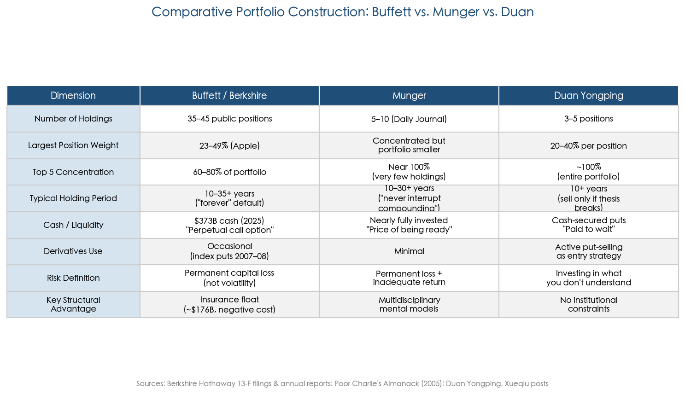

*Figure 4.2 — Portfolio construction approaches compared across eight dimensions: number of holdings, largest position weight, top-five concentration, typical holding period, cash and liquidity strategy, derivatives usage, risk definition, and key structural advantage. A clear gradient of concentration intensity emerges—from Buffett's 35–45 positions anchored by insurance float leverage, through Munger's 5–10 holdings disciplined by multidisciplinary mental models, to Duan's 3–5 positions unconstrained by institutional obligations. Despite these differences in scale and structure, all three converge on the same fundamental conviction: concentration is the natural product of taking business understanding seriously.*

## 4.3 Redefining Risk: Permanent Capital Loss, Not Volatility

### Buffett: Risk as the Possibility of Loss

The Buffett–Munger–Duan school's rejection of modern finance's risk definition constitutes one of its most radical departures from academic orthodoxy. In his 1993 letter, Buffett stated the position with deliberate simplicity: "We define risk, using dictionary terms, as 'the possibility of loss or injury.'" He illustrated the point with the Washington Post case: in 1973, the stock market valued the company at $80 million while its underlying business was worth at least $400 million. Under beta-based models, the stock became "riskier" as its price fell—yet in Buffett's framework, the opposite held true, since a lower price meant a larger margin of safety and therefore less risk of permanent loss. [Buffett, *Berkshire Hathaway Annual Letter* (1993), https://www.berkshirehathaway.com/letters/1993.html "1993 Annual Letter"]

Buffett identified three genuine sources of risk for equity investors: (1) overpaying for an asset relative to its intrinsic value, (2) deterioration of the underlying business's competitive position, and (3) excessive financial leverage that converts temporary problems into permanent losses. All three are assessable through fundamental business analysis; none require tracking stock-price volatility or computing standard deviations.

### Munger: "Using Volatility as a Measure of Risk Is Nuts"

Munger expressed the same conviction with characteristic directness at the 2000 Wesco Financial annual meeting: "Using volatility as a measure of risk is nuts. Risk to us is (1) the risk of permanent loss of capital, or (2) the risk of inadequate return." [*Poor Charlie's Almanack*; Munger, Wesco annual meeting, 2000]

The distinction is not merely semantic; it reshapes every aspect of portfolio behavior. For the volatility-centric investor, a 50% drawdown registers as a 50% increase in risk. For the Buffett–Munger investor, a 50% drawdown in a business whose intrinsic value has not changed represents a 50% increase in opportunity. Munger's willingness to endure consecutive 30%+ losses in 1973–1974 without altering his approach was the lived embodiment of this framework. He later articulated the requisite standard: "If you're not willing to react with equanimity to a market price decline of 50% two or three times a century, you're not fit to be a common shareholder." [*Poor Charlie's Almanack* (2005)]

### Duan: Risk as Overestimation of Understanding

Duan Yongping frames risk primarily as a function of the investor's self-knowledge—or its absence: "The biggest risk in investing is not knowing what you're doing." Where Buffett emphasizes business-level sources of permanent loss and Munger emphasizes the intellectual discipline of avoiding stupidity, Duan locates risk in the gap between perceived and actual understanding: "Most people overestimate their understanding of a business. That overestimation is the real risk." [Duan Yongping, Xueqiu (雪球) posts]

This framing provides the logical foundation for Duan's extreme portfolio concentration. If the primary risk is misunderstanding, the safest strategy is to own only what one deeply understands—even if that means holding just three or four names. Diversification, in Duan's framework, does not reduce risk; it redistributes exposure into territory where the investor's knowledge is thinner and therefore more dangerous.

## 4.4 Cash as a Strategic Weapon

### Buffett: "An Option Without an Expiration Date"

One of Berkshire Hathaway's most distinctive features is its willingness to hold enormous cash reserves during periods when attractive investments are scarce. Buffett has described cash as "an option without an expiration date"—a perpetual call on future opportunities that costs nothing in option premium and never decays. [Buffett, *Berkshire Hathaway Annual Letter* (2012)]

The scale of Berkshire's cash holdings through 2024–2025 was historically unprecedented. Cash and Treasury bill holdings reached $381.7 billion at the end of Q3 2025 before settling to $373.3 billion at year-end—the largest cash position in corporate history. By the time Buffett stepped down as CEO on December 31, 2025, a sustained equity selling program spanning thirteen consecutive quarters of net stock disposals had produced a fortress balance sheet unmatched by any public company. At the 2025 annual meeting, Buffett acknowledged the trade-off candidly: "We hold a lot more cash and Treasury bills than I would like," adding that "things don't come along in an orderly fashion." [Berkshire Hathaway 2025 Annual Report; Forbes, May 2025; Morningstar, February 2026]

### Crisis Deployment: The 2008 Playbook

The strategic value of maintaining large cash reserves became most visible during the 2008 financial crisis, when Berkshire deployed approximately $15.6 billion in just 25 days during September–October 2008. The signature transactions included a $5 billion investment in Goldman Sachs perpetual preferred stock carrying a 10% coupon plus warrants, and a $3 billion investment in General Electric preferred stock, also at 10%. These deals were possible only because Berkshire possessed the liquidity, the reputation, and the willingness to act decisively when most market participants were paralyzed. Buffett's October 16, 2008 *New York Times* op-ed, "Buy American. I Am," published while the S&P 500 was in the midst of a 57% peak-to-trough decline, crystallized the philosophy: "Be fearful when others are greedy, and be greedy when others are fearful." [Buffett, *Berkshire Hathaway Annual Letter* (2008), https://www.berkshirehathaway.com/letters/2008ltr.pdf "2008 Annual Letter"; "Buy American. I Am," *The New York Times*, October 16, 2008]

### Insurance Float: Structural Leverage

Berkshire's cash position is amplified by a structural advantage unavailable to most investors: insurance float. Float represents premiums collected before claims are paid, creating a pool of investable capital that functions as permanent, cost-free (or negative-cost) leverage when underwriting is profitable. Berkshire's float grew from $39 million in 1970 to approximately $173 billion by 2024. As Buffett explained in his 2004 letter: "If our premiums exceed the total of our expenses and eventual losses, we register an underwriting profit that adds to the investment income that our float produces." [Buffett, *Berkshire Hathaway Annual Letter* (2004), https://www.berkshirehathaway.com/letters/2004ltr.pdf "2004 Annual Letter"]

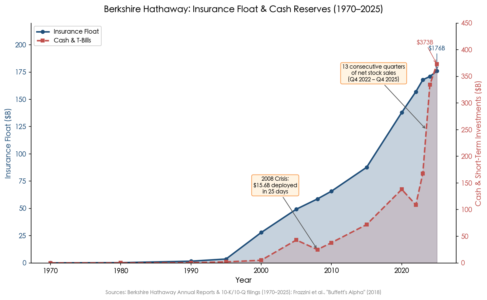

*Figure 4.3 — Parallel growth trajectories of Berkshire's insurance float (left axis) and cash/Treasury bill reserves (right axis) from 1970 through 2025. Float compounded from $39 million to approximately $176 billion over 55 years, illustrating disciplined underwriting as a capital-generation engine. The cash/T-bill line's sharp acceleration after 2022 reflects thirteen consecutive quarters of net equity sales (Q4 2022–Q4 2025) that pushed reserves to $373 billion. The 2008 crisis annotation marks the moment when both reserves converged to enable Berkshire's $15.6 billion deployment in 25 days. Data sources: Berkshire Hathaway annual reports and 10-K filings (1970–2025).*

The AQR research paper "Buffett's Alpha" (Frazzini, Kabiller & Pedersen, *Financial Analysts Journal*, 2018) quantified this structural advantage rigorously. The authors found that Berkshire's average leverage ratio through insurance float was approximately 1.7:1. This leverage, combined with a systematic bias toward "cheap, safe, quality" stocks, explained a substantial portion of Berkshire's outperformance. Buffett's Sharpe ratio from 1976 to 2017 was 0.79 versus 0.50 for the S&P 500—impressive but not superhuman in isolation. The paper's central finding was that "Buffett's returns appear to be neither luck nor magic, but rather a reward for using leverage to invest in cheap, safe, quality stocks." This reframes Berkshire's achievement: the genius lies not merely in stock selection but in constructing a permanent capital structure—insurance float as cost-free leverage—that amplifies sound investment judgment across decades. [Frazzini, Kabiller & Pedersen, "Buffett's Alpha," *Financial Analysts Journal*, Vol. 74, No. 4, 2018, https://www.tandfonline.com/doi/abs/10.2469/faj.v74.n4.3 "Buffett's Alpha — AQR/FAJ 2018"]

### Duan's Tactical Alternative: Put-Selling as Paid Patience

Duan Yongping employs a distinctive tactical approach to cash management that neither Buffett nor Munger has systematically articulated: selling cash-secured put options at desired entry prices. The mechanics are straightforward—by selling a put on a stock he wishes to own, Duan collects a premium while committing to purchase the stock at a predetermined strike price if it falls to that level. As he has described it: "Selling puts on a company I want to own is a way of getting paid to wait." [Duan Yongping, Xueqiu posts]

This approach has been extensively documented in Duan's public Xueqiu posts. In 2024–2025, he sold puts on Apple, Tencent, NVIDIA, and Google, with publicly disclosed premiums on individual transactions exceeding $1 million. A representative example was his sale of Apple puts with a $195 strike price carrying an expected annualized return of approximately 18%: either the puts expire worthless and he retains the premium, or Apple falls to a price he considers attractive and he acquires shares at an effective discount to the then-current market price. [Longbridge, "Duan Yongping shares his holdings again: sold put options on Apple," 2025; Moomoo, "Duan Yongping takes action," 2025]

The put-selling strategy is intellectually consistent with Buffett's own practices—Berkshire sold equity index puts during 2007–2008, collecting approximately $4.9 billion in premiums on contracts with notional values in the tens of billions. The distinction lies in frequency and systematization: Duan has elevated put-selling into a recurrent portfolio-management tool rather than an occasional large-scale transaction.

## 4.5 When to Sell: The Hardest Decision

### Buffett: "Our Favorite Holding Period Is Forever"—With Exceptions

Buffett's 1988 letter established the aspiration: "Our favorite holding period is forever." [Buffett, *Berkshire Hathaway Annual Letter* (1988), https://www.berkshirehathaway.com/letters/1988.html "1988 Annual Letter"] In practice, he has identified three circumstances that justify departing from this ideal: (1) the business's competitive position has deteriorated, (2) management is no longer trustworthy, or (3) a clearly superior use of capital has emerged.

The 2024–2025 Apple reduction demonstrates the third criterion operating at massive scale. The 2020 airline liquidation illustrates the first: Buffett sold Berkshire's entire positions in Delta, American, Southwest, and United at a loss during the COVID-19 crisis, acknowledging at the 2020 annual meeting that "the world changed for the airline business... I was wrong." The Wells Fargo exit (completed 2022) exemplifies the second: the fake-accounts scandal revealed a management culture that fundamentally violated Buffett's integrity test, prompting Berkshire to eliminate a position held for over three decades. [Berkshire Annual Meeting, May 2020; Berkshire 13-F filings, 2019–2022]

### Munger: Never Interrupt Compounding Unnecessarily

Munger's reluctance to sell was arguably more pronounced than Buffett's. His guiding principle: "The first rule of compounding is to never interrupt it unnecessarily." At the 2019 Daily Journal annual meeting, he distilled the philosophy to its practical essence: "We've made most of our money by sitting." [*Poor Charlie's Almanack*; Daily Journal annual meeting, 2019]

Munger's long-term holding of Costco—he served on its board from 1997 until 2023—embodied this approach. He repeatedly described Costco as a business that "builds its moat wider every day," making any sale counterproductive so long as the competitive dynamics remained intact. For Munger, the cost of selling extended beyond the immediate tax drag: it represented the interruption of a compounding process that accelerates with time, as a widening moat progressively strengthens a business's pricing power and customer captivity.

### Duan: Sell Only When Understanding Proves Wrong

Duan Yongping's selling criteria are the simplest of the three: sell only when (1) the original understanding of the business was flawed, or (2) the business itself has fundamentally changed. He does not sell based on price targets, valuation multiples, or portfolio rebalancing considerations. "When I made mistakes," Duan has written, "it was usually because I wasn't being 本分 (ben fen)—I was reaching beyond what I truly understood." [Duan Yongping, Xueqiu posts]

This approach produces extremely low portfolio turnover. Duan's Apple position, initiated around 2011–2012, has been held for over thirteen years through multiple 30–40% drawdowns. His willingness to hold through severe interim volatility follows directly from confidence in his business understanding: if the investment thesis has not changed, price movements are noise to be endured rather than signals to be acted upon.

## 4.6 The Cost of Concentration: Drawdowns and Discipline

Concentration amplifies both gains and losses, and intellectual honesty demands a candid accounting of the cost side. The Munger Partnership's consecutive −31.9% and −31.5% losses in 1973–1974 represent the starkest illustration. Berkshire Hathaway's stock itself experienced approximately 50% drawdowns on two occasions: during 1998–2000, when Buffett's refusal to participate in the dot-com bubble was widely derided, and during 2008–2009, amid the global financial crisis. [*Poor Charlie's Almanack*; Berkshire Hathaway stock price history]

Buffett's critical nuance—concentration for the "know-something" investor, index funds for everyone else—functions not as a casual caveat but as an essential safeguard built into the philosophy itself. The 2013 letter's 90/10 instruction (90% S&P 500 index fund, 10% short-term government bonds) represents his explicit acknowledgment that concentration without genuine edge is not investing but speculation with a sophisticated vocabulary. [Buffett, *Berkshire Hathaway Annual Letter* (2013), https://www.berkshirehathaway.com/letters/2013ltr.pdf "2013 Annual Letter"]

Duan's NetEase bet—a massive proportion of personal net worth invested in a single near-delisting company under SEC investigation—exceeded what most value investors would consider a prudent margin of safety, regardless of business understanding. The outcome (an estimated 50–100x return) validated the judgment, but the process contained a level of concentration risk that could have been ruinous had the thesis proved wrong. This episode highlights a recurring pattern observed throughout this study: all three investors, at critical moments, have placed bets that stretched their own stated principles, relying on judgment-based flexibility rather than rigid rule adherence. The gap between articulated philosophy and revealed behavior is not a contradiction but an acknowledgment that exceptional opportunities sometimes demand exceptional commitment.

The convergence of all three investors on the question of concentration is ultimately not about portfolio mechanics but about epistemology. Their shared conviction holds that investment risk is not a function of how many stocks one owns but of how deeply one understands the businesses one holds. Concentration is the natural consequence of taking understanding seriously—and taking the limits of one's understanding even more seriously.

# 第5章 Temperament, Psychology, and Behavioral Discipline

The preceding chapters examine *what* Buffett, Munger, and Duan Yongping invest in and *how* they value businesses. This chapter addresses a more fundamental question: *why* they succeed where equally intelligent investors fail. All three converge on a counterintuitive answer—temperament, not intellect, is the decisive variable.

Buffett has stated the point with characteristic directness: "Success in investing doesn't correlate with IQ once you're above the level of 125. Once you have ordinary intelligence, what you need is the temperament to control the urges that get other people into trouble." [Buffett, cited in Robert Hagstrom, *The Warren Buffett Way* (Wiley, 1994) "Origin of the IQ/temperament formulation"; reiterated at multiple Berkshire annual meetings] Munger echoed this conviction: "We're trying to be rational, not brilliant. Rationality is in much shorter supply than intelligence." [*Poor Charlie's Almanack* (2005)] Duan's formulation is characteristically self-effacing yet no less incisive: "Investing is not about being the smartest person in the room. It's about being the most disciplined." [Duan Yongping, Xueqiu (雪球) posts]

The analysis that follows traces four interrelated dimensions of behavioral discipline: contrarian action during crises, rejection of market timing, the role of patience and restraint, and the psychological frameworks each investor deploys to guard against cognitive error. A concluding section examines how all three ultimately anchor their discipline in Benjamin Graham's "Mr. Market" allegory—the shared intellectual foundation beneath their culturally distinct behavioral systems.

## 5.1 Contrarian Action in Crisis: Behavior Under Fire

### Buffett: Five Decades of Counter-Cyclical Deployment

The definitive test of an investment philosophy is not how it performs during bull markets—any approach looks plausible when asset prices are rising—but whether it produces decisive action when prices collapse and fear pervades the market. Buffett's career furnishes an unusually long and well-documented behavioral record, spanning five major market dislocations over more than half a century.

During the 1973–74 bear market, when the S&P 500 fell roughly 48% from peak to trough, Buffett told *Forbes* he felt "like an oversexed guy in a harem"—a vivid expression of the conviction that depressed prices signaled opportunity, not danger. He purchased Washington Post shares at a market capitalization of approximately $80 million when the underlying business was worth at least $400 million by any standard appraisal. The depressed price did not indicate elevated risk; it widened the margin of safety. [Buffett, *Forbes* interview, 1974; Buffett, *Berkshire Hathaway Annual Letter* (1993), https://www.berkshirehathaway.com/letters/1993.html "1993 Annual Letter"]

After the October 1987 crash, when the Dow Jones Industrial Average plunged 22.6% in a single session, Buffett did not sell a single share. The ensuing dislocation created conditions for one of his most celebrated investments: beginning in 1988, he accumulated approximately $1.3 billion in Coca-Cola stock—a position he still held more than 37 years later, having generated billions in cumulative dividends. [Buffett, *Berkshire Hathaway Annual Letter* (1988), https://www.berkshirehathaway.com/letters/1988.html "1988 Annual Letter"]

The 1999–2000 dot-com bubble tested a different facet of temperament: the capacity to appear wrong for an extended period. As technology stocks soared and Berkshire's relative performance lagged conspicuously, *Barron's* ran a December 1999 cover asking "What's Wrong, Warren?" Buffett refused to invest in businesses he could not value, accepting prolonged reputational discomfort as the cost of analytical integrity. Vindication arrived when the Nasdaq Composite fell 78% from its March 2000 peak. In a prescient November 1999 *Fortune* article, Buffett had warned that investor expectations had become detached from underlying business reality—a warning the market required three painful years to absorb. [*Barron's*, Dec 27, 1999; "Mr. Buffett on the Stock Market," *Fortune*, Nov 22, 1999]

The 2008 global financial crisis occasioned Buffett's most dramatic capital deployment. Over a 25-day span in September and October 2008, he committed $15.6 billion: $5 billion in Goldman Sachs preferred stock carrying a 10% coupon, $3 billion in GE preferred stock on comparable terms, and additional investments in Wrigley and Dow Chemical. On October 16, 2008—with the S&P 500 in the midst of a 57% peak-to-trough decline—he published an op-ed in *The New York Times* titled "Buy American. I Am." The piece opened with the formulation that has since become his most widely quoted expression of contrarian temperament: "A simple rule dictates my buying: Be fearful when others are greedy, and be greedy when others are fearful. And most certainly, fear is now widespread." [Buffett, "Buy American. I Am," *The New York Times*, Oct 16, 2008; Buffett, *Berkshire Hathaway Annual Letter* (2008), https://www.berkshirehathaway.com/letters/2008ltr.pdf "2008 Annual Letter"]

The 2020 COVID-19 crash introduced a revealing nuance. Buffett sold the entirety of Berkshire's airline holdings at a loss, acknowledging at the May 2020 annual meeting: "The world changed for the airline business... I was wrong." He did not deploy capital aggressively during the March 2020 downturn—a marked contrast to his 2008 behavior. This departure illustrates that contrarian action, in Buffett's framework, is not reflexive but conditional: he acts decisively only when the competitive landscape remains intact and price is compelling relative to long-term business value. When a crisis fundamentally alters the underlying economics—as he judged COVID-19 had done for airlines—discipline requires *restraint from* action, not action itself. [Buffett, Berkshire Hathaway Annual Meeting, May 2020]

### Munger: Enduring Severe Losses Without Flinching

Munger's contrarian credential rests less on dramatic capital deployments than on an extraordinary capacity to absorb punishment without abandoning his strategy. The Munger Partnership suffered losses of −31.9% in 1973 and −31.5% in 1974—two consecutive years of roughly one-third drawdowns that would have driven most investors to capitulate. Munger not only maintained his positions but compounded at approximately 19.8% annually over the full 1962–1975 period, against 5.2% for the Dow Jones Industrial Average. [*Poor Charlie's Almanack* (2005); Buffett, "Superinvestors of Graham-and-Doddsville," *Columbia Business School Magazine*, Fall 1984]

He later distilled this experience into a litmus test for equity investors: "If you're not willing to react with equanimity to a market price decline of 50% two or three times a century, you're not fit to be a common shareholder." [*Poor Charlie's Almanack* (2005)] The remark is not hyperbole but autobiography—Munger had endured precisely that scenario and emerged with both his strategy and his conviction intact.

### Duan Yongping: "本分" as Behavioral Anchor

Duan Yongping's most dramatic contrarian act was his 2002 purchase of NetEase at approximately $0.80 per share, when the company was trading near delisting levels and under active investigation by the U.S. Securities and Exchange Commission. Duan committed a substantial fraction of his personal net worth to the position—a concentration level that, by conventional margin-of-safety standards, carried extraordinary risk. The investment returned approximately 50–100x over the subsequent decade, establishing it as one of the most successful individual stock picks in Chinese investment history. [Duan Yongping, Xueqiu (雪球) posts; Chinese financial media]

Duan grounds his contrarian capacity in the concept of "本分" (běn fèn): "本分 means sticking to what you know is right, even when the market is telling you you're wrong. The market is not your boss—it's your servant." [Duan Yongping, Xueqiu (雪球) posts] Where Buffett employs Graham's "Mr. Market" allegory to depersonalize market fluctuations, Duan's "本分" integrates the same insight into a broader ethical framework rooted in Confucian notions of role-based duty—the obligation to act rightly regardless of external noise.

This behavioral pattern persisted in the most recent market dislocation. On April 8, 2025, amid a global equity sell-off triggered by escalating U.S. tariff measures, Duan disclosed on Xueqiu that he had begun purchasing shares and selling puts in Apple, NVIDIA, Google, and Taiwan Semiconductor, observing: "President Trump's strength is impressive, and it seems there will be disruptions for a while. Selling some puts and playing along with the fluctuations could be an interesting game. If the price of the put turns out to be cheap when looking back ten years from now, then this investment would be worthwhile." [Duan Yongping, Xueqiu post, April 8, 2025; reported in Futunn, "A Complete Summary of Duan Yongping's 2025 Insights," Jan 11, 2026]

The following figure summarizes the contrarian actions of all three investors across six major market crises spanning more than half a century. The pattern that emerges is consistent counter-cyclical behavior—buying into fear, holding through panic, and refusing to chase momentum—grounded in fundamentally different cultural idioms but converging on identical practical discipline.

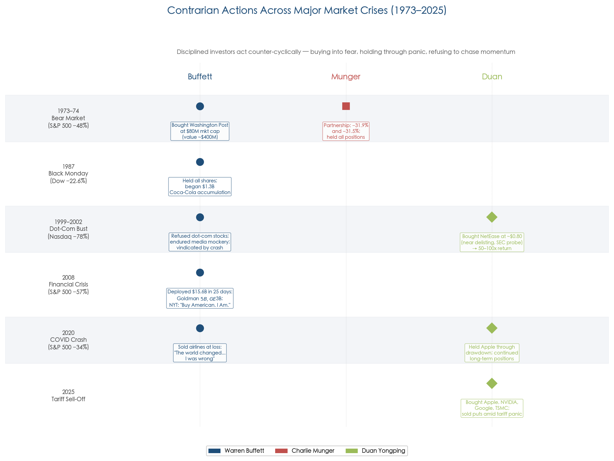
*Figure 5-1. Contrarian Actions Across Major Market Crises (1973–2025). Each cell records the specific counter-cyclical action taken—or deliberate restraint exercised—by each investor during six episodes of acute market stress.*

## 5.2 Rejecting Market Timing: The Shared Conviction That Macro Forecasting Is Futile

All three investors share an emphatic rejection of market timing and macroeconomic forecasting—a stance that places them in direct opposition to the substantial segment of the active management industry devoted to anticipating market direction.

Buffett has articulated this view with remarkable consistency across decades of shareholder letters. In 1987: "We have no idea—and never have had—whether the market is going to go up, down, or sideways in the near term." In 1994, jointly with Munger: "Charlie and I never have an opinion on the market because it wouldn't be any good and it might interfere with the opinions we have that are good." And most categorically, in 2013: "Forming macro opinions or listening to the macro or market predictions of others is a waste of time. Indeed, it is dangerous because it may blur your vision of the facts that are truly important." [Buffett, *Berkshire Hathaway Annual Letters* (1987), https://www.berkshirehathaway.com/letters/1987.html "1987 Annual Letter"; (1994), https://www.berkshirehathaway.com/letters/1994.html "1994 Annual Letter"; (2013), https://www.berkshirehathaway.com/letters/2013ltr.pdf "2013 Annual Letter"]

Munger reinforced this position at the 2019 Daily Journal annual meeting: "I've never been able to forecast the macroeconomy. I don't even try." [Munger, Daily Journal Annual Meeting, 2019] Duan's version is characteristically terse: "I never try to predict where the market is going." [Duan Yongping, Xueqiu (雪球) posts]

The logic underpinning this shared conviction merits explicit articulation. For all three investors, the relevant analytical unit is the individual business, not the broader economy. If an investor can identify a company with a durable competitive advantage, honest and capable management, and a price affording a reasonable margin of safety, the macroeconomic environment becomes a second-order variable—influential at the margin but not determinative. Conversely, if an investor cannot evaluate the business on its own terms, no degree of macroeconomic sophistication will compensate for that analytical gap.

This rejection of macro forecasting does not imply indifference to macroeconomic conditions. Buffett's cash position, which surpassed $325 billion by Q3 2024, reflected a judgment that available opportunities did not meet his return threshold at prevailing valuations. [Berkshire Hathaway 10-Q filings, Q3 2024] Yet the decision to hold cash was framed not as a "market call" but as the consequence of a company-by-company failure to find adequate value—a subtle but critical distinction separating bottom-up discipline from top-down speculation.

## 5.3 Patience as Structural Advantage

Patience is the most frequently cited virtue in value investing—and the most frequently violated in practice. The gap between *knowing* that patience compounds returns and *actually* holding positions through years of underperformance, drawdowns, and criticism constitutes precisely the distinction separating the three investors under study from the vast majority of market participants.

### The Holding Period Record

The empirical evidence of patience in these portfolios is striking. Buffett has held Coca-Cola since 1988 (approximately 38 years as of 2026), American Express since 1991 (approximately 35 years), and maintained major positions in Moody's, Bank of America, and other core holdings for decades. His stated preference, articulated in the 1988 letter, is that "our favorite holding period is forever"—subject to three exceptions: the competitive position deteriorates, management loses integrity, or a clearly superior capital deployment presents itself. [Buffett, *Berkshire Hathaway Annual Letter* (1988), https://www.berkshirehathaway.com/letters/1988.html "1988 Annual Letter"]

Munger coined the phrase that most succinctly captures this philosophy. At the 2019 Daily Journal annual meeting, he observed: "We've made most of our money by sitting." [Munger, Daily Journal Annual Meeting, 2019] The closely related formulation—"The big money is not in the buying and the selling, but in the waiting"—has been widely attributed to Munger through *Poor Charlie's Almanack* and various meeting remarks, though the precise venue of its first utterance remains unconfirmed. Regardless of exact provenance, the statement encapsulates a central insight: compounding within an excellent business is the primary source of wealth creation, and trading activity more often interrupts compounding than enhances it. Munger formalized this as a principle: "The first rule of compounding is to never interrupt it unnecessarily." [*Poor Charlie's Almanack* (2005); Munger, Daily Journal Annual Meeting, 2019]

Duan Yongping has held Apple since 2011—more than 14 years through multiple 30–40% drawdowns. By early 2026, one of his accounts showed a cumulative return of approximately 1,623% (roughly 18x), which he characterized with typical understatement as "just good luck... reaping the dividends of the era." [Duan Yongping, Xueqiu post, January 2026; reported in 21 Jingji, "段永平再晒部分苹果持仓！累计收益率超16倍," Jan 4, 2026] His discipline during drawdowns was not passive endurance but active reinforcement: "I enjoy seeing companies I admire make mistakes because their culture will ultimately lead them to correct those mistakes, but those mistakes give me the opportunity to buy more shares. Over 80% of my Apple shares were purchased during the three years when they did not release large-screen models." [Duan Yongping, Xueqiu post, November 2025]

The following figure quantifies the compounding benefit of patience by displaying the longest-held positions across the three portfolios, illustrating how decade-scale holding periods transform initial investments into extraordinary wealth.

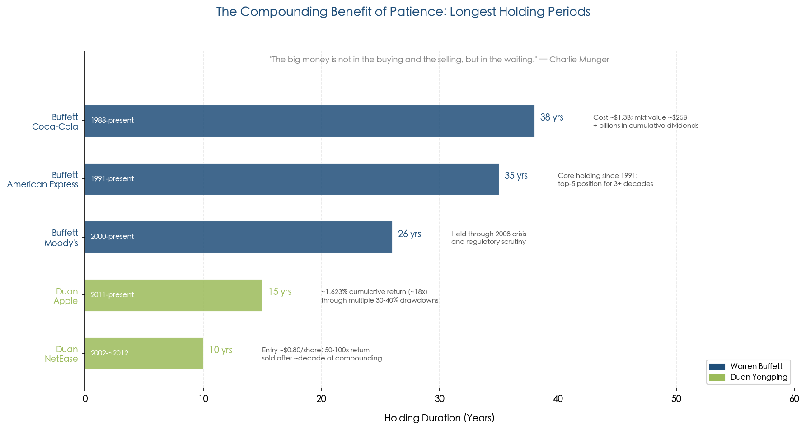
*Figure 5-2. The Compounding Benefit of Patience: Longest Holding Periods. Bars represent holding duration in years; annotations show initial cost basis and cumulative returns where available.*

### Why Patience Is Rare

If patience is so manifestly beneficial, the natural question is why it remains so scarce among professional investors. The answer lies in the interaction of psychological biases that Munger cataloged in his "Psychology of Human Misjudgment." Action bias—the compulsion to do *something* in response to market movements—is reinforced by social proof (peers are trading), recency bias (recent losses loom disproportionately larger than long-term gains), and loss aversion (the psychological pain of a 30% drawdown exceeds the pleasure of an equivalent gain). Institutional context compounds these individual biases: professional fund managers face quarterly performance reviews, benchmark comparisons, and redemption risk that render extended underperformance career-threatening, regardless of its long-term merit.

Buffett, Munger, and Duan share a structural advantage that distinguishes them from most professional investors: none faces external pressure to act. Buffett controls Berkshire Hathaway through dual-class shares and faces no redemption risk. Munger operated without investment committee oversight for decades. Duan invests personal capital with no clients, no benchmarks, and no quarterly reporting obligations. This structural independence does not guarantee patience, but it removes the institutional forces that most reliably erode it.

Duan articulates the resulting lifestyle advantage with disarming simplicity: "I probably spend less than an hour a week on investment decisions." [Duan Yongping, Xueqiu (雪球) posts] The scarcity of his investment activity reflects discipline rather than disengagement—when positions are chosen for indefinite holding, daily demands on attention become minimal.

## 5.4 Three Parallel Frameworks for Restraint: What NOT to Do

A recurring theme across all three investors is the primacy of avoidance over action—the conviction that investment success depends less on the brilliance of what one pursues than on the rigor of what one refuses. Each has articulated a distinct but convergent framework for restraint.

### Duan's "不做什么比做什么更重要"

Duan Yongping's most frequently cited principle is "不做什么比做什么更重要" (knowing what NOT to do is more important than knowing what to do). This principle generates a concrete set of categorical prohibitions: no leverage ("If you understand investing, you don't need leverage because you will eventually make money. If you don't understand investing, you should avoid leverage even more because it will eventually lead to bankruptcy"); no short-selling; no investing beyond one's circle of understanding; no frequent trading ("People who try to make money in the stock market by looking at charts and trends are sure to lose"); no market timing; and no acting on tips or rumors. [Duan Yongping, Xueqiu (雪球) posts; Futunn, "A Complete Summary of Duan Yongping's 2025 Insights," Jan 11, 2026]

This negative framework is not merely a list of rules but an expression of Duan's "本分" philosophy applied systematically to investor behavior: discipline means defining one's proper role and refusing to exceed it. When acknowledging errors, Duan typically frames them in these terms: "When I made mistakes, it was usually because I wasn't being 本分—I was reaching beyond what I truly understood." [Duan Yongping, Xueqiu (雪球) posts]

### Buffett's Twenty-Punch-Card Metaphor

Buffett's version of the restraint principle operates through a thought experiment rather than a prohibition list. At the 1999 Berkshire annual meeting, he proposed: "I could improve your ultimate financial welfare by giving you a ticket with only 20 slots in it so that you had 20 punches—representing all the investments that you got to make in a lifetime. And once you'd punched through the card, you couldn't make any more investments at all... Under those rules, you'd really think carefully about what you did, and you'd be forced to load up on what you'd really thought about." [Buffett, Berkshire Hathaway Annual Meeting, 1999]

The punch-card metaphor achieves the same behavioral objective as Duan's prohibition list through a different psychological mechanism: by making scarcity vivid, it compels the investor to weight every decision against the entire remaining opportunity set. The practical implication is identical—extreme selectivity and heavy concentration in the highest-conviction ideas.

### Munger's Inversion: Avoiding Stupidity Rather Than Seeking Brilliance

Munger's restraint framework is philosophical rather than rule-based, grounded in the mathematical concept of inversion borrowed from Carl Gustav Jacob Jacobi: "Invert, always invert" (*Man muss immer umkehren*). Munger applied this most memorably in his 1986 Harvard School commencement address, "How to Guarantee a Life of Misery," which inverted the typical graduation speech to catalog the surest paths to failure.

In investing, inversion manifests as prioritizing the avoidance of error over the pursuit of genius: "It is remarkable how much long-term advantage people like us have gotten by trying to be consistently not stupid, instead of trying to be very intelligent." [Munger, Berkshire Hathaway Annual Meeting, 2007; *Poor Charlie's Almanack* (2005)] The practical application is Munger's three-basket system: every investment opportunity is sorted into "yes," "no," or "too hard to understand"—and by his estimate, 98–99% of all opportunities belong in the "too hard" pile. [Munger, Wesco Annual Meeting, 2002]

### Convergence

The three frameworks differ in cultural idiom—Confucian duty, American thought experiment, Enlightenment mathematics—but converge on identical practical ground: sustained investment success emerges primarily from the refusal to act on impulse, ignorance, or external pressure. All three would concur with Munger's summation that the principal enemies of sound investment are behavioral, not analytical.

The following comparison matrix maps these frameworks across eight behavioral dimensions, illustrating how different cultural and intellectual traditions arrive at a shared set of practical conclusions about the primacy of avoidance.

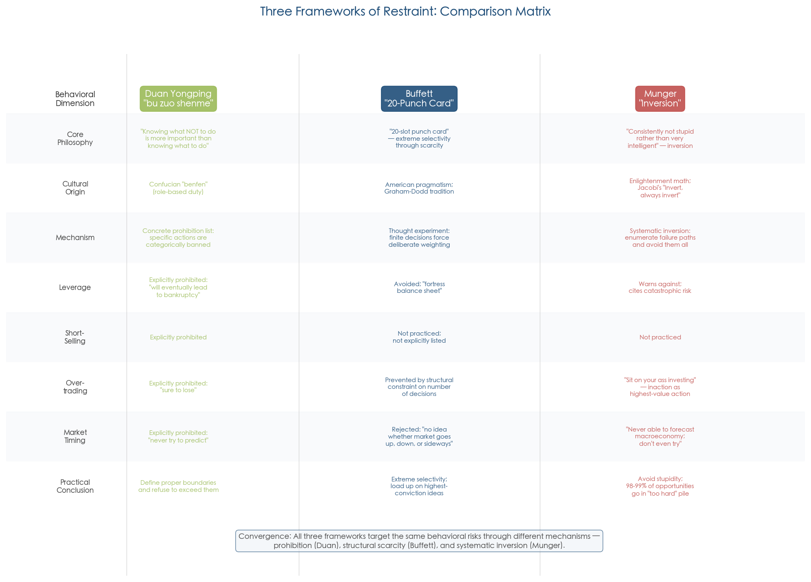
*Figure 5-3. Three Frameworks of Restraint: Comparison Matrix. Rows represent behavioral dimensions (core philosophy, cultural origin, mechanism, leverage, short-selling, over-trading, market timing, practical conclusion); columns compare Duan's categorical prohibitions, Buffett's scarcity constraint, and Munger's systematic inversion.*

## 5.5 Munger's Psychology of Human Misjudgment: A Shared Cognitive Defense System

Munger's most distinctive intellectual contribution to the trio's behavioral discipline is his systematic taxonomy of cognitive error. His "Psychology of Human Misjudgment"—originally delivered as a lecture at Harvard in 1995 and subsequently expanded in *Poor Charlie's Almanack*—catalogs 25 standard causes of human misjudgment, from incentive-caused bias to the "lollapalooza" tendency (the compounding effect when multiple biases operate simultaneously). [Munger, "The Psychology of Human Misjudgment," Harvard, 1995; *Poor Charlie's Almanack* (2005)]

Several of these tendencies bear directly on investment decision-making:

**Incentive-caused bias** ("Show me the incentive and I will show you the outcome") applies not only to evaluating corporate management but to understanding one's own broker, advisor, and media incentive structures. A fund manager who trades frequently may be responding to fee incentives rather than genuine analytical signals.

**Social proof** explains why investors herd into bubbles and stampede out of crashes. Buffett's willingness to appear foolish during the dot-com era—enduring the *Barron's* "What's Wrong, Warren?" cover—required explicit, sustained resistance to this tendency.

**Commitment and consistency bias** explains why investors hold losing positions beyond the point of rationality, defending prior decisions rather than reassessing them on current evidence. Buffett's systematic cataloging of errors in his annual letters (discussed in Section 5.6) represents a deliberate countermeasure: by publicly acknowledging mistakes, he undermines the psychological pull to rationalize them.

**Deprival super-reaction tendency** explains the disproportionate emotional response to losses, which drives premature selling during drawdowns. Munger's instruction that an investor must tolerate 50% drawdowns "with equanimity" constitutes a direct prescription against this tendency.

Munger employs the 25 tendencies not merely as an analytical framework for evaluating others but as a personal decision-audit checklist: "Knowing the psychological tendencies that lead to error doesn't automatically protect you from them. But it gives you a fighting chance if you stay vigilant." [Munger, "Psychology of Human Misjudgment," Harvard, 1995; *Poor Charlie's Almanack* (2005)]

Buffett draws on many of these insights implicitly—his entire approach to market fluctuations reflects the same psychological observations—but he never systematized them into a formal taxonomy. Duan adopted selected models from Munger's framework, particularly inversion and incentive analysis, applying them within a narrower domain focused on consumer technology. Duan's Xueqiu posts frequently reflect Munger's cognitive vocabulary without explicitly citing the 25-tendency framework, suggesting deep internalization rather than mechanical application.

## 5.6 The Discipline of Public Error Acknowledgment

A distinctive practice shared by all three investors—though executed most systematically by Buffett—is the public cataloging of mistakes. This practice serves two mutually reinforcing functions: it counteracts commitment and consistency bias (the tendency to defend past decisions rather than reassess them), and it institutionalizes analytical self-improvement as a recurring discipline rather than an occasional concession.

Buffett's annual letters contain an unusually candid and detailed error log:

- **Dexter Shoe** (purchased 1993 for Berkshire stock then worth approximately $433 million): Buffett called this his "worst deal" in the 2007 letter. The competitive advantage he believed he was acquiring evaporated under low-cost foreign competition, and because the acquisition was paid in Berkshire shares, the ultimate opportunity cost exceeded $3.5 billion. [Buffett, *Berkshire Hathaway Annual Letter* (2007), https://www.berkshirehathaway.com/letters/2007ltr.pdf "2007 Annual Letter"]

- **Tesco** ($444 million pre-tax loss): In the 2014 letter, Buffett wrote: "I made a big mistake by dawdling"—he had failed to sell when early evidence of accounting irregularities emerged. [Buffett, *Berkshire Hathaway Annual Letter* (2014), https://www.berkshirehathaway.com/letters/2014ltr.pdf "2014 Annual Letter"]

- **Airlines** (sold at a loss in 2020): "The world changed for the airline business... I was wrong." [Buffett, Berkshire Hathaway Annual Meeting, May 2020]

- **IBM** (approximately $10.7 billion invested beginning in 2011, exited at roughly breakeven by 2018): Buffett acknowledged misjudging IBM's competitive position as cloud computing disrupted traditional IT services. [Berkshire Hathaway 13-F filings; Berkshire Annual Meeting, 2017–2018]

Munger credits Charles Darwin's practice of meticulously recording disconfirming evidence as the intellectual model for this discipline. Darwin forced himself to write down observations that contradicted his hypotheses within 30 minutes of encountering them, knowing that the mind would otherwise work to suppress or reinterpret inconvenient data. Munger applies the same principle to investment theses: actively seeking and preserving evidence that a position may be wrong, rather than selectively attending to confirming information. [*Poor Charlie's Almanack* (2005)]

Duan's error framework is characteristically rooted in "本分": "When I made mistakes, it was usually because I wasn't being 本分—I was reaching beyond what I truly understood." [Duan Yongping, Xueqiu (雪球) posts] Rather than cataloging specific errors publicly in Buffett's manner, Duan employs the concept as a retroactive diagnostic—mistakes are attributed not to misfortune or unforeseeable events but to a failure of self-discipline in adhering to one's proper domain of competence. The framing itself serves as a behavioral corrective: each acknowledged error reinforces the boundary of the circle of competence.

## 5.7 Practical Discipline: Lifestyle, Environment, and Daily Habits

Beyond formal frameworks and principles, all three investors have deliberately structured their physical environments and daily routines to reinforce rational decision-making—a recognition that willpower alone is an insufficient defense against behavioral error.

**Buffett** has operated from Omaha, Nebraska, for his entire career, deliberately maintaining geographic distance from Wall Street's information overload and social pressure. This physical isolation functions as a structural buffer against social proof and herd behavior. His daily routine emphasizes reading—reportedly five to six hours per day of annual reports, newspapers, and trade publications—over meetings, telephone calls, or real-time market monitoring. He has described his decision framework through the metaphor of an "inner scorecard" versus an "outer scorecard": "The big question about how people behave is whether they've got an Inner Scorecard or an Outer Scorecard. It helps if you can be satisfied with an Inner Scorecard." An investor guided by an inner scorecard evaluates decisions by their intrinsic logic rather than by whether they produce short-term profits or peer approval. [Alice Schroeder, *The Snowball: Warren Buffett and the Business of Life* (Bantam Books, 2008) "Inner vs. outer scorecard concept"]

**Munger** was a voracious reader across disciplines—biology, physics, psychology, history, mathematics—a practice he maintained until his death in November 2023 at age 99. His children described him as "a book with legs." The breadth of his reading was not recreational but instrumental: it continuously fed the "latticework of mental models" that served as his cognitive defense system. His daily practice included extended periods of sitting and thinking, uninterrupted by screens or market data—a habit he shared with Buffett and considered essential to sound judgment. [*Poor Charlie's Almanack* (2005)]

**Duan** has structured his life to minimize the demands of investing on his time and attention. Based in Atherton, California, since approximately 2001, he describes his investment routine as requiring "less than an hour a week," devoting the majority of his time to golf and personal interests. This is not a casual claim but a logical consequence of his investment architecture: when holdings are chosen for indefinite duration and positions number fewer than five, the ongoing decision load is inherently minimal. His Xueqiu posts frequently advise against over-engagement: "Constant trading will only leave no time for other activities, like playing sports, which, for me, is more important than investing." [Duan Yongping, Xueqiu posts, November 2025]

The common thread across all three is the deliberate reduction of decision frequency. Each has designed his environment to minimize exposure to noise—market commentary, peer opinion, short-term price fluctuations—and maximize exposure to signal: deep reading about businesses, extended periods of uninterrupted thought, and interaction with a small circle of trusted intellectual partners rather than a broad network of market participants.

## 5.8 Graham's "Mr. Market" as Shared Foundation

All three investors ultimately trace their behavioral discipline to a single intellectual source: Benjamin Graham's "Mr. Market" allegory from *The Intelligent Investor* (1949). Graham invited the reader to imagine a business partner named Mr. Market who appears daily to offer a price at which he will buy the reader's share or sell his own. Mr. Market's prices reflect his emotional state—oscillating between euphoria and despair—yet the underlying business value remains unchanged. The investor's advantage lies in the freedom to accept Mr. Market's offer when it is favorable and to ignore it entirely when it is not.

Buffett has called this "the most useful thing I ever learned from Ben Graham." [Buffett, cited in Berkshire annual letters] Duan echoes the insight through his own vocabulary: "The market is not your boss—it's your servant." [Duan Yongping, Xueqiu (雪球) posts] Munger internalized the same lesson but extended it through his psychological taxonomy: Mr. Market's behavior, in Munger's framework, is explained by the simultaneous operation of social proof, deprival super-reaction, and excessive self-regard—understanding *why* Mr. Market behaves irrationally strengthens the investor's capacity to resist participating in that irrationality.

The trio's behavioral discipline, in the final analysis, is not a separate module bolted onto an analytical framework but the foundation upon which analysis becomes actionable. An investor who correctly identifies a wonderful business at a fair price but lacks the temperament to hold through a 40% drawdown will capture none of the compounding that the analysis promises. Temperament is not an ornamental addition to sound analysis—it is the structural prerequisite upon which every analytical insight depends for its realization.

# 第6章 Comparative Synthesis and Enduring Relevance

The preceding chapters examined the investment philosophies of Warren Buffett, Charlie Munger, and Duan Yongping through distinct analytical lenses: intellectual origins, core principles, valuation methodology, portfolio construction, and behavioral discipline. This concluding chapter draws those threads into a unified comparative framework. It maps the areas of deepest philosophical alignment and most substantive divergence, assesses Duan Yongping's role as a cross-cultural transmitter who adapted the Buffett-Munger tradition for Chinese investment culture, confronts the structural criticisms and inherent limitations of the shared approach, and distills actionable principles for individual investors navigating markets increasingly shaped by passive indexing, algorithmic trading, and artificial intelligence.

## 6.1 Seven Points of Philosophical Convergence

Despite pronounced differences in nationality, institutional context, and temperament, Buffett, Munger, and Duan share a philosophical core that has remained remarkably stable across decades and market regimes. Seven points of alignment define this shared architecture — not coincidental agreement but a coherent intellectual lineage traceable to Benjamin Graham's foundational insight that securities represent fractional business ownership.

**First, intrinsic value as conceptual compass.** All three treat intrinsic value — the discounted present value of future cash flows — as the anchor of investment decision-making, yet none regards it as a precise numerical output. Buffett defined the concept in the 1994 Owner's Manual as "the discounted value of the cash that can be taken out of a business during its remaining life," while cautioning that the calculation is inherently imprecise [Buffett, *An Owner's Manual* (1994), https://www.berkshirehathaway.com/ownman.pdf "Berkshire Hathaway Owner's Manual"]. Munger, by his own admission, never performed a formal DCF calculation. Duan reduces the exercise to a binary test: "If you need a calculator to figure out whether something is cheap, it probably isn't cheap enough" [Duan Yongping, Xueqiu (雪球) posts]. The convergence is epistemic rather than methodological: all three deploy intrinsic value as a navigational compass, not a spreadsheet exercise in false precision.

**Second, risk defined as permanent capital loss.** All three uniformly reject volatility as a meaningful measure of risk. Buffett's 1993 letter offered the definitive formulation: "We define risk, using dictionary terms, as 'the possibility of loss or injury,'" illustrating with Washington Post's 1973 acquisition — a market capitalization of $80 million versus $400 million in assessed business value — where a lower price meant less risk, not more, despite higher academic "beta" [Buffett, *Berkshire Hathaway Annual Letter* (1993), https://www.berkshirehathaway.com/letters/1993.html "1993 Annual Letter"]. Munger was characteristically blunt: "Using volatility as a measure of risk is nuts. Risk to us is (1) the risk of permanent loss of capital, or (2) the risk of inadequate return" [*Poor Charlie's Almanack* (2005)]. Duan's formulation is implicit but consistent — his willingness to hold concentrated positions through 30–40% drawdowns reflects a conception of risk grounded in business fundamentals rather than price fluctuation.

**Third, concentration over diversification.** All three practice and advocate portfolio concentration for investors who genuinely understand their holdings. Buffett's 1993 letter argued that concentration "may well decrease risk if it raises, as it should, both the intensity with which an investor thinks about a business and the comfort level he must feel with its economic characteristics" [Buffett, *Berkshire Hathaway Annual Letter* (1993), https://www.berkshirehathaway.com/letters/1993.html "1993 Annual Letter"]. Munger termed excessive diversification "madness" [*Poor Charlie's Almanack* (2005)]. Duan carries this conviction furthest, typically holding three to five positions and declaring: "If you truly understand a company, you don't need to diversify" [Duan Yongping, Xueqiu (雪球) posts]. The shared logic is consistent: deep knowledge of a small number of businesses provides greater protection than shallow knowledge of many.

**Fourth, wonderful company at a fair price.** The preference for business quality over statistical cheapness marks the defining departure from Benjamin Graham's original framework. Buffett credited Munger explicitly in the 1989 letter: "It's far better to buy a wonderful company at a fair price than a fair company at a wonderful price. Charlie understood this early; I was a slow learner" [Buffett, *Berkshire Hathaway Annual Letter* (1989), https://www.berkshirehathaway.com/letters/1989.html "1989 Annual Letter"]. Duan adopted this principle without modification: "I only buy great companies. I never buy a mediocre company no matter how cheap it is" [Duan Yongping, Xueqiu (雪球) posts].

**Fifth, temperament over intellect.** All three identify emotional discipline, rather than analytical sophistication, as the primary determinant of investment success. Buffett: "Success in investing doesn't correlate with IQ once you're above the level of 125." Munger framed the point more broadly: "We're trying to be rational, not brilliant. Rationality is in much shorter supply than intelligence" [*Poor Charlie's Almanack* (2005)]. Duan echoed both: "Investing is not about being the smartest person in the room. It's about being the most disciplined" [Duan Yongping, Xueqiu (雪球) posts]. The convergence reflects a shared empirical observation: the behavioral errors that destroy capital — panic selling, herd-following, overtrading — are failures of temperament, not intelligence.

**Sixth, rejection of market timing and macro forecasting.** Buffett stated in the 1994 letter: "Charlie and I never have an opinion on the market because it wouldn't be any good and it might interfere with the opinions we have that are good" [Buffett, *Berkshire Hathaway Annual Letter* (1994)]. Munger concurred: "I've never been able to forecast the macroeconomy. I don't even try" [Munger, Daily Journal annual meeting, 2019]. Duan offered a parallel formulation: "I never try to predict where the market is going" [Duan Yongping, Xueqiu (雪球) posts]. This rejection is not mere intellectual humility but a structural feature of the framework, deliberately freeing analytical capacity for business evaluation rather than dissipating it on market prediction.

**Seventh, restraint as the primary source of alpha.** The deepest point of convergence is the shared conviction that investment success derives more from what one avoids than from what one pursues. Buffett's "twenty-slot punch card" metaphor — imagining a lifetime limit of twenty investments — compels extreme selectivity [Berkshire Annual Meeting, 1999]. Munger's inversion principle counsels: "It is remarkable how much long-term advantage people like us have gotten by trying to be consistently not stupid, instead of trying to be very intelligent" [Berkshire Annual Meeting, 2007]. Duan's formulation, "不做什么比做什么更重要" (knowing what not to do is more important than knowing what to do), prescribes the avoidance of leverage, short-selling, frequent trading, market timing, and investments beyond one's understanding [Duan Yongping, Xueqiu (雪球) posts]. Three distinct formulations converge on a single insight: the discipline of omission is more powerful than the ambition of action.

The matrix below synthesizes the alignment and divergence patterns discussed in this and the subsequent section, providing a single-glance overview of pairwise philosophical agreement across all twelve dimensions.

*Figure 6-1: Buffett–Munger–Duan Philosophical Alignment Matrix — seven convergence dimensions (all strong alignment) and five divergence dimensions across three investor pairings.*

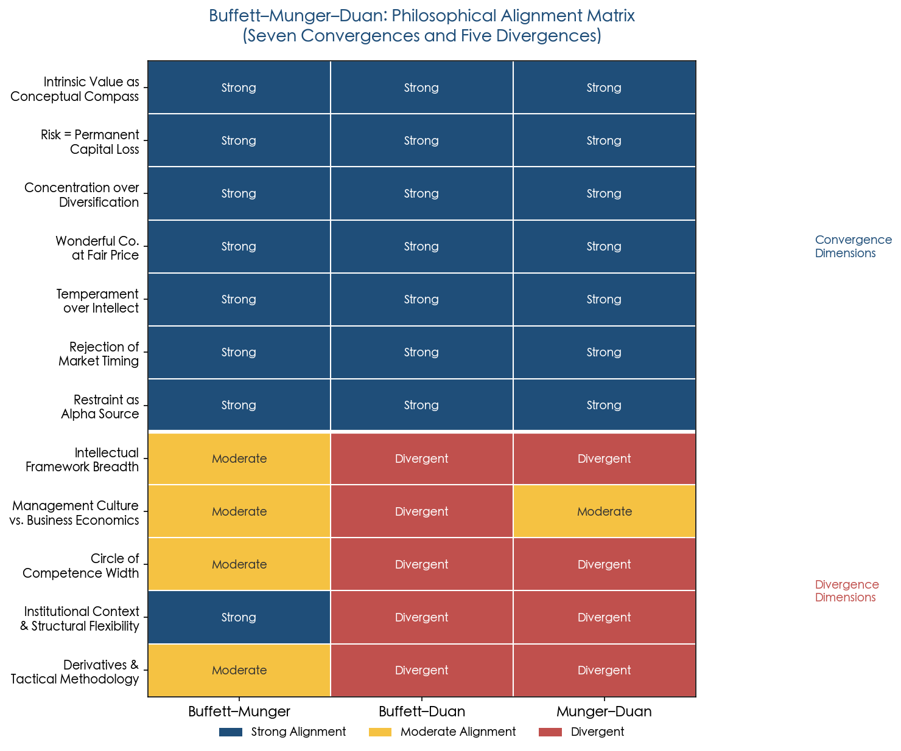

The matrix reveals a striking pattern: all seven convergence dimensions register as strong alignment across every pairwise combination, while the five divergence dimensions produce a more variegated landscape. Buffett-Munger generally exhibits the closest alignment; Buffett-Duan shows the widest dispersion, reflecting the greater distance between the American institutional investor and the Chinese individual investor.

## 6.2 Five Meaningful Divergences

Beneath this philosophical unity lie substantive differences rooted in each investor's distinct context, intellectual formation, and institutional constraints. These divergences do not contradict the shared framework; they illustrate how a common set of principles adapts to different minds, markets, and circumstances.

**Breadth of intellectual framework.** Munger systematized a "latticework of mental models" drawing on psychology, physics, biology, economics, and history — articulated most fully in his 1994 USC lecture and the 25-tendency taxonomy of "The Psychology of Human Misjudgment" (Harvard, 1995) [*Poor Charlie's Almanack* (2005)]. Buffett employs many of the same models implicitly — incentive analysis, inversion, second-order thinking — but never formalized them; his decision-making relies on intuitive pattern recognition honed over seven decades. Duan adopted specific Munger models, especially inversion and circle of competence, yet applies them within a deliberately narrow range focused on consumer technology. The divergence is architectural: Munger constructed the most explicit intellectual scaffolding, Buffett operates through deeply accumulated intuition, and Duan works with a focused toolkit applied to a limited domain.

**Management culture versus business economics.** Buffett has argued that a great business can survive mediocre management. In the 1989 letter, he observed: "When a management with a reputation for brilliance tackles a business with a reputation for bad economics, it is the reputation of the business that remains intact" [Buffett, *Berkshire Hathaway Annual Letter* (1989), https://www.berkshirehathaway.com/letters/1989.html "1989 Annual Letter"]. Duan diverges meaningfully. His concept of "本分" (běn fèn) — doing the right thing, fulfilling one's duty — treats management culture not as subordinate to business economics but as integral to the competitive moat. A company whose leaders lack 本分 cannot sustain durable competitive advantage regardless of structural economics. Munger occupies a middle position, emphasizing incentive alignment — "Show me the incentive and I will show you the outcome" — while also viewing culture as a form of moat: "The culture of the company is the moat" [*Poor Charlie's Almanack* (2005); Munger, Wesco Financial annual meeting, 2003].

**Circle of competence width.** The three investors define dramatically different boundaries. Buffett's circle, while famously disciplined, expanded substantially over time — from consumer staples and insurance to technology (Apple, 2016) and international markets (Japanese trading houses, 2019). Munger's circle extended further geographically, most notably through the 2008 BYD investment in China, a capital-intensive manufacturing bet that stretched beyond Berkshire's typical domain. Duan's circle is the narrowest by design: "I only invest in businesses I can understand. For me, that means consumer technology companies — Apple, Tencent, NetEase. I don't understand banks, oil companies, pharmaceutical companies" [Duan Yongping, Xueqiu (雪球) posts]. He explicitly declines sectors Buffett has invested in heavily — banking, energy, insurance — treating unfamiliarity not as a gap to be closed but as a boundary to be respected.

*Figure 6-2: Circle of Competence — Comparative Domain Map. Buffett's universe spans the broadest range (consumer, insurance, finance, energy, technology); Munger extends further geographically (China/BYD); Duan confines himself to consumer technology. Apple occupies the sole three-way intersection.*

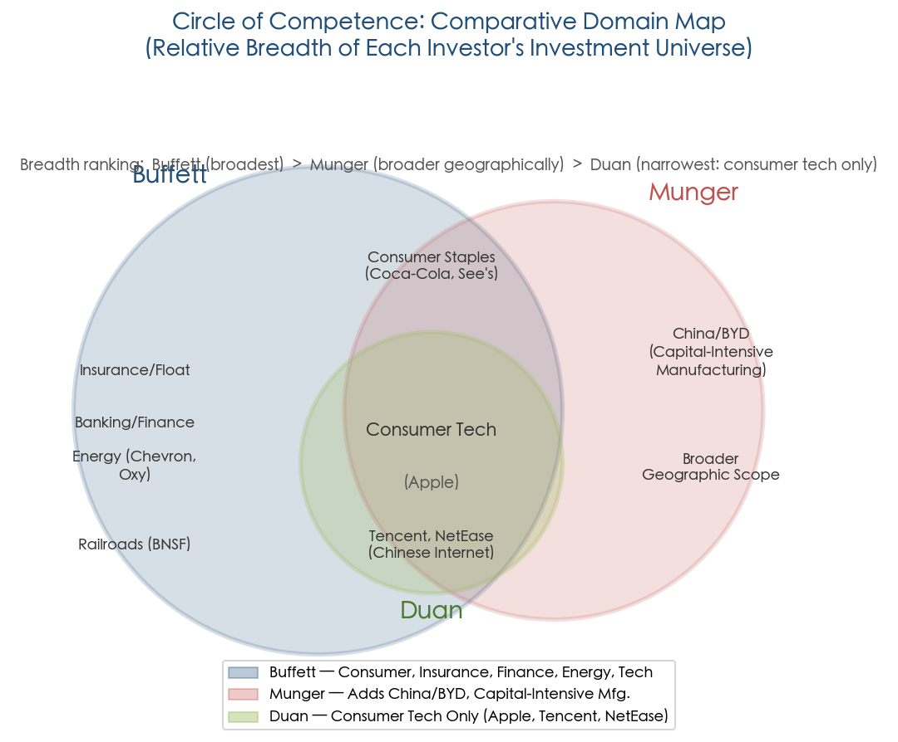

Apple occupies the sole intersection of all three circles, underscoring both the convergence in recognizing a durable consumer technology franchise and the divergence in how broadly each investor ranges beyond it.

**Institutional context and structural flexibility.** Berkshire Hathaway operates at a scale exceeding $1 trillion in market capitalization, with insurance float exceeding $171 billion that functions as permanent, low-cost leverage [Buffett, *Berkshire Hathaway Annual Letter* (2023), https://www.berkshirehathaway.com/letters/2023ltr.pdf "2023 Annual Letter"]. This structural advantage has been rigorously quantified: Frazzini, Kabiller, and Pedersen demonstrated in "Buffett's Alpha" (2018) that Berkshire's Sharpe ratio of 0.79 (1976–2017), versus the S&P 500's 0.50, was substantially explained by leverage via float averaging approximately 1.7:1 and systematic exposure to "cheap, safe, quality" stocks [Frazzini, Kabiller & Pedersen, "Buffett's Alpha," *Financial Analysts Journal*, Vol. 74, No. 4, 2018, https://www.tandfonline.com/doi/abs/10.2469/faj.v74.n4.3 "Buffett's Alpha — AQR/FAJ 2018"]. Duan operates without institutional float, without a $334 billion cash reserve, and without the capacity to negotiate preferential deal terms — such as Buffett's 10% coupon on Goldman Sachs preferred stock in 2008. His primary structural advantage as an individual investor — the ability to enter and exit positions without market impact — is genuine at smaller scale but cannot replicate Berkshire's leverage-driven compounding.

**Derivatives and tactical methodology.** Duan actively employs put-selling as an entry strategy — writing cash-secured puts at desired entry prices to collect premium while awaiting acquisition: "Selling puts on a company I want to own is a way of getting paid to wait" [Duan Yongping, Xueqiu (雪球) posts]. Buffett has engaged in equity index put-selling — notably the large-scale puts written in 2007–2008 on four major indices — but does not routinely employ options as an entry tactic for individual stocks. Munger showed no recorded interest in derivatives strategies. This represents a genuine methodological innovation on Duan's part: a tactical layer superimposed upon the Buffett-Munger strategic framework, reflecting the greater flexibility available to an individual investor unconstrained by institutional reporting obligations.

## 6.3 Duan Yongping as Cross-Cultural Transmitter

Duan Yongping's significance extends beyond investment returns. He represents the most prominent case of the Buffett-Munger value investing tradition being transmitted, adapted, and re-disseminated within Chinese investment culture — a process that illuminates both the universality of the framework's core principles and the cultural translation required for effective adoption.

The core architecture was preserved virtually intact. Duan adopted intrinsic value as a conceptual anchor, margin of safety as the primary risk management tool, concentration as the preferred portfolio strategy, and business quality over statistical cheapness as the selection criterion. He did not modify these structural elements but accepted them wholesale, having studied Buffett's shareholder letters and *Poor Charlie's Almanack* extensively — materials he characterized as "the best MBA education you can get" [Duan Yongping, cited in Chinese financial media; 2006 Buffett charity lunch coverage].

What Duan contributed was a distinctly Chinese cultural integration through the concept of "本分" (běn fèn). Rooted in Confucian notions of role-based duty and moral responsibility, 本分 operates on two levels within his framework. As a management evaluation criterion, it identifies companies whose leaders focus on product quality, treat stakeholders fairly, and avoid speculation — characteristics Duan considers structural prerequisites for durable competitive advantage. As an investor self-discipline tool, it prescribes doing the right thing rather than the easy thing: acknowledging when one does not understand something, refusing to chase short-term gains, and maintaining composure during market stress. In Duan's formulation: "本分 means sticking to what you know is right, even when the market is telling you you're wrong. The market is not your boss — it's your servant" [Duan Yongping, Xueqiu (雪球) posts]. Buffett and Munger express cognate values through different language — integrity, rationality, the inner scorecard — but 本分 embeds these principles within a cultural and philosophical tradition that resonates with Chinese audiences in ways that direct translations of Buffett's terminology cannot achieve.

Duan also enriched the framework with tech-native competence born of direct entrepreneurial experience. His 2002 NetEase purchase at approximately $0.80 per share — when the company was under SEC investigation, trading near delisting, and dismissed by virtually all Western analysts — reflected an understanding of Chinese internet business models that neither Buffett nor Munger possessed at the time. His Apple investment, initiated around 2011–2012, preceded Buffett's 2016 entry by several years. In both cases, Duan's entrepreneurial background — having built BBK Electronics and its OPPO/Vivo ecosystem — furnished a consumer technology perspective that complemented the Buffett-Munger framework with domain expertise its originators lacked.

Most consequentially, Duan served as the primary intermediary transmitting Buffett and Munger's philosophy into Chinese investment culture. His Xueqiu (雪球) posts, reaching millions of Chinese retail and professional investors, translated not merely the language but the reasoning style of value investing into a Chinese context. His 2006 charity lunch with Buffett — won with a then-record bid of $620,100, with proceeds benefiting the Glide Foundation — became a landmark event in Chinese financial media, symbolizing the bridge between Western value investing and Chinese entrepreneurial capital [Chinese and English financial media coverage of the 2006 charity lunch]. Duan reportedly brought a young associate, Huang Zheng (黄峥), who later founded Pinduoduo (PDD Holdings), suggesting that the transmission of value investing principles extended beyond Duan into a broader network of Chinese entrepreneurs who would build some of Asia's largest technology enterprises.

## 6.4 The Sixty-Year Track Record and Its Decomposition

Any assessment of the Buffett-Munger-Duan framework must contend with the extraordinary empirical record that undergirds it. Berkshire Hathaway's performance table, published annually in the shareholder letter, provides the most comprehensive long-duration dataset available for any single investment vehicle. From 1965 through 2024, Berkshire's per-share market value compounded at 19.9% annually, compared with 10.4% for the S&P 500 with dividends included — a cumulative gain of 5,502,284% versus 39,054% [Buffett, *Berkshire Hathaway Annual Letter* (2024), https://www.berkshirehathaway.com/letters/2024ltr.pdf "2024 Annual Letter"]. In 2024 alone, Berkshire recorded $47.4 billion in operating earnings and paid $26.8 billion in federal income taxes — more than any other U.S. corporation that year.

The deceleration with scale is unmistakable. Approximate twenty-year periods reveal a declining trajectory: roughly 23.8% annualized in the first two decades (1965–1984), approximately 21.4% in the middle period (1985–2004), and approximately 10.3% in the most recent two decades (2005–2024) — by which point Berkshire's annualized return nearly converged with the S&P 500's 10.5%. Buffett acknowledged this trajectory in the 2014 letter: "Berkshire's per-share intrinsic value... can't increase at rates close to what it has achieved in the past" [Buffett, *Berkshire Hathaway Annual Letter* (2014), https://www.berkshirehathaway.com/letters/2014ltr.pdf "2014 Annual Letter"]. By year-end 2024, Berkshire's market capitalization exceeded $1 trillion and its cash and Treasury bill holdings exceeded $334 billion.

*Figure 6-3: Berkshire Hathaway vs. S&P 500 — Decadal CAGR Comparison (1965–2024). Excess return narrowed from +15.5 percentage points (1965–1984) to near parity (2005–2024), reflecting scale-driven deceleration.*

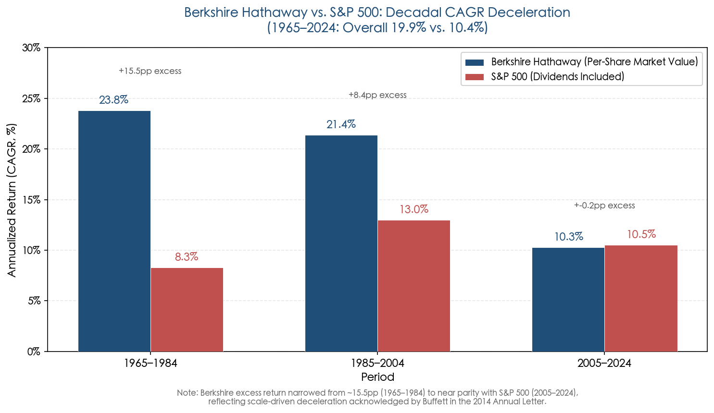

As the chart illustrates, Berkshire's excess return over the S&P 500 narrowed from +15.5 percentage points in 1965–1984 to +8.4 points in 1985–2004, and to near parity at -0.2 points in 2005–2024. This pattern reflects a fundamental mathematical constraint: the universe of investments large enough to move the needle for a trillion-dollar entity is dramatically smaller than what was available to a $10 million partnership.

The "Buffett's Alpha" study by Frazzini, Kabiller, and Pedersen (2018) provides the most rigorous academic decomposition of this track record. The authors found that Berkshire's Sharpe ratio of 0.79 (1976–2017), compared with 0.50 for the S&P 500, was largely explained by two factors: leverage via insurance float averaging approximately 1.7:1 and systematic exposure to "cheap, safe, quality" stocks (corresponding to the BAB and QMJ factors in academic asset pricing). Their conclusion: "Buffett's returns appear to be neither luck nor magic, but rather a reward for using leverage to invest in cheap, safe, quality stocks" [Frazzini, Kabiller & Pedersen, "Buffett's Alpha," *Financial Analysts Journal*, Vol. 74, No. 4, 2018, https://www.tandfonline.com/doi/abs/10.2469/faj.v74.n4.3 "Buffett's Alpha — AQR/FAJ 2018"]. This finding does not diminish Buffett's achievement — identifying and systematically applying the quality factor decades before academia codified it is itself a feat of independent judgment. Rather, it suggests that the approach can be decomposed, understood, and, in principle, partially replicated by institutional investors with access to similar leverage and factor disciplines.

## 6.5 Structural Criticisms and Limitations

The Buffett-Munger-Duan framework, for all its empirical success, faces several structural criticisms that intellectually honest assessment must address.

**The value factor's prolonged underperformance.** The Fama-French HML (high-minus-low book-to-market) factor — the academic proxy for "value investing" — has underperformed significantly since approximately 2007. Russell 1000 Growth outperformed Russell 1000 Value by more than 300 percentage points between 2007 and 2023. Clifford Asness of AQR argued in his 2020 paper "Is (Systematic) Value Investing Dead?" that the value spread had reached historically extreme levels and predicted mean reversion, yet subsequent years brought only partial recovery. A crucial distinction, however, separates systematic value investing from the Buffett-Munger-Duan approach: the latter aligns more closely with the academic "quality" factor than with mechanical book-to-market screening. These investors do not purchase statistically cheap stocks indiscriminately; they acquire high-quality businesses at reasonable prices — a strategy that has continued to perform robustly even as the traditional value factor languished.

**Survivorship bias and non-replicability.** The prominence of Buffett, Munger, and Duan in investment discourse raises the inescapable question of survivorship bias. For every concentrated portfolio that compounded at 20% annually over decades, unknown numbers suffered catastrophic permanent losses pursuing the same strategy. The 60-year Berkshire track record constitutes a sample size of one, and Berkshire's unique structural advantages — insurance float, negotiating leverage, reputational premium — are unavailable to individual investors. Duan's track record, while impressive, is documented primarily through self-reported Xueqiu disclosures rather than audited returns, rendering rigorous third-party verification difficult.

**The gap between stated philosophy and revealed behavior.** Each investor's actions have at times stretched the boundaries of stated principles. Buffett avoided technology stocks for decades, then committed more than $35 billion to Apple. Duan's 2002 NetEase purchase — placing a substantial fraction of his net worth in a company under SEC investigation and trading near delisting — exceeded what a strict margin-of-safety framework would ordinarily prescribe. Munger's BYD investment stretched both the circle of competence (a Chinese capital-intensive manufacturer) and the governance standards that Berkshire typically demands. This gap represents not a weakness but a defining feature of the framework: the judgment-based flexibility to override stated heuristics when deep understanding justifies deviation may be central to exceptional returns. The principles function as strong defaults rather than rigid rules, and the capacity to recognize justified exceptions requires precisely the temperament and understanding the framework cultivates.

**Adaptation to evolving market regimes.** The most pressing question concerns the framework's adaptability to structural market transformation. Passive index funds held approximately 50% of U.S. equity mutual fund assets by 2024, up from less than 10% in 2000. Buffett himself demonstrated the power of passive investing through his $1 million Protégé Partners bet (2008–2017): a Vanguard S&P 500 index fund returned 125.8% cumulatively (approximately 8.5% annualized) versus approximately 36% (approximately 2.9% annualized) for five funds-of-hedge-funds [Buffett, *Berkshire Hathaway Annual Letter* (2017), https://www.berkshirehathaway.com/letters/2017ltr.pdf "2017 Annual Letter"]. When the most celebrated active investor in history recommends indexing for most individuals, the domain of applicability for concentrated value investing narrows substantially.

The interest rate regime presents a further challenge. Buffett observed in the 2020 letter: "Interest rates are to asset prices what gravity is to the apple. When there are virtually no interest rates, there is almost no gravitational pull on valuations" [Buffett, *Berkshire Hathaway Annual Letter* (2020), https://www.berkshirehathaway.com/letters/2020ltr.pdf "2020 Annual Letter"]. The near-zero rate environment of 2009–2021 undermined the earnings-yield-versus-bond-yield comparison that Buffett had employed effectively for decades. The return to Treasury yields above 4% in 2022–2024 restored this valuation tool's discriminating power, but the episode demonstrated that certain elements of the framework are regime-dependent.

Artificial intelligence introduces an additional dimension of uncertainty. At Berkshire's 2024 annual meeting, Buffett stated: "I don't know anything about AI... AI is somewhat similar [to nuclear weapons]. It's partway out of the bottle, and it's enormously important... I'm certainly not the person that can evaluate that" [Buffett, Berkshire Hathaway Annual Meeting, May 4, 2024, transcript]. He described being shown a deepfake video indistinguishable from his own image and voice, warning that AI-enabled scamming could become "the growth industry of all time." The circle-of-competence concept faces genuine tension in an era where AI can reshape competitive landscapes within months. A moat evaluated as durable in January may face erosion from an AI-enabled competitor by December — a velocity of disruption that challenges the assumption of slow-moving competitive dynamics underlying much of the Buffett-Munger framework.

## 6.6 Adaptation Evidence: Domain Shifts, Not Principle Shifts

Despite these challenges, the historical record demonstrates that the framework has adapted through changes in application domain rather than in underlying principles — a pattern suggesting greater resilience than its critics acknowledge.

Buffett's 2016 Apple investment represents the clearest illustration. Apple was evaluated not as a technology bet but as a consumer franchise possessing extraordinary brand loyalty, switching costs, an ecosystem moat, and pricing power — precisely the criteria Buffett had applied to Coca-Cola in 1988 and See's Candies in 1972. At the 2023 annual meeting, he called Apple "probably the best business I know in the world." The principles did not change; the domain of application expanded as technology companies matured into the kind of durable consumer franchises the framework was designed to identify.

Munger's 2008 BYD investment — approximately $232 million for a 10% stake — represented a different adaptation mode: geographic and industrial expansion. He compared BYD's founder Wang Chuanfu to "a combination of Thomas Edison and Jack Welch," applying the management-quality assessment framework in a Chinese manufacturing context far outside Berkshire's traditional domain. Both investments illustrate the same pattern: core principles (moat analysis, management evaluation, margin of safety) remained intact while the categories of businesses and geographies to which they applied expanded considerably.

Duan's trajectory confirms and extends this pattern. His entire investment career has operated within the consumer technology domain — NetEase, Apple, Tencent — applying Buffett-Munger principles to businesses whose economics he understood intimately from building BBK Electronics. The adaptation was not in the principles but in the recognition that technology platforms could possess the same structural characteristics — brand loyalty, switching costs, network effects, pricing power — traditionally associated with consumer staples and financial franchises.

## 6.7 Munger's Death and the Question of Succession

Charlie Munger's death on November 28, 2023, at age 99, closed an intellectual partnership that had shaped modern value investing for more than six decades. Buffett's tribute in the 2023 letter captured the complementary dynamic: "Charlie was the 'architect' of the present Berkshire, and I acted as the 'general contractor'" [Buffett, *Berkshire Hathaway Annual Letter* (2023), https://www.berkshirehathaway.com/letters/2023ltr.pdf "2023 Annual Letter"; Berkshire Hathaway press release, November 28, 2023, https://www.berkshirehathaway.com/news/nov2823.pdf "Official announcement of Munger's death"]. Greg Abel was confirmed as CEO successor at the 2021 annual meeting, with full capital allocation responsibilities affirmed at the 2024 meeting.

The central question Munger's passing raises is whether Berkshire's sustained outperformance is attributable to Buffett's non-replicable personal genius or to the durable system and culture that he and Munger constructed over decades. The evidence suggests both propositions hold simultaneously. The culture — owner-oriented capital allocation, long-term holding periods, decentralized operational management, fortress balance sheet — is institutionalized and self-reinforcing. Yet the capital allocation judgment that produced the Apple position, the 2008 crisis deployments, and the Japanese trading house investments reflected pattern-recognition capacity developed over seventy years that cannot be transmitted through organizational design alone. As Buffett noted in the 2024 letter, written at age 94: "At 94, it won't be long before Greg Abel replaces me as CEO and will be writing the annual letters" [Buffett, *Berkshire Hathaway Annual Letter* (2024), https://www.berkshirehathaway.com/letters/2024ltr.pdf "2024 Annual Letter"]. The system will endure; whether it continues to compound at rates exceeding the broader market depends on the judgment and temperament of its next stewards.

## 6.8 Seven Actionable Principles for Individual Investors

The combined philosophies of Buffett, Munger, and Duan yield a set of principles that, while offering no guarantee of superior returns, provide a coherent framework for individual investors seeking to allocate capital with discipline and rigor.

**One: Define and respect the boundaries of competence.** The size of the circle matters less than the honesty with which its boundaries are assessed. Buffett's formulation remains definitive: "You don't have to be an expert on every company, or even many. You only have to be able to evaluate companies within your circle of competence. The size of that circle is not very important; knowing its boundaries, however, is vital" [Buffett, *An Owner's Manual* (1996), https://www.berkshirehathaway.com/ownman.pdf "Owner's Manual"]. Duan's practice — restricting himself to consumer technology companies he personally uses — offers a practical model: allocate capital to businesses understood from direct experience, not those recommended by analysts or media commentary.

**Two: Exploit the structural advantage of patience.** Individual investors operate without quarterly earnings pressure, benchmark tracking requirements, or career risk from short-term underperformance — a genuine structural advantage over institutional money managers. Munger's "sit on your ass investing" — "We've made most of our money by sitting" [Daily Journal annual meeting, 2019] — and Duan's practice of spending "less than an hour a week on investment decisions" describe an approach that most institutional investors are structurally prohibited from adopting. The absence of institutional constraints is itself an edge for those with the temperament to exploit it.

**Three: Deploy inversion as a primary decision tool.** Before asking "Why should I buy this?", the disciplined investor asks: "What could go wrong? What could destroy this business? Why might I be wrong?" Munger's inversion, tracing to mathematician Carl Gustav Jacob Jacobi's dictum "Man muss immer umkehren" (one must always invert), is the most practical and immediately applicable mental model in the entire framework [*Poor Charlie's Almanack* (2005)]. Duan applies it directly to moat analysis: "What could erode this moat? What would make consumers switch away?" [Duan Yongping, Xueqiu (雪球) posts].

**Four: Avoid leverage, short-selling, and frequent trading.** Duan's "不做什么比做什么更重要" distills this into a single precept: systematically avoid the behaviors that reliably destroy capital. Leverage transforms temporary losses into permanent ones. Short-selling introduces unlimited downside risk. Frequent trading incurs compounding transaction costs and taxes while encouraging the market-timing behavior that all three investors reject.

**Five: If the above proves beyond reach, index.** Buffett's 2013 letter instruction — invest 90% in a "very low-cost S&P 500 index fund" and 10% in short-term government bonds — is not a concession of defeat but a recognition that concentrated value investing demands capabilities most investors do not possess [Buffett, *Berkshire Hathaway Annual Letter* (2013), https://www.berkshirehathaway.com/letters/2013ltr.pdf "2013 Annual Letter"]. The Protégé Partners bet demonstrated empirically that professional active managers, in aggregate, cannot overcome their cost structures. For the substantial majority of investors, low-cost indexing remains the optimal strategy — and acknowledging this truth is itself an act of intellectual honesty consistent with the framework's values.

**Six: Treat business quality as the primary margin of safety.** Munger's ROE convergence logic — "If a business earns 18% on capital over 20 or 30 years, even if you pay an expensive-looking price, you'll end up with a fine result" [*Poor Charlie's Almanack* (2005)] — redirects attention from entry price to underlying business economics. The most durable protection against permanent capital loss consists in owning businesses whose competitive advantages strengthen over time, not merely in purchasing assets at a statistical discount to book value.

**Seven: Read primary sources.** Annual reports, SEC filings, shareholder letters, and earnings call transcripts contain more actionable information than any analyst summary, media article, or social media commentary. Buffett's shareholder letters — publicly available at berkshirehathaway.com from 1977 to present — constitute the most comprehensive free education in capital allocation ever produced. Duan's Xueqiu posts, while in Chinese, offer a real-time window into how the framework operates at the individual investor level. The habit of reading primary sources is itself a competitive advantage, because the overwhelming majority of market participants do not cultivate it.

# Conclusion

The investment philosophies of Warren Buffett, Charlie Munger, and Duan Yongping represent three expressions of a single intellectual tradition — Benjamin Graham's foundational insight that securities are fractional ownership claims on real businesses, not lottery tickets. Despite differences in nationality, institutional scale, and cultural formation, the three converge on a remarkably consistent set of principles: intrinsic value as a conceptual compass rather than a precise calculation; risk defined as permanent capital loss, not price volatility; concentrated portfolios grounded in genuine business understanding; the primacy of business quality over statistical cheapness; management integrity as a non-negotiable prerequisite; and restraint — knowing what not to do — as the deepest source of long-term advantage.

Their divergences illuminate how a shared framework adapts to different contexts without losing structural coherence. Buffett's contribution is the most fully articulated operational system — owner earnings, the franchise-versus-commodity distinction, the earnings-yield comparison — refined across six decades of shareholder letters into a comprehensive capital allocation doctrine. Munger supplied the epistemological architecture: the latticework of mental models, the 25-tendency taxonomy of cognitive error, and the critical reorientation from buying cheap assets to owning wonderful businesses. Duan Yongping demonstrated the framework's cross-cultural transferability, integrating Buffett-Munger principles with the Confucian concept of 本分 and applying them with a tech-native competence born of building one of China's largest consumer electronics ecosystems. Together, the three confirm that value investing is not a rigid formula but a set of flexible principles whose power derives from the temperamental and epistemological commitments they demand: patience, intellectual honesty about the limits of understanding, and the discipline to act only within those limits.

The tradition has proved remarkably durable — tested across seventy years, five major market crises, multiple interest rate regimes, the rise of passive indexing, and the emergence of artificial intelligence. Its adaptations have been in domain rather than in principle: technology platforms such as Apple and Tencent were evaluated through the same moat-and-quality lens once applied to See's Candies and Coca-Cola. Structural criticisms — survivorship bias, the prolonged underperformance of the academic value factor, the gap between stated philosophy and revealed behavior — are real but do not undermine the framework's core logic. The Buffett-Munger-Duan approach aligns more closely with the academic "quality" factor than with mechanical book-to-market screening, and its practitioners have demonstrated the capacity to stretch their own heuristics when deep understanding justifies deviation.

Munger, who perhaps understood this architecture best, offered the simplest formulation of why it endures: "It's not supposed to be easy. Anyone who finds it easy is stupid" [*Poor Charlie's Almanack* (2005)]. The framework persists because it demands of its practitioners exactly the qualities scarcest in financial markets: rationality, patience, and the willingness to do less.
