# 执行摘要

# The Global Landscape of Government Capital — Scale, Vehicles, and Key Players

Government capital has never been larger, more structurally diverse, or more consequential for global financial markets. As of December 2025, sovereign wealth funds (SWFs), public pension reserve funds (PPFs), and central bank foreign-exchange reserves collectively manage approximately **$60.0 trillion** in assets — an all-time record that reflects the accelerating accumulation of state-controlled investment capital across commodity-exporting, surplus-generating, and contribution-funded economies alike [Global SWF 2026 Annual Report](https://argaamplus.s3.amazonaws.com/3ffe681b-beab-49ba-9c30-bfe8ca8bd0bb.pdf "Global SWF 2026 Annual Report — State-Owned Investors: from Scale to Strategy, January 1, 2026"). Global SWF projects this aggregate will reach approximately **$80 trillion by 2030**, implying a compound annual growth rate of roughly 5.9% — a pace broadly consistent with the 2020–2025 trajectory and underpinned by persistent hydrocarbon revenues, Asian pension-system maturation, and the compounding effect of strong equity-market returns on existing portfolios.

This chapter establishes a comprehensive taxonomy of government investment vehicles, quantifies the aggregate capital pool and its compositional breakdown, profiles the dominant funds and nations that anchor the system, and traces the milestones and structural shifts that reshaped the sovereign-investment landscape during 2025.

## Defining the Universe: Five Categories of Government Investment Capital

Government-controlled investable capital spans a spectrum of institutional forms, each distinguished by its legal mandate, funding channel, liability structure, and risk tolerance. A rigorous taxonomy is essential because aggregated headline figures can obscure fundamental differences in how — and why — these pools of capital are deployed.

### Sovereign Wealth Funds (SWFs)

The International Forum of Sovereign Wealth Funds (IFSWF) defines an SWF as a government-owned investment entity satisfying three criteria: (1) ownership by the general government, (2) inclusion of foreign financial assets in the investment portfolio, and (3) pursuit of financial objectives as a primary mandate [IFSWF Definition](https://www.ifswf.org/what-is-a-sovereign-wealth-fund "IFSWF official definition per Santiago Principles"). This definition explicitly excludes public pension funds and central bank reserve portfolios. SWFs are typically funded either by commodity revenues — oil, gas, or minerals — or by accumulated fiscal and trade surpluses (non-commodity SWFs). Their mandates span a wide spectrum: intergenerational savings (Norway's GPFG), macroeconomic stabilization (Chile, Timor-Leste), strategic domestic economic development (Saudi Arabia's PIF), and hybrid commercial-investment models (Singapore's Temasek).

As of December 2025, global SWF assets under management totaled approximately **$15.2 trillion**, a **13% year-over-year increase**, according to Global SWF [Global SWF 2026 Annual Report](https://argaamplus.s3.amazonaws.com/3ffe681b-beab-49ba-9c30-bfe8ca8bd0bb.pdf "SWFs $15.2 tn, +13% YoY"). An independent estimate from State Street Global Advisors (SSGA), based on a narrower sample, placed SWF total AUM at $12.2 trillion at end-2025, with strong equity markets identified as the primary growth driver [SSGA Sovereign Wealth Fund Trends](https://www.ssga.com/us/en/institutional/insights/trends-among-sovereign-wealth-funds "Investment trends among sovereign wealth funds, March 2026"). The discrepancy between the two estimates reflects differences in universe definition: Global SWF's broader taxonomy encompasses entities that SSGA may classify under different institutional categories. Both datasets, however, confirm that SWF assets have reached an unprecedented scale.

### Public Pension Reserve Funds (PPFs)

PPFs are government-managed capital pools earmarked for the discharge of future pension liabilities. Unlike SWFs, they carry explicit or implicit obligations to beneficiaries — a structural distinction that constrains their investment horizons and risk budgets. The world's largest PPFs — Japan's Government Pension Investment Fund (GPIF), South Korea's National Pension Service (NPS), and Canada's CPP Investments — manage portfolios rivaling or exceeding the biggest SWFs in absolute scale. As of December 2025, PPFs globally held approximately **$27.6 trillion**, an **8% year-over-year increase** [Global SWF 2026 Annual Report](https://argaamplus.s3.amazonaws.com/3ffe681b-beab-49ba-9c30-bfe8ca8bd0bb.pdf "PPFs $27.6 tn, +8% YoY"). PPFs thus constitute the single largest category of government-managed investment capital — a point frequently overlooked in media coverage that disproportionately focuses on SWFs.

### Central Bank Foreign-Exchange Reserves

Central banks accumulate reserves primarily for monetary-policy operations, exchange-rate management, and balance-of-payments insurance. According to IMF Currency Composition of Official Foreign Exchange Reserves (COFER) data, global allocated foreign-exchange reserves stood at **$13.14 trillion in Q4 2025**, up modestly from $13.03 trillion in Q3 2025. The U.S. dollar's share of allocated reserves declined to **56.77% in Q4 2025**, extending a multi-year erosion from approximately 65% in 2015. The euro maintained a 20.25% share, the Chinese renminbi edged up to 1.95%, and — notably — the residual "other currencies" category rose to 6.13%, having more than doubled since 2021. This broadening diversification away from traditional reserve currencies reflects deliberate portfolio shifts by central banks in emerging and commodity-exporting economies [IMF COFER Q4 2025](https://data.imf.org/en/news/imf-data-brief-march-27 "IMF COFER Q4 2025, March 27, 2026").

Within the Global SWF analytical framework, which includes gold and other reserve assets beyond the COFER foreign-currency scope, central banks collectively accounted for **$17.3 trillion** in managed assets, a 3% year-over-year increase [Global SWF 2026 Annual Report](https://argaamplus.s3.amazonaws.com/3ffe681b-beab-49ba-9c30-bfe8ca8bd0bb.pdf "CBs $17.3 tn, +3% YoY").

### National Development Finance Institutions (DFIs)

National development banks and DFIs — including China Development Bank, KfW (Germany), BNDES (Brazil), and Japan Bank for International Cooperation — deploy government-backed capital for policy-oriented lending and investment in infrastructure, industry, and economic development. The 2025 DFI Transparency Index assessed institutions managing a combined ~$3 trillion in assets, though the global universe of national and multilateral DFIs extends considerably beyond these assessed entities [ImpactAlpha](https://impactalpha.com/development-finance-institutions-lag-on-transparency-and-disclosure-around-capital-mobilization/ "DFIs' and MDBs' $3 trillion in assets, June 2025"). No authoritative single-source aggregation of total DFI assets exists — a gap reflecting both the institutional heterogeneity of this category and the highly variable transparency standards across jurisdictions.

### State-Owned Enterprise (SOE) Portfolios

Governments hold direct equity stakes in commercial enterprises spanning sectors from energy and banking to telecommunications and mining. Quantifying the total value of SOE portfolios is inherently problematic: asset valuations intermingle commercial and non-commercial operations, accounting standards vary across jurisdictions, and no single authoritative source tracks the global aggregate. The Global SWF $60 trillion framework accordingly excludes SOE portfolios.

Indonesia's Danantara — launched in February 2025 with an initial investable pool of approximately IDR 300 trillion (~$18 billion) — illustrates the measurement challenge acutely. The fund's frequently cited ~$900 billion asset base reflects the aggregate book value of the state-owned enterprises it oversees, including banks, energy companies, and mining conglomerates, rather than a portfolio of financial investments comparable to traditional SWFs [Reuters](https://www.reuters.com/markets/asia/indonesia-launch-new-sovereign-wealth-fund-with-over-900-billion-assets-2025-02-13/ "Indonesia Danantara launch with over $900 billion in assets, February 2025"). This accounting-definition discrepancy underscores the importance of distinguishing between enterprise-consolidation vehicles and genuine investment funds when assessing the global landscape of government capital.

## The $60 Trillion Panorama: Scale and Composition

The three core categories — SWFs ($15.2 trillion), PPFs ($27.6 trillion), and central bank reserves ($17.3 trillion) — compose the **$60.0 trillion aggregate** tracked by Global SWF. PPFs constitute the largest share at 46%, followed by central bank reserves at 29% and SWFs at 25%. This composition underscores a frequently overlooked reality: while SWFs command the most media and market attention, public pension reserve funds hold nearly half of all government-managed investment capital.

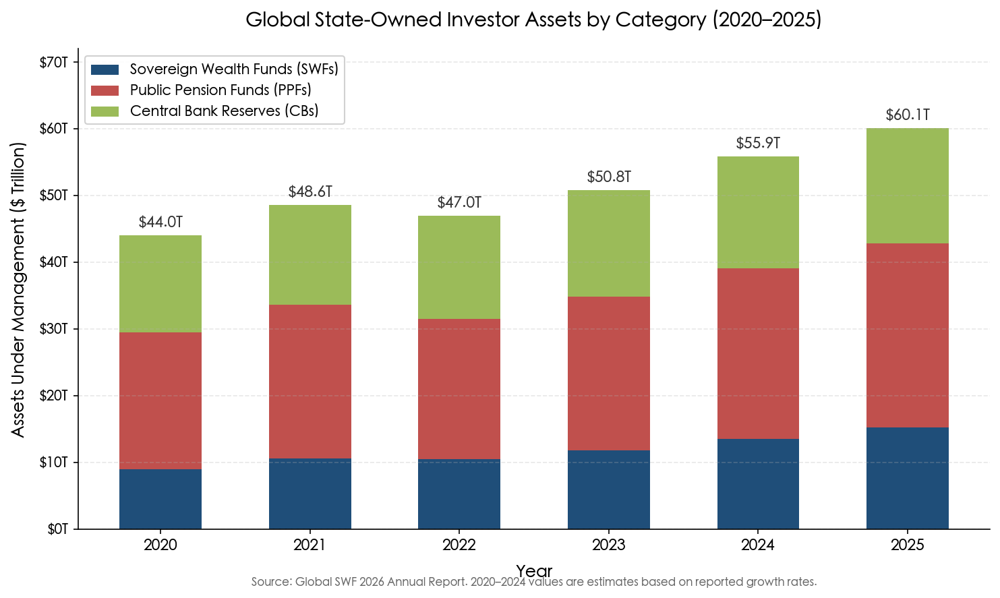

**Figure 1.1** — The stacked bar chart above illustrates the growth trajectory of state-owned investor assets from approximately $44 trillion in 2020 to $60 trillion in 2025, disaggregated by SWFs, PPFs, and central bank reserves. The 2022 contraction — driven by simultaneous equity and bond drawdowns — proved temporary; by 2023 the aggregate had surpassed its prior peak and has since accelerated. Data: Global SWF 2026 Annual Report; 2020–2024 values are estimates based on reported growth rates.

The growth trajectory has been steep and broad-based. The 13% annual increase in SWF assets outpaced both PPFs (+8%) and central banks (+3%), driven by a confluence of buoyant global equity markets, continued hydrocarbon revenue inflows, and the creation of new funds. In 2025, total investment activity by state-owned investors reached **$180.3 billion across 324 transactions for SWFs** (a 35% year-over-year increase) and **$97.8 billion across 238 transactions for PPFs** (a 26% increase). The average deal size rose to **$490 million**, reflecting a structural shift toward larger, more concentrated investments — often co-investment or club-deal structures that pool sovereign capital alongside private-market general partners [Global SWF 2026 Annual Report](https://argaamplus.s3.amazonaws.com/3ffe681b-beab-49ba-9c30-bfe8ca8bd0bb.pdf "SWF investment up 35%, PPF investment up 26%").

## The Top Tier: Profiling the World's Largest Government Investors

The global government-investment landscape is dominated by a relatively small number of exceptionally large funds. The fourteen entities profiled below collectively manage over $14 trillion — roughly one-quarter of the $60 trillion aggregate — and their allocation decisions exert outsized influence on asset prices, capital flows, and market structure worldwide.

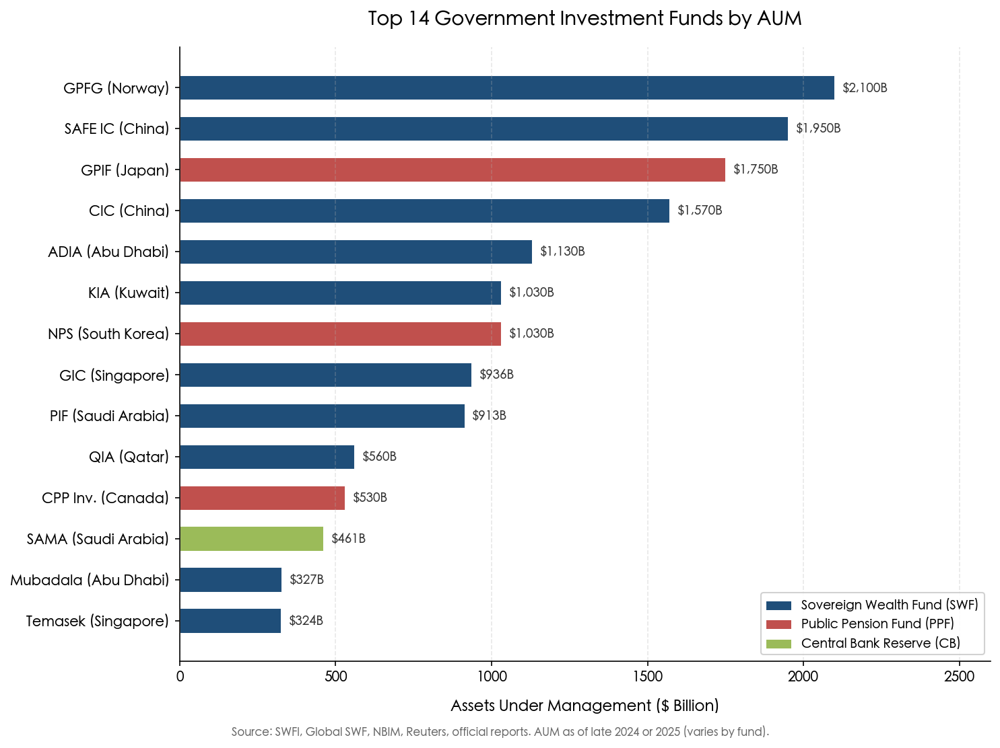

**Figure 1.2** — Horizontal bar chart ranking the world's fourteen largest government investment funds by assets under management, color-coded by fund type (SWF, PPF, or central bank reserve). Norway's GPFG leads at $2.1 trillion, followed by China's SAFE IC ($1.95 trillion) and Japan's GPIF ($1.75 trillion). Data: SWFI, Global SWF, NBIM, Reuters, and official reports; AUM figures as of year-end 2024 or 2025 depending on reporting cycles.

### Norway's Government Pension Fund Global (GPFG)

In 2025, the GPFG became the first sovereign wealth fund in history to surpass **$2 trillion** in assets under management. At year-end 2025, the fund's market value reached **NOK 21,268 billion (approximately $2.1 trillion)**, following a full-year return of **15.1%**. The equity portfolio returned 19.3%, fixed income 3.2%, unlisted real estate 4.0%, and unlisted renewable-energy infrastructure 3.5%. GPFG investments span 68 countries and 7,201 listed companies, making it the world's single largest owner of public equities [NBIM Annual Report 2025](https://www.nbim.no/en/news-and-insights/reports/2025/annual-report-2025/ "Annual report 2025, February 27, 2026").

Funded exclusively by Norway's petroleum revenues and managed by Norges Bank Investment Management (NBIM), the GPFG operates as a pure intergenerational savings vehicle with zero domestic equity allocation — a deliberate design choice that insulates the Norwegian economy from Dutch Disease effects while maximizing global diversification.

### China's SAFE Investment Company (SAFE IC)

China's State Administration of Foreign Exchange Investment Company manages an estimated **$1.95 trillion**, deploying roughly one-third of China's total foreign-exchange reserves of **$3.358 trillion** (as of December 2025) [SWFI Fund Rankings](https://www.swfinstitute.org/fund-rankings/sovereign-wealth-fund "SWFI Top 100 Largest SWF Rankings") [China State Council](https://english.www.gov.cn/archive/statistics/202601/07/content_WS695e44b5c6d00ca5f9a0878a.html "China FX reserves December 2025"). SAFE IC invests through a network of subsidiaries and external mandates across global equity, fixed-income, and alternative-asset markets. Among the world's largest investment entities, it is also among the least transparent: SAFE IC publishes no annual report, discloses no asset-allocation breakdown, and provides no performance data — rendering all public estimates reliant on third-party inference.

### China Investment Corporation (CIC)

CIC reported total assets of **$1.57 trillion** at end-2024, with profits increasing 30.4% year-over-year. However, transparency deteriorated materially during the reporting period: leverage increased while asset-allocation disclosures were curtailed relative to prior years [Global SWF on CIC](https://globalswf.com/news/cic-assets-hit-us-1-57trn-as-leverage-rises-and-transparency-declines "CIC assets hit US$1.57trn, December 11, 2025"). CIC operates through three distinct arms: CIC International (overseas portfolio investments), CIC Capital (direct investments and co-investments), and Central Huijin (domestic financial-sector holdings, including major state-owned banks). The 2025 annual report, expected in Q3–Q4 2026, may provide updated figures, though the trend toward reduced disclosure raises questions about future data availability.

### Japan's Government Pension Investment Fund (GPIF)

GPIF is the world's largest public pension fund, holding approximately **¥260 trillion (~$1.7–1.8 trillion)** in assets. In Q1 2025, the fund posted an investment gain of **¥10 trillion ($68 billion)** [Reuters on GPIF](https://www.reuters.com/markets/europe/japans-gpif-posts-68-billion-investment-gain-q1-2025-08-01/ "GPIF Q1 $68 bn gain, August 2025"). GPIF adheres to a rigidly symmetric policy portfolio of 25% each across domestic bonds, domestic equities, foreign bonds, and foreign equities — a structure reviewed and reaffirmed in March 2025. Approximately 90% of assets are passively managed, yielding one of the lowest cost structures among major institutional investors globally. The fund's scale, combined with its mechanical rebalancing discipline, makes it a significant counterparty in both Japanese and international markets.

### South Korea's National Pension Service (NPS)

NPS is projected to have held **KRW 1,473 trillion (~$1.03 trillion)** at end-2025, crossing the $1 trillion threshold for the first time. The fund achieved a full-year return of approximately **20%** — the highest in its history since establishment in 1988 — propelled by exceptional overseas equity performance [Reuters on NPS](https://www.reuters.com/world/asia-pacific/south-korea-pension-fund-likely-post-record-20-gain-2025-welfare-ministry-says-2025-12-29/ "NPS record 20% gain in 2025"). NPS's rapid asset growth — from KRW 713 trillion in 2019 to KRW 1,473 trillion in 2025, effectively doubling in six years — has introduced macroeconomic side effects. The foreign-exchange procurement required to fund overseas investments has become a material burden on Korea's currency markets, prompting the fund to adjust its target allocation in January 2026 by reducing the overseas-equity weight by 1.7 percentage points and increasing domestic-asset exposure.

### Abu Dhabi Investment Authority (ADIA)

ADIA's assets under management are estimated at approximately **$1.13 trillion** by SWFI, though ADIA has never officially disclosed its AUM — all publicly cited figures are third-party estimates [SWFI ADIA Profile](https://www.swfinstitute.org/profile/598cdaa50124e9fd2d05a79b "SWFI ADIA Profile"). Founded in 1976 and funded by Abu Dhabi's petroleum revenues, ADIA is one of the world's most diversified institutional investors. Its publicly disclosed strategic allocation ranges — developed equities (32–42%), emerging equities (7–15%), government bonds (7–15%), credit (2–7%), private equity (12–17%), real estate (5–10%), and infrastructure (2–7%) — indicate wide latitude for tactical positioning. During 2024–2025, the fund's investment activity focused on rotating out of mature assets and into AI-related opportunities, digital infrastructure, and private credit — themes consistent with the broader sovereign-investor pivot toward technology and alternative yield.

### Saudi Arabia's Public Investment Fund (PIF)

PIF reported AUM of **$913 billion** at year-end 2024, a **19% year-over-year increase**. By mid-2025, the fund reportedly crossed the $1 trillion mark — though the precise timing remains subject to source variation: Semafor reported the milestone in July 2025, while S&P Global data as of June 2025 indicated approximately $909 billion [PIF Annual Report](https://www.pif.gov.sa/en/news-and-insights/press-releases/2025/pif-continued-to-drive-the-economic-transformation-of-saudi-arabia-while-shaping-global-economies-in-2024/ "PIF 2024 Annual Report — AuM grew 19% to $913 bn"). PIF deployed **$36.2 billion** across 2025, headlined by a $28.8 billion participation (alongside Silver Lake and Affinity) in the $55 billion take-private of EA Sports — the largest all-cash sponsor buyout in history. Global SWF designated PIF the "lead sovereign investor of 2025" [Global SWF 2026](https://argaamplus.s3.amazonaws.com/3ffe681b-beab-49ba-9c30-bfe8ca8bd0bb.pdf "PIF crowned lead investor of 2025").

PIF occupies a distinctive dual mandate that sets it apart from most peers: it simultaneously pursues financial returns on a global scale and functions as the primary engine of Saudi Arabia's Vision 2030 economic-transformation program. This dual orientation is reflected in its portfolio structure — significant domestic holdings on the Tadawul exchange (~SAR 1.5 trillion, or ~$400 billion) alongside a rapidly expanding international portfolio targeting technology, entertainment, and infrastructure assets.

### Kuwait Investment Authority (KIA)

KIA manages an estimated **$1.03 trillion** (per SWFI estimates), placing it among the largest SWFs globally. Established in 1953 — predating even the formal coining of the term "sovereign wealth fund" — KIA is the world's oldest such institution. The fund comprises two principal components: the General Reserve Fund (government savings and fiscal buffer) and the Future Generations Fund (intergenerational wealth preservation, into which 10% of annual government revenues are constitutionally mandated) [SWFI KIA Profile](https://www.swfinstitute.org/profile/598cdaa50124e9fd2d05b5f2 "SWFI KIA Profile"). KIA's investment strategy and portfolio composition remain among the more opaque in the SWF universe, with limited public disclosure of asset-allocation or performance data.

### Singapore: GIC and Temasek

Singapore operates two distinct sovereign investment entities with complementary mandates. **GIC**, which manages Singapore's foreign reserves, reported a net portfolio value of **S$434 billion (~$340 billion)** as of March 31, 2025. SWFI and Global SWF, however, estimate GIC's total AUM at approximately **$936 billion** — a significant discrepancy that warrants explanation. GIC does not publicly disclose total assets under management; the reported net portfolio value excludes certain asset categories and may employ different valuation conventions than third-party estimates. GIC's 20-year annualized real return stood at 3.8%, the lowest in five years, reflecting in part the denominator effect of elevated inflation during the measurement period [SWFI GIC Profile](https://www.swfinstitute.org/profile/598cdaa50124e9fd2d05b242 "SWFI GIC Profile").

**Temasek** reported a net portfolio value of **S$434 billion (~$324 billion)** as of March 31, 2025, with a one-year total shareholder return of **11.8%** (in Singapore dollar terms) and a since-inception compound annualized growth rate of 14% [Temasek Review 2025](https://www.temasekreview.com.sg/performance-and-portfolio.html "Temasek Performance & Portfolio"). Unlike GIC's reserve-management mandate, Temasek operates as a commercially oriented investment company with independent credit ratings of Aaa (Moody's) and AAA (S&P). Temasek's portfolio is more concentrated by sector — with transportation and industrials, financial services, and technology, media, and telecommunications each constituting roughly 20% — and more actively managed, with a higher share of direct and unlisted investments.

### Abu Dhabi's Mubadala Investment Company

Mubadala's AUM reached **AED 1.2 trillion (~$327 billion)** at year-end 2024, a **9.1% year-over-year increase**. In 2025, Mubadala set an institutional record with **$33.7 billion deployed across 40 transactions**, establishing the fund as one of the most active direct investors among global institutional allocators [Mubadala Financial Results](https://www.mubadala.com/en/news/mubadala-investment-company-reports-2024-financial-results "Mubadala 2024 Financial Results"). Mubadala's investment profile is distinctly concentrated in private equity (40% of portfolio) and technology, with significant recent commitments to AI infrastructure, private credit, and semiconductor supply chains — positioning the fund as a key node in Abu Dhabi's broader strategy to build a technology-ecosystem anchor in the Gulf.

### Qatar Investment Authority (QIA)

QIA's assets are estimated at **$526–600 billion** by various third-party sources. Bloomberg projects the fund could reach **$905 billion by 2030**, buoyed by Qatar's liquefied natural gas revenues and the fund's expanding investment mandate. In a move with significant geopolitical dimensions, QIA announced plans to invest **$500 billion in the United States over the next decade** — a commitment articulated during President Trump's May 2025 Gulf visit and representing one of the largest single-country capital-deployment pledges in sovereign-fund history [SWFI QIA Profile](https://www.swfinstitute.org/profile/598cdaa60124e9fd2d05bc5a "SWFI QIA Profile").

### Saudi Arabian Monetary Authority (SAMA)

SAMA's reserve assets reached **SAR 1.73 trillion (~$461 billion)** at end-2025, a **5.3% year-over-year increase**, with foreign securities accounting for 58.6% of total reserves [Saudi Gazette](https://saudigazette.com.sa/article/660031 "SAMA reserve assets surge 5.3% to SR1.73 tn"). SAMA functions as both Saudi Arabia's central bank and a substantial investment entity, managing the kingdom's foreign reserves under a more conservative mandate than PIF's growth-oriented strategy. The institutional coexistence of SAMA and PIF within Saudi Arabia's financial architecture reflects a deliberate separation between prudential reserve management and strategic investment deployment.

## National Concentration: Where Government Capital Aggregates

When SWFs, PPFs, and central bank reserves are aggregated at the national level, a striking concentration pattern emerges. According to Global SWF's March 2026 country rankings, the **United States leads with $13,266 billion** in total government-managed investment capital — overwhelmingly driven by its public pension system ($12,632 billion), which dwarfs its negligible SWF footprint. **China ranks second at $8,477 billion**, notable for the balanced distribution of capital across all three categories: substantial SWFs (SAFE IC, CIC), the world's largest foreign-exchange reserves, and significant pension assets. The remaining top tier includes **Japan ($3,856 billion), the UAE ($3,022 billion), Norway ($2,342 billion), Saudi Arabia ($2,187 billion), and Singapore ($2,164 billion)** [Global SWF Countries](https://globalswf.com/countries "Global SWF Country Rankings — March 2026").

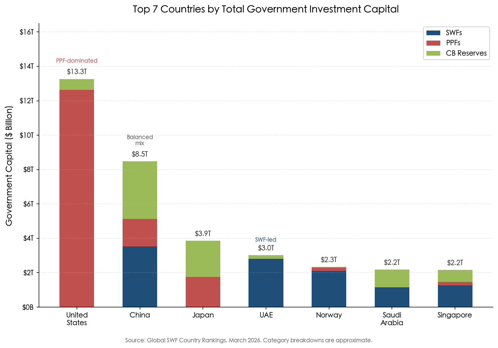

**Figure 1.3** — National-level aggregation of government investment capital for the seven largest countries, disaggregated by SWFs, PPFs, and central bank reserves. The chart highlights stark structural differences: U.S. dominance is PPF-driven (public pension plans), China maintains a balanced three-pillar structure, and the UAE's capital base is SWF-led. Data: Global SWF Country Rankings, March 2026.

This ranking reveals critical structural distinctions. American dominance stems from the aggregate scale of state and federal pension plans — CalPERS, CalSTRS, New York Common, the Federal Thrift Savings Plan, and dozens of others — rather than from a single mega-SWF. The United States has no operational sovereign wealth fund, though a February 2025 executive order from President Trump directed the establishment of one [White House EO](https://www.whitehouse.gov/presidential-actions/2025/02/a-plan-for-establishing-a-united-states-sovereign-wealth-fund/ "February 3, 2025"). Gulf states, by contrast, concentrate capital in a small number of exceptionally large SWFs funded by hydrocarbon revenues, with pension and central-bank assets forming a relatively modest complement. Norway and Singapore represent hybrid architectures — nations with both world-class SWFs and significant pension or reserve assets — while Japan's position derives almost entirely from GPIF and the Bank of Japan's reserve holdings.

## Funding Sources and Mission Differentiation

The origins of government capital fundamentally shape investment behavior, risk appetite, and portfolio construction. Three primary funding channels produce distinct investor archetypes with materially different characteristics.

**Commodity-revenue funds** — GPFG (oil and gas), PIF (oil), ADIA (oil), KIA (oil), QIA (gas and oil) — receive inflows directly tied to hydrocarbon production volumes and prices. These funds typically carry intergenerational savings or macroeconomic stabilization mandates, reflecting the finite nature of the underlying resource. Commodity-price volatility introduces a structural constraint: Saudi Arabia's fiscal breakeven oil price is estimated at approximately $90 per barrel, meaning that sustained Brent prices below the $70–80 range compress the capital available for PIF's ambitious deployment targets and may require the fund to rely more heavily on debt issuance and asset recycling.

**Fiscal- and trade-surplus funds** — GIC and Temasek (Singapore's persistent current-account surpluses), China's SAFE IC (accumulated trade surpluses and foreign-exchange intervention proceeds), South Korea's NPS (mandatory pension contributions from a high-savings economy) — are funded by structural economic surpluses or compulsory national savings. These institutions tend to operate with longer investment horizons and fewer political constraints on international diversification, though NPS's rapid asset growth has demonstrated that even surplus-funded entities can encounter macroeconomic management challenges at scale.

**Tax-revenue pension reserves** — GPIF (employer and employee contributions), CPP Investments (payroll contributions), and the U.S. public pension complex — are funded by payroll taxes or general fiscal contributions earmarked for retirement systems. Their investment mandates are constrained by actuarial obligations to future beneficiaries, typically resulting in more conservative allocation frameworks with explicit liability-matching considerations, regular asset-liability reviews, and a structural preference for liquid, benchmark-oriented portfolios.

## 2025: A Year of Milestones and New Entrants

Several developments in 2025 materially reshaped the sovereign investment landscape, marking the year as one of the most consequential in the sector's recent history.

**The $2 trillion milestone.** GPFG's crossing of $2 trillion in AUM marked both a psychological threshold and a structural one — a single fund managing assets equivalent to approximately 4.5 times Norway's GDP. The achievement reflected cumulative petroleum inflows since the fund's 1996 inception compounding alongside strong equity-market returns, with technology holdings (notably NVIDIA, Alphabet, and Broadcom) as leading contributors to the 2025 performance.

**Record Gulf deployment.** The seven major Gulf SWFs (PIF, ADIA, Mubadala, ADQ, KIA, QIA, and ICD) collectively invested **$119 billion in 2025, a 43% year-over-year increase** [Global SWF 2026](https://argaamplus.s3.amazonaws.com/3ffe681b-beab-49ba-9c30-bfe8ca8bd0bb.pdf "Gulf 7 invested $119 bn in 2025"). This surge concentrated in technology, AI infrastructure, and U.S.-oriented transactions, reflecting both a strategic realignment of Gulf investment priorities and geopolitical signaling in the context of the Trump administration's active Gulf engagement during 2025.

**Eleven new SWFs.** The year witnessed the creation of 11 new sovereign wealth funds — the highest single-year count in recent memory. The most consequential was Indonesia's Danantara, which consolidated oversight of major state-owned enterprises under a Temasek-inspired holding structure, and Abu Dhabi's L'IMAD, a new vehicle focused on emerging-market development investment. Each new fund arrives with distinct governance challenges and mandate ambiguities that will require years to resolve.

**The U.S. SWF executive order.** President Trump's February 3, 2025 executive order directing the creation of a United States Sovereign Wealth Fund represented a potentially transformative — if structurally challenging — development. Unlike commodity-exporting nations or fiscal-surplus economies, the United States runs persistent budget deficits, providing no obvious funding mechanism for a national investment vehicle. As of early 2026, the initiative remained in the planning stage, with the U.S. International Development Finance Corporation (DFC) exploring a quasi-SWF transformation leveraging its $200+ billion financing capacity [White House EO](https://www.whitehouse.gov/presidential-actions/2025/02/a-plan-for-establishing-a-united-states-sovereign-wealth-fund/ "February 3, 2025").

## Asset Allocation at a Glance

A summary of how the SWF universe deploys capital provides essential context for the detailed allocation analysis in Chapter 2. SSGA's March 2026 survey characterizes the aggregate SWF allocation as a roughly **30–40–30 framework**: approximately 29% in fixed income and cash, 38–39% in public equities, and 29% in private markets and alternatives. The private-markets share has risen from 25% at end-2020 to 29% at end-2025, driven primarily by commitments to digital infrastructure, data centers, and AI-related investments. Public-equity allocations, by contrast, have remained remarkably stable over the past decade at 38–39% [SSGA Sovereign Wealth Fund Trends](https://www.ssga.com/us/en/institutional/insights/trends-among-sovereign-wealth-funds "Investment trends among sovereign wealth funds, March 2026").

Fund size materially influences allocation patterns. Larger SWFs allocate approximately 30% to private markets and 30% to fixed income, while smaller SWFs allocate approximately 23% to private markets and 38% to fixed income — a differential reflecting the minimum ticket sizes and illiquidity tolerance required for meaningful alternative-asset deployment. Public-equity allocations show no significant variation by fund size, confirming that scale enables private-market access but does not fundamentally alter the role of listed equities in sovereign portfolios.

## Looking Ahead

The $60 trillion in state-owned investment capital documented in this chapter represents not merely a static stock but a dynamic, rapidly growing, and increasingly influential force in global markets. The structural drivers underpinning continued expansion — persistent Gulf hydrocarbon revenues (notwithstanding commodity-price cyclicality), the maturation of Asian pension systems, strong equity-market returns compounding existing portfolios, and an expanding roster of newly established funds — collectively point toward sustained growth over the medium term. Global SWF's projection of approximately $80 trillion by 2030 implies a compound annual growth rate of roughly 5.9%, a pace broadly consistent with the 2020–2025 trajectory and achievable absent a severe and prolonged global financial downturn.

The chapters that follow examine how this capital is allocated across asset classes (Chapter 2), where it flows geographically and sectorally (Chapter 3), what thematic priorities guide its deployment (Chapter 4), how its stewards are governed and held accountable (Chapter 5), how geopolitical forces constrain and redirect it (Chapter 6), and what shifts to anticipate in 2026–2027 (Chapter 7).

# Asset Allocation Strategies — How Government Investors Deploy Capital

The portfolio construction choices of the world's largest government investors reveal far more about their mandates, constraints, and convictions than any mission statement. Across sovereign wealth funds (SWFs), public pension reserve funds (PPFs), and central bank reserve managers, the period from mid-2025 through early 2026 witnessed a decisive tilt toward private markets and real assets, even as public equities continued to deliver outsized returns. Meanwhile, central bank reserve portfolios underwent their own structural transformation — a sustained shift away from US dollar-denominated assets and toward gold as a strategic reserve instrument. This chapter examines how the dominant state-owned investors deploy capital: the asset-class weights they carry, the structural forces reshaping those weights, and the emerging allocation frameworks that distinguish this era from the preceding decade.

## The Emerging 30–40–30 Framework

A structural pattern has crystallized across the SWF universe. According to the State Street Global Advisors (SSGA) March 2026 survey, the aggregate SWF allocation has converged on an approximate 30–40–30 framework: roughly 30% in fixed income and cash, 38–39% in public equities, and 29% in private markets and alternatives. The private-market share rose from 25% at end-2020 to 29% by end-2025, while public equities remained remarkably stable in the 38–39% band over the past decade [SSGA Sovereign Wealth Fund Trends](https://www.ssga.com/us/en/institutional/insights/trends-among-sovereign-wealth-funds "Investment trends among sovereign wealth funds, March 2026"). The following figure traces this decade-long convergence.

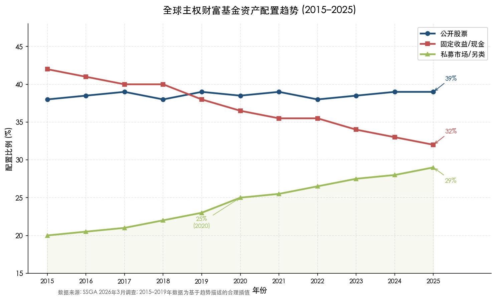

This aggregate, however, conceals significant variation by fund size. Large SWFs — those managing hundreds of billions or more — allocate approximately 30% to private markets and 30% to fixed income. Smaller SWFs maintain lower private-market exposure (~23%) and correspondingly higher fixed-income weightings (~38%), reflecting both liquidity constraints and more limited access to top-tier private fund managers [SSGA Sovereign Wealth Fund Trends](https://www.ssga.com/us/en/institutional/insights/trends-among-sovereign-wealth-funds "March 2026"). Public equity allocations show no statistically significant variation by fund size, suggesting a shared conviction in listed equities as a core return engine regardless of scale.

The aggregate private-market portfolio within SWFs now totals approximately $3.5 trillion. Private equity accounts for 47% of this sum — the dominant sub-category — while real estate's share has been declining steadily. The volume of SWF private-market transactions surged nearly 200% in 2025 compared to 2024, driven by large-scale co-investments and take-private deals [SSGA Sovereign Wealth Fund Trends](https://www.ssga.com/us/en/institutional/insights/trends-among-sovereign-wealth-funds "March 2026") [S&P Global Market Intelligence](https://www.spglobal.com/market-intelligence/en/news-insights/articles/2026/1/sovereign-wealth-fund-private-market-deals-soar-pension-fund-activity-slows-96403050 "SWF private market deals soar, January 2026").

## Fund-Level Allocation Profiles

### Norway's Government Pension Fund Global (GPFG)

The world's largest SWF — and the first to surpass $2 trillion in assets — operates the most equity-heavy mandate among major sovereign funds. As of end-2025, GPFG allocated 71.3% to equities (NOK 15,173 billion), 26.5% to fixed income (NOK 5,649 billion), 1.7% to unlisted real estate, and 0.4% to unlisted renewable energy infrastructure. The equity share sits at the upper end of the fund's 60–80% mandate range, propelled by a 19.3% equity return during the year [NBIM Annual Report 2025](https://www.nbim.no/en/news-and-insights/reports/2025/annual-report-2025/web-report-annual-report-2025/ "Web report Annual report 2025").

The infrastructure allocation, while still modest at 0.4%, represents a fourfold increase from 0.1% at end-2024 — a trajectory that signals the fund's growing appetite for real assets. Landmark 2025 transactions included a €4.5 billion investment in TenneT, Germany's largest electricity transmission operator (alongside APG and GIC in a combined €9.5 billion transaction for a 46% stake), and a $1.5 billion commitment to Brookfield's Global Transition Fund II. The fund's infrastructure mandate permits up to 2% of total assets (~$42 billion at current scale), leaving substantial room for further deployment in subsequent years [NBIM Annual Report 2025](https://www.nbim.no/en/news-and-insights/reports/2025/annual-report-2025/web-report-annual-report-2025/ "Web report Annual report 2025").

### Japan's Government Pension Investment Fund (GPIF)

The world's largest public pension fund presents a strikingly different allocation philosophy. As of December 31, 2025 (the third quarter of fiscal year 2025), GPIF held ¥294.8 trillion (~$1.9 trillion) and adhered closely to its equal-weight policy portfolio: domestic bonds 25.29%, domestic equities 24.69%, foreign bonds 24.67%, and foreign equities 25.34%. Alternative investments stood at just 1.70%, well within the 5% ceiling. A March 2025 policy review reaffirmed the 25/25/25/25 target allocation [GPIF Q3 FY2025](https://www.gpif.go.jp/en/performance/75943515gpif/2025_3Q_0206_en.pdf "Investment results for 3Q of fiscal 2025").

GPIF's allocation philosophy is essentially passive and symmetric — a deliberate contrast to the active, equity-overweight approach of GPFG or the alternatives-heavy models of Gulf funds. With approximately 90% of assets under passive management, the fund achieves its balanced exposure at a management cost of roughly 1 basis point, among the lowest in the global institutional universe. This ultra-low-cost model reflects a design choice: GPIF prioritizes stable, broad-based market exposure over alpha generation, accepting modest tracking error in exchange for fee efficiency at a scale where even small cost differences translate into billions of yen annually.

### South Korea's National Pension Service (NPS)

NPS crossed the $1 trillion threshold in 2025, with assets reaching KRW 1,473 trillion (~$1.03 trillion) and a record annual return of approximately 20% — the highest in its history. The fund operates with a more diversified and actively managed allocation than GPIF. As of December 31, 2025, the portfolio comprised: domestic equities 18.1%, domestic bonds 20.9%, overseas equities 37.8%, overseas bonds 6.9%, and alternatives 16.0% [NPS Investment Management](https://fund.nps.or.kr/eng/orinsm/ptflobrkdwn/getOHFD0002M0.do "NPS Our Portfolio").

A notable January 2026 policy adjustment shifted the target portfolio: domestic equities rose +0.5 percentage points to 14.9%, domestic bonds increased +1.2 percentage points to 24.9%, while overseas equities were reduced −1.7 percentage points to 37.2%. The stated rationale centers on the fund's rapid expansion — from KRW 713 trillion in 2019 to KRW 1,438 trillion in 2025 — which created growing foreign exchange procurement burdens on the Korean won. This constitutes a rare instance of a fund's sheer scale producing macroeconomic feedback loops that constrain its own allocation freedom [Chosun Daily](https://www.chosun.com/english/market-money-en/2026/01/26/XKJ7HV24XFFQLN4CDDMKZ7CYYM/ "NPS Raises Domestic Stock Allocation, January 2026").

### Singapore's GIC

GIC reported a notable rebalancing in its fiscal year ending March 31, 2025. The fund's allocation shifted to 51% equities (encompassing both public and private equities, up from 46% in 2024), 26% fixed income, and 23% real assets. This 5-percentage-point increase in equity weighting — largely driven by rising US allocations — stands out as one of the most significant single-year moves among major sovereign investors. Geographically, the Americas rose to 49% of the portfolio (from 44% in 2024), Asia Pacific declined to 24%, and EMEA accounted for 20%. GIC's reference portfolio is benchmarked against a 65% global equities / 35% global bonds composite, reflecting an inherently growth-oriented mandate. Over 20 years, the fund has delivered an annualized real return of 3.8% [GIC Portfolio](https://www.gic.com.sg/our-portfolio/ "GIC Our Portfolio") [Top1000funds](https://www.top1000funds.com/2025/07/gic-ups-us-equities-allocation-despite-valuation-worries/ "GIC ups US equities allocation, July 2025").

### Temasek

Temasek, Singapore's other major sovereign investor, maintains a distinctive portfolio heavily tilted toward private and unlisted assets. As of March 31, 2025, the split was 51% listed/liquid assets and 49% unlisted assets. By sector, transportation and industrials comprised 22%, financial services 22%, technology, media, and telecommunications (TMT) 20%, and consumer and real estate 13%. A one-year total shareholder return of 11.8% (in Singapore dollar terms) reflected strong performance across the portfolio [Temasek Review 2025](https://www.temasekreview.com.sg/performance-and-portfolio.html "Temasek Performance & Portfolio").

Temasek's private equity allocation ranks among the highest of any sovereign investor globally. PEI rankings place Temasek first among SWFs for PE exposure, at approximately 52% of the portfolio (~$148 billion). In a further expansion into alternative credit, Temasek launched Aranda Principal Strategies in 2025, a private credit platform seeded with approximately S$10 billion. The creation of a dedicated private credit vehicle signals the fund's conviction that this asset class represents a durable structural allocation category rather than a cyclical opportunity [Temasek Review 2025](https://www.temasekreview.com.sg/performance-and-portfolio.html "Temasek Performance & Portfolio").

### Abu Dhabi Investment Authority (ADIA)

ADIA discloses long-term strategic allocation ranges rather than point-in-time portfolio weights — a practice unique among the major funds that reflects both its institutional culture and the sovereign's preference for discretion. The published bands are: developed-market equities 32–42%, emerging-market equities 7–15%, government bonds 7–15%, credit 2–7%, private equity 12–17%, real estate 5–10%, and infrastructure 2–7%. During 2024–2025, ADIA deployed heavily in PE secondaries markets, consistent with an allocation toward the upper end of the 12–17% PE range [ADIA Investments](https://www.adia.ae/en/investments "ADIA Investments — Strategy"). The width of these bands — spanning 10 percentage points for equities and 5 percentage points for alternatives — affords the fund considerable tactical flexibility within a broadly stable strategic framework.

### Saudi Arabia's Public Investment Fund (PIF)

PIF's allocation profile is shaped by its dual mandate: generating financial returns and executing Saudi Vision 2030 economic diversification. This dual purpose produces a distinctively domestic-heavy portfolio. PIF's Tadawul (Saudi stock exchange) holdings reached approximately SAR 1.5 trillion (~$400 billion) by Q4 2025, while its US equity portfolio grew to $23.8 billion by mid-2025, with a notable rotation toward semiconductor and healthcare stocks. The fund deployed $36.2 billion across the full year, including the $28.8 billion landmark EA Sports acquisition alongside Silver Lake and Affinity [Global SWF 2026 Annual Report](https://argaamplus.s3.amazonaws.com/3ffe681b-beab-49ba-9c30-bfe8ca8bd0bb.pdf "PIF crowned lead investor of 2025").

PIF does not publish a comprehensive asset-class breakdown comparable to those of GPFG or GIC. The fund's rapid growth trajectory — AUM reached $913 billion at end-2024 (up 19% year-on-year) and reportedly crossed $1 trillion by mid-2025 — is fueled by a combination of government capital injections, Aramco dividend transfers, and investment returns [PIF Annual Report 2024](https://www.pif.gov.sa/en/news-and-insights/press-releases/2025/pif-continued-to-drive-the-economic-transformation-of-saudi-arabia-while-shaping-global-economies-in-2024/ "PIF 2024 Annual Report — AuM grew 19% to $913 bn"). The absence of granular disclosure, however, limits comparative analysis of PIF's allocation relative to its peers.

### Mubadala Investment Company

Among major Gulf funds, Mubadala maintains the most alternatives-heavy allocation. As of end-2024, the portfolio comprised: private equity 40%, public equities 23%, real estate and infrastructure 17%, other alternatives 15%, and credit 5%. This PE-dominated structure reflects Mubadala's origins as an Abu Dhabi economic development vehicle and its subsequent evolution into a sophisticated multi-asset global investor. The fund deployed a record $33.7 billion across 40 transactions in 2025 and assembled a $20 billion private credit portfolio — ranking it among the largest sovereign credit books globally [Mubadala 2024 Performance](https://annual2024.mubadala.com/2024-financial-performance "Mubadala 2024 Performance Highlights") [Global SWF 2026 Annual Report](https://argaamplus.s3.amazonaws.com/3ffe681b-beab-49ba-9c30-bfe8ca8bd0bb.pdf "Mubadala record $33.7 bn").

The breadth of Mubadala's deployment — spanning technology, energy transition, financial infrastructure, and healthcare across multiple continents — exemplifies the "platform investor" model increasingly adopted by Gulf sovereigns, whereby the fund simultaneously pursues financial returns and builds strategic industrial positions.

### China Investment Corporation (CIC)

CIC's portfolio, based on its 2024 annual report, breaks down as: public equities 34.65%, alternatives 48.49%, fixed income 15.53%, and cash and others 1.33%. The overwhelming alternatives weighting — nearly half the portfolio — makes CIC one of the most alternatives-concentrated major sovereign investors globally. Total assets reached $1.57 trillion at end-2024, with net assets of $1.37 trillion and profit growth of 30.4% year-on-year [Top1000funds CIC Profile](https://www.top1000funds.com/asset_owner/china-investment-corporation-cic/ "CIC asset allocation as of December 31, 2024") [Global SWF on CIC](https://globalswf.com/news/cic-assets-hit-us-1-57trn-as-leverage-rises-and-transparency-declines "CIC assets hit US$1.57trn, December 11, 2025").

CIC's transparency has, however, been declining. The 2024 annual report provided fewer allocation details than earlier editions, and leverage appears to have increased. Critically, the fund does not disaggregate its alternatives bucket into sub-categories such as private equity, real estate, hedge funds, or infrastructure — a limitation that constrains the precision of cross-fund comparative analysis.

### CPP Investments

Canada Pension Plan Investment Board (CPP Investments) ended fiscal 2025 (March 31, 2025) with net assets of C$714.4 billion and a net return of 9.3%, with a 10-year annualized net return of 8.3%. The fund operates a multi-asset class platform with granular allocation: private equities 29%, public equities 29%, government bonds 15%, credit 11%, infrastructure 9%, and real estate 7%. The equal weighting between public and private equities is a hallmark of the Canadian "Maple 8" institutional model, which emphasizes direct investment capabilities and long-horizon illiquidity capture [CPP Investments Fiscal 2025](https://www.cppinvestments.com/for-canadians/year-end-2025/ "Fiscal 2025 Year in Review — Asset Class Composition").

CPP Investments' major 2025 transactions exemplify the convergence of infrastructure and technology themes that is reshaping sovereign capital allocation: a $2.4 billion commitment to a $15 billion+ joint venture with Equinix and GIC for US hyperscale data centers, and participation in the Blackstone-led acquisition of AirTrunk (12% stake, implied enterprise value exceeding A$24 billion). These transactions underscore how digital infrastructure has emerged as the dominant intersection of the technology and real-asset allocation categories [CPP Investments FY2025](https://www.cppinvestments.com/newsroom/cpp-investments-net-assets-total-714-4-billion-at-2025-fiscal-year-end/ "May 21, 2025").

## Comparative Allocation Patterns

Placing these profiles side by side reveals a spectrum of allocation philosophies driven by mandate design, liability structure, and sovereign context. The following figure and table summarize the key dimensions of divergence.

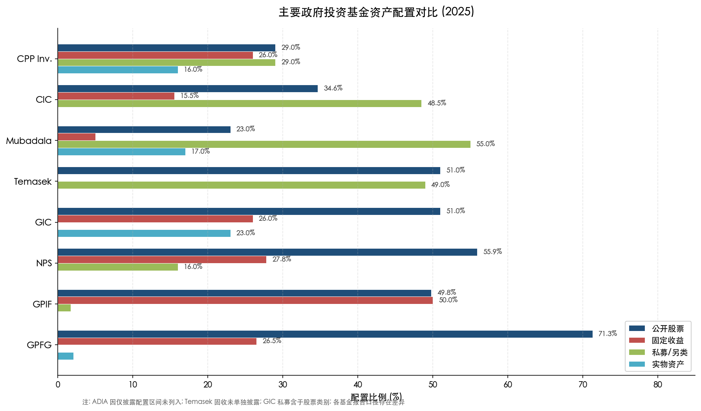

| Fund | Public Equities | Fixed Income | Alternatives/Private | Real Assets | Other |
|------|----------------|-------------|---------------------|-------------|-------|
| GPFG | 71.3% | 26.5% | — | 2.1% (RE + infra) | — |
| GPIF | 49.8% (dom+fgn) | 50.0% (dom+fgn) | 1.7% | — | — |
| NPS | 55.9% (dom+fgn) | 27.8% (dom+fgn) | 16.0% | (in alts) | — |
| GIC | 51% | 26% | (in equities) | 23% | — |
| Temasek | ~51% (listed) | — | ~49% (unlisted) | (in unlisted) | — |
| ADIA | 39–57% (ranges) | 9–22% (ranges) | 12–17% PE | 7–17% (RE+infra) | — |
| PIF | Domestic-heavy | Undisclosed | Undisclosed | Undisclosed | — |
| Mubadala | 23% | 5% (credit) | 40% PE | 17% (RE+infra) | 15% other alts |
| CIC | 34.65% | 15.53% | 48.49% | (in alts) | 1.33% cash |
| CPP | 29% | 26% (bonds+credit) | 29% PE | 16% (infra+RE) | — |

*Note: ADIA figures represent the midpoints and bounds of disclosed strategic allocation ranges. Temasek does not separately disclose fixed income. GIC classifies private equity within its equities category. Reporting periods and classification methodologies vary across funds.*

Two distinct archetypes emerge from this comparison. The first is the **equity-dominant model**, exemplified by GPFG (71.3% equities) and GIC (51% equities), where listed markets serve as the primary return engine and the mandate permits high equity risk budgets. The second is the **alternatives-dominant model**, typified by Mubadala (40% PE plus 15% other alternatives), CIC (48.5% alternatives), and Temasek (49% unlisted), where return generation relies heavily on illiquidity premia and direct investment capabilities.

GPIF occupies a category of its own: the **symmetric-passive model**, where equal weighting across four asset classes and near-universal passive implementation minimize both active risk and management costs. NPS and CPP represent a **balanced-active hybrid**, maintaining meaningful allocations to both public and private markets while deploying active management strategies across both domains. These archetypal distinctions are not merely descriptive; they reflect fundamentally different views on the appropriate trade-off between liquidity, cost, and expected return for long-duration sovereign capital.

## Central Bank Reserve Allocation: The Gold and Dollar Dynamics

Central bank reserve portfolios — collectively holding approximately $13.0 trillion in foreign exchange reserves as of Q3 2025 — operate under fundamentally different constraints than SWFs and pension funds. Liquidity, safety, and currency management take precedence over return maximization. Yet within these constraints, two powerful and interrelated shifts are reshaping the composition of official reserves.

### The Structural De-Dollarization Trend

IMF Currency Composition of Official Foreign Exchange Reserves (COFER) data reveal a persistent decline in the US dollar's share of allocated reserves: from approximately 65% in 2015 to 62% at end-2018, and further to 56.92% by Q3 2025. The euro maintained a relatively stable share at 20.33%, while the Chinese renminbi reached 1.93%. The IMF adopted a new methodology beginning with Q3 2025 data, eliminating the previously unallocated portion of reserves and thereby improving the precision of currency composition estimates [IMF COFER](https://data.imf.org/en/datasets/IMF.STA:COFER "Currency Composition of Official Foreign Exchange Reserves") [IMF Data Brief](https://data.imf.org/en/news/imf-data-brief-december-19 "IMF COFER Q3 2025, December 19, 2025").

This de-dollarization is gradual but structural, driven by a combination of reserve diversification motives and geopolitical risk reassessment. The 2022 freezing of approximately $280–330 billion in Russian central bank reserves held in Western financial infrastructure demonstrated that sovereign assets denominated in the dollar-euro system are not inviolable — a precedent that accelerated non-aligned nations' reassessment of reserve composition and custodial arrangements.

### Central Bank Gold Accumulation

The most tangible expression of reserve diversification is gold purchasing. Central banks collectively added 863.3 tonnes of gold in 2025, a figure that was 21% below the 2024 peak but still far above the 2010–2021 annual average of 473 tonnes — marking the fourth consecutive year of purchases well in excess of long-term historical norms. The fourth quarter alone accounted for 230 tonnes [WGC Gold Demand Trends 2025](https://www.gold.org/goldhub/research/gold-demand-trends/gold-demand-trends-full-year-2025/central-banks "Central Banks — Gold Demand Trends Full Year 2025").

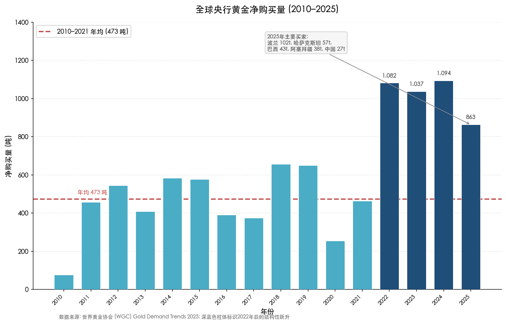

The largest buyers in 2025 spanned a striking geographic range: Poland (102 tonnes), Kazakhstan (57 tonnes), Brazil (43 tonnes), Azerbaijan's SOFAZ (38 tonnes), and the People's Bank of China (27 tonnes, bringing total holdings to 2,306 tonnes, approximately 9% of total reserves). Poland's decision to raise its gold-to-reserve ratio target from 20% to 30% is particularly noteworthy: it signals that even NATO-aligned European central banks view gold as an essential hedge against systemic uncertainty, rather than a relic of pre-Bretton Woods monetary architecture [WGC Gold Demand Trends 2025](https://www.gold.org/goldhub/research/gold-demand-trends/gold-demand-trends-full-year-2025/central-banks "Central Banks — Gold Demand Trends Full Year 2025").

Saudi Arabia's central bank (SAMA) also reflects this trend at the SWF-central bank interface. SAMA's reserve assets reached SAR 1.73 trillion (~$461 billion) by end-2025, up 5.3% year-on-year, with foreign securities comprising 58.6% of the total [Saudi Gazette](https://saudigazette.com.sa/article/660031 "SAMA reserve assets surge 5.3% to SR1.73 tn").

## Structural Drivers of Allocation Shifts

Five interconnected forces are reshaping how government investors deploy capital in this period.

**1. AI and Digital Infrastructure as the Primary Private-Market Growth Driver.** The surge in private-market allocation — from 25% to 29% of SWF assets in five years — is substantially attributable to investments in data centers, cloud infrastructure, and AI-related enterprises. Funds as diverse as CPP Investments, GIC, Mubadala, and PIF are channeling capital into hyperscale data center joint ventures, AI compute infrastructure, and technology platform equity. The allocation-level impact is unambiguous: digital infrastructure has become the primary engine lifting private-market weightings across the sovereign investor universe.

**2. Monetary Easing Slower Than Expected.** The anticipated global rate-cutting cycle materialized more slowly than many funds had positioned for in early 2025. Persistent inflation — particularly in the United States, where tariff uncertainty added an upward bias to price expectations — kept long-end rates elevated, compressing fixed-income total returns and discouraging duration extension. For funds with large bond allocations (GPIF, NPS), this created a performance drag; for equity-heavy funds (GPFG), it reinforced the relative attractiveness of equity risk premia.

**3. Structural Reserve Diversification.** Central bank gold purchases and the gradual erosion of the dollar's reserve share are not cyclical phenomena but structural responses to a changed geopolitical risk environment. The freezing of Russian reserves demonstrated that the international monetary infrastructure can be weaponized as a policy tool, prompting a broad re-evaluation of counterparty and custodial risk that extends well beyond adversarial states to include ostensibly non-aligned reserve managers.

**4. Fund Scale as an Allocation Constraint.** NPS's January 2026 reallocation illustrates a constraint that will become increasingly common as government funds grow: the macroeconomic footprint of foreign asset purchases. When a single fund's overseas equity allocation exceeds 37% of a trillion-dollar portfolio, the resulting foreign exchange flows can exert meaningful pressure on the domestic currency, creating a self-reinforcing cycle that constrains further international diversification. This represents a practical upper bound on globalization of asset allocation for the largest funds domiciled in smaller open economies.

**5. The Rise of Private Credit as a Distinct Asset Class.** Private credit emerged as a recognized allocation category in 2025, distinct from both traditional fixed income and private equity. Temasek's Aranda Principal Strategies (seeded with ~S$10 billion), Mubadala's $20 billion private credit book, and CPP Investments' direct lending to technology firms collectively signal a structural shift: sovereign investors are increasingly disintermediating banks to provide financing directly to asset-rich, capital-intensive enterprises — particularly those operating digital infrastructure. This trend reflects both the scale of capital required by data center and AI compute buildouts and the attractive risk-adjusted returns available to patient, large-ticket lenders in a market where traditional bank balance sheets face regulatory constraints.

# Geographic and Sectoral Investment Patterns

The direction of government capital flows — across borders and into specific economic sectors — reveals as much about sovereign strategy as the asset-class allocations examined in the preceding chapter. The period from mid-2025 through early 2026 produced a striking geographic concentration: the United States captured a historically unprecedented share of sovereign investment activity, Gulf exporters cemented their position as the world's dominant net capital exporters, and emerging markets — China in particular — experienced a sharp contraction in inbound sovereign capital. On the sectoral dimension, artificial intelligence and digitalisation emerged as the single largest thematic driver, with sovereign-owned investors deploying $66 billion into AI-related investments in 2025 alone [Global SWF 2026 Annual Report](https://argaamplus.s3.amazonaws.com/3ffe681b-beab-49ba-9c30-bfe8ca8bd0bb.pdf "State-Owned Investors: from Scale to Strategy, January 2026"). This chapter maps these geographic and sectoral flows in detail, identifies the structural forces underpinning them, and assesses the implications for both capital-exporting and capital-receiving economies.

## The Geographic Distribution of $60 Trillion

The global stock of state-owned investor assets — $60.0 trillion across SWFs, public pension funds (PPFs), and central banks as of end-2025 — is distributed unevenly across regions. Over one-third of these assets are domiciled in Asia, reflecting the combined weight of China's diversified sovereign capital base ($8.5 trillion spanning SWFs, PPFs, and central bank reserves), Japan's GPIF and BOJ reserves ($3.9 trillion), and South Korea's NPS ($1.0 trillion). North America accounts for approximately 26% of the total, predominantly through the expansive US public pension system ($12.6 trillion), while Europe holds 19%, anchored by Norway's GPFG ($2.1 trillion). The Middle East and North Africa (MENA) region accounts for roughly 15% of the global total, yet its share is disproportionately concentrated in SWFs rather than pension funds or central bank reserves [Global SWF 2026 Annual Report](https://argaamplus.s3.amazonaws.com/3ffe681b-beab-49ba-9c30-bfe8ca8bd0bb.pdf "Geographic breakdown of $60 tn, January 2026").

Crucially, this distribution of asset ownership does not correspond to the geographic distribution of investment deployment. The most consequential pattern in 2025 was the widening divergence between where sovereign capital is managed and where it is ultimately deployed.

## The United States as the Overwhelming Destination

In 2025, the United States became the single most dominant destination for sovereign investment capital in the modern era of state-owned investing. SWFs and PPFs directed $131.8 billion into US-domiciled assets, representing 47% of total global sovereign deal activity. Including broader transaction categories, the figure exceeds $140 billion and the US share surpasses 50% [Global SWF 2026 Annual Report](https://argaamplus.s3.amazonaws.com/3ffe681b-beab-49ba-9c30-bfe8ca8bd0bb.pdf "US received $132 bn or 47% of total") [Global SWF](https://globalswf.com/news/the-us-as-the-decision-market-why-2025-marked-a-structural-break-in-sovereign-investment "The US as the Decision Market, January 2026"). This represented nearly a doubling from the $68.9 billion invested in the US in 2024.

Three structural forces converged to produce this concentration. First, the AI infrastructure investment cycle created an asset class — hyperscale data centres, GPU compute capacity, and AI software platforms — that is overwhelmingly domiciled in the United States. Second, the Trump administration actively courted Gulf sovereign capital through a series of high-profile bilateral investment frameworks. During President Trump's May 2025 Gulf tour, the UAE committed to a 10-year, $1.4 trillion US investment framework spanning AI infrastructure, semiconductors, and energy; QIA pledged $500 billion in US investment over the coming decade; and Saudi Arabia signed $600 billion in investment agreements. The White House claimed cumulative Gulf commitments exceeding $2 trillion [White House Fact Sheet](https://www.whitehouse.gov/fact-sheets/2025/05/fact-sheet-president-donald-j-trump-secures-200-billion-in-new-u-s-uae-deals-and-accelerates-previously-committed-1-4-trillion-uae-investment/ "May 16, 2025") [Reuters](https://www.reuters.com/world/middle-east/qatars-qia-plans-least-double-annual-us-investments-over-next-decade-2025-05-20/ "QIA plans to at least double annual US investments, May 2025"). Third, strong US equity market performance — the S&P 500 returned approximately 23% in 2025 — generated a self-reinforcing cycle of capital appreciation and fresh inflows.

Fund-level data confirms this gravitational pull toward the United States across virtually every major sovereign investor:

- **GPFG** held 52.9% of its total assets (~$1.1 trillion) in the United States at end-2025, with US equities accounting for 54.7% of the equity portfolio. NVIDIA, Alphabet, and Broadcom were the single largest contributors to equity returns [NBIM Annual Report 2025](https://www.nbim.no/en/news-and-insights/reports/2025/annual-report-2025/web-report-annual-report-2025/ "Annual report 2025").
- **GIC** increased its Americas allocation from 44% to 49% (+5 percentage points) in a single fiscal year ending March 2025, reflecting aggressive deployment into US AI and technology assets [GIC Annual Report FY2025](https://www.gic.com.sg/uploads/2025/07/GIC_AR_2024-25_PRINT.pdf "Geographic Mix").
- **Temasek** expanded its Americas exposure from 14% in 2017 to 24% by March 2025, a near-doubling over eight years [Temasek Review 2025](https://www.temasekreview.com.sg/performance-and-portfolio.html "Temasek Performance & Portfolio").

This concentration carries material risk. As Norway's GPFG expert committee noted in the 2026 government white paper, "heightened geopolitical risk calls for continued broad geographic diversification" — a recommendation that sits in tension with the fund's own 53% US weighting [Norwegian Government Meld. St. 7 (2025–2026)](https://www.regjeringen.no/contentassets/f143d0a97dae41e38658800102dcd6d8/en-gb/pdfs/meld-st-7-20252026-excecutive-summary.pdf "Expert Council on geopolitical diversification").

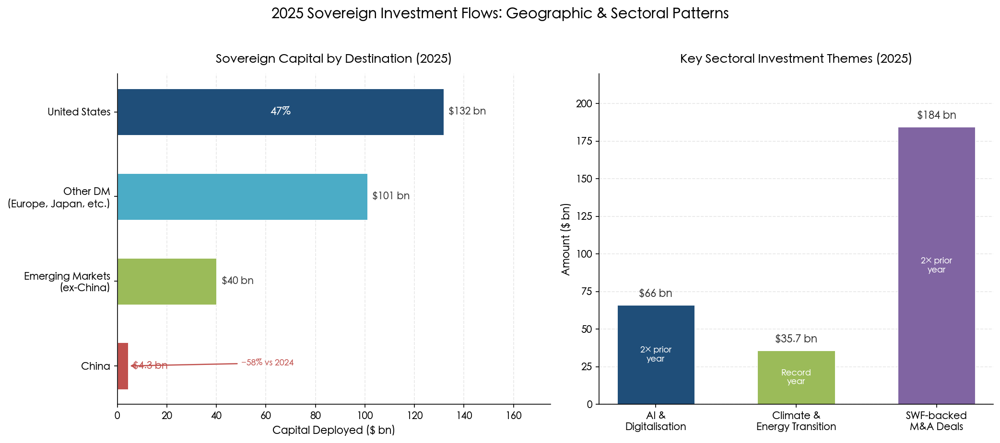

The left panel of the figure above illustrates the overwhelming concentration of sovereign capital in the United States ($132 billion, 47% of total flows), while emerging markets excluding China received $40 billion and China itself attracted only $4.3 billion — a 58% year-on-year decline. The right panel summarises the three dominant sectoral investment themes: AI and digitalisation ($66 billion, doubling the prior year), climate and energy transition ($35.7 billion, a record), and SWF-backed M&A ($184 billion, also doubling year-on-year).

## The Emerging Market Retreat — and the China Question

While developed markets absorbed the overwhelming majority of sovereign capital in 2025, emerging markets experienced a pronounced contraction. Emerging economies received just 16% of global sovereign investment during 2025, a decline of 26% from 2024 levels. China, India, Indonesia, and Saudi Arabia were among the weakest recipients of inbound sovereign capital [Global SWF 2026 Annual Report](https://argaamplus.s3.amazonaws.com/3ffe681b-beab-49ba-9c30-bfe8ca8bd0bb.pdf "EM only 16% of total, down 26%").

The decline was particularly acute in China. Sovereign-owned investors directed only $4.3 billion into Chinese assets in 2025, down from $10.3 billion in 2024 — a reduction of more than 58% [Global SWF 2026 Annual Report](https://argaamplus.s3.amazonaws.com/3ffe681b-beab-49ba-9c30-bfe8ca8bd0bb.pdf "Investments into China fell to $4.3 bn"). This collapse in inbound sovereign capital reflects the confluence of elevated geopolitical risk, regulatory opacity, and a strategic portfolio recalibration away from China and toward the United States.

Fund-level disclosures confirm the trend. Temasek reduced its China exposure from a peak of 29% in 2020 to 18% by March 2025, while simultaneously increasing its Americas exposure from 14% to 24% over the same period [Temasek Review 2025](https://www.temasekreview.com.sg/performance-and-portfolio.html "Temasek Performance & Portfolio"). GIC's Americas allocation jumped 5 percentage points in a single year, from 44% to 49%, with a corresponding decline in Asia-Pacific exposure from 28% to 24% [GIC Annual Report FY2025](https://www.gic.com.sg/uploads/2025/07/GIC_AR_2024-25_PRINT.pdf "Geographic Mix"). Among Canadian pension funds, CPP Investments reduced its renminbi-denominated assets from approximately 10% to 5% of the portfolio over two years, OTPP closed its dedicated China equities team, and CDPQ reportedly sought to sell approximately US$1.5 billion in Chinese private equity LP stakes in mid-2025 [Financial Post](https://financialpost.com/fp-finance/cppib-china-exposure-tumbles-geopolitical-risks-climb "CPP China exposure tumbles, May 2024").

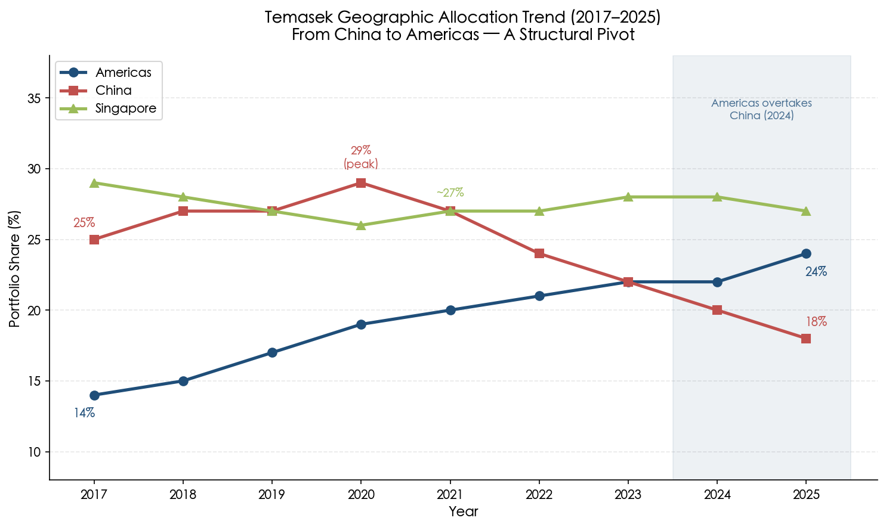

The figure above traces Temasek's geographic rebalancing over eight years. Americas exposure rose steadily from 14% in 2017 to 24% by March 2025, while China allocation peaked at 29% in 2020 before declining to 18% — with the two lines crossing in 2024. This trajectory represents one of the most visible structural pivots among major sovereign investors, reflecting the broader shift of institutional capital from China toward the United States.

A notable tension exists between stated intentions and actual capital flows. The Invesco 2025 Global Sovereign Asset Management Study — based on interviews with 141 professionals managing $27 trillion — found that 59% of respondents rated China as a high or medium priority emerging-market destination, and 59% expected to increase China allocations over the next five years [Invesco GSAM Study 2025](https://www.invesco.com/apac/en/institutional/insights/press-and-media/2025/sovereign-investors-embrace-active-management-renew-interest-in-china-amid-global-fragmentation-and-policy-uncertainty.html "July 14, 2025"). The actual flow data presents a starkly different picture. We believe this divergence reflects a structural lag: investment professionals recognise China's long-term growth potential but face governance, compliance, and political constraints that impede deployment.

## Home Bias and Domestic Mandates

Not all sovereign capital flows cross borders. Several of the world's largest government investors maintain significant — in some cases dominant — domestic investment portfolios, reflecting mandates that blend financial returns with national economic development objectives.

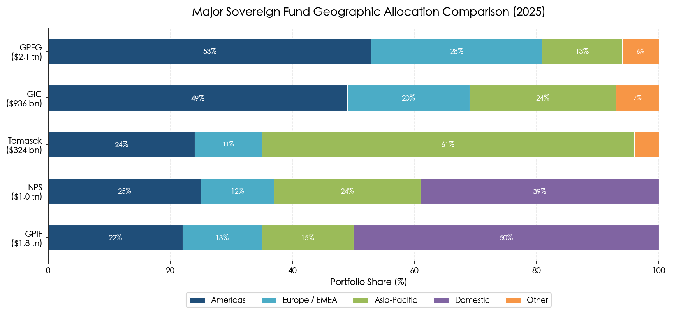

The figure above compares the geographic allocation structures of five major sovereign funds. GPFG and GIC deploy capital almost entirely outside their home markets, with Americas exposure of 53% and 49% respectively. By contrast, GPIF allocates 50% domestically and NPS retains 39% in Korean assets, reflecting explicit policy mandates to support domestic bond and equity markets. Temasek's portfolio is tilted heavily toward Asia-Pacific (61%), consistent with its heritage as a holding company for Singaporean strategic enterprises.

The Saudi Public Investment Fund (PIF) represents the most pronounced case of domestic orientation. Its domestic holdings on the Tadawul stock exchange stood at approximately SAR 1.5 trillion (~$400 billion) as of late 2025, constituting a substantial portion of its total $1 trillion-plus AUM. PIF's dual mandate — generating long-term financial returns while executing Saudi Arabia's Vision 2030 economic transformation — inherently tilts the portfolio toward domestic deployment [Global SWF 2026 Annual Report](https://argaamplus.s3.amazonaws.com/3ffe681b-beab-49ba-9c30-bfe8ca8bd0bb.pdf "PIF domestic holdings"). Its international exposure, while growing (a US equity portfolio of $23.8 billion as of Q2 2025), remains a secondary allocation relative to the domestic investment programme.

At the opposite extreme, Norway's GPFG invests zero percent domestically by mandate — a deliberate design to prevent overheating the Norwegian economy with petroleum wealth. This "zero home bias" model is unique among major sovereign funds and reflects the fund's singular focus on intergenerational financial savings [NBIM Annual Report 2025](https://www.nbim.no/en/news-and-insights/reports/2025/annual-report-2025/web-report-annual-report-2025/ "Annual report 2025").

Between these poles lies a spectrum of approaches. Japan's GPIF, while investing 50% of its portfolio abroad (25% foreign equities, 25% foreign bonds), retains a symmetrical 50% domestic allocation that implicitly supports Japanese government bond markets and domestic equity liquidity. South Korea's NPS confronted the macroeconomic consequences of its own growth in January 2026, when it adjusted its target portfolio to increase domestic allocations (+0.5 percentage points domestic equities, +1.2 percentage points domestic bonds) while reducing overseas equities by 1.7 percentage points to 37.2%. The fund's assets had doubled from KRW 713 trillion in 2019 to KRW 1,438 trillion in 2025, and the resulting foreign exchange procurement demands were placing measurable strain on the Korean won [Chosun Daily](https://www.chosun.com/english/market-money-en/2026/01/26/XKJ7HV24XFFQLN4CDDMKZ7CYYM/ "NPS Raises Domestic Stock Allocation, January 2026"). This represents a rare instance of a sovereign fund's sheer scale creating a macroeconomic feedback loop that constrains its own geographic diversification.

Singapore's GIC and Temasek both invest globally from a city-state with limited domestic investable assets, making them functionally international portfolios. GIC's geographic allocation — 49% Americas, 24% Asia-Pacific, 20% EMEA — reflects pure opportunity-seeking rather than home-country obligations [GIC Annual Report FY2025](https://www.gic.com.sg/uploads/2025/07/GIC_AR_2024-25_PRINT.pdf "Geographic Mix").

## Sectoral Investment Patterns: Technology Dominates, Climate Accelerates

The sectoral composition of sovereign investment in 2025 was reshaped by two overriding themes: the AI infrastructure build-out and the continued acceleration of climate-related capital deployment.

### Technology and AI: The Primary Gravitational Force

Sovereign-owned investors collectively deployed $66 billion into AI and digitalisation in 2025, more than doubling the prior year's total. This figure encompasses direct equity investments in AI companies, data centre acquisitions, GPU compute infrastructure, and commitments to technology-focused funds [Global SWF 2026 Annual Report](https://argaamplus.s3.amazonaws.com/3ffe681b-beab-49ba-9c30-bfe8ca8bd0bb.pdf "State-Owned Investors: from Scale to Strategy, January 2026"). Middle Eastern sovereign funds spearheaded the digital investment surge: Mubadala invested $12.9 billion in AI and digitalisation, Kuwait Investment Authority (KIA) committed $6 billion, and Qatar Investment Authority (QIA) deployed $4 billion [Global SWF 2026 Annual Report](https://argaamplus.s3.amazonaws.com/3ffe681b-beab-49ba-9c30-bfe8ca8bd0bb.pdf "Gulf AI and digitalisation spending").

The technology tilt is evident at the individual fund level. GPFG's equity portfolio allocated 28.5% to the technology sector at end-2025, making it the single largest sectoral exposure — ahead of financial services (16.9%), consumer discretionary (13.2%), industrials (12.7%), and healthcare (9.3%). The technology sector was also the primary driver of GPFG's 19.3% equity return, with NVIDIA alone contributing substantial performance. Financial services delivered the highest sectoral return (32.4%), while real estate was the weakest performer (1.6%) [NBIM Annual Report 2025](https://www.nbim.no/en/news-and-insights/reports/2025/annual-report-2025/web-report-annual-report-2025/ "Equity sector allocation").

Temasek's portfolio reflected a comparable technology orientation, with the TMT (technology, media, and telecommunications) sector comprising 20% of net portfolio value as of March 2025. Major FY2025 investments included positions in Alphabet, Amazon, Microsoft, NVIDIA, and participation in Databricks' $15.25 billion financing round [Temasek Review 2025](https://www.temasekreview.com.sg/performance-and-portfolio.html "Temasek Performance & Portfolio").

On a cumulative basis, sovereign investors deployed approximately $21 billion into AI-specific investments over the 2020–2025 period, with the pace of deployment accelerating sharply in 2024 and 2025 as generative AI moved from research laboratories to commercial infrastructure [Global SWF 2026 Annual Report](https://argaamplus.s3.amazonaws.com/3ffe681b-beab-49ba-9c30-bfe8ca8bd0bb.pdf "$21 bn AI 2020–2025").

### Climate and Energy Transition: A Record Year

Climate-related investments by sovereign investors reached a record $35.7 billion in 2025, spanning renewable energy assets, green bonds, carbon transition vehicles, and climate-focused fund commitments [Global SWF 2026 Annual Report](https://argaamplus.s3.amazonaws.com/3ffe681b-beab-49ba-9c30-bfe8ca8bd0bb.pdf "Climate record $35.7 bn"). This milestone represented a continuation of a multi-year trend in which climate capital deployment has grown faster than overall sovereign investment volumes.

GPFG expanded its unlisted renewable energy infrastructure portfolio from 0.1% to 0.4% of total assets (NOK 91 billion / ~$9.1 billion) during 2025, adding 2,640 MW of new capacity. Landmark transactions included a €4.5 billion investment in TenneT, Germany's largest electricity transmission operator, and a $1.5 billion commitment to Brookfield's Global Transition Fund II [NBIM Annual Report 2025](https://www.nbim.no/en/news-and-insights/reports/2025/annual-report-2025/web-report-annual-report-2025/ "Annual report 2025"). The fund's infrastructure mandate permits allocation of up to 2% of total assets (~$42 billion), leaving substantial deployment capacity for future commitments.

GIC identified climate adaptation as a significant emerging investment theme, projecting that 14 categories of adaptation solutions could grow from a current market size of approximately $2 trillion to $9 trillion by 2050 [Top1000Funds](https://www.top1000funds.com/2025/05/gic-temasek-eye-trillions-of-growth-in-climate-adaptation-market/ "GIC, Temasek eye climate adaptation, May 2025"). This signals a strategic broadening in sovereign climate investing from the supply side (renewable energy generation) toward the demand side (infrastructure resilience, water management, and agricultural technology).

### Financial Services, Healthcare, and Consumer Sectors

Beyond technology and climate, the sectoral distribution of sovereign capital broadly tracks global equity market capitalisation. Financial services accounted for 16.9% of GPFG's equity portfolio and delivered the strongest absolute return (32.4%) among major sectors in 2025. Temasek allocated 22% of its portfolio to financial services and an equal 22% to transportation and industrials, reflecting its heritage as a holding company for Singaporean strategic enterprises [Temasek Review 2025](https://www.temasekreview.com.sg/performance-and-portfolio.html "Temasek Performance & Portfolio").

Healthcare attracted targeted sovereign interest, particularly from Gulf funds seeking exposure to defensive growth sectors. PIF redirected portions of its US equity portfolio toward semiconductor and healthcare stocks during 2025, diversifying away from the purely technology-focused positioning of prior years [Global SWF 2026 Annual Report](https://argaamplus.s3.amazonaws.com/3ffe681b-beab-49ba-9c30-bfe8ca8bd0bb.pdf "PIF crowned lead investor of 2025").

## Landmark Transactions of 2025

The scale and ambition of sovereign-backed transactions in 2025 reached historic proportions. PitchBook data indicates that sovereign wealth funds underwrote a record $184.4 billion of global M&A deals during the year, more than doubling the prior year's deal value [PitchBook](https://pitchbook.com/news/articles/sovereign-wealth-funds-fueled-this-years-largest-deals "Sovereign wealth funds fueled this year's largest deals, December 2025").

The single largest transaction was PIF's participation alongside Silver Lake and Affinity Equity Partners in the $55 billion all-cash take-private of Electronic Arts (EA) — the largest-ever all-cash sponsor-led privatisation. PIF's involvement, through its investment arm, underscored the fund's capacity and willingness to deploy capital at scale in global technology and entertainment [EA Press Release](https://www.ea.com/news/ea-announces-agreement-to-be-acquired "September 29, 2025").

Mubadala was the most active sovereign fund by transaction count for a second consecutive year, completing 40 deals totalling $33.7 billion. Its deployment was heavily concentrated in AI infrastructure, digital assets, and private credit [Mubadala 2024 Financial Results](https://www.mubadala.com/en/news/mubadala-investment-company-reports-2024-financial-results "Mubadala 2024 Financial Results") [Global SWF 2026 Annual Report](https://argaamplus.s3.amazonaws.com/3ffe681b-beab-49ba-9c30-bfe8ca8bd0bb.pdf "Mubadala record $33.7 bn").

Collectively, the seven largest Gulf sovereign funds (PIF, ADIA, Mubadala, ADQ, KIA, QIA, and ICD) invested $119 billion in 2025 — a 43% increase from the prior year — accounting for approximately 43% of all capital deployed by state-owned investors globally. Canada's "Maple 8" pension funds deployed $61 billion, a 67% increase, driven by infrastructure and technology co-investments [Global SWF 2026 Annual Report](https://argaamplus.s3.amazonaws.com/3ffe681b-beab-49ba-9c30-bfe8ca8bd0bb.pdf "Gulf 7 and Maple 8 deal activity").

## Net Capital Exporters and Importers

The geography of sovereign capital creates a clear directional pattern. The largest net exporters of government investment capital in 2025 were:

- **Gulf states**: The combined $119 billion from the seven major Gulf SWFs flowed predominantly toward the United States and, to a lesser extent, Europe and Asia. These funds are financed by hydrocarbon revenues and invest almost entirely outside their home markets (with the notable exception of PIF's substantial domestic portfolio).
- **Singapore**: GIC and Temasek, managing a combined estimated ~$1.3 trillion, deploy virtually all of their capital internationally, with growing concentrations in the Americas.
- **Norway**: GPFG's mandate requires 100% international deployment, making it a perpetual capital exporter. At $2.1 trillion, it is the single largest cross-border institutional investor globally.
- **Canada**: The Maple 8 pension funds ($61 billion deployed in 2025) constitute significant exporters of long-term patient capital, with particular focus on global infrastructure and private equity.

The United States stands as the overwhelmingly dominant net importer of sovereign capital, absorbing approximately half of all sovereign investment flows in 2025. The United Kingdom, several European markets, and select Asian economies (Japan, South Korea, India) received smaller but meaningful shares. China, as documented above, experienced a dramatic contraction in sovereign inflows, shifting from a major recipient to a marginal destination within a single year.

This net flow pattern carries substantive macroeconomic implications. Gulf sovereign capital exports effectively recycle petrodollar surpluses into productive US and European assets, compressing risk premia and funding capital-intensive infrastructure that host-country capital markets alone might struggle to finance. The scale of these flows — $119 billion from Gulf SWFs alone — positions sovereign investors as systemically important participants in global capital allocation, operating well beyond the role of conventional portfolio investors.

# Emerging Themes — AI, Climate, Digital Assets, and the New Alternatives Frontier

Chapter 2 examined macro-level asset allocation shifts across public equity, fixed income, and alternatives. This chapter moves one layer deeper, analyzing the thematic strategies and transaction-level activity that are actively reshaping the portfolios of the world's largest government investors. Four themes dominate the 2025–2026 landscape: artificial intelligence and advanced computing infrastructure, climate and energy transition capital, digital assets and blockchain exposure, and the expanding frontier of venture capital, private credit, and early-stage innovation investment within sovereign portfolios. Together, these themes illustrate a broader structural shift — from passive financial allocation toward active participation in building the infrastructure of the next economic era.

## 4.1 Artificial Intelligence and Advanced Computing — The Defining Allocation Theme

### Scale of Sovereign Capital Flowing into AI

Artificial intelligence has emerged as the single most consequential thematic driver of sovereign investment activity. Over the 2020–2025 period, sovereign wealth funds cumulatively invested approximately $21 billion directly into AI-related companies and funds [Global SWF 2026 Annual Report](https://argaamplus.s3.amazonaws.com/3ffe681b-beab-49ba-9c30-bfe8ca8bd0bb.pdf "$21 bn AI 2020–2025"). When the aperture widens to include all state-owned investors — encompassing public pension funds and sovereign-linked entities alongside SWFs — the 2025 figure alone reached $66 billion in AI and digitalization investments [Taipei Times / Bloomberg](https://www.taipeitimes.com/News/biz/archives/2026/01/02/2003849889 "Sovereign funds worldwide grow to US$15 trillion, January 2026"). This acceleration constitutes a structural break: sovereign AI deployment in a single year tripled the entire five-year cumulative total of SWF-only investment, marking 2025 as an inflection point in state-backed AI capital formation.

Among individual funds, Abu Dhabi's Mubadala Investment Company led with $12.9 billion deployed into AI and digitalization in 2025, followed by the Kuwait Investment Authority (KIA) at $6.0 billion and the Qatar Investment Authority (QIA) at $4.0 billion [Taipei Times / Bloomberg](https://www.taipeitimes.com/News/biz/archives/2026/01/02/2003849889 "Fund-level AI investment breakdown, January 2026"). The Gulf sovereign ecosystem collectively accounted for a dominant share of global sovereign AI capital.

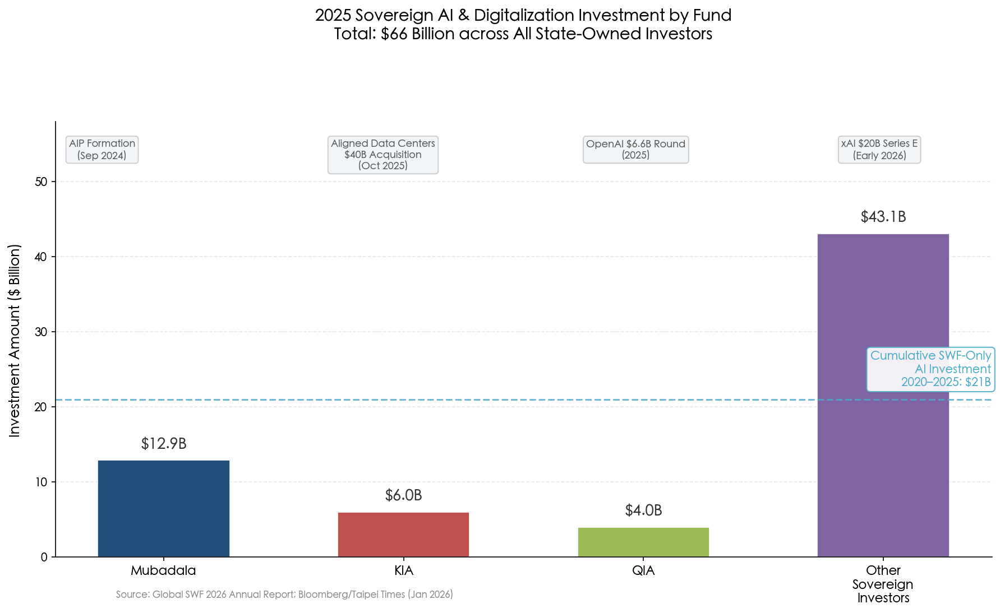

**Figure 4.1** — 2025 sovereign AI and digitalization investment by fund. Mubadala, KIA, and QIA led individual fund deployment, while total state-owned investor AI spending of $66 billion in 2025 alone tripled the $21 billion cumulative SWF-only total for 2020–2025. Key milestone transactions are annotated above the chart.

### The AI Infrastructure Partnership and Mega-Scale Data Center Deals

The most transformative vehicle for sovereign AI infrastructure investment is the AI Infrastructure Partnership (AIP), established in September 2024 by Abu Dhabi's MGX (backed by Mubadala and G42), BlackRock, Global Infrastructure Partners (GIP), and Microsoft. Nvidia and xAI joined in January 2025, and in June 2025 KIA became the first non-founding sovereign investor to anchor the platform [BlackRock Press Release](https://ir.blackrock.com/news-and-events/press-releases/press-releases-details/2025/MGX-BlackRock-Global-Infrastructure-Partners-and-Microsoft-Welcome-Kuwait-Investment-Authority-KIA-to-the-AI-Infrastructure-Partnership/default.aspx "KIA joins AIP, June 2025"). With a target of $30 billion in equity capital and up to $100 billion in total investment potential, AIP constitutes the largest dedicated AI infrastructure investment vehicle globally.

AIP's signature transaction came in October 2025 with the acquisition of Aligned Data Centers for approximately $40 billion — the largest data center deal in history — encompassing more than 5 GW of power capacity across 50 facilities [Forbes](https://www.forbes.com/sites/guneyyildiz/2025/12/16/what-abu-dhabis-17-trillion-is-actually-buying/ "MGX and Aligned Data Centers, December 2025"). The deal exemplifies how sovereign capital has migrated from minority stakes in AI software companies to controlling positions in the physical layer of AI: power, cooling, and compute infrastructure.

Parallel sovereign-backed data center ventures reinforced this trend. CPP Investments and GIC partnered with Equinix to form a joint venture exceeding $15 billion to build hyperscale data centers in the United States, each holding 37.5% equity stakes and projecting more than 1.5 GW of new capacity [Equinix Press Release](https://investor.equinix.com/news-events/press-releases/detail/1053/equinix-agrees-to-form-greater-than-15b-jv-to-expand "October 1, 2024"). Saudi Arabia's PIF, through its wholly-owned AI subsidiary Humain, invested $3 billion in xAI's Series E round in early 2026 and committed to building 500 MW of AI data center and compute infrastructure in the Kingdom [Arab News](https://www.arabnews.com/node/2633523/business-economy "PIF's Humain invests $3bn in xAI, February 2026").

### Sovereign Capital and Frontier AI Companies

Beyond infrastructure, sovereign investors have established direct financial relationships with the three leading frontier AI companies. Abu Dhabi's MGX participated in OpenAI's $6.6 billion funding round (at a $157 billion valuation), anchored xAI's $20 billion Series E, and invested in Anthropic — positioning the Abu Dhabi sovereign ecosystem as a common backer of all three frontier AI firms [CNBC](https://www.cnbc.com/2025/10/15/abu-dhabis-mgx-investments-in-trump-crypto-tiktok-openai-.html "October 2025"). Singapore's Temasek deepened its AI exposure in FY2025 through significant investments in Alphabet, Amazon, Microsoft, and Nvidia, and participated in Databricks' $15.25 billion financing round; technology, media, and telecommunications now constitute 20% of Temasek's portfolio [Temasek Review 2025](https://www.temasekreview.com.sg/performance-and-portfolio.html "Temasek Performance & Portfolio"). These positions demonstrate that sovereign engagement in AI extends well beyond infrastructure to encompass strategic equity stakes in the companies developing foundation models.

### The Capital Gap Thesis

The strategic rationale for sovereign engagement in AI infrastructure rests on a quantifiable capital gap. Global data center installed capacity currently exceeds 70 GW and is projected to reach 300 GW within fifteen years. At an estimated cost of $30–35 billion per GW, the cumulative investment requirement dwarfs the capacity of hyperscale cloud providers even at their current annual capital expenditure of $200–250 billion [Forbes](https://www.forbes.com/sites/guneyyildiz/2025/12/16/what-abu-dhabis-17-trillion-is-actually-buying/ "MGX CEO on capital gap, December 2025"). Sovereign wealth funds, with their multi-generational time horizons and tolerance for illiquidity, have become structurally necessary participants in closing this gap. The implication is significant: sovereign investors are transitioning from financial participants seeking AI exposure to co-builders of the critical digital infrastructure underpinning the next wave of global economic growth.

## 4.2 Climate and Energy Transition — Record Capital Deployment

### Aggregate Climate Investment

Sovereign investor climate-related investment reached a record $35.7 billion in 2025, spanning renewable energy assets, green bonds, carbon transition vehicles, and dedicated climate funds [Global SWF 2026 Annual Report](https://argaamplus.s3.amazonaws.com/3ffe681b-beab-49ba-9c30-bfe8ca8bd0bb.pdf "Climate record $35.7 bn"). This milestone reflects the convergence of two forces: the economic maturation of renewable energy as an infrastructure asset class offering predictable cash flows, and the growing recognition among long-horizon investors that the physical risks of climate change pose material threats to portfolio value across multiple asset classes.

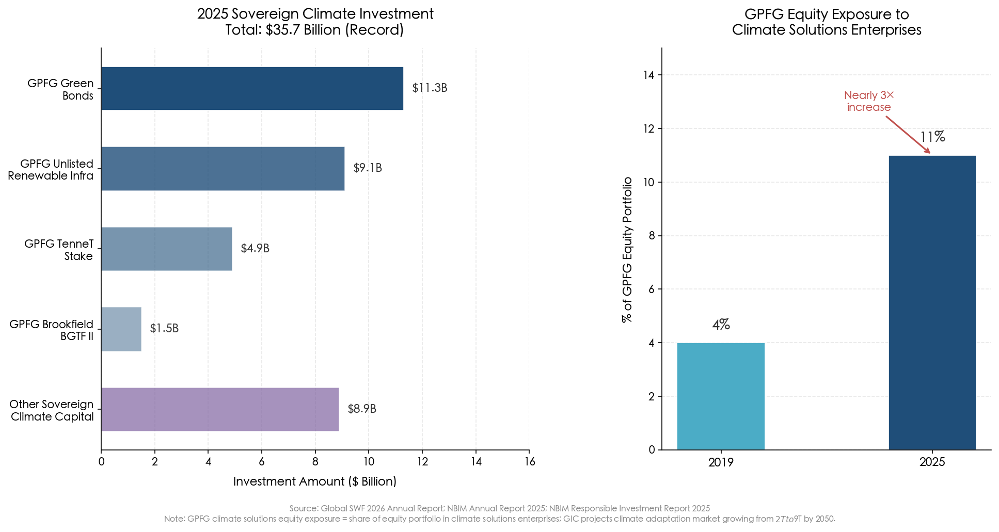

**Figure 4.2** — Left panel: breakdown of the record $35.7 billion in sovereign climate investment in 2025, anchored by GPFG's green bond holdings ($11.3 billion) and unlisted renewable energy infrastructure ($9.1 billion). Right panel: GPFG equity portfolio exposure to climate solutions enterprises nearly tripled from 4% in 2019 to 11% in 2025, illustrating the long-term deepening of sovereign climate commitments.

### Norway's GPFG — Setting the Infrastructure Pace

Norway's Government Pension Fund Global (GPFG) has emerged as the most consequential sovereign climate investor through its unlisted renewable energy infrastructure allocation, which expanded from 0.1% to 0.4% of fund assets (NOK 91 billion, approximately $9.1 billion) during 2025, adding 2,640 MW of new renewable capacity. The fund's mandate permits up to 2% of total assets in this category — approximately $42 billion at current fund size — leaving substantial deployment runway ahead [NBIM Annual Report 2025](https://www.nbim.no/en/news-and-insights/reports/2025/annual-report-2025/web-report-annual-report-2025/ "Unlisted renewable energy infrastructure").

Two landmark transactions defined GPFG's 2025 climate positioning. First, the fund joined APG and GIC in acquiring a 46% stake in TenneT Germany, the country's largest electricity transmission system operator, for a combined €9.5 billion (GPFG's share: €4.5 billion). This grid infrastructure investment reflects the recognition that transmission capacity is as critical as generation capacity to the energy transition [NBIM TenneT](https://www.nbim.no/en/news-and-insights/the-press/press-releases/2025/the-fund-invests-in-germanys-largest-electricity-transmission-system-operator/ "September 24, 2025"). Second, GPFG committed $1.5 billion to Brookfield's Global Transition Fund II (BGTF II), a dedicated energy transition private fund, marking the fund's first commitment to a third-party climate-focused vehicle [NBIM Brookfield](https://www.nbim.no/en/news-and-insights/the-press/press-releases/2025/new-investment-in-unlisted-renewable-energy-infrastructure/ "September 26, 2025").

On the public market side, GPFG held NOK 113 billion (approximately $11.3 billion) in green bonds, and 11% of its equity portfolio was exposed to climate solutions enterprises — nearly tripling from 4% in 2019 [NBIM Responsible Investment 2025](https://www.nbim.no/contentassets/99fa5525f1a947d6b7231101832bfb40/responsible-investment-2025.pdf "GPFG green bonds and climate solutions"). This dual-track approach — combining direct infrastructure ownership with public market climate exposure — positions GPFG as the benchmark for sovereign climate strategy.

### GIC and Climate Adaptation as an Investment Thesis

Singapore's GIC has distinguished itself by identifying climate adaptation — as opposed to mitigation alone — as a major emerging investment theme. GIC's research estimates that 14 categories of climate adaptation solutions represent a market growing from approximately $2 trillion currently to $9 trillion by 2050 [Top1000Funds](https://www.top1000funds.com/2025/05/gic-temasek-eye-trillions-of-growth-in-climate-adaptation-market/ "GIC, Temasek eye climate adaptation, May 2025"). This framing broadens the sovereign climate thesis beyond emissions reduction to encompass investments in resilience infrastructure: flood defenses, heat-resistant agriculture, advanced water treatment, and climate-resilient urban development. To the extent that adaptation spending will accelerate regardless of mitigation outcomes, this thesis offers sovereign investors a degree of insulation from the policy reversals that have characterized the ESG landscape in certain jurisdictions.

## 4.3 ESG Integration — Divergence, Rebranding, and Continued Commitment

### The Global ESG Backlash and Sovereign Fund Responses

The 2025–2026 period witnessed a sharp divergence in ESG postures between US domestic institutions and non-US sovereign investors. In the United States, sustainable investment funds experienced thirteen consecutive quarters of net outflows, and more than twenty states enacted legislation restricting ESG considerations in public pension management [Invesco GSAM Study 2025](https://www.invesco.com/apac/en/institutional/insights/press-and-media/2025/sovereign-investors-embrace-active-management-renew-interest-in-china-amid-global-fragmentation-and-policy-uncertainty.html "July 2025"). Outside the United States, however, major sovereign investors broadly maintained or deepened their responsible investment commitments — while engaging in a notable linguistic pivot. The terminology has shifted from "ESG" toward "sustainability," "responsible investment," and "stewardship," a rebranding that preserves substantive integration while reducing political friction.

### GPFG — The Global Standard-Bearer Under Review

GPFG remains the preeminent sovereign model for integrated responsible investment. In 2025, NBIM voted at 10,873 shareholder meetings on 108,325 proposals, conducted climate dialogues with 428 companies covering 34% of portfolio value by market capitalization and 44% of financed carbon emissions, and reported that 73% of the fund's financed emissions are now covered by corporate net-zero 2050 targets [NBIM Responsible Investment 2025](https://www.nbim.no/contentassets/99fa5525f1a947d6b7231101832bfb40/responsible-investment-2025.pdf "GPFG responsible investment 2025").

The fund's exclusion framework provides a rare quantitative record of ESG's portfolio impact. Cumulative product-based exclusions (tobacco, certain weapons, coal) have reduced returns by 3.51 percentage points since inception. Conduct-based exclusions (corruption, human rights violations, environmental damage) have added 1.10 percentage points, while risk-based divestments — a more targeted approach introduced in 2012 — have contributed 0.68 percentage points of additional return [NBIM Responsible Investment 2025](https://www.nbim.no/contentassets/99fa5525f1a947d6b7231101832bfb40/responsible-investment-2025.pdf "Cumulative exclusion impact"). The fund executed 58 risk-based exits in 2025, bringing the cumulative total to 633 since the program's inception. These figures offer a rare empirical basis for evaluating the return consequences of ESG-driven portfolio constraints — a question that remains largely theoretical for most institutional investors.

The framework, however, faces its most significant governance challenge in years. In November 2025, the Norwegian government appointed a commission to review the GPFG's ethical guidelines, with a reporting deadline of October 15, 2026. During the review period, new exclusion and observation decisions have been suspended. The review was partly triggered by the intensely debated question of investments in companies linked to the Israeli military's operations in Gaza [NBIM Responsible Investment 2025](https://www.nbim.no/contentassets/99fa5525f1a947d6b7231101832bfb40/responsible-investment-2025.pdf "Ethical framework review, November 2025"). This episode illustrates how geopolitical crises create direct governance pressure on sovereign ESG frameworks, a dynamic explored further in Chapter 6.

### GPIF — Expanding ESG Against the Tide

Japan's Government Pension Investment Fund (GPIF) moved decisively in the opposite direction from the US anti-ESG trend. In March 2025, GPIF established a formal "Sustainable Investment Policy" and solicited applications for new ESG-linked indices and funds. The fund's ESG index exposure stood at ¥18.2 trillion (approximately $126 billion) [GPIF ESG](https://www.gpif.go.jp/en/investment/esg/esg_indexes_and_funds.html "March 2025"). That the world's largest public pension fund continues to expand sustainability integration underscores that the anti-ESG backlash remains a predominantly American phenomenon among sovereign-scale investors, rather than a global structural reversal.

## 4.4 Digital Assets — From Fringe to Sovereign Portfolios

### The Breakthrough of Sovereign Bitcoin Exposure

Digital assets crossed a significant institutional threshold during 2025–2026, as multiple sovereign entities established formal cryptocurrency positions for the first time. The most prominent case is Abu Dhabi's Mubadala, which disclosed holdings of 12.7 million shares in BlackRock's iShares Bitcoin Trust ETF (IBIT) as of December 31, 2025, valued at approximately $631 million — a 46% increase from September 2025 levels [CoinDesk](https://www.coindesk.com/markets/2026/02/17/abu-dhabi-funds-bought-the-bitcoin-dip-as-they-increased-exposure-to-blackrock-s-ibit "February 17, 2026"). Including Al Warda Investments, another Abu Dhabi government-linked entity, the emirate's combined IBIT holdings exceeded $1 billion at year-end 2025 [Yahoo Finance](https://finance.yahoo.com/news/abu-dhabi-funds-boosted-blackrock-211246221.html "Abu Dhabi Funds Boosted BlackRock Bitcoin ETF Exposure to $1 Billion"). BlackRock CEO Larry Fink disclosed in December 2025 that sovereign wealth funds were active buyers when Bitcoin fell below $90,000, characterizing their positioning as "long-term hold strategies" rather than trading activity [CoinDesk](https://www.coindesk.com/markets/2025/12/04/sovereign-wealth-funds-were-buyers-as-bitcoin-btc-plunged-blackrock-s-larry-fink "December 4, 2025").

In a distinct development for a European sovereign fund, Luxembourg's intergenerational sovereign wealth fund (FSIL, approximately $730 million in AUM) allocated 1% of its portfolio to Bitcoin in October 2025 through regulated ETF structures, becoming the first eurozone sovereign fund to invest in the cryptocurrency [Goodwin Law](https://www.goodwinlaw.com/en/insights/publications/2025/10/insights-finance-pif-luxembourg-adds-bitcoin "October 2025"). Bhutan's Druk Holding maintained one of the most concentrated sovereign Bitcoin positions globally, holding 10,635 BTC valued at over $1 billion [CNBC](https://www.cnbc.com/2025/10/15/abu-dhabis-mgx-investments-in-trump-crypto-tiktok-openai-.html "October 2025").

### Strategic Bitcoin Reserves and Sovereign Infrastructure Bets

At the national policy level, the United States established a Strategic Bitcoin Reserve in March 2025 through executive order, funded by BTC obtained through criminal and civil forfeiture proceedings, with an explicit prohibition on selling these holdings [White House Executive Order](https://www.whitehouse.gov/presidential-actions/2025/03/establishment-of-the-strategic-bitcoin-reserve-and-united-states-digital-asset-stockpile/ "March 6, 2025"). While this constitutes a custodial reserve rather than an investment allocation, it signals a paradigm shift in how the world's largest economy treats digital assets at the sovereign level.

On the infrastructure side of the digital asset ecosystem, Abu Dhabi's MGX invested $2 billion in Binance in March 2025 — described as the "first institutional investment of this scale in a major crypto exchange" [CNBC](https://www.cnbc.com/2025/10/15/abu-dhabis-mgx-investments-in-trump-crypto-tiktok-openai-.html "October 2025"). This transaction reflects the Abu Dhabi sovereign ecosystem's strategy of investing not merely in digital assets themselves but in the infrastructure layer — exchanges, custody, and settlement systems — that underpins the digital asset economy, mirroring the physical-layer infrastructure approach evident in the AI domain.

Despite these headline developments, sovereign digital asset exposure remains a small fraction of total AUM. Mubadala's $631 million IBIT position represents approximately 0.2% of its $327 billion portfolio. The dominant posture among the largest sovereign investors is one of measured experimentation through regulated vehicles (spot Bitcoin ETFs) rather than direct cryptocurrency acquisition or allocation to decentralized finance protocols. Operational complexity, custodial risk, and regulatory uncertainty continue to constrain adoption to pilot-scale allocations — though the direction of travel is unambiguous.

## 4.5 Venture Capital and the Innovation Ecosystem

### Gulf SWFs as Global VC Powerhouses

The Gulf sovereign ecosystem has constructed the most comprehensive government-backed venture capital and growth equity architecture globally, with distinct institutional mandates that complement one another across the risk spectrum.

PIF's wholly-owned subsidiary Sanabil Investments manages approximately $8 billion with a target allocation of 50% venture capital, 30% private equity, and 20% liquid assets, deploying over $3 billion annually into global VC and growth equity [Sanabil](https://www.sanabil.com/ "Sanabil Investments"). Mubadala Capital Ventures has invested in more than 50 companies across enterprise AI, semiconductors, cybersecurity, and deeptech verticals. QIA expanded its VC Fund of Funds program by $2 billion in February 2026, bringing the total to $3 billion — signaling intent to maintain a diversified approach through experienced GP relationships rather than direct early-stage investing [Reuters](https://www.reuters.com/world/middle-east/qatars-qia-expand-venture-capital-programme-by-2-billion-2026-02-01/ "February 1, 2026"). ADIA has focused on later-stage growth equity and co-investments, while MGX occupies the frontier AI investment vertical [Global SWF 2026 Annual Report](https://argaamplus.s3.amazonaws.com/3ffe681b-beab-49ba-9c30-bfe8ca8bd0bb.pdf "Gulf SWF innovation ecosystem").

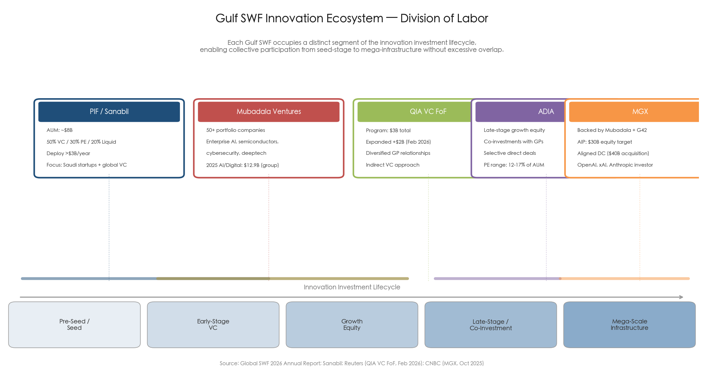

**Figure 4.3** — The Gulf SWF innovation ecosystem spans the full innovation investment lifecycle. Five sovereign entities — PIF/Sanabil, Mubadala Ventures, QIA, ADIA, and MGX — occupy distinct segments from pre-seed through mega-scale infrastructure, enabling collective participation without excessive institutional overlap.

This ecosystem division of labor enables the Gulf collectively to participate across the entire innovation lifecycle — from pre-seed through national startup programs to late-stage growth via ADIA co-investments and mega-scale infrastructure buildout through AIP and MGX — without duplicative competition between individual funds. The architecture represents a deliberate sovereign strategy to capture value at every stage of technology commercialization.

### Private Credit — The New Alternatives Vertical

A parallel and equally significant development in the alternatives space during 2025 was the rapid emergence of private credit as a dedicated allocation category within sovereign portfolios. Temasek launched Aranda Principal Strategies, a dedicated private credit platform with an initial allocation of approximately S$10 billion, marking the fund's formal entry into direct lending [Temasek Review 2025](https://www.temasekreview.com.sg/performance-and-portfolio.html "Temasek Performance & Portfolio"). Mubadala built a $20 billion private credit portfolio through 2025, while CPP Investments extended credit facilities to AI infrastructure companies including CoreWeave [Global SWF 2026 Annual Report](https://argaamplus.s3.amazonaws.com/3ffe681b-beab-49ba-9c30-bfe8ca8bd0bb.pdf "Mubadala $20 bn private credit").

The convergence of three structural forces underpins this expansion: elevated base rates that make lending economics attractive for long-duration capital providers; bank retrenchment from certain credit segments under tighter regulatory capital requirements; and the capital-intensive nature of AI infrastructure buildout that demands financing at a scale and speed beyond what traditional lenders can accommodate. Sovereign investors, with their permanent capital bases and tolerance for complexity, are well-positioned to occupy lending roles traditionally held by commercial banks and insurance companies — creating a new revenue stream that complements their equity investment strategies.

## 4.6 Synthesis — From Financial Investors to System Architects

The thematic developments of 2025–2026 reveal a qualitative transformation in the role sovereign capital plays in the global economy. Across AI, climate, digital assets, and innovation investing, sovereign wealth funds are moving beyond passive asset allocation toward active system architecture. MGX does not merely invest in AI companies — it builds the physical infrastructure on which AI operates. GPFG does not merely buy green bonds — it acquires stakes in the electricity transmission networks that enable the energy transition. Temasek does not merely allocate to VC funds — it creates institutional lending platforms to fill gaps left by traditional financial intermediaries.

This transformation carries both significant opportunity and material risk. The opportunity is clear: sovereign funds possess the capital scale, time horizon, and risk tolerance to finance infrastructure that private markets alone cannot build at the speed the global economy requires. The $66 billion deployed into AI in a single year, the record $35.7 billion in climate investment, and the emergence of multi-billion-dollar private credit platforms all point toward a permanent expansion of the sovereign investor role in global capital formation.

The risks, however, are equally substantial. Concentration is growing — both in thematic exposure (AI dominance) and in counterparty relationships (Gulf–US bilateral investment corridors). Illiquidity is deepening as private market allocations approach 30% of SWF portfolios. The boundary between commercial and strategic objectives is blurring, particularly in the Gulf, where sovereign AI and digital infrastructure investments are increasingly intertwined with bilateral geopolitical relationships (as examined in Chapter 6). The key challenge for the 2026–2027 period will be whether sovereign investors can maintain the discipline of financial return optimization as their infrastructure commitments grow in both scale and strategic complexity.

# Governance, Transparency, and Performance

The $60 trillion universe of state-owned investors encompasses a vast spectrum of institutional quality. At one end stands Norway's Government Pension Fund Global (GPFG), which earned a perfect score of 100 in the 2025 Global Pension Transparency Benchmark (GPTB) [GPTB 2025 Fund Rankings](https://global-pension-transparency-benchmark.top1000funds.com/global-pension-transparency-benchmark-funds-2025/ "GPTB 2025 Fund Results"); at the other lie funds whose investment activities, asset allocations, and even approximate sizes remain opaque to outside observers. Between these poles, governance architectures diverge sharply — shaped by political systems, legal traditions, and the competing imperatives of financial return and national development.

This chapter evaluates the governance structures that determine how government capital is managed, the transparency regimes that enable or frustrate external accountability, and the investment performance outcomes that ultimately justify the stewardship of public wealth. The analysis demonstrates that governance design is not merely an administrative feature but a first-order determinant of long-term returns, cost efficiency, and political legitimacy.

## Governance Architectures: Four Models

Government investment vehicles have evolved into four broadly distinguishable governance models, each reflecting the political culture, legal tradition, and strategic objectives of its home state. No single model dominates, but their comparative strengths and vulnerabilities grow increasingly consequential as sovereign funds expand in scale and geopolitical salience. The sections below examine each model in turn; the comparative matrix that follows provides a cross-cutting visual summary.

### The Norwegian Model: Parliamentary Sovereignty and Operational Independence

GPFG represents the most widely studied governance architecture among sovereign investors. Its three-tier structure separates political authority from investment execution with unusual clarity. Norway's parliament (Storting) defines the fund's overarching framework and risk tolerance — currently a 70% equity allocation mandate with a permissible band of 60–80%. The Ministry of Finance sets the detailed investment strategy and management mandate, establishing a market-weighted equity benchmark and strict tracking-error limits (capped at 1.25 percentage points). Norges Bank Investment Management (NBIM), as an operationally independent arm of the central bank, executes investment decisions without ministerial intervention in individual transactions [Norwegian Government Meld. St. 7 (2025–2026)](https://www.regjeringen.no/contentassets/f143d0a97dae41e38658800102dcd6d8/en-gb/pdfs/meld-st-7-20252026-excecutive-summary.pdf "Government Pension Fund 2026 — Executive Summary").

The 2026 white paper on the Government Pension Fund reinforced this architecture's core principle: "the Government Pension Fund is not a policy instrument to pursue objectives other than the long-term savings objective." This explicit delimitation is rare among sovereign funds and serves as a constitutional firewall against mission creep. The fund's investment universe spans 68 countries and 7,201 listed companies, yet GPFG holds zero domestic Norwegian assets — a deliberate structural choice designed to insulate the fund from political pressure for domestic capital allocation [NBIM Annual Report 2025](https://www.nbim.no/en/news-and-insights/reports/2025/annual-report-2025/ "Annual report 2025, February 27, 2026").

The Norwegian model's principal vulnerability lies in democratic contestation over ethical mandates. In November 2025, the government appointed a committee to review GPFG's entire ethical framework, with a reporting deadline of October 15, 2026. During the review period, new exclusion and observation decisions were suspended — a move partly triggered by public debate over investments in companies linked to the conflict in Gaza. The 2026 white paper acknowledged a deeper structural tension: "the fund may be perceived as an expression of Norwegian foreign policy, and may provoke reactions." For a $2.1 trillion fund holding positions in over 7,000 companies across 68 countries, geopolitical signaling is unavoidable regardless of institutional design intent [Norwegian Government Meld. St. 7 (2025–2026)](https://www.regjeringen.no/contentassets/f143d0a97dae41e38658800102dcd6d8/en-gb/pdfs/meld-st-7-20252026-excecutive-summary.pdf "Geopolitical governance risks").

### The Singapore Model: Constitutional Safeguards and Commercial Discipline

Singapore operates two distinct sovereign investment entities — GIC and Temasek Holdings — under a governance framework anchored in constitutional rather than parliamentary authority. GIC's board bears ultimate responsibility for asset allocation and portfolio performance, making individual investment decisions independently of the government that serves as its sole client. The President of Singapore participates in the appointment and removal of directors, creating a constitutional check that separates the investment function from the executive branch [GIC Governance](https://www.gic.com.sg/who-we-are/our-governance/ "Our Governance — GIC").

Temasek operates under a separate but parallel discipline. Its board contains "no Singapore Government or any other government nominee," and the entity maintains investment-grade credit ratings of Aaa from Moody's and AAA from S&P — distinctions that underscore its commercial orientation and borrowing independence from the sovereign balance sheet [Temasek Board](https://www.temasek.com.sg/en/about-us/our-board "Temasek Board"). Temasek's since-inception compound annual return of 14% in Singapore dollar terms, sustained over more than four decades, provides robust empirical evidence that this governance model supports long-horizon wealth compounding [Temasek Review 2025](https://www.temasekreview.com.sg/performance-and-portfolio.html "Temasek Performance & Portfolio").

The Singapore model's distinctive strength is its insulation from electoral cycles, achieved through constitutional rather than statutory mechanisms. Its principal limitation is the concentrated role of the government as sole shareholder — accountability runs upward to the state rather than outward to public scrutiny. Both GIC and Temasek partially mitigate this constraint by publishing annual reports with portfolio-level detail, and both are formal IFSWF members, distinguishing them from many Gulf peers.

### The Gulf Model: Sovereign Authority and Dual-Mandate Ambiguity

Gulf sovereign wealth funds operate under governance structures in which ruling-family authority is embedded directly in board composition and strategic direction. The Abu Dhabi Investment Authority (ADIA) illustrates this pattern: its eight-member board includes four members of the Al Nahyan ruling family, and the Managing Director is a royal family member. Oversight is concentrated within the ruling household rather than distributed across independent institutional checks [ADIA 2024 Review](https://www.adia.ae/en/pr/2024/pdf/adia-annual-review-2024-board-of-directors.pdf "ADIA Board 2024").

Saudi Arabia's Public Investment Fund (PIF) presents a more complex governance case. Chaired by Crown Prince Mohammed bin Salman, PIF serves a dual mandate: generating financial returns on a portfolio that reached $913 billion at end-2024 (with an estimated milestone of $1 trillion in mid-2025), while simultaneously functioning as the primary engine of Vision 2030's economic diversification program. In 2025, PIF deployed $36.2 billion across the year, including the $28.8 billion EA Sports acquisition — the largest all-cash sponsor-backed take-private transaction in history. This dual purpose creates an inherent tension between financial return maximization and national development objectives, a tension that governance structures have not formally resolved [PIF Annual Report 2024](https://www.pif.gov.sa/en/news-and-insights/press-releases/2025/pif-continued-to-drive-the-economic-transformation-of-saudi-arabia-while-shaping-global-economies-in-2024/ "August 2025").

Notably, neither PIF nor ADIA is a member of the International Forum of Sovereign Wealth Funds (IFSWF), placing them outside even the voluntary self-assessment framework of the Santiago Principles. Mubadala Investment Company, by contrast, publishes detailed financial results and reported five-year annualized returns of 10.1% through 2024 — demonstrating that Gulf governance structures can accommodate meaningful transparency when institutional leadership elects to pursue it [Mubadala Financial Results](https://www.mubadala.com/en/news/mubadala-investment-company-reports-2024-financial-results "Mubadala 2024 Financial Results"). The variation within the Gulf cohort underscores a broader point: governance quality is not determined solely by political system but also by individual institutional choices.

### The Asian Public Pension Model: Statutory Mandates and Passive Discipline

Japan's Government Pension Investment Fund (GPIF) and South Korea's National Pension Service (NPS) represent a governance model defined by statutory mandates, conservative investment guidelines, and heavy reliance on passive management as both a cost-control and accountability mechanism.

GPIF operates under Japan's Ministry of Health, Labour and Welfare with an equal-weight policy portfolio of 25% each in domestic bonds, domestic equities, foreign bonds, and foreign equities — a framework maintained unchanged after the March 2025 policy review. Approximately 90% of GPIF's ¥294.8 trillion (~$1.9 trillion) portfolio is passively managed, yielding an operating cost of approximately 1 basis point — among the lowest of any major institutional investor globally [GPIF Q3 FY2025](https://www.gpif.go.jp/en/performance/75943515gpif/2025_3Q_0206_en.pdf "February 2026") [GPIF Annual Report FY2024](https://www.gpif.go.jp/en/performance/annual_report_fiscal_year_2024.pdf "1 bp cost").

NPS, managing approximately KRW 1,473 trillion (~$1.03 trillion) by end-2025, has been undergoing a governance evolution. In March 2026, NPS Chairman and CEO Kim Sung-joo signaled that the fund plans to more actively exercise its voting power to promote stronger corporate governance and transparency in portfolio companies — a departure from its historically passive stance. NPS holds ownership stakes of 5–10% in major Korean companies including Samsung Electronics and Hyundai Motor, and has already taken assertive steps such as opposing board appointments at HS Hyosung Advanced Materials and Shinhan Financial Group [Yahoo Finance/GuruFocus](https://finance.yahoo.com/markets/stocks/articles/koreas-1-trillion-nps-signals-151901719.html "Korea's $1 Trillion NPS Signals Shift Toward Active Shareholder Governance, March 31, 2026"). Concurrently, a ruling-party bill introduced in March 2026 proposes mandating ESG considerations in NPS fund management, reflecting legislative pressure to expand the pension fund's governance role beyond pure return optimization [Seoul Economic Daily](https://en.sedaily.com/politics/2026/03/23/ruling-party-pushes-to-mandate-esg-in-national-pension-fund "Ruling Party Pushes to Mandate ESG in National Pension Fund, March 2026").

The following matrix provides a comparative assessment of the four governance models across five key dimensions — political independence, mission clarity, board independence, transparency, and IFSWF membership status.

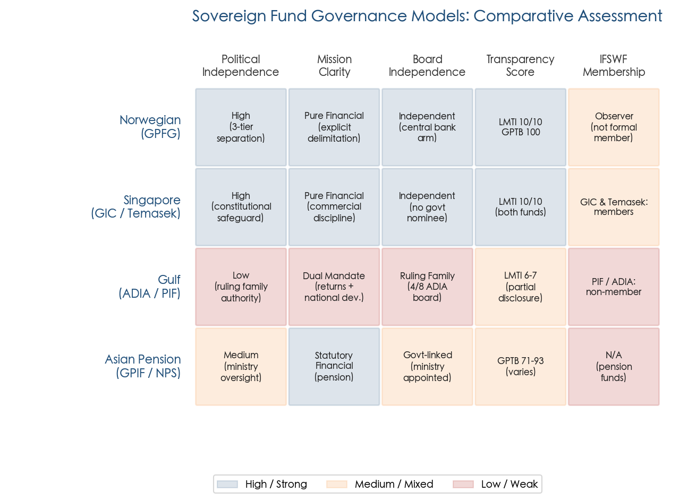

The matrix highlights a clear pattern: the Norwegian and Singaporean models achieve the highest scores on political independence and transparency, while the Gulf model trades these features for concentrated decision-making authority and dual-mandate flexibility. The Asian public pension model occupies an intermediate position, combining statutory discipline with ministry-level oversight that constrains — but does not eliminate — political influence over investment policy.

## Transparency Regimes and Disclosure Standards

### The Santiago Principles: Voluntary Framework, Persistent Gaps

The Santiago Principles — formally the Generally Accepted Principles and Practices (GAPP) — comprise 24 guidelines covering legal framework, institutional governance, and investment/risk management, drafted in 2008 under IMF auspices. The International Forum of Sovereign Wealth Funds (IFSWF), which administers the Principles, counts 38 member funds representing approximately 45% of global SWF assets. Compliance rests on voluntary self-assessment with no binding enforcement mechanism — a structural limitation that academic literature has consistently identified as the framework's fundamental weakness [IFSWF Santiago Principles](https://www.ifswf.org/santiago-principles-landing/santiago-principles "Santiago Principles®") [IFSWF Members](https://www.ifswf.org/our-members "38 members as of 2026").

In 2025, the IFSWF launched a Fund Assessment Program (FAP) designed to add rigor to the self-assessment process. Panama's sovereign savings fund published the first detailed FAP self-evaluation, covering legal framework, governance independence, withdrawal rules, and audit standards [IFSWF FAP 2025](https://www.ifswf.org/assessment/fap-2025 "FAP 2025 — Panama self-assessment"). While the FAP represents an incremental improvement, its voluntary nature preserves the core accountability gap. GPFG participates as an observer rather than a formal member; PIF and several other major funds remain entirely outside the framework.

A February 2026 academic analysis in the *Journal of Risk and Financial Management* reinforced these structural criticisms, finding that "the Santiago Principles are dated, not enforceable, and individual country incentives do not align to enable external regulatory compliance." The study concluded that democratic-country SWFs are systematically more transparent than those of autocracies, and that IFSWF membership per se does not predict higher transparency scores — a finding that challenges the Principles' effectiveness as a governance signal [Kemme (2026)](https://www.mdpi.com/1911-8074/19/2/119 "The Sovereign Wealth Fund Paradox, JRFM, February 2026").

### Measuring Transparency: Divergent Indices, Convergent Findings

Two primary indices track sovereign fund transparency, employing different methodologies but yielding broadly consistent conclusions. The Linaburg-Maduell Transparency Index (LMTI), maintained by the Sovereign Wealth Fund Institute (SWFI), scores funds on a 10-point scale across ten binary criteria covering disclosure of investment strategy, annual reports, asset allocation, returns, and external audits. At the top of the spectrum, GPFG, GIC, Temasek, the Alaska Permanent Fund, and Australia's Future Fund each receive scores of 10 out of 10. ADIA and QIA score in the 6–7 range, reflecting partial disclosure practices — ADIA, for instance, publishes broad allocation ranges but not precise portfolio weights, and has never officially confirmed its assets under management. CIC's transparency has been declining: Global SWF reported in December 2025 that CIC's 2024 annual report showed increased leverage alongside reduced asset allocation disclosure, placing CIC in the 4–5 range on the LMTI [SWFI LMTI](https://www.swfinstitute.org/research/linaburg-maduell-transparency-index "LMTI methodology") [Global SWF on CIC](https://globalswf.com/news/cic-assets-hit-us-1-57trn-as-leverage-rises-and-transparency-declines "December 2025"). SAFE Investment Company, which manages approximately $1.95 trillion, scores just 2 on the LMTI — one of the lowest ratings among top-20 funds globally [Kemme (2026)](https://www.mdpi.com/1911-8074/19/2/119 "SAFE IC LMTI score of 2").

The Truman Transparency Score (TTS), developed at the Peterson Institute for International Economics and based on a more granular 33-element scoreboard covering structure, governance, transparency, accountability, and behavior, provides a parallel assessment on a 100-point scale. GPFG achieves a perfect 100; CIC scores 74; several Gulf and authoritarian-state funds fall below 50. The correlation between the LMTI and TTS is 0.67 across the top 50 funds and rises to 0.81 for the most transparent cohort, confirming that both indices identify similar patterns despite methodological differences [Kemme (2026)](https://www.mdpi.com/1911-8074/19/2/119 "TTS-LMTI correlation analysis").

For public pension funds specifically, the 2025 Global Pension Transparency Benchmark (GPTB), produced by Top1000funds.com and CEM Benchmarking, assessed 75 funds across 15 countries on cost disclosure, governance, performance reporting, and responsible investing. GPFG earned the sole perfect score of 100. Canada ranked first among countries for the fifth consecutive year, with CPP Investments scoring 97 (second globally) and CDPQ scoring 95 (third). CalPERS ranked highest among US funds at 93. GPIF scored 71, held back by relatively lower governance and cost transparency scores despite strong performance reporting [GPTB 2025 Fund Rankings](https://global-pension-transparency-benchmark.top1000funds.com/global-pension-transparency-benchmark-funds-2025/ "GPTB 2025 Fund Results").

The pattern across all three transparency indices is consistent: democratic institutions with statutory disclosure requirements produce markedly higher transparency scores, while autocratic or semi-autocratic governance structures correlate with opacity. The Kemme (2026) study found that OECD-country SWFs average significantly higher TTS scores than non-OECD funds, and that the correlation between the TTS and the Economist Intelligence Unit's Democracy Index is 0.73 — evidence that sovereign fund transparency is substantially a function of domestic political institutions rather than a fund's own internal governance choices.

## Investment Performance: Cross-Fund Comparison

Comparing investment returns across sovereign funds requires careful attention to differing fiscal year calendars, reporting currencies, benchmark methodologies, and liability profiles. With those caveats, the performance data reported by major funds over the recent period reveals strong absolute returns driven by the global equity rally of 2025, with meaningful variation reflecting differences in equity weight, geographic exposure, and active management intensity.

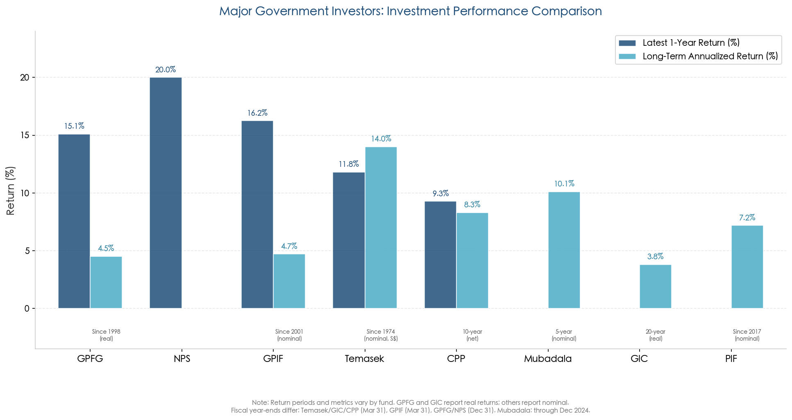

### 2025 Returns: A Strong Year Across the Board

Norway's GPFG delivered a 15.1% return in 2025 (calendar year), generating NOK 2,362 billion (~$236 billion) in investment income. Since inception in 1998, GPFG has achieved an annualized real return of 4.52%. By asset class, the equity portfolio returned 19.3%, fixed income 3.2%, and unlisted real estate 4.0% [NBIM Annual Report 2025](https://www.nbim.no/en/news-and-insights/reports/2025/annual-report-2025/ "February 2026").

South Korea's NPS posted an estimated ~20% return in 2025 — the highest since the fund's establishment in 1988. The exceptional performance was driven primarily by the fund's 37.8% allocation to overseas equities, which benefited from robust US equity markets and favorable won-dollar exchange rate dynamics [Reuters on NPS](https://www.reuters.com/world/asia-pacific/south-korea-pension-fund-likely-post-record-20-gain-2025-welfare-ministry-says-2025-12-29/ "December 2025").

Japan's GPIF reported year-to-date returns of 16.25% through December 2025 (FY2025 Q3), with an annualized return since inception of 4.71%. Its Q1 alone (April–June 2025) generated ¥10 trillion (~$68 billion) in investment gains [GPIF Q3 FY2025](https://www.gpif.go.jp/en/performance/75943515gpif/2025_3Q_0206_en.pdf "February 2026") [Reuters on GPIF](https://www.reuters.com/markets/europe/japans-gpif-posts-68-billion-investment-gain-q1-2025-08-01/ "August 2025").

Among SWFs, Temasek reported a one-year total shareholder return (TSR) of 11.8% in Singapore dollar terms for the year ended March 31, 2025, with a since-inception CAGR of 14% [Temasek Review 2025](https://www.temasekreview.com.sg/performance-and-portfolio.html "TSR since inception 14%"). CPP Investments achieved a 9.3% net return for its fiscal year ended March 31, 2025, with 10-year annualized net returns of 8.3% [CPP FY2025](https://www.cppinvestments.com/newsroom/cpp-investments-net-assets-total-714-4-billion-at-2025-fiscal-year-end/ "May 21, 2025"). Mubadala reported five-year annualized returns of 10.1% through 2024 [Mubadala Financial Results](https://www.mubadala.com/en/news/mubadala-investment-company-reports-2024-financial-results "5-year 10.1%"). PIF reported an annualized return of 7.2% since its restructuring in 2017, a figure that reflects both the constraints of its dual-mandate structure and its heavy domestic Tadawul exposure [PIF Annual Report 2024](https://www.pif.gov.sa/en/news-and-insights/press-releases/2025/pif-continued-to-drive-the-economic-transformation-of-saudi-arabia-while-shaping-global-economies-in-2024/ "7.2% since 2017").

### GIC: A Long-Horizon Benchmark Under Pressure

GIC reported a 20-year annualized real return of 3.8% as of March 31, 2025 — the lowest five-year reading for this metric. The decline reflects the fund's extended investment horizon and the dilutive effect of incorporating recent below-trend return periods into the rolling calculation. GIC's reference portfolio is a 65% global equity / 35% global bond benchmark, against which the fund seeks to generate excess returns through active management and illiquidity premiums [Reuters on GIC](https://www.reuters.com/world/asia-pacific/singapores-sovereign-wealth-fund-gic-posts-slowest-investment-return-5-years-2025-07-24/ "July 2025"). Notably, GIC does not disclose total AUM, reporting only a net portfolio value of S$434 billion (~$340 billion) as of March 31, 2025. Third-party estimates (SWFI, Global SWF) place total assets at approximately $936 billion — a discrepancy reflecting methodological differences in defining "assets under management" versus "net equity value" [SWFI GIC Profile](https://www.swfinstitute.org/profile/598cdaa50124e9fd2d05b242 "SWFI GIC Profile").

### Performance in Context: What Returns Reveal About Governance

The 2025 performance data illuminates several structural relationships between governance design and investment outcomes. First, the strong returns across both active and passive strategies — GPIF's 16.25% with ~90% passive management versus NPS's ~20% with a more active approach — indicate that in a strong equity-market year, asset allocation policy (the domain of governance boards) matters more than manager selection. GPFG's 15.1% return at a cost of 3.8 basis points demonstrates that the Norwegian model's emphasis on low-cost, broad-market exposure captured the vast majority of available equity beta.

Second, the variation in long-horizon returns reflects governance choices about complexity and cost. GIC's 3.8% real annualized 20-year return incorporates the costs of an active, multi-asset-class approach; GPFG's 4.52% annualized real return since inception is achieved through a simpler, lower-cost structure. CEM Benchmarking data indicates that among large institutional investors, approximately 75% of gross excess returns are absorbed by investment management costs — a finding that reinforces the case for the low-cost models exemplified by GPIF and GPFG [Norwegian Government Meld. St. 7 (2025–2026)](https://www.regjeringen.no/contentassets/f143d0a97dae41e38658800102dcd6d8/en-gb/pdfs/meld-st-7-20252026-excecutive-summary.pdf "CEM data on cost absorption").

## Cost Efficiency: The Management Fee Spectrum

The cost structures of major government investors span more than an order of magnitude, from GPIF's approximately 1 basis point to CPP Investments' 26.1 basis points — a 26-fold range that reflects fundamentally different investment philosophies rather than operational efficiency differences alone.

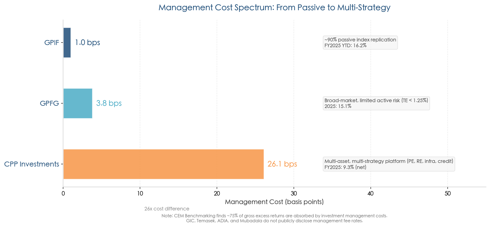

GPFG reported management costs of 3.8 basis points in 2025, ranking among the lowest of any actively managed large-scale fund globally. This cost level supports GPFG's mandate of broad market exposure with limited active risk-taking; the fund's management mandate specifies a tracking-error limit of 1.25 percentage points against its benchmark [Norwegian Government Meld. St. 7 (2025–2026)](https://www.regjeringen.no/contentassets/f143d0a97dae41e38658800102dcd6d8/en-gb/pdfs/meld-st-7-20252026-excecutive-summary.pdf "3.8 bps").

GPIF's cost of approximately 1 basis point reflects its extreme reliance on passive index replication. With roughly 90% of assets in passive strategies and a policy portfolio that self-rebalances through a tolerance-band mechanism, GPIF minimizes both management fees and transaction costs. This approach trades the possibility of excess returns for near-certainty of capturing market beta at negligible cost [GPIF Annual Report FY2024](https://www.gpif.go.jp/en/performance/annual_report_fiscal_year_2024.pdf "1 bp cost").

CPP Investments' cost of 26.1 basis points is substantially higher but reflects a fundamentally different model: a multi-asset, multi-strategy platform spanning public equities, private equity, real estate, infrastructure, and credit, with significant internal management capabilities and direct deal execution. CPP's 10-year annualized net return of 8.3% — after all costs — provides evidence that the higher cost structure can be justified by net-of-fee outperformance relative to a passive benchmark, although the precise magnitude of this value-add remains a subject of ongoing debate in institutional investment research [CPP FY2025](https://www.cppinvestments.com/wp-content/uploads/attachments/CPP-Investments-F25-results-overview-English.pdf "26.1 bps").

The cost-return relationship is not linear, and a significant portion of the sovereign fund universe remains opaque on this dimension. GIC, Temasek, ADIA, and Mubadala do not publicly disclose management fee rates, rendering direct comparison impossible for funds collectively managing trillions of dollars. This opacity itself constitutes a transparency gap: beneficiaries and oversight bodies cannot assess whether the costs of active management are justified without comparable cost data across the peer group.

## Reform Pressures and Accountability Gaps

### Indonesia's Danantara: Governance Concerns in a New Sovereign Fund

Indonesia's Daya Anagata Nusantara (Danantara), launched as a holding company for major state-owned enterprises, entered 2026 under intense governance scrutiny. Its nominal AUM of approximately $900 billion reflects the full asset base of controlled SOEs — including power plants, mines, and telecommunications networks — rather than a discretionary investment portfolio, an accounting methodology fundamentally different from conventional SWF reporting. The fund's CEO and CIO served on President Prabowo's core campaign team, and multiple officials hold concurrent positions as government ministers and Danantara executives. This degree of political embedding drew sharp criticism from governance experts; Knut Kjaer, the founding CEO of NBIM, warned publicly that such arrangements "could erode overseas investor confidence" [East Asia Forum](https://eastasiaforum.org/2025/04/14/what-to-expect-from-indonesias-new-sovereign-wealth-fund/ "April 2025") [Jakarta Globe](https://jakartaglobe.id/business/danantara-enters-year-two-with-27-trillion-ambition-and-rising-scrutiny "February 27, 2026").

### The US Sovereign Wealth Fund Proposal: Design Without Precedent

President Trump's February 2025 executive order directing the creation of a United States Sovereign Wealth Fund placed governance design challenges at the forefront of policy debate. Unlike virtually all existing SWFs, the proposed US fund lacks a natural funding source — the country runs chronic fiscal deficits rather than commodity surpluses or sustained current-account surpluses. The proposal envisaged leveraging the Development Finance Corporation (DFC) as a transitional vehicle, with DFC moving toward a "quasi-SWF model" using its $200 billion+ financing capacity. The Peterson Institute for International Economics assessed the proposal as a "confused solution to an undefined problem," identifying the absence of a depoliticized funding mechanism and independent governance structure as fundamental design flaws. By early 2026, the initiative had not progressed beyond the DFC conceptual stage [Bloomberg](https://www.bloomberg.com/news/articles/2026-02-24/us-lending-agency-wants-to-be-more-like-a-sovereign-wealth-fund "February 24, 2026") [PIIE](https://www.piie.com/blogs/realtime-economics/2025/us-sovereign-wealth-fund-confused-solution-undefined-problem "2025").

### GPFG's Ethical Framework Under Review

The Norwegian government's November 2025 decision to appoint a review committee for GPFG's ethical framework represents the most significant governance review at the world's largest SWF in over a decade. The committee's mandate encompasses product-based exclusions (tobacco, certain weapons, coal), conduct-based exclusions, and risk-based divestments — a system that by 2025 had resulted in 633 cumulative divestments. The review was partly triggered by political pressure related to the Israel-Palestine conflict, with the Norwegian parliament voting in November 2025 to pause ethical divestments pending the committee's conclusions. The 2026 white paper disclosed the cumulative financial impact of the ethical framework: product-based exclusions have reduced GPFG returns by 3.51 percentage points since inception, while conduct-based exclusions added 1.10 percentage points and risk-based divestments added 0.68 percentage points. The net financial impact has thus been negative but modest — suggesting that the primary cost of the ethical framework lies not in return reduction but in the governance complexity and political contestation it generates [NBIM Responsible Investment 2025](https://www.nbim.no/contentassets/99fa5525f1a947d6b7231101832bfb40/responsible-investment-2025.pdf "GPFG responsible investment 2025") [Reuters](https://www.reuters.com/business/finance/norway-poised-pause-wealth-funds-ethical-divestments-2025-11-04/ "November 4, 2025").

### The Santiago Principles at an Inflection Point

The voluntary, unenforceable character of the Santiago Principles has become increasingly problematic as sovereign funds grow in geopolitical significance. In 2023, twenty leading scholars issued a "Call for Action" through Global SWF urging a re-examination of the Principles and proposing third-party monitoring — a recommendation that remains unimplemented. The IFSWF's 38-member base covers roughly 45% of global SWF assets, leaving the majority of sovereign capital outside even voluntary oversight. The gap is especially pronounced for the fastest-growing funds: PIF, Danantara, and SAFE Investment Company are all non-members.

We believe the Santiago Principles framework faces a structural credibility challenge. In an era when host-country foreign investment screening — via CFIUS in the United States, the new EU FDI Screening Regulation, and Australia's FIRB zero-threshold policy for government investors — increasingly determines market access for sovereign capital, the Principles' value as a legitimacy signal depends on whether adherence meaningfully facilitates regulatory clearance. The available evidence suggests limited signaling value: in 2024, CFIUS cleared 78% of allied-country transactions while Chinese filings dropped 27.8%, indicating that geopolitical alignment rather than Santiago compliance is the operative screening variable [DLA Piper](https://www.dlapiper.com/insights/publications/2025/08/cfius-2024-annual-report "August 2025"). If the Principles cannot demonstrably improve host-country market access, the incentive for non-member funds to join the IFSWF or comply with GAPP standards remains weak — perpetuating the accountability gap at precisely the moment when sovereign capital's global influence is at its peak.

# Geopolitics and Government Investment — Sanctions, Strategic Competition, and De-Risking

Chapter 3 documented the empirical patterns of sovereign capital flow — where the money went. This chapter examines the political and regulatory forces that shape, constrain, and redirect those flows. Over the period from mid-2025 through early 2026, geopolitical dynamics exerted an influence on government investment decisions arguably more consequential than any single macro-financial variable. The freezing of approximately $280–330 billion in Russian sovereign reserves established a precedent that reverberates across every central bank balance sheet. US-China strategic competition restructured portfolio allocations from Singapore to Toronto, driving multiple major funds to slash China exposure to historic lows. Gulf sovereign wealth funds emerged as instruments of diplomatic bargaining in the AI chip access race, pledging over $2 trillion in US-directed investment. And a new generation of foreign investment screening regimes — in the United States, European Union, and Australia — is reshaping the regulatory corridor within which sovereign capital operates, with government ownership itself now designated as a risk factor by EU regulators.

## Sanctions and the Precedent of Sovereign Asset Freezing

### The Russian Reserve Freeze — Scale and Mechanism

The single most consequential event in the modern history of sovereign asset management occurred in late February 2022, when G7, EU, and allied nations froze approximately $280–330 billion in Russian central bank foreign exchange reserves in response to Russia's full-scale invasion of Ukraine. Of this total, approximately €200 billion (~$210 billion) is held by Euroclear, the Belgium-based international central securities depository, which became the de facto custodian of the largest sovereign asset freeze in history [Brookings](https://www.brookings.edu/articles/what-is-the-status-of-russias-frozen-sovereign-assets/ "Russia frozen assets status, updated June 2025").

The frozen reserves have generated substantial interest income for Euroclear. According to Euroclear's own financial disclosures, interest earnings from Russian-sanctioned assets totalled approximately €4.4 billion in 2023, peaked at €6.9 billion in 2024, and declined to €5.0 billion in 2025 as policy rates eased. At end-2025, sanctioned Russian assets on Euroclear's balance sheet stood at €195 billion [Euroclear 2025 Results](https://www.euroclear.com/newsandinsights/en/press/2026/mr-06-euroclear-delivers-strong-2025-results.html "Euroclear delivers strong 2025 results, February 4, 2026"). Cumulative interest income from Russian-sanctioned assets over 2022–2025 thus exceeded €16 billion — a figure that transformed a post-trade utility into a geopolitically significant financial actor.

### From Interest to Aid — The ERA Loan Architecture

Rather than directly confiscating the frozen principal — a step no G7 government has been willing to take — Western powers constructed an intermediate mechanism. At the June 2024 G7 summit, leaders agreed to the Extraordinary Revenue Acceleration (ERA) loan: a collective $50 billion loan to Ukraine, with repayment secured by future interest income generated from the frozen assets. The United States and European Union each contributed approximately $20 billion, with Canada, Japan, and the United Kingdom collectively providing the remainder [Brookings](https://www.brookings.edu/articles/what-is-the-status-of-russias-frozen-sovereign-assets/ "ERA loan structure, June 2025").

Under EU regulation adopted in May 2024, Euroclear is required to contribute a "windfall contribution" from Russian-related interest income to the European Fund for Ukraine. By early 2026, Euroclear had contributed approximately €5 billion to this fund, with an additional €1.4 billion payment expected in the near term [Euroclear 2025 Results](https://www.euroclear.com/newsandinsights/en/press/2026/mr-06-euroclear-delivers-strong-2025-results.html "Euroclear windfall contribution, February 2026").

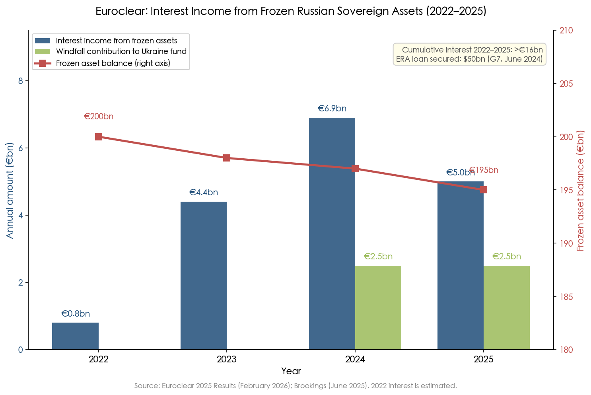

The figure above illustrates the trajectory of Euroclear's interest earnings from frozen Russian assets alongside contributions to the Ukraine fund and the gradually declining frozen asset balance. The peak in 2024 reflects the ECB's elevated policy rate environment; the subsequent decline corresponds to the easing cycle initiated in late 2024.

The legal and political barriers to outright confiscation remain formidable. ECB President Christine Lagarde has expressed concern that seizing Russian assets would damage the euro's credibility as a reserve currency. Belgium's prime minister characterised confiscation as a "war act." In December 2025, the European Council opted to issue joint borrowing of €90 billion for Ukraine rather than proceed with a reparations loan backed by frozen Russian assets, effectively shelving the confiscation option for the near term [Euroclear 2025 Results](https://www.euroclear.com/newsandinsights/en/press/2026/mr-06-euroclear-delivers-strong-2025-results.html "European Council €90 bn decision, December 2025"). A Reuters exclusive in February 2025 reported that Russia could concede the use of $300 billion in frozen assets as part of a peace settlement for Ukraine — a scenario that, if realised, would represent a negotiated rather than unilateral resolution [Reuters](https://www.reuters.com/world/europe/russia-could-concede-300-bln-frozen-assets-part-ukraine-war-settlement-sources-2025-02-21/ "February 21, 2025").

### The Precedent Effect — Reserve Management in a Weaponised Financial System

The strategic significance of the Russian reserve freeze extends far beyond the direct financial impact on Russia. For the first time in the post-Bretton Woods era, sovereign assets held within Western financial infrastructure were demonstrated to be contingently accessible rather than unconditionally secure. This precedent has reshaped risk calculations across the global reserve management community.

The clearest behavioural response has been the acceleration of central bank gold purchases. As documented in Chapter 2, central banks purchased 863 tonnes of gold in 2025 — down 21% year-on-year but still well above the 2010–2021 average of 473 tonnes per year [WGC Gold Demand Trends 2025](https://www.gold.org/goldhub/research/gold-demand-trends/gold-demand-trends-full-year-2025/central-banks "Central Banks — Gold Demand Trends Full Year 2025"). The largest buyers — Poland (102 tonnes), Kazakhstan (57 tonnes), Brazil (43 tonnes), and China's PBOC (27 tonnes, bringing total holdings to 2,306 tonnes) — are predominantly countries that either face Western sanctions risk or seek to diversify away from dollar-denominated reserves as a strategic imperative. Poland's decision to raise its gold-to-reserves target from 20% to 30% represents the most explicit articulation of a post-2022 reserve diversification strategy.

The IMF COFER data reinforces this structural shift: the US dollar's share of allocated global foreign exchange reserves fell to 56.92% in Q3 2025, continuing a decade-long decline from approximately 65% in 2015 [IMF COFER](https://data.imf.org/en/news/imf-data-brief-december-19 "IMF COFER Q3 2025, December 19, 2025"). While the dollar's retreat reflects multiple factors — including deliberate diversification into euros and renminbi — the Russian freeze accelerated the impetus for non-aligned central banks to reduce exposure to jurisdictions capable of imposing unilateral asset freezes.

Norway's Government Pension Fund Global (GPFG) experienced the precedent from the opposite vantage point. At end-2021, the fund held approximately NOK 27 billion in Russian equity investments, which were frozen following the imposition of sanctions. By late 2024, these holdings had been written down to NOK 1.5 billion, with an additional NOK 3.2 billion in rouble-denominated dividends trapped at Russia's National Settlement Depository [NBIM Submission](https://www.nbim.no/en/news-and-insights/submissions-to-ministry/2024/the-government-pension-fund-globals-investments-in-russia/ "December 4, 2024"). The GPFG's Russian losses, while modest relative to its $2.1 trillion portfolio, provide a concrete illustration of the asset-specific risks that geopolitical ruptures impose on even the most diversified sovereign portfolios.

## US-China Strategic Competition and the Great Portfolio Rebalancing

### The China Retreat — From Aspiration to Divestment

The most consequential portfolio-level impact of geopolitical competition in 2025 was the continued and accelerating withdrawal of sovereign capital from China. The flow data presented in Chapter 3 documents this shift quantitatively; the present section examines the political and regulatory forces driving it.

An OMFIF survey of approximately 100 central banks, pension funds, and sovereign wealth funds published in January 2025 found that zero respondents identified China as the most attractive emerging market investment destination — a precipitous decline from 23% in the 2023 survey. Over 70% of reserve managers cited market transparency and geopolitical risk as their primary concerns regarding China investment [OMFIF](https://www.omfif.org/2025/01/outlook-2025-are-global-public-investors-abandoning-china/ "January 2025").

Fund-level actions confirm the survey findings. Temasek reduced its China exposure from a peak of 29% in 2020 to 18% by March 2025, while increasing Americas exposure from 14% to 24% over the same period [Temasek Review 2025](https://www.temasekreview.com.sg/performance-and-portfolio.html "March 2025"). GIC's Americas allocation jumped 5 percentage points in a single fiscal year, from 44% to 49%, with Asia-Pacific declining correspondingly from 28% to 24% [GIC Annual Report FY2025](https://www.gic.com.sg/uploads/2025/07/GIC_AR_2024-25_PRINT.pdf "Geographic Mix"). Among Canadian pension funds, CPP Investments reduced its renminbi-denominated assets from approximately 10% to 5% of portfolio over two years. The Ontario Teachers' Pension Plan (OTPP) closed its dedicated China equities team. CDPQ, which paused new Chinese private equity commitments in 2023, reportedly sought to sell approximately US$1.5 billion in Chinese PE LP stakes in August 2025 [Financial Post](https://financialpost.com/fp-finance/cppib-china-exposure-tumbles-geopolitical-risks-climb "May 2024").

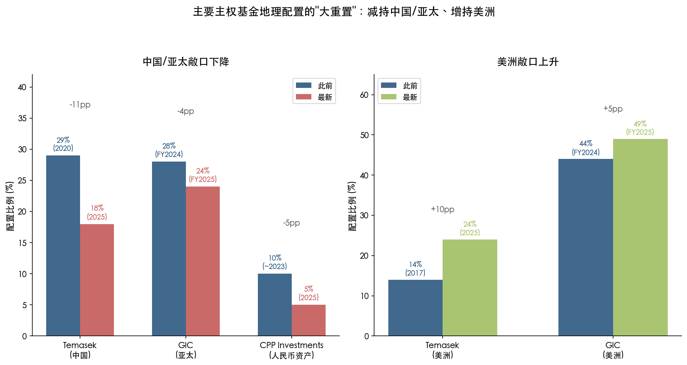

The figure above captures the magnitude of this geographic rebalancing across three major sovereign investors. The left panel illustrates the reduction in China/Asia-Pacific exposure — Temasek's 11 percentage-point decline is particularly striking — while the right panel documents the corresponding increase in Americas allocation, with Temasek and GIC together shifting over 15 percentage points of portfolio weight toward the US market.

In the United States, the Thrift Savings Plan (TSP) — the federal government's defined-contribution retirement system managing over $770 billion — made an explicit exclusion in 2024, switching its international fund benchmark from a broad index to the MSCI ACWI ex USA ex China ex Hong Kong, formally removing Chinese and Hong Kong equities from the investment universe of federal employees' retirement savings [TSP](https://www.tsp.gov/plan-news/2024-02-05-I-Fund-benchmark-index-change-in-2024/ "I Fund benchmark change 2024"). This decision, driven by a combination of congressional pressure and fiduciary analysis, signals the degree to which China investment by government-linked capital has become politically untenable in the US context.

### US Outbound Investment Restrictions — A New Regulatory Frontier

The US regulatory apparatus has moved beyond inbound screening to restrict outbound capital flows to China. The Outbound Investment Security Program, which took effect on January 2, 2025, prohibits or requires notification for investments by US persons in Chinese entities engaged in advanced semiconductors, quantum computing, and artificial intelligence [US Treasury](https://home.treasury.gov/policy-issues/international/outbound-investment-program "Outbound Investment Security Program"). This program directly constrains the ability of US-domiciled sovereign-linked investors — including state pension funds and endowments — to deploy capital into Chinese technology companies.

The potential expansion of outbound restrictions carries systemic implications for global sovereign investors. The proposed American Financial Investment Protection (AFIP) rules could extend restrictions to passive investments in Chinese securities, a prospect that would affect any sovereign fund tracking a broad market-capitalisation-weighted index that includes Chinese companies. Rhodium Group analysis indicates that an expanded AFIP could affect hundreds of PRC issuers held passively in global index funds [Rhodium Group](https://rhg.com/research/how-many-prc-issuers-could-be-affected-by-expanded-afip-outbound-investment-restrictions/ "AFIP expansion analysis"). For large passive investors such as GPFG — which holds equity positions in over 7,200 companies across 68 countries — the practical implications of a broad AFIP expansion would necessitate fundamental reconsideration of index-tracking methodologies for China-exposed benchmarks.

## The Gulf Pivot — Sovereign Capital as Diplomatic Currency

### $2 Trillion in Commitments — The May 2025 Gulf Tour

The Trump administration's May 2025 Gulf tour produced the most dramatic intersection of sovereign wealth and geopolitics in the modern era. During the tour, three Gulf states committed aggregate investment pledges exceeding $2 trillion to the United States: the UAE announced a 10-year, $1.4 trillion investment framework spanning AI infrastructure, semiconductors, and energy; Qatar's QIA pledged $500 billion in US investment over the coming decade; and Saudi Arabia signed $600 billion in investment agreements [White House Fact Sheet](https://www.whitehouse.gov/fact-sheets/2025/05/fact-sheet-president-donald-j-trump-secures-200-billion-in-new-u-s-uae-deals-and-accelerates-previously-committed-1-4-trillion-uae-investment/ "May 16, 2025") [Reuters](https://www.reuters.com/world/middle-east/qatars-qia-plans-least-double-annual-us-investments-over-next-decade-2025-05-20/ "QIA plans to at least double annual US investments, May 2025").

These pledges are unprecedented in scale but warrant careful interpretation. The headline figures represent multi-year commitments rather than immediately deployable capital. Annual actualisation of the full commitment pipeline would require sustained deployment rates far exceeding historical patterns. Nonetheless, the political signal is unambiguous: Gulf sovereign wealth has become a central instrument in US bilateral diplomacy, and access to American technology — particularly AI chips and compute infrastructure — functions as the primary currency of exchange.

### AI Chips, Conditionality, and the Technology-Security Nexus

The clearest illustration of the technology-investment-security nexus is the question of AI chip exports to the Gulf. In November 2025, the US Commerce Department approved export licences for G42 (UAE) and Humain (Saudi Arabia) to receive up to 35,000 Nvidia GB300 chips each, subject to strict security monitoring and reporting requirements [US Commerce](https://www.commerce.gov/news/press-releases/2025/11/statement-uae-and-saudi-chip-exports "November 19, 2025"). The Trump administration simultaneously scrapped the Biden-era AI Diffusion Rule — which had imposed a tiered, country-based chip export framework — in favour of bilateral, deal-by-deal arrangements that grant Washington greater discretionary leverage.

Carnegie Endowment analysis characterised the implicit conditionality of Gulf AI chip access as a strategic lever: "Restricting Gulf investment in China's AI and semiconductor sectors should be a top priority" for maintaining the effectiveness of US technology controls [Carnegie](https://carnegieendowment.org/emissary/2025/05/ai-chip-trump-gulf-uae-saudi-security-risk-good-deal "May 2025"). The G42 case illustrates this dynamic concretely. Under US pressure, G42 — the Abu Dhabi-based AI company chaired by UAE national security advisor Sheikh Tahnoun bin Zayed — divested entirely from Chinese companies in early 2024, including an estimated $100 million stake in ByteDance, and severed its operational ties with Huawei in December 2023. These divestitures were a precondition for Microsoft's subsequent $1.5 billion investment in G42 and for the preservation of G42's access to advanced Nvidia hardware [Washington Institute](https://www.washingtoninstitute.org/policy-analysis/g42-and-china-uae-us-triangle "G42 and the China-UAE-U.S. Triangle, 2024") [Reuters](https://www.reuters.com/technology/microsoft-g42-deal-positive-because-it-cut-huawei-ties-white-house-official-says-2024-06-24/ "Microsoft-G42 deal positive because it cut Huawei ties, June 2024").

The AI Infrastructure Partnership (AIP) — the $100 billion vehicle created by MGX, BlackRock, Global Infrastructure Partners, and Microsoft — embodies this convergence of sovereign capital, technology access, and geopolitical positioning. KIA's June 2025 entry as the first non-founding SWF anchor investor further demonstrates how Gulf sovereign funds are deploying capital commitments to secure positions within the Western AI ecosystem [BlackRock](https://ir.blackrock.com/news-and-events/press-releases/press-releases-details/2025/MGX-BlackRock-Global-Infrastructure-Partners-and-Microsoft-Welcome-Kuwait-Investment-Authority-KIA-to-the-AI-Infrastructure-Partnership/default.aspx "KIA joins AIP, June 2025").

### The Counter-Signal — Kuwait's Warning on US Concentration

Not all Gulf sovereign investors are uniformly bullish on US concentration. In May 2025, KIA Managing Director Sheikh Saad Al-Saad stated that investors who "reduce US exposure do so at their own risk" — a remark that, while framed as a vote of confidence in the US market, implicitly acknowledged the growing debate within Gulf investment circles about overconcentration in a single jurisdiction [Reuters](https://www.reuters.com/world/middle-east/kuwait-sovereign-wealth-fund-head-says-investors-reduce-us-exposure-their-own-2025-05-21/ "May 21, 2025"). This tension — between the geopolitical imperative to deepen US engagement and the fiduciary imperative to maintain geographic diversification — is likely to intensify as Gulf funds execute their multi-trillion-dollar US commitment pipelines.

## Technology Sovereignty and Government Capital — Semiconductors, AI, and Critical Minerals

### CHIPS Act and the De Facto American SWF

The US CHIPS and Science Act, with its $52.7 billion in semiconductor manufacturing incentives, represents a paradigm in which government capital is deployed not through a sovereign wealth fund but through industrial policy mechanisms that produce economically equivalent outcomes. The most striking example materialised in March 2025, when Intel and the Trump administration finalised a CHIPS Act agreement providing Intel with $8.9 billion in awards (plus $2.2 billion previously disbursed), in exchange for the US government receiving approximately 10% equity in Intel [Intel](https://www.intc.com/news-events/press-releases/detail/1748/intel-and-trump-administration-reach-historic-agreement-to "Intel CHIPS agreement"). OMFIF analysis characterised this as a step toward a "de facto US sovereign wealth fund" entering the semiconductor sector — a government equity stake in a strategic enterprise acquired not through a capital markets transaction but through an industrial subsidy mechanism [OMFIF](https://www.omfif.org/2025/08/how-chips-factor-into-a-de-facto-us-sovereign-wealth-fund/ "August 2025").

This model — government capital deployed through industrial policy with equity-like returns and strategic control — blurs the boundary between traditional SWF investment and state-directed industrial policy. Analogous structures are proliferating across multiple jurisdictions: Saudi Arabia's PIF created Humain as a wholly-owned AI subsidiary; Abu Dhabi's Mubadala incubated G42 and MGX as strategic technology platforms; and the European Chips Act mobilised public-private investment to reach €43 billion in semiconductor manufacturing capacity. In each case, the state deploys capital not merely as a financial investor but as an architect of industrial capability, using sovereign balance sheets to secure positions in the global technology supply chain.

## Foreign Investment Screening — The Tightening Regulatory Corridor

### CFIUS — Adversary Scrutiny vs. Allied Fast-Track

The Committee on Foreign Investment in the United States (CFIUS) continues to function as the primary gatekeeper for inbound sovereign investment into the US market, but its enforcement posture has bifurcated sharply along geopolitical lines. CFIUS's 2024 annual report reveals record enforcement activity: five penalties totalling nearly $88 million (including a single $60 million penalty), 76 formal non-notified investigations, and 79 compliance site visits [DLA Piper](https://www.dlapiper.com/insights/publications/2025/08/cfius-2024-annual-report "August 2025").

The bifurcation is starkly evident in the data. Chinese investor filings declined 27.8% year-on-year, while the clearance rate for allied-nation filers rose to a record 78%. This dual-track approach — intensified scrutiny of adversary-linked capital combined with expedited processing for allied sovereign investors — creates a structured pathway for Gulf, European, and allied Asian SWFs to deploy into US assets, while effectively barring Chinese state-linked capital from strategic sectors.

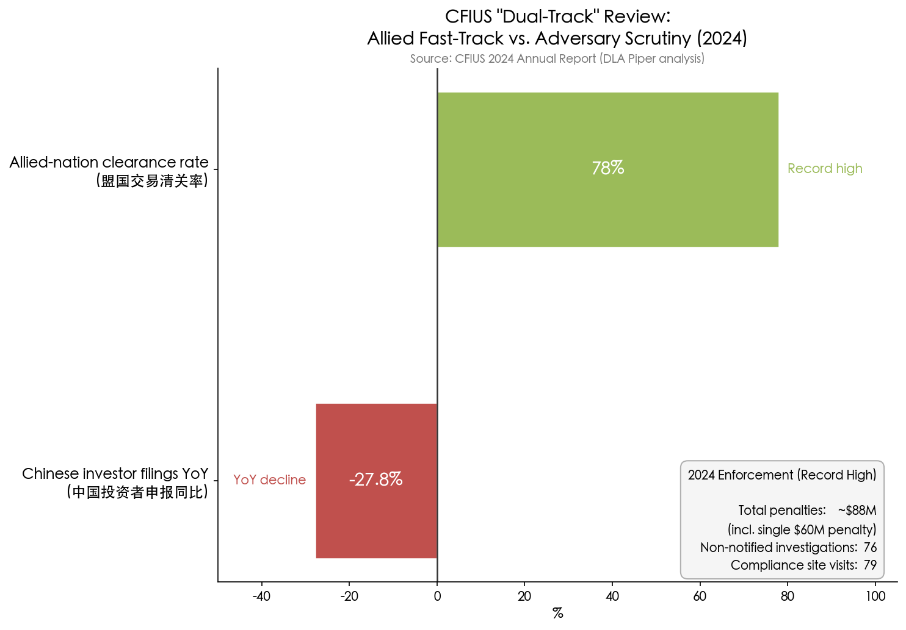

The figure above captures the widening gap in CFIUS treatment between allied-nation and adversary-linked investors, alongside the record enforcement activity that underscores the committee's heightened operational intensity.

The AFIP framework explicitly "welcomes all foreign investors, including sovereign wealth funds, making passive investments" but subjects operational control transactions to enhanced review [BRG ThinkSet](https://www.thinkbrg.com/thinkset/sovereign-wealth-funds-are-targeting-us-infrastructure-will-cfius-stop-deals-in-their-tracks/ "July 2025"). This creates a de facto two-tier system for sovereign investors: passive portfolio holdings face minimal friction, while acquisitions involving board representation, governance rights, or access to sensitive technology trigger full-spectrum national security review.

### EU FDI Screening — Mandatory, Expanded, and SWF-Targeted

The European Union is moving toward a fundamentally more restrictive FDI screening regime. In December 2025, EU institutions reached political agreement on a revised FDI Screening Regulation that introduces several provisions of direct significance for sovereign investors [Cleary Gottlieb](https://www.clearygottlieb.com/news-and-insights/publication-listing/the-rise-of-the-new-eu-fdi-screening-regulation "March 2026"):

- **Mandatory screening**: FDI screening becomes obligatory for all 27 member states, eliminating the patchwork of voluntary national regimes that previously permitted regulatory arbitrage.
- **Minimum scope**: A standardised mandatory screening scope covers semiconductors, AI, quantum computing, critical infrastructure, defence, and strategic raw materials.
- **Extended reach**: The regulation extends to EU-based enterprises controlled by non-EU investors, closing a loophole through which sovereign-backed vehicles had operated via European subsidiaries.
- **Government control as risk factor**: "Control by a third-country government" is explicitly listed as a risk factor in screening assessments — the most direct targeting of sovereign capital in any major FDI regime.
- **Standardised timelines**: A uniform 45-day first-phase review period replaces the variable national timelines that previously created uncertainty for cross-border transactions.

The regulation is expected to be formally adopted in H1 2026 with an 18-month implementation period. For sovereign wealth funds, the designation of government control as a risk factor represents a structural escalation: SWF-backed transactions in covered sectors will automatically trigger enhanced scrutiny regardless of the investor's track record or Santiago Principles compliance.

### Australia — The Zero-Threshold Standard

Australia's Foreign Investment Review Board (FIRB) operates the most stringent sovereign-specific screening regime among major capital-receiving nations. Under current policy, all investments by foreign government investors — including sovereign wealth funds, regardless of transaction size — are subject to review with a zero-dollar monetary threshold [Australian Foreign Investment Policy](https://foreigninvestment.gov.au/sites/foreigninvestment.gov.au/files/2025-03/australias-foreign-investment-policy-v2.pdf "March 2025"). Even a minor equity position by a sovereign fund in an Australian company technically requires FIRB notification. While the review process is calibrated in practice to transaction size and sector sensitivity, the zero-threshold principle establishes the most expansive sovereign-specific screening baseline among G20 economies and serves as a reference point for other jurisdictions considering analogous frameworks.

## Ethical Governance, Geopolitical Pressure, and Fund Autonomy

### GPFG's Israel Exclusions — Ethics Under Political Fire

The intersection of ethical investment governance and geopolitical pressure was most visibly tested in Norway during 2025. Following an accelerated ethics review prompted by the Israel-Gaza conflict, GPFG's manager Norges Bank (NBIM) excluded 23 Israeli companies from the fund's portfolio between late June and August 2025. On August 8, 2025, the Executive Board excluded six additional entities with connections to the West Bank and Gaza, including five Israeli banks — Bank Hapoalim, Bank Leumi, Mizrahi-Tefahot, First International Bank of Israel, and its holding company — as well as US manufacturer Caterpillar. By mid-August 2025, the fund's Israeli holdings had fallen to NOK 19 billion across 38 companies, from NOK 23 billion across 61 companies at end-June [NBIM Exclusion Decisions](https://www.nbim.no/en/news-and-insights/the-press/press-releases/2025/decisions-on-exclusion/ "August 2025") [Reuters](https://www.reuters.com/business/finance/norway-wealth-fund-excludes-six-israeli-companies-linked-west-bank-gaza-2025-08-18/ "August 18, 2025") [Global SWF](https://globalswf.com/news/nbim-s-israel-exclusions-governance-vs-geopolitics---and-the-portfolio-implications "NBIM's Israel Exclusions, August 2025").

The political backlash was swift and consequential. On November 4, 2025, the Norwegian parliament (Stortinget) voted to pause all ethical exclusions by the fund pending a parliamentary committee review of the ethical framework. Bloomberg reported that the pause was motivated partly by a desire to "shield tech holdings" — an oblique reference to concerns that the ethical exclusion mechanism could be turned against large US technology companies in which the fund holds substantial positions [Reuters](https://www.reuters.com/business/finance/norway-poised-pause-wealth-funds-ethical-divestments-2025-11-04/ "November 4, 2025"). The Norwegian government subsequently initiated a formal review of the GPFG's ethical guidelines, marking the most significant challenge to the fund's ethical governance architecture since the Council on Ethics was established in 2004 [Norwegian Government](https://www.regjeringen.no/en/whats-new/the-government-follows-up-on-the-parliaments-decision-regarding-the-ethical-framework-for-the-pension-fund/id3136331/ "November 2025").

This episode illuminates a fundamental tension: the GPFG's ethical exclusion framework, long regarded as a global benchmark for responsible sovereign investment, proved vulnerable to political override when its application intersected with geopolitically sensitive issues. For other sovereign funds observing Norway's experience, the implication is cautionary — ethical governance mechanisms that function smoothly under normal conditions may face existential challenges during periods of geopolitical crisis.

### Santiago Principles as Geopolitical Legitimacy Signal

The Santiago Principles — the 24 generally accepted principles and practices for sovereign wealth funds promulgated by the International Forum of Sovereign Wealth Funds (IFSWF) in 2008 — have acquired renewed relevance as a signalling mechanism in the current era of heightened FDI screening. Sovereign funds that demonstrate compliance with the Santiago Principles — encompassing governance independence, transparency, and commercially-motivated investment decisions — are better positioned to navigate CFIUS, EU, and FIRB review processes.

GPFG's own expert committee, reporting to the Norwegian Ministry of Finance in the 2025–2026 government white paper (Meld. St. 7), recommended that "heightened geopolitical risk calls for continued broad geographic diversification" — a principle that simultaneously serves fiduciary and diplomatic objectives by reducing the fund's exposure to any single jurisdiction's regulatory or political intervention [Norwegian Government Meld. St. 7](https://www.regjeringen.no/contentassets/f143d0a97dae41e38658800102dcd6d8/en-gb/pdfs/meld-st-7-20252026-excecutive-summary.pdf "Expert Council on geopolitical diversification"). The Norwegian Finance Ministry subsequently commissioned a review of the GPFG benchmark's technology concentration, reflecting concern that the fund's 53% US weighting and heavy exposure to US technology companies may create geopolitical concentration risk alongside — and compounding — financial concentration risk.

## The Converging Regulatory Corridor — Sovereign Funds Between Two Blocs

The cumulative effect of the regulatory developments documented in this chapter is the emergence of a narrowing corridor within which sovereign wealth funds must operate. On one side, US outbound investment restrictions and CFIUS inbound screening constrain sovereign fund engagement with Chinese technology and strategic sectors. On the other, China's own regulatory opacity and market transparency barriers, combined with deteriorating geopolitical sentiment, independently discourage sovereign capital inflows. The EU's new FDI screening regulation adds a third dimension, imposing government-control-based scrutiny that applies regardless of the investor's country of origin.

For Gulf SWFs, the corridor is particularly constrained. Their $2+ trillion US investment commitments implicitly bind them to a technology-alignment posture: continued access to US AI chips, financial infrastructure, and co-investment platforms depends on maintaining distance from Chinese AI and semiconductor sectors. Carnegie's characterisation — that "restricting Gulf investment in China's AI and semiconductor sectors should be a top priority" — reflects the emerging consensus in Washington that sovereign capital flows are not neutral financial transactions but vectors of strategic alignment [Carnegie](https://carnegieendowment.org/emissary/2025/05/ai-chip-trump-gulf-uae-saudi-security-risk-good-deal "May 2025").

For European and Asian SWFs operating primarily as financial investors — GPFG, GIC, GPIF, NPS — the regulatory corridor imposes compliance costs and strategic dilemmas rather than existential choices. These funds must navigate index composition questions (whether Chinese companies should be excluded from benchmarks), outbound investment notification requirements (whether a passive holding in a Chinese AI company triggers US reporting obligations), and inbound screening friction (whether a SWF's transaction in an EU semiconductor company faces enhanced review solely because of government ownership). The Santiago Principles, while valuable as a legitimacy signal, do not guarantee frictionless passage through increasingly politicised regulatory processes.

We believe the period from 2025 through early 2026 represents an inflection point rather than a temporary anomaly. The weaponisation of financial infrastructure (the Russian reserve freeze), the politicisation of capital flows (US-China decoupling), the instrumentalisation of sovereign wealth in diplomacy (Gulf commitments), and the expansion of investment screening regimes (CFIUS, EU FDI, FIRB) are mutually reinforcing trends that collectively reshape the operating environment for sovereign capital. Fund managers now operate in a world where the geopolitical identity of capital — who owns it, where it originates, and whose strategic interests it may serve — matters as much as its financial characteristics. This represents a structural departure from the pre-2022 regime of largely frictionless cross-border sovereign capital flows, and the evidence assembled in this chapter suggests it is unlikely to reverse.

# Outlook — Shifts and Scenarios for 2026–2027

The preceding chapters documented the scale, allocation frameworks, thematic priorities, governance structures, and geopolitical forces that define how the world's governments invest. This chapter synthesizes those findings into a forward-looking assessment covering the period from mid-2026 through early 2027. The outlook is dominated by an unusually dense convergence of structural shifts and acute shocks: a live military conflict disrupting the world's most critical energy chokepoint, monetary policy divergence across the three largest central banks, an AI investment cycle whose capital intensity invites both transformative returns and unprecedented concentration risk, and a regulatory environment that is simultaneously tightening inbound investment screening and constraining outbound capital flows. Collectively, these forces will reshape how sovereign wealth funds (SWFs), public pension reserve funds (PPFs), and central bank reserve managers allocate capital through early 2027.

## 7.1 The Macro-Financial Backdrop — Three Scenarios for Government Portfolios

### Monetary Policy Divergence

The interest-rate environment entering mid-2026 is defined by pronounced divergence among the three largest central banks. The U.S. Federal Reserve's March 2026 Summary of Economic Projections placed the federal funds rate at 3.4% for end-2026 and 3.1% for end-2027, implying a single additional 25-basis-point cut in each calendar year, with GDP growth projected at 2.4% and 2.3% respectively. The risk balance is notably asymmetric: 14 of 19 FOMC participants viewed GDP risks as skewed to the downside, while 17 of 19 judged inflation risks as tilted upward — a configuration shaped by tariff uncertainty and supply-side disruptions emanating from the Hormuz crisis [FOMC March 2026](https://www.federalreserve.gov/monetarypolicy/fomcprojtabl20260318.htm "FOMC Summary of Economic Projections, March 2026").

The European Central Bank held its deposit facility rate at 2.00% in March 2026, revised its HICP inflation projection sharply upward to 2.6% for 2026 (from a prior 1.9% estimate), and cut the growth forecast to 0.9%. A Reuters poll conducted in late March found that a majority of economists expect the ECB to maintain rates at their current level through the remainder of 2026, reflecting the tension between weak growth and energy-driven inflationary pressure [ECB March 2026](https://www.ecb.europa.eu/press/pr/date/2026/html/ecb.mp260319~3057739775.en.html "ECB monetary policy decisions, March 19, 2026") [Reuters ECB Survey](https://www.reuters.com/business/ecb-still-set-hold-interest-rates-through-2026-most-economists-say-2026-03-25/ "March 25, 2026").

The Bank of Japan (BoJ) raised its policy rate to 0.75% in December 2025 — the highest level since September 1995 — and held at that level through March 2026 amid heightened uncertainty from the Middle East conflict. The Daiwa Institute of Research projects a gradual increase to 1.75% by fiscal year 2027, while market expectations as of early April 2026 price the year-end BoJ rate at approximately 1.21% [Bank of Japan](https://www.boj.or.jp/en/about/press/koen_2026/data/ko260226a1.pdf "BoJ rate at 0.75%, February 2026") [Daiwa Research](https://www.dir.co.jp/english/research/report/jmonthly/20260202_025565.html "BoJ rate path to 1.75% by FY2027") [Reuters BoJ](https://www.reuters.com/world/asia-pacific/boj-stand-pat-iran-war-muddles-outlook-sustain-rate-hike-bias-2026-03-16/ "BoJ holds amid Iran war, March 2026").

For sovereign investors, this tripartite divergence carries distinct portfolio implications. The Fed's higher-for-longer posture sustains the yield attractiveness of U.S. dollar-denominated fixed income, reinforcing the gravitational pull that drew 47% of global sovereign investment to the United States in 2025. The ECB's downgraded growth outlook weighs on European equity allocations and infrastructure valuations, potentially redirecting capital toward U.S. and Asian markets. Japan's rate normalization, meanwhile, creates a novel challenge for the Government Pension Investment Fund (GPIF) and other yen-denominated investors: rising domestic bond yields increase the opportunity cost of maintaining large foreign allocations, while a stronger yen trajectory could erode the domestic-currency value of overseas holdings — a consideration with direct implications for GPIF's 25/25/25/25 policy portfolio split between domestic and foreign assets.

### The Oil Price Shock — Hormuz Closure Upends Commodity-SWF Forecasts

The most consequential near-term development for commodity-funded sovereign wealth funds is the Strait of Hormuz crisis that erupted in early March 2026. Following U.S. and Israeli airstrikes on Iran in late February, Iranian forces effectively closed the Strait — through which approximately 20% of global oil supply and a substantial share of global LNG flows transit — triggering the most severe energy supply disruption in modern history. The International Energy Agency described the event as involving more than 12 million barrels per day of regional shut-ins and damage to approximately 40 energy facilities [Reuters](https://www.reuters.com/business/energy/hormuz-closure-divides-fortunes-middle-eastern-oil-states-2026-04-06/ "Hormuz closure divides Middle East fortunes, April 6, 2026").

Brent crude surged approximately 60% in March 2026 alone, reaching $94/bbl by March 9 and touching approximately $119/bbl by late March — a record monthly increase [Euronews](https://www.euronews.com/my-europe/2026/03/31/strait-of-hormuz-shutdown-what-implications-for-europe-for-how-long-and-how-high-can-price "Brent reaches ~$119/bbl, March 2026"). The U.S. Energy Information Administration's (EIA) March 2026 Short-Term Energy Outlook forecasts Brent remaining above $95/bbl through May 2026, declining below $80/bbl in Q3 2026, and averaging $79/bbl for full-year 2026 and $64/bbl for 2027 — contingent on the conflict's duration and the resumption of Strait transit [EIA STEO March 2026](https://www.eia.gov/outlooks/steo/report/ "EIA Short-Term Energy Outlook, March 10, 2026"). J.P. Morgan's pre-crisis forecast of $60/bbl for 2026 is now functionally obsolete [J.P. Morgan](https://www.jpmorgan.com/insights/global-research/commodities/oil-prices "Brent $60/bbl, February 2026").

The fiscal implications diverge sharply across Gulf states. Saudi Arabia — with its East-West pipeline system operating at 7 million bpd capacity — boosted oil export revenues by approximately 4.3% year-on-year in March 2026 despite a 26% decline in export volumes, as higher prices more than compensated for reduced throughput. By contrast, Iraq's oil export revenue plunged 76% and Kuwait's fell 73% on a monthly basis, as neither possesses viable bypass infrastructure [Reuters](https://www.reuters.com/business/energy/hormuz-closure-divides-fortunes-middle-eastern-oil-states-2026-04-06/ "April 6, 2026").

Two dynamics are particularly consequential for sovereign wealth fund analysis. First, the IMF's 2025 Article IV consultation placed Saudi Arabia's fiscal breakeven oil price at approximately $91/bbl, while Bloomberg Economics estimated $94/bbl — both figures now within the range of realized spot prices, meaning that the Public Investment Fund (PIF) and the broader Saudi fiscal apparatus may temporarily return to approximate fiscal balance after years of deficits driven by Vision 2030 spending [IMF via FRED](https://fred.stlouisfed.org/series/SAUPZPIOILBEGUSD "Saudi breakeven fiscal oil price $90.9/bbl, 2025") [Bloomberg via World Oil](https://www.worldoil.com/news/2025/10/21/saudi-fiscal-outlook-hinges-on-oil-price-recovery-production-growth-imf-says/ "Bloomberg Economics $94/bbl breakeven"). Second, the Kuwait Investment Authority (KIA) — whose $1+ trillion portfolio is funded by oil receipts — faces drastically reduced inflows if the Strait disruption persists, as Kuwaiti crude shipments are entirely dependent on Hormuz transit.

### The Trade Regime After the Supreme Court Ruling

A further macro variable shaping the outlook is the evolution of U.S. trade policy following the Supreme Court's February 20, 2026 ruling in *Learning Resources, Inc. v. Trump*, which held that the International Emergency Economic Powers Act (IEEPA) does not authorize presidential tariff imposition. The ruling invalidated the broad "Liberation Day" tariffs imposed in April 2025, reducing the trade-weighted average U.S. tariff rate from 15.3% to 8.3% [Global Trade Alert](https://globaltradealert.org/reports/SCOTUS-IEEPA-Tariff-Impact "SCOTUS IEEPA tariff impact"). While the Trump administration immediately pivoted to alternative statutory authorities — and new tiered duties on steel and aluminum were announced in early April 2026 — the legal landscape for unilateral tariff escalation has narrowed substantially [Baker McKenzie](https://www.bakermckenzie.com/en/insight/publications/resources/us-trade-enforcement-strategy "U.S. trade enforcement strategy post-SCOTUS").

For sovereign investors, the partial tariff rollback alleviates some of the downside risk to U.S. growth and corporate earnings that the IMF had flagged in April 2025, when it slashed the global growth forecast to 2.8%. The January 2026 World Economic Outlook update revised global growth back to 3.3%, partly reflecting a tariff-shock recovery and a tech-driven U.S. investment boom [IMF Blog](https://www.imf.org/en/blogs/articles/2026/01/19/global-economy-shakes-off-tariff-shock-amid-tech-driven-boom "January 19, 2026"). The net effect is a more favorable — though still uncertain — trade environment for cross-border sovereign investment in the United States, particularly for Gulf funds executing multi-year commitment pipelines denominated in the hundreds of billions of dollars.

## 7.2 The Private Market Trajectory — Momentum, Concentration, and Liquidity Risk

The structural shift toward private markets in sovereign portfolios — from 25% of SWF assets in 2020 to 29% in 2025, totaling approximately $3.5 trillion — shows no signs of reversal. SSGA survey data and fund-level disclosures suggest the aggregate private-market allocation will approach or reach 30% by end-2026, propelled by continued AI infrastructure deployment and the maturation of private credit as a distinct allocation category [SSGA Sovereign Wealth Fund Trends](https://www.ssga.com/us/en/institutional/insights/trends-among-sovereign-wealth-funds "Investment trends among sovereign wealth funds, March 2026").

Three structural risks, however, warrant close monitoring as this expansion continues.

**Manager concentration.** Six private-market managers now absorb approximately 60% of total fundraising — a threefold increase in concentration from five years prior, when the top cohort captured roughly 20%. This consolidation creates systemic counterparty and correlation risk for sovereign allocators: a governance failure, performance collapse, or regulatory action at any one of these platforms would propagate across dozens of sovereign portfolios simultaneously [Neuberger Berman](https://www.nb.com/en/be/insights/article-seismic-shifts-that-could-drive-private-markets "Six seismic shifts that could drive private markets, February 2026").

**Distribution drought.** Buyout fund distributions remain below pre-2022 levels, extending J-curve pressure on sovereign limited partners that committed heavily during the 2020–2022 vintage years. Should the Hormuz-driven risk-off environment further depress exit markets — by chilling IPO activity and reducing strategic M&A appetite — sovereign funds face the prospect of rising unfunded commitments without corresponding cash inflows from maturing positions.

**Valuation lag.** Private asset valuations typically adjust 6–12 months behind public markets. A sharp correction in AI-linked public equities — a scenario NBIM's stress test quantified as a potential 53% decline in equity portfolio value — would initially leave private portfolios appearing stable, masking unrealized losses that crystallize only in subsequent quarters. This lag creates a false sense of diversification precisely when it matters most.

The countervailing force is the emergence of private credit as a structural allocation category rather than a cyclical trade. Temasek's launch of Aranda Principal Strategies (seeded at approximately S$10 billion), Mubadala's build-out of a $20 billion private credit portfolio, and CPP Investments' direct lending to entities such as CoreWeave collectively signal that sovereign investors view private credit as a permanent portfolio component — one that offers floating-rate yields, shorter duration, and enhanced downside protection relative to traditional private equity.

## 7.3 AI as the Defining Allocation Theme — Capital Momentum Meets Concentration Risk

### The Investment Flywheel Continues

Artificial intelligence remains the single most powerful thematic driver of sovereign capital allocation entering mid-2026. The structural rationale is unchanged and intensifying: global data center installed capacity exceeds 70 GW and must reach 300 GW within fifteen years, at an estimated cost of $30–35 billion per GW [Forbes](https://www.forbes.com/sites/guneyyildiz/2025/12/16/what-abu-dhabis-17-trillion-is-actually-buying/ "MGX CEO on data center capital gap, December 2025"). Morgan Stanley estimates that cumulative U.S. data center spending could reach $3 trillion by 2029 [Forbes](https://www.forbes.com/sites/jonmarkman/2026/01/21/the-sovereign-floor-fading-the-ai-disillusionment/ "Morgan Stanley $3 tn estimate, January 2026"). The AI Infrastructure Partnership (AIP) — anchored by MGX, BlackRock, Global Infrastructure Partners (GIP), and Microsoft, and joined by KIA in June 2025 — targets $30 billion in equity and up to $100 billion in total investment potential, having already executed the $40 billion Aligned Data Centers acquisition.

The pipeline of sovereign-backed AI infrastructure commitments extends well into 2027 and beyond. Saudi Arabia's Humain has committed to 6 GW of data center capacity by 2034. The CPP Investments–GIC–Equinix joint venture targets over 1.5 GW of new U.S. hyperscale capacity. The over $2 trillion in Gulf-to-U.S. investment pledges from President Trump's May 2025 Gulf visit are predominantly anchored in AI infrastructure — meaning that their execution trajectory depends directly on continued U.S.–Gulf alignment on technology governance and AI chip access [White House](https://www.whitehouse.gov/fact-sheets/2025/05/fact-sheet-president-donald-j-trump-secures-200-billion-in-new-u-s-uae-deals-and-accelerates-previously-committed-1-4-trillion-uae-investment/ "White House fact sheet, May 2025").

### The Risk NBIM Quantified

NBIM's January 2026 stress test provided the most rigorous public quantification of AI concentration risk in any sovereign portfolio. The "AI correction" scenario modeled a downward shift in expected cash flows from technology companies combined with an increase in the equity risk premium, transmitted to broader markets through wealth effects and funding-market stress. The result: a potential 53% decline in the equity portfolio and a 35% loss in total fund value — equivalent to approximately NOK 7.4 trillion ($767 billion) at NBIM's end-2025 portfolio level [Top1000funds](https://www.top1000funds.com/2026/02/nbim-quantifies-the-portfolio-threat-of-economic-fragmentation/ "NBIM stress test results, February 2026") [IPE](https://www.ipe.com/news/norways-swf-manager-sees-increased-risk-of-ai-correction/10134880.article "January 29, 2026"). The AI correction scenario ranked as the second-most-severe of four stress-test scenarios, exceeded only by the "fragmented world" scenario (trade wars and full retaliation), which modeled a 37% total fund drawdown of NOK 7.7 trillion ($803 billion).

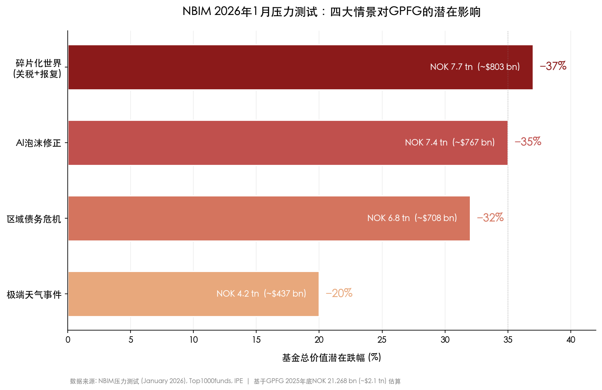

*Figure 7.1 — NBIM's January 2026 stress test quantified four risk scenarios for GPFG. The "fragmented world" (–37%) and "AI correction" (–35%) scenarios represent the most severe potential drawdowns, each exceeding $750 billion in estimated losses at end-2025 portfolio values. Data sources: NBIM stress test (January 2026), Top1000funds, IPE.*

The concentration is concrete: NBIM's collective exposure to the "Magnificent Seven" technology stocks stands at $261 billion, and its eight largest equity positions — all technology companies — account for approximately 20% of total fund value. Because the majority of GPFG's listed equities are passively managed against market-capitalization-weighted indices, the fund's technology exposure is effectively a structural feature of its mandate rather than an active bet [Top1000funds](https://www.top1000funds.com/2026/02/nbim-quantifies-the-portfolio-threat-of-economic-fragmentation/ "NBIM Magnificent Seven exposure $261 bn").

This risk is not unique to GPFG. GIC's Americas allocation — 49% of portfolio — is heavily weighted toward U.S. technology equities. Temasek's TMT sector weighting of 20% understates its full technology exposure, which extends through private investments in Databricks, Anthropic-adjacent vehicles, and direct positions in the Magnificent Seven. The Norwegian government's 2026 white paper acknowledged this concern and commissioned a formal review of the GPFG benchmark's technology-sector concentration [Norwegian Government Meld. St. 7](https://www.regjeringen.no/contentassets/f143d0a97dae41e38658800102dcd6d8/en-gb/pdfs/meld-st-7-20252026-excecutive-summary.pdf "Government white paper, March 2026").

We assess that the probability of a severe AI valuation correction in the next twelve months has increased relative to the pre-Hormuz baseline, but that such a correction — if it materializes — is more likely to take the form of a valuation compression in AI infrastructure companies, where leveraged capital expenditure is rising rapidly, than a collapse in the underlying demand trajectory for compute capacity.

## 7.4 New Fund Creation and Mission Expansion

### The United States — A Sovereign Wealth Fund in Search of a Mandate

The U.S. sovereign wealth fund proposal, initiated by executive order in February 2025, has evolved into a de facto transformation of the U.S. International Development Finance Corporation (DFC). In February 2026, Bloomberg reported that DFC intends to pivot toward a "sovereign wealth fund-like model," leveraging its expanded $205 billion investment cap — authorized under the FY2026 National Defense Authorization Act through December 2031 — to target strategically important sectors with a dual focus on financial returns and development objectives [Bloomberg](https://www.bloomberg.com/news/articles/2026-02-24/us-lending-agency-wants-to-be-more-like-a-sovereign-wealth-fund "February 24, 2026") [DFC Press Release](https://www.dfc.gov/media/press-releases/dfc-secures-expanded-authorities-fy26-ndaa-signed-law "DFC FY26 NDAA expanded authorities"). A new $3 billion equity revolving fund was proposed in the fiscal year 2026 budget [CFR](https://www.cfr.org/articles/update-reauthorization-us-development-finance-corporation "DFC reauthorization update").

The structural limitations remain those the Peterson Institute for International Economics (PIIE) identified: the United States lacks a natural funding mechanism (no commodity revenues, no fiscal surplus) and possesses no governance framework insulating investment decisions from political cycles. The DFC transformation represents a pragmatic compromise — expanding an existing institution's mandate rather than constructing a new one — but it remains fundamentally different from the commodity-funded, intergenerationally-oriented models that define the world's most successful SWFs [PIIE](https://www.piie.com/blogs/realtime-economics/2025/us-sovereign-wealth-fund-confused-solution-undefined-problem "A confused solution to an undefined problem, 2025").

A separate but related development merits attention: the CHIPS Act has created what OMFIF characterized as a "de facto U.S. SWF" in the semiconductor sector, with the federal government acquiring approximately 10% equity in Intel through an $8.9 billion incentive package [OMFIF](https://www.omfif.org/2025/08/how-chips-factor-into-a-de-facto-us-sovereign-wealth-fund/ "August 2025"). This piecemeal approach — industrial-policy equity stakes in nationally strategic companies rather than a unified investment vehicle — may prove more politically sustainable than a formal SWF structure in the American context.

### Indonesia's Danantara — The Governance Test

Indonesia's Danantara entered its second year in February 2026 with stated ambitions of $2.7 trillion in assets under management by 2030 and a 7% return-on-assets target. The governance scrutiny that accompanied its launch has not abated: the CEO and CIO were members of President Prabowo's campaign team, and multiple officials hold concurrent ministerial and Danantara positions. Former NBIM founding CEO Knut Kjaer warned that these governance structures "could erode overseas investor confidence" [Jakarta Globe](https://jakartaglobe.id/business/danantara-enters-year-two-with-27-trillion-ambition-and-rising-scrutiny "Danantara enters year two, February 27, 2026").

The year 2026 is widely viewed as Danantara's proof-of-concept year. Should the fund demonstrate commercial discipline, transparent reporting, and operational independence from political direction, it could establish a credible model for emerging-market SWFs with large state-owned enterprise portfolios. Conversely, if governance concerns materialize in visible misallocation or opacity, the reputational damage would extend beyond Indonesia to the broader credibility of the SWF model in developing economies.

### The $80 Trillion Trajectory

Global SWF projects that total state-owned investor assets under management will reach approximately $80 trillion by 2030, up from $60 trillion at end-2025 — implying a compound annual growth rate of approximately 5.9% [Global SWF 2026](https://argaamplus.s3.amazonaws.com/3ffe681b-beab-49ba-9c30-bfe8ca8bd0bb.pdf "Global SWF projection: $80 tn by 2030"). This trajectory is plausible under baseline assumptions of moderate market returns and continued commodity inflows, but remains sensitive to the scenarios outlined above. A sustained oil price environment above $80/bbl — now the EIA's 2026 baseline — would accelerate Gulf SWF accumulation. Conversely, a protracted Hormuz closure that physically prevents oil exports from Iraq and Kuwait would severely constrain those countries' sovereign funds even as nominal prices rise.

## 7.5 Geopolitical Scenarios and Their Portfolio Consequences

### The Hormuz Crisis — Scenario Branching

The Strait of Hormuz crisis as of early April 2026 presents three plausible resolution pathways, each with distinct implications for sovereign portfolios.

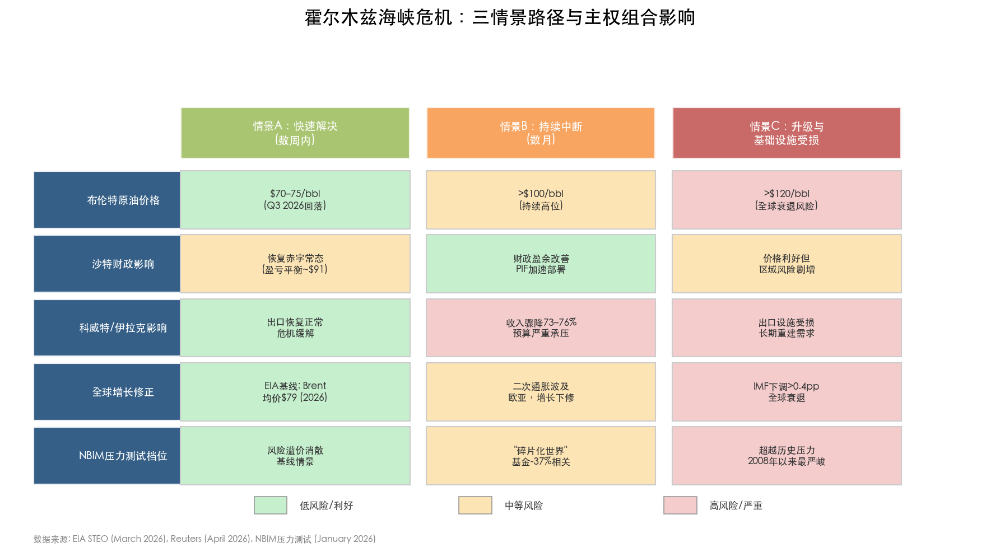

*Figure 7.2 — Three Hormuz crisis resolution scenarios and their differentiated impact on sovereign portfolios across five dimensions: Brent oil price, Saudi fiscal position, Kuwait/Iraq impact, global growth revision, and NBIM stress-test alignment. Data sources: EIA STEO (March 2026), Reuters (April 2026), NBIM stress test (January 2026).*

**Scenario A — Rapid resolution (weeks).** A ceasefire and transit resumption within Q2 2026 would likely see Brent retreat toward $70–75/bbl by Q3. Gulf SWF fiscal inflows would normalize, the Iraqi and Kuwaiti budget crises would ease, and the equity market risk premium from the shock would dissipate. This is the scenario embedded in the EIA's central forecast of $79/bbl average for full-year 2026 and $64/bbl for 2027 [EIA STEO March 2026](https://www.eia.gov/outlooks/steo/report/ "EIA Short-Term Energy Outlook, March 10, 2026").

**Scenario B — Protracted disruption (months).** If Hormuz transit remains effectively closed through Q3 2026, the supply shock would harden into a structural repricing. Brent could sustain above $100/bbl, triggering secondary inflation waves in Europe and Asia, forcing the ECB and BoJ to delay or reverse monetary easing, and compressing global growth forecasts. Saudi Arabia's fiscal position would improve materially — potentially enabling accelerated PIF deployment — while Kuwait and Iraq would face severe budget stress. NBIM's "fragmented world" stress-test scenario, which models a 37% total fund drawdown (NOK 7.7 trillion / $803 billion), would become increasingly relevant as the energy shock compounds with existing trade-policy fragmentation [Top1000funds](https://www.top1000funds.com/2026/02/nbim-quantifies-the-portfolio-threat-of-economic-fragmentation/ "NBIM fragmented world scenario, February 2026").

**Scenario C — Escalation and infrastructure damage.** Further attacks on Gulf energy infrastructure — including Red Sea shipping lanes (the Yanbu port was targeted on March 19) and the UAE's Fujairah pipeline terminal — would push Brent prices beyond $120/bbl and trigger a global recession. Sovereign fund portfolios would face simultaneous equity drawdowns and commodity-driven inflation, eliminating the traditional hedge between stocks and bonds. This scenario would represent the most severe test of sovereign fund resilience since the 2008 financial crisis.

### Russia-Ukraine Resolution — The Frozen Asset Question

The disposition of approximately €195 billion in frozen Russian sovereign assets held at Euroclear remains unresolved as of early April 2026. In December 2025, the European Council opted for joint borrowing of €90 billion for Ukraine rather than proceeding with a reparations loan backed by frozen asset principal. A Reuters report from February 2025 indicated that Russia could concede the use of $300 billion in frozen assets as part of a peace settlement. Whether these assets are ultimately returned, confiscated, or structured into a negotiated compensation mechanism will set a precedent of lasting consequence for sovereign reserve management globally. Full confiscation would confirm that Western financial infrastructure is conditionally accessible, accelerating the structural shift toward gold holdings and non-Western custodial arrangements. A negotiated return would partially restore confidence in reserve-asset security but could not fully erase the demonstrated willingness to freeze sovereign assets for geopolitical purposes.

### The Tightening Regulatory Corridor

Sovereign investors face simultaneous regulatory tightening on both the inbound and outbound investment axes. The EU's new Foreign Direct Investment Screening Regulation — politically agreed in December 2025 and expected to be formally adopted in H1 2026 with an 18-month transition period — mandates screening by all 27 member states, establishes minimum sectors for review (semiconductors, AI, quantum computing, critical infrastructure, defense, and strategic raw materials), and explicitly designates third-country government control as a risk factor requiring enhanced scrutiny [Cleary Gottlieb](https://www.clearygottlieb.com/news-and-insights/publication-listing/the-rise-of-the-new-eu-fdi-screening-regulation "The rise of the new EU FDI Screening Regulation, March 2026"). On the outbound side, the U.S. Outbound Investment Security Program, effective since January 2025, restricts American investments in Chinese semiconductor, quantum, and AI entities. A potential expansion of the Advance Foreign Investment Prohibition (AFIP) framework to cover passive investments in Chinese securities could affect sovereign funds that track broad indices containing Chinese companies.

GIC's assessment in April 2026 captures the strategic challenge with precision: geopolitical forces are "rewiring the asset allocation operating system" — a formulation indicating that traditional portfolio frameworks based on expected returns, volatility, and correlation are insufficient without overlaying a geopolitical risk layer that accounts for sanctions exposure, regulatory access conditions, and technology-governance alignment between home and host countries [Top1000funds](https://www.top1000funds.com/2026/04/gic-geopolitical-risks-rewire-asset-allocation-operating-system/ "GIC: geopolitical risks rewire asset allocation operating system, April 2026").

## 7.6 Strategic Risks — A Composite Assessment

Drawing on the evidence assembled across this report, we identify five strategic risks that are most likely to reshape government investment portfolios over the 2026–2027 horizon.

**1. AI correction cascading through passive mandates.** NBIM's stress test demonstrated that a severe AI correction could eliminate 35% of total fund value — approximately $767 billion for GPFG alone. Because most large sovereign funds track market-capitalization-weighted indices with heavy technology loadings, this risk is systemic rather than idiosyncratic. The Norwegian government's decision to commission a benchmark concentration review signals that the policy apparatus is aware of the risk; whether structural remediation — such as capping sector weights or introducing equal-weight index components — follows within the next twelve months remains an open question.

**2. Oil supply shock and divergent Gulf fiscal outcomes.** The Hormuz crisis has created an immediate fiscal divergence among Gulf states: Saudi Arabia, with bypass pipeline infrastructure, benefits from higher prices even at reduced export volumes; Kuwait and Iraq, without viable bypass routes, face revenue collapses of 73–76% on a monthly basis. Should the crisis extend beyond Q2 2026, KIA's ability to maintain its investment pace could be materially impaired, while PIF could accelerate its $600 billion U.S. commitment pipeline.

**3. Liquidity mismatch in private portfolios.** Sovereign funds have committed aggressively to private markets at a moment when distributions from buyout and real estate funds remain depressed relative to pre-2022 levels. A simultaneous downturn in public and private markets — the scenario most likely in an oil-shock-driven recession — would create acute cash-flow pressure for funds with high illiquid allocations and defined-benefit obligations or fiscal transfer requirements.

**4. Political interference across the governance spectrum.** The governance risk spectrum ranges from Norway's 2025 parliamentary decision to pause ethical divestments (reflecting geopolitical pressure on the fund's responsible-investment framework) to Indonesia's Danantara appointments drawn from the presidential campaign team to the U.S. DFC transformation, which embeds strategic-competition objectives into what would normally be a commercially-oriented mandate. In each case, the risk is not that political engagement is inherently destructive, but that it erodes the institutional independence that underpins long-term investment discipline.

**5. U.S. equity concentration across sovereign portfolios.** GPFG holds 52.9% of assets in the United States, GIC allocates 49% to the Americas, NPS directs 37.8% to overseas equities (predominantly U.S.-weighted), and Temasek has expanded its Americas weighting to 24%. The Norwegian government's expert committee explicitly advised that "geopolitical risk escalation requires continued broad geographic diversification." The irony is that the very forces driving concentration — U.S. technology leadership, AI infrastructure demand, and Gulf diplomatic investment commitments — also increase the systemic exposure of the global sovereign fund complex to a single-country correction.

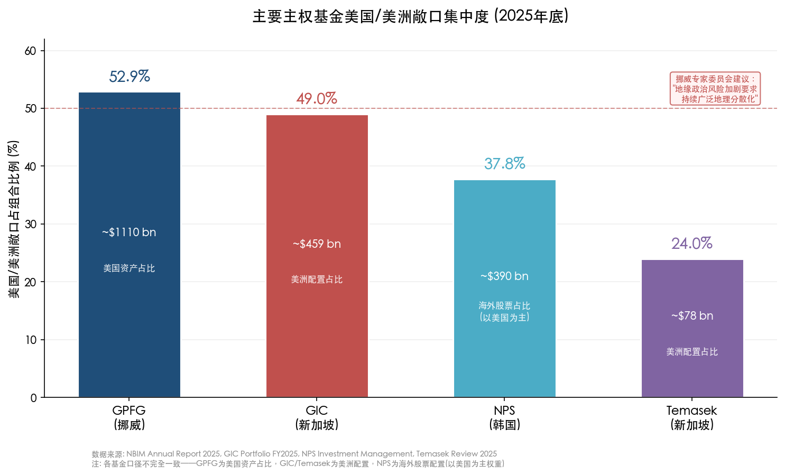

*Figure 7.3 — U.S./Americas exposure concentration across four major sovereign funds at end-2025. GPFG's 52.9% U.S. allocation represents approximately $1,110 billion, the largest single-country sovereign exposure in absolute terms. The Norwegian expert committee's recommendation for "continued broad geographic diversification" in light of geopolitical risk escalation applies with varying urgency to all four funds. Note: GPFG reports U.S. asset share; GIC and Temasek report Americas allocation; NPS reports overseas equity allocation (predominantly U.S.-weighted). Data sources: NBIM Annual Report 2025, GIC Portfolio FY2025, NPS Investment Management, Temasek Review 2025.*

## 7.7 Forward Assessment

The state-owned investment complex enters the second quarter of 2026 at a scale ($60 trillion in aggregate AUM) and strategic significance unprecedented in financial history. The trajectory toward $80 trillion by 2030 is plausible but will be shaped decisively by the resolution of the concurrent crises and structural transitions documented in this chapter.

Three propositions define our forward outlook.

First, the AI infrastructure investment cycle will continue to absorb a disproportionate share of sovereign capital deployment through 2027, but the character of that deployment will shift. The initial phase (2024–2025) was dominated by platform-level equity stakes in frontier AI companies and mega-scale data center acquisitions. The next phase (2026–2027) will increasingly involve operational risk — construction execution, power procurement, permitting delays — and sovereign investors will need to develop or acquire infrastructure management capabilities that most currently lack. The distinction between financial investors and operational principals will narrow, and those sovereign funds that fail to build or partner for execution capacity risk becoming passive capital providers in an asset class that rewards active management.

Second, the Hormuz crisis, regardless of its specific resolution timeline, has permanently altered the risk calculus for commodity-funded SWFs and their counterparties. The demonstrated vulnerability of the Strait — and the asymmetric impact on Gulf states depending on their bypass infrastructure — will accelerate both physical hedging (pipeline investment in Kuwait and Iraq) and financial hedging (geographic and asset-class diversification away from hydrocarbon-correlated assets). Kuwait and Iraq will face the most acute pressure to build pipeline bypass capacity — a multi-year, multi-billion-dollar endeavor that will itself require sovereign capital allocation.

Third, the regulatory environment for cross-border sovereign investment is tightening on a trajectory that is unlikely to reverse. The combination of the EU FDI screening mandate, U.S. outbound investment restrictions, Australian zero-threshold foreign government investor screening, and potential AFIP expansion to passive Chinese securities means that sovereign funds face an increasingly narrow corridor for deploying capital without triggering regulatory scrutiny. Santiago Principles compliance — voluntary and imperfect as it is — will become a more valuable form of institutional signaling, as host-country regulators increasingly use governance quality as a criterion differentiating between sovereign investors that merit streamlined approval and those that do not.

# 结论与风险提示
