# 执行摘要

# Theoretical Foundations of Quantitative Asset Allocation

## 1.1 The Portfolio Optimization Problem: Formal Definition and Historical Context

Quantitative asset allocation begins with a deceptively simple question: given a universe of *n* risky assets, how should an investor distribute capital to achieve the best trade-off between expected return and risk? Harry Markowitz answered this question in 1952 by casting portfolio construction as a mathematical optimization program — a formulation that earned him the Nobel Prize in Economics (1990) and launched modern portfolio theory.

In its canonical form, the Markowitz mean-variance optimization (MVO) problem can be stated in two equivalent ways. The risk-constrained formulation is:

**maximize** μᵀw **subject to** wᵀΣw ≤ σ²_tar, **1**ᵀw = 1

where **w** ∈ ℝⁿ denotes the portfolio weight vector, **μ** ∈ ℝⁿ the vector of expected asset returns, **Σ** ∈ ℝⁿˣⁿ the covariance matrix of asset returns, and σ²_tar a target variance level. The equivalent risk-adjusted formulation maximizes the utility function **μᵀw − γwᵀΣw** subject to the budget constraint **1**ᵀw = 1, where γ > 0 is the investor's risk aversion coefficient. The analytical solution takes the closed form:

**w⋆ = (1/2γ) Σ⁻¹(μ + ν1)**

where ν is a Lagrange multiplier enforcing the budget constraint [Boyd et al. 2024](https://web.stanford.edu/~boyd/papers/pdf/markowitz.pdf "Markowitz Portfolio Construction at Seventy, Stanford, January 2024").

Several foundational assumptions underpin this framework. Markowitz assumed a single-period investment horizon and an expected-value–variance (E–V) decision rule. A persistent misconception — what some scholars term the "Great Confusion" — is that MVO requires asset returns to follow a Gaussian (normal) distribution. In reality, Gaussian returns are sufficient but not necessary for the E–V rule to yield optimal portfolios; the necessary condition is either quadratic utility or elliptically distributed returns. Nonetheless, the Gaussian assumption remains pervasive in practice and in regulatory frameworks, and the distinction carries material consequences because real-world returns exhibit pronounced negative skewness and excess kurtosis [Boyd et al. 2024](https://web.stanford.edu/~boyd/papers/pdf/markowitz.pdf "Markowitz Portfolio Construction at Seventy, Stanford, January 2024").

The analytical solution's dependence on the inverse covariance matrix Σ⁻¹ reveals the framework's central vulnerability: acute sensitivity to estimation error. As Section 1.3 demonstrates, this sensitivity constitutes the single most important limitation of classical portfolio optimization and the primary motivation for the machine learning methods surveyed in subsequent chapters.

## 1.2 Taxonomy of Risk Measures

A risk measure quantifies the uncertainty or potential loss associated with a portfolio position. The choice of risk measure fundamentally shapes the optimization landscape, the computational tractability of the resulting program, and the economic properties of the optimal portfolio. This section establishes the hierarchy of risk measures — from variance through VaR, CVaR, and drawdown-based measures — that form the evaluative backbone of this report.

### 1.2.1 Variance and Standard Deviation

Portfolio variance, **σ² = wᵀΣw**, is the original risk measure of modern portfolio theory. Variance is mathematically convenient — it preserves the convexity of the optimization problem — and admits closed-form solutions via the Lagrangian framework described in Section 1.1. Its principal limitation is symmetry: variance penalizes upside deviations identically to downside deviations, a property fundamentally at odds with investors' asymmetric loss aversion. Despite this shortcoming, variance remains the default risk measure in a majority of academic and practitioner optimization frameworks [Palomar 2025](https://portfoliooptimizationbook.com/book/6.3-performance-measures.html "Portfolio Optimization textbook, Section 6.3").

### 1.2.2 Value-at-Risk (VaR)

Value-at-Risk at confidence level α is defined as the α-quantile of the portfolio loss distribution: it answers the question, "What is the maximum loss that will not be exceeded with probability α?" VaR became the regulatory standard for market risk capital under the Basel II framework. However, Artzner, Delbaen, Eber, and Heath (1999) demonstrated that VaR fails the subadditivity axiom — the VaR of a combined portfolio can exceed the sum of individual VaRs — thereby violating the fundamental principle that diversification should reduce, not increase, measured risk. This failure disqualifies VaR as a *coherent* risk measure under the four-axiom framework (translation invariance, subadditivity, positive homogeneity, and monotonicity) [Artzner et al. 1999](https://people.math.ethz.ch/~delbaen/ftp/preprints/CoherentMF.pdf "Coherent Measures of Risk, Mathematical Finance 9(3): 203–228, 1999").

### 1.2.3 Conditional Value-at-Risk (CVaR) / Expected Shortfall

CVaR (also termed Expected Shortfall, ES) is defined as the expected loss conditional on the loss exceeding the VaR threshold. CVaR satisfies all four coherent risk measure axioms established by Artzner et al. (1999): translation invariance, subadditivity, positive homogeneity, and monotonicity. Crucially for computational tractability, Rockafellar and Uryasev (2000) demonstrated that CVaR can be optimized via linear programming, preserving the convex structure necessary for efficient large-scale portfolio optimization [Rockafellar & Uryasev 2000](https://sites.math.washington.edu/~rtr/papers/rtr179-CVaR1.pdf "Optimization of Conditional Value-at-Risk, The Journal of Risk, 2(3), 2000").

The Basel Committee's Fundamental Review of the Trading Book (FRTB), finalized in January 2019 (BIS standard d457), replaced the 10-day 99% VaR with **Expected Shortfall at the 97.5% confidence level** as the standard metric for internal-model-approach market risk capital. This regulatory shift codified the academic consensus that coherent, tail-sensitive risk measures are superior to quantile-based measures for systemic risk management [Finalyse FRTB Guide](https://www.finalyse.com/blog/var-an-introductory-guide-in-the-context-of-frtb "VaR: An Introductory Guide in the context of FRTB, citing BIS d457").

### 1.2.4 Maximum Drawdown and Conditional Drawdown-at-Risk

Maximum drawdown measures the largest peak-to-trough decline over a given period and is a path-dependent risk measure favored by practitioners because it directly captures the worst cumulative loss experience an investor would endure. Its extension, Conditional Drawdown-at-Risk (CDaR), applies the CVaR concept to the drawdown distribution, yielding a coherent, path-dependent risk measure that can be incorporated into convex optimization frameworks [Palomar 2025](https://portfoliooptimizationbook.com/book/6.3-performance-measures.html "Portfolio Optimization textbook, Section 6.3").

The following figure summarizes the risk measure hierarchy, core properties, and the associated regulatory evolution from Basel II VaR to FRTB Expected Shortfall:

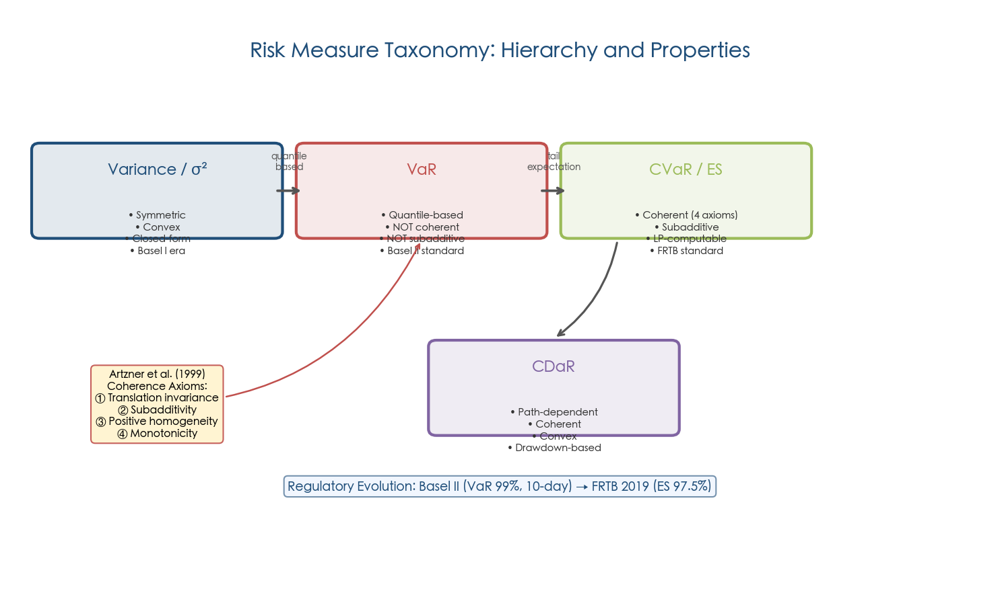

The progression from variance through VaR and CVaR to CDaR reflects both an increasing theoretical sophistication in capturing tail risk and a growing regulatory consensus that coherent, tail-sensitive measures should replace simple quantile-based metrics. This hierarchy directly informs the risk measurement choices evaluated across the portfolio optimization models in subsequent chapters.

## 1.3 The Estimation Error Problem: Why Classical Optimization Fails in Practice

The elegance of MVO's closed-form solution obscures a severe practical obstacle: the solution is only as reliable as its inputs. Both the expected return vector **μ** and the covariance matrix **Σ** must be estimated from historical data, and these estimates are inevitably noisy. The consequences of this noise are not merely academic — they dominate the out-of-sample performance of optimized portfolios.

### 1.3.1 "Estimation-Error Maximizers"

Richard Michaud (1989) characterized mean-variance optimizers as **"estimation-error maximizers"**: the optimizer systematically overweights assets with the largest positive estimation errors in expected returns and underweights those with the largest negative errors. Rather than exploiting genuine return opportunities, the optimizer exploits statistical noise.

Chopra and Ziemba (1993) quantified the relative importance of input errors: at moderate risk aversion, errors in expected return estimates are approximately **10 times more damaging** to portfolio performance than errors in variance estimates and approximately **20 times more damaging** than errors in covariance estimates. At high risk aversion levels the gap narrows, but expected return estimation error remains the dominant source of portfolio inefficiency [Chopra & Ziemba 1993](https://people.duke.edu/~charvey/Teaching/BA453_2006/Chopra_The_effect_of_1993.pdf "The Effect of Errors in Means, Variances, and Covariances on Optimal Portfolio Choice, JPM Winter 1993").

DeMiguel, Garlappi, and Uppal (2009) delivered the most sobering empirical verdict: across seven empirical datasets, **none of 14 optimized portfolio strategies consistently outperformed the naïve equally-weighted (1/N) portfolio** on an out-of-sample, transaction-cost-adjusted basis. Their analysis estimated that sample-based MVO would require approximately **3,000 months of data for a 25-asset portfolio** and **6,000 months for a 50-asset portfolio** to reliably surpass 1/N — time horizons that far exceed any available financial dataset [DeMiguel et al. 2009](https://academic.oup.com/rfs/article/22/5/1915/1592901 "Optimal Versus Naive Diversification, Review of Financial Studies, 22(5): 1915–1953").

### 1.3.2 The Covariance Estimation Challenge

The covariance matrix **Σ** for *n* assets has *n(n+1)/2* unique parameters. For a universe of 500 assets, this amounts to 125,250 parameters — a figure that dwarfs typical sample sizes available from daily or monthly return histories. Random Matrix Theory (RMT), specifically the Marchenko-Pastur law, establishes that when the ratio *q = n/T* (assets to time observations) does not converge to zero, sample eigenvalues are systematically distorted: the largest eigenvalues are biased upward and the smallest biased downward. This spectral distortion propagates directly into portfolio weights through the inverse covariance matrix, amplifying precisely the estimation errors that Michaud warned against [Palomar 2019](https://palomar.home.ece.ust.hk/MAFS6010R_lectures/slides_shrinkage_n_BL.pdf "Shrinkage and BL, HKUST, RMT Section").

Ledoit and Wolf (2004) proposed the now-standard remedy: shrink the sample covariance matrix toward a structured target. Their linear shrinkage estimator takes the form **Σ̂_shrink = α̂F + (1−α̂)S**, where *F* is a constant-correlation target and *S* the sample covariance matrix. In their empirical study with *N* = 100 assets, the annualized information ratio rose from 0.59 (sample covariance) to 0.91 (shrinkage estimator) — a roughly 54% improvement. Their verdict was unequivocal: **"nobody should be using the sample covariance matrix"** [Ledoit & Wolf 2004](https://econ.uzh.ch/dam/jcr:8a18d37f-3238-4c14-a276-66392e82961b/jpm_2004..pdf "Honey, I Shrunk the Sample Covariance Matrix, Journal of Portfolio Management, 2004").

Subsequent advances have further refined covariance estimation. Nonlinear shrinkage (Ledoit & Wolf, 2017) applies a distinct correction to each eigenvalue rather than a uniform linear shrink, better preserving the spectral structure of the true covariance matrix. Factor model decomposition **Σ = FΣ_fFᵀ + D** reduces the parameter count from O(n²) to O(nk), where *k* is the number of factors. For a universe of 10,000 assets with 100 factors, this yields an approximately 10,000-fold reduction in the effective dimensionality of estimation [Boyd et al. 2024](https://web.stanford.edu/~boyd/papers/pdf/markowitz.pdf "Markowitz Portfolio Construction at Seventy, §3.3").

## 1.4 Return Prediction Paradigms

The estimation error hierarchy identified by Chopra and Ziemba (1993) — expected return errors dominate variance and covariance errors by an order of magnitude — implies that improving return forecasts is the single highest-leverage activity in portfolio optimization. Return prediction paradigms have evolved through three distinct generations, each expanding the class of patterns that can be captured from historical and alternative data.

### 1.4.1 Equilibrium and Factor-Based Approaches

The Capital Asset Pricing Model (CAPM) and its multi-factor descendants — the Fama-French three-factor model, Carhart four-factor model, and Fama-French five-factor model — derive expected returns from systematic risk exposures. These models provide theoretically grounded, low-variance forecasts but are constrained by their linear, time-invariant structure and their reliance on a fixed set of priced factors. The Black-Litterman model (1992) extends this equilibrium paradigm by blending market-implied equilibrium returns with subjective investor views via Bayesian updating, a framework examined in detail in Chapter 2.

### 1.4.2 Statistical Forecasting

Time-series econometric models — autoregressive models, vector autoregressions, and regime-switching models — attempt to extract predictable components from historical return dynamics. Welch and Goyal (2008) famously demonstrated that most macroeconomic predictors fail to reliably forecast equity risk premiums out of sample, challenging the practical value of this paradigm for aggregate market timing.

### 1.4.3 Machine Learning Forecasting

Machine learning methods represent the third generation of return prediction, distinguished by their capacity to process high-dimensional predictor sets and to capture nonlinear, interactive relationships that elude linear econometric specifications. The benchmark study by Gu, Kelly, and Xiu (2020) compared the full spectrum of ML methods on nearly 30,000 U.S. individual stocks over 60 years (1957–2016), using 94 stock-level characteristics, 8 macroeconomic predictors, 74 industry dummies, and all characteristic-macro interactions — totaling over 900 baseline signals. Their findings established a clear hierarchy of predictive power measured by monthly out-of-sample R²:

- **OLS benchmark** (size, book-to-market, momentum): R²_oos = 0.16%
- **OLS with 900+ predictors**: R²_oos deeply negative (severe overfitting)
- **Elastic net**: R²_oos = 0.11%
- **PCR / PLS**: R²_oos = 0.26% – 0.27%
- **Regression trees and neural networks**: R²_oos = **0.33% – 0.40%**

The three-hidden-layer neural network (NN3, with a 32-16-8 architecture) delivered the highest predictive accuracy. Economically, a portfolio strategy timing the S&P 500 using neural network forecasts achieved an annualized out-of-sample Sharpe ratio of 0.77, compared with 0.51 for a buy-and-hold investor. A value-weighted long-short decile spread based on stock-level neural network predictions earned an annualized Sharpe ratio of **1.35**, more than doubling the 0.61 Sharpe ratio of the OLS benchmark strategy [Gu, Kelly & Xiu 2020](https://dachxiu.chicagobooth.edu/download/ML.pdf "Empirical Asset Pricing via Machine Learning, Review of Financial Studies, 33(5): 2223–2273, 2020").

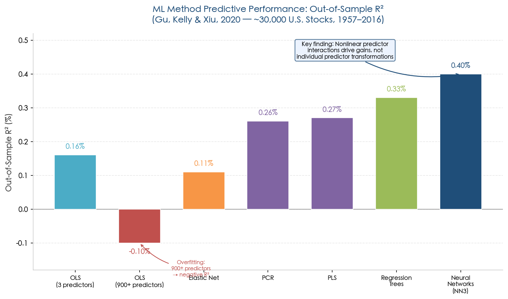

A critical finding of the Gu, Kelly, and Xiu (2020) study was that the generalized linear model — which introduces nonlinearity via spline functions of individual predictors but excludes cross-predictor interactions — failed to robustly outperform the linear specification. This result demonstrates that **nonlinear interactions among predictors, rather than nonlinear transformations of individual predictors, constitute the crucial source of predictive gain** from machine learning methods [Gu, Kelly & Xiu 2020](https://dachxiu.chicagobooth.edu/download/ML.pdf "RFS, 33(5), 2020").

## 1.5 Performance Evaluation Criteria

Consistent evaluation metrics are essential for comparing allocation models across the diverse paradigms surveyed in this report. This section defines the canonical metrics adopted throughout all subsequent chapters, ensuring that performance claims are measured against a uniform standard.

### 1.5.1 Risk-Adjusted Return Ratios

**Sharpe Ratio.** The Sharpe ratio is defined as SR = (wᵀμ − r_f) / √(wᵀΣw), where r_f is the risk-free rate. It measures excess return per unit of total volatility and remains the most widely cited single-number performance metric in both academic research and industry practice. Its principal limitation is the symmetric treatment of upside and downside volatility, which penalizes strategies with positively skewed returns.

**Sortino Ratio.** The Sortino ratio replaces total volatility with downside semi-deviation, computed only over returns falling below a minimum acceptable return threshold (typically zero or the risk-free rate). By isolating harmful volatility, the Sortino ratio provides a more appropriate measure for strategies with asymmetric return distributions.

**Calmar Ratio.** The Calmar ratio divides annualized return by maximum drawdown, directly linking performance to the worst cumulative loss experience. It is path-dependent and particularly relevant for strategies where drawdown constraints are binding or where investor utility is strongly influenced by peak-to-trough declines.

**Information Ratio.** The information ratio measures active return (portfolio return minus benchmark return) per unit of tracking error (standard deviation of active returns). It serves as the standard metric for evaluating active management skill relative to a specified benchmark.

### 1.5.2 Turnover and Transaction-Cost-Adjusted Returns

Portfolio turnover, defined as **T = ½||z||₁** where *z* is the vector of weight changes at rebalancing, directly determines realized trading costs. Realistic performance evaluation must deduct transaction costs — including commissions, bid-ask spreads, and market impact — from gross returns. Market impact costs are typically modeled as a nonlinear function of trade size; a commonly employed specification is κ_impact·|z|^{3/2}, reflecting the concave price impact of large orders in illiquid markets. Failure to account for these costs can dramatically overstate the viability of high-turnover strategies, a concern that is especially acute for ML-based allocation methods [Palomar 2025](https://portfoliooptimizationbook.com/book/6.3-performance-measures.html "Portfolio Optimization textbook, Section 6.3") [Boyd et al. 2024](https://web.stanford.edu/~boyd/papers/pdf/markowitz.pdf "Markowitz Portfolio Construction at Seventy, §5").

### 1.5.3 Out-of-Sample R² and Statistical Testing

For return prediction models, the out-of-sample R² is defined as R²_oos = 1 − Σ(r − r̂)² / Σr², where the benchmark prediction is zero (the unconditional expectation of excess returns). This stringent benchmark avoids the pitfall of inflating R² by comparing against noisy historical mean returns. Pairwise model comparisons employ the Diebold-Mariano (1995) test, adapted for panel data by cross-sectionally averaging prediction errors before computing the test statistic. Given the notoriously low signal-to-noise ratio in financial return prediction, even small positive R²_oos values (e.g., 0.3–0.4%) represent economically significant predictive content [Gu, Kelly & Xiu 2020](https://dachxiu.chicagobooth.edu/download/ML.pdf "RFS, 33(5), 2020").

## 1.6 Why Machine Learning Entered Portfolio Optimization

The migration of machine learning into portfolio optimization was driven not by technological fashion but by six fundamental limitations of the classical framework that became increasingly binding as financial markets grew in complexity and data availability expanded.

### 1.6.1 The Curse of Dimensionality in Covariance Estimation

As demonstrated in Section 1.3.2, the covariance matrix for *n* assets contains *n(n+1)/2* free parameters. The Ledoit and Wolf (2004) study showed that for 500 assets, the annualized information ratio collapsed from 1.24 (with *N* = 30 assets) to 0.30 (with *N* = 500 assets) when using the sample covariance matrix — a 76% deterioration driven purely by dimensionality [Ledoit & Wolf 2004](https://econ.uzh.ch/dam/jcr:8a18d37f-3238-4c14-a276-66392e82961b/jpm_2004..pdf "Honey, I Shrunk the Sample Covariance Matrix, JPM, 2004"). Machine learning methods — particularly graph-based models, hierarchical clustering (HRP), and neural covariance estimators — offer dimension-reduction strategies that scale more gracefully to large asset universes.

### 1.6.2 Non-Linearity, Skewness, and Kurtosis

Financial returns consistently exhibit non-Gaussian features: negative skewness (crash risk), excess kurtosis (fat tails), and time-varying higher moments. Eugene Fama documented excess kurtosis in stock returns as early as 1965, challenging the Gaussian foundation of MVO. Linear models are structurally limited to capturing first and second moments; they cannot model the nonlinear interactions between predictors that Gu, Kelly, and Xiu (2020) identified as the primary source of cross-sectional predictive power. Neural networks and tree ensembles, by contrast, are universal function approximators capable of capturing arbitrary nonlinear patterns in the joint distribution of predictors and returns.

### 1.6.3 Regime Changes and Non-Stationarity

Financial markets undergo structural regime changes — from low-volatility bull markets to crisis periods — that violate the stationarity assumption underpinning sample-based estimation. A covariance matrix estimated from a 2003–2007 expansion period provides dangerously misleading guidance during a 2008-style financial crisis, when correlations spike and volatilities multiply. ML methods, particularly regime-detection algorithms (Hidden Markov Models, unsupervised clustering) and reinforcement learning with adaptive state representations, offer mechanisms to detect and respond to regime shifts in real time.

### 1.6.4 Alternative Data Explosion

The proliferation of alternative data — satellite imagery, credit card transaction flows, social media sentiment, supply chain signals, and geolocation data — creates information streams that are unstructured, high-dimensional, and non-tabular. Traditional portfolio optimization has no mechanism to incorporate such data into the estimation of expected returns or covariances. Natural language processing, convolutional neural networks, and multimodal learning architectures provide the necessary feature extraction capabilities to transform raw alternative data into structured signals suitable for allocation decisions.

### 1.6.5 Static Single-Period Assumption

The Markowitz framework is inherently single-period: it optimizes a portfolio for one rebalancing horizon without accounting for transaction costs, path dependency, or multi-period wealth dynamics. Theoretical results have shown that under special conditions, the single-period solution can approximate the multi-period optimum (Gârleanu & Pedersen, 2020), and Moallemi et al. (2013) proved that single-period strategies can approach the performance upper bound of full stochastic control. However, these results rely on restrictive assumptions — notably, constant investment opportunities and absence of trading frictions. Reinforcement learning formulations naturally model sequential decision-making with transaction costs and path-dependent objectives, offering a more general multi-period framework that does not require such assumptions [Boyd et al. 2024](https://web.stanford.edu/~boyd/papers/pdf/markowitz.pdf "Markowitz Portfolio Construction at Seventy, §1.2").

### 1.6.6 Inability to Exploit Predictor Interactions

The Gu, Kelly, and Xiu (2020) finding that predictor interactions — not individual predictor nonlinearities — drive predictive gains constitutes a fundamental indictment of linear and additive models. With 900+ baseline signals, the space of pairwise interactions exceeds 400,000 dimensions; exhaustive search is computationally infeasible for traditional econometric methods but lies precisely within the domain where tree ensembles and neural networks excel through automatic feature interaction learning.

## 1.7 Machine Learning Taxonomy for Asset Allocation

To organize the diverse ML approaches surveyed in subsequent chapters, we adopt a three-branch taxonomy aligned with the learning paradigm. The following figure provides an overview of this classification:

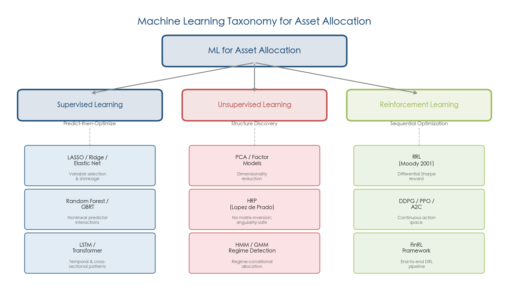

### 1.7.1 Supervised Learning: Predict-then-Optimize

Supervised learning models are trained on labeled data (historical returns and characteristics) to predict future returns or covariance structures, which then serve as inputs to a classical optimizer. Representative methods include:

- **Penalized regression** (LASSO, Ridge, Elastic Net): variable selection and coefficient shrinkage for high-dimensional linear return prediction models, offering a direct bridge from traditional factor models to data-driven forecasting.
- **Tree ensembles** (Random Forests, Gradient Boosted Regression Trees): nonparametric models that capture multi-way predictor interactions via recursive partitioning, achieving strong predictive performance with relatively modest data requirements.
- **Neural networks** (feedforward, LSTM, Transformer): flexible function approximators capable of modeling complex temporal dynamics and cross-sectional dependencies, representing the highest-capacity approaches in the supervised learning toolkit.

The predict-then-optimize paradigm preserves the interpretability of the optimization stage but introduces a potential mismatch: the prediction model's loss function (e.g., mean squared error) may not align with the portfolio's ultimate objective (e.g., Sharpe ratio maximization). End-to-end approaches that directly optimize financial objectives through the prediction model represent an active area of research, as discussed in Chapter 3.

### 1.7.2 Unsupervised Learning: Structure Discovery

Unsupervised methods extract latent structure from return data without predefined labels, addressing portfolio construction from the risk and structure side rather than the return prediction side:

- **Principal Component Analysis (PCA)**: identifies the dominant factors driving cross-sectional return variation, reducing dimensionality for covariance estimation and providing a data-driven alternative to pre-specified factor models.
- **Hierarchical Risk Parity (HRP)** (López de Prado, 2016): applies hierarchical clustering to the correlation matrix, followed by recursive bisection with inverse-variance weighting. HRP entirely avoids covariance matrix inversion and can compute portfolio weights even when the covariance matrix is singular — a property particularly valuable for large, ill-conditioned asset universes.
- **Regime detection** (Hidden Markov Models, Gaussian Mixture Models): classifies market states into distinct regimes (e.g., bull, bear, crisis) to enable regime-conditional allocation, adapting portfolio construction to the prevailing market environment.

### 1.7.3 Reinforcement Learning: Sequential Optimization

Reinforcement learning (RL) models portfolio management as a Markov Decision Process (MDP): the state s_t encodes current market conditions and portfolio holdings, the action a_t specifies portfolio weights on the probability simplex, and the reward r_t captures portfolio return net of transaction costs. Moody and Saffell (2001) pioneered the Recurrent Reinforcement Learning (RRL) approach with a differential Sharpe ratio reward function, demonstrating outperformance over buy-and-hold and Q-learning benchmarks on U.S. Treasury bond data spanning 1970 to 1994 [Moody & Saffell 2001](https://pubmed.ncbi.nlm.nih.gov/18249919/ "Learning to Trade via Direct Reinforcement, IEEE Trans. Neural Networks, 12(4): 875–889, 2001").

Modern deep RL algorithms — Deep Deterministic Policy Gradient (DDPG), Proximal Policy Optimization (PPO), and Advantage Actor-Critic (A2C) — extend this framework with neural network function approximators for both policy and value functions, enabling continuous action spaces and high-dimensional state representations. The FinRL library (Liu et al., 2020) provides an open-source framework supporting these algorithms across multiple market environments, including NASDAQ-100, DJIA, S&P 500, and major Asian indices [Liu et al. 2020](https://arxiv.org/abs/2011.09607 "FinRL: A Deep Reinforcement Learning Library for Automated Stock Trading in Quantitative Finance, NeurIPS 2020 DRL Workshop").

RL's distinctive advantage lies in its native handling of transaction costs, multi-period optimization, and path-dependent objectives — the very limitations that constrain the Markowitz framework. Its distinctive challenges include reward shaping sensitivity, sample inefficiency, training instability, and catastrophic forgetting during regime transitions — topics examined in detail in Chapter 3.

## 1.8 Unified Notation Convention

To ensure notational consistency across all chapters of this report, the following conventions are adopted:

| Symbol | Definition |
|--------|-----------|
| **w** ∈ ℝⁿ | Portfolio weight vector |
| **μ** ∈ ℝⁿ | Expected return vector |
| **Σ** ∈ ℝⁿˣⁿ | Covariance matrix of asset returns |
| **Π** ∈ ℝⁿ | Implied equilibrium excess return vector (= λΣw_mkt) |
| γ | Risk aversion coefficient |
| r_f | Risk-free rate |
| **P** | Pick matrix (views × assets) in Black-Litterman |
| **Q** | View return vector in Black-Litterman |
| **Ω** | View uncertainty matrix in Black-Litterman |
| τ | Scalar uncertainty parameter in Black-Litterman |
| s_t, a_t, r_t | State, action, reward in RL at time *t* |
| R²_oos | Out-of-sample predictive R-squared |
| SR | Sharpe ratio |
| T | Portfolio turnover |

Key terminological conventions are standardized as follows: "expected return" and "return forecast" are used interchangeably for conditional expected excess return; "alpha signal" refers specifically to a return forecast in excess of a factor model's prediction; "risk budget" denotes a targeted risk contribution (absolute or relative); "rebalancing frequency" specifies the calendar interval between portfolio weight updates. These conventions apply throughout the remainder of this report.

## 1.9 The Estimation-Error Thread: A Unifying Lens

Across the classical and machine learning paradigms examined in this report, estimation error serves as the binding analytical thread. Each model family can be evaluated by how it confronts — or fails to confront — the fundamental problem that optimization inputs are estimated with noise:

- **Mean-Variance Optimization** amplifies estimation error through the inverse covariance matrix Σ⁻¹, earning the "estimation-error maximizer" characterization (Chapter 2).
- **Black-Litterman** mitigates expected-return estimation error by anchoring forecasts to market-implied equilibrium returns, but introduces a distinct estimation challenge: calibrating the view confidence parameters τ and Ω (Chapter 2).
- **Shrinkage and robust optimization** directly target estimation error by biasing inputs toward structured priors, accepting a controlled increase in bias to achieve a larger reduction in estimation variance (Chapter 2).
- **Deep learning models** bypass explicit parametric estimation of μ and Σ by learning end-to-end mappings from raw features to portfolio weights, but substitute financial parameter estimation error for neural network weight estimation error — a trade-off governed by model capacity, training data volume, and regularization intensity (Chapter 3).
- **Reinforcement learning** replaces static estimation with adaptive sequential learning, but confronts its own estimation challenges: reward shaping sensitivity, policy gradient variance, and catastrophic forgetting during regime transitions (Chapter 3).

The cross-model comparison in Chapter 4 evaluates each model family's performance along the dimensions established in this chapter — risk measurement fidelity, return prediction accuracy, and allocation stability — using the unified evaluation criteria defined in Section 1.5.

# Classic Portfolio Optimization Models — Mean-Variance and Black-Litterman

The two most influential frameworks in quantitative asset allocation — Mean-Variance Optimization (MVO) and the Black-Litterman (BL) model — share a common mathematical lineage yet address fundamentally different aspects of the portfolio construction problem. MVO, formalized by Markowitz in 1952, establishes the canonical trade-off between expected return and risk but is notoriously sensitive to estimation error in its inputs. The BL model, introduced by Fischer Black and Robert Litterman at Goldman Sachs in 1990–1992, responds directly to this fragility by anchoring portfolio weights to a market equilibrium prior and blending in investor views through Bayesian updating. This chapter provides a rigorous exposition of both models, catalogues the regularization techniques developed to stabilize MVO, surveys their empirical track record across asset classes, and identifies the structural limitations that collectively motivate the machine learning alternatives examined in subsequent chapters.

## 2.1 Mean-Variance Optimization: Mathematical Framework

### 2.1.1 The Optimization Problem and Its Analytical Solution

The Markowitz MVO problem admits two equivalent formulations. In the risk-constrained form, the investor maximizes expected portfolio return subject to a variance ceiling:

**maximize** μᵀw **subject to** wᵀΣw ≤ (σ_tar)², **1**ᵀw = 1

In the risk-adjusted form, a quadratic utility function penalizes variance directly:

**maximize** μᵀw − γwᵀΣw **subject to** **1**ᵀw = 1

where **w** ∈ ℝⁿ denotes the portfolio weight vector, **μ** the expected return vector, **Σ** the n × n positive-semidefinite covariance matrix, and γ > 0 the investor's risk aversion coefficient. Setting the Lagrangian first-order conditions yields the unconstrained analytical solution **w⋆ = (1/2γ)Σ⁻¹(μ + ν⋆1)**, where ν⋆ is the Lagrange multiplier enforcing the budget constraint. The presence of the inverse covariance matrix Σ⁻¹ is the root cause of MVO's well-documented instability: when Σ is near-singular — a frequent occurrence in large asset universes with limited estimation samples — small perturbations in the inputs propagate into disproportionately large changes in optimal weights [Boyd et al. 2024](https://web.stanford.edu/~boyd/papers/pdf/markowitz.pdf "Markowitz Portfolio Construction at Seventy, Stanford, January 2024").

In institutional practice, the unconstrained problem is augmented with constraints that reflect real-world frictions: long-only constraints (w ≥ 0), position limits (w_i ≤ w_max), leverage bounds (||w||₁ ≤ L), turnover constraints (½||w − w_prev||₁ ≤ T_max), sector neutrality, and factor exposure limits. A critical insight is that all such constraints preserve the convexity of the problem, enabling modern convex optimization solvers to handle universes of tens of thousands of assets in sub-second computation time [Boyd et al. 2024](https://web.stanford.edu/~boyd/papers/pdf/markowitz.pdf "Markowitz Portfolio Construction at Seventy, §1.1").

### 2.1.2 The Efficient Frontier and Corner Portfolios

The locus of portfolios that minimize variance for each level of expected return traces the efficient frontier in (σ, μ) space. In the absence of constraints, the frontier is a hyperbola in the full risk-return plane; with a risk-free asset, the tangent line from the risk-free rate to the frontier defines the Capital Market Line, and the tangency portfolio maximizes the Sharpe Ratio.

When inequality constraints are imposed — particularly long-only and position-limit constraints — the efficient frontier becomes piecewise quadratic. At each "corner" portfolio, the set of active constraints changes as an asset enters or exits the optimal allocation. Between corners, the optimal weights are linear functions of the target return. The Critical Line Algorithm (CLA), developed by Markowitz himself, exploits this piecewise structure to trace the exact constrained frontier. In contemporary implementations, however, general-purpose quadratic programming solvers have largely supplanted CLA [Boyd et al. 2024](https://web.stanford.edu/~boyd/papers/pdf/markowitz.pdf "Markowitz Portfolio Construction at Seventy, §1.1").

The figure below illustrates these concepts on an eight-asset illustrative universe spanning U.S. and international equities, bonds, real estate, commodities, and cash. The unconstrained frontier (blue) extends beyond the long-only frontier (red dashed) by exploiting short positions, while the positions of the minimum-variance, risk-parity, equal-weight (1/N), and market-cap-weighted portfolios reveal the practical trade-offs among classical allocation strategies.

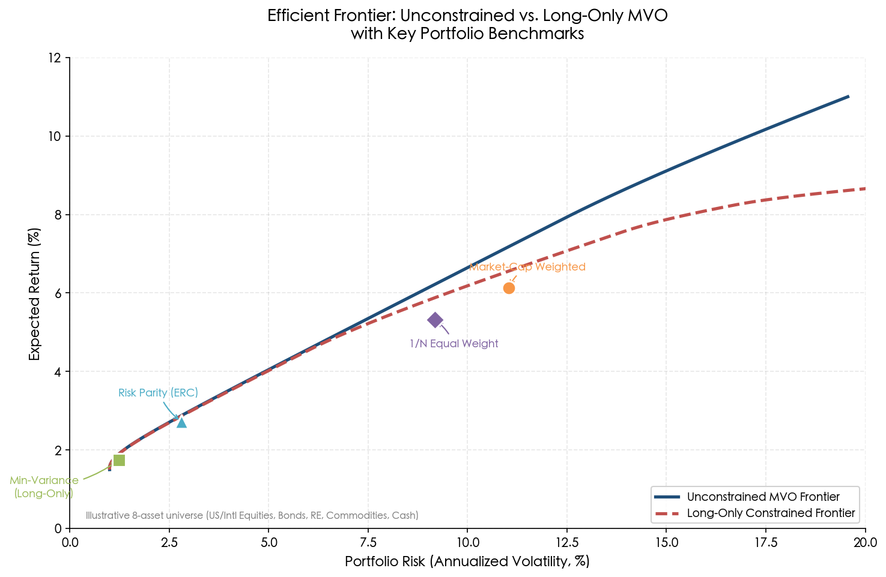

## 2.2 The Estimation-Error Problem: MVO as an "Error Maximizer"

### 2.2.1 Michaud's Critique and the Instability of Optimal Weights

Richard Michaud (1989) characterized mean-variance optimizers as **"estimation-error maximizers"**: the optimizer systematically overweights assets whose expected returns are overestimated and underweights those whose returns are underestimated, because the optimization process seeks extreme allocations to exploit apparent — but spurious — advantages in the input parameters. The consequence is portfolios that appear optimal in-sample yet deteriorate sharply out-of-sample.

The magnitude of this instability is substantial. Best and Grauer (1991) demonstrated that marginally increasing the expected return of a single asset can cause half the assets in the portfolio to shift from positive to zero weight. Idzorek (2004) provided a vivid numerical illustration using an eight-asset universe spanning U.S. equities, international equities, bonds, and real estate: a standard MVO fed historical return estimates allocated 1,144% to U.S. bonds and −105% to international bonds — economically absurd long-short positions driven entirely by estimation noise. When the same optimizer received implied equilibrium returns derived from market capitalization weights via reverse optimization, the resulting weights reverted to a sensible market-cap-weighted allocation [Idzorek 2004](https://people.duke.edu/~charvey/Teaching/BA453_2006/Idzorek_onBL.pdf "A Step-by-Step Guide to the Black-Litterman Model, July 2004").

Idzorek further demonstrated that two expected-return vectors with a correlation of 99.8% can produce optimal weight vectors with a correlation of merely 66%, underscoring the extent to which minute input differences are amplified into dramatic output divergences [Idzorek 2004](https://people.duke.edu/~charvey/Teaching/BA453_2006/Idzorek_onBL.pdf "A Step-by-Step Guide to the Black-Litterman Model, July 2004").

### 2.2.2 Hierarchy of Input Errors: Chopra and Ziemba (1993)

Not all estimation errors are equally damaging. Chopra and Ziemba (1993) conducted a systematic analysis of how errors in means, variances, and covariances propagate through the optimizer. Their central finding, now a cornerstone of portfolio theory, establishes a clear hierarchy: at moderate levels of risk aversion, **errors in expected returns are approximately 10 times more damaging to portfolio performance than errors in variances, and approximately 20 times more damaging than errors in covariances**. At higher levels of risk aversion — where the optimizer places greater weight on risk minimization relative to return maximization — this disparity narrows but does not vanish. At low risk aversion (growth-oriented investors), mean estimation errors exert an even more dominant influence, reaching approximately 22 times the impact of covariance errors [Chopra & Ziemba 1993](https://people.duke.edu/~charvey/Teaching/BA453_2006/Chopra_The_effect_of_1993.pdf "The Effect of Errors in Means, Variances, and Covariances on Optimal Portfolio Choice, JPM Winter 1993").

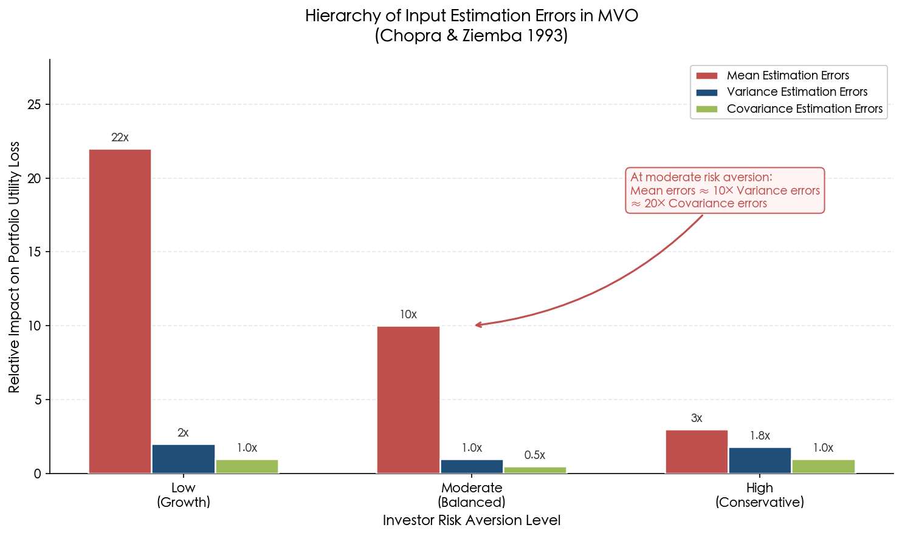

This hierarchy carries profound practical implications. It explains why the minimum-variance portfolio — which bypasses expected-return estimation entirely and depends only on the covariance matrix — often outperforms portfolios that attempt to maximize risk-adjusted return. It also motivates the Black-Litterman approach, which regularizes the expected-return input by shrinking it toward an equilibrium prior, thereby mitigating the most damaging category of estimation error.

### 2.2.3 The 1/N Challenge: DeMiguel, Garlappi, and Uppal (2009)

The most sobering assessment of MVO's out-of-sample performance comes from DeMiguel, Garlappi, and Uppal (2009), who compared 14 optimized portfolio strategies — including MVO, Bayesian approaches, minimum variance, and factor-based methods — against the naïve equally weighted (1/N) portfolio across seven empirical datasets. Their conclusion is unambiguous: **none of the 14 strategies consistently outperformed 1/N** on a statistically significant, risk-adjusted basis. Through analytical derivation, the authors estimated that a sample-based MVO would require approximately 3,000 months of return data for a 25-asset universe and approximately 6,000 months for a 50-asset universe to reliably surpass the 1/N benchmark — horizons far exceeding the available financial history [DeMiguel et al. 2009](https://academic.oup.com/rfs/article/22/5/1915/1592901 "Optimal Versus Naive Diversification, Review of Financial Studies, 22(5): 1915–1953, 2009").

This result does not invalidate MVO as a theoretical framework, but it powerfully demonstrates that the benefits of sophisticated optimization are overwhelmed by estimation error when applied with noisy inputs. The implication is clear: any practical MVO implementation must incorporate mechanisms to control estimation error — the subject of the following section.

## 2.3 Regularization and Stabilization Techniques for MVO

The estimation-error problem has spawned a rich literature on stabilization methods, which can be organized into three broad families: covariance matrix regularization, return estimation regularization, and structural robustification.

### 2.3.1 Ledoit-Wolf Shrinkage Estimation

Ledoit and Wolf (2004) proposed what has become the most widely adopted covariance regularization technique in portfolio optimization. Their core insight is that the sample covariance matrix S, while unbiased, exhibits excessive dispersion in its eigenvalues — the largest eigenvalues are systematically inflated and the smallest systematically deflated. The shrinkage estimator forms a convex combination of the sample covariance and a structured target:

**Σ̂_shrink = α̂F + (1 − α̂)S**

where F is a structured target matrix (in their original formulation, the constant-correlation model) and α̂ ∈ [0, 1] is the optimal shrinkage intensity, derived analytically to minimize expected quadratic loss. Shrinkage compresses the extreme eigenvalues of S toward the more stable spectrum of F, thereby reducing out-of-sample estimation error.

The empirical gains are substantial. In their simulation study with N = 100 assets, the Ledoit-Wolf estimator delivered an annualized information ratio of 0.91, compared to 0.59 for the raw sample covariance matrix — an improvement of approximately 54%. As the authors stated in their memorably titled paper: **no practitioner should use the raw sample covariance matrix for portfolio optimization** [Ledoit & Wolf 2004](http://www.ledoit.net/honey.pdf "Honey, I Shrunk the Sample Covariance Matrix, Journal of Portfolio Management, 2004").

Subsequent work by Ledoit and Wolf (2017) extended this framework to nonlinear shrinkage, grounded in Random Matrix Theory (RMT). The Marchenko-Pastur law describes the systematic distortion of sample eigenvalues when the ratio q = N/T (number of assets to number of time periods) does not tend to zero — a condition that holds in virtually all practical settings. Nonlinear shrinkage applies a distinct, data-driven correction to each eigenvalue rather than a single global shrinkage intensity, yielding further improvements in Sharpe-ratio-optimized portfolios [Palomar 2019](https://palomar.home.ece.ust.hk/MAFS6010R_lectures/slides_shrinkage_n_BL.pdf "Shrinkage and BL, HKUST, RMT Section").

### 2.3.2 Factor Model Covariance Estimation

An alternative dimensionality-reduction strategy imposes a factor structure on the covariance matrix:

**Σ = FΣ_f Fᵀ + D**

where F is the n × k factor loading matrix, Σ_f the k × k factor covariance matrix, and D a diagonal matrix of idiosyncratic variances. For n = 10,000 assets and k = 100 factors, the number of free parameters drops from O(n²) ≈ 50 million to O(nk) ≈ 1 million — a reduction of roughly four orders of magnitude. This compression simultaneously improves estimation stability and computational efficiency. Modern implementations by commercial risk-model providers (e.g., Barra, Axioma) employ multi-factor models combining statistical and fundamental factors, and the factor-model covariance structure has become standard practice in institutional portfolio construction [Boyd et al. 2024](https://web.stanford.edu/~boyd/papers/pdf/markowitz.pdf "Markowitz Portfolio Construction at Seventy, §3.3").

### 2.3.3 Resampled Efficient Frontier (Michaud 1998)

Having diagnosed the estimation-error problem, Michaud also proposed a solution: the Resampled Efficient Frontier (REF). The procedure generates multiple Monte Carlo samples from the estimated return distribution, computes the efficient frontier for each sample, and averages the resulting portfolio weights across all draws. The intuition is that averaging over many realizations of the uncertain inputs produces more stable, diversified allocations.

REF portfolios exhibit several distinctive properties: they always include all assets with non-zero weights (unlike standard MVO, which typically concentrates in a small subset), and they interpolate between MVO (when estimation uncertainty approaches zero) and equal-weighting (when uncertainty is maximal). Simulation studies confirm that REF delivers superior out-of-sample performance relative to single-point MVO, particularly in small-sample regimes where estimation error is most severe [Michaud & Michaud 2007](https://newfrontieradvisors.com/media/rxbld4hq/estimation-error-and-portfolio-optimization-12-05.pdf "Estimation Error and Portfolio Optimization: A Resampling Solution, Journal of Investment Management, 2007").

### 2.3.4 Robust Optimization

Robust optimization offers a mathematically principled approach to parameter uncertainty by optimizing against the worst case within a defined uncertainty set. Goldfarb and Iyengar (2003) formulated the robust mean-variance problem with the expected return vector constrained to an ellipsoidal uncertainty set {μ̂ + δ : ||δ|| ≤ ρ}. Under this formulation, the worst-case return becomes:

**R_wc = μᵀw − ρᵀ|w|**

and the worst-case variance:

**(σ_wc)² = σ² + ϱ(Σ^{1/2}|w|)²**

The penalty terms ρᵀ|w| and ϱ(Σ^{1/2}|w|)² function as implicit L1 regularization on the weights, shrinking extreme positions toward zero and producing more balanced allocations. This connection between robustness and regularization constitutes a key theoretical insight: robust optimization and Bayesian shrinkage represent different manifestations of the same underlying mathematical structure [Boyd et al. 2024](https://web.stanford.edu/~boyd/papers/pdf/markowitz.pdf "Markowitz Portfolio Construction at Seventy, §1.3").

### 2.3.5 Implicit Regularization Through Constraints

Jagannathan and Ma (2003) established an elegant result: imposing the non-negativity constraint w ≥ 0 on the minimum-variance portfolio is mathematically equivalent to shrinking the elements of the covariance matrix. Specifically, the no-short-selling constraint implicitly reduces the off-diagonal elements of Σ, directing the optimizer away from extreme long-short positions. Even when the constraint is nominally "incorrect" — in the sense that the true optimal portfolio involves short positions — the constrained portfolio can deliver lower out-of-sample risk than the unconstrained one, because the regularization effect outweighs the loss from restricting the feasible set [Ledoit & Wolf 2004](http://www.ledoit.net/honey.pdf "citing Jagannathan & Ma 2003, Journal of Finance 58(4)").

This finding carries a significant practical implication: the institutional constraints that practitioners impose for operational reasons — no short-selling, position limits, sector caps — simultaneously serve as regularization devices that mitigate estimation error, even when they are not motivated by statistical considerations.

## 2.4 Empirical Track Record: When MVO Wins and Loses

### 2.4.1 The Minimum-Variance Anomaly

The minimum-variance portfolio occupies a unique position on the efficient frontier: it is the sole portfolio whose weights are independent of expected return estimates, depending only on the covariance matrix. This property makes it an ideal testing ground for evaluating the practical value of optimization relative to naïve benchmarks.

Clarke, de Silva, and Thorley (2006) conducted the definitive large-scale empirical study on this question. Using the 1,000 largest U.S. equities from January 1968 through December 2005 (456 monthly rebalancing periods), they constructed long-only minimum-variance portfolios with covariance matrices estimated from 60-month rolling windows. Their central finding: **the long-only minimum-variance portfolio achieved approximately three-fourths the realized volatility of the capitalization-weighted market portfolio, while delivering comparable or slightly higher average returns** — a direct violation of the standard risk-return trade-off predicted by the CAPM [Clarke et al. 2006](https://www.researchgate.net/publication/235926738_Minimum-Variance_Portfolios_in_the_US_Equity_Market "Minimum-Variance Portfolios in the US Equity Market, JPM 33(1), 2006"). This "low-volatility anomaly" has since been replicated across international markets. The MSCI Global Minimum Volatility Index, for instance, demonstrated an excess return of 6.5% versus 6.0% for the MSCI World Index over 1995–2007, with nearly 30% lower volatility — corresponding to a Sharpe Ratio of 0.67 versus 0.45 [van Leur 2013](http://arno.uvt.nl/show.cgi?fid=131072 "The Minimum Variance Portfolio: An Exploitable Anomaly?, Tilburg University, 2013, citing Nielsen & Aylursubramanian 2008").

### 2.4.2 Risk Parity as a Non-Return-Dependent Alternative

Risk parity, formalized as the Equal Risk Contribution (ERC) portfolio by Maillard, Roncalli, and Teiletche (2010), extends the estimation-error avoidance strategy one step further. The ERC portfolio requires each asset to contribute equally to total portfolio risk:

**w_i · (Σw)_i / √(wᵀΣw) = (1/N) · √(wᵀΣw)** for all i

The resulting allocation lies between the equal-weight portfolio and the minimum-variance portfolio: it concentrates risk less than minimum variance (which can load heavily on low-volatility assets) while diversifying risk contributions more effectively than equal-weighting (which ignores correlations entirely). Like the minimum-variance portfolio, risk parity completely bypasses expected-return estimation, rendering it robust to the most damaging category of input error identified by Chopra and Ziemba [Maillard, Roncalli & Teiletche 2010](https://papers.ssrn.com/sol3/papers.cfm?abstract_id=1271972 "On the Properties of ERC Portfolios, Journal of Portfolio Management, 36(4), 2010").

### 2.4.3 Markowitz++: Modern Institutional Practice

Boyd et al. (2024) synthesize seven decades of methodological development into what they term "Markowitz++": MVO augmented with regularization penalties, factor-model covariance estimation, explicit transaction-cost modeling — including market-impact terms of the form κ_impact · |z|^{3/2} where z is the trade vector — and systematic walk-forward backtesting. Their empirical study on approximately 1,500 U.S. equities from 2004 through 2023 demonstrates that the full Markowitz++ system substantially outperforms basic MVO across Sharpe ratio, turnover-adjusted return, and maximum drawdown. This evidence suggests that the classical framework remains competitive with more complex alternatives when properly engineered with modern regularization and cost-aware execution [Boyd et al. 2024](https://web.stanford.edu/~boyd/papers/pdf/markowitz.pdf "Markowitz Portfolio Construction at Seventy, §5").

A related theoretical result addresses the common criticism that MVO is inherently single-period. Under certain conditions, Gârleanu and Pedersen (2020) demonstrated that the stochastic optimal control solution to the multi-period allocation problem reduces to a sequence of single-period Markowitz problems with adjusted inputs. Moallemi et al. (2013) further proved that single-period strategies closely approximate the performance bound of the full stochastic control solution, thereby mitigating theoretical concerns about MVO's single-period limitation in practice [Boyd et al. 2024](https://web.stanford.edu/~boyd/papers/pdf/markowitz.pdf "Markowitz Portfolio Construction at Seventy, §1.2").

## 2.5 The Black-Litterman Model: Bayesian Portfolio Construction

### 2.5.1 Motivation and Intellectual Architecture

The Black-Litterman (BL) model, developed at Goldman Sachs by Fischer Black and Robert Litterman (1990, 1992), was designed to resolve two intertwined problems that plagued MVO in institutional practice. First, MVO requires a complete vector of expected returns — one for every asset — yet most portfolio managers hold views on only a handful of assets. Forcing a manager to specify expected returns for assets about which no informed opinion exists introduces arbitrary noise. Second, as demonstrated in Section 2.2, the optimizer amplifies any noise in those inputs into extreme, unintuitive portfolio weights.

The BL model addresses both problems through a Bayesian framework. Rather than starting with raw expected-return estimates, it begins with a neutral prior: the **implied equilibrium returns** derived from the assumption that the market-capitalization-weighted portfolio is the optimal portfolio of a representative investor. The investor then overlays subjective or model-derived "views" on specific assets or asset combinations, and the model blends the prior with the views via Bayes' rule, weighted by the relative confidence assigned to each.

The figure below illustrates the complete BL pipeline, from market-capitalization weights through reverse optimization and Bayesian updating to the final portfolio allocation.

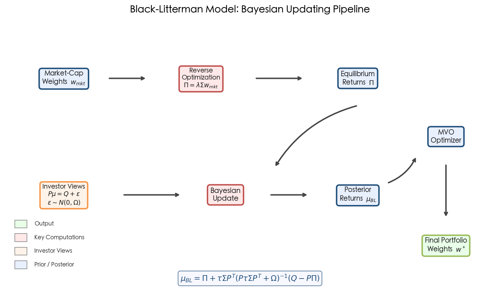

### 2.5.2 Deriving Implied Equilibrium Returns

The starting point is reverse optimization. If the market portfolio w_mkt is optimal under MVO, then the vector of expected returns consistent with that optimality satisfies:

**Π = λΣw_mkt**

where λ is the risk aversion coefficient of the representative investor — typically calibrated as the market Sharpe ratio divided by market volatility, or estimated from the excess return on a broad equity index divided by its variance — and Σ is the covariance matrix. The vector Π represents the set of expected returns that, when fed into an unconstrained MVO, would reproduce the market-capitalization weights exactly. This constitutes an economically grounded and stable starting point: unlike historical return estimates, implied equilibrium returns produce sensible, diversified portfolio weights by construction [Idzorek 2004](https://people.duke.edu/~charvey/Teaching/BA453_2006/Idzorek_onBL.pdf "A Step-by-Step Guide to the Black-Litterman Model, July 2004").

### 2.5.3 Incorporating Investor Views: The Posterior Formula

Investor views are expressed as linear constraints on expected returns. An absolute view (e.g., "U.S. equities will return 8%") or a relative view (e.g., "European equities will outperform emerging market equities by 2%") is encoded in a pick matrix P, a view return vector Q, and a view uncertainty matrix Ω:

**Pμ = Q + ε**, where ε ~ N(0, Ω)

The prior distribution of expected returns is specified as μ ~ N(Π, τΣ), where τ is a scalar measuring the uncertainty in the equilibrium returns — conceptually, the "tightness" of the prior. Applying Bayes' rule yields the BL posterior:

**μ_BL = [(τΣ)⁻¹ + PᵀΩ⁻¹P]⁻¹ [(τΣ)⁻¹Π + PᵀΩ⁻¹Q]**

An equivalent and more computationally convenient form is:

**μ_BL = Π + τΣPᵀ(PτΣPᵀ + Ω)⁻¹(Q − PΠ)**

This second form reveals the intuitive structure: the posterior return equals the equilibrium return plus an adjustment term that tilts toward the investor's views, weighted by view confidence and scaled by the magnitude of deviation between views and equilibrium [Idzorek 2004](https://people.duke.edu/~charvey/Teaching/BA453_2006/Idzorek_onBL.pdf "A Step-by-Step Guide to the Black-Litterman Model") [Palomar 2019](https://palomar.home.ece.ust.hk/MAFS6010R_lectures/slides_shrinkage_n_BL.pdf "Shrinkage and BL, HKUST").

### 2.5.4 Calibration Challenges: τ and Ω

Two parameters require careful calibration yet lack universally accepted values:

**The scalar τ.** This parameter governs the tightness of the prior distribution. Black and Litterman (1992) suggested τ in the range 0.01–0.05, reflecting the assumption that uncertainty about the equilibrium mean is much smaller than uncertainty about individual asset returns. Satchell and Scowcroft (2000) argued for τ = 1 on theoretical grounds. In practice, the choice of τ primarily determines the relative influence of the prior versus the views: when τ is small, the prior dominates and the posterior remains close to equilibrium; when τ is large, the views exert greater influence on the posterior [Idzorek 2004](https://people.duke.edu/~charvey/Teaching/BA453_2006/Idzorek_onBL.pdf "A Step-by-Step Guide to the Black-Litterman Model, Section 3").

**The view uncertainty matrix Ω.** This matrix encodes the confidence assigned to each view. Two principal approaches exist. In the proportional-to-prior approach, Ω is set proportional to the view's contribution to prior uncertainty: Ω = diag(P(τΣ)Pᵀ). Idzorek (2004) proposed an alternative that allows managers to specify confidence on an intuitive 0%–100% scale, then analytically maps this confidence to the corresponding entries of Ω. This method offers the additional advantage of bypassing the need to specify τ explicitly, since the confidence-based calibration implicitly absorbs the τ parameter [Idzorek 2004](https://people.duke.edu/~charvey/Teaching/BA453_2006/Idzorek_onBL.pdf "A Step-by-Step Guide to the Black-Litterman Model, Section 3").

### 2.5.5 BL as Generalized Shrinkage

A unifying theoretical perspective reveals the BL posterior as a special case of James-Stein shrinkage estimation. The posterior can be decomposed as a weighted average of two "estimators":

**μ_BL = W_mkt · μ̂_mkt + W_views · μ̂_views**

where W_mkt and W_views are matrix-valued shrinkage weights determined by the relative precision of the prior and the views. In the limiting case τ → 0, the prior dominates completely and the posterior collapses to the equilibrium returns Π. In the opposite limit τ → ∞, the views dominate and the posterior converges to the pure view-implied returns. This shrinkage interpretation connects the BL model to the broader statistical literature on regularization and explains why BL portfolios exhibit greater stability than raw MVO portfolios: the equilibrium prior serves as a regularization anchor that prevents extreme allocations driven by noisy inputs [Palomar 2019](https://palomar.home.ece.ust.hk/MAFS6010R_lectures/slides_shrinkage_n_BL.pdf "Shrinkage and BL, HKUST").

## 2.6 Limitations of the Black-Litterman Model

Despite its elegance, the BL model carries a set of structural limitations that warrant careful consideration:

**Subjectivity of views.** The model's greatest strength — the capacity to incorporate investor views — is simultaneously its greatest vulnerability. The quality of the posterior depends entirely on the quality of the views supplied. Herold (2003) argued that BL is most suitable for quantitative fund managers who can generate views from systematic, reproducible models; discretionary managers risk introducing cognitive biases that the Bayesian machinery cannot detect or correct [Idzorek 2004](https://people.duke.edu/~charvey/Teaching/BA453_2006/Idzorek_onBL.pdf "A Step-by-Step Guide to the BL Model, endnote 11").

**Ω calibration sensitivity.** Litterman (2003) himself acknowledged that no universally correct method exists for specifying Ω. Different calibration choices can produce materially different portfolio allocations, and the sensitivity to Ω can rival the sensitivity of raw MVO to expected returns — partially undermining the stability gains that BL is designed to provide.

**Static single-period framework.** Like MVO, the standard BL model operates within a single-period framework. It does not natively accommodate transaction costs, rebalancing dynamics, or time-varying investment opportunities. Extensions to multi-period settings exist but introduce considerable additional complexity.

**Normality assumption.** The Bayesian updating mechanism assumes that both the prior and the view distributions are Gaussian. In the presence of fat tails, skewness, or non-linear dependencies — common features of financial return distributions — the Gaussian conjugate framework may produce misleading posterior estimates.

**Non-view assets remain unchanged.** Assets for which no views are specified retain their equilibrium weights exactly. While this is by design, it means the model cannot adjust for cross-asset information that does not pass through the view mechanism. For instance, if an investor holds a bullish view on technology stocks but expresses no view on semiconductor stocks — a highly correlated sector — the BL model will not adjust semiconductor weights upward unless the correlation structure of Σ and the pick matrix P explicitly capture this linkage.

## 2.7 Structural Limitations That Motivate Machine Learning

Synthesizing the analyses of MVO and BL presented in this chapter, six fundamental limitations of these classical frameworks can be identified — limitations that collectively motivate the machine learning approaches examined in subsequent chapters:

1. **Linearity and quadratic structure.** Both MVO and BL operate within a linear-quadratic world: expected returns enter linearly and risk enters quadratically. This structure cannot capture non-linear relationships between features and returns — such as threshold effects, momentum reversals at extremes, or interaction effects among macroeconomic variables — without exogenous pre-processing.

2. **Static single-period assumption.** The standard formulations solve a one-shot allocation problem. While multi-period extensions exist (and, as noted in Section 2.4.3, single-period solutions can approximate multi-period optima under certain conditions), neither framework natively adapts to regime changes, time-varying correlations, or evolving market microstructure.

3. **Gaussian distributional assumption.** The analytical tractability of both MVO (when using variance as the risk measure) and BL (in its conjugate-prior formulation) rests on the assumption of elliptically or normally distributed returns. Fama (1965) documented that asset returns exhibit fat tails and excess kurtosis, and subsequent decades of empirical research have confirmed pervasive non-normality across asset classes.

4. **Covariance estimation dimensionality.** For a universe of n assets, the covariance matrix contains n(n+1)/2 free parameters. Ledoit and Wolf (2004) demonstrated that with N = 500 assets the information ratio of the minimum-variance portfolio drops from 1.24 (with n = 30 assets) to 0.30 — a 76% degradation illustrating the severe performance decline as dimensionality increases relative to sample size [Ledoit & Wolf 2004](http://www.ledoit.net/honey.pdf "Honey, I Shrunk the Sample Covariance Matrix, JPM, 2004").

5. **Inability to process unstructured data.** Classical models accept only numerical vectors of returns, variances, and correlations. They cannot directly incorporate the growing volume of alternative data — satellite imagery, news sentiment, social media flows, earnings call transcripts — that modern investors increasingly use to form investment views.

6. **Absence of adaptive regime detection.** Financial markets exhibit regime changes — bull/bear transitions, volatility regimes, correlation breakdowns during crises — that violate the stationarity assumptions underlying both MVO and BL. While practitioners can manually adjust inputs for perceived regime shifts, neither framework provides an endogenous mechanism for detecting or adapting to regimes in real time.

These limitations do not render classical models obsolete. As Boyd et al. (2024) demonstrate with their Markowitz++ framework, a carefully engineered classical system remains a strong performance baseline. However, each limitation points to a specific capability that machine learning and deep learning methods can potentially supply — a theme developed in the chapters that follow.

# Emerging Machine Learning and Deep Learning Models for Portfolio Optimization

The structural limitations of Mean-Variance Optimization and the Black-Litterman model — linearity, static single-period framing, Gaussian assumptions, and sensitivity to estimation error — have motivated a growing body of research applying machine learning and deep learning to the portfolio construction problem. This chapter surveys the three principal families of emerging approaches: recurrent architectures (LSTM) for temporal dependency modeling and return prediction, attention-based architectures (Transformer) for cross-asset relationship learning and long-range dependency capture, and reinforcement learning (RL) for sequential, multi-period allocation under transaction costs. It further examines unsupervised and graph-based methods such as Hierarchical Risk Parity (HRP), and confronts the systematic failure modes — overfitting, data hunger, non-stationarity, interpretability deficit, and reward shaping sensitivity — that temper the promise of these techniques.

Figure 3-1 presents a taxonomic overview of the model families discussed in this chapter, organized by learning paradigm and annotated with representative papers and key performance metrics.

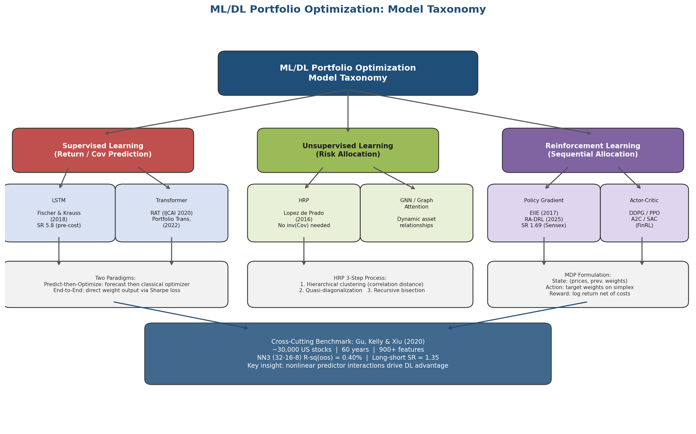

*Figure 3-1: Hierarchical taxonomy of ML/DL models for portfolio optimization, categorized into supervised learning (LSTM, Transformer), unsupervised learning (HRP, GNN), and reinforcement learning (Policy Gradient, Actor-Critic), with the Gu, Kelly & Xiu (2020) benchmark as a cross-cutting reference.*

## 3.1 LSTM Networks: Capturing Temporal Dependencies in Financial Time Series

### 3.1.1 Architecture and Financial Motivation

Long Short-Term Memory (LSTM) networks, introduced by Hochreiter and Schmidhuber in 1997, resolve the vanishing gradient problem that limits standard recurrent neural networks, enabling the learning of dependencies over sequences spanning hundreds of time steps. The architecture's memory cell — governed by forget, input, and output gates — selectively retains or discards information across time, a property well suited to financial time series where past price patterns, volatility regimes, and momentum effects carry predictive information over heterogeneous horizons.

Within portfolio optimization, LSTM networks operate under two distinct paradigms. In the **predict-then-optimize** paradigm, the LSTM generates forecasts of asset returns or covariance matrices, which are subsequently fed into a classical optimizer such as MVO or minimum-variance. In the **end-to-end** paradigm, the network directly outputs portfolio weights, with the loss function defined in terms of a financial objective — typically the Sharpe ratio or negative drawdown. The predict-then-optimize approach benefits from modularity and interpretability, as forecast quality can be evaluated independently of the allocation step; however, it suffers from error accumulation across the prediction and optimization stages. The end-to-end approach avoids this cascading error but introduces greater training complexity and reduces model transparency [Fischer & Krauss 2018](https://ideas.repec.org/a/eee/ejores/v270y2018i2p654-669.html "Deep learning with LSTM for financial market predictions, EJOR, 270(2): 654-669, 2018").

### 3.1.2 The Fischer & Krauss (2018) Benchmark

The most comprehensive early benchmark for LSTM-based financial prediction is Fischer and Krauss (2018), who deployed LSTM networks on all S&P 500 constituents over the period December 1992 to October 2015 using daily return data. The experimental design employed rolling 1,000-day study windows (750 days for training, 250 days for trading), yielding 23 non-overlapping out-of-sample trading windows.

The results established LSTM's superiority over memory-free alternatives. A long-short strategy — buying the top 10 predicted outperformers and shorting the bottom 10 — achieved mean daily returns of 0.46% and an annualized Sharpe ratio of 5.8 prior to transaction costs, compared to 0.43% for random forests, 0.32% for deep neural networks, and 0.26% for logistic regression. Directional classification accuracy reached **54.3%** across 115,000 individual stock predictions, a statistically significant edge confirmed by Diebold-Mariano tests at the 1.67% Bonferroni-corrected significance level; the probability of a random classifier achieving equivalent accuracy was computed at 2.77 × 10⁻¹⁸⁷ [Fischer & Krauss 2018](https://ideas.repec.org/a/eee/ejores/v270y2018i2p654-669.html "EJOR, 270(2): 654-669, 2018").

After transaction costs of 5 basis points per half-turn, the LSTM strategy delivered annualized returns of 82.29% with a Sharpe ratio of 2.34, compared to 67.87% (SR 1.87) for random forests and only 7.11% (SR 0.10) for logistic regression. Notably, the LSTM's returns exhibited remarkably low exposure to common systematic risk factors: a Fama-French regression yielded an R² of only 0.033, with a residual daily alpha of 0.42% [Fischer & Krauss 2018](https://ideas.repec.org/a/eee/ejores/v270y2018i2p654-669.html "EJOR, 270(2): 654-669, 2018").

### 3.1.3 Alpha Decay and Temporal Instability

A critical finding of Fischer and Krauss — one with profound implications for the practical deployment of LSTM-based strategies — concerns the temporal pattern of profitability. From 1993 to 2000, the LSTM generated extraordinary cumulative payouts, consistent with the fact that such techniques were either unknown or computationally infeasible for most market participants. From 2001 to 2009, performance moderated but remained positive after transaction costs. From 2010 onward, however, excess returns deteriorated sharply, with LSTM profitability fluctuating around zero after transaction costs; the random forest's edge turned strictly negative over the same period [Fischer & Krauss 2018](https://ideas.repec.org/a/eee/ejores/v270y2018i2p654-669.html "EJOR, 270(2): 654-669, 2018").

This alpha decay pattern reflects a broader phenomenon documented across quantitative strategies: as techniques diffuse through the industry, the anomalies they exploit are progressively arbitraged away. For LSTM-based portfolio optimization, the implication is that predictive edges derived solely from historical return patterns face diminishing shelf lives, necessitating continuous model retraining, novel feature engineering, and incorporation of alternative data sources.

### 3.1.4 Interpretability: Inside the LSTM Black Box

Fischer and Krauss contributed a notable advance in LSTM interpretability by analyzing the characteristics of stocks selected for trading. Both the long and short positions exhibited high volatility, below-mean momentum over the prior 240 days, and extremal directional movements in the 5–10 days preceding the trade — a pattern consistent with the short-term reversal anomaly documented by Jegadeesh (1990) and Lehmann (1990). A simplified rules-based short-term reversal strategy captured approximately 50% of the LSTM's pre-transaction-cost returns (0.23% per day), confirming that the LSTM independently rediscovered a well-known market anomaly without being explicitly programmed to exploit it. The remaining 50% of returns — attributable to subtler, higher-order patterns in the 240-day return sequences — remained opaque, illustrating both the promise and the interpretability challenge of deep learning in portfolio applications [Fischer & Krauss 2018](https://ideas.repec.org/a/eee/ejores/v270y2018i2p654-669.html "EJOR, 270(2): 654-669, 2018").

## 3.2 The ML Return Prediction Benchmark: Gu, Kelly, and Xiu (2020)

While Fischer and Krauss focused on directional classification for a single-market trading strategy, Gu, Kelly, and Xiu (2020) established the definitive benchmark for ML-based return prediction at the individual stock level. Published in the *Review of Financial Studies*, their study encompassed nearly 30,000 U.S. individual stocks over 60 years (1957–2016) and compared a comprehensive suite of ML methods using over 900 predictive characteristics drawn from the asset pricing literature.

### 3.2.1 Predictive Performance Hierarchy

The central evaluation metric was out-of-sample predictive R² (R²_oos), defined relative to a zero-forecast benchmark: R²_oos = 1 − Σ(r − r̂)² / Σr². The results established a clear performance hierarchy. A baseline OLS regression with three predictors achieved R²_oos of 0.16%; expanding to 900+ characteristics caused OLS R²_oos to turn negative, a direct manifestation of overfitting. Elastic net regularization recovered performance to 0.11%. Principal component regression and partial least squares achieved 0.26%–0.27%. Most significantly, **regression trees and neural networks achieved R²_oos of 0.33%–0.40%**, with the three-layer neural network (NN3, architecture 32-16-8) delivering the highest performance [Gu, Kelly & Xiu 2020](https://dachxiu.chicagobooth.edu/download/ML.pdf "Empirical Asset Pricing via ML, RFS, 33(5): 2223-2273, 2020").

The economic significance proved substantial. A long-short decile strategy based on NN3 predictions achieved a **Sharpe ratio of 1.35**, compared to 0.61 for OLS. An S&P 500 market-timing strategy produced SR 0.77 versus 0.51 for buy-and-hold. The most predictive signals were price momentum, short-term reversal, liquidity, and volatility measures — factors with well-established theoretical foundations in the asset pricing literature [Gu, Kelly & Xiu 2020](https://dachxiu.chicagobooth.edu/download/ML.pdf "RFS, 33(5): 2223-2273, 2020").

### 3.2.2 The Critical Role of Nonlinear Interactions

A methodologically significant finding was that the source of neural networks' predictive advantage resided not in the nonlinearity of individual predictors but in the **nonlinear interaction among predictors**. Generalized linear models augmented with spline transformations — which capture individual-predictor nonlinearity but not cross-term interactions — did not robustly outperform linear models. Substantial gains emerged only when the model architecture permitted interaction effects, as trees and neural networks inherently do. This insight carries direct implications for portfolio construction: the covariance structure among asset return predictors contains exploitable nonlinear information that linear, or even individually-nonlinear, models systematically miss [Gu, Kelly & Xiu 2020](https://dachxiu.chicagobooth.edu/download/ML.pdf "RFS, 2020").

### 3.2.3 Regularization as a Prerequisite for Financial ML

Gu et al. (2020) demonstrated that successful financial ML requires aggressive regularization to overcome the low signal-to-noise ratio characteristic of asset returns. Their best-performing models employed a combination of elastic net penalties (L1 + L2), early stopping (functioning as implicit shrinkage), batch normalization, ensemble averaging across multiple random seeds, and Huber robust loss functions. A notable architectural finding was that the moderately-sized NN3 (32-16-8) outperformed deeper networks — consistent with the principle that financial data, with its limited sample size relative to parameter count and extremely low signal-to-noise ratio, rewards parsimony over depth. This result parallels Fischer and Krauss's observation that their 25-hidden-unit LSTM, with approximately 93 training examples per parameter, achieved the optimal capacity–regularization trade-off [Gu, Kelly & Xiu 2020](https://dachxiu.chicagobooth.edu/download/ML.pdf "RFS, 2020, Section 1.7").

## 3.3 Transformer Architectures: Attention Mechanisms for Cross-Asset and Temporal Modeling

### 3.3.1 From NLP to Finance: Structural Advantages of Self-Attention

The Transformer architecture, introduced by Vaswani et al. (2017) for natural language processing, has rapidly migrated to financial applications owing to three structural advantages over recurrent networks. First, self-attention computes pairwise interactions among all positions in a sequence in a single operation, enabling **O(1) path length** for long-range dependencies compared to O(n) for RNNs. Second, the attention computation is fully parallelizable across sequence positions, yielding substantial training speed gains over the inherently sequential LSTM. Third, the attention weight matrices are directly inspectable, furnishing a form of temporal interpretability: the model reveals which historical time steps it considers most relevant for current predictions [Xu et al. 2020](https://www.ijcai.org/proceedings/2020/0641.pdf "RAT, IJCAI 2020, pp. 4647-4653").

These advantages are particularly salient for portfolio optimization, where the investor must simultaneously model temporal dynamics (how each asset's returns evolve) and cross-sectional dynamics (how assets co-move and influence each other). Conventional LSTM architectures process assets independently or concatenate asset features into a single vector, neither of which naturally captures the dynamic relational structure among assets.

### 3.3.2 Relational Attention Transformer (RAT) for Portfolio Management

Xu et al. (IJCAI 2020) introduced the Relational Attention Transformer (RAT), the first architecture specifically designed to apply dual attention mechanisms — temporal and cross-asset — to portfolio management. RAT replaces standard dot-product attention with two specialized modules:

**Sequential Attention** processes the time dimension using a context-based attention mechanism. Rather than computing query-key dot products — which can be noisy in financial data — Sequential Attention employs a learned context vector to weight historical observations, identifying which time steps carry the most decision-relevant information for the current allocation.

**Relation Attention** operates on the asset dimension, applying self-attention across assets at each time step to capture dynamic correlations. Unlike a static covariance matrix, Relation Attention learns time-varying, potentially nonlinear relationships among assets — detecting, for instance, shifts in the technology–energy correlation across different market regimes.

Empirical results on cryptocurrency portfolios demonstrated substantial outperformance: on the Crypto-A dataset (12 cryptocurrencies, 30-minute frequency), RAT achieved an Accumulated Portfolio Value (APV) of 156.53, compared to 16.04 for the EIIE framework of Jiang et al. (2017), with a Sharpe ratio of 7.13% versus 6.87% for EIIE. The study also revealed that standard RL algorithms (DDPG and PPO) **frequently failed to converge** in the portfolio management setting, motivating the adoption of a simpler direct policy gradient approach — a finding that underscores the practical challenges of applying off-the-shelf RL algorithms to portfolio optimization [Xu et al. 2020](https://www.ijcai.org/proceedings/2020/0641.pdf "RAT, IJCAI 2020, pp. 4647-4653").

### 3.3.3 Temporal Fusion Transformer and Portfolio Transformer

The Temporal Fusion Transformer (TFT), proposed by Lim et al. (2021) and published in the *International Journal of Forecasting*, represents a hybrid LSTM-Transformer architecture designed for multi-horizon time series forecasting with built-in interpretability. TFT integrates four components: (1) a **variable selection network** that identifies the most relevant input features at each time step via learned attention weights; (2) **gated residual networks** for nonlinear processing with skip connections; (3) a **recurrent layer** (LSTM or GRU) for local temporal patterns; and (4) a **multi-head self-attention layer** for long-range temporal dependencies. The architecture accommodates three categories of input — static covariates (e.g., asset sector), known future inputs (e.g., calendar features), and historical-only observations (e.g., past returns) — making it naturally suited to financial forecasting, where different information types possess distinct temporal availability profiles [Lim et al. 2021](https://arxiv.org/abs/1912.09363 "TFT, IJF 37(4): 1748-1764, 2021").

Kisiel and Gorse (2022) introduced the **Portfolio Transformer**, the first encoder-decoder Transformer applied end-to-end to portfolio optimization. Rather than predicting returns for a separate optimizer, the Portfolio Transformer directly optimizes portfolio weights via a Sharpe ratio loss function. Across three benchmark datasets, it achieved superior risk-adjusted performance relative to LSTM baselines, demonstrating that the attention mechanism's capacity to capture both temporal and cross-asset patterns translates directly into portfolio construction improvements [Kisiel & Gorse 2022](https://arxiv.org/abs/2206.03246 "Portfolio Transformer, arXiv:2206.03246, 2022").

### 3.3.4 The LSTM-Transformer Hybrid Design Space

A recurring theme in recent financial deep learning research is the complementarity of LSTM and Transformer components. The TFT itself exemplifies this hybrid philosophy: the LSTM layer captures short-range local dependencies and provides inductive bias for sequential processing, while the self-attention layer captures long-range, potentially non-contiguous temporal patterns. RAT's context attention similarly reflects this design approach, employing learned context vectors rather than pure dot-product attention to inject temporal structure into the attention mechanism [Lim et al. 2021](https://arxiv.org/abs/1912.09363 "TFT, 2021") [Xu et al. 2020](https://www.ijcai.org/proceedings/2020/0641.pdf "RAT, IJCAI 2020").

We consider this hybrid design space — combining recurrent inductive bias for local patterns with attention mechanisms for global patterns — as the most promising architectural direction for financial time series modeling, where both short-term microstructure effects and longer-term regime dynamics coexist and interact.

## 3.4 Reinforcement Learning for Sequential Portfolio Optimization

### 3.4.1 The MDP Formulation of Portfolio Management

Unlike supervised learning approaches that decompose portfolio construction into prediction and optimization stages, reinforcement learning treats portfolio management as a **Markov Decision Process (MDP)** in which an agent sequentially adjusts portfolio weights to maximize cumulative risk-adjusted returns. The standard formulation defines:

- **State** s_t = (P_t, w_{t−1}, market features): the current market observation together with the agent's existing portfolio position.
- **Action** a_t ∈ Δⁿ (the n-dimensional simplex): the target portfolio weights, subject to the constraint that weights sum to one.
- **Reward** r_t: a financial performance signal, typically the log portfolio return r_t = ln(a_tᵀy_t(1 − c_t)), where y_t is the price relative vector and c_t captures transaction costs.
- **Transition** P(s_{t+1} | s_t, a_t): governed by the (unknown) market dynamics.

This formulation offers a fundamental advantage over single-period optimization: the RL agent can explicitly internalize **multi-period effects**, including transaction costs, market impact, and the path dependence of wealth accumulation. The policy π(a_t | s_t) is optimized to maximize the expected discounted sum of rewards E[Σ γᵗr_t], enabling the agent to sacrifice short-term returns for long-term portfolio health — a consideration that static optimizers cannot natively accommodate.

### 3.4.2 Foundational Work: Moody and Saffell (2001)

The application of RL to portfolio management predates the deep learning era. Moody and Saffell (2001) introduced Recurrent Reinforcement Learning (RRL) with a **differential Sharpe ratio** as the reward signal — an innovation that converts the static Sharpe ratio into an online, incremental metric amenable to sequential optimization. On U.S. Treasury bond data spanning 1970 to 1994, the RRL agent outperformed both buy-and-hold and Q-learning, demonstrating that direct policy optimization with a risk-adjusted reward could produce economically meaningful strategies [Moody & Saffell 2001](https://pubmed.ncbi.nlm.nih.gov/18249919/ "Learning to Trade via Direct Reinforcement, IEEE Trans. NN, 12(4): 875-889, 2001").

The differential Sharpe ratio has remained influential in subsequent work. It appears as a reward function in the RA-DRL framework of Choudhary et al. (2025), which combines three PPO agents trained with distinct reward signals — log return, differential Sharpe ratio, and maximum drawdown — and fuses their actions via a CNN to produce risk-adjusted portfolio weights. Tested across four global markets (Sensex, Dow, TWSE, IBEX) from January 2021 to March 2024, RA-DRL achieved Sharpe ratios of 1.69 (Sensex) and 1.01 (Dow), outperforming MVO, 1/N, and individual DRL agents across most risk and return metrics [Choudhary et al. 2025](https://link.springer.com/article/10.1007/s44196-025-00875-8 "Risk-Adjusted DRL for Portfolio Optimization, Int J Comput Intell Syst 18, 126, 2025").

### 3.4.3 The EIIE Framework and Deep RL for Portfolios

Jiang, Xu, and Liang (2017) proposed the first comprehensive deep RL framework for portfolio management, introducing three architectural innovations. The **Ensemble of Identical Independent Evaluators (EIIE)** topology processes each asset through an identical sub-network, enabling linear scalability as the asset universe expands. A **Portfolio-Vector Memory (PVM)** module feeds the previous portfolio weights back into the state representation, allowing the agent to internalize transaction costs when evaluating rebalancing decisions. An **Online Stochastic Batch Learning (OSBL)** protocol enables continuous adaptation to non-stationary market conditions.

Three EIIE variants — CNN, basic RNN, and LSTM — were tested on cryptocurrency portfolios (12 assets, 30-minute frequency) with a 0.25% commission per trade. Over a 50-day out-of-sample period, the best-performing variant achieved cumulative returns exceeding 4× the initial capital. While the absolute returns in the highly volatile cryptocurrency market should not be extrapolated to traditional asset classes, the framework established the core engineering template for DRL-based portfolio management that subsequent work has built upon [Jiang et al. 2017](https://arxiv.org/abs/1706.10059 "A DRL Framework for Financial Portfolio Management, arXiv:1706.10059, 2017").

### 3.4.4 Algorithm Selection: DDPG, PPO, A2C, and the Convergence Problem

The choice of RL algorithm constitutes a high-stakes design decision in its own right. The FinRL library — the first open-source end-to-end DRL framework for financial applications, supporting DQN, DDPG, PPO, SAC, A2C, and TD3 — enables systematic comparison across algorithms and market environments, including NASDAQ-100, DJIA, S&P 500, HSI, SSE 50, and CSI 300 [Liu et al. 2020](https://arxiv.org/abs/2011.09607 "FinRL, arXiv:2011.09607, NeurIPS 2020 DRL Workshop").

Empirical evidence, however, consistently reveals that standard DRL algorithms face **convergence challenges** in the portfolio management domain. Xu et al. (2020) reported that DDPG and PPO frequently failed to converge in their experiments, necessitating the use of simpler direct policy gradient methods. This finding is not isolated: the high dimensionality of continuous action spaces (an n-dimensional simplex for n assets), the extreme noise in financial reward signals, and the non-stationarity of market dynamics collectively render portfolio management a particularly challenging RL environment. The sensitivity to reward function specification compounds this difficulty — agents trained with log returns, differential Sharpe ratio, and maximum drawdown as respective reward functions produce qualitatively different strategies, and no consensus exists on which objective best captures investor preferences across varying market conditions [Xu et al. 2020](https://www.ijcai.org/proceedings/2020/0641.pdf "RAT, IJCAI 2020") [Choudhary et al. 2025](https://link.springer.com/article/10.1007/s44196-025-00875-8 "RA-DRL, 2025").

### 3.4.5 Transaction Cost Modeling in RL

A distinctive advantage of RL-based portfolio optimization over static optimization is the explicit, endogenous treatment of transaction costs. In the Jiang et al. (2017) and RAT (2020) frameworks, transaction costs enter the reward function as a multiplicative factor — r_t = ln(a_tᵀy_t(1 − c_t)) — with commission rates of 0.25% per trade. The PVM mechanism further constrains excessive rebalancing by concatenating the previous period's portfolio weights into the state representation, providing the agent with direct information about the "distance" between current and target allocations.

This recursive mechanism contrasts sharply with classical MVO, where transaction costs are typically either ignored or appended as an ex-post penalty term. By embedding costs directly in the agent's learning signal, RL approaches discover rebalancing policies that naturally trade off the benefit of moving toward optimal weights against the cost of doing so — a form of implicit turnover management that emerges from the optimization process itself rather than being imposed externally [Xu et al. 2020](https://www.ijcai.org/proceedings/2020/0641.pdf "RAT, IJCAI 2020") [Jiang et al. 2017](https://arxiv.org/abs/1706.10059 "DRL Framework, 2017").

## 3.5 Hierarchical Risk Parity and Graph-Based Approaches

### 3.5.1 HRP: Machine Learning Without Return Prediction

Hierarchical Risk Parity (HRP), introduced by López de Prado (2016) in the *Journal of Portfolio Management*, represents a fundamentally different approach to ML-enhanced portfolio construction. Unlike the supervised and reinforcement learning methods discussed above — all of which, in one form or another, attempt to predict future returns — HRP operates exclusively on the covariance structure of asset returns, employing unsupervised machine learning (hierarchical clustering) to allocate risk rather than forecast alpha.

The HRP algorithm proceeds in three steps. First, **hierarchical tree clustering** is applied to the asset correlation matrix using a correlation-based distance metric d(i,j) = √(½(1 − ρᵢⱼ)), organizing assets into a dendrogram that groups highly correlated assets together. Second, **quasi-diagonalization** reorders the covariance matrix to align with the hierarchical cluster structure, placing correlated assets adjacent to one another. Third, **recursive bisection** splits the ordered asset list into progressively smaller groups, allocating risk between each pair of sub-groups using inverse-variance weighting.

The critical property of HRP is that it **completely avoids matrix inversion**. As established in Chapter 2, the dependence of MVO on Σ⁻¹ is the root cause of its instability as an "estimation-error maximizer." HRP sidesteps this vulnerability entirely: it never requires the covariance matrix to be invertible and can compute valid portfolio weights even when the covariance matrix is singular — a condition that arises when the number of assets exceeds the number of observations [López de Prado 2016](https://papers.ssrn.com/sol3/papers.cfm?abstract_id=2708678 "Building Diversified Portfolios that Outperform Out-of-Sample, JPM, 42(4): 59-69, 2016").

### 3.5.2 Empirical Performance of HRP

López de Prado's original Monte Carlo experiments demonstrated that HRP delivered lower out-of-sample variance than portfolios constructed by the Critical Line Algorithm (CLA), even though minimum variance is CLA's explicit optimization objective. This counterintuitive result — a heuristic method outperforming an optimizer at the optimizer's own stated target — is explained by the optimizer's amplification of estimation errors in the covariance matrix, an effect that HRP avoids by construction [López de Prado 2016](https://papers.ssrn.com/sol3/papers.cfm?abstract_id=2708678 "JPM, 42(4): 59-69, 2016").

More recent empirical validation from a Bocconi BSIC (2025) study backtested HRP on approximately 1,292 U.S. stocks over the period 2005 to 2025. HRP achieved cumulative returns of 1,299.67% with a mean Sharpe ratio of 0.4711. The strategy, however, experienced severe drawdowns during the 2008 financial crisis (maximum drawdown of −60%), underscoring that HRP's deliberate avoidance of return prediction also precludes the ability to anticipate regime changes or position defensively ahead of market crises [BSIC 2025](https://bsic.it/wp-content/uploads/2025/03/Article-HRP-1.pdf "Advanced Portfolio Optimization: HRP, Bocconi BSIC, 2025").

### 3.5.3 Graph-Based Methods and Dynamic Asset Relationships

The representation of assets as nodes in a graph — with edges encoding correlation, sector membership, supply-chain linkages, or learned attention weights — has emerged as a promising extension of both HRP and Transformer-based approaches. In graph neural network (GNN) formulations, each asset node aggregates information from its neighbors, enabling the model to learn relational structure beyond pairwise correlation.

The RAT architecture's Relation Attention module is conceptually analogous to graph attention: it applies self-attention across assets to dynamically learn time-varying relational weights. The key distinction from a static correlation matrix is that graph-based and attention-based relationships can capture asymmetric, nonlinear, and regime-dependent dependencies — for instance, contagion effects during crises that remain invisible in calm-period correlations. This capacity for dynamic relationship modeling positions graph-based methods as a natural complement to the temporal modeling capabilities of LSTM and Transformer architectures [Xu et al. 2020](https://www.ijcai.org/proceedings/2020/0641.pdf "RAT, IJCAI 2020").

## 3.6 Systematic Failure Modes of ML/DL Portfolio Models

The empirical results surveyed above demonstrate genuine predictive and allocative value from ML/DL approaches. A rigorous assessment, however, must confront six systematic failure modes that distinguish financial ML from ML applications in domains such as computer vision or natural language processing. Figure 3-2 provides a severity matrix mapping each failure mode against each model family, indicating relative severity and known mitigation techniques.

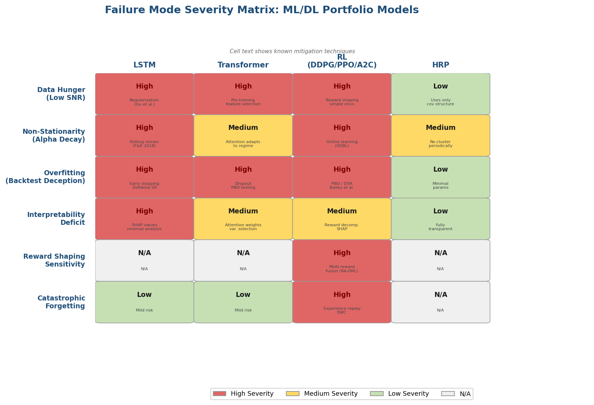

*Figure 3-2: Severity matrix of six systematic failure modes across four ML/DL model families (LSTM, Transformer, RL, HRP), color-coded by severity level (red = high, yellow = medium, green = low, gray = not applicable), with mitigation techniques annotated in each cell.*

### 3.6.1 Data Hunger and the Low Signal-to-Noise Regime

Financial return prediction operates in an extremely low signal-to-noise environment. The best-performing neural network in Gu et al. (2020) achieved an out-of-sample R²_oos of only 0.40% — meaning that 99.6% of return variance remains unexplained. This stands in stark contrast to computer vision tasks, where R² values routinely exceed 90%. The practical consequence is that deeper, higher-capacity models are not necessarily superior: Gu et al. found that the moderate NN3 (32-16-8) outperformed deeper architectures, and Fischer and Krauss observed that their 25-hidden-unit LSTM, with approximately 93 training examples per parameter, achieved the optimal balance between model capacity and regularization [Gu, Kelly & Xiu 2020](https://dachxiu.chicagobooth.edu/download/ML.pdf "RFS, 2020") [Fischer & Krauss 2018](https://ideas.repec.org/a/eee/ejores/v270y2018i2p654-669.html "EJOR, 2018").

### 3.6.2 Non-Stationarity and Alpha Decay

Financial markets are inherently non-stationary: the data-generating process evolves as market participants adapt, regulations change, and macroeconomic regimes shift. Fischer and Krauss documented LSTM alpha decaying to near zero after 2010, consistent with the diffusion of machine learning techniques across the investment industry. This phenomenon — sometimes termed "strategy crowding" — implies that any predictive edge must be continuously refreshed through model retraining, novel feature engineering, or access to proprietary data sources. The non-stationarity challenge is particularly acute for RL agents, whose policies are optimized against historical reward distributions that may bear diminishing resemblance to future market conditions.

### 3.6.3 Overfitting and Backtest Deception

Bailey, Borwein, López de Prado, and Zhu (2015) introduced the **Probability of Backtest Overfitting (PBO)** metric, employing the Combinatorially Symmetric Cross-Validation (CSCV) method to estimate how likely a strategy's apparent in-sample performance is to be spurious. Their demonstration is sobering: optimizing a strategy on a random walk — which by construction contains no exploitable signal — can produce an in-sample Sharpe ratio of 1.27, yet with a PBO of 55% and approximately 53% of out-of-sample Sharpe ratios being negative. The implication is stark: **high in-sample performance may be inversely correlated with out-of-sample performance** when the researcher evaluates many model configurations [Bailey et al. 2015](https://www.davidhbailey.com/dhbpapers/backtest-prob.pdf "The Probability of Backtest Overfitting, J. Computational Finance, 2015").

The companion concept, the **Deflated Sharpe Ratio** (Bailey & López de Prado 2014), corrects the observed Sharpe ratio for multiple testing bias, non-normality, and short sample length. For ML/DL portfolio strategies — which typically involve searching over numerous hyperparameter configurations, architectures, and feature sets — the Deflated Sharpe Ratio provides a critical safeguard against reporting inflated performance metrics [Bailey & López de Prado 2014](https://www.davidhbailey.com/dhbpapers/backtest-prob.pdf "JPM, 40(5): 94-107, 2014").

### 3.6.4 Interpretability Deficit

The interpretability gap remains one of the most significant barriers to institutional adoption of ML/DL portfolio models. Portfolio managers and risk officers must explain why a portfolio holds specific positions, both for internal governance and regulatory compliance. Several partial solutions have emerged:

- **SHAP values** (Shapley Additive Explanations) decompose individual predictions into feature contributions and are applicable to any model architecture.
- **Attention weight inspection** in Transformer models reveals which time steps and asset pairs the model considers most informative, as demonstrated by TFT's variable selection network.
- **Variable importance rankings** from tree-based models and the variable selection weights in TFT provide feature-level explanatory power.

None of these approaches, however, provides the complete, closed-form transparency of classical models. The MVO solution **w⋆ = (1/2γ)Σ⁻¹(μ + ν1)** is fully auditable; a deep neural network's decision process, even when supplemented with SHAP values, remains an approximation of the true reasoning path. This interpretability–performance trade-off is likely to persist as a central tension in the adoption of ML-based portfolio management [Lim et al. 2021](https://arxiv.org/abs/1912.09363 "TFT, 2021").

### 3.6.5 Reward Shaping Sensitivity in RL

For RL-based portfolio optimization, the choice of reward function is not merely a technical detail — it fundamentally determines the agent's behavior. An agent trained with log returns as reward will aggressively pursue high-return positions regardless of risk; an agent trained with maximum drawdown penalty will be overly conservative in bullish environments. The RA-DRL framework of Choudhary et al. (2025) represents one response to this challenge, fusing multiple reward-specific agents, but the fusion mechanism itself introduces additional hyperparameters and architectural choices. More fundamentally, no consensus exists on which reward function best captures real investor objectives, which span risk aversion profiles, regulatory capital constraints, liability matching requirements, and behavioral preferences [Choudhary et al. 2025](https://link.springer.com/article/10.1007/s44196-025-00875-8 "RA-DRL, 2025").

### 3.6.6 Catastrophic Forgetting in Online RL

When RL agents are updated online to adapt to new market regimes, they become susceptible to **catastrophic forgetting** — the phenomenon whereby learning new patterns causes the agent to lose previously acquired knowledge. An agent that learns to perform well during a prolonged bull market may catastrophically fail when the regime shifts to a bear market, as its policy has been progressively overwritten by bull-market-specific behavior. This failure mode is particularly insidious because it manifests precisely when the agent's adaptiveness is most critical — during regime transitions — and existing mitigation techniques such as elastic weight consolidation and experience replay remain underexplored in the financial RL literature.

## 3.7 Chapter Synthesis

The emerging ML/DL models surveyed in this chapter represent a fundamental shift from the closed-form, estimation-dependent paradigm of classical portfolio optimization to a data-driven, capacity-scaling paradigm. LSTM networks and Transformers capture nonlinear temporal and cross-asset dependencies that linear models miss, with Gu et al. (2020) demonstrating that nonlinear predictor interactions — rather than individual-predictor nonlinearity — constitute the primary source of deep learning's advantage in return prediction. RL formulations convert portfolio management from a static optimization into a sequential decision process that endogenously handles transaction costs and multi-period effects. HRP offers a complementary, estimation-robust approach that avoids matrix inversion entirely.

Figure 3-3 presents a chronological timeline of the key empirical milestones discussed in this chapter, illustrating both the acceleration of methodological innovation and the evolving performance landscape from 2001 to 2025.

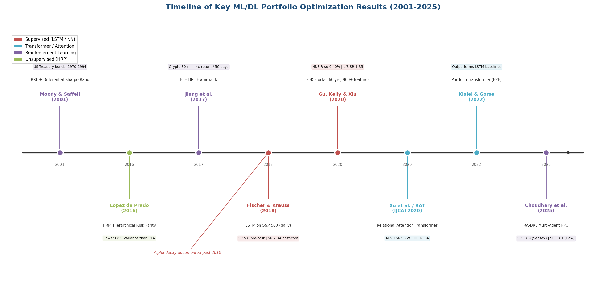

*Figure 3-3: Chronological timeline of key ML/DL portfolio optimization results from Moody & Saffell (2001) through Choudhary et al. (2025), color-coded by model category (supervised, Transformer/attention, RL, unsupervised), with core performance metrics and the post-2010 alpha decay phenomenon annotated.*

Yet the evidence also reveals structural vulnerabilities. Fischer and Krauss's documentation of post-2010 alpha decay, Bailey et al.'s demonstration of backtest overfitting, and the persistent convergence challenges reported for RL algorithms all counsel against treating these models as wholesale replacements for classical frameworks. Rather, we consider them as complementary tools whose respective strengths — nonlinear pattern recognition, dynamic adaptation, explicit cost modeling, and estimation-robust risk allocation — are precisely targeted at the specific limitations of MVO and Black-Litterman identified in Chapter 2. The question of how to integrate these strengths into a coherent hybrid framework constitutes the subject of Chapter 5.

# Cross-Model Comparative Analysis — Risk, Return, and Allocation

The preceding chapters established two distinct paradigms for portfolio construction: the classical framework (MVO and Black-Litterman), grounded in closed-form optimization with well-characterized theoretical properties, and the emerging ML/DL framework (LSTM, Transformer, RL, HRP), grounded in data-driven pattern extraction that offers empirical performance advantages yet lacks equivalent theoretical guarantees. This chapter undertakes a systematic, multi-dimensional comparison across these model families along six critical axes: risk measurement capability, return prediction accuracy, allocation methodology and weight stability, interpretability and regulatory compliance, computational infrastructure requirements, and regime adaptivity. The objective is not to declare a single "winner" — the accumulated evidence does not support such a conclusion — but rather to construct a rigorous comparative framework that delineates the specific conditions under which each model class excels or fails. This analysis thereby lays the analytical foundation for the hybrid architecture proposed in Chapter 5.

## 4.1 Evaluation Framework: Unified Benchmarking Protocol

A meaningful cross-model comparison requires a consistent evaluation methodology. The metrics, backtesting protocols, and statistical tests defined in Chapter 1 serve as the common language for this assessment.

### 4.1.1 Metrics and Their Model-Specific Relevance

The core evaluation metrics — Sharpe Ratio, Sortino Ratio, Calmar Ratio, maximum drawdown, portfolio turnover, and transaction-cost-adjusted returns — apply universally across model families, yet their diagnostic relevance varies systematically by model class. For classical models (MVO, BL), the Sharpe Ratio and variance-based risk measures constitute natural evaluation targets, as these models explicitly optimize for mean-variance utility. For RL-based models, the Calmar Ratio and maximum drawdown carry heightened diagnostic weight because RL agents trained with drawdown-based reward functions directly target these metrics in their policy optimization. For HRP, which deliberately eschews return prediction, out-of-sample variance and diversification measures — including the effective number of bets and the Herfindahl index of portfolio weights — serve as the most informative comparators.

Statistical rigor in pairwise model comparison demands formal hypothesis testing. The Diebold-Mariano test evaluates the null hypothesis that two models produce equal predictive accuracy, while bootstrap confidence intervals furnish non-parametric uncertainty quantification around performance metrics. Bailey and López de Prado's (2014) Deflated Sharpe Ratio corrects for multiple testing bias — a critical adjustment when evaluating the output of dozens of model configurations, as is typical in ML/DL hyperparameter searches [Bailey & López de Prado 2014](https://www.davidhbailey.com/dhbpapers/backtest-prob.pdf "JPM, 40(5): 94-107, 2014").

### 4.1.2 Backtesting Protocol Standards

Walk-forward (rolling window) and expanding window backtests constitute the minimum standard for credible out-of-sample evaluation. Classical models typically employ monthly or quarterly rebalancing with look-back windows of 60–120 months. ML/DL models often operate on shorter windows: Fischer and Krauss (2018) employed 750-day training / 250-day trading windows for LSTM, while Gu, Kelly, and Xiu (2020) utilized a train/validate/test three-way split spanning 60 years of data. RL agents function on even shorter horizons, with Jiang et al. (2017) operating at 30-minute frequency and Choudhary et al. (2025) employing daily rebalancing over a January 2021 to March 2024 out-of-sample period [Fischer & Krauss 2018](https://ideas.repec.org/a/eee/ejores/v270y2018i2p654-669.html "EJOR, 270(2): 654-669, 2018") [Gu, Kelly & Xiu 2020](https://dachxiu.chicagobooth.edu/download/ML.pdf "RFS, 33(5): 2223-2273, 2020") [Choudhary et al. 2025](https://link.springer.com/article/10.1007/s44196-025-00875-8 "RA-DRL, Int J Comput Intell Syst 18, 126, 2025").

This heterogeneity in backtesting protocols presents a fundamental challenge for cross-model comparison: performance numbers reported across different asset universes, time periods, rebalancing frequencies, and transaction cost assumptions are not directly commensurable. The analysis that follows addresses this limitation by comparing models within consistent empirical settings where available — notably the Choudhary et al. (2025) study, which benchmarks RA-DRL against MVO and 1/N on identical data across four global markets — and by emphasizing relative rankings and structural performance patterns rather than absolute Sharpe Ratio values.

## 4.2 Risk Measurement: From Symmetric Variance to Tail-Aware Learning

The treatment of risk constitutes perhaps the sharpest methodological dividing line between classical and emerging models. This section compares how each model family measures, models, and manages portfolio risk — progressing from the parametric variance paradigm through implicit tail-risk learning to estimation-robust hierarchical allocation.

### 4.2.1 Classical Models: Parametric Risk Within the Gaussian Envelope

MVO defines risk exclusively as portfolio variance **σ² = wᵀΣw** — a symmetric, parametric measure that penalizes upside and downside deviations equally. As established in Chapter 1, this formulation assumes either quadratic utility or elliptically distributed returns. The practical consequence is that MVO-optimal portfolios are systematically unprepared for the fat-tailed, negatively skewed return distributions that characterize real financial markets. Fama (1965) documented excess kurtosis in stock returns over half a century ago, yet variance remains the default risk measure in MVO implementations because it preserves the convexity that enables efficient computation [Boyd et al. 2024](https://web.stanford.edu/~boyd/papers/pdf/markowitz.pdf "Markowitz Portfolio Construction at Seventy, Stanford, January 2024").

The Black-Litterman model inherits MVO's variance-based risk framework in its entirety. BL's contribution lies in stabilizing the expected return input through Bayesian shrinkage toward market equilibrium, not in advancing the risk measurement paradigm. The posterior covariance matrix remains Gaussian-conditional, and the optimization step is identical to standard MVO. BL therefore shares MVO's blindness to tail risk, despite producing more stable and intuitive portfolio weights [Idzorek 2004](https://people.duke.edu/~charvey/Teaching/BA453_2006/Idzorek_onBL.pdf "A Step-by-Step Guide to the Black-Litterman Model, July 2004").

The Markowitz++ framework (Boyd et al. 2024) extends classical MVO with robust risk penalties — including worst-case variance under ellipsoidal uncertainty sets — and factor model covariance estimation that reduces the parameter count from O(n²) to O(nk). A 2004–2023 backtest on approximately 1,500 U.S. stocks demonstrated that these regularization techniques significantly improve out-of-sample risk-adjusted performance relative to basic MVO. The risk measure itself, however, remains fundamentally variance-based [Boyd et al. 2024](https://web.stanford.edu/~boyd/papers/pdf/markowitz.pdf "Markowitz Portfolio Construction at Seventy, §5").

### 4.2.2 ML/DL Models: Implicit and Explicit Tail-Risk Awareness

Deep learning models approach risk measurement through two fundamentally different mechanisms. In the **predict-then-optimize** paradigm, ML models generate forecasts (returns, covariances, or regime probabilities) that are subsequently fed into a classical risk framework. Under this configuration, the risk measure itself remains classical — variance, CVaR, or drawdown — but the quality of inputs is ML-enhanced. Gu, Kelly, and Xiu (2020) demonstrated that neural network return predictions, when fed into a long-short decile strategy, produced a Sharpe Ratio of 1.35 versus 0.61 for OLS — a 121% improvement in risk-adjusted performance driven entirely by superior return prediction rather than a novel risk measure [Gu, Kelly & Xiu 2020](https://dachxiu.chicagobooth.edu/download/ML.pdf "RFS, 33(5): 2223-2273, 2020").

In the **end-to-end** paradigm, the risk model is implicitly learned from data through the training objective. RL agents trained with maximum drawdown as the reward function develop policies that are empirically tail-risk-aware without explicitly computing VaR or CVaR. In the Choudhary et al. (2025) study on the Sensex index over the January 2021 to March 2024 out-of-sample period, the MDD-reward RL agent achieved annual volatility of 12.89%, comparable to the MVO benchmark at 12.17%, while delivering substantially higher cumulative returns (87.21% vs. 40.82%). The RA-DRL framework — which fuses three reward-specific agents (log return, differential Sharpe ratio, and maximum drawdown) via a CNN meta-learner — achieved the best overall risk-adjusted profile with a Sharpe Ratio of 1.69 on Sensex and 1.01 on Dow, versus MVO's 0.76 and 0.55 respectively [Choudhary et al. 2025](https://link.springer.com/article/10.1007/s44196-025-00875-8 "RA-DRL, Int J Comput Intell Syst 18, 126, 2025").

### 4.2.3 HRP: Risk Allocation Without Return Prediction

HRP occupies a unique position in the risk measurement landscape: it operates exclusively on the covariance structure, allocating risk through hierarchical clustering and inverse-variance weighting rather than optimizing any explicit risk-return objective. This design renders HRP agnostic to the specific risk measure — it can employ variance, semi-variance, or CVaR as the dispersion metric within its recursive bisection step. López de Prado's (2016) original Monte Carlo experiments demonstrated that HRP achieved lower out-of-sample variance than the Critical Line Algorithm (CLA) despite CLA explicitly minimizing variance, precisely because HRP avoids the covariance matrix inversion that amplifies estimation error [López de Prado 2016](https://papers.ssrn.com/sol3/papers.cfm?abstract_id=2708678 "Building Diversified Portfolios, JPM, 42(4): 59-69, 2016").

The Bocconi BSIC (2025) backtest on approximately 1,292 U.S. stocks over the period 2005–2025 exposed HRP's critical weakness in tail risk management: despite generating cumulative returns of 1,299.67% and a mean Sharpe Ratio of 0.4711, HRP suffered a maximum drawdown of −60% during the 2008 financial crisis. This vulnerability stems from HRP's exclusive reliance on the covariance structure: without any forward-looking signal, the model cannot position defensively ahead of regime changes [BSIC 2025](https://bsic.it/wp-content/uploads/2025/03/Article-HRP-1.pdf "Advanced Portfolio Optimization: HRP, Bocconi BSIC, 2025").

### 4.2.4 Comparative Assessment: Risk Measurement

The following synthesis distills the risk measurement landscape across model families:

**MVO and BL** provide analytically tractable, symmetric risk measures (variance) with established convexity properties but remain blind to tail risk and distributional asymmetry. **Markowitz++** extends this paradigm with robust penalties yet does not escape the variance framework. **ML/DL predict-then-optimize** models enhance the quality of inputs feeding classical risk measures without altering the risk measure itself. **End-to-end DL and RL** models implicitly learn tail-aware risk policies through training objectives — drawdown penalties, differential Sharpe — but these learned risk models lack closed-form characterization and resist the audit procedures that variance or CVaR readily support. **HRP** delivers estimation-robust risk allocation but cannot anticipate regime shifts. No single model family dominates across all risk dimensions; the appropriate choice hinges on whether the priority is analytical tractability, tail sensitivity, or estimation robustness.

## 4.3 Return Prediction: From Equilibrium Priors to Nonlinear Machine Learning

The accuracy of return prediction constitutes the single most consequential input to portfolio performance. Chopra and Ziemba (1993) demonstrated that errors in expected return estimates are approximately 10 times more damaging than errors in variance estimates and 20 times more damaging than errors in covariance estimates for investors with moderate risk aversion — a finding that places return prediction at the very center of any comparative analysis [Chopra & Ziemba 1993](https://people.duke.edu/~charvey/Teaching/BA453_2006/Chopra_The_effect_of_1993.pdf "The Effect of Errors in Means, Variances, and Covariances on Optimal Portfolio Choice, JPM Winter 1993").

### 4.3.1 Classical Models: No Prediction Versus Equilibrium Anchoring

MVO requires expected returns as input but provides no mechanism for generating them. Practitioners typically resort to historical sample means — an estimator that DeMiguel, Garlappi, and Uppal (2009) demonstrated requires approximately 3,000 months of data for 25 assets (and approximately 6,000 months for 50 assets) to reliably outperform the naïve 1/N benchmark. The minimum-variance portfolio sidesteps this problem entirely by setting μ = 0 (or equivalently, assuming equal expected returns), thereby optimizing only over the covariance matrix. Clarke, de Silva, and Thorley (2006) demonstrated that the minimum-variance portfolio on U.S. equities over the period 1968–2005 achieved approximately 25% lower annualized volatility than the market-cap-weighted benchmark with comparable or higher returns — exploiting the low-volatility anomaly while avoiding the return estimation problem altogether [DeMiguel et al. 2009](https://academic.oup.com/rfs/article/22/5/1915/1592901 "Optimal Versus Naive Diversification, RFS, 22(5): 1915–1953") [Clarke et al. 2006](https://www.scirp.org/reference/referencespapers?referenceid=2837300 "Minimum-Variance Portfolios in the US Equity Market, JPM 33(1), 2006").

The Black-Litterman model addresses the return estimation problem through reverse optimization: it derives implied equilibrium returns **Π = λΣw_mkt** from observed market capitalization weights, then blends these with investor views through Bayesian updating. This approach eliminates the extreme, unintuitive weights that plague unconstrained MVO while providing a structured mechanism for incorporating forward-looking signals. The posterior return **μ_BL = Π + τΣPᵀ(PτΣPᵀ + Ω)⁻¹(Q − PΠ)** shrinks toward the market equilibrium, with the degree of shrinkage controlled by the scalar τ and the view confidence matrix Ω [Idzorek 2004](https://people.duke.edu/~charvey/Teaching/BA453_2006/Idzorek_onBL.pdf "A Step-by-Step Guide to the Black-Litterman Model").

The fundamental limitation of BL's return prediction framework resides in the source of views. Traditionally, views are subjective — Herold (2003) argued that BL is best suited to quantitative fund managers capable of formulating precise probabilistic statements about relative asset returns. This subjectivity introduces a degree of arbitrariness that undermines the model's claim to Bayesian rigor.

A noteworthy recent development addresses this limitation directly. Young and Lee (2025) proposed a framework that replaces human-generated views with LLM-generated return forecasts, using repeated queries to large language models (Qwen, Llama, Gemma, GPT-4o-mini) to produce view vectors and confidence matrices for the Black-Litterman model. In a backtest on 50 S&P 500 constituents over September 2024 to June 2025, the BLM-Llama variant achieved an annualized Sharpe Ratio of 1.23, while BLM-Qwen achieved a CAGR of 28.1% — both substantially outperforming MVO (Sharpe 0.28, CAGR 6.1%) and equal-weight (Sharpe 0.89, CAGR 19.1%) benchmarks. The BLM-Gemma variant, however, exhibited persistent pessimistic bias and underperformed, illustrating that the "investment style" encoded in the LLM's view distribution — not raw forecasting accuracy alone — determines portfolio outcomes [Young & Lee 2025](https://arxiv.org/html/2504.14345v2 "LLM-Enhanced Black-Litterman Portfolio Optimization, CIKM 2025").

### 4.3.2 ML/DL Models: Data-Driven Return Prediction

Machine learning models attack the return prediction problem directly, leveraging historical patterns, cross-sectional features, and nonlinear interactions to forecast asset returns. The benchmark established by Gu, Kelly, and Xiu (2020) provides the most comprehensive assessment to date: across nearly 30,000 U.S. stocks over 60 years (1957–2016), neural networks achieved out-of-sample R²_oos of 0.40%, compared to 0.16% for OLS with three predictors and negative R² for OLS with 900+ factors — the latter constituting a clear manifestation of overfitting. While 0.40% may appear modest in absolute terms — 99.6% of return variance remains unexplained — the economic significance is substantial: a long-short decile strategy based on NN3 (32-16-8 architecture) predictions produced a Sharpe Ratio of 1.35, more than double the OLS baseline of 0.61 [Gu, Kelly & Xiu 2020](https://dachxiu.chicagobooth.edu/download/ML.pdf "Empirical Asset Pricing via ML, RFS, 33(5): 2223-2273, 2020").

A critical methodological insight from Gu et al. is that the source of neural networks' predictive advantage lies in **nonlinear interactions among predictors** rather than individual-predictor nonlinearity. Generalized linear models with spline transformations — which capture individual nonlinearity but not cross-term interactions — did not robustly outperform linear models. This finding implies that the interaction structure among return predictors, rather than individual nonlinear mappings, contains the exploitable information that classical linear models systematically miss.

Fischer and Krauss (2018) demonstrated LSTM's temporal prediction capability on S&P 500 constituents over the period 1992–2015: the LSTM achieved directional classification accuracy of 54.3% across 115,000 predictions, producing annualized returns of 82.29% with a Sharpe Ratio of 2.34 after 5 basis points transaction costs. These results, however, embed a critical caveat: profitability decayed sharply after 2010, with excess returns fluctuating around zero after transaction costs. This alpha decay reflects the progressive arbitrage of predictive signals as ML techniques diffused through the investment industry — a phenomenon that any forward-looking deployment must account for [Fischer & Krauss 2018](https://ideas.repec.org/a/eee/ejores/v270y2018i2p654-669.html "Deep learning with LSTM for financial market predictions, EJOR, 270(2): 654-669, 2018").

### 4.3.3 RL Models: Implicit Return Prediction Through Policy Optimization

Reinforcement learning agents do not produce explicit return forecasts; instead, they learn policies that implicitly embed return expectations through the reward maximization process. The RL agent's "prediction" manifests as an action — a portfolio weight vector — rather than a numerical return estimate, and the quality of this implicit prediction can be evaluated only through realized portfolio performance.

Choudhary et al. (2025) furnish the most comprehensive recent comparison between RL and classical methods on identical datasets. Across four global markets (Sensex, Dow, TWSE, IBEX) over the out-of-sample period January 2021 to March 2024, the RA-DRL framework achieved annualized returns of 29.03% on Sensex (vs. MVO's 11.31% and the market index's 15.09%) and 13.78% on Dow (vs. MVO's 5.67% and the market index's 7.98%). Paired t-tests confirmed statistical significance, with p-values ranging from 0.0041 to 0.0466 across key metrics including cumulative return, Sharpe Ratio, Omega Ratio, and Sortino Ratio [Choudhary et al. 2025](https://link.springer.com/article/10.1007/s44196-025-00875-8 "RA-DRL, Int J Comput Intell Syst 18, 126, 2025").

These results warrant qualification by the observation that individual RL agents exhibited highly heterogeneous performance depending on the reward function. On the Dow index, the Log-return agent achieved a cumulative return of 33.14% while the MDD agent achieved 28.48%, yet the MDD agent exhibited lower volatility (13.40% vs. 17.09%). The RA-DRL fusion — combining all three agents via a CNN meta-learner — consistently dominated individual agents across markets, suggesting that reward function diversity, rather than any single reward specification, constitutes the key to RL robustness in portfolio optimization.

### 4.3.4 Comparative Assessment: Return Prediction

The return prediction comparison reveals a clear hierarchy of predictive sophistication, tempered by equally clear trade-offs.

**MVO with historical means** provides the weakest return prediction, often performing worse than no prediction at all — as evidenced by the 1/N benchmark's dominance in DeMiguel et al. (2009). **BL with equilibrium anchoring** substantially improves stability by shrinking toward market equilibrium but depends on the quality of exogenous views. **BL with ML/LLM-generated views** represents an emerging frontier that automates view generation, with early results (Young & Lee 2025) showing Sharpe Ratios of 1.23 for BLM-Llama — significant outperformance over both MVO and BL with subjective views. **ML return prediction (Gu et al. 2020)** delivers the strongest documented out-of-sample predictive accuracy for individual stock returns, with neural networks capturing nonlinear cross-predictor interactions that linear models miss entirely. **LSTM temporal prediction (Fischer & Krauss 2018)** demonstrates strong directional accuracy but confronts alpha decay over time as signals are arbitraged. **RL implicit prediction** bypasses explicit forecasting altogether; the RA-DRL multi-reward framework achieves robust risk-adjusted performance across diverse markets, though the absence of separable "prediction quality" metrics renders attribution difficult.

The empirical performance gap between classical and deep learning models is illustrated in Figure 1, which presents Sharpe Ratio comparisons from Kisiel and Gorse (2022) across three distinct asset classes. The Portfolio Transformer achieved Sharpe Ratios of 2.252 (ETFs), 2.001 (500 NASDAQ stocks), and 1.506 (24 commodity futures), consistently outperforming LSTM (1.539, 1.456, 1.182) and MVO (0.012, 0.694, 0.174) across all datasets [Kisiel & Gorse 2022](https://arxiv.org/abs/2206.03246 "Portfolio Transformer, arXiv:2206.03246, 2022"). The magnitude of MVO's underperformance — particularly the near-zero Sharpe Ratio of 0.012 on ETFs — underscores how severely estimation error degrades classical optimization when applied without regularization to modern asset universes.

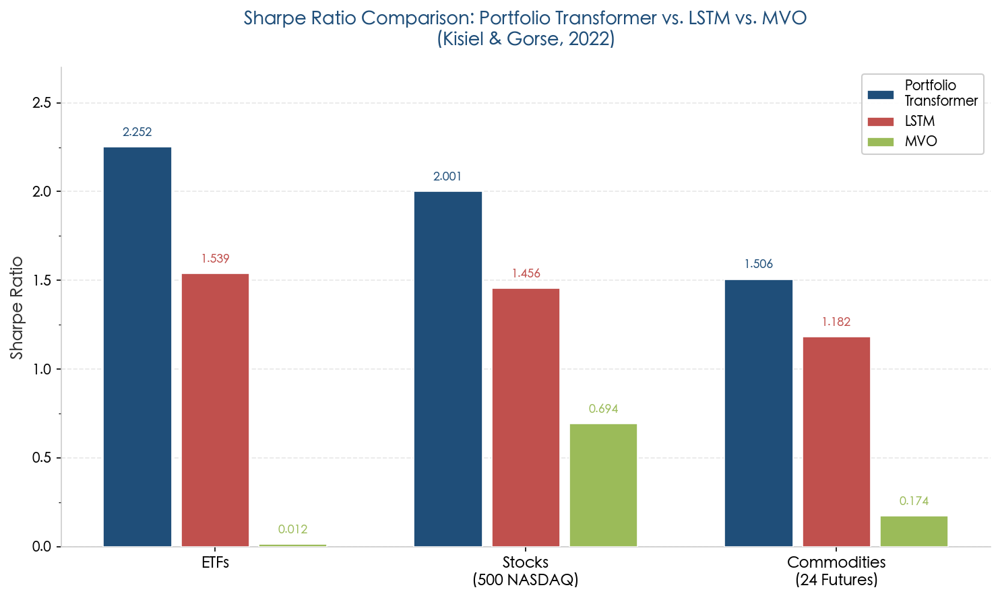

*Figure 1. Sharpe Ratio comparison: Portfolio Transformer vs. LSTM vs. MVO across ETFs, NASDAQ stocks, and commodity futures. Data from Kisiel and Gorse (2022). The Transformer architecture's consistent dominance reflects its capacity to capture both temporal dependencies and cross-asset attention patterns that simpler models miss.*

## 4.4 Allocation Methodology: Weight Stability, Turnover, and Diversification

Beyond return prediction and risk measurement, the practical utility of a portfolio model depends critically on the quality of the allocations it produces. Extreme positions, excessive turnover, and concentrated bets are hallmarks of poorly regularized models — and they translate directly into implementation costs that erode theoretical performance advantages. This section compares the allocation properties of each model family along the dimensions of weight stability, diversification, and turnover management.

### 4.4.1 MVO: Extreme Weights and the 1/N Challenge

Unconstrained MVO is notorious for producing extreme, unintuitive allocations. Idzorek (2004) documented the canonical failure case: an eight-asset MVO fed historical returns allocated 1,144% to U.S. bonds and −105% to international bonds — positions that no rational investor would accept. Even constrained (long-only) MVO tends toward corner solutions, concentrating capital in a small number of assets while frequently assigning zero weight to the majority of the asset universe [Idzorek 2004](https://people.duke.edu/~charvey/Teaching/BA453_2006/Idzorek_onBL.pdf "A Step-by-Step Guide to the Black-Litterman Model, July 2004").

The weight instability problem extends beyond individual allocations to the temporal dimension: small perturbations in input parameters between rebalancing dates produce disproportionately large weight shifts, generating excessive turnover and eroding returns through transaction costs. Best and Grauer (1991) demonstrated that marginally increasing the expected return of a single asset can cause half the assets to shift from positive to zero weight — a sensitivity ratio that Idzorek (2004) quantified as a weight correlation of merely 66% for expected return vectors exhibiting 99.8% correlation. DeMiguel et al. (2009) found that none of 14 optimized strategies consistently outperformed the naïve 1/N portfolio — a benchmark that, by construction, incurs zero estimation-driven turnover [DeMiguel et al. 2009](https://academic.oup.com/rfs/article/22/5/1915/1592901 "Optimal Versus Naive Diversification, RFS, 22(5): 1915–1953").

### 4.4.2 Black-Litterman: Stabilized Weights Through Equilibrium Anchoring

The Black-Litterman model directly addresses MVO's allocation pathology. By anchoring posterior returns to market equilibrium, BL produces weights that are intuitive, diversified, and proximate to market-capitalization weights when no views are expressed. When views are introduced, BL tilts away from equilibrium in proportion to the view confidence, while assets without expressed views retain their equilibrium weights — a property that provides natural diversification.

The stabilization effect is quantitatively significant. Idzorek's (2004) eight-asset example demonstrated that BL with equilibrium returns produced weights closely tracking market capitalization (e.g., 27% U.S. equities, 26% international equities), whereas MVO with historical returns produced economically absurd allocations. BL's weight changes between rebalancing dates are typically moderate — governed by the incremental updating of views rather than wholesale re-optimization — resulting in lower turnover and substantially greater practical implementability [Idzorek 2004](https://people.duke.edu/~charvey/Teaching/BA453_2006/Idzorek_onBL.pdf "A Step-by-Step Guide to the Black-Litterman Model, July 2004").

### 4.4.3 HRP: Guaranteed Full-Universe Allocation Without Matrix Inversion

HRP's recursive bisection algorithm produces portfolio weights guaranteed to include every asset in the universe with a non-zero allocation — a property shared with the equal-weight portfolio but absent from constrained MVO, which routinely assigns zero weight to most assets. The allocation reflects the hierarchical cluster structure of asset correlations: highly correlated assets receive collectively lower weight to mitigate redundant risk concentration, while uncorrelated clusters receive larger allocations.

Critically, HRP avoids matrix inversion entirely, enabling it to compute valid weights even when the covariance matrix is singular (N > T). This property renders HRP uniquely suited to large, sparse asset universes where traditional optimization fails. The Bocconi BSIC (2025) backtest confirmed that HRP produced diversified allocations across approximately 1,292 U.S. stocks, although the resulting portfolio exhibited severe drawdown exposure during the 2008 crisis (−60%) — reflecting HRP's structural inability to shift allocations in response to forward-looking signals [López de Prado 2016](https://papers.ssrn.com/sol3/papers.cfm?abstract_id=2708678 "Building Diversified Portfolios, JPM, 42(4): 59-69, 2016") [BSIC 2025](https://bsic.it/wp-content/uploads/2025/03/Article-HRP-1.pdf "Advanced Portfolio Optimization: HRP, Bocconi BSIC, 2025").

### 4.4.4 ML/DL End-to-End Models: Learned Allocations and Turnover Management

End-to-end deep learning models (Portfolio Transformer, RL agents) produce allocations directly through learned policies, bypassing the explicit optimization step entirely. The resulting weight properties depend on the training objective and architectural constraints.

The RA-DRL framework (Choudhary et al. 2025) enforces the simplex constraint (weights sum to 1, no short-selling) through a softmax output layer and incorporates transaction costs directly in the reward function at 0.05% per trade. On the Sensex index, RA-DRL achieved a stability metric (R² of linear regression fit to cumulative log returns) that significantly exceeded all individual RL agents and matched or exceeded MVO — indicating that the multi-reward fusion produces temporally consistent allocation behavior despite the absence of explicit stability constraints [Choudhary et al. 2025](https://link.springer.com/article/10.1007/s44196-025-00875-8 "RA-DRL, Int J Comput Intell Syst 18, 126, 2025").

RL agents possess a structural advantage in turnover management: by concatenating the previous portfolio weights **w_{t-1}** into the state representation (the PVM mechanism of Jiang et al. 2017), the agent internalizes the cost of rebalancing and learns policies that naturally trade off the benefit of moving toward superior weights against the transaction cost of doing so. This stands in sharp contrast to MVO, where turnover constraints must be imposed externally as additional optimization constraints that the model has no intrinsic motivation to respect [Jiang et al. 2017](https://arxiv.org/abs/1706.10059 "A DRL Framework for Financial Portfolio Management, arXiv:1706.10059, 2017").

### 4.4.5 Comparative Assessment: Allocation Properties

The allocation dimension reveals a spectrum from instability to structural robustness:

**Unconstrained MVO** produces the most extreme, unstable, and concentrated allocations — the "estimation-error maximizer" problem identified by Michaud (1989), where weight correlations of 66% emerge from expected return correlations of 99.8%. **Constrained MVO** with shrinkage (Ledoit-Wolf) or robust penalties (Markowitz++) substantially reduces instability but often converges toward near-minimum-variance solutions, sacrificing return targeting in the process. **BL** produces the most institutionally acceptable allocations: diversified, intuitive, proximate to market weights, with low turnover — properties that explain its widespread adoption among asset managers. **HRP** guarantees full-universe diversification and avoids matrix inversion but lacks the flexibility to incorporate forward-looking information or respond to anticipated regime changes. **End-to-end DL and RL** produce data-driven allocations with endogenous turnover management, but their weight dynamics are opaque and may exhibit erratic behavior in out-of-distribution market regimes where training data provide no guidance.

## 4.5 Interpretability and Regulatory Compliance

The interpretability of portfolio allocation decisions has evolved from an academic concern to a binding regulatory and commercial constraint. As AI-driven investment strategies gain institutional traction, the ability to explain allocation decisions to risk officers, compliance teams, regulators, and end clients has become a first-order design requirement that can override pure performance considerations.

### 4.5.1 Classical Models: Full Analytical Transparency

MVO and BL offer complete interpretability by construction. The MVO analytical solution **w⋆ = (1/2γ)Σ⁻¹(μ + ν1)** is a closed-form function of observable inputs; any allocation can be traced directly to specific expected return estimates and covariance assumptions. A portfolio manager can articulate precisely why a particular asset received a given weight: because its expected return was high relative to its covariance contribution to portfolio risk, given the specified risk aversion parameter. BL adds one further layer of interpretability: the posterior return can be decomposed into the equilibrium component and the view component, enabling the manager to attribute allocation tilts directly to specific investment views and their associated confidence levels [Boyd et al. 2024](https://web.stanford.edu/~boyd/papers/pdf/markowitz.pdf "Markowitz Portfolio Construction at Seventy, Stanford, January 2024").

This transparency carries direct regulatory value. Under MiFID II, investment firms providing portfolio management services must demonstrate that investment decisions align with the client's financial situation, risk tolerance, and investment objectives. The European Securities and Markets Authority (ESMA) issued a Public Statement in May 2024 emphasizing that "firms' decisions remain the responsibility of management bodies, irrespective of whether those decisions are taken by people or AI-based tools," and that firms must ensure "the AI systems used are designed and monitored... to align recommendations and decisions with the client's financial situation, investment objectives (including sustainability preferences and risk tolerance), and knowledge and experience" [ESMA 2024](https://www.esma.europa.eu/sites/default/files/2024-05/ESMA35-335435667-5924__Public_Statement_on_AI_and_investment_services.pdf "Public Statement on AI and Investment Services, ESMA35-335435667-5924, 30 May 2024"). Classical models satisfy these requirements straightforwardly; the entire decision chain from inputs to outputs is auditable.

### 4.5.2 ML/DL Models: Post-Hoc Explainability as Partial Remedy

Deep learning models — including LSTM, Transformer, and RL architectures — operate as "black boxes" whose internal decision-making processes are not directly interpretable. Several post-hoc explainability techniques have been developed to partially bridge this gap:

**SHAP values** (Shapley Additive Explanations) decompose individual predictions into additive feature contributions and are applicable to any model architecture. SHAP provides local (per-prediction) interpretability but does not reveal the global decision logic of the model, nor does it guarantee faithfulness to the model's actual computational pathway.

**Attention weight inspection** in Transformer architectures reveals which time steps and asset pairs the model considers most informative. The TFT's variable selection network (Lim et al. 2021) provides feature-level importance scores, while RAT's Relation Attention mechanism (Xu et al. 2020) exposes dynamic cross-asset relationship weights. These attention-based explanations are inherently more structured than generic SHAP values because they reflect the model's actual computational architecture [Lim et al. 2021](https://arxiv.org/abs/1912.09363 "TFT, IJF 37(4): 1748-1764, 2021") [Xu et al. 2020](https://www.ijcai.org/proceedings/2020/0641.pdf "RAT, IJCAI 2020").

**Behavioral interpretability** offers an alternative pathway. Fischer and Krauss (2018) analyzed the characteristics of stocks selected by their LSTM — high volatility, below-mean momentum, extremal short-term movements — and identified that the model had independently rediscovered the short-term reversal anomaly. A simplified rule-based reversal strategy captured approximately 50% of the LSTM's pre-transaction-cost returns, while the remaining 50% remained opaque [Fischer & Krauss 2018](https://ideas.repec.org/a/eee/ejores/v270y2018i2p654-669.html "EJOR, 270(2): 654-669, 2018").

Despite these advances, none of these approaches provides the complete, auditable transparency of classical models. SHAP values are approximations of feature importance, not exact representations of the model's reasoning. Attention weights have been shown to be unreliable indicators of model focus in certain contexts. The interpretability gap between classical and ML/DL models remains a fundamental structural difference rather than a mere engineering challenge awaiting resolution.

### 4.5.3 Regulatory Landscape: The Emerging AI Governance Framework

The regulatory environment is evolving rapidly and asymmetrically across jurisdictions. The EU AI Act, which entered into force in August 2024, establishes a risk-based classification framework for AI systems. While investment management AI is not currently classified as "high-risk" under Annex III, ESMA's 2024 guidance establishes unambiguously that MiFID II obligations — including organizational requirements, conduct of business rules, and record-keeping — apply fully when AI tools are deployed in portfolio management. ESMA specifically expects firms to "maintain comprehensive records on AI utilisation" and to implement "robust governance structures that monitor the performance and impact of AI tools" [ESMA 2024](https://www.esma.europa.eu/sites/default/files/2024-05/ESMA35-335435667-5924__Public_Statement_on_AI_and_investment_services.pdf "Public Statement on AI and Investment Services, 30 May 2024").

Empirical evidence on AI adoption in European fund management provides important context. An ESMA study published in February 2025, analyzing 44,000 EU investment funds, found that only 145 funds explicitly disclosed using AI or ML in their investment process — approximately 0.1% of total UCITS assets under management (€13 billion). Of these, only about 30% used AI as the primary driver of investment decisions. The study found **no statistically significant difference** in returns or risk-adjusted alphas between AI-using funds and their peers across equity, fixed income, mixed-asset, and alternative-asset categories over the period Q3 2021 to Q2 2024. AI-using equity funds charged slightly lower fees (−15 basis points, statistically significant), but the performance parity suggests that AI's primary demonstrated value in current EU practice lies in operational efficiency rather than alpha generation [ESMA 2025](https://www.esma.europa.eu/sites/default/files/2025-02/ESMA50-43599798-9923_TRV_Article_Artificial_intelligence_in_EU_investment_funds.pdf "Artificial Intelligence in EU Investment Funds, ESMA TRV Risk Analysis, 25 February 2025").

This regulatory and empirical landscape carries important implications for model selection. Firms deploying ML/DL portfolio models must invest in explainability infrastructure — SHAP dashboards, attention weight visualizations, model governance documentation — that classical models do not require. The regulatory compliance cost of ML/DL models constitutes a non-trivial component of total cost of ownership that pure performance comparisons routinely omit.

### 4.5.4 Comparative Assessment: Interpretability

**MVO and BL** provide full closed-form transparency, satisfying all current regulatory requirements without additional explainability infrastructure. **HRP** offers moderate interpretability: the hierarchical clustering structure and inverse-variance weighting logic are transparent, but the recursive bisection produces weights that are not easily decomposable into individual asset-level attribution. **ML predict-then-optimize** models offer partial interpretability: the prediction stage can be examined with SHAP or attention weights, while the optimization stage inherits classical transparency. **End-to-end DL and RL** models present the greatest interpretability challenge, requiring significant investment in post-hoc explainability tools and governance infrastructure. The interpretability axis represents, in our assessment, the primary barrier to institutional adoption of ML/DL portfolio models — ahead of even performance considerations — given the current regulatory trajectory toward greater AI governance requirements.

## 4.6 Computational Cost and Infrastructure Requirements

The practical deployment of portfolio models involves computation at three distinct stages: model training (or parameter estimation), signal generation (return/risk prediction), and portfolio optimization (weight computation). The computational demands vary by orders of magnitude across model families, and these differences carry direct implications for operational feasibility, rebalancing frequency, and total cost of ownership.

### 4.6.1 Classical Models: Sub-Second Optimization

MVO with a modern convex solver (CVXPY, MOSEK, Gurobi) handles a universe of 10,000 assets with practical constraints (long-only, turnover limits, factor neutrality) in sub-second computation time. Factor model covariance estimation — reducing dimensionality from O(n²) to O(nk) — enables sub-second covariance construction for 10,000-asset universes with k = 100 factors, representing an approximate 10,000× speedup over full-sample estimation [Boyd et al. 2024](https://web.stanford.edu/~boyd/papers/pdf/markowitz.pdf "Markowitz Portfolio Construction at Seventy, §3.3").

BL adds a matrix inversion of dimension (k × k), where k is the number of investor views — typically a negligible computational cost even for dozens of views. The total latency for a complete BL allocation on a 1,000-asset universe is measured in milliseconds, rendering both MVO and BL fully compatible with real-time and intraday rebalancing requirements.

### 4.6.2 ML/DL Models: Asymmetric Training-Inference Costs

The computational profile of ML/DL models is characterized by a pronounced asymmetry between training and inference. Training a neural network for return prediction — for example, the Gu et al. (2020) NN3 architecture with 32-16-8 units across 60 years of data on approximately 30,000 stocks — requires hours to days on GPU infrastructure, with costs scaling quadratically in the number of assets for attention-based models. Gu et al. employed a comprehensive train/validate/test protocol with multiple random seeds for ensemble averaging, a procedure that multiplies training time by the number of ensemble members.

Inference costs are substantially lower: once trained, a forward pass through a neural network for return prediction completes in milliseconds. The predict-then-optimize paradigm therefore exhibits a favorable deployment profile — expensive upfront training amortized over many low-cost signal generation cycles at each rebalancing date.

End-to-end models (Portfolio Transformer, RL agents) face additional complexity. RL training involves iterative interaction with the environment over thousands of episodes; the RA-DRL framework of Choudhary et al. (2025) required training three separate PPO agents plus a CNN fusion network, with hyperparameter optimization via Bayesian search on 10% of training data. The total training pipeline is significantly more complex than a single neural network, though inference latency remains fast once the pipeline is deployed.

### 4.6.3 HRP: Minimal Computational Overhead

HRP's computational demands rank among the lightest of any sophisticated allocation method. The three-step algorithm — hierarchical clustering at O(n² log n), quasi-diagonalization at O(n), and recursive bisection at O(n log n) — scales efficiently to large universes. No iterative optimization, no gradient computation, and no matrix inversion are required. For a 1,000-asset universe, the entire HRP computation completes in milliseconds on standard hardware without GPU acceleration.

### 4.6.4 Comparative Assessment: Computational Requirements

The computational comparison partitions model families into two distinct tiers. **Tier 1 (lightweight)**: MVO, BL, HRP, and minimum-variance all operate at sub-second latency with minimal infrastructure requirements — a standard workstation equipped with a convex optimization library suffices. **Tier 2 (GPU-dependent)**: LSTM, Transformer, and RL models require GPU-equipped training infrastructure with costs scaling from tens of dollars (small-universe single training run) to thousands of dollars (multi-seed, multi-architecture hyperparameter search across large universes). Once trained, Tier 2 models produce inference in milliseconds, rendering deployment latency comparable to Tier 1. The total cost of ownership, however, must account for the continuous retraining cycle needed to combat alpha decay and non-stationarity — a recurring expense that Tier 1 models do not incur.

## 4.7 Chapter Synthesis: Conditional Superiority and No Universal Winner

The multi-dimensional comparison conducted in this chapter yields a central conclusion: no single model family dominates across all evaluation axes. Each model class exhibits **conditional superiority** — performing best under specific conditions and along specific dimensions — while suffering from characteristic weaknesses along others. Figure 2 synthesizes this finding in a comprehensive evaluation matrix spanning eight dimensions, while Figure 3 visualizes the trade-off profiles as radar charts that reveal the complementary "shapes" of different model families.

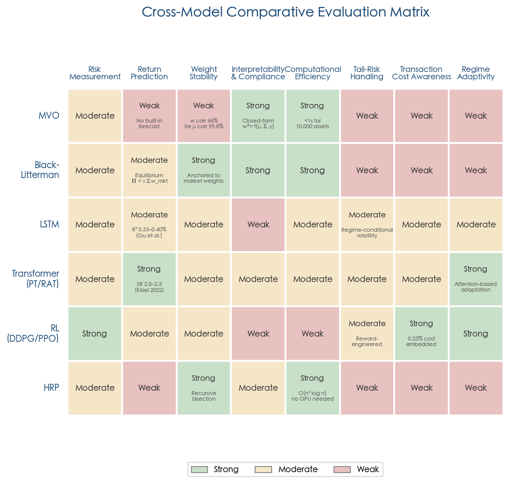

*Figure 2. Cross-model comparative evaluation matrix. Six model families are assessed across eight dimensions using a three-level color coding (Strong/Moderate/Weak). Key quantitative annotations are embedded within cells. This matrix constitutes the "linchpin summary table" for the comparative analysis, revealing that no single row achieves uniformly strong ratings across all columns.*

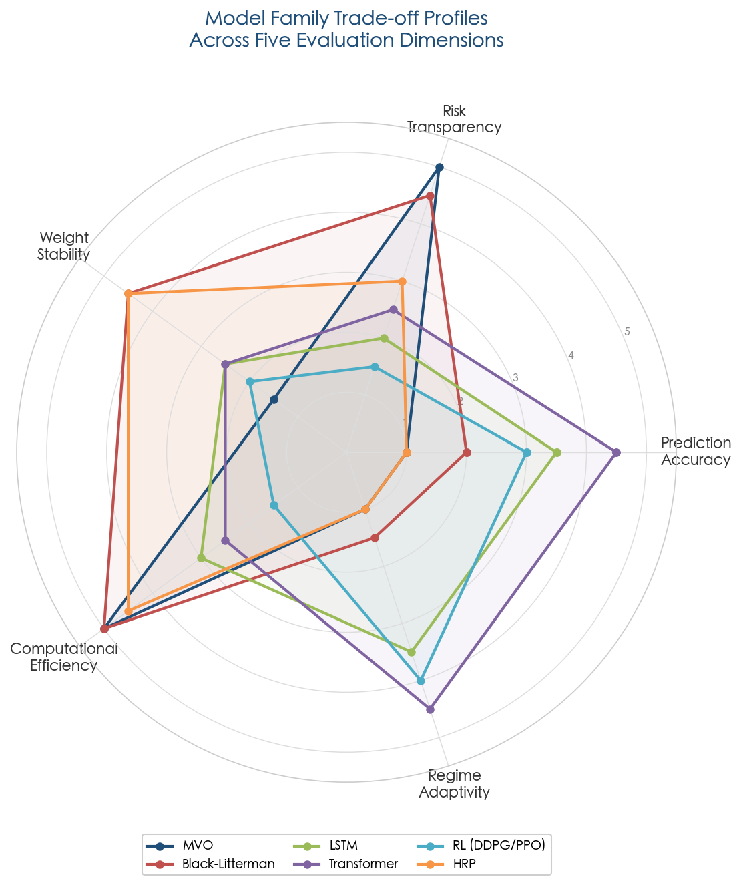

*Figure 3. Model family trade-off profiles across five evaluation dimensions. The distinct "shapes" of each model family's radar profile illustrate the complementarity that motivates hybrid architectures: classical models (MVO, BL) extend along Risk Transparency and Computational Efficiency axes, while emerging models (Transformer, RL) extend along Prediction Accuracy and Regime Adaptivity — suggesting that a modular combination could achieve broader coverage than any individual approach.*

**MVO** remains the foundational framework, offering computational efficiency, full interpretability, and analytical tractability, but its performance is severely degraded by estimation error when applied with noisy inputs. The minimum-variance variant — which avoids return estimation entirely — represents the most robust classical strategy but sacrifices all return-targeting capability.

**Black-Litterman** resolves MVO's weight instability through Bayesian equilibrium anchoring, producing institutionally acceptable allocations with low turnover. Its principal vulnerability is dependence on exogenous views — a limitation that LLM-generated view frameworks (Young & Lee 2025) are beginning to address, though early evidence indicates that the quality of AI-generated views varies dramatically across model architectures (BLM-Llama achieving Sharpe 1.23 vs. BLM-Gemma underperforming equal-weight).

**LSTM and Transformer models** deliver the strongest documented return prediction performance through their capacity to capture nonlinear cross-predictor interactions (Gu et al. 2020, R²_oos = 0.40%) and dynamic cross-asset relationships (RAT, Portfolio Transformer with Sharpe Ratios of 2.0–2.3 across multiple asset classes). Their limitations concentrate in alpha decay over time, interpretability deficits, and the inherently low signal-to-noise ratio of financial data, which constrains achievable model depth.

**Reinforcement learning** offers the most natural formulation of portfolio management as a sequential decision process with endogenous transaction cost handling. The RA-DRL multi-reward framework (Choudhary et al. 2025) demonstrated statistically significant risk-adjusted outperformance across four global markets (Sharpe 1.69 on Sensex, 1.01 on Dow). RL models nonetheless face convergence challenges (DDPG and PPO frequently fail in portfolio settings), reward function sensitivity, and catastrophic forgetting during regime transitions.

**HRP** provides uniquely robust risk allocation that avoids matrix inversion entirely, operating in singular covariance regimes where MVO fails outright. Its limitation is fundamental: by eschewing return prediction, HRP cannot position proactively for regime changes and suffers severe drawdowns during crises (−60% in 2008).

The accumulated evidence reviewed in this chapter strongly suggests that the path forward lies not in selecting a single model family but in composing the complementary strengths of multiple approaches into a modular architecture. BL's Bayesian view integration, ML's nonlinear pattern extraction, RL's sequential optimization with cost awareness, and classical risk constraints can, in principle, be combined such that each component addresses the specific weaknesses of the others. The design, rationale, and practical considerations of such a hybrid framework constitute the subject of Chapter 5.

# Toward a Hybrid Modeling Framework — Architecture, Integration, and Outlook

The comparative analysis in Chapter 4 established a central empirical conclusion: no single model family dominates across all evaluation dimensions. Classical models (MVO, BL) deliver analytical transparency, computational efficiency, and regulatory compliance, yet suffer from estimation error sensitivity and distributional blindness. Deep learning models (LSTM, Transformer) capture nonlinear cross-predictor interactions that linear approaches systematically miss, but confront alpha decay, interpretability deficits, and data hunger. Reinforcement learning agents provide the most natural formulation of sequential portfolio management with endogenous transaction cost handling, yet face convergence fragility and reward function sensitivity. HRP offers estimation-robust risk allocation without matrix inversion but lacks any forward-looking return signal.

The complementary capability profiles of these model families — visible in the radar comparison of Chapter 4 — suggest that a modular combination could achieve broader coverage than any individual approach. This chapter translates that insight into a concrete architectural proposal: a hybrid framework that routes deep learning pattern extraction through the Black-Litterman Bayesian view integration engine, subjects the resulting allocation to RL-based sequential optimization, and constrains the entire pipeline with classical risk overlays. The framework is designed to be specific enough for a quantitative team to adopt as an implementation blueprint, with clearly stated assumptions, component interfaces, and known limitations.

## 5.1 Design Rationale: Why Hybrid, and Why Now

### 5.1.1 The Complementarity Principle

The case for hybrid architectures rests on a precise structural observation: each model family's primary strength addresses another family's primary weakness. BL's Bayesian view integration mechanism provides a principled channel for injecting forward-looking signals into portfolio construction, yet the traditional source of those signals — subjective human views — limits both scalability and objectivity. Deep learning models generate precisely the kind of data-driven, scalable return forecasts that BL requires as input, but their raw output (unconstrained weight vectors or point return predictions) lacks the equilibrium anchoring necessary to prevent extreme allocations. RL agents excel at sequential decision-making under transaction costs yet struggle when forced to simultaneously learn market dynamics and optimal allocation from sparse reward signals. Classical risk constraints (variance budgets, CVaR limits, turnover caps) furnish the guardrails that prevent learned policies from producing catastrophic allocations in out-of-distribution regimes.

The estimation-error thread that runs through this report further motivates the hybrid approach. Chopra and Ziemba (1993) established that return estimation errors are approximately 10 times more damaging to portfolio performance than variance errors and 20 times more damaging than covariance errors [Chopra & Ziemba 1993](https://people.duke.edu/~charvey/Teaching/BA453_2006/Chopra_The_effect_of_1993.pdf "The Effect of Errors in Means, Variances, and Covariances on Optimal Portfolio Choice, JPM Winter 1993"). A well-designed hybrid framework addresses this error hierarchy by deploying the most sophisticated modeling capacity — deep learning — on the most consequential estimation task (expected returns), while relying on statistically robust methods (Ledoit-Wolf shrinkage, factor models) for the less error-sensitive covariance estimation. BL's Bayesian shrinkage then serves as a second safeguard, preventing even ML-generated return estimates from producing the extreme allocations that Michaud (1989) characterized as "estimation-error maximization."

### 5.1.2 Existing Hybrid Experiments: Evidence of Feasibility

The hybrid paradigm is no longer purely theoretical. A growing body of research demonstrates empirical performance gains from combining classical and ML components in portfolio construction.

**DL views → BL allocation.** The most natural integration point uses deep learning to automate the generation of investor views for the Black-Litterman model. Yen et al. (2025) proposed an SSA-MAEMD-TCN hybrid forecasting model that combines Singular Spectrum Analysis for denoising, Multivariate Aligned Empirical Mode Decomposition for frequency-aligned decomposition, and Temporal Convolutional Networks for deep sequence learning. Empirical tests on 20 Nasdaq 100 stocks over January 2020 to August 2023 showed that the BL portfolio constructed from these DL-generated views achieved an annualized Sharpe Ratio of approximately 4.2 with daily rebalancing, compared to 1.4 for MVO. The BL model covered an average of 18.03 stocks per rebalancing period (versus 11.19 for MVO), with a mean HHI concentration index of 0.131 versus 0.245, demonstrating superior diversification [Yen et al. 2025](https://arxiv.org/html/2505.01781v2 "Enhancing Black-Litterman Portfolio via Hybrid Forecasting Model, arXiv:2505.01781, 2025").

Young and Lee (2025) explored LLM-generated views, using repeated queries to large language models (Qwen, Llama, Gemma, GPT-4o-mini) to produce view vectors and confidence matrices. On 50 S&P 500 constituents over September 2024 to June 2025, the BLM-Llama variant achieved an annualized Sharpe Ratio of 1.23 and BLM-Qwen a CAGR of 28.1%, both substantially outperforming MVO (Sharpe 0.28) and equal-weight (Sharpe 0.89) benchmarks [Young & Lee 2025](https://arxiv.org/html/2504.14345v2 "LLM-Enhanced Black-Litterman Portfolio Optimization, CIKM 2025").

**Transformer-DRL + BL integration.** Sun, Stefanidis, Jiang, and Su (2024) proposed a hybrid model combining a Transformer-based DRL agent with the Black-Litterman framework. The DRL agent learns a policy to apply BL for determining target portfolio weights on all Dow Jones Industrial Average constituent stocks, enabling dynamic correlation learning and long/short strategy implementation. Empirical results on U.S. stock market data demonstrated that this hybrid DRL-BL agent outperformed comparison strategies and alternative DRL frameworks by at least 42% in cumulative return [Sun et al. 2024](https://arxiv.org/abs/2402.16609 "Combining Transformer based Deep Reinforcement Learning with Black-Litterman Model for Portfolio Optimization, Neural Computing and Applications, 2024").

**RL multi-reward fusion.** The RA-DRL framework (Choudhary et al. 2025) demonstrated a different hybrid principle: fusing multiple RL agents — each trained with a distinct reward function (log return, differential Sharpe ratio, maximum drawdown) — via a CNN meta-learner. Across four global markets over January 2021 to March 2024, RA-DRL achieved Sharpe Ratios of 1.69 (Sensex) and 1.01 (Dow), with statistical significance confirmed by paired t-tests (p-values ranging from 0.0041 to 0.0466) [Choudhary et al. 2025](https://link.springer.com/article/10.1007/s44196-025-00875-8 "RA-DRL, Int J Comput Intell Syst 18, 126, 2025").

Figure 1 summarizes the Sharpe Ratio comparisons across these hybrid experiments, illustrating the consistent performance advantage of hybrid strategies over standalone classical approaches.

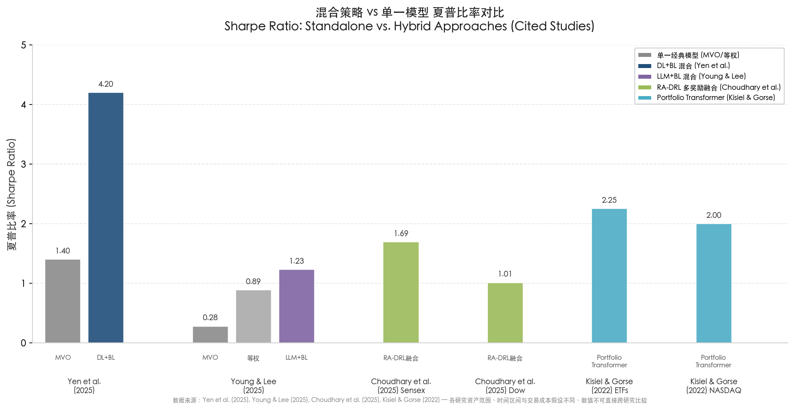

*Figure 1: Sharpe Ratio of standalone models versus hybrid approaches across four independent studies. Asset universes, time periods, and transaction cost assumptions differ across studies; cross-study numerical comparisons should be drawn with caution. Data sources: Yen et al. (2025), Young & Lee (2025), Choudhary et al. (2025), Kisiel & Gorse (2022).*

These experiments collectively demonstrate that hybrid approaches are not merely conceptually appealing but empirically viable. The framework proposed in this chapter synthesizes these individual integration strategies into a unified, modular architecture.

## 5.2 Proposed Hybrid Architecture: A Four-Layer Modular Pipeline

We propose a four-layer modular pipeline architecture that channels information from raw market data through progressively more structured processing stages, culminating in executable portfolio weights. The four layers are: **(1) DL Signal Generation Layer**, **(2) BL Bayesian Allocation Engine**, **(3) RL Meta-Optimization Layer**, and **(4) Classical Risk Overlay**. Each layer exposes a well-defined input-output interface, enabling independent development, testing, and replacement of components. Figure 2 presents the complete architecture with inter-layer data flows, feedback loops, and degradation fallback paths.

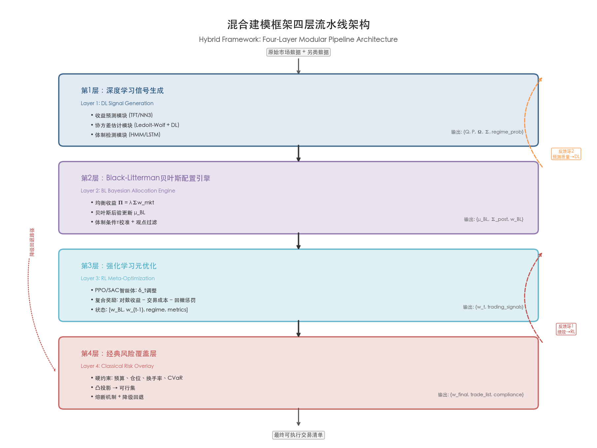

*Figure 2: Hybrid framework four-layer pipeline architecture. Information flows from raw market and alternative data through DL signal generation, BL Bayesian allocation, RL meta-optimization, and classical risk overlay to produce the final executable trade list. Two feedback loops — performance feedback to the RL agent and prediction quality feedback to the DL layer — enable continuous adaptation. The degradation fallback path ensures graceful degradation when individual components fail.*

### 5.2.1 Layer 1: Deep Learning Signal Generation

**Function.** Generate asset-level return forecasts, covariance estimates, and regime probability signals from raw and alternative data.

**Components:**
- **Return prediction module.** A neural network ensemble (e.g., the NN3 architecture validated by Gu, Kelly & Xiu 2020, or the Temporal Fusion Transformer of Lim et al. 2021) trained on cross-sectional and temporal features. The module outputs point return forecasts **Q** (a k×1 view return vector) and a forecast uncertainty matrix that maps to the BL confidence matrix **Ω**. The TFT architecture is particularly well-suited for this role: its variable selection network quantifies feature importance, its gated residual connections accommodate heterogeneous input types (static covariates, known future inputs, observed historical features), and its attention weights provide temporal interpretability [Lim et al. 2021](https://arxiv.org/abs/1912.09363 "TFT, IJF 37(4): 1748-1764, 2021").
- **Covariance estimation module.** Combines Ledoit-Wolf shrinkage or nonlinear shrinkage (Ledoit & Wolf 2017) for the baseline covariance matrix **Σ** with DL-enhanced residual corrections. The factor model structure **Σ = FΣ_fFᵀ + D** reduces dimensionality from O(n²) to O(nk), enabling sub-second estimation for universes exceeding 10,000 assets [Boyd et al. 2024](https://web.stanford.edu/~boyd/papers/pdf/markowitz.pdf "Markowitz Portfolio Construction at Seventy, §3.3").
- **Regime detection module.** A hidden Markov model or LSTM-based classifier that estimates the probability of the current market regime (e.g., low-volatility trending, high-volatility crisis, mean-reverting). Regime signals are consumed downstream to adjust risk aversion parameters and to trigger fail-safe mechanisms.

**Output interface.** The DL layer delivers to Layer 2 a structured view package: {**Q**, **P**, **Ω**, **Σ**, regime_probability}, where **P** is the pick matrix mapping views to assets, **Q** is the view return vector, and **Ω** is the view confidence matrix.

### 5.2.2 Layer 2: Black-Litterman Bayesian Allocation Engine

**Function.** Blend DL-generated views with market equilibrium returns through Bayesian updating, producing a posterior return vector and covariance matrix that anchor the allocation to market consensus while incorporating ML signals.

**Mechanism.** The BL engine computes:

**μ_BL = Π + τΣPᵀ(PτΣPᵀ + Ω)⁻¹(Q − PΠ)**

where **Π = λΣw_mkt** denotes the implied equilibrium return vector derived from market capitalization weights. The scalar τ controls the relative weight assigned to market equilibrium versus ML views. The confidence matrix **Ω** encodes the DL model's predictive uncertainty — calibrated from out-of-sample prediction error distributions — so that less confident predictions are automatically discounted relative to the equilibrium prior.

**Key design choices:**
- **τ calibration.** Rather than adopting a fixed τ (values in the literature span from 0.01 to 1.0), the framework employs regime-conditional τ: a higher τ (greater view weight) during stable regimes where DL predictions are historically reliable, and a lower τ (stronger equilibrium anchoring) during crisis regimes where model uncertainty spikes. The dynamic τ is informed by the regime probability output from Layer 1.
- **Ω construction from DL uncertainty.** The diagonal elements of **Ω** are set proportional to the DL model's rolling out-of-sample prediction MSE for each asset, extending the Idzorek (2004) intuition-based confidence framework to quantitative uncertainty estimates [Idzorek 2004](https://people.duke.edu/~charvey/Teaching/BA453_2006/Idzorek_onBL.pdf "A Step-by-Step Guide to the Black-Litterman Model, Section 3").
- **View filtering.** Views with prediction confidence below a minimum threshold are excluded from the BL update, causing those assets to retain their equilibrium weights — a natural "no-opinion" default that prevents noisy DL signals from destabilizing the portfolio.

**Output interface.** Layer 2 delivers to Layer 3 a posterior allocation: {**μ_BL**, **Σ_post**, **w_BL**}, where **w_BL** is the unconstrained BL-optimal weight vector.

### 5.2.3 Layer 3: Reinforcement Learning Meta-Optimization

**Function.** Refine the BL allocation over multiple rebalancing periods by learning a sequential policy that accounts for transaction costs, path-dependent constraints, and multi-period risk management.

**Mechanism.** An RL agent (e.g., PPO or SAC) receives as state the concatenation of: (a) the current BL-recommended weights **w_BL,t**, (b) the current portfolio weights **w_{t−1}**, (c) the DL-generated regime probability, and (d) recent portfolio performance metrics. The agent outputs an adjustment vector **δ_t** that modifies the BL recommendation: **w_t = w_BL,t + δ_t**, subject to the constraint that the adjusted weights remain within the feasible set defined by Layer 4.

This architecture intentionally constrains the RL agent's action space. Rather than learning portfolio weights from scratch — a high-dimensional problem prone to convergence failure, as documented for DDPG and PPO in the RAT study — the agent learns only the incremental adjustment to a well-anchored BL baseline [Xu et al. 2020](https://www.ijcai.org/proceedings/2020/0641.pdf "RAT, IJCAI 2020, pp. 4647-4653"). This design reduces the effective dimensionality of the RL problem, accelerates convergence, and ensures that even a poorly trained agent defaults to the BL allocation when **δ_t ≈ 0**.

**Reward function design.** Following the RA-DRL principle of reward diversity, the RL agent's reward combines three components:
- **Log portfolio return:** **r_log = ln(w_tᵀy_t)**, where **y_t** is the asset return vector.
- **Transaction cost penalty:** **c_t = κ · ‖w_t − w_{t−1}‖₁**, incorporating both linear and market impact costs.
- **Drawdown penalty:** **d_t = max(0, DD_t − DD_threshold)**, where **DD_t** is the current drawdown from peak portfolio value.

The composite reward **R_t = r_log − c_t − λ_dd · d_t** balances return maximization, cost minimization, and tail risk control. The drawdown penalty coefficient **λ_dd** is regime-conditional: elevated during crisis regimes (as signaled by Layer 1) to enforce defensive positioning.

**Output interface.** Layer 3 delivers to Layer 4 the adjusted weights: {**w_t**, trading_signals}.

### 5.2.4 Layer 4: Classical Risk Overlay

**Function.** Enforce hard risk constraints, regulatory limits, and portfolio-level guardrails that ensure the final allocation satisfies institutional and regulatory requirements regardless of upstream model outputs.

**Mechanism.** The risk overlay solves a constrained optimization problem that projects the RL-adjusted weights onto the feasible set:

**w_final = argmin_{w ∈ C} ‖w − w_t‖₂²**

where the constraint set **C** incorporates:
- **Budget constraint:** **1ᵀw = 1**.
- **Long-only or bounded leverage:** **w ≥ 0** (or **‖w‖₁ ≤ L** for long-short mandates).
- **Position limits:** **w_i ≤ w_max** for individual assets, with sector concentration caps.
- **Turnover constraint:** **½‖w − w_prev‖₁ ≤ T_max**, limiting rebalancing costs.
- **Risk budget:** **wᵀΣ_post w ≤ σ²_target**, ensuring portfolio variance remains within mandate limits.
- **CVaR constraint:** **CVaR_α(w) ≤ CVaR_limit**, providing tail-risk control beyond what variance captures.
- **Factor neutrality:** Exposure to specified factors (market, sector, style) constrained within tolerance bands.

This projection is a convex optimization problem solvable in sub-second time by modern solvers (CVXPY, MOSEK, Gurobi), consistent with the computational efficiency documented for Markowitz++ implementations [Boyd et al. 2024](https://web.stanford.edu/~boyd/papers/pdf/markowitz.pdf "Markowitz Portfolio Construction at Seventy, §5").

**Fail-safe mechanisms.** The risk overlay implements circuit-breaker logic:
- If the regime detection module signals a crisis regime with probability exceeding a calibrated threshold (e.g., >0.8), the overlay progressively shifts the portfolio toward the minimum-variance allocation, overriding upstream DL and RL signals.
- If the DL signal generation layer fails or produces anomalous outputs (e.g., prediction confidence drops below historical norms by more than two standard deviations), the framework defaults to the BL allocation with equilibrium-only returns (views **Q** are zeroed out), effectively reverting to a market-cap-weighted baseline.
- Maximum single-rebalancing turnover is hard-capped regardless of upstream signals, preventing catastrophic portfolio restructuring in response to model errors.

**Output interface.** Layer 4 produces the final executable trade list: {**w_final**, trade_list, compliance_report}.

### 5.2.5 Information Flow and Feedback Loops

The four-layer pipeline operates in a primarily feedforward manner during each rebalancing cycle but incorporates two critical feedback loops that enable continuous adaptation.

**Loop 1: Performance feedback to RL agent.** Realized portfolio return and risk metrics from the executed allocation feed back into the RL agent's experience buffer, enabling continuous policy improvement. This loop operates at the rebalancing frequency (e.g., daily or weekly).

**Loop 2: Prediction quality feedback to DL layer.** The discrepancy between DL-predicted returns and realized returns is monitored continuously to update the confidence matrix **Ω** and to trigger model retraining when predictive performance degrades beyond a threshold. This feedback loop is essential for combating alpha decay — the progressive erosion of predictive signal documented by Fischer and Krauss (2018), who observed LSTM profitability declining to near-zero after 2010 as predictive techniques diffused through the industry [Fischer & Krauss 2018](https://ideas.repec.org/a/eee/ejores/v270y2018i2p654-669.html "EJOR, 270(2): 654-669, 2018").

## 5.3 Training and Deployment Considerations

### 5.3.1 Staged Training Versus End-to-End Optimization

The modular architecture admits two training paradigms. In **staged training**, each layer is optimized independently: the DL layer is trained on historical return prediction tasks, the BL engine is calibrated against historical equilibrium returns and view performance, and the RL agent is trained in a simulated environment using the outputs of the pre-trained DL and BL layers. Staged training offers three principal advantages: (a) each component can be validated independently, simplifying debugging and performance attribution; (b) the DL layer can leverage existing large-scale benchmarks (e.g., the Gu et al. 2020 dataset spanning 60 years of U.S. stock returns); and (c) the RL agent's training environment is more stable because upstream components are frozen.

In **end-to-end training**, gradients propagate from the final portfolio objective (e.g., Sharpe Ratio, CVaR-adjusted return) backward through all differentiable layers. The BL engine, being a closed-form function of its inputs, is differentiable with respect to the DL layer's outputs; the risk overlay, as a convex optimization, admits differentiable formulations through the OptNet framework or disciplined parameterized programming. End-to-end training carries the theoretical advantage of aligning all components toward a single objective, avoiding the suboptimality that arises when individual layers optimize for proxy objectives. The Portfolio Transformer of Kisiel and Gorse (2022) demonstrated the potential of this approach, achieving Sharpe Ratios of 2.252 (ETFs), 2.001 (NASDAQ stocks), and 1.506 (commodity futures) by directly optimizing the Sharpe Ratio through the entire network [Kisiel & Gorse 2022](https://arxiv.org/abs/2206.03246 "Portfolio Transformer, arXiv:2206.03246, 2022").

We advocate for a **staged-first, end-to-end-fine-tuned** approach: train each layer independently to convergence, then fine-tune the full pipeline end-to-end with a reduced learning rate and the composite portfolio objective. This hybrid training strategy combines the stability and interpretability of staged training with the performance benefits of joint optimization.

### 5.3.2 Concept Drift Detection and Adaptive Retraining

Financial markets are inherently non-stationary. The alpha decay documented by Fischer and Krauss (2018) — where LSTM profitability eroded from extraordinary levels in 1993–2000 to near-zero after 2010 — exemplifies gradual concept drift as predictive signals are progressively arbitraged. Sudden concept drift occurs during regime transitions: the 2008 financial crisis, the 2020 COVID crash, and interest rate regime shifts fundamentally alter the statistical relationships that ML models have learned.

The hybrid framework addresses non-stationarity through three complementary mechanisms:

**Drift detection.** The DL layer's rolling out-of-sample R²_oos and the RL agent's realized Sharpe Ratio are monitored against their historical distributions. A statistically significant deterioration — for example, R²_oos falling below zero, indicating the model performs worse than a no-prediction baseline — triggers an automatic retraining protocol. The Page-Hinkley test or the ADWIN (Adaptive Windowing) algorithm can provide formal change-point detection with controlled false alarm rates [Bifet & Gavaldà 2007](https://link.springer.com/chapter/10.1007/978-3-540-75488-6_28 "Learning from Time-Changing Data with Adaptive Windowing, SDM 2007").

**Scheduled retraining.** Independent of drift detection, the DL layer undergoes retraining on a fixed schedule (e.g., quarterly) with an expanding training window that incorporates the most recent data. The RL agent's experience buffer implements prioritized experience replay, overweighting recent transitions to adapt to current market conditions while retaining historical experience for robustness across diverse regimes.

**Regime-conditional model selection.** The regime detection module from Layer 1 enables the framework to maintain multiple pre-trained model variants — one optimized for low-volatility trending markets, another for high-volatility crisis environments — and to select the appropriate variant based on the current regime classification. This mechanism directly addresses the catastrophic forgetting problem identified in Chapter 3, where RL agents trained on new regimes lose their ability to perform in previously learned regimes.

### 5.3.3 Fail-Safe Fallback Hierarchy

Production deployment demands a clearly defined degradation path for when model components fail. The framework specifies four escalation levels, illustrated in Figure 3.

**Level 0 (full pipeline operational).** All four layers function normally — DL generates views, BL allocates, RL optimizes, and the risk overlay constrains.

**Level 1 (RL degradation).** If the RL agent's out-of-sample performance falls below the BL-only baseline for a sustained period, the RL adjustment is disabled (**δ_t = 0**), and the portfolio defaults to the constrained BL allocation from Layer 2.

**Level 2 (DL degradation).** If the DL layer's predictive R²_oos turns negative or produces anomalous outputs, all views are zeroed out. The BL engine then produces equilibrium-only returns **μ_BL = Π**, and the allocation reverts to the market-cap-weighted portfolio subject to risk constraints — a robust baseline that DeMiguel et al. (2009) demonstrated is competitive with most optimized strategies [DeMiguel et al. 2009](https://academic.oup.com/rfs/article/22/5/1915/1592901 "Optimal Versus Naive Diversification, RFS, 22(5): 1915–1953").

**Level 3 (system failure).** If the BL engine or risk overlay encounters computational errors, the portfolio holds its current positions unchanged until the next rebalancing period when the system is restored.

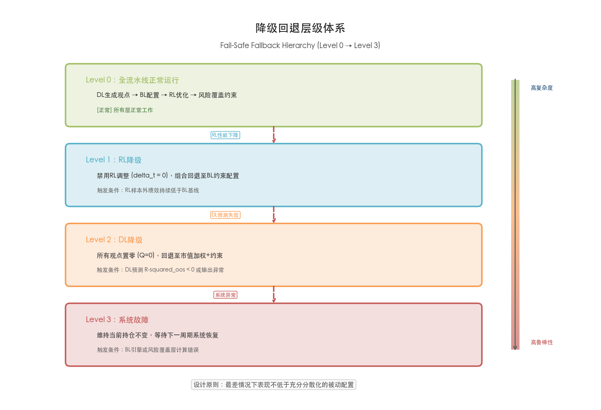

*Figure 3: Fail-safe fallback hierarchy. The framework degrades gracefully from full pipeline operation (Level 0) through progressive component disabling (Levels 1–2) to position freeze (Level 3). Each level's trigger condition and fallback behavior are explicitly specified. The design principle ensures that worst-case portfolio performance is no worse than a well-diversified passive allocation.*

This hierarchy ensures that the framework's worst-case behavior is no worse than a well-diversified passive allocation — a critical property for institutional deployment and regulatory compliance.

## 5.4 Open Challenges and Limitations

The proposed hybrid framework, while grounded in established components and supported by favorable empirical evidence from individual integration experiments, confronts several unresolved challenges that must be addressed for the paradigm to achieve broad institutional adoption.

### 5.4.1 Bayesian-Frequentist Coherence

The hybrid framework yokes a Bayesian component (BL's posterior updating) to frequentist components (DL's empirical risk minimization, RL's policy gradient optimization). This coupling creates a conceptual tension: the BL engine treats DL-generated views as if they were subjective probabilistic beliefs about future returns, when they are in fact statistical estimates derived from historical data. The view confidence matrix **Ω** — which the BL engine interprets as the uncertainty in the investor's subjective belief — is constructed from the DL model's out-of-sample MSE, a frequentist quantity. While this "Bayesian-frequentist bridge" proves practically effective (as the empirical results in Section 5.1.2 attest), it lacks rigorous theoretical justification from a strict Bayesian perspective. Specifically, the posterior distribution **μ_BL** may not possess well-defined coverage properties under repeated sampling, and the interaction between Bayesian shrinkage (via τ and Ω) and frequentist regularization (within the DL model) may produce double-counting of uncertainty.

Addressing this challenge likely requires either a fully Bayesian DL architecture — for example, Bayesian neural networks or MC-Dropout for uncertainty quantification — that produces genuine posterior predictive distributions compatible with BL's Bayesian framework, or a coherent decision-theoretic formulation that bypasses the Bayesian-frequentist distinction altogether.

### 5.4.2 Regulatory Acceptance and Explainability

ESMA's May 2024 Public Statement established that MiFID II obligations apply fully when AI tools are deployed in portfolio management, requiring firms to "maintain comprehensive records on AI utilisation" and ensure AI systems align with client objectives and risk tolerances [ESMA 2024](https://www.esma.europa.eu/sites/default/files/2024-05/ESMA35-335435667-5924__Public_Statement_on_AI_and_Investment_services.pdf "Public Statement on AI and Investment Services, 30 May 2024"). The hybrid framework's modular architecture offers a partial advantage in this regard: the BL allocation layer and risk overlay are fully transparent and auditable, while the DL layer can be interrogated through SHAP values, attention weight inspection (for TFT architectures), and variable selection network outputs. The RL layer, however, remains the least interpretable component — its learned policy is a black-box function of the state representation, and no existing post-hoc explainability technique fully resolves this opacity.

ESMA's February 2025 study of 44,000 EU investment funds found that only 145 funds (approximately 0.1% of UCITS AuM, corresponding to €13 billion) explicitly disclosed using AI or ML in their investment process, with no statistically significant difference in returns or risk-adjusted alphas between AI-using and non-AI funds over Q3 2021 to Q2 2024 [ESMA 2025](https://www.esma.europa.eu/sites/default/files/2025-02/ESMA50-43599798-9923_TRV_Article_Artificial_intelligence_in_EU_investment_funds.pdf "Artificial Intelligence in EU Investment Funds, ESMA TRV Risk Analysis, 25 February 2025"). This finding suggests that the current regulatory environment does not yet impose a binding constraint on AI-augmented portfolio management, but the trajectory toward greater governance requirements is clear. Firms deploying the hybrid framework must invest in model governance infrastructure — automated monitoring dashboards, attribution reports linking allocation decisions to specific DL predictions and BL view updates, and comprehensive audit trails for regulatory examination.

### 5.4.3 Scalability and Computational Cost

The hybrid framework's computational demands exceed those of any individual component model. The DL signal generation layer requires GPU infrastructure for training (hours to days per retraining cycle), the RL agent requires thousands of simulated episodes for policy optimization, and the BL engine and risk overlay add matrix inversions and convex optimization solves at each rebalancing step. While inference latency remains manageable — each layer completes in sub-second time once models are trained — the total cost of ownership encompasses continuous retraining cycles to combat alpha decay, GPU cloud costs, data infrastructure, and model governance staffing.

For smaller asset managers, this computational overhead may represent a prohibitive barrier. The framework's modular design mitigates this concern by enabling incremental adoption: firms can begin with DL-enhanced BL views (Layers 1–2 only) and introduce the RL meta-optimization layer (Layer 3) as infrastructure matures.

### 5.4.4 Standardized Benchmarking

A persistent obstacle to rigorous evaluation of hybrid portfolio frameworks is the absence of standardized benchmarking protocols. As documented in Chapter 4, existing studies employ different asset universes, time periods, rebalancing frequencies, and transaction cost assumptions, rendering cross-study performance comparisons unreliable. The Gu et al. (2020) benchmark covers 60 years of U.S. individual stocks at monthly frequency; Fischer and Krauss (2018) use S&P 500 constituents at daily frequency; Choudhary et al. (2025) test on four global indices at daily frequency with 0.05% transaction costs; Yen et al. (2025) use 20 Nasdaq 100 stocks with 0.2% transaction costs. Developing a universally accepted benchmark — encompassing multiple asset classes, market regimes, transaction cost structures, and evaluation metrics — remains an essential prerequisite for the field's maturation and for meaningful comparison of competing hybrid architectures.

## 5.5 Future Directions: Foundation Models, Multi-Agent RL, and Beyond

### 5.5.1 Financial Time Series Foundation Models

The large-scale pre-training paradigm that produced transformative results in natural language processing is beginning to penetrate financial time series analysis. Kronos (Shi et al. 2025) represents the most ambitious effort to date: a decoder-only foundation model pre-trained on over 12 billion K-line (candlestick) records from 45 global exchanges across seven time granularities. Kronos introduces a specialized tokenizer that discretizes continuous market information into token sequences preserving both price dynamics and trade activity patterns. In zero-shot evaluation, Kronos boosted price series forecasting RankIC by 93% over the leading general-purpose time series foundation model and by 87% over the best non-pre-trained baseline, while achieving 9% lower MAE in volatility forecasting and 22% improvement in generative fidelity for synthetic K-line sequences [Shi et al. 2025](https://arxiv.org/abs/2508.02739 "Kronos: A Foundation Model for the Language of Financial Markets, arXiv:2508.02739, AAAI 2025").

For the hybrid framework proposed in this chapter, financial foundation models offer a transformative upgrade path for Layer 1. Instead of training task-specific LSTM or Transformer models on limited asset-specific data, a pre-trained foundation model such as Kronos could serve as a universal feature backbone, fine-tuned for return prediction, volatility estimation, and regime detection simultaneously. The zero-shot transfer capability is particularly valuable for asset classes with limited historical data — emerging market equities, new ETFs, recently IPO'd stocks — where traditional DL models face severe data hunger constraints.

### 5.5.2 Multi-Agent Reinforcement Learning

The RA-DRL framework of Choudhary et al. (2025) demonstrated the value of multi-agent diversity through reward function heterogeneity. A more ambitious extension deploys multiple RL agents with distinct specializations — one for equity allocation, another for fixed income, a third for alternatives — coordinated through a meta-agent that aggregates their recommendations. Li et al. (2025) proposed a multi-agent hierarchical deep reinforcement learning framework in which a high-level manager agent allocates capital across asset classes while low-level worker agents optimize within each class, achieving superior coordination through inter-agent communication channels [Li et al. 2025](https://arxiv.org/abs/2501.06832 "A novel multi-agent dynamic portfolio optimization learning system based on hierarchical deep reinforcement learning, Complex Intelligent Systems 11, 311, 2025").

Within the hybrid framework, multi-agent RL could replace the single RL meta-optimizer in Layer 3 with a hierarchical agent structure: a strategic agent determining regime-conditional risk budget allocation across asset classes, and tactical agents optimizing within-class allocations — all operating on the BL-anchored baseline from Layer 2.

### 5.5.3 Alternative Data Integration

The hybrid framework's DL signal generation layer provides a natural integration point for alternative data sources — satellite imagery, credit card transaction data, shipping and logistics data, social media sentiment, patent filings, ESG scoring — that classical models cannot process. The TFT architecture's support for static covariates, known future inputs, and observed historical features enables structured incorporation of heterogeneous data types without ad-hoc feature engineering. As alternative data becomes more prevalent and accessible, the DL layer's capacity to extract predictive signals from unstructured sources represents a sustained competitive advantage that classical-only approaches cannot replicate.

### 5.5.4 Real-Time Adaptive Portfolios

The convergence of low-latency data infrastructure, edge computing, and efficient model inference creates the possibility of real-time portfolio adaptation — moving beyond discrete rebalancing at daily, weekly, or monthly intervals to continuous portfolio adjustment in response to intraday signals. The hybrid framework's layered architecture supports this evolution naturally: the risk overlay (Layer 4) can enforce intraday risk limits in real time, while the DL and RL layers operate on coarser timescales (daily signal generation, weekly RL policy updates). This multi-timescale architecture aligns with the institutional reality that different portfolio decisions inherently operate at different frequencies — strategic asset allocation quarterly, tactical tilts monthly, and risk management continuously.

## 5.6 Chapter Synthesis

The hybrid modeling framework proposed in this chapter addresses the central finding of the comparative analysis: no single model family achieves universal dominance, but the complementary strengths of multiple approaches can be composed to achieve broader coverage across all evaluation dimensions. The four-layer pipeline — DL signal generation → BL Bayesian allocation → RL meta-optimization → classical risk overlay — is designed so that each layer addresses specific weaknesses of the others: DL provides the scalable, objective forecasts that BL traditionally lacked; BL provides the equilibrium anchoring and Bayesian shrinkage that prevent DL's raw predictions from producing extreme allocations; RL provides the multi-period optimization and transaction cost awareness that static single-period models cannot offer; and the classical risk overlay provides the hard constraints and fail-safe mechanisms that ensure institutional compliance.

The empirical evidence reviewed in this chapter — from DL-enhanced BL portfolios achieving annualized Sharpe Ratios of 1.23–4.2 across multiple studies, to Transformer-DRL-BL hybrids outperforming standalone approaches by at least 42% in cumulative return, to RA-DRL multi-reward fusion achieving statistically significant outperformance across four global markets — supports the viability of hybrid integration. The staged-first, end-to-end-fine-tuned training paradigm, combined with concept drift detection and a clearly defined fail-safe fallback hierarchy, provides a practical deployment path that balances performance optimization with operational robustness.

Significant challenges remain. The Bayesian-frequentist coherence gap between the BL engine and DL components lacks a fully satisfying theoretical resolution. Regulatory acceptance requires investment in explainability infrastructure that current post-hoc techniques only partially provide. Standardized benchmarking protocols are essential to enable rigorous cross-study evaluation. And the computational cost of the full pipeline may constrain adoption among smaller firms, though the modular design supports incremental deployment.

Looking forward, financial time series foundation models (exemplified by Kronos with its 12 billion record pre-training corpus and 93% RankIC improvement over general-purpose TSFMs), multi-agent hierarchical RL, alternative data integration, and real-time multi-timescale portfolio adaptation represent frontier developments that could significantly enhance each layer of the proposed framework. The trajectory of the field points unambiguously toward hybrid architectures: the question is not whether classical and ML approaches will be combined, but how their integration can be most rigorously designed, validated, and governed.

# 结论与风险提示
