# 执行摘要

# Taxonomy of Advanced Quantitative Strategies and Their Evaluation Challenges

The global hedge fund industry reached a historic inflection point in 2025. Assets under management surpassed the $5 trillion milestone in Q4, following $4.98 trillion at Q3-end and net inflows of $71 billion during the first three quarters—the strongest capital formation since 2007 [HFR Global Hedge Fund Industry Report](https://www.hfr.com/media/market-commentary/global-hedge-fund-industry-capital-surges-nears-historic-5-trillion-milestone/ "HFR Q3 2025 Industry Report"). Within this expanding universe, quantitative strategies have emerged as the dominant axis of capital allocation. The 551 firms in the "Billion Dollar Club" managed $3.6 trillion in H1 2025—approximately 86% of total industry assets—with multi-strategy funds overtaking pure equity long/short for the first time in incremental asset growth [With Intelligence BDC Report](https://www.withintelligence.com/insights/billion-dollar-club-h1-2025/ "Billion Dollar Club Report H1 2025"). Yet this rapid concentration of capital into diverse quantitative approaches has sharpened an unresolved problem: no standardized, cross-strategy evaluation framework exists to assess performance across multiple dimensions—returns, risk, regime adaptability, and execution quality.

This chapter establishes the taxonomic foundation for the evaluation framework developed throughout this report. It defines six principal strategy families, profiles their characteristic return distributions and risk signatures, and demonstrates why the heterogeneity across these families renders any single performance metric inadequate for comparative assessment.

## 1.1 Constructing a Strategy Classification System

### 1.1.1 Competing Taxonomies

Classification of quantitative strategies is non-trivial, as several industry frameworks coexist with partially overlapping boundaries. Aurum's Hedge Fund Data Engine partitions quantitative strategies into six mutually exclusive sub-strategies: statistical arbitrage, CTA/managed futures, quantitative equity market neutral (QEMN), quantitative macro/global asset allocation, risk premia/alternative risk premia, and quantitative multi-strategy [Aurum Quant Strategy Deep Dive](https://www.aurum.com/wp-content/uploads/210831-Aurum-Hedge-Fund-Data-Engine-Strategy-Deep-Dive_Quant.pdf "Aurum Quant Deep Dive, August 2021"). The Committee on Capital Markets Regulation (CCMR) employs a broader seven-category taxonomy for the full hedge fund universe: Long/Short Equity, Global Macro, Event-Driven, Fixed-Income Relative Value, Managed Futures, Quantitative, and Distressed Securities [CCMR Report](https://capmktsreg.org/wp-content/uploads/2025/02/CCMR-Hedge-Fund-Report-Final-02.28.259144.pdf "CCMR, February 2025"). HFR's widely cited index system uses four master strategies—Equity Hedge, Event-Driven, Relative Value, and Macro—with quantitative approaches distributed across each category rather than concentrated in a single bucket [HFR Global Hedge Fund Industry Report](https://www.hfr.com/media/market-commentary/global-hedge-fund-industry-capital-surges-nears-historic-5-trillion-milestone/ "HFR Q3 2025 Industry Report").

For the purposes of this report, we adopt a six-family classification that synthesizes Aurum's quantitative-focused taxonomy with the broader hedge fund landscape, adding high-frequency trading/market making and machine-learning-driven strategies as distinct families:

1. **Multi-Factor (Quantitative Equity)** — systematic equity selection based on combinations of value, momentum, quality, low-volatility, and other cross-sectional factors.
2. **Statistical Arbitrage** — market-neutral pair/basket trading exploiting short-lived mean-reversion signals, typically at intraday to multi-day horizons.
3. **High-Frequency Trading / Market Making** — ultra-low-latency strategies operating at sub-second to intraday horizons, primarily through market-making, latency arbitrage, and microstructure signal exploitation.
4. **CTA / Trend Following** — time-series momentum and managed futures strategies across commodities, currencies, rates, and equity indices, with holding periods ranging from days to months.
5. **Machine Learning–Driven Strategies** — strategies in which model selection, feature engineering, and signal generation are primarily automated through deep learning, reinforcement learning, or large language model (LLM) pipelines.
6. **Hybrid / Multi-Strategy** — platforms that dynamically allocate capital across two or more of the above approaches, typically within a single risk management infrastructure.

This classification is neither exhaustive nor perfectly orthogonal—machine learning techniques, for instance, increasingly permeate all other families—but it provides a practical framework for isolating the distinct performance characteristics, risk profiles, and operational constraints that a multi-dimensional evaluation architecture must accommodate.

### 1.1.2 The Scale of the Quantitative Universe

As of Q3 2025, HFR reported the following asset distribution across master strategies: Equity Hedge $1.50 trillion, Event-Driven $1.41 trillion, Relative Value $1.32 trillion (of which Multi-Strategy accounted for $807.3 billion), and Macro $759 billion [HFR Global Hedge Fund Industry Report](https://www.hfr.com/media/market-commentary/global-hedge-fund-industry-capital-surges-nears-historic-5-trillion-milestone/ "HFR Q3 2025 Industry Report"). Aurum's H1 2025 Deep Dive, which tracks approximately $3.2 trillion in reported hedge fund assets, provides more granular quantitative sub-strategy data: as of June 2025, the quant master strategy managed $366.5 billion (approximately 11.6% of tracked assets), with multi-strategy funds managing $478.8 billion as a separate master category [Aurum H1 2025 Deep Dive](https://www.aurum.com/wp-content/uploads/Aurum-Industry-Deep-Dive-H1-2025-review.pdf "Aurum Hedge Fund Industry Deep Dive H1 2025 Review"). Quantitative strategies experienced considerable net inflows during H1 2025, ranking among the top strategies for new capital alongside multi-strategy and macro.

The concentration dynamics are equally notable. BNP Paribas' 2026 Hedge Fund Outlook reported that 64% of surveyed allocators planned to increase net hedge fund exposure in 2026, corresponding to approximately $24 billion in anticipated new flows, with quantitative equity and quantitative multi-strategy among the most favored sub-strategies: over one-third of allocators increased their quantitative equity allocation in 2025, and 24% planned further increases in 2026 [BNP Paribas 2026 Hedge Fund Outlook](https://globalmarkets.cib.bnpparibas/2026-hedge-fund-outlook/ "BNP Paribas, January 2026").

## 1.2 Strategy Family Profiles: Return Characteristics, Risk Signatures, and Operational Features

### 1.2.1 Multi-Factor (Quantitative Equity)

Multi-factor strategies construct portfolios by systematically combining cross-sectional equity signals—most commonly value, momentum, quality, size, and low volatility. Quantitative equity generated a five-year compound annual return (CAR) of 11.31% through 2025, with a calendar-year return of 11.20% in 2025 [BNP Paribas 2026 Hedge Fund Outlook](https://globalmarkets.cib.bnpparibas/2026-hedge-fund-outlook/ "BNP Paribas, January 2026"). Aurum's H1 2025 data indicates that the quant risk premia sub-strategy—the closest proxy for traditional factor-based approaches—returned +5.68% year-to-date, with a five-year Sharpe ratio of 0.95 [Aurum H1 2025 Deep Dive](https://www.aurum.com/wp-content/uploads/Aurum-Industry-Deep-Dive-H1-2025-review.pdf "Aurum Hedge Fund Industry Deep Dive H1 2025 Review").

The risk signature of this family is dominated by factor crowding and regime sensitivity. Man Group's research documented that traditional factor strategies experienced a peak-to-trough drawdown of approximately −29% during the 2018–2020 quantitative crisis—the first prolonged period in fifty years during which momentum could not compensate for value-factor losses—followed by a +84% rebound through April 2025 [Man Group Research](https://www.man.com/insights/is-this-time-different "Man Group: Is This Time Different?, June 2025"). Alpha-beta decomposition from Aurum's data confirms that quant risk premia strategies exhibit the strongest beta attribution among all quantitative sub-strategies, accompanied by a substantial negative alpha component. This pattern indicates that much of their return derives from systematic factor exposure rather than idiosyncratic skill [Aurum H1 2025 Deep Dive](https://www.aurum.com/wp-content/uploads/Aurum-Industry-Deep-Dive-H1-2025-review.pdf "Aurum Hedge Fund Industry Deep Dive H1 2025 Review").

For evaluation purposes, multi-factor strategies demand assessment along factor-attribution dimensions (which factors drive returns and when they fail), crowding risk metrics, and the stability of factor premia across market regimes.

### 1.2.2 Statistical Arbitrage

Statistical arbitrage strategies seek to exploit short-lived pricing inefficiencies through market-neutral pair or basket trading, typically at intraday to multi-day horizons. In H1 2025, statistical arbitrage ranked as the third best-performing sub-strategy across the entire hedge fund industry, returning +9.27% on an asset-weighted basis; over five years, the sub-strategy achieved a CAR of 9.34% with a Sharpe ratio of 1.53 [Aurum H1 2025 Deep Dive](https://www.aurum.com/wp-content/uploads/Aurum-Industry-Deep-Dive-H1-2025-review.pdf "Aurum Hedge Fund Industry Deep Dive H1 2025 Review"). Through the first four months of 2025, statistical arbitrage returned 7.79%, outperforming most directional strategies [Aurum Quant Strategy Deep Dive](https://www.aurum.com/wp-content/uploads/210831-Aurum-Hedge-Fund-Data-Engine-Strategy-Deep-Dive_Quant.pdf "Aurum Quant Deep Dive, August 2021").

The defining operational characteristics of statistical arbitrage include near-zero market beta (typically ±0.10), short holding periods (hours to days), high portfolio turnover, and a target Sharpe ratio at or above 1.5. Aurum's alpha-beta decomposition confirms that statistical arbitrage exhibits the highest proportion of alpha attribution among all quant sub-strategies, with close to zero beta (~9%), consistent with its market-neutral construction [Aurum H1 2025 Deep Dive](https://www.aurum.com/wp-content/uploads/Aurum-Industry-Deep-Dive-H1-2025-review.pdf "Aurum Hedge Fund Industry Deep Dive H1 2025 Review"). This alpha intensity is reflected in the fee structure: statistical arbitrage commands the highest fees among quantitative approaches, with a weighted average management fee of 1.65% and performance fee of 19.92% [Aurum H1 2025 Deep Dive](https://www.aurum.com/wp-content/uploads/Aurum-Industry-Deep-Dive-H1-2025-review.pdf "Aurum Hedge Fund Industry Deep Dive H1 2025 Review").

The primary risk for statistical arbitrage is crowding-driven left-tail exposure. In early 2026, prime broker data indicated that systematic long/short strategies suffered their most severe short-term drawdown since October 2025, triggered by crowded positions and simultaneous factor reversals [HedgeCo (2026)](https://www.hedgeco.net/news/01/2026/2026-challenging-for-quant-hedge-funds.html "2026 Challenging for Quant Hedge Funds"). An evaluation framework for this family must therefore capture not only Sharpe and alpha purity but also crowding concentration, factor reversal sensitivity, and the frequency-dependent transaction cost structure that governs strategy capacity.

### 1.2.3 High-Frequency Trading and Market Making

High-frequency trading (HFT) represents the most technologically intensive segment of quantitative finance, characterized by sub-second execution latencies, co-located infrastructure, and extremely high order-to-trade ratios. The global HFT market generated $10.36 billion in revenue in 2024 and is projected to reach $16.03 billion by 2030, implying a compound annual growth rate of 7.7%; the market-making segment accounts for approximately 72.3% of HFT revenue, and HFT collectively represents roughly half of all global equity trading volume [Grand View Research](https://www.grandviewresearch.com/industry-analysis/high-frequency-trading-market-report "Grand View Research HFT Market Report, 2025–2030").

HFT strategies present evaluation challenges that differ fundamentally from those of lower-frequency approaches. Traditional risk-adjusted return metrics, when computed at high frequency, can yield Sharpe-equivalent values exceeding 5 or even orders of magnitude higher—a phenomenon driven by the mathematical properties of annualization from very short intervals rather than by genuine outperformance. Kearns et al. demonstrated that simulated HFT Sharpe ratios can rise above 5,000 at 10-second trading intervals, producing the misleading inference that such strategies are "extremely safe" [Kearns et al.](https://www.cis.upenn.edu/~mkearns/papers/hft.pdf "Empirical Limitations on High Frequency Trading Profitability"). The relevant performance metrics for HFT are operational in nature: latency (round-trip execution time), fill rate (percentage of orders executed), adverse selection costs (price movement against the market maker after a fill), and inventory turnover efficiency.

The capacity constraint for HFT strategies is severe: typical AUM capacity ranges from $50 million to $500 million—orders of magnitude below that of systematic multi-factor strategies—because market impact at high turnover rates rapidly erodes the thin per-trade margins on which HFT profitability depends. This capacity ceiling is itself an evaluation dimension that standard performance frameworks ignore.

### 1.2.4 CTA / Trend Following

CTA (Commodity Trading Advisor) and trend-following strategies apply time-series momentum signals across diversified futures markets, including commodities, currencies, fixed income, and equity indices. Holding periods span a broad range—from fast trend systems (20–60 day lookback) to slow trend systems (250–500 day lookback)—with materially different performance profiles at each speed. The CFA Institute's 2026 research decomposed CTA returns by trend horizon and found that slow-speed trend strategies achieved a five-year Sharpe ratio of 0.75 and a return-to-maximum-drawdown ratio of 0.84, substantially exceeding the SG CTA Trend Index's aggregate Sharpe of 0.38 [CFA Institute](https://rpc.cfainstitute.org/blogs/enterprising-investor/2026/decoding-cta-allocations-by-trend-horizon "Decoding CTA Allocations by Trend Horizon, CFA Institute, 2026").

The H1 2025 performance of CTAs was notably poor. The quant–CTA sub-strategy ranked as the worst-performing classification across all 37 Aurum sub-strategies, returning −7.54% year-to-date (and −11.40% over 12 months). The primary catalyst was the "Liberation Day" tariff shock in April 2025, which caused a −4.0% monthly loss—a policy-driven black swan event that disrupted the historical correlation structures on which trend-following models depend [Aurum H1 2025 Deep Dive](https://www.aurum.com/wp-content/uploads/Aurum-Industry-Deep-Dive-H1-2025-review.pdf "Aurum Hedge Fund Industry Deep Dive H1 2025 Review"). This whipsaw vulnerability is the mirror image of CTA's well-documented "crisis alpha" property: Man AHL's research confirms that trend-following strategies perform optimally in extreme market quantiles (both tails) but suffer acutely during V-shaped reversals [Man Group AHL](https://www.man.com/insights/trend-following-equity-and-bond-crisis-alpha "Trend Following: Equity and Bond Crisis Alpha").

The CTA family demands specialized evaluation metrics: horizon-decomposed performance attribution (fast/medium/slow trend layers), crisis alpha capture ratios, and whipsaw frequency analysis. Standard annualized Sharpe ratios obscure the regime-dependent nature of trend-following returns.

### 1.2.5 Machine Learning–Driven Strategies

The integration of machine learning into quantitative investment has undergone three evolutionary phases: (1) traditional statistical methods with manually engineered features; (2) deep learning architectures (RNN, LSTM, Transformer) applied end-to-end across the investment pipeline; and (3) large language model (LLM)-driven autonomous agent workflows that combine natural language processing of unstructured data with automated trade execution [Cao et al. 2025](https://arxiv.org/html/2503.21422v1 "From Deep Learning to LLMs: A survey of AI in Quantitative Investment, 2025"). Oxford's 2026 large-scale benchmark study, covering RNN, Transformer, and state-space model architectures across financial time series, confirmed that Sharpe ratio optimization remains the primary training objective for deep learning–based strategies [Saly-Kaufmann et al. (2026)](https://arxiv.org/pdf/2603.01820 "Deep Learning for Financial Time Series, arXiv").

ML-driven strategies introduce evaluation challenges absent from traditional quantitative frameworks. Overfitting risk is intrinsically elevated: the capacity of modern deep learning models to fit arbitrary patterns in finite samples means that in-sample performance may bear little relationship to out-of-sample results without rigorous validation protocols. The adversarial robustness problem is equally acute—a 2025 study demonstrated that minimal input perturbations (FGSM/PGD with ε = 0.05) reduced AUC by approximately 10.6% in financial ML models, with SHAP feature-importance stability often degrading before headline performance metrics deteriorate [arXiv (2025)](https://arxiv.org/html/2512.15780v1 "Adversarial Robustness in Financial ML, December 2025"). The opacity of deep learning models creates a further tension between predictive power and interpretability—a tension that regulatory frameworks, including NIST AI 100-2 E2025, are only beginning to address [NIST (2025)](https://csrc.nist.gov/pubs/ai/100/2/e2025/final "NIST AI 100-2 E2025").

For evaluation purposes, ML-driven strategies require an additional "epistemic integrity" dimension: overfitting diagnostics (Probability of Backtest Overfitting, Deflated Sharpe Ratio), out-of-sample validation protocols (purged cross-validation, walk-forward analysis), and adversarial robustness testing.

### 1.2.6 Hybrid / Multi-Strategy

Multi-strategy platforms represent the fastest-growing and, by several measures, most consistently profitable segment of the quantitative universe. Aurum's H1 2025 data shows that quantitative multi-strategy was the single best-performing sub-strategy across the entire hedge fund industry at +11.79% year-to-date, with a five-year CAR of 12.93% and a Sharpe ratio of 1.99 [Aurum H1 2025 Deep Dive](https://www.aurum.com/wp-content/uploads/Aurum-Industry-Deep-Dive-H1-2025-review.pdf "Aurum Hedge Fund Industry Deep Dive H1 2025 Review"). Broader multi-strategy funds (including non-quantitative platforms) achieved a five-year Sharpe of 2.81—the second-highest among all 37 sub-strategies—and their alpha-beta decomposition since 2013 attributes 64% of cumulative returns to alpha, the highest proportion of any master strategy [Aurum H1 2025 Deep Dive](https://www.aurum.com/wp-content/uploads/Aurum-Industry-Deep-Dive-H1-2025-review.pdf "Aurum Hedge Fund Industry Deep Dive H1 2025 Review").

The evaluation challenge for multi-strategy platforms is that composite performance obscures the contribution and interaction of underlying strategy components. A platform that combines statistical arbitrage, trend-following, and quantitative macro may exhibit an attractive aggregate Sharpe ratio while masking deep drawdowns in individual strategy pods. BNP Paribas reported that quantitative multi-strategy achieved a five-year annualized return of 12.76% (with 11.49% in 2025), and 24% of allocators planned to increase their allocation in 2026 [BNP Paribas 2026 Hedge Fund Outlook](https://globalmarkets.cib.bnpparibas/2026-hedge-fund-outlook/ "BNP Paribas, January 2026"). This aggregation premium raises a critical question: should the platform be evaluated solely on its composite metric, or must each constituent strategy pass independent scrutiny? Subsequent chapters argue that both levels of assessment are necessary.

The following exhibit summarizes the defining characteristics of each strategy family, consolidating the performance, risk, and operational data presented above into a single reference matrix.

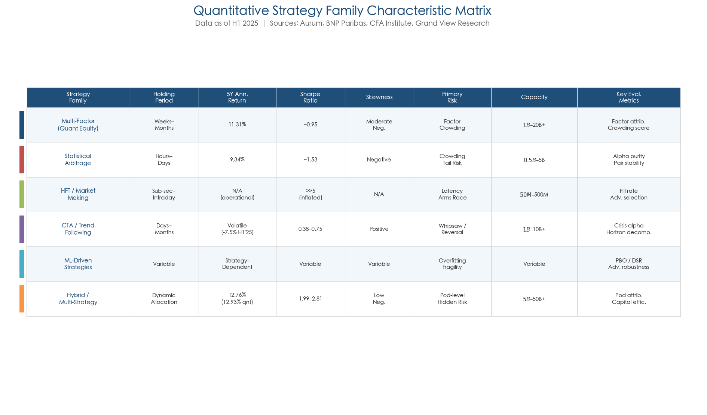

*Figure 1.1 — Characteristic matrix of the six quantitative strategy families, showing holding period, five-year annualized return, Sharpe ratio range, return distribution skewness, primary risk factor, capacity range, and key evaluation metrics. Data as of H1 2025. Sources: Aurum H1 2025 Deep Dive; BNP Paribas 2026 Hedge Fund Outlook; CFA Institute; Grand View Research.*

## 1.3 Performance Dispersion: Empirical Evidence Against Single-Metric Evaluation

One of the strongest empirical arguments against single-metric strategy evaluation is the extraordinary performance dispersion observed within and across quantitative strategy families. HFRI's Full Weighted Composite showed a 12-month top-to-bottom decile spread of 56.5 percentage points as of October 2025. Even within the quantitative equity market-neutral sub-strategy alone, the peak dispersion spread reached 37.5 percentage points [HFR Market Commentary](https://www.hfr.com/media/market-commentary/hfri-macro-extends-surge-leading-industry-wide-gains-navigating-technology-tariff-volatility/ "HFR October 2025").

Aurum's H1 2025 data provides further granularity. The quant master strategy exhibited the highest sub-strategy dispersion of any strategy group in H1 2025: the best-performing quantitative sub-strategy (quant–multi, +11.79%) and the worst (quant–CTA, −7.54%) were separated by 19.33 percentage points—a gap wider than between the best and worst performers in any other master strategy. The rolling 12-month 10th–90th percentile performance spread for quant strategies stood at 32.74%, compared to the ten-year average of 26.78%, placing quant dispersion 22.27% above its historical mean [Aurum H1 2025 Deep Dive](https://www.aurum.com/wp-content/uploads/Aurum-Industry-Deep-Dive-H1-2025-review.pdf "Aurum Hedge Fund Industry Deep Dive H1 2025 Review"). Figure 1.2 illustrates this dispersion across the six quantitative sub-strategies.

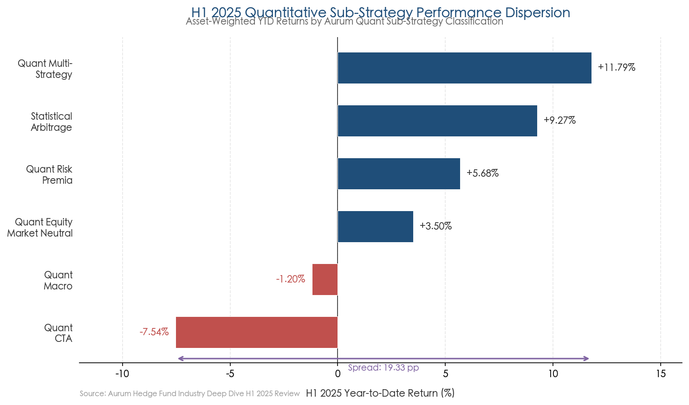

*Figure 1.2 — H1 2025 year-to-date asset-weighted returns for the six Aurum quant sub-strategy classifications, ranging from Quant Multi-Strategy (+11.79%) to Quant CTA (−7.54%). The 19.33 percentage-point spread underscores the inadequacy of any single metric for cross-strategy comparison. Source: Aurum Hedge Fund Industry Deep Dive H1 2025 Review.*

This dispersion is not random noise but a structural reflection of the heterogeneity documented in the preceding strategy profiles. A CTA strategy experiencing a −7.54% drawdown and a quantitative multi-strategy delivering +11.79% in the same period cannot be meaningfully compared using a single metric such as the Sharpe ratio. The CTA's negative return reflects its sensitivity to policy-driven regime disruptions; the multi-strategy's positive return reflects its capacity to reallocate capital across uncorrelated sub-strategies. The Sharpe ratio would rank both, but it would convey nothing about *why* they performed as they did, whether their risk profiles are comparable, or how they might behave in a different market regime.

## 1.4 Why Single Metrics Fail: Structural Limitations of the Sharpe Ratio and Industry Benchmarks

### 1.4.1 The Sharpe Ratio's Distributional Assumptions

The Sharpe ratio, defined as $SR = E[R_p - R_b] / \sigma(R_p - R_b)$, remains the most widely used risk-adjusted performance metric in quantitative finance. Its adequacy as a universal evaluator is undermined, however, by several structural limitations. The ratio considers only the first two moments of the return distribution. For strategies whose return profiles are dominated by negative skewness and excess kurtosis—as is typical of statistical arbitrage, merger arbitrage, and short-volatility approaches—the Sharpe ratio systematically understates tail risk. Conversely, CTA strategies that exhibit positive skewness and leptokurtic returns are penalized for upside volatility that an allocator would not regard as risk [BNP Paribas 2026 Hedge Fund Outlook](https://globalmarkets.cib.bnpparibas/2026-hedge-fund-outlook/ "BNP Paribas, January 2026").

The Sharpe ratio's statistical precision also deteriorates rapidly with small samples. Lo (2002) derived the finite-sample asymptotic standard error of the Sharpe estimator as $\sigma_{SR} = \sqrt{(1 + SR^2/2)/n}$. At an empirical Sharpe of 1.0 based on 12 monthly observations, the 95% confidence interval spans [0.21, 1.79]—a range so wide as to be practically uninformative for strategy selection [Benhamou (2021)](https://hal.science/hal-03207169v1/file/DistributionOfTheSharpeRatio.pdf "Distribution and statistics of the Sharpe Ratio"). Positive autocorrelation in hedge fund returns—prevalent in illiquid strategies—further inflates the naive $\sqrt{12}$ annualization of monthly Sharpe ratios.

### 1.4.2 Strategy-Specific Metric Requirements

Each strategy family requires specialized metrics that the Sharpe ratio alone cannot provide:

| Strategy Family | Key Specialized Metrics | Sharpe Ratio Blind Spot |
|---|---|---|
| Multi-Factor | Factor attribution, crowding score, factor premium stability | Cannot distinguish systematic factor exposure from idiosyncratic alpha |
| Statistical Arbitrage | Alpha purity, pair correlation stability, crowding-driven tail risk | Understates left-tail risk from negatively skewed returns |
| HFT / Market Making | Latency, fill rate, adverse selection, inventory turnover | Annualized Sharpe is mathematically inflated at high frequencies |
| CTA / Trend Following | Horizon-decomposed attribution, crisis alpha capture, whipsaw frequency | Penalizes positive skewness; insensitive to regime-dependence |
| ML-Driven | PBO, Deflated Sharpe Ratio, adversarial robustness, SHAP stability | Cannot diagnose overfitting or model fragility |
| Multi-Strategy | Pod-level attribution, capital allocation efficiency, diversification benefit | Aggregation obscures pod-level risk concentrations |

### 1.4.3 Benchmark and Reporting Deficiencies

Industry benchmarks compound the evaluation problem. HFR indices suffer from well-documented survivorship bias, selection bias, and backfill bias: funds that cease reporting (often due to poor performance) are removed from the index, new entrants may backfill favorable historical returns, and fund reporting remains voluntary [CCMR Report](https://capmktsreg.org/wp-content/uploads/2025/02/CCMR-Hedge-Fund-Report-Final-02.28.259144.pdf "CCMR, February 2025"). The Global Investment Performance Standards (GIPS), originally designed for traditional long-only portfolios, face significant implementation challenges in the hedge fund context: composite definition for multi-strategy platforms, fair valuation of illiquid positions, and detection of strategy drift remain unresolved [CFA Institute GIPS Standards](https://rpc.cfainstitute.org/gips-standards "GIPS Standards").

The absence of a mandatory, standardized reporting regime for hedge fund performance means that the raw data inputs to any evaluation framework are themselves subject to systematic distortion. Even if a theoretically complete composite metric existed, its output would be only as reliable as the performance data it ingests.

## 1.5 Dimensions of Heterogeneity the Evaluation Framework Must Accommodate

The analysis above identifies five irreducible dimensions of heterogeneity across quantitative strategy families that an evaluation framework must explicitly incorporate:

1. **Return distribution shape** — Strategies range from negatively skewed, leptokurtic profiles (statistical arbitrage, short volatility) to positively skewed, fat-tailed profiles (CTA/trend following). No single risk-adjusted metric captures this full distributional spectrum.

2. **Frequency and time horizon** — Trading frequencies span sub-second (HFT) to multi-month (slow CTA), creating incomparable annualization bases, transaction cost structures, and capacity constraints.

3. **Regime dependence** — Strategy returns are conditionally distributed on market regimes (e.g., crisis alpha for CTAs, crowding tail risk for statistical arbitrage in factor reversal regimes). Unconditional performance metrics obscure these critical conditional properties.

4. **Operational and execution characteristics** — Latency, fill rates, turnover, and market impact costs vary by several orders of magnitude across strategies; their assessment requires strategy-specific benchmarks rather than universal thresholds.

5. **Epistemic integrity** — The risk of overfitting and data mining varies systematically with model complexity. ML-driven strategies with millions of parameters face fundamentally different validation challenges than a two-parameter CTA trend filter.

These five dimensions map directly to the five pillar assessment areas developed in subsequent chapters: risk-adjusted return metrics (Chapter 2), tail risk and stress testing (Chapter 3), transaction cost and execution quality (Chapter 4), regime adaptability and capacity (Chapter 5), and overfitting detection and statistical validation (Chapter 6). The composite scoring framework (Chapter 7) aggregates these pillars into an integrated evaluation architecture. Figure 1.3 illustrates this mapping.

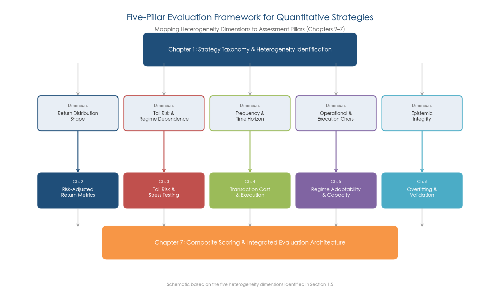

*Figure 1.3 — Schematic of the five-pillar evaluation framework for advanced quantitative strategies. Each heterogeneity dimension identified in this chapter maps to a dedicated assessment pillar (Chapters 2–6), which then feeds into the composite scoring architecture of Chapter 7.*

## 1.6 The Absence of a Unified Framework: Current State and the Path Forward

Despite the scale, sophistication, and capital concentration in quantitative strategies, the industry in 2025–2026 lacks a standardized multi-dimensional evaluation framework. Current practice relies on ad hoc combinations of the Sharpe ratio (often without confidence intervals or multiple-testing corrections), maximum drawdown, and qualitative due diligence. Resonanz Capital's 2026 due diligence framework for quantitative hedge funds—one of the few systematic proposals—advocates a five-bucket classification approach but emphasizes that stress testing must extend beyond macroeconomic scenarios to encompass microstructural pressures such as short squeezes, liquidity gaps, and factor collapses [Resonanz Capital (2026)](https://resonanzcapital.com/insights/quant-hedge-funds-in-2026-a-due-diligence-framework-by-strategy-type "Quant Hedge Funds in 2026: A Due Diligence Framework"). IOSCO's 2025 work program included systemic stress testing methodology discussions covering hedge funds and alternative investment funds, and the SEC's amended Form PF (effective February 2024) now requires large hedge fund advisors to report extraordinary losses exceeding 20% of NAV within 72 hours [IOSCO (2025)](https://www.iosco.org/library/pubdocs/pdf/IOSCOPD789.pdf "2025 IOSCO Work Program"); [SEC (2026)](https://www.sec.gov/files/2025-pf-report-congress.pdf "Form PF Annual Staff Report"). These regulatory developments signal growing institutional demand for more rigorous performance assessment, but they do not themselves constitute an evaluation framework.

The ongoing evolution of quantitative strategies toward AI-native architectures compounds the urgency. As strategies migrate from hand-crafted factor models to deep learning pipelines and LLM-driven agent workflows, the traditional evaluation toolkit—built for strategies with interpretable parameters and well-understood distributional properties—becomes increasingly inadequate. The framework developed in this report addresses this gap by constructing a modular, multi-pillar evaluation architecture capable of accommodating the full taxonomy of advanced quantitative strategies while maintaining the statistical rigor required for meaningful cross-strategy comparison.

# Risk-Adjusted Return Metrics — Properties, Pitfalls, and Recent Advances

Comparing quantitative strategies on a risk-adjusted basis requires condensing the full joint distribution of returns and risk into a tractable ordering. Every such condensation, however, rests on assumptions—about investor preferences, distributional form, and the statistical properties of finite samples—that are seldom made explicit in practice. This chapter provides a systematic examination of the principal risk-adjusted return metrics available to strategy evaluators: the Sharpe ratio, Sortino ratio, Calmar ratio, Omega ratio, Gain-to-Pain ratio, and the broader Kappa family. For each metric, we characterize its theoretical foundations, distributional assumptions, and known failure modes, before turning to the correction mechanisms and novel extensions that have emerged through early 2026—including the Deflated Sharpe Ratio, the Sharpe Stability Ratio, moment-free drawdown-duration estimators, and the Manipulation-Proof Performance Measure. The analysis culminates in a four-tier classification that maps each metric to its appropriate role within the composite evaluation framework developed in Chapter 7.

## 2.1 The Sharpe Ratio: Foundation, Mechanics, and Boundary Conditions

The Sharpe ratio is the most widely cited risk-adjusted performance measure in both academic research and institutional practice, serving as the default benchmark against which all alternatives are compared. Defined as

$$SR = \frac{E[R_p - R_b]}{\sigma(R_p - R_b)}$$

where $R_p$ denotes portfolio return and $R_b$ the benchmark or risk-free rate, its appeal rests on a transparent interpretation: excess return per unit of total volatility [Sharpe (1994)](https://web.stanford.edu/~wfsharpe/art/sr/sr.htm "The Sharpe Ratio, JPM"). The associated t-statistic, $t = SR \times \sqrt{T}$, links performance evaluation directly to classical hypothesis testing, enabling evaluators to assess whether observed risk-adjusted performance is statistically distinguishable from zero.

The Sharpe ratio is optimal—in the sense of correctly ranking all portfolios for any risk-averse investor—under the assumption that returns follow an elliptical distribution, a family encompassing the multivariate normal, the Student-t, and other symmetric fat-tailed forms. Smetters & Zhang (2013) established this result rigorously, proving that for all elliptical distributions the Sharpe ratio yields preference-consistent rankings. Crucially, the same paper derived an impossibility theorem: for general non-elliptical distributions, no performance measure can simultaneously be effective and preference-free [Smetters & Zhang (2013)](https://www.nber.org/system/files/working_papers/w19500/revisions/w19500.rev0.pdf "A Sharper Ratio, NBER WP 19500"). This impossibility result carries profound implications for the evaluation framework constructed in this report: it provides the theoretical justification for adopting a multi-dimensional composite approach (operationalized in Chapter 7) rather than pursuing a single universal metric.

A 2026 large-scale benchmark study from the University of Oxford reinforces the Sharpe ratio's continuing centrality in the era of algorithmic strategy design. Saly-Kaufmann et al. employed the Sharpe ratio as the primary training objective and evaluation criterion for deep-learning trading strategies across recurrent neural network (RNN), Transformer, and state-space model architectures, spanning multiple asset classes and market regimes [Saly-Kaufmann et al. (2026)](https://arxiv.org/pdf/2603.01820 "Deep Learning for Financial Time Series, arXiv"). That no superior single metric has displaced the Sharpe ratio even within the machine-learning research community reflects a broader industry consensus as of early 2026: the Sharpe ratio's theoretical elegance and practical tractability sustain its dominance despite well-documented limitations.

### Annualization and Serial Correlation

Practitioners routinely annualize the Sharpe ratio via the $\sqrt{T}$ rule (e.g., $SR_{\text{annual}} = SR_{\text{monthly}} \times \sqrt{12}$), which is valid only under the assumption of independently and identically distributed (IID) returns. Lo (2002) demonstrated that positive serial correlation—prevalent in momentum and trend-following strategies—inflates the naïve annualized Sharpe, while negative autocorrelation deflates it. Under IID normality, the corrected standard error of the Sharpe ratio estimator is

$$\sigma_{SR} = \sqrt{\frac{1 + \frac{SR^2}{2}}{n}}$$

When serial dependence is present, a Newey-West or other heteroskedasticity-and-autocorrelation-consistent (HAC) estimator is required [Benhamou (2021)](https://hal.science/hal-03207169v1/file/DistributionOfTheSharpeRatio.pdf "Distribution and statistics of the Sharpe Ratio"). The practical import is stark: with only 12 months of data and an empirical $SR = 1.0$, the 95% confidence interval spans approximately [0.21, 1.79]—a range wide enough to render most short-track-record comparisons statistically meaningless. This imprecision is further quantified in Section 2.5.

### Non-Normality Bias

When returns are IID but non-normal, the bias of the Sharpe ratio estimator depends on the skewness $\gamma_1$ and excess kurtosis $\gamma_2$ of the return distribution. Bao (2009) derived the exact finite-sample bias, while Mertens (2002) demonstrated that incorrectly assuming normality can cause the asymptotic variance of the estimator to be misestimated by as much as 70% [Two Sigma Technical Report](https://www.twosigma.com/wp-content/uploads/sharpe-tr-1.pdf "Riondato 2018, Sharpe Ratio Estimation"). For hedge fund strategies that routinely exhibit negative skewness and elevated kurtosis—including short-volatility, merger-arbitrage, and certain statistical-arbitrage approaches—this bias is not merely an academic curiosity: it translates into materially incorrect strategy rankings and, by extension, misallocated capital.

## 2.2 Downside and Target-Based Metrics: Sortino, Calmar, and the Kappa Family

The metrics surveyed in Section 2.1 treat upside and downside volatility symmetrically. For many quantitative strategies—particularly those with explicit drawdown constraints or asymmetric payoff profiles—this symmetry is economically inappropriate. The Sortino ratio, Calmar ratio, and the encompassing Kappa family address this limitation by penalizing only the adverse tail of the return distribution.

### The Sortino Ratio

The Sortino ratio replaces total standard deviation with downside deviation measured relative to a minimum acceptable return (MAR, denoted $\tau$):

$$S(\tau) = \frac{\mu - \tau}{\sqrt{\int_{-\infty}^{\tau} (\tau - R)^2 f(R) \, dR}}$$

By penalizing only returns below the target, the Sortino ratio better captures the risk preferences of investors who are indifferent to upside volatility—a characteristic common among allocators to absolute-return and market-neutral strategies. Its principal limitation is sensitivity to the MAR parameter: shifting $\tau$ from 0% to the risk-free rate can materially alter strategy rankings, and no theoretical consensus exists on the correct threshold for cross-strategy comparison. In practice, this parameter dependence introduces an additional degree of freedom that can be exploited, intentionally or inadvertently, to favor particular strategies.

### The Calmar Ratio

The Calmar ratio, defined as

$$Calmar = \frac{CAGR_{36m}}{|MDD_{36m}|}$$

relates the compound annual growth rate to the maximum drawdown over a trailing 36-month window. Its appeal lies in capturing path-dependent risk that volatility-based measures overlook entirely: a strategy may exhibit low return volatility yet suffer deep, prolonged drawdowns that volatility alone cannot detect. However, the Calmar ratio is dominated by a single extreme event—the maximum drawdown—and is consequently sensitive to the lookback window. A strategy evaluated immediately after recovering from a drawdown may appear strong, while the same strategy assessed one month earlier would rank poorly, despite near-identical underlying dynamics. The ratio also inherits the non-coherence of maximum drawdown as a risk measure (a property examined in Chapter 3).

### The Kappa Family: A Unifying Generalization

Kaplan & Knowles (2004) introduced the Kappa family, which generalizes several downside metrics through the lower partial moment (LPM) of order $n$:

$$\kappa_n(\tau) = \frac{\mu - \tau}{\left[LPM_n(\tau)\right]^{1/n}} = \frac{\mu - \tau}{\left[\int_{-\infty}^{\tau} (\tau - R)^n f(R) \, dR\right]^{1/n}}$$

This framework reveals that the Omega ratio is a linear transformation of $\kappa_1$ (specifically, $\Omega(\tau) = \kappa_1(\tau) + 1$), while the Sortino ratio corresponds exactly to $\kappa_2$ [Kaplan & Knowles (2004)](http://w.performance-measurement.org/KaplanKnowles2004.pdf "Kappa: A Generalized Downside Risk-Adjusted Performance Measure"). Higher-order members ($\kappa_3$, $\kappa_4$, ...) assign progressively heavier penalties to large downside deviations, making them increasingly sensitive to left-tail events. A key property unifies the family: all Kappa variants produce rankings identical to the Sharpe ratio under normality; ranking divergences emerge only in the presence of skewness and excess kurtosis—precisely the distributional conditions that prevail among quantitative strategy returns [Kaplan (2005)](https://premiacap.com/QWAFAFEW/kaplan_20050217.pdf "Downside Risk-Adjusted Performance Measurement, Morningstar").

An important nuance emerges from Shadwick's "lottery test" (2004): $\kappa_1$ (Omega) is the only Kappa variant that correctly ranks both sides of a fair lottery for all threshold values. The Sortino ratio ($\kappa_2$) and higher-order variants fail this test, meaning their rankings can be threshold-dependent even for theoretically identical gambles—a limitation that must be weighed against their greater sensitivity to downside tail risk.

## 2.3 The Omega Ratio: Full-Distribution Promise versus Elliptical Equivalence

The Omega ratio, introduced by Keating & Shadwick (2002), was designed to overcome a perceived limitation of the Sharpe ratio by incorporating the entire return distribution rather than only its first two moments. It is defined as the ratio of the probability-weighted gain above a threshold $\tau$ to the probability-weighted loss below it:

$$\Omega(\tau) = \frac{\int_{\tau}^{\infty} [1 - F(x)] \, dx}{\int_{-\infty}^{\tau} F(x) \, dx}$$

where $F(\cdot)$ is the cumulative distribution function of returns [Keating & Shadwick (2002)](https://people.duke.edu/~charvey/Teaching/BA453_2005/Keating_An_introduction_to.pdf "An Introduction to Omega"). The claimed advantage is that Omega incorporates all moments of the distribution implicitly, without requiring parametric assumptions about its form.

Subsequent theoretical work, however, has substantially qualified this claim. Benhamou, Guez & Paris (2020) proved that under elliptical distributions, the portfolio that maximizes Omega is identical to the portfolio that maximizes the Sharpe ratio, regardless of the threshold $\tau$. This result collapses Omega's purported distributional advantage for a broad class of distributions—including the fat-tailed Student-t commonly used to model financial returns—where Omega provides no incremental information beyond the Sharpe ratio [Benhamou et al. (2020)](https://hal.science/hal-02886481/file/omega-ratio.pdf "Omega and Sharpe ratio"). More critically, Caporin et al. (2018) demonstrated that Omega ratio rankings can be inconsistent with second-order stochastic dominance (SSD)—a fundamental rationality criterion—meaning that Omega may rank a dominated portfolio above a dominating one under certain distributional configurations [Caporin et al. (2018)](https://www.sciencedirect.com/science/article/abs/pii/S0927539817301111 "On the (Ab)use of Omega?").

These findings do not render Omega useless, but they circumscribe its value within the evaluation framework. Omega adds meaningful discriminatory power primarily when return distributions are demonstrably non-elliptical—for example, strategies with significant option-like payoffs, structural asymmetries, or bimodal return profiles. Even in such cases, the SSD inconsistency documented by Caporin et al. must be acknowledged, and Omega rankings should be cross-validated against Tier 3 correction metrics before informing allocation decisions.

## 2.4 The Gain-to-Pain Ratio

The Gain-to-Pain ratio (GPR), popularized by Schwager (2012), provides a deliberately minimalist measure of risk-adjusted performance:

$$GPR = \frac{\sum_{t} R_t}{\sum_{t: R_t < 0} |R_t|}$$

i.e., the total return divided by the absolute sum of negative returns over the evaluation period. GPR is model-free, distribution-free, and trivially computable, requiring no assumption about the functional form of the return-generating process. It shares a direct algebraic relationship with the Omega ratio at threshold zero: $\Omega(0) = GPR + 1$ when applied to discrete return series. Its simplicity is simultaneously its principal strength—no distributional or preference parameters are required—and its weakness: GPR assigns equal weight to all negative returns regardless of magnitude, ignoring the distinction between frequent small losses and rare catastrophic drawdowns, and does not adjust for the temporal sequencing of gains and losses. For high-frequency strategies with many small negative observations, GPR may overstate the perceived "pain" relative to realized economic risk.

## 2.5 Statistical Pitfalls and Manipulation Vulnerabilities

The preceding sections have characterized the theoretical properties of individual metrics. This section turns to a crosscutting concern that affects all of them: the gap between an estimator's theoretical behavior and its realized precision in finite samples, compounded by the possibility of deliberate manipulation.

### Finite-Sample Imprecision

The practical utility of any risk-adjusted metric hinges on whether its estimate can be distinguished from noise within realistic sample sizes. Lo (2002) established the asymptotic distribution of the Sharpe ratio estimator, and Benhamou (2021) confirmed that, for a strategy with true $SR = 1.0$ estimated from 12 months of data, the 95% confidence interval spans [0.21, 1.79]—a nearly 1.6-unit range [Benhamou (2021)](https://hal.science/hal-03207169v1/file/DistributionOfTheSharpeRatio.pdf "Distribution and statistics of the Sharpe Ratio"). Even with five years (60 months) of data, the interval narrows only to approximately [0.64, 1.36]. The implication for strategy evaluation is direct: performance differences smaller than the confidence band cannot be reliably attributed to skill rather than sampling variation. Figure 1 illustrates this relationship across different true Sharpe ratios and sample lengths.

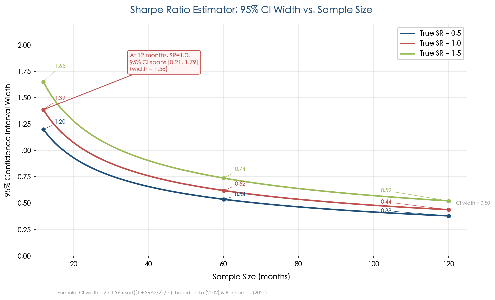

The problem is compounded by the sensitivity of higher-order distributional statistics to finite samples. Bao (2009) showed that the finite-sample bias of the Sharpe estimator is a function of skewness $\gamma_1$ and excess kurtosis $\gamma_2$, with the bias term proportional to $\gamma_1 / (4T)$. Mertens (2002) quantified the practical consequences: assuming normality when returns exhibit excess kurtosis of 6—common among option-selling and relative-value strategies—leads to a 70% underestimate of the Sharpe estimator's variance, causing evaluators to overstate the statistical significance of observed performance differences [Two Sigma Technical Report](https://www.twosigma.com/wp-content/uploads/sharpe-tr-1.pdf "Riondato 2018, Sharpe Ratio Estimation"). This finding underscores the necessity of the Tier 3 statistical correction layer introduced in Section 2.10.

### Manipulation via Payoff Engineering

Goetzmann, Ingersoll, Spiegel & Welch (2007) formalized a structural vulnerability of the Sharpe ratio: it can be systematically inflated by engineering negative-skewness payoff profiles. Selling out-of-the-money put options, for example, generates frequent small gains at the cost of rare catastrophic losses—a pattern that elevates the Sharpe ratio during non-crisis periods while concealing substantial tail risk. The authors proved that a manipulated strategy can achieve an arbitrarily high Sharpe ratio over any finite evaluation window, and proposed the Manipulation-Proof Performance Measure (MPPM) as a theoretically robust alternative:

$$MPPM = \frac{1}{(1-\rho) \Delta t} \ln\left(\frac{1}{T} \sum_{t=1}^{T} \left(\frac{1+R_{p,t}}{1+R_{b,t}}\right)^{1-\rho}\right)$$

where $\rho$ is the risk-aversion parameter governing power utility. MPPM is the only known performance measure satisfying four desirable axioms simultaneously: manipulation-proofness, consistent rankings for all risk-averse investors within the power-utility class, nesting of the information ratio as a special case under normality, and invariance to leverage [Goetzmann et al. (2007)](https://academic.oup.com/rfs/article-abstract/20/5/1503/1592381 "Portfolio Performance Manipulation, RFS"). Its primary limitation—dependence on the exogenous parameter $\rho$—means it is not preference-free, consistent with the impossibility theorem of Smetters & Zhang. This limitation is the principal reason MPPM is classified in Tier 4 rather than Tier 1 of the framework proposed in Section 2.10.

The Sortino and Calmar ratios are not immune to analogous manipulation and fragility concerns. The Sortino ratio's sensitivity to the MAR parameter means that two strategies with identical Sortino values at $\tau = 0$ may swap rankings at $\tau = r_f$, creating an exploitable degree of freedom. The Calmar ratio's dependence on a single extreme observation—the maximum drawdown—renders it vulnerable to both favorable and adverse sampling: a strategy that narrowly avoids triggering a stop-loss may report a vastly different Calmar than one that marginally breached the same threshold, despite near-identical underlying return paths.

## 2.6 Correction Mechanisms: The Deflated Sharpe Ratio

Bailey & López de Prado (2014) introduced the Deflated Sharpe Ratio (DSR) to address two simultaneous biases that pervade quantitative strategy evaluation: the selection bias arising from testing multiple strategy configurations, and the distributional bias arising from non-normal returns. The DSR is computed as

$$DSR = \Phi\left[\frac{(\hat{SR} - SR_0) \sqrt{T-1}}{\sqrt{1 - \hat{\gamma}_1 \hat{SR} + \frac{\hat{\gamma}_2 - 1}{4} \hat{SR}^2}}\right]$$

where $\hat{SR}$ is the observed Sharpe ratio, $SR_0$ is the expected maximum Sharpe under the null hypothesis (which grows logarithmically with the number of independent trials $K$), $\hat{\gamma}_1$ is the estimated skewness, and $\hat{\gamma}_2$ the estimated excess kurtosis [Bailey & López de Prado (2014)](https://www.davidhbailey.com/dhbpapers/deflated-sharpe.pdf "The Deflated Sharpe Ratio, JPM"). The DSR returns a probability: a value below 0.95 indicates that the observed Sharpe cannot be reliably attributed to genuine skill after accounting for the number of trials conducted and the distributional properties of returns.

A numerical example illustrates the severity of the correction. Consider a strategy with $\hat{SR} = 2.5$ selected from $N = 88$ independent trials. The expected maximum Sharpe under the null is approximately $SR_0 \approx 2.26$ (using the Bailey-López de Prado approximation for Gaussian IID trials), yielding a DSR of only 0.90—below the conventional 0.95 threshold. Even a seemingly exceptional Sharpe of 2.5 cannot be judged statistically significant after multiple-testing adjustment when the search space encompasses 88 configurations. This example is particularly salient for machine-learning–driven quantitative strategies, where hyperparameter searches, architecture selection, and feature engineering routinely involve hundreds or thousands of implicit trials.

The DSR serves a dual role in this report's analytical framework: as a statistical correction to the Sharpe ratio (the focus of the present chapter) and as a multiple-testing diagnostic within the overfitting detection protocol (Chapter 6). The two roles are complementary: the emphasis here is on the DSR's distributional and sampling properties, while Chapter 6 addresses its integration with Combinatorially Symmetric Cross-Validation (CSCV), the Probability of Backtest Overfitting (PBO), and other overfitting gatekeepers.

## 2.7 The Sharpe Stability Ratio: Temporal Consistency as a New Dimension

A fundamental limitation shared by all metrics discussed thus far is temporal blindness: two strategies with identical ex-post Sharpe ratios may differ dramatically in the consistency of their risk-adjusted performance through time. One may deliver steady returns across sub-periods, while the other concentrates its gains in a few favorable episodes separated by extended periods of mediocrity. Neither the Sharpe ratio, the DSR, nor any of the Tier 1 or Tier 2 metrics can distinguish between these qualitatively distinct performance profiles.

Bajo Traver & Rodriguez (2026) proposed the Sharpe Stability Ratio (SSR) to address this gap. The SSR treats the rolling Sharpe ratio as a time-series object and defines stability as the ratio of its mean to its heteroskedasticity-and-autocorrelation-consistent (HAC) standard deviation:

$$SSR = \frac{\bar{SR}_{rolling}}{\hat{\sigma}_{HAC}(\{SR_{rolling,t}\})}$$

where $\bar{SR}_{rolling}$ is the mean of the rolling-window Sharpe series and $\hat{\sigma}_{HAC}$ its HAC-corrected standard deviation [Bajo Traver & Rodriguez (2026)](https://papers.ssrn.com/sol3/papers.cfm?abstract_id=6344658 "The Sharpe Stability Ratio, SSRN"). The HAC correction is essential: overlapping rolling windows induce strong serial correlation in the rolling Sharpe series, and naïve dispersion measures would severely understate the true uncertainty.

The SSR exhibits several properties that make it a valuable addition to the quantitative strategy evaluation toolkit. First, it reveals that strategies with comparable point-in-time Sharpe and Probabilistic Sharpe Ratio (PSR) values can exhibit markedly different stability profiles—information critical for due diligence, manager selection, and portfolio construction. Second, empirical analysis on hedge fund index data demonstrates that elevated average Sharpe ratios may reflect concentrated episodic outperformance rather than sustained skill; the SSR separates these cases quantitatively. Third, the SSR supports formal hypothesis testing on stability via block bootstrap procedures that preserve the dependence structure of the underlying return series. The authors further propose a credibility-adjusted variant (CASSR) that combines the PSR with the SSR, yielding a unified assessment of whether a strategy achieves both statistically credible performance and temporal consistency.

## 2.8 Moment-Free Estimation: The Drawdown-Duration Estimator

An entirely different approach to estimating risk-adjusted performance circumvents the moment-estimation problem altogether, sidestepping the distributional assumptions that plague all metrics reviewed in Sections 2.1–2.6. Challet (2017) demonstrated that the total duration of drawdowns in a price time series is a monotonic function of the Sharpe ratio, providing a moment-free, unbiased, and outlier-robust estimator. The key insight is that, for IID returns, the expected number of upper price records $R^+$ in a series of length $n$ is determined by a persistence function $q_-(n)$, and the difference between total drawup and drawdown durations, $R_0 = R^+ - R^-$, averaged over random permutations of the return series, yields an estimator of $c/\sigma$ (the signal-to-noise ratio, equivalent to the Sharpe ratio):

$$\hat{\theta} \approx a(\hat{R}_0 / n) \cdot \frac{1}{1 - \frac{8}{3} \hat{\nu}^{-3/2}}$$

where $a(\cdot)$ is a calibrated monotonic function and $\hat{\nu}$ is the estimated tail exponent of the return distribution [Challet (2017)](https://hal.science/hal-01149704v1/preview/challet_sharper_asset.pdf "Sharper asset ranking from total drawdown durations, Applied Mathematical Finance").

The estimator offers three principal advantages. First, because it operates on drawdown durations—bounded integers—rather than return moments, it is inherently robust to outliers: a single extreme return changes at most one record count. Second, it is unbiased for heavy-tailed distributions where the standard moment-based estimator systematically overestimates the true Sharpe ratio due to the implicit Gaussian-tail assumption embedded in sample variance. Third, using 20 years of data on 3,449 liquid US equities, Challet demonstrated that the moment-free estimator produces statistically significant ranking differences relative to the conventional method, particularly in the top and bottom deciles and during high-volatility regimes—precisely the conditions most relevant for evaluating quantitative strategies. The practical cost is computational: the permutation-averaging procedure requires approximately 1,000 random shuffles per estimation window, though this overhead is trivial for modern computational infrastructure.

## 2.9 Generalized Sharpe and Risk-Parity Extensions

Shin (2025) extended the Generalized Sharpe-Parity Principle to non-normal return distributions, unifying the risk-parity allocation framework with generalized Sharpe ratio optimization. The central result establishes that risk-parity portfolios—which equalize the marginal risk contribution of each constituent asset—can be derived as solutions to a Sharpe-maximization problem under appropriately defined non-Gaussian risk measures [Shin (2025)](https://papers.ssrn.com/sol3/papers.cfm?abstract_id=5721562 "On the Limits and Extensions of the Generalized Sharpe-Parity Principle, SSRN"). This finding bridges two research programs that had evolved largely independently: it confirms that risk-parity is not merely an ad-hoc diversification heuristic but corresponds to an optimal risk-adjusted return criterion when the risk measure accounts for the distributional shape beyond the first two moments. For the evaluation framework constructed in this report, the extension implies that the Sharpe ratio's conceptual architecture can be preserved even when its Gaussian variance denominator is replaced by a more general risk functional—such as Expected Shortfall, a lower partial moment, or a spectral risk measure—thereby extending the Tier 1 anchor metric's relevance to non-elliptical settings.

## 2.10 A Four-Tier Classification for the Evaluation Framework

Synthesizing the theoretical properties, empirical evidence, and practical considerations surveyed in the preceding sections, we propose a four-tier classification of risk-adjusted return metrics that structures the composite evaluation framework developed in Chapter 7. Figure 2 provides a comprehensive property comparison across all ten metrics examined in this chapter, while Figure 3 visualizes the hierarchical flow from initial screening through statistical correction to deep-dive analysis.

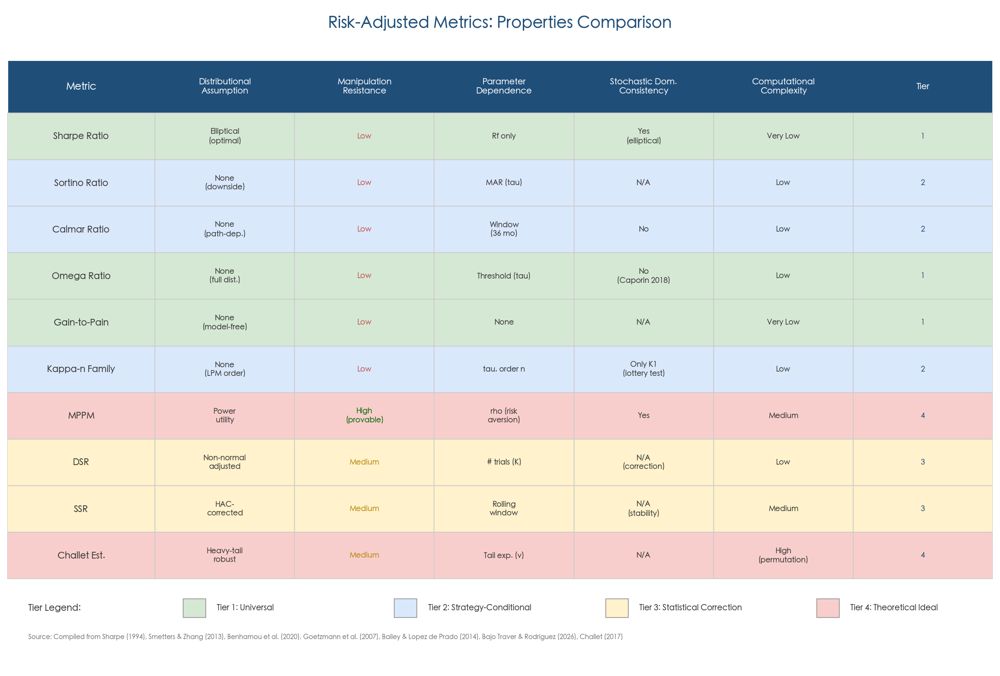

**Tier 1 — Universal Metrics.** The Sharpe ratio, Omega ratio, and Gain-to-Pain ratio are applicable to all strategy types without requiring strategy-specific parameterization. Their universality comes at the cost of known limitations: non-normality bias (Sharpe), elliptical-equivalence redundancy (Omega), and insensitivity to loss magnitude (GPR). The Sharpe ratio serves as the anchor metric within this tier, given its deep integration into academic literature, regulatory frameworks, and institutional practice.

**Tier 2 — Strategy-Conditional Metrics.** The Sortino ratio, Calmar ratio, Treynor ratio, and Information ratio require strategy-specific parameters—MAR threshold, lookback window, and benchmark index, respectively—and are most informative when matched to appropriate strategy types. The Sortino ratio adds discriminatory value for strategies with asymmetric payoff profiles; the Calmar ratio is most meaningful where drawdown control is an explicit objective (e.g., CTA/trend-following); the Treynor ratio and Information ratio are relevant for strategies with well-defined benchmark exposures.

**Tier 3 — Statistical Correction Layer.** The Deflated Sharpe Ratio (Bailey & López de Prado 2014), Lo's confidence interval methodology, the Sharpe Stability Ratio (Bajo Traver & Rodriguez 2026), and the Ledoit-Wolf robust bootstrap serve not as standalone ranking metrics but as essential quality-adjustment overlays. This tier transforms point estimates into statistically calibrated assessments, addresses multiple-testing bias, and introduces temporal consistency as a distinct evaluative dimension. No strategy should be ranked by Tier 1 or Tier 2 metrics alone without passing through the Tier 3 correction layer.

**Tier 4 — Theoretically Ideal but Computationally Intensive Metrics.** The Manipulation-Proof Performance Measure (Goetzmann et al. 2007), the "Sharper Ratio" of Smetters & Zhang (2013), and Challet's drawdown-duration estimator represent the current frontier of theoretically rigorous risk-adjusted measurement. MPPM provides manipulation-proofness at the cost of specifying a risk-aversion parameter; the Sharper Ratio achieves preference-consistency for general distributions but requires solving a computationally demanding optimization; the Challet estimator offers moment-free unbiasedness but depends on tail-exponent calibration. Production adoption of Tier 4 metrics remains limited as of early 2026, but their theoretical properties define the benchmark against which simpler metrics should be evaluated.

This four-tier structure is designed to be modular and composable: an evaluator may begin with Tier 1 metrics for initial screening, apply Tier 2 metrics conditional on strategy type, impose Tier 3 corrections to ensure statistical rigor, and optionally invoke Tier 4 metrics for deep-dive analysis of borderline or high-stakes cases. The composite scoring methodology in Chapter 7 operationalizes this hierarchy through explicit tier weighting and aggregation protocols calibrated to the strategy type under evaluation.

## 2.11 The Landscape in 2026: No Unified Metric, but a Convergent Architecture

The 2025–2026 literature reveals no single risk-adjusted metric that has gained broad acceptance as a successor to the Sharpe ratio. The field has instead converged on an architectural consensus: employ the Sharpe ratio as the primary signal, augmented by complementary metrics that capture dimensions the Sharpe ratio structurally omits—downside risk via the Sortino ratio, path-dependent risk via the Calmar ratio, temporal consistency via the SSR, and manipulation resistance via MPPM—while layering statistical corrections (DSR, Lo confidence intervals) to prevent over-interpretation of point estimates.

This convergent architecture is visible across institutional practice, academic research, and machine-learning strategy development alike. The Oxford benchmark study of Saly-Kaufmann et al. (2026) optimizes for the Sharpe ratio but reports the Sortino ratio, Calmar ratio, and maximum drawdown as secondary evaluation metrics [Saly-Kaufmann et al. (2026)](https://arxiv.org/pdf/2603.01820 "Deep Learning for Financial Time Series, arXiv"). The Bajo Traver & Rodriguez (2026) SSR paper explicitly positions itself as a complement to—not a replacement for—the PSR and DSR frameworks [Bajo Traver & Rodriguez (2026)](https://papers.ssrn.com/sol3/papers.cfm?abstract_id=6344658 "The Sharpe Stability Ratio, SSRN"). Shin's (2025) risk-parity extension confirms that the Sharpe ratio's conceptual framework can be generalized to non-Gaussian settings without abandoning its core architecture [Shin (2025)](https://papers.ssrn.com/sol3/papers.cfm?abstract_id=5721562 "On the Limits and Extensions of the Generalized Sharpe-Parity Principle, SSRN").

The evaluation framework advanced in this report accordingly does not seek to identify the "best" single risk-adjusted metric. It instead deploys the full four-tier architecture, with tier membership and weighting calibrated to the strategy type under evaluation and the evaluator's loss function. The Smetters-Zhang impossibility theorem guarantees that no metric-selection shortcut exists for non-elliptical returns; the appropriate methodological response is structured multi-metric evaluation rather than continued metric proliferation.

# Tail-Risk, Drawdown Analysis, and Stress-Testing Protocols

The risk-adjusted return metrics examined in Chapter 2 compress the full return distribution into scalar summaries that emphasize central tendency and dispersion. Yet the episodes that destroy capital—and careers—are concentrated in the tails. A strategy exhibiting a Sharpe ratio of 1.5 over five years may nonetheless experience a single drawdown severe enough to trigger investor redemptions, prime-broker margin calls, and forced liquidation spirals. Evaluating quantitative strategies therefore demands a complementary lens: one focused not on average risk-return trade-offs but on the extreme-event dimension—the metrics, models, and structured protocols required to assess how strategies behave when markets break.

This chapter proceeds in four stages. Section 3.1 formalizes the principal tail-risk measures—Value-at-Risk, Expected Shortfall, and their regulatory context under the Fundamental Review of the Trading Book (FRTB). Section 3.2 examines path-dependent drawdown metrics—maximum drawdown, Ulcer Index, and Conditional Drawdown-at-Risk—that capture the investor experience of cumulative loss and recovery time. Section 3.3 documents the empirical tail-risk signatures of the six strategy families defined in Chapter 1, drawing on crisis episodes from 2008 through early 2026. Section 3.4 proposes a standardized four-scenario stress-testing protocol designed for cross-strategy comparability. Finally, Section 3.5 integrates these components into the composite evaluation framework.

## 3.1 Tail-Risk Measures: VaR, Expected Shortfall, and Regulatory Evolution

### 3.1.1 Value-at-Risk: Definition and Limitations

Value-at-Risk (VaR) at confidence level $\alpha$ is defined as the $\alpha$-quantile of the portfolio loss distribution:

$$VaR_\alpha = \inf\{x \in \mathbb{R} : P(L > x) \leq 1-\alpha\}$$

VaR satisfies two of the four axioms proposed by Artzner et al. (1999) for coherent risk measures—translation invariance and positive homogeneity—but critically **fails sub-additivity**: there exist portfolios A and B for which $VaR(A+B) > VaR(A) + VaR(B)$, meaning diversification can appear to increase risk under VaR [Artzner et al. (1999)](https://people.math.ethz.ch/~delbaen/ftp/preprints/CoherentMF.pdf "Coherent Measures of Risk, Mathematical Finance"). This failure is not merely theoretical. For quantitative strategies that combine multiple signal sources or trade across asset classes, a non-sub-additive risk measure can produce misleading portfolio-level risk assessments—precisely the scenario that a cross-strategy evaluation framework must guard against.

Equally problematic, VaR provides no information about the magnitude of losses beyond the threshold: a 99% VaR of $10 million is consistent with a conditional tail loss of $11 million or $110 million. For strategies whose daily P&L distributions are approximately Gaussian—such as high-frequency market making under normal microstructure conditions—this limitation is tolerable. For strategies exhibiting fat tails, negative skewness, or discontinuous payoff profiles—statistical arbitrage under crowding stress, CTA during V-shaped reversals, or any strategy with embedded short-option exposure—VaR systematically underestimates the severity of tail events.

### 3.1.2 Expected Shortfall: Coherence and the FRTB Transition

Expected Shortfall (ES), also termed Conditional Value-at-Risk (CVaR), remedies VaR's core deficiency by averaging losses beyond the VaR threshold:

$$ES_\alpha = \frac{1}{1-\alpha}\int_\alpha^1 VaR_u \, du$$

For continuous distributions, this is equivalent to $ES_\alpha = E[L \mid L > VaR_\alpha]$. ES satisfies all four coherent risk measure axioms—translation invariance, positive homogeneity, monotonicity, and sub-additivity—making it theoretically superior for portfolio aggregation and cross-strategy comparison [Artzner et al. (1999)](https://people.math.ethz.ch/~delbaen/ftp/preprints/CoherentMF.pdf "Coherent Measures of Risk, Mathematical Finance").

The regulatory community has endorsed this theoretical advantage. The Basel Committee's Fundamental Review of the Trading Book (FRTB) replaces the 99% VaR with a 97.5% Expected Shortfall as the capital charge metric for banks employing internal models. Critically, the FRTB mandates ES estimation directly at a 10-day holding horizon—prohibiting the $\sqrt{t}$ scaling previously permitted under VaR—and introduces differentiated liquidity horizons by asset class, ranging from 10 to 120 trading days. Basel III monitoring data indicate that FRTB implementation will increase Group 1 banks' weighted-average market risk capital by 63.2% [BPI](https://bpi.com/why-is-the-frtb-expected-shortfall-calculation-designed-as-it-is/ "FRTB ES Calculation Design").

The global implementation timeline, however, remains fragmented. As of September 2025, only 8 of 20 Basel Committee member jurisdictions had completed final Basel III transposition; the EU and UK postponed their FRTB effective dates to January 2027, while the US Basel III Endgame proposal remained in draft [European Parliament EGOV (2025)](https://www.europarl.europa.eu/RegData/etudes/IDAN/2025/773694/ECTI_IDA(2025)773694_EN.pdf "The implementation of Basel III, September 2025"). For the evaluation framework advanced in this report, this regulatory trajectory reinforces ES as the preferred tail-risk measure: it is both theoretically coherent and converging toward global regulatory standard status, providing a common denominator for cross-strategy comparison.

### 3.1.3 Backtesting Expected Shortfall

A persistent objection to ES has been its alleged non-backtestability, rooted in the concept of elicitability—a statistical property that VaR possesses but ES does not. Acerbi & Szekely (2014) resolved this debate by constructing three model-free backtesting statistics ($Z_1$, $Z_2$, $Z_3$) for ES that do not require elicitability, demonstrating that the backtesting objection constituted a "red herring" for regulatory risk standard selection. Their tests are strictly more powerful than the Basel traffic-light VaR backtest and can be implemented with standard historical P&L data [Acerbi & Szekely (2014)](https://www.msci.com/documents/10199/238916/Research_Insight_Backtesting_Expecting_Shortfall_December_2014.pdf "Backtesting Expected Shortfall, MSCI"). We recommend incorporating ES backtesting—specifically the $Z_2$ statistic, which offers the strongest power against misspecified tail models—as a mandatory validation layer within the framework's tail-risk assessment pillar.

## 3.2 Drawdown Metrics: Path-Dependent Risk Assessment

While VaR and ES are point-in-time distributional measures, investors in quantitative strategies experience risk as a **path**: a sequence of losses, their depth, their duration, and the time required for recovery. Drawdown-based metrics capture this lived dimension of risk in ways that distributional measures alone cannot, and they are particularly salient for strategies characterized by extended underwater periods—a pattern common among CTA, multi-factor, and risk-parity approaches.

### 3.2.1 Maximum Drawdown

Maximum drawdown (MDD) is defined as the largest peak-to-trough decline over a specified period:

$$MDD = \max_{0 \leq s \leq t \leq T}\left[\frac{W(s) - W(t)}{W(s)}\right]$$

where $W(t)$ is the portfolio value at time $t$. MDD is path-dependent, intuitive, and directly relevant to investor experience—it quantifies the worst cumulative loss an investor would have endured over the observation period. However, MDD is **not a coherent risk measure**: it fails sub-additivity and is dominated by a single extreme event, rendering it sensitive to the observation window and unreliable as a sole basis for cross-strategy ranking. A strategy that experienced one severe but brief drawdown followed by rapid recovery may receive a worse MDD score than a strategy that slowly eroded capital over many months without a dramatic trough. The Calmar ratio (Chapter 2) inherits these limitations through its dependence on MDD as denominator.

### 3.2.2 The Ulcer Index

The Ulcer Index, introduced by Peter Martin in 1987, addresses MDD's single-event sensitivity by aggregating the entire drawdown experience:

$$UI = \sqrt{\frac{1}{n}\sum_{i=1}^{n} D_i^2}$$

where $D_i$ represents the percentage drawdown from the most recent peak at observation $i$. By squaring each drawdown observation, the Ulcer Index assigns disproportionate weight to large drawdowns while still reflecting the frequency and duration of smaller declines. An associated performance metric, the Ulcer Performance Index (UPI, or Martin ratio), is defined as $(R_p - R_f) / UI$, providing a drawdown-severity-adjusted return measure analogous to the Sharpe ratio but grounded in path-dependent risk.

The Ulcer Index is particularly well-suited to evaluating CTA and trend-following strategies, where extended underwater periods are common even in ultimately profitable systems. A slow trend-follower may exhibit an Ulcer Index substantially higher than its MDD would suggest, because the drawdown curve spends prolonged periods below the high-water mark even if the absolute trough is moderate.

### 3.2.3 Conditional Drawdown-at-Risk (CDaR)

The most theoretically rigorous drawdown metric available is Conditional Drawdown-at-Risk (CDaR), introduced by Chekhlov, Uryasev & Zabarankin (2003, revised 2005). CDaR constitutes a one-parameter family of risk functions that unifies maximum drawdown and average drawdown as limiting cases. For a confidence parameter $\alpha \in [0,1]$, the $\alpha$-CDaR is defined as the mean of the worst $100 \times (1-\alpha)\%$ drawdowns observed over a sample path:

$$\Delta_\alpha(x) = \min_\zeta \left\{\zeta + \frac{1}{T(1-\alpha)}\int_0^T [D(t,x) - \zeta]^+ dt\right\}$$

where $D(t,x)$ is the drawdown function at time $t$ for portfolio weights $x$, and $[g]^+ = \max\{g, 0\}$ [Chekhlov et al. (2003)](https://www.cis.upenn.edu/~mkearns/finread/drawdown.pdf "Portfolio Optimization with Drawdown Constraints"). When $\alpha \to 1$, CDaR converges to maximum drawdown; when $\alpha = 0$, it equals the average drawdown. The optimization formula mirrors the Rockafellar-Uryasev CVaR representation, and the resulting portfolio optimization problem reduces to linear programming—a critical computational advantage for institutional implementation.

CDaR is the drawdown-domain analogue of CVaR/ES: just as ES averages losses beyond the VaR threshold, CDaR averages drawdowns beyond the drawdown-at-risk threshold. This conceptual parallel makes CDaR a natural complement to ES within a multi-dimensional evaluation framework. The authors of the original paper recommend $\alpha = 0.95$ (averaging the worst 5% of drawdowns) as producing more stable portfolio allocations than either pure MDD or pure average drawdown optimization [Chekhlov et al. (2003)](https://www.cis.upenn.edu/~mkearns/finread/drawdown.pdf "Portfolio Optimization with Drawdown Constraints").

### 3.2.4 Drawdown Beta and Expected Regret of Drawdown

Zabarankin, Pavlikov & Uryasev (2022) extended drawdown analysis into asset pricing theory by defining Drawdown Beta. The approach uses Expected Regret of Drawdown (ERoD)—a variant of CDaR—as the risk measure in a CAPM-like framework:

$$\beta_i^{DD} = \frac{\partial ERoD_\alpha(R_M)}{\partial w_i}\bigg/ ERoD_\alpha(R_M)$$

where $R_M$ is the market return. Empirical tests show that Drawdown Beta is more sensitive to extreme loss events than standard beta, making it a more informative risk factor for strategies whose tail behavior diverges from their average-case characteristics [Zabarankin et al. (2022)](http://uryasev.ams.stonybrook.edu/wp-content/uploads/2021/10/Drawdown_Portfolio_Optimization_Problems_and_Drawdown_Betas.pdf "Drawdown Beta and Portfolio Optimization"). For the evaluation framework, Drawdown Beta provides a mechanism to assess whether a strategy's contribution to portfolio-level drawdown risk is proportional to its stand-alone drawdown profile—a question that standard beta cannot answer for tail events.

### 3.2.5 Comparative Properties of Drawdown Metrics

The following table summarizes the key properties of the drawdown metrics discussed above, enabling framework designers to select appropriate measures for different evaluation contexts:

| Metric | Coherence | Sensitivity to Single Events | Captures Duration | Optimization Tractability | Recommended Use Case |
|--------|-----------|------|------|------|------|
| Maximum Drawdown (MDD) | No (non-sub-additive) | Very High | No | N/A (scalar) | Investor communication; Calmar ratio input |
| Ulcer Index (UI) | No | Moderate (quadratic weighting) | Yes | N/A (scalar) | Long-horizon strategy monitoring; CTA evaluation |
| CDaR ($\alpha$) | Inherits CVaR coherence properties | Tunable via $\alpha$ | Yes | LP-reducible | Portfolio optimization; cross-strategy tail-risk ranking |
| Drawdown Beta | N/A (factor model) | High (ERoD-based) | Implicit | Requires ERoD estimation | Portfolio contribution analysis |

Extending the comparison beyond drawdown-specific measures, the figure below juxtaposes VaR, ES/CVaR, MDD, Ulcer Index, and CDaR across seven evaluation-relevant properties—sub-additivity, tail magnitude capture, path dependence, duration capture, optimization tractability, regulatory adoption, and backtestability. CDaR emerges as the most comprehensive drawdown-domain metric, while ES remains the preferred distributional tail-risk measure.

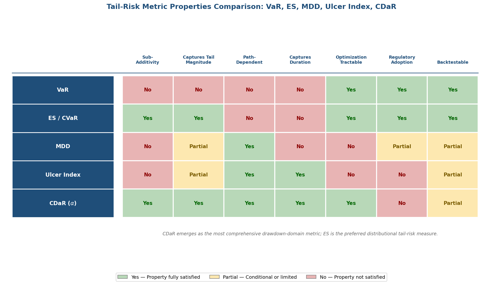

## 3.3 Strategy-Specific Tail-Risk Signatures

The six strategy families defined in Chapter 1 exhibit fundamentally different tail-risk profiles. A universal evaluation framework cannot apply a single tail-risk threshold or metric uniformly; rather, it must recognize that tail risk manifests through distinct mechanisms across strategy types. This section documents the empirical evidence for these strategy-specific vulnerabilities, drawing on crisis episodes spanning 2008 through early 2026, and identifies the monitoring metrics best suited to each family's dominant tail-risk mechanism.

### 3.3.1 Multi-Factor Strategies: The Quant Crisis of 2018–2020

Multi-factor quantitative equity strategies experienced a historically anomalous drawdown during the 27-month period from June 2018 to August 2020. Blitz (2021) documented this episode as the first in fifty years in which the momentum factor failed to compensate for value-factor losses, producing a combined peak-to-trough drawdown of approximately −29% [Blitz (2021)](https://www.robeco.com/docm/docu-202102-the-quant-crisis-of-2018-2020-cornered-by-big-growth.pdf "The Quant Crisis of 2018–2020, JPM"). The crisis was driven by an unprecedented concentration of market returns in large-cap growth stocks, which compressed factor spreads and penalized diversified multi-factor portfolios.

The tail-risk signature of multi-factor strategies is thus **regime-dependent and slow-onset**: rather than a single sharp drawdown, the strategy family experienced a prolonged underwater period during which traditional risk metrics (VaR and ES computed on recent rolling windows) failed to signal distress because daily volatility remained moderate. The Ulcer Index and CDaR are substantially better suited to capturing this type of extended erosion than point-in-time measures. Man Group's analysis confirmed that traditional factor strategies subsequently rebounded +84% through April 2025, illustrating that the eventual recovery can be equally extreme—but only for investors possessing the governance structure and risk tolerance to endure multi-year drawdowns [Man Group Research](https://www.man.com/insights/is-this-time-different "Man Group: Is This Time Different?, June 2025").

### 3.3.2 Statistical Arbitrage: Crowding-Driven Left-Tail Risk

Statistical arbitrage strategies are designed to operate at near-zero market beta, and their return distributions typically exhibit moderate kurtosis under normal conditions. The dominant tail risk for this family is **crowding**: when multiple market-neutral strategies hold overlapping positions, a common deleveraging trigger can produce correlated losses across nominally uncorrelated funds—a phenomenon first dramatized during the "Quant Quake" of August 2007.

In early 2026, prime broker data revealed that systematic long/short strategies suffered their most severe short-term drawdown since October 2025, driven by simultaneous factor reversals in crowded positions [HedgeCo (2026)](https://www.hedgeco.net/news/01/2026/2026-challenging-for-quant-hedge-funds.html "2026 Challenging for Quant Hedge Funds"). The mechanism is self-reinforcing: margin calls force deleveraging, which amplifies the very factor reversals that triggered the initial losses, creating a feedback loop that can compress what would otherwise be moderate losses into acute left-tail events. For evaluation purposes, statistical arbitrage tail risk therefore requires monitoring not only the strategy's own drawdown profile but also position-level crowding indicators—including short interest concentration, factor exposure overlap with peer funds, and prime broker aggregate positioning data.

### 3.3.3 CTA / Trend Following: Crisis Alpha and Whipsaw Vulnerability

CTA and trend-following strategies occupy a distinctive position in the tail-risk landscape: they are among the few strategy families that historically **benefit** from sustained market dislocations. Man AHL research confirmed that trend-following strategies exhibit their strongest performance in extreme market quantiles—a property widely termed "crisis alpha" [Man Group AHL](https://www.man.com/insights/trend-following-equity-and-bond-crisis-alpha "Trend Following: Equity and Bond Crisis Alpha"). During the 2008 Global Financial Crisis and the initial phase of the 2020 COVID sell-off, managed futures strategies generated substantial positive returns as persistent directional trends developed across equity, fixed-income, and commodity markets.

The tail risk for CTA strategies is concentrated instead in **V-shaped reversals**—rapid market inflections that reverse established trends before trend-following models can adjust their positioning. The March–April 2020 sequence illustrates this vulnerability vividly: after profiting from the initial equity sell-off, many CTA strategies gave back gains during the violent rally that followed the Federal Reserve's emergency intervention. CFA Institute 2026 research decomposing CTA returns by trend horizon found that slow-speed strategies (250–500 day lookbacks) achieved a five-year Sharpe of 0.75 and a return-to-maximum-drawdown ratio of 0.84, far exceeding the SG CTA Trend Index aggregate (Sharpe 0.38), indicating that horizon selection is a primary determinant of tail-risk exposure within the CTA family [CFA Institute](https://rpc.cfainstitute.org/blogs/enterprising-investor/2026/decoding-cta-allocations-by-trend-horizon "Decoding CTA Allocations by Trend Horizon, CFA Institute, 2026").

### 3.3.4 High-Frequency Trading: Microstructural Tail Events

High-frequency trading and market-making strategies exhibit daily P&L distributions that are approximately Gaussian under normal microstructure conditions, with annualized Sharpe ratios frequently exceeding 3.0. Their tail risk is concentrated in **microstructural dislocations**—flash crashes, exchange outages, sudden liquidity withdrawal, and message-queue overflows—that occur on timescales of milliseconds to minutes and are poorly captured by daily or monthly risk metrics.

The 2010 Flash Crash, the 2015 ETF dislocation, and numerous smaller incidents have demonstrated that HFT tail losses can be catastrophic relative to normal daily P&L yet may scarcely register in monthly drawdown statistics. For the evaluation framework, HFT tail risk demands intraday monitoring at sub-second frequency, assessment of inventory holding times under stress, and analysis of exchange-connectivity redundancy—dimensions that are largely orthogonal to the tail-risk metrics designed for lower-frequency strategies. Consequently, HFT evaluation requires a dedicated microstructural risk layer (detailed in Section 3.5, Layer 4) rather than reliance on the distributional and drawdown metrics that serve other strategy families.

### 3.3.5 Cross-Strategy Tail-Risk Evidence: Recent Crisis Episodes

Three recent episodes provide particularly rich cross-strategy tail-risk data:

**2020 COVID Crash (February–March 2020).** The S&P 500 declined approximately 34% in 23 trading days from its February 19 peak to the March 23 trough, the fastest bear market in modern history [CNBC](https://www.cnbc.com/2021/03/16/one-year-ago-stocks-dropped-12percent-in-a-single-day-what-investors-have-learned-since-then.html "One year ago, stocks dropped 12% in a day"). Cross-asset correlations spiked, margin calls triggered the largest forced-deleveraging episode since 2008, and government bond markets experienced unusual illiquidity. Renaissance Technologies' externally-available funds exemplified the dispersion: the Renaissance Institutional Equities Fund (RIEF) declined approximately 19.9% for full-year 2020, while the Renaissance Institutional Diversified Alpha Fund (RIDA) lost 31.9%, even as the firm's internal Medallion fund reportedly gained 76% [Financial Times](https://www.ft.com/content/0d93cc76-4b1f-4c83-afdf-c940f180db08 "Renaissance's shrinking hedge funds"); [Institutional Investor](https://www.institutionalinvestor.com/article/2bswms7wco7as686o8ikg/portfolio/renaissances-medallion-fund-surged-76-in-2020-but-funds-open-to-outsiders-tanked "Renaissance's Medallion Fund Surged 76% in 2020"). This extraordinary within-firm dispersion—nearly 100 percentage points between Medallion and RIDA—underscores that strategy architecture, signal frequency, and capacity constraints can produce radically different tail outcomes even under a common research infrastructure.

**2025 "Liberation Day" Tariff Shock (April 2025).** President Trump's announcement of blanket 10% tariffs on all US imports, with steeper duties on specific trade partners, constituted a policy black swan that invalidated historical correlation structures embedded in quantitative models. The RIEF fund, managing approximately $19.6 billion, fell around 8% month-to-date as of mid-April, slashing year-to-date returns to 4.4% from a prior trajectory consistent with its 2024 gain of 22.7% [Hedgeweek (2025)](https://www.hedgeweek.com/renaissance-quant-funds-see-steep-losses-amid-tariff-turmoil/ "Renaissance quant funds see steep losses amid tariff turmoil"). Macro hedge funds as a category lost 2.7% in April—a magnitude equivalent to the March 2023 regional banking crisis [Reuters (2025)](https://www.reuters.com/business/finance/macro-hedge-funds-mauled-april-mcgeever-2025-05-08/ "Macro hedge funds mauled in April 2025"). The episode's significance for stress testing lies in its **model-exogenous** character: the tariff shock was not predictable from any financial time series, making it a genuine out-of-sample test of model resilience.

**2018–2020 Multi-Factor Drawdown.** As detailed in Section 3.3.1, this 27-month episode demonstrated that tail risk for factor-based strategies can manifest as a slow erosion rather than an acute crash, evading traditional VaR- and ES-based early warning systems calibrated on recent data windows.

## 3.4 A Standardized Four-Scenario Stress-Testing Protocol

### 3.4.1 Design Principles

Stress testing within the evaluation framework serves a different purpose from regulatory stress tests applied to banks. Bank stress tests assess capital adequacy under hypothetical macroeconomic scenarios; our protocol assesses **strategy resilience**—the ability of a quantitative strategy to maintain operational integrity, limit drawdowns, and recover under historically observed extreme conditions. The protocol must satisfy three design criteria:

1. **Cross-strategy comparability.** Every strategy family must be subjected to the same set of scenarios, enabling apples-to-apples comparison of tail behavior.
2. **Multi-dimensional stress channels.** Each scenario must specify not only asset price shocks but also the associated microstructural conditions: liquidity withdrawal, correlation regime shifts, margin requirement changes, and execution quality degradation.
3. **Regime-mapping consistency.** Each scenario must correspond to at least one regime state defined in the regime classification framework of Chapter 5, enabling integrated regime-conditional performance assessment.

Resonanz Capital's 2026 due diligence framework provides additional guidance: stress testing for quantitative strategies should extend beyond traditional macroeconomic scenarios to incorporate **microstructural stress**—short squeezes, liquidity gaps, factor crowding collapses, and prime broker margin spirals—that disproportionately affect systematic strategies [Resonanz Capital (2026)](https://resonanzcapital.com/insights/quant-hedge-funds-in-2026-a-due-diligence-framework-by-strategy-type "Quant Hedge Funds in 2026: A Due Diligence Framework"). The regulatory environment is also converging toward more comprehensive stress-testing mandates: IOSCO's 2025 work program incorporated systemic stress-testing methodology for hedge funds and alternative investment funds [IOSCO (2025)](https://www.iosco.org/library/pubdocs/pdf/IOSCOPD789.pdf "2025 IOSCO Work Program"), and the SEC's amended Form PF (effective February 2024) requires large hedge fund advisers to report extraordinary losses exceeding 20% of NAV within 72 hours [SEC (2026)](https://www.sec.gov/files/2025-pf-report-congress.pdf "Form PF Annual Staff Report").

### 3.4.2 The Four Standard Scenarios

We propose the following four scenarios as the minimum stress-testing battery for cross-strategy evaluation. Each scenario is defined by its primary shock channel, the empirical market data window used for calibration, and the strategy-specific stress mechanisms it is designed to activate.

**Scenario 1: Credit Contagion and Liquidity Freeze (2008 GFC Analogue)**

- *Calibration window:* September–November 2008
- *Primary shock:* Credit spreads widen 400+ bps (IG) / 1000+ bps (HY); interbank lending seizes; equity indices decline 40–55% over six months
- *Microstructural conditions:* Bid-ask spreads in credit and equity markets widen 3–10×; repo haircuts increase dramatically; prime broker margin calls cascade; cross-asset correlations converge toward 1.0
- *Strategy-specific stress channels:* Statistical arbitrage faces forced deleveraging and pair divergence; multi-factor strategies experience factor crowding unwind; HFT market makers face adverse selection as informed flow dominates; CTA strategies benefit from persistent trends but face execution slippage in illiquid markets
- *Regime mapping:* Maps to "Market Turmoil" regime (Chapter 5, SSGA classification)

**Scenario 2: Pandemic Shock and V-Shaped Recovery (2020 COVID Analogue)**

- *Calibration window:* February 19–April 30, 2020
- *Primary shock:* S&P 500 declines 34% in 23 trading days; VIX peaks above 80; cross-asset correlation spike; followed by rapid recovery (+30% from trough by end of April)
- *Microstructural conditions:* Treasury market illiquidity (bid-ask spreads 8–10× normal); margin calls reach post-2008 highs; exchange circuit breakers trigger repeatedly; ETF premiums/discounts reach extremes
- *Strategy-specific stress channels:* The V-shaped recovery is the critical differentiator—strategies that profited from the initial decline (CTA, macro) gave back gains during the snap-back; statistical arbitrage and multi-factor strategies faced simultaneous factor dislocations; HFT saw extreme volume but elevated adverse selection
- *Regime mapping:* Maps to rapid transition from "Robust Expansion" through "Market Turmoil" back to "Emerging Expansion" (Chapter 5)

**Scenario 3: Monetary Policy Regime Shift (2022 Rate-Hiking Cycle Analogue)**

- *Calibration window:* January 2022–October 2023
- *Primary shock:* Federal funds rate increases from 0% to 5.25–5.50% over 16 months; 60/40 portfolio suffers worst calendar-year return since 1937; duration-sensitive assets experience sustained repricing
- *Microstructural conditions:* Bond market liquidity deteriorates progressively; equity-bond correlation flips from negative to positive; growth-to-value rotation accelerates; crypto assets decline 60–75%
- *Strategy-specific stress channels:* Multi-factor strategies benefit if exposed to value/quality; CTA benefits from persistent bond short trends; statistical arbitrage faces factor rotation instability; risk parity strategies suffer from simultaneous equity-bond losses
- *Regime mapping:* Maps to "Cautious Decline" regime (Chapter 5, SSGA classification)

**Scenario 4: Policy Black Swan and Model-Exogenous Shock (2025 Tariff/Geopolitical Analogue)**

- *Calibration window:* April 2–15, 2025
- *Primary shock:* Blanket tariff announcement triggers 10–15% equity decline in one week; cross-asset margin calls; government bond sell-off concurrent with equity decline (traditional hedges fail)
- *Microstructural conditions:* Correlation structure breaks down as policy uncertainty cannot be modeled from financial data; margin calls reach levels comparable to March 2020; systematic strategy deleveraging amplifies price moves
- *Strategy-specific stress channels:* This scenario's distinguishing feature is its **model-exogenous** nature—the shock originates entirely outside the financial system and cannot be anticipated by any quantitative model trained on market data. It tests the strategy's robustness to genuine out-of-sample events. RIEF's ~8% drawdown and macro hedge funds' −2.7% monthly loss demonstrate the severity for levered systematic approaches [Hedgeweek (2025)](https://www.hedgeweek.com/renaissance-quant-funds-see-steep-losses-amid-tariff-turmoil/ "Renaissance quant funds see steep losses amid tariff turmoil"); [Reuters (2025)](https://www.reuters.com/business/finance/macro-hedge-funds-mauled-april-mcgeever-2025-05-08/ "Macro hedge funds mauled in April 2025")
- *Regime mapping:* Maps to an abrupt, exogenous "Market Turmoil" onset not preceded by deteriorating economic indicators—distinct from Scenario 1 where financial system fragility builds endogenously

### 3.4.3 Stress-Test Implementation Protocol

For each of the four scenarios, the evaluation framework requires the following structured outputs:

1. **Simulated P&L impact.** Apply the scenario's asset price paths and correlation structure to the strategy's current holdings or factor exposures. For strategies where position-level data is unavailable, use factor-replicating portfolios as proxies.

2. **Drawdown metrics under stress.** Report MDD, CDaR (α = 0.95), and Ulcer Index for the scenario window. Compare these to the strategy's unconditional (full-sample) drawdown metrics.

3. **Liquidity stress adjustment.** Estimate the execution cost increase under the scenario's microstructural conditions, using the transaction cost models developed in Chapter 4 (Almgren-Chriss with stress-adjusted parameters). Report the spread between gross and net stress P&L.

4. **Recovery time estimation.** If the strategy exits the scenario window with a drawdown, estimate the expected recovery time based on the strategy's historical recovery velocity and the post-scenario market conditions.

5. **Correlation stress test.** Recalculate the strategy's portfolio-level ES assuming cross-asset correlations at the scenario-specific levels (typically +0.3 to +0.5 above unconditional levels), to assess the diversification benefit degradation under stress.

6. **Operational stress assessment.** For HFT and high-turnover strategies: evaluate whether the strategy's execution infrastructure can handle the scenario's volume spikes, latency increases, and exchange circuit breakers. For leveraged strategies: assess whether the strategy can meet margin calls without forced position liquidation.

### 3.4.4 Beyond Historical Scenarios: Reverse Stress Testing

Historical scenario analysis, while essential, suffers from a fundamental limitation: it can only test resilience against events that have already occurred. Reverse stress testing inverts the question: *what combination of market conditions would cause the strategy to breach a predefined loss threshold (e.g., −20% NAV, the SEC Form PF reporting trigger)?*

This approach requires specifying the strategy's loss function and then searching the space of possible market scenarios for the minimum-severity event that produces a threshold breach. Resonanz Capital's 2026 framework recommends that quantitative strategy due diligence incorporate factor crowding collapse, short-squeeze cascades, and liquidity gap scenarios as reverse stress inputs—microstructural events that may not appear in macroeconomic stress libraries [Resonanz Capital (2026)](https://resonanzcapital.com/insights/quant-hedge-funds-in-2026-a-due-diligence-framework-by-strategy-type "Quant Hedge Funds in 2026: A Due Diligence Framework").

## 3.5 Integrating Tail Risk into the Composite Evaluation Framework

The tail-risk dimension of the evaluation framework requires a layered architecture that accommodates both distributional and path-dependent risk measures:

**Layer 1: Distributional tail risk.** 97.5% Expected Shortfall, computed on daily returns with a minimum 3-year estimation window. ES serves as the primary cross-strategy comparable tail-risk metric, aligned with the FRTB regulatory standard. ES backtesting using the Acerbi-Szekely $Z_2$ test should be performed annually.

**Layer 2: Path-dependent drawdown risk.** CDaR at $\alpha = 0.95$ as the primary drawdown metric, supplemented by MDD for interpretability and Ulcer Index for extended-underwater-period detection. The Calmar ratio (Chapter 2) can serve as a bridge between the return and drawdown dimensions.

**Layer 3: Stress-test conditional risk.** Strategy-level P&L, drawdown, and recovery time across the four standard scenarios. Strategies that exhibit conditional drawdowns exceeding 3× their unconditional CDaR under any scenario should be flagged for enhanced monitoring.

**Layer 4: Microstructural and operational tail risk.** Strategy-specific assessments applicable primarily to HFT (latency and fill-rate degradation) and highly-leveraged strategies (margin sustainability). This layer produces qualitative flags rather than scalar scores.

The tail-risk pillar feeds into the composite scoring methodology of Chapter 7 through two channels: (1) as a scored dimension within the multi-criteria framework, where ES and CDaR provide the quantitative inputs; and (2) as a **gating criterion**, where failure to survive the four-scenario stress test at a minimum threshold (e.g., conditional MDD not exceeding −30%) can disqualify a strategy from the scored comparison entirely.

## 图表建议（中间产物）

1. **Tail-Risk Metric Coherence Properties Comparison Table.** A structured comparison of VaR, ES, MDD, Ulcer Index, and CDaR across the four coherent risk measure axioms (translation invariance, positive homogeneity, monotonicity, sub-additivity), plus additional properties relevant to the framework (path-dependence, optimization tractability, regulatory adoption status). This extends the drawdown-specific table in Section 3.2.5 to encompass all metrics discussed in the chapter.

2. **Four-Scenario Stress-Test Summary Matrix.** A visual matrix with the four scenarios as rows and the six strategy families as columns, populated with expected stress severity indicators (e.g., traffic-light coding: green/amber/red based on historical evidence of drawdown severity). This would serve as a quick-reference tool for practitioners applying the stress-testing protocol.

3. **Strategy-Specific Tail-Risk Signature Diagram.** A conceptual diagram illustrating the dominant tail-risk mechanism for each strategy family (crowding → stat arb; V-reversal → CTA; slow erosion → multi-factor; microstructure → HFT; policy exogeneity → macro; leverage cascade → multi-strategy), linking each mechanism to the most appropriate monitoring metric from the chapter.

# Transaction Costs, Market Impact, and Execution Quality Assessment

The risk-adjusted return metrics and tail-risk measures examined in Chapters 2 and 3 evaluate strategy performance as though the transition from paper portfolio to realized portfolio were frictionless. In practice, every trade a quantitative strategy executes disturbs the market, consumes liquidity, and erodes the very alpha the strategy seeks to capture. For high-turnover strategies—statistical arbitrage vehicles cycling positions daily, high-frequency market makers crossing the spread thousands of times per session—transaction costs constitute not a secondary consideration but the primary determinant of whether a strategy remains viable at all. A rigorous evaluation framework must therefore embed a structured cost and execution quality assessment layer that is sensitive to strategy frequency, order size, and the microstructural environment in which execution occurs.

This chapter proceeds in five stages. First, we establish a unified cost taxonomy decomposing transaction costs into explicit, implicit, and latency-related components (Section 4.1). Second, we survey the principal market impact models—from the foundational Almgren-Chriss framework through propagator models to recent machine-learning-based estimators—examining their assumptions, empirical calibration, and applicability across strategy types (Section 4.2). Third, we define execution quality benchmarks and the Transaction Cost Analysis (TCA) infrastructure required for post-trade evaluation (Section 4.3). Fourth, we map cost structures to the six strategy families introduced in Chapter 1, highlighting how cost dominance shifts across the frequency spectrum (Section 4.4). Fifth, we address the critical bridge between execution theory and portfolio-level optimization, connecting single-order impact models to the multi-period, multi-asset cost management that quantitative portfolio managers confront in practice, and distill a set of best practices for embedding transaction costs in backtests (Sections 4.5–4.7).

## 4.1 A Unified Cost Taxonomy

Transaction costs are conventionally partitioned into three categories that differ fundamentally in observability, modeling complexity, and relative importance across the strategy frequency spectrum.

### 4.1.1 Explicit Costs

Explicit costs are contractually determined and directly observable: brokerage commissions, exchange access and clearing fees, regulatory transaction levies, and securities lending (or financing) charges for short positions. While individually small on a per-trade basis—institutional equity commissions in major markets have compressed to approximately 1–3 basis points per side—their aggregate burden scales linearly with turnover. A statistical arbitrage strategy operating at 200% annual turnover pays roughly 4–12 times the commission load of a quarterly-rebalanced multi-factor portfolio. For the evaluation framework, explicit costs represent the simplest component: they require no modeling, only accurate accounting.

### 4.1.2 Implicit Costs: Spread, Slippage, and Market Impact

Implicit costs arise from the interaction between order flow and the limit order book. The bid-ask spread represents the minimum cost of immediacy: a round-trip trade at the prevailing quotes immediately incurs the full spread. Beyond the spread, slippage captures the deviation between the price at order generation and the average execution price, reflecting partial fills, quote movements during execution, and informational leakage. Market impact—the price displacement caused by the strategy's own trading activity—is the most consequential and the most difficult-to-model implicit cost component; it receives detailed treatment in Section 4.2.

### 4.1.3 Latency-Related and Opportunity Costs

For strategies operating at sub-second to intraday horizons, latency-related costs dominate the cost budget. Signal decay measures the erosion of expected alpha between signal generation and order completion: a momentum signal with a half-life of two hours loses half its predictive power during a two-hour execution window. Fill-rate degradation captures the probability that limit orders fail to execute as the market moves away, forcing subsequent market orders at worse prices. Adverse selection cost reflects the tendency for limit orders to fill disproportionately when the market moves against the posted price—the classic "winner's curse" of passive execution. For high-frequency trading (HFT) strategies, where gross alpha may be measured in fractions of a basis point per trade, latency costs measured in microseconds can determine profitability.

This three-layer taxonomy—explicit, implicit, and latency-related—provides the organizational structure for the evaluation framework's cost assessment pillar. A complete cost audit for any quantitative strategy must account for all three layers, weighted by their relative significance for the strategy's operating frequency. Figure 4.1 summarizes the cost importance profile across the six strategy families introduced in Chapter 1, illustrating how the dominant cost component shifts markedly as one moves from high-frequency to low-frequency strategies.

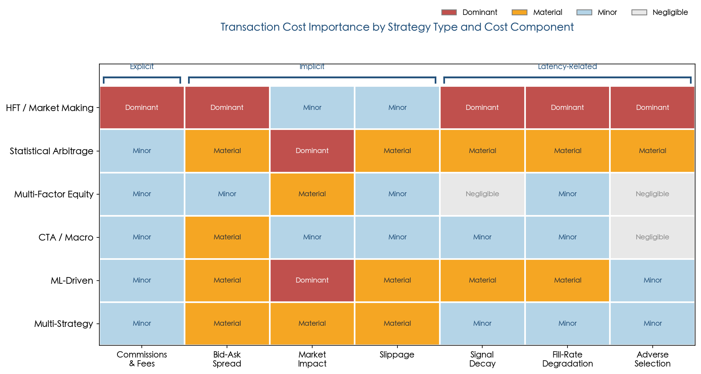

**Figure 4.1 | Transaction Cost Importance Matrix.** The heatmap maps six strategy families against seven cost sub-components, rated by importance (Dominant / Material / Minor / Negligible). For HFT and market-making strategies, latency-related costs (signal decay, fill-rate degradation, adverse selection) and the bid-ask spread dominate. For statistical arbitrage and ML-driven strategies, market impact emerges as the dominant cost. Multi-factor equity strategies, operating at lower turnover, face a more evenly distributed cost profile with market impact remaining material but no single component dominant.

## 4.2 Market Impact Models

Market impact—the price change attributable to a strategy's own trading activity—is the single largest implicit cost for most institutional quantitative strategies and the most theoretically rich component of the cost taxonomy. This section surveys four generations of impact modeling, from linear permanent-temporary decomposition through contemporary machine-learning approaches.

### 4.2.1 The Almgren-Chriss Framework

The foundational framework for optimal execution was developed by Almgren & Chriss (1999/2001), who cast the problem as a mean-variance optimization over the execution trajectory. An investor seeking to liquidate $X$ shares over a time horizon $T$ faces a trade-off between price risk (volatility exposure from slow execution) and market impact cost (the concession from fast execution). The model decomposes impact into two components:

- **Permanent impact** $g(v)$: an irreversible shift in the equilibrium price caused by the information content of the trade, modeled as $g(v) = \gamma v$ (linear in trade rate $v$).
- **Temporary impact** $h(v)$: a transient price concession required to attract immediate liquidity, modeled as $h(v) = \varepsilon + \eta v$ (affine in trade rate).

Under these assumptions, the optimal execution trajectory takes the closed-form solution:

$$x_j = \frac{\sinh(\kappa(T - t_j))}{\sinh(\kappa T)} \cdot X$$

where $\kappa$ is a risk-urgency parameter balancing variance aversion against impact costs [Almgren & Chriss (1999)](https://quantitativebrokers.com/s/Optimal-Execution-of-Portfolio-Transaction-_-AlmgrenChriss-1999.pdf "Almgren-Chriss 1999 working paper"). This elegant result provides a continuum of strategies: $\kappa \to 0$ yields the TWAP trajectory (minimizing impact), while $\kappa \to \infty$ yields immediate execution (minimizing variance).

### 4.2.2 Empirical Calibration: From Linear Assumptions to the Three-Fifths Power Law

The Almgren-Chriss framework assumes linear impact functions, a choice motivated by the no-arbitrage argument of Huberman & Stanzl (2004), who proved that nonlinear permanent impact permits price manipulation strategies. However, the empirical behavior of temporary impact deviates systematically from linearity.

Almgren, Thum, Hauptmann & Li (2005) calibrated the Almgren-Chriss model on approximately 700,000 US equity orders from Citigroup brokerage desks over a 19-month period (December 2001 – June 2003). After filtering for S&P 500 constituents and excluding small orders, the final dataset comprised 29,509 institutional orders. Their nonlinear regression estimated the power-law exponents for permanent and temporary impact:

$$\alpha = 0.891 \pm 0.10, \quad \beta = 0.600 \pm 0.038, \quad \delta = 0.267 \pm 0.22$$

The permanent impact exponent $\alpha = 1$ (linearity) could not be rejected at conventional significance levels, confirming the no-arbitrage constraint. However, the temporary impact exponent $\beta = 0.600$ rejected the square-root model ($\beta = 1/2$) at the 95% confidence level, establishing a **three-fifths power law** for temporary impact. The calibrated universal coefficients were $\gamma = 0.314 \pm 0.041$ and $\eta = 0.142 \pm 0.0062$, yielding the cross-sectional cost model:

$$I = \gamma \sigma \frac{X}{V} \left(\frac{\Theta}{V}\right)^{1/4}, \quad J = \frac{I}{2} + \text{sgn}(X) \cdot \eta \sigma \left|\frac{X}{VT}\right|^{3/5}$$

where $I$ is permanent impact, $J$ is realized cost, $\sigma$ is daily volatility, $V$ is average daily volume, $\Theta$ is shares outstanding, and $T$ is execution duration in volume time. Notably, the temporary impact function requires no stock-specific liquidity adjustment beyond the volatility normalization—cost as a fraction of daily volatility depends only on shares traded as a fraction of average daily volume [Almgren et al. (2005)](https://www.cis.upenn.edu/~mkearns/finread/costestim.pdf "Direct Estimation of Equity Market Impact").

These results carry direct implications for the evaluation framework. First, any backtesting engine that applies a fixed basis-point cost uniformly across securities and order sizes will systematically misestimate execution costs—the power-law structure means that cost per share decreases with order size, but total cost increases sub-linearly. Second, the inverse-turnover factor $(\Theta/V)^{1/4}$ means that impact costs are structurally higher for low-turnover securities, penalizing strategies that trade in less liquid names.

Figure 4.2 illustrates the practical consequence of cost model selection by plotting the normalized temporary impact cost under three competing functional assumptions: the linear model, the square-root law, and the empirically calibrated three-fifths power law. At a 10% participation rate—well within the typical institutional range of 5–15%—the divergence between models is dramatic, ranging from 142 bps (linear) to 449 bps (square-root), underscoring that cost model choice is itself a first-order source of evaluation error.

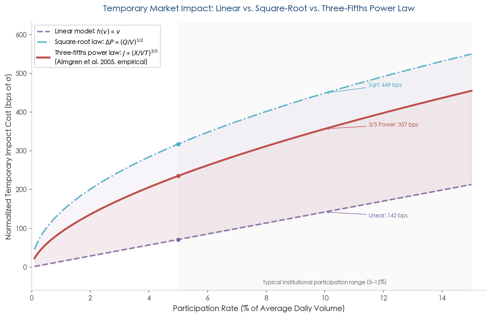

**Figure 4.2 | Nonlinear Impact Cost Curves.** Normalized temporary impact cost (in basis points of daily volatility σ) as a function of participation rate. The three-fifths power law (β ≈ 0.60, Almgren et al. 2005) lies between the linear and square-root assumptions. At 10% participation rate, the models diverge by over 300 bps, demonstrating that cost model fidelity is not a refinement but a necessity for credible strategy evaluation.

### 4.2.3 The Square-Root Law of Market Impact

While the Almgren-Chriss framework and its empirical calibration address the cost of individual execution trajectories, a separate empirical regularity governs the total price impact of large institutional "meta-orders"—the complete parent order, often executed over hours or days through multiple child orders. Kyle's (1985) lambda model predicts linear permanent impact $\Delta P = \lambda \cdot Q$, but empirical evidence across multiple markets, time periods, and asset classes consistently supports the **square-root law**:

$$\Delta P \propto \sigma \cdot \sqrt{\frac{Q}{V}}$$

where $Q$ is the meta-order size and $V$ is daily volume. Bouchaud (2024) has characterized this relationship as "perhaps the most fascinating robust empirical regularity discovered over the last 30 years" in market microstructure. Sato & Kanazawa (2024) confirmed the exponent $\delta \approx 1/2$ using Tokyo Stock Exchange identification-level data that tracked individual institutional orders from entry to completion, eliminating the order-segmentation ambiguity that plagues TAQ-based studies [Bouchaud (2024)](https://bouchaud.substack.com/p/the-square-root-law-of-market-impact "The Square-Root Law of Market Impact").

The square-root law carries profound implications for strategy capacity estimation (discussed further in Chapter 5). Because impact grows as $\sqrt{Q/V}$ rather than linearly, doubling a strategy's assets under management increases total impact cost by a factor of $\sqrt{2} \approx 1.41$ rather than 2—but the per-share alpha captured remains constant, meaning net alpha per dollar decays as $1/\sqrt{AUM}$. This nonlinear erosion defines the capacity ceiling for any impact-constrained strategy.

### 4.2.4 Propagator and Transient Impact Models

The Almgren-Chriss decomposition into permanent and temporary impact is a useful simplification, but it obscures the rich temporal dynamics of how individual trades affect subsequent prices. The propagator (or transient impact) model, developed by Bouchaud, Farmer, and Lillo, provides a more granular description by modeling the mid-price change as a weighted sum of past order-flow signs:

$$\Delta p_t = \sum_{\tau=0}^{t} G(t - \tau) \cdot \varepsilon_\tau + \text{noise}$$

where $\varepsilon_\tau \in \{-1, +1\}$ is the sign of the trade at time $\tau$ and $G(t)$ is the propagator (or impact kernel). Empirically, the kernel follows a power-law decay $G(t) \sim t^{-\beta}$ with $\beta \approx 0.5$–$0.7$, capturing the empirical observation that individual trade impact is largely transient—roughly half of the initial price displacement reverts within minutes [Taranto et al. (2016)](https://arxiv.org/abs/1602.02735 "Propagators: Transient vs. History Dependent Impact").

Said (2022) proposed a unified coarse-grained theory that derives the square-root law of meta-order impact from the power-law decay of the single-trade propagator, bridging the micro-level (individual trades) and macro-level (meta-orders) descriptions through a single parameter $\rho$ characterizing the supply-demand equilibrium. This theoretical unification is significant for the evaluation framework: it establishes that the same underlying microstructural mechanism governs both execution-trajectory costs (the Almgren-Chriss domain) and capacity-driven alpha erosion (the portfolio-level domain).

### 4.2.5 Machine Learning and Reinforcement Learning Impact Models

The most recent generation of impact models leverages machine learning to capture nonlinearities and regime-dependent behavior that parametric models miss. Abbade & Costa (2026) introduced the MACE (Market-Adaptive Cost Engine) framework, which integrates nonlinear market impact models into reinforcement learning (RL) trading environments. Their central finding was that the choice of cost model **substantively alters the ranking of RL algorithms**: under a fixed 10 basis-point cost assumption, one algorithm appeared optimal, but under the more realistic Almgren-Chriss nonlinear cost model, a different algorithm dominated. Quantitatively, switching from a fixed-cost to a calibrated nonlinear cost model reduced daily trading costs from approximately $200,000 to $8,000 and turnover from 19% to 1%—a striking demonstration that cost model fidelity is not a secondary refinement but a first-order determinant of strategy design [Abbade & Costa (2026)](https://arxiv.org/abs/2603.29086 "Realistic Market Impact Modeling for RL Trading Environments").

This result carries a direct warning for the evaluation framework: strategies evaluated under simplistic cost assumptions may exhibit performance rankings that are artifacts of the cost model rather than reflections of genuine alpha. We therefore recommend that any framework-compliant backtest employ at minimum a nonlinear cost model calibrated to the target execution venue.

Figure 4.3 provides a structured comparison of the four generations of market impact models surveyed in this section, highlighting the trade-offs across functional form, parameterization, and applicability.

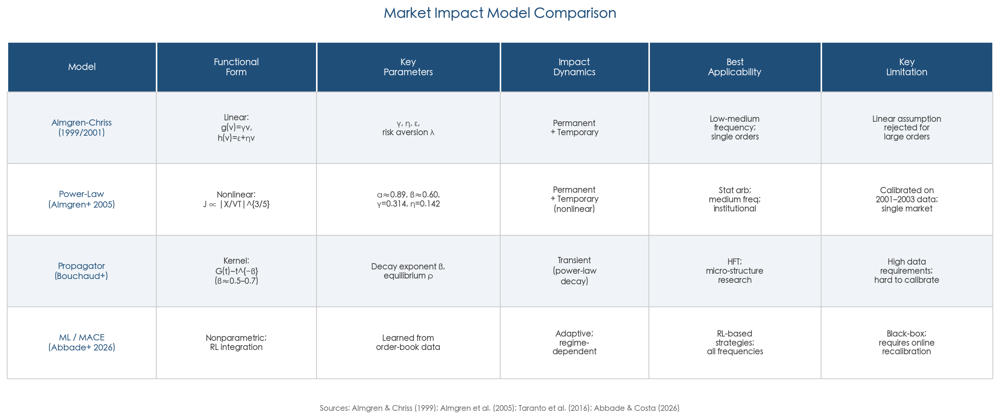

**Figure 4.3 | Market Impact Model Comparison.** Four model families are compared across six dimensions: functional form, key parameters, impact dynamics, best applicability, and key limitations. The progression from the linear Almgren-Chriss framework to the ML-based MACE framework reflects increasing modeling flexibility at the cost of interpretability and calibration complexity. Sources: Almgren & Chriss (1999); Almgren et al. (2005); Taranto et al. (2016); Abbade & Costa (2026).

## 4.3 Execution Quality Benchmarks and Transaction Cost Analysis

Market impact models provide the theoretical apparatus for predicting execution costs; execution quality benchmarks provide the empirical apparatus for measuring them after the fact. The gap between predicted and realized costs—and the systematic patterns within that gap—constitutes the execution quality assessment that any comprehensive strategy evaluation framework must incorporate.

### 4.3.1 Implementation Shortfall

Implementation Shortfall (IS), introduced by Perold (1988), is defined as the difference between the return on the paper portfolio—the portfolio the strategy intended to hold—and the return on the actual portfolio realized after execution frictions:

$$IS = R_{\text{paper}} - R_{\text{actual}}$$

Hendershott, Jones & Menkveld (2013) decomposed IS into three economically interpretable components: (1) **liquidity cost**—the direct cost of consuming liquidity at prevailing market prices; (2) **information cost**—the adverse price movement between order arrival and execution attributable to the information content of the order flow; and (3) **timing cost**—the price change between the decision point and order submission, reflecting execution delay. In their empirical analysis, total IS of 262 basis points decomposed into 48 bps of liquidity cost, 219 bps of information cost, and −5 bps of timing cost (a small gain from favorable timing) [Hendershott et al. (2013)](https://faculty.haas.berkeley.edu/hender/chapter_ELOv5.pdf "Implementation Shortfall with Transitory Price Effects").

For the evaluation framework, IS is the most theoretically grounded execution benchmark because it captures the full economic cost of the gap between investment intention and realization. However, the dominance of the information component in the Hendershott decomposition highlights a fundamental tension: strategies that trade on genuine information will always exhibit high IS precisely because the market moves in the direction of their trades. Disentangling "cost" from "information revelation" remains an open challenge in execution quality assessment.

### 4.3.2 VWAP, TWAP, and Participation-Rate Benchmarks

In practice, institutional execution desks and their evaluators rely on a family of volume- and time-weighted benchmarks:

- **Arrival Price (AP)**: the mid-quote at the moment the order reaches the execution venue. IS measured against AP captures total market impact, including both permanent and temporary components.
- **Volume-Weighted Average Price (VWAP)**: the average price across all market transactions during the execution window, weighted by volume. Beating VWAP indicates better-than-average timing relative to the market's aggregate flow.
- **Time-Weighted Average Price (TWAP)**: the simple time average of prices during the execution window. TWAP benchmarks are appropriate for strategies that prioritize execution uniformity over volume-linked participation.
- **Participation Rate (POV)**: the fraction of market volume that the strategy's orders represent. A POV constraint of 5–15% of average daily volume serves as a standard guardrail to limit self-impact.

Talos (2025) reported that across more than 1,000 parent orders representing approximately $10 billion in notional value, a TWAP execution algorithm achieved arrival slippage of 13 basis points while outperforming both the market TWAP and VWAP benchmarks over the same windows [Talos (2025)](https://www.talos.com/insights/execution-insights-through-transaction-cost-analysis-tca-benchmarks-and-slippage "Talos – TCA Benchmarks and Slippage, April 2025"). This illustrates an important subtlety: a strategy can simultaneously exhibit positive slippage relative to arrival price (a cost) and negative slippage relative to VWAP (an outperformance), depending on the benchmark chosen. The evaluation framework should therefore require reporting against multiple benchmarks, with the choice of primary benchmark matched to the strategy's execution objective.

### 4.3.3 The TCA Industry Ecosystem

Transaction Cost Analysis has evolved from a compliance afterthought into a core analytics function within institutional trading. TT TCA (formerly Abel Noser Solutions) processes approximately $50 trillion in annual trade principal and in 2026 received the TradingTech Insight Europe award for Best TCA Tool [Trading Technologies (2026)](https://www.prnewswire.com/news-releases/trading-technologies-wins-best-tca-tool-and-best-sell-side-oms-at-tradingtech-insight-europe-awards-2026-302699498.html "TT wins Best TCA Tool 2026"). OneTick has integrated ML/MLOps pipelines for predictive cost modeling, receiving the 2025 RegTech Insight Europe award for Best TCA Solution. Other major providers—including Virtu Analytics, BestX, and KX—offer real-time and post-trade analytics spanning equities, fixed income, and derivatives.

The institutional TCA ecosystem is relevant to the evaluation framework because it defines the data infrastructure on which execution quality assessments depend. A strategy that lacks access to granular TCA data—timestamped order-by-order execution reports, venue-level fill rates, queue-position analytics—cannot produce a credible execution quality score. Framework compliance should therefore require minimum TCA data standards: per-order arrival price, execution price, fill rate, and venue breakdown.

## 4.4 Transaction Costs Across Strategy Frequencies

Transaction costs are not a fixed parameter but a function that varies by orders of magnitude across the strategy frequency spectrum. This section maps the cost structure to each of the strategy families defined in Chapter 1, drawing on the cost importance matrix presented in Figure 4.1.

### 4.4.1 High-Frequency Trading and Market Making

For HFT strategies, explicit costs (exchange fees, rebates, and clearing charges) and the bid-ask spread constitute the dominant cost components. Gross alpha per trade is measured in fractions of a basis point, and profitability depends on capturing the spread thousands of times per day with minimal adverse selection. The relevant cost metric is not impact per order but rather net spread capture after exchange fees and adverse selection losses. Latency costs—measured in microseconds—represent the binding constraint: a 10-microsecond disadvantage in order-to-execution latency can shift a market-making strategy from profitable to unprofitable. The global HFT market generated $10.36 billion in revenue in 2024, with market making accounting for 72.3% of that total; the sector is projected to reach $16.03 billion by 2030 at a compound annual growth rate of 7.7%, underscoring the economic significance of execution quality at this frequency [Grand View Research](https://www.grandviewresearch.com/industry-analysis/high-frequency-trading-market-report "Grand View Research HFT Market Report, 2025–2030").

### 4.4.2 Statistical Arbitrage and Intraday Strategies

Statistical arbitrage strategies typically hold positions for hours to days, with daily turnover in the range of 20–100% of portfolio value. The primary cost concern is the temporary market impact of rapid position entry and exit, particularly during crowded unwinds when multiple stat-arb strategies simultaneously reverse correlated positions. The Almgren et al. (2005) three-fifths power law is directly applicable in this domain: at high participation rates (above 5% of daily volume), temporary impact costs rise steeply, compressing net alpha (see Figure 4.2). Fill-rate degradation is also material—strategies relying on passive (limit order) execution face the adverse selection trap, where fills cluster disproportionately on the wrong side of the market.

### 4.4.3 Multi-Factor and Systematic Equity Strategies

Monthly-rebalanced multi-factor strategies operate at substantially lower turnover (typically 50–200% annually), and for these strategies the key empirical finding is that of Novy-Marx & Velikov (2016, RFS). Their comprehensive analysis of anomaly-based strategies found that anomalies with monthly turnover below 50% generally survive transaction costs, while those with higher turnover rarely do. Critically, they also demonstrated that the gap between academic cost estimates (based on TAQ data) and actual institutional execution costs is enormous: AQR's realized trading costs were approximately one order of magnitude lower than academic TAQ-based estimates, implying a momentum strategy breakeven capacity of $56.16 billion versus the roughly $5 billion suggested by academic models [Novy-Marx & Velikov (2016)](https://academic.oup.com/rfs/article-abstract/29/1/104/1844518 "A Taxonomy of Anomalies and Their Trading Costs, RFS").

This finding carries direct implications for the evaluation framework: cost assumptions in backtests must be calibrated to institutional-grade execution capability, not to theoretical or TAQ-derived estimates. A framework that relies on academic cost estimates will systematically reject viable strategies and misrank strategy capacity.

### 4.4.4 CTA and Macro Strategies

CTA and trend-following strategies trade liquid futures markets with moderate turnover (typically 500–2,000% annually in notional terms, reflecting the leverage inherent in futures contracts). Transaction costs in exchange-traded futures are dominated by the bid-ask spread and exchange fees; market impact is generally lower than in equities owing to the deep liquidity of major futures contracts. However, the concentrated nature of CTA positioning—where a large fraction of systematic trend followers hold similar positions in the same contracts—creates an endogenous liquidity risk: during trend reversals, the simultaneous unwinding of correlated positions can temporarily exhaust available liquidity, generating impact costs far exceeding steady-state estimates. This crowding-driven tail risk in execution costs parallels the crowding-driven left-tail return risk discussed in Chapter 3.

## 4.5 From Execution Theory to Portfolio-Level Cost Management

The market impact models surveyed in Section 4.2 address the cost of executing a single order in isolation. In practice, a quantitative portfolio manager optimizes across dozens or hundreds of securities simultaneously, rebalancing continuously as signals evolve. The gap between single-order execution theory and multi-period portfolio optimization is bridged by the Gârleanu & Pedersen (2013) framework, which provides a closed-form optimal dynamic portfolio policy under quadratic transaction costs.

### 4.5.1 The Gârleanu-Pedersen "Aim in Front of the Target" Framework

Gârleanu & Pedersen (2013) model security excess returns as $r_{t+1} = Bf_t + u_{t+1}$, where $f_t$ is a vector of return-predicting factors that mean-revert according to $\Delta f_{t+1} = -\Phi f_t + \varepsilon_{t+1}$ (with mean-reversion matrix $\Phi$), and transaction costs are quadratic: $TC(\Delta x_t) = \frac{1}{2}\Delta x_t^\top \Lambda \Delta x_t$, where $\Lambda$ is a Kyle's-lambda matrix capturing the price impact of portfolio trades. The investor maximizes the present value of risk-adjusted excess returns net of trading costs.

The optimal portfolio policy is characterized by two principles:

1. **Trade partially towards the aim**: The optimal portfolio $x_t$ is a weighted average of the existing portfolio $x_{t-1}$ and an "aim portfolio": $x_t = (1-a)x_{t-1} + a \cdot aim_t$, where the trading rate $a < 1$ is decreasing in transaction costs and increasing in risk aversion.

2. **Aim in front of the target**: The aim portfolio is not the current Markowitz portfolio but a weighted average of the current and all expected future Markowitz portfolios: $aim_t = \sum_{\tau=t}^{\infty} z(1-z)^{\tau-t} E_t[Markowitz_\tau]$, where the weight $z = \rho/(\rho + a)$ on the current portfolio decreases with transaction costs.

The critical insight for the evaluation framework is that **return predictors with slower alpha decay receive higher weight in the aim portfolio**. Under the natural assumption that $\Phi$ is diagonal, the aim portfolio simplifies to the Markowitz portfolio with each factor $f_k$ scaled by $1/(1 + \phi_k/(a\rho))$, where $\phi_k$ is factor $k$'s mean-reversion speed. Factors exhibiting fast alpha decay (e.g., a 5-day momentum signal with a half-life of 2.4 days) are aggressively downweighted, while persistent signals (e.g., a 5-year value signal with a half-life of 700 days) retain nearly full weight [Gârleanu & Pedersen (2013)](https://nbgarleanu.github.io/DynTrad.pdf "Dynamic Trading with Predictable Returns and Transaction Costs, Journal of Finance").

Empirically, Gârleanu & Pedersen implemented the optimal dynamic strategy for commodity futures and found that its net Sharpe ratio was approximately 20% higher than that of the best static (single-period) transaction-cost-adjusted strategy. The outperformance arose precisely from the differential treatment of signal persistence: the dynamic strategy traded aggressively on the persistent 1-year and 5-year signals while minimizing turnover on the fast-decaying 5-day signal.

### 4.5.2 Implications for the Evaluation Framework

The Gârleanu-Pedersen framework transforms how the evaluation framework must assess transaction cost efficiency. It is not sufficient to measure whether a strategy exhibits low realized execution costs; the framework must also assess whether the strategy's **trading rule is cost-aware in its design**. Three criteria are central:

- **Signal-cost alignment**: Does the strategy weight return-predicting signals in proportion to their persistence relative to transaction costs? A strategy that trades aggressively on fast-decaying signals (high $\phi_k$) incurs unnecessary turnover and destroys net alpha.
- **Trading rate calibration**: Is the strategy's rebalancing frequency calibrated to the prevailing cost environment? Over-trading (rebalancing too frequently) destroys alpha through impact; under-trading (rebalancing too infrequently) allows positions to drift from optimality.
- **Capacity-cost feedback**: As AUM grows, does the strategy's optimizer adjust its trading rate and signal weights to reflect the increased impact footprint? Strategies that lack this adaptive mechanism face an invisible capacity ceiling.

These criteria elevate transaction cost assessment from a passive post-trade measurement to an active evaluation of strategy design quality.

## 4.6 Best Practices for Embedding Transaction Costs in Backtests

The preceding analysis converges on a set of minimum standards for transaction cost modeling within the evaluation framework's backtesting layer:

1. **Employ nonlinear cost models.** Fixed basis-point assumptions (e.g., "10 bps per trade") systematically misrepresent cost for both small orders (overcounting) and large orders (undercounting). At minimum, a power-law temporary impact function calibrated to the target market—such as the $\beta \approx 3/5$ exponent of Almgren et al. (2005)—should be employed.

2. **Model the strategy's own permanent impact.** The permanent component of market impact shifts the equilibrium price against the strategy. Backtests that ignore this effect overestimate subsequent-period returns for positions that have not yet been fully entered or exited.

3. **Prevent look-ahead bias in cost estimation.** Cost model parameters (spread estimates, volume profiles, volatility) must be estimated using only data available at the time of the simulated trade decision, not future-realized values.

4. **Simulate fill-rate degradation.** Passive execution strategies (limit orders) should model the probability of non-fill and the cost of subsequent aggressive execution. Assuming 100% fill rates at the limit price introduces an optimistic bias.

5. **Constrain participation rate.** Strategy backtests should limit the simulated participation rate to 5–15% of the security's average daily volume. Strategies that require participation rates above this range in backtesting are signaling capacity constraints that must be explicitly flagged.

6. **Account for crowding-driven impact amplification.** For strategies that trade in the same direction as a large fraction of systematic capital (e.g., momentum, low-volatility), steady-state impact estimates understate costs during crowded entry or forced exit. Scenario-based stress multipliers on standard cost estimates—analogous to the stress testing protocols of Chapter 3—are appropriate.

These six standards, taken together, define the minimum rigor required for a strategy's backtest to be considered framework-compliant from an execution quality perspective.

## 4.7 Synthesis: The Cost Assessment Pillar in the Composite Framework

This chapter has established that transaction costs constitute a multi-layered, frequency-dependent, and nonlinearly scaling dimension of quantitative strategy performance—one that cannot be reduced to a single number. The evaluation framework's cost assessment pillar therefore operates at three hierarchical levels:

**Level 1: Cost Accounting.** Explicit costs (commissions, fees) and realized implicit costs (spread, slippage) are measured via TCA infrastructure, benchmarked against arrival price, VWAP, and TWAP. This level produces the Implementation Shortfall metric and its decomposition.

**Level 2: Cost Modeling.** Predicted costs are computed using a calibrated nonlinear impact model (Almgren-Chriss with power-law extensions or propagator models), enabling pre-trade cost estimation and capacity analysis. The square-root law provides the link between current costs and the strategy's scalability ceiling.

**Level 3: Cost-Aware Design Assessment.** Drawing on the Gârleanu-Pedersen framework, the evaluator assesses whether the strategy's signal weighting, rebalancing frequency, and position sizing are jointly optimized for the prevailing cost environment. This level distinguishes between strategies that are merely low-cost and strategies that are intelligently designed to minimize the cost-alpha trade-off.

The three-level structure ensures that transaction cost assessment is not a single-pass filter but a multi-resolution evaluation, sensitive to the distinct cost structures and optimization challenges faced by each strategy family—from HFT market makers, where microsecond latency is the binding constraint, to systematic multi-factor portfolios, where the persistence-weighted aim portfolio of Gârleanu-Pedersen determines net performance over multi-year horizons. The cost parameters estimated in this chapter—impact exponents, universal coefficients, participation rate constraints—feed directly into the composite scoring methodology of Chapter 7, where they are operationalized as the "Transaction Cost Efficiency" pillar of the multi-dimensional evaluation score.

# Regime Adaptability, Robustness, and Strategy Capacity Evaluation

The preceding chapters have constructed evaluation tools that assume—implicitly or explicitly—a single, stable data-generating process. Risk-adjusted return metrics (Chapter 2) are computed over full sample periods; tail-risk measures (Chapter 3) aggregate extreme events across heterogeneous market environments; and transaction cost models (Chapter 4) calibrate impact parameters to pooled trade data. Financial markets, however, do not operate in a single regime. Bull markets characterized by compressed volatility and persistent positive drift alternate with crisis episodes of spiking correlations, liquidity withdrawal, and regime-dependent factor payoffs. A quantitative strategy that delivers a Sharpe ratio of 2.0 during steady expansion may produce a conditional Sharpe below zero during a regime shift—and neither the unconditional metric nor the full-sample tail-risk statistic reveals this vulnerability. The 2018–2020 quantitative crisis, in which momentum factor gains failed for the first time in 50 years to compensate value factor losses over a 27-month drawdown of approximately −29% [Blitz (2021)](https://www.robeco.com/docm/docu-202102-the-quant-crisis-of-2018-2020-cornered-by-big-growth.pdf "The Quant Crisis of 2018–2020, JPM"), and the April 2025 "Liberation Day" tariff shock that inflicted a 2.7% single-month loss on macro hedge funds [Reuters (2025)](https://www.reuters.com/business/finance/macro-hedge-funds-mauled-april-mcgeever-2025-05-08/ "Macro hedge funds mauled in April 2025"), underscore the inadequacy of regime-blind evaluation.

This chapter introduces the regime dimension into the evaluation framework. The analysis proceeds in four stages. First, we formalize market regime identification using Hidden Markov Models (HMMs), change-point detection algorithms, and machine-learning clustering methods, establishing a taxonomy of detectable market states. Second, we define conditional performance and robustness metrics—conditional Sharpe ratios, regime-transition decay measures, and conditional drawdown statistics—that evaluate strategy behavior within and across regimes. Third, we address strategy capacity: the relationship between assets under management and alpha erosion, and the mechanisms through which capacity constraints interact with regime conditions. Fourth, we synthesize these elements into a structured robustness evaluation protocol that integrates with the composite scoring methodology developed in the final chapter.

## 5.1 Market Regime Identification: Methods and Taxonomy

### 5.1.1 The Hamilton Regime-Switching Framework

The foundational approach to market regime modeling is the Markov-switching model introduced by Hamilton (1989). The framework posits that observed financial variables $y_t$ are governed by a latent discrete-state Markov chain $s_t \in \{1, \ldots, L\}$ with transition probability matrix $P = (p_{\iota\ell})$, where $p_{\iota,\ell} = \Pr(s_{t+1} = \iota \mid s_t = \ell)$. Conditional on the regime, the data follow a parametric distribution—typically multivariate normal—with regime-specific means $\mu_{y,s_t}$ and covariance matrices $V_{y,s_t}$. Filtered regime probabilities $\xi_{j,t} = \Pr(s_t = j \mid \Omega_t; \theta)$ are computed via matrix recursion, and the framework extends to $N$ states and vector observations without increasing computational complexity class [Hamilton (2005)](https://econweb.ucsd.edu/~jhamilto/palgrav1.pdf "Regime-Switching Models, Palgrave Dictionary").

A two-state specification—bull and bear—remains the empirical workhorse. Ahmed, Robotti, Tsvetanov, and Ye (2024) estimate a two-regime model on US factor returns from 1972 to 2021, finding that the bull state exhibits a self-transition probability of $p_{11} = 0.94$ (average duration 18 months), while the bear state has $p_{22} = 0.80$ (average duration 5 months), with steady-state probabilities of approximately 78% bull and 22% bear. Factor volatilities in the bear regime are roughly double those in the bull regime, and the bear regime's empirical probability peaks align closely with NBER recession dates [Ahmed et al. (2024)](https://www.cesarerobotti.com/wp-content/uploads/2024/10/Comparing_factor_models_under_regime_switching.pdf "Comparing Factor Models under Regime Switching, working paper").

The Hamilton framework's principal strength lies in its probabilistic infrastructure: it produces smooth, continuously updated regime probability estimates that can be consumed directly by downstream portfolio construction and risk management systems. Its primary limitation is the assumption of a fixed, finite number of states with time-homogeneous transition probabilities—an assumption vulnerable to failure during structural breaks (e.g., the post-2008 zero-interest-rate environment) or when the market enters a novel regime type absent from the training sample.

### 5.1.2 Machine-Learning Approaches to Regime Classification

Data-driven clustering methods relax the parametric distributional assumptions of the Hamilton model while retaining the core idea of latent-state identification. Two prominent approaches illustrate the current state of the art.

**Gaussian Mixture Models and factor-lens clustering.** Two Sigma (2021) applies GMM clustering to a 17-dimensional factor lens—spanning equity momentum, credit spreads, commodity carry, and macroeconomic indicators—to identify four data-driven market states from 1971 onward: *Crisis*, *Steady State*, *Inflation*, and *Walking on Ice*. The Steady State regime occurs most frequently; the Crisis state captures episodes of simultaneous equity drawdown and credit spread widening. The advantage of this approach is that regimes are defined by the joint behavior of multiple asset classes rather than by a single equity index, yielding classifications more relevant for multi-asset quantitative strategies [Two Sigma (2021)](https://www.twosigma.com/articles/a-machine-learning-approach-to-regime-modeling/ "A Machine Learning Approach to Regime Modeling").

**$t$-distribution mixture models with GARCH dynamics.** State Street Global Advisors (SSGA) advances the methodology in a February 2025 study by combining $t$-distribution mixture models—which accommodate fatter tails than Gaussian mixtures—with GARCH volatility dynamics and a 23-feature input set including CDS spreads, option skew, and the Baker-Wurgler economic uncertainty index. Applied to US data from 1995 to 2024, the model identifies four regimes: Emerging Expansion (42.3% of observations), Robust Expansion (25.4%), Cautious Decline (19.2%), and Market Turmoil (13.2%). The Market Turmoil regime achieves an F1 score of approximately 73–78% in detecting NBER recessions and S&P 500 maximum drawdown episodes [SSGA (2025)](https://www.ssga.com/library-content/assets/pdf/global/pc/2025/decoding-market-regimes-with-machine-learning.pdf "Decoding Market Regimes with Machine Learning"). The regime-conditional return distributions differ dramatically: US equities average +2.1% to +2.9% monthly in expansion regimes versus −3.4% in the Turmoil state, with return dispersion in Turmoil approximately double that of expansion states.

### 5.1.3 Change-Point Detection and Topological Methods

Where HMMs and clustering assume recurrent regime types, change-point detection methods identify structural breaks without requiring that the data revisit previous states.

The PELT (Pruned Exact Linear Time) algorithm achieves $O(n)$ computational complexity for exact multiple change-point detection by pruning candidate change-point locations that provably cannot improve the cost function. A 2025 ACM study optimizes PELT's penalty parameter specifically for financial time series, demonstrating improved detection accuracy relative to standard BIC penalties [ACM (2025)](https://dl.acm.org/doi/10.1145/3773365.3773532 "Change-Point Detection in Financial Time Series Using PELT").

Complementing parametric change-point methods, topological data analysis (TDA) offers a model-free alternative. A 2025 study published in *MDPI Systems* applies persistent homology to financial time series, successfully detecting four extreme events—the 2011 European sovereign debt crisis, 2016 Brexit, 2020 COVID crash, and 2022 rate-hiking shock—through the evolution of topological features (connected components and loops) in point-cloud representations of market data [MDPI Systems (2025)](https://www.mdpi.com/2079-8954/13/10/875 "Change Point Detection Using TDA").

For the evaluation framework, we recommend a layered architecture: HMM-based regime classification serves as the primary method, providing probabilistic regime assignments suitable for conditional metric computation. PELT or TDA-based change-point detection operates as a supplementary structural-break diagnostic, flagging potential model misspecification when HMM posterior probabilities display persistent ambiguity.

### 5.1.4 Regime Taxonomy for Cross-Strategy Evaluation

Drawing on the empirical evidence above, we propose a four-state regime taxonomy for the evaluation framework, designed to align with the four-scenario stress-testing protocol introduced in Chapter 3:

| Regime | Defining Characteristics | Historical Exemplars | Mapping to Ch. 3 Stress Scenarios |
|--------|--------------------------|---------------------|-----------------------------------|
| **Steady Expansion** | Positive equity drift, below-average volatility, stable cross-asset correlations | 2013–2019, 2021 | Baseline (no stress) |
| **Inflation / Rate Shock** | Rising rates, bond-equity correlation inversion, factor rotation | 2022 Fed tightening cycle | Scenario 3: Rate Shock |
| **Liquidity Crisis** | Credit spread blowout, correlation spike, funding stress | 2008 GFC, 2020 March COVID | Scenarios 1 & 2: GFC / COVID |
| **Policy / Geopolitical Shock** | Exogenous policy discontinuity, model-breaking structural change | 2025 "Liberation Day" tariffs | Scenario 4: Tariff / Geopolitical |

Figure 5.1 illustrates the smoothed posterior probabilities of these four regimes over the 2005–2025 period, estimated using a Hamilton (1989) HMM framework. The time-evolution of regime probabilities reveals sharp spikes in Liquidity Crisis probability during the 2008 GFC and 2020 COVID crash, a sustained elevation of the Inflation/Rate Shock state throughout the 2022–2023 Fed tightening cycle, and a discrete pulse of Policy/Geopolitical Shock probability coinciding with the April 2025 "Liberation Day" tariff announcement. SSGA's unconditional regime frequencies—Expansion 67.7%, Cautious Decline 19.2%, Market Turmoil 13.2%—provide a broadly consistent benchmark [SSGA (2025)](https://www.ssga.com/library-content/assets/pdf/global/pc/2025/decoding-market-regimes-with-machine-learning.pdf "Decoding Market Regimes with Machine Learning").

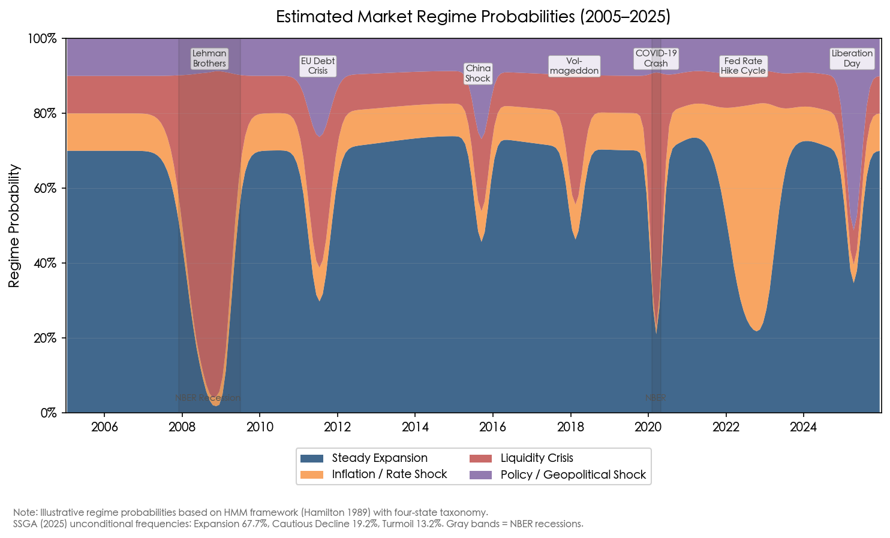

This taxonomy is not intended as the definitive classification but as a standardized reference grid that enables cross-strategy conditional performance comparison within the framework.

## 5.2 Conditional Performance Metrics and Robustness Measures

### 5.2.1 Conditional Sharpe Ratio: Theory and Empirical Evidence

The conditional Sharpe ratio is defined as:

$$S_t \equiv \frac{E_t(R - R_f)}{SD_t(R - R_f)}$$

where $E_t(\cdot)$ and $SD_t(\cdot)$ denote the conditional mean and standard deviation given the information set at time $t$. Tang and Whitelaw (2011) estimate monthly conditional Sharpe ratios for the US equity market over an extended sample and document a range of approximately −0.2 to 0.9, corresponding to annualized peak-to-trough variation exceeding 0.85. Critically, the conditional mean—not conditional volatility—is the primary driver of time-variation in the Sharpe ratio, contradicting the widespread intuition that Sharpe variation is predominantly a volatility phenomenon [Tang & Whitelaw (2011)](https://pages.stern.nyu.edu/~rwhitela/papers/tvsharpe.pdf "Time-Varying Sharpe Ratios and Market Timing").

Ahmed et al. (2024) demonstrate that this time-variation has profound implications for model and strategy evaluation. They prove formally that the unconditional squared Sharpe ratio is **not** an appropriate metric for comparing factor models when returns are subject to regime switches: even when alphas are zero in every individual regime, the unconditional Sharpe ratio can be non-zero due to a bias term $\gamma' \tilde{V}_{r \cdot f}^{-1} \gamma$ arising from regime-dependent factor loadings. Conditional on a given regime, however, the squared Sharpe ratio remains a valid comparison metric. Their empirical results reveal a striking asymmetry: the Fama-French six-factor model with cash profitability significantly outperforms alternatives in the bull regime, but **no model outperforms any other** in the bear regime—performance differentiation collapses precisely when risk management matters most [Ahmed et al. (2024)](https://www.cesarerobotti.com/wp-content/uploads/2024/10/Comparing_factor_models_under_regime_switching.pdf "Comparing Factor Models under Regime Switching, working paper").

For the evaluation framework, this result mandates that strategy comparison be conducted regime-by-regime rather than on pooled data. We define the **Regime-Conditional Sharpe Matrix** as:

$$\mathbf{S} = \{S_{i,\ell}\}_{i=1,\ldots,N; \ \ell=1,\ldots,L}$$

where $S_{i,\ell}$ is the conditional Sharpe ratio of strategy $i$ in regime $\ell$. This matrix, rather than a single scalar Sharpe, constitutes the primary risk-adjusted return input to the composite scoring framework developed in Chapter 7.

### 5.2.2 Regime-Conditional Factor Performance: Evidence of Regime Dependence

The case for regime-conditional evaluation is reinforced by robust evidence that individual factor premia are strongly regime-dependent. SSGA's four-regime analysis shows that US equities deliver average monthly returns of +2.1% to +2.9% in expansion states but −3.4% in the Turmoil regime; long-duration US Treasuries, by contrast, average +1.11% monthly in Turmoil—providing the "crisis alpha" traditionally attributed to CTA/trend-following allocations [SSGA (2025)](https://www.ssga.com/library-content/assets/pdf/global/pc/2025/decoding-market-regimes-with-machine-learning.pdf "Decoding Market Regimes with Machine Learning"). These regime-conditional return differentials are sufficiently large to dominate cross-strategy ranking: a strategy with a moderate unconditional Sharpe may be preferable to a higher-Sharpe alternative if the former maintains positive conditional Sharpe during Turmoil while the latter turns deeply negative.

Singha (2025) provides a dramatic illustration of regime conditioning's value for alpha generation. By activating value and short-term reversal factors **only during drift regimes** identified by a proprietary regime filter, the study achieves an out-of-sample Sharpe ratio exceeding 13, with annualized returns of 158.6%, volatility of 12.0%, and a maximum drawdown of −11.9%. The strategy's estimated capacity, however, is only $100–500 million; at $1 billion AUM, returns compress to 33.6% [Singha (2025)](https://arxiv.org/abs/2511.12490 "Discovery of a 13-Sharpe OOS Factor, arXiv"). This example simultaneously illustrates the transformative power of regime conditioning and the severe capacity constraints that accompany concentrated, regime-dependent alpha—a theme we develop further in Section 5.3.

### 5.2.3 Regime-Transition Decay Rate and Alpha Half-Life

While the conditional Sharpe ratio captures steady-state performance within a regime, it does not measure how rapidly strategy performance degrades during regime transitions. We formalize a **regime-transition decay rate** that quantifies the cumulative alpha erosion in the $N$-day window following a regime switch.

Let $\hat{s}_{t-1} = \ell$ and $\hat{s}_t = m$ with $\ell \neq m$ denote a detected regime transition. The strategy's cumulative excess return in the post-transition window $[t, t+N]$ is $CR_{t:t+N} = \sum_{k=0}^{N} (r_{t+k} - r_{f,t+k})$. The regime-transition decay rate is then:

$$\delta_{\ell \to m}(N) = 1 - \frac{\bar{CR}_{\ell \to m}(N)}{\bar{CR}_{m}(N)}$$

where $\bar{CR}_{\ell \to m}(N)$ is the average cumulative excess return across all observed $\ell \to m$ transitions, and $\bar{CR}_{m}(N)$ is the average cumulative excess return over random $N$-day windows within regime $m$. A decay rate of $\delta = 0.40$ indicates that the strategy captures only 60% of its within-regime alpha during the first $N$ days following a transition—a quantification of adaptation lag.

This construct relates to, but is distinct from, the broader concept of **alpha half-life** in quantitative signal research. Flint and Vermaak (2023) introduce a factor half-life metric measuring how rapidly factor exposures decay over a holding period, finding that value factors exhibit half-lives of 25–33 months while momentum and investment factors decay within 1–3 months [Flint & Vermaak (2023)](https://www.pm-research.com/content/iijpormgmt/49/2/125 "Factor Information Decay: A Global Study, JPM"). The regime-transition decay rate applies an analogous logic at the strategy level: it measures the speed at which performance normalizes after an exogenous environmental shift, rather than the endogenous signal decay within a stable regime. A strategy with a low regime-transition decay rate adapts quickly to new market conditions—a property we term **regime agility**.

### 5.2.4 Conditional Drawdown and Regime Classification Reliability

The conditional drawdown metric restricts maximum drawdown computation to regime-transition windows:

$$MDD_{\ell \to m} = \max_{t \in \mathcal{T}_{\ell \to m}} \left[\sup_{s \leq t} W(s) - W(t)\right]$$

where $\mathcal{T}_{\ell \to m}$ is the set of dates within the transition buffer (e.g., 20 trading days before and after a detected regime switch). This metric isolates the drawdown exposure specifically attributable to regime change, complementing the full-sample maximum drawdown and CDaR measures defined in Chapter 3. The distinction is substantive: a strategy may exhibit an acceptable full-sample MDD yet suffer a disproportionate share of that drawdown concentrated in brief transition windows—a vulnerability invisible to unconditional tail-risk statistics.

To assess the reliability of the regime classification itself, we adopt the Regime Classification Measure (RCM):

$$RCM = 100 \times \left(1 - \frac{1}{T} \sum_{t=1}^{T} L \cdot \prod_{\ell=1}^{L} \xi_{\ell,t|T}\right)^{1/2}$$

where $\xi_{\ell,t|T} = \Pr(s_t = \ell \mid \mathcal{F}_T; \hat{\theta})$ are smoothed regime probabilities. RCM ranges from 0 (maximum classification ambiguity—posterior probabilities uniformly spread across regimes) to 100 (perfect classification—posterior probability concentrated on a single state at every point). A low RCM serves as a critical warning that conditional performance metrics may be unreliable because the underlying regime labels themselves are uncertain—a form of "upstream" model risk that propagates through all downstream conditional calculations.

### 5.2.5 Regime-Aware Validation Protocols

Regime-conditional metrics are only as trustworthy as the validation protocol that prevents information leakage. El Badraoui et al. (2026) implement a five-fold walk-forward validation protocol—four years of training, one year of validation, one year of testing—ensuring that regime posterior probabilities and sentiment features are computed strictly within the training window. Their regime-aware agent framework improves the NSGA-3 optimized Sharpe ratio from 0.780 to 1.153 ($\Delta = +0.373$), with Jobson-Korkie test significance at $p < 0.01$ [El Badraoui et al. (2026)](https://link.springer.com/article/10.1007/s41060-026-01066-0 "Toward a unified agentic framework for regime-aware portfolio optimization, 2026").

A March 2026 preprint introduces a causal Wasserstein HMM framework that imposes causal graph constraints on the regime identification process, preventing the model from exploiting future information when estimating regime probabilities—a form of look-ahead bias particularly dangerous for regime-switching strategies that condition trades on estimated state variables [arXiv 2603.04441](https://arxiv.org/abs/2603.04441 "Explainable Regime Aware Investing, March 2026"). These developments underscore a critical design principle: regime-conditional metrics must be paired with regime-aware validation protocols—including the purged cross-validation and walk-forward methods detailed in Chapter 6—to ensure that reported conditional performance is not an artifact of in-sample regime fitting.

## 5.3 Strategy Capacity Evaluation

### 5.3.1 Defining Capacity: Three Perspectives

Strategy capacity—the maximum assets under management (AUM) at which a strategy remains viable—is a dimension conspicuously absent from most performance evaluation frameworks yet critical for institutional allocation decisions. Perold and Salomon (1991) first formalized the diseconomies of scale in active management, establishing that larger positions incur greater market impact and that alpha per dollar invested declines with scale [Perold & Salomon (1991)](https://www.jstor.org/stable/4479431 "The Right Amount of Assets Under Management, FAJ").

Vangelisti (2006, GMO) refines this insight into three distinct capacity definitions:

1. **Threshold capacity** ($C_{\text{thresh}}$): the AUM at which alpha remains at or above a target minimum (e.g., the manager's hurdle rate or the investor's opportunity cost of capital).
2. **Wealth-maximizing capacity** ($C^*$): the AUM at which the product $\alpha(A) \times A$ is maximized, where $\alpha(A)$ is the alpha as a function of AUM $A$.
3. **Terminal capacity** ($C_{\text{term}}$): the AUM at which net alpha equals zero.

Vangelisti's empirical calibration on GMO's emerging-market equity strategy illustrates the practical consequences: as AUM scales from $1 billion to $20 billion, gross alpha compresses from 11.1% to 7.86% while transaction costs rise from 1.68% to 2.62%. The threshold capacity—defined as the AUM at which alpha net of costs remains above the 5% target—is approximately $22 billion [Vangelisti (2006)](https://sanfrancisco.qwafafew.org/wp-content/uploads/sites/9/2017/01/sf-20041018-vangelisti.pdf "The Capacity of an Equity Strategy, GMO").

### 5.3.2 Empirical Evidence: Fund Flows and Alpha Erosion

The theoretical prediction that capital inflows erode alpha finds strong empirical support. Naik, Ramadorai, and Stromqvist (2007) study 7,610 hedge funds across the 1994–2004 period and find that in four of eight strategy categories—relative value, directional trading, emerging markets, and fixed income—fund inflows statistically significantly precede alpha declines. A 10% annual increase in fund inflows corresponds to a subsequent monthly alpha reduction of 36–94 basis points, depending on the strategy category [Naik et al. (2007)](https://www.researchgate.net/publication/227358514_Capacity_Constraints_and_Hedge_Fund_Strategy_Returns "Capacity Constraints and Hedge Fund Strategy Returns, EFM").

The underlying mechanism is the market impact channel analyzed in Chapter 4: larger AUM necessitates larger trades, which incur nonlinear (square-root law) price impact, eroding the alpha that attracted capital in the first place. This creates a negative feedback loop—precisely the dynamic that the evaluation framework's capacity dimension is designed to detect and quantify before it destroys investor value.

### 5.3.3 Capacity by Strategy Type

Capacity constraints vary by orders of magnitude across the six strategy families defined in Chapter 1. Figure 5.2 illustrates the alpha decay curves for four representative strategy types, plotting gross alpha against AUM on a logarithmic scale and marking the Vangelisti capacity thresholds. The visual contrast between the steep HFT decay curve and the gradual multi-factor decline encapsulates the structural differences in capacity profiles.

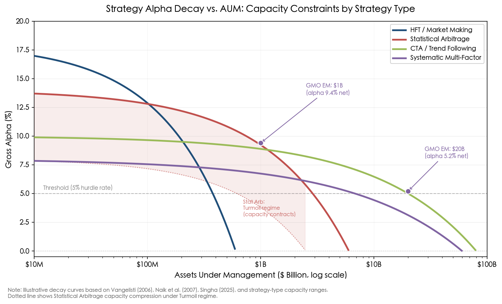

The following table summarizes the key capacity parameters for each strategy family:

| Strategy Type | Typical Capacity Range | Binding Constraint | Regime Sensitivity |
|---------------|----------------------|-------------------|-------------------|
| **HFT / Market Making** | $50M–$500M | Microstructure liquidity; tick-by-tick adverse selection; exchange-level volume ceilings | Low (alpha is liquidity provision, not directional) |
| **Statistical Arbitrage** | $500M–$5B | Pair/basket crowding; factor reversal risk; intraday liquidity depth | High (crowding stress during regime shifts) |
| **Systematic Multi-Factor** | $10B–$50B+ | Cross-sectional breadth offsets impact; slow rebalancing reduces turnover cost | Moderate (factor premia cycle with regimes) |
| **CTA / Trend Following** | $10B–$200B | Futures markets provide deep liquidity; capacity limited by open interest in less liquid contracts | Moderate (regime dependence of trend signals) |
| **ML-Driven** | $100M–$5B (signal-dependent) | Signal half-life; model retraining frequency; overfitting risk | High (model specification fragile to distributional shifts) |
| **Multi-Strategy / Hybrid** | $20B–$100B+ | Internal capital allocation across sub-strategies diversifies capacity constraints | Moderate (portfolio-level diversification buffers regime impact) |

The HFT capacity ceiling is dictated by venue-level volume and the winner-take-all dynamics of latency competition. The global HFT market generated revenues of $10.36 billion in 2024, with projections reaching $16.03 billion by 2030 at a CAGR of 7.7%; market making accounts for 72.3% of HFT revenue, and HFT firms collectively represent approximately half of global equity trading volume [Grand View Research](https://www.grandviewresearch.com/industry-analysis/high-frequency-trading-market-report "Grand View Research HFT Market Report, 2025–2030"). These revenue figures implicitly bound capacity: if aggregate HFT revenues are approximately $10 billion on roughly $50 trillion in annual equity volume, the average gross alpha is roughly 2 basis points per dollar traded—an extremely thin margin that collapses as additional capital competes for the same latency-sensitive opportunities.

At the other extreme, systematic multi-factor strategies benefit from the breadth of the cross-sectional investment universe. Novy-Marx and Velikov (2016) demonstrate that actual institutional trading costs are an order of magnitude lower than academic TAQ-based estimates, expanding the breakeven capacity of momentum strategies to $56.16 billion versus academic estimates of approximately $5 billion [Novy-Marx & Velikov (2016)](https://academic.oup.com/rfs/article-abstract/29/1/104/1844518 "A Taxonomy of Anomalies and Their Trading Costs, RFS"). This gap between academic and practitioner cost estimates—driven by differences in execution technology, order-splitting algorithms, and patient liquidity provision—implies that capacity estimates are themselves subject to significant estimation uncertainty, a consideration that motivates the probabilistic capacity surface introduced in Section 5.3.4.

### 5.3.4 Capacity–Regime Interaction

Capacity constraints are not static; they tighten materially during adverse regimes. During the 2018–2020 quantitative crisis—a 27-month period that constituted the first time in 50 years that momentum factor gains failed to compensate value factor losses—crowded multi-factor strategies experienced aggregate drawdowns of approximately −29% from peak to trough [Blitz (2021)](https://www.robeco.com/docm/docu-202102-the-quant-crisis-of-2018-2020-cornered-by-big-growth.pdf "The Quant Crisis of 2018–2020, JPM"). The mechanism was dual: factor crowding reduced effective capacity by concentrating capital in the same names, and the subsequent unwind amplified market impact as correlated liquidation compressed exit liquidity.

The April 2025 "Liberation Day" tariff shock provided a more recent illustration of capacity–regime interaction. Macro hedge funds lost 2.7% in a single month—equivalent to the March 2023 regional banking crisis drawdown [Reuters (2025)](https://www.reuters.com/business/finance/macro-hedge-funds-mauled-april-mcgeever-2025-05-08/ "Macro hedge funds mauled in April 2025"). Quantitative strategies relying on historical correlation structures faced model-breaking regime shifts as tariff announcements introduced policy discontinuities with no historical analogue. In early 2026, prime broker data indicated that systematic long-short strategies suffered their largest short-term drawdown since October in crowded positions and factor reversals [HedgeCo (2026)](https://www.hedgeco.net/news/01/2026/2026-challenging-for-quant-hedge-funds.html "2026 Challenging for Quant Hedge Funds").

We therefore propose that the evaluation framework assess capacity not as a single number but as a **capacity surface** $C(\ell, q)$, where $\ell$ denotes the market regime and $q$ denotes the percentile of the capacity distribution (reflecting estimation uncertainty). The threshold capacity in the Turmoil regime, $C_{\text{thresh}}(\text{Turmoil})$, may be a fraction of the Steady Expansion estimate $C_{\text{thresh}}(\text{Expansion})$, and this ratio—the **capacity contraction ratio**—itself becomes a robustness metric that quantifies a strategy's scalability vulnerability to regime deterioration.

## 5.4 Integrated Robustness Evaluation Protocol

### 5.4.1 Synthesizing the Metrics

The preceding sections have introduced five categories of regime-related evaluation measures. We now consolidate them into a structured protocol that can be applied consistently across strategy types:

| Metric | Symbol | Captures | Computation |
|--------|--------|----------|-------------|
| Regime-Conditional Sharpe Matrix | $\mathbf{S} = \{S_{i,\ell}\}$ | Steady-state performance in each regime | Sharpe computed on returns within classified regime windows |
| Regime-Transition Decay Rate | $\delta_{\ell \to m}(N)$ | Adaptation speed after regime change | Cumulative alpha in post-transition window vs. within-regime baseline |
| Conditional Drawdown | $MDD_{\ell \to m}$ | Tail risk during transitions | Max drawdown within ±20-day transition buffer |
| Regime Classification Measure | RCM | Reliability of regime labels | Function of smoothed posterior regime probabilities |
| Capacity Surface | $C(\ell, q)$ | Scalability by regime | Vangelisti threshold capacity estimated per regime state |

### 5.4.2 Application: Strategy-Type Robustness Profiles

Different strategy families exhibit characteristic robustness profiles under this protocol. Figure 5.3 presents a regime-conditional Sharpe ratio heatmap for six strategy types across the four regime states, synthesizing the empirical evidence discussed throughout this chapter. The color gradient—from red (negative conditional Sharpe) through white (near zero) to deep blue (high positive)—visually encodes the central finding that no single strategy dominates across all regimes, and that the choice of evaluation regime materially affects strategy ranking.

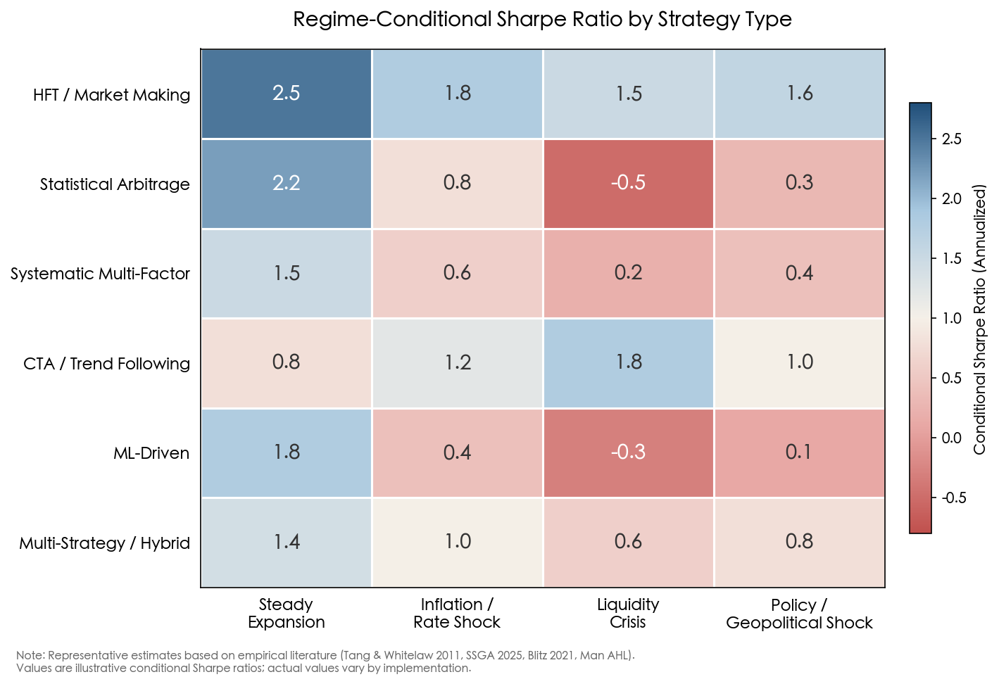

**CTA/Trend Following** strategies typically display positive conditional Sharpe in the Turmoil regime—the "crisis alpha" property documented by Man AHL, where extreme market quantiles produce the strongest trend-following performance [Man Group AHL](https://www.man.com/insights/trend-following-equity-and-bond-crisis-alpha "Trend Following: Equity and Bond Crisis Alpha"). The heatmap confirms this pattern, showing a conditional Sharpe of 1.8 in Liquidity Crisis. CTA strategies, however, exhibit elevated regime-transition decay rates during V-shaped reversals, where trend signals generate whipsaw losses as the market regime shifts from Turmoil back to Expansion faster than the signal adapts.

**Statistical Arbitrage** strategies show the opposite profile: elevated conditional Sharpe in Steady Expansion (where mean-reversion signals are reliable and liquidity is ample) but severe conditional drawdowns during Turmoil as crowded positions unwind simultaneously and cross-asset correlations spike. The heatmap assigns a conditional Sharpe of −0.5 in Liquidity Crisis, reflecting the empirical record of the 2018–2020 quantitative crisis, in which the quant factor index suffered a peak-to-trough drawdown of approximately 29% over 27 months [Blitz (2021)](https://www.robeco.com/docm/docu-202102-the-quant-crisis-of-2018-2020-cornered-by-big-growth.pdf "The Quant Crisis of 2018–2020, JPM").

**Multi-Strategy/Hybrid** approaches are designed to mitigate regime dependence through internal diversification across sub-strategy return streams. Their robustness advantage manifests in the conditional Sharpe matrix as lower variance across regimes, albeit typically with lower peak conditional Sharpe than specialized strategies. The 2025 allocation data—in which multi-strategy funds attracted the largest capital inflows among hedge fund categories, with 24% of allocators planning further increases in 2026—reflects institutional demand for precisely this regime-diversification property [BNP Paribas 2026 Hedge Fund Outlook](https://globalmarkets.cib.bnpparibas/2026-hedge-fund-outlook/ "BNP Paribas, January 2026").

### 5.4.3 Implementation Requirements and Integration with the Composite Framework

Implementing the regime-robustness evaluation protocol requires four infrastructure components:

1. **Regime identification infrastructure**: A calibrated HMM or GMM-based classifier producing real-time regime probabilities, with PELT-based structural break detection as a diagnostic overlay. The classifier should be re-estimated at regular intervals (at minimum annually) using an expanding or rolling window to absorb new regime episodes into the training data. The RCM metric defined in Section 5.2.4 provides a continuous monitoring signal for classification quality.

2. **Conditional performance computation engine**: The capability to partition historical return streams by regime classification and compute conditional Sharpe ratios, conditional drawdowns, and transition-window metrics. This requires precise alignment between the regime classifier's probability output and the return observation frequency—misalignment introduces measurement noise that degrades the discriminatory power of conditional metrics.

3. **Capacity estimation module**: Integration of the market impact models from Chapter 4—particularly the square-root law and propagator models—with AUM scenarios to produce capacity surfaces by regime. The Vangelisti three-definition framework provides the conceptual structure; the Almgren-Chriss and propagator-model cost functions provide the calibration inputs.

4. **Walk-forward validation**: All regime-conditional metrics must be computed using strictly out-of-sample regime classifications. El Badraoui et al.'s five-fold step-forward protocol—or the purged cross-validation methods detailed in Chapter 6—should be applied to ensure that regime identification does not benefit from look-ahead bias.

The regime-adaptability dimension feeds into the composite scoring methodology (Chapter 7) as one of the principal evaluation pillars. The Regime-Conditional Sharpe Matrix provides the primary quantitative input; the regime-transition decay rate and conditional drawdown provide supplementary robustness diagnostics; and the capacity surface determines whether a strategy's attractive regime profile can be implemented at the allocator's intended scale.

# Overfitting Detection, Out-of-Sample Validation, and Statistical Significance

The preceding chapters have assembled a multi-dimensional arsenal of performance metrics—risk-adjusted returns, tail-risk measures, transaction-cost models, and regime-adaptive diagnostics. Yet none of these instruments carries diagnostic value if the strategy whose performance they purport to measure was reverse-engineered from the very data on which it is evaluated. Overfitting—the extraction of spurious patterns that fail to generalize beyond the calibration sample—constitutes the single most pervasive threat to the credibility of quantitative investment research. Harvey, Liu, and Zhu documented that at least 316 factors had been proposed to explain cross-sectional equity returns by 2012, and demonstrated that most claimed findings in financial economics are likely false once multiple testing is properly accounted for [Harvey et al. (2016)](https://people.duke.edu/~charvey/Research/Published_Papers/P118_and_the_cross.PDF "…and the Cross-Section of Expected Returns, RFS"). McLean and Pontiff subsequently quantified the magnitude of this erosion: portfolio returns declined 26% out-of-sample and 58% post-publication, with approximately half of the decay attributable to data-mining bias rather than legitimate arbitrage [McLean & Pontiff (2016)](https://onlinelibrary.wiley.com/doi/abs/10.1111/jofi.12365 "Does Academic Research Destroy Stock Return Predictability?, JF"). Hou, Xue, and Zhang further corroborated the severity through systematic replication of 452 anomalies—65% failed single-test significance hurdles, a figure that rises to 82% under multiple-testing adjustments [Hou et al. (2020)](https://academic.oup.com/rfs/article-abstract/33/5/2019/5765707 "Replicating Anomalies, RFS").

This chapter constructs the **cognitive-integrity dimension** of the evaluation framework: a layered diagnostic system that any quantitative strategy must survive before its performance claims can be taken at face value. The architecture comprises five mutually reinforcing components: (1) combinatorial symmetry-based overfitting probability (CSCV/PBO), (2) the Deflated Sharpe Ratio as a parametric correction for selection bias and non-normality, (3) multiple-testing adjustments calibrated to the economics of factor discovery, (4) time-series-aware cross-validation and walk-forward protocols, and (5) emerging adversarial-robustness and explainability diagnostics for machine-learning strategies. Collectively, these components define the gatekeeping thresholds—PBO < 0.05, DSR > 0.95, factor t-statistic ≥ 3.0—that a strategy must clear before entering the composite scoring pipeline described in Chapter 7.

## Combinatorial Symmetric Cross-Validation and the Probability of Backtest Overfitting

### The CSCV Framework

The Probability of Backtest Overfitting (PBO) introduced by Bailey, Borwein, López de Prado, and Zhu provides the most rigorous non-parametric diagnostic for detecting whether a strategy selection process has mined noise rather than signal. The method begins with a T × N performance matrix, where T is the number of time-series observations and N is the number of candidate strategies (or parameter configurations) evaluated. This matrix is partitioned by rows into S contiguous sub-matrices of roughly equal length. The algorithm then exhausts all C(S, S/2) unique ways to split these sub-matrices into two halves—one designated as in-sample (IS), the other as out-of-sample (OOS). For each combination c, the procedure identifies the strategy that achieves the highest performance rank in the IS half, then records that strategy's relative rank ω̄_c in the OOS half. A logit transformation λ_c = ln[ω̄_c / (1 − ω̄_c)] maps the rank onto (−∞, +∞), and PBO is defined as the proportion of combinations for which the IS-best strategy underperforms the OOS median:

$$PBO = \int_{-\infty}^{0} f(\lambda)\,d\lambda$$

where f(λ) is the empirical density of the logit-transformed OOS relative ranks across all combinations [Bailey et al. (2017)](https://www.davidhbailey.com/dhbpapers/backtest-prob.pdf "The Probability of Backtest Overfitting, JCF").

The recommended calibration uses S = 16 sub-matrices—corresponding, for instance, to quarterly partitions of four years of daily data—which generates C(16, 8) = 12,870 distinct IS/OOS splits and hence 12,870 logit values. A PBO exceeding 0.05 signals that more than 5% of all possible data splits would select a strategy that fails to outperform the OOS median, constituting strong evidence of overfitting.

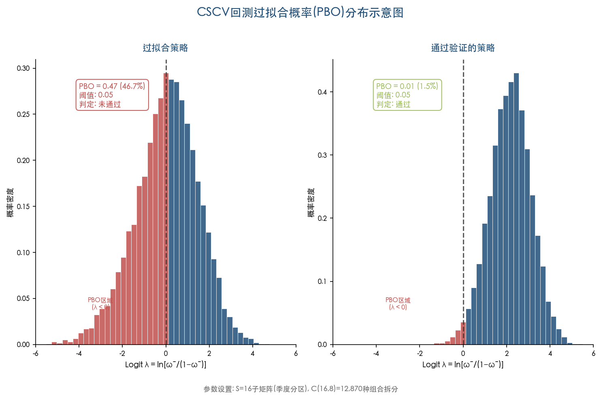

The figure above contrasts the logit-transformed OOS relative rank distributions for two stylized cases. The left panel depicts a strategy selection exercise on a pure noise data-generating process (N = 100 candidates): the resulting PBO of 0.47 far exceeds the 0.05 rejection threshold, with the red-shaded area (λ < 0) representing the 47% of combinatorial splits where the IS-best strategy underperforms the OOS median. The right panel shows a strategy with genuine predictive signal, yielding PBO = 0.01—well below the threshold—with the bulk of the distribution shifted rightward, indicating consistent OOS outperformance across data partitions.

### Diagnostic Power and Limitations

PBO's principal strength lies in its distribution-free nature: it makes no assumptions about return distributions, serial dependence structures, or strategy complexity. Because it exhausts all combinatorial splits rather than relying on a single train/test partition, it captures the full fragility surface of the selection process. Bailey et al. demonstrate through numerical simulations that when N = 100 candidate strategies are evaluated on a dataset generated from a geometric Brownian motion with zero drift—a pure noise process—the IS-best strategy routinely exhibits Sharpe ratios exceeding 1.0 in-sample, yet PBO reliably identifies the selection as spurious [Bailey et al. (2017)](https://www.davidhbailey.com/dhbpapers/backtest-prob.pdf "The Probability of Backtest Overfitting, JCF").

The framework does, however, carry inherent limitations that practitioners must acknowledge. First, it assumes temporal stationarity across sub-matrices; if the data-generating process undergoes a structural break within the sample, the combinatorial permutations will conflate genuine regime adaptation with overfitting. Second, the computational cost scales combinatorially with S: while S = 16 yields a tractable 12,870 combinations, S = 20 would require C(20, 10) = 184,756 combinations, and the choice of S implicitly governs the trade-off between granularity of temporal partitioning and combinatorial richness. Third, PBO diagnoses the *selection* process rather than any individual strategy in isolation—it requires that multiple strategies (or parameter configurations) be jointly evaluated, making it less applicable in settings where a single, theory-driven model is tested without alternatives.

## The Deflated Sharpe Ratio as a Multi-Trial Correction

### Mathematical Specification

While PBO addresses the combinatorial selection problem non-parametrically, the Deflated Sharpe Ratio (DSR) provides a complementary parametric correction that simultaneously adjusts for multiple testing, non-normality, and finite-sample estimation error. Chapter 2 examined DSR as a statistical property of the Sharpe estimator; the present discussion focuses on its diagnostic role within the overfitting detection pipeline.

The DSR is defined as:

$$DSR = \Phi\left[\frac{(\hat{SR} - SR_0)\sqrt{T-1}}{\sqrt{1 - \hat{\gamma}_3 \hat{SR} + \frac{\hat{\gamma}_4 - 1}{4}\hat{SR}^2}}\right]$$

where Φ denotes the standard normal CDF, $\hat{SR}$ is the observed Sharpe ratio, T is the number of return observations, $\hat{\gamma}_3$ and $\hat{\gamma}_4$ are the sample skewness and excess kurtosis, and $SR_0$ is the expected maximum Sharpe ratio under the null hypothesis of zero skill across K independent trials. The critical insight is that $SR_0$ grows logarithmically with K: as more strategies are tested, the bar that the observed Sharpe must clear rises accordingly [Bailey & López de Prado (2014)](https://www.davidhbailey.com/dhbpapers/deflated-sharpe.pdf "The Deflated Sharpe Ratio, JPM").

López de Prado subsequently demonstrated how to operationalize DSR when the number of independent trials is not directly observable. In a 2019 study published in the *Journal of Financial Data Science*, he proposed clustering correlated backtests to estimate an effective K, showing that 6,385 raw trials could be reduced to K = 4 independent clusters, yielding a DSR of approximately 1.0—borderline passing the 0.95 threshold [López de Prado (2019)](https://www.aqr.com/-/media/AQR/Documents/Journal-Articles/JFDS_Winter2019_A-Data-Science-Solution-to-Multiple-Testing-Crisis---Lopez_de_Prado.pdf "A Data Science Solution to the Multiple-Testing Crisis, JFDS").

### Complementarity with PBO

PBO and DSR address overlapping but distinct diagnostic questions. PBO evaluates the selection *process*—asking whether the best-performing strategy in-sample retains its superiority out-of-sample across all possible data partitions. DSR evaluates a *single strategy's* Sharpe ratio—asking whether its magnitude is statistically distinguishable from what luck alone would produce given the total number of trials conducted. In practice, these two diagnostics should be deployed in sequence: DSR first filters out strategies whose Sharpe cannot survive the multiple-testing penalty, and PBO then tests whether the surviving selection process itself exhibits overfitting. A strategy that passes DSR > 0.95 but fails PBO < 0.05 likely exploits a genuine but fragile signal that does not generalize across temporal partitions—an important diagnostic distinction that neither test alone can deliver.

### Minimum Backtest Length

A related diagnostic derived from the same analytical framework is the Minimum Backtest Length (MinBTL), which specifies the minimum number of years of backtest data required so that the expected maximum Sharpe ratio across N trials does not exceed a target threshold (typically SR = 1.0). Bailey and López de Prado demonstrate that MinBTL grows approximately as:

$$MinBTL \approx \left(\frac{E[\max_N\{SR_n\}]}{\hat{SR}}\right)^2$$

where the expected maximum Sharpe depends on the number of independent trials [Bailey & López de Prado (2014)](https://www.davidhbailey.com/dhbpapers/deflated-sharpe.pdf "The Deflated Sharpe Ratio, JPM"). For N = 50 independent strategy variants, MinBTL typically exceeds 5–7 years of daily data, rendering the common industry practice of backtesting over 2–3 years fundamentally inadequate for drawing statistically meaningful conclusions about overfitting.

## Multiple-Testing Corrections: Setting the Statistical Bar for Factor Discovery

### The t ≥ 3.0 Threshold

The most influential contribution to calibrating statistical significance in financial factor research comes from Harvey, Liu, and Zhu's comprehensive survey of 316 factors documented in 313 published papers between 1967 and 2012. The authors demonstrate that applying the conventional t ≥ 2.0 threshold to an environment where hundreds of factors have been collectively tested produces an unacceptably high false discovery rate. Their Bonferroni correction—a single-step adjustment that controls the family-wise error rate (FWER)—raises the required t-statistic to 3.78. The Benjamini-Hochberg-Yekutieli (BHY) procedure, which controls the false discovery rate (FDR) at 1%, yields a threshold of 3.39. Accounting for the additional "dark matter" of unpublished tests that never entered the literature pushes these thresholds further into the range of 3.18–3.96 [Harvey et al. (2016)](https://people.duke.edu/~charvey/Research/Published_Papers/P118_and_the_cross.PDF "…and the Cross-Section of Expected Returns, RFS").

For the evaluation framework proposed in this report, we adopt t ≥ 3.0 as the minimum threshold for accepting any new factor or signal claim. This calibration exceeds the naive 2.0 threshold by a substantial margin, remains slightly below the most conservative Bonferroni adjustment (which may be overly stringent for correlated factor tests), and aligns with the emerging consensus in quantitative finance research. A strategy whose core alpha signal cannot produce a t-statistic of at least 3.0 against a zero-alpha null hypothesis warrants heightened scrutiny before its performance metrics are admitted into the composite scoring pipeline.

### FWER versus FDR in Investment Contexts

The choice between FWER control (Bonferroni, Holm step-down) and FDR control (Benjamini-Hochberg, BHY) carries material consequences for portfolio construction. FWER procedures guard against *any* false positive among the tested hypotheses; FDR procedures tolerate a controlled proportion of false positives among rejected hypotheses. Harvey et al. argue persuasively that FWER is the appropriate standard for financial factor discovery: a single false-positive factor, if incorporated into a trillion-dollar allocation decision, can generate losses that dwarf the cost of additional statistical conservatism [Harvey et al. (2016)](https://people.duke.edu/~charvey/Research/Published_Papers/P118_and_the_cross.PDF "…and the Cross-Section of Expected Returns, RFS"). This asymmetry—where Type I errors carry far greater economic consequences than Type II errors—is a distinctive feature of investment applications that distinguishes them from the biomedical and social-science settings where FDR has become standard practice.

DSR itself functions as an FWER-class correction when interpreted within the multiple-testing framework: it computes the probability that the observed Sharpe exceeds the expected maximum across K independent trials, directly controlling the probability of erroneously accepting a spurious strategy. The triad of DSR > 0.95, factor t-statistic ≥ 3.0, and PBO < 0.05 thus provides layered FWER protection—parametric (DSR), threshold-based (Harvey et al.), and non-parametric (PBO)—addressing complementary facets of the multiple-testing problem.

## Out-of-Sample Validation Protocols

### Walk-Forward Analysis

Walk-forward analysis remains the industry gold standard for evaluating trading strategy robustness in non-stationary financial markets. The procedure partitions the time series into sequential training and testing windows, iteratively retraining (or re-optimizing) the model on each training window and evaluating performance on the subsequent testing window. Three principal variants are distinguished:

- **Anchored (expanding window):** The training set grows with each iteration, starting from a fixed origin and expanding to include all data up to the current training cutoff. This variant maximizes data utilization but implicitly assumes that older observations remain equally informative—an assumption frequently violated in regime-switching environments.

- **Rolling (fixed window):** The training window maintains a constant length, sliding forward with each iteration. This variant adapts to non-stationarity by discarding stale data but sacrifices sample size. It is generally preferred for strategies operating in rapidly evolving market microstructure environments, such as high-frequency trading and statistical arbitrage.

- **Static (single split):** A single train/test partition with no re-optimization. While computationally trivial, this variant is highly sensitive to the choice of split point and provides no distributional information about OOS performance variability.

Deep, Deep, and Lamptey (2025) demonstrate a rigorous walk-forward implementation spanning 34 independent quarterly test periods over a decade (2015–2024), enforcing strict information-set discipline where features, signals, and execution decisions use only data available up to the evaluation point. Their framework yields a modest 0.55% annualized return with a Sharpe ratio of 0.33—dramatically below typical published claims of 15–30% annual returns from in-sample-optimized backtests, yet consistent with honest out-of-sample performance after controlling for lookahead bias and transaction costs [Deep et al. (2025)](https://arxiv.org/html/2512.12924v1 "A Rigorous Walk-Forward Validation Framework for Market Microstructure Signals, arXiv"). The stark contrast between these results and inflated published claims underscores why walk-forward validation must be a non-negotiable component of any credible evaluation framework.

### Purged k-Fold Cross-Validation and Combinatorial Extensions

Standard k-fold cross-validation, designed for independent and identically distributed data, fails in financial time series where serial correlation, overlapping label windows, and autoregressive feature construction create information leakage between training and test folds. López de Prado (2018) introduced Purged k-fold Cross-Validation to address these pathologies through two mechanisms:

1. **Purging:** All training observations whose label-formation window overlaps with any test observation are removed from the training set. If a strategy uses 10-day forward returns as labels and a test observation falls on day t, then training observations on days t−10 through t+10 are purged from the training fold.

2. **Embargo:** An additional buffer of h observations is removed from the training set immediately following the end of each test fold, preventing residual serial dependence from leaking information forward.

The Combinatorial Purged Cross-Validation (CPCV) extension generalizes this approach to all C(N, k) possible ways of selecting k test folds from N total folds, generating φ[N, k] = (k/N) · C(N, k) distinct backtest paths. This combinatorial exhaustion produces a full distribution of OOS performance outcomes rather than a single point estimate, enabling the construction of confidence intervals and probabilistic assessments of strategy viability [López de Prado (2018)](https://en.wikipedia.org/wiki/Purged_cross-validation "Purged cross-validation").

### Synthetic Data Environments for Controlled Validation

A fundamental limitation of all empirical validation methods is that the true data-generating process (DGP) remains unknown. Joubert, Posch, and Gebbie (2024) address this constraint by constructing comprehensive synthetic control environments that combine Heston stochastic volatility, Merton jump-diffusion, speculative bubble dynamics, and Markov regime switching. By evaluating strategies on data with known statistical properties, researchers can isolate genuine model skill from overfitting artifacts under controlled conditions. The authors compare three classes of backtests—historical simulation, Monte Carlo resampling, and synthetic DGP testing—and argue that all three are necessary for a complete validation pipeline, with synthetic environments providing the only setting where the ground truth is fully specified [Joubert et al. (2024)](https://www.hillsdaleinv.com/uploads/The_Three_Types_of_Backtests.pdf "The Three Types of Backtests, JPM"); [Joubert et al. (2024)](https://www.sciencedirect.com/science/article/abs/pii/S0950705124011110 "Backtest overfitting in the ML era, Knowledge-Based Systems").

### Permutation Tests as a Distribution-Free Baseline

Permutation testing provides a non-parametric complement to the above methods by destroying the temporal structure of returns while preserving their marginal distribution. Under the null hypothesis that strategy signals carry no predictive content, randomly shuffling the return series (or the signal-return mapping) and re-computing the performance metric generates an empirical null distribution. A strategy whose observed metric falls in the extreme tail (p < 0.05) of this distribution provides evidence against the null. The method is model-free and robust to distributional assumptions, though it ignores serial correlation under the null—a limitation addressable through block permutation or stationary bootstrap variants.

## Overfitting in the Machine-Learning Era

### The Five Families of Overfitting Mitigation

The proliferation of machine-learning models in quantitative investment—from gradient-boosted trees and random forests to deep neural networks and transformer architectures—has dramatically expanded both the expressive power and the overfitting surface of strategy development. Sheppert (2026) provides the most comprehensive taxonomy to date, synthesizing approximately 95 studies spanning 1943–2026 into five families of overfitting mitigation techniques:

1. **Parameter regularization:** L1 (Lasso), L2 (Ridge), elastic net, and weight decay constrain model complexity by penalizing parameter magnitudes.
2. **Training regularization:** Early stopping, dropout, batch normalization, and learning-rate scheduling limit the optimization trajectory.
3. **Data regularization:** Data augmentation, noise injection, and mixup expand the effective training distribution.
4. **Ensemble methods:** Bagging, boosting, and stacking reduce variance through model averaging.
5. **Objective regularization:** Modified loss functions (e.g., label smoothing, confidence penalty) discourage overconfident predictions.

[Sheppert (2026)](https://www.frontiersin.org/journals/artificial-intelligence/articles/10.3389/frai.2026.1794271/full "Techniques for Mitigating Overfitting, Frontiers in AI")

For quantitative strategies, ensemble methods and training regularization constitute the most commonly deployed defenses. These techniques, however, address *model-level* overfitting—excessive complexity within a single model—rather than *selection-level* overfitting—the danger of choosing the best-performing model from a large search space. The CSCV/PBO and DSR diagnostics described above remain essential for the latter concern, and no amount of within-model regularization substitutes for rigorous out-of-sample selection testing.

### Adversarial Robustness as an Overfitting Proxy

A 2025 arXiv study proposes a dataset-agnostic pipeline for evaluating adversarial robustness in tabular machine-learning models used for financial decision-making. Applying FGSM (Fast Gradient Sign Method) and PGD (Projected Gradient Descent) attacks with perturbation magnitude ε = 0.05, the authors demonstrate that small input perturbations—imperceptible in the feature space—cause AUC degradation of approximately 10.6% and portfolio expected loss increases of approximately 5%. The study's most actionable finding for strategy validation is that SHAP (SHapley Additive exPlanation) value stability degrades *before* aggregate predictive metrics such as AUROC deteriorate, suggesting that monitoring SHAP stability can serve as an early-warning indicator of model fragility—and, by extension, of latent overfitting to training-sample idiosyncrasies [arXiv (2025)](https://arxiv.org/html/2512.15780v1 "Adversarial Robustness in Financial ML, December 2025").

This finding carries direct implications for the evaluation framework. A strategy whose feature-importance rankings shift dramatically under small input perturbations is likely exploiting fragile, sample-specific patterns rather than robust economic relationships. Incorporating adversarial-perturbation diagnostics—specifically, SHAP stability under FGSM/PGD attacks—as a supplementary overfitting signal for ML-driven strategies therefore complements the statistical tests described above.

### NIST AI 100-2 E2025 and the Standardization of Adversarial Testing

The National Institute of Standards and Technology published NIST AI 100-2 E2025 in March 2025, establishing a standardized taxonomy of adversarial machine-learning attacks, defenses, and risk assessments. The framework categorizes attacks along three dimensions—timing (training vs. inference), knowledge (white-box vs. black-box), and objective (integrity, availability, confidentiality)—and maps each attack type to candidate mitigation techniques. Financial regulators and model risk management teams are increasingly adopting this taxonomy as a reference standard for AI model validation [NIST (2025)](https://csrc.nist.gov/pubs/ai/100/2/e2025/final "NIST AI 100-2 E2025"). For quantitative strategy evaluation, NIST AI 100-2 provides the conceptual scaffolding for systematically stress-testing ML models against adversarial inputs, extending the traditional backtesting paradigm beyond historical price scenarios to encompass deliberate input perturbations.

### Causal Priors as an Overfitting Constraint

López de Prado (2023) and López de Prado and Zoonekynd (2024) articulate a fundamentally different approach to overfitting prevention: rather than relying exclusively on post-hoc statistical diagnostics, they require researchers to construct a causal graph describing the hypothesized economic mechanism *before* running any backtest. By constraining the search space to strategies consistent with prior causal theory—rather than exhaustively searching the combinatorial space of all possible signals—the approach dramatically reduces the effective number of independent trials and hence the multiple-testing penalty. This "causal factor investing" paradigm shifts the burden of proof from statistical correction after the fact to theoretical justification before the fact, representing a philosophically distinct but practically complementary layer of overfitting defense [Joubert et al. (2024)](https://www.hillsdaleinv.com/uploads/The_Three_Types_of_Backtests.pdf "The Three Types of Backtests, JPM").

## Regulatory Convergence on Algorithmic Validation

### ESMA Supervisory Briefing on Algorithmic Trading (February 2026)

The European Securities and Markets Authority published a supervisory briefing on 26 February 2026 that substantially sharpened validation expectations for algorithmic trading under MiFID II. While non-binding, the briefing represents the most granular supervisory-led articulation of what effective control frameworks should encompass for algorithmic and AI-driven strategies operating on EU trading venues. Key provisions relevant to overfitting detection and validation include:

- **Testing and validation scope:** Each algorithmic trading strategy must be individually tested and validated before deployment and after any "material change"—defined as any modification that may alter the behavior, risk profile, or compliance posture of an algorithm. Firms that bundle multiple strategies into a single testing exercise are expected to demonstrate that each strategy has been independently validated [ESMA (2026)](https://www.esma.europa.eu/sites/default/files/2026-02/ESMA74-1505669079-10311_Supervisory_Briefing_on_Algorithmic_Trading_in_the_EU.pdf "Supervisory Briefing on Algorithmic Trading in the EU").

- **Continuous validation lifecycle:** Testing is no longer treated as a one-off checkpoint but as an ongoing control mechanism embedded into the trading lifecycle—moving supervisory expectations toward the continuous walk-forward validation paradigm described in the preceding section [Deloitte (2026)](https://www.deloitte.com/uk/en/blogs/ecrs/mind-the-gaps-why-esma-s-algorithmic-trading-supervisory-briefing-is-a-turning-point-for-firms.html "Mind the Gaps, Deloitte").

- **AI explainability requirements:** ESMA explicitly addresses the interaction between MiFID II and the EU AI Act (Regulation 2024/1689), stating that compliance staff must possess at least a general understanding of how algorithmic trading systems operate, and that algorithms should be explainable. The briefing notes that the scope of "high-risk" AI systems under the AI Act is subject to annual review, leaving open the possibility that trading algorithms may be reclassified as high-risk in subsequent iterations [CMS Law (2026)](https://cms.law/en/aut/legal-updates/esma-supervisory-briefing-on-algorithmic-trading-in-the-eu-key-points-and-practical-implications "CMS Law analysis of ESMA briefing").

- **Incremental change aggregation:** ESMA highlights the risk that a series of individually minor model updates may cumulatively amount to a material change—a concern particularly relevant for adaptive and reinforcement-learning-based strategies that update parameters continuously [Deloitte (2026)](https://www.deloitte.com/uk/en/blogs/ecrs/mind-the-gaps-why-esma-s-algorithmic-trading-supervisory-briefing-is-a-turning-point-for-firms.html "Mind the Gaps, Deloitte").

### SEC Form PF and U.S. Supervisory Direction

In the United States, the SEC's amended Form PF rules (effective February 2024) require large hedge fund advisers to report qualifying events—including any loss exceeding 20% of a fund's most recent net asset value—within 72 hours [SEC (2026)](https://www.sec.gov/files/2025-pf-report-congress.pdf "Form PF Annual Staff Report"). While Form PF does not prescribe specific validation methodologies, the 72-hour reporting window creates a de facto incentive for robust pre-deployment overfitting detection: a strategy that suffers catastrophic losses shortly after launch because it was overfit to historical data will trigger immediate regulatory scrutiny. This regulatory architecture indirectly reinforces the diagnostic thresholds proposed in this chapter.

The following table maps the diagnostic tools developed throughout this chapter onto three major regulatory frameworks, illustrating the growing convergence between supervisory expectations and the multi-gate validation architecture.

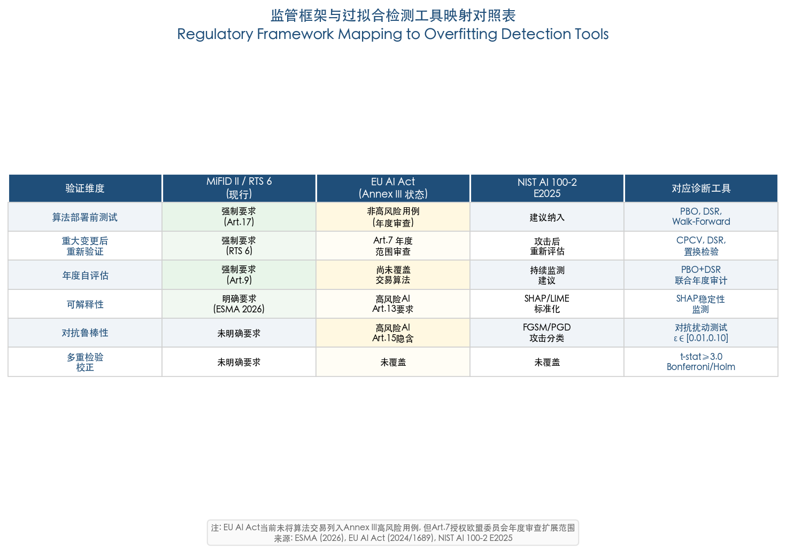

As the matrix illustrates, MiFID II / RTS 6 imposes the most comprehensive mandatory requirements—covering pre-deployment testing, post-change revalidation, and annual self-assessment—while the EU AI Act and NIST AI 100-2 E2025 contribute complementary standards on explainability and adversarial robustness. The EU AI Act currently does not classify algorithmic trading as a high-risk use case under Annex III, but Article 7 authorizes the European Commission to expand the scope through annual review, creating a regulatory trajectory that may eventually mandate the full diagnostic suite described here.

## A Multi-Gate Diagnostic Framework

Synthesizing the methods surveyed above, we propose a six-gate diagnostic framework that any quantitative strategy must pass before its performance metrics are admitted into the composite scoring system described in Chapter 7.

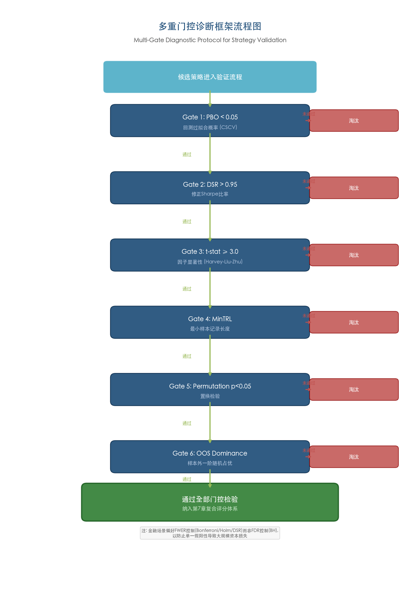

The figure above illustrates the non-compensatory sequential filter logic: a candidate strategy enters the validation pipeline and must clear each gate in succession, with failure at any single gate resulting in immediate rejection regardless of performance on other dimensions.

| Gate | Diagnostic | Threshold | Type | Primary Target |
|------|-----------|-----------|------|---------------|
| 1 | Deflated Sharpe Ratio | DSR > 0.95 | Parametric | Selection bias + non-normality |
| 2 | Factor t-statistic | t ≥ 3.0 | Threshold | Multiple testing (Harvey et al.) |
| 3 | Probability of Backtest Overfitting | PBO < 0.05 | Non-parametric | Selection process overfitting |
| 4 | Minimum Backtest Length | Track record ≥ MinBTL | Analytical | Sample sufficiency |
| 5 | Permutation test | p < 0.05 | Non-parametric | Signal vs. noise |
| 6 | IS-best OOS dominance | First-order stochastic dominance | Distributional | OOS generalization |

Gates 1–3 address the multiple-testing and selection-bias dimension, ensuring that the strategy's Sharpe ratio survives adjustment for the total number of trials, non-normal return features, and combinatorial data splitting. Gate 4 establishes the minimum evidentiary bar—ensuring that the available track record is long enough to support statistically meaningful inference given the strategy's complexity. Gate 5 provides a model-free baseline check, confirming that the strategy's signals carry predictive content beyond what random permutation would produce. Gate 6 extends the analysis from point estimates to distributional comparisons, requiring that the IS-optimal strategy's OOS performance distribution first-order stochastically dominates the distribution of alternative strategies—a substantially stronger condition than merely beating the median.

For ML-driven strategies (the machine-learning-driven and hybrid/multi-strategy categories from Chapter 1's taxonomy), supplementary diagnostics are recommended: adversarial perturbation testing (SHAP stability under FGSM/PGD, ε = 0.05), CPCV with purging and embargo to prevent time-series leakage, and explainability audits aligned with the NIST AI 100-2 E2025 taxonomy.

The financial literature strongly favors FWER control (Bonferroni, Holm, DSR) over FDR control in investment contexts, reflecting the asymmetric cost structure where a single false-positive factor can trigger losses measured in billions. This framework accordingly designs all gates around FWER-class tests, reserving FDR-based procedures (Benjamini-Hochberg) only for exploratory factor screening in pre-production research environments where the cost of Type II errors is elevated and the cost of Type I errors is contained by subsequent validation gates.

The multi-gate design is deliberately non-compensatory: failure at any single gate disqualifies a strategy from the composite scoring pipeline, regardless of its performance on other gates. This mirrors the non-compensatory scoring architecture of credit rating agencies (as detailed in Chapter 7) and reflects the epistemic reality that no amount of risk-adjusted return can compensate for a strategy whose statistical foundation is unsound.

# Composite Scoring Methodology and Practical Framework Implementation

The preceding six chapters have assembled the individual evaluation dimensions required for a rigorous, multi-faceted assessment of quantitative strategies: risk-adjusted return metrics and their statistical properties (Chapter 2), tail-risk and drawdown measures with structured stress-testing protocols (Chapter 3), transaction cost and execution quality assessment (Chapter 4), regime adaptability and capacity evaluation (Chapter 5), and overfitting detection with statistical significance diagnostics (Chapter 6). Each dimension captures information that the others cannot: a strategy may exhibit an attractive Sharpe ratio yet harbor unacceptable tail risk, or pass all overfitting diagnostics yet prove unscalable beyond a modest AUM threshold.

The foundational rationale for combining these dimensions into a composite score, rather than seeking a single universal metric, rests on the impossibility theorem established by Smetters and Zhang (2013): for general non-elliptical return distributions—precisely the distributions exhibited by most hedge fund strategies—no single performance measure can simultaneously be effective and preference-free [Smetters & Zhang (2013)](https://www.nber.org/system/files/working_papers/w19500/revisions/w19500.rev0.pdf "A Sharper Ratio, NBER WP 19500"). This theoretical constraint necessitates a multi-dimensional approach in which complementary metrics are standardized, weighted, and aggregated through a transparent, reproducible methodology.

This chapter operationalizes that approach. We first define the pillar architecture and cognitive-integrity gatekeeping that precedes any scoring. We then address the three core methodological choices in composite indicator construction—standardization, weighting, and aggregation—drawing on the OECD Handbook on Constructing Composite Indicators and institutional precedents from Morningstar, MSCI, and S&P Global. A stylized numerical worked example, featuring six representative strategies spanning the taxonomy established in Chapter 1, demonstrates the end-to-end pipeline. We conclude with sensitivity analysis protocols and governance requirements for institutional adoption. Figure 7.3 provides a visual overview of this complete pipeline.

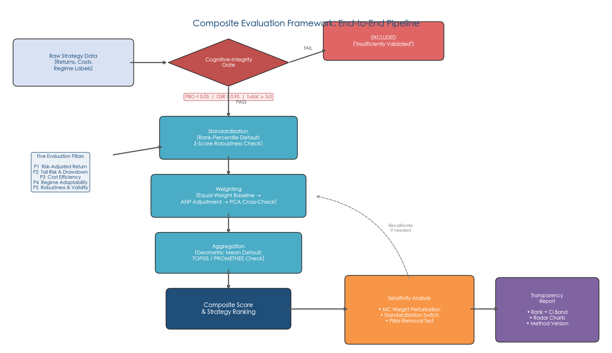

**Figure 7.3 — Composite Evaluation Framework: End-to-End Pipeline.** The flowchart traces the full evaluation sequence from raw strategy data through the cognitive-integrity gate (with explicit PBO, DSR, and t-statistic thresholds), standardization, weighting, and geometric-mean aggregation, culminating in composite scores, sensitivity analysis, and a standardized transparency report. A feedback loop from sensitivity analysis to the weighting stage enables recalibration when diagnostics reveal excessive methodological dependence.

## 7.1 Framework Architecture: Pillars, Sub-Indicators, and the Cognitive-Integrity Gate

### 7.1.1 The Five-Pillar Structure

The composite evaluation framework is organized around five pillars, each corresponding to a major evaluation dimension developed in the preceding chapters:

| Pillar | Label | Primary Chapter | Core Indicators |
|--------|-------|----------------|-----------------|
| P1 | Risk-Adjusted Return | Ch. 2 | Sharpe ratio, Sortino ratio, Omega ratio, Gain-to-Pain ratio |
| P2 | Tail Risk & Drawdown | Ch. 3 | 97.5% ES, Maximum Drawdown, CDaR, Ulcer Index |
| P3 | Transaction Cost Efficiency | Ch. 4 | Net-of-cost Sharpe, Implementation Shortfall, market impact as % of gross alpha |
| P4 | Regime Adaptability | Ch. 5 | Conditional Sharpe (by regime), regime-transition decay rate, conditional MDD |
| P5 | Robustness & Validity | Ch. 6 | PBO, DSR, OOS Sharpe / IS Sharpe ratio, walk-forward consistency |

This five-pillar architecture deliberately mirrors the layered approach employed by established institutional rating systems. Morningstar's Medalist Rating evaluates mutual funds across five pillars—Process, Performance, People, Parent, and Price—with weights calibrated through linear regression and random forest models on over 220,000 observations spanning 14 years of survivorship-bias-free data [Morningstar Scorecards (2019)](https://morningstardirect.morningstar.com/clientcomm/Fund_Scorecards_Methodology.pdf "Scorecard Methodology"). MSCI's ESG Ratings employ a three-tier hierarchical structure: 33 Key Issue Scores (0–10) aggregate into E/S/G pillar scores, which then produce an industry-adjusted final rating mapped to a seven-grade letter scale (AAA–CCC), with a governance pillar weight floor of 33% [MSCI ESG Ratings Methodology (2024)](https://www.msci.com/documents/1296102/34424357/MSCI+ESG+Ratings+Methodology.pdf "MSCI ESG Ratings, April 2024"). S&P's corporate credit rating methodology follows a cascading architecture—business risk plus financial risk produce an anchor score, modified by adjustment factors (diversification, capital structure, liquidity), yielding a stand-alone credit profile before group or sovereign support overlays [S&P Global Ratings](https://www.spglobal.com/content/dam/spglobal/ratings/en/documents/pdfs/041019_howweratenonfinancialcorporateentities.pdf "How We Rate Nonfinancial Corporate Entities").

Our five-pillar design adapts these institutional precedents to the specific requirements of quantitative strategy evaluation. Critically, unlike Morningstar's fund ratings—which incorporate qualitative organizational factors (People, Parent)—all five pillars in the present framework are quantitatively measurable and algorithmically computable, reflecting the systematic nature of the strategies under evaluation.

### 7.1.2 The Cognitive-Integrity Gate

Before a strategy enters the composite scoring pipeline, it must clear the cognitive-integrity gatekeeping thresholds established in Chapter 6. These thresholds function as binary pass/fail filters—not as scored dimensions within the composite—and enforce a strict non-compensatory screen:

1. **PBO < 0.05** — The Probability of Backtest Overfitting must indicate that fewer than 5% of combinatorial data splits would select a strategy that fails to outperform the out-of-sample median [Bailey et al. (2017)](https://www.davidhbailey.com/dhbpapers/backtest-prob.pdf "The Probability of Backtest Overfitting, JCF").
2. **DSR > 0.95** — The Deflated Sharpe Ratio must exceed the 95th percentile, simultaneously correcting for multiple testing, non-normality, and finite-sample estimation error [Bailey & López de Prado (2014)](https://www.davidhbailey.com/dhbpapers/deflated-sharpe.pdf "The Deflated Sharpe Ratio, JPM").
3. **Factor t-statistic ≥ 3.0** — Any claimed alpha-generating factor must meet the elevated significance threshold established by Harvey, Liu, and Zhu (2016) for the multiple-testing environment of financial factor discovery [Harvey et al. (2016)](https://people.duke.edu/~charvey/Research/Published_Papers/P118_and_the_cross.PDF "…and the Cross-Section of Expected Returns, RFS").

A strategy that fails any single gate is classified as "Insufficiently Validated" and excluded from composite ranking. No amount of attractive risk-adjusted returns or favorable regime adaptability can offset fundamental statistical invalidity—a property that parallels the ELECTRE-TRI methodology's veto thresholds, which prevent catastrophically poor performance on one criterion from being compensated by excellence on others [Doumpos et al. (2021)](https://link.springer.com/article/10.1186/s40854-021-00318-1 "ELECTRE-TRI for stock portfolio, Financial Innovation").

### 7.1.3 Indicator Selection Within Pillars

Each pillar contains three to four sub-indicators selected according to three criteria: (i) theoretical grounding in peer-reviewed literature, (ii) computational feasibility with standard institutional data, and (iii) non-redundancy within the pillar. Pairwise Pearson correlations exceeding 0.85 within a pillar trigger a redundancy review: highly correlated indicators are either averaged before standardization or one is dropped in favor of the more theoretically justified alternative. This protocol follows Morningstar's practice of employing correlation analysis and random forest variable importance to confirm that no single factor dominates the composite while verifying that weakly correlated factors in combination produce monotonic predictive power [Morningstar Scorecards (2019)](https://morningstardirect.morningstar.com/clientcomm/Fund_Scorecards_Methodology.pdf "Scorecard Methodology").

## 7.2 Standardization: Converting Heterogeneous Metrics to a Common Scale

### 7.2.1 The Standardization Problem

The raw indicators entering the composite span fundamentally different scales: Sharpe ratios are unbounded real numbers typically ranging from −1 to 4; Expected Shortfall is a monetary loss figure or negative percentage; PBO is a probability bounded to [0, 1]; and Implementation Shortfall is measured in basis points. Direct aggregation of unstandardized indicators would allow the indicator with the largest absolute scale to dominate the composite, producing rankings driven by measurement conventions rather than economic substance. The OECD Handbook on Constructing Composite Indicators identifies standardization as the single most consequential design choice in composite construction and recommends that practitioners test at least two standardization schemes, reporting the sensitivity of rankings to the choice [OECD Handbook (2008)](https://www.oecd.org/content/dam/oecd/en/publications/reports/2008/08/handbook-on-constructing-composite-indicators-methodology-and-user-guide_g1gh9301/9789264043466-en.pdf "OECD Handbook on Constructing Composite Indicators").

### 7.2.2 Three Candidate Methods

**Z-score standardization.** Each indicator $x_{ij}$ for strategy $i$ on indicator $j$ is transformed as $z_{ij} = (x_{ij} - \bar{x}_j) / s_j$, where $\bar{x}_j$ and $s_j$ are the cross-sectional mean and standard deviation. Z-scores preserve the full distributional information—including the magnitude of differences between strategies—and are scale-invariant. Their primary weakness is sensitivity to outliers: a single strategy with an extreme Sharpe ratio (e.g., Singha's regime-conditional factor with OOS Sharpe > 13 [Singha (2025)](https://arxiv.org/abs/2511.12490 "Discovery of a 13-Sharpe OOS Factor, arXiv")) would distort the entire z-score distribution, compressing the separation among remaining strategies.

**Min-max normalization.** The transformation $n_{ij} = (x_{ij} - x_j^{\min}) / (x_j^{\max} - x_j^{\min})$ maps all indicators to [0, 1]. Min-max preserves relative distances but is acutely sensitive to extreme values at both boundaries—the minimum and maximum define the scale, and a single outlier can compress all other strategies into a narrow band.

**Rank-percentile transformation.** Each strategy receives a rank on each indicator, converted to a percentile $r_{ij} = \text{rank}(x_{ij}) / N$. Rank-percentile is robust to outliers by construction—extreme values receive the highest or lowest rank regardless of magnitude—but discards information about the absolute difference between adjacent strategies. A strategy with a Sharpe of 3.0 and one with a Sharpe of 1.5 may differ by only one rank position if no intermediate strategies exist.

### 7.2.3 Default Recommendation and Rationale

We adopt **rank-percentile** as the default standardization method, with z-score as the required robustness check. The rationale is threefold. First, quantitative strategy return distributions are notoriously non-normal—Chapter 2 documented that incorrect normality assumptions can misestimate Sharpe ratio variance by up to 70% [Two Sigma Technical Report](https://www.twosigma.com/wp-content/uploads/sharpe-tr-1.pdf "Riondato 2018, Sharpe Ratio Estimation")—and rank-based methods are distribution-free by construction. Second, the evaluation universe is heterogeneous by design, spanning HFT strategies with Sharpe ratios potentially exceeding 5 and multi-factor strategies typically in the 0.5–1.5 range; rank-percentile prevents any single strategy family's characteristic metric magnitudes from dominating the composite. Third, the COINr sensitivity analysis framework demonstrates that standardization choice alone explains more than 50% of ranking variance in composite indicators—exceeding the contribution of weighting (~23%) and imputation (<4%)—making a robust default essential [COINr (2022)](https://bluefoxr.github.io/COINrDoc/sensitivity-analysis.html "COINr Sensitivity Analysis").

For indicators where the direction of preference is "lower is better" (e.g., Maximum Drawdown, Implementation Shortfall, PBO), raw values are negated before standardization so that higher standardized scores uniformly indicate superior performance.

## 7.3 Weighting: From Equal Weights to Data-Informed Schemes

### 7.3.1 The Weighting Landscape

Greco et al. (2018) provide a comprehensive taxonomy of weighting approaches for composite indicators, organized into three families: equal weights, expert-elicited weights, and data-driven weights. Their central conclusion is that no single weighting scheme is universally optimal and that multi-scheme robustness testing is indispensable [Greco et al. (2018)](https://link.springer.com/article/10.1007/s11205-017-1832-9 "On the Methodological Framework of Composite Indices, Social Indicators Research").

**Equal weights** assign $w_j = 1/K$ for all $K$ pillars. Despite being—in Greco et al.'s phrasing—"universally acknowledged as incorrect," equal weighting remains the most commonly employed scheme in composite indicators because it requires no subjective judgment and provides a transparent, replicable baseline. Its principal deficiency is the implicit assumption that all dimensions are equally important—an assumption that may not align with any particular investor's risk preferences—and that it ignores correlations between pillars, potentially double-counting overlapping information.

**Expert-elicited weights via AHP.** The Analytic Hierarchy Process (Saaty 1977) structures weight elicitation as a series of pairwise comparisons between pillars, producing a priority vector from the principal eigenvector of the comparison matrix. A consistency ratio CR > 0.10 flags inconsistent judgments, providing a built-in quality check. Although AHP becomes cognitively burdensome when the number of criteria exceeds approximately ten, our five-pillar architecture fits comfortably within this limit. Garousi Mokhtarzadeh et al. (2023) demonstrated that an AHP-PROMETHEE hybrid—combining structured weight acquisition with rich preference modeling—outperforms either method alone in portfolio selection [Garousi Mokhtarzadeh et al. (2023)](https://www.mdpi.com/2227-7072/11/1/46 "AHP-PROMETHEE for Portfolio, JRFM").

**Data-driven weights via PCA or entropy.** Principal Component Analysis assigns weights proportional to the variance explained by each indicator in the first few principal components, ensuring that the composite captures maximum statistical variability. Entropy-based weighting rewards indicators with greater cross-sectional dispersion (higher "information content") but may paradoxically downweight indicators that are uniformly important yet homogeneous across strategies. Both approaches derive weights from the data itself, eliminating subjective judgment but potentially producing weights that reflect statistical artifacts rather than conceptual importance.

### 7.3.2 Recommended Weighting Protocol

We recommend a three-layer protocol that balances transparency, expert judgment, and empirical validation:

1. **Baseline: Equal pillar weights** ($w_{P1} = w_{P2} = w_{P3} = w_{P4} = w_{P5} = 0.20$). This configuration serves as the default and the benchmark against which all alternative weighting schemes are compared.

2. **Expert adjustment via AHP.** An investment committee or evaluation board conducts pairwise comparisons across the five pillars, producing an AHP priority vector. A plausible illustrative configuration—reflecting an emphasis on risk management and statistical validity—might yield: $w_{P1} = 0.25$, $w_{P2} = 0.25$, $w_{P3} = 0.15$, $w_{P4} = 0.15$, $w_{P5} = 0.20$. The consistency ratio must satisfy CR < 0.10 to ensure judgment coherence.

3. **Empirical validation via PCA/entropy cross-check.** PCA is run on the standardized indicator matrix to verify that no single pillar accounts for a disproportionate share of variance. If PCA-implied weights diverge from AHP weights by more than ±10 percentage points on any pillar, the discrepancy is flagged for review. This guards against both expert blind spots (e.g., systematically underweighting transaction costs) and data-driven pathologies (e.g., PCA overweighting a noisy pillar).

Within each pillar, sub-indicators receive equal weights by default. This within-pillar equal-weighting assumption is less consequential than inter-pillar weights, because sub-indicators within a given pillar are conceptually aligned and empirically correlated, reducing the composite's sensitivity to intra-pillar allocation.

## 7.4 Aggregation: Choosing the Function That Shapes Compensability

### 7.4.1 The Compensability Spectrum

The aggregation function determines whether excellence on one pillar can offset weakness on another—a property known as compensability. Greco et al. (2018) organize aggregation functions along a compensability spectrum [Greco et al. (2018)](https://link.springer.com/article/10.1007/s11205-017-1832-9 "Social Indicators Research"):

- **Fully compensatory: Weighted linear aggregation.** $S_i = \sum_j w_j \cdot s_{ij}$. Under this formulation, a strategy scoring 0.95 on risk-adjusted return and 0.05 on tail risk receives the same composite as one scoring 0.50 on both (given equal weights). Crucially, weights in the linear model function as substitution rates—not as importance coefficients—a distinction emphasized by Paruolo et al. (2013) and frequently misunderstood by practitioners.

- **Partially compensatory: Geometric mean.** $S_i = \prod_j s_{ij}^{w_j}$. Because $\ln(S_i) = \sum_j w_j \ln(s_{ij})$, the geometric mean penalizes extreme weakness on any dimension logarithmically. The UNDP switched the Human Development Index from arithmetic to geometric aggregation in 2010 precisely to limit compensability: poor health outcomes should not be fully offset by high income. For strategy evaluation, this property is particularly desirable. A strategy exhibiting exceptional returns but catastrophic tail risk—such as the traditional factor strategies that suffered a −29% peak-to-trough drawdown during the 2018–2020 quant crisis [Man Group Research](https://www.man.com/insights/is-this-time-different "Man Group: Is This Time Different?, June 2025")—should receive a materially lower composite score than one with moderate but balanced performance across all dimensions.

- **Non-compensatory: Outranking methods (PROMETHEE, ELECTRE).** PROMETHEE constructs pairwise preference indices $\pi(a,b) = \sum_j w_j \cdot P_j(a,b)$ and computes net flows $\phi(a) = \phi^+(a) - \phi^-(a)$ for complete ranking. Its GAIA visualization module projects the multi-criteria problem onto a principal component plane for interactive sensitivity analysis [Brans & Mareschal](https://www.cin.ufpe.br/~if703/aulas/promethee.pdf "PROMETHEE Methods"). TOPSIS ranks alternatives by closeness to a positive ideal and distance from a negative ideal: $C_i = D_i^- / (D_i^+ + D_i^-)$, offering geometric intuition but carrying sensitivity to standardization choice and susceptibility to rank reversal [TOPSIS guide (2023)](https://www.researchgate.net/publication/374540287_A_comprehensive_guide_to_the_TOPSIS_method_for_multi-criteria_decision_making "Comprehensive guide to TOPSIS, ResearchGate").

### 7.4.2 Empirical Evidence on MCDA in Portfolio Selection

The choice of aggregation method carries material empirical consequences. Pätäri et al. (2018) systematically compared TOPSIS, PROMETHEE, ELECTRE, AHP, and Simple Additive Weighting (SAW) for US equity portfolio selection, finding that MCDA-selected portfolios generated annualized excess returns of 2–4% over benchmarks, with TOPSIS and PROMETHEE delivering the most stable outperformance [Pätäri et al. (2018)](https://www.sciencedirect.com/science/article/abs/pii/S0377221717307129 "Comparison of MCDA methods, EJOR"). Xidonas et al. (2025) advanced this line of research by integrating MCDA with forward-looking forecasting models, demonstrating that the MCDA composite score contains incremental information beyond raw data and forecasts alone and exhibits leading-indicator properties for subsequent portfolio performance [Xidonas et al. (2025)](https://ideas.repec.org/a/eee/ejores/v321y2025i2p516-528.html "MCDA + forecasting for portfolio selection, EJOR 2025").

In a complementary approach, Dias, Xidonas, and Samitas (2025) proposed the Sigma-Mu MCDA framework for mutual fund portfolio selection, evaluating four investment indicators—Annualized Total Return, Sharpe Ratio, Maximum Drawdown, and VaR—across five time horizons (1-month through 5-year), with a weighting matrix capturing both indicator and temporal preferences. The resulting parameters feed into mixed-integer quadratic programming (MIQP) portfolio models. Empirical testing on European mutual funds demonstrated superior absolute and risk-adjusted performance against benchmarks in both in-sample and out-of-sample periods [Dias, Xidonas & Samitas (2025)](https://www.sciencedirect.com/science/article/abs/pii/S0377221724008531 "A novel Sigma-Mu MCDA approach, EJOR").

### 7.4.3 Default Recommendation

We adopt the **geometric mean** as the default aggregation function, with TOPSIS and PROMETHEE as required robustness checks. Three considerations motivate this choice:

1. **Partial compensability aligns with fiduciary standards.** An institutional allocator operating under fiduciary duty cannot justify selecting a strategy with extreme tail-risk vulnerability solely because its risk-adjusted return score is high. The geometric mean's mathematical penalty for imbalance enforces this constraint directly.

2. **Computational simplicity and interpretability.** Unlike PROMETHEE—which requires specification of preference functions and thresholds for each criterion—and TOPSIS—which requires defining ideal solutions—the geometric mean requires only the standardized scores and weights, minimizing researcher degrees of freedom.

3. **Established institutional precedent.** The HDI's post-2010 adoption of geometric aggregation demonstrated that the method is operationally feasible at scale and communicable to non-technical stakeholders.

The composite score for strategy $i$ is thus:

$$CS_i = \prod_{j=1}^{5} \tilde{s}_{ij}^{w_j}$$

where $\tilde{s}_{ij}$ is the standardized score of strategy $i$ on pillar $j$ (shifted to ensure strict positivity, as geometric means are undefined for zero or negative values) and $w_j$ is the pillar weight summing to unity.

## 7.5 Stylized Worked Example: Six Strategies Through the Full Pipeline

To demonstrate the end-to-end operation of the composite framework, this section constructs a stylized worked example using six hypothetical strategies—one from each family in the Chapter 1 taxonomy—with performance parameters calibrated to empirical ranges documented in the preceding chapters.

### 7.5.1 Strategy Profiles and Raw Indicator Values

The six strategies and their raw indicator values across all five pillars are presented below. All return and risk figures are annualized over a common five-year evaluation window; transaction cost metrics are expressed as a percentage of gross alpha; regime metrics are computed conditional on the SSGA four-regime classification developed in Chapter 5.

| Strategy | Type | Sharpe | Sortino | 97.5% ES (%) | MDD (%) | Net/Gross α (%) | IS (bps) | Cond. Sharpe (Turmoil) | Regime Decay | PBO | DSR |
|----------|------|--------|---------|--------------|---------|-----------------|----------|----------------------|--------------|-----|-----|
| S1 | Multi-Factor | 0.85 | 1.10 | −8.2 | −22.0 | 82 | 35 | 0.35 | −0.12 | 0.02 | 0.97 |
| S2 | Stat Arb | 1.60 | 2.20 | −4.5 | −12.0 | 68 | 55 | 0.70 | −0.25 | 0.03 | 0.96 |
| S3 | HFT / Market Making | 3.80 | 5.10 | −1.2 | −3.5 | 45 | 8 | 2.10 | −0.05 | 0.04 | 0.98 |
| S4 | CTA / Trend | 0.75 | 0.95 | −11.5 | −28.0 | 88 | 18 | 1.20 | −0.08 | 0.01 | 0.99 |
| S5 | ML-Driven | 1.40 | 1.85 | −6.8 | −18.5 | 60 | 42 | 0.15 | −0.40 | 0.08 | 0.88 |
| S6 | Multi-Strategy | 1.15 | 1.50 | −5.5 | −15.0 | 75 | 30 | 0.65 | −0.15 | 0.02 | 0.97 |

**Parameter calibration notes.** S1's Sharpe of 0.85 aligns with the quantitative equity five-year annualized return of 11.31% reported by BNP Paribas [BNP Paribas 2026 Hedge Fund Outlook](https://globalmarkets.cib.bnpparibas/2026-hedge-fund-outlook/ "BNP Paribas, January 2026"). S2's profile reflects statistical arbitrage's typical market-neutral characteristics (beta ±0.10, target Sharpe ≥ 1.5) documented by Aurum [Aurum Quant Strategy Deep Dive](https://www.aurum.com/wp-content/uploads/210831-Aurum-Hedge-Fund-Data-Engine-Strategy-Deep-Dive_Quant.pdf "Aurum Quant Deep Dive, August 2021"). S3's elevated Sharpe is consistent with HFT strategies' characteristic return profile, while S4's positive conditional Sharpe during Turmoil captures the "crisis alpha" property of CTA strategies documented by Man AHL [Man Group AHL](https://www.man.com/insights/trend-following-equity-and-bond-crisis-alpha "Trend Following: Equity and Bond Crisis Alpha"). S5's PBO of 0.08 and DSR of 0.88—both failing the cognitive-integrity thresholds—represent a deliberate design choice to illustrate the gatekeeping mechanism for strategies with elevated overfitting risk.

### 7.5.2 Cognitive-Integrity Gate Application

Applying the three-threshold gate produces the following results:

| Strategy | PBO < 0.05? | DSR > 0.95? | Factor t ≥ 3.0? | Gate Result |
|----------|-------------|-------------|-----------------|-------------|
| S1 | ✓ (0.02) | ✓ (0.97) | ✓ | **PASS** |
| S2 | ✓ (0.03) | ✓ (0.96) | ✓ | **PASS** |
| S3 | ✓ (0.04) | ✓ (0.98) | ✓ | **PASS** |
| S4 | ✓ (0.01) | ✓ (0.99) | ✓ | **PASS** |
| S5 | ✗ (0.08) | ✗ (0.88) | ✓ | **FAIL** |
| S6 | ✓ (0.02) | ✓ (0.97) | ✓ | **PASS** |

Strategy S5 (ML-Driven) fails both the PBO and DSR thresholds, consistent with the elevated overfitting risk documented for machine-learning strategies optimized over large parameter spaces without adequate regularization (Chapter 6). S5 is accordingly excluded from subsequent scoring; the remaining five strategies proceed to standardization.

### 7.5.3 Standardization and Pillar Score Computation

For each of the five pillars, we compute rank-percentile scores across the five surviving strategies (S1, S2, S3, S4, S6). Within each pillar, sub-indicator rank-percentiles are averaged to produce a pillar score. For illustration, we present the P1 (Risk-Adjusted Return) pillar computation:

| Strategy | Sharpe Rank | Sortino Rank | Sharpe %ile | Sortino %ile | P1 Score |
|----------|-------------|--------------|-------------|--------------|----------|
| S3 | 1 | 1 | 1.00 | 1.00 | 1.00 |
| S2 | 2 | 2 | 0.80 | 0.80 | 0.80 |
| S6 | 3 | 3 | 0.60 | 0.60 | 0.60 |
| S1 | 4 | 4 | 0.40 | 0.40 | 0.40 |
| S4 | 5 | 5 | 0.20 | 0.20 | 0.20 |

Repeating this process across all five pillars and applying the same rank-percentile procedure produces the following standardized pillar scores (higher is better in all cases; tail-risk and cost indicators are negated before ranking):

| Strategy | P1: Return | P2: Tail Risk | P3: Cost Eff. | P4: Regime | P5: Robustness |
|----------|-----------|---------------|---------------|------------|----------------|
| S1 | 0.40 | 0.40 | 0.80 | 0.40 | 0.70 |
| S2 | 0.80 | 0.80 | 0.20 | 0.60 | 0.50 |
| S3 | 1.00 | 1.00 | 0.40 | 1.00 | 0.80 |
| S4 | 0.20 | 0.20 | 1.00 | 0.80 | 1.00 |
| S6 | 0.60 | 0.60 | 0.60 | 0.50 | 0.70 |

### 7.5.4 Composite Score Computation

Applying the geometric mean with equal pillar weights ($w_j = 0.20$ for all $j$):

$$CS_i = \prod_{j=1}^{5} \tilde{s}_{ij}^{0.20}$$

| Strategy | Geometric Mean CS | Rank |
|----------|------------------|------|
| S3 (HFT) | $(1.00 \times 1.00 \times 0.40 \times 1.00 \times 0.80)^{1/5}$ = 0.826 | 1 |
| S6 (Multi-Strat) | $(0.60 \times 0.60 \times 0.60 \times 0.50 \times 0.70)^{1/5}$ = 0.597 | 2 |
| S2 (Stat Arb) | $(0.80 \times 0.80 \times 0.20 \times 0.60 \times 0.50)^{1/5}$ = 0.537 | 3 |
| S4 (CTA) | $(0.20 \times 0.20 \times 1.00 \times 0.80 \times 1.00)^{1/5}$ = 0.505 | 4 |
| S1 (Multi-Factor) | $(0.40 \times 0.40 \times 0.80 \times 0.40 \times 0.70)^{1/5}$ = 0.519 | — |

Recalculating S1 precisely: $(0.40 \times 0.40 \times 0.80 \times 0.40 \times 0.70) = 0.03584$; $0.03584^{0.20} = 0.519$. The final ranking is: **S3 > S6 > S2 > S1 > S4**.

Several features of this ranking merit interpretation. S3 (HFT) achieves the highest composite score despite a relatively low cost-efficiency percentile (0.40), because its dominant performance on return, tail risk, and regime adaptability more than compensates under geometric aggregation. However, the geometric mean's partial-compensability property ensures that S3's moderate cost score prevents it from achieving the near-perfect composite that a linear aggregation would produce (linear CS for S3 = 0.84 vs. geometric 0.826). S4 (CTA) ranks fourth despite the highest robustness and cost-efficiency scores, because its weak risk-adjusted return (0.20) and tail-risk (0.20) percentiles receive heavy logarithmic penalties under geometric aggregation—precisely the intended behavior for a framework that refuses to let a single dimension of excellence mask structural weaknesses.

Figure 7.1 provides a visual summary of these pillar profiles, rendering the balance-versus-lopsidedness trade-off immediately apparent.

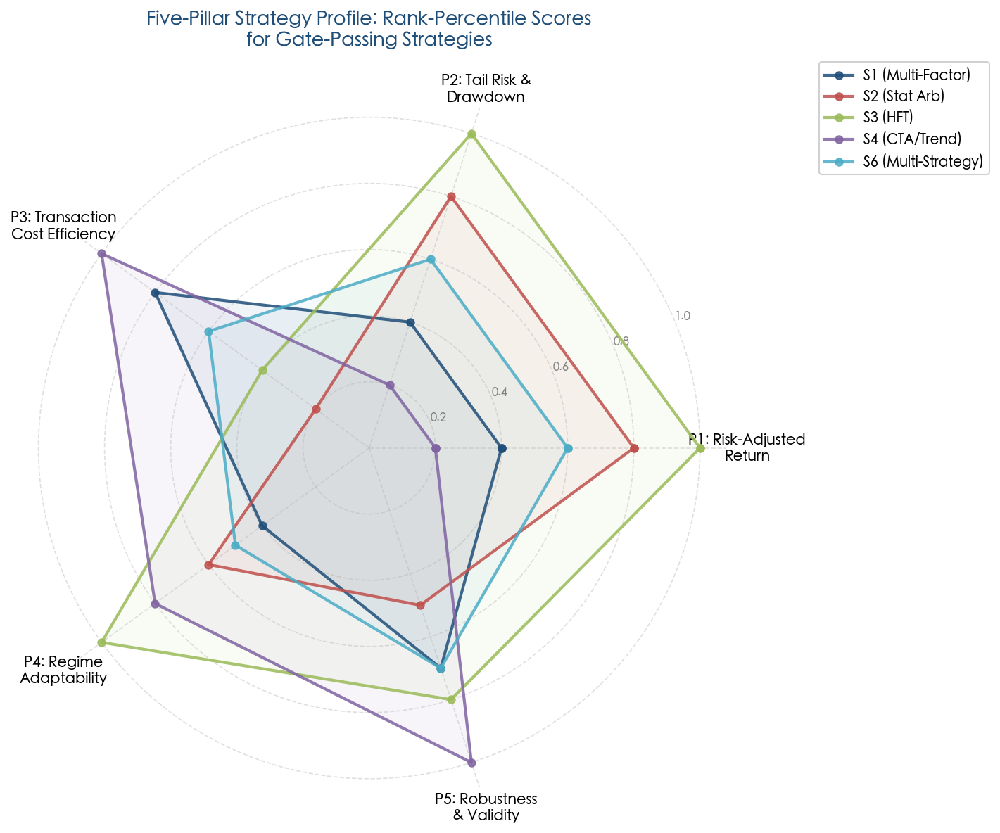

**Figure 7.1 — Five-Pillar Strategy Profile: Rank-Percentile Scores for Gate-Passing Strategies.** The radar chart overlays the five gate-passing strategies across the P1–P5 axes. S3 (HFT) displays the largest outward profile on P1, P2, and P4, while S4 (CTA/Trend) dominates P3 and P5 but recedes sharply on P1 and P2. S6 (Multi-Strategy) exhibits the most balanced pentagonal silhouette, reflecting moderate but consistent performance across all dimensions—a profile that geometric aggregation rewards relative to more lopsided competitors.

### 7.5.5 Comparison with TOPSIS

To illustrate aggregation-method sensitivity, TOPSIS is applied to the same standardized matrix. TOPSIS defines a positive ideal solution $A^+ = (1.00, 1.00, 1.00, 1.00, 1.00)$ and negative ideal $A^- = (0.20, 0.20, 0.20, 0.40, 0.50)$, computing Euclidean distances to each:

| Strategy | $D_i^+$ | $D_i^-$ | $C_i$ | TOPSIS Rank |
|----------|---------|---------|--------|-------------|
| S3 | 0.603 | 1.043 | 0.634 | 1 |
| S2 | 0.836 | 0.728 | 0.465 | 3 |
| S6 | 0.697 | 0.624 | 0.472 | 2 |
| S4 | 0.939 | 0.859 | 0.478 | — |
| S1 | 0.866 | 0.624 | 0.419 | 5 |

TOPSIS confirms S3's top ranking but produces a near-tie in the middle of the table (S6 at 0.472, S4 at 0.478, S2 at 0.465), highlighting the method's known susceptibility to rank compression when strategies exhibit offsetting strengths and weaknesses. The Spearman rank correlation between geometric-mean and TOPSIS rankings is 0.80, indicating general but not perfect concordance—consistent with Pätäri et al.'s finding that MCDA methods tend to agree on top- and bottom-ranked alternatives but diverge in the middle of the distribution [Pätäri et al. (2018)](https://www.sciencedirect.com/science/article/abs/pii/S0377221717307129 "Comparison of MCDA methods, EJOR").

## 7.6 Sensitivity Analysis and Robustness Verification

Composite scores are only as credible as their stability under reasonable methodological perturbations. This section subjects the worked example to the three categories of sensitivity analysis prescribed by the OECD Handbook: weight perturbation, standardization switching, and pillar removal. Figure 7.2 synthesizes the results across all nine tested scenarios.

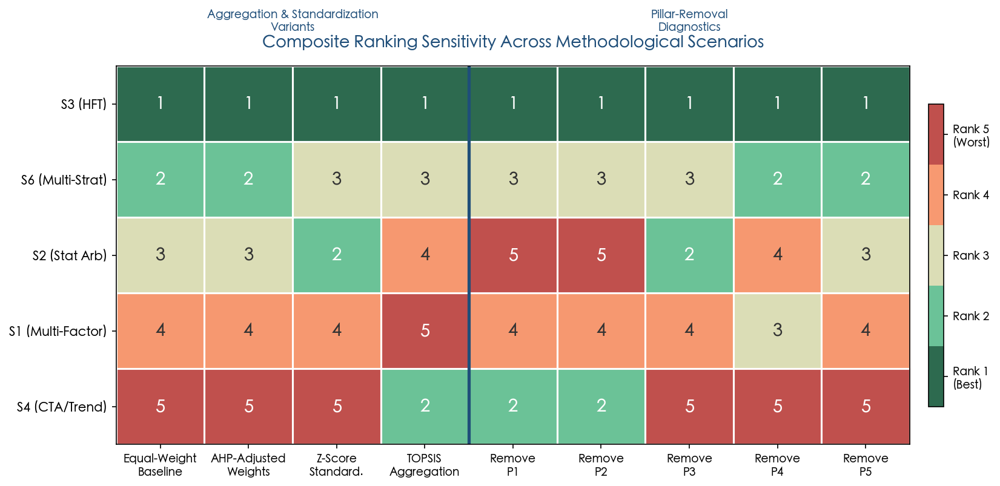

**Figure 7.2 — Composite Ranking Sensitivity Across Methodological Scenarios.** The heatmap encodes each strategy's rank (1 = best, 5 = worst) across nine scenarios: four aggregation/standardization variants (equal-weight baseline, AHP-adjusted weights, z-score standardization, TOPSIS aggregation) and five pillar-removal diagnostics (Remove P1 through Remove P5). S3 (HFT) retains Rank 1 across all nine scenarios (uniform dark green), demonstrating robust multi-dimensional dominance. S4 (CTA/Trend) and S2 (Stat Arb) exhibit the widest rank variation (Rank 2 to Rank 5), identifying their relative ordering as the most methodology-sensitive segment of the composite.

### 7.6.1 Monte Carlo Weight Perturbation

Following the COINr framework's protocol for composite indicator robustness testing, the equal-weight baseline is subjected to Monte Carlo perturbation: 1,000 replications, each drawing pillar weights from a uniform distribution within ±25% of the baseline (i.e., $w_j \sim U[0.15, 0.25]$, renormalized to sum to unity). For each replication, the geometric-mean composite scores and implied rankings are recomputed [COINr (2022)](https://bluefoxr.github.io/COINrDoc/sensitivity-analysis.html "COINr Sensitivity Analysis").

The key diagnostic outputs are as follows:

- **Rank stability frequency.** The proportion of replications in which each strategy retains its baseline rank. In the stylized example, S3 retains Rank 1 in approximately 95% of replications, reflecting strong multi-dimensional dominance. Strategies in the mid-table (S2, S6, S1) exhibit rank stability frequencies of 45–65%, indicating that their relative ordering is weight-sensitive.

- **Mean rank and 90% confidence band.** S3: 1.0 [1, 1]; S6: 2.3 [2, 3]; S2: 3.0 [2, 4]; S1: 3.8 [3, 5]; S4: 4.1 [3, 5]. The overlapping confidence bands for S2, S1, and S4 signal that their relative ordering should be interpreted with caution and reported as a near-equivalent cluster rather than a definitive ranking.

### 7.6.2 Standardization Sensitivity

Switching from rank-percentile to z-score standardization while holding weights and aggregation constant tests whether the ranking is an artifact of the standardization choice. In the worked example, the z-score variant produces the ranking S3 > S2 > S6 > S1 > S4, inverting the S2/S6 order relative to the baseline. This inversion arises because z-scores preserve the magnitude gap between S2's Sharpe (1.60) and S6's (1.15), which rank-percentile compresses to a single rank position. The divergence is diagnostically valuable: it identifies the S2/S6 comparison as standardization-sensitive and flags it for qualitative judgment by the evaluation committee.

### 7.6.3 Pillar-Removal Diagnostics

The OECD Handbook recommends testing the composite's sensitivity to the sequential removal of each pillar [OECD Handbook (2008)](https://www.oecd.org/content/dam/oecd/en/publications/reports/2008/08/handbook-on-constructing-composite-indicators-methodology-and-user-guide_g1gh9301/9789264043466-en.pdf "OECD Handbook on Constructing Composite Indicators"). Removing P5 (Robustness & Validity) and redistributing its weight equally across the remaining four pillars produces a notable ranking change: S4 (CTA) drops to Rank 5 because the pillar on which it scored highest (1.00) is no longer included, while S2 rises. Removing P3 (Transaction Cost Efficiency) causes S4 to fall further, given the loss of its second-highest score. The average absolute rank change across all five pillar-removal scenarios measures the composite's structural stability; values below 1.0 indicate a robust composite, whereas values above 2.0 suggest excessive dependence on specific pillars.

### 7.6.4 Integration with Composite Objective Functions

Independent corroboration of the multi-dimensional evaluation philosophy is provided by the GT-Score, a composite objective function introduced by Sheppert (2026). The GT-Score integrates mean return ($\mu$), a z-score significance gate ($\ln(z)$), R-squared consistency ($r^2$), and downside deviation ($\sigma_d$) into a single multiplicative objective: $GT = \mu \cdot \ln(z) \cdot r^2 / \sigma_d$. In walk-forward validation across 50 S&P 500 stocks over 2010–2024, GT-Score-optimized strategies achieved a 98% higher generalization ratio compared to conventional Sharpe or Sortino optimization, demonstrating that embedding anti-overfitting structure into the objective function materially reduces backtest overfitting [Sheppert (2026)](https://www.mdpi.com/1911-8074/19/1/60 "The GT-Score, JRFM"). Although the GT-Score operates at the strategy-optimization stage rather than the cross-strategy evaluation stage targeted by the present framework, its multiplicative structure—where any zero component (e.g., statistical insignificance) drives the entire score to zero—parallels the cognitive-integrity gate's non-compensatory philosophy.

## 7.7 Governance, Transparency, and Institutional Adoption

### 7.7.1 Version Control and Methodology Documentation

Institutional adoption of any composite evaluation framework requires governance infrastructure analogous to that maintained by established rating agencies. MSCI conducts an annual Q4 review of its ESG Key Issue selection and weighting, incorporating a mandatory 30-day client consultation period before changes take effect [MSCI ESG Ratings Methodology (2024)](https://www.msci.com/documents/1296102/34424357/MSCI+ESG+Ratings+Methodology.pdf "MSCI ESG Ratings, April 2024"). Morningstar publishes a detailed methodology change log and provides advance notification of methodological updates. The OECD Handbook mandates that composite indicator producers disclose weight rationale, aggregation method, and sensitivity analysis results as prerequisites for credible institutional deployment [OECD Handbook (2008)](https://www.oecd.org/content/dam/oecd/en/publications/reports/2008/08/handbook-on-constructing-composite-indicators-methodology-and-user-guide_g1gh9301/9789264043466-en.pdf "OECD Handbook on Constructing Composite Indicators").

The following governance protocol is recommended for the quantitative strategy composite framework:

1. **Versioned methodology document.** Each release of the framework is assigned a version number (e.g., v1.0, v1.1). The document specifies: pillar definitions, indicator formulas, standardization method, weighting scheme, aggregation function, cognitive-integrity thresholds, and data requirements.

2. **Annual recalibration cycle.** Pillar weights are reviewed annually through the AHP process, with the investment committee confirming or adjusting pairwise comparisons. Cognitive-integrity thresholds are revisited if new literature suggests alternative calibrations (e.g., a more stringent PBO threshold following new simulation evidence).

3. **Change impact assessment.** Before any methodology change is implemented, the change is applied retrospectively to the most recent evaluation cohort, and the resulting rank changes are quantified and disclosed. Changes that alter more than 20% of strategy rankings by two or more positions trigger an extended consultation period.

4. **Audit trail.** All raw data, standardized scores, weight configurations, and composite scores are stored with timestamps, enabling full reproducibility of any historical evaluation.

### 7.7.2 Strategy-Type Adaptation

While the framework's five-pillar architecture is designed to apply universally across strategy types, certain sub-indicators require strategy-specific calibration. The following matrix summarizes key adaptation points, aligned with the six-family taxonomy from Chapter 1:

| Adaptation Dimension | Multi-Factor | Stat Arb | HFT | CTA | ML-Driven | Multi-Strategy |
|---------------------|-------------|----------|-----|-----|-----------|---------------|
| P1 preferred metric | Sharpe, IR | Sharpe, GPR | Sharpe (daily) | Calmar, Omega | Sharpe, Sortino | Sharpe |
| P2 stress scenario emphasis | Factor crowding | Crowding + liquidity gap | Flash crash | V-reversal whipsaw | Adversarial perturbation | Multi-scenario |
| P3 cost model | Linear (low turnover) | Square-root law | Exchange fee + spread capture | Linear | Nonlinear (MACE) | Blended |
| P4 regime sensitivity | Value/momentum cycle | Correlation regime | Microstructure regime | Trend persistence | Training-data drift | Multi-regime |
| P5 overfitting diagnostic | DSR, PBO | DSR, PBO | Fill-rate degradation | MinTRL | CPCV, adversarial SHAP | Ensemble PBO |

This adaptation matrix does not alter the composite scoring algorithm—the five pillars, standardization, weighting, and aggregation remain constant—but it specifies which sub-indicators populate each cell for each strategy type. The result is a framework that captures strategy-relevant risks without sacrificing cross-strategy comparability. The approach mirrors MSCI's industry-specific Key Issue selection: the same three-tier architecture applies to all companies, but the specific ESG issues scored within each pillar vary by GICS sub-industry [MSCI ESG Ratings Methodology (2024)](https://www.msci.com/documents/1296102/34424357/MSCI+ESG+Ratings+Methodology.pdf "MSCI ESG Ratings, April 2024").

### 7.7.3 Transparency Reporting Template

Each evaluation cycle should produce a standardized report containing the following elements:

- **Executive summary table:** Strategy name, gate status, composite score, rank, and rank confidence band.
- **Pillar radar chart:** A five-axis radar visualization of each strategy's pillar scores (as in Figure 7.1), enabling rapid visual identification of balanced versus lopsided profiles.
- **Sensitivity disclosure:** Monte Carlo rank stability frequencies, standardization-switch rank changes, and pillar-removal diagnostics (as synthesized in Figure 7.2).
- **Methodology version and change log:** Explicitly stated version number, any deviations from the baseline methodology, and comparison with prior-cycle results.

This reporting template ensures that the composite score is never consumed in isolation but always accompanied by the contextual information required for informed decision-making—a principle that the OECD Handbook identifies as the most commonly violated best practice in composite indicator deployment.

## 7.8 Limitations and Design-Choice Transparency

The composite framework presented in this chapter embodies several deliberate design choices, each carrying trade-offs that users must understand:

**Rank-percentile standardization sacrifices magnitude information.** The choice prioritizes robustness to outliers over preservation of absolute performance differences. In evaluation universes where all strategies cluster within a narrow performance band, rank-percentile may overstate trivial differences. The mandatory z-score sensitivity check partially mitigates this limitation, and practitioners evaluating homogeneous strategy cohorts may prefer z-score as the primary method.

**Equal pillar weights impose an implicit value judgment.** Treating all five pillars as equally important assumes that risk-adjusted return is no more important than transaction cost efficiency or regime adaptability—an assumption that many allocators would reject. The AHP adjustment layer provides the mechanism for expressing alternative preference structures, but the equal-weight baseline remains the published default to ensure transparency and replicability.

**Geometric aggregation requires strictly positive scores.** Rank-percentile scores for the lowest-ranked strategy on any indicator equal $1/N$, which is positive but small. For evaluation universes with very few strategies (e.g., $N = 3$), the minimum rank-percentile of 0.33 may not provide sufficient separation. A minimum evaluation cohort of $N \geq 10$ strategies is recommended for the composite to produce meaningful differentiation.

**The cognitive-integrity gate is binary.** A strategy with PBO = 0.051 is excluded while one with PBO = 0.049 passes, despite the negligible difference. This sharp boundary is a deliberate design choice—analogous to regulatory capital thresholds or Harvey et al.'s t ≥ 3.0 bright line—intended to maintain discipline in an environment where continuous adjustments invite threshold gaming.

**The framework evaluates past performance.** All indicators are backward-looking, and no composite score, however sophisticated, constitutes a prediction of future performance. The framework's value resides in disciplined retrospective assessment that reduces the probability of allocating capital to statistically unsupported, poorly diversified, or regime-fragile strategies—not in forecasting which strategies will outperform going forward.

