# 执行摘要

# Problem Formulation and Historical Context

This chapter formulates the canonical model of a two-bidder first-price sealed-bid (FPSB) auction with independent private values drawn from heterogeneous distributions—the defining feature of *ex-ante asymmetric* bidders. It derives the system of ordinary differential equations (ODEs) that characterizes Bayesian Nash equilibrium (BNE), contrasts this system with the tractable symmetric benchmark, and traces the intellectual history of the problem from Vickrey's pioneering 1961 analysis through the modern characterization results of the 2000s. The chapter concludes by delineating precisely why asymmetry transforms a problem admitting a clean closed-form solution into one that, for general distributions, resists analytical methods and necessitates numerical computation.

## 1.1 The Formal Model

### Environment and Payoffs

Consider a single indivisible object offered for sale via a first-price sealed-bid auction to two risk-neutral bidders, indexed $i \in \{1, 2\}$. Bidder $i$ privately observes a valuation $v_i$ drawn from a cumulative distribution function $F_i$ with continuous positive density $f_i$ on a bounded interval $[\underline{v}_i, \bar{v}_i]$, where $0 \leq \underline{v}_i < \bar{v}_i < \infty$. The draws $v_1$ and $v_2$ are statistically independent. Both the distributional assumptions and the number of bidders are common knowledge; only the realized valuations constitute private information. Following [Maskin & Riley (2000)](https://www.isid.ac.in/~dmishra/topicsdoc/maskin_riley.pdf "Asymmetric Auctions, RES 67(3): 413–438"), the bidders are termed *ex-ante asymmetric* whenever $F_1 \neq F_2$.

Each bidder simultaneously submits a sealed bid $b_i \geq 0$. The highest bidder wins the object and pays her bid; the loser pays nothing. In the event of a tie, the object is awarded to each bidder with equal probability. A (pure) strategy for bidder $i$ is a measurable function $\beta_i : [\underline{v}_i, \bar{v}_i] \to \mathbb{R}_+$ mapping valuations to bids.

If bidder $i$ with valuation $v_i$ bids $b$ while the opponent uses a strictly increasing strategy $\beta_j$, then bidder $i$ wins whenever $b > \beta_j(v_j)$, which occurs with probability $F_j(\beta_j^{-1}(b))$. The interim expected payoff is therefore

$$
\Pi_i(b, v_i) \;=\; F_j\!\bigl(\beta_j^{-1}(b)\bigr)\,\bigl(v_i - b\bigr). \tag{1.1}
$$

This expression, stated explicitly as equations (2.2)–(2.3) in [Maskin & Riley (2000)](https://www.isid.ac.in/~dmishra/topicsdoc/maskin_riley.pdf "RES 67(3): 413–438"), encapsulates the fundamental trade-off inherent in first-price bidding: raising $b$ increases the probability of winning but diminishes the surplus conditional on winning.

### Bayesian Nash Equilibrium

A strategy pair $(\beta_1, \beta_2)$ constitutes a Bayesian Nash equilibrium (BNE) if, for each bidder $i$ and every $v_i \in [\underline{v}_i, \bar{v}_i]$, the bid $\beta_i(v_i)$ maximizes $\Pi_i(b, v_i)$ given that the opponent employs $\beta_j$. Attention is restricted to equilibria in *monotone pure strategies*—strategies that are strictly increasing and continuously differentiable. This restriction is without loss of generality for the two-bidder case: [Plum (1992)](https://kylewoodward.com/blog-data/pdfs/references/plum-international-journal-of-game-theory-1992A.pdf "Int. J. Game Theory 20(4): 393–418") proved that any equilibrium of the two-bidder asymmetric FPSB auction must consist of $C^1$, strictly increasing bid functions.

### Terminology: Strong and Weak Bidders

Throughout this report, the designations "strong" and "weak" bidder follow the convention established by [Maskin & Riley (2000)](https://www.isid.ac.in/~dmishra/topicsdoc/maskin_riley.pdf "RES 67(3): 413–438"). The *strong bidder* (subscript $s$) is the one whose value distribution conditionally stochastically dominates the other's; the *weak bidder* (subscript $w$) is the remaining participant. Conditional stochastic dominance (CSD) requires that the ratio $F_w(v) / F_s(v)$ is non-decreasing in $v$—equivalently, at every valuation level the weak bidder is comparatively more likely to have a value below that level, conditional on both bidders being below it.

## 1.2 The Equilibrium ODE System

### Direct Formulation

At an interior optimum, applying the first-order condition $\partial \Pi_i / \partial b = 0$ to equation (1.1) yields

$$
\frac{f_j\!\bigl(\beta_j^{-1}(\beta_i(v_i))\bigr)}{\beta_j'\!\bigl(\beta_j^{-1}(\beta_i(v_i))\bigr)} \,\bigl(v_i - \beta_i(v_i)\bigr) \;=\; F_j\!\bigl(\beta_j^{-1}(\beta_i(v_i))\bigr). \tag{1.2}
$$

Rearranging produces the *direct-form* ODE governing bidder $i$'s equilibrium strategy:

$$
\beta_i'(v_i) \;=\; \frac{f_j\!\bigl(\beta_j^{-1}(\beta_i(v_i))\bigr)}{F_j\!\bigl(\beta_j^{-1}(\beta_i(v_i))\bigr)} \;\cdot\; \frac{v_i - \beta_i(v_i)}{\beta_j'\!\bigl(\beta_j^{-1}(\beta_i(v_i))\bigr)}. \tag{1.3}
$$

This constitutes a system of two coupled, nonlinear first-order ODEs: the derivative $\beta_1'$ depends on $\beta_2$ and its derivative, and vice versa. This coupling is the fundamental mathematical signature of asymmetry.

### Inverse-Bid Formulation

A more tractable representation employs the *inverse bid functions* $\phi_i(b) \equiv \beta_i^{-1}(b)$, which map bids back to valuations. In this parameterization, both strategies share the common independent variable $b$, a property that greatly facilitates analysis. The first-order condition (1.2) transforms into

$$
\phi_i'(b) \;=\; \frac{F_j(\phi_j(b))}{f_j(\phi_j(b))} \;\cdot\; \frac{1}{\phi_i(b) - b}, \tag{1.4}
$$

or equivalently,

$$
\frac{d}{db}\ln F_j(\phi_j(b)) \;=\; \frac{1}{\phi_i(b) - b}. \tag{1.5}
$$

This is the standard formulation employed in [Maskin & Riley (2000)](https://www.isid.ac.in/~dmishra/topicsdoc/maskin_riley.pdf "RES 67(3): 413–438"), equation (3.12), and independently in [Lebrun (1999)](https://onlinelibrary.wiley.com/doi/abs/10.1111/1468-2354.00008 "IER 40(1): 125–142"). The textbook exposition appears in [Krishna (2010)](https://bugarinmauricio.com/wp-content/uploads/2017/06/krishna-auction-theory-caps1a4.pdf "Auction Theory, 2nd Ed., Academic Press"), Section 4.3.1. The inverse-bid form possesses the decisive advantage that both $\phi_1$ and $\phi_2$ are functions of the same variable $b$, rendering the system amenable to simultaneous numerical integration.

### Boundary Conditions

Three boundary conditions pin down the equilibrium:

**(B1) Common lower bid.** Both bidders share a minimum equilibrium bid $\underline{b}$, with $\beta_1(\underline{v}_1) = \beta_2(\underline{v}_2) = \underline{b}$. In the common-lower-bound case ($\underline{v}_1 = \underline{v}_2 = \underline{v}$), we have $\underline{b} = \underline{v}$. When lower supports differ, the bidder with the higher lower bound effectively faces a degenerate opponent at the bottom of the bid range, and the common minimum bid adjusts accordingly.

**(B2) Initial condition.** $\phi_i(\underline{b}) = \underline{v}_i$ for $i = 1, 2$.

**(B3) Common upper bid.** Both strategies reach the same maximum bid: $\bar{b} = \beta_1(\bar{v}_1) = \beta_2(\bar{v}_2)$.

These boundary conditions were established by [Lebrun (1999)](https://onlinelibrary.wiley.com/doi/abs/10.1111/1468-2354.00008 "IER 40(1): 125–142") and [Maskin & Riley (2000)](https://www.isid.ac.in/~dmishra/topicsdoc/maskin_riley.pdf "RES 67(3): 413–438"). The common-upper-bid condition (B3) admits an intuitive economic rationale: if one bidder's strategy reached a strictly higher maximum bid, she could profitably reduce that bid without affecting her probability of winning.

Together, equations (1.4)–(1.5) and conditions (B1)–(B3) define a *boundary-value problem* (BVP) for a system of singular ODEs with a free upper boundary $\bar{b}$. Crucially, $\bar{b}$ is not known a priori but must be determined as part of the solution.

### The Singularity at the Lower Boundary

The ODE system (1.4) exhibits a singularity at $b = \underline{b}$. In the common-lower-bound case, both $F_j(\phi_j(b)) \to 0$ and $(\phi_i(b) - b) \to 0$ as $b \to \underline{b}^+$, producing a $0/0$ indeterminacy in the right-hand side. Application of L'Hôpital's rule resolves this indeterminacy and yields the initial slopes $\phi_i'(\underline{b}) = 2$, a result established in [Plum (1992)](https://kylewoodward.com/blog-data/pdfs/references/plum-international-journal-of-game-theory-1992A.pdf "Int. J. Game Theory 20(4): 393–418"), equation (A.4). As [Lebrun (2006)](https://econ.laps.yorku.ca/files/2015/10/lebrunb-u.pdf "GEB 55(1): 131–151") emphasizes, this singularity precludes the direct application of standard ODE uniqueness theorems (e.g., Picard–Lindelöf), thereby necessitating specialized existence and uniqueness arguments that are surveyed in Chapter 2.

### Conditional Stochastic Dominance and the $Q$-Function

[Maskin & Riley (2000)](https://www.isid.ac.in/~dmishra/topicsdoc/maskin_riley.pdf "RES 67(3): 413–438") introduced *conditional stochastic dominance* (CSD) as the key structural assumption underpinning their comparative-statics results. Under CSD, the strong bidder's bid distribution stochastically dominates the weak bidder's, and the inverse-bid functions satisfy $\phi_s(b) > \phi_w(b)$ for all interior bids (Proposition 3.5). The *$Q$-function*, defined implicitly by $\phi_s(b) = Q(\phi_w(b))$, provides a direct mapping between the two bidders' valuations at a common bid level. Because $Q(v) > v$, this function quantifies the valuation gap at which the two bidders submit identical bids, and the width $Q(v) - v$ measures the local severity of potential allocative misallocation—a theme developed further in Chapter 5.

## 1.3 The Symmetric Benchmark

When $F_1 = F_2 = F$, symmetry permits the search for a common strategy $\beta_1 = \beta_2 = \beta$. The coupled system (1.3) then decouples into a single first-order linear ODE. With $N = 2$ bidders and $G(x) = F(x)$ denoting the distribution of the single opponent's value, the equilibrium strategy admits the closed-form solution

$$
\beta(v) \;=\; v - \int_{\underline{v}}^{v} \frac{F(y)}{F(v)}\, dy \;=\; \mathbb{E}[Y_1 \mid Y_1 < v], \tag{1.6}
$$

where $Y_1$ is the opponent's valuation. This result was first derived by [Vickrey (1961)](https://cramton.umd.edu/market-design-papers/vickrey-counterspeculation-auctions-and-competitive-sealed-tenders.pdf "J. Finance 16(1): 8–37") for the uniform case and subsequently generalized by Riley and Samuelson (1981). The textbook proof appears as Proposition 2.2 in [Krishna (2010)](https://bugarinmauricio.com/wp-content/uploads/2017/06/krishna-auction-theory-caps1a4.pdf "Auction Theory, 2nd Ed., Academic Press").

For the canonical example of $F = U[0,1]$ with two bidders, $G(x) = x$ and equation (1.6) yields $\beta(v) = v/2$: each bidder shades her bid to exactly half her valuation. The expected revenue equals $\mathbb{E}[Y^{(2)}_2] = 1/3$, which coincides with the second-price auction revenue by the revenue equivalence principle.

The symmetric solution possesses three properties that fail under asymmetry:

1. **Decoupling.** Each bidder's first-order condition reduces to a single ODE in her own strategy, independent of the other bidder's derivative.
2. **Closed form.** The ODE admits an explicit integrating factor and a solution expressible as a conditional expectation.
3. **Efficiency.** Because both bidders employ the same increasing strategy, the highest-value bidder invariably submits the highest bid, ensuring that the object is allocated to the bidder who values it most.

The contrast between the symmetric and asymmetric cases is illustrated in Figure 1.1 below, which plots equilibrium bid functions for the power-function family $F_i(v) = v^{\alpha_i}$ on $[0,1]$ studied by Cheng (2006). With $\alpha_1 = 1$ (weak bidder, $F_1(v) = v$) and $\alpha_2 = 2$ (strong bidder, $F_2(v) = v^2$), the closed-form equilibrium strategies are $\beta_1(v) = \frac{2}{3}v$ and $\beta_2(v) = \frac{1}{3}v$, while the symmetric benchmark ($\alpha_1 = \alpha_2 = 1$) yields $\beta^{\text{sym}}(v) = v/2$. The figure reveals the central qualitative phenomenon: the strong bidder shades more aggressively (bidding further below valuation) while the weak bidder bids more aggressively (closer to valuation) than in the symmetric case.

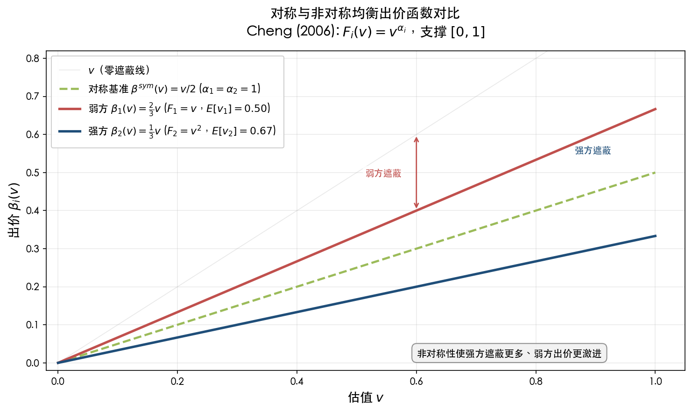

## 1.4 Why Asymmetry Destroys Tractability

The transition from the symmetric to the asymmetric case is not merely a matter of additional algebraic complexity; it represents a qualitative change in the mathematical structure of the problem. [Vickrey (1961)](https://cramton.umd.edu/market-design-papers/vickrey-counterspeculation-auctions-and-competitive-sealed-tenders.pdf "J. Finance 16(1): 8–37"), in Appendix II of his foundational paper, first identified this difficulty, observing that the differential equation for the asymmetric case "resists solution by analytical methods." Over four decades later, [Kaplan & Zamir (2012)](http://www.ma.huji.ac.il/~zamir/documents/Uniform_fulltext.pdf "Economic Theory 50(2): 269–302") confirmed that the problem had remained open for the general uniform case throughout the entire intervening period.

The fundamental obstacle is threefold.

**Irreducible coupling.** When $F_1 \neq F_2$, no symmetric equilibrium exists. The first-order condition for $\beta_1'(v_1)$ involves $\beta_2$ and $\beta_2'$, and vice versa. System (1.3) constitutes an irreducibly coupled pair of nonlinear ODEs that cannot be reduced to a single equation by any known substitution.

**Boundary-value structure with a free endpoint.** Conditions (B1)–(B3) render the problem a two-point BVP rather than an initial-value problem. The upper endpoint $\bar{b}$ is itself unknown and must be determined simultaneously with the solution. This free-boundary character compounds the difficulty imposed by the singular initial point.

**Singularity.** The $0/0$ indeterminacy at $b = \underline{b}$ prevents the system from being initialized by straightforward numerical integration from the lower boundary. The singularity, combined with the coupling, creates what [Fibich & Gavish (2011)](http://www.math.tau.ac.il/~fibich/Manuscripts/Numerical-simulations-of-asymmetric-first-price-auctions.pdf "GEB 73(2): 479–495") demonstrated to be an inherent instability in backward-shooting numerical methods: the equilibrium corresponds to a saddle point in the associated dynamical system, and backward integration follows the unstable manifold.

In the symmetric case, decoupling eliminates the first obstacle, and the common boundary $\beta(\underline{v}) = \underline{v}$ with $\beta(\bar{v})$ determined by the solution eliminates the second. No analogous simplification exists when $F_1 \neq F_2$.

## 1.5 Historical Development

The study of equilibrium bidding in asymmetric first-price auctions unfolded over more than five decades, proceeding through several distinct phases of intellectual progress.

### Phase 1: Vickrey's Foundation (1961)

[Vickrey (1961)](https://cramton.umd.edu/market-design-papers/vickrey-counterspeculation-auctions-and-competitive-sealed-tenders.pdf "J. Finance 16(1): 8–37") introduced the independent private values model and derived equilibrium bidding strategies for the symmetric case with uniformly distributed valuations. In Appendix II, he considered the possibility of asymmetric distributions but concluded that the resulting system of differential equations could not be solved analytically. This observation established the asymmetric FPSB auction as a recognized open problem in economic theory and set the agenda for decades of subsequent research.

### Phase 2: The First Closed-Form Solution (1967)

The earliest progress on the asymmetric case came from [Griesmer, Levitan & Shubik (1967)](https://onlinelibrary.wiley.com/doi/abs/10.1002/nav.3800140402 "Naval Research Logistics Quarterly 14(4): 415–433"), who solved the two-bidder FPSB auction for uniform distributions on $[0, \bar{v}_1]$ and $[0, \bar{v}_2]$ with a common lower bound of zero. The uniform distribution's key property—that the hazard-rate ratio $F_i/f_i$ is linear in the valuation—transforms the coupled ODE into a polynomial system amenable to algebraic methods. This result demonstrated that analytical tractability was achievable for specific distributional families, yet it left the general case entirely unresolved.

### Phase 3: Characterization and Regularity (1980s–1990s)

The theoretical foundations for the general problem were laid during this period. Maskin and Riley began circulating their comprehensive analysis as a UCLA Working Paper (#254) in the early 1980s, although formal publication came only in 2000. Their framework—encompassing the interim payoff formulation (1.1), the inverse-bid ODE system (1.4)–(1.5), the boundary conditions (B1)–(B3), and the notion of conditional stochastic dominance—became the standard reference for the field.

[Plum (1992)](https://kylewoodward.com/blog-data/pdfs/references/plum-international-journal-of-game-theory-1992A.pdf "Int. J. Game Theory 20(4): 393–418") provided the first rigorous characterization of the equilibrium ODE system as a singular boundary-value problem for two bidders. Plum established that equilibrium strategies are $C^1$ and strictly increasing, resolved the singularity at $\underline{b}$ via L'Hôpital's rule, and derived closed-form solutions for the power-function family $\varphi_i(x) = c_i(x - \alpha)^\mu$, thereby extending the Griesmer–Levitan–Shubik result to a broader distributional class.

[Lebrun (1996)](https://onlinelibrary.wiley.com/doi/abs/10.1111/1468-2354.00008 "cited in Lebrun 2006 and Kaplan & Zamir 2012") provided the first general existence proof for $n$-bidder IPV auctions with continuous distributions on interval supports, introducing an efficient tie-breaking rule for cases where the standard fair rule fails. [Lebrun (1999)](https://onlinelibrary.wiley.com/doi/abs/10.1111/1468-2354.00008 "IER 40(1): 125–142") subsequently extended this work to an $n$-bidder characterization and established uniqueness in certain subcases.

### Phase 4: Definitive Results (2000–2012)

The turn of the millennium witnessed the publication of the definitive theoretical papers that brought the field to maturity:

- [Maskin & Riley (2000)](https://www.isid.ac.in/~dmishra/topicsdoc/maskin_riley.pdf "RES 67(3): 413–438") published their comprehensive analysis of two-bidder asymmetric auctions, including revenue and efficiency comparisons that remain the primary reference for the economic implications of bidder asymmetry.

- [Maskin & Riley (2003)](https://www.ias.edu/sites/default/files/sss/papers/econpaper31.pdf "GEB 45(2): 395–409") proved uniqueness of equilibrium for $n = 2$ under the IPV paradigm with $C^2$ distributions possessing positive densities.

- [Athey (2001)](https://kylewoodward.com/blog-data/pdfs/references/athey-econometrica-2001A.pdf "Econometrica 69(4): 861–889") established the broadest existence result via the single-crossing condition and Kakutani's fixed-point theorem, covering affiliated values, heterogeneous bidders, different supports, and bidder-specific reserve prices.

- [Lebrun (2006)](https://econ.laps.yorku.ca/files/2015/10/lebrunb-u.pdf "GEB 55(1): 131–151") proved uniqueness under the weakest known conditions—requiring only local log-concavity of $F_i$ at the highest lower support endpoint—and fully characterized the case of different supports, including the phenomenon whereby the weaker bidder "drops out early" when upper supports differ.

- [Kaplan & Zamir (2012)](http://www.ma.huji.ac.il/~zamir/documents/Uniform_fulltext.pdf "Economic Theory 50(2): 269–302") completed the analytical solution for the general uniform case $v_i \sim U[\underline{v}_i, \bar{v}_i]$, resolving the problem that Vickrey had declared intractable over fifty years earlier. Their solution identifies three regimes depending on the relationship between the minimum bid and the lower supports, each yielding a distinct functional form (exponential, power-function, or logarithmic).

### Summary Timeline

| Year | Contributors | Contribution |
|------|-------------|-------------|
| 1961 | Vickrey | Symmetric IPV model; identified asymmetric intractability |
| 1967 | Griesmer, Levitan & Shubik | Closed form for $U[0,\bar{v}_i]$ |
| 1980s | Maskin & Riley (UCLA WP) | Comprehensive framework (published 2000) |
| 1992 | Plum | $C^1$ characterization; power-function solutions |
| 1996 | Lebrun | First general existence proof ($n$ bidders) |
| 1999 | Lebrun | $n$-bidder characterization and partial uniqueness |
| 2000 | Maskin & Riley | Published: revenue/efficiency analysis under CSD |
| 2001 | Athey | Broadest existence via single-crossing condition |
| 2003 | Maskin & Riley | Uniqueness for $n = 2$ under $C^2$, $f_i > 0$ |
| 2006 | Lebrun | Uniqueness under local log-concavity; different supports |
| 2012 | Kaplan & Zamir | Complete analytical solution for general uniform |

Figure 1.2 below provides a visual overview of this intellectual trajectory, situating each contribution within three broad developmental phases.

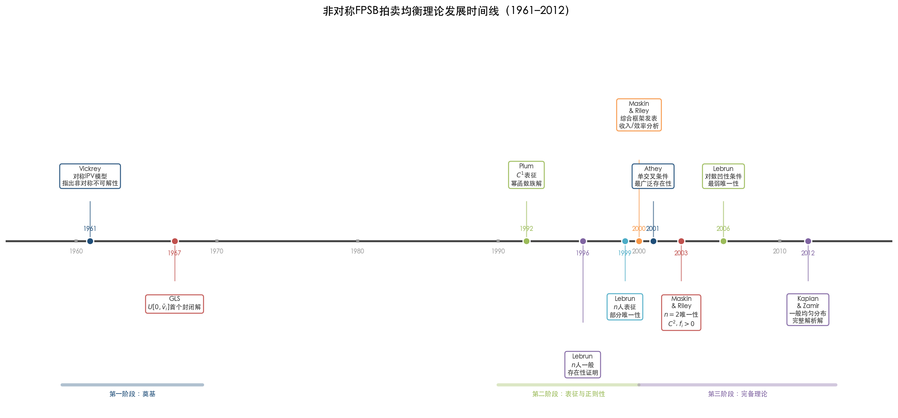

## 1.6 Preview of the General Method

The foregoing analysis reveals that while no single closed-form formula solves the asymmetric two-bidder FPSB auction for arbitrary $(F_1, F_2)$, the equilibrium is nevertheless *fully characterized* by a well-posed ODE boundary-value problem—the inverse-bid system (1.4)–(1.5) subject to conditions (B1)–(B3). This characterization, together with the existence and uniqueness results surveyed in Chapter 2, ensures that the equilibrium is in principle determined for any pair of distributions satisfying standard regularity conditions.

The remainder of this report develops three complementary pillars of this "general method":

- **Theoretical guarantees** (Chapter 2): Existence of a monotone BNE holds under mild conditions on the distributions; uniqueness holds under local log-concavity. The equilibrium inherits structural properties—strict monotonicity, $C^1$ regularity, and common bid support endpoints—that are essential for both analytical and numerical work.

- **Closed-form solutions for special families** (Chapter 3): When the hazard-rate ratio $F_i / f_i$ is linear in the valuation—as for uniform and power-function distributions—the ODE system reduces to a polynomial or algebraically tractable form. The catalog of known closed-form solutions, culminating in [Kaplan & Zamir (2012)](http://www.ma.huji.ac.il/~zamir/documents/Uniform_fulltext.pdf "Economic Theory 50(2): 269–302"), covers important distributional families, although no closed form exists for exponential, normal, or other standard distributions with nonlinear $F_i / f_i$.

- **Approximate and numerical methods** (Chapter 4): For distributions outside the tractable families, the ODE-BVP can be solved numerically to arbitrary precision. The Fibich–Gavish boundary-value method achieves $O(h^4)$ accuracy with a compact implementation, while the Fibich–Gavious perturbation expansion provides an analytical first-order approximation valid for weakly asymmetric distributions.

The economic implications—revenue comparisons, allocative efficiency, and bid-shading patterns—are developed in Chapter 5, and practical applications together with extensions are discussed in Chapter 6.

# Existence, Uniqueness, and Structural Properties of Equilibrium

Chapter 1 derived the coupled ODE system characterizing Bayesian Nash equilibrium (BNE) in the two-bidder asymmetric first-price sealed-bid (FPSB) auction and identified the singularity at the lower boundary that obstructs straightforward application of standard ODE theory. Two foundational questions naturally arise: does this system actually possess a solution, and if so, is that solution unique? This chapter surveys the theoretical results that answer both questions affirmatively under mild regularity conditions. It then catalogs the structural properties—strict monotonicity, smoothness, common bid-support endpoints, and boundary behavior—that any equilibrium must exhibit. These properties are indispensable for the closed-form solutions developed in Chapter 3, the numerical methods presented in Chapter 4, and the economic analysis of Chapter 5.

## 2.1 Existence of Equilibrium

### 2.1.1 Lebrun (1996): The First General Existence Proof

The first general existence result for the asymmetric FPSB auction is due to [Lebrun (1996)](https://onlinelibrary.wiley.com/doi/abs/10.1111/1468-2354.00008 "Economic Theory 7(3): 421–443"), who considered an arbitrary number $n \geq 2$ of bidders with independent private values. The distributional requirements are minimal: each $F_i$ need only be continuous on a compact interval support. Notably, the proof does not impose a positive-density assumption—continuity of the distribution function suffices for existence alone.

The proof proceeds in two stages. In the first stage, Lebrun discretizes both the value and bid spaces, constructs Nash equilibria of the resulting finite games, and takes limits as the discretization grids become arbitrarily fine. The central innovation is the introduction of *efficient tie-breaking*: when two or more bidders submit the same highest bid, the object is awarded to the bidder with the highest realized value. Under this rule, the finite game satisfies the conditions needed for standard fixed-point arguments—Kakutani's theorem applied to the finite approximations, followed by Helly's Selection Theorem for the passage to the limit. The efficient tie-breaking rule is not implementable in practice (it requires knowledge of the bidders' private values), but it serves as a powerful theoretical device for establishing existence.

In the second stage, Lebrun demonstrates that if the bidders' lowest possible values share a common lower bound and the distributions have no atoms at that bound, then the equilibrium bid distribution is atomless. Non-trivial ties therefore occur with probability zero, and the efficient tie-breaking equilibrium coincides with an equilibrium under the standard fair-lottery tie-breaking rule—that is, an equilibrium of the actual FPSB auction.

### 2.1.2 Maskin and Riley (2000b): Discontinuous-Game Approach

[Maskin & Riley (2000b)](https://www.jstor.org/stable/2692839 "RES 67(3): 439–454") established existence through the theory of discontinuous games developed by Dasgupta and Maskin (1986) and Reny (1999). Their result covers $n$ risk-neutral or risk-averse bidders whose valuation distributions are twice continuously differentiable with strictly positive densities ($f_i > 0$) on the support. A technical condition—$F_i(\underline{s}_i) > 0$, equivalent to the existence of a mass point at the lower endpoint and automatically satisfied when a reserve price is in effect—is imposed to eliminate the singularity at the lower boundary of the ODE system.

Under these conditions, the FPSB auction (equipped with a Vickrey tie-breaking rule that runs a second-price auction among tying bidders) possesses an equilibrium in non-decreasing pure strategies. The Vickrey tie-breaking rule, like Lebrun's efficient tie-breaking device, is non-implementable and serves solely to regularize the game-theoretic analysis. While Maskin and Riley's distributional requirements are more stringent than Lebrun's (demanding $C^2$ densities with $f_i > 0$), their framework naturally extends to risk-averse bidders and interdependent-value settings that Lebrun's original result does not accommodate.

### 2.1.3 Athey (2001): Single-Crossing and the Broadest Scope

The most general existence result for monotone pure-strategy equilibria in auction games is due to [Athey (2001)](https://kylewoodward.com/blog-data/pdfs/references/athey-econometrica-2001A.pdf "Econometrica 69(4): 861–889, Theorem 7"). Athey proved that a monotone pure-strategy BNE exists in any Bayesian game satisfying a *single-crossing condition* (SCC): whenever a higher action is weakly preferred at a given type, it remains weakly preferred at all higher types. For first-price auctions, this condition is naturally satisfied under affiliated signals with either private or common values.

The proof follows a discretize-and-take-limits architecture analogous to Lebrun's, but relies on Kakutani's fixed-point theorem applied to the space of monotone strategy profiles. For continuum-action games, Athey takes limits of monotone pure-strategy Nash equilibria of finite-action approximations via Helly's Selection Theorem. The result encompasses affiliated values (not merely independent), heterogeneous bidders with different supports, and bidder-specific reserve prices—making it the broadest existence result in the auction-theory literature.

This generality entails a trade-off: Athey's approach yields existence but furnishes no information about uniqueness, differentiability, or the specific structure of the equilibrium strategies. These finer properties must be established through the ODE-based analysis discussed in subsequent sections.

### 2.1.4 Reny and Zamir (2004): Interdependent Values with Affiliation

[Reny & Zamir (2004)](http://www.ma.huji.ac.il/~zamir/papers/50_Reny-Zamir_Econometrica.pdf "Econometrica 72(4): 1105–1125, Theorem 2.1") addressed a gap that remained after the earlier contributions: existence of monotone pure-strategy equilibria for $N \geq 3$ asymmetric bidders with affiliated one-dimensional signals and interdependent values. Each of the preceding results—Lebrun (1996), Maskin and Riley (2000b), Athey (2001)—requires at least one restrictive assumption (e.g., two bidders only, symmetric bidders, independent signals, or purely private/common values) when asymmetry, $N \geq 3$, and affiliation are simultaneously present.

Reny and Zamir's contribution was to identify precisely two mechanisms through which Athey's single-crossing condition can fail in the general affiliated setting and to demonstrate that both failures are avoidable. The first failure arises when the bids under comparison are both individually irrational (each yielding negative expected payoff). The second occurs when one of the bids ties for the winning bid with positive probability. By constructing finite bid grids with no common serious bids between distinct bidders and restricting attention to individually rational bids, Reny and Zamir established a weaker *individually rational tieless single-crossing condition* (IRT-SCC) that suffices for existence. Their Theorem 2.1 states that all first-price auction games satisfying the maintained assumptions—affiliated signals, strictly positive joint density, and standard utility monotonicity—possess a monotone pure-strategy equilibrium. For the two-bidder IPV case central to this report, the Reny–Zamir result provides an alternative existence proof under weaker structural assumptions than those of Maskin and Riley (2000b).

### 2.1.5 Jackson and Swinkels (2005): Distributional Strategies

[Jackson & Swinkels (2005)](https://kylewoodward.com/blog-data/pdfs/references/jackson+swinkels-econometrica-2005A.pdf "Econometrica 73(1): 93–139") established existence for a broad class of private-value auctions—including first-price, second-price, and double auctions—using the concept of *distributional strategies* (probability measures on value–bid pairs whose marginal over values equals the prior). Their framework accommodates correlated and asymmetrically distributed valuations, multiple-unit demands, and all standard pricing rules.

The key condition is that each player's marginal value distribution is atomless. Under this assumption, any equilibrium—regardless of the tie-breaking rule—is automatically an equilibrium under the standard fair-lottery rule, since ties occur with probability zero. The result is less constructive than the approaches of Lebrun or Athey but applies to a broader class of auction mechanisms. For the standard two-bidder asymmetric FPSB auction with continuous distributions (which are automatically atomless), Jackson and Swinkels provide yet another independent existence guarantee.

### 2.1.6 Olszewski, Reny, and Siegel (2026): Atoms and the Minimum High-Value

The most recent advance in existence theory is [Olszewski, Reny & Siegel (2026)](https://onlinelibrary.wiley.com/doi/abs/10.3982/ECTA22570 "Econometrica 94(1): 193–224"), which resolves the long-standing question of when equilibrium exists in FPSB auctions whose value distributions may contain atoms. The central finding is that existence often hinges on a single statistic: the *minimum high-value* (mHV), defined as the lowest value in the support of the distribution of the highest among all players' values—equivalently, $\bar{v} = \max\{\underline{v}_1, \ldots, \underline{v}_n\}$ under their regularity condition.

Theorem 3 of the paper establishes that the standard FPSB auction possesses a no-overbidding equilibrium whenever the joint distribution is regular (the Radon–Nikodym derivative of the joint distribution with respect to the product of marginals has a strictly positive infimum) and the mHV satisfies any one of four conditions: (a) $\bar{v} = 0$; (b) exactly one player's value is always at least $\bar{v}$; (c) at least two players' values always exceed $\bar{v}$; or (d) no player's value ever exceeds $\bar{v}$. These conditions collectively constitute a strict generalization of all prior existence results for the standard FPSB auction with private values. Theorem 8 further extends existence to independent values with non-quasi-linear utilities, requiring only that $F_i'(\bar{v}^+) > 0$ for every player $i$ satisfying $F_i(\bar{v}) > 0$.

For the canonical two-bidder IPV setting with continuous positive densities, the Olszewski–Reny–Siegel conditions are automatically satisfied, and their result subsumes all earlier guarantees. The primary contribution of the paper, however, lies in settling the existence question for discrete-valued and atom-containing distributions that had remained open since Maskin and Riley's (2000b) Example 2 demonstrated that equilibrium can fail when both players share a common value atom.

### 2.1.7 Summary of Existence Results

The following table synthesizes the principal existence results, ordered by generality of distributional assumptions.

| Result | Bidders | Values | Distributional conditions | Key technique |
|--------|---------|--------|---------------------------|---------------|
| Lebrun (1996) | $n \geq 2$, asymmetric | IPV | Continuous $F_i$, common lower bound, no atom at lower bound | Efficient tie-breaking + finite-game limits |
| Maskin & Riley (2000b) | $n \geq 2$, asymmetric | IPV, risk-averse | $C^2$, $f_i > 0$, $F_i(\underline{s}_i) > 0$ | Discontinuous-game theory (Reny 1999) |
| Athey (2001) | $n \geq 2$, asymmetric | Affiliated, interdependent | Single-crossing condition | Kakutani + Helly limits |
| Reny & Zamir (2004) | $N \geq 2$, asymmetric | Affiliated, interdependent | Positive joint density, 1-D signals | IRT-SCC + finite-grid limits |
| Jackson & Swinkels (2005) | $n \geq 2$, asymmetric | Private values, correlated | Atomless marginals | Distributional strategies |
| Olszewski, Reny & Siegel (2026) | $n \geq 2$, asymmetric | Private values, correlated, atoms | Regular joint distribution + mHV conditions | Efficient tie-breaking + mHV analysis |

Figure 2.1 illustrates the logical nesting of these results: outer layers impose weaker conditions and therefore encompass broader classes of auction environments, while inner layers impose stronger conditions. The innermost region—the canonical two-bidder IPV case with continuous distributions having positive densities on bounded supports—satisfies the assumptions of every one of the six results simultaneously.

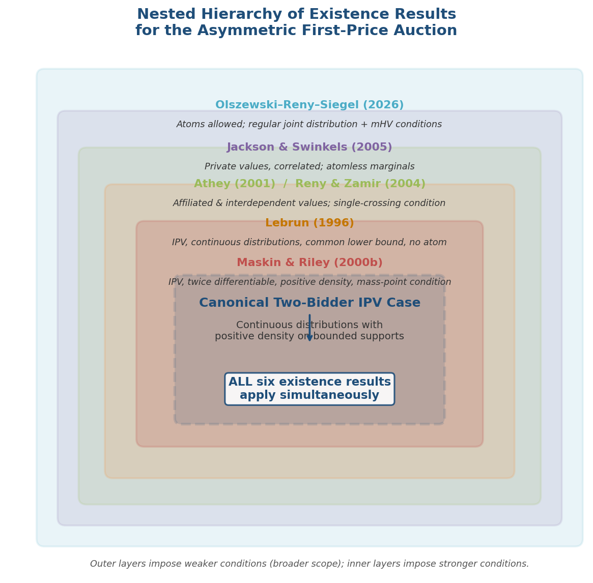

For the two-bidder asymmetric IPV setting with continuous distributions having positive densities on bounded supports—the canonical model of this report—every one of these results guarantees the existence of a monotone pure-strategy BNE.

## 2.2 Uniqueness of Equilibrium

Establishing uniqueness is considerably more delicate than establishing existence. The singularity of the ODE system at the lower boundary $\underline{b}$ prevents direct application of the Fundamental Theorem of ODE (Picard–Lindelöf), which guarantees local uniqueness only when the right-hand side is Lipschitz continuous—a condition that fails at the singular point. The three principal uniqueness results in the literature employ distinct strategies to circumvent this obstacle.

### 2.2.1 Lizzeri and Persico (2000): Two-Player Bidding Games with Affiliation

[Lizzeri & Persico (2000)](https://www.sciencedirect.com/science/article/pii/S0899825698907047 "GEB 30(1): 83–114") established both existence and uniqueness for a general class of two-player bidding games that includes the first-price auction as a special case. Their framework extends beyond independent private values to affiliated (correlated) values for $n = 2$. The key structural assumption is that the game constitutes a "bidding game" in which each player's payoff depends on the opponent's bid only through whether it exceeds one's own, and both payoffs satisfy a monotone likelihood ratio property in the signal.

Under these conditions, Lizzeri and Persico prove that any two equilibria must coincide. For the first-price auction with two bidders, their uniqueness result applies whenever values are affiliated and signals are one-dimensional. The result does not extend to $n > 2$ without additional symmetry assumptions. As noted in [Athey (2001)](https://kylewoodward.com/blog-data/pdfs/references/athey-econometrica-2001A.pdf "Econometrica 69(4): 861–889, footnote 6") and [Maskin & Riley (2003)](https://www.ias.edu/sites/default/files/sss/papers/econpaper31.pdf "GEB 45(2): 395–409, Section 4"), the Lizzeri–Persico uniqueness result for two players was a significant early contribution, demonstrating that the equilibrium ODE system admits a unique solution in the most economically relevant case.

### 2.2.2 Maskin and Riley (2003): FTODE and Log-CDF Transformation

[Maskin & Riley (2003)](https://www.ias.edu/sites/default/files/sss/papers/econpaper31.pdf "GEB 45(2): 395–409") provided the first uniqueness proof for the asymmetric FPSB auction that operates directly on the ODE system. Their approach centers on a transformation of the inverse-bid system (1.4) into a system expressed in terms of log-CDFs.

Define $p_i(b) = \ln F_i(\phi_i(b))$ for each bidder $i$. The inverse-bid ODE (1.4)–(1.5) from Chapter 1 then becomes

$$
p_j'(b) = \frac{1}{\phi_i(b) - b}, \tag{2.1}
$$

which, combined with the relationship $\phi_i(b) = F_i^{-1}(e^{p_i(b)})$, yields a self-contained system in $(p_1, p_2)$. The Fundamental Theorem of ODE (FTODE) applies to this transformed system at points where the right-hand side is Lipschitz continuous—in particular, at the *upper* endpoint $\bar{b}$, where the functions are well-behaved.

**For $n = 2$ bidders** (Proposition 1): Under IPV with $F_i \in C^2$, $f_i > 0$ on the support, and $F_i(\underline{s}_i) > 0$ (mass point at the lower endpoint), the equilibrium is unique. The mass-point condition $F_i(\underline{s}_i) > 0$ is essential: it eliminates the singularity at $\underline{b}$ by ensuring that $p_i(\underline{b}) > -\infty$, rendering the log-CDF system regular on the entire bid interval $[\underline{b}, \bar{b}]$. The FTODE then guarantees that the terminal condition at $\bar{b}$ uniquely determines the solution backward.

The proof hinges on a comparison lemma (Lemma 9): if two candidate solutions $(p_1, p_2)$ and $(\hat{p}_1, \hat{p}_2)$ agree at $\bar{b}$—that is, $p_i(\bar{b}) = \hat{p}_i(\bar{b})$ for $i = 1, 2$—then a monotone comparison principle demonstrates that one solution cannot dominate the other on any subinterval without violating the boundary conditions at $\underline{b}$.

**For $n$ bidders** (Proposition 2): Uniqueness extends to $n \geq 3$ under additional assumptions: common upper support $\bar{s}_1 = \cdots = \bar{s}_n$, identical preferences at the same reservation price, and non-increasing absolute risk aversion (NIARA). These conditions are more restrictive, reflecting the genuine difficulty of ruling out multiple equilibria when more than two asymmetric bidders interact simultaneously.

### 2.2.3 Lebrun (2006): The Weakest Known Conditions

The definitive uniqueness result is due to [Lebrun (2006)](https://econ.laps.yorku.ca/files/2015/10/lebrunb-u.pdf "GEB 55(1): 131–151, Theorem 1"), who established uniqueness under the weakest known conditions and for the broadest class of distributional configurations, including the case of different supports.

**Theorem 1 of Lebrun (2006):** Consider $n = 2$ bidders with independent private values. Let $c_1 \geq c_2$ denote the lower endpoints of the two supports (where $c_1$ is the highest lower endpoint). Suppose that each $F_i$ is continuous on its support with positive density $f_i > 0$ and that $F_1$ is **locally log-concave at $c_1$**—that is, $\ln F_1$ is concave in a neighborhood of $c_1$. Then the equilibrium in monotone strategies is unique.

The local log-concavity condition is remarkably mild. A distribution $F$ is log-concave if $\ln F$ is concave, which is equivalent to requiring that the reverse hazard rate $f(v)/F(v)$ is non-increasing. [Bagnoli & Bergstrom (2005)](https://link.springer.com/article/10.1007/s00199-004-0514-4 "Economic Theory 26(2): 445–469") demonstrated that most standard distributions—uniform, normal, logistic, exponential, gamma, beta (with appropriate parameters), and power-function—are globally log-concave. Lebrun's condition is needed only at the single point $c_1$, not globally.

**The "sliding" proof technique.** Lebrun's uniqueness argument is both elegant and geometric. Suppose two distinct solutions $(\phi_1, \phi_2)$ and $(\hat{\phi}_1, \hat{\phi}_2)$ both satisfy the ODE system and the boundary conditions. Lebrun constructs a one-parameter family of translated solutions by "sliding" one solution along the 45° line in the $(b, \phi)$-plane by an amount $\varepsilon$. The translated solution satisfies a modified ODE; the log-concavity of $F_1$ at $c_1$ implies that the translated solution satisfies *strict* differential inequalities relative to the original. These strict inequalities prevent the two solutions from both meeting the lower boundary condition $\phi_i(\underline{b}) = \underline{v}_i$, establishing a contradiction. Figure 2.2 provides a schematic illustration of this argument.

**Comparison with Maskin and Riley (2003).** Lebrun's result is strictly more general in three respects. First, it applies to the atomless case ($F_i(\underline{v}_i) = 0$), which Maskin and Riley's Proposition 1 excludes via the condition $F_i(\underline{s}_i) > 0$. Second, it accommodates different supports ($\underline{v}_1 \neq \underline{v}_2$), whereas Maskin and Riley require common supports for $n = 2$. Third, it requires only $C^1$ distributions (positive density suffices) rather than $C^2$. The cost of this greater generality is that Lebrun's technique is specialized to $n = 2$ and does not directly extend to $n \geq 3$.

### 2.2.4 Summary

For the two-bidder asymmetric IPV auction with continuous distributions having positive densities and satisfying local log-concavity at the highest lower support endpoint, the equilibrium in monotone strategies is **unique**. This condition encompasses essentially all economically relevant two-bidder specifications. For $n \geq 3$ asymmetric bidders, uniqueness requires the more restrictive assumptions of Maskin and Riley (2003)—common upper support and NIARA—and the theory remains less complete.

## 2.3 Structural Properties of Equilibrium

With existence and uniqueness established, the literature characterizes several structural properties that every equilibrium must exhibit. These properties are not merely of theoretical interest: they serve as essential prerequisites for the closed-form solutions cataloged in Chapter 3, the numerical algorithms developed in Chapter 4, and the economic welfare analysis of Chapter 5.

### 2.3.1 Strict Monotonicity

In any equilibrium, each bidder's strategy $\beta_i$ is strictly increasing on the interior of the support. This property was first established for $n = 2$ by [Plum (1992)](https://kylewoodward.com/blog-data/pdfs/references/plum-international-journal-of-game-theory-1992A.pdf "Int. J. Game Theory 20(4): 393–418") and extended to $n$ bidders by [Lebrun (1999)](https://onlinelibrary.wiley.com/doi/abs/10.1111/1468-2354.00008 "IER 40(1): 125–142"). The economic intuition is transparent: a bidder with a higher valuation has strictly more to gain from winning and therefore bids strictly more. Formally, if $\beta_i(v') = \beta_i(v'')$ for $v' < v''$, then bidder $i$ with valuation $v''$ could reduce her bid without affecting her probability of winning, thereby obtaining strictly higher surplus—contradicting equilibrium.

Strict monotonicity carries an immediate and important implication: each equilibrium bid function possesses a well-defined inverse $\phi_i = \beta_i^{-1}$, which justifies the inverse-bid formulation (1.4) of the ODE system that underpins both the theoretical analysis and computational methods.

### 2.3.2 Smoothness: $C^1$ Regularity

[Plum (1992)](https://kylewoodward.com/blog-data/pdfs/references/plum-international-journal-of-game-theory-1992A.pdf "Int. J. Game Theory 20(4): 393–418") proved that equilibrium strategies are continuously differentiable ($C^1$) on the interior of the support for the two-bidder case. The reasoning proceeds as follows. Strict monotonicity implies that $\beta_i$ is continuous and strictly increasing, so the inverse $\phi_i = \beta_i^{-1}$ is likewise continuous and strictly increasing. The first-order condition (1.2) then implies that $\phi_i$ satisfies the ODE (1.4), whose right-hand side is continuous whenever the densities $f_i$ are continuous. By the integral representation of ODE solutions, $\phi_i$ is $C^1$, and consequently $\beta_i = \phi_i^{-1}$ inherits $C^1$ regularity.

When the distributions belong to class $C^k$ for $k \geq 2$, standard ODE regularity theory implies that the inverse-bid functions inherit this higher-order smoothness: $\phi_i \in C^k$ on the interior of the bid range. In particular, under the $C^2$ assumption employed by Maskin and Riley (2003), the equilibrium strategies are $C^2$ on the open bid interval $(\underline{b}, \bar{b})$, facilitating the application of higher-order numerical methods.

### 2.3.3 Common Upper Endpoint of the Bid Range

A fundamental structural property is that both bidders' strategies attain the same maximum bid:

$$
\bar{b} = \beta_1(\bar{v}_1) = \beta_2(\bar{v}_2). \tag{2.2}
$$

This was established for common supports by [Lebrun (1999)](https://onlinelibrary.wiley.com/doi/abs/10.1111/1468-2354.00008 "IER 40(1): 125–142"), for equal upper supports by [Maskin & Riley (2003)](https://www.ias.edu/sites/default/files/sss/papers/econpaper31.pdf "GEB 45(2): 395–409, Lemma 10"), and for general (possibly different) supports by [Lebrun (2006)](https://econ.laps.yorku.ca/files/2015/10/lebrunb-u.pdf "GEB 55(1): 131–151, Characterization C.5").

The economic argument is as follows. Suppose bidder 1's maximum bid strictly exceeds bidder 2's: $\beta_1(\bar{v}_1) > \beta_2(\bar{v}_2)$. Then for valuations $v_1$ near $\bar{v}_1$, bidder 1 bids above $\beta_2(\bar{v}_2)$ and wins with certainty. She could therefore reduce her bid to $\beta_2(\bar{v}_2) + \varepsilon$ for arbitrarily small $\varepsilon > 0$ without altering her probability of winning, thereby obtaining strictly higher surplus—a contradiction to equilibrium. This argument extends straightforwardly to the case of different upper supports.

The common upper endpoint $\bar{b}$ is *a priori* unknown and must be determined as part of the solution to the boundary-value problem. For the case of common upper supports ($\bar{v}_1 = \bar{v}_2 = \bar{v}$), the upper boundary satisfies $\bar{b} < \bar{v}$: bidding one's full valuation guarantees zero surplus upon winning, which is dominated by bidding strictly less.

### 2.3.4 No Gaps in the Bid Support

The support of each bidder's bid distribution is a connected interval—there are no "gaps" in equilibrium bidding behavior. For $n = 2$, the argument is elementary: if bidder $i$'s bid distribution had a gap $(b', b'')$ with $b' < b''$, then the opponent's probability of winning would remain constant for all bids in $(b', b'')$. The opponent could therefore increase her surplus by reducing any bid in $(b', b'')$ to $b'$—contradicting the optimality of the opponent's strategy.

For $n \geq 2$, [Maskin & Riley (2003)](https://www.ias.edu/sites/default/files/sss/papers/econpaper31.pdf "GEB 45(2): 395–409, Lemma 11") proved the no-gaps property under the additional assumption of non-increasing absolute risk aversion (NIARA). Their Lemma 1 provides a simpler proof for $n = 2$ that does not require the NIARA condition. The no-gaps property is important for numerical computation: it ensures that the ODE system (1.4) is defined on a single connected interval $[\underline{b}, \bar{b}]$ without the need to handle disconnected bid domains.

### 2.3.5 The Weaker Bidder Drops Out Early

When the two bidders have different upper supports—say $\bar{v}_2 < \bar{v}_1$, so that bidder 2 is the "weaker" bidder in the sense of possessing a lower maximum valuation—the equilibrium exhibits a distinctive asymmetric feature: the weaker bidder's bid function does not span the full bid range up to $\bar{b}$.

Specifically, [Lebrun (2006)](https://econ.laps.yorku.ca/files/2015/10/lebrunb-u.pdf "GEB 55(1): 131–151, Section 5.2, Characterization C.5") demonstrated that $\beta_2(\bar{v}_2) = \eta_2 < \bar{b}$: bidder 2's maximum bid is strictly below the common upper endpoint. For bids in the interval $(\eta_2, \bar{b})$, only bidder 1 is active: she wins with certainty and faces no competitive pressure. In this upper region, bidder 1's equilibrium behavior reduces to submitting the lowest bid that guarantees winning.

The "early dropout" phenomenon carries important economic implications. For the highest-valuation realizations of the stronger bidder, competition is effectively absent, which contributes to the revenue-reducing effect of asymmetry analyzed in Chapter 5.

### 2.3.6 Boundary Behavior: The Singularity and Initial Slopes

As established in Chapter 1 (Section 1.2), the ODE system (1.4) is singular at $b = \underline{b}$. In the common-lower-bound case ($\underline{v}_1 = \underline{v}_2 = \underline{v}$, so that $\underline{b} = \underline{v}$), both $F_j(\phi_j(b)) \to 0$ and $(\phi_i(b) - b) \to 0$ as $b \to \underline{b}^+$, producing a $0/0$ indeterminacy.

[Plum (1992)](https://kylewoodward.com/blog-data/pdfs/references/plum-international-journal-of-game-theory-1992A.pdf "Int. J. Game Theory 20(4): 393–418, eq. (A.4)") resolved this indeterminacy by applying L'Hôpital's rule. In the common-lower-bound case with $\underline{v}_1 = \underline{v}_2$, the initial slopes satisfy

$$
\phi_i'(\underline{b}) = 2 \quad \text{for } i = 1, 2. \tag{2.3}
$$

This result—that both inverse-bid functions share the same slope of 2 at the lower boundary regardless of the specific distributions $F_1, F_2$—is a striking universal feature of the two-bidder equilibrium. It implies that near the bottom of the bid range, both bidders shade their bids by approximately half their surplus: $\beta_i(v) \approx v/2$ for $v$ near $\underline{v}$, reminiscent of the symmetric equilibrium formula.

As [Lebrun (2006)](https://econ.laps.yorku.ca/files/2015/10/lebrunb-u.pdf "GEB 55(1): 131–151") emphasized, this singularity is the fundamental reason that standard ODE uniqueness theorems fail. The Picard–Lindelöf theorem requires a Lipschitz right-hand side, which fails at $\underline{b}$ because the right-hand side of (1.4) is not even defined there. The uniqueness proofs of Lebrun (2006) and Maskin and Riley (2003) must therefore employ specialized arguments—the sliding technique and the log-CDF transformation, respectively—rather than appealing to classical ODE theory.

## 2.4 Comparison of Proof Techniques

The three principal approaches to establishing existence and uniqueness differ fundamentally in their mathematical machinery and the scope of properties they deliver.

**ODE-based approach (Plum 1992; Lebrun 1996, 1999, 2006).** This approach works directly with the inverse-bid ODE system (1.4). Existence is proved by constructing solutions to the boundary-value problem; uniqueness is established by analyzing the solution manifold near the singular point. The advantages are twofold: the proofs yield sharp structural results (monotonicity, $C^1$ regularity, initial slopes), and the uniqueness conditions are tight (local log-concavity at a single point). The principal limitation is that the technique is technically demanding and, for uniqueness, essentially restricted to $n = 2$.

**FTODE / log-CDF approach (Maskin & Riley 2003).** By transforming to log-CDFs $p_i(b) = \ln F_i(\phi_i(b))$, the ODE system is regularized: the singularity at $\underline{b}$ is removed when $F_i(\underline{v}_i) > 0$. Standard FTODE then applies at $\bar{b}$, and a comparison principle delivers uniqueness. The advantage is conceptual clarity and relatively straightforward application of classical ODE theory. The limitation is the requirement $F_i(\underline{s}_i) > 0$, which excludes the atomless case that arises naturally in most theoretical models.

**Fixed-point / single-crossing approach (Athey 2001; Reny & Zamir 2004).** These approaches avoid the ODE entirely, relying on topological fixed-point arguments in strategy space. Their scope is the broadest (affiliated values, interdependent values, $n$ bidders), but they yield neither uniqueness nor differentiability of the equilibrium strategies.

For the two-bidder IPV case with standard regularity conditions, all three approaches confirm existence and—where applicable—uniqueness. The practitioner seeking to solve the equilibrium numerically should rely on the ODE-based characterization, knowing that the structural properties (monotonicity, $C^1$ regularity, common endpoints) guaranteed by the first approach ensure that the inverse-bid BVP is well-posed.

## 2.5 Log-Concavity and Its Role

The local log-concavity condition in Lebrun (2006) merits detailed discussion, as it is the pivotal distributional assumption separating uniqueness from potential multiplicity.

A distribution function $F$ is **log-concave** if $\ln F(v)$ is a concave function of $v$, or equivalently if the reverse hazard rate $r(v) = f(v)/F(v)$ is non-increasing. This condition is weaker than log-concavity of the density $f$, which is in turn weaker than concavity of $F$ itself. The hierarchy of implications is:

$$
F \text{ concave} \implies f \text{ log-concave} \implies F \text{ log-concave}.
$$

[Bagnoli & Bergstrom (2005)](https://link.springer.com/article/10.1007/s00199-004-0514-4 "Economic Theory 26(2): 445–469") compiled a comprehensive catalog demonstrating that virtually all standard parametric families employed in applied work—uniform, normal, logistic, exponential, extreme value, chi-squared, chi, Laplace, power-function, and many others—possess log-concave CDFs. Distributions that fail log-concavity are pathological from the standpoint of auction theory: they exhibit increasing reverse hazard rates, meaning that learning one's value exceeds a given threshold makes it *more* likely that the value is only marginally above that threshold.

Lebrun's key insight is that log-concavity is needed only *locally*, at the single point $c_1 = \max\{\underline{v}_1, \underline{v}_2\}$. The uniqueness argument hinges on the behavior of the ODE solutions near the singular lower boundary, and only the local curvature of $\ln F_1$ at $c_1$ determines whether the "sliding" argument produces the required strict differential inequalities. Consequently, even distributions that are not globally log-concave may satisfy the uniqueness condition, provided their CDF is locally log-concave at the relevant point.

An important application arises in cartel settings, where a bidding ring of $m$ members effectively bids as a single agent with CDF $F^m$ (the CDF of the maximum of $m$ independent draws from $F$). Since $\ln F^m = m \ln F$, the cartel CDF is log-concave whenever $F$ is, and Lebrun's uniqueness theorem applies directly to the asymmetric auction between the cartel and an independent bidder.

## 2.6 Conditions on Distributions: A Unified View

To provide a practical reference for subsequent chapters, we consolidate the distributional conditions required for the main existence and uniqueness results in the two-bidder IPV setting.

**Minimal conditions for existence.** $F_1, F_2$ continuous on compact interval supports; no positive-density requirement (Lebrun 1996). Under Athey (2001), even affiliation and interdependent values are permitted; for the IPV case, the single-crossing condition is automatically satisfied.

**Standard conditions for existence and uniqueness.** $F_i$ continuous on $[\underline{v}_i, \bar{v}_i]$ with positive density $f_i > 0$, and $F_i$ locally log-concave at $c_1 = \max\{\underline{v}_1, \underline{v}_2\}$ (Lebrun 2006). These conditions guarantee existence of a unique BNE in monotone strategies that is $C^1$, strictly increasing, with a common upper bid endpoint, no gaps in the bid support, and initial slopes $\phi_i'(\underline{b}) = 2$.

**Strongest standard conditions.** $F_i \in C^2$ with $f_i > 0$, combined with either $F_i(\underline{v}_i) > 0$ (Maskin & Riley 2003) or local log-concavity at $c_1$ (Lebrun 2006). Under these conditions, the equilibrium strategies are $C^2$, all structural properties hold, and the ODE boundary-value problem is amenable to high-order numerical methods.

In practice, the standard conditions—positive density and log-concavity—are satisfied by essentially all distributions used in economic modeling. The theory therefore provides a complete foundation: for any pair of "well-behaved" distributions $(F_1, F_2)$, the equilibrium exists, is unique, and possesses the structural regularity needed for both analytical characterization and numerical computation.

# Closed-Form and Analytical Solutions

The preceding chapters established that the two-bidder asymmetric first-price sealed-bid (FPSB) auction possesses a unique Bayesian Nash equilibrium in monotone pure strategies under mild regularity conditions, and that this equilibrium is characterized by a coupled ODE boundary-value problem—the inverse-bid system (1.4)–(1.5) with boundary conditions (B1)–(B3). For general distribution pairs $(F_1, F_2)$, the system must be solved numerically. There exist, however, several important distributional families for which the ODE system admits explicit closed-form solutions. This chapter catalogs all known tractable cases, presents the explicit equilibrium strategies, identifies the common algebraic mechanism underlying each solvable case, and delineates the sharp boundary beyond which no analytical solution is available.

## 3.1 The Symmetric Benchmark

Before turning to asymmetric cases, it is instructive to recall why the symmetric problem admits a clean solution. When $F_1 = F_2 = F$, symmetry implies $\beta_1 = \beta_2 = \beta$, and the coupled system (1.3) decouples into a single first-order linear ODE:

$$
\beta'(v) = \frac{f(v)}{F(v)} \bigl(v - \beta(v)\bigr), \tag{3.1}
$$

with boundary condition $\beta(\underline{v}) = \underline{v}$. The closed-form solution, first derived by [Vickrey (1961)](https://cramton.umd.edu/market-design-papers/vickrey-counterspeculation-auctions-and-competitive-sealed-tenders.pdf "J. Finance 16(1): 8–37"), is

$$
\beta(v) = v - \int_{\underline{v}}^{v} \frac{F(y)}{F(v)}\,dy = \mathbb{E}[Y_1 \mid Y_1 < v], \tag{3.2}
$$

where $Y_1$ denotes the highest rival valuation. Each bidder's equilibrium bid equals the expected value of the opponent's valuation conditional on losing, i.e., conditional on the rival's value being below $v$. For $F = U[0,1]$ with two bidders, this yields the well-known formula $\beta(v) = v/2$: a bidder shades by exactly half her surplus.

The key algebraic feature is that symmetry eliminates the coupling entirely—$\beta_1 = \beta_2$ collapses the two-equation system to a single ODE. This reduction is unique to the symmetric case and breaks down as soon as $F_1 \neq F_2$, as the textbook treatment in [Krishna (2010)](https://bugarinmauricio.com/wp-content/uploads/2017/06/krishna-auction-theory-caps1a4.pdf "Auction Theory, 2nd Ed., Academic Press"), Proposition 2.2, makes clear.

## 3.2 Uniform Distributions with Common Lower Bound: Griesmer–Levitan–Shubik (1967)

The first closed-form solution for an asymmetric FPSB auction was obtained by [Griesmer, Levitan & Shubik (1967)](https://doi.org/10.1002/nav.3800140405 "Naval Research Logistics Quarterly 14(4): 415–443") (hereafter GLS) for the case $v_1 \sim U[0, \bar{v}_1]$ and $v_2 \sim U[0, \bar{v}_2]$ with $\bar{v}_1 \neq \bar{v}_2$. In the terminology of [Maskin & Riley (2000)](https://www.isid.ac.in/~dmishra/topicsdoc/maskin_riley.pdf "RES 67(3): 413–438"), this represents a "pure stretch" asymmetry: the two distributions share a common lower endpoint but differ in their upper supports.

### The ODE Simplification

For uniform distributions on $[0, \bar{v}_i]$, the reciprocal reverse hazard rate simplifies to $F_i(\phi_i)/f_i(\phi_i) = \phi_i$. The inverse-bid ODE (1.4) therefore reduces to

$$
\phi_i'(b) = \frac{\phi_j(b)}{\phi_i(b) - b}, \tag{3.3}
$$

a polynomial system. The boundary conditions are $\phi_1(0) = \phi_2(0) = 0$ and $\phi_1(\bar{b}) = \bar{v}_1$, $\phi_2(\bar{b}) = \bar{v}_2$, with common upper bid

$$
\bar{b} = \frac{\bar{v}_1 \bar{v}_2}{\bar{v}_1 + \bar{v}_2}. \tag{3.4}
$$

The explicit inverse-bid functions, as confirmed in [Kaplan & Zamir (2012)](http://www.ma.huji.ac.il/~zamir/documents/Uniform_fulltext.pdf "Economic Theory 50(2): 269–302") by taking the limit $m \to 0$ of their general formulas (equations (20)–(21) therein), are

$$
\phi_1(b) = \frac{2b\,\bar{v}_1^2\,\bar{v}_2^2}{\bar{v}_1^2\,\bar{v}_2^2 + b^2(\bar{v}_2^2 - \bar{v}_1^2)}, \qquad
\phi_2(b) = \frac{2b\,\bar{v}_1^2\,\bar{v}_2^2}{\bar{v}_1^2\,\bar{v}_2^2 - b^2(\bar{v}_2^2 - \bar{v}_1^2)}, \tag{3.5}
$$

assuming $\bar{v}_2 \geq \bar{v}_1$. When $\bar{v}_1 = \bar{v}_2$, both expressions collapse to $\phi(b) = 2b$, recovering the symmetric $U[0,\bar{v}]$ equilibrium.

The GLS solution reveals a qualitative asymmetry: the stronger bidder (with the wider support) shades more at every interior valuation, while the weaker bidder bids more aggressively. This is the prototype of the "weakness leads to aggression" phenomenon later formalized by [Maskin & Riley (2000)](https://www.isid.ac.in/~dmishra/topicsdoc/maskin_riley.pdf "RES 67(3): 413–438"), Proposition 3.5. Figure 3.1 illustrates this effect for the case $v_1 \sim U[0,1]$ versus $v_2 \sim U[0,2]$.

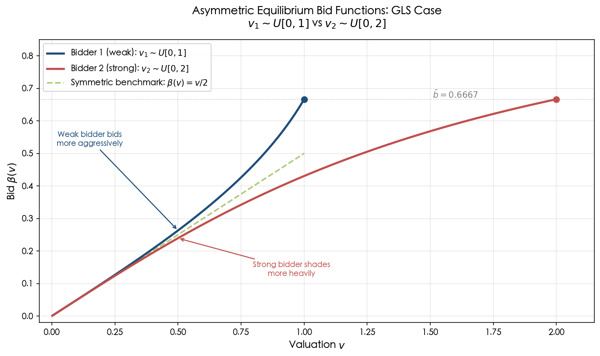

**Figure 3.1.** Equilibrium bid functions under the GLS closed-form solution for $v_1 \sim U[0,1]$ (weak bidder, blue) and $v_2 \sim U[0,2]$ (strong bidder, red), with the symmetric benchmark $\beta(v) = v/2$ (green dashed). The weak bidder's bid function lies above the symmetric benchmark, reflecting greater aggressiveness, while the strong bidder shades more heavily. The common upper bid is $\bar{b} = 2/3$.

## 3.3 General Uniform Distributions: Kaplan and Zamir (2012)

For over four decades following Vickrey's 1961 identification of the asymmetric problem, the general case of $v_i \sim U[\underline{v}_i, \bar{v}_i]$ with arbitrary supports remained unsolved. [Kaplan & Zamir (2012)](http://www.ma.huji.ac.il/~zamir/documents/Uniform_fulltext.pdf "Economic Theory 50(2): 269–302") provided the complete analytical solution, encompassing the possibility of a binding minimum bid $m$. Their result settled a problem that Vickrey himself had declared resistant to analytical methods and represents the most general known closed-form solution for the asymmetric FPSB auction.

### The Three-Regime Structure

The functional form of the equilibrium depends on where the minimum bid $m$ falls relative to the lower support endpoints. Defining $\underline{b} = \max\{(\underline{v}_1 + \underline{v}_2)/2,\, m\}$, three regimes arise:

**Regime 1 (Exponential form): $m \leq (\underline{v}_1 + \underline{v}_2)/2$.** The minimum bid is non-binding or just binding. [Kaplan & Zamir (2012)](http://www.ma.huji.ac.il/~zamir/documents/Uniform_fulltext.pdf "Economic Theory 50(2): 269–302"), Proposition 1, gives the inverse-bid function for buyer 1 as

$$
\phi_1(b) = \underline{v}_1 + \frac{(\underline{v}_2 + \underline{v}_1 - 2b)\,c_1}{(\underline{v}_2 - \underline{v}_1)^2} \cdot e^{\frac{\underline{v}_2 + \underline{v}_1 - 2b}{\underline{v}_2 - \underline{v}_1}} + \frac{4(\underline{v}_2 - b)}{(\underline{v}_2 - \underline{v}_1)^2}, \tag{3.6}
$$

where $c_1$ is a constant determined by the upper boundary condition (B3). Buyer 2's function is obtained by interchanging the roles of $(\underline{v}_1, \bar{v}_1)$ and $(\underline{v}_2, \bar{v}_2)$. The common upper bid is $\bar{b} = (\bar{v}_1 \cdot \bar{v}_2 - \underline{v}_1 \cdot \underline{v}_2) / [(\bar{v}_1 - \underline{v}_1) + (\bar{v}_2 - \underline{v}_2)]$. The exponential term arises from the classical technique of "integration by differentiation" applied to the polynomial ODE system.

**Regime 2 (Power-function form): $m > (\underline{v}_1 + \underline{v}_2)/2$ and $m \neq \underline{v}_2$.** When the minimum bid is strictly binding, Proposition 2 yields

$$
\phi_1(b) = \underline{v}_1 + \frac{(m - \underline{v}_1)(m - \underline{v}_2)}{b - \underline{v}_2} - c_3\,(b - m)^{\theta}\,(b + m - \underline{v}_1 - \underline{v}_2)^{1-\theta}, \tag{3.7}
$$

where $\theta = (m - \underline{v}_1)/[(m - \underline{v}_1) + (m - \underline{v}_2)]$, and the constant $c_3$ involves the support parameters and $\theta$. This power-function form reflects the changed boundary structure when some low-valuation types are excluded by the minimum bid.

**Regime 3 (Logarithmic form): $m = \underline{v}_2 > \underline{v}_1$.** At the knife-edge boundary between regimes, the power-function expressions degenerate, and Proposition 3 provides a logarithmic solution:

$$
\phi_1(b) = \underline{v}_1 + \frac{\underline{v}_2 - \underline{v}_1}{1 - \left(\frac{b - \underline{v}_2}{\underline{v}_2 - \underline{v}_1}\right)\left[c_5 + \log\left(\frac{b - \underline{v}_1}{b - \underline{v}_2}\right)\right]}, \tag{3.8}
$$

where $c_5$ is determined by the upper boundary condition.

### Continuity Across Regimes

A notable feature of the Kaplan–Zamir solution is its continuity in all parameters $(\underline{v}_1, \bar{v}_1, \underline{v}_2, \bar{v}_2, m)$, despite the apparently different functional forms across regimes. This continuity rests on two theoretical ingredients: the uniqueness of equilibrium established by [Lebrun (2006)](https://econ.laps.yorku.ca/files/2015/10/lebrunb-u.pdf "GEB 55(1): 131–151"), and the upper hemicontinuity of the equilibrium correspondence proved by [Lebrun (2002)](https://link.springer.com/article/10.1007/s00199-001-0246-0 "Economic Theory 20(3): 435–453"). Kaplan and Zamir further verified this continuity directly at each regime boundary through L'Hôpital-type limit calculations.

### Special Cases and the Linear Equilibrium Class

The Kaplan–Zamir solution subsumes all previously known uniform-distribution results as special cases. Setting $\underline{v}_1 = \underline{v}_2 = 0$ and $m = 0$ recovers the GLS (1967) formulas of Section 3.2; setting $\bar{v}_1 = \bar{v}_2$ and $\underline{v}_1 = \underline{v}_2$ recovers the symmetric benchmark $\beta(v) = v/2 + \underline{v}/2$.

A particularly elegant special case arises when both bid functions are linear. Kaplan and Zamir (Proposition 6) established that equilibrium strategies are linear if and only if $m = (2\underline{v}_2 + \underline{v}_1)/3$ and $\bar{v}_1 - m = \bar{v}_2 - \underline{v}_2 \equiv z$. Under these conditions,

$$
\beta_1(v) = \frac{v}{2} + \frac{m}{2}, \qquad \beta_2(v) = \frac{v}{2} + \frac{m}{4} + \frac{\underline{v}_1}{4}. \tag{3.9}
$$

This provides a tractable textbook example of asymmetric bidding with uniform distributions and linear strategies. Furthermore, Kaplan and Zamir proved (Corollary 3) that whenever the equilibrium is linear, the first-price auction generates strictly higher expected revenue than the second-price auction—a concrete setting where the revenue ambiguity of the general asymmetric case resolves in favor of the FPSB format.

## 3.4 Power-Function Distributions: Plum (1992)

[Plum (1992)](https://kylewoodward.com/blog-data/pdfs/references/plum-international-journal-of-game-theory-1992A.pdf "Int. J. Game Theory 20(4): 393–418") provided the first systematic treatment of closed-form equilibria for a non-uniform distributional family. He considered densities of the form

$$
\varphi_i(x) = c_i(x - \alpha)^{\mu}, \qquad x \in (\alpha, \beta_i), \tag{3.10}
$$

where $\alpha$ is a common lower support endpoint, $\mu > 0$ is a common shape parameter, but the upper support endpoints $\beta_1 \neq \beta_2$ may differ. The associated CDFs are power functions: $F_i(v) = [(v - \alpha)/(\beta_i - \alpha)]^{\mu}$ on $[\alpha, \beta_i]$.

### The Tractability Mechanism

The decisive algebraic property is that the ratio $F_i(v)/f_i(v)$ is *linear* in the valuation $v$:

$$
\frac{F_i(v)}{f_i(v)} = \frac{v - \alpha}{\mu}. \tag{3.11}
$$

Crucially, this linearity is independent of the bidder-specific parameter $\beta_i$: both bidders share the same reciprocal reverse hazard rate structure. Substituting (3.11) into the inverse-bid ODE (1.4) transforms the coupled system into a polynomial ODE, because the right-hand side becomes a ratio of polynomials in $(\phi_1, \phi_2, b)$. Plum solved this polynomial system via logarithmic differentiation, which converts it into a separable ODE amenable to direct integration.

### Explicit Equilibrium

Plum's Theorem 3 provides the explicit bid functions. The equilibrium involves expressions of the form

$$
\beta_i(v) = \alpha + (v - \alpha) \cdot H_i\!\left(\frac{v - \alpha}{\beta_i - \alpha}\right), \tag{3.12}
$$

where $H_i$ is a known function involving power expressions with exponents depending on $\mu$ and the ratio $(\beta_1 - \alpha)/(\beta_2 - \alpha)$. The common upper bid is $\bar{b} = \alpha + (\beta_1 - \alpha)(\beta_2 - \alpha)/[(\beta_1 - \alpha) + (\beta_2 - \alpha)]$, generalizing formula (3.4). Setting $\alpha = 0$ and $\mu = 1$ (so that $F_i = U[0, \beta_i]$) recovers the GLS solution as a special case.

The Plum family demonstrates that the tractability of the uniform case is not an isolated accident but rather a manifestation of a deeper structural property—the linearity of $F/f$—that extends to all power-function distributions sharing a common exponent. This observation motivates the unifying perspective developed in Section 3.7.

## 3.5 Power Distributions with Different Exponents: Cheng (2006)

A distinct tractable family was identified by [Cheng (2006)](https://www.sciencedirect.com/science/article/abs/pii/S0304406806000644 "J. Math. Econ. 42(4–5): 471–498"), who considered two bidders with power distributions on a common support $[0,1]$ but with *different* exponents:

$$
F_1(v) = v^{\alpha_1}, \qquad F_2(v) = v^{\alpha_2}, \qquad v \in [0,1], \tag{3.13}
$$

where $\alpha_1, \alpha_2 > 0$ and $\alpha_1 \neq \alpha_2$. Unlike Plum's family, here the shape parameters differ across bidders while the supports coincide.

### Linear Equilibrium Strategies

The equilibrium strategies take a remarkably simple linear form:

$$
\beta_i(v) = \frac{\alpha_j}{\alpha_i + \alpha_j}\,v, \qquad i \neq j. \tag{3.14}
$$

That is, each bidder shades her valuation by a constant fraction determined by the ratio of the two exponents. The stronger bidder (higher $\alpha_i$, corresponding to a distribution more concentrated near $v = 1$) shades more heavily; the weaker bidder shades less—consistent with the general "weakness leads to aggression" principle observed in the GLS case.

As noted in [Hubbard, Kirkegaard & Paarsch (2012)](https://vinci.cs.uiowa.edu/~hjp/download/hkp.pdf "Using Economic Theory to Guide Numerical Analysis, pp. 6–7"), the Cheng family is structurally distinct from Plum's: it allows different exponents across bidders but requires common support $[0,1]$. When $\alpha_1 = \alpha_2$, equation (3.14) reduces to $\beta(v) = v/2$, recovering the symmetric uniform equilibrium. For the Cheng family, the densities $f_i(v) = \alpha_i v^{\alpha_i - 1}$ satisfy $f_i(0) = 0$ when $\alpha_i > 1$, which means the positive-density assumption at the lower endpoint fails. Consequently, the tangency condition $\phi_i'(\underline{b}) = 2$ (Property 2b from Chapter 2) does not apply, and the equilibrium bid functions exhibit different slopes at the origin—consistent with the linear forms having slopes $(\alpha_i + \alpha_j)/\alpha_j \neq 2$ in general.

The tractability again stems from the linearity of $F_i/f_i = v/\alpha_i$, which transforms the ODE system into a polynomial system. The key distinction from Plum's family is that here the coefficient of $v$ in $F_i/f_i$ is bidder-specific ($1/\alpha_i$), whereas in Plum's specification the coefficient $1/\mu$ is common to both bidders.

## 3.6 The Vickrey Limit: One Bidder's Value Commonly Known

An important degenerate case arises when one bidder's support collapses to a single point: $v_2 = \underline{v}_2 = \bar{v}_2 = \beta$, so that bidder 2's value is common knowledge. The informed bidder (bidder 1) faces an opponent whose valuation is deterministic. [Vickrey (1961)](https://cramton.umd.edu/market-design-papers/vickrey-counterspeculation-auctions-and-competitive-sealed-tenders.pdf "J. Finance 16(1): 8–37"), Appendix III, solved this case for $F_1 = U[0,1]$. The informed bidder's inverse-bid function is

$$
\phi_1(b) = \frac{\beta^2}{4(\beta - b)}, \tag{3.15}
$$

while the uninformed bidder plays a mixed strategy with CDF

$$
G(b) = \frac{(2-\beta)\beta}{2(2b - \beta)}\,e^{-\frac{\beta}{2b-\beta} - \frac{2}{\beta-2}}, \tag{3.16}
$$

on support $[{\beta}/{2},\; \beta - {\beta^2}/{4}]$.

[Kaplan & Zamir (2012)](http://www.ma.huji.ac.il/~zamir/documents/Uniform_fulltext.pdf "Economic Theory 50(2): 269–302"), Proposition 7, verified that this Vickrey solution emerges as a continuous limit of their general uniform solution as $\bar{v}_2 - \underline{v}_2 \to 0$. This continuity property demonstrates the robustness of the Kaplan–Zamir analytical framework and confirms that the degenerate case is not a mathematical curiosity but a natural boundary of the general solution space.

## 3.7 The Algebraic Mechanism: Why $F/f$ Linear Implies Tractability

Across all the tractable families cataloged above—uniform, power-function with common exponent, power with different exponents—a single unifying structural property is responsible for analytical solvability: the ratio $F_i(v)/f_i(v)$ (the reciprocal of the reverse hazard rate) is an *affine* function of $v$.

To see why this matters, recall the inverse-bid ODE system (1.4):

$$
\phi_i'(b) = \frac{F_j(\phi_j(b))}{f_j(\phi_j(b))} \cdot \frac{1}{\phi_i(b) - b}.
$$

When $F_j/f_j$ is affine in its argument—say, $F_j(v)/f_j(v) = a_j v + b_j$—the right-hand side becomes $(a_j \phi_j + b_j)/(\phi_i - b)$, a rational function of $(\phi_1, \phi_2, b)$ with polynomial numerator and denominator. The resulting system is a *polynomial ODE*, belonging to a class for which classical integration techniques—separation of variables, integrating factors, logarithmic differentiation—are available.

When $F/f$ is nonlinear—as with the normal distribution (where $F/f$ involves the inverse Mills ratio), the exponential distribution, or the lognormal—the ODE system becomes transcendental and resists all known integration techniques.

This observation, formalized in [Plum (1992)](https://kylewoodward.com/blog-data/pdfs/references/plum-international-journal-of-game-theory-1992A.pdf "Int. J. Game Theory 20(4): 393–418"), Section 4, identifies the precise boundary of analytical solvability. Any distribution family for which $F/f$ is affine belongs to the power-function or uniform class (up to location-scale transformations); all others require numerical methods. The affine-$F/f$ condition thus serves as a necessary and sufficient criterion for the applicability of the closed-form solutions cataloged in this chapter.

## 3.8 Complete Catalog of Tractable Families

Synthesizing the results of the preceding sections, the following table provides a complete enumeration of all known distributional families admitting closed-form equilibrium strategies in the two-bidder asymmetric FPSB auction.

| Family | Distributions | Support | Key condition | Source |
|--------|--------------|---------|---------------|--------|
| 1. Symmetric | $F_1 = F_2 = F$ (any) | Common | Symmetry decouples ODE | Vickrey (1961) |
| 2. Uniform, common lower | $U[0, \bar{v}_i]$ | $[0, \bar{v}_i]$ | $F/f = v$ (linear) | GLS (1967) |
| 3. Power, common exponent | $c_i(v-\alpha)^{\mu}$ | $[\alpha, \beta_i]$ | $F/f = (v-\alpha)/\mu$ | Plum (1992) |
| 4. Power, different exponents | $v^{\alpha_i}$ on $[0,1]$ | $[0,1]$ | $F_i/f_i = v/\alpha_i$ | Cheng (2006) |
| 5. General uniform | $U[\underline{v}_i, \bar{v}_i]$ | $[\underline{v}_i, \bar{v}_i]$ | $F_i/f_i = v - \underline{v}_i$ | Kaplan–Zamir (2012) |
| 6. Uniform + minimum bid | $U[\underline{v}_i, \bar{v}_i]$ with $m$ | $[\underline{v}_i, \bar{v}_i]$ | As above + binding reserve | Kaplan–Zamir (2012) |

Families 2, 3, and 5 are nested: Family 2 is the special case of Family 3 with $\mu = 1$ and $\alpha = 0$, and also the special case of Family 5 with common lower bound. Family 4 is distinct from Family 3—it allows heterogeneous exponents but requires common support $[0,1]$. Families 5–6 complete the uniform case in full generality. Figure 3.2 depicts these nesting relationships graphically.

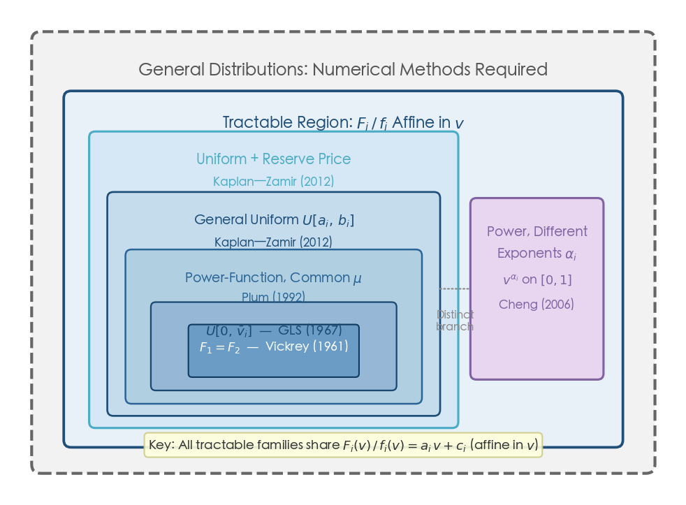

**Figure 3.2.** Nested structure of all known tractable distributional families for the asymmetric two-bidder FPSB auction. The innermost sets (Vickrey 1961, GLS 1967) are subsumed by the power-function family (Plum 1992) and the general uniform family (Kaplan–Zamir 2012). Cheng (2006) constitutes a distinct branch allowing different exponents on common support. The outer dashed boundary indicates general distributions requiring numerical methods. All tractable families share the property $F_i(v)/f_i(v) = a_i v + c_i$ (affine in $v$).

No other distributional families are known to admit closed-form solutions. In particular, no closed-form equilibrium has been obtained for:

- Asymmetric exponential distributions, despite the symmetric exponential case admitting a standard closed-form solution.
- Asymmetric normal or lognormal distributions.
- Mixtures of distributions from different parametric families (e.g., one bidder uniform, the other exponential).

## 3.9 The Sharp Boundary: "No General Closed Form" as Empirical Consensus

The absence of closed-form solutions outside the affine-$F/f$ families is a robust empirical observation about the structure of the coupled ODE system, not a proven impossibility theorem. As [Hubbard, Kirkegaard & Paarsch (2012)](https://vinci.cs.uiowa.edu/~hjp/download/hkp.pdf "Using Economic Theory to Guide Numerical Analysis, p. 1") state: "Typically, it is impossible to derive equilibrium bid functions explicitly in asymmetric first-price auction models." [Fibich & Gavish (2011)](https://www.sciencedirect.com/science/article/abs/pii/S0899825611000509 "GEB 73(2): 479–495") similarly observe: "no closed form solutions for asymmetric auctions—except for uniform distributions."

No formal impossibility proof exists for this boundary. One could envision applying differential Galois theory—which classifies when solutions of linear ODEs can be expressed in terms of elementary functions—but the equilibrium ODE system (1.4) is nonlinear and coupled, placing it outside the scope of standard differential Galois theory. Whether a formal impossibility result can be established for specific non-power-function distributions remains an open mathematical question. In practice, the research community treats the boundary as settled: outside the families cataloged in Section 3.8, one must resort to the numerical and perturbation methods discussed in Chapter 4.

## 3.10 Failure of Revenue Equivalence and Absence of Cross-Format Mappings

In the symmetric case, the revenue equivalence principle ([Krishna (2010)](https://bugarinmauricio.com/wp-content/uploads/2017/06/krishna-auction-theory-caps1a4.pdf "Auction Theory, 2nd Ed., Academic Press"), Proposition 3.1) guarantees that all standard auction formats yield the same expected revenue, providing a powerful analytical shortcut: one can solve the simpler second-price auction and infer FPSB equilibrium properties. Under asymmetry, this equivalence breaks down—first-price and second-price auctions generically yield different expected revenues, and the sign of the difference depends on the specific form of asymmetry (as Chapter 5 discusses in detail).

This failure has a direct consequence for the search for closed-form solutions: no known mapping relates the FPSB equilibrium to the equilibrium of another, more tractable auction format (such as the all-pay auction or the second-price auction) in a way that would yield alternative analytical strategies. Each format must be solved independently. For the second-price auction, the dominant-strategy equilibrium $\beta_i^{SPA}(v) = v$ holds regardless of asymmetry, providing no information about the FPSB equilibrium when $F_1 \neq F_2$.

Similarly, while the war-of-attrition and the all-pay auction admit elegant symmetric equilibria, their asymmetric counterparts involve different ODE systems that bear no known transformation relationship to the FPSB system. The isolation of the asymmetric FPSB problem from other auction formats reinforces the fundamental nature of the analytical difficulty: the coupled ODE-BVP must be confronted directly, and the tractable families cataloged in this chapter represent the totality of cases where this confrontation yields closed-form results.

# Approximate and Numerical Methods

The preceding chapter established that closed-form equilibrium strategies for the asymmetric two-bidder FPSB auction exist only when the reciprocal reverse hazard rate $F_i/f_i$ is linear in the valuation variable—a condition satisfied by uniform and power-function families but violated by virtually all other standard distributions. For generic distribution pairs $(F_1, F_2)$, the inverse-bid ODE system must be solved either approximately or numerically. This chapter surveys the principal methods developed for this purpose, organized into two broad categories. The first is the perturbation (asymptotic) expansion of Fibich and Gavious (2003), which exploits proximity to the symmetric benchmark to construct an analytical first-order approximation valid for weakly asymmetric auctions. The second encompasses a succession of numerical ODE/BVP solvers, ranging from the pioneering backward-shooting algorithm of Marshall, Meurer, Richard and Stromquist (1994) through the stable boundary-value reformulation of Fibich and Gavish (2011) and the polynomial approximation approach of Hubbard, Kirkegaard and Paarsch (2012). For each approach, we present the underlying methodology, assess accuracy and computational cost, identify known limitations, and catalog available software implementations.

## 4.1 The Perturbation Approach: Fibich and Gavious (2003)

### 4.1.1 Setup and Small Parameter

When the two valuation distributions are "close" to each other, the proximity to the symmetric benchmark can be exploited to construct an analytical first-order approximation. [Fibich and Gavious (2003)](https://www.researchgate.net/publication/220442635_Asymmetric_First-Price_Auctions-A_Perturbation_Approach "Math. Oper. Res. 28(4): 836–852") formalized this idea by decomposing each CDF as a perturbation of a common average distribution:

$$
F_i(v) = F(v) + \varepsilon H_i(v), \qquad i = 1, 2, \tag{4.1}
$$

where $F = (F_1 + F_2)/2$ is the pointwise average distribution, $H_i$ captures the deviation of bidder $i$'s distribution from the average, and the small parameter $\varepsilon = \max_i \max_v |F_i(v) - F(v)|$ measures the degree of asymmetry. By construction, $H_1 + H_2 = 0$.

### 4.1.2 The Zeroth-Order Solution

At $\varepsilon = 0$, both bidders draw from $F$ and the auction is symmetric. The equilibrium bid function is the standard symmetric solution (3.2):

$$
b^{\mathrm{sym}}(v) = v - \int_{\underline{v}}^{v} \frac{F(y)}{F(v)}\,dy. \tag{4.2}
$$

This serves as the zeroth-order term in the expansion.

### 4.1.3 The First-Order Correction

The key result of [Fibich and Gavious (2003)](http://www.math.tau.ac.il/~fibich/Manuscripts/first_rev_final.pdf "MOR 28(4): 836–852, Proposition 1") is that the equilibrium inverse-bid functions admit a first-order expansion

$$
\phi_i(b) = \phi^{\mathrm{sym}}(b) + \varepsilon \Phi_i(b) + O(\varepsilon^2), \tag{4.3}
$$

where $\phi^{\mathrm{sym}} = (b^{\mathrm{sym}})^{-1}$ and $\Phi_i$ satisfies a linear ODE that can be solved in closed form. Equivalently, in the direct-bid formulation:

$$
\beta_i(v) = b^{\mathrm{sym}}(v) + \varepsilon B_i(v) + O(\varepsilon^2), \tag{4.4}
$$

where $B_i(v)$ is an integral involving $H_i/F$ and terms derived from the symmetric benchmark. The correction $B_i$ has a transparent economic interpretation: a bidder whose distribution is "stronger" than the average (in the sense that $H_i > 0$ shifts probability mass upward) shades more aggressively ($B_i < 0$), while the "weaker" bidder bids more aggressively ($B_i > 0$). This is consistent with the structural prediction of [Maskin and Riley (2000)](https://www.isid.ac.in/~dmishra/topicsdoc/maskin_riley.pdf "RES 67(3): 413–438, Proposition 3.5") that $\phi_s(b) > \phi_w(b)$ under conditional stochastic dominance.

Figure 4.1 illustrates the perturbation approach for a moderately asymmetric example with $F_1 = U[0,1]$ (strong bidder) and $F_2 = U[0,2]$ (weak bidder). The exact equilibrium bid functions $\beta_1^{\mathrm{exact}}(v)$ and $\beta_2^{\mathrm{exact}}(v)$, computed numerically via the boundary-value method of §4.4, are plotted alongside the zeroth-order symmetric benchmark $b^{\mathrm{sym}}(v)$. The shaded region highlights the deviation between the exact and zeroth-order solutions. As predicted by the first-order correction, the strong bidder shades more aggressively (bidding below the symmetric benchmark), while the weak bidder bids more aggressively (above the benchmark).

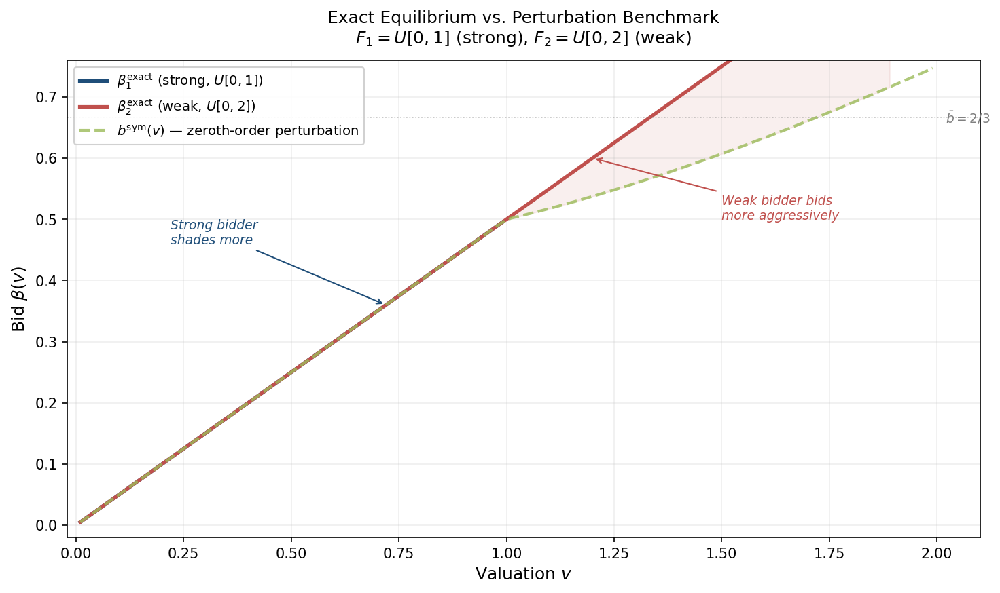

### 4.1.4 Revenue Equivalence at First Order

A striking corollary of the perturbation analysis concerns the revenue comparison between standard auction formats. The revenue difference between first-price and second-price auctions vanishes at first order:

$$
R^{\mathrm{1st}} - R^{\mathrm{2nd}} = O(\varepsilon^2). \tag{4.5}
$$

This means that for weakly asymmetric auctions, the two standard formats generate essentially identical expected revenue. The result was generalized by [Fibich, Gavious and Sela (2004)](https://doi.org/10.1016/S0022-0531(03)00254-X "J. Econ. Theory 115(1): 309–321") to all standard auction mechanisms and to $n$ bidders.

### 4.1.5 Accuracy Without Formal Convergence

The perturbation expansion (4.4) constitutes a formal first-order Taylor expansion in $\varepsilon$; no convergent power series has been established. Nevertheless, [Fibich and Gavious (2003)](http://www.math.tau.ac.il/~fibich/Manuscripts/first_rev_final.pdf "MOR 28(4): 836–852, Section 6") reported numerical experiments demonstrating that the first-order approximation remains remarkably accurate even at $\varepsilon \approx 0.5$, well beyond the range where one would expect a first-order expansion to be reliable. This phenomenon—practical accuracy substantially exceeding formal validity—is common in applied perturbation theory and underscores the utility of the Fibich–Gavious approach as a rapid analytical tool for moderate asymmetry.

### 4.1.6 Second-Order Extensions

[Gavious and Minchuk (2014)](https://doi.org/10.1007/s00182-013-0383-9 "Int. J. Game Theory 43(2): 369–393") extended the perturbation framework to second order for distributions "close to uniform," deriving an $O(\varepsilon^2)$ correction to the revenue ranking between first-price and second-price auctions. Their analysis confirmed that the sign of the second-order revenue difference depends on the specific nature of the asymmetry, consistent with the ambiguity result of [Maskin and Riley (2000)](https://www.isid.ac.in/~dmishra/topicsdoc/maskin_riley.pdf "RES 67(3): 413–438, Section 4"). Building on this work, [Fibich, Gavious and Gavish (2018)](http://www.math.tau.ac.il/~fibich/Manuscripts/RET_large_SIAP18.pdf "SIAM J. Appl. Math. 78(3): 1489–1510") obtained the explicit second-order revenue correction for large asymmetric auctions, establishing that $R^{\mathrm{1st}} - R^{\mathrm{sym}}[F_{\mathrm{avg}}] = O(\varepsilon^2/n^3)$. This result quantifies a fundamental insight: asymmetry is revenue-reducing, but its impact diminishes at rate $O(1/n^2)$ as the number of bidders grows.

## 4.2 Numerical Methods: Overview and Taxonomy

When the degree of asymmetry is large, or when the distributions do not lend themselves to closed-form perturbation corrections, the inverse-bid ODE system must be solved numerically. The literature has developed four principal families of numerical methods, each embodying a distinct strategy for handling the coupled, singular boundary-value structure of the equilibrium system:

1. **Backward-shooting** (Marshall et al. 1994; Gayle and Richard 2008): integrate the ODE system backward from the common upper bid $\bar{b}$ toward $\underline{b}$, exploiting the regularity of the system at the upper endpoint.
2. **Boundary-value methods** (Fibich and Gavish 2011): reformulate the free-boundary ODE as a fixed-domain BVP through a change of independent variable, then solve by Newton's method or fixed-point iteration.
3. **Polynomial approximation / MPEC** (Hubbard, Kirkegaard and Paarsch 2012): approximate the inverse-bid functions by Chebyshev polynomials and minimize ODE residuals subject to equilibrium constraints.
4. **Discrete equilibrium construction** (Au, Banks and Guo 2021): compute finite-action pure-strategy Nash equilibria that converge to the continuum equilibrium as the action grid is refined.

The following sections discuss each approach in turn, emphasizing the trade-offs between accuracy, stability, generality, and ease of implementation.

## 4.3 Backward-Shooting Methods

### 4.3.1 The Pioneering Algorithm of Marshall et al. (1994)

The first systematic numerical approach to asymmetric FPSB auctions was developed by [Marshall, Meurer, Richard and Stromquist (1994)](https://capcp.la.psu.edu/wp-content/uploads/sites/11/numericalanalysis.pdf "GEB 7(2): 193–220") (hereafter MMRS). Their key insight was to exploit the regularity of the ODE system at the upper endpoint $\bar{b}$: because $\phi_i(\bar{b}) = \bar{v}_i > \bar{b}$, the system is nonsingular there, so standard ODE integration can proceed reliably. Integration thus runs backward—from $\bar{b}$ toward $\underline{b}$—avoiding the singularity at the lower endpoint.

The algorithm operates on the coupled system in inverse-bid form,

$$
\phi_i'(b) = \frac{F_j(\phi_j(b))}{f_j(\phi_j(b))} \cdot \frac{1}{\phi_i(b) - b}, \tag{4.6}
$$

which is nonsingular at the upper endpoint. MMRS introduced the transformation $\delta_i(t) = t / h_i(t)$ (where $h_i$ is related to $\phi_i$ via a change of variable) and used piecewise Taylor-series expansions to step backward from $\bar{b}$. They achieved 8-digit accuracy in computing $\bar{b}$ for specific distribution pairs.

### 4.3.2 The Inherent Instability of Backward-Shooting

Despite its initial success, backward-shooting harbors a fundamental instability that [Fibich and Gavish (2011)](http://www.math.tau.ac.il/~fibich/Manuscripts/Numerical-simulations-of-asymmetric-first-price-auctions.pdf "GEB 73(2): 479–495, Lemmas 3.1–3.2") proved to be analytic in origin—not merely a numerical artifact. The core difficulty is that any error $\varepsilon$ in the initial guess for $\bar{b}$ is amplified as the integration proceeds toward the singular lower endpoint. Specifically, the error in $\phi_i(b)$ grows as

$$
\frac{|\varepsilon|}{F^{n-1}(v)} \to \infty \quad \text{as } v \to 0, \tag{4.7}
$$

where $n$ is the number of bidders. For two bidders with machine-precision initial error ($\varepsilon \approx 10^{-16}$), the method breaks down at approximately $v_{\min} \approx \sqrt{10^{-16}} \approx 10^{-8}$, which is manageable for most applications. The situation deteriorates rapidly with $n$, however: for $n = 10$ bidders, breakdown occurs at $v_{\min} \approx 0.017$; for $n = 100$, at $v_{\min} \approx 0.69$—rendering the method useless over the majority of the valuation domain.

The dynamical-systems analysis of [Fibich and Gavish (2012)](https://pubsonline.informs.org/doi/10.1287/moor.1110.0535 "Math. Oper. Res. 37(2): 219–243") provided the deeper structural explanation: the equilibrium of the ODE system corresponds to a saddle point in the phase space, and backward integration from $\bar{b}$ follows the unstable manifold of this saddle. Any perturbation—no matter how small—is exponentially amplified along the unstable direction. This instability is intrinsic to the mathematical structure of the problem and cannot be eliminated by increasing numerical precision or employing higher-order integration schemes.

Figure 4.2 visualizes the coverage breakdown as the number of bidders increases. The minimum reliable valuation $v_{\min} = \delta^{1/(n-1)}$ (with $\delta = 10^{-16}$ representing double-precision machine accuracy) rises steeply with $n$, illustrating why backward-shooting is practical only for small $n$.

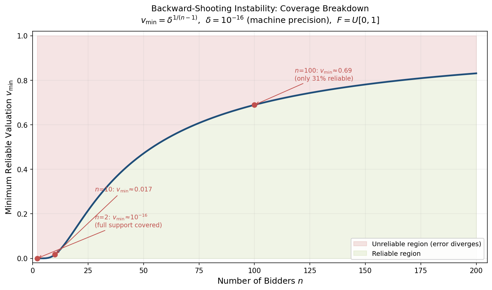

### 4.3.3 The Gayle–Richard Generalization (2008)

[Gayle and Richard (2008)](https://capcp.la.psu.edu/wp-content/uploads/sites/11/2020/07/NumericalSolutions.pdf "Comp. Econ. 32(3): 245–278") substantially generalized the MMRS backward-shooting approach to accommodate arbitrary continuous distributions—including Weibull, beta, normal, and lognormal families—as well as coalitions of bidders. Their principal innovation was to automate the Taylor-series expansion procedure: at each step, local Taylor-series coefficients for $\phi_i$ are computed from the ODE coefficients using an algebra of formal power series, and the resulting piecewise-polynomial approximation is interpolated with B-splines to ensure global smoothness. A FORTRAN-90 implementation was made publicly available by the authors.

While this generalization greatly broadened the applicability of backward-shooting to diverse distributional families, it does not resolve the inherent instability identified by Fibich and Gavish. The Gayle–Richard solver therefore remains reliable primarily for $n = 2$ bidders and moderate degrees of asymmetry.

## 4.4 The Boundary-Value Method of Fibich and Gavish (2011)

### 4.4.1 Core Idea: Eliminating the Free Boundary

The instability of backward-shooting stems from the necessity of guessing the unknown free boundary $\bar{b}$. [Fibich and Gavish (2011)](http://www.math.tau.ac.il/~fibich/Manuscripts/Numerical-simulations-of-asymmetric-first-price-auctions.pdf "GEB 73(2): 479–495, §4–5") circumvented this difficulty entirely by reformulating the problem as a fixed-domain boundary-value problem. The key step is a change of independent variable: instead of parameterizing the ODE by the bid $b \in [\underline{b}, \bar{b}]$ (with $\bar{b}$ unknown), the system is reparameterized by one bidder's valuation $v_n \in [\underline{v}_n, \bar{v}_n]$—a known, fixed interval. Concretely, defining $\psi_i(v_n) = \phi_i(\beta_n(v_n))$ for $i \neq n$ transforms the system into a BVP on the fixed domain $[\underline{v}_n, \bar{v}_n]$ with known boundary conditions at both endpoints. The unknown $\bar{b}$ is no longer a parameter that must be guessed; it is recovered as an output of the solution.

### 4.4.2 Discretization and Solution

After the change of variable, the resulting BVP is discretized using fourth-order finite differences on a uniform grid of $M$ points. The nonlinear algebraic system is then solved by one of two iterative methods:

- **Newton's method**: converges quadratically, typically reaching machine precision in approximately 5 iterations. This is the recommended approach when the Jacobian can be computed efficiently.
- **Fixed-point iteration**: converges linearly, requiring 25–50 iterations, but avoids the computation and inversion of the Jacobian matrix, making each iteration cheaper.

The discretization error scales as $O(h^4)$, where $h = (\bar{v}_n - \underline{v}_n)/M$ is the grid spacing, providing fourth-order accuracy. The method handles up to $n = 450$ bidders without difficulty—a dramatic improvement over backward-shooting, which fails for $n$ much beyond 2 or 3.

### 4.4.3 Practical Advantages

Several features make the Fibich–Gavish boundary-value method the current method of choice for practical equilibrium computation:

- **Stability**: by eliminating the free-boundary guess, the method entirely avoids the exponential error amplification inherent in backward-shooting.
- **Generality**: the method applies to any continuous distributions with positive density on their support, not just parametric families.
- **Compactness**: complete Matlab implementations were provided in the paper's appendices—approximately 40 lines of code for each solver variant (Newton and fixed-point), making the method straightforwardly reproducible.
- **Scalability**: the computational cost grows linearly in the number of grid points and cubically in $n$ (due to the Jacobian solve), enabling large-$n$ computations that are entirely infeasible with backward-shooting.

## 4.5 Polynomial Approximation: The Chebyshev MPEC Approach

### 4.5.1 Method

[Hubbard, Kirkegaard and Paarsch (2012)](https://vinci.cs.uiowa.edu/~hjp/download/hkp.pdf "Using Economic Theory to Guide Numerical Analysis") (hereafter HKP) proposed a fundamentally different approach grounded in spectral approximation. Rather than discretizing the ODE on a grid, HKP approximate the inverse-bid functions $\phi_i(b)$ by Chebyshev polynomials of degree $K$:

$$
\phi_i(b) \approx \sum_{k=0}^{K} c_{ik}\, T_k\!\left(\frac{2b - \underline{b} - \bar{b}}{\bar{b} - \underline{b}}\right), \tag{4.8}
$$

and choose the coefficients $\{c_{ik}\}$ by minimizing the sum of squared ODE residuals evaluated at the Chebyshev nodes, subject to the boundary conditions and the tangency constraint at $\bar{b}$. This formulation casts the equilibrium computation as a Mathematical Program with Equilibrium Constraints (MPEC), solvable by standard nonlinear programming solvers such as SNOPT or KNITRO.

### 4.5.2 The Degree-Sensitivity Warning

The most significant finding of HKP is a cautionary one. Low-degree Chebyshev approximations ($K = 3$ or $K = 5$) can produce qualitatively incorrect results: inverse-bid functions that cross when they should not, and revenue rankings between auction formats that contradict theoretical predictions. Only at degree $K \geq 25$ did the HKP solutions become consistent with the structural properties established by [Maskin and Riley (2000)](https://www.isid.ac.in/~dmishra/topicsdoc/maskin_riley.pdf "RES 67(3): 413–438")—in particular, the non-crossing property $\phi_s(b) > \phi_w(b)$ under conditional stochastic dominance. This finding underscores a general principle applicable to all numerical methods for asymmetric auctions: computed solutions must be validated against known theoretical properties, not merely assessed by the magnitude of ODE residuals.

### 4.5.3 The Absence of Convergence Proofs

HKP emphasized a broader theoretical gap: no formal convergence proof exists for any computational method applied to asymmetric FPSB auctions—not for backward-shooting, not for boundary-value methods, and not for polynomial approximation. As they stated: "No formal proof of convergence and/or rate of convergence of any computational approach has been established" ([HKP 2012](https://vinci.cs.uiowa.edu/~hjp/download/hkp.pdf "Using Economic Theory to Guide Numerical Analysis, p. 4")). This remains an open theoretical question. In practice, the Fibich–Gavish boundary-value method exhibits robust convergence with fourth-order discretization error across a wide range of distribution pairs, but a rigorous proof that the discrete solutions converge to the true BNE strategies as $M \to \infty$ has not been established.

## 4.6 Discrete Equilibrium Construction: The BID Algorithm

[Au, Banks and Guo (2021)](https://ideas.repec.org/a/inm/ordeca/v18y2021i4p321-334.html "Decision Analysis 18(4): 321–334") introduced the Backward Indifference Derivation (BID) algorithm, which departs entirely from the ODE formulation. Rather than discretizing a continuous system, the BID algorithm constructs a finite-action pure-strategy Nash equilibrium directly in the strategy space.

The algorithm proceeds by backward induction over a discrete bid grid. Starting from the highest feasible bid (an approximation to $\bar{b}$), it computes, for each bid level $b_k$, the indifference valuation at which each bidder is exactly indifferent between bidding $b_k$ and $b_{k-1}$. These indifference points define piecewise-constant (step-function) strategies that form an exact PSNE of the discretized game. As the bid grid is refined, the step-function strategies converge to the continuous BNE, leveraging the existence-via-finite-action-limits result of [Athey (2001)](https://kylewoodward.com/blog-data/pdfs/references/athey-econometrica-2001A.pdf "Econometrica 69(4): 861–889, Theorem 7").

The BID algorithm's principal advantages are conceptual transparency—each step has a clear economic interpretation in terms of bidder indifference—and the complete avoidance of ODE singularities. Its main limitation is that convergence is established only conditional on knowing $\bar{b}$; in practice, $\bar{b}$ must be estimated or bounded externally, reintroducing the same free-boundary challenge that affects other methods, albeit in a less severe form.

## 4.7 The Dynamical-Systems Perspective

[Fibich and Gavish (2012)](https://pubsonline.informs.org/doi/10.1287/moor.1110.0535 "Math. Oper. Res. 37(2): 219–243") recast the entire equilibrium problem in the language of dynamical systems, providing a unified theoretical framework that explains both the numerical difficulties and the asymptotic behavior of equilibrium strategies. They demonstrated that the inverse-bid ODE system, viewed as an autonomous dynamical system in the phase space $(\phi_1, \phi_2, \ldots, \phi_n)$, possesses the following structure:

- The lower boundary condition corresponds to a **saddle point** of the system.
- The equilibrium trajectory lies on the **stable manifold** of this saddle.
- Backward integration from $\bar{b}$ traverses the **unstable manifold**, providing a rigorous explanation for why backward-shooting is inherently unstable: perturbations grow exponentially as the saddle is approached.

This perspective yields more than a diagnosis of numerical difficulties. Fibich and Gavish exploited it to perform a boundary-layer analysis of large-$n$ asymmetric auctions, demonstrating that in the limit $n \to \infty$, the equilibrium strategies become symmetric everywhere except in a thin boundary layer of width $O(1/n^2)$ near the upper valuation endpoints. The boundary-layer structure was further developed in [Fibich and Gavish (2015)](https://epubs.siam.org/doi/10.1137/140968811 "SIAM J. Appl. Math. 75(3): 1003–1023"), which provided explicit asymptotic formulas for the equilibrium strategies in each region—the outer (symmetric) region and the inner (boundary-layer) region—offering an analytical complement to the numerical methods surveyed above.

## 4.8 Available Software Implementations

The computational methods surveyed above have been implemented in various software packages, though the ecosystem remains fragmented and no single "standard" solver has emerged:

- **BIDCOMP2** ([Li, Riley and Tang, 2000](http://www.econ.ucla.edu/riley/bidcomp/index.html "UCLA, available upon request")): a FORTRAN-based backward-shooting solver supporting power-function and truncated normal distributions with up to 6 bidder groups and optional risk aversion. BIDCOMP2 was the first publicly available solver for asymmetric FPSB auctions; the program's website at UCLA remains accessible, with the latest version available upon request from the authors.
- **Fibich–Gavish Matlab codes**: complete implementations of the Newton and fixed-point boundary-value solvers, published as Appendices A and B of [Fibich and Gavish (2011)](http://www.math.tau.ac.il/~fibich/Manuscripts/Numerical-simulations-of-asymmetric-first-price-auctions.pdf "GEB 73(2): 479–495"). At approximately 40 lines each, these constitute the most compact and readily adaptable implementations available.
- **Gayle–Richard FORTRAN-90 code**: accompanies [Gayle and Richard (2008)](https://capcp.la.psu.edu/wp-content/uploads/sites/11/2020/07/NumericalSolutions.pdf "Comp. Econ. 32(3): 245–278") and is available from the authors. Handles a broad class of distributions via automated Taylor-series machinery.
- **HKP AMPL code**: the Chebyshev MPEC formulation of [HKP (2012)](https://vinci.cs.uiowa.edu/~hjp/download/hkp.pdf "Using Economic Theory to Guide Numerical Analysis") was implemented in AMPL and solved with SNOPT or KNITRO.
- **pyCollocation** ([Pugh, 2015](https://github.com/davidrpugh/pyCollocation "GitHub: davidrpugh/pyCollocation")): a Python package for solving boundary-value problems using collocation with polynomial basis functions (Chebyshev, Legendre, etc.). The package includes an example notebook specifically for asymmetric IPV auction models; the last release (version 0.6.0-alpha) dates to November 2015 and the package has not been actively maintained since.

For most applications, the Fibich–Gavish Matlab codes offer the best combination of accuracy, stability, and simplicity. Researchers working in Python can adapt the boundary-value formulation using SciPy's `solve_bvp` routine or the pyCollocation package as a starting point.

## 4.9 Comparative Assessment and Practical Guidance

The following table summarizes the key properties of each method discussed in this chapter:

| Method | Stability | Accuracy | Generality | Scalability ($n$) | Ease of Use |
|--------|-----------|----------|------------|-------------------|-------------|
| Backward-shooting (MMRS 1994) | Unstable near $\underline{b}$ | High near $\bar{b}$ | Any distributions | $n \leq 2$–3 | Moderate |
| Gayle–Richard (2008) | Unstable near $\underline{b}$ | High near $\bar{b}$ | Any distributions | $n \leq 2$–3 | Moderate |
| Fibich–Gavish BVP (2011) | Stable | $O(h^4)$ | Any distributions | $n \leq 450$ | High (40 lines) |
| Chebyshev MPEC (HKP 2012) | Stable | Degree-dependent | Any distributions | $n \leq$ ~10 | Low (requires NLP solver) |
| BID algorithm (Au et al. 2021) | Stable | Grid-dependent | Any distributions | $n \geq 2$ | Moderate |
| Perturbation (Fibich–Gavious 2003) | N/A (analytical) | $O(\varepsilon^2)$ | Weak asymmetry only | Any $n$ | High |

Figure 4.3 provides a visual comparison of the six methods across four qualitative dimensions—accuracy (for $n = 2$), stability, scalability (for $n > 2$), and ease of use—scored on a 1-to-5 scale. The Fibich–Gavish BVP method achieves the highest marks across all dimensions, while the backward-shooting family is penalized by its inherent instability and poor scalability.

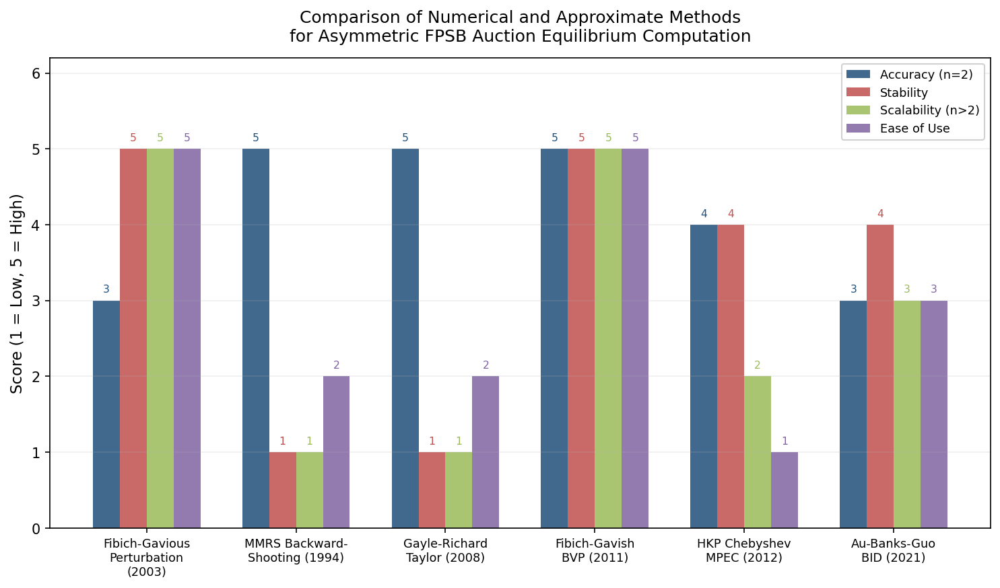

For a researcher or practitioner seeking to compute equilibrium strategies for a specific asymmetric FPSB auction, we recommend the following decision hierarchy:

1. **Check for closed-form solutions** (Chapter 3): if both distributions belong to the uniform or power-function families, exact analytical formulas are available and should be used.
2. **Assess the degree of asymmetry**: if the distributions are "close" (in the sense that $\varepsilon \leq 0.3$–$0.5$), the Fibich–Gavious perturbation expansion (4.4) provides a fast, analytical approximation that is often sufficient for economic analysis and comparative statics.
3. **Use the Fibich–Gavish boundary-value method** for general distributions, strong asymmetry, or settings with $n > 2$ bidders. This is the most reliable general-purpose solver currently available.
4. **Validate against theory**: regardless of the method chosen, verify that the computed strategies satisfy the structural properties established in Chapter 2—strict monotonicity, common upper bid, and (under CSD) the non-crossing property $\phi_s(b) > \phi_w(b)$.

# Economic Implications — Revenue, Efficiency, and Bid Shading

The preceding chapters established that the asymmetric two-bidder FPSB auction possesses a unique equilibrium characterized by a coupled ODE boundary-value problem, that closed-form solutions exist for several important distributional families, and that robust numerical and perturbation methods are available for general distributions. This chapter shifts focus from the mathematical characterization of equilibrium to its economic consequences. Three interrelated questions structure the analysis: How does asymmetry affect the seller's expected revenue, and how does the FPSB format compare to alternative auction mechanisms? Does asymmetry introduce allocative inefficiency, and if so, how severe is the resulting welfare loss? How do individual bidders adjust their shading behavior in response to known heterogeneity, and what are the implications for format preferences and optimal mechanism design?

## 5.1 Revenue Comparison: FPSB versus Second-Price Auctions

### 5.1.1 The Symmetric Benchmark: Revenue Equivalence

Under symmetry ($F_1 = F_2 = F$), the Revenue Equivalence Theorem (RET) established by [Vickrey (1961)](https://cramton.umd.edu/market-design-papers/vickrey-counterspeculation-auctions-and-competitive-sealed-tenders.pdf "J. Finance 16(1): 8–37") and generalized by [Myerson (1981)](https://cramton.umd.edu/market-design-papers/myerson-optimal-auction-design.pdf "MOR 6(1): 58–73") guarantees that the first-price and second-price sealed-bid auctions generate identical expected revenue. In both formats, the seller's expected revenue equals $\mathbb{E}[Y_2]$, the expected value of the second-highest order statistic of valuations. This clean equivalence dissolves entirely when $F_1 \neq F_2$, and the direction of the revenue-ranking reversal depends on the structural nature of the distributional asymmetry.

### 5.1.2 The Maskin–Riley Ambiguity Result

The fundamental insight of [Maskin and Riley (2000)](https://www.isid.ac.in/~dmishra/topicsdoc/maskin_riley.pdf "RES 67(3): 413–438, Section 4") is that asymmetry breaks revenue equivalence in a direction-dependent manner: the sign of the revenue difference $R^{\mathrm{1st}} - R^{\mathrm{2nd}}$ depends on the *type* of asymmetry, not merely its magnitude. Three canonical forms of distributional asymmetry produce qualitatively distinct revenue rankings.

**Rightward shifts favor the FPSB auction (Proposition 4.3).** Consider $v_w \sim U[0,1]$ and $v_s \sim U[a_s, 1 + a_s]$, so the strong bidder's support is shifted rightward by $a_s$. As $a_s$ increases, the strong bidder becomes increasingly confident of holding the highest valuation and shades aggressively in the FPSB auction — yet the weak bidder's residual competition constrains this shading. In the second-price auction (SPA), the dominant-strategy equilibrium of truthful bidding causes the strong bidder to win at a price equal to the weak bidder's (typically low) valuation, yielding substantially less revenue. At the extreme of $a_s = 1$, the strong bidder wins with certainty in both formats; FPSB revenue equals 1 while SPA revenue equals $\mathbb{E}[v_w] = 1/2$. Numerical computations from Table 5.1 of [Maskin and Riley (2000)](https://www.isid.ac.in/~dmishra/topicsdoc/maskin_riley.pdf "RES 67(3): 413–438") show the FPSB advantage growing from 0% at $a_s = 0$ to 6.1% at $a_s = 1/4$, 19.6% at $a_s = 1$, and 37.2% at $a_s = 3$. Figure 5.1 visualizes this monotonically widening revenue gap.

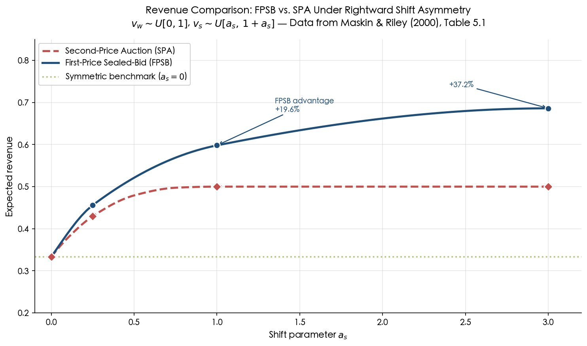

**Figure 5.1.** Expected revenue of the FPSB and SPA as a function of the shift parameter $a_s$, with $v_w \sim U[0,1]$ and $v_s \sim U[a_s, 1+a_s]$. Data from Table 5.1 of [Maskin and Riley (2000)](https://www.isid.ac.in/~dmishra/topicsdoc/maskin_riley.pdf "RES 67(3): 413–438"). The symmetric benchmark ($a_s = 0$) is overlaid as a reference level. The FPSB advantage widens monotonically with the degree of shift asymmetry.

**Upward stretches also favor the FPSB auction (Proposition 4.4).** When $v_s \sim U[0, \alpha_s]$ with $\alpha_s > 1$ while $v_w \sim U[0,1]$, the strong bidder's support is "stretched" upward. The economic mechanism parallels the shift case: the strong bidder shades more aggressively, but the first-price format still extracts more revenue than the SPA because the weak bidder competes vigorously for the object. Table 5.2 of [Maskin and Riley (2000)](https://www.isid.ac.in/~dmishra/topicsdoc/maskin_riley.pdf "RES 67(3): 413–438") reports a 10.1% FPSB advantage at $\alpha_s = 2$ and 21.2% at $\alpha_s = 3$.

**Mass reallocation to the lower endpoint favors the SPA (Proposition 4.5).** When the strong bidder's distribution concentrates mass near the bottom of its support — the "lowballing" configuration — the strong bidder faces less competition at high valuations, but this reallocation fails to generate the competitive pressure in the FPSB that drives revenue upward in the shift and stretch cases. The SPA then dominates. Table 5.3 of [Maskin and Riley (2000)](https://www.isid.ac.in/~dmishra/topicsdoc/maskin_riley.pdf "RES 67(3): 413–438") reports a 9.7% SPA advantage at $\eta_s = 1$ and 48.5% at $\eta_s = 3$.

The source of this ambiguity is structural. Shifts and stretches create configurations where the strong bidder's dominant position is partially offset by the competitive discipline of first-price bidding, whereas mass reallocation generates configurations in which the strong bidder can exploit low-type pooling without facing sufficient countervailing pressure.

### 5.1.3 Asymmetry Generically Reduces Revenue

While the *ranking* between FPSB and SPA is ambiguous, a distinct and equally important question concerns the *level* of revenue: does asymmetry reduce expected revenue relative to a symmetric benchmark with equivalent potential social surplus? [Cantillon (2008)](https://www.sciencedirect.com/science/article/pii/S0899825607000188 "Games and Economic Behavior 62(1): 1–25") provided the definitive answer. She constructed the symmetric benchmark $\hat{F}$ as the unique symmetric CDF satisfying $\hat{F}(v)^2 = F_1(v) \cdot F_2(v)$ — the geometric mean of the original CDFs — which preserves the distribution of the first-order statistic and hence the expected potential social surplus. Her principal results established that asymmetry reduces expected revenue under both auction formats:

- **SPA (Theorem 1):** $R^{\mathrm{2nd}}(\hat{F}, \hat{F}) \geq R^{\mathrm{2nd}}(F_1, F_2)$ always. The proof is purely statistical: given the same first-order statistic distribution, the expected second-order statistic is maximized when the two draws are identically distributed. This is an instance of the general principle that heterogeneity among i.i.d. components reduces the expected minimum (or second-highest) order statistic.
- **FPA (Propositions 1–2):** $R^{\mathrm{1st}}(\hat{F}, \hat{F}) \geq R^{\mathrm{1st}}(F_1, F_2)$ was proved rigorously for two important classes — power-function asymmetries (where $F_i = G^{k_i}$ with the same base distribution $G$) and uniform distributions — and conjectured to hold generally. Extensive numerical simulations across a wide range of distributional assumptions confirmed the conjecture without producing a single counterexample.

The economic intuition is transparent: asymmetry weakens competitive pressure. The strong bidder, knowing she is more likely to have the highest valuation, shades her bid more aggressively; the weak bidder bids more aggressively but is less likely to win. The net effect is a "downward bias" in the winning bid distribution relative to the symmetric benchmark.

### 5.1.4 Perturbation Quantification of Revenue Effects

The perturbation framework of [Fibich and Gavious (2003)](http://www.math.tau.ac.il/~fibich/Manuscripts/first_rev_final.pdf "MOR 28(4): 836–852, Proposition 6") rendered the revenue-reducing effect of asymmetry analytically precise. Their central result, previewed in Section 4.1.4, established that the revenue difference between FPSB and SPA satisfies

$$
R^{\mathrm{1st}} - R^{\mathrm{2nd}} = O(\varepsilon^2), \tag{5.1}
$$

where $\varepsilon$ measures the degree of distributional asymmetry. Revenue equivalence thus holds to first order: the two formats generate identical expected revenue up to second-order corrections. Furthermore, the FPSB revenue itself satisfies $R^{\mathrm{1st}} = R_{\mathrm{sym}}[F_{\mathrm{avg}}] + O(\varepsilon^2)$, where $R_{\mathrm{sym}}[F_{\mathrm{avg}}]$ is the symmetric-auction revenue evaluated at the average distribution. The practical import of this result is that for mildly asymmetric bidder populations, the choice between FPSB and SPA is nearly revenue-neutral.

[Fibich, Gavious and Gavish (2018)](http://www.math.tau.ac.il/~fibich/Manuscripts/RET_large_SIAP18.pdf "SIAM J. Appl. Math. 78(3): 1489–1510, Theorem 5.1 and Corollary 4.3") extended this analysis to large asymmetric auctions with $n$ bidders and obtained the explicit second-order revenue correction:

$$
R[F_1, \ldots, F_n] - R[F_G, \ldots, F_G] \sim -\frac{1}{n^2} \cdot \frac{\mathrm{Var}[f_1(1), \ldots, f_n(1)]}{f_G^3(1)}, \tag{5.2}
$$

where $F_G$ is the geometric-mean distribution and $f_i(1)$ denotes the density at the upper support endpoint. This result confirms that asymmetry is revenue-reducing at rate $O(1/n^2)$ and that the magnitude of the revenue loss is governed by the dispersion of bidders' density values at the upper endpoint. The revenue loss vanishes as $n \to \infty$ at rate $1/n^2$, reflecting the economic intuition that with many bidders, competitive pressure overwhelms the strategic effects of heterogeneity.

## 5.2 Allocative Efficiency and Misallocation

### 5.2.1 The Fundamental Inefficiency of Asymmetric FPSB

A second-price auction under IPV is always allocatively efficient: truthful bidding is a dominant strategy, so the bidder with the highest valuation invariably wins. The symmetric FPSB auction is likewise efficient, because all bidders employ the same strictly increasing bid function, ensuring that the highest valuation maps to the highest bid. Under asymmetry, however, the FPSB auction becomes generically inefficient.

The mechanism is straightforward. As Section 5.3 establishes in detail, the strong bidder shades her bid more aggressively than the weak bidder at any given valuation level. Consequently, there exist valuation pairs $(v_s, v_w)$ with $v_s > v_w$ for which $\beta_s(v_s) < \beta_w(v_w)$: the weak bidder submits a higher bid despite holding a lower valuation, and wins the object. The resulting allocation fails to maximize social surplus.

### 5.2.2 The Q-Function and Misallocation Quantification

[Maskin and Riley (2000)](https://www.isid.ac.in/~dmishra/topicsdoc/maskin_riley.pdf "RES 67(3): 413–438, Propositions 3.3–3.5") formalized this inefficiency through the mapping $Q(v)$ defined by $\phi_s(b) = Q(\phi_w(b))$ — the strong bidder's valuation when tied in bid with a weak bidder of valuation $v$. Under conditional stochastic dominance (CSD), Proposition 3.5 establishes $\phi_s(b) > \phi_w(b)$ for all interior bids, which implies $Q(v) > v$ throughout the interior of the bid support.

The gap $Q(v) - v$ quantifies the local severity of potential misallocation: when the weak bidder holds valuation $v$ and wins, the losing strong bidder holds valuation $Q(v) > v$, representing a deadweight surplus loss of $Q(v) - v$ per misallocated unit. The aggregate misallocation probability is

$$
\Pr[\text{misallocation}] = \Pr\bigl[v_s > v_w \text{ and } \beta_w(v_w) > \beta_s(v_s)\bigr] > 0 \tag{5.3}
$$

whenever $F_1 \neq F_2$, with the probability strictly increasing as the degree of asymmetry grows. This misallocation is not a pathological edge case but a generic feature of the asymmetric FPSB equilibrium.

### 5.2.3 Efficiency Loss Under Weak Asymmetry

The perturbation analysis of [Fibich and Gavious (2003)](http://www.math.tau.ac.il/~fibich/Manuscripts/first_rev_final.pdf "MOR 28(4): 836–852, Section 5.4") provides a quantitative benchmark for the magnitude of misallocation. The efficiency loss — measured as the difference in expected social surplus between the FPSB and SPA allocations — is $O(\varepsilon^2)$ under weak asymmetry. This parallels the revenue result of equation (5.1): both the revenue distortion and the allocative distortion are second-order effects of distributional heterogeneity. For small $\varepsilon$, the FPSB auction is "nearly efficient" and "nearly revenue-equivalent" to the SPA, a dual observation that significantly tempers the normative concern about misallocation in mildly asymmetric environments.

## 5.3 Bid-Shading Patterns Under Asymmetry

### 5.3.1 The Core Prediction: Strong Bidders Shade More

The most robust qualitative prediction of the asymmetric FPSB model is that the strong bidder shades her bid more than the weak bidder at any common bid level. Under conditional stochastic dominance, Proposition 3.5 of [Maskin and Riley (2000)](https://www.isid.ac.in/~dmishra/topicsdoc/maskin_riley.pdf "RES 67(3): 413–438") establishes $\phi_s(b) > \phi_w(b)$ for all interior bids $b \in (\underline{b}, \bar{b})$. Since the markup (bid shading) for bidder $i$ at bid $b$ is $\phi_i(b) - b$, this inequality directly implies that the strong bidder's markup exceeds the weak bidder's at every common bid level.

Stated in terms of the direct bid functions, at any valuation $v$ in the common domain, $\beta_w(v) > \beta_s(v)$: the weak bidder bids higher than the strong bidder holding the same private valuation. The economic logic rests on a competitive-pressure asymmetry. The strong bidder, whose distribution stochastically dominates the weak bidder's, faces a less competitive conditional environment — she can afford to shade because her rival is less likely to hold high valuations. The weak bidder, conversely, faces a substantial probability that the strong opponent draws a high valuation, compelling aggressive bidding to maintain a viable winning probability.

### 5.3.2 Perturbation Decomposition of Bid Shading

The first-order perturbation expansion from equation (4.4) in Chapter 4 provides an analytical decomposition of the bid-shading asymmetry. When $F_i = F + \varepsilon H_i$ with $H_1 + H_2 = 0$, the correction $B_i(v)$ to the symmetric bid function $b^{\mathrm{sym}}(v)$ satisfies $B_i > 0$ for the weaker bidder (more aggressive bidding) and $B_i < 0$ for the stronger bidder (less aggressive bidding), as established in Proposition 1 of [Fibich and Gavious (2003)](http://www.math.tau.ac.il/~fibich/Manuscripts/first_rev_final.pdf "MOR 28(4): 836–852"). The perturbation correction encapsulates the "weakness leads to aggression" phenomenon in a single integral formula. Its accuracy — remarkably good even at $\varepsilon \approx 0.5$, as documented in Chapter 4 — indicates that the qualitative pattern persists well beyond the formal small-asymmetry regime, extending into settings with substantial distributional heterogeneity.

### 5.3.3 Illustrative Example: Uniform Distributions

The closed-form GLS solutions from Chapter 3 render the bid-shading pattern concrete. For $v_1 \sim U[0, 1]$ and $v_2 \sim U[0, 2]$, the common upper bid is $\bar{b} = 2/3$, and the inverse-bid functions are (from equations (3.5)):

$$
\phi_1(b) = \frac{8b}{4 + 3b^2}, \qquad \phi_2(b) = \frac{8b}{4 - 3b^2}.
$$

At any interior bid $b$, $\phi_2(b) > \phi_1(b)$: the strong bidder (bidder 2, with wider support) holds a higher valuation than the weak bidder (bidder 1) for the same submitted bid, confirming that the strong bidder shades more. At $b = 0.4$, for instance, $\phi_1(0.4) = 3.2/4.48 \approx 0.714$ and $\phi_2(0.4) = 3.2/3.52 \approx 0.909$; the strong bidder shades by $0.909 - 0.4 = 0.509$ while the weak bidder shades by only $0.714 - 0.4 = 0.314$. Figure 5.2 displays the full inverse-bid functions alongside the symmetric benchmark and annotates this shading differential.

![Inverse-bid functions for the weak bidder (U[0,1]) and strong bidder (U[0,2]), with annotations showing the strong bidder's shading of 0.509 versus the weak bidder's 0.314 at b = 0.4](assets/chapter_05/chart_02.png)

**Figure 5.2.** Inverse-bid functions $\phi_1(b)$ and $\phi_2(b)$ for $v_1 \sim U[0,1]$ (weak) and $v_2 \sim U[0,2]$ (strong), computed from the GLS closed-form solution. The symmetric benchmark $\phi^{\mathrm{sym}}(b) = 2b$ and the 45° no-shading reference line are overlaid. At $b = 0.4$, the strong bidder's shading (0.509) exceeds the weak bidder's (0.314) by 62%, illustrating the "weakness leads to aggression" prediction.

## 5.4 Bidder Preferences Across Auction Formats

The differential bid-shading behavior documented above has direct consequences for how individual bidders rank alternative auction formats. Proposition 3.6 of [Maskin and Riley (2000)](https://www.isid.ac.in/~dmishra/topicsdoc/maskin_riley.pdf "RES 67(3): 413–438") establishes that under CSD:

- The **strong bidder strictly prefers the SPA**. In the SPA, the strong bidder wins at a price equal to the weak bidder's (typically lower) valuation, extracting substantial surplus. In the FPSB format, the weak bidder's aggressive bidding compels the strong bidder to compete more vigorously, eroding her surplus.
- The **weak bidder prefers the FPSB auction**. In the FPSB format, the strong bidder's more aggressive shading creates a less competitive environment for the weak bidder: her probability of winning and expected surplus are both higher under FPSB than under SPA, where the strong bidder's truthful high bids make winning nearly impossible.

This asymmetry in format preferences carries practical implications for auction design. When bidders can select between first-price and second-price formats — as arises in certain procurement or privatization settings — the composition of the bidder pool becomes endogenous to the format choice: FPSB attracts weaker bidders, while SPA attracts stronger ones. This self-selection effect was empirically documented by [Athey, Levin and Seira (2011)](https://web.stanford.edu/~jdlevin/Papers/Auctions.pdf "QJE 126(1): 207–257") in U.S. Forest Service timber auctions, where sealed-bid (first-price) auctions attracted significantly more small bidders than open (ascending) auctions — a pattern consistent with the theoretical prediction of Proposition 3.6.

## 5.5 Connection to Optimal Auction Design

### 5.5.1 The Myerson Benchmark

The revenue analysis above compares two specific and widely deployed auction formats. [Myerson (1981)](https://cramton.umd.edu/market-design-papers/myerson-optimal-auction-design.pdf "MOR 6(1): 58–73, Sections 5–6") established the broader theoretical benchmark: the revenue-maximizing mechanism allocates the object to the bidder with the highest *virtual valuation*

$$
J_i(v_i) = v_i - \frac{1 - F_i(v_i)}{f_i(v_i)}, \tag{5.4}
$$

and sets bidder-specific reserve prices $r_i^* = J_i^{-1}(0)$. When $F_1 \neq F_2$, the virtual valuations differ across bidders, and the optimal mechanism discriminates: it favors the weak bidder by applying a lower effective reserve price or a positive "handicap" to the strong bidder. Neither the standard FPSB nor the SPA implements this discrimination, as both are anonymous mechanisms treating bidders symmetrically regardless of their distributional characteristics.

### 5.5.2 FPSB as Partial Implementation of the Optimal Tilt

A central insight of [Kirkegaard (2012)](https://onlinelibrary.wiley.com/doi/abs/10.3982/ECTA9859 "Econometrica 80(5): 2349–2364") is that the FPSB auction *partially* implements the Myerson-optimal allocation tilt, even without bidder-specific reserves. Kirkegaard developed a mechanism-design approach to ranking asymmetric auctions, establishing that the equilibrium allocation in the FPSB lies between the efficient allocation (implemented by the SPA) and a counterfactual symmetric allocation in which the weak bidder faces a "copy" of herself rather than the strong bidder. Formally, if $k_1(v)$ denotes the strong bidder's type that ties in bid with weak type $v$ in the FPSB, then $k_1(v) \in [v, r(v)]$ where $r(v)$ is the "counterfactual symmetric" tying function satisfying $F_w(v) = F_s(r(v))$.

This ordering implies that the weak bidder wins more frequently in the FPSB than would be allocatively efficient ($k_1(v) > v$), but less frequently than she would in a symmetric auction against another weak bidder ($k_1(v) < r(v)$). Since the Myerson-optimal mechanism also favors the weak bidder — assigning the object to any bidder whose virtual valuation exceeds the rival's — the FPSB auction moves the allocation in the revenue-enhancing direction, though not to the full extent of the Myerson optimum. Figure 5.3 illustrates this intermediate positioning.

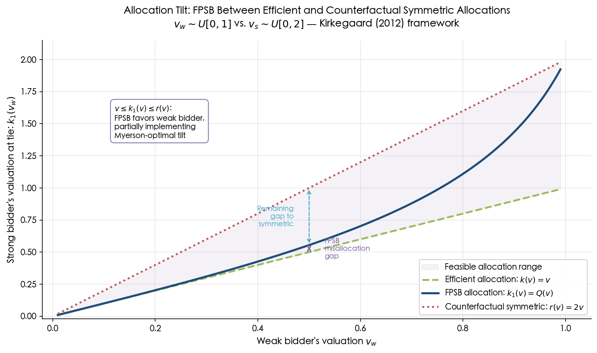

**Figure 5.3.** The allocation tilt under asymmetry for $v_w \sim U[0,1]$ and $v_s \sim U[0,2]$. The FPSB tying function $k_1(v) = Q(v)$ (blue) lies between the efficient allocation $k(v) = v$ (green) and the counterfactual symmetric allocation $r(v) = 2v$ (red). The shaded region represents the feasible allocation range. The FPSB partially implements the Myerson-optimal tilt toward the weak bidder, as formalized by [Kirkegaard (2012)](https://onlinelibrary.wiley.com/doi/abs/10.3982/ECTA9859 "Econometrica 80(5): 2349–2364").

Kirkegaard's Theorem 1 (under reverse hazard rate dominance $F_w \leq_{rh} F_s$) establishes that any mechanism whose allocation lies in the interval $[v, r(v)]$ for all types $v$ — including the FPSB — generates strictly higher expected revenue than the SPA. The [supplement to Kirkegaard (2012)](https://www.econometricsociety.org/uploads/Supmat/9859_extensions.pdf "Econometrica 80(5), Supplementary Material") further extends this ranking to the entire family of "winner-pay" auctions indexed by $\gamma \in [0,1]$, where $\gamma = 1$ corresponds to the FPSB and $\gamma = 0$ to the SPA. Proposition A1 of the supplement establishes that the SPA yields strictly the lowest expected revenue among all winner-pay formats under reverse hazard rate dominance — formalizing the conjecture of [Klemperer (1999)](https://doi.org/10.1257/jel.37.1.227 "J. Econ. Lit. 37(1): 227–286") that "it is plausible that a first-price auction may be more profitable than a second-price auction" when bidders are asymmetric.

### 5.5.3 The Revenue Gap Between FPSB and Myerson Optimal

The perturbation framework quantifies the suboptimality of the FPSB relative to the Myerson optimal mechanism. Under weak asymmetry ($\varepsilon$ small), the gap between FPSB revenue with a common optimal reserve and the Myerson-optimal revenue is $O(\varepsilon^2)$, because the FPSB auction already captures the first-order revenue gains from the allocation tilt. For large auctions with $n$ bidders, this gap contracts further to $O(\varepsilon^2/n^3)$ by the results of [Fibich, Gavious and Gavish (2018)](http://www.math.tau.ac.il/~fibich/Manuscripts/RET_large_SIAP18.pdf "SIAM J. Appl. Math. 78(3): 1489–1510"). The practical implication is significant: for mildly asymmetric auctions, the standard FPSB format with an appropriately chosen common reserve price constitutes a near-optimal selling mechanism, and the welfare cost of forgoing bidder-specific reserves is quantifiably small.

## 5.6 Synthesis

The economic implications of asymmetry in FPSB auctions form a coherent and internally consistent picture, organized around five principal findings:

1. **Revenue ambiguity.** The revenue ranking between FPSB and SPA depends on the structural nature — not merely the magnitude — of distributional asymmetry. Rightward shifts and upward stretches favor the FPSB; mass reallocation to the lower endpoint favors the SPA. This ambiguity, first established by [Maskin and Riley (2000)](https://www.isid.ac.in/~dmishra/topicsdoc/maskin_riley.pdf "RES 67(3): 413–438"), reflects the complex interplay between bid shading and competitive pressure, and rules out any universal revenue-ranking claim.

2. **Asymmetry reduces revenue.** Relative to a symmetric benchmark that preserves potential social surplus, asymmetry generically lowers expected revenue under both FPSB and SPA, as demonstrated by [Cantillon (2008)](https://www.sciencedirect.com/science/article/pii/S0899825607000188 "GEB 62(1): 1–25"). The revenue reduction is $O(\varepsilon^2)$ under weak asymmetry and decays at rate $O(1/n^2)$ for large auctions with $n$ bidders.

3. **Allocative inefficiency.** The FPSB auction misallocates the object with positive probability whenever $F_1 \neq F_2$, because the strong bidder shades more aggressively than the weak bidder. The efficiency loss is second-order in the asymmetry parameter, paralleling the revenue distortion.

4. **Bid-shading asymmetry.** The strong bidder bids less aggressively and the weak bidder bids more aggressively — a pattern that is robust across all distributional families examined in the literature and quantitatively captured by the Fibich–Gavious perturbation corrections. This "weakness leads to aggression" phenomenon is the micro-level mechanism driving both the revenue and efficiency results.

5. **Partial optimality.** Despite its allocative inefficiency, the FPSB auction partially implements the Myerson-optimal allocation tilt by endogenously favoring the weak bidder. Under reverse hazard rate dominance, it dominates the SPA in expected revenue. The gap between FPSB revenue (with a common optimal reserve) and the Myerson-optimal revenue is $O(\varepsilon^2)$ for mild asymmetry, shrinking to $O(\varepsilon^2/n^3)$ for large $n$.

These results collectively demonstrate that while asymmetry complicates the economics of first-price auctions, the complications are well understood and quantifiable. The perturbation framework provides a unified analytical lens: revenue distortion, efficiency loss, and bid-shading asymmetry are all second-order effects of distributional heterogeneity, becoming pronounced only when the degree of asymmetry is substantial.

# Practical Relevance and Extensions

The theoretical apparatus developed in the preceding chapters — the coupled ODE-BVP characterization, closed-form solutions for special distributional families, perturbation expansions, and high-accuracy numerical solvers — is far from a purely academic exercise. Asymmetric first-price sealed-bid (FPSB) auctions arise naturally whenever bidders differ in cost structures, informational advantages, geographic proximity, or market incumbency. This chapter connects the analytical framework to real-world auction markets, surveys key extensions of the baseline two-bidder independent-private-values (IPV) model, and examines the role of the asymmetric FPSB model in structural econometrics. It concludes with a systematic assessment of the state of the art as of 2026 and a direct answer to the question that motivates this report.

## 6.1 Empirical Applications

### 6.1.1 Government Procurement

Public procurement constitutes one of the most natural settings for asymmetric FPSB analysis. When government agencies solicit sealed bids for service contracts, participating firms typically differ in geographic proximity, fleet size, or incumbent status — factors that generate ex-ante cost asymmetry. [Flambard & Perrigne (2006)](https://ideas.repec.org/a/ecj/econjl/v116y2006i514p1014-1036.html "Economic Journal 116(514): 1014–1036") studied sealed-bid auctions for snow removal contracts in Montréal, classifying firms into two groups (West and Non-West) based on depot location relative to contract zones. Employing a structural estimation approach that extended the [Guerre, Perrigne & Vuong (2000)](https://kylewoodward.com/blog-data/pdfs/references/guerre+perrigne+vuong-econometrica-2000A.pdf "Econometrica 68(3): 525–574") (GPV) framework, they recovered significantly different cost distributions across the two groups, confirming that geographic proximity induces meaningful cost asymmetry. [Lamy (2011)](https://shs.hal.science/halshs-00586039/document "J. Econometrics 167(1): 113–132") subsequently used these estimated CDFs for Monte Carlo calibration of a symmetry test, illustrating that the theoretical tools developed for asymmetric auctions bear directly on the statistical testing of auction models.

### 6.1.2 Natural Resource Auctions: Oil, Gas, and Timber

Auctions for natural resource extraction rights present some of the most empirically important instances of bidder asymmetry. In the oil and gas sector, [Hendricks & Porter (1988)](https://users.ssc.wisc.edu/~khendricks2/publications/Information&Returns.pdf "AER 78(5): 865–883") documented pronounced informational asymmetry on Outer Continental Shelf (OCS) drainage tracts: firms with production operations on adjacent tracts ("neighbor" firms) possessed superior geological information relative to "non-neighbor" firms. This neighbor/non-neighbor distinction maps naturally onto a two-class asymmetric model. [Campo, Perrigne & Vuong (2003)](https://ideas.repec.org/a/jae/japmet/v18y2003i2p179-207.html "J. Appl. Econ. 18(2): 179–207") extended the GPV methodology to accommodate asymmetric affiliated private values and applied it to OCS wildcat auction data, estimating separate value distributions for distinct bidder classes and recovering the structural parameters of the asymmetric model.

In the timber sector, [Athey, Levin & Seira (2011)](https://web.stanford.edu/~jdlevin/Papers/Auctions.pdf "QJE 126(1): 207–257") examined U.S. Forest Service auctions and found that sealed-bid (first-price) formats attracted more small bidders and could generate higher revenue than open ascending auctions. This finding accords with the theoretical prediction of [Maskin & Riley (2000)](https://www.isid.ac.in/~dmishra/topicsdoc/maskin_riley.pdf "RES 67(3): 413–438") that weaker bidders prefer FPSB auctions: in a sealed-bid format, the strong bidder's informational or cost advantage is partially muted by strategic bid shading, giving weaker participants a meaningful competitive opportunity and thereby encouraging broader participation.

### 6.1.3 Spectrum Auctions

Telecommunications spectrum allocation represents another major domain where bidder asymmetry is a first-order consideration. When regulatory authorities such as the FCC auction radio-frequency licenses, incumbent carriers typically enjoy synergies from combining new spectrum with existing holdings, while entrants face higher effective costs due to the need for complementary infrastructure investment. [Fox & Bajari (2013)](https://www.nber.org/system/files/working_papers/w11671/w11671.pdf "NBER WP 11671") developed a structural model of FCC spectrum auctions that explicitly accounts for asymmetric valuations, identifying heterogeneous synergy structures across bidders as the defining feature of spectrum markets. Although most spectrum auctions employ ascending or combinatorial formats rather than sealed-bid mechanisms, the theoretical insights from asymmetric FPSB analysis — particularly regarding the revenue implications of asymmetry and the weak-bidder participation effect — inform ongoing policy debates about optimal auction format choice in spectrum allocation.

### 6.1.4 Online Advertising

The digital advertising industry underwent a dramatic institutional shift when Google completed its transition to a unified first-price auction for display advertising through Google Ad Manager in 2019. [Despotakis, Ravi & Sayedi (2021)](https://journals.sagepub.com/doi/abs/10.1177/00222437211030201 "J. Marketing Research 58(5): 888–907") provided the theoretical foundation for this transition, demonstrating that under header bidding — where publishers simultaneously solicit bids from multiple exchanges — the first-price format emerges as the unique equilibrium auction mechanism. In online advertising markets, asymmetry among bidders is pervasive: advertisers differ in brand value, campaign budgets, targeting precision, and willingness to pay for specific impression types. Bid-shading algorithms deployed by demand-side platforms must account for this heterogeneous competitive environment. The theoretical prediction that weaker competitors shade less while stronger competitors shade more (Proposition 3.5 of [Maskin & Riley (2000)](https://www.isid.ac.in/~dmishra/topicsdoc/maskin_riley.pdf "RES 67(3): 413–438")) directly informs the calibration of these automated bidding systems.

The following table summarizes the five application domains discussed above, highlighting the specific source of asymmetry, the key empirical references, and the methodological approach employed in each case.

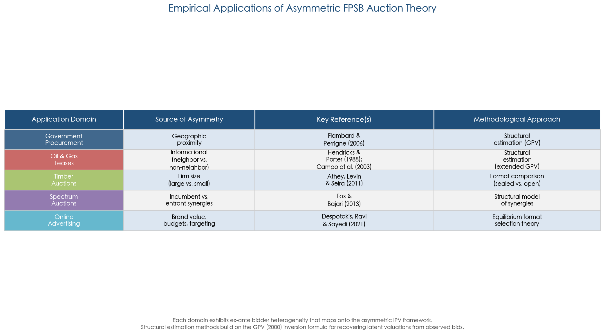

As the table illustrates, each domain exhibits ex-ante bidder heterogeneity that maps onto the asymmetric IPV framework, and structural estimation methods building on the GPV inversion formula provide the primary empirical toolkit for recovering latent valuations from observed bid data.

## 6.2 Structural Econometrics of Asymmetric Auctions

### 6.2.1 The GPV Identification Strategy

The structural econometrics of auctions was fundamentally reshaped by [Guerre, Perrigne & Vuong (2000)](https://kylewoodward.com/blog-data/pdfs/references/guerre+perrigne+vuong-econometrica-2000A.pdf "Econometrica 68(3): 525–574"), who established a nonparametric identification and estimation framework for FPSB auctions. The core insight is that the first-order condition of the bidder's optimization problem can be inverted to recover private values from observed bids *without solving the equilibrium ODE system*. Specifically, for bidder $i$ in an auction with $I$ participants, the first-order condition yields:

$$v_i = b_i + \frac{G(b_i)}{(I-1)g(b_i)}$$

where $G$ and $g$ denote the CDF and density of the bid distribution of a single rival. The econometrician estimates $G$ and $g$ nonparametrically from observed bid data (via kernel methods), then applies the inversion formula pointwise to recover the latent valuations. GPV demonstrated that this two-step kernel estimator achieves optimal nonparametric convergence rates.

Under asymmetry with observed bidder identities, the GPV approach extends naturally: class-specific bid distributions $G_i$ are estimated separately for each bidder type, and the inversion formula is applied using the appropriate rival bid distribution. This extension is straightforward when bidder identities are observed — one simply stratifies the bid data by bidder class.

### 6.2.2 Anonymous Asymmetric Bidders

A substantially more challenging setting arises when bidder identities are unobserved by the econometrician — the "anonymous" case. [Lamy (2011)](https://shs.hal.science/halshs-00586039/document "J. Econometrics 167(1): 113–132") demonstrated that the asymmetric IPV model remains nonparametrically identified even under anonymous bidding, using an argument based on polynomial root-finding applied to order-statistic CDFs. The key idea is that the observed distribution of the highest bid (and, if available, the second-highest bid) constrains the component distributions through a mixture structure that can be disentangled. However, Lamy also established a sharp negative result: asymmetric affiliated private values are *not* identified under anonymity, delineating a clear boundary for what structural econometrics can achieve without bidder-identity data.

## 6.3 Extensions Beyond the Baseline Model

### 6.3.1 Reserve Prices and Entry Costs

The baseline two-bidder model assumes costless, mandatory participation. In practice, auctioneers set reserve prices to screen out low-value bidders and extract additional surplus. When a common reserve price $r$ is imposed, the lower boundary condition shifts: the minimum bid becomes $\underline{b} = r$ rather than the endogenously determined common lower bid, and participation becomes selective — bidder $i$ enters only if $v_i \geq r$. [Kaplan & Zamir (2012)](https://link.springer.com/article/10.1007/s00199-010-0563-9 "Economic Theory 50(2): 269–302") explicitly incorporated a binding minimum bid $m$ (which subsumes both reserve prices and minimum-bid constraints) and identified three qualitatively distinct solution regimes depending on the relationship between $m$ and the lower supports $\underline{v}_1, \underline{v}_2$. These regimes yield exponential, power-function, or logarithmic forms for the equilibrium inverse-bid functions, respectively.

Entry costs introduce an additional strategic layer: bidder $i$ participates only if the expected surplus from bidding exceeds a participation cost $c_i$, generating an endogenous and potentially asymmetric set of active bidders. The interaction between entry incentives and bidder asymmetry carries substantial empirical significance — [Athey, Levin & Seira (2011)](https://web.stanford.edu/~jdlevin/Papers/Auctions.pdf "QJE 126(1): 207–257") found that the sealed-bid format's attractiveness to weaker bidders stems precisely from its capacity to encourage entry by muting the strong bidder's competitive advantage.

### 6.3.2 Risk Aversion

When bidders are risk-averse rather than risk-neutral, the equilibrium analysis becomes substantially more complex. Under constant relative risk aversion (CRRA) with utility $u(x) = x^\rho$ ($0 < \rho < 1$), the first-order condition couples the risk-aversion parameter $\rho$ with the distributional asymmetry, modifying the ODE system in a way that precludes direct application of the standard inverse-bid formulation. [Maskin & Riley (2000b)](https://www.isid.ac.in/~dmishra/topicsdoc/maskin_riley.pdf "RES 67(3): 439–454") proved existence of equilibrium for risk-averse asymmetric bidders under standard regularity conditions.

A well-known identification challenge arises in this setting: increased bid aggressiveness in the data can be rationalized either by risk aversion (bidders shade less to avoid the disutility of losing) or by distributional asymmetry (the weaker bidder bids more aggressively relative to valuation). Disentangling these two channels typically requires either exogenous variation in auction characteristics or additional structural assumptions. Campo, Guerre, Perrigne, and Vuong developed semiparametric estimation methods that jointly identify risk-aversion parameters and asymmetric value distributions, though this remains a technically demanding frontier of structural auction econometrics.

### 6.3.3 More Than Two Bidders

Extending from $N = 2$ to $N > 2$ asymmetric bidders raises the dimensionality of the equilibrium system from two coupled ODEs to $N$ coupled ODEs with $2N$ boundary conditions. The theoretical foundations generalize: existence results of [Lebrun (1999)](https://onlinelibrary.wiley.com/doi/abs/10.1111/1468-2354.00008 "IER 40(1): 125–142") and [Athey (2001)](https://kylewoodward.com/blog-data/pdfs/references/athey-econometrica-2001A.pdf "Econometrica 69(4): 861–889") apply to $N$ bidders, as do the uniqueness results of [Lebrun (2006)](https://econ.laps.yorku.ca/files/2015/10/lebrunb-u.pdf "GEB 55(1): 131–151") and [Maskin & Riley (2003)](https://www.ias.edu/sites/default/files/sss/papers/econpaper31.pdf "GEB 45(2): 395–409"), albeit with increasingly stringent regularity conditions.

Computationally, backward-shooting instability worsens dramatically with $N$. [Fibich & Gavish (2011)](http://www.math.tau.ac.il/~fibich/Manuscripts/Numerical-simulations-of-asymmetric-first-price-auctions.pdf "GEB 73(2): 479–495") showed that the minimum valuation at which the numerical solution remains accurate satisfies $v_{\min} \geq F^{-1}(\sqrt[N-1]{|\varepsilon|})$, where $\varepsilon$ is the initial perturbation. For $N = 10$ and machine precision ($\varepsilon \approx 10^{-16}$), this bound gives $v_{\min} \approx 0.033$; for $N = 100$, it rises to $v_{\min} \approx 0.70$, rendering backward-shooting essentially useless. The Fibich–Gavish boundary-value method, by contrast, scales gracefully and has been demonstrated for up to $N = 450$ bidders.

The perturbation approach likewise extends to $N > 2$: [Fibich & Gavious (2003)](https://www.researchgate.net/publication/220442635_Asymmetric_First-Price_Auctions-A_Perturbation_Approach "Math. Oper. Res. 28(4): 836–852") formulated the expansion for general $N$, and [Fibich, Gavious & Gavish (2018)](http://www.math.tau.ac.il/~fibich/Manuscripts/RET_large_SIAP18.pdf "SIAM J. Appl. Math. 78(3): 1489–1510") showed that the revenue-equivalence gap between FPSB and SPA under weak asymmetry shrinks as $O(\varepsilon^2/n^3)$ for large $n$. The dynamical-systems analysis of [Fibich & Gavish (2012)](https://pubsonline.informs.org/doi/10.1287/moor.1110.0535 "Math. Oper. Res. 37(2): 219–243") revealed that for large $N$, equilibrium strategies become approximately symmetric except in an $O(1/n^2)$ boundary layer near the upper support — a result with practical implications for auctions hosting many heterogeneous participants.

### 6.3.4 Discrete and Finite-Type Approximations

An alternative computational pathway replaces the continuous-type model with a finite-type approximation. [Athey (2001)](https://kylewoodward.com/blog-data/pdfs/references/athey-econometrica-2001A.pdf "Econometrica 69(4): 861–889") proved existence of monotone pure-strategy equilibria in continuum-action games by taking limits of finite-action pure-strategy Nash equilibria, invoking Helly's Selection Theorem to ensure convergence of the approximating sequence. [Au, Banks & Guo (2021)](https://ideas.repec.org/a/inm/ordeca/v18y2021i4p321-334.html "Decision Analysis 18(4): 321–334") exploit this idea constructively in their BID algorithm, which computes equilibrium by iteratively finding indifference points on a discretized bid grid. This approach operates directly in strategy space rather than through the ODE system, offering a conceptually distinct alternative that is particularly accessible for practitioners without expertise in differential equations.

## 6.4 Emerging Directions: Machine Learning and Computational Advances

Recent years have witnessed the application of deep learning methods to auction equilibrium computation, opening a new methodological frontier. [Huang et al. (2024)](https://proceedings.mlr.press/v235/huang24c.html "ICML 2024, PMLR 235: 19635–19659") introduced Auctionformer, a Transformer-based architecture that solves for equilibrium strategies across diverse auction formats within a unified framework. The method tokenizes auction game parameters — including bidder-specific distributions and mechanism rules — into a standard sequence, then employs a Transformer to map this representation to approximate equilibrium bid functions. By using Nash error (the maximum deviation gain from unilateral strategy changes) as the loss function, Auctionformer sidesteps the need for pre-computed equilibrium solutions as training labels. The authors demonstrated that this approach handles asymmetric first-price auctions with heterogeneous distributions and supports few-shot adaptation to novel auction mechanisms.

While such neural-network-based methods do not replace the theoretical guarantees provided by the ODE-based analysis — convergence properties are empirical rather than proven, and the approximation error lacks formal bounds — they represent a promising complementary approach. This is particularly the case for settings involving many bidders, complex mechanism features, or the need for rapid equilibrium approximation at scale where traditional numerical solvers may face computational bottlenecks.

## 6.5 State of the Art: What Is Settled and What Remains Open

### 6.5.1 Settled Questions

The fundamental theory of the asymmetric two-bidder FPSB auction is, in a precise sense, complete. The following core questions have been definitively resolved:

- **Existence of equilibrium in monotone pure strategies** is established under broad conditions: continuous distributions with positive density on interval supports ([Lebrun (1996)](https://econ.laps.yorku.ca/files/2015/10/lebrunb-u.pdf "cited in Lebrun 2006, GEB 55(1): 131–151"); [Maskin & Riley (2000b)](https://www.isid.ac.in/~dmishra/topicsdoc/maskin_riley.pdf "RES 67(3): 439–454")), and more generally via the single-crossing condition ([Athey (2001)](https://kylewoodward.com/blog-data/pdfs/references/athey-econometrica-2001A.pdf "Econometrica 69(4): 861–889")).

- **Uniqueness** holds under local log-concavity of the distributions at the highest lower support endpoint — the weakest known sufficient condition, established by [Lebrun (2006)](https://econ.laps.yorku.ca/files/2015/10/lebrunb-u.pdf "GEB 55(1): 131–151"). Since most standard distributions (uniform, normal, logistic, exponential, power-function) satisfy log-concavity globally ([Bagnoli & Bergstrom, 1989](https://econ.laps.yorku.ca/files/2015/10/lebrunb-u.pdf "cited in Lebrun 2006, Section 2")), uniqueness is effectively guaranteed for all empirically relevant specifications.

- **Characterization** of the equilibrium is provided by the inverse-bid ODE system $\phi_i'(b) = \frac{F_j(\phi_j(b))}{f_j(\phi_j(b))} \cdot \frac{1}{\phi_i(b) - b}$, a well-posed boundary-value problem with conditions $\phi_i(\underline{b}) = \underline{v}_i$ and a common upper endpoint $\bar{b}$ ([Plum (1992)](https://kylewoodward.com/blog-data/pdfs/references/plum-international-journal-of-game-theory-1992A.pdf "Int. J. Game Theory 20(4): 393–418"); [Maskin & Riley (2000)](https://www.isid.ac.in/~dmishra/topicsdoc/maskin_riley.pdf "RES 67(3): 413–438")).

- **Closed-form solutions** exist for uniform distributions on arbitrary supports ([Kaplan & Zamir (2012)](https://link.springer.com/article/10.1007/s00199-010-0563-9 "Economic Theory 50(2): 269–302")), power-function families ([Plum (1992)](https://kylewoodward.com/blog-data/pdfs/references/plum-international-journal-of-game-theory-1992A.pdf "Int. J. Game Theory 20(4): 393–418")), and power distributions with heterogeneous exponents on common support ([Cheng (2006)](https://vinci.cs.uiowa.edu/~hjp/download/hkp.pdf "cited in Hubbard, Kirkegaard & Paarsch 2012")).

- **Perturbation approximation** via the [Fibich & Gavious (2003)](https://www.researchgate.net/publication/220442635_Asymmetric_First-Price_Auctions-A_Perturbation_Approach "Math. Oper. Res. 28(4): 836–852") expansion provides analytical first-order corrections that remain accurate even for moderate degrees of asymmetry.

- **High-accuracy numerical computation** is achieved by the [Fibich & Gavish (2011)](http://www.math.tau.ac.il/~fibich/Manuscripts/Numerical-simulations-of-asymmetric-first-price-auctions.pdf "GEB 73(2): 479–495") boundary-value method, delivering $O(h^4)$ discretization error with quadratic convergence of Newton iterations and scalability to hundreds of bidders.

- **Structural estimation** from bid data is feasible via the GPV inversion formula ([Guerre, Perrigne & Vuong (2000)](https://kylewoodward.com/blog-data/pdfs/references/guerre+perrigne+vuong-econometrica-2000A.pdf "Econometrica 68(3): 525–574")), with extensions to asymmetric bidder classes ([Campo, Perrigne & Vuong (2003)](https://ideas.repec.org/a/jae/japmet/v18y2003i2p179-207.html "J. Appl. Econ. 18(2): 179–207")) and anonymous settings ([Lamy (2011)](https://shs.hal.science/halshs-00586039/document "J. Econometrics 167(1): 113–132")).

### 6.5.2 Open and Challenging Problems

Despite the comprehensive resolution of the foundational theory, several directions remain computationally or theoretically challenging:

1. **No formal convergence proof for numerical methods.** [Hubbard, Kirkegaard & Paarsch (2012)](https://vinci.cs.uiowa.edu/~hjp/download/hkp.pdf "Using Economic Theory to Guide Numerical Analysis") observed that no rigorous convergence theorem exists for any computational approach to the asymmetric FPSB equilibrium — neither for backward-shooting, nor for finite-difference BVP solvers, nor for Chebyshev collocation. These methods perform excellently in practice, but formal mathematical guarantees remain absent.

2. **Large-$N$ with genuinely heterogeneous distributions.** When many bidders draw from distinct distributions (rather than belonging to a small number of classes), the system dimensionality grows linearly in $N$, and computational cost becomes significant even for the boundary-value method.

3. **Joint identification of risk aversion and asymmetry.** Disentangling risk preferences from distributional heterogeneity in structural estimation remains an active research frontier, as the two channels produce observationally similar effects on bidding behavior.

4. **Multi-unit, combinatorial, and interdependent-value extensions.** The analysis in this report concerns single-unit FPSB auctions with independent private values. Multi-unit auctions (pay-as-bid), combinatorial auctions with package bidding, and interdependent-value settings all introduce qualitatively new theoretical and computational difficulties. While [Lizzeri & Persico (2000)](https://www.ias.edu/sites/default/files/sss/papers/econpaper31.pdf "cited in Maskin & Riley 2003, GEB 30(1): 83–114") extended existence and uniqueness results to affiliated values for $N = 2$, the general interdependent-value case with asymmetric bidders remains largely open.

5. **No general closed-form impossibility theorem.** The consensus that no closed-form solution exists for arbitrary $(F_1, F_2)$ is an empirical observation about the ODE structure, not a formal impossibility result. As [Fibich & Gavish (2011)](http://www.math.tau.ac.il/~fibich/Manuscripts/Numerical-simulations-of-asymmetric-first-price-auctions.pdf "GEB 73(2): 479–495") noted, the intractability arises because the coupled ODE requires the hazard-rate ratio $F_i/f_i$ to be linear for the system to decouple — a condition satisfied only by uniform and power-function families. Whether a formal proof via differential Galois theory or other algebraic methods could establish this impossibility remains an unexplored question.

The following figure provides a compact visual summary of the settled and open aspects of the asymmetric two-bidder FPSB auction theory as of 2026.

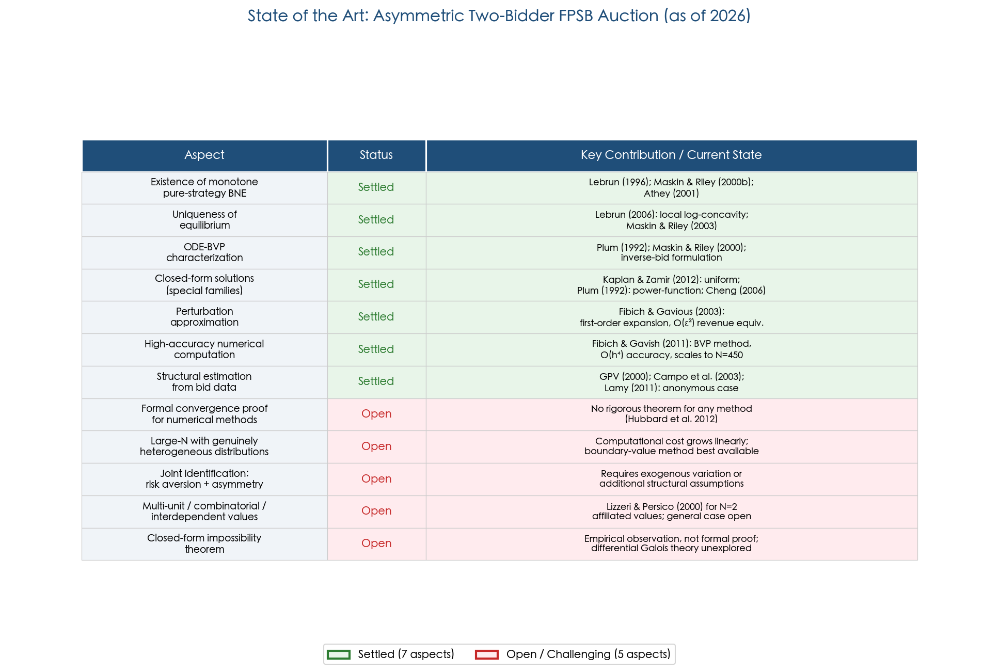

As the status matrix indicates, seven fundamental aspects of the theory — from existence and uniqueness to structural estimation — are fully resolved, while five directions remain open or computationally challenging, offering clear targets for future research.

## 6.6 Direct Answer to the Motivating Question

The question motivating this report asks: *Is there a general method for solving a first-price sealed-bid auction with two bidders who have independent private values drawn from different distributions?*

The answer is nuanced but ultimately affirmative. There is no single closed-form formula that maps an arbitrary pair of distributions $(F_1, F_2)$ to equilibrium bidding strategies $(\beta_1, \beta_2)$. Closed-form solutions exist only for specific distributional families — uniform distributions on arbitrary supports ([Kaplan & Zamir, 2012](https://link.springer.com/article/10.1007/s00199-010-0563-9 "Economic Theory 50(2): 269–302")), power-function densities ([Plum, 1992](https://kylewoodward.com/blog-data/pdfs/references/plum-international-journal-of-game-theory-1992A.pdf "Int. J. Game Theory 20(4): 393–418")), and power distributions with heterogeneous exponents on common support ([Cheng, 2006](https://vinci.cs.uiowa.edu/~hjp/download/hkp.pdf "cited in Hubbard, Kirkegaard & Paarsch 2012")). All these families share the algebraic property that $F_i(v)/f_i(v)$ is linear in $v$, which permits the coupled ODE system to decouple.

However, the equilibrium is *fully characterized* by a well-posed ODE boundary-value problem — the inverse-bid system — that can be solved numerically to arbitrary precision. The [Fibich & Gavish (2011)](http://www.math.tau.ac.il/~fibich/Manuscripts/Numerical-simulations-of-asymmetric-first-price-auctions.pdf "GEB 73(2): 479–495") boundary-value method, which transforms the free-boundary BVP into a fixed-domain problem and applies Newton's method with fourth-order finite differences, achieves $O(h^4)$ accuracy and scales to hundreds of bidders. For weakly asymmetric distributions, the [Fibich & Gavious (2003)](https://www.researchgate.net/publication/220442635_Asymmetric_First-Price_Auctions-A_Perturbation_Approach "Math. Oper. Res. 28(4): 836–852") perturbation expansion provides an analytical first-order approximation that is remarkably accurate even for moderate asymmetry.

The equilibrium exists under standard regularity conditions (continuous distributions with positive density on interval supports) and is unique under local log-concavity — conditions satisfied by essentially all distributions encountered in practice. Structural estimation from observed bid data is feasible via the GPV inversion formula without solving the equilibrium ODE at all.

In summary, the asymmetric two-bidder FPSB auction is "fully solved" in the sense that a complete theoretical characterization — existence, uniqueness, regularity, structural properties — is available, practical computational tools deliver solutions to arbitrary accuracy, and the econometric toolkit enables empirical implementation. What is lacking is not a method, but a universal closed-form expression — and the weight of evidence suggests that no such expression exists outside the narrow distributional families identified above. The problem that Vickrey (1961) declared intractable over six decades ago is, by the standards of applied mathematics and economics, resolved.
