# 执行摘要

# The AI Investment Landscape — Capital Flows, M&A, and Strategic Partnerships

The consulting industry's relationship with artificial intelligence entered a decisive phase between April 2025 and April 2026. What began as exploratory pilots and innovation labs in prior years crystallized into multi-billion-dollar capital commitments, transformative acquisitions, and deeply integrated partnerships with the world's leading AI model providers. Collectively, the firms examined in this study disclosed or deployed upwards of $20 billion in AI-related investment, M&A, and alliance spending during the review period — a figure that understates true outlays given the opacity of MBB budgets and undisclosed deal terms.

This chapter maps the capital flows, mergers and acquisitions, and strategic alliances reshaping the competitive landscape among major international consulting firms, organized into three archetypes: the Big Four (Deloitte, PricewaterhouseCoopers, Ernst & Young, KPMG International), the MBB strategy houses (McKinsey & Company, Boston Consulting Group, Bain & Company), and the technology-led consultancies (Accenture, IBM Consulting, Capgemini).

## Disclosed AI Investment Commitments

### Technology Consultancies: The Largest Absolute Spenders

Among the firms examined, technology consultancies deployed capital at the greatest absolute scale. Accenture committed $3 billion in multi-year generative AI investment — a bet announced in 2023 that began producing measurable returns during FY2025 (fiscal year ending August 31, 2025). Advanced AI revenue tripled year-over-year to $2.7 billion, while GenAI bookings nearly doubled to $5.9 billion; total FY2025 revenues reached $69.7 billion (+7%). The workforce dimension is equally revealing: Accenture's AI and data headcount grew from approximately 40,000 to 77,000 over the period, nearly doubling the specialist bench in two years. [CRN](https://www.crn.com/news/ai/2025/accenture-s-3b-ai-bet-is-paying-off-inside-a-massive-transformation-fueled-by-advanced-ai "CRN report on Accenture Q4 FY2025 earnings, September 2025")

IBM occupies a distinct position, combining consulting services with deep proprietary technology development. The firm reported cumulative GenAI book of business exceeding $12.5 billion as of Q4 2025 — up 2.5× from $5 billion earlier that year — while IBM Consulting revenue totaled $21.1 billion for FY2025 (+2% year-over-year). R&D expenditure reached $8.3 billion in FY2025, rising from $7.5 billion in FY2024, yielding an R&D intensity of 12.3% of total revenue ($67.7 billion) — the highest among all firms in this study. CEO Arvind Krishna reinforced this trajectory by announcing a $150 billion investment plan in America over five years, of which more than $30 billion is directed at R&D. [IBM Q4 2025 Earnings](https://newsroom.ibm.com/2026-01-28-IBM-RELEASES-FOURTH-QUARTER-RESULTS?hl=en-US "IBM Q4 2025 press release, January 2026") [IBM $150B US Investment](https://newsroom.ibm.com/2025-04-28-ibm-unveils-150-billion-investment-in-america-to-accelerate-technology-opportunity "IBM press release, April 2025")

Capgemini reported FY2025 revenues of €22,465 million (approximately $26.7 billion at prevailing exchange rates), growing 3.4% at constant currency. AI-related bookings doubled during the period, surpassing 10% of total bookings, while the firm's 25 strategic AI partnerships underpinned over €900 million (~$1.07 billion) of GenAI bookings in 2024. [Capgemini FY2025 Results](https://investors.capgemini.com/en/publication/fy-2025-results/ "Capgemini investor relations, February 2026")

### Big Four: $1–3 Billion Each Through Diversified Channels

The Big Four firms each committed between $1 billion and $3 billion to AI, though allocation models differ markedly from those of the technology consultancies. Rather than concentrating investment in proprietary product development and R&D, the Big Four distribute capital across internal platform construction, workforce upskilling at scale, and hyperscaler alliance spending.

Deloitte leads the Big Four in headline AI commitment, allocating over $3 billion in GenAI investments through FY2030. This figure was disclosed alongside FY2025 results showing global revenue of $70.5 billion (+4.8% in local currency) — making Deloitte the largest professional services firm globally by revenue. [Deloitte Global Revenue Announcement](https://www.deloitte.com/global/en/about/press-room/global-revenue-announcement.html "Deloitte FY2025 revenue press release, September 2025")

PwC invested nearly $1.5 billion during FY2025 (twelve months ending June 2025) to expand and scale AI capabilities across its global network — a substantial escalation from the original $1 billion over three years announced in April 2023. PwC's Global Chief AI Officer Joe Atkinson confirmed the figure represents ongoing annual-level spending to "expand and scale our AI capabilities." PwC reported record global revenues of $56.9 billion for the same period. [PwC Global Annual Review 2025](https://www.pwc.com/gx/en/about/global-annual-review.html "PwC GAR FY2025, October 2025") [PwC Global Annual Review Highlights](https://www.pwc.com/gx/en/about/global-annual-review/highlights.html "PwC FY2025 highlights, October 2025")

EY invests more than $1 billion annually in AI-first platforms and products, supporting over 1,000 AI agents and 100+ internal AI applications. AI-related revenue grew 30% year-over-year in FY2025, outpacing the firm's overall global revenue of $53.2 billion. A separate $1 billion investment in Assurance technology — incorporating AI into audit workflows — further underscores the breadth of EY's deployment. [EY FY2025 Revenue Announcement](https://www.ey.com/en_gl/newsroom/2025/10/ey-announces-global-revenue-of-us-53-2b-for-fiscal-year-2025 "EY global revenue press release, October 2025")

KPMG committed $2 billion over five years (from July 2023) to expand AI and cloud services through its Microsoft alliance, supplemented by a $100 million four-year partnership with Google Cloud announced in November 2024. The leverage effect of these hyperscaler alliances is substantial: Google Cloud-related bookings grew 10× over two years. [Reuters](https://www.reuters.com/technology/artificial-intelligence/kpmg-spend-100-million-ai-partnership-with-google-cloud-2024-11-20/ "KPMG $100M Google Cloud AI partnership, November 2024")

### MBB: Opaque Budgets, Partnership-Led Scaling

None of the three MBB strategy firms — McKinsey, BCG, or Bain — publicly disclose total AI investment figures. Their strategies emphasize organic capability growth, targeted partnerships, and the integration of AI into existing advisory methodologies rather than large-scale, publicly announced capital deployments.

McKinsey's QuantumBlack AI division has scaled significantly, functioning as the firm's dedicated AI practice with 25+ proprietary tools for client engagements. Internally, McKinsey's AI assistant "Lilli" is deployed firm-wide. The firm was named one of four inaugural OpenAI "Frontier Alliance" partners in February 2026 — signaling a deepening commitment to partnership-led AI scaling. [McKinsey–OpenAI Frontier Alliance](https://www.mckinsey.com/about-us/new-at-mckinsey-blog/mckinsey-and-openai-scale-ai-driven-transformations-with-new-frontier-alliance "McKinsey official blog, February 2026")

BCG was also named an OpenAI Frontier Alliance partner in February 2026. The firm's research arm offers a useful benchmark for corporate AI spending trends: BCG's AI Radar survey (January 2025) found that one in three companies globally planned to allocate more than $25 million to AI in 2025, and that corporations expected to double AI spending from 0.8% to approximately 1.7% of revenues by 2026. [BCG AI Radar](https://www.bcg.com/press/15january2025-ai-optimism-autonomous-agents "BCG press release, January 2025")

Bain expanded its OpenAI partnership in October 2024, establishing a dedicated OpenAI Center of Excellence (CoE) focused on retail and healthcare/life sciences, leveraging GPT-4o and o1 models. [Bain Press Release](https://www.bain.com/about/media-center/press-releases/2024/bain-and-company-announces-expanded-partnership-with-openai-to-accelerate-delivery-of-ai-solutions-and-meet-fast-growing-client-needs/ "Bain press release, October 2024")

## Major M&A Transactions

Acquisitions during the review period reveal divergent M&A philosophies across firm archetypes. Technology consultancies pursued large-scale, AI-native acquisitions to secure talent, intellectual property, and platform capabilities. The Big Four relied more on smaller bolt-on deals and the consolidation of previously acquired specialist firms, while MBB firms made no publicly disclosed AI-focused acquisitions.

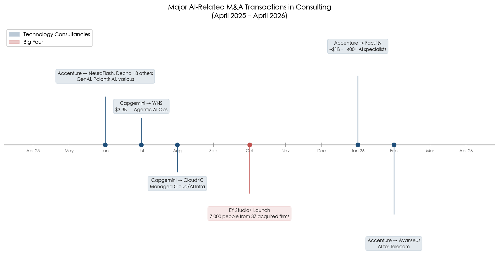

The timeline above illustrates the clustering of activity, with the largest transactions — Capgemini's $3.3 billion WNS acquisition and Accenture's ~$1 billion Faculty deal — occurring in the second half of 2025 and early 2026 respectively.

### Accenture: Serial Acquirer at Scale

Accenture was the most prolific acquirer in the AI consulting space during the review period. The headline transaction was the acquisition of Faculty, a UK-based AI-native firm, for approximately $1 billion (announced January 2026). Faculty brings over 400 AI specialists and its Frontier™ decision intelligence platform; notably, Faculty CEO Marc Warner was appointed Accenture's Chief Technology Officer — an unusual move underscoring the strategic weight of the deal. Industry observers described it as the largest AI acquisition of its kind in the United Kingdom. [Accenture Newsroom](https://newsroom.accenture.com/news/2026/accenture-to-acquire-faculty-to-scale-ai-capabilities "Accenture official press release, January 2026")

Beyond Faculty, Accenture acquired at least 10 additional businesses in H1 FY2025 with direct AI relevance, including NeuraFlash (GenAI consulting), Decho (Palantir AI services), and Avanseus (AI for telecommunications, February 2026). Financial terms for most of these transactions remain undisclosed. [CRN](https://www.crn.com/news/channel-news/2025/all-the-accenture-acquisitions-of-2025-so-far "CRN list of Accenture acquisitions, 2025")

### Capgemini: Transformative M&A for Agentic AI Operations

Capgemini executed its largest acquisition in recent history with the $3.3 billion purchase of WNS ($76.50 per share, a 28% premium), announced in July 2025. The stated rationale — to create "a global leader in Agentic AI-powered Intelligent Operations" — positions the deal as a bet on AI-augmented business process outsourcing. The WNS transaction also brought Kipi.ai into the Capgemini portfolio. Separately, Capgemini acquired Cloud4C in August 2025, strengthening its managed cloud and AI infrastructure capabilities. [Capgemini Press Release](https://www.capgemini.com/us-en/news/press-releases/capgemini-to-acquire-wns-to-create-a-global-leader-in-agentic-ai-powered-intelligent-operations/ "Capgemini official press release, July 2025") [Reuters](https://www.reuters.com/en/frances-capgemini-buy-business-transformation-firm-wns-33-billion-2025-07-07/ "Reuters, July 2025")

### Big Four: Consolidation Over Acquisition

The Big Four's M&A approach during this period centered on integrating previously acquired capabilities rather than pursuing headline new deals. EY launched EY Studio+, comprising 7,000 professionals drawn from 37 specialist companies acquired in recent years, focused on customer experience design, marketing, and AI-driven solutions. This "consolidation-then-activation" model reflects a preference for scaling acquired talent within existing delivery frameworks rather than competing with technology consultancies on deal size. [EY FY2025 Revenue Announcement](https://www.ey.com/en_gl/newsroom/2025/10/ey-announces-global-revenue-of-us-53-2b-for-fiscal-year-2025 "EY global revenue press release, October 2025")

Deal-value transparency remains a persistent challenge across the sector. Financial terms for most consulting-firm acquisitions — including NeuraFlash, Decho, Avanseus, and the 37 firms composing EY Studio+ — have not been publicly disclosed, rendering precise cross-firm M&A spending comparisons infeasible.

## Strategic Partnerships: The AI Alliance Architecture

The period from April 2025 to April 2026 witnessed the crystallization of a structured partnership ecosystem linking consulting firms to three categories of AI technology providers: foundation-model developers (OpenAI, Anthropic), GPU/AI infrastructure platforms (NVIDIA), and cloud hyperscalers (Microsoft Azure, Google Cloud, AWS). These partnerships have become the primary vehicle through which consulting firms access frontier AI capabilities — and in many cases represent a larger channel for AI investment than direct R&D.

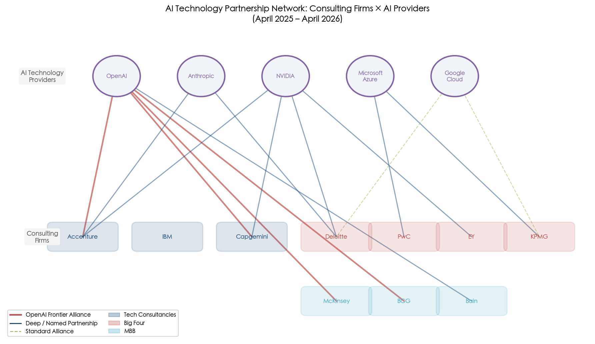

As the network diagram above illustrates, no single AI provider commands exclusive access to the consulting channel. NVIDIA and Microsoft Azure maintain the broadest reach, while OpenAI's Frontier Alliance creates a distinctive multi-firm coalition. The density of connections underscores a market in which consulting firms hedge technology risk through multi-provider strategies.

### OpenAI Frontier Alliance: The Landmark Multi-Firm Partnership

The most consequential partnership development was OpenAI's launch of its "Frontier Alliances" in February 2026 — multiyear agreements with Accenture, BCG, Capgemini, and McKinsey to deploy OpenAI's Frontier enterprise AI agent platform. OpenAI CFO Sarah Friar disclosed that enterprises already account for approximately 40% of OpenAI's revenue and are expected to reach roughly 50% by year-end, underscoring consulting firms' strategic importance as enterprise distribution channels for foundation-model providers. [CNBC](https://www.cnbc.com/2026/02/23/open-ai-consulting-accenture-boston-capgemini-mckinsey-frontier.html "CNBC report, February 2026")

### Anthropic Claude Partner Network

Anthropic launched the Claude Partner Network in March 2026 with an initial $100 million commitment for 2026 to support partner organizations helping enterprises adopt Claude. The funding covers training, sales enablement, customer deployment, and joint go-to-market efforts. Key consulting partners include Accenture and Deloitte. [Anthropic](https://www.anthropic.com/news/the-anthropic-institute "Anthropic official announcement, March 2026") [Forbes](https://www.forbes.com/sites/geruiwang/2026/03/13/anthropic-wants-claude-to-become-a-new-interface-for-work/ "Forbes, March 2026")

Deloitte's Claude deployment predated the formal network: in October 2025, Deloitte rolled out Claude AI to over 470,000 employees across 150+ countries — Anthropic's largest enterprise deployment at the time. The firm built customized Claude "personas" tailored to professional services workflows and established a dedicated Claude Center of Excellence. [CNBC](https://www.cnbc.com/2025/10/06/anthropic-deloitte-enterprise-ai.html "CNBC, October 2025")

### NVIDIA-Centric AI Infrastructure Partnerships

NVIDIA has emerged as the de facto infrastructure backbone for multiple consulting firms' AI platforms. EY's EY.ai Agentic Platform (launched March 2025) is built on the full NVIDIA AI stack: 150 AI agents support 80,000 EY professionals, processing over 3 million tax compliance deliverables and 30 million tax processes annually. The partnership expanded in May 2025 with the launch of on-premises deployment capabilities in collaboration with Dell Technologies and NVIDIA. [EY Newsroom](https://www.ey.com/en_us/newsroom/2025/03/ey-launching-ey-ai-agentic-platform-created-with-nvidia-ai-to-drive-multi-sector-transformation-starting-with-tax-risk-and-finance-domains "EY press release, March 2025")

Deloitte was named Google 2025 Partner of the Year for AI (Global Sales and Services) and simultaneously launched Zora AI™ — its first agentic AI product business, powered by NVIDIA — along with the Deloitte Global Agentic Network. [Deloitte Global Revenue Announcement](https://www.deloitte.com/global/en/about/press-room/global-revenue-announcement.html "Deloitte FY2025 press release, September 2025")

### Hyperscaler Alliances

KPMG pursues a dual-cloud strategy, combining the $2 billion Microsoft alliance with the $100 million Google Cloud partnership. The revenue multiplier is pronounced: Google Cloud-related bookings grew 10× over two years, illustrating the outsized commercial returns that hyperscaler alliances can generate for consulting practices. [Reuters](https://www.reuters.com/technology/artificial-intelligence/kpmg-spend-100-million-ai-partnership-with-google-cloud-2024-11-20/ "Reuters, November 2024")

PwC deepened its Microsoft collaboration on AI agents throughout 2025, complementing this alliance with nine targeted AI investments of approximately $50 million each. Among these, "Elly" — an AI-powered system with a Digital Workforce Equivalent (DWE) of 2,500 — exemplifies the firm's strategy of building proprietary AI tools on hyperscaler infrastructure. [PwC Global Annual Review 2025](https://www.pwc.com/gx/en/about/global-annual-review.html "PwC GAR, October 2025")

## Investment Pattern Comparisons Across Firm Archetypes

The investment data assembled in this chapter reveals three distinct patterns that align closely with firm archetypes.

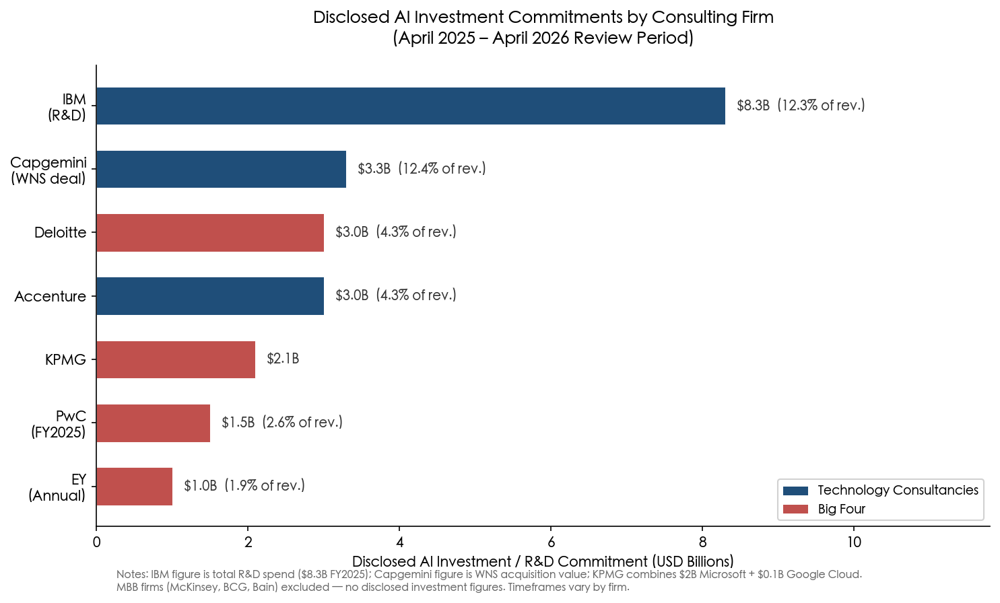

**Technology consultancies invest at the largest absolute scale and deploy capital through the broadest range of channels.** Accenture's $3 billion GenAI commitment, $2.7 billion in realized AI revenue, and ~$1 billion Faculty acquisition represent the most aggressive capital deployment in the sector. IBM's $8.3 billion R&D budget — 12.3% of total revenue — is unmatched in R&D intensity among the firms studied. Capgemini's $3.3 billion WNS acquisition alone exceeds the total disclosed AI commitments of most Big Four firms. These firms also demonstrate a pronounced willingness to use M&A as a primary growth lever, with Accenture executing more than ten AI-related acquisitions during the review period.

**Big Four firms invest $1–3 billion each, distributing capital across internal platforms, workforce upskilling, and alliance spending.** Hyperscaler partnerships serve as the primary vehicle rather than large direct acquisitions. Deloitte's $3 billion through-FY2030 commitment is the highest among the Big Four; PwC's nearly $1.5 billion in FY2025 represents the most aggressive single-year deployment. EY and KPMG blend annual platform investment (over $1 billion at EY) with multi-year alliance frameworks ($2 billion at KPMG via Microsoft). The Big Four's competitive advantage lies not in headline investment size but in the ability to embed AI capabilities across massive, domain-specific workforces — exemplified by Deloitte's 470,000+ employees using Claude, EY's 80,000 professionals on the EY.ai Agentic Platform, and KPMG's 26,000 Copilot users.

**MBB firms keep investment figures private but pursue partnership-led strategies with distinctive approaches.** McKinsey's QuantumBlack grows organically as a dedicated AI division, Bain operates through its OpenAI Center of Excellence, and BCG leverages the OpenAI Frontier Alliance alongside its BCG X product portfolio. The absence of disclosed financial commitments does not imply smaller investment; rather, it reflects partnership structures where capital allocation decisions are inherently less visible to external observers. What is observable is the preferred mode of AI integration: embedding frontier models into high-value advisory relationships rather than building scaled technology platforms for resale.

## Emerging Dynamics: Model Provider–Consulting Firm Symbiosis

A structural trend cutting across all firm archetypes is the deepening symbiosis between AI model providers and consulting firms. OpenAI's Frontier Alliance, Anthropic's Claude Partner Network ($100 million initial commitment), and NVIDIA's extensive consulting-firm integrations collectively indicate that model providers increasingly view consulting firms as their primary enterprise distribution channel. The economics are compelling on both sides: OpenAI CFO Sarah Friar's disclosure that enterprises already account for approximately 40% of OpenAI's revenue — with an expected increase to 50% — confirms consulting firms' emerging role as critical intermediaries in the monetization of foundation models.

This dynamic creates both opportunity and dependency. Consulting firms gain access to frontier capabilities without bearing the full cost of model development; model providers gain enterprise reach, domain expertise, and implementation capacity at scale. The risk is that consulting firms become distribution arms for a small number of dominant AI platforms, potentially constraining their ability to offer genuinely independent technology advisory services.

We believe this tension between partnership dependency and advisory independence will constitute a defining strategic challenge for the consulting industry through 2026 and beyond. Firms that successfully navigate this tension — maintaining credible multi-model strategies while extracting maximum value from key partnerships — will likely capture disproportionate market share in the rapidly expanding AI services segment.

# AI-Powered Products, Platforms, and Service Offerings

The period from mid-2024 through early 2026 marks a decisive inflection point in the consulting industry's AI product strategy. Where prior years centered on advisory frameworks and proof-of-concept demonstrations, the leading firms have shifted to shipping proprietary, enterprise-grade AI platforms — complete with multi-agent orchestration, responsible-AI governance layers, and hybrid deployment architectures. The pace of platform launches has been particularly compressed: between January 2025 and March 2026, all ten firms examined in this report introduced or substantially upgraded at least one named AI platform, with the densest concentration of releases occurring in Q1 2025.

This chapter examines the proprietary AI products, platforms, and accelerators that the major consulting firms have launched or significantly upgraded over the past twelve months. The analysis focuses on three dimensions: (1) what each firm has built and how these offerings are architecturally differentiated — by underlying model strategy, deployment model, target function, and governance approach; (2) the extent to which firms build on top of foundation-model providers (NVIDIA, OpenAI, Anthropic, Google, Microsoft) versus developing in-house model capabilities; and (3) the emergent cross-cutting patterns — including deployment convergence, pricing opacity, and the strategic implications of overlapping partnership structures — that define the competitive landscape as of early 2026.

## 2.1 Big Four: From Advisory to Platform-First

The Big Four firms — Deloitte, PwC, EY, and KPMG — collectively launched or substantially upgraded five named AI platforms between March and June 2025. The timeline below illustrates the compressed cadence of platform releases across all firm categories during the review period.

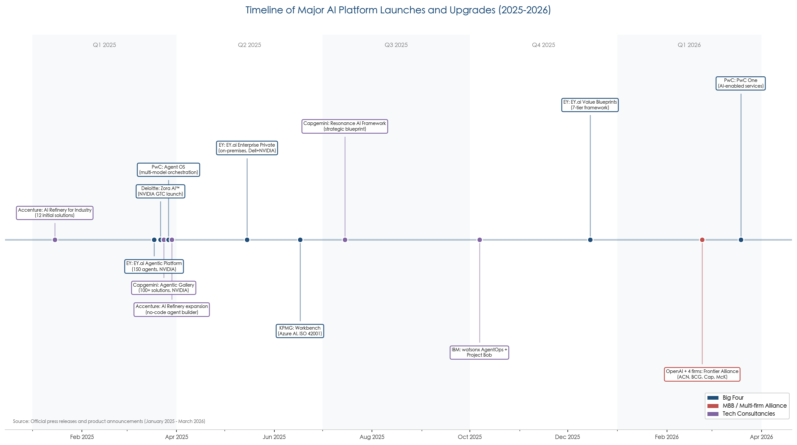

**Figure 2-1.** Timeline of major AI platform launches and upgrades across Big Four, MBB, and technology consultancies, January 2025 through March 2026. The densest cluster of releases occurred in Q1 2025, when six platforms launched within a single quarter.

### 2.1.1 Deloitte — Zora AI™

Deloitte unveiled Zora AI™ at NVIDIA GTC in March 2025, positioning it as the firm's flagship agentic AI product business and the first such offering from a consulting firm to be built directly on NVIDIA's Llama Nemotron reasoning models, NVIDIA AI Enterprise, NeMo, and AI Blueprints. The platform provides ready-to-deploy agents spanning six functional domains — finance, HR, supply chain, procurement, sales/marketing, and customer service — delivered through a cloud subscription model. This pricing format is notable: among all ten firms surveyed, Zora AI is the only platform with an explicitly disclosed subscription-based commercial model. Deloitte's Trustworthy AI™ principles are embedded directly into the platform architecture as a design-time governance layer, rather than applied as a post-hoc compliance overlay. [Deloitte Press Release](https://www.deloitte.com/us/en/about/press-room/deloitte-unveils-zora-ai-agentic-ai-for-tomorrows-workforce.html "Deloitte Unveils Zora AI, March 2025")

The first production module, Zora AI for Finance, targets financial close, reporting, and analytics automation. HPE (Hewlett Packard Enterprise), an early adopter, anticipates a 50% reduction in reporting production time through deployment of the platform. Deloitte subsequently extended its AI platform capabilities through the Deloitte Global Agentic Network and a partnership with Google Cloud that earned the firm the 2025 Google Partner of the Year designation for AI (Global Sales and Services). [Deloitte Global Revenue Announcement](https://www.deloitte.com/global/en/about/press-room/global-revenue-announcement.html "Deloitte FY2025 press release, September 2025")

### 2.1.2 PwC — Agent OS and PwC One

PricewaterhouseCoopers launched two distinct but complementary platforms within a twelve-month span, reflecting a two-phase strategy that progresses from infrastructure orchestration to autonomous service delivery.

**Agent OS** (March 27, 2025) is an enterprise AI orchestration framework that connects AI agents across multiple foundation-model providers — Anthropic, AWS, GitHub, Google Cloud, Microsoft Azure, OpenAI, Oracle, Salesforce, SAP, and Workday — through a drag-and-drop interface with patent-pending orchestration technology. PwC reports 250+ AI agents deployed internally and workflow acceleration of up to 10× relative to traditional methods. The platform's cloud-agnostic, multi-model architecture represents a deliberate strategic choice to avoid single-vendor lock-in, positioning agent OS as the broadest orchestrator among Big Four offerings. [PwC Press Release](https://www.pwc.com/us/en/about-us/newsroom/press-releases/pwc-launches-ai-agent-operating-system-enterprises.html "PwC launches AI agent OS, March 2025")

**PwC One** (March 19, 2026) builds on the agent OS foundation to create an AI-enabled professional services environment that combines institutional knowledge with autonomous AI capabilities. PwC One represents a structural shift from episodic project-based engagements toward continuous insight delivery, with initial capabilities spanning tax analysis, financial reporting, sustainability assurance, deal diligence, and operating model transformation. The platform signals PwC's ambition to evolve from a traditional advisory model toward an always-on, AI-augmented service infrastructure — a model with potentially significant implications for how professional services are priced and consumed. [PwC Press Release](https://www.pwc.com/us/en/about-us/newsroom/press-releases/pwc-one.html "PwC One, March 2026")

### 2.1.3 EY — EY.ai Agentic Platform

Ernst & Young launched the EY.ai Agentic Platform on March 18, 2025, in partnership with NVIDIA, making it one of the earliest Big Four platforms to enter production at scale. The platform deploys 150 AI agents supporting 80,000 EY professionals and processes more than 3 million tax compliance outcomes and 30 million tax processes annually — the most granular operational metrics disclosed by any Big Four firm for an AI platform. Its technical stack integrates NVIDIA NeMo Guardrails with EY's proprietary SafePrompt software for responsible AI, a model catalog drawing on NVIDIA NIM microservices and fine-tuned EY models, and a "Deploy Anywhere" capability supporting cloud, on-premises, and edge environments. [EY Press Release](https://www.ey.com/en_us/newsroom/2025/03/ey-launching-ey-ai-agentic-platform-created-with-nvidia-ai-to-drive-multi-sector-transformation-starting-with-tax-risk-and-finance-domains "EY.ai Agentic Platform launch, March 2025")

EY subsequently introduced two complementary extensions. **EY.ai Enterprise Private** (May 2025), powered by Dell AI Factory with NVIDIA, serves clients with strict data sovereignty requirements through fully on-premises deployment — an early mover position in what has since become an industry-wide architectural trend. **EY.ai Value Blueprints** (December 2025) provides a 7-tier framework (Customer, Workforce, Processes, Trust, Intelligence, Agentic Platform, Systems of Record) for building AI-native enterprises. The accompanying research found that 87% of senior leaders report significant barriers to agentic AI adoption, underscoring the consulting opportunity inherent in platform-plus-advisory bundling. [EY Press Release](https://www.ey.com/en_gl/newsroom/2025/12/ey-launches-ey-ai-value-blueprints-to-accelerate-businesses-path-toward-ai-native-enterprises "EY.ai Value Blueprints, December 2025") [EY Press Release](https://www.ey.com/en_gl/newsroom/2025/05/ey-announces-ey-dot-ai-enterprise-private-powered-by-dell-technologies-and-nvidia-accelerated-computing-to-deliver-enterprise-agentic-and-physical-ai-at-scale "EY.ai enterprise private, May 2025")

### 2.1.4 KPMG — Workbench

KPMG launched Workbench on June 17, 2025, a multi-agent AI platform built on Microsoft Azure AI Foundry. At launch, the platform featured 50 AI assistants with approximately 1,000 in active development, supporting multiple large language models and integrating with enterprise systems including Oracle, Salesforce, ServiceNow, and Workday. KPMG's most distinctive governance differentiator is its status as the first organization globally to earn BSI/ISO 42001 certification for AI management systems; every agent deployed through Workbench carries a "Trusted AI stamp" reflecting this certification — a compliance credential that resonates particularly with regulated-industry clients in financial services, healthcare, and government. [KPMG Press Release](https://kpmg.com/xx/en/media/press-releases/2025/06/kpmg-launches-a-multi-agent-ai-platform-transforming-client-delivery-and-ways-of-working-across-the-global-organization.html "KPMG launches Workbench, June 2025")

KPMG's platform strategy is underpinned by a dual-cloud partnership architecture: a $2 billion Microsoft alliance and a $100 million Google Cloud partnership announced in November 2024. Workbench functions as the integration layer across both hyperscaler ecosystems. Google Cloud-related bookings grew 10× over two years through this partnership, illustrating the commercial leverage that platform-alliance combinations can generate. [Reuters](https://www.reuters.com/technology/artificial-intelligence/kpmg-spend-100-million-ai-partnership-with-google-cloud-2024-11-20/ "KPMG $100M Google Cloud AI partnership, November 2024")

## 2.2 MBB: Proprietary Knowledge Platforms and Partnership-Led Models

The three MBB firms — McKinsey, Bain, and BCG — pursue AI product strategies that differ structurally from both the Big Four and the technology consultancies. None has launched a named, enterprise-grade platform comparable to Zora AI or watsonx; instead, their offerings emphasize proprietary knowledge layers, partnership-sourced model access, and domain-specific solution modules. Investment figures remain undisclosed across all three firms, making direct comparison with the Big Four's multi-billion-dollar commitments difficult.

### 2.2.1 McKinsey — Lilli and QuantumBlack Tools

McKinsey's AI product strategy centers on Lilli, a generative AI knowledge platform rolled out firm-wide in July 2023 and continuously upgraded since. Lilli aggregates 40+ internal knowledge sources — spanning the firm's research library, past engagement insights, and methodological frameworks — and delivers them through a conversational interface supporting tasks from data analysis and draft proposals to automated PowerPoint creation. By mid-2025, 72% of the firm was active on the platform, generating over 500,000 prompts per month and reporting up to 30% time savings in knowledge search and synthesis. [McKinsey Official](https://www.mckinsey.com/capabilities/tech-and-ai/how-we-help-clients/rewiring-the-way-mckinsey-works-with-lilli "Lilli official page") [Bloomberg](https://www.bloomberg.com/news/articles/2025-06-02/mckinsey-leans-on-ai-to-make-powerpoints-faster-draft-proposals "Bloomberg, June 2025")

McKinsey does not publicly disclose the specific foundation models underlying Lilli, though the firm has confirmed partnerships with Microsoft, Google, and Anthropic. The platform's architecture is described as multi-model, drawing from multiple providers while wrapping outputs in McKinsey's proprietary knowledge layer — a design that positions institutional IP, rather than model infrastructure, as the primary differentiator. The client-facing extension of this capability operates through QuantumBlack, AI by McKinsey, which maintains 25+ proprietary tools and industry-specific applications across domains including drug development, customer experience optimization, and operational analytics. [McKinsey Official](https://www.mckinsey.com/capabilities/tech-and-ai/how-we-help-clients/rewiring-the-way-mckinsey-works-with-lilli "Lilli case study")

McKinsey's designation as one of four inaugural OpenAI Frontier Alliance partners in February 2026 further expands its model access, enabling deployment of OpenAI's Frontier enterprise AI agent platform for client engagements. [McKinsey–OpenAI Frontier Alliance](https://www.mckinsey.com/about-us/new-at-mckinsey-blog/mckinsey-and-openai-scale-ai-driven-transformations-with-new-frontier-alliance "McKinsey official blog, February 2026")

### 2.2.2 Bain & Company — AI-Powered Product Development

Bain launched its AI-Powered Product Development platform in 2025 — an LLM-agnostic, platform-agnostic multiagent system designed to automate the full product development and software development lifecycle (PDLC/SDLC). The platform comprises five core modules supporting 40+ activities across product ideation, design, development, testing, and deployment, with Bain reporting 30% faster delivery timelines relative to traditional approaches. The LLM-agnostic design reflects Bain's partnership-diversified strategy: the firm expanded its OpenAI partnership in October 2024 (establishing a dedicated Center of Excellence for retail and healthcare/life sciences using GPT-4o and o1 models), while simultaneously forging partnerships with Palantir (2026) and Inception/G42 (October 2025). [Bain Product Page](https://www.bain.com/industry-expertise/financial-services/ai-powered-product-development/ "AI-Powered Product Development") [Bain Press Release](https://www.bain.com/about/media-center/press-releases/2024/bain-and-company-announces-expanded-partnership-with-openai-to-accelerate-delivery-of-ai-solutions-and-meet-fast-growing-client-needs/ "Bain press release, October 2024")

A notable gap in Bain's public-facing AI portfolio is the absence of a named internal AI platform for its own consultants comparable to McKinsey's Lilli or KPMG's Workbench. The firm's AI product strategy appears oriented primarily toward client-facing solutions rather than internal productivity tools, although integrated AI workflows — including a synthetic stakeholder simulator and collaborative exercises with OpenAI — are embedded in consulting delivery processes.

### 2.2.3 BCG — BCG X Product Library

Boston Consulting Group pursues a decentralized approach to AI products through BCG X, its tech build and design unit. Rather than offering a single named platform, BCG X maintains a modular product library encompassing Fabriq Personalization AI, Retail AI, Media Optimization, and Conversational Commerce — each targeting specific functional or industry use cases. This architecture builds on third-party foundation models rather than proprietary model development, a strategy further reinforced by BCG's designation as an OpenAI Frontier Alliance partner in February 2026. The Alliance extends BCG's reach into healthcare, financial services, insurance, automotive, retail, and public sector AI deployments through OpenAI's enterprise agent platform. [BCG X Product Library](https://www.bcg.com/x/product-library "BCG X Product Library") [BCG Press Release](https://www.bcg.com/press/23february2026-bcg-and-openai-partnership-frontier-alliance "BCG OpenAI Frontier Alliance, February 2026")

The absence of a single branded AI platform comparable to Zora AI, agent OS, or EY.ai constitutes a structural distinction with strategic implications. BCG's approach prioritizes flexibility and domain specificity — assembling purpose-built solutions from modular components — over a unified platform play. This strategy trades brand visibility in the emerging "platform wars" for architectural agility across diverse client environments, an approach that may prove advantageous in fragmented markets but carries the risk of weaker platform-level brand recognition relative to competitors with a single flagship offering.

## 2.3 Technology Consultancies: Scale, IP, and Managed Services

Technology consultancies — Accenture, IBM, and Capgemini — operate at a fundamentally different scale than the Big Four or MBB firms in AI platform development. These firms combine consulting delivery with proprietary technology IP, managed-service infrastructure, and, in IBM's case, proprietary foundation models. Their platforms are designed not only for internal productivity but as commercially licensable products embedded within multi-year managed-service contracts.

### 2.3.1 Accenture — AI Refinery™

Accenture's AI Refinery™, built in collaboration with NVIDIA, represents the broadest-scope consulting AI platform by industry coverage and declared agent count. In January 2025, Accenture launched AI Refinery for Industry with 12 initial industry agent solutions, rapidly expanding to over 100. A March 2025 update added a no-code AI agent builder, lowering the technical barrier for enterprise clients to create custom agents without specialized development resources. Named clients include ESPN, HPE, Noli/L'Oréal, and the United Nations. Published performance benchmarks include 25× faster call processing in telecommunications and 100% insurance submission processing versus a 50% industry average. [Accenture Newsroom](https://newsroom.accenture.com/news/2025/accenture-launches-ai-refinery-for-industry-to-reinvent-processes-and-accelerate-agentic-ai-journeys "AI Refinery for Industry, January 2025") [Accenture Newsroom](https://newsroom.accenture.com/news/2025/accenture-expands-ai-refinery-and-launches-new-industry-agent-solutions-to-accelerate-agentic-ai-adoption "AI Refinery expansion, March 2025")

Accenture further differentiated through sovereign AI capabilities and a Physical AI Orchestrator for manufacturing — extending the AI Refinery concept beyond digital processes into industrial and robotics use cases. The firm's selection as one of four OpenAI Frontier Alliance partners (February 2026) adds another foundation-model integration layer atop its NVIDIA-centric architecture. Combined with GenAI bookings that nearly doubled to $5.9 billion in FY2025 (ending August 2025) and advanced AI revenue that tripled year-over-year to $2.7 billion, Accenture has converted platform investments into commercial traction at a scale unmatched among consulting competitors. [CRN](https://www.crn.com/news/ai/2025/accenture-s-3b-ai-bet-is-paying-off-inside-a-massive-transformation-fueled-by-advanced-ai "CRN report on Accenture Q4 FY2025 earnings, September 2025") [CNBC](https://www.cnbc.com/2026/02/23/open-ai-consulting-accenture-boston-capgemini-mckinsey-frontier.html "CNBC report, February 2026")

### 2.3.2 IBM — watsonx Platform Ecosystem

IBM differentiates from all other firms in this analysis through its dual identity as both a technology vendor and a consulting organization, giving its AI product strategy a depth of technical IP that pure consultancies cannot replicate. The watsonx platform ecosystem comprises three core components: watsonx.ai for model training and deployment, watsonx.data for data lakehouse management, and watsonx.governance for AI lifecycle governance. Atop this foundation, watsonx Orchestrate provides 500+ tools and customizable agents for enterprise workflow automation. [IBM Newsroom](https://newsroom.ibm.com/2025-10-07-ibm-unveils-new-software-product-and-intelligent-infrastructure-capabilities-to-help-enterprises-operationalize-ai "IBM TechXchange 2025, October 2025")

October 2025 enhancements at IBM TechXchange introduced AgentOps — an agentic observability and governance layer — alongside Langflow integration for visual agent building and watsonx Assistant for Z (mainframe-native agents). Project Bob, a new AI-first integrated development environment, incorporates models from Anthropic Claude, Mistral AI, Llama, and IBM's proprietary Granite family — marking the first Anthropic integration into IBM products. The Granite foundation model family — enterprise-grade, open-source models optimized for hybrid cloud environments — continues to serve as the watsonx backbone, giving IBM a proprietary model capability that no other consulting firm in scope possesses. [IBM watsonx Docs](https://www.ibm.com/docs/en/software-hub/5.3.x?topic=new-watsonxai "watsonx.ai February 2026 release")

IBM's cumulative GenAI book of business exceeded $12.5 billion as of Q4 2025, up 2.5× from $5 billion earlier that year. The firm was named Leader in seven AI-related Gartner Magic Quadrant reports across 2025–2026, reflecting broad analyst recognition of its platform breadth. IBM invested $8.3 billion in R&D during FY2025, representing 12.3% of total revenue ($67.7 billion) — the highest R&D intensity among all firms examined in this report and a factor that underpins its unique position as both a model developer and a consulting services provider. [IBM Q4 2025 Earnings](https://newsroom.ibm.com/2026-01-28-IBM-RELEASES-FOURTH-QUARTER-RESULTS?hl=en-US "IBM Q4 2025 press release, January 2026")

### 2.3.3 Capgemini — RAISE™ and the Resonance AI Framework

Capgemini has constructed a layered AI product architecture anchored by two complementary frameworks operating at distinct organizational levels.

At the **technical execution layer**, RAISE™ (Reliable AI Solution Engineering) functions as a modular accelerator and enterprise-grade foundation for building, integrating, operating, and governing agentic AI at scale. RAISE is structured around four pillars: *Accelerate* (curated, customizable AI agents), *Build* (enterprise-grade agents with memory and context), *Integrate* (seamless connection to data, applications, tools, and other agents), and *Operate* (governance, security, monitoring, and responsible AI guardrails). The platform operates as an open ecosystem supporting any hyperscaler, on-premises, or hybrid environment — explicitly designed to avoid vendor lock-in. In March 2025, Capgemini introduced customized agentic solutions with NVIDIA, launching a dedicated agentic gallery featuring 100+ bespoke solutions across eight industries: automotive, consumer, financial services, life sciences, manufacturing, public sector, retail/supply chain, and telecommunications. [Capgemini RAISE](https://www.capgemini.com/solutions/raise-reliable-ai-solution-engineering/ "Capgemini RAISE product page") [Capgemini Press Release](https://www.capgemini.com/news/press-releases/capgemini-accelerates-enterprise-adoption-of-agentic-ai-for-industries-with-nvidia/ "Capgemini agentic AI with NVIDIA, March 2025")

At the **strategic layer**, Capgemini unveiled the Resonance AI Framework in July 2025 — a blueprint for enterprise-wide AI transformation operating across three dimensions: ACCESS (scalable infrastructure, advanced language models, and raw data assets), ADAPT (workforce models, governance frameworks, data infrastructure, and guardrails), and ADOPT (human-AI role definition, interaction design, and legal/ethical alignment). CEO Aiman Ezzat characterized AI as "the next utility — accessible everywhere, anytime, and by anyone," positioning the framework as Capgemini's methodology for bridging the gap between AI pilots and production-scale deployment. [Capgemini Press Release](https://www.capgemini.com/news/press-releases/capgemini-unveils-strategic-ai-framework-to-turn-enterprise-ambition-into-measurable-business-impact/ "Capgemini Resonance AI Framework, July 2025")

Capgemini's designation as an OpenAI Frontier Alliance partner in February 2026 adds OpenAI's enterprise AI agent platform to an already diversified multi-vendor model strategy that includes NVIDIA, Google Cloud, AWS, Microsoft, and Mistral AI. [CNBC](https://www.cnbc.com/2026/02/23/open-ai-consulting-accenture-boston-capgemini-mckinsey-frontier.html "CNBC report, February 2026")

## 2.4 Cross-Cutting Analysis: Foundation Model Strategies, Deployment Architectures, and Pricing Opacity

The preceding firm-by-firm analysis reveals several structural patterns that cut across firm categories. This section synthesizes three dimensions — foundation model strategy, deployment architecture, and pricing transparency — that collectively define the competitive positioning of consulting AI platforms as of early 2026.

### 2.4.1 Three Foundation Model Strategies

A review of the ten firms' AI platforms reveals three distinct foundation model strategies that have crystallized during the review period. The network diagram below illustrates the web of partnership relationships connecting consulting firms to the five major AI infrastructure providers.

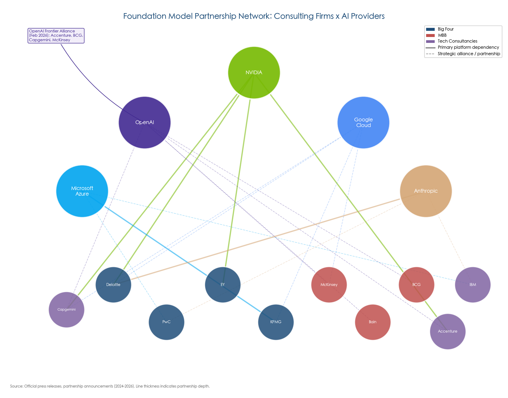

**Figure 2-2.** Foundation model partnership network showing relationships between ten consulting firms and five major AI providers (NVIDIA, OpenAI, Google Cloud, Microsoft Azure, Anthropic). Solid lines indicate primary platform dependencies; dashed lines indicate strategic alliances. The OpenAI Frontier Alliance (February 2026) connects four firms — Accenture, BCG, Capgemini, and McKinsey — to the same foundation-model provider, creating overlapping competitive dynamics.

**NVIDIA-centric builders.** Deloitte (Zora AI), EY (EY.ai Agentic Platform), Accenture (AI Refinery), and Capgemini (RAISE agentic gallery) have built their platforms directly on NVIDIA's AI infrastructure stack — NVIDIA AI Enterprise, NeMo, NIM microservices, and in some cases NVIDIA's Llama Nemotron reasoning models. This approach provides deep hardware-software co-optimization and access to NVIDIA's rapidly expanding AI Blueprints, but introduces a degree of architectural dependency on a single infrastructure provider. The NVIDIA partnership is frequently the primary technology relationship cited in these firms' platform marketing materials.

**Multi-model orchestrators.** PwC (agent OS), KPMG (Workbench), and IBM (watsonx) have positioned their platforms as model-agnostic orchestration layers. PwC's agent OS integrates providers from Anthropic to Workday through a patent-pending orchestration framework. KPMG's Workbench supports multiple LLMs via Microsoft Azure AI Foundry. IBM's watsonx combines its proprietary Granite models with integrations from Anthropic Claude, Mistral AI, and Meta Llama, making it uniquely positioned as both a model producer and an orchestrator. This strategy emphasizes flexibility and vendor-lock-in avoidance — a compelling value proposition for enterprise clients managing multi-cloud environments.

**Partnership-dependent firms.** BCG (via OpenAI Frontier Alliance and BCG X product library), Bain (via OpenAI CoE and Palantir), and McKinsey (via OpenAI Frontier Alliance and QuantumBlack's proprietary tools) rely primarily on partnerships with foundation-model providers rather than building proprietary model infrastructure. These firms contribute domain expertise and consulting methodology as the differentiating layer, with foundation models sourced from external partners. This approach is capital-efficient but may constrain platform differentiation as multiple firms — including direct competitors — access the same underlying models through overlapping alliances.

The OpenAI Frontier Alliance, announced in February 2026, exemplifies this convergence risk: Accenture, BCG, Capgemini, and McKinsey were all designated as inaugural partners, giving them shared access to OpenAI's enterprise AI agent platform. OpenAI CFO Sarah Friar noted that enterprises account for approximately 40% of OpenAI's business, expected to reach ~50% by year-end — underscoring the commercial significance of the consulting channel for foundation-model providers and the resulting incentive for those providers to cultivate multiple consulting partnerships simultaneously. [CNBC](https://www.cnbc.com/2026/02/23/open-ai-consulting-accenture-boston-capgemini-mckinsey-frontier.html "CNBC report, February 2026")

### 2.4.2 Deployment Architecture Convergence

A notable convergence has emerged across nearly all platforms toward "Deploy Anywhere" hybrid architectures. EY was among the first to formalize this with its dedicated on-premises offering (EY.ai Enterprise Private, May 2025), while Capgemini's RAISE explicitly supports "any hyperscaler, on-premises, or hybrid environment." PwC's agent OS is cloud-agnostic by design, KPMG's Workbench is built on Azure but engineered for multi-environment deployment, and IBM's watsonx has long supported hybrid cloud as a core architectural principle consistent with IBM's broader Red Hat OpenShift strategy.

This convergence reflects enterprise demand dynamics rather than genuine technological differentiation. As data sovereignty regulations tighten globally — the EU AI Act's phased enforcement began in February 2025, with high-risk system obligations taking effect in August 2026 — and as organizations handle increasingly sensitive data in tax, audit, healthcare, and defense applications, the ability to deploy AI agents on-premises or within sovereign cloud environments has evolved from a competitive differentiator into a table-stakes requirement. Accenture's launch of sovereign AI capabilities within AI Refinery and EY's Dell-NVIDIA partnership for on-premises deployment both respond to the same structural demand signal.

### 2.4.3 Pricing Transparency and Commercial Models

Pricing remains the most opaque dimension of the consulting AI platform landscape. Among the ten firms surveyed, only Deloitte's Zora AI has been explicitly described as operating under a "cloud subscription model." IBM's watsonx follows a software licensing approach consistent with IBM's broader product portfolio, though enterprise tier pricing is not publicly disclosed. For the remaining firms, AI platforms are typically embedded within managed services contracts or consulting engagement fees, with no standalone pricing published. This opacity impedes prospective buyers' ability to perform direct platform-to-platform cost comparisons and limits analysts' capacity to assess the true unit economics of consulting-firm AI products.

This pricing opacity is broadly consistent with the consulting industry's traditional commercial model, where value-based or time-and-materials pricing prevails over transparent per-unit SaaS metrics. As platforms mature and platform-as-a-service delivery models gain traction, however, market pressure toward pricing transparency is likely to intensify — particularly as hyperscaler-native AI solutions (e.g., Microsoft Copilot, Google Vertex AI agents) establish more visible pricing benchmarks against which enterprise buyers can evaluate consulting-embedded alternatives.

### 2.4.4 Platform Maturity and Differentiation Assessment

The following comparative matrix consolidates the key dimensions of all ten firms' AI platforms, providing an at-a-glance reference for the platform landscape discussed throughout Sections 2.1–2.3.

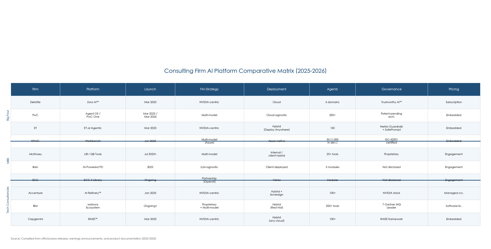

**Figure 2-3.** Comparative matrix of consulting firm AI platforms across seven dimensions: platform name, launch date, foundation model strategy, deployment model, agent/tool count, governance approach, and pricing model. Firms are grouped by category (Big Four, MBB, Technology Consultancies).

Across this landscape, several differentiation patterns merit emphasis:

- **Deepest vertical specialization:** EY's tax-domain deployment (150 agents processing 3 million+ tax deliverables annually) and KPMG's ISO 42001-certified governance model represent the strongest examples of domain-specific AI platforms leveraging Big Four regulatory expertise.
- **Broadest agent ecosystem:** Accenture's AI Refinery (100+ industry agent solutions with no-code builder) and IBM's watsonx Orchestrate (500+ tools) offer the widest horizontal coverage across industries and functional domains.
- **Most integrated advisory-platform model:** PwC One's evolution toward continuous insight delivery and McKinsey's Lilli-to-QuantumBlack pipeline represent early attempts to blur the boundary between consulting engagement and platform service — a structural shift with implications for how professional services revenue is recognized and valued.
- **Strongest proprietary model capability:** IBM remains the only firm with a proprietary foundation model family (Granite) powering its platform, providing a unique technical moat — albeit one that also introduces complexity for clients already committed to competing foundation models.

The competitive landscape is converging around a common architecture — multi-agent platforms with responsible AI guardrails, hybrid deployment, and multi-model support — while diverging in go-to-market strategy. Technology consultancies (Accenture, IBM, Capgemini) compete on platform scale and managed-service delivery. Big Four firms compete on domain depth in regulated industries, particularly tax, audit, and financial services. MBB firms compete on strategic advisory and C-suite access, with platforms serving as enabling infrastructure rather than standalone revenue streams. The firms that ultimately prevail in this evolving landscape will be those that most effectively combine platform capability with the domain expertise, client trust, and implementation capacity that remain the consulting industry's enduring competitive advantages.

# Chapter 3: Client Case Studies and Application Scenarios

The preceding chapters mapped the investment commitments and platform architectures of the world's leading consulting firms. This chapter shifts the lens from *what was built* to *how it was deployed* — examining publicly documented client engagements, the industries and functions where consulting-led AI adoption is most concentrated, and the measurable outcomes that have been reported. The evidence assembled here reveals a market that has decisively moved beyond proof-of-concept: named-client deployments now span retail, manufacturing, pharmaceuticals, financial services, and corporate finance, with quantified results ranging from 40–58% efficiency gains to hundreds of millions of dollars in documented savings. Yet the cross-firm survey data tell a sobering complementary story — fewer than 15% of organizations report achieving enterprise-scale AI value, underscoring that the pilot-to-production gap remains the defining challenge of this market phase.

The table below consolidates the twelve core case studies examined in this chapter, organized by firm archetype and key quantified outcomes.

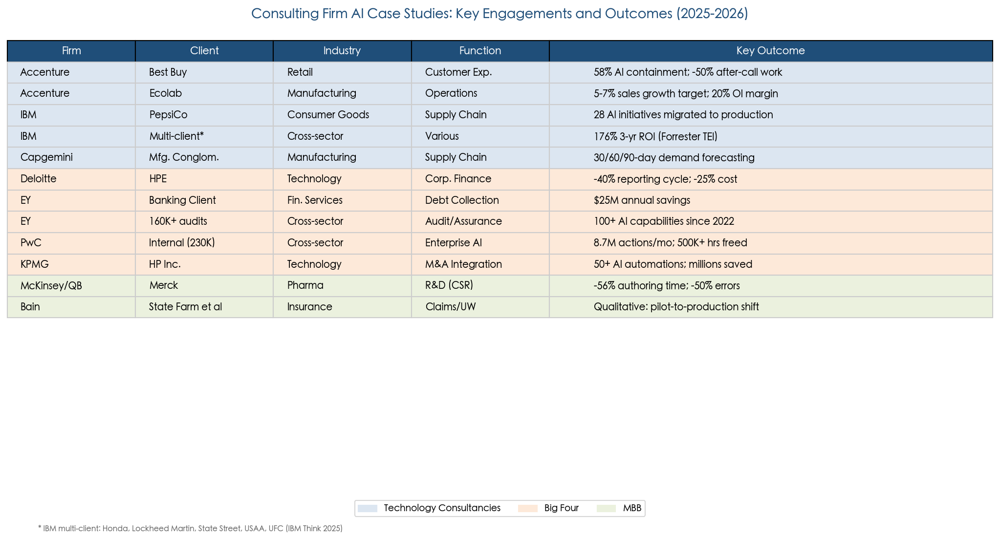

*Figure 3-1. Summary of publicly documented AI consulting engagements analyzed in this chapter. Technology consultancies (blue) publish the most granular deployment metrics; Big Four firms (orange) concentrate on domain-specific applications in tax, audit, and finance; MBB firms (green) disclose the fewest named-client outcomes.*

## 3.1 Technology Consultancies: Scale-Driven Deployments

### Accenture — From 6,000 Projects to Measurable Client Outcomes

Accenture's AI deployment footprint in FY2025 (ending August 2025) constituted, by its own disclosure, the largest in the consulting industry: over 6,000 advanced AI projects delivered, generating $2.7 billion in gen-AI revenue (a threefold year-over-year increase) and $5.9 billion in gen-AI bookings (nearly doubling the prior year). In Q4 FY2025 alone, 37 clients each recorded quarterly bookings exceeding $100 million — an indicator of the deepening integration of AI into large-enterprise transformation programs [CRN](https://www.crn.com/news/ai/2025/accenture-s-3b-ai-bet-is-paying-off-inside-a-massive-transformation-fueled-by-advanced-ai "CRN, September 2025").

Among the most granularly documented engagements is the **Best Buy** partnership in retail customer experience. Accenture designed and deployed a gen-AI virtual assistant spanning BestBuy.com, the mobile application, and phone support channels. The solution achieved a 58% AI containment rate — meaning nearly three in five customer interactions were resolved without human escalation — alongside a 50% reduction in after-call work for agents and 100% of calls analyzed for quality assurance. These metrics characterize a comprehensive production deployment rather than a limited pilot [Accenture Case Study](https://www.accenture.com/us-en/case-studies/data-ai/best-buy-humanizes-customer-experience-genai "Accenture Best Buy case study").

In manufacturing, CEO Julie Sweet highlighted **Ecolab** as a client redesigning operational processes with AI agents, targeting 5–7% sales growth and a 20% operating income margin. While Ecolab's program remains in its scaling phase, it exemplifies the strategic pivot from productivity automation to growth-oriented AI that Sweet has advocated, cautioning that clients have "pivoted way too far towards productivity and not enough to grow" [Constellation Research](https://www.constellationr.com/insights/news/accenture-enterprise-ai-deployments-hit-inflection-point "Accenture Q4 FY2025 earnings analysis, September 2025").

Accenture's proprietary research, drawing on analysis of over 2,000 projects and a survey of more than 3,000 executives (March 2025), found that only 13% of organizations report significant enterprise-level gen-AI value. Organizations that execute on five key actions — encompassing enterprise-wide data integration, process redesign, and change management — are 2.5× more likely to achieve meaningful results [Accenture Report](https://www.accenture.com/us-en/insights/consulting/making-reinvention-real-with-gen-ai "Making Reinvention Real, March 2025"). This "13% threshold" has since become a widely cited benchmark for the pilot-to-production gap in consulting-led AI.

### IBM Consulting — Enterprise Data Foundations and Multi-Client Platform Launches

IBM Consulting's deployment methodology centers on building unified enterprise data architectures as a prerequisite for scalable AI. The **PepsiCo** engagement, showcased at IBM Think 2025 (May 2025), illustrates this approach: IBM constructed a unified enterprise data foundation that migrated 28 high-value AI initiatives to production across supply chain, procurement, and financial forecasting functions. Rather than deploying isolated models, the architecture enabled PepsiCo to operationalize AI across interconnected business processes — a design philosophy that distinguishes IBM's data-first consulting model from competitors' agent-first strategies [SiliconANGLE](https://siliconangle.com/2025/05/27/pepsico-ibm-drive-enterprise-ai-adoption-data-strategy-ibmthink/ "IBM Think 2025, May 2025").

IBM Think 2025 simultaneously served as the launch event for several high-profile watsonx Orchestrate deployments. Named clients included **Honda** (responsible AI governance framework), **Lockheed Martin** (national-security AI applications), **State Street** (enterprise AI transformation for asset management), **USAA** (automating underwriting and claims processing), and **UFC** (an "Insights Engine" delivering real-time fight analytics). A Forrester Total Economic Impact (TEI) study projected 176% ROI over three years for watsonx Orchestrate deployments [IBM Newsroom](https://newsroom.ibm.com/2025-05-06-ibm-accelerates-enterprise-gen-ai-revolution-with-hybrid-capabilities "IBM Think 2025, May 2025").

IBM's cumulative GenAI book of business exceeded $12.5 billion as of Q4 2025, representing a 2.5× increase from the $5 billion reported earlier in the year. This trajectory positions IBM Consulting as the firm with the largest disclosed GenAI pipeline in absolute dollar terms among all companies examined in this report [IBM Q4 2025 Earnings](https://newsroom.ibm.com/2026-01-28-IBM-RELEASES-FOURTH-QUARTER-RESULTS?hl=en-US "IBM Q4 2025 press release, January 2026").

### Capgemini — Supply Chain Intelligence and the WNS Integration

Capgemini's most technically detailed public case study involves an anonymized **global manufacturing conglomerate** for which it developed a gen-AI chatbot and forecast engine on Google Cloud Vertex AI. The system generates 30/60/90-day demand projections, reducing stock-demand mismatch and optimizing warehouse inventory value. The engagement followed a disciplined scaling pattern — commencing as a single-country proof-of-concept before expanding to a global rollout — consistent with Capgemini's emphasis on controlled deployment methodologies [Capgemini Case Study](https://www.capgemini.com/wp-content/uploads/2025/01/Global-conglomerate-client-story-case-study.pdf "Capgemini client story, January 2025").

At the firm level, Capgemini reported that AI bookings doubled to over 10% of total bookings in FY2025, with GenAI and agentic AI exceeding 8% of group bookings for the full year and surpassing 10% in Q4. The $3.3 billion acquisition of WNS (July 2025) was explicitly positioned to create "a global leader in Agentic AI-powered Intelligent Operations" — signaling that Capgemini's strategic intent extends beyond advisory into large-scale AI-enabled delivery [Capgemini FY2025 Results](https://investors.capgemini.com/en/publication/fy-2025-results/ "Capgemini investor relations, February 2026").

## 3.2 Big Four: Domain-Deep AI in Tax, Audit, and Financial Services

### Deloitte — Zora AI in the CFO Suite

Deloitte's most substantive public case study centers on **Hewlett Packard Enterprise (HPE)**, an early adopter of the Zora AI platform. HPE's finance organization partnered with Deloitte to co-develop "CFO Insights" — an AI-powered solution running on Deloitte's Zora AI framework and HPE's Private Cloud AI infrastructure. Internally designated "Alfred," the system combines generative AI (a consolidated data fabric spanning supply chain, financial, and operational data) with agentic AI (role-specific agents that mirror human analysts — revenue analysts, backlog experts — executing recurring queries and handoffs autonomously). According to HPE CFO Marie Myers, CFO Insights reduced financial reporting cycle time by approximately 40% and processing costs by at least 25%. HPE's COO for finance, Gustav van der Westhuizen, estimated that the system eliminated roughly 90% of the manual effort previously required to prepare the company's weekly executive performance review [Fortune](https://fortune.com/2026/02/12/hpe-cfo-used-ai-transform-100-slide-monday-meeting/ "Fortune, February 2026") [Deloitte](https://www.deloitte.com/us/en/services/consulting/articles/hpe-agentic-ai-collaboration.html "Deloitte-HPE collaboration").

Beyond HPE, Deloitte has deployed Zora AI for **Danfoss**, the Danish industrial technology company, in a CFO Insights engagement for next-generation IT — though quantified outcomes for this deployment have not been publicly detailed [HPE Resource Library](https://www.hpe.com/us/en/resource-library.video.hpe-and-deloitte-redefining-next-generation-it-for-danfoss-with-zora-ai-cfo-insights.Discover2025-9904.html "HPE Discover 2025").

A notable cautionary case also emerged during this period. Deloitte Australia refunded part of A$440,000 (approximately $290,000) to the Australian government after an AI-generated report on automated welfare penalties was found to contain fabricated references. The incident underscored the risks inherent in deploying generative AI in policy-sensitive contexts without adequate hallucination controls, and prompted renewed attention to output verification protocols across the industry [Fortune](https://fortune.com/2025/10/07/deloitte-ai-australia-government-report-hallucinations-technology-290000-refund/ "Fortune, October 2025") [The Guardian](https://www.theguardian.com/australia-news/2025/oct/06/deloitte-to-pay-money-back-to-albanese-government-after-using-ai-in-440000-report "The Guardian, October 2025").

### EY — AI at the Core of Assurance and Financial Services

Ernst & Young has made AI integration into audit and assurance a flagship differentiator. In April 2025, EY announced a $1 billion four-year investment in Assurance technology, integrating AI across more than 160,000 audit engagements worldwide. The program delivered over 30 new AI capabilities in 2025 alone, bringing the cumulative total to more than 100 since 2022, and supports 140,000 assurance professionals globally. EY's strategic rationale is grounded in domain characteristics: audit and compliance workflows are data-intensive, rule-governed, and high-stakes — precisely the domains where AI agents can deliver verifiable efficiency gains with measurable error reduction [EY Press Release](https://www.ey.com/en_nl/newsroom/2025/04/ey-announces-large-scale-integration-of-leading-edge-ai-technology-into-global-assurance-technology-platform "EY assurance AI, April 2025").

In financial services, EY reported that an AI-driven debt collection system deployed for a banking client delivered $25 million in annual savings. The firm's Competitive Edge M&A platform, which leverages AI for deal intelligence, has analyzed 677 million news articles and 2.1 million transactions to support valuation and due diligence workflows [AIX Analysis](https://aiexpert.network/ai-at-ey/ "AI Expert Network, January 2025"). The EY.ai Agentic Platform, launched in partnership with NVIDIA in March 2025, serves as the infrastructure layer underpinning these deployments: 150 AI agents support 80,000 EY professionals, processing over 3 million tax compliance deliverables and 30 million tax processes annually [EY Press Release](https://www.ey.com/en_us/newsroom/2025/03/ey-launching-ey-ai-agentic-platform-created-with-nvidia-ai-to-drive-multi-sector-transformation-starting-with-tax-risk-and-finance-domains "EY.ai Agentic Platform launch, March 2025").

### PwC — Enterprise-Wide Copilot Adoption and Security AI

PricewaterhouseCoopers has pursued a dual-track deployment strategy: broad-based internal AI adoption as a demonstration of enterprise readiness, and targeted client-facing AI partnerships in high-value domains.

On the internal deployment front, PwC rolled out Microsoft Copilot to over 230,000 users across more than 100 countries. In October 2025 alone, the deployment logged 8.7 million actions, freeing more than 500,000 hours of professional time. Across the firm, 54% of the global workforce uses AI tools weekly, averaging 9 prompts per week — metrics that PwC actively publishes to position itself as a living "proof point" for enterprise AI adoption at scale [PwC Case Study](https://www.pwc.com/us/en/library/case-studies/pwc-microsoft-copilot-enterprise-ai.html "PwC Copilot case study, January 2026").

In cybersecurity, PwC entered a $400 million collaboration with Google Cloud to modernize security operations using AI-driven tools. While specific client-level deployment metrics remain undisclosed, the collaboration's scale signals a strategic wager that AI-augmented security operations will become a significant consulting growth vector in the near term [PwC Press Release](https://www.pwc.com/us/en/about-us/newsroom/press-releases/pwc-googlecloud-collboration-agreement-ai-security.html "PwC–Google Cloud AI security").

### KPMG — M&A Integration and Enterprise GenAI Environments

KPMG's most detailed named-client case study involves **HP Inc.** (the personal computing and printing company), where KPMG deployed a custom AI platform featuring over 50 AI-powered automations for budget modeling, data reconciliation, and KPI tracking during a mergers-and-acquisitions integration. The firm reported "millions in efficiency gains" and a shortened integration timeline, though precise dollar figures were not disclosed [KPMG Article](https://kpmg.com/us/en/articles/2025/data-modernization-case-studies.html "KPMG Data Modernization, August 2025").

A second engagement involved an anonymized **global consumer brand**, where KPMG deployed a centralized GenAI environment that scaled to over 4,500 employees across marketing, sales, customer service, and legal functions. The deployment pattern — enterprise-wide GenAI enablement rather than function-specific automation — reflects KPMG's Workbench platform strategy of providing a multi-agent environment that organizations can adopt holistically rather than incrementally [KPMG Article](https://kpmg.com/us/en/articles/2025/data-modernization-case-studies.html "KPMG Data Modernization, August 2025").

## 3.3 MBB Firms: Thought Leadership as a Client Engagement Vector

### McKinsey/QuantumBlack — Pharma R&D Transformation at Merck

McKinsey's QuantumBlack division produced the most quantitatively rigorous MBB case study of the review period through its engagement with **Merck** (known as MSD outside the United States). The project deployed gen-AI for clinical study report (CSR) authoring — one of the most labor-intensive stages in pharmaceutical development. The results were substantial: a 56% reduction in authoring time (from approximately 180 hours to 80 hours per report), a 50% reduction in errors, and the ability to generate a high-quality first draft in as little as five minutes. Merck announced plans to scale the solution across its late-phase clinical pipeline by end-2025 [Merck Press Release](https://www.merck.com/news/merck-expands-innovative-internal-generative-ai-solutions-helping-to-deliver-medicines-to-patients-faster/ "Merck official, June 2025") [McKinsey Blog](https://www.mckinsey.com/about-us/new-at-mckinsey-blog/with-gen-ai-merck-and-mckinsey-transform-clinical-authoring "McKinsey, June 2025").

The Merck case carries significance beyond its headline metrics. Clinical study reports are regulatory documents subject to FDA and EMA scrutiny, meaning the deployment demanded a level of accuracy, traceability, and governance that most gen-AI applications do not face. McKinsey's ability to deliver quantified results in this highly regulated domain reinforces QuantumBlack's positioning as a credible partner for pharma and life-sciences AI transformation.

### BCG — Research-Driven Insights as a Client Engagement Vector

Boston Consulting Group publishes extensive research on enterprise AI adoption but discloses fewer named-client deployment metrics than its peers. BCG's most influential contribution during this period was its "Build for the Future" study (October 2025, surveying over 1,250 firms), which established a taxonomy of AI maturity: only 5% of companies achieve AI value at scale, yet these "AI future-built" companies realize 5× revenue increases and 3× cost reductions compared to laggards [BCG Publication](https://www.bcg.com/publications/2025/are-you-generating-value-from-ai-the-widening-gap "BCG AI Value Gap, October 2025").

This research serves a dual function as a client engagement tool: by quantifying the gap between AI leaders and laggards, BCG creates urgency among C-suite executives and positions itself as the advisor capable of bridging that divide. The firm's OpenAI Frontier Alliance partnership (February 2026) extends this strategy from thought leadership into implementation, with BCG now offering enterprise AI agent deployments across healthcare, financial services, insurance, automotive, retail, and the public sector.

### Bain — Insurance Industry Transformation

Bain & Company has concentrated its public AI case study efforts in insurance and healthcare. Executive conversations with **State Farm**, **Bupa**, and **Zurich** document the transition from experimentation to production-scale deployment in claims processing, customer experience, and underwriting. While specific KPIs from these engagements remain undisclosed, Bain's Q3 2025 executive survey provides broader context: 65% of companies are now deploying AI (up from earlier periods), and 74% rank AI as a top-three strategic priority (up from 60%) [Bain](https://www.bain.com/insights/executive-survey-ai-moves-from-pilots-to-production/ "Bain executive AI survey, Q3 2025"). The absence of granular client metrics is consistent with Bain's tradition of strict client confidentiality, though it limits independent assessment of deployment outcomes.

## 3.4 Industry and Function Heatmap: Where AI Consulting Demand Concentrates

Synthesizing the case studies and survey data across firms reveals distinct patterns in the concentration of consulting-led AI adoption by industry and business function. The heatmap below maps documented deployments across the industry–function matrix.

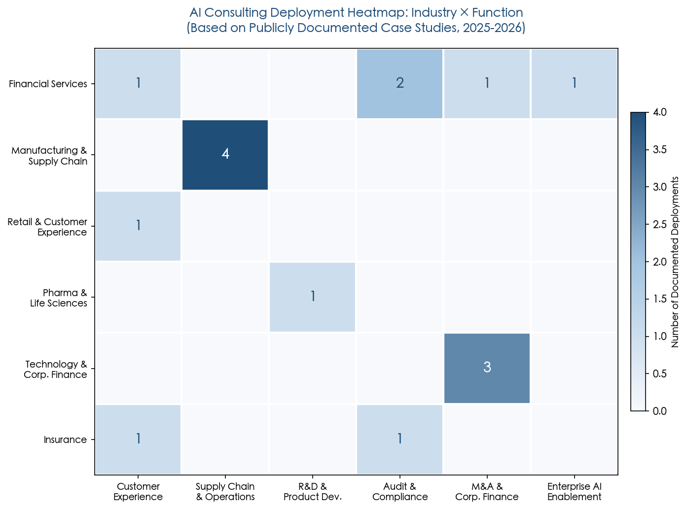

*Figure 3-2. Distribution of publicly documented AI consulting deployments by industry and business function. Manufacturing & Supply Chain and Technology & Corporate Finance exhibit the highest case density, while Financial Services shows the broadest cross-functional spread.*

**Financial services** remains the single largest demand center. EY's 150-agent tax deployment, KPMG's M&A integration platform for HP Inc., Bain's insurance-sector engagements, and IBM's State Street and USAA deployments all cluster in this sector. The combination of high data density, regulatory complexity, and quantifiable cost pools — underwriting losses, compliance penalties, processing costs — makes financial services a natural proving ground for consulting-led AI.

**Manufacturing and supply chain** represent the fastest-growing application area by case count. Accenture's Ecolab engagement, IBM's PepsiCo data foundation, and Capgemini's anonymized conglomerate case all target supply-chain optimization, demand forecasting, and operational efficiency. Accenture's Industrial Intelligence Suite has generated measurable results in the energy sector: digital twins reducing lost production by 2–4%, productivity increases of up to 28%, and cost reductions of 22% [Accenture CEO commentary](https://diginomica.com/gen-ai-seems-so-simple-right-think-again-advises-accenture-ceo-julie-sweet "September 2025").

**Retail and customer experience** is exemplified by the Accenture × Best Buy deployment, which produced the most granular public metrics of any consulting-led gen-AI deployment in customer service during this period. The 58% AI containment rate establishes a concrete benchmark for retail CX automation.

**Pharmaceutical R&D** stands out through the McKinsey × Merck engagement. The 56% time reduction in clinical study report authoring demonstrates that AI can deliver quantifiable value in highly regulated, accuracy-critical environments — a finding with broad implications for life-sciences consulting.

**Corporate finance** is an emerging application domain, with Deloitte's Zora AI CFO Insights deployments at HPE and Danfoss representing the most advanced public examples of agentic AI in the CFO suite. The 40% cycle-time reduction and 25% cost reduction at HPE establish early benchmarks for AI-driven financial reporting.

## 3.5 Cross-Firm Survey Evidence: The Pilot-to-Production Gap

Beyond individual case studies, the major consulting firms have published overlapping survey evidence that quantifies the systemic challenge of scaling AI from pilot to production. The figure below distills the key findings, distinguishing between "value at scale" metrics and "adoption/deployment rate" metrics — a critical distinction that is frequently conflated in industry commentary.

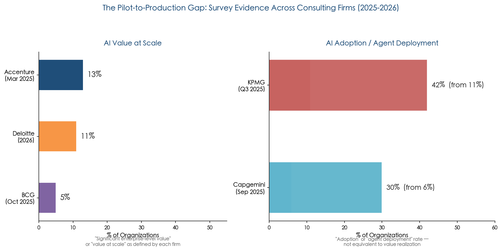

*Figure 3-3. Left panel: percentage of organizations achieving significant enterprise-level AI value, as defined by each firm's methodology. Right panel: AI adoption or agent deployment rates, which are substantially higher but do not equate to value realization. The divergence between the two panels encapsulates the central challenge facing enterprise AI scaling.*

**Accenture** (March 2025, over 2,000 projects, more than 3,000 executives surveyed): only 13% of organizations report significant enterprise-level gen-AI value [Accenture Report](https://www.accenture.com/us-en/insights/consulting/making-reinvention-real-with-gen-ai "Making Reinvention Real, March 2025").

**BCG** (October 2025, over 1,250 firms): only 5% of companies achieve AI value at scale, while approximately 60% report little or no measurable impact [BCG Publication](https://www.bcg.com/publications/2025/are-you-generating-value-from-ai-the-widening-gap "BCG AI Value Gap, October 2025").

**KPMG** (Q3 2025 AI Pulse Survey): AI agent deployment nearly quadrupled to 42% of organizations (from 11% two quarters earlier); projected AI investment averaged $124 million per organization; 82% of respondents cite data quality as the primary barrier to scaling [KPMG Press Release](https://kpmg.com/us/en/media/news/q3-ai-pulse.html "KPMG Q3 2025 AI Pulse") [Forbes](https://www.forbes.com/sites/noahbarsky/2025/12/10/ai-rollouts-face-3-key-questions-kpmg-study-finds/ "Forbes, December 2025").

**Capgemini Research Institute** (September 2025): gen-AI adoption surged from 6% in 2023 to 30% in 2025; 93% of organizations are now exploring gen-AI; AI agents could deliver up to $450 billion in economic value by 2028 across banking and insurance alone [Capgemini Report](https://www.capgemini.com/us-en/insights/research-library/generative-ai-in-organizations-2025/ "Capgemini Gen AI in Organizations 2025").

**Deloitte** ("State of AI in the Enterprise," 2026, 3,235 respondents): worker AI access rose 50% in 2025; companies with 40% or more AI projects in production are projected to double within six months; yet only 11% of enterprises have deployed AI agents in production [Deloitte Report](https://www.deloitte.com/us/en/what-we-do/capabilities/applied-artificial-intelligence/content/state-of-ai-in-the-enterprise.html "Deloitte State of AI, 2026").

The convergence across these independently conducted surveys is striking. Despite rapid adoption of AI tools (Capgemini's jump from 6% to 30%, KPMG's fourfold increase in agent deployment), the share of organizations extracting enterprise-scale value remains firmly in the single digits to low teens. We observe that this "pilot-to-production gap" is itself the primary demand generator for consulting firms: the more organizations struggle to scale AI beyond initial use cases, the greater the need for external advisory, systems integration, and managed-services support.

## 3.6 Data Asymmetry and Disclosure Patterns

An important methodological observation concerns the unevenness of public case study disclosure across firm archetypes. Technology consultancies — Accenture, IBM, and Capgemini — publish the most detailed and most numerous client case studies, including named clients and quantified outcomes. This transparency reflects both their implementation-heavy business models and their public-company reporting obligations, which incentivize granular disclosure of AI-related revenue and bookings.

The Big Four publish selectively. EY and KPMG provide named cases with partial quantification; PwC foregrounds its own internal deployment as a demonstration case rather than external client metrics; Deloitte's most detailed case emerged primarily through client-side disclosure by HPE rather than through Deloitte's own press materials.

MBB firms disclose the fewest named-client cases. McKinsey's Merck engagement stands as an exception enabled by Merck's own public announcement. BCG and Bain primarily publish research-based frameworks and anonymized survey data rather than client-specific deployment metrics. This pattern reflects the MBB model's emphasis on confidentiality and C-suite advisory relationships, but it also constrains independent verification of MBB AI deployment outcomes.

Capgemini's use of anonymized client descriptions (e.g., "global manufacturing conglomerate") occupies a deliberate middle ground — providing technical detail sufficient for analytical purposes without revealing client identity. This approach limits independent verification but permits richer technical narrative than fully confidential engagements.

The absence of public case studies does not imply the absence of deployment activity. However, for the purposes of this analysis, assessments are confined to what is publicly documented and verifiable through T1 or T2 sources.

# Chapter 4: Strategic Directions and Competitive Positioning — GenAI, Responsible AI, and Vertical AI

The consulting industry's AI strategies have evolved beyond exploratory pilots into full-scale competitive repositioning. By early 2026, every major firm in scope — from the Big Four to MBB and technology consultancies — has articulated a distinct strategic thesis on how generative AI, agentic AI, responsible AI, and vertical-specific AI will reshape both their own operations and their clients' businesses. This chapter examines the strategic positioning choices firms have made along the GenAI value chain, the responsible-AI frameworks they have operationalized as both risk mitigants and competitive differentiators, the vertical-specific bets that create defensible moats, and the third-party analyst rankings that validate — or challenge — those positions. Taken together, these dimensions reveal a market in which strategic intent is rapidly diverging even as the underlying technology converges.

## 4.1 Strategic Positioning Along the GenAI and Agentic AI Value Chain

### 4.1.1 From Productivity to Reinvention: The C-Suite Narrative Shift

The dominant strategic narrative across the consulting industry in 2025–2026 has shifted decisively from "AI for cost efficiency" to "AI as business strategy." Accenture CEO Julie Sweet articulated this pivot most explicitly, declaring that "the data and AI strategy is not a separate strategy, it is the business strategy" and warning clients that they had "pivoted way too far towards productivity and not enough to grow" [Fortune](https://fortune.com/2025/12/16/accenture-telstra-ai-reinvention-agentic-data-is-not-separate-business-strategy/ "Fortune, December 2025"). The commercial resonance of this framing is evident: Accenture's FY2025 GenAI new bookings reached $5.1 billion, up from $3 billion the prior year [Accenture CEO commentary](https://diginomica.com/gen-ai-seems-so-simple-right-think-again-advises-accenture-ceo-julie-sweet "September 2025 Q4 earnings").

PwC has adopted a complementary yet more structured positioning. Its 2026 AI Predictions report, published in December 2025, advocated a "disciplined march to value," contending that "technology delivers only ~20% of value; the other 80% comes from redesigning work" and prescribing centralized "AI studios" over fragmented bottom-up experimentation [PwC AI Predictions 2026](https://www.pwc.com/us/en/tech-effect/ai-analytics/ai-predictions.html "December 2025"). This framing positions PwC as the firm that converts AI experimentation into enterprise-wide operating-model transformation, leveraging its deep domain expertise in tax, finance, and risk.

Bain & Company's Managing Director Chuck Whitten offered a similarly pragmatic outlook in January 2026, asserting that "2026 is the year boards demand bottom-line results from AI" and estimating that two-thirds of AI value derives from data, process redesign, and change management rather than the technology itself. Whitten characterized the current AI cycle as "a once-in-a-moment disruption" concentrated on white-collar workflows [Bain](https://www.bain.com/insights/what-to-expect-from-ai-in-2026/ "January 2026"). Collectively, these C-suite narratives signal that the strategic discourse has migrated from technology adoption toward enterprise reinvention — a shift that favors consulting firms with organizational-transformation capabilities over pure technology vendors.

### 4.1.2 The Pilot-to-Production Gap as Strategic Battleground

The persistent gap between AI pilots and production-grade deployment has emerged as the central strategic opportunity — and consulting value proposition — for the industry. Deloitte's "State of AI in the Enterprise" 2026 survey (3,235 respondents, published January 2026) quantified this gap: workforce AI access broadened from under 40% to approximately 60% in a single year, 85% of companies planned to customize AI agents, yet only 25% had moved 40% or more of their pilots into production [Deloitte Press Release](https://www.deloitte.com/us/en/about/press-room/state-of-ai-report-2026.html "State of AI 2026, January 2026"). Deloitte has explicitly framed the "pilot-production gap" as its core consulting positioning, complementing this diagnosis with a forecast that the global agentic AI market could reach $45 billion by 2030 — and a cautionary note that more than 40% of agentic AI projects are expected to fail by 2027 due to organizations "automating broken processes" [Deloitte TMT Predictions](https://www.deloitte.com/na/en/about/press-room/2026-tmt-predictions.html "2026 TMT Predictions").

BCG's "Build for the Future" study (October 2025, surveying 1,250+ firms) reinforced this narrative with starker evidence: only approximately 5% of companies are generating AI value at scale, while roughly 60% report little or no measurable impact. BCG further identified that AI agents accounted for approximately 17% of total AI value in 2025, a share expected to reach 29% by 2028 [BCG](https://www.bcg.com/publications/2025/are-you-generating-value-from-ai-the-widening-gap "2025 study"). This "AI value gap" underpins BCG's strategic thesis: the path to scale requires not merely technology deployment but a fundamental rewiring of organizational capabilities — a proposition where MBB firms' C-suite advisory relationships serve as the natural entry point.

### 4.1.3 Agentic AI as the Next Strategic Frontier

Agentic AI — autonomous, goal-directed AI systems capable of planning, executing, and iterating on complex tasks — has emerged as the dominant strategic theme across all firm archetypes. KPMG has structured its entire agentic AI go-to-market around five pillars: AI Strategy, AI Jumpstart, AI Trust, AI Workforce, and AI Technology. The firm's proprietary TACO Framework™ provides a structured methodology for agent prioritization and deployment sequencing. KPMG estimates that agentic AI could unlock $3 trillion in aggregate corporate productivity gains and deliver 5.4% annual EBITDA improvement [KPMG](https://kpmg.com/us/en/articles/2025/the-agentic-ai-advantage.html "June 2025").

IBM Consulting launched "Enterprise Advantage" in January 2026, a cloud-agnostic consulting service built around a marketplace of industry-specific AI agents. IBM further promotes open-source AI through its BeeAI and Agent Stack initiatives, positioning itself as the vendor-neutral orchestration layer for multi-agent enterprise environments. Industry analysts have noted, however, that this open-ecosystem positioning carries an implicit trade-off: potential orchestration-layer lock-in even as IBM promotes interoperability [CIO.com](https://www.cio.com/article/4119056/ibm-targets-agentic-ai-scale-up-with-new-enterprise-advantage-consulting-service.html "January 2026").

Capgemini's strategic framing centers on trust as the precondition for scaling agentic AI. Its "AI Perspectives 2026" report found that organizations expect to allocate 5% of business budgets to AI in 2026, up from 3% in 2025, while the separately published "Rise of Agentic AI" report (February 2026) emphasizes that sustainable scaling requires robust governance frameworks before agents are deployed at enterprise scale [Capgemini](https://www.capgemini.com/us-en/insights/research-library/ai-perspectives-2026/ "2026 AI Perspectives"). This governance-first thesis differentiates Capgemini from competitors that lead with technology capabilities, and aligns with the firm's RAISE framework for real-time monitoring and control of AI deployments.

## 4.2 Responsible AI Frameworks: From Principle to Competitive Differentiator

### 4.2.1 The Maturity Landscape

Responsible AI (RAI) has transitioned from a reputational risk-mitigation exercise into a measurable competitive advantage. McKinsey's 2026 AI Trust Maturity Survey — based on approximately 500 organizations and published in March 2026 — established a five-dimension model covering strategy, risk management, data and technology, governance, and agentic AI controls. The survey found that average RAI maturity improved to 2.3 out of 5.0 (from 2.0 in the prior year), while only approximately 30% of organizations reached maturity level 3 or above in key dimensions. Nearly two-thirds of respondents cited security and risk as the top barrier to agentic AI adoption. Most significantly, organizations investing $25 million or more in RAI reported both substantially higher maturity scores and greater than 5% EBIT impact — establishing a direct, quantifiable link between RAI investment and financial performance [McKinsey](https://www.mckinsey.com/capabilities/tech-and-ai/our-insights/tech-forward/state-of-ai-trust-in-2026-shifting-to-the-agentic-era "March 2026").

PwC's 2025 RAI survey corroborated these findings from a practitioner perspective: 60% of executives reported that responsible AI practices enhance ROI, 55% cited improved customer experience and innovation, and approximately 50% acknowledged that translating RAI principles into operational processes remains a persistent challenge [PwC AI Predictions 2026](https://www.pwc.com/us/en/tech-effect/ai-analytics/ai-predictions.html "December 2025"). This last statistic — a gap between RAI aspiration and operational execution — constitutes a substantial consulting opportunity, as firms compete to bridge the principle-to-practice divide.

The following figure compares the RAI maturity posture of the ten firms in scope across six key dimensions, based on publicly disclosed capabilities.

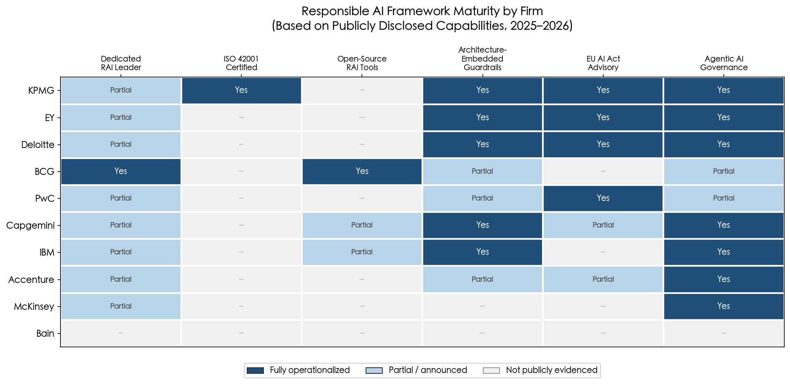

The heatmap reveals distinct RAI strategies: KPMG leads through formal certification (ISO 42001), EY through architecture-embedded guardrails, BCG through open-source tooling and a dedicated Chief AI Ethics Officer, and PwC through regulatory compliance advisory. Bain represents the least publicly visible RAI posture among firms in scope, reflecting MBB firms' tendency to embed governance within client engagements rather than productize it as a standalone framework.

### 4.2.2 Firm-Specific Responsible AI Architectures

Each major firm has constructed a distinctive RAI architecture that reflects both its strategic positioning and the regulatory environment of its core client base.

**BCG** has developed a five-pillar RAI framework encompassing Strategy, Governance, Key Processes, Technology and Tools, and Culture, overseen by a dedicated Chief AI Ethics Officer — making it the only MBB firm with a publicly identified RAI leadership role. BCG has also released several open-source tools: ARTKIT, a GenAI red-teaming toolkit; GenAI Evaluator, a commercial testing tool; and FACET, an AI transparency framework. In August 2025, BCG launched its "AI TALENT Promise" — six principles for responsible AI in human resources applications — extending RAI governance into workforce management domains [BCG RAI](https://www.bcg.com/capabilities/artificial-intelligence/responsible-ai "BCG RAI framework") [BCG AI TALENT Promise](https://www.bcg.com/publications/2025/a-promise-that-brings-ai-to-life-responsibly "August 2025").

**EY** has embedded RAI directly into its platform architecture rather than treating it as an advisory overlay. The EY.ai Agentic Platform incorporates NVIDIA NeMo Guardrails alongside proprietary EY SafePrompt software, operationalizing four core values: responsibility, veracity, transparency, and reliability. This architecture-level integration ensures that every agent deployed through EY.ai inherits built-in guardrails, eliminating reliance on post-hoc governance processes [EY Newsroom](https://www.ey.com/en_gl/newsroom/2025/03/ey-launching-ey-ai-agentic-platform-created-with-nvidia-ai-to-drive-multi-sector-transformation-starting-with-tax-risk-and-finance-domains "March 2025").

**KPMG** has pursued a certification-led strategy for AI trust. KPMG Australia became the first organization globally to achieve BSI's ISO/IEC 42001 certification for AI management systems in October 2024; by December 2025, KPMG International extended this certification across its global network — becoming the first Big Four international entity to attain the standard [KPMG Press Release](https://kpmg.com/xx/en/media/press-releases/2025/12/kpmg-international-first-to-attain-iso-certification-for-ai-management-systems.html "December 2025"). KPMG's "AI Trust" governance model incorporates "purple team" evaluations combining offensive and defensive testing, AI system cards documenting agent capabilities and limitations, and a "trust score" assigned to each deployed agent. Every agent on the KPMG Workbench platform carries a "Trusted AI stamp" — a visible credential designed to build client confidence [KPMG](https://kpmg.com/us/en/articles/2025/the-agentic-ai-advantage.html "June 2025").

**Deloitte** has operationalized its Trustworthy AI™ framework through a seven-dimension model encompassing fairness, transparency, accountability, reliability, security, privacy, and safety. This framework is embedded within Deloitte's Zora AI™ product architecture and informs its broader AI governance advisory practice. Deloitte has also established dedicated EU AI Act compliance advisory teams across its European network, positioning the firm to guide clients through the regulation's phased enforcement deadlines: prohibited AI practices were banned from February 2025, with high-risk AI system obligations taking effect in August 2026 [Deloitte Trustworthy AI](https://www.deloitte.com/us/en/what-we-do/capabilities/applied-artificial-intelligence/services/ethics-of-ai-framework.html "Deloitte Trustworthy AI services") [Deloitte EU AI Act](https://www.deloitte.com/nl/en/services/consulting-risk/analysis/eu-ai-act.html "Deloitte EU AI Act advisory").

**PwC** has positioned its responsible AI practice at the intersection of compliance advisory and operational implementation. PwC's Central and Eastern European practice offers end-to-end EU AI Act compliance and transformation services, while its global network embeds responsible AI checkpoints within the agent OS orchestration framework. The firm's finding that approximately 50% of executives struggle to operationalize RAI principles directly informs PwC's consulting thesis: responsible AI requires not only policy formulation but systematic process engineering [PwC CEE](https://cee.pwc.com/eu-ai-act-compliance-and-transformation.html "PwC EU AI Act compliance").

### 4.2.3 Regulatory Readiness as Competitive Moat

The EU AI Act — the world's first comprehensive AI regulation — has created a significant new advisory market and a structural competitive advantage for firms with deep regulatory compliance capabilities. With phased enforcement timelines (prohibited practices banned from February 2025; transparency obligations for general-purpose AI effective from August 2025; high-risk system compliance required from August 2026), consulting firms with established regulatory expertise are positioning EU AI Act readiness as a differentiating service line. The Big Four, with their existing regulatory compliance infrastructure spanning tax, audit, and financial services, hold a structural advantage in this domain. Deloitte, PwC, and EY have each established dedicated EU AI Act advisory practices across their European networks, converting decades of regulatory-compliance experience into AI governance offerings.

KPMG's ISO/IEC 42001 certification strategy represents the most tangible regulatory-readiness credential among the firms in scope. The firm has positioned this certification not merely as an internal governance achievement but as proof-of-concept for clients seeking to demonstrate AI management system compliance to regulators and stakeholders. As the EU AI Act's high-risk provisions approach enforcement in August 2026, we anticipate that certification-led governance strategies will become increasingly important competitive differentiators — particularly for clients in financial services, healthcare, and critical infrastructure sectors where regulatory scrutiny is most intense.

## 4.3 Vertical AI Practices: Building Industry-Specific Moats

### 4.3.1 Tax, Audit, and Financial Compliance — The Big Four's Structural Advantage

The Big Four firms' most defensible competitive moat lies in vertical AI applications built on decades of accumulated domain expertise in tax, audit, risk, and regulatory compliance. EY's vertical AI deployment in tax exemplifies this advantage at industrial scale: 150 AI agents supporting 80,000 professionals, processing more than 3 million tax compliance deliverables and over 30 million tax processes annually through the EY.ai Agentic Platform [EY Newsroom](https://www.ey.com/en_gl/newsroom/2025/03/ey-launching-ey-ai-agentic-platform-created-with-nvidia-ai-to-drive-multi-sector-transformation-starting-with-tax-risk-and-finance-domains "March 2025"). This deployment is not a general-purpose AI system with tax data layered on top; rather, it is purpose-built AI that encodes domain-specific rules, jurisdictional variations, and compliance logic at the architecture level — creating a capability that general-purpose AI providers cannot readily replicate.

KPMG has extended its vertical AI positioning into AI-powered governance itself, with the "AI Trust" framework and ISO/IEC 42001 certification enabling the firm to offer clients not only AI advisory but certified AI governance systems. Deloitte's IndustryAdvantage™ platform converts regulatory expertise across industries into AI-powered vertical solutions. EY has been ranked as a leader in risk management consulting by Verdantix, reflecting the successful translation of compliance expertise into AI-native risk platforms [EY Newsroom](https://www.ey.com/en_gl/newsroom/2025/03/ey-launching-ey-ai-agentic-platform-created-with-nvidia-ai-to-drive-multi-sector-transformation-starting-with-tax-risk-and-finance-domains "March 2025"). The common thread across these Big Four strategies is that domain depth — not AI technology per se — constitutes the durable competitive advantage.

### 4.3.2 Industrial and Physical AI — Technology Consultancies' Frontier

Accenture has made a decisive strategic bet on physical and industrial AI through its Industry X practice and Industrial Intelligence Suite. A representative energy-sector deployment demonstrated the tangible value proposition: digital twins reduced lost production by 2–4%, improved productivity by up to 28%, and cut operational costs by 22% [Accenture CEO commentary](https://diginomica.com/gen-ai-seems-so-simple-right-think-again-advises-accenture-ceo-julie-sweet "September 2025"). Accenture has simultaneously invested in sovereign AI capabilities, physical AI orchestration for manufacturing environments, and quantum computing research — signaling a long-term strategy to own the "AI at the edge" space where physical and digital systems converge. This positioning differentiates Accenture from the Big Four, whose vertical AI strengths concentrate in knowledge-worker and compliance domains.

Deloitte's "State of AI in the Enterprise" 2026 survey identified the manufacturing, logistics, and defense sectors as leading adopters of physical AI, with projected 80% adoption within two years. By contrast, financial services and technology-media-telecommunications (TMT) sectors lead in responsible AI maturity [Deloitte](https://www.deloitte.com/us/en/about/press-room/state-of-ai-report-2026.html "January 2026"). This bifurcation suggests a vertical landscape in which regulated industries prioritize governance as the precondition for AI adoption, while physical industries prioritize operational automation with governance as a secondary consideration — a divergence that creates distinct consulting engagement models for each sector.

### 4.3.3 Healthcare AI — From Pilot to Production

Bain & Company has developed a distinctive vertical thesis in healthcare AI. The firm's 2025 technology report found that approximately 70% of healthcare providers and 80% of payers had an AI strategy in place or under development as of 2025, marking a sector-wide transition from experimentation to systematic deployment [Bain](https://www.bain.com/insights/healthcare-it-investment-ai-moves-from-pilot-to-production/ "Bain Technology Report 2025"). Bain's expanded OpenAI partnership (October 2024) established a dedicated Center of Excellence for healthcare and life sciences, deploying GPT-4o and o1 models for domain-specific applications including clinical decision support and payer workflow automation [Bain Press Release](https://www.bain.com/about/media-center/press-releases/2024/bain-and-company-announces-expanded-partnership-with-openai-to-accelerate-delivery-of-ai-solutions-and-meet-fast-growing-client-needs/ "Bain press release, October 2024").

McKinsey's QuantumBlack division has demonstrated clinical-trial AI capabilities through its collaboration with Merck, achieving a 56% reduction in clinical study report authoring time — from 180 hours to 80 hours — with a 50% reduction in errors. As discussed in Chapter 3, this engagement illustrates how MBB firms leverage vertical AI not through platform scale but through high-value, high-complexity use cases that demonstrate transformative potential at the C-suite level and shape executive expectations for the broader industry [McKinsey Blog](https://www.mckinsey.com/about-us/new-at-mckinsey-blog/with-gen-ai-merck-and-mckinsey-transform-clinical-authoring "McKinsey, June 2025").

### 4.3.4 Sector-Specific Breadth: Capgemini and IBM

Capgemini has pursued vertical AI breadth through its NVIDIA-powered agentic gallery, offering more than 100 bespoke solutions across eight industries: automotive, consumer, financial services, life sciences, manufacturing, public sector, retail/supply chain, and telecommunications. The firm's RAISE governance framework provides real-time monitoring and unified control across vertical deployments, ensuring that breadth does not compromise governance standards [Capgemini Press Release](https://www.capgemini.com/news/press-releases/capgemini-accelerates-enterprise-adoption-of-agentic-ai-for-industries-with-nvidia/ "Capgemini agentic AI with NVIDIA, March 2025"). This breadth-based strategy contrasts explicitly with the Big Four's depth-based approach: Capgemini aims to serve as a multi-industry AI implementation partner rather than a domain-specific expert, competing on integration capability and cross-sector pattern recognition.

IBM Consulting has positioned its watsonx platform as the industry-agnostic backbone, complemented by vertical accelerators for financial services, healthcare, and government. IBM's Enterprise Advantage marketplace of industry-specific AI agents, launched in January 2026, reflects a strategy of vertical-agent specialization atop a horizontal platform — offering clients the flexibility to adopt industry-specific AI capabilities without committing to a single-vendor vertical stack [CIO.com](https://www.cio.com/article/4119056/ibm-targets-agentic-ai-scale-up-with-new-enterprise-advantage-consulting-service.html "January 2026").

## 4.4 Analyst Rankings and External Validation

Third-party analyst evaluations provide an independent lens on consulting firms' AI capabilities and market positioning. The following figure summarizes the major 2025–2026 AI consulting evaluations from Gartner, Forrester, and Everest Group.

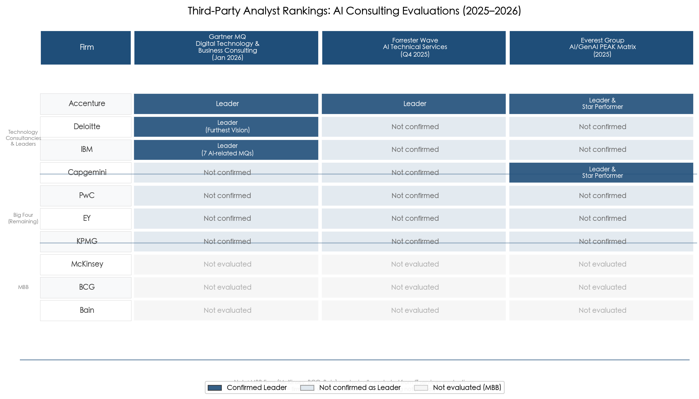

### 4.4.1 Inaugural Gartner Magic Quadrant for Digital Technology and Business Consulting

The inaugural Gartner Magic Quadrant for Digital Technology and Business Consulting Services, published in January 2026, established a new benchmark for evaluating consulting firms' AI capabilities. Accenture and Deloitte were both positioned as Leaders, with Deloitte placed "furthest in Completeness of Vision" — a notable distinction for a Big Four firm that competitors sometimes perceive as trailing technology-first players in AI innovation [Accenture Newsroom](https://newsroom.accenture.com/news/2026/accenture-named-a-leader-in-gartner-magic-quadrant-for-digital-technology-and-business-consulting-services "January 2026"). IBM was separately recognized as a Leader in seven AI-related Gartner Magic Quadrant reports across 2025–2026, reflecting the breadth of its AI portfolio spanning infrastructure, software, and consulting services [IBM](https://www.ibm.com/new/announcements/ibm-is-a-leader-in-seven-ai-related-gartner-magic-quadrant-reports-in-2025-and-2026 "IBM Gartner MQ recognition").

### 4.4.2 Forrester and Everest Group Evaluations

The Forrester Wave™ for AI Technical Services (Q4 2025) positioned Accenture as a Leader with the highest possible scores across multiple evaluation criteria including regulatory assistance, agentic AI, reasoning models, sustainability, vision, innovation, partner ecosystem, talent strategy, and global delivery [Accenture Analyst Recognition](https://www.accenture.com/us-en/insights/technology/analyst-recognitions "Forrester Wave Q4 2025").

The Everest Group AI and Generative AI Services PEAK Matrix® Assessment 2025 positioned both Accenture and Capgemini as Leaders and Star Performers. Accenture received the highest designation, cited for its "end-to-end approach" and "strong IP portfolio in agentic, sovereign, industrial, physical AI" [Accenture Analyst Recognition](https://www.accenture.com/us-en/insights/technology/analyst-recognitions "Everest Group 2025"). Capgemini was recognized as among the top three providers in overall AI services market share, with Everest Group highlighting its investments in agentic AI (Agentic Gallery, RAISE framework), responsible AI (GenAI Lens), and ecosystem collaboration as key differentiators [Capgemini Analyst Recognition](https://www.capgemini.com/news/analyst-recognition/a-leader-and-a-star-performer-in-everest-groups-ai-and-generative-ai-services-peak-matrix-assessment-2025/ "Everest Group PEAK Matrix 2025, December 2025").

MBB firms — McKinsey, BCG, and Bain — are generally excluded from Gartner, Forrester, and Everest IT services evaluations, as these assessment frameworks focus on technology implementation and managed services rather than strategy advisory. MBB firms' competitive validation therefore derives from thought-leadership influence, C-suite relationship depth, and proprietary research impact rather than externally benchmarked service delivery scores. This exclusion represents both a limitation (absence from widely referenced rankings) and an implicit validation of the MBB model's differentiation from technology-services competition.

## 4.5 Competitive Differentiation: A Three-Archetype Framework

Analysis of the ten firms in scope reveals three distinct competitive archetypes, each with characteristic strengths, investment patterns, and strategic vulnerabilities. The following figure maps each firm along two dimensions — Proprietary AI IP Depth and Vertical Domain Depth — with bubble size reflecting AI-related revenue or booking visibility.

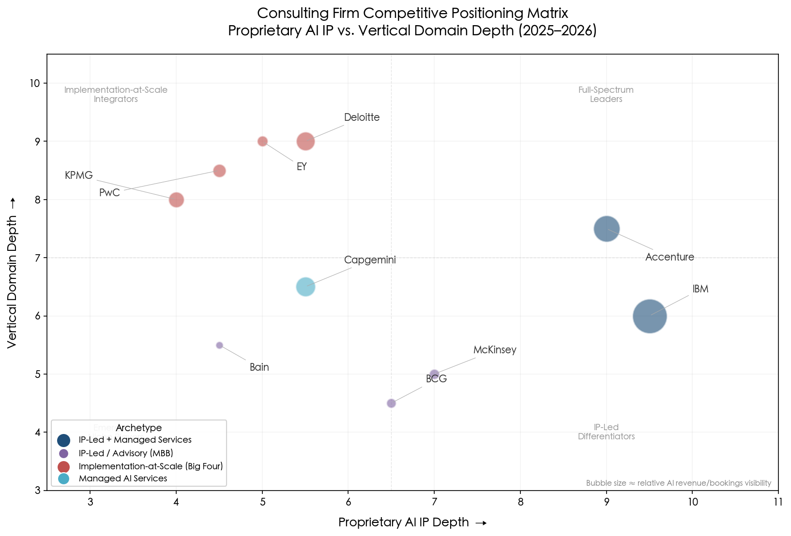

As the positioning matrix illustrates, Accenture and IBM occupy the upper-right quadrant as "Full-Spectrum Leaders" combining deep proprietary IP with significant vertical reach, while the Big Four cluster in the upper-left quadrant reflecting deep vertical domain expertise with more moderate proprietary AI IP. MBB firms occupy a distinctive middle zone, combining advisory depth with partnership-dependent technology access.

### Archetype 1: IP-Led Platforms

Firms in this archetype — Accenture (AI Refinery), BCG (BCG X product library), McKinsey (QuantumBlack / Lilli), and IBM (watsonx) — compete primarily through proprietary intellectual property that can be licensed, embedded, or delivered as managed services. Their strategic advantage lies in owning the AI assets themselves, enabling both recurring revenue streams and deepening client dependency. Accenture and IBM, as publicly listed companies, face capital-market pressure to demonstrate AI revenue growth, which accelerates platform investment cycles. BCG and McKinsey, as private partnerships, can afford longer investment horizons but face constraints in scaling technology delivery organizations to match the implementation capacity of larger competitors.

### Archetype 2: Implementation-at-Scale

The Big Four — Deloitte, PwC, EY, and KPMG — compete through massive workforces (ranging from 364,000 at PwC to 470,000+ at Deloitte), deep compliance-domain expertise, and hyperscaler partnerships. Their competitive moat is not primarily in AI IP but in the ability to deploy AI at scale across regulated industries where domain knowledge, audit trail requirements, and multi-jurisdictional compliance create high barriers to entry. EY's 150-agent tax platform, KPMG's ISO/IEC 42001-certified AI governance, and Deloitte's IndustryAdvantage™ exemplify how domain depth converts into defensible vertical AI positions. Partnership structures — including the OpenAI Frontier Alliance (which encompasses Accenture, BCG, Capgemini, and McKinsey but excludes the remaining Big Four firms as of early 2026) alongside bilateral hyperscaler relationships with Microsoft, Google Cloud, and NVIDIA — serve as force multipliers for implementation capacity rather than primary sources of differentiation.

### Archetype 3: Managed AI Services

Accenture, IBM, and Capgemini compete in the managed-AI-services space, offering AI-as-a-service and operational AI alongside traditional consulting engagements. Capgemini's $3.3 billion acquisition of WNS in July 2025 was explicitly framed as creating "a global leader in Agentic AI-powered Intelligent Operations," signaling that managed AI operations — not advisory alone — represent a core strategic pillar [Capgemini Press Release](https://www.capgemini.com/us-en/news/press-releases/capgemini-to-acquire-wns-to-create-a-global-leader-in-agentic-ai-powered-intelligent-operations/ "July 2025"). IBM's cumulative GenAI book of business exceeding $12.5 billion as of Q4 2025 reflects the scale achievable when consulting and technology services converge under a single brand [IBM Q4 2025 Earnings](https://newsroom.ibm.com/2026-01-28-IBM-RELEASES-FOURTH-QUARTER-RESULTS?hl=en-US "IBM Q4 2025 press release, January 2026").

These archetypes are not mutually exclusive. Accenture straddles all three, which contributes to its consistent positioning at or near the top of third-party analyst rankings. The strategic risk for firms that do not invest in at least two archetypes is that AI-native competitors and hyperscaler professional services arms could disintermediate single-archetype players — a threat that is particularly acute for firms reliant solely on implementation-at-scale without proprietary IP or managed-services revenue.

### MBB's Thought-Leadership Moat

MBB firms differentiate through thought leadership and C-suite advisory rather than platform scale or implementation breadth. McKinsey's AI Trust Maturity Model, BCG's "Build for the Future" study, and Bain's healthcare AI analysis shape market narratives and initiate CEO- and board-level engagement. This positions MBB as the firms that define the strategic agenda, with implementation often handed off to technology consultancies or Big Four delivery organizations. The OpenAI Frontier Alliance — which includes both McKinsey and BCG alongside Accenture and Capgemini — represents an evolution of this model: MBB firms seek to retain strategic influence while gaining access to production-grade AI deployment capabilities, thereby partially bridging the implementation gap that has historically constrained their AI positioning [CNBC](https://www.cnbc.com/2026/02/23/open-ai-consulting-accenture-boston-capgemini-mckinsey-frontier.html "CNBC report, February 2026").

## 4.6 Synthesis: Strategic Convergence and Divergence

Several convergent trends define the competitive landscape as of early 2026. All firms have pivoted toward agentic AI as the dominant near-term opportunity. All have published responsible AI frameworks, though the depth of operationalization varies significantly — from KPMG's ISO-certified governance to BCG's open-source toolkits to EY's architecture-embedded guardrails. All acknowledge the pilot-to-production gap as both the central industry challenge and the primary commercial opportunity for consulting firms.

The key areas of strategic divergence are threefold. First, firms diverge in the extent to which they build proprietary AI IP versus orchestrate third-party models: IBM and Accenture invest heavily in proprietary technology stacks, the Big Four rely more on hyperscaler partnerships and domain-data advantages, and MBB firms access foundation models through alliance structures such as the OpenAI Frontier Alliance. Second, vertical versus horizontal orientation creates distinct competitive profiles: the Big Four leverage domain depth in tax, audit, and risk; technology consultancies pursue cross-industry breadth through managed services; and MBB firms focus on high-value horizontal advisory spanning strategy and organizational transformation. Third, the degree to which AI reshapes the consulting business model itself varies markedly: Accenture's CEO-driven mandate to link AI usage to promotion decisions, KPMG's integration of AI proficiency into performance reviews, and McKinsey's vision of a "workforce of 60,000" (40,000 humans augmented by 20,000 AI agents) all signal that the firms themselves are undergoing the same AI-driven transformation they sell to clients.

We assess that the firms best positioned for the 2026–2028 cycle are those that can simultaneously deliver proprietary AI IP, deploy at scale across regulated verticals, offer managed AI services, and credibly demonstrate responsible AI governance. Accenture, Deloitte, and IBM currently hold the broadest strategic portfolios against these criteria, though their competitive advantages face erosion from two directions: hyperscaler professional services teams expanding into enterprise consulting, and AI-native firms entering the market with leaner cost structures and faster innovation cycles.

# Chapter 5: Talent Development, Upskilling, and AI Workforce Programs

The rapid adoption of artificial intelligence across the consulting industry has fundamentally altered the calculus of human capital. As firms race to deploy agentic AI platforms, build proprietary products, and deliver AI-driven client transformations, the binding constraint is no longer technology availability — it is the readiness of hundreds of thousands of professionals to work alongside, and through, intelligent systems. Between April 2025 and April 2026, every major consulting firm in scope launched or expanded large-scale AI training initiatives, and several crossed a pivotal threshold: AI fluency shifted from a voluntary enrichment activity to a formal condition of career advancement.

This chapter examines four interrelated dimensions of that transformation. Section 5.1 surveys the scale and design of internal AI training programs across ten firms. Section 5.2 analyzes how MBB firms are embedding AI as a core competency expectation through agent ecosystems, revised hiring criteria, and cultural mandates. Section 5.3 traces the industry-wide shift from voluntary upskilling to mandatory AI fluency. Section 5.4 explores how AI is restructuring the traditional consulting pyramid — reducing graduate intakes while elevating hybrid technologist-consultant roles. Section 5.5 documents the emergence of client-facing AI workforce services as a new product category. Section 5.6 offers a cross-firm comparative analysis, and Section 5.7 draws structural implications for the future of consulting talent.

## 5.1 The Scale of Internal AI Training Programs

### Accenture: Industry-Leading Velocity

Accenture has pursued the most aggressive internal AI training campaign among firms in scope. By mid-2025, approximately 550,000 of the firm's ~780,000 employees had completed generative AI fundamentals training. By September 2025, the initiative expanded to encompass the entire 700,000+ workforce in agentic AI systems — covering not only technical staff but also delivery, sales, and corporate functions. CEO Julie Sweet framed the effort in existential terms: "Accenture's core competency is to [retool] at scale" [AI Magazine](https://aimagazine.com/news/why-accenture-is-teaching-700000-employees-to-use-agentic-ai "September 2025").

The scale of training translated directly into operational capacity. Accenture's data and AI headcount grew from approximately 40,000 to 77,000 professionals between FY2024 and FY2025, with a stated target of 80,000 by end of FY2026. In FY2025, the firm delivered over 6,000 advanced AI projects, underpinning $2.7 billion in AI revenue — a threefold year-over-year increase [Accenture 2025 Annual Report](https://www.accenture.com/content/dam/accenture/final/accenture-com/document-4/Annual-Report-2025.pdf "FY2025 annual report").

### PwC: The Learning Collective and AI-Native Career Paths

PwC US launched the "Learning Collective" in February 2026, introducing a "Human + AI Skillset" curriculum comprising 30 core competencies — 15 AI-technical skills and 15 human skills (critical thinking, judgment, communication). The program simultaneously established a new "AI-Native Engineering Career Path" with market-aligned titles designed to attract and retain technologists within a professional services environment. A companion "Associate Discovery" immersive onboarding module ensures that new hires begin their careers AI-fluent from day one [PwC Newsroom](https://www.pwc.com/us/en/about-us/newsroom/press-releases/learning-collective-ai-workforce-development.html "February 2026").

PwC's external-facing "Human Skills Project" targets 1 million service hours and 250,000 external learners over three years. The firm's broader "New World. New Skills." initiative, running since 2019, includes a Digital Fitness App and a UNICEF collaboration to extend AI literacy beyond the corporate workforce. PwC initially announced a $1 billion investment over three years in April 2023 to scale AI capabilities including workforce training; the firm's FY2025 Global Annual Review indicated that AI investment grew to nearly $1.5 billion during FY2025 (12 months ending June 2025), though the precise allocation between technology infrastructure, alliances, and training has not been publicly disaggregated [PwC Global Annual Review 2025](https://www.pwc.com/gx/en/about/global-annual-review.html "PwC GAR FY2025, October 2025").

### Deloitte: AI Academy and Universal Participation

Deloitte's AI Academy achieved 100% AI training participation among its US professionals, with 300,000 AI-related training completions recorded in the past year. The curriculum spans multiple AI "personas" — agentic AI engineer, generative AI engineer, and data scientist — along with modules on IndustryAdvantage applications and Trustworthy AI governance [Deloitte AI Academy](https://www.deloitte.com/us/en/what-we-do/capabilities/applied-artificial-intelligence/about/deloitte-ai-academy.html "Deloitte AI Academy").

Deloitte also offers a client-facing "Academy for AI" service, enabling enterprise clients to replicate structured AI training at scale. The firm was named a Leader in the IDC MarketScape: Worldwide Artificial Intelligence Services 2025 evaluation, in part for its training and workforce advisory capabilities [Deloitte Academy for AI](https://www.deloitte.com/us/en/services/consulting/services/academy-for-ai.html "Academy for AI").

### EY: AI Now 2.0 and 406,000-Person Engagement

Ernst & Young launched "AI Now 2.0" in January 2025, a firm-wide initiative that leverages the EYQ AI assistant to help each of the firm's 406,000 employees understand how AI will affect their specific role. Approximately 50% of employees engaged voluntarily; the program is mandatory for all new recruits. Over 98,000 AI-related digital badges have been issued through the EY Badges certification framework, and the firm counts more than 70,000 technology professionals — including data scientists, AI engineers, and product managers — across its global network [Business Insider](https://www.businessinsider.com/ey-staff-using-ai-to-upskill-for-the-future-2025-11 "EY AI Now 2.0, November 2025") [Unleash.ai](https://www.unleash.ai/automation/ey-organizations-that-balance-technical-capability-and-human-centered-skills-will-lead-in-the-ai-driven-future/ "EY 98,000+ AI badges").

Beyond internal training, EY launched the EY-Microsoft AI Skills Passport — a free, 10-hour online AI course targeting youth and underserved communities — reflecting a broader industry trend of extending AI literacy programs beyond firm boundaries [EY AI Skills Passport](https://www.ey.com/en_gl/ai-skills-passport "EY-Microsoft AI Skills Passport").

### KPMG: AI-Integrated Performance Reviews

KPMG deployed Microsoft 365 Copilot to 26,000 users across its US practice, with 71% reporting increased productivity [KPMG](https://kpmg.com/us/en/articles/2025/empower-workforce-with-ai.html "26K Copilot users"). More consequentially, beginning in 2026, KPMG will formally incorporate AI usage into employee performance reviews, with 81% of firm leaders planning to include generative AI objectives as a graded criterion [Fortune](https://fortune.com/2026/02/23/last-year-accenture-trained-550000-staff-use-ai-now-promotions-hinge-on-putting-that-into-practice/ "KPMG AI performance reviews, 2026").

Internally, KPMG developed an AI-powered tool that decomposes every role within the firm by tasks, maps relevant AI use cases, and identifies capacity savings and skill gaps — creating a data-driven blueprint for workforce transformation. This same methodology is offered externally as the "AI Workforce" client service, combining change management, upskilling pathways, and tracking analytics [KPMG AI Workforce](https://assets.kpmg.com/content/dam/kpmgsites/xx/pdf/2026/02/ai-workforce.pdf "February 2026").

### Capgemini: Gen AI Campus at Scale

Capgemini launched its "Gen AI Campus" through the Degreed learning platform, training over 150,000 of approximately 360,000 employees in just 10 weeks — one of the fastest large-scale AI training rollouts in the industry. The program encompassed 95 learning plans, 176 learning pathways, and 2,700 resources, resulting in 50,000 certifications awarded [Degreed](https://degreed.com/experience/success-stories/capgemini-ai-workforce-transformation/ "Capgemini Gen AI Campus").

In parallel, Capgemini India announced plans to hire 40,000–45,000 professionals in 2025 (35–40% lateral hires), with the CEO emphasizing early AI training for new recruits and partnerships with more than 50 colleges to build a pipeline of AI-ready talent [Economic Times](https://m.economictimes.com/tech/information-tech/capgemini-india-to-hire-up-to-45000-in-2025-focus-on-ai-ready-workforce/articleshow/123060530.cms "August 2025").

### IBM: Two Million Learners by 2026

IBM committed to training 2 million learners in AI by end of 2026 through its free SkillsBuild platform, which offers over 1,000 courses in 20 languages. By September 2025, the initiative had reached approximately 1 million learners, with a particular focus on underrepresented communities [IBM Newsroom](https://newsroom.ibm.com/2023-09-18-IBM-Commits-to-Train-2-Million-in-Artificial-Intelligence-in-Three-Years,-with-a-Focus-on-Underrepresented-Communities "September 2023") [WEF](https://initiatives.weforum.org/reskilling-revolution/case-study-details/ibm-commits-to-train-2-million-in-artificial-intelligence/aJYTG00000005Sj4AI "1M reached, September 2025").

IBM also operates the AI Skills Academy, a role-based enterprise upskilling framework structured into three tiers: strategic essentials (for executives), enterprise AI elements (for mid-career professionals), and discipline-specific applications (for practitioners). This commercial offering positions IBM as both a technology vendor and a workforce transformation partner [IBM](https://www.ibm.com/think/insights/ai-upskilling "IBM AI upskilling").

The following figure summarizes the scale of AI training and engagement programs across the six firms with the most granular public disclosures, illustrating the heterogeneity of metrics — from total employees trained (Accenture, Capgemini) to external learners reached (IBM) to engagement rates (EY, BCG).

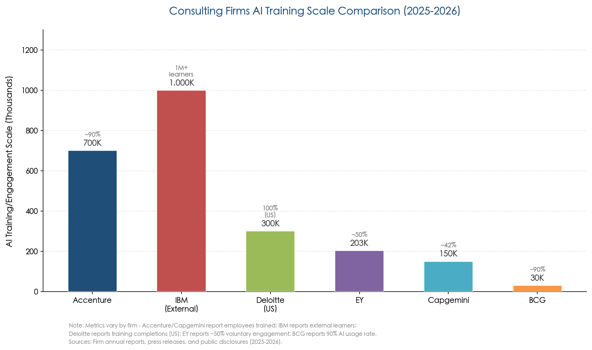

## 5.2 MBB Firms: AI as a Core Competency Expectation

### McKinsey: The 60,000-Person Workforce — Human and Machine

McKinsey's approach to AI talent development is inseparable from its broader integration of AI agents into daily operations. CEO Bob Sternfels disclosed in January 2026 that the firm now operates with a "workforce of 60,000" — comprising approximately 40,000 human employees and roughly 25,000 AI agents, up from just 3,000 agents 18 months prior. Sternfels stated his goal is for every McKinsey employee to be "enabled by at least one or more agents" within 18 months [Business Insider](https://www.businessinsider.com/mckinsey-workforce-ai-agents-consulting-industry-bob-sternfels-2026-1 "McKinsey workforce AI agents, January 2026").

QuantumBlack, McKinsey's AI division with a 1,700-person team, drives the firm's AI initiatives, which now account for approximately 40% of McKinsey's work mix. Senior partner Alex Singla noted that the firm seeks candidates who "have a propensity to either be this great McKinsey consultant, and/or a great technologist, and then groom them to be both" [Business Insider](https://www.businessinsider.com/mckinsey-workforce-ai-agents-consulting-industry-bob-sternfels-2026-1 "January 2026").

In a notable innovation in recruiting practice, McKinsey introduced a new AI interview component for select final-round candidates, in which applicants collaborate with the firm's internal AI tool Lilli on applied business exercises. The exercise tests reasoning, communication, and the ability to use AI as a "productive thinking partner." Sternfels also signaled a strategic shift toward recruiting liberal arts majors, arguing that creativity and humanistic judgment will differentiate consultants in an AI-saturated environment [Fortune](https://fortune.com/2026/01/14/how-to-get-hired-at-mckinsey-ai-tools-liberal-arts-creativity/ "January 2026").

While McKinsey does not disclose aggregate internal training participation numbers, the combination of firm-wide Lilli deployment (72% active usage generating over 500,000 prompts per month by mid-2025), the 25,000-agent operating environment, and revised recruiting criteria collectively indicate that AI fluency has become a non-negotiable baseline at the firm.

### BCG: 90% Adoption and Performance-Integrated AI Expectations

Boston Consulting Group reported that nearly 90% of its 33,000 employees are using AI, with approximately half classified as "habitual users" who engage with AI tools daily. The firm had targeted 50% adoption by year-end 2025 but reached that milestone in May — months ahead of schedule [Business Insider via AOL](https://www.aol.com/articles/nearly-90-bcg-employees-using-090601035.html "BCG 90% AI adoption, September 2025").

BCG's training infrastructure includes a dedicated generative AI learning and development team staffed by rotational consultants who teach and codify best practices, supplemented by a network of 1,200 "ground troops" in local offices providing hands-on training. The firm tracks a cohort of approximately 1,500 "advanced users" at the frontier of AI experimentation, roughly two-thirds of whom are entry-level associates and consultants [Business Insider via AOL](https://www.aol.com/articles/nearly-90-bcg-employees-using-090601035.html "September 2025").

Critically, BCG has embedded AI usage expectations directly into its performance evaluation framework. Global People Team Chair Alicia Pittman stated: "There's no box on our forms that says 'Are you using AI?' but it is an expectation." AI proficiency is now assessed through core competencies such as problem-solving and insight generation — consultants who fail to leverage AI tools will "fall behind their peers" in evaluations and promotions. One of BCG's most impactful internal AI tools assists employees in writing performance reviews, cutting writing time by 40% while improving quality metrics by 20% [Business Insider via AOL](https://www.aol.com/articles/nearly-90-bcg-employees-using-090601035.html "September 2025").

BCG has also become the OpenAI customer with the highest number of custom GPTs, with five times more employees building them compared to a year prior. The firm's broader "AI at Work 2025" survey of over 12,000 workers found that only 36% of employees across industries were satisfied with their AI training — a finding BCG uses to advocate for structured workforce transformation as a strategic imperative [BCG](https://www.bcg.com/publications/2025/ai-at-work-momentum-builds-but-gaps-remain "BCG AI at Work 2025").

### Bain: Workflow Integration and the Global AI Talent Gap

Bain & Company has integrated AI into consulting workflows through tools including a synthetic stakeholder simulator and "ChatGPT Olympics" exercises developed with OpenAI. The firm's Advanced Intelligence & Solutions (AIS) team runs a "Build at Bain" masterclass in agentic AI for students and professionals [Bain Careers Blog](https://www.bain.com/careers/life-at-bain/careers-blog/how-ai-is-transforming-the-future-of-work-at-bain/ "Bain AI workflows").

While Bain does not publicly disclose internal AI training participation numbers or AI-specialist headcount, the firm has produced influential research on the global AI talent gap. Bain projects that 1 in 2 AI jobs in the United States could be left unfilled by 2027, with demand potentially reaching over 1.3 million positions while supply tracks to under 645,000 — implying a need to reskill up to 700,000 US workers. Globally, the shortage is projected to be acute: Germany could see approximately 70% of AI roles unfilled, the United Kingdom more than 50%, and India over 1 million workers needing reskilling against 2.3 million projected openings. Sarah Elk, Bain's Americas head of AI, Insights, and Solutions, warned: "Without the right talent, businesses will struggle to move from ambition to implementation" [AIwire](https://www.hpcwire.com/aiwire/2025/03/26/ai-talent-shortage-threatens-corporate-ambitions-says-bain/ "Bain AI Talent Shortage, March 2025").

## 5.3 The Shift from Voluntary Upskilling to Mandatory AI Fluency

A defining trend across the consulting industry in 2025–2026 is the transition from AI training as a voluntary enrichment activity to AI fluency as a formal career requirement. The following timeline illustrates the key milestones in this progression, from early investment commitments to mandatory performance criteria.

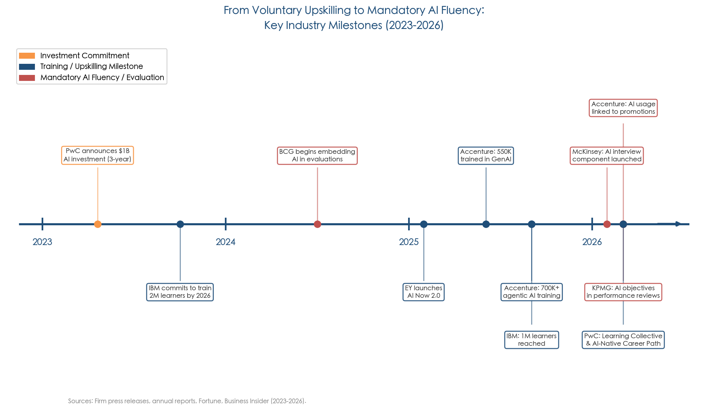

Three developments crystallize this shift.

**Accenture's promotion-linked AI mandate.** Beginning in February 2026, Accenture requires associate directors and senior managers to demonstrate "regular adoption" of AI tools as a prerequisite for leadership promotion. Weekly AI tool log-in activity is monitored. CEO Sweet has previously warned that the firm would "exit" staffers who could not be retrained, even as she projected overall headcount growth in FY2026 [Fortune](https://fortune.com/2026/02/23/last-year-accenture-trained-550000-staff-use-ai-now-promotions-hinge-on-putting-that-into-practice/ "Accenture AI-linked promotions, February 2026").

**KPMG's formal grading.** Beginning in 2026, KPMG incorporated AI objectives into employee performance reviews, with 81% of leaders planning to assess generative AI usage as a graded criterion. This represents a structural change in how professional services firms define competence [Fortune](https://fortune.com/2026/02/23/last-year-accenture-trained-550000-staff-use-ai-now-promotions-hinge-on-putting-that-into-practice/ "KPMG AI performance reviews, 2026").

**BCG's implicit standard.** Although BCG does not grade AI usage through a dedicated form field, the firm evaluates it through existing competency frameworks. As Alicia Pittman stated, consultants who do not use AI "won't do well on the competencies — you'll fall behind your peers" [Business Insider via AOL](https://www.aol.com/articles/nearly-90-bcg-employees-using-090601035.html "September 2025").

These mandates reflect a broader recognition that AI proficiency is no longer an ancillary skill but a core professional capability — analogous to the expectation of spreadsheet literacy in the 1990s or data visualization skills in the 2010s. However, EY's 2025 Work Reimagined Survey introduces an important caution: employees receiving 81+ hours of AI training report a 14% weekly productivity boost but are 55% more likely to leave their employer, suggesting that intensive upskilling without commensurate career progression and engagement strategies may accelerate talent attrition rather than retention [EY Work Reimagined](https://www.ey.com/en_us/insights/workforce/work-reimagined-survey "2025").

## 5.4 Restructuring the Consulting Pyramid: Graduate Hiring, AI Agents, and Role Evolution

The integration of AI into entry-level consulting work is reshaping the traditional consulting pyramid. In the United Kingdom, Big Four graduate intakes have declined materially: KPMG reduced its 2023 graduate intake by 29% (from 1,399 to 942), Deloitte cut by 18%, EY by 11%, and PwC by 6%. Executive search professionals attribute the cuts partly to AI tools automating administrative tasks historically performed by junior staff [City AM](https://www.cityam.com/big-four-slash-graduate-jobs-as-ai-takes-on-entry-level-work/ "City AM, June 2025").

McKinsey's "60,000-person workforce" framing — 40,000 humans and approximately 25,000 AI agents — illustrates a new model in which AI agents absorb research, data synthesis, and slide production tasks that once defined early-career consulting work. The firm estimates that AI performs approximately 80% of junior analyst research and slide work, a figure directionally consistent across the industry.

This dynamic creates a structural paradox: firms need fewer traditional junior analysts but significantly more AI-literate problem solvers and technologist-consultants. McKinsey's recruitment of liberal arts majors for creativity, BCG's "forward-deployed consultants" who engage in vibe-coding and building AI tools for client projects, and Accenture's growth from 40,000 to 77,000 AI and data specialists all signal a fundamental reconfiguration of what it means to be an entry-level consultant.

The implications for career architecture are significant. PwC's creation of an "AI-Native Engineering Career Path" and KPMG's AI-powered role decomposition tool — which maps every firm role by tasks, AI applicability, and skill gaps — represent early efforts to formalize new career tracks that blend domain expertise with technical AI capability. We anticipate that by late 2026, most major consulting firms will operate dual career tracks: a traditional advisory path and an AI-engineering path, with increasing convergence over time.

## 5.5 Client-Facing AI Workforce Services: A New Product Category

Beyond transforming their own workforces, consulting firms are increasingly offering AI workforce transformation as a commercial service line. This represents a natural extension: firms that have successfully retrained hundreds of thousands of their own employees can package that methodology and offer it to enterprise clients facing identical challenges.

The landscape of client-facing AI upskilling offerings includes:

- **Accenture LearnVantage**: an enterprise reskilling and upskilling platform that packages Accenture's internal training methodology for external deployment, leveraging the firm's 700,000+ internal proof point [Accenture LearnVantage Report](https://www.accenture.com/content/dam/accenture/final/accenture-com/document-2/Functions-Learning-Reinvented-2025-Report-Design.pdf "2025").
- **Deloitte Academy for AI**: a structured enterprise AI training service recognized as a Leader in the IDC MarketScape 2025, featuring AI persona-based learning tracks [Deloitte Academy for AI](https://www.deloitte.com/us/en/services/consulting/services/academy-for-ai.html "Academy for AI").
- **EY Skills Foundry and AI Skills Passport**: the Skills Foundry supports enterprise workforce development, while the AI Skills Passport (in collaboration with Microsoft) offers free, accessible 10-hour AI training to youth and underserved communities [EY AI Skills Passport](https://www.ey.com/en_gl/ai-skills-passport "EY-Microsoft AI Skills Passport").
- **KPMG AI Workforce**: a service combining AI-powered role decomposition, change management, and data-driven tracking, allowing clients to map AI adoption pathways at the individual-role level [KPMG AI Workforce](https://assets.kpmg.com/content/dam/kpmgsites/xx/pdf/2026/02/ai-workforce.pdf "February 2026").
- **BCG U**: a capability-building platform delivering organizational AI training for client workforces, supported by BCG's Top Talent Tracker that monitors global AI talent migration patterns [BCG Top Talent Tracker](https://web-assets.bcg.com/b7/0a/93fe4edf4e3fa609254ebabfb54f/top-talent-tracker-2025-june-2025.pdf "Q2 2025").
- **IBM SkillsBuild and AI Skills Academy**: IBM's two-pronged approach pairs free open-access courses (SkillsBuild, targeting 2 million learners) with a premium, role-based enterprise offering (AI Skills Academy) structured into strategic, enterprise, and discipline-specific tiers [IBM](https://www.ibm.com/think/insights/ai-upskilling "IBM AI upskilling").

The following comparative overview summarizes the target audience, delivery format, and key differentiators of each offering.

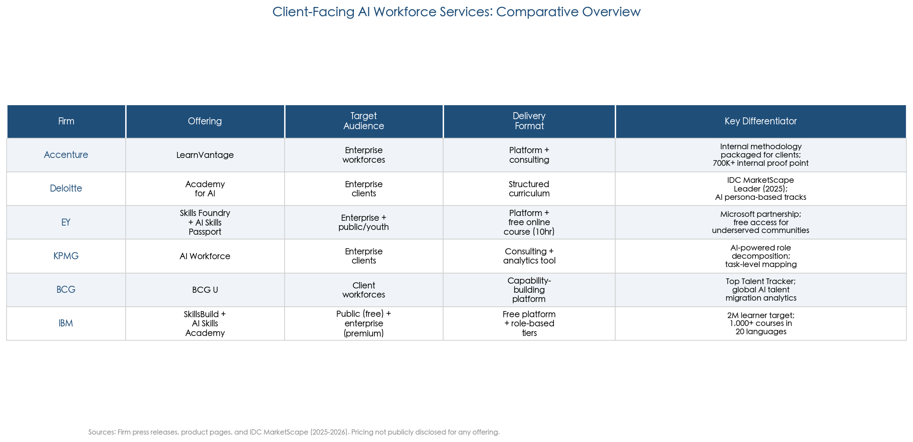

This emerging product category is commercially significant. As Bain's research highlights, 44% of executives cite lack of in-house AI expertise as a key barrier to implementing generative AI. With the projected global AI talent gap reaching millions of unfilled positions by 2027, enterprise demand for structured AI workforce transformation services is poised to grow faster than demand for AI technology implementation alone.

## 5.6 Cross-Firm Analysis: Approaches, Gaps, and Asymmetries

A comparative assessment reveals three distinct models of AI workforce development among the firms in scope.

**Scale-first model (Accenture, Capgemini, Deloitte).** These firms prioritize breadth — training the maximum number of employees as rapidly as possible. Accenture's 700,000+ agentic AI training initiative and Capgemini's 150,000-in-10-weeks campaign exemplify this approach. The underlying logic is that competitive advantage derives from having the largest pool of AI-capable delivery professionals. Accenture's near-doubling of its AI specialist headcount from 40,000 to 77,000 further reinforces this strategy with targeted deep-skill hiring.

**Integration-first model (McKinsey, BCG, Bain).** MBB firms, with smaller workforces (33,000–45,000 employees), emphasize integration of AI into workflows and evaluation frameworks rather than mass-training metrics. McKinsey's 25,000-agent ecosystem and BCG's 90% adoption rate with 50% daily usage demonstrate that smaller firms can achieve high AI penetration through cultural mandate and tool quality. The trade-off is that these firms do not disclose aggregate training participation numbers, limiting external benchmarking.

**Platform-first model (EY, KPMG, PwC, IBM).** These firms build AI training into broader technology platforms. EY's AI Now 2.0 uses the EYQ assistant to personalize training by role; KPMG's role-decomposition tool maps AI applicability to individual tasks; IBM's SkillsBuild scales beyond firm boundaries to over 1 million external learners. PwC's Learning Collective uniquely pairs 15 AI-technical skills with 15 human skills, reflecting a bet that hybrid human-AI capability will differentiate professional services.

**Data availability asymmetry.** A notable limitation in comparing these programs is the uneven disclosure landscape. Accenture, Capgemini, and IBM publish specific training numbers (700,000+; 150,000+; and 1 million+ learners respectively). EY discloses badge counts (98,000+) and engagement rates (~50%). Deloitte reports 100% US participation and 300,000 completions. By contrast, McKinsey, BCG, and Bain provide usage metrics (72% Lilli adoption, 90% AI usage, daily active rates) but not aggregate training participation counts. PwC and KPMG fall in between, disclosing program structures and deployment numbers (250+ agents, 26,000 Copilot users) without comprehensive training completion figures.

## 5.7 Implications: The New Consulting Workforce Compact

The developments documented in this chapter signal a fundamental redefinition of the relationship between consulting firms and their employees. Three structural implications merit emphasis.

First, **AI fluency is becoming a condition of employment, not an optional skill.** The shift from voluntary training to promotion-linked requirements (Accenture), formally graded AI objectives (KPMG), and competency-embedded expectations (BCG) marks a new "workforce compact" in which AI proficiency is treated equivalently to domain expertise or client management skills. This carries implications for labor relations, employment contracts, and workforce planning across the professional services sector.

Second, **the consulting pyramid is inverting.** Fewer junior generalists and more mid-career AI-specialist hybrids represent the emerging staffing model. UK Big Four graduate intake cuts of 6–29% are early indicators, while the growth of dedicated AI workforces — Accenture's 77,000 data and AI professionals, QuantumBlack's 1,700-person team, EY's 70,000+ technologists — demonstrates where hiring investment is flowing. We anticipate that by 2027, most major consulting firms will have more AI-specialized roles than traditional generalist entry positions.

Third, **AI workforce transformation is becoming a standalone revenue line.** Offerings such as Accenture LearnVantage, Deloitte Academy for AI, KPMG AI Workforce, and IBM AI Skills Academy position workforce reskilling not as an internal cost center but as a billable professional service. As enterprise AI adoption scales and the talent gap widens, this service category is poised to become a material revenue contributor — particularly for firms that can credibly point to their own transformation journeys as proof of concept.

# Regional and Market-Specific Dynamics

The global AI consulting landscape is far from monolithic. Investment levels, adoption trajectories, regulatory frameworks, and competitive dynamics vary sharply across geographies — shaped by divergent policy priorities, digital infrastructure maturity, macroeconomic conditions, and geopolitical realignment. During the April 2025–April 2026 period, these regional distinctions have sharpened: North America's scale leadership encountered fiscal headwinds from federal austerity measures; Europe leveraged regulatory certainty and sovereign cloud mandates into a compliance-driven growth engine; the Gulf Cooperation Council (GCC) states translated sovereign wealth into outsized AI infrastructure commitments; and Asia-Pacific consolidated its dual role as global delivery hub and high-growth frontier market. This chapter examines how AI consulting engagements by major international firms play out across these four key regions, and addresses the cross-cutting themes of sovereign AI and regulatory divergence that increasingly define regional strategy.

## 6.1 North America: Scale Leadership Under Fiscal and Political Pressure

North America remains the largest single market for AI consulting services, anchored by the United States' dominant hyperscaler ecosystem, deep capital markets, and the headquarters presence of nearly every firm in scope. Yet the April 2025–April 2026 period introduced significant headwinds — federal austerity measures, contract cancellations, and regulatory realignment — that complicate the region's growth trajectory even as private-sector AI demand accelerates.

### Revenue Performance and Federal Spending Disruptions

Accenture, the largest publicly reporting firm in the consulting-AI space, recorded North America revenue of $8.9 billion in Q2 FY2026 (quarter ending February 2026), reflecting 4% year-over-year growth — notably below its EMEA segment (13%) and Growth Markets segment (12%) [Moneycontrol](https://www.moneycontrol.com/news/business/information-technology/accenture-betters-full-year-revenue-forecast-as-ai-pushes-growth-higher-13865265.html "Accenture Q2 FY2026, March 2026"). Management attributed part of this relative underperformance to a 1% revenue headwind from reduced US federal spending [Reuters](https://www.reuters.com/business/accenture-forecasts-quarterly-revenue-below-estimates-2026-03-19/ "Reuters, March 2026").

The primary disruptive force was the Department of Government Efficiency (DOGE) initiative, which as of April 2025 had cut or modified at least 124 Deloitte contracts valued at $1.16 billion, 30 Accenture contracts totaling $240 million, and 10 IBM contracts worth $34.3 million [Fortune](https://fortune.com/2025/04/03/doge-private-contract-crackdown-deloitte-consultancies/ "Fortune, April 2025"). Deloitte, which derived approximately 10% of its FY2024 revenue from US government contracts, bore the heaviest exposure among firms in scope. KPMG's Americas region slightly contracted by 0.3% in FY2025, further illustrating the breadth of the federal austerity effect across the consulting sector [Business Insider](https://www.businessinsider.com/big-four-earnings-compared-ey-deloitte-pwc-kpmg-2025-12 "December 2025").

Several firms responded by pivoting government practices toward AI-centric federal modernization engagements. Accenture Federal Services partnered with Palantir in mid-2025 to deliver commercial-grade AI solutions for US federal agencies, reorienting its government practice from legacy IT outsourcing toward agentic AI and data analytics [Accenture Newsroom](https://newsroom.accenture.com/news/2025/palantir-and-accenture-federal-services-join-forces-to-help-federal-government-agencies-reinvent-operations-with-ai "2025"). This strategic reorientation — from volume-based government contracting toward higher-value AI engagements — may prove emblematic of how the consulting industry adapts to sustained fiscal tightening.

### US Regulatory Environment: Pro-Innovation, Anti-Fragmentation

The US regulatory posture toward AI shifted decisively during this period. Executive Order 14179, signed on January 23, 2025, revoked the Biden-era Executive Order 14110 and explicitly directed the federal government to "remove barriers to American leadership in artificial intelligence" [White House](https://www.whitehouse.gov/presidential-actions/2025/01/removing-barriers-to-american-leadership-in-artificial-intelligence/ "January 2025"). A subsequent Executive Order 14365, signed on December 11, 2025, targeted state-level AI regulation, establishing an AI Litigation Task Force within the Department of Justice to challenge state AI laws deemed to conflict with the national pro-innovation framework. The order specifically cited Colorado's algorithmic discrimination law as a potential target for preemption [White House](https://www.whitehouse.gov/presidential-actions/2025/12/eliminating-state-law-obstruction-of-national-artificial-intelligence-policy/ "December 2025").

This deregulatory stance creates both opportunity and complexity for consulting firms. A less fragmented regulatory environment reduces compliance consulting demand at the state level. Simultaneously, the resulting federal-versus-state tension, combined with enterprise uncertainty over which rules will ultimately apply, sustains demand for AI governance advisory services. Big Four firms including Deloitte and PwC have positioned dedicated AI governance practices to help enterprises navigate this evolving legal landscape — a service line that derives its value precisely from the regulatory ambiguity that the current policy environment generates.

## 6.2 Europe: Sovereign AI, Regulatory Certainty, and Workforce Restructuring

Europe presents a distinct regional profile characterized by three interlocking dynamics: the phased enforcement of the EU AI Act creating structured compliance demand, the rapid expansion of sovereign cloud infrastructure driven by data residency mandates, and the structural restructuring of consulting workforces to accommodate AI-led delivery in mature markets.

### EU AI Act: Compliance as a Sustained Revenue Driver

The EU AI Act entered its enforcement timeline during this period, with prohibited AI practices (such as social scoring and real-time remote biometric identification in public spaces) banned effective February 2, 2025, and high-risk system obligations scheduled for August 2026. The consulting industry has mobilized substantial advisory capacity around this regulatory framework. Deloitte established a dedicated EU AI Act compliance advisory practice, while PwC's Central and Eastern European (CEE) network launched an end-to-end compliance and transformation service covering risk classification, documentation, conformity assessment, and post-deployment monitoring [PwC CEE](https://cee.pwc.com/eu-ai-act-compliance-and-transformation.html "PwC EU AI Act compliance").

The regulatory framework's emphasis on high-risk AI system documentation and mandatory quality management systems creates a sustained consulting demand cycle — one that structurally differentiates European AI advisory from the less prescriptive US approach. This compliance infrastructure is likely to serve as a blueprint for similar regulatory frameworks in other jurisdictions (notably Brazil's proposed AI Bill and Canada's AIDA), further extending the advisory opportunity for firms that establish early expertise in EU AI Act implementation.

### Sovereign Cloud: Europe's Fastest-Growing Infrastructure Segment

European sovereign cloud spending is on an accelerated trajectory. Gartner forecasts European sovereign cloud IaaS spending to nearly double from $6.9 billion in 2025 to $12.6 billion in 2026, and to surpass North America ($16 billion) by 2027 at $23.1 billion [Gartner](https://www.gartner.com/en/newsroom/press-releases/2026-02-09-gartner-says-worldwide-sovereign-cloud-iaas-spending-will-total-us-dollars-80-billion-in-2026 "February 2026"). This trajectory reflects the combined force of regulatory mandates (GDPR, EU Data Act) and geopolitical considerations around data residency that have intensified since 2024.

Consulting firms have aligned their AI platforms to this sovereign imperative. Capgemini launched sovereign-ready cloud and AI solutions on the AWS European Sovereign Cloud, and expanded sovereign partnerships with Microsoft, Google Cloud, and SAP [Capgemini](https://www.capgemini.com/gb-en/news/press-releases/sovereignready-cloud-and-ai-innovation-set-to-scale-for-european-enterprises-with-capgemini-solutions-on-the-aws-sovereign-cloud/ "February 2026"). IBM introduced "Sovereign Core" in January 2026 — described as the industry's first AI-ready sovereign-enabled software for enterprises and governments — with initial European rollout through Cegeka (Belgium/Netherlands) and Computacenter (Germany) [IBM Newsroom](https://newsroom.ibm.com/2026-01-15-ibm-introduces-new-software-to-address-growing-digital-sovereignty-imperative "January 2026"). Gartner projects that by 2027, 35% of countries will be locked into region-specific AI platforms using proprietary contextual data, underscoring the long-term commercial significance of sovereign AI consulting [Gartner via Accenture](https://www.accenture.com/content/dam/accenture/final/accenture-com/document-4/Sovereign-AI-Report.pdf "Accenture Sovereign AI Report").

### Regional Revenue Dynamics and Workforce Restructuring

Accenture's EMEA segment grew 13% year-over-year in Q2 FY2026, propelled by cloud, AI, and digital transformation demand — significantly outpacing North America's 4% growth [Moneycontrol](https://www.moneycontrol.com/news/business/information-technology/accenture-betters-full-year-revenue-forecast-as-ai-pushes-growth-higher-13865265.html "March 2026"). Capgemini's performance was more uneven: the UK & Ireland segment grew 10.5% at constant currency in FY2025, while France contracted 4.1%, reflecting the maturity and saturation of certain Western European markets [Capgemini](https://www.capgemini.com/us-en/news/press-releases/full-year-2025-results/ "FY2025 results, February 2026").

Capgemini announced a €700 million "Fit-for-Growth" restructuring program over 2025–2026, explicitly driven by the shift to AI-led delivery in mature European markets [Capgemini](https://www.capgemini.com/us-en/news/press-releases/full-year-2025-results/ "February 2026"). This restructuring exemplifies a broader European dynamic: AI adoption in these markets does not simply add new revenue streams but actively reshapes delivery economics, compressing traditional headcount-driven margins and requiring upfront investment in platform capabilities and workforce reskilling. The tension between AI-driven efficiency gains and the social costs of workforce displacement represents a defining challenge for consulting firms operating across European markets with diverse labor regulations and stakeholder expectations.

## 6.3 Middle East: Sovereign Ambition, Capital Abundance, and Consulting Demand Surge

The Gulf Cooperation Council (GCC) region has emerged as one of the most dynamic growth markets for AI consulting, propelled by sovereign wealth fund investments, national AI strategies, and a government-directed approach to technology adoption that creates outsized demand for advisory services. The structural gap between widespread AI adoption intent and limited scaled deployment defines the consulting opportunity.

### Adoption Metrics and the Maturity Gap

A McKinsey survey of GCC organizations published in 2025 found that AI adoption rose to 84% (from 62% in 2023), but only 31% of organizations had scaled or fully deployed AI, and merely 11% qualified as "value realizers" — defined as deriving at least 5% of earnings from AI. Nevertheless, 89% of respondents planned AI budget increases, and 60% were actively using AI agents [McKinsey](https://www.mckinsey.com/capabilities/quantumblack/our-insights/the-state-of-ai-in-gcc-countries-in-pursuit-of-scale-and-value "2025").

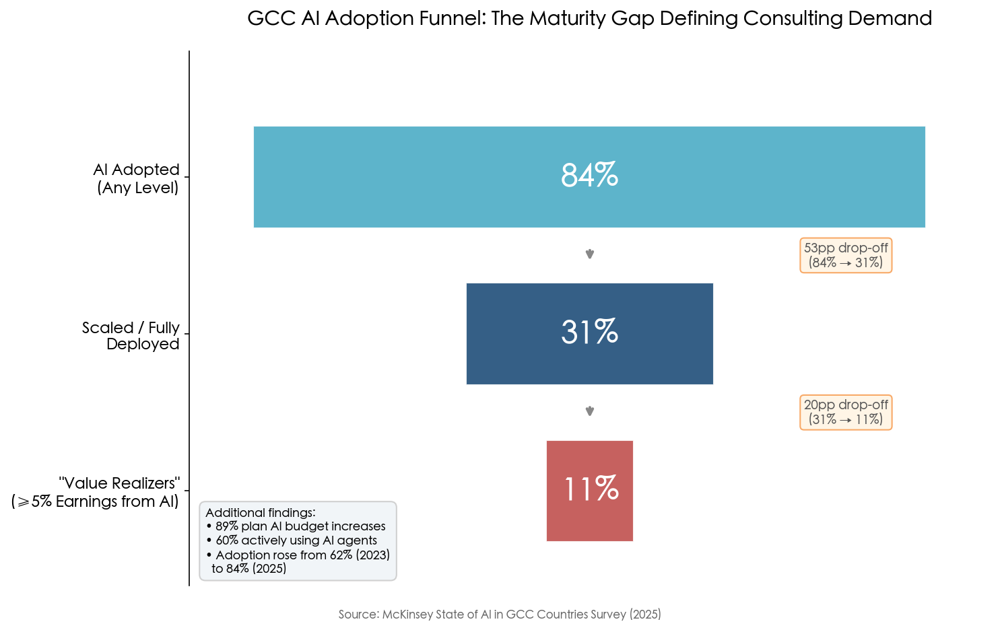

*Figure 6.1: GCC AI adoption funnel illustrating the steep drop-off from initial adoption (84%) to scaled deployment (31%) to value realization (11%). This maturity gap represents the advisory-intensive phase where strategy, implementation, and change management services command premium fees. Source: McKinsey State of AI in GCC Countries Survey (2025).*

This wide gap between adoption intent and scaled deployment represents a substantial consulting opportunity. The region is positioned squarely in the advisory-intensive phase of AI maturation — where the strategic questions of how to scale, how to govern, and how to extract measurable value from AI investments command premium consulting fees.

BCG's GCC AI Pulse report (April 2025) classified Saudi Arabia and the UAE as "AI Contenders" — one tier below the United States and China (classified as "AI Pioneers"). The UAE's sovereign AI ambitions are anchored by MGX, a $100 billion AI-focused investment fund, while Saudi Arabia targets $20 billion in AI investments by 2030 [BCG](https://www.bcg.com/publications/2025/the-gcc-ai-pulse-mapping-the-regions-readiness-for-an-ai-driven-future "April 2025").

### Strategic Partnerships and Infrastructure Investments

Consulting firms have established dedicated regional presences to capture this demand. Accenture and Google Cloud expanded their Generative AI Center of Excellence to Saudi Arabia in February 2025, leveraging the sovereign cloud region in Dammam. SDAIA (Saudi Data and AI Authority) and Accenture estimated that GenAI adoption could increase Saudi GDP by 4% [Accenture Newsroom](https://newsroom.accenture.com/news/2025/accenture-and-google-cloud-advance-sovereign-cloud-and-generative-ai-adoption-in-saudi-arabia "February 2025").

The region's AI infrastructure buildout is unprecedented in scale. HUMAIN, a Saudi Public Investment Fund–backed AI company, partnered with NVIDIA in a deal valued at $18–24 billion to develop AI data centers with up to 500 MW capacity, with the first NVIDIA AI chip shipment arriving in December 2025 [NVIDIA IR](https://investor.nvidia.com/news/press-release-details/2025/HUMAIN-and-NVIDIA-Announce-Strategic-Partnership-to-Build-AI-Factories-of-the-Future-in-Saudi-Arabia/default.aspx "2025"). Infrastructure investments of this magnitude create substantial downstream consulting demand for implementation, integration, governance, and operational advisory services — a pipeline that major firms are positioning to capture through dedicated regional centers.

The sovereign cloud dimension is particularly pronounced in the Middle East and Africa (MEA) region, where Gartner forecasts sovereign cloud IaaS spending to grow 89% in 2026 — the fastest regional growth rate globally — from $132 million to $250 million [Gartner](https://www.gartner.com/en/newsroom/press-releases/2026-02-09-gartner-says-worldwide-sovereign-cloud-iaas-spending-will-total-us-dollars-80-billion-in-2026 "February 2026"). While the absolute figures remain modest compared to Europe or North America, the growth velocity signals a rapidly maturing market that major consulting firms are actively cultivating through local partnerships and dedicated sovereign AI offerings.

## 6.4 Asia-Pacific: The Talent Engine and Growth Frontier

The Asia-Pacific region presents a dual character in the AI consulting landscape: it serves as the primary offshore delivery and talent hub for global consulting firms while simultaneously emerging as a high-growth market for AI services in its own right. The region's internal heterogeneity — spanning India's scale-delivery model, Japan's infrastructure-led transformation, Southeast Asia's digital-native growth, and China's geopolitically constrained environment — demands disaggregated analysis.

### India: Global AI Delivery Center and Rising Domestic Market

India's AI market is expected to reach $20–22 billion by 2027, growing at a compound annual growth rate (CAGR) of approximately 30%. The country hosts roughly 20% of the world's data but only 3% of global data center capacity, indicating significant infrastructure investment potential [Deloitte India](https://www.deloitte.com/in/en/issues/generative-ai/data-centre-infrastructure.html "May 2025").

Deloitte has made India a cornerstone of its global AI infrastructure strategy. In March 2025, the firm launched a Global AI Simulation Centre of Excellence in Bengaluru, with an initial investment of $5–10 million, focused on developing simulations, digital twins, and multi-agent systems as part of its broader $3 billion GenAI commitment [Deloitte India](https://www.deloitte.com/in/en/about/press-room/deloitte-unveils-global-ai-simulation-centre-of-excellence.html "March 2025"). Six months later, in September 2025, Deloitte established a Global AI Infrastructure CoE from India, offering end-to-end AI data center capabilities under its "Silicon2Service" AI factory framework [Deloitte India](https://www.deloitte.com/in/en/about/press-room/deloitte-launches-ai-infrastructure-coe.html "September 2025"). These successive investments signal that India's role in the global consulting ecosystem has evolved beyond traditional cost arbitrage toward an AI innovation center where firms build, train, and deploy platforms at scale.

Capgemini's APAC & Latin America segment grew 13.8% at constant currency in FY2025 — the fastest regional growth rate across all Capgemini segments. The firm's global offshore workforce expanded 42% year-over-year to 279,200 employees (66% of the total 423,400 headcount), driven by the WNS and Cloud4C acquisitions [Capgemini](https://www.capgemini.com/us-en/news/press-releases/full-year-2025-results/ "February 2026"). This offshore concentration confirms India's centrality not merely as a labor arbitrage location but as an AI talent reservoir that underpins the delivery economics of global consulting operations.

### Japan: AI Infrastructure Surge and Consulting Opportunity

Japan represents a distinct dynamic within the region: a mature, high-spending IT market undergoing AI-driven transformation with substantial public-sector backing. IDC forecasts Japan's domestic AI infrastructure spending to exceed $5.5 billion in 2026, growing at least 18% year-over-year [IDC](https://www.idc.com/resource-center/blog/7x-growth-in-just-three-years-japans-ai-infrastructure-will-surge-past-5-5-billion-in-2026-idc-reveals/ "2026"). The Japanese government has allocated ¥1 trillion (approximately $6.7 billion) annually for AI and semiconductor initiatives, signaling sustained public-sector commitment to AI infrastructure. IDC also forecasts Japan's domestic IT services market to grow at a 6.2% CAGR between 2025 and 2030, reaching $68 billion by 2030 [InfoTech Lead](https://infotechlead.com/software/japan-it-services-market-to-reach-68-billion-by-2030-driven-by-ai-and-it-modernization-94297 "2025"). International consulting firms are actively competing for this expanding market: PwC Japan Group was named a Leader in the IDC MarketScape for Japan Artificial Intelligence Services in 2025, illustrating the depth of engagement by global firms in this market [PwC](https://www.pwc.com/gx/en/about/analyst-relations/2025/idc-japan-ai-services-2025.html "December 2025").

### Southeast Asia: Emerging AI Powerhouse

Southeast Asia has advanced from the periphery to a central position in the global AI narrative. BCG's April 2025 report estimated that AI adoption could add approximately $120 billion to ASEAN-6 GDP by 2027, with Singapore projected to experience the highest percentage GDP uplift at 3.1% [BCG](https://www.bcg.com/publications/2025/southeast-asia-unlocking-ai-potential "April 2025"). IDC projects that AI-related investments in Asia-Pacific will grow 1.7× faster than overall digital technology spending, generating a $1.6 trillion cumulative economic impact by 2027 [IDC](https://www.idc.com/resource-center/blog/charting-the-agentic-future-idc-2026-predictions-for-asia-pacific-japan/ "September 2025").

The region benefits from a young, digitally literate population, robust digital payment infrastructure, and increasing government investment in AI capabilities. McKinsey research found that AI adoption in Southeast Asia surpasses the global average, with the region hosting over 2,000 AI startups [McKinsey](https://www.mckinsey.com/featured-insights/future-of-asia/ai-in-southeast-asia-an-era-of-opportunity "2025"). These structural advantages create fertile ground for consulting engagements spanning AI strategy formulation, implementation at scale, and ecosystem development — engagements that bridge the gap between the region's ambitious national AI programs and enterprise-level execution.

### China: Geopolitical Constraints Reshape Consulting Engagement

China presents a uniquely constrained environment for Western consulting firms' AI practices. In July 2025, Reuters reported that McKinsey instructed its mainland China business to refrain from projects deploying generative AI, prompted by increasing US government scrutiny of American companies operating in sensitive sectors in China. The restriction applies to projects in the offices of multinational clients but does not extend to established types of non-generative AI work [Reuters](https://www.reuters.com/world/china/mckinsey-bars-china-business-generative-ai-consultancy-work-ft-reports-2025-07-23/ "Reuters, July 2025"). McKinsey employs over 1,000 individuals in China across six regional offices, indicating the material scale of this constraint.

This restriction is symptomatic of a broader pattern: US-China technology decoupling is increasingly bifurcating the global AI consulting market. China's own AI regulatory framework — governed by a series of measures covering algorithmic recommendations, deep synthesis, and generative AI services — operates independently of Western frameworks. In April 2026, China issued draft rules on interactive AI services, reinforcing the country's parallel governance track [Mayer Brown](https://www.mayerbrown.com/en/insights/publications/2026/04/china-issues-draft-rules-on-interactive-ai-services "April 2026"). For international consulting firms, this regulatory and geopolitical environment limits the ability to deploy their core AI platforms and partnerships — built on OpenAI, Anthropic, Google, and NVIDIA technologies — in the Chinese market. The practical consequence is that China increasingly functions as a separate theater requiring distinct strategies, local partnerships, and platforms not subject to US export controls.

## 6.5 Cross-Regional Themes: Sovereign AI and Regulatory Divergence

The preceding regional analyses reveal several cross-cutting dynamics that transcend individual geographies and merit integrated examination.

### The Sovereign AI Imperative

Sovereign AI — the development and deployment of AI systems that comply with local data residency, security, and governance requirements — has emerged as a defining theme across all regions examined in this chapter. The pattern manifests differently by geography but points toward the same structural conclusion: Europe's surging sovereign cloud spending reflects regulatory mandates (GDPR, EU Data Act); the GCC's AI infrastructure investments embed data localization requirements tied to national security strategies; and the US push for a unified federal framework seeks to preempt the state-level fragmentation that could create compliance complexity comparable to Europe's.

Gartner projects that worldwide sovereign cloud IaaS spending will reach $80 billion in 2026 (+35.6% year-over-year), confirming that sovereign AI is not a niche concern but a structural market shift [Gartner](https://www.gartner.com/en/newsroom/press-releases/2026-02-09-gartner-says-worldwide-sovereign-cloud-iaas-spending-will-total-us-dollars-80-billion-in-2026 "February 2026").

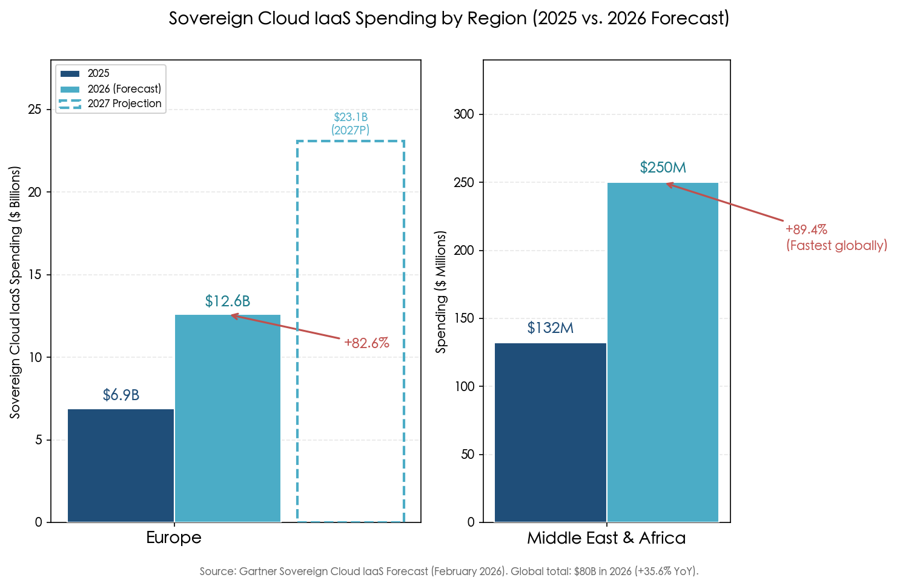

*Figure 6.2: Sovereign cloud IaaS spending trajectories for Europe (from $6.9 billion in 2025 to $12.6 billion in 2026, +82.6%) and the Middle East & Africa ($132 million to $250 million, +89.4% — the fastest regional growth globally). Europe is projected to surpass North America ($16 billion) by 2027 at $23.1 billion. Source: Gartner Sovereign Cloud IaaS Forecast (February 2026).*

For consulting firms, sovereign AI creates multi-layered advisory demand across three domains: technology architecture (hybrid and on-premises deployment design), regulatory compliance (data residency mapping and conformity assessment), and strategic advisory (evaluating sovereign versus hyperscaler trade-offs). Firms that have invested early in sovereign-ready platforms — Capgemini on AWS European Sovereign Cloud, IBM with Sovereign Core, Accenture with sovereign AI capabilities within AI Refinery — are positioned to capture this structural demand as it scales through 2027 and beyond.

### Firm-Level Performance Divergence by Region

The revenue data across publicly reporting firms reveals a consistent pattern: EMEA and Asia-Pacific/Growth Markets are outpacing North America in growth rates for AI-related consulting, even as North America retains the largest absolute market size. Accenture's Q2 FY2026 results illustrate this divergence with precision — EMEA at 13%, Growth Markets at 12%, North America at 4% [Reuters](https://www.reuters.com/business/accenture-forecasts-quarterly-revenue-below-estimates-2026-03-19/ "Reuters, March 2026"). Capgemini's FY2025 results echo the same structural pattern: APAC & LatAm at 13.8%, UK & Ireland at 10.5%, versus France at -4.1% [Capgemini](https://www.capgemini.com/us-en/news/press-releases/full-year-2025-results/ "February 2026").

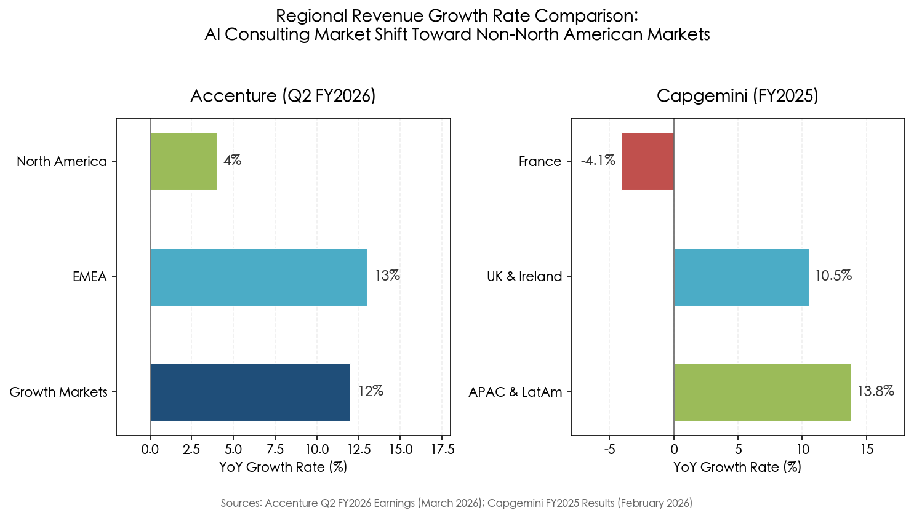

*Figure 6.3: Regional revenue growth rate comparison for Accenture (Q2 FY2026) and Capgemini (FY2025), illustrating the structural shift toward non-North American markets in AI consulting growth. Source: Accenture Q2 FY2026 Earnings (March 2026); Capgemini FY2025 Results (February 2026).*

PwC's global performance further reflects the headwinds in mature markets: FY2025 global revenue reached $56.9 billion (+2.7%), the slowest Big Four growth rate for a third consecutive year, accompanied by a net reduction of 5,600 employees to 364,000 — reversing the firm's earlier target of reaching 400,000 professionals [Business Insider](https://www.businessinsider.com/big-four-earnings-compared-ey-deloitte-pwc-kpmg-2025-12 "December 2025"). This pivot toward AI-enabled efficiency over headcount expansion suggests a fundamental recalibration of delivery models across mature markets, with implications for both workforce strategy and revenue composition.

### Data Disclosure Asymmetries

A significant methodological limitation in regional analysis is the disclosure gap across firm archetypes. Technology consultancies (Accenture, IBM, Capgemini) provide segmented regional revenue through public filings, enabling quantitative geographic comparison. The Big Four report aggregate global revenue with limited regional segmentation — KPMG Americas (-0.3% in FY2025) representing a notable exception where regional data is available [Business Insider](https://www.businessinsider.com/big-four-earnings-compared-ey-deloitte-pwc-kpmg-2025-12 "December 2025"). MBB firms (McKinsey, BCG, Bain) do not disclose regional AI revenue figures in any form. This disclosure asymmetry means that the geographic analysis presented in this chapter inevitably skews toward firms with greater transparency, and conclusions about regional market dynamics should be interpreted with this caveat in mind.

# Outlook and Emerging Trends (Through October 2026)

The preceding chapters documented how major consulting firms mobilized multi-billion-dollar capital commitments, constructed AI-native product portfolios, deployed agentic platforms at enterprise scale, and restructured their workforces between April 2025 and April 2026. This concluding chapter projects forward, examining the most probable near-term developments in the AI consulting landscape through October 2026. All forward-looking assertions herein are grounded in at least one of three foundations: disclosed firm guidance, credible third-party forecasts from named institutions with specific dates, or logical extrapolations from the documented trends presented in earlier chapters.

## 7.1 Market Size Forecasts and the Spending Paradox

### A $2.5 Trillion Market with a Maturity Gap

Worldwide AI spending is projected to reach $2.52 trillion in 2026, a 44% year-over-year increase, according to Gartner's January 2026 forecast. Within that total, the "AI Services" segment — encompassing consulting, implementation, managed services, and outsourcing — is projected at $588.6 billion in 2026 (up from $439.4 billion in 2025), rising further to $761.0 billion in 2027. AI infrastructure alone is expected to contribute $401 billion in incremental spending during 2026 [Gartner](https://www.gartner.com/en/newsroom/press-releases/2026-1-15-gartner-says-worldwide-ai-spending-will-total-2-point-5-trillion-dollars-in-2026 "Gartner AI Spending Forecast, January 2026").

IDC's forecast aligns directionally, projecting a 31.9% CAGR for global AI spending from 2025 through 2029, with agentic AI expected to dominate IT budget expansion during this period [IDC](https://my.idc.com/getdoc.jsp?containerId=prUS53765225 "IDC AI Spending Forecast, August 2025"). BCG estimates that agentic AI specifically will unlock up to $200 billion in net new value pools for technology services over five years, implying a 6–8% CAGR through 2030 for this sub-segment alone [BCG](https://www.bcg.com/publications/2026/the-200-billion-dollar-ai-opportunity-in-tech-services "BCG Tech Services AI Opportunity Report, 2026").

These headline figures, however, mask a deepening maturity gap. Gartner characterizes 2026 as a "Trough of Disillusionment" year for enterprise AI — a phase in which "AI will most often be sold by incumbent software providers rather than bought as part of a new moonshot project," and in which "improved predictability of ROI must occur before AI can truly be scaled up" [Gartner](https://www.gartner.com/en/newsroom/press-releases/2026-1-15-gartner-says-worldwide-ai-spending-will-total-2-point-5-trillion-dollars-in-2026 "Gartner AI Spending Forecast, January 2026"). This characterization carries significant implications for consulting firms: the era of large-scale greenfield AI programs may be giving way to a more disciplined, ROI-driven engagement model in which enterprises require measurable outcomes before authorizing further expenditure.

### Spending Deferrals and CFO Gatekeeping

Forrester's 2026 predictions reinforce the disillusionment thesis. The research firm projects that enterprises will defer 25% of planned AI spend into 2027, noting that fewer than one-third of decision-makers can tie AI value to financial growth. CFOs are expected to assume a larger gatekeeping role over AI budgets, subjecting investments to the same return hurdles applied to traditional capital expenditures [Forrester](https://investor.forrester.com/news-releases/news-release-details/forresters-2026-technology-security-predictions-ais-hype-fades-0/ "Forrester 2026 Predictions, October 2025"). Capgemini Research Institute data corroborate this shift: while organizations are allocating 5% of business budgets to AI in 2026 (up from 3% in 2025), approximately two-thirds are pausing lower-value AI projects to redirect investment toward high-impact areas, and 60% are specifically exploring agentic AI as the next productivity frontier [Capgemini](https://www.capgemini.com/us-en/news/press-releases/in-a-shift-from-ai-hype-to-ai-realism-organizations-are-increasing-their-ai-investmentswith-a-focus-on-long-term-value/ "Capgemini Research Institute, January 2026").

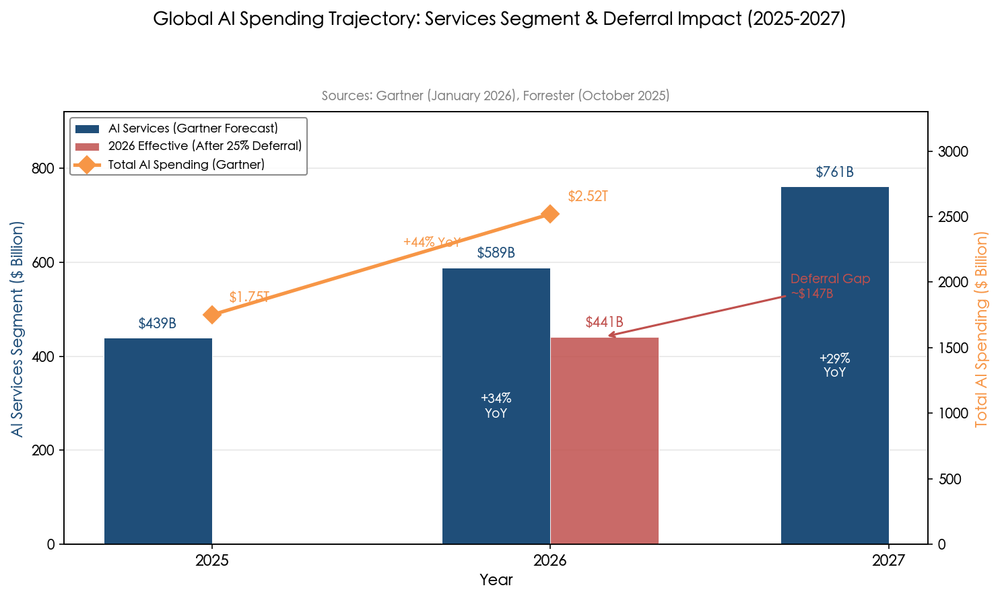

**图 7-1** 展示了 Gartner 预测的全球 AI 支出总量与 AI 服务子市场规模增长轨迹，并叠加 Forrester 预计的 25% 支出延迟效应。2026 年名义 AI 服务支出为 5,890 亿美元，经延迟调整后有效支出降至约 4,410 亿美元，形成约 1,470 亿美元的"延迟缺口"——直观呈现高增长预期与"幻灭低谷"之间的张力。

For consulting firms, this spending recalibration creates both headwinds and opportunities. The deferral of discretionary AI projects compresses near-term booking growth; simultaneously, the demand for ROI validation, governance frameworks, and strategic prioritization of AI portfolios generates advisory mandates that favor the deep industry expertise of firms such as McKinsey, BCG, and the Big Four over pure-play technology implementers.

## 7.2 Emerging Technologies Reshaping Consulting Delivery

### Agentic AI: From Pilots to Enterprise Scale

Agentic AI — systems of autonomous or semi-autonomous agents that plan, execute, and iterate on complex tasks with minimal human oversight — has emerged as the single most consequential technology trend for the consulting industry in 2026. Evidence from multiple firm surveys and product launches converges on one conclusion: agentic AI has moved decisively beyond the experimental phase.

Gartner's Top 10 Strategic Technology Trends for 2026 identifies multiagent systems (MAS) as a prominent category, predicting that by 2027, 70% of MAS deployments will employ narrowly specialized agents rather than generalist architectures [Gartner](https://www.gartner.com/en/articles/top-technology-trends-2026 "Gartner Top 10 Strategic Technology Trends for 2026"). Deloitte's State of AI 2026 report finds that approximately 75% of companies plan agentic AI deployment within two years, although only 21% have mature agent governance frameworks in place — a 54-percentage-point gap that creates substantial advisory demand [Deloitte](https://www.deloitte.com/us/en/about/press-room/state-of-ai-report-2026.html "Deloitte State of AI Report, January 2026"). KPMG's 2026 Global Tech Report, based on a survey of 2,500 executives across 27 countries, reports that 88% of organizations are already embedding AI agents into workflows, with high performers expecting approximately 50% of technology teams to consist of permanent human staff by 2027 — the remainder comprising AI agents and augmented systems [KPMG](https://kpmg.com/lt/en/insights/2026/03/kpmg-2026-global-tech-report.html "KPMG 2026 Global Tech Report, March 2026").

McKinsey QuantumBlack's 2026 survey provides further granularity: 62% of organizations are experimenting with agentic AI, and 23% have begun scaling deployments in at least one function. Organizations investing $25 million or more in responsible AI report significantly higher maturity scores and a measurable impact exceeding 5% of EBIT [McKinsey](https://www.mckinsey.com/capabilities/tech-and-ai/our-insights/tech-forward/state-of-ai-trust-in-2026-shifting-to-the-agentic-era "McKinsey State of AI Trust in 2026, March 2026").

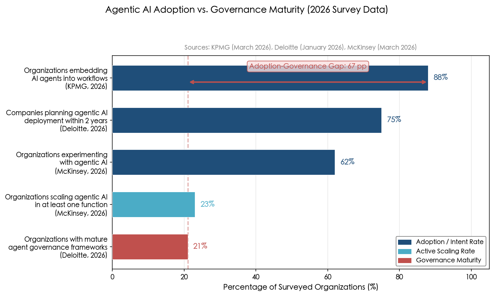

**图 7-2** 汇总了 KPMG、Deloitte 和 McKinsey 三大调研中的 AI 代理采纳率数据，与仅 21% 的组织具备成熟治理框架形成鲜明对比。最高采纳率（88%）与治理成熟度之间存在 67 个百分点的"采纳-治理"鸿沟，这一鸿沟正是咨询公司 AI 治理咨询需求的核心驱动力。

Consulting firms are not merely advising on agentic AI — they are deploying it within their own operations at enterprise scale. EY announced on April 7, 2026 the global rollout of enterprise-scale agentic AI in its Assurance practice, embedding a multi-agent framework built on Microsoft Azure, Microsoft Foundry, and Microsoft Fabric into EY Canvas — the firm's global audit platform that processes over 1.4 trillion lines of journal entry data per year. The system encompasses the daily workflows of 130,000 Assurance professionals across 160,000 audit engagements in more than 150 countries. EY's stated objective is to have 100% of audit activities supported by agents by 2028, as part of a "multibillion-dollar commitment to audit quality, technology and people" [EY Newsroom](https://www.ey.com/en_gl/newsroom/2026/04/ey-launches-enterprise-scale-agentic-ai-to-redefine-the-audit-experience-for-the-ai-era "EY press release, April 2026") [Business Insider](https://www.businessinsider.com/ey-launches-ai-agent-framework-for-assurance-audit-big-four-2026-4 "Business Insider, April 2026").

This pattern of self-deployment extends across the industry. EY also launched EY.ai Agentic for Sales in March 2026, powered by Snowflake and Canva, specifically designed to address enterprise AI fragmentation in sales orchestration [EY Newsroom](https://www.ey.com/en_gl/newsroom/2026/03/ey-in-collaboration-with-snowflake-and-canva-announces-launch-of-agentic-sales-orchestration-platform-to-address-enterprise-ai-fragmentation "EY press release, March 2026"). Deloitte launched Zora AI™ — the firm's first agentic AI product business — alongside the Deloitte Global Agentic Network, both powered by NVIDIA [Deloitte](https://www.deloitte.com/global/en/about/press-room/global-revenue-announcement.html "Deloitte FY2025 press release, September 2025"). The OpenAI "Frontier Alliances" program, launched in February 2026, formalized multiyear partnerships with Accenture, BCG, Capgemini, and McKinsey to deploy Frontier — OpenAI's enterprise AI agent platform. OpenAI CFO Sarah Friar noted that enterprises already account for approximately 40% of OpenAI's business, a share expected to reach approximately 50% by year-end 2026 [CNBC](https://www.cnbc.com/2026/02/23/open-ai-consulting-accenture-boston-capgemini-mckinsey-frontier.html "CNBC report, February 2026").

### Physical AI and Sovereign AI: The Next Frontiers

Beyond agentic software, two additional technology vectors are gaining momentum within consulting portfolios. **Physical AI** — encompassing robotics, autonomous drones, smart equipment, and digital twins — features in Gartner's Top 10 Strategic Technology Trends for 2026 [Gartner](https://www.gartner.com/en/articles/top-technology-trends-2026 "Gartner Top 10 Strategic Technology Trends for 2026"). Deloitte's State of AI 2026 report projects that physical AI will reach 80% adoption within two years, with manufacturing, logistics, and defense as the leading verticals [Deloitte](https://www.deloitte.com/us/en/about/press-room/state-of-ai-report-2026.html "Deloitte State of AI Report, January 2026"). Physical AI engagements require domain expertise in industrial operations, safety regulation, and edge computing — capabilities that favor firms with deep vertical practices, notably Capgemini (manufacturing and automotive), IBM Consulting (supply chain), and Accenture (industrial IoT).

**Sovereign AI** — the development of domestically controlled AI infrastructure, training data, and models — has become a geopolitical priority. Deloitte reports that 83% of surveyed organizations view sovereign AI as strategically important [Deloitte](https://www.deloitte.com/us/en/about/press-room/state-of-ai-report-2026.html "Deloitte State of AI Report, January 2026"). As documented in the regional analysis (Chapter 6), European sovereign cloud IaaS spending is forecast to nearly double from $6.9 billion in 2025 to $12.6 billion in 2026, and Gartner projects that by 2027, 35% of countries will be locked into region-specific AI platforms. For consulting firms, sovereign AI mandates generate a recurring advisory cycle spanning regulatory compliance, data residency architecture, vendor selection, and ongoing governance — a revenue stream that is largely insulated from the discretionary spending deferrals affecting other AI project categories.

### Quantum-AI Hybrids and Emerging Security Demands

Quantum computing's intersection with AI remains further from commercialization than agentic or physical AI, yet the associated security implications are already generating consulting demand. Forrester predicts that quantum security spending will exceed 5% of IT security budgets in 2026 [Forrester](https://investor.forrester.com/news-releases/news-release-details/forresters-2026-technology-security-predictions-ais-hype-fades-0/ "Forrester 2026 Predictions, October 2025"). The near-term opportunity for consulting firms is concentrated in post-quantum cryptography readiness assessments, migration planning for quantum-vulnerable encryption, and regulatory compliance advisory — particularly for financial services and government clients. IBM Consulting, leveraging the parent company's quantum research division and 127+ qubit processors, holds a differentiated position in this emerging niche.

## 7.3 Structural Shifts Reshaping the Competitive Landscape

### Consolidation Accelerates Through AI-Focused M&A

The acquisition pace documented in Chapter 1 is expected to intensify through October 2026. Accenture disclosed plans for approximately $5 billion in acquisitions during FY2026 (fiscal year ending August 31, 2026), focused on AI and fast-growth assets — a figure consistent with the firm's Q2 FY2026 record bookings of $22.1 billion (quarter ending February 2026) and revenue of $18.04 billion (+8.3% year-over-year). Full-year revenue guidance was subsequently raised to 3–5% growth [Reuters](https://www.reuters.com/business/accenture-forecasts-quarterly-revenue-below-estimates-2026-03-19/ "Reuters, March 2026"). Capgemini's $3.3 billion WNS acquisition and Faculty's integration into Accenture (at approximately $1 billion) demonstrate that leading firms are prepared to pay significant premiums for AI-native talent and platform capabilities.

We anticipate that mid-tier consulting firms and boutique AI specialists will face mounting pressure either to sell to a larger platform or to differentiate through hyper-specialization. The underlying economics are stark: the cost of maintaining competitive AI infrastructure — including GPU clusters, model fine-tuning pipelines, and proprietary training data — is escalating faster than revenue growth for sub-scale players.

### The Outcome-Based Pricing Gap

Perhaps the most structurally significant trend is the widening gap between enterprise expectations for outcome-based pricing and consulting firms' capacity to deliver it. BCG research finds that more than 70% of enterprise buyers prefer output- or outcome-linked pricing models, yet approximately 60% of providers still operate on time-and-materials (T&M) or fixed-price contracts [BCG](https://www.bcg.com/publications/2026/the-200-billion-dollar-ai-opportunity-in-tech-services "BCG Tech Services AI Opportunity Report, 2026"). The disconnect is quantifiable: enterprises expect 30–40% productivity gains from AI-enabled consulting engagements, while providers typically commit to 6–15% improvements — a gap that creates deal friction and delays large-scale contract signings.

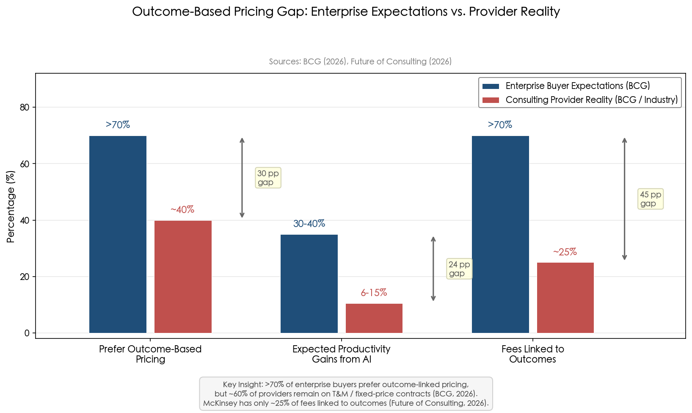

**图 7-3** 对比了企业买方期望与咨询供方现实之间的三重差距：定价偏好（>70% 买方偏好成果定价 vs. ~40% 供方提供）、生产力预期（30–40% vs. 6–15%）、费用挂钩比例（>70% 买方期望 vs. McKinsey 仅约 25%）。这一多维度的"期望-现实"鸿沟正在重塑咨询行业的经济结构。

At McKinsey, only approximately 25% of fees globally are linked to outcomes, according to industry analysis [Future of Consulting](https://futureofconsulting.ai/ai-leadership/2026-consultings-ai-revolution-update/ "Future of Consulting, 2026"). The transition to outcome-based pricing fundamentally threatens the leveraged staffing model that has underpinned consulting profitability for decades. As AI automates an estimated 80% of junior analyst research and slide production, the economic rationale for large project teams diminishes. Firms that can credibly guarantee outcomes — backed by proprietary AI platforms and demonstrated delivery track records — will capture disproportionate market share; those that cannot will face margin compression.

### The Workforce Inflection Point

The consulting pyramid is undergoing its most significant structural disruption in a generation. UK Big Four graduate intake reductions during 2025–2026 ranged from 6% (PwC) to 29% (KPMG), with Deloitte at 18% and EY at 11% [Future of Consulting](https://futureofconsulting.ai/ai-leadership/2026-consultings-ai-revolution-update/ "Future of Consulting, 2026"). KPMG's 2026 Global Tech Report frames this shift in systemic terms: high-performing organizations expect approximately 50% of technology teams to consist of permanent human staff by 2027, with the balance comprising AI agents and augmented systems [KPMG](https://kpmg.com/lt/en/insights/2026/03/kpmg-2026-global-tech-report.html "KPMG 2026 Global Tech Report, March 2026").

EY's April 2026 agentic audit rollout illustrates the recalibration underway. Marc Jeschonneck, EY's global assurance transformation leader, acknowledged that the entry point for junior auditors becomes "potentially not that much easier right away" because reviewing AI-generated work papers requires a higher baseline of experience. EY plans to replace traditional learning-by-repetition with adaptive, scenario-based training embedded directly in the platform [Business Insider](https://www.businessinsider.com/ey-launches-ai-agent-framework-for-assurance-audit-big-four-2026-4 "Business Insider, April 2026"). Notably, the firm stated it does not plan to reduce overall headcount, expecting the capacity freed by automation to be redeployed toward technology oversight and increasingly complex client demands.

## 7.4 Firm-Specific Forward Guidance and Strategic Bets

### PwC: From Crowdsourced AI to Top-Down "AI Studios"

PwC's 2026 AI predictions articulate a decisive shift from decentralized, crowdsourced AI experimentation to top-down "AI studios" — centralized units that curate, govern, and scale AI deployments enterprise-wide. PwC reports that 92% of surveyed firms plan AI investment increases in 2026, yet only 1% consider themselves mature in AI deployment. Agentic AI is identified as increasingly important across finance, HR, IT, tax, and audit functions [PwC](https://www.pwc.com/us/en/tech-effect/ai-analytics/ai-predictions.html "PwC 2026 AI Predictions, December 2025"). This framing mirrors PwC's own internal trajectory: the firm made nine investments of $50 million each in AI capabilities, including the "Elly" platform (with a digital workforce equivalent of 2,500), signaling a concentrated, platform-centric investment approach over distributed experimentation.

### Bain: "2026 Is the Year Boards Demand Bottom-Line Results"

Bain Managing Partner Chuck Whitten framed 2026 as a decisive accountability year in a January 2026 outlook: "2026 is the year boards demand bottom-line results from AI." Whitten emphasized that two-thirds of AI value derives from data, process redesign, and change management rather than technology itself — a framing that positions strategy consulting firms as essential intermediaries in the value-realization phase. He characterized the current AI cycle as "a once-in-a-moment disruption" impacting white-collar workflows across industries [Bain](https://www.bain.com/insights/what-to-expect-from-ai-in-2026/ "Bain AI Outlook, January 2026"). Bain's OpenAI Center of Excellence, established in late 2024 with an initial focus on retail and healthcare/life sciences, represents the firm's principal vehicle for converting this thesis into client engagements.

### Accenture: Scale Through Acquisition and Bookings Momentum

Accenture enters the remainder of FY2026 (fiscal year ending August 31, 2026) with the strongest disclosed forward momentum among firms in scope. Q2 FY2026 revenue reached $18.04 billion (+8.3% year-over-year) with record bookings of $22.1 billion, and management raised full-year revenue guidance to 3–5% growth. Approximately $5 billion in acquisitions are planned for FY2026, concentrated in AI and fast-growth assets [Reuters](https://www.reuters.com/business/accenture-forecasts-quarterly-revenue-below-estimates-2026-03-19/ "Reuters, March 2026"). The integration of Faculty (acquired January 2026 for approximately $1 billion), whose CEO Marc Warner was appointed Accenture CTO, is expected to accelerate the firm's agentic AI and decision intelligence capabilities. With AI and data headcount approaching 77,000, Accenture's scale advantage in delivery capacity remains formidable and difficult for competitors to replicate in the near term.

### IBM: Software-Led Growth with Consulting as an Integration Layer

IBM's FY2026 guidance projects more than 5% revenue growth, with software revenue expected to grow 10% and free cash flow of $15.7 billion [Seeking Alpha](https://seekingalpha.com/news/4543955-ibm-expects-10-percent-software-growth-and-15_7b-free-cash-flow-in-2026-while-advancing-ai "IBM FY2026 Guidance, January 2026"). The firm's strategic trajectory increasingly positions IBM Consulting as an integration and deployment layer for IBM's software portfolio — particularly watsonx, Red Hat OpenShift, and the Confluent platform. IBM Consulting revenue grew 3% year-over-year in Q4 2025 (1% at constant currency), with segment profit margins improving to 12.3% from 11.7% [IBM Q4 2025 Earnings](https://newsroom.ibm.com/2026-01-28-IBM-RELEASES-FOURTH-QUARTER-RESULTS?hl=en-US "IBM Q4 2025 press release, January 2026"). The cumulative GenAI book of business exceeding $12.5 billion positions IBM for sustained consulting engagement momentum, although the growth trajectory increasingly tilts toward software rather than pure advisory revenue.

## 7.5 Risks and Headwinds Through October 2026

### Government Spending Retrenchment

The Department of Government Efficiency (DOGE) initiative in the United States has created a measurable headwind for firms with significant federal exposure. As of early 2025, DOGE had identified $1.5 billion or more in immediate consulting contract cuts, with a subsequent review flagging $20 billion in additional potential reductions [Management Consulted](https://managementconsulted.com/doge-and-u-s-government-cut-at-least-1-5b-in-consulting-spend/ "Management Consulted, April 2025"). Accenture disclosed an expected 1% FY2026 revenue impact from reduced federal spending, with recovery projected in Q4 FY2026 [Reuters](https://www.reuters.com/business/accenture-forecasts-quarterly-revenue-below-estimates-2026-03-19/ "Reuters, March 2026"). Deloitte, which derived approximately 10% of FY2024 revenue from US government contracts, faces disproportionate exposure to this category of cuts.

The risk extends beyond the United States: geopolitical uncertainty, including tariff escalation and trade fragmentation, may compress discretionary consulting budgets globally even as it simultaneously generates demand for supply chain restructuring and regulatory compliance advisory.

### AI Trust and Governance Deficits

McKinsey's 2026 AI Trust Maturity Survey identifies persistent governance gaps that constrain enterprise AI adoption — and, by extension, the consulting engagement pipeline. Among respondents, 74% identify AI inaccuracy as a highly relevant risk, and 72% cite cybersecurity concerns. Knowledge and training gaps are cited by approximately 60% as the primary barrier to responsible AI — up from approximately 50% the prior year. AI incident frequency remains stable at approximately 8%, yet organizational confidence in responding to incidents is declining [McKinsey](https://www.mckinsey.com/capabilities/tech-and-ai/our-insights/tech-forward/state-of-ai-trust-in-2026-shifting-to-the-agentic-era "McKinsey State of AI Trust in 2026, March 2026"). For consulting firms, this trust deficit represents a double-edged dynamic: it generates advisory revenue in governance and risk management while simultaneously slowing the pipeline for large-scale AI implementation projects that drive the highest-value engagements.

### Neocloud Competition and Hyperscaler Encroachment

Forrester forecasts that neoclouds — specialized AI infrastructure providers such as CoreWeave, Lambda, and Together AI — will capture $20 billion in revenue in 2026, eroding hyperscaler dominance in GenAI infrastructure [Forrester](https://investor.forrester.com/news-releases/news-release-details/forresters-2026-technology-security-predictions-ais-hype-fades-0/ "Forrester 2026 Predictions, October 2025"). This trend carries implications for consulting firms whose AI strategies are deeply intertwined with hyperscaler partnerships. Should enterprises begin sourcing AI compute from neoclouds rather than Azure, AWS, or Google Cloud, the referral and co-sell economics underpinning partnerships such as KPMG–Microsoft ($2 billion), KPMG–Google Cloud ($100 million), and EY–NVIDIA could face disruption.

Simultaneously, hyperscalers themselves are expanding advisory capabilities. Microsoft, Google, and AWS have all established professional services teams that increasingly overlap with traditional consulting engagements in cloud architecture, AI strategy, and data modernization. While quantified market share data for hyperscaler advisory services versus traditional consultants remains unavailable from T1/T2 sources, the directional competitive pressure is evident in the OpenAI Frontier Alliance structure: OpenAI chose to partner with established consulting firms rather than build its own advisory capacity, suggesting that the near-term equilibrium favors collaboration over displacement.

## 7.6 Synthesis: The Consulting Industry's AI Trajectory Through Late 2026

The period through October 2026 is likely to be characterized by three concurrent and mutually reinforcing dynamics.

**First, a flight to measurability.** The Trough of Disillusionment framing, the deferral of 25% of planned AI spend, and the rising prominence of CFO gatekeeping all point toward a market that increasingly rewards consulting firms capable of demonstrating quantifiable ROI. Bain's assertion that two-thirds of AI value derives from data, process redesign, and change management rather than technology itself suggests that strategy and management consulting firms — traditionally positioned upstream of implementation — may capture an outsized share of the value-realization advisory market. Firms with proprietary AI platforms capable of benchmarking outcomes (Accenture's AI Navigator, EY.ai, Deloitte's Zora AI) hold a structural advantage in this environment.

**Second, agentic AI as the new delivery paradigm.** The convergence of survey evidence — 88% of organizations embedding agents (KPMG), 75% planning deployment within two years (Deloitte), 62% experimenting and 23% scaling (McKinsey) — indicates that agentic AI will constitute the dominant technology framework for consulting delivery by late 2026. Firms that have already built agentic platforms (EY Canvas with multi-agent framework, Deloitte's Zora AI and Global Agentic Network, Accenture's Faculty-derived Frontier platform) will enjoy first-mover advantages in implementation work. The OpenAI Frontier Alliances represent a de facto standard-setting mechanism: Accenture, BCG, Capgemini, and McKinsey now share a common platform relationship that may shape enterprise procurement patterns.

**Third, accelerating workforce transformation.** The combination of graduate intake reductions, the shift from repetition-based to scenario-based training, and KPMG's projection that only 50% of technology teams will consist of human staff by 2027 all point toward a consulting workforce that is smaller in absolute headcount but higher in per-capita productivity and skill requirements. The firms that navigate this transition most effectively — maintaining institutional knowledge while embedding AI throughout their delivery model — will define the next era of professional services.

The macro spending environment provides a favorable tailwind: $2.52 trillion in global AI spending (Gartner), $588.6 billion in AI services (Gartner), and a 31.9% CAGR through 2029 (IDC) create a market large enough to sustain growth for all major firms even amid selectivity and deferral. The competitive question is not whether the AI consulting market will grow, but which firms will capture the highest-margin segments — and whether the industry's traditional leverage model can survive the transition to AI-augmented, outcome-priced delivery.

