# 执行摘要

Horizontal gene transfer (HGT) — the movement of genetic material between organisms through mechanisms other than parent-to-offspring reproduction — was long considered the exclusive province of prokaryotes. Three conceptual pillars — the Weismann barrier separating germline from soma in animals, the double-membraned nuclear envelope of eukaryotic cells, and the complexity hypothesis predicting failure of foreign gene products in highly connected protein networks — underpinned a near-consensus through the late 20th century that HGT was irrelevant to multicellular plants and animals. Four decades of accumulating genomic evidence have overturned that consensus. This report synthesizes the current state of knowledge on HGT in non-microbial eukaryotes, evaluating mechanisms, prevalence, methodological challenges, and evolutionary significance.

**Mechanisms and gateways.** Four principal routes circumvent eukaryotic barriers to HGT: (1) parasitic plant haustoria, which create direct cytoplasmic bridges between host and parasite through which both genomic DNA fragments and mRNA molecules transit; (2) obligate intracellular endosymbionts such as *Wolbachia*, which reside within host germline cells and thereby bypass the Weismann barrier entirely; (3) transposable elements equipped with membrane-fusion machinery (e.g., Maverick/Polinton elements), which can shuttle cargo genes between distantly related species; and (4) environmental DNA uptake during desiccation-induced membrane disruption, as observed in bdelloid rotifers. The unifying principle is that physical access to germline or totipotent cells governs HGT probability — a framework formalized as the "weak-link model."

**Prevalence in plants.** Plant mitochondrial HGT is pervasive: the *cox1* intron alone has undergone approximately 70 independent horizontal transfers among angiosperms. Nuclear HGT is best documented in parasitic lineages, where transfer frequency scales with parasitic dependence — from 1 event in the free-living *Lindenbergia* to 34 gene families in the holoparasite *Phelipanche aegyptiaca*. The dodder genus *Cuscuta* harbors 108 transcribed and likely functional genes acquired from hosts. Naturally transgenic species are widespread: all 291 tested cultivated sweet potato accessions carry *Agrobacterium* T-DNA, and over 30 dicot species are now recognized as natural transgenics. However, a 2025 reassessment of 1,170 previously reported interkingdom HGT candidates in plants found that only 29.3% retained phylogenetic support after reanalysis with expanded databases, underscoring that earlier prevalence estimates were substantially inflated.

**Prevalence in animals.** Bdelloid rotifers possess the most chimeric animal genomes known, with 8–14% of protein-coding genes derived from bacteria, fungi, and plants. A systematic census of 218 insect genomes identified 1,410 horizontally acquired genes from 741 independent transfer events, with bacteria contributing 79% of donors. In vertebrates, horizontal transfer of transposable elements (e.g., BovB LINE retrotransposons contributing up to 18.4% of the cow genome) is well established, and endogenous retrovirus domestication produced the syncytin genes essential for placental function. Functional non-transposon gene transfer to vertebrates, however, remains largely unvalidated beyond isolated cases such as the antifreeze protein gene transfer between herring and smelt.

**Evolutionary significance.** The rarity of eukaryotic HGT relative to prokaryotes (where ~81% of genes have HGT histories) is a misleading metric for evolutionary impact. The distinction between replacement HGT (substituting a homologous gene) and additive HGT (introducing an entirely new capability) is critical: a single additive transfer — carotenoid biosynthesis genes enabling aphid color polymorphism, the neochrome photoreceptor facilitating fern diversification ~179 million years ago, or the *Fhb7* gene conferring Fusarium resistance in wheat — can reshape the evolutionary trajectory of an entire clade. Eight functionally validated adaptive HGT events in non-microbial eukaryotes are cataloged in this report, all involving low-connectivity, autonomous-function proteins consistent with the connectivity barrier model. The eukaryotic tree of life remains fundamentally tree-like at the organismal level, but with biologically significant reticulate overlays driven by endosymbiotic gene transfer at the base of major radiations and localized HGT in lineages characterized by intimate interspecific associations.

**Methodological frontiers.** The field's greatest challenge is distinguishing genuine HGT from contamination artifacts, incomplete lineage sorting, and database biases. The tardigrade genome controversy — in which an initial claim of 17.5% HGT was reduced to ~0.4% after contamination was identified — epitomizes this challenge. Long-read and telomere-to-telomere sequencing technologies promise to reveal transfers embedded in repetitive regions invisible to short-read assemblies. The 2025 euHGT compendium (9,511 protein-coding genes across 13 animal phyla) provides the first standardized benchmark for tool development, and the first experimental recapitulation of adaptive HGT in a model organism — introduction of phage-derived toxin genes into *Drosophila melanogaster*, yielding a ~6-fold survival advantage against parasitoid wasps — establishes a new paradigm for functional validation.

**Core conclusion.** HGT in plants and animals is genuine, functionally consequential in specific ecological contexts, and substantially rarer than in prokaryotes. Its significance lies not in frequency but in the outsized phenotypic impact of the rare transfers that survive the multiple barriers — germline access, nuclear integration, regulatory domestication, and selective retention — imposed by multicellular eukaryotic biology. The rarity of successful eukaryotic HGT functions as a stringent quality filter: the events retained over evolutionary time are disproportionately those that confer genuine adaptive value.

# 第1章 Conceptual Foundations — Horizontal Gene Transfer Beyond Microbes

## 1.1 Defining Horizontal Gene Transfer

The transmission of genetic material from parent to offspring — vertical gene transfer — constitutes the bedrock of heredity. Horizontal gene transfer (HGT), also termed lateral gene transfer (LGT), operates under an entirely different logic: the movement of genetic material between organisms through mechanisms other than parent-to-offspring reproduction. Where vertical inheritance traces lineages across generations, HGT cuts across lineage boundaries, enabling a recipient organism to acquire genes from a distantly related donor in a single evolutionary step.

Although HGT and LGT are used interchangeably throughout the literature, this report adopts HGT as the primary designation. Two closely related phenomena warrant careful distinction at the outset. **Horizontal transfer of transposable elements (HTT)** refers specifically to the lateral movement of mobile genetic elements — transposons, retrotransposons, and their derivatives — between species; it constitutes a subcategory of HGT in which the transferred cargo is itself a selfish genetic element [Schaack, Gilbert & Feschotte 2010](https://en.wikipedia.org/wiki/Horizontal_gene_transfer "Citing Schaack et al. 2010, Trends in Ecology & Evolution 25: 537–546"). **Endosymbiotic gene transfer (EGT)** describes the transfer of genes from an endosymbiont's genome (mitochondrion or plastid) to the host nuclear genome. EGT is conceptually distinct from HGT *sensu stricto* because the donor organelle resides within the host cell lineage, though its mechanistic overlap with HGT is substantial and the boundary between the two is sometimes blurred [Keeling & Palmer 2008](https://www.nature.com/articles/nrg2386 "Nature Reviews Genetics 9: 605–618"). Where this report discusses transfers between unrelated species — bacteria to animals, fungi to plants, plant to plant — we employ the term **interkingdom HGT (iHGT)**.

## 1.2 The Prokaryotic Pedigree: How HGT Was Discovered

The conceptual history of HGT is inseparable from microbiology. Four landmark experiments, spanning a quarter-century, established the core mechanisms by which bacteria exchange DNA and collectively reshaped our understanding of microbial genetics.

In 1928, Frederick Griffith demonstrated that a heat-killed virulent strain of *Streptococcus pneumoniae* could convert a living avirulent strain into a virulent one — the phenomenon he termed "transformation." The identity of the transforming agent remained unknown until 1944, when Oswald Avery, Colin MacLeod, and Maclyn McCarty showed that purified DNA was responsible, providing one of the earliest demonstrations that DNA carries genetic information. Two years later, in 1946, Joshua Lederberg and Edward Tatum discovered conjugation — the direct transfer of DNA between bacterial cells through physical contact — in *Escherichia coli*. The quartet of foundational discoveries was completed in 1952, when Norton Zinder and Joshua Lederberg identified transduction: gene transfer mediated by bacteriophages in *Salmonella* [Daubin & Szöllősi 2016](https://pmc.ncbi.nlm.nih.gov/articles/PMC4817804/ "Cold Spring Harbor Perspectives in Biology — HGT and the History of Life").

These discoveries revealed that prokaryotic genomes are far from clonal descent lines. Subsequent decades of genomic analysis confirmed the staggering scale of bacterial HGT: an estimated 81% of genes in prokaryotic genomes have been involved in HGT at some point in their evolutionary history [Ku et al. 2015](https://pmc.ncbi.nlm.nih.gov/articles/PMC4547308/ "PNAS 112: 10139–10146"). In prokaryotes, HGT is not an anomaly but the norm. Antibiotic resistance genes, metabolic operons, and virulence factors routinely traverse boundaries between bacterial species, genera, and even phyla, sometimes within hours of the onset of selective pressure.

## 1.3 The Eukaryotic Exception: Why HGT Was Assumed Negligible in Complex Organisms

Against the backdrop of ubiquitous prokaryotic HGT, eukaryotes — particularly multicellular plants and animals — were long considered functionally immune to lateral gene acquisition. This assumption rested on three conceptual pillars.

**The Weismann barrier.** In 1892, August Weismann proposed a strict unidirectional flow of genetic information from germline to soma in animals: somatic cells may accumulate mutations, but only changes in germ cells pass to offspring. Under this framework, foreign DNA that entered a somatic cell would constitute an evolutionary dead end, unable to reach the germline and therefore invisible to natural selection. The Weismann barrier was invoked for over a century as a biological firewall against animal HGT [Weismann barrier — Wikipedia](https://en.wikipedia.org/wiki/Weismann_barrier "Verified against Weismann 1892; Whitham & Slobodchikoff 1981 on plant somatic mutations"). Critically, the Weismann barrier does not apply equally to plants: in most plant lineages, germ cells arise late in development from somatic meristems, meaning somatic mutations — and potentially foreign DNA incorporated into somatic tissue — can be inherited. This fundamental developmental distinction foreshadowed why plant HGT would be documented before most animal cases.

**Genome compartmentalization.** Eukaryotic genomes are enclosed within a double-membraned nuclear envelope, adding a physical barrier absent in prokaryotes. Foreign DNA must not only enter the cell but also navigate to the nucleus and integrate into chromosomal DNA — a multi-step process with compounding improbabilities at each stage.

**The complexity hypothesis.** Jain, Rivera, and Lake (1999) provided a theoretical framework predicting that even if foreign genes entered eukaryotic cells, they would rarely be functionally retained. They demonstrated that informational genes (those involved in transcription, translation, and DNA replication) are transferred far less frequently than operational genes (those involved in metabolism and housekeeping), because informational gene products must interact with many other proteins in large molecular complexes. A protein with six interaction partners faces a transfer success probability of approximately 0.25⁶ ≈ 0.00024 — vanishingly small [Jain et al. 1999](https://www.pnas.org/doi/10.1073/pnas.96.7.3801 "PNAS 96: 3801–3806"). The complexity of eukaryotic gene regulatory networks — with their introns, enhancers, chromatin remodeling, and multi-subunit complexes — was expected to impose even stronger barriers to functional integration of foreign genes.

Together, these arguments forged a powerful intellectual consensus through the late 20th century: HGT mattered enormously for microbes but was, at best, a vanishingly rare curiosity in the eukaryotic world.

## 1.4 Cracks in the Consensus: Pathways That Circumvent the Barriers

The barriers outlined in Section 1.3 are real, but they are not absolute. Several biological configurations create conditions under which foreign DNA can bypass the Weismann barrier and genome compartmentalization simultaneously.

**Obligate intracellular endosymbionts.** Organisms such as *Wolbachia*, a bacterium infecting an estimated 40–60% of all insect species, reside directly within the cytoplasm of host cells — including germline cells. This intimate intracellular residence affords direct physical access for DNA fragments to integrate into the host nuclear genome. When *Wolbachia* DNA inserts into a germline cell's chromosomal DNA, the transfer becomes immediately heritable [Keeling & Palmer 2008](https://www.nature.com/articles/nrg2386 "Nature Reviews Genetics 9: 605–618").

**Parasitic plant haustoria.** Parasitic plants form haustoria — specialized feeding structures that penetrate host vascular tissue, creating cytoplasmic bridges through which nutrients, RNA, and DNA flow bidirectionally. Because plant germ cells differentiate from somatic meristems rather than from a sequestered germline, foreign DNA that enters meristematic tissue through haustorial connections retains a plausible route to the next generation.

**Desiccation and environmental DNA uptake.** Organisms that undergo periodic desiccation — notably bdelloid rotifers — experience membrane disruption and DNA damage during drying cycles. Upon rehydration in an environment rich in foreign DNA from bacterial, fungal, or other environmental sources, broken chromosomes may incorporate exogenous fragments during repair. The "weak-link model" proposed by Huang (2013) generalizes this principle: organisms with accessible germline cells — early embryos, organisms lacking sequestered germ lines, and species with dormant resting stages — are most susceptible to HGT [Huang 2013](https://onlinelibrary.wiley.com/doi/full/10.1002/bies.201300007 "BioEssays 35: 868–875").

**Viral vectors.** Viruses, particularly those with broad host ranges or those that integrate into host genomes, can shuttle genetic material between species. Baculoviruses have been implicated in mediating insect transposon transfer, and poxviruses may facilitate retroposon movement between reptiles and mammals. In these scenarios, the virus serves as a molecular ferry, carrying passenger genes between hosts whose life histories would otherwise preclude direct DNA exchange.

## 1.5 A Timeline of Landmark Discoveries: From Anomaly to Paradigm Shift

The recognition that HGT operates in eukaryotes did not arrive as a single revelation. Instead, a series of increasingly striking discoveries over four decades gradually dismantled the prokaryote-only orthodoxy. Figure 1 summarizes the nine milestones discussed below.

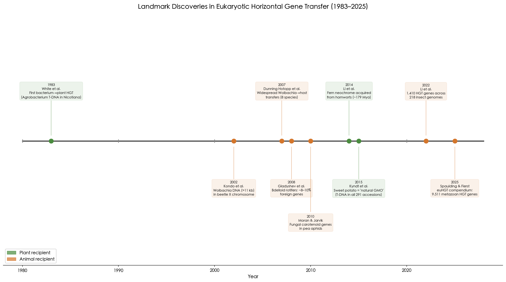

**Figure 1.** Timeline of landmark discoveries in eukaryotic HGT. Green markers denote plant recipients; orange markers denote animal recipients. The progression from isolated case reports (1983–2008) to systematic genome-scale surveys (2022–2025) illustrates the field's maturation.

**1983 — The first natural bacterium-to-plant gene transfer.** White and colleagues identified *Agrobacterium* transfer DNA (cT-DNA) integrated into the genome of *Nicotiana glauca* (tree tobacco), establishing the first documented case of natural HGT from a prokaryote to a multicellular eukaryote (*Nature* 301: 348–350) [Matveeva & Lutova 2014](https://pmc.ncbi.nlm.nih.gov/articles/PMC4127661/ "Review confirming White et al. 1983").

**2002 — Wolbachia DNA in an insect chromosome.** Kondo and colleagues discovered a fragment of *Wolbachia* DNA exceeding 11 kilobases integrated on the X chromosome of the adzuki bean beetle (*Callosobruchus chinensis*). This was the first clear demonstration of endosymbiont-to-insect nuclear genome transfer (*PNAS* 99: 14280–14285) [Kondo et al. 2002](https://pmc.ncbi.nlm.nih.gov/articles/PMC137875/ "PNAS original paper").

**2007 — Widespread *Wolbachia*-to-eukaryote transfers.** Dunning Hotopp and colleagues reported *Wolbachia* DNA fragments in the nuclear genomes of four insect and four nematode species. Most dramatically, *Drosophila ananassae* harbored nearly the entire ~1 megabase *Wolbachia* genome integrated into its nuclear DNA, with some transferred genes showing evidence of transcription (*Science* 317: 1753–1756) [Dunning Hotopp et al. 2007](https://www.science.org/doi/10.1126/science.1142490 "Science original paper"). This study transformed the perception of endosymbiont-to-host transfer from an isolated oddity into a widespread phenomenon.

**2008 — Massive HGT in bdelloid rotifers.** Gladyshev, Meselson, and Arkhipova reported that bdelloid rotifers — tiny freshwater invertebrates notable for obligate asexuality — harbor approximately 8–10% foreign genes of bacterial, fungal, and plant origin. These foreign genes were concentrated in subtelomeric regions, and many proved demonstrably functional, encoding metabolic enzymes absent from other animals (*Science* 320: 1210–1213) [Gladyshev et al. 2008](https://pubmed.ncbi.nlm.nih.gov/18511688/ "Science original paper"). In the same year, Keeling and Palmer published their foundational synthesis in *Nature Reviews Genetics*, arguing that "horizontal gene transfer is far more pervasive in the eukaryotic domain than commonly recognized" — a review that remains a touchstone for the field [Keeling & Palmer 2008](https://www.nature.com/articles/nrg2386 "NRG landmark review").

**2010 — Animals that make their own carotenoids.** Moran and Jarvik discovered that pea aphids (*Acyrthosiphon pisum*) possess functional carotenoid biosynthesis genes acquired from fungi — making aphids the first known animals capable of *de novo* carotenoid synthesis. The transferred genes underlie the red-green body color polymorphism in aphid populations, with direct ecological consequences for predator avoidance (*Science* 328: 624–627) [Moran & Jarvik 2010](https://pubmed.ncbi.nlm.nih.gov/20431015/ "Science original paper").

**2014 — Fern neochrome from hornworts.** Li and colleagues demonstrated that ferns acquired neochrome — a chimeric photoreceptor fusing phytochrome and phototropin domains — from hornworts approximately 179 million years ago. Phylogenetic analysis showed fern neochromes nested within hornwort neochromes with alternative hypotheses rejected at *P* < 10⁻³⁰. This acquisition may have enabled fern diversification "in the shadow of angiosperms" by optimizing low-light phototropism (*PNAS* 111: 6672–6677) [Li et al. 2014](https://www.pnas.org/doi/10.1073/pnas.1319929111 "PNAS original paper").

**2015 — Sweet potato as a "natural GMO."** Kyndt and colleagues found *Agrobacterium* T-DNA sequences in all 291 tested cultivated sweet potato accessions, revealing that the world's seventh most important food crop is, in genetic terms, a naturally transgenic organism. The T-DNA regions include expressed genes, suggesting functional relevance to domestication or tuber biology (*PNAS* 112: 5844–5849) [Kyndt et al. 2015](https://www.pnas.org/doi/10.1073/pnas.1419685112 "PNAS original paper"). In the same year, Crisp and colleagues analyzed multiple vertebrate and invertebrate genomes and concluded that "HGT expression is a hallmark of both vertebrate and invertebrate genomes" (*Genome Biology* 16: 50) [Crisp et al. 2015](https://en.wikipedia.org/wiki/Horizontal_gene_transfer "Wikipedia citing Crisp et al. 2015"), though this claim would later face significant challenge (discussed in Chapter 4).

**2022 — A systematic census of insect HGT.** Li and colleagues systematically analyzed 218 high-quality insect genomes and identified 1,410 genes derived from 741 independent horizontal transfer events. Donor organisms were predominantly bacteria (79%), followed by fungi (13.8%), plants (3%), and viruses (2.6%). Among the transferred genes, one bacterial-origin gene was experimentally validated via CRISPR knockout to enhance male courtship behavior in Lepidoptera — the first functional validation of an HGT-acquired behavioral gene in animals (*Cell* 185: 2975–2987) [Li et al. 2022](https://pmc.ncbi.nlm.nih.gov/articles/PMC9357157/ "Cell 185: 2975–2987").

**2025 — The euHGT compendium.** Spaulding and Fierst compiled the most comprehensive catalog of metazoan HGT to date: 9,511 protein-coding genes identified as horizontally transferred to metazoans from bacteria, fungi, archaea, and protists, drawn from 36 published studies spanning 2000–2025 and covering 13 animal phyla. Each gene entry includes a confidence metric ranging from 1 (BLAST-based identification only) to 5 (*in situ* hybridization combined with phylogenetics). This dataset addresses a critical bottleneck: the absence of standardized empirical benchmarks for evaluating HGT detection methods [Spaulding & Fierst 2025](https://pmc.ncbi.nlm.nih.gov/articles/PMC12637581/ "bioRxiv preprint, euHGT compendium — note: pending peer review at time of writing").

## 1.6 Scope of the Problem: How Many Eukaryotic HGT Events Are Now Cataloged?

The cumulative evidence from the discoveries outlined above demonstrates that eukaryotic HGT, while rare compared to prokaryotic HGT, is far from negligible. The current landscape can be summarized along several dimensions.

**Scale by lineage.** Bdelloid rotifers hold the record for the highest proportion of horizontally acquired genes among animals, at approximately 8–14% of their protein-coding genes depending on species. Foreign gene proportions range from 9.5% in *Rotaria socialis* to 14.1% in *Rotaria tardigrada*, with a gain rate estimated at 12.8 genes per lineage per million years versus 2.0 losses. Desiccation-tolerant species harbor more foreign genes than permanently aquatic relatives, though even aquatic bdelloid species possess hundreds of unique foreign genes [Eyres et al. 2015](https://pmc.ncbi.nlm.nih.gov/articles/PMC4632278/ "BMC Biology 13: 90"). In insects, the Li et al. (2022) census documented 1,410 HGT-acquired genes across 218 genomes, with Lepidoptera averaging 16 HGT genes per species, Hemiptera averaging 13, and Coleoptera averaging 6 [Li et al. 2022](https://pmc.ncbi.nlm.nih.gov/articles/PMC9357157/ "Cell 185: 2975–2987"). In vertebrates, functional non-transposon HGT remains contentious — Salzberg (2017) systematically challenged earlier claims of 145 HGT genes in the human genome, and the current consensus holds that no bacterial-to-vertebrate functional gene transfer has been convincingly demonstrated beyond endogenous retrovirus (ERV) domestication. In plants, mitochondrial HGT is remarkably common among angiosperms, while nuclear HGT is best documented in parasitic lineages (e.g., 108 functional HGT genes in *Cuscuta*, 52 high-confidence events in Orobanchaceae). Figure 2 illustrates these orders-of-magnitude differences quantitatively.

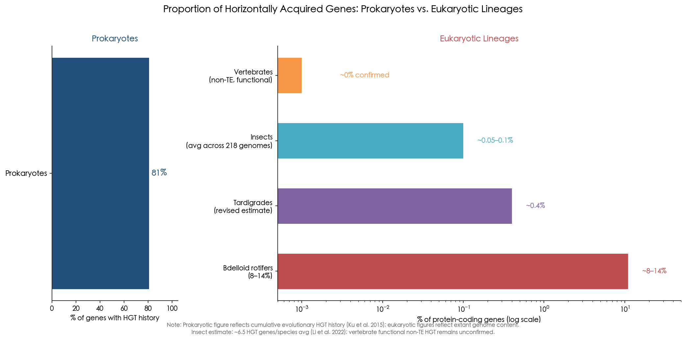

**Figure 2.** Proportion of horizontally acquired genes across prokaryotic and eukaryotic lineages. The left panel (linear scale) shows that approximately 81% of prokaryotic genes have an HGT history (Ku et al. 2015). The right panel (logarithmic scale) reveals the wide variation among eukaryotic lineages — from bdelloid rotifers (8–14%) to vertebrates (~0% confirmed functional non-TE transfers).

**The 2025 euHGT compendium.** Across all metazoans, the Spaulding and Fierst (2025) compendium catalogs 9,511 protein-coding genes as HGT-derived, spanning 13 phyla and drawn from the accumulated literature of the past quarter-century [Spaulding & Fierst 2025](https://pmc.ncbi.nlm.nih.gov/articles/PMC12637581/ "bioRxiv preprint, euHGT compendium").

**Reassessment and deflation.** The field is simultaneously expanding its catalog and pruning earlier overestimates. A 2025 reassessment of 1,170 previously reported interkingdom HGT candidates in plants found that only 29.3% (343 genes) retained phylogenetic signals consistent with HGT after reanalysis with expanded databases; 36.84% were reclassified as non-HGT, 30.6% were inconclusive, 2.14% were attributed to contamination, and 1.11% were misclassified EGT events [Aguirre-Carvajal & Armijos-Jaramillo 2025](https://onlinelibrary.wiley.com/doi/10.1002/ece3.72653?af=R "Ecology and Evolution 15: e72653"). These proportions are visualized in Figure 3. The tardigrade genome controversy, in which an initial claim of 17.5% HGT in *Hypsibius dujardini* was reduced to ~0.4% after contamination was identified, stands as a further cautionary tale (detailed in Chapter 4).

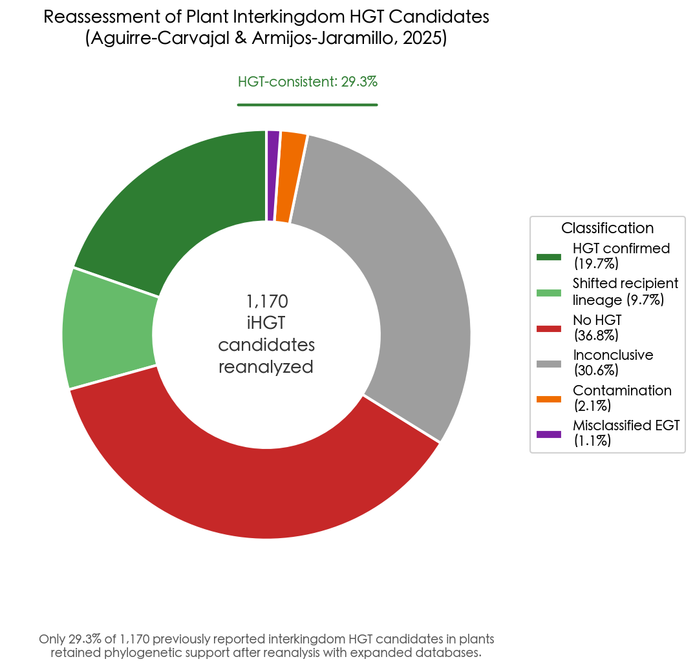

**Figure 3.** Reassessment of 1,170 previously reported plant interkingdom HGT candidates (Aguirre-Carvajal & Armijos-Jaramillo 2025). Only 29.3% retained phylogenetic support consistent with HGT after reanalysis; the majority were reclassified as non-HGT, inconclusive, contamination, or misclassified EGT.

**The intellectual arc.** Daubin and Szöllősi (2016) articulated the emerging consensus: "horizontal gene transfer has been extensive throughout the evolution of the eukaryotic domain" [Daubin & Szöllősi 2016](https://pmc.ncbi.nlm.nih.gov/articles/PMC4817804/ "Cold Spring Harbor Perspectives"). By 2025, the discourse had further matured. Huang and Wang (2025) synthesized evidence showing that HGT from microbes occurs in all major plant groups and appears especially frequent in charophytes and bryophytes — the lineages ancestral to land plants — suggesting that microbial gene acquisition played a role in the colonization of terrestrial environments [Huang & Wang 2025](https://pubmed.ncbi.nlm.nih.gov/41168025/ "Trends in Plant Science, 2025"). Mariault and colleagues (2025) reviewed hundreds of documented HGT events across the green lineage, observing that "exploring recently sequenced plant genomes across the green lineage has revealed hundreds of such HGTs" and advocating for improved detection methods to distinguish genuine transfers from artifacts [Mariault et al. 2025](https://academic.oup.com/plcell/article/37/9/koaf195/8238793 "The Plant Cell 37: koaf195").

## 1.7 From Prokaryotic Norm to Eukaryotic Exception — and Back Again

The intellectual trajectory of HGT research in non-microbial systems can be described in three phases. In the first phase (roughly 1928–1990), HGT was exclusively a prokaryotic concept; the Weismann barrier, the nuclear envelope, and the complexity hypothesis together formed a coherent theoretical case for eukaryotic immunity. In the second phase (1983–2010), a series of individual discoveries — *Agrobacterium* T-DNA in tobacco, *Wolbachia* fragments in beetle chromosomes, massive foreign gene content in bdelloid rotifers, fungal carotenoid genes in aphids — progressively eroded the categorical exclusion of eukaryotes. Each discovery could initially be dismissed as an isolated curiosity, but their cumulative weight became increasingly difficult to ignore.

The field is now firmly in its third phase: systematic genome-scale surveys have supplanted anecdotal reports. The Li et al. (2022) insect census, the Spaulding and Fierst (2025) euHGT compendium, and the Aguirre-Carvajal and Armijos-Jaramillo (2025) reassessment all represent efforts to transition from case studies to quantitative cataloging. This maturation brings its own challenges — particularly the need to distinguish genuine HGT from contamination, incomplete lineage sorting, and other artifacts (the subject of Chapter 2) — but the fundamental question has shifted. The debate is no longer *whether* HGT occurs in plants and animals, but *how often*, *through what mechanisms*, and *with what evolutionary consequences*.

The chapters that follow address these questions in sequence. Chapter 2 examines the biological routes and detection methods for eukaryotic HGT. Chapters 3 and 4 survey the evidence in plants and animals, respectively, evaluating the strength of individual cases and the ecological contexts that promote transfer. Chapter 5 synthesizes the evolutionary significance of these findings, asking whether eukaryotic HGT is merely a curiosity or a genuine force in adaptation. Chapter 6 considers methodological frontiers, unresolved questions, and the broader implications of natural HGT for our understanding of genome evolution and biosafety.

# 第2章 Mechanisms and Detection — How Genes Cross Species Boundaries in Eukaryotes

The preceding chapter established that horizontal gene transfer (HGT) in plants and animals has transitioned from theoretical impossibility to documented reality. This chapter addresses two complementary questions: through what biological routes do foreign genes enter and integrate into eukaryotic genomes, and how do researchers distinguish genuine HGT from the numerous artifacts that mimic it? Elucidating mechanisms is essential for predicting where HGT should be sought; evaluating detection methods is essential for determining whether reported cases are credible. Together, these two axes — mechanism and methodology — define both the opportunity space and the evidentiary standards for eukaryotic HGT research.

## 2.1 Mechanisms of Entry: How Foreign DNA Reaches the Eukaryotic Germline

For a horizontally transferred gene to have evolutionary consequences, it must satisfy three requirements: the foreign DNA must physically enter a recipient cell, it must integrate into nuclear chromosomal DNA (or, more rarely, organellar DNA), and it must reach the germline so that it can be inherited by subsequent generations. In prokaryotes, all three steps are facilitated by the absence of a nuclear membrane and the lack of a sequestered germline. In eukaryotes, each step faces additional barriers — but multiple biological configurations have evolved that partially or fully circumvent them. Four principal routes have been identified, each exploiting a distinct form of intimate inter-organismal contact (Figure 1).

### 2.1.1 Parasitic Plant Haustoria: Conduits for DNA and RNA Exchange

Parasitic plants constitute the most extensively documented system for HGT between multicellular eukaryotes. These organisms form haustoria — specialized feeding organs that penetrate host vascular tissue and establish direct cytoplasmic connections — through which not only nutrients but also macromolecules, including mRNA and genomic DNA fragments, flow bidirectionally.

Kim et al. (2014) demonstrated that thousands of mRNA species move between the parasitic dodder *Cuscuta pentagona* and its hosts (*Arabidopsis thaliana*, *Solanum lycopersicum*) through haustorial connections, establishing a plausible mRNA-mediated route for HGT [Kim et al. 2014](https://www.science.org/doi/10.1126/science.1253122 "Science 345:808–811"). If a host mRNA is reverse-transcribed and integrated into the parasite's nuclear genome — a process potentially mediated by endogenous retrotransposon machinery — the result would be a functional gene transfer lacking introns, identifiable by its processed (intronless) structure.

Critically, however, Yang et al. (2016) provided evidence that mRNA-mediated transfer is not the dominant route. In their analysis of 52 high-confidence HGT events across three parasitic Orobanchaceae species, the majority (24 of 28 analyzable transfers) retained intron structure conserved with the donor lineage, indicating that the transferred material was genomic DNA rather than processed mRNA [Yang et al. 2016](https://www.pnas.org/doi/10.1073/pnas.1608765113 "PNAS 113:E7010–E7019"). This distinction carries mechanistic implications: genomic DNA transfer implies that fragments of donor chromosomal DNA physically traverse the haustorial bridge and integrate into the recipient genome — a process more analogous to natural transformation in bacteria than to retroviral-mediated gene capture.

The functional significance of haustorial HGT is underscored by expression data. Yang et al. (2016) found that HGT-acquired genes in Orobanchaceae are preferentially expressed in haustorial tissue and subject to purifying selection — signatures of adaptive retention rather than neutral drift. A striking quantitative gradient emerged across the parasitism spectrum: the free-living relative *Lindenbergia* harbored only 1 detectable HGT event, the facultative hemiparasite *Triphysaria* showed 2, the obligate hemiparasite *Striga* had 10, and the holoparasite *Phelipanche aegyptiaca* possessed 34 gene families of HGT origin [Yang et al. 2016](https://www.pnas.org/doi/10.1073/pnas.1608765113 "PNAS 113:E7010–E7019"). This gradient — HGT frequency scaling with parasitic dependence — constitutes one of the strongest mechanistic arguments that intimate physical contact between organisms is the primary determinant of HGT opportunity.

Subsequent work has corroborated and extended these findings. Vogel et al. (2018) identified 108 transcribed and likely functional HGT events in *Cuscuta campestris*, confirming that parasitic plants represent genuine hotspots for gene acquisition [Vogel et al. 2018](https://pubmed.ncbi.nlm.nih.gov/31332314/ "PNAS 115:E9793–E9802").

### 2.1.2 Intracellular Endosymbionts: DNA Transfer from Within

Obligate intracellular endosymbionts circumvent the most formidable barrier to animal HGT — the Weismann barrier — by residing directly within germline cells. The most extensively characterized system is *Wolbachia*, an alphaproteobacterium infecting an estimated 40–60% of all insect species.

Dunning Hotopp et al. (2007) established the scale of *Wolbachia*-to-host nuclear transfer (termed nuclear-*Wolbachia* transfer, or NUWT) by documenting *Wolbachia* DNA insertions in the nuclear genomes of four insect and four nematode species. In the most extreme case, *Drosophila ananassae* was found to harbor nearly the entire ~1 Mb *Wolbachia* genome integrated into its nuclear DNA, with some transferred genes exhibiting evidence of transcription [Dunning Hotopp et al. 2007](https://www.science.org/doi/10.1126/science.1142490 "Science 317:1753–1756"). The underlying mechanism is conceptually straightforward: when *Wolbachia* cells lyse within host germline cells, bacterial DNA fragments are released into the cytoplasm in proximity to the host nucleus, where they can be captured and integrated during DNA repair — particularly through non-homologous end joining.

This intracellular route is not unique to *Wolbachia*. Any obligate intracellular symbiont residing within or near germline cells possesses the potential to donate DNA to its host's nuclear genome. The principle extends to the ancient endosymbiotic events that gave rise to mitochondria and plastids, where massive gene transfer from endosymbiont to host nucleus occurred over evolutionary time — a process termed endosymbiotic gene transfer (EGT) that continues at detectable rates in modern organisms. The endosymbiont pathway thus represents not merely a curiosity but the most ancient and consequential form of inter-organismal gene transfer in eukaryotic evolution.

### 2.1.3 Transposable Elements as Vehicles and Cargo

Transposable elements (TEs) occupy a dual role in eukaryotic HGT: they serve as the cargo that is transferred (horizontal transposon transfer, HTT) and, in certain configurations, as vehicles capable of facilitating the transfer of linked non-TE genes.

**BovB retrotransposons.** The BovB element, a ~3.2 kb LINE retrotransposon, has undergone at least 9 independent horizontal transfer events across vertebrates and arthropods. Walsh et al. (2013) identified BovB in mammals, reptiles, and arthropods with a phylogenetic distribution fundamentally incompatible with vertical inheritance — for example, BovB elements in ruminants and squamate reptiles share higher sequence similarity than expected given the ~300-million-year divergence of these lineages. Reptile-feeding tick species were proposed as plausible biological vectors, providing an ecological bridge for TE transfer between vertebrate classes [Walsh et al. 2013](https://pmc.ncbi.nlm.nih.gov/articles/PMC3549140/ "PNAS 110:1012–1016"). The cumulative genomic impact of BovB HTT is substantial: BovB-derived sequences contribute up to 18.4% of the cow genome, illustrating how a single horizontally acquired TE family can reshape host genome architecture.

**Mavericks/Polintons.** Widen et al. (2023) revealed a considerably more sophisticated TE-mediated transfer mechanism. *Mavericks/Polintons* are ancient virus-like TEs (~15–20 kb) that acquired a herpesvirus-like fusogen protein (MFUS-1), enabling the formation of virus-like particles capable of traversing cell membranes. This machinery facilitated widespread exchange of cargo genes — including non-TE functional genes — between divergent nematode species spanning hundreds of millions of years of evolutionary divergence [Widen et al. 2023](https://www.science.org/doi/10.1126/science.ade0705 "Science 380:eade0705"). The Maverick/Polinton system blurs the boundary between transposable element and virus, suggesting that TE-encoded membrane fusion proteins may constitute a general, previously underappreciated mechanism for inter-organismal gene transfer.

**Starship elements in fungi.** Although fungi are not the primary focus of this report, the discovery of Starship elements — giant transposons averaging ~110 kb and reaching >700 kb, mobilized by "Captain" tyrosine recombinases — merits attention for the principle it illustrates. Starship cargo includes genes for metal tolerance, xenobiotic degradation, and secondary metabolism [Gluck-Thaler et al. 2023](https://www.pnas.org/doi/10.1073/pnas.2214521120 "PNAS 120:e2214521120"). These elements demonstrate that large, self-mobilizing TEs can shuttle entire functional gene clusters between species — a principle with direct implications for understanding TE-mediated HGT across the eukaryotic domain.

### 2.1.4 Viral Vectors

Viruses that integrate into host genomes or that replicate across multiple host species can serve as molecular ferries for genetic material. Gilbert et al. (2014) demonstrated that baculoviruses mediate insect transposon transfer: viral genomes can inadvertently package host TE sequences, which are then delivered to new host species upon infection [Gilbert et al. 2014](https://www.nature.com/articles/ncomms4348 "Nature Communications 5:3348"). Piskurek and Okada (2007) proposed that poxviruses, which possess broad host ranges spanning reptiles and mammals, may transfer retroposons between these distantly related vertebrate groups [Piskurek & Okada 2007](https://www.pnas.org/doi/10.1073/pnas.0700531104 "PNAS 104:12046–12051").

The viral vector hypothesis is mechanistically attractive because it provides a plausible route for gene transfer between organisms that never share direct physical contact — a requirement that constrains the explanatory power of haustorial and endosymbiont-mediated models. Nevertheless, direct experimental demonstration of virus-mediated functional gene transfer (as distinct from TE shuttling) remains limited, and the quantitative contribution of viral vectors to the overall landscape of eukaryotic HGT awaits systematic investigation.

### 2.1.5 Environmental DNA Uptake and the Weak-Link Model

Organisms that undergo periodic desiccation — most notably bdelloid rotifers — experience membrane disruption and DNA double-strand breaks during drying. Upon rehydration in environments rich in free DNA (from co-occurring bacteria, fungi, or decaying organisms), foreign DNA fragments can be incorporated during chromosomal repair via non-homologous end joining. This mechanism has been proposed to explain the exceptionally high proportion of foreign genes in bdelloid rotifers, estimated at ~8–14% of the genome.

Huang (2013) generalized this concept as the "weak-link model," which posits that organisms with accessible germline cells are most susceptible to HGT [Huang 2013](https://onlinelibrary.wiley.com/doi/full/10.1002/bies.201300007 "BioEssays 35:868–875"). The model identifies three categories of vulnerability: organisms with early-developing embryos exposed to the environment, organisms lacking sequestered germ lines, and organisms with dormant resting stages that undergo membrane compromise during cryptobiosis. The weak-link model yields testable predictions: lineages with externally exposed gametes (e.g., broadcast-spawning marine invertebrates) or with resting stages (tardigrades, rotifers, nematode dauers) should exhibit elevated HGT rates compared to lineages with fully internalized reproduction.

### 2.1.6 Extracellular Vesicles: An Emerging but Unproven Route

Extracellular vesicles (EVs) — membrane-bound particles released by cells — have been shown to carry DNA and transfer it between cells in several experimental systems. Fischer et al. (2016) demonstrated DNA transfer between human cell lines via EVs [Fischer et al. 2016](https://pmc.ncbi.nlm.nih.gov/articles/PMC5042424/ "PLoS ONE 11:e0163665"), and Douanne et al. (2022) showed that *Leishmania* parasites exchange drug-resistance genes through EVs. However, the relevance of EV-mediated transfer to heritable HGT in multicellular organisms remains unestablished. For EVs to contribute to heritable HGT, the transferred DNA must reach germline cells and integrate stably into nuclear chromosomes — a chain of events for which no *in vivo* evidence currently exists in plants or animals. EV-mediated transfer thus remains a plausible mechanistic hypothesis rather than a demonstrated pathway for eukaryotic HGT, and its inclusion here serves primarily to delineate the boundary between established and speculative mechanisms.

## 2.2 Detection Methods: Distinguishing Genuine HGT from Artifacts

Identifying HGT in eukaryotic genomes is methodologically challenging. A gene that appears "foreign" based on sequence similarity may reflect genuine horizontal acquisition — or it may be an artifact of contamination, incomplete lineage sorting, convergent evolution, or database biases. The history of eukaryotic HGT research is punctuated by high-profile claims that were subsequently overturned (most notably the tardigrade genome controversy discussed in Section 2.3), underscoring that robust detection methodology is as critical as the biological discoveries themselves.

Three broad categories of detection methods are employed, each with distinct strengths and limitations: compositional approaches, similarity-based screening, and phylogenomic validation. These methods are typically deployed in a staged pipeline, with each successive step imposing more stringent evidentiary requirements (Figure 2).

### 2.2.1 Compositional Approaches: GC Content and Codon Usage

The earliest HGT detection methods exploited the observation that recently transferred genes often retain the compositional signatures of their donor genome. A bacterial gene recently integrated into a eukaryotic genome may exhibit a GC content, codon usage bias, or dinucleotide frequency distinct from the surrounding host DNA.

These methods, however, suffer from a fundamental limitation: amelioration. Over evolutionary time, horizontally acquired sequences are subjected to the same mutational biases as the host genome, gradually erasing the donor's compositional signature. Koski et al. (2001) demonstrated that compositional signals decay predictably with evolutionary time, rendering these methods unreliable for detecting ancient HGT events — precisely the category of transfers most likely to have been retained because they confer adaptive benefits [Koski et al. 2001](https://academic.oup.com/mbe/article/18/3/404/1070883 "Molecular Biology and Evolution 18:404–412"). Compositional approaches are therefore most useful as a preliminary screen for recent transfers but cannot serve as standalone evidence for HGT.

### 2.2.2 Similarity-Based Screening: The Alien Index

The Alien Index (AI) approach represents a significant methodological advance over compositional methods. The AI compares the best BLAST hit of a query gene against two databases — one representing the expected taxonomic group (the "ingroup") and one representing potential donors (the "outgroup") — and computes a score reflecting the degree to which the gene is more similar to the outgroup than to the ingroup.

**Alienness** (Rancurel et al. 2017) implements this approach as a web-based server that rapidly screens entire proteomes for HGT candidates. Validation on plant-parasitic nematodes established that an AI threshold > 14 effectively eliminates false positives [Rancurel et al. 2017](https://pmc.ncbi.nlm.nih.gov/articles/PMC5664098/ "Genes 8:248").

**HGTphyloDetect** (Yuan et al. 2023) combines AI scoring with automated phylogenetic validation, achieving 98.16% accuracy, 87.57% sensitivity, and 98.49% specificity at an AI threshold ≥ 45. The tool first screens for candidate HGT genes using the Alien Index, then subjects candidates to phylogenetic tree construction and topology testing to confirm or reject the HGT hypothesis [Yuan et al. 2023](https://pmc.ncbi.nlm.nih.gov/articles/PMC10025432/ "Briefings in Bioinformatics 24:bbad035"). This two-stage pipeline — rapid computational screening followed by phylogenetic validation — has become the standard workflow for eukaryotic HGT identification and represents the current methodological state of the art.

### 2.2.3 Phylogenomic Validation: The Gold Standard

Phylogenetic analysis remains the gold standard for confirming HGT. The underlying logic is straightforward: if a gene was vertically inherited, its phylogenetic tree should be congruent with the species tree; if it was horizontally transferred, the gene tree will show the recipient lineage nested within or sister to the donor clade, producing a topology incongruent with established species relationships.

Robust phylogenetic confirmation demands several elements: (1) adequate taxon sampling to avoid the artifact of apparent incongruence caused by missing lineages; (2) appropriate substitution models that account for rate heterogeneity; (3) statistical support measures (bootstrap values, posterior probabilities); and (4) formal topology testing (e.g., approximately unbiased tests) to reject the null hypothesis of vertical inheritance. The importance of taxon sampling warrants particular emphasis. Yang et al. (2016) demonstrated that 71% of false-positive HGT candidates in their Orobanchaceae study were attributable to insufficient taxon representation, which created artifactual topological incongruence [Yang et al. 2016](https://www.pnas.org/doi/10.1073/pnas.1608765113 "PNAS 113:E7010–E7019"). This finding underscores that phylogenetic validation is only as strong as the taxonomic completeness of the underlying databases.

### 2.2.4 VHICA: Discriminating Vertical from Horizontal Transposon Transfer

Horizontal transposon transfer (HTT) requires specialized detection methods because TEs lack orthologs in the traditional sense — they are repetitive, often degenerate, and governed by distinct evolutionary dynamics that confound standard phylogenetic approaches. Wallau et al. (2016) developed VHICA (Vertical and Horizontal Inheritance Consistence Analysis), an R-package that discriminates vertical from horizontal TE transmission by comparing the synonymous substitution rate (d_S) and effective number of codons (ENC) between TE copies and host single-copy orthologous genes across species pairs. The rationale is that vertically inherited TE families should accumulate mutations in parallel with host genes, whereas horizontally transferred TEs will show anomalously low d_S relative to host gene divergence between the species pair [Wallau et al. 2016](https://pubmed.ncbi.nlm.nih.gov/26685176/ "Molecular Biology and Evolution 33:1094–1109").

Validation on *Drosophila* TE families with well-characterized evolutionary histories confirmed VHICA's reliability. Application to 26 mariner lineages across 20 *Drosophila* genomes detected HTT in 24 of them, with multiple independent HTT events identifiable within single mariner lineages. VHICA has subsequently been adopted in studies of Maverick/Polinton transfer across nematodes [Widen et al. 2023](https://www.science.org/doi/10.1126/science.ade0705 "Science 380:eade0705") and in broader analyses of HTT dynamics across eukaryotic lineages, establishing it as the principal tool for HTT detection in the current methodological toolkit.

## 2.3 The Tardigrade Genome Controversy: A Cautionary Tale

No episode better illustrates the methodological perils of HGT detection than the tardigrade genome controversy of 2015–2016, which has become the field's canonical case study in distinguishing genuine transfer from contamination artifacts.

In 2015, Boothby et al. published the first genome of the tardigrade *Hypsibius dujardini* and reported that 17.5% of its genes (6,663 of 39,532 predicted genes) were of HGT origin — a proportion that would have made it the most chimeric animal genome ever documented. The authors performed multiple validation checks: phylogenetic analysis of a 107-gene subsample (of which 101 supported HGT), long-read sequencing confirmation, PCR amplification bridging putative HGT genes with native flanking sequences (58 of 59 confirmed), and spliceosomal intron detection in 57% of candidate HGT genes [Boothby et al. 2015](https://pubmed.ncbi.nlm.nih.gov/26598659/ "PNAS 112:15976–15981").

Within months, Koutsovoulos et al. (2016) published a resequenced *H. dujardini* genome and identified the source of the discrepancy. Flow cytometry established a genome size of ~110 Mb — over 100 Mb smaller than the original inflated assembly. Using GC-content versus read-coverage plots (blobplots), Koutsovoulos et al. identified extensive contamination in both genome assemblies: bacterial and other non-tardigrade sequences had been incorporated into the assembly as genuine scaffolds. After contamination removal, the cleaned genome assembly comprised ~135 Mb encoding 23,021 proteins, and only 94 genes (0.4% of the total) could confidently be identified as HGT-derived — 49 from other eukaryotes and 55 from bacteria [Koutsovoulos et al. 2016](https://pmc.ncbi.nlm.nih.gov/articles/PMC4983863/ "PNAS 113:5053–5058"). This level of HGT is comparable to that observed in other eukaryotic organisms. The contrast between the two assemblies is illustrated in Figure 3.

![Figure 3. GC-content versus sequencing coverage blobplots for the tardigrade *H. dujardini* genome. Left: the original contaminated assembly (Boothby et al. 2015), showing distinct bacterial clusters at low coverage alongside host sequences at high coverage, yielding an inflated assembly of ~212 Mb and 6,663 putative HGT genes (17.5%). Right: the decontaminated assembly (Koutsovoulos et al. 2016), with contamination clusters removed, yielding ~135 Mb and only 94 high-confidence HGT candidates (0.4%). Based on published data characteristics.](assets/chapter_02/chart_03.png)

The tardigrade controversy exposed several critical vulnerabilities in HGT detection methodology. PCR validation, long considered a gold standard for confirming that foreign genes reside on the same physical DNA molecule as native genes, proved insufficient: chimeric PCR artifacts can bridge contaminating and native sequences in complex, mixed-organism DNA samples. Similarly, intron presence was not diagnostic of host-genome integration, because contaminating eukaryotic DNA (from protists, fungi) also contains spliceosomal introns. The blobplot approach — plotting GC content against sequencing read coverage for each scaffold — proved far more effective at revealing contamination, because contaminant scaffolds typically display GC-coverage signatures distinct from those of the target organism's DNA.

## 2.4 Toward Rigorous Standards: The Richards and Monier Guidelines

In direct response to the tardigrade controversy, Richards and Monier (2016) proposed six guidelines for rigorous HGT identification in eukaryotic genomes. These guidelines have since become the field's informal quality standard and merit enumeration in full [Richards & Monier 2016](https://pmc.ncbi.nlm.nih.gov/articles/PMC4983848/ "PNAS 113:4892–4893"):

1. **Treat de novo genome assemblies as metagenomes.** Contamination is unavoidable in genome sequencing; blobplot analysis and database-informed screening should be standard practice before any HGT analysis.

2. **Pre-sequencing contamination screening.** DNA samples should be tested for contamination using environmental small-subunit rDNA-based protocols targeting both 18S and 16S markers prior to library preparation and sequencing.

3. **Replicate genome assemblies.** Where possible, multiple genome assemblies from different individuals of the same species — and from related taxa — should be sequenced to validate candidate HGT events and determine the phylogenetic point of acquisition.

4. **Phylogenetic validation of all candidates.** Every putative HGT gene must be subjected to phylogenetic analysis demonstrating topological support (bootstrap values and alternative topology tests) for the recipient lineage nesting within or sister to the donor clade.

5. **Synteny confirmation.** Candidate HGT genes should be confirmed as residing on native chromosomal scaffolds adjacent to vertically derived genes, using long-read or linked-read sequencing data where available.

6. **Transcriptional validation.** Putative HGT genes should be confirmed as transcriptionally active in the recipient organism, with verification of intron architecture and functional expression.

These guidelines represent progressively stringent levels of evidence. A candidate HGT gene that satisfies all six criteria — contamination screening, replicate genome validation, phylogenetic support, syntenic integration, and transcriptional activity — can be considered a high-confidence transfer. Candidates satisfying only criteria 1 and 4 (decontaminated assembly plus phylogenetic support) are considered provisional but reportable.

## 2.5 Major Sources of False Positives and Their Mitigation

Beyond contamination, several biological and analytical phenomena can produce false-positive HGT signals. A systematic understanding of these error sources is essential for evaluating the reliability of any reported HGT event.

**Insufficient taxon sampling.** When key lineages are absent from sequence databases, a gene may appear phylogenetically incongruent simply because its true vertical relatives are unrepresented. Yang et al. (2016) found that 71% of false-positive HGT candidates in their parasitic plant study were attributable to insufficient taxon sampling [Yang et al. 2016](https://www.pnas.org/doi/10.1073/pnas.1608765113 "PNAS 113:E7010–E7019"). The rapid expansion of genomic databases has already reclassified many previously reported HGT events: the 2025 reassessment of plant interkingdom HGT (iHGT) by Aguirre-Carvajal and Armijos-Jaramillo reanalyzed 1,170 previously reported candidates and found that expanded databases revealing previously unsampled eukaryotic homologs constituted the single largest driver of overestimation, accounting for a substantial fraction of the 70.7% of candidates that could no longer be confidently classified as HGT [Aguirre-Carvajal & Armijos-Jaramillo 2025](https://onlinelibrary.wiley.com/doi/10.1002/ece3.72653?af=R "Ecology and Evolution 15:e72653").

**Contamination.** As the tardigrade case illustrates (Section 2.3), sequences from co-cultured, commensal, or environmentally co-occurring organisms can be incorporated into genome assemblies. Ravenhall et al. (2015) identified contamination as one of the most pervasive sources of false-positive HGT reports, particularly in genomes assembled from short-read data without reference-guided scaffolding [Ravenhall et al. 2015](https://journals.plos.org/ploscompbiol/article?id=10.1371/journal.pcbi.1004095 "PLoS Computational Biology 11:e1004095").

**Incomplete lineage sorting (ILS).** Deep coalescence can produce gene trees that conflict with species trees even in the complete absence of HGT. Distinguishing ILS from HGT requires either dense taxonomic sampling — to demonstrate that the recipient is nested *within* the donor clade rather than merely sister to it — or additional genomic evidence such as synteny and intron structure.

**Assembly artifacts and frame-shift errors.** Chimeric scaffolds, in which contiguous sequences from different organisms are erroneously joined during assembly, can create the appearance of foreign genes flanked by native sequences. Frame-shift errors in gene prediction can similarly produce spurious BLAST hits to distantly related taxa.

**Compositional amelioration masking ancient transfers.** As discussed in Section 2.2.1, ancient HGT events are invisible to compositional methods because the foreign sequence has equilibrated to the host genome's mutational biases. This creates a detection asymmetry: compositional methods preferentially detect recent transfers (which may not yet be functionally integrated) while systematically missing ancient transfers (which are more likely to be adaptive and evolutionarily significant).

## 2.6 The Evidence Hierarchy: An Integrated Framework

Drawing on the mechanisms, detection tools, and pitfalls described above, we propose a three-tier evidence framework for evaluating reported eukaryotic HGT events, consistent with the evidence grading introduced in Chapter 1:

**Tier 1 — Functionally validated.** The transferred gene has been confirmed by phylogenetic analysis, demonstrated to reside on native chromosomal DNA, and functionally characterized through expression data, knockdown/knockout experiments, or gain-of-function assays. Examples include carotenoid biosynthesis genes in aphids (expression and color phenotype data), the *Listeria*-derived courtship gene in Lepidoptera (CRISPR knockout with quantified behavioral effects), and the cdtB toxin gene in *Drosophila* (retained DNase activity and stage-specific expression). These cases represent the strongest evidence for adaptive HGT.

**Tier 2 — Robust phylogenomic support with genomic context.** The candidate gene is supported by phylogenetic analysis with adequate taxon sampling, resides in a decontaminated assembly, and exhibits genomic integration signatures (e.g., conserved intron structure from the donor, flanking host-derived genes, syntenic position confirmed by long reads). The majority of well-characterized parasitic plant HGT events fall within this category.

**Tier 3 — Preliminary identification.** The gene is flagged as a candidate by BLAST-based screening (e.g., a high Alien Index score) but lacks phylogenetic validation or has been identified from a single genome assembly without contamination screening. Such candidates require further confirmation before they can be cited as evidence for HGT.

This hierarchy carries practical consequences. The 2025 reassessment of plant iHGT demonstrated that approximately 70% of previously reported candidates — most identified using Tier 3 methods or early Tier 2 approaches with limited taxon sampling — failed to survive reanalysis with expanded databases [Aguirre-Carvajal & Armijos-Jaramillo 2025](https://onlinelibrary.wiley.com/doi/10.1002/ece3.72653?af=R "Ecology and Evolution 15:e72653"). The field is converging on the principle that extraordinary claims — HGT in eukaryotes being inherently more surprising than in prokaryotes — demand proportionally rigorous evidence.

## 2.7 Synthesis: Mechanism Predicts Opportunity

The mechanisms and detection challenges reviewed in this chapter converge on a unifying principle: the probability of HGT in eukaryotes is governed primarily by physical access to the germline. Organisms characterized by intimate cellular contact between donor and recipient — parasitic plant haustoria, intracellular endosymbionts — exhibit the highest confirmed HGT rates. Organisms with environmental exposure of germline or totipotent cells — bdelloid rotifers undergoing desiccation, broadcast-spawning marine invertebrates — exhibit intermediate rates. Organisms with fully sequestered, internalized germ lines — most vertebrates — exhibit the lowest rates, dominated by transposable element transfers mediated by parasitic vectors rather than by functional gene acquisition.

This mechanistic framework generates actionable predictions. Lineages with novel forms of intimate interspecific contact — such as recently discovered intracellular symbioses between bacteria and marine invertebrates — may harbor as-yet-undiscovered HGT. Conversely, the absence of a plausible physical route should heighten skepticism toward HGT claims in lineages where no such route has been documented.

At the same time, the methodological lessons of the past decade — epitomized by the tardigrade controversy — caution that even well-supported mechanistic expectations must be confirmed by rigorous, multi-layered evidence. The analytical tools now exist to distinguish genuine HGT from artifacts at unprecedented accuracy (Figure 2), but their consistent application across the field remains an ongoing challenge. The subsequent chapters evaluate individual plant and animal HGT claims against the mechanistic expectations and evidentiary standards established here.

# 第3章 Horizontal Gene Transfer in Plants — From Organellar Exchange to Nuclear Acquisition

Plants rank among the most prolific recipients of horizontally transferred genetic material in the eukaryotic domain. From the routine exchange of mitochondrial DNA fragments between distantly related flowering plants to the wholesale acquisition of nuclear genes by parasitic species, horizontal gene transfer (HGT) has left a measurable and increasingly well-characterized imprint on plant genome evolution. This chapter surveys the full spectrum of plant HGT — organellar, interkingdom, and plant-to-plant nuclear transfers — evaluates the ecological and morphological contexts that facilitate these events, and critically examines a 2025–2026 reassessment that has substantially revised estimates of interkingdom HGT (iHGT) prevalence in plant genomes. The overarching question is not merely how often foreign genes enter plant genomes, but which transfers persist, acquire function, and ultimately reshape the evolutionary trajectories of recipient lineages.

## 3.1 Mitochondrial HGT: The Pervasive Baseline

Among all forms of eukaryotic HGT, the horizontal transfer of mitochondrial sequences between plant species stands as the most extensively documented and least controversial category. Bergthorsson et al. (2003) demonstrated that horizontal transfer of standard mitochondrial genes between distantly related flowering plants is "evolutionarily frequent," fundamentally overturning the long-held assumption that plant organellar genomes evolve in a strictly vertical fashion [Bergthorsson et al. 2003](https://pubmed.ncbi.nlm.nih.gov/12853958/ "Nature 424:197–201").

The basal angiosperm *Amborella trichopoda* epitomizes the scale of this phenomenon. Bergthorsson et al. (2004) showed that *Amborella* had acquired foreign copies of 20 of its 31 known mitochondrial protein genes — 26 foreign gene copies in total — from diverse donors including other angiosperms and at least three distinct moss lineages [Bergthorsson et al. 2004](https://pubmed.ncbi.nlm.nih.gov/15598737/ "PNAS 101:17747–17752"). The mitochondrial genome of *Amborella* thus functions as a palimpsest of horizontal acquisitions: some foreign genes coexist alongside native homologs, while others have apparently replaced them.

The most systematically studied single case of plant mitochondrial HGT involves a group I intron in the *cox1* gene. Sanchez-Puerta et al. (2008) surveyed 640 angiosperms from 212 families and concluded that this self-splicing intron had been acquired via approximately 70 separate horizontal transfer events. Critically, a single initial transfer from fungi is thought to have seeded the intron into angiosperms, after which all subsequent transfers occurred between angiosperm lineages, with a strong phylogenetic bias toward within-family exchanges [Sanchez-Puerta et al. 2008](https://pubmed.ncbi.nlm.nih.gov/18524785/ "Mol Biol Evol 25:1762–1777"). This intron serves as the "canary in the coal mine" for plant mitochondrial HGT — a readily detectable marker whose transfer frequency likely underestimates the broader rate of mitochondrial sequence exchange among angiosperms. The proposed mechanism for these phylogenetically localized transfers includes illegitimate pollination, whereby aberrant cross-species pollen delivery enables mitochondrial DNA contact between otherwise reproductively isolated species.

Several intrinsic features of plant mitochondrial genomes predispose them to horizontal exchange. Plant mitochondria actively import exogenous DNA through the permeability transition pore complex; their genomes are exceptionally large and structurally dynamic, undergoing frequent recombination. These properties, combined with the propensity for mitochondrial fusion during cell dedifferentiation, create abundant opportunities for foreign DNA incorporation and long-term retention.

## 3.2 Parasitic Plants as HGT Hotspots

No ecological context facilitates plant HGT more dramatically than parasitism. The intimate physical connections formed by parasitic plant haustoria — specialized organs that penetrate host vasculature — create direct cytoplasmic bridges through which DNA and RNA traffic bidirectionally. The accumulating evidence reveals a striking pattern: the more dependent a parasitic plant lineage is on its host, the more horizontal transfers it has accumulated.

### 3.2.1 Orobanchaceae: A Gradient of Parasitic Dependence

Yang et al. (2016) provided the clearest demonstration of this dose-response relationship by examining four species spanning the full continuum of parasitic dependence within the Orobanchaceae. Among 52 high-confidence HGT events distributed across 42 gene families, the distribution was sharply asymmetric: only 1 event in the free-living autotroph *Lindenbergia*, 2 in the facultative hemiparasite *Triphysaria versicolor*, 10 in the obligate hemiparasite *Striga hermonthica*, and 34 gene families in the holoparasite *Phelipanche aegyptiaca* [Yang et al. 2016](https://www.pnas.org/doi/10.1073/pnas.1608765113 "PNAS 113:E7010–E7019"). This roughly 34-fold difference between the free-living and fully dependent species constitutes compelling evidence that the haustorial interface functions as a transfer conduit whose throughput scales with the duration and intimacy of the parasitic connection.

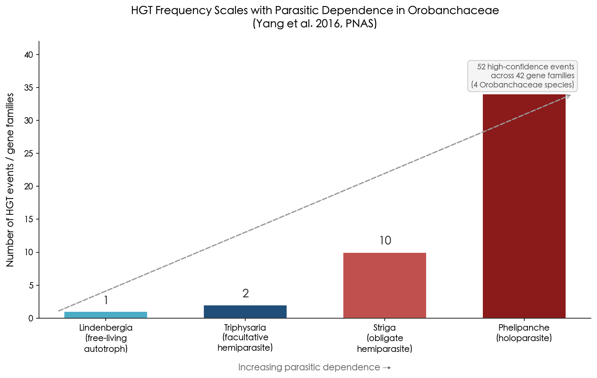

**Figure 3-1.** Number of HGT events detected in four Orobanchaceae species plotted against increasing parasitic dependence, based on Yang et al. (2016). The gradient — from 1 event in free-living *Lindenbergia* to 34 gene families in the holoparasite *Phelipanche* — illustrates the strong positive correlation between parasitic reliance and horizontal gene acquisition.

Of particular mechanistic significance, the majority of analyzable transfers (24 of 28) retained introns, indicating that genomic DNA fragments — rather than reverse-transcribed mRNA — served as the primary transfer substrate. Furthermore, horizontally acquired genes in *Phelipanche* showed preferential expression in haustorial tissues and signatures of purifying selection, consistent with functional integration into the parasitic life cycle rather than neutral genomic accumulation.

The first documented case of nuclear HGT in *Striga* was reported by Yoshida et al. (2010), who identified a monocot-derived nuclear gene in the eudicot parasite *S. hermonthica*. The transferred gene bore a poly-A-like sequence at its 3′ end, suggesting an mRNA-mediated transfer mechanism — a route distinct from the genomic DNA pathway predominant in *Phelipanche*. Remarkably, the albumin 1 xenogene has been maintained through more than 150 speciation events over approximately 16 million years in parasitic Orobanchaceae, attesting to sustained selective advantage [Yoshida et al. 2010](https://www.science.org/doi/10.1126/science.1187145 "Science 328:1128").

### 3.2.2 *Cuscuta* (Dodder): 108 Functional Stolen Genes

The genus *Cuscuta* (dodder) represents perhaps the most dramatic illustration of parasitic plant HGT. Yang et al. (2019) identified 108 transcribed and likely functional genes horizontally acquired from host species, contributing to haustorial structure, defense responses, and amino acid metabolism [Penn State University](https://www.psu.edu/news/research/story/parasitic-plants-use-stolen-genes-make-them-better-parasites "Yang et al. 2019, Nature Plants"). One of these stolen genes produces microRNAs that are transmitted back into the host plant to silence defense genes — a remarkable instance of a horizontally acquired gene being weaponized against the very lineage from which it was obtained.

Eighteen of the 108 HGT genes are shared across all surveyed dodder species, indicating acquisition by the ancestral *Cuscuta* lineage before the genus diversified. This pattern demonstrates that at least some horizontally acquired genes can persist over tens of millions of years and become integral components of a lineage's core biology. The breadth of functional categories — structural proteins, metabolic enzymes, and regulatory RNAs — challenges the assumption that plant HGT is limited to marginal or dispensable gene functions.

Kim et al. (2014) provided mechanistic context by demonstrating that thousands of mRNA species move bidirectionally between *Cuscuta pentagona* and its hosts (*Arabidopsis*, *Solanum*) through haustorial connections [Kim et al. 2014](https://www.science.org/doi/10.1126/science.1253122 "Science 345:808–811"). This massive mRNA trafficking establishes a plausible route by which foreign transcripts could be reverse-transcribed and integrated into the parasitic genome, although the relative contributions of mRNA-mediated versus genomic DNA-mediated transfer remain under active investigation.

## 3.3 Naturally Transgenic Plants: *Agrobacterium* T-DNA in Wild Species

*Agrobacterium tumefaciens* and *A. rhizogenes* are renowned for their ability to transfer T-DNA into plant cells — the very property exploited in modern plant genetic engineering. Less widely appreciated until recently is that this process has also occurred naturally, producing wild plant species that carry stably integrated bacterial T-DNA in their nuclear genomes.

The most striking example is the sweet potato (*Ipomoea batatas*). Kyndt et al. (2015) screened 291 cultivated accessions from diverse geographic origins and found that every single one contained two distinct *Agrobacterium* T-DNA regions integrated into its nuclear genome [Kyndt et al. 2015](https://pubmed.ncbi.nlm.nih.gov/25902487/ "PNAS 112:5844–5849"). The universality of this insertion across all cultivated accessions, combined with its absence in most wild *Ipomoea* relatives, suggests that the transfer predated domestication and may have contributed traits favored during early cultivation. Sweet potato has accordingly been characterized as a "natural GMO."

In the genus *Nicotiana* (tobacco), at least 15 species contain cellular T-DNA (cT-DNA) derived from *A. rhizogenes*, as reviewed by Matveeva & Lutova (2014) [Matveeva & Lutova 2014](https://www.frontiersin.org/journals/plant-science/articles/10.3389/fpls.2014.00326/full "Frontiers Plant Sci. 5:326"). The earliest discovery of natural *Agrobacterium*-to-plant gene transfer was in *Nicotiana glauca* by White et al. in 1983 — a finding that constituted the first documented case of bacterium-to-plant HGT in nature.

*Linaria vulgaris* (common toadflax) also harbors T-DNA, although in this species the *rol* genes are pseudogenized, indicating that fixation occurred but functional maintenance did not. A broader screen of 127 dicot species from 38 families detected T-DNA only in *Linaria*, confirming that germline fixation of *Agrobacterium* T-DNA is a rare event despite the bacterium's ubiquity in soil environments. More recent surveys have expanded the catalogue of naturally transgenic dicot species to over 30, including peanut, walnut, tea, and banana [Pinto et al. 2022](https://pmc.ncbi.nlm.nih.gov/articles/PMC9471246/ "Frontiers Bioeng Biotechnol 10:971402").

## 3.4 Interkingdom HGT: Fungi, Bacteria, and the Plant Nuclear Genome

Beyond organellar transfers and parasitic exchanges, a growing body of evidence documents interkingdom gene acquisitions that have endowed plants with entirely novel biochemical capabilities.

### 3.4.1 Fungal-to-Plant Transfers: Disease Resistance and Beyond

One of the most agriculturally consequential HGT events in plants involves the *Fhb7* gene, which confers broad-spectrum resistance to Fusarium head blight — a devastating cereal disease responsible for billions of dollars in annual crop losses worldwide. *Fhb7* was horizontally transferred from the endophytic fungus *Epichloë* to the wild wheat relative *Thinopyrum elongatum*. The gene encodes a glutathione S-transferase (GST) that detoxifies trichothecene mycotoxins produced by *Fusarium* pathogens, and it has since been introgressed into modern bread wheat cultivars, where it provides durable disease protection [Wang et al. 2020 via Azad et al. 2025](https://pmc.ncbi.nlm.nih.gov/articles/PMC12451028/ "citing Wang et al. 2020, Science 368:eaba5435"). The *Fhb7* case illustrates a recurring theme: endophytic or symbiotic fungi, which maintain prolonged intimate contact with plant tissues, serve as donors of genes whose products confer direct ecological advantages to the recipient.

Additional fungus-to-plant transfers have been documented in other systems. Shinozuka et al. (2017) identified a β-1,6-glucanase gene transferred from a fungal endophyte to perennial ryegrass, while Kfoury et al. (2024) demonstrated that multiple HGT events from fungi shaped the diversity of plant glycosyl hydrolases — enzymes central to cell wall remodeling and carbohydrate metabolism. Collectively, these cases suggest that fungal endophytes constitute an underappreciated reservoir of genetic innovation for their plant hosts.

### 3.4.2 Land Colonization: Did 57 Microbial Gene Families Enable the Aquatic-to-Terrestrial Transition?

Yue et al. (2012) proposed that 57 gene families were horizontally transferred from soil-dwelling microbes to the ancestors of land plants, encoding enzymes critical for starch biosynthesis, plant hormone metabolism, xylem formation, and pathogen defense — functions that would have been indispensable for the transition from aquatic to terrestrial environments approximately 470 million years ago [via Azad et al. 2025](https://pmc.ncbi.nlm.nih.gov/articles/PMC12451028/ "citing Yue et al. 2012, Nat Commun 3:1152"). If confirmed, these transfers would represent a foundational contribution of HGT to one of the most consequential events in plant evolution.

However, the 2025 reassessment discussed in Section 3.7 has cast considerable doubt on many early iHGT claims, including some of the candidates reported by Yue et al. The core challenge lies in distinguishing genuine ancient transfers from artifacts produced by incomplete taxonomic sampling in genomic databases — a problem that grows more acute the further back in evolutionary time the putative transfer occurred.

## 3.5 Plant-to-Plant Nuclear HGT: Photosynthesis and Ecological Diversification

While parasitic interactions account for the majority of documented plant-to-plant nuclear transfers, several notable cases involve non-parasitic species and illustrate the potential for HGT to drive major adaptive innovations.

### 3.5.1 Fern Neochrome: A 179-Million-Year-Old Gift from Hornworts

Li et al. (2014) demonstrated that ferns acquired neochrome — a chimeric photoreceptor combining phytochrome and phototropin domains — from hornworts approximately 179 million years ago. Phylogenetic analysis placed fern neochromes unambiguously within the hornwort neochrome clade, with alternative hypotheses of vertical inheritance rejected at *P* < 10⁻³⁰ [Li et al. 2014](https://www.pnas.org/doi/10.1073/pnas.1319929111 "PNAS 111:6672–6677").

The evolutionary significance of this single HGT event is substantial. Neochrome optimizes phototropic responses under low-light conditions — precisely the ecological niche that ferns would have needed to exploit as angiosperm canopies expanded during the Cretaceous. Li et al. proposed that neochrome acquisition may have enabled the Cretaceous–Tertiary radiation of polypod ferns "in the shadow of angiosperms," a diversification event that produced the majority of extant fern species. Evidence for recurrent fern-to-fern secondary transfers of neochrome further suggests that once this advantageous gene entered the fern lineage, it spread laterally within it — a cascade of horizontal inheritance driven by the fitness advantage the photoreceptor confers.

### 3.5.2 C₄ Photosynthesis Genes: Pre-Optimized Components Transferred Between Grasses

C₄ photosynthesis, a carbon-concentrating mechanism that confers higher productivity under warm and arid conditions, has evolved independently more than 60 times in flowering plants. Christin et al. (2012) revealed that lateral gene transfer played a direct role in this repeated convergence. In the grass lineage *Alloteropsis*, which includes both C₃ and C₄ species, fundamental elements of the C₄ pathway were acquired via a minimum of four independent lateral gene transfers from C₄ donor grasses that diverged from *Alloteropsis* more than 20 million years ago [Christin et al. 2012](https://pubmed.ncbi.nlm.nih.gov/22342748/ "Current Biology 22:445–449"). Because the transferred genes were already fully adapted for C₄ function in their donor lineages, *Alloteropsis* received "pre-optimized" photosynthetic components — an evolutionary shortcut unavailable through *de novo* mutation alone.

Building on this finding, Hibdige et al. (2021) showed that *Alloteropsis semialata* has acquired a total of 59 functional genes from at least nine donor grass species, encompassing not only photosynthesis but also disease resistance and stress tolerance. Species with rhizomatous growth forms acquired more horizontally transferred genes, likely because rhizomes expose meristematic — and potentially germline-adjacent — cells to soil microbiota and root-to-root contact with neighboring grasses [Hibdige et al. 2021 via Azad et al. 2025](https://pmc.ncbi.nlm.nih.gov/articles/PMC12451028/ "citing Hibdige et al. 2021, New Phytol 230:2474–2486"). This observation reinforces the broader principle, also evident in the Orobanchaceae data, that intimate physical contact between donor and recipient tissues is a prerequisite for efficient plant-to-plant nuclear HGT.

## 3.6 The Mycorrhizal Question: An Intuitively Plausible Route That Remains Undemonstrated

Given the ubiquity of mycorrhizal symbioses — connecting the roots of over 80% of land plant species through fungal hyphal networks — it is natural to ask whether these "wood wide web" connections could facilitate DNA transfer between plant species. As of 2026, the answer is that this route remains undemonstrated. Li et al. (2018) documented HGT *to* mycorrhizal fungi from plants, but no study has convincingly shown plant-to-plant DNA transfer mediated by mycorrhizal networks [Li et al. 2018](https://www.frontiersin.org/journals/plant-science/articles/10.3389/fpls.2018.00701/full "Frontiers Plant Sci. 9:701"). The distinction is important: while mycorrhizal hyphae create physical connections between roots of different species, the cytoplasmic continuity they provide is not equivalent to the direct vascular bridges formed by parasitic plant haustoria, and the selective pressures favoring retention of transferred genes in a non-parasitic context are substantially weaker. Whether future studies employing more sensitive genomic detection methods will identify mycorrhizal-mediated plant-to-plant transfers remains an open question.

## 3.7 The 2025 Reassessment: How Many Plant iHGT Claims Survive Scrutiny?

The most consequential methodological development in plant HGT research in recent years has been a rigorous reassessment of the scale of interkingdom transfers. Aguirre-Carvajal & Armijos-Jaramillo (2025) reanalyzed 1,170 previously reported iHGT candidates in Plantae and found that only 29.3% (343 candidates) retained phylogenetic signals consistent with iHGT upon updated homology searches. Among these, 19.66% (230) were classified as probable HGT and 9.66% (113) showed shifted recipient-lineage placement. The remaining candidates were reclassified: 36.84% (431) as NoHGT, 30.6% (358) as inconclusive, 2.14% (25) as contamination, and 1.11% (13) as misclassified endosymbiotic gene transfer (EGT) [Aguirre-Carvajal & Armijos-Jaramillo 2025](https://onlinelibrary.wiley.com/doi/10.1002/ece3.72653?af=R "Ecology and Evolution 15:e72653").

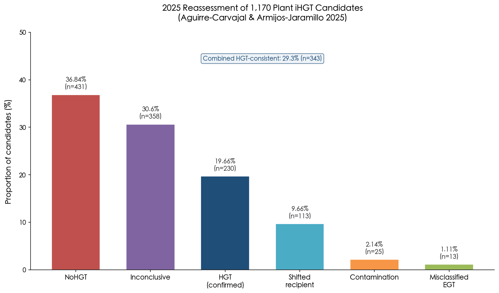

**Figure 3-2.** Reclassification of 1,170 previously reported plant iHGT candidates by Aguirre-Carvajal & Armijos-Jaramillo (2025). Only 29.3% of candidates (n = 343, combining "HGT confirmed" and "Shifted recipient") retained phylogenetic signals consistent with interkingdom horizontal gene transfer; the largest single category was NoHGT (36.84%).

The primary drivers of this dramatic downward revision were threefold. First, the expansion of genomic databases between the original studies and the reassessment revealed previously unsampled eukaryotic homologs that transformed phylogenetic topologies from apparently cross-kingdom to within-kingdom. Second, contamination in genome assemblies — a problem documented by Bálint et al. (2024) across 844 eukaryotic genomes — contributed a small but non-trivial fraction of false positives. Third, some candidates initially classified as iHGT proved to be misidentified EGT events — transfers from chloroplast or mitochondrial genomes to the nucleus, rather than from external organisms.

A follow-up perspective by Armijos-Jaramillo & Aguirre-Carvajal (2026) in *Frontiers in Plant Science* further sharpened this critique by introducing the concept of "last-one-out" patterns — phylogenetic topologies in which the majority of species in a clade have lost a particular gene, leaving it retained in only one or a few descendants. Such topologies can mimic the phylogenetic incongruence signature traditionally interpreted as evidence of HGT. The authors argued that differential gene loss, which requires fewer evolutionary assumptions than horizontal transfer, can produce trees effectively indistinguishable from iHGT [Armijos-Jaramillo & Aguirre-Carvajal 2026](https://www.frontiersin.org/journals/plant-science/articles/10.3389/fpls.2026.1789570/full "Front. Plant Sci. 17:1789570"). They further demonstrated that sensitivity to database composition is a critical and underappreciated source of instability: reanalyzing the same candidates with different reference databases (NCBI NR alone versus NCBI NR plus Phytozome and Genome Warehouse) yielded validation rates of 32.2% versus 25.5%, respectively. The taxonomic sampling gap is severe — the Catalogue of Life lists 12,253 Bryophyta species, yet only 155 genomes were available in NCBI as of November 2025 — implying that many current iHGT interpretations may simply reflect incomplete phylogenetic coverage rather than genuine cross-kingdom transfer.

These findings demand a recalibration of the field's expectations. Studies such as Ma et al. (2022; 593 events), Wu et al. (2024; 322 events), and Li et al. (2022; 235 abiotic-stress-associated genes) collectively reported over 1,300 putative iHGT events in just five years. If only approximately 25–30% withstand updated scrutiny, the validated count drops to roughly 300–400 events across these datasets — still a substantial number, but one that fundamentally shifts the narrative from "iHGT is pervasive in plant genomes" to "iHGT is genuine but considerably less common than initially proposed."

## 3.8 Synthesis: What Remains Robust After Critical Evaluation?

Despite the reassessment's sobering implications for aggregate iHGT counts, the best-supported cases of plant HGT remain unshaken and carry profound evolutionary significance.

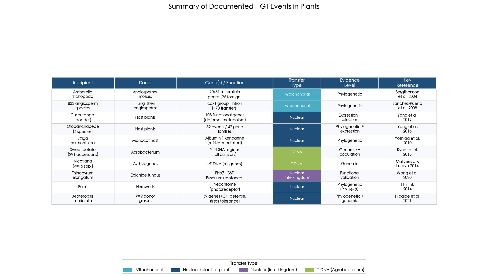

**Figure 3-3.** Summary of the principal documented HGT events in plants discussed in this chapter, categorized by transfer type (mitochondrial, nuclear plant-to-plant, nuclear interkingdom, and *Agrobacterium* T-DNA). Evidence levels range from phylogenetic inference alone to full functional validation. See main text for detailed discussion of each case.

The following five conclusions emerge from the evidence surveyed in Sections 3.1–3.7:

1. **Mitochondrial HGT is pervasive and beyond dispute.** The approximately 70 independent transfers of the *cox1* intron alone, together with the massive foreign gene accumulation in *Amborella*, establish that plant mitochondrial genomes are routinely exposed to and integrate foreign DNA.

2. **Parasitic plant nuclear HGT is robust, extensively documented, and functionally relevant.** The 108 functional genes in *Cuscuta*, the 52 events in Orobanchaceae with their dose-response relationship to parasitic dependence, and the long-term maintenance of the albumin 1 xenogene in *Striga* all satisfy the most stringent evidence criteria: phylogenetic incongruence, genomic context (intron retention, syntenic position), expression data, and purifying selection.

3. **Naturally transgenic plants are confirmed across multiple species and accessions.** Sweet potato represents a particularly well-verified case, with *Agrobacterium* T-DNA detected in all 291 globally sampled cultivars, and over 30 dicot species now recognized as carrying natural T-DNA insertions.

4. **Adaptive nuclear HGT is demonstrated in selected cases with strong functional evidence.** Neochrome in ferns (a chimeric photoreceptor enabling low-light diversification), *Fhb7* in wheat relatives (Fusarium resistance via a horizontally acquired GST), and C₄ photosynthesis genes in *Alloteropsis* (pre-optimized photosynthetic components) each illustrate how a single transfer event can confer a substantial fitness advantage.

5. **The scale of interkingdom bacterial-to-plant nuclear HGT remains under active revision.** The validated fraction (approximately 29% of previously claimed events) is non-trivial in absolute terms but substantially lower than the field assumed prior to 2025. The 2025–2026 critique does not argue that plant iHGT is nonexistent — rather, it demonstrates that current methods are insufficient to distinguish it reliably from differential gene loss, incomplete lineage sorting, and database artifacts at the scale previously claimed.

We conclude that HGT has genuinely shaped plant genome evolution, but its contribution is concentrated in specific ecological contexts — parasitism, endophytic symbiosis, and organellar exchange — rather than constituting a diffuse, genome-wide phenomenon. The cases that survive rigorous scrutiny tend to involve genes with clear adaptive functions, suggesting that natural selection plays an active role in retaining horizontally acquired material. A single event such as the neochrome transfer can alter the evolutionary trajectory of an entire clade, underscoring that the significance of HGT in plants should be measured not by event frequency alone but by the magnitude of phenotypic and ecological consequences each event produces.

# 第4章 Horizontal Gene Transfer in Animals — Endosymbionts, Parasites, and Unexpected Acquisitions

If horizontal gene transfer (HGT) was once considered improbable in plants, it was deemed even more implausible in animals. The Weismann barrier — the strict developmental separation between germline and soma in most metazoans — imposes an additional obstacle absent in plants, whose germ cells arise late from somatic meristems. For a foreign gene to become heritable in an animal, it must reach and integrate into the genome of a germline cell: a requirement that dramatically narrows the window of opportunity compared with organisms lacking sequestered germ lines. Nevertheless, a growing body of genomic, transcriptomic, and functional evidence now demonstrates that HGT has shaped the genomes and biology of diverse animal lineages, from microscopic rotifers to agricultural pest insects and even vertebrates. This chapter surveys the most compelling cases of animal HGT, organized by donor–recipient interaction type, evaluates the functional consequences of transferred genes, and closes with a comparative assessment of animal versus plant HGT.

## 4.1 *Wolbachia*-to-Host Nuclear Transfers: Widespread But Mostly Silent

Among endosymbiont-mediated HGT events in animals, those involving *Wolbachia* — an alpha-proteobacterial obligate intracellular endosymbiont infecting an estimated 40–65% of all insect species — are by far the best documented. Because *Wolbachia* resides within host germline cells, it enjoys a direct physical conduit for DNA transfer to the nuclear genome, thereby bypassing the Weismann barrier entirely [Keeling & Palmer 2008](https://www.nature.com/articles/nrg2386 "Nature Reviews Genetics 9: 605–618").

The scale of *Wolbachia*-to-host nuclear transfers (NUWTs) can be extraordinary. Dunning Hotopp et al. (2007) demonstrated that nearly the entire ~1 Mb *Wolbachia* genome had been integrated into the nuclear genome of the fruit fly *Drosophila ananassae*, with a subset of transferred genes showing evidence of transcription [Dunning Hotopp et al. 2007](https://www.science.org/doi/10.1126/science.1142490 "Science 317: 1753–1756"). In nematodes, the cattle lungworm *Dictyocaulus viviparus* harbors approximately 1 Mb of *Wolbachia*-like insertions encompassing 567 identifiable genes. Yet the functional fate of these insertions is overwhelmingly one of degradation: of 61,134 transcripts examined, only 6 yielded *Wolbachia*-like expression signatures, and nearly all transferred genes had been pseudogenized [Koutsovoulos et al. 2014](https://pmc.ncbi.nlm.nih.gov/articles/PMC4046930/ "PLoS Genetics 10: e1004397").

NUWTs nevertheless carry informational value as molecular fossils of past symbiotic relationships. In filarial nematodes of the genera *Onchocerca* and *Loa loa*, which no longer harbor live *Wolbachia* infections, NUWT remnants record "palaeosymbioses" that vanished over evolutionary time [Koutsovoulos et al. 2014](https://pmc.ncbi.nlm.nih.gov/articles/PMC4046930/ "PLoS Genetics 10: e1004397"). The overarching pattern that emerges from *Wolbachia*-host transfers is one of massive but largely nonfunctional DNA accumulation: the endosymbiont's germline residence ensures high transfer frequency, yet the overwhelming majority of transferred genes degrade into pseudogenes rather than acquiring host-compatible regulatory architecture. This observation underscores a critical principle that recurs throughout this chapter: the frequency of DNA transfer events is a poor predictor of functional integration.

## 4.2 Bdelloid Rotifers: The Most Chimeric Animal Genomes Known

Bdelloid rotifers — microscopic freshwater invertebrates remarkable for obligate asexuality and extreme desiccation tolerance — hold an extraordinary distinction: the highest proportion of horizontally acquired genes documented in any animal lineage. Gladyshev, Meselson, and Arkhipova (2008) first revealed the scale of this genetic chimerism, reporting that approximately 8–10% of expressed genes in two bdelloid species appeared to originate from bacteria, fungi, and plants [Gladyshev et al. 2008](https://pubmed.ncbi.nlm.nih.gov/18511688/ "Science 320: 1210–1213"). A distinctive genomic signature accompanied these foreign genes: they were concentrated in telomeric and subtelomeric chromosomal regions, interspersed with diverse mobile genetic elements, whereas proximal gene-rich regions lacked foreign sequences and resembled the genomes of typical metazoans. Although some foreign genes were defective pseudogenes, others were intact, transcribed, and contained functional spliceosomal introns. One bacterial-origin gene, when overexpressed in *Escherichia coli*, yielded an active enzyme — providing direct proof of functional assimilation [Gladyshev et al. 2008](https://pubmed.ncbi.nlm.nih.gov/18511688/ "Science 320: 1210–1213").

Subsequent genome-scale analyses expanded and refined these findings. Eyres et al. (2015) surveyed four *Rotaria* species and found foreign gene proportions ranging from 9.5% in the permanently aquatic *R. socialis* to 14.1% in the desiccation-tolerant *R. tardigrada*, with a gain rate estimated at ~12.8 genes per lineage per million years versus only ~2.0 losses — indicating an ongoing net accumulation of foreign genetic material. These foreign genes encode metabolic enzymes capable of degrading plant, fungal, and bacterial cell walls, capabilities absent from the ancestral metazoan metabolic repertoire [Eyres et al. 2015](https://pmc.ncbi.nlm.nih.gov/articles/PMC4632278/ "BMC Biology 13: 90").

Nowell et al. (2018) provided the most rigorous cross-taxon comparison to date, confirming that bdelloid HGT levels (11.7–14.5% non-metazoan genes) are unique among protostomes; the next highest proportion was found in the annelid *Capitella teleta* at 3.6%. Approximately 80% of HGT genes are shared across all four bdelloid species examined, indicating that the bulk of foreign gene acquisition is ancient rather than recent. Importantly, the desiccation-tolerant tardigrade *Ramazzottius varieornatus* and the chironomid *Polypedilum vanderplanki* — both capable of anhydrobiosis — showed only ~1% HGT, demonstrating that desiccation tolerance alone is insufficient to explain elevated bdelloid HGT. Nowell et al. concluded that long-term asexuality, rather than desiccation per se, is the key factor driving foreign gene accumulation in bdelloids [Nowell et al. 2018](https://pmc.ncbi.nlm.nih.gov/articles/PMC5916493/ "PLoS Biology 16: e2004830").

The functional significance of this massive gene acquisition has recently received direct experimental support. Nowell et al. (2024) challenged bdelloid rotifers with the natural fungal pathogen *Rotiferophthora angustispora* and found that horizontally acquired genes were over twice as likely to be upregulated as native genes — a stronger enrichment than any other gene category tested. The horizontally acquired gene toolkit includes biosynthetic gene clusters capable of producing antibiotic-like secondary metabolites, suggesting that bdelloids have co-opted microbial chemical defense arsenals to compensate for the immunological limitations inherent to their small body size and asexual reproduction [Nowell et al. 2024](https://www.nature.com/articles/s41467-024-49919-1 "Nature Communications 15: 6065").

## 4.3 Insect HGT at Genomic Scale: 1,410 Genes Across 218 Genomes

Beyond bdelloid rotifers, insects constitute the animal group with the most extensively documented HGT. Li et al. (2022) conducted the first systematic genome-wide survey of HGT across 218 insect genomes spanning all major orders, identifying 1,410 horizontally acquired genes originating from 741 independent transfer events [Li et al. 2022](https://pmc.ncbi.nlm.nih.gov/articles/PMC9357157/ "Cell 185: 2975–2987"). The donor spectrum was dominated by bacteria (79%), followed by fungi (13.8%), plants (3%), and viruses (2.6%). Among insect orders, Lepidoptera harbored the most HGT genes (average 16 per species), followed by Hemiptera (13) and Coleoptera (6).

A striking finding concerned the post-transfer "domestication" of foreign genes. Of the 1,410 HGT genes identified, 849 had gained a total of 1,534 spliceosomal introns after integration — with 88% of these introns derived from repetitive elements. Intron acquisition proved functionally consequential: HGT genes that had gained introns exhibited approximately 11-fold higher expression than those without, suggesting that intron acquisition represents a key step in converting raw foreign DNA into functional host genes [Li et al. 2022](https://pmc.ncbi.nlm.nih.gov/articles/PMC9357157/ "Cell 185: 2975–2987"). A strong correlation (r = 0.68) also emerged between the genera of HGT donor organisms and known insect symbiont genera, with *Wolbachia* accounting for approximately 3% of all donors — reinforcing the hypothesis that intimate ecological associations (endosymbiosis, parasitism, gut microbial communities) are the primary conduits for functional gene transfer in animals.

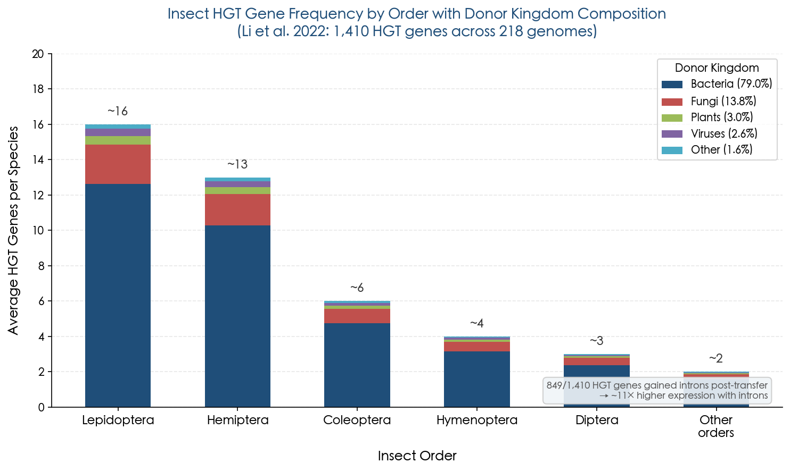

**Figure 4.1.** Average number of HGT genes per species across six major insect orders, with stacked segments indicating donor kingdom composition. Lepidoptera lead with ~16 HGT genes per species, and bacteria account for 79% of all donors. The annotation highlights that 849 of 1,410 HGT genes gained spliceosomal introns post-transfer, correlating with ~11-fold higher expression. Data from Li et al. (2022).

### Functional Highlights from Insect HGT

Several individual insect HGT events stand out for their compelling functional evidence and adaptive significance.

**Carotenoid biosynthesis in aphids and spider mites.** Moran and Jarvik (2010) demonstrated that the pea aphid *Acyrthosiphon pisum* acquired carotenoid desaturase and cyclase–synthase genes from a fungal donor — making aphids the first known animals capable of *de novo* carotenoid synthesis [Moran & Jarvik 2010](https://pubmed.ncbi.nlm.nih.gov/20431015/ "Science 328: 624–627"). These genes underlie the red–green color polymorphism in aphid populations, which directly affects predator interactions: red aphids are more conspicuous to ladybirds, while green morphs are better camouflaged on host plants. Spider mites (*Tetranychus urticae*) independently acquired homologous carotenoid genes, with red morphs exhibiting 3–6-fold higher expression than green morphs [Altincicek et al. 2012](https://pmc.ncbi.nlm.nih.gov/articles/PMC3297373/ "Biology Letters 8: 253–257"). This case represents one of the clearest examples of additive HGT — the recipient gains an entirely new biochemical capability previously absent from its entire kingdom.

**A *Listeria*-derived courtship gene in Lepidoptera.** Li et al. (2022) identified *LOC105383139*, a gene of *Listeria* bacterial origin maintained across nearly all sampled lepidopteran species with male-biased expression. CRISPR-mediated knockout in the diamondback moth *Plutella xylostella* reduced the courtship index from 84–86% to 46–48% and the mating index from 64–65% to 10–13%, yielding approximately 5–6-fold fewer offspring. This constitutes one of the most rigorous functional validations of any animal HGT event, demonstrating that a bacterial gene has been co-opted into a core behavioral pathway [Li et al. 2022](https://pmc.ncbi.nlm.nih.gov/articles/PMC9357157/ "Cell 185: 2975–2987").

**Bacterial cdtB toxin domesticated as an anti-parasitoid defense.** The cytolethal distending toxin B (cdtB) gene — originally a virulence factor in pathogenic bacteria — was horizontally transferred from APSE-2 bacteriophage into Drosophilidae (at least 3 independent events, 7–24 million years ago) and Aphididae (1 event, ~41 million years ago). The insect-encoded cdtB protein retains functional DNase activity exceeding that of *E. coli* CdtB, is under strong purifying selection, and is most highly expressed during the parasitoid-vulnerable larval stage [Verster et al. 2019](https://pmc.ncbi.nlm.nih.gov/articles/PMC6759069/ "Molecular Biology and Evolution 36: 2105–2110"). In *D. bipectinata*, a novel *cdtB::aip56* fusion gene has been identified, suggesting co-transfer of two toxin genes from the same phage source.

**Plant-derived detoxification in whiteflies.** In a remarkable example of plant-to-insect HGT, Xia et al. (2021) demonstrated that the silverleaf whitefly *Bemisia tabaci* acquired the gene *BtPMaT1* — encoding a phenolic glucoside malonyltransferase — from a plant donor. This enzyme enables the whitefly to neutralize a major class of plant defensive compounds (phenolic glycosides), effectively turning the host plant's own biochemical strategy against it. Genetically engineered tomato plants producing RNA interference molecules targeting *BtPMaT1* were lethal to whiteflies but harmless to other insects, confirming the gene's essential role in host plant exploitation [Xia et al. 2021](https://www.cell.com/cell/pdf/S0092-8674(21)00164-1.pdf "Cell 184: 1693–1705").

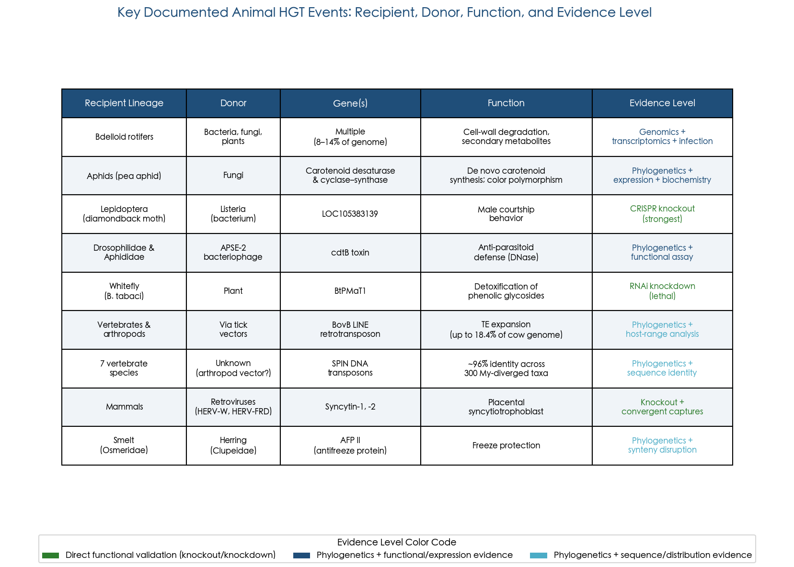

**Figure 4.2.** Summary of the principal animal HGT events discussed in this chapter, organized by recipient lineage, donor source, transferred gene(s), documented function, and strength of supporting evidence. Color coding distinguishes three tiers: direct functional validation via knockout or knockdown (green), phylogenetic evidence combined with functional or expression data (dark blue), and phylogenetic plus sequence or distributional evidence (light blue).

## 4.4 The Tardigrade Genome Controversy: A Cautionary Tale

No survey of animal HGT would be complete without addressing the tardigrade genome controversy, which has become a defining case study in the methodological perils of contamination artifacts.

In 2015, Boothby et al. reported that 17.5% of the genome of the tardigrade *Hypsibius dujardini* (6,663 of 39,532 predicted genes) derived from HGT — a figure that, if correct, would have placed tardigrades among the most chimeric animals known [Boothby et al. 2015](https://pubmed.ncbi.nlm.nih.gov/26598659/ "PNAS 112: 15976–15981"). The claim attracted widespread media attention and appeared to validate the hypothesis that desiccation tolerance facilitates massive foreign gene uptake.

Within months, however, Koutsovoulos et al. (2016) resequenced the *H. dujardini* genome using contamination-aware assembly methods and reduced the assembly from a bloated ~250 Mb to a more realistic ~110 Mb. Employing GC-coverage blobplots — a visualization technique that separates contigs by GC content and sequencing depth to distinguish host from contaminant sequences — they demonstrated that the vast majority of the purported HGT genes were bacterial and fungal contaminants from co-cultured organisms. The revised analysis identified only 94 strong HGT candidates, representing approximately 0.4% of the genome, a figure comparable to most other protostomes [Koutsovoulos et al. 2016](https://www.pnas.org/doi/10.1073/pnas.1600338113 "PNAS 113: 5053–5058").

The tardigrade episode prompted Richards and Monier (2016) to propose six guidelines for rigorous HGT identification, including mandatory contamination screening, multi-method phylogenetic validation, and assessment of genomic context (e.g., whether candidate HGT genes are flanked by host-like sequences). Subsequent analyses by Nowell et al. (2018) confirmed that the desiccation-tolerant tardigrade *Ramazzottius varieornatus* harbors only ~1% HGT — orders of magnitude less than bdelloid rotifers — reinforcing the conclusion that desiccation alone is insufficient to explain elevated HGT in any animal lineage [Nowell et al. 2018](https://pmc.ncbi.nlm.nih.gov/articles/PMC5916493/ "PLoS Biology 16: e2004830"). The tardigrade-unique Dsup protein, which suppresses X-ray-induced DNA damage by approximately 40%, represents a genuine adaptation to extreme environments but is not HGT-derived [Koutsovoulos et al. 2016](https://www.pnas.org/doi/10.1073/pnas.1600338113 "PNAS 113: 5053–5058"). The broader lesson is clear: extraordinary HGT claims demand extraordinary evidence, and contamination-aware bioinformatic pipelines are an indispensable prerequisite for any genome-scale HGT analysis.

## 4.5 Vertebrate HGT: Transposable Elements and the Frontier of Functional Gene Transfer

### Horizontal Transfer of Transposable Elements

In vertebrates, the most convincing evidence of HGT involves the horizontal transfer of transposable elements (HTT) rather than functional protein-coding genes. Two cases stand out for their taxonomic breadth and analytical rigor.

**BovB LINE retrotransposons.** BovB is a ~3.2 kb LINE retrotransposon that has undergone at least 9 independent horizontal transfer events across vertebrates and arthropods, contributing up to 18.4% of the cow genome — an extraordinary proportion for any single repeat family. Walsh et al. (2013) identified reptile tick species as the most plausible vectors: the phylogenetic distribution of BovB mirrors the host range of specific tick lineages, and ticks provide extended intimate contact with host blood and tissues during feeding, creating a plausible window for DNA exchange [Walsh et al. 2013](https://pubmed.ncbi.nlm.nih.gov/23277587/ "PNAS 110: 1012–1016").

**SPIN transposons.** Pace et al. (2008) identified Space Invader (SPIN) DNA transposons exhibiting ~96% nucleotide identity among seven distantly related vertebrate species that diverged over 300 million years ago — a level of conservation explicable only by recent horizontal transfer rather than vertical inheritance with purifying selection. The SPIN elements were found in murid rodents, a tenrec, an opossum, a bat, a frog, a lizard, and a bushbaby, implicating a parasitic vector (possibly a blood-feeding arthropod) as the transfer agent [Pace et al. 2008](https://pubmed.ncbi.nlm.nih.gov/18936483/ "PNAS 105: 17023–17028").

### Endogenous Retroviruses and Syncytin: Domestication at Its Most Consequential

Human endogenous retroviruses (HERVs) comprise approximately 8% of the human genome — remnants of ancestral retroviral infections that were integrated into the germline. While the vast majority of HERV sequences are degraded, a handful have been "domesticated" to serve essential host functions. The most celebrated examples are syncytin-1 (derived from HERV-W) and syncytin-2 (from HERV-FRD), whose envelope-derived fusogenic proteins are required for formation of the syncytiotrophoblast — the multinucleated cell layer essential for placental function. Hayward et al. (2015) demonstrated that independent syncytin captures have occurred multiple times across mammalian evolution, with different retroviral envelope genes co-opted for placentation in different lineages [Hayward et al. 2015](https://www.pnas.org/doi/10.1073/pnas.1414980112 "PNAS 112: 464–469"). This convergent domestication of retroviral genes for a fundamental reproductive function represents perhaps the most consequential known HGT event in vertebrate evolution.

### The Question of Functional Non-TE Gene Transfer in Vertebrates

Whether functional protein-coding genes — beyond TE-derived and ERV-derived sequences — have been horizontally transferred into vertebrate genomes remains one of the most contentious questions in the field. Crisp et al. (2015) claimed to identify 145 genes in the human genome acquired via HGT from bacteria, archaea, fungi, or protists. However, Salzberg (2017) systematically rebutted these claims: of 17 previously reported HGT candidates and 28 newly proposed ones, 12 and 26 respectively failed re-examination using updated, more comprehensive databases. The apparently "foreign" genes turned out to have eukaryotic homologs that had been missed owing to incomplete taxon sampling at the time of the original analyses [Salzberg 2017](https://www.researchgate.net/publication/316944848_Horizontal_gene_transfer_is_not_a_hallmark_of_the_human_genome "Genome Biology 18: 85").

The current consensus holds that, beyond ERV domestication and transposable element horizontal transfer, no bacterial-to-vertebrate functional gene transfer has been convincingly demonstrated — with one notable exception. Graham and Davies (2021) documented that the type II antifreeze protein gene in smelt (*Osmeridae*) was acquired by horizontal transfer from herring (*Clupeidae*), supported by accompanying transposable elements and disrupted gene synteny at the insertion site. The proposed mechanism — sperm-mediated uptake of environmental DNA during external fertilization in shared aquatic spawning grounds — remains speculative but physically plausible, given the well-documented capacity of sperm cells to internalize exogenous DNA [Graham & Davies 2021](https://www.sciencedirect.com/science/article/pii/S0168952521000512 "Trends in Genetics 37: 501–503").

## 4.6 Animal Versus Plant HGT: A Comparative Synthesis

The evidence surveyed in this chapter, juxtaposed with the plant HGT cases discussed in Chapter 3, reveals both instructive parallels and fundamental asymmetries between the two kingdoms.

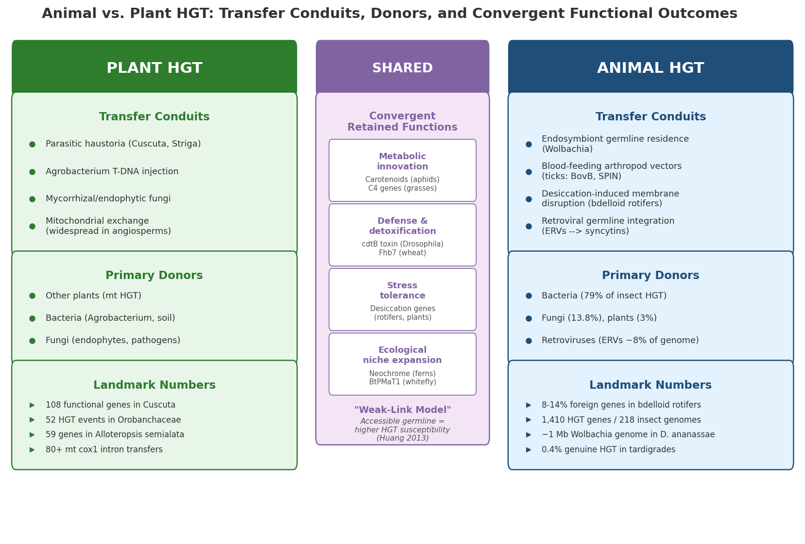

**Figure 4.3.** Structured comparison of the principal HGT conduits, donor sources, and landmark quantitative findings in plants (left) and animals (right). The central column highlights convergent functional categories of retained HGT genes across both kingdoms and the unifying "weak-link model" (Huang 2013), which posits that organisms with accessible germline cells are most susceptible to HGT.

**Frequency.** Organellar (mitochondrial) HGT is extremely common among flowering plants, with dozens of independent plant-to-plant transfers documented for single genes. Nuclear HGT in parasitic plants can be substantial — 108 functional genes in *Cuscuta*, 52 events in Orobanchaceae scaling with parasitic dependence. In animals, bdelloid rotifers (8–14% foreign genes) exceed most plant nuclear HGT proportions. Insect HGT is taxonomically broad (1,410 genes across 218 genomes) but variable across orders, averaging 2–16 genes per species. In vertebrates, functional non-TE gene transfer remains rare and contested.

**Donor sources.** Plant HGT donors are predominantly other plants (for mitochondrial transfers), bacteria (especially *Agrobacterium* for naturally transgenic species), and fungi (for nuclear genes conferring disease resistance or metabolic innovation). Animal HGT donors are predominantly bacteria (79% of insect HGT donors), followed by fungi (13.8%), with endosymbiont genera overrepresented. This divergence reflects the contrasting ecological interfaces of the two kingdoms: plants engage donors primarily through parasitic haustoria and root-associated microbiomes, while animals engage donors through endosymbiosis, parasitism, and gut microbial communities.

**Mechanisms.** In plants, the haustorium of parasitic species and *Agrobacterium*'s T-DNA injection system provide well-characterized DNA transfer conduits. In animals, the principal routes include endosymbiont residence within germline cells (*Wolbachia*), blood-feeding arthropod vectors (for transposable element transfer), and environmental DNA uptake during desiccation-induced membrane disruption (in bdelloid rotifers). The weak-link model proposed by Huang (2013) provides a unifying framework for both kingdoms: organisms with accessible germline cells — whether because germ cells arise late from somatic tissue (plants), because intracellular symbionts already occupy the germline (animals), or because desiccation disrupts cellular integrity (bdelloid rotifers) — are most susceptible to HGT [Huang 2013](https://onlinelibrary.wiley.com/doi/full/10.1002/bies.201300007 "BioEssays 35: 868–875").

**Functional outcomes.** In both kingdoms, the retained HGT genes cluster into convergent functional categories: metabolic innovation (carotenoid biosynthesis in aphids, C₄ photosynthesis genes in grasses), defense and detoxification (cdtB toxin in *Drosophila*, Fhb7 in wheat), and stress tolerance. This convergence strongly suggests that natural selection — not random chance — determines which transferred genes persist over evolutionary time. Additive HGT events that confer entirely new biochemical capabilities appear to have the highest probability of long-term retention, regardless of the recipient kingdom.

**The domestication bottleneck.** Both kingdoms illustrate that raw DNA transfer is far easier than functional integration. In plants, the 2025 reassessment by Aguirre-Carvajal and Armijos-Jaramillo revealed that only 29.3% of 1,170 previously reported interkingdom HGT candidates retained phylogenetic signals consistent with genuine HGT [Aguirre-Carvajal & Armijos-Jaramillo 2025](https://onlinelibrary.wiley.com/doi/10.1002/ece3.72653?af=R "Ecology and Evolution 15: e72653"). In animals, the *Wolbachia*-to-host transfers demonstrate the same principle in its most extreme form: near-complete endosymbiont genomes can be transferred, yet virtually all transferred genes decay into pseudogenes. The rare exceptions — genes that acquire host-compatible promoters, gain spliceosomal introns, and achieve tissue-appropriate expression — represent the tiny fraction that survive the domestication bottleneck to become adaptive assets. As the Li et al. (2022) insect data illustrate, intron acquisition may be the single most critical molecular event in this domestication process, elevating expression ~11-fold and thereby exposing the foreign gene to selection for the first time.

# 第5章 Evolutionary Significance — Rarity, Adaptation, and the Eukaryotic Tree of Life

Horizontal gene transfer in eukaryotes occupies a paradoxical position in evolutionary biology: it is rare enough that for decades it was dismissed as irrelevant to multicellular organisms, yet individual transfer events that survive natural selection can fundamentally reshape recipient biology. This chapter synthesizes evidence from plant and animal systems to evaluate whether eukaryotic HGT constitutes a genuine evolutionary force or merely a collection of curiosities. We examine the theoretical frameworks that predict which genes can be successfully transferred, the ecological circumstances that favor their retention, the functional categories of domesticated foreign genes, and the broader implications for how evolutionary history should be represented.

## 5.1 The Ratchet Model: Why Rarity Does Not Negate Significance

The quantitative gulf between prokaryotic and eukaryotic HGT is stark. Approximately 81% of genes in prokaryotic genomes have been involved in HGT at some point in evolutionary history, whereas eukaryotic HGT (excluding endosymbiotic gene transfer) typically accounts for less than 1–2% of nuclear genes in most multicellular organisms [Ku et al. 2015](https://pmc.ncbi.nlm.nih.gov/articles/PMC4547308/ "PNAS 112:10139–10146"). Bdelloid rotifers represent a conspicuous outlier at 8–14%, while insect genomes average 2–16 horizontally acquired genes per species, and no convincingly validated functional non-TE gene transfer has been established in vertebrates beyond endogenous retrovirus domestication [Salzberg 2017](https://www.researchgate.net/publication/316944848_Horizontal_gene_transfer_is_not_a_hallmark_of_the_human_genome "Genome Biology 18:85").

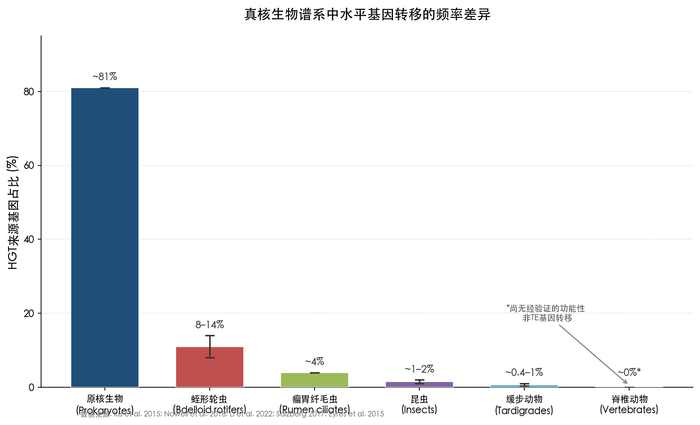

**Figure 5-1. Orders-of-magnitude variation in HGT-derived gene proportions across eukaryotic lineages.** From approximately 81% in prokaryotes to no validated functional non-TE gene transfer in vertebrates, HGT frequency spans several orders of magnitude. Bdelloid rotifers (8–14%) and rumen ciliates (~4%) constitute conspicuous outliers. Data sources: Ku et al. 2015; Nowell et al. 2018; Li et al. 2022; Salzberg 2017; Eyres et al. 2015.

This order-of-magnitude difference, however, provides a poor proxy for evolutionary significance. Doolittle (1998) proposed the "gene transfer ratchet" model, in which early phagotrophic eukaryotes inevitably lysed bacterial prey in close proximity to their nuclear DNA. Each phagocytic event provided an opportunity for bacterial gene integration; once a bacterial gene replaced a host homolog, the process was irreversible — constituting a one-way ratchet [Doolittle 1998](https://pubmed.ncbi.nlm.nih.gov/9724962/ "Trends in Genetics 14:307–311"). Soucy, Huang & Gogarten (2015) formalized this reasoning by distinguishing two HGT categories with radically different evolutionary consequences: **replacement HGT**, in which a foreign gene displaces a native homolog performing the same function, and **additive HGT**, in which a foreign gene introduces an entirely new capability. Additive HGT is disproportionately significant because a single transfer event can open novel ecological niches — rendering transfer frequency a misleading metric for evaluating evolutionary impact [Soucy et al. 2015](https://pubmed.ncbi.nlm.nih.gov/26184597/ "Nature Reviews Genetics 16:472–482").

The empirical record corroborates this logic. The 2025 reassessment by Aguirre-Carvajal & Armijos-Jaramillo removed approximately 70% of previously claimed plant interkingdom HGT events, yet the remaining validated cases include transfers that fundamentally altered recipient biology: the 108 functional genes in *Cuscuta* that underpin parasitism, the *Fhb7* gene conferring Fusarium resistance in wheat, and the neochrome photoreceptor that facilitated fern diversification [Aguirre-Carvajal & Armijos-Jaramillo 2025](https://onlinelibrary.wiley.com/doi/10.1002/ece3.72653?af=R "Ecology and Evolution 15:e72653"). Each represents a single additive HGT event with downstream consequences spanning millions of years.

Keeling (2024) introduced a critical refinement to the ratchet model. While phagocytosis increases physical exposure to foreign DNA, the eukaryotic evolutionary trajectory shifted adaptation toward cellular structure and behavior — forms of variation "not readily available by HGT." Consequently, phagotrophy may paradoxically reduce functional HGT retention even while increasing DNA exposure [Keeling 2024](https://www3.botany.ubc.ca/keeling/PDF/24HGT.pdf "Nature Reviews Genetics 25:416–430"). This theoretical revision does not invalidate the ratchet model but refines its prediction: most ingested bacterial genes are neutral or deleterious in the eukaryotic context, and only the rare gene that fills a genuine functional gap escapes selective elimination. The rarity of successful eukaryotic HGT is therefore not evidence of its irrelevance but rather a stringent quality filter ensuring that retained transfers are disproportionately consequential.

## 5.2 The Complexity Hypothesis and the Connectivity Barrier

A central question in HGT biology concerns why certain genes transfer successfully while others do not. Jain, Rivera & Lake (1999) proposed the complexity hypothesis, demonstrating that informational genes (those involved in transcription and translation) are far less frequently transferred than operational genes (metabolism, housekeeping). Among 312 orthologous gene sets across six prokaryotic genomes, operational gene trees exhibited significantly greater topological diversity than informational trees (mean distance 2.3 versus 1.2 steps, *P* < 0.0003). They estimated that a protein with six interaction partners has a transfer success probability of approximately 0.25⁶ ≈ 0.00024, illustrating the steep combinatorial barrier confronting highly connected proteins [Jain et al. 1999](https://www.pnas.org/doi/10.1073/pnas.96.7.3801 "PNAS 96:3801–3806").

Cohen, Gophna & Pupko (2011) revisited the complexity hypothesis using stochastic mapping across 3,915 gene families in 38 bacterial genomes, disentangling the respective roles of protein function and network connectivity. Their principal finding was that biological function is an insignificant predictor of transferability once connectivity is controlled for: Mantel–Haenszel stratification revealed no functional category with statistically significant relative transferability after correction for protein–protein interaction levels (*P* values all nonsignificant following FDR correction). In contrast, connectivity remained a highly significant barrier across nearly all functional categories (overall Spearman *R* = −0.422, *P* < 8.18 × 10⁻¹⁰⁵), and this relationship held for both recent and ancient HGT events [Cohen et al. 2011](https://academic.oup.com/mbe/article/28/4/1481/1033837 "MBE 28:1481–1489").

These findings carry direct implications for eukaryotic HGT. The proteins most successfully transferred to eukaryotic genomes — metabolic enzymes for carotenoid synthesis, cell-wall degradation, toxin detoxification, and secondary metabolism — are precisely those predicted by the connectivity model to be most transferable: they function as relatively autonomous enzymes with few obligate interaction partners. In contrast, the near-total absence of transferred transcription factors, ribosomal proteins, or signal transduction components in eukaryotic HGT catalogs reflects the prohibitive cost of inserting a highly connected foreign protein into an established interaction network. Husnik & McCutcheon (2018) classified functional bacteria-to-eukaryote HGT events into two categories: **maintenance transfers**, which replace genes lost from degenerating endosymbiont genomes, and **innovation transfers**, which confer genuinely new functions. Innovation transfers are dominated by low-connectivity metabolic enzymes serving roles in plant carbohydrate degradation, defense against bacterial pathogens via peptidoglycan-degrading enzymes (independently acquired in at least three eukaryotic supergroups), extreme-environment survival, amino acid and cofactor biosynthesis, and anaerobic metabolism [Husnik & McCutcheon 2018](http://mccutcheonlab.org/s/17_husnik_nrm.pdf "Nature Reviews Microbiology 16:67–79").

## 5.3 Ecological Contexts That Favor HGT Retention

Not all ecological settings are equally conducive to HGT. The evidence assembled across Chapters 3 and 4 permits a ranking of ecological contexts by the volume and robustness of supporting HGT evidence:

1. **Obligate endosymbiosis** represents the most prolific gateway for foreign gene acquisition. Endosymbiotic gene transfer from plastid and mitochondrial ancestors accounts for approximately 18% (~4,500 genes) of the *Arabidopsis* nuclear genome being of cyanobacterial origin [Ku et al. 2015](https://pmc.ncbi.nlm.nih.gov/articles/PMC4547308/ "PNAS 112:10139–10146"). Ongoing EGT remains active: the *Arabidopsis* nuclear genome contains a 262-kb insert 99.91% identical to mitochondrial DNA, and the rice nuclear genome harbors a 131-kb complete chloroplast genome at 99.77% identity. *Wolbachia*-to-arthropod nuclear transfers (NUWTs) similarly illustrate how intracellular residence within germline cells provides direct physical access for DNA integration — the entire ~1.4 Mb *Wolbachia* genome has been found integrated into the *D. ananassae* nuclear genome [Dunning Hotopp et al. 2007](https://www.science.org/doi/10.1126/science.1142490 "Science 317:1753–1756").

2. **Parasitism** yields the most dramatic scaling relationship between ecological intimacy and HGT frequency. In parasitic Orobanchaceae, HGT frequency correlates directly with degree of parasitic dependence: 1 event in free-living *Lindenbergia*, 2 in the facultative hemiparasite *Triphysaria*, 10 in the obligate hemiparasite *Striga*, and 34 gene families in the holoparasite *Phelipanche* [Yang et al. 2016](https://www.pnas.org/doi/10.1073/pnas.1608765113 "PNAS 113:E7010–E7019"). The haustorial interface provides a physical conduit for both DNA fragments and mRNA molecules, supplying the mechanistic basis for this gradient.

3. **Intracellular bacterial symbionts** beyond *Wolbachia* drive substantial HGT in insects. Li et al. (2022) found a strong correlation (*r* = 0.68) between HGT donor genera and known insect symbiont genera across 218 insect genomes, confirming that intimate symbiotic associations constitute the primary HGT conduit in this clade [Li et al. 2022](https://pmc.ncbi.nlm.nih.gov/articles/PMC9357157/ "Cell 185:2975–2987").

4. **Phagotrophy** provides ancient bulk DNA exposure, as captured by the ratchet model. Rumen ciliates harbor approximately 4% bacterial-origin genes. Keeling (2024) cautioned, however, that analyses of lineages with recent secondary or tertiary plastids showed "no evidence for an 'excess' of genes from the plastid lineage beyond organellar function genes," suggesting that phagocytic exposure alone does not efficiently translate into functional gene retention [Keeling 2024](https://www3.botany.ubc.ca/keeling/PDF/24HGT.pdf "Nature Reviews Genetics 25:416–430").

5. **Desiccation-associated DNA uptake** has been proposed to explain elevated HGT in bdelloid rotifers. Desiccation-tolerant species harbor 12.8–14.1% foreign genes compared with 9.5–10.4% in permanently aquatic species [Eyres et al. 2015](https://pmc.ncbi.nlm.nih.gov/articles/PMC4632278/ "BMC Biology 13:90"). Notably, the desiccation-tolerant tardigrade *R. varieornatus* and chironomid *P. vanderplanki* both show only approximately 1% HGT, indicating that desiccation tolerance alone does not account for the bdelloid pattern [Nowell et al. 2018](https://pmc.ncbi.nlm.nih.gov/articles/PMC5916493/ "PLoS Biology 16:e2004830").

## 5.4 Asexuality as an HGT Amplifier: The Bdelloid Paradox

The bdelloid rotifer system merits special attention because it challenges a fundamental prediction of population genetics. Obligately asexual lineages are expected to accumulate deleterious mutations over time via Muller's ratchet, eventually facing extinction. Bdelloid rotifers, however, have persisted without sexual reproduction for tens of millions of years — an evolutionary "scandal" — while simultaneously accumulating the highest proportion of foreign genes known in any animal (11.7–14.5% across four species, compared with a maximum of 3.6% in any other protostome) [Nowell et al. 2018](https://pmc.ncbi.nlm.nih.gov/articles/PMC5916493/ "PLoS Biology 16:e2004830").

Ku et al. (2015) proposed an elegant resolution to this paradox: in prokaryotes, HGT serves the same function as sex — rescuing genomes from Muller's ratchet by introducing novel alleles and enabling recombination with foreign sequences. In asexual bdelloid rotifers, elevated HGT may compensate for the loss of meiotic recombination, providing the genetic variation that sustains long-term evolutionary viability [Ku et al. 2015](https://pmc.ncbi.nlm.nih.gov/articles/PMC4547308/ "PNAS 112:10139–10146"). Critically, the foreign genes are not merely genomic passengers: they encode metabolic enzymes for degrading plant, fungal, and bacterial cell walls, and approximately 80% of HGT genes are shared across all four bdelloid species examined, indicating ancient acquisition followed by long-term retention under purifying selection [Nowell et al. 2018](https://pmc.ncbi.nlm.nih.gov/articles/PMC5916493/ "PLoS Biology 16:e2004830"). Gladyshev et al. (2008) first reported this massive foreign gene content (8–10%), observing that many foreign genes cluster in subtelomeric regions where recombination and integration of environmental DNA may be mechanistically facilitated [Gladyshev et al. 2008](https://pubmed.ncbi.nlm.nih.gov/18511688/ "Science 320:1210–1213").

The bdelloid case illustrates a broader principle: the evolutionary significance of HGT may be greatest precisely in lineages where conventional sources of genetic variation — notably meiotic recombination — are constrained.

## 5.5 A Catalog of Functionally Validated Adaptive HGT Events

The most stringent test of evolutionary significance is functional validation — demonstrating that a horizontally acquired gene confers a measurable phenotypic advantage. Across the literature reviewed in this report, eight HGT events in non-microbial eukaryotes meet this criterion, each supported by experimental evidence beyond phylogenetic inference alone:

1. **Carotenoid biosynthesis in aphids.** Pea aphids acquired carotenoid desaturase and cyclase–synthase genes from fungi, enabling *de novo* carotenoid synthesis — the first documented case in any animal. These genes underlie the red–green color polymorphism that modulates predator interactions and ecological fitness [Moran & Jarvik 2010](https://pubmed.ncbi.nlm.nih.gov/20431015/ "Science 328:624–627"). Spider mites independently acquired homologous genes, with red morphs exhibiting 3–6-fold higher expression [Altincicek et al. 2012](https://pmc.ncbi.nlm.nih.gov/articles/PMC3297373/ "Biology Letters 8:253–257").

2. **Male courtship gene in Lepidoptera.** A *Listeria*-derived gene (*LOC105383139*) was CRISPR-validated in diamondback moth: knockout reduced courtship index from 84–86% to 46–48% and mating index from 64–65% to 10–13%, resulting in approximately 5–6-fold fewer offspring. The gene is present across nearly all sampled lepidopteran species with consistent male-biased expression [Li et al. 2022](https://pmc.ncbi.nlm.nih.gov/articles/PMC9357157/ "Cell 185:2975–2987").

3. **cdtB toxin in Drosophilidae.** The bacterial cytolethal distending toxin gene was horizontally transferred from APSE-2 bacteriophage into *Drosophila* (3 independent events, 7–24 Ma) and Aphididae (1 event, ~41 Ma). Insect cdtB retains functional DNase activity exceeding that of *E. coli* CdtB, is under purifying selection, and exhibits peak expression during parasitoid-vulnerable larval stages [Verster et al. 2019](https://pmc.ncbi.nlm.nih.gov/articles/PMC6759069/ "MBE 36:2105–2110"). Tarnopol et al. (2025) experimentally recapitulated this transfer by introducing the *fusionB* chimeric gene into *D. melanogaster*, demonstrating a ~6-fold increase in survival against parasitoid wasps (23.3% ± 10.0% versus 3.7% ± 5.1%, *p* = 0.00006) [Tarnopol et al. 2025](https://www.cell.com/current-biology/fulltext/S0960-9822(24)01638-5 "Current Biology 35:514–528").

4. **Fhb7 disease resistance in wheat.** This gene was horizontally transferred from the endophytic fungus *Epichloë* to the wheat relative *Thinopyrum elongatum*, encoding a glutathione S-transferase that detoxifies Fusarium trichothecene toxins. It has been introgressed into commercial bread wheat cultivars, demonstrating translational agricultural impact [Wang et al. 2020 via Azad et al. 2025](https://pmc.ncbi.nlm.nih.gov/articles/PMC12451028/ "citing Wang et al. 2020, Science 368:eaba5435").

5. **Neochrome in ferns.** Li et al. (2014) demonstrated that fern neochromes (chimeric phytochrome–phototropin photoreceptors) are phylogenetically nested within hornwort neochromes, acquired via HGT approximately 179 Ma ago (alternative hypotheses rejected at *P* < 10⁻³⁰). This photoreceptor may have enabled fern diversification "in the shadow of angiosperms" by optimizing low-light phototropism [Li et al. 2014](https://www.pnas.org/doi/10.1073/pnas.1319929111 "PNAS 111:6672–6677").

6. **Peptidoglycan-degrading enzymes in ticks.** Chou et al. (2014) demonstrated that horizontally acquired enzymes in ticks limit *Borrelia* infection, directly linking HGT to immune defense function.

7. **BtPMaT1 in whiteflies.** Xia et al. (2021) showed that this plant-derived gene neutralizes host plant chemical defenses, conferring a direct fitness advantage to the herbivorous pest.

8. **Cell wall-degrading enzymes in herbivorous beetles.** McKenna et al. (2019) linked horizontally acquired enzymes to the radiation of phytophagous beetle lineages, connecting HGT to one of the most species-rich animal diversifications.

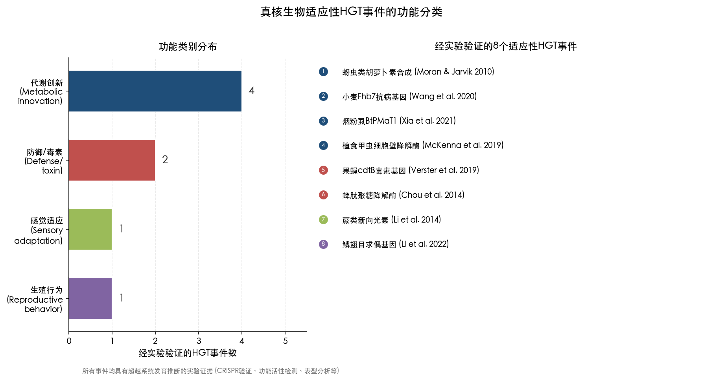

**Figure 5-2. Functional classification of experimentally validated adaptive HGT events in eukaryotes.** The left panel shows the distribution across four functional categories (metabolic innovation: 4 cases; defense/toxin: 2 cases; sensory adaptation: 1 case; reproductive behavior: 1 case); the right panel lists the eight specific events with literature sources. All successfully retained transfers involve low-connectivity, autonomous-function proteins, consistent with the predictions of the connectivity barrier hypothesis.

These eight cases share a revealing pattern: every validated adaptive HGT event involves either metabolic innovation (cases 1, 4, 7, 8), defense or toxin function (cases 3, 6), sensory adaptation (case 5), or reproductive behavior (case 2). All are low-connectivity, autonomous-function proteins consistent with the connectivity barrier model. None involves transcriptional regulation, signal transduction, or structural protein complexes.

Furthermore, Keeling & Palmer (2008) proposed that lineages exhibiting frequent horizontal transposable element transfer likely also experience functional gene HGT "albeit at lower frequency," because the same ecological and biological conditions enable both processes. This prediction has been confirmed in insects, nematodes, and parasitic plants, where HTT-rich lineages consistently show elevated functional gene HGT [Keeling & Palmer 2008](https://www.nature.com/articles/nrg2386 "Nature Reviews Genetics 9:605–618").

## 5.6 Endosymbiotic Gene Transfer as Macro-HGT: A Special Case

Endosymbiotic gene transfer occupies a unique position in the HGT landscape. While conceptually distinct from HGT *sensu stricto*, EGT represents the single largest source of foreign genes in eukaryotic genomes. In *Arabidopsis*, approximately 4,500 genes (~18%) are of cyanobacterial origin [Ku et al. 2015](https://pmc.ncbi.nlm.nih.gov/articles/PMC4547308/ "PNAS 112:10139–10146"). In yeast, bacterial genes outnumber archaeal genes approximately 3:1, reflecting the massive genomic contribution of the mitochondrial endosymbiont. Across photosynthetic eukaryotes more broadly, 15–20% of nuclear genes derive from plastid-associated EGT.

EGT is not merely a historical event confined to deep evolutionary time. Ongoing organelle-to-nucleus DNA transfer remains an active process: the *Arabidopsis* nuclear genome contains a 262-kb insertion 99.91% identical to mitochondrial DNA, and the rice nuclear genome contains a 131-kb fragment representing a complete chloroplast genome at 99.77% identity. These recent insertions demonstrate that the molecular machinery for nuclear integration of organellar DNA continues to operate in contemporary plant lineages [Ku et al. 2015](https://pmc.ncbi.nlm.nih.gov/articles/PMC4547308/ "PNAS 112:10139–10146").

A dramatic endpoint of EGT has been documented in the protist *Monocercomonoides*, which lost all mitochondria after HGT from bacteria provided replacement iron–sulfur cluster biogenesis genes — making it the first known eukaryote without any mitochondria-related organelle [Husnik & McCutcheon 2018](http://mccutcheonlab.org/s/17_husnik_nrm.pdf "citing Karnkowska et al. 2016, Current Biology 26:1274–1284"). This case underscores that HGT can eliminate what was previously regarded as an essential and universal eukaryotic feature.

Ku et al. (2015) further demonstrated that mitochondrial and plastid endosymbionts originally brought "genome-sized samples" of ancestral prokaryotic pangenomes. Because subsequent prokaryotic recombination has extensively reshuffled donor lineage genomes, eukaryotic EGT-derived genes cannot be cleanly traced to any single modern prokaryotic lineage. This "inherited chimerism" explains much of the apparent phylogenetic incongruence observed in deep eukaryotic gene trees without requiring the invocation of multiple additional endosymbiotic events [Ku et al. 2015](https://pmc.ncbi.nlm.nih.gov/articles/PMC4547308/ "PNAS 112:10139–10146").

## 5.7 Reshaping the Tree of Life: From Tree to Web?

The accumulation of HGT evidence raises a foundational question about how evolutionary history should be represented. Doolittle (1999) directly challenged the universal tree concept, arguing that "the history of life cannot properly be represented as a tree" [Doolittle 1999](https://www.science.org/doi/10.1126/science.284.5423.2124 "Science 284:2124–2129"). Rivera & Lake (2004) proposed the "ring of life" model, in which the eukaryotic genome originated from a fusion of two prokaryotic lineages — a fundamentally reticulate event that cannot be captured by a bifurcating tree [Rivera & Lake 2004](https://pubmed.ncbi.nlm.nih.gov/15356622/ "Nature 431:152–155").

For prokaryotes, the case for abandoning a strictly tree-like representation is compelling: with approximately 81% of genes having undergone HGT, organismal phylogeny is more accurately described as a network or web. Soucy et al. (2015) accordingly argued that HGT shapes "the web of life" across all domains [Soucy et al. 2015](https://pubmed.ncbi.nlm.nih.gov/26184597/ "Nature Reviews Genetics 16:472–482").

For eukaryotes, however, the picture is considerably more nuanced. Keeling & Palmer (2008) noted that eukaryotic HGT is not so prevalent as to "undermine efforts to reconstruct a dichotomously branching tree" [Keeling & Palmer 2008](https://www.nature.com/articles/nrg2386 "Nature Reviews Genetics 9:605–618"). The dominant topology of eukaryotic evolutionary relationships remains tree-like, with HGT producing localized reticulations rather than the pervasive network structure characteristic of prokaryotes. This is consistent with the quantitative data: at most a few percent of genes in typical multicellular eukaryotic genomes derive from HGT, meaning the vast majority of phylogenetic signal supports a vertical, branching pattern.

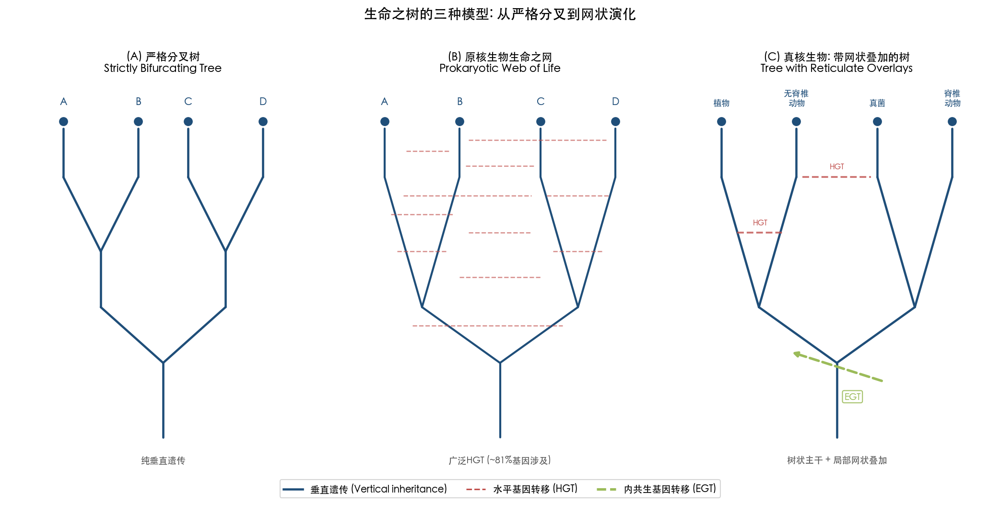

**Figure 5-3. Three models of the tree of life.** (A) Strictly bifurcating tree — the traditional vertical inheritance model; (B) Prokaryotic web of life — reticulate topology resulting from pervasive HGT (~81% of genes involved); (C) Eukaryotic intermediate model — a tree-like backbone overlaid with localized EGT (endosymbiotic gene transfer) and sporadic HGT reticulations. This figure illustrates the emerging consensus of a "tree with reticulate overlays."

Bjornson et al. (2024) provided a comprehensive review of computational approaches for detecting and representing reticulate evolutionary patterns within a phylogenomic framework. They emphasized that both hybridization/introgression and HGT produce locus-tree–species-tree discordance that can be confused with incomplete lineage sorting (ILS). Distinguishing these processes requires careful analysis: hybridization produces asymmetric site patterns detectable via ABBA-BABA tests, while HGT is characterized by confident placement of sequences within unexpected taxonomic groups in single-locus phylogenies. Phylogenetic network methods — including SplitsTree, PhyloNet, SNaQ, and NetRax — now permit direct representation of reticulate history, though challenges remain in scaling these approaches to large datasets and ancient events where substitution saturation limits resolution [Bjornson et al. 2024](https://doi.org/10.1016/j.ympev.2024.108197 "Molecular Phylogenetics and Evolution 201:108197").

The emerging consensus can be characterized as follows: the eukaryotic tree of life remains fundamentally tree-like at the organismal level, but with biologically significant reticulate overlays. These overlays include EGT at the base of major eukaryotic radiations, localized HGT in specific lineages (parasitic plants, invertebrates with intimate microbial associations), and widespread HTT that does not necessarily transfer functional genes but reshapes genome architecture. The metaphor of a "tree with occasional horizontal branches" captures eukaryotic evolutionary history more accurately than either a strictly bifurcating tree or a fully reticulate web.

## 5.8 Synthesis: Rarity as a Feature, Not a Bug

The evidence reviewed in this chapter supports a coherent interpretation of eukaryotic HGT as a rare but consequential evolutionary mechanism. Several integrative principles emerge from the synthesis of theoretical models and empirical data:

**Frequency is a poor proxy for significance.** The additive HGT model demonstrates that a single gene acquisition can open entirely new ecological niches. Carotenoid synthesis in aphids, neochrome in ferns, and Fhb7 resistance in wheat each represent singular transfer events that have been retained for tens to hundreds of millions of years, rivaling or exceeding the long-term phenotypic impact of many individually more transient prokaryotic HGT events [Keeling & Palmer 2008](https://www.nature.com/articles/nrg2386 "Nature Reviews Genetics 9:605–618").

**Connectivity determines transferability.** The revised complexity hypothesis clarifies that protein–protein interaction network position, rather than functional category, constitutes the primary barrier to successful HGT. This explains the consistent dominance of metabolic enzymes and autonomous-function proteins in validated eukaryotic HGT catalogs, and the conspicuous absence of transcription factors, signaling proteins, and structural complexes.

**Ecological intimacy enables transfer.** Endosymbiosis, parasitism, and phagotrophy provide the physical proximity required for DNA access, with the strength of evidence scaling with the intimacy of the ecological relationship. The Weismann barrier, long invoked to explain the paucity of animal HGT, is effectively bypassed by intracellular endosymbionts residing within germline cells.

**Asexuality may elevate HGT significance.** In bdelloid rotifers, HGT may serve as a functional substitute for sexual recombination, providing the genetic variation needed to escape Muller's ratchet. This represents a fundamentally different role for HGT than in sexual organisms, where it serves primarily as a source of novel capabilities rather than as a mechanism for maintaining standing genetic variation.

**The tree of life survives, with modifications.** Eukaryotic HGT does not dissolve the tree of life into a web, but it demands that evolutionary history be represented as a tree with biologically meaningful reticulate overlays — particularly at the base of major eukaryotic clades (endosymbiotic origins) and within specific lineages characterized by intimate interspecific associations.

The rarity of eukaryotic HGT is thus best understood not as evidence of irrelevance but as a consequence of the multiple barriers — the Weismann barrier, the connectivity barrier, the requirement for germline integration, and the stringency of natural selection in complex multicellular organisms — that filter the vast majority of foreign DNA exposure events. The events that pass through all of these filters are, almost by definition, those that confer genuine adaptive value. In this sense, the rarity of eukaryotic HGT is a feature of the system, not a limitation: it ensures that the transfers retained over evolutionary time are disproportionately those that matter.

# 第6章 Frontiers, Methodological Challenges, and Broader Implications

The preceding chapters have documented a growing corpus of evidence that horizontal gene transfer (HGT) operates in plants and animals — organisms once assumed to be effectively immune to lateral genetic exchange. Yet the field remains comparatively young, and its continued maturation hinges on resolving several interconnected challenges: disentangling genuine HGT from pervasive contamination artifacts, harnessing long-read and telomere-to-telomere (T2T) sequencing technologies capable of revealing transfers invisible to short-read pipelines, developing standardized computational frameworks suitable for the scale and complexity of eukaryotic genomes, and confronting the societal implications of the finding that many crop and livestock species are, in a meaningful biological sense, naturally transgenic. This chapter examines each of these frontiers, synthesizes the open questions articulated by leading investigators, and identifies the research directions most likely to reshape our understanding of eukaryotic HGT over the coming decade.

## 6.1 The Contamination Problem: Distinguishing Signal from Noise

### 6.1.1 Scale of Database Contamination

The single greatest methodological obstacle confronting eukaryotic HGT research is contamination — both within individual genome assemblies and across the public sequence databases upon which all comparative analyses depend. Steinegger & Salzberg (2020) deployed their Conterminator pipeline across GenBank and flagged over two million contaminated entries, demonstrating that the problem is not confined to isolated studies but pervades the foundational infrastructure of genomic science [Steinegger & Salzberg 2020, cited in Bálint et al. 2024](https://www.nature.com/articles/s41467-024-45024-5 "Genome Biology 21:115"). Every phylogenetic incongruence attributed to HGT must therefore be evaluated against the baseline probability that the "foreign" sequence is merely an assembly artifact or a co-cultured contaminant.

The tardigrade genome controversy, examined in detail in Chapter 4, remains the field's most instructive cautionary tale. Boothby et al. (2015) initially reported that 17.5% of the *Hypsibius dujardini* genome derived from HGT — a figure that, if validated, would have rendered tardigrades the most chimeric animal known. Koutsovoulos et al. (2016) subsequently resequenced the same species, applied GC-coverage blobplot filtering, and reduced the genuine HGT signal to approximately 0.4% (94 strong candidates in a ~110 Mb genome), a proportion comparable to most protostomes [Koutsovoulos et al. 2016](https://pmc.ncbi.nlm.nih.gov/articles/PMC4983863/ "PNAS 113:5053–5058"). The episode catalyzed a broader methodological reassessment: Richards & Monier (2016) proposed six guidelines for rigorous HGT identification, encompassing mandatory assessment of assembly quality, independent phylogenetic verification, and explicit contamination controls [Richards & Monier 2016](https://pmc.ncbi.nlm.nih.gov/articles/PMC4983848/ "PNAS 113:4892–4893").

### 6.1.2 ContScout and Next-Generation Decontamination

A major advance arrived with ContScout, a machine-learning-based contamination detection tool developed by Bálint et al. (2024). Applied to 844 published eukaryotic genomes, ContScout flagged 51,222 contaminating proteins. Critically, when tested against literature-reported HGT genes, only 0–5.1% were classified as contamination, demonstrating that the tool can effectively separate genuine lateral transfers from assembly artifacts [Bálint et al. 2024](https://www.nature.com/articles/s41467-024-45024-5 "Nature Communications 15:936"). The practical significance extends well beyond HGT itself: contaminated data had inflated the estimated gene count of the Last Eukaryotic Common Ancestor (LECA) by 21% (9,355 vs. 7,712 genes) and that of the Archaeplastida most recent common ancestor (MRCA) by 88% (13,116 vs. 6,967 genes) [Bálint et al. 2024](https://www.nature.com/articles/s41467-024-45024-5 "Nature Communications 15:936"). These distortions propagate through all downstream evolutionary inferences, from ancestral genome reconstruction to estimates of gene gain and loss rates.

Despite ContScout's value, the field still lacks a formal community consensus standard specifically designed for eukaryotic HGT identification — an equivalent of the MIQE guidelines for quantitative PCR or the MIMARKS standard for environmental sequencing. No such document has been published between 2023 and early 2026. This absence means that different research groups apply divergent thresholds (Alien Index cutoffs, phylogenetic support values, expression requirements), rendering cross-study comparison difficult and meta-analyses unreliable. Figure 6.1 presents an idealized multi-stage pipeline that synthesizes current best practices, from contamination filtering through functional verification.

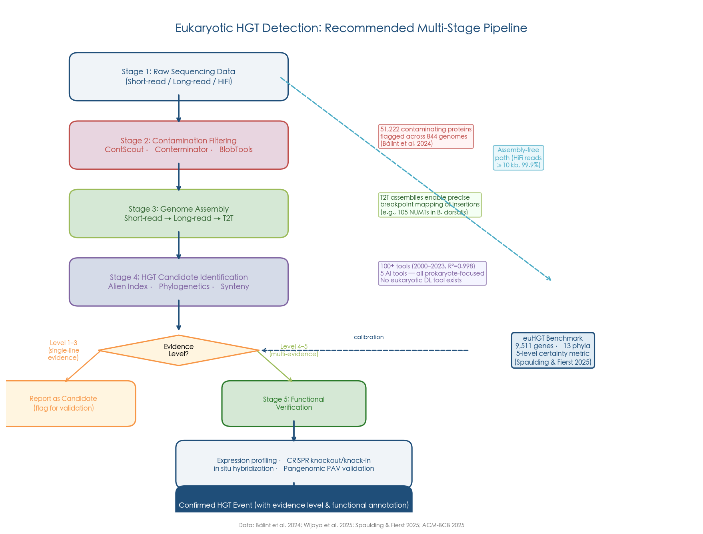

## 6.2 Long-Read Sequencing and Telomere-to-Telomere Assemblies

### 6.2.1 From Fragmented Assemblies to Complete Genomes

Short-read genome assemblies, which dominated the field through the mid-2010s, are inherently limited in their capacity to detect HGT. Transferred regions frequently insert into repetitive genomic contexts — near transposable elements, at subtelomeric regions, or within tandem repeat arrays — precisely the regions that collapse or fragment in short-read assemblies. Long-read sequencing technologies, particularly PacBio HiFi (>10 kb reads at >99.9% accuracy) and Oxford Nanopore ultra-long reads (>100 kb), now enable resolution of these complex loci and thus promise to uncover a class of HGT events that has remained systematically invisible.

McDonald et al. (2019) provided an early demonstration by using long reads to confirm the ToxA virulence gene cluster HGT in fungal wheat pathogens and to precisely define the boundaries of the transferred region — an achievement impossible with fragmented short-read assemblies [cited in Pinto et al. 2022](https://pmc.ncbi.nlm.nih.gov/articles/PMC9471246/ "Frontiers Bioeng Biotechnol 10:971402"). More recently, a 2025 study presented at the ACM Conference on Bioinformatics, Computational Biology, and Health Informatics (ACM-BCB) proposed a method for identifying HGT events directly from PacBio HiFi reads, bypassing genome assembly entirely and thereby avoiding assembly-induced artifacts [ACM-BCB 2025](https://dl.acm.org/doi/full/10.1145/3715020.3715045 "HGT detection from HiFi reads").

### 6.2.2 T2T Assemblies Reveal Hidden Transfers

The telomere-to-telomere (T2T) assembly revolution holds particular relevance for HGT research. In the yeast *Saccharomyces cerevisiae*, the ScRAP pangenome project — comprising T2T assemblies of 142 strains — revealed that all known large HGT regions in *S. cerevisiae* localize at telomeres, where transferred sequences must preserve or restore telomeric function upon integration. In one striking example, a ~40 kb region transferred from *Torulaspora* species exhibited telomeric repeats that gradually transition from donor-type to host-type, indicating that donor repeats seeded *de novo* telomere addition by host telomerase [O'Donnell et al. 2023](https://pmc.ncbi.nlm.nih.gov/articles/PMC10412453/ "Nature Genetics 55:1381–1390"). These structural details — precise boundaries of transferred regions, flanking repetitive elements, and telomeric reconstruction — are entirely invisible in fragmented assemblies.

For multicellular eukaryotes, the first T2T genome assembly of the sawfly *Analcellicampa danfengensis*, reported by Zhai et al. (2024), simultaneously produced a complete *Wolbachia* endosymbiont genome (1.24 Mb) alongside the gap-free host genome (211 Mb). This enabled precise characterization of *Wolbachia*–host co-evolutionary dynamics across six closely related sawfly species, including evidence for both vertical inheritance and recent horizontal transmission of *Wolbachia* between host species sharing overlapping habitats [Zhai et al. 2024](https://www.biorxiv.org/content/10.1101/2024.12.12.628268v1 "bioRxiv preprint: T2T sawfly genome"). Although this study focused on the endosymbiont itself rather than nuclear gene transfer, it illustrates a broader principle: T2T-quality assemblies will prove essential for systematically cataloging the full spectrum of endosymbiont-to-host DNA transfers, many of which are embedded in repetitive or heterochromatic regions absent from draft assemblies.

As of early 2026, no published study has specifically leveraged T2T genome assemblies to conduct a systematic survey of nuclear HGT in a multicellular eukaryote. This represents one of the most promising near-term opportunities in the field.

## 6.3 Pangenomics and Population-Level HGT Validation

The transition from single reference genomes to pangenomes opens a fundamentally new avenue for HGT validation. Sibbald et al. (2020) proposed that population-level resequencing can distinguish genuine HGT from ancestral polymorphism through presence/absence variation (PAV) analysis: a gene present in some individuals of a species but absent from close relatives, and phylogenetically placed among distant taxa, provides stronger HGT evidence than any single-genome analysis [Sibbald et al. 2020](https://www.sciencedirect.com/science/article/abs/pii/S1471492220301975 "Trends in Parasitology 36:927–941").

This principle has been partially validated. In the grass *Alloteropsis semialata*, Olofsson et al. (2019) demonstrated that an HGT-acquired gene spread through the population via positive selection on standing variation — showing that HGT can be detected and its selective dynamics quantified at the population level [Olofsson et al. 2019, cited in Keeling 2024](https://www3.botany.ubc.ca/keeling/PDF/24HGT.pdf "Current Biology 29:3921–3927"). However, no large-scale eukaryotic pangenome study focused specifically on systematic HGT validation via PAV has been published as of early 2026. As pangenome resources proliferate for model and crop species, population-level HGT surveys are anticipated to become a standard validation approach within the next five years.

## 6.4 Computational Tools: Exponential Growth, Persistent Gaps

### 6.4.1 The Current Landscape

The computational toolkit for HGT detection has expanded rapidly. Wijaya et al. (2025) systematically reviewed over 100 computational approaches published between 2000 and 2023, finding that the growth in new tools follows an exponential trajectory (*R²* = 0.998) [Wijaya et al. 2025](https://pmc.ncbi.nlm.nih.gov/articles/PMC11811736/ "NAR Genomics and Bioinformatics 7:lqaf005"). These tools span a broad methodological spectrum: compositional approaches based on GC content and codon usage bias, phylogenetic methods that detect topological incongruence, and hybrid pipelines combining both strategies. Figure 6.2 illustrates this exponential trend alongside the conspicuous absence of eukaryote-specific deep learning tools.

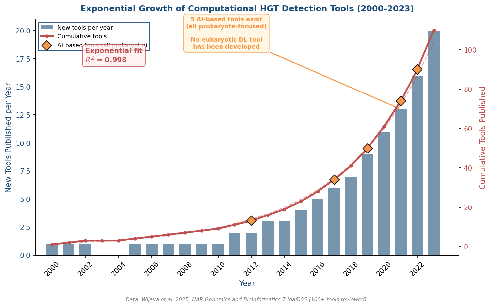

Among the tools most directly relevant to eukaryotic HGT, HGTphyloDetect achieves 98.16% accuracy, 87.57% sensitivity, and 98.49% specificity using an Alien Index threshold of AI ≥ 45 combined with phylogenetic validation [Yuan et al. 2023](https://pmc.ncbi.nlm.nih.gov/articles/PMC10025432/ "Brief Bioinform 24:bbad035"). Alienness, designed for and validated on plant-parasitic nematodes, employs AI scoring with a threshold of AI > 14 to effectively eliminate false positives [Rancurel et al. 2017](https://pmc.ncbi.nlm.nih.gov/articles/PMC5664098/ "Genes 8:248"). Compositional methods, however, remain unreliable for detecting ancient HGT events: transferred sequences undergo amelioration — gradual adaptation to host codon usage and nucleotide composition — over evolutionary time, progressively erasing the compositional signature of their foreign origin [Koski et al. 2001](https://academic.oup.com/mbe/article/18/3/404/1070883 "Mol Biol Evol 18:404–412").

### 6.4.2 The AI Gap: No Deep Learning Tool for Eukaryotic HGT

A striking finding from the Wijaya et al. (2025) review is that although five artificial intelligence-based tools exist for HGT-related detection (VirFinder, PhiSpy, RVM, Zhou et al. 2021 GCN, and MSGIP), all focus exclusively on prokaryotic genomic islands or prophage identification. No deep learning tool has been specifically designed and validated for eukaryotic nuclear genome HGT detection [Wijaya et al. 2025](https://pmc.ncbi.nlm.nih.gov/articles/PMC11811736/ "NAR Genomics and Bioinformatics 7:lqaf005"). A key barrier has been the absence of standardized training datasets: prokaryotic HGT tools can be trained on well-characterized genomic islands, but no equivalent gold-standard benchmark existed for eukaryotic HGT — until the euHGT compendium.

### 6.4.3 The euHGT Compendium: Toward a Benchmark

Spaulding & Fierst (2025) compiled the eukaryotic horizontal gene transfer dataset (euHGT), cataloging 9,511 protein-coding genes identified as horizontally transferred to metazoans from bacteria, fungi, archaea, and protists, drawn from 36 published papers spanning 2000–2025 and covering 13 phyla. Each gene carries a certainty metric on a 1–5 scale, where level 5 requires *in situ* hybridization combined with phylogenetic support and level 4 requires RNA expression data plus phylogenetics [Spaulding & Fierst 2025](https://pmc.ncbi.nlm.nih.gov/articles/PMC12637581/ "bioRxiv preprint: euHGT compendium"). This resource directly addresses the training-data bottleneck that has constrained tool development: researchers building new HGT identification methods had previously relied on simulated datasets in the absence of empirical benchmarks.

The euHGT dataset is accessible via PubMed Central (PMC12637581), suggesting progression toward formal publication, though the final peer-reviewed venue had not been confirmed as of early 2026. Despite its preprint status, the dataset's structured certainty scoring and comprehensive taxonomic coverage position it as a foundational resource for the next generation of eukaryotic HGT detection tools.

## 6.5 Experimental Validation: From Correlation to Causation

### 6.5.1 The First Experimental Recapitulation of HGT in Animals

For decades, evidence for functional HGT in animals rested on correlative data — phylogenetic incongruence, expression patterns, and signatures of purifying selection. The field lacked direct experimental proof that a horizontally transferred gene could confer an adaptive benefit when introduced into a naïve host. Tarnopol et al. (2025) achieved this milestone by using genome editing to introduce phage-derived toxin genes (*cdtB* and *aip56*) — naturally horizontally transferred to *Drosophila ananassae* approximately 21 million years ago — into *D. melanogaster*, a species that lacks these genes [Tarnopol et al. 2025](https://www.cell.com/current-biology/fulltext/S0960-9822(24)01638-5 "Current Biology 35:514–528").

The results were unequivocal. The *fusionB* chimeric gene, when expressed specifically in immune hemocytes, promoted fly survival against the parasitoid wasp *Leptopilina boulardi*: 23.3% ± 10.0% of transgenic flies survived parasitoid attack compared to only 3.7% ± 5.1% in controls (*p* = 0.00006), and parasitoid emergence was reduced approximately 7-fold (Figure 6.3) [Tarnopol et al. 2025](https://www.cell.com/current-biology/fulltext/S0960-9822(24)01638-5 "Current Biology 35:514–528").

### 6.5.2 Regulatory Domestication Is Essential

Equally revealing was a negative finding: constitutive expression of the *fusionB* gene proved lethal. Pupariation was delayed from 6.2 ± 0.53 days to 9.86 ± 1.30 days (*p* < 2.2 × 10⁻¹⁶) before catastrophic pupal arrest [Tarnopol et al. 2025](https://www.cell.com/current-biology/fulltext/S0960-9822(24)01638-5 "Current Biology 35:514–528"). This result carries profound implications for understanding the post-transfer domestication process. A horizontally acquired gene, regardless of how beneficial its encoded function may be, will prove lethal or deleterious if its expression is not tightly regulated. Natural selection must therefore act not only to retain the transferred coding sequence but also to integrate it into host regulatory networks — restricting expression to appropriate tissues and developmental stages. This "regulatory domestication" constitutes a critical and previously underappreciated bottleneck in the HGT pipeline, helping to explain why the vast majority of DNA transfers are pseudogenized or lost.

The Tarnopol et al. (2025) study also establishes a new experimental paradigm: gain-of-function reconstitution of HGT in model organisms. Combined with CRISPR-based loss-of-function approaches (as demonstrated by Li et al. 2022 for the *Listeria*-derived courtship gene in Lepidoptera), the field now possesses a bidirectional experimental toolkit for functionally validating HGT candidates.

## 6.6 Theoretical Reassessments

### 6.6.1 Keeling's Phagotrophy Paradox

A widely held assumption in eukaryotic HGT theory is that phagotrophic organisms — those that engulf and digest prey cells — should experience elevated HGT rates because phagocytosis brings foreign DNA into close proximity with the host nucleus. This assumption underpins the "gene transfer ratchet" model proposed by Doolittle (1998). Keeling (2024), in an influential reassessment published in *Nature Reviews Genetics*, challenged this logic directly. While acknowledging that phagocytosis increases *exposure* to foreign DNA, Keeling argued that the evolutionary shift to eukaryotic cellular complexity directed adaptation toward variation in cellular structure and behavior — types of variation "not readily available by HGT" — thereby substantially reducing the probability of *functional retention* of transferred genes [Keeling 2024](https://www3.botany.ubc.ca/keeling/PDF/24HGT.pdf "Nature Reviews Genetics 25:416–430").

Keeling further examined lineages with recent secondary or tertiary plastids, reasoning that if phagocytosis-mediated HGT were substantial, the nuclear genomes of these lineages should contain an "excess" of genes from the plastid lineage beyond those directly involved in organellar function. The data showed no such excess, undermining the use of genomic footprints as evidence for ancient endosymbioses and suggesting that the contribution of phagotrophy-associated HGT to nuclear genome evolution has been overestimated in some theoretical frameworks [Keeling 2024](https://www3.botany.ubc.ca/keeling/PDF/24HGT.pdf "Nature Reviews Genetics 25:416–430").

This reassessment does not negate the documented cases of adaptive HGT reviewed in Chapters 3–5; rather, it recalibrates expectations. HGT in eukaryotes is most productively understood as a rare event with occasionally transformative consequences, not as a ubiquitous genomic process that has been merely overlooked.

### 6.6.2 Extracellular Vesicles: A Nascent Hypothesis

Extracellular vesicles (EVs) represent a potential but largely unvalidated mechanism for HGT between multicellular organisms. Douanne et al. (2022) demonstrated that *Leishmania* parasites exchange drug-resistance genes through EVs, and Fischer et al. (2016) reported DNA transfer between human cell lines via EVs [Douanne et al. 2022, cited in Keeling 2024](https://www3.botany.ubc.ca/keeling/PDF/24HGT.pdf "Cell Reports 40:111121") [Fischer et al. 2016](https://pmc.ncbi.nlm.nih.gov/articles/PMC5042424/ "PLoS ONE 11:e0163665"). However, *in vivo* relevance for heritable HGT in multicellular organisms remains unestablished: no study has demonstrated that EV-mediated DNA transfer can reach the germline of a multicellular recipient and achieve stable integration with transgenerational inheritance. The hypothesis merits continued monitoring but cannot yet be considered a demonstrated HGT mechanism in multicellular eukaryotic contexts.

## 6.7 Vertebrate HGT: Emerging Cases at the Frontier

Whether vertebrate genomes contain functionally significant non-TE HGT genes remains among the most contested questions in the field, as discussed in Chapter 4. Salzberg (2017) systematically dismantled Crisp et al.'s (2015) claim of 145 HGT genes in the human genome. Two recent cases, however, merit close attention as potential exceptions to the prevailing consensus.

Graham & Davies (2021) reported the transfer of a type II antifreeze protein gene from herring to smelt, confirmed by accompanying transposable elements and disrupted gene synteny. The proposed mechanism — sperm-mediated uptake of environmental DNA during external fertilization — is a route available to aquatic vertebrates but not to terrestrial species [Graham & Davies 2021](https://www.sciencedirect.com/science/article/pii/S0168952521000512 "Trends in Genetics 37:501–503"). Kalluraya et al. (2023) identified a bacterial origin for the interphotoreceptor retinoid-binding protein (IRBP) gene, which is critical for visual pigment regeneration in the vertebrate retina — representing a rare bacteria-to-vertebrate functional HGT with major physiological significance [Kalluraya et al. 2023, cited in Spaulding & Fierst 2025](https://pmc.ncbi.nlm.nih.gov/articles/PMC12637581/ "PNAS 120:e2214815120"). Both cases remain to be independently replicated, but they suggest that vertebrate functional HGT, while exceedingly rare, may not be categorically absent.

## 6.8 GMO Biosafety: Natural HGT in Regulatory Context

### 6.8.1 Natural Transgenes Dwarf Transgenic Constructs

The discovery that numerous crop species are naturally transgenic challenges the conceptual boundary between "genetically modified" and "natural" organisms. All 291 tested cultivated sweet potato accessions contain *Agrobacterium* T-DNA; at least 15 *Nicotiana* species harbor T-DNA from *A. rhizogenes*; and over 30 naturally transgenic dicot species have been documented, including peanuts, walnuts, tea, and banana [Pinto et al. 2022](https://pmc.ncbi.nlm.nih.gov/articles/PMC9471246/ "Frontiers Bioeng Biotechnol 10:971402").

Quantitatively, transgenic DNA in approved GM crops represents only 0.00029–0.0017% of total plant DNA. The frequency of HGT from plant material to bacteria under controlled conditions is approximately 7 × 10⁻²³ per cell in the absence of sequence homology — a rate 10⁴ to 10¹⁴ times lower than naturally occurring bacterial HGT rates (10⁻¹ to 10⁻⁸ per cell). No adverse HGT events from GM plants have been reported across multi-generational feeding studies conducted in Japanese quails, rats, broiler chickens, pigs, and calves [Pinto et al. 2022](https://pmc.ncbi.nlm.nih.gov/articles/PMC9471246/ "Frontiers Bioeng Biotechnol 10:971402").

### 6.8.2 Regulatory Responses

Despite these findings, no regulatory body has formally revised GMO classification rules on the basis of natural HGT evidence. The Australian Office of the Gene Technology Regulator (OGTR) considers natural HGT as context in its risk assessments but has not used it as grounds for exemption [Pinto et al. 2022](https://pmc.ncbi.nlm.nih.gov/articles/PMC9471246/ "Frontiers Bioeng Biotechnol 10:971402"). The European Union continues to regulate organisms based on the process by which genetic modification was achieved rather than on the outcome, meaning that a sweet potato containing natural *Agrobacterium* T-DNA remains unregulated while an identical insertion achieved in a laboratory would be classified as a GMO. The United States Department of Agriculture (USDA) has moved toward more outcome-based regulations with its 2024 updates to 7 CFR Part 340, which exempt certain modifications that could have been achieved through conventional breeding [USDA 2024](https://www.federalregister.gov/documents/2024/11/13/2024-26232/movement-of-organisms-modified-or-produced-through-genetic-engineering-notice-of-additional "Federal Register Notice"). Nevertheless, the full implications of natural HGT for biosafety logic remain unintegrated into regulatory frameworks worldwide.

We consider this a significant gap. If the central concern of GMO biosafety is that a transgene might spread via HGT to wild relatives or soil microorganisms, the relevant comparison is not with a transgene-free organism but with the background rate of natural HGT. The empirical data reviewed above indicate that this background rate, while extremely low, exceeds the rate of transgene escape by many orders of magnitude. Incorporating this perspective into risk-benefit assessments would represent a more scientifically grounded approach to biosafety regulation.

## 6.9 Open Questions for the Next Decade

Drawing on the research gaps identified throughout this report, and particularly the framework articulated by Keeling (2024), five priority research directions emerge [Keeling 2024](https://www3.botany.ubc.ca/keeling/PDF/24HGT.pdf "Nature Reviews Genetics 25:416–430"):

**1. Broader taxonomic coverage.** The vast majority of eukaryotic HGT studies focus on a handful of lineages: parasitic plants, bdelloid rotifers, insects, and nematodes. Entire branches of the eukaryotic tree — non-insect arthropods, non-flowering plants, marine invertebrates — remain essentially unsampled. A systematic survey of HGT across eukaryotic diversity, enabled by the rapidly declining cost of long-read sequencing, represents an urgent priority.

**2. Deeper population-level coverage.** Advancing from documenting the presence of putative HGT genes in a single reference genome to characterizing their frequency, age, and selective dynamics across populations requires dense sampling of closely related species and multiple individuals per species. This constitutes the pangenomics frontier discussed in Section 6.3.

**3. Mechanistic understanding.** Keeling (2024) noted a near-complete absence of mechanistic insight: "we conclude HGT happened, and sometimes plausibly explain why, but we almost never know how." For the majority of documented eukaryotic HGT events, the physical route of DNA transfer — the vector, the mode of entry into the germline, the mechanism of stable integration — remains unknown. The parasitic plant haustorium and the intracellular endosymbiont are the only two conduits with strong mechanistic support. Sperm-mediated environmental DNA uptake, extracellular vesicles, and virus-mediated transfer are plausible but largely unvalidated hypotheses.

**4. Standardized methods for cross-lineage comparison.** The absence of community-wide standards for HGT identification means that reported HGT frequencies are not directly comparable across studies. A candidate gene identified with an Alien Index threshold of 14 in one study may not meet the threshold of 45 used in another. The euHGT dataset provides an important starting point, but the field needs formal guidelines specifying minimum evidence levels — analogous to the three-tier evidence hierarchy (phylogenetic support + expression data + functional validation) employed informally in the current literature.

**5. Development of AI tools for eukaryotic HGT.** Given the exponential growth of computational HGT tools for prokaryotes, the complete absence of deep learning approaches validated for eukaryotic nuclear HGT is a conspicuous gap. The euHGT dataset now provides the empirical training data needed to develop such tools. We anticipate that the first deep learning-based eukaryotic HGT detection pipelines will emerge within 2–3 years, likely incorporating long-read assembly features, synteny conservation, and expression data alongside traditional phylogenetic and compositional signals.

Beyond these five methodological priorities, two broader biological questions demand attention. First, the relationship between asexuality and elevated HGT — observed most dramatically in bdelloid rotifers — requires formal population genetic modeling. The hypothesis that HGT compensates for the loss of meiotic recombination in asexual lineages, thereby rescuing them from Muller's ratchet, has strong circumstantial support but lacks a rigorous theoretical framework parameterized for eukaryotic genomes. Second, whether there exist general "rules" governing which gene functional categories are transferable in eukaryotes — analogous to the complexity hypothesis in prokaryotes — remains open. The emerging pattern (metabolic enzymes, defense genes, and stress-response genes are preferentially retained; informational genes are almost never transferred) is suggestive but has not been formally tested across a large, standardized dataset. The euHGT compendium, combined with the experimental toolkit now available, places the field in an increasingly strong position to address both questions.

# 结论与风险提示

## Core Conclusions

The evidence assembled across this report supports five principal conclusions regarding horizontal gene transfer in non-microbial eukaryotes.

**1. HGT in plants and animals is a demonstrated biological reality, not a theoretical curiosity.** The question has shifted decisively from *whether* HGT occurs in multicellular eukaryotes to *how often*, *through what mechanisms*, and *with what consequences*. Landmark cases — *Agrobacterium* T-DNA in wild tobacco (1983), *Wolbachia* DNA in beetle chromosomes (2002), massive foreign gene content in bdelloid rotifers (2008), fungal carotenoid genes in aphids (2010), and 1,410 horizontally acquired genes across 218 insect genomes (2022) — collectively establish HGT as an empirically validated phenomenon spanning multiple animal and plant lineages.

**2. Physical access to the germline is the primary determinant of HGT opportunity.** The mechanisms most robustly supported by evidence — parasitic plant haustoria, intracellular endosymbionts residing within germline cells, and desiccation-induced membrane disruption — share a common feature: they provide foreign DNA with direct or facilitated access to cells capable of contributing to the next generation. The Weismann barrier, while a genuine obstacle in most animal lineages, is effectively bypassed by intracellular symbionts and is absent in plants, where germ cells arise from somatic meristems. This mechanistic understanding explains the taxonomic distribution of HGT: parasitic plants, invertebrates with intimate microbial associations, and organisms with exposed or non-sequestered germ lines exhibit the highest confirmed transfer rates.

**3. The evolutionary significance of eukaryotic HGT is disproportionate to its frequency.** Approximately 81% of prokaryotic genes have HGT histories, whereas confirmed HGT typically accounts for less than 1–2% of nuclear genes in most multicellular eukaryotes. However, additive HGT events — those introducing entirely new biochemical capabilities — can reshape the evolutionary trajectory of entire clades. The neochrome photoreceptor acquired by ferns from hornworts ~179 million years ago may have enabled the Cretaceous radiation of polypod ferns. The *Fhb7* gene transferred from a fungal endophyte to wheat relatives now confers Fusarium resistance in commercial bread wheat. Carotenoid biosynthesis genes in aphids created the first known animal lineage capable of *de novo* carotenoid production. These cases demonstrate that a single transfer event can have consequences persisting across tens to hundreds of millions of years.

**4. The connectivity barrier, rather than gene function per se, determines which genes transfer successfully.** Validated adaptive HGT events in eukaryotes are consistently dominated by low-connectivity, autonomous-function proteins — metabolic enzymes, detoxification enzymes, defense proteins — while transcription factors, signal transduction components, and structural protein complexes are conspicuously absent from HGT catalogs. This pattern aligns precisely with the revised complexity hypothesis: a protein's position in the interaction network, rather than its functional category, constitutes the primary barrier to successful horizontal integration.

**5. Earlier estimates of eukaryotic HGT prevalence were substantially inflated, but the validated core remains significant.** The 2025 reassessment of 1,170 plant interkingdom HGT candidates retained only 29.3% after reanalysis with expanded databases; the tardigrade genome's HGT proportion was revised from 17.5% to ~0.4% after contamination removal. These downward revisions do not diminish the biological significance of confirmed cases but rather sharpen the field's evidentiary standards. The shift from anecdotal case reports to systematic, contamination-aware, genome-scale surveys represents a maturation of the discipline.

## Limitations of This Report

Several limitations constrain the conclusions presented here and should be considered when interpreting the findings.

**Taxonomic sampling bias.** The existing literature on eukaryotic HGT is heavily concentrated in a small number of lineages: parasitic plants (Orobanchaceae, *Cuscuta*), bdelloid rotifers, insects (especially Lepidoptera and Hemiptera), and nematodes. Entire branches of the eukaryotic tree — non-insect arthropods, non-flowering plants, marine invertebrates, and most protist lineages — remain essentially unsampled for HGT. The conclusions of this report therefore reflect the state of knowledge in well-studied systems and may not generalize to eukaryotic diversity as a whole.

**Database completeness and phylogenetic inference.** Phylogenetic incongruence — the primary criterion for inferring HGT — is only as reliable as the taxonomic completeness of the underlying sequence databases. The 2025–2026 reassessments demonstrated that expanding reference databases can reclassify apparent cross-kingdom transfers as within-kingdom vertical inheritance. As of November 2025, only 155 bryophyte genomes were available in NCBI despite the Catalogue of Life listing 12,253 species. This gap implies that an unknown fraction of currently accepted HGT events may be reclassified as additional genomes become available.

**Preprint reliance.** The euHGT compendium (Spaulding & Fierst 2025), which provides the most comprehensive catalog of metazoan HGT to date (9,511 genes across 13 phyla), was available only as a preprint at the time of writing. While its structured data and certainty scoring represent a valuable resource, its conclusions have not yet undergone formal peer review.

**Functional validation deficit.** Of the hundreds of genes identified as horizontally transferred in eukaryotes, only eight cases across plants and animals meet the stringent criterion of experimental functional validation (knockout, knockdown, or gain-of-function assays demonstrating a phenotypic consequence). The vast majority of reported HGT events are supported by phylogenetic and genomic evidence alone, without direct experimental confirmation of adaptive function. This imbalance means that claims about the adaptive significance of most individual HGT events remain inferential.

**Mechanistic opacity.** For the majority of documented HGT events, the precise physical route of DNA transfer — the vector, the mode of germline entry, the mechanism of stable chromosomal integration — remains unknown. Only parasitic plant haustoria and intracellular endosymbionts have strong mechanistic support. Other proposed routes (viral vectors, extracellular vesicles, sperm-mediated environmental DNA uptake) are plausible hypotheses that lack direct experimental demonstration in the context of heritable gene transfer in multicellular organisms.

**Absence of community-wide methodological standards.** Different research groups apply divergent thresholds for HGT identification (Alien Index cutoffs ranging from 14 to 45, variable phylogenetic support requirements, inconsistent contamination screening protocols). This heterogeneity renders cross-study comparison difficult and meta-analyses of HGT frequency unreliable. No formal community consensus standard analogous to MIQE guidelines for quantitative PCR has been established for eukaryotic HGT identification as of early 2026.
