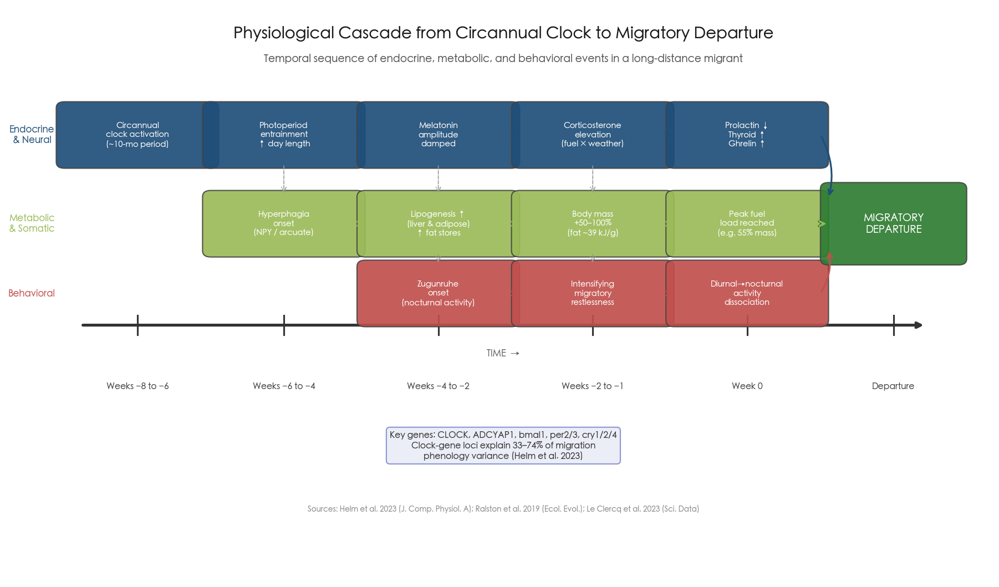
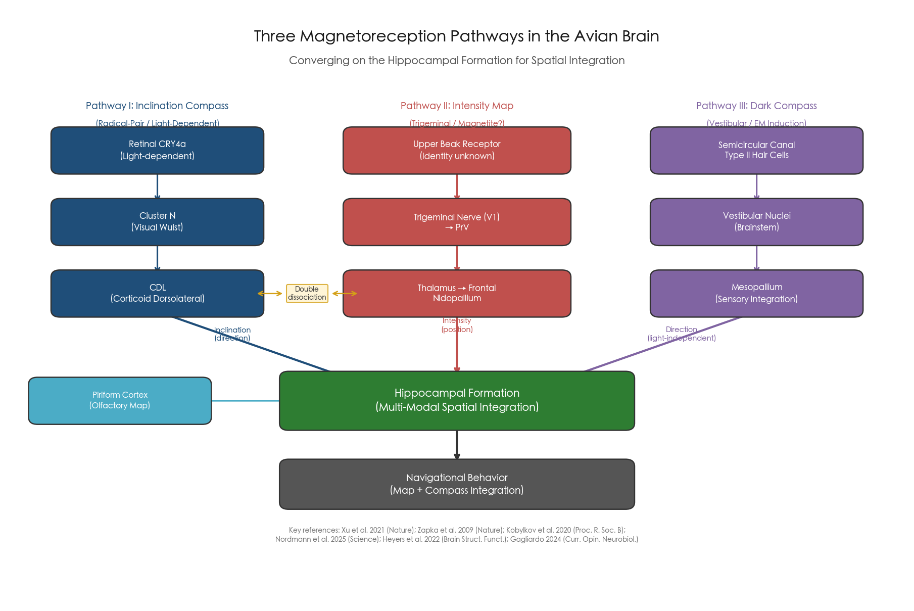
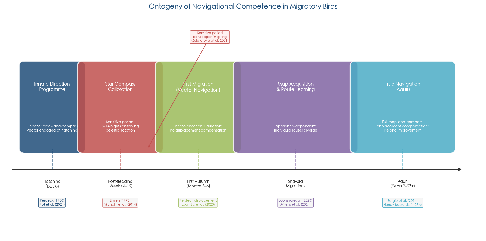
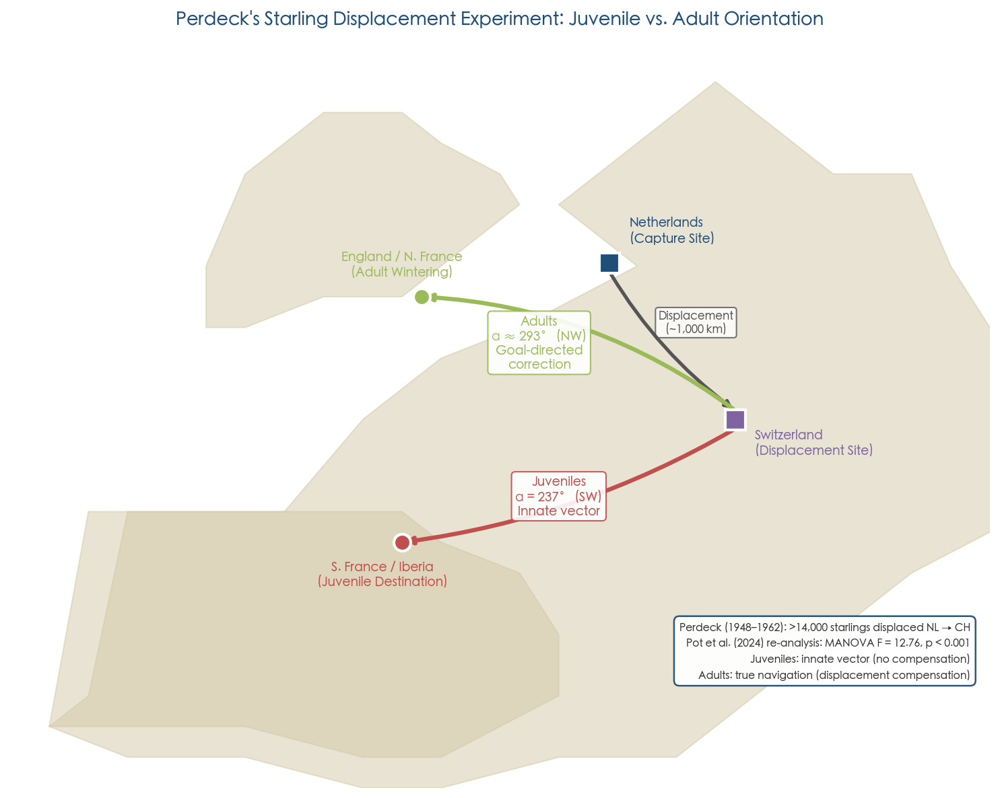
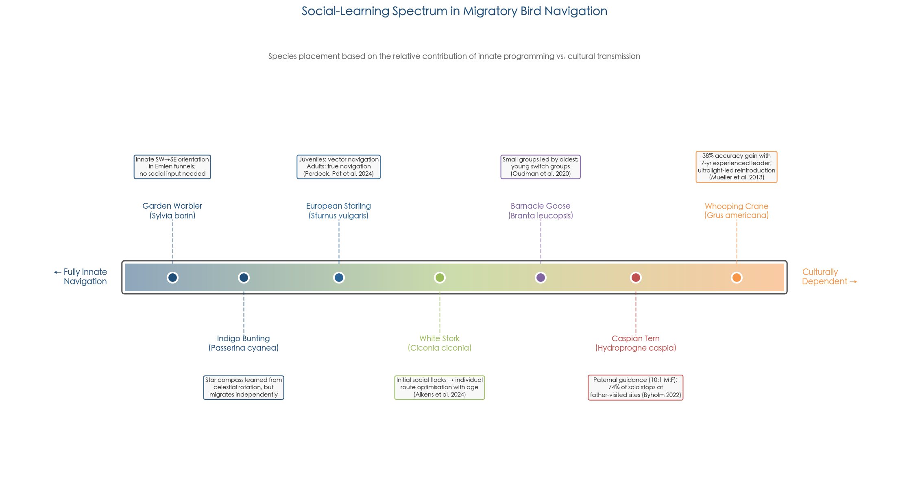
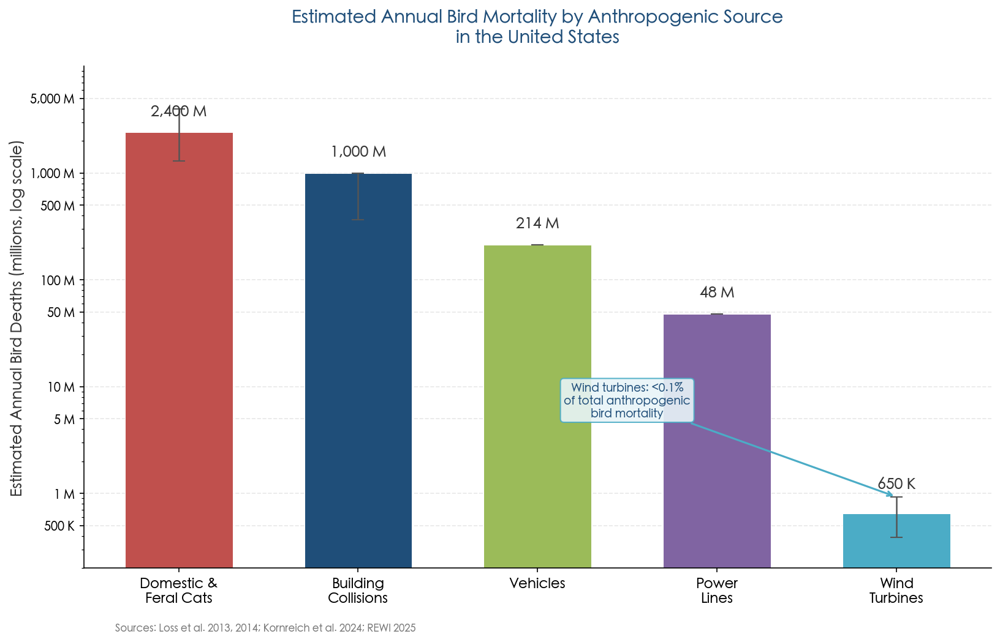
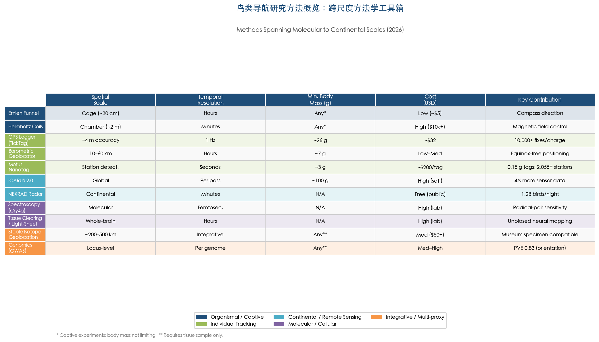
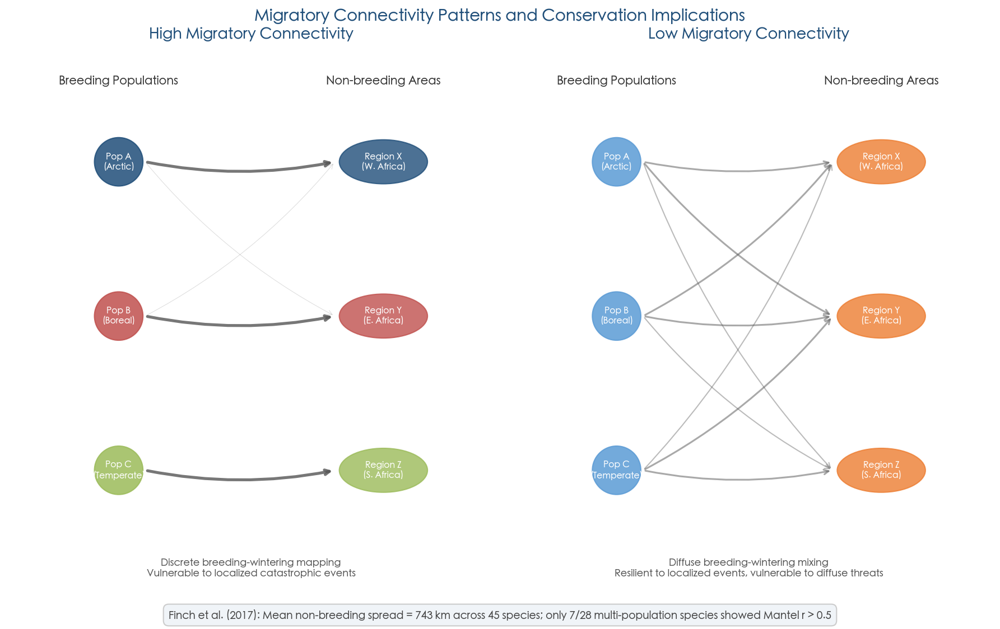
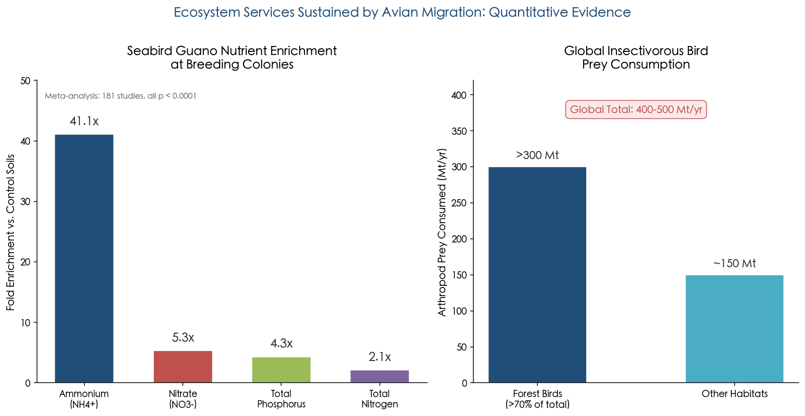
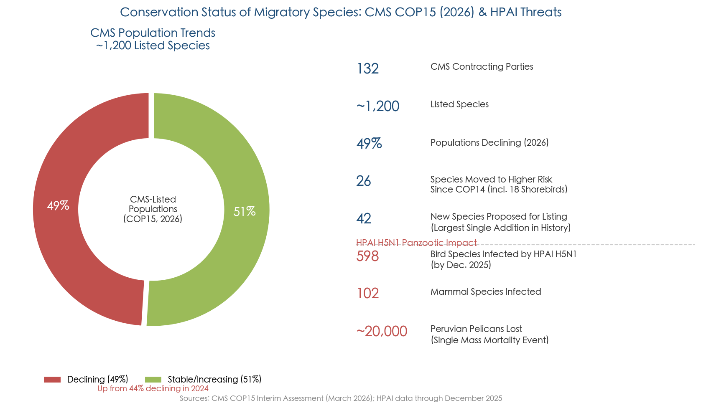

# 执行摘要

Migratory birds accomplish navigational feats of extraordinary precision — a juvenile bar-tailed godwit crossing 13,560 km of open Pacific on its inaugural flight, a Manx shearwater homing across hundreds of kilometres of featureless ocean — by deploying a multi-layered sensory architecture in which at least five empirically validated cue systems provide complementary positional and directional information. This report synthesizes evidence spanning quantum biophysics, neuroscience, developmental biology, movement ecology, and conservation science to address a central question: how do birds achieve precise location and direction navigation during migration, and what cues and disturbances influence this process?

**Core navigational mechanisms.** The avian navigation system operates through a "map-and-compass" framework formalized by Kramer (1953). Three independent compass mechanisms — a geomagnetic inclination compass, a learned star compass calibrated by observed celestial rotation, and a time-compensated sun compass — provide directional information, while positional ("map") information derives from gradients of geomagnetic field parameters (inclination, declination, and intensity) and olfactory landscapes. A context-dependent cue hierarchy governs the weighting of these systems: polarized light at sunset serves as the master calibration reference during the premigratory period; the magnetic compass assumes primacy during nocturnal flight; and olfactory cues dominate the positional map step, as demonstrated by GPS tracking of anosmic shearwaters whose homing ability collapsed over open ocean while magnetically disturbed birds homed normally.

**Molecular and neural substrates.** At the molecular level, cryptochrome 4a (CRY4a) in the retina has been identified as the leading magnetoreceptor candidate, with purified robin CRY4a exhibiting Earth-strength magnetic sensitivity through a radical-pair photochemical mechanism. A transformative 2025 discovery revealed a third, light-independent magnetosensory channel: vestibular type II hair cells in the semicircular canals detect magnetic fields through electromagnetic induction, projecting via a newly mapped vestibular–mesopallial circuit to the hippocampus. The avian brain processes these inputs through anatomically segregated pathways — Cluster N in the visual Wulst for the inclination compass, a trigeminal route for intensity-based map information, and the vestibular pathway for the dark compass — all converging on the hippocampal formation for multi-modal spatial integration. Circannual clocks, hormonal cascades (corticosterone, melatonin, thyroid hormones), and hyperphagia-driven fat deposition orchestrate the physiological preparation for departure.

**Development and cultural transmission.** Naïve first-year migrants inherit a genetically encoded spatiotemporal programme specifying migratory direction and duration ("clock-and-compass"), but this innate vector is progressively refined through experience-dependent compass calibration (requiring a minimum of 14 dark nights for star-compass learning), individual route optimization over successive migration cycles (documented over 27-year lifespans in honey buzzards), and — in socially migrating species — cultural transmission of route knowledge from experienced adults. In whooping cranes, the presence of a 7-year-experienced group member improved navigational accuracy by 38%, independent of genetic relatedness.

**Anthropogenic and environmental disturbances.** Six categories of disturbance degrade navigational performance with varying severity. Artificial light at night (ALAN) functions as a continent-scale ecological trap, ranking as the top predictor of stopover density across more than 70% of 2,500 seasonal radar models in the United States and contributing to an estimated 600 million–1 billion annual building-collision fatalities. Broadband radiofrequency electromagnetic noise at ambient urban levels completely abolishes the radical-pair magnetic compass in controlled experiments. Severe geomagnetic storms reduce nocturnal migration intensity by 9–17%, with effort flying declining by 25% when both celestial and magnetic cues are simultaneously degraded. Climate-driven phenological mismatch, wind energy infrastructure (estimated 388,000–930,000 annual bird fatalities in the US), and stopover habitat loss compound these threats. The highest-risk scenario involves simultaneous degradation of the star compass (by ALAN) and the magnetic compass (by urban RF noise) — the two principal directional systems available during nighttime flight.

**Evolutionary and ecological significance.** Avian migration is phylogenetically ancient (~80 million years) yet evolutionarily labile, having been gained and lost independently dozens of times. Rapid microevolution of migratory direction has been documented in blackcaps within approximately 30 generations. The ecosystem services sustained by migration — including 400–500 million metric tons of annual arthropod prey consumption by insectivorous birds and seabird-mediated nutrient transport enriching breeding-colony soils by up to 41-fold in ammonium — underscore the far-reaching ecological consequences of navigational disruption. As of March 2026, 49% of CMS-listed migratory populations are declining, and the HPAI H5N1 panzootic has infected 598 bird species, representing a compounding threat that selectively removes experienced navigators from culturally transmitting populations.

# 第1章 Sensory Mechanisms of Avian Navigation — The Multi-Cue Toolkit

Migratory birds routinely accomplish navigational feats that would challenge the most sophisticated human-engineered guidance systems. A bar-tailed godwit known as "B6," only four months old, flew non-stop from Alaska to Tasmania — a distance of 13,560 km covered in 11 days — across open ocean devoid of landmarks, with no prior migratory experience and no parental guidance [USGS Alaska Science Center 2022](https://www.usgs.gov/centers/alaska-science-center/news/juvenile-bar-tailed-godwit-b6-sets-world-record "Juvenile bar-tailed godwit B6 sets world record"). Journeys of this magnitude demand that birds continuously determine both their current position (the "map" problem) and the appropriate flight direction (the "compass" problem), often under rapidly changing atmospheric, celestial, and geomagnetic conditions. This chapter surveys the sensory cue systems that underpin such navigation, the experimental paradigms that have elucidated them, and the hierarchical yet redundant architecture through which multiple cues are integrated into a coherent navigational strategy.

Three foundational terms require definition. **True navigation** refers to the ability to determine position relative to a goal without recourse to familiar landmarks, route memory, or outward-journey information — it requires both a "map" and a "compass." **Vector navigation** (also termed "clock-and-compass" migration) describes movement along a genetically encoded direction for a genetically encoded duration, without positional feedback. **Piloting** denotes guidance by direct reference to familiar landmarks or landscape features. These distinctions, introduced by Griffin (1952) and refined by subsequent investigators, constitute the conceptual scaffold for the entire field of avian navigation research.

## 1.1 The Map-and-Compass Framework

The conceptual architecture for understanding avian navigation was formalized by Gustav Kramer in 1953. Kramer proposed a two-step process: birds first determine their position relative to a goal (the "map" step), then select the appropriate flight direction (the "compass" step). This map-and-compass model has dominated the field for over seven decades and, despite substantial refinements, remains the primary organizing framework for avian navigation research [Packmor et al. 2024, Proc. R. Soc. B 291:rspb20241363](https://royalsocietypublishing.org/rspb/article/291/2034/rspb20241363/104647/Migratory-birds-can-extract-positional-information "Packmor et al. 2024"). Figure 1 illustrates the two-step logic of the model.

The compass step is well characterized: birds possess at least three compass mechanisms — magnetic, stellar, and solar — each capable of independently providing directional information. The map step remains more contested. Candidate map signals include gradients of geomagnetic field parameters (inclination, declination, total intensity), olfactory gradients carried by prevailing winds, and possibly infrasound patterns. The pronounced asymmetry in our understanding — robust evidence for multiple compasses contrasting with continuing debate about the map — reflects both the greater difficulty of experimentally manipulating positional cues and the possibility that the "map" itself comprises multiple partially redundant subsystems rather than a single unified mechanism.

## 1.2 The Geomagnetic Compass

### 1.2.1 Discovery and the Inclination Compass Principle

The avian magnetic compass was first demonstrated experimentally in European robins (*Erithacus rubecula*) by Wolfgang Wiltschko in 1968. Unlike a technical magnetic compass that distinguishes magnetic north from south by polarity, the avian compass operates as an "inclination compass": it reads the angle between the magnetic field lines and the gravitational vector to distinguish "poleward" (where field lines dip steeply downward) from "equatorward" (where they approach horizontal). By 1996, this inclination-based mechanism had been documented in at least 18 migratory species spanning multiple avian orders [Wiltschko & Wiltschko 1996, JEB 199:29–38](https://journals.biologists.com/jeb/article/199/1/29/7370/Magnetic-Orientation-in-Birds "Wiltschko & Wiltschko 1996 JEB review").

The inclination design carries a crucial ecological implication: at the magnetic equator, where field lines run parallel to the Earth's surface, the compass cannot distinguish north from south. Garden warblers (*Sylvia borin*) solve this problem through a spontaneous reversal of heading after approximately two days of exposure to a simulated horizontal field (magnetic equator conditions), effectively re-calibrating their directional preference for the opposite hemisphere [Wiltschko & Wiltschko 1992, Ethology 91:70–79, summarized in Wiltschko & Wiltschko 1996](https://journals.biologists.com/jeb/article/199/1/29/7370/Magnetic-Orientation-in-Birds "Wiltschko & Wiltschko 1996 JEB review"). This spontaneous reversal resolves the so-called "equator problem" for the many species that undertake transequatorial migrations between the Northern and Southern Hemispheres.

### 1.2.2 Intensity Tuning and Acclimation

The magnetic compass is not a generic field detector; rather, it is narrowly tuned to the ambient field intensity that the bird normally experiences. For European robins, the functional window centers on approximately 46,000 nT (the characteristic intensity of central European geomagnetic fields), with orientation becoming non-functional at intensities below ~34,000 nT or above ~60,000 nT. Crucially, the system can re-adapt: after a minimum of three days of acclimation to a new intensity, robins recover compass function in the altered field [Wiltschko & Wiltschko 1996, JEB 199:29–38](https://journals.biologists.com/jeb/article/199/1/29/7370/Magnetic-Orientation-in-Birds "JEB 199:29–38"). This acclimation capacity is ecologically essential, given that a bird migrating from northern Europe (field intensity ~50,000 nT) to equatorial Africa (~30,000 nT) traverses a substantial intensity gradient over the course of its journey.

Under overcast conditions, when celestial cues are unavailable, homing pigeons relying on the magnetic compass achieve mean vector lengths exceeding 0.9, corresponding to angular deviations below 25°. This level of precision is comparable to sun-compass performance, demonstrating that the magnetic compass alone provides sufficient directional accuracy for effective orientation [Wiltschko & Wiltschko 1996, JEB 199:29–38](https://journals.biologists.com/jeb/article/199/1/29/7370/Magnetic-Orientation-in-Birds "JEB 199:29–38").

### 1.2.3 Magnetic Parameters as Map Components

Beyond serving as a compass, geomagnetic field parameters may contribute to the positional "map" step of navigation. The Earth's magnetic field varies predictably across its surface in three measurable parameters — total intensity, inclination, and declination — creating a grid of spatial gradients that could, in principle, encode geographic position.

A landmark study by Packmor et al. in November 2024 demonstrated that Eurasian reed warblers (*Acrocephalus scirpaceus*) can extract positional information from magnetic inclination and declination alone, with total intensity held constant. In virtual-displacement experiments using Helmholtz coils, birds exposed to inclination/declination values corresponding to a location approximately 2,700 km from their capture site re-oriented from their original SSE heading (169°) to a compensatory WSW direction (266°; p < 0.005). This result challenges the previously widespread assumption that total intensity is an essential component of the magnetic map and suggests that multiple magnetic parameters may operate under a "majority rule" logic, whereby agreement among two of three parameters suffices for positional determination [Packmor et al. 2024, Proc. R. Soc. B 291:rspb20241363](https://royalsocietypublishing.org/rspb/article/291/2034/rspb20241363/104647/Migratory-birds-can-extract-positional-information "Packmor et al. 2024").

## 1.3 The Celestial Compasses

### 1.3.1 The Star Compass: Learned Geometry, Not Innate Maps

Stephen Emlen's planetarium experiments with indigo buntings (*Passerina cyanea*) in 1967 and 1970 established that migratory birds possess a star compass — but one that is fundamentally learned rather than genetically hardwired. By raising buntings under a planetarium sky in which the projected stars rotated around Betelgeuse rather than Polaris, Emlen demonstrated that the birds treated Betelgeuse as the rotational center (i.e., as "north"). Birds raised without exposure to a rotating sky failed to develop stellar orientation entirely. The critical cue proved to be not the identity of specific stars but the observed axis of celestial rotation [Emlen 1967, Auk 84:463–489; Emlen 1970, Science 170:1198–1201, cited in Bianco et al. 2016](https://pmc.ncbi.nlm.nih.gov/articles/PMC5513225/ "Bianco et al. 2016, citing Emlen 1967/1970").

A key property distinguishing the star compass from the sun compass is its time-independence. Mouritsen and Larsen (2001) demonstrated that clock-shifted birds maintained correct stellar orientation despite an altered circadian phase, confirming that the star compass relies on memorized geometric patterns of star configurations relative to the learned rotational axis rather than on time-compensated measurement of stellar positions [Mouritsen & Larsen 2001, JEB 204:3855–3865](https://journals.biologists.com/jeb/article/204/22/3855/32913/Migrating-songbirds-tested-in-computer-controlled "JEB 204:3855–3865"). This property renders the star compass particularly robust for nocturnal migrants that may experience circadian disruption during extended flights.

### 1.3.2 The Time-Compensated Sun Compass

Diurnal orientation by the sun requires compensation for its apparent movement across the sky — approximately 15° of azimuthal change per hour. The classic demonstration came from Klaus Schmidt-Koenig (1960), who clock-shifted homing pigeons by six hours and observed vanishing bearings deflected by approximately 90°, precisely the prediction for a time-compensated compass in which the internal clock fails to account for the sun's altered position.

More recent work has confirmed sun-compass reliance in free-flying wild birds. Padget et al. (2018) GPS-tracked Manx shearwaters (*Puffinus puffinus*) subjected to four-hour clock shifts, documenting a deflection of approximately 13.2° per hour of shift. The magnitude fell below the theoretical maximum of 15°/hour, indicating partial but statistically significant reliance on the sun compass during oceanic navigation — the first such demonstration in a wild, free-ranging migratory bird [Padget et al. 2018, Current Biology 28:275–279](https://www.vliz.be/imisdocs/publications/332764.pdf "Padget et al. 2018"). The sub-maximal deflection suggests that shearwaters simultaneously integrate sun-compass information with other directional cues, consistent with the multi-cue framework elaborated in § 1.7.

### 1.3.3 Polarized Light: The Master Calibration Reference

Skylight polarization patterns — produced by Rayleigh scattering of sunlight in the atmosphere — provide directional information that is available near sunrise and sunset and, critically, can penetrate partial cloud cover. A meta-analysis of 76 cue-conflict experiments by Muheim et al. (2006) revealed a striking and methodologically consequential pattern: sunset polarized-light cues near the horizon function as a master calibration reference for the entire compass system. When experimental birds had a full view of the horizon at sunset, they recalibrated their magnetic compass from celestial polarization cues in 8 of 9 studies. When the same species were tested in Emlen funnels that restricted the view to a narrow zenith cone (thereby blocking horizon polarization), birds relied on the magnetic compass as the primary reference in 28 of 29 studies [Muheim et al. 2006, JEB 209:2–17](https://journals.biologists.com/jeb/article/209/1/2/33398/Calibration-of-magnetic-and-celestial-compass-cues "Muheim et al. 2006").

This finding carries profound methodological implications: the Emlen funnel, the most widely used compass-orientation assay, restricts the bird's view of the horizon and thereby inadvertently eliminates the calibration signal that dominates under natural conditions. The result also establishes a context-dependent cue hierarchy operating during the premigratory period: polarized light dominates calibration when available, the magnetic compass serves as the primary directional reference in its absence, and the star and sun compasses occupy subordinate positions in the calibration chain (Figure 2). During active migration — particularly at night when polarized-light cues are unavailable — the magnetic compass likely assumes the role of primary orientation reference [Muheim et al. 2006, JEB 209:2–17](https://journals.biologists.com/jeb/article/209/1/2/33398/Calibration-of-magnetic-and-celestial-compass-cues "Muheim et al. 2006").

## 1.4 The Olfactory Map

### 1.4.1 Four Decades of Anosmia Experiments

The role of olfaction in avian navigation was first proposed by Floriano Papi and colleagues in 1971, who demonstrated that surgically or chemically rendered anosmic homing pigeons exhibited dramatically impaired homing ability compared to intact controls. Subsequent research confirmed and extended these findings: experienced anosmic pigeons showed return rates of only approximately 16% compared to approximately 79% for intact controls when released from unfamiliar sites at distances of 30–150 km, demonstrating that olfactory deprivation severely compromises the navigational "map" step even in birds with extensive homing experience [Benvenuti et al. 1990, cited in Gagliardo 2013](https://journals.biologists.com/jeb/article/216/12/2165/11389/Forty-years-of-olfactory-navigation-in-birds "Gagliardo 2013"). Over four decades of experimentation across multiple continents, the results have proven remarkably consistent: anosmic pigeons cannot navigate from unfamiliar locations, although they retain the motivation to home and can orient using compass cues once within their familiar area [Gagliardo 2013, JEB 216:2165–2171](https://journals.biologists.com/jeb/article/216/12/2165/11389/Forty-years-of-olfactory-navigation-in-birds "Gagliardo 2013").

### 1.4.2 GPS Evidence from Wild Seabirds

Modern tracking technology has extended olfactory navigation research from the pigeon loft to wild seabirds foraging over open ocean. Pollonara et al. (2015) GPS-tracked Scopoli's shearwaters (*Calonectris diomedea*) that had been rendered anosmic via zinc sulphate nasal irrigation, magnetically disturbed (magnets attached to the head), or left as untreated controls. Anosmic shearwaters showed severely impaired homing orientation, abandoning direct oceanic routes in favor of coastline-following — a piloting strategy that compensated for their inability to determine position over featureless open water. Magnetically disturbed birds, by contrast, homed normally, indicating that the magnetic sense is not essential for the map step in this species over the tested distances (~400 km), whereas olfaction is indispensable [Pollonara et al. 2015, Scientific Reports 5:16486](https://www.nature.com/articles/srep16486 "Pollonara et al. 2015").

This dissociation — olfaction critical for the map, magnetism dispensable — constitutes a powerful natural experiment distinguishing the functional roles of different sensory modalities in the two-step navigational process. It also raises the question of whether the olfactory map operates by detecting airborne chemical gradients emanating from landmasses or oceanic features, or by matching local odor profiles to a learned olfactory landscape. The neural and molecular mechanisms of avian olfactory navigation are treated in Chapter 2.

## 1.5 Infrasound: A Hypothesized but Unconfirmed Cue

Homing pigeons can detect infrasound at frequencies as low as 0.05 Hz — far below the lower limit of human hearing. Three hypotheses have been advanced for how infrasound might serve a navigational function: (1) as acoustic beacons emanating from consistent sources such as ocean surf or mountain lee waves; (2) as acoustic landmarks analogous to visual topographic features; and (3) as a low-frequency gradient field whose spatial variation encodes geographic position [Patrick et al. 2021, Frontiers in Ecology and Evolution 9:740027](https://www.frontiersin.org/journals/ecology-and-evolution/articles/10.3389/fevo.2021.740027/full "Patrick et al. 2021").

No direct experimental manipulation of infrasound has yet been conducted on navigating birds, however, and this absence represents a genuine gap in the empirical literature rather than merely an absence of evidence. The technical difficulty of selectively blocking or altering infrasound perception in free-flying birds has precluded controlled tests to date. Correlational evidence exists — Hagstrum (2000) proposed that disruptions in atmospheric infrasound propagation explained anomalous pigeon homing failures near supersonic aircraft corridors — but the hypothesis remains unconfirmed. Infrasound thus occupies a singular position in the avian navigational toolkit: theoretically plausible, supported by documented sensory detection capacity, yet lacking the experimental confirmation that characterizes the magnetic, celestial, and olfactory systems.

## 1.6 Visual Landmark Piloting in Familiar Areas

Within their familiar area, birds supplement or replace compass-based navigation with direct visual piloting — guidance by memorized landscape features. GPS tracking of homing pigeons has revealed that experienced birds develop individually idiosyncratic yet highly repeatable routes, maintaining fidelity to specific roads, field boundaries, and woodland edges across successive flights from the same release site. Biro et al. (2004) documented this "route loyalty" using miniature GPS loggers, demonstrating that individual pigeons' routes converged to stable, individually distinct paths after only a few releases [Biro et al. 2004, PNAS 101:17440–17443](https://www.pnas.org/doi/10.1073/pnas.0406984101 "Familiar route loyalty implies visual pilotage").

In a subsequent study, Biro et al. (2007) demonstrated that when sun-compass information was placed in conflict with landmark cues via clock-shift, experienced pigeons accurately followed their memorized routes using landmarks alone, overriding the displaced sun-compass signal. When released from novel sites outside their familiar area, however, the same clock-shifted birds exhibited the expected sun-compass deflection. This dual result confirmed that compass and landmark guidance operate as a system of simultaneous or oscillating dual control, with the dominant modality determined by the bird's familiarity with the terrain [Biro et al. 2007, Proc. R. Soc. B 274:1153–1158](https://pubmed.ncbi.nlm.nih.gov/17452634/ "Pigeons combine compass and landmark guidance"). Visual piloting is thus a powerful navigational mechanism within its operational range but is inherently limited to areas where the bird has acquired spatial memories — it cannot serve during first migrations through unfamiliar territory.

## 1.7 Cue Hierarchy, Redundancy, and the Architecture of Multi-Cue Navigation

### 1.7.1 Context-Dependent Hierarchy

The picture emerging from decades of cue-conflict experiments is not one of a single dominant sense but rather of a context-dependent hierarchy in which the relative weighting of cues shifts with environmental conditions, migratory phase, and individual experience. The synthesis by Muheim et al. (2006) established the following calibration hierarchy for the premigratory period: polarized light at the horizon → magnetic compass → star compass / sun compass. During active nocturnal flight, when horizon polarization is unavailable, the magnetic compass likely assumes the role of primary directional reference [Muheim et al. 2006, JEB 209:2–17](https://journals.biologists.com/jeb/article/209/1/2/33398/Calibration-of-magnetic-and-celestial-compass-cues "Muheim et al. 2006").

This hierarchy is not rigid. The Pollonara et al. (2015) shearwater experiment demonstrated that olfactory cues dominate the map step even when magnetic cues are simultaneously available, while Packmor et al. (2024) showed that within the magnetic map itself, inclination and declination can compensate for the absence of total-intensity information. The system is characterized by graceful degradation: removal of any single cue impairs but rarely eliminates navigational ability, because redundant cue channels absorb the functional loss.

### 1.7.2 Redundancy Enables Extreme Journeys

Multi-cue redundancy is not merely a theoretical nicety — it is an ecological necessity. The bar-tailed godwit's trans-Pacific migration exceeding 13,000 km demands sustained navigational accuracy across an ocean devoid of visual landmarks, under weather systems that intermittently obscure celestial cues, and through geomagnetic field regions whose parameters shift as the bird traverses latitudes and longitudes [USGS Alaska Science Center 2022](https://www.usgs.gov/centers/alaska-science-center/news/juvenile-bar-tailed-godwit-b6-sets-world-record "Juvenile godwit B6 world record"). Different cues likely dominate at different phases of such a journey: celestial cues when skies are clear, the magnetic compass under cloud cover, and possibly olfactory or infrasound cues near coastlines. The bird's capacity to transition seamlessly among cue systems — or to integrate partially degraded signals from multiple cues simultaneously — is what renders such feats achievable [Mouritsen 2018, Nature 558:50–59, cited in Patrick et al. 2021](https://www.frontiersin.org/journals/ecology-and-evolution/articles/10.3389/fevo.2021.740027/full "Patrick et al. 2021, citing Mouritsen 2018").

Figure 3 provides a synoptic overview of all eight navigational cue systems surveyed in this chapter, including their evidence strength, key experimental species, and principal experimental paradigms.

### 1.7.3 Experimental Paradigms: How We Know What We Know

The evidence reviewed in this chapter rests on several canonical experimental paradigms whose logic and limitations merit explicit discussion, as they recur throughout subsequent chapters.

The **Emlen funnel** (Emlen 1966) remains the most widely employed compass-orientation assay. A bird is placed in a circular funnel lined with scratch-sensitive paper or equipped with video tracking; its directional hops leave marks that reveal preferred orientation. The method has been refined by computer-vision approaches capable of detecting individual takeoff attempts and providing temporal resolution impossible with thermal paper, although the two methods do not always yield correlated orientation estimates [Bianco et al. 2016, Ecol. Evol. 6:6930–6942](https://pmc.ncbi.nlm.nih.gov/articles/PMC5513225/ "Emlen funnel methods comparison"). As discussed in § 1.3.3, the funnel's restriction of the horizon view has important implications for which cue system the bird primarily employs.

**Clock-shift experiments** exploit the time-compensated nature of the sun compass: by advancing or retarding a bird's circadian clock through altered light–dark cycles, researchers produce predictable angular deflections in sun-compass orientation, typically ~15° per hour of shift.

**Anosmia experiments** — achieved through surgical olfactory nerve section, zinc sulphate nasal irrigation, or temporary nasal tube occlusion — test the contribution of olfaction by removing it and quantifying the resulting navigational deficit.

**Virtual magnetic displacement** experiments, such as those conducted by Packmor et al. (2024), employ Helmholtz coils to simulate the magnetic field parameters of a distant location while the bird remains physically at the capture site, enabling researchers to isolate and test whether specific magnetic components carry positional information.

## 1.8 Synthesis: A Navigational System Built on Redundancy and Flexibility

The avian navigational toolkit is not a single mechanism but a deeply layered sensory architecture. At least five distinct cue systems — geomagnetic (inclination compass and magnetic map), stellar, solar (time-compensated compass), polarized-light, and olfactory — provide complementary information about position and direction. A sixth system, infrasound, is detectable by birds but awaits experimental confirmation of a navigational role. Visual landmark piloting adds a powerful short-range mechanism operative within the bird's familiar area.

These systems are organized in a context-dependent hierarchy rather than a fixed priority list. Polarized light dominates calibration when the horizon is visible; the magnetic compass serves as the backbone orientation reference, particularly under conditions of degraded celestial visibility; the star compass provides time-independent directional information for nocturnal migrants; the sun compass operates during diurnal flight; and olfactory cues underpin the positional "map" at least in homing pigeons and procellariiform seabirds. The redundancy inherent in this architecture enables graceful degradation — the defining hallmark of a robust navigational system — and accounts for how a four-month-old shorebird can cross 13,560 km of open Pacific on its inaugural migration without a single landmark to guide it.

The molecular and neural mechanisms that underpin these sensory capabilities — from radical-pair magnetoreception in cryptochrome proteins to hippocampal spatial mapping — are the subject of Chapter 2. The developmental processes by which young birds acquire and calibrate their navigational toolkit are addressed in Chapter 3.

# 第2章 Neural, Molecular, and Physiological Substrates of Navigation

The preceding chapter surveyed the sensory cues migratory birds exploit — geomagnetic fields, celestial patterns, olfactory gradients — and established the behavioral evidence for each modality's contribution to orientation and navigation. This chapter descends from behavior to mechanism, shifting the central question from *what* cues birds use to *how* their bodies detect, transduce, and integrate those cues at the molecular, cellular, and neural-circuit levels. The biological scales involved are extraordinary: from quantum spin dynamics within a single cryptochrome protein, through specialized type II hair cells in the semicircular canals, to brain-wide circuits linking the visual Wulst, hippocampal formation, and olfactory cortex into a coherent navigational computer. Equally essential are the physiological systems — hormonal cascades, circadian and circannual clocks, and genetic programs governing metabolism — that prepare a bird's body for the immense energetic demands of long-distance flight. Taken together, these substrates reveal avian migration as a deeply integrated physiological enterprise in which quantum physics, neuroendocrinology, and genomics converge.

## 2.1 The Radical-Pair Mechanism: A Quantum Compass in the Retina

### 2.1.1 Theoretical Foundations

The hypothesis that birds sense magnetic fields through quantum-mechanical processes traces to a seminal proposal by Schulten, Swenberg, and Weller (1978), who suggested that a photochemical reaction producing a pair of radicals — molecules each bearing an unpaired electron — could be sensitive to the orientation of an external magnetic field. The two unpaired electrons form a spin-correlated pair whose quantum state oscillates between singlet (antiparallel spins) and triplet (parallel spins) configurations; because the interconversion rate depends on the angle between the radical pair's molecular axis and the ambient magnetic field, downstream product yields carry directional information.

Ritz, Adem, and Schulten (2000) formalized this concept into the "radical-pair model" of avian magnetoreception, nominating retinal cryptochrome as the sensor protein. Hore and Mouritsen (2016) subsequently established the quantitative biophysical constraints: the radical pair must persist for at least approximately 700 ns (one Larmor period in Earth's ~50 µT field), spin coherence must be maintained over that window, and the host protein must be rigidly oriented within the photoreceptor cell to prevent directional averaging [Hore & Mouritsen 2016, Annu. Rev. Biophys. 45:299–344](https://www.nature.com/articles/s41586-021-03618-9 "Cited in Xu et al. 2021").

A critical and testable prediction of the radical-pair model is that radiofrequency (RF) electromagnetic fields near the electron Larmor frequency (~1.4 MHz at 50 µT) should disrupt singlet–triplet interconversion, thereby impairing the magnetic compass. This prediction has been repeatedly confirmed in behavioral experiments with European robins, providing some of the strongest evidence for the hypothesis (see Chapter 4 for discussion of anthropogenic RF disturbance).

### 2.1.2 Cryptochrome 4a as the Magnetosensor Candidate

Among the six known avian cryptochromes, cryptochrome 4a (CRY4a) has emerged as the leading magnetoreceptor candidate. In a landmark study, Xu et al. (2021) demonstrated that purified CRY4a from the European robin (*Erithacus rubecula*) exhibits magnetically sensitive photochemistry *in vitro*. Blue-light absorption by the protein's flavin adenine dinucleotide (FAD) cofactor triggers sequential electron transfers along a chain of four conserved tryptophan residues spanning approximately 20 Å from the protein interior to its surface, generating radical pairs whose recombination yields are sensitive to Earth-strength magnetic fields (~50 µT). Robin CRY4a displayed significantly greater magnetic sensitivity than the homologous proteins from non-migratory chicken (*Gallus gallus*) and pigeon (*Columba livia*), with peak relative magnetic field effects (MFE) of 21% for robin versus 17% for pigeon and 14% for chicken [Xu et al. 2021, Nature 594:535–540](https://www.nature.com/articles/s41586-021-03618-9 "Magnetic sensitivity of cryptochrome 4 from a migratory songbird").

Xu et al. (2025) further narrowed the candidate pool by characterizing the alternative splice variant CRY4b in the European robin. ErCRY4b does not bind FAD, exhibits approximately 10-fold lower retinal mRNA abundance than CRY4a, and is undetectable by mass-spectrometry-based proteomics — effectively ruling it out as a magnetosensor and confirming CRY4a as the functionally relevant isoform [Xu et al. 2025, J. R. Soc. Interface 22:20250176](https://royalsocietypublishing.org/rsif/article/22/229/20250176/235543/Cryptochrome-4b-protein-is-probably-irrelevant-for "Cry4b is probably irrelevant for radical-pair magnetoreception").

**Figure 2.1.** The radical-pair mechanism in cryptochrome 4a (CRY4a). The seven-step process — from photon absorption to directional signal output — illustrates how quantum spin dynamics within a single retinal protein can encode geomagnetic field direction. Comparative magnetic field effect (MFE) data across three species and the radiofrequency disruption point are indicated. Adapted from data in Xu et al. (2021) and Golesworthy et al. (2023).

### 2.1.3 Spin Dynamics and Coherence Lifetimes

A central challenge for the radical-pair hypothesis is whether spin coherence can survive long enough in the warm, aqueous interior of a living cell (~40 °C) to permit geomagnetic sensitivity. Behavioral experiments on Eurasian blackcaps exposed to broadband RF noise imply spin equilibration on a 2–10 µs timescale *in vivo*, while molecular dynamics simulations suggest relaxation times of order ~1 µs — fast, but potentially sufficient.

Golesworthy et al. (2023) addressed this question directly by measuring magnetic field effects on radical-pair kinetics in purified CRY4a W369F mutant proteins from robin, chicken, and pigeon using cavity ring-down spectroscopy. They observed that B₁/₂ — the field strength at which the reaction yield reaches half its maximum effect — increases with pump–probe delay time, a signature of singlet–triplet dephasing (STD). Analysis yielded STD rate constants (*r*_STD) of 3.8 ± 0.2 × 10⁷ s⁻¹ for robin, 2.6 ± 0.3 × 10⁷ s⁻¹ for chicken, and 6.1 ± 0.6 × 10⁷ s⁻¹ for pigeon CRY4a. Semiclassical spin dynamics simulations demonstrated that this STD — attributed to electron hopping between the second and third tryptophans of the transfer chain — preserves magnetic field effects even when dephasing proceeds 30–60 times faster than radical recombination (~1 µs⁻¹). The finding resolves a longstanding theoretical concern: strong magnetic sensitivity in cryptochromes is not incompatible with rapid singlet–triplet dephasing [Golesworthy et al. 2023, J. Chem. Phys. 159:105102](https://pubs.aip.org/aip/jcp/article/159/10/105102/2910503/Singlet-triplet-dephasing-in-radical-pairs-in "STD in avian cryptochromes").

The initial radical-pair kinetics for all three species follow biexponential decay with time constants *t*₁ ≈ 1 µs (back electron transfer and tryptophan deprotonation) and *t*₂ = 10–15 µs (longer-lived neutral radical state). The ~1 µs fast phase represents the critical window during which competition between singlet recombination and triplet formation generates the magnetically sensitive signal. That robin CRY4a yields the largest absolute magnetic field effects among the three species is consistent with — though not proof of — evolutionary optimization for magnetoreception.

## 2.2 The Magnetite Hypothesis and the Trigeminal Pathway

### 2.2.1 Iron Minerals in the Upper Beak: A Cautionary Tale

An alternative — or complementary — magnetoreception mechanism posits that biogenic magnetite (Fe₃O₄) crystals physically rotate or deform in response to magnetic fields, transducing geomagnetic information into mechanical or electrical signals in associated nerve endings. Fleissner et al. (2003, 2007) reported elaborate iron-mineral-containing dendrites in the upper beak of homing pigeons innervated by the ophthalmic branch of the trigeminal nerve (V1), proposing these structures as the magnetoreceptor.

This model suffered a major setback when Treiber et al. (2012) demonstrated through high-resolution anatomical mapping that the iron-rich cells previously identified as putative magnetoreceptors were macrophages — iron-recycling immune cells with no sensory function — rather than magnetosensitive neurons. The putative six-cluster pattern of magnetite-bearing neurons in the pigeon's rostral upper beak could not be confirmed [Treiber et al. 2012, Nature 484:367–370](https://pubmed.ncbi.nlm.nih.gov/22495303/ "Iron-rich cells are macrophages"). As of 2026, no definitive alternative magnetite-based receptor structure in the avian beak has been identified, leaving the peripheral transducer for this pathway as one of the field's most consequential open questions.

Despite this anatomical uncertainty, the trigeminal nerve pathway unquestionably carries magnetic information. Sectioning the ophthalmic trigeminal nerve (V1) abolishes the bird's ability to use magnetic-intensity information for map-based navigation while leaving the inclination compass fully intact. This result stands in elegant double dissociation with Cluster N lesion experiments (Section 2.4), which disrupt the inclination compass but spare intensity-based map discrimination [Zapka et al. 2009, Nature 461:1274–1277](https://pmc.ncbi.nlm.nih.gov/articles/PMC9618513/ "Cited in Heyers et al. 2022"). The peripheral receptor feeding into V1 thus constitutes a functionally validated but anatomically unresolved sensory structure.

### 2.2.2 A Novel Trigeminal Brain Pathway

Kobylkov et al. (2020) identified a previously unknown trigeminal brain pathway in Eurasian blackcaps (*Sylvia atricapilla*) running from the principal sensory trigeminal nucleus (PrV) through the dorsomedial anterior thalamic nucleus to the frontal nidopallium. This pathway is anatomically distinct from the thalamofugal visual pathway that carries Cluster N signals, reinforcing the conclusion that at least two independent neural channels convey qualitatively different types of magnetic information: intensity via the trigeminal route and inclination via the visual route [Kobylkov et al. 2020, Proc. R. Soc. B](https://pmc.ncbi.nlm.nih.gov/articles/PMC7015334/ "Trigeminal brain pathway in a night-migratory bird"). The anatomical separation of these pathways from their peripheral origins through distinct thalamic relays to separate forebrain targets underscores the fundamental duality of avian magnetic sensing — a "what" channel for positional intensity gradients and a "where-to" channel for directional inclination.

## 2.3 The Vestibular–Mesopallial "Dark Compass": A 2025 Breakthrough

Among the most transformative recent discoveries in avian magnetoreception is the identification by Nordmann et al. (2025) of a light-independent, vestibular-based magnetic sensing system in pigeons. Employing an unbiased whole-brain activity-mapping strategy, the team exposed pigeons to controlled magnetic fields inside an apparatus that first nulled all background magnetism, then applied defined field changes. After sacrifice, brains were rendered transparent through tissue clearing and imaged with light-sheet microscopy, revealing magnetically activated neurons via immunolabeling for the immediate-early gene Egr-1.

The results revealed robust activation of the vestibular nuclei in the brainstem — the primary relay center for inner-ear signals — and traced a previously unknown circuit projecting from the vestibular nuclei to the mesopallium (a forebrain region involved in sensory integration) and onward to the hippocampus. Critically, this vestibular–mesopallial circuit was activated in complete darkness, ruling out cryptochrome-mediated (light-dependent) transduction and establishing it as a functionally independent "dark compass."

Single-cell RNA sequencing (scRNA-seq) of the semicircular canal cristae identified specialized type II hair cells expressing molecular machinery consistent with electromagnetic induction-based sensing — specifically, an enrichment of voltage-gated ion channels homologous to the electroreceptive channels employed by sharks and skates to detect weak electric fields. The proposed transduction mechanism is based on Faraday's law of electromagnetic induction: as a pigeon moves its head, the changing orientation relative to Earth's magnetic field induces minute electric currents in the endolymph filling the semicircular canals, and type II hair cells detect these currents through their voltage-sensitive channels. The distinct molecular profiles of type II versus type I hair cells may allow the brain to disambiguate signals arising from physical head rotation and those originating from magnetic stimulation [Nordmann et al. 2025, Science](https://www.science.org/doi/10.1126/science.aea6425 "A global screen for magnetically induced neuronal activity in the pigeon brain") [Max Planck Institute for Biological Intelligence, 2025](https://www.bi.mpg.de/news/2025-11-nordmann "Press release").

This discovery resurrects an idea first proposed by the French naturalist Camille Viguier in 1882, who speculated that Earth's magnetic field would induce electric currents within inner-ear fluid. The finding does not displace the radical-pair/cryptochrome model — which explains light-dependent compass orientation supported by decades of behavioral and molecular evidence — but rather reveals a parallel, light-independent magnetosensory channel. The emerging architecture of avian magnetoreception thus comprises at least three independent systems: a light-dependent cryptochrome compass in the retina providing inclination information, a trigeminal pathway carrying magnetic-intensity map data from an as-yet-unidentified peripheral receptor, and a vestibular electromagnetic-induction compass operating in darkness.

## 2.4 Central Neural Processing: From Cluster N to the Hippocampal Formation

### 2.4.1 Cluster N: The Visual-System Compass Processor

Cluster N is a circumscribed brain region in the caudal visual Wulst (hyperpallium) of night-migratory songbirds, first identified through its dramatically elevated expression of the immediate-early gene Egr-1 (also known as ZENK) during nocturnal magnetic-compass orientation under dim light. Heyers et al. (2022) provided the most comprehensive anatomical and functional characterization to date, establishing that Cluster N spans all four hyperpallial laminae (HA, HI, HD, and HAS), occupies approximately 1 × 2 × 2.5 mm in the European robin, and contains intermingled glutamatergic and GABAergic neurons consistent with local excitatory–inhibitory circuit processing.

Functionally, the HD (densocellular hyperpallium) layer of Cluster N projects magnetic compass information to the hippocampal formation via the corticoid dorsolateral area (CDL), establishing a direct anatomical link between magnetic compass processing and spatial memory. This connectivity implies that compass bearing — initially computed within the visual Wulst from retinal cryptochrome signals — is relayed to the hippocampus for integration with map-based positional information derived from other sensory channels [Heyers et al. 2022, Brain Struct. Funct.](https://pmc.ncbi.nlm.nih.gov/articles/PMC9618513/ "Morphology, biochemistry and connectivity of Cluster N").

### 2.4.2 Hippocampus Versus Wulst: A Functional Double Dissociation

Lesion studies have revealed a striking double dissociation in how the avian brain partitions navigational computation. Hippocampal formation lesions disrupt magnetic-intensity discrimination — relevant to the "map" step of navigation — while sparing inclination-based compass performance. Conversely, hyperpallial (Wulst/Cluster N) lesions impair the inclination compass but leave intensity discrimination intact. This central double dissociation parallels the peripheral one between trigeminal (V1) nerve section (which disrupts intensity-map use) and Cluster N ablation (which disrupts the inclination compass), yielding a coherent picture of two anatomically and functionally distinct magnetoreception-to-behavior pathways that remain segregated from receptor through thalamic relay to forebrain target [Bingman et al. 2021, via Heyers et al. 2022](https://pmc.ncbi.nlm.nih.gov/articles/PMC9618513/ "Citing Bingman et al. 2021, Ethol. Ecol. Evol. 33:230–247").

### 2.4.3 Olfactory Navigation and the Piriform Cortex

The piriform cortex, receiving direct projections from the olfactory bulb, plays a central role in implementing the olfactory navigational map used for position determination. Gagliardo (2024) synthesized convergent evidence demonstrating that the hippocampal–dorsolateral cortical complex serves as a gateway integrating olfactory, visual, and magnetic information, linking the piriform cortex and hippocampal systems into a unified navigational processor. In homing pigeons, bilateral piriform cortex lesions impair the ability to establish initial homeward orientation — an effect that mirrors the behavioral deficits observed in the anosmia experiments described in Chapter 1 [Gagliardo 2024, Curr. Opin. Neurobiol. 86:102870](https://www.sciencedirect.com/science/article/pii/S0959438824000321 "Olfactory and visual guidance of pigeon navigation").

The convergence of olfactory, magnetic, and visual information streams within the hippocampal formation provides the neural substrate for the multi-cue integration documented behaviorally in Chapter 1. The avian hippocampus thus functions as a multi-modal spatial processor — analogous in broad computational terms to the mammalian hippocampal place-cell system, though the avian and mammalian architectures are not strictly homologous in their cellular organization.

## 2.5 Physiological Substrates: Clocks, Hormones, and Metabolic Preparation

### 2.5.1 Circannual Clocks and Zugunruhe

Migratory restlessness (*Zugunruhe*) — the nocturnal locomotor activity that captive migrants display during the migratory season — is governed by an innate circannual clock with a free-running period of approximately 10 months. This endogenous rhythm persists in birds held under constant photoperiod, demonstrating that migration timing does not require external calendrical cues, though photoperiod normally entrains the clock to the annual cycle. During migration, birds exhibit a striking dissociation of locomotor activity from the normal diurnal rhythm: species that are strictly diurnal during breeding and wintering become nocturnally active during migratory periods [Helm et al. 2023, J. Comp. Physiol. A](https://link.springer.com/article/10.1007/s00359-023-01688-w "Avian migration clocks in a changing world").

Melatonin, the primary hormonal output of the pineal gland's circadian clock, shows damped amplitude during migration — consistent with suppression of normal sleep–wake architecture. Experimentally administered melatonin reduces spring migratory restlessness in captive birds, suggesting that the migratory state involves active suppression of melatonin signaling. The neural loci controlling this circannual program likely reside in the hypothalamus and pineal gland, though the precise molecular oscillator driving the ~10-month free-running period remains incompletely characterized [Helm et al. 2023, J. Comp. Physiol. A](https://link.springer.com/article/10.1007/s00359-023-01688-w "Citing Gwinner 1986; Fusani & Gwinner 2005").

### 2.5.2 Hormonal Regulation of Migratory Departure

Corticosterone, the principal avian glucocorticoid, functions as a key integrator linking internal physiological state to external environmental conditions during migration. Elevated baseline corticosterone concentrations predict migratory departure from stopover sites and correlate positively with Zugunruhe intensity. The hormone integrates information about fuel reserves (fat stores) with environmental variables such as wind direction and barometric pressure, triggering departure when both somatic condition and weather conditions are favorable.

Additional hormones modulate migratory physiology in concert with corticosterone. Prolactin levels decline prior to migratory departure. Thyroid hormones (T3 and T4) increase during premigratory fattening and may upregulate basal metabolic rate. Ghrelin, an appetite-stimulating peptide, likely contributes to the hyperphagia (greatly increased food intake) that drives premigratory fat deposition. Neuropeptide Y (NPY), acting through hypothalamic arcuate nucleus pathways, is implicated in the neuroendocrine switch from normal feeding behavior to the voracious hyperphagia capable of doubling body mass in the weeks before departure [Helm et al. 2023, J. Comp. Physiol. A](https://link.springer.com/article/10.1007/s00359-023-01688-w "Citing Eikenaar et al. 2014, 2018").

### 2.5.3 Premigratory Fat Deposition

The metabolic preparation for migration constitutes one of the most extreme physiological transformations in the animal kingdom. Many long-distance migrants undergo hyperphagia-driven fat deposition that increases body mass by 50–100% within weeks. Fat serves as the preferred fuel for sustained flight owing to its high energy density (~39 kJ/g versus ~17 kJ/g for glycogen) and because its oxidation produces metabolic water, mitigating dehydration during non-stop flights. Bar-tailed godwits, which complete trans-Pacific flights exceeding 11,000 km without rest, may carry fat loads comprising 55% of departure body mass.

The molecular pathways governing this metabolic switch center on the hypothalamic arcuate nucleus, where NPY-expressing neurons drive increased food intake, and on peripheral tissues (liver and adipose) that upregulate lipogenesis. The integration of photoperiodic signals, circannual clock outputs, and hormonal cascades (corticosterone, thyroid hormones, insulin) orchestrates this transformation, though the specific transcriptional programs remain under active investigation.

**Figure 2.2.** Physiological cascade from circannual clock to migratory departure. The timeline depicts the coordinated sequence of endocrine/neural events (melatonin suppression, corticosterone elevation), metabolic/somatic changes (hyperphagia, lipogenesis, body-mass increase of 50–100%), and behavioral shifts (Zugunruhe onset, diurnal-to-nocturnal activity transition) over approximately 8 weeks preceding departure. Key candidate genes (*CLOCK*, *ADCYAP1*, *bmal1*, *per2/3*, *cry1/2/4*) and their contributions to migration phenology variance are annotated. Based on data synthesized in Helm et al. (2023).

## 2.6 Genetic Underpinnings of Migratory Timing and Navigation

### 2.6.1 ADCYAP1 and CLOCK: Candidate Genes for Migration Phenology

Two candidate genes — *ADCYAP1* (encoding pituitary adenylate cyclase-activating polypeptide) and *CLOCK* (a core circadian clock component) — have attracted sustained attention as potential genetic regulators of migratory timing. In blackpoll warblers (*Setophaga striata*), Ralston et al. (2019) demonstrated that longer minimum *ADCYAP1* alleles predicted earlier spring departure (β = −5.615, p = 0.007), while longer maximum *CLOCK* alleles predicted earlier spring arrival (β = −1.250, p = 0.024). They also reported the first significant *CLOCK* × *ADCYAP1* interaction effect on migration duration in any avian species, implicating epistatic interplay between circadian clock and neuroendocrine signaling pathways [Ralston et al. 2019, Ecol. Evol.](https://pmc.ncbi.nlm.nih.gov/articles/PMC6686290/ "ADCYAP1 and CLOCK in blackpoll warblers").

These associations are, however, far from universal. A comprehensive dataset spanning more than 8,000 individuals across the genus *Junco* and other passerines revealed that genotype–phenotype relationships for both *CLOCK* and *ADCYAP1* are lineage-dependent and strongly modulated by gene-by-environment interactions. An allele that predicts earlier departure in one species may show no detectable effect — or even an opposite association — in another [Le Clercq et al. 2023, Sci. Data](https://www.nature.com/articles/s41597-023-02717-8 "Cross-species CLOCK/ADCYAP1 dataset"). This inconsistency cautions against treating either gene as a simple "migration gene" and instead points to a polygenic architecture in which individual loci contribute context-dependent effects shaped by genetic background and environmental regime.

### 2.6.2 Clock-Gene Networks and Standing Genetic Variation

Beyond the two focal candidates, the broader molecular circadian clock network — encompassing positive-limb activators (*bmal1*, *clock*, *npas2*), negative-limb repressors (*per2*, *per3*, *cry1*, *cry2*, *cry4*), and auxiliary loop components (*ror*, *reverb*) — harbors substantial standing genetic variation with documented associations to migration timing. In American kestrels, variation at a small number of clock-gene loci explained 33% of autumn migration phenology variance; in Purple martins, the explained variance reached 74% [Helm et al. 2023, J. Comp. Physiol. A](https://link.springer.com/article/10.1007/s00359-023-01688-w "Citing Bossu et al. 2022; de Greef et al. 2023").

These findings indicate that the circadian molecular machinery constitutes a major substrate for the heritable variation in migration timing observed within and between populations. Because the relevant alleles represent standing variants rather than new mutations, populations possess the raw genetic material for rapid evolutionary response to changing selection pressures — such as climate-driven shifts in optimal departure dates (discussed in Chapter 4). Whether this genetic variation is maintained by balancing selection, genetic drift, or gene flow across populations with differing migratory schedules remains an active area of investigation.

## 2.7 Integrative Synthesis: Multiple Mechanisms, Multiple Pathways

The evidence reviewed in this chapter reveals a picture of remarkable mechanistic pluralism. Avian magnetoreception alone involves at least three distinct biophysical transduction mechanisms — radical-pair photochemistry in retinal CRY4a, an as-yet-unidentified trigeminal intensity sensor, and electromagnetic induction in vestibular type II hair cells — each feeding into anatomically separate neural pathways that converge in the hippocampal formation. Layered atop this magnetosensory triad are the olfactory map system (piriform cortex → hippocampus), the celestial compass (visual Wulst, partially overlapping with Cluster N), and the circadian/circannual timing systems (pineal gland, hypothalamus) that orchestrate the entire migratory enterprise.

**Figure 2.3.** Three magnetoreception pathways in the avian brain. Pathway I (radical-pair / light-dependent): retinal CRY4a → Cluster N → CDL → hippocampus (inclination compass). Pathway II (trigeminal / magnetite?): upper beak receptor → V1 trigeminal nerve → PrV → thalamus → frontal nidopallium (intensity map). Pathway III (vestibular / electromagnetic induction): semicircular canal type II hair cells → vestibular nuclei → mesopallium → hippocampus (dark compass). All pathways converge on the hippocampal formation for multi-modal spatial integration. The piriform cortex contributes an independent olfactory map input. Based on data from Xu et al. (2021), Zapka et al. (2009), Kobylkov et al. (2020), Heyers et al. (2022), and Nordmann et al. (2025).

This multiplicity is not mere redundancy; it reflects functional specialization. The radical-pair compass requires light and provides directional (inclination) information; the vestibular induction compass operates in darkness and may furnish complementary directional data during nocturnal flight; the trigeminal pathway delivers positional (intensity-based map) information. The olfactory system contributes an independent positional map. The circadian and circannual clocks time the entire process — triggering premigratory fattening, initiating Zugunruhe, and calibrating departure windows to seasonal conditions.

The long-running debate between radical-pair and magnetite models may ultimately prove to have been a false dichotomy. The Nordmann et al. (2025) discovery of vestibular electromagnetic-induction sensing introduces a third contender and suggests that magnetoreception, like vision or hearing, is served by multiple receptor types tuned to different aspects of the magnetic stimulus. Integrating molecular genetics (genome-wide association studies for migratory traits, as discussed in Chapter 5), neural circuit tracing, and behavioral experiments under precisely controlled magnetic conditions will be essential to determine how these parallel systems are weighted, integrated, and calibrated across species, developmental stages, and ecological contexts.

# 第3章 Ontogeny, Learning, and Cultural Transmission of Navigational Ability

How a young bird that has never left its natal marshland can, on its first autumn, embark on a journey of thousands of kilometres to a wintering ground it has never seen remains one of the most compelling questions in animal behaviour. The answer is neither purely genetic nor purely learned; rather, it emerges from a layered developmental programme in which inherited spatiotemporal instructions, experience-dependent calibration of sensory compasses, social guidance from older conspecifics, and individual trial-and-error refinement interact across the lifespan. This chapter traces the ontogeny of navigational competence from the nestling period through adulthood, examines the evidence for innate "clock-and-compass" programmes and their limits, reviews sensitive periods for compass calibration, evaluates the growing body of GPS-based evidence for cultural transmission of migratory routes, and considers how individual learning progressively sharpens navigational performance across successive migration cycles.

**Figure 3-1.** Developmental timeline of navigational competence, from hatching through adulthood. The five stages — innate direction programming, star-compass calibration, first-migration vector navigation, map acquisition, and adult true navigation — are annotated with key experimental milestones. Note the finding by Zolotareva et al. (2021) that the star-compass sensitive period can reopen in spring.

## 3.1 The Innate Vector-Navigation Programme

### 3.1.1 Perdeck's Starling Displacement: The Foundational Evidence

The distinction between innate and experience-dependent navigation traces back to one of the longest-running field experiments in ornithology. Between 1948 and 1962, A. C. Perdeck displaced over 14,000 European starlings from the Netherlands to Switzerland during autumn migration. The results were unambiguous: translocated juveniles continued on their innate southwest heading (mean direction α = 237° from Switzerland), arriving in southern France and Iberia rather than the population's normal wintering grounds in England and northern France. Adults, by contrast, corrected their course to the northwest (α ≈ 293°), reaching the expected wintering areas. A 2024 re-analysis by Pot et al., drawing on newly digitised archival data from Perdeck's original banding records, confirmed these findings with modern statistical rigour (MANOVA F = 12.76, p < 0.001) and additionally ruled out the hypothesis that juvenile orientation arose from social copying of adult flock-mates [Pot et al. 2024, Biol. Lett. 20:20240217](https://pmc.ncbi.nlm.nih.gov/articles/PMC11285401/ "Revisiting Perdeck's experiments").

**Figure 3-2.** Geographic schematic of Perdeck's displacement experiment. Juveniles displaced from the Netherlands to Switzerland maintained their innate southwest vector (α = 237°), reaching southern France and Iberia, while adults corrected northwest (α ≈ 293°) toward their established wintering grounds in England and northern France. Statistical confirmation from the Pot et al. (2024) re-analysis is annotated.

The starling displacement paradigm has been replicated in a New World species with comparable results. Thorup et al. (2007) displaced radio-tracked white-crowned sparrows 3,700 km eastward across North America; adults compensated for the longitudinal displacement while juveniles did not [via Chernetsov & Utvenko 2025](https://www.frontiersin.org/journals/physiology/articles/10.3389/fphys.2025.1562569/full "Citing Thorup et al. 2007, PNAS 104:18115–18119"). More recently, Loonstra et al. (2023) translocated sibling pairs of black-tailed godwits 1,000 km from their natal site. Consistent with the vector-navigation model, juveniles showed no displacement compensation. Notably, however, siblings released at the same site developed individually distinct routes from their second migration onward, indicating that post-fledging experience rapidly diversifies navigational behaviour even among genetically near-identical individuals [Loonstra et al. 2023, Curr. Biol. 33:2535–2540](https://www.sciencedirect.com/science/article/pii/S0960982223006085 "Godwit sibling translocation").

### 3.1.2 The Clock-and-Compass Model and Its Modern Revisions

The theoretical framework that unites these displacement results is the clock-and-compass model, originally formulated by Gwinner and Wiltschko (1978) and elaborated by Berthold (1996). Under this model, naïve first-year migrants inherit a spatiotemporal programme specifying both the direction and the duration of migratory flight — a genetically encoded "vector." Hand-reared garden warblers reproduced population-specific southwest-to-southeast orientation sequences in Emlen funnels without any environmental feedback, consistent with a two-leg journey from Central Europe to West Africa and onward to East Africa [Chernetsov & Utvenko 2025, Front. Physiol.](https://www.frontiersin.org/journals/physiology/articles/10.3389/fphys.2025.1562569/full "Clock-and-compass concept today").

The genetic architecture underlying migratory direction is increasingly well characterised, yet differs strikingly across lineages. Blackcap hybrids from populations with divergent migratory headings exhibit intermediate orientations, suggesting polygenic additive control. Willow warbler hybrids between subspecies *trochilus* (southwest-migrating) and *acredula* (southeast-migrating), by contrast, do not show intermediate headings but instead migrate in one parental direction or the other, governed primarily by two genomic loci (MARB-a and InvP-Ch1) with epistatic interaction [Sokolovskis et al. 2023, Nat. Commun. 14:165, via Chernetsov & Utvenko 2025](https://www.frontiersin.org/journals/physiology/articles/10.3389/fphys.2025.1562569/full "Citing Sokolovskis et al. 2023"). These contrasting inheritance architectures indicate that the genetic control of migratory direction has evolved independently in different lineages, with major-gene versus polygenic solutions representing alternative evolutionary pathways to the same functional outcome.

### 3.1.3 Beyond the Simple Vector: Geomagnetic "Beacons"

Despite its explanatory power, the pure clock-and-compass model has faced mounting empirical challenges. Chernetsov and Utvenko (2025) have recently argued that the model is insufficient to account for several key observations, proposing instead that first-time migrants possess a "system of beacons" based on geomagnetic cues — enabling partial positional control even on the inaugural journey. The most striking evidence comes from a captive manipulation by Fransson et al. (2001): first-year thrush nightingales that had never left Sweden were exposed to magnetic-field parameters matching those of northeastern Egypt. These birds accumulated significantly more subcutaneous fat than controls held under Swedish-ambient magnetic conditions. Because the Sahara Desert lies immediately south of Egypt along the species' migratory route, the result implies that naïve birds recognise specific magnetic signatures as pre-barrier fattening signals — a form of innate positional awareness that transcends simple direction-and-duration programming [Chernetsov & Utvenko 2025, Front. Physiol.](https://www.frontiersin.org/journals/physiology/articles/10.3389/fphys.2025.1562569/full "Citing Fransson et al. 2001 and Bulte et al. 2017").

This "beacon" hypothesis does not supplant the clock-and-compass framework but extends it: the innate programme may encode not merely a vector but also a set of geomagnetic waypoints at which specific physiological or behavioural responses are triggered. If confirmed across additional species, this extension would fundamentally reshape the understanding of how much spatial information is available to a bird on its very first migratory journey.

## 3.2 Sensitive Periods and Compass Calibration

### 3.2.1 Learning the Star Compass from Celestial Rotation

One of the most elegant demonstrations that navigational ability requires developmental calibration came from Stephen Emlen's planetarium experiments with indigo buntings. In a landmark 1970 study published in *Science*, Emlen hand-reared three groups of buntings under varying degrees of visual isolation from celestial cues. Birds prevented from viewing the sky during early development failed to orient under a stationary planetarium sky. By contrast, birds raised under a rotating planetarium sky learned to identify the centre of rotation as the reference for "north." In a decisive manipulation, Emlen altered the planetarium projector so that the sky appeared to rotate around Betelgeuse rather than Polaris. Buntings raised under this artificial sky subsequently treated Betelgeuse as north, orienting their migratory restlessness away from it — demonstrating conclusively that the star compass is not an innate star map but a learned construct calibrated by observed celestial rotation [Emlen 1970, Science 170:1198–1201](https://www.science.org/doi/10.1126/science.170.3963.1198 "Celestial Rotation: Its Importance in the Development of Migratory Orientation").

A critical functional distinction separates the star compass from its solar counterpart: the star compass is time-independent. Unlike the sun compass, it does not require an internal clock, because the birds rely on learned geometrical patterns centred on the rotation axis rather than on the instantaneous positions of individual stars [Mouritsen & Larsen 2001, JEB 204:3855–3865](https://journals.biologists.com/jeb/article/204/22/3855/32913/Migrating-songbirds-tested-in-computer-controlled "JEB 204:3855–3865").

### 3.2.2 The Flexible Sensitive Period

Traditional accounts assumed a narrow sensitive period restricted to the early post-fledging season. Michalik et al. (2014) established that European robins require a minimum of 14 nights — but not 7 — of observing celestial rotation to develop a functional star compass, a finding with practical implications for Arctic-breeding species that may depart southward before experiencing sufficiently dark nights.

Subsequent work, however, has revealed considerably more flexibility than the classical model predicts. Zolotareva et al. (2021) demonstrated that pied flycatchers denied any exposure to the night sky before their first autumn could nonetheless establish a functional star compass the following spring after only 13 nights of planetarium observation (mean vector r = 0.7, P = 0.001). This result overturns the assumption that the sensitive period is strictly pre-migratory and suggests instead that compass calibration windows can reopen in response to informational need — a capacity that may be adaptive for species whose breeding habitats offer limited dark-sky exposure during the post-fledging period [Zolotareva et al. 2021, J. Exp. Biol. 224:jeb237875](https://journals.biologists.com/jeb/article/224/3/jeb237875/223405/Ontogeny-of-the-star-compass-in-birds-pied "Flexible sensitive period for star compass").

### 3.2.3 Calibration Hierarchies During Development

The ontogeny of compass calibration follows a hierarchical sequence that mirrors the cue hierarchy described in Chapter 1. During the pre-migratory period, celestial cues — particularly sunset polarised-light patterns — serve as the master calibration reference (Chapter 1, §1.4). Young birds exposed to cue-conflict situations during this developmental window preferentially recalibrate the magnetic compass from celestial information. Once migration is underway, the relative dominance of magnetic versus celestial cues may shift depending on meteorological and geographic conditions, but the developmental calibration established during the sensitive period sets the baseline orientation framework for all subsequent navigational decisions.

## 3.3 Cultural Transmission: When Routes Are Taught, Not Inherited

### 3.3.1 The Social-Learning Spectrum

Migratory bird species fall along a continuous spectrum from obligate social learners to fully independent navigators. At one extreme, nocturnal passerines such as garden warblers and starlings complete their first migration without guidance from experienced conspecifics, relying entirely on the innate clock-and-compass programme. At the other extreme, species such as geese, cranes, and certain terns depend critically on experienced adults to transmit route knowledge to the next generation. Between these poles lie species such as white storks, which begin migration in social flocks but progressively shift to individual navigation as they accumulate experience [Chernetsov & Utvenko 2025](https://www.frontiersin.org/journals/physiology/articles/10.3389/fphys.2025.1562569/full "Synthesis") [Pot et al. 2024](https://pmc.ncbi.nlm.nih.gov/articles/PMC11285401/ "Starling vector navigation").

**Figure 3-3.** The social-learning spectrum in migratory bird navigation, illustrating seven focal species arranged from fully innate navigation (left) to culturally dependent navigation (right). Each species is annotated with the core empirical evidence discussed in this chapter. The gradient reflects the relative contribution of genetic programming versus social transmission to navigational competence.

### 3.3.2 Whooping Cranes: The Power and Limits of Socially Learned Migration

The whooping crane reintroduction programme in eastern North America provides the most extensively documented case of culturally transmitted migration in a conservation context. Mueller et al. (2013) analysed 8 years of GPS tracking data from the reintroduced eastern migratory population and found that navigational accuracy of migrating groups improved by 38% when the oldest group member had 7 years of prior experience. Critically, this improvement was unrelated to genetic relatedness among group members, isolating social learning as the operative mechanism [Mueller et al. 2013, Science 341:999–1002](https://www.science.org/doi/10.1126/science.1237139 "Social Learning of Migratory Performance").

The cultural dimension of crane migration is further illustrated by rapid route innovation. Teitelbaum et al. (2016) documented that mean migration distance in the reintroduced population decreased from approximately 1,800 km to less than 900 km over 14 years as older birds innovated 68 new "shortstopping" sites at intermediate latitudes. By 2015, 75% of 1-year-old cranes shortstopped — terminating migration short of the traditional Florida wintering grounds — compared with 0% in 2006. These innovations propagated through social transmission: younger birds adopted shortened routes by following experienced individuals to novel stopover locations [Teitelbaum et al. 2016, Nat. Commun. 7:12793](https://pmc.ncbi.nlm.nih.gov/articles/PMC5025849/ "Whooping crane route innovation").

The ultralight-led migration programme of Operation Migration (2001–2015) provided a dramatic, if cautionary, demonstration of artificial cultural transmission. Over 15 years, costumed pilots in ultralight aircraft led 186 captive-reared whooping cranes from Wisconsin to wintering grounds in Florida, covering approximately 1,900 km per journey. Of the roughly 250 whooping cranes released in Wisconsin since 2001, 93 survived as of January 2016. The programme's conservation legacy, however, was mixed: only 10 chicks fledged and survived to adulthood in the wild, and merely 5 breeding pairs produced wild-hatched offspring that reached fledging age. The US Fish and Wildlife Service concluded that the intensive human intervention had impaired the cranes' acquisition of parenting skills, leading to the programme's termination in favour of parent-rearing strategies that better preserve the full repertoire of culturally transmitted behaviours [Operation Migration, Wikipedia](https://en.wikipedia.org/wiki/Operation_Migration "Operation Migration history").

### 3.3.3 Paternal Route Guidance in Caspian Terns

Byholm et al. (2022) provided GPS-based evidence for vertical cultural inheritance in Caspian terns that is strikingly sex-biased. Among parent–offspring pairs tracked during post-breeding migration, males guided young at a ratio of 10:1 relative to females (p = 0.004). During guided migration, parent–young distances averaged just 0.6 ± 2.0 km, indicating close physical accompaniment rather than loose flock association. The consequences of this guidance persisted well into independence: 74% of subadult solo stopovers occurred at sites the bird had previously visited with its father. Paternal guidance thus imprints a spatial template of the migratory route — including specific stopover locations — that young birds subsequently reproduce when travelling alone [Byholm et al. 2022, Nat. Commun. 13:1566](https://pmc.ncbi.nlm.nih.gov/articles/PMC8943069/ "Paternal migration knowledge transmission").

### 3.3.4 Barnacle Geese: Group Decisions and the Role of Experienced Leaders

The cultural dynamics of migratory decision-making have been modelled most explicitly in barnacle geese. Oudman et al. (2020) employed individual-based simulation models calibrated against 43 years of staging-site data along the Norwegian coast to identify the decision rules governing a population-wide shift from the traditional Helgeland staging site to a new site at Vesterålen, 250 km further north. Among 22 candidate models, the best-fitting scenario (60 of 100 selected simulation runs) specified that geese travel in small groups led by the oldest — and therefore most experienced — individuals. Young geese had a higher probability of switching between groups in subsequent years, generating the observed age-dependent pattern: juveniles were more likely to appear at the new staging site, not because they independently explored it, but because they joined groups whose experienced leaders had responded to increasing density at the traditional site. Following the oldest bird outperformed alternative decision rules, including following successful breeders (χ² = 36.6, p < 0.0001) or following random individuals (χ² = 7.7, p = 0.006) [Oudman et al. 2020, Front. Ecol. Evol. 7:502](https://www.frontiersin.org/journals/ecology-and-evolution/articles/10.3389/fevo.2019.00502/full "Young birds switch but old birds lead").

This result carries a broader implication for understanding how migratory traditions evolve: cultural change does not require young birds to be innovators. Rather, experienced older individuals initiate route modifications in response to environmental conditions, while younger birds serve as vectors for the spread of new traditions through their higher rate of inter-group switching.

## 3.4 Individual Learning and Lifelong Navigational Improvement

### 3.4.1 Progressive Route Optimisation in White Storks

While the preceding sections emphasise inherited programmes and social transmission, individual experiential learning constitutes a third, equally essential pillar of navigational ontogeny. Aikens et al. (2024) GPS-tracked 40 white storks from their fledging year onward, documenting how navigational performance changed across successive migrations. Younger birds exhibited greater route dissimilarity between seasons, reflecting exploratory behaviour, while older birds converged on increasingly consistent routes characterised by higher directional fidelity and faster travel speeds. Across years, individuals incrementally innovated shortcuts — bypassing intermediate waypoints used in earlier migrations — demonstrating that route optimisation is a continuous, experience-driven process rather than a discrete learning event [Aikens et al. 2024, PNAS 121:e2306389121](https://www.pnas.org/doi/10.1073/pnas.2306389121 "Learning shapes migratory behavior").

### 3.4.2 Lifelong Improvement in Honey Buzzards

Sergio et al. (2014) extended the timescale of individual-learning analysis by tracking European honey buzzards aged 1 to 27 years. Route straightness, timing precision, and wind selectivity all improved continuously across the full age range, with no performance plateau evident even at the oldest ages sampled. The population-level improvement in navigational performance arose from two complementary processes: within-individual learning, whereby birds became measurably better navigators with each additional migratory cycle, and selective mortality, whereby individuals with poorer navigational abilities were disproportionately eliminated from the population during early years. Sergio et al. estimated that both individual learning and viability selection contributed substantially, but neither alone could account for the full extent of improvement observed at the population level [Sergio et al. 2014, Nature 515:410–413](https://pubmed.ncbi.nlm.nih.gov/25252973/ "Lifelong migratory performance improvement").

### 3.4.3 From Vector Navigation to True Navigation: The Juvenile-to-Adult Transition

The displacement experiments discussed in §3.1 reveal a fundamental developmental transition in navigational strategy. Juveniles employ vector navigation — following an inherited direction for an inherited duration — and cannot compensate for artificial displacements. Adults, by contrast, demonstrate true navigation: the ability to determine current position relative to a goal and to correct for displacement. This transition is experience-dependent. Through repeated migration cycles, birds construct the "map" component of the map-and-compass framework (Chapter 1, §1.5), likely by learning the spatial gradients of multiple environmental cues — geomagnetic intensity and inclination, olfactory landscapes, and landmark configurations. The speed of this transition varies among species and may depend on the complexity of the migratory route as well as the reliability of available positional cues along it.

The godwit sibling translocation experiment of Loonstra et al. (2023) offers a uniquely controlled perspective on this transition. Although all translocated juveniles initially exhibited vector navigation on their first journey, siblings released at the same site rapidly diverged in their subsequent routes. By the second migration, individually distinct trajectories had emerged — demonstrating that experiential learning accrues idiosyncratically, shaped by the specific environmental conditions each bird encounters en route.

## 3.5 The Interaction of Genes, Experience, and Culture

### 3.5.1 A Unified Developmental Framework

The evidence reviewed in this chapter supports a tripartite model in which navigational competence emerges through the progressive interaction of three information channels:

1. **Genetic inheritance** provides the baseline: an innate migratory direction, a circannual programme timing departure and arrival, sensitivity to specific geomagnetic parameters as positional "beacons," and the neural predisposition to attend to celestial rotation during sensitive periods.

2. **Individual experience** calibrates and refines the inherited programme: the star compass is learned from celestial rotation; the environmental "map" is constructed through repeated exposure to geomagnetic, olfactory, and visual gradients during successive migrations; route shortcuts are discovered and consolidated through trial and error over years or decades.

3. **Cultural transmission** accelerates adaptation at the population level: experienced conspecifics transmit route knowledge, stopover-site information, and wind-exploitation strategies to younger birds, enabling collective responses to environmental change that would be impossible through genetic evolution alone.

The relative weight of each channel varies systematically across species. In nocturnal passerines such as garden warblers and pied flycatchers, genetic inheritance dominates and cultural transmission plays a minimal role. In geese, cranes, and terns, cultural transmission is essential, and the loss of experienced adults can lead to the disappearance of migratory traditions from a population within a single generation. White storks and raptors occupy an intermediate position, relying on social facilitation during early migrations but shifting to individual route optimisation with accumulated experience.

### 3.5.2 Implications for Conservation

This tripartite developmental model carries direct conservation implications. Species dependent on cultural transmission are disproportionately vulnerable to the loss of experienced individuals — whether through hunting, wind-turbine mortality, or disease outbreaks (Chapter 4). The whooping crane experience illustrates both the promise and the peril of intervention: artificial cultural transmission via ultralight aircraft successfully established a migratory tradition, yet the same intervention inadvertently disrupted the vertical transmission of parenting behaviours. The findings of Teitelbaum et al. (2016) on route innovation further caution that culturally transmitted migration is not static — experienced birds can rapidly reshape population-level movement patterns in response to environmental change, a form of behavioural plasticity that may buffer populations against climate-driven habitat shifts but that depends on the continued presence of knowledgeable older individuals within the social group.

For species in which individual learning drives navigational refinement, the conservation priority shifts to ensuring that young birds survive their first, most error-prone migrations and that the environmental gradient information on which map learning depends — geomagnetic fields, olfactory landscapes, and visual landmarks — remains undisrupted by anthropogenic interference (Chapter 4).

# 第4章 Environmental and Anthropogenic Disturbances to Navigation

The preceding chapters established that migratory birds rely on a layered suite of sensory cues — geomagnetic fields, celestial patterns, olfactory gradients, and visual landmarks — processed through dedicated neural substrates and refined through ontogenetic learning. This multi-cue architecture confers remarkable redundancy, yet each channel possesses physical and biological limits that render it vulnerable to perturbation. When natural or human-caused disturbances degrade one or more cue systems simultaneously, navigational performance can deteriorate sharply, with measurable consequences for individual survival and population dynamics. This chapter examines six principal categories of environmental and anthropogenic disruption — artificial light at night, anthropogenic electromagnetic noise, geomagnetic storms, climate-driven phenological mismatch, wind energy infrastructure, and stopover habitat degradation — evaluates the strength of evidence linking each to navigational impairment, and assesses the emerging landscape of mitigation strategies and policy frameworks.

## 4.1 Artificial Light at Night: The Continent-Scale Ecological Trap

### 4.1.1 Mechanisms of Light-Induced Navigational Disruption

Nocturnal migrants evolved to navigate under starlit and moonlit skies with negligible anthropogenic illumination. Artificial light at night (ALAN) disrupts this ancestral context through at least three interconnected pathways. First, skyglow — the diffuse brightening of the night sky over urbanized regions — obscures the stellar patterns upon which the learned star compass depends for directional calibration (Chapter 1). Second, point-source lights on buildings, communication towers, and industrial installations attract nocturnally migrating birds through positive phototaxis, concentrating them in hazardous airspace adjacent to collision-prone structures. Third, intense artificial illumination suppresses melatonin secretion, thereby disrupting the circadian timing mechanisms that regulate the onset and cessation of migratory flights and stopover duration (Chapter 2).

The scale of the problem is continental. Horton et al. (2023) analyzed weather-surveillance radar data across the contiguous United States and identified skyglow as the single most influential predictor of bird migration stopover density, ranking as the top predictor in over 70% of approximately 2,500 seasonal models. Peri-urban illuminated areas consistently attracted disproportionately high densities of migrating birds, leading the authors to characterize these zones as macroscale ecological traps — habitats that attract organisms through misleading sensory cues but impose fitness costs via elevated mortality risk [Horton et al. 2023, Nat. Commun. 14:7446](https://www.nature.com/articles/s41467-023-43046-z "ALAN as top predictor of stopover density"). North American skyglow has been expanding at rates exceeding 10% per year, indicating that the spatial footprint of this continental-scale trap is growing faster than most terrestrial habitat-loss drivers.

### 4.1.2 Building Collisions: Quantifying the Mortality Burden

The phototactic attraction of nocturnal migrants to illuminated structures translates directly into collision mortality on a massive scale. Loss et al. (2014) estimated that between 365 million and 988 million birds (median ≈ 599 million) are killed annually by building collisions in the United States alone [Loss et al. 2014, Condor 116:8–23](https://academic.oup.com/condor/article/116/1/8/5153098 "Bird-building collision US estimates"). A 2024 follow-up study by Kornreich and colleagues revised this figure upward to over 1 billion after discovering that 60% of collision-injured birds admitted to rehabilitation centers ultimately succumb, a fatality rate substantially higher than previous assumptions incorporated [Kornreich et al. 2024, via ABC](https://abcbirds.org/news/bird-building-collisions-study-2024/ "Revised >1 billion estimate"). Building collisions thus constitute one of the largest single sources of direct anthropogenic avian mortality in North America, exceeded only by predation from free-roaming domestic cats.

The mechanistic link between lighting and collision mortality has been rigorously quantified through long-term monitoring. Van Doren et al. (2021) analyzed 21 years of collision monitoring data at McCormick Place, Chicago — one of the longest continuous datasets of its kind — and demonstrated that the magnitude of nocturnal bird migration, building light output, and wind conditions were the three most important predictors of fatal collisions. The relationship between lighting and mortality proved strikingly nonlinear: halving the lighted window area reduced collision counts by approximately 11-fold in spring and 6-fold in fall. The authors estimated that reducing lighting to minimum feasible levels could lower overall collision mortality at this site by approximately 60% [Van Doren et al. 2021, PNAS 118:e2101666118](https://www.pnas.org/doi/10.1073/pnas.2101666118 "Drivers of fatal bird collisions"). This nonlinear dose–response relationship has significant policy implications, as even partial lighting reductions yield disproportionately large mortality benefits.

### 4.1.3 The Tribute in Light: A Case Study in Attraction and Entrapment

Perhaps the most dramatic empirical demonstration of ALAN's capacity to disrupt migration occurs annually at the 9/11 Memorial's Tribute in Light in New York City. Van Doren et al. (2017) employed weather radar to document that hundreds of birds become entrapped in the twin beams each night during peak fall migration, circling within the light columns and ceasing normal migratory flight. When operators extinguished the beams for 20–30 minutes after bird density exceeded a predetermined threshold, the trapped birds rapidly dispersed and resumed their migratory trajectories [Van Doren et al. 2017, PNAS 114:11175–11180](https://pubmed.ncbi.nlm.nih.gov/28973942/ "High-intensity urban light alters nocturnal migration"). This controlled natural experiment underscores both the acute potency of high-intensity point-source light as a navigational disruptor and the rapidity with which birds recover once the stimulus is removed — a finding with direct implications for adaptive lighting management protocols.

A parallel catastrophic event in Chicago in October 2023 further illustrated the lethal intersection of ALAN with mass migration: nearly 1,000 birds perished in a single night after colliding with an illuminated glass building during a major migratory pulse [Colorado State University via Horton et al.](https://warnercnr.source.colostate.edu/light-pollution-luring-birds-to-cities/ "Single-night mass mortality Chicago 2023"). Although episodic, such mass-mortality events accumulate across thousands of illuminated structures distributed throughout continental migration corridors, compounding the chronic mortality burden documented by Loss et al. (2014) and Kornreich et al. (2024).

## 4.2 Anthropogenic Electromagnetic Noise and the Radical-Pair Compass

### 4.2.1 Urban Broadband Noise Disrupts Magnetic Orientation

The radical-pair compass — the cryptochrome-based magnetoreception mechanism described in Chapter 2 — is exquisitely sensitive to oscillating electromagnetic fields in the radiofrequency (RF) range. Engels et al. (2014) conducted a landmark double-blinded study demonstrating that broadband electromagnetic noise spanning 50 kHz to 5 MHz, at amplitudes typical of urban environments but far below World Health Organization exposure thresholds for human health, completely abolished magnetic compass orientation in European robins tested in Emlen funnels. When the same birds were shielded within grounded aluminium enclosures that attenuated the ambient RF noise, normal oriented behavior was fully restored [Engels et al. 2014, Nature 509:353–356](https://pubmed.ncbi.nlm.nih.gov/24805233/ "Anthropogenic EM noise disrupts magnetic compass"). This result established for the first time that the ambient electromagnetic environment of a modern city is sufficient to disable a fundamental navigational sense.

This finding was initially met with considerable skepticism in the biophysics community, prompting rigorous independent replication. Schwarze et al. (2016) confirmed the broadband disruption effect and contributed an important mechanistic nuance: strong narrow-band fields at the Larmor frequency (1.363 MHz) — which theoretical models of the radical-pair mechanism predicted should maximally disrupt singlet–triplet interconversion — did not produce complete disorientation. This counter-intuitive result implies that the radical-pair compass is specifically vulnerable to the broadband spectral character of urban electromagnetic pollution rather than to oscillating fields per se [Schwarze et al. 2016, Front. Behav. Neurosci.](https://www.frontiersin.org/journals/behavioral-neuroscience/articles/10.3389/fnbeh.2016.00055/full "Broadband vs. narrow-band RF disruption"). The practical implication is sobering: the electromagnetic signature of virtually any city, industrial zone, or transport corridor may create an invisible zone of magnetic compass degradation for passing migrants.

### 4.2.2 Scope and Limitations of Current Evidence

An important caveat applies to the interpretation of these findings: the RF disruption evidence to date derives exclusively from captive orientation experiments using Emlen funnels. Whether free-flying migrants traversing urban electromagnetic landscapes suffer comparable compass degradation at the population level remains undemonstrated. Birds in active migratory flight have access to redundant cue systems — celestial, olfactory, and landmark-based — that may partially compensate for radical-pair impairment. Nonetheless, the experimental finding that broadband RF noise at ambient urban levels is sufficient to eliminate magnetic orientation entirely in controlled settings provides a strong basis for concern, particularly during overcast nights when celestial cues are unavailable and the magnetic compass assumes its role as the primary directional reference (Chapter 1).

A potentially compounding interaction warrants attention: in urban airspace, ALAN-induced star compass degradation and RF-induced magnetic compass disruption may co-occur, simultaneously compromising the two principal compass systems available to nocturnal migrants. This synergistic degradation has not been experimentally isolated, but the convergent evidence from separate ALAN and RF studies suggests that cities may represent navigational "dead zones" where multiple cue channels are simultaneously impaired — a hypothesis amenable to testing through combined lighting-and-shielding manipulations in urban Emlen funnel studies.

## 4.3 Space Weather and Geomagnetic Disturbances

### 4.3.1 Solar Storms Reduce Migratory Intensity

Geomagnetic storms — rapid fluctuations in Earth's magnetic field driven by solar-wind interactions with the magnetosphere — represent a natural environmental disturbance to the avian magnetic compass. Unlike anthropogenic RF noise, which introduces exogenous oscillating fields, geomagnetic disturbances alter the background field parameters themselves (inclination, declination, and intensity) that birds exploit for both compass and map functions.

Gulson-Castillo et al. (2023) provided the first large-scale quantification of this effect, integrating 22 years of NEXRAD weather-surveillance radar data (2000–2022) with ground-based magnetometer records across the Great Plains migration corridor. Severe geomagnetic disturbances — operationally defined as events where the maximum deviation in the horizontal magnetic field component (ΔB_max) exceeded approximately 500 nT — reduced nocturnal migration intensity by 9–17% relative to geomagnetically quiet nights. The effect was most pronounced under overcast conditions: when both celestial and magnetic cues were simultaneously degraded, the proportion of birds engaging in effort flying (actively powered flight against prevailing winds, as opposed to passive wind drift) declined by 25%. Under clear skies, geomagnetic disturbances exerted a weaker effect on migration intensity, consistent with the cue-hierarchy framework (Chapter 1) in which birds compensate for magnetic uncertainty by relying more heavily on star-compass information when stellar patterns are visible [Gulson-Castillo et al. 2023, PNAS 120:e2306317120](https://www.pnas.org/doi/10.1073/pnas.2306317120 "Space weather disrupts nocturnal bird migration").

### 4.3.2 Behavioral Responses: Grounding Rather Than Mis-Navigating

A notable feature of the Gulson-Castillo et al. findings is that birds responded to magnetic uncertainty primarily by suppressing migratory activity — opting not to fly rather than flying in erroneous directions. This "stay-put" strategy is adaptive: it avoids the energetic and survival costs of disorientation during a geomagnetic storm, accepting instead a brief delay in migratory schedule. The radar data confirmed that migration intensity recovered rapidly once geomagnetic conditions normalized.

We interpret this behavioral pattern as evidence that the multi-cue navigation system incorporates a quality-assessment function: when the reliability of a primary compass input falls below some internal threshold, birds suppress migratory motivation rather than proceeding with degraded directional information. This interpretation aligns with the cue-hierarchy framework established in Chapter 1, where the magnetic compass serves as the principal fallback when celestial cues are unavailable — and when even this fallback becomes unreliable, the default behavioral response is temporal deferral. The phenomenon also resonates with the broader principle of adaptive decision-making under uncertainty: the fitness cost of a one-night delay is far smaller than the cost of sustained displacement from the migratory corridor.

## 4.4 Climate-Driven Phenological Mismatch

### 4.4.1 Advancing Springs, Lagging Migrants

Climate change does not directly impair navigational mechanisms, but it fundamentally disrupts the ecological context in which navigation must function. The timing of spring migration is governed partly by endogenous circannual clocks and partly by environmental cues encountered en route — photoperiod, temperature, and food availability at stopover sites (Chapter 2). Meanwhile, the phenology of food resources at breeding grounds — insect emergence, leaf flush, snowmelt — is advancing in response to rising temperatures. When migratory arrival fails to track the advance in resource peaks, a phenological mismatch arises that can substantially reduce reproductive success.

Continental-scale radar analysis by Horton et al. (2020) documented this divergence across North America. Over a 24-year period (1995–2018), nocturnal bird migration phenology shifted earlier by approximately 2–3 days per decade. However, this advance lagged substantially behind the rate of spring green-up advance: birds adjusted their timing by less than one-third of a day for every one-day earlier spring. The mismatch was most severe at northern latitudes and during the earliest phases of spring migration, precisely where temperature-driven green-up has accelerated most rapidly [Horton et al. 2020, Nat. Clim. Change 10:63–68](https://www.researchgate.net/publication/337953532_Phenology_of_nocturnal_avian_migration_has_shifted_at_the_continental_scale "Continental phenology shift").

### 4.4.2 Navigation and the Mismatch Problem

The navigational relevance of phenological mismatch is indirect but consequential. Migratory birds employ a combination of endogenous timing programs and en-route environmental signals to determine departure timing from stopovers and arrival at breeding grounds. These signals include photoperiod (a reliable calendar cue unaffected by climate change), local temperature and food availability (which are shifting with warming), and potentially geomagnetic parameters encountered at specific stopover latitudes. When the environmental signals at tropical or temperate staging areas no longer reliably predict conditions at high-latitude breeding grounds, the navigational system delivers the bird to the correct geographic destination at a suboptimal time — a temporal mismatch that degrades fitness without any impairment of the spatial navigation itself. The clock-and-compass program (Chapter 3), which specifies both direction and duration of migratory flight, was calibrated by selection pressures that assumed a particular phenological window at the destination; progressive warming erodes the program's fitness payoff without altering the navigational mechanism per se.

Long-distance migrants face an inherent informational asymmetry that amplifies their vulnerability. Species wintering in sub-Saharan Africa or the Southern Hemisphere typically initiate northward departure based on photoperiod and endogenous circannual rhythms, with minimal access to real-time information about conditions thousands of kilometers away at high-latitude breeding grounds. Short-distance migrants, by contrast, can adjust departure timing based on local weather cues that correlate with conditions at nearby breeding destinations, affording them greater capacity to track advancing springs. This asymmetry creates a paradox: the longest-journey species — those possessing the most sophisticated navigational capacities — may be least able to adaptively adjust their timing to a changing climate.

## 4.5 Wind Energy Infrastructure and Collision Risk

### 4.5.1 Mortality Scale and Species Composition

Wind energy is a rapidly expanding component of global electricity generation, and the associated infrastructure poses direct collision risks to migratory birds. Loss et al. (2013) provided the first systematic US-wide estimate of 140,000–328,000 bird fatalities per year at wind facilities [Loss et al. 2013, Biol. Conserv. 168:201–209](https://repository.si.edu/handle/10088/35192 "Wind facility bird mortality estimates"). However, US installed wind capacity has expanded from approximately 60 GW in 2013 to 155 GW by December 2024 — a roughly 2.5-fold increase [REWI 2025](https://rewi.org/wp-content/uploads/2025/09/REWI_Wind-Interactions-Summary_2025.pdf "REWI 2025 state of the science"). Extrapolations from facility-level mortality monitoring now place total annual bird fatalities in the range of 467,000–679,000 based on updated analyses by Smallwood (2013) and Zimmerling et al. (2013), while the American Bird Conservancy estimates 700,000 to 1 million deaths annually [ABC 2025](https://abcbirds.org/solutions/rethinking-wind-turbines/ "ABC wind turbine mortality overview"). Applying the REWI-reported range of 2.5–6.0 bird fatalities per MW per year to 155 GW of installed capacity yields a rough bracket of 388,000–930,000 annual deaths [REWI 2025](https://rewi.org/wp-content/uploads/2025/09/REWI_Wind-Interactions-Summary_2025.pdf "REWI mortality rate data"). These figures, though substantial in absolute terms, must be placed in the context of total anthropogenic avian mortality in the United States.

As Figure 4.1 illustrates, wind-turbine mortality — estimated at approximately 650,000 per year at the midpoint of current ranges — constitutes less than 0.1% of total anthropogenic bird deaths in the United States, where domestic and feral cats (~2.4 billion), building collisions (~1 billion), vehicles (~214 million), and power lines (~48 million) each far exceed wind energy as mortality sources. This context does not diminish the importance of turbine mortality for conservation-sensitive species, but it does inform the appropriate allocation of mitigation resources.

Species composition of wind-turbine fatalities is not random. Small passerines — predominantly nocturnal migrants — account for approximately 57–59% of reported fatalities at US facilities. Diurnal raptors, despite their comparatively small population sizes, constitute approximately 6.8% of fatalities, a disproportionate representation that likely reflects both genuine vulnerability arising from foraging behavior in rotor-swept airspace and higher carcass detectability relative to small passerines [REWI 2025](https://rewi.org/wp-content/uploads/2025/09/REWI_Wind-Interactions-Summary_2025.pdf "REWI bird species composition data"). At least 314 of the 719 bird species regularly occurring in the United States have been recorded as turbine collision fatalities, underscoring the taxonomic breadth of the impact.

### 4.5.2 Navigational Dimensions of Turbine Collision

The relationship between navigation and wind-turbine mortality is more nuanced than for ALAN or electromagnetic noise. Wind turbines do not degrade compass or map cues per se; rather, they create physical obstacles in airspace actively used by migrating birds, particularly along ridgelines where orographic lift concentrates both soaring raptors and nocturnal passerine streams. Nocturnal migrants flying at rotor-swept heights (typically 80–200 m above ground level) may be especially vulnerable during low-visibility conditions — fog, precipitation, or low cloud ceilings — when visual obstacle detection is impaired. The temporal concentration of passerine fatalities during spring and fall migration at most wind facilities confirms the migratory origin of the majority of casualties.

For large soaring birds, behavioral ecology intersects with collision risk in a spatially predictable manner: golden eagles and other ridge-soaring raptors exploit orographic uplift along the same topographic features — ridgetops and escarpments — that are preferentially selected as wind turbine installation sites. This spatial overlap between raptor flight behavior and turbine placement constitutes a siting problem rather than a navigational disruption, but it illustrates how the spatial logic of avian movement ecology can conflict directly with energy infrastructure planning. Addressing this overlap requires landscape-level spatial analysis during the siting phase, informed by raptor flight-path data from telemetry and visual surveys.

### 4.5.3 Effective Mitigation: Shutdown-on-Demand and Blade Modification

Encouraging evidence demonstrates that technologically and economically feasible mitigation measures can substantially reduce turbine-related avian mortality. Selective shutdown-on-demand protocols at 269 turbines across 20 Spanish wind farms achieved a reduction in large soaring bird mortality exceeding 60%, with only a 0.51% loss in annual energy production — a favorable cost–benefit ratio that supports broader adoption [Yale E360, 2025](https://e360.yale.edu/features/wind-turbine-bird-collision-solutions "Turbine curtailment and blade-painting effectiveness"). A pilot study at Smøla wind farm in Norway demonstrated that painting a single blade black — thereby increasing the visual contrast of the rotor disk against the sky — reduced bird fatalities by approximately 70%, though the limited sample size and high inter-annual variability warrant cautious interpretation pending larger-scale replication [May et al. 2020, via Yale E360](https://e360.yale.edu/features/wind-turbine-bird-collision-solutions "Blade-painting Norway pilot"). Camera-based raptor detection systems coupled with automated curtailment have demonstrated 50–85% reductions in eagle fatalities at Wyoming facilities, representing a technology pathway scalable to other raptor-conflict sites [REWI 2025](https://rewi.org/wp-content/uploads/2025/09/REWI_Wind-Interactions-Summary_2025.pdf "Automated eagle detection curtailment").

For bat mortality — which occurs disproportionately at low wind speeds during late summer and early fall, likely involving barotrauma rather than direct blade strikes — raising the turbine cut-in speed has proven highly effective. A meta-analysis estimated a 33% reduction in bat fatalities for every 1.0 m/s increase in cut-in speed, with an average 62% reduction achieved at a 5.0 m/s threshold [REWI 2025](https://rewi.org/wp-content/uploads/2025/09/REWI_Wind-Interactions-Summary_2025.pdf "Bat curtailment meta-analysis"). Collectively, these findings demonstrate that wind energy expansion and wildlife conservation are not inherently irreconcilable, provided that species-specific mitigation is embedded in facility design and operational protocols from the outset.

## 4.6 Stopover Habitat Degradation and Landscape Fragmentation

Migratory navigation depends not only on the availability of directional cues but also on the persistence of suitable stopover habitats where birds rest, refuel, and recalibrate their compasses. The loss and degradation of wetlands, coastal marshes, and forest patches along major flyways erodes the network of refueling stations upon which long-distance migration critically depends. The US Fish and Wildlife Service has identified habitat loss, degradation, and fragmentation as potentially the single largest threat to migratory bird populations at the continental scale [USFWS](https://www.fws.gov/story/threats-birds-habitat-impacts "USFWS threats to birds: habitat impacts").

The navigational implications of stopover loss are twofold. First, birds forced to bypass degraded or destroyed stopovers must extend individual flight legs, arriving at subsequent stops in poorer physiological condition with depleted fuel reserves — a situation that may compromise the energetically costly processes of compass recalibration and premigratory fattening. Second, the cognitive map that experienced adult migrants construct over successive journeys (Chapter 1) incorporates learned stopover locations as waypoints; when these sites are eliminated, adults must improvise alternative routes, potentially forfeiting the navigational advantage that experiential learning confers over innate vector navigation (Chapter 3). The translocation experiments of Loonstra et al. (2023, discussed in Chapter 3) demonstrated that individual black-tailed godwits develop distinct personal routes from their second migration onward — routes whose viability depends on the continued existence of the stopover sites encountered during formative journeys.

In the East Asian–Australasian Flyway, reclamation of intertidal mudflats in the Yellow Sea has eliminated an estimated 65% of historic stopover habitat for migratory shorebirds, contributing to precipitous population declines in species such as the bar-tailed godwit, red knot, and great knot [Piersma et al., via Duke University](https://dukespace.lib.duke.edu/items/1eef5d53-2772-47d4-805e-87da61e64278 "Habitat loss Yellow Sea shorebirds"). These declines illustrate a critical feature of flyway ecology: stopover habitat destruction at a single geographic bottleneck can propagate population consequences across an entire flyway, affecting breeding success thousands of kilometers from the site of habitat loss itself.

## 4.7 Policy Frameworks and Mitigation Strategies

### 4.7.1 Lights Out Programs and Real-Time Migration Forecasting

The most scalable near-term mitigation strategy for ALAN-related mortality is voluntary building light reduction during peak migration periods. Lights Out programs now operate in more than 30 US cities, coordinating with commercial and residential building managers to extinguish or dim non-essential lighting on nights of predicted heavy migration [Van Doren et al. 2021, PNAS](https://www.pnas.org/doi/10.1073/pnas.2101666118 "Lights Out and BirdCast"). The effectiveness of these programs is strongly supported by the McCormick Place evidence: the demonstrated 60% mortality reduction achievable through halving lighted window area provides a compelling cost-effectiveness case, as compliance requires no capital expenditure — only behavioral change in building management protocols.

The operational backbone of targeted lights-out advisories is real-time radar-based migration forecasting. The BirdCast system, developed by the Cornell Lab of Ornithology, generates nightly forecasts of migration intensity by integrating NEXRAD radar data with atmospheric models and historical migration patterns (Chapter 5). On the record-breaking night of 25 September 2025, BirdCast detected more than 1.2 billion birds in transit across the United States — the kind of high-resolution, real-time information that enables city-level alerts advising building managers to reduce lighting during the highest-risk hours of peak migratory passage.

### 4.7.2 International Regulatory Frameworks

At the international level, the Convention on Migratory Species (CMS) has taken substantive steps to address light pollution as a conservation issue. CMS Resolution 13.5, adopted at COP13 in 2020 and revised at COP14 in 2024, established "Light Pollution Guidelines for Wildlife," providing a framework for national-level regulations targeting ALAN impacts on migratory species [CMS Resolution 13.5](https://www.informea.org/en/decision/cms-international-light-pollution-guidelines-migratory-species "CMS light pollution guidelines"). The Kunming-Montreal Global Biodiversity Framework, adopted in December 2022, includes Target 7, which calls for reducing pollution — including light and noise pollution — to levels not harmful to biodiversity. These instruments provide the legal and policy scaffolding for domestic action, although implementation remains uneven across signatory nations and enforcement mechanisms are still developing.

### 4.7.3 Dark-Sky Reserves and Landscape-Level Protection

Beyond building-level interventions, the International Dark-Sky Association certifies dark-sky parks and reserves that maintain rigorously low artificial-light levels across substantial land areas. When situated along major flyways, these reserves may function as navigational corridors where celestial and magnetic compass systems operate without anthropogenic interference — effectively preserving the sensory environment under which avian navigation evolved. The integration of dark-sky designation criteria with flyway conservation planning represents an emerging frontier in landscape-scale migration management, one that requires coordination between lighting engineers, conservation biologists, and land-use planners to translate the navigational science reviewed in this chapter into spatially explicit protection strategies.

## 4.8 Synthesis: Compounding Threats and the Erosion of Navigational Redundancy

The disturbances examined in this chapter do not operate in isolation. On a single autumn night, a nocturnally migrating songbird crossing the eastern United States may simultaneously experience skyglow that degrades star-compass calibration, broadband RF noise that disrupts the radical-pair magnetic compass, and a geomagnetic disturbance that further perturbs the ambient field — all while navigating through a landscape where historic stopover wetlands have been converted to agriculture and wind turbines line ridgelines along the Appalachian corridor. The multi-cue redundancy that makes avian navigation so robust under natural conditions is precisely what the modern anthropogenic environment erodes: each compromised cue channel reduces the number of backup systems available when others fail.

![Disturbance × Navigational Cue Impact Matrix. Rows represent six categories of disturbance; columns represent five navigational cue systems. Color coding indicates evidence strength: gray = no/minimal effect, blue = indirect/weak, orange = moderate, red = strong direct evidence. The matrix reveals that ALAN and anthropogenic RF noise jointly degrade the two principal nocturnal compass systems (star and magnetic), while climate mismatch and habitat loss primarily affect timing and landmark-based navigation.](assets/chapter_04/chart_01.png)

The impact matrix above synthesizes the evidence reviewed throughout this chapter into a structured framework. Each disturbance–cue combination is classified by mechanism and evidence strength, revealing that the highest-risk scenario for nocturnal migrants involves the simultaneous degradation of the star compass (by ALAN) and the magnetic compass (by urban RF noise) — the two primary directional systems available during nighttime flight. When geomagnetic disturbance is superimposed on this urban baseline, all three compass inputs (stellar, magnetic-inclination, and magnetic-intensity) may be simultaneously compromised.

The temporal dimension of this compounding risk is illustrated above. During a typical autumn migration night, the period of highest migratory traffic (~22:00–02:00 local time) coincides with peak commercial lighting output, persistent urban RF noise, and — on nights of solar activity — potential geomagnetic perturbation. This temporal convergence means that the greatest number of birds are airborne precisely when the greatest number of navigational cue channels are simultaneously degraded.

The Gulson-Castillo et al. (2023) finding that birds reduce migratory activity when both celestial and magnetic cues are simultaneously degraded — with effort flying declining by 25% — suggests that birds possess an internal mechanism for assessing navigational reliability and adjusting behavior accordingly. This "stay-put" response is adaptive in the short term, but it imposes cumulative costs: delayed migration compresses the available time window for breeding, reduces scheduling flexibility to exploit optimal weather windows, and increases competition at stopover sites that may themselves be degraded.

We believe the evidence assembled in this chapter supports a framework in which navigational disturbance should be assessed not as a collection of independent threats but as a cumulative degradation of the multi-cue system. The most vulnerable species will be those that depend on a narrow subset of cues (e.g., nocturnal passerines relying primarily on magnetic and stellar compasses), migrate through heavily urbanized corridors, and lack the behavioral plasticity to compensate through route innovation or social learning (Chapter 3). Conservation strategies that address only one disturbance type in isolation — light reduction without RF noise mitigation, or wind-turbine curtailment without stopover habitat protection — will capture only a fraction of the potential benefit. Effective flyway management in the Anthropocene requires integrated assessment of the cumulative navigational burden imposed by the modern landscape, coordinating mitigation across disturbance categories and spatial scales.

# 第5章 Research Methods and Recent Technological Advances

The preceding chapters examined what migratory birds sense (Chapter 1), how they process navigational information at the neural and molecular level (Chapter 2), how navigational competence is acquired over the lifetime (Chapter 3), and what environmental and anthropogenic forces degrade navigational performance (Chapter 4). Each of those bodies of knowledge rests on a methodological foundation that has itself undergone revolutionary change — from hand-scored scratch marks in paper-lined funnels to sub-gram GPS loggers whose data are relayed by dedicated satellites. This chapter surveys the principal research methods employed in avian navigation science, evaluates the technological breakthroughs of 2024–2026 that are expanding the investigative frontier, and considers how emerging tools are reshaping the questions the field can pose.

## 5.1 Orientation Cages: The Emlen Funnel and Its Modern Evolution

### 5.1.1 The Foundational Paradigm

The Emlen funnel, introduced by Stephen Emlen and John Emlen in 1966, remains the most widely deployed behavioral assay for compass orientation in captive migratory birds. In its classic configuration, a bird exhibiting migratory restlessness (Zugunruhe) is placed inside a funnel-shaped cage lined with scratch-sensitive paper; as the animal hops in its preferred migratory direction, its feet leave marks on the paper walls, which are subsequently scored to derive a mean heading. This deceptively simple apparatus has generated the majority of the behavioral evidence reviewed in Chapters 1 and 2 — from the initial characterization of the avian inclination compass to demonstrations that urban-level electromagnetic noise disrupts the radical-pair mechanism.

Despite its foundational status, the Emlen funnel is inherently noisy. Birds do not display Zugunruhe every night they are tested; unmotivated individuals contribute essentially random headings that dilute the group signal. A 2016 systematic comparison of five orientation-recording methods, conducted at Lund University, showed that computer-vision video tracking can detect individual takeoff attempts and provide temporal resolution unattainable with thermal paper — yet also revealed that the two recording methods produce orientation estimates that do not correlate well, underscoring the sensitivity of results to the choice of technique [Bianco et al. 2016, Ecol. Evol. 6:6930–6942](https://pmc.ncbi.nlm.nih.gov/articles/PMC5513225/ "Emlen funnel methods comparison"). The authors recommended video recording as a complementary standard for all future experiments.

### 5.1.2 Statistical Baselines for Emlen Funnel Data (2025)

A persistent challenge in Emlen funnel research has been the absence of data-informed guidelines for sample sizes and expected directionality values. Patmanidis et al. (2025) addressed this gap with a landmark meta-analysis of 26,326 scratch-paper records from 2,734 individual European robins and Eurasian blackcaps tested under double-blind conditions at the University of Oldenburg between 2009 and 2023 — the largest laboratory-based orientation dataset ever compiled. The analysis yielded several critical findings:

- The widely reported concentration parameter *r* (mean vector length) is systematically biased upward at small sample sizes: groups of N = 5 birds routinely produce *r* values of 0.8–0.9, whereas increasing the sample to N = 15–20 halves that value to levels consistent with von Mises distributions of spread parameter *k* ≈ 1.
- Pre-screening birds for migratory motivation before the experimental trial significantly improves statistical power by filtering out non-motivated individuals whose random headings inflate noise.
- Power analysis indicates that sample sizes of 15–25 motivated birds constitute the minimum for conclusive hypothesis testing, and the changed magnetic-field condition should be rotated by at least 120° (rather than merely 90°) to ensure non-overlapping 95% confidence intervals.

These benchmarks provide a much-needed empirical foundation for experimental design and cross-study comparison [Patmanidis et al. 2025, J. R. Soc. Interface 23:20250225](https://royalsocietypublishing.org/rsif/article/23/234/20250225/479761/Directionality-range-in-Emlen-funnels "Directionality range 2025").

### 5.1.3 Virtual Magnetic Environments: Helmholtz Coil Facilities

Complementing the Emlen funnel are controlled magnetic-field facilities that enable researchers to manipulate the field experienced by a bird without altering any other environmental variable. The standard apparatus consists of double-wrapped three-axis Helmholtz coils housed in electromagnetically screened chambers. The Oldenburg facility, where much of the radical-pair evidence was generated, demonstrated that grounded aluminium screening — which restores normal magnetic orientation in the presence of urban radiofrequency noise — constitutes direct evidence for the radical-pair mechanism, because magnetite-based sensors are physically incapable of responding to weak, rapidly oscillating radiofrequency fields [Engels et al. 2014, Nature 509:353–356](https://pubmed.ncbi.nlm.nih.gov/24805233/ "Anthropogenic EM noise disrupts magnetic compass"). Virtual magnetic displacement experiments conducted in such facilities enabled Packmor et al. (2024) to demonstrate that Eurasian reed warblers extract positional information from magnetic inclination and declination alone (Chapter 1) — a finding that would be unattainable through field-based tracking.

## 5.2 Bio-logging and Satellite Tracking: The Miniaturization Revolution

The trajectory of avian tracking technology over the past six decades traces a relentless curve of miniaturization: from ~30 g satellite platform terminal transmitters (PTTs) deployable only on albatrosses and eagles to sub-gram devices that ride on the backs of 25 g warblers. Figure 1 charts this progression alongside the cumulative expansion of trackable species.

### 5.2.1 Sub-gram GPS Loggers

The single most transformative development in migration research over the past decade has been the miniaturization of GPS tracking devices. The open-source TickTag GPS logger, developed at the Max Planck Institute of Animal Behavior, weighs 0.65 g for the electronics package, records more than 10,000 position fixes per charge with approximately 4 m accuracy at 1 Hz sampling, and costs roughly 32 USD per unit. At up to 7,838 fixes per gram, the TickTag is deployable on animals as small as approximately 26 g — encompassing the majority of migratory passerine species [Wild et al. 2022, PLOS ONE 17:e0267730](https://pmc.ncbi.nlm.nih.gov/articles/PMC9242438/ "Sub-gram GPS loggers"). This capability has opened an unprecedented window into the fine-scale movement ecology of species that were previously accessible only through band-recovery or light-level geolocators with multi-hundred-kilometer error margins.

### 5.2.2 Barometric Geolocators and the GeoPressureR Breakthrough

Light-level geolocators, which infer latitude from day length and longitude from solar-noon timing, have served as workhorses of migration research since the early 2000s but suffer from inherent inaccuracy (±200 km latitude, substantially worse near equinoxes). A fundamentally different approach — barometric geolocation — has emerged as a viable high-accuracy alternative. Barometric geolocators ("pressure tags") archive high-frequency atmospheric pressure data that can be matched against global reanalysis products, specifically the ERA5 dataset maintained by the European Centre for Medium-Range Weather Forecasts (ECMWF). The open-source GeoPressureR analysis pipeline performs this matching, achieving positional accuracy of 10–60 km — an order-of-magnitude improvement over light-level methods — in devices weighing as little as approximately 0.35 g with multi-sensor capabilities (pressure, temperature, light, and acceleration).

Rhyne et al. (2024) provided a compelling proof-of-concept by deploying pressure tags on Swainson's warblers, a notoriously difficult-to-track understorey species, and mapping the complete migration route including overwater crossings to Cuba — details that light-level geolocators would have been unable to resolve [Rhyne et al. 2024, Ornithology 141(3):ukae010](https://academic.oup.com/auk/article/141/3/ukae010/7613790 "Barometric geolocator breakthrough"). Because ERA5 reanalysis data have global coverage, GeoPressureR extends small-bird tracking capabilities into data-sparse regions of the tropics and Southern Hemisphere where the Motus radio-telemetry network (Section 5.2.3) has limited station density.

### 5.2.3 The Motus Wildlife Tracking System

The Motus Wildlife Tracking System, operated by Birds Canada since 2014, embodies a collaborative infrastructure model for automated radio-telemetry. Lightweight coded VHF nanotags (as small as 0.13 g) transmit unique identity signals detected by a growing network of automated receiving stations. As of September 2025, the network comprised more than 2,270 stations distributed across 34 countries, with more than 60,000 animals of 472 species tagged and approximately 260 published studies drawing on Motus data [ABC 2025](https://abcbirds.org/news/signal-boost-motus/ "Motus network update, November 2025"). The American Bird Conservancy alone installed 122 US stations across 20 states between 2023 and 2025, reflecting accelerating investment in network density.

Motus excels at detecting passage events with precise timing: when a tagged bird passes within detection range (typically 15–20 km) of a station, the encounter is logged with species identity, timestamp, signal strength, and bearing. This architecture is particularly powerful for quantifying stopover duration, departure timing relative to weather conditions, and landscape-scale connectivity between breeding and nonbreeding sites. The principal limitation remains geographic coverage — detection requires proximity to a station, and vast oceanic and tropical regions remain unmonitored.

### 5.2.4 ICARUS 2.0: Space-Based Tracking Relaunched

The International Cooperation for Animal Research Using Space (ICARUS) project, conceived in the early 2000s as a satellite-based tracking system for small animals, endured a tumultuous operational history. The original receiver operated on the International Space Station from September 2020 to March 2022, when cooperation with Roscosmos was severed following the Russian invasion of Ukraine. ICARUS 2.0 relaunched on 28 November 2025 via SpaceX Transporter-15, deploying a dedicated ESA-supported satellite carrying a palm-sized receiver that consumes one-tenth the energy of the ISS-era system while gathering four times more sensor data. A constellation of six receivers is planned to achieve operational status by 2027, enabling near-global coverage for tags weighing as little as 1 g [Yale E360, 2025](https://e360.yale.edu/digest/icarus-2025-launch "ICARUS 2.0 relaunch"). When fully deployed, this constellation will provide the first truly global, satellite-based tracking capability for small migratory birds — complementing the ground-based Motus network and archival GPS loggers that currently require physical recapture to retrieve stored data.

### 5.2.5 Movebank: The Global Data Infrastructure

All tracking technologies generate data, but their scientific value is amplified enormously when data are standardized, archived, and made accessible for re-analysis. Movebank, operated by the Max Planck Institute of Animal Behavior, serves as the central global repository for animal movement data. As of December 2025, the platform hosted 9.6 billion animal locations from 9,622 studies covering 1,618 taxa, contributed by 5,046 data owners. Movebank provides the MoveApps analysis platform for collaborative workflow development, Env-DATA for linking movement tracks to environmental covariates (wind fields, temperature, NDVI), and CoreTrustSeal-certified archiving for long-term data preservation [Movebank 2025](https://www.movebank.org/cms/movebank-content/about-movebank "About Movebank"). The scale of this resource — approaching 10 billion locations — enables meta-analyses and comparative studies that would be inconceivable with any single tracking project, and the FAIR-compliant data standards ensure interoperability across research groups worldwide.

## 5.3 Radar Ornithology: Surveillance at Continental Scale

### 5.3.1 The NEXRAD Network and Biological Monitoring

Weather surveillance radar was not designed for ornithology, yet it has become one of the field's most powerful observational instruments. The US Next Generation Weather Radar (NEXRAD) network consists of 160 high-resolution S-band Doppler radars (WSR-88D) jointly operated by the National Weather Service, the Federal Aviation Administration, and the Department of Defense [NCEI, NOAA](https://www.ncei.noaa.gov/products/radar/next-generation-weather-radar "NEXRAD network description"). Dual-polarimetric upgrades, completed network-wide by 2013, enabled discrimination between biological scatterers (birds, bats, insects) and meteorological precipitation through differential reflectivity signatures — a capability that transformed NEXRAD from an incidental detector of bird migration into a dedicated biological monitoring system [Chilson et al. 2012, Bull. Am. Meteorol. Soc. 93:669–688](https://journals.ametsoc.org/view/journals/bams/93/5/bams-d-11-00099.1.xml "Aeroecology and NEXRAD").

The biological dataset generated by NEXRAD is remarkable in scale. On 25 September 2025, the BirdCast system — a collaboration between the Cornell Lab of Ornithology, Colorado State University, and the University of Massachusetts — tracked more than 1.2 billion birds in a single night of migration across the United States, constituting the largest nocturnal migration event ever quantified by radar [Cornell Lab 2025](https://www.birds.cornell.edu/home/record-breaking-night-of-bird-migration/ "1.2 billion bird night"). BirdCast integrates NEXRAD reflectivity data with machine-learning algorithms to produce real-time migration forecasts disseminated to the public and used by Lights Out programs in more than 30 US cities (Chapter 4) to advise building managers on high-risk collision nights.

### 5.3.2 European and Global Radar Networks

The NEXRAD network is not unique in its biological monitoring potential. The European Operational Programme for Exchange of Weather Radar Information (OPERA) coordinates approximately 200 weather radars across 30 countries, and the European Network for the Radar surveillance of Animal Movement (ENRAM) has developed standardized protocols for extracting biological information from these systems. Long-term monitoring data from European marine radars have revealed continent-scale patterns in nocturnal bird migration across the North Sea and Baltic Sea, including previously undocumented offshore migration corridors. The integration of radar networks across continents remains an active frontier; successful interoperability between NEXRAD, OPERA, and emerging networks in East Asia and Australia would create a hemispheric-scale monitoring system for aerial biodiversity — an objective that is now technically feasible but institutionally challenging.

## 5.4 Molecular and Quantum-Biology Techniques

### 5.4.1 Spectroscopic Interrogation of Cryptochrome

Elucidating the radical-pair mechanism of magnetoreception (Chapter 2) demands biophysical techniques capable of probing spin-chemistry events on nanosecond to microsecond timescales. Laser-flash photolysis and transient absorption spectroscopy on purified cryptochrome 4a (Cry4a) protein have become the standard in vitro assay. In the landmark study by Xu et al. (2021), robin Cry4a was heterologously expressed, purified, and subjected to blue-light excitation to trigger electron transfer through a four-tryptophan chain, generating radical pairs whose magnetic sensitivity was measured under Earth-strength (~50 µT) fields. Robin Cry4a exhibited the largest magnetic-field effect of any cryptochrome tested, exceeding the response of Cry4a from the non-migratory chicken and pigeon [Xu et al. 2021, Nature 594:535–540](https://www.nature.com/articles/s41586-021-03618-9 "Magnetic sensitivity of cryptochrome 4 from a migratory songbird").

Subsequent work has sharpened the molecular picture. Xu et al. (2025) demonstrated that the alternative splice variant ErCry4b does not bind the FAD cofactor essential for radical-pair formation, has approximately 10-fold lower retinal mRNA abundance than Cry4a, and is undetectable by proteomics — effectively narrowing the magnetoreception sensor candidate to the Cry4a isoform [Xu et al. 2025, J. R. Soc. Interface 22:20250176](https://royalsocietypublishing.org/rsif/article/22/229/20250176/235543/Cryptochrome-4b-protein-is-probably-irrelevant-for "Cry4b is probably irrelevant for radical-pair magnetoreception"). A February 2026 preprint extended this line of inquiry to domesticated Japanese quail, revealing that quail Cry4a retains magnetic sensitivity consistent with ancestral migratory heritage — a finding that suggests the radical-pair magnetoreceptor may be phylogenetically conserved even in species that have secondarily lost migratory behavior [bioRxiv 2026](https://www.biorxiv.org/content/10.64898/2026.02.19.706734v1 "Quail Cry4a magnetic sensitivity").

### 5.4.2 Whole-Brain Activity Mapping

A methodological breakthrough reported by Nordmann et al. (2025) combined tissue clearing, light-sheet microscopy, and single-cell RNA sequencing (scRNA-seq) to perform whole-brain activity mapping in pigeons exposed to magnetic stimuli. This integrative approach revealed a previously unknown light-independent vestibular–mesopallial circuit for magnetoreception, with specialized type II hair cells in the semicircular canals identified through scRNA-seq molecular profiling [Nordmann et al. 2025, Science](https://www.science.org/doi/10.1126/science.aea6425 "A global screen for magnetically induced neuronal activity in the pigeon brain"). The marriage of tissue clearing with light-sheet imaging and spatial transcriptomics represents a qualitative advance over traditional immunohistochemistry: it enables unbiased, brain-wide screens for magnetically responsive neurons without requiring prior hypotheses about which regions to examine. This technique is poised to become the standard approach for mapping the complete neural circuitry of avian navigation.

## 5.5 Genomic Approaches to Migration

### 5.5.1 Genome-Wide Association Studies and Migration Genetics

The convergence of affordable whole-genome resequencing with continent-scale tracking has opened the genetics of migration to systematic investigation. Justen et al. (2024) combined Motus radio-telemetry, geolocators, and GPS tracking with whole-genome resequencing of 607 Swainson's thrushes to map the genetic architecture of migratory orientation. Migratory direction proved highly heritable, with the proportion of variance explained (PVE) reaching 0.83 for spring longitude — among the highest heritabilities reported for any complex behavioral trait. Genome-wide association analysis identified the gene *SGCZ* on chromosome 5, narrowing a previously identified 30 Mb candidate region to just 430 kb, and implicated the cholinergic receptor genes *CHRNA5* and *CHRNB4* as candidate regulators of navigational behavior [Justen et al. 2024, PNAS 121(18):e2313442121](https://www.pnas.org/doi/10.1073/pnas.2313442121 "Mapping migration genetics in Swainson's thrush").

This study exemplifies a methodological paradigm that is likely to become standard in the coming years: multi-technology tracking to phenotype migratory behavior at the individual level, combined with population-scale genomics to identify the genetic variants that underpin behavioral variation. The approach depends critically on integration across data platforms — Motus for passage timing, geolocators for broad-scale routes, GPS for fine-scale movements, and Movebank for data standardization and archiving.

### 5.5.2 Stable Isotope Geolocation

Stable isotope analysis provides a complementary, non-electronic method for inferring migratory origin. Deuterium ratios (δD) in feathers reflect the isotopic composition of precipitation at the site where the feather was grown, creating a latitudinal gradient that can assign individual birds to broad breeding regions from a single feather sample. Strontium isotope ratios (⁸⁷Sr/⁸⁶Sr) add geological specificity, because bedrock composition varies across landscapes independently of latitude. The spatial resolution of isotope-based geolocation remains coarse — typically latitudinal bands of several hundred kilometers — but the method is uniquely applicable to museum specimens, feathers collected at wintering grounds, and species too small for any electronic tag. When combined with GPS or genetic data, isotopic assignments can be refined substantially; multi-isotope approaches are increasingly used in mixed-stock analyses to estimate the breeding origins of birds sampled at communal wintering or stopover sites [Hobson review, Nature Scitable](https://www.nature.com/scitable/knowledge/library/the-use-of-stable-isotopes-in-the-96648168/ "Stable isotopes in migration research").

## 5.6 Computational Modeling of Migration

### 5.6.1 Individual-Based Models and the MIMAS Framework

As tracking datasets expand in volume and resolution, the field increasingly requires computational tools capable of bridging the gap between individual-level behavior and population-level patterns. Individual-based models (IBMs, also termed agent-based models) simulate the movements of thousands or millions of virtual migrants, each governed by behavioral rules parameterized from empirical data.

Tonelli et al. (2023) developed MIMAS (Models for the Individual Movement of Avian Species), an open-source R-based framework that trains species-specific IBMs using Approximate Bayesian Computation (ABC). MIMAS initializes virtual birds at breeding locations drawn from eBird Status and Trends abundance estimates, then simulates daily movement decisions — flight distance, heading, stopover initiation based on energetic condition — governed by 26 parameters. The ABC training process executes more than 100,000 simulations, retaining the 1st percentile that best replicate population-level abundance patterns from eBird. Applied to 10 North American landbird species, MIMAS faithfully recreated continental-scale migration patterns: 92% of empirically derived geolocator locations for Wood Thrush fell within the 90% kernel density estimate of simulated routes. The framework can be augmented with sub-models for ectoparasite dispersal, pathogen spread (SIR dynamics), and migratory phenology estimation [Tonelli et al. 2023, Methods Ecol. Evol. 14:2464–2481](https://besjournals.onlinelibrary.wiley.com/doi/full/10.1111/2041-210X.14189 "MIMAS: Individual-based models of avian migration").

### 5.6.2 Geomagnetic Navigation Simulations

Complementary to behavioral IBMs, simulation experiments have been designed to test whether specific geomagnetic navigation strategies can reproduce observed migration routes. By combining high-resolution GPS tracking data with global geomagnetic field models (such as the International Geomagnetic Reference Field, IGRF), researchers evaluate whether virtual birds following hypothesized compass or map rules — constant heading, inclination-following, bicoordinate gradient navigation — arrive at destinations consistent with empirical tracking data. Such simulations do not prove that birds employ a particular strategy, but they can falsify strategies that fail to reproduce observed trajectories and thereby narrow the hypothesis space. As geomagnetic field models improve in spatial and temporal resolution, and as tracking datasets grow to encompass full annual cycles for hundreds of individuals per species, the discriminative power of these simulation approaches will continue to increase.

## 5.7 Synthesis: A Converging Methodological Ecosystem

The methodological landscape of avian navigation research has shifted decisively from isolated, single-technology studies toward integrated, multi-platform investigations. A single contemporary study now routinely combines Emlen funnel orientation tests with GPS tracking, Motus radio-telemetry, whole-genome resequencing, and isotopic analysis — as exemplified by the Swainson's thrush project of Justen et al. (2024). Figure 2 provides a comparative overview of the principal methods surveyed in this chapter, highlighting their complementary scales of resolution.

The data streams generated by these diverse methods converge on shared platforms — above all Movebank (9.6 billion locations as of December 2025) — and are interpreted through computational frameworks such as MIMAS. Figure 3 illustrates this multi-layered data infrastructure ecosystem.

Several trends are poised to shape the next phase of methodological development:

- **Continued miniaturization** will push GPS tracking below the 0.5 g threshold, making even the smallest warblers and kinglets accessible to high-precision tracking.
- **The ICARUS 2.0 constellation**, if the six-receiver deployment proceeds on schedule by 2027, will eliminate the requirement for tag recapture that currently limits archival logger studies.
- **Advances in tissue clearing, light-sheet microscopy, and spatial transcriptomics** (as demonstrated by Nordmann et al. 2025) will enable researchers to map the full neural circuitry of navigation with cellular resolution.
- **Computational modeling frameworks** will increasingly serve as integrative engines, synthesizing behavioral, genomic, and environmental data into predictive models of migration at continental scales.

Collectively, these methodological advances are dissolving the boundaries between disciplines — field ecology, quantum biology, genomics, remote sensing, and computational science — and creating a unified investigative framework commensurate with the complexity of the avian navigation system itself.

The convergence of these technologies is not merely additive but synergistic. Barometric geolocators reveal where a bird stops; NEXRAD radar reveals how many birds are stopping; Motus identifies which individuals are present; genomics reveals what genetic variants govern their route choices; and computational models integrate all of these observations into a coherent population-level picture. The field is approaching an era in which the complete migratory journey of an individual bird — from neural activation patterns at departure to gene expression at arrival — can be characterized with a resolution that would have been inconceivable a decade ago.

# 第6章 Evolutionary and Ecological Implications of Avian Navigation

The sensory toolkits (Chapter 1), neural substrates (Chapter 2), developmental trajectories (Chapter 3), anthropogenic disruptions (Chapter 4), and methodological advances (Chapter 5) examined in preceding chapters converge on a fundamental organism-level question: why do birds migrate at all, and what does the evolution of their extraordinary navigational capacity reveal about broader ecological and evolutionary processes? This chapter shifts the analytical lens from mechanism to consequence. It traces the phylogenetic origins and evolutionary lability of avian migration, evaluates the microevolutionary potential for rapid shifts in migratory behavior, assesses how navigational fidelity and flexibility shape population connectivity and gene flow, quantifies the ecosystem services that migration sustains, and examines the conservation frameworks designed to safeguard migratory species and their flyways in an era of accelerating environmental change.

## 6.1 Phylogenetic Origins and Evolutionary Lability of Migration

### 6.1.1 An Ancient and Repeatedly Evolved Trait

The capacity for long-distance, navigated migration is phylogenetically ancient. Fossil and molecular-clock evidence places the origin of avian seasonal migration at approximately 80 million years ago, broadly coincident with the late Cretaceous diversification of modern bird lineages. Migration is not, however, a fixed or irreversible trait — it has been gained and lost independently dozens, if not hundreds, of times across the avian tree. In the New World wood-warblers (Parulidae, 108 species), phylogenetic reconstruction demonstrated that the ancestral wood-warbler was itself migratory and that the sedentary tropical radiations dominating the family's species count represent derived losses of migration rather than ancestral non-migratory states. This finding overturns the long-held "southern ancestral home" hypothesis, which assumed migration evolved as tropical birds expanded poleward. Phylogenetic signal for migratory distance is statistically significant across the family (Blomberg's K = 0.896), indicating that closely related species share similar migratory distances more than expected by chance — yet with abundant reversals punctuating the phylogeny [Winger et al. 2012, Proc. R. Soc. B](https://royalsocietypublishing.org/rspb/article/279/1728/610/73918/Ancestry-and-evolution-of-seasonal-migration-in "Parulidae migration ancestry").

### 6.1.2 Migration as an Adaptation for Geographic Persistence

The repeated gain and loss of migration across lineages raises a conceptual question: is migration fundamentally an adaptation for exploiting distant resources, or for persisting in a seasonal environment? A geographically agnostic framework proposed by Winger et al. (2019) reconciles the classic "southern-home" and "northern-home" debates. In this view, seasonal migration is principally an adaptation for geographic persistence — functionally analogous to mammalian hibernation — allowing birds to maintain breeding-site fidelity across seasons that would otherwise be physiologically intolerable. The primary selective pressure is not the discovery of new habitat but the retention of existing breeding territory, with the attendant fitness benefits conferred by site familiarity: knowledge of local food resources, predator landscapes, and conspecific competitors [Winger et al. 2019, Biol. Rev.](https://www.wingerlab.org/uploads/3/7/0/9/37099457/winger_et_al-2019-biological_reviews.pdf "Rethinking seasonal migration evolution").

This framework accounts for several otherwise puzzling observations. Northern wheatears (*Oenanthe oenanthe*) breeding in the eastern Canadian Arctic migrate over 14,000 km to wintering grounds in sub-Saharan Africa, bypassing vast tracts of apparently suitable habitat in the Americas. Common swifts (*Apus apus*) breeding in Beijing undertake a similarly circuitous journey exceeding 10,000 km to reach African wintering grounds. These ostensibly suboptimal routes are products of historical range expansion under strong breeding-site fidelity: once a population colonizes a new breeding area, the migratory program connecting it to an ancestral wintering region becomes canalized, maintained by the navigational machinery described in earlier chapters [Bensch et al. 2023, iScience](https://pmc.ncbi.nlm.nih.gov/articles/PMC10663737/ "Evolutionary history of suboptimal migration routes").

### 6.1.3 Partial and Facultative Migration: The Spectrum of Strategies

Migration is not a binary trait. Between fully migratory and fully sedentary populations lies a continuum of partial migration, in which a proportion of individuals within a population migrate while others remain resident year-round. Partial migration is widespread — an estimated 40–60% of migratory bird species exhibit some degree of within-population variation in migratory tendency. The threshold model of partial migration posits that individuals migrate or remain resident depending on whether an internal physiological state variable (influenced by body condition, competitive ability, and environmental cues) exceeds a genetically variable threshold. In dark-eyed juncos (*Junco hyemalis*), sex-biased partial migration is well documented: females tend to migrate farther south than males, a pattern consistent with the dominance hypothesis, whereby competitively subordinate individuals are displaced to milder wintering areas. European robins (*Erithacus rubecula*) similarly exhibit heritable variation in migratory tendency, with cross-breeding experiments confirming a genetic basis for the resident–migrant continuum.

Partial migration may represent an evolutionarily stable strategy maintained by frequency-dependent selection. When most individuals migrate, residents gain a competitive advantage by occupying territories early; when most individuals are resident, migrants benefit by exploiting seasonally available resources at reduced competition. This dynamic equilibrium preserves the standing genetic variation upon which rapid evolutionary changes in migratory behavior can act — a point of direct relevance to the microevolutionary processes examined in Section 6.2.

## 6.2 Rapid Microevolution of Migratory Behavior

### 6.2.1 The Blackcap Case Study: A New Direction in 30 Generations

The central European blackcap (*Sylvia atricapilla*) provides the most thoroughly documented example of rapid microevolution in migratory behavior. Historically, blackcaps breeding in central Europe migrated exclusively southwest to Iberian and North African wintering grounds. Beginning in the 1960s, increasing numbers were observed wintering in the British Isles — a northwest direction nearly perpendicular to the ancestral route. Captive-breeding experiments confirmed that this novel NW migratory direction has a heritable genetic basis: F1 offspring of NW-migrating parents oriented northwest in Emlen funnels, demonstrating that the directional shift reflects genuine genetic change achieved within approximately 30 generations rather than a mere behavioral response to supplementary feeding in British gardens [Berthold et al. 1992, Nature](https://www.nature.com/articles/360668a0 "Rapid microevolution of migratory behaviour").

### 6.2.2 Assortative Mating and Fitness Advantages

The NW-wintering blackcap phenotype is reinforced by temporal reproductive isolation. Stable-isotope analysis of winter-grown claws enabled assignment of breeding blackcaps to their wintering regions and revealed that NW-wintering birds arrive earlier on the breeding grounds, pair assortatively with other NW winterers, and produce larger clutches than SW-wintering conspecifics. Earlier arrival confers priority access to territories, and assortative mating prevents dilution of the NW-direction alleles through hybridization with SW-migrating individuals. This combination creates a positive feedback loop: the fitness advantages of earlier arrival accelerate the spread of the NW-wintering genotype through the population [Bearhop et al. 2005, Science](https://www.science.org/doi/abs/10.1126/science.1115661 "Assortative mating and migratory divide").

### 6.2.3 Caveats and Constraints on Rapid Change

The blackcap case must be interpreted with appropriate caution. Analysis of range-wide genetic data reveals that the NW-migrating phenotype occurs at low frequencies across the entire breeding range, suggesting that the genetic variation underlying the novel direction predates its recent increase and was maintained as standing variation rather than arising de novo. Furthermore, the most extreme long-distance blackcap migrants — those traveling to sub-Saharan Africa — appear least likely to switch wintering continents, indicating that highly canalized migratory programs in long-distance migrants are more resistant to rapid change than those of short-to-medium-distance migrants [Bensch et al. 2023, iScience](https://pmc.ncbi.nlm.nih.gov/articles/PMC10663737/ "Suboptimal migration routes and constraints"). This pattern is consistent with a broader principle: the greater the navigational complexity of a migratory program — involving more waypoints, more environmental barriers, and more precisely calibrated compass instructions — the stronger the constraints against rapid directional evolution.

## 6.3 Migratory Connectivity: Linking Breeding and Non-breeding Populations

### 6.3.1 Defining and Measuring Connectivity

Migratory connectivity describes the degree to which individuals from the same breeding population share a common non-breeding area. High connectivity indicates that breeding populations map discretely onto distinct wintering regions; low connectivity indicates that individuals from a single breeding population scatter widely across wintering areas, intermixing with birds from other breeding populations. The strength of connectivity carries profound implications for population dynamics, gene flow, pathogen transmission, and conservation planning.

### 6.3.2 Low Connectivity as the Norm

A landmark synthesis analyzing tracking and band-recovery data from 45 species (712 individuals, 98 populations) established that low migratory connectivity is the prevailing pattern: the mean non-breeding spread across species was 743 km, and only 7 of 28 multi-population species showed Mantel correlation coefficients exceeding 0.5 between breeding and non-breeding locations. Geography explained 38% of between-population spread variation, while species identity accounted for 25% [Finch et al. 2017, J. Anim. Ecol.](https://besjournals.onlinelibrary.wiley.com/doi/abs/10.1111/1365-2656.12635 "Low migratory connectivity is common").

### 6.3.3 Conservation Implications of Connectivity Patterns

The ecological consequences of connectivity strength are not straightforward. Low connectivity confers resilience to climate-induced shifts in habitat quality — a form of population-level "bet-hedging" — because the loss of any single wintering site affects only a fraction of the breeding population. However, low connectivity simultaneously increases vulnerability to widespread, diffuse habitat degradation, as birds from any breeding population may encounter adverse conditions somewhere across their scattered wintering range. Conversely, high connectivity creates vulnerability to localized catastrophic events (a single oil spill or epidemic at a concentrated wintering site could devastate an entire breeding population) but provides buffering against diffuse, low-level degradation. No universally optimal level of connectivity exists; the conservation implications are fundamentally threat-dependent [Finch et al. 2017, J. Anim. Ecol.](https://besjournals.onlinelibrary.wiley.com/doi/abs/10.1111/1365-2656.12635 "Dual conservation implications of connectivity").

**Figure 6.1.** Contrasting migratory connectivity patterns and their conservation implications. High connectivity (left) features discrete breeding-to-wintering mapping, creating vulnerability to localized catastrophic events. Low connectivity (right) involves diffuse mixing across non-breeding areas, conferring resilience to localized threats but exposure to widespread degradation. Key statistics from Finch et al. (2017): mean non-breeding spread = 743 km across 45 species; Mantel r > 0.5 for only 7 of 28 multi-population species.

A 2025 study extended the connectivity concept to the community level for the first time, using aggregated multispecies tracking data to identify hemispheric-scale vulnerability hotspots in the Western Hemisphere — regions where high migratory connectivity across multiple species creates disproportionate extinction risk from localized threats [Conservation Corridor 2025 digest](https://conservationcorridor.org/digests/2025/03/global-connectivity-of-migratory-birds-at-risk/ "Multispecies connectivity risk"). Such community-level connectivity mapping represents a significant advance for spatially explicit conservation planning.

## 6.4 Navigational Fidelity, Route Canalization, and Ecological Consequences

### 6.4.1 Breeding-Site Fidelity as the Engine of Migration

Breeding-site fidelity is not merely a by-product of migration; it is, in the geographic-persistence framework proposed by Winger et al. (2019), the fundamental selective force sustaining the round-trip migratory cycle. Birds that return to familiar breeding territories benefit from accumulated knowledge of local food distribution, nest-site quality, predator identity, and competitor density — advantages that translate directly into reproductive success. The navigational precision documented in preceding chapters — sun compasses accurate to within 13° of predicted deflection (Chapter 1), magnetic maps resolving virtual displacements of 2,700 km (Chapter 1), hippocampal spatial memory encoding familiar landmarks (Chapter 2) — exists because natural selection has consistently rewarded individuals capable of returning to the same patch of habitat year after year.

This fidelity, however, generates evolutionary inertia. Once a population establishes a migratory route connecting breeding and wintering grounds, the navigational program becomes canalized: inherited compass directions, timing programs, and geomagnetic beacon responses (Chapter 3) are tuned to the existing route. Altering the route requires coordinated genetic change across multiple components — direction, duration, and potentially the suite of environmental calibration cues employed en route. The canalization hypothesis accounts for why some of the world's most spectacular migrations appear suboptimal by simple distance criteria: northern wheatears from Arctic Canada flying to Africa rather than wintering in Central America, or common swifts from East Asia crossing multiple continents to reach African wintering areas [Bensch et al. 2023, iScience](https://pmc.ncbi.nlm.nih.gov/articles/PMC10663737/ "Canalized migration programs").

### 6.4.2 Route Innovation Versus Route Conservatism

Against this backdrop of canalization, the capacity for route innovation documented in Chapter 3 acquires heightened evolutionary significance. Whooping crane migration distance decreased from approximately 1,800 km to less than 900 km over 14 years as 68 new "shortstopping" sites were innovated by experienced older birds, with 75% of one-year-olds adopting shortened routes by 2015 compared to 0% in 2006 [Teitelbaum et al. 2016, Nat. Commun. 7:12793](https://pmc.ncbi.nlm.nih.gov/articles/PMC5025849/ "Whooping crane route innovation"). White storks exhibited progressive route straightening over successive years as individuals learned shortcuts through experience [Aikens et al. 2024, PNAS 121:e2306389121](https://www.pnas.org/doi/10.1073/pnas.2306389121 "Learning shapes migratory behavior"). These examples demonstrate that the tension between route conservatism (genetic canalization) and route innovation (individual and social learning) is resolved differently across species. Obligate social learners such as cranes and geese transmit route knowledge culturally, enabling rapid collective adjustment; independent navigators such as nocturnal passerines rely more heavily on inherited programs and are correspondingly slower to adjust.

The evolutionary implication is that species with strong cultural transmission of migratory routes may be more resilient to environmental change in the short term — yet also more vulnerable to the loss of experienced individuals who carry route knowledge. Analysis of whooping crane flock data showed that 7 years of experience in the oldest group member improved migratory accuracy by 38%, with no detectable effect of genetic relatedness [Mueller et al. 2013, Science 341:999–1002](https://www.science.org/doi/10.1126/science.1237139 "Social Learning of Migratory Performance"). When experienced birds are removed from the population — through hunting, disease, or collision — accumulated navigational knowledge is irreversibly lost, potentially degrading the migratory performance of entire cohorts.

## 6.5 Ecosystem Services Sustained by Avian Migration

### 6.5.1 Nutrient Transport and Biogeochemical Cycling

Migratory birds function as biological vectors, transporting nutrients across biogeographic boundaries that would otherwise remain largely isolated. The most quantitatively documented example involves seabird guano. A meta-analysis of 181 studies found that seabird colonies produce soil enrichment of striking magnitude: ammonium concentrations 41.1 times higher than control soils, nitrate 5.3 times higher, total phosphorus 4.3 times higher, and total nitrogen 2.1 times higher (all comparisons p < 0.0001). These effects were strongest on islands and in polar regions, where alternative nutrient inputs are scarce [Grant et al. 2022, J. Anim. Ecol.](https://pmc.ncbi.nlm.nih.gov/articles/PMC9324971/ "Seabird nutrient enrichment meta-analysis"). The nutrients deposited at breeding colonies are ultimately derived from marine foraging areas hundreds to thousands of kilometers distant, rendering migratory seabirds critical conduits linking marine productivity to terrestrial ecosystems.

### 6.5.2 Pest Regulation and Agricultural Value

Insectivorous birds — the majority of which are migratory in temperate regions — provide substantial pest suppression services to agriculture and forestry. Global estimates indicate that the world's insectivorous birds consume between 400 and 500 million metric tons of arthropod prey annually, with forest birds accounting for more than 70% of total consumption (exceeding 300 million metric tons). This predation pressure constitutes a major top-down regulatory force on insect populations [Nyffeler et al. 2018, Sci. Nat. 105:47](https://link.springer.com/article/10.1007/s00114-018-1571-z "Insectivorous birds consume 400–500 million tons of prey annually").

The economic dimension of avian pest control has been quantified in specific agricultural systems. Bird-exclosure experiments on Jamaican Blue Mountain coffee farms demonstrated that birds — including Neotropical migratory warblers — controlled coffee berry borers sufficiently to increase farm income by an average of US $75 per hectare, providing the first direct evidence linking migratory bird presence to measurable economic returns for farmers [Kellermann et al. 2008, Conserv. Biol. 22:1177–1185](https://conbio.onlinelibrary.wiley.com/doi/abs/10.1111/j.1523-1739.2008.00968.x "Economic services by birds on Jamaican coffee farms"). A global meta-analysis synthesizing 179 case studies from 55 articles confirmed that excluding wild birds from crops significantly increased crop damage and pest abundance while significantly decreasing crop yield, with effects consistent across both tropical and temperate systems [Díaz-Siefer et al. 2021, J. Pest Sci.](https://www.centroceres.cl/wp-content/uploads/2021/12/Meta-2021-Pest-Science_PABLO-DIAZ.pdf "Bird-mediated pest control global meta-analysis").

**Figure 6.2.** Ecosystem services sustained by avian migration. Left panel: seabird guano enrichment at breeding colonies relative to control soils (meta-analysis of 181 studies; all p < 0.0001; data from Grant et al. 2022). Right panel: global arthropod prey consumption by insectivorous birds, with forest birds accounting for more than 70% of the 400–500 million metric tons consumed annually (data from Nyffeler et al. 2018).

### 6.5.3 Seed Dispersal, Pollination, and Scavenging

Beyond pest regulation, migratory birds contribute to seed dispersal (particularly frugivorous species transporting seeds across landscape barriers), pollination (hummingbirds and sunbirds servicing plant communities along migratory corridors), and scavenging services (vultures reducing disease transmission from carcasses). While the navigational specificity of these services is more difficult to quantify than for pest regulation, their existence underscores a broader principle: the ecosystem functions sustained by migratory birds are spatially distributed across entire flyways. Disruption at any single point in the annual cycle — breeding grounds, stopover sites, or wintering areas — can cascade through services delivered thousands of kilometers away.

## 6.6 Conservation Frameworks for Migratory Species

### 6.6.1 The Convention on the Conservation of Migratory Species (CMS)

The CMS (Bonn Convention), with 132 contracting parties and approximately 1,200 listed species, is the primary global instrument specifically dedicated to migratory species conservation. The interim assessment released at CMS COP15 in March 2026 reported that 49% of CMS-listed populations are declining — an increase from 44% recorded at COP14 in 2024. Since the previous Conference of Parties, 26 species have been moved to higher extinction risk categories, including 18 shorebird species — a taxonomic group whose navigational precision depends heavily on intact stopover networks. The COP15 agenda included 42 new species proposed for CMS listing, the largest single addition in the Convention's history [CMS 2026 via Mongabay](https://news.mongabay.com/2026/03/outlook-for-migratory-species-worsens-amid-habitat-loss-avian-flu-report-finds/ "CMS interim report 2026").

### 6.6.2 Flyway-Level Agreements and Site Networks

Nested within the CMS framework are flyway-specific agreements that operationalize conservation at regional scales. The Agreement on the Conservation of African-Eurasian Migratory Waterbirds (AEWA) covers 255 waterbird species across 119 range states spanning Europe, Asia, Canada, and Africa [AEWA Secretariat](https://www.unep-aewa.org/en/legalinstrument/aewa "Agreement on the Conservation of African-Eurasian Migratory Waterbirds"). Complementary regional instruments include the East Asian–Australasian Flyway Partnership (EAAFP), the Western Hemisphere Shorebird Reserve Network (WHSRN), and the Ramsar Convention on Wetlands.

The Ramsar Convention, as of March 2026, encompasses 172 contracting parties with 2,526 designated Wetlands of International Importance covering approximately 253 million hectares globally. Multiple Ramsar designation criteria explicitly reference waterbird populations: Criterion 2 (supporting vulnerable, endangered, or critically endangered species), Criterion 5 (regularly supporting 20,000 or more waterbirds), and Criterion 6 (regularly supporting 1% of individuals in a population of a waterbird species). The Critical Site Network, a collaboration between Wetlands International and BirdLife International, maps over 3,000 internationally important sites for migratory waterbirds, providing the spatial backbone for flyway conservation planning.

### 6.6.3 Emerging Threats: Highly Pathogenic Avian Influenza

The HPAI H5N1 panzootic represents a compounding and rapidly evolving threat to migratory bird populations. By December 2025, 598 bird species and 102 mammal species had been documented as infected, with mass mortality events including approximately 20,000 Peruvian pelicans and 1,500–1,700 hooded cranes. Species with high migratory connectivity — where breeding populations concentrate on shared wintering or staging areas — are disproportionately vulnerable to HPAI outbreaks because dense aggregations facilitate viral transmission [CMS 2026 via Mongabay](https://news.mongabay.com/2026/03/outlook-for-migratory-species-worsens-amid-habitat-loss-avian-flu-report-finds/ "HPAI threat to migratory species"). The interaction between navigational behavior and disease risk is bidirectional: migratory routes determine where birds aggregate and thus where viral amplification occurs, while HPAI mortality selectively removes individuals — potentially including experienced navigators whose loss degrades the flock-level navigational capacity documented in Chapter 3.

**Figure 6.3.** Conservation status of CMS-listed migratory species and the HPAI H5N1 threat. The donut chart (left) shows that 49% of CMS-listed populations are declining as of COP15 (March 2026), up from 44% at COP14 in 2024. The dashboard (right) summarizes key conservation statistics and HPAI panzootic impacts through December 2025. Data: CMS COP15 interim assessment.

## 6.7 Synthesis: Navigation as an Eco-Evolutionary Keystone

The navigational abilities of migratory birds are not merely individual-level adaptations; they are keystone traits whose consequences radiate outward through population genetics, community ecology, and global biogeochemical cycles. The precision of the avian compass and map systems (Chapters 1–2) enables the breeding-site fidelity that drives the evolution and maintenance of seasonal migration (Section 6.1). The developmental plasticity and cultural transmission of navigational knowledge (Chapter 3) create both resilience and vulnerability at the population level (Section 6.4). The ecosystem services sustained by migratory movements — nutrient transport, pest regulation, seed dispersal — depend on the continued integrity of navigational performance across entire flyway networks (Section 6.5). The anthropogenic disturbances documented in Chapter 4 — light pollution, electromagnetic noise, climate-driven mismatch — threaten not only individual orientation but the population-level processes that maintain migratory connectivity and the ecological functions it supports.

We judge that three areas merit particular attention in the near term. First, the interaction between HPAI mortality and the loss of navigational culture in socially learning species (cranes, geese, terns) represents a potentially underrecognized extinction risk multiplier — reducing not merely population size but eroding the experiential knowledge base upon which route fidelity depends. Second, the rapid microevolution demonstrated in blackcaps indicates that some species possess the genetic architecture for adaptive response to changing environments, but the constraints on long-distance migrants identified by Bensch et al. (2023) imply that the species most in need of rapid adaptation — those with the longest, most canalized routes — may be the least capable of achieving it. Third, community-level connectivity mapping offers a path toward spatially explicit conservation triage, enabling flyway managers to prioritize sites where protection would benefit the greatest number of co-migrating species simultaneously.

The navigational capacity of migratory birds is, ultimately, an ecological phenomenon whose full significance cannot be apprehended from the perspective of any single discipline. Its understanding demands integration across quantum physics and population genetics, neuroscience and conservation policy, individual behavior and ecosystem function. The research frontier extends beyond describing how birds navigate to understanding what happens — ecologically, evolutionarily, and for human societies — when they no longer can.

# 结论与风险提示

## Core Conclusions

The evidence assembled across six chapters converges on a central finding: avian migratory navigation is not the product of any single sensory mechanism but emerges from a deeply layered, context-dependent architecture in which multiple cue systems — geomagnetic, celestial, olfactory, and visual — provide complementary and partially redundant positional and directional information. This multi-cue redundancy constitutes the defining design principle of the system and explains how birds sustain navigational accuracy across journeys spanning thousands of kilometres through environments that intermittently degrade any individual sensory channel.

Five specific conclusions merit emphasis:

1. **The map-and-compass framework remains the most productive organizing model for avian navigation research**, but the "map" and "compass" components are each served by multiple, anatomically segregated sensory and neural pathways rather than by single unified mechanisms. At least three independent magnetosensory channels — the retinal radical-pair compass (CRY4a), the trigeminal intensity pathway, and the vestibular electromagnetic-induction compass discovered in 2025 — coexist within a single bird, each encoding qualitatively different aspects of the geomagnetic field and projecting through distinct neural circuits to the hippocampal formation.

2. **The cue hierarchy is dynamic, not fixed.** Polarized light dominates compass calibration when the horizon is visible at sunset; the magnetic compass serves as the primary directional reference under degraded celestial conditions and during nocturnal flight; olfactory cues dominate the positional map in homing pigeons and procellariiform seabirds; and visual landmark piloting overrides compass cues within the bird's familiar area. This context-dependent weighting enables graceful degradation — the removal of any single cue impairs but rarely eliminates navigational ability.

3. **Navigational competence is neither purely innate nor purely learned but develops through the interaction of genetic inheritance, experience-dependent calibration, and cultural transmission.** First-year migrants possess a genetically encoded spatiotemporal vector that specifies direction and duration of flight, supplemented by innate recognition of geomagnetic "beacon" parameters at critical waypoints. This programme is progressively refined through star-compass calibration during a flexible sensitive period, construction of a multi-modal environmental "map" over successive migration cycles, and — in socially migrating species — vertical transmission of route knowledge from experienced adults to naïve juveniles.

4. **The modern anthropogenic environment systematically erodes the multi-cue redundancy on which navigational robustness depends.** Artificial light at night degrades the star compass, broadband radiofrequency noise disables the radical-pair magnetic compass, geomagnetic storms perturb the ambient field, and stopover habitat loss eliminates the landscape waypoints upon which experienced adults depend. These disturbances do not merely operate in parallel — they compound. On a single nocturnal migration through an urbanized corridor, the two principal compass systems available to a nighttime migrant (stellar and magnetic) may be simultaneously compromised.

5. **Avian navigation is an eco-evolutionary keystone trait whose disruption carries consequences extending far beyond individual orientation.** The precision of the compass and map systems enables the breeding-site fidelity that drives the evolution and maintenance of seasonal migration; migration in turn sustains ecosystem services — pest regulation, nutrient transport, seed dispersal — distributed across entire flyway networks. The loss of experienced navigators from culturally transmitting populations (through HPAI mortality, wind-turbine collisions, or hunting) erodes not only population size but the experiential knowledge base upon which route fidelity depends, creating an extinction-risk multiplier that operates through cultural rather than purely demographic channels.

## Key Research Frontiers

Three unresolved questions define the near-term research frontier. First, the peripheral transducer feeding magnetic-intensity information into the trigeminal nerve — functionally validated through lesion experiments but anatomically unidentified since the magnetite-macrophage reassignment of 2012 — remains one of the most consequential open problems in sensory biology. Second, whether the vestibular electromagnetic-induction compass documented by Nordmann et al. (2025) in pigeons is phylogenetically widespread among migratory songbirds, and how it interacts with the radical-pair compass during active nocturnal flight, awaits investigation. Third, the degree to which free-flying migrants in real urban environments experience navigational degradation comparable to that demonstrated in captive Emlen funnel experiments under controlled RF noise remains unquantified — an empirical gap that limits the translation of laboratory findings into population-level risk assessment.

## Limitations

This report is subject to several analytical and evidentiary limitations that constrain the certainty of its conclusions:

1. **Taxonomic bias in the experimental literature.** The majority of controlled compass-orientation experiments have been conducted on a narrow set of European passerines (European robin, Eurasian blackcap, garden warbler) and homing pigeons. The degree to which findings from these species generalize to the approximately 4,000 migratory bird species worldwide — particularly to long-distance shorebirds, seabirds, and raptors whose navigational ecology may differ substantially — remains uncertain. The Nordmann et al. (2025) vestibular magnetoreception study, for instance, was conducted exclusively in pigeons, and its relevance to migratory songbirds is currently extrapolated rather than demonstrated.

2. **The laboratory-to-field inference gap.** Core evidence for magnetic compass disruption by anthropogenic RF noise (Engels et al. 2014; Schwarze et al. 2016) and for the radical-pair mechanism's sensitivity to broadband fields derives entirely from captive Emlen funnel experiments. Whether birds in active migratory flight — with access to multiple redundant cue systems, wind-drift correction, and higher-altitude electromagnetic environments — experience comparable navigational impairment at the population level has not been established. The ecological significance of laboratory-demonstrated effects may be either amplified (if cue compensation is incomplete) or attenuated (if redundancy fully absorbs the loss).

3. **Mortality estimation uncertainty.** Estimates of anthropogenic bird mortality — from building collisions (365 million to >1 billion annually in the US), wind turbines (388,000–930,000), and other sources — carry wide confidence intervals reflecting variation in carcass detection rates, scavenger removal, habitat type, and extrapolation methods. These figures should be treated as order-of-magnitude assessments rather than precise population-level impact measures.

4. **Temporal scope of tracking data.** Although bio-logging technology has advanced dramatically (sub-gram GPS, barometric geolocators, the Motus network, ICARUS 2.0), most individual tracking datasets span only 1–3 annual cycles. The lifelong navigational improvement documented in honey buzzards over 27 years (Sergio et al. 2014) remains exceptional; for the majority of species, the long-term trajectory of individual navigational performance and the rate of route innovation across the lifespan are poorly characterized.

5. **Limited integration of disturbance interactions.** This report documents six categories of navigational disturbance, but empirical evidence for their synergistic effects remains sparse. The hypothesis that simultaneous ALAN and RF noise exposure creates compounding compass degradation exceeding the sum of individual effects is biophysically plausible and ecologically important, yet it has not been tested in a controlled experimental design. Conservation recommendations based on additive threat assessments may therefore underestimate or mischaracterize the actual risk landscape.

6. **Geographic bias in monitoring infrastructure.** Weather-radar ornithology (NEXRAD, OPERA) and the Motus radio-telemetry network are concentrated in North America and Europe. Major flyways in Central and East Asia, Africa, and the Southern Hemisphere remain data-sparse, limiting the global applicability of continental-scale conclusions about migration intensity, phenological trends, and disturbance impacts. The ICARUS 2.0 satellite constellation, if fully deployed by 2027, may partially address this gap.
