# 执行摘要

Cislunar space — the vast volume stretching from geostationary orbit (GEO, ~36,000 km) to the Moon (~384,400 km) and encompassing the five Earth–Moon Lagrange points, lunar orbits, and all associated transfer trajectories — has emerged as a domain of acute strategic and operational significance. Approximately 1,728 times the volume of near-Earth space from the surface to GEO, this region remains almost entirely unmonitored: no operational cislunar object catalog exists, no dedicated space-based sensor has yet reached orbit, and the existing Space Surveillance Network, which tracks roughly 45,000 objects in near-Earth space, provides no comparable coverage beyond GEO. [CSIS](https://www.csis.org/analysis/salmon-swimming-upstream-charting-course-cislunar-space "Oct 2024") This report provides a comprehensive assessment of how to conduct accurate situational awareness of space targets in cislunar space and support the effectiveness of short-term cislunar tracking and monitoring tasks.

**The strategic imperative is immediate.** The 2025–2026 period marks a qualitative inflection point: NASA launched Artemis II on April 1, 2026, carrying four astronauts on the first crewed lunar mission in 53 years; China's Chang'e 7 mission targets the lunar south pole in late 2026; and approximately 30 lunar-bound spacecraft are projected to traverse the cislunar corridor by 2030. Two successive U.S. administrations — the Biden-era National Cislunar Science and Technology Strategy (November 2022) and the Trump-era Executive Order 14369 (December 2025) — have identified cislunar domain awareness as a national security priority. The U.S. Space Force formally incorporated cislunar operations into its core mission in March 2026, targeting initial sensor deployment by 2028. [Air & Space Forces Magazine](https://www.airandspaceforces.com/space-force-serious-planning-cislunar-ops/ "Mar 2026")

**The physical environment demands a fundamentally new surveillance paradigm.** Cislunar orbital mechanics are governed by the three-body problem, rendering the Two-Line Element (TLE) and SGP4 propagator — the backbone of near-Earth cataloging — physically invalid beyond GEO. Objects inhabit a diverse array of orbit families (near-rectilinear halo orbits, distant retrograde orbits, Lagrange-point halo and Lyapunov orbits, low lunar orbits) for which no universal orbital parameterization exists. Chaotic sensitivity in unstable orbits causes tracking uncertainties to grow exponentially and evolve into non-Gaussian distributions within a single orbital period (~30 days), and inter-family transfers require as little as 140 m/s of delta-v — enabling maneuvering objects to change orbit types entirely during a brief custody gap. [Frueh, Howell, DeMars & Bhadauria](https://engineering.purdue.edu/people/kathleen.howell.1/Publications/Conferences/2021_AAS_FruHowDeMBha.pdf "AAS 21-290, 2021") [JHU/APL](https://www.jhuapl.edu/Content/documents/CislunarSecurityNationalTechnicalVision.pdf "JHU APL 2022")

**Passive optical sensing is the only viable wide-area modality.** Radar signal-to-noise ratio degrades as the inverse fourth power of range (R⁻⁴), requiring approximately 13,000 times the power-aperture product at lunar distance compared to GEO — an insurmountable gap for any existing or planned system. Passive optics, operating under the more favorable R⁻² scaling, can detect meter-class objects at lunar distance with modest 35 cm space-based telescopes in 10-second integrations. However, solar, lunar, and Earth exclusion zones create observation blackouts lasting days to weeks for targets on long-period cislunar orbits. [Rude (MIT 2025)](https://dspace.mit.edu/bitstream/handle/1721.1/162417/rude-rudc6118-sm-tpp-2025-thesis.pdf.pdf "MIT Thesis 2025") [Priedhorsky et al.](https://arc.aiaa.org/doi/10.2514/1.A35951 "AIAA JSR 2024")

**Space-based sensors are essential, not optional.** Ground-based optical networks — even at their state-of-the-art best — can observe cislunar targets during only approximately 10% of the time across roughly 30% of the surveillance volume. A constellation of 3–7 space-based sensors distributed across distant retrograde, halo, and Lyapunov orbits achieves 88–95% average temporal coverage — a near-order-of-magnitude improvement. The optimal combined architecture incorporating lunar-surface sensors can reach 100% custody with sub-100-meter position accuracy. [Paetzold et al.](https://conference.sdo.esoc.esa.int/proceedings/sdc9/paper/258/SDC9-paper258.pdf "ESA SDC9 2025") [Koblick & Choi](https://amostech.com/TechnicalPapers/2022/Poster/Koblick_2.pdf "AMOS 2022")

**The data-processing pipeline presents both advances and critical gaps.** Novel initial orbit determination methods — sparse collocation, multi-order single-shooting, and machine-learning-augmented approaches — reduce position errors by one to two orders of magnitude compared to classical Keplerian techniques. Adaptive Gaussian mixture filters (e.g., AEGIS) can recover custody after data gaps of 11–14 days, and deep-reinforcement-learning sensor tasking achieves 100% reacquisition in simulation. The pipeline's weakest link, however, is track association: no validated algorithm exists for correlating observation arcs across the heterogeneous cislunar orbit families, and no operational cislunar object catalog has been established.

**The near-term (April–October 2026) operational picture is constrained but actionable.** No dedicated cislunar SDA sensor operates in space; Oracle-M sits flight-ready but grounded by the Vulcan launch vehicle anomaly. Cislunar awareness depends entirely on ground-based optical systems and commercial telescope networks offering ~10% temporal coverage. The Artemis II crewed lunar flyby serves as the first real-time military cislunar tracking exercise, but against a cooperative target with known parameters — a fundamentally easier problem than tracking non-cooperative objects. Poincaré-map-guided search strategies can reduce the cislunar search area by 85.3%, and electro-optical/passive-RF data fusion can bridge exclusion-zone gaps for emitting targets. [Segal (AMOS 2025)](https://amostech.com/TechnicalPapers/2025/Poster/Segal.pdf "AMOS 2025")

**Governance deficits compound the technical challenge.** The Outer Space Treaty mandates "due regard" but imposes no tracking obligation; the Registration Convention requires orbital parameters in a two-body format inapplicable to cislunar trajectories; the Artemis Accords (61 signatories) establish transparency norms but lack enforceable data-sharing mechanisms; and the China–Russia International Lunar Research Station (ILRS, 17 partners) publishes no transparency provisions at all. No cross-bloc coordination channel exists between the two competing frameworks, and the United States has not resolved whether cislunar SDA is a military or civilian function — a policy ambiguity that affects classification, sharing, and international cooperation.

We assess that the 2026–2028 window represents a narrow period during which the architectural choices, institutional arrangements, and international norms for cislunar domain awareness will be established — or, by default, will fail to be established. The deployment of Oracle-P to an L1 halo orbit (targeted 2027) and the broader Space Force sensor deployment target (2028) represent the earliest feasible milestones for transitioning from experimental awareness to initial operational capability. Until space-based sensors close the coverage gap from ~10% to the 88–95% achievable with a modest orbital constellation, cislunar space will remain a domain where spacecraft operate, in CSIS's formulation, "with one eye closed."

# 第1章 The Strategic Imperative — Why Cislunar Space Domain Awareness Matters Now

## 1.1 Defining the Domain: What Is Cislunar Space?

Cislunar space — the vast volume extending from geostationary orbit (GEO, approximately 36,000 km altitude) outward to encompass the Moon, lunar orbits, the five Earth–Moon Lagrange points, and all associated transfer trajectories — represents one of the most consequential frontiers in 21st-century security and exploration. By geometric measure, this domain is approximately 1,728 times the volume of space from Earth's surface to GEO, yet it remains almost entirely unmonitored by existing space surveillance infrastructure. [OSI Cislunar Security Report](https://outerspaceinstitute.ca/osisite/wp-content/uploads/Workshop-Report-on-cislunar-security-FINAL-2FEB2025.pdf "New Moon: A Cislunar Security Workshop Report, Feb 2025") The U.S. Space Surveillance Network tracks roughly 45,000 objects in near-Earth orbit, but no comparable catalog exists for cislunar space. [Ars Technica](https://arstechnica.com/space/2026/03/nasa-is-leading-the-way-to-the-moon-but-the-military-wont-be-far-behind/ "No independent cislunar catalog, Apr 2026") Current estimates suggest that only a few dozen human-made objects — active spacecraft, spent upper stages, and mission debris — populate the region between GEO and lunar orbit, but this number is poised for rapid growth.

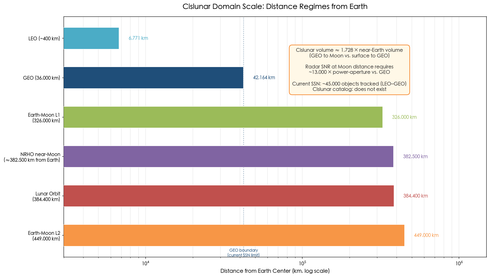

**Figure 1-1.** Logarithmic comparison of orbital distance regimes from Earth. Cislunar space — spanning from GEO to the Earth–Moon L2 point — dwarfs the near-Earth volume by a factor of approximately 1,728. The current Space Surveillance Network tracks roughly 45,000 objects within the LEO-to-GEO envelope; no equivalent catalog exists beyond GEO.

The strategic significance of this domain arises from a convergence of factors that have crystallized between 2024 and 2026: an acceleration of government and commercial lunar missions, explicit incorporation of cislunar space into national security frameworks, and a growing recognition that the absence of domain awareness in this region constitutes a critical vulnerability for spacefaring nations.

## 1.2 A Surge of Cislunar Activity: Missions in the 2025–2026 Window

The 2025–2026 period marks a qualitative inflection point in cislunar activity. On April 1, 2026, NASA launched Artemis II, carrying four astronauts on a lunar flyby trajectory reaching approximately 406,000 km — the first crewed mission beyond low Earth orbit in 53 years. [Reuters](https://www.reuters.com/science/nasa-counts-down-first-crewed-lunar-mission-half-century-2026-04-01/ "NASA launches Artemis II, Apr 1 2026") This mission not only reestablished human presence in cislunar space but also served as the first real-time military tracking exercise across the full Earth–Moon corridor, with U.S. Space Command leveraging ground-based optical systems, commercial telescope networks, and NASA mission control data to rehearse cislunar domain awareness procedures. [Aviation Week](https://aviationweek.com/defense/budget-policy-operations/pentagon-eyes-cislunar-space-next-strategic-frontier "Pentagon Eyes Cislunar Space, Mar 2026")

Commercial operators have demonstrated that cislunar access is no longer the exclusive province of national space agencies. In March 2025, two American commercial landers arrived at the Moon under NASA's Commercial Lunar Payload Services (CLPS) program: Firefly Aerospace's Blue Ghost successfully landed in Mare Crisium and completed all mission objectives, while Intuitive Machines' IM-2 reached the lunar south pole but tipped onto its side, curtailing operations. [Spaceflight Now](https://spaceflightnow.com/2025/03/07/intuitive-machines-im-2-mission-ends-with-lander-on-its-side-on-the-moon/ "Blue Ghost and IM-2 landing outcomes, Mar 2025") These missions, despite their mixed outcomes, underscore the expanding cadence of cislunar traffic. The Planetary Society projects approximately 30 lunar-bound spacecraft traversing cislunar space between 2024 and 2030, and Georgia Tech simulations indicate that merely 50 satellites in lunar orbit would require an average of four collision-avoidance maneuvers per spacecraft per year — a threshold that could be reached within a decade. [Georgia Tech News](https://news.gatech.edu/news/2025/10/30/more-moon-missions-horizon-avoiding-crowding-collisions-will-be-growing-challenge "Georgia Tech cislunar congestion study, Oct 2025")

China's cislunar program has advanced with particular ambition. The Chang'e 7 mission — comprising an orbiter, lander, rover, and a novel "hopping" detector — is scheduled for launch in the second half of 2026 (approximately November) to the rim of Shackleton Crater at the lunar south pole. It will carry 18 scientific instruments and payloads from Russia, Egypt, Italy, Sweden, Bahrain, and Thailand to conduct the first in-situ measurements of lunar water ice. [Space.com](https://www.space.com/astronomy/moon/chinas-next-moonshot-change-could-search-the-lunar-south-pole-for-water-this-year "Chang'e 7 mission details, Jan 2026") More significantly for domain awareness purposes, China has already deployed the most developed cislunar relay and navigation experimental platform of any nation: the Queqiao-2 relay satellite entered its operational orbit in March 2024, and the Tiandu-1/2 technology demonstrators have been testing communications, navigation, and orbital dynamics in dedicated cislunar and lunar orbits. [SpaceNews](https://spacenews.com/china-lays-foundation-for-cislunar-infrastructure-with-spacecraft-in-novel-lunar-orbits/ "China cislunar infrastructure, Jun 2025")

Japan, India, and Europe are also developing cislunar capabilities, albeit at different tempos. The joint ISRO–JAXA Lunar Polar Exploration (LUPEX) mission, approved in 2025, will drill and analyze water ice at the lunar south pole, with launch expected no earlier than 2028. [Open Lunar Foundation](https://www.openlunar.org/blog/2025-lunar-developments "2025 lunar developments") Japan's ispace and India's Digantara announced a partnership in September 2025 to build cislunar space situational awareness (SSA) infrastructure, combining Digantara's planned 40-satellite LEO SSA constellation with ispace's lunar landing capability — the first non-American, non-European dedicated commercial cislunar SSA initiative. [Payload Space](https://payloadspace.com/ispace-digantara-join-forces-on-cislunar-ssa/ "Sep 2025")

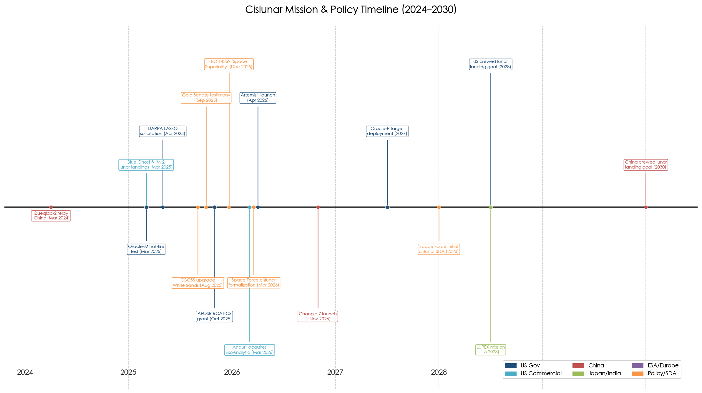

**Figure 1-2.** Timeline of major cislunar missions and policy milestones from 2024 to 2030, color-coded by entity type. The concentration of events in the 2025–2026 window — spanning commercial lunar landings, Artemis II, strategic policy directives, and sensor program milestones — illustrates the accelerating tempo that drives the demand for cislunar domain awareness.

## 1.3 Strategic Directives: Cislunar Space as a National Security Domain

The period from late 2025 through early 2026 witnessed an unprecedented cascade of policy directives and institutional actions that formally elevated cislunar space from an exploration frontier to a recognized national security domain.

On December 18, 2025, President Trump signed Executive Order 14369, "Ensuring American Space Superiority," which mandated that the United States develop capabilities for "threat detection, characterization, and counteraction from very low Earth orbit to cislunar space" and become "the standard-setter for terrestrial and cislunar positioning, navigation, and timing." [SpaceNews](https://spacenews.com/trump-signs-sweeping-executive-order-to-assert-u-s-dominance-in-space/ "Trump EO on space superiority, Dec 2025") This directive built upon the Biden administration's November 2022 National Cislunar Science and Technology Strategy, which established Goal 3: "extend U.S. space situational awareness capabilities into cislunar space," encompassing sensor development, enhanced data cooperation, and the construction of an integrated catalog of both natural and human-made cislunar objects through a "civilian open data platform." [National Cislunar S&T Strategy](https://bidenwhitehouse.archives.gov/wp-content/uploads/2022/11/11-2022-NSTC-National-Cislunar-ST-Strategy.pdf "White House Nov 2022") The bipartisan continuity is notable: two successive administrations of different political parties have identified cislunar domain awareness as a strategic priority, underscoring that the imperative transcends partisan politics.

The U.S. Space Force translated policy language into concrete organizational action. On March 17, 2026, it formally incorporated the cislunar domain into its core mission and acquisition framework, designating new Portfolio Acquisition Executives (PAEs) to integrate cislunar technology development. The announced objective is to transition from planning to initial cislunar SDA sensor deployment by 2028. [Air & Space Forces Magazine](https://www.airandspaceforces.com/space-force-serious-planning-cislunar-ops/ "Space Force 'Serious' About Planning for Cislunar Operations, Mar 2026") [SatNews](https://satnews.com/2026/03/18/space-force-formalizes-cislunar-strategy-amid-acquisition-restructuring/ "Space Force Formalizes Cislunar Strategy, Mar 2026")

Senior military leaders have articulated the threat calculus with unusual directness. Commander of U.S. Space Command General Stephen Whiting stated in February 2026: "We want to make sure we're not surprised in cislunar space, that other actors do not gain military advantage." Chief of Space Operations General Chance Saltzman warned that "as American interests extend deeper into space, the need to protect those interests grows." [Aviation Week](https://aviationweek.com/defense/budget-policy-operations/pentagon-eyes-cislunar-space-next-strategic-frontier "Pentagon Eyes Cislunar Space, Mar 2026") [Ars Technica](https://arstechnica.com/space/2026/03/nasa-is-leading-the-way-to-the-moon-but-the-military-wont-be-far-behind/ "Apr 2026") These statements mark a departure from the abstract, future-oriented language that characterized earlier cislunar discussions; they reflect an operational urgency rooted in the recognition that competitor nations are already deploying assets in cislunar orbits.

## 1.4 Building the Eyes: Early SDA Programs and Investments

Translating strategic intent into operational capability requires sensors, algorithms, and infrastructure — and the investment pipeline, while accelerating, remains in its earliest stages.

The most mature U.S. government cislunar SDA programs are the Air Force Research Laboratory's Oracle satellite series, part of the broader Cislunar Highway Patrol System (CHPS). Oracle-M, built by Blue Canyon Technologies with RTX propulsion, completed its propulsion module hot-fire test in March 2025 and was placed in storage at Kirtland Air Force Base in February 2026 awaiting launch. However, the ULA Vulcan rocket — designated to carry Oracle-M on the USSF-112 mission — experienced a solid rocket motor anomaly on February 12, 2026, grounding the vehicle and imposing at least a six-month delay. [SSC/AFRL](https://www.ssc.spaceforce.mil/newsroom/article-display/article/4176371/oracle-m-hot-fire-test-a-major-milestone-in-cislunar-space-situational-awarenes "Oracle-M Hot Fire Test, Mar 2025") The follow-on Oracle-P, a dedicated SSA experiment satellite equipped with wide-field search and narrow-field characterization sensors along with on-board image processing, is under construction with a target deployment to a halo orbit near the Earth–Moon L1 point in 2027. [AFRL](https://afresearchlab.com/cislunar-highway-patrol-system-chps/ "AFRL Oracle overview")

DARPA has opened a complementary line of effort with the LASSO (Lunar Assay via Small Satellite Orbiter) program, which in April 2025 solicited proposals for autonomous, maneuverable small satellites capable of performing cislunar domain awareness from low lunar orbit. LASSO challenges the traditional paradigm of large, precision-optics platforms by seeking agile, low-cost sensing nodes that can be produced and deployed in greater numbers. The solicitation completed its Step-2 phase on February 20, 2026; contract awards had not been publicly announced as of April 2026. [Via Satellite](https://www.satellitetoday.com/technology/2025/04/15/darpa-program-seeks-autonomous-maneuverable-satellites-for-cislunar-domain-awareness/ "DARPA LASSO solicitation, Apr 2025")

On the ground, the Space Force's Ground-Based Optical Space Surveillance (GBOSS) system received a significant upgrade. L3Harris delivered an upgraded GBOSS system at White Sands Missile Range that achieved operational acceptance in August 2025, capable of surveying orbital activity from low Earth orbit to deep space within minutes. Upgrades at the Maui site are underway, and new stations in Spain and Australia are planned to expand the network from three to five sites, under a contract valued at $119 million with options to $218 million. [L3Harris](https://www.l3harris.com/newsroom/press-release/2025/08/l3harris-upgrades-us-space-force-telescopes-space-domain-awareness "L3Harris Aug 2025") [Aviation Week](https://aviationweek.com/defense/budget-policy-operations/pentagon-eyes-cislunar-space-next-strategic-frontier "GBOSS status, Mar 2026")

The commercial sector has emerged as a critical force multiplier. In March 2026, Anduril Industries acquired ExoAnalytic Solutions, integrating ExoAnalytic's global network of over 400 telescopes and its SDA analytics software into Anduril's Lattice command-and-control platform. ExoAnalytic has demonstrated cislunar tracking capability since 2020, and the acquisition signals growing private-sector confidence that cislunar SDA represents a viable and enduring market. [Aviation Week](https://aviationweek.com/defense/budget-policy-operations/pentagon-eyes-cislunar-space-next-strategic-frontier "Anduril-ExoAnalytic deal, Mar 2026") Separately, the Air Force Office of Scientific Research awarded a $1 million grant in October 2025 to Rensselaer Polytechnic Institute and Texas A&M University for the RCAT-CS project, which is developing algorithms for a constellation of 3–10 sensor satellites in halo orbits around the Earth–Moon Lagrange points — an early investment in the analytical foundations upon which future space-based architectures will depend. [Aerospace America/AIAA](https://aerospaceamerica.aiaa.org/u-s-air-force-awards-grant-for-cislunar-constellation-to-track-spacecraft-and-debris/ "AFOSR RCAT-CS grant, Oct 2025")

## 1.5 The Geopolitical Context: A U.S.–China Lunar Competition

The urgency surrounding cislunar SDA cannot be understood apart from the intensifying competition between the United States and China for strategic position on and around the Moon. The United States targets a crewed lunar landing by 2028 under the Artemis program; China has announced a goal of landing taikonauts on the Moon by 2030. Former NASA Deputy Administrator Michael Gold, testifying before the U.S. Senate in September 2025, stated plainly: "The nation that reaches the lunar surface first will set the rules for lunar activities." [Aviation Week](https://aviationweek.com/defense/budget-policy-operations/pentagon-eyes-cislunar-space-next-strategic-frontier "Gold testimony, Mar 2026")

The two programs are undergirded by fundamentally different coalition models. The Artemis Accords, a U.S.-led political framework for lunar cooperation, had attracted 61 signatories as of January 2026, including Japan, Canada, the United Kingdom, Australia, South Korea, India, and numerous European nations. [NASA](https://www.nasa.gov/artemis-accords/ "61 signatories") China and Russia co-lead the International Lunar Research Station (ILRS), which by April 2025 had grown to include 17 countries and international organizations — among them Pakistan, the United Arab Emirates, Egypt, Thailand, South Africa, Turkey, Belarus, Azerbaijan, Venezuela, and Serbia — along with more than 50 international research institutions. [CNSA](https://www.cnsa.gov.cn/english/n6465652/n6465653/c10670178/content.html "ILRS attracts more partners, Apr 2025") China's stated long-term ambition is to engage 50 countries, 500 research institutions, and 5,000 scientists in the ILRS over the coming decade. Critically, neither framework includes binding transparency obligations or data-sharing requirements that could support mutual cislunar domain awareness — a governance gap explored in detail in Chapter 7.

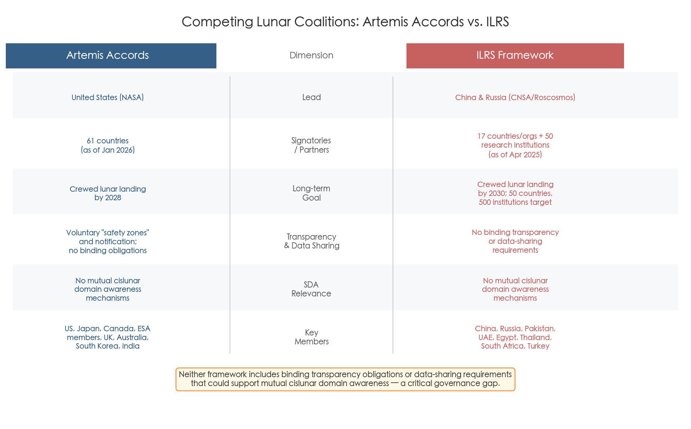

**Figure 1-3.** Side-by-side comparison of the Artemis Accords and the International Lunar Research Station (ILRS) frameworks across key dimensions. Neither coalition imposes binding transparency or data-sharing obligations that would facilitate mutual cislunar domain awareness, representing a significant governance gap as both blocs accelerate lunar operations.

China's investment in cislunar infrastructure — Queqiao-2 for relay communications, Tiandu satellites for navigation and dynamics experiments, Chang'e 7 and the forthcoming Chang'e 8 for surface operations — establishes a foundation that is inherently dual-use. A relay satellite that supports scientific communication simultaneously provides persistent coverage of a region of cislunar space. A navigation beacon that enables precision landing also constitutes positioning infrastructure with potential military applications. The Center for Strategic and International Studies (CSIS), in an October 2024 assessment, observed that cislunar space currently has "almost no space situational awareness" and that spacecraft operating in the region are effectively "flying with one eye closed." [CSIS](https://www.csis.org/analysis/salmon-swimming-upstream-charting-course-cislunar-space "Oct 2024")

## 1.6 The Awareness Gap: Why Domain Awareness Is the Prerequisite

The convergence of accelerating mission tempo, formalized military interest, great-power competition, and dual-use infrastructure deployment creates a situation in which the ability to detect, track, identify, and characterize objects in cislunar space is not merely a technical desideratum but a strategic prerequisite.

The consequences of the awareness gap are concrete and multi-dimensional. Without domain awareness, collision avoidance is impossible: no cislunar equivalent of the conjunction data messages that enable maneuver coordination in LEO and GEO currently exists. Without domain awareness, intent assessment is impossible: a spacecraft on a low-energy transfer from a Lagrange point could be repositioning for a scientific observation or for proximity operations against a high-value asset, and without tracking data, no determination can be made. Without domain awareness, the legal frameworks governing space activity — the Outer Space Treaty's "due regard" provision, the Liability Convention's fault-based regime, the Artemis Accords' safety zone concept — become unenforceable abstractions, because compliance cannot be verified and violations cannot be attributed.

The Space Force's utilization of the Artemis II transit as a live tracking exercise underscores a critical asymmetry. The April 2026 exercise involved a cooperative target with known orbital parameters, full telemetry, and pre-coordinated ground truth. Tracking a non-cooperative object of unknown provenance — with no prior orbital elements and potentially employing low-thrust maneuvers through the chaotic three-body dynamical environment — represents an entirely different and far more demanding operational challenge. The Artemis I precedent from late 2022, when Space Delta 2 tracked that uncrewed mission over its 25-day, 1.4-million-mile journey, provided initial lessons for beyond-GEO (xGEO) tracking concepts but simultaneously revealed the limitations of existing sensor coverage and data-processing pipelines. [U.S. Space Forces – Space](https://www.spaceforces-space.mil/Newsroom/Article/3249252/delta-2-leverages-space-domain-awareness-in-support-of-artemis-i/ "Dec 2022")

The fundamental challenge is one of scale, physics, and time. Cislunar surveillance volume is roughly 1,000 times that of the GEO belt. Passive optical sensing — the only viable wide-area modality at these distances — operates under severe constraints from solar, lunar, and Earth exclusion zones that can render targets unobservable for days or weeks. Ground-based optical telescopes, even at limiting magnitudes of 20, leave significant detection gaps for meter-class objects in high cislunar orbits. Radar, the workhorse of near-Earth surveillance, is rendered impractical at lunar distances: the signal-to-noise ratio degrades as the inverse fourth power of range, requiring approximately 13,000 times the power-aperture product at 384,000 km compared to GEO at 36,000 km. [Rude (MIT 2025)](https://dspace.mit.edu/bitstream/handle/1721.1/162417/rude-rudc6118-sm-tpp-2025-thesis.pdf.pdf "MIT Thesis 2025") These physical realities dictate that cislunar SDA will require a fundamentally new architecture — space-based sensors in dedicated cislunar orbits, advanced multi-body orbit determination algorithms, and novel data standards replacing the two-body TLE format that undergirds the current space surveillance paradigm.

## 1.7 A Narrow Window of Opportunity

The 2026–2028 period represents a narrow window during which the architectural choices, institutional arrangements, and international norms for cislunar domain awareness will be established — or, by default, will fail to be established, with consequences that may prove irreversible.

As of April 2026, no dedicated cislunar SDA sensor is operational in space. Oracle-M awaits a grounded rocket; Oracle-P targets 2027; LASSO remains in solicitation; and NASA's Lunar Gateway — which would have provided an indirect monitoring node in Near-Rectilinear Halo Orbit (NRHO) — was suspended in March 2026 in favor of a $20 billion lunar surface base program. [SpaceNews](https://spacenews.com/nasa-halts-work-on-gateway-to-develop-a-lunar-base/ "Mar 24 2026") The Space Force's own timeline targets initial sensor deployment by 2028, meaning that for the next two years, cislunar awareness will depend almost entirely on ground-based telescopes and commercial optical networks offering approximately 10% temporal coverage of the domain. [Paetzold et al.](https://conference.sdo.esoc.esa.int/proceedings/sdc9/paper/258/SDC9-paper258.pdf "ESA SDC9 2025")

Allied and partner-nation efforts, while growing, have not yet closed the gap. The European Space Agency's cislunar engagement remains, in the assessment of the European Space Policy Institute, "fragmented, passive — lagging behind the United States in both investment and strategic coordination." [ESA Space Safety Blog](https://blogs.esa.int/spacesafety-community/2025/07/17/towards-a-safe-and-sustainable-cislunar-space/ "Jul 2025") ESA's LUMOS (Lunar Monitoring System) Phase A study, led by Politecnico di Milano, concluded in February 2026; GMV received an ESA contract in August 2025 for cislunar surveillance observation strategy and sensor design. [GMV](https://www.gmv.com/en-es/communication/news/gmv-signs-contract-advance-cis-lunar-space-surveillance "Aug 2025") [Politecnico di Milano](https://www.aero.polimi.it/en/research-projects/esa-lumos-phase-a-of-cis-lunar-space-object-monitoring-mission "LUMOS Phase A") The United Kingdom's National Space Operations Centre has been operational for over a year, but its Deep Space Advanced Radar Concept (DARC) targets GEO rather than cislunar distances, and a 2026 King's College London assessment concluded that the UK is "heavily reliant on U.S. systems" with space expenditure below 0.05% of GDP. [King's College London](https://www.kcl.ac.uk/reflections-on-uk-spacepower-lessons-from-2025-and-what-comes-next "2026")

The Outer Space Institute's February 2025 workshop concluded with a pointed warning: "The nation or coalition that first establishes systems and frameworks around the Moon will most significantly influence the development of the 'rules of the road.'" [OSI Cislunar Security Report](https://outerspaceinstitute.ca/osisite/wp-content/uploads/Workshop-Report-on-cislunar-security-FINAL-2FEB2025.pdf "New Moon: A Cislunar Security Workshop Report, Feb 2025") We assess that cislunar Space Domain Awareness is the foundational enabler without which neither safe exploration, nor responsible resource utilization, nor credible deterrence in the Earth–Moon system can be achieved. The technical architectures, algorithmic foundations, operational concepts, and governance frameworks required to close the cislunar awareness gap form the subject of the remainder of this report.

# 第2章 The Cislunar Environment — Orbital Mechanics, Dynamics, and Observability Constraints

Conducting space domain awareness (SDA) in the cislunar regime—the volume stretching from geostationary orbit (GEO, ~36,000 km) to beyond the Moon (~384,400 km)—demands a fundamental departure from the techniques and assumptions that have underpinned near-Earth surveillance for six decades. The cislunar domain is approximately 1,000 times larger by volume than the GEO belt, yet it is governed by gravitational dynamics for which the entire existing catalog infrastructure—Two-Line Elements (TLEs), the SGP4 propagator, and Keplerian orbit taxonomy—is physically invalid. This chapter establishes the dynamical and observational foundations that make cislunar SDA qualitatively harder than any tracking mission previously attempted. It proceeds through five analytical threads: the principal orbit families and their strategic relevance (§2.1), the transition from two-body to chaotic three-body dynamics (§2.2), the low-energy maneuver connectivity that frustrates intent attribution (§2.3), the sensor-physics constraints that confine cislunar surveillance to passive optics (§2.4), and the geometric observability limits imposed by exclusion zones and phase-angle effects (§2.5). A quantitative comparison with GEO-belt surveillance (§2.6) anchors these findings in operational context, and the chapter concludes with the architectural imperatives that flow from them (§2.7).

## 2.1 The Cislunar Orbital Zoo: Families, Periods, and Strategic Relevance

Unlike the orderly Keplerian taxonomy of low-Earth orbit (LEO) through GEO, the cislunar domain hosts a rich tapestry of orbit families whose geometry is governed by the simultaneous gravitational influence of the Earth and Moon. The Circular Restricted Three-Body Problem (CR3BP) provides the canonical mathematical framework, admitting five equilibrium (Lagrange) points and an infinite hierarchy of periodic and quasi-periodic orbit families emanating from them. Five orbit families are of principal concern for SDA:

**Low Lunar Orbit (LLO).** Altitudes of approximately 100 km above the lunar surface yield orbital periods of roughly 90 minutes—comparable to LEO around Earth. LLO is the regime of lunar mapping missions (e.g., NASA's Lunar Reconnaissance Orbiter) and future crewed surface-access vehicles. Because of the Moon's highly inhomogeneous gravity field (mascons), most LLO orbits are unstable over weeks to months and require periodic station-keeping. From Earth, LLO targets are at or near the maximum cislunar distance (~384,400 km) and exhibit rapid angular motion against the lunar disk, presenting severe detection and tracking challenges.

**Elliptical Frozen Orbits.** Certain lunar inclinations and eccentricities yield orbits that are "frozen" against secular perturbation by mascons, with periods on the order of 9 hours. These orbits are favored for sustained lunar polar relay and regional navigation coverage. Their observability from Earth varies dramatically over a single period as the spacecraft swings from near-side to far-side.

**Near Rectilinear Halo Orbits (NRHO).** NASA's Artemis Gateway was designed for the L2 southern NRHO, a member of the L2 halo family with a 9:2 synodic resonance. This orbit has a period of approximately 6.5 days, a near-lunar-point (periselene) of ~1,800 km, and a far-lunar-point (aposelene) of ~68,000 km. Station-keeping costs are remarkably low at approximately 10 m/s per year. [NASA Artemis White Paper](https://www.lpi.usra.edu/lunar/artemis/resources/WhitePaper_2023_WhyNRHA-TheArtemisOrbit.pdf "NASA 2023 — Why NRHO: The Artemis Orbit") The NRHO has become the reference cislunar orbit for human exploration architecture and, by extension, a priority target class for SDA.

**Lagrange-Point Halo and Lyapunov Orbits.** The L1 and L2 collinear points each support families of planar Lyapunov orbits and three-dimensional halo orbits with periods ranging from roughly 8 to 14 days. L1 halo orbits are strategically significant because they offer persistent line-of-sight to both the Earth and the near side of the Moon—ideal for communication relay, but also for covert observation. L2 halo orbits, positioned beyond the lunar far side, are inherently shielded from direct Earth observation during portions of their period.

**Distant Retrograde Orbits (DRO).** DROs encircle the Moon in the direction opposite to its orbital motion around the Earth, with periods of approximately 12 to 30 days depending on the family member's size. The defining characteristic of DROs is their exceptional linear stability: they resist perturbations far more effectively than any halo or Lyapunov orbit, making them attractive for long-duration storage or staging. [NASA Artemis White Paper](https://www.lpi.usra.edu/lunar/artemis/resources/WhitePaper_2023_WhyNRHA-TheArtemisOrbit.pdf "NASA 2023") [Paetzold et al.](https://conference.sdo.esoc.esa.int/proceedings/sdc9/paper/258/SDC9-paper258.pdf "ESA SDC9 2025")

A critical SDA implication of this orbital diversity is that objects in the cislunar domain cannot be described by a single set of orbital elements. An L2 halo orbit target may be 60,000 km from the Moon at one point in its period and 384,400 km from Earth at another; a DRO target may remain quasi-stationary relative to the Moon for weeks. No single observer location can maintain continuous visibility of all families simultaneously—a constraint that will dominate sensor architecture design (addressed in Chapter 3).

Figure 2-1 provides a structured summary of these five orbit families, comparing their key dynamical and observability parameters.

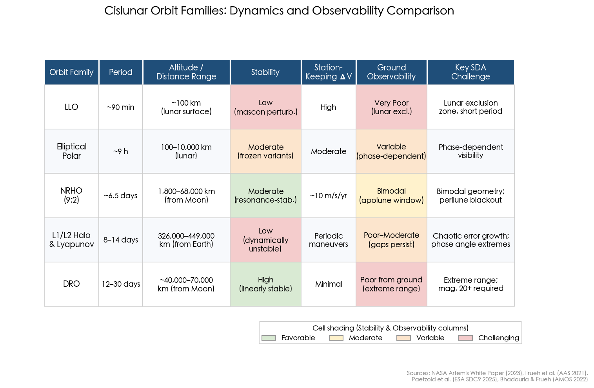

*Figure 2-1. Comparative parameters of the five principal cislunar orbit families. Cell shading indicates relative favorability for stability and ground observability (green = favorable, red = challenging). Data synthesized from [NASA Artemis White Paper](https://www.lpi.usra.edu/lunar/artemis/resources/WhitePaper_2023_WhyNRHA-TheArtemisOrbit.pdf "NASA 2023"), [Frueh et al.](https://engineering.purdue.edu/people/kathleen.howell.1/Publications/Conferences/2021_AAS_FruHowDeMBha.pdf "AAS 21-290, 2021"), [Paetzold et al.](https://conference.sdo.esoc.esa.int/proceedings/sdc9/paper/258/SDC9-paper258.pdf "ESA SDC9 2025"), and [Bhadauria & Frueh](https://amostech.com/TechnicalPapers/2022/Cislunar-SSA/Bhadauria.pdf "AMOS 2022").*

## 2.2 From Kepler to Chaos: The Dynamical Transition Beyond GEO

The fundamental reason cislunar SDA is harder than near-Earth surveillance lies in the collapse of the two-body approximation that has served as the backbone of orbital mechanics since the dawn of the Space Age. In LEO through GEO, Earth's gravity dominates and orbital motion is well described by Kepler's laws with small perturbations from the J2 oblateness term, solar radiation pressure (SRP), lunisolar gravity, and atmospheric drag. The U.S. Space Surveillance Network (SSN) has operated for decades on this basis, encoding orbits as Two-Line Element (TLE) sets and propagating them with the SGP4 analytical model.

Beyond GEO, this convenient framework rapidly deteriorates. The Moon's gravitational influence grows until, at approximately 50,000–60,000 km from the lunar surface (roughly the L1 distance), the gravitational accelerations of Earth and Moon become comparable and the two-body framework collapses entirely. The minimum dynamical model for meaningful orbit prediction in this regime is the CR3BP, which treats the Earth and Moon as co-rotating point masses. For operational precision, even the CR3BP is insufficient: the full cislunar force environment includes Earth's gravity field (central force plus J2 through J4 or higher zonal and tesseral harmonics), the Moon's point-mass or spherical-harmonic gravity, solar gravity, Jupiter's gravity, and SRP. [Frueh, Howell, DeMars & Bhadauria](https://engineering.purdue.edu/people/kathleen.howell.1/Publications/Conferences/2021_AAS_FruHowDeMBha.pdf "AAS 21-290 — Cislunar SSA, 2021") [JHU/APL Cislunar Security Vision](https://www.jhuapl.edu/Content/documents/CislunarSecurityNationalTechnicalVision.pdf "JHU APL 2022")

The practical consequences for SDA are severe:

**TLE/SGP4 is wholly inapplicable.** The SGP4 propagator, designed for near-Earth perturbative dynamics, produces meaningless predictions for any orbit significantly influenced by the Moon's gravity. JHU/APL has recommended that the cislunar domain adopt SPICE-kernel or similar ephemeris formats, maintained by the originating orbit-determination authority and distributed with full dynamical-model metadata—a fundamental shift from the broadcast TLE paradigm that has underpinned SSN operations for over fifty years. [JHU/APL](https://www.jhuapl.edu/Content/documents/CislunarSecurityNationalTechnicalVision.pdf "JHU APL 2022")

**Propagation fidelity is computationally expensive.** Wishnek and Holzinger (University of Colorado Boulder, AMOS 2021) systematically assessed propagation accuracy across cislunar orbit regimes. Using a high-fidelity truth model (EGM2008 degree-360, GRGM1200A degree-165, all planets, solid tides, drag, and SRP), they found that a fourth-order geopotential model with all major solar-system bodies achieved sub-kilometer position errors after one solar day for most cislunar orbits; L1/L2 halo orbits achieved approximately 25-meter accuracy under this configuration. Stripping planetary perturbations (retaining only Earth, Moon, and Sun) degraded halo-orbit accuracy by more than an order of magnitude to the single-kilometer level. Reducing further to point-mass-only dynamics pushed GEO errors above 10 km and certain MEO cases near 100 km, while halo orbits remained below 1 km but fell far short of the 25-meter benchmark. These results underscore that computationally cheap propagators sacrifice the accuracy margins on which custody maintenance depends. [Wishnek & Holzinger](https://amostech.com/TechnicalPapers/2021/Cislunar-SSA/Wishnek.pdf "AMOS 2021 — Robust Cislunar IOD")

**Chaotic sensitivity amplifies uncertainty.** The most consequential dynamical feature for SDA is that many cislunar orbit families—particularly L1 and L2 halo and Lyapunov orbits—are linearly unstable, meaning small errors in initial state knowledge grow exponentially, characterized by positive Lyapunov exponents. Frueh et al. (Purdue, AAS 2021) conducted Monte Carlo simulations comprising 1,000 trials with initial uncertainties of σ = 10 m in position and 10 mm/s in velocity. For Lyapunov orbits propagated under a full ephemeris model, the uncertainty distribution within a single orbital period (~30 days) evolved into "anomalously complex curves and crossing structures" bearing no resemblance to the familiar banana-shaped distributions of near-Earth covariance propagation. DROs, owing to their linear stability, exhibited slower uncertainty growth but still developed non-symmetric, non-Gaussian distributions within 20–30 days. [Frueh, Howell, DeMars & Bhadauria](https://engineering.purdue.edu/people/kathleen.howell.1/Publications/Conferences/2021_AAS_FruHowDeMBha.pdf "AAS 21-290, 2021")

The operational implication is direct: custody chains in cislunar space are inherently fragile. If a tracking system loses contact with an object in an unstable halo orbit for as little as one to two weeks, the uncertainty cloud may expand and distort so severely that reacquisition becomes a search problem rather than a prediction problem—a qualitative degradation with no near-Earth analogue.

## 2.3 Low-Energy Accessibility and the Maneuver Ambiguity Problem

Beyond propagation uncertainty, the energy landscape of the cislunar domain creates a second, distinct layer of SDA difficulty: the ease with which objects can transition between orbit families using remarkably small velocity changes (delta-v), and the consequent impossibility of attributing intent from trajectory data alone.

JHU/APL's 2022 National Technical Vision document quantified the key transfer costs. From LEO to a cislunar Lagrange point requires 3.4–4.0 km/s of delta-v—comparable to the 3.9 km/s needed for a LEO-to-GEO transfer. Once in the cislunar vicinity, however, inter-family transfers become extraordinarily cheap: an L1-to-L2 transfer requires only approximately 140 m/s, and an L1-to-L4/L5 transfer approximately 340 m/s. [JHU/APL Cislunar Security Vision](https://www.jhuapl.edu/Content/documents/CislunarSecurityNationalTechnicalVision.pdf "JHU APL 2022")

This low-energy connectivity means that a spacecraft with modest propulsion capability—even a small satellite equipped with a Hall-effect thruster—can exploit the dynamical structure of the three-body problem to migrate among halo orbits, Lyapunov orbits, DROs, and lunar transfer trajectories with minimal fuel expenditure. From an SDA perspective, this creates what we term the *maneuver ambiguity problem*: a custody gap of merely days to weeks may be sufficient for a maneuvering object to depart its original orbit family entirely and arrive at a dynamically distinct destination, with no kinematic signature linking the pre-gap and post-gap observation arcs.

The challenge is compounded by the existence of stable and unstable invariant manifolds associated with L1 and L2 periodic orbits. These manifolds form natural "tubes" in phase space that connect cislunar orbit families to each other and to near-Earth space. An object riding an unstable manifold away from an L1 halo orbit can, with zero additional delta-v, follow a ballistic path that asymptotically approaches an entirely different orbit regime—including return trajectories to the GEO belt. The AFRL Primer on Cislunar Space explicitly identified this manifold-mediated connectivity as a security concern: an adversary could park a spacecraft in a cislunar halo orbit, wait for a favorable manifold departure window, and later deploy the vehicle toward GEO along a ballistic trajectory that would appear to near-Earth sensors as an object emerging from deep space with no prior track history. [AFRL](https://www.afrl.af.mil/Portals/90/Documents/RV/A%20Primer%20on%20Cislunar%20Space_Dist%20A_PA2021-1271.pdf "AFRL Primer on Cislunar Space, 2021")

## 2.4 Sensor Physics at Cislunar Distances: The Dominance of Passive Optics

The extreme distances of the cislunar domain impose hard physical limits on which sensing modalities can contribute to SDA. A quantitative examination of the underlying sensor physics reveals a fundamental asymmetry: passive optical observation scales as the inverse square of range (R⁻²), while active radar scales as the inverse fourth power (R⁻⁴). This asymmetry determines the entire architecture of cislunar surveillance and eliminates radar from any credible wide-area detection role.

### 2.4.1 The Radar Wall: Why Active Sensing Fails at Lunar Distance

The received signal-to-noise ratio (SNR) of a monostatic radar follows the classic radar range equation, in which SNR scales as R⁻⁴—the inverse fourth power of range. This R⁻⁴ dependence arises because the transmitted signal must traverse the distance to the target (R⁻² spreading loss on the outbound path) and the reflected echo must return over the same distance (another R⁻² loss on the return path).

The quantitative consequence for cislunar SDA is stark. GEO, the most distant regime currently tracked by ground-based radar, lies at approximately 36,000 km. The Moon orbits at approximately 384,400 km—a factor of 10.7× farther. Because SNR scales as R⁻⁴, maintaining equivalent detection performance at lunar distance would require increasing the power-aperture product by (384,400 / 36,000)⁴ ≈ 13,100. In practical terms, a radar system that achieves adequate SNR against a 1 m² target at GEO would need roughly 13,000 times its current power-aperture product to detect the same target at lunar distance—a requirement that no existing or planned ground-based radar approaches. The Deep-Space Advanced Radar Capability (DARC), under development by Northrop Grumman for the United Kingdom's National Space Operations Centre, and the U.S. Long Range Discrimination Radar (LRDR) are both designed for near-Earth targets and fall orders of magnitude short of this threshold. [Rude](https://dspace.mit.edu/bitstream/handle/1721.1/162417/rude-rudc6118-sm-tpp-2025-thesis.pdf.pdf "MIT Thesis 2025") [Priedhorsky et al.](https://arc.aiaa.org/doi/10.2514/1.A35951 "AIAA JSR 2024")

LIDAR (laser ranging) faces the identical R⁻⁴ limitation for non-cooperative targets, since it too requires round-trip signal propagation. Cooperative laser retroreflector ranging—as practiced by the Lunar Laser Ranging experiment using Apollo-era corner-cube arrays—achieves millimeter-level precision, but requires prior knowledge of the target's location and a cooperative reflector. It is therefore useful for precision orbit determination of known, instrumented spacecraft, but fundamentally incapable of search or detection missions against unknown or non-cooperative targets.

### 2.4.2 Passive Optical: The R⁻² Advantage

Passive optical sensing—detecting sunlight reflected from a target—follows an R⁻² intensity law rather than R⁻⁴, because only a one-way path is involved: the Sun illuminates the target, and the reflected photons travel to the sensor. This quadratic rather than quartic range dependence makes passive optics the only viable wide-area surveillance modality for cislunar space. The consensus across all major studies reviewed—Frueh et al. (Purdue), Priedhorsky et al. (LANL/AIAA), Rude (MIT), Paetzold et al. (ESA), and JHU/APL—is unequivocal on this point. [Rude](https://dspace.mit.edu/bitstream/handle/1721.1/162417/rude-rudc6118-sm-tpp-2025-thesis.pdf.pdf "MIT Thesis 2025") [Paetzold et al.](https://conference.sdo.esoc.esa.int/proceedings/sdc9/paper/258/SDC9-paper258.pdf "ESA SDC9 2025")

However, passive optics introduces its own set of distance-related challenges. A target's apparent visual magnitude (brightness) decreases with the square of distance and depends critically on three additional factors: the target's physical cross-section and albedo (encapsulated in the albedo-area product), the solar phase angle (the Sun-target-observer geometry), and background clutter. At cislunar distances, even large spacecraft (bus dimensions of several meters) produce apparent magnitudes in the range of 18–26, placing them at or beyond the detection limits of most ground-based telescopes.

Priedhorsky et al. (LANL, AIAA Journal of Spacecraft and Rockets 2024) quantified the performance of a modest 35-cm space-based telescope positioned at the L4 or L5 Lagrange point. Exploiting the deep-space dark background (~22.3 mag/arcsec²) and photon-counting detectors, such a system could detect and localize a 1-meter-class object at 384,400 km in a 10-second integration, with transverse positional accuracy better than 100 m. A 10,000 × 10,000 pixel focal plane array could scan a 60° × 6° cislunar corridor in approximately 67 minutes. [Priedhorsky et al.](https://arc.aiaa.org/doi/10.2514/1.A35951 "AIAA JSR 2024")

This result demonstrates that the physics of passive optical detection at cislunar range is tractable with modest apertures—the challenge is not raw detectability but rather the geometric and temporal constraints on when targets are observable.

The stark divergence between passive-optical and active-radar performance is summarized in Figure 2-2.

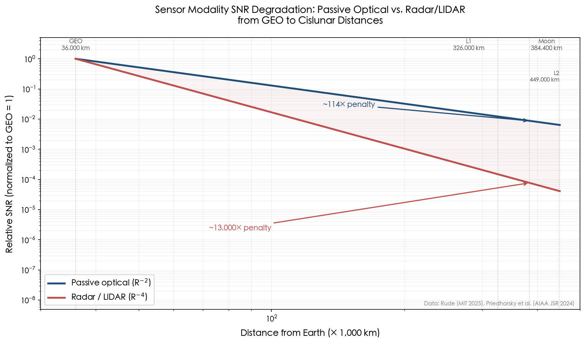

*Figure 2-2. Relative signal-to-noise ratio for passive optical (R⁻²) and radar/LIDAR (R⁻⁴) sensing modalities, normalized to GEO (36,000 km). At lunar distance (384,400 km), passive optics incurs a ~114× penalty in flux while radar requires a ~13,000× increase in power-aperture product—an insurmountable gap for any existing or planned system. Data from [Rude](https://dspace.mit.edu/bitstream/handle/1721.1/162417/rude-rudc6118-sm-tpp-2025-thesis.pdf.pdf "MIT Thesis 2025") and [Priedhorsky et al.](https://arc.aiaa.org/doi/10.2514/1.A35951 "AIAA JSR 2024").*

## 2.5 Observability Constraints: Exclusion Zones, Phase Angles, and Viewing Geometry

Even with passive optical sensors of sufficient sensitivity, the cislunar observation problem is subject to three categories of geometric constraint that create intermittent—and often prolonged—observation blackouts. These constraints are not engineering limitations to be overcome by better hardware; they are intrinsic properties of the Sun–Earth–Moon geometry.

### 2.5.1 Exclusion Zones

Optical sensors cannot observe targets whose lines of sight pass too close to bright extended sources. Three exclusion zones dominate cislunar geometry:

- **Solar exclusion zone:** a cone of approximately 50° half-angle centered on the Sun, within which scattered sunlight saturates or blinds the detector.
- **Lunar exclusion zone:** approximately 35° half-angle, caused by the Moon's surface brightness and scattered light from the illuminated lunar disk.
- **Earth exclusion zone:** approximately 30° half-angle for space-based sensors, driven by Earth's brightness and its angular extent.

For objects in long-period cislunar orbits (halo, Lyapunov, DRO), portions of the trajectory may remain within one or more exclusion zones for days to weeks at a time. Bhadauria and Frueh (Purdue, AMOS 2022) conducted a systematic visibility analysis in the Bicircular Restricted Four-Body Problem (BCR4BP) and demonstrated that no single observer location in cislunar space can achieve 100% visibility of any target orbit family. Certain orbit–observer geometries produced continuous exclusion periods exceeding 10 days—intervals long enough to trigger the custody-loss mechanisms described in §2.2. [Bhadauria & Frueh](https://amostech.com/TechnicalPapers/2022/Cislunar-SSA/Bhadauria.pdf "AMOS 2022") [Paetzold et al.](https://conference.sdo.esoc.esa.int/proceedings/sdc9/paper/258/SDC9-paper258.pdf "ESA SDC9 2025")

### 2.5.2 Solar Phase Angle and Target Brightness

The solar phase angle—defined as the angle at the target between the Sun and the observer—exerts a dominant influence on a target's apparent brightness. At small phase angles (target roughly between Sun and observer), the illuminated cross-section is large and the target is at its brightest. As the phase angle approaches 180° (target roughly between observer and Sun), the target presents an increasingly narrow crescent or fully shadowed face and can dim by 10 or more magnitudes—from potentially detectable (magnitude ~20) to effectively invisible (magnitude ~30+). Bhadauria and Frueh's BCR4BP visibility analysis confirmed that at large phase angles, targets become "completely undetectable" regardless of sensor sensitivity, establishing phase angle as the single most important determinant of instantaneous observability. [Bhadauria & Frueh](https://amostech.com/TechnicalPapers/2022/Cislunar-SSA/Bhadauria.pdf "AMOS 2022")

### 2.5.3 Ground-Based vs. Space-Based Observability

The compounding of distance, exclusion zones, and phase-angle effects produces a stark asymmetry between ground-based and space-based sensor performance in the cislunar domain.

**Ground-based sensors.** Frueh et al. (AAS 2021) found that a ground-based optical sensor network with a limiting magnitude of 16 could cover only a tiny fraction of the DRO family for a reference target (3.54-meter-radius high-reflectivity sphere). Even a more capable global network with limiting magnitude 20 exhibited "significant observation gaps" for Lyapunov orbits at maximum Earth distance and for transfer trajectories. A diffuse-reflecting target of 1.8-meter radius with a diffuse coefficient of 0.5 was undetectable for the majority of its cislunar trajectory. [Frueh et al.](https://engineering.purdue.edu/people/kathleen.howell.1/Publications/Conferences/2021_AAS_FruHowDeMBha.pdf "AAS 21-290, 2021")

Paetzold et al. (ESA, SDC9 2025) quantified this further: for a 1-meter target, the median apparent visual magnitude from ground or GEO-based sensors is approximately 20.5—below the 18th-magnitude detection threshold of most operational systems. Only about 30% of cislunar grid points were observable, and only during approximately 10% of simulated time windows. [Paetzold et al.](https://conference.sdo.esoc.esa.int/proceedings/sdc9/paper/258/SDC9-paper258.pdf "ESA SDC9 2025")

**Space-based sensors.** The same ESA study found that deploying six sensor stations on the lunar surface raised average observable time to above 50%. More significantly, a constellation of just 3–7 satellites placed in DRO, Lyapunov, and halo orbits achieved 88–95% average observable time—a near-order-of-magnitude improvement over ground-based systems. The physical advantages of space-based sensors are threefold: they operate above the atmosphere (eliminating atmospheric seeing, weather interruptions, and extinction losses), they can be positioned to minimize exclusion-zone overlap across multiple observers, and the deep-space sky background is far darker than the terrestrial night sky, enabling detection of fainter targets. [Paetzold et al.](https://conference.sdo.esoc.esa.int/proceedings/sdc9/paper/258/SDC9-paper258.pdf "ESA SDC9 2025")

Figure 2-3 summarizes the quantitative observability gap across sensor architectures.

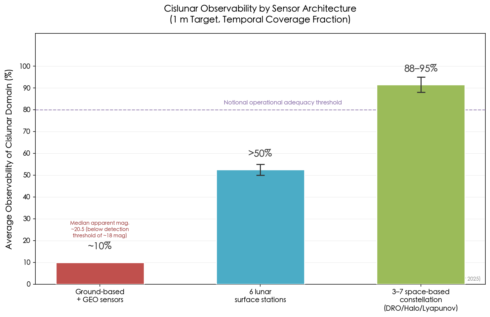

*Figure 2-3. Average temporal coverage fraction for a 1-meter cislunar target under three sensor architectures. Ground-based and GEO sensors achieve only ~10% coverage, constrained by a median target apparent magnitude of ~20.5 that falls below typical detection thresholds (~18 mag). Lunar surface stations improve coverage to >50%, while a 3–7 satellite space-based constellation in DRO/Halo/Lyapunov orbits reaches 88–95%. The dashed line indicates a notional operational adequacy threshold. Data from [Paetzold et al.](https://conference.sdo.esoc.esa.int/proceedings/sdc9/paper/258/SDC9-paper258.pdf "ESA SDC9 2025").*

## 2.6 Cislunar vs. GEO Belt: A Quantitative Comparison of Surveillance Difficulty

To anchor the preceding analysis in operational context, it is instructive to compare the cislunar surveillance problem directly against the GEO belt—the most distant regime for which robust, sustained SDA currently exists. The comparison reveals not merely quantitative differences but qualitative discontinuities across every dimension of the problem.

**Volume.** The cislunar surveillance volume is approximately 1,000 times larger than the GEO belt. The distance from Earth increases by roughly a factor of 10 (from 36,000 km to 384,400 km), and the volume of a cone or sphere grows with the cube of the distance, yielding a factor of ~1,000 in the space that must be monitored. JHU/APL termed the resulting coverage gap the "Cone of Shame"—the expanding region beyond GEO in which the current Space Surveillance Network (SSN) cannot reliably detect medium-sized objects. [JHU/APL](https://www.jhuapl.edu/Content/documents/CislunarSecurityNationalTechnicalVision.pdf "JHU APL 2022") [Rude](https://dspace.mit.edu/bitstream/handle/1721.1/162417/rude-rudc6118-sm-tpp-2025-thesis.pdf.pdf "MIT Thesis 2025")

**Signal strength.** For passive optical sensors, target brightness decreases by ~5 magnitudes when moving from GEO to lunar distance (a factor of 100 in flux, consistent with R⁻²). For radar, the same move incurs a factor of ~13,000 in required power-aperture product (R⁻⁴). This asymmetry explains why radar—the backbone of LEO SSA—is irrelevant to cislunar SDA, while optical telescopes remain viable but stressed.

**Orbital dynamics.** GEO objects follow near-circular, near-equatorial Keplerian orbits with well-characterized perturbations. Their positions can be predicted for weeks with sub-kilometer accuracy using standard analytical propagators. Cislunar objects, as demonstrated by Frueh et al., develop complex, non-Gaussian uncertainty distributions within a single orbital period under three-body dynamics. Standard Mahalanobis-distance gating for track association fails when the probability density function exhibits the "curves and crossings" characteristic of chaotic uncertainty propagation. [Frueh et al.](https://engineering.purdue.edu/people/kathleen.howell.1/Publications/Conferences/2021_AAS_FruHowDeMBha.pdf "AAS 21-290, 2021")

**Observation cadence.** GEO belt surveillance achieves nightly or multi-nightly revisits from the GEODSS network, with space-based assets (e.g., GSSAP) providing on-demand close-approach observation. In cislunar space, ground-based observation windows are limited to roughly 10% of time ([Paetzold et al.](https://conference.sdo.esoc.esa.int/proceedings/sdc9/paper/258/SDC9-paper258.pdf "ESA SDC9 2025")), and observation gaps of days to weeks are inherent in the geometry. When gaps exceed the custody-recovery horizon—approximately 21–28 days for L2 halo orbits before filter divergence renders reacquisition infeasible—the object is effectively lost.

**Catalog paradigm.** The GEO catalog (maintained by the 18th Space Defense Squadron) relies on TLE/SGP4—a format and propagator that are physically meaningless in three-body dynamics. A cislunar catalog would require ephemeris-based formats (SPICE SPK, CCSDS OEM/OCM), maintained by the originating orbit-determination authority and distributed with full dynamical-model metadata. This represents not merely a software upgrade but a paradigm shift in how space objects are cataloged, shared, and correlated across organizations and allied nations. [JHU/APL](https://www.jhuapl.edu/Content/documents/CislunarSecurityNationalTechnicalVision.pdf "JHU APL 2022") [Wilmer](https://apps.dtic.mil/sti/trecms/pdf/AD1166533.pdf "AFIT Thesis 2021")

## 2.7 Implications for Cislunar SDA Architecture

The physical and dynamical analysis presented in this chapter converges on five architectural imperatives that any viable cislunar SDA system must satisfy. Collectively, they define the boundary conditions within which sensor designers, constellation architects, and data-fusion engineers must operate.

1. **Passive optical is the only wide-area surveillance modality.** Radar and LIDAR are ruled out for search and detection at cislunar distances by the R⁻⁴ scaling law (§2.4.1). Active sensors retain value only for cooperative tracking of known targets at known positions—e.g., laser ranging with retroreflectors—and contribute nothing to the discovery mission.

2. **Space-based sensors are not optional; they are required.** Ground-based optical networks, even at the state of the art, can observe cislunar targets during only ~10% of time across ~30% of the surveillance volume (§2.5.3). Achieving the 88–95% temporal coverage needed for reliable custody maintenance demands a minimum of 3–7 space-based sensors distributed across DRO, halo, and Lyapunov orbits.

3. **The dynamical model must match the domain.** TLE/SGP4 is physically invalid beyond GEO (§2.2). Operational orbit determination, propagation, and catalog maintenance require at minimum CR3BP-level dynamics, with full ephemeris models (including solar, Jovian, and SRP perturbations) for precision applications. This imposes significant computational costs and fundamentally changes the data formats and interoperability standards required for multi-source data fusion.

4. **Custody is inherently intermittent.** No feasible sensor architecture can eliminate observation gaps entirely; even optimal space-based constellations achieve ~95% rather than 100% coverage. The dynamical sensitivity of unstable orbits means that custody gaps exceeding approximately two weeks for halo and Lyapunov targets will trigger filter divergence, necessitating costly search-and-reacquire operations (§2.2). Multi-phenomenology data fusion—combining electro-optical with passive RF (TDOA/FDOA)—offers the most promising near-term path to bridging exclusion-zone blackouts.

5. **Low-energy maneuverability demands intent-aware tracking.** The extraordinarily low delta-v costs for inter-family transfers (§2.3) mean that a maneuvering object can change its orbit type entirely during a single custody gap. Behavior characterization and maneuver detection must be integrated into the tracking pipeline from the outset, not treated as a downstream analytical function.

These imperatives form the physical foundation upon which sensor architectures (Chapter 3), data processing pipelines (Chapter 4), and operational concepts (Chapter 6) must be constructed.

# 第3章 Sensor Architectures and Observation Technologies for Cislunar Awareness

The preceding chapter established that passive optical sensing, operating under R⁻² signal-decay scaling, is the only viable modality for wide-area cislunar surveillance, while active radar is excluded by the R⁻⁴ range penalty at lunar distance. This chapter translates that physical reality into an engineering assessment of specific sensor platforms—ground-based, space-based, and lunar-surface-based—evaluating their demonstrated and projected capabilities, architectural trade-offs, and respective contributions to closing the cislunar coverage gap identified in Chapter 2. The analysis proceeds from currently operational systems through near-term programmatic assets to constellation-level design studies, examines commercial and allied-nation sensor contributions, and culminates in a synthesis of the layered cislunar sensor architecture that these heterogeneous elements collectively comprise.

The following comparison table provides an overview of the six principal sensor architecture classes evaluated in this chapter, summarizing their cost, coverage, detection capability, exclusion-zone immunity, and deployment timeline.

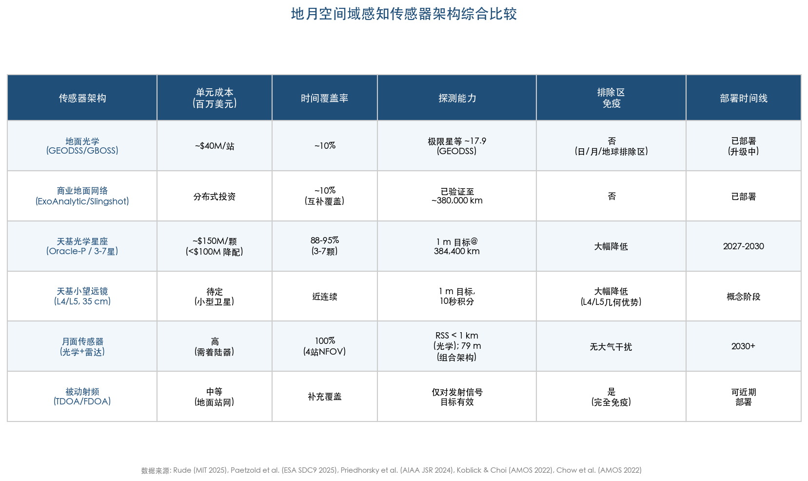

**Figure 3-1. Comprehensive Comparison of Cislunar SDA Sensor Architectures.** Six sensor architecture classes are compared across unit cost, temporal coverage, detection capability, exclusion-zone immunity, and deployment timeline, revealing the capability boundaries and complementary relationships of each sensor layer. Data sources: [Rude (MIT 2025)](https://dspace.mit.edu/bitstream/handle/1721.1/162417/rude-rudc6118-sm-tpp-2025-thesis.pdf.pdf "MIT Thesis 2025"), [Paetzold et al.](https://conference.sdo.esoc.esa.int/proceedings/sdc9/paper/258/SDC9-paper258.pdf "ESA SDC9 2025"), [Priedhorsky et al.](https://arc.aiaa.org/doi/10.2514/1.A35951 "AIAA JSR 2024"), [Koblick & Choi](https://amostech.com/TechnicalPapers/2022/Poster/Koblick_2.pdf "AMOS 2022").

## 3.1 Ground-Based Optical Systems: Capabilities, Upgrades, and Inherent Limits

Ground-based telescopes constitute the only operational cislunar-capable sensors in service as of early 2026. Their principal advantage is cost—approximately $40 million per station versus roughly $150 million per space-based sensor—together with decades of accumulated institutional expertise in deep-space optical tracking. [Rude (MIT 2025)](https://dspace.mit.edu/bitstream/handle/1721.1/162417/rude-rudc6118-sm-tpp-2025-thesis.pdf.pdf "MIT Thesis 2025") Their principal limitation is equally stark: even the most sensitive ground networks can observe cislunar targets for only approximately 10% of the time across roughly 30% of the cislunar spatial grid—a consequence of weather, daylight, atmospheric turbulence, and geometric exclusion zones that collectively impose an irreducible performance ceiling on terrestrial observation. [Paetzold et al.](https://conference.sdo.esoc.esa.int/proceedings/sdc9/paper/258/SDC9-paper258.pdf "ESA SDC9 2025")

### 3.1.1 GEODSS and the Poincaré-Map Search Reduction

The Ground-based Electro-Optical Deep Space Surveillance (GEODSS) system, operated by the U.S. Space Force, comprises three sites—Socorro (New Mexico), Maui (Hawaii), and Diego Garcia (Indian Ocean)—each equipped with 1-meter-aperture f/2.15 Ritchey-Chrétien telescopes providing a field of view (FOV) of approximately 1.23° × 1.61° and a limiting visual magnitude of roughly 17.9. [GEODSS Fact Sheet](https://www.spaceforce.mil/about-us/fact-sheets/article/2197760/ground-based-electro-optical-deep-space-surveillance/ "USSF GEODSS overview") [Segal (AMOS 2025)](https://amostech.com/TechnicalPapers/2025/Poster/Segal.pdf "AMOS 2025 — Enhancing Ground-Based Cislunar SDA")

GEODSS was originally designed for geostationary-belt surveillance rather than cislunar tracking. Segal (AMOS 2025), however, demonstrated that the three-station, nine-sensor network can be repurposed for cislunar SDA as a secondary mission by exploiting Poincaré surface-of-section maps to identify where cislunar transfer and return trajectories cross specific energy surfaces. This mathematical filtering reduces the required search area by 85.3%, enabling GEODSS to capture as many as 56.8% of cislunar return-crossing targets within a 24-hour window—a non-trivial detection capability achievable without additional hardware investment. [Segal (AMOS 2025)](https://amostech.com/TechnicalPapers/2025/Poster/Segal.pdf "AMOS 2025")

The operational implication is immediate: prior to any dedicated cislunar sensor deployment, GEODSS can provide a partial detection screen for objects transiting between cislunar space and the near-Earth domain. The 56.8% capture rate, however, applies exclusively to targets whose trajectories cross the surveyed Poincaré sections. Objects residing in high-altitude cislunar orbits—such as distant retrograde orbits (DRO) or L2 halo orbits—without returning toward the near-Earth region would remain undetected by this approach.

### 3.1.2 GBOSS: The Next-Generation Ground Sensor

The Ground-Based Optical Sensor System (GBOSS) represents L3Harris Technologies' modernization of the legacy GEODSS hardware. Under a contract valued at $119.1 million, with options extending to $218 million, L3Harris has been upgrading the GEODSS sites with improved optics, detector arrays, and data-processing pipelines designed to increase sensitivity, search rate, revisit cadence, and integration with commercial data streams. [L3Harris](https://www.l3harris.com/newsroom/press-release/2025/08/l3harris-upgrades-us-space-force-telescopes-space-domain-awareness "L3Harris Aug 2025") [SpaceNews](https://spacenews.com/l3harris-gets-119-million-space-force-contract-for-deep-space-telescopes/ "SpaceNews Sep 2020")

The White Sands site achieved operational acceptance in August 2025, with Mission Delta 2 Commander Colonel Barry Croker characterizing the upgrade as "a leap forward in capability for the joint warfighter." [U.S. Space Force](https://www.spaceforce.mil/News/Article-Display/Article/4261327/milestone-sensor-upgrade-enhances-space-force-identifying-tracking-capability/ "SpOC GBOSS milestone, Aug 2025") The Maui site entered integrated testing in early 2026 and is expected to achieve operational acceptance imminently. Network expansion plans call for two additional stations—in Spain and Australia—bringing the total from three to five sites, a geographic diversification that would improve diurnal coverage and mitigate weather-related observation gaps. [L3Harris](https://www.l3harris.com/newsroom/press-release/2025/08/l3harris-upgrades-us-space-force-telescopes-space-domain-awareness "L3Harris Aug 2025")

Specific GBOSS performance parameters—aperture specifications, precise limiting magnitude, and detector characteristics—remain classified. The Space Force has confirmed, however, that GBOSS "more accurately identifies and tracks objects in space" and substantially improves search and revisit rates relative to legacy GEODSS. [U.S. Space Force](https://www.spaceforce.mil/News/Article-Display/Article/4261327/milestone-sensor-upgrade-enhances-space-force-identifying-tracking-capability/ "SpOC GBOSS milestone, Aug 2025") Aviation Week has reported that the system can "investigate on-orbit activity from LEO to deep space within minutes." [Aviation Week](https://aviationweek.com/defense/budget-policy-operations/pentagon-eyes-cislunar-space-next-strategic-frontier "GBOSS status, Mar 2026")

L3Harris also holds the ten-year, $1.2 billion Maintenance of Space Situational Awareness Integrated Capabilities (MOSSAIC) contract for sustaining the broader SDA ground infrastructure, ensuring long-term operational continuity and upgrade pathways for ground-based sensor systems. [SpaceNews](https://spacenews.com/l3harris-gets-119-million-space-force-contract-for-deep-space-telescopes/ "SpaceNews Sep 2020")

### 3.1.3 The Hard Ceiling: Why Ground Sensors Cannot Solve Cislunar SDA Alone

Despite these upgrades, ground-based optical sensors confront irreducible physical constraints that preclude comprehensive cislunar coverage:

**Exclusion zones.** Optical sensors cannot observe targets within angular proximity of the Sun (exclusion half-angle ~50°), the Moon (~35°), or the illuminated Earth limb (~30°). For cislunar targets on long-period orbits, portions of their trajectories may remain inside one or more exclusion zones for days to weeks at a time. L1 Lyapunov orbit targets, for instance, are permanently embedded within the lunar exclusion zone as viewed from Earth—ground-based optical sensors are categorically incapable of detecting them. [Bhadauria & Frueh](https://amostech.com/TechnicalPapers/2022/Cislunar-SSA/Bhadauria.pdf "AMOS 2022") [Knister (AFIT 2020)](https://scholar.afit.edu/cgi/viewcontent.cgi?article=4244&context=etd "AFIT Thesis 2020")

**Phase-angle dependence.** A cislunar target's apparent brightness depends critically on the Sun–target–observer phase angle. At large phase angles approaching opposition with the Sun, targets can dim to visual magnitude 30 or fainter—far beyond any telescope's detection threshold. Bhadauria and Frueh's analysis in the Bicircular Restricted Four-Body Problem (BCR4BP) framework confirmed that no single ground observation position achieves 100% visibility of the cislunar domain; phase-angle geometry creates irreducible blind spots that shift with the Sun–Earth–Moon configuration but never vanish. [Bhadauria & Frueh](https://amostech.com/TechnicalPapers/2022/Cislunar-SSA/Bhadauria.pdf "AMOS 2022")

**Atmospheric limitations.** Turbulence, humidity, and light pollution degrade both angular resolution and photometric sensitivity. Even at premier observing sites, the atmosphere limits ground-based telescopes to roughly 1–2 arcsecond seeing, which translates to positional uncertainties of hundreds of kilometers at cislunar distances—inadequate for meaningful orbit determination of non-cooperative targets.

**Quantitative assessment.** Paetzold et al. (ESA, 2025) modeled a global network of ground-based and GEO-orbit sensors attempting to track 1-meter cislunar targets. The median apparent visual magnitude of such targets was approximately 20.5—well below the ~18th magnitude detection threshold of most operational ground sensors. Only about 30% of the cislunar spatial grid proved observable, and only during approximately 10% of simulated time periods. [Paetzold et al.](https://conference.sdo.esoc.esa.int/proceedings/sdc9/paper/258/SDC9-paper258.pdf "ESA SDC9 2025")

Frueh et al. (Purdue, 2021) provided complementary corroboration: a ground-based network with limiting magnitude 16 could cover only a minute fraction of the distant retrograde orbit for a 3.54-meter-radius highly reflective sphere; even at limiting magnitude 20, significant observation gaps persisted for Lyapunov orbits at maximum Earth distance and for transfer trajectories. A 1.8-meter-radius diffuse target (albedo Cd = 0.5) was undetectable during most of its cislunar orbital period. [Frueh, Howell, DeMars & Bhadauria](https://engineering.purdue.edu/people/kathleen.howell.1/Publications/Conferences/2021_AAS_FruHowDeMBha.pdf "AAS 21-290, 2021")

The evidence converges on a clear conclusion: ground-based optical systems are necessary but profoundly insufficient for cislunar SDA. They will serve as the initial detection layer—particularly for objects transiting between the near-Earth and cislunar domains—but cannot deliver the temporal continuity or spatial completeness required for sustained custody of cislunar-resident objects.

## 3.2 Ground-Based Radar: The Cislunar Exclusion

Active radar has no viable role in cislunar SDA. As established in Chapter 2, monostatic radar signal-to-noise ratio decays as R⁻⁴, meaning that maintaining GEO-equivalent detection performance at lunar distance (~384,400 km versus ~36,000 km) would require a power-aperture product roughly 13,000 times greater than current systems provide. [Rude (MIT 2025)](https://dspace.mit.edu/bitstream/handle/1721.1/162417/rude-rudc6118-sm-tpp-2025-thesis.pdf.pdf "MIT Thesis 2025") [Priedhorsky et al.](https://arc.aiaa.org/doi/10.2514/1.A35951 "AIAA JSR 2024")

No existing or planned radar system approaches this threshold. The U.S. Long Range Discrimination Radar (LRDR) in Alaska and the United Kingdom's Deep Space Advanced Radar Capability (DARC), under development by Northrop Grumman in Pembrokeshire, are both designed for near-Earth deep-space tracking and fall orders of magnitude short of the cislunar power-aperture budget. Bistatic and passive radar concepts, which might in principle exploit non-cooperative illuminators, have produced no published design achieving cislunar-class signal-to-noise ratios. [Rude (MIT 2025)](https://dspace.mit.edu/bitstream/handle/1721.1/162417/rude-rudc6118-sm-tpp-2025-thesis.pdf.pdf "MIT Thesis 2025")

The sole partial exception is cooperative laser ranging. The Lunar Laser Ranging (LLR) experiment, utilizing Apollo-era and LARES-2 retroreflector arrays, achieves millimeter-level range precision to known targets at lunar distance. LLR, however, requires prior knowledge of the target's approximate position and a cooperative retroreflector—it is a precision orbit-determination tool for instrumented, cooperative spacecraft, not a search or detection sensor for unknown or non-cooperative objects. [Priedhorsky et al.](https://arc.aiaa.org/doi/10.2514/1.A35951 "AIAA JSR 2024")

The consensus across the reviewed literature is unambiguous: passive electro-optical (EO) sensing, exploiting the R⁻² scaling of reflected sunlight, constitutes the only viable modality for cislunar wide-area surveillance. All near-term and medium-term cislunar SDA architectures are therefore built around optical telescopes—ground-based, space-based, or lunar-surface-based—augmented where possible by passive radio-frequency (RF) techniques that offer complementary coverage without range-scaling penalties.

## 3.3 Space-Based Sensor Platforms: Programmatic Assets and Design Concepts

The fundamental limitations of ground-based sensors establish space-based observation as the sine qua non of comprehensive cislunar SDA. A telescope deployed in cislunar space eliminates atmospheric degradation, escapes weather and daylight constraints, and—depending on orbital placement—can dramatically reduce or eliminate solar, lunar, and Earth exclusion zones. The cost premium is substantial (roughly $150 million per sensor versus $40 million per ground station), but the observability improvement is transformative: temporal coverage rises from ~10% on ~30% of the spatial grid to 88–95% average observability with as few as three to seven appropriately placed satellites. [Rude (MIT 2025)](https://dspace.mit.edu/bitstream/handle/1721.1/162417/rude-rudc6118-sm-tpp-2025-thesis.pdf.pdf "MIT Thesis 2025") [Paetzold et al.](https://conference.sdo.esoc.esa.int/proceedings/sdc9/paper/258/SDC9-paper258.pdf "ESA SDC9 2025")

### 3.3.1 AFRL Oracle Series: The Pathfinder Cislunar Sensors

The Air Force Research Laboratory's (AFRL) Cislunar Highway Patrol System (CHPS) program, centered on the Oracle satellite series, represents the U.S. government's first dedicated cislunar SDA sensor investment.

**Oracle-Mobility (Oracle-M).** Oracle-M, built by Blue Canyon Technologies and RTX, is a pathfinder mission designed to validate Hall-effect thruster propulsion and autonomous navigation in cislunar space. The spacecraft completed its hot-fire test in March 2025—a critical propulsion milestone—followed by ground-system end-to-end testing and operations team rehearsals. As of February 25, 2026, Oracle-M has been placed in storage at Kirtland Air Force Base awaiting launch. [AFRL](https://www.afrl.af.mil/News/Article-Display/Article/4176820/oracle-m-hot-fire-test-a-major-milestone-in-cislunar-space-situational-awarenes/ "AFRL May 2025") [Aviation Week](https://aviationweek.com/space/satellites/space-force-readying-launch-afrl-cislunar-ssa-satellite "Feb 26 2026")

Oracle-M was originally manifested on ULA's Vulcan Centaur rocket for the USSF-12 National Security Space Launch mission, with a planned launch in late 2026. A Vulcan solid rocket motor anomaly on February 12, 2026, however, grounded the launch vehicle. Industry estimates suggest a delay of at least six months, and the Space Force is evaluating alternative launch vehicles without having confirmed a replacement as of April 2026. [SpaceNews](https://spacenews.com/space-force-weighs-launch-alternatives-as-vulcan-faces-potential-months-long-grounding/ "Mar 25 2026") Although Oracle-M is not itself an SDA observation satellite, its cislunar transit will validate autonomous navigation, maneuver execution, and communication protocols essential for the operational follow-on mission.

**Oracle-Prime (Oracle-P).** Oracle-P is the dedicated cislunar SDA observation satellite and the operational centerpiece of the CHPS program. Under construction as of early 2026 with delivery expected by year-end, Oracle-P is designed for deployment to a halo orbit near the Earth–Moon L1 Lagrange point, a position that provides line-of-sight coverage of approximately 85% of the Earth–Moon corridor. [AFRL](https://afresearchlab.com/cislunar-highway-patrol-system-chps/ "AFRL Oracle overview")

Oracle-P carries a dual-sensor payload: a wide-field-of-view (WFOV) instrument for search and initial detection, and a narrow-field-of-view (NFOV) instrument for target characterization and precision tracking. Critically, it incorporates on-board image processing to reduce downlink data volume—a design choice driven by the 2.6-second round-trip light time at lunar distance and the limited deep-space communication bandwidth available. Advanced Space serves as the operations contractor, leveraging its CAPSTONE mission experience. Launch is targeted for 2027. [AFRL](https://afresearchlab.com/cislunar-highway-patrol-system-chps/ "AFRL Oracle overview") [Aerospace America](https://aerospaceamerica.aiaa.org/u-s-air-force-awards-grant-for-cislunar-constellation-to-track-spacecraft-and-debris/ "Oct 2025")

### 3.3.2 DARPA LASSO: Autonomous Small Satellites for Lunar-Orbit SDA

The Defense Advanced Research Projects Agency (DARPA) launched the Lunar Assay via Small Satellite Orbiter (LASSO) program in April 2025, pursuing a fundamentally different cislunar sensing paradigm from Oracle's large-satellite approach. LASSO solicits autonomous, maneuverable small-satellite prototypes capable of operating in low lunar orbit (LLO) to execute cislunar space domain awareness missions. [Satellite Today](https://www.satellitetoday.com/technology/2025/04/15/darpa-program-seeks-autonomous-maneuverable-satellites-for-cislunar-domain-awareness/ "Apr 2025")

The program's solicitation timeline progressed through a Proposers' Day in May 2025, a Step-1 submission deadline on December 12, 2025, and a Step-2 deadline on February 20, 2026. Multiple Other Transaction (OT) prototype agreements are anticipated, though no contracts have been publicly announced as of April 2026. [Satellite Today](https://www.satellitetoday.com/technology/2025/04/15/darpa-program-seeks-autonomous-maneuverable-satellites-for-cislunar-domain-awareness/ "Apr 2025")

LASSO's architectural significance lies in its challenge to the assumption that cislunar SDA requires large, expensive platforms. By positioning small, agile sensors in LLO—close to the Moon and directly among many cislunar targets—the program could provide detection capability against objects invisible to Earth-based or L-point-based observers, particularly targets in low-altitude or far-side lunar orbits. The autonomous maneuvering requirement further implies an intent to pursue non-cooperative proximity operations and adaptive orbit adjustment for persistent tracking—capabilities extending beyond passive survey into active target engagement.

### 3.3.3 Small Spaceborne Telescopes at Lagrange Points: The Priedhorsky Concept

A quantitative feasibility study by Priedhorsky et al. (AIAA Journal of Spacecraft and Rockets, 2024) demonstrated that a modest 35-centimeter-aperture telescope positioned at the L4 or L5 Earth–Moon Lagrange points could achieve remarkable cislunar detection performance. Exploiting the deep-space dark-sky background (~22.3 mag/arcsec²) and photon-counting detectors, such a system could detect and localize a 1-meter-class target at 384,400 km (full lunar distance) with a 10-second integration, achieving lateral positional accuracy better than 100 meters. [Priedhorsky et al.](https://arc.aiaa.org/doi/10.2514/1.A35951 "AIAA JSR 2024")

With a 10,000 × 10,000 pixel detector array, the telescope could scan a 60° × 6° corridor—covering the principal Earth–Moon transit lane—in approximately 67 minutes. This result demonstrates that cislunar search is not inherently a large-telescope problem; the critical enabler is the space environment itself, which provides the dark background, absence of atmospheric scintillation, and uninterrupted viewing time that ground-based systems cannot replicate. [Priedhorsky et al.](https://arc.aiaa.org/doi/10.2514/1.A35951 "AIAA JSR 2024")

The L4 and L5 points offer a further geometric advantage: they are located 60° ahead of and behind the Moon in its orbit, providing vantage angles naturally offset from both the solar and lunar exclusion zones for many target geometries. A pair of telescopes at L4 and L5 would provide stereoscopic observation capability, enabling direct triangulation of target range without reliance on orbit-determination convergence over extended observation arcs.

### 3.3.4 CAPSTONE: Operational NRHO Flight Data for Sensor Validation

Advanced Space's Cislunar Autonomous Positioning System Technology Operations and Navigation Experiment (CAPSTONE) has operated in a near-rectilinear halo orbit (NRHO) since June 2022, completing over 100 orbital revolutions as of early 2026. Although CAPSTONE is a navigation technology demonstrator rather than an SDA sensor, it has produced the sole operational flight dataset from a cislunar periodic orbit, furnishing invaluable ground truth for sensor performance modeling and orbit-determination algorithm validation. [Advanced Space](https://advancedspace.com/capstone/ "CAPSTONE Mission Overview")

In December 2021, the U.S. Air Force signed a cooperative agreement with Advanced Space to access CAPSTONE telemetry for AFRL cislunar SDA research. This data enables validation of orbit-determination filter performance, assessment of communication link budgets at cislunar distances, and calibration of sensor detection models against a known target with characterized physical properties. CAPSTONE thereby serves as a de facto calibration reference for the emerging cislunar SDA enterprise—a role whose value will compound as Oracle-P and LASSO sensors come online and require validated performance baselines. [Advanced Space](https://advancedspace.com/capstone/ "CAPSTONE Mission Overview")

## 3.4 Constellation Design Studies: Optimizing Multi-Sensor Cislunar Coverage

Individual sensors—whether ground-based or space-based—cannot resolve the cislunar SDA problem in isolation. The volume, diversity of orbital families, and exclusion-zone geometry of cislunar space demand coordinated constellations whose design constitutes a complex optimization problem fundamentally distinct from near-Earth constellation engineering.

### 3.4.1 The ESA Multi-Architecture Comparison

Paetzold et al. (ESA Space Debris Conference 9, 2025) produced the most comprehensive publicly available comparison of cislunar sensor architectures against a common performance benchmark. Their study evaluated four architecture classes for tracking 1-meter cislunar targets:

1. **Ground-based + GEO sensors:** Median target apparent magnitude ~20.5, well below the ~18th magnitude detection threshold of operational systems. Coverage limited to ~30% of cislunar grid points during ~10% of simulated time.
2. **Lunar surface stations (6-station network):** Average observability exceeding 50%—a significant improvement over ground-based sensors but still leaving approximately half the domain unmonitored at any given time.
3. **Space-based constellations (3–7 satellites in DRO, Lyapunov, and halo orbits):** Average observability of 88–95%, representing a transformative step-change. This architecture class achieves near-continuous coverage of the cislunar domain with a modest number of platforms.

The performance gap between architecture classes is striking: deploying three well-placed cislunar-orbit sensors delivers roughly nine times the observability of the entire ground-based infrastructure. This finding establishes the quantitative foundation for the assessment that space-based sensors are not merely desirable but operationally essential for comprehensive cislunar awareness. [Paetzold et al.](https://conference.sdo.esoc.esa.int/proceedings/sdc9/paper/258/SDC9-paper258.pdf "ESA SDC9 2025")

### 3.4.2 Georgia Tech MILP Constellation Optimization

Shimane et al. (AIAA Journal of Spacecraft and Rockets, 2025) developed a mixed-integer linear programming (MILP) framework that simultaneously optimizes constellation orbital design and sensor-to-target tasking allocation. The method operates over thousands of candidate orbit-family combinations, assigning observation directions to individual sensors to maximize coverage while respecting exclusion-zone and slew-rate constraints. [Shimane et al.](https://arc.aiaa.org/doi/10.2514/1.A36361 "AIAA JSR 2025")

This approach represents a methodological advance over traditional constellation design, which typically separates orbital selection from sensor scheduling. By jointly optimizing both dimensions, the MILP framework can exploit synergies between orbit geometry and observation geometry that sequential design processes would overlook. The practical implication is that fewer sensors may suffice than simpler analyses suggest, provided their orbits and observation schedules are co-designed from the outset.

### 3.4.3 Purdue Resonance-Based Constellation Design

Gupta, Howell, and Frueh (Purdue University, AAS 2023) proposed cislunar SDA constellations based on synodic-resonance and sidereal-resonance orbits combined with Lagrange-point orbits. These resonance-based designs exploit the natural periodicity of multi-body dynamics to reduce the impact of exclusion zones: as a resonance orbit's geometry precesses relative to the Sun–Earth–Moon configuration, different segments of the cislunar domain move in and out of view in a predictable pattern, enabling coverage scheduling that naturally avoids persistent blind spots. [Gupta, Howell & Frueh](https://engineering.purdue.edu/people/kathleen.howell.1/Publications/Conferences/2023_AAS_GupHowFru.pdf "AAS 23-203, 2023")

### 3.4.4 AFOSR RCAT-CS: Reconfigurable Adaptive Constellations

The Air Force Office of Scientific Research (AFOSR) awarded a $1 million grant in October 2025 to researchers at Rensselaer Polytechnic Institute (RPI) and Texas A&M University for the Reconfigurable Constellations for Adaptive Tracking in Cislunar Space (RCAT-CS) project. RCAT-CS aims to develop algorithms for intelligent networks of 3–10 sensor satellites deployed in halo orbits near Earth–Moon Lagrange points, enabling dynamic repositioning in response to observed target behavior. [RPI News](https://news.rpi.edu/2025/10/21/rpi-awarded-air-force-grant-monitor-growing-traffic-between-earth-and-moon "Oct 2025") [Aerospace America](https://aerospaceamerica.aiaa.org/u-s-air-force-awards-grant-for-cislunar-constellation-to-track-spacecraft-and-debris/ "Oct 2025")

RPI principal investigator Professor Sandeep Singh has articulated the project's motivation: "Ground-based sensor systems have blind spots and cannot reliably provide measurements. A space-based constellation is the answer, but placing spacecraft in orbit is expensive and solving the resource constraint problem is essential." [RPI News](https://news.rpi.edu/2025/10/21/rpi-awarded-air-force-grant-monitor-growing-traffic-between-earth-and-moon "Oct 2025") The RCAT-CS algorithms will incorporate maneuver detection for tracked objects, fuel-cost optimization for sensor repositioning, and uncertainty quantification—directly addressing the adaptive tracking challenge posed by targets capable of exploiting low-energy transfers to change orbit families without large propulsive maneuvers.

### 3.4.5 Cost-Performance Trade Space

Rude (MIT, 2025) evaluated four representative constellation architectures and established a cost-performance framework that illuminates the investment calculus for cislunar SDA. Ground stations cost approximately $40 million per site but deliver only ~10% temporal coverage. Space-based sensors cost approximately $150 million per unit but can achieve 88–95% coverage in constellations of three to seven. MIT Lincoln Laboratory analysis suggested that sensitivity trade-offs—accepting somewhat coarser detection limits—could reduce per-unit space-based sensor cost below $100 million. [Rude (MIT 2025)](https://dspace.mit.edu/bitstream/handle/1721.1/162417/rude-rudc6118-sm-tpp-2025-thesis.pdf.pdf "MIT Thesis 2025")

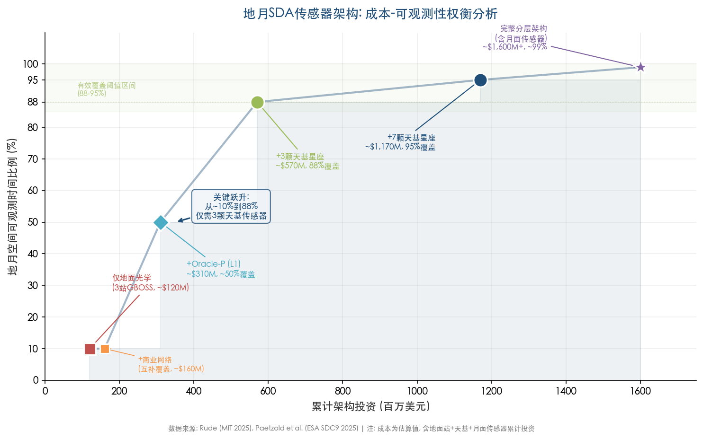

**Figure 3-2. Cost-Observability Trade-Off Analysis of Cislunar SDA Sensor Architectures.** The horizontal axis represents cumulative architecture investment (millions USD); the vertical axis represents the fraction of cislunar observable time (%). Six progressively layered architecture options are annotated, highlighting the core investment insight that three space-based sensors achieve the critical leap from ~10% to 88% coverage. Data sources: [Rude (MIT 2025)](https://dspace.mit.edu/bitstream/handle/1721.1/162417/rude-rudc6118-sm-tpp-2025-thesis.pdf.pdf "MIT Thesis 2025"), [Paetzold et al.](https://conference.sdo.esoc.esa.int/proceedings/sdc9/paper/258/SDC9-paper258.pdf "ESA SDC9 2025").

The cost calculus strongly favors a layered architecture: ground-based sensors as the initial detection screen, exploiting their low cost and immediate availability, supplemented by a small constellation of space-based sensors to provide the temporal continuity and spatial completeness that ground systems cannot achieve. A three-satellite minimum constellation at an estimated cost of $300–450 million would deliver an order-of-magnitude improvement in cislunar awareness relative to the entire existing ground infrastructure.

## 3.5 Lunar-Surface Sensors: The Ultimate Vantage Point

The lunar surface offers observational advantages that no orbital or ground-based platform can replicate, positioning it as a theoretically optimal location for cislunar SDA sensors despite formidable deployment challenges.

### 3.5.1 Physical Advantages of the Lunar Surface

Koblick and Choi (AMOS 2022) conducted a systematic evaluation of lunar-surface sensor architectures for cislunar orbit determination, quantifying several unique advantages:

- **No atmospheric interference.** The airless lunar environment eliminates atmospheric absorption, scattering, turbulence, and seeing limitations, allowing telescopes to operate at diffraction-limited performance continuously.
- **Cryogenic thermal background.** Permanently shadowed regions (PSRs) at the lunar poles maintain temperatures as low as 33 K, providing an ideal thermal environment for electro-optical and infrared (EOIR) sensors that require minimal or no active cooling.
- **No orbital station-keeping.** A surface-mounted sensor requires zero delta-v for orbit maintenance, eliminating a significant cost and mission-duration constraint of space-based platforms.
- **Persistent nuclear power.** Surface installations can exploit kilopower or larger nuclear fission reactors for continuous, weather-independent power—a capability not yet demonstrated for free-flying cislunar satellites.

[Koblick & Choi](https://amostech.com/TechnicalPapers/2022/Poster/Koblick_2.pdf "AMOS 2022 — Cislunar OD Benefits of Moon-Based Sensors")

### 3.5.2 Performance Benchmarks from Lunar-Surface Architectures

Koblick and Choi modeled multiple lunar-surface sensor configurations and established performance benchmarks that define the theoretical ceiling for cislunar orbit determination:

- **Four narrow-field-of-view (NFOV) optical sensors** at mid-latitude lunar sites achieved 100% track custody and position root-sum-square (RSS) errors below 1 km for cislunar targets.
- **Adding an L1 space-based sensor** to the lunar surface network reduced position errors to approximately 116 meters.
- **The optimal combined architecture**—lunar surface optical sensors, lunar surface X-band radar, and a space-based L1 optical sensor—achieved 79-meter position accuracy, 1 cm/s velocity accuracy, and 5 mm/s² acceleration estimation accuracy.

[Koblick & Choi](https://amostech.com/TechnicalPapers/2022/Poster/Koblick_2.pdf "AMOS 2022 — Cislunar OD Benefits of Moon-Based Sensors")

These results establish upper-bound performance targets for cislunar orbit determination: they demonstrate that the physics of the problem does not preclude sub-100-meter position accuracy, provided sensors are optimally placed. The combined architecture's 79-meter precision rivals current GEO tracking performance—a remarkable achievement given the 10× greater distances involved.

### 3.5.3 Deployment Feasibility and Constraints

Deploying SDA sensors to the lunar surface is within near-term technological reach thanks to the growing cadre of commercial lunar landers. NASA's Commercial Lunar Payload Services (CLPS) program provides the delivery mechanism: Astrobotic's Griffin lander can transport up to 500 kg of payload to the lunar surface, and Firefly's Blue Ghost demonstrated a 155 kg delivery capacity with a successful Mare Crisium landing in March 2025. [Koblick & Choi](https://amostech.com/TechnicalPapers/2022/Poster/Koblick_2.pdf "AMOS 2022")

Significant constraints nonetheless remain. The Koblick and Choi analysis included a lunar-surface X-band radar modeled on the Globus II-class 27-meter dish antenna—a system whose mass far exceeds any current CLPS lander's capacity. Optical sensors are more feasible for near-term deployment, but they face challenges in power sustainability during the 14-day lunar night (outside permanently shadowed regions) and in managing the dust environment's degradation of optical surfaces.

Lunar-surface SDA sensors are unlikely to achieve operational deployment within the 2026–2028 timeframe, but they represent a critical element of the medium-term (2030+) cislunar architecture. The CLPS delivery pipeline and advancing surface power systems—NASA's Fission Surface Power project targets a 40 kW reactor demonstration by the late 2020s—are steadily reducing the deployment barriers.

## 3.6 Commercial and Allied-Nation Sensor Contributions

A comprehensive cislunar SDA architecture cannot rely solely on U.S. government assets. Commercial telescope networks and allied-nation programs offer complementary capabilities that expand geographic diversity, increase observation cadence, and distribute both costs and risks across a broader stakeholder base.

### 3.6.1 Commercial Ground-Based Networks

**Anduril/ExoAnalytic Solutions.** ExoAnalytic Solutions operates approximately 400 ground-based telescopes distributed globally, forming one of the largest commercial optical space-surveillance networks. The company has demonstrated cislunar tracking capability since at least 2020. In March 2026, Anduril Industries acquired ExoAnalytic and its approximately 130-person team, integrating the sensor network and SDA analytics software into Anduril's Lattice command-and-control platform. [SpaceNews](https://spacenews.com/anduril-to-acquire-space-tracking-firm-exoanalytic-solutions/ "SpaceNews Mar 2026") Anduril has announced plans for three self-funded space missions to demonstrate sensing, maneuvering, and on-board processing—signaling commercial intent to extend capabilities well beyond ground-based tracking into space-based cislunar operations. [Aviation Week](https://aviationweek.com/defense/budget-policy-operations/pentagon-eyes-cislunar-space-next-strategic-frontier "Mar 2026")

**Slingshot Aerospace.** Slingshot acquired Numerica Corporation's SDA division in August 2022, gaining a network of over 30 telescopes across more than 20 sites that provides 24-hour tracking from LEO to GEO, with evolving capability toward cislunar distances. [Payload Space](https://payloadspace.com/slingshot-acquires-numerica-sda-and-seradata/ "Payload Aug 2022") The Numerica network possesses notable cislunar heritage: it tracked China's Chang'e-5 sample-return mission in December 2020 to approximately 380,000 km range, achieving radial uncertainty of roughly 200 km—a coarse but operationally meaningful detection at full lunar distance. [Thompson et al. (AMOS 2021)](https://amostech.com/TechnicalPapers/2021/Poster/Thompson.pdf "AMOS 2021")

In April 2025, Slingshot launched its "Sovereign SDA" turnkey product suite (Horus/Argus/Varda sensors, SGSN catalog services, and cloud-based processing), and in January 2026 it won a $27 million Space Force contract to integrate its Talos AI into the Operational Training and Transformation Infrastructure (OTTI). [Slingshot](https://www.slingshot.space/news/slingshot-aerospace-debuts-worlds-first-rapid-space-domain-awareness-enablement-package "Apr 2025") [SpaceNews](https://spacenews.com/slingshot-wins-27-million-space-force-contract-for-ai-training-system/ "Jan 2026")

**University of Arizona.** AFRL has awarded $7.5 million to the University of Arizona to develop cislunar target detection, characterization, and tracking capabilities using the Biosphere 2 telescope facility, alongside catalog network infrastructure development. This investment represents the first dedicated academic-government partnership for building operational cislunar detection tools. [University of Arizona News](https://news.arizona.edu/news/75m-effort-seeks-prevent-lunar-traffic-jams "UArizona cislunar SDA")

Specific performance metrics—limiting magnitudes at cislunar ranges, verified detection envelopes, and sustained track-custody durations—have not been published for any commercial network. These systems nonetheless represent the most immediately available cislunar-capable sensors, and their global geographic distribution provides the diurnal and weather diversity that any single government site inherently lacks.

### 3.6.2 Allied-Nation Programs

**ESA LUMOS.** The European Space Agency initiated the Lunar Monitoring System (LUMOS) Phase A study in March 2025, led by Politecnico di Milano, with completion targeted for February 2026. In August 2025, ESA awarded GMV's Polish subsidiary a parallel contract for cislunar ground-based observation strategy and sensor design. [Politecnico di Milano](https://www.aero.polimi.it/en/research-projects/esa-lumos-phase-a-of-cis-lunar-space-object-monitoring-mission "LUMOS Phase A") [GMV](https://www.gmv.com/en-es/communication/news/gmv-signs-contract-advance-cis-lunar-space-surveillance "Aug 2025") The European Space Policy Institute (ESPI), however, has assessed that Europe's cislunar engagement remains "fragmented and passive—lagging behind the United States in both investment and strategic coordination." [ESA Space Safety Blog](https://blogs.esa.int/spacesafety-community/2025/07/17/towards-a-safe-and-sustainable-cislunar-space/ "Jul 2025") Phase B decisions and associated funding commitments remain pending.

**Japan–India: ispace-Digantara Partnership.** In September 2025, Japan's ispace and India's Digantara announced a joint mission to establish cislunar SSA infrastructure, combining Digantara's planned 40-satellite LEO SSA constellation and ground-based sensing expertise with ispace's lunar landing capabilities. [Payload Space](https://payloadspace.com/ispace-digantara-join-forces-on-cislunar-ssa/ "Sep 2025") This partnership represents the first non-American, non-European commercial cislunar SSA initiative. Neither company has yet demonstrated cislunar-range detection—ispace's two lunar landing attempts ended in surface impacts, with a third landing planned for 2027—but the partnership signals growing Indo-Pacific commercial interest in cislunar domain awareness and could eventually provide a pathway to deploying sensing payloads on the lunar surface via future ispace missions.

**United Kingdom.** The UK's National Space Operations Centre (NSpOC) has been operational for over a year, and the DARC radar system (Northrop Grumman, Pembrokeshire) is under development. However, DARC is designed for GEO-range targets, not cislunar distances. A September 2025 UK-U.S. coordinated satellite maneuver exercise demonstrated operational interoperability, but King's College London has assessed that the UK "relies heavily on U.S. systems" for SDA and spends less than 0.05% of GDP on space—limiting independent cislunar capability development. [King's College London](https://www.kcl.ac.uk/reflections-on-uk-spacepower-lessons-from-2025-and-what-comes-next "2026")

**Combined Space Operations (CSpO).** The ten-nation CSpO initiative shares SDA data through the Unified Data Library (UDL), which accommodates over 4,000 data schemas and more than 100 sharing agreements. Oracle-P data is planned for distribution through UDL. The library currently lacks dedicated cislunar data schemas, however, and its near-Earth heritage is built around TLE/SGP4 formats that are fundamentally inapplicable to three-body cislunar dynamics. Adapting UDL for cislunar operations—including support for CCSDS Orbit Ephemeris Message (OEM) and SPICE SPK formats—constitutes a prerequisite for effective multinational cislunar SDA cooperation. [Rude (MIT 2025)](https://dspace.mit.edu/bitstream/handle/1721.1/162417/rude-rudc6118-sm-tpp-2025-thesis.pdf.pdf "MIT Thesis 2025") [SSC UDL Briefing](https://www.ssc.spaceforce.mil/Portals/3/SDA%20Briefings/06.%20UDL%20Overview%20Overview.pdf "UDL Overview")

## 3.7 Passive Radio-Frequency Sensing: A Complementary Modality

While passive optical remains the dominant cislunar sensing modality, passive radio-frequency (PRF) techniques offer a critical complementary capability. Unlike active radar, PRF exploits electromagnetic emissions from the target itself—communications signals, telemetry, or unintentional electromagnetic leakage—using time-difference-of-arrival (TDOA) and frequency-difference-of-arrival (FDOA) measurements from a network of at least three receiver stations.

The decisive advantage of PRF for cislunar SDA is its immunity to optical exclusion zones. Solar, lunar, and Earth exclusion constraints that blind optical sensors are entirely irrelevant to radio receivers. Chow et al. (AFRL/KBR, AMOS 2022) demonstrated that fusing electro-optical observations with PRF measurements (TDOA/FDOA from a three-station network) enabled continuous tracking across all tested cislunar orbits, eliminating the custody gaps that pure optical processing suffered during exclusion-zone transits. The fused EO+PRF approach maintained unbroken custody where single-modality EO tracking lost lock—a result with direct operational significance for the interim period before space-based optical constellations become available. [Chow et al. (AMOS 2022)](https://amostech.com/TechnicalPapers/2022/Poster/Chow.pdf "AMOS 2022 — Data Fusion with Passive RF")

PRF has inherent limitations: it operates only against targets that are actively emitting, rendering it ineffective against dormant spacecraft, debris, or objects maintaining radio silence. The technique also requires a priori knowledge of the target's signal characteristics or a broadband search capability. For the near-term cislunar environment—populated primarily by active, communicating spacecraft—PRF nonetheless represents an immediately actionable data source capable of bridging optical custody gaps at minimal incremental cost.

## 3.8 Toward a Layered Cislunar Sensor Architecture

The sensor technologies and architectural concepts reviewed in this chapter converge on a layered architecture whose components are complementary in coverage, cost, and deployment timeline. The following diagram illustrates the spatial geometry of this multi-layer approach.

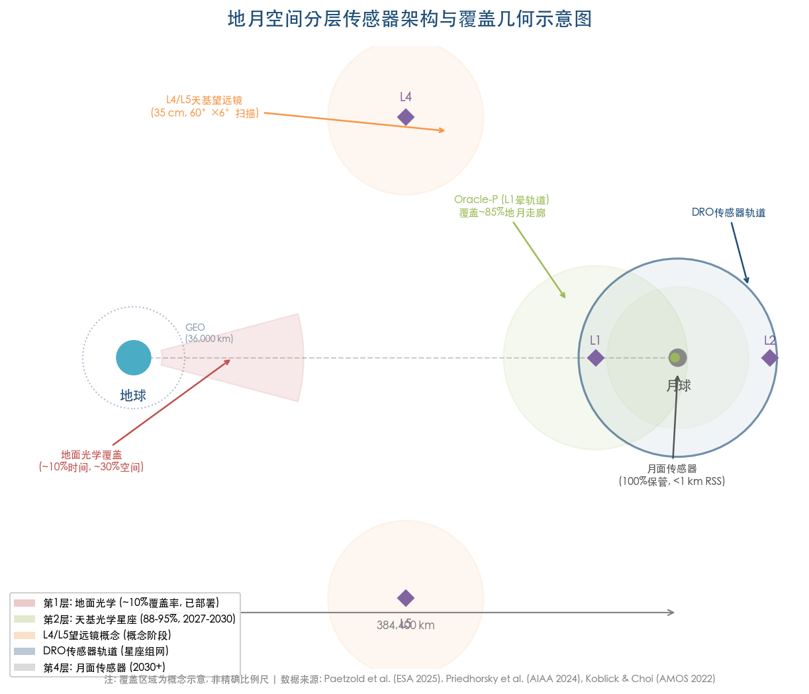

**Figure 3-3. Cislunar Layered Sensor Architecture and Coverage Geometry.** Set against the Earth–Moon system, the diagram marks sensor deployment positions at L1, L2, L4/L5 Lagrange points and DRO orbits, overlaying each sensor layer's spatial coverage footprint to illustrate how the layered architecture progressively closes the cislunar coverage gap. Data sources: [Paetzold et al.](https://conference.sdo.esoc.esa.int/proceedings/sdc9/paper/258/SDC9-paper258.pdf "ESA SDC9 2025"), [Priedhorsky et al.](https://arc.aiaa.org/doi/10.2514/1.A35951 "AIAA JSR 2024"), [Koblick & Choi](https://amostech.com/TechnicalPapers/2022/Poster/Koblick_2.pdf "AMOS 2022").

**Layer 1: Ground-based optical (operational).** GEODSS/GBOSS and commercial networks (Anduril/ExoAnalytic, Slingshot/Numerica) provide immediate, low-cost initial detection capability. Leveraging Poincaré-map search optimization, ground sensors can intercept a significant fraction of cislunar-to-near-Earth transit targets within 24 hours. Temporal coverage remains limited to ~10%, however, and several cislunar orbit families—particularly L1 Lyapunov and far-side lunar orbits—are permanently invisible from the ground.

**Layer 2: Space-based optical constellations (2027–2030).** Oracle-P (targeted for 2027), LASSO prototypes (timeline uncertain), and future constellation elements will deliver the transformative observability improvement—from ~10% to 88–95%—that defines the transition from fragmented awareness to genuine domain custody. A minimum viable constellation of three appropriately placed sensors (e.g., one each in DRO, L1 halo, and L2 halo orbits) could cover the critical cislunar volume at an estimated cost of $300–450 million. The RCAT-CS reconfigurable constellation concept adds adaptive capability to respond dynamically to detected targets of interest.

**Layer 3: Passive RF overlay (deployable with network investment).** PRF using existing or augmented SIGINT receiver infrastructure can bridge optical exclusion-zone gaps for emitting targets, providing a low-cost modality that operates precisely in the conditions where optical systems are blinded.

**Layer 4: Lunar-surface sensors (2030+ horizon).** Lunar-surface optical (and eventually radar) sensors offer the highest theoretical performance—100% custody, sub-100-meter accuracy—and would anchor a mature cislunar SDA architecture. Deployment hinges on continued CLPS lander evolution, surface power availability, and sustained programmatic investment.

The critical architectural insight is that no single layer suffices. Ground sensors alone leave 90% of cislunar time uncovered. Space-based sensors alone, without ground-based initial detection and PRF gap-filling, would face formidable initial-orbit-determination challenges for newly appearing targets. Lunar-surface sensors, while theoretically optimal, remain a decade from operational deployment. The path to comprehensive cislunar awareness is necessarily incremental and heterogeneous—built from the layered integration of sensors that individually address different segments of the coverage, sensitivity, and timeline problem.

This layered framework carries direct implications for the near-term monitoring task: between April 2026 and the deployment of Oracle-P (targeted 2027), the cislunar domain will be monitored almost exclusively by Layer 1 assets—ground-based optical and commercial networks—supplemented where possible by Layer 3 passive RF. The Artemis II mission, launched April 1, 2026, serves as the first operational test of this interim architecture against a known cooperative target. The gap between current capability (~10% temporal coverage, ~30% spatial coverage) and the minimum adequate standard (~88% temporal coverage achievable with three space-based sensors) defines the most urgent investment priority in cislunar security.

# 第4章 Data Processing, Orbit Determination, and Catalog Maintenance in the Cislunar Domain

The preceding chapters established that passive optical sensing constitutes the only viable wide-area modality for cislunar space domain awareness (SDA), and that even optimized sensor architectures leave significant observability gaps driven by solar, lunar, and Earth exclusion zones, extreme distances, and low target brightness. These hardware-level constraints directly shape—and in many cases dominate—the data-processing chain that must convert sparse, intermittent angular observations into actionable orbital knowledge. Where near-Earth SDA benefits from decades of operational refinement and universally adopted standards (TLE/SGP4, Keplerian elements, Mahalanobis gating), cislunar data processing must contend with fundamentally different dynamics, non-Gaussian uncertainty evolution, and the absence of a universal orbital parameterization.

This chapter examines the algorithmic and architectural foundations of the cislunar data-processing pipeline: initial orbit determination (IOD) under multi-body dynamics (Section 4.1), state estimation and filtering for uncertainty-realistic tracking (Section 4.2), track-to-track association in the absence of universal orbital parameterizations (Section 4.3), the emerging role of artificial intelligence and machine learning across the detection-tracking pipeline (Section 4.4), and the nascent standards and infrastructure required to build and maintain a cislunar object catalog (Section 4.5). Section 4.6 synthesizes these components into an end-to-end pipeline assessment, identifying both demonstrated capabilities and critical gaps that must be resolved before an operational cislunar catalog can materialize.

## 4.1 Initial Orbit Determination in Multi-Body Dynamics

### 4.1.1 The Failure of Classical IOD in Cislunar Space

Classical IOD methods—Gauss, Laplace, double-r iteration, and Gooding's algorithm—assume Keplerian (two-body) dynamics and require three or more closely spaced angular observations to close the orbit geometry. In cislunar space, these assumptions collapse entirely. Objects in L2 halo orbits, near-rectilinear halo orbits (NRHO), distant retrograde orbits (DRO), and low-energy transfer trajectories are governed by the circular restricted three-body problem (CR3BP) or, more precisely, full ephemeris models incorporating Earth J2–J4, lunar gravity, solar gravity, Jupiter perturbations, and solar radiation pressure. The resulting trajectories are not conic sections; they exhibit quasi-periodic, resonant, and in many cases chaotic behavior that invalidates the Keplerian closed-form solutions on which legacy IOD is built.

Empirical demonstrations confirm the magnitude of the problem: applying classical Gooding IOD to simulated L2 north halo orbit observations yields position errors of 44,400–56,600 km—errors exceeding the Earth–Moon distance by an order of magnitude—rendering the solution operationally useless for catalog initialization. [Ojeda Romero et al. (AMOS 2024)](https://amostech.com/TechnicalPapers/2024/Cislunar_SDA/Ojeda-Romero.pdf "AMOS 2024 — ML-Augmented Cislunar IOD") This failure is not marginal; it is categorical, and it necessitates entirely new IOD frameworks designed from the outset for multi-body dynamics.

### 4.1.2 Sparse Collocation IOD

The most general-purpose cislunar IOD method published to date is the sparse collocation approach developed by Heidrich and Holzinger at the University of Colorado Boulder. The method transcribes the continuous-time orbit determination problem into a large-scale sparse nonlinear programming (NLP) problem, discretizing the trajectory with collocation points and enforcing the equations of motion as equality constraints. Unlike shooting methods, collocation IOD does not require a close initial guess; convergence has been demonstrated from initial states as crude as placing the object at a Lagrange point with zero velocity. Crucially, the algorithm accommodates measurement gaps of up to four weeks—an essential capability given the extended exclusion-zone blackout periods inherent to cislunar observation geometries. Performance benchmarks show convergence in 15–70 iterations (0.3–3.3 seconds of CPU time) across L2 south halo, DRO, and L4 long-period orbits. [Heidrich & Holzinger (AMOS 2023)](https://amostech.com/TechnicalPapers/2023/Cislunar-SSA/Heidrich.pdf "AMOS 2023 — Universal Angles-Only Cislunar IOD") [Heidrich & Holzinger (JAS 2025)](https://link.springer.com/article/10.1007/s40295-025-00491-w "JAS 2025")

The key advantage of collocation IOD is its universality: it does not require prior knowledge of the orbital family, making it suitable for the uncued detection scenario in which a new object appears in sensor data with no a priori trajectory information. Its principal limitation is computational scalability; as catalog populations grow from tens to hundreds of objects requiring simultaneous IOD, the aggregate NLP burden may become significant without parallelization or algorithmic acceleration.

### 4.1.3 Multi-Order Single-Shooting IOD

An alternative approach, Multi-Order Single Shooting (MOSS) IOD, developed by Hope et al. at Penn State, incorporates second- and third-order sensitivity information (state transition tensors) into a single-shooting differential correction framework. By capturing the curvature and higher-order nonlinearity of the trajectory, MOSS dramatically improves convergence basins compared to standard nonlinear least-squares (NLS). In 500 Monte Carlo trials on 3:1 Earth–Moon resonance orbits, MOSS converged in 301 of 500 cases (60.2%) versus only 67 of 500 (13.4%) for conventional NLS—a roughly 4.5-fold improvement in convergence reliability. For halo orbit targets, MOSS maintains position errors within 2,500 km: insufficient for precision tracking but adequate to initialize a subsequent filtering process that can refine the estimate with additional observations. [Hope et al. (AMOS 2025)](https://amostech.com/TechnicalPapers/2025/Poster/Hope.pdf "AMOS 2025 — Multi-Order Single Shooting Cislunar IOD")

### 4.1.4 Machine-Learning-Augmented IOD

JHU/APL's Monte Carlo Cislunar Orbit Determination (MCCLOD) system represents a hybrid approach that combines the pattern-recognition strengths of neural networks with the rigor of batch least-squares refinement. A neural network trained on simulated angles-only observations maps measurement sequences directly to a two-parameter orbit family parameterization, providing a warm-start initial guess that is then refined by batch least-squares (BLS). For L2 north halo orbits, MCCLOD achieves BLS position errors of 1,287–5,600 km—an order-of-magnitude improvement over classical Gooding IOD's 44,400–56,600 km. The neural network classifier component achieves 99.28% accuracy in distinguishing among cislunar orbit families. [Ojeda Romero et al. (AMOS 2024)](https://amostech.com/TechnicalPapers/2024/Cislunar_SDA/Ojeda-Romero.pdf "AMOS 2024 — ML-Augmented Cislunar IOD")

This approach exploits a structural insight: while cislunar orbits do not admit a universal Keplerian parameterization, they belong to identifiable families within the CR3BP phase space. By learning the mapping from observation arcs to family membership, the neural network effectively constrains the IOD search space from the full six-dimensional state to a low-dimensional manifold, dramatically reducing the nonlinear solver's burden. The success of MCCLOD suggests that the heterogeneity of cislunar orbit families, far from being purely a liability, can be leveraged as prior structural information to improve IOD performance.

Figure 4-1 provides a comparative summary of the four IOD approaches discussed above, contrasting their position accuracy, convergence characteristics, data gap tolerance, and computational requirements.

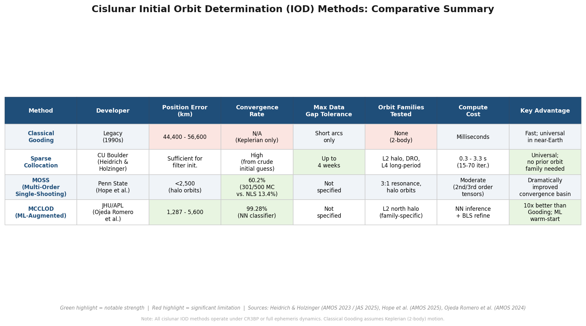

**Figure 4-1.** Comparative summary of cislunar IOD methods. Classical Gooding IOD produces errors exceeding 44,000 km in three-body environments, whereas sparse collocation, MOSS, and ML-augmented approaches reduce errors by one to two orders of magnitude. Data compiled from Heidrich & Holzinger (AMOS 2023 / JAS 2025), Hope et al. (AMOS 2025), and Ojeda Romero et al. (AMOS 2024).

## 4.2 State Estimation and Filtering for Cislunar Tracking

### 4.2.1 The Non-Gaussian Uncertainty Challenge

The central technical challenge of cislunar state estimation is that uncertainty distributions evolve into strongly non-Gaussian shapes under three-body dynamics, rendering standard Gaussian-assumption filters unreliable. Monte Carlo simulations with 1,000 trials and initial uncertainties of σ = 10 m (position) and 10 m/s (velocity) show that Lyapunov orbit uncertainties develop "anomalously complex curves and crossing structures" within a single orbital period (~30 days)—qualitatively different from the banana-shaped distributions familiar in near-Earth propagation. Even DRO, the most linearly stable of the major cislunar orbit families, generates asymmetric non-Gaussian distributions within 20–30 days. [Frueh, Howell, DeMars & Bhadauria (AAS 2021)](https://engineering.purdue.edu/people/kathleen.howell.1/Publications/Conferences/2021_AAS_FruHowDeMBha.pdf "AAS 21-290 — Cislunar SSA, 2021")

This non-Gaussianity has direct operational consequences. The extended Kalman filter (EKF), which assumes Gaussian posteriors and linearized dynamics, is fundamentally mismatched to the cislunar estimation problem. Even the unscented Kalman filter (UKF), which uses sigma-point sampling to capture second-order nonlinearity, fails to maintain consistent uncertainty quantification over the multi-week observation gaps that cislunar geometries impose. The practical implication is that cislunar tracking demands filter architectures specifically designed to represent and propagate multi-modal, non-Gaussian distributions—a requirement that significantly increases computational complexity relative to near-Earth operations.

### 4.2.2 Comparative Filter Performance

AFRL and KBR have conducted the most systematic open-source comparison of filtering approaches for cislunar orbit determination. Chow et al. evaluated UKF, Gaussian Mixture Model (GMM) filters, and the Adaptive Entropy-based Gaussian-mixture Information Synthesis (AEGIS) filter on simulated cislunar tracking scenarios. During steady-state tracking with regular observation updates, all three approaches achieve comparable median RSS position errors of 1–5 km. The critical differentiator emerges during data gaps: after 11.5–13.5 days without observations—a common occurrence when targets transit solar or lunar exclusion zones—the AEGIS filter reduces maximum re-acquisition error by approximately 10× compared to UKF and recovers steady-state accuracy within approximately two observation nights, versus five or more nights for UKF. This superior post-gap performance, however, comes at substantial computational cost: AEGIS spawns over 1,800 Gaussian mixture components during the gap period, with computation measured in hours versus minutes for UKF. [Chow et al. (AMOS 2022)](https://amostech.com/TechnicalPapers/2022/Poster/Chow.pdf "AMOS 2022 — Cislunar OD: Improvements in Uncertainty Realism")

Figure 4-2 presents a quantitative comparison of filter performance across steady-state and post-gap conditions, including re-acquisition timelines and computational characteristics.

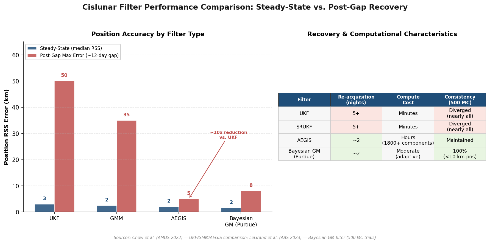

**Figure 4-2.** Comparative performance of cislunar tracking filters. Left: position RSS error under steady-state and post-gap (~12-day) conditions. Right: recovery characteristics and Monte Carlo consistency results. Data from Chow et al. (AMOS 2022) and LeGrand et al. (AAS 2023).

### 4.2.3 Adaptive Bayesian Gaussian Mixture Filtering

Purdue University's LeGrand et al. have developed an adaptive Bayesian Gaussian mixture filter that fuses four distinct splitting mechanisms: AEGIS entropy-based splitting, Jacobi constant variance-based splitting (exploiting the CR3BP integral of motion), linearization error splitting, and field-of-view boundary splitting. By combining these complementary criteria, the filter adaptively allocates mixture components where dynamical nonlinearity and observational geometry most distort the uncertainty distribution. In 500 Monte Carlo angles-only tracking trials, this filter maintained full consistency (position error < 10 km, velocity error < 1 m/s) across all trials, while the square-root UKF (SRUKF) diverged in nearly every trial. [LeGrand et al. (AAS 2023)](https://keithlegrand.com/wp/wp-content/uploads/2023/10/LeGrand-2023-Bayesian-Angles-Only-Cislunar-Space-Object-Tracking.pdf "AAS 23-386 — Bayesian Angles-Only Cislunar Tracking")

The Jacobi constant splitting criterion is particularly noteworthy as a physics-informed innovation. It leverages the approximate conservation of the Jacobi integral in the CR3BP to detect and correct filter inconsistency: when mixture components develop excessive variance in the Jacobi constant—indicating that the filter's state distribution has become physically implausible—the algorithm triggers targeted splitting to restore dynamical consistency. This approach has no analog in near-Earth tracking, where two-body energy conservation provides a far less discriminating constraint.

### 4.2.4 Multi-Sensor Data Fusion: Electro-Optical and Passive RF

A critical vulnerability of purely optical cislunar tracking is the total loss of observability during exclusion-zone transits. Chow et al. demonstrated that fusing electro-optical (EO) angles-only data with passive radio frequency (PRF) measurements—specifically time-difference-of-arrival (TDOA) and frequency-difference-of-arrival (FDOA) from a three-station ground network—eliminates gap-induced tracking failures. PRF measurements are not subject to solar, lunar, or Earth exclusion constraints: radio emissions from cooperative or semi-cooperative targets can be received regardless of illumination geometry. In all tested orbit types, the fused EO+PRF UKF maintained continuous tracking where pure-EO processing experienced gap-induced lock loss. [Chow et al. (AMOS 2022)](https://amostech.com/TechnicalPapers/2022/Poster/Chow.pdf "AMOS 2022 — Data Fusion with Passive RF")

This finding carries immediate operational implications. For cooperative targets that emit telemetry or communication signals—such as Artemis spacecraft, commercial lunar landers, or relay satellites—passive RF collection can serve as a complementary tracking modality that bridges optical blackout periods. For non-cooperative targets that maintain radio silence, however, this avenue is unavailable, and the exclusion-zone gap problem remains unsolved without space-based optical sensors positioned to provide alternative viewing geometries. The asymmetry between cooperative and non-cooperative target tracking capabilities represents a significant limitation for SDA applications focused on threat characterization.

## 4.3 Track Association and Correlation in Cislunar Space

### 4.3.1 The Fundamental Association Problem

Track association—determining whether two observation arcs separated in time belong to the same physical object—is a prerequisite for catalog maintenance and the bridge between individual tracking episodes and a persistent object database. In near-Earth space, the problem is tractable because Keplerian orbital elements provide a compact, universal parameterization: two observation arcs that yield similar elements (within statistical tolerance) are likely from the same object, and the Mahalanobis distance in element space provides a principled gating criterion. In cislunar space, no such universal parameterization exists. Orbits belong to qualitatively distinct families—halo, DRO, resonance, transfer—that cannot be mapped onto a common low-dimensional element set, depriving association algorithms of the compact state representation that makes near-Earth correlation computationally efficient. [Heidrich & Holzinger (AMOS 2023)](https://amostech.com/TechnicalPapers/2023/Cislunar-SSA/Heidrich.pdf "AMOS 2023")

The chaotic dynamics of the three-body problem compound the difficulty. Small state perturbations—or small maneuvers—can cause trajectories to diverge exponentially, meaning that forward propagation of an earlier arc may not overlap with a later arc even if both originate from the same object. The non-Gaussian uncertainty evolution described in Section 4.2 further undermines standard Mahalanobis gating: the probability density functions develop curvature, crossing structures, and even discontinuities (arising from lunar surface collisions pruning the distribution), rendering chi-squared gate thresholds statistically invalid. [Chow et al. (AMOS 2022)](https://amostech.com/TechnicalPapers/2022/Poster/Chow.pdf "AMOS 2022")

### 4.3.2 Current State and Open Challenges

As of April 2026, no published research quantifies multi-target, multi-sensor track association performance in cislunar space—specifically, false alarm rates, missed association rates, or computational scaling as a function of catalog size. The existing cislunar OD literature focuses almost exclusively on single-target IOD and tracking; the combinatorial association problem remains an unaddressed research frontier. The robustness of IOD itself becomes a prerequisite for association: a failed or wildly inaccurate IOD for one observation arc renders any subsequent correlation attempt meaningless. In this regard, the sparse collocation IOD approach (Section 4.1.2), by providing reliable orbit solutions even from poor initial guesses and long data gaps, represents an indirect but essential enabler of future association algorithms.

We assess that track association will become the binding constraint on cislunar catalog fidelity as the number of objects increases beyond the current handful of cooperative spacecraft. Unlike IOD and filtering, where multiple viable algorithmic approaches exist (as documented in Sections 4.1 and 4.2), association in a multi-body, multi-family orbital environment lacks even a theoretical framework comparable to what Keplerian mechanics provides for near-Earth space. This gap is not merely academic: without reliable association, a cislunar catalog will fragment into disconnected observation arcs, and any conjunction assessment or threat characterization built upon it will lack the continuity required for operational confidence.

## 4.4 Artificial Intelligence and Machine Learning in the Cislunar Detection-Tracking Pipeline

The algorithmic challenges documented in Sections 4.1–4.3—high-dimensional nonlinear optimization, non-Gaussian uncertainty propagation, and the absence of universal orbital parameterizations—create natural insertion points for AI and ML techniques. This section surveys four application domains where ML has demonstrated measurable value in cislunar SDA: orbit family classification, maneuver detection, autonomous sensor tasking, and on-board processing.

### 4.4.1 Orbit Family Classification

Machine learning offers a natural tool for imposing structure on the heterogeneous cislunar orbital environment. Martin et al. (Pacific Defense / AFRL) demonstrated that five standard ML classifiers—k-nearest neighbors (KNN), decision trees (DT), support vector machines (SVM), random forest classifiers (RFC), and deep neural networks (DNN)—can distinguish among 31 CR3BP periodic orbit families from simulated angles-only observation arcs. With 2-arcsecond measurement noise and 8-day / 16-observation arcs, RFC achieved 99.2–99.3% classification accuracy and DNN reached 97–98%. [Martin et al. (AMOS 2020)](https://amostech.com/TechnicalPapers/2020/Poster/Martin.pdf "AMOS 2020 — Cislunar Orbit Family Classification Using ML")

The operational utility of orbit family classification is substantial: by identifying the family to which a newly detected object belongs, the IOD search space is constrained from the full CR3BP phase space to a specific family manifold, reducing computation time and improving convergence probability. Combined with the MCCLOD neural-network warm-start approach (Section 4.1.4), a plausible end-to-end pipeline emerges: classify → warm-start → refine, with ML components at each stage reducing the burden on classical numerical solvers.

### 4.4.2 Maneuver Detection and Behavioral Pattern Analysis

Beyond classification, ML methods address the temporal dimension of cislunar SDA: detecting when an object's behavior deviates from its established pattern. Rivera et al. (CU Boulder) developed a combined Optimal Control-Based Estimator (OCBE) and One-Class Support Vector Classifier (SVC) framework for detecting maneuvers and characterizing "patterns of life" in cislunar space. Applied to L1 Lyapunov and L2 NRHO targets, the system successfully reconstructed station-keeping maneuvers and detected behavioral changes within approximately one day of maneuver cessation. Critically, the approach handles measurement gaps of up to 72 hours and does not require prior knowledge of the anomaly type—a significant advantage over supervised classifiers that need labeled maneuver training data. [Rivera et al. (AMOS 2021)](https://amostech.com/TechnicalPapers/2021/Poster/Rivera.pdf "AMOS 2021 — Patterns of Life and Maneuver Detection for Cislunar")

For SDA operators, the ability to detect when an object transitions from nominal station-keeping to off-nominal behavior—without knowing in advance what "off-nominal" looks like—is essential for threat warning and assessment. In cislunar space, where low delta-v maneuvers can shift objects between qualitatively different orbital families (e.g., from an L1 halo to an Earth-return trajectory with as little as 140 m/s), prompt maneuver detection directly supports the timeliness of threat characterization and enables early warning of potentially hostile repositioning.

### 4.4.3 Autonomous Sensor Tasking via Deep Reinforcement Learning

The scheduling of heterogeneous sensors to observe a growing population of cislunar objects is a combinatorially explosive optimization problem that exceeds the capacity of manual or rule-based tasking. Siew et al. (MIT / USSF Space Systems Command) demonstrated a deep reinforcement learning (DRL) approach to cislunar sensor tasking, training a convolutional neural network agent via proximal policy optimization (PPO) with population-based training to task a ground-based narrow-FOV optical telescope (modeled on Pan-STARRS, 3° × 3° FOV, Maui). In 100 Monte Carlo evaluations with 400 cislunar resident space objects across L1/L2 halo, DRO, and 3:1 resonance orbits, the DRL agent outperformed both random-direction and random-RSO baselines in final mean trace covariance and cumulative unique objects observed over a two-hour observation window. Notably, the agent learned an emergent strategy of clustering observations near the Moon's azimuth, where cislunar objects concentrate when viewed from Earth—a behavior not explicitly programmed but discovered through reward optimization. [Siew et al. (AMOS 2022)](https://amostech.com/TechnicalPapers/2022/Poster/Siew.pdf "AMOS 2022 — Cislunar SSA Sensor Tasking Using DRL")

More recently, Chaturvedi, Siciliano, and LeGrand (Purdue, AAS 2025) addressed the harder problem of reacquiring a lost cislunar object—one that has deviated from its predicted trajectory due to an unknown maneuver during a sensor coverage gap. They formulated the problem as a partially observable Markov decision process (POMDP) with random finite set (RFS) observation models and solved it via Monte Carlo tree search (MCTS) with double progressive widening. In 100 Monte Carlo trials, the MCTS-based approach with 20,000+ iterations achieved 100% reacquisition success within a six-hour search window, compared to only 25% for random search. The information-driven planner uses Kullback-Leibler divergence as its reward function, explicitly incorporating negative information—null detections that shrink the search region—into the planning loop. [Chaturvedi, Siciliano & LeGrand (AAS 2025)](https://keithlegrand.com/wp/wp-content/uploads/2025/01/Chaturvedi-2025-Information-Driven-Cislunar-Space-Object-Reacquisition.pdf "AAS 25-479 — Information-Driven Cislunar Reacquisition")

These results, demonstrated in simulation, establish the feasibility of autonomous sensor tasking for cislunar SDA. The DRL approach excels at steady-state survey optimization (maximizing coverage of known populations), while the MCTS/POMDP approach addresses the more challenging reacquisition scenario where an object has been lost. Neither has been validated in an operational environment, and extending from single-sensor to multi-sensor, multi-owner scheduling—the operationally relevant scenario for a joint cislunar SDA architecture—remains an open problem of considerably greater complexity.

### 4.4.4 On-Board Processing and Edge Computing

The round-trip light time from cislunar distances (~2.6 seconds at the Moon) and limited downlink bandwidth create a compelling case for on-board data processing that shifts detection decisions from ground operators to embedded algorithms. Sandia National Laboratories has evaluated on-board detection and tracking algorithms for cislunar SDA sensors, assessing the performance of automated pipelines on representative electro-optical imagery collected from simulated cislunar vantage points. [Merry et al. (AMOS 2022)](https://www.osti.gov/biblio/2004403 "Sandia SAND2022-11692C") The AFRL Oracle-Prime satellite, currently in development for deployment to the vicinity of Earth–Moon L1 in 2027, incorporates dedicated on-board image processing to reduce raw image data to detection reports before downlink—a design choice driven by the practical infeasibility of streaming full-frame imagery from cislunar distances at operationally useful cadence.

On-board processing introduces a new class of design trades that will become central parameters as space-based cislunar sensor constellations materialize: detection sensitivity versus false alarm rate at the edge, latency versus completeness of downlinked products, and the update cadence of on-board orbit catalogs versus ground truth reconciliation. These trades differ qualitatively from near-Earth on-board processing, where high-bandwidth downlinks to proximate ground stations reduce the autonomy burden on satellite algorithms.

## 4.5 Catalog Architecture and Data Standards for Cislunar Space

The algorithmic components surveyed in Sections 4.1–4.4 produce orbit solutions, tracked states, and behavioral assessments—but these outputs are operationally useful only if they can be stored, exchanged, and maintained within a standardized catalog framework. This section examines the data standards and institutional infrastructure required to transition from individual research demonstrations to an operational cislunar object catalog.

### 4.5.1 The Inapplicability of TLE/SGP4

The Two-Line Element (TLE) set and its associated Simplified General Perturbations 4 (SGP4) propagator form the universal data exchange standard for near-Earth space object catalogs. This format is fundamentally incompatible with cislunar operations. TLE encodes mean orbital elements under a Brouwer theory that assumes Earth-centered Keplerian motion with zonal harmonic perturbations—a model that diverges catastrophically when the Moon's gravitational influence becomes dominant (beyond approximately 4× GEO altitude). Propagation errors grow unboundedly; the concept of "mean elements" in the Brouwer sense has no physical meaning in a three-body environment. JHU/APL's 2022 *Cislunar Security National Technical Vision* explicitly recommends abandoning TLE for cislunar operations, replacing it with SPICE kernel or equivalent ephemeris formats in which the originating entity maintains the state propagation and dynamical model and distributes the resulting ephemeris directly. [JHU/APL](https://www.jhuapl.edu/Content/documents/CislunarSecurityNationalTechnicalVision.pdf "JHU APL 2022")

The implications extend beyond format compatibility. The entire near-Earth SDA enterprise—from the 18th Space Defense Squadron's catalog maintenance procedures to conjunction assessment workflows and data sharing via Space-Track.org—is built around TLE/SGP4 as the lingua franca. Replacing this foundation for cislunar operations requires not merely a new file format but a new operational paradigm in which each data contributor maintains and distributes a dynamically faithful ephemeris, and each data consumer independently verifies consistency against its own dynamical models.

### 4.5.2 NASA Cislunar SSA Message Set

NASA's Cislunar SSA Technical Steering Group (TSG) published in November 2021 a proposed message set for cislunar orbit data exchange that represents the most mature standard-setting effort to date. The proposal extends the existing CCSDS Orbit Data Messages (ODM) standard—specifically the Orbit Ephemeris Message (OEM), Orbit Comprehensive Message (OCM), and Tracking Data Message (TDM)—with modifications to accommodate multi-body dynamics and cislunar reference frames. Key features include: support for state vectors in Earth–Moon rotating (synodic) and barycentric inertial frames; compatibility with conversion to SPICE SPK and Interrange Instrumentation Vector (IIRV) formats; and metadata fields for specifying the dynamical model used in propagation (gravitational bodies included, perturbation models, solar radiation pressure parameters). [NASA Cislunar SSA TSG (2021)](https://www.nasa.gov/wp-content/uploads/2021/05/cislunar_ssa_proposed_message_set-nov2021_rev2_without_emailspdf.pdf "NASA Nov 2021 — Cis-Lunar SSA Proposed Message Set")

This message set addresses a foundational interoperability requirement: when multiple sensor operators—military, civil, commercial, and allied—contribute observations of the same cislunar object, they must share data in a format that preserves dynamical fidelity. The TLE format discards this information by construction; the CCSDS-extended format retains it. As of April 2026, however, the adoption status of the TSG message set remains unclear: no operational system or data-sharing agreement has been publicly announced that implements the cislunar-specific extensions, and the gap between published specification and operational deployment continues to widen.

### 4.5.3 Astrodynamics Convention Reference

Complementing the message format, NASA Technical Publication TP-20220014814 (2022) established a reference set of astrodynamics conventions for cislunar and Lagrange-point operations: coordinate systems (Earth-centered inertial J2000, Earth–Moon barycentric rotating, Moon-centered body-fixed), time systems (TDB, UTC, TAI), gravitational parameters, ephemeris sources (DE440), and modeling conventions. This document provides the foundational agreement on reference frame definitions—a prerequisite for multi-source data fusion that is often taken for granted in near-Earth operations where J2000 ECI and WGS-84 are near-universal, but which becomes a potential source of systematic error when heterogeneous contributors adopt inconsistent conventions in the three-body environment. [NASA TP-20220014814](https://ntrs.nasa.gov/citations/20220014814 "NASA TP 2022 — Astrodynamics Convention Reference")

### 4.5.4 CCSDS LunaNet and Interoperability Frameworks

The Consultative Committee for Space Data Systems (CCSDS) has advanced the LunaNet framework, presented at the June 2025 plenary, to extend deep-space communication and navigation standards to the Earth–Moon system. LunaNet provides an interoperability layer encompassing communication services, positioning/navigation/timing (PNT), and alert dissemination. While not an SDA standard per se, LunaNet's communication protocols and PNT reference frames are essential enabling infrastructure for any operational cislunar catalog: catalog updates, conjunction warnings, and sensor tasking commands all require standardized, low-latency data transport. The convergence of LunaNet with the NASA TSG message set and the astrodynamics convention reference (TP-20220014814) could, in principle, provide a complete standards stack for cislunar data exchange—but as of April 2026, these components remain unintegrated and individually unimplemented at the operational level. [NASA/CCSDS (June 2025)](https://ntrs.nasa.gov/api/citations/20250005946/downloads/Lunar%20Standards%20-CCSDS%20Plenary%209June2025v2-comp.pdf "NASA June 2025 — CCSDS Lunar Standards")

### 4.5.5 The Absent Operational Catalog

As of April 2026, no operational cislunar object catalog exists. The U.S. Space Force's 18th Space Defense Squadron maintains the authoritative near-Earth catalog of approximately 45,000 tracked objects, but its tracking systems, data formats, and propagation models do not extend to cislunar space. The NOAA Office of Space Commerce's Traffic Coordination System for Space (TraCSS), which entered initial operating capability in September 2024 with conjunction data messages distributed via Space-Track.org, is designed exclusively for near-Earth conjunction assessment and does not cover cislunar targets. [TraCSS](https://space.commerce.gov/traffic-coordination-system-for-space-tracss/ "TraCSS — Office of Space Commerce") As of February 2026, 17 organizations were pilot users of TraCSS; the system's development roadmap focuses on expanding conjunction screening services for LEO and GEO operators, with no announced plans for cislunar extension.

The absence of a catalog is not merely a data-management gap; it represents a structural deficiency in the entire SDA operational chain. Without a catalog, there is no baseline against which to detect new objects, no reference for conjunction screening, no mechanism for custody transfer between sensors, and no authoritative source for behavioral pattern analysis. CSIS assessed in October 2024 that cislunar space has "virtually no space situational awareness," characterizing spacecraft in the region as "flying with one eye closed." [CSIS](https://www.csis.org/analysis/salmon-swimming-upstream-charting-course-cislunar-space "Oct 2024") Building a cislunar catalog requires not only the algorithmic capabilities surveyed in this chapter—IOD, filtering, association, classification—but also institutional decisions about which organization maintains it, under what authority, at what classification level, and with what data-sharing agreements governing contributions from military, civil, commercial, and allied sources.

## 4.6 Synthesis: The Data Processing Pipeline from Detection to Catalog

The preceding sections describe individual algorithmic components; integrating them into an end-to-end pipeline reveals both the current state of the art and the critical gaps that separate research demonstrations from operational capability. Figure 4-3 illustrates this pipeline architecture, annotating each stage with representative algorithms, technology readiness levels, and identified gaps.

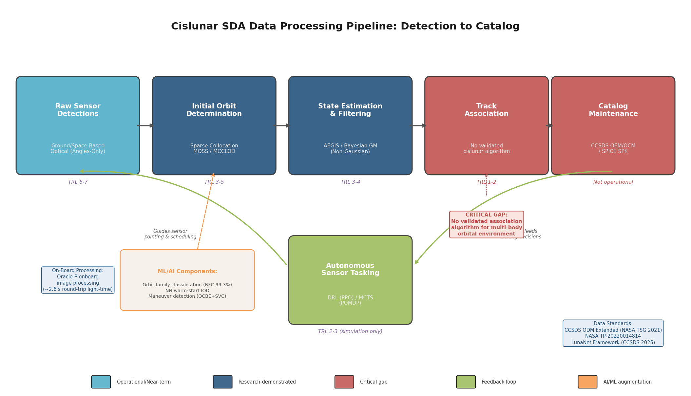

**Figure 4-3.** End-to-end cislunar SDA data processing pipeline from raw sensor detection through catalog maintenance. Color coding distinguishes operational/near-term capabilities (TRL 6–7), research-demonstrated algorithms (TRL 3–5), critical gaps (TRL 1–2), AI/ML augmentation components, and autonomous feedback loops. The track association stage and operational catalog remain the pipeline's weakest links.

The five pipeline stages, their current maturity, and remaining gaps are as follows:

1. **Detection → IOD.** Raw angular detections from ground-based or space-based optical sensors feed into cislunar-aware IOD algorithms (sparse collocation, MOSS, or ML-augmented). The IOD produces an initial state estimate with covariance, sufficient to initialize a filter. Current algorithms handle this step for single targets with demonstrated convergence rates of 60–99% depending on orbit family and method, as documented in Section 4.1.

2. **IOD → Tracking.** The initial state seeds an adaptive Gaussian mixture filter (e.g., AEGIS or LeGrand's Bayesian GM filter) that incorporates subsequent observations to refine the orbit. Steady-state position accuracy of 1–5 km is achievable with regular observation cadence; data gaps of 11–14 days are survivable with AEGIS-class filters, though at computational costs measured in hours rather than minutes (Section 4.2).

3. **Tracking → Association.** Tracked arcs must be correlated across observation sessions and sensors. This step has no validated cislunar-specific algorithm; it remains the weakest link in the algorithmic chain, as analyzed in Section 4.3.

4. **Association → Catalog.** Correlated tracks form catalog entries with associated state histories, covariance histories, and behavioral metadata. The catalog must be maintained in a cislunar-compatible format (CCSDS extended OEM/OCM or SPICE SPK) and propagated under multi-body dynamics. No such catalog operates today (Section 4.5).

5. **Catalog → Tasking.** Catalog-level knowledge of object populations informs sensor tasking decisions: which regions of cislunar space to survey, which objects to prioritize for follow-up, and when to schedule re-acquisition searches. DRL and MCTS-based autonomous tasking approaches show promising simulation results (100% reacquisition in controlled scenarios) but have not been operationally demonstrated (Section 4.4.3).

Each step in this pipeline depends on the fidelity of its predecessor. A failed IOD prevents track initialization; a diverged filter prevents association; a fragmented catalog prevents informed tasking. The pipeline's end-to-end performance is bounded by its weakest component, which at present is track association for the algorithmic chain and institutional catalog establishment for the operational chain. Resolving both gaps—developing association algorithms suited to multi-body, multi-family dynamics, and establishing the institutional framework for a shared cislunar catalog—represents the most consequential near-term priority for transitioning cislunar SDA from research to operations.

# 第5章 Current Programs, Missions, and Industry Initiatives (Apr 2025 – Oct 2026)

The preceding chapters established the physical constraints and technical frontiers of cislunar space domain awareness: orbital dynamics that defy two-body assumptions, sensor architectures that must overcome inverse-square and exclusion-zone penalties, and data-processing pipelines that contend with non-Gaussian uncertainty and chaotic propagation. This chapter translates those analytical frameworks into an operational inventory — cataloging the programs that are actually funded, the missions in development or in flight, and the commercial ventures positioning themselves to deliver cislunar SDA capability within the April 2025 – October 2026 window. The assessment reveals a domain in rapid institutional mobilization but burdened by critical hardware gaps that will persist through at least 2027: no dedicated cislunar SDA sensor operates in space, the most advanced U.S. government satellite sits flight-ready but grounded, and allied nations remain in the earliest conceptual stages of independent cislunar monitoring.

## 5.1 AFRL Oracle Series: The Cislunar Highway Patrol System

The Air Force Research Laboratory's Cislunar Highway Patrol System (CHPS) constitutes the most mature U.S. government program dedicated to space-based cislunar SDA. Comprising two spacecraft — Oracle-M and Oracle-P — the program is designed to progressively demonstrate detection, tracking, and characterization of objects transiting or residing in cislunar space.

### 5.1.1 Oracle-M: Flight-Ready but Grounded

Oracle-M, built by Blue Canyon Technologies with a Hall-effect thruster propulsion module from RTX, completed its critical propulsion hot-fire test in March 2025 at the Space Systems Command test facility, validating the spacecraft's capacity for the deep-space maneuvers required for cislunar transit. [SSC/AFRL](https://www.ssc.spaceforce.mil/newsroom/article-display/article/4176371/oracle-m-hot-fire-test-a-major-milestone-in-cislunar-space-situational-awarenes "Oracle-M Hot Fire Test, Mar 2025") Subsequent milestones — end-to-end ground system testing, operational team rehearsals, and formal delivery to Kirtland Air Force Base on February 25, 2026 — brought the satellite to storage awaiting launch vehicle integration. [Aviation Week](https://aviationweek.com/space/satellites/space-force-readying-launch-afrl-cislunar-ssa-satellite "Space Force Readying Launch of AFRL Cislunar SSA Satellite, Feb 26 2026")

Oracle-M was manifested on the ULA Vulcan Centaur rocket for the USSF-112 national security space launch (NSSL) mission, originally targeting late 2026. On February 12, 2026, however, Vulcan Centaur experienced a "significant performance anomaly" on one of its four GEM-63XL solid rocket boosters during the USSF-87 mission — the second such anomaly following a similar incident in October 2024. [Satellite Today](https://www.satellitetoday.com/government-military/2026/02/26/booster-resurfaces-as-vulcan-centaur-issue-space-force-halts-use-for-nssl-amid-investigation/ "Booster Resurfaces as Vulcan Centaur Issue, Feb 2026") The Space Force paused all national security launches on Vulcan pending investigation, and by March 2026 officials acknowledged the grounding could persist for "months." [Air & Space Forces Magazine](https://www.airandspaceforces.com/space-force-pauses-vulcan-missions-anomaly/ "Space Force Pauses Vulcan Missions amid Anomaly Investigation") In a cascading effect, the Space Force on March 20, 2026 reassigned the GPS III SV-10 satellite from Vulcan to a SpaceX Falcon 9 to prevent further schedule erosion, exchanging a future USSF-70 mission to ULA as compensation. [SSC](https://www.ssc.spaceforce.mil/Newsroom/Article-Display/Article/4439687/ussf-prioritizes-gps-iii-capability-delivery-timeline-executes-launch-provider "USSF Prioritizes GPS III Capability Delivery Timeline, Mar 20 2026")

For Oracle-M, the Vulcan grounding imposes a delay of at least six months beyond the original late-2026 target, placing the earliest realistic launch window in mid-2027. The Space Force has stated it is "weighing launch alternatives" but has not confirmed a provider change for USSF-112. [SpaceNews](https://spacenews.com/space-force-weighs-launch-alternatives-as-vulcan-faces-potential-months-long-grounding/ "Space Force Weighs Launch Alternatives, Mar 25 2026") The operational consequence is stark: the single most advanced U.S. government cislunar SDA satellite — flight-ready and in storage — cannot reach space because of a launch vehicle problem entirely unrelated to the satellite itself.

### 5.1.2 Oracle-P: The Dedicated Cislunar Sentinel

Oracle-P, the second and more capable CHPS spacecraft, is under construction with a target delivery date in 2026 and launch in 2027 to a halo orbit near the Earth–Moon L1 Lagrange point — a vantage from which it could observe approximately 85% of the Earth–Moon corridor. [AFRL](https://afresearchlab.com/cislunar-highway-patrol-system-chps/ "AFRL Oracle Overview") Unlike Oracle-M's transit-demonstration profile, Oracle-P is a dedicated SSA experiment satellite equipped with a dual-sensor payload: a wide-field-of-view camera for search-and-detect operations and a narrow-field-of-view telescope for target characterization. The spacecraft incorporates on-board image processing to reduce downlink data volume, a design imperative driven by the 2.6-second round-trip light time at lunar distance and the limited bandwidth available for deep-space communication. [AFRL News](https://www.afrl.af.mil/News/Article-Display/Article/4176820/oracle-m-hot-fire-test-a-major-milestone-in-cislunar-space-situational-awarenes/ "AFRL May 2025") Advanced Space, the Colorado-based company that operates the CAPSTONE mission in NRHO, has been selected as the operations contractor for Oracle-P. [Aerospace America](https://aerospaceamerica.aiaa.org/u-s-air-force-awards-grant-for-cislunar-constellation-to-track-spacecraft-and-debris/ "Oct 2025")

Should Oracle-P meet its 2027 launch target, it would become the first dedicated cislunar SDA sensor in space. Its L1 halo orbit position would provide continuous visibility of objects transiting between Earth and Moon, though the solar exclusion zone — which limits optical observation when the Sun falls within approximately 50° of the sensor boresight — would impose periodic coverage gaps consistent with the constraints analyzed in Chapter 2.

## 5.2 DARPA LASSO: Autonomous Small Satellites for Lunar-Orbit SDA

The Defense Advanced Research Projects Agency's Lunar Assay via Small Satellite Orbiter (LASSO) program embodies a conceptually distinct approach to cislunar awareness. Whereas Oracle-P positions a sensor at a Lagrange point to survey the broad Earth–Moon corridor, LASSO seeks to place autonomous, maneuverable small satellites in low lunar orbit for close-in domain awareness of the lunar vicinity. [Via Satellite](https://www.satellitetoday.com/technology/2025/04/15/darpa-program-seeks-autonomous-maneuverable-satellites-for-cislunar-domain-awareness/ "DARPA LASSO Solicitation, Apr 2025")

DARPA released the LASSO solicitation in April 2025, held a Proposers Day in May 2025, accepted Step-1 proposals by December 12, 2025, and closed Step-2 submissions on February 20, 2026. The program seeks performers to design, build, and deliver a spacecraft capable of autonomous operation in lunar orbit with propulsive maneuver capability — challenging the traditional paradigm of large, exquisite optical platforms by emphasizing agility, autonomy, and cost efficiency. A secondary objective involves high-resolution mapping of lunar water resources, conferring dual scientific and security utility. [Aviation Week](https://aviationweek.com/defense/budget-policy-operations/pentagon-eyes-cislunar-space-next-strategic-frontier "Pentagon Eyes Cislunar Space, Mar 2026")

As of April 2026, DARPA has not publicly announced contract awards from the Step-2 process; the SAM.gov listing indicates a contract awards management maintenance cycle but no posted awards. [SAM.gov](https://sam.gov/opp/82e0f799959f4a4ba8222e6aafb6ec92/view "LASSO Solicitation Listing") Given typical DARPA prototype development timelines, a LASSO flight demonstration before late 2028 is unlikely, placing the program outside the short-term operational window addressed in this report but within the medium-term planning horizon examined in subsequent chapters.

## 5.3 U.S. Space Force Institutional Integration

### 5.3.1 Formalizing Cislunar Operations as a Core Mission

On March 17, 2026, the U.S. Space Force formally incorporated the cislunar domain into its core mission and acquisition framework — a bureaucratic milestone with significant operational implications. The reorganization designated new Portfolio Acquisition Executives (PAEs) across the BMC3I, SATCOM & PNT, and infrastructure portfolios, with an integrated PAE responsible for coordinating cislunar technology development across these lanes. The stated objective is to transition from planning to initial cislunar SDA sensor deployment by 2028. [Air & Space Forces Magazine](https://www.airandspaceforces.com/space-force-serious-planning-cislunar-ops/ "Space Force 'Serious' About Planning for Cislunar Operations, Mar 2026") [SatNews](https://satnews.com/2026/03/18/space-force-formalizes-cislunar-strategy-amid-acquisition-restructuring/ "Space Force Formalizes Cislunar Strategy, Mar 2026")

### 5.3.2 The 19th Space Defense Squadron: Operational Lead for Cislunar SDA

Within the operational force structure, the 19th Space Defense Squadron (19th SDS), stood up in April 2022 at Naval Support Facility Dahlgren, Virginia, serves as the lead unit for mapping the cislunar regime and the only Space Force squadron with a dedicated xGEO and cislunar SDA mission. [USSF Combat Forces Command](https://www.ussf-cfc.spaceforce.mil/About-Us/Fact-Sheets/Display/Article/3878122/mission-delta-2-space-domain-awareness "Mission Delta 2 — Space Domain Awareness") [C4ISRNet](https://www.c4isrnet.com/battlefield-tech/space/2022/04/20/us-space-force-space-defense-squadron-tasked-to-focus-on-deep-space/ "19th SDS Establishment, Apr 2022") The 19th SDS operates under Mission Delta 2 (commanded by Col. Croker), which holds responsibility for cross-domain SDA operations from GEO through cislunar space, working in coordination with the 18th Space Defense Squadron at Vandenberg Space Force Base — the custodian of the foundational near-Earth space catalog.

The 19th SDS has been at the forefront of developing cislunar tracking tactics, techniques, and procedures (TTPs), beginning with the Artemis I mission in November–December 2022 and continuing through the Artemis II mission launched on April 1, 2026. On April 7, 2026, USSF Combat Forces Command confirmed that Mission Delta 2 provided space flight safety support for the Artemis II lunar flyby, representing the first real-time military tracking exercise of a crewed vehicle traversing the full Earth–Moon corridor. [USSF Combat Forces Command](https://www.ussf-cfc.spaceforce.mil/News/Article-Display/Article/4453171/mission-delta-2-ensures-space-flight-safety-for-artemis-ii-moon-fly-by "Mission Delta 2 Ensures Space Flight Safety for Artemis II, Apr 7 2026")

The Artemis I precedent from late 2022 had furnished initial lessons when Space Delta 2 tracked the uncrewed mission over its 25-day, 1.4-million-mile journey, defining the "xGEO tracking" concept. [U.S. Space Forces – Space](https://www.spaceforces-space.mil/Newsroom/Article/3249252/delta-2-leverages-space-domain-awareness-in-support-of-artemis-i/ "Delta 2 Leverages SDA in Support of Artemis I, Dec 2022") Artemis II, a 10-day crewed mission, afforded a more compressed and higher-stakes opportunity: General Whiting confirmed the exercise would "rehearse and refine tactics, techniques, and procedures" for cislunar operations, employing GBOSS, GEODSS, commercial optical networks (Anduril/ExoAnalytic, Slingshot), and NASA mission operations data in a coordinated multi-source tracking architecture. [Aviation Week](https://aviationweek.com/defense/budget-policy-operations/pentagon-eyes-cislunar-space-next-strategic-frontier "Pentagon Eyes Cislunar Space, Mar 2026") A critical caveat applies: Artemis II was a cooperative target with known orbital parameters, full telemetry, and pre-coordinated ground truth — conditions that will not obtain for non-cooperative cislunar objects of unknown provenance.

### 5.3.3 Ground-Based Optical Surveillance Upgrades: GBOSS and GEODSS

The Space Force's Ground-Based Optical Space Surveillance (GBOSS) system has undergone significant modernization with direct relevance to cislunar awareness. L3Harris delivered an upgraded GBOSS system at White Sands Missile Range that achieved operational acceptance in August 2025, providing the capability to survey orbital activity from LEO to deep space within minutes. [L3Harris](https://www.l3harris.com/newsroom/press-release/2025/08/l3harris-upgrades-us-space-force-telescopes-space-domain-awareness "L3Harris Upgrades US Space Force Telescopes, Aug 2025") The Maui site upgrade was undergoing acceptance testing in early 2026, and the Diego Garcia facility upgrade remains in the planning phase. The initial contract is valued at $119.1 million, with options extending to $218 million. [SpaceNews](https://spacenews.com/l3harris-gets-119-million-space-force-contract-for-deep-space-telescopes/ "L3Harris GBOSS Contract, Sep 2020") L3Harris additionally holds the 10-year, $1.2 billion MOSSAIC contract for maintaining the broader SSA sensor infrastructure, providing the organizational backbone for deep-space observation operations. [Aviation Week](https://aviationweek.com/defense/budget-policy-operations/pentagon-eyes-cislunar-space-next-strategic-frontier "GBOSS Status, Mar 2026")

The expansion plan envisions new GBOSS stations in Spain and Australia, extending the network from three to five sites and significantly improving geographic diversity — a critical factor for reducing observation gaps caused by weather, daylight, and site-specific exclusion geometries. The existing GEODSS network (three sites, nine sensors, 1.23° × 1.61° field of view, limiting magnitude 17.9) retains meaningful utility for cislunar SDA when tasked with Poincaré-map-guided search strategies: such strategies can reduce the cislunar search area by 85.3% and enable detection of up to 56.8% of cislunar return-crossing targets within 24 hours. [Segal (AMOS 2025)](https://amostech.com/TechnicalPapers/2025/Poster/Segal.pdf "Enhancing Ground-Based Cislunar SDA: Reducing Search Area Using Poincaré Maps, AMOS 2025")

## 5.4 Commercial Cislunar SDA Ventures

### 5.4.1 Anduril Industries and ExoAnalytic Solutions

The March 2026 acquisition of ExoAnalytic Solutions by Anduril Industries constitutes the most significant commercial consolidation in the cislunar SDA sector to date. ExoAnalytic operated a global network of approximately 400 ground-based telescopes staffed by roughly 130 personnel and had demonstrated cislunar tracking capability since 2020, making it one of the few commercial entities with validated beyond-GEO observation experience. [SpaceNews](https://spacenews.com/anduril-to-acquire-space-tracking-firm-exoanalytic-solutions/ "Anduril to Acquire ExoAnalytic Solutions, Mar 2026") Anduril's strategy integrates ExoAnalytic's optical sensor network and SDA analytics software into its Lattice command-and-control platform — an AI-driven system already deployed by the Department of Defense for multi-domain operations.

The combined entity has announced three self-funded space missions to demonstrate integrated sensing, maneuvering, and on-board processing capabilities. [Aviation Week](https://aviationweek.com/defense/budget-policy-operations/pentagon-eyes-cislunar-space-next-strategic-frontier "Anduril-ExoAnalytic Deal, Mar 2026") This vertical integration model — combining telescope hardware, software analytics, command-and-control, and planned space-based assets under a single corporate umbrella — positions Anduril as a potential end-to-end cislunar SDA provider, contrasting sharply with the government's multi-contractor, multi-program approach.

### 5.4.2 Slingshot Aerospace

Slingshot Aerospace has pursued a complementary strategy centered on data analytics and AI-driven decision support. In August 2022, Slingshot acquired Numerica Corporation's SDA division, inheriting a network of more than 30 telescopes across 20 sites with 24-hour LEO-to-GEO tracking capability. [Payload Space](https://payloadspace.com/slingshot-acquires-numerica-sda-and-seradata/ "Slingshot Acquires Numerica SDA, Aug 2022") The legacy Numerica network had tracked China's Chang'e-5 lunar sample-return mission to approximately 380,000 km — lunar distance — providing one of the few publicly documented commercial cislunar tracking demonstrations, with a radial uncertainty of approximately 200 km. [Thompson et al. (AMOS 2021)](https://amostech.com/TechnicalPapers/2021/Poster/Thompson.pdf "AMOS 2021 — Cislunar OD and Tracking")

In April 2025, Slingshot launched its "Sovereign SDA" turnkey package — comprising Horus, Argus, and Varda sensor systems, the Slingshot Global Sensor Network (SGSN) catalog, and cloud-based processing — designed to enable allied nations to rapidly establish independent SDA capabilities from LEO to cislunar distances. [Slingshot](https://www.slingshot.space/news/slingshot-aerospace-debuts-worlds-first-rapid-space-domain-awareness-enablement-package "Sovereign SDA Debut, Apr 2025") In January 2026, the Space Force awarded Slingshot a $27 million contract to integrate its Talos AI system into the Operational Tactics, Techniques, and Innovation (OTTI) training environment, further embedding commercial AI tools in military SDA workflows. [SpaceNews](https://spacenews.com/slingshot-wins-27-million-space-force-contract-for-ai-training-system/ "Slingshot Wins $27M Space Force Contract, Jan 2026")

### 5.4.3 Quantum Space: Ranger Prime

Quantum Space, a Maryland-based spacecraft manufacturer, is positioning itself as a provider of cislunar servicing and proximity-operations vehicles with inherent SDA utility. The company's Ranger Prime mission — using the Ranger 500 bus — is scheduled for launch in June 2026 from Vandenberg Space Force Base aboard a SpaceX Falcon 9 rocket. [SpaceNews](https://spacenews.com/quantum-space-to-launch-first-spacecraft-in-mid-2026/ "Quantum Space Launch in Mid-2026, Oct 2025") The mission will demonstrate "remote proximity target operations" — approaching and characterizing objects at cislunar distances — core capabilities transferable to both servicing and SDA applications.

Quantum Space secured $40 million in funding in June 2025 and acquired Phase Four's multi-mode propulsion technology, which enables a single thruster to operate in both high-thrust chemical and high-efficiency electric modes. [Payload Space](https://payloadspace.com/quantum-space-readies-its-ranger-spacecraft-to-fly-in-2026/ "Quantum Space Readies Ranger, 2026") Although Ranger Prime is not a dedicated SDA mission, its proximity-operations demonstration would validate spacecraft bus capabilities directly applicable to cislunar inspection and characterization missions. Should the June 2026 launch proceed on schedule, Ranger Prime would become one of the first commercial cislunar-capable spacecraft to reach operational orbit within the study window.

### 5.4.4 Advanced Space: CAPSTONE as Cislunar Data Source

Advanced Space's CAPSTONE spacecraft, operating in a Near-Rectilinear Halo Orbit (NRHO) since June 2022, has completed more than 100 orbital revolutions and constitutes the only operational NRHO flight data set in existence. [Advanced Space](https://advancedspace.com/capstone/ "CAPSTONE Mission Overview") In December 2021, the U.S. Air Force signed a cooperative agreement with Advanced Space to share CAPSTONE navigational and orbital data for AFRL cislunar SDA research — an arrangement that has provided researchers with real-world validation data for orbit determination algorithms, uncertainty propagation models, and sensor tasking simulations in the NRHO regime.

CAPSTONE's operational experience has directly informed the design of the Artemis Gateway NRHO (the 9:2 synodic resonance, L2 southern halo orbit with a ~6.5-day period), and its navigational data serves as ground truth for the autonomous cislunar navigation techniques that Oracle-P and future SDA platforms will require.

## 5.5 Allied and International Programs

### 5.5.1 European Space Agency: LUMOS and Supporting Studies

The European Space Agency's most direct cislunar SDA initiative is LUMOS (Lunar Monitoring System), a Phase A study conducted from March 2025 to February 2026, led by Politecnico di Milano, which examined mission architectures for a dedicated European cislunar space-object monitoring system. [Politecnico di Milano](https://www.aero.polimi.it/en/research-projects/esa-lumos-phase-a-of-cis-lunar-space-object-monitoring-mission "LUMOS Phase A Study") As of April 2026, LUMOS Phase A has been completed, but no public announcement regarding a Phase B decision or funding commitment has been issued.

Complementing LUMOS, ESA in August 2025 awarded GMV's Polish subsidiary a contract for cislunar surveillance ground-observation strategy and sensor design, addressing how existing and planned European ground-based sensors could contribute to cislunar monitoring. [GMV](https://www.gmv.com/en-es/communication/news/gmv-signs-contract-advance-cis-lunar-space-surveillance "GMV Cislunar Surveillance Contract, Aug 2025")

The European Space Policy Institute (ESPI) has assessed that Europe's cislunar engagement remains "fragmented, passive — lagging behind the United States in both investment and strategic coordination," urging investment in independent SSA capabilities, development of collision-avoidance protocols, and leadership in international norm-setting. [ESA Space Safety Blog](https://blogs.esa.int/spacesafety-community/2025/07/17/towards-a-safe-and-sustainable-cislunar-space/ "Towards a Safe and Sustainable Cislunar Space, Jul 2025") The gap between Europe's analytical awareness of the cislunar SDA challenge and its programmatic response remains wide: no European space-based cislunar sensor is funded, and the ground-based approach through GMV is in its earliest study phase.

### 5.5.2 Japan–India Commercial Partnership: ispace and Digantara

In September 2025, Japan's ispace and India's Digantara announced a partnership to construct cislunar SSA infrastructure — the first non-American, non-European dedicated commercial cislunar SSA initiative. [Payload Space](https://payloadspace.com/ispace-digantara-join-forces-on-cislunar-ssa/ "ispace-Digantara Join Forces on Cislunar SSA, Sep 2025") The partnership combines Digantara's planned constellation of 40 LEO SSA satellites with ispace's demonstrated lunar surface access capability (ispace conducted the HAKUTO-R Mission 1 in 2023 and is preparing Mission 2). The concept envisions extending Digantara's sensor coverage from near-Earth orbits toward cislunar distances, potentially leveraging ispace lunar landers to deploy surface-based sensors at the Moon.

This partnership is notable for its non-governmental origin: neither JAXA nor ISRO has announced a dedicated cislunar SDA program at the government level. The commercial venture thus represents a market-driven response to a capability gap that government programs in the Indo-Pacific region have yet to address.

### 5.5.3 United Kingdom: NSpOC and DARC

The United Kingdom's National Space Operations Centre (NSpOC) has been operational for over a year, providing the UK with an independent SDA coordination hub. Its primary sensor investment, however — the Deep Space Advanced Radar Concept (DARC), built by Northrop Grumman in Pembrokeshire, Wales — targets GEO-range objects rather than cislunar targets. In September 2025, the UK and U.S. completed their first coordinated satellite maneuver exercise, demonstrating allied SDA interoperability. [King's College London](https://www.kcl.ac.uk/reflections-on-uk-spacepower-lessons-from-2025-and-what-comes-next "Reflections on UK Spacepower, 2026") A King's College London assessment concluded that the UK remains "heavily reliant on U.S. systems" for deep-space and cislunar awareness, with national space expenditure below 0.05% of GDP — a level insufficient to fund independent cislunar sensor programs.

## 5.6 Academic and Research Initiatives

### 5.6.1 AFOSR RCAT-CS: Lagrange-Point Constellation Algorithms

The Air Force Office of Scientific Research (AFOSR) awarded a $1 million grant in October 2025 to Rensselaer Polytechnic Institute and Texas A&M University for the Reconfigurable Cislunar Autonomous Tracking Constellation for Space (RCAT-CS) project. The research aims to develop algorithms for dynamically reconfiguring a constellation of 3–10 sensor satellites deployed in halo orbits around the Earth–Moon Lagrange points, enabling autonomous redistribution of observing assets in response to changing threat geometries or target priorities. [RPI News](https://news.rpi.edu/2025/10/21/rpi-awarded-air-force-grant-monitor-growing-traffic-between-earth-and-moon "RPI Awarded Air Force Grant to Monitor Cislunar Traffic, Oct 2025") [Aerospace America](https://aerospaceamerica.aiaa.org/u-s-air-force-awards-grant-for-cislunar-constellation-to-track-spacecraft-and-debris/ "AFOSR RCAT-CS Grant, Oct 2025") RCAT-CS addresses a fundamental operational challenge: unlike GEO-belt surveillance, where sensor positions can remain relatively static, cislunar Lagrange-point orbits are themselves dynamic (quasi-periodic halo and Lissajous motions), requiring constellation design to account for sensor-orbit evolution alongside target-orbit evolution.

### 5.6.2 University of Arizona: AFRL-Funded Cislunar Detection and Cataloging

The University of Arizona received a $7.5 million AFRL grant to develop cislunar target detection, characterization, and tracking capabilities using the Biosphere 2 telescope facility. The project also aims to build the network infrastructure required for a federated cislunar object catalog — addressing a data-architecture problem that remains among the most significant barriers to operational cislunar SDA. [University of Arizona News](https://news.arizona.edu/news/75m-effort-seeks-prevent-lunar-traffic-jams "UArizona $7.5M Cislunar SDA Effort") At $7.5 million, this is among the largest single academic grants for cislunar SDA research, reflecting the Air Force's strategy of distributing early-stage technology development across university research groups while retaining system integration responsibility within government laboratories.

### 5.6.3 JHU/APL: Cislunar Security Conference and LOGIC Alliance

The Johns Hopkins University Applied Physics Laboratory has established itself as the intellectual center of gravity for cislunar security through two ongoing initiatives. The annual Cislunar Security Conference (CLSC), running since 2020, has grown to attract over 300 institutions across five years of convenings, serving as the primary venue where military operators, intelligence analysts, academic researchers, and commercial providers exchange findings on cislunar domain awareness. [JHU/APL](https://www.jhuapl.edu/news/news-releases/250117-cislunar-security-conference "Cislunar Security Conference, Jan 2025") In parallel, the LOGIC (Lunar Operations and Governance Integration Collaborative) alliance, developed in coordination with DARPA, addresses interoperability gaps in lunar infrastructure — including communication, navigation, and data-sharing standards that are prerequisites for distributed cislunar SDA architectures. JHU/APL's 2022 *Cislunar Security National Technical Vision* remains the baseline reference document for cislunar security technology roadmapping; its four-pillar framework (SDA, PNT, communications, end-to-end operations) is widely cited across government and academic literature. [JHU/APL](https://www.jhuapl.edu/Content/documents/CislunarSecurityNationalTechnicalVision.pdf "Cislunar Security National Technical Vision, 2022")

## 5.7 NASA Programs with Indirect Cislunar SDA Relevance

### 5.7.1 Gateway Suspension and the Lunar-Base Pivot

On March 24, 2026, NASA announced the suspension of the Lunar Gateway program — the planned crewed space station in NRHO that was to serve as a staging point for Artemis surface missions — replacing it with a $20 billion, seven-year phased plan to construct a permanent lunar surface base. [SpaceNews](https://spacenews.com/nasa-halts-work-on-gateway-to-develop-a-lunar-base/ "NASA Halts Work on Gateway, Mar 24 2026") [Reuters](https://www.reuters.com/science/nasa-cancel-orbiting-lunar-station-build-moon-base-instead-2026-03-24/ "NASA Plans Moon Base, Mar 2026")

Gateway's cancellation carries direct implications for cislunar SDA. A permanently crewed station in NRHO would have functioned as an indirect monitoring node: its communication systems, navigation beacons, and crew observations providing continuous human presence in a region of cislunar space otherwise devoid of persistent sensor assets. With Gateway removed from the architecture, the cislunar NRHO regime reverts to CAPSTONE as its sole operational occupant until Oracle-P or another asset arrives at a Lagrange-point orbit. The pivot to a surface base redirects infrastructure investment toward the lunar surface — which offers advantages for SDA sensor placement (no atmospheric interference, cryogenic thermal environment for IR sensors, no orbital-maintenance requirements) — but does not provide the orbital vantage geometry that Lagrange-point or NRHO assets would offer for detecting objects in transit through the Earth–Moon corridor.

### 5.7.2 Near Space Network and Lunar Relay Services

In September 2024, NASA awarded Intuitive Machines a lunar relay services contract under the Near Space Network, valued at up to $4.82 billion over a 5+5 year period. [NASA](https://www.nasa.gov/news-release/nasa-selects-lunar-relay-contractor-for-near-space-network-services/ "NASA Selects Lunar Relay Contractor, Sep 2024") Although designed for communication and navigation services rather than SDA, the relay satellite constellation this contract will generate produces byproducts directly relevant to domain awareness: coverage maps characterizing which regions of cislunar space enjoy continuous communication access, navigation beacons providing PNT reference signals, and tracking data from relay operations that can inform orbit determination for cooperative targets. Integrating these civil infrastructure data streams into military SDA workflows represents a near-term force multiplier requiring no additional sensor investment.

## 5.8 Comparative Assessment: Technology Readiness and Capability Gaps

Surveying the full landscape of programs, missions, and initiatives active in the April 2025 – October 2026 window reveals a domain characterized by intense planning activity but limited operational capability. Figure 5.1 presents the consolidated program timeline, illustrating the sequencing and status of all major cislunar SDA efforts through 2028.

The following assessment maps each major initiative against the capability gaps identified in the sensor architecture and data-processing analyses of preceding chapters.

**Space-based SDA sensors.** No dedicated cislunar SDA sensor is operational in space as of April 2026. Oracle-M is flight-ready but grounded by the Vulcan anomaly; Oracle-P targets 2027; DARPA LASSO is in solicitation without awarded contracts; Quantum Space Ranger Prime (June 2026 target) demonstrates proximity operations but is not a dedicated SDA platform; CAPSTONE provides navigational data but lacks SDA sensor instrumentation. The earliest a dedicated government cislunar SDA sensor could reach orbit is mid-to-late 2027 (Oracle-P), assuming no further delays.

**Ground-based optical upgrades.** GBOSS upgrades at White Sands are operational; Maui is in acceptance testing; Spain and Australia are planned. GEODSS retains cislunar utility with Poincaré-guided search strategies. Ground-based systems, however, provide approximately 10% temporal coverage of cislunar space and can detect only approximately 30% of cislunar grid points, even with limiting magnitudes of 18–20. [Paetzold et al.](https://conference.sdo.esoc.esa.int/proceedings/sdc9/paper/258/SDC9-paper258.pdf "ESA SDC9 2025")

**Commercial networks.** The Anduril/ExoAnalytic and Slingshot networks collectively field over 430 ground-based telescopes with demonstrated deep-space and limited cislunar tracking capability. These networks constitute the single most significant near-term force multiplier for cislunar awareness, though they lack published performance specifications for cislunar-distance targets — limiting magnitudes, custody timelines, and positional accuracy at 384,000 km are not publicly characterized beyond the Chang'e-5 tracking precedent.

**Allied programs.** ESA LUMOS Phase A is complete but Phase B is undecided. The ispace-Digantara partnership is announced but pre-operational. The UK NSpOC relies on U.S. systems for beyond-GEO awareness. No allied nation has a funded, space-based cislunar SDA sensor program. The Combined Space Operations (CSpO) framework, with 10 member nations sharing data through the Unified Data Library (UDL), provides the organizational infrastructure for allied data fusion but currently lacks cislunar-specific data schemas. [SSC UDL Briefing](https://www.ssc.spaceforce.mil/Portals/3/SDA%20Briefings/06.%20UDL%20Overview%20Overview.pdf "UDL Overview")

**Catalog and data standards.** No operational cislunar target catalog exists. The 18th SDS maintains the near-Earth catalog (~45,000 objects); the 19th SDS is the designated cislunar lead but operates without a dedicated catalog system. NASA's Cislunar SSA Technical Steering Group proposed an extended CCSDS message set in November 2021, but adoption status remains unclear. The TLE/SGP4 framework underpinning the current space catalog is fundamentally incompatible with three-body cislunar dynamics.

**Organizational readiness.** The Space Force has designated PAEs and assigned the 19th SDS as the cislunar operational lead, with Mission Delta 2 serving as the cross-domain SDA organization. The April–October 2026 window, however, finds the institutional framework outpacing the hardware: organizational structures for cislunar operations exist, but the sensors, algorithms, and data systems to fill those structures are not yet deployed.

Figure 5.2 synthesizes the maturity status of each program across five capability dimensions central to the cislunar SDA kill chain.

The matrix underscores a pervasive pattern: most programs cluster in the Development and Test/Demo tiers, with only GBOSS upgrades achieving operational status in the search-and-detect dimension. Catalog and data standards — the connective tissue that would transform discrete sensor observations into a coherent operational picture — remain at the earliest maturity levels across nearly all initiatives.

Figure 5.3 maps the relationships among the principal stakeholders, illustrating the contractual, data-sharing, and coordination links that bind the cislunar SDA ecosystem.

The Center for Strategic and International Studies (CSIS) assessment from October 2024 remains apt: cislunar space has "almost no space situational awareness," and spacecraft operating in the region are effectively "flying with one eye closed." [CSIS](https://www.csis.org/analysis/salmon-swimming-upstream-charting-course-cislunar-space "Salmon Swimming Upstream, Oct 2024") The programs cataloged in this chapter represent the collective effort to open that eye — but the timeline for achieving persistent, operationally relevant cislunar awareness extends well beyond the near-term window.

# 第6章 Operational Concepts for Short-Term Cislunar Tracking and Monitoring

The preceding chapters established that cislunar space — the volume extending from geostationary orbit (GEO, ~36,000 km) to the Moon and its associated Lagrange points (~384,400 km) — poses fundamental challenges to space domain awareness (SDA). Three-body orbital dynamics, extreme sensor-to-target distances, and the near-total absence of operational infrastructure combine to render legacy near-Earth tracking paradigms inadequate. This chapter synthesizes those technical foundations into actionable operational concepts for near-term cislunar tracking and monitoring. It examines how existing and emerging assets can be orchestrated during the April–October 2026 window to deliver an initial operational capability (IOC); defines detection-to-custody timelines across the principal cislunar orbit classes; proposes multi-owner sensor scheduling and handoff protocols; and identifies the critical operational gaps and risk-mitigation measures that will govern cislunar SDA effectiveness until dedicated space-based sensors reach orbit — no earlier than 2027.

## 6.1 Doctrinal and Strategic Frameworks for Cislunar Operations

### 6.1.1 U.S. Space Force Operational Doctrine

The U.S. Space Force (USSF) Space Doctrine Note on Operations (January 2022) defines SDA through four functional pillars: detection/tracking/identification (D/T/ID), characterization, threat warning and assessment (TW&A), and data integration and exploitation (DI&E). The doctrine partitions the operational domain into three concentric layers — geocentric, cislunar, and heliocentric — thereby formally recognizing cislunar space as a distinct area of operations requiring dedicated concepts and resources. [Space Force SDN Operations](https://media.defense.gov/2022/Feb/02/2002931717/-1/-1/0/SDN+OPERATIONS+25+JANUARY+2022.PDF "USSF Space Doctrine Note, Jan 2022")

Space Doctrine Publication SDP 3-100 (November 2023) further codifies SDA as a core competency encompassing the ability to "characterize, detect, track, and identify all natural and man-made objects in the domain." Although SDP 3-100 primarily addresses near-Earth regimes, its emphasis on predictive battlespace awareness, multi-source data fusion, and tiered sensor layering supplies the doctrinal scaffolding upon which cislunar-specific concepts of operations (CONOPS) are being constructed. [STARCOM SDP 3-100](https://www.starcom.spaceforce.mil/Portals/2/SDP%203-100%20Space%20Domain%20Awareness%20(November%202023)_pdf_safe.pdf "SDP 3-100, Nov 2023")

In March 2026, the Space Force formalized the integration of cislunar operations into its core mission and acquisition framework by designating new Portfolio Acquisition Executives (PAEs) across BMC3I, SATCOM & PNT, and infrastructure portfolios, with an integrated PAE overseeing cross-domain cislunar technology maturation. Mission Delta 2 (commanded by Col. Croker) has been assigned responsibility for cross-regime SDA operations, including the cislunar domain, though no dedicated cislunar squadron has yet been established. The stated objective is to transition from planning to initial cislunar SDA sensor deployment by 2028. [Air & Space Forces Magazine](https://www.airandspaceforces.com/space-force-serious-planning-cislunar-ops/ "Space Force 'Serious' About Planning for Cislunar Operations, Mar 2026")

### 6.1.2 National Policy Guidance

The White House National Cislunar Science and Technology Strategy (November 2022) articulates four objectives, of which Objective 3 directly mandates the extension of U.S. space situational awareness (SSA) capabilities into cislunar space. Sub-goals include assessing current SSA requirements and gaps, developing sensor capabilities, enhancing data cooperation among agencies and partners, and establishing a cislunar catalog integrating both natural and man-made objects via a "civilian open data platform." [National Cislunar S&T Strategy](https://bidenwhitehouse.archives.gov/wp-content/uploads/2022/11/11-2022-NSTC-National-Cislunar-ST-Strategy.pdf "White House Nov 2022")

Executive Order 14369, "Ensuring American Space Superiority," signed on December 18, 2025, shifts emphasis toward the military dimension, requiring capabilities for "threat detection, characterization, and counteraction from very low Earth orbit to cislunar space" and positioning the United States as "the standard-setter for ground and cislunar positioning, navigation, and timing." The juxtaposition of the 2022 strategy's civilian-open-data vision with EO 14369's military-threat focus creates an unresolved policy tension that directly affects how cislunar SDA data will be classified, shared, and exploited operationally. [SpaceNews](https://spacenews.com/trump-signs-sweeping-executive-order-to-assert-u-s-dominance-in-space/ "Trump EO on space superiority, Dec 2025")

### 6.1.3 The JHU/APL End-to-End Architecture Framework

The most comprehensive publicly available cislunar CONOPS framework remains the JHU/APL *Cislunar Security National Technical Vision* (2022), which identifies four interdependent technology pillars: SDA, positioning/navigation/timing (PNT), communications, and end-to-end operations. Key architectural recommendations include: (1) replacing TLE/SGP4 with SPICE ephemeris or equivalent formats capable of representing three-body trajectories; (2) assigning state propagation and uncertainty management to the "originating authority" — the entity that generated the observation — rather than distributing raw measurements; (3) building a joint multi-source sensor architecture that layers ground-based, space-based, and lunar-surface assets; and (4) developing cislunar-specific data standards for catalog maintenance. This framework serves as the de facto reference architecture for both U.S. government and allied cislunar planning efforts. [JHU/APL](https://www.jhuapl.edu/Content/documents/CislunarSecurityNationalTechnicalVision.pdf "JHU APL 2022")

The Mitchell Institute for Aerospace Studies (January 2024) further contextualized the strategic imperative by framing the Moon as "the first island off the coast of Earth" — an analogy to Indo-Pacific first-island-chain strategy — and arguing that cislunar domain awareness constitutes a prerequisite for controlling access and transit through this strategically contested volume. [Mitchell Institute](https://www.mitchellaerospacepower.org/app/uploads/2024/01/Securing-Cislunar-Space-and-the-First-Island-Off-the-Coast-of-Earth-WEB.pdf "Securing Cislunar Space, Jan 2024")

## 6.2 Near-Term Operational Architecture: Ground-Based Initial Operational Capability

### 6.2.1 Available Ground-Based Assets (April–October 2026)

In the absence of dedicated space-based cislunar SDA sensors — none of which will achieve orbit before 2027 at the earliest — the near-term operational architecture relies entirely on ground-based optical systems and their commercial augmentation. Three asset tiers compose this interim architecture:

**Tier 1 — Military Deep-Space Optical Systems.** The Ground-Based Electro-Optical Deep Space Surveillance (GEODSS) system operates three stations (Socorro, Maui, Diego Garcia) with nine telescopes achieving a limiting magnitude of approximately 17.9 and a field of view (FOV) of 1.23° × 1.61° per sensor. Recent analysis demonstrates that applying Poincaré-map-derived search strategies to GEODSS can reduce the cislunar search volume by 85.3%, enabling a single 24-hour campaign to capture up to 56.8% of cislunar return-crossing targets — a substantial improvement over blind-search approaches. [Segal (AMOS 2025)](https://amostech.com/TechnicalPapers/2025/Poster/Segal.pdf "AMOS 2025 — Enhancing Ground-Based Cislunar SDA: Reducing Search Area Using Poincaré Maps")

The Ground-Based Optical Space Surveillance (GBOSS) system, upgraded by L3Harris under a $119.1 million contract (with options to $218 million), achieved operational acceptance at White Sands Missile Range in August 2025. The Maui site upgrade was undergoing acceptance as of early 2026, with additional sites planned in Spain and Australia to expand the network from three to five stations. GBOSS provides deep-space investigation capability from LEO to beyond GEO within minutes of tasking. [L3Harris](https://www.l3harris.com/newsroom/press-release/2025/08/l3harris-upgrades-us-space-force-telescopes-space-domain-awareness "L3Harris Aug 2025")

**Tier 2 — Commercial Optical Networks.** Following Anduril Industries' acquisition of ExoAnalytic Solutions in March 2026, the combined network operates approximately 400 ground-based telescopes worldwide, integrated into Anduril's Lattice command-and-control platform. ExoAnalytic has demonstrated cislunar tracking capability since 2020. Separately, Slingshot Aerospace operates the former Numerica SDA network of over 30 telescopes across more than 20 sites; this network demonstrated deep-space tracking to lunar distance (~380,000 km) during the Chang'e 5 return mission in December 2020, achieving radial uncertainty of approximately 200 km. [SpaceNews](https://spacenews.com/anduril-to-acquire-space-tracking-firm-exoanalytic-solutions/ "SpaceNews Mar 2026") [Thompson et al. (AMOS 2021)](https://amostech.com/TechnicalPapers/2021/Poster/Thompson.pdf "AMOS 2021")

**Tier 3 — Academic and International Sensors.** University-operated facilities contribute to the cislunar observation ecosystem. The University of Arizona received $7.5 million from AFRL to develop cislunar detection, characterization, and tracking capabilities using its Biosphere 2 telescopes, including catalog network infrastructure development. DLR (Germany) demonstrated passive tracking of Artemis II on April 2, 2026, using its 25 cm SMART-03-B telescope in El Sauce, Chile, successfully resolving the separation of the Orion crew module from the Interim Cryogenic Propulsion Stage (ICPS) — validating that even modest-aperture ground telescopes can observe cislunar targets under favorable illumination geometry. [University of Arizona News](https://news.arizona.edu/news/75m-effort-seeks-prevent-lunar-traffic-jams "UArizona cislunar SDA") [DLR](https://www.dlr.de/en/rb/latest/news/2026/julie-artemis-ii-in-focus-tracking-a-historic-journey-to-the-moon "DLR Artemis II Tracking, Apr 2026")

### 6.2.2 Coverage Limitations of Ground-Based Architecture

Despite this three-tier asset base, the ground-based architecture faces severe inherent limitations for cislunar SDA. ESA analysis (Paetzold et al., 2025) demonstrates that ground-based and GEO-based sensors yield a median apparent magnitude of approximately 20.5 for a 1-meter target at cislunar distances — well below the 18th-magnitude detection threshold of most operational telescopes. Consequently, only about 30% of cislunar grid points are observable, and only during approximately 10% of simulated time windows. [Paetzold et al.](https://conference.sdo.esoc.esa.int/proceedings/sdc9/paper/258/SDC9-paper258.pdf "ESA SDC9 2025")

Ground-based observations face additional scheduling constraints imposed by three exclusion zones: the solar exclusion zone (~50° half-angle), the lunar exclusion zone (~35° half-angle), and the Earth exclusion zone (~30° half-angle, relevant for space-based sensors). Targets on long-period cislunar orbits — particularly L2 halo orbits and Distant Retrograde Orbits (DROs) — can reside within these exclusion zones for days to weeks at a time, creating extended custody gaps that no ground-based mitigation strategy can eliminate. [Bhadauria & Frueh (AMOS 2022)](https://amostech.com/TechnicalPapers/2022/Cislunar-SSA/Bhadauria.pdf "AMOS 2022")

Thompson et al. (AMOS 2021) quantify the detection envelope for specific scenarios: a GEO-class large satellite on an L2 halo orbit becomes visible to ground sensors approximately 6 days per month (around full Moon, reaching apparent magnitude ~15), while an AFRL-class small satellite (apparent magnitude 20–26) remains permanently invisible to Space Surveillance Network (SSN) sensors. This finding defines a hard operational floor: the ground-based IOC is limited to detecting cooperative or large non-cooperative targets during favorable illumination geometry, leaving the vast majority of potential cislunar objects unobserved. [Thompson et al. (AMOS 2021)](https://amostech.com/TechnicalPapers/2021/Poster/Thompson.pdf "AMOS 2021")

## 6.3 Detection-to-Custody Timelines by Cislunar Orbit Class

A central operational planning parameter for cislunar SDA is the detection-to-custody timeline — the elapsed time from initial detection of a target to achieving and maintaining a stable orbit determination (OD) solution with operationally useful uncertainty bounds. Unlike near-Earth operations, where custody can be established within a single orbital pass, cislunar targets require multi-day to multi-week observation arcs. Moreover, the custody maintenance window is bounded by filter divergence characteristics unique to each orbit family. Figure 6.1 summarizes the key parameters across the five principal cislunar orbit classes.

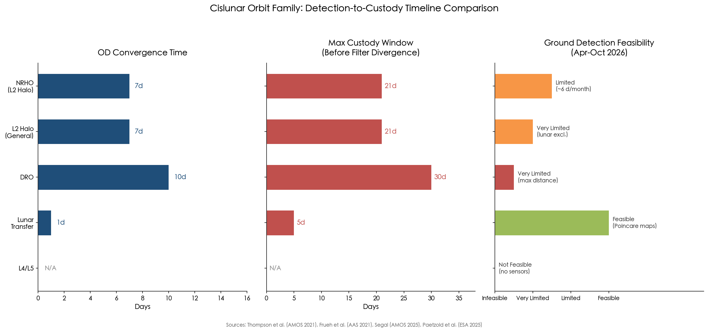

**Figure 6.1.** Comparison of detection-to-custody parameters across five cislunar orbit families: NRHO, general L2 halo, DRO, lunar transfer, and L4/L5. Data synthesized from Thompson et al. (AMOS 2021), Frueh et al. (AAS 2021), Segal (AMOS 2025), and Paetzold et al. (ESA 2025).

### 6.3.1 L2 Halo Orbits (Including NRHO)

The Near-Rectilinear Halo Orbit (NRHO), currently hosting the CAPSTONE spacecraft, presents a mixed custody profile. Thompson et al. (AMOS 2021) demonstrate that a space-based observer on an NRHO achieves convergence to steady-state OD uncertainty for an L2 halo orbit target within approximately 7 days, reaching 3σ position accuracy of 1–2 km and velocity accuracy below 1 cm/s with a sensor of limiting magnitude 14. However, after approximately 21–28 days of accumulated data arc, the filter begins to diverge due to nonlinearity in three-body propagation. This establishes a practical custody window of roughly 2–4 weeks before filter re-initialization becomes necessary. [Thompson et al. (AMOS 2021)](https://amostech.com/TechnicalPapers/2021/Poster/Thompson.pdf "AMOS 2021")

Deploying the observer closer to the target population yields substantial performance gains: an L2-stationed space-based observer reduces steady-state position errors to 400–500 m. For ground-based observers, the L2 halo orbit population is particularly challenging. Objects near L2 spend extended periods within the lunar exclusion zone (35° half-angle), rendering them invisible to Earth-based telescopes for days. Knister (AFIT 2020) found that ground optical sensors are "completely ineffective" against L1 Lyapunov orbit targets due to persistent lunar exclusion, and GEO-based sensors likewise perform poorly against L2 halo targets because of combined solar phase-angle and lunar exclusion constraints. [Knister (AFIT 2020)](https://scholar.afit.edu/cgi/viewcontent.cgi?article=4244&context=etd "AFIT Thesis 2020") [Thompson et al. (AMOS 2021)](https://amostech.com/TechnicalPapers/2021/Poster/Thompson.pdf "AMOS 2021")

### 6.3.2 Distant Retrograde Orbits (DROs)

DROs possess uniquely favorable stability characteristics: their linear stability ensures that initial orbit determination uncertainties grow more slowly than for halo or Lyapunov orbits. Monte Carlo simulations (Frueh et al., 2021) confirm that DRO uncertainty distributions, while still developing non-Gaussian characteristics over 20–30 days, exhibit markedly slower divergence than Lyapunov orbit counterparts. This stability implies that once custody is established on a DRO target, it can be maintained for longer intervals between observations — Thompson et al. (AMOS 2021) report that targets on lunar frozen orbits (a proxy for certain low-altitude lunar populations) can maintain OD convergence for 30+ days without filter divergence. [Frueh, Howell, DeMars & Bhadauria](https://engineering.purdue.edu/people/kathleen.howell.1/Publications/Conferences/2021_AAS_FruHowDeMBha.pdf "AAS 21-290, 2021") [Thompson et al. (AMOS 2021)](https://amostech.com/TechnicalPapers/2021/Poster/Thompson.pdf "AMOS 2021")

The detection challenge for DRO targets, however, is substantial. Ground optical sensors with a limiting magnitude of 16 can cover only a negligible fraction of the DRO population — limited to high-reflectivity targets with radius ≥ 3.54 m. Even a global network achieving limiting magnitude 20 leaves significant observational gaps for DRO segments at maximum geocentric distance, where targets appear faintest. [Frueh et al.](https://engineering.purdue.edu/people/kathleen.howell.1/Publications/Conferences/2021_AAS_FruHowDeMBha.pdf "AAS 21-290, 2021")

### 6.3.3 Lunar Transfer Trajectories

Targets transiting between Earth and the Moon — on trans-lunar injection (TLI) or lunar return trajectories — represent the highest-priority detection targets for short-term cislunar monitoring because they signal active mission activity. Direct transfers typically span 3–5 days, while low-energy ballistic transfers may extend over several weeks, offering a correspondingly narrow or elongated observation window.

Segal (AMOS 2025) demonstrates that GEODSS can exploit the geometry of these trajectories by applying Poincaré section analysis to predict where transfer trajectories cross detectable zones in geocentric space. This technique reduces the required search area by 85.3%; within a 24-hour campaign, GEODSS can capture 56.8% of return-crossing targets — a meaningful fraction, though insufficient for complete custody. [Segal (AMOS 2025)](https://amostech.com/TechnicalPapers/2025/Poster/Segal.pdf "AMOS 2025")

Klonowski et al. (CU Boulder, AMOS 2024) introduce the concept of "persistent detection corridors" (PDCs) — volumes of cislunar space along feasible transfer trajectories where a given sensor architecture guarantees minimum coverage levels. Their analysis of a three-observer space-based architecture (3:2 resonant plus East/West low prograde orbits with 300–500 mm telescopes) reveals that corridors with 100% coverage exist for certain Earth–Moon transfer geometries, while others exhibit coverage gaps in mid-transfer where detection drops to zero for 0.5–1.5 days. Corridor coverage quality varies significantly with departure epoch, underscoring that cislunar SDA effectiveness is inherently time-dependent and architecture-dependent. [Klonowski et al. (AMOS 2024)](https://amostech.com/TechnicalPapers/2024/Poster/Klonowski.pdf "AMOS 2024 — Persistent Detection Corridors for Cislunar SSA")

### 6.3.4 Lagrange Point Populations (L4/L5)

The Earth–Moon L4 and L5 points, each situated at approximately 384,400 km from both Earth and Moon, are of strategic interest as potential staging or surveillance locations. Transfer from L1 to L4/L5 requires only ~340 m/s of delta-v, making them reachable at modest cost. Space-based sensors positioned at L4/L5 would benefit from dark-sky backgrounds (~22.3 mag/arcsec²) and could achieve detection of 1-meter objects at 384,000 km with a 35 cm telescope in 10-second integrations, with lateral position accuracy better than 100 m. [Priedhorsky et al.](https://arc.aiaa.org/doi/10.2514/1.A35951 "AIAA JSR 2024")

No sensors currently occupy these locations, however, and ground-based detection of small objects at L4/L5 is infeasible with existing infrastructure. The L4/L5 population therefore represents a complete custody gap during the April–October 2026 window — any object positioned at these Lagrange points would remain entirely unobserved.

### 6.3.5 Custody Recovery After Gaps

A critical operational parameter is the ability to recover custody after observation interruptions. Chow et al. (AMOS 2022) demonstrate that after 11.5–13.5 days of data interruption, the Adaptive Entropy-based Gaussian-mixture Information Synthesis (AEGIS) filter recovers a cislunar target within approximately 2 nights of resumed observation, compared to 5+ nights required by a standard Unscented Kalman Filter (UKF). AEGIS achieves this by generating over 1,800 Gaussian mixture components during the gap period — a computational burden measured in hours versus minutes for UKF, but one that dramatically improves recovery reliability. [Chow et al. (AMOS 2022)](https://amostech.com/TechnicalPapers/2022/Poster/Chow.pdf "AMOS 2022 — Cislunar OD: Improvements in Uncertainty Realism")

For gaps exceeding approximately two weeks on L2 halo orbits, filter-based recovery becomes infeasible, and operators must revert to search-mode reacquisition — effectively re-detecting the target as if it were new. For non-cooperative targets, this reacquisition carries no guarantee of success, as the target may have exploited unstable manifold dynamics to depart the original orbit family with minimal delta-v during the custody gap. [Thompson et al. (AMOS 2021)](https://amostech.com/TechnicalPapers/2021/Poster/Thompson.pdf "AMOS 2021")

## 6.4 Multi-Owner Sensor Scheduling and Handoff Protocols

The end-to-end operational workflow for cislunar tracking — from initial detection through orbit determination convergence, multi-sensor handoff, catalog update, and threat assessment — maps directly onto the four SDA functional pillars defined in USSF doctrine. Figure 6.2 illustrates this pipeline, including the critical custody-decision node and the two distinct recovery pathways (filter-based recovery for gaps under ~14 days; search-mode reacquisition for longer interruptions).

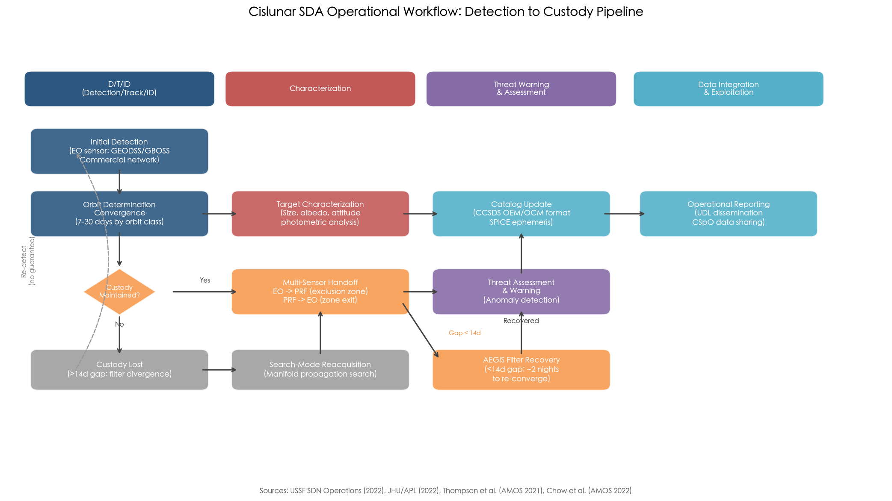

**Figure 6.2.** End-to-end cislunar SDA operational workflow: detection-to-custody pipeline. The flow maps to the four USSF SDA pillars (D/T/ID → Characterization → TW&A → DI&E) and includes the EO↔PRF multi-sensor handoff during exclusion-zone transits, the custody-decision node, and both AEGIS-based filter recovery (<14-day gap) and search-mode reacquisition (>14-day gap) pathways. Sources: USSF SDN Operations (2022), JHU/APL (2022), Thompson et al. (AMOS 2021), Chow et al. (AMOS 2022).

### 6.4.1 The Scheduling Challenge

Cislunar sensor scheduling differs fundamentally from near-Earth scheduling in three respects. First, observation windows are sparse and irregularly distributed: a given target may be observable from a particular sensor for only a few hours per orbital period, which itself ranges from ~90 minutes (low lunar orbit) to ~30 days (DRO). Second, the sensor pool is heterogeneous in ownership (military, civil, commercial, allied, academic), data format (TLE-incompatible environments requiring CCSDS OEM/OCM or SPICE SPK), and classification level. Third, the multi-target, multi-sensor assignment problem exhibits combinatorial complexity that grows exponentially with the number of targets and sensors — a challenge that near-Earth scheduling heuristics are ill-equipped to address in the cislunar context.

### 6.4.2 Information-Theoretic Scheduling Approaches

Tomita, Shimane, and Ho (Georgia Tech, AMOS 2023) develop a predictive sensor scheduling framework that couples an Extended Information Filter (EIF) with integer linear programming (ILP) to allocate observations across multiple space-based observers and multiple cislunar targets. The approach employs the left Cauchy–Green tensor to quantify information gain from candidate observations, and demonstrates superior tracking performance compared to greedy heuristic schedulers that simply assign the nearest or brightest target. [Tomita et al. (AMOS 2023)](https://amostech.com/TechnicalPapers/2023/Cislunar-SSA/Tomita.pdf "AMOS 2023")

Shimane et al. (Georgia Tech, AIAA JSR 2025) extend this to a mixed-integer linear programming (MILP) framework that simultaneously optimizes constellation design and sensor tasking assignments across thousands of orbit-family permutations, achieving globally optimal observation-direction allocation. These methods represent the state of the art in automated cislunar sensor scheduling, yet as of April 2026, neither has been integrated into any operational system — including UDL, Lattice, or GBOSS tasking engines. [Shimane et al.](https://arc.aiaa.org/doi/10.2514/1.A36361 "AIAA JSR 2025")

### 6.4.3 Multi-Domain Handoff: Electro-Optical to Passive RF

The most critical near-term handoff protocol addresses the transition between electro-optical (EO) and passive radio-frequency (PRF) modalities during exclusion-zone blackouts. Chow et al. (AMOS 2022) demonstrate that fusing EO angle observations with passive RF measurements (TDOA/FDOA from a three-station network) eliminates custody loss during solar and lunar exclusion periods. PRF measurements are not subject to illumination constraints and can maintain tracking continuity when EO sensors are blinded by exclusion-zone geometry. The optimal handoff protocol should trigger automatic transition from EO to PRF at predicted exclusion-zone entry, with EO resuming primary custody upon exit. [Chow et al. (AMOS 2022)](https://amostech.com/TechnicalPapers/2022/Poster/Chow.pdf "AMOS 2022 — Data Fusion with Passive RF")

This multi-domain fusion capability does not currently exist in an operational cislunar context. Implementing it requires: (1) a PRF network with baselines sufficient for cislunar TDOA/FDOA resolution; (2) time synchronization across EO and PRF systems to sub-microsecond precision; and (3) a common data fusion engine capable of accepting both measurement types within a unified filter architecture.

### 6.4.4 Data Interoperability Barriers

The fundamental interoperability barrier for multi-owner cislunar sensor networks remains the TLE/SGP4 legacy. The Combined Space Operations Center (CSpOC) and its 10-nation Combined Space Operations (CSpO) initiative share data through the Unified Data Library (UDL), which supports over 4,000 data schemas and more than 100 sharing agreements. However, UDL currently contains no dedicated cislunar data schema. The Two-Line Element (TLE) format — designed for Keplerian two-body orbits — cannot represent three-body cislunar trajectories (halo orbits, NRHOs, DROs) and is fundamentally invalid beyond GEO. [SSC UDL Briefing](https://www.ssc.spaceforce.mil/Portals/3/SDA%20Briefings/06.%20UDL%20Overview%20Overview.pdf "UDL Overview")

The NASA Cislunar SSA Technical Steering Group (November 2021) proposed extending CCSDS Orbit Data Messages (ODM) to include cislunar-specific message types, requiring modifications to Tracking Data Messages (TDM), Orbit Ephemeris Messages (OEM), and Orbit Comprehensive Messages (OCM) to accommodate multi-body dynamics and cislunar reference frames. These messages must convert reliably to SPICE SPK and IIRV formats for operational use. [NASA Cislunar SSA TSG](https://www.nasa.gov/wp-content/uploads/2021/05/cislunar_ssa_proposed_message_set-nov2021_rev2_without_emailspdf.pdf "NASA Nov 2021")

The CCSDS LunaNet framework, presented at the June 2025 plenary, provides an interoperability foundation for lunar communications and PNT but has not yet incorporated SDA-specific data exchange protocols. Until these standards are adopted and implemented across military, civil, and commercial systems, multi-owner cislunar sensor fusion will require ad hoc bilateral agreements and manual data reformatting — a significant operational bottleneck that constrains the near-term architecture's effectiveness. [NASA/CCSDS](https://ntrs.nasa.gov/api/citations/20250005946/downloads/Lunar%20Standards%20-CCSDS%20Plenary%209June2025v2-comp.pdf "NASA June 2025 — CCSDS Lunar Standards")

## 6.5 The Artemis II Operational Validation Opportunity

The launch of Artemis II on April 1, 2026, carrying four astronauts on a ~10-day lunar flyby mission reaching approximately 406,000 km from Earth, provides an unprecedented operational validation event for cislunar tracking concepts. As the first crewed lunar mission in over 53 years, Artemis II simultaneously tests the cislunar SDA infrastructure under real-world conditions. [Reuters](https://www.reuters.com/science/nasa-counts-down-first-crewed-lunar-mission-half-century-2026-04-01/ "NASA launches Artemis II, Apr 1 2026")

### 6.5.1 Military Tracking Exercise

U.S. Space Command confirmed that Artemis II would serve as the first real-time, full cislunar-domain military tracking exercise, employing GBOSS, GEODSS, commercial networks (Anduril/ExoAnalytic, Slingshot), and NASA mission operations data in a coordinated campaign. General Whiting stated the exercise would "rehearse and refine tactics, techniques, and procedures" for cislunar domain awareness. The 10-day round-trip trajectory provides algorithm developers with a known-truth cooperative target — Orion's precise trajectory is continuously computed by NASA's Johnson Space Center — against which tracking solutions from multiple independent sensor chains can be validated and cross-calibrated. [Aviation Week](https://aviationweek.com/defense/budget-policy-operations/pentagon-eyes-cislunar-space-next-strategic-frontier "Mar 2026")

This exercise builds directly on the Artemis I precedent: during the uncrewed Artemis I mission (November–December 2022), Space Delta 2 utilized the 25-day, 1.4-million-mile mission to test cislunar tracking tactics, techniques, and procedures (TTPs), defining the "xGEO tracking" concept — the first operational exercise of military SDA assets against a cislunar target. [U.S. Space Forces – Space](https://www.spaceforces-space.mil/Newsroom/Article/3249252/delta-2-leverages-space-domain-awareness-in-support-of-artemis-i/ "Dec 2022")

### 6.5.2 Third-Party Passive Tracking Validation

The DLR SMARTnet campaign demonstrated that even a 25 cm telescope at El Sauce, Chile, could passively track Artemis II during the early trans-lunar injection phase, successfully resolving the Orion crew module and the ICPS as they separated. This independent observation confirms that small-aperture commercial and academic telescopes can contribute meaningfully to cislunar tracking during favorable geometry windows — an important validation for the Tier 3 asset layer described in Section 6.2.1. [DLR](https://www.dlr.de/en/rb/latest/news/2026/julie-artemis-ii-in-focus-tracking-a-historic-journey-to-the-moon "DLR Artemis II Tracking, Apr 2026")

### 6.5.3 Expected Outputs and Limitations

The Artemis II tracking exercise is expected to yield four principal outputs: (1) end-to-end latency measurements for the detect-to-characterize pipeline across military and commercial sensors; (2) calibration data for optical photometry models at cislunar distances against a target of known size, albedo, and attitude; (3) initial validation of multi-source data fusion using CCSDS-format messages; and (4) identification of procedural gaps in cross-agency coordination between Space Command and NASA mission control.

The exercise's primary limitation is its cooperative nature: Orion continuously transmits telemetry, and its trajectory is precisely known a priori. A cooperative target does not test the system's ability to detect and track unknown, non-cooperative objects that may attempt to minimize their observational signature or maneuver unpredictably. The transition from cooperative-target validation to non-cooperative operational capability remains the central challenge for cislunar SDA — one that the Artemis II exercise can inform but cannot resolve.

## 6.6 Operational Gaps, Risks, and Mitigation Measures (April–October 2026)

The April–October 2026 window is defined by a series of interrelated operational gaps that collectively constrain cislunar SDA effectiveness. Figure 6.3 provides a spatial overview of these coverage limitations, illustrating the exclusion zones, the "Cone of Shame," and the stark contrast between ground-based IOC performance and the coverage achievable with future space-based architectures.

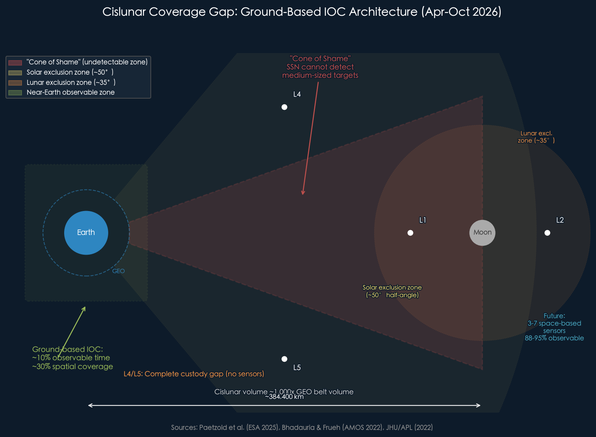

**Figure 6.3.** Cislunar coverage gap under the ground-based IOC architecture (April–October 2026). The schematic depicts the Earth–Moon geometry with Lagrange points L1–L5, solar and lunar exclusion zones, and the "Cone of Shame" where current SSN infrastructure cannot detect medium-sized targets. Ground-based IOC achieves ~10% observable time and ~30% spatial coverage; a future 3–7 satellite space-based architecture would raise coverage to 88–95%. Sources: Paetzold et al. (ESA 2025), Bhadauria & Frueh (AMOS 2022), JHU/APL (2022).

### 6.6.1 Gap 1: No Dedicated Space-Based Cislunar SDA Sensors

The single most consequential operational gap during the April–October 2026 window is the complete absence of dedicated space-based cislunar SDA sensors. Oracle-M, originally manifested on ULA's Vulcan USSF-112 mission, has been grounded since the Vulcan solid rocket motor anomaly of February 12, 2026, with recovery expected to require "at least six months." Oracle-P remains in production with a targeted 2027 launch to an L1 halo orbit. DARPA LASSO completed its Step-2 solicitation on February 20, 2026, but no contracts have been publicly awarded as of April 2026. Quantum Space's Ranger Prime, while planned for mid-2026 launch, is not an SDA-dedicated platform. [SpaceNews](https://spacenews.com/space-force-weighs-launch-alternatives-as-vulcan-faces-potential-months-long-grounding/ "Mar 2026")

The operational consequence is unambiguous: ESA analysis demonstrates that transitioning from ground-only to a minimum three-satellite space-based architecture produces an order-of-magnitude improvement in observable time — from approximately 10% to 88–95%. During April–October 2026, cislunar SDA operations remain confined to the ~10% coverage floor. [Paetzold et al.](https://conference.sdo.esoc.esa.int/proceedings/sdc9/paper/258/SDC9-paper258.pdf "ESA SDC9 2025")

**Mitigation:** Maximize ground-based asset utilization through Poincaré-map-guided search strategies (85.3% search area reduction), commercial network integration (Anduril/ExoAnalytic ~400 telescopes, Slingshot ~30+ telescopes), and prioritized tasking of GBOSS upgraded sites. Conduct Artemis II tracking exercise to calibrate performance baselines and refine handoff procedures.

### 6.6.2 Gap 2: No Operational Cislunar Object Catalog

No cislunar object catalog exists as of April 2026. The Space Force tracks approximately 45,000 objects in near-Earth space but maintains no comparable cislunar database. The Center for Strategic and International Studies (CSIS) assessed in October 2024 that cislunar space has "almost no space situational awareness," with spacecraft operating in the region "flying with one eye closed." [CSIS](https://www.csis.org/analysis/salmon-swimming-upstream-charting-course-cislunar-space "Oct 2024") [Ars Technica](https://arstechnica.com/space/2026/03/nasa-is-leading-the-way-to-the-moon-but-the-military-wont-be-far-behind/ "Apr 2026")

Without a catalog, there is no baseline against which to detect anomalous behavior, no basis for collision avoidance computations, and no framework for attributing observed objects to known missions. Georgia Tech simulations indicate that as few as 50 lunar-orbit satellites would require an average of four collision-avoidance maneuvers per year — a congestion threshold that could be reached within a decade given current mission manifest trajectories. [Georgia Tech News](https://news.gatech.edu/news/2025/10/30/more-moon-missions-horizon-avoiding-crowding-collisions-will-be-growing-challenge "Oct 2025")

**Mitigation:** Leverage NASA mission flight plans and international registration data to bootstrap a "known-object list" for cooperative targets. Develop and adopt CCSDS OEM/OCM cislunar message standards to enable catalog-compatible data exchange. Pursue bilateral data-sharing agreements with Artemis Accords partners to populate initial catalog entries.

### 6.6.3 Gap 3: Custody Loss on Unstable Orbits

Cislunar orbit dynamics create a fundamentally different custody paradigm from near-Earth operations. Objects on unstable three-body orbits (L1/L2 halo, Lyapunov) can depart their reference orbit with delta-v as low as 140 m/s (L1→L2 transfer) or exploit natural manifold dynamics for near-zero-cost trajectory changes. If custody is lost for more than approximately two weeks on an L2 halo orbit target, filter-based recovery becomes infeasible, and the target must be re-detected through search operations — with no guarantee of success for non-cooperative objects that may have maneuvered during the gap. [JHU/APL](https://www.jhuapl.edu/Content/documents/CislunarSecurityNationalTechnicalVision.pdf "JHU APL 2022") [Thompson et al. (AMOS 2021)](https://amostech.com/TechnicalPapers/2021/Poster/Thompson.pdf "AMOS 2021")

**Mitigation:** Prioritize observation cadence to maintain custody below the ~14-day divergence threshold for high-priority targets. Deploy EO+PRF fusion capability when available to reduce exclusion-zone-induced gaps. Develop and pre-position reacquisition search plans based on manifold propagation for each known target's orbit family.

### 6.6.4 Gap 4: Organizational Immaturity

While Mission Delta 2 has been assigned cross-regime SDA responsibility and a cislunar-integrated PAE structure has been designated, no dedicated cislunar operations squadron exists. The 18th Space Defense Squadron, which maintains the near-Earth catalog, holds no formal mandate for cislunar objects. This organizational gap means that during April–October 2026, cislunar tracking exercises and emerging capabilities lack a dedicated unit for sustained operational ownership, continuity planning, and institutional knowledge development. [Air & Space Forces Magazine](https://www.airandspaceforces.com/space-force-serious-planning-cislunar-ops/ "Mar 2026")

**Mitigation:** Designate interim cislunar SDA operational authority within Mission Delta 2 for the April–October 2026 window. Establish liaison positions with NASA mission control and commercial SDA providers. Utilize the Artemis II exercise to draft provisional standard operating procedures for cislunar event response.

### 6.6.5 Risk: Adversary Exploitation of Awareness Gaps

The combination of minimal sensor coverage (~10% observable time), absence of a catalog, and extended custody gaps creates a window of vulnerability during which adversary activities in cislunar space could proceed undetected. China's cislunar infrastructure — including the operational Queqiao-2 relay satellite, the Tiandu-1 navigation testbed, and the planned Chang'e 7 mission (late 2026) — represents the most active non-U.S. presence in the domain. The low delta-v required for inter-Lagrange-point transfers means that a spacecraft positioned at L1 could transit to L2 with ~140 m/s, or to L4/L5 with ~340 m/s, potentially repositioning during a ground-sensor exclusion window without detection. This risk is not hypothetical: it is a direct consequence of the physics-imposed coverage limitations documented throughout this chapter. [SpaceNews](https://spacenews.com/china-lays-foundation-for-cislunar-infrastructure-with-spacecraft-in-novel-lunar-orbits/ "China cislunar infrastructure, Jun 2025") [JHU/APL](https://www.jhuapl.edu/Content/documents/CislunarSecurityNationalTechnicalVision.pdf "JHU APL 2022")

## 6.7 Performance Metrics and the Path to Full Operational Capability

### 6.7.1 Effectiveness Metrics Framework

Knister (AFIT 2020) proposes a four-metric evaluation framework for cislunar SDA system effectiveness: (1) Mean Detection Time / Detection Percentage (MDT) — the average time to first detection and the fraction of targets detected; (2) Mean Track Time (MTT) — the average duration of continuous custody; (3) Mean Time Between Tracks (MTBT) — the average gap duration between custody intervals; and (4) cost per unit of effectiveness. Among these, MTBT emerges as the most critical metric for cislunar operations because it directly determines whether filter-based custody can be sustained: if MTBT exceeds the filter divergence threshold (~14–28 days depending on orbit family), custody is irreversibly lost and the target must be treated as a new detection. [Knister (AFIT 2020)](https://scholar.afit.edu/cgi/viewcontent.cgi?article=4244&context=etd "AFIT Thesis 2020")

### 6.7.2 Performance Benchmarks: From Current Floor to Gold Standard

The current ground-based IOC achieves approximately 10% observable time and 30% spatial coverage — representing the operational floor for cislunar SDA. The near-term improvement target, achievable with the deployment of 3–7 space-based sensors on DRO/Lyapunov/Halo orbits, would elevate coverage to 88–95% observable time. [Paetzold et al.](https://conference.sdo.esoc.esa.int/proceedings/sdc9/paper/258/SDC9-paper258.pdf "ESA SDC9 2025")

The theoretical "gold standard," as defined by Koblick and Choi (AMOS 2022), employs four narrow-field-of-view lunar surface sensors to achieve 100% custody with position errors below 1 km. Adding an L1 space-based sensor reduces position error to 116 m. The optimal combined architecture — lunar surface optical + radar + space-based optical — achieves position accuracy of 79 m, velocity accuracy of 1 cm/s, and acceleration resolution of 5 mm/s². While this gold standard is not deployable in the near term, it establishes the performance ceiling against which all interim architectures should be evaluated and toward which the 2027–2028 deployment roadmap is oriented. [Koblick & Choi (AMOS 2022)](https://amostech.com/TechnicalPapers/2022/Poster/Koblick_2.pdf "AMOS 2022 — Cislunar OD Benefits of Moon-Based Sensors")

### 6.7.3 Transition Milestones (2026–2028)

The path from current ground-based IOC to initial space-based capability follows a defined milestone sequence:

- **April–October 2026:** Ground-based IOC with commercial augmentation. Artemis II validation exercise establishes baseline performance data and inter-agency coordination protocols. Provisional cislunar tracking procedures are drafted and tested.
- **Late 2026–2027:** Oracle-M launch (contingent on Vulcan recovery or selection of an alternative launch vehicle). DARPA LASSO contract awards and prototype development initiation. Quantum Space Ranger Prime demonstration mission.
- **2027:** Oracle-P deployment to L1 halo orbit, providing the first dedicated cislunar SDA sensor with wide-field search and narrow-field characterization capability. Initial data integration into UDL with cislunar-specific schemas.
- **2028:** Space Force target for initial cislunar SDA sensor deployment at operational scale. RCAT-CS constellation algorithm validation (3–10 sensors at Lagrange-point halo orbits). Transition from experimental to operational cislunar catalog.

The critical risk to this timeline remains launch vehicle availability: the Vulcan grounding directly delays Oracle-M, and any further anomalies in the National Security Space Launch (NSSL) manifest could cascade delays across the entire cislunar deployment schedule. Commercial launch alternatives are under evaluation but introduce integration and testing timelines of their own.

## 6.8 Synthesis: Operational Realities of Short-Term Cislunar Monitoring

The operational concept for short-term cislunar tracking and monitoring during April–October 2026 rests on a constrained but not negligible foundation. Ground-based military and commercial optical networks, guided by dynamically informed search strategies such as Poincaré maps and persistent detection corridors, can provide initial detection and periodic custody of large, cooperative targets. The Artemis II mission serves as both a validation event and a forcing function for inter-agency coordination, yielding calibration data and procedural lessons that will shape subsequent operational planning.

The central operational reality, however, is one of profound limitations. Ground-based sensors cover approximately 10% of cislunar space approximately 30% of the time, leaving vast volumes unobserved for extended periods. No cislunar object catalog exists. Custody gaps exceeding two weeks on unstable three-body orbits result in irreversible track loss for non-cooperative targets. The organizational structure for sustained cislunar operations remains immature, with no dedicated unit and no formally adopted cislunar data standards.

Commercial sensor networks — particularly the Anduril/ExoAnalytic ~400-telescope constellation and Slingshot's 30+ telescope network — represent the single largest force multiplier available in the near term. Their integration into military tasking and data-sharing architectures, while procedurally straightforward through existing CSpO and UDL frameworks, requires technical adaptation to cislunar-compatible data formats and the adoption of dynamic scheduling algorithms capable of optimizing across heterogeneous sensor pools.

We assess that the period from April to October 2026 constitutes a critical transition window: sufficient to validate concepts, calibrate sensors, and refine procedures, but insufficient to achieve meaningful non-cooperative tracking coverage. The deployment of Oracle-P in 2027 and the broader 2028 sensor deployment target represent the earliest feasible milestones for transitioning from experimental cislunar awareness to initial operational capability against the full spectrum of cislunar targets. Until space-based sensors close the coverage gap from ~10% to the 88–95% range that ESA analysis identifies as achievable with 3–7 orbital assets, cislunar space will remain — in CSIS's formulation — a domain where operators fly "with one eye closed."

# 第7章 Governance, Policy, and International Cooperation for Cislunar Domain Awareness

The preceding chapters established that cislunar space domain awareness (SDA) demands novel sensor architectures, advanced data-processing algorithms, and integrated operational concepts to overcome the extreme distances, three-body dynamics, and observability constraints unique to the region between geostationary orbit (GEO, ~36,000 km) and the Moon (~384,400 km). Yet even if every technical challenge documented in Chapters 2–6 were resolved overnight, effective cislunar monitoring would remain unattainable absent an adequate governance framework. International space law was conceived for an era when human activity rarely extended beyond low Earth orbit; the treaty instruments that underpin today's near-Earth space traffic coordination contain no provisions for cislunar catalog maintenance, real-time position sharing, or debris mitigation beyond GEO. As cislunar traffic accelerates — with Artemis II, Chang'e 7, and a growing constellation of commercial and military assets all converging on the Earth–Moon corridor during 2026 — the governance deficit is no longer a theoretical concern but an immediate operational constraint.

This chapter examines the legal, policy, and institutional landscape that shapes — and in many cases constrains — the pursuit of comprehensive cislunar situational awareness. It evaluates the applicability of existing treaty obligations to cislunar operations, assesses the two competing lunar cooperation frameworks (the Artemis Accords and the International Lunar Research Station), analyzes emerging multilateral initiatives at the United Nations, reviews the unresolved tension between military and civilian SDA mandates in U.S. national policy, and identifies the five governance gaps that must be closed to support effective near-term cislunar tracking and monitoring.

## 7.1 Applicability of Existing International Space Law to Cislunar SDA

### 7.1.1 The Outer Space Treaty and Its Silence on Tracking Obligations

The 1967 Outer Space Treaty (OST) remains the constitutional document of international space law. Article I declares that outer space "shall be free for exploration and use by all States"; Article II prohibits national appropriation; Article IV, paragraph 2, specifically forbids the establishment of military bases and the conduct of military maneuvers on the Moon and other celestial bodies. Crucially, the OST applies explicitly to "outer space, including the Moon and other celestial bodies," meaning its provisions extend without qualification to the entire cislunar volume. [Artemis Accords Text](https://www.nasa.gov/wp-content/uploads/2022/11/Artemis-Accords-signed-13Oct2020.pdf "Artemis Accords referencing OST")

Article IX provides the closest analogue to a coordination obligation: States Parties must conduct activities "with due regard to the corresponding interests of all other States Parties" and must undertake "appropriate international consultations" before proceeding with any activity that could cause "potentially harmful interference" with other States' activities. As the Outer Space Institute (OSI) observed, Article IX's "due regard" standard implicitly presupposes some form of awareness — one cannot exercise due regard toward activities one cannot detect — yet the treaty contains no specific obligation to share tracking data, maintain orbital catalogs, or provide spacecraft position information. [OSI Cislunar Security Report](https://outerspaceinstitute.ca/osisite/wp-content/uploads/Workshop-Report-on-cislunar-security-FINAL-2FEB2025.pdf "New Moon: A Cislunar Security Workshop Report, Feb 2025") The result is a foundational paradox: the treaty mandates responsible behavior in cislunar space but furnishes no mechanism to verify or enable it.

### 7.1.2 The Registration Convention: Two-Body Parameters in a Three-Body Domain

The 1975 Registration Convention requires States launching objects "into Earth orbit or beyond" to register them with the United Nations, thereby covering cislunar targets by explicit textual scope. Article IV specifies that registration should include orbital parameters — nodal period, inclination, apogee, and perigee — drawn from classical two-body (Keplerian) mechanics. These parameters are fundamentally inadequate for describing three-body cislunar trajectories such as Near-Rectilinear Halo Orbits (NRHOs), Distant Retrograde Orbits (DROs), or Lissajous orbits around the Earth–Moon Lagrange points, where concepts like "apogee" and "perigee" lose physical meaning. [UNOOSA Registration Convention](https://www.unoosa.org/oosa/en/ourwork/spacelaw/treaties/registration-convention.html "Registration Convention")

Moreover, the Convention imposes no timeliness requirement. Analysis indicates that approximately half of notifying States submit initial registration information more than four years after launch. In an environment where cislunar transit times from Earth can be as short as 3–5 days and where low-energy transfers may take weeks to months with continuously evolving orbital elements, years-late registrations provide zero operational utility for collision avoidance or domain awareness. The Registration Convention thus covers cislunar objects in principle while offering no meaningful data for their tracking in practice.

### 7.1.3 The Liability Convention and the SDA Prerequisite

The 1972 Liability Convention establishes a fault-based regime for damage caused by space objects in orbit (as opposed to strict liability for damage on Earth's surface). In cislunar space, proving fault in a collision scenario requires demonstrating that an operator failed to take reasonable precautions — a determination that presupposes knowledge of the other object's trajectory. Without an operational cislunar catalog, tracking infrastructure, or even agreed-upon data standards for cislunar orbits, establishing the evidentiary basis for a fault determination is practically impossible. CSIS has accordingly characterized cislunar SDA as a precondition for the Liability Convention's fault regime to function at all in the Earth–Moon domain. [CSIS](https://www.csis.org/analysis/salmon-swimming-upstream-charting-course-cislunar-space "Oct 2024")

Taken together, the three foundational space-law instruments — the OST, the Registration Convention, and the Liability Convention — provide a legal architecture that nominally extends to cislunar space but lacks every operational mechanism required for domain awareness: there are no tracking obligations, no actionable data formats, no timeliness requirements, and no evidentiary infrastructure for fault adjudication. This treaty-level vacuum forms the backdrop against which more recent governance initiatives must be assessed.

## 7.2 The Artemis Accords: Transparency Norms Without Enforcement Infrastructure

### 7.2.1 Scope and Membership

The Artemis Accords, first signed by eight nations in October 2020 and co-led by NASA and the U.S. Department of State, constitute a set of politically binding — but not legally binding — principles for civil lunar and cislunar activities. As of January 27, 2026, 61 countries had signed the Accords, making them the broadest multilateral instrument specifically covering cislunar operations. [NASA](https://www.nasa.gov/artemis-accords/ "61 signatories") The Accords' spatial scope explicitly encompasses "activities on the Moon, Mars, comets, and asteroids, including their surfaces and subsurfaces, as well as in orbit of or at Lagrange points associated with those celestial bodies, or in transit between these celestial bodies or associated Lagrange points." This language captures the entirety of cislunar space. [Artemis Accords Text](https://www.nasa.gov/wp-content/uploads/2022/11/Artemis-Accords-signed-13Oct2020.pdf "Full text, Oct 2020")

### 7.2.2 Transparency and Deconfliction Provisions

Section 4 (Transparency) commits signatories to broadly disseminate information about their national space policies and exploration plans. Section 11 (Deconfliction of Activities), containing 11 sub-clauses, is the most operationally relevant provision for cislunar SDA. Section 11(5) commits signatories to provide information on the "location and nature" of their operations when they believe there is a reasonable risk of harmful interference or safety concerns. Section 11(7) introduces the concept of "safety zones" — temporary spatial buffers around operational areas — and Section 11(9) requires that information about safety zones be made publicly available "as soon as reasonably practicable." [Artemis Accords Text](https://www.nasa.gov/wp-content/uploads/2022/11/Artemis-Accords-signed-13Oct2020.pdf "Section 11")

In 2023, the Artemis Accords partners initiated a series of working groups to operationalize these principles. A February 2026 conference room paper submitted to COPUOS provided an update on collective implementation progress, and the next annual Artemis Accords Workshop is scheduled for May 2026 in Lima, Peru. [UNOOSA CRP](https://www.unoosa.org/res/oosadoc/data/documents/2026/aac_105c_12026crp/aac_105c_12026crp_19_0_html/AC105_C1_2026_CRP19E.pdf "Artemis Accords update to COPUOS, Feb 2026")

### 7.2.3 Structural Gaps in the Safety Zone Framework

Despite these provisions, the Accords leave critical implementation details unspecified. The Open Lunar Foundation's analysis identifies four major gaps: (1) no prescribed data format or precision standard for safety zone notifications — signatories may theoretically satisfy the obligation with a vague textual description rather than precise ephemeris data; (2) no mechanism for interaction with non-signatories, most notably China and Russia, which have not signed and are unlikely to do so; (3) no requirement for independent monitoring infrastructure to verify compliance with declared safety zones; and (4) no assignment of responsibility for maintaining a cislunar object catalog. [Open Lunar Foundation](https://static1.squarespace.com/static/659ddc41121da9469c35e2b1/t/6707354ecc317f1c97176ccd/1728525646818/1691606337-61de2458e7af966b631a7f67_copy-of-pre-print-safety-zones-for-lunar-activities-aqg-open-lunar-foundation-compressed.pdf "Safety Zones analysis")

These gaps carry direct operational consequences. As Chapter 6 demonstrated, cislunar collision avoidance requires trajectory knowledge with uncertainties on the order of single-digit kilometers — a standard that cannot be met through voluntary, unformatted, non-real-time notifications. The Artemis Accords provide an indispensable political foundation for cislunar cooperation, but they do not constitute an operational space traffic management regime.

## 7.3 The International Lunar Research Station: A Parallel Framework Without Transparency

### 7.3.1 ILRS Structure and Membership

The International Lunar Research Station (ILRS) is a China- and Russia-led lunar exploration initiative publicly announced in June 2021. As of September 2024, 13 countries had formally signed cooperation agreements, according to the Secure World Foundation (SWF). [SWF](https://www.swfound.org/publications-and-reports/lunar-space-cooperation-initiatives "Jul 2025") By April 2025, Chinese state media reported that 17 countries and international organizations, along with more than 50 research institutions, had joined the ILRS project, reflecting continued expansion beyond the initial signatory base. [Chinese Government](https://english.www.gov.cn/news/202504/25/content_WS680b7cb7c6d0868f4e8f2144.html "China deepens ILRS cooperation, Apr 2025") China has articulated ambitions to recruit 50 countries, 500 research institutions, and 5,000 researchers to the ILRS over the coming decade.

In 2023, China announced the planned creation of an International Lunar Research Station Cooperation Organization (ILRSCO) to manage the cooperative dimensions of the program. A UNOOSA presentation outlined a preparatory timeline envisioning the promotion of the ILRS project by mid-2023 and the formal invitation of national space agencies and research organizations to participate. [UNOOSA ILRS Presentation](https://www.unoosa.org/documents/pdf/copuos/2023/TPs/ILRS_presentation20230529_.pdf "ILRS presentation, May 2023")

### 7.3.2 The Transparency Deficit

The most consequential governance implication of the ILRS for cislunar SDA is the absence of publicly available transparency, notification, or data-sharing obligations. SWF has observed that "no details about the ILRS principles are publicly available" and that "it is unclear if the ILRS principles will differ significantly from those contained in the Artemis Accords." [SWF](https://www.swfound.org/publications-and-reports/lunar-space-cooperation-initiatives "Jul 2025") Unlike the Artemis Accords, which at minimum articulate commitments to inform other parties of operational locations and safety zones, the ILRS framework has published no equivalent provisions for position sharing, catalog participation, or collision avoidance coordination with non-ILRS actors.

This absence creates a structural governance gap of first-order significance. With China planning to launch Chang'e 7 (orbiter, lander, rover, and hop probe) to the Shackleton crater rim in late 2026, and having already deployed the Queqiao-2 relay satellite and Tiandu-1 navigation testbed in dedicated cislunar orbits, the ILRS bloc will operate a growing fleet of spacecraft in cislunar space without any publicly disclosed mechanism for sharing positional data with Artemis-aligned nations. [SpaceNews](https://spacenews.com/china-lays-foundation-for-cislunar-infrastructure-with-spacecraft-in-novel-lunar-orbits/ "China cislunar infrastructure, Jun 2025") The two frameworks — Artemis (61 signatories) and ILRS (17 partners) — thus operate as parallel systems with no cross-cutting operational coordination channel, a condition that multiple analysts have identified as a primary governance risk for cislunar safety.

Figure 7-1 provides a structured comparison of the five major governance frameworks across six dimensions relevant to cislunar SDA, illustrating the pervasive deficits — particularly the predominance of absent or weak provisions — that characterize the current institutional landscape.

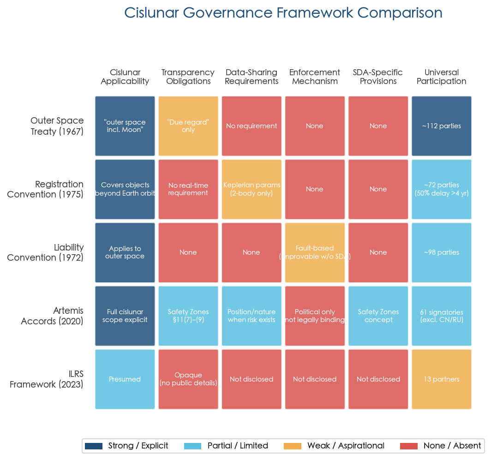

## 7.4 Multilateral Initiatives: COPUOS and the Emerging UN Architecture

The United Nations Committee on the Peaceful Uses of Outer Space (COPUOS) remains the only multilateral forum in which both Artemis-aligned and ILRS-aligned states participate. In June 2025, the 68th session of COPUOS established two new institutional mechanisms with direct relevance to cislunar SDA, marking the most significant multilateral step toward international SSA governance since the adoption of the Long-term Sustainability (LTS) Guidelines in 2019. Figure 7-2 situates these developments within the broader timeline of cislunar governance milestones from 2020 through 2028.

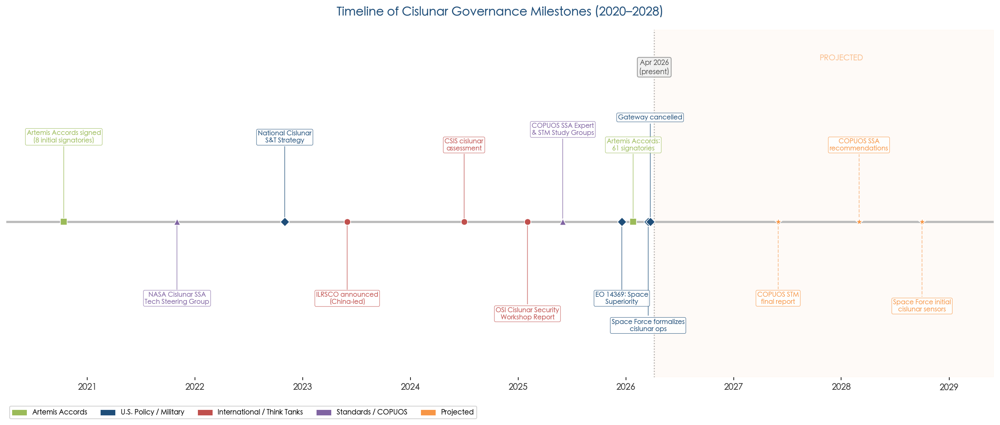

### 7.4.1 The COPUOS SSA Expert Group

The first mechanism is the Expert Group on Space Situational Awareness, created under the Working Group on the Long-term Sustainability of Outer Space Activities, with the United Arab Emirates serving as chair. The Expert Group's mandate extends through 2028 and encompasses three objectives: (a) promoting cooperation on exchange of information regarding space objects and the operational environment; (b) studying and proposing measures for consistency of data formats and SSA information-sharing practices; and (c) identifying areas for international cooperation and capacity-building. [UNOOSA SSA Expert Group](https://www.unoosa.org/oosa/en/ourwork/copuos/stsc/lts/eg-ssa.html "Expert Group mandate")

The Expert Group's workplan envisions a phased approach: intersessional discussions in late 2025, technical focus and draft recommendations at the 2026 Scientific and Technical Subcommittee (STSC) session, initial recommendations presented at the 2026 COPUOS plenary, and comprehensive consolidated recommendations finalized by the 2028 STSC session for consideration at a possible UNISPACE IV conference. Intersessional meetings were held in November 2025 and January 2026, with further sessions scheduled for April 9, April 29, and May 18, 2026. [UNOOSA SSA Expert Group](https://www.unoosa.org/oosa/en/ourwork/copuos/stsc/lts/eg-ssa.html "Schedule and workplan")

The Expert Group's mandate explicitly targets SSA information-sharing and data format harmonization — precisely the capabilities that are absent in cislunar space. However, the mandate text and initial meeting agendas primarily reference near-Earth orbit challenges. Whether the Expert Group will explicitly address cislunar-specific requirements — such as three-body ephemeris formats, Lagrange-point orbit descriptions, or the unique sensor architecture needs documented in Chapter 3 — remains contingent on the 2026–2028 work cycle.

### 7.4.2 The COPUOS Space Traffic Management Study Group

The second mechanism is a Study Group on Space Traffic Management (STM), established under the COPUOS Legal Subcommittee based on a joint proposal by 23 countries. The Study Group operates on a two-year mandate, with a questionnaire phase planned for mid-2026 and a final report due in 2027. While STM is conceptually broader than SSA — encompassing rules of the road, traffic coordination services, and regulatory frameworks — its work intersects with cislunar SDA insofar as any future space traffic regime must eventually extend beyond GEO. [COPUOS STM Study Group Proposal](https://www.unoosa.org/documents/pdf/copuos/2025/Non_Paper_Draft_CRP_forCOPUOS_Study_Group_received23062025.pdf "Jun 2025")

Both mechanisms are designed to coordinate with each other and with existing COPUOS bodies. Their creation represents the most significant multilateral institutional step toward international SSA governance since the LTS Guidelines were adopted in 2019. However, their consensus-based decision-making, voluntary-standard output, and multi-year timelines constrain their near-term impact: neither body will produce binding cislunar SDA rules within the 2026–2028 window during which cislunar traffic is projected to surge from a handful of active spacecraft to potentially dozens of concurrent missions.

## 7.5 U.S. National Policy: The Military-Civilian Tension

### 7.5.1 The Biden-Era Civilian Vision

The White House National Cislunar Science and Technology Strategy, released in November 2022, articulated four objectives for U.S. cislunar engagement. Objective 3 directly addressed SDA, calling for the extension of U.S. space situational awareness capabilities into cislunar space and the development of a "civilian open data platform" for cislunar catalog maintenance integrating both natural and man-made objects. This vision positioned cislunar SDA as a civilian, transparency-oriented function, consistent with the broader philosophy underlying the planned transfer of SSA services from the Department of Defense (DoD) to the Department of Commerce. [National Cislunar S&T Strategy](https://bidenwhitehouse.archives.gov/wp-content/uploads/2022/11/11-2022-NSTC-National-Cislunar-ST-Strategy.pdf "Nov 2022")

### 7.5.2 The Trump-Era Military Pivot

Executive Order 14369, "Ensuring American Space Superiority," signed by President Trump on December 18, 2025, shifted the policy center of gravity decisively toward military applications. The order requires the United States to develop capabilities for "threat detection, characterization, and counteraction from very low Earth orbit to cislunar space" and to become "the standard-setter for ground and cislunar positioning, navigation, and timing." The framing is explicitly competitive, positioning cislunar dominance as a national security imperative rather than a transparency objective. [SpaceNews](https://spacenews.com/trump-signs-sweeping-executive-order-to-assert-u-s-dominance-in-space/ "Trump EO on space superiority, Dec 2025")

In March 2026, the U.S. Space Force formalized the integration of cislunar operations into its core mission and acquisition framework. New Portfolio Acquisition Executives (PAEs) were designated for cross-domain cislunar technology maturation, and Mission Delta 2 was assigned responsibility for cross-regime SDA operations including cislunar. The stated objective is to transition from planning to initial cislunar SDA sensor deployment by 2028. [Air & Space Forces Magazine](https://www.airandspaceforces.com/space-force-serious-planning-cislunar-ops/ "Space Force 'Serious' About Planning for Cislunar Operations, Mar 2026")

### 7.5.3 TraCSS and the Uncertain Civilian Infrastructure

The Office of Space Commerce (OSC) within the Department of Commerce has been developing the Traffic Coordination System for Space (TraCSS) as the civilian SSA service mandated by Space Policy Directive 3. TraCSS achieved initial operational capability in September 2024 with conjunction data message (CDM) distribution, and by September 2025 was providing spaceflight safety screening services for operators managing more than 8,000 spacecraft — approximately 80% of all active space objects. [OSC](https://space.commerce.gov/tracss-update-expanding-space-safety-partnerships/ "TraCSS Update, Sep 2025")

However, TraCSS is architecturally oriented toward near-Earth conjunction assessment. Its data products — CDMs, TLEs, conjunction screening via ephemeris matching — are designed for LEO-to-GEO operations based on two-body propagation. The TraCSS capability roadmap published in July 2025 shows no explicit cislunar data product, three-body ephemeris format, or xGEO catalog capability in its planned increments through the end of 2025. [OSC](https://space.commerce.gov/osc-publishes-updated-tracss-schedule-roadmap/ "TraCSS Schedule & Roadmap, Jul 2025")

More critically, TraCSS faces an existential funding threat. The Trump administration's FY2026 budget proposal sought to reduce OSC's budget from $65 million in FY2024/2025 to just $10 million — a cut that would effectively terminate TraCSS development. Although both House and Senate appropriators moved to restore funding, the Commerce Department independently rescinded approximately 40% of OSC's FY2025 appropriation in late August 2025, constraining pilot programs and commercial data partnerships. [SpaceNews](https://spacenews.com/office-of-space-commerce-loses-40-of-budget-in-rescission/ "OSC budget rescission, Sep 2025") [SWF](https://www.swfound.org/publications-and-reports/insight--a-budgetary-derailment-for-u-s-leadership-in-space-safety "A Budgetary Derailment for U.S. Leadership in Space Safety, 2025") The Space Force has publicly opposed the cuts, and a coalition of over 450 space companies submitted a joint letter to Congress urging continued funding. [Air & Space Forces Magazine](https://www.airandspaceforces.com/space-force-opposes-to-cutting-tracss-program-from-commerce-budget/ "Space Force opposes TraCSS cuts")

This budgetary instability carries direct implications for cislunar governance. If the civilian SSA service is defunded or severely curtailed, the only U.S. entities capable of building cislunar catalog infrastructure will be military — primarily the Space Force through AFRL's Oracle program and Space Systems Command's sensor development. The OSI has warned that "the U.S., in developing cislunar SDA capabilities, does not appear to have considered whether this should be a military or civilian function," creating a risk that cislunar awareness data will default to classified military channels, undermining the transparency norms the United States simultaneously promotes through the Artemis Accords. [OSI Cislunar Security Report](https://outerspaceinstitute.ca/osisite/wp-content/uploads/Workshop-Report-on-cislunar-security-FINAL-2FEB2025.pdf "Feb 2025")

Figure 7-3 illustrates this military-civilian-commercial fragmentation, mapping the principal U.S. cislunar SDA actors and programs across three domains and highlighting the governance gap at the center — the absence of a unified cislunar data-sharing mechanism.

## 7.6 Allied and Coalition Data-Sharing: CSpO and UDL

### 7.6.1 The Combined Space Operations Initiative

The Combined Space Operations (CSpO) initiative links 10 nations — the United States, United Kingdom, Canada, Australia, France, Germany, New Zealand, Norway, Italy, and Japan — in a framework for coordinated military space operations, including shared SDA. The primary data-sharing mechanism is the Unified Data Library (UDL), maintained by Space Systems Command, which supports over 4,000 data models and more than 100 data-sharing agreements. [SSC UDL Briefing](https://www.ssc.spaceforce.mil/Portals/3/SDA%20Briefings/06.%20UDL%20Overview%20Overview.pdf "UDL Overview")

UDL was designed for near-Earth SDA operations and relies on two-line element (TLE) sets and SGP4-based propagation as its foundational data format. As documented in Chapter 2, TLE/SGP4 propagation is fundamentally invalid in the three-body cislunar environment: JHU/APL has recommended replacing TLEs with SPICE ephemeris or equivalent formats for cislunar catalog maintenance, and Purdue research has demonstrated that uncertainty propagation in cislunar orbits produces "anomalously complex" non-Gaussian distributions bearing no resemblance to the near-Gaussian distributions assumed by TLE-based systems. [JHU/APL](https://www.jhuapl.edu/Content/documents/CislunarSecurityNationalTechnicalVision.pdf "JHU APL 2022")

AFRL has indicated that data from the Oracle-P cislunar SDA demonstration satellite will be made available through UDL. However, as of early 2026, UDL contains no dedicated cislunar data schema — no three-body state vector format, no Lagrange-point-referenced coordinate system, and no cislunar-specific uncertainty representation. Developing such schemas is a necessary precondition for coalition cislunar SDA, yet the technical work has not commenced within the UDL framework.

### 7.6.2 Information-Sharing Barriers

The SWF's 2025 Space Security Research Initiative (SSRI) fellows report, published in February 2026, provides an empirical assessment of the barriers to space information sharing. The study concludes that information sharing among space actors remains "uneven, fragmented, and often constrained by political, technical, and institutional barriers." Specific impediments include classification practices that prevent military SDA data from reaching civilian operators, liability concerns that discourage operators from sharing precise ephemeris data, technical capacity asymmetries between major space powers and emerging actors, and the absence of common data standards. These conditions characterize the cislunar domain with particular acuteness. [SWF SSRI Fellows Report](https://www.swfound.org/publications-and-reports/ssri-fellows-report-2025-information-sharing "Feb 2026")

For cislunar SDA specifically, the classification dilemma is acute. The U.S. military's interest in cislunar awareness is driven partly by the desire to detect and characterize potential adversary activities — generating data that may be classified at inception. Yet effective cislunar collision avoidance, the foundational safety function, requires that positional data be shared with all operators, including commercial entities and non-allied nations. No existing policy mechanism reconciles these competing requirements for the cislunar domain, and the tension between security classification and safety transparency remains an unresolved governance challenge.

## 7.7 Cislunar Debris Governance: A Regulatory Vacuum

No cislunar-specific debris mitigation or end-of-life disposal guidelines exist in any binding or voluntary framework as of April 2026. The near-Earth debris mitigation guidelines adopted by the Inter-Agency Space Debris Coordination Committee (IADC) and endorsed by COPUOS apply to LEO (25-year deorbit rule) and GEO (graveyard orbit disposal) but do not address the cislunar regime. This regulatory vacuum is consequential for three interrelated reasons.

First, cislunar debris will not naturally deorbit through atmospheric drag, unlike LEO debris. Objects abandoned in cislunar space may persist for decades to centuries depending on their orbital dynamics, creating long-lived collision hazards in a domain with no tracking infrastructure to detect them. Second, the Moon's gravitational irregularities (mascons) render many low lunar orbits inherently unstable, meaning spacecraft not actively station-kept will eventually impact the lunar surface in uncontrolled fashion — a growing concern as the number of lunar missions accelerates. Third, the few stable cislunar orbits — particularly certain DROs and select frozen orbits — represent a finite resource; if contaminated with debris, their utility for future missions is permanently degraded. [OSI Cislunar Security Report](https://outerspaceinstitute.ca/osisite/wp-content/uploads/Workshop-Report-on-cislunar-security-FINAL-2FEB2025.pdf "Feb 2025")

The Moon Village Association (MVA) has published voluntary "Best Practices for Sustainable Lunar Activities" addressing debris concerns, but these carry no enforcement mechanism and no compliance monitoring infrastructure. [MVA](https://moonvillageassociation.org/download/best-practices-for-sustainable-lunar-activities-issue-1/ "Best Practices, Issue 1") The OSI recommends that spacecraft disposal in the lunar environment be addressed proactively from mission design phase. Without cislunar SDA infrastructure capable of reliably tracking even cooperative objects, verifying compliance with any future disposal guidelines will remain impracticable.

## 7.8 The European Perspective: Fragmentation and the Urgency of Independent Capability

The European Space Policy Institute (ESPI) published a 2025 assessment concluding that European engagement with cislunar space is "fragmented, passive — with investment and strategic coordination lagging behind." The report argued that Europe risks relegation to rule-taker rather than rule-maker status in cislunar governance, recommending investment in independent SSA capabilities, development of cislunar collision avoidance protocols, and leadership in international norm development. The assessment encapsulated the strategic dynamic at its core: "whoever first establishes systems and frameworks around the Moon will most greatly influence the 'rules of the road.'" [ESA Space Safety Blog](https://blogs.esa.int/spacesafety-community/2025/07/17/towards-a-safe-and-sustainable-cislunar-space/ "Jul 2025")

ESA's Space Debris Office has contributed technically through studies such as Paetzold et al. (2025), which assessed cislunar surveillance architectures from a European standpoint (discussed in Chapter 3). However, ESA has not committed to a dedicated cislunar SDA mission. The proposed LEMO-TD (Low Earth-Moon Observer Technology Demonstrator) concept remains at study phase, and funding decisions at the ESA ministerial level had not been publicly confirmed as of early 2026. Europe's contribution to cislunar governance thus remains primarily normative and analytical rather than operational — a posture that, if sustained, risks leaving European interests unrepresented in the foundational design of cislunar monitoring architectures.

## 7.9 Expert Recommendations and the Policy Research Ecosystem

A convergent body of recommendations has emerged from the major policy research institutions examining cislunar governance, reflecting a growing consensus on the priority actions required to close the governance deficit.

**Outer Space Institute (OSI, February 2025).** The OSI workshop report offers seven specific recommendations: (1) cislunar SSA/SDA should be led by civilian space agencies to maximize transparency and international participation; (2) SSA data should be shared among all actors to prevent misperception and miscalculation; (3) military personnel on or near the Moon should be limited to peaceful scientific research consistent with Article IV of the OST; (4) deep-space communications should follow CCSDS (Consultative Committee for Space Data Systems) standards for interoperability; (5) positioning, navigation, and timing (PNT) services should be operated by civilian authorities; (6) spacecraft disposal in the cislunar environment should be addressed proactively rather than reactively; and (7) the United States should engage China diplomatically to break the emerging security-dilemma spiral in cislunar space. [OSI Cislunar Security Report](https://outerspaceinstitute.ca/osisite/wp-content/uploads/Workshop-Report-on-cislunar-security-FINAL-2FEB2025.pdf "Feb 2025")

**Center for Strategic and International Studies (CSIS, October 2024).** The CSIS analysis "Salmon Swimming Upstream" examined the military value of cislunar space and concluded that while the Moon itself possesses limited direct military utility, the transit corridors and Lagrange points hold significant strategic value for surveillance, communication relay, and early warning. The report emphasized that SDA is the enabling prerequisite for any military or civilian activity in cislunar space and cautioned against allowing a "wild west" environment to develop by default. [CSIS](https://www.csis.org/analysis/salmon-swimming-upstream-charting-course-cislunar-space "Oct 2024")

**Secure World Foundation (SWF, 2025–2026).** SWF has played a distinctive role as both researcher and institutional participant, tracking Artemis and ILRS membership, publishing the SSRI information-sharing study, and participating in COPUOS deliberations. SWF's consistent finding is that information sharing constitutes the single most important governance function for cislunar safety, and that current practices fall far short of what is needed. [SWF SSRI Fellows Report](https://www.swfound.org/publications-and-reports/ssri-fellows-report-2025-information-sharing "Feb 2026")

**JHU/APL LOGIC Alliance.** The Cislunar Security National Technical Vision (2022) and the ongoing Cislunar Security Conference (CLSC) series provide the technical underpinning for many governance recommendations, particularly the replacement of TLE-based data formats with SPICE ephemerides and the development of cislunar-specific catalog standards. The LOGIC Alliance's work bridges the gap between technical feasibility and policy design, demonstrating that governance reform in cislunar space requires concurrent advancement of both institutional frameworks and data infrastructure. [JHU/APL](https://www.jhuapl.edu/Content/documents/CislunarSecurityNationalTechnicalVision.pdf "JHU APL 2022")

## 7.10 Governance Gaps and Their Operational Implications

Synthesizing the analysis across the preceding sections, five governance gaps directly impede the effectiveness of near-term cislunar tracking and monitoring:

**Gap 1 — No Cislunar Catalog Obligation.** No treaty, agreement, or voluntary standard requires any entity to maintain, contribute to, or share a catalog of cislunar objects. The Registration Convention's two-body parameter set cannot describe cislunar orbits; the Artemis Accords' transparency provisions are vague and unformatted; the ILRS framework publishes no transparency obligations at all. Until a cislunar catalog authority and contributing data standards are established, the domain will remain fundamentally opaque to coordinated monitoring.

**Gap 2 — No Cross-Bloc Coordination Channel.** The Artemis framework (61 signatories) and the ILRS framework (17 partners) operate in parallel with no operational interface. China and Russia — operators of active cislunar spacecraft — are not party to the Artemis Accords. The United States is not party to the ILRS. No bilateral or multilateral mechanism exists for real-time positional data exchange between the two blocs. COPUOS, the only forum where both participate, operates on consensus and multi-year timelines unsuited to operational coordination.

**Gap 3 — Inadequate Data Standards.** The foundational data formats used by existing SDA infrastructure (TLE/SGP4, UDL schemas) are physically invalid in cislunar three-body dynamics. Developing, adopting, and implementing cislunar-specific data standards — encompassing state vectors, uncertainty representations, and orbit descriptors compatible with CR3BP or full-ephemeris propagation — is a technical governance task that remains unstarted within formal multilateral or coalition frameworks.

**Gap 4 — Military-Civilian Authority Ambiguity.** The United States has not resolved whether cislunar SDA is primarily a military or civilian function. The 2022 National Cislunar Strategy favored civilian leadership; EO 14369 and Space Force acquisition actions favor military leadership; TraCSS faces potential defunding. This ambiguity affects classification policy, data-sharing availability, and international cooperation scope — all of which directly determine the breadth and accessibility of any cislunar monitoring regime.

**Gap 5 — Absent Debris Governance.** No cislunar debris mitigation guidelines, disposal standards, or contamination prevention norms exist in binding or voluntary form. As cislunar traffic grows, the absence of disposal requirements combined with the absence of tracking infrastructure creates conditions for unmonitored debris accumulation in a domain where natural clearance mechanisms do not operate.

These gaps are not merely theoretical. As documented in Chapter 6, the April–October 2026 operational window encompasses at least three major cislunar events — the Artemis II crewed lunar flyby, ongoing CAPSTONE NRHO operations, and preparations for Chang'e 7 — all occurring in a domain with no operational catalog, no shared data standards, and no cross-bloc coordination mechanism. Governance reform is not a long-term aspiration; it is an immediate operational requirement whose absence materially degrades the safety and security of every cislunar mission.

# 结论与风险提示

## 8.1 Core Conclusions

This report has examined the full spectrum of challenges, capabilities, and institutional conditions bearing on comprehensive and accurate situational awareness of space targets in cislunar space. Seven principal conclusions emerge from the analysis.

**Conclusion 1: Cislunar SDA is a qualitatively distinct problem, not an incremental extension of near-Earth surveillance.** The transition from GEO-belt monitoring to cislunar domain awareness represents a discontinuity across every dimension of the tracking problem. The surveillance volume expands by a factor of approximately 1,000; the governing dynamics shift from perturbative two-body to chaotic three-body mechanics; the foundational data format (TLE/SGP4) becomes physically meaningless; signal strength for passive optical sensors degrades by approximately 100× while radar becomes wholly impractical (requiring ~13,000× greater power-aperture product); and observation gaps of days to weeks are geometrically unavoidable. These discontinuities collectively demand a fundamentally new surveillance paradigm — new sensor architectures, new orbit-determination algorithms, new data standards, and new institutional arrangements — rather than evolutionary upgrades to existing systems.

**Conclusion 2: Passive optical sensing in space-based constellations constitutes the indispensable core of any viable cislunar SDA architecture.** The R⁻⁴ range penalty eliminates radar from any cislunar search-and-detection role. Ground-based optical systems, despite recent upgrades (GBOSS) and innovative search strategies (Poincaré-map-guided targeting), can achieve only ~10% temporal coverage of ~30% of the cislunar spatial grid — profoundly insufficient for sustained custody. A minimum constellation of 3–7 space-based sensors distributed across DRO, halo, and Lyapunov orbits elevates coverage to 88–95%, representing the critical investment threshold at which fragmented awareness transitions to genuine domain custody. The estimated cost of this minimum viable constellation — $300–450 million — compares favorably to the strategic value of the domain it would monitor. [Paetzold et al.](https://conference.sdo.esoc.esa.int/proceedings/sdc9/paper/258/SDC9-paper258.pdf "ESA SDC9 2025") [Rude (MIT 2025)](https://dspace.mit.edu/bitstream/handle/1721.1/162417/rude-rudc6118-sm-tpp-2025-thesis.pdf.pdf "MIT Thesis 2025")

**Conclusion 3: The algorithmic foundations for cislunar tracking exist at research maturity but have not been operationally validated.** Sparse collocation IOD converges from crude initial guesses with measurement gaps of up to four weeks. Adaptive Bayesian Gaussian mixture filters maintain full consistency across 500 Monte Carlo trials where standard Kalman filters diverge. Machine-learning orbit family classifiers achieve 99%+ accuracy. Deep-reinforcement-learning sensor tasking achieves 100% reacquisition in simulation. These results demonstrate that the cislunar tracking problem is algorithmically tractable. The critical transition from research demonstration (TRL 3–5) to operational deployment (TRL 7–9) has not yet occurred for any of these capabilities, and track association — the combinatorial problem of correlating observation arcs across heterogeneous orbit families — remains an unaddressed research frontier with no validated algorithm even at the laboratory level.

**Conclusion 4: The near-term (April–October 2026) operational capability is constrained to cooperative-target tracking with severe coverage limitations.** No dedicated space-based cislunar SDA sensor is operational. Oracle-M is flight-ready but grounded by the Vulcan launch vehicle anomaly; Oracle-P targets 2027; DARPA LASSO remains in solicitation. The Artemis II tracking exercise demonstrates multi-source sensor coordination against a cooperative target with known parameters, but this exercise does not validate the far more demanding capability of detecting and tracking non-cooperative objects of unknown provenance. Ground-based assets augmented by commercial networks provide the only available capability, delivering approximately 10% temporal coverage and leaving entire orbit families (L1 Lyapunov, far-side lunar orbits, L4/L5 populations) permanently invisible.

**Conclusion 5: Governance deficits are as consequential as technical gaps for near-term cislunar monitoring effectiveness.** The absence of an operational cislunar object catalog, cross-bloc data-sharing mechanisms, cislunar-specific data standards, and resolved military-civilian authority over cislunar SDA collectively constrain monitoring effectiveness independently of any hardware limitation. The Artemis Accords and the ILRS framework operate as parallel systems with no cross-cutting coordination channel, and the foundational space treaties provide no cislunar tracking obligations. Until these governance gaps are addressed — particularly the establishment of a catalog authority and adoption of three-body-compatible data formats — even technically capable sensor systems will lack the institutional infrastructure to generate a coherent operational picture.

**Conclusion 6: The layered architecture approach — ground-based initial detection, space-based custody, passive RF gap-filling, and eventual lunar-surface sensors — provides the most robust and cost-effective path to comprehensive cislunar awareness.** No single sensor modality or deployment tier suffices. Ground sensors offer immediate, low-cost initial detection (particularly for objects transiting between near-Earth and cislunar space). Space-based sensors deliver the transformative coverage improvement from ~10% to 88–95%. Passive RF bridges optical exclusion-zone blackouts for emitting targets. Lunar-surface sensors, deployable in the 2030+ timeframe, offer the theoretical performance ceiling of 100% custody with sub-100-meter accuracy. The integration of these layers through automated scheduling, multi-source data fusion, and cislunar-compatible catalog standards is the central systems-engineering challenge.

**Conclusion 7: The 2026–2028 window is decisive.** The architectural choices, institutional arrangements, and international norms established during this period will shape cislunar domain awareness for decades. The deployment of Oracle-P (targeted 2027) represents the first opportunity for dedicated space-based cislunar sensing. The COPUOS SSA Expert Group and Space Traffic Management Study Group (both mandated through 2028) represent the first multilateral forums with potential to address cislunar data standards. China's accelerating cislunar infrastructure deployment (Queqiao-2, Tiandu, Chang'e 7/8) narrows the window for establishing cooperative monitoring norms before competing unilateral systems become entrenched. Failure to act during this window risks the emergence of a cislunar domain that is congested, contested, and opaque — precisely the conditions that space governance has struggled to remediate in near-Earth orbits after decades of delay.

## 8.2 Recommendations for Short-Term Cislunar Tracking and Monitoring Effectiveness

Based on the findings of this report, six priority actions are identified for enhancing cislunar SDA effectiveness within the near-term operational window:

1. **Maximize ground-based asset utilization through dynamically informed search strategies.** Deploy Poincaré-map-guided targeting across GEODSS and GBOSS networks to achieve the demonstrated 85.3% search-area reduction. Integrate commercial networks (Anduril/ExoAnalytic, Slingshot) into military tasking architectures through existing CSpO and UDL frameworks.

2. **Accelerate Oracle-P deployment as the highest-priority cislunar sensor investment.** Resolve launch vehicle allocation for Oracle-M and maintain the 2027 target for Oracle-P. A single sensor at the L1 halo orbit provides coverage of approximately 85% of the Earth–Moon corridor and represents the minimum threshold for transitioning from experimental to operational cislunar awareness.

3. **Implement EO+PRF multi-modal fusion for cooperative target tracking.** The demonstrated ability of passive RF (TDOA/FDOA) to bridge optical exclusion-zone gaps provides the most immediately actionable capability improvement for maintaining custody during the ground-based-only interim period.

4. **Adopt cislunar-specific data standards within UDL and allied data-sharing frameworks.** Implement the NASA Cislunar SSA Technical Steering Group's extended CCSDS message set (OEM/OCM with three-body reference frames) as the baseline format for cislunar catalog data exchange. Develop UDL cislunar data schemas to enable coalition data fusion.

5. **Establish a provisional cislunar object list seeded from cooperative mission data.** Leverage NASA mission flight plans, international registration data, and commercial tracking observations to bootstrap an initial catalog of known cislunar objects, providing the baseline against which anomalous detections can be assessed.

6. **Exploit the Artemis II tracking exercise as a calibration and procedure-development opportunity.** Use the known-truth cooperative target to validate end-to-end pipeline latency, cross-calibrate military and commercial sensor chains, and draft provisional standard operating procedures for cislunar event response.

## 8.3 Limitations of This Study

This report is subject to several limitations that bound the confidence and applicability of its findings.

**Reliance on open-source and unclassified information.** The analysis is based exclusively on publicly available sources — peer-reviewed publications, conference papers, government reports, official press releases, and reputable media reporting. Classified programs, sensor performance data, and operational procedures that may exist within the U.S. intelligence community, Space Force, or allied military organizations are not reflected. The actual state of cislunar SDA capability may differ — in either direction — from the open-source picture presented here.

**Limited operational validation of algorithmic claims.** The IOD, filtering, sensor tasking, and maneuver detection algorithms surveyed in Chapter 4 have been demonstrated in simulation environments with varying degrees of fidelity. None has been validated against operational cislunar tracking data from non-cooperative targets. Performance claims derived from Monte Carlo simulations with idealized measurement models may not transfer directly to operational conditions involving sensor noise, calibration errors, atmospheric effects, and real-world data latencies.

**Rapidly evolving programmatic landscape.** The cislunar SDA domain is in a period of exceptionally rapid institutional and technological change. Program timelines, funding levels, organizational structures, and international partnerships documented as of April 2026 are subject to revision. The Vulcan launch vehicle anomaly and the Gateway suspension illustrate the susceptibility of the deployment timeline to exogenous disruptions.

**Absence of Chinese and Russian primary sources.** The analysis of China's cislunar infrastructure and the ILRS framework relies on secondary English-language reporting and publicly available translations. Primary Chinese- and Russian-language technical literature, government planning documents, and internal program assessments are not systematically incorporated, potentially limiting the accuracy of assessments regarding ILRS capabilities, timelines, and strategic intent.

**Cost estimates are indicative rather than authoritative.** Sensor architecture cost figures cited in this report (e.g., ~$40 million per ground station, ~$150 million per space-based sensor, $300–450 million for a minimum viable constellation) are drawn from academic and government studies that employ different cost models, assumptions, and scope definitions. They should be treated as order-of-magnitude indicators rather than validated budget estimates.

**Track association and catalog scalability remain unquantified.** The report identifies track association as the weakest link in the cislunar data-processing pipeline, but no quantitative performance benchmarks (false alarm rates, missed association rates, computational scaling) exist in the open literature. The scalability of the surveyed algorithms from the current handful of cislunar objects to populations of dozens or hundreds remains an open question that cannot be answered without dedicated research.
