# 执行摘要

# Chapter 1 Biology, Fishery Significance, and Production Overview of Chub Mackerel across the Pacific Rim

## 1.1 Taxonomic Identity, Morphology, and Life History

Chub mackerel, *Scomber japonicus* (Houttuyn, 1782), is a small pelagic scombrid of substantial commercial importance throughout the Indo-Pacific basin. Phylogenetic analyses based on mitochondrial COI sequences have established approximately 2% divergence between *S. japonicus* and its Atlantic congener *S. colias*, confirming their status as distinct species and restricting *S. japonicus* to Indo-Pacific waters [FishBase](https://www.fishbase.se/summary/Scomber-japonicus.html "Scomber japonicus species summary") [Trucco & Buratti 2017](https://pmc.ncbi.nlm.nih.gov/articles/PMC5640896/ "Taxonomic review via phylogenetic analysis"). In the United States, the species is commonly marketed as "Pacific mackerel," a designation that also appears in federal fishery management documents. Regional vernacular names — *ma-saba* (マサバ) in Japan, *gomdung-eo* (고등어) in South Korea, and *caballa* in Chile and Peru — reflect the species' broad geographic and cultural footprint.

*S. japonicus* attains a maximum total length of 64 cm and weight of 2.9 kg, with a maximum recorded age of 18 years; however, common adult fork length (FL) in commercial landings centers around 30 cm, and generation time is estimated at 3.6 years [FishBase](https://www.fishbase.se/summary/Scomber-japonicus.html "FishBase species summary"). Growth parameters estimated through the von Bertalanffy growth function (VBGF) differ substantially among stock units, reflecting the pronounced environmental heterogeneity across the species' range. For the Northwest Pacific stock assessed by the North Pacific Fisheries Commission (NPFC), reference parameters are L∞ = 371 mm FL, K = 0.39, t₀ = −1.96, and natural mortality M = 0.41. The Tsushima Warm Current (TWC) stock sampled off Zhejiang's coast yields a more compact growth envelope with L∞ = 283 mm FL and K = 0.36, while the East Yellow Sea component reaches L∞ = 405 mm FL and K = 0.49 [Cai et al. 2023](https://www.mdpi.com/2410-3888/8/2/80 "Multi-Model Stock Assessment") [Cai et al. 2022](https://www.mdpi.com/2077-1312/10/2/301 "Growth Heterogeneity of Chub Mackerel"). On the U.S. West Coast, maturity analyses based on 911 females sampled during 2010–2021 surveys place the length at 50% maturity (L₅₀) at 274 ± 1.26 mm FL and age at 50% maturity (A₅₀) at 1.01 ± 0.06 years [NOAA TM NMFS-SWFSC-689](https://repository.library.noaa.gov/view/noaa/52097/noaa_52097_DS1.pdf "Life history for 2023 benchmark assessment"). Figure 1.1 illustrates the theoretical VBGF curves for these stock units, highlighting the considerable divergence in asymptotic length and growth rate across the Pacific Rim.

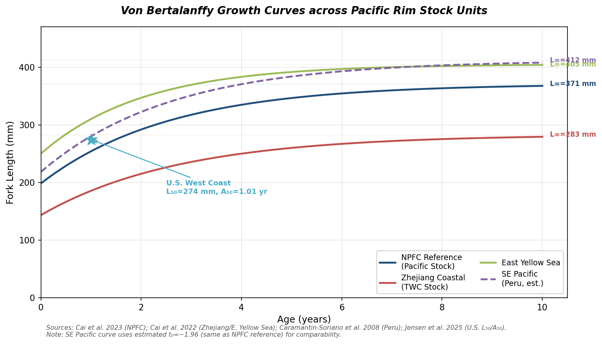

**Figure 1.1** Von Bertalanffy growth curves across Pacific Rim *S. japonicus* stock units. The East Yellow Sea component attains the highest asymptotic length (L∞ = 405 mm), while the Zhejiang coastal TWC stock exhibits the most compact growth trajectory (L∞ = 283 mm). The star marker denotes the U.S. West Coast length at 50% maturity (L₅₀ = 274 mm at age 1.01 yr). Data sources: [Cai et al. 2023](https://www.mdpi.com/2410-3888/8/2/80 "Multi-Model Stock Assessment"); [Cai et al. 2022](https://www.mdpi.com/2077-1312/10/2/301 "Growth Heterogeneity of Chub Mackerel"); [Caramantin-Soriano et al. 2008](https://www.scielo.br/j/bjoce/a/M7cwT6SZhwsx77CnPMpmL7m/?lang=en "Braz. J. Oceanogr. 56(3):201–210"); [Jensen et al. 2025](https://www.pcouncil.org/documents/2025/05/catch-only-stock-assessment-of-pacific-mackerel-scomber-japonicus-for-u-s-management-in-the-2025-26-and-2026-27-fishing-years.pdf/ "NOAA TM NMFS-SWFSC-718").

Chub mackerel is a multiple-batch spawner with indeterminate fecundity ranging from approximately 100,000 to 400,000 eggs per female per season. Spawning occurs predominantly at sea-surface temperatures (SST) of 15–20 °C, with an optimum near 18 °C. In the Northwest Pacific, the spawning season extends from January through June, peaking in March–April at the Izu Islands for the Pacific stock and in the East China Sea and Tsushima Strait for the TWC stock [FishBase](https://www.fishbase.se/summary/Scomber-japonicus.html "Spawning data") [FRA Japan 2019](https://www.fra.go.jp/shigen/fisheries_resources/meeting/peer_review_meeting/files/2020/assess_masaba_p.pdf "FRA Pacific stock assessment"). These reproductive characteristics — high fecundity, temperature-sensitive spawning windows, and rapid maturation — render the species highly responsive to oceanographic variability, a feature that underpins the analysis of environment–biology–market linkages developed throughout this report.

## 1.2 Stock Structure and Migratory Ecology

Fisheries scientists and regional management bodies recognize at least four major stock units of *S. japonicus* across the Pacific Rim, each delineated by distinct spawning grounds, migration circuits, and management jurisdictions.

**Pacific Stock (Japan's Pacific coast).** The Pacific stock constitutes the largest and most intensively studied unit. Spawning is concentrated at the Izu Islands south of Tokyo (approximately 34°N, 139°E) during March–April. Post-spawning adults and juveniles undertake a pronounced northward feeding migration along the Sanriku coast and into waters off Hokkaido, with the high-abundance range extending as far as 47°N and 166°E during summer and autumn. As sea-surface temperatures decline in late autumn, the stock migrates southward to wintering grounds off Chiba and Ibaraki prefectures [FRA Japan 2019](https://www.fra.go.jp/shigen/fisheries_resources/meeting/peer_review_meeting/files/2020/assess_masaba_p.pdf "FRA Pacific stock — Distribution/migration"). Japan's Fisheries Research Agency (FRA) conducts annual assessments of this stock under the July–June fishing year (FY) system.

**Tsushima Warm Current (TWC) Stock.** The TWC stock inhabits the East China Sea, Yellow Sea, and Sea of Japan, with its migration pattern governed by the northward intrusion of the Tsushima Warm Current. Spawning occurs in the East China Sea and the Tsushima Strait, and the stock supports multi-national fisheries harvested by China, South Korea, and Japan. Growth characteristics diverge from the Pacific stock: Zhejiang coastal fish exhibit heavier body weight at comparable fork lengths than high-seas Pacific stock fish, a difference consistent with the more productive nearshore feeding environment of the TWC region [Cai et al. 2022](https://www.mdpi.com/2077-1312/10/2/301 "Growth Heterogeneity — Condition factors") [Wang et al. 2022](https://www.frontiersin.org/journals/marine-science/articles/10.3389/fmars.2022.996626/full "Climate-induced variation in TSI").

**Southeast Pacific Stock (Chile/Peru).** Along the western coast of South America, *S. japonicus* (locally *caballa*) occupies the Humboldt Current upwelling system. Studies from Peruvian waters (1996–1998) report growth parameters of L∞ = 40.2–42.2 cm FL, K = 0.38–0.39, natural mortality M = 0.52–0.53, and an estimated lifespan of approximately 7 years — somewhat shorter than Northwest Pacific counterparts. Exploitation rates of 0.68–0.84 during the late 1990s indicated substantial fishing pressure [Caramantin-Soriano et al. 2008](https://www.scielo.br/j/bjoce/a/M7cwT6SZhwsx77CnPMpmL7m/?lang=en "Braz. J. Oceanogr. 56(3):201–210"). The species is taken primarily as bycatch in the anchovy (*Engraulis ringens*) and Chilean jack mackerel (*Trachurus murphyi*) purse-seine fisheries. FAO's most recent assessment confirms that Southeast Pacific chub mackerel stocks have recovered to biologically sustainable levels as of 2021 [FAO SOFIA 2024](https://www.fao.org/3/cd0683en/online/sofia/2024/status-of-fishery-resources.html "Status of fishery resources").

**U.S. West Coast Stock.** Managed by the Pacific Fishery Management Council (PFMC) under the Coastal Pelagic Species Fishery Management Plan, this stock ranges from Baja California (Mexico) northward to British Columbia (Canada). The most recent catch-only stock assessment (2025) places age-1+ biomass at 61,737 mt for the 2025–26 fishing year and 67,954 mt for 2026–27, both comfortably above the 18,200 mt management cutoff [Jensen et al. 2025](https://www.pcouncil.org/documents/2025/05/catch-only-stock-assessment-of-pacific-mackerel-scomber-japonicus-for-u-s-management-in-the-2025-26-and-2026-27-fishing-years.pdf/ "NOAA TM NMFS-SWFSC-718").

**Climate–migration linkages.** The migratory ecology of the Pacific stock has direct implications for the price and body-condition dynamics examined in later chapters. The Temperature Suitability Index (TSI) — a Gaussian function centered at 18 °C with σ = 2.0 °C — has been shown to undergo regime shifts that track closely with population collapses and recoveries. The Pacific coast TSI experienced a regime shift in 1979/1980, coinciding with the stock's collapse from over 1.2 million tonnes to under 28,000 tonnes. The East China Sea and Tsushima Strait TSI underwent analogous regime shifts in the late 1990s, synchronous with the TWC stock's decline [Wang et al. 2022](https://www.frontiersin.org/journals/marine-science/articles/10.3389/fmars.2022.996626/full "Climate-induced TSI variation"). These biological–oceanographic linkages constitute a foundational thread connecting the environmental, biological, and market analyses developed throughout this report.

## 1.3 Global and Regional Catch Production

### 1.3.1 Global Scale

Pacific chub mackerel ranks among the world's most commercially significant fish species. In 2021, *S. japonicus* was the second most productive species in the Northwest Pacific (FAO Major Fishing Area 61) with landings of 1.2 million tonnes, surpassed only by Alaska pollock (*Gadus chalcogrammus*) at 2.0 million tonnes and exceeding Pacific sardine (*Sardinops sagax*) at 1.03 million tonnes [FAO SOFIA 2024](https://www.fao.org/3/cd0683en/online/sofia/2024/status-of-fishery-resources.html "Status of fishery resources — NW Pacific section"). A separate estimate places the 2020 global capture of *S. japonicus* at approximately 993,474 tonnes, accounting for roughly 2% of total world finfish catches [Kim et al. 2023](https://www.mdpi.com/2071-1050/15/1/358 "Stock Assessment of Chub Mackerel in the NW Pacific"). Discrepancies between these figures reflect taxonomic reclassification issues — notably the historical inclusion of *S. colias* in Atlantic landings reported under the *S. japonicus* FAO code — as well as differences in reporting year and geographic coverage.

The NPFC Convention Area — covering the high seas of the Northwest Pacific — recorded total chub mackerel catch of approximately 460,238 tonnes in 2020, representing roughly 34% of estimated global production [Cai et al. 2023](https://www.mdpi.com/2410-3888/8/2/80 "Stock Assessment — Introduction"). Production is concentrated in a small number of nations: Japan, China, South Korea, Russia, and Chinese Taipei in the Northwest Pacific, plus Chile and Peru in the Southeast Pacific. Figure 1.2 provides a comparative overview of catch volumes across these principal fishing nations and regions.

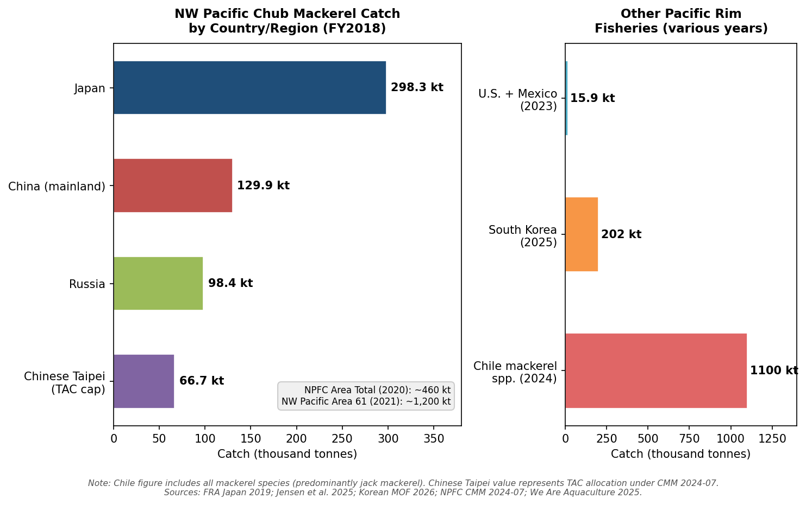

**Figure 1.2** Pacific Rim chub mackerel catch by country and region. The left panel displays NW Pacific catches in FY2018; the right panel shows other Pacific Rim fisheries at their most recent reporting years. Note that Chile's figure includes all mackerel species (predominantly jack mackerel), and the Chinese Taipei value represents the TAC allocation under CMM 2024-07. Data sources: [FRA Japan 2019](https://www.fra.go.jp/shigen/fisheries_resources/meeting/peer_review_meeting/files/2020/assess_masaba_p.pdf "FRA Table 3-1"); [Jensen et al. 2025](https://www.pcouncil.org/documents/2025/05/catch-only-stock-assessment-of-pacific-mackerel-scomber-japonicus-for-u-s-management-in-the-2025-26-and-2026-27-fishing-years.pdf/ "NOAA TM NMFS-SWFSC-718"); [Korea Ministry of Oceans and Fisheries, via Chosun Biz 2026](https://biz.chosun.com/en/en-society/2026/02/26/R6N53QEU5FHANCN2QPCYS2FR5U/ "Squid, mackerel fuel South Korea fisheries rebound"); [NPFC CMM 2024-07](https://www.npfc.int/system/files/2025-03/NPFC-2025-COM09-WP04%20Rev.1%20CMM%202024-07%20for%20Chub%20Mackerel%20By%20Japan_0.pdf "Japan proposal Mar 2025").

### 1.3.2 Japan

Japan has historically dominated the chub mackerel fishery. The Pacific stock's catch trajectory is characterized by extraordinary boom-and-bust dynamics: a historical peak of approximately 1,207,000 tonnes in FY1978, followed by a precipitous collapse to just 27,767 tonnes in FY1990 — a 97.7% decline within twelve fishing years — and a subsequent recovery to approximately 332,000 tonnes during FY2015–2017 [FRA Japan 2019](https://www.fra.go.jp/shigen/fisheries_resources/meeting/peer_review_meeting/files/2020/assess_masaba_p.pdf "FRA Table 3-1"). The Pacific stock catch reached approximately 539,260 tonnes in FY2017, the highest level since the early 1980s. In FY2018, Japan's total chub mackerel catch (both stocks combined) stood at 298,331 tonnes [FRA Japan 2019](https://www.fra.go.jp/shigen/fisheries_resources/meeting/peer_review_meeting/files/2020/assess_masaba_p.pdf "FRA Table 3-1").

Recent years have witnessed renewed production declines. FY2023 landings fell to approximately 271,000 tonnes, nearly halving the level of five years prior. Industry reports describe a fishery increasingly dominated by small, low-fat individuals unsuitable for premium market segments, with multiple processing firms — including Kinoya Ishinomaki Suisan in Miyagi Prefecture and producers in Iwate Prefecture — suspending canned mackerel production due to an inability to procure fish of adequate size [Asahi Shimbun 2025](https://www.asahi.com/ajw/articles/16122566 "Poor catches cut canned mackerel production in half"). Japan uses a July–June fishing year for Pacific stock management, a convention that differs from the calendar-year reporting employed by other nations and warrants attention when comparing cross-national statistics.

### 1.3.3 China

China ranks as the second-largest harvester of chub mackerel in the Northwest Pacific. Chinese fleets operating both within the domestic exclusive economic zone (primarily the East China Sea) and on the high seas of the NPFC Convention Area landed 129,868 tonnes in FY2018 [FRA Japan 2019](https://www.fra.go.jp/shigen/fisheries_resources/meeting/peer_review_meeting/files/2020/assess_masaba_p.pdf "FRA Table 3-1"). Chinese Taipei, reporting separately under the NPFC framework, holds an annual Total Allowable Catch (TAC) of 66,740 tonnes under the current Conservation and Management Measure (CMM 2024-07), of which 43,394 tonnes had been reported caught as of February 2026 [NPFC CMM 2024-07](https://www.npfc.int/system/files/2025-03/NPFC-2025-COM09-WP04%20Rev.1%20CMM%202024-07%20for%20Chub%20Mackerel%20By%20Japan_0.pdf "Japan proposal Mar 2025") [NPFC Cumulative Catch](https://www.npfc.int/chub-mackerel-cumulative-catch-public "Reported Chub Mackerel Compiled Catch as of Feb 2026"). China's dual role as both a major harvester and the world's largest mackerel processing hub (examined in Chapter 5) confers outsized influence on global trade patterns and price formation.

### 1.3.4 Russia

Russia's Far East fleet resumed chub mackerel fishing around 2014 after a prolonged hiatus, escalating production from a negligible 36 tonnes in FY2014 to 98,373 tonnes in FY2018 — a more than 2,700-fold increase in four years — and approximately 87,388 tonnes in 2021 [FRA Japan 2019](https://www.fra.go.jp/shigen/fisheries_resources/meeting/peer_review_meeting/files/2020/assess_masaba_p.pdf "FRA Table 3-1") [FAO AGRIS](https://agris.fao.org/search/en/providers/122436/records/67599d0cc7a957febdfe6824 "CPUE standardization for Russian fleet"). This rapid expansion, catalyzed by favorable stock conditions as the Pacific stock biomass surged to multi-decade highs in the mid-2010s, introduced a significant new harvesting nation into the Northwest Pacific mackerel fishery and complicated multilateral allocation negotiations within the NPFC framework.

### 1.3.5 South Korea

South Korea's chub mackerel fishery targets primarily the TWC stock in waters between the Korean Peninsula and Japan. Mackerel holds a uniquely prominent cultural position in Korean cuisine — colloquially termed "the barley of the sea" (*bada-ui bori*) — and consistently ranks among the top species by domestic landing volume. Large purse-seine vessels operating out of Busan account for over 80% of the national mackerel catch. In 2025, South Korea's mackerel production reached 202,000 tonnes, a 62.1% increase over the previous year, reflecting a recovery following several years of suppressed output attributed to shifts in water temperature and fishing-ground formation [Korea Ministry of Oceans and Fisheries, via Chosun Biz 2026](https://biz.chosun.com/en/en-society/2026/02/26/R6N53QEU5FHANCN2QPCYS2FR5U/ "Squid, mackerel fuel South Korea fisheries rebound"). Together with squid, sardine, and anchovy, mackerel constitutes approximately three-quarters of Korea's annual total nearshore catch [Kim et al. 2024](https://www.mdpi.com/2071-1050/16/3/1307 "Enhancing Chub Mackerel CPUE Standardization").

### 1.3.6 United States

On the U.S. West Coast, *S. japonicus* is managed as "Pacific mackerel" under the Coastal Pelagic Species FMP. Combined U.S.–Mexico catches ranged from 3,331 to 32,027 mt annually between 2009 and 2020. In 2023, the combined total was 15,866 mt, with Mexico accounting for approximately 14,980 mt and the United States approximately 885 mt. U.S. commercial landings have consistently remained far below harvest guidelines, with utilization rates of just 7–39% during 2008–2023 [Jensen et al. 2025](https://www.pcouncil.org/documents/2025/05/catch-only-stock-assessment-of-pacific-mackerel-scomber-japonicus-for-u-s-management-in-the-2025-26-and-2026-27-fishing-years.pdf/ "NOAA TM NMFS-SWFSC-718"). This persistent under-exploitation reflects both limited domestic demand for small pelagic species and conservative management buffers tied to the stock's high sensitivity to environmental variability.

### 1.3.7 Chile and Peru

In the Southeast Pacific, chub mackerel is caught primarily as bycatch in the industrial anchovy and Chilean jack mackerel purse-seine fisheries. Chile's total mackerel landings (including jack mackerel and chub mackerel combined) reached 1.1 million tonnes in 2024, a 26.9% increase over 2023 [We Are Aquaculture 2025](https://weareaquaculture.com/news/fisheries/mackerel-landings-in-chile-surge-269-in-2024 "Mackerel landings in Chile surge 26.9% in 2024"); however, the chub mackerel (*caballa*) component represents a modest fraction of this total — approximately 40,198 tonnes were recorded by mid-2015 in a SPRFMO annual report [SPRFMO SC-03-14](https://www.sprfmo.int/assets/Meetings/Meetings-2013-plus/SC-Meetings/3rd-SC-Meeting-2015/Papers/SC-03-14-rev1-Chile-Annual-report.pdf "Chile Annual Report 2015"). Peru's chub mackerel fishery is more explicitly identified as a distinct species in landing statistics, but comprehensive multi-year time series remain difficult to extract from publicly available English-language sources, as the species is often aggregated with other small pelagics in national reporting.

## 1.4 Stock Assessment and Management Frameworks

### 1.4.1 NPFC Convention Area Management

The NPFC established its first formal Conservation and Management Measure for chub mackerel (CMM 2024-07), setting a Convention Area catch limit of 100,000 mt for both calendar years 2024 and 2025 [NPFC 2025 Stock Assessment Report](https://www.npfc.int/system/files/2025-04/Stock%20assessment%20report%20for%20chub%20mackerel.pdf "NPFC Executive Summary"). This measure represents a significant institutional milestone, reflecting mounting concern over catch declines observed in the NPFC area during 2022–2024 [NPFC CMM 2024-07](https://www.npfc.int/system/files/2025-03/NPFC-2025-COM09-WP04%20Rev.1%20CMM%202024-07%20for%20Chub%20Mackerel%20By%20Japan_0.pdf "Japan proposal Mar 2025").

A multi-model stock assessment conducted with 2020 as the reference year estimated maximum sustainable yield (MSY) in the range of 400,000–660,000 tonnes. The JABBA (Just Another Bayesian Biomass Assessment) model indicated an 88.3% probability that the stock was in healthy condition, with B₂₀₂₀/B_MSY ranging from 1.40 to 2.30 [Cai et al. 2023](https://www.mdpi.com/2410-3888/8/2/80 "Stock Assessment Results/Discussion"). These relatively optimistic results, however, must be interpreted against the backdrop of rapid biomass and catch declines observed since the 2020 reference year.

### 1.4.2 Japan's Pacific Stock Assessment

Japan's FRA estimated the Pacific stock total biomass at 5,595,000 tonnes in FY2018 — the highest since 1970 — with spawning stock biomass (SSB) at 1,185,000 tonnes. Reference points were set at SB_MSY = 1,545,000 tonnes and MSY = 372,000 tonnes, yielding ratios of SSB/SB_MSY = 0.77 and F/F_MSY = 2.48 in the reference year [FRA Japan 2019](https://www.fra.go.jp/shigen/fisheries_resources/meeting/peer_review_meeting/files/2020/assess_masaba_p.pdf "FRA Section 4/Summary"). The finding that fishing mortality exceeded the MSY-based reference point by a factor of 2.5 — even at a time of historically high biomass — underscores a productivity paradox central to this fishery: high total biomass does not necessarily translate into sustainable high-quality yield when density-dependent growth suppresses individual body condition. Figure 1.3 traces the full biomass and catch trajectory from FY1970 through FY2023, illustrating the dramatic amplitude of this stock's fluctuations.

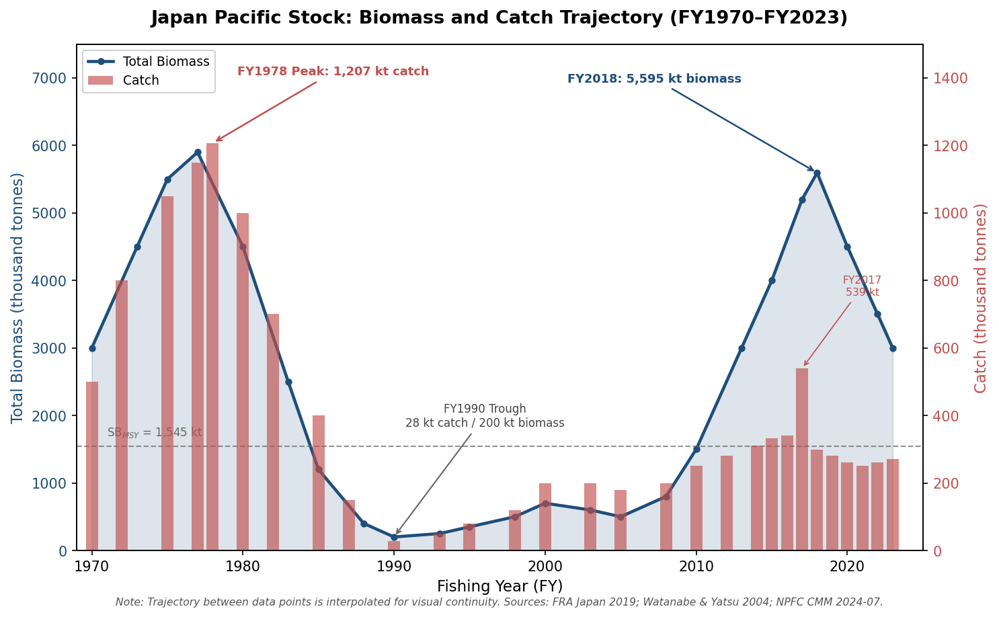

**Figure 1.3** Japan Pacific stock biomass and catch trajectory, FY1970–FY2023. Total biomass (blue line, left axis) peaked at 5,595 thousand tonnes in FY2018; catch (red bars, right axis) peaked at 1,207 thousand tonnes in FY1978. The horizontal dashed line indicates the spawning-biomass MSY reference point (SB_MSY = 1,545 kt). Data sources: [FRA Japan 2019](https://www.fra.go.jp/shigen/fisheries_resources/meeting/peer_review_meeting/files/2020/assess_masaba_p.pdf "FRA Tables and Figures"); [Watanabe & Yatsu 2004](https://spo.nmfs.noaa.gov/sites/default/files/pdf-content/2004/1021/watanabe.pdf "Fisheries Bulletin 102:196–206"); [NPFC CMM 2024-07](https://www.npfc.int/system/files/2025-03/NPFC-2025-COM09-WP04%20Rev.1%20CMM%202024-07%20for%20Chub%20Mackerel%20By%20Japan_0.pdf "Japan proposal Mar 2025").

### 1.4.3 U.S. West Coast Assessment

The most recent (2025) catch-only stock assessment places U.S. West Coast age-1+ biomass at 61,737 mt for the 2025–26 fishing year and 67,954 mt for 2026–27, both comfortably above the 18,200 mt biomass cutoff. Corresponding harvest guidelines are 9,143 mt and 10,448 mt, respectively [Jensen et al. 2025](https://www.pcouncil.org/documents/2025/05/catch-only-stock-assessment-of-pacific-mackerel-scomber-japonicus-for-u-s-management-in-the-2025-26-and-2026-27-fishing-years.pdf/ "NOAA TM NMFS-SWFSC-718 Table 4"). The persistent gap between actual landings (~885 mt in 2023) and the harvest guideline reflects structural features of the U.S. West Coast small-pelagic fishery: limited processing infrastructure, competition with sardine and anchovy for market share, and conservative management buffers designed to accommodate the high environmental sensitivity of this species.

## 1.5 Density-Dependent Growth and Its Implications

A critical biological mechanism connecting stock abundance to market outcomes is density-dependent growth. When the Pacific stock biomass surged to its multi-decade peak in the mid-to-late 2010s, average individual body weight declined markedly. FRA Japan documented that mean body weight for the 2013 year class was substantially lower in FY2018 than during 2011–2014, a reduction attributed to elevated intraspecific competition and the consequent displacement of feeding aggregations offshore into less productive waters [FRA Japan 2019](https://www.fra.go.jp/shigen/fisheries_resources/meeting/peer_review_meeting/files/2020/assess_masaba_p.pdf "FRA — Age and growth section").

Historical data reinforce this inverse relationship between abundance and individual size over multi-decadal time scales. During the high-abundance era of the mid-1970s, average fork length of age-0 fish was only 16.9 cm, whereas during the low-abundance trough of 1989, age-0 fish averaged 25.9 cm — a 9-cm difference at the same life stage. This early-life size disadvantage persists across the lifespan: age-0 fork length correlates positively with fork length at ages 1, 3, and 4 (r = 0.83, 0.62, and 0.67, respectively; P < 0.05 for all) [Watanabe & Yatsu 2004](https://spo.nmfs.noaa.gov/sites/default/files/pdf-content/2004/1021/watanabe.pdf "Fisheries Bulletin 102:196–206").

A modified VBGF model that incorporates population density (D) and spring SST (T, measured at 38–40°N during April–June) formally quantifies these opposing effects on growth: k(i,y) = 0.271 − 0.008 × T − 0.21 × D. The density coefficient is substantially larger than the temperature coefficient, confirming that intraspecific competition exerts the dominant constraint on individual growth rates [Watanabe & Yatsu 2004](https://spo.nmfs.noaa.gov/sites/default/files/pdf-content/2004/1021/watanabe.pdf "Tables 5–6"). When total biomass collapsed from 5.9 million tonnes (1977) to 0.2 million tonnes (1990), the resulting release from density-dependent competition produced the largest individual body sizes recorded in the time series.

Relative condition factors (Kn) measured from Chinese vessel data across the Northwest Pacific during 2016–2020 declined compared to pre-2006 reference values, reaching a nadir in 2017. Spatially, TWC stock fish sampled off Zhejiang's coast were heavier at the same fork length than Pacific stock fish caught on the high seas, consistent with the more productive coastal feeding environment of the TWC region [Cai et al. 2022](https://www.mdpi.com/2077-1312/10/2/301 "Growth Heterogeneity — Condition factors"). These condition-factor dynamics carry direct economic consequences: they determine whether individual fish meet the size and fat-content thresholds required for high-value market segments (fresh whole fish, *shime-saba*, fillet products) versus lower-value channels (export to Southeast Asia, fishmeal). The economic ramifications of this biological mechanism are examined in detail in Chapters 2, 3, and 6.

## 1.6 Commercial Importance among Small Pelagic Species

Within the Pacific Rim small-pelagic complex, chub mackerel occupies a distinctive ecological and economic niche. In the Northwest Pacific (FAO Area 61), the species ranked second by landings volume in 2021, outperforming Pacific sardine, Japanese anchovy, and largehead hairtail [FAO SOFIA 2024](https://www.fao.org/3/cd0683en/online/sofia/2024/status-of-fishery-resources.html "NW Pacific species rankings"). In Japan, mackerel (both *S. japonicus* and the blue mackerel *S. australasicus*) is embedded in the national culinary identity through products such as *shime-saba* (vinegar-cured mackerel), *saba-no-misoni* (mackerel simmered in miso), and canned mackerel — the last of which has experienced a domestic renaissance in recent years. In South Korea, mackerel's cultural status as a household staple ensures demand that is structurally inelastic: even when wholesale prices surged by approximately 37% within a single month in late 2025, import volumes continued to climb [Tridge News](https://www.tridge.com/news/south-korean-mackerel-prices-soar-import-vol-qkfihb "Sep 2025").

The species' commercial significance extends beyond direct human consumption. In Japan, only approximately 20% of domestic Pacific stock catch enters human consumption channels, with roughly 50% exported and 30% diverted to fishmeal and fertilizer — a distribution driven by the dominance of small, low-fat individuals in recent catches [Promar/NSC 2018](https://www.seafood.no/globalassets/aktuelt/webinar/livemoter-presentasjoner/japan-mackerel-report-promar-2018.pdf "The Mackerel Market in Japan 2018"). In Chile and Peru, chub mackerel bycatch feeds into the large-scale fishmeal and fish-oil industries that underpin aquaculture feed production regionally and globally.

FAO's overall assessment of Pacific Rim fishery resources reveals a mixed sustainability picture for *S. japonicus*. While the Southeast Pacific stock has recovered to biologically sustainable levels, some stocks of Pacific chub mackerel remain classified as overfished [FAO SOFIA 2024](https://www.fao.org/3/cd0683en/online/sofia/2024/status-of-fishery-resources.html "Status of fishery resources — major species section"). In the Northwest Pacific (Area 61), only 44% of assessed stocks were within biologically sustainable levels in 2021 — an 11% reduction from 2019 — reflecting the broader challenges of multi-species, multi-nation management in the region.

## 图表建议（中间产物）

1. **Pacific Rim stock distribution and fishing-ground map**: A schematic map showing the four major *S. japonicus* stock units (Pacific stock, TWC stock, SE Pacific stock, U.S. West Coast stock), their spawning grounds, migration routes, and major fishing ports. Reference: Wang et al. 2022 Figure 2 and FRA Japan Figure 2-1.

2. **National catch stacked area chart (2010–2025)**: A stacked area chart showing annual chub mackerel catch by country (Japan, China, Russia, South Korea, Chinese Taipei, U.S./Mexico, Chile/Peru) based on data from FRA Japan Table 3-1, NPFC cumulative catch reports, Jensen et al. 2025 Tables 1–2, and Korean Ministry of Oceans statistics. Japan's July–June fishing year should be noted with appropriate axis labeling.

3. **Pacific stock biomass and catch trajectory (1970–2025)**: A dual-axis line chart showing total biomass (left axis) and catch (right axis) for the Japan Pacific stock, highlighting the 1978 peak, 1990 trough, 2018 biomass maximum, and the post-2020 decline. Reference: FRA Japan 2019 Tables and Figures.

# Price Dynamics in Major Wholesale Aquatic Markets — Patterns, Seasonality, and Interannual Trends

The wholesale price of chub mackerel (*Scomber japonicus*) across Pacific Rim markets has undergone a structural transformation in the 2020s. Long regarded as an affordable commodity fish — a staple protein in Japanese *shio-saba* lunch boxes and Korean *godeungeo-gui* home cooking — chub mackerel has entered an era of sustained price escalation driven by converging supply constraints on both the Northeast Atlantic and Northwest Pacific fishing grounds. This chapter documents prevailing price levels, seasonal rhythms, and interannual trajectories across the principal markets of Japan, South Korea, China, and South American exporting nations from 2021 through Q1 2026, with historical context extending to the mid-2010s where data permit. The analysis encompasses both fresh and frozen product forms and identifies the supply-side forces — most critically, Norwegian quota contractions and declining NW Pacific catches — behind the notable price surges observed in 2025–2026.

## 2.1 Japan — The Premium Market

### 2.1.1 National Wholesale Price Trends (2021–2026)

Japan's wholesale mackerel market constitutes the highest-value destination for both domestically landed *S. japonicus* and imported Atlantic mackerel (*S. scombrus*). The national average wholesale price for fresh chub mackerel has risen nearly continuously since 2021. The annual average escalated from USD 5.16/kg in 2021 to USD 7.14/kg in 2023, USD 8.35/kg in 2024, and USD 9.17/kg in 2025, before reaching USD 10.60/kg in Q1 2026 — a cumulative doubling within five years [Tridge Fresh Chub Mackerel Japan](https://www.tridge.com/market-overview/fresh-chub-mackerel/JP "Fresh Chub Mackerel Japan Market Overview 2026").

Frozen mackerel wholesale prices have tracked a parallel trajectory at a structural discount. The national frozen mackerel wholesale average moved from USD 3.39/kg in 2021 to USD 5.60/kg in 2025 and USD 6.71/kg in Q1 2026, representing a near-doubling over the same period [Tridge Frozen Mackerel Japan](https://www.tridge.com/market-overview/frozen-mackerel/JP "Frozen Mackerel Japan Market Overview 2026"). The fresh-to-frozen price ratio has remained remarkably stable at approximately 1.6:1 throughout the study period, indicating that both market segments respond to common underlying supply dynamics rather than divergent demand shifts.

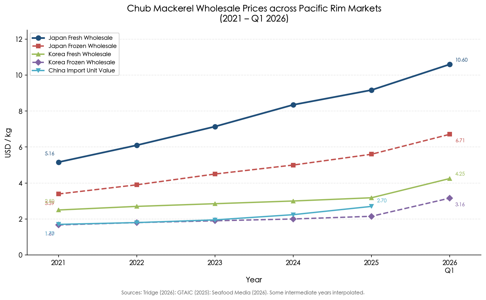

**Figure 2-1.** Wholesale price trajectories for chub mackerel across five Pacific Rim market segments, 2021–Q1 2026. Japan's fresh wholesale price (blue solid line) doubled from USD 5.16/kg to USD 10.60/kg over the period, while all five series rose in tandem, preserving the cross-market hierarchy. Data sources: [Tridge](https://www.tridge.com/market-overview/fresh-chub-mackerel/JP "Tridge multiple market pages 2026"), [GTAIC](https://gtaic.ai/market-reports/frozen-mackerel-fish-market-japan-outlook-in-2025 "GTAIC 2025").

### 2.1.2 Historical Context: The Pre-2021 Baseline

Comprehensive English-language wholesale price time series for Japanese mackerel prior to 2021 remain limited. Japan Fisheries Agency (JFA) statistics indicate that the national average local price across all fisheries and aquaculture products was ¥347/kg in 2018, reflecting a ¥19/kg decrease from the prior year [JFA White Paper FY2019](https://www.jfa.maff.go.jp/j/kikaku/wpaper/attach/pdf/index-6.pdf "FY2019 Trends in Fisheries — Average Local Price"). While this aggregate figure covers all species, mackerel-specific wholesale prices at the Tokyo Central Wholesale Market (Tsukiji until October 2018, Toyosu thereafter) averaged approximately ¥560/kg in 2024, representing a roughly 30% increase over the preceding five years [Asahi Shimbun](https://www.asahi.com/ajw/articles/16122566 "Poor catches cut canned mackerel production in half, 2025"). This implies a base price circa 2019 of approximately ¥430/kg (roughly USD 3.90/kg at prevailing exchange rates), consistent with the subsequent doubling trajectory documented from 2021 onward.

### 2.1.3 Import Price Dynamics

Japan's frozen mackerel import prices provide a trade-statistics-validated lens on the price trajectory. The average import unit value for frozen mackerel (HS 030354) rose to USD 3.00/kg for January–August 2025, a 21.5% year-on-year increase, with the last-twelve-month average at USD 2,870/tonne [GTAIC Frozen Mackerel Japan](https://gtaic.ai/market-reports/frozen-mackerel-fish-market-japan-outlook-in-2025 "GTAIC pricing analysis, data through Aug 2025"). In 2024, Japan imported 67,720 tonnes of frozen mackerel valued at USD 174.3 million, with Norway supplying 70.4% of the total. For the first eight months of 2025, import value rose 30.3% year-on-year to USD 119.8 million while volume increased only 7.3% [Tridge Frozen Mackerel Japan](https://www.tridge.com/market-overview/frozen-mackerel/JP "Tridge 2026") [GTAIC Frozen Mackerel Japan](https://gtaic.ai/market-reports/frozen-mackerel-fish-market-japan-outlook-in-2025 "GTAIC 2025").

The divergence between value growth (+30%) and volume growth (+7%) in the 2025 import data quantifies the price pressure at the border: importers are paying substantially more per kilogram, and this cost escalation propagates through the domestic wholesale chain with limited absorption by intermediaries.

### 2.1.4 Producer-Level Price Surge (2025–2026)

At the upstream end of the value chain, dockside prices for domestically landed Pacific stock mackerel surged to historic levels. In December 2025, the Japanese producer price for Pacific mackerel jumped approximately 60% year-on-year to roughly USD 1.96/kg — the highest level in at least four years [Seafood Media](https://www.seafood.media/fis/worldnews/worldnews.asp?monthyear=&day=2&id=137099&l=e&special=0&ndb=0 "Mackerel Prices Surge to Record Highs, Feb 2026"). By January 2026, Japan's frozen mackerel export price reached a 34-year high of ¥250/kg (approximately USD 1.67/kg), with export volumes surging 1.8-fold year-on-year to 5,786 tonnes — signaling that even low-grade export-destined mackerel was commanding unprecedented prices [SeafoodNews/Minato Shimbun](https://www.seafoodnews.com/Story/1338264/Japans-Mackerel-Export-Increased-1-point-8-fold-Year-on-Year-amid-Norways-Sluggish-Production "Mar 2026").

The producer-to-wholesale price multiplier provides further insight into value chain dynamics. With a dockside price of approximately USD 1.96/kg and a fresh wholesale price of USD 9.17–10.60/kg, the markup from landing to wholesale stands at roughly 4.7–5.4×, consistent with the multi-tier distribution structure documented for the Japanese mackerel value chain, in which fish pass through producer cooperatives, primary wholesalers, intermediate wholesalers, and retail-level buyers [Promar/NSC 2018](https://www.seafood.no/globalassets/aktuelt/webinar/livemoter-presentasjoner/japan-mackerel-report-promar-2018.pdf "The Mackerel Market in Japan 2018, pp. 16–21").

### 2.1.5 Seasonality in Japanese Mackerel Prices

Japanese mackerel prices exhibit pronounced seasonality closely tied to biological cycles. The peak price season runs from December through February, coinciding with the *shun* (旬) period when Pacific stock mackerel returning from northern feeding grounds carry maximal fat content. Summer months (June–August) represent the seasonal trough, as fish are in spawning condition or have recently depleted energy reserves [FAO GlobeFish](https://www.fao.org/in-action/globefish/news-events/news/news-detail/rising-popularity-on-norwegian-mackerel-in-japan/en "Rising popularity of Norwegian mackerel in Japan, Mar 2025"). This seasonal amplitude reflects a direct biological mechanism: lipid content in chub mackerel peaks at 20–30% of body weight during autumn–winter and falls to 5–10% during spring–summer, and Japanese consumers differentiate sharply on fat content as a quality attribute.

Imported Norwegian Atlantic mackerel, which dominates the high-fat segment, exhibits its own seasonal pricing rhythm tied to the Norwegian autumn fishing season (September–November). Norwegian mackerel CFR (cost and freight) prices to Japan reached a historic peak of USD 5.50–5.60/kg in October 2025, while the December 2025 Norwegian export average price surged 67% year-on-year to USD 4.84/kg [Seafood Media](https://www.seafood.media/fis/worldnews/worldnews.asp?monthyear=&day=2&id=137099&l=e&special=0&ndb=0 "Mackerel Prices Surge to Record Highs, Feb 2026"). This Norwegian pricing dynamic is particularly consequential because Norwegian-origin mackerel constitutes the majority of Japan's import volume and fills the premium *shio-saba* (salted mackerel fillet) segment year-round.

## 2.2 South Korea — Structural Demand Meets Supply Shock

### 2.2.1 Wholesale Price Trends (2021–2026)

South Korea's mackerel market, where the species holds iconic cultural status as *godeungeo* ("the barley of the sea"), has experienced even more dramatic price escalation in relative terms. Frozen chub mackerel wholesale prices rose from USD 1.67/kg in 2021 to USD 2.15/kg in 2025, then jumped to USD 3.16/kg in Q1 2026. Fresh mackerel wholesale prices followed a steeper curve, climbing from approximately USD 2.50/kg in 2021 to USD 3.18/kg in 2025 and USD 4.25/kg in Q1 2026. The fresh-to-frozen ratio in Korea (approximately 1.5:1 in 2025) mirrors the Japanese pattern, though at a significantly lower absolute price level [Tridge Frozen/Fresh Mackerel Korea](https://www.tridge.com/market-overview/frozen-chub-mackerel/KR "Tridge Korea Mackerel 2026").

### 2.2.2 Retail Price Escalation and the Affordability Crisis

Wholesale price increases have translated into retail-level affordability concerns that attracted national media attention in late 2025. The Korea Agro-Fisheries & Food Trade Corporation reported that the average retail price for imported salted mackerel (large size, two-fish pack) reached KRW 10,363 (approximately USD 7.16) in December 2025 — more than 1.5 times the KRW 6,803 recorded in 2023 and 28.8% above the KRW 8,048 in 2024 [Korea Times](https://www.koreatimes.co.kr/economy/20260106/koreas-beloved-mackerel-becomes-unaffordable-amid-dwindling-supply-weak-won "Korea's beloved mackerel becomes unaffordable, Jan 2026"). The Korea Maritime Institute documented that monthly Korean mackerel production had fallen 61.5% year-on-year to 6,993 tonnes, compounding the import-dependency problem [Korea Times](https://www.koreatimes.co.kr/economy/20260106/koreas-beloved-mackerel-becomes-unaffordable-amid-dwindling-supply-weak-won "Jan 2026").

The weakening Korean won — which averaged KRW 1,422.16 per dollar in 2025, the highest annual average since the 1998 Asian financial crisis — amplified the price shock for this heavily import-dependent market, where Norwegian mackerel accounts for 80–90% of frozen imports [Korea Times](https://www.koreatimes.co.kr/economy/20260106/koreas-beloved-mackerel-becomes-unaffordable-amid-dwindling-supply-weak-won "Jan 2026").

### 2.2.3 The "Volume-Up, Price-Up" Paradox of 2025

A striking feature of the Korean market in 2025 was the simultaneous surge in both import volumes and prices — an apparent violation of the standard inverse supply-price relationship. During January–August 2025, Korean frozen mackerel imports rose 56.1% year-on-year to 40,010 tonnes, yet prices continued to escalate. Norwegian-origin frozen mackerel (300/500g grade) wholesale prices surged approximately 37% in a single month from August to September 2025, rising from KRW 99,500 to KRW 136,000 per box [Seafood Media/Union Forsea](https://seafood.media/fis/worldnews/worldnews.asp?monthyear=9-2025&day=18&id=135823&l=e&country=113&special=&ndb=1&df=0 "Sep 2025") [Tridge News](https://www.tridge.com/news/south-korean-mackerel-prices-soar-import-vol-qkfihb "Sep 2025").

This paradox reflects two intersecting dynamics. First, Korean importers were building inventories ahead of anticipated further supply tightening from Norwegian quota cuts; the number of supply countries expanded from five to twelve as buyers diversified sourcing. Second, the structural rigidity of Korean mackerel demand — deeply embedded in household cuisine, school cafeterias, and military provisioning — means that short-term price elasticity of demand is extremely low. Bioeconomic modeling of the Korean mackerel market using KOSIS data (July 2017–June 2022) has confirmed this inverse catch-price relationship through nonlinear regression, with the irrational function specification yielding R² = 0.769, indicating that roughly 77% of monthly wholesale price variation is explained by catch volume alone [Jang & Cho 2025](https://link.springer.com/article/10.1186/s13662-025-03898-9 "Optimal harvest strategies with catch-dependent pricing for chub mackerel, Advances in Continuous and Discrete Models").

## 2.3 China — The Import Gateway and Processing Hub

### 2.3.1 Import Price Trends

China occupies a dual role in the Pacific Rim mackerel market: it is both a major importer of high-quality frozen mackerel (primarily of Norwegian origin) and the world's largest mackerel processing hub. On the import side, China's average frozen mackerel (HS 030354) import unit value reached USD 2.24/kg in 2024, a 14.7% year-on-year increase. Import volume totaled 71,860 tonnes in 2024 (up 34.9% year-on-year), with Norway accounting for 70.6% of import value [GTAIC China](https://gtaic.ai/market-reports/frozen-mackerel-fish-market-china-trends-in-2026 "GTAIC China Frozen Mackerel Report"). By December 2025, Norwegian mackerel export prices to China had surged 95% year-on-year, reflecting the same global supply squeeze affecting Japan and Korea [Seafood Media](https://www.seafood.media/fis/worldnews/worldnews.asp?monthyear=&day=2&id=137099&l=e&special=0&ndb=0 "Feb 2026").

### 2.3.2 Domestic Market Price Opacity

A significant analytical limitation is the opacity of China's domestic mackerel wholesale market. Systematic public price series for major landing and trading centers such as Zhoushan (Zhejiang) and Dalian (Liaoning) are not available in English-language databases. The import unit value of USD 2.24/kg reflects border prices for Norwegian premium product destined largely for re-processing and re-export, and should not be interpreted as representative of domestic wholesale prices for Chinese-caught chub mackerel, which are considerably lower. USDA FAS confirms China's total aquatic production at 74.1 million tonnes in 2024 (up 4%), with total fishery imports of 4.4 million tonnes valued at USD 17.7 billion [USDA FAS](https://www.fas.usda.gov/data/china-2025-china-fishery-products-report "GAIN report CH2025-0057, Mar 2025"), but species-level domestic market prices for chub mackerel remain confined to Chinese-language grey literature.

## 2.4 South America — The Low-Cost Export Tier

### 2.4.1 Chile and Peru Export Prices

Chile and Peru occupy the lowest tier of the Pacific Rim mackerel price hierarchy. These nations are primarily exporters of frozen whole mackerel (*caballa*) destined for West African, Southeast Asian, and Latin American markets, with minimal domestic high-value fresh trade.

Chilean frozen mackerel (HS 030374) export unit values ranged between USD 1.17 and USD 1.93/kg across 2024–2025 shipments [World Bank WITS](https://wits.worldbank.org/trade/comtrade/en/country/CHL/year/2024/tradeflow/Exports/partner/ALL/product/030374 "Chile exports 2024"). Peruvian frozen mackerel block product (8–14 pieces/kg grade) traded at USD 0.82–0.93/kg on European reference markets in early 2025 [INFOPESCA](https://www.infopesca.org/sites/default/files/complemento/boletines/5520/EPR/EPR_MAY_2025.pdf "European Price Report, May 2025"). These prices position South American mackerel at approximately one-fifth to one-eighth of Japan's fresh wholesale price — a differential reflecting not only product-form and species differences (Southeast Pacific *S. japonicus* versus Norwegian *S. scombrus* in the Japanese premium segment) but also profound disparities in fat content and target consumer purchasing power.

The South American export price tier is structurally decoupled from Northeast Asian premium markets. Chilean and Peruvian mackerel competes primarily with Chinese-origin re-exported frozen mackerel (average export price USD 1.40/kg in 2024) and with horse mackerel (*Trachurus murphyi*) in price-sensitive African and Latin American markets, rather than with Norwegian or Japanese premium product.

## 2.5 Cross-Market Price Hierarchy

A synthesis of 2025 annual average prices reveals a clear hierarchical structure across Pacific Rim mackerel markets (Table 2-1), reflecting product form, fat content, species differentiation, and consumer purchasing power.

| Market Segment | USD/kg (2025) |
|---|---|
| Japan fresh wholesale | 9.17 |
| Japan frozen wholesale | 5.60 |
| South Korea fresh wholesale | 3.18 |
| Japan frozen import average (HS 030354) | 3.00 |
| China frozen import average (HS 030354) | 2.24 |
| South Korea frozen wholesale | 2.15 |
| Chile frozen export | 1.17–1.93 |
| Peru frozen block (European reference) | 0.82–0.93 |

**Table 2-1.** Cross-market price hierarchy for mackerel, 2025 annual averages. Sources: [Tridge](https://www.tridge.com/market-overview/fresh-chub-mackerel/JP "Tridge multiple market pages 2026"), [GTAIC](https://gtaic.ai/market-reports/frozen-mackerel-fish-market-japan-outlook-in-2025 "GTAIC 2025"), [World Bank WITS](https://wits.worldbank.org/trade/comtrade/en/country/CHL/year/2024/tradeflow/Exports/partner/ALL/product/030374 "Chile 2024"), [INFOPESCA](https://www.infopesca.org/sites/default/files/complemento/boletines/5520/EPR/EPR_MAY_2025.pdf "May 2025").

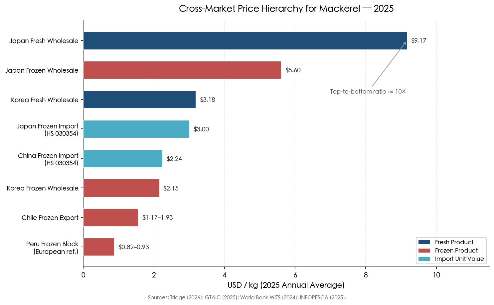

**Figure 2-2.** Horizontal bar chart ranking all market segments from Japan fresh wholesale (highest, USD 9.17/kg) to Peru frozen block (lowest, USD 0.82–0.93/kg). The top-to-bottom price ratio spans approximately 10×, driven primarily by product form, fat content, and target consumer market. Color coding distinguishes fresh product, frozen product, and import unit values.

The price gradient from top to bottom spans roughly an order of magnitude (>10×). This gradient is not merely a function of transport costs or tariffs; it reflects fundamentally different product specifications and market structures. Japanese fresh wholesale prices incorporate premium-grade domestic fish and high-fat imported Norwegian fillets destined for *shio-saba*, *miso-saba*, and sashimi-adjacent applications. The South American export tier, by contrast, serves protein-deficient markets where mackerel competes with poultry and canned sardines.

A notable interannual pattern is the compression of the Japan–Korea price gap. In 2021, Japan's fresh wholesale price (USD 5.16/kg) was 2.1× Korea's fresh wholesale price (approximately USD 2.50/kg). By Q1 2026, the ratio had contracted to 2.5× (USD 10.60 versus USD 4.25). This convergence is driven primarily by Korea's more acute import dependency and the stronger pass-through of Norwegian supply shocks to the Korean market.

## 2.6 Fresh versus Frozen Price Differentials

The fresh-to-frozen price differential constitutes a structurally important feature of Pacific Rim mackerel markets. In Japan, the fresh:frozen wholesale price ratio has remained in a narrow band of 1.5:1 to 1.7:1 across the 2021–2026 period (USD 5.16/3.39 = 1.52 in 2021; USD 10.60/6.71 = 1.58 in Q1 2026). In Korea, the ratio is similar at approximately 1.5:1.

The stability of this ratio is analytically significant. If the supply shock disproportionately affected one product form — for instance, if frozen imports were constrained while fresh domestic landings held steady — the ratio would diverge. The observed parallel movement instead confirms that the fundamental driver is aggregate supply tightness: both domestic landings of fresh fish and imported frozen product are simultaneously constrained, sustaining the historical relative pricing structure.

The absolute gap, however, has widened substantially: the Japan fresh–frozen differential was USD 1.77/kg in 2021 versus USD 3.89/kg in Q1 2026. This widening absolute spread increases the economic incentive for quality upgrading and sorting at the producer and processor level, as the marginal value of landing a fish that qualifies for the fresh market rather than the frozen/export market has more than doubled.

## 2.7 Supply-Side Drivers of Price Escalation

### 2.7.1 Norwegian Quota Contraction

The single most important supply-side driver of the 2025–2026 price surge across all Pacific Rim mackerel markets is the progressive contraction of Norwegian Atlantic mackerel quotas. Norway is the world's largest mackerel exporter and the dominant supplier to Japan (70.4% of frozen imports), Korea (78.9% of 2025 frozen imports), and China (70.6% of import value).

Norwegian mackerel fishing quotas underwent a series of steep reductions: from approximately 215,000 tonnes in 2024 to 152,000 tonnes in 2025 (−29%). ICES advice for 2026 recommended a further dramatic reduction of approximately 70% to the lowest level since 1998. The actual 2026 four-party agreement TAC was set at 299,010 mt (still 72% above the ICES advice of 174,357 mt), with Norway's individual quota falling to approximately 85,500 tonnes — a 44% reduction from 2025 [Undercurrent News](https://www.undercurrentnews.com/2025/09/30/ices-advises-dramatic-slash-to-northeast-atlantic-mackerel-advice-for-2026/ "Sep 2025") [Caharbor/NSC](https://www.caharborfood.com/news/mackerel-prices-have-broken-historical-highs-a-85389055.html "Citing NSC data, Jan 2026").

The magnitude of the Norwegian price response has been historic. Norwegian frozen whole mackerel (<600g) export prices, which had risen only from NOK 10 to NOK 20/kg over the 19 years from 2004 to 2023, breached NOK 30, NOK 40, and NOK 50/kg within the single year of 2025 [Caharbor/NSC](https://www.caharborfood.com/news/mackerel-prices-have-broken-historical-highs-a-85389055.html "Citing NSC data, Jan 2026"). Norway's 2025 mackerel export volume fell 34% to 208,000 tonnes, yet total export value reached a record NOK 8.5 billion (approximately USD 770 million) — a transformation from high-volume commodity to high-value constrained resource [Caharbor/NSC](https://www.caharborfood.com/news/mackerel-prices-have-broken-historical-highs-a-85389055.html "Jan 2026").

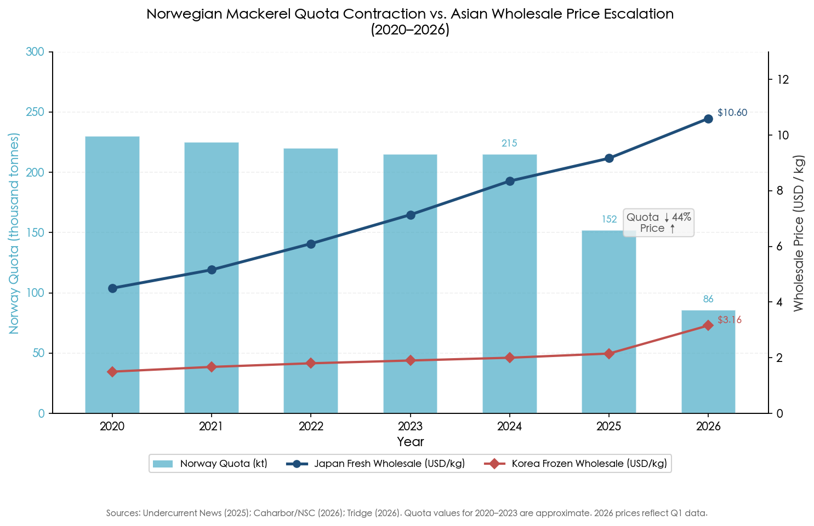

**Figure 2-3.** Dual-axis chart illustrating the inverse relationship between Norwegian mackerel quota contraction (left axis, bars) and Asian wholesale price escalation (right axis, lines), 2020–2026. Norway's individual quota declined from approximately 230 kt to 86 kt (−63%), while Japan's fresh wholesale price rose from roughly USD 4.2/kg to USD 10.60/kg over the same period. Data sources: [Undercurrent News](https://www.undercurrentnews.com/2025/09/30/ices-advises-dramatic-slash-to-northeast-atlantic-mackerel-advice-for-2026/ "Sep 2025"), [Caharbor/NSC](https://www.caharborfood.com/news/mackerel-prices-have-broken-historical-highs-a-85389055.html "Jan 2026"), [Tridge](https://www.tridge.com/market-overview/fresh-chub-mackerel/JP "Tridge 2026").

### 2.7.2 Northwest Pacific Catch Declines

Simultaneously, the NW Pacific supply base has weakened. Japan's FY2023 mackerel catch was approximately 271,000 tonnes, roughly half the level of five years prior, and catches in the NPFC Convention Area have shown significant declines in 2022–2024 [NPFC CMM 2024-07](https://www.npfc.int/system/files/2025-03/NPFC-2025-COM09-WP04%20Rev.1%20CMM%202024-07%20for%20Chub%20Mackerel%20By%20Japan_0.pdf "Japan proposal noting catch declines"). Critically, the Japanese catch has shifted toward smaller, lower-fat fish that cannot supply the premium domestic fresh market, forcing greater reliance on imports for the high-value segment (the body-size trends underlying this shift are examined in Chapter 3).

Korean domestic mackerel production has also declined sharply. The Korea Maritime Institute documented a monthly production drop of 61.5% year-on-year to 6,993 tonnes [Korea Times](https://www.koreatimes.co.kr/economy/20260106/koreas-beloved-mackerel-becomes-unaffordable-amid-dwindling-supply-weak-won "Jan 2026"). Norway's Ministry of Oceans and Fisheries communicated to Korean stakeholders that Norway's 2026 mackerel catch quota would fall further to 79,000 tonnes, reinforcing the dual-squeeze narrative of shrinking domestic and imported supplies [Korea Times](https://www.koreatimes.co.kr/economy/20260106/koreas-beloved-mackerel-becomes-unaffordable-amid-dwindling-supply-weak-won "Jan 2026").

### 2.7.3 Global Frozen Mackerel Market Contraction

The broader global frozen mackerel trade provides important context. Global frozen mackerel imports contracted sharply in 2024, falling to 1,155 thousand tonnes (−25.5% year-on-year) valued at USD 1.84 billion (−20.2%). The five-year compound annual growth rate turned negative at −3.7% for value and −5.5% for volume [GTAIC](https://gtaic.ai/market-reports/frozen-mackerel-fish-market-japan-outlook-in-2025 "GTAIC global section"). This global volume contraction — driven partly by currency-related demand destruction in price-sensitive African markets — has paradoxically reinforced unit price escalation, as supply curtailment has exceeded demand reduction, producing the classic "quantity down, price up" pattern at the global level.

## 2.8 Near-Term Price Outlook (Through September 2026)

The price outlook for Pacific Rim mackerel markets through September 2026 is constrained by supply fundamentals on both principal pillars — NE Atlantic Norwegian mackerel and NW Pacific Japanese mackerel — which face simultaneous binding constraints:

1. **Norway**: The 2026 individual quota of approximately 85,500 tonnes represents a 44% reduction from the already-reduced 2025 level. The Norwegian Seafood Council (NSC) has warned that export volumes will fall to a decade-low, and that short-term price relief is unlikely [Caharbor/NSC](https://www.caharborfood.com/news/mackerel-prices-have-broken-historical-highs-a-85389055.html "Jan 2026").

2. **Japan**: Even if NW Pacific oceanographic conditions improve — a potential El Niño emerging in mid-2026 could modestly improve spawning suitability (as discussed in Chapter 4) — any recruitment benefit would not enter the fishable biomass until 2028–2029 at the earliest, given the species' 1–2 year maturation lag.

3. **Korea**: The Ministry of Oceans and Fisheries has initiated discussions on import diversification and commercialization of small-sized mackerel — an implicit acknowledgment that premium-sized fish will remain scarce through the forecast period [Korea Times](https://www.koreatimes.co.kr/economy/20260106/koreas-beloved-mackerel-becomes-unaffordable-amid-dwindling-supply-weak-won "Jan 2026").

We expect Japanese fresh mackerel wholesale prices to remain at or above USD 10/kg through September 2026, with Korean prices continuing their convergence toward the Japan premium tier. The Norway-to-Asia price transmission lag of approximately 2–3 months means that the full impact of the 2026 quota reduction (decided in late 2025) will manifest in Asian wholesale markets by mid-2026.

The one potential source of modest price moderation is substitution pressure: at current price levels, institutional buyers (school cafeterias, military commissaries, bento manufacturers) may shift toward Chilean silver salmon (*Oncorhynchus kisutch*) or sardine products in cost-sensitive applications, placing a soft ceiling on further increases in the institutional segment. For the retail and restaurant segments, however, where mackerel carries irreplaceable cultural identity in both Japan and Korea, demand is expected to remain price-inelastic, sustaining the elevated price regime established in 2025.

# Interannual Variations in Body Size — Weight, Length, and Condition Factor across Fishing Grounds

The commercial and nutritional value of chub mackerel (*Scomber japonicus*) is determined not by aggregate biomass alone but by the body size, lipid reserves, and physiological condition of individual fish reaching the market. A 400 g mackerel carrying 25% lipid content follows a qualitatively different market trajectory — destined for premium *shio-saba* fillets in Japan or grilled *godeungeo-gui* in Korea — compared with a 200 g, 10% lipid specimen relegated to fishmeal or low-value frozen export. This chapter documents how mean body weight, fork length at age, and condition factor of chub mackerel have varied interannually and across fishing grounds over the past two decades. The analysis establishes the biological quality metrics that link environmental conditions (examined in Chapter 4) to market pricing dynamics (documented in Chapter 2), demonstrating that individual fish quality constitutes a critical — and frequently overlooked — mediating variable between stock abundance and realized economic value.

## 3.1 Length–Weight Relationships: Allometry and Its Spatial Heterogeneity

The allometric relationship between fork length (FL) and body weight (W) for *S. japonicus* follows the standard power function W = aFL^b, where the exponent *b* quantifies growth geometry: values exceeding 3.0 denote positive allometry (fish becoming proportionally heavier as they grow longer), while values below 3.0 denote negative allometry.

For the Northwest Pacific as a whole, Cai et al. (2022) estimated the length–weight relationship from 2,686 specimens collected by Chinese research and commercial vessels between 2016 and 2020, yielding W = 1.41 × 10⁻⁶ × FL³·³⁷ — a positive allometric exponent confirming that larger individuals are disproportionately heavier [Cai et al. 2022](https://www.mdpi.com/2077-1312/10/2/301 "Growth Heterogeneity of Chub Mackerel, JMSE"). The intercept parameter *a* was lower than historical reference values, a result the authors attributed to possible habitat quality degradation during the contemporary period. Japan's Fisheries Research Agency (FRA), drawing on a substantially larger sample (n = 18,302 specimens, 2006–2019), reported a closely aligned relationship of W = 1.09 × 10⁻⁶ × FL³·⁴¹ for the Pacific stock [Kamimura et al. 2021](https://academic.oup.com/icesjms/article/78/9/3254/6380055 "ICES J. Mar. Sci. 78(9):3254–3264").

These aggregate relationships, however, conceal meaningful spatial and temporal variation. Length–weight regressions derived from Chinese light purse-seine operations on the high seas of the Northwest Pacific (35–45°N, 145–160°E) between 2016 and 2021 revealed substantial interannual instability in the allometric exponent: *b* ranged from 2.78 in 2021 to 3.75 in 2018, and the intercept *a* spanned three orders of magnitude across years [Zhao et al. 2025](https://pmc.ncbi.nlm.nih.gov/articles/PMC12024016/ "Animals 15(8):1135"). Such variability reflects year-to-year shifts in fish condition — the proportion of body mass attributable to lipid reserves and somatic tissue at a given length — rather than fundamental alterations in skeletal growth, and underscores the inadequacy of static allometric parameters for predicting the weight (and hence market value) of mackerel landed in any given season.

Spatial heterogeneity in the length–weight relationship is equally consequential. Cai et al. (2022) demonstrated that chub mackerel caught in Zhejiang coastal waters (a core area of the Tsushima Warm Current [TWC] stock) were significantly heavier at the same fork length than those taken from Japan's coastal waters (Pacific stock) or from the high seas. This pattern persisted across the 2016–2020 study period and across multiple size classes, suggesting that the warmer, more productive TWC environment sustains superior feeding conditions relative to the oligotrophic waters of the Kuroshio Extension region where the bulk of the Pacific stock's feeding migration occurs [Cai et al. 2022](https://www.mdpi.com/2077-1312/10/2/301 "Growth Heterogeneity — Table 4"). The implication for market supply is that mackerel originating from different fishing grounds — even when measured at comparable fork lengths — carry different body weights and, consequently, different commercial values.

## 3.2 Von Bertalanffy Growth Parameters: Cohort-Specific Trajectories and Temporal Decline

The von Bertalanffy growth function (VBGF), Lt = L∞[1 − e^(−K(t − t₀))], constitutes the standard framework for characterizing growth trajectories across cohorts. For chub mackerel, the most consequential finding of recent research is that VBGF parameters are not species-level constants but vary dramatically among year classes — a consequence of density-dependent growth that carries profound implications for body size at market age.

### 3.2.1 Cohort-Specific Growth in the Pacific Stock

Kamimura et al. (2021) fitted cohort-specific VBGFs for year classes 2006 through 2016 of the Pacific stock, based on FRA survey and commercial sampling data. The asymptotic fork length L∞ declined from 440.5 mm for the 2006 year class to 339.9 mm for the 2016 year class — a 23% reduction in maximum attainable length over a single decade. The growth coefficient K exhibited an inverse pattern, ranging from 0.25 to 0.55, with higher values (faster initial growth toward a lower ceiling) characterizing the more recent, smaller-bodied cohorts. First-year growth increments varied from 29.6 to 51.2 mm FL per year across cohorts [Kamimura et al. 2021](https://academic.oup.com/icesjms/article/78/9/3254/6380055 "ICES J. Mar. Sci. — cohort-specific VBGF").

This pattern is diagnostic of density-dependent growth suppression: as the Pacific stock biomass surged from approximately 2 million tonnes in the mid-2000s to 5.6 million tonnes in FY2018 — the highest level since 1970 [FRA Japan 2019](https://www.fra.go.jp/shigen/fisheries_resources/meeting/peer_review_meeting/files/2020/assess_masaba_p.pdf "FRA Section 4/Summary") — individual fish faced intensified intraspecific competition for finite food resources, resulting in lower asymptotic size despite faster initial growth rates. The practical consequence is that a 3-year-old mackerel from the 2016 year class is substantially smaller and lighter than a 3-year-old from the 2006 year class, even though total stock biomass was several times higher during the former's lifetime.

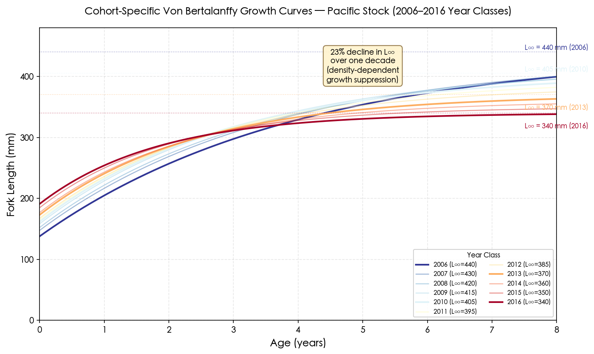

### 3.2.2 High-Seas Fishing Ground Parameters

Analysis of Chinese commercial fishing data from the high seas of the Northwest Pacific corroborated these patterns. The asymptotic fork length estimated via ELEFAN I varied from 36.0 cm (2017) to 42.35 cm (2020), while K ranged from 0.31 (2019) to 0.65 (2016). Despite such interannual fluctuations, the growth performance index ϕ' (= log₁₀K + 2 × log₁₀L∞) remained relatively stable at 2.70–2.99 across the 2016–2021 period, indicating that total energy allocated to somatic growth was approximately constant while its partitioning between growth rate and maximum size fluctuated in response to environmental conditions [Zhao et al. 2025](https://pmc.ncbi.nlm.nih.gov/articles/PMC12024016/ "Animals 15(8):1135 — Table 3").

### 3.2.3 Southeast Pacific Growth

Growth parameters for the Southeast Pacific stock (Chile/Peru) diverge from Northwest Pacific populations in ways that reflect both a distinct oceanographic environment (Humboldt Current upwelling) and sustained heavy exploitation pressure. Caramantin-Soriano et al. (2008) reported L∞ = 40.2–42.2 cm FL, K = 0.38–0.39, natural mortality M = 0.52–0.53, and an estimated maximum lifespan of approximately 7 years — roughly half the 18-year maximum documented for Northwest Pacific fish [Caramantin-Soriano et al. 2008](https://www.scielo.br/j/bjoce/a/M7cwT6SZhwsx77CnPMpmL7m/?lang=en "Braz. J. Oceanogr. 56(3):201–210"). Exploitation rates of 0.68–0.84 during the 1996–1998 study period indicated that fishing mortality substantially exceeded natural mortality. Such heavy exploitation truncates the age structure and effectively prevents fish from approaching their asymptotic size, compounding any environmentally driven growth effects.

## 3.3 Interannual Variation in Size-at-Age: The Density–Growth Nexus

### 3.3.1 Historical Evidence from the Pacific Stock (1970–1997)

The relationship between stock abundance and individual body size in the Pacific stock was first rigorously quantified by Watanabe and Yatsu (2004), who analyzed a 28-year time series (1970–1997) of age-0 and older fish sampled from Japanese commercial landings. Age-0 fish (young-of-year recruits) exhibited dramatic interannual variation in mean fork length: during the high-abundance period around 1975, when total biomass exceeded 5 million tonnes, age-0 mean FL measured only 16.9 cm; conversely, during the population nadir in 1989 — when biomass had collapsed to approximately 200,000 tonnes — age-0 mean FL reached 25.9 cm. The 28-year average was 21.7 ± 2.1 cm [Watanabe & Yatsu 2004](https://spo.nmfs.noaa.gov/sites/default/files/pdf-content/2004/1021/watanabe.pdf "Fisheries Bulletin 102:196–206").

A critical finding was that the size disadvantage incurred during the age-0 stage persists throughout life. Strong positive correlations between age-0 FL and subsequent FL at ages 1, 3, and 4 (r = 0.83, 0.62, and 0.67 respectively; all P < 0.05) demonstrated that a cohort entering the population as small age-0 fish remains small relative to other cohorts throughout its exploitable lifespan [Watanabe & Yatsu 2004](https://spo.nmfs.noaa.gov/sites/default/files/pdf-content/2004/1021/watanabe.pdf "Fisheries Bulletin 102:196–206"). This "cohort memory" effect means that density conditions prevailing in a fish's first year of life — determined largely by total spawning stock biomass and oceanographic productivity — imprint a permanent signature on the body size available to fisheries and markets for the subsequent 3–5 years.

### 3.3.2 Quantifying Density and Temperature Effects

Watanabe and Yatsu (2004) extended the standard VBGF to incorporate both population density and sea-surface temperature as covariates of the growth coefficient K:

> k(i,y) = 0.271 − 0.008 × T − 0.21 × D

where T is the SST (April–June, 38–40°N) and D is a density index. The density coefficient (−0.21) was substantially larger in absolute value than the temperature coefficient (−0.008), establishing that density-dependent competition exerted a stronger influence on growth than ambient temperature within the observed range. When the population collapsed from 5.9 million tonnes (1977) to 200,000 tonnes (1990), the relaxation of density dependence produced the largest individuals in the entire time series — a counterintuitive outcome for a fishery accustomed to equating high biomass with abundant high-quality fish [Watanabe & Yatsu 2004](https://spo.nmfs.noaa.gov/sites/default/files/pdf-content/2004/1021/watanabe.pdf "Tables 5–6").

### 3.3.3 The 2010s Paradox: Record Biomass, Declining Body Size

The pattern documented by Watanabe and Yatsu for the 1970s–1990s repeated with remarkable fidelity in the 2010s. As the Pacific stock biomass surged to 5,595,000 tonnes in FY2018, FRA Japan observed that average body weight was notably lower than during the 2011–2014 period, particularly for the dominant 2013 year class [FRA Japan 2019](https://www.fra.go.jp/shigen/fisheries_resources/meeting/peer_review_meeting/files/2020/assess_masaba_p.pdf "FRA — Age and growth section"). This dynamic constitutes what may be termed the "biomass–quality paradox": total resource abundance at its highest level in nearly five decades coincided with diminished individual fish quality, driving up per-unit prices for market-grade fish even as aggregate supply appeared plentiful (a dynamic documented in Chapter 2).

By 2023–2025, the consequences of this paradox had become acute in the Japanese fishery. FY2023 landings fell to approximately 271,000 tonnes — nearly halving from the peak five years earlier — and industry reports consistently described a catch dominated by small, low-fat individuals. Multiple canning operations, including Kinoya Ishinomaki Suisan in Miyagi Prefecture and producers in Iwate Prefecture, suspended or reduced production because they could not procure fish of adequate size for standard canned mackerel products; the procurement price for canning-grade mackerel doubled over three years [Asahi Shimbun](https://www.asahi.com/ajw/articles/16122566 "Poor catches cut canned mackerel production in half, 2025"). Tokyo Central Wholesale Market (Toyosu) mackerel prices averaged approximately ¥560/kg in 2024, representing a roughly 30% increase over the preceding five years, directly attributable to the combination of reduced catch volume and diminished individual fish size [Asahi Shimbun](https://www.asahi.com/ajw/articles/16122566 "2025").

## 3.4 Condition Factor Time Series: Tracking Biological Quality

### 3.4.1 Relative Condition Factor (Kn) of the Pacific Stock

The relative condition factor Kn — defined as the ratio of observed body weight to the weight predicted by the population-level length–weight regression — provides a standardized measure of fish "fatness" or physiological condition independent of body length. Kamimura et al. (2021) computed quarterly Kn values for age-1+ Pacific stock mackerel across the 2006–2018 period, revealing a clear declining trend that tracked the concurrent rise in stock abundance. This decline was not uniform across seasons: Kn showed the steepest deterioration during Q2 (April–June) and Q3 (July–September), the primary feeding period when competitive interactions for prey are most intense [Kamimura et al. 2021](https://academic.oup.com/icesjms/article/78/9/3254/6380055 "ICES J. Mar. Sci. — Figure 5/6").

Structural equation modeling (SEM) applied to the same dataset confirmed the mechanistic basis for this Kn decline. The abundance of chub mackerel itself (Nm) exerted a statistically significant negative direct effect on Kn in Q1, Q2, and Q3. Interspecific competition also contributed: the abundance of Japanese sardine (*Sardinops melanostictus*, Ns) had a significant negative effect on mackerel Kn in Q2 and Q4. During the study period, age-1+ chub mackerel abundance ranged from 0.8 × 10⁹ to 14.2 × 10⁹ individuals, while Japanese sardine numbered 0.5 × 10⁹ to 31.4 × 10⁹ individuals — the concurrent increase of both species amplified competitive pressure on the shared zooplankton prey base [Kamimura et al. 2021](https://academic.oup.com/icesjms/article/78/9/3254/6380055 "ICES J. Mar. Sci. — Figure 7").

### 3.4.2 Condition Factor in the TWC Stock and High-Seas Waters

The Chinese vessel dataset (2016–2020) analyzed by Cai et al. (2022) extended the condition factor analysis to a broader spatial domain encompassing both the TWC stock and high-seas waters. Relative condition factors across the Northwest Pacific were generally below 1.0 during this period relative to historical reference parameters, indicating that contemporary fish were lighter for their length than earlier populations. The year 2017 registered the lowest condition values in the five-year series. Consistent with the spatial heterogeneity in length–weight relationships described in Section 3.1, Zhejiang coastal (TWC) fish exhibited systematically higher condition factors than Pacific stock fish of comparable fork length — a pattern attributable to the richer feeding environment sustained by Tsushima Warm Current productivity [Cai et al. 2022](https://www.mdpi.com/2077-1312/10/2/301 "Growth Heterogeneity — Table 4").

### 3.4.3 Fat Content and Seasonality

Condition factor and lipid content are strongly correlated in chub mackerel, and the seasonal cycle of fat deposition directly governs market quality grading. Yatsu et al. (2019) analyzed fat content (Fc) and Fulton's condition factor (Cf) for Pacific stock mackerel, finding that both metrics peak during September through January — the *shun* (旬) season when fish returning from northern feeding grounds carry maximal lipid reserves — and reach their nadir during March through August, the spawning and post-spawning recovery period. Generalized additive models (GAMs) indicated that 2016 and 2017 exhibited anomalously high Fc and Cf relative to the multi-year baseline [Yatsu et al. 2019](https://www.jstage.jst.go.jp/article/jsfo/83/1/83_19/_article/-char/en "Bull. JSFO 83(1):19–27").

The seasonal amplitude of fat content is substantial: lipid levels can range from 5–10% of body weight in spring–summer to 20–30% during autumn–winter. Japanese buyers differentiate sharply on this attribute; during the winter peak, mackerel with high fat content commands the premium *shun* designation in wholesale markets, creating a direct biological link between the condition factor cycle and the seasonal price peaks documented in Chapter 2.

## 3.5 Synchronous Body Weight Decline across the Northwest Pacific Ecosystem

The decline in mackerel body condition during the 2010s was not an isolated, species-specific phenomenon but formed part of a broader ecosystem-wide pattern. Zhen and Ito (2024) applied dynamic factor analysis (DFA) to weight anomaly time series from 17 fish stocks representing 13 species in the western North Pacific between 1978 and 2018, identifying two principal periods of synchronous body weight reduction: the 1980s and the 2010s [Zhen & Ito 2024](https://onlinelibrary.wiley.com/doi/10.1111/faf.12818 "Fish and Fisheries 25(3):455–470").

The 1980s episode was attributed primarily to the explosive growth of Japanese sardine populations, which reached biomasses exceeding 20 million tonnes and intensified interspecific competition for zooplankton prey across the pelagic ecosystem. The 2010s episode, while coinciding with a more moderate (but still substantial) increase in Japanese sardine and chub mackerel abundance, was amplified by a distinct oceanographic mechanism: enhanced upper-ocean stratification driven by surface warming suppressed the vertical supply of nutrients from deeper layers, reducing primary and secondary productivity in the surface waters where small pelagic fish feed [Zhen & Ito 2024](https://onlinelibrary.wiley.com/doi/10.1111/faf.12818 "Fish and Fisheries 25(3):455–470").

The DFA-derived common trend in body weight anomalies showed significant negative correlations with combined biomass of mackerel, sardine, and anchovy (r = −0.84, −0.85, and −0.74 for different species groupings; adjusted P < 0.05). A metric of vertical temperature difference (VTD) — the temperature differential between the surface and 200 m depth — was significantly higher during 2007–2014 than during 1982–1989, confirming that climate-driven stratification had intensified in the intervening decades. The implication is that the carrying capacity of the upper ocean for small pelagic fish has been reduced by warming, such that the same level of fish abundance produces greater competitive stress and lower individual body condition than would have occurred under pre-warming oceanographic regimes [Zhen & Ito 2024](https://onlinelibrary.wiley.com/doi/10.1111/faf.12818 "Fish and Fisheries").

This ecosystem-level perspective reinforces a key conclusion for the market-biology linkage: the deterioration in mackerel body condition cannot be attributed solely to mackerel-specific population dynamics. The interplay between multiple co-occurring small pelagic species and climate-modified ocean stratification creates a competitive landscape in which individual fish quality is suppressed even at moderate stock abundances — a phenomenon with no simple single-species management remedy.

## 3.6 Spatiotemporal Changes in Size Structure: Evidence from the East Asian Marginal Seas

Kunimatsu et al. (2023) provided the most comprehensive long-term analysis of chub mackerel size structure to date, examining nearly half a century (approximately 49 years) of operational reports from Japanese large- and medium-sized purse-seine fleets operating in the East Asian Marginal Seas (EAMS), encompassing the East China Sea, Yellow Sea, and Sea of Japan. Fish were classified into four size categories corresponding to ages 1 through 4+, with mean fork lengths of 278.5 ± 10.6 mm (age-1), 305.4 ± 16.1 mm (age-2), 339.6 ± 16.3 mm (age-3), and 375.3 ± 21.4 mm (age-4+) [Kunimatsu et al. 2023](https://www.sciencedirect.com/science/article/abs/pii/S235248552300453X "Regional Studies in Marine Science 68:103263").

The study revealed two contrasting long-term trajectories with important spatial dimensions:

**Declining size in the East China Sea.** A significant reduction in both mean size and age composition was documented for the East China Sea (ECS) spawning and feeding grounds over the multi-decade study period. The proportion of large (age-4+) individuals declined while younger, smaller fish became increasingly dominant. Kunimatsu et al. attributed this shift to the combined effects of high fishing pressure — which selectively removes larger individuals and truncates the age structure — and accelerated warming in this recognized marine hotspot, where SST has increased several times faster than the global ocean average.

**Increasing size in the northern Sea of Japan.** In contrast, the northern Sea of Japan exhibited an increase in the proportion of larger individuals over time. The authors proposed that this pattern reflects differential size-dependent sensitivity to warming: larger fish, possessing greater swimming capacity and higher metabolic demands, may shift their distribution northward more rapidly than smaller fish, leading to a progressive enrichment of northern fishing grounds with bigger individuals even as southern grounds experience size truncation.

The implications for market supply are direct and consequential. As spawning-season catches in the East China Sea become increasingly dominated by younger, smaller spawners, population dynamics may grow more unstable, and the proportion of market-grade fish (> 300 g) available from traditional fishing grounds diminishes. Meanwhile, the northward redistribution of larger fish may create opportunities in previously marginal fishing areas but requires adaptive changes in fleet deployment and processing infrastructure.

## 3.7 Habitat Temperature and Condition: The Spatial Quality Gradient

The body condition of mackerel is not uniform across the species' range but varies systematically with habitat temperature and latitude. Kamimura et al. (2021) documented that habitat temperatures occupied by the Pacific stock shifted downward from approximately 20°C in Q1 prior to 2013 to approximately 16°C after 2014, reflecting the stock's expansion into cooler, higher-latitude waters as abundance increased. Analogous cooling trends were observed in Q3 and Q4.

Paradoxically, fish occupying cooler, more northerly waters (particularly in Q2 and Q3) exhibited superior body condition compared with those in warmer southern areas. SEM analysis confirmed a positive direct effect of latitude on Kn in Q2 and Q3, indicating that the Oyashio-influenced waters off northern Honshu and Hokkaido — characterized by higher primary productivity sustained by nutrient upwelling — provide superior feeding conditions despite their colder temperatures [Kamimura et al. 2021](https://academic.oup.com/icesjms/article/78/9/3254/6380055 "ICES J. Mar. Sci. — Figure 5b/7").

This spatial quality gradient carries practical implications for the fishing industry. Fish landed at northern ports (Hachinohe, Kushiro) during the summer–autumn feeding season tend to be in better condition than those caught off central and southern Japan. The quality premium for northern-caught mackerel is recognized in the Japanese wholesale system, where port of landing serves as an implicit quality signal. In the context of ongoing stock expansion into higher latitudes — a trend expected to continue under warming scenarios [Go et al. 2025](https://www.mdpi.com/2410-3888/10/1/20 "Fishes 10(1):20") — the geography of mackerel quality may shift progressively, with historically marginal northern grounds becoming increasingly important sources of premium-grade fish.

## 3.8 U.S. West Coast and Southeast Pacific: Comparative Perspectives

### 3.8.1 U.S. West Coast Stock

The U.S. West Coast stock of *S. japonicus* provides a useful comparative case, though body-size trend data are less extensively published than for the Northwest Pacific. The 2023 NOAA benchmark stock assessment (Kuriyama et al. 2023) utilized length composition data from the California Current ecosystem; ancillary life-history analyses documented maturity parameters (L₅₀ = 274 ± 1.26 mm FL; A₅₀ = 1.01 ± 0.06 years, based on 911 females sampled during 2010–2021) and growth relationships [NOAA TM NMFS-SWFSC-689](https://repository.library.noaa.gov/view/noaa/52097/noaa_52097_DS1.pdf "Life history for 2023 benchmark assessment"). The most recent catch-only assessment (Jensen et al. 2025) estimated age-1+ biomass at 61,737 mt for 2025–26, well above the 18,200 mt management cutoff, but the assessment framework did not explicitly report interannual trends in weight-at-age or condition factor [Jensen et al. 2025](https://www.pcouncil.org/documents/2025/05/catch-only-stock-assessment-of-pacific-mackerel-scomber-japonicus-for-u-s-management-in-the-2025-26-and-2026-27-fishing-years.pdf/ "NOAA TM NMFS-SWFSC-718"). This stock has been lightly exploited in recent decades — commercial landings utilized only 7–39% of harvest guidelines during 2008–2023 — and the consequent absence of strong density-dependent or exploitation-driven body size pressures may partly explain the limited attention devoted to body condition trends in this population.

### 3.8.2 Southeast Pacific Stock

In the Humboldt Current system, chub mackerel experience a fundamentally different growth and condition regime. The high productivity of the Peruvian and Chilean upwelling systems supports rapid growth to moderate asymptotic sizes (L∞ = 40–42 cm FL), but intense exploitation — with historical exploitation rates of 0.68–0.84 [Caramantin-Soriano et al. 2008](https://www.scielo.br/j/bjoce/a/M7cwT6SZhwsx77CnPMpmL7m/?lang=en "Braz. J. Oceanogr. 56(3):201–210") — and the dramatic influence of ENSO cycles on productivity create a condition regime more closely tied to short-term oceanographic events than to the chronic density-dependent effects that dominate the Northwest Pacific. During El Niño events, mackerel shift northward into warmer, less productive waters and condition declines; during La Niña and post-El Niño recovery phases, primary productivity surges and condition improves. Habitat monitoring by IMARPE during the 2023 El Niño confirmed that mackerel migrated toward equatorial surface waters (SST 18–24°C, SSS 34.9–35.4), with aggregation patterns shifting markedly from those observed during neutral conditions [Gutiérrez et al. 2024](https://www.sprfmo.int/assets/Meetings/02-SC/12th-SC-2024/Habitat-Monitoring/SC12-HM05-PER-SPRFMO-Habitat-for-Jack-and-chub-mackerel-Peru-2022-2024.pdf "SPRFMO SC12-HM05").

## 3.9 From Biological Condition to Market Quality: The Economic Interface

The preceding sections establish that mackerel body size and condition are neither static nor spatially uniform: they respond to stock abundance (density dependence), interspecific competition (principally with Japanese sardine), ocean stratification (climate-driven nutrient limitation), ENSO cycles, and the spatial quality gradient across latitudes. These biological metrics translate into economic outcomes through several well-defined mechanisms.

**Size grading.** Japanese wholesale markets, Korean wholesale markets, and international trade classify mackerel by weight grades, and the price differential between grades is substantial. Norwegian mackerel in the 600+ g class commands a premium of approximately USD 200/mt above the 300–500 g grade [Easyfish](https://www.easyfish.net/en/frozen-atlantic-mackerel-supply-sourcing-guide-2025/ "2025 Sourcing Guide"). For domestic Japanese mackerel, fish below approximately 500 g are increasingly described as "unmarketable at standard prices" by Toyosu auction professionals, with the smallest sizes diverted to export or fishmeal channels at prices below USD 1/kg — a tenfold discount from the fresh wholesale price exceeding USD 10/kg [Asahi Shimbun](https://www.asahi.com/ajw/articles/16122566 "2025").

**Fat content and seasonal premium.** The correlation between condition factor and lipid content means that condition declines translate into reduced fat content, which undermines the sensory and culinary qualities that sustain premium pricing. The winter peak in Kn (and correspondingly in lipid content) aligns precisely with the seasonal price peak documented in Chapter 2, while the spring–summer trough in condition corresponds to the seasonal price nadir.

**Product category diversion.** When average body size falls below critical thresholds, fish are diverted from high-value domestic consumption channels to lower-value export, processing, or reduction (fishmeal) channels. FRA data indicate that approximately 50% of Japan's domestic mackerel catch is exported and only about 20% enters the domestic food market — a split driven largely by the predominance of small, low-fat fish unsuitable for premium retail [Promar/NSC 2018](https://www.seafood.no/globalassets/aktuelt/webinar/livemoter-presentasjoner/japan-mackerel-report-promar-2018.pdf "The Mackerel Market in Japan 2018, p.10"). As average condition declines, this skew intensifies, reducing the effective supply of market-grade fish and amplifying price pressure on the remaining high-quality portion of the catch.

The integrated consequence is that deteriorating body condition acts as a multiplier on price: it simultaneously reduces the volume of fish eligible for high-value channels and degrades the quality (and hence per-kilogram price) of those that qualify, creating a nonlinear relationship between biological condition and market value that exceeds what simple proportional models would predict.

# Oceanographic Drivers — SST Anomalies, Kuroshio Variability, ENSO, and PDO Effects on Stock Distribution and Body Condition

The biological productivity and commercial viability of chub mackerel (*Scomber japonicus*) across the Pacific Rim are ultimately governed by the physical ocean environment. Spawning success, larval survival, cohort strength, migration corridors, and somatic growth all respond—often nonlinearly—to sea surface temperature (SST) fields, boundary current dynamics, and basin-scale climate modes. Building on the body condition trends documented in Chapter 3, this chapter synthesizes the oceanographic mechanisms that link climate variability to stock distribution and individual quality, and evaluates the oceanographic conditions prevailing during the study period (April 2025–March 2026). The analysis proceeds from local thermal constraints on spawning (Section 4.1) through boundary current dynamics (Sections 4.2–4.3), basin-scale climate modes (Sections 4.4–4.5), stratification–productivity linkages (Section 4.6), climate projections (Section 4.7), and a detailed assessment of current-year conditions (Section 4.8), before converging on an integrated synthesis (Section 4.9).

## 4.1 Temperature Suitability and Spawning Habitat

### 4.1.1 The Gaussian Thermal Window for Spawning

Chub mackerel spawning is tightly constrained by SST. Across the Northwest Pacific, viable spawning occurs within an SST window of 15–22°C, with a peak temperature suitability index (TSI) conforming to a Gaussian distribution centered at approximately 18°C (σ ≈ 2.0°C) [Wang et al. 2022](https://www.frontiersin.org/journals/marine-science/articles/10.3389/fmars.2022.996626/full "Frontiers in Marine Science 9:996626") [Takasuka et al. 2008](https://doi.org/10.3354/meps07407 "MEPS 360:211–217"). This thermal envelope is remarkably consistent across spawning grounds: the Izu Islands spawning area of the Pacific stock (March–April peak), the East China Sea grounds utilized by the Tsushima Warm Current (TWC) stock, and the Tsushima Strait transit zone all share the same optimum. The Gaussian TSI framework has proven powerful for predicting interannual habitat suitability shifts, because even modest SST changes—on the order of 1–2°C—can substantially expand or contract the area falling within the 15–22°C envelope during the critical January–June spawning window.

In the East China Sea, Hiyama et al. (2002) documented that spawning success of the TWC stock was inversely and significantly correlated with SST, indicating that warmer winters reduced recruitment efficiency, likely by compressing the optimal thermal window during the peak February–April spawning period [Hiyama et al. 2002](https://onlinelibrary.wiley.com/doi/abs/10.1046/j.1365-2419.2002.00217.x "Fish. Oceanogr. 11:347–353"). This counterintuitive finding—that moderate warming harms rather than helps a nominally warm-water species—underscores the narrowness of the thermal optimum: temperatures exceeding 22°C push conditions beyond the Gaussian peak, degrading egg viability and larval survival.

### 4.1.2 Regime Shifts in Temperature Suitability

Wang et al. (2022) applied the Rodionov STARS sequential regime shift detection algorithm (cut-off length L = 10, Huber weight parameter H = 1, 5% significance level) to TSI time series across three key spawning regions. The results reveal abrupt, ecologically consequential transitions:

- **Pacific coast (NSTSI)**: A regime shift occurred in 1979/1980, transitioning from a high-suitability to a low-suitability state. This shift coincided with the catastrophic collapse of the Pacific stock from a peak catch of approximately 1,207,000 t (FY1978) to a trough of 27,767 t (FY1990), representing a 98% decline over roughly a decade [Wang et al. 2022](https://www.frontiersin.org/journals/marine-science/articles/10.3389/fmars.2022.996626/full "Figures 3–4") [FRA Japan 2019](https://www.fra.go.jp/shigen/fisheries_resources/meeting/peer_review_meeting/files/2020/assess_masaba_p.pdf "FRA Table 3-1").
- **East China Sea (ESTSI) and Tsushima Strait (JSTSI)**: Both indices underwent regime shifts in the late 1990s, synchronous with the sustained decline of the TWC stock. The near-simultaneous timing across two geographically distinct spawning areas suggests a common large-scale forcing mechanism rather than localized perturbation.

Crucially, gradient forest analysis identified EOF2 (capturing TSI variation near the Kuroshio axis, with 1–2 year lags) and JSTSI as the foremost contributors to explaining chub mackerel abundance variability—ranking above any single large-scale climate index. PDO and SOI indices showed negligible direct importance in gradient forest rankings, indicating that their influence on mackerel operates indirectly through regional temperature suitability fields rather than through direct atmospheric or oceanic forcing [Wang et al. 2022](https://www.frontiersin.org/journals/marine-science/articles/10.3389/fmars.2022.996626/full "Figure 5"). This hierarchy—local TSI dominates, basin-scale indices contribute only indirectly—is a recurring theme throughout this chapter.

### 4.1.3 Nonstationary Environment–Biology Relationships

All TSI–abundance relationships were best captured by threshold generalized additive models (TGAMs) rather than stationary GAMs, confirming that the ocean–biology linkage for chub mackerel contains abrupt threshold dynamics rather than smooth, linearly extrapolable responses [Wang et al. 2022](https://www.frontiersin.org/journals/marine-science/articles/10.3389/fmars.2022.996626/full "Figure 6"). This nonstationarity carries profound management implications: historical correlations cannot be reliably projected into novel climate states, and stock assessment frameworks that assume fixed environment–recruitment relationships will systematically misestimate risk under accelerating ocean warming.

## 4.2 Kuroshio Current System: Meander, Extension, and Fishery Consequences

The Kuroshio Current—the western boundary current of the North Pacific subtropical gyre—is the single most important oceanic feature for chub mackerel ecology in the Northwest Pacific. Its path, transport volume, and interaction with the cold Oyashio from the north collectively determine the thermal landscape across which mackerel spawn, feed, and migrate. Figure 1 provides a synoptic overview of this current system and the key mackerel habitats it supports.

### 4.2.1 The Record-Breaking Large Meander of 2017–2025

The Kuroshio south of Japan exhibits bimodal path variability, alternating between a relatively straight nearshore path and a large meander (LM) that deflects the current significantly offshore south of the Kii Peninsula. The most recent LM event began in August 2017 and persisted until approximately April 2025—a duration of roughly 7 years and 9 months, making it the longest Kuroshio Large Meander in the instrumental record [Miyama 2025](https://www.spf.org/opri/en/newsletter/600_3.html "OPRI Ocean Newsletter No.600, Dec 2025") [Hirata et al. 2025](https://link.springer.com/article/10.1007/s10872-025-00753-z "J. Oceanography 81:165, Review"). The Japan Meteorological Agency (JMA) and the Japan Coast Guard formally announced the end of this meander event in late August 2025, with the Kuroshio transitioning back toward a straighter path configuration [Miyama 2025](https://www.spf.org/opri/en/newsletter/600_3.html "OPRI Ocean Newsletter No.600").

This unprecedented LM duration produced multiple cascading effects on the marine environment relevant to chub mackerel:

1. **Coastal SST redistribution**: The LM path brought warm Kuroshio water closer to the Kanto and Tokai coastlines, elevating coastal SST in those regions while potentially cooling waters south of Shikoku where the current detoured offshore. Japan's Fisheries Agency FY2024 White Paper confirmed that the prolonged LM, combined with a northward shift of the Kuroshio Extension, contributed to record-high SST off the Sanriku coast from autumn 2022 onward [MAFF FY2024 White Paper](https://www.maff.go.jp/e/data/publish/White_Paper_on_Fisheries/White_Paper_on_Fisheries_Summary_FY2024_Trends_in_Fisheries_FY2025_Fisheries_Policy.pdf "FY2024 Trends in Fisheries, Section 1").
2. **Marine heatwaves**: The Kuroshio Extension simultaneously exhibited an anomalous northward meander, particularly extreme in 2023, generating a marine heatwave (MHW) east of Japan with SST anomalies exceeding +2°C over a persistent area lasting more than 153 days [Hirata et al. 2025](https://www.nature.com/articles/s41598-025-88294-9 "Sci. Rep. 15:5332").
3. **Spawning ground connectivity**: During LM events, the transport pathways for eggs and larvae spawned near the Izu Islands are altered, with potential consequences for larval delivery to nursery areas along the Pacific coast. The LM can redirect Kuroshio-borne larvae away from the main current axis, reducing the efficiency of downstream transport to the productive Sanriku nursery grounds.

### 4.2.2 Kuroshio Transport and Age-Specific Abundance

Li et al. (2025) employed autoregressive distributed lag–error correction models (ARDL-ECM) to disentangle the effects of Kuroshio volume transport on chub mackerel abundance by age class. Their analysis revealed a seasonally inverted relationship: winter transport was positively correlated with stock levels—consistent with enhanced nutrient supply and favorable spawning conditions—while summer transport was negatively correlated, as a strong summer Kuroshio may advect early-stage larvae into unfavorable offshore environments. Over longer timescales, Kuroshio transport significantly influenced the abundance of fish aged ≥3 years (P < 0.001), reflecting the cumulative habitat effect on mature individuals whose spatial distribution is constrained by the Kuroshio's thermal envelope [Li et al. 2025](https://www.sciencedirect.com/science/article/pii/S1385110124000947 "J. Sea Research 203:102561").

### 4.2.3 The Oyashio Counterpart

The cold, nutrient-rich Oyashio Current flowing southward from the subarctic exerts complementary control on juvenile mackerel. Oyashio area coverage significantly influenced the abundance of fish younger than 2 years (short-term P < 0.001, long-term P < 0.05), while the Oyashio southern limit position affected age-0 recruits at short timescales (P < 0.001) and age ≥1 fish at longer timescales (P < 0.01) [Li et al. 2025](https://www.sciencedirect.com/science/article/pii/S1385110124000947 "J. Sea Research 203:102561"). The Kuroshio–Oyashio transition zone (approximately 35–40°N), characterized by a steep thermal gradient of ~10°C across roughly 500 km, functions as the critical recruitment battleground for multiple small pelagic species—a dynamic explored in detail in the following section.

## 4.3 The Kuroshio–Oyashio Transition Zone: Recruitment Arena and Species Alternation

### 4.3.1 Optimal Growth Temperature Hypothesis

The transition zone between the warm Kuroshio and cold Oyashio currents is not merely a mixing boundary; it constitutes the arena where recruitment fates of competing small pelagic species are determined through differential growth and selective survival. Takasuka et al. (2008) proposed the "optimal growth temperature" hypothesis, assigning distinct thermal optima to each major species: Japanese sardine (*Sardinops melanostictus*) at approximately 16°C, chub mackerel at 18°C, and anchovy (*Engraulis japonicus*) and jack mackerel (*Trachurus japonicus*) at 22°C. When the transition zone SST favors one species' growth optimum, larvae of that species experience higher growth rates, shorter duration of vulnerability to gape-limited predation, and ultimately superior recruitment [Takasuka et al. 2008, cited in Watanabe 2009](https://journal.nafo.int/Volumes/Articles/ID/437/ "J. Northw. Atl. Fish. Sci. 41:197–204").

Watanabe (2009) documented that in 1988, the transition zone underwent a thermal regime shift from a cold to a warm state. This shift coincided with the collapse of Japanese sardine recruitment (from 213 × 10⁹ to 14 × 10⁹ individuals) and a simultaneous surge in Pacific saury and anchovy populations [Watanabe 2009](https://journal.nafo.int/Volumes/Articles/ID/437/ "J. Northw. Atl. Fish. Sci. 41:197–204"). The chub mackerel response to this warming was more complex: while the species' 18°C optimum might suggest a benefit from moderate warming, the concurrent sardine collapse released competitive pressure, and the mackerel stock had already been decimated by overfishing during the 1980s—leaving only a depleted population to exploit the newly favorable thermal conditions. This episode illustrates how fishing pressure can decouple a stock from the environmental signals that would otherwise govern its trajectory.

### 4.3.2 SST Anomalies and Age-Specific Responses

Li et al. (2025) demonstrated through ARDL-ECM modeling that SST anomalies (SSTA) exerted significant positive short-term effects on the abundance of all three age groups of chub mackerel (age-0, age 1–2, and age ≥3; all P < 0.05), and even stronger long-term positive effects (P < 0.001 for all groups). Moderate warming, within the species' thermal envelope, enhances spawning habitat area, accelerates egg development, and improves early-stage larval survival [Li et al. 2025](https://www.sciencedirect.com/science/article/pii/S1385110124000947 "J. Sea Research 203:102561"). The critical qualifier is "moderate": the nonstationary TSI models of Wang et al. (2022) caution that this positive SSTA–abundance relationship may break down under extreme warming scenarios that push SST beyond the upper shoulder of the Gaussian optimum.

### 4.3.3 Habitat Suitability in the East China Sea

For the summer feeding grounds in the East China Sea, Chen et al. (2009) constructed a habitat suitability index (HSI) model demonstrating that over 90% of commercial catches occur within a remarkably narrow environmental window: SST 28.0–29.4°C, sea surface salinity (SSS) 33.6–34.2 psu, chlorophyll-a concentration 0.15–0.50 mg/m³, and sea surface height anomaly (SSHA) −0.1 to 1.1 m [Chen et al. 2009](https://link.springer.com/article/10.1007/s10872-009-0009-9 "J. Oceanography 65:93–102"). The tight clustering of these environmental parameters implies that even modest perturbations in any one variable can trigger substantial spatial redistribution of the stock, with direct consequences for catch-per-unit-effort in traditionally productive fishing grounds.

Yu et al. (2018) extended this HSI framework to examine ENSO effects, finding that moderate El Niño events tended to expand the area of suitable habitat through SSTA increase and SSHA/net primary production anomaly decrease. However, extreme events such as the 2015/2016 super El Niño produced complex, occasionally negative habitat effects [Yu et al. 2018](https://www.sciencedirect.com/science/article/abs/pii/S0165783618301772 "Fisheries Research 207:63–73"). This nonlinear response to ENSO intensity further underscores the threshold-dependent nature of chub mackerel habitat suitability—a characteristic that pervades the species' environmental relationships across spatial scales.

## 4.4 ENSO: El Niño/La Niña Impacts on Pacific Rim Mackerel

### 4.4.1 ENSO Transmission Pathways to the Northwest Pacific

The El Niño–Southern Oscillation (ENSO) exerts its influence on chub mackerel through multiple, often sequential pathways. Wang et al. (2022) demonstrated that the Southern Oscillation Index (SOI) significantly affected the Pacific coast TSI (NSTSI), establishing a direct chain from ENSO → regional temperature suitability → recruitment. ENSO was identified as an external forcing agent contributing to the catastrophic 1979/1980 regime shift that triggered the Pacific stock collapse [Wang et al. 2022](https://www.frontiersin.org/journals/marine-science/articles/10.3389/fmars.2022.996626/full "Discussion section").

The mechanism operates through atmospheric teleconnections: El Niño events alter the intensity and position of the Aleutian Low pressure system in the central North Pacific, modifying wind stress patterns that modulate the strength of both the Kuroshio and Oyashio currents. During El Niño, reduced Oyashio southward penetration can shift the transition zone northward, potentially expanding suitable spawning and feeding habitat for mackerel. Conversely, La Niña events intensify the Aleutian Low, strengthening the Oyashio and compressing chub mackerel habitat southward. These teleconnected adjustments operate on timescales of months to 1–2 years, introducing a lag between the equatorial ENSO signal and its manifestation in Northwest Pacific mackerel populations.

### 4.4.2 The Southeast Pacific: Peru as an ENSO Bellwether

In the eastern Pacific, ENSO effects on chub mackerel are more immediate and dramatic than in the Northwest Pacific. During the strong 2023 El Niño (Oceanic Niño Index [ONI] peaking at +2.1), chub mackerel in Peruvian waters migrated northward into zones dominated by equatorial surface water (SST 18–24°C, SSS 34.9–35.4 psu). Following the event's decay in 2024, a post-El Niño cooling phase enhanced primary productivity, and adult mackerel anomalously concentrated in southern waters [Gutiérrez et al. 2024](https://www.sprfmo.int/assets/Meetings/02-SC/12th-SC-2024/Habitat-Monitoring/SC12-HM05-PER-SPRFMO-Habitat-for-Jack-and-chub-mackerel-Peru-2022-2024.pdf "SPRFMO SC12-HM05"). This rapid north–south redistribution in response to ENSO has direct consequences for catch composition and ex-vessel pricing in South American ports, as fishing fleets must adjust their spatial effort to track shifting stock centers.

### 4.4.3 Study Period ENSO Chronology (April 2025–March 2026)

The ENSO state during the study period followed a well-defined trajectory. The 2023–2024 strong El Niño (ONI peak +2.1 in late 2023) rapidly decayed through mid-2024, transitioning to neutral and then weak La Niña conditions (ONI ranging −0.1 to −0.6) during the second half of 2024. Weak La Niña persisted through early 2026, with the ONI registering −0.4 as of February 2026. According to the NOAA Climate Prediction Center (March 2026 advisory), La Niña was expected to transition to ENSO-neutral by April 2026, with El Niño probabilities reaching 62% for the June–August 2026 window [NOAA CPC ONI](https://www.cpc.ncep.noaa.gov/products/analysis_monitoring/ensostuff/ONI_v5.php "ONI data through Feb 2026") [NOAA CPC ENSO Discussion](https://www.cpc.ncep.noaa.gov/products/analysis_monitoring/enso_advisory/ensodisc.shtml "Mar 2026 advisory").

This chronology carries specific implications for chub mackerel. The weak La Niña conditions of 2024–2026 likely maintained a cooler Kuroshio–Oyashio transition zone, a configuration that—under the optimal growth temperature framework—favors sardine (16°C optimum) over mackerel (18°C optimum). The prospective return of El Niño in mid-2026 could improve spawning TSI for the subsequent 1–2 year classes; however, such effects would not materialize in fishable biomass until 2028–2029 at the earliest, given the species' generation time of approximately 3.6 years.

## 4.5 Pacific Decadal Oscillation: Low-Frequency Climate Modulation

The Pacific Decadal Oscillation (PDO) operates on multi-decadal timescales, providing the low-frequency background against which ENSO events and boundary current dynamics are superimposed. Figure 2 presents a multi-panel time-aligned visualization of the PDO and ONI indices alongside Pacific stock catch and Japanese wholesale mackerel prices, illustrating the multi-scale coupling between climate modes and fishery outcomes.

### 4.5.1 Current PDO State and Historical Context

The PDO has remained in a persistent negative phase since January 2020. This extended negative PDO reached extraordinary intensity: the November 2024 monthly index dropped to −3.13, and the July 2025 value touched −4.0σ—the most extreme monthly reading in the 170-year reconstructed record. By February 2026, the index had moderated somewhat to −0.42 [NOAA NCEI PDO](https://www.ncei.noaa.gov/access/monitoring/pdo/ "PDO index through Feb 2026"). The duration and amplitude of this negative PDO episode place it among the most significant in the observational record, providing an unusual backdrop against which to evaluate concurrent mackerel stock dynamics.

### 4.5.2 The Sardine–Mackerel Regime Paradigm

The classic sardine–mackerel alternation hypothesis, formalized by Chavez et al. (2003), posits that the Pacific oscillates between "anchovy regimes" (cool PDO, enhanced coastal upwelling) and "sardine regimes" (warm PDO, expanded subtropical habitat). Under this framework, a negative PDO phase should favor anchovy-like conditions, with mackerel occupying an intermediate ecological position that could benefit from reduced sardine competition during cool phases [Chavez et al. 2003](https://doi.org/10.1126/science.1075880 "Science 299:217–221").

However, as Chavez et al. themselves acknowledged, the century-scale correlation between PDO and individual species abundance is considerably weaker than the paradigm implies. Wang et al. (2022) confirmed this nuance for chub mackerel: gradient forest analysis demonstrated that PDO's direct explanatory power for mackerel abundance was negligible. The PDO's influence operates entirely through its modulation of regional SST and current patterns, which in turn alter the TSI fields that directly control spawning and recruitment success. This indirect pathway, combined with the nonstationarity of environment–biology relationships documented in Section 4.1.3, means that the current negative PDO phase cannot be straightforwardly translated into a prediction for mackerel stock trajectory.

### 4.5.3 Interaction with the Kuroshio Extension

The negative PDO phase since 2018 has been associated with a stabilized, northward-shifted Kuroshio Extension (KE), which paradoxically generated unprecedented warm SST anomalies in the KE region—a departure from the typical cold anomalies expected during negative PDO [Hirata et al. 2025](https://www.nature.com/articles/s41598-025-88294-9 "Sci. Rep. 15:5332, Discussion"). This decoupling highlights the fact that mechanistic links between PDO phase and regional oceanographic conditions are more complex than the simple warm/cool dichotomy suggests, with KE meander dynamics introducing an additional degree of freedom that can override the expected PDO signal. For mackerel, this means that a nominally "cool" PDO phase does not preclude—and may even coincide with—anomalously warm conditions in the very waters where the species spawns and feeds.

## 4.6 Ocean Stratification, Productivity, and Body Condition

### 4.6.1 Amplified Stratification and the 2010s Weight Decline

Chapter 3 documented a synchronous decline in body weight across 17 small pelagic populations in the Northwest Pacific during the 2010s. Zhen & Ito (2024) demonstrated that this decline was amplified by increasing upper-ocean stratification: the vertical temperature difference (VTD) between the surface and 200 m depth was significantly higher during 2007–2014 compared to 1982–1989 in both the Kuroshio–Oyashio transition zone and subarctic regions. Stronger stratification suppresses vertical nutrient mixing, reducing primary and secondary production and ultimately constraining the prey base available to planktivorous pelagics [Zhen & Ito 2024](https://onlinelibrary.wiley.com/doi/10.1111/faf.12818 "Fish and Fisheries").

The total biomass of mackerel, sardine, and anchovy combined exhibited a strong negative correlation with mean body weight across the 17 populations (r = −0.84 to −0.85, adjusted P < 0.05), confirming that density-dependent competition for a stratification-limited prey field was the proximate driver of weight decline [Zhen & Ito 2024](https://onlinelibrary.wiley.com/doi/10.1111/faf.12818 "Fish and Fisheries"). Climate-driven stratification thus acts as a multiplier on the density-dependent growth suppression analyzed in Chapter 3: it reduces the per-capita food supply even when total pelagic biomass remains constant, and exacerbates declines in individual body condition when biomass is high.

### 4.6.2 Habitat Temperature and Body Condition Spatial Patterns

Kamimura et al. (2021) documented that mean habitat temperature for age-1+ Pacific stock mackerel decreased from approximately 20°C in Q1 prior to 2014 to approximately 16°C in Q1 after 2014, with analogous declines in Q3 and Q4. This cooling of occupied habitat reflected the expanding high-abundance population dispersing into colder, higher-latitude waters influenced by the Oyashio. Crucially, fish occupying northern, Oyashio-influenced waters exhibited better body condition (higher relative condition factor Kn) in Q2 and Q3 than those in southern Kuroshio-dominated areas, suggesting that the nutrient-rich Oyashio environment supported superior feeding despite lower absolute temperatures [Kamimura et al. 2021](https://academic.oup.com/icesjms/article/78/9/3254/6380055 "ICES J. Mar. Sci. — Figure 5b/7").

This spatial pattern carries direct market implications: fish caught in the Sanriku region off northeastern Honshu—closer to the Oyashio's productive waters—tend to exhibit better body condition and higher fat content, commanding premium prices compared to those harvested from the warmer but less productive waters further south. The oceanographic gradient thus maps directly onto the quality gradient that drives wholesale price differentiation, a linkage explored further in Chapter 5.

## 4.7 Climate Projections and Future Spawning Habitat

Go et al. (2025) applied a Regional Ocean Modeling System (ROMS) ocean model forced by the RCP8.5 emissions scenario to project changes in TWC stock spawning habitat from the 2010s to the 2050s. The results indicate that 10 m water temperatures across the spawning domain will increase by 0.90–1.42°C, pushing spawning grounds northward. Nursery areas are projected to shift from the Japan Sea and East China Sea toward the Korea Strait and western Yellow Sea [Go et al. 2025](https://www.mdpi.com/2410-3888/10/1/20 "Fishes 10(1):20"). Such a redistribution would fundamentally alter which nations have access to the TWC stock's spawning and nursery habitat, with potential geopolitical implications for NPFC allocation frameworks that currently assume relatively stable stock boundaries. The projected warming also raises the possibility that summer SST in the traditional East China Sea fishing grounds could exceed the 29.4°C upper threshold identified by Chen et al. (2009), potentially compressing the suitable habitat area during the feeding season.

## 4.8 Oceanographic Conditions During the Study Period (April 2025–March 2026)

### 4.8.1 Global and Regional SST Context

The study period unfolded against a backdrop of persistently anomalous global ocean warmth. Despite the concurrent weak La Niña and strongly negative PDO—both traditionally associated with cooler Pacific conditions—global SST remained at near-record levels. The year 2025 ranked as the third-warmest in the NOAA 176-year record, with a global surface temperature anomaly of +1.17°C, and mid-year global mean SST reached 20.89 ± 0.06°C [NOAA NCEI](https://www.ncei.noaa.gov/news/global-climate-202513 "Global Climate Report 2025") [Mercator Ocean](https://www.mercator-ocean.eu/bulletin/ocean-temperature-bulletin-2025-mid-year-highlights/ "Ocean Temperature Bulletin 2025"). In the coastal waters of Japan, the 2024 annual average SST was the highest ever recorded, continuing a century-long warming trend of +1.33°C per 100 years—more than double the global ocean rate of +0.62°C per 100 years [MAFF FY2024 White Paper](https://www.maff.go.jp/e/data/publish/White_Paper_on_Fisheries/White_Paper_on_Fisheries_Summary_FY2024_Trends_in_Fisheries_FY2025_Fisheries_Policy.pdf "Section 1").

The Kuroshio Extension region experienced a particularly intense marine heatwave during 2024, with SST anomalies exceeding +2°C for over 153 consecutive days, ranking among the longest and most intense MHW events documented in this region [AGU 2025](https://agupubs.onlinelibrary.wiley.com/doi/10.1029/2025GL117274 "Geophys. Res. Lett."). This anomalous warmth was associated with the northward-shifted KE path and occurred despite the negative PDO phase, illustrating the capacity of mesoscale and boundary current dynamics to override basin-scale climate forcing—consistent with the PDO–KE decoupling discussed in Section 4.5.3.

### 4.8.2 End of the Kuroshio Large Meander

The most consequential oceanographic event of the study period for Japanese mackerel fisheries was the termination of the record-breaking Kuroshio Large Meander in approximately April 2025. After nearly eight years of continuous meandering, the Kuroshio began transitioning to a straighter path configuration, and the JMA and Japan Coast Guard formally confirmed the meander's end in late August 2025 [Miyama 2025](https://www.spf.org/opri/en/newsletter/600_3.html "OPRI Newsletter No.600, Dec 2025").

The return to a non-LM path is expected to alter coastal SST distributions around southern Japan: waters off the Kanto/Tokai region may cool as the Kuroshio moves slightly offshore from its LM trajectory, while areas south of Shikoku may warm. For chub mackerel, the transition could affect egg and larval transport pathways from the Izu Islands spawning ground, potentially restoring more efficient larval delivery to the Kuroshio's main stream and improving connectivity with nursery habitats along the Pacific coast. However, the FY2024 White Paper cautions that ongoing global warming means the end of the LM does not guarantee a return to historical baseline conditions for marine ecosystems and fisheries resources [MAFF FY2024 White Paper](https://www.maff.go.jp/e/data/publish/White_Paper_on_Fisheries/White_Paper_on_Fisheries_Summary_FY2024_Trends_in_Fisheries_FY2025_Fisheries_Policy.pdf "Special Issue, Section 1"). The post-LM reorganization of the Kuroshio system will require sustained monitoring before its net effect on mackerel recruitment can be assessed.

### 4.8.3 ENSO Outlook and Biological Implications

As discussed in Section 4.4.3, the study period was characterized by weak La Niña transitioning to ENSO-neutral. Looking forward to the remainder of 2026, NOAA CPC projects a growing probability of El Niño development, reaching 62% for the June–August 2026 window [NOAA CPC](https://www.cpc.ncep.noaa.gov/products/analysis_monitoring/enso_advisory/ensodisc.shtml "Mar 2026"). Should El Niño materialize, the anticipated implications for chub mackerel include:

- Potential improvement in Northwest Pacific spawning TSI if the Kuroshio–Oyashio transition zone warms moderately toward the 18°C optimum.
- Expansion of suitable habitat area in the East China Sea, based on the Yu et al. (2018) HSI models, provided the event remains moderate rather than extreme.
- Northward migration of Peruvian mackerel stocks into warmer equatorial waters, potentially reducing catches in traditional southern fishing grounds and altering catch composition in the SPRFMO management area.

However, the Wang et al. (2022) nonstationarity findings necessitate caution: under the current unprecedented combination of strongly negative PDO, post-LM Kuroshio reorganization, and record global SST, the mackerel stock's response to an emerging El Niño may diverge substantially from historical patterns.

## 4.9 Synthesis: From Physical Forcing to Biological Response

The oceanographic evidence presented in this chapter establishes a coherent, multi-scale framework linking climate variability to chub mackerel stock dynamics. Figure 3 schematizes this framework as a four-tier causal pathway, from basin-scale climate drivers through regional oceanographic intermediaries and biological responses to economic outcomes.

![Conceptual flow diagram of oceanographic forcing pathways, illustrating how climate drivers (ENSO, PDO, global warming, Kuroshio LM/NLM) propagate through regional oceanographic variables (SST anomaly, spawning TSI, Oyashio area/limit, upper-ocean stratification) to biological responses (recruitment, distribution, body condition, density-dependent growth) and ultimately economic outcomes (catch volume, size grade, wholesale price). Typical lag times are annotated at each tier (0–6 months, 1–2 years, 2–5 years).](assets/chapter_04/chart_03.png)

The principal findings are summarized as follows:

1. **Basin-scale forcing (PDO, ENSO)** sets the background state of the North Pacific, modulating the strength and position of the Kuroshio and Oyashio boundary currents and the thermal characteristics of the transition zone. These indices exert their influence indirectly through regional SST fields; gradient forest analysis assigns them negligible direct statistical importance for mackerel abundance.

2. **Regional current dynamics (Kuroshio path, transport volume, Oyashio area)** translate basin-scale signals into the thermal and productivity conditions that directly affect mackerel at each life stage. Kuroshio transport shows seasonally opposed effects (positive in winter, negative in summer), while Oyashio extent predominantly controls juvenile abundance. The 2017–2025 Large Meander—the longest on instrumental record—restructured coastal thermal regimes across southern Japan for nearly eight years.

3. **Temperature suitability indices** at the spawning-ground scale integrate these physical forcing factors into biologically meaningful metrics. The Gaussian TSI centered at 18°C captures the species' narrow spawning window, and regime shifts in TSI have coincided precisely with the major stock collapses of the late 20th century.

4. **Ocean stratification** amplifies density-dependent effects on body condition by limiting the nutrient supply that sustains the planktonic prey base. The strengthening of upper-ocean stratification during the 2010s contributed to the synchronous body weight declines documented across 17 Northwest Pacific small pelagic populations.

5. **Threshold dynamics** pervade all these relationships. Nonstationary threshold GAMs consistently outperform stationary models, indicating that the mackerel's response to environmental forcing contains abrupt breakpoints rather than continuous gradients. This nonstationarity presents a fundamental challenge for prediction: the current oceanographic state—record global SST, strongly negative PDO, post-LM Kuroshio reorganization, and emerging El Niño prospects—has no historical analog from which to extrapolate with confidence.

The oceanographic environment of 2025–2026 therefore presents a paradoxical configuration for chub mackerel: globally anomalous warmth coexisting with a nominally "cool" PDO phase, combined with the end of the longest Kuroshio meander on record and a growing probability of El Niño development. This novel combination renders simple climate-to-stock projections unreliable and underscores the need for adaptive management frameworks that incorporate real-time oceanographic monitoring—particularly spawning-ground TSI and Kuroshio path diagnostics—rather than relying on stationary historical relationships. The market and supply-chain implications of this oceanographic uncertainty are examined in Chapter 5.

# Market Economics — Supply-Demand Dynamics, Trade Flows, the Processing Industry, and Price Transmission Mechanisms

The preceding chapters have established that chub mackerel (*Scomber japonicus*) prices across Pacific Rim wholesale markets have entered an era of structural escalation, coinciding with declining body condition and shifting oceanographic regimes. This chapter turns from price description to market mechanism, tracing the economic architecture that connects a Norwegian quota announcement to a price tag in a Tokyo convenience store or a Seoul *godeungeo-gui* restaurant. Five interlinked dimensions are examined: the global trade flow network and its recent restructuring; the regulatory quota framework that governs supply; the processing industry's pivotal intermediary role; substitution dynamics with competing species; and demand-side forces — cultural preferences, aquaculture feed requirements, and the emergence of Africa and Southeast Asia as destination markets. Together, these dimensions explain not only why prices have risen, but why the current price regime may prove durable.

## 5.1 Global Trade Flows: Architecture of a Two-Ocean Supply Chain

### 5.1.1 The Export Landscape

The international frozen mackerel trade operates as a structurally bifurcated system. High-value Atlantic mackerel (*Scomber scombrus*) flows from the Northeast Atlantic — principally Norway, the United Kingdom, and Ireland — toward premium East Asian markets, while lower-value Pacific-origin and reprocessed mackerel moves from China and Chile toward price-sensitive markets in Africa and Southeast Asia. Figure 5.3 illustrates this two-ocean, hub-and-spoke architecture.

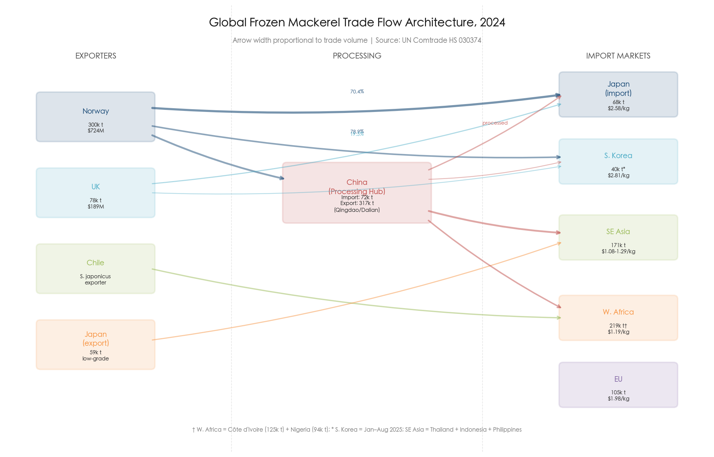

**Figure 5.3** Global frozen mackerel (HS 030374) trade flow architecture in 2024. Arrow width is proportional to trade volume. China functions as the central processing hub, importing 72,000 tonnes of raw material while re-exporting 317,000 tonnes of processed product. Source: UN Comtrade.

In 2024, the top three exporters of frozen mackerel (HS 030374) by value were Norway (USD 724.4 million / 300,131 tonnes), China (USD 443.8 million / 316,548 tonnes), and the United Kingdom (USD 189.2 million / 77,882 tonnes). The unit value differential is revealing: Norwegian exports averaged USD 2.41/kg, reflecting premium product destined overwhelmingly for Japan and South Korea, while Chinese exports averaged USD 1.40/kg and Japanese exports USD 1.10/kg — the latter consisting largely of small, low-fat domestically landed mackerel redirected to Southeast Asian and African buyers [World Bank WITS](https://wits.worldbank.org/trade/comtrade/en/country/ALL/year/2024/tradeflow/Exports/partner/WLD/product/030374 "UN Comtrade 2024 export data").

Chile occupied a distinct niche as the principal Pacific Rim exporter of chub mackerel proper (*S. japonicus*), with frozen mackerel export prices ranging from USD 1.17 to USD 1.93/kg during 2024–2025. Chilean product was directed overwhelmingly to West Africa — Côte d'Ivoire, Nigeria, Cameroon, Burkina Faso, and Ghana — where it competed on price with Chinese reprocessed product [World Bank WITS](https://wits.worldbank.org/trade/comtrade/en/country/CHL/year/2024/tradeflow/Exports/partner/ALL/product/030374 "Chile exports 2024") [FAO GlobeFish](https://seafood.media/fis/worldnews/worldnews.asp?monthyear=9-2025&day=23&id=135841&l=e&country=61&special=&ndb=1&df=0 "FAO GlobeFish Small Pelagics Report, Sep 2025").

### 5.1.2 The Import Landscape: A Tiered Price Hierarchy

The import side reveals a sharply stratified global market. In 2024, the five largest importers of frozen mackerel by value were: the European Union (USD 207.4 million / 104,988 tonnes), Japan (USD 174.5 million / 67,714 tonnes), China (USD 161.3 million / 71,589 tonnes), Côte d'Ivoire (USD 148.2 million / 124,889 tonnes), and Egypt (USD 142.3 million / 63,787 tonnes). Average import unit values ranged from USD 2.58/kg in Japan to USD 1.19/kg in Côte d'Ivoire and USD 1.08/kg in Indonesia, reflecting entirely different product quality tiers within the same HS code [World Bank WITS](https://wits.worldbank.org/trade/comtrade/en/country/ALL/year/2024/tradeflow/Imports/partner/WLD/product/030374 "UN Comtrade 2024 import data"). Figure 5.1 visualizes this tiered price hierarchy across the top ten import markets.

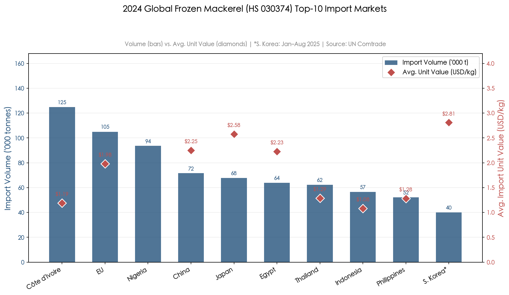

**Figure 5.1** Top ten global frozen mackerel (HS 030374) import markets in 2024, ranked by volume (bars) with average import unit value superimposed (diamonds). The price hierarchy spans from South Korea (USD 2.81/kg, January–August 2025 partial data) to Indonesia (USD 1.08/kg). Source: UN Comtrade.

The global frozen mackerel import market contracted sharply in 2024 to 1,155 thousand tonnes (−25.5% year-on-year) valued at USD 18.4 billion (−20.2%), with the five-year CAGR at −3.7% by value and −5.5% by volume. Africa accounted for the largest share of volume decline. Preliminary data for January–September 2025 indicated a modest recovery, with global imports reaching approximately 1.0 million tonnes (+2% year-on-year) valued at USD 1.77 billion [GTAIC](https://gtaic.ai/market-reports/frozen-mackerel-fish-market-nigeria-outlook-in-2026 "GTAIC global section, citing UN Comtrade") [FAO GlobeFish](https://openknowledge.fao.org/bitstreams/8836e5fa-424d-4eb8-ad6a-890c70dff9fc/download "FAO Small Pelagics Q4 2025").

### 5.1.3 Japan's Dual Role: Premium Importer and Low-Grade Exporter

Japan occupies a unique position as simultaneously one of the world's largest importers and a significant exporter of mackerel — but of categorically different products. In 2024, Japan imported 67,714 tonnes of frozen mackerel (Norway 70.4%, UK 19.3%, Ireland 7.3%), consisting almost exclusively of high-fat Atlantic mackerel (individual weight >400 g, lipid content ≥25%) destined for premium domestic applications. Concurrently, Japan exported 58,869 tonnes — overwhelmingly small, low-fat domestically caught Pacific mackerel (≤500 g, lipid content <20%) — directed to Vietnam, Thailand, Egypt, and the Philippines [World Bank WITS](https://wits.worldbank.org/trade/comtrade/en/country/ALL/year/2024/tradeflow/Exports/partner/WLD/product/030374 "WITS 2024") [Promar/NSC 2018](https://www.seafood.no/globalassets/aktuelt/webinar/livemoter-presentasjoner/japan-mackerel-report-promar-2018.pdf "The Mackerel Market in Japan 2018").

This asymmetric trade structure renders Japan a net *quality* importer despite a rough numerical trade balance. The import unit value (USD 2.58/kg) exceeded the export unit value (USD 1.10/kg) by a factor of 2.3×, indicating that Japan upgrades its mackerel supply through international trade — importing premium fish for domestic consumption while disposing of low-grade domestic landings abroad.

By January 2026, this trade dynamic intensified dramatically. Japan's frozen mackerel exports surged 1.8-fold year-on-year to 5,786 tonnes in a single month, at a 34-year-high export price of ¥250/kg (approximately USD 1.67/kg). The shortage of Norwegian supply elevated even low-grade Japanese mackerel into international price competitiveness [SeafoodNews/Minato Shimbun](https://www.seafoodnews.com/Story/1338264/Japans-Mackerel-Export-Increased-1-point-8-fold-Year-on-Year-amid-Norways-Sluggish-Production "Mar 2026").

### 5.1.4 South Korea's Import Surge and Supplier Diversification

South Korea's mackerel import structure underwent rapid transformation in 2025. During January–August 2025, frozen mackerel imports surged 56.1% year-on-year to 40,010 tonnes. Norway remained dominant (78.9% of import value at an average price of USD 2.81/kg), but the number of supplying countries expanded from 5 to 12 as Korean importers sought alternative sources amid Norwegian quota tightening [Tridge News](https://www.tridge.com/news/south-korean-mackerel-prices-soar-import-vol-qkfihb "Sep 2025"). The United Kingdom's share grew notably: shipments to Korea increased almost 250% year-on-year during January–April 2025, a shift attributed to tariff reductions under the Republic of Korea–UK Free Trade Agreement and proactive marketing by British fishing companies [FAO GlobeFish](https://seafood.media/fis/worldnews/worldnews.asp?monthyear=9-2025&day=23&id=135841&l=e&country=61&special=&ndb=1&df=0 "FAO GlobeFish Small Pelagics Report, Sep 2025").

### 5.1.5 China's Dual Identity: Processor and Consumer

China's trade statistics encode a dual identity. In 2024, China imported 71,589 tonnes of frozen mackerel (average USD 2.25/kg) while exporting 316,548 tonnes (average USD 1.40/kg) — a 4.4:1 export-to-import volume ratio. This arithmetic reflects China's role as the world's dominant mackerel processing hub: high-value Norwegian and British raw material enters China for filleting, seasoning, and repacking at facilities concentrated in Qingdao and Dalian, then exits as lower-unit-value finished products bound for diverse global markets [World Bank WITS](https://wits.worldbank.org/trade/comtrade/en/country/ALL/year/2024/tradeflow/Exports/partner/WLD/product/030374 "WITS 2024"). Simultaneously, the Chinese domestic consumption channel absorbed 71,589 tonnes of imports, with Norwegian-origin mackerel imports rising 37% year-on-year in Q1 2025 — driven by growing consumer demand for premium protein [FAO GlobeFish](https://seafood.media/fis/worldnews/worldnews.asp?monthyear=9-2025&day=23&id=135841&l=e&country=61&special=&ndb=1&df=0 "FAO GlobeFish Small Pelagics Report, Sep 2025").

## 5.2 Quota Regimes and Regulatory Supply Constraints

The supply side of global mackerel markets is fundamentally shaped by quota allocations set through multilateral and national regulatory processes. In 2025–2026, these regulatory mechanisms produced an unprecedented simultaneous tightening across both major ocean basins.

### 5.2.1 The Northeast Atlantic: Norway and ICES

The single most consequential supply-side variable for Asian mackerel markets in 2025–2026 has been the progressive tightening of Northeast Atlantic mackerel quotas. Norway's 2025 individual quota was set at approximately 152,000 tonnes — a 34% reduction from the prior year. In September 2025, ICES issued advice recommending a dramatic further reduction of approximately 70% for 2026, to 174,357 tonnes for the entire Northeast Atlantic — the lowest advised level since 1998 [Undercurrent News](https://www.undercurrentnews.com/2025/09/30/ices-advises-dramatic-slash-to-northeast-atlantic-mackerel-advice-for-2026/ "Sep 2025").

The four coastal states (Norway, EU, UK, Faroe Islands) ultimately agreed on a 2026 TAC of 299,010 tonnes — substantially above the ICES advice (by 72%) but still representing a reduction exceeding 100,000 tonnes from 2025 levels. Norway's individual quota for 2026 was set at approximately 85,500 tonnes, a 44% cut from 2025 [SeafoodSource](https://www.seafoodsource.com/news/supply-trade/four-northeast-atlantic-coastal-parties-agree-on-2026-mackerel-quotas-shares-eu-left-out-again "Dec 2025"). Northeast Atlantic mackerel has been classified as subject to overfishing since at least 2010 and lost MSC certification in 2019, a consequence of persistent overexploitation driven by the inability of coastal states to agree on allocation shares [Easyfish](https://www.easyfish.net/en/frozen-atlantic-mackerel-supply-sourcing-guide-2025/ "2025 Sourcing Guide").

The market impact was immediate and historic. Norwegian whole frozen mackerel (<600 g) export prices, which had taken 19 years (2004–2023) to climb from NOK 10 to NOK 20/kg, broke through NOK 30, 40, and 50/kg in the single year of 2025. In January 2025, Norwegian exports reached a record NOK 30/kg (approximately USD 2.98/kg), and by October 2025, the CFR price to Japan peaked at USD 5.50–5.60/kg [Caharbor/NSC](https://www.caharborfood.com/news/mackerel-prices-have-broken-historical-highs-a-85389055.html "Citing NSC data, Jan 2026"). Norway's 2025 mackerel export volume fell 34% to approximately 208,000 tonnes, yet export value reached a record NOK 8.5 billion (approximately USD 770 million) — crystallizing a structural transformation from a high-volume commodity to a low-supply, high-value strategic seafood product [Caharbor/NSC](https://www.caharborfood.com/news/mackerel-prices-have-broken-historical-highs-a-85389055.html "Jan 2026").

### 5.2.2 The Northwest Pacific: Japan and NPFC

Japan's domestic TAC system for Pacific chub mackerel has undergone parallel tightening. The FY2024 (July 2024–June 2025) Pacific coastal area quota stood at approximately 350,000 tonnes. In May 2025, the Fisheries Agency announced a 60% reduction for FY2025, setting the new Pacific coastal TAC at 139,000 tonnes — a compromise between the scientific recommendation for an 80% cut and industry resistance from purse seine operators and processing companies [Seafood Media](https://seafood.media/fis/worldnews/worldnews.asp?monthyear=5-2025&day=8&id=134501&l=e&country=152&special=&ndb=1&df=0 "Japan to Cut Pacific Mackerel Catch Quota by 60% in FY 2025, May 2025"). The Sea of Japan and East China Sea quota was maintained at approximately 220,000 tonnes. Actual catches had already fallen well below quotas: preliminary FY2023 landings (chub and blue mackerel combined) totaled approximately 260,000 tonnes — less than half the level of five years prior [Seafood Media](https://seafood.media/fis/worldnews/worldnews.asp?l=e&id=134047&ndb=1 "NHK/Fisheries Agency, Mar 2025").

At the multilateral level, the North Pacific Fisheries Commission (NPFC) adopted CMM 2024-07, setting the Convention Area (high-seas) catch limit at 100,000 tonnes for 2024, with Chinese Taipei's annual TAC at 66,740 tonnes. For 2025, the revised CMM 2025-07 reduced the Convention Area ceiling to 66,740 tonnes — a 33% reduction — reflecting continued concern over declining catches during 2022–2024 [NPFC CMM 2025-07](https://www.npfc.int/system/files/2025-06/CMM%202025-07%20For%20Chub%20Mackerel.pdf "NPFC 2025") [NPFC CMM 2024-07](https://www.npfc.int/system/files/2025-03/NPFC-2025-COM09-WP04%20Rev.1%20CMM%202024-07%20for%20Chub%20Mackerel%20By%20Japan_0.pdf "Japan proposal, Mar 2025").

### 5.2.3 The Dual Squeeze: Simultaneous Atlantic and Pacific Tightening

The convergence of Northeast Atlantic and Northwest Pacific quota reductions in 2025–2026 constitutes an unprecedented dual supply squeeze. Figure 5.2 illustrates the temporal alignment of quota tightening across both basins and the corresponding price response.

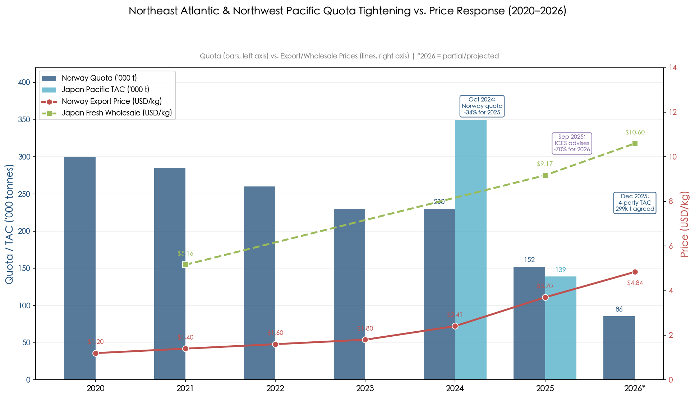

**Figure 5.2** Progressive tightening of Norwegian mackerel quotas and Japanese Pacific stock TAC (bars, left axis) alongside the synchronized escalation of Norwegian export prices and Japanese fresh mackerel wholesale prices (lines, right axis), 2020–2026. Vertical annotations mark three pivotal policy events. Source: NSC, Japan Fisheries Agency, Tridge.

Japan's total mackerel supply — the sum of domestic landings, direct imports, and third-country reprocessed imports — has historically averaged approximately 150,000 tonnes annually in import-equivalent terms. Industry sources estimated that as of September 2025, actual procurement stood at only approximately 40,000 tonnes, of which 14,000 tonnes were direct imports and approximately 30,000 tonnes entered via Chinese and Vietnamese processing channels. Full-year 2025 imports were projected at roughly one-third of normal levels [Caharbor](https://www.caharborfood.com/news/mackerel-quota-cuts-send-prices-soaring-in-jap-85262764.html "Oct 2025").

This dual squeeze fundamentally alters the market's pricing dynamics. When a single supply source tightens, buyers can substitute from the other ocean; when both tighten simultaneously, the substitution safety valve closes, and price becomes the sole rationing mechanism.

## 5.3 The Processing Industry: China as the Global Hub

### 5.3.1 The Third-Country Processing Model

The modern mackerel value chain serving the Japanese and Korean markets is built upon a third-country processing model in which raw material caught in one ocean basin is shipped frozen to processing facilities in a second country, transformed into consumer-ready products, and re-exported to the final destination market. Approximately 75% of mackerel processing for the Japanese market takes place in China (principally Qingdao and Dalian), with Vietnam accounting for approximately 14%, Thailand 6%, and Indonesia 5% [Promar/NSC 2018](https://www.seafood.no/globalassets/aktuelt/webinar/livemoter-presentasjoner/japan-mackerel-report-promar-2018.pdf "The Mackerel Market in Japan 2018, pp.12–14").

This geographic dispersion of processing reflects labor cost arbitrage: Chinese and Vietnamese facilities offer substantial cost advantages in the labor-intensive operations of filleting, deboning, seasoning, and vacuum packaging. The USDA Foreign Agricultural Service confirmed in its 2025 China Fisheries report that China remains the global processing hub for mackerel, salmon, cod, and herring, with total aquatic product output reaching 74.1 million tonnes (+4% year-on-year) in 2024 and seafood imports of 4.4 million tonnes valued at USD 17.7 billion [USDA FAS](https://www.fas.usda.gov/data/china-2025-china-fishery-products-report "GAIN report CH2025-0057, Mar 2025").

China's dual role as processor and consumer is encoded in its trade data. The 4.4:1 export-to-import volume ratio (316,548 tonnes exported versus 71,589 tonnes imported in 2024) reflects a composite of three distinct flows: (a) transit processing of imported Norwegian and British raw material for re-export to Japan and Korea; (b) domestically caught Chinese mackerel processed and exported to Africa and Southeast Asia; and (c) imported premium mackerel retained for domestic consumption. The blended export unit value of USD 1.40/kg — well below the import unit value of USD 2.25/kg — reflects the dominance of the lower-value domestic-catch export stream in the aggregate statistics.

### 5.3.2 Boneless Fillets: The Fastest-Growing Product Category

Within the Japanese market, boneless mackerel fillets (*hone-nashi saba*) have emerged as the fastest-growing product category, propelled by convenience-oriented consumers, the expansion of single-serve meals, and the proliferation of vacuum-packed ready-to-eat products across Japan's 55,000+ convenience stores. Norwegian raw material's share of the boneless fillet segment expanded from approximately 5% in 2013 to over 20% by 2017, with Vietnamese and Indonesian processors increasingly capturing this segment owing to lower processing costs [Promar/NSC 2018](https://www.seafood.no/globalassets/aktuelt/webinar/livemoter-presentasjoner/japan-mackerel-report-promar-2018.pdf "pp.31–32").

The "Japan-processed" label commands a meaningful brand premium. Under this model, partially processed mackerel (filleted and deboned in China or Vietnam) is shipped to Japan for secondary processing — typically the application of miso, mirin, or other traditional seasonings — enabling the final product to carry a "domestically processed" (*kokusan kakou*) designation. This label confers consumer trust and retail shelf placement advantages that translate directly into higher margins [Promar/NSC 2018](https://www.seafood.no/globalassets/aktuelt/webinar/livemoter-presentasjoner/japan-mackerel-report-promar-2018.pdf "pp.18, 34–35").

### 5.3.3 The Japan Value Chain: Four-Tier Distribution

The Japanese mackerel distribution chain operates through a four-tier structure: importers (3–5 major firms, each handling >10,000 tonnes annually) → wholesalers → processors → retail and food service. Approximately 62% of Norwegian-origin mackerel entering Japan passes through third-country processing before arrival, while 37% enters as whole frozen fish for domestic processing. The producer-to-retail markup across this chain averages 4.7–5.4×: a dockside price of USD 1.96/kg translates to a fresh wholesale price of USD 9.17–10.60/kg [Promar/NSC 2018](https://www.seafood.no/globalassets/aktuelt/webinar/livemoter-presentasjoner/japan-mackerel-report-promar-2018.pdf "pp.16–21").

The full supply chain transit time from Norwegian catch to Japanese retail shelf spans approximately three months. The Norwegian autumn fishing season (September–November) determines raw material availability; shipping to China or Vietnam and processing requires 4–6 weeks; distribution to Japanese retail adds another 2–4 weeks. This three-month pipeline means that autumn quota decisions directly influence winter and spring retail prices in the following calendar year [Promar/NSC 2018](https://www.seafood.no/globalassets/aktuelt/webinar/livemoter-presentasjoner/japan-mackerel-report-promar-2018.pdf "p.7").

## 5.4 Price Transmission Mechanisms

### 5.4.1 Quota-to-Price Transmission: The 2025 Case Study

The 2025–2026 price surge provides a near-laboratory case study of quota-to-price transmission across the global mackerel supply chain. The sequence unfolded as follows:

1. **October 2024**: The four coastal states agree on the 2025 Northeast Atlantic mackerel TAC, setting Norway's quota at 152,000 tonnes (−34%).
2. **January 2025**: Norwegian whole frozen mackerel export prices break NOK 30/kg for the first time — a record. January exports surge 46% in volume to 24,402 tonnes and 93% in value to NOK 737 million (USD 73.2 million), as established and new buyers alike rush to secure supply [FAO GlobeFish](https://seafood.media/fis/worldnews/worldnews.asp?monthyear=9-2025&day=23&id=135841&l=e&country=61&special=&ndb=1&df=0 "FAO GlobeFish Small Pelagics Report, Sep 2025").
3. **August–October 2025**: Processing hub inventories in China and Vietnam approach depletion, triggering a second wave of price escalation. Korean wholesale prices for Norwegian frozen mackerel (300/500 g grade) jump 37% in a single month, from KRW 99,500 to KRW 136,000 per box. Norwegian CFR prices to Japan peak at USD 5.50–5.60/kg in October [Tridge News](https://www.tridge.com/news/mackerel-prices-reach-new-highs-supply-chain-vkoitt "Oct 2025") [Seafood Media](https://seafood.media/fis/worldnews/worldnews.asp?monthyear=9-2025&day=18&id=135823&l=e&country=113&special=&ndb=1&df=0 "Sep 2025").
4. **December 2025**: Japanese domestic producer prices surge 60% year-on-year to approximately USD 1.96/kg. Norwegian December export prices jump 67% year-on-year to USD 4.84/kg. Norwegian-to-China export prices surge 95% year-on-year [Seafood Media](https://www.seafood.media/fis/worldnews/worldnews.asp?monthyear=&day=2&id=137099&l=e&special=0&ndb=0 "Feb 2026").
5. **January 2026**: Japan's frozen mackerel export price reaches ¥250/kg — a 34-year high. The Norwegian Seafood Council reports 2025 mackerel export revenue at a record NOK 8.5 billion despite a 34% volume decline [SeafoodNews/Minato Shimbun](https://www.seafoodnews.com/Story/1338264/Japans-Mackerel-Export-Increased-1-point-8-fold-Year-on-Year-amid-Norways-Sluggish-Production "Mar 2026") [Caharbor/NSC](https://www.caharborfood.com/news/mackerel-prices-have-broken-historical-highs-a-85389055.html "Jan 2026").

The observed transmission lag from quota announcement to Asian wholesale price impact was approximately 2–3 months — faster than the physical supply chain transit time of three months, because forward-looking traders adjust procurement behavior and pricing expectations in advance of physical shortages.

### 5.4.2 Asymmetric Price Transmission

Price transmission in the mackerel value chain exhibits notable asymmetry. Cost increases at the import border propagate rapidly to wholesale and retail, but cost decreases — when they occur — are absorbed more slowly. This pattern is consistent with the "rockets and feathers" phenomenon well documented in commodity markets. In early 2026, Japanese importers faced a full-cost import price of USD 6.33–6.40/kg for Norwegian mackerel, yet domestic selling prices of approximately USD 5.82/kg implied that importers were absorbing losses or compressing margins, opting to maintain market share rather than pass through the full price increase immediately. Several major importers adopted a wait-and-see posture, deferring purchases in anticipation of possible price moderation [Seafood Media](https://www.seafood.media/fis/worldnews/worldnews.asp?monthyear=&day=2&id=137099&l=e&special=0&ndb=0 "Mackerel Prices Surge to Record Highs, Feb 2026").

This asymmetry carries structural consequences: when prices eventually stabilize, consumer-facing prices tend to remain elevated as intermediaries rebuild margins, producing a ratchet effect that contributes to the secular upward drift in real mackerel prices.

### 5.4.3 The Norwegian Price Regime Shift

The Norwegian mackerel export sector underwent what amounts to a price regime shift in 2025. For nearly two decades (2004–2023), whole frozen mackerel (<600 g) export prices moved within a narrow band of NOK 10 to NOK 20/kg. In the single year of 2025, prices breached NOK 30, 40, and 50/kg in rapid succession. The Norwegian Seafood Council characterized this as a structural transformation from "affordable fish" to "high-value, low-supply strategic seafood product." With 2026 quotas cutting Norwegian supply by a further 44%, the NSC has warned that prices are unlikely to return to pre-2025 levels in the foreseeable future [Caharbor/NSC](https://www.caharborfood.com/news/mackerel-prices-have-broken-historical-highs-a-85389055.html "Citing NSC data, Jan 2026").

## 5.5 Substitution Dynamics with Competing Species

### 5.5.1 Limited Cross-Species Substitutability in Premium Markets

The degree to which rising mackerel prices can be moderated through substitution with competing species is a central question for the market outlook, and the answer differs sharply by market segment. In Japan and South Korea's premium markets, substitution between Atlantic mackerel and Pacific mackerel is itself constrained by fundamental quality differences: Atlantic mackerel (*S. scombrus*) typically carries 25–30% lipid content, while domestically landed Pacific mackerel (*S. japonicus*) ranges from 13–20% depending on season and body condition. These species occupy distinct price tiers and culinary applications. Atlantic mackerel dominates the *shio-saba* (salted fillet) segment and high-end convenience-store products, while Pacific mackerel serves the canned and export segments. Short-term cross-substitution between the two is limited by consumer perception and product specification requirements [Promar/NSC 2018](https://www.seafood.no/globalassets/aktuelt/webinar/livemoter-presentasjoner/japan-mackerel-report-promar-2018.pdf "p.24") [Easyfish](https://www.easyfish.net/en/frozen-atlantic-mackerel-supply-sourcing-guide-2025/ "Competing species section").

In food service and institutional channels — school lunches, corporate canteens, convenience store *bento* — where mackerel has traditionally provided an affordable protein option, procurement managers facing sustained price escalation have demonstrated willingness to substitute away from mackerel entirely, but toward Chilean silver salmon (*Oncorhynchus kisutch*) or Alaska pollock rather than toward lower-grade mackerel. This pattern suggests that the relevant substitute is determined more by price-per-portion than by species similarity [Promar/NSC 2018](https://www.seafood.no/globalassets/aktuelt/webinar/livemoter-presentasjoner/japan-mackerel-report-promar-2018.pdf "p.24").

### 5.5.2 Africa and the Horse Mackerel Alternative

In West African markets, the substitution calculus differs entirely. Horse mackerel (*Trachurus* spp.) represents the primary substitute for frozen mackerel in markets such as Nigeria, Ghana, and Côte d'Ivoire, where both species serve as affordable protein staples and consumers exhibit high price sensitivity. Peruvian frozen block mackerel (8–14 pieces/kg) trades in European reference markets at USD 0.82–0.93/kg, while horse mackerel occupies a similar price band [INFOPESCA](https://www.infopesca.org/sites/default/files/complemento/boletines/5520/EPR/EPR_MAY_2025.pdf "European Price Report, May 2025"). When mackerel prices rise, consumption shifts toward horse mackerel, sardine, or herring — all of which compete within the same affordable-protein niche.

Nigeria's mackerel import trajectory illustrates this price sensitivity. From a peak of 238,700 tonnes in 2020, Nigerian frozen mackerel imports contracted to 93,614 tonnes by 2024 — a five-year CAGR of −10.4% — driven by naira depreciation and declining purchasing power rather than by reduced demand for fish protein [GTAIC](https://gtaic.ai/market-reports/frozen-mackerel-fish-market-nigeria-outlook-in-2026 "GTAIC Nigeria, citing UN Comtrade"). Côte d'Ivoire's 2024 imports of 124,889 tonnes largely reflect its function as a transit hub for redistribution to landlocked Sahelian countries (Burkina Faso, Mali, Niger), where mackerel represents one of the most affordable animal protein sources.

### 5.5.3 The Sardine-Mackerel Substitution in Canned Products

In the global canned fish market, sardines and mackerel compete directly. Total global canned small pelagic imports in 2024 reached 643,468 tonnes, of which sardines accounted for 315,688 tonnes (49%), mackerel 153,413 tonnes (24%), and herring 131,791 tonnes (20%). During Q1 2025, global canned mackerel imports declined 4.4% to 34,575 tonnes, while canned sardine imports also fell 6.6% to 71,681 tonnes — suggesting common demand-side or macroeconomic headwinds rather than species-specific dynamics [FAO GlobeFish](https://seafood.media/fis/worldnews/worldnews.asp?monthyear=9-2025&day=23&id=135841&l=e&country=61&special=&ndb=1&df=0 "FAO GlobeFish Small Pelagics Report, Sep 2025").

## 5.6 Demand-Side Drivers

### 5.6.1 Japan: Declining Per Capita Consumption, Resilient Mackerel Demand

Japan's per capita seafood consumption has been in secular decline for two decades, falling from 40.2 kg/year in FY2001 to 23.0 kg/year in FY2021 [nippon.com](https://www.nippon.com/en/guide-to-japan/g02239/ "Japan's Shrinking Fish Consumption, Feb 2023"). Against this backdrop, mackerel has maintained its cultural and commercial position more successfully than many other species, benefiting from health-conscious consumer trends centered on omega-3 content, the convenience-store revolution featuring vacuum-packed *saba* products, and a strong traditional identity in regional cuisines.

Japan's mackerel consumption circa 2017 reached approximately 271,000 tonnes in whole-fish equivalent (WFE), structured by product form as follows: fresh 15%, salted (*shio-saba*) 70%, miso-glazed 8%, and other seasoned products 7%. Norwegian-origin mackerel supplied an estimated 57% of total consumption (up from 44% in 2014), while domestically caught mackerel accounted for the remainder. A critical qualification applies: only approximately 20% of domestic landings entered human consumption channels, with 50% exported and 30% diverted to feed and fertilizer. This diversion reflects a quality threshold — small, low-fat fish (the dominant catch composition in recent years) cannot meet the specifications for human food channels and are therefore shunted into low-value industrial uses [Promar/NSC 2018](https://www.seafood.no/globalassets/aktuelt/webinar/livemoter-presentasjoner/japan-mackerel-report-promar-2018.pdf "pp.7, 9, 10, 19, 26, 30").

### 5.6.2 South Korea: Inelastic Demand and Cultural Embeddedness

In South Korea, mackerel occupies a position of exceptional cultural significance, earning the colloquial epithet *bada-ui bori* ("barley of the sea") — a designation reflecting its historical role as the most accessible marine protein for ordinary households. This deep cultural embedding produces highly inelastic demand. The 2025 market provided a natural experiment: wholesale prices surged approximately 40% in a single month (August–September), yet import volumes simultaneously increased 56% year-on-year during January–August — reflecting structural demand strength rather than speculative inventory building [Tridge News](https://www.tridge.com/news/south-korean-mackerel-prices-soar-import-vol-qkfihb "Sep 2025").

The affordability crisis drew national media attention when average retail prices for imported salted mackerel reached KRW 10,363 (approximately USD 7.16) per two-fish pack in December 2025, compared with KRW 6,803 in 2023 — a 52% increase over two years. Domestic production had simultaneously collapsed, with monthly output falling 61.5% year-on-year. The Korea Maritime Institute characterized the situation as a convergence of import-dependency, currency weakness (the won averaged KRW 1,422/USD in 2025, the weakest since the 1998 Asian financial crisis), and structural supply shortage [Korea Times](https://www.koreatimes.co.kr/economy/20260106/koreas-beloved-mackerel-becomes-unaffordable-amid-dwindling-supply-weak-won "Jan 2026").

### 5.6.3 Southeast Asia: The Rising Market

Southeast Asia represents the most dynamic growth segment for mackerel trade. In 2024, frozen mackerel imports reached 62,330 tonnes in Thailand (USD 80.5 million), 56,621 tonnes in Indonesia (USD 61.4 million), and 52,231 tonnes in the Philippines (USD 66.9 million). These markets absorb both Japanese-origin low-grade mackerel and Chinese reprocessed product at significantly lower unit values (USD 1.08–1.29/kg) than East Asian premium markets [World Bank WITS](https://wits.worldbank.org/trade/comtrade/en/country/ALL/year/2024/tradeflow/Imports/partner/WLD/product/030374 "UN Comtrade 2024"). The January 2026 surge in Japanese mackerel exports to Thailand and Vietnam — a 1.8-fold year-on-year increase — indicates that rising Norwegian prices are redirecting Japanese low-grade mackerel exports toward these expanding Southeast Asian markets [SeafoodNews/Minato Shimbun](https://www.seafoodnews.com/Story/1338264/Japans-Mackerel-Export-Increased-1-point-8-fold-Year-on-Year-amid-Norways-Sluggish-Production "Mar 2026").

### 5.6.4 West Africa: Volume Decline and Purchasing Power Constraints

West Africa's mackerel import trajectory reflects constrained purchasing power rather than saturated demand. Nigeria's import contraction from 238,700 tonnes (2020) to 93,614 tonnes (2024) coincided with naira devaluation that approximately doubled the local-currency cost of dollar-denominated imports. Côte d'Ivoire's apparently stable volume of 124,889 tonnes reflects its role as a redistribution hub rather than a final consumption market. The net effect has been a geographic rebalancing of the global mackerel trade away from Africa and toward Asia — driven not by Asian demand growth outpacing African demand, but by Africa's inability to compete at rising world prices [GTAIC](https://gtaic.ai/market-reports/frozen-mackerel-fish-market-nigeria-outlook-in-2026 "GTAIC Nigeria").

### 5.6.5 Aquaculture Feed and Fishmeal Demand

Mackerel's role in aquaculture feed constitutes a secondary but structurally significant demand driver. Global fishmeal production through October 2025 increased approximately 29% year-on-year, consistent with IFFO's full-year estimate of 5.6 million tonnes, driven by Peru's strong anchovy seasons and recovering production in other regions. Aquaculture fishmeal consumption in 2025 was estimated to exceed 2024 levels, supported by improved profitability across several farmed species [IFFO](https://www.iffo.com/global-fishmeal-and-fish-oil-production-year-year "IFFO Market Intelligence, 2025") [SeafoodSource](https://www.seafoodsource.com/news/aquaculture/iffo-surveys-find-global-fishmeal-fish-oil-production-has-increased-so-far-in-2025 "IFFO surveys, 2025").

In the Japanese mackerel supply chain, approximately 30% of domestic landings — consisting overwhelmingly of small, low-fat individuals unfit for human consumption — are diverted to feed and fertilizer [Promar/NSC 2018](https://www.seafood.no/globalassets/aktuelt/webinar/livemoter-presentasjoner/japan-mackerel-report-promar-2018.pdf "p.30"). This diversion channel provides a price floor for low-grade mackerel and links mackerel economics to the broader fishmeal market. When fishmeal prices rise — as occurred in 2024–2025 amid aquaculture expansion — the opportunity cost of diverting mackerel to human consumption increases for the lowest-quality segments, effectively raising the entry price for human-food-grade mackerel.

## 5.7 Synthesis: Why the Current Price Regime Is Structural

The convergence of factors documented in this chapter indicates that the 2025–2026 mackerel price escalation represents not a transient spike but a structural regime shift in market economics. The argument rests on five pillars.

**First, supply constraints are simultaneous and regulatory in origin.** Both the Northeast Atlantic (Norway −44% for 2026) and the Northwest Pacific (Japan −60% for FY2025, NPFC −33% for the Convention Area) are tightening quotas on the basis of stock assessment evidence. These are not weather-related disruptions that reverse in the next season; they reflect multi-year biological trajectories requiring sustained catch reductions.

**Second, the processing infrastructure amplifies rather than dampens price shocks.** The three-month pipeline from Norwegian catch to Asian retail shelf creates a lag that delays supply responses to price signals, while the concentration of processing in a small number of Chinese and Vietnamese facilities creates bottleneck risk when raw material supplies contract.

**Third, demand inelasticity in the two largest import markets — Japan and South Korea — means that price increases produce relatively small volume adjustments.** Korea's "volume-up, price-up" paradox of 2025 provides the most vivid illustration: even at 37% monthly price surges, import volumes continued to grow.

**Fourth, substitution options are structurally limited in premium markets.** Atlantic and Pacific mackerel occupy distinct quality niches; the nearest functional substitute in food service is Chilean silver salmon, not a lower grade of mackerel. In price-sensitive African markets, substitution toward horse mackerel and sardine occurs, but this shifts the burden rather than resolving the supply deficit.

**Fifth, the Norwegian mackerel sector has undergone a permanent value reorientation.** The 2025 record of NOK 8.5 billion in export revenue from 34% less volume signals that producers, exporters, and the Norwegian Seafood Council are actively optimizing for value per kilogram rather than total volume — a strategic posture that aligns producer incentives with sustained high prices.

We assess that the structural floor for Japanese fresh mackerel wholesale prices has shifted upward to approximately USD 8–10/kg, with limited prospect of reversion to the USD 5–6/kg levels of the early 2020s absent a major stock recovery in both ocean basins.

# Synthesis — Correlating Marine Environment, Resource Quality, Market Dynamics, and Fishery Economics

The preceding five chapters have established, in sequence, the biological foundations of chub mackerel (*Scomber japonicus*) fisheries across the Pacific Rim (Chapter 1), the steep and sustained price escalation in wholesale markets from Japan to South America (Chapter 2), the interannual decline in body size, condition factor, and lipid reserves that has degraded the commercial quality of landed fish (Chapter 3), the oceanographic forcing mechanisms — SST anomalies, Kuroshio variability, ENSO, and PDO — that drive stock distribution and biological productivity (Chapter 4), and the market-economic architecture of supply chains, quota regimes, processing hubs, and demand structures that translate biological supply into price outcomes (Chapter 5). Each of these dimensions has been examined largely in isolation; the task of this chapter is integration.

The core analytical contribution is a seven-step causal pathway that traces how an oceanographic perturbation propagates through the biological and economic system. We identify the time lags at each link, evaluate the strength and nature of evidence for each causal connection, confront the "biomass–quality paradox" that reconciles record stock abundance with record wholesale prices, assess implications for fishery management and market forecasting, and provide a forward outlook through September 2026.

## 6.1 The Absence of an Integrated Model — and Why Synthesis Must Be Assembled from Components

No unified quantitative model currently connects climate forcing, biological stock dynamics, and market economics for Pacific Rim chub mackerel. A 2018 global review identified 35 integrated ecological-economic fisheries models (IEEFMs) applied to various fish stocks, yet none addressed Pacific mackerel; the economic sub-models in most IEEFMs employed static price functions incapable of capturing the supply-driven price volatility characteristic of small pelagic species [Nielsen et al. 2018](https://onlinelibrary.wiley.com/doi/full/10.1111/faf.12232 "Fish and Fisheries 19:1–29"). The closest analogue — Nøstbakken's (2006) cost-structure model for Norwegian pelagic fisheries — addressed fleet economics rather than the environment-to-market transmission chain [Nøstbakken 2006](https://ideas.repec.org/a/taf/applec/v38y2006i16p1877-1887.html "Applied Economics 38(16):1877–1887").

The synthesis presented here therefore assembles findings from three independent research streams that, taken together, span the full causal chain:

- **(a) Climate forcing → spawning habitat suitability and recruitment:** Wang et al. (2022) and Li et al. (2025) establish the statistical links between basin-scale climate modes, regional Temperature Suitability Indices, and year-class strength [Wang et al. 2022](https://www.frontiersin.org/journals/marine-science/articles/10.3389/fmars.2022.996626/full "Frontiers in Marine Science 9:996626") [Li et al. 2025](https://www.sciencedirect.com/science/article/pii/S1385110124000947 "J. Sea Research 203:102561").
- **(b) Density-dependent growth, body condition, and stratification effects:** Kamimura et al. (2021), Watanabe & Yatsu (2004), and Zhen & Ito (2024) quantify how population density and ocean stratification suppress individual growth and condition [Kamimura et al. 2021](https://academic.oup.com/icesjms/article/78/9/3254/6380055 "ICES J. Mar. Sci. 78(9):3254–3264") [Watanabe & Yatsu 2004](https://spo.nmfs.noaa.gov/sites/default/files/pdf-content/2004/1021/watanabe.pdf "Fisheries Bulletin 102:196–206") [Zhen & Ito 2024](https://onlinelibrary.wiley.com/doi/10.1111/faf.12818 "Fish and Fisheries").
- **(c) Catch composition → product quality → wholesale price:** Trade statistics, industry intelligence, and the Promar/NSC (2018) value-chain analysis document how the size and lipid content of landed fish determine product-tier allocation and price formation [Promar/NSC 2018](https://www.seafood.no/globalassets/aktuelt/webinar/livemoter-presentasjoner/japan-mackerel-report-promar-2018.pdf "The Mackerel Market in Japan 2018").

The integration is necessarily qualitative-to-semi-quantitative: we identify direction, magnitude, and approximate lag at each link, but acknowledge that formal econometric testing of the full chain remains a priority for future research.

## 6.2 The Seven-Step Causal Pathway: From Climate Forcing to Market Outcome

We propose a seven-step causal framework that traces how large-scale climate variability propagates through the chub mackerel system. Figure 6.1 provides a schematic overview of this pathway, with color-coded domains (environmental, biological, economic) and annotated time lags at each transition.

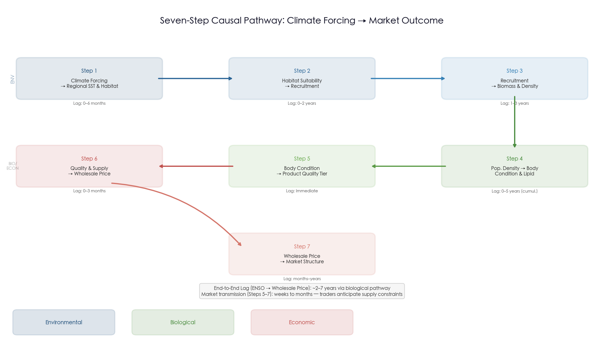

**Step 1: Climate forcing → Regional SST and habitat (lag: 0–6 months).** Basin-scale modes — ENSO, PDO, and secular ocean warming — modulate the position and intensity of the Kuroshio and Oyashio boundary currents, determining the temperature and productivity fields across the Northwest Pacific. Gradient forest analysis demonstrates that these large-scale indices exert negligible direct statistical influence on mackerel abundance; their effect operates entirely through regional Temperature Suitability Indices (TSI) centered on the species' 18°C spawning optimum [Wang et al. 2022](https://www.frontiersin.org/journals/marine-science/articles/10.3389/fmars.2022.996626/full "Figure 5"). The Kuroshio Large Meander, which persisted from August 2017 to approximately April 2025 — the longest on the instrumental record — restructured coastal thermal regimes for nearly eight years, illustrating how mesoscale current dynamics can override basin-scale climate signals [Miyama 2025](https://www.spf.org/opri/en/newsletter/600_3.html "OPRI Ocean Newsletter No.600, Dec 2025").

**Step 2: Habitat suitability → Recruitment (lag: 0–2 years).** The TSI directly governs spawning success and larval survival. Regime shifts in TSI — detected via Rodionov STARS at 5% significance — have coincided precisely with the major stock collapses of the late 20th century: the Pacific coast NSTSI shifted in 1979/1980, synchronous with the stock's collapse from 1,207,000 t (FY1978) to 27,767 t (FY1990); the East China Sea ESTSI and Tsushima Strait JSTSI shifted in the late 1990s, coinciding with TWC stock decline [Wang et al. 2022](https://www.frontiersin.org/journals/marine-science/articles/10.3389/fmars.2022.996626/full "Figures 3–4"). ARDL-ECM modeling confirms that SSTA exerts a significant positive influence on age-0 abundance (short-term P < 0.05, long-term P < 0.001), establishing the statistical link between thermal conditions and year-class strength [Li et al. 2025](https://www.sciencedirect.com/science/article/pii/S1385110124000947 "J. Sea Research 203:102561").

**Step 3: Recruitment → Biomass and population density (lag: 1–3 years).** Strong year classes accumulate into high total biomass with a lag of 1–3 years as recruits enter the exploitable population. The Pacific stock's biomass surged from approximately 2 million tonnes in the mid-2000s to 5,595,000 t in FY2018 — the highest since 1970 — driven by several strong consecutive year classes, most notably the 2013 cohort [FRA Japan 2019](https://www.fra.go.jp/shigen/fisheries_resources/meeting/peer_review_meeting/files/2020/assess_masaba_p.pdf "FRA Section 4/Summary").

**Step 4: Population density → Body condition and lipid content (lag: concurrent to cumulative over 2–5 years).** High population density triggers intraspecific (and interspecific) competition for finite zooplankton resources, suppressing individual growth, body condition, and fat reserves. The structural equation model (SEM) of Kamimura et al. (2021) demonstrated significant negative direct effects of conspecific mackerel abundance (Nm) on the relative condition factor (Kn) across Q1, Q2, and Q3, with sardine abundance (Ns) exerting additional negative effects in Q2 and Q4. The 2013 year class, which entered a population at near-record biomass, exhibited markedly lower asymptotic fork length — L∞ of 339.9 mm versus 440.5 mm for the 2006 year class — a 23% reduction within a single decade [Kamimura et al. 2021](https://academic.oup.com/icesjms/article/78/9/3254/6380055 "ICES J. Mar. Sci. — Figures 4, 5, 7").

Watanabe & Yatsu (2004) established that the density effect on growth rate (coefficient = −0.21) substantially exceeded the SST effect (coefficient = −0.008), and that the size disadvantage incurred at age-0 persists throughout life (r = 0.83 between age-0 FL and age-1 FL) [Watanabe & Yatsu 2004](https://spo.nmfs.noaa.gov/sites/default/files/pdf-content/2004/1021/watanabe.pdf "Tables 5–6"). Zhen & Ito (2024) added a further dimension, demonstrating that ocean stratification amplifies these density effects: the vertical temperature difference between the surface and 200 m increased significantly during 2007–2014 compared to 1982–1989, suppressing nutrient mixing and prey availability. This produced a synchronous body weight decline across 17 Northwest Pacific small pelagic populations (correlation with total biomass: r = −0.84 to −0.85, adjusted P < 0.05) [Zhen & Ito 2024](https://onlinelibrary.wiley.com/doi/10.1111/faf.12818 "Fish and Fisheries").

**Step 5: Body condition → Product quality tier (lag: immediate upon capture).** The condition and size of individual fish at capture determine their entry point in the market value hierarchy. In the Japanese market, this hierarchy spans at least four tiers with order-of-magnitude price differentials:

- **Premium fresh/sashimi** (>USD 10/kg wholesale): fish >500 g with >20% lipid content.
- **Domestic frozen products** (USD 5–7/kg): 300–500 g, moderate lipid.
- **Export-grade frozen** (USD 1–2/kg): <500 g, low lipid.
- **Feed/fertilizer** (<USD 1/kg): undersized or very low-lipid fish.

Japanese domestic landings circa 2017 followed a stark quality distribution: only approximately 20% entered human consumption, 50% was exported (predominantly to Southeast Asia and Africa), and 30% was diverted to feed and fertilizer — reflecting quality thresholds below which fish cannot meet food-grade specifications [Promar/NSC 2018](https://www.seafood.no/globalassets/aktuelt/webinar/livemoter-presentasjoner/japan-mackerel-report-promar-2018.pdf "pp.7, 9, 10, 19, 26, 30"). By 2024–2025, multiple Japanese processing firms — including Kinoya Ishinomaki Suisan and Iwate Prefecture producers — suspended canned mackerel production entirely because fish of adequate size could no longer be procured [Asahi Shimbun 2025](https://www.asahi.com/ajw/articles/16122566 "Poor catches cut canned mackerel production in half"). The biological degradation of body condition documented in Chapter 3 thus translates directly into a contraction of the exploitable product mix, concentrating market supply in the premium tier while inflating prices across all segments.

**Step 6: Product quality and supply volume → Wholesale and import prices (lag: 0–3 months for domestic, 2–3 months for imports).** Prices respond to both the quantity and the quality composition of available supply. Chapter 2 documented a doubling of Japan's fresh mackerel wholesale price from USD 5.16/kg (2021) to USD 10.60/kg (Q1 2026) [Tridge Fresh Chub Mackerel Japan](https://www.tridge.com/market-overview/fresh-chub-mackerel/JP "Fresh Chub Mackerel Japan Market Overview 2026"). Chapter 5 demonstrated that the quota-to-price transmission lag from Norwegian quota announcements to Asian wholesale price impact was approximately 2–3 months — faster than the three-month physical supply chain pipeline because forward-looking traders adjust procurement behavior anticipatorily [Promar/NSC 2018](https://www.seafood.no/globalassets/aktuelt/webinar/livemoter-presentasjoner/japan-mackerel-report-promar-2018.pdf "p.7"). The 2025 case study provided a near-laboratory demonstration: Norway's 34% quota cut (announced October 2024) triggered sequential price surges from January 2025 (Norwegian export prices breaking NOK 30/kg) through October 2025 (CFR Japan peaking at USD 5.50–5.60/kg), culminating in Japan's December 2025 producer price surge of 60% year-on-year [Seafood Media](https://www.seafood.media/fis/worldnews/worldnews.asp?monthyear=&day=2&id=137099&l=e&special=0&ndb=0 "Mackerel Prices Surge to Record Highs, Feb 2026").

**Step 7: Wholesale prices → Market structure adjustment (lag: months to years).** Sustained price escalation forces structural adaptations across the global mackerel trade. These include supplier diversification (Korea expanding from 5 to 12 frozen mackerel source countries in 2025), trade flow reorientation (Japan's low-grade mackerel exports to Southeast Asia surging 1.8-fold in January 2026), consumer substitution behavior (Korean retail mackerel prices reaching 1.5× their 2023 level by December 2025), and geographic rebalancing of global trade away from price-sensitive African markets toward inelastic-demand East Asian buyers [Tridge News](https://www.tridge.com/news/south-korean-mackerel-prices-soar-import-vol-qkfihb "Sep 2025") [SeafoodNews/Minato Shimbun](https://www.seafoodnews.com/Story/1338264/Japans-Mackerel-Export-Increased-1-point-8-fold-Year-on-Year-amid-Norways-Sluggish-Production "Mar 2026"). Nigeria's frozen mackerel imports contracted from 238,700 t (2020) to 93,614 t (2024), yielding a five-year CAGR of −10.4% — a decline driven not by diminishing demand for fish protein but by naira depreciation that rendered dollar-denominated mackerel unaffordable [GTAIC](https://gtaic.ai/market-reports/frozen-mackerel-fish-market-nigeria-outlook-in-2026 "GTAIC Nigeria, citing UN Comtrade").

## 6.3 The Biomass–Quality Paradox: Why Record Stock Abundance Coexists with Record Prices

One of the most counterintuitive findings emerging from the synthesis of Chapters 1–5 is the coexistence of historically high stock biomass with historically high wholesale prices. The Pacific stock biomass reached 5,595,000 t in FY2018 — the highest since 1970 — yet Japanese fresh mackerel wholesale prices have risen almost continuously since 2021, reaching USD 10.60/kg by Q1 2026 [FRA Japan 2019](https://www.fra.go.jp/shigen/fisheries_resources/meeting/peer_review_meeting/files/2020/assess_masaba_p.pdf "FRA Section 4") [Tridge Fresh Chub Mackerel Japan](https://www.tridge.com/market-overview/fresh-chub-mackerel/JP "2026").

This paradox dissolves when the unit of analysis shifts from aggregate tonnage to per-capita quality. At high biomass, density-dependent growth suppression reduces mean body weight, fork length, and lipid content per individual fish. The FRA noted that average body weight of the Pacific stock was "notably lower" in FY2018 compared to 2011–2014, especially for the 2013 year class, attributing this to high abundance and offshore distribution into poorer feeding areas [FRA Japan 2019](https://www.fra.go.jp/shigen/fisheries_resources/meeting/peer_review_meeting/files/2020/assess_masaba_p.pdf "FRA — Age and growth section"). Kamimura et al. (2021) quantified the decline: the asymptotic fork length (L∞) for Pacific stock year classes fell from 440.5 mm (2006 cohort) to 339.9 mm (2016 cohort) — a 23% reduction in a single decade [Kamimura et al. 2021](https://academic.oup.com/icesjms/article/78/9/3254/6380055 "ICES J. Mar. Sci.").

The economic consequence is that what matters for price formation is not biomass per se, but the supply of *market-grade* fish — individuals exceeding the size, weight, and lipid thresholds required by specific product segments. Figure 6.2 illustrates the value hierarchy and the >10× price differential between the highest and lowest tiers.

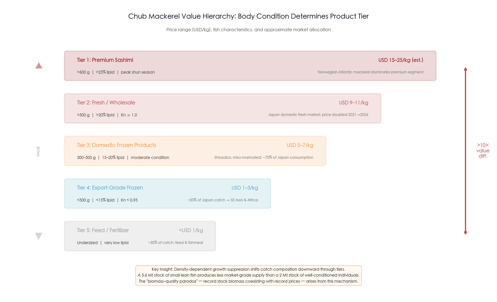

A 5.6-million-tonne stock dominated by small, lean fish produces less market-grade supply than a 2-million-tonne stock of well-conditioned, larger individuals. The producer-to-wholesale markup of 4.7–5.4× amplifies this quality differential: a fish downgraded from fresh-wholesale grade (>USD 10/kg) to export/feed grade (<USD 1/kg) undergoes a >10× value destruction. The 2024–2025 Japanese fishery experience confirmed this mechanism: FY2023 landings of approximately 271,000 t were nearly half the level of five years prior, and the catch was dominated by small, low-fat fish, yet prices surged to records — it was the collapse of *quality-weighted* supply, not total supply, that drove the price response [Asahi Shimbun 2025](https://www.asahi.com/ajw/articles/16122566 "2025").

This biomass–quality paradox has a direct historical analogue in the 1976–1990 period analyzed by Watanabe & Yatsu (2004). When the Pacific stock collapsed from 5.9 million tonnes (1977) to approximately 200,000 tonnes (1990), the relaxation of density dependence produced the largest individual fish in the entire 28-year time series. The inverse relationship between stock size and individual quality is thus a robust, long-term structural feature of chub mackerel population dynamics — not a transient anomaly. This finding carries a critical implication: conventional fishery management frameworks that optimize for biomass maximization may inadvertently degrade per-capita quality and, through the value hierarchy mechanism, reduce the aggregate economic value of the fishery.

## 6.4 Evidence for Environment-to-Price Linkages: Five Converging Lines of Indirect Evidence

No published study has directly regressed mackerel wholesale prices against oceanographic variables. Nonetheless, five converging lines of evidence — drawn from climate science, fisheries biology, ecological economics, and global productivity analysis — support the existence of environment-to-price transmission.

**Line 1: Climate-driven stock collapses produce supply shocks with clear price consequences.** The 1979/1980 TSI regime shift on the Pacific coast coincided with a 98% decline in catch over a decade [Wang et al. 2022](https://www.frontiersin.org/journals/marine-science/articles/10.3389/fmars.2022.996626/full "Figures 3–4"). Although wholesale price data from that era are limited, the well-documented 1972/73 Peruvian anchovy collapse — when El Niño-driven habitat disruption caused catch to plummet by 60% within a year — and the 1997/98 skipjack tuna price crash of 60% following El Niño-driven spatial redistribution provide classic demonstrations that oceanographic regime shifts propagate into market prices within 1–3 years [Lehodey et al. 2006](https://journals.ametsoc.org/view/journals/clim/19/20/jcli3898.1.xml "J. Climate 19:5009–5030").

**Line 2: Body condition mediates between environment and market value.** Lipid content — strongly positively correlated with the relative condition factor Kn — directly determines both the market segment and price tier of landed mackerel. The seasonal pattern documented by Yatsu et al. (2019), with fat content (Fc) and condition factor (Cf) peaking in September–January and troughing in March–August, maps precisely onto the seasonal wholesale price cycle: Japan's winter *shun* season (December–February) commands peak prices, while summer months record the annual low [Yatsu et al. 2019](https://www.jstage.jst.go.jp/article/jsfo/83/1/83_19/_article/-char/en "Bull. JSFO 83(1):19–27") [FAO GlobeFish](https://www.fao.org/in-action/globefish/news-events/news/news-detail/rising-popularity-on-norwegian-mackerel-in-japan/en "Mar 2025"). The Norwegian mackerel price premium over Pacific mackerel further illustrates this mechanism: Atlantic mackerel commanded USD 5.50–5.60/kg CFR Japan in October 2025 versus approximately USD 1.96/kg dockside for Pacific mackerel in December 2025. This differential is fundamentally a lipid-content premium, as Norwegian fish carry 25–30% lipid versus 13–20% for Pacific mackerel [Easyfish 2025](https://www.easyfish.net/en/frozen-atlantic-mackerel-supply-sourcing-guide-2025/ "Sourcing Guide") [Seafood Media](https://www.seafood.media/fis/worldnews/worldnews.asp?monthyear=&day=2&id=137099&l=e&special=0&ndb=0 "Feb 2026").

**Line 3: Seafood prices as ecological indicators.** Smith et al. (2017) demonstrated that Gulf of Mexico shrimp prices revealed the economic impact of hypoxic dead zones — an ecological disturbance — by skewing the size distribution of harvested shrimp toward smaller individuals, which traded at lower prices. The mechanism is directly parallel to the chub mackerel case: an environmental perturbation (hypoxia for shrimp; density-dependent growth suppression amplified by stratification for mackerel) degrades body size, which then propagates into market prices through size-graded pricing [Smith et al. 2017](https://www.pnas.org/doi/10.1073/pnas.1617948114 "PNAS 114(7):1512–1517").

**Line 4: Climate-driven price volatility.** Pincinato et al. (2020) analyzed small pelagic fish prices across 55 Large Marine Ecosystems from 1950 to 2006 and found that price volatility increased significantly in tropical and sub-polar regions after 1979 — the same breakpoint identified in the Pacific mackerel TSI regime shift. The variation in landings was a more important determinant of price volatility than the average level of landings, establishing that climate-induced harvest instability propagates into price uncertainty for small pelagics as a group [Pincinato et al. 2020](https://link.springer.com/article/10.1007/s10584-020-02755-w "Climatic Change 161:591–599").

**Line 5: Ocean warming erodes maximum sustainable yield.** Free et al. (2019) analyzed 235 fish populations globally from 1930 to 2010 and found that ocean warming had reduced MSY by an average of 4.1%, with the East China Sea — a core mackerel fishing ground — among the regions experiencing the largest warming-driven declines (15–35% reduction in fisheries productivity for East Asian ecoregions) [Free et al. 2019](https://www.science.org/doi/10.1126/science.aau1758 "Science 363:979–983"). Reduced MSY constrains the sustainable supply available to markets, creating upward pressure on prices that is structural rather than cyclical.

Taken together, these five lines of evidence — spanning regime-shift-driven supply collapses, condition-mediated quality-to-price transmission, ecological-economic parallels, econometric demonstration of climate-driven price volatility, and MSY erosion — establish a robust, multi-method case that oceanographic variability propagates into mackerel market economics. The absence of a single formal Kn-to-price regression for *S. japonicus* represents a data gap, not an evidence gap: the convergence of independent, methodologically diverse findings is strong.

## 6.5 Time-Lag Architecture of the Causal Chain

The practical utility of the seven-step framework depends on understanding the time lags at each link, which determine how far in advance market outcomes can be anticipated from environmental signals. Figure 6.3 provides a synchronized multi-panel visualization of the key variables — climate indices, stock biomass, body condition metrics, and wholesale prices — that makes the lag structure visually apparent across the historical record.

Synthesizing the lag estimates embedded in the literature reviewed across Chapters 1–5, we construct the following lag architecture:

| Step | Link | Estimated Lag | Key Source |
|------|------|---------------|------------|
| 1 | Climate mode → Regional SST | 0–6 months | Wang et al. 2022; Li et al. 2025 |
| 2 | SST/TSI → Recruitment (age-0) | 0–2 years | Wang et al. 2022; Li et al. 2025 |
| 3 | Recruitment → Exploitable biomass | 1–3 years | FRA Japan 2019 |
| 4 | Biomass/density → Body condition | Concurrent; cumulative 2–5 years | Kamimura et al. 2021; Watanabe & Yatsu 2004 |
| 5 | Body condition → Product quality tier | Immediate at capture | Promar/NSC 2018; Easyfish 2025 |
| 6 | Supply quality/quantity → Wholesale price | 0–3 months (domestic); 2–3 months (imports) | Promar/NSC 2018; Tridge News Oct 2025 |
| 7 | Wholesale price → Market structure adjustment | Months to years | Korea Times Jan 2026; GTAIC Nigeria |

The total end-to-end lag from an ENSO event to a wholesale price response thus ranges from approximately 2 years (via the fast biological pathway: ENSO → SST → recruitment → biomass → condition → price) to as long as 5–7 years for the full density-dependent growth effect to manifest in market-grade supply composition. The market transmission component (Steps 5–7), by contrast, operates on a compressed timescale of weeks to months, because traders anticipate biological supply constraints and adjust procurement ahead of physical shortages.

This asymmetry — slow biological signal, fast market response — means that price signals can serve as early economic indicators of environmental change, consistent with the broader finding of Smith et al. (2017) that seafood prices contain ecological information [Smith et al. 2017](https://www.pnas.org/doi/10.1073/pnas.1617948114 "PNAS 114(7):1512–1517").

An important qualification applies: the ENSO-to-price pathway operates through a "biological integrator" (Steps 2–4) that is inherently nonlinear and nonstationary. Wang et al. (2022) demonstrated that threshold GAMs consistently outperformed stationary GAMs for TSI–abundance relationships, indicating that the mackerel's biological response to environmental forcing contains abrupt breakpoints rather than smooth, predictable gradients [Wang et al. 2022](https://www.frontiersin.org/journals/marine-science/articles/10.3389/fmars.2022.996626/full "Figure 6"). This nonstationarity places a fundamental limit on the forecasting horizon: while the *direction* of environmental influence on mackerel markets is well established, its *magnitude* under novel climate states — such as the unprecedented combination of record global SST, strongly negative PDO, and post-Kuroshio-Large-Meander reorganization prevailing in 2025–2026 — cannot be reliably extrapolated from historical relationships.

## 6.6 The 2025–2026 Conjuncture: A Real-Time Case Study

The period April 2025 through March 2026 provides an exceptionally instructive real-time case study in which all seven steps of the causal chain are simultaneously visible.

**Environmental forcing (Steps 1–2).** The study period unfolded against a backdrop of weak La Niña transitioning to ENSO-neutral, with NOAA CPC projecting a 62% probability of El Niño development by June–August 2026 [NOAA CPC](https://www.cpc.ncep.noaa.gov/products/analysis_monitoring/enso_advisory/ensodisc.shtml "Mar 2026"). The PDO remained in negative phase since January 2020, reaching an extreme monthly value of −4.0σ in July 2025 before moderating to −0.42 by February 2026 [NOAA NCEI PDO](https://www.ncei.noaa.gov/access/monitoring/pdo/ "Through Feb 2026"). Despite these nominally "cool" large-scale climate modes, global SST remained at near-record levels: 2025 ranked as the third-warmest year in the NOAA 176-year record (+1.17°C anomaly), and Japan's coastal SST in 2024 was the highest ever recorded [NOAA NCEI](https://www.ncei.noaa.gov/news/global-climate-202513 "Global Climate Report 2025") [MAFF FY2024 White Paper](https://www.maff.go.jp/e/data/publish/White_Paper_on_Fisheries/White_Paper_on_Fisheries_Summary_FY2024_Trends_in_Fisheries_FY2025_Fisheries_Policy.pdf "Section 1"). The most consequential regional oceanographic event was the termination of the record-breaking Kuroshio Large Meander in approximately April 2025, after nearly eight consecutive years of meandering — an event whose implications for larval transport pathways and spawning-ground thermal conditions remain to be fully assessed [Miyama 2025](https://www.spf.org/opri/en/newsletter/600_3.html "OPRI Newsletter No.600").

**Biological response (Steps 3–5).** The Pacific stock experienced declining catches — FY2023 landings of approximately 271,000 t, nearly half the level of five years prior — and the catch has been increasingly dominated by small, low-fat individuals. Multiple canning operations suspended production due to inability to procure fish of adequate size [Asahi Shimbun 2025](https://www.asahi.com/ajw/articles/16122566 "2025"). Korean domestic mackerel production fell 61.5% year-on-year [Korea Times](https://www.koreatimes.co.kr/economy/20260106/koreas-beloved-mackerel-becomes-unaffordable-amid-dwindling-supply-weak-won "Jan 2026"). These biological trends reflect the cumulative consequences of density-dependent growth suppression during the high-biomass years of the mid-to-late 2010s. The 2013 year class, now approximately 12 years old, has carried its size disadvantage throughout its exploitable lifespan — a "cohort memory" effect consistent with the strong age-0-to-adult FL correlations (r = 0.83) documented by Watanabe & Yatsu (2004).

**Market response (Steps 6–7).** The supply-side dual squeeze — Norwegian quota cuts (−34% in 2025, a further −44% in 2026) combined with declining NW Pacific catches and degraded fish quality — produced the most dramatic price surge in at least three decades. Japan's fresh mackerel wholesale price reached USD 10.60/kg in Q1 2026; Korea's retail mackerel prices reached 1.5× their 2023 level; Norwegian frozen mackerel export prices breached NOK 30, 40, and 50/kg in a single year for the first time in history. Norway's 2025 mackerel export revenue reached a record NOK 8.5 billion (approximately USD 770 million) despite a 34% volume decline — confirming the Norwegian Seafood Council's characterization of a structural transformation from "affordable fish" to "high-value, low-supply strategic seafood product" [Caharbor/NSC](https://www.caharborfood.com/news/mackerel-prices-have-broken-historical-highs-a-85389055.html "Jan 2026"). The simultaneous visibility of all seven causal steps during this period provides the strongest real-world validation of the framework proposed in Section 6.2.

## 6.7 Forward Outlook Through September 2026

The forward outlook integrates anticipated oceanographic conditions, biological stock trajectories, and market supply constraints to assess the probable direction of chub mackerel resource quality and market dynamics through September 2026. Each component is examined in turn.

**Oceanographic outlook.** The transition from weak La Niña to ENSO-neutral in spring 2026, with a 62% probability of El Niño by mid-2026, could moderately improve spawning habitat suitability in the Northwest Pacific if the Kuroshio–Oyashio transition zone warms toward the 18°C optimum. The post-Large-Meander Kuroshio reorganization may restore more efficient larval transport pathways from the Izu Islands spawning ground. The Wang et al. (2022) nonstationarity findings, however, necessitate caution: the current combination of record global SST, strongly negative (albeit moderating) PDO, and post-LM current dynamics has no historical analog from which to extrapolate recruitment outcomes with confidence.

**Biological outlook.** Even under optimistic environmental scenarios, any recruitment benefits from improved spawning conditions in 2025–2026 would not enter the exploitable fishery until 2027–2028 at the earliest, given the 1–2 year lag from spawning to recruitment and the additional 1–2 years for recruits to reach market size. The size-at-age deficit accumulated during the high-density 2010s is a biological legacy that will persist in the fishery through at least 2027.

The stock assessment picture is itself contested. The NPFC multi-model assessment (2023 reference) estimated MSY at 400,000–660,000 t with an 88.3% probability of healthy stock status (B₂₀₂₀/B_MSY = 1.40–2.30) [Cai et al. 2023](https://www.mdpi.com/2410-3888/8/2/80 "Stock Assessment Results/Discussion"), but FRA Japan's own assessment yielded a less sanguine picture: SSB/SB_MSY = 0.77 and F/F_MSY = 2.48, indicating that fishing mortality substantially exceeds the sustainable level [FRA Japan 2019](https://www.fra.go.jp/shigen/fisheries_resources/meeting/peer_review_meeting/files/2020/assess_masaba_p.pdf "FRA Summary"). There is thus no near-term prospect of a biological supply recovery sufficient to reverse the quality-weighted supply shortage driving prices.

**Market outlook.** Supply constraints are doubly reinforced across both ocean basins. In the Northeast Atlantic, Norway's 2026 quota stands at approximately 85,500 t (down 44% from 2025), and Norwegian mackerel export volumes are projected to fall to their lowest level in a decade. In the Northwest Pacific, Japan's FY2023 catch was approximately 271,000 t and trending downward, with the NPFC Convention Area catch capped at 100,000 mt. The Norwegian Seafood Council has warned that prices are unlikely to return to pre-2025 levels in the foreseeable future [Caharbor/NSC](https://www.caharborfood.com/news/mackerel-prices-have-broken-historical-highs-a-85389055.html "Jan 2026").

Demand inelasticity in Japan and South Korea — Korea's 2025 "volume-up, price-up" paradox providing the most vivid evidence — means that price increases produce only small volume adjustments in the two largest import markets [Tridge News](https://www.tridge.com/news/south-korean-mackerel-prices-soar-import-vol-qkfihb "Sep 2025"). We assess that the structural floor for Japanese fresh mackerel wholesale prices has shifted upward to approximately USD 8–10/kg through September 2026, with limited prospect of reversion to the USD 5–6/kg levels of the early 2020s absent a major stock recovery in both ocean basins.

## 6.8 Implications for Fishery Management and Climate Adaptation

The causal chain documented in this chapter carries four principal implications for fishery management and climate adaptation strategies across the Pacific Rim.

**First, stock assessment and harvest control rules should incorporate environmental indicators.** The NPFC's inaugural stock assessment (2024–2025) and CMM 2024-07 (100,000 mt Convention Area catch limit for 2024–2025) represent an institutional milestone for Pacific mackerel management. Neither the assessment framework nor the harvest control rule, however, currently incorporates climate variables or environment-linked triggers [NPFC CMM 2024-07](https://www.npfc.int/system/files/2025-03/NPFC-2025-COM09-WP04%20Rev.1%20CMM%202024-07%20for%20Chub%20Mackerel%20By%20Japan_0.pdf "Mar 2025"). FAO Technical Paper 667 (2021) provides the most comprehensive framework for climate-adaptive fisheries management, recommending integration of environmental indicators into harvest control rules, shortened assessment cycles for climate-sensitive stocks, precautionary buffers for regime-shift risk, and dynamic spatial management [FAO TP 667](https://openknowledge.fao.org/server/api/core/bitstreams/d15df88c-9c7c-4514-9ba9-5e6f22cd15a9/content "FAO, 2021"). The spawning-ground TSI, Kuroshio path state, and Oyashio area — all demonstrated to have statistically significant effects on mackerel abundance — are prime candidates for operational inclusion in NPFC and national management frameworks.

**Second, body condition monitoring should be formalized as a management indicator.** The condition factor (Kn) serves as an integrative biological metric that captures the net effect of density, competition, and environmental quality on individual fish. Its decline during the 2010s presaged the market-grade supply shortage that emerged in 2024–2025 by several years. Formal inclusion of Kn — or proxies such as fat content at age — in annual stock assessment reporting, alongside traditional biomass and mortality estimates, would provide early warning of impending quality-driven market disruptions. Yatsu et al. (2005) explicitly recommended incorporating environmental effects into Japanese mackerel management, noting that the species "may have partly recovered from the overexploited state because of favorable environmental recovery" — an observation that underscores the inseparability of environmental and management drivers [Yatsu et al. 2005](https://onlinelibrary.wiley.com/doi/abs/10.1111/j.1365-2419.2005.00335.x "Fish. Oceanogr. 14:263–278").

**Third, management frameworks should address the economic dimension of climate adaptation more explicitly.** Woods et al. (2022) reviewed 1,801 climate adaptation options for fisheries and found that actions were overwhelmingly concentrated on ecological resilience (quota limits, research, enforcement), while "market diversification" and "value chain investment" ranked only at moderate priority — indicating systematic underrepresentation of economic and social dimensions in adaptation planning [Woods et al. 2022](https://academic.oup.com/icesjms/article/79/2/463/6354503 "ICES J. Mar. Sci. 79(2):463–479"). For chub mackerel, where the economic consequences of environmental change are mediated through body condition and product quality rather than through simple biomass reduction, economic indicators — including real wholesale prices, quality-adjusted supply indices, and processing-sector capacity utilization — merit formal integration alongside biological metrics in management decision-making.

**Fourth, the nonstationarity of environment–biology relationships demands adaptive rather than fixed management approaches.** The consistent superiority of threshold GAMs over stationary GAMs in modeling TSI–abundance relationships [Wang et al. 2022](https://www.frontiersin.org/journals/marine-science/articles/10.3389/fmars.2022.996626/full "Figure 6") implies that reference points derived from historical relationships may become unreliable under novel climate states. Management strategies reliant on fixed MSY or F_MSY targets risk systematic under- or over-estimation of sustainable yield as the ocean state evolves. Management strategy evaluation (MSE) frameworks that explicitly test robustness across a range of plausible environmental scenarios — including regime shifts and novel state combinations — offer the most defensible path forward for Pacific mackerel governance.

## 6.9 Methodological Limitations

The synthesis presented in this chapter is subject to seven principal methodological limitations, each of which circumscribes the strength of causal inference that can be drawn from the integrated framework.

1. **Nonstationarity.** The threshold dynamics pervading all environment–biology relationships mean that the causal chain's behavior under the current, historically unprecedented combination of climate states (record SST, negative PDO, post-LM Kuroshio, emerging El Niño) cannot be reliably predicted from any single historical analog.

2. **Absence of an integrated model.** The seven-step causal pathway is assembled from independently published research streams. No formal structural equation model, vector autoregression, or coupled bio-economic simulation connects all seven steps simultaneously; the lag estimates and directional inferences are therefore subject to confounding from unmeasured intermediate variables.

3. **Difficulty disentangling density and climate effects.** Density-dependent growth suppression and climate-driven stratification operate simultaneously and in the same direction (both reduce body condition during high-abundance periods), making it difficult to attribute observed condition declines to a single cause. Kamimura et al. (2021) and Zhen & Ito (2024) provided partial decomposition, but the interaction term remains large.

4. **Economic evidence lacks formal econometric testing.** No Granger causality, cointegration, or VAR analysis links mackerel wholesale prices to biological or oceanographic variables. The price-quality and price-supply relationships documented in Chapters 2 and 5 are based on observed co-movements and industry intelligence rather than formally estimated causal models. Cross-species substitution elasticities remain unquantified.

5. **Biological data gap for 2019–2025.** The most recent peer-reviewed body condition data for the Pacific stock extend only to 2018 (Kamimura et al. 2021) or 2020 (Cai et al. 2022). FRA Japan annual assessment reports (in Japanese) may contain more recent Kn data, but these were not accessible for this analysis. The 2019–2025 period — during which the market-grade supply crisis materialized — thus lacks direct biological documentation in the English-language scientific literature.

6. **Trade data species conflation.** HS code 030374 (frozen mackerel) does not distinguish between *S. japonicus* and *S. scombrus*. Trade flow analysis necessarily encompasses both species, complicating efforts to isolate Pacific chub mackerel-specific market dynamics.

7. **Absence of counterfactual baselines.** We cannot observe what prices would have been absent environmental change, quota cuts, or density-dependent growth suppression. The attribution of price increases to environmental versus regulatory versus demand-side drivers is therefore necessarily inferential rather than experimentally established.

Despite these limitations, the convergence of evidence across multiple independent research streams — biological, oceanographic, and economic — supports the central conclusion of this chapter: marine environmental variability propagates through chub mackerel biology into market economics via a predictable, if nonlinear, causal architecture. The seven-step framework provides an organizing structure for understanding this transmission and a foundation upon which formal integrated models can be constructed as data availability improves.

# 结论与风险提示
