# 执行摘要

Ion trap quantum computing has emerged as one of the two most credible platforms — alongside superconducting circuits — for achieving utility-scale fault-tolerant quantum computation within the next decade. This report provides a comprehensive, evidence-based assessment of the scaling strategies, engineering challenges, error correction approaches, software infrastructure, and competitive dynamics that will determine whether trapped-ion systems can advance from today's 50–100-qubit demonstration systems to the thousand- and million-qubit architectures required for solving real-world problems.

**Current technical baseline.** As of early 2026, Quantinuum's Helios processor operates 98 physical qubits with two-qubit gate infidelity of 7.9 × 10⁻⁴ and single-qubit gate infidelity of 2.5 × 10⁻⁵ — the lowest error rates reported for any production-scale quantum computer. The system delivers 48 error-corrected logical qubits at a nearly 2:1 physical-to-logical qubit encoding ratio, and has demonstrated below-threshold quantum error correction using color codes in collaboration with Microsoft. IonQ's Tempo system claims algorithmic qubit (AQ) 64 with 99.99% single-qubit fidelity, though inter-module entanglement performance remains unverified by peer review. Trapped-ion systems hold record quantum volume (QV ≥ 2²⁰) and coherence times (T₂ > 5,500 seconds for ¹⁷¹Yb⁺), while trailing superconducting platforms in raw qubit count (~10×) and throughput (~1,000×).

**Scaling architecture assessment.** Five principal scaling strategies are under active development, spanning a wide maturity range. The quantum charge-coupled device (QCCD) monolithic architecture (TRL 6–7) is the only commercially deployed paradigm, with Quantinuum's Helios representing the state of the art. Photonic interconnects (TRL 3–4) offer unbounded scalability in principle but face a ~40× gap between the best demonstrated raw entanglement rate (250 Bell pairs/s) and the ~10⁴ pairs/s required for fault-tolerant modular operation, with the highest-fidelity results (97%) achieved at only ~10 pairs/s. Electronic interconnects (TRL 2–3), championed by Universal Quantum, demonstrated proof-of-concept chip-to-chip ion transport in 2024 but have not been integrated with gate operations or error correction. Microwave-driven gates (TRL 4–5) promise to eliminate the laser bottleneck, with Oxford Ionics claiming 99.97% two-qubit fidelity (peer review pending). Integrated photonics (TRL 3–4) addresses on-chip laser delivery but has not yet achieved competitive two-qubit gate fidelities.

**Engineering bottlenecks.** Scaling from ~100 to ~1,000 qubits on a single QCCD chip requires concurrent advances across multiple tightly coupled subsystems: a 20–50× increase in DC control channels (from ~300 to 5,000–10,000), transition from free-space to integrated or microwave-based optical control, management of cumulative motional heating from longer transport paths, and semiconductor-grade fabrication yield across 10 cm × 10 cm trap chips. The WISE wiring architecture and the Innsbruck/AQT chiplet approach represent the most concrete proposals for addressing the control channel and fabrication challenges, respectively.

**Quantum error correction advantage.** Ion traps occupy a distinctive position in the QEC landscape: native all-to-all connectivity enables efficient implementation of color codes, subsystem codes, and potentially quantum low-density parity-check (qLDPC) codes that other platforms cannot natively support. Quantinuum has compiled an unmatched portfolio of QEC demonstrations, including the first real-time fault-tolerant error correction (2021), below-threshold logical qubits (2025), break-even non-Clifford gates (2025), and 94 error-detected logical qubits on Helios (2026). The central limitation is logical clock speed: the 3–5 ms QEC cycle time is roughly 3,000× slower than superconducting systems, though massive parallelism across modules and efficient code selection partially compensate.

**Industry and investment landscape.** Cumulative disclosed funding in ion trap quantum computing exceeds $2 billion, heavily concentrated in Quantinuum (>$1.1 billion, $10 billion valuation) and IonQ (>$600 million raised, NYSE-listed with FY2025 revenue of $130 million). IonQ's $1.075 billion acquisition of Oxford Ionics in 2025 — the largest in quantum computing history — signals strategic convergence toward hybrid microwave-gate plus photonic-interconnect architectures. Government programs, particularly DARPA's Quantum Benchmarking Initiative and the UK's £2 billion quantum commitment, are shifting from R&D funding to procurement-oriented frameworks that impose independent validation on scaling claims.

**Core judgment.** We assess that QCCD monolithic scaling will dominate ion trap quantum computing through at least 2028, with Quantinuum's trajectory from Helios toward Apollo (~2029, targeting thousands of physical qubits and hundreds of logical qubits) representing the most empirically grounded path to fault-tolerant operation. The hybrid QCCD + photonic interconnect architecture is the consensus long-term strategy for scaling beyond ~1,000 qubits, but the remaining ~40× photonic entanglement rate gap (from the best demonstrated raw rate of 250 pairs/s to the ~10⁴ pairs/s target) means modular systems are unlikely to contribute to production-scale operation before 2028–2030. Ion traps are the most likely platform to deliver the first demonstration of fault-tolerant quantum computation at application-relevant scale, based on the combination of highest demonstrated gate fidelities, proven below-threshold QEC, and the most efficient code implementations enabled by native all-to-all connectivity.

---

# 第1章 The Current State of Ion Trap Quantum Computing

Ion trap quantum computing has matured from a physics laboratory demonstration into a commercially deployed technology that, as of early 2026, leads the quantum computing field in gate fidelity, qubit connectivity, and demonstrated error-correction milestones. This chapter establishes a quantitative baseline for the technology's current standing — spanning qubit counts, gate fidelities, coherence times, connectivity architectures, key institutional players, and demonstrated computational results — with an emphasis on developments from April 2025 through April 2026.

## 1.1 The Ion Trap Advantage: Physical Foundations

Trapped-ion quantum computers encode qubits in the internal electronic states of individual atomic ions confined by electromagnetic fields in ultra-high vacuum. This approach confers three fundamental advantages over competing platforms. First, every qubit is physically identical — an intrinsic consequence of atomic physics — eliminating the fabrication variability that constrains solid-state qubits. Second, ions can be laser-cooled to near their quantum-mechanical ground state of motion, enabling high-fidelity entangling gates mediated by shared motional modes. Third, the long-lived hyperfine or optical-qubit states of trapped ions yield coherence times that exceed those of any other scalable qubit modality by orders of magnitude.

These physical properties underpin the field's record performance metrics. The best demonstrated single-qubit gate fidelity stands at 99.9999% (error ~1 × 10⁻⁶), achieved by Harty et al. at Oxford using ⁴⁰Ca⁺ ions [Harty et al., Phys. Rev. Lett. 113, 220501 (2014)](https://doi.org/10.1103/PhysRevLett.113.220501 "Single-qubit gate fidelity 99.9999%, Oxford 2014"). For two-qubit gates, the research record is 99.9(1)% fidelity, measured by Ballance et al. at Oxford using a ⁴³Ca⁺ light-shift gate [Ballance et al., Phys. Rev. Lett. 117, 060504 (2016)](https://doi.org/10.1103/PhysRevLett.117.060504 "Two-qubit gate fidelity 99.9%, Oxford 2016"). Coherence times are similarly unmatched: Wang et al. demonstrated T₂ > 5,500 seconds (~92 minutes) for a ¹⁷¹Yb⁺ hyperfine qubit with dynamical decoupling, while T₁ is effectively infinite for hyperfine ground-state qubits [Wang et al., Nature Communications 12, 233 (2021)](https://doi.org/10.1038/s41467-020-20330-w "T₂ > 1 hour for Yb-171, 2021").

A distinctive architectural feature of trapped-ion systems is native all-to-all connectivity within a single trap zone. Any ion can be entangled with any other ion through shared motional modes, without requiring the SWAP-gate routing overhead inherent to nearest-neighbor architectures such as superconducting transmon processors or neutral-atom arrays. This connectivity advantage translates into concrete algorithmic benefits: an N-qubit quantum Fourier transform requires O(N²) gates on a fully connected ion trap versus O(N³) on a nearest-neighbor grid [Linke et al., PNAS 114, 3305–3310 (2017)](https://doi.org/10.1073/pnas.1618020114 "Ion trap vs. superconducting comparison, PNAS 2017").

## 1.2 Quantinuum: The Performance Leader

Quantinuum — formed from the 2021 merger of Honeywell Quantum Solutions and Cambridge Quantum and now the world's largest integrated quantum computing company — operates the highest-performing commercially available quantum processors as measured by gate fidelity and quantum volume.

### The H2 System

Quantinuum's System Model H2 employs the quantum charge-coupled device (QCCD) "racetrack" architecture, in which ytterbium-171 ions are physically shuttled between dedicated gate, storage, and measurement zones on a single trap chip. The H2 system operates 56 fully connected qubits with two-qubit gate fidelity of 99.8–99.9% (randomized benchmarking), single-qubit gate fidelity exceeding 99.99%, and state preparation and measurement (SPAM) error of approximately 0.3% [Moses et al., Phys. Rev. X 13, 041052 (2023)](https://doi.org/10.1103/PhysRevX.13.041052 "H2 racetrack architecture details").

The system's quantum volume (QV) progression illustrates the pace of improvement in trapped-ion systems. Starting from QV = 2¹⁶ = 65,536 in April 2024 [Quantinuum press release](https://www.quantinuum.com/blog/quantinuum-announces-the-highest-ever-quantum-volume "Quantinuum H2 QV 2^16 announcement, April 2024"), the H2 reached QV = 2²⁰ ≈ 1,048,576 by early 2025 [Quantinuum QV records](https://www.quantinuum.com/blog/quantum-volume-records "Quantinuum QV progression 2024–2025"), QV = 2²³ = 8,388,608 in May 2025, and QV = 2²⁵ = 33,554,432 by September 2025 [Quantinuum QV milestone](https://www.quantinuum.com/glossary-item/quantum-volume "Quantinuum QV = 2^25, September 2025"). This sustained exponential growth in a full-system benchmark — sensitive to qubit count, gate fidelity, connectivity, and coherence simultaneously — is unmatched by any other quantum computing platform.

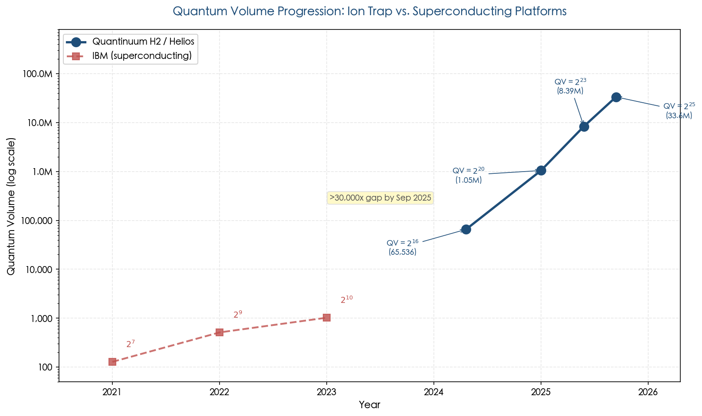

*Figure 1.1. Quantum volume progression on a logarithmic scale for Quantinuum's trapped-ion systems (H2/Helios) and IBM's superconducting platforms (2021–2026). By September 2025, the QV gap between the two architectures exceeded 30,000×, underscoring the fidelity-driven scaling advantage of ion trap systems.*

In September 2025, Quantinuum announced an upgraded H2-1 system expanding from 56 to 72 qubits with comparable gate fidelities and enhanced ion transport protocols [Quantinuum H2-1 announcement](https://www.quantinuum.com/blog/quantinuum-h2-1-upgrade "H2-1 upgrade announcement, September 2025"). Independent benchmarking confirmed that the H2-1 is the only platform to successfully pass a 56-qubit fully connected (FC) benchmark involving 4,620 two-qubit gates, demonstrating that the system retains coherence at a scale that challenges classical simulation [Evaluating QPU performance at large scale, arXiv:2502.06471 (2025)](https://arxiv.org/html/2502.06471v2 "Independent 56-qubit FC benchmark, 2025").

### The Helios System

In November 2025, Quantinuum launched Helios, a next-generation system representing a significant architectural evolution. Helios expands the physical qubit count to 98 — nearly double the H2 — while achieving single-qubit gate fidelity of 99.9975% and two-qubit gate fidelity of 99.921% across all qubit pairs [Quantinuum Helios launch](https://www.quantinuum.com/press-releases/quantinuum-announces-commercial-launch-of-new-helios-quantum-computer-that-offers-unprecedented-accuracy-to-enable-generative-quantum-ai-genqai "Quantinuum Helios launch, November 2025"). A notable design choice is the transition from ytterbium-171 to barium-137 ions, which can be manipulated with visible-light lasers rather than ultraviolet, thereby improving component lifetime and scalability by leveraging mature industrial optical components.

Helios introduces a commercial ion-junction routing system that directs qubits through a ring-shaped storage and computation network, with dedicated memory, cache, and logic zones enabling parallel operations. During a two-month early-access phase, partners including SoftBank Corp. and JPMorgan Chase deployed Helios for applications in finance and materials science [The Quantum Insider, Helios review](https://thequantuminsider.com/2025/11/06/illuminating-helios-quantinuums-shiny-new-quantum-computer-gets-sunny-reception/ "Helios technical review, November 2025").

Most significantly for the scaling trajectory, Helios demonstrated 48 fully error-corrected logical qubits at a nearly 2:1 physical-to-logical qubit encoding ratio, and produced 94 logical qubits fully entangled in one of the largest Greenberger–Horne–Zeilinger (GHZ) states ever recorded. The logical qubits achieved better-than-break-even performance — executing algorithms more accurately than unencoded physical qubits — marking a qualitative milestone in the transition from physical to logical quantum computing.

### Quantinuum–Microsoft Logical Qubit Collaboration

A landmark achievement of the 2024–2025 period was the Quantinuum–Microsoft collaboration on fault-tolerant quantum error correction (QEC) using the H2 system. Published in Nature in 2025, this work realized 12 logical qubits encoded in [[7,1,3]] Steane and [[12,2,4]] color codes, with logical error rates of approximately 2 × 10⁻³ per round — firmly below the error-correction threshold. Transversal CNOT gates between logical qubits exceeded the fidelity of equivalent unencoded operations ("below break-even"), and all operations were executed in real time without post-selection [Microsoft and Quantinuum, Nature (2025)](https://www.nature.com/articles/s41586-025-08684-1 "Below-threshold QEC demonstration, Nature 2025"). This result constitutes the first demonstration on any platform of a fully fault-tolerant universal gate set with repeatable error correction, establishing trapped ions as co-leaders with superconducting systems in the pursuit of practical QEC.

## 1.3 IonQ: Commercial Scale and Modular Vision

IonQ — the first publicly traded pure-play quantum computing company (NYSE: IONQ since October 2021) — pursues a photonic-interconnect modular architecture using ytterbium ions. The company operates commercially via AWS, Microsoft Azure, and Google Cloud, reporting FY2024 revenue of approximately $43 million (up from ~$22 million in FY2023) and a contract backlog exceeding $70 million [IonQ SEC filings](https://investors.ionq.com/sec-filings "IonQ annual financial reports").

The IonQ Forte system, configured as a single-chain 30-qubit trapped-ion computer, achieves an algorithmic qubit (#AQ) score of 36, with two-qubit gate fidelity of approximately 99.4% and single-qubit fidelity exceeding 99.9% [IonQ Forte product page](https://ionq.com/quantum-systems/forte "IonQ Forte specifications"). The Forte system was independently benchmarked in a peer-reviewed study that confirmed all-to-all connectivity and characterized performance across multiple algorithm classes [Benchmarking a trapped-ion quantum computer with 30 qubits, Quantum 2024](https://quantum-journal.org/papers/q-2024-11-07-1516/ "IonQ Forte 30-qubit benchmark").

In September 2025, IonQ announced that its fifth-generation Tempo system — a 100-qubit trapped-ion quantum computer — achieved #AQ 64, three months ahead of the company's roadmap schedule. According to IonQ, the Tempo system demonstrated a 35% improvement in solution quality on QAOA optimization, a 74% improvement on the quantum Fourier transform, and a 182% improvement on a search algorithm relative to competing systems [IonQ AQ 64 announcement](https://investors.ionq.com/news/news-details/2025/IonQ-Achieves-Record-Breaking-Quantum-Performance-Milestone-of-AQ-64/ "IonQ Tempo AQ 64 milestone, September 2025"). IonQ further reported achieving 99.99% single-qubit gate fidelity on the Tempo platform [IonQ Q3 FY2025 earnings](https://futurumgroup.com/insights/ionq-q3-fy-2025-earnings-revenue-beat-aq64-and-99-99-fidelity/ "IonQ Q3 2025 earnings, 99.99% fidelity claim").

A critical caveat applies to these claims. The #AQ metric — IonQ's proprietary benchmark — aggregates performance across six quantum algorithms in a manner that has been criticized for potentially obscuring underlying hardware limitations. As of April 2026, no independent peer-reviewed verification of the Tempo's inter-module entanglement performance or #AQ 64 achievement has been published. Quantinuum has publicly critiqued the #AQ methodology, arguing that plurality voting can mask performance deficiencies [Quantinuum #AQ critique](https://www.quantinuum.com/blog/debunking-algorithmic-qubits "Quantinuum debunking algorithmic qubits"). IonQ's Tempo benchmarks are therefore treated here as credible corporate claims pending independent validation.

## 1.4 Emerging Commercial Players

### Oxford Ionics

Oxford Ionics, a UK-based startup spun out of the University of Oxford, is developing a fundamentally different control paradigm: microwave-driven entangling gates implemented through its proprietary "eQual" chip architecture. By replacing complex laser systems — a recognized scalability bottleneck — with integrated microwave electrodes, this approach promises substantially simpler engineering at scale. In 2024, Oxford Ionics claimed a two-qubit gate fidelity of 99.97%, which would surpass any system-level result reported to date [Oxford Ionics announcement](https://oxfordionics.com/news/oxford-ionics-achieves-record-breaking-qubit-performance "Oxford Ionics 99.97% two-qubit gate claim, 2024"). This claim remains pending peer-reviewed validation as of early 2026, and no system-level benchmarks (quantum volume, CLOPS, or QEC demonstrations) employing the microwave-driven approach have been published. The company secured £30 million in Series A funding in 2024, targeting a commercial processor by 2026–2027 [Oxford Ionics £30M raise](https://oxfordionics.com/news/oxford-ionics-raises-30-million "Oxford Ionics Series A, 2024").

### Universal Quantum

Universal Quantum, based in Brighton, UK, and spun out of the University of Sussex, pursues a modular architecture combining microwave-driven gates with electronic (direct ion transport) interconnects. In contrast to probabilistic photonic links, this approach physically shuttles ions between separate trap chips via electric fields across millimeter-scale gaps — providing a deterministic transfer mechanism. In 2024, the Sussex group demonstrated chip-to-chip ion transport in approximately 100 µs with high fidelity [Stahl et al., Nature Communications (2024)](https://doi.org/10.1038/s41467-024-44986-w "Chip-to-chip ion transport demonstration, Sussex 2024"). Backed by approximately £67 million in Series B funding and guided by a blueprint for a million-qubit system using 2D arrays of X-junction modules [Lekitsch et al., Science Advances 3, e1601540 (2017)](https://doi.org/10.1126/sciadv.1601540 "Sussex blueprint for modular ion trap computer"), Universal Quantum represents a long-term architectural alternative, though the technology remains at an early prototype stage (estimated TRL 2–3).

### AQT (Alpine Quantum Technologies)

AQT (Alpine Quantum Technologies), based in Innsbruck, Austria, operates the PINE system — a compact, rack-mountable, room-temperature trapped-ion quantum computer using calcium-40 ions. Offering up to 24 qubits with two-qubit gate fidelity of approximately 99.0–99.5%, the PINE system is commercially deployed at European high-performance computing (HPC) centers, including the Leibniz Supercomputing Centre (LRZ) in Munich and the Poznań Supercomputing and Networking Center (PSNC) in Poland, where it operates as the PIAST-Q system integrated with classical HPC infrastructure [AQT product page](https://www.aqt.eu/pine-system/ "AQT PINE system specifications") [AQT PIAST-Q deployment](https://quantumcomputingreport.com/eurohpc-ju-inaugurates-piast-q-aqts-trapped-ion-quantum-computer-in-poland-integrated-with-hpc/ "PIAST-Q inauguration, EuroHPC 2025"). AQT has secured over €50 million in funding and participates in the EU Quantum Flagship program, with a roadmap targeting 50+ qubits. Although AQT's gate fidelities trail those of the leading platforms, the company's focus on HPC integration and European sovereign quantum computing infrastructure positions it as a strategically important ecosystem player.

## 1.5 Academic Research Frontiers

University and government laboratory groups continue to advance the fundamental performance boundaries that ultimately feed into commercial systems. Several milestones from the 2024–2026 period warrant particular attention.

### Photonic Interconnect Advances (Duke/Monroe Group)

The Monroe group at Duke University has achieved substantial progress on photonic interconnects — the technology most likely to enable modular scaling of trapped-ion systems beyond single-chip limits. In a March 2025 Nature Communications paper, Saha et al. demonstrated high-fidelity remote entanglement of trapped ¹³⁸Ba⁺ ions mediated by time-bin encoded photons, achieving a Bell state fidelity of 97% (uncorrected for SPAM errors). Critically, the group reported that cumulative improvements over the past two decades have increased photonic entanglement rates by nearly six orders of magnitude, with the most recent systems reaching 250 Hz (250 Bell pairs per second) [Saha et al., Nature Communications 16, 2533 (2025)](https://doi.org/10.1038/s41467-025-57557-4 "97% fidelity remote entanglement via time-bin photons, 2025"). The paper further demonstrated that fundamental fidelity limits imposed by atomic recoil still permit fidelities exceeding 99.9%, and outlined a path to kHz-rate entanglement through cavity-enhanced photon collection, faster qubit operations, and sympathetic cooling. This advance is pivotal: the previous published record of 4.5 Bell pairs per second [Stephenson et al., Phys. Rev. Lett. 124, 110501 (2020)](https://doi.org/10.1103/PhysRevLett.124.110501 "4.5 Bell pairs/sec remote entanglement, 2020") had stood for half a decade, and the ~55× rate improvement substantially narrows the gap toward the ~10⁴ pairs per second estimated as necessary for fault-tolerant modular operation.

### Innsbruck QEC and Fault Tolerance

The Innsbruck group (University of Innsbruck / IQOQI) has been a pioneer in ion-trap QEC demonstrations. Key results include the first realization of fault-tolerant universal gates on a [[7,1,3]] Steane code using 10 ions, in which the fault-tolerant T gate achieved fidelity of 0.898 compared to 0.865 for the non-fault-tolerant version [Postler et al., Nature 605, 675–680 (2022)](https://doi.org/10.1038/s41586-022-04721-1 "Innsbruck fault-tolerant gates, 2022"). The group subsequently demonstrated 16 repeated QEC rounds with a three-fold extension of logical qubit lifetime [Hilder et al., Phys. Rev. X 12, 011032 (2022)](https://doi.org/10.1103/PhysRevX.12.011032 "Innsbruck repeated QEC, 2022"), and fault-tolerant entanglement between two logical qubits using 20 ions at approximately 75–80% Bell state fidelity [Postler et al., PRX Quantum 5, 030326 (2024)](https://doi.org/10.1103/PRXQuantum.5.030326 "Innsbruck logical qubit entanglement, 2024"). Performed on a string-based (non-QCCD) architecture with ⁴⁰Ca⁺ ions, these results complement Quantinuum's QCCD-based demonstrations and confirm that multiple ion-trap configurations can support meaningful error correction.

### NIST and Other Contributions

NIST continues to advance high-fidelity gate techniques with beryllium and magnesium ions, contributing foundational metrology and trap engineering that permeate the broader ecosystem. The NIST group's 2011 demonstration of the first microwave-driven trapped-ion gate [Ospelkaus et al., Nature 476, 181–184 (2011)](https://doi.org/10.1038/nature10290 "First microwave-driven ion gate, NIST 2011") laid the groundwork for the laser-free control approaches now being commercialized by Oxford Ionics and Universal Quantum.

## 1.6 Performance Metrics: A Quantitative Baseline

To provide a consolidated reference for subsequent chapters, the following summarizes the key performance metrics for ion trap systems as of early 2026. Figure 1.2 presents a side-by-side comparison of the principal commercial and near-commercial platforms.

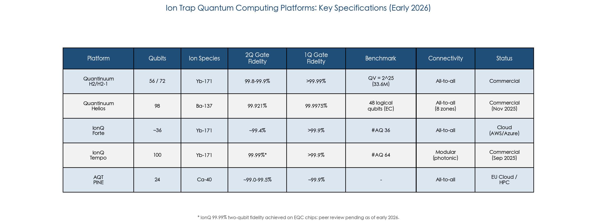

*Figure 1.2. Key specifications of the five major ion trap quantum computing platforms as of early 2026. IonQ Tempo's 99.99% two-qubit fidelity was achieved on EQC chips; peer review remains pending. The "#AQ" metric is IonQ's proprietary benchmark and is not directly comparable to quantum volume.*

### Gate Fidelities

Two-qubit gate fidelity is the single most consequential metric for both near-term algorithm performance and QEC overhead. At the system level, Quantinuum Helios achieves 99.921% across all qubit pairs (randomized benchmarking), while the H2 system records 99.8–99.9%. IonQ Forte reaches approximately 99.4%. In research settings, the Oxford group's 99.9(1)% and Oxford Ionics' claimed 99.97% (peer review pending) define the frontier. Single-qubit gates are uniformly excellent across all platforms: production systems exceed 99.99%, and the research record stands at 99.9999%.

### State Preparation and Measurement (SPAM)

The best SPAM fidelity in research settings corresponds to error below 0.1%, achieved through electron-shelving fluorescence detection [Myerson et al., Phys. Rev. Lett. 100, 200502 (2008)](https://doi.org/10.1103/PhysRevLett.100.200502 "High-fidelity trapped-ion readout, Oxford 2008"). Quantinuum's production H2 system achieves approximately 99.7% SPAM fidelity, and the Helios system has further improved upon this baseline. Although SPAM errors constitute a non-trivial contribution to the total error budget (~0.3% on H2), they generally remain below the two-qubit gate error rate and are therefore not the primary bottleneck for scaling.

### Coherence Times

The T₂ > 5,500-second record for ¹⁷¹Yb⁺ hyperfine qubits provides an enormous margin over gate operation times (typically 50–200 µs for two-qubit gates, 1–10 µs for single-qubit gates). Idle dephasing during typical circuit execution consequently contributes negligible error compared to gate infidelity — a structural advantage of trapped ions that relaxes QEC overhead requirements. The Helios system, which employs ¹³⁷Ba⁺ ions, exhibits shorter native coherence times than the hyperfine-qubit ytterbium systems but still exceeds gate durations by several orders of magnitude.

### Throughput: The Ion Trap Weakness

The principal performance limitation of trapped-ion systems is computational throughput, measured by circuit layer operations per second (CLOPS). Ion trap CLOPS values are estimated at approximately 30–100, compared to thousands or tens of thousands for superconducting platforms [Cross et al., Phys. Rev. A 100, 032328 (2019)](https://doi.org/10.1103/PhysRevA.100.032328 "QV definition"). This 100–1,000× throughput gap arises from intrinsically slower gate speeds (two-qubit gates at ~50–200 µs versus ~20–50 ns for superconducting transmons), ion transport overhead in QCCD architectures (~50 µs per shuttling primitive), and sympathetic cooling requirements (~200–500 µs per recooling cycle). The QED-C benchmarking study confirmed that Quantinuum's H1 system consistently achieved the highest fidelity scores across algorithm benchmarks at ≤20 qubits, albeit with substantially lower throughput [Lubinski et al., IEEE Trans. Quantum Eng. 4, 3100332 (2023)](https://doi.org/10.1109/TQE.2023.3253761 "QED-C benchmark results").

This throughput limitation is significant but partially mitigable through two mechanisms: the lower number of error-correction rounds required (owing to higher per-gate fidelity) and parallelism across multiple gate zones within a QCCD architecture. The H2 system, for instance, achieves 2–4× parallelism across its five gate zones for typical circuits [Moses et al., Phys. Rev. X 13, 041052 (2023)](https://doi.org/10.1103/PhysRevX.13.041052 "H2 parallel scheduling").

## 1.7 Demonstrated Applications and Benchmark Results

Ion trap systems have been employed to demonstrate a growing portfolio of quantum algorithms and application-oriented computations, leveraging their high fidelity and native all-to-all connectivity.

**Quantum chemistry.** Variational quantum eigensolver (VQE) calculations for small molecules (H₂, LiH, H₂O) were among the first application demonstrations, with the Innsbruck group performing some of the earliest ion-trap quantum chemistry experiments [Hempel et al., Phys. Rev. X 8, 031022 (2018)](https://doi.org/10.1103/PhysRevX.8.031022 "Ion trap quantum chemistry, Innsbruck 2018"). More recent work on the Quantinuum H-series has extended to larger molecular systems, with JPMorgan Chase and other partners exploring computational chemistry on the Helios platform.

**Optimization.** The QAOA algorithm has been demonstrated on trapped-ion systems, with the all-to-all connectivity providing a natural advantage for problems with dense interaction graphs. Pagano et al. demonstrated QAOA on a fully programmable trapped-ion system, showing performance advantages from native connectivity [Pagano et al., PNAS 117, 25396 (2020)](https://doi.org/10.1073/pnas.2006373117 "QAOA on trapped-ion system, 2020").

**Random circuit sampling.** Quantinuum has used the H2 system for random circuit sampling benchmarks at 56 qubits, producing results that are classically intractable to verify through direct simulation. The Helios system extended this capability, with benchmarking data showing fidelity levels where classical replication would require computational resources beyond any existing supercomputer.

**Quantum simulation.** Ion trap systems are particularly well suited to quantum simulation of spin models and lattice gauge theories, owing to their long coherence times and programmable long-range interactions. While these demonstrations have not yet reached commercially relevant scale, they validate the hardware's capability for the application class that many experts consider nearest to practical quantum advantage.

**Certified random number generation.** In 2025, Quantinuum partnered with JPMorgan Chase, Oak Ridge National Laboratory, Argonne National Laboratory, and the University of Texas at Austin to generate certifiably random numbers on the H2 system. Described as the first commercial application of a quantum computer, this demonstration produced cryptographic random seeds that were provably impossible to generate classically at the achieved fidelity and scale.

## 1.8 Comparative Position in the Quantum Computing Landscape

As of early 2026, trapped-ion quantum computers occupy a distinctive position in the broader quantum computing ecosystem. Figure 1.3 illustrates this positioning across five key performance dimensions.

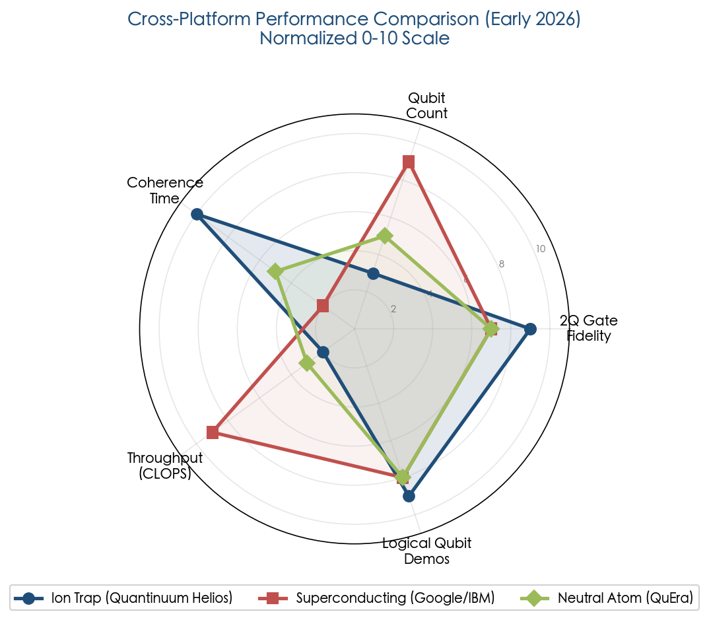

*Figure 1.3. Radar chart comparing ion trap (Quantinuum Helios), superconducting (Google/IBM), and neutral atom (QuEra) platforms across five normalized performance axes. Ion traps lead in gate fidelity, coherence time, and logical qubit demonstrations, while trailing in raw qubit count and throughput.*

They lead in per-gate fidelity (2–5× lower two-qubit error rate than superconducting systems), connectivity (native all-to-all versus nearest-neighbor), and coherence time (T₂ approximately 10,000× longer than superconducting qubits). They trail, however, in raw qubit count (98 for Helios versus 1,121 for IBM's Condor), throughput (CLOPS ~30–100 versus thousands for superconducting platforms), and logical clock speed (QEC cycle ~3–5 ms versus ~1 µs for Google's Willow surface-code demonstration).

In the QEC domain specifically, trapped-ion and superconducting systems are co-leaders, each having demonstrated below-threshold error correction. Quantinuum's 12 logical qubits with below-break-even transversal operations represent the most advanced fault-tolerant demonstration to date, while Google's Willow demonstrated the surface code's exponential error suppression with increasing code distance at far higher clock speed [Acharya et al., Nature (2024)](https://doi.org/10.1038/s41586-024-08449-y "Google Willow below-threshold QEC"). Neutral-atom systems have demonstrated the largest number of logical qubits (48 on a 280-atom array by Harvard–QuEra), but at lower gate fidelity (~99.5%) and measurement fidelity (~99%) [Bluvstein et al., Nature 626, 58–65 (2024)](https://doi.org/10.1038/s41586-023-06927-3 "Harvard-QuEra 48 logical qubits").

On balance, the ion trap platform's combination of leading gate fidelity, demonstrated fault-tolerant error correction, and a clear — if technically demanding — modular scaling path positions it as one of the two most credible candidates, alongside superconducting systems, for achieving utility-scale fault-tolerant quantum computing within the next decade.

# 第2章 Architectural Strategies for Scaling Ion Trap Systems

Scaling ion trap quantum computers from today's 56–98-qubit systems to the thousands or millions of qubits required for fault-tolerant computation demands more than incremental hardware improvements — it requires fundamentally new architectural paradigms for organizing, connecting, and operating large numbers of trapped-ion qubits. Five principal strategies are currently under active development: the quantum charge-coupled device (QCCD) architecture, photonic interconnects, electronic (direct-transport) interconnects, microwave-driven gates, and integrated photonics for on-chip light delivery. Each addresses a distinct facet of the scaling challenge, and their relative maturity spans from commercially deployed systems (QCCD, TRL 6–7) to early laboratory proof-of-concept (electronic interconnects, TRL 2–3).

This chapter surveys these architectural strategies in turn, details their operating principles and current implementation status as of early 2026, and concludes with a structured comparative assessment and an analysis of the hybrid scaling roadmap that has emerged as the consensus near-term strategy across the ion trap community.

## 2.1 The QCCD Architecture: Shuttling Ions on a Single Chip

### 2.1.1 Conceptual Foundation

The quantum charge-coupled device (QCCD) architecture, proposed by Kielpinski, Monroe, and Wineland in 2002, remains the most mature and widely implemented scaling paradigm for trapped-ion quantum computing [Kielpinski et al., Nature 417, 709–711 (2002)](https://doi.org/10.1038/nature00784 "Seminal QCCD proposal, Nature 2002"). Drawing an analogy with classical charge-coupled devices, the design physically transports ions between functionally specialized zones on a single chip using time-varying DC electrode voltages. A QCCD processor incorporates dedicated regions for ion storage, two-qubit gate operations, single-qubit rotations, state measurement, and ion loading. By shuttling small groups of ions — typically pairs — into gate zones for entangling operations and returning them to storage afterward, the architecture achieves effective all-to-all connectivity without requiring simultaneous control of a large ion crystal.

This zone-based approach addresses a fundamental limitation of linear ion chains: as the number of ions in a single chain grows beyond approximately 20–50, the motional mode spectrum becomes dense and increasingly difficult to resolve, gate speeds degrade, and inter-mode crosstalk rises. The QCCD circumvents this bottleneck by maintaining small chains (2–10 ions) in each gate zone while relying on ion transport to bring arbitrary qubit pairs together for entangling operations.

### 2.1.2 Junction Technology and Two-Dimensional Routing

A critical enabler for QCCD architectures is the ability to route ions through junctions — T-junctions or X-junctions — that permit two-dimensional transport across the trap chip. The first reliable demonstration of ion transport through an X-junction was performed at NIST in 2009, achieving greater than 99% transport success with approximately 0.05 quanta of axial motional excitation in ~60 µs [Blakestad et al., Phys. Rev. Lett. 102, 153002 (2009)](https://doi.org/10.1103/PhysRevLett.102.153002 "First reliable X-junction ion transport, NIST 2009"). This milestone established that ions could traverse intersections without catastrophic heating or loss — a prerequisite for any two-dimensional QCCD topology.

Subsequent work has substantially improved both transport speed and fidelity. ETH Zurich demonstrated deterministic single-ion transport over 280 µm in 3.6 µs with less than 0.1 quanta of motional excitation, setting benchmarks for fast, low-noise shuttling [Walther et al., Phys. Rev. Lett. 109, 080501 (2012)](https://doi.org/10.1103/PhysRevLett.109.080501 "Fast ion transport, ETH Zurich"). These laboratory results confirmed that ion shuttling need not constitute a fundamental speed bottleneck, although production systems operate at more conservative speeds to ensure operational robustness.

### 2.1.3 Quantinuum's QCCD Implementation

Quantinuum's H-series systems constitute the most advanced commercial implementation of the QCCD architecture. The H2 system employs a "racetrack" loop topology with five gate zones and 32 storage locations, using ¹⁷¹Yb⁺ qubits alongside ¹³⁸Ba⁺ ions for sympathetic cooling. Any ion pair can be routed to any gate zone, providing effective all-to-all connectivity across all 56 qubits. Transport fidelities exceed 99.99% per primitive operation, with individual shuttling operations completing in approximately 50 µs at speeds of ~4 m/s [Pino et al., Nature 592, 209–213 (2021)](https://doi.org/10.1038/s41586-021-03318-4 "Quantinuum QCCD demonstration, Nature 2021") [Moses et al., Phys. Rev. X 13, 041052 (2023)](https://doi.org/10.1103/PhysRevX.13.041052 "H2 racetrack architecture details").

The Helios system, launched in November 2025, extends the QCCD paradigm to 98 qubits using ¹³⁷Ba⁺ hyperfine qubits — a notable departure from the ytterbium ions used in the H2 generation. Helios features a rotatable ion storage ring connecting two quantum operation regions by a junction, with speed improvements from parallelized operations and a new software stack supporting real-time compilation of dynamic programs. The system achieves average two-qubit gate infidelity of 7.9(2) × 10⁻⁴ and single-qubit gate infidelity of 2.5(1) × 10⁻⁵ across all operational zones — a significant improvement over H2 [Ransford et al., arXiv:2511.05465 (2025)](https://arxiv.org/abs/2511.05465 "Helios: A 98-qubit trapped-ion quantum computer"). The transition to barium ions is architecturally significant: ¹³⁷Ba⁺ can be manipulated with visible-light lasers (493 nm) rather than ultraviolet, extending component lifetimes and enabling the use of mature integrated photonics technology.

### 2.1.4 Scalability Limits of Monolithic QCCD

Despite its maturity, the monolithic QCCD architecture confronts inherent scalability ceilings. Quantinuum envisions hundreds of qubits per chip before requiring multi-chip interconnects, but several factors constrain further growth:

- **Control channel density.** The number of independent DC voltage channels scales roughly proportionally with qubit count. A 1,000-qubit QCCD system may require 5,000–10,000 independent DC channels, demanding advanced CMOS integration or through-silicon-via (TSV) routing that has not yet been validated at this scale.
- **Shuttling overhead.** For two-dimensional architectures, the average number of transport primitives required to bring an arbitrary ion pair together scales as O(√N), so that total shuttling overhead grows with system size [Schoenberger et al. (2024)](https://doi.org/10.48550/arXiv.2401.11730 "Ion shuttling scheduling analysis, 2024").
- **RF drive distribution.** Maintaining uniform trapping potentials across chips larger than approximately 10 cm × 10 cm becomes increasingly difficult as standing-wave effects and electrode-to-electrode impedance variations accumulate.

These constraints suggest a practical ceiling of approximately 100–1,000 qubits for a single QCCD chip, depending on the specific architecture and control technology employed. Reaching beyond this range necessitates inter-chip interconnects — motivating the photonic and electronic approaches discussed in the following sections.

## 2.2 Photonic Interconnects: Networking Trap Modules with Light

### 2.2.1 The Barrett-Kok Protocol and Heralded Entanglement

Photonic interconnects offer a fundamentally different approach to scaling: rather than enlarging a single trap chip, multiple compact QCCD modules are connected via photon-mediated entanglement. The dominant protocol, proposed by Barrett and Kok in 2005, generates heralded remote entanglement through a three-step process: (1) each ion emits a photon entangled with its internal state, (2) the two photons interfere on a beam splitter, and (3) a Bell-state measurement of the photons projects the two ions into an entangled state [Barrett and Kok, Phys. Rev. A 71, 060310(R) (2005)](https://doi.org/10.1103/PhysRevA.71.060310 "Barrett-Kok protocol"). A successful photon detection event "heralds" the creation of an entangled Bell pair between ions in the two modules, whereupon the entanglement can be consumed via quantum gate teleportation to execute non-local two-qubit gates.

The heralded nature of this protocol confers a critical advantage: channel losses reduce only the success rate — not the fidelity — of entanglement generation. Failed attempts simply require repetition without corrupting the quantum information stored in the circuit qubits. This loss-tolerance property renders photonic interconnects compatible with arbitrary inter-module distances, from meters within a laboratory to kilometers across a fiber network, and with quantum repeater architectures for long-range quantum networking.

### 2.2.2 Experimental Progress and the Rate-Fidelity Frontier

The first demonstration of remote ion–ion entanglement via photonic links was achieved by the Monroe group in 2007, producing entangled pairs at approximately 0.01 pairs/s with 87% fidelity [Moehring et al., Nature 449, 68–71 (2007)](https://doi.org/10.1038/nature06118 "First remote ion-ion entanglement, 2007"). By 2020, the Oxford group (Stephenson et al.) had advanced the heralded entanglement rate to 4.5 Bell pairs/s using ⁸⁸Sr⁺ ions with polarization-encoded photons, achieving 94% fidelity — the highest rate published in a peer-reviewed journal for trapped-ion photonic interconnects at that time [Stephenson et al., Phys. Rev. Lett. 124, 110501 (2020)](https://doi.org/10.1103/PhysRevLett.124.110501 "4.5 Bell pairs/sec remote entanglement at 94% fidelity, 2020").

More recently, the Monroe group at Duke achieved rates of 250 s⁻¹ using polarization-encoded photons from ¹³⁸Ba⁺ ions — the fastest entanglement rate between two quantum memories mediated by photons at the time of publication. However, uncontrolled birefringence in the optical elements imposed fidelity limitations on polarization-encoded states. To address this systematic error source, the group developed time-bin encoding protocols immune to polarization rotations. The time-bin approach achieved a heralded Bell state fidelity of 97% — the highest reported for photon-mediated ion–ion entanglement — albeit at a reduced rate of approximately 9.7 s⁻¹ due to the additional sympathetic recooling required between entanglement attempts [Saha, Ph.D. Dissertation, Duke University (2025)](https://iontrap.duke.edu/files/2025/08/2025SahaPhysics-final.pdf "High Fidelity Quantum Networking of Trapped Atomic Ions, Duke 2025").

The Innsbruck group extended photonic interconnects to longer distances, demonstrating ion–ion entanglement over 230 meters using telecom-wavelength-converted photons (converting native 854 nm Ca⁺ emission to telecom C-band at ~1550 nm) with fidelity exceeding 90% [Krutyanskiy et al., Phys. Rev. Lett. 130, 050803 (2023)](https://doi.org/10.1103/PhysRevLett.130.050803 "230m ion entanglement via telecom photons, 2023"). This result holds particular significance for long-distance networking, as telecom-wavelength photons experience minimal fiber attenuation (~0.2 dB/km), enabling inter-module connections over metropolitan-scale distances.

### 2.2.3 From Entanglement to Computation: Distributed Quantum Computing

The Oxford group (Drmota, Main et al.) achieved a landmark result in 2024–2025 by executing the first distributed quantum computation across two photonically interconnected trapped-ion modules separated by approximately 2 meters. Each module contained a ⁸⁸Sr⁺ network qubit (for photonic interfacing) and a ⁴³Ca⁺ circuit qubit (for computation). Using heralded remote entanglement between the network qubits, the team deterministically teleported a controlled-Z gate between the circuit qubits with 86.1(9)% fidelity, then executed Grover's search algorithm — the first implementation of a distributed quantum algorithm comprising multiple non-local two-qubit gates — achieving a 71(1)% success rate. The team further demonstrated distributed iSWAP (70(2)% fidelity) and SWAP (64(2)% fidelity) circuits compiled from 2 and 3 instances of quantum gate teleportation, respectively [Drmota et al., Nature (2025)](https://doi.org/10.1038/s41586-024-08404-x "Distributed quantum computing across an optical network link, Nature 2025").

This experiment confirmed that photonic interconnects can support deterministic, repeatable quantum gate teleportation — a prerequisite for scalable distributed quantum computing. The circuit qubits maintained coherence throughout the probabilistic entanglement generation phase (averaging ~103 ms), with storage fidelities of 98.1(4)% and 98.2(5)% for the two modules. Notably, the dominant error sources were local gate operations (~2–3% per local CZ gate) rather than the remote entanglement itself (~3% infidelity), indicating that improvements in local gate quality within modules would directly translate to higher distributed computation fidelity.

### 2.2.4 The Entanglement Rate Gap

The central challenge for photonic interconnects remains the substantial gap between demonstrated entanglement rates and those required for fault-tolerant quantum computing. Monroe et al. estimated that a modular architecture comprising ~100 modules, each containing ~100 qubits, would require inter-module entanglement rates of approximately 10⁴ Bell pairs/s for fault-tolerant operation [Monroe et al., Phys. Rev. A 89, 022317 (2014)](https://doi.org/10.1103/PhysRevA.89.022317 "Monroe modular architecture, 2014"). Even the fastest demonstrated rates — 250 s⁻¹ with polarization encoding (Duke) or 4.5 s⁻¹ at 94% fidelity (Oxford) — fall roughly 40–50× short of this target. Figure 1 illustrates this progression and the remaining gap.

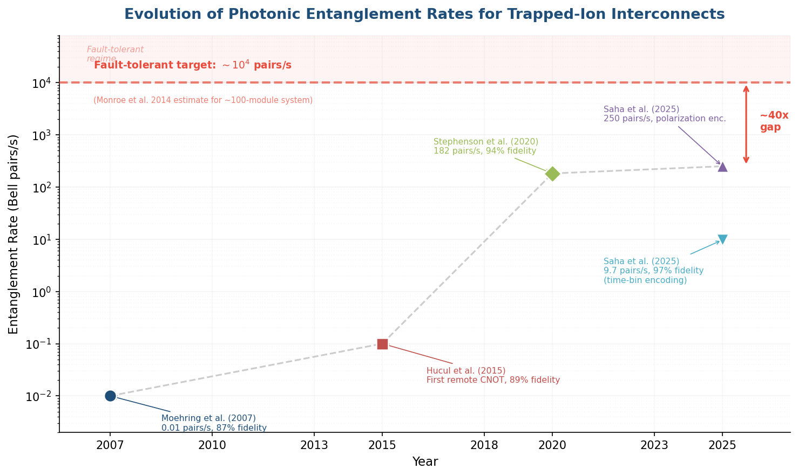

**Figure 1.** Evolution of demonstrated photonic entanglement rates for trapped-ion interconnects (log scale). The ~40× gap between the best demonstrated rate and the fault-tolerant requirement (~10⁴ pairs/s) represents the principal engineering challenge for modular architectures. Data points: Moehring et al. (2007), Hucul et al. (2015), Stephenson et al. (2020), and Saha et al. (2025).

The rate bottleneck arises primarily from low photon collection efficiency. In free-space configurations, typical collection efficiency spans 1–5% of the solid angle, and subsequent fiber coupling, spectral filtering, and detector inefficiencies compound the losses. The per-attempt success probability for the Barrett-Kok protocol is of order 10⁻⁴ in current implementations — the Drmota et al. experiment achieved a success probability of 1.41 × 10⁻⁴ per attempt, requiring 7,084 attempts on average to herald entanglement.

Cavity-enhanced photon collection offers a promising pathway to close this gap. Placing a high-finesse optical cavity around the ion modifies the spontaneous emission pattern, channeling photons preferentially into a single cavity mode and boosting effective collection efficiency from ~1–5% to potentially greater than 50% [Kobel et al., npj Quantum Information 7, 6 (2021)](https://doi.org/10.1038/s41534-020-00338-2 "Ion-cavity coupling for enhanced photon collection"). Combined with improved detector efficiency, higher repetition rates enabled by faster recooling, and multiplexed photonic channels, cavity-enhanced systems could plausibly achieve the 10⁴ pairs/s target — a ~50× improvement that, while substantial, falls within the range of engineering optimization rather than requiring fundamental physical breakthroughs.

IonQ has reported progress toward photonic interconnects in a commercial setting. In October 2024, the company announced it had demonstrated remote ion–ion entanglement between two separate trap wells within a commercially available system — described as the first such demonstration in an enterprise-grade quantum computer [IonQ photonic interconnect announcement](https://www.ionq.com/news/ionq-demonstrates-remote-ion-ion-entanglement-a-significant-milestone-in "IonQ remote ion-ion entanglement, October 2024"). However, specific entanglement rates and fidelities were not disclosed, and no peer-reviewed publication has validated the performance of IonQ's inter-module links as of early 2026.

### 2.2.5 Historical Context: The First Remote Gate

The first remote CNOT gate between trapped ions via a photonic link was demonstrated by Hucul et al. in 2015, achieving approximately 89% fidelity [Hucul et al., Nature Physics 11, 37–42 (2015)](https://doi.org/10.1038/nphys3150 "First remote gate between trapped ions, 2015"). While a significant proof of concept, that demonstration relied on post-selection and did not support the deterministic, repeatable operation necessary for scalable computation. The Drmota et al. (2025) result represents the first fully deterministic implementation and the first execution of multi-gate distributed circuits — advancing photonic interconnects from a demonstration curiosity to a viable architectural component.

## 2.3 Electronic Interconnects: Direct Ion Transport Between Chips

### 2.3.1 The Sussex Blueprint

An alternative to probabilistic photonic links is the deterministic physical transport of ions between separate trap chips via electric fields. This approach, championed by Universal Quantum (a spin-out of the University of Sussex), was articulated in a comprehensive "million-qubit blueprint" published in 2017 [Lekitsch et al., Science Advances 3, e1601540 (2017)](https://doi.org/10.1126/sciadv.1601540 "Sussex blueprint for modular ion trap computer"). The blueprint envisions a two-dimensional array of X-junction modules, each containing a small number of qubits, with ions shuttled between modules across millimeter-scale gaps using carefully shaped electric fields. Combined with microwave-driven gates that eliminate laser systems entirely, the architecture targets a million-qubit system with a footprint comparable to a large server room.

The principal advantage of electronic interconnects is determinism: unlike photonic links, which succeed probabilistically and require repeated attempts, direct ion transport operates with near-unity success probability. This eliminates the need for heralding protocols, entanglement buffering, and the complex scheduling algorithms associated with probabilistic interconnects. Furthermore, the transferred ion carries its full quantum state, enabling direct two-qubit gate operations upon arrival without the overhead of gate teleportation.

### 2.3.2 Experimental Demonstrations

In 2024, the Sussex group achieved the first experimental validation of electronic interconnects by physically shuttling ions between two separate trap chips across a gap of approximately 1 mm, with transport times of approximately 100 µs and high fidelity [Stahl et al., Nature Communications (2024)](https://doi.org/10.1038/s41467-024-44986-w "Chip-to-chip ion transport demonstration, Sussex 2024"). This result confirmed that electric field profiles at the chip boundary can be engineered to maintain ion confinement during the transfer, and that the associated motional excitation remains manageable.

However, the electronic interconnect approach faces significant system-level challenges. The inter-chip gap is limited to millimeter scales by the strength of achievable electric fields, constraining the physical arrangement of modules to tightly packed two-dimensional arrays. No demonstration has yet integrated chip-to-chip transport with high-fidelity gate operations or quantum error correction — the 2024 result characterized only the transport primitive itself. Additionally, the approach has a single primary commercial proponent (Universal Quantum), limiting the diversity of engineering approaches being explored.

### 2.3.3 Electronic vs. Photonic: A Comparison of Inter-Module Strategies

Electronic and photonic interconnects embody fundamentally different engineering trade-offs. Electronic interconnects offer deterministic operation, high bandwidth (potentially one ion transfer per ~100 µs), and no requirement for complex optical infrastructure, but are constrained to short-range connections and demand precise mechanical alignment between chips. Photonic interconnects support arbitrary distances, are compatible with quantum networking and repeater architectures, and permit flexible network topologies, but suffer from low success rates, necessitate complex optical systems, and introduce asymmetric error rates between local and remote operations.

For fault-tolerant quantum computing at scale, the choice between these approaches may ultimately depend on which error correction codes and circuit architectures prove optimal. Distributed surface codes with noisy inter-module links have been shown to support fault-tolerant operation even when inter-module error rates are approximately 10× higher than intra-module rates [Nickerson et al., Nature Communications 4, 1756 (2013)](https://doi.org/10.1038/ncomms2773 "Distributed QEC analysis with noisy links"), relaxing the performance requirements on photonic interconnects. Electronic interconnects, if integrated with high-fidelity gates, could potentially achieve inter-module fidelities comparable to intra-module operations, significantly reducing QEC overhead.

## 2.4 Microwave-Driven Gates: Eliminating the Laser Bottleneck

### 2.4.1 Motivation and Operating Principle

The vast majority of ion trap quantum computers rely on tightly focused laser beams for both single-qubit rotations and two-qubit entangling gates. While this approach has produced the highest gate fidelities to date, it introduces a critical scalability bottleneck: individually addressing 1,000 or more ions with micron-scale laser beams through free-space optics is widely considered infeasible [Debnath et al., Nature 536, 63–66 (2016)](https://doi.org/10.1038/nature18648 "Individual addressing in ion trap QC"). Beam-pointing stability, intensity noise, wavefront aberrations, and the sheer complexity of managing hundreds of optical channels all scale unfavorably with qubit count.

Microwave-driven gates offer an alternative by employing integrated microwave electrodes on the trap chip to drive entangling operations. Because microwave wavelengths (~cm) far exceed inter-ion spacings (~µm), individual addressing requires near-field techniques — specifically, microwave magnetic field gradients generated by current-carrying electrodes in close proximity to the ions. The first demonstration of a microwave-driven two-qubit gate was performed at NIST in 2011 by Ospelkaus et al. [Ospelkaus et al., Nature 476, 181–184 (2011)](https://doi.org/10.1038/nature10290 "First microwave-driven ion gate, NIST 2011"), establishing the physical viability of this approach.

### 2.4.2 Current State and Scaling Implications

Oxford Ionics has emerged as the leading commercial proponent of microwave-driven gates, claiming a two-qubit gate fidelity of 99.97% in 2024 using its proprietary "eQual" chip architecture — which, if independently validated, would represent the highest two-qubit gate fidelity achieved in any system-level demonstration [Oxford Ionics announcement](https://oxfordionics.com/news/oxford-ionics-achieves-record-breaking-qubit-performance "Oxford Ionics 99.97% two-qubit gate claim, 2024"). Universal Quantum also employs microwave-driven gates as part of its electronic-interconnect architecture. Both approaches share the advantage of eliminating laser systems for gate operations entirely, dramatically simplifying the optical infrastructure and potentially enabling room-temperature operation without the elaborate laser setups that currently dominate trapped-ion laboratories.

The scaling implications are significant. If microwave-driven gates can match laser-driven performance at scale, they could enable CMOS-like manufacturing of ion trap processors — with all qubit control signals delivered through integrated electronic channels on the chip, paralleling classical digital circuit fabrication. This vision is compelling but faces open questions: microwave gates have not yet been incorporated into a system-level demonstration with quantum volume, CLOPS, or QEC benchmarks, and the near-field gradient approach requires extremely precise electrode fabrication and calibration that has not been validated at the 100+ qubit scale.

## 2.5 Integrated Photonics: On-Chip Light Delivery

A complementary approach to the laser scalability challenge — distinct from eliminating lasers entirely — is integrating optical components directly onto the trap chip. Mehta et al. at MIT/Sandia demonstrated a fully integrated photonic ion trap with on-chip waveguides and grating couplers for light delivery, achieving single-qubit gate fidelity exceeding 99.5% [Mehta et al., Nature 586, 533–537 (2020)](https://doi.org/10.1038/s41586-020-2823-6 "Integrated photonic ion trap, Nature 2020"). In this approach, laser light is coupled into the chip via optical fibers and distributed to individual ion sites through lithographically defined waveguides, eliminating the need for free-space beam steering entirely.

Integrated photonics preserves the high gate fidelities achievable with laser-driven operations while addressing the individual-addressing bottleneck. The approach is compatible with standard semiconductor fabrication processes, suggesting scalability to thousands of individually addressable ion sites. Recent work has explored integrating these photonic structures with surface traps that also support photon-mediated entanglement, potentially enabling on-chip photonic interconnects between trap zones [Knollmann et al., arXiv:2401.06850 (2024)](https://arxiv.org/abs/2401.06850 "Integrated photonic structures for photon-mediated entanglement of trapped ions, 2024"). However, achieving high-fidelity two-qubit gates with on-chip light delivery — which demands more stringent control of beam intensity, phase, and pointing than single-qubit operations — remains an active area of development. No demonstrated two-qubit gate fidelities with integrated photonics have yet matched the greater than 99.8% achieved routinely with free-space optics.

## 2.6 Hierarchical Scaling: The Monroe-Kim Vision

Monroe and Kim articulated a hierarchical scaling vision in 2013 that synthesizes several of these approaches into a unified architecture spanning multiple length scales [Monroe and Kim, Science 339, 1164–1169 (2013)](https://doi.org/10.1126/science.1231298 "Monroe-Kim scaling vision, 2013"). The framework organizes scaling into four distinct levels, each matched to the interconnect technology best suited to that physical range:

- **Chip level (50–200 qubits):** QCCD architecture with ion shuttling between dedicated zones on a single trap chip, achieving high-fidelity local gates and all-to-all connectivity through transport.
- **Chamber level (hundreds of qubits):** Multiple trap chips within a single vacuum chamber, connected by short-range photonic links or direct ion transport between closely spaced chips.
- **Rack level (thousands of qubits):** Meter-scale fiber-optic connections between vacuum chambers within a single equipment rack, using photonic interconnects for inter-chamber entanglement.
- **Data center level (millions of qubits):** Long-range photonic connections with quantum repeaters linking racks across a facility, enabling the massive qubit counts required for cryptographically relevant computations.

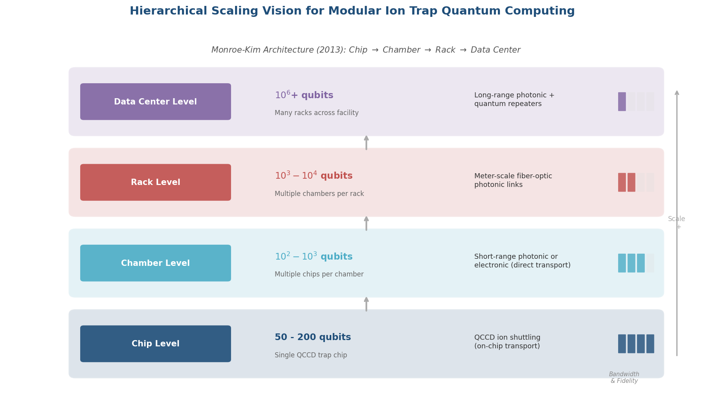

**Figure 2.** The Monroe-Kim hierarchical scaling architecture. Each level employs the interconnect technology best suited to its physical range, with bandwidth and fidelity decreasing at longer distances. QEC codes can be adapted to tolerate the heterogeneous error rates at each level.

This vision has proven influential in shaping the roadmaps of both IonQ (which explicitly pursues photonic-interconnect modular scaling) and the broader academic community. The key insight is that different interconnect technologies are appropriate at different scales: high-bandwidth, high-fidelity QCCD transport for intra-chip connections; medium-bandwidth electronic or short-range photonic links for inter-chip connections within a chamber; and lower-bandwidth photonic links for longer-range connections. QEC codes can be adapted to tolerate the heterogeneous error rates and bandwidths at each level of the hierarchy.

## 2.7 Comparative Assessment of Architectural Paradigms

### 2.7.1 Technology Readiness Levels

A structured comparison of the principal scaling paradigms reveals wide variation in maturity, as summarized in Figure 3.

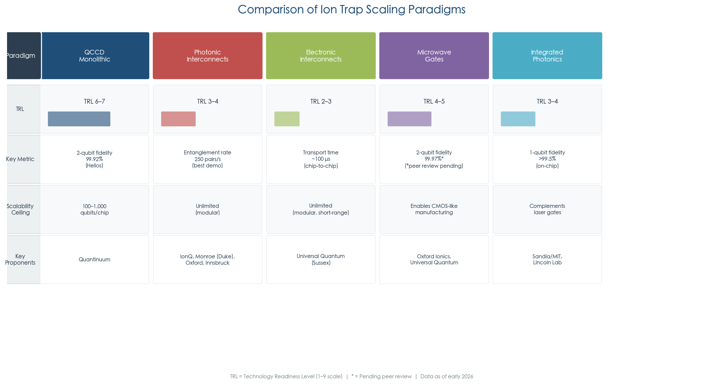

**Figure 3.** Comparative assessment of ion trap scaling paradigms. TRL bars indicate relative technology readiness; key metrics and scalability ceilings are drawn from the best peer-reviewed or manufacturer-reported results as of early 2026.

- **QCCD monolithic (TRL 6–7).** Commercially deployed in Quantinuum H-series (up to 98 qubits on Helios), demonstrated real-time fault-tolerant QEC with 12 logical qubits below threshold, and quantum volume records (QV ≥ 2²⁰). This is the only paradigm with demonstrated system-level quantum computing performance.
- **Photonic interconnects (TRL 3–4).** Laboratory demonstrations of remote entanglement (up to 250 pairs/s at lower fidelity, or 97% fidelity at ~10 pairs/s), distributed quantum computation with 86% gate fidelity (Oxford 2025), and entanglement over 230 m via telecom conversion. No system-level integration with QCCD modules or QEC has been achieved.
- **Electronic interconnects (TRL 2–3).** Proof-of-concept chip-to-chip ion transport (Sussex 2024) and a million-qubit architectural blueprint. No integration with gate operations, QEC, or multi-qubit processing has been demonstrated.
- **Microwave gates (TRL 4–5).** A record two-qubit fidelity of 99.97% has been claimed (Oxford Ionics 2024, pending peer review), building on the first gate demonstration (NIST 2011). No system-level benchmarks (QV, CLOPS, QEC) have been reported.
- **Integrated photonics (TRL 3–4).** On-chip single-qubit gates demonstrated at greater than 99.5% fidelity (Sandia/MIT 2020). No demonstrated two-qubit gates with on-chip light delivery at competitive fidelities.

### 2.7.2 The Consensus Near-Term Strategy: Hybrid QCCD + Photonic

The emerging consensus across the ion trap community — endorsed explicitly by IonQ, implicitly by Quantinuum's multi-system architecture, and championed by the Monroe group — centers on a hybrid approach combining QCCD monolithic processors with photonic interconnects. This strategy envisions a staged deployment:

1. **Near-term (2025–2028).** Monolithic QCCD systems scale to ~100–200 qubits per chip (exemplified by Helios at 98 qubits), addressing immediate applications in quantum simulation, variational algorithms, and early error correction.
2. **Medium-term (2027–2030).** Two to ten QCCD modules are linked via photonic interconnects, achieving hundreds to low thousands of total qubits. QEC codes adapted for heterogeneous error rates — higher inter-module, lower intra-module — enable fault-tolerant operation across the network.
3. **Long-term (2030+).** Many-module networks scale toward 10,000–1,000,000 qubits, potentially incorporating electronic interconnects for short-range connections and photonic links for longer-range connections, with full fault-tolerant operation supporting commercially relevant computations.

This hybrid strategy hedges against the uncertainty inherent in any single approach. If photonic interconnect rates improve sufficiently, the architecture scales naturally; if electronic interconnects mature, they can substitute for short-range photonic links; if microwave gates or integrated photonics resolve the laser bottleneck, they can be incorporated into individual QCCD modules. The primary risk is that the photonic interconnect rate gap — approximately 50× improvement needed from the best demonstrated rates to the ~10⁴ pairs/s target — may close more slowly than projected, potentially delaying the transition from single-chip to multi-module architectures.

We assess that the QCCD monolithic approach will dominate ion trap quantum computing through at least 2028, with Quantinuum's Helios and its planned successors representing the most probable path to the first systems exceeding 200 qubits. The first operational multi-module ion trap quantum computer is unlikely before 2027–2028 and will most likely employ photonic interconnects at fidelities sufficient for error-detected (if not fully error-corrected) inter-module operations.

# 第3章 Engineering Challenges in Scaling Ion Trap Hardware

The architectural paradigms surveyed in the preceding chapter — QCCD, photonic interconnects, electronic interconnects, and hybrid schemes — each presuppose solutions to a set of formidable engineering problems that currently separate today's 50–100-qubit ion trap processors from the thousand- or million-qubit systems required for fault-tolerant quantum computation. Bridging this gap demands concurrent advances across trap fabrication, classical control electronics, ion transport protocols, cooling infrastructure, optical addressing, and environmental control. This chapter systematically identifies and quantifies these critical hardware bottlenecks, assesses where current capabilities stand relative to large-scale operational requirements, and evaluates which mitigation strategies hold the greatest promise for closing the gaps within the coming half-decade.

## 3.1 Trap Chip Fabrication: From Laboratory Devices to Scalable Manufacturing

### 3.1.1 Surface-Electrode Trap Technology

Surface-electrode traps — in which all electrodes lie in a single plane, with ions confined above the surface by a combination of radio-frequency (RF) and static (DC) potentials — constitute the standard scalable platform for trapped-ion quantum computing. First demonstrated at NIST in 2006, these microfabricated devices marked the transition from hand-assembled macroscopic traps to lithographically defined structures amenable to semiconductor manufacturing processes [Seidelin et al., Phys. Rev. Lett. 96, 253003 (2006)](https://doi.org/10.1103/PhysRevLett.96.253003 "First microfabricated surface-electrode trap, NIST 2006"). Sandia National Laboratories subsequently developed the HOA-2.0 trap featuring approximately 150 DC electrodes with X-junctions for two-dimensional ion routing, establishing an early benchmark for complex multi-zone surface trap architectures [Maunz, Sandia Report SAND2016-0796R (2016)](https://doi.org/10.2172/1237003 "Sandia HOA-2.0 trap design").

Since then, multi-zone surface trap complexity has advanced considerably. Sandia's "Enchilada Trap," designed in collaboration with Duke University and Cornell University under the Quantum Systems Accelerator (QSA) program, incorporates five trapping zones connected by multiple junctions and accommodates up to 200 ions. A key innovation in this design is the raised RF electrode geometry with removed insulating dielectric, which reduces both ohmic and dielectric RF power dissipation — a critical constraint as trap chips grow in physical size [Sterk et al., arXiv:2403.00208 (2024)](https://doi.org/10.48550/arXiv.2403.00208 "Multi-junction surface ion trap, Sandia Enchilada Trap 2024").

### 3.1.2 Substrate Material Trade-offs

The choice of substrate material involves significant engineering compromises that directly affect trap performance, fabrication complexity, and scalability. Silicon substrates benefit from full compatibility with CMOS fabrication infrastructure, enabling monolithic integration of control electronics beneath the trapping surface. However, silicon's semiconducting nature introduces substantial RF losses, and absorbed laser light generates mobile charge carriers that displace ions unpredictably. Mitigating these drawbacks requires complex multi-metal shielding layers that increase trap capacitance and fabrication complexity [Brown et al., Nature Reviews Materials 6, 892 (2021)](https://doi.org/10.1038/s41578-021-00357-z "Materials challenges for trapped-ion quantum computers").

Dielectric substrates — fused silica, crystalline quartz, sapphire, and borosilicate glass — offer superior electrical insulation and low RF loss tangent, eliminating the need for such shielding. Sapphire combines favorable RF properties with high thermal conductivity (particularly valuable at cryogenic temperatures), though at substantially higher cost and greater fabrication difficulty. Fused silica provides excellent RF performance but poor thermal conductivity; metalized through-substrate vias (TSVs) can partially compensate by providing effective heat sinking from the trap surface to the back side [Bruzewicz et al., Appl. Phys. Rev. 6, 021314 (2019)](https://doi.org/10.1063/1.5088164 "Trapped-ion QC review, 2019").

A chiplet approach recently proposed by the Innsbruck/AQT collaboration offers a compelling resolution to this material dilemma. Rather than monolithically integrating all processor components on a single substrate, the chiplet architecture separates the ion trap (fabricated on a dielectric glass substrate optimized for low RF loss) from photonic integrated circuits and CMOS electronics (fabricated on silicon substrates optimized for those respective functions). The chiplets are then interfaced using heterogeneous bonding techniques, enabling each functional component to exploit its optimal material without the compromises inherent in monolithic integration [Holz et al., arXiv:2512.02645 (2025)](https://arxiv.org/abs/2512.02645 "Chiplet technology for large-scale trapped-ion quantum processors, Innsbruck 2025").

### 3.1.3 Electrode Density and Routing Complexity

Quantinuum's H2 trap chip measures approximately 1 cm × 5 cm and incorporates 200–300 DC electrodes supporting 5 gate zones and 32+ storage locations for 56 qubits [Moses et al., Phys. Rev. X 13, 041052 (2023)](https://doi.org/10.1103/PhysRevX.13.041052 "H2 trap chip details"). Scaling to a 1,000-qubit QCCD system would demand more than 5,000–10,000 independent electrodes on chips approaching 10 cm × 10 cm, with multi-layer metal routing via through-silicon vias (TSVs) to connect surface electrodes to back-side signal delivery. This projection represents a 20–50× increase in electrode density and routing complexity over current production hardware.

Wire-bond density — the traditional method for connecting trap chips to external electronics — is limited to approximately 100–200 connections per chip edge, far short of the 10,000+ connections required for a kilobit-scale trap. Advanced packaging techniques, including flip-chip bonding and TSV routing, are therefore essential but have not yet been validated at the required density and reliability under ion trap operating conditions. The chiplet approach partially addresses this challenge by distributing signal routing across multiple vertically stacked layers, with the photonic integrated circuit (PIC) chiplet providing an additional redistribution layer for electrical signals [Holz et al., arXiv:2512.02645 (2025)](https://arxiv.org/abs/2512.02645 "Chiplet technology for large-scale trapped-ion quantum processors, Innsbruck 2025").

## 3.2 The Wiring Problem: Classical Control Signal Delivery at Scale

### 3.2.1 The Scale of the Challenge

Each DC electrode on a QCCD trap requires an independent, low-noise voltage source capable of generating time-varying waveforms for ion transport. Current production systems such as the H2 employ approximately 200–300 such channels, each driven by a dedicated digital-to-analog converter (DAC) connected via individual wires. A 1,000-qubit system requiring 5,000–10,000 DAC channels would demand a proportional increase in external control hardware, cabling, and thermal load — an approach that rapidly becomes physically impractical, particularly in cryogenic environments where heat dissipation at 4 K is limited to approximately 1–10 W [Labaziewicz et al., Phys. Rev. Lett. 100, 013001 (2008)](https://doi.org/10.1103/PhysRevLett.100.013001 "Cryogenic heating rate suppression, MIT 2008").

### 3.2.2 The WISE Architecture: Integrated Switching Electronics

The most detailed published solution to the wiring bottleneck is the WISE (Wiring using Integrated Switching Electronics) architecture proposed by Malinowski, Allcock, and Ballance at Oxford Ionics. WISE reduces the I/O requirements of an ion trap chip by integrating simple switching electronics directly onto the trap substrate, routing a small number of external signal sources to many electrodes via on-chip multiplexing. The key insight is that during any given time step of a QCCD computation, most electrodes require one of a limited set of voltage patterns (transport, hold, gate), and time-division multiplexing can therefore dramatically reduce the number of external signal lines.

The authors demonstrate that the WISE architecture can operate a fully connected 1,000-qubit trapped-ion quantum computer using approximately 200 external signal sources, achieving 40–2,600 quantum gate layers per second depending on circuit structure [Malinowski et al., PRX Quantum 4, 040313 (2023)](https://doi.org/10.1103/PRXQuantum.4.040313 "WISE architecture for 1000-qubit wiring"). This figure represents a roughly 25–50× reduction in external I/O compared to the brute-force approach of one wire per electrode — a reduction that brings the wiring problem within the bounds of existing cryogenic and packaging technology.

### 3.2.3 CMOS Integration

An alternative strategy integrates DAC electronics directly onto the trap chip using CMOS fabrication. MIT Lincoln Laboratory demonstrated a surface-electrode trap fabricated on a commercial 90 nm CMOS process with integrated DACs, proving the feasibility of monolithic electronic-photonic-trap integration [Stuart et al., Phys. Rev. Applied 11, 024010 (2019)](https://doi.org/10.1103/PhysRevApplied.11.024010 "CMOS-integrated ion trap, MIT Lincoln Lab 2019"). However, CMOS integration reintroduces the silicon substrate challenges discussed in Section 3.1.2 — RF losses, photon-induced charging, and the need for shielding layers — while adding new concerns about DAC noise, power dissipation at cryogenic temperatures, and fabrication yield across large chip areas.

The chiplet approach offers a middle path: application-specific integrated circuit (ASIC) chiplets carrying DACs or switch matrices are fabricated separately on standard silicon using mature CMOS processes, then bonded beneath the trap chiplet on its dielectric substrate. This configuration preserves the electrical advantages of a glass or sapphire trap while leveraging CMOS technology for signal generation and multiplexing [Holz et al., arXiv:2512.02645 (2025)](https://arxiv.org/abs/2512.02645 "Chiplet technology for TIQC processors, Innsbruck 2025").

### 3.2.4 Total System Power Budget

The classical control infrastructure for a 1,000-qubit system extends well beyond DACs to encompass RF amplifiers for the trapping potential, laser systems or microwave sources for gate operations, FPGA-based real-time controllers, and — for cryogenic systems — the cryocooler itself. Current estimates place total classical control power consumption at tens to hundreds of kilowatts: RF amplifiers consume 10–50 W per trap zone, DAC arrays at scale draw several kilowatts, high-power laser systems require 1–10 kW, and a cryocooler for 4 K operation consumes 5–15 kW of wall-plug power per cooling stage. The FPGA control system must generate approximately 10⁶ voltage updates per second across thousands of channels, adding further to the power and data-bandwidth requirements.

For cryogenic systems, the binding constraint is the thermal budget at the cold stage: even 1 W of excess heat at 4 K can overwhelm the cooling capacity, raising the trap temperature and degrading ion lifetime and heating rates. Managing this thermal budget while scaling the in-cryostat electronics constitutes one of the most consequential integration challenges for next-generation systems.

## 3.3 Ion Transport: Speed, Fidelity, and Overhead at Scale

### 3.3.1 Current Transport Performance

Ion transport — the physical shuttling of ions between zones — is the defining operation of the QCCD architecture and a potential scaling bottleneck. The fundamental transport primitives comprise linear shuttling (moving ions along a straight electrode rail), junction crossing (navigating T- or X-junctions for two-dimensional routing), and crystal splitting/merging (separating or combining ion chains).

ETH Zurich demonstrated single-ion transport over 280 µm in 3.6 µs with less than 0.1 motional quanta of excitation, establishing that near-ground-state transport at microsecond timescales is physically achievable [Walther et al., Phys. Rev. Lett. 109, 080501 (2012)](https://doi.org/10.1103/PhysRevLett.109.080501 "Fast near-ground-state transport, ETH 2012"). X-junction crossing was first reliably demonstrated at NIST in 2009 with approximately 0.05 quanta of axial excitation in ~60 µs [Blakestad et al., Phys. Rev. Lett. 102, 153002 (2009)](https://doi.org/10.1103/PhysRevLett.102.153002 "First X-junction transport, NIST 2009").

In production systems, Quantinuum's H2 achieves individual shuttling operations at approximately 50 µs per primitive at speeds of ~4 m/s, with transport fidelity exceeding 99.99% per operation. The total transport overhead per two-qubit gate cycle amounts to approximately 100–300 µs [Moses et al., Phys. Rev. X 13, 041052 (2023)](https://doi.org/10.1103/PhysRevX.13.041052 "H2 transport parameters").

### 3.3.2 Cumulative Motional Excitation

The critical scaling challenge for ion transport lies not in the fidelity of any single primitive but in the cumulative motional excitation from sequential operations. Each transport primitive adds approximately 0.1 quanta of motional excitation. A typical two-qubit gate cycle on a moderately sized QCCD system involves 10–20 transport primitives (shuttling to the gate zone, splitting, merging, junction crossings, return to storage), accumulating 1–2 quanta of excess motion. Since high-fidelity entangling gates (such as the Mølmer-Sørensen gate) require the ions to be near their motional ground state (n̄ ≪ 1), this accumulated excitation must be removed by sympathetic cooling before each gate operation.

For larger systems, the average number of transport primitives required to bring an arbitrary pair of ions together scales as O(√N) in a two-dimensional QCCD architecture [Schoenberger et al. (2024)](https://doi.org/10.48550/arXiv.2401.11730 "Ion shuttling scheduling analysis, 2024"). For a 1,000-qubit system arranged as a 2D array of gate zones, this implies approximately 30 transport primitives on average per gate cycle, with proportionally greater motional excitation. The combination of longer transport paths and the need for more frequent sympathetic cooling creates a compounding overhead that constitutes one of the most significant barriers to QCCD scaling.

Figure 1 illustrates this compounding effect by decomposing the two-qubit gate cycle into its constituent phases for the current H2 system versus a projected 1,000-qubit QCCD system. Transport and sympathetic cooling together account for 67% of the current 1.8 ms gate cycle and are projected to grow to 83% of the 4.2 ms cycle at 1,000 qubits, while gate execution, SPAM, and classical overhead remain largely constant.

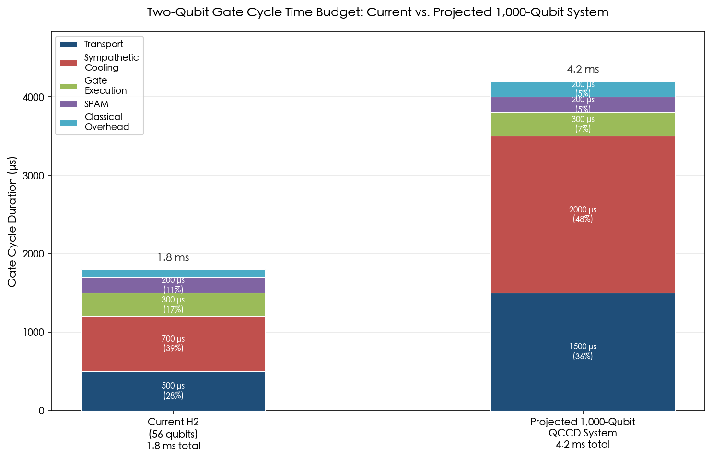

### 3.3.3 Multizone Transport with Integrated Photonics

A milestone published in February 2025 by Mordini et al. at ETH Zurich demonstrated the first transport and coherent multizone operations in an integrated photonic ion trap system. Using a surface-electrode trap with built-in photonic waveguides, the team performed a Ramsey coherence sequence across two zones separated by 375 µm, transporting a single ion between zones in 200 µs while maintaining coherence. Critically, the work addressed the technical challenge of exposed dielectric surfaces from photonic structures, which generate stray electric fields that disturb ion motion during transport. The team developed systematic compensation techniques and demonstrated simultaneous control of two ions in separate zones with low optical crosstalk [Mordini et al., Phys. Rev. X 15, 011040 (2025)](https://doi.org/10.1103/PhysRevX.15.011040 "Multizone trapped-ion qubit control in integrated photonics QCCD device, ETH 2025").

This result is significant because it validates the compatibility of integrated photonics with QCCD transport — a combination that, while theoretically attractive, had remained experimentally undemonstrated. Integrated photonic traps face distinctive challenges from charge accumulation on dielectric waveguide surfaces, and the ETH work provides the first systematic characterization and mitigation of these effects in a multizone configuration. The successful integration of on-chip light delivery with coherent ion transport removes a key technical uncertainty from the path toward scalable QCCD systems with integrated optical control.

## 3.4 Sympathetic Cooling: The Hidden Overhead

### 3.4.1 The Cooling Requirement

Because entangling gates rely on shared motional modes, excess motional excitation from transport operations must be removed before each gate. Sympathetic cooling accomplishes this: a different ion species, co-trapped with the qubit ion, is laser-cooled, and its cold motion sympathetically cools the qubit ion through Coulomb interaction. Quantinuum employs ¹³⁸Ba⁺ to cool ¹⁷¹Yb⁺ qubit ions; NIST uses ²⁴Mg⁺ for ⁹Be⁺ qubits. Crucially, each qubit ion must be paired with at least one coolant ion, effectively doubling the total ion count and proportionally increasing demands on trap capacity, transport scheduling, and control resources.

### 3.4.2 Cooling Timescales

Recooling ions from a post-transport motional state of n̄ ≈ 1–2 quanta to the near-ground state (n̄ ≈ 0.1) required for high-fidelity gates takes approximately 200–500 µs using resolved sideband cooling techniques. This cooling phase accounts for 20–40% of the total ~2–3 ms gate cycle on the H2 system, making it a major contributor to overall circuit execution time [Moses et al., Phys. Rev. X 13, 041052 (2023)](https://doi.org/10.1103/PhysRevX.13.041052 "H2 sympathetic cooling parameters").

As systems scale, two factors compound the cooling overhead. First, longer transport paths in larger QCCD arrays produce greater motional excitation, requiring more extensive cooling cycles. Second, multi-ion crystals exhibit richer motional mode spectra, and all relevant modes must be cooled — a process that scales unfavorably with crystal size. The combination of these effects means that cooling overhead grows super-linearly with system size, as illustrated in Figure 1.

### 3.4.3 Advanced Cooling Techniques

Electromagnetically induced transparency (EIT) cooling offers a promising improvement over resolved sideband cooling. Innsbruck demonstrated EIT cooling of ion strings to n̄ = 0.01 quanta in approximately 100 µs — roughly 2–5× faster than sideband cooling — with the added advantage of simultaneously cooling multiple motional modes in a single step [Lechner et al., Phys. Rev. A 93, 053401 (2016)](https://doi.org/10.1103/PhysRevA.93.053401 "EIT cooling of ion strings, Innsbruck"). If EIT cooling can be successfully integrated into production QCCD systems, it could reduce the cooling overhead from ~30% to ~10–15% of the gate cycle — a meaningful improvement for circuit execution speed.

Mid-circuit cooling — applying cooling pulses to idle qubits while gates are being executed on other qubit pairs in parallel zones — represents a complementary strategy for mitigating cooling overhead. The H2 system already exploits limited parallelism across its 5 gate zones. Scaling to larger systems with tens or hundreds of gate zones could allow cooling to be almost entirely overlapped with computation, effectively hiding much of the cooling latency behind productive gate operations.

## 3.5 Anomalous Motional Heating: The Surface Noise Problem

### 3.5.1 Origin and Scaling

Anomalous motional heating — the uncontrolled gain of motional quanta by trapped ions — remains one of the most persistent and incompletely understood noise sources in surface-electrode traps. The heating rate scales approximately as d⁻⁴ with the ion-electrode distance d, strongly penalizing the small ion-electrode separations (30–100 µm) required for tight confinement and fast transport [Turchette et al., Phys. Rev. A 61, 063418 (2000)](https://doi.org/10.1103/PhysRevA.61.063418 "Anomalous heating d⁻⁴ scaling, NIST 2000"). The noise spectrum follows a 1/f dependence, and its physical origin is attributed to fluctuating patch potentials on electrode surfaces caused by adsorbed contaminants, grain boundaries, and surface defects [Brownnutt et al., Rev. Mod. Phys. 87, 1419 (2015)](https://doi.org/10.1103/RevModPhys.87.1419 "Anomalous heating review, 2015").

At room temperature with typical ion-electrode distances of d ≈ 50 µm, measured heating rates span 100–10,000 quanta/s across different trap designs and materials. For a 2–3 ms gate cycle, this corresponds to 0.2–30 quanta of heating per gate — a range that spans from tolerable to catastrophic, depending on the specific trap and its surface preparation.

### 3.5.2 Mitigation Strategies

Two complementary strategies have proven effective in reducing anomalous heating to manageable levels. Cryogenic operation at 4–10 K suppresses anomalous heating by a factor of 100–1,000× compared to room temperature, bringing rates to approximately 1–10 quanta/s at d = 50 µm [Labaziewicz et al., Phys. Rev. Lett. 100, 013001 (2008)](https://doi.org/10.1103/PhysRevLett.100.013001 "Cryogenic heating rate suppression, MIT 2008"). This dramatic improvement, combined with the excellent vacuum achieved by cryopumping (<10⁻¹² Torr), makes cryogenic operation the default choice for high-performance systems. Quantinuum's H-series processors operate at cryogenic temperatures for precisely these reasons.

Surface treatment provides additional reduction. Argon-ion milling of electrode surfaces has been shown to reduce room-temperature heating rates by approximately 100×: from ~1,800 to ~20 quanta/s at d = 39 µm [Hite et al., Phys. Rev. Lett. 109, 103001 (2012)](https://doi.org/10.1103/PhysRevLett.109.103001 "100-fold heating reduction via Ar milling, NIST 2012"). The combination of cryogenic operation and surface treatment brings heating rates to levels where they contribute less than 0.01 quanta per gate cycle — well below the threshold for significant gate fidelity degradation.

### 3.5.3 Remaining Gaps

Despite these successes, the anomalous heating problem is not fully resolved for large-scale systems. Heating rates vary significantly between nominally identical traps, suggesting that surface contamination during fabrication or operation plays a role that is not yet fully controlled at the process level. Maintaining ultra-clean electrode surfaces across a 10 cm × 10 cm trap chip with thousands of electrodes is considerably more demanding than doing so for today's centimeter-scale devices. Furthermore, the d⁻⁴ scaling means that any trend toward smaller ion-electrode distances — desirable for tighter confinement and faster operations — exponentially worsens the heating problem. The engineering challenge, therefore, is to maintain the low heating rates demonstrated on small, carefully prepared laboratory traps across the large, mass-produced chips that scaled systems will require.

## 3.6 Laser Delivery and Optical Control: The Addressing Bottleneck

### 3.6.1 The Free-Space Optics Wall

Individual qubit control in ion traps requires delivering precisely focused laser beams to individual ions. In current systems, this is accomplished with free-space optics: laser beams are focused to 1–2 µm waists and directed at ions spaced 3–5 µm apart, achieving crosstalk levels of 10⁻³–10⁻⁴ between adjacent ions [Debnath et al., Nature 536, 63–66 (2016)](https://doi.org/10.1038/nature18648 "Individual addressing in ion trap QC"). However, this approach faces a hard scalability limit: maintaining the required beam quality, alignment stability, and low crosstalk across hundreds or thousands of individually addressed ions using bulk optics is widely considered infeasible. The number of required optical paths, mirrors, acousto-optic deflectors, and beam-steering elements grows linearly with qubit count, and the vibration sensitivity of such assemblies makes large-scale free-space systems impractical for deployment outside carefully controlled laboratory environments.

### 3.6.2 Integrated Photonics: On-Chip Light Delivery

Integrated photonics — routing laser light through waveguides fabricated directly on or beneath the trap chip — offers the most promising path beyond the free-space optics wall. The landmark demonstration by Mehta et al. at ETH Zurich in 2020 achieved a two-qubit Mølmer-Sørensen gate with 99.3(2)% fidelity using on-chip waveguides and grating couplers for light delivery, eliminating the need for any free-space optics in the gate zone [Mehta et al., Nature 586, 533–537 (2020)](https://doi.org/10.1038/s41586-020-2823-6 "Integrated photonic ion trap, Nature 2020"). Independently, Niffenegger et al. at MIT Lincoln Laboratory demonstrated integrated multi-wavelength control of an ion qubit using on-chip waveguides and modulators [Niffenegger et al., Nature 586, 538–542 (2020)](https://doi.org/10.1038/s41586-020-2811-x "Integrated multi-wavelength ion control, MIT Lincoln Lab 2020").

Subsequent progress has been steady. Sandia National Laboratories demonstrated multi-site integrated optical addressing of trapped ¹⁷¹Yb⁺ ions using waveguides and multi-mode interferometer splitters [Kwon et al., Nature Communications 15, 3709 (2024)](https://doi.org/10.1038/s41467-024-47529-z "Multi-site integrated optical addressing, Sandia 2024"). The ETH Zurich group further achieved the first transport and coherent multizone operations in an integrated photonic QCCD device, as discussed in Section 3.3.3 [Mordini et al., Phys. Rev. X 15, 011040 (2025)](https://doi.org/10.1103/PhysRevX.15.011040 "Multizone integrated photonics QCCD, ETH 2025").

### 3.6.3 The Chiplet Approach to Optical Integration

The Innsbruck/AQT chiplet architecture proposes a novel solution to the optical addressing problem that overcomes limitations of both free-space optics and monolithic integrated photonics. In this approach, a photonic integrated circuit (PIC) chiplet carrying Si₃N₄ waveguides is fabricated separately on a silicon substrate and bonded beneath the glass trap chiplet. Light is routed through waveguides to total-internal-reflection (TIR) mirrors, which redirect beams upward through a slot in the trap chiplet. A 3D-printed microlens stack, fabricated using two-photon polymerization, focuses the beams to diffraction-limited spots of approximately 1.7 µm at the ion positions — sufficient for individual addressing of ions in a 10-ion crystal with ~4 µm spacing [Holz et al., arXiv:2512.02645 (2025)](https://arxiv.org/abs/2512.02645 "Chiplet-based individual ion addressing, Innsbruck 2025").

This approach sidesteps a key limitation of monolithic grating couplers, each of which has a large footprint that makes it challenging to integrate more than a few independent optical channels side by side. The chiplet lens stack uses a single focusing element for multiple channels, dramatically reducing the required optical footprint. Furthermore, the modular fabrication permits the waveguide platform (Si₃N₄, Al₂O₃, or others) to be optimized independently of the trap electrode design — a flexibility that monolithic approaches cannot readily offer.

### 3.6.4 Microwave-Driven Gates: Eliminating Lasers Entirely

An alternative paradigm eliminates lasers from gate operations entirely by using microwave radiation to drive entangling gates. First demonstrated at NIST in 2011, microwave-driven gates exploit near-field microwave gradients from on-chip electrodes to create the spin-motion coupling normally provided by laser beams [Ospelkaus et al., Nature 476, 181–184 (2011)](https://doi.org/10.1038/nature10290 "First microwave-driven ion gate, NIST 2011"). Oxford Ionics has made this approach central to its commercial strategy, claiming two-qubit gate fidelity of 99.97% using its "eQual" electronic qubit control chip — although this result awaits peer-reviewed publication [Oxford Ionics announcement (2024)](https://oxfordionics.com/news/oxford-ionics-achieves-record-breaking-qubit-performance "Oxford Ionics 99.97% two-qubit gate claim, 2024"). Universal Quantum similarly plans to use microwave-driven gates in its modular architecture.

Microwave gates offer compelling scaling advantages: microwave electronics are mature, inexpensive, and compact compared to laser systems, and microwave signals can be delivered through on-chip electrodes without the complex optical infrastructure required for laser-based addressing. The principal challenge is achieving gate fidelities competitive with laser-driven gates at scale and demonstrating that microwave-gate systems can match the QEC performance and quantum volume milestones already achieved by laser-based platforms.

## 3.7 Vacuum, Cryogenics, and Environmental Control

### 3.7.1 Ultra-High Vacuum Requirements

Ion trap quantum computers require ultra-high vacuum (UHV) at pressures below 10⁻¹¹ Torr to ensure that background-gas collisions neither eject ions from the trap nor introduce decoherence during computation. At 10⁻¹¹ Torr, a single trapped ion experiences a background-gas collision approximately once every several hours — acceptable for current systems but potentially problematic at scale. For a 1,000-ion system operating at the same pressure, the expected collision rate across all ions rises to approximately one event every few minutes, potentially necessitating mid-computation ion replacement protocols that have not yet been developed for production use.

Cryogenic systems achieve excellent vacuum through cryopumping: residual gas molecules freeze onto cold surfaces, yielding effective pressures below 10⁻¹² Torr without the complex bake-out procedures required for room-temperature UHV systems. This advantage is one of several reasons cryogenic operation is favored for high-performance ion trap systems, despite the added complexity of the cryostat infrastructure.

### 3.7.2 Cryogenic vs. Room-Temperature Operation

The choice between cryogenic (4–10 K) and room-temperature operation involves fundamental engineering trade-offs. Cryogenic operation provides three major advantages: 100–1,000× reduction in anomalous heating rates (Section 3.5.2), superior vacuum via cryopumping, and reduced thermal noise in electronic components. However, the cooling power of a dilution refrigerator or pulse-tube cryocooler at 4 K is limited to approximately 1–10 W, severely constraining the thermal budget for in-cryostat electronics, laser delivery, and RF drive. Every watt of power dissipated at the cold stage must be removed by the cryocooler, which requires orders of magnitude more wall-plug power.

Room-temperature systems such as AQT's PINE avoid cryogenic complexity entirely, achieving rack-mountable form factors suitable for deployment at HPC centers and other non-laboratory environments. The trade-off is higher anomalous heating rates (mitigated by surface treatments and operation at larger ion-electrode distances) and the need for active pumping to maintain UHV. For applications where gate fidelity requirements fall below the cutting edge — quantum simulation, variational algorithms, early fault-tolerance demonstrations — room-temperature systems may offer the more favorable cost-performance trade-off. For the highest-fidelity operations demanded by deep fault-tolerant circuits, cryogenic operation remains the preferred approach.

### 3.7.3 RF Drive Distribution for Large Trap Chips

The radio-frequency drive that creates the trapping pseudopotential must be distributed uniformly across the entire trap chip. For current systems with trap chips measuring a few centimeters, a single RF feed point suffices. As traps scale to 10 cm × 10 cm or larger, maintaining uniform RF amplitude and phase across the chip becomes a significant electromagnetic engineering challenge. Non-uniformities in the RF field create variations in trapping potential depth and secular frequency, potentially degrading transport fidelity and gate performance across different regions of the chip. Sandia's Enchilada Trap addressed this challenge by raising the RF electrode and removing dielectric material to reduce capacitive loading, demonstrating a practical approach to managing RF power dissipation in larger trap structures [Sterk et al., arXiv:2403.00208 (2024)](https://doi.org/10.48550/arXiv.2403.00208 "Enchilada Trap RF dissipation management, 2024"). For traps with dielectric substrates such as fused silica, the inherently lower RF loss tangent provides a natural advantage — a property that further motivates the chiplet architecture's choice of glass substrates for the trap layer.

## 3.8 Quantitative Gap Analysis: Current Capability vs. Scale Requirements

The engineering challenges described in the preceding sections can be distilled into a quantitative assessment of the gaps between current capability and the requirements for a 1,000-qubit QCCD system — a plausible near-term milestone on the path to fault-tolerant quantum computation. Figure 2 summarizes these gaps across six critical engineering parameters.

**Control channel scaling.** Current production systems operate approximately 200–300 DC electrode channels. A 1,000-qubit system requires approximately 5,000–10,000 channels — a 20–50× increase that represents the single largest gap factor in the analysis (Figure 2). The WISE architecture reduces external I/O to ~200 signal sources for 1,000 qubits, but requires in-trap integrated switching electronics that have not yet been demonstrated in a functioning quantum processor. CMOS-integrated DACs have been demonstrated at the single-trap level; scaling to full systems remains unproven. This gap is assessed as closable within 3–5 years given ongoing engineering efforts in both the WISE and chiplet approaches.

**Laser/optics scaling.** Free-space optical addressing is infeasible beyond approximately 100 ions. Integrated photonics has demonstrated two-qubit gates at 99.3% fidelity and multizone transport with coherent operations, but has not yet achieved the 99.8%+ fidelities required for competitive QEC performance. Microwave-driven gates bypass the optics problem entirely but must demonstrate system-level performance. Both paths are at TRL 4–5 and require 2–4 years of engineering development to reach production readiness.

**Anomalous heating.** At cryogenic temperatures with surface treatment, heating rates are sufficiently low for current gate fidelity targets. Room-temperature operation still faces a 1–2 order-of-magnitude gap for the highest-fidelity applications. For cryogenic QCCD systems, the heating rate gap is effectively closed for current requirements, though maintaining uniformly low heating across large-area trap chips remains an unvalidated manufacturing challenge that could re-open this gap at scale.

**Transport overhead.** Current H2 transport adds approximately 100–300 µs per gate cycle. For a 1,000-qubit 2D array, O(√N) scaling implies average transport paths roughly 5× longer, with correspondingly greater motional excitation and cooling overhead. Parallel gate execution across multiple zones can partially compensate, but the net effect is a projected 2–3× increase in average gate cycle time (Figure 1). This overhead is inherent to the QCCD architecture and motivates the transition to multi-module systems with shorter intra-module transport paths.

**Trap fabrication yield.** Current trap chips contain hundreds of electrodes; scaling to thousands requires semiconductor-grade yield and uniformity across large areas. No published data exists on electrode uniformity or yield statistics for QCCD-scale trap fabrication, making this one of the least characterized engineering risks.

**System integration.** Combining 10,000+ electrodes, thousands of DAC channels, integrated or external photonics, sympathetic cooling for 1,000+ ions, FPGA control at 10⁶ updates/s, and potentially cryogenic operation at 4–10 K into a single functioning system represents a qualitative leap in engineering complexity. The infrastructure footprint scales from a single equipment rack (current systems) to a dedicated room or small data center, with power consumption measured in tens to hundreds of kilowatts. Figure 3 visualizes the orders-of-magnitude nature of this scaling challenge across three system sizes: the current ~56-qubit H2, a projected 1,000-qubit system, and an aspirational 100,000-qubit system.

We assess that no single bottleneck constitutes a fundamental physical barrier to scaling ion trap hardware to 1,000 qubits. Rather, the challenge is one of concurrent engineering across multiple tightly coupled subsystems — trap fabrication, signal delivery, optical control, cooling, and system integration — each of which must advance by roughly one order of magnitude from current capabilities within a timeframe of 3–7 years. The chiplet architecture emerging from Innsbruck/AQT and the WISE wiring scheme from Oxford represent the most concrete proposals for tackling the fabrication and signal-delivery challenges, while integrated photonics and microwave gates offer complementary paths for the optical control bottleneck. Whether these solutions can be successfully combined into a functioning system at scale is the central engineering question confronting ion trap quantum computing over the next half-decade.

# 第4章 Quantum Error Correction Tailored to Ion Trap Architectures

Quantum error correction (QEC) constitutes the decisive bridge between today's noisy intermediate-scale quantum (NISQ) demonstrations and future fault-tolerant quantum computers capable of addressing industrially relevant problems. For ion trap systems, the trajectory toward fault tolerance is shaped by a distinctive confluence of hardware properties: exceptionally high gate fidelities, native all-to-all connectivity within trap zones, comparatively slow but highly precise gate operations, and characteristic error channels dominated by photon scattering and motional heating rather than the relaxation processes prevalent in superconducting circuits. This chapter examines how QEC code choices, protocol designs, and overhead requirements interact with these ion trap characteristics; assesses the current state of logical qubit demonstrations across leading experimental groups; and analyzes the projected path from present-day experiments to utility-scale fault-tolerant computation.

## 4.1 Error Channels and Noise Profiles in Ion Trap Systems

Effective QEC design begins with a precise understanding of the dominant error mechanisms. Ion trap qubits exhibit a qualitatively different noise profile from competing platforms, and these distinctions profoundly influence which codes and protocols prove most effective in practice.

Four principal error channels govern trapped-ion performance: (1) dephasing from magnetic field fluctuations and laser phase noise; (2) motional heating from anomalous electric-field noise on electrode surfaces; (3) off-resonant photon scattering during Raman-driven two-qubit gates, contributing approximately 1–3 × 10⁻⁴ per gate; and (4) leakage to non-computational atomic states at rates of 10⁻⁵ to 10⁻⁴ per gate operation [Ozeri et al., Phys. Rev. A 75, 042329 (2007)](https://doi.org/10.1103/PhysRevA.75.042329 "Photon scattering errors in ion gates") [Bruzewicz et al., Appl. Phys. Rev. 6, 021314 (2019)](https://doi.org/10.1063/1.5088164 "Ion trap error channels review"). The relative magnitudes and statistical character of these channels collectively determine which QEC codes and syndrome-extraction protocols are best suited to the platform.

Quantinuum's H2 system provides the most detailed publicly available error budget for a production-class ion trap processor. The total two-qubit gate error of approximately 2 × 10⁻³ decomposes into several roughly comparable contributions: photon scattering at 3–5 × 10⁻⁴, motional heating at 2–3 × 10⁻⁴, laser intensity and phase fluctuations at 3–5 × 10⁻⁴, motional-mode frequency drifts at 1–2 × 10⁻⁴, and state preparation and measurement (SPAM) errors at approximately 3 × 10⁻⁴. The aggregate noise character is approximately depolarizing with a slight dephasing bias [Moses et al., Phys. Rev. X 13, 041052 (2023)](https://doi.org/10.1103/PhysRevX.13.041052 "H2 error budget analysis").

A critical structural asymmetry distinguishes ion trap errors from those of superconducting platforms: single-qubit gate errors (10⁻⁴ to 10⁻⁶) are typically 10–100× lower than two-qubit gate errors (10⁻³ to 10⁻²). This pronounced asymmetry enables QEC protocol optimizations—notably flag-qubit techniques (discussed in §4.3)—that exploit inexpensive single-qubit operations to reduce ancilla overhead for syndrome extraction [Ryan-Anderson et al., Phys. Rev. X 11, 041058 (2021)](https://doi.org/10.1103/PhysRevX.11.041058 "Error asymmetry exploitation in QEC"). Correlated errors between ions within the same gate zone are typically 10⁻⁵ to 10⁻⁴, roughly one order of magnitude below single-qubit error rates, lending support to the independent-error approximation commonly employed in QEC threshold calculations—though departures from this assumption merit careful monitoring as system size grows [Erhard et al., Nature Communications 10, 5347 (2019)](https://doi.org/10.1038/s41467-019-13068-7 "Correlated error characterization").

In QCCD architectures, idle errors during QEC cycles constitute an additional and non-trivial consideration. A typical syndrome extraction cycle on the H2 system requires 3–5 ms, during which idle qubits accumulate dephasing at rates of 3–5 × 10⁻³ per cycle—comparable in magnitude to the gate error itself. Dynamical decoupling sequences suppress this idle dephasing by 10–100×, rendering it manageable rather than dominant. The Helios processor, featuring 98 qubits and an upgraded ¹³⁷Ba⁺ qubit species, has further reduced two-qubit gate error to approximately 7.9 × 10⁻⁴ and SPAM error to approximately 4.8 × 10⁻⁴, establishing the lowest reported error rates for any production-scale quantum computer as of late 2025 [Quantinuum Helios arXiv:2511.05465](https://arxiv.org/abs/2511.05465 "Helios: A 98-qubit trapped-ion quantum computer, November 2025").

## 4.2 QEC Code Families and Their Compatibility with Ion Trap Hardware

The choice of QEC code profoundly shapes the resource overhead, achievable logical error rate, and operational complexity of a fault-tolerant ion trap system. Unlike superconducting platforms—where nearest-neighbor connectivity effectively mandates the surface code—ion traps' native all-to-all connectivity and high gate fidelities open the design space to a broader family of codes with potentially superior encoding efficiency. The following subsections evaluate the principal candidates.

### 4.2.1 Surface Codes

The surface code remains the most extensively studied topological QEC code, with a circuit-level noise threshold of approximately 0.57–1.1% [Fowler et al., Phys. Rev. A 86, 032324 (2012)](https://doi.org/10.1103/PhysRevA.86.032324 "Surface code threshold analysis"). Ion trap two-qubit error rates of 0.1–0.2% place current systems 5–10× below this threshold—a comfortable operating margin. However, the surface code was designed with nearest-neighbor connectivity assumptions characteristic of superconducting qubit lattices. On ion traps, it fails to exploit the native all-to-all connectivity within trap zones, resulting in suboptimal encoding efficiency: the rotated surface code requires approximately 2d² physical qubits per logical qubit, yielding roughly 200 physical qubits at distance 7 (d = 7). While the surface code benefits from extensive theoretical analysis, familiarity alone does not justify its use when codes better matched to ion trap connectivity are available and experimentally validated.

### 4.2.2 Color Codes

Color codes present a natural match for ion trap architectures. Defined on trivalent lattices, they support transversal implementation of all Clifford gates—eliminating the need for costly magic-state distillation for this gate set—and their weight-6 stabilizer checks are directly measurable without SWAP gates when all-to-all connectivity is available [Bombin and Martin-Delgado, Phys. Rev. Lett. 97, 180501 (2006)](https://doi.org/10.1103/PhysRevLett.97.180501 "Color code introduction"). The smallest instance, the [[7,1,3]] Steane code, has accordingly become the primary experimental testbed for ion trap QEC.

Color code thresholds range from approximately 0.46–0.8% depending on the noise model—modestly lower than the surface code threshold. The encoding overhead, however, is substantially more favorable: 10–25 physical qubits per logical qubit at distance 3–5, compared to the surface code's ~50–200 for comparable protection levels [Beverland et al., PRX Quantum 2, 020341 (2021)](https://doi.org/10.1103/PRXQuantum.2.020341 "Color code overhead comparison"). For ion traps operating well below threshold, this efficiency advantage translates directly into a larger number of logical qubits for a given physical qubit budget—a critical consideration during the era when physical qubit counts remain constrained.

### 4.2.3 Subsystem Codes: The Tesseract Code

The tesseract subsystem color code represents a recent innovation specifically demonstrated on ion trap hardware. This [[16,6,4]] code protects four logical qubits within 16 physical qubits at distance four, achieving an encoding ratio of approximately 2.7:1 (physical-to-logical)—substantially more favorable than either the surface code or the basic Steane code. In experiments on Quantinuum's H2 system, the tesseract code was employed to prepare high-fidelity encoded graph states on up to 12 logical qubits (using three tesseract blocks), combining fault-tolerant error correction and fault-tolerant computation within a single demonstration for the first time. Encoded states were protected through up to five rounds of error correction, and the logical circuits exhibited an order of magnitude less error than equivalent unencoded circuits [Reichardt et al., arXiv:2409.04628 (2024)](https://doi.org/10.48550/arXiv.2409.04628 "Demonstration of quantum computation and error correction with a tesseract code"). This result underscores the advantage of codes designed to exploit ion trap connectivity: the 16-qubit all-to-all interaction required by the tesseract code is natively available within a single QCCD gate zone.

### 4.2.4 Bacon-Shor Codes

The Bacon-Shor [[9,1,3]] code offers an alternative pathway distinguished by its exceptionally low per-check gate cost: weight-2 stabilizer checks require only a single two-qubit gate per syndrome measurement. This minimal gate requirement makes Bacon-Shor codes attractive for near-term ion trap implementations in which every two-qubit gate is a precious resource. The threshold, at approximately 0.2%, is lower than those of color or surface codes; however, the reduced circuit complexity per syndrome round partially compensates by introducing fewer opportunities for error accumulation within each extraction cycle [Bacon, Phys. Rev. A 73, 012340 (2006)](https://doi.org/10.1103/PhysRevA.73.012340 "Bacon-Shor code"). Bacon-Shor codes may thus serve as useful stepping stones toward higher-distance implementations on hardware where two-qubit error rates remain at the upper end of the ion trap range.

### 4.2.5 Quantum Low-Density Parity-Check (qLDPC) Codes

The most dramatic potential efficiency gains arise from qLDPC codes, particularly the bivariate bicycle family introduced by Bravyi et al. The [[144,12,12]] bivariate bicycle code protects 12 logical qubits in 144 physical qubits at distance 12, yielding an encoding ratio of approximately 12:1—an order-of-magnitude improvement over the surface code's ~200:1 at comparable distance [Bravyi et al., Nature 627, 778–782 (2024)](https://doi.org/10.1038/s41586-024-07107-7 "qLDPC bivariate bicycle codes"). Such efficiency could dramatically reduce the total physical qubit count required for fault-tolerant computation.

The principal challenge for qLDPC codes lies in their non-local connectivity requirements, which conflict with QCCD routing constraints. The Tanner graphs of bivariate bicycle codes exhibit large edge-expansion properties, meaning that partitioning the code across separate modules generates substantial inter-module communication overhead. Ion trap architectures possess a potential structural advantage in this regard: the all-to-all connectivity within QCCD gate zones, combined with the ability to physically shuttle ions, provides a form of reconfigurable long-range connectivity unavailable on fixed-topology platforms. Recent theoretical work has confirmed that bivariate bicycle codes are well suited to parallel syndrome-measurement schemes using fast routing within long chains of trapped ions, and that flexible-connectivity platforms such as ion traps and cold atom arrays benefit from favorable code layouts [Coprime Bivariate Bicycle Codes, Quantum 2026](https://quantum-journal.org/papers/q-2026-02-23-2009/pdf/ "Coprime Bivariate Bicycle Codes and Their Layouts on Cold Atoms, Quantum 2026").

IonQ has proposed a "sparse cyclic layout" specifically designed for implementing qLDPC codes on modular trapped-ion architectures. In this scheme, qubit parcels arranged in two rows undergo systematic cyclic shifts that bring ancilla parcels into contact with the necessary data parcels for syndrome extraction. For bivariate bicycle codes, whose Tanner graphs possess natural cyclic structure, only a small constant number of cyclic shifts is required regardless of code size—a significant advantage over general cyclic layouts where the shift count grows with the code block length [IonQ, arXiv:2508.01879 (2025)](https://arxiv.org/abs/2508.01879 "Sparse cyclic layout for qLDPC codes on modular trapped-ion architectures").

### 4.2.6 Iceberg Codes

A recently demonstrated code family on the Helios processor is the "iceberg codes," so named for their structure in which many logical qubits reside beneath a thin error-checking layer. These codes encode a large number of logical qubits using only a few additional physical qubits for error detection. In March 2026 experiments, Quantinuum demonstrated up to 94 error-detected logical qubits and 48 error-corrected logical qubits using concatenated iceberg codes on the 98-qubit Helios processor. Logical gate error rates reached approximately 10⁻⁴—significantly below the physical two-qubit gate error of ~7.9 × 10⁻⁴—confirming beyond-break-even performance in which encoded operations outperform their unencoded counterparts [Quantinuum iceberg codes on Helios, arXiv (2026)](https://thequantuminsider.com/2026/03/10/quantinuum-researchers-demonstrates-quantum-computations-with-dozens-of-protected-logical-qubits/ "Quantinuum demonstrates quantum computations with dozens of protected logical qubits, March 2026"). Iceberg codes thus expand the toolkit available to ion trap QEC designers, offering a favorable trade-off between encoding rate and error protection for intermediate-scale systems.

The following figure provides a structured comparison of the QEC code families discussed above, summarizing their suitability for ion trap architectures across key dimensions.

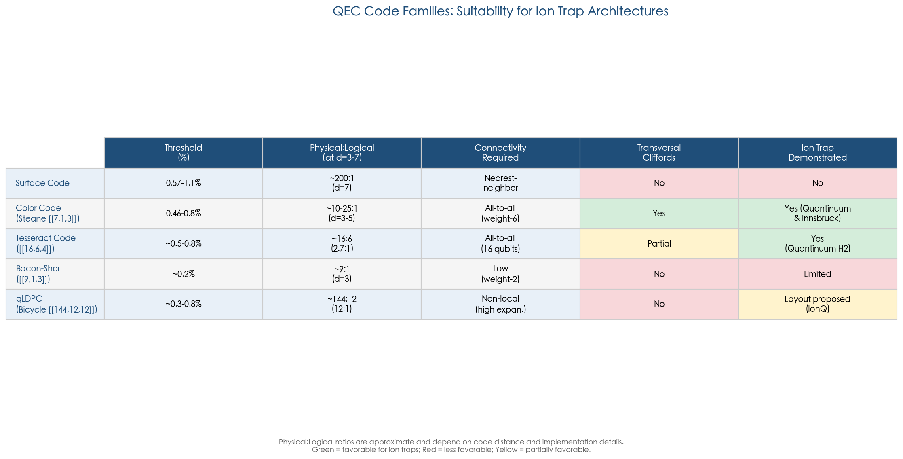

## 4.3 Flag-Qubit Protocols and Ancilla Efficiency

A persistent challenge in ion trap QEC is ancilla overhead. In a QCCD architecture, every additional qubit requires a dedicated ion—typically paired with a sympathetic coolant ion—so ancilla efficiency translates directly into hardware savings. Traditional fault-tolerant syndrome extraction demands O(d) ancilla qubits per stabilizer check, where d is the code distance, imposing a substantial cost that compounds across all stabilizers in the code.

Flag-qubit protocols address this scaling problem by reducing ancilla overhead to O(1) per stabilizer check. The central insight is that a single flag ancilla, combined with carefully structured circuit topologies, can detect when a fault on an ancilla qubit propagates to a high-weight error on the data qubits. When the flag triggers, an additional syndrome extraction round disambiguates the error [Chao and Reichardt, npj Quantum Information 4, 42 (2018)](https://doi.org/10.1038/s41534-018-0085-z "Flag-qubit protocol"). For ion traps, where single-qubit operations cost 10–100× less in error budget than two-qubit gates, the additional single-qubit flag measurements represent a modest overhead compared to the savings from eliminating extra ancilla ions.

The practical impact is significant. For a distance-5 color code, flag-qubit protocols reduce the total ion count for syndrome extraction by 30–50% relative to Shor-style or Steane-style extraction while fully maintaining fault tolerance. This reduction has been experimentally validated in Quantinuum's QEC demonstrations, where flag circuits constitute the standard approach for stabilizer measurement on the H-series processors. As code distances increase toward d = 7 and beyond, the ancilla savings from flag-qubit techniques will become an increasingly important factor in total system resource requirements.

## 4.4 Experimental Milestones in Ion Trap QEC

The period from 2021 to early 2026 has witnessed a remarkably rapid progression of QEC demonstrations on ion trap hardware, advancing from initial proof-of-concept experiments to below-threshold operation with dozens of logical qubits. The following timeline provides an overview of the key milestones before each is examined in detail.

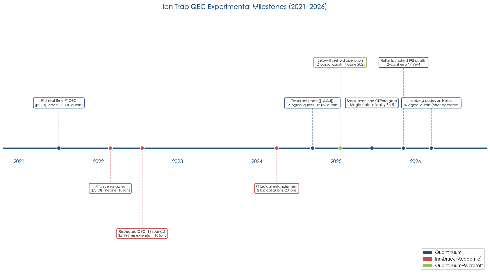

### 4.4.1 Quantinuum: From First Real-Time QEC to Below-Threshold Operation

The trajectory of QEC demonstrations on Quantinuum's trapped-ion systems charts a rapid progression from proof-of-concept to below-threshold operation within approximately four years.

In 2021, the Quantinuum team achieved the first real-time fault-tolerant QEC on any quantum computing platform, implementing the [[5,1,3]] perfect code on the H1 system. This demonstration was significant not merely for detecting errors but for correcting them in real time during computation, without post-selection or classical post-processing [Ryan-Anderson et al., Phys. Rev. X 11, 041058 (2021)](https://doi.org/10.1103/PhysRevX.11.041058 "First real-time FT QEC"). It established that trapped-ion hardware had crossed the threshold from error detection to genuine error correction.

The collaboration with Microsoft, culminating in a Nature publication in 2025, marked a qualitative leap. Working on the H2 system with 56 qubits, the team demonstrated 12 logical qubits encoded via [[7,1,3]] Steane codes and [[12,2,4]] color codes, achieving logical error rates of approximately 2 × 10⁻³ per QEC round. The central result was below-threshold operation: transversal CNOT gates between logical qubits exceeded the fidelity of unencoded physical operations ("below break-even"), and all operations were performed in real time without post-selection [Microsoft and Quantinuum, Nature (2025)](https://www.nature.com/articles/s41586-025-08684-1 "Below-threshold QEC demonstration, Nature 2025").

Repeated QEC was demonstrated with up to 10 rounds on the [[7,1,3]] code, maintaining an error rate of approximately 10⁻³ per logical round. Each QEC cycle required 3–5 ms, decomposing into ion shuttling (1–2 ms), sympathetic cooling (0.5–1 ms), and gate operations plus measurement (0.5–1 ms) [Ryan-Anderson et al., arXiv:2309.09893](https://arxiv.org/abs/2309.09893 "Quantinuum fault-tolerant gates on color code").

In June 2025, Quantinuum reported a further milestone: the first experimental demonstration of a break-even non-Clifford gate. Using a compact [[6,2,2]] error-detecting code on the H1-1 processor, the team prepared magic states with an infidelity of just 7 × 10⁻⁵ and implemented a controlled-Hadamard (CH) gate with a logical error rate no higher than 2.3 × 10⁻⁴—well below the physical CH gate's baseline error of 1 × 10⁻³. A separate experiment employing code switching between a 2D color code and a Steane code on the H2-1 processor produced magic states with fidelity of at least 0.99949 (infidelity ≤ 5.1 × 10⁻⁴), enabling a single subsequent round of distillation to push error rates below 10⁻⁸ [Quantinuum break-even non-Clifford gates, arXiv (2025)](https://thequantuminsider.com/2025/06/27/quantinuum-crosses-key-quantum-error-correction-threshold-marks-turn-from-nisq-to-utility-scale/ "Quantinuum crosses key QEC threshold, June 2025"). This result eliminated the last major missing capability—fault-tolerant non-Clifford gates—from the ion trap QEC toolbox.

The Helios processor (98 qubits, November 2025) extended these results to unprecedented scale. Employing iceberg codes, the team demonstrated 94 error-detected and 48 error-corrected logical qubits, with logical gate error rates of approximately 10⁻⁴. A quantum simulation of the XY model encoded in logical qubits confirmed that encoding reduced the effective two-qubit gate error rate by approximately 30% compared to unencoded circuits. GHZ states prepared on up to 94 logical qubits achieved fidelities of roughly 95% [Quantinuum Helios arXiv:2511.05465](https://arxiv.org/abs/2511.05465 "Helios: A 98-qubit trapped-ion quantum computer").

### 4.4.2 Innsbruck: Pioneering Fault-Tolerant Gates and Repeated QEC

The Innsbruck group (University of Innsbruck / AQT) has served as a leading academic contributor to ion trap QEC, producing several landmark demonstrations using ⁴⁰Ca⁺ ions in linear Paul traps.

In 2022, the group demonstrated fault-tolerant universal gate operations on the [[7,1,3]] Steane code using 10 ions. The fault-tolerant T gate achieved a fidelity of 0.898, compared to 0.865 for the non-fault-tolerant implementation—providing direct experimental evidence that fault-tolerant protocols improve outcomes even at the single-code level [Postler et al., Nature 605, 675–680 (2022)](https://doi.org/10.1038/s41586-022-04721-1 "Innsbruck fault-tolerant gates"). In a parallel experiment, 16 rounds of repeated QEC on the color code demonstrated a 3× extension of the logical qubit lifetime beyond the unencoded baseline [Hilder et al., Phys. Rev. X 12, 011032 (2022)](https://doi.org/10.1103/PhysRevX.12.011032 "Innsbruck repeated QEC").

By 2024, the Innsbruck team achieved fault-tolerant entanglement between two logical qubits using 20 ions, producing a logical Bell state with approximately 75–80% fidelity [Postler et al., PRX Quantum 5, 030326 (2024)](https://doi.org/10.1103/PRXQuantum.5.030326 "Innsbruck logical qubit entanglement"). While these fidelities are lower than Quantinuum's results on the H2 system—reflecting the less optimized academic hardware and smaller ion numbers—the Innsbruck demonstrations have been invaluable in independently validating QEC theory and establishing that fault-tolerant protocols yield genuine advantages even with moderate physical error rates.

### 4.4.3 IonQ: Error Detection and the Path Forward

IonQ's published QEC work has to date focused primarily on error detection rather than full correction. The company has demonstrated the [[4,2,2]] error-detecting code with post-selection on its Forte system; however, fewer peer-reviewed QEC results are available compared to Quantinuum and Innsbruck. IonQ's recent theoretical work on sparse cyclic layouts for qLDPC codes (§4.2.5) signals a strategic pivot toward codes that leverage the modular trapped-ion architectures central to the company's scaling roadmap. IonQ's hardware trajectory envisions integrating QEC at the system level as physical error rates approach the 10⁻⁴ regime with future hardware generations, at which point the encoding-efficiency advantages of qLDPC codes would become especially impactful.

## 4.5 Magic-State Distillation and the Non-Clifford Gate Bottleneck

Universal fault-tolerant quantum computation requires the ability to implement non-Clifford gates—typically the T gate or its equivalents—alongside the Clifford group. For most QEC codes, non-Clifford gates cannot be implemented transversally and instead require magic-state distillation: a resource-intensive process that consumes many noisy "magic states" to produce fewer high-fidelity ones suitable for gate teleportation.

Magic-state distillation has long been identified as the dominant contributor to physical qubit overhead in fault-tolerant architectures, accounting for approximately 60–80% of total physical qubit requirements in surface code implementations [Litinski, Quantum 3, 205 (2019)](https://doi.org/10.22331/q-2019-12-02-205 "Magic state distillation overhead"). Ion traps enjoy a partial but significant advantage in this regard: their lower physical error rates mean that each round of distillation achieves greater error suppression, potentially reducing the total number of distillation rounds required. The Quantinuum team's June 2025 demonstration of break-even magic states—achieving infidelity ≤ 5.1 × 10⁻⁴ after a single preparation protocol without any distillation—illustrates this advantage concretely. A single subsequent distillation round from this starting point could achieve error rates below 10⁻⁸, sufficient for many practical algorithms. By contrast, surface code implementations on superconducting hardware typically require two or more rounds of distillation to reach comparable logical error rates.

Color codes offer an additional pathway to reducing non-Clifford gate overhead through code switching or gauge fixing. In a code-switching protocol, a logical state is transferred from a 2D color code (which supports transversal Clifford gates) to a 3D or higher-dimensional code (which supports a transversal non-Clifford gate); the non-Clifford gate is applied transversally, and the state is returned to the original 2D code. This approach can eliminate magic-state distillation entirely for certain algorithms, though it requires the ability to perform code deformation—a capability well suited to the reconfigurable connectivity of QCCD architectures, where ions can be dynamically rearranged to match the evolving code structure.

## 4.6 QEC Cycle Times and Logical Clock Speed

A significant practical consideration for ion trap QEC is the logical clock speed—the rate at which error-corrected logical operations can be executed. On Quantinuum's H2 system, the QEC cycle time is approximately 3–5 ms, decomposing into shuttling overhead (1–2 ms), sympathetic cooling (0.5–1 ms), and gate operations plus measurement (0.5–1 ms). This yields a logical operation rate of approximately 200–300 operations per second.

Superconducting systems, by contrast, project QEC cycle times of approximately 1–10 µs. Google's Willow processor demonstrated surface code QEC with a cycle time of approximately 1.1 µs—roughly 3,000× faster than ion trap QEC cycles [Acharya et al., Nature (2024)](https://doi.org/10.1038/s41586-024-08449-y "Google Willow below-threshold result"). Neutral atom systems occupy an intermediate position, with projected QEC cycle times of 1–10 ms—comparable to ion traps—limited by Rydberg gate durations and atom rearrangement overhead.

This speed disparity carries significant implications for time-critical computations. For a canonical target such as RSA-2048 factoring—requiring on the order of 10⁸ T gates—the logical clock speed directly determines total computation time. At 200–300 logical operations per second, a computation requiring 10⁸ sequential logical operations would take approximately 100,000–500,000 hours, rendering purely sequential execution impractical.

However, several factors partially compensate for the slower ion trap clock speed. First, the lower physical error rate per cycle reduces the number of physical qubits needed per logical qubit to achieve a target logical error rate, freeing a larger fraction of available physical qubits for parallel logical operations. Second, native all-to-all connectivity eliminates the SWAP overhead that inflates circuit depth on nearest-neighbor architectures, reducing the effective logical depth for many algorithms. Third, the QCCD architecture enables parallel gate execution across multiple zones—the Helios processor operates 8 gate zones concurrently—and future multi-module systems could extend this parallelism by orders of magnitude, substantially narrowing the throughput gap at the system level.

## 4.7 Error Suppression Factor and Below-Threshold Performance

The error suppression factor Λ—defined as the ratio by which the logical error rate decreases when the code distance increases by 2—constitutes the central metric for assessing whether a QEC implementation is genuinely operating below threshold and how rapidly it improves with additional resources.

Google's Willow processor measured Λ ≈ 2.14 for surface code QEC, establishing the first below-threshold demonstration on a superconducting platform [Acharya et al., Nature (2024)](https://doi.org/10.1038/s41586-024-08449-y "Google Willow below-threshold result"). For ion trap systems, projected Λ values are potentially higher, in the range of 2–8. This projection follows from the favorable ratio between physical error rates (~0.1–0.2%) and the color code threshold (~0.4–0.8%): the further below threshold the physical error rate falls, the larger the achievable Λ. Quantinuum's reported logical error rates of approximately 10⁻³ per round on the [[7,1,3]] code, combined with physical two-qubit error rates of 7.9 × 10⁻⁴ on Helios, are consistent with Λ in the range of 2–4 at current performance levels, with the expectation that continued hardware improvements will push this figure higher.

The practical consequence of a higher Λ is that fewer levels of code concatenation or smaller code distances suffice to reach a target logical error rate. If Λ = 4—a plausible near-term target for ion traps—increasing the code distance from 5 to 7 reduces the logical error rate by a factor of 16. This would make a distance-7 color code on ion traps potentially equivalent in logical error rate to a distance-11 surface code on superconducting hardware with Λ ≈ 2, representing a substantial reduction in total qubit overhead.

## 4.8 Overhead Projections and the Path to Useful Fault-Tolerant Computation

The total physical qubit requirement for useful fault-tolerant computation depends on the interplay of four factors: the target algorithm's logical qubit count, the required logical error rate, the chosen QEC code's encoding efficiency, and the overhead for magic-state distillation.

For a canonical target of approximately 100 logical qubits at code distance 7–11—sufficient for quantum chemistry problems such as the FeMo-co nitrogen fixation catalyst—surface code implementations require on the order of 10,000–50,000 physical qubits. Color codes and efficient subsystem codes can substantially reduce this requirement: using the [[7,1,3]] Steane code at distance 3 with concatenation, or the [[16,6,4]] tesseract code, the same logical qubit count might be achievable with 5,000–10,000 physical qubits. The most optimistic projections employing qLDPC codes suggest that fewer than 5,000 physical qubits could suffice for certain problem instances, though these codes have not yet been demonstrated at the requisite scale on ion trap hardware.

Quantinuum's internal projections, disclosed in connection with the Helios launch and the June 2025 fault-tolerant gate demonstrations, indicate that the planned Apollo processor (targeting approximately 2029) could support error rates as low as 10⁻¹⁰ through self-concatenation of compact magic-state protocols, using approximately 40 physical qubits per magic state [Quantinuum fault-tolerant gates, June 2025](https://thequantuminsider.com/2025/06/27/quantinuum-crosses-key-quantum-error-correction-threshold-marks-turn-from-nisq-to-utility-scale/ "Quantinuum universal fault-tolerant gate set milestone"). If realized, this would place ion traps among the first platforms to achieve the error rates necessary for chemically accurate quantum simulations.

Timeline estimates for utility-scale fault-tolerant ion trap computation converge around the late 2020s to early 2030s: Quantinuum targets approximately 2029 for its Apollo system, IonQ targets approximately 2028–2029, and the broader academic consensus places utility-scale fault-tolerant quantum computing in the 2030–2035 window.

## 4.9 QEC for Distributed and Modular Ion Trap Architectures

As ion trap systems scale beyond the single-chip QCCD limit of approximately 100–1,000 qubits, QEC must accommodate the heterogeneous error landscape of modular architectures. In a distributed system connected by photonic or electronic interconnects, intra-module gate fidelities (~99.8–99.9%) substantially exceed inter-module entanglement fidelities (~89–94% for current photonic links). This fidelity asymmetry creates a two-tier error structure that standard QEC codes, designed for uniform error rates, do not naturally address.

Nickerson et al. demonstrated that fault-tolerant operation remains possible even when inter-module error rates are approximately 10× higher than intra-module rates, provided the QEC code is designed to minimize the number of inter-module stabilizer checks [Nickerson et al., Nature Communications 4, 1756 (2013)](https://doi.org/10.1038/ncomms2773 "Distributed QEC with noisy links"). Practical implementations would partition a code's qubits such that the majority of stabilizer measurements involve only intra-module gates, reserving inter-module links for the sparse long-range correlations essential to code performance.

The hybrid QCCD+photonic architecture—the consensus near-term strategy for scaling beyond ~1,000 qubits—demands QEC codes that tolerate this two-tier heterogeneity. Color codes, with their relatively low qubit count per logical qubit, are natural candidates: a small color code can fit entirely within a single QCCD module, with inter-module links used only for logical-level operations such as transversal CNOT between logical qubits residing in different modules. The bivariate bicycle qLDPC codes, with their superior encoding efficiency, could offer even greater advantages if the inter-module communication overhead can be managed through the sparse cyclic layouts proposed by IonQ (§4.2.5). The co-design of QEC codes and modular architectures—optimizing code structure for the specific connectivity and fidelity profile of the inter-module links—represents a critical area of ongoing research that will shape the viability of large-scale ion trap quantum computation.

## 4.10 Comparison with Competing Platforms

Placing ion trap QEC achievements in context requires systematic comparison with the leading competing platforms. The following radar chart provides a normalized multi-dimensional overview before each platform is examined in detail.

**Superconducting systems** currently lead in QEC cycle speed (~1 µs vs. ~3–5 ms for ion traps) and have demonstrated below-threshold operation: Google's Willow processor achieved Λ ≈ 2.14 with a distance-5 surface code in 2024 [Acharya et al., Nature (2024)](https://doi.org/10.1038/s41586-024-08449-y "Google Willow below-threshold result"). However, superconducting two-qubit error rates (~0.3–0.5%) remain 3–5× higher than those of ion traps, and nearest-neighbor connectivity effectively mandates the surface code with its high per-logical-qubit overhead. The net effect is that superconducting systems require substantially more physical qubits per logical qubit to achieve comparable logical error rates, partially offsetting their speed advantage.

**Neutral atom systems** have demonstrated the largest raw number of logical qubits in a single experiment: Harvard-QuEra prepared 48 logical qubits on a 280-atom array using the surface code [Bluvstein et al., Nature 626, 58–65 (2024)](https://doi.org/10.1038/s41586-023-06927-3 "Harvard-QuEra 48 logical qubits"). However, Rydberg two-qubit gate fidelity (~99.5%) and measurement fidelity (~99%) currently lag ion traps by 3–10× in error rate, and QEC cycle times (1–10 ms) are comparable to those of ion traps. Neutral atoms possess a loading and parallelism advantage, but achieving the error rates necessary for high Λ values remains an open challenge.

Ion traps thus occupy a distinctive position in the QEC landscape: they offer the highest per-gate fidelities and the most efficient code implementations—enabled by all-to-all connectivity that supports color codes, subsystem codes, and qLDPC codes—but at the slowest logical clock speed among the three leading platforms. We assess that this combination favors ion traps for applications where the logical error rate is the binding constraint, such as deep quantum chemistry circuits requiring high algorithmic fidelity, and disfavors them for applications demanding raw logical throughput, such as large-scale optimization with many circuit repetitions.

## 4.11 Assessment and Outlook

Ion trap architectures have established themselves as the leading platform for experimental quantum error correction, compiling an unmatched portfolio of demonstrations: the first real-time fault-tolerant QEC (2021), the first below-threshold logical qubits with real-time decoding (2025), the first break-even non-Clifford gate (2025), and the largest-scale encoded computation reported to date (94 error-detected logical qubits on Helios, 2026). The combination of low physical error rates, native all-to-all connectivity, and mid-circuit measurement capability positions ion traps to exploit the most efficient QEC codes—color codes, subsystem codes, and potentially qLDPC codes—that other platforms cannot natively implement without substantial connectivity overhead.

The central challenge remains logical clock speed. The 3–5 ms QEC cycle time, roughly 3,000× slower than that of superconducting systems, imposes a practical ceiling on the throughput of fault-tolerant ion trap computation. Mitigation strategies include massive parallelism across modules, algorithmic co-design that minimizes sequential logical depth, and hardware improvements targeting reduced shuttling and cooling overhead. The Helios processor's 8-zone parallelism and pipelined scheduling represent important engineering advances, and future multi-module systems incorporating hundreds of gate zones could close much of the throughput gap at the system level.

We judge that the path to useful fault-tolerant computation on ion traps is credible and among the most de-risked in the quantum computing industry. Physical error rates are comfortably below the thresholds of multiple code families, the QEC code toolbox is rich and expanding, and the demonstrated progression from 5-qubit codes (2021) to 94-logical-qubit systems (2026) reflects sustained and accelerating progress. The principal uncertainties are engineering rather than fundamental: whether control channel scaling, trap fabrication yield, and module interconnect fidelity can keep pace with the ambitious timelines set by industry roadmaps targeting fault-tolerant operation by approximately 2029.

# 第5章 Software, Compilation, and Control Stacks for Large-Scale Ion Trap Systems

The physical qubits, gates, and transport operations described in preceding chapters constitute only half of the challenge in scaling ion trap quantum computers. Equally critical is the classical software and control infrastructure that translates abstract quantum algorithms into precisely timed sequences of laser pulses, electrode voltages, and measurement triggers executed on real hardware. As ion trap systems grow from tens to hundreds and eventually thousands of qubits, the compilation, scheduling, and real-time control layers face their own scaling bottlenecks that, left unaddressed, could negate the hardware advantages these platforms enjoy. This chapter analyzes the full software and classical-infrastructure stack required to program, compile, optimize, and control large-scale trapped-ion quantum computers. It identifies where current tooling provides ion-trap-specific advantages and examines the gaps that must be closed to support fault-tolerant operation at scale. Figure 5.1 provides a high-level overview of this stack, from user-facing SDKs down to the ion trap hardware layer.

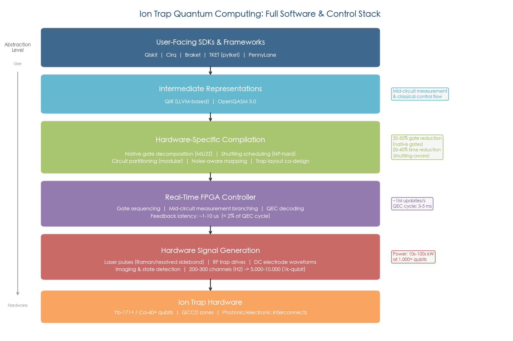

**Figure 5.1 | Full software and control stack for ion trap quantum computing.** The six-layer architecture spans user-facing SDKs (Qiskit, Cirq, TKET) through intermediate representations (QIR/OpenQASM 3.0), hardware-specific compilation (native gate decomposition, shuttling scheduling, circuit partitioning), real-time FPGA control, hardware signal generation, and the ion trap hardware itself. Key performance annotations—including 20–50% gate count reduction from native compilation, 1–10 μs feedback latency, and the 200-to-10,000 control channel scaling requirement—highlight the challenges at each layer.

## 5.1 Native Gate Sets and Compilation Advantages

Ion trap quantum computers employ native gate sets that differ fundamentally from the CNOT-centric instruction sets of superconducting platforms. These differences carry substantial consequences for circuit compilation efficiency, often yielding significant reductions in both gate count and circuit depth.

### 5.1.1 The Mølmer-Sørensen Gate and Parameterized Entangling Operations

The workhorse two-qubit operation on most ion trap platforms is the Mølmer-Sørensen (MS) gate, which generates entanglement via collective coupling to shared motional modes. A critical feature of the MS gate is its implementation at arbitrary entangling angles θ ∈ (0, π/4], yielding a native parameterized two-qubit gate. This flexibility reduces two-qubit gate counts by 30–50% compared with compilation to fixed-angle gates, because many quantum algorithms—particularly variational circuits and quantum chemistry ansätze—require partial entangling operations that would otherwise demand decomposition into multiple fixed-angle gates [Maslov, New J. Phys. 19, 023035 (2017)](https://doi.org/10.1088/1367-2630/aa5e47 "Circuit compilation with native ion trap gates"). Quantinuum's H-series systems exploit this capability through native parameterized-angle ZZ gates, with the hardware compiler automatically translating user-submitted circuits into optimal sequences of these native operations [Quantinuum native gates documentation](https://docs.quantinuum.com/systems/trainings/h2/getting_started/parameterized_angle_2_qubit_gates.html "Quantinuum parameterized angle hardware gates").

An alternative two-qubit gate, the light-shift (ZZ) gate demonstrated at 99.9% fidelity by the Oxford group, may offer advantages for certain QEC circuits due to its diagonal structure in the computational basis [Ballance et al., Phys. Rev. Lett. 117, 060504 (2016)](https://doi.org/10.1103/PhysRevLett.117.060504 "Light-shift gate, Oxford 2016").

IonQ exposes a complementary native gate set {GPi, GPi2, MS} through its cloud API, enabling users to bypass generic CNOT decomposition and achieve up to 50% two-qubit gate count reduction compared with compilation via standard gate libraries [Wright et al., Nature Communications 10, 5464 (2019)](https://doi.org/10.1038/s41467-019-13534-2 "IonQ 11-qubit benchmarking"). Native arbitrary single-qubit rotations R(θ, φ), available on both Quantinuum and IonQ platforms, eliminate the need for Solovay-Kitaev decomposition entirely, further reducing circuit depth relative to platforms constrained to discrete gate sets.

### 5.1.2 All-to-All Connectivity and SWAP Elimination

Within a single trap zone, any pair of ions can be brought together for a two-qubit gate through physical shuttling, providing effective all-to-all connectivity. This native connectivity eliminates the SWAP gate overhead that dominates circuit depth on nearest-neighbor architectures. The impact is algorithmically significant: an N-qubit quantum Fourier transform (QFT) requires O(N²) two-qubit gates on an ion trap versus O(N³) on a linear nearest-neighbor architecture—a cubic-to-quadratic reduction confirmed experimentally in head-to-head comparisons between trapped-ion and superconducting processors running identical algorithms [Linke et al., PNAS 114, 3305–3310 (2017)](https://doi.org/10.1073/pnas.1618020114 "Ion trap vs. superconducting comparison, PNAS 2017").

The advantage extends to entanglement generation: global multi-qubit MS gates can prepare N-qubit GHZ states in a single laser pulse, whereas nearest-neighbor architectures require O(N) sequential two-qubit gates [Figgatt et al., Nature 572, 368–372 (2019)](https://doi.org/10.1038/s41586-019-1427-5 "Global MS gate parallel entangling"). For algorithms that exploit high connectivity—such as QAOA on dense graphs—ion traps enjoy a compounding advantage. Compilation analysis indicates that QAOA on a 100-qubit 3-regular graph requires 3–5× more CNOT layers on a nearest-neighbor grid compared with a fully connected ion trap architecture [Murali et al., Proc. ISCA (2019)](https://doi.org/10.1145/3307650.3322273 "Full-stack architectural comparison").

This connectivity advantage is directly reflected in benchmark metrics. Quantinuum's record quantum volume of QV = 2²⁰ ≈ 1,048,576 is enabled in large part by the absence of SWAP overhead in the QV circuit, where random two-qubit gates between arbitrary qubit pairs are precisely the operations that incur maximal routing penalties on restricted topologies [Cross et al., Phys. Rev. A 100, 032328 (2019)](https://doi.org/10.1103/PhysRevA.100.032328 "QV definition").

## 5.2 Compiler Frameworks: TKET, Staq, and the SDK Landscape

### 5.2.1 TKET: Quantinuum's Open-Source Compiler

TKET (pronounced "ticket") is Quantinuum's open-source quantum compiler framework, released under the Apache 2.0 license and serving as the primary compilation tool for the H-series systems. TKET decomposes arbitrary two-qubit unitaries into at most three XX (Mølmer-Sørensen) gates via KAK decomposition, achieving 20–40% two-qubit gate count reduction on typical circuits compared with naive decomposition. The framework supports over 30 backend targets and integrates with major quantum SDKs, including Qiskit, Cirq, and Braket [Sivarajah et al., Quantum Sci. Technol. 6, 014003 (2021)](https://doi.org/10.1088/2058-9565/ab8e92 "TKET compiler framework") [TKET GitHub repository](https://github.com/CQCL/tket "Open-source repository").

TKET's ion-trap-specific optimizations include exploitation of native parameterized gates, commutation-based gate cancellation, and routing passes tailored to QCCD connectivity patterns. Its modular pass-based architecture allows users to compose custom optimization pipelines, mixing generic optimizations (phase folding, gate cancellation) with hardware-specific transformations.

### 5.2.2 Staq and Specialized Compilers

The Staq compiler provides an alternative open-source compilation path with particular strengths in T-count reduction, achieving 30–40% T-gate reduction on quantum chemistry circuits. This capability is directly relevant to fault-tolerant compilation, where T gates dominate resource costs owing to the overhead of magic-state distillation [Amy and Mosca, IEEE Trans. Inf. Theory 65, 4771–4784 (2019)](https://doi.org/10.1109/TIT.2019.2906374 "T-count optimization").

### 5.2.3 Cross-SDK Performance: The Benchpress Study

A systematic comparison of quantum SDK performance became available with the Benchpress benchmarking suite, published in Nature Computational Science in 2025. Evaluating over 1,000 tests across seven SDKs (Qiskit, TKET, BQSKit, Braket, Cirq, Staq, and QTS) on circuits up to 930 qubits, the study found that Qiskit outperformed TKET on aggregate two-qubit gate count across all tested topologies, whereas TKET achieved superior two-qubit gate depth on highly connected topologies—precisely the all-to-all connectivity characteristic of ion trap architectures. TKET's synthesis-stage advantages diminished on restricted-connectivity topologies where routing became the dominant factor [Nation et al., Nat. Comput. Sci. 5, 427–435 (2025)](https://doi.org/10.1038/s43588-025-00792-y "Benchpress quantum SDK benchmarking").

The Benchpress results also highlight a structural advantage of trapped-ion platforms in the compilation time budget. Because ion trap gate operations require microseconds to milliseconds (versus nanoseconds for superconducting gates), the compilation-to-execution time ratio is far more favorable. On superconducting platforms, compilation time for 100+ qubit circuits already exceeds hardware execution time, whereas the ~100–1,000× longer hardware execution time on ion trap systems renders classical compilation overhead less constraining.

## 5.3 Shuttling Scheduling: The Central Compilation Challenge for QCCD

The defining compilation challenge unique to QCCD ion trap architectures is *shuttling scheduling*—the problem of determining when and how to physically transport ions between trap zones so that the required two-qubit gates can be executed in the available gate zones while minimizing total execution time and motional excitation. This problem has no analogue in superconducting or neutral-atom compilation and represents the most active area of ion-trap-specific compiler research.

### 5.3.1 Computational Complexity

Shuttling scheduling in its general form is NP-hard [Sargaran and Wille, DATE (2019)](https://doi.org/10.23919/DATE.2019.8715261 "NP-hardness of shuttling scheduling"). The complexity arises because the scheduler must jointly optimize gate ordering, ion placement, routing through junctions, and parallelism across multiple gate zones—a combinatorial problem whose solution space grows exponentially with circuit size. SAT-based exact scheduling approaches achieve 10–30% shorter schedules than heuristic methods but face exponential solver runtime for circuits exceeding approximately 100 gates, rendering them impractical for production-scale workloads [Schoenberger et al., ASP-DAC (2024)](https://doi.org/10.1109/ASP-DAC58780.2024.10473869 "SAT-based exact shuttling scheduling").

### 5.3.2 Shuttling-Aware Compilation

The recognition that circuit optimization and ion routing cannot be treated as independent problems has driven the development of shuttling-aware compilation strategies. Joint optimization of gate scheduling and ion transport reduces total execution time by 20–40% compared with approaches that first optimize the circuit and then separately route ions [Murali et al., Proc. ISCA (2020)](https://doi.org/10.1109/ISCA45697.2020.00051 "Shuttling-aware QCCD compilation"). In production, the H2 system achieves 2–4× parallelism across its 5 gate zones for typical circuits, with the compiler generating schedules that overlap gate execution in one zone with ion transport in others [Moses et al., Phys. Rev. X 13, 041052 (2023)](https://doi.org/10.1103/PhysRevX.13.041052 "H2 parallel scheduling").

### 5.3.3 Emerging Compiler Architectures for Scale

Several recent compiler developments specifically target the scaling challenges of large QCCD and modular ion trap systems.

The SHAPER algorithm (Shuttling-Aware PERmutative heuristic search), introduced in 2025, presents a unifying "position graph" abstraction that models both superconducting and QCCD architectures within a single framework. By adapting state-of-the-art permutation-aware mapping techniques from superconducting compilation to the QCCD domain, SHAPER generates native executable circuits and ion instructions that respect shuttling constraints. On benchmarks where competing algorithms complete, SHAPER produces schedules that are 14% faster on average and up to 69% faster in the best case [Bach et al., arXiv:2501.12470 (2025)](https://doi.org/10.48550/arXiv.2501.12470 "SHAPER shuttling-aware compilation").

The MUSS-TI (Multi-level Shuttle Scheduling for Trapped-Ion) compiler, accepted at MICRO 2025, directly addresses the compilation challenge for entanglement-module-linked QCCD (EML-QCCD) architectures—the modular systems that photonic-interconnect scaling strategies demand. Inspired by multi-level memory scheduling in classical computing, MUSS-TI introduces zone-aware scheduling that distinguishes between gate zones, storage zones, and entanglement zones. The compiler reduces shuttling operations by 41.74% for 30–32-qubit applications, and by an average of 73.38% for 117–128-qubit applications [Wu et al., arXiv:2509.25988 (2025)](https://doi.org/10.48550/arXiv.2509.25988 "MUSS-TI multi-level shuttle scheduling, MICRO 2025"). These results demonstrate that EML-QCCD architectures are viable for large-scale applications when paired with appropriately designed compilation infrastructure.

The Kreppel et al. compiler (2023) specifically targets shuttling-based processors with segmented traps, introducing a complete pipeline from circuit input through gate decomposition, qubit mapping, and shuttling schedule generation. Evaluations on circuits up to 20+ qubits demonstrated significant reductions in total shuttling operations while maintaining gate fidelity constraints [Kreppel et al., Quantum 7, 1176 (2023)](https://doi.org/10.22331/q-2023-11-08-1176 "Shuttling-based trapped-ion compiler").

Figure 5.2 summarizes the performance improvements achieved by these various compilation and scheduling optimizers relative to their respective baselines.

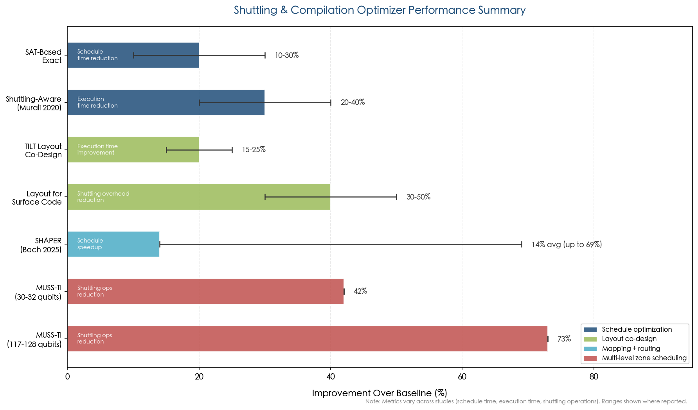

**Figure 5.2 | Compilation optimizer performance summary.** Horizontal bars show the percentage improvement over baseline for seven optimization approaches, spanning schedule optimization (SAT-based exact), shuttling-aware compilation, layout co-design (TILT, surface code–specific layouts), and advanced mapping/routing methods (SHAPER, MUSS-TI). The MUSS-TI compiler demonstrates the largest gains at scale, reducing shuttling operations by 73% for 117–128-qubit applications.

### 5.3.4 Trap Layout Co-Design

Compilation efficiency is deeply coupled to physical trap layout. The TILT (Trap-Ion Layout Tool) framework jointly optimizes trap geometry and circuit scheduling, achieving 15–25% execution time improvement over manually designed layouts [Wu et al., Proc. HPCA (2021)](https://doi.org/10.1109/HPCA51647.2021.00023 "TILT layout optimization"). Compiler-aware trap layout specifically designed for surface code QEC reduces shuttling overhead by 30–50% compared with generic racetrack topologies; the regular structure of QEC syndrome extraction circuits enables specialized zone placement that minimizes ion transport distance [Murali et al., ISCA (2020)](https://doi.org/10.1109/ISCA45697.2020.00051 "QCCD layout co-design for surface code").

For Quantinuum's production systems, the proprietary compiler integrates shuttling scheduling directly into the hardware control pipeline through optimization passes that are not exposed via the open-source TKET framework. While the details of these internal scheduling algorithms remain undisclosed, the H2's demonstrated 2–4× gate-zone parallelism and overall circuit execution performance provide indirect evidence of sophisticated zone-aware scheduling.

## 5.4 Compilation for Modular and Distributed Architectures

As ion trap systems scale beyond single-chip QCCD to multi-module architectures connected by photonic or electronic interconnects, the compilation challenge undergoes a qualitative transformation—from shuttling scheduling within a monolithic trap to circuit partitioning and distributed quantum computation across heterogeneous modules.

### 5.4.1 Circuit Partitioning

Circuit partitioning—dividing a quantum circuit across multiple QPU modules while minimizing inter-module communication—becomes the dominant compilation problem for modular architectures. Balanced hypergraph partitioning techniques reduce inter-module communication by 40–60% compared with naive partitioning [Baker et al., Proc. CF (2020)](https://doi.org/10.1145/3387902.3392617 "Circuit partitioning for modular QC"). Automated distribution algorithms based on minimum-cost Steiner tree optimization achieve further reductions of 50–70% in communication costs relative to random assignment [Andres-Martinez and Sheridan, Phys. Rev. A 100, 032308 (2019)](https://doi.org/10.1103/PhysRevA.100.032308 "Automated circuit distribution"). These techniques will be essential for managing the inter-module entanglement budget as systems grow to tens or hundreds of linked modules.

### 5.4.2 Two-Tier Compilation for Photonic-Interconnect Systems

Photonic-interconnect modular systems create a fundamentally two-tier compilation problem. The *intra-module* tier resembles standard QCCD compilation: deterministic gate execution with shuttling scheduling. The *inter-module* tier, however, must contend with probabilistic entanglement generation, heralded Bell pair creation, entanglement distillation, and gate teleportation. This probabilistic layer introduces scheduling uncertainty that is entirely absent from monolithic compilation.

The compiler must determine when to attempt inter-module entanglement, how many attempts to budget (given success probabilities of ~1–10% per attempt with current technology), whether to pipeline entanglement attempts with intra-module computation, and when distillation of noisy inter-module Bell pairs is necessary. These decisions interact with circuit structure: gates involving qubits on different modules must be rewritten as gate teleportation circuits consuming pre-distributed Bell pairs, and the compiler must maintain a sufficient Bell-pair inventory while minimizing idle time on qubit resources.

IonQ's Reconfigurable Multicore Quantum Architecture (RMQA) introduces an additional compilation dimension: the ability to dynamically reconfigure which ions form computation "cores" within a single trap. In RMQA, multiple ion chains are manipulated to form and dissolve quantum computing cores as dictated by the circuit, with the compiler determining optimal core configurations for each circuit layer [IonQ RMQA](https://www.ionq.com/resources/reconfigurable-multicore-quantum-architecture "IonQ Reconfigurable Multicore Quantum Architecture"). The Tempo system extends this paradigm to photonically interconnected multi-trap modules, although peer-reviewed details of the inter-module compilation strategy remain limited.

### 5.4.3 Noise-Aware Compilation

Noise-aware compilation exploits calibration data to improve circuit fidelity by 10–25%, assigning critical gates to the highest-fidelity qubit pairs. In modular architectures, noise awareness becomes particularly important because inter-module gate fidelities (currently ~89–94% for photonic-interconnect Bell pairs) are dramatically lower than intra-module fidelities (~99.8%). The compiler must therefore minimize the number of inter-module operations and preferentially assign the most error-sensitive gates to intra-module execution, effectively treating inter-module links as a scarce, noisy resource whose consumption must be carefully optimized.

## 5.5 Quantum Intermediate Representations and Software Infrastructure

### 5.5.1 QIR and the Classical-Quantum Interface

The Quantum Intermediate Representation (QIR), developed by Microsoft as an LLVM-based IR, has emerged as a critical infrastructure layer for ion trap systems. QIR supports classical control flow, mid-circuit measurement, conditional branching, and dynamic circuits—capabilities essential for QEC and hybrid quantum-classical algorithms. Quantinuum's H-series systems adopt QIR via Azure Quantum, enabling programs that interleave quantum operations with real-time classical processing [Microsoft Azure Quantum](https://azure.microsoft.com/en-us/products/quantum "Azure Quantum + Quantinuum integration").

The significance of mid-circuit measurement and classical feedback for ion trap QEC is difficult to overstate. Real-time QEC requires measuring syndrome qubits, decoding the error syndrome, and applying conditional corrections—all within the QEC cycle time. On the H-series, mid-circuit measurement achieves approximately 0.3% error, and the FPGA-based classical controller executes branching logic in approximately 1–10 μs [Ryan-Anderson et al., Phys. Rev. X 11, 041058 (2021)](https://doi.org/10.1103/PhysRevX.11.041058 "Real-time QEC feedback on H-series"). Given that the full QEC cycle time is 3–5 ms (dominated by shuttling and cooling), the ~10–50 μs decoding and feedback latency represents less than 2% of the cycle time and is not a current bottleneck.

### 5.5.2 Decoding Latency at Scale

As QEC code distances increase from the current d = 3–4 to the d = 7–11 required for useful fault-tolerant computation, decoding latency will grow correspondingly. For surface codes at distance 7, minimum-weight perfect matching (MWPM) decoders implemented on FPGAs achieve decoding latencies of approximately 1–10 μs in demonstrations on superconducting platforms [Battistel et al., Nano Futures 7, 035007 (2023)](https://iopscience.iop.org/article/10.1088/2399-1984/aceba6 "Real-time decoding for fault-tolerant quantum computing"). Union-Find decoders offer even lower latency with near-linear complexity scaling, making them attractive candidates for FPGA implementation [QUEKUF, ACM (2025)](https://doi.org/10.1145/3733239 "FPGA Union Find decoder").

For ion trap systems, the comfortable margin between decoding latency (~1–10 μs) and QEC cycle time (~3–5 ms) suggests that real-time decoding is unlikely to become a bottleneck even at distance 11, where decoder complexity increases but remains well within the ~3 ms budget. This stands in contrast to superconducting systems, where QEC cycles of ~1–10 μs leave virtually no margin for decoder latency. The ion trap's slower clock speed, often cited as a disadvantage, thus provides a paradoxical benefit: ample time for classical processing within each QEC round.

## 5.6 Classical Control Architecture and Scaling Requirements

### 5.6.1 The Control Hierarchy

The classical control system for an ion trap quantum computer follows a hierarchical architecture. At the top level, a host computer manages job scheduling and high-level circuit optimization. An FPGA-based real-time controller handles gate sequencing, mid-circuit measurement branching, and fast feedback with latency on the order of 1–10 μs. At the lowest level, hardware signal generators produce the precise laser pulses, RF drives, and DC voltage waveforms that manipulate the trapped ions.

For the current H2 system with 56–72 qubits, this control infrastructure comprises approximately 200–300 DC electrode channels, multiple RF drive channels, dozens of laser beam paths, and imaging optics for ion state detection. The FPGA controller generates on the order of 10⁶ updates per second to coordinate these resources in real time.

### 5.6.2 Scaling to 1,000+ Qubits

Scaling to a 1,000-qubit QCCD system demands a qualitative transformation of the control infrastructure. The number of independent DC voltage channels must increase from the current ~200–300 to approximately 5,000–10,000—a 20–50× expansion. Laser or microwave channels must scale from dozens to hundreds. The FPGA control system must coordinate thousands of concurrent shuttling, gating, cooling, and measurement operations with microsecond-level timing precision.

The total classical control power for a 1,000-qubit system is estimated at tens to hundreds of kilowatts, encompassing DACs, RF amplifiers, lasers, FPGAs, and cryocooler systems (~5–15 kW per cryogenic stage). This power budget creates a fundamental tension with cryogenic operation: at 4 K, available cooling power is limited to approximately 1–10 W, severely constraining the amount of classical electronics that can be co-located with the trap chip. CMOS integration of control electronics directly into the trap substrate—demonstrated at MIT Lincoln Lab using commercial 90 nm CMOS [Stuart et al., Phys. Rev. Applied 11, 024010 (2019)](https://doi.org/10.1103/PhysRevApplied.11.024010 "CMOS-integrated ion trap")—offers a path toward addressing the interconnect density bottleneck, where wire-bond density is limited to approximately 100–200 connections per chip edge, far short of the 10,000+ connections that large-scale operation will require.

### 5.6.3 Software Stacks Across the Ecosystem

Beyond Quantinuum and IonQ, other ion trap companies are developing their own software stacks at varying levels of maturity. AQT has integrated its IBEX Q1 trapped-ion system with Amazon Braket (announced November 2025) and deployed systems at European HPC centers through the EuroHPC program, providing cloud access through standard SDK interfaces [AQT Amazon Braket announcement](https://www.aqt.eu/aqt-announces-its-trapped-ion-quantum-computer-now-available-on-amazon-braket/ "AQT on Amazon Braket, November 2025"). Oxford Ionics developed its proprietary QUARTET full-stack quantum computer—delivered to the UK's National Quantum Computing Centre—incorporating its Electronic Qubit Control (eQual) technology for microwave-driven gates [Oxford Ionics NQCC delivery](https://www.oxionics.com/announcements/oxford-ionics-delivers-quantum-computer-to-the-uks-national-quantum-computing-centre/ "Oxford Ionics QUARTET delivery to NQCC"). Following IonQ's acquisition of Oxford Ionics in September 2025, the integration of Oxford Ionics' microwave control technology into IonQ's software stack is anticipated to expand the combined platform's capabilities [IonQ Oxford Ionics acquisition](https://www.ionq.com/news/ionq-completes-acquisition-of-oxford-ionics-rapidly-accelerating-its-quantum "IonQ completes Oxford Ionics acquisition, September 2025"). Universal Quantum's software infrastructure remains at an earlier developmental stage, consistent with the company's hardware TRL of 2–3.

## 5.7 Benchmarking and Performance Metrics

### 5.7.1 Quantum Volume and CLOPS

Quantum Volume (QV) and Circuit Layer Operations Per Second (CLOPS) represent complementary performance metrics that capture different aspects of system capability. QV measures the largest square random circuit that a system can execute with better-than-random fidelity, rewarding both gate fidelity and connectivity. CLOPS measures the throughput of circuit execution, rewarding fast gate speeds and low classical overhead.

Ion trap systems excel at QV—Quantinuum's record of QV = 2²⁰ far exceeds any competing platform—but lag substantially in CLOPS. Typical ion trap CLOPS values of ~30–100 compare unfavorably with superconducting systems achieving 10,000–100,000, reflecting a ~100–1,000× throughput gap driven by slower gate speeds (microseconds versus nanoseconds) and ion transport overhead [Lubinski et al., IEEE Trans. Quantum Eng. 4, 3100332 (2023)](https://doi.org/10.1109/TQE.2023.3253761 "QED-C benchmark results"). This CLOPS disparity has practical implications for applications requiring many circuit evaluations (e.g., variational algorithms with large parameter spaces) and represents a compilation optimization target: improving parallelism, reducing idle time, and streamlining classical processing can incrementally narrow the gap.

### 5.7.2 Algorithm-Level Benchmarks

The QED-C application-oriented benchmarks provide a more holistic assessment of system performance. On these benchmarks, the Quantinuum H1 consistently achieved the highest fidelity scores across algorithm benchmarks at up to 20 qubits, reflecting the combined advantages of high gate fidelity and all-to-all connectivity. However, substantially lower throughput means that wall-clock times for completing benchmark suites are far longer than on superconducting competitors [Lubinski et al., IEEE Trans. Quantum Eng. 4, 3100332 (2023)](https://doi.org/10.1109/TQE.2023.3253761 "QED-C benchmark results").

Mirror circuit benchmarks offer a scalable verification methodology that extends beyond the classical simulation frontier. By constructing circuits that should return the initial state when executed correctly, mirror circuits enable fidelity estimation for circuits too large to simulate classically, providing a critical verification path for the 100+ qubit systems that represent the next scaling milestone [Proctor et al., Phys. Rev. Lett. 129, 150502 (2022)](https://doi.org/10.1103/PhysRevLett.129.150502 "Mirror circuit benchmarking").

## 5.8 Synthesis: The Software Scaling Roadmap

The software and control infrastructure for ion trap quantum computing faces a clear hierarchy of scaling challenges, summarized in Figure 5.3. In the near term (2025–2027), the dominant challenge is shuttling scheduling optimization for single-chip QCCD systems approaching 100–200 qubits. The algorithmic foundations exist—shuttling-aware compilation, zone-aware scheduling, trap layout co-design—but production-quality implementations that handle hundreds of qubits with thousands of gates in real time remain to be demonstrated. Compiler optimizations achieving 40–70% reduction in shuttling operations, as demonstrated by MUSS-TI and SHAPER, provide encouraging evidence that the algorithmic tools are maturing rapidly.

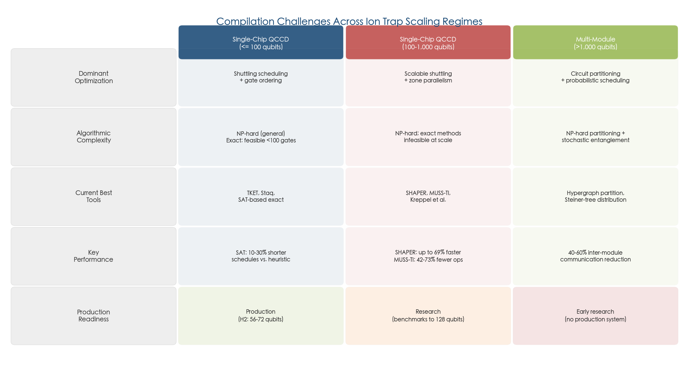

**Figure 5.3 | Compilation challenges across ion trap scaling regimes.** The matrix compares three scaling regimes—single-chip QCCD (≤100 qubits), single-chip QCCD (100–1,000 qubits), and multi-module (>1,000 qubits)—across five dimensions: dominant optimization problem, algorithmic complexity, current best tools, key performance metrics, and production readiness. The progression from production-deployed shuttling schedulers to early-research circuit partitioning highlights the widening gap between hardware ambitions and compiler maturity at larger scales.

In the medium term (2027–2030), the transition to multi-module architectures will demand qualitatively new compilation capabilities. Two-tier compilation for photonic-interconnect systems, circuit partitioning across heterogeneous modules, and scheduling under probabilistic inter-module entanglement represent open research problems with early but promising solutions. The MUSS-TI compiler's explicit modeling of entanglement-module-linked architectures signals that the research community is proactively developing tools for this transition.

For fault-tolerant operation, the classical control infrastructure must support real-time QEC decoding and feedback at increasing code distances. The current ~1,000× margin between decoder latency and ion trap QEC cycle time provides substantial headroom, making real-time decoding a tractable problem for ion traps—a favorable contrast with superconducting platforms where decoder latency is a binding constraint. The integration of QIR-based dynamic circuit support with hardware-level FPGA controllers provides the software architecture needed for fault-tolerant operation.

The most critical unsolved challenge may be the scaling of classical control hardware: the 20–50× increase in electrode channels, the transition from free-space to integrated photonic or microwave-based gate delivery, and the management of system-level power budgets that grow from kilowatts to potentially hundreds of kilowatts. These are fundamentally engineering challenges, but they demand co-design between software and hardware teams to ensure that the control architecture scales gracefully with qubit count. The trajectory of compiler research—from early heuristic schedulers to the sophisticated zone-aware, layout-co-designed, noise-adaptive tools emerging in 2024–2026—provides reason for cautious optimism that the software stack will keep pace with, and in some cases actively enable, the hardware scaling roadmap.

# 第6章 Comparative Assessment of Scaling Approaches

Chapters 1 through 5 established the technical foundations of ion trap quantum computing: the current performance baseline, the architectural paradigms proposed for scaling, the engineering bottlenecks that constrain growth, the quantum error correction (QEC) codes best suited to trapped-ion hardware, and the software and control stacks required to orchestrate operations at scale. This chapter synthesizes those analyses into a structured, evidence-based comparison of the leading scaling strategies. Each approach is evaluated along six dimensions—scalability ceiling, interconnect fidelity and bandwidth, engineering complexity, QEC compatibility, cost trajectory, and technology readiness level (TRL). The chapter concludes with a cross-platform comparison that situates ion traps within the broader quantum computing landscape and a strategic assessment of the most probable scaling trajectories through 2032.

## 6.1 Assessment Framework and Evaluation Criteria

A rigorous comparison of scaling approaches demands a consistent evaluation framework. The six dimensions adopted here are aligned with the assessment methodology employed by the National Academies of Sciences in its 2019 report on quantum computing progress and prospects [NAS, "Quantum Computing: Progress and Prospects" (2019)](https://doi.org/10.17226/25196 "NAS 2019 assessment framework"):

1. **Scalability ceiling** — the maximum number of physical qubits achievable within the architectural paradigm before a fundamental redesign is required. This encompasses both theoretical limits and practical constraints imposed by fabrication, wiring, and routing complexity.

2. **Interconnect fidelity and bandwidth** — the quality and rate of entanglement between qubit modules or zones. For monolithic architectures, the relevant metric is intra-chip shuttling fidelity; for modular architectures, inter-module entanglement fidelity and generation rate are the binding parameters.

3. **Engineering complexity** — the number and difficulty of unsolved engineering challenges, spanning control electronics scaling, vacuum and cryogenic requirements, optical system integration, and fabrication yield.

4. **QEC compatibility** — the degree to which the architecture supports fault-tolerant quantum error correction, considering native connectivity, error profiles, syndrome extraction cycle times, and the overhead imposed by inter-module versus intra-module operations.

5. **Cost trajectory** — projected capital and operational expenditures as systems scale, including infrastructure requirements (cleanroom fabrication, cryogenics, laser systems, classical compute) and the extent to which economies of scale apply.

6. **Technology readiness level (TRL)** — assessed on a 1–9 scale anchored to demonstrated milestones rather than corporate projections. All TRL assignments in this chapter are grounded in peer-reviewed demonstrations and publicly verifiable system-level benchmarks.

Sections §6.2 through §6.5 assess each scaling approach against these dimensions. Section §6.6 provides a consolidated comparative summary, §6.7 extends the analysis to a cross-platform comparison, and §6.8 offers a strategic assessment of the most probable scaling trajectories.

## 6.2 QCCD Monolithic Architecture

### 6.2.1 Current Status and Demonstrated Capability

The quantum charge-coupled device (QCCD) architecture represents the most mature scaling approach for trapped-ion quantum computing. Originally proposed by Kielpinski, Monroe, and Wineland in 2002 [Kielpinski et al., Nature 417, 709–711 (2002)](https://doi.org/10.1038/nature00784 "Seminal QCCD proposal"), QCCD systems physically shuttle ions between dedicated zones—storage, gate operations, measurement, and loading—on a single microfabricated chip.

Quantinuum's Helios processor, announced in late 2025, constitutes the current state of the art. Operating 98 qubits of ¹³⁷Ba⁺ hyperfine ions, the system employs an X-junction connecting a rotatable ion storage ring to quantum logic regions. Helios achieves zone-averaged single-qubit gate infidelity of 2.5(1) × 10⁻⁵, two-qubit gate infidelity of 7.9(2) × 10⁻⁴, and SPAM infidelity of 4.8(6) × 10⁻⁴—the lowest error rates reported for any production-scale quantum computer as of early 2026 [Quantinuum Helios, arXiv:2511.05465](https://arxiv.org/abs/2511.05465 "Helios: A 98-qubit trapped-ion quantum computer, November 2025"). The predecessor H2 system (56 qubits, ¹⁷¹Yb⁺) achieved a quantum volume of QV = 2²⁰ ≈ 1,048,576, and in collaboration with Microsoft demonstrated 12 logical qubits operating below the QEC threshold using color codes [Microsoft and Quantinuum, Nature (2025)](https://www.nature.com/articles/s41586-025-08684-1 "Below-threshold QEC demonstration, Nature 2025").

The Helios architecture represents a significant evolution beyond the H2 racetrack topology. By incorporating a four-way X-junction, Helios enables efficient qubit routing without increasing electrical control complexity per qubit. Quantinuum reports that the number of independent voltage signals per qubit has decreased across successive generations—from H1 through H2 to Helios—demonstrating that the QCCD approach achieves favorable scaling of control resources relative to qubit count [Quantinuum Helios, arXiv:2511.05465](https://arxiv.org/abs/2511.05465 "Helios electrode scaling data").

### 6.2.2 Scalability Ceiling

The QCCD monolithic approach faces a practical ceiling estimated at approximately 100–1,000 qubits per chip. Three principal factors define this boundary:

- **Control channel scaling**: The H2 chip employs approximately 200–300 DC electrodes for 56 qubits. Scaling to 1,000 qubits would demand 5,000–10,000 independent DC voltage channels, necessitating either flip-chip bonding or through-silicon vias (TSVs) for interconnect density beyond the ~100–200 wire bonds per chip edge achievable with current packaging technology [Moses et al., Phys. Rev. X 13, 041052 (2023)](https://doi.org/10.1103/PhysRevX.13.041052 "H2 architecture details"). Although Helios demonstrates that the electrode-per-qubit ratio can be reduced through architectural innovations, the absolute channel count remains a binding constraint at the ~1,000-qubit scale.

- **Shuttling overhead**: Transport operations accumulate motional excitation at approximately 0.1 quanta per primitive, with 10–20 primitives per gate cycle yielding ~1–2 quanta of excitation that must be removed through sympathetic cooling. Shuttling overhead scales as O(√N) for two-dimensional trap architectures. On Helios, the depth-1 circuit time is approximately 55 ms for 98 qubits with random connectivity—already dominated by ion transport rather than gate operations [Quantinuum Helios, arXiv:2511.05465](https://arxiv.org/abs/2511.05465 "Helios depth-1 timing"). Extrapolation to 1,000 qubits suggests depth-1 times approaching hundreds of milliseconds, imposing a throughput constraint for deep-circuit algorithms.

- **Fabrication yield**: Larger trap chips—projected at ~10 cm × 10 cm for 1,000 qubits—face increasing vulnerability to fabrication defects. A single defective electrode can compromise an entire routing path in a QCCD layout, making yield management a critical challenge at scale.

### 6.2.3 Strengths and Risks

**Strengths.** The QCCD monolithic approach benefits from the highest demonstrated gate fidelities of any quantum computing platform, native all-to-all connectivity within the processor (maintained even at 98 qubits on Helios), proven QEC capability with below-threshold operation and real-time feedback, and a commercial track record spanning multiple system generations. The effective two-qubit error rate measured in system-level benchmarks on Helios is 2.0(6) × 10⁻³, consistent with component-level predictions—demonstrating that error rates do not degrade substantially at system scale [Quantinuum Helios, arXiv:2511.05465](https://arxiv.org/abs/2511.05465 "Helios system-level benchmarks").

**Risks.** The primary risk is that control channel scaling and shuttling overhead may impose diminishing returns beyond several hundred qubits on a single chip. CMOS-integrated trap technology—demonstrated at proof-of-concept level by MIT Lincoln Lab on 90 nm CMOS [Stuart et al., Phys. Rev. Applied 11, 024010 (2019)](https://doi.org/10.1103/PhysRevApplied.11.024010 "CMOS-integrated ion trap")—has not yet been validated at production scale. Moreover, the ~55 ms depth-1 time for 98 qubits implies that a 1,000-qubit QCCD chip could face circuit execution times of hundreds of milliseconds per layer, constraining throughput for algorithms requiring deep circuits.

### 6.2.4 TRL Assessment

We assign the QCCD monolithic architecture a **TRL of 6–7**. Helios is a 98-qubit commercial system with demonstrated quantum error correction, real-time classical control, and system-level performance validated by multiple independent benchmarking methodologies. The system operates in a production environment and serves external users via cloud access. The remaining gap to TRL 8–9 lies in demonstrating reliable operation at the ~500–1,000 qubit scale and achieving sustained fault-tolerant computation over algorithm-relevant timescales.

## 6.3 Photonic Interconnect Modular Architecture

### 6.3.1 Operating Principle and Current Performance

Photonic interconnects generate entanglement between ions in separate trap modules through a three-step process: ion–photon entanglement, interference of emitted photons on a beam splitter, and heralded Bell-state measurement—collectively known as the Barrett-Kok protocol [Barrett and Kok, Phys. Rev. A 71, 060310(R) (2005)](https://doi.org/10.1103/PhysRevA.71.060310 "Barrett-Kok protocol"). The first demonstration, by the Monroe group in 2007, achieved approximately 0.01 Bell pairs per second at 87% fidelity [Moehring et al., Nature 449, 68–71 (2007)](https://doi.org/10.1038/nature06118 "First remote ion-ion entanglement"). The best peer-reviewed result to date stands at 4.5 Bell pairs per second at 94% fidelity, reported by Stephenson et al. in 2020 [Stephenson et al., Phys. Rev. Lett. 124, 110501 (2020)](https://doi.org/10.1103/PhysRevLett.124.110501 "Best photonic interconnect rate"). Separately, the Innsbruck group demonstrated ion–ion entanglement over 230 meters using telecom-wavelength-converted photons at fidelity exceeding 90%, establishing compatibility with deployed fiber-optic infrastructure [Krutyanskiy et al., Phys. Rev. Lett. 130, 050803 (2023)](https://doi.org/10.1103/PhysRevLett.130.050803 "230m ion entanglement via telecom photons").

IonQ's Tempo processor is designed around a reconfigurable multicore photonic-interconnect architecture, with the long-term goal of scaling to hundreds or thousands of qubits by networking trap modules [IonQ technology overview](https://ionq.com/technology "IonQ photonic interconnect technology"). IonQ claimed achievement of algorithmic qubit (AQ) 64 in December 2024, though peer-reviewed verification of inter-module entanglement performance has not been published as of early 2026 [IonQ announcement](https://ionq.com/news/ionq-announces-aq64-achievement "IonQ AQ 64 achievement").

### 6.3.2 The Critical Rate Gap

The central challenge for photonic modular scaling is a substantial gap between demonstrated and required entanglement generation rates. Monroe et al. projected that fault-tolerant operation of a modular ion trap computer would require approximately 10⁴ Bell pairs per second [Monroe et al., Phys. Rev. A 89, 022317 (2014)](https://doi.org/10.1103/PhysRevA.89.022317 "Monroe modular architecture requirements"). The best peer-reviewed heralded entanglement rate at high fidelity stands at 4.5 Bell pairs per second at 94% fidelity (Stephenson et al., 2020), while the Duke group has reported raw polarization-encoded rates of 250 pairs/s — a ~40× gap relative to the fault-tolerant target, down from the ~2,200× gap that persisted for half a decade prior to 2025. However, the highest-fidelity result (97%, time-bin encoding) was achieved at only ~10 pairs/s, illustrating the persistent tension between rate and fidelity.

The rate bottleneck arises primarily from low photon collection efficiency. Free-space collection from a single trapped ion typically captures only 1–5% of emitted photons. Cavity-enhanced coupling offers a pathway to efficiencies exceeding 50%; Kobel et al. demonstrated strong ion-cavity coupling compatible with high-fidelity entanglement generation [Kobel et al., npj Quantum Information 7, 6 (2021)](https://doi.org/10.1038/s41534-020-00338-2 "Cavity-enhanced ion-photon coupling"). Integrating high-finesse optical cavities into scalable QCCD trap structures while maintaining ion transport capability, however, remains an unsolved engineering challenge. The cavity must be positioned within tens of micrometers of the ion without introducing excess electric-field noise or constraining the trap geometry, and the mechanical stability requirements are stringent at the sub-wavelength level.

### 6.3.3 Scalability and QEC Implications

In principle, photonic interconnects offer unbounded scalability: any number of trap modules can be linked via optical fiber, and the heralded nature of entanglement generation ensures that failed attempts do not corrupt quantum state. Monroe's hierarchical scaling vision envisions chip-level QCCD modules (50–200 qubits each) connected first within a single vacuum chamber, then across racks via short-range fiber, and ultimately across data centers via long-range fiber with quantum repeaters [Monroe and Kim, Science 339, 1164–1169 (2013)](https://doi.org/10.1126/science.1231298 "Monroe-Kim scaling vision").

For quantum error correction, the heterogeneous error landscape of a photonic modular system poses significant challenges. Within a module, two-qubit fidelity reaches ~99.8–99.9%, but across modules the effective two-qubit fidelity after entanglement generation and gate teleportation drops to approximately 89–94%—a gap of roughly 10–50× in error rate. Nickerson et al. demonstrated theoretically that fault-tolerant operation remains possible even when inter-module error rates are approximately 10× higher than intra-module rates, provided that QEC codes and protocols are specifically designed for this asymmetry [Nickerson et al., Nature Communications 4, 1756 (2013)](https://doi.org/10.1038/ncomms2773 "Distributed QEC with noisy links"). The overhead penalty is substantial: distributed QEC protocols require additional entanglement distillation and increase the physical-to-logical qubit ratio relative to monolithic implementations.

### 6.3.4 TRL Assessment

We assign the photonic interconnect modular approach a **TRL of 3–4**. The Barrett-Kok protocol has been demonstrated at laboratory scale with consistent improvements in rate and fidelity over nearly two decades, progressing from 0.01 pairs/s (2007) to 4.5 pairs/s at 94% fidelity (2020) and 250 pairs/s at lower fidelity (2025). No multi-module quantum computation combining local QCCD gates with photonic inter-module entanglement has been demonstrated in a production or near-production environment. The ~40× rate gap (relative to the 10⁴ pairs/s fault-tolerant target) and the 6–11% inter-module infidelity represent performance shortfalls that must be addressed before system-level integration becomes feasible.

## 6.4 Electronic Interconnect Modular Architecture

### 6.4.1 Operating Principle and Current Status

Electronic interconnects represent a fundamentally different approach to modular scaling. Rather than generating entanglement probabilistically via photons, ions are physically transported between separate trap chips through electric-field-controlled gaps of approximately millimeter scale. This approach is deterministic—each transfer attempt succeeds with near-unit probability—and potentially high bandwidth, with transfer times on the order of ~100 μs per ion.

The primary proponent is Universal Quantum (Brighton, UK), whose architecture derives from the "Sussex blueprint" for a million-qubit trapped-ion quantum computer [Lekitsch et al., Science Advances 3, e1601540 (2017)](https://doi.org/10.1126/sciadv.1601540 "Million-qubit architecture blueprint"). The blueprint envisions a two-dimensional array of X-junction modules connected by electronic links, with microwave-driven gates eliminating laser systems entirely. The projected footprint for a million-qubit system would be comparable to a large server room.

In 2024, the Sussex group demonstrated chip-to-chip ion transport—transferring individual ions between separate trap chips separated by a small gap—at timescales of approximately 100 μs with high fidelity [Stahl et al., Nature Communications (2024)](https://doi.org/10.1038/s41467-024-44986-w "Chip-to-chip ion transport demonstration"). This proof-of-concept constitutes the key experimental validation of the approach, though it has not yet been integrated with quantum gate operations or error correction protocols.

### 6.4.2 Scalability and Advantages

The electronic interconnect approach offers several distinctive advantages over photonic modular alternatives:

- **Deterministic operation**: Unlike photonic interconnects, where each entanglement attempt succeeds probabilistically (typically with success probability well below 1%), electronic transport succeeds deterministically. This eliminates the need for entanglement distillation and substantially simplifies the compilation and scheduling stack.

- **Compatibility with microwave gates**: The architecture pairs naturally with microwave-driven gates, which eliminate complex laser systems altogether. Oxford Ionics has reported two-qubit gate fidelity of 99.97% using microwave-driven gates (2024, peer review pending), though this result was achieved on a separate platform and has not been integrated with electronic interconnects [Oxford Ionics announcement](https://oxfordionics.com/news/oxford-ionics-achieves-record-breaking-qubit-performance "Oxford Ionics 99.97% claim"). NIST provided the foundational demonstration of microwave-driven ion gates in 2011 [Ospelkaus et al., Nature 476, 181–184 (2011)](https://doi.org/10.1038/nature10290 "First microwave-driven ion gate").

- **Potentially lower infrastructure cost**: By eliminating both laser systems and optical cavities/fiber networks, the electronic approach could substantially reduce per-module hardware cost. This projection, however, remains speculative given the early development stage and the absence of detailed cost modeling for production-scale systems.

### 6.4.3 Limitations and Open Challenges

The electronic interconnect approach faces several critical unresolved challenges:

- **Proximity constraint**: Chip-to-chip ion transport requires physical proximity at millimeter-scale gaps, precluding the long-range connectivity that photonic interconnects can provide. This confines the architecture to compact, physically co-located module arrays and limits its applicability to distributed quantum computing scenarios.

- **No system-level integration**: As of early 2026, no experiment has demonstrated chip-to-chip ion transport followed by a high-fidelity gate operation, let alone a QEC cycle involving inter-chip transported ions. The fidelity impact of chip-to-chip transport on subsequent gate operations—including motional excitation upon arrival, recrystallization dynamics in the receiving trap, and cooling requirements—remains uncharacterized at the system level.

- **Single primary proponent**: Universal Quantum is effectively the sole commercial entity pursuing this approach at scale, creating concentration risk for the technology pathway. With approximately £67 million in total funding, the company operates with substantially fewer resources than Quantinuum (>$600 million) or IonQ (>$600 million), which constrains its capacity for parallel engineering efforts.

### 6.4.4 TRL Assessment

We assign the electronic interconnect modular approach a **TRL of 2–3**. The 2024 chip-to-chip transport demonstration validates the underlying physical principle, but the absence of integrated gate operations, QEC compatibility testing, or any multi-qubit system-level benchmark places this approach firmly in the early experimental stage. Progression to TRL 4–5 will require demonstration of a complete transport-gate-measurement cycle across chip boundaries with fidelities compatible with QEC thresholds.

## 6.5 Hybrid QCCD + Photonic Architecture

### 6.5.1 The Consensus Near-Term Strategy

The hybrid approach—combining QCCD monolithic processors as individual modules with photonic interconnects for inter-module entanglement—has emerged as the consensus scaling strategy, endorsed explicitly by IonQ and the Monroe research group, and implicitly by Quantinuum's long-term roadmap. The rationale is straightforward: leverage the proven high-fidelity QCCD approach for near-term scaling to hundreds of qubits per module while developing photonic interconnects in parallel to enable eventual scaling to thousands or millions of qubits.

Monroe's hierarchical scaling vision articulates this approach most explicitly, envisioning four deployment tiers: (1) chip-level QCCD modules with 50–200 qubits; (2) chamber-level connections via short-range photonic or direct transport links; (3) rack-level connections via meter-scale optical fiber; and (4) data-center-level connections via long-range fiber with quantum repeaters [Monroe and Kim, Science 339, 1164–1169 (2013)](https://doi.org/10.1126/science.1231298 "Monroe-Kim scaling vision").

### 6.5.2 Staged Deployment Path

The hybrid strategy enables a staged deployment path that avoids betting entirely on any single interconnect technology:

- **Stage 1 (2025–2028)**: Single-chip QCCD processors with 100–500 qubits, exemplified by Quantinuum's trajectory from Helios (98 qubits) toward projected next-generation systems with several hundred qubits. QEC demonstrations at increasing code distances proceed on monolithic hardware during this phase.

- **Stage 2 (2028–2032)**: Systems comprising two to ten modules connected by photonic links, with each module containing 100–300 qubits. Inter-module entanglement rates must reach at least ~100–1,000 Bell pairs per second to support practical QEC across module boundaries.

- **Stage 3 (2032+)**: Large-scale modular systems incorporating tens to hundreds of modules, requiring the full ~10⁴ Bell pairs per second target and mature distributed QEC protocols capable of operating across heterogeneous error landscapes.

### 6.5.3 QEC in Heterogeneous Error Environments

A critical technical challenge for the hybrid architecture is operating QEC codes across a system with fundamentally different intra-module and inter-module error rates. Within a QCCD module, two-qubit gate fidelity reaches ~99.8–99.92% (Helios-class performance). Across modules via photonic links, the effective two-qubit fidelity after entanglement generation and gate teleportation falls to approximately 89–94%—an error-rate gap of roughly 10–50×.

Theoretical work by Nickerson et al. established that fault-tolerant operation remains viable in such heterogeneous environments, provided that QEC codes account for the asymmetric error structure [Nickerson et al., Nature Communications 4, 1756 (2013)](https://doi.org/10.1038/ncomms2773 "Distributed QEC with noisy links"). Practical approaches include placing inter-module links only along stabilizer boundaries (minimizing the number of high-error operations per syndrome cycle) and employing entanglement distillation to boost inter-module fidelity at the cost of additional ancilla qubits and time.

The overhead penalty for distributed QEC is substantial but potentially manageable. For a surface code operating at distance 7, distributing the code across two modules roughly doubles the number of physical qubits required relative to monolithic implementation, due to the additional ancillas for entanglement distillation and the reduced effective code threshold imposed by heterogeneous errors.

### 6.5.4 Strengths and Risks

**Strengths.** The hybrid approach de-risks the scaling path by allowing monolithic QCCD development to proceed independently of interconnect maturation. Each stage delivers useful quantum computing capability—monolithic QCCD modules are already commercially valuable—while building toward the eventual multi-module architecture. The heralded nature of photonic entanglement ensures that interconnect failures do not corrupt in-module quantum state, providing a graceful degradation property absent from deterministic interconnects.

**Risks.** The primary risk is that photonic interconnect rates may improve too slowly to reach the ~10⁴ pairs/second threshold within the projected timeline. If cavity-enhanced coupling and integrated photonics fail to deliver the required ~1,000× improvement over current rates, the transition from Stage 1 to Stage 2 could stall indefinitely, leaving QCCD scaling bounded at ~1,000 qubits per monolithic chip. The dual-infrastructure cost (QCCD fabrication plus photonic networking) and the compilation complexity of two-tier scheduling (probabilistic entanglement plus deterministic local gates) add substantial system-engineering overhead that may delay deployment even after the component-level performance targets are met.

### 6.5.5 TRL Assessment

The hybrid QCCD + photonic approach inherits the TRL of its constituent components: TRL 6–7 for the QCCD module portion and TRL 3–4 for the photonic interconnect portion. As an integrated system, the hybrid architecture has not been demonstrated; accordingly, its combined TRL stands at approximately **3–4**, pending a multi-module demonstration with both local gates and inter-module entanglement operating in a QEC context.

## 6.6 Comparative Summary of Ion Trap Scaling Approaches

The following assessment consolidates the analyses of §6.2 through §6.5, comparing the four principal scaling strategies across the six evaluation dimensions defined in §6.1. Figure 6.1 provides an at-a-glance visual comparison of each approach's relative strengths and weaknesses.

### 6.6.1 Scalability Ceiling

QCCD monolithic systems face a practical ceiling of ~100–1,000 qubits per chip, constrained by control channel density, shuttling overhead, and fabrication yield. Photonic modular systems offer, in principle, unbounded scalability—the number of networked modules is limited only by optical infrastructure capacity and classical control resources. Electronic modular systems are similarly extensible in principle but confined to physically proximate module arrays owing to the millimeter-scale transport gap requirement. The hybrid approach inherits the unbounded ceiling of photonic interconnects while leveraging QCCD modules as high-quality building blocks.

### 6.6.2 Interconnect Fidelity and Bandwidth

QCCD monolithic systems achieve the highest effective "interconnect" performance: intra-chip shuttling fidelity exceeds 99.99% per transport primitive, and gate-zone two-qubit fidelity reaches 99.8–99.92%. Photonic interconnects lag substantially, with the best demonstrated inter-module fidelity of ~94% at 4.5 Bell pairs per second—a ~2,200× rate deficit relative to fault-tolerant requirements. Electronic interconnects are deterministic and potentially fast (~100 μs per transfer), but their fidelity in the context of subsequent gate operations remains uncharacterized. The hybrid approach operates with a bifurcated fidelity landscape: high fidelity within modules and significantly lower fidelity across module boundaries.

### 6.6.3 Engineering Complexity

QCCD monolithic systems benefit from the highest engineering maturity but face rapidly growing control complexity as qubit counts increase beyond current levels. The transition from ~300 to ~10,000 DC channels requires qualitatively new integration approaches (CMOS co-integration, TSVs). Photonic modular systems layer optical cavities, single-photon detectors, wavelength conversion modules, and fiber networks atop the already complex QCCD engineering stack. Electronic interconnects simplify the optical infrastructure—particularly when paired with microwave gates—but introduce novel precision-engineering challenges for chip-to-chip ion transport, including alignment tolerances and gap field uniformity. The hybrid approach carries the highest aggregate engineering complexity, combining QCCD fabrication, photonic networking, and the associated classical control overhead.

### 6.6.4 QEC Compatibility

QCCD monolithic architectures are the only ion trap approach with demonstrated below-threshold QEC operation. Native all-to-all connectivity within QCCD modules supports efficient color code implementation with transversal Clifford gates, and Quantinuum has demonstrated physical-to-logical qubit encoding ratios as low as 2:1 using high-rate codes on Helios, enabled by the all-to-all connectivity and low physical error rates [Quantinuum Helios blog](https://www.quantinuum.com/blog/introducing-helios-the-most-accurate-quantum-computer-in-the-world "Helios 2:1 encoding rate"). Neither photonic nor electronic modular architectures have demonstrated QEC; their heterogeneous error profiles will require specialized distributed codes with higher overhead. The hybrid approach can perform QEC within modules using standard codes and across modules using distributed protocols, though the latter remain at the theoretical and simulation stage.

### 6.6.5 Cost Trajectory

Detailed cost data for ion trap quantum computers remains largely proprietary. Qualitatively, QCCD monolithic systems benefit from semiconductor-industry fabrication processes (surface-electrode traps manufactured by Sandia or commercial MEMS foundries), but the per-system cost of laser systems, vacuum infrastructure, and cryogenics remains high. Quantinuum's vertical integration via Honeywell provides supply-chain and manufacturing advantages not available to most competitors. Photonic modular architectures add the cost of optical cavities, single-photon detectors, and fiber networks per module. Electronic interconnects paired with microwave gates could reduce per-module cost by eliminating laser systems entirely, though this cost advantage remains speculative given the early development stage. The hybrid approach faces the highest projected total cost, combining QCCD module fabrication with photonic networking infrastructure.

### 6.6.6 TRL Summary

Table 6.1 summarizes the TRL assignments for each scaling approach, anchored to the most significant demonstrated milestone as of early 2026.

| Approach | TRL | Key Demonstrated Milestone |
|---|---|---|
| QCCD Monolithic | 6–7 | 98-qubit commercial system with below-threshold QEC (Helios, 2025) |
| Photonic Modular | 3–4 | 250 Bell pairs/s raw rate (Saha et al., 2025); 97% fidelity at ~10 pairs/s |
| Electronic Modular | 2–3 | Chip-to-chip ion transport proof-of-concept (Stahl et al., 2024) |
| Hybrid QCCD+Photonic | 3–4 | No integrated multi-module demonstration to date |
| Microwave Gates | 4–5 | 99.97% two-qubit fidelity claimed (Oxford Ionics, 2024; peer review pending) |

## 6.7 Cross-Platform Comparison: Ion Traps in the Broader Quantum Computing Landscape

Evaluating ion trap scaling strategies in isolation risks overlooking the competitive dynamics that will shape which quantum computing modalities achieve practical utility first. This section provides a concise, evidence-based comparison of ion trap systems with the three other leading hardware platforms: superconducting circuits, neutral atoms, and photonic quantum computing. Figure 6.2 presents a structured summary of this cross-platform comparison.

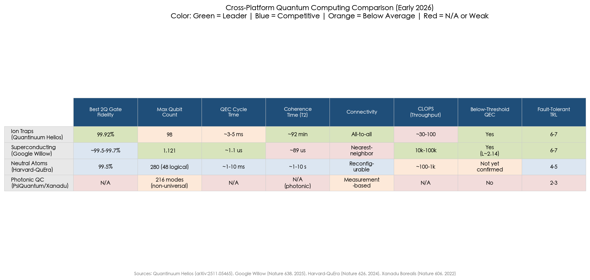

### 6.7.1 Superconducting Circuits

Superconducting quantum computers, led by Google and IBM, represent the most mature competitor to ion trap systems in both engineering scale and error correction demonstrations.

**Qubit count and fabrication.** IBM demonstrated the 1,121-qubit Condor processor in 2023 and has delivered Heron R2 processors with ~133 qubits at two-qubit fidelity of approximately 99.5–99.7%. IBM's roadmap targets a fault-tolerant "Starling" system by 2029, expected to operate ~200 logical qubits interconnecting multiple processor chips via c-couplers and quantum communication links, performing 100 million gate operations [IBM Quantum roadmap](https://www.ibm.com/quantum/blog/large-scale-ftqc "IBM fault-tolerant QC roadmap, June 2025"). IBM demonstrated a 462-qubit Flamingo processor with built-in quantum communication links in 2024, representing the first step toward multi-chip superconducting architectures [IBM Flamingo](https://newsroom.ibm.com/2025-06-10-IBM-Sets-the-Course-to-Build-Worlds-First-Large-Scale,-Fault-Tolerant-Quantum-Computer-at-New-IBM-Quantum-Data-Center "IBM Starling announcement, June 2025").

**QEC performance.** Google's Willow processor (105 transmon qubits) achieved the first below-threshold surface code demonstration in late 2024, with an error suppression factor Λ = 2.14 ± 0.02 when scaling from distance-3 to distance-7 codes. The distance-7 surface code (101 qubits: 49 data + 48 measure + 4 leakage removal) achieved a logical error rate of 0.143% ± 0.003% per cycle, with a QEC cycle time of 1.1 μs [Acharya et al., Nature 638, 920–926 (2025)](https://doi.org/10.1038/s41586-024-08449-y "Google Willow below-threshold QEC"). This cycle time is approximately 3,000–5,000× faster than the ~3–5 ms QEC cycle achievable on ion trap systems.

**Comparative positioning.** Superconducting systems lead in raw qubit count (~10× over ion traps), logical clock speed (~3,000× faster QEC cycles), and throughput (CLOPS of 10,000–100,000 versus ~30–100 for ion traps). Ion traps lead in per-gate fidelity (two-qubit error of ~8 × 10⁻⁴ on Helios versus ~3–5 × 10⁻³ on Willow), connectivity (all-to-all versus nearest-neighbor), and coherence time (T₂ of ~92 minutes for ¹⁷¹Yb⁺ versus ~89 μs for Willow transmons—a factor of approximately 60,000×) [Wang et al., Nature Communications 12, 233 (2021)](https://doi.org/10.1038/s41467-020-20330-w "T2 > 1 hour for Yb-171").

The superconducting platform's speed advantage is partially offset by its lower per-gate fidelity and the SWAP overhead imposed by nearest-neighbor connectivity. For the surface code, the superconducting error suppression factor Λ ≈ 2.14 reflects operation near threshold. Ion trap systems operating at ~0.08% two-qubit error against a color code threshold of ~0.4–0.8% should achieve Λ values in the range of 2–8, potentially exceeding the superconducting result—though this comparison remains speculative pending direct measurement of Λ on ion trap systems at comparable code distances.

### 6.7.2 Neutral Atoms

Neutral-atom quantum computers, exemplified by the Harvard-QuEra reconfigurable atom array platform, have emerged as a particularly vigorous competitor since 2023.

**Qubit count and architecture.** The Harvard-QuEra collaboration demonstrated a logical quantum processor with 48 logical qubits encoded across a 280-atom array in 2023 [Bluvstein et al., Nature 626, 58–65 (2024)](https://doi.org/10.1038/s41586-023-06927-3 "Harvard-QuEra 48 logical qubits"). Atom Computing has loaded over 1,000 atoms in optical tweezer arrays, demonstrating the platform's raw scaling potential. QuEra's commercially available Gemini-class system delivers >99% single-qubit gate fidelity and >99.2% two-qubit gate fidelity [QuEra Gemini](https://www.quera.com/gemini "QuEra Gemini specifications").

**Gate fidelity.** The best demonstrated neutral-atom two-qubit (Rydberg CZ) gate fidelity is 99.5%, achieved by the Harvard-MIT-QuEra group executing 60 gates in parallel [Evered et al., Nature 622, 268–272 (2023)](https://doi.org/10.1038/s41586-023-06481-y "99.5% CZ fidelity on neutral atoms"). This represents a 0.3–0.4 percentage point gap relative to ion trap two-qubit fidelity of 99.8–99.92%. While this gap has narrowed significantly since 2020, closing the remaining distance to ion trap fidelity levels requires addressing fundamental challenges including Rydberg state decay, laser intensity noise, and atom loss during computation.

**QEC comparison.** Neutral atoms have demonstrated the largest number of simultaneous logical qubits (48) but at lower per-gate fidelity and measurement fidelity (~99% versus ~99.5–99.7% for ion traps). QEC cycle times are broadly comparable (1–10 ms for neutral atoms versus 3–5 ms for ion trap QCCD), and both platforms support mid-circuit measurement. The neutral-atom platform's advantage in parallelism—hundreds of two-qubit gates executed simultaneously—partially compensates for lower individual gate fidelity when computing aggregate logical error rates.

**Competitive positioning.** Neutral atoms and ion traps share several characteristics (atomic qubits, long coherence relative to superconducting systems, optical control) and compete most directly for applications requiring moderate-to-high gate fidelity with flexible connectivity. The neutral-atom platform's advantages in scalable qubit loading (optical tweezers can position thousands of atoms) and parallel gate execution may prove decisive if gate fidelity continues improving toward the 99.8%+ range. Conversely, ion traps' demonstrated superiority in per-gate fidelity, measurement fidelity, and QEC code efficiency (2:1 physical-to-logical ratio on Helios) could maintain their edge in error-corrected computation even at smaller qubit counts.

### 6.7.3 Photonic Quantum Computing

Photonic quantum computing, pursued by PsiQuantum (>$700 million in total funding) and Xanadu, follows a fundamentally different paradigm based on photonic qubits with measurement-based or linear-optical quantum computation.

PsiQuantum aims to build a million-qubit fault-tolerant system using silicon photonics manufactured at GlobalFoundries' semiconductor fabrication facilities. The manufacturing scalability argument is compelling—silicon photonics leverages established CMOS infrastructure—but PsiQuantum has not publicly demonstrated a programmable multi-qubit quantum processor as of early 2026. Xanadu's Borealis system demonstrated 216-mode Gaussian boson sampling in 2022 [Madsen et al., Nature 606, 75–81 (2022)](https://doi.org/10.1038/s41586-022-04725-x "Xanadu Borealis"), a computational sampling task that does not constitute universal quantum computation.

Photonic universal quantum computing remains at TRL 2–3, with no demonstrated QEC and fundamental challenges in achieving deterministic photon-photon interactions. For the purposes of this assessment, photonic QC does not represent a near-term competitive threat to ion trap systems for general-purpose computation, though PsiQuantum's manufacturing-first strategy could prove disruptive if its core technical approach proves viable at scale.

### 6.7.4 Platform Maturity Synthesis

As of early 2026, the fault-tolerant quantum computing landscape exhibits a clear tiered structure:

**Tier 1 — Below-threshold QEC demonstrated.** Superconducting circuits (Google Willow, Λ = 2.14) and ion traps (Quantinuum H2/Helios, below-threshold color code operation) are co-leaders. Both platforms have demonstrated the fundamental prerequisite for scalable fault-tolerant computation: logical error rates that decrease exponentially with increasing code distance.

**Tier 2 — Logical qubits demonstrated, threshold not yet confirmed.** Neutral atoms (Harvard-QuEra, 48 logical qubits at lower individual fidelity) have demonstrated the largest number of simultaneous logical qubits but have not yet published a below-threshold scaling demonstration with increasing code distance.

**Tier 3 — Pre-QEC.** Photonic quantum computing has not demonstrated QEC on a programmable processor.

BCG projects the global quantum computing market at $450–850 billion by 2040, with multiple hardware modalities likely coexisting for different application domains [BCG, "The Next Decade in Quantum Computing" (2024)](https://www.bcg.com/publications/2024/next-decade-in-quantum-computing "BCG 2024 quantum market analysis"). We concur with this multi-modality projection: superconducting systems may dominate applications requiring high throughput and shallow circuits (optimization, certain machine learning tasks), while ion traps may prove superior for applications demanding the highest logical fidelity and modest circuit throughput (quantum chemistry, cryptographic protocols, precision quantum simulation). DARPA's US2QC program, which includes ion trap teams and reflects a U.S. defense assessment that multiple modalities remain competitive, reinforces this perspective [DARPA US2QC](https://www.darpa.mil/program/underexplored-systems-for-utility-scale-quantum-computing "DARPA US2QC program").

## 6.8 Strategic Assessment: Most Probable Scaling Paths

Figure 6.3 visualizes the TRL milestones achieved to date and projected timelines for each ion trap scaling approach, providing temporal context for the strategic assessment that follows.

### 6.8.1 Near-Term Trajectory (2025–2030)

QCCD monolithic scaling is the most probable path to ion trap systems with ~500–1,000 physical qubits within the next five years. This assessment rests on three convergent observations:

First, the Helios architecture has demonstrated that QCCD systems can maintain state-of-the-art gate fidelities while scaling to ~100 qubits, with architectural innovations—including X-junctions and reduced electrode-per-qubit ratios—that project favorably to larger qubit counts. Quantinuum's roadmap envisions next-generation systems with several hundred qubits by 2027–2028.

Second, the enabling technologies for QCCD scaling to ~500–1,000 qubits—CMOS-integrated traps (TRL 4–5), microwave-driven gates (TRL 4–5), and advanced sympathetic cooling protocols—are all within plausible development timelines for the 2027–2029 period.

Third, no alternative interconnect technology—photonic or electronic—is sufficiently mature to contribute meaningfully to qubit count within this timeframe. The ~2,200× photonic rate gap and the TRL 2–3 status of electronic interconnects both preclude system-level deployment before 2030.

### 6.8.2 Long-Term Trajectory (2030+)

For scaling beyond ~1,000 physical qubits into the ~10,000–100,000 qubit regime required for utility-scale fault-tolerant computation, modular architectures become necessary. The hybrid QCCD + photonic approach is the most widely endorsed long-term strategy, contingent on achieving approximately three orders of magnitude improvement in photonic entanglement rates. Cavity-enhanced ion-photon coupling offers a credible physical pathway to this goal, with theoretical collection efficiencies exceeding 50% [Kobel et al., npj Quantum Information 7, 6 (2021)](https://doi.org/10.1038/s41534-020-00338-2 "Cavity-enhanced >50% collection").

Electronic interconnects (Universal Quantum) represent an alternative long-term path with distinct risk-reward characteristics. If chip-to-chip transport can be integrated with high-fidelity gate operations and QEC protocols, the deterministic nature of electronic links could prove superior to probabilistic photonic interconnects for densely packed module arrays. The technology's current TRL 2–3 status and limited institutional support, however, make this a higher-risk, higher-potential-reward pathway that requires sustained investment and successful system-level demonstrations within the next three to five years to remain viable.

### 6.8.3 Key Inflection Points

Several events anticipated in the 2026–2030 period will substantially clarify which scaling approaches are most likely to succeed:

- **Quantinuum next-generation system (2026–2027)**: A system with ~200+ qubits maintaining Helios-class fidelities would validate QCCD monolithic scaling beyond the 100-qubit mark and set the stage for ~500–1,000 qubit systems.

- **Photonic rate breakthrough (2027–2029)**: Demonstration of ~100+ Bell pairs per second via cavity-enhanced coupling would narrow the rate gap to ~100× and establish the photonic modular approach as credible for near-term deployment.

- **IonQ multi-module demonstration (2026–2027)**: Peer-reviewed data on inter-module entanglement performance from the Tempo platform would clarify the practical viability of photonic modular scaling at the system level.

- **First commercial multi-module ion trap QPU (2027–2028)**: The first system combining multiple QCCD modules with inter-module entanglement in a commercial or near-commercial context would represent a qualitative milestone in modular scaling.

- **Oxford Ionics system-level benchmarks (2026–2027)**: Demonstration of a complete microwave-gate ion trap system with quantum volume, CLOPS, and QEC benchmarks would validate whether laser-free operation preserves the fidelity advantages of the ion trap platform.

The race to fault-tolerant quantum advantage in the 2028–2032 timeframe will be determined not solely by which architecture achieves the largest qubit count, but by which delivers the lowest logical error rate per unit time—a composite metric that favors platforms combining high physical fidelity with efficient QEC codes and sufficient circuit throughput. On this metric, ion traps' demonstrated advantages in per-gate fidelity, connectivity, and QEC code efficiency position the platform competitively, provided that the scaling challenges analyzed in this chapter can be addressed within the projected timelines.

# 第7章 Industry Roadmaps, Investment Landscape, and Outlook (2025–2027)

The preceding chapters established that ion trap quantum computing has reached a pivotal inflection point: QCCD monolithic systems now exceed 90 physical qubits with gate fidelities approaching the fault-tolerance threshold, quantum error correction has been demonstrated below break-even on multiple codes, and several architectural strategies are advancing toward modular scaling. Whether these laboratory and early-commercial achievements translate into systems capable of addressing real-world problems depends critically on the pace of industrial execution, the magnitude of capital investment, and the alignment between government policy and technical roadmaps. This chapter maps the publicly stated plans of the leading ion trap companies and research programs, assesses the investment and policy environment shaping the field through 2027, and synthesizes a forward-looking outlook on the most probable trajectory toward practical quantum advantage.

## 7.1 Quantinuum: From Helios to Apollo

### 7.1.1 Current Position and Helios Milestone

Quantinuum occupies the strongest technical position among ion trap companies as of early 2026. The company's Helios system, launched in November 2025, operates 98 physical qubits of ¹³⁷Ba⁺ hyperfine ions—nearly doubling the 56-qubit H2 predecessor—while achieving zone-averaged single-qubit gate infidelity of 2.5(1) × 10⁻⁵, two-qubit gate infidelity of 7.9(2) × 10⁻⁴, and state-preparation-and-measurement (SPAM) infidelity of 4.8(6) × 10⁻⁴ [Quantinuum Helios, arXiv:2511.05465](https://arxiv.org/abs/2511.05465 "Helios: A 98-qubit trapped-ion quantum computer, November 2025"). These figures represent the lowest error rates reported for any production-scale quantum computer. Helios delivers 48 logical error-corrected qubits from its 98 physical qubits—a nearly 2:1 physical-to-logical qubit conversion ratio that constitutes a substantial improvement over prior generations [Quantinuum Helios product page](https://www.quantinuum.com/products-solutions/quantinuum-systems/helios "Helios system specifications"). The system operates at less than 40 kW total power consumption and is available via both cloud access and on-premise deployment.

Architecturally, Helios employs a novel X-junction connecting a rotatable ion storage ring to eight quantum logic regions, representing a significant evolution beyond the H2 racetrack topology. Quantinuum reports that the number of independent voltage signals per qubit has *decreased* across successive generations—from H1 through H2 to Helios—demonstrating that QCCD scaling achieves favorable resource efficiency rather than escalating control complexity [Quantinuum Helios, arXiv:2511.05465](https://arxiv.org/abs/2511.05465 "Helios electrode scaling data"). This trend, if sustained, addresses one of the most frequently cited concerns about QCCD scalability.

### 7.1.2 Roadmap to Apollo and Fault Tolerance

Quantinuum's publicly stated roadmap targets universal fault-tolerant quantum computing by approximately 2029 through its planned Apollo system, projected to feature thousands of physical qubits paired with hundreds of logical qubits [HPCwire, "Quantinuum Introduces Helios Quantum System as Roadmap Advances Toward Apollo"](https://www.hpcwire.com/2025/11/05/quantinuum-introduces-helios-quantum-system-as-roadmap-advances-toward-apollo/ "HPCwire Helios launch report, November 2025"). The trajectory from Helios to Apollo requires roughly a 10–20× increase in physical qubit count within three to four years—an ambitious but not unprecedented pace given the progression from H1 (20 qubits, 2021) to H2 (56 qubits, 2023) to Helios (98 qubits, 2025).

The software ecosystem supporting this trajectory has matured in parallel. In August 2025, Quantinuum introduced Guppy, an open-source Python-based quantum programming language, and Selene, a new emulation platform designed to enable algorithm development across multiple hardware generations [HPCwire, "Quantinuum Introduces Helios"](https://www.hpcwire.com/2025/11/05/quantinuum-introduces-helios-quantum-system-as-roadmap-advances-toward-apollo/ "Guppy and Selene software stack"). Alongside the Helios launch, an expanded partnership with NVIDIA links the GB200 Grace Blackwell platform to Helios through NVQLink, advancing hybrid quantum-classical workflows and integrating NVIDIA accelerated computing for real-time error correction via the CUDA-Q platform.

The Microsoft partnership remains central to Quantinuum's fault-tolerance strategy. Their joint demonstration in 2025 of 12 logical qubits operating below the QEC threshold using color codes on the H2 system—published in *Nature*—established ion traps as co-leaders (with superconducting systems) in the race toward fault-tolerant quantum computing [Microsoft and Quantinuum, Nature (2025)](https://www.nature.com/articles/s41586-025-08684-1 "Below-threshold QEC demonstration, Nature 2025"). Logical qubit functionality is planned for the Helios generation, with Azure Quantum providing the primary cloud distribution channel.

The following figure provides a consolidated view of the publicly stated roadmaps of the four leading ion trap companies, illustrating both demonstrated milestones and projected targets through 2030.

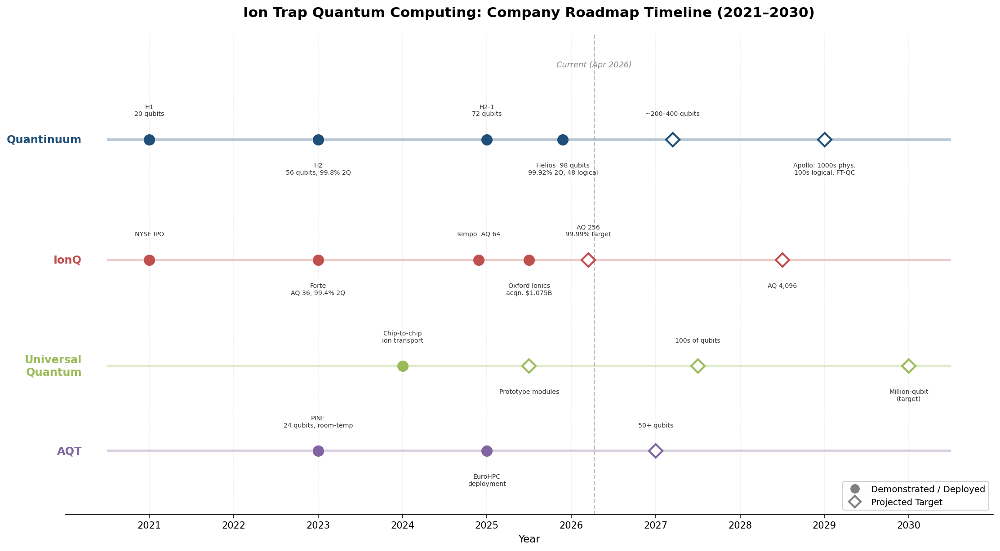

As the timeline illustrates, Quantinuum's progression from H1 to Helios represents the most empirically grounded scaling trajectory in the field, with each generation demonstrating simultaneous improvements in qubit count and gate fidelity—a pattern that distinguishes it from competitors whose projected targets remain ahead of peer-reviewed validation.

### 7.1.3 Funding and Valuation

Quantinuum has secured substantial capital to execute this roadmap. In September 2025, Honeywell announced a $600 million capital raise for Quantinuum at a $10 billion pre-money equity valuation, with investors including NVIDIA's venture capital arm, Quanta Computer, and QED [Honeywell press release](https://www.quantinuum.com/press-releases/honeywell-announces-600-million-capital-raise-for-quantinuum-at-10b-pre-money-equity-valuation-to-advance-quantum-computing-at-scale "Quantinuum $600M raise at $10B valuation, September 2025"). The round was subsequently expanded from $600 million to approximately $800 million after becoming oversubscribed, with Fidelity joining Honeywell and other investors [The Quantum Insider](https://thequantuminsider.com/2025/11/05/fidelity-backs-10-billion-quantum-firm-quantinuum-in-oversubscribed-round/ "Fidelity joins Quantinuum round, November 2025"). Including the earlier $300 million round at a $5 billion pre-money valuation closed in January 2024, Quantinuum has raised over $1.1 billion in external capital [Quantinuum $300M raise](https://www.quantinuum.com/press-releases/honeywell-announces-the-closing-of-300-million-equity-investment-round-for-quantinuum-at-5b-pre-money-valuation "Quantinuum $300M raise, January 2024"). Honeywell retains approximately 54% ownership. International expansion is underway: a Helios system is scheduled for installation in Singapore by 2026 through a collaboration with A*STAR's National Quantum Office.

The following figure places Quantinuum's cumulative funding in the context of the broader ion trap investment landscape, illustrating the pronounced capital concentration at the top of the field.

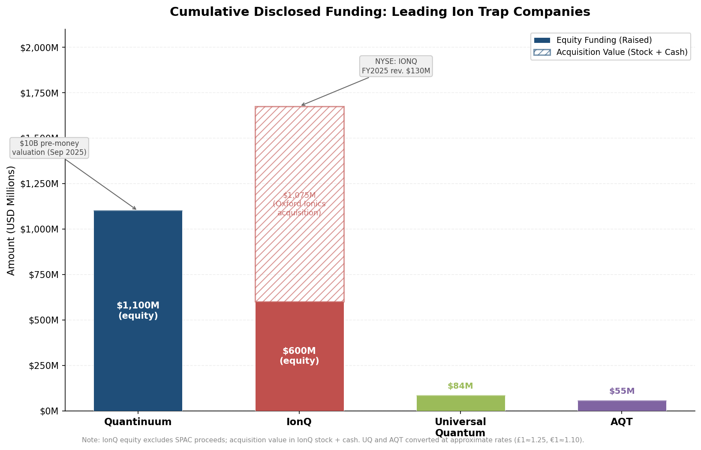

As the funding comparison demonstrates, the ion trap sector exhibits a sharp capital asymmetry: Quantinuum and IonQ together account for the overwhelming majority of disclosed investment, while Universal Quantum and AQT operate with funding levels approximately one to two orders of magnitude smaller.

## 7.2 IonQ: Commercial Scale and the Oxford Ionics Acquisition

### 7.2.1 Financial Performance and Market Position

IonQ holds a unique position as the first publicly traded pure-play quantum computing company (NYSE: IONQ, since October 2021) and has demonstrated the strongest commercial traction of any quantum hardware maker. For fiscal year 2025, IonQ reported GAAP revenue of $130.0 million—a 202% year-over-year increase from approximately $43 million in FY2024—making it the first publicly traded quantum computing company to surpass $100 million in annual revenue [IonQ FY2025 financial results](https://investors.ionq.com/news/news-details/2026/IonQ-Announces-Fourth-Quarter-and-Full-Year-2025-Financial-Results/default.aspx "IonQ Q4 and FY2025 earnings, February 2026"). Q4 2025 revenue reached $61.9 million, representing 428% year-over-year growth. IonQ issued FY2026 revenue guidance of $225–245 million, implying near-doubling from FY2025 levels. Revenue is driven by multi-cloud access (AWS Braket, Microsoft Azure Quantum, Google Cloud), government contracts—including a $54.5 million AFRL quantum networking contract—and enterprise partnerships.

### 7.2.2 Technology Roadmap and the Oxford Ionics Acquisition

IonQ's technical roadmap targets progressive algorithmic qubit (AQ) improvements: AQ 36 (Forte, commercial) → AQ 64 (Tempo, claimed December 2024) → AQ 256 (~2026) → AQ 4,096 (~2028–2029). The Tempo system employs a reconfigurable multicore architecture with photonic interconnects for modular scaling, though peer-reviewed verification of inter-module entanglement performance remains unpublished as of early 2026.

The most consequential strategic development in IonQ's recent history was the announcement in June 2025 of its agreement to acquire Oxford Ionics for $1.075 billion in stock and cash—the largest acquisition in the history of quantum computing [IonQ acquisition announcement](https://www.ionq.com/news/ionq-announces-agreement-to-acquire-oxford-ionics-accelerating-path-to-pioneering "IonQ-Oxford Ionics acquisition, June 2025"). Oxford Ionics' proprietary "eQual" chip technology employs microwave-driven electronic qubit control, eliminating the need for complex laser systems and potentially enabling semiconductor-industry-compatible manufacturing scalability. The combined entity targets systems with 256 physical qubits at 99.99% gate accuracy ("four nines") by 2026, scaling to over 10,000 physical qubits at 99.99999% accuracy ("seven nines"), and ultimately 2 million physical qubits by the end of the decade [IonQ acquisition announcement](https://www.ionq.com/news/ionq-announces-agreement-to-acquire-oxford-ionics-accelerating-path-to-pioneering "Combined company qubit targets").

This acquisition fundamentally alters IonQ's scaling strategy. Oxford Ionics' microwave-based approach claimed 99.97% two-qubit gate fidelity in 2024 (peer-reviewed validation pending), which—if confirmed and maintained at scale—would narrow the fidelity gap with Quantinuum's laser-based gates and substantially reduce the engineering complexity of scaling to thousands of qubits by eliminating free-space laser infrastructure. The integration of two distinct technological approaches (IonQ's photonic interconnect modular architecture with Oxford Ionics' microwave-driven chip technology) represents a strategic bet that hybrid laser-free local gates combined with photonic inter-module links may constitute the optimal path to large-scale ion trap quantum computing.

### 7.2.3 Competitive Positioning and Risks

IonQ's commercial momentum is substantial: $130 million in FY2025 revenue places it ahead of any quantum hardware competitor in top-line performance. Several risks, however, warrant consideration. First, IonQ's demonstrated two-qubit gate fidelity (~99.4% on Forte) remains notably below Quantinuum's 99.92% on Helios, with direct implications for QEC overhead—at 99.4% fidelity, the physical-to-logical qubit ratio required for fault-tolerant operation is substantially higher than at 99.9%+. Second, the Tempo system's AQ 64 achievement has not been independently verified through peer-reviewed benchmarking. Third, the $1.075 billion Oxford Ionics acquisition requires successful integration of two different technical teams and approaches, and the combined entity's aggressive qubit-count targets (256 qubits at 99.99% by 2026) will face imminent empirical testing.

## 7.3 Emerging Players: Universal Quantum and AQT

Beyond the two market leaders, a second tier of ion trap companies pursues architecturally distinctive strategies that could reshape the competitive landscape if their technical approaches mature successfully.

### 7.3.1 Universal Quantum

Universal Quantum (Brighton, UK) pursues the most architecturally differentiated scaling strategy among ion trap companies: electronic (direct ion transport) interconnects combined with microwave-driven gates, following the million-qubit blueprint published by the Sussex group in 2017 [Lekitsch et al., Science Advances 3, e1601540 (2017)](https://doi.org/10.1126/sciadv.1601540 "Million-qubit architecture blueprint"). The company demonstrated chip-to-chip ion transport in 2024, achieving deterministic transfer of ions between separate trap chips via electric fields at approximately 100 μs per transfer [Stahl et al., Nature Communications (2024)](https://doi.org/10.1038/s41467-024-44986-w "Chip-to-chip ion transport demonstration, Sussex 2024").

With approximately £67 million (~$84 million) in total funding, Universal Quantum's staged roadmap envisions prototype modules (2025–2026), systems with hundreds of qubits (2027–2028), and million-qubit operation (2030+). The electronic interconnect approach—deterministic, high-bandwidth, and compatible with microwave gates—offers a fundamentally different scaling philosophy from the photonic interconnects pursued by IonQ. The primary challenge remains that no system-level integration of electronic interconnects with high-fidelity gates and QEC has been demonstrated, leaving this approach at TRL 2–3.

### 7.3.2 AQT (Alpine Quantum Technologies)

AQT, headquartered in Innsbruck, Austria, anchors the European ion trap ecosystem. The company's PINE system operates up to 24 qubits of ⁴⁰Ca⁺ ions in a compact rack-mountable room-temperature configuration, with two-qubit gate fidelity of approximately 99.0–99.5% [AQT product page](https://www.aqt.eu/pine-system/ "AQT PINE system specifications"). AQT systems are deployed at European high-performance computing centers, including the Leibniz Supercomputing Centre (LRZ), as part of the EuroHPC quantum integration initiative.

With over €50 million (~$55 million) in total funding and active participation in the EU Quantum Flagship, AQT's roadmap targets 50+ qubits in its next-generation systems. The company occupies a strategically important niche: providing accessible, room-temperature trapped-ion systems for the European research and HPC communities, even as it trails Quantinuum and IonQ in qubit count and gate fidelity. AQT's compact form factor and room-temperature operation lower barriers to adoption for institutions that cannot support the infrastructure requirements of cryogenic systems.

## 7.4 Government Investment and Policy Landscape

The trajectory of ion trap quantum computing is shaped not only by private-sector roadmaps but also by government funding programs and national quantum strategies that provide both capital and strategic direction. The period 2024–2026 has witnessed a marked shift in government posture—from exploratory R&D funding toward procurement-oriented programs that impose external benchmarking and accountability on commercial scaling claims.

### 7.4.1 United States: DARPA Quantum Benchmarking Initiative

The most consequential U.S. government program for quantum computing development is DARPA's Quantum Benchmarking Initiative (QBI), launched in July 2024 as an expansion of the earlier Underexplored Systems for Utility-Scale Quantum Computing (US2QC) program. QBI aims to "rigorously verify and validate whether any quantum computing approach can achieve utility-scale operation—meaning its computational value exceeds its cost—by the year 2033" [DARPA QBI program](https://www.darpa.mil/research/programs/quantum-benchmarking-initiative "DARPA Quantum Benchmarking Initiative").

The program operates through three stages: Stage A (six months) requires companies to characterize their concepts for building a useful, fault-tolerant quantum computer; Stage B (one year) demands detailed R&D plans including risk identification and risk-reduction prototypes; Stage C involves direct government verification and validation of hardware. As of November 6, 2025, DARPA selected 11 companies to advance to Stage B, including both leading ion trap companies—IonQ and Quantinuum—alongside competitors spanning superconducting (IBM, Nord Quantique), neutral atom (Atom Computing, QuEra), silicon spin (Diraq, Quantum Motion, Silicon Quantum Computing), and photonic (Photonic Inc., Xanadu) modalities [DARPA QBI Stage B selection](https://www.darpa.mil/research/programs/quantum-benchmarking-initiative/stage-b-selection "DARPA QBI Stage B companies, November 2025"). Google Quantum AI entered Stage A in September 2025, while Microsoft and PsiQuantum advanced to the final phase of US2QC (equivalent to QBI Stage C).

The significance of QBI extends well beyond direct funding. The program establishes a government-validated benchmarking framework that will, for the first time, provide independent verification of commercial quantum computing claims—separating demonstrated capability from corporate projection. For ion trap companies, successful passage through Stage B and into Stage C would constitute external validation of their scaling roadmaps at a level of rigor unavailable through any commercial or academic channel.

### 7.4.2 United Kingdom: £2 Billion Quantum Commitment

In March 2026, the UK government announced a £2 billion programme to support the development and commercialization of quantum technologies, centered on the "ProQure: Scaling UK Quantum Computing" initiative [UK Government quantum announcement](https://www.techuk.org/resource/uk-government-announces-up-to-2-billion-for-quantum-technologies.html "UK £2B quantum technology programme, March 2026"). This represents a substantial escalation from the original £2.5 billion National Quantum Strategy announced in 2023 (which spanned ten years across all quantum technologies), focusing specifically on advanced procurement of large-scale quantum computers. The programme explicitly invites companies to begin building and testing early large-scale systems, signaling a decisive shift from R&D support to industrial-scale procurement.

Ion trap companies are positioned as primary beneficiaries. The UK houses two of the field's most significant technical teams: Oxford Ionics (now part of IonQ following the $1.075 billion acquisition) and Universal Quantum (Brighton). The National Quantum Computing Centre (NQCC) at Harwell has engaged both companies, and Oxford Ionics was selected for the Quantum Missions Pilot to upgrade the NQCC testbed with advanced 2D ion traps. The £2 billion commitment creates a domestic market anchor that could accelerate commercialization timelines for UK-based ion trap technologies.

### 7.4.3 European Union and Germany

The EU Quantum Flagship, a €1 billion programme spanning ten years, supports multiple ion trap projects. The AQTION project developed ion trap quantum computing testbeds, while the MILLENION project focuses on modular ion-light interfaces with funding of approximately €10–15 million [EU Quantum Flagship](https://qt.eu "EU Quantum Flagship programme"). EuroHPC has deployed AQT systems at high-performance computing centers, integrating trapped-ion quantum processors into European supercomputing infrastructure.

Germany's €3 billion national quantum strategy (2022–2026) provides additional support through DLR partnerships and direct funding for Universal Quantum and AQT. Notably, the German Cyberagentur awarded a €35 million contract for portable quantum computing, with Oxford Ionics and Infineon Technologies collaborating to deliver a transportable trapped-ion system [Oxford Ionics-Infineon Cyberagentur contract](https://www.oxionics.com/announcements/oxford-ionics-and-infineon-technologies-to-deliver-portable-quantum-computer-to-cyberagentur-as-part-of-e35m-investment/ "Cyberagentur €35M portable quantum computer"). This contract is significant not only for its scale but also for its involvement of Infineon—one of the world's largest semiconductor manufacturers—in the ion trap supply chain.

### 7.4.4 Asia-Pacific

In Asia, South Korea announced a ₩3 trillion (~$2.3 billion) quantum computing plan in 2024, with IonQ establishing partnerships and a presence in the country through collaborations including IonQ-KISTI hybrid quantum-HPC integration. Japan's Moonshot Goal 6 targets fault-tolerant quantum computing by 2050, with a more moderate near-term funding profile. China has invested an estimated $15 billion or more in aggregate quantum technology spending, though this figure spans all quantum technologies (sensing, communication, and computing) and is predominantly directed toward superconducting and photonic approaches; ion trap research in China remains primarily academic in nature.

## 7.5 Supply Chain Maturation and the Quantum Ecosystem

The viability of ion trap scaling roadmaps depends on the maturation of a specialized supply chain that has historically been confined to academic research laboratories. As of 2026, this ecosystem has evolved considerably.

Trap fabrication has transitioned from university cleanrooms to commercial foundry capabilities. Sandia National Laboratories remains the leading provider of high-performance surface-electrode traps (the HOA-2.0 platform), while MEMS foundries are beginning to offer commercial trap fabrication services. Quantinuum maintains vertically integrated trap fabrication through Honeywell's manufacturing infrastructure, providing a supply chain advantage that competitors lack. The IonQ-Oxford Ionics acquisition brings Infineon Technologies — one of the world's largest semiconductor manufacturers — into the ion trap supply chain through the Cyberagentur collaboration, potentially opening pathways to high-volume, semiconductor-industry-compatible trap production.

Specialized vendors have emerged across critical subsystems: vacuum systems (Kimball Physics, SAES), precision lasers (Toptica, M Squared), cryogenic systems (Bluefors, Oxford Instruments), and control electronics (Zurich Instruments, Qblox). NVIDIA's entry into the quantum control stack—through NVQLink integration with Quantinuum's Helios and the CUDA-Q platform—signals that major semiconductor companies view quantum control infrastructure as a commercially viable market.

The transition from bespoke laboratory systems to manufactured products remains incomplete. A 1,000-qubit QCCD system would require over 10,000 DC voltage channels, hundreds of laser or microwave channels, and FPGA-based control systems generating millions of updates per second—infrastructure that does not yet exist as off-the-shelf products. The gap between current supply chain capabilities and the requirements of the Apollo-generation systems represents a significant, though not fundamental, constraint on scaling timelines.

## 7.6 Application Readiness and the Path to Quantum Advantage

### 7.6.1 Near-Term Applications (2025–2028)

The most immediate value proposition for ion trap quantum computers lies not in solving problems beyond classical reach but in providing cloud access to logical qubits—error-corrected quantum resources unavailable on any other platform at comparable fidelity. Quantinuum's Helios already delivers 48 logical qubits, and this capability is expected to expand through the Apollo generation. Cloud access to logical qubits, likely available at growing scale by 2027–2028, enables algorithm developers to begin working with error-corrected resources before full application advantage is demonstrated.

Quantum simulation represents the application domain nearest to practical advantage, with an estimated timeline of 2028–2032. Ion trap systems are naturally suited to simulating quantum spin models, lattice gauge theories, and molecular energy spectra due to their all-to-all connectivity and high gate fidelities. Demonstrations on current hardware—including VQE quantum chemistry calculations for H₂, LiH, and H₂O [Hempel et al., Phys. Rev. X 8, 031022 (2018)](https://doi.org/10.1103/PhysRevX.8.031022 "Ion trap quantum chemistry, Innsbruck 2018"), QAOA optimization [Pagano et al., PNAS 117, 25396 (2020)](https://doi.org/10.1073/pnas.2006373117 "QAOA on trapped-ion system, 2020"), and random circuit sampling on the H2 system—provide algorithmic foundations that will scale with hardware capability.

### 7.6.2 Medium-Term Applications (2028–2035)

Quantum chemistry applications—particularly the simulation of industrially relevant molecules such as FeMo-co (the active site of nitrogenase)—represent a widely cited target for quantum advantage. Resource estimates indicate that simulating FeMo-co requires approximately 100–200 logical qubits and ~10⁸ T gates, translating to roughly 10,000–100,000 physical qubits depending on the QEC code and physical error rate [Reiher et al., PNAS 114, 7555 (2017)](https://doi.org/10.1073/pnas.1619152114 "FeMo-co resource estimates"). At Quantinuum's demonstrated error rates (~8 × 10⁻⁴ two-qubit error), efficient color codes could reduce the physical overhead relative to surface code implementations, potentially placing this application within reach of Apollo-class systems in the early 2030s.

Financial applications—including portfolio optimization, risk analysis, and derivative pricing—represent another domain where 50–200 logical qubits may provide practical advantage, with an estimated timeline of 2028–2032. JPMorgan Chase's partnership with Quantinuum and SoftBank's engagement at the Helios launch reflect financial industry interest in positioning for near-term quantum utility.

Optimization problems occupy a more uncertain position. While QAOA and variational algorithms have been demonstrated on ion trap hardware, theoretical evidence for quantum speedup over classical optimization heuristics for practically relevant problem instances remains inconclusive.

### 7.6.3 Long-Term Horizon: Cryptography

The application most frequently discussed in public discourse—breaking RSA-2048 encryption—remains well beyond the 2027 horizon of this analysis. Resource estimates indicate a requirement of approximately 4,000 logical qubits and ~20 million physical qubits [Gidney and Ekerå, Quantum 5, 433 (2021)](https://doi.org/10.22331/q-2021-04-15-433 "RSA-2048 resource estimates"), placing practical cryptanalysis beyond 2035 for any quantum computing platform.

## 7.7 Outlook and Key Inflection Points (2025–2027)

### 7.7.1 Most Probable Near-Term Trajectory

Based on the evidence assembled across this report, the most probable trajectory for ion trap quantum computing through 2027 can be characterized as follows:

**QCCD monolithic architecture dominates through 2027.** Quantinuum's Helios (98 qubits, November 2025) establishes the current frontier, and the company's engineering trajectory—demonstrated through four system generations with progressively improving fidelity and qubit count—provides the strongest evidence for continued near-term scaling. We anticipate that Quantinuum will demonstrate systems in the 200–400 qubit range by late 2027, potentially as an intermediate milestone on the path to Apollo. The decreasing electrode-per-qubit ratio observed across generations suggests that the QCCD approach will not encounter the control-complexity wall predicted by some analysts until well above 500 qubits.

**IonQ's post-acquisition roadmap faces a critical test.** The combined IonQ-Oxford Ionics entity has committed to 256 physical qubits at 99.99% gate accuracy by 2026—an ambitious target that requires simultaneously scaling qubit count, integrating microwave-driven gates into a production system, and maintaining the photonic interconnect architecture for inter-module connectivity. Achievement of this target would dramatically narrow the fidelity gap with Quantinuum and validate the microwave-gate approach at system scale. Failure to meet this timeline would raise questions about the integration of the two companies' technologies.

**Modular photonic interconnects remain pre-commercial.** Despite IonQ's commercial framing of the Tempo architecture, a substantial gap persists between demonstrated photonic entanglement rates and those required for fault-tolerant modular operation. The best raw rate of 250 Bell pairs/s (Saha et al., 2025) remains ~40× below the ~10⁴ pairs/s target, and the highest-fidelity result (97%) was achieved at only ~10 pairs/s. No peer-reviewed demonstration of multi-module quantum computation combining local QCCD gates with photonic inter-module entanglement has been published. Cavity-enhanced ion-photon coupling offers a theoretical pathway to the required rates, but system-level integration with QCCD traps has not been demonstrated. We assess that photonic interconnects will not contribute to production-scale systems before 2028 at the earliest.

### 7.7.2 Key Inflection Points

Several specific milestones will determine the trajectory of the field within the 2025–2027 window:

1. **Quantinuum intermediate scaling demonstration (~200+ qubits, 2026–2027)**: A successful demonstration of a system significantly beyond 100 qubits with maintained or improved fidelity would validate QCCD scaling and strengthen the case for the Apollo timeline.

2. **IonQ 256-qubit system at "four nines" (2026)**: Meeting the post-acquisition target of 256 qubits at 99.99% accuracy would validate both the microwave-gate approach and IonQ's integration strategy.

3. **DARPA QBI Stage B to Stage C transitions (2026–2027)**: Passage of ion trap companies through Stage B would represent independent government validation of their scaling roadmaps, while any company failing to advance would signal significant concerns about their approach.

4. **First commercial multi-module ion trap QPU (2027–2028)**: Demonstration of a production-accessible system using inter-module entanglement—whether photonic or electronic—would mark the transition from monolithic to distributed ion trap quantum computing.

5. **Quantum advantage demonstration (2028–2030)**: Achievement of a computation on an ion trap system that produces results of practical value beyond classical capability, likely in quantum simulation or chemistry.

### 7.7.3 Competitive Dynamics and Convergence

The ion trap scaling landscape as of 2026 reveals a pattern of strategic convergence. Quantinuum leads on demonstrated technical performance (fidelity, QEC, qubit count), while IonQ leads on commercial metrics (revenue, public-market presence, cloud accessibility). The IonQ-Oxford Ionics acquisition represents a convergence toward hybrid approaches: microwave-driven local gates (eliminating laser complexity) combined with photonic interconnects (enabling modularity). Universal Quantum's electronic interconnect approach remains the primary alternative scaling paradigm but operates at significantly earlier TRL.

Government programs—particularly DARPA QBI and the UK's £2 billion commitment—are shifting from pure R&D funding toward procurement and validation frameworks that will impose external accountability on corporate scaling claims. This shift benefits technically mature companies with demonstrated results and disadvantages those relying primarily on projections.

The broader competitive landscape remains intensely contested. Superconducting systems (Google Willow, IBM's modular roadmap) offer ~3,000× faster QEC cycle times but 2–5× higher per-gate error rates. Neutral-atom platforms (QuEra, Atom Computing) have demonstrated the most logical qubits (48) but at lower gate and measurement fidelities. The BCG 2024 analysis projecting a quantum computing market of $450–850 billion by 2040 [BCG, "The Next Decade in Quantum Computing" (2024)](https://www.bcg.com/publications/2024/next-decade-in-quantum-computing "BCG 2024 quantum market analysis") envisions multiple hardware modalities coexisting for different application domains—a plausible scenario given the distinct performance profiles of each platform.

We assess that ion trap systems are the most likely platform to deliver the first demonstration of fault-tolerant quantum computation at application-relevant scale, based on the combination of highest demonstrated gate fidelities, proven below-threshold QEC operation, and the strongest government-validated scaling roadmaps. The critical question is not whether ion trap scaling will succeed, but whether the pace of scaling is sufficient to maintain competitive advantage as alternative platforms close their respective performance gaps.

# 结论与风险提示

## Core Conclusions

This report's analysis of ion trap quantum computing scaling — spanning hardware performance, architectural paradigms, engineering bottlenecks, quantum error correction, software infrastructure, competitive positioning, and investment dynamics — yields five principal conclusions.

**First, QCCD monolithic architecture is the proven and dominant near-term scaling path.** Quantinuum's progression from H1 (20 qubits, 2021) through H2 (56 qubits, 2023) to Helios (98 qubits, 2025) constitutes the most empirically grounded scaling trajectory in quantum computing. Each generation has simultaneously increased qubit count and improved gate fidelity — a pattern that no competing ion trap approach and no alternative quantum computing platform has matched at comparable system-level performance. Helios's two-qubit gate infidelity of 7.9 × 10⁻⁴, single-qubit gate infidelity of 2.5 × 10⁻⁵, and 48 error-corrected logical qubits at a nearly 2:1 encoding ratio establish the current state of the art across all quantum computing modalities. The QCCD architecture faces a practical ceiling of approximately 100–1,000 qubits per chip, but architectural innovations — decreasing electrode-per-qubit ratios, the WISE wiring architecture, and chiplet-based fabrication — provide credible engineering pathways to extend this ceiling through the end of the decade.

**Second, modular scaling via photonic interconnects is the consensus long-term strategy but remains far from operational readiness.** The ~40× gap between the best demonstrated raw photonic entanglement rate (250 Bell pairs/s by Saha et al., 2025) and the ~10⁴ pairs/s estimated for fault-tolerant modular operation represents a significant technical obstacle on the path to large-scale ion trap quantum computing — though this gap has narrowed dramatically from the ~2,200× deficit that prevailed before 2025. Cavity-enhanced photon collection offers a physically credible route to closing this gap, but system-level integration of high-finesse optical cavities with QCCD transport has not been demonstrated. The Oxford group's 2025 demonstration of distributed quantum computing across two photonically linked modules — achieving 86% gate teleportation fidelity and executing Grover's algorithm distributedly — constitutes a landmark proof of concept, yet the fidelities and rates remain far below fault-tolerant requirements. We estimate that photonic interconnects will not contribute to production-scale ion trap systems before 2028–2030.

**Third, ion traps hold a structural advantage in quantum error correction that partially compensates for their throughput disadvantage.** Native all-to-all connectivity within QCCD modules enables efficient implementation of color codes (10–25 physical qubits per logical qubit at distance 3–5), subsystem codes such as the tesseract code (2.7:1 encoding ratio), and potentially qLDPC codes (12:1 encoding ratio for the [[144,12,12]] bivariate bicycle code) — code families that nearest-neighbor architectures cannot natively support without substantial SWAP overhead. This code-efficiency advantage means that ion traps require fewer physical qubits per logical qubit than superconducting systems to achieve comparable logical error rates, a critical consideration during the era when physical qubit counts remain constrained. The 3–5 ms QEC cycle time — roughly 3,000× slower than superconducting systems — imposes a real throughput limitation, but massive parallelism across gate zones and modules, combined with the reduced number of QEC rounds required at lower physical error rates, narrows the effective gap at the system level.

**Fourth, the engineering challenges of scaling to ~1,000 qubits are formidable but bounded.** No single bottleneck constitutes a fundamental physical barrier. The required advances — a 20–50× increase in DC control channels, transition from free-space to integrated optical or microwave-based gate delivery, management of cumulative motional excitation over longer transport paths, and semiconductor-grade trap fabrication yield — each demand roughly one order of magnitude improvement from current capabilities. The WISE architecture, chiplet fabrication, EIT cooling, and microwave-driven gates represent concrete, actively pursued solutions. The challenge is one of concurrent engineering across tightly coupled subsystems within a compressed timeline, not of overcoming fundamental physical limits.

**Fifth, the competitive landscape favors a multi-modality future, with ion traps occupying a distinctive niche.** Superconducting systems lead in throughput and QEC cycle speed; neutral atoms lead in raw qubit loading capacity and parallelism; ion traps lead in per-gate fidelity, connectivity, coherence time, and QEC code efficiency. BCG projects the global quantum computing market at $450–850 billion by 2040, with multiple hardware modalities likely coexisting for different application domains. We concur with this projection: ion traps are best positioned for applications demanding the highest logical fidelity and modest circuit throughput — quantum chemistry, precision quantum simulation, and cryptographic protocols — while superconducting systems may dominate applications requiring high throughput and shallow circuits.

## Risk Assessment

Several categories of risk could delay or derail the scaling trajectory outlined in this report.

**Photonic interconnect rate stagnation.** If cavity-enhanced ion-photon coupling fails to close the remaining ~40× gap from the best demonstrated raw entanglement rate (250 pairs/s) to the ~10⁴ Bell pairs/s target within the projected timeline, the transition from single-chip to multi-module architectures could stall, capping ion trap quantum computers at ~1,000 physical qubits indefinitely. This represents the single highest-impact risk for the long-term scaling trajectory.

**Competitive platform acceleration.** Superconducting systems are advancing rapidly: Google's Willow demonstrated below-threshold surface code QEC with Λ ≈ 2.14, and IBM's roadmap targets ~200 logical qubits by 2029. If superconducting two-qubit fidelities improve from the current ~99.5% to ~99.8%+ while maintaining their ~3,000× speed advantage, the combined throughput-fidelity metric could shift decisively in their favor. Neutral-atom platforms pose a similar risk: if Rydberg gate fidelities reach 99.8%+ and atom loading scales to thousands of qubits, the neutral-atom platform's parallelism advantage could prove decisive for specific application classes.

**Integration risk from the IonQ-Oxford Ionics merger.** The $1.075 billion acquisition requires successful integration of two distinct technological approaches (photonic interconnects and microwave-driven gates) and two engineering teams. The combined entity's target of 256 qubits at 99.99% gate accuracy by 2026 is aggressive. Delays or underperformance could erode investor confidence in the modular photonic-interconnect strategy and in the viability of microwave-driven gates as a competitive alternative to laser-based systems.

**Fabrication and supply chain constraints.** Scaling to ~1,000-qubit QCCD systems requires trap chips with 5,000–10,000+ electrodes fabricated at semiconductor-grade yield on substrates optimized for low RF loss and thermal management. No published data exist on fabrication yield statistics for trap chips at this scale. The specialized supply chain — from trap fabrication to precision lasers to cryogenic systems — remains immature relative to the demands of the Apollo-generation systems projected for ~2029.

**Throughput ceiling for deep circuits.** Ion trap QEC cycle times of 3–5 ms create a fundamental constraint for algorithms requiring deep sequential circuits. For a computation requiring 10⁸ sequential logical operations — characteristic of cryptographically relevant factoring — purely sequential execution would require over 100,000 hours, necessitating massive parallelism that in turn demands the modular scaling capabilities not yet available. Applications requiring such depth may remain impractical on ion trap systems until multi-module operation is achieved.

**Government program and funding concentration risk.** Over 85% of disclosed ion trap investment is concentrated in two companies (Quantinuum and IonQ). DARPA QBI and the UK's £2 billion programme introduce government-validated benchmarking that could redirect funding flows based on demonstrated — rather than projected — performance. Companies failing to advance through these programs' validation stages face potential capital constraints that could slow or halt their scaling efforts.

## Limitations of This Analysis

Several limitations constrain the scope and precision of this report's conclusions.

The analysis relies predominantly on peer-reviewed publications, corporate press releases, and verified regulatory filings available through early April 2026. Proprietary data on trap fabrication yield, internal error budgets, and detailed engineering roadmaps are not publicly available for any ion trap company, introducing uncertainty into projections of scaling timelines and engineering feasibility.

Cost modeling is qualitative rather than quantitative. Detailed capital and operational cost data for ion trap quantum computers remain proprietary, precluding rigorous cost-per-logical-qubit comparisons across platforms or scaling approaches.

Several key claims cited in this report — notably IonQ's AQ 64 achievement on the Tempo system and Oxford Ionics' 99.97% two-qubit gate fidelity — lack independent peer-reviewed verification as of early 2026. These claims are treated as credible corporate projections rather than established facts, and our conclusions are calibrated accordingly.

The cross-platform comparison is necessarily snapshot-based. All competing platforms are advancing simultaneously, and the relative positioning described here reflects early 2026 data. Breakthroughs on any platform — particularly in superconducting two-qubit fidelity, neutral-atom measurement fidelity, or photonic qubit scalability — could substantially alter the competitive landscape within one to two years.

Finally, projections of application-readiness timelines (quantum chemistry by ~2030, cryptographically relevant computation beyond 2035) depend on assumptions about both hardware scaling pace and algorithmic resource requirements. Improvements in quantum algorithms could reduce resource requirements, while unforeseen engineering obstacles could delay hardware availability, creating substantial uncertainty bands around all timeline estimates.
