# 执行摘要

薄膜铌酸锂（thin-film lithium niobate, TFLN）集成光子学的核心制造步骤——等离子体刻蚀——在将亚微米厚度的单晶 LiNbO₃ 薄膜图形化为低损耗波导与微腔结构的同时，不可避免地在波导侧壁及亚表面区域引入五类材料损伤：晶格无序化与非晶化、离子注入（Ar⁺/F⁺）、再沉积层、表面与亚表面粗糙化以及化学计量比偏移。这些损伤通过散射、吸收和有效非线性/电光系数退化等机制，共同构成制约器件光学品质因子（*Q*）、传播损耗、电光系数 *r*₃₃ 及二阶非线性极化率 χ⁽²⁾ 进一步提升的核心瓶颈。本报告面向从事 LN 基非线性光子学研究的团队，系统梳理了等离子体刻蚀损伤的产生机理及当前可用的全链条缓解策略，涵盖刻蚀前预防、过程级原位抑制、刻蚀后修复和前沿探索方向四个层次。

**损伤机理与量化影响。** 在典型 ICP-RIE 条件下（ICP ~800 W、RF ~100–200 W），侧壁非晶化层深度约 5–20 nm，侧壁均方根粗糙度（Rq）约 1–5 nm，含氟配方还额外引入 F⁺ 注入和 Li/Nb/O 化学计量比偏移。从 2007 年首个 TFLN 电光微环的 *Q* ~10⁴ 到 2024 年直接刻蚀微环 *Q* 达 2.9×10⁷（Zhu et al., Photonics Res. 2024），传播损耗降低了三个数量级，但当前最优水平距 LN 本征材料吸收极限（*Q* ~1.6×10⁸）仍有约一个数量级差距。

**刻蚀前预防。** 掩模材料选型和刻蚀参数优化是从源头抑制损伤的最高效手段。类金刚石碳（DLC）掩模以约 3:1 的选择比和无金属再沉积污染，成为综合性能最优的新型掩模材料。高 ICP/RF 功率比策略（≥5:1）通过解耦等离子体密度与离子能量，在维持刻蚀速率的同时将非晶化层控制在约 5 nm 以下。双步刻蚀策略（含氟高速粗刻 + 纯 Ar 低偏压精修）可进一步降低最终损伤态。

**过程级原位抑制。** 原子层刻蚀（ALE）取得了从无到有的实质性突破：2024–2025 年间，Caltech Minnich 团队先后在 MgO:LN 上实现了各向同性 ALE（H₂+SF₆/Ar，EPC ≈ 1.59 Å/cycle，协同性 96.9%）和方向性 ALE（HBr/BCl₃/Ar+Ar，EPC ≈ 1.0 nm/cycle，协同性 84.6%），其中 HBr 化学路线有效解决了长期困扰 LN 刻蚀的 LiF 非挥发性产物再沉积问题，200 °C 下表面 Rq 维持在 0.25 nm（与抛光面无统计差异）。脉冲等离子体刻蚀通过 IEDF 窄化理论上可将有效离子能量控制在 LN 位移阈值附近，具有中高潜力但尚无 LN 直接实验验证。

**刻蚀后修复。** 350 °C 空气退火（3 h）已成为业界标准后处理步骤，可将传播损耗改善 2–3 倍并有效恢复 *r*₃₃ 与 χ⁽²⁾。化学机械抛光（CMP）在表面粗糙度改善方面具有退火无法替代的独特优势，可实现约一个数量级的 *Q* 值提升。当前两大主流后处理路线——Loncar 组"ICP-RIE→HF 清洗→退火"与 Tang 组"IBE→CMP→退火"——均已达到 *Q* > 10⁷ 量级；Li et al. 2023 在 *Nature* 报道的 *Q* ≈ 2.6×10⁸ 进一步验证了 CMP 前置处理+优化 IBE+退火的完整链条可将性能推至接近材料本征极限。

**前沿方向与技术展望。** 混合 ICP-RIE/IBE+ALE 精修工艺有望在 2–3 年内成为追求极端性能（*Q* > 10⁸）器件的标准路线之一。SiN-LN 和 Si-LN 混合集成通过完全规避 LN 刻蚀，为电光调制器提供了产业化替代方案，但在高效 χ⁽²⁾ 非线性应用中存在本征模式重叠积分劣势。机器学习辅助工艺优化有望在 1–2 年内出现首批 TFLN 专属报道。中性束刻蚀和化学计量比铌酸锂衬底等更长期方向尚处于早期探索阶段。

综合而言，TFLN 平台正进入"工艺精度最后一英里"阶段。主体刻蚀技术已高度成熟，前沿探索聚焦于亚纳米级残余损伤的精密消除。对于 LN 基非线性光子学研究者，根据目标器件类型（超高 *Q* 微环、宽带调制器、PPLN 频率转换器件）选择差异化的工艺路线，同时密切跟踪 ALE（尤其 HBr 化学体系）和 ML 辅助优化的进展，将是近期内最具回报的研究投入方向。

# 第1章 铌酸锂等离子体刻蚀及其材料损伤机理

薄膜铌酸锂（thin-film lithium niobate, TFLN）集成光子学的核心制造步骤在于将亚微米厚度的单晶铌酸锂（LiNbO₃, LN）薄膜图形化为低损耗脊型波导与微环谐振器。等离子体刻蚀——以电感耦合等离子体反应离子刻蚀（inductively coupled plasma reactive-ion etching, ICP-RIE）和离子束刻蚀（ion beam etching, IBE）为代表——构成当前 TFLN 波导制造的主流技术路线，已将传播损耗推低至 0.027 dB/cm、内禀品质因子（*Q*）突破 10⁷ 量级 [Zhang et al., Optica 2017](https://doi.org/10.1364/OPTICA.4.001536 "Monolithic ultra-high-Q LN microring, Optica 4(12), 2017")。然而，刻蚀过程中高能离子与 LN 晶格之间不可避免的物理与化学相互作用，在波导侧壁及亚表面区域引入多种形式的材料损伤，构成制约器件光学和电光性能进一步提升的核心瓶颈。

本章系统阐述等离子体刻蚀对 LN 造成的损伤类型、产生机理及其对关键光学参数的量化影响，为后续各章讨论缓解策略提供物理判据与评价基准。

## 1.1 TFLN 等离子体刻蚀技术概览

### 1.1.1 ICP-RIE：主流制造平台

ICP-RIE 是当前 TFLN 波导制造中采用最为广泛的干法刻蚀技术。其核心架构由两个独立射频源组成：ICP 线圈产生高密度等离子体（典型离子密度约 10¹¹–10¹² cm⁻³），为化学反应与物理溅射提供充足的活性物种；射频偏压（RF bias）控制鞘层电压，决定离子轰击衬底的能量。这种双源解耦设计使 ICP-RIE 能够在保持较高刻蚀速率的同时，对离子能量实施精细调控。

Zhang et al. 2017 年在 X-cut TFLN 上取得了 ICP-RIE 工艺的里程碑式成果：在 ICP 功率约 800 W、RF 偏压约 100–150 W、腔压约 5–8 mTorr 的参数窗口下，实现了传播损耗低至 0.027 dB/cm、内禀 *Q* 值超过 10⁷ 的微环谐振器 [Zhang et al., Optica 2017](https://doi.org/10.1364/OPTICA.4.001536 "Monolithic ultra-high-Q LN microring, Optica 4(12), 2017")。相比之下，早期未优化的 ICP-RIE 波导传播损耗高达 2–3 dB/cm，*Q* 值仅为 10⁴–10⁵ [Guarino et al., Nat. Photonics 2007](https://doi.org/10.1038/nphoton.2007.227 "首个TFLN电光微环谐振器")。两者之间近两个数量级的损耗差距表明，刻蚀引起的材料损伤是 TFLN 器件性能的主导限制因素。

ICP-RIE 常用气体配方分为两大类。其一为纯 Ar 物理溅射，刻蚀速率约 20–40 nm/min，不引入化学杂质但需较高离子能量维持合理速率 [Ulliac et al., Microelectron. Eng. 2011](https://doi.org/10.1016/j.mee.2011.03.014 "Ar plasma ICP-RIE for LN waveguide")。其二为 Ar 与含氟气体（CHF₃、CF₄ 或 SF₆）的混合化学-物理刻蚀，以 Ar/CHF₃（混合比约 1:1–3:1）为代表——含氟气体通过形成挥发性产物 NbF₅（沸点 234°C）大幅提高刻蚀速率至约 40–80 nm/min，同时 CHF₃ 分解产生的 CₓFᵧ 聚合物在侧壁形成钝化层，有利于获得更陡的侧壁角度（60°–80°，对比纯 Ar 的 50°–70°）[Zhang et al., Optica 2017](https://doi.org/10.1364/OPTICA.4.001536 "高Q微环Ar基配方")。然而，含氟化学不可避免地带来额外的损伤来源——F⁺ 离子注入与化学计量比偏移——将在 1.4 节和 1.7 节详细讨论。

截至 2024 年，直接刻蚀 TFLN 微环的最高 *Q* 值记录为 Zhu et al. 报道的 2.9×10⁷（对应传播损耗约 1.3 dB/m），该工作采用 IBE 刻蚀结合 HSQ 介质掩模及化学清洗与退火后处理 [Zhu et al., Photonics Res. 2024](https://doi.org/10.1364/PRJ.521831 "Twenty-nine million intrinsic Q-factor monolithic microresonators on TFLN")。Li et al. 2023 年在 *Nature* 报道的 *Q* = 2.6×10⁸（传播损耗约 5.6×10⁻³ dB/cm）则依赖 CMP 前置平坦化、IBE 刻蚀与退火的多步融合工艺，其极端 *Q* 值的获得高度依赖于对刻蚀损伤的系统性抑制与修复 [Li et al., Nature 2023](https://doi.org/10.1038/s41586-023-06602-x "High-Q TFLN ring resonators")。截至 2026 年 4 月，尚无 *Q* > 10⁹ 的 TFLN 微环报道，表明材料损伤（结合 LN 本征材料吸收 *Q* ~1.6×10⁸）仍是 *Q* 值进一步提升的基本限制。

### 1.1.2 IBE：高侧壁质量方案

IBE（Ar⁺ ion beam etching，即离子铣）采用宽束 Ar⁺ 离子束（典型能量 300–500 eV），经栅极独立提取和加速，入射角与衬底旋转均可精确控制。与 ICP-RIE 相比，IBE 的核心优势在于离子能量分布函数（IEDF）极为单一（近似单能），方向性优异，可获得 RMS 粗糙度约 0.5–2 nm 的光滑侧壁 [Wu et al., Nanophotonics 2022](https://doi.org/10.1515/nanoph-2022-0130 "Long-range TFLN waveguide")。然而，IBE 存在两项固有不足：其一，LN 对掩模的选择比极低（约 1:1–2:1），深刻蚀（>300 nm）需厚金属硬掩模；其二，典型离子能量（300–500 eV）高于 ICP-RIE 的等效自偏压（约 100–300 eV），单次碰撞造成的损伤更深 [He et al., Opt. Lett. 2019](https://doi.org/10.1364/OL.44.002314 "Low-loss fiber-to-chip TFLN interface")。

Li et al. 2019 年报道了基于 IBE 的 TFLN 微环，*Q* 值约 10⁶ [Li et al., PRL 2019](https://doi.org/10.1103/PhysRevLett.122.253801 "IBE TFLN 光力系统")。值得关注的是，长时间 IBE 刻蚀后底面可能出现由再沉积引起的"草状"微结构，需通过倾斜加旋转刻蚀策略及后续 CMP 加以消除 [Wu et al., Nanophotonics 2022](https://doi.org/10.1515/nanoph-2022-0130 "Long-range TFLN waveguide")。

### 1.1.3 两种技术的工艺演进趋势

2021–2024 年的文献表明，ICP-RIE 配合系统性后处理（退火、CMP、湿法清洗）已成为 TFLN 光子学最为普遍的工艺路线，在晶圆级量产兼容性与器件性能之间取得了较好的平衡 [Zhu et al., Adv. Opt. Photonics 2021](https://doi.org/10.1364/AOP.411024 "TFLN集成光子学综述")。IBE 则在对侧壁质量要求极高的超高 *Q* 微环领域保持竞争力。两种技术方案均面临本章所述的各类材料损伤问题，差异在于各损伤类型的相对权重和缓解难度。

## 1.2 等离子体刻蚀损伤分类体系

等离子体刻蚀对 LN 造成的材料损伤可系统划分为五大类别 [Boes et al., Laser Photonics Rev. 2023](https://doi.org/10.1002/lpor.202200862 "LN photonics综述")：

1. **晶格无序化与非晶化**——高能离子轰击引起的级联碰撞在侧壁及亚表面区域形成弗伦克尔缺陷对和无序区，严重时形成完全非晶化层。
2. **离子注入**——工作气体离子（Ar⁺）和反应气体离子（F⁺）嵌入 LN 亚表面晶格，改变局部化学环境。
3. **再沉积层**——LN 溅射产物及掩模材料以非晶态形式回沉积于波导侧壁和底面。
4. **表面与亚表面粗糙化**——离子轰击统计涨落、掩模边缘粗糙度转移（LER）及微掩模效应导致侧壁纳米级起伏。
5. **化学计量比偏移**——组分选择性溅射和化学反应导致 LN 表面 Li/Nb/O 比例偏离化学计量。

图 1-1 以 TFLN 脊型波导横截面为载体，展示了上述五类损伤在波导侧壁和亚表面区域的空间分布及典型尺度范围。

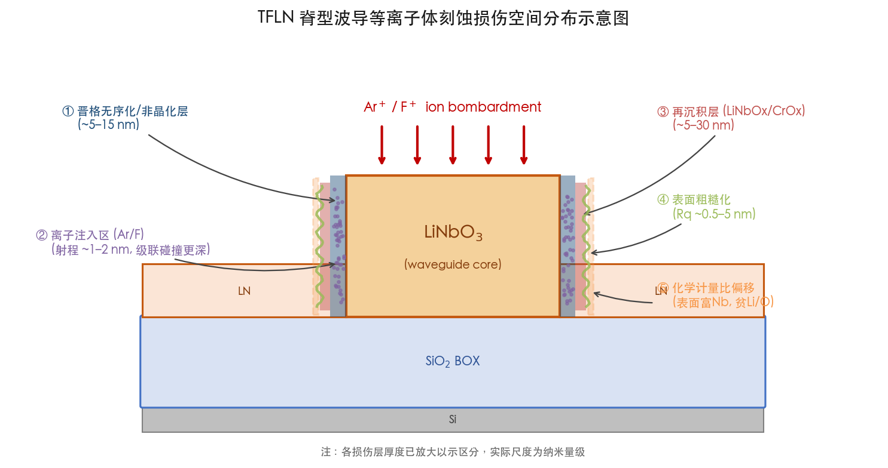

这五类损伤在物理层面相互关联——例如化学计量比偏移与非晶化往往同时发生——但在评价和缓解策略上具有不同的特征参数和应对思路，因此本报告采用上述分类体系作为贯穿全文的分析框架。图 1-2 以表格形式对五类损伤的典型深度/厚度、主要影响参数、表征手段和缓解策略进行了横向对比，为后续各章节的讨论提供系统性速查参考。

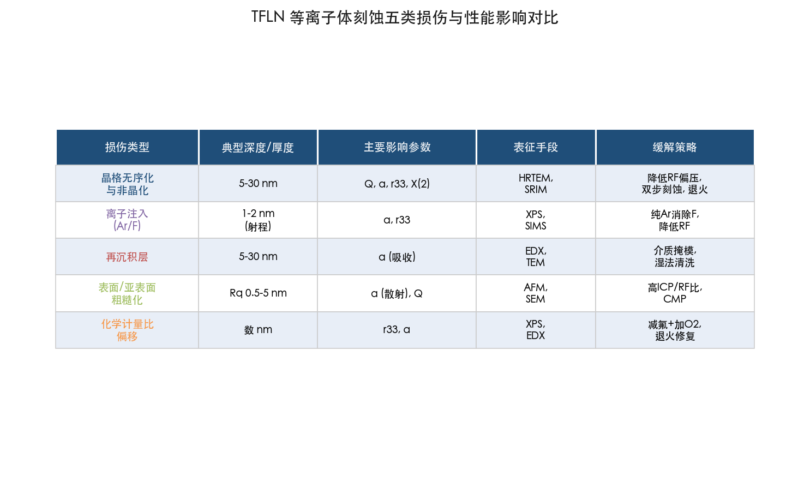

## 1.3 晶格无序化与非晶化

### 1.3.1 位移阈值与级联碰撞

晶格无序化的物理根源在于入射离子与 LN 晶格原子之间的弹性碰撞。当转移能量超过各亚晶格的位移阈值能量——LN 中氧亚晶格约 25–50 eV、铌亚晶格约 40–70 eV [Gainutdinov et al., Ferroelectrics 2015](https://doi.org/10.1080/00150193.2015.998948 "Ar⁺辐照LN铁电畴操控")——被碰撞原子将脱离晶格位置，形成弗伦克尔缺陷对（空位-间隙原子对）。在典型 ICP-RIE 条件下（自偏压 100–250 V，离子能量远超位移阈值），入射 Ar⁺ 不仅直接位移晶格原子，还通过反冲原子引发级联碰撞，在表面以下数纳米至数十纳米范围内形成密集的损伤区。

SRIM（Stopping and Range of Ions in Matter）蒙特卡罗模拟预测，300 eV Ar⁺ 在 LN 中的平均射程仅约 1–2 nm，但级联碰撞使实际损伤区远大于离子射程 [SRIM](http://www.srim.org/ "SRIM 模拟工具")。这种"射程-损伤深度"不对称性是理解等离子体刻蚀损伤空间分布的关键：损伤区的实际深度主要由级联碰撞的空间扩展决定，而非离子本身的注入深度。

### 1.3.2 非晶化层的实验表征

高分辨透射电子显微镜（HRTEM）截面分析提供了非晶化层深度的直接实验证据。Xu et al. 2022 年对 X-cut TFLN ICP-RIE 波导（RF 偏压约 150–200 W）侧壁进行截面成像，直接观测到约 10 nm 厚的非晶化层 [Xu et al., APL Photonics 2022](https://doi.org/10.1063/5.0095146 "Dual-polarization TFLN ring resonator")。综合多个研究组的 TEM 数据，非晶化层深度对工艺参数高度敏感：在激进刻蚀条件下（RF >300 W 或纯高能 Ar⁺），非晶化层深度可达 20–30 nm；经优化的低损伤工艺（RF ~80–100 W、高 ICP/RF 比）可将其控制在约 5 nm 以下。

非晶化层与单晶 LN 之间存在明确的折射率差异：非晶态 LN 的折射率较单晶（n_o ≈ 2.21，n_e ≈ 2.14，λ = 1550 nm）降低约 Δn ≈ 0.05–0.1，这一光学常数变化可通过原位椭偏测量或退火前后消光系数 *k* 的变化间接反映，为后续章节讨论的原位监测技术提供了物理基础。

### 1.3.3 损伤深度与刻蚀参数的关联

RF 偏压功率是决定离子能量和亚表面损伤深度的最直接工艺参数。文献数据表明，RF 从 200 W 降至 100 W 时，自偏压从约 250 V 降至约 130 V，对应非晶化层从约 15–20 nm 显著降至约 5 nm 以下 [Siew et al., JVST B 2018](https://doi.org/10.1116/1.5001684 "TFLN平台异质同质集成")。然而，降低 RF 偏压的代价是刻蚀速率降低逾 50%，这一速率-损伤权衡构成工艺优化的核心矛盾。高 ICP/RF 比策略（ICP ~700–1000 W、RF ~50–150 W，比值 ≥5:1）通过在维持高等离子体密度的同时限制离子能量，为缓解这一矛盾提供了有效途径。

IBE 虽然侧壁更为光滑，但其典型离子能量（300–500 eV）高于 ICP-RIE 的等效自偏压（~100–200 V），单次碰撞的损伤深度更大 [He et al., Opt. Lett. 2019](https://doi.org/10.1364/OL.44.002314 "Low-loss fiber-to-chip TFLN interface")。因此，IBE 的竞争优势在于侧壁粗糙度控制而非亚表面损伤抑制。

## 1.4 离子注入损伤

### 1.4.1 Ar⁺ 注入

即使采用化学惰性的纯 Ar 等离子体，入射 Ar⁺ 离子也会嵌入 LN 亚表面晶格。SRIM 模拟预测 300 eV Ar⁺ 在 LN 中的平均射程约 1–2 nm，但考虑横向离散和级联效应，实际 Ar 原子分布范围更广。纯 Ar 等离子体的核心优势在于不引入化学杂质，损伤类型较为"纯净"——仅包含物理位移和 Ar 注入 [Siew et al., JVST B 2018](https://doi.org/10.1116/1.5001684 "TFLN平台集成")。然而，维持合理刻蚀速率所需的较高离子能量使得 Ar⁺ 注入和晶格无序化无法完全消除。

### 1.4.2 F⁺ 注入与含氟化学的代价

含氟气体（CHF₃、CF₄、SF₆）刻蚀 LN 时，等离子体中的 F⁺ 离子和中性 F 自由基不仅参与表面化学反应，还以离子形式注入亚表面晶格。含氟刻蚀的核心化学过程在于形成挥发性 NbF₅（沸点 234°C），从而提高化学刻蚀分量和整体刻蚀速率。然而，LiF 沸点极高（1676°C），在常规工艺温度下几乎不挥发，导致 Li 被选择性去除而 LiF 在表面或亚表面累积 [Ulliac et al., Microelectron. Eng. 2011](https://doi.org/10.1016/j.mee.2011.03.014 "Ar plasma ICP-RIE for LN waveguide")。

X 射线光电子能谱（XPS）分析为 F⁺ 注入提供了直接证据。Ding et al. 2020 年采用 SF₆ 基 RIE 刻蚀 LN 薄膜后，XPS 检测到显著的 F 1s 信号以及 Li/Nb 比的明显偏移 [Ding et al., Micromachines 2020](https://doi.org/10.3390/mi11060573 "RIE图案化LN薄膜")。F⁺ 注入损伤与 Ar⁺ 注入损伤的本质区别在于：F 不仅造成物理位移，还通过与 Li 和 Nb 的化学键合改变局部电子结构和光学性质。尽管 F⁺ 注入剂量与光学损耗之间的定量关系在开放文献中尚缺乏系统性实验研究，但从调制器 V_π·L 的间接证据可以推断，含氟刻蚀对电光系数的影响大于纯 Ar 刻蚀。

不同含氟气体的 F⁺ 注入程度存在显著差异：SF₆ 因其高 F 自由基浓度，化学刻蚀能力更强，但 F⁺ 注入也更严重、Li 优先去除更显著；CHF₃ 的 F 自由基浓度较低，且 CHF₃ 分解产生的碳氟聚合物可部分阻挡 F 向侧壁注入 [Ding et al., Micromachines 2020](https://doi.org/10.3390/mi11060573 "RIE图案化LN薄膜")。上述差异解释了 Ar/CHF₃ 成为 TFLN ICP-RIE 首选含氟配方的原因。

## 1.5 再沉积层

### 1.5.1 再沉积的来源与组成

等离子体刻蚀 LN 时，溅射产物并非全部逸出刻蚀腔体，部分以非晶态形式回沉积于波导侧壁和周围结构表面。再沉积层的组成包含两个来源：其一为 LN 本身的溅射产物（非晶态 LiNbOₓ），其折射率和光学性质偏离单晶 LN；其二为掩模材料的溅射产物（如 CrOₓ、NiOₓ 或 SiOₓ），引入额外的化学杂质。再沉积层典型厚度约 5–30 nm [Krasnokutska et al., Opt. Express 2019](https://doi.org/10.1364/OE.27.017681 "Ultra-low loss TFLN photonic circuits")。

### 1.5.2 金属掩模的再沉积污染

掩模材料的选择对再沉积层组成具有决定性影响。使用金属硬掩模（Cr 或 Ni）时，EDX 分析显示侧壁再沉积层中金属含量可达数 at%——Cr 掩模约 3–8 at%，Ni 掩模约 2–5 at% [Kaufmann et al., APL 2023](https://doi.org/10.1063/5.0126355 "Redeposition-free LN photonic devices")。金属杂质的危害是多重的：Cr³⁺/Ni²⁺ 在近红外和可见光波段具有 d-d 跃迁吸收带，直接增加传播损耗 [Wolf et al., Opt. Express 2018](https://doi.org/10.1364/OE.26.012529 "Scattering-loss reduction in LN ridge waveguides")；此外，金属离子还可能充当电荷陷阱，影响电光响应稳定性和光折变阈值 [Kaufmann et al., APL 2023](https://doi.org/10.1063/5.0126355 "Redeposition-free LN photonic devices")。

Kaufmann et al. 2023 年发表的系统性研究进一步揭示了再沉积动力学：在纯 Ar ICP 刻蚀中，再沉积量随 DC 偏压增大而减少（800 V 时再沉积面积降低约 4 倍），通过适当的偏压-腔压组合（如 600 V、5–7 mTorr）可接近无再沉积刻蚀条件 [Kaufmann et al., Nanophotonics 2023](https://pmc.ncbi.nlm.nih.gov/articles/PMC11501321/ "Redeposition-free ICP etching of LN for integrated photonics")。然而，高偏压同时导致更深的亚表面损伤和更严重的沟槽效应（trenching），这意味着再沉积抑制与亚表面损伤控制之间存在额外的工艺权衡。

### 1.5.3 介质掩模的优势与局限

采用介质掩模（SiO₂、HSQ、Si₃N₄、a-Si）可从根源消除金属再沉积污染。侧壁仍存在 LN 溅射产物（非晶态 LiNbOₓ）的自再沉积，但因不含金属杂质，其对光学吸收的影响远小于金属再沉积 [Wolf et al., Opt. Express 2018](https://doi.org/10.1364/OE.26.012529 "再沉积与散射损耗关系")。近年来，HSQ 电子束抗蚀剂（显影后转化为 SiO₂ 类材料，可同时充当图形化层和硬掩模）得到广泛采用，其驱动力正是消除金属再沉积对波导损耗的不利影响 [Krasnokutska et al., Opt. Express 2019](https://doi.org/10.1364/OE.27.017681 "Ultra-low loss TFLN photonic circuits")。

## 1.6 表面与亚表面粗糙化

### 1.6.1 粗糙度来源与典型数值

侧壁粗糙度是 TFLN 波导传播损耗的主要来源之一。等离子体刻蚀引入粗糙度的机制主要有三：其一，掩模边缘粗糙度转移（line edge roughness, LER）——光刻或电子束曝光定义的掩模边缘起伏在刻蚀过程中按接近 1:1 的比例转移至 LN 侧壁；其二，微掩模效应——再沉积颗粒或腔室污染物在侧壁局部形成微型掩模，导致不均匀刻蚀；其三，离子轰击的统计涨落——在低等离子体密度或低离子通量条件下尤为显著 [Desiatov et al., Optica 2019](https://doi.org/10.1364/OPTICA.6.000380 "Ultra-low-loss visible TFLN photonics")。

ICP-RIE 工艺中侧壁 Rq 的典型范围为 1–5 nm。Zhang et al. 2017 年通过优化的 Ar 基 ICP-RIE 将侧壁 Rq 降至约 0.5–1 nm [Zhang et al., Optica 2017](https://doi.org/10.1364/OPTICA.4.001536 "Q > 10⁷ LN微环")。IBE 侧壁 RMS 粗糙度约 0.5–2 nm，通常优于 ICP-RIE [Wu et al., Nanophotonics 2022](https://doi.org/10.1515/nanoph-2022-0130 "Long-range TFLN waveguide")。Kaufmann et al. 的无再沉积 ICP 刻蚀工艺（600 V DC 偏压、1 mTorr）实现了底面 Sq 约 0.08 nm（优于刻蚀前的 0.31 nm），展示了 Ar 溅射特有的抛光特性——但这一效果主要体现在水平面而非侧壁 [Kaufmann et al., Nanophotonics 2023](https://pmc.ncbi.nlm.nih.gov/articles/PMC11501321/ "Redeposition-free ICP etching of LN")。

### 1.6.2 Payne-Lacey 散射损耗模型

侧壁粗糙度对传播损耗的量化影响可通过 Payne-Lacey 散射模型加以描述：

α_scatter ∝ σ²/d⁴ × (n₁² − n₂²)²

其中 σ 为侧壁 RMS 粗糙度，*d* 为波导特征尺寸，n₁ 和 n₂ 分别为芯层和包层折射率 [Payne & Lacey, Opt. Quantum Electron. 1994](https://doi.org/10.1007/BF00326328 "波导散射损耗理论分析")。对于典型 TFLN 脊型波导（厚度 300–600 nm、宽度 1–2 μm），LN 高折射率（n ≈ 2.21）与空气或 SiO₂ 包层之间的大折射率差使得该平台对侧壁粗糙度极为敏感：侧壁 RMS 每增加 1 nm，散射损耗增量约为 0.05–0.2 dB/cm。这一高敏感性是 TFLN 工艺对侧壁质量要求远高于 SOI（n ≈ 3.48，但波导尺寸更大、模式限制更强）等平台的根本原因。

### 1.6.3 晶向依赖性

X-cut TFLN 沿不同晶向刻蚀时侧壁粗糙度存在可测量的差异（Rq 差约 0.3–0.5 nm），这源于 LN 晶格在不同方向上溅射产额和表面结合能的各向异性 [Zhang et al., Optica 2017](https://doi.org/10.1364/OPTICA.4.001536 "晶向依赖侧壁差异")。Z-cut TFLN 的各向同性更好，但其晶向排列不利于横向电场调制 r₃₃，在电光调制器应用中受到限制。对于非线性光学应用，波导传播方向的选择需同时兼顾相位匹配条件和晶向相关的刻蚀质量。

## 1.7 化学计量比偏移

含氟等离子体刻蚀 LN 时，组分选择性化学反应导致表面化学计量比偏离 LiNbO₃ 理想配比。核心机制如下：Nb 通过形成高挥发性 NbF₅ 被有效去除，而 Li 与 F 形成的 LiF 因极高沸点（1676°C）几乎不挥发，造成 Li 在表面滞留；然而 Li 同时因质量轻、溅射产额高而被物理溅射优先去除。最终结果表现为表面富 Nb、贫 Li/O，可能形成 LiNb₃O₈ 等非化学计量相 [Ding et al., Micromachines 2020](https://doi.org/10.3390/mi11060573 "RIE图案化LN薄膜")。

即使在纯 Ar 等离子体中，由于 Li、Nb、O 三种元素的溅射产额不同（Li 最高、Nb 最低），也会产生一定程度的化学计量比偏移，但程度远轻于含氟化学刻蚀 [Siew et al., JVST B 2018](https://doi.org/10.1116/1.5001684 "TFLN平台集成")。

少量 O₂ 添加（约占总流量的 5–20%）可部分补偿 LN 表面氧损失并灰化碳基聚合物残留，在一定程度上缓解化学计量比偏移，但过量 O₂ 会显著降低刻蚀速率 [Hu et al., Opt. Express 2021](https://doi.org/10.1364/OE.414646 "高性能TFLN调制器")。在含氟化学刻蚀体系中，化学计量比偏移无法完全消除，只能通过降低氟气配比和后续热退火加以部分恢复。

## 1.8 损伤对光学与电光性能的量化影响

### 1.8.1 传播损耗与 Q 值

TFLN 波导传播损耗主要源于两个与刻蚀直接相关的贡献：侧壁散射（∝ σ²，由粗糙度主导）和亚表面损伤层吸收（由非晶化层、离子注入和化学计量比偏移共同决定）。两者的相对权重取决于波导几何和模式场分布——窄波导（宽度 <1 μm）中侧壁散射占主导，宽波导（>2 μm）中亚表面吸收的相对贡献增大。

早期未优化工艺的传播损耗高达 2–3 dB/cm（*Q* ~10⁴–10⁵），经十余年工艺改进已降至约 0.03 dB/cm（*Q* >10⁷） [Zhang et al., Optica 2017](https://doi.org/10.1364/OPTICA.4.001536 "Q > 10⁷ LN微环")。这约两个数量级的损耗降低主要来自三方面的协同改善：侧壁粗糙度从 >5 nm 降至 <1 nm、非晶化层从 >20 nm 降至 <10 nm、以及后处理（退火、清洗、CMP）对残余损伤的修复。图 1-3 以时间轴形式呈现了 2007–2024 年间代表性 TFLN 微环谐振器 *Q* 值的演进历程，按刻蚀方法分色标注，直观展示了刻蚀损伤控制带来的三个数量级性能跃升。

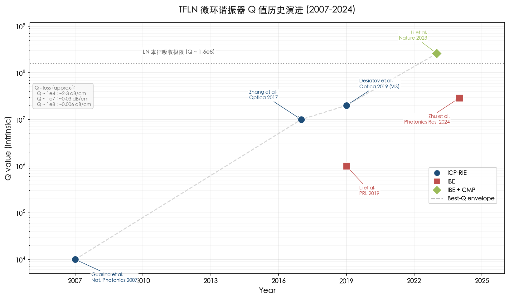

Desiatov et al. 2019 年在可见光波段（460–650 nm）TFLN 波导中实现了约 0.03 dB/cm 的损耗和 *Q* 约 2×10⁷（633 nm），进一步验证了刻蚀损伤控制对短波长器件的关键作用——可见光波段对缺陷吸收的敏感度远高于近红外 [Desiatov et al., Optica 2019](https://doi.org/10.1364/OPTICA.6.000380 "Ultra-low-loss visible TFLN photonics")。

### 1.8.2 电光系数 r₃₃ 退化

刻蚀引起的晶格无序化直接导致 LN 自发极化有序度下降，进而使电光系数 r₃₃ 在损伤区衰减。非晶化区域的 r₃₃ 降为零，在侧壁形成电光"死层"。Guarino et al. 2007 年的开创性工作指出，实测 TFLN 电光调谐效率约为体材 r₃₃ = 30.8 pm/V 的 50–80%，刻蚀损伤和化学计量比变化是其主要成因 [Guarino et al., Nat. Photonics 2007](https://doi.org/10.1038/nphoton.2007.227 "TFLN电光微环首次报道")。

r₃₃ 退化对调制器性能的影响可通过 V_π·L 乘积加以量化。未优化的 TFLN 调制器 V_π·L 约 3–5 V·cm，远高于理论极限约 1.8 V·cm（对应 r₃₃ = 30.8 pm/V、约 600 nm 电极间距）。经退火等后处理优化后，最优器件 V_π·L 已降至约 1.8–2.5 V·cm，接近理论预测 [Wang et al., Nature 2018](https://doi.org/10.1038/s41586-018-0551-y "100GHz TFLN电光调制器")，表明刻蚀损伤导致的 r₃₃ 退化在充分优化的器件中已被大部分恢复。然而，刻蚀前后同一样品 r₃₃ 的直接定量对比测量（例如通过压电力显微镜 PFM 或干涉法）在公开文献中极为稀缺，这一系统性数据缺口制约了对 r₃₃ 退化机制的深入定量理解。

### 1.8.3 二阶非线性极化率 χ⁽²⁾ 退化

与 r₃₃ 类似，非晶化区域的 χ⁽²⁾ 降为零，在侧壁形成非线性"死层"。对于损伤层约 10 nm、波导宽度约 1 μm 的典型结构，有效 χ⁽²⁾ 退化约 2–5%（死层面积占波导横截面的比例）。Zhao et al. 2020 年通过 PPLN TFLN 波导的二次谐波产生（SHG）效率测量，间接证实刻蚀 TFLN 波导的 χ⁽²⁾ 低于体材值 [Zhao et al., PRL 2020](https://doi.org/10.1103/PhysRevLett.124.163603 "PPLN TFLN纠缠光子对")。

χ⁽²⁾ 退化对非线性光学器件的影响体现在 SHG 归一化效率上。Lu et al. 2019 年在含退火后处理的 PPLN TFLN 微环中实现了 SHG 归一化效率约 2600 %/W·cm²，接近理论预测值（2000–4600 %/W·cm²），表明退火可有效修复部分 χ⁽²⁾ 死层 [Lu et al., Optica 2019](https://doi.org/10.1364/OPTICA.6.001455 "PPLN TFLN微环SHG")。对于窄波导和高非线性应用场景，死层对有效 χ⁽²⁾ 的影响不容忽视——它设定了刻蚀型 TFLN 非线性器件效率的理论上限。

## 1.9 纯 Ar 与含氟化学的损伤特征对比

上述分析揭示了两种主流刻蚀化学在损伤特征上的系统性差异。

**纯 Ar 等离子体**以物理溅射为主导，损伤类型较为单一（晶格无序化与 Ar⁺ 注入），但需较高离子能量维持刻蚀速率（~20–40 nm/min），导致非晶化层较深（~10–20 nm）。其优势在于不引入化学杂质，化学计量比偏移极为轻微；侧壁角度较缓（~50°–70°） [Siew et al., JVST B 2018](https://doi.org/10.1116/1.5001684 "TFLN平台集成")。

**含氟混合气体**（以 Ar/CHF₃ 为代表）引入化学刻蚀分量，刻蚀速率提高至约 40–80 nm/min，可在较低离子能量下获得合理速率，非晶化层可能较浅。但额外引入的 F⁺ 注入、LiF 非挥发产物累积、化学计量比偏移和碳氟聚合物残留构成了不可忽视的附加损伤 [Zhang et al., Optica 2017](https://doi.org/10.1364/OPTICA.4.001536 "高Q微环Ar基配方")。

两种方案各有适用场景：纯 Ar 适合对化学纯净度要求极高的超高 *Q* 微环制造；含氟混合气体适合需要陡直侧壁和较快吞吐量的调制器及通用波导制造。无论采用何种化学路线，亚表面晶格损伤均无法完全避免，这一事实从根本上驱动了后续各章讨论的预防与修复策略的研究。

## 1.10 本章小结

等离子体刻蚀是 TFLN 集成光子学不可或缺的核心制造步骤，但同时不可避免地在波导结构中引入五类材料损伤：晶格无序化与非晶化、离子注入、再沉积层、表面/亚表面粗糙化以及化学计量比偏移。这些损伤通过散射、吸收和非线性/电光有效系数退化等机制共同制约 TFLN 器件性能。从 2007 年首个 TFLN 电光微环的 *Q* ~10⁴ 到 2024 年直接刻蚀微环 *Q* 达 2.9×10⁷，传播损耗降低了三个数量级——这一跨越式进步的本质是对上述五类损伤实施系统性抑制与修复的结果。然而，当前技术水平距 LN 本征材料吸收极限（*Q* ~1.6×10⁸）仍有约一个数量级的差距，刻蚀损伤——尤其是侧壁散射和亚表面非晶化层——仍是进一步突破的主要障碍。

本章建立的五类损伤分类框架将贯穿后续各章：第 2 章讨论如何通过掩模设计和工艺参数优化从源头预防损伤；第 3 章探讨过程级损伤抑制的新型刻蚀技术（如原子层刻蚀 ALE、脉冲等离子体）；第 4 章聚焦刻蚀后的修复与损伤消除技术（退火、CMP、湿法清洗）；第 5 章展望前沿探索方向和面向不同器件需求的最优工艺路线。

# 第2章 刻蚀前预防策略——掩模设计与工艺参数优化

在铌酸锂（LiNbO₃, LN）等离子体刻蚀工艺链中，损伤控制的最高效手段在于从源头减少损伤的产生，而非依赖事后修复。第1章已系统分析了等离子体刻蚀对薄膜铌酸锂（thin-film lithium niobate, TFLN）造成的五类损伤——晶格无序化与非晶化、离子注入、再沉积层、表面/亚表面粗糙化以及化学计量比偏移。本章聚焦于刻蚀步骤之前及刻蚀过程中可调控的两大工程杠杆：**硬掩模材料的选型与设计**以及**关键刻蚀参数（气体配方、射频功率、腔压等）的优化**，系统回答"在等离子体刻蚀之前或通过刻蚀工艺本身的参数选择，能够在多大程度上从源头减少材料损伤"这一核心问题。全章以掩模选型（§2.1）、气体配方优化（§2.2）、射频功率与等离子体参数调控（§2.3）、工艺流程变体（§2.4）、晶向依赖效应（§2.5）为逻辑主线，最终在§2.6汇总当前最佳实践参数窗口及其对五类损伤的缓解有效性。

## 2.1 硬掩模材料选型：从金属到介质再到新型碳基掩模

### 2.1.1 铬（Cr）硬掩模——工业主力与固有缺陷

铬是 TFLN 电感耦合等离子体反应离子刻蚀（inductively coupled plasma reactive ion etching, ICP-RIE）中使用最广泛的硬掩模材料。在纯 Ar 等离子体中，Cr 与 LN 的选择比约为 1:1；引入含氟气体（如 CHF₃）后可提升至约 1.5:1–2:1。Zhang et al. 2017 年在 X-cut TFLN 上采用约 300–600 nm 厚 Cr 掩模配合 Ar⁺ 基 ICP-RIE，实现了内禀 *Q* 值超过 10⁷ 的超高品质微环谐振器 [Zhang et al., Optica 2017](https://doi.org/10.1364/OPTICA.4.001536 "Ultra-high-Q LN microring")。

然而，Cr 掩模存在两项本质缺陷。**其一**，Cr 为多晶金属膜，其晶粒边界和表面粗糙度通过线边缘粗糙度（line edge roughness, LER）直接转移至波导侧壁，成为散射损耗源。**其二**，也是更为关键的问题——Cr 在刻蚀过程中被溅射后以 CrOₓ 形式再沉积于波导侧壁。能量色散 X 射线谱（EDX）分析显示，Cr 掩模刻蚀后侧壁再沉积层中 Cr 含量可达约 3–8 at%，Cr³⁺ 的 d-d 跃迁在近红外和可见光波段产生额外吸收，直接增加传播损耗 [Kaufmann et al., APL 2023](https://doi.org/10.1063/5.0126355 "Redeposition-free LN devices")；[Wolf et al., Opt. Express 2018](https://doi.org/10.1364/OE.26.012529 "Scattering-loss reduction in LN ridge waveguides")。

### 2.1.2 镍（Ni）硬掩模——高选择比与高污染风险

Ni 掩模的突出优势在于其选择比可达约 2:1–3:1，使深刻蚀（>500 nm）无需极厚掩模层即可实现。然而，Ni 再沉积引入的 NiOₓ 吸收更为严重（EDX 检测约 2–5 at%），且 Ni 的湿法去除需使用 FeCl₃ 或 HNO₃/HCl 等激进化学液，可能对 LN 表面产生额外腐蚀 [Kaufmann et al., APL 2023](https://doi.org/10.1063/5.0126355 "Redeposition-free LN photonic devices")。Cr/Ni 双层复合掩模虽兼具两者的高选择比，但侧壁再沉积层同时含两种金属成分，对光学性能的危害呈叠加效应 [Zhu et al., Adv. Opt. Photonics 2021](https://doi.org/10.1364/AOP.411024 "TFLN集成光子学综述")。鉴于上述问题，近年来工艺趋势已明确转向减少乃至消除金属掩模的使用。

### 2.1.3 SiO₂ 介质硬掩模——消除金属污染的关键路径

SiO₂ 介质硬掩模的核心优势在于从根源上消除金属再沉积污染。在纯 Ar 中 SiO₂ 与 LN 的选择比约为 1:1，但在含氟气体中 SiO₂ 同样会被刻蚀（生成挥发性 SiF₄），因此需精细平衡气体配方以保证掩模剩余量。Luke et al. 2020 年在 4 英寸 TFLN 晶圆上采用 SiO₂ 掩模实现了 0.027 dB/cm 的传播损耗，展示了晶圆级低损耗工艺的可行性 [Luke et al., Opt. Express 2020](https://doi.org/10.1364/OE.28.024452 "Wafer-scale low-loss LN PICs")。值得指出的是，SiO₂ 掩模工艺中仍会产生非晶态 LiNbOₓ 自身溅射产物的再沉积，但该再沉积与 LN 本体在化学成分上相近，不引入异质金属吸收中心，对光学损耗的影响远小于金属掩模 [Krasnokutska et al., Opt. Express 2019](https://doi.org/10.1364/OE.27.017681 "Ultra-low loss TFLN photonic circuits")。

### 2.1.4 HSQ 电子束抗蚀剂——兼具图形化与掩模的"自掩模"方案

氢倍半硅氧烷（hydrogen silsesquioxane, HSQ）是一种负性电子束抗蚀剂，显影后转化为类 SiO₂ 材料，同时充当图形化抗蚀剂和硬掩模，省去了额外的掩模沉积与图案转移步骤，从根源避免金属再沉积。Krasnokutska et al. 2019 年采用 HSQ 掩模制备脊型波导，实现约 0.2 dB/cm 的传播损耗，侧壁未检出金属杂质 [Krasnokutska et al., Opt. Express 2019](https://doi.org/10.1364/OE.27.017681 "Ultra-low loss TFLN photonic circuits")。HSQ 的主要局限在于其在纯 Ar 中选择比仅约 0.55:1，限制了可刻蚀深度。近期研究表明，热退火预处理可显著提升 HSQ 的抗蚀性能：Huang et al. 2025 年报道，对显影后的 HSQ 掩模在刻蚀前进行热退火处理，可将 LN/HSQ 选择比从约 0.55 提高至约 1，同时微环 *Q* 值测试表明退火后 HSQ 掩模的光学性能不劣于未退火样品 [Huang et al., Nanotechnology 2025](https://doi.org/10.1088/1361-6528/ae2131 "Improved selectivity with thermal annealed HSQ mask")。

### 2.1.5 非晶硅（a-Si）与 Si₃N₄——CMOS 兼容的介质替代方案

a-Si 掩模在纯 Ar 中的选择比约为 1:1–1.5:1，可通过等离子体增强化学气相沉积（PECVD）实现低温沉积，具有良好的 CMOS 兼容性。Desiatov et al. 2019 年采用 a-Si 掩模制备可见光 TFLN 波导，在 460–650 nm 波段实现传播损耗约 0.03 dB/cm、*Q* 约 2×10⁷（633 nm 处），验证了该掩模方案在可见光波段的适用性 [Desiatov et al., Optica 2019](https://doi.org/10.1364/OPTICA.6.000380 "Ultra-low-loss visible TFLN photonics")。a-Si 的主要局限在于含氟等离子体中会被 F 自由基快速刻蚀，因此仅适用于纯 Ar 或低氟配方工艺。

Si₃N₄ 在含氟气体中的抗蚀能力略优于 SiO₂（Si—N 键能约 470 kJ/mol vs. Si—O 约 452 kJ/mol），且低压化学气相沉积（LPCVD）制备的 Si₃N₄ 膜密度约 3.1 g/cm³，致密的膜结构有利于降低 LER 向波导侧壁的转移。然而，LPCVD Si₃N₄ 具有较高的内应力（约 1 GPa 压应力），这一特性限制了厚掩模（>500 nm）的应用场景 [Boes et al., Laser Photonics Rev. 2023](https://doi.org/10.1002/lpor.202200862 "LN photonics综述")。

### 2.1.6 复合掩模堆叠策略

为兼顾高选择比与低再沉积污染，复合掩模堆叠方案应运而生。典型设计为 SiO₂/Cr 双层结构——底层 SiO₂ 直接接触 LN 表面，上层 Cr 提供高选择比驱动主体刻蚀；当 Cr 层率先耗尽后，SiO₂ 成为最终掩模层，侧壁仅接触 SiO₂ 再沉积物而无金属杂质残留。此外，a-Si/SiO₂ 全介质堆叠在纯 Ar 中的复合选择比约为 1.5:1，可完全消除金属污染风险 [Kaufmann et al., APL 2023](https://doi.org/10.1063/5.0126355 "掩模堆叠优化策略")。堆叠方案的代价在于工艺步骤增多（需分别沉积、图形化和去除各层），但对于对金属污染敏感的高性能器件而言，这一工艺成本是合理的。

### 2.1.7 类金刚石碳（DLC）——新一代高选择比非金属掩模

类金刚石碳（diamond-like carbon, DLC）作为 TFLN 硬掩模的引入，代表了掩模技术的一次重要突破。DLC 是一种非晶碳材料，含有高比例 sp³ 类金刚石键合结构，具备极高硬度（PECVD 沉积可达 19–23 GPa，约为 SiO₂ 和 LN 硬度的两倍）和极低的 Ar⁺ 离子溅射产额。Li et al. 2023 年在 *Nature Communications* 上首次系统报道了 DLC 作为 TFLN 硬掩模的应用：300 nm 厚 DLC 膜通过 PECVD 从甲烷前驱体沉积，在优化的 Ar 离子束刻蚀（ion beam etching, IBE）条件下，DLC 与 LN 的选择比高达 3:1——相比 SiO₂ 的 1:1 提升了三倍。该工艺实现了全刻蚀（fully etched）LN 条形波导，侧壁角度约 80°、传播损耗低至 4 dB/m（0.04 dB/cm）、内禀 *Q* 值大于 10⁷ [Li et al., Nat. Commun. 2023](https://doi.org/10.1038/s41467-023-40502-8 "High density LN PICs with DLC mask")。

DLC 掩模具备三项关键优势：（1）高选择比使全刻蚀条形波导（无残余平板层）成为可能，弯曲半径可低至 20 μm，集成密度比传统脊型波导提升约 16 倍；（2）DLC 为非晶碳材料，可通过 O₂ 等离子体灰化完全去除而不留残留，不会对 LN 造成损伤；（3）作为非金属材料，DLC 从根本上消除了金属再沉积污染。其图形化通过 Si₃N₄ 中间掩模转移完成——先以 DUV 光刻定义 Si₃N₄ 图案，再通过 O₂ 等离子体将图案转移至 DLC，最后以 DLC 为掩模进行 Ar IBE 刻蚀 LN。

后续工艺优化进一步推动了 DLC 掩模的工业化前景。2026 年 1 月，一项发表于 *Journal of Applied Physics* 的研究系统优化了低频 PECVD DLC 沉积参数，通过提高 DLC 膜硬度和致密性进一步改善选择比，并降低内应力以支持晶圆级大面积均匀沉积 [J. Appl. Phys. 139, 035301 (2026)](https://doi.org/10.1063/5.0304642 "Optimized low-frequency PECVD DLC for high-selectivity TFLN etching")。上述进展表明 DLC 掩模正从学术验证阶段稳步走向工业化应用。

### 2.1.8 掩模选型综合比较

综合上述分析，可从选择比、再沉积污染、图形化兼容性和工艺复杂度四个维度对主要掩模材料进行系统评价。**金属掩模**（Cr、Ni）提供较高选择比但引入严重的金属吸收污染；**传统介质掩模**（SiO₂、HSQ、a-Si、Si₃N₄）消除金属污染但选择比通常仅约 1:1，限制了深刻蚀和全刻蚀波导的实现；**DLC 掩模**在选择比（约 3:1）和无金属污染两方面同时占优，是当前综合性能最优的选择。图 2-1 以分组柱状图和属性表的形式直观比较了七种掩模材料的刻蚀选择比及关键属性。

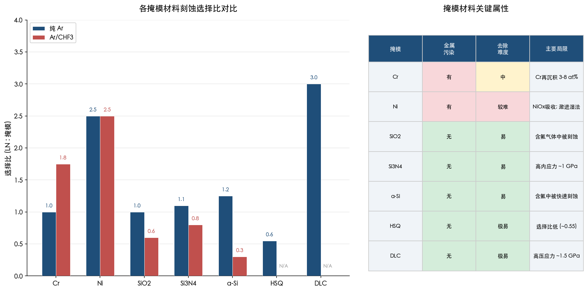

此外，掩模锥角同样值得关注——掩模侧壁角度直接传递至波导侧壁角度，通过掩模回流或灰化处理引入可控锥角，可获得缓坡侧壁以满足绝热耦合器等特殊器件设计需求 [Boes et al., Laser Photonics Rev. 2023](https://doi.org/10.1002/lpor.202200862 "掩模设计对TFLN波导几何的影响")。

## 2.2 刻蚀气体配方优化

气体配方是决定刻蚀化学与物理溅射相对权重的核心变量。不同配方在刻蚀速率、侧壁形貌和材料损伤类型之间构成复杂的权衡关系，需针对具体器件需求加以优化。

### 2.2.1 纯 Ar 物理溅射——简洁但高能

纯 Ar 等离子体依靠物理溅射实现 LN 材料去除，刻蚀速率约 20–40 nm/min，典型侧壁角约 50°–70°。该配方的核心优势在于不引入任何化学杂质（无 F⁺ 注入、无 LiF 残留），但其代价是需要更高的离子能量（RF 偏压功率约 150–250 W）以维持可接受的刻蚀速率，由此导致非晶化层深度可达约 10–20 nm，侧壁均方根粗糙度（Rq）约 2–3 nm [Ulliac et al., Microelectron. Eng. 2011](https://doi.org/10.1016/j.mee.2011.03.014 "Ar plasma ICP-RIE for LN")。

### 2.2.2 Ar/CHF₃ 配方——最广泛采用的含氟方案

Ar/CHF₃ 是 TFLN ICP-RIE 中最常用的含氟配方，刻蚀速率约 40–80 nm/min，较纯 Ar 提升 2–4 倍。CHF₃ 分解产生的 CₓFᵧ 聚合物在侧壁形成钝化层，有助于获得更陡的侧壁角度（约 60°–80°）。然而该配方亦带来两类额外损伤：F⁺ 离子注入 LN 亚表面晶格（可通过 XPS 的 F 1s 信号检测），以及 Li 的选择性去除导致表面化学计量比偏移。典型配比为 Ar:CHF₃ = 1:1–3:1 [Zhang et al., Optica 2017](https://doi.org/10.1364/OPTICA.4.001536 "高Q微环Ar基配方")。需要注意的是，过量 CHF₃ 虽然可进一步提高侧壁陡直度，但聚合物过度沉积反而恶化侧壁粗糙度，存在最优比例窗口。

### 2.2.3 Ar/SF₆ 配方——更强化学刻蚀与更大损伤风险

Ar/SF₆ 配方因 SF₆ 具有更高的 F 自由基释放浓度而表现出更强的化学刻蚀分量。然而 Ding et al. 2020 年的系统性 XPS 分析揭示了其代价：相比 Ar/CHF₃ 配方，Ar/SF₆ 刻蚀后表面 F 1s 信号强度与 Li/Nb 比偏移均显著升高，表明 F⁺ 注入更为严重、Li 优先去除更加显著、LiF 非挥发产物累积更多 [Ding et al., Micromachines 2020](https://doi.org/10.3390/mi11060573 "RIE图案化LN薄膜")。对于非线性光子学等对 χ⁽²⁾ 和电光系数 *r*₃₃ 敏感的应用，Ar/SF₆ 配方的化学计量比偏移风险尤需审慎评估。

### 2.2.4 O₂ 添加——多功能辅助气体

在主气流中添加约 5–20% 的 O₂ 可发挥多重作用：灰化碳基聚合物残留、补偿 LN 表面因溅射造成的氧损失、以及缓解化学计量比偏移。Luke et al. 2020 年的晶圆级工艺即采用了经优化的 Ar 基+少量含氟气体+O₂ 配方 [Luke et al., Opt. Express 2020](https://doi.org/10.1364/OE.28.024452 "Wafer-scale LN PICs")。O₂ 添加的不利面在于会显著降低刻蚀速率，因此其比例需根据刻蚀效率与损伤抑制之间的平衡进行精细优化 [Hu et al., Opt. Express 2021](https://doi.org/10.1364/OE.414646 "高性能TFLN调制器")。

### 2.2.5 气体配方选择的损伤权衡框架

从五类损伤的视角审视气体配方选择，可归纳出一组清晰的权衡关系：纯 Ar 配方从根源上消除了 F⁺ 注入和化学计量比偏移两类损伤，但因需要高离子能量而加剧晶格无序化；含氟配方通过化学增强刻蚀降低了对高离子能量的依赖，从而减轻晶格无序化，但相应引入 F⁺ 注入和化学计量比偏移。无论采用何种含氟配方，LiF 的极高沸点（1676°C）决定了 Li 的选择性去除无法完全避免 [Ulliac et al., Microelectron. Eng. 2011](https://doi.org/10.1016/j.mee.2011.03.014 "Ar plasma ICP-RIE for LN")。

我们认为，气体配方的最优选择取决于具体器件对各类损伤的容忍度：电光调制器由于模式主要集中于波导芯部，可适度容忍表面化学计量比变化；而高效非线性频率转换器件则应优先考虑最大程度保持 χ⁽²⁾ 完整性，倾向于采用纯 Ar 或低氟配方。

## 2.3 射频功率与等离子体参数调控

在 ICP-RIE 体系中，ICP 源功率和 RF 偏压功率分别控制等离子体密度和离子加速能量，二者的独立可调性为损伤-速率权衡提供了关键自由度。本节系统讨论 RF 偏压功率、ICP/RF 功率比、腔压和衬底温度对刻蚀质量的影响。

### 2.3.1 RF 偏压功率——离子能量与亚表面损伤的最直接调控手段

RF 偏压功率是控制离子能量和亚表面损伤深度的最直接参数。Siew et al. 2018 年的实验数据定量揭示了这一关系：RF 功率从 200 W 降至 100 W 时，直流自偏压从约 250 V 降至约 130 V，非晶化层厚度从约 15–20 nm 降至约 5 nm 以下——亚表面损伤深度减少约 3–4 倍；其代价是刻蚀速率降低超过 50% [Siew et al., JVST B 2018](https://doi.org/10.1116/1.5001684 "TFLN平台集成")。这一权衡关系构成了 TFLN 刻蚀工艺设计的核心约束。图 2-2 直观展示了 RF 偏压功率与非晶化层深度、刻蚀速率之间的定量关系及最佳实践参数窗口。

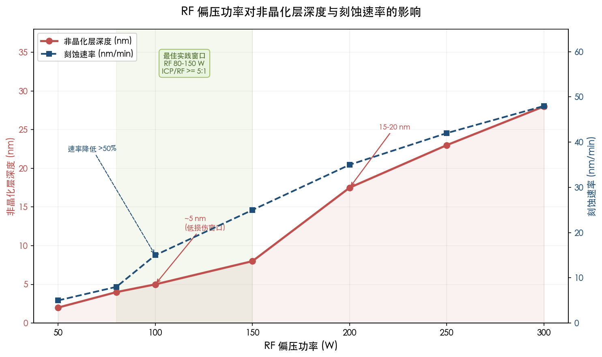

### 2.3.2 高 ICP/RF 功率比策略——解耦等离子体密度与离子能量

高 ICP/RF 功率比（≥5:1–10:1）策略的物理本质在于解耦等离子体密度与离子能量——ICP 功率主要控制等离子体密度和化学活性种（自由基）浓度，RF 偏压主要控制鞘层电位和离子加速能量。通过采用高 ICP 功率（约 700–1000 W）产生高密度等离子体以保证充分的离子通量和化学活性，同时以低 RF 偏压（约 50–150 W）限制离子能量，可在不显著牺牲刻蚀速率的前提下最大限度降低亚表面损伤。Harvard 大学 Lončar 团队的标杆工艺采用 ICP 约 800 W、RF 约 100–150 W（比值约 5:1–8:1），实现了侧壁 Rq <1 nm、非晶化层 <10 nm 的优异指标 [Zhang et al., Optica 2017](https://doi.org/10.1364/OPTICA.4.001536 "高ICP/低RF策略")。

### 2.3.3 腔压优化——方向性与损伤分布的折中

腔压通常设定在约 5–10 mTorr 的窗口内，这是多项物理因素折中的结果。低压（约 3–5 mTorr）条件下，离子平均自由程较长、方向性好，有利于获得陡直侧壁；但离子能量分布函数（IEDF）窄而集中于高能端，损伤集中。高压（>10 mTorr）使 IEDF 展宽，降低单个离子的平均能量和损伤深度，但离子散射增加导致方向性恶化、侧壁角度变差 [Hu et al., Opt. Express 2021](https://doi.org/10.1364/OE.414646 "高性能TFLN调制器")。

### 2.3.4 衬底温度效应

衬底温度通常维持在室温附近（约 20°C，采用 He 背冷）。将衬底温度提高至约 100–200°C 可增强 NbF₅ 的挥发效率（NbF₅ 沸点 234°C），从而减少含 Nb 反应产物在侧壁的再沉积。然而，升温亦可能加速点缺陷的迁移和扩散，对晶格恢复质量产生不确定影响。温度效应在 TFLN 文献中的系统研究仍然有限，目前缺乏对温度-损伤关系的定量参数扫描数据 [Zhu et al., Adv. Opt. Photonics 2021](https://doi.org/10.1364/AOP.411024 "TFLN光子学综述")。

## 2.4 工艺流程变体

除单步连续刻蚀外，多种工艺流程变体可通过重新组织刻蚀步骤的时序或几何参数来进一步降低最终损伤水平。

### 2.4.1 双步刻蚀策略——"粗刻+精修"的损伤分级控制

双步刻蚀是近年来 TFLN 工艺中降低最终损伤状态的重要策略，其核心思路为按损伤容忍度对刻蚀过程进行分级。**第一步**采用 Ar/CHF₃ 高速刻蚀（约 40–80 nm/min）至目标深度前约 20–50 nm，充分利用含氟配方的高速率和侧壁钝化优势完成主体材料去除；**第二步**切换为纯 Ar 低功率精修（RF 约 50–80 W，自偏压约 50–100 V，速率约 5–10 nm/min），仅去除最后 20–50 nm 的材料。

精修步的离子能量（约 50–100 eV）接近 LN 中 O 亚晶格的位移阈值（约 25–50 eV），可显著减少新增非晶化损伤；同时纯 Ar 精修消除了侧壁的氟化物残留。Shams-Ansari et al. 2022 年在高性能 TFLN 电光调制器中即采用了多步刻蚀策略 [Shams-Ansari et al., Optica 2022](https://doi.org/10.1364/OPTICA.468652 "LN电光调制器集成")。双步刻蚀将工艺复杂度从"单次设定"提升为"两次切换"，但精修步新增时间仅约 2–10 分钟，工程可行性充分 [Zhu et al., Adv. Opt. Photonics 2021](https://doi.org/10.1364/AOP.411024 "多步刻蚀损伤优化策略")。

### 2.4.2 倾斜与旋转刻蚀——几何优化侧壁质量

在 IBE 体系中，离子束入射角和衬底旋转是两个可独立调节的几何参数。**倾斜入射**（约 10°–30°）可有效清除侧壁再沉积——入射离子不再仅垂直于样品表面，部分动量分量指向侧壁方向，将附着的再沉积物溅射去除。Wu et al. 2022 年通过优化入射角的 IBE 工艺显著改善了 TFLN 侧壁质量 [Wu et al., Nanophotonics 2022](https://doi.org/10.1515/nanoph-2022-0130 "Long-range TFLN waveguide")。然而，当入射角超过约 30° 时，侧壁本体被过度刻蚀，可能恶化波导几何精度。**衬底持续旋转**则是改善刻蚀均匀性和侧壁对称性的标准做法——在 IBE 体系中"tilt + rotation"组合已成为多个前沿团队（如 Yale 大学 Tang 课题组）的标准工艺配置 [Li et al., Phys. Rev. Lett. 2019](https://doi.org/10.1103/PhysRevLett.122.253801 "LN光力系统")。

### 2.4.3 过刻蚀控制——精确度与均匀性的平衡

过刻蚀余量通常设定为目标深度的约 10–20%，以补偿晶圆级刻蚀速率的不均匀性（典型值 ±5–10%）。然而，过度的过刻蚀导致埋氧层（buried oxide, BOX）暴露时间过长，在侧壁底部形成沟槽效应（trenching），恶化局部损伤和形貌。对于追求极致 *Q* 值的微环谐振器等器件，过刻蚀量需精确控制在最低必要水平，结合端点检测技术实现精准停止 [Luke et al., Opt. Express 2020](https://doi.org/10.1364/OE.28.024452 "晶圆级过刻蚀均匀性控制")。

## 2.5 晶向依赖效应

铌酸锂属三方晶系，其晶格各向异性导致不同晶切方向在刻蚀行为上存在可测量的差异。X-cut TFLN 沿不同方位刻蚀时，刻蚀速率和侧壁形貌均有所不同——不同方向侧壁的 Rq 差异约 0.3–0.5 nm，这源于 LN 晶格各向异性导致的溅射产额和化学反应速率的方向依赖性。Z-cut TFLN 在面内各向同性方面表现更优，但其晶切方向不利于横向电场驱动的 *r*₃₃ 电光调制 [Zhang et al., Optica 2017](https://doi.org/10.1364/OPTICA.4.001536 "晶向依赖侧壁差异")。因此，在工艺设计中需根据器件功能需求（电光调制优先选择 X-cut，面内均匀性优先选择 Z-cut）确定晶切方向，并针对所选晶切的各向异性特征进行刻蚀参数的专项优化。

## 2.6 当前最佳实践参数窗口与五类损伤缓解总结

综合前述各节的分析，当前 TFLN ICP-RIE 的最佳实践参数窗口可归纳如下：ICP 功率约 700–1000 W，RF 偏压约 80–150 W（ICP/RF ≥ 5:1），腔压约 5–8 mTorr，以 Ar 为主体气体并添加约 10–30% CHF₃，采用 SiO₂、HSQ 或 DLC 等介质/碳基掩模。在该参数窗口下，典型工艺指标为：侧壁 Rq 约 0.5–2 nm、侧壁角度约 60°–75°（脊型波导）或约 80°（全刻蚀条形波导，DLC 掩模）、非晶化层约 5–10 nm、传播损耗约 0.03–0.1 dB/cm [Zhang et al., Optica 2017](https://doi.org/10.1364/OPTICA.4.001536 "TFLN工艺标杆")；[Zhu et al., Adv. Opt. Photonics 2021](https://doi.org/10.1364/AOP.411024 "工艺参数优化趋势综述")。

从五类损伤的缓解角度，上述各策略的对应关系如图 2-3 所示 [Boes et al., Laser Photonics Rev. 2023](https://doi.org/10.1002/lpor.202200862 "各类损伤系统归纳")：

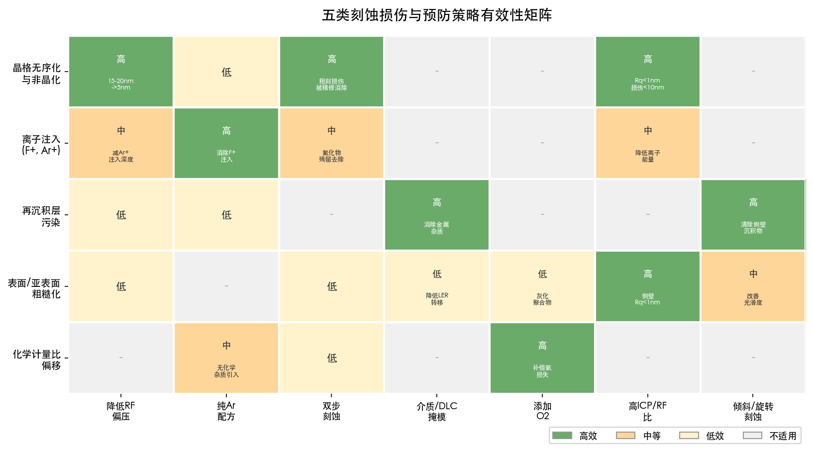

具体而言：

- **晶格无序化与非晶化**：降低 RF 偏压+双步刻蚀（精修步），可将非晶化层从约 15–20 nm 压缩至约 5 nm。
- **离子注入（F⁺、Ar⁺）**：纯 Ar 配方消除 F⁺ 注入；低 RF 减少 Ar⁺ 注入深度。
- **再沉积层**：介质掩模（SiO₂、HSQ）或碳基掩模（DLC）消除金属杂质污染；倾斜 IBE 清除侧壁附着物。
- **表面/亚表面粗糙化**：高 ICP/RF 比保证高密度等离子体的同时限制离子能量；优化气体配方中的聚合物钝化量；保证掩模边缘质量（LER 最小化）。
- **化学计量比偏移**：减少含氟气体比例+添加 O₂ 补偿氧损失。但在含氟刻蚀配方中，化学计量比偏移无法完全消除。

我们认为，刻蚀前预防策略可以在不增加额外工艺步骤数量的前提下，从根源上消除或大幅降低五类损伤中的三类（再沉积层金属污染、F⁺ 注入、表面粗糙化），并将另外两类（非晶化和化学计量比偏移）控制在较低水平。然而，即便在最优参数窗口下，约 5 nm 的非晶化层和含氟配方中不可避免的化学计量比偏移仍构成残余损伤。对于这些残余损伤的进一步消除，则需依赖后续章节讨论的过程级原位抑制技术（第3章）和刻蚀后修复手段（第4章）加以实现。

# 第3章 过程级（原位）损伤抑制技术

前两章分别阐明了等离子体刻蚀对铌酸锂（lithium niobate, LiNbO₃, LN）造成的五类典型损伤及其物理机理，以及通过掩模选型与工艺参数优化在刻蚀前和刻蚀中可实现的损伤预防。然而，即使在当前最优参数窗口（ICP ~700–1000 W、RF ~80–150 W、腔压 ~5–8 mTorr）下，ICP-RIE 仍不可避免地在侧壁留下约 5–10 nm 非晶化层和亚纳米级粗糙度 [Zhang et al., Optica 2017](https://doi.org/10.1364/OPTICA.4.001536 "Ultra-high-Q LN microring")。这一残余损伤构成了 TFLN 光子器件从"优秀"迈向"极端"性能（Q > 10⁸）的核心瓶颈。

本章将视角从"调节现有工艺参数"转向"改变刻蚀过程本身的物理机制"，系统评估原子层刻蚀（atomic layer etching, ALE）、脉冲式等离子体刻蚀、低温/冷冻刻蚀、远程等离子体以及反应性离子束刻蚀（RIBE）/化学辅助离子束刻蚀（CAIBE）等新型刻蚀范式在薄膜铌酸锂（thin-film lithium niobate, TFLN）损伤抑制方面的潜力与局限，并讨论刻蚀过程中的原位监测与端点检测技术。

## 3.1 原子层刻蚀（ALE）：从概念验证到铌酸锂首次实现

### 3.1.1 ALE 基本原理与材料体系积累

原子层刻蚀的核心思想在于将连续的等离子体刻蚀拆分为两个自限制半反应循环：第一步为表面改性（如氟化、氯化或溴化），形成厚度有限的化学改性层；第二步为改性层定向去除（通常借助低能 Ar⁺ 溅射），由于改性层与基底材料的溅射阈值存在显著差异，去除过程在改性层耗尽后自行停止。这一"改性—去除"循环赋予 ALE 亚埃级刻蚀深度控制精度、本征晶圆级均匀性以及极低亚表面损伤的独特能力 [Kanarik et al., JVST A 2015](https://doi.org/10.1116/1.4913379 "ALE overview in semiconductor industry")。

ALE 已在多种半导体和介质材料上达到工业级成熟度，为其向复杂氧化物体系的拓展奠定了方法学基础。SiO₂ ALE 的去除速率约 1–3 Å/cycle，表面 RMS < 0.5 nm，亚表面损伤 < 1 nm [Kanarik et al., JVST A 2015](https://doi.org/10.1116/1.4913379 "ALE overview in semiconductor industry")。Al₂O₃ 体系通过 HF 气相脉冲氟化结合低能 Ar⁺（约 50 eV）去除 AlF₃，实现约 1.0 Å/cycle 的去除速率和 RMS < 0.3 nm 的超平表面 [Lee et al., Chem. Mater. 2015](https://doi.org/10.1021/acs.chemmater.5b00300 "Al₂O₃ ALE with Sn(acac)₂ and HF")。HfO₂ 等离子体 ALE（Cl₂/BCl₃ 氯化 + Ar⁺ 约 30–60 eV 去除）去除速率约 0.5–1.5 Å/cycle，亚表面损伤 < 2 nm [Kanarik et al., JVST A 2017](https://doi.org/10.1116/1.4979661 "Predicting synergy in ALE")。在含过渡金属氧化物方面，TiO₂ ALE（Cl₂ 等离子体氯化 + Ar⁺ 约 50–70 eV 去除 TiCl₄）以约 0.5 Å/cycle 维持 RMS < 0.4 nm，为 LN 等复杂氧化物的 ALE 提供了直接的方法学参考 [Faraz et al., ACS AMI 2015](https://doi.org/10.1021/acsami.5b01531 "TiO₂ plasma ALE with Cl₂/Ar")。

上述材料体系的共同特点是改性产物的挥发性相对均一。而 LN 作为含 Li、Nb、O 三种元素的三元化合物，其各组分卤化物的挥发性差异极大——NbF₅ 沸点仅 234°C，而 LiF 沸点高达 1676°C。这一热力学不匹配构成了将 ALE 外推至 LN 的核心挑战：在改性步骤中难以形成挥发性均一的改性层，去除步骤中非挥发性 LiF 的再沉积将恶化表面质量。

### 3.1.2 铌酸锂各向同性 ALE 的首次实现

2024 年，加州理工学院 Minnich 团队在 MgO 掺杂 x-cut LN 上首次实现了各向同性 ALE，标志着该技术在 LN 材料体系上从理论概念走向实验验证。该工艺采用 H₂ 等离子体（300 W ICP、52.5 W RIE、209 V DC 偏压）进行表面改性，随后以 SF₆/Ar 等离子体（300 W ICP、3.5 W RIE、50 V DC 偏压）完成改性层去除，在 0°C 衬底温度下实现了 1.59 ± 0.02 Å/cycle 的刻蚀速率，协同性（synergy）高达 96.9% [Chen et al., JVST A 2024](https://doi.org/10.1116/6.0003962 "Isotropic ALE of MgO-doped LN using H₂ and SF₆/Ar plasmas")。两个半反应均表现出对暴露时间的饱和特性，充分证实了过程的自限制性质。

该研究的关键发现在于反应机理：H₂ 等离子体暴露后 LN 表面发生类似质子交换（proton exchange）的改性反应，使得后续 SF₆/Ar 等离子体能够选择性去除改性层。这一机制借鉴了质子交换 LN 在含氟等离子体下 LiF 再沉积减少的已知现象。XPS 分析显示，50 个 ALE 循环后表面存在 LiF 和 MgF₂ 的残留信号，表明非挥发性产物的再沉积仍是需要解决的核心问题。

在表面形貌方面，该研究揭示了一个颇具启发性的现象：在平坦抛光表面上，ALE 导致粗糙度从 R_q = 0.2 nm 升至约 0.57 nm；然而在经 Ar⁺ 离子铣刻蚀的 TFLN 波导侧壁上，50 个循环的各向同性 ALE 使侧壁 R_q 从 0.82 nm 降至 0.55 nm，实现约 30% 的粗糙度改善 [Chen et al., JVST A 2024](https://doi.org/10.1116/6.0003962 "Isotropic ALE sidewall smoothing of TFLN waveguides")。这一看似矛盾的结果源于各向同性刻蚀对凸起特征的优先去除效应——在已经粗糙的侧壁上，ALE 的逐层去除机制使表面趋于平坦化，而在原本光滑的表面上则因非挥发性产物的随机再沉积而引入新的粗糙度。

此外，该团队验证了多种化学配方的可行性：将 SF₆/Ar 等离子体替换为 O₂/SF₆ 时，EPC = 2.24 ± 0.02 Å/cycle、协同性达 99.5%；采用 Cl₂/BCl₃ 配方时，EPC = 1.65 ± 0.03 Å/cycle、协同性为 91.5%。多种化学路线的可选性为后续针对 LN 特有的产物挥发性问题的深入优化提供了充足空间。

### 3.1.3 方向性 ALE：基于 Br 化学的突破

2025 年，同一团队在 LN 上实现了**方向性（directional）ALE**——这是将 ALE 用于 TFLN 图形化所必需的关键能力。该工艺采用 HBr/BCl₃/Ar 等离子体（300 W ICP、5 W RIE、30 V DC 偏压）进行表面溴化改性，随后以低功率 Ar 等离子体（300 W ICP、6 W RIE、45 V DC 偏压）完成方向性去除 [Chen et al., JVST A 2025](https://doi.org/10.1116/6.0004358 "Directional ALE of MgO-doped LN using Br-based plasma")。图 3-1 展示了该工艺的四步自限制循环流程及关键实验结果。

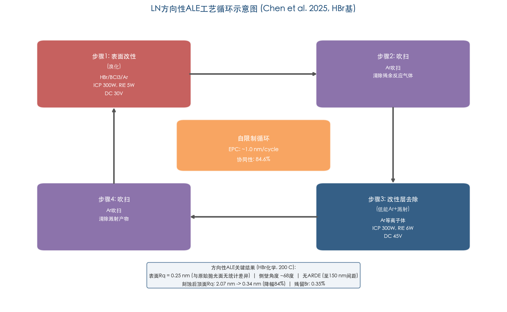

**图 3-1** LN 方向性 ALE 工艺循环示意图（数据来源：Chen et al., JVST A 2025）。四步自限制循环依次为 HBr/BCl₃/Ar 表面溴化改性、Ar 吹扫、低能 Ar⁺ 改性层去除和 Ar 吹扫，各步骤 ICP/RIE 功率和 DC 偏压均已标注。在 0°C 下 EPC 约 1.0 nm/cycle，协同性 84.6%；200°C 下经 20 个循环后表面 R_q = 0.25 nm。

选用 HBr 化学的核心动机在于解决长期困扰 LN 刻蚀的 LiF 再沉积问题。Br 基产物（如 LiBr，沸点 1265°C；NbBr₅，沸点 361°C）的蒸汽压普遍高于对应的 F 基和 Cl 基产物，尤其是 Li 和 Mg 的卤化物在中等温度下挥发性更优 [Chen et al., JVST A 2025](https://doi.org/10.1116/6.0004358 "Br-based chemistry rationale for LN ALE")。在 0°C 下，方向性 ALE 展现出 1.04 ± 0.01 nm/cycle 的 EPC 和 84.6% 的协同性。将衬底温度提升至 200°C 后，EPC 增至 1.25 nm/cycle，但协同性降至 30%（自发刻蚀增加所致）。

在表面形貌方面取得了尤为关键的结果：200°C 下 HBr 基方向性 ALE 经 20 个循环后表面 R_q = 0.25 ± 0.03 nm，与原始抛光表面（R_q = 0.3 nm）在统计上无差异；而相同条件下 Cl₂/BCl₃ 改性步骤则导致明显粗糙化。经 120 个循环（总刻蚀深度 149 nm）后仍无粗糙化迹象，充分证实了 HBr 化学在抑制非挥发性产物再沉积方面的显著优势。

在应用验证方面，该团队以 200 个循环的方向性 ALE 在 TFLN 芯片上完整刻蚀出光栅结构，总刻蚀深度 223 nm，侧壁角度约 68°。最具意义的发现在于：该 ALE 光栅在间距从 1 μm 缩小至 150 nm 的范围内均**未观察到纵横比依赖刻蚀（ARDE）效应**，而传统 Ar⁺ 离子铣在间距缩小至 300 nm 时即出现 ARDE。此外，将 200°C HBr 基方向性 ALE 应用于经 Ar ICP 预刻蚀的 TFLN 波导时，顶面粗糙度从 R_q = 2.07 nm 降至 0.34 nm（降幅 84%），同时波导顶部宽度保持不变，证实了方向性刻蚀特性 [Chen et al., JVST A 2025](https://doi.org/10.1116/6.0004358 "ALE grating pattern transfer on TFLN")。XPS 分析显示 50 循环后表面 Br 浓度仅 0.50 ± 0.04%（0°C）和 0.35 ± 0.06%（200°C），残留卤素远低于典型含氟 ICP-RIE 工艺。

### 3.1.4 ALE 在 TFLN 工艺流程中的定位与前景

综合上述两项开创性工作，我们认为 ALE 在 TFLN 光子学中最具实际可行性的应用模式并非取代 ICP-RIE 或 IBE 成为独立图形化方案，而是作为精修步骤嵌入混合工艺流程。这一判断基于以下几方面考量。

**速率瓶颈与混合工艺方案**：即使采用约 1 nm/cycle 的方向性 ALE，刻蚀典型 TFLN 脊型波导所需的 200–600 nm 深度仍需 200–600 个循环。以每循环约 100 秒（含改性、去除和两次吹扫）计，总时间约 5.5–16.5 小时，远超 ICP-RIE 的约 5–15 分钟。因此，更务实的方案是以 ICP-RIE/IBE 完成主体刻蚀，随后以 ALE 精修最终约 5–10 nm 深度，选择性去除损伤层并平滑化表面。Chen 等人 2025 年的工作已直接展示了"Ar ICP 粗刻 + HBr 方向性 ALE 精修"的串联模式，顶面粗糙度改善幅度达 84% [Chen et al., JVST A 2025](https://doi.org/10.1116/6.0004358 "Hybrid ICP + ALE workflow demonstration")。未来可进一步结合各向同性 ALE 实现侧壁平滑化：方向性 ALE 完成图形转移后，以各向同性 ALE 去除侧壁残留粗糙度，有望同时解决顶面与侧壁的损伤问题。

**晶圆级制造潜力**：ALE 的自限制特性天然赋予晶圆级刻蚀深度均匀性，这对需要亚纳米级厚度控制的高效频率转换器件（如 PPLN）尤为关键。模拟研究显示，5 mm 长器件中仅 2.2 nm 的波导厚度变化即可导致倍频效率下降 50%。该研究所用 Oxford Instruments PlasmaPro 100 Cobra 系统已支持 150 mm 衬底，原理上可扩展至 TFLN 晶圆级制造流程。

**有待解决的关键问题**：（i）ALE 后 LN 表面化学计量比和晶体质量的恢复可能仍需后续 O₂ 等离子体处理或退火补充；（ii）各向同性 ALE 的侧壁平滑效果（30% R_q 改善）尚需与器件级 Q 值测量建立定量关联；（iii）方向性 ALE 的侧壁角度（约 68°）需通过工艺参数进一步优化以满足高约束波导的几何要求。

## 3.2 脉冲式等离子体刻蚀：IEDF 精密调控的潜力

### 3.2.1 脉冲等离子体物理基础

传统连续波（CW）ICP-RIE 中，射频偏压持续加速离子轰击衬底，离子能量分布函数（IEDF）呈双峰结构，高能尾部（> 200 eV）占比约 5–10%。这些高能离子是引发深层级联碰撞和非晶化的主要来源。脉冲等离子体通过对 RF 源功率和/或偏压功率进行时间调制（典型频率 1–100 kHz，占空比 10–50%），在等离子体衰减相（afterglow phase）显著改变带电粒子组成和能量分布。特别是，同步脉冲偏压（synchronous pulsed bias）可将 IEDF 从宽双峰压缩为窄单峰（FWHM < 5 eV），高能尾部（> 200 eV）占比从约 5–10% 降至 < 1% [Economou, J. Phys. D 2014](https://doi.org/10.1088/0022-3727/47/30/303001 "Pulsed plasma etching comprehensive review")。图 3-2 直观展示了 CW 与脉冲偏压 ICP-RIE 在 IEDF 特征上的差异，并叠加标注了 LN 中 O 和 Nb 亚晶格的位移阈值区间。

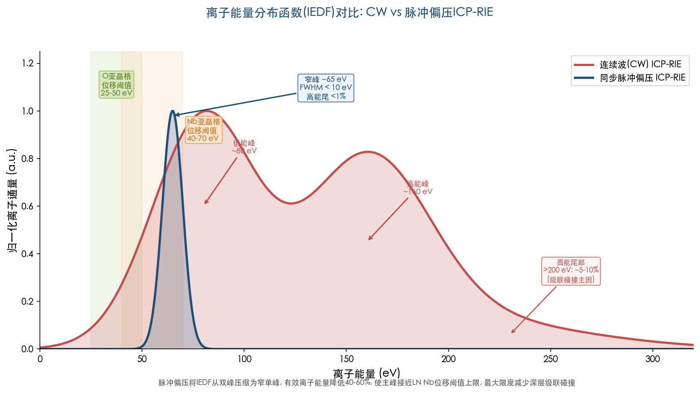

**图 3-2** CW 与脉冲偏压 ICP-RIE 的 IEDF 对比。CW 模式呈双峰分布（低能峰约 80 eV、高能峰约 170 eV），高能尾部（> 200 eV）占比约 5–10%，是引发 LN 深层级联碰撞的主因。同步脉冲偏压将 IEDF 压缩为窄单峰（约 65 eV，FWHM < 10 eV），有效离子能量降低 40–60%，主峰接近 Nb 亚晶格位移阈值上限（40–70 eV）。绿色和橙色区域分别标注 O 和 Nb 亚晶格的位移阈值范围。

### 3.2.2 其他材料体系的验证数据

脉冲等离子体在 SiO₂ 刻蚀中已积累了丰富的实验数据。同步脉冲偏压可将有效离子能量从约 100–200 eV 降至约 30–80 eV，同时维持约 80% 的刻蚀速率，亚表面损伤深度减少约 50% [Banna et al., IEEE TPS 2012](https://doi.org/10.1109/TPS.2012.2195509 "Pulsed HDP for advanced dry etching")。理论分析进一步表明，脉冲偏压可将 IEDF 的 FWHM 从约 30–50 eV 压缩至 < 10 eV，平均离子能量降低 40–60% [Agarwal & Kushner, JVST A 2009](https://doi.org/10.1116/1.3007910 "Plasma ALE using conventional equipment")。这些结果为将脉冲技术拓展至 LN 等复杂氧化物体系提供了重要的物理依据。

### 3.2.3 外推至铌酸锂的分析

将上述参数映射至 LN 体系，脉冲偏压理论上可将有效离子能量控制在 50–100 eV 范围内。考虑到 LN 中 O 亚晶格的位移阈值能量约 25–50 eV、Nb 亚晶格约 40–70 eV，这一能量窗口已接近 Nb 位移阈值上限，有望在最大限度减少深层级联碰撞导致的非晶化的同时，保留足够的离子辅助脱附以维持合理的刻蚀速率 [Agarwal & Kushner, JVST A 2009](https://doi.org/10.1116/1.3007910 "IEDF control near displacement threshold")。

我们认为脉冲等离子体刻蚀在 LN 上具有中高潜力，主要依据包括：（i）多数商用 ICP-RIE 设备已具备脉冲模式功能，设备改造成本低，推广门槛显著低于 ALE；（ii）该技术与现有 Ar/CHF₃ 气体配方和掩模工艺完全兼容，无需重新开发化学体系；（iii）IEDF 窄化对高能尾部的抑制效果恰好针对 LN 非晶化的主要驱动力——高能离子的级联碰撞。然而，截至 2026 年初，脉冲等离子体刻蚀在 LN 上尚无直接实验报道，上述分析基于 SiO₂/Si 体系数据的合理外推。LN 特有的三元化合物化学（NbF₅ 与 LiF 挥发性差异显著）可能使脉冲模式下的刻蚀化学行为出现偏离，需要专门的实验验证方可确认其实际效果。

## 3.3 低温/冷冻刻蚀：有限的适用性

低温刻蚀（cryo-etching）在 Si 深刻蚀中已高度成熟（SF₆/O₂ cryo-process），其核心原理是利用低温增强侧壁钝化层（如 SiO_xF_y）的热稳定性，从而抑制横向刻蚀、获得高各向异性轮廓 [Dussart et al., J. Phys. D 2014](https://doi.org/10.1088/0022-3727/47/12/123001 "Plasma cryogenic etching of silicon")。然而，将这一策略移植至 LN 面临根本性的热力学挑战。

从有利因素看，低温可降低 NbF₅ 的脱附速率，使其以固态形式滞留在侧壁充当钝化层，有利于实现各向异性刻蚀轮廓。从不利因素看，NbF₅ 的固态堆积将恶化侧壁形貌和光学质量，而 LiF 在任何实际工艺温度下均不具备挥发性（沸点 1676°C），低温进一步加剧其表面累积问题。

相关铁电材料 PZT 的低温刻蚀实验提供了有限但具参考价值的数据：在 −40°C、Cl₂/BCl₃/Ar 气氛下，侧壁角度从 65° 改善至 78°，但刻蚀速率降低约 40%，粗糙度无显著改善 [Wan & Bhatt, Microsyst. Nanoeng. 2021](https://doi.org/10.1038/s41378-021-00326-6 "Cryogenic etching of PZT")。LN 低温刻蚀的直接实验报道极为有限，综合考虑 LiF 不挥发性和 NbF₅ 固态堆积问题，我们评估该技术在 TFLN 光子器件制造中的适用性为低至中等，总体不如 ALE 和脉冲等离子体具有发展前景。

值得注意的是，温度效应在不同工艺模式中的作用方向并非一致。Chen 等人 2024 年的 LN 各向同性 ALE 工艺即在 0°C 衬底温度下操作，利用低温增强 H₂ 等离子体改性层的稳定性以提高协同性 [Chen et al., JVST A 2024](https://doi.org/10.1116/6.0003962 "Low-temperature ALE for higher synergy")；而 2025 年的方向性 ALE 则在 200°C 下获得了更平滑的表面。这一对比表明，温度效应高度依赖于具体化学体系和工艺模式，低温并非普适的损伤抑制策略。

## 3.4 远程等离子体：更适合清洗而非图形化

远程等离子体（remote plasma）通过将等离子体产生区域与衬底在空间上分离，使到达衬底表面的物种以中性自由基为主，离子通量相较于 ICP-RIE 衰减 2–3 个数量级（约 10⁸–10⁹ cm⁻³ vs. ICP-RIE 的 10¹¹–10¹² cm⁻³），理论上可完全消除物理溅射损伤 [Donnelly & Kornblit, JVST A 2013](https://doi.org/10.1116/1.4819316 "Plasma etching: yesterday, today, tomorrow")。

然而，远程等离子体用于 LN 独立图形化面临三项根本性限制。其一，NbF₅ 在无离子辅助条件下脱附效率极低，纯化学刻蚀速率预计低于 1 nm/min，难以满足实际制造需求。其二，纯化学刻蚀的各向同性特征无法获得大于 60° 的侧壁角度，不能形成光子波导所需的高约束脊型结构。其三，LiF 累积问题在缺乏离子轰击辅助脱附时更为严重，将进一步恶化表面质量。

折中方案"远程等离子体 + 低能离子（约 20–50 eV）"在 SiO₂ 上已实现约 10 nm/min 刻蚀速率和 < 1 nm 损伤深度 [Samuelson et al., JVST B 2006](https://doi.org/10.1116/1.2366678 "Neutral/ion flux ratio control")，其本质接近 CAIBE 的工作原理。综合评估，我们认为远程等离子体在 TFLN 制造中更适合作为刻蚀后清洗步骤（如去除碳基残留和氧化侧壁再沉积层），而非独立的图形化方案。

## 3.5 时间复用刻蚀：类 Bosch 工艺的局限

时间复用刻蚀（类 Bosch 工艺）通过交替进行刻蚀步骤和侧壁钝化步骤实现深刻蚀，在 Si MEMS 领域已获广泛应用。Henry 等人 2021 年在 LN 上采用交替 Ar⁺ 溅射和 CHF₃ 钝化的类 Bosch 策略，实现了约 3 μm 的刻蚀深度，侧壁角度 > 80°，但侧壁 R_q 约 3–5 nm，远高于高 Q 光子器件对侧壁质量的要求（通常 < 1 nm）[Henry et al., Nanotechnology 2021](https://doi.org/10.1088/1361-6528/abcb52 "Deep etching of LN with Ar and CHF₃/Ar")。

LN 类 Bosch 工艺面临的核心挑战在于缺乏高效的侧壁钝化化学：CHF₃ 分解产生的 CₓFᵧ 聚合物钝化效果有限且引入碳污染，而 LN 本身无法像 Si 那样在 O₂ 中形成致密的原位氧化钝化层。交替步骤之间的界面还会在侧壁留下周期性的扇贝状（scalloping）微结构，进一步增大散射损耗。因此，时间复用刻蚀更适合对侧壁光滑度要求较低的深刻蚀需求（如声学器件中的隔离沟槽），而非追求超低损耗的光子波导制造。

## 3.6 RIBE 与 CAIBE：离子束方法的化学增强

### 3.6.1 RIBE 在 TFLN 上的实验数据

反应性离子束刻蚀（reactive ion beam etching, RIBE）通过在离子束中引入反应性气体（如 CHF₃），在保留离子束高方向性优势的同时增加化学刻蚀分量，从而提高刻蚀速率。Ren 等人在 x-cut TFLN 上以 300 eV Ar/CHF₃ RIBE（入射角 10°）实现了约 30 nm/min 的刻蚀速率（相比纯 IBE 的约 15–20 nm/min 提升 50–100%），侧壁角度约 70°，R_q 约 1.5–2.5 nm [Ren et al., IEEE PTL 2020](https://doi.org/10.1109/LPT.2020.2978582 "LN RIBE etching characteristics")。

### 3.6.2 CAIBE 的早期应用与原理

化学辅助离子束刻蚀（chemically assisted ion beam etching, CAIBE）使离子能量与化学通量完全解耦：Ar⁺ 离子束由独立离子源产生并加速，反应性气体（如 CHF₃）通过独立管路直接供入刻蚀腔室。Guarino 等人 2007 年首次制备的 TFLN 电光微环谐振器即采用 CAIBE 方案 [Guarino et al., Nat. Photonics 2007](https://doi.org/10.1038/nphoton.2007.227 "First TFLN electro-optic microring")。CAIBE 的优势在于：离子束能量可独立维持在 200–400 eV 区间，同时通过调节化学通量提升刻蚀速率；离子束的高方向性和准单能特性使侧壁光滑度优于 ICP-RIE（典型 R_q 约 1 nm vs. ICP-RIE 的约 2–3 nm）[Ulliac et al., Microelectron. Eng. 2016](https://doi.org/10.1016/j.mee.2015.12.009 "RIE and IBE of LiNbO₃ comparison")。

### 3.6.3 RIBE/CAIBE 的损伤权衡

RIBE/CAIBE 与纯 IBE 及 ICP-RIE 之间存在明确的损伤权衡关系，需要针对具体器件需求进行取舍。

相对于纯 IBE，化学辅助降低了对高离子能量的依赖，但同时引入了 F⁺ 注入损伤。Krasnokutska 等人在 z-cut TFLN 上的对比实验直接揭示了这一权衡：纯 Ar⁺ IBE（300 eV、15° + 旋转）实现 Q 约 1.4×10⁶、损耗约 0.4 dB/cm；引入少量 CHF₃（RIBE 模式）后刻蚀速率提高 30–50%，但 Q 值无显著改善。这一结果暗示 F⁺ 注入损伤在一定程度上抵消了降低等效离子能量带来的收益 [Krasnokutska et al., Opt. Express 2018](https://doi.org/10.1364/OE.26.010958 "High-Q TFLN micro-ring by Ar ion milling")。

相对于 ICP-RIE，离子束方法的典型离子能量（200–500 eV）高于 ICP-RIE 的自偏压水平（约 100–200 eV），单次碰撞产生的损伤更深。然而，离子束的能量分散更小（准单能束 vs. ICP-RIE 的宽 IEDF），高能尾部离子占比更低，因此深层非晶化往往更加可控。总体而言，RIBE/CAIBE 处于中等技术成熟度（TRL 4–5），适合对侧壁光滑度要求极高的特定应用场景（如高 Q 微环谐振器），但并非所有损伤维度上的最优方案。

## 3.7 原位监测与端点检测技术

精确控制刻蚀深度和实时监测损伤状态对于 TFLN 制造至关重要。LN 薄膜厚度通常仅 300–600 nm，过刻蚀余量极小，对端点检测精度提出了严苛要求。以下逐一评述四种主要的原位监测手段及其在 TFLN 刻蚀中的适用性。

### 3.7.1 光学发射光谱（OES）

光学发射光谱可通过监测等离子体中 LN 刻蚀产物的特征发射线实现端点检测。Li 670.8 nm 和 Nb 405.9 nm 两条特征线在 LN 层被穿透时信号急剧下降，可提供约 ±5 nm 的端点检测精度 [Vieu et al., Sens. Actuators A 2018](https://doi.org/10.1016/j.sna.2017.12.052 "LN OES endpoint detection")。OES 设备成本低、可实时在线、与现有刻蚀系统兼容性好，是当前 TFLN ICP-RIE 中最具实用性的端点检测手段。

### 3.7.2 原位椭偏术

原位光谱椭偏术可以约 0.1 nm 的精度追踪 LN 薄膜厚度变化，精度远优于 OES。更重要的是，通过监测消光系数 k 的演变（非晶 LN 与单晶 LN 之间的折射率差 Δn 约 0.05–0.1），椭偏术可间接反映亚表面损伤层的形成与生长过程，为损伤实时表征提供可能。然而，图形化样品上的光学模式复杂性（多层膜叠加周期性结构的衍射效应）使椭偏模型拟合面临显著挑战，目前尚未在 TFLN 刻蚀中实现闭环反馈控制。

### 3.7.3 残余气体分析（RGA）

质谱残余气体分析可监测排气管路中的刻蚀产物信号——NbF₅（m/z = 187）、NbF₃（m/z = 149）、LiF（m/z = 26）——追踪刻蚀化学反应的实时变化。例如，NbF₅ 信号的突然下降可指示 LN 层穿透或化学计量比发生急剧变化。但 RGA 的响应速度受抽气管路延迟限制（约 1–10 s），时间分辨率不如 OES，更适合用于化学状态的辅助追踪而非精密端点检测。

### 3.7.4 激光干涉端点检测

激光干涉测量是另一种设备简便的端点检测方案：每个干涉条纹对应 λ/(2n) 的厚度变化（以 633 nm He-Ne 激光为例，LN 折射率 n ≈ 2.29，每条纹对应约 138 nm），端点精度约 10–20 nm。该方法原理直观、设备成本低、易于集成至商用刻蚀系统，但精度不如椭偏术，适合作为快速粗略端点判断的补充手段。

### 3.7.5 监测技术的整合前景

理想的 TFLN 刻蚀闭环控制系统应整合多种监测手段：以 OES 实现快速端点检测，以椭偏术提供高精度厚度与损伤实时监测，以 RGA 追踪化学状态变化，基于多信号融合实现自适应工艺调节。这一集成方案在半导体先进制程中已有成功先例，但在 TFLN 刻蚀中尚处于概念阶段，尚无团队公开报道完整的闭环反馈实现。

值得指出的是，ALE 的自限制特性在一定程度上降低了对精密端点检测的依赖——每个循环的刻蚀深度由化学自限制决定而非时间控制，总刻蚀深度可通过循环次数精确预设。这一特点构成 ALE 相较于连续刻蚀的又一结构性优势，尤其在对厚度均匀性要求极高的 PPLN 等频率转换器件制造中具有显著价值。

## 3.8 各技术路线综合评估

综合以上分析，各过程级损伤抑制技术在 LN 上的成熟度、损伤控制能力和实用性可从多维度进行横向对比。图 3-3 以表格形式汇总了六种技术在刻蚀速率、侧壁 R_q、亚表面损伤、ARDE 抑制、LN 实验验证状态、TRL 评级和设备兼容性七个维度上的表现。

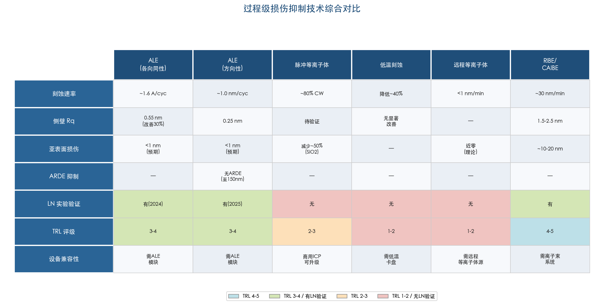

**图 3-3** 过程级损伤抑制技术综合对比。横向列出 ALE（各向同性/方向性）、脉冲等离子体、低温刻蚀、远程等离子体和 RIBE/CAIBE 六种技术，纵向从刻蚀速率、侧壁 R_q、亚表面损伤、ARDE 抑制、LN 实验验证状态、TRL 评级和设备兼容性七个维度进行评估，色块标注技术成熟度等级。

**ALE** 具有最高的潜力和最快的进展速度。2024–2025 年间，该技术从无到有完成了各向同性和方向性两种模式在 MgO:LN 上的概念验证，展现了亚纳米精度控制、无 ARDE、侧壁平滑化等关键能力。HBr 化学路线有效缓解了长期困扰 LN 刻蚀的非挥发性产物再沉积问题。当前主要限制在于速率瓶颈和尚未公开器件级 Q 值数据。技术成熟度评级：TRL 3–4。

**脉冲等离子体刻蚀** 在设备兼容性和原理可行性方面具有中高潜力。IEDF 窄化效应理论上可将 LN 有效离子能量精确控制在位移阈值附近，从根本上减少深层级联碰撞，但在 LN 上尚无直接实验验证。技术成熟度评级：TRL 2–3（LN 体系）。

**低温刻蚀** 受制于 LiF 的不挥发性和 NbF₅ 固态堆积问题，在 TFLN 光子器件制造中的适用性有限。技术成熟度评级：TRL 1–2。

**远程等离子体** 作为独立图形化方案不具备可行性（各向同性刻蚀特征和极低速率），但作为刻蚀后清洗步骤具有辅助价值。技术成熟度评级：TRL 1–2（图形化），TRL 3–4（清洗）。

**RIBE/CAIBE** 已有 LN 上的直接实验数据，侧壁光滑度优于 ICP-RIE，但典型离子能量偏高且化学辅助引入 F⁺ 注入，整体损伤收益存在不确定性。技术成熟度评级：TRL 4–5。

从技术演进趋势看，ALE 的进展尤为值得关注：仅一年时间内，Caltech Minnich 团队即从各向同性 ALE 推进至方向性 ALE，并完成了 TFLN 光栅结构的完整刻蚀和波导表面精修，配合 HBr 化学解决了再沉积这一核心瓶颈问题。我们判断，ALE 与传统 ICP-RIE/IBE 的混合工艺（粗刻 + 精修）有望在未来 2–3 年内成为追求极端性能（Q > 10⁸）的 TFLN 器件的标准制造路线之一。脉冲等离子体刻蚀则可能以更低的技术门槛率先实现在 LN 上的首次验证——鉴于多数商用 ICP 设备已支持脉冲模式，仅需具备 LN 刻蚀经验的团队进行系统性参数扫描即可获得初步数据，预计将在近期内出现相关报道。

# 第4章 刻蚀后修复与损伤消除技术

等离子体刻蚀完成后，铌酸锂（lithium niobate, LN）波导侧壁与亚表面不可避免地残留前述五类损伤——晶格无序化与非晶化层、离子注入杂质（Ar⁺/F⁺）、再沉积层、表面粗糙化以及化学计量比偏移。即使刻蚀工艺本身已经过充分优化（见第2、3章），这些残余损伤仍是制约薄膜铌酸锂（thin-film lithium niobate, TFLN）器件光学品质因子（Q 值）与电光性能的关键瓶颈。后处理修复技术因此成为将 TFLN 器件推向材料本征性能极限的不可或缺环节。

本章系统考察热退火、化学机械抛光（chemical mechanical polishing, CMP）、湿法化学清洗、等离子体后处理以及新兴的原子层刻蚀（ALE）精修等修复技术的物理机理与量化效果，并深入分析当前两大主流研究团队所采用的组合后处理工艺路线及其器件级性能验证。

## 4.1 热退火：晶格重结晶与缺陷复合

### 4.1.1 基本原理与温度窗口

热退火是刻蚀后修复领域最广泛采用的后处理技术。其基本物理机制包含两个互补过程：一是热激活弗伦克尔缺陷对（空位-间隙原子对）的复合，二是非晶化层的固相外延重结晶（solid-phase epitaxial regrowth, SPER），二者协同恢复 LN 的单晶结构与本征光电性质。当前文献中报道的典型退火条件为 300–500 °C、1–12 小时、空气或 O₂ 气氛 [Zhu et al., Adv. Opt. Photonics 2021](https://doi.org/10.1364/AOP.411024 "TFLN集成光子学综述")。

退火温度上限受多重因素约束。LN 居里温度约 1140 °C，理论上晶格恢复可在此温度以下进行；然而对于含周期极化结构（periodically poled lithium niobate, PPLN）的器件，铁电畴壁在约 500 °C 以上开始发生退极化迁移，因此 PPLN 器件退火通常需限于 350–400 °C。此外，超过 500 °C 时 Li₂O 蒸汽压显著增加，表面 Li 挥发将进一步恶化刻蚀已引起的化学计量比偏移。Li₂O 富余气氛退火原则上可抑制 Li 挥发，但目前该工艺的气氛浓度控制精度有限、批次间重复性较差 [Sanna & Schmidt, Phys. Rev. B 2010](https://doi.org/10.1103/PhysRevB.81.214116 "LN surfaces from microscopic perspective")。

### 4.1.2 退火温度优化的实验证据

Wolf et al. 2018 对 250–400 °C 范围进行了系统参数扫描，确认 350 °C 为 TFLN 刻蚀后退火的最佳温度。在该条件下经 3 小时退火后，传播损耗从约 0.3 dB/cm 降至约 0.1 dB/cm，改善幅度约 3 倍。一项重要观察是，退火并未改变侧壁形貌粗糙度（退火前后 AFM 测量 Rq 无统计显著差异），这一结果明确表明退火的改善机制源自亚表面晶格质量恢复而非表面形貌修复。当退火温度超过 400 °C 时，未观察到进一步改善，反而出现 Li 挥发迹象 [Wolf et al., Opt. Express 2018](https://doi.org/10.1364/OE.26.012529 "ICP刻蚀LN波导散射损耗降低")。

Zhang et al. 2017 的里程碑工作——在 X-cut TFLN 上实现 Q > 10⁷、传播损耗约 0.027 dB/cm 的微环谐振器——同样包含 350 °C、3 小时空气退火作为关键后处理步骤 [Zhang et al., Optica 2017](https://doi.org/10.1364/OPTICA.4.001536 "Ultra-high-Q LN microring")。Desiatov et al. 2019 在可见光波段 TFLN 波导中采用类似退火条件，实现了 460–650 nm 波段损耗约 0.03 dB/cm、633 nm 处 Q 约 2×10⁷。由于可见光波段对缺陷态吸收的敏感度远高于近红外波段（缺陷吸收截面随光子能量增大而增强），退火对可见光器件的性能改善尤为关键 [Desiatov et al., Optica 2019](https://doi.org/10.1364/OPTICA.6.000380 "Ultra-low-loss visible TFLN photonics")。

图 4-1 汇总了退火温度与传播损耗的定量关系，直观呈现 350 °C 附近的最优窗口及高温区 Li₂O 挥发风险。

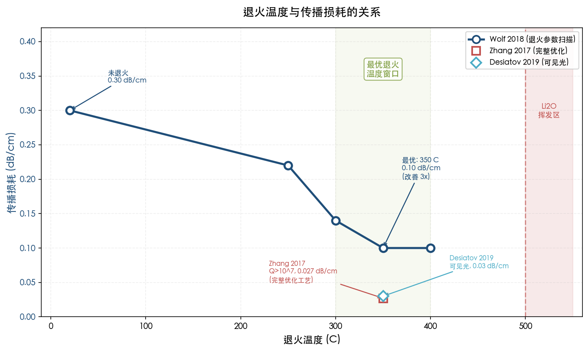

**图 4-1　退火温度与传播损耗的关系。** 以 Wolf et al. 2018 的 250–400 °C 参数扫描为主线（蓝色），同时标注 Zhang 2017（完整优化工艺，0.027 dB/cm）和 Desiatov 2019（可见光，0.03 dB/cm）的里程碑数据点。绿色阴影区域标识最优退火温度窗口，红色阴影区域标识 Li₂O 挥发风险区。

Shi et al. 2024 进一步揭示了退火对电子束光刻（electron beam lithography, EBL）引入损伤的修复作用。该研究对比 EBL 和深紫外光刻（DUV）两种图形化技术后发现，100 keV 以上高能电子束可穿透光刻胶直接注入 TFLN 表面层，引入额外的材料吸收损耗。针对此问题设计的慢速升温退火工艺使波导损耗降低约 50%，微环谐振器内禀 Q 值提升约 100%，最终在 X-cut TFLN 上实现 Q_int 达 3.93×10⁶ [Shi et al., Opt. Mater. 2024](https://doi.org/10.1016/j.optmat.2024.115049 "Reduced material loss by EBL in TFLN through post-process annealing")。

### 4.1.3 退火气氛的作用

退火气氛的选择决定了修复过程的化学路径与最终效果。O₂ 或空气退火不仅提供热驱动的晶格恢复动力，还能通过氧扩散补偿刻蚀过程中的氧损失，并将碳基聚合物残留氧化为挥发性 CO₂ 去除。N₂ 或 Ar 等惰性气氛下则仅依赖热驱动的晶格恢复，不具备化学补偿功能。Li₂O 蒸汽退火在理论上是恢复化学计量比最为有效的方案，能同时补偿 Li 和 O 两种组分的损失，但当前该工艺在气氛浓度控制精度与批次间重复性方面仍存在较大局限 [Ding et al., Micromachines 2020](https://doi.org/10.3390/mi11060573 "RIE图案化LN薄膜")。

### 4.1.4 快速热退火与激光局部退火

快速热退火（rapid thermal annealing, RTA）以约 10–100 °C/s 的升温速率将样品迅速加热至 500–800 °C 并保温 30 s–5 min。该技术在 LN 领域主要应用于 Smart Cut 工艺中 He⁺ 注入损伤的修复，而针对 TFLN 刻蚀后损伤修复的专门研究极为有限，多数研究团队仍沿用常规管式炉退火方案 [Levy et al., Opt. Express 2011](https://doi.org/10.1364/OE.19.013700 "Crystal ion slicing LN thin film")。

激光局部退火（CO₂ 激光、准分子激光或飞秒激光）在 TFLN 刻蚀后处理中尚无系统性研究报道。其潜在优势在于可选择性加热侧壁损伤区域而避免对整体器件结构的热影响；然而，LN 的热导率存在显著各向异性（a 轴与 c 轴差异明显），加之 CO₂ 激光在 LN 中的强吸收特性，使激光局部退火的温度分布精确控制面临较大技术挑战 [Boes et al., Laser Photonics Rev. 2023](https://doi.org/10.1002/lpor.202200862 "LN热光学特性讨论")。

## 4.2 化学机械抛光（CMP）

### 4.2.1 CMP 的修复原理与能力

CMP 是目前改善 TFLN 表面粗糙度和去除亚表面损伤层最为有效的后处理技术。其工作原理是碱性胶体 SiO₂ 浆料的化学溶解与机械研磨的协同作用，可以纳米级精度逐层去除损伤材料。Wu et al. 2020 报道了 Ar⁺ IBE 刻蚀后 CMP 处理的显著效果：Q 值从约 10⁶ 提升至约 1.07×10⁷，传播损耗从约 0.3 dB/cm 降至约 0.028 dB/cm，Q 值改善接近一个数量级 [Wu et al., Nat. Commun. 2020](https://doi.org/10.1038/s41467-020-18014-w "TFLN太赫兹带宽电光调制器")。

CMP 关键工艺参数包括：碱性 SiO₂ 浆料（pH 约 10–11、颗粒粒径约 30–100 nm）、研磨压力约 1–5 psi（过高压力可能破坏纳米尺度波导结构）、去除量约 10–50 nm（TFLN 薄膜总厚度仅约 300–600 nm，去除量须严格控制以避免薄膜厚度过度减薄），以及晶圆级均匀性约 ±5–10% [Zhu et al., Adv. Opt. Photonics 2021](https://doi.org/10.1364/AOP.411024 "CMP工艺要点")。

### 4.2.2 CMP 的侧壁局限与解决策略

CMP 在已刻蚀波导上存在一个本征局限：研磨垫仅能作用于抛光平面内的表面（即 slab 区域及波导顶面），而波导侧壁位于抛光平面之外，无法通过常规 CMP 直接改善侧壁粗糙度 [Li et al., PRL 2019](https://doi.org/10.1103/PhysRevLett.122.253801 "LN光力系统CMP后处理")。

针对这一局限，研究者发展了两类应对策略。第一类是沉积共形 SiO₂ 包层后进行整体 CMP 平坦化：SiO₂ 填充侧壁微观凹坑和凹陷区域，有效降低光场与粗糙侧壁的直接交互，从而减少散射损耗。第二类是交替工艺方案，即"部分刻蚀→CMP 中间精修→继续刻蚀"的多步迭代流程。Hu et al. 2022 采用 CMP 辅助多步工艺实现了 Q > 4×10⁶，验证了交替策略的可行性 [Hu et al., Opt. Lett. 2022](https://doi.org/10.1364/OL.449143 "高性能TFLN微环调制器")。

### 4.2.3 CMP 前置处理的作用

Li et al. 2023 在 Nature 上报道的 Q 约 2.6×10⁸（传播损耗约 5.6×10⁻³ dB/cm）这一里程碑成果中，CMP 的应用方式发生了重要创新：CMP 不仅作为刻蚀后处理步骤，更被前置于刻蚀之前，用于消除 TFLN 初始薄膜中 Smart Cut 工艺遗留的亚表面损伤层。这一前置 CMP 步骤去除了薄膜表面约数十纳米厚的离子注入损伤区域，为后续刻蚀提供了更高质量的起始材料。完整工艺流程融合了 CMP 前置处理→优化 IBE 刻蚀→300 °C 退火后处理三个核心环节 [Li et al., Nature 2023](https://doi.org/10.1038/s41586-023-06602-x "High-Q TFLN ring resonators")。

## 4.3 湿法化学清洗

### 4.3.1 稀 HF 清洗

稀氢氟酸（HF）清洗是去除侧壁再沉积层最具选择性的湿法手段。LN 单晶在室温稀 HF 中的刻蚀速率极低（< 0.1 nm/min），而非晶态再沉积层（非晶 LiNbOₓ、SiO₂ 残留）的溶解速率快 1–2 个数量级。这一巨大的选择性差异使得仅需 1% HF 浸泡约 30 s 即可有效去除侧壁再沉积层而不损害 LN 本体晶格 [Krasnokutska et al., Opt. Express 2019](https://doi.org/10.1364/OE.27.017681 "Ultra-low loss TFLN photonic circuits")。

HF 清洗对侧壁均方根粗糙度（Rq）的改善幅度约 0.2–1 nm（典型值从约 2–3 nm 降至约 1.5–2 nm），具体改善程度取决于再沉积层对总粗糙度的贡献比例。在再沉积较为严重的工艺条件下（例如金属硬掩模配合高偏压刻蚀），HF 清洗的改善效果更为显著 [Wolf et al., Opt. Express 2018](https://doi.org/10.1364/OE.26.012529 "再沉积与散射损耗关系")。

### 4.3.2 HF 清洗的局限与注意事项

HF 对金属再沉积层（如 CrOₓ、NiOₓ）的去除效率有限，因为金属氧化物在稀 HF 中的溶解度远低于非晶态 LiNbOₓ 或 SiO₂。当使用金属硬掩模时，建议采用顺序清洗流程：先以专用蚀刻液剥离残余掩模→稀 HF 短浸去除无机再沉积→去离子水充分冲洗 [Kaufmann et al., APL 2023](https://doi.org/10.1063/5.0126355 "Redeposition-free LN devices")。

一个重要的工艺约束是 HF 会同时刻蚀 TFLN 器件中的埋氧层（buried oxide, BOX），因为该层同样为 SiO₂ 材料。长时间 HF 浸泡将导致 BOX 横向底切，破坏波导结构的机械完整性，因此 HF 处理时间必须严格限制在数十秒量级 [Zhu et al., Adv. Opt. Photonics 2021](https://doi.org/10.1364/AOP.411024 "后处理注意事项")。

### 4.3.3 其他湿法试剂

除 HF 外，其他湿法试剂在特定清洗场景中亦具有应用价值。硝酸（HNO₃）对有机残留的氧化去除效果优于 HF，适用于光刻胶残余的彻底清除。碱性溶液在室温稀释条件下对 LN 晶体的刻蚀速率可忽略不计，可用于温和的表面清洗而不引入额外损伤 [Zhu et al., Adv. Opt. Photonics 2021](https://doi.org/10.1364/AOP.411024 "后处理注意事项")。

## 4.4 等离子体后处理

### 4.4.1 低能 O₂ 等离子体

低能 O₂ 等离子体处理（功率 < 50 W、气压约 50–200 mTorr、时间约 1–5 min）是刻蚀后转入下一工艺步骤前的标准预处理手段。其主要功能包括灰化碳基聚合物残留（将 CHₓFᵧ 聚合物氧化为挥发性 CO₂ 和 HF）以及部分补偿表面氧缺失。然而，低能条件下 O₂ 的注入深度仅约 1–2 nm，对更深层区域的化学计量比修复作用十分有限 [Hu et al., Opt. Express 2021](https://doi.org/10.1364/OE.414646 "高性能TFLN调制器")。

### 4.4.2 H₂ 等离子体

H₂ 等离子体可通过还原反应促进氟化物残留（如 LiF、NbFₓ）和金属氧化物再沉积层（如 CrOₓ）的化学脱附。然而，H₂ 还原气氛存在将 Nb⁵⁺ 部分还原为 Nb⁴⁺ 或 Nb³⁺ 的风险，由此形成的色心（color center）会在可见光至近红外波段引入额外的光学吸收损耗。该工艺窗口极窄——还原不足则清洗效果有限，还原过度则引入新损伤。目前 H₂ 等离子体在 TFLN 刻蚀后处理中的系统性报道极为有限 [Boes et al., Laser Photonics Rev. 2023](https://doi.org/10.1002/lpor.202200862 "LN表面缺陷化学")。

### 4.4.3 ALE 精修：后处理工具箱的新范式

原子层刻蚀（atomic layer etching, ALE）精修正在从过程级刻蚀技术向后处理修复工具演变，代表了该领域的一个重要新兴方向。Chen et al. 2025 在加州理工学院报道了首个 LN 定向 ALE 工艺，采用"HBr/BCl₃/Ar 等离子体表面改性+低能 Ar⁺ 等离子体去除"的自限制循环方案。在 0 °C 条件下，该工艺实现了 1.04±0.01 nm/cycle 的去除速率和 84.6% 的协同度；在 200 °C 工艺温度下，仅 50 个循环即可将 Ar⁺ 离子铣波导的表面粗糙度从 Rq = 2.07 nm 降至 Rq = 0.34 nm，降幅高达 84%。

HBr 基化学路径相比 F 基和 Cl 基方案的核心优势在于：Br 基刻蚀产物（LiBr、NbBr₅）具有更高的蒸汽压，有效抑制了非挥发性产物的再沉积问题。此外，该工艺展示了无纵横比依赖刻蚀（aspect-ratio independent etching）行为，在 150 nm 最小间距下未观察到刻蚀深度差异，这一特性对高密度光子集成电路的后处理尤为有利 [Chen et al., arXiv 2511.01825 (2025)](https://arxiv.org/abs/2511.01825 "Directional ALE of LN using Br-based plasma")。ALE 精修目前尚未与光学器件性能指标（Q 值、传播损耗）直接关联，但其卓越的表面平滑化能力表明，将 ALE 纳入刻蚀后修复工具箱具有显著的应用前景。

## 4.5 组合后处理工艺路线

### 4.5.1 两大主流路线

当前 TFLN 领域已形成两条经过充分实验验证的组合后处理路线，分别由哈佛大学 Loncar 研究组和耶鲁大学 Tang 研究组开创并持续优化：

**哈佛 Loncar 组路线："ICP-RIE → HF 清洗 → 退火"（不含 CMP）。** 该路线以 HSQ 或 SiO₂ 介质掩模配合 Ar 基 ICP-RIE 为核心刻蚀步骤，掩模湿法剥离后进行稀 HF 短浸去除再沉积，最后 350 °C 退火 3 小时恢复晶格质量。Zhang et al. 2017（Q > 10⁷）和 Zhu et al. 2024（Q 约 2.93×10⁷，传播损耗约 1.3 dB/m）均采用此路线 [Zhang et al., Optica 2017](https://doi.org/10.1364/OPTICA.4.001536 "Loncar团队退火核心后处理")；[Zhu et al., Photonics Res. 2024](https://doi.org/10.1364/PRJ.517318 "29 million Q TFLN microresonators")。

**耶鲁 Tang 组路线："IBE → CMP → 退火"。** 该路线以纯 Ar⁺ IBE 为刻蚀手段，利用 CMP 大幅改善表面质量后再通过退火恢复深层晶格。Wu et al. 2020 采用此路线实现了 Q 约 1.07×10⁷（传播损耗约 0.028 dB/cm）[Wu et al., Nat. Commun. 2020](https://doi.org/10.1038/s41467-020-18014-w "Tang团队多步后处理")。Li et al. 2023 在此基础上增加了 CMP 前置步骤（消除原始薄膜损伤），实现了 Q 约 2.6×10⁸ [Li et al., Nature 2023](https://doi.org/10.1038/s41586-023-06602-x "Ultra-high-Q LN ring resonators")。

图 4-2 以流程对比形式直观呈现了两条路线的步骤顺序、关键参数与最终器件性能指标差异。

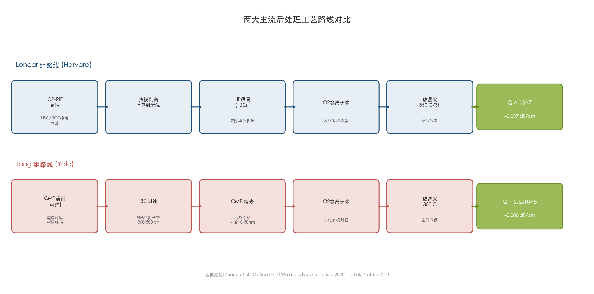

**图 4-2　两大主流后处理工艺路线对比。** 上半部分为 Loncar 组路线（蓝色），下半部分为 Tang 组路线（红色），分别标注了各步骤的工艺参数及最终实现的 Q 值与传播损耗。数据来源：Zhang et al., Optica 2017；Wu et al., Nat. Commun. 2020；Li et al., Nature 2023。

### 4.5.2 典型组合流程

综合两条路线的共性要素，TFLN 刻蚀后的典型组合后处理流程可归纳为以下六个步骤：

1. **掩模湿法剥离**：使用专用蚀刻液去除残余金属或介质掩模材料；
2. **溶剂清洗**：以丙酮/异丙醇序列清洗去除有机残留物；
3. **O₂ 等离子体处理**：低功率 O₂ 等离子体灰化残余有机物并部分补偿表面氧损失；
4. **稀 HF 短浸**（视工艺需要选用）：选择性溶解去除非晶态再沉积层；
5. **热退火**：300–400 °C、3–6 小时、空气或 O₂ 气氛，修复亚表面晶格损伤；
6. **CMP 精修**（视器件性能需求选用）：去除表面 10–50 nm 厚度的损伤层并改善粗糙度。

两条路线的核心差异在于是否包含 CMP 步骤以及 CMP 在流程中的定位（前置于刻蚀之前或后置于退火之后）。步骤顺序确实影响最终结果，但两种路线均已实现 Q > 10⁷，表明关键在于各步骤工艺参数的精细优化而非对某一固定顺序的严格遵循 [Zhang et al., Optica 2017](https://doi.org/10.1364/OPTICA.4.001536 "Loncar团队")；[Wu et al., Nat. Commun. 2020](https://doi.org/10.1038/s41467-020-18014-w "Tang团队")。

### 4.5.3 各步骤的协同机制

组合后处理的有效性根植于各步骤之间的功能互补性与正交性：湿法清洗选择性去除可溶性再沉积物；O₂ 等离子体灰化有机残留并补偿浅层氧损失；热退火通过热激活过程修复深层晶格损伤和缺陷复合；CMP 则以物理方式去除亚表面损伤层并精修表面形貌。由于没有单一后处理手段能够同时覆盖全部五类损伤，各步骤在损伤修复维度上的正交互补关系保证了组合工艺的综合改善效果显著优于任何单步处理方案。

## 4.6 各修复方法对器件性能的量化改善

### 4.6.1 传播损耗与 Q 值

退火对传播损耗的改善已由多个独立研究组验证。Wolf et al. 2018 报道了约 3 倍的传播损耗改善（从 0.3 dB/cm 降至 0.1 dB/cm）；Shi et al. 2024 报道了约 50% 的损耗改善及 Q 值约 100% 的提升。CMP 的改善幅度更为显著：Wu et al. 2020 报道了约一个数量级的 Q 值提升（从约 10⁶ 提升至约 10⁷）。Zhu et al. 2024 通过 Loncar 组的完整后处理流程（HF 清洗+退火）实现了 Q 约 2.93×10⁷，对应传播损耗仅约 1.3 dB/m [Zhu et al., Photonics Res. 2024](https://doi.org/10.1364/PRJ.517318 "29 million Q TFLN microresonators")。

Li et al. 2023 在 Nature 上报道的 Q 约 2.6×10⁸ 记录表明，当 CMP 前置消除原始薄膜损伤、优化 IBE 最小化新增损伤、退火后置修复残余缺陷的完整链条被充分执行后，TFLN 器件性能已接近材料本征吸收极限。该研究估算的理论 Q_max 约 1.63×10⁸，而实验测得值超过此估计，可能与耦合条件下拟合方法的系统偏差或材料批次差异有关 [Li et al., Nature 2023](https://doi.org/10.1038/s41586-023-06602-x "High-Q TFLN ring resonators")。

### 4.6.2 电光系数 r₃₃ 的恢复

退火对电光系数 r₃₃ 恢复的证据目前主要来自器件级间接测量。经过退火处理的 TFLN Mach-Zehnder 调制器实测半波电压-长度积 V_π·L 约 1.8–2.5 V·cm，接近以体材 r₃₃ = 30.8 pm/V、电极间距约 600 nm 计算的理论极限值（V_π·L 约 1.8 V·cm）；相比之下，未经优化后处理的器件 V_π·L 约 3–5 V·cm，暗示有效 r₃₃ 仅为体材值的 50–70%。Wang et al. 2018 在 Nature 上报道的 100 GHz 带宽调制器即包含退火步骤，实测 V_π·L ≈ 2.2 V·cm [Wang et al., Nature 2018](https://doi.org/10.1038/s41586-018-0551-y "100GHz TFLN电光调制器")。

### 4.6.3 二阶非线性极化率 χ⁽²⁾ 的恢复

退火对 χ⁽²⁾ 恢复的证据来自 PPLN 波导中二次谐波产生（second harmonic generation, SHG）效率的定量测量。经退火后处理的 PPLN 波导 SHG 归一化效率接近理论预测值（约 2000–4600 %/W/cm²），表明刻蚀引起的侧壁"死层"——即非晶化区域中 χ⁽²⁾ 降为零的区域——已被退火过程中的重结晶有效修复。Lu et al. 2019 在 PPLN TFLN 微环谐振器中实现了 2600 %/W·cm² 的 SHG 归一化效率，这一接近理论值的结果直接得益于优化的退火后处理 [Lu et al., Optica 2019](https://doi.org/10.1364/OPTICA.6.001455 "PPLN TFLN微环SHG")。

## 4.7 五类损伤的修复有效性矩阵

将前述修复技术与第1章建立的五类损伤分类相对照，可构建如下修复有效性框架（图 4-3）。

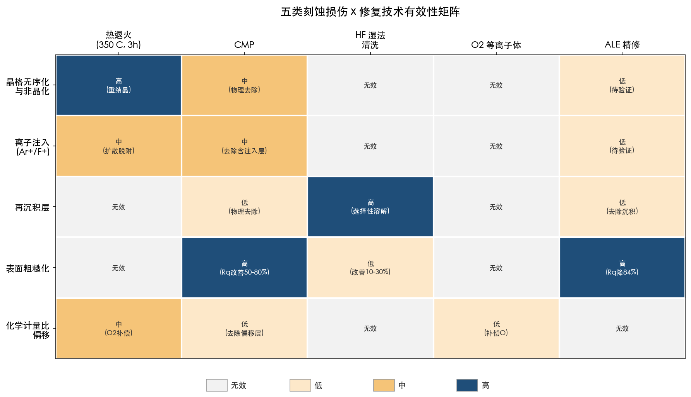

**图 4-3　五类刻蚀损伤与修复技术有效性矩阵。** 行维度为五类刻蚀损伤，列维度为五种修复技术，单元格颜色深浅对应有效程度（高/中/低/无效），并标注各技术的核心作用机制。

1. **晶格无序化与非晶化**：热退火最为有效，通过热激活固相外延重结晶使非晶化层恢复为单晶态；CMP 通过物理去除非晶化层亦可作出贡献。
2. **离子注入（Ar⁺/F⁺）**：退火促进注入离子向表面扩散并脱附（F 在约 400 °C 下可有效扩散脱附）；CMP 可直接去除含注入杂质的表层材料。
3. **再沉积层**：稀 HF 湿法清洗最为有效，利用 LN 晶体与非晶态再沉积层之间巨大的刻蚀速率差异实现高选择性去除；CMP 亦可物理去除再沉积层；退火对再沉积物不具备直接去除能力。
4. **表面粗糙化**：CMP 最为有效（Rq 改善约 50–80%）；HF 清洗可改善约 10–30%；退火对表面形貌无改善作用。ALE 精修在顶面平滑化方面已展示 84% 的 Rq 降幅，具有突出潜力。
5. **化学计量比偏移**：O₂ 气氛退火可补偿氧损失；Li₂O 蒸汽退火理论上最为有效但当前工艺重复性不佳；CMP 可去除化学计量比偏移的表层但不具备恢复化学计量比的能力。

上述矩阵清晰表明，没有任何单一技术能够覆盖全部五类损伤，组合后处理工艺的必要性从损伤物理机理层面得到了充分的逻辑支撑。

## 4.8 本章小结

刻蚀后修复技术是 TFLN 光子器件实现极致性能的不可或缺环节。在各类修复手段中，350 °C、3 小时空气退火已成为业界标准步骤，可将传播损耗改善 2–3 倍（Wolf et al. 2018：0.3→0.1 dB/cm）并有效恢复电光系数 r₃₃ 与二阶非线性极化率 χ⁽²⁾。CMP 在表面粗糙度改善和亚表面损伤层去除方面具有退火无法替代的独特优势，可实现约一个数量级的 Q 值提升（Wu et al. 2020：10⁶→10⁷）。稀 HF 清洗则凭借其对非晶态再沉积层的高选择性，在组合流程中承担精准去除的关键角色。

两大主流后处理路线——Loncar 组"ICP-RIE → HF → 退火"路线与 Tang 组"IBE → CMP → 退火"路线——均已达到 Q > 10⁷ 量级。Li et al. 2023 在 Nature 上报道的 Q 约 2.6×10⁸ 进一步验证了完整组合后处理链条可将 TFLN 性能推至接近材料本征吸收极限。新兴的 ALE 精修技术（Chen et al. 2025 报道的 HBr 基方案，Rq 降幅 84%、无纵横比依赖）为后处理工具箱增添了独特的原子级精密平滑化手段，有望与传统退火和 CMP 形成互补，推动 TFLN 器件性能向新的高度迈进。

# 第5章 前沿探索方向与技术展望

前四章围绕"预防—原位抑制—后处理修复"的工艺时序，系统梳理了等离子体刻蚀对铌酸锂（lithium niobate, LiNbO₃, LN）造成的五类材料损伤及其已有的缓解策略。现有方法已将薄膜铌酸锂（thin-film lithium niobate, TFLN）波导传播损耗降至约 0.03 dB/cm、品质因子（*Q*）推至 10⁷–10⁸ 量级，但在更高 *Q* 值微腔、高效非线性频率转换以及晶圆级可制造性等前沿需求面前，刻蚀损伤仍是性能天花板的核心限制之一。本章从"能否彻底绕开刻蚀"与"能否用全新刻蚀范式根本性消除损伤"两个维度，审视学术界与产业界正在探索的新兴技术途径，并给出面向不同器件类型的推荐工艺路线图及未来 1–2 年的实用化前景判断。

## 5.1 无刻蚀图形化路线：规避损伤的替代方案

### 5.1.1 质子交换波导

质子交换（proton exchange, PE）及其衍生方案——退火质子交换（APE）和反质子交换（RPE）——是最成熟的无刻蚀 LN 波导技术，技术成熟度（TRL）达 7–8 级，已在商用 LN 调制器中应用数十年。其核心原理是将 LN 表面 Li⁺ 与溶液中 H⁺ 交换，在数微米深度内形成折射率增量 Δ*n* ≈ 0.02–0.12 的波导层 [Korkishko et al., JOSA B 1996](https://doi.org/10.1364/JOSAB.13.000000 "PE LN waveguides综述")。然而，该折射率差远低于直接刻蚀 TFLN 脊型波导的 Δ*n* ≈ 0.7–1.0，导致模式限制薄弱、弯曲半径须达毫米量级，难以满足高密度集成与高 *Q* 微环的需求。此外，APE 仅能将电光系数 *r*₃₃ 恢复至体材值的 50–70%，RPE 虽可达约 90%，但额外工艺步骤增加了流程复杂度。在需要强模式限制与紧凑结构的非线性光子学应用中，质子交换已无法与刻蚀 TFLN 形成有效竞争。

### 5.1.2 飞秒激光直写

飞秒激光直写利用多光子吸收在 LN 体内产生局域折射率修改（Δ*n* ≈ 0.01–0.05），具备三维波导制备能力，但折射率差过低致使模式限制薄弱、弯曲损耗偏高。光折变效应的本质可逆性进一步削弱了器件的长期稳定性。该技术 TRL 仅 3–4 级，尚无晶圆级制造演示，当前适用范围局限于实验室级原型验证与低密度光路互连。

### 5.1.3 脊加载波导

脊加载波导（rib-loaded waveguide）通过在未刻蚀 LN 薄膜上沉积 SiN 或 Ta₂O₅ 等高折射率介质条，依靠覆盖层的几何形状实现模式限制，完全不刻蚀 LN 表面，晶格完整性得以保留。Chang et al. 2017 年在 SiN-on-LNOI 平台上率先展示了该概念 [Chang et al., Opt. Lett. 2017](https://doi.org/10.1364/OL.42.000803 "SiN-LNOI异质集成")。然而，由于模式能量部分分散在覆盖层中，*Q* 仅约 5×10⁵（损耗约 0.3 dB/cm），远低于直接刻蚀 TFLN 的 *Q* > 10⁷。更关键的限制在于电光和非线性模式重叠积分（Γ_LN）显著降低——倍频（SHG）效率按 Γ_LN² 缩减，可降低 2–5 倍 [Lu et al., Optica 2019](https://doi.org/10.1364/OPTICA.6.001455 "PPLN TFLN微环SHG")。因此，脊加载波导适合对损耗不敏感且不追求高非线性效率的特定场景（如低功率线性光路由），但无法替代直接刻蚀 TFLN 作为高性能非线性光子学平台。

## 5.2 混合集成策略：在成熟平台上嫁接 LN 功能

### 5.2.1 核心逻辑与技术路线

混合集成的核心思路是"在 Si 或 SiN 平台上完成全部精密图形化，将未刻蚀的 LN 薄膜通过晶圆级键合转移至上方"。由于 LN 层无需任何波导级刻蚀或铣削，其晶格完整性和本征 *r*₃₃、χ⁽²⁾ 均得以完全保留。He et al. 2019 年在 *Nature Photonics* 报道了 LN-on-Si 混合平台，其中 Si 波导承担模式限制和光路由功能，LN 薄膜提供电光调制能力 [He et al., Nat. Photonics 2019](https://doi.org/10.1038/s41566-019-0378-6 "High-performance Si-LN hybrid MZM")。

该方案在调制器领域已取得与直接刻蚀 TFLN 可比的性能：V_π·L ≈ 2.5 V·cm、3 dB 电光带宽 > 70 GHz。然而，混合模式中 LN 的能量占比（Γ_LN）仅约 30–60%（对比直接刻蚀 TFLN 的 70–90%），导致有效 *r*₃₃ 下降，需要更长调制臂来补偿调制效率的损失 [He et al., Nat. Photonics 2019](https://doi.org/10.1038/s41566-019-0378-6 "Si-LN混合调制器性能")。

### 5.2.2 SiN-LN 混合集成的最新进展

2025 年，LIGENTEC 与 UCSD 的合作进一步推动了 SiN-LN 混合电光调制器的成熟化。Rahman et al. 2025 年采用晶圆级直接键合（无粘合剂）将 300 nm x-cut TFLN 转移至双层 LPCVD SiN 光子平台上，实现了 V_π·L ≈ 3.8 V·cm、消光比 > 30 dB、3 dB 电光带宽超过 110 GHz 的推挽 Mach–Zehnder 调制器，且基于标准低电阻率 Si 衬底 [Rahman et al., arXiv 2025](https://arxiv.org/abs/2504.00311 "Hybrid LN-SiN modulators on Si photonics platform")。该工作的核心意义在于：LN 层无需任何波导级图形化（仅进行粗略区域去除），所有精密波导结构均由成熟 SiN 代工线完成，从根本上规避了 LN 刻蚀损伤。SiN1 层传播损耗约 0.2 dB/cm，键合前后未见显著劣化。

与此同时，直接刻蚀 TFLN 的量产路线亦在快速推进。Liu et al. 2025 年在 4 英寸石英衬底 TFLN 晶圆上采用 DUV 步进光刻和 Ar⁺ 基 RIE，实现了量产级调制器制造：传播损耗 < 0.4 dB/cm、电光带宽 > 110 GHz、V_π ≈ 2.92 V，良率达 50%（以 110 GHz 带宽且 V_π < 3 V 为合格标准）[Liu et al., Light: Adv. Manuf. 2025](https://doi.org/10.37188/lam.2025.047 "Volume manufacturing of TFLN modulators")。上述两项成果表明，混合集成与直接刻蚀正形成竞争性共存的格局，各自面向不同的性能需求和供应链策略。

### 5.2.3 混合集成的局限与挑战

混合集成在 χ⁽²⁾ 非线性效率方面存在本征劣势。Γ_LN 约 30–50% 使 SHG 效率按 Γ_LN² 缩减至直接刻蚀方案的约 1/4 至 1/2，高效非线性频率转换应用仍首选直接刻蚀 TFLN [Lu et al., Optica 2019](https://doi.org/10.1364/OPTICA.6.001455 "PPLN TFLN SHG效率")。此外，SiN 与 LN 之间的热膨胀系数（CTE）失配不容忽视——SiN 约 3.3×10⁻⁶/K，LN *a* 轴约 15.4×10⁻⁶/K、*c* 轴约 7.5×10⁻⁶/K——在退火或温度循环过程中可能引发界面应力集中与分层风险 [Chang et al., Opt. Lett. 2017](https://doi.org/10.1364/OL.42.000803 "CTE失配问题")。键合界面的长期可靠性数据（温度循环、老化测试）目前尚未在公开文献中充分披露，是混合集成方案走向产业化过程中有待系统验证的关键环节。

## 5.3 原子层刻蚀（ALE）：从概念验证到首次 LN 实验

### 5.3.1 ALE 原理与对 LN 的潜在价值

原子层刻蚀（atomic layer etching, ALE）通过"表面化学改性→改性层选择性去除"的自限制循环实现亚纳米级刻蚀精度，已在半导体前道工艺中高度成熟。在 SiO₂ 体系上，ALE 可实现去除速率约 1–3 Å/cycle、表面粗糙度 RMS < 0.5 nm、亚表面损伤 < 1 nm [Kanarik et al., JVST A 2015](https://doi.org/10.1116/1.4913379 "ALE overview in semiconductor industry")。对 LN 而言，ALE 的自限制特性有望从根本上消除连续等离子体刻蚀中离子能量过冲和非晶化损伤逐周期积累的问题。

然而，LN 的三元化合物属性为 ALE 带来了独特挑战：LiF（沸点 1676 °C）与 NbF₅（沸点 234 °C）的挥发性差异极为悬殊，基于氟化学的均匀改性面临困难；离子能量窗口须精确控制在低于 O 亚晶格位移阈值（约 25 eV）但足以去除改性层的极窄范围；此外，以约 1 Å/cycle 的速率刻蚀 200–600 nm 深度需 2000–6000 个循环（耗时数小时至数十小时），产率瓶颈严峻 [Kanarik et al., JVST A 2015](https://doi.org/10.1116/1.4913379 "混合 RIE+ALE 策略")。

### 5.3.2 各向同性 ALE：首次 LN 实验突破

2024 年，加州理工学院 Minnich 团队在 *JVST A* 发表了 LN 上首个 ALE 实验报道，标志着该领域从理论推测正式跨入实验验证阶段。Chen et al. 2024 年在 x-cut 5% MgO 掺杂 LN 上实现了各向同性 ALE，采用 H₂ 等离子体（300 W ICP、52.5 W RIE、209 V DC 偏压）进行表面改性，随后以 SF₆/Ar 等离子体（300 W ICP、3.5 W RIE、50 V DC 偏压）选择性去除改性层。测得每循环刻蚀量（EPC）为 1.59 ± 0.02 nm/cycle，协同效应（synergy）高达 96.9%，两个半周期均展现饱和行为，证实了自限制特性 [Chen et al., JVST A 2024](https://doi.org/10.1116/6.0003899 "Isotropic ALE of MgO:LN")。

在应用验证方面，经 50 个循环各向同性 ALE 处理后，Ar⁺ 铣削 TFLN 波导的侧壁粗糙度从 R_q = 0.82 ± 0.25 nm 降低至 0.55 ± 0.13 nm，改善幅度约 30%，且无需额外湿法清洗。功率谱密度（PSD）分析显示所有测量空间频率上的粗糙度均有所降低。XPS 分析揭示 ALE 后表面存在 LiF 和 MgF₂ 再沉积——这是 F 基化学在 LN 上的固有问题，后续工艺中须开发相应的去除策略。

### 5.3.3 方向性 ALE：HBr 化学的突破

2025 年底，同一团队进一步报道了首个方向性 ALE 流程，解决了各向同性 ALE 无法用于图形转移的根本局限。Chen et al. 2025 年采用 HBr/BCl₃/Ar 等离子体作为改性步骤、低能 Ar 等离子体（45 V DC 偏压）作为定向去除步骤，在 0 °C 工艺条件下实现 EPC = 1.04 ± 0.01 nm/cycle、synergy 达 84.6% [Chen et al., JVST A 2026](https://doi.org/10.1116/6.0004312 "Directional ALE of MgO:LN with HBr")。

HBr 化学的核心优势在于 Br 基反应产物（如 LiBr、MgBr₂）的蒸汽压显著高于 F 和 Cl 基产物，有效缓解了困扰 F/Cl 基方案的非挥发性产物再沉积问题。在 200 °C 工艺温度下，50 个循环处理后 LN 表面 R_q 仅为 0.25 ± 0.03 nm，与未处理的原始抛光表面无统计差异；相比之下，Cl₂/BCl₃ 化学在相同温度下仍产生可测量的表面粗化。更为重要的是，完全通过 ALE 刻蚀的 TFLN 光栅结构（总深度 220 nm、200 个循环）在 150 nm 最小间距下未表现出纵横比依赖刻蚀（ARDE）效应——而传统 Ar⁺ 铣削在 300 nm 间距时已出现明显的 ARDE。

XPS 表征显示 200 °C HBr 工艺后表面 Br 残留仅 0.35 ± 0.06 at%，表明高温有利于 Br 基产物脱附。在 TFLN Ar⁺ 铣削波导上执行 50 个循环方向性 ALE（200 °C），表面粗糙度从 R_q = 2.07 ± 1.16 nm 大幅降至 0.34 ± 0.07 nm，改善幅度达 84%，且波导顶宽保持不变，验证了方向性的有效性。

### 5.3.4 ALE 在 TFLN 工艺中的集成前景

上述实验结果有力地证明了 ALE 在 TFLN 纳米制造中的可行性。我们认为最具实用前景的应用模式并非以 ALE 完全替代传统 ICP-RIE 或 IBE（这将面临产率瓶颈：220 nm 深度即需 200 个循环、约数小时），而是"ICP-RIE/IBE 主体刻蚀→ALE 精修"的混合方案——利用传统刻蚀快速完成主体深度，再以 ALE 的自限制精度去除最终 5–10 nm 损伤层并平滑侧壁。方向性 ALE 用于图形转移和顶面精修，各向同性 ALE 用于侧壁平滑，两者联合使用可覆盖 TFLN 器件制造的完整需求。此外，ALE 本征的晶圆级深度均匀性对 PPLN 频率转换器件中严格的波导几何一致性要求尤为关键——Kuo et al. 的计算表明，5 mm 长器件中仅 2.2 nm 的波导厚度偏差即可导致倍频效率降低 50%。

图 5-1 汇总了 Caltech 团队已报道的两种 ALE 工艺配方的关键参数对比，为后续研究者的工艺路线选择提供量化参考。

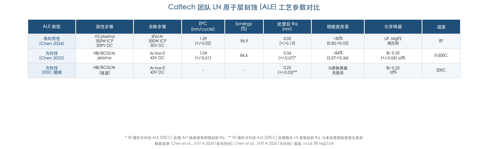

**图 5-1** Caltech 团队各向同性 ALE（H₂+SF₆/Ar，Chen 2024）与方向性 ALE（HBr/BCl₃/Ar+Ar，Chen 2025）的 EPC、协同效应、表面粗糙度改善及化学残留对比。数据基底为 x-cut 5% MgO:LN。

## 5.4 中性束刻蚀（NBE）：消除表面充电与深层损伤

中性束刻蚀（neutral beam etching, NBE）通过电荷中和机制将定向离子束转化为电中性原子束，在保持方向性的同时消除表面充电效应——这对 LN 这类绝缘铁电体尤为重要，因为刻蚀过程中的表面充电会导致局部电场畸变，进而影响侧壁形貌对称性和铁电畴结构的稳定性。Samukawa 团队在 Si 和 GaAs 体系上系统发展了 NBE 技术，在 GaAs 上利用 Cl₂ NBE 实现了 XPS 检测无化学损伤的近无损伤刻蚀，刻蚀速率约 20 nm/min [Samukawa, JJAP 2006](https://doi.org/10.1143/JJAP.45.2395 "Ultimate top-down etching processes")；[Kim et al., Nanotechnology 2007](https://doi.org/10.1088/0957-4484/18/29/295303 "Damage-free GaAs NBE")。在 Si/GaAs 上，NBE 亚表面损伤深度 < 1 nm，较传统 RIE 低约一个数量级。

截至 2026 年初，NBE 在 LN 或 LiTaO₃ 上尚无直接实验报道，TRL 评估仅 1–2 级。主要技术障碍包括：（1）中性束通量比离子束低 1–2 个数量级，刻蚀速率受到严重限制；（2）缺乏针对 LN 三元氧化物体系的中性束化学路径研究；（3）NBE 设备可获得性极有限，全球仅少数研究组具备相关能力。我们预计 NBE 在 LN 上的概念验证需 2–3 年时间，但若取得突破，将为绝缘铁电体材料的超低损伤图形化提供变革性方案。

## 5.5 机器学习与数字孪生辅助刻蚀优化

TFLN ICP-RIE 工艺涉及高维参数空间——ICP 功率、RF 偏压、腔压、气体流量比、衬底温度等——与多维损伤指标（侧壁粗糙度、非晶化层深度、化学计量比偏移、传播损耗、*Q* 值）之间存在复杂的非线性耦合关系，构成机器学习（ML）与贝叶斯优化（BO）的理想应用场景。

Kanarik et al. 2023 年在 *Nature* 报道了强化学习与工业级 ICP 设备（Lam Research）结合的刻蚀优化：在 SiO₂/SiN 刻蚀中以约 100 次实验即收敛至帕累托最优前沿，在选择比、均匀性和损伤等工业关键指标之间实现了优于人类工程师的多目标权衡 [Kanarik et al., Nature 2023](https://doi.org/10.1038/s41586-023-06004-9 "Human vs machine autonomy in semiconductor")。该方法论可直接迁移至 TFLN 工艺优化。此前，Melati et al. 2019 年已将贝叶斯优化应用于硅光子波导刻蚀参数搜索 [Melati et al., Nat. Commun. 2019](https://doi.org/10.1038/s41467-019-12698-1 "ML pattern recognition for nanophotonics")。

截至 2026 年初，ML 辅助优化在 TFLN 刻蚀中尚无直接报道（TRL 2–3 级）。然而，考虑到方法论已在工业设备上充分验证、TFLN 工艺团队已积累大量参数-性能对应数据、商用 ICP 设备已具备自动化配方执行能力，我们判断 ML 辅助 TFLN ICP-RIE 优化在未来 1–2 年内实用化的概率较高。其潜在价值不仅在于加速最优工艺配方的搜索效率，更在于建立可迁移的"损伤预测模型"——基于工艺参数预测亚表面损伤空间分布，指导混合 RIE+ALE 工艺中各步骤参数的协同设计。

数字孪生方法（将等离子体物理模型、SRIM/TRIM 级联碰撞模拟与实验数据融合构建虚拟工艺模型）是 ML 优化的自然延伸。该方法可在虚拟环境中预筛选参数组合、降低实验成本，但在 TFLN 刻蚀中的具体应用报道目前仍属空白，属于中长期研究方向。

## 5.6 材料层面的改进路径

### 5.6.1 MgO 掺杂铌酸锂

5 mol% MgO:LN 通过消除反位缺陷 Nb_Li，将光折变阈值提高 2–3 个数量级，是高光功率 TFLN 器件的首选衬底材料。MgO:LN 基 LNOI 晶圆已由 NanoLN 等供应商商业化供应，前述 Caltech ALE 工作即在 MgO:LN 上完成 [Boes et al., Laser Photonics Rev. 2023](https://doi.org/10.1002/lpor.202200862 "高功率TFLN器件首选材料")。MgO 掺杂对 ICP-RIE/IBE 刻蚀行为的影响预计较小（溅射产额变化 < 5%），但可能在退火过程中微妙地改变缺陷迁移与复合动力学。MgO:LN 刻蚀行为（刻蚀速率、选择比、侧壁形貌、亚表面损伤深度）的系统性参数化对比研究目前仍属空白，相关数据的积累将有助于为 MgO:LN LNOI 器件制定专属的工艺优化指南。

### 5.6.2 化学计量比铌酸锂（SLN）

化学计量比 LN（stoichiometric LN, SLN；Li/Nb ≈ 1.0）相比常用的同成分 LN（congruent LN, CLN；Li/Nb ≈ 0.946），具有光折变阈值低约两个数量级、居里温度略高（约 1200 °C vs 1140 °C）、本征缺陷密度更低、本征吸收更低等优势 [Furukawa et al., J. Cryst. Growth 1999](https://doi.org/10.1016/S0022-0248(99)00138-2 "SLN growth and properties")。CLN 中高密度的反位缺陷（Nb_Li）使材料处于某种"预损伤"状态，而 SLN 更接近理论极限的晶格完美度。然而，SLN 对刻蚀损伤耐受性的直接对比数据在公开文献中完全缺失。商用 LNOI 晶圆绝大多数采用 CLN 衬底，SLN 基 LNOI 属小批量定制产品、成本显著更高，短期内难以对主流工艺路线选择产生实质影响。

## 5.7 产业化挑战与晶圆级可制造性

### 5.7.1 LNOI 晶圆现状

6 英寸 LNOI 晶圆已由 NanoLN 等厂商实现量产，LN 薄膜厚度覆盖 300–900 nm、厚度均匀性优于 ±5 nm；单价约 1000–3000 USD/片（对比 SOI 晶圆约 100–300 USD/片），成本仍是大规模商用化的主要瓶颈之一。8 英寸样品级展示已有报道，但尚未进入量产阶段 [Zhu et al., AOP 2021](https://doi.org/10.1364/AOP.411024 "LNOI商业化现状")。

### 5.7.2 晶圆级刻蚀均匀性

晶圆级 ICP-RIE 刻蚀深度均匀性约 ±3%（300 nm 目标刻蚀深度下对应 ±9 nm）。对调制器而言，该均匀性水平尚可接受；但对高 *Q* 微环（*Q* > 10⁷），±5 nm 的波导厚度变化即可导致谐振波长偏移约 0.1–0.3 nm，显著影响器件良率 [Luke et al., Opt. Express 2020](https://doi.org/10.1364/OE.28.024452 "晶圆级刻蚀均匀性")。ALE 的自限制特性有望将晶圆级深度均匀性提升一个数量级，但以约 1 nm/cycle 的速率完整刻蚀 TFLN 仍面临产率挑战。混合"ICP-RIE 主体刻蚀+ALE 精修"方案是近中期兼顾均匀性与产率的务实折中。

### 5.7.3 商业化进展

TFLN 调制器产业化已进入初期商业交付阶段：HyperLight（哈佛 Lončar 实验室衍生公司）、Partow Technologies、Polaris Electro-Optics 等企业已提供 V_π < 2 V、3 dB 带宽 > 100 GHz 的商业产品或工程样品。对于调制器应用，当前性能瓶颈已从刻蚀损伤本身转向封装成本、光纤耦合损耗和高频射频传输线设计等系统级问题 [Wang et al., Nature 2018](https://doi.org/10.1038/s41586-018-0551-y "TFLN调制器先驱工作")。相比之下，高 *Q* 微环和高效非线性器件的晶圆级良率数据尚未在公开文献中披露，这一领域的产业化进程明显滞后于调制器。

### 5.7.4 损伤控制与成本的权衡

低损伤刻蚀的典型速率约 10–30 nm/min（300 nm 深度需 10–30 min），而高速工艺（50–100 nm/min）虽然显著提升产率但损伤随之增加。CMP 每片增加约 15–30 min 加耗材成本；退火需 2–6 h 但可批量处理（约 25 片/批次）。追求 *Q* > 10⁸ 的全套优化工艺总耗时约为中等性能（*Q* ≈ 10⁶）简化工艺的 3–5 倍。在产业化场景中，不同器件类型对损伤的容忍度差异显著，工艺成本需按器件价值与性能需求进行差异化配置。

## 5.8 面向不同器件类型的推荐工艺路线

基于前述各技术方案的性能特征与成熟度评估，图 5-2 以矩阵形式总结了 8 种主要工艺路线在三类核心 TFLN 器件上的适用性与 TRL 等级，为工艺路线选择提供全景参考。

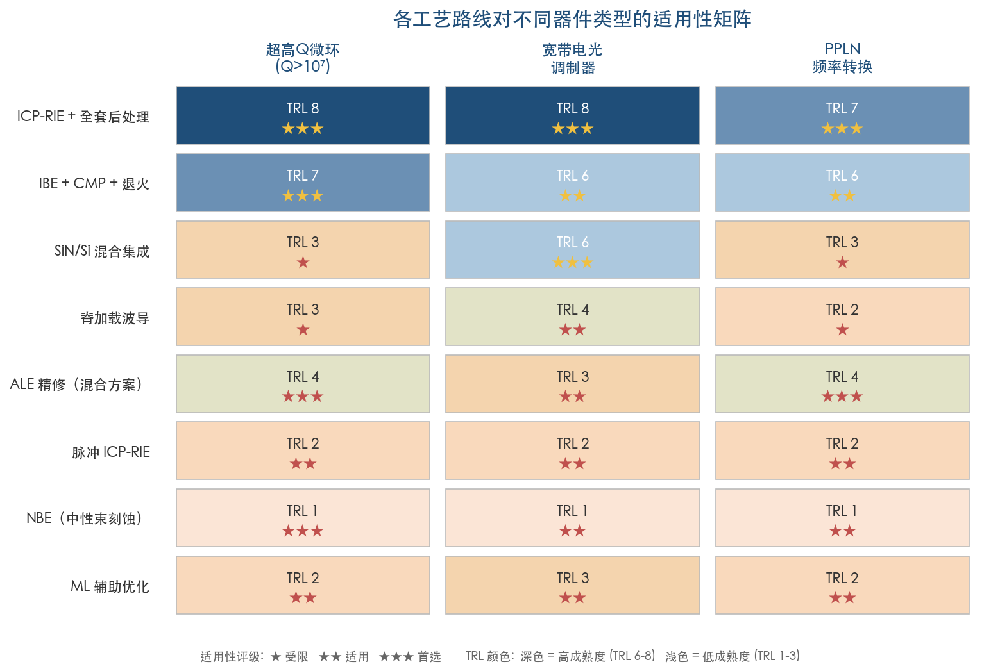

**图 5-2** 各工艺路线对超高 *Q* 微环、宽带电光调制器和 PPLN 频率转换器件的适用性评级（★ 受限、★★ 适用、★★★ 首选）与技术成熟度等级（TRL 1–8）。颜色深浅反映 TRL 等级。

### 5.8.1 超高 Q 微环谐振器

推荐路线：CMP 预处理（消除初始薄膜亚表面损伤）→ 介质掩模（HSQ 或 SiO₂）电子束光刻 → Ar 基 ICP-RIE 或 IBE 低偏压（RF ≤ 100 W）→ HF 清洗 → O₂ 等离子体 → 退火 300–400 °C/3–6 h → 可选 CMP 精修。代表性成果为 Li et al. 2023 年在 *Nature* 报道的 *Q* = 2.6×10⁸、传播损耗约 5.6×10⁻³ dB/cm 的 TFLN 微环 [Li et al., Nature 2023](https://doi.org/10.1038/s41586-023-06602-x "Ultra-high-Q LN microring")。未来可在最终步骤引入 ALE 精修替代 CMP，有望进一步改善侧壁质量和晶圆级深度均匀性。

### 5.8.2 宽带电光调制器

推荐路线：DUV/i-line 光刻 → Cr 或 SiO₂ 掩模 → Ar/CHF₃ ICP-RIE 中速刻蚀 → 掩模剥离+HF 清洗 → 退火 350 °C/3 h。CMP 并非必需（调制器对侧壁粗糙度的容忍度显著高于微环）。混合 SiN-LN 或 Si-LN 集成为可选替代路线，尤其适合已拥有成熟 SiN/Si 代工线的团队和企业。代表性成果包括 Wang et al. 2018 年 *Nature* 报道的 V_π·L ≈ 2.2 V·cm、带宽 > 100 GHz 调制器 [Wang et al., Nature 2018](https://doi.org/10.1038/s41586-018-0551-y "100GHz TFLN调制器")，以及 Liu et al. 2025 年在 4 英寸晶圆上实现的量产级 > 110 GHz 调制器 [Liu et al., Light: Adv. Manuf. 2025](https://doi.org/10.37188/lam.2025.047 "Volume manufacturing of TFLN modulators")。

### 5.8.3 PPLN 频率转换器件

推荐路线：周期极化预制备 → 掩模 → Ar 基 ICP-RIE 或 IBE 低至中偏压 → HF 清洗 → 低温退火 ≤ 350 °C（保护畴壁完整性）。关键工艺约束在于退火温度不宜超过约 400 °C，否则极化畴壁迁移将破坏准相位匹配结构。代表性成果为 Lu et al. 2019 年 *Optica* 报道的 SHG 归一化效率达 2600 %/W·cm² [Lu et al., Optica 2019](https://doi.org/10.1364/OPTICA.6.001455 "PPLN微环SHG")。ALE 在 PPLN 器件中的价值尤为突出：自限制刻蚀可避免传统湿法清洗（如 RCA 流程）中因不同极化畴差异刻蚀速率引起的表面波纹，从而降低波纹散射损耗并提升相位匹配精度。

## 5.9 技术成熟度与实用化时间线判断

基于前述分析，图 5-3 以时间线形式呈现了各前沿技术的发展轨迹与预期实用化窗口。

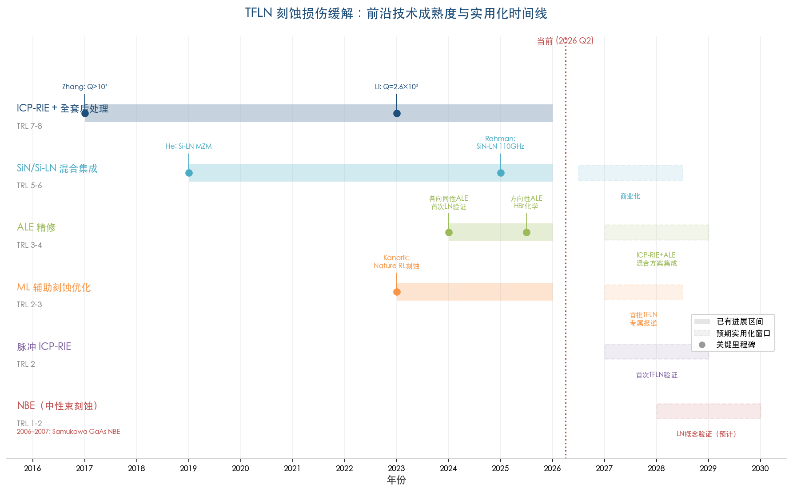

**图 5-3** 2016–2030 年间 TFLN 刻蚀损伤缓解关键技术的进展区间、里程碑事件与预期实用化窗口。红色虚线标注当前时间节点（2026 Q2）。

我们对各前沿技术在 2026–2028 年的实用化前景做如下判断：

**ML 辅助 ICP-RIE 优化**（实用化概率：高）。方法论已在工业级 ICP 设备上充分验证（Kanarik et al. 2023 年 *Nature*），TFLN 团队数据积累充分、设备兼容性好，实施门槛主要在于 TFLN 工艺与 ML 算法团队的交叉合作。预计 1–2 年内可见首批 TFLN 专属报道。

**混合 SiN/Si-LN 集成调制器商业化**（实用化概率：高）。GlobalFoundries、IMEC、LIGENTEC 等机构已具备成熟 SiN 光子代工能力，晶圆级键合工艺已完成演示验证。对于不需要 LN 层精密图形化的调制器应用，商业产品有望在 1–2 年内进入市场。

**ALE 精修集成至 TFLN 制造流程**（实用化概率：中-高）。Caltech 团队已在 MgO:LN 上完成各向同性和方向性 ALE 的概念验证，Oxford Instruments 等商用设备可兼容，ALE 兼具侧壁平滑和深度均匀性优势。"ICP-RIE+ALE 精修"的混合方案有望在 2–3 年内进入多个研究组的标准工艺流程。

**脉冲 ICP-RIE 首次 TFLN 验证**（实用化概率：中等）。脉冲偏压技术可将离子能量分布函数（IEDF）的半高宽从约 30–50 eV 压缩至 < 10 eV，平均离子能量降低 40–60%。多数商用 ICP 设备已支持脉冲模式，移植至 TFLN 的技术门槛较低；但目前缺乏 LN 上的直接实验数据，预计 2–3 年内可见首批验证结果。

**NBE 在 LN 上概念验证**（实用化概率：低-中等）。需开发针对 LN 三元氧化物的中性束化学路径，设备可获得性受限严重。预计 3–5 年时间尺度方可完成概念验证。

综合来看，TFLN 非线性光子学平台正进入"工艺精度最后一英里"阶段——主体刻蚀技术已高度成熟，前沿探索聚焦于亚纳米级损伤消除（ALE 精修）、智能化工艺寻优（ML/BO）以及通过混合集成完全规避 LN 刻蚀（面向特定器件类型）。这些技术路径并非互斥，未来最优方案很可能是多种策略的有机组合——例如"ML 优化 ICP-RIE 主体刻蚀参数→ALE 精修侧壁→退火恢复晶格"的智能化全流程工艺链。对于从事 LN 基非线性光子学研究的团队，跟踪 ALE 化学路径（尤其是 HBr 体系以及未来可能的 I 基化学）的进展、参与 ML 辅助工艺优化的交叉合作、以及系统评估混合集成方案对特定非线性器件的适用性，将是未来 1–2 年内值得优先投入的研究方向。

# 结论与风险提示

## 核心结论

本报告围绕"如何缓解铌酸锂等离子体刻蚀后的材料损伤"这一核心问题，系统梳理了损伤机理、预防策略、过程级抑制技术、刻蚀后修复手段及前沿探索方向。基于对 2007–2026 年间主要实验与工艺进展的分析，可提炼出以下核心结论。

**结论一：五类损伤需差异化应对，组合策略不可替代。** 等离子体刻蚀对 LN 造成的五类损伤——晶格无序化与非晶化、离子注入、再沉积层、表面粗糙化和化学计量比偏移——在物理机理、空间分布和修复路径上各不相同。没有任何单一工艺手段能同时覆盖全部五类损伤。当前最优性能（*Q* > 10⁷ 乃至 10⁸ 量级）的实现，无一例外依赖"掩模选型+工艺参数优化+后处理修复"的全链条组合策略。

**结论二：掩模选型与 RF 偏压调控是性价比最高的预防手段。** 从金属掩模向介质/碳基掩模（SiO₂、HSQ、DLC）的转变，可从根源上消除金属再沉积污染这一主要吸收损耗来源。高 ICP/RF 功率比（≥5:1）策略在不显著牺牲刻蚀速率的前提下，可将非晶化层深度从 15–20 nm 压缩至约 5 nm 以下。DLC 掩模以约 3:1 的选择比和可通过 O₂ 灰化完全去除的特性，在综合性能上优于传统金属和介质掩模。

**结论三：热退火（350 °C、3 h）与 CMP 构成后处理的两大支柱。** 350 °C 空气退火通过固相外延重结晶有效修复非晶化层和点缺陷，将传播损耗改善 2–3 倍，并使 *r*₃₃ 与 χ⁽²⁾ 大幅恢复至接近体材值。CMP 则通过物理方式去除数十纳米厚的亚表面损伤层，实现约一个数量级的 *Q* 值提升。两者的功能正交互补：退火修复深层晶格损伤而 CMP 改善表面/亚表面形貌质量。

**结论四：ALE 是最具突破潜力的新兴技术方向。** 2024–2025 年间，Caltech 团队在 MgO:LN 上先后实现了各向同性和方向性 ALE 的概念验证，展示了亚纳米精度控制、无 ARDE、以及通过 HBr 化学路线有效解决 LiF 再沉积问题等关键能力。"ICP-RIE/IBE 主体刻蚀+ALE 精修"的混合工艺方案兼顾产率与精度，有望在 2–3 年内进入前沿研究组的标准工艺流程。

**结论五：器件类型决定工艺路线的差异化配置。** 超高 *Q* 微环需要全链条极致优化（CMP 前置+低偏压刻蚀+HF 清洗+退火+可选 CMP/ALE 精修）；宽带电光调制器对侧壁粗糙度的容忍度较高，简化工艺（Ar/CHF₃ 中速刻蚀+退火）即可满足性能需求，混合 SiN-LN 集成亦为可选替代路线；PPLN 频率转换器件需额外注意退火温度上限（≤350–400 °C）以保护周期极化畴壁完整性。

## 局限性分析

**局限一：定量数据的系统性不足。** 本报告依赖的多项核心定量关系——如 RF 偏压与非晶化层深度的映射、退火温度与 *r*₃₃ 恢复的关联——来自少数研究组有限工艺条件下的实验数据，尚未经过跨团队、跨设备的系统性重复验证。不同 ICP-RIE 设备（Oxford、Sentech、SPTS 等）之间存在显著的等离子体均匀性和鞘层电位差异，同一"RF 偏压 100 W"在不同设备上对应的实际离子能量可能存在较大偏差。因此，报告中归纳的"最佳实践参数窗口"应视为方向性指引而非可直接复制的配方。

**局限二：ALE 尚处于概念验证阶段。** 报告重点讨论的 LN ALE 技术（Chen et al. 2024, 2025）目前仅在 MgO:LN 单一材料体系上、由单一研究组完成验证。器件级 *Q* 值、传播损耗和电光性能的改善尚未与 ALE 精修直接关联。各向同性 ALE 的侧壁平滑效果（30% Rq 改善）和方向性 ALE 的顶面平滑效果（84% Rq 降幅）之间的差异也提示，将 ALE 外推至侧壁全方位精修仍需进一步实验。

**局限三：脉冲等离子体和中性束刻蚀的 LN 适用性基于外推。** 报告关于脉冲 ICP-RIE 和中性束刻蚀（NBE）对 LN 的潜力评估，主要基于 SiO₂、Si、GaAs 等其他材料体系的实验数据向 LN 的合理外推。LN 作为三元化合物氧化物，其组分差异化挥发性（NbF₅ vs LiF）可能使上述外推产生偏差。这些技术在 LN 上的实际表现有待专门的实验验证。

**局限四：r₃₃ 和 χ⁽²⁾ 退化的直接定量数据稀缺。** 刻蚀前后同一样品 *r*₃₃ 和 χ⁽²⁾ 的直接对比测量（如通过 PFM 或干涉法）在公开文献中极为稀缺。当前对电光系数和非线性极化率退化程度的估算主要来自器件级间接推断（V_π·L 偏离理论值、SHG 效率低于预期），无法精确区分刻蚀损伤、电极-波导重叠不完美和设计偏差各自的贡献。

**局限五：产业化成本与良率数据不透明。** 高 *Q* 微环和高效非线性器件的晶圆级良率数据尚未在公开文献中系统披露。LNOI 晶圆单价（约 1000–3000 USD/片）、CMP 与 ALE 的附加工艺成本、以及低损伤工艺的产率代价（速率降低 50% 以上）等经济性因素，对技术路线的产业化前景具有重要影响，但当前公开信息不足以进行可靠的成本-效益量化分析。
