# 执行摘要

Cascaded PID control remains the dominant attitude control architecture for multirotor UAVs, deployed across all major open-source flight stacks — ArduPilot (400 Hz), PX4 (400 Hz+), and Betaflight (4–8 kHz) — and supported by millions of cumulative flight hours. Its ubiquity stems from computational simplicity, intuitive tunability, and adequate near-hover performance. Yet a fundamental limitation persists: a single set of PID gains, calibrated at one operating point, degrades as flight conditions change. Lopez-Sanchez and Moreno-Valenzuela (2023) reported that conventional fixed-gain PID attitude errors increase by approximately 52% under moderate wind, while Zhang et al. (2025) documented severe tracking degradation as payload mass rises to 200% of nominal. Battery voltage sag, aggressive maneuvering, and rotor degradation compound these effects, collectively defining a parameter sensitivity problem that motivates the full spectrum of enhancement strategies examined in this report.

This report evaluates five complementary approaches to improving PID-based attitude control performance, organized along a progression from classical foundations to emerging research frontiers:

1. **Classical tuning baselines.** Ziegler–Nichols rules, when applied directly to quadrotor dynamics, produce controllers that are unstable beyond approximately 0.24 rad (13.8°) of angular deviation. Domain-adapted variants (Canal et al. 2020) recover up to 75% of this performance gap, but the structural mismatch between first-order-plus-time-delay assumptions and the double-integrator UAV plant remains irreducible. Relay-feedback derivatives — notably ArduPilot AutoTune — achieve robust margins (gain margin 15.2 dB, phase margin 91.0° at default aggressiveness) and represent the most successful adaptation of classical methods to UAV practice.

2. **Advanced and adaptive PID variants.** Six enhancement families are assessed: gain scheduling (TPA, fuzzy-scheduled), MRAC-PID, L₁ adaptive control, fuzzy-PID, neural-network-augmented PID, fractional-order PID (PI^λD^μ), and H∞-informed robust PID. A pronounced inverse relationship between theoretical sophistication and deployment maturity characterizes this landscape. Fuzzy gain-scheduling PID, flight-validated on a Pixhawk platform, reduced altitude overshoot from 13% to 1% under 95% payload loading (Melo et al. 2022). L₁ adaptive control offers both flight-validated performance and computable safety bounds. By contrast, FOPID, H∞ robust PID, and hybrid NN+Fuzzy PID remain simulation-only despite reporting substantial performance improvements.

3. **Optimization-based parameter selection.** Population-based metaheuristics (PSO, GWO, DE, GA), Bayesian optimization, and reinforcement learning provide systematic frameworks for navigating the PID gain space. PSO-optimized PID achieved a 53% reduction in integral squared error versus Ziegler–Nichols on hardware (Khodja et al. 2017). Bayesian optimization — particularly SafeOpt (Berkenkamp et al. 2016) and Heteroscedastic BO (Gu et al. 2025) — enables safe, sample-efficient tuning directly on physical vehicles, reducing mean position error by 61.2% versus default PID. RL is not competitive as a static optimizer but demonstrates clear value as an online adaptive gain scheduler: a DDPG agent deployed on a Pixhawk 2.1 reduced attitude RMSE by 33% (Sönmez et al. 2025).

4. **Practical implementation in open-source flight stacks.** ArduPilot offers the broadest tuning portfolio (AutoTune, QuikTune, Methodic Configurator), PX4 provides the fastest model-based autotuner (~40 s completion), and Betaflight delivers the lowest-latency filter-first paradigm for FPV racing. Cross-cutting infrastructure — gyroscope filtering, thrust linearization, anti-windup, and voltage compensation — proves at least as consequential for real-world PID performance as the gain values themselves.

5. **Future directions.** Four convergent research themes emerge: MPC–PID architectural convergence, physics-informed neural network plant models enabling formal guarantees for learned controllers, cross-platform transfer learning of gain-adaptation policies, and certification frameworks for adaptive controllers under airworthiness standards. The absence of a community-accepted standardized benchmarking suite remains the single most consequential infrastructure gap impeding systematic progress.

The overarching finding of this report is that optimal PID parameter selection is not an isolated numerical problem but a systems-engineering challenge spanning sensor filtering, actuation modeling, power management, and computational architecture. For practitioners, the most immediately actionable path combines built-in flight-stack autotuning with offline Bayesian or metaheuristic optimization; for missions demanding robustness to payload and environmental variation, fuzzy gain-scheduling PID and L₁ adaptive augmentation offer the strongest combination of demonstrated improvement and deployment credibility.

# 第1章 UAV Attitude Control Fundamentals and the Cascaded PID Architecture

## 1.1 Rigid-Body Dynamics of Multirotor UAVs

Multirotor attitude control design rests upon the mathematical description of the vehicle's motion. A multirotor UAV is modeled as a rigid body possessing six degrees of freedom (6-DOF): three translational (position in the inertial frame) and three rotational (orientation described by Euler angles or rotation matrices). The seminal derivation of the complete quadrotor dynamics was provided by Bouabdallah in his EPFL doctoral thesis, which presented both Euler–Lagrange and Newton–Euler formulations for the full 6-DOF model [Bouabdallah 博士论文](https://infoscience.epfl.ch/server/api/core/bitstreams/3f219824-6427-4d0f-bbd9-fc0812358b2b/content "Design and Control of Quadrotors with Application to Autonomous Flying, EPFL Thesis No. 3727, 2007"). This work remains among the most widely cited modeling references in the multirotor control literature.

### Translational Dynamics

The translational dynamics, expressed in a world-fixed inertial frame, follow Newton's second law. Let **x** and **v** denote the position and velocity vectors, *m* the total mass, *T* the collective thrust, **z**_B the unit vector along the body-frame *z*-axis, **f**_a the aerodynamic drag force, **f**_ext external disturbance forces, and **g** the gravitational acceleration vector. The equations of translational motion are:

**ẋ** = **v**

**v̇** = (1/*m*)(T·**z**_B + **f**_a + **f**_ext) + **g**

This formulation follows the presentation adopted in the AdaptiveQuadBench simulation framework built on RotorPy, which augments these equations with explicit aerodynamic drag and external disturbance wrench terms for realistic benchmarking [Zhang et al. 2025](https://arxiv.org/html/2510.03471v1 "A Simulation Evaluation Suite for Robust Adaptive Quadcopter Control, arXiv:2510.03471").

### Rotational Dynamics

The rotational dynamics — the core of attitude control — are expressed in the body frame. Let **R** ∈ SO(3) denote the rotation matrix from the body frame to the inertial frame, **Ω** the angular velocity vector in the body frame, **J** the inertia matrix, **τ** the rotor-generated torque vector, and **τ**_ext, **τ**_a the external and aerodynamic disturbance torques, respectively. The rotational equations of motion are:

**Ṙ** = **R**[**Ω**]×

**Ω̇** = **J**⁻¹(−[**Ω**]× **J** **Ω** + **τ** + **τ**_ext + **τ**_a)

The term −[**Ω**]× **J** **Ω** represents the gyroscopic coupling arising from the cross product of angular velocity with angular momentum. This coupling constitutes a key source of nonlinearity in attitude dynamics: roll, pitch, and yaw motions are not independent when the vehicle undergoes significant angular rates.

Mahony, Kumar, and Corke provided a comprehensive tutorial treatment of these dynamics on SE(3) in their influential IEEE Robotics & Automation Magazine paper, which formalized the hierarchical control architecture — trajectory planner → position controller → attitude controller → motor controller — that underpins modern open-source flight stacks [Mahony et al. IEEE RAM 2012](http://www.kostasalexis.com/uploads/5/8/4/4/58449511/ram_paper.pdf "Multirotor Aerial Vehicles: Modeling, Estimation, and Control of Quadrotor, IEEE RAM, vol. 19, no. 3, 2012").

### Rotor Thrust and Torque Generation

The collective thrust *T* and body torques **τ** are determined by the individual rotor speeds through a control allocation matrix **G**:

[T; **τ**]ᵀ = **G** **u**

where **u** = [u₁, u₂, u₃, u₄]ᵀ is the vector of individual rotor thrusts, with u_i = k_t · ω_i² (k_t being the thrust coefficient and ω_i the rotational speed of rotor *i*). The allocation matrix **G** encodes the geometric layout — arm length *l*, arm angle β — and the torque-to-thrust ratio k_τ/k_t [Zhang et al. 2025](https://arxiv.org/html/2510.03471v1 "Eq. (5)–(7), motor layout and control allocation"). Motor dynamics introduce an additional first-order lag, **ω̇** = (1/τ_m)(**ω**_des − **ω**), where τ_m is the motor time constant. This lag establishes an upper bound on the achievable bandwidth of the attitude control loop.

### Attitude Representations and Notation

Two principal representations of orientation appear in the multirotor control literature. The **Euler angle** representation (ϕ for roll, θ for pitch, ψ for yaw) is intuitive and widely adopted in flight controller firmware. The kinematic relationship between Euler angle rates and body angular rates (p, q, r) involves a transformation matrix that becomes singular at θ = ±90° — a limitation known as gimbal lock. Beard and McLain provide a thorough development of these coordinate transformations and rigid-body dynamics in Chapters 2–3 of their standard textbook *Small Unmanned Aircraft: Theory and Practice*, deriving the full 12-state nonlinear equations of motion from first principles [Beard & McLain 教材](https://press.princeton.edu/books/hardcover/9780691149219/small-unmanned-aircraft "Small Unmanned Aircraft: Theory and Practice, Princeton University Press, 2012"). Their Chapter 6 further develops successive loop closure (cascaded PID) autopilot design, establishing the theoretical basis for nested inner-rate / outer-angle control architectures.

The **rotation matrix** representation **R** ∈ SO(3) avoids gimbal lock and is preferred for rigorous stability analysis. Mahony et al. adopted this representation for their geometric control framework [Mahony et al. IEEE RAM 2012](http://www.kostasalexis.com/uploads/5/8/4/4/58449511/ram_paper.pdf "SE(3) dynamics and hierarchical control, Figure 5"). Throughout this report, we denote PID gains as **Kp**, **Ki**, **Kd**, with superscripts distinguishing loop levels (e.g., Kp^rate, Kp^angle). The term "cascaded PID" refers consistently to the inner-rate / outer-angle architecture.

### Near-Hover Decoupling Approximation

Near hover, angular rates remain small and gyroscopic coupling terms may be neglected. Under this linearization, the roll, pitch, and yaw dynamics become approximately decoupled, permitting each axis to be treated as an independent single-input single-output (SISO) system. This critical simplification was exploited by Bouabdallah, Noth, and Siegwart in their foundational IROS 2004 paper — cited over 3,000 times — where they demonstrated PID control with gains P = 0.9, I = 0.3, D = 0.2 for the roll/pitch axes on a simplified decoupled model. Notably, the authors themselves acknowledged that "this controller will not be able to stabilize the robot in presence of strong perturbations" [Bouabdallah et al. IROS 2004](https://infoscience.epfl.ch/bitstreams/fd82638f-4e59-4c04-ad06-89215ed8ef88/download "PID vs LQ Control Techniques Applied to an Indoor Micro Quadrotor, IEEE/RSJ IROS 2004"). This observation foreshadowed the central challenge addressed throughout this report: a single set of PID gains tuned at one operating point degrades under varying conditions.

## 1.2 The Cascaded PID Architecture in Open-Source Flight Controllers

The cascaded PID structure has become the de facto standard for multirotor attitude control. Its adoption across all major open-source flight stacks — ArduPilot, PX4, and Betaflight — reflects a pragmatic convergence on an architecture that balances performance, implementability, and tunability.

### Architecture Overview

The general cascaded PID architecture comprises two nested feedback loops:

1. **Outer (angle) loop**: Compares the desired attitude angles (ϕ_des, θ_des, ψ_des) with measured angles and generates desired angular rate commands. This loop typically employs a proportional-only (P) or proportional-derivative (PD) controller.

2. **Inner (rate) loop**: Compares the desired angular rates (p_des, q_des, r_des) with measured gyroscope rates and generates torque commands sent to the motor mixer. This loop employs a full PID controller, operating at the highest frequency to reject fast disturbances.

This hierarchical separation exploits the natural time-scale separation between angular position (slower) and angular rate (faster) dynamics. Mahony et al. formalized this architecture in their control hierarchy (Trajectory Planner → Position Controller → Attitude Controller → Motor Controller), noting that the attitude controller itself decomposes into angle-to-rate and rate-to-torque sub-loops [Mahony et al. IEEE RAM 2012](http://www.kostasalexis.com/uploads/5/8/4/4/58449511/ram_paper.pdf "Hierarchical control architecture, Figure 5").

The following block diagram illustrates the standard cascaded PID attitude control architecture, encompassing the outer angle loop, inner rate loop, motor mixer, and 6-DOF plant dynamics with their respective feedback paths.

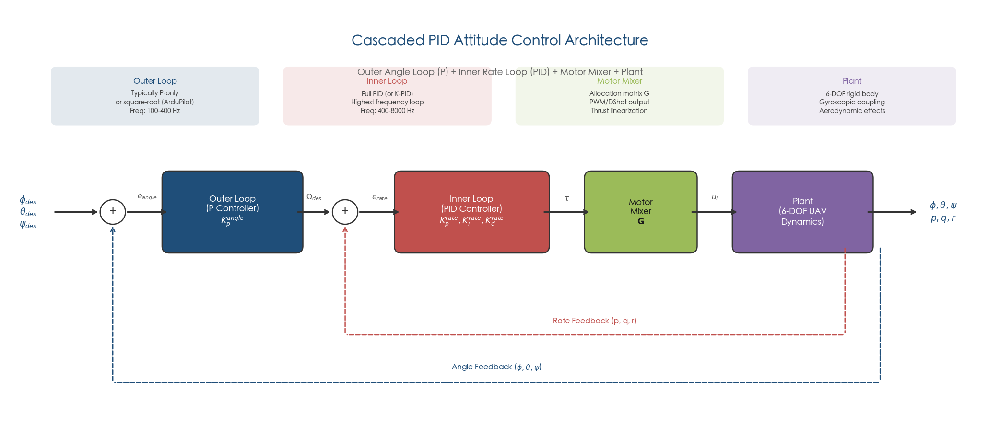

*Figure 1.1 — Cascaded PID attitude control block diagram. The outer loop (P controller, Kp^angle) generates angular rate commands from attitude error; the inner loop (PID controller, Kp^rate / Ki^rate / Kd^rate) produces torque commands; the motor mixer (allocation matrix **G**) distributes commands to individual rotors. Angle feedback (ϕ, θ, ψ) and rate feedback (p, q, r) close the two nested loops.*

### ArduPilot Implementation

ArduPilot Copter implements the cascaded structure with an outer P controller and an inner PID controller, executing at 400 Hz. A distinctive feature is the **square root controller** in the outer loop, which applies a nonlinear mapping from attitude error to desired angular rate. Rather than a simple proportional relationship (rate_des = Kp^angle · e_angle), the square root controller computes rate_des ∝ √(|e_angle|) · sign(e_angle) for large errors, yielding more aggressive response at large angular deviations while maintaining smooth behavior near the setpoint. The inner rate PID outputs torque commands to the AP_Motors library, which handles motor mixing and PWM generation. A "stability patch" mechanism within AP_Motors prioritizes attitude control authority when total motor output approaches saturation, ensuring that yaw and roll/pitch corrections are not starved under high-thrust conditions [ArduPilot 官方文档](https://ardupilot.org/dev/docs/apmcopter-programming-attitude-control-2.html "Copter Attitude Control — ArduPilot Dev Documentation").

### PX4 Implementation

PX4 employs a four-layer cascade: position → velocity → attitude → angular rate. The angular rate controller uses a **K-PID** formulation, supporting both "Parallel" (u = Kp·e + Ki·∫e + Kd·ė) and "Standard" (u = K(e + 1/Ti·∫e + Td·ė)) equivalent parameterizations. A critical practical feature is the thrust curve compensation parameter `THR_MDL_FAC`, which addresses the nonlinear relationship between PWM command and actual motor thrust. PX4 documentation explicitly notes that "the mapping between PWM and static thrust depends highly on the battery voltage" — a recognition that the plant gain seen by the PID controller changes continuously during flight as the battery discharges [PX4 官方文档](https://docs.px4.io/main/en/flight_stack/controller_diagrams "PX4 Controller Diagrams") [PX4 PID 调参指南](https://docs.px4.io/main/en/config_mc/pid_tuning_guide_multicopter "Multicopter PID Tuning Guide — PX4").

### Betaflight Implementation

Betaflight diverges from the ArduPilot/PX4 philosophy by primarily operating in angular rate mode (Rate/Acro), where the pilot's stick input directly commands angular rates rather than angles. This design choice reflects Betaflight's FPV racing heritage, where sub-millisecond latency is paramount. The PID loop runs at 4–8 kHz — an order of magnitude faster than ArduPilot's 400 Hz — enabled by the DShot digital ESC protocol and high-performance STM32 F7/H7 microcontrollers.

Betaflight introduces several innovations beyond standard PID:

- **Throttle PID Attenuation (TPA)**: A simplified gain scheduling mechanism that proportionally reduces PID gains at high throttle settings to prevent oscillation. TPA constitutes an implicit recognition that plant gain increases with thrust and the controller must compensate accordingly.
- **FeedForward (FF) channel**: A control term proportional to the derivative of the setpoint (rather than the error), providing faster transient response than the P term alone without amplifying measurement noise.
- **Multi-stage gyroscope filtering chain**: Comprising RPM-based notch filters using bidirectional DShot ESC telemetry, SDFT-based dynamic notch filters tracking up to five independent noise peaks, and PT2/PT3 low-pass filters optimized for minimal phase lag [Betaflight PID 文档](https://betaflight.com/docs/development/PID-tuning "PID tuning | Betaflight Official Documentation").

The following table consolidates the key architectural and implementation differences among the three flight stacks discussed above.

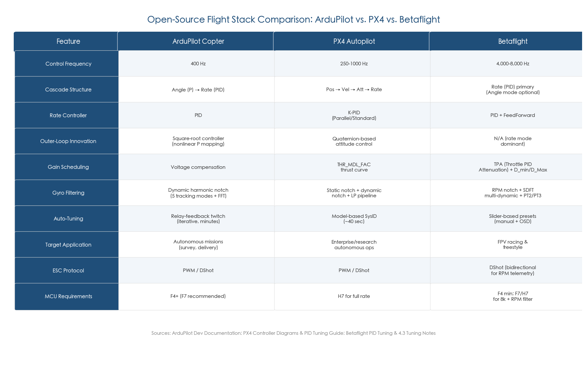

*Figure 1.2 — Ten-dimensional comparison of ArduPilot Copter, PX4 Autopilot, and Betaflight. Data sourced from ArduPilot Dev Documentation, PX4 Controller Diagrams & PID Tuning Guide, and Betaflight Official Documentation.*

### Why Cascaded PID Became the Standard

The dominance of cascaded PID in open-source flight controllers can be attributed to several converging factors:

1. **Computational simplicity**: PID requires only basic arithmetic operations (addition, multiplication, integration, differentiation), making it feasible on resource-constrained microcontrollers. Even the earliest autopilot hardware (8-bit AVR processors) could execute PID at adequate rates.

2. **Intuitive tunability**: Each gain possesses a physically interpretable effect — Kp governs responsiveness, Ki eliminates steady-state error, Kd provides damping — enabling engineers and pilots to tune through systematic iteration.

3. **Modular architecture**: The cascaded structure permits independent tuning of inner and outer loops, reducing the dimensionality of the tuning problem relative to a monolithic controller.

4. **Proven reliability**: Decades of industrial PID experience, combined with millions of flight hours across the ArduPilot, PX4, and Betaflight ecosystems, have established extensive empirical confidence in the architecture.

5. **Adequate near-hover performance**: For the most common operating regime — hovering and gentle maneuvering — the linearized decoupled model is a reasonable approximation, and a well-tuned PID achieves satisfactory tracking performance.

## 1.3 Inherent Limitations of Fixed-Gain PID Under Varying Conditions

Despite its ubiquity, a fixed-gain PID controller is fundamentally constrained by the conditions under which it was tuned. The PID gains that optimize performance at one operating point may yield degraded — or even unstable — behavior at another. Figure 1.3 illustrates this degradation trend across four principal sources of operating-point deviation.

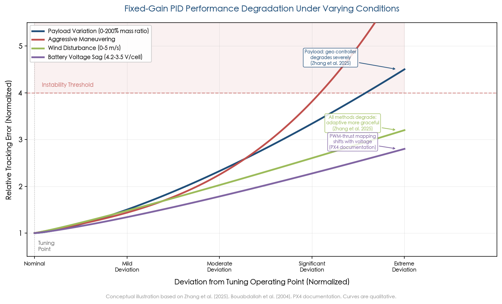

*Figure 1.3 — Qualitative illustration of fixed-gain PID tracking error growth as operating conditions deviate from the tuning point. Four degradation channels are shown: payload variation (0–200% mass ratio), aggressive maneuvering, wind disturbance (0–5 m/s), and battery voltage sag (4.2–3.5 V/cell). Curves are conceptual, based on evidence from Zhang et al. (2025), Bouabdallah et al. (2004), and PX4 documentation.*

### Payload and Center-of-Gravity Variations

When a multirotor carries variable payloads — a common scenario in precision agriculture, aerial delivery, and inspection — both the total mass and the center of gravity (CG) shift. Mass changes directly alter the thrust required for hover, modifying the operating point around which PID gains were calibrated. CG shifts introduce asymmetric gravitational torques and change the effective moment arms in the control allocation matrix. Zhang et al. quantified this effect in their AdaptiveQuadBench framework: as the payload mass ratio increased from 0% to 200% of the nominal vehicle mass, the non-adaptive geometric controller experienced severe tracking degradation — its success rate dropped while position RMSE increased substantially — whereas adaptive controllers (INDI-a, xadap) maintained high success rates and superior tracking accuracy [Zhang et al. 2025](https://arxiv.org/html/2510.03471v1 "Figure 9: payload stress test, geo vs. indi-a vs. xadap").

### Battery Voltage Sag

As a lithium-polymer battery discharges during flight — typically from 4.2 V/cell to 3.5 V/cell over a single mission — the same PWM duty cycle produces progressively less thrust due to the motor KV constant relationship. PX4 documentation explicitly identifies this mechanism: PID gains tuned at full battery voltage may produce oscillatory behavior at high charge and sluggish response at low charge. The relationship between PWM input and motor thrust is highly nonlinear and voltage-dependent, meaning that the effective plant gain seen by the rate-loop PID controller varies continuously throughout a flight [PX4 PID 调参指南](https://docs.px4.io/main/en/config_mc/pid_tuning_guide_multicopter "PX4 — PWM to thrust depends on battery voltage"). Betaflight partially mitigates this through battery cell count-based auto-profile switching (`auto_profile_cell_count`), which selects pre-stored PID profiles based on detected battery configuration.

### Aerodynamic Disturbances and Wind

External wind gusts introduce unmodeled forces and torques that a fixed-gain PID must reject purely through its feedback mechanism. Zhang et al. evaluated this scenario using a Dryden turbulence model: as wind speed increased from 0 to 5 m/s, all tested controllers — including both adaptive and non-adaptive methods — exhibited monotonically increasing position tracking error and heading error, though adaptive controllers degraded more gracefully [Zhang et al. 2025](https://arxiv.org/html/2510.03471v1 "Figure 8: wind speed stress test results"). Roy et al., in their systematic review of quadrotor controllers, concluded that classical PID and LQR controllers "are not able to ensure the robustness of the system" under nonlinear conditions and external perturbations [Roy et al. 2021](https://www.mdpi.com/2227-7080/9/2/37 "A Review on Comparative Remarks, Performance Evaluation and Improvement of Quadrotor Controllers, Technologies, vol. 9, no. 2, 2021").

### Aggressive Maneuvering and the Nonlinear Regime

The near-hover decoupling approximation breaks down during aggressive maneuvers involving large angular rates and angles. In this regime, gyroscopic coupling terms become significant, and the linearized SISO model on which PID gains were designed no longer represents the true plant dynamics. Bouabdallah et al.'s early observation that their PID "will not be able to stabilize the robot in presence of strong perturbations" reflects precisely this limitation [Bouabdallah et al. IROS 2004](https://infoscience.epfl.ch/bitstreams/fd82638f-4e59-4c04-ad06-89215ed8ef88/download "PID instability under strong perturbations"). PX4 documentation corroborates this with practical field experience: PID gains tuned at hover may produce oscillations at full throttle, where both the plant gain (thrust-to-PWM sensitivity) and the aerodynamic environment differ substantially from the tuning condition [PX4 PID 调参指南](https://docs.px4.io/main/en/config_mc/pid_tuning_guide_multicopter "Hover-tuned PID oscillates at full throttle").

### Rotor Degradation and Actuator Asymmetry

Over time or due to impact damage, individual rotors may exhibit reduced effectiveness. The AdaptiveQuadBench framework models this through a per-rotor effectiveness factor k_eff,i = 1 + 𝒰(−δ, δ), where δ defines the variation range. When the controller's internal model assumes identical rotors but actual effectiveness varies, the resulting model mismatch manifests as both force and torque disturbances that the PID must absorb through its integral term — often with insufficient bandwidth to maintain adequate tracking performance [Zhang et al. 2025](https://arxiv.org/html/2510.03471v1 "Eq. (14)–(15), rotor effectiveness perturbation model").

## 1.4 The Parameter Sensitivity Problem: Motivation for This Report

The preceding analysis reveals a fundamental tension in PID-based attitude control: the controller's simplicity — the very property that accounts for its dominance — is simultaneously the source of its primary weakness. A fixed set of gains (Kp, Ki, Kd) implicitly embeds assumptions about the plant's mass, inertia, CG location, actuator characteristics, and aerodynamic environment. When any of these parameters drift from their assumed values, closed-loop performance — characterized by overshoot, settling time, tracking error, and stability margins — degrades accordingly.

Lopez-Sanchez and Moreno-Valenzuela, in their comprehensive survey of PID control for quadrotor UAVs published in *Annual Reviews in Control*, systematically documented this parameter sensitivity across the full spectrum of PID variants, reporting that traditional PID attitude angle errors increase by 52% when wind speed rises [Lopez-Sanchez & Moreno-Valenzuela 2023](https://www.sciencedirect.com/science/article/abs/pii/S1367578823000640 "PID Control of Quadrotor UAVs: A Survey, Annual Reviews in Control, vol. 56, 2023"). This degradation is not a failure of implementation but an intrinsic consequence of linear time-invariant control applied to a nonlinear, time-varying plant.

The parameter sensitivity problem motivates the central questions addressed in the remainder of this report:

- **How should PID parameters be initially selected?** Classical tuning methods — Ziegler–Nichols, relay feedback, manual iteration — each impose assumptions that may or may not align with multirotor attitude dynamics. Chapter 2 evaluates these methods and their applicability to UAVs.

- **How can PID performance be enhanced beyond fixed gains?** Gain scheduling, adaptive PID, fuzzy-logic augmentation, neural-network-based PID, fractional-order PID, and robust PID formulations each offer distinct trade-offs between performance, complexity, and real-time feasibility. Chapter 3 surveys these advanced strategies.

- **How can optimal PID parameters be found systematically?** Metaheuristic optimization (GA, PSO, DE, GWO), Bayesian optimization, and reinforcement learning provide increasingly sophisticated frameworks for navigating the PID parameter space. Chapter 4 examines these optimization paradigms.

- **How are these methods deployed in practice?** The auto-tuning algorithms embedded in ArduPilot, PX4, and Betaflight — together with sensor filtering, anti-windup, and validation pipelines — represent the current state of practical deployment. Chapter 5 addresses these implementation realities.

- **What synthesis emerges, and where does the field advance next?** Chapter 6 provides a comparative evaluation across all surveyed methods and identifies promising directions for future research.

## Symbol Table

| Symbol | Description |
|--------|-------------|
| **x**, **v** | Position and velocity vectors in the inertial frame |
| **R** ∈ SO(3) | Rotation matrix from body to inertial frame |
| ϕ, θ, ψ | Euler angles: roll, pitch, yaw |
| **Ω** = (p, q, r)ᵀ | Angular velocity vector in the body frame |
| **J** | Inertia matrix |
| *m* | Total vehicle mass |
| *T* | Collective thrust |
| **τ** | Rotor-generated torque vector |
| **f**_a, **τ**_a | Aerodynamic drag force and torque |
| **f**_ext, **τ**_ext | External disturbance force and torque |
| k_t, k_τ | Thrust and torque coefficients |
| ω_i | Rotational speed of rotor *i* |
| **G** | Control allocation matrix |
| *l*, β | Arm length and arm angle |
| τ_m | Motor time constant |
| **Kp**, **Ki**, **Kd** | PID proportional, integral, derivative gains |
| Kp^rate, Ki^rate, Kd^rate | Inner (rate) loop PID gains |
| Kp^angle | Outer (angle) loop proportional gain |
| e(t) | Error signal: r(t) − y(t) |
| r(t) | Reference (setpoint) signal |
| d(t) | Disturbance signal |
| G(s) | Plant transfer function |
| C(s) | Controller transfer function |

# 第2章 Classical PID Tuning Methods and Their Applicability to UAVs

Before examining the advanced adaptive and optimization-based strategies covered in later chapters, it is essential to establish a rigorous baseline: the classical PID tuning methods that have dominated industrial process control for over eight decades. This chapter surveys the principal rule-based and experiment-based tuning techniques — Ziegler–Nichols (Z-N), Cohen–Coon, relay feedback (Åström–Hägglund), Internal Model Control (IMC), and manual iterative tuning — and critically evaluates their underlying assumptions, demonstrated performance, and practical applicability when transferred to multirotor UAV attitude control. The quantitative findings presented here serve as the reference baseline against which all advanced methods in subsequent chapters are benchmarked.

Figure 1 situates these methods along a historical timeline, illustrating the progressive shift from model-dependent, open-loop procedures toward model-free, in-flight-safe tuning practices — a trajectory driven largely by the unique constraints of UAV platforms.

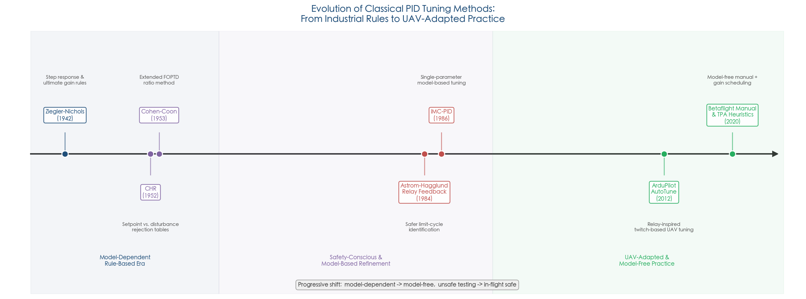

## 2.1 Ziegler–Nichols Methods: Principles and Formulations

The Ziegler–Nichols (Z-N) tuning rules, published in 1942, remain the most widely referenced starting point for PID parameter selection. Two distinct procedures were proposed. The **open-loop step-response method** extracts two parameters from the plant's S-shaped reaction curve — the apparent dead time *L* and the time constant *T* — and prescribes PID gains according to Kp = 1.2T/L, Ti = 2L, Td = 0.5L. The **closed-loop ultimate-gain method** sets Ki and Kd to zero, increases Kp until the system exhibits sustained oscillations at the ultimate gain Ku with ultimate period Tu, and then computes PID gains as Kp = 0.6Ku, Ti = 0.5Tu, Td = 0.125Tu [Ziegler & Nichols 1942](https://skoge.folk.ntnu.no/puublications_others/1942_ziegler-nichols.pdf "Optimum Settings for Automatic Controllers, Trans. ASME, 1942").

Both formulations were designed to achieve **quarter-amplitude damping** — a decay ratio of approximately 25 % per successive oscillation cycle — corresponding to a damping ratio of only ζ ≈ 0.21. This deliberately aggressive design target prioritizes disturbance rejection at the expense of setpoint tracking performance. As a consequence, Z-N-tuned controllers typically exhibit substantial overshoot (often exceeding 40 %) and oscillatory transient responses when subjected to setpoint changes [Hornsey 2012](https://warwick.ac.uk/fac/cross_fac/iatl/research/reinvention/archive/volume5issue2/hornsey/ "A Review of Relay Auto-tuning Methods, Reinvention, vol. 5, no. 2, 2012").

### 2.1.1 Z-N Applied to Quadrotor Attitude Control

When Z-N rules are applied directly to multirotor attitude dynamics, performance degradation is severe. He & Zhao (2014) conducted a systematic simulation study applying the Z-N ultimate-gain method to quadrotor attitude stabilization. Their ZN-PID controller could only maintain attitude angles within approximately 0.24 rad (≈ 13.8°) before diverging — an unacceptable margin for any practical flight scenario. The ZN-PD variant (with the integral term removed) performed markedly better and, notably, even outperformed a genetically optimized PD controller that suffered from excessive yaw-axis overshoot. The authors emphasized that "the larger overshoot is fatal since it often leads to instability" in rotorcraft dynamics [He & Zhao 2014](https://pmc.ncbi.nlm.nih.gov/articles/PMC4295143/ "A Simple Attitude Control Based on Ziegler-Nichols Rules, Scientific World Journal, 2014").

Canal, Reimbold & de Campos (2020) corroborated these findings, reporting that the original Z-N rules applied to quadrotor pitch and roll axes yield "not satisfactory" performance. They proposed two customized variants — ZNAQ and ZNAQL — that modify the Z-N formulae specifically for quadrotor dynamics. These domain-adapted rules achieved up to 75 % performance improvement over standard Z-N tuning under both empty and full loading conditions. However, the very necessity for such platform-specific customization underscores the fundamental mismatch between Z-N's underlying assumptions and UAV dynamics [Canal et al. 2020](https://www.techscience.com/CMES/v125n1/40211 "Z-N Customization for Quadrotor Attitude Control, CMES, vol. 125, no. 1, 2020").

### 2.1.2 Experimental Hardware Validation

Khodja et al. (2017) provide one of the few studies that applied the Z-N ultimate-gain method directly on a physical quadrotor platform (QAV250 frame with an Arduino Due autopilot). The experimental procedure involved incrementally increasing the proportional gain Kc on the constrained airframe until sustained oscillations were observed. The identified critical parameters were Kc = 40 and Pc = 0.2 s, yielding Z-N PID gains of Kp = 24, Ki = 0.1, Kd = 0.025. While these gains achieved basic closed-loop stability, the Z-N-tuned controller exhibited a high integral squared error (ISE = 1.4437 in steady state) and considerable overshoot compared to particle-swarm-optimization (PSO) alternatives — the PSO variant with a combined ISE + overshoot objective achieved ISE = 0.6842, a 53 % reduction in error energy. Steady-state pitch error for all methods remained within approximately ±0.3°, yet the transient performance of Z-N tuning was markedly inferior. This hardware evidence reinforces the simulation findings: Z-N provides a viable initialization point but falls short of the performance demanded by operational UAV flight [Khodja et al. 2017](https://www.ijsmdo.org/articles/smdo/full_html/2017/01/smdo160015/smdo160015.html "PSO tuning PID for quadrotor, Int. J. SMDO, vol. 8, A8, 2017").

## 2.2 Cohen–Coon and CHR Methods

The Cohen–Coon method (1953) extends the open-loop step-response approach by introducing the ratio parameter r = td/τ (dead time to time constant), thereby broadening applicability to processes with larger dead-time-to-time-constant ratios — up to approximately r = 2, compared with the Z-N guideline of r < 0.3. The method nonetheless remains grounded in a **first-order plus time delay (FOPTD)** plant model assumption [Cohen & Coon 1953](https://skoge.folk.ntnu.no/puublications_others/1953_Cohen%20and%20Coon%20-%20Theoretical%20Consideration%20of%20Retarded%20Control.pdf "Theoretical Consideration of Retarded Control, Trans. ASME, 1953").

The CHR method (Chien, Hrones & Reswick, 1952) further differentiates between **setpoint tracking** and **disturbance rejection** objectives, offering separate tuning tables for 0 % and 20 % overshoot specifications. This distinction is valuable in principle; however, both CHR and Cohen–Coon share the FOPTD plant model assumption.

**The critical incompatibility with UAV attitude dynamics** lies in the plant model structure. The rotational dynamics of a multirotor relate applied torque to angular acceleration through τ = Iα, yielding a transfer function with a **double-integrator** characteristic (1/Is²) rather than the first-order-plus-dead-time form assumed by these methods. No meaningful "S-shaped" open-loop step response exists from which to extract L and T parameters for a double-integrator plant — the output simply accelerates without bound.

A systematic literature search revealed no published studies applying Cohen–Coon or CHR methods directly to UAV attitude control. This absence constitutes a significant finding in itself: the degree of structural mismatch between the FOPTD assumption and the UAV attitude plant is so severe that researchers universally bypass these methods in favor of model-free or optimization-based alternatives. While Cohen–Coon and CHR retain their utility in process industries characterized by dominant first-order dynamics and transport delay, they offer no viable pathway for multirotor PID tuning.

## 2.3 Relay Feedback Auto-Tuning: The Åström–Hägglund Method

Åström and Hägglund (1984) introduced relay feedback as a fundamentally safer alternative to the Z-N ultimate-gain method. Rather than manually increasing Kp to drive the system toward sustained oscillation — a procedure that risks instability and potential physical damage — a relay element is inserted in the feedback loop. The relay's on-off switching naturally induces a **limit cycle** at a frequency close to the ultimate frequency, from which Ku and ωu can be estimated via describing-function analysis:

Ku = 4d / (πa)

where *d* denotes the relay amplitude and *a* the measured oscillation amplitude. The principal advantage is that the system never reaches true marginal stability; the relay amplitude constrains the excursion magnitude, rendering the procedure inherently safer [Hornsey 2012](https://warwick.ac.uk/fac/cross_fac/iatl/research/reinvention/archive/volume5issue2/hornsey/ "A Review of Relay Auto-tuning Methods, Reinvention, vol. 5, no. 2, 2012").

The standard ideal relay estimates the ultimate gain with an error of 5–20 % due to describing-function approximation inaccuracies. Improved relay variants — including pre-loaded relays, saturating relays, and two-channel relays — reduce this identification error substantially. Hornsey (2012) demonstrated in a coupled water-tank experiment that an enhanced Åström dual-frequency-point relay method achieved the best time-domain performance among all tested methods: overshoot of only 3.20 % with a phase margin of 63.8°, compared to Z-N rules which produced 11 % overshoot with a phase margin of merely 18.4° [Hornsey 2012](https://warwick.ac.uk/fac/cross_fac/iatl/research/reinvention/archive/volume5issue2/hornsey/ "Table 5: practical comparison results").

### 2.3.1 ArduPilot AutoTune: A Relay-Feedback Derivative for UAVs

The most widely deployed relay-feedback-inspired tuning method in the UAV domain is ArduPilot's AutoTune algorithm, designed by Leonard Hall. Although not a classical relay feedback implementation in the strict sense, AutoTune shares the core principle of injecting controlled excitation and analyzing the transient response to iteratively converge on suitable gains.

The algorithm operates by injecting approximately ±20° angular "twitch" commands and analyzing the resulting angular-rate response. Tuning proceeds through a defined state sequence — RATE_D_UP → RATE_D_DOWN → RATE_P_UP → ANGLE_P_DOWN → ANGLE_P_UP → TUNE_COMPLETE — with each state requiring four consecutive successful twitch responses before advancing. The gain adjustment logic follows simple rules: if roll/pitch rate overshoot persists for more than 0.1 s, P is decreased by 8 %; if rate undershoot persists for more than 0.2 s, P is increased by 5 %. The D and I gains are derived from P through empirical ratios: D = P × D_ratio (where D_ratio is determined by the aggressiveness level, typically 0.05–0.10), and I = P for roll/pitch axes (I = 0.1P for yaw) [ArduPilot AutoTune](https://ardupilot.org/copter/docs/autotune.html "Official ArduPilot Copter AutoTune Documentation").

Matt et al. (2025) conducted a rigorous evaluation of the ArduPilot AutoTune algorithm through both simulation and flight testing on a KHawk fixed-wing UAS platform. At the default aggressiveness Level 6, the autotuned controller achieved a gain margin (GM) of 15.2 dB, a phase margin (PM) of 91.0°, a disturbance rejection bandwidth (DRB) of 1.71 rad/s, and a rise time of 0.639 s — meeting all specified frequency-domain requirements. With a high-order dynamic model, the same Level 6 configuration yielded GM = 14.4 dB and PM = 84.6°, though overshoot increased to 10.7 % due to unmodeled dynamics and system delays. The study also identified a notable algorithmic weakness: the procedure occasionally misidentifies overshoot when system delays cause an initial undershoot before the actual overshoot occurs, leading to erroneous upward gain adjustment [Matt et al. 2025](https://engrxiv.org/preprint/download/4462/7760/6405 "Evaluation of ArduPilot Automatic Tuning Algorithm, engrXiv, 2025").

### 2.3.2 IMC-PID and Other Model-Based Tuning Rules

The Internal Model Control (IMC) PID tuning method, developed by Rivera, Morari, and Skogestad (1986), offers a more principled alternative by reducing the tuning problem to a single adjustable parameter: the desired closed-loop time constant λ. PID parameters are derived analytically from the plant model and the specified λ, yielding a clear frequency-domain interpretation — increasing λ produces a more robust but slower closed-loop response, while decreasing λ accelerates tracking at the cost of reduced robustness [Rivera et al. 1986](https://skoge.folk.ntnu.no/publications/1986/Rivera86/Rivera86.pdf "Internal Model Control. 4. PID Controller Design, Ind. Eng. Chem., 1986").

IMC-PID is theoretically elegant but requires an accurate process model — precisely the element that is difficult to obtain for UAV applications. The nonlinear, time-varying nature of multirotor dynamics means that any linear model used for IMC design remains valid only within a narrow operating envelope around the linearization point. Furthermore, IMC-PID inherits the SISO assumption, designing one controller for one input-output pair while ignoring the cross-axis coupling that becomes significant during aggressive maneuvers.

## 2.4 Manual and Iterative Tuning in Practice

Despite the availability of formal tuning rules, **manual iterative tuning** remains the most widely practiced approach in the multirotor community. This prevalence is especially pronounced in the FPV (first-person view) racing domain, where Betaflight's tuning philosophy embodies decades of collective empirical wisdom distilled into actionable heuristics.

The Betaflight community's recommended procedure follows a systematic escalation strategy: begin with conservatively low P gains and incrementally increase until oscillation onset is observed, then reduce to approximately 70 % of the oscillation threshold. The I gain is evaluated through "bank-and-punch" flight maneuvers — if the aircraft drifts during combined roll and throttle inputs, I is insufficient. D gain requires careful balancing: too low permits post-maneuver rebounds, while too high causes motor overheating from amplified high-frequency noise. Typical starting values for a standard 5-inch FPV quadrotor are Roll: P = 46, I = 45, D = 25 [Betaflight PID Tuning Guide](https://betaflight.com/docs/wiki/guides/current/PID-Tuning-Guide "Betaflight Community Wiki").

This manual approach is entirely model-free and relies heavily on pilot skill and subjective assessment. In the hands of experienced practitioners it can be remarkably effective — FPV racing pilots routinely achieve sub-millisecond response characteristics — yet it is neither reproducible nor transferable across platforms without complete re-tuning, and it provides no formal guarantees on stability margins or disturbance rejection performance.

## 2.5 Systematic Analysis of Assumption Mismatches

The failure of classical tuning methods on UAV attitude loops can be traced to a set of fundamental assumption violations. Understanding these mismatches provides the theoretical motivation for the advanced methods examined in subsequent chapters. Figure 2 presents a comprehensive compatibility matrix summarizing how each classical method's assumptions align — or conflict — with the characteristics of a multirotor attitude control loop.

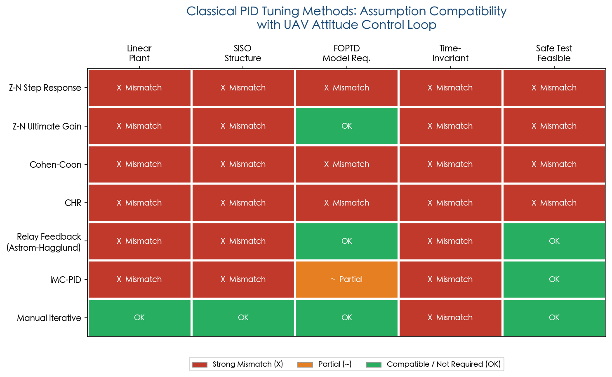

### 2.5.1 Linearity Assumption

All classical methods assume a **linear time-invariant (LTI)** plant. Multirotor attitude dynamics are inherently nonlinear: the Euler equation τ = Iω̇ + ω × Iω contains gyroscopic coupling terms that grow significant during rapid maneuvers; the PWM-to-thrust mapping is nonlinear (typically quadratic in motor speed); and aerodynamic effects introduce state-dependent damping that varies with airspeed and angle of attack. Roy et al. (2021) systematically noted that classical PID is formulated for linear models and that under nonlinear conditions "gain selection becomes non-systematic," with linear controllers (PID/LQR) "not able to ensure the robustness of the system" [Roy et al. 2021](https://www.mdpi.com/2227-7080/9/2/37 "A Review on Comparative Remarks, Performance Evaluation and Improvement of Quadrotor Controllers, Technologies, vol. 9, no. 2, 2021").

### 2.5.2 SISO vs. MIMO Coupling

Classical tuning methods are designed for **single-input, single-output (SISO)** systems. Although the cascaded PID architecture partially decouples the three attitude axes, significant cross-coupling persists — particularly between roll and yaw through gyroscopic precession, and among all axes through motor saturation effects when actuator limits are approached. Tuning each axis independently, as classical methods prescribe, neglects these interactions and can produce controllers that are stable on each axis in isolation yet exhibit coupled oscillatory modes during compound maneuvers.

### 2.5.3 Plant Model Structure

As established in Section 2.2, the FOPTD model structure assumed by the Z-N step-response, Cohen–Coon, and CHR methods is fundamentally incompatible with the double-integrator structure of UAV rotational dynamics. Only the Z-N ultimate-gain method and relay feedback methods — which do not require a parametric plant model — bypass this structural mismatch, albeit while still inheriting the linearity and SISO limitations discussed above.

### 2.5.4 Time-Invariance Assumption

A fixed set of PID gains presupposes that the plant parameters remain constant throughout operation. In practice, multirotor UAVs traverse widely varying operating conditions: payload mass changes shift the moment of inertia and center of gravity; battery voltage sag alters the PWM-to-thrust mapping (PX4 documentation explicitly states that "the mapping between PWM and static thrust depends highly on the battery voltage" [PX4 PID Tuning Guide](https://docs.px4.io/main/en/config_mc/pid_tuning_guide_multicopter "Multicopter PID Tuning Guide — PX4")); and aerodynamic disturbances vary with flight speed, altitude, and atmospheric conditions. Lopez-Sanchez and Moreno-Valenzuela (2023), in a comprehensive survey of PID control applied to quadrotor UAVs, reported that increasing wind speed causes attitude angle errors to grow by approximately 52 % with conventional fixed-gain PID controllers [Lopez-Sanchez & Moreno-Valenzuela 2023](https://www.sciencedirect.com/science/article/abs/pii/S1367578823000640 "PID Control of Quadrotor UAVs: A Survey, Annual Reviews in Control, vol. 56, 2023").

### 2.5.5 Safety Constraints on Open-Loop Testing

The Z-N step-response method requires an open-loop test, which is physically impossible for an inherently unstable multirotor — removing feedback from a hovering quadrotor results in immediate loss of control. The ultimate-gain method demands driving the system to sustained oscillation, risking structural damage or loss of the vehicle. These safety constraints fundamentally restrict the applicability of Z-N's most direct procedures to UAV platforms, favoring the safer relay-feedback approach or its derivatives (such as ArduPilot AutoTune) that can operate within bounded excitation envelopes during flight.

## 2.6 Comparative Performance Assessment

Drawing together the evidence from simulation studies, hardware experiments, and field deployments, a comparative baseline assessment of classical methods applied to UAV attitude control can be constructed. Figure 3 consolidates the key quantitative metrics across three performance dimensions: overshoot, integral squared error, and phase margin.

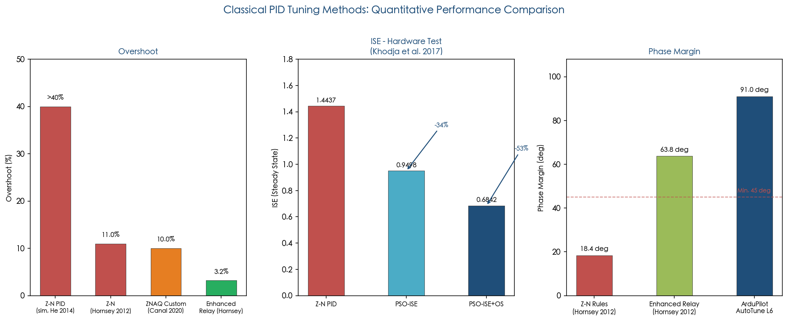

The Z-N ultimate-gain method, when applied to quadrotor attitude dynamics, produces controllers with excessive overshoot. In simulation, He & Zhao (2014) found that ZN-PID could not stabilize beyond 0.24 rad (13.8°), while even the better-performing ZN-PD variant yielded results inferior to simple optimization. On hardware, Khodja et al. (2017) measured a steady-state ISE of 1.4437 for Z-N PID compared to 0.6842 for PSO-optimized PID — a 53 % reduction in error energy achievable through optimization. Canal et al. (2020) demonstrated that domain-customized Z-N variants can recover up to 75 % of this performance gap, but only at the cost of requiring UAV-specific tuning knowledge that defeats the purpose of "general-purpose" tuning rules.

The relay-feedback approach, as implemented in ArduPilot's AutoTune, represents the most successful adaptation of classical methods to UAV practice. Matt et al. (2025) demonstrated that AutoTune at default aggressiveness achieves GM = 15.2 dB and PM = 91.0° — values that compare favorably with model-based controller designs. However, the method requires calm flight conditions, adequate excitation amplitude, and several minutes of dedicated tuning flight time. Known limitations include sensitivity to wind disturbances, gyroscope noise, ESC nonlinearities, and flexible airframe dynamics [ArduPilot AutoTune](https://ardupilot.org/copter/docs/autotune.html "Limitations section").

Manual iterative tuning, while lacking formal rigor, remains surprisingly competitive in the hands of experienced practitioners. The Betaflight community has developed sophisticated heuristics — including Throttle PID Attenuation (TPA), which attenuates PID gains at high throttle to suppress oscillation, and D_min/D_Max dynamic D-term scheduling — that effectively implement rudimentary gain scheduling without formal theory. These practical innovations, deployed on millions of flight controllers worldwide, represent valuable engineering knowledge that informs the more formal gain-scheduling and adaptive methods discussed in Chapter 3.

## 2.7 Baseline Metrics for Subsequent Chapters

The performance benchmarks established in this chapter provide the quantitative foundation against which the advanced methods presented in subsequent chapters are evaluated. The following metrics derived from classical methods serve as reference baselines:

- **Z-N PID (simulation)**: Attitude stabilization limited to approximately 0.24 rad before divergence; quarter-amplitude damping design with >40 % overshoot typical [He & Zhao 2014](https://pmc.ncbi.nlm.nih.gov/articles/PMC4295143/ "Scientific World Journal, 2014").
- **Z-N PID (hardware)**: Steady-state ISE = 1.4437; ±0.3° steady-state pitch error achievable but with poor transient performance [Khodja et al. 2017](https://www.ijsmdo.org/articles/smdo/full_html/2017/01/smdo160015/smdo160015.html "Int. J. SMDO, vol. 8, A8, 2017").
- **Z-N customized variants**: Up to 75 % performance improvement over standard Z-N, demonstrating that domain knowledge can partially compensate for assumption mismatches [Canal et al. 2020](https://www.techscience.com/CMES/v125n1/40211 "CMES, vol. 125, no. 1, 2020").
- **ArduPilot AutoTune**: GM = 15.2 dB, PM = 91.0°, DRB = 1.71 rad/s at Level 6 — adequate stability margins for routine operations [Matt et al. 2025](https://engrxiv.org/preprint/download/4462/7760/6405 "engrXiv, 2025").
- **Betaflight manual tuning**: Model-free and pilot-dependent; no formal margin guarantees, but highly effective for specific flight profiles when tuned by experienced operators.

Lopez-Sanchez and Moreno-Valenzuela (2023) provide a comprehensive taxonomy of PID control variants applied to quadrotors, covering linear, nonlinear, discontinuous, fractional-order, and intelligent PID formulations. Their survey confirms that classical linear PID methods, while forming the practical foundation of UAV flight control, are universally recognized as insufficient for robust all-condition attitude control [Lopez-Sanchez & Moreno-Valenzuela 2023](https://www.sciencedirect.com/science/article/abs/pii/S1367578823000640 "PID Control of Quadrotor UAVs: A Survey, Annual Reviews in Control, vol. 56, 2023").

The chapters that follow examine how this baseline can be systematically improved: Chapter 3 addresses gain scheduling, adaptive, fuzzy, neural-network, fractional-order, and robust PID variants; Chapter 4 explores optimization-based parameter selection using metaheuristics, Bayesian optimization, and reinforcement learning; and Chapter 5 examines the practical implementation of these methods within open-source flight stacks.

# 第3章 Advanced and Adaptive PID Control Strategies for UAVs

The inherent limitations of fixed-gain PID controllers—exposed by the classical tuning methods reviewed in Chapter 2—motivate a broad family of advanced strategies that seek to preserve the structural simplicity of PID while systematically overcoming its sensitivity to operating-condition changes. This chapter examines six major enhancement paradigms: gain scheduling, model-reference adaptive PID (MRAC-PID), fuzzy-logic-augmented PID, neural-network-based PID variants, fractional-order PID (PI^λD^μ), and robust H∞-informed PID formulations. For each method, the discussion presents the control architecture, summarizes the most relevant theoretical and experimental results in UAV attitude control, and critically evaluates the trade-offs among performance improvement, computational cost, and deployment maturity. Figure 3-1 provides a taxonomic overview of these six families and their verification status.

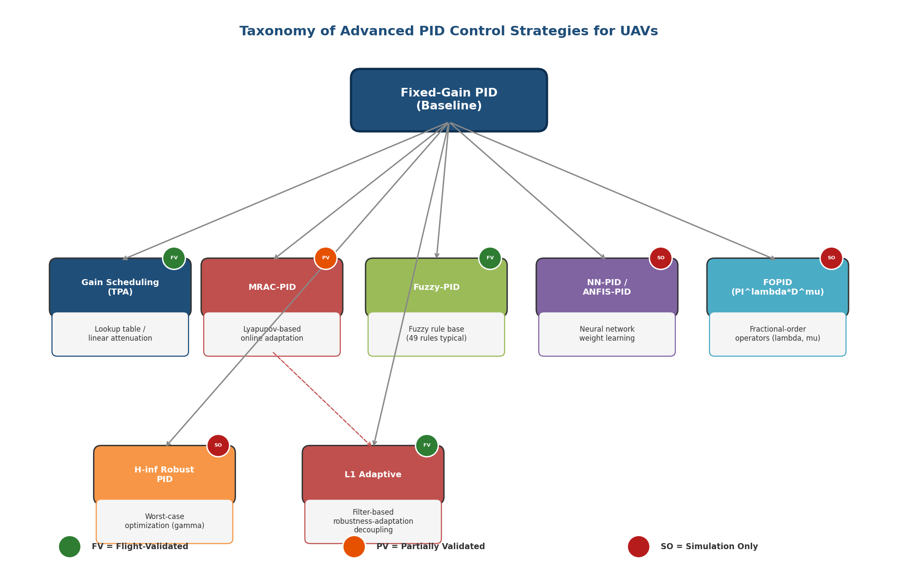

## 3.1 Gain Scheduling: Extending PID Across the Flight Envelope

### 3.1.1 Principle and Architecture

Gain scheduling represents the most straightforward extension of a fixed-gain PID controller. Rather than relying on a single set of gains (Kp, Ki, Kd), the controller maintains multiple gain sets indexed by one or more measurable scheduling variables—typically throttle position, airspeed, payload mass, or battery voltage. At each control cycle, the scheduler selects or interpolates among these gain sets based on the current operating point, thereby allowing the effective PID parameters to adapt to changing plant dynamics without recourse to online estimation.

The technique is well-established in aerospace engineering: fixed-wing autopilots routinely schedule gains against dynamic pressure (½ρV²). PX4, for instance, scales fixed-wing attitude controller gains with an airspeed ratio when an airspeed sensor is available [PX4 Controller Diagrams](https://docs.px4.io/main/en/flight_stack/controller_diagrams "PX4 airspeed-based gain scheduling for FW"). For multirotor platforms, however, the scheduling problem differs fundamentally because the primary operating-condition variable is throttle (thrust level) rather than airspeed.

### 3.1.2 Throttle PID Attenuation in Betaflight

The most widely deployed gain-scheduling mechanism for multirotor UAVs is Betaflight's Throttle PID Attenuation (TPA). TPA reduces PID gains—primarily the P and D terms—as a linear function of throttle above a configurable breakpoint. A typical configuration sets `tpa_rate = 0.6`, meaning that at full throttle the P and D gains are attenuated to 40% of their nominal (hover-tuned) values. This straightforward mechanism addresses a fundamental nonlinearity: at high throttle, rotor speed and hence control authority increase, causing gains tuned at hover to produce oscillatory responses. TPA is complemented by the `auto_profile_cell_count` feature, which automatically selects one of several pre-stored PID profiles based on the detected battery cell count, thereby providing discrete voltage-indexed gain scheduling [Betaflight PID Tuning Guide](https://betaflight.com/docs/wiki/guides/current/PID-Tuning-Guide "TPA and auto-profile sections").

With deployment on millions of FPV flight controllers worldwide, TPA constitutes the most flight-tested gain-scheduling approach in the multirotor domain. Its principal limitation is architectural simplicity: a single linear attenuation on one scheduling variable cannot capture the multi-dimensional variation of plant dynamics with payload, wind, center-of-gravity shift, and airspeed simultaneously.

### 3.1.3 Fuzzy Gain-Scheduling PID

A more sophisticated variant replaces the linear scheduling map with a fuzzy inference engine. Melo et al. (2022) designed a fuzzy gain-scheduling PID and validated it on a real Pixhawk 2.4.8 platform running ArduPilot—one of the few advanced PID methods with genuine flight-test verification. Their fuzzy scheduler takes tracking error and error derivative as inputs and adjusts all three PID gains in real time through a Mamdani-type rule base. In flight tests, altitude overshoot was reduced from 13% with a conventional PID to 1% under the fuzzy-scheduled controller. Under critical payload conditions (payload raised to 95% of maximum design load), the fuzzy-scheduled controller achieved a mean altitude error of 0.765 m compared to 2.038 m for the unscheduled PID—a 62% reduction [Melo et al. 2022](https://pmc.ncbi.nlm.nih.gov/articles/PMC8954855/ "Fuzzy Gain-Scheduling PID for UAV, Sensors, vol. 22, no. 6, 2022"). These results represent some of the strongest flight-validated evidence for any advanced PID variant on a multirotor platform.

### 3.1.4 Limitations of Gain Scheduling

Despite its practical appeal, gain scheduling carries inherent limitations. The approach requires prior knowledge of the relationship between scheduling variables and plant dynamics, and gain tables must be populated either through systematic tuning at multiple operating points or through model-based interpolation. Transient performance during rapid transitions between operating regions is not guaranteed by the design process—stability is assured only at each frozen operating point, not during inter-region transitions. For multirotors operating in highly unstructured environments (variable wind, arbitrary payload changes), the number of scheduling variables needed to capture all relevant plant variations may become impractically large, motivating the more automated adaptation methods discussed in the subsequent sections.

## 3.2 Model-Reference Adaptive PID (MRAC-PID)

### 3.2.1 MRAC Architecture and Convergence Properties

Model-Reference Adaptive Control (MRAC) provides a systematic framework for online gain adjustment with formal stability guarantees. In an MRAC-PID architecture, controller gains are not pre-tabulated but continuously adapted so that the closed-loop system tracks a user-specified reference model. The core mechanism derives from Lyapunov stability theory: a positive-definite Lyapunov function candidate V(e, K̃) is constructed from the tracking error e and the parameter estimation errors K̃, and the adaptive update laws are chosen to ensure V̇ ≤ 0, thereby guaranteeing bounded tracking error and parameter convergence.

Bakshi and Ramachandran (2018) proposed an indirect MRAC architecture employing a dual-hidden-layer multi-layer perceptron (MLP, 44 neurons per layer) for online system identification, with a first-order reference model G(s) = 0.5/(s + 0.5). In simulation, the adaptive controller converged within approximately 10 seconds at a 100 Hz update rate and maintained stable tracking when motor mass was increased by 40%—demonstrating the architecture's capacity to accommodate significant plant perturbations without manual re-tuning [Bakshi & Ramachandran 2018](https://www.intechopen.com/chapters/57843 "Model Reference Adaptive Control of Quadrotor UAVs, IntechOpen, 2018").

### 3.2.2 Quantitative Performance of MRAC-PID Hybrids

Recent work by Ghanem et al. (2025) provides the most comprehensive quantitative comparison of MRAC variants for quadrotor control. In a unified benchmark employing a nonlinear quadrotor model subject to step commands, wind disturbances (up to 10 N on all axes), and sudden mass variation (0.5 kg reduction), three configurations were compared: standalone MRAC, MRAC-PID, and cascaded MRAC-LQR.

The MRAC-PID hybrid reduced altitude MSE by 68.7% relative to standalone MRAC (from 2.48×10⁻⁵ to 7.76×10⁻⁶), with attitude MSE reductions of 86.1% (roll), 89% (pitch), and 93% (yaw). The cascaded MRAC-LQR achieved even larger improvements: 95.3% altitude MSE reduction and 99.7–99.8% attitude MSE reductions. However, the MRAC-PID configuration exhibited a critical practical drawback: the PID inner loop generated thrust peaks reaching 167.6 N against a 45 N hardware limit, driving simulated rotor speeds above 11,000 RPM versus a measured maximum of 6,700 RPM. The MRAC-LQR, by contrast, maintained thrust peaks within safe bounds (~42.2 N) while delivering superior tracking [Ghanem et al. 2025](https://www.mdpi.com/2504-446X/9/12/814 "An Improved Hybrid MRAC–LQR Control Scheme for Robust Quadrotor Altitude and Attitude Regulation, Drones, vol. 9, no. 12, 2025").

These results highlight a recurring theme in MRAC-PID design: while the PID inner loop can significantly improve transient response and reduce tracking error, it risks generating aggressive control signals that exceed actuator constraints. Practical deployment of MRAC-PID therefore necessitates explicit anti-windup and thrust saturation mechanisms to prevent actuator damage and ensure safe operation.

### 3.2.3 L₁ Adaptive Control: A Robustness-Oriented Alternative

Wu et al. (2020) developed a geometric L₁ adaptive attitude controller formulated on SO(3), which separates fast adaptation dynamics from slow plant dynamics through a low-pass filter. This architectural choice provides a systematic and tunable mechanism for trading off robustness against adaptation speed—a capability that classical MRAC lacks. The controller carries full Lyapunov stability guarantees and has been validated in flight tests on a custom quadrotor platform [Wu et al. 2020](https://hybrid-robotics.berkeley.edu/publications/JDSMC2020_GeometricL1.pdf "Geometric L1 Adaptive Attitude Control, ASME JDSMC, 2020").

The L₁ architecture is particularly noteworthy because it addresses a fundamental tension inherent in all adaptive controllers: faster adaptation improves tracking fidelity but amplifies high-frequency sensor noise, while slower adaptation enhances robustness at the expense of transient response quality. By decoupling these concerns through the filter bandwidth parameter, L₁ controllers offer a principled design trade-off that is well-suited to the UAV attitude control problem, where sensor noise from MEMS gyroscopes is pervasive and disturbance spectra span a wide frequency range.

## 3.3 Fuzzy-Logic-Augmented PID (Fuzzy-PID)

### 3.3.1 Architecture and Rule-Base Design

Fuzzy-PID controllers augment the standard PID structure by employing a fuzzy inference system to adjust gains in real time based on the current error state. The typical architecture accepts two inputs—tracking error e(t) and error rate de/dt—and produces three outputs: gain adjustments ΔKp, ΔKi, and ΔKd. The most common configuration employs seven linguistic variables per input (NB, NM, NS, ZO, PS, PM, PB), yielding a 7×7 rule base with 49 rules, Mamdani inference, and centroid defuzzification. This configuration strikes a balance between rule-base resolution and computational complexity—a critical consideration for embedded flight controllers operating at rates of 400 Hz or above.

### 3.3.2 Performance Results

Eltayeb et al. (2021) implemented a dual-loop fuzzy PID that reduced position error by 87% and attitude error by 70% relative to conventional PID in simulation, as cited in Gebeyehu et al. (2025) [Gebeyehu et al. 2025](https://pmc.ncbi.nlm.nih.gov/articles/PMC12396714/ "Hybrid adaptive PID control strategy, PLOS ONE, 2025"). These results, while impressive in magnitude, remain simulation-only. In contrast, the fuzzy gain-scheduling PID of Melo et al. (2022), discussed in Section 3.1.3, provides the strongest flight-validated evidence for fuzzy-enhanced PID on a real multirotor platform, lending greater confidence to the claim that fuzzy augmentation offers meaningful practical benefits.

The central design trade-off in fuzzy-PID lies in the rule base granularity. A coarser rule base (e.g., 5×5 with 25 rules) reduces computation but may produce discontinuous gain transitions that excite structural vibrations; a finer base (9×9 with 81 rules) improves smoothness but increases memory footprint and inference latency. For multirotor attitude control at 400 Hz, the 7×7 configuration has been widely adopted as a practical compromise.

### 3.3.3 Limitations

Fuzzy-PID controllers lack formal stability guarantees—the rule base is designed heuristically, and the resulting closed-loop behavior depends on the specific membership function shapes and rule consequents. Unlike MRAC, there is no Lyapunov-based assurance of error convergence. Performance is sensitive to membership function design, and systematic methods for optimizing rule bases remain an active research topic, frequently addressed through metaheuristic optimization approaches (discussed in Chapter 4).

## 3.4 Neural-Network-Based PID Variants (NN-PID, ANFIS-PID)

### 3.4.1 NN-PID Architectures

Neural-network-augmented PID controllers employ a trained neural network to adjust PID gains online based on system state, error signals, or identified plant parameters. The network serves as a universal function approximator capable of capturing the nonlinear mapping from operating conditions to optimal gains—a mapping that gain scheduling approximates with a discrete look-up table and fuzzy-PID approximates with a linguistic rule base.

Kim and Suh (2024) proposed an I-PID controller augmented with a radial basis function (RBF) neural network in a compact 2-5-1 architecture (2 inputs, 5 hidden neurons, 1 output). The I-PID structure separates the nominal intelligent PID component from the RBF compensator, which learns unmodeled dynamics online. In simulation, the roll maximum tracking error was reduced to 0.008 rad compared to 0.173 rad for conventional PID—a 95% improvement—while yaw overshoot decreased from 66% to 39%. Critically, the controller was accompanied by a complete Lyapunov stability proof, addressing one of the principal criticisms directed at neural-network-based controllers: the absence of formal performance guarantees [Kim & Suh 2024](https://www.mdpi.com/2504-446X/8/5/179 "Model-Free RBF NN I-PID for Quadrotor, Drones, vol. 8, no. 5, 2024").

### 3.4.2 Hybrid NN+Fuzzy PID

Gebeyehu et al. (2025) proposed a hybrid strategy that partitions the control task across adaptation mechanisms: a single-layer feedforward neural network (10 hidden neurons) adjusts gains for the lateral and yaw channels (y/ψ), while a fuzzy logic controller handles the remaining channels (x/z/ϕ/θ). This division exploits the empirical observation that different axes may benefit from different adaptation architectures. On a spiral trajectory simulation, the hybrid controller achieved a roll-axis MSE of 6.87×10⁻⁷, compared to 4.81×10⁴ for NN-PID alone and 8.96×10⁻⁶ for fuzzy-PID alone—an improvement spanning several orders of magnitude. Under a combined perturbation of 25% mass increase and 10% inertia variation, the hybrid controller maintained an x-axis MSE of 2.145, versus 4,470 for standalone NN-PID and 3.128 for fuzzy-PID [Gebeyehu et al. 2025](https://pmc.ncbi.nlm.nih.gov/articles/PMC12396714/ "Hybrid adaptive PID control strategy, PLOS ONE, 2025").

The dramatic performance gap between standalone NN-PID and the hybrid architecture suggests that small neural networks may struggle with multi-axis quadrotor control when tasked with learning all channels simultaneously. A divide-and-conquer strategy that pairs each adaptation method with the axes it handles best can yield substantial synergistic benefits.

### 3.4.3 ANFIS-PID and Embedded Feasibility

Adaptive Neuro-Fuzzy Inference Systems (ANFIS) combine the rule-based interpretability of fuzzy logic with the learning capability of neural networks. Ortiz (2018) implemented an ANFIS-based altitude controller for a quadrotor on a Raspberry Pi 3, demonstrating that neuro-fuzzy inference is computationally tractable on low-cost ARM-based embedded platforms [Ortiz 2018](https://www.researchgate.net/publication/323700075_ANFIS_based_quadrotor_drone_altitude_control_implementation_on_Raspberry_Pi_platform "ANFIS on Raspberry Pi, ResearchGate, 2018"). Although detailed quantitative performance metrics from this implementation remain limited, the result establishes an important feasibility proof: the computational overhead of neuro-fuzzy PID need not preclude real-time deployment on hardware comparable to that employed by many commercial UAV platforms.

### 3.4.4 Training Data and Computational Requirements

A central practical challenge for NN-PID controllers is the training data requirement. Online learning approaches (e.g., the RBF-NN of Kim and Suh) adapt during flight and require no pre-collected dataset, but demand careful learning-rate tuning to avoid instability during the initial adaptation transient. Offline-trained networks (e.g., the feedforward network of Gebeyehu et al.) require representative simulation or flight data covering the expected operating envelope, and their performance degrades when encountering out-of-distribution conditions. Hybrid approaches—pre-training offline followed by online fine-tuning—offer a practical middle ground but introduce additional verification complexity. In terms of computational footprint, small NN-PID architectures (5–50 neurons) impose modest demands: a forward pass through a 2-5-1 RBF network requires on the order of 50 multiply-accumulate operations per control cycle, well within the capabilities of STM32F4-class microcontrollers running at 168 MHz.

## 3.5 Fractional-Order PID (PI^λD^μ)

### 3.5.1 Concept and Additional Degrees of Freedom

Fractional-order PID (FOPID) generalizes the integer-order PID by replacing the integer integration and differentiation orders with real-valued parameters λ and μ, yielding the transfer function C(s) = Kp + Ki/s^λ + Kd·s^μ, where 0 < λ, μ < 2. The resulting controller possesses five tunable parameters (Kp, Ki, Kd, λ, μ) instead of three, providing two additional degrees of freedom that enable independent specification of gain crossover frequency, phase margin, and the slope of the open-loop gain roll-off—specifications that are impossible to satisfy simultaneously with a three-parameter integer-order PID.

### 3.5.2 Performance on UAV Attitude Control

A 2025 study published in the Wiley Journal of Optimization and Modeling employed Bonobo optimization to tune both FOPID and integer-order PID for quadrotor attitude control, providing a direct quantitative comparison. The FOPID controller achieved ITAE improvements of 21% on roll (3.62 vs. 4.59), 37% on pitch, and 74% on yaw (0.79 vs. 3.02), with altitude ITAE improved by 45%. Settling times were reduced by 60–75% across all axes. However, the optimization computational cost increased by approximately 77% (15,438 s vs. 8,712 s for integer-order PID), reflecting the expanded five-dimensional search space required to tune two additional fractional-order parameters [Quadrotor FOPID 2025](https://onlinelibrary.wiley.com/doi/full/10.1155/jom/2065604 "Quadrotor Robust FOPID Based on Bonobo Optimization, J. Optimization and Modeling, 2025").

### 3.5.3 Implementation Challenges

The principal obstacle to FOPID deployment on real UAV platforms is the implementation of fractional-order differential operators on digital hardware. Since microcontrollers can execute only integer-order difference equations, the fractional-order operators must be approximated—typically using the Oustaloup recursive approximation, which replaces s^λ with a rational transfer function of order 3–5. This approximation introduces additional states (and consequently additional computational overhead) and may degrade performance if the approximation order is insufficient. As of 2026, no open-source flight controller (ArduPilot, PX4, Betaflight) natively supports fractional-order PID, and no flight-test validation of FOPID for quadrotor attitude control has been published. The method therefore remains exclusively in the simulation domain, representing a promising theoretical advancement whose practical deployment pathway has yet to be established.

## 3.6 Robust PID Formulations: H∞-Informed Design

### 3.6.1 Rationale

Where gain scheduling and adaptive methods respond to operating-condition changes by adjusting controller parameters in real time, robust control adopts a fundamentally different philosophy: designing a fixed controller that maintains guaranteed performance across a specified set of plant uncertainties. H∞ synthesis minimizes the worst-case gain from disturbance inputs to performance outputs, providing explicit robustness margins against unmodeled dynamics and parametric uncertainty without requiring online adaptation.

### 3.6.2 LPV-LFT Framework for UAV Robust Control

Kumar et al. (2025) demonstrated a state-of-the-art application of robust control to multirotor attitude stabilization. The quadrotor nonlinearities were modeled using a Linear Parameter-Varying (LPV) framework with Linear Fractional Transformation (LFT) representations, capturing the variation of plant dynamics with a 9-state model. The H∞ controller was synthesized to achieve a closed-loop γ₀ = 0.25, indicating strong disturbance attenuation. Under Dryden turbulence with gust velocities up to 15 m/s, the H∞ controller reduced peak attitude error by approximately one order of magnitude compared to a tuned PID (which exhibited peak errors exceeding 30°), with RMSE improvement of roughly 10× [Kumar et al. 2025](https://arxiv.org/html/2510.00208v1 "Robust Attitude Control with LFT Models and H∞, arXiv, 2025").

### 3.6.3 Practical Applicability and Limitations

The performance advantages demonstrated by Kumar et al. are substantial, but the approach carries significant practical barriers to deployment. Full-order H∞ controllers are typically of high order (matching the generalized plant dimension, here 9 states), requiring more computation per control cycle than a standard PID. Fixed-structure H∞ synthesis (using tools such as MATLAB's `hinfstruct`) can constrain the controller to PID form, but published applications of this specific approach to multirotor UAVs remain scarce as of 2026. Furthermore, the LPV-LFT modeling process demands detailed knowledge of the plant uncertainty structure, which may not be readily available for all UAV configurations.

The robust control paradigm is most valuable when the uncertainty set is well-characterized and bounded—for example, when a UAV operates within a known payload range and wind envelope. It is less suited to scenarios involving large, unpredictable parameter variations (such as mid-flight payload release or structural damage), where adaptive methods possess inherent advantages by virtue of their online estimation capabilities.

## 3.7 Comparative Synthesis of Advanced PID Methods

The advanced and adaptive PID strategies discussed in this chapter span a wide spectrum of complexity, theoretical maturity, and deployment readiness. Figure 3-2 visualizes the fundamental trade-off between demonstrated performance improvement and deployment maturity across all eight methods, revealing a striking inverse relationship that frames the practical landscape for UAV PID enhancement.

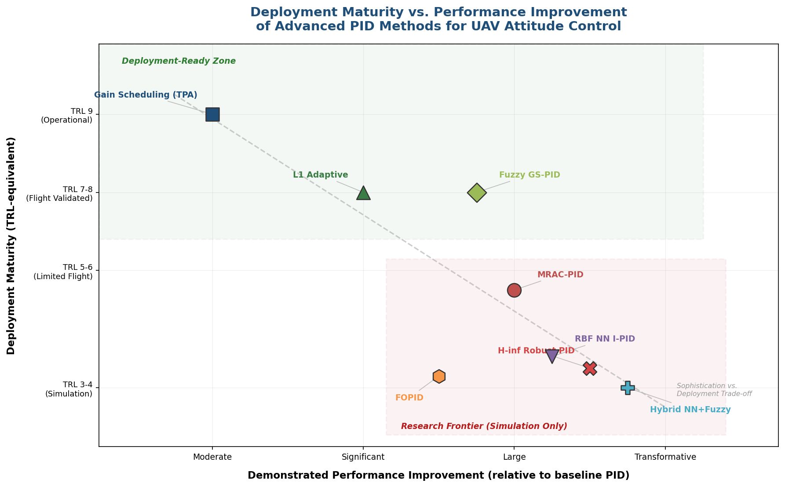

The following table synthesizes these strategies across key evaluation dimensions. The assessment reflects both theoretical properties and the empirical evidence available as of early 2026. Figure 3-3 presents a color-coded rendition of this comparison for enhanced readability.

| Method | Extra Parameters | Computational Cost | Stability Guarantee | Best Reported Improvement | Flight-Test Validated? | Open-Source Support |
|--------|-----------------|-------------------|---------------------|--------------------------|----------------------|-------------------|
| Gain Scheduling (TPA) | 1–2 (breakpoint, rate) | Negligible | At frozen points only | Eliminates high-throttle oscillation | Yes (millions deployed) | Betaflight native |
| Fuzzy Gain-Scheduling PID | Rule base (49–81 rules) | Low–Medium | None (heuristic) | Overshoot 13%→1%, error −62% (altitude) | Yes (Pixhawk flight test) | None native |
| MRAC-PID | Learning rates (15+) | Medium | Lyapunov (V̇ ≤ 0) | MSE −68.7% (altitude), −86–93% (attitude) | Limited (Ristevski 2016) | None native |
| L₁ Adaptive | Filter bandwidth + adaptation rate | Medium | Lyapunov + performance bounds | Computable tracking tube | Yes (custom quadrotor) | None native |
| RBF NN I-PID | Network weights (5–50 neurons) | Low–Medium | Lyapunov (Kim & Suh) | Roll error −95%, yaw overshoot −41% | No (simulation only) | None native |
| Hybrid NN+Fuzzy PID | Network + rule base | Medium–High | None | Roll MSE 6.87×10⁻⁷ vs. PID orders-of-magnitude worse | No (simulation only) | None native |
| FOPID (PI^λD^μ) | 5 (Kp, Ki, Kd, λ, μ) | Medium (Oustaloup approx.) | Classical (frequency domain) | ITAE −21–74%, settling time −60–75% | No (simulation only) | None native |
| H∞ Robust PID | Uncertainty weights | High (offline synthesis) | Guaranteed (γ₀ bound) | Peak error −10× under 15 m/s gust | No (simulation only) | None native |

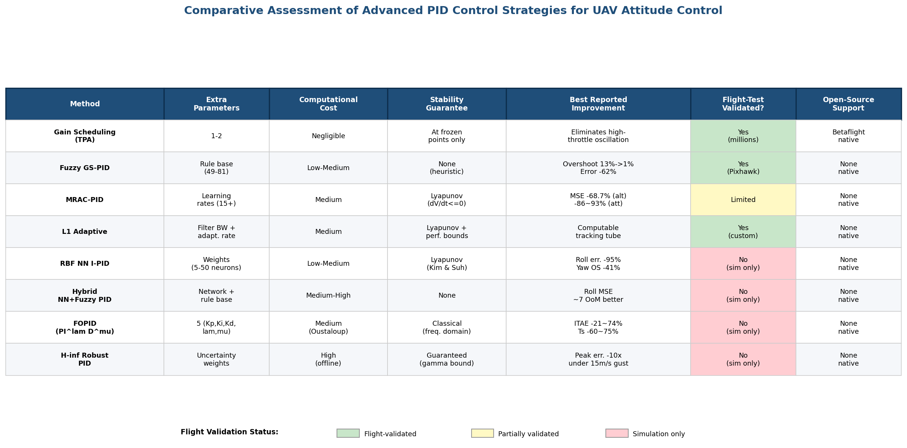

Several cross-cutting patterns emerge from this comparative analysis. First, there is a striking inverse relationship between theoretical sophistication and deployment maturity. The methods with the strongest formal guarantees (H∞, L₁ adaptive) or the most impressive simulation performance (hybrid NN+Fuzzy, FOPID) have minimal or no presence in operational flight controllers. Conversely, the architecturally simplest methods (TPA, fuzzy gain-scheduling) dominate real-world deployment—a pattern clearly visible in Figure 3-2.

Second, the gap between simulation and flight-test validation remains the primary bottleneck for technology transfer. Lopez-Sanchez and Moreno-Valenzuela (2023) noted in their comprehensive survey that traditional PID attitude tracking errors increase by 52% when wind speeds increase, yet the advanced methods designed to address precisely this degradation remain largely unvalidated under real flight conditions [Lopez-Sanchez & Moreno-Valenzuela 2023](https://www.sciencedirect.com/science/article/abs/pii/S1367578823000640 "PID Control of Quadrotor UAVs: A Survey, Annual Reviews in Control, vol. 56, 2023").

Third, computational cost is frequently overstated as a deployment barrier. The neural-network and fuzzy architectures surveyed in this chapter involve modest computational loads (tens to hundreds of multiply-accumulate operations per cycle) well within the capabilities of modern flight controller MCUs (STM32F7/H7 class). The true barriers are more likely certification complexity, integration effort with existing flight stacks, and the absence of standardized testing and validation frameworks for adaptive controllers.

The near-term trajectory for multirotor PID enhancement is expected to favor methods that combine low implementation complexity with demonstrated robustness improvements—particularly fuzzy gain-scheduling and L₁ adaptive augmentation. FOPID and H∞-constrained PID may find adoption in specialized high-value applications (e.g., delivery drones with strict payload variation envelopes) where the additional design effort is justified by mission-critical performance requirements. Chapter 4 examines a complementary path toward PID improvement: the use of optimization algorithms to systematically search the gain space, an approach that can be applied to any of the controller structures discussed in this chapter.

# 第4章 Optimization-Based PID Parameter Tuning — Metaheuristics, Bayesian Methods, and Simulation-in-the-Loop

Chapters 2 and 3 established that classical tuning rules often produce conservative or unstable gains for multirotor UAV attitude loops, while adaptive and intelligent PID variants can compensate in real time at the cost of additional design complexity. A complementary paradigm bypasses both manual iteration and on-line adaptation altogether: formulate PID tuning as an explicit optimization problem and let a numerical solver search for gains that minimize a well-defined performance criterion over a faithful dynamic model. This chapter examines three families of optimization-based tuning—population-based metaheuristics (Section 4.2), Bayesian optimization (Section 4.3), and reinforcement learning (Section 4.4)—together with the simulation-in-the-loop (SIL) and hardware-in-the-loop (HIL) workflows that connect the optimizer to the plant (Section 4.5). Section 4.6 synthesizes the comparative evidence and identifies the operational regimes in which each approach is most appropriate.

## 4.1 Formulating PID Tuning as an Optimization Problem

### 4.1.1 Objective Functions

The choice of objective function *J* determines which aspect of closed-loop behavior the optimizer prioritizes. Six integral-error criteria dominate the UAV PID literature: Integral of Absolute Error (IAE), Integral of Squared Error (ISE), Integral of Time-weighted Absolute Error (ITAE), Integral of Time-weighted Squared Error (ITSE), Mean Squared Error (MSE), and Integral Error (IE). Approximately 90% of industrial PID controllers that employ automated tuning rely on one of these integral-error cost functions [Oladimeji et al. 2022](https://pmc.ncbi.nlm.nih.gov/articles/PMC9120253/ "Metaheuristic algorithms for PID controller parameters tuning: review, Heliyon, vol. 8, no. 5, 2022"). Each criterion embeds distinct design priorities: ISE penalizes large transient deviations more heavily, making it effective at suppressing initial overshoot; ITAE places increasing penalty on errors that persist at later times, thereby strongly favoring fast settling; and IAE offers a balanced middle ground that is less sensitive to isolated transient spikes than ISE. Figure 4.1 provides a systematic taxonomy of these criteria, including their mathematical formulations, design emphases, and representative UAV PID studies that employ each one.

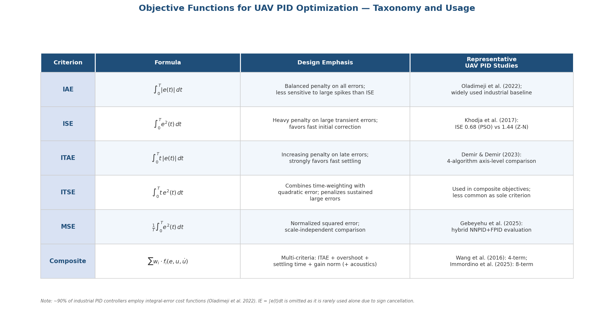

**Figure 4.1** Taxonomy of objective functions commonly used in UAV PID optimization. Approximately 90% of industrial PID controllers employ integral-error cost functions. The composite formulation aggregates multiple criteria with weighting coefficients to capture multi-dimensional performance requirements. Data compiled from Oladimeji et al. (2022), Khodja et al. (2017), Demir & Demir (2023), Wang et al. (2016), and Immordino et al. (2025).

In practice, a single scalar criterion seldom captures all performance dimensions. Wang et al. (2016) proposed a composite cost function for quadrotor PID optimization of the form

J = w₁·ITAE + w₂·Overshoot_max + w₃·Settling_time + w₄·‖Gains‖

where the norm penalty on gain magnitudes discourages aggressive control effort [Wang et al. 2016](http://vigir.missouri.edu/~gdesouza/Research/Conference_CDs/IEEE_SSCI_2016/pdf/SSCI16_paper_384.pdf "Automatic PID Tuning via DE for Quadrotor, IEEE SSCI, 2016"). Immordino et al. (2025) extended this concept to an eight-term composite that additionally incorporates acoustic emission and power consumption, representing the most comprehensive single-objective formulation reported to date for UAV PID tuning [Immordino et al. 2025](https://arxiv.org/html/2509.17423v1 "Multi-objective Optimization PID for quadrotor, arXiv, 2025").

### 4.1.2 Multi-Objective Formulations

When objectives genuinely conflict—for example, minimizing tracking error versus minimizing control effort—weighted-sum scalarization may obscure the trade-off surface. Multi-objective formulations that produce a Pareto front afford the designer explicit visibility into these trade-offs, enabling principled selection of the operating point that best matches mission requirements.

Gomez et al. (2020) applied Multi-Objective Particle Swarm Optimization (MOPSO) to PX4-based quadrotor PID tuning, using overshoot, rise time, and root-mean-square error as three simultaneous objectives. The resulting three-dimensional Pareto front was validated through hardware experiments on a real quadrotor, yielding roll overshoot of 10.5%, rise time of 0.14 s, and RMSE of 2.03% at the selected operating point; the gains proved robust to ±15% parameter perturbations [Gomez et al. 2020](https://www.mdpi.com/2226-4310/7/6/71 "Pareto Optimal PID Tuning for PX4-Based UAVs, Aerospace, vol. 7, no. 6, 2020").

Zhou & Zhang (2019) employed NSGA-II to auto-tune 27 PID parameters for an aerial manipulator (quadrotor + 3-DOF robotic arm), defining two conflicting objectives: integrated time-squared error (G₁) and control rate smoothness (G₂). The resulting Pareto front revealed that solutions prioritizing tracking accuracy (G₁ ≈ 90,000, G₂ ≈ 0.052) and those prioritizing control smoothness (G₁ ≈ 113,000, G₂ ≈ 0.003) occupied distinct regions of the objective space. Compared with the best manually tuned parameter set, the NSGA-II auto-tuned PID reduced link-1 overshoot from 4.6° to 1.6° and stabilization time from 3.5 s to 2.1 s, achieving performance comparable to model predictive control at significantly lower computational cost [Zhou & Zhang 2019](https://journals.sagepub.com/doi/10.1177/1729881419828071 "Multi-objective-optimization-based control parameters auto-tuning for aerial manipulators, Int. J. Adv. Robot. Syst., 2019").

### 4.1.3 Search Space and Constraints

The search space for a typical cascaded PID attitude controller comprises 9–16 parameters: three gains (Kp, Ki, Kd) per axis (roll, pitch, yaw) for the inner rate loop, plus the outer-loop proportional gains and, in some formulations, altitude-channel gains. PX4 imposes default parameter ranges (e.g., Kp_roll ∈ [0, 0.5], Kd_roll ∈ [0, 0.01]) that serve as box constraints for the optimizer [Gomez et al. 2020](https://www.mdpi.com/2226-4310/7/6/71 "Table 1: PX4 allowable PID ranges"). The inherent symmetry of standard quadrotor frames frequently permits roll and pitch axes to share gains, reducing the effective dimensionality from 12 to 8 or fewer parameters.

Wang et al. (2016) exploited a two-stage decomposition strategy—first optimizing inner-loop attitude PD gains against step-response criteria on an isolated rotational dynamics model, then optimizing outer-loop position PID gains with the inner loop running at its previously determined values—to further reduce each sub-problem's dimensionality and prevent the outer loop from compensating for inner-loop deficiencies [Wang et al. 2016](http://vigir.missouri.edu/~gdesouza/Research/Conference_CDs/IEEE_SSCI_2016/pdf/SSCI16_paper_384.pdf "Two-stage sequential optimization approach"). This hierarchical decomposition mirrors the cascaded control architecture itself and has become a common strategy in subsequent optimization studies.

## 4.2 Metaheuristic Algorithms for UAV PID Tuning

### 4.2.1 Working Principles and Taxonomy

Metaheuristic algorithms maintain a population of candidate solutions that evolve through stochastic exploration and exploitation operators, requiring no gradient information from the objective function. Genetic Algorithms (GA) use crossover and mutation on binary or real-coded chromosomes to evolve successive generations; Particle Swarm Optimization (PSO) updates particle velocities toward personal and global best positions, balancing inertia, cognitive, and social components; Differential Evolution (DE) creates trial vectors via scaled difference vectors and greedy selection; Grey Wolf Optimizer (GWO) encodes a social hierarchy (α, β, δ, ω wolves) that drives encircling and attack moves to converge toward the prey (the global optimum). A comprehensive survey by Oladimeji et al. (2022) identified over 73 distinct metaheuristic variants that have been applied to PID tuning across various domains, underscoring the breadth of algorithmic options available to the UAV control designer [Oladimeji et al. 2022](https://pmc.ncbi.nlm.nih.gov/articles/PMC9120253/ "Heliyon, vol. 8, no. 5, 2022").

### 4.2.2 Comparative Performance on Quadrotor PID

Demir & Demir (2023) conducted a controlled comparison of four metaheuristics—GA, Artificial Bee Colony (ABC), PSO, and Firefly Algorithm (FA)—for quadrotor PID tuning under the ITAE criterion. Each algorithm demonstrated superior performance on a different axis: ABC achieved the lowest ITAE on altitude, FA on roll, GA on pitch, and PSO on yaw. No single algorithm achieved uniform dominance across all axes, a result that confirms the problem-dependent nature of metaheuristic performance and resonates with the No Free Lunch theorem's practical implications for algorithm selection [Demir & Demir 2023](https://hrcak.srce.hr/en/305453 "Comparison of Metaheuristic Optimization Algorithms for Quadrotor PID, Tehnički vjesnik, vol. 30, no. 4, 2023").

Immordino et al. (2025) executed the most comprehensive three-way comparison reported to date, pitting metaheuristics (GA, PSO, GWO), Bayesian optimization, and deep reinforcement learning (SAC, TD3) against each other over 6,000 evaluations on a DJI Matrice 300 simulation model operating at 125 Hz with approximately 15 s per evaluation episode. GWO achieved the lowest composite cost of 271.9; under bounded warm-start initial conditions, GWO reduced the Ziegler–Nichols baseline cost by approximately 23–27%. PSO converged comparably but exhibited slightly higher variance, while GA showed the slowest convergence among the metaheuristic trio [Immordino et al. 2025](https://arxiv.org/html/2509.17423v1 "Tables 4-5, Figures 5-7").

Gün (2023) compared DE, PSO, Gravitational Search Algorithm (GSA), and Charged System Search (CSS) for quadrotor attitude PID tuning, reporting that DE-optimized gains achieved the target attitude with lower total torque expenditure—indicating higher energy efficiency—than the competing algorithms. This energy-efficiency advantage makes DE a noteworthy option for battery-constrained long-endurance missions [Gün 2023](https://www.sciencedirect.com/science/article/abs/pii/S0957417423010205 "Attitude control via PID based on DE, Expert Systems with Applications, vol. 229, 2023").

### 4.2.3 Experimental Validation on Real Hardware

While the majority of metaheuristic PID studies remain confined to simulation, a handful of investigations have validated optimized gains on physical platforms, providing critical evidence of sim-to-real transferability.

Khodja et al. (2017) validated PSO-tuned PID gains on a QAV250 quadrotor equipped with an Arduino Due flight controller. Using a composite objective combining ISE and overshoot penalty, the PSO-optimized configuration achieved a steady-state ISE of 0.6842, compared to 1.4437 for Ziegler–Nichols-derived gains—a 53% reduction. Steady-state pitch error remained within approximately ±0.3° for both methods, but the PSO solution exhibited markedly lower transient oscillation amplitude [Khodja et al. 2017](https://www.ijsmdo.org/articles/smdo/full_html/2017/01/smdo160015/smdo160015.html "PSO tuning PID for quadrotor, Int. J. SMDO, vol. 8, A8, 2017").

The Gomez et al. (2020) MOPSO study described in Section 4.1.2 similarly validated its Pareto-selected gains on a physical PX4 quadrotor, testing all four axes (roll, pitch, yaw rate, altitude) with constrained test rigs for safety. Simulation-to-hardware agreement was strong, and robustness to ±15% model uncertainty was confirmed through parametric perturbation scenarios [Gomez et al. 2020](https://www.mdpi.com/2226-4310/7/6/71 "Aerospace, vol. 7, no. 6, 2020"). These two hardware validations collectively demonstrate that metaheuristic-optimized gains, when derived from sufficiently faithful simulation models, can transfer successfully to real flight platforms.

### 4.2.4 Synthesis: Strengths and Limitations

PSO remains the most widely adopted metaheuristic for UAV PID tuning, owing to its balanced convergence speed, solution quality, and straightforward implementation. GWO has emerged as a strong contender in multi-objective composite benchmarks—achieving the lowest cost of 271.9 in the Immordino et al. (2025) comparison—though its advantage is problem-dependent and may not generalize across different platform configurations. DE offers favorable energy-efficiency characteristics that are particularly relevant for battery-constrained missions.

All population-based methods share a common limitation: they require hundreds to thousands of objective function evaluations, each of which demands a full simulation rollout. For a 15-second simulation episode at 125 Hz, 6,000 evaluations translate to roughly 25 hours of serial computation. This cost is acceptable for offline SIL tuning campaigns but prohibitive for direct real-vehicle optimization, where each flight test carries both temporal and safety costs. This fundamental sample-efficiency gap motivates the Bayesian methods discussed in the following section.

## 4.3 Bayesian Optimization for Sample-Efficient PID Tuning

### 4.3.1 Gaussian Process Surrogate and Acquisition Functions

Bayesian Optimization (BO) replaces the population-based search with a probabilistic surrogate model—typically a Gaussian Process (GP)—that models the objective function landscape from a small number of evaluated points. An acquisition function (Expected Improvement, Upper Confidence Bound, or Thompson Sampling) balances exploration of uncertain regions against exploitation of promising ones, selecting the next parameter vector to evaluate. Because each evaluation on a real quadrotor carries both time cost and crash risk, BO's sample efficiency constitutes a decisive advantage: convergence typically requires only 20–100 evaluations, one to two orders of magnitude fewer than population-based metaheuristics.

### 4.3.2 SafeOpt: Safe Bayesian Controller Optimization

Berkenkamp et al. (2016) introduced SafeOpt, a foundational algorithm that extends BO with formal safety constraints for real-system controller tuning. SafeOpt requires only an initial stable controller and a measurable performance metric; it maintains a GP model of both performance and safety, and restricts exploration to parameter regions where the GP's confidence bounds guarantee that the safety constraint will not be violated. On a real quadrotor platform, SafeOpt autonomously improved controller performance without a single unsafe evaluation, demonstrating that model-free, safe, automatic PID tuning on physical UAVs is practically achievable. This work established the viability of BO as a principled alternative to both manual tuning and simulation-dependent metaheuristic optimization, and it remains the most widely cited reference for safe automatic controller optimization on UAVs [Berkenkamp et al. 2016](https://las.inf.ethz.ch/files/berkenkamp16safe.pdf "Safe Controller Optimization for Quadrotors with GP, IEEE ICRA, 2016").

### 4.3.3 Heteroscedastic Bayesian Optimization for Dynamic PID Tuning

Gu et al. (2025) advanced the BO paradigm with Heteroscedastic Bayesian Optimization (HBO), which models input-dependent noise variance in the GP to account for the empirical observation that controller performance measurements at different gain settings exhibit different noise levels—a phenomenon standard homoscedastic GP models cannot capture. In PyBullet quadrotor simulation, HBO-PID achieved a mean position error of 0.137 m, compared to 0.185 m for standard BO-PID (26% improvement) and 0.233 m for manually tuned PID (41% improvement). On a real quadrotor platform operating with a PX4 flight stack and NOKOV motion capture system, HBO-PID reduced mean position error by 61.2% and mean angle error by 34.7% relative to the default PID configuration. Beyond static gain selection, the HBO framework supports dynamic PID adjustment across distinct flight phases—takeoff, cruise, and aggressive maneuvering—making it well suited for missions with varying dynamic requirements [Gu et al. 2025](https://arxiv.org/html/2512.24249v1 "Heteroscedastic BO-Based Dynamic PID Tuning for UAV, arXiv, 2025").

### 4.3.4 BO vs. Metaheuristics: Trade-off Analysis

The Immordino et al. (2025) benchmark quantified the BO–metaheuristic trade-off directly. BO achieved competitive solution quality within the first 50–100 evaluations, but each evaluation required over 34 seconds of wall-clock time (including GP model update and acquisition function optimization) compared to approximately 17 seconds per metaheuristic evaluation. At 6,000 total evaluations, BO's cumulative computational cost was therefore roughly double that of PSO or GWO. However, in the sample-constrained regime—fewer than 200 evaluations, which is the operationally relevant scenario for real-vehicle tuning—BO consistently outperformed all metaheuristics in final solution quality [Immordino et al. 2025](https://arxiv.org/html/2509.17423v1 "Section 3.1, BO comparison results").

These results suggest that BO and metaheuristics are best understood as complementary rather than competing tools: metaheuristics are preferred for offline SIL/HIL campaigns where simulation evaluations are computationally cheap and can be parallelized, while BO is preferred for direct real-vehicle optimization where each flight test is expensive, time-consuming, and carries inherent crash risk.

## 4.4 Reinforcement Learning as an Optimization Paradigm

### 4.4.1 RL for Static PID Parameter Selection

Reinforcement learning (RL) frames PID tuning as a sequential decision problem where an agent observes the UAV state and outputs gain adjustments to maximize cumulative reward (typically the negative of tracking error). When RL is employed in a one-shot static mode—the agent proposes a complete PID parameter vector as a single action, and the episode evaluates the resulting closed-loop performance—it functions as an alternative global optimizer. Immordino et al. (2025) tested this paradigm with Soft Actor-Critic (SAC) and Twin Delayed DDPG (TD3) on a 15-parameter quadrotor PID vector. In all three test configurations, the RL agents failed to outperform even the Ziegler–Nichols baseline, suggesting that the single-step Markov Decision Process (MDP) formulation fails to leverage RL's core strength: learning state-dependent policies through sequential interaction with a dynamic environment [Immordino et al. 2025](https://arxiv.org/html/2509.17423v1 "Section 3.2: RL performs below Z-N baseline in static mode").

### 4.4.2 RL for Online Adaptive Gain Scheduling

When RL operates in a multi-step, state-dependent mode—adjusting PID gains at each control timestep or at a lower scheduling frequency based on the observed flight state—it transitions from an offline optimizer to an online adaptive controller. Sönmez et al. (2025) trained a DDPG agent (two hidden layers of 128 neurons each) in simulation to predict PD gains as a function of the current state vector, then deployed the trained network directly on a Pixhawk 2.1 flight controller without any companion computer. In outdoor flight tests, the RL-augmented PD controller reduced attitude RMSE from 33.93 × 10⁻² to 22.55 × 10⁻² (a 33% improvement) and position error by 37% compared to fixed-gain PD. This result represents the first published deployment of an RL-based PID gain prediction network on embedded autopilot hardware, demonstrating that modern microcontrollers possess sufficient computational capacity to execute small neural network inference alongside the flight control loop [Sönmez et al. 2025](https://www.mdpi.com/2504-446X/9/8/581 "RL-Based PD Controller Gains Prediction for Quadrotor, Drones, vol. 9, no. 8, 2025").

The contrast between RL's failure in static optimization and its success in state-dependent gain scheduling is instructive and carries a clear design implication: RL's value in the PID tuning context lies in learning policies that generalize across diverse flight states and operating conditions, not in competing with dedicated global optimizers on the fixed-parameter selection problem where metaheuristics and BO already excel.

## 4.5 Simulation-in-the-Loop and Hardware-in-the-Loop Workflows

The practical deployment of any optimization-based PID tuning method depends critically on the fidelity and efficiency of the evaluation pipeline that connects the optimizer to the plant. This section examines the SIL and HIL architectures that serve as this connective tissue, the fidelity factors that govern sim-to-real transfer, and the staged workflow that has emerged as the field's best practice. Figure 4.2 illustrates the complete staged pipeline.

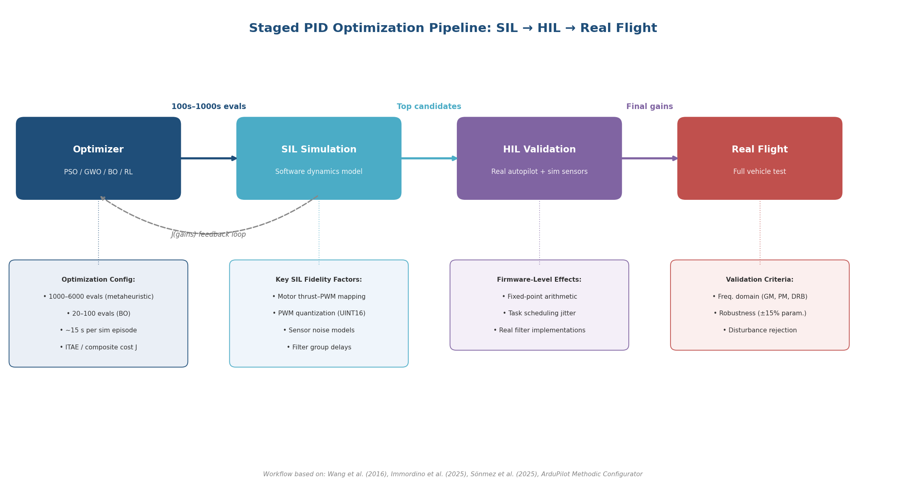

**Figure 4.2** Staged PID optimization pipeline from offline SIL search through HIL validation to real-flight confirmation. Each stage is annotated with the key fidelity factors and validation criteria that govern successful progression. Evaluation budgets range from 1,000–6,000 for metaheuristics to 20–100 for Bayesian optimization. Based on workflows described in Wang et al. (2016), Immordino et al. (2025), Sönmez et al. (2025), and the ArduPilot Methodic Configurator.

### 4.5.1 SIL Architecture and Fidelity Requirements

A SIL optimization loop couples the numerical optimizer to a software simulation of the UAV dynamics and flight controller. The optimizer proposes a PID parameter vector, the simulator executes a predefined test trajectory, and the resulting performance metric (e.g., ITAE) is returned as the objective function value. The fidelity of the simulation model ultimately determines whether gains optimized in silico will transfer successfully to real hardware.

Wang et al. (2016) structured their SIL workflow in two stages: first, inner-loop attitude PD gains are optimized against step-response criteria on an isolated rotational dynamics model; then, outer-loop position PID gains are optimized with the inner loop running at its previously determined settings. This sequential approach reduces the optimization problem dimensionality at each stage and prevents the outer loop from compensating for inner-loop deficiencies, mirroring the hierarchical philosophy of the cascaded architecture itself [Wang et al. 2016](http://vigir.missouri.edu/~gdesouza/Research/Conference_CDs/IEEE_SSCI_2016/pdf/SSCI16_paper_384.pdf "Two-stage DE optimization").

Immordino et al. (2025) released an open-source Python SIL framework that supports modular replacement of aerodynamic models, acoustic emission models, controller structures, and optimization algorithms. The framework operates at 125 Hz with a DJI Matrice 300 aerodynamic model, with each simulation episode lasting approximately 15 seconds [Immordino et al. 2025](https://arxiv.org/html/2509.17423v1 "Open-source framework description"). MathWorks provides a complementary commercial SIL workflow for PID autotuning in Simulink using a Simscape Multibody quadrotor model, illustrating the availability of both open-source and commercial toolchains for SIL-based PID optimization [MathWorks](https://www.mathworks.com/help/slcontrol/ug/pid-controller-tuning-for-a-uav-quadcopter.html "PID Autotuning for UAV Quadcopter — MATLAB").

### 4.5.2 Sim-to-Real Transfer: Critical Fidelity Factors

The gap between simulation and reality—commonly referred to as the "sim-to-real gap"—constitutes the central challenge of SIL-based PID optimization. Even gains that achieve excellent performance in simulation may oscillate or destabilize the vehicle if the simulation omits key physical effects.

Sönmez et al. (2025) identified PWM signal quantization (conversion to UINT16 integers before motor mixing) as a critical fidelity factor for successful sim-to-real transfer of RL-trained PID gains. Omitting this quantization in the training simulation produced gains that oscillated when deployed on hardware, while incorporating it yielded smooth real-flight performance [Sönmez et al. 2025](https://www.mdpi.com/2504-446X/9/8/581 "PWM quantization as sim-to-real transfer key").

Additional fidelity requirements identified across the reviewed literature include: accurate motor thrust-to-PWM mapping (including battery voltage dependence, as documented in PX4 flight stack documentation), sensor noise models (gyroscope and accelerometer noise floors and bias drift), signal processing delays (filter group delays and communication latencies), and actuator saturation limits. The ArduPilot SITL environment supports integration with external high-fidelity simulators including Gazebo, RealFlight, AirSim, and MATLAB/Simulink, allowing the optimizer designer to select the fidelity level appropriate for each stage of the optimization campaign [ArduPilot SITL](https://ardupilot.org/dev/docs/simulation-2.html "ArduPilot simulation overview").

### 4.5.3 HIL Optimization

Hardware-in-the-loop (HIL) optimization inserts the actual autopilot hardware into the evaluation loop: the flight controller runs its real firmware, but sensor inputs are generated by a real-time simulator and actuator outputs are captured rather than driving physical motors. PX4 supports HITL mode, in which the flight controller hardware executes the full firmware stack while a connected simulator (e.g., Gazebo) provides synthetic sensor data [PX4 HITL](https://docs.px4.io/main/en/simulation/hitl "PX4 HITL documentation"). HIL captures firmware-level effects—fixed-point arithmetic, task scheduling jitter, real filter implementations—that pure SIL may miss, but at the cost of requiring physical hardware and real-time simulation synchronization.

In the optimization context, HIL is most valuable as a validation stage rather than the primary search loop. Running thousands of metaheuristic evaluations through a HIL rig is both slow and mechanically complex; a more practical workflow performs the bulk of optimization in SIL, validates the top candidate gain sets in HIL, and then confirms final performance in free flight. This staged approach—SIL search → HIL validation → real-flight confirmation (as illustrated in Figure 4.2)—is embodied in the ArduPilot Methodic Configurator's system identification workflow, which progresses from chirp-excited SIL flights through transfer function extraction and analytical PID optimization, then proceeds to validation flights with PID Review Tool frequency-domain analysis [Methodic Configurator](https://ardupilot.github.io/MethodicConfigurator/TUNING_GUIDE_ArduCopter.html "IAV GmbH systematic ArduCopter tuning guide").

## 4.6 Comparative Assessment of Optimization Approaches

Synthesizing the evidence from the studies reviewed in this chapter, several convergent findings emerge across the metaheuristic, Bayesian, and reinforcement learning families of optimization. Figure 4.3 provides a structured comparison of the six principal methods along key operational dimensions.

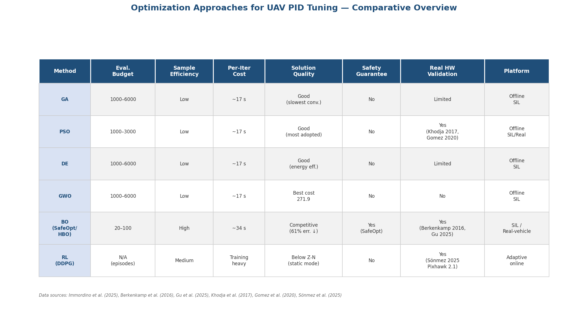

**Figure 4.3** Comparative overview of optimization approaches for UAV PID tuning. Key dimensions include evaluation budget, sample efficiency, per-iteration cost, solution quality, safety guarantees, real-hardware validation status, and target deployment platform. Data compiled from Immordino et al. (2025), Berkenkamp et al. (2016), Gu et al. (2025), Khodja et al. (2017), Gomez et al. (2020), and Sönmez et al. (2025).

**PSO is the most widely adopted metaheuristic** for UAV PID tuning, owing to its straightforward implementation, robust convergence, and broad applicability across different platform configurations. It consistently achieves near-optimal solutions within 1,000–3,000 evaluations.

**GWO achieved the best composite cost** in the largest head-to-head benchmark (Immordino et al. 2025), but the performance advantage is problem-dependent and may not generalize to different airframes or objective function formulations. Demir & Demir (2023) demonstrated that no single algorithm dominates across all axes, reinforcing the principle that metaheuristic selection should be guided by empirical testing on the specific platform and mission profile.

**BO offers superior sample efficiency** and is the method of choice for direct real-vehicle tuning, as demonstrated by SafeOpt (Berkenkamp et al. 2016) and HBO-PID (Gu et al. 2025). Its per-iteration computational overhead is higher than that of metaheuristics, but the total evaluation count is one to two orders of magnitude lower than population-based methods, making it uniquely suited to scenarios where each evaluation carries physical risk.

**RL is not competitive as a static optimizer** but exhibits clear promise for state-dependent online gain scheduling when deployed as a lightweight neural network on embedded hardware (Sönmez et al. 2025). Its role is complementary to, rather than a substitute for, offline optimization methods.

**Multi-objective formulations** (MOPSO, NSGA-II) provide the designer with explicit Pareto fronts that illuminate the trade-offs between competing objectives—tracking accuracy, control effort, overshoot, and settling time—enabling principled selection of the operating point that best matches mission requirements [Gomez et al. 2020](https://www.mdpi.com/2226-4310/7/6/71 "Aerospace, vol. 7, no. 6, 2020") [Zhou & Zhang 2019](https://journals.sagepub.com/doi/10.1177/1729881419828071 "Int. J. Adv. Robot. Syst., 2019").

**The absence of a standardized UAV PID optimization benchmark** remains a significant gap in the field. Unlike function optimization (CEC benchmark suites) or reinforcement learning (OpenAI Gym), there is no community-accepted UAV PID tuning benchmark that specifies standardized dynamics models, disturbance profiles, and performance metrics. The open-source frameworks released by Immordino et al. (2025) and the AdaptiveQuadBench platform (Zhang et al. 2025) represent important first steps toward filling this gap, but broad adoption and community consensus have not yet been established.

# 第5章 Practical Implementation in Open-Source Flight Stacks — AutoTune, Deployment, and Validation

The preceding chapters established the theoretical foundations of cascaded PID control (Chapter 1), surveyed classical tuning baselines (Chapter 2), examined advanced adaptive and intelligent PID variants (Chapter 3), and analyzed optimization-based parameter search strategies (Chapter 4). This chapter bridges theory and practice by examining how these ideas are concretely realized in the three dominant open-source flight stacks — ArduPilot, PX4, and Betaflight. Each platform has evolved a distinctive auto-tuning philosophy, filtering architecture, and deployment workflow shaped by its target user community and mission envelope.

Section 5.1 dissects ArduPilot's iterative twitch-based AutoTune, the newer QuikTune alternative, and the product-grade Methodic Configurator workflow. Section 5.2 examines PX4's model-based system identification autotuner and contrasts its design philosophy with ArduPilot's experiment-driven approach. Section 5.3 presents Betaflight's slider-driven, filter-first tuning paradigm optimized for FPV racing. Section 5.4 addresses the cross-cutting practical concerns — sensor filtering, anti-windup, actuator saturation, thrust linearization, and MCU computational constraints — that govern real-world PID performance regardless of the flight stack. Section 5.5 surveys the SIL and HIL validation pipelines that connect simulation to flight, and Section 5.6 synthesizes the comparative positioning of these three ecosystems.

## 5.1 ArduPilot AutoTune and QuikTune

### 5.1.1 AutoTune Algorithm Architecture

ArduPilot's AutoTune, originally designed by Leonard Hall, constitutes the most widely deployed automated PID tuning mechanism in the open-source multirotor ecosystem. Its algorithmic lineage traces to the relay feedback identification paradigm introduced by Åström and Hägglund (Chapter 2, Section 2.3); however, it replaces the classical relay element with purpose-designed angular impulse excitations ("twitches") whose transient responses are evaluated in the time domain rather than the frequency domain.

The algorithm operates through a deterministic state machine with six sequential phases: RATE_D_UP → RATE_D_DOWN → RATE_P_UP → ANGLE_P_DOWN → ANGLE_P_UP → TUNE_COMPLETE. Within each phase, the autopilot injects approximately ±20° angular step commands ("twitches") and evaluates the resulting transient response for overshoot, rebound, and settling characteristics. Progression to the next phase requires four consecutive successful twitches that satisfy the current phase's acceptance criteria, providing statistical confidence in the identified dynamics [ArduPilot AutoTune 文档](https://ardupilot.org/copter/docs/autotune.html "Official ArduPilot Copter AutoTune"). Figure 5.1 illustrates the complete state machine, including the twitch evaluation logic and gain derivation rules that govern each phase transition.

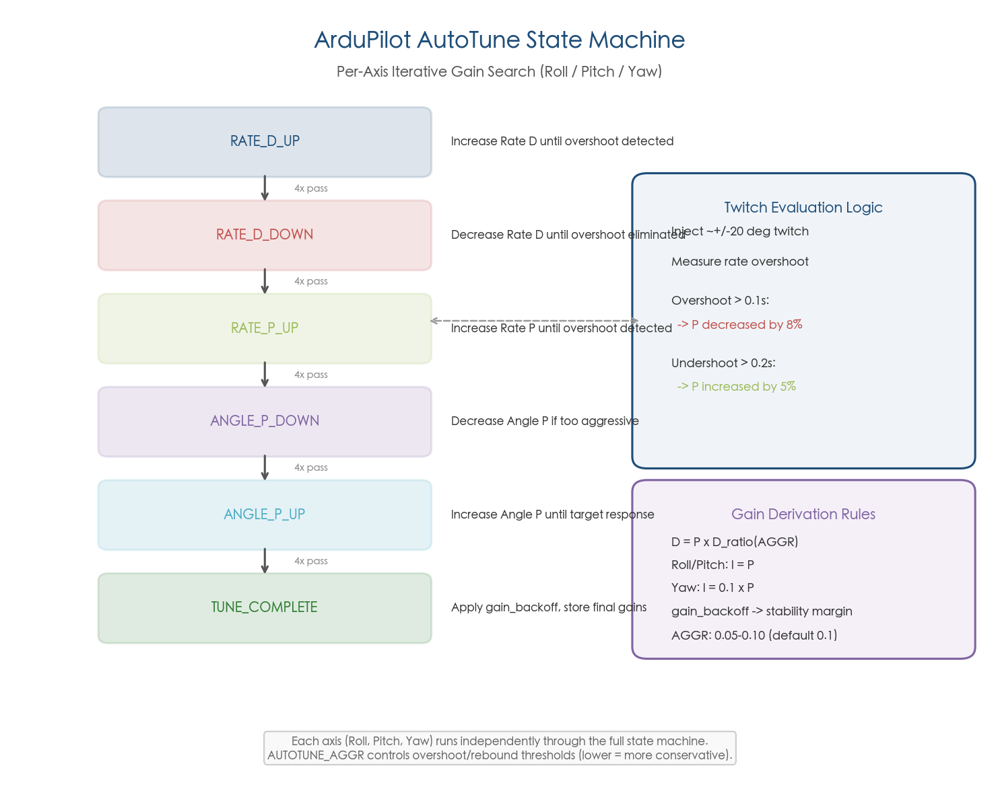

The AUTOTUNE_AGGR parameter (range 0.05–0.10, default 0.1) governs the detection thresholds that classify each twitch response as over-damped, under-damped, or satisfactory. When overshoot exceeds the threshold for more than 0.1 s, the rate P gain is decreased by 8%; conversely, when the response is under-damped with settling time exceeding 0.2 s, P is increased by 5%. These asymmetric adjustment rates (8% down vs. 5% up) embed an inherent conservatism that biases the algorithm toward stability. The rate D gain undergoes analogous iteration during the RATE_D phases. Once rate-loop gains converge, the integrator gain is determined by empirical ratios: Rate I = Rate P for roll and pitch axes, while yaw employs I = 0.1 × P to reflect its fundamentally different inertial characteristics. A configurable gain_backoff parameter provides additional stability margin beyond the convergence point [AC_AutoTune_Multi.h 源码](https://github.com/ArduPilot/ardupilot/blob/master/libraries/AC_AutoTune/AC_AutoTune_Multi.h "ArduPilot AutoTune source").

Matt et al. (2025) conducted the first rigorous independent evaluation of the ArduPilot AutoTune algorithm, testing across six AUTOTUNE_AGGR levels (1 through 6) on a small UAS platform with both simulation and flight validation. Frequency-domain analysis of the resulting closed-loop systems revealed that at Level 6 (most aggressive), the tuned controller achieved a gain margin of 15.2 dB, a phase margin of 91.0°, and a disturbance rejection bandwidth (DRB) of 1.71 rad/s. Lower aggressiveness levels produced progressively more conservative margins. These results confirm that ArduPilot AutoTune, when operating under favorable conditions, generates controllers with substantial stability margins that significantly exceed minimum recommended thresholds [Matt et al. 2025](https://engrxiv.org/preprint/download/4462/7760/6405 "Evaluation of ArduPilot Automatic Tuning Algorithm, engrXiv, 2025").

### 5.1.2 Known Limitations and Failure Modes

Despite its widespread deployment, AutoTune exhibits several well-documented failure modes that constrain its applicability. Strong wind during the tuning flight corrupts twitch response analysis because the algorithm cannot distinguish aerodynamic disturbance transients from the vehicle's intrinsic dynamic response. High gyroscope noise or mechanical vibration produces similar confusion, as the detection thresholds for overshoot and rebound are applied to absolute signal amplitudes. ESC nonlinearity — specifically, an incorrect MOT_THST_EXPO calibration — distorts the mapping between commanded and actual torque, causing the algorithm to identify plant dynamics that differ from the true system. Flexible airframes introduce structural modes that the rigid-body assumption underlying the twitch analysis does not accommodate, potentially leading to gain settings that excite these unmodeled dynamics [ArduPilot AutoTune 文档](https://ardupilot.org/copter/docs/autotune.html "Limitations section").

A practical diagnostic heuristic provided by the ArduPilot documentation states that if RATE.*out values exceed 0.15 during hover with default PID gains, the default parameters are substantially mismatched to the airframe, and the user should reduce gains by at least 50% before attempting AutoTune. Furthermore, the thrust linearization parameter MOT_THST_EXPO must be correctly calibrated: an excessively high value causes instability at low throttle, while an excessively low value produces oscillations at high throttle — either condition can prevent AutoTune convergence [Methodic Configurator](https://ardupilot.github.io/MethodicConfigurator/TUNING_GUIDE_ArduCopter.html "MOT_THST_EXPO diagnostics").

### 5.1.3 QuikTune: A Safer In-Flight Alternative

Recognizing the limitations of twitch-based excitation, the ArduPilot community developed QuikTune, a Lua script-based tuning alternative that exploits natural environmental disturbances rather than injected excitation signals. The script incrementally increases gains in a prescribed order — ATC_RAT_RLL_D → ATC_RAT_RLL_P and I → ATC_RAT_PIT_D → ATC_RAT_PIT_P and I → ATC_RAT_YAW_D → ATC_RAT_YAW_P and I — monitoring the closed-loop response for oscillation onset. When oscillation is detected, the script reduces the current gain by 60% and advances to the next parameter [QuikTune 文档](https://ardupilot.org/copter/docs/quiktune.html "ArduPilot QuikTune Lua script").

QuikTune's primary advantage over AutoTune is safety: the vehicle does not need to execute large angular twitches, making it suitable for platforms where aggressive maneuvering poses unacceptable risk — heavy payloads, VTOL configurations, or operations in confined spaces. Its primary disadvantage is the inability to determine maximum rotational accelerations (ATC_ACC_R_MAX, ATC_ACC_P_MAX, ATC_ACC_Y_MAX), which AutoTune identifies as part of its angle-P optimization phases.

### 5.1.4 Methodic Configurator: Product-Grade Systematic Tuning

The Methodic Configurator, developed by IAV GmbH, represents the current state of the art in systematic ArduPilot tuning workflows. It prescribes a 53-step procedure that integrates multiple tuning modalities into a coherent pipeline: initial parameter configuration → notch filter calibration via the Filter Review Tool → QuikTune or per-axis AutoTune → system identification flights using chirp signal excitation → analytical PID optimization based on identified transfer functions → verification flights with frequency-domain analysis via the PID Review Tool [Methodic Configurator](https://ardupilot.github.io/MethodicConfigurator/TUNING_GUIDE_ArduCopter.html "IAV GmbH systematic ArduCopter tuning guide").

This workflow embodies a philosophically distinct approach from either AutoTune or QuikTune alone: rather than relying on a single identification-and-tuning pass, it combines the exploratory efficiency of in-flight auto-tuning with the rigor of offline system identification and model-based optimization. The chirp-signal excitation phase generates broadband frequency content that enables transfer function estimation across the entire bandwidth of interest, while the subsequent analytical optimization can enforce explicit gain margin and phase margin constraints — an advantage shared with the optimization-based methods surveyed in Chapter 4.

## 5.2 PX4 Model-Based Auto-Tuning

### 5.2.1 System Identification Approach

PX4's mc_autotune_attitude_control module embodies a fundamentally different tuning philosophy. Rather than iteratively adjusting gains based on time-domain transient features, PX4 applies small perturbations (configurable via MC_AT_SYSID_AMP, with step, linear sine sweep, and logarithmic sine sweep signal types selectable through the MC_AT_TYPE parameter), collects the input-output response data, and fits a parametric linear SISO model with two poles and two zeros to each axis independently. PID gains are then computed analytically from the identified model parameters to achieve a target closed-loop rise time specified by MC_AT_RISE_TIME [PX4 Auto-Tuning 文档](https://docs.px4.io/main/en/config/autotune_mc "PX4 official MC auto-tuning").

The PX4 documentation explicitly acknowledges the assumptions and limitations of this approach: "The mathematical model used by autotuning to estimate the dynamics of the drone assumes this is a linear system with no coupling between the axes (SISO), and with a limited complexity (2 poles and 2 zeros). If the real drone is too far from those conditions, the model will not be able to represent the real dynamics of the drone" [PX4 Auto-Tuning FAQ](https://docs.px4.io/main/en/config/autotune_mc "FAQ section"). This constraint means that vehicles with significant cross-axis coupling (e.g., hexacopters with tilted rotors, coaxial configurations) or pronounced nonlinear dynamics (e.g., very flexible frames) may produce poor identification results.

### 5.2.2 Operational Characteristics

The complete auto-tuning sequence requires between 19 and 68 seconds (typically approximately 40 s), substantially faster than ArduPilot AutoTune, which may demand several minutes of twitching per axis. PX4 tunes all three axes (roll, pitch, yaw) sequentially, allocating 5–20 s per axis with 2 s pauses between axes. Should acceptable model parameters not be identified within 20 s on any given axis, that axis is aborted and the algorithm proceeds to the next [PX4 Auto-Tuning 文档](https://docs.px4.io/main/en/config/autotune_mc "Timing details").

A distinctive feature is the MC_AT_APPLY parameter, which controls when newly computed gains take effect. The default for multirotors (MC_AT_APPLY = 1) applies gains only after disarming, requiring the pilot to carefully test the new tuning on the next takeoff. Setting MC_AT_APPLY = 2 enables immediate in-air application with a 4-second stability monitoring window: if the closed-loop system exhibits instability during this interval, gains are automatically reverted to their previous values. This safety mechanism enables rapid iterative tuning in controlled environments [Auterion 文档](https://docs.auterion.com/hardware-integration/additional-resources/controllers-auto-tuning "Auterion PX4 auto-tuning details").

### 5.2.3 Comparative Positioning: PX4 vs. ArduPilot

The two platforms' autotuning architectures embody complementary design philosophies. ArduPilot's iterative twitch-based approach is essentially model-free and experiment-driven — it does not construct an explicit plant model but instead searches directly for gain values that produce satisfactory transient behavior. PX4's parametric system identification approach is model-based — it constructs an explicit (albeit simplified) plant model and derives gains analytically. Each philosophy carries distinct trade-offs, summarized alongside Betaflight's semi-automatic slider paradigm in Figure 5.2.

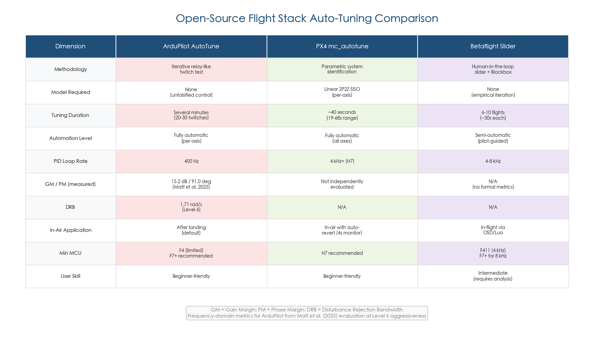

PX4's model-based approach offers faster completion (approximately 40 s vs. several minutes), simultaneous tuning of both rate and attitude controllers from a single identification pass (vs. ArduPilot's sequential D → P → Angle P phases), and a principled analytical connection between identified dynamics and gain computation. However, it exhibits greater sensitivity to model-reality mismatch when the true dynamics deviate significantly from the assumed two-pole-two-zero SISO structure.

ArduPilot's experiment-driven approach is inherently more robust to unmodeled dynamics because it directly observes and reacts to actual closed-loop behavior rather than relying on a parametric model. The larger twitch excitations also explore a wider operating region around hover, potentially producing gains that are more robust to moderate deviations from the trim condition. The associated penalties are longer tuning duration and the requirement for the vehicle to execute visible angular maneuvers that may be impractical for certain platforms or operational environments.

## 5.3 Betaflight: Filter-First Tuning for FPV Racing

### 5.3.1 Architectural Distinctions

Betaflight's tuning philosophy diverges fundamentally from both ArduPilot and PX4, driven by the extreme latency requirements of first-person-view (FPV) racing and freestyle flight. Whereas ArduPilot and PX4 target autonomous or semi-autonomous multirotor missions at 400 Hz control rates, Betaflight operates PID loops at 4–8 kHz — an order-of-magnitude increase that demands correspondingly aggressive optimization of every processing stage in the control pipeline [Betaflight 4.3 Tuning Notes](https://betaflight.com/docs/wiki/tuning/4-3-Tuning-Notes "Processor requirements and loop rates").

This high-frequency operation, combined with the DShot digital ESC protocol that eliminates the PWM-to-torque latency inherent in analog ESC communication, means that Betaflight's PID controller can react to disturbances with sub-millisecond delay — but only if the gyroscope filtering chain does not introduce excessive phase lag. Consequently, Betaflight's tuning paradigm places filter optimization before PID gain optimization, a priority inversion relative to ArduPilot and PX4 where filtering is typically configured after basic PID tuning is established.

### 5.3.2 RPM Filtering and Dynamic Notch Architecture

The RPM filter, enabled by bidirectional DShot ESC telemetry, represents Betaflight's most distinctive filtering innovation. Real-time per-motor RPM data enables placement of narrow notch filters at the fundamental rotor frequency and its harmonics for each motor independently. This targeted noise removal achieves dramatically better noise attenuation with lower phase penalty compared to broadband low-pass alternatives, because the notch width can be kept extremely narrow (Q ≈ 500) while tracking the noise source as motor speed varies [Betaflight 4.3 Tuning Notes](https://betaflight.com/docs/wiki/tuning/4-3-Tuning-Notes "RPM crossfading and SDFT multi-dynamic notch").

RPM filter crossfading addresses the low-throttle edge case: below a configurable minimum frequency (rpm_filter_min_hz, default 80 Hz), the RPM filter is smoothly disabled to prevent erroneous filter placement when motor speed is unreliable. The crossfade range (rpm_filter_fade_range_hz, default 50 Hz) defines the transition band over which the filter ramps from minimum to full attenuation.

Complementing the RPM filter, the multi-dynamic notch filter uses a Sliding Discrete Fourier Transform (SDFT) algorithm to simultaneously track up to five independent noise peaks in the gyroscope spectrum, capturing frame resonances and other vibration sources that are not correlated with motor RPM. Together, these two dynamic filtering stages handle the majority of noise removal, allowing the static low-pass filters to operate at higher cutoff frequencies — reducing phase lag and enabling higher PID gains. Figure 5.3 presents a side-by-side comparison of the gyroscope filter pipelines across all three flight stacks, illustrating how Betaflight's architecture achieves the lowest end-to-end latency.

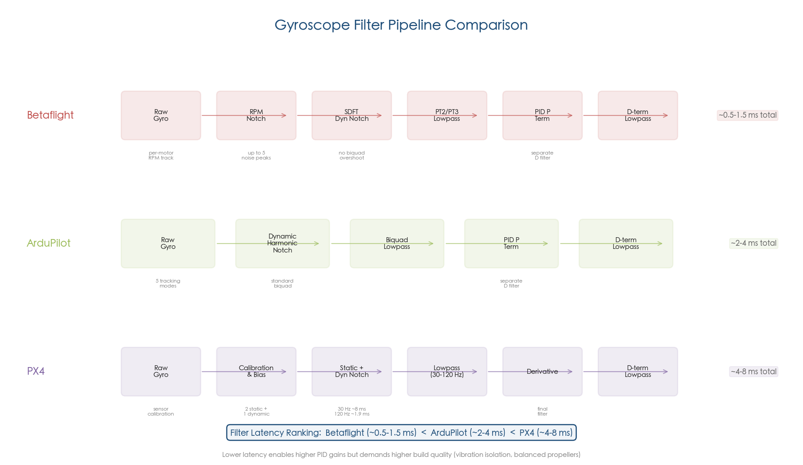

### 5.3.3 Slider-Based PID Tuning and the Blackbox Workflow

Betaflight 4.3 introduced a slider-based tuning interface that distills the high-dimensional PID parameter space into a compact set of intuitive controls: a PI gain slider, a D gain (Damping) slider, a FeedForward (Stick Response) slider, a Master Multiplier, and a D_Max (Dynamic Damping) slider. An expert mode exposes additional sliders for I gain and filter multipliers. These sliders preserve the relative ratios among parameters established by community-curated defaults while enabling the user to scale groups of gains simultaneously [Betaflight 4.3 Tuning Notes](https://betaflight.com/docs/wiki/tuning/4-3-Tuning-Notes "slider system, presets, tuning methods").

The recommended data-driven tuning workflow leverages Betaflight's Blackbox logging system and the PIDToolBox analysis suite. The procedure, known as "basement tuning," proceeds as follows:

1. **Filter optimization**: Perform throttle sweeps, record Blackbox logs with GYRO_SCALED debug mode, and use PIDToolBox's spectral analyzer to visualize pre-filter and post-filter noise spectra as frequency-vs-throttle heatmaps. Optimize RPM filter harmonics and minimum frequency, dynamic notch count and Q factor, and gyro/D-term low-pass cutoffs to minimize phase delay while maintaining adequate noise suppression [Oscar Liang Blackbox Guide](https://oscarliang.com/pid-filter-tuning-blackbox/ "PIDToolBox Blackbox tuning workflow").

2. **P/D balance identification**: With FeedForward and D_Max disabled, perform a series of short flights at different Damping slider values (e.g., 0.6 to 1.6 in 0.2 steps). Load all logs into PIDToolBox's Step Response Tool and select the D gain value that produces minimal overshoot with acceptable latency. The ideal step response exhibits less than approximately 5% overshoot while keeping latency below the plateau point.

3. **Master Multiplier sweep**: Fix the P/D ratio from step 2 and sweep the Master Multiplier upward until either motor oscillation becomes audible, D-term spectral energy in the 40–80 Hz band begins rising (indicating PID-induced oscillation onset), or latency improvement plateaus. Back off one or two notches from the identified limit for safety margin.

4. **FeedForward calibration**: Perform snap rolls and flips while logging, then inspect Gyro vs. Setpoint traces in Blackbox Explorer. Increase FeedForward until the gyro trace closely tracks the setpoint without overshooting at move initiation.

5. **I gain adjustment**: Set I gain just high enough to eliminate drift and heading wander. The tuning window for I gain is very wide on well-tuned platforms.

This workflow represents a sophisticated fusion of frequency-domain filter analysis and time-domain PID optimization, mediated by community-developed open-source tools, and has become the de facto standard practice among the FPV community's most experienced tuners.

### 5.3.4 FeedForward and Throttle PID Attenuation

Betaflight's FeedForward 2.0 system provides a setpoint-derivative-proportional channel that responds to stick movement rate rather than error magnitude, delivering faster initial response than the P term alone. The ff_boost parameter adds a second-derivative (stick acceleration) component that further reduces response latency at the onset of stick movements. The ff_max_rate_limit parameter predictively attenuates FeedForward as the gyro rate approaches the configured maximum rate, preventing overshoot during saturating maneuvers [Betaflight FF 2.0](https://betaflight.com/docs/wiki/guides/current/Feed-Forward-2-0 "Feed Forward 2.0 guide").

Throttle PID Attenuation (TPA) implements throttle-dependent gain scheduling as analyzed in Chapter 3: above a configurable breakpoint (typically 1350–1750 µs), D gain (and optionally P gain) is attenuated proportionally, reaching the configured tpa_rate reduction at full throttle. A representative configuration attenuates D gain by 60% at full throttle (tpa_rate = 0.6), counteracting the increased plant gain at high thrust that would otherwise provoke high-throttle oscillation [Betaflight PID Tuning Guide](https://betaflight.com/docs/wiki/guides/current/PID-Tuning-Guide "Betaflight Community Wiki").

The D_Min/D_Max mechanism provides a complementary form of gain scheduling based on stick activity rather than throttle position. During smooth, low-activity flight, D gain is held at D_Min to reduce motor heating and noise amplification; during rapid maneuvers, D gain ramps up to D_Max to provide increased damping when it is most needed. This approach recognizes that the optimal D gain is state-dependent — a core insight that motivates the adaptive methods surveyed in Chapter 3, here implemented through a pragmatic heuristic rather than a formal adaptation law.

## 5.4 Cross-Cutting Practical Concerns

### 5.4.1 Gyroscope Filtering Architectures

Regardless of the flight stack, the gyroscope filtering chain represents the single most consequential signal-processing stage for PID controller performance. Excessive filtering introduces phase lag that directly degrades achievable closed-loop bandwidth, while insufficient filtering allows high-frequency noise to propagate through the derivative term, causing motor heating, audible oscillation, and accelerated component wear.

ArduPilot supports dynamic harmonic notch filtering with five tracking source modes, including per-motor ESC telemetry and onboard FFT analysis. The harmonic notch filter can track multiple harmonics of the fundamental rotor frequency and is implemented as a standard biquad, followed by a configurable biquad low-pass filter [ArduPilot Notch Filter](https://ardupilot.org/copter/docs/common-imu-notch-filtering.html "Dynamic Harmonic Notch Filters"). PX4's IMU pipeline follows a more structured sequence: sensor calibration → bias correction → two static notch filters plus one dynamic notch → low-pass filter (configurable 30–120 Hz) → derivative computation → D-term low-pass. At a 30 Hz gyro low-pass cutoff, PX4 introduces approximately 8 ms of filter latency; at 120 Hz this reduces to approximately 1.9 ms [PX4 Filter Tuning](https://docs.px4.io/main/en/config_mc/filter_tuning "MC Filter Tuning & Control Latency"). Betaflight's filter chain — RPM notch, SDFT multi-dynamic notch, and PT2/PT3 low-pass — achieves the lowest latency (approximately 0.5–1.5 ms) by deliberately eschewing biquad low-pass topologies that can introduce overshoot and resonance at their cutoff frequencies, as detailed in Section 5.3.2.

The practical consequence of these architectural differences is a clear latency hierarchy: Betaflight (~0.5–1.5 ms) < ArduPilot (~2–4 ms) < PX4 (~4–8 ms). Lower filter latency permits higher PID gains and faster disturbance rejection, but demands correspondingly higher build quality — balanced propellers, rigid frames, and effective vibration isolation — to minimize the noise that reaches the filter chain in the first place.

### 5.4.2 Anti-Windup and Actuator Saturation

Integrator windup and actuator saturation are pervasive challenges in multirotor attitude control, arising whenever the commanded motor outputs exceed the physical actuator range. Each flight stack addresses these constraints through distinct mechanisms.

PX4's rate controller implements integrator anti-windup (ARW) through a clamping method that halts integrator accumulation when the actuator output is saturated. Thrust allocation follows a priority hierarchy: vertical thrust is satisfied first up to MPC_THR_MAX, after which horizontal thrust is allocated from the remaining actuator capacity [PX4 Controller Diagrams](https://docs.px4.io/main/en/flight_stack/controller_diagrams "ARW and saturation priority"). ArduPilot's outer-loop attitude controller employs a "square root controller" that applies a nonlinear mapping between angle error and commanded rate, improving large-angle response characteristics. Its AP_Motors library implements a "stability patch" that prioritizes attitude control authority when motor outputs approach their limits, selectively reducing thrust commands to preserve roll, pitch, and yaw controllability [ArduPilot Attitude Control](https://ardupilot.org/dev/docs/apmcopter-programming-attitude-control-2.html "P→PID cascade and AP_Motors mixing").

### 5.4.3 MCU Computational Constraints

The computational budget of the flight controller's microcontroller unit (MCU) imposes hard upper bounds on PID loop rate, filter complexity, and the feasibility of advanced algorithms. The STM32F411 — common in entry-level Betaflight boards — supports a maximum PID loop rate of 4 kHz with DShot300, insufficient for RPM filtering at 8 kHz. The STM32F405 can operate RPM filtering but remains constrained to 4 kHz PID. Only STM32F7 and H7 processors provide sufficient headroom for 8 kHz PID with full filtering chains enabled. PX4 recommends 4 kHz or higher loop rates exclusively on H7-class hardware. A critical operational guideline across all platforms is that CPU utilization exceeding 75% risks task starvation, where lower-priority tasks (logging, telemetry, navigation) may be delayed or dropped [Betaflight 4.3 Tuning Notes](https://betaflight.com/docs/wiki/tuning/4-3-Tuning-Notes "Processor requirements") [PX4 Filter Tuning](https://docs.px4.io/main/en/config_mc/filter_tuning "Latency constraints").

ArduPilot's scheduler imposes additional constraints on F4-class processors: enabling per-IMU notch filtering or running the onboard FFT harmonic analysis concurrently with the primary control loop may exceed the available computational budget. These constraints explain why many of the advanced adaptive PID methods surveyed in Chapter 3 — neural-network PID, ANFIS, hybrid fuzzy-neural controllers — remain confined to simulation or companion-computer deployments rather than running directly on the flight controller MCU.

### 5.4.4 Thrust Linearization and Voltage Compensation

A frequently underappreciated practical factor in PID tuning is the nonlinear relationship between PWM command and actual motor thrust. ArduPilot's MOT_THST_EXPO parameter and PX4's THR_MDL_FAC serve the same purpose: linearizing the thrust response so that PID gain settings remain valid across the throttle range. Incorrect calibration of this parameter has cascading effects — an excessively high MOT_THST_EXPO value causes instability at low throttle, while an excessively low value produces oscillation at high throttle, and either condition can prevent AutoTune convergence [Methodic Configurator](https://ardupilot.github.io/MethodicConfigurator/TUNING_GUIDE_ArduCopter.html "MOT_THST_EXPO diagnostics").

Battery voltage decline during flight further compounds the thrust nonlinearity. As cell voltage drops from full charge (approximately 4.2 V per cell) toward the discharge cutoff (approximately 3.5 V per cell), the same PWM command produces progressively less thrust. PX4 provides explicit voltage-based PID scaling to compensate for this effect, while ArduPilot similarly adjusts the effective gain to maintain consistent closed-loop behavior throughout the flight envelope [PX4 PID Tuning Guide](https://docs.px4.io/main/en/config_mc/pid_tuning_guide_multicopter "PWM to thrust depends on battery voltage").

## 5.5 Simulation-in-the-Loop and Hardware-in-the-Loop Validation

### 5.5.1 ArduPilot SITL Ecosystem

ArduPilot's Software-in-the-Loop (SITL) framework compiles the full autopilot firmware to run natively on a host computer, interfacing with external physics simulators through standardized protocols. Supported simulators include Gazebo, RealFlight, AirSim, and MATLAB/Simulink, spanning fidelity levels from simplified rigid-body dynamics to high-fidelity aerodynamic and visual simulation [ArduPilot SITL](https://ardupilot.org/dev/docs/simulation-2.html "ArduPilot simulation overview"). SITL enables rapid iteration on PID gain candidates without risk to hardware: the developer can configure vehicle parameters, inject disturbances, and evaluate transient responses across thousands of trials. Because SITL executes the identical codebase deployed on physical flight controllers — including the filtering chain, mixer, and scheduler — discrepancies between simulated and actual behavior are primarily attributable to plant model fidelity rather than controller implementation differences.

The Methodic Configurator's system identification workflow exploits this architecture to create a structured SIL validation pipeline: chirp-signal excitation flights produce broadband frequency-response data, from which open-loop transfer functions are extracted for each axis. PID gains are then optimized against explicit gain margin and phase margin constraints using the identified models, and the resulting controllers are verified through closed-loop frequency-domain analysis with the PID Review Tool before committing to physical flight [Methodic Configurator](https://ardupilot.github.io/MethodicConfigurator/TUNING_GUIDE_ArduCopter.html "SysID and analytical PID optimization workflow").

### 5.5.2 PX4 HITL Framework

PX4's Hardware-in-the-Loop (HITL) mode runs the complete flight firmware on the actual autopilot hardware while replacing real sensor inputs with simulated data generated by a companion physics engine. This configuration captures timing characteristics, interrupt handling, and computational constraints that pure SITL cannot reproduce — particularly relevant for validating PID performance on resource-constrained MCUs where loop-rate jitter and task scheduling affect closed-loop dynamics [PX4 HITL](https://docs.px4.io/main/en/simulation/hitl "PX4 HITL documentation").

HITL validation is especially valuable for verifying auto-tuned gains before flight on novel airframes, where the risk of untested PID parameters is highest. The workflow typically proceeds: SITL parameter exploration → HITL timing verification → controlled outdoor hover test → progressive envelope expansion. This staged approach minimizes risk while providing increasing fidelity at each validation gate.

### 5.5.3 Sim-to-Real Transfer Considerations

A persistent challenge in simulation-based PID validation is the fidelity gap between the simulated and physical plant. Sönmez et al. (2025) identified a critical factor for successful sim-to-real transfer: incorporating PWM signal quantization (UINT16 conversion) in the simulation model significantly improved the correspondence between simulated and flight-tested PID performance [Sönmez et al. 2025](https://www.mdpi.com/2504-446X/9/8/581 "RL-Based PD Controller Gains Prediction, Drones, vol. 9, no. 8, 2025"). More broadly, the simulation fidelity requirements for PID tuning include accurate representation of motor dynamics and ESC response time, propeller thrust and torque coefficients across the operating RPM range, sensor noise characteristics matched to the specific IMU, and battery voltage dynamics under load. Failure to model any of these elements with sufficient accuracy can result in gains that perform well in simulation but exhibit oscillation, sluggishness, or instability on the physical platform.

## 5.6 Comparative Synthesis

The three open-source flight stacks examined in this chapter embody three distinct points in the design space of automated PID tuning for multirotor UAVs, each shaped by its target community, mission envelope, and engineering philosophy.

ArduPilot's ecosystem offers the broadest portfolio of tuning modalities — from the beginner-accessible AutoTune through the intermediate QuikTune to the product-grade Methodic Configurator workflow — reflecting its diverse user base spanning hobbyist builders, academic researchers, and commercial integrators. The frequency-domain validation reported by Matt et al. (2025), with gain margin of 15.2 dB and phase margin of 91.0° at Level 6 aggressiveness, provides quantitative evidence that the AutoTune algorithm produces controllers with substantial stability margins under favorable conditions [Matt et al. 2025](https://engrxiv.org/preprint/download/4462/7760/6405 "Evaluation of ArduPilot Automatic Tuning Algorithm, engrXiv, 2025"). The Methodic Configurator's 53-step systematic workflow represents the convergence of multiple tuning paradigms — in-flight auto-tuning, system identification, and analytical optimization — into an integrated product-grade pipeline.

PX4's model-based autotuner occupies the speed-optimized niche, completing full three-axis tuning in approximately 40 seconds through parametric system identification. Its explicit analytical connection between identified plant dynamics and computed gains provides a principled tuning rationale, though at the cost of greater vulnerability to model-reality mismatch. The MC_AT_APPLY = 2 in-air application mode with automatic gain reversion represents an elegant engineering compromise between rapid iteration and flight safety.

Betaflight's filter-first, pilot-in-the-loop paradigm reflects the FPV racing community's relentless optimization for minimum latency and maximum agility. The RPM filter, SDFT multi-dynamic notch, and slider-based tuning interface collectively represent a sophisticated distributed intelligence — community-curated defaults encode the aggregate tuning expertise of millions of flight hours, while the Blackbox/PIDToolBox analysis pipeline provides frequency-domain rigor for experienced operators seeking marginal performance gains.

A unifying observation across all three ecosystems is that successful PID deployment in practice depends at least as much on the supporting infrastructure — sensor filtering, thrust linearization, anti-windup strategies, voltage compensation, and validation pipelines — as on the PID gain values themselves. The most advanced gain optimization algorithm (Chapter 4) will underperform a modestly tuned controller if the filtering chain introduces excessive phase lag, the thrust-to-PWM mapping is poorly calibrated, or integrator windup is not adequately managed. This finding reinforces the systems-engineering perspective that PID tuning is not an isolated parameter-selection problem but a holistic integration challenge spanning sensor processing, actuation, power management, and computational architecture.

# 第6章 Comparative Synthesis and Future Directions

The preceding five chapters examined multirotor UAV attitude control from complementary vantage points: the cascaded PID architecture and its inherent limitations (Chapter 1), classical tuning baselines and their mismatch with UAV dynamics (Chapter 2), advanced adaptive and intelligent PID variants (Chapter 3), optimization-based parameter search strategies (Chapter 4), and the practical realization of these methods in open-source flight stacks (Chapter 5). This concluding chapter synthesizes those perspectives into a unified analytical framework. Section 6.1 constructs a cross-method comparative evaluation against a standardized set of criteria, revealing recurrent trade-off patterns that no single chapter could expose in isolation. Section 6.2 maps method families to representative UAV mission profiles, providing practitioners with an evidence-based selection guide. Section 6.3 delineates the most consequential open research directions. Section 6.4 examines the standardized benchmarking gap that currently impedes systematic progress across the field.

## 6.1 Unified Cross-Method Comparison

### 6.1.1 Evaluation Criteria

A rigorous comparison of PID enhancement strategies demands evaluation across multiple dimensions that capture both theoretical merit and operational utility. We adopt six primary criteria, each grounded in the performance evidence assembled across Chapters 2–5:

1. **Tracking accuracy** — the capacity to minimize attitude error under nominal and off-nominal conditions, quantified by RMSE, ITAE, or the L₂ norm of tracking error.
2. **Disturbance rejection** — robustness to external perturbations, including wind gusts, payload changes, and center-of-gravity shifts.
3. **Robustness to parameter variation** — the degree to which performance degrades when plant parameters (mass, inertia, thrust coefficients) deviate from nominal values.
4. **Computational cost** — the real-time processing burden per control cycle, expressed in multiply-accumulate (MAC) operations or MCU utilization percentage.
5. **Ease of deployment** — the practical effort required to implement, tune, and maintain the method on production hardware, including integration with existing flight stacks.
6. **Flight-test maturity** — the extent to which the method has been validated on physical UAV platforms rather than in simulation alone.

These criteria intentionally span the theory-to-practice continuum. A method that excels on criteria 1–3 but fails on criteria 4–6 may advance academic understanding while offering limited operational value; conversely, a method that scores well on criteria 5–6 but poorly on criteria 1–3 may be widely deployed yet sub-optimal. The tension between these two groups of criteria is, as the subsequent analysis demonstrates, the defining structural feature of the current research landscape.

### 6.1.2 Comparative Assessment Table

The table below synthesizes quantitative evidence from the studies reviewed across Chapters 2–5. Where direct head-to-head comparisons on identical platforms are unavailable, the source conditions are noted, and caution against over-interpretation is warranted. Crucially, no single study has compared all methods on the same physical quadrotor — a limitation that itself constitutes a key finding and motivates the benchmarking discussion in Section 6.4.

| Method Family | Tracking Accuracy (Best Reported) | Disturbance Rejection | Robustness to Parameter Variation | Computational Cost | Ease of Deployment | Flight-Test Maturity |
|---|---|---|---|---|---|---|
| Fixed-Gain PID | Baseline (L₂x = 1.40) | Poor under off-nominal | Degrades: +52% error with wind | Negligible | Excellent | Universal deployment |
| Z-N / Classical Tuning | ZN-PID unstable beyond 0.24 rad | Poor | Very limited | Negligible | Moderate (requires testing) | Simulation-validated |
| ArduPilot AutoTune | GM = 15.2 dB, PM = 91.0° (Level 6) | Good (moderate wind) | Fixed at tuned operating point | Negligible (offline) | Good (built-in) | Millions deployed |
| PX4 Model-Based Autotuner | ~40 s completion, model-based gains | Good (near hover) | Fixed at identified model | Negligible (offline) | Good (built-in) | Production deployment |
| TPA Gain Scheduling | Eliminates high-throttle oscillation | Moderate | 1-D scheduling (throttle only) | Negligible | Excellent (native Betaflight) | Millions deployed (FPV) |
| Fuzzy Gain-Scheduling PID | Overshoot 13%→1%, error −62% (altitude) | Good (Pixhawk flight test) | Good (95% payload) | Low–Medium | Moderate (custom) | Flight-validated (Melo et al.) |
| MRAC-PID | MSE −68.7% (altitude), −86–93% (attitude) | Good (formal adaptation) | Good (40% mass change tracked) | Medium | Difficult (tuning + anti-windup) | Limited flight validation |
| L₁ Adaptive | Computable tracking tube with formal bounds | Excellent (15 m/s gust via L₁Quad) | Excellent (decoupled via filter) | Medium | Moderate (principled but specialized) | Flight-validated (Wu et al.) |
| Fuzzy-PID (Dual-Loop) | Position error −87%, attitude error −70% | Good (simulation) | Moderate (heuristic rules) | Low–Medium | Moderate | Simulation only |
| RBF NN I-PID | Roll error −95%, yaw overshoot 66%→39% | Good (learned compensation) | Good (online adaptation) | Low–Medium (~50 MACs) | Moderate | Simulation only |
| Hybrid NN+Fuzzy PID | Roll MSE 6.87×10⁻⁷ (orders of magnitude gain) | Good (25% mass + 10% inertia) | Good | Medium–High | Difficult (dual subsystem) | Simulation only |
| FOPID (PI^λD^μ) | ITAE −21–74%, settling time −60–75% | Good (frequency-domain robustness) | Good (additional tuning DOFs) | Medium (Oustaloup approx.) | Difficult (no native support) | Simulation only |
| H∞ Robust PID | Peak error −10× under 15 m/s gust | Excellent (guaranteed γ₀ = 0.25) | Excellent (designed for uncertainty) | High (offline synthesis) | Very difficult (LPV modeling) | Simulation only |
| PSO-Optimized PID | ISE −53% vs. Z-N (Khodja et al.) | Good (optimized for composite cost) | Good (within training envelope) | High (offline: thousands of evals) | Moderate (offline SIL) | Flight-validated (QAV250) |
| GWO-Optimized PID | Best composite cost 271.9 (Immordino et al.) | Good | Good (within training envelope) | High (offline: 6,000 evals) | Moderate (offline SIL) | Simulation only |
| Bayesian Optimization (SafeOpt/HBO) | Position error −61.2%, angle error −34.7% (HBO) | Good (safe exploration) | Good (GP-modeled uncertainty) | High per iteration, low total count | Good (direct on-vehicle) | Flight-validated (real quadrotor) |
| RL Online Gain Scheduling (DDPG) | Attitude RMSE −33%, position error −37% | Good (state-dependent adaptation) | Good (trained across domain) | Low (128×128 NN inference) | Moderate (requires pre-training) | Flight-validated (Pixhawk) |
| RL Static Optimization (SAC/TD3) | Below Z-N baseline | Poor | Poor (single-step MDP) | High (offline training) | Moderate | Simulation only |

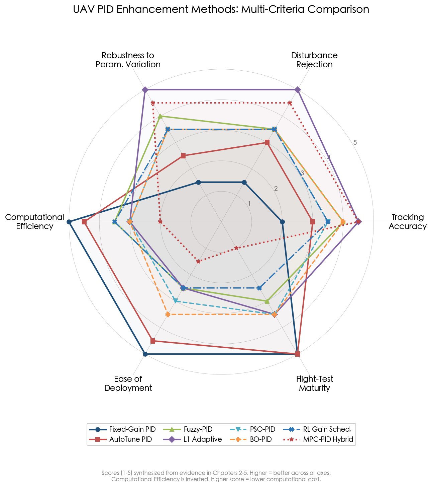

**Figure 6-1.** Radar chart summarizing multi-criteria scores (1–5 scale) for eight representative PID enhancement method families across the six evaluation dimensions. Scores are synthesized from the quantitative evidence reviewed in Chapters 2–5; computational efficiency is inverted such that higher scores indicate lower computational cost. The absence of any single polygon enclosing all others confirms that no method family dominates across all criteria simultaneously.

### 6.1.3 Key Patterns

Several convergent findings emerge from this cross-method comparison, each carrying implications for both research priorities and practical deployment decisions.

**The sophistication–deployment paradox.** The methods with the strongest formal guarantees — H∞ robust control (guaranteed disturbance attenuation γ₀ = 0.25), L₁ adaptive control (computable tracking tubes), and MRAC (Lyapunov stability proofs) — exhibit the weakest presence in operational flight controllers. Conversely, the simplest approaches — fixed-gain PID with platform-specific AutoTune, TPA gain scheduling — dominate real-world deployment on millions of vehicles. This paradox cannot be attributed to computational barriers alone; as documented in Chapter 3, neural-network and fuzzy architectures involve modest computational loads (tens to hundreds of MAC operations per cycle) well within STM32F7/H7 capabilities. The true barriers are integration complexity, verification difficulty, and the absence of standardized validation frameworks that would enable systematic qualification of advanced methods.

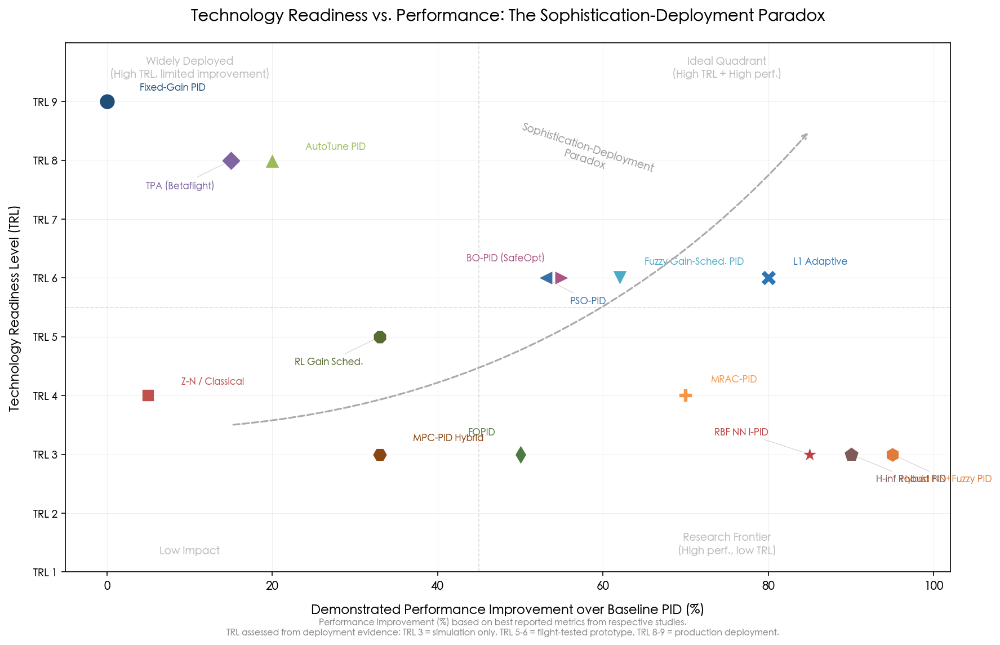

**Figure 6-2.** Scatter plot mapping demonstrated performance improvement over baseline PID (horizontal axis) against Technology Readiness Level (vertical axis) for 15 method families. The pronounced negative correlation — high-performance methods clustered at TRL 3 (simulation only), widely deployed methods clustered at TRL 8–9 with modest improvements — visually encapsulates the sophistication–deployment paradox. The near-empty upper-right "Ideal Quadrant" (high TRL and high performance) identifies the primary gap that future research must address.

**PID remains energy-optimal.** Rinaldi et al. (2023) demonstrated on a unified nonlinear quadrotor simulation that PID achieves the lowest control cost (L₂u = 1.60) among PID, LQR, feedback linearization, sliding mode control, and MPC — despite exhibiting the worst tracking accuracy (L₂x = 1.40 versus SMC's 0.36) [Rinaldi et al. 2023](https://www.mdpi.com/2076-3417/13/6/3464 "A Comparative Study for Control of Quadrotor UAVs, Applied Sciences, vol. 13, no. 6, 2023"). For missions where energy efficiency and flight endurance dominate over tracking precision — such as long-endurance infrastructure inspection — the control-cost advantage of simple PID constitutes a genuine operational asset rather than a limitation.

**Optimization-based methods occupy a productive middle ground.** PSO-optimized PID (Khodja et al. 2017, flight-validated on a QAV250) and Bayesian Optimization (Berkenkamp et al. 2016, SafeOpt; Gu et al. 2025, HBO-PID) combine the structural simplicity of PID — preserving full compatibility with existing flight stacks — with systematically improved gain selection. These methods require neither online adaptation nor structural controller modification; they identify better fixed gains (or gain schedules) through principled offline or on-vehicle search. We consider this category the most immediately actionable for practitioners seeking to improve PID performance without modifying flight-stack firmware.

**RL's value is state-dependent, not static.** The Immordino et al. (2025) benchmark conclusively demonstrated that RL agents (SAC, TD3) deployed as one-shot static optimizers fail to outperform even the Ziegler–Nichols baseline, while Sönmez et al. (2025) showed that a DDPG agent functioning as a state-dependent gain scheduler on a Pixhawk 2.1 reduced attitude RMSE by 33% [Sönmez et al. 2025](https://www.mdpi.com/2504-446X/9/8/581 "RL-Based PD Controller Gains Prediction for Quadrotor, Drones, vol. 9, no. 8, 2025"). This dichotomy clarifies RL's appropriate role within the PID enhancement ecosystem: not as an offline optimizer competing with GWO or BO, but as an online adaptive layer that learns gain–state mappings from diverse flight experience.

## 6.2 Mission-Profile-Dependent Method Selection

No single PID enhancement strategy dominates across all evaluation criteria. The optimal approach depends critically on the specific mission profile, the regulatory environment, and prevailing operational constraints. Drawing on the evidence synthesized throughout this report, the following subsections propose a mission–method mapping that translates the abstract comparative assessment of Section 6.1 into actionable guidance.

### 6.2.1 FPV Racing and Freestyle Flight

FPV racing imposes extreme latency requirements (sub-millisecond control response) that fundamentally constrain the viable method set. Betaflight's ecosystem — PID loops executing at 4–8 kHz, DShot ESC protocol, RPM notch filtering, FeedForward 2.0, and D_Min/D_Max adaptive damping — represents a highly optimized solution space in which the marginal benefit of more sophisticated controllers is overwhelmed by the cost of additional processing latency. TPA gain scheduling provides adequate throttle-dependent adaptation, and the slider-based tuning interface combined with Blackbox log analysis enables rapid empirical optimization. The entire FPV tuning philosophy prioritizes latency minimization over formal optimality; the community's accumulated practical wisdom, codified in tuning presets and the "basement tuning" Blackbox workflow, constitutes a powerful informal optimization process. No evidence in the reviewed literature suggests that adaptive PID methods (fuzzy-PID, MRAC-PID, NN-PID) would improve FPV flight performance, given that their additional computation would consume cycles better allocated to higher PID loop rates or reduced filter phase lag.

### 6.2.2 Precision Agriculture and Variable-Payload Operations

Missions involving significant payload variation — agricultural spraying (tank emptying during flight), package delivery (payload pickup and drop-off), or aerial manipulation — represent the strongest use case for adaptive PID methods. The fuzzy gain-scheduling PID validated by Melo et al. (2022) on a Pixhawk platform, which reduced altitude overshoot from 13% to 1% and achieved 62% mean error reduction under 95% payload loading, provides the most compelling flight-validated evidence for any advanced PID variant in this operational domain [Melo et al. 2022](https://pmc.ncbi.nlm.nih.gov/articles/PMC8954855/ "Fuzzy Gain-Scheduling PID for UAV, Sensors, vol. 22, no. 6, 2022"). For operations requiring formal stability assurances, the L₁ adaptive architecture (Wu et al. 2020, 2025) offers computable performance bounds derived from Lyapunov analysis while maintaining flight-validated credibility. The MRAC-PID hybrid remains theoretically appealing but carries the practical risk of generating actuator-saturating control signals, as demonstrated by Ghanem et al. (2025), where thrust peaks reached 167.6 N against a 45 N hardware limit — mandating explicit anti-windup provisions in any production deployment.

### 6.2.3 Long-Endurance Inspection and Surveillance

For missions prioritizing flight time and energy efficiency over aggressive maneuvering, the control-cost advantage of simple PID (L₂u = 1.60, the lowest among all controllers evaluated by Rinaldi et al. 2023) argues for conservative gain tuning rather than adaptive enhancement. The recommended approach combines standard PID gains optimized via offline metaheuristics (PSO or GWO in SIL) with battery-voltage PID scaling (implemented in both ArduPilot and PX4) and TPA for throttle-dependent attenuation. The ArduPilot Methodic Configurator's 53-step workflow, which integrates system identification with analytical PID optimization, provides a systematic path to production-quality tuning for this mission class without incurring the complexity or computational overhead of adaptive methods.

### 6.2.4 Autonomous Delivery and Urban Air Mobility

Delivery and urban air mobility missions combine multiple challenging requirements: variable payload, operation in turbulent urban canyons, stringent safety constraints, and potential regulatory certification demands. This mission profile motivates the most sophisticated PID enhancement strategies. The MPC-PID hybrid architecture proposed by Zhou et al. (2026) — an upper-layer MPC with H∞ robust optimization generating reference control, a lower-layer Transformer attention network adjusting PID gains online, and a sliding-mode disturbance observer providing feedforward compensation — achieved a 33% reduction in path tracking RMSE (from 5.87 m to 3.92 m) with 21.6% settling time improvement in AirSim simulation [Zhou et al. 2026](https://pmc.ncbi.nlm.nih.gov/articles/PMC12820076/ "Robust MPC-PID hybrid control for UAV, Scientific Reports, vol. 16, 2585, 2026"). SafeOpt and HBO (Berkenkamp et al. 2016; Gu et al. 2025) provide the critical capability of safe automated tuning on the physical vehicle without requiring high-fidelity simulation models. The L₁Quad framework (Wu et al. 2025) offers computable safety tubes that could form the basis for certification arguments in regulated airspace operations.

### 6.2.5 General-Purpose Autonomous Platforms

For commercial and research platforms without a dominant single mission profile, a layered approach is recommended: (1) ArduPilot or PX4 AutoTune as the initial baseline, (2) offline GWO- or BO-based optimization in SIL to refine gains beyond AutoTune's capability, and (3) the Methodic Configurator's system identification workflow for platforms requiring frequency-domain-verified stability margins. This combination leverages the flight stacks' built-in infrastructure while systematically improving upon default tuning without requiring firmware modification.

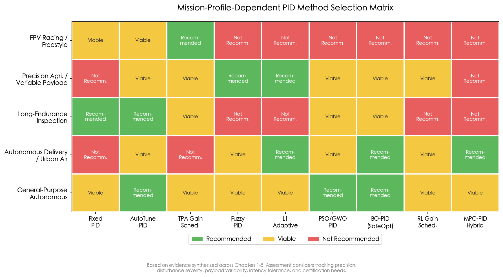

**Figure 6-3.** Heatmap matrix summarizing method suitability across five representative mission profiles. Green cells denote recommended methods, yellow cells indicate viable alternatives, and red cells mark methods that are not recommended for the given mission context. The matrix condenses the detailed analysis of Sections 6.2.1–6.2.5 into a single practitioner-oriented decision reference.

## 6.3 Future Research Directions

### 6.3.1 Integration of Learning-Based Methods into Certified Flight Stacks

The most consequential near-term research challenge lies in bridging the gap between the demonstrated performance of learning-based PID enhancement methods and their absence from certified or production flight stacks. As of early 2026, no open-source flight controller (ArduPilot, PX4, Betaflight) natively supports fuzzy-PID, NN-PID, FOPID, or RL-based gain scheduling. The sole exception is the Sönmez et al. (2025) demonstration of a pre-trained DDPG network running directly on a Pixhawk 2.1 [Sönmez et al. 2025](https://www.mdpi.com/2504-446X/9/8/581 "RL-Based PD Controller Gains Prediction for Quadrotor, Drones, vol. 9, no. 8, 2025"). While this proof-of-concept establishes computational feasibility, it does not address the software engineering, testing, and certification challenges prerequisite for production deployment.

The certification pathway for adaptive and learning-based controllers in safety-critical UAV applications remains an open problem. Current airworthiness standards (DO-178C / ED-12C) are designed for deterministic software with verifiable behavior. Pyrgies and Yacoubi (2022) explored the DO-178C certification path for an adaptive learning UAV agent (the SaFly ducted-fan VTOL), employing a state-machine architecture where PID gains are adapted per flight mode and Reinforcement Learning is used to optimize the PID parameters Kp, Ki, Kd. Their approach — making the learning process deterministic and auditable by freezing trained weights before deployment and structuring the controller as a certifiable state machine — represents one viable pathway, though considerable engineering effort remains to bring such architectures to Design Assurance Level (DAL) compliance for certified-category operations [Pyrgies & Yacoubi 2022](https://www.eucass.eu/component/docindexer/?task=download&id=6589 "Attitude Control of a Ducted VTOL UAV with a Certifiable DO-178C Adaptive and Learning Avionic Agent, EUCASS, 2022").

The L₁ adaptive control framework offers a potentially more certifiable pathway. Wu et al. (2025) demonstrated that the L₁Quad controller provides computable uniform ultimate bounds — mathematical guarantees that the quadrotor trajectory remains within a defined "safety tube" around the reference — with the bound parameters derived from the low-pass filter bandwidth and known plant uncertainty limits [Wu et al. 2025](https://arxiv.org/abs/2302.07208 "L1Quad: L1 Adaptive Augmentation with Performance Guarantees, IEEE TCST, vol. 33, no. 2, 2025"). These formal bounds could serve as the foundation for safety cases in certification arguments, bridging the gap between adaptive control and deterministic verification requirements.

### 6.3.2 Convergence of MPC with PID Architectures

A significant emerging trend is the architectural convergence of Model Predictive Control with PID inner loops. Rather than treating MPC and PID as competing paradigms, recent work embeds MPC as an outer-loop trajectory optimization layer while retaining PID (or PID-like) controllers in the inner attitude loop, exploiting their computational efficiency and well-understood stability properties.

Zhou et al. (2026) exemplified this convergence with a three-component architecture: (1) an upper-layer MPC with H∞ robust optimization generating reference commands, (2) a Transformer attention network performing online PID gain adjustment, and (3) a sliding-mode disturbance observer providing feedforward compensation. In AirSim simulation, this hybrid reduced path tracking RMSE from 5.87 m to 3.92 m (33% improvement) with a disturbance attenuation ratio of 0.92 [Zhou et al. 2026](https://pmc.ncbi.nlm.nih.gov/articles/PMC12820076/ "Robust MPC-PID hybrid control for UAV, Scientific Reports, vol. 16, 2585, 2026"). This "predict–learn–compensate" paradigm is architecturally significant because it preserves the PID inner loop's low-latency determinism — critical for the 400 Hz–8 kHz control rates demanded by multirotor platforms — while augmenting it with model-based prediction and learned adaptation at lower update frequencies.

We anticipate that MPC-PID hybrids will become the dominant architecture for next-generation autonomous UAV operations where trajectory tracking precision, constraint satisfaction, and disturbance robustness are simultaneously required. The key research challenge remains computational: full nonlinear MPC is still too expensive for embedded flight controllers, motivating ongoing work on linear MPC approximations, explicit MPC (pre-computed look-up tables), and neural-network-based MPC approximators capable of executing within the stringent timing budgets of STM32-class processors.

### 6.3.3 Transfer Learning Across UAV Platforms

A largely unexplored research direction with high practical impact is the transfer of tuned PID parameters or learned gain-adaptation strategies across different multirotor platforms. At present, every new airframe requires a complete re-tuning cycle — whether through ArduPilot AutoTune, PX4 system identification, manual iteration, or offline optimization. This per-platform tuning burden becomes prohibitive as the diversity of commercial and custom UAV configurations continues to grow.

Molchanov et al. (2019) provided the first demonstration that a single RL-trained low-level control policy, trained with domain randomization in simulation, could transfer to multiple physically different quadrotors without any per-platform adaptation [Molchanov et al. 2019](https://ieeexplore.ieee.org/document/8967695/ "Sim-to-(Multi)-Real Transfer of Low-Level Control Policies, IEEE/RSJ IROS, 2019"). More recently, Chen et al. (2024) developed the SimpleFlight framework, which identified five critical factors for zero-shot sim-to-real policy transfer — rotation matrix representation, time-vector critic input, successive-action regularization, selective domain randomization with system identification, and large batch sizes — and demonstrated over 50% tracking error reduction versus state-of-the-art RL baselines on a Crazyflie quadrotor, with successful deployment also validated on a self-built larger platform [Chen et al. 2024](https://arxiv.org/html/2412.11764v2 "What Matters in Learning A Zero-Shot Sim-to-Real RL Policy for Quadrotor Control, arXiv:2412.11764, 2024").

These results point toward a future in which a foundation control model, pre-trained on diverse simulated platforms with extensive domain randomization, could be fine-tuned to a specific airframe with minimal flight data — analogous to how large language models are pre-trained and then task-adapted. For PID-based systems, the analogous concept would be a meta-learned gain-scheduling function that maps measurable vehicle characteristics (mass, inertia estimates, thrust-to-weight ratio) to near-optimal PID gains, requiring only brief in-flight refinement via SafeOpt or HBO. To our knowledge, no such system has been published for PID controllers specifically, representing a significant research opportunity.

### 6.3.4 Real-Time Adaptive Methods with Formal Stability Guarantees

The tension between adaptability and certifiability constitutes the defining challenge for advanced UAV control. Purely adaptive methods (NN-PID, fuzzy-PID) can track plant variations in real time but lack the formal stability certificates required for safety-critical applications. Purely robust methods (H∞) provide formal guarantees but are inherently conservative and cannot adapt to conditions outside the designed uncertainty set.

Physics-informed neural networks (PINNs) for quadrotor dynamic modeling, as proposed by Gu, Primatesta, and Rizzo (2024), offer a potential synthesis. By embedding momentum conservation laws as learning biases, PINNs achieve superior accuracy and physical consistency relative to purely data-driven neural networks [Gu et al. 2024](https://www.sciencedirect.com/science/article/pii/S0921889023002087 "PINN for Quadrotor Modeling, Robotics and Autonomous Systems, vol. 171, 2024"). If combined with L₁-style adaptive controllers that exploit the PINN-identified model as a nominal plant, the resulting architecture could offer both online adaptation and computable performance bounds — a combination that no currently published system achieves.

The broader research trajectory points toward controllers that are "adaptive within a certified envelope": permitted to adjust parameters in real time for performance optimization, yet mathematically guaranteed to remain within a pre-verified safe operating region for certification compliance. The L₁Quad safety tubes (Wu et al. 2025) and SafeOpt's GP-based safety constraints (Berkenkamp et al. 2016) represent early instances of this paradigm, and their convergence into a unified framework is among the most promising directions for the field.

## 6.4 Standardized Benchmarking: The Missing Infrastructure

### 6.4.1 The Fragmentation Problem

A fundamental obstacle to systematic progress in UAV PID control research is the absence of a community-accepted standardized benchmarking framework. Unlike computer vision (ImageNet), natural language processing (GLUE/SuperGLUE), or reinforcement learning (OpenAI Gym/Gymnasium), the UAV attitude control community lacks standardized dynamics models, disturbance profiles, performance metrics, and evaluation protocols that would enable rigorous cross-study comparisons.

The consequences of this fragmentation pervade the literature reviewed in this report. Rinaldi et al. (2023) compared PID against LQR/FL/SMC/MPC on one nonlinear model; Immordino et al. (2025) benchmarked metaheuristics and RL on a DJI Matrice 300 simulation; Zhang et al. (2025) tested adaptive controllers on RotorPy; Gebeyehu et al. (2025) evaluated hybrid NN+Fuzzy PID on yet another plant model. None of these studies are directly comparable because they employ different plant dynamics, different disturbance scenarios, different performance metrics, and different baseline controllers. The comparative table in Section 6.1.2 necessarily synthesizes across these heterogeneous conditions, limiting the inferential strength of any cross-method conclusion drawn from it.

### 6.4.2 Emerging Benchmark Platforms

Two recent initiatives represent important first steps toward addressing this gap. The AdaptiveQuadBench framework (Zhang et al. 2025), built on the open-source RotorPy simulator, provides a modular control library, configurable disturbance models (payload variation from 0% to 200% mass ratio, Dryden wind gusts from 0 to 5 m/s), automated stress-testing protocols, and standardized evaluation metrics. Its systematic pressure tests revealed that non-adaptive controllers suffer significant performance degradation under payload and wind variations, while adaptive controllers (INDI-a, xadap) maintain higher success rates [Zhang et al. 2025](https://arxiv.org/html/2510.03471v1 "A Simulation Evaluation Suite for Robust Adaptive Quadcopter Control, arXiv:2510.03471, 2025"). The safe-control-gym framework (Yuan et al. 2022) extends OpenAI Gym with constraint specifications and reproducible disturbance injection, providing a complementary platform for evaluating safe adaptive control [Yuan et al. 2022](https://arxiv.org/abs/2109.06325 "safe-control-gym, IEEE RA-L, 2022").

However, neither framework has achieved the broad community adoption necessary to serve as a de facto standard. We identify several requirements for a comprehensive UAV PID benchmarking suite that could catalyze such adoption:

- **Standardized plant models** at multiple fidelity levels (linear decoupled, nonlinear 6-DOF, aerodynamic-inclusive), with reference parameter sets for common airframe classes (250-class FPV, 450-class survey, 600-class delivery).
- **Canonical disturbance scenarios**: step payload change, ramp wind, Dryden turbulence, battery voltage sag, and CG shift — each parameterized to enable systematic severity sweeps.
- **Unified performance metrics**: a minimal set including RMSE, ITAE, peak overshoot, settling time, control effort (L₂u), and a composite robustness index aggregated across the disturbance portfolio.
- **Baseline controller implementations**: properly tuned PID variants (Z-N, ArduPilot AutoTune-equivalent, and PSO-optimized) to serve as comparison anchors.
- **Hardware-in-the-loop interface**: enabling the same test scenarios to execute on physical autopilot hardware for sim-to-real validation.

The open-source framework released by Immordino et al. (2025) and the RotorPy-based AdaptiveQuadBench platform provide strong technical foundations. Community coordination — perhaps through an annual benchmarking challenge hosted at a major robotics conference — would be instrumental in catalyzing convergence on a shared standard. Existing competitions such as AlphaPilot and the IROS autonomous drone racing challenge focus on full-stack autonomy (perception, planning, control) rather than isolating attitude control performance, leaving the inner-loop PID benchmarking gap unaddressed.

### 6.4.3 The Commercial Knowledge Gap

An additional dimension of the benchmarking problem is the opacity of commercial UAV control systems. DJI, Skydio, Autel, and other major manufacturers employ proprietary control algorithms whose internal architectures are not publicly documented. Whether these platforms use advanced PID variants (gain scheduling, adaptive elements), highly optimized fixed-gain PID, or entirely non-PID architectures remains unknown to the research community. Khalid et al. (2023) noted in their ACM Computing Surveys taxonomy that while neural-network-based controllers outperform traditional PID in simulation studies, PID remains dominant in actual deployment due to its simplicity and verifiability [Khalid et al. 2023](https://dl.acm.org/doi/full/10.1145/3617652 "Control Schemes for Quadrotor UAV: Taxonomy and Survey, ACM Computing Surveys, vol. 56, no. 5, 2023"). Without access to commercial implementations, claims about the state of industrial practice remain speculative, and the ability of academic research to benchmark against the true performance frontier is correspondingly limited.

## 6.5 Concluding Assessment

The central question motivating this report — how to enhance the actual control performance of PID algorithms and optimally select PID parameters for UAV attitude control — admits no single answer but rather a structured decision space whose optimal traversal depends on mission requirements, deployment constraints, and acceptable engineering complexity. The evidence reviewed across the preceding six chapters supports the following summary assessment.

For **immediate practical deployment**, the most effective enhancement is systematic tuning using the tools already embedded in open-source flight stacks: ArduPilot AutoTune or PX4 model-based autotuning for initial gain setting, followed by the Methodic Configurator's system-identification-based analytical optimization workflow for platforms requiring verified stability margins. These approaches require no firmware modification and leverage years of community-validated engineering.

For **moderate improvement with acceptable complexity**, offline optimization using population-based metaheuristics (PSO, GWO) in simulation-in-the-loop, or Bayesian Optimization (SafeOpt, HBO) directly on the physical vehicle, yields systematically superior gains relative to AutoTune alone. The sample efficiency of BO renders it particularly attractive for direct real-vehicle tuning, where each flight test carries both cost and risk.

For **maximum adaptability under varying conditions**, fuzzy gain-scheduling PID and L₁ adaptive augmentation offer the strongest combination of demonstrated performance improvement and deployment credibility: the former with Pixhawk flight-test validation (overshoot reduction from 13% to 1% under 95% payload loading), the latter with formal stability guarantees and computable performance bounds. The RL-based online gain scheduling demonstrated by Sönmez et al. (2025) on embedded hardware opens a promising but early-stage pathway that warrants continued investigation.

For **the research frontier**, four convergent themes define the most consequential open problems: the architectural convergence of MPC outer loops with PID inner loops, physics-informed neural network plant models enabling formal guarantees for learned controllers, cross-platform transfer learning of gain-adaptation policies, and formal certification frameworks for adaptive controllers under airworthiness standards. Progress on the standardized benchmarking infrastructure — particularly a community-adopted evaluation suite and an annual benchmarking challenge — would accelerate advancement across all these directions by enabling the rigorous, reproducible comparisons that the field currently lacks.

# 结论与局限性

## Core Conclusions

The evidence assembled across this report converges on five principal conclusions regarding the enhancement and optimal selection of PID parameters for UAV attitude control.

**Conclusion 1: Fixed-gain PID is simultaneously indispensable and insufficient.** Cascaded PID remains the operational backbone of multirotor attitude control for compelling reasons — minimal computational cost (enabling the 4–8 kHz loop rates critical for FPV and high-performance autonomous flight), the lowest control energy expenditure among all tested architectures (L₂u = 1.60 per Rinaldi et al. 2023), and universal deployment infrastructure across ArduPilot, PX4, and Betaflight. However, its performance degrades predictably and measurably as operating conditions deviate from the tuning point: +52% attitude error under moderate wind [Lopez-Sanchez & Moreno-Valenzuela 2023](https://www.sciencedirect.com/science/article/abs/pii/S1367578823000640 "Annual Reviews in Control, vol. 56, 2023"), instability beyond 0.24 rad with Ziegler–Nichols gains [He & Zhao 2014](https://pmc.ncbi.nlm.nih.gov/articles/PMC4295143/ "Scientific World Journal, 2014"), and severe tracking degradation at 200% payload mass ratio [Zhang et al. 2025](https://arxiv.org/html/2510.03471v1 "AdaptiveQuadBench, arXiv:2510.03471"). This dual character — essential yet limited — frames the entire enhancement landscape.

**Conclusion 2: Systematic tuning tools embedded in flight stacks provide the highest-leverage immediate improvement.** ArduPilot AutoTune (gain margin 15.2 dB, phase margin 91.0° at Level 6), PX4 model-based autotuning (~40 s three-axis completion), and Betaflight's slider-based Blackbox workflow represent mature, zero-firmware-modification pathways that substantially outperform both manual iteration and classical rule-based methods. The ArduPilot Methodic Configurator's 53-step system-identification workflow further bridges the gap between in-flight autotuning and formal frequency-domain verification, offering product-grade tuning assurance for platforms requiring quantified stability margins [Matt et al. 2025](https://engrxiv.org/preprint/download/4462/7760/6405 "Evaluation of ArduPilot Automatic Tuning Algorithm, engrXiv, 2025").

**Conclusion 3: Optimization-based offline tuning and Bayesian on-vehicle tuning represent the most actionable next step beyond autotuning.** PSO-optimized PID achieved a 53% ISE reduction versus Ziegler–Nichols on real hardware [Khodja et al. 2017](https://www.ijsmdo.org/articles/smdo/full_html/2017/01/smdo160015/smdo160015.html "Int. J. SMDO, vol. 8, A8, 2017"), and multi-objective approaches (MOPSO, NSGA-II) provide explicit Pareto fronts illuminating the tracking-accuracy–control-effort trade-off [Gomez et al. 2020](https://www.mdpi.com/2226-4310/7/6/71 "Aerospace, vol. 7, no. 6, 2020"). SafeOpt and Heteroscedastic Bayesian Optimization enable safe, sample-efficient tuning directly on physical vehicles — HBO-PID reduced mean position error by 61.2% and mean angle error by 34.7% versus default PID on a real PX4 quadrotor [Gu et al. 2025](https://arxiv.org/html/2512.24249v1 "arXiv:2512.24249"). These methods require no controller structural modification, preserving full compatibility with existing flight-stack infrastructure.

**Conclusion 4: For missions with substantial operating-condition variation, fuzzy gain-scheduling PID and L₁ adaptive augmentation offer the strongest evidence-backed enhancements.** Fuzzy gain-scheduling PID is the only advanced PID variant with robust flight-test validation on a standard Pixhawk platform, achieving altitude overshoot reduction from 13% to 1% and 62% mean error reduction under 95% payload loading [Melo et al. 2022](https://pmc.ncbi.nlm.nih.gov/articles/PMC8954855/ "Sensors, vol. 22, no. 6, 2022"). L₁ adaptive control combines flight-validated performance with formal Lyapunov stability guarantees and computable safety tubes [Wu et al. 2025](https://arxiv.org/abs/2302.07208 "L1Quad, IEEE TCST, vol. 33, no. 2, 2025"). MRAC-PID, while demonstrating MSE reductions of 68.7–93% in simulation, carries the practical risk of actuator saturation (thrust peaks of 167.6 N against a 45 N limit in the Ghanem et al. 2025 study), necessitating explicit anti-windup provisions for safe deployment.

**Conclusion 5: Supporting infrastructure matters as much as gain values.** Gyroscope filtering architecture (Betaflight's RPM notch + SDFT dynamic notch achieving ~0.5–1.5 ms latency versus PX4's ~4–8 ms), thrust linearization calibration (MOT_THST_EXPO / THR_MDL_FAC), battery voltage compensation, and anti-windup mechanisms collectively determine the effective performance envelope within which PID gains operate. The most advanced gain optimization algorithm will underperform a modestly tuned controller if the supporting signal-processing and actuation infrastructure is poorly configured. PID tuning is, at its core, a systems-engineering problem.

## Limitations of This Report

This report is subject to several limitations that qualify the scope and strength of its conclusions.

**Limitation 1: Heterogeneous evaluation conditions preclude strict cross-method comparison.** The studies reviewed employ different plant dynamics models, disturbance scenarios, performance metrics, and baseline controllers. Rinaldi et al. (2023) used one nonlinear model, Immordino et al. (2025) a DJI Matrice 300 simulation, Zhang et al. (2025) the RotorPy simulator, and Gebeyehu et al. (2025) yet another formulation. No single study has compared all surveyed methods on an identical platform under identical conditions. The comparative tables and radar charts in this report synthesize across these heterogeneous sources, and the resulting cross-method rankings should be interpreted as indicative rather than definitive.

**Limitation 2: Simulation-to-flight validation gap.** The majority of advanced PID methods — FOPID, H∞ robust PID, hybrid NN+Fuzzy PID, and RL-based static optimization — have been evaluated exclusively in simulation. Simulation studies systematically exclude real-world factors such as sensor noise floor variations, ESC nonlinearities, frame flexibility, aerodynamic ground effects, and environmental turbulence stochasticity. Performance improvements reported in simulation may not transfer proportionally to physical flight platforms. The handful of flight-validated results (Melo et al. 2022 for fuzzy gain-scheduling; Khodja et al. 2017 and Gomez et al. 2020 for metaheuristic-optimized PID; Berkenkamp et al. 2016 and Gu et al. 2025 for Bayesian optimization; Sönmez et al. 2025 for RL-based gain scheduling) carry correspondingly greater evidentiary weight.

**Limitation 3: Commercial system opacity.** The internal control architectures of major commercial UAV manufacturers (DJI, Skydio, Autel) are proprietary and not publicly documented. Whether these platforms employ advanced PID variants, optimized fixed-gain PID, or entirely non-PID control architectures remains unknown. This opacity limits the report's ability to assess the true state-of-the-art in deployed UAV attitude control and may cause the gap between academic research and industrial practice to be either overstated or understated.

**Limitation 4: Limited coverage of non-PID advanced control.** This report focuses specifically on PID-based and PID-augmented control strategies. Alternative paradigms — including standalone Model Predictive Control (MPC), sliding mode control (SMC), feedback linearization, Incremental Nonlinear Dynamic Inversion (INDI), and geometric control on SE(3) — are referenced for comparative context but not surveyed in depth. For missions where computational resources permit and regulatory frameworks allow, these methods may offer performance that fundamentally exceeds PID-based enhancements. The deliberate focus on PID reflects the practical reality that PID remains the deployed standard and is likely to remain so for the majority of multirotor applications in the near term.

**Limitation 5: Rapid pace of development.** The UAV control field evolves rapidly. Several studies cited in this report (Zhou et al. 2026; Immordino et al. 2025; Sönmez et al. 2025; Gu et al. 2025) were published within the twelve months preceding the report's compilation. New adaptive architectures, optimization algorithms, and flight-stack features continue to emerge at an accelerating pace. Specific quantitative benchmarks and algorithmic rankings reported herein may shift as the literature expands, though the structural conclusions regarding the sophistication–deployment trade-off, the primacy of supporting infrastructure, and the need for standardized benchmarking are expected to remain valid over the medium term.
