# Executive Summary

Grain morphology—length, width, thickness, volume, surface area, and higher-order shape descriptors—governs yield potential, milling quality, and market classification in cereal crops. Three-dimensional reconstruction has emerged as the enabling technology for high-fidelity grain phenotyping, with imaging modalities spanning structured-light scanning (0.05 mm accuracy, ~10 s/grain), X-ray micro-CT (25 μm resolution, internal anatomy), and deep-learning-based inference from as few as three images (~2 s + 49 ms inference). Yet every published 3D grain phenotyping pipeline operates as an open-loop, feed-forward sequence: acquisition parameters are fixed a priori, and no feedback path connects downstream reconstruction quality or trait-extraction uncertainty to upstream sensing decisions. This report bridges that gap by recasting the grain 3D reconstruction and phenotypic analysis pipeline as a closed-loop dynamical system amenable to the full apparatus of modern control theory.

The framework is developed across seven chapters. Chapter 1 surveys the state of the art in 3D grain-scale imaging and identifies the open-loop architecture as a critical limitation. Chapter 2 formulates the reconstruction process as a discrete-time state-space system, defining four candidate state representations—truncated signed distance field (TSDF), Bayesian occupancy grid, superellipsoid parameters, and spherical harmonic coefficients—and performing observability and controllability analyses that establish fundamental limits on reconstruction fidelity. Chapter 3 designs a hierarchy of optimal estimators (Kalman filter, EKF, UKF) matched to these representations, with multi-rate fusion frameworks for heterogeneous sensor data. Chapter 4 applies optimal experimental design, submodular optimization, and receding-horizon model predictive control to sensor placement and next-best-view planning, achieving near-optimal viewpoint selection with formal (1 − 1/e) ≈ 63% approximation guarantees. Chapter 5 analyzes system stability via Lyapunov-based input-to-state stability, robustness via H∞ filtering and structured singular value analysis, and sensitivity via GUM-compliant uncertainty propagation from reconstruction error to phenotypic trait uncertainty. Chapter 6 synthesizes the framework into a fully specified end-to-end pipeline for rice grain phenotyping, projecting a 4× reduction in length measurement error (MAPE from 2.07% to ~0.5%) and a 25–33% throughput improvement over the current state of the art. Chapter 7 distills actionable design guidelines, examines limitations, and charts future directions including panicle-level phenotyping, genomic integration, learned observation models (NeRF, 3D Gaussian Splatting), and edge deployment.

Three core design principles emerge from the formalization. First, the error-covariance matrix P[k] serves as a universal optimization currency—simultaneously the output of the estimator, the objective of sensor placement, the trigger for adaptive stopping, and the input to trait-level uncertainty quantification. Second, the separation of estimation and control enabled by the LQG separation principle permits independent design of the reconstruction estimator and the view-planning controller with proven optimality. Third, the submodular diminishing-returns property of information gain provides a rigorous basis for heterogeneous view allocation, allocating fewer views to morphologically simple grains and more to complex ones with formal near-optimality guarantees. This control-theoretic perspective—absent from all prior phenotyping literature—transforms ad hoc pipeline design into a principled engineering methodology backed by six decades of convergence proofs, optimality results, and robustness bounds.

# 第1章 Introduction — 3D Grain Reconstruction and Phenotypic Analysis Through the Lens of Modern Control Theory

## 1.1 Background: The Imperative of Grain-Level 3D Phenotyping

Crop grain morphology—encompassing length, width, thickness, volume, surface area, and higher-order shape descriptors—directly governs yield potential, milling quality, and market classification. In rice, grain width alone explains 39.2% of the variance in thousand-grain weight (R² = 0.392, p < 0.001), while five three-dimensional traits collectively account for 98.6% of weight variance [Kabange et al. 2023](https://pmc.ncbi.nlm.nih.gov/articles/PMC10708019/ "Plants 12(23):4044, GWAS for rice grain traits"); [Hu et al. 2020](https://pmc.ncbi.nlm.nih.gov/articles/PMC7706343/ "Plant Phenomics, Rice grain X-ray CT pipeline"). Grain-shape heritability is remarkably high—h² = 0.915 for length, 0.885 for width, and 0.852 for thickness—positioning these traits as prime targets for marker-assisted and genomic selection [Kabange et al. 2023](https://pmc.ncbi.nlm.nih.gov/articles/PMC10708019/ "Plants 12(23):4044, GWAS for rice grain traits"). The global plant phenotyping market, valued at approximately USD 263 million in 2024, is projected to exceed USD 825 million by 2034 at a compound annual growth rate (CAGR) of 12.1%, driven by demand for high-throughput, quantitative trait measurement [Market.us 2025](https://market.us/report/plant-phenotyping-market/ "Plant Phenotyping Market Report 2024–2034").

Traditional two-dimensional imaging methods—flatbed scanning (e.g., SmartGrain) and overhead photography—capture only projected silhouettes, inherently discarding volumetric and curvature information critical for resolving subtle morphological differences among cultivars. Three-dimensional reconstruction overcomes this fundamental limitation and has matured rapidly over the past decade. This chapter surveys the state of the art in 3D grain-scale imaging, identifies the dominant pipeline architecture shared across the literature, and advances the thesis that recasting this pipeline as a closed-loop dynamic system unlocks a powerful, hitherto untapped toolkit from modern control theory.

## 1.2 3D Imaging Modalities for Grain-Scale Phenotyping

Several competing imaging modalities have been deployed for grain-level 3D reconstruction, spanning five orders of magnitude in throughput and three orders of magnitude in spatial resolution. The following subsections review each modality in turn, emphasizing quantitative performance benchmarks that later chapters will incorporate into the proposed control-theoretic framework.

### 1.2.1 Structured-Light Scanning

Structured-light scanning currently offers the most favorable trade-off among cost, precision, and throughput for grain phenotyping. Qin et al. (2022) paired a Reeyee Pro structured-light scanner (single-sided accuracy 0.05 mm, point spacing 0.16 mm) with a six-degree-of-freedom robot arm to scan 2,200 cereal grains (rice, wheat, and corn). Mean absolute percentage errors (MAPE) were 2.07% for length, 0.97% for width, and 1.13% for thickness; volume and surface-area errors measured against a calibrated standard sphere were 1.75% and 2.83%, respectively. Average throughput reached 9.6 seconds per grain at a total system cost of approximately USD 20,000 [Qin et al. 2022](https://www.nature.com/articles/s41598-022-07221-4 "Scientific Reports, Cereal grain 3D point cloud analysis via structured light imaging").

Huang et al. (2022) extracted 32 phenotypic traits (16 basic and 16 derived) from wheat grains using a comparable structured-light platform, including the ventral sulcus—a morphologically complex concavity entirely absent from 2D projections. MAPE values for length, width, thickness, and ventral sulcus depth were 1.83%, 1.86%, 2.19%, and 4.81%, respectively. Throughput was 12 seconds per grain (approximately 4,000 grains per 8-hour shift), at roughly one-tenth the capital cost of a micro-CT system [Huang et al. 2022](https://www.frontiersin.org/journals/plant-science/articles/10.3389/fpls.2022.840908/full "Frontiers in Plant Science, 3D wheat grain and ventral sulcus traits via structured light").

### 1.2.2 X-ray Micro-Computed Tomography

X-ray micro-CT (μCT) achieves superior spatial resolution and, uniquely among the modalities considered here, captures internal grain structure. Zhou et al. (2024) reconstructed the internal morphology of wheat grains at a spatial resolution of 25.23 μm per pixel, delineating endosperm (approximately 80% of total grain volume), pericarp (~12%), embryo (~2%), scutellum (~2%), and internal pores (~4%), with a throughput of approximately 24 seconds per grain [Zhou et al. 2024](https://ifst.onlinelibrary.wiley.com/doi/10.1111/ijfs.17500 "Int J Food Sci Technol, 3D reconstruction of wheat grains by X-ray μCT"). Hu et al. (2020) developed a complete CT-based pipeline for rice panicles (90 kV/3.2 mA, 450 projections, ~0.3 mm resolution), achieving R² = 0.960 for grain length prediction and R² > 0.98 for volume-to-weight prediction across nine varieties [Hu et al. 2020](https://pmc.ncbi.nlm.nih.gov/articles/PMC7706343/ "Plant Phenomics, Rice grain X-ray CT pipeline"). These performance figures come at substantially higher capital cost: μCT systems typically range from USD 150,000 to 200,000 and remain slower than optical alternatives for external-surface phenotyping.

### 1.2.3 X-ray Microscopy

At the finest resolution tier, X-ray microscopy (XRM) achieves a pixel pitch of 1.86 μm using instruments such as the Zeiss Xradia 520 Versa, enabling individual-cell-level segmentation within seeds. Griffiths et al. (2025) demonstrated this capability on rapeseed; however, throughput is severely constrained: scanning five seeds required approximately 10 hours per batch, and system cost exceeds USD 500,000 [Griffiths et al. 2025](https://www.nature.com/articles/s41598-025-88482-7 "Scientific Reports, Evaluation of 3D seed structure using X-ray microscopy"). XRM is consequently restricted to focused mechanistic studies—such as cellular-level anatomy or developmental biology—rather than high-throughput phenotyping campaigns.

### 1.2.4 Deep-Learning-Based 3D Reconstruction

Learning-based methods offer a fundamentally different approach: replacing dense multi-view capture with neural inference from sparse inputs. Cherepashkin et al. (2023) demonstrated that a deep neural network trained on spherical harmonic representations can reconstruct 3D wheat seed geometry from only 3 images, reducing imaging time by approximately 10× compared to the 36-image volume-carving baseline. Relative volume error was approximately 2.36%, and per-point mean L1 error was ~40 μm, with an inference time of 49 ms per seed on an NVIDIA A100 GPU [Cherepashkin et al. 2023](https://openaccess.thecvf.com/content/ICCV2023W/CVPPA/papers/Cherepashkin_Deep_Learning_Based_3d_Reconstruction_for_Phenotyping_of_Wheat_Seeds_ICCVW_2023_paper.pdf "ICCV 2023 Workshop, Deep learning based 3D reconstruction for wheat seed phenotyping"). More recently, Gao et al. (2025) applied 3D Gaussian Splatting to seed phenotyping of maize, wheat, and rice, achieving R² = 0.936 for length prediction and peak signal-to-noise ratios (PSNR) of 35–37 dB in novel-view rendering [Gao et al. 2025](https://www.mdpi.com/2077-0472/15/22/2329 "Agriculture 15(22):2329, Seed 3D Phenotyping via 3DGS"). These rapid-inference methods are particularly promising as *learned observation models* within the control-theoretic framework developed in subsequent chapters.

### 1.2.5 Cross-Modality Summary

Table 1.1 consolidates the quantitative benchmarks across the four modalities reviewed above.

| Modality | Spatial Resolution | Throughput | Approx. Cost | Key Reference |
|---|---|---|---|---|
| Structured light | 0.05 mm accuracy | 10–12 s/grain | ~USD 20k | Qin et al. 2022; Huang et al. 2022 |
| μCT | 25 μm/pixel | ~24 s/grain | ~USD 200k | Zhou et al. 2024; Hu et al. 2020 |
| XRM | 1.86 μm pitch | ~7,200 s/grain | >USD 500k | Griffiths et al. 2025 |
| Deep learning (3-view) | L1 ~40 μm; vol. err. ~2.36% | ~2 s + 49 ms inference | GPU hardware | Cherepashkin et al. 2023 |

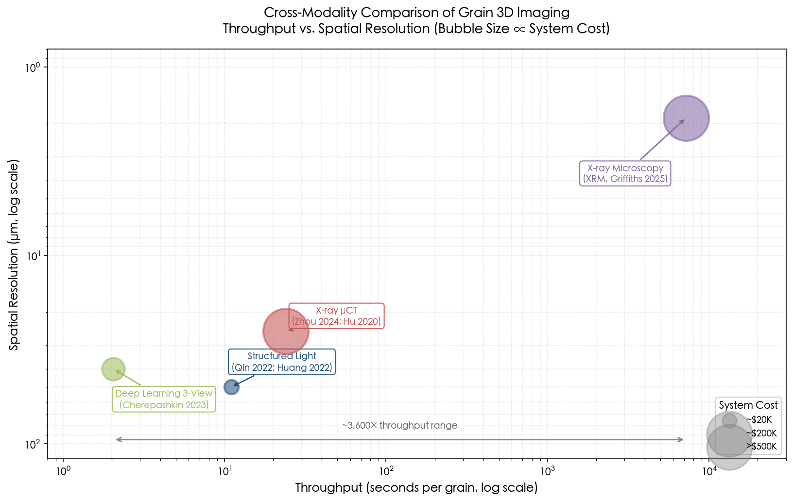

**Figure 1.1** visualizes these trade-offs on logarithmic axes. The five-order-of-magnitude spread in throughput—from approximately 2 seconds (deep learning) to roughly 7,200 seconds (XRM)—and the three-order-of-magnitude range in spatial resolution underscore the need for systematic sensor selection and resource allocation frameworks. Modern control theory, with its formal apparatus for multi-objective optimization under constraints, is uniquely equipped to address this challenge.

## 1.3 Phenotypic Traits Extracted at Grain Level

Three-dimensional reconstruction enables the extraction of rich trait sets fundamentally inaccessible to 2D imaging. Qin et al. (2022) defined 25 grain phenotypic traits (11 basic and 14 derived) from point-cloud data, encompassing dimensional, shape, and surface-texture descriptors. Using XGBoost, they achieved 90.18% accuracy for filled-versus-unfilled grain classification and 99.95% accuracy for indica-versus-japonica discrimination via SVM. Grain thickness emerged as the single most discriminative feature, carrying a feature-importance weight of 0.34 in the filled/unfilled classification task [Qin et al. 2022](https://www.nature.com/articles/s41598-022-07221-4 "Scientific Reports, 25 phenotypic traits from 3D point cloud"). Huang et al. (2022) further demonstrated that three-dimensional shape descriptors—roundness and sphericity—alongside the full 32-trait set yield grain-weight prediction with R² = 0.83 (gradient boosting, MAPE 3.37%, RMSE 2.45 mg) [Huang et al. 2022](https://www.frontiersin.org/journals/plant-science/articles/10.3389/fpls.2022.840908/full "Frontiers in Plant Science, 32 wheat grain phenotypic traits").

The comprehensive review by Qi et al. (2025) in *Computers and Electronics in Agriculture* systematically surveyed multiscale phenotyping of grain crops (maize, wheat, rice, soybean, and sorghum) based on 3D models, spanning organ-level, individual-plant, and population-level scales. This review documented the rapid adoption of high-throughput phenotyping platforms, advanced sensor technologies, and artificial intelligence for phenotypic data processing. Critically for the present report, however, Qi et al. made no mention of control-theoretic frameworks for pipeline optimization or uncertainty management [Qi et al. 2025](https://www.sciencedirect.com/science/article/abs/pii/S0168169925007033 "Comput. Electron. Agric. 237:110597, Multiscale phenotyping of grain crops based on 3D models")—an omission that further motivates the perspective developed herein.

## 1.4 The Canonical Phenotyping Pipeline: A Feed-Forward Architecture

The grain-level phenotyping workflow, as independently documented across the literature, follows a canonical six-stage sequence:

1. **Image Acquisition** — Structured-light, CT, or multi-view RGB-D capture from multiple viewpoints around a grain specimen.
2. **Preprocessing** — Noise filtering, background subtraction, and point-cloud registration.
3. **Segmentation** — Separation of individual grain geometry from background and support structures.
4. **3D Reconstruction** — Fusion of multi-view data into a unified 3D model (point cloud, mesh, or volumetric representation).
5. **Trait Extraction** — Computation of geometric, morphological, and shape parameters from the reconstructed model.
6. **Statistical Analysis / ML Classification** — Downstream analytics including cultivar classification, quality grading, and genotype–phenotype association studies.

This pipeline architecture has been generalized in the comprehensive review by Pieters et al. (2023), who surveyed 3D representation methods for plant phenotyping across the full breadth of the literature [Pieters et al. 2023](https://link.springer.com/article/10.1186/s13007-023-01031-z "Plant Methods, How to make sense of 3D representations for plant phenotyping"). The most-cited crop phenomics survey by Yang et al. (2020, *Molecular Plant* 13:187–214), encompassing high-throughput phenotyping platforms and imaging modalities across all spatial scales, similarly describes this sequential architecture but omits any control-theoretic or feedback-loop perspective [Yang et al. 2020](https://www.sciencedirect.com/science/article/pii/S1674205220300083 "Molecular Plant, Crop phenomics review").

A critical observation—and the central motivation of this report—is that every published instance of this pipeline operates in **open loop**: acquisition parameters (number of views, camera angles, exposure settings) are fixed a priori, and no feedback path exists from downstream reconstruction quality or trait-extraction uncertainty to upstream sensing decisions. A grain with complex morphology (e.g., an elongated indica rice grain or a wheat grain with a deep ventral sulcus) receives the identical scanning protocol as a near-spherical japonica grain, despite the former requiring substantially more viewpoints for equivalent reconstruction fidelity.

## 1.5 The Control-Theoretic Perspective: From Feed-Forward to Closed-Loop

### 1.5.1 Why Modern Control Theory?

Modern control theory provides a mature mathematical framework for analyzing and designing systems that evolve over time under uncertainty and benefit from feedback. The core elements of this framework—state-space models, observers, optimal control, stability analysis, and robustness guarantees—map with striking naturalness onto the grain phenotyping pipeline:

- **State**: The evolving 3D geometric estimate of the grain, whether represented as a truncated signed distance field (TSDF), a superellipsoid parameter vector, or spherical harmonic coefficients.
- **Input (control action)**: The selection of the next viewpoint, sensor modality, or acquisition parameter (exposure, resolution).
- **Output (observation)**: The depth image, point cloud, or projection data acquired from a given viewpoint.
- **Process noise**: Registration errors, turntable positioning uncertainty, and calibration drift.
- **Measurement noise**: Sensor-specific noise characteristics (depth-camera Gaussian noise, CT photon-counting statistics, structured-light subpixel error).

Treating the pipeline as a dynamic system that transitions from an initial uncertain state (a prior shape estimate) to a progressively refined estimate via sequential observations is precisely the framework of *state estimation*. The Kalman filter and its nonlinear extensions (EKF, UKF) constitute the optimal estimators for such systems under well-characterized noise models, while model predictive control (MPC) provides the natural formalism for view-planning decisions.

### 1.5.2 Analogues from Adjacent Domains

The proposed perspective finds strong precedent in related engineering domains. In simultaneous localization and mapping (SLAM), the extended Kalman filter served as the dominant estimation approach from 1986 through the mid-2000s, modeling robot pose and landmark positions as a joint state vector updated through Kalman prediction–correction cycles. Multi-sensor fusion of LiDAR, camera, and inertial measurement unit (IMU) data for real-time 3D reconstruction is now well established, with the Multi-State Constraint Kalman Filter (MSCKF) of Mourikis and Roumeliotis (2007) achieving visual-inertial state estimation at linear computational complexity [Xu et al. 2022](https://www.mdpi.com/2072-4292/14/23/6033 "Remote Sensing, SLAM Overview — VI-SLAM section").

In medical imaging, Feng et al. (2013) formulated dynamic cardiac MRI reconstruction as a Kalman filtering problem, treating each image frame as a state estimated from sequential k-space measurements under an identity state-transition model with a one-dimensional Fourier observation operator. This approach achieved 50-ms per-frame reconstruction and provides a directly transferable template for sequential 3D grain reconstruction. A key design insight from Feng et al. is that the diagonal process-noise covariance **Q** was learned from training data, distinguishing dynamic image regions from static regions and allocating measurement information adaptively—an exact analogue to the strategy of allocating additional views to morphologically complex grains [Feng et al. 2013](https://pmc.ncbi.nlm.nih.gov/articles/PMC3536913/ "Magnetic Resonance in Medicine, Kalman filter for dynamic cardiac MRI").

Next-best-view (NBV) planning, which formulates viewpoint selection as an optimization problem seeking to maximize information gain, is structurally parallel to model predictive control. Nevertheless, no existing NBV work in plant phenotyping has been formulated in explicit state-space or control-theoretic terms [Attention-driven NBV](https://www.sciencedirect.com/science/article/pii/S1537511024001740 "Biosystems Engineering, Attention-driven NBV planning").

### 1.5.3 The Critical Gap

Despite the clear structural parallels outlined above, **no published work formalizes a grain phenotyping pipeline as a closed-loop control system**. All grain 3D reconstruction papers treat the pipeline as a feed-forward sequence characterized by:

- No feedback from trait-extraction uncertainty to acquisition parameters;
- No state-space formulation of the evolving 3D estimate;
- No observability or controllability analysis to determine the minimum number of views required for a target reconstruction accuracy;
- No formal convergence guarantees for the reconstruction estimator;
- No systematic uncertainty propagation from reconstruction error to phenotypic trait uncertainty.

This gap is confirmed across the most comprehensive reviews in the field. The Pieters et al. (2023) plant phenotyping review contains no mention of control theory, Kalman filtering, state-space modeling, observability, or feedback-loop design [Pieters et al. 2023](https://link.springer.com/article/10.1186/s13007-023-01031-z "Plant Methods, How to make sense of 3D representations for plant phenotyping"). The Yang et al. (2020) crop phenomics survey, among the most highly cited in the discipline, similarly omits any control-theoretic perspective [Yang et al. 2020](https://www.sciencedirect.com/science/article/pii/S1674205220300083 "Molecular Plant, Crop phenomics review"). The Qi et al. (2025) multiscale grain phenotyping review, despite being the most recent and domain-specific survey available, likewise addresses only sensor technologies and data-processing pipelines without any feedback or optimization framework [Qi et al. 2025](https://www.sciencedirect.com/science/article/abs/pii/S0168169925007033 "Comput. Electron. Agric. 237:110597, Multiscale phenotyping of grain crops based on 3D models").

Figure 1.2 contrasts the traditional open-loop pipeline with the closed-loop architecture proposed in this report, visually summarizing the feedback mechanisms that modern control theory introduces.

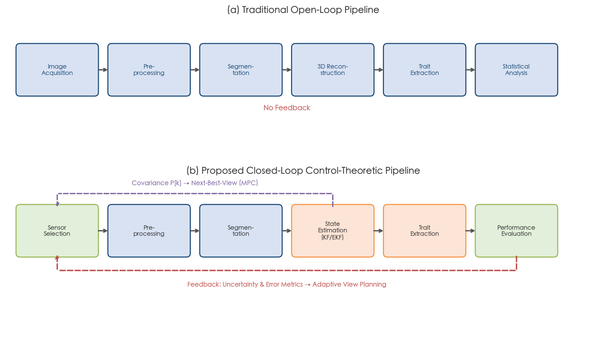

The control-theoretic perspective offers concrete, actionable improvements: principled multi-sensor fusion with formal uncertainty quantification, optimal sensor placement with provable performance guarantees, adaptive scanning protocols that allocate resources according to per-grain morphological complexity, and rigorous stability and robustness analysis of the entire pipeline.

## 1.6 Scope and Contributions of This Report

This report develops a complete control-theoretic framework for grain-level 3D reconstruction and phenotypic analysis. Figure 1.3 presents the report structure and inter-chapter dependencies; the remainder of this section summarizes each chapter.

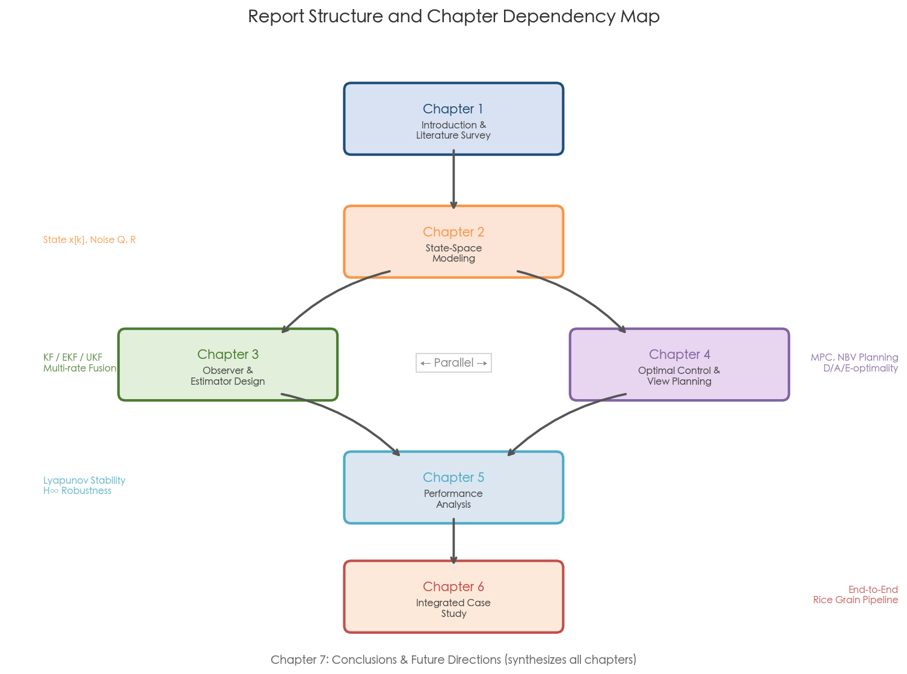

**Chapter 2 — State-Space Modeling** formulates the grain 3D reconstruction process as a discrete-time state-space system. Four state representations are defined and compared—truncated signed distance field (TSDF), Bayesian occupancy grid, superellipsoid parameters, and spherical harmonic coefficients—spanning state dimensions from 11 to 16.7 million. State-transition equations, observation models (pinhole camera projection and CT Beer–Lambert law), and linearization strategies are derived. Observability and controllability analyses via Gramian rank conditions establish the minimum view requirements for each representation.

**Chapter 3 — Observer and Estimator Design** develops Kalman filter variants (KF, EKF, UKF) for optimal fusion of multi-view and multi-modal sensor data. Multi-rate and asynchronous fusion frameworks accommodate the heterogeneous sensor rates characteristic of modern phenotyping platforms (e.g., RGB at 30 Hz, CT data as asynchronous high-information updates). Convergence conditions are analyzed through the detectability of the state-space pair (A, C), with formal links to the observability results of Chapter 2. The information-form filter and its suitability for parallel multi-grain scanning are discussed.

**Chapter 4 — Optimal Control and Optimization-Based Design** applies optimal experimental design, submodular optimization, and receding-horizon MPC to sensor placement and next-best-view planning. D-optimal, A-optimal, and E-optimal criteria are connected to the Fisher information matrix from Chapter 3. Greedy submodular algorithms with (1 − 1/e) ≈ 63% approximation guarantees are demonstrated to outperform convex relaxation methods. Adaptive per-grain sampling strategies balance reconstruction quality against throughput constraints by leveraging the diminishing-returns property of information gain.

**Chapter 5 — System Performance Analysis** examines stability (Lyapunov-based EKF/UKF error-covariance boundedness), robustness (H∞ filtering and structured singular value μ-analysis for non-Lambertian surfaces and calibration errors), and sensitivity (GUM-compliant uncertainty propagation from reconstruction error to phenotypic traits). Performance metrics—Chamfer distance, Hausdorff distance, cloud-to-mesh distance, trait MAPE, and throughput—are formalized within the control-theoretic framework.

**Chapter 6 — Integrated Design Case Study** synthesizes Chapters 2–5 into a fully specified end-to-end pipeline for rice grain phenotyping. Concrete numerical parameters are instantiated for a structured-light scanning setup with a turntable. The optimized protocol is compared against a baseline uniform-spacing protocol, with projected throughput of 400–700 grains per hour and an estimated 10–20% MAPE reduction at equivalent view count, informed by analogy with established results in the active-reconstruction literature.

**Chapter 7 — Conclusions and Future Directions** distills actionable design guidelines, discusses limitations (absence of direct experimental validation, linearity assumptions, parametric model restrictions), and outlines extensions to panicle-level and field-level phenotyping, genomic integration via GWAS, learned observation models (NeRF, 3D Gaussian Splatting), reinforcement-learning scanning policies, and edge deployment on platforms such as the NVIDIA Jetson AGX Orin.

The central contribution of this report is the formalization of grain 3D phenotyping as a closed-loop control problem—a perspective absent from all prior phenotyping literature. Three core design principles emerge from this formalization:

1. **Separation of Estimation and Control** — The LQG separation principle enables independent design of the reconstruction estimator (Chapters 2–3) and the view-planning controller (Chapter 4), with proven optimality for the linear-Gaussian case and well-characterized approximation bounds for the nonlinear regime.

2. **Covariance as Universal Optimization Objective** — The error-covariance matrix **P**[k] serves as the unifying currency across estimation quality assessment (Chapter 3), sensor placement optimization (Chapter 4), adaptive stopping criteria (Chapter 4), and GUM-compliant uncertainty propagation to phenotypic traits (Chapter 5).

3. **Submodular Diminishing Returns** — The information-theoretic property of diminishing marginal gains provides a rigorous basis for heterogeneous view allocation across grains of varying morphological complexity: morphologically simple grains receive fewer views while complex grains receive more, with formal (1 − 1/e) approximation guarantees on near-optimality.

# 第2章 State-Space Modeling of the Grain 3D Reconstruction Pipeline

The central premise of this report is that the multi-view, multi-sensor grain 3D reconstruction pipeline can — and should — be formalized as a discrete-time dynamical system amenable to modern control-theoretic analysis. This chapter establishes that formalization rigorously. We define the state vector encoding the evolving 3D estimate of a grain, derive the state-transition and observation equations governing how each new sensor acquisition refines that estimate, and perform the observability and controllability analyses that reveal fundamental limits on reconstruction fidelity and efficiency.

The notation established here is used throughout the remainder of the report. We adopt the following conventions: x[k] ∈ ℝⁿ denotes the state vector at discrete time step k (each step corresponding to one sensor acquisition), u[k] the control input (viewpoint selection), y[k] ∈ ℝᵐ the observation vector, w[k] ~ 𝒩(0, Q) the process noise, v[k] ~ 𝒩(0, R) the measurement noise, f(·) and h(·) the (possibly nonlinear) state-transition and observation functions, and A[k] = ∂f/∂x, C[k] = ∂h/∂x their Jacobians evaluated at the current estimate.

## 2.1 From Feed-Forward Pipeline to State-Space System

The canonical grain phenotyping pipeline — image acquisition → preprocessing → segmentation → 3D reconstruction → trait extraction — has been documented independently by Qin et al. (2022), Huang et al. (2022), and synthesized in the comprehensive review by Pieters et al. (2023) [Pieters et al. 2023](https://link.springer.com/article/10.1186/s13007-023-01031-z "Plant Methods, How to make sense of 3D representations for plant phenotyping"). In every published implementation, this pipeline operates as a feed-forward chain: data flows from sensors to traits without any feedback loop. No stage consults the current reconstruction quality to inform the next acquisition, and no uncertainty estimate propagates backward to guide sensor parameters.

This feed-forward architecture discards information that is readily available and operationally valuable. By recasting the pipeline as a discrete-time state-space system, the full toolkit of modern estimation and control theory becomes accessible: Kalman filtering for optimal state estimation (Chapter 3), observability analysis for sensor placement (this chapter and Chapter 4), and Lyapunov stability theory for convergence guarantees (Chapter 5).

The resulting state-space formulation takes the standard form:

$$
x[k+1] = f(x[k], u[k]) + w[k], \quad y[k] = h(x[k], u[k]) + v[k]
$$

where x[k] encodes the current 3D geometry estimate, u[k] specifies the sensor viewpoint and acquisition parameters at the k-th step, y[k] is the raw sensor output, and f(·), h(·) capture the geometry-update and sensor-projection physics, respectively. The critical conceptual shift embedded in this formulation is that 3D reconstruction is not a one-shot computation but a sequential estimation process in which each new view refines a prior state estimate under quantified uncertainty.

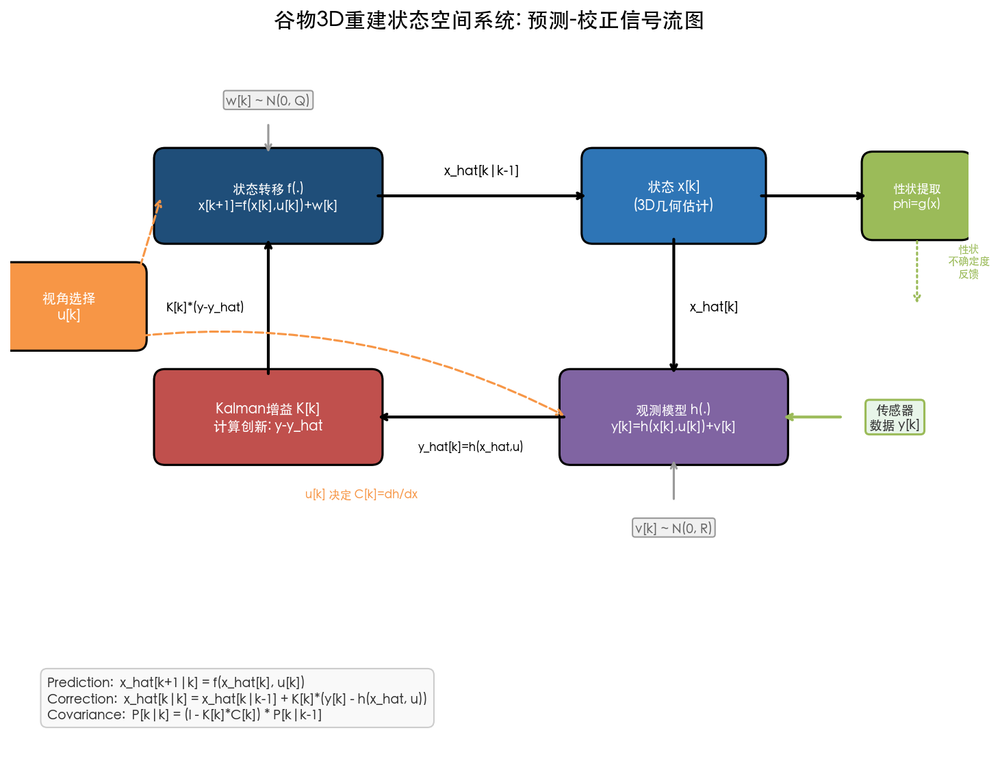

**Figure 2.1** illustrates the complete prediction–correction signal flow of the state-space system described above. The viewpoint selection u[k] acts simultaneously on the state-transition module f(·) and the observation model h(·); the Kalman gain K[k] corrects the state estimate based on the innovation y[k] − ŷ[k]; and the trait-extraction uncertainty from φ = g(x) feeds back (dashed line) to the viewpoint selection strategy, completing the closed-loop architecture.

## 2.2 State Representations and Dimensionality Trade-Offs

The choice of state representation determines the dimension n of the state vector and, consequently, the computational tractability of every subsequent estimation and control analysis. Four principal representations are considered here, spanning five orders of magnitude in state dimension; the trade-off between expressiveness and tractability is the central design tension.

### 2.2.1 Truncated Signed Distance Function (TSDF)

The Truncated Signed Distance Function, introduced by Curless and Levoy (1996), represents a 3D surface implicitly as a volumetric grid in which each voxel stores a signed distance value D(v) and a cumulative weight W(v); the zero-crossing of the distance field defines the surface isosurface. For a grid of resolution N³, the state vector is x = [D(v₁), D(v₂), …, D(v_{N³})]ᵀ, yielding a state dimension of N³ scalars. At a resolution of 256³, this corresponds to approximately 16.7 million state variables; even a coarser 128³ grid produces roughly 2.1 million [Curless & Levoy 1996](https://graphics.stanford.edu/papers/volrange/paper_2_levels/paper.html "SIGGRAPH 1996, A Volumetric Method for Building Complex Models from Range Images").

The TSDF representation is maximally expressive — it can encode arbitrary surface topology including internal cavities — but its dimensionality renders full-covariance estimation intractable. An n × n covariance matrix P at n = 16.7 × 10⁶ would require over 10¹⁴ floating-point entries, far exceeding the memory capacity of any current computing platform.

### 2.2.2 Superellipsoid Parametric Model

At the opposite extreme, the superellipsoid offers an 11-parameter parametric model comprising three semi-axis lengths (a₁, a₂, a₃), two shape exponents (ε₁, ε₂), three position coordinates (t_x, t_y, t_z), and three orientation angles (ϕ, θ, ψ). The implicit inside-outside function is:

$$
F(x, y, z) = \left(\left(\frac{x}{a_1}\right)^{2/\varepsilon_2} + \left(\frac{y}{a_2}\right)^{2/\varepsilon_2}\right)^{\varepsilon_2/\varepsilon_1} + \left(\frac{z}{a_3}\right)^{2/\varepsilon_1}
$$

where the surface is defined by F = 1; points with F < 1 lie inside the solid and F > 1 outside it. For a general pose in SE(3), the function is evaluated on the point transformed into the canonical body frame: F(g⁻¹ ∘ (x, y, z)) = 1 [Solina & Bajcsy 1990](https://dl.acm.org/doi/abs/10.1109/34.44401 "IEEE TPAMI 12(2), Recovery of Parametric Models from Range Images"). Parameter recovery from point-cloud data is formulated as least-squares minimization of the fitting residual G(θ) = a₁a₂a₃ Σᵢ(F^{ε₁}(g⁻¹ ∘ pᵢ) − 1)², as established by Solina and Bajcsy and refined in modern probabilistic formulations [Liu et al. 2022](https://openaccess.thecvf.com/content/CVPR2022/papers/Liu_Robust_and_Accurate_CVPR_2022_paper.pdf "CVPR 2022, Robust and Accurate Superquadric Recovery").

The superellipsoid covers a rich shape vocabulary — cuboids (ε₁, ε₂ → 0), ellipsoids (ε₁ = ε₂ = 1), octahedra (ε₁, ε₂ → 2), and their intermediates — making it well-suited for cereal grains, which are approximately ellipsoidal in morphology. At n = 11, the covariance matrix P is merely 11 × 11 (968 bytes in double precision), and all Gramian computations are trivially real-time.

### 2.2.3 Spherical Harmonic (SH) Shape Descriptors

Spherical harmonics provide a frequency-domain representation of star-convex surfaces. A surface is parameterized by the radius function r(η, ω) = Σ_{ℓ=0}^{ℓ_max} Σ_{m=-ℓ}^{ℓ} c_{ℓm} Y_{ℓm}(η, ω), where Y_{ℓm} are the SH basis functions and the coefficients c_{ℓm} constitute the state vector. The state dimension is (ℓ_max + 1)² coefficients. Kazhdan et al. (2003) established rotation-invariant SH descriptors for 3D shape retrieval, demonstrating their suitability for geometric analysis [Kazhdan et al. 2003](https://gfx.cs.princeton.edu/pubs/Kazhdan_2003_RIS/index.php "Eurographics SGP 2003, Rotation Invariant SH Shape Descriptors").

In the grain phenotyping domain, Cherepashkin et al. (2023) applied SH at ℓ_max = 20 (441 coefficients) for wheat seed 3D reconstruction, achieving a per-point mean L₁ error of approximately 40 μm and relative volume error of approximately 2.36% [Cherepashkin et al. 2023](https://openaccess.thecvf.com/content/ICCV2023W/CVPPA/papers/Cherepashkin_Deep_Learning_Based_3d_Reconstruction_for_Phenotyping_of_Wheat_Seeds_ICCVW_2023_paper.pdf "ICCV 2023 Workshop, Deep learning based 3D reconstruction for wheat seed phenotyping"). González-Montellano et al. (2017) applied SH specifically to agricultural grain shapes — beans, chickpeas, and maize — confirming that the approach captures convexities, concavities, and tip cap features characteristic of real-world grain morphology [González-Montellano et al. 2017](https://www.sciencedirect.com/science/article/abs/pii/S016816991630730X "Computers and Electronics in Agriculture, SH for agricultural grain shapes").

A distinctive advantage of the SH representation is its continuously tunable resolution: ℓ_max = 10 yields 121 coefficients (suitable for smooth rice grains without a ventral sulcus), while ℓ_max = 20 yields 441 coefficients (necessary for wheat grains with detailed surface features such as the ventral sulcus). This tunability makes SH a natural candidate for adaptive state-space modeling in which the model order is matched to the morphological complexity of the target grain.

### 2.2.4 Point Cloud Representation

A direct point cloud of N_p points stores 3N_p Cartesian coordinates, yielding n = 3N_p. For a typical grain scan, N_p ≈ 10,000 points produces n = 30,000. While point clouds are the native output format of structured-light scanners and serve as the starting data for most phenotyping pipelines, they lack the topological structure required for efficient covariance propagation and do not naturally support the prediction step of a Kalman filter. Point clouds are therefore best treated as intermediate data rather than as a state representation for control-theoretic analysis.

### 2.2.5 Dimensionality Comparison

The state dimension spans five orders of magnitude across the representations considered:

| Representation | Parameters | State Dim. n | P Matrix Size | EKF Cost O(n³) |
|---|---|---|---|---|
| TSDF 256³ | Voxel grid | 16,700,000 | ~2.2 × 10¹⁴ | Intractable |
| TSDF 128³ | Voxel grid | 2,100,000 | ~4.4 × 10¹² | Intractable |
| Point cloud (10k pts) | 3D coords | 30,000 | 9 × 10⁸ | 2.7 × 10¹³ |
| SH ℓ=20 | Coefficients | 441 | 194,481 | ~8.6 × 10⁷ |
| SH ℓ=10 | Coefficients | 121 | 14,641 | ~1.8 × 10⁶ |
| Superellipsoid | Shape+pose | 11 | 121 | 1,331 |
| Triaxial ellipsoid | Axes+pose | 9 | 81 | 729 |

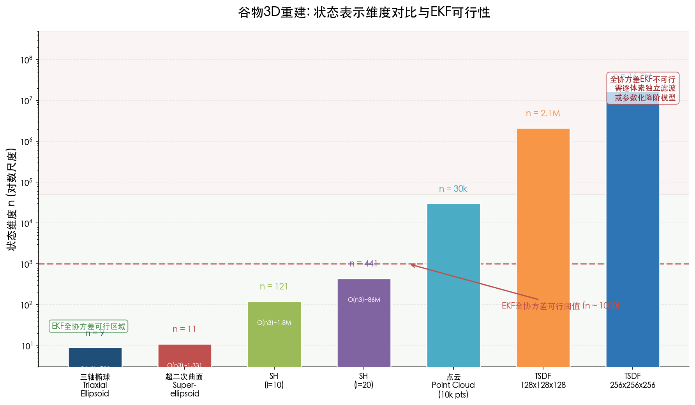

**Figure 2.2** visualizes the dimensionality span of the seven state representations on a logarithmic scale. The green region marks the EKF full-covariance feasibility zone (n ≲ 10³), and the red dashed line indicates the feasibility threshold. The superellipsoid (n = 11) and spherical harmonics (n ≤ 441) fall within the feasible region, while TSDF and point cloud representations far exceed this threshold and require per-voxel independent filtering or parametric order-reduction strategies.

Since the Extended Kalman Filter (EKF) computational cost scales as O(n³) per update, only the parametric representations — superellipsoid (n = 11) and spherical harmonics (n ≤ 441) — are feasible for full-covariance state estimation. This fundamental constraint motivates the use of reduced-order parametric state representations as the foundation for control-theoretic analysis, while TSDF is retained as an auxiliary high-fidelity representation operating with per-voxel independent estimation.

## 2.3 State-Transition Models

The state-transition equation x[k+1] = f(x[k], u[k]) + w[k] describes how the 3D geometry estimate evolves between successive sensor acquisitions. For a stationary grain mounted on a scanning stage, the underlying geometry does not change; what evolves is the estimate of that geometry as new data arrives. This distinction leads to qualitatively different transition models depending on the chosen state representation.

### 2.3.1 TSDF Weighted-Average Update

The TSDF fusion rule of Curless and Levoy (1996) provides a natural state-transition equation. For each voxel v, the update proceeds as:

$$
D_{k+1}(v) = \frac{W_k(v) \cdot D_k(v) + w_k(v) \cdot d_k(v)}{W_k(v) + w_k(v)}, \quad W_{k+1}(v) = W_k(v) + w_k(v)
$$

where d_k(v) is the newly measured signed distance from view k and w_k(v) is its associated weight (typically proportional to the cosine of the angle between the surface normal and the viewing direction). Defining α_k = W_k/(W_k + w_k), this becomes:

$$
D_{k+1}(v) = \alpha_k \cdot D_k(v) + (1 - \alpha_k) \cdot d_k(v)
$$

This update is formally linear in the state D_k(v), with the time-varying coefficient α_k playing the role of the state-transition matrix element. The weight w_k encodes directional uncertainty, serving as inverse-variance weighting directly analogous to the Kalman gain. Curless and Levoy proved that the resulting isosurface (zero-crossing of the distance field) is optimal in the least-squares sense [Curless & Levoy 1996](https://graphics.stanford.edu/papers/volrange/paper_2_levels/paper.html "SIGGRAPH 1996").

Process noise w[k] can be introduced to account for registration error (arising from imperfect ICP alignment between views) and calibration drift, thereby converting the deterministic fusion rule into a stochastic state-transition amenable to Kalman-filter-based analysis.

### 2.3.2 Bayesian Occupancy Grid Update

An alternative volumetric formulation is the Bayesian occupancy grid, formalized by Elfes (1989). In log-odds form, the recursive update is expressed as:

$$
L(o_i | z_{1:k}) = L(o_i | z_k) + L(o_i | z_{1:k-1}) - L_0(o_i)
$$

where L(·) = log(p/(1−p)) is the log-odds transform and L₀ is the prior. This constitutes a recursive Bayesian filter operating in the additive form x[k+1] = x[k] + Δ(u[k]), where Δ encodes the information increment contributed by the new measurement. The occupancy grid has served as the probabilistic mapping foundation in robotics since the late 1980s [Elfes 1989](https://www.researchgate.net/publication/2953854_Using_Occupancy_Grids_for_Mobile_Robot_Perception_and_Navigation "Computer 22(6), Occupancy Grids"). Its log-additive structure is particularly convenient for the information-form Kalman filter treatment developed in Chapter 3.

### 2.3.3 Parametric State Transition

For the superellipsoid and SH representations, the grain shape is physically stationary during scanning, so the state-transition is nominally the identity map:

$$
x[k+1] = x[k] + w[k]
$$

where w[k] models small perturbations arising from turntable repositioning error (σ_position ≈ 0.01–0.05 mm for precision turntables), thermal drift, and mechanical vibration. The shape parameters (a₁, a₂, a₃, ε₁, ε₂ for the superellipsoid; c_{ℓm} for SH) carry zero process noise — the grain does not deform during scanning — while the pose parameters (position and orientation) accumulate small errors from mechanical imprecision:

$$
Q = \text{diag}(0, \ldots, 0, \sigma_{t_x}^2, \sigma_{t_y}^2, \sigma_{t_z}^2, \sigma_\phi^2, \sigma_\theta^2, \sigma_\psi^2)
$$

This sparse diagonal structure of Q is physically motivated and computationally advantageous: it explicitly distinguishes static shape parameters from dynamic pose parameters. An analogous design pattern appears in Feng et al. (2013), who constructed a diagonal Q with different variances for dynamic versus static regions in their Kalman-filter-based cardiac MRI reconstruction [Feng et al. 2013](https://pmc.ncbi.nlm.nih.gov/articles/PMC3536913/ "Magnetic Resonance in Medicine, Kalman filter for dynamic cardiac MRI"). The structural parallel is exact: in both settings, prior physical knowledge about which state components change over time is encoded directly in the noise covariance.

### 2.3.4 KinectFusion as an Implicit State-Space System

KinectFusion, developed by Newcombe et al. (2011), demonstrated real-time TSDF fusion at 30 Hz through a four-stage closed loop: (1) surface measurement from the depth sensor, (2) sensor pose estimation via Iterative Closest Point (ICP), (3) TSDF volumetric integration, and (4) surface prediction via raycasting. This architecture is structurally isomorphic to a Kalman prediction-correction cycle: stage (3) performs the state update (prediction), stage (1) acquires measurements, stage (2) estimates the observation model parameters (sensor pose), and stage (4) generates the predicted measurement for the next ICP iteration [Newcombe et al. 2011](https://www.microsoft.com/en-us/research/wp-content/uploads/2016/02/ismar2011.pdf "ISMAR 2011, KinectFusion").

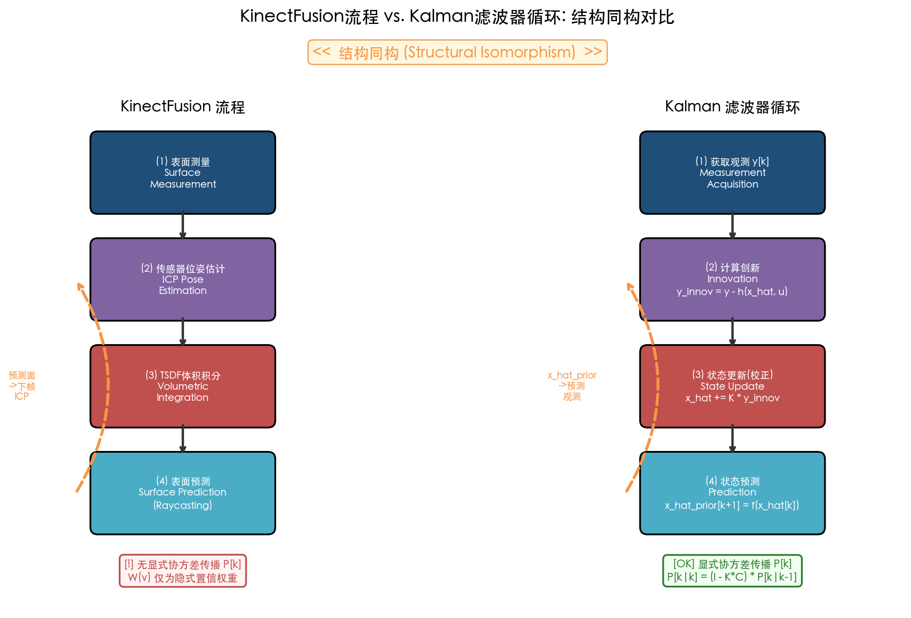

**Figure 2.3** presents a side-by-side flow diagram comparing the four-stage KinectFusion pipeline with the four-stage Kalman filter cycle. The two architectures are highly isomorphic in signal-flow topology. The key difference, annotated at the bottom, is that KinectFusion's weight W(v) serves only as an implicit confidence measure without explicit covariance propagation P[k], whereas the Kalman filter maintains a complete covariance update mechanism P[k|k] = (I − K[k]C[k])P[k|k−1].

Formalizing the KinectFusion architecture as a state-space system with explicit covariance propagation — either through parametric reduction (superellipsoid or SH) or through per-voxel independent Kalman filters — constitutes a core opportunity exploited in subsequent chapters of this report.

## 2.4 Observation Models

The observation equation y[k] = h(x[k], u[k]) + v[k] relates the state (3D grain geometry) to the raw sensor output at each viewpoint u[k]. Different imaging modalities produce fundamentally different functional forms for h(·), with distinct linearity properties that determine whether the standard Kalman filter or its extended/unscented variants are required.

### 2.4.1 Pinhole Camera Projection (Structured-Light and Photogrammetric Systems)

For camera-based systems — including the structured-light scanners employed by Qin et al. (2022) (Reeyee Pro, single-sided accuracy 0.05 mm, throughput 9.6 s per grain) and Huang et al. (2022) (12 s per grain, 32 phenotypic traits) — the observation model is the standard pinhole projection. A 3D surface point P = [X, Y, Z]ᵀ is projected to pixel coordinates via:

$$
p' = K \cdot [R | t] \cdot \tilde{P}
$$

where K is the 3×3 intrinsic matrix (encoding focal lengths f_x, f_y and principal point c_x, c_y), [R|t] is the extrinsic transformation determined by viewpoint u[k], and P̃ = [X, Y, Z, 1]ᵀ is the homogeneous coordinate. In explicit scalar form:

$$
u = f_x \frac{X}{Z} + c_x, \quad v = f_y \frac{Y}{Z} + c_y
$$

This mapping is nonlinear due to the perspective division by Z. The Jacobian with respect to the 3D point P is:

$$
\frac{\partial h}{\partial P} = \frac{1}{Z} \begin{bmatrix} f_x & 0 & -f_x X/Z \\ 0 & f_y & -f_y Y/Z \end{bmatrix}
$$

which is analytically tractable and well-conditioned except in the degenerate case Z → 0 (point coincident with the camera center) [Stanford CS231A](https://web.stanford.edu/class/cs231a/course_notes/01-camera-models.pdf "Stanford CS231A, Camera Models"). For parametric state representations (superellipsoid or SH), the full observation Jacobian is obtained via the chain rule:

$$
\frac{\partial h}{\partial \theta} = \frac{\partial h}{\partial P} \cdot \frac{\partial P}{\partial \theta}
$$

where ∂P/∂θ depends on the parametric surface equation. For the superellipsoid, the parametric surface point is P(η, ω) = [a₁ cos^{ε₁}η cos^{ε₂}ω, a₂ cos^{ε₁}η sin^{ε₂}ω, a₃ sin^{ε₁}η]ᵀ, and the partial derivatives with respect to each of the 11 parameters (a₁, a₂, a₃, ε₁, ε₂, and 6 pose parameters) can be computed in closed form.

### 2.4.2 X-ray CT / μCT Projection (Beer-Lambert Law)

For X-ray micro-CT systems — such as that used by Zhou et al. (2024) at 25.23 μm per pixel spatial resolution for wheat grain internal morphology reconstruction [Zhou et al. 2024](https://ifst.onlinelibrary.wiley.com/doi/10.1111/ijfs.17500 "Int J Food Sci Technol, 3D reconstruction of wheat grains by X-ray μCT") — the observation model derives from the Beer-Lambert attenuation law. In the log-domain (after taking the negative logarithm of measured intensities), the projection becomes:

$$
y_i = \sum_j l_{ij} \cdot \mu_j + v_i
$$

where μ_j is the linear attenuation coefficient of voxel j (the state variable), l_{ij} is the intersection length of ray i with voxel j, and v_i is measurement noise (approximately Gaussian after log-transform, with variance ≈ 1/N_photons). In matrix form:

$$
y = A \cdot x + v
$$

This is a **linear** observation model y = Ax + v, where the system matrix A encodes the projection geometry via ray tracing [De Man & Fessler 2013](https://pmc.ncbi.nlm.nih.gov/articles/PMC3725149/ "Phys Med Biol 58(12):R63–R96, Physics models in iterative CT reconstruction"). The linearity of the CT observation model carries significant implications: the standard Kalman filter (not merely the EKF) applies directly, and the observability analysis can be conducted using the classical rank condition on the observability matrix without any linearization approximation.

### 2.4.3 Measurement Noise Characterization

The measurement noise covariance R is determined by sensor physics and can be characterized for each modality:

- **RGB/structured-light**: Reprojection error σ_pixel ≈ 0.5–2 pixels; spatial uncertainty σ_spatial ≈ 0.025–0.10 mm for structured-light systems with subpixel triangulation. Qin et al. (2022) reported single-sided scanning accuracy of 0.05 mm [Qin et al. 2022](https://www.nature.com/articles/s41598-022-07221-4 "Scientific Reports, Cereal grain 3D point cloud analysis").
- **Depth sensor**: σ_depth ≈ 0.5–5 mm depending on the underlying technology (time-of-flight versus structured light).
- **μCT**: Photon-counting noise in the log-domain, with variance ≈ 1/N_photons; after reconstruction, spatial resolution ranges from 25 μm (Zhou et al. 2024) to 1.86 μm (XRM, Griffiths et al. 2025, at a throughput cost of approximately 10 hours per 5 seeds) [Griffiths et al. 2025](https://www.nature.com/articles/s41598-025-88482-7 "Scientific Reports, Evaluation of 3D seed structure using X-ray microscopy").

The diagonal structure of R (independent noise per pixel or per ray) is physically justified for most imaging modalities. Off-diagonal correlations may arise from systematic errors such as lens distortion or detector non-uniformity, but these are typically small relative to the diagonal terms and can be addressed through pre-calibration.

## 2.5 Observability Analysis

Observability determines whether the state x can be uniquely reconstructed from a sequence of observations y[0], y[1], …, y[K−1]. In the context of grain 3D reconstruction, observability analysis addresses a fundamental question: **given a configuration of K viewpoints, can all shape parameters be unambiguously estimated?** Equivalently, it reveals which viewpoint configurations leave certain parameter combinations indeterminate — an insight that directly informs sensor placement strategy.

### 2.5.1 Classical Observability Rank Condition

For the linearized system (A[k], C[k]) — where A[k] = ∂f/∂x and C[k] = ∂h/∂x are evaluated at the current state estimate — the observability matrix is constructed as:

$$
\mathcal{O} = \begin{bmatrix} C[0] \\ C[1] A[0] \\ C[2] A[1] A[0] \\ \vdots \\ C[K-1] \prod_{i=0}^{K-2} A[i] \end{bmatrix}
$$

The system is observable if and only if rank(𝒪) = n. For the identity state transition (A = I, applicable to the parametric grain model where the grain is stationary), this simplifies to:

$$
\mathcal{O} = \begin{bmatrix} C[0] \\ C[1] \\ \vdots \\ C[K-1] \end{bmatrix}
$$

which is simply the vertically stacked observation Jacobians from all K views. Observability then requires that the K viewpoints collectively provide sufficient geometric diversity to constrain all n shape parameters. A single frontal view of a grain, for instance, cannot resolve the depth parameter (a₃) of a superellipsoid; at least two substantially different viewpoints are necessary to disambiguate depth from width.

### 2.5.2 Fisher Information Matrix and Observability Equivalence

Jauffret (2007) established a rigorous equivalence between the Fisher Information Matrix (FIM) and local observability for nonlinear systems. The FIM at state x, accumulated over K viewpoints, is:

$$
F = \sum_{k=0}^{K-1} C[k]^T R^{-1} C[k]
$$

where C[k] = ∂h/∂x|_{x, u[k]} is the observation Jacobian at viewpoint k. Jauffret proved that F is nonsingular if and only if the system is locally observable, and the Cramér-Rao Lower Bound (CRLB) = F⁻¹ provides the minimum achievable estimation variance for any unbiased estimator [Jauffret 2007](https://univ-tln.hal.science/hal-01820468/document "IEEE Trans. AES 43(2):756–759, Observability and FIM in Nonlinear Regression").

This equivalence has direct practical implications for grain reconstruction: the eigenvalues of F reveal which directions in the state space are well-observed versus poorly observed. For a superellipsoid grain model (n = 11), F is an 11×11 matrix whose eigendecomposition can be computed in microseconds. A small eigenvalue λ_min indicates a poorly observable parameter combination — often corresponding to a shape exponent that is insensitive to the available viewpoints and requires views from specific, currently absent angles.

Li et al. (2004) applied FIM analysis to PET image reconstruction, using it to achieve near-uniform image resolution across the field of view by optimizing the acquisition geometry. The approach is directly analogous: FIM quantifies which voxels or shape parameters are most precisely estimable from a given sensor configuration [Li et al. 2004](https://pubmed.ncbi.nlm.nih.gov/15377114/ "IEEE Trans Med Imaging 23(9):1057–1064, FIM for PET reconstruction").

### 2.5.3 Observability Gramian for Sensor Placement

The observability Gramian W_o provides a matrix-valued summary of the total information content of an observation sequence. For the discrete-time linear system (or its linearization), the finite-horizon observability Gramian is defined as:

$$
W_o = \sum_{k=0}^{K-1} (A^k)^T C[k]^T C[k] A^k
$$

which reduces to W_o = Σ C[k]ᵀ C[k] for the identity transition. Brace et al. (2025) derived observability-based metrics for sensor placement optimization, including the local unobservability index J_ν = 1/λ_min(W_o) and the estimation condition number J_κ = λ_max(W_o)/λ_min(W_o). They formulated optimal sensor placement as a convex semidefinite program (SDP) relaxation and demonstrated experimentally, using UKF-based estimation, that observability-optimal placement yields significantly lower estimation error than random placement [Brace et al. 2025](https://arxiv.org/html/2501.01726v1 "arXiv:2501.01726, Sensor Placement via Observability Gramians").

For grain 3D reconstruction, minimizing J_κ (the condition number) ensures that all shape parameters are estimated with comparable precision. A numerical illustration for the superellipsoid model clarifies the concept. Consider an 11-parameter superellipsoid describing a rice grain with typical dimensions (a₁ ≈ 3.3 mm, a₂ ≈ 1.3 mm, a₃ ≈ 0.9 mm, ε₁ = ε₂ = 1.0). For K = 12 uniformly spaced views around the grain (30° azimuthal increments), the observation Jacobian C[k] ∈ ℝ^{m_k × 11} is computed at each viewpoint via the chain rule ∂h/∂θ = (∂h/∂P)(∂P/∂θ). Stacking these Jacobians and computing the Gramian W_o = Σ C[k]ᵀ R⁻¹ C[k] yields an 11×11 positive definite matrix. For uniform viewpoint spacing, all eigenvalues are positive (full observability), but the condition number J_κ typically falls in the range 10²–10³ because the shape exponents ε₁, ε₂ exhibit lower sensitivity to individual viewpoint changes than the semi-axes a₁, a₂, a₃. Optimizing the viewpoint configuration to minimize J_κ — a problem addressed in detail in Chapter 4 — can reduce this condition number by an order of magnitude.

### 2.5.4 Minimum Number of Views

The rank condition rank(𝒪) = n provides a theoretical lower bound on the number of views K required for observability. Since each view contributes at most rank(C[k]) independent rows to the observability matrix, and the observation Jacobian for a single camera view has rank at most 2 (two pixel coordinates per observed point, but many points per view), the effective information per view depends on the number of visible surface points and their geometric configuration.

For the superellipsoid model (n = 11), as few as K = 6 well-chosen views can in principle provide rank 11, since each view of a smooth convex grain contributes at least 2 independent constraints from the projected contour. In practice, measurement noise and numerical conditioning necessitate K ≥ 8–12 views for stable estimation, consistent with the 12-view scanning protocol employed by Qin et al. (2022) with 30° turntable increments [Qin et al. 2022](https://www.nature.com/articles/s41598-022-07221-4 "Scientific Reports").

For SH at ℓ_max = 20 (n = 441), substantially more views are required: each view's Jacobian has effective rank limited by the number of visible surface points projected onto the image plane, and 20–30 views are typically needed for well-conditioned estimation. This requirement is consistent with the observation that Cherepashkin et al. (2023) used a 36-view volume carving baseline, though their deep learning approach reduced the required input to just 3 views by leveraging learned shape priors to compensate for the information deficit.

## 2.6 Controllability in the Reconstruction Context

Classical controllability asks whether, given the state-transition dynamics and available inputs, the system can be driven from any initial state to any target state in finite time. In the grain 3D reconstruction context, this question requires careful reinterpretation: the "state" is an estimate of a fixed physical object, and the "control input" u[k] is the choice of sensor viewpoint rather than a force or torque.

### 2.6.1 Controllability as Viewpoint Reachability

We redefine controllability in the reconstruction context as the ability to reduce the estimation error covariance P[k] from an arbitrary initial P[0] to a desired target level P_target through judicious viewpoint selection. The relevant state is not the grain shape itself (which is fixed) but the posterior uncertainty — encoded in P[k]. The discrete Riccati recursion governing covariance evolution under Kalman filtering is:

$$
P[k+1] = P[k] - P[k] C[k]^T (C[k] P[k] C[k]^T + R)^{-1} C[k] P[k] + Q
$$

where the "control" enters through C[k], which depends on the viewpoint u[k]. Controllability in this sense asks: does the set of available viewpoints {u[k] ∈ 𝒰} provide sufficient geometric diversity to drive every eigenvalue of P[k] below a prescribed threshold? This formulation connects directly to the optimal sensor placement and next-best-view planning problems developed in Chapter 4.

### 2.6.2 Controllability Gramian Analogy

By analogy with the controllability Gramian 𝒞 = Σ AᵏBBᵀ(Aᵏ)ᵀ of classical linear systems, a "reconstruction controllability Gramian" can be defined to measure the total capacity of available viewpoints to reduce estimation uncertainty. For the identity-transition model (A = I) with the information-form update, the cumulative information gain from K views is:

$$
\mathcal{I}_{total} = \sum_{k=0}^{K-1} C[k]^T R^{-1} C[k]
$$

which is identical in form to both the FIM and the observability Gramian. This coincidence of form between observability and controllability in the estimation context is not accidental: it reflects the fundamental duality between observability (can the state be estimated?) and controllability (can the estimation error be reduced?) that is well-established in linear systems theory.

The reconstruction controllability Gramian 𝒞 is nonsingular if and only if the available viewpoints span the full state space — that is, if viewpoint selection provides sufficient geometric diversity to reduce uncertainty in every parameter direction. When 𝒞 is rank-deficient, there exist parameter combinations whose estimation uncertainty cannot be reduced regardless of how many additional views are acquired from the available viewpoint set. For turntable-based grain scanning, where all viewpoints lie in a single equatorial plane, the Gramian will exhibit reduced rank with respect to parameters observable only from out-of-plane viewpoints (e.g., top or bottom surface curvature). This analysis provides a principled motivation for multi-axis scanning configurations.

## 2.7 Linearization Strategies for High-Dimensional Implicit Surfaces

The observability and controllability analyses presented in Sections 2.5–2.6 rely on the Jacobians A[k] = ∂f/∂x and C[k] = ∂h/∂x. For the parametric models (superellipsoid and SH), these Jacobians are computable in closed form or via automatic differentiation, with tractable dimensions. For the TSDF representation, however, the observation model h(x) involves raycasting through a volumetric grid — a highly nonlinear and non-smooth operation that renders direct Jacobian computation impractical at scale.

### 2.7.1 Parametric Model Jacobians

For the superellipsoid (n = 11) and SH (n = 121–441), the Jacobian ∂h/∂θ = (∂h/∂P)(∂P/∂θ) is computed via the chain rule as described in Section 2.4.1. The first factor ∂h/∂P is the standard camera projection Jacobian (2 × 3 per point); the second factor ∂P/∂θ depends on the parametric surface equation and has dimension 3 × n per surface point. For the superellipsoid, derivatives involve terms like ∂P/∂a₁ = [cos^{ε₁}η cos^{ε₂}ω, 0, 0]ᵀ and ∂P/∂ε₁ = [a₁ cos^{ε₁}η ln(|cos η|) cos^{ε₂}ω, …]ᵀ, which are closed-form and well-defined for non-degenerate surface parameters.

For SH coefficients, ∂P/∂c_{ℓm} = Y_{ℓm}(η, ω) · n̂(η, ω), where n̂ is the outward unit normal direction at surface point (η, ω). These derivatives are smooth and efficiently batch-computable, making EKF feasible for SH state vectors up to n = 441.

### 2.7.2 TSDF: Per-Voxel Independent Filters

For TSDF representations where full Jacobian computation is intractable, a practical alternative is to treat each voxel as an independent one-dimensional state governed by its own scalar Kalman filter. Kim, Lee, and Lee (2025) implemented precisely this approach, applying per-voxel 1D Kalman filters to TSDF values with covariance intersection (CI) for collaborative map merging in multi-robot settings. They dynamically adjusted the noise variance based on the TSDF value — assigning lower variance near the zero-crossing (the surface) where precision matters most — and demonstrated monotonic covariance convergence [Kim et al. 2025](https://link.springer.com/article/10.1007/s11370-025-00586-1 "Intelligent Service Robotics, TSDF merging with KF+CI").

This per-voxel approach sacrifices cross-voxel correlation information (which would capture the geometric constraint that nearby voxels are not independent) but achieves O(N³) total computation — linear in the number of voxels — rather than the O(N⁹) cost of a monolithic filter. A complementary strategy is the probabilistic SDF fusion of Mazumdar et al. (2026), which models the SDF as a sparse Gaussian random field with heteroscedastic uncertainty, enabling the posterior uncertainty surface to drive next-best-view planning directly [Mazumdar et al. 2026](https://arxiv.org/abs/2602.19697 "arXiv:2602.19697, BayesFusion-SDF").

### 2.7.3 Three-Tier Strategy

The analyses above motivate a three-tier strategy for state-space modeling of grain 3D reconstruction, organized by ascending representational fidelity and computational cost:

1. **Tier 1 — Superellipsoid (n = 11):** Full-covariance EKF with analytically derived Jacobians. Suitable for initial rapid estimation, online adaptive stopping criteria, and cultivar classification tasks. The covariance matrix P is 11 × 11, and all Gramian computations execute in microseconds.

2. **Tier 2 — Spherical Harmonics (n = 121–441):** Full-covariance EKF or UKF with closed-form or automatic-differentiation Jacobians. Captures fine surface detail including ventral sulcus depth for wheat and tip cap morphology for maize. At n = 441, the EKF requires approximately 8.6 × 10⁷ floating-point operations per update — comfortably feasible at the typical 1 view/s scanning rate of structured-light systems.

3. **Tier 3 — TSDF (n = 10⁶–10⁷):** Per-voxel independent Kalman filters or probabilistic SDF fusion. Maximally expressive in surface topology; per-voxel uncertainty drives surface-quality-aware next-best-view planning. No global covariance matrix is maintained.

This hierarchy enables the practitioner to select the appropriate level of modeling fidelity based on the specific phenotyping objective: Tier 1 for high-throughput screening (hundreds of grains per hour), Tier 2 for detailed morphological analysis, and Tier 3 for archival-quality digital twins.

## 2.8 Summary

This chapter has established the formal state-space framework for grain 3D reconstruction, yielding the following principal results:

- **State representations** span five orders of magnitude in dimension, from the superellipsoid (n = 11) to the TSDF volumetric grid (n ≈ 10⁷). Only parametric representations — the superellipsoid and spherical harmonics — support full-covariance estimation with tractable Kalman filtering at the O(n³) cost.
- **State-transition models** range from the identity map (stationary grain with pose noise) to the TSDF weighted-average update (formally linear in the state). The KinectFusion pipeline is structurally isomorphic to a Kalman prediction-correction cycle but lacks explicit covariance propagation.
- **Observation models** for camera-based systems are nonlinear (pinhole projection with perspective division by Z) while CT models are linear (Beer-Lambert law in the log-domain). Both classes admit tractable Jacobians for EKF implementation.
- **Observability analysis** via the Fisher Information Matrix and observability Gramian determines whether a given viewpoint configuration can resolve all shape parameters. For the superellipsoid model, K ≥ 8–12 views from geometrically diverse angles are required for well-conditioned estimation; the condition number J_κ = λ_max/λ_min of the Gramian quantifies the balance of information across parameter directions.
- **Controllability** in the reconstruction context is reinterpreted as the ability to reduce estimation uncertainty to a target level through viewpoint selection. The formal duality between observability and controllability in this estimation framework motivates the optimal viewpoint planning developed in Chapter 4.

The notation and models established in this chapter — x[k], u[k], y[k], f(·), h(·), A[k], C[k], Q, R, P[k] — constitute the common mathematical language employed in the estimator design (Chapter 3), optimal control formulation (Chapter 4), and performance analysis (Chapter 5) that follow.

# 第3章 Observer and Estimator Design for Multi-Sensor Grain Reconstruction

Chapter 2 established the state-space formulation of the grain 3D reconstruction pipeline, defining the state representations, transition models, and observation models that govern how sensor data refines the evolving geometry estimate. The present chapter addresses the central estimation problem that follows from that formulation: given a sequence of noisy, incomplete measurements y[1], y[2], …, y[K] arriving from potentially heterogeneous sensors at different rates, how should one optimally fuse these observations to produce the best possible estimate x̂[k] of the grain's 3D shape, together with a rigorous quantification of remaining uncertainty through the error covariance P[k]?

The chapter designs and analyzes a hierarchy of estimators arranged in order of increasing generality. Section 3.1 presents the standard Kalman filter (KF) for linear observation models — applicable directly to X-ray CT in the log domain — and establishes the formal equivalence between classical TSDF fusion and a bank of independent scalar Kalman filters. Sections 3.2 and 3.3 extend the framework to nonlinear camera observation models via the Extended Kalman Filter (EKF) and the Unscented Kalman Filter (UKF), respectively, with detailed computational cost analysis for grain-relevant state dimensions (n = 11 for the superellipsoid, n = 121 for SH ℓ = 10, and n = 441 for SH ℓ = 20). Section 3.4 addresses the multi-rate and asynchronous fusion challenge inherent in combining RGB cameras (30 Hz), structured-light scanners (1 Hz), and X-ray CT (asynchronous batch) within a unified filtering framework. Section 3.5 introduces the information-form filter, whose additive measurement update enables parallel multi-sensor computation. Sections 3.6 through 3.8 treat probabilistic volumetric fusion, convergence analysis under detectability conditions, and Cramér–Rao Lower Bound (CRLB) benchmarking. Finally, Section 3.9 synthesizes the results into a practical estimator selection guideline. Throughout, the notation follows Chapter 2: x[k] ∈ ℝⁿ, y[k] ∈ ℝᵐ, A[k] and C[k] for system and observation Jacobians, w[k] ~ 𝒩(0, Q), v[k] ~ 𝒩(0, R), P[k] for error covariance, and K[k] for the Kalman gain.

## 3.1 The Standard Kalman Filter for Linear Grain Observation Models

### 3.1.1 Derivation and Optimality

For observation models that are linear in the state — the most important case being X-ray CT in the log domain, where the Beer–Lambert law yields y = Ax + v with A encoding ray-tracing geometry (Chapter 2, Section 2.4.2) — the Kalman filter provides the provably optimal minimum-variance unbiased estimate. The prediction–correction cycle, originally derived by Kalman (1960), proceeds as follows [Kalman 1960](https://asmedigitalcollection.asme.org/fluidsengineering/article/82/1/35/397706/A-New-Approach-to-Linear-Filtering-and-Prediction "ASME J. Basic Eng. 82(1):35–45"):

**Prediction step** (time update):

$$
\hat{x}[k|k-1] = A[k] \, \hat{x}[k-1|k-1], \quad P[k|k-1] = A[k] \, P[k-1|k-1] \, A[k]^\top + Q
$$

**Correction step** (measurement update):

$$
K[k] = P[k|k-1] \, C[k]^\top \left( C[k] \, P[k|k-1] \, C[k]^\top + R[k] \right)^{-1}
$$

$$
\hat{x}[k|k] = \hat{x}[k|k-1] + K[k] \left( y[k] - C[k] \, \hat{x}[k|k-1] \right)
$$

$$
P[k|k] = (I - K[k] \, C[k]) \, P[k|k-1]
$$

In the grain reconstruction context, the state transition A[k] reflects the fact that the grain geometry is stationary between successive acquisitions: A[k] = I (identity), and Q models only the small positioning disturbances introduced by turntable repositioning (σ ~ 0.01–0.05 mm for precision motorized stages). The observation matrix C[k] varies with each viewpoint u[k], encoding the projection geometry for that particular view. The measurement noise R[k] encapsulates sensor-specific uncertainties: for μCT, R corresponds to photon counting statistics (Gaussian after log-transform, with variance approximately 1/N_photons); for structured-light depth sensors, σ ~ 0.05–0.10 mm at the subpixel matching level [Qin et al. 2022](https://www.nature.com/articles/s41598-022-07221-4 "Scientific Reports, Cereal grain 3D point cloud analysis").

A fundamental optimality property distinguishes the Kalman filter from heuristic fusion approaches: for linear-Gaussian systems, P[k|k] coincides exactly with the Cramér–Rao Lower Bound (CRLB), meaning no other unbiased estimator can achieve lower variance. A steady-state gain K_∞ exists when the pair (A, C) is detectable, and the steady-state covariance P_∞ satisfies the discrete algebraic Riccati equation (DARE) [Simon 2006](https://onlinelibrary.wiley.com/doi/book/10.1002/0470045345 "Optimal State Estimation, Wiley").

### 3.1.2 TSDF Fusion as a Special Case of the Kalman Filter

Figure 3.1 illustrates the complete prediction–correction cycle of the Kalman filter as applied to the grain 3D reconstruction problem, with the physical noise parameters and downstream connections annotated.

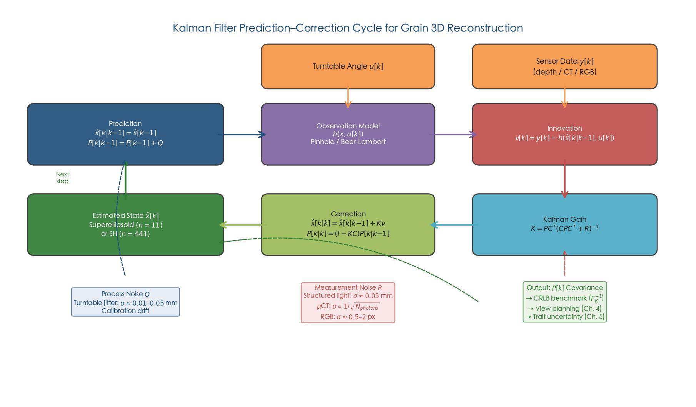

**Figure 3.1.** Kalman filter prediction–correction cycle tailored to the grain 3D reconstruction pipeline. The process noise Q captures turntable positioning disturbances (σ ≈ 0.01–0.05 mm), while the measurement noise R reflects sensor-specific uncertainties (structured light σ ≈ 0.05 mm; μCT σ ∝ 1/√N_photons; RGB σ ≈ 0.5–2 px). The output covariance P[k] serves as the CRLB benchmark F_K⁻¹ and feeds directly into the view-planning algorithms of Chapter 4 and the trait-level uncertainty quantification of Chapter 5.

A key insight connecting classical volumetric fusion to estimation theory is that the standard TSDF weighted-average update of Curless and Levoy (1996) is formally equivalent to a bank of independent one-dimensional Kalman filters — one per voxel. For a single voxel, the TSDF update rule:

$$
D_{k+1}(v) = \frac{W_k(v) \cdot D_k(v) + w_k(v) \cdot d_k(v)}{W_k(v) + w_k(v)}
$$

maps directly onto the Kalman correction with scalar state x = D(v), prior variance P[k|k−1] = 1/W_k(v), measurement noise variance R = 1/w_k(v), and Kalman gain K = w_k/(W_k + w_k). The critical limitation of this equivalence is the absence of cross-voxel correlation: each voxel is estimated independently, thereby discarding the geometric coherence that would allow information from well-observed regions to propagate to nearby uncertain voxels.

Kim, Lee, and Lee (2025) formalized this connection explicitly in the context of collaborative map merging, employing per-voxel 1D Kalman filters with covariance intersection (CI) to handle unknown cross-correlations between maps from different robots. Their framework dynamically adjusts the noise variance based on the TSDF value — assigning lower variance near the zero-crossing (where the surface actually lies) and higher variance far from it — and demonstrated monotonic covariance convergence [Kim et al. 2025](https://link.springer.com/article/10.1007/s11370-025-00586-1 "Intelligent Service Robotics, TSDF merging with KF+CI"). This approach is directly transferable to grain reconstruction: when multiple structured-light scans of the same grain are fused into a TSDF, the per-voxel KF provides principled uncertainty tracking that the heuristic weight accumulation of standard TSDF fusion lacks.

Three strategies address the cross-correlation limitation: (a) parametric state reduction to superellipsoid (n = 11) or SH (n ≤ 441), enabling a full-covariance KF with tractable P matrices; (b) independent per-voxel 1D KF as in Kim et al. (2025), accepting the loss of spatial correlation in exchange for computational tractability; and (c) information-form filtering that exploits the natural sparsity of the ray-based observation model, discussed in Section 3.5.

## 3.2 Extended Kalman Filter for Nonlinear Camera Observation Models

### 3.2.1 EKF Prediction–Correction for Shape Parameters

When the observation model h(x[k], u[k]) is nonlinear — as is the case for pinhole camera projection, where division by the depth coordinate Z introduces a rational nonlinearity (Chapter 2, Section 2.4.1) — the Extended Kalman Filter linearizes about the current state estimate to apply the Kalman framework. The EKF replaces the constant observation matrix C[k] with the Jacobian of h evaluated at the predicted state:

$$
C[k] = \left. \frac{\partial h}{\partial x} \right|_{x = \hat{x}[k|k-1]}
$$

The prediction and correction equations then proceed identically to the standard KF, but with C[k] recomputed at each step from the current estimate.

For grain shape estimation with a parametric state vector θ ∈ ℝⁿ (superellipsoid or SH coefficients), the Jacobian computation proceeds via the chain rule:

$$
\frac{\partial h}{\partial \theta} = \frac{\partial h}{\partial P} \cdot \frac{\partial P}{\partial \theta}
$$

The first factor, ∂h/∂P, is the pinhole camera Jacobian with respect to 3D point coordinates — analytically tractable as (1/Z)[f_x, 0, −f_x X/Z; 0, f_y, −f_y Y/Z]. The second factor, ∂P/∂θ, maps shape parameter changes to surface point displacements. For the superellipsoid, ∂P/∂θ involves derivatives of the inside-outside function F(θ) with respect to the 11 parameters; for SH, the relationship simplifies to ∂r/∂c_{ℓm} = Y_{ℓm}(η, ω), i.e., the SH basis function evaluated at the surface point direction, yielding a particularly elegant Jacobian structure.

### 3.2.2 Two-Step EKF Architecture for Structure and Pose

Yu, Wong, and Chang (2005) demonstrated a computationally efficient two-step EKF architecture for recursive 3D reconstruction from monocular image sequences that is directly applicable to grain scanning. In their framework, Step 1 runs a 12-state EKF for camera/object pose estimation (rotation and translation), and Step 2 runs N independent 3-state EKFs — one for each surface point — for structure refinement. This decomposition reduces complexity from O(N³) for a monolithic EKF (intractable for N > 100 points) to O(N) for the parallel per-point case [Yu et al. 2005](http://www.cse.cuhk.edu.hk/~khwong/j2004_IEEE_yu_SMC_B_kalman_draft.pdf "IEEE Trans. SMC-B 35(3), Recursive 3D Model Reconstruction Based on Kalman Filtering").

Their system achieved 0.69% mean 3D model error within 10 frames for 300-point models, with a processing time of 0.5 s per frame. For the grain reconstruction scenario, this architecture suggests a natural decomposition: a low-dimensional EKF for pose (n = 6, reduced to n = 1 for rotation angle given the turntable constraint) operating at the scan frame rate, coupled with a parallel bank of per-point or per-coefficient EKFs for shape refinement. When the state is parametric (superellipsoid n = 11 or SH n ≤ 441), the monolithic EKF is already tractable and the two-step decomposition becomes unnecessary; however, it remains valuable for hybrid representations where a coarse parametric model is refined by local point corrections.

### 3.2.3 EKF Computational Cost for Grain-Relevant Dimensions

The per-update computational cost of the EKF is dominated by the matrix operations in the correction step, scaling as O(n²m + n³) where n is the state dimension and m is the measurement dimension. Table 3.1 summarizes the cost for the three grain-relevant state representations.

**Table 3.1.** EKF per-update computational cost by state representation.

| State Model | n | Jacobian Size | P Update Cost | Feasibility at 1 Hz |
|---|---|---|---|---|
| Superellipsoid | 11 | 11 × m | ~1,331 ops | Trivially real-time |
| SH ℓ = 10 | 121 | 121 × m | ~1.77 × 10⁶ ops | ~100 Hz on modern CPU |
| SH ℓ = 20 | 441 | 441 × m | ~8.6 × 10⁷ ops | ~10–50 Hz on modern CPU |

All three representations are comfortably within real-time capability at the typical structured-light scanning rate of one view per second. The dominant computational challenge for the EKF is therefore not the matrix algebra itself but the derivation and implementation of the analytical Jacobian ∂h/∂θ, which for SH ℓ = 20 involves 441 partial derivatives of the rendering pipeline — a substantial software engineering effort that motivates the derivative-free alternative presented in Section 3.3.

## 3.3 Unscented Kalman Filter — Derivative-Free Nonlinear Estimation

### 3.3.1 The Unscented Transformation

The Unscented Kalman Filter, introduced by Julier and Uhlmann (2004), circumvents the Jacobian computation entirely by propagating a deterministic set of sigma points through the true nonlinear functions f(·) and h(·). For a state of dimension n, the UKF generates 2n + 1 sigma points:

$$
\mathcal{X}_0 = \hat{x}, \quad \mathcal{X}_i = \hat{x} + \left(\sqrt{(n + \lambda) P}\right)_i, \quad \mathcal{X}_{i+n} = \hat{x} - \left(\sqrt{(n + \lambda) P}\right)_i
$$

where λ = α²(n + κ) − n is a scaling parameter (typically α = 10⁻³, κ = 0, β = 2 for Gaussian distributions). Each sigma point is propagated through the nonlinear observation model 𝒴_i = h(𝒳_i), and the predicted measurement statistics are recovered via weighted averages:

$$
\hat{y} = \sum_{i=0}^{2n} W_i^{(m)} \mathcal{Y}_i, \quad P_{yy} = \sum_{i=0}^{2n} W_i^{(c)} (\mathcal{Y}_i - \hat{y})(\mathcal{Y}_i - \hat{y})^\top + R
$$

$$
P_{xy} = \sum_{i=0}^{2n} W_i^{(c)} (\mathcal{X}_i - \hat{x})(\mathcal{Y}_i - \hat{y})^\top, \quad K = P_{xy} P_{yy}^{-1}
$$

The critical advantage is that the unscented transformation captures the mean and covariance of the transformed distribution to second-order accuracy for any nonlinearity, whereas the EKF achieves only first-order accuracy. In the reentry tracking benchmark of Julier and Uhlmann (2004), the EKF's peak mean-squared error was **100× larger than its estimated covariance** (indicating severe filter inconsistency), while the UKF maintained close consistency between actual and estimated error throughout [Julier & Uhlmann 2004](https://www.cs.ubc.ca/~murphyk/Papers/Julier_Uhlmann_mar04.pdf "Proc. IEEE 92(3):401–422, Unscented Filtering and Nonlinear Estimation").

Figure 3.2 visualizes this fundamental distinction between the two approaches to handling nonlinearity.

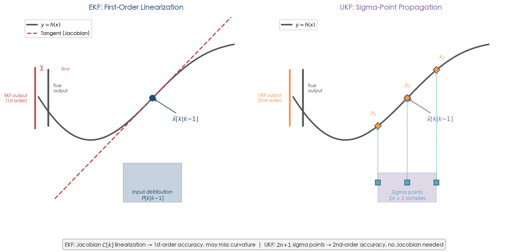

**Figure 3.2.** EKF versus UKF treatment of nonlinear observation models. Left: the EKF linearizes h(x) at the predicted mean via the Jacobian C[k], achieving only first-order accuracy and potentially missing curvature information. Right: the UKF propagates 2n + 1 sigma points through the true nonlinear function, recovering second-order accurate output statistics without requiring Jacobian derivation.

### 3.3.2 UKF for Grain Shape Estimation

For grain 3D reconstruction, the UKF offers a decisive advantage when the analytical Jacobian ∂h/∂θ is difficult or impossible to derive in closed form. This situation arises in at least two important cases:

1. **Differentiable rendering observation models.** When h(x) is implemented as a differentiable renderer (e.g., for surface-texture-aware observations), the rendering pipeline may not admit a closed-form Jacobian. The UKF requires only forward evaluations h(𝒳_i), treating the renderer as a black-box function.

2. **High-order SH coefficients.** For SH ℓ = 20 (n = 441), deriving, implementing, and verifying 441 analytical partial derivatives of the observation pipeline is error-prone and labor-intensive. The UKF replaces this with 883 forward model evaluations — computationally heavier but conceptually simpler and substantially less susceptible to implementation errors.

Wan and van der Merwe (2000) demonstrated that the UKF converges faster and to lower MSE than the EKF in dual estimation tasks involving highly nonlinear dynamics (chaotic Mackey–Glass time series), confirming that the sigma-point approach directly approximates the expected Hessian correction that the EKF neglects [Wan & van der Merwe 2000](https://groups.seas.harvard.edu/courses/cs281/papers/unscented.pdf "Proc. IEEE, The UKF for Nonlinear Estimation").

### 3.3.3 EKF vs. UKF Trade-Offs for Grain Reconstruction

The asymptotic computational cost of the UKF is O(n³), identical to the EKF, since both are dominated by the n × n matrix inversion in the correction step. The difference lies in the constant factor: the UKF requires 2n + 1 forward model evaluations per update, while the EKF requires one Jacobian computation (which, depending on implementation, may itself involve n finite-difference evaluations). Table 3.2 provides a concrete comparison for grain-relevant dimensions.

**Table 3.2.** EKF vs. UKF computational comparison by state dimension.

| State Model | n | EKF: Jacobian cols | UKF: Sigma points | UKF Time (est.) |
|---|---|---|---|---|
| Superellipsoid | 11 | 11 | 23 | ~2.3 ms |
| SH ℓ = 10 | 121 | 121 | 243 | ~24 ms |
| SH ℓ = 20 | 441 | 441 | 883 | ~0.4 s |

For the superellipsoid (n = 11), the EKF is preferred because the Jacobian involves only 11 derivatives of well-characterized geometric functions, and the 23 sigma-point evaluations of the UKF offer no compensating advantage. For SH ℓ = 20 (n = 441), the UKF becomes attractive because it eliminates the need for the 441-column Jacobian derivation; at approximately 0.4 s per update on a single CPU core, it remains feasible at the 1 Hz scanning rate typical of structured-light systems. The practical recommendation is therefore: **use the EKF for low-dimensional parametric models where the Jacobian is analytically available, and the UKF for high-dimensional or black-box observation models where Jacobian derivation is impractical**.

## 3.4 Multi-Rate and Asynchronous Sensor Fusion

### 3.4.1 The Multi-Rate Problem in Grain Phenotyping

A realistic grain phenotyping pipeline integrates sensors operating at fundamentally different temporal scales. An RGB camera may deliver frames at 30 Hz for texture and color analysis; a structured-light scanner produces depth maps at 1–15 Hz; and X-ray CT or micro-CT data arrives as a batch of projections collected over 10–24 seconds per grain. These sensors provide complementary information — RGB captures surface appearance, structured light yields surface geometry, and CT reveals internal morphology — but their temporal asynchrony precludes naive batch fusion in which all measurements are assumed to arrive simultaneously.

The multi-rate Kalman filter addresses this challenge through a conceptually straightforward extension of the standard framework: the state prediction runs at the rate of the fastest sensor, while measurement corrections are applied only when each sensor actually delivers data. At time step k, if only a subset 𝒮_k ⊆ {1, 2, …, S} of sensors provides measurements, the correction step applies only the corresponding observation models {C_i, R_i}_{i ∈ 𝒮_k}.

### 3.4.2 Formal Multi-Rate Framework

Ghahremani, Saghafiyan, and Zareh (2014) formalized the multirate multisensor Kalman filter via least-common-multiple (LCM)-based state lifting: the system is reformulated at the LCM sampling period of all sensors, with each sensor's observation matrix appearing as a block-diagonal entry in an augmented measurement equation that has zero blocks for time steps when that sensor is inactive [Ghahremani et al. 2014](https://www.sciencedirect.com/science/article/abs/pii/S1270963814001126 "Aerospace Sci. Technol. 39:482–489"). The resulting filter is equivalent to applying individual measurement updates sequentially as each sensor datum arrives, with the prediction step bridging the interval between successive measurements.

Figure 3.3 illustrates how sensors of differing precision and sampling rates contribute to the monotonic reduction of estimation uncertainty within this multi-rate framework.

![Multi-rate asynchronous sensor fusion timeline showing RGB (30 Hz), structured-light (1 Hz), and micro-CT (asynchronous) contributions to total estimation uncertainty tr(P[k]).](assets/chapter_03/chart_03.png)

**Figure 3.3.** Multi-rate asynchronous sensor fusion timeline for the grain phenotyping system. RGB camera frames (30 Hz, blue) contribute incremental covariance reductions; structured-light depth updates (1 Hz, green) produce larger step decreases; micro-CT projections (asynchronous, red) yield the largest single-update covariance drops. The overall trace of the covariance matrix tr(P[k]) decreases monotonically, with the rate of decrease reflecting each sensor's information content.

For the grain phenotyping context, the multi-rate fusion operates as follows:

1. **Prediction at base rate (30 Hz, RGB camera):** x̂[k|k−1] = x̂[k−1|k−1] (identity transition for a stationary grain), P[k|k−1] = P[k−1|k−1] + Q_base, where Q_base is negligibly small (dominated by turntable vibration noise, σ ~ 0.01 mm).

2. **RGB measurement update (30 Hz):** When available, the update is applied with C_RGB (color/texture observation model, providing weak geometric constraints through silhouette information) and R_RGB. These updates produce small but consistent covariance reductions.

3. **Structured-light depth update (1–15 Hz):** When a depth frame arrives, the high-information correction is applied with C_depth (pinhole projection to depth values) and R_depth (σ ~ 0.05–0.10 mm). This is the primary driver of shape parameter convergence.

4. **CT projection update (asynchronous batch):** If CT data is available, each projection provides a linear observation y_CT = A_CT x + v_CT (Beer–Lambert in the log domain), applied as a standard KF correction with C_CT = A_CT and R_CT encoding photon-counting noise.

The covariance P[k] decreases monotonically with each measurement update regardless of sensor type, and the information contributed by each sensor is automatically weighted by its precision (inverse noise covariance). High-precision CT measurements produce large Kalman gains and correspondingly large covariance reductions, while noisy RGB silhouettes produce smaller corrections — precisely the behavior expected from a principled estimation-theoretic fusion framework.

### 3.4.3 Sequential vs. Simultaneous Update

When multiple sensors provide data at the same time step, the correction can be applied either simultaneously (by stacking all observations into a single y vector with block-diagonal R) or sequentially (by applying each sensor's update in succession). For the Kalman filter, these two approaches yield mathematically identical results provided R is block-diagonal, i.e., the sensor noise processes are independent. Sequential updating is preferred in practice because it avoids the formation and inversion of the large stacked measurement covariance matrix, reducing each update to the dimension of a single sensor's output and thereby improving numerical stability.

## 3.5 Information-Form Filter for Parallel Multi-Sensor Computation

### 3.5.1 The Information Filter Dual

The information filter is the algebraic dual of the Kalman filter, parameterizing the Gaussian posterior by its information (precision) matrix H[k] = P[k]⁻¹ and information state b[k] = H[k] x̂[k] rather than the mean and covariance. This reparameterization transforms the measurement update from a matrix inversion into a simple additive operation:

**Prediction step:**

$$
\bar{H}[k] = \left( A \, H[k-1]^{-1} \, A^\top + Q \right)^{-1}, \quad \bar{b}[k] = \bar{H}[k] \, A \, H[k-1]^{-1} \, b[k-1]
$$

**Correction step:**

$$
H[k] = \bar{H}[k] + C[k]^\top R[k]^{-1} C[k], \quad b[k] = \bar{b}[k] + C[k]^\top R[k]^{-1} y[k]
$$

The critical advantage for multi-sensor grain reconstruction is evident in the correction step: the information contributions from S sensors are **purely additive**:

$$
H[k] = \bar{H}[k] + \sum_{i=1}^{S} C_i[k]^\top R_i[k]^{-1} C_i[k]
$$

This means each sensor's information update C_i^⊤ R_i^{-1} C_i can be computed in parallel and simply summed, enabling efficient distributed processing in high-throughput phenotyping systems where multiple grains are scanned simultaneously or multiple sensors observe the same grain from different viewpoints.

### 3.5.2 Sparse Extended Information Filters

Thrun, Liu, Koller, Ghahramani, Durrant-Whyte, and Ng (2004) exploited the natural sparsity of the information matrix in SLAM to develop the Sparse Extended Information Filter (SEIF), achieving O(1) per-update complexity for large-scale mapping with only 14.6% higher error than the full EKF — while requiring constant time and memory versus O(N²) for the standard formulation [Thrun et al. 2004](http://robots.stanford.edu/papers/thrun.seif.pdf "IJRR, SLAM with Sparse Extended Information Filters"). The SEIF maintains sparsity by enforcing conditional independence between distant landmarks, approximating the information matrix with a banded or sparse structure.

For grain reconstruction in the TSDF representation, the information matrix H exhibits natural sparsity because each depth measurement affects only a thin band of voxels along the corresponding ray. The information contribution of a single ray passing through voxels {v_j₁, v_j₂, …, v_jₗ} is a rank-1 update to H, populating only the ℓ × ℓ subblock corresponding to those voxels. This structural sparsity makes the information-form filter the most natural computational vehicle for high-resolution volumetric reconstruction where full-covariance EKF is intractable.

### 3.5.3 Connection to Fisher Information and Observability

The cumulative information matrix after K measurements assumes a particularly revealing form:

$$
H_K = H_0 + \sum_{k=1}^{K} C[k]^\top R[k]^{-1} C[k] = H_0 + F_K
$$

where F_K is exactly the Fisher Information Matrix (FIM) from the observability analysis of Chapter 2. The condition for estimability — F_K nonsingular, equivalently the observability Gramian having full rank — is identical to the condition for the information filter to produce a well-defined estimate (H_K invertible). This identity provides a direct operational link between observability analysis and estimator convergence: if the observability analysis predicts that a particular set of viewpoints renders the system observable, the information filter is guaranteed to converge to a finite-covariance estimate from those viewpoints. As Jauffret (2007) proved, FIM nonsingularity is equivalent to local observability, completing the theoretical chain from sensor placement (Chapter 2) through estimation (this chapter) to active planning (Chapter 4) [Jauffret 2007](https://univ-tln.hal.science/hal-01820468/document "IEEE Trans. AES 43(2):756–759, Observability and FIM in Nonlinear Regression").

## 3.6 Probabilistic Volumetric Fusion — Beyond Deterministic TSDF

### 3.6.1 BayesFusion-SDF

The limitations of deterministic TSDF fusion — fixed truncation distance, heuristic weighting, and absence of uncertainty quantification — have motivated probabilistic alternatives that embed estimation-theoretic principles directly into the volumetric representation. BayesFusion-SDF (Mazumdar et al., 2026) formulates SDF fusion as inference over a sparse Gaussian random field with a heteroscedastic Bayesian formulation: each SDF value is modeled as a Gaussian random variable with location-dependent variance, updated via Bayesian inference as new depth observations arrive. The posterior uncertainty at each spatial location enables principled next-best-view planning by directing the sensor toward regions of maximum remaining uncertainty [Mazumdar et al. 2026](https://arxiv.org/abs/2602.19697 "arXiv:2602.19697, BayesFusion-SDF").

This framework represents the state of the art in probabilistic volumetric fusion and directly embodies the estimation-theoretic perspective advocated throughout this report: the SDF is treated not as a deterministic quantity to be accumulated but as a random variable to be estimated, with uncertainty propagated rigorously through every fusion step. For grain reconstruction, BayesFusion-SDF's uncertainty-guided view planning maps naturally onto the adaptive scanning strategy developed in Chapter 4 — the system acquires additional views only for grain regions where the posterior uncertainty exceeds a specified threshold, thereby avoiding redundant measurements of already well-characterized surfaces.

### 3.6.2 Covariance Intersection for Unknown Cross-Correlations

When fusing estimates from multiple sources with unknown cross-correlations — as arises when merging partial grain reconstructions from different scanning sessions, or when combining TSDF maps from overlapping viewpoints processed by different computational threads — the standard Kalman fusion rule (which assumes known or zero cross-correlation) can produce overconfident or inconsistent estimates. Covariance Intersection (CI), introduced by Julier and Uhlmann (1997), provides a conservative yet consistent fusion rule that guarantees the fused covariance bounds the true uncertainty regardless of the unknown correlation structure [Julier & Uhlmann 1997](https://dsp-book.narod.ru/HMDF/2379ch12.pdf "General Decentralized Data Fusion with Covariance Intersection"):

$$
P_{CI}^{-1} = \omega P_1^{-1} + (1 - \omega) P_2^{-1}, \quad \hat{x}_{CI} = P_{CI} \left( \omega P_1^{-1} \hat{x}_1 + (1 - \omega) P_2^{-1} \hat{x}_2 \right)
$$

where ω ∈ [0, 1] is optimized to minimize a chosen scalar function of P_CI (e.g., trace or determinant). Kim et al. (2025) applied this principle to TSDF map merging in multi-robot settings, demonstrating that CI-based fusion maintains consistency where naive weighted averaging fails, at the cost of slightly more conservative (larger) uncertainty bounds [Kim et al. 2025](https://link.springer.com/article/10.1007/s11370-025-00586-1 "Intelligent Service Robotics, TSDF merging with KF+CI"). For grain phenotyping, CI is applicable whenever partial reconstructions from non-overlapping scanning sessions must be merged without full knowledge of the shared information content.

## 3.7 Convergence Analysis and Detectability Conditions

### 3.7.1 EKF Convergence Under Detectability

The practical utility of any estimator hinges on whether the estimation error converges — and under what conditions divergence may occur. For the standard Kalman filter with a linear time-invariant system, convergence to a bounded steady-state covariance is guaranteed whenever the pair (A, C) is detectable (i.e., all unobservable modes are stable). For the EKF applied to nonlinear systems such as grain shape estimation, convergence analysis demands substantially more care.

Reif, Günther, Yaz, and Unbehauen (1999, 2000) established the foundational convergence result for the discrete-time EKF: the estimation error is exponentially bounded in mean square under three conditions:

1. **Uniform detectability** of the Jacobian pair [∂f/∂x, ∂h/∂x] — the linearized system must remain observable in a uniform sense along the true state trajectory.
2. **Sufficiently small initial estimation error** — the initial guess x̂[0] must lie within a neighborhood of the true state x[0].
3. **Sufficiently small process and measurement noise** — the magnitudes of Q and R must remain below thresholds determined by the system's degree of nonlinearity.

Under these conditions, the error covariance satisfies p I ≤ P[k] ≤ p̄ I for positive constants p, p̄, and the estimation error decays exponentially: E{‖x[k] − x̂[k]‖²} ≤ (p̄/p) ‖x[0] − x̂[0]‖² exp(−γk) + ν, where ν is a noise-dependent asymptotic floor [Reif et al. 1999](https://ieeexplore.ieee.org/iel4/9/16302/00754809.pdf "IEEE TAC 44(4):714–728").

The detectability condition connects directly to the observability analysis of Chapter 2: if the set of viewpoints {u[1], …, u[K]} renders the grain shape parameters observable (observability Gramian of full rank), then the linearized pair (A[k], C[k]) is detectable at each step, satisfying condition (1). The small-initial-error condition (2) carries practical implications: if the initial shape guess (e.g., a sphere for a highly elongated rice grain) deviates too far from the true geometry, the EKF may diverge due to large linearization errors. This motivates employing a coarse initial estimate obtained from a small number of preliminary views before engaging the full EKF recursion.

### 3.7.2 Unified Stability Framework for EKF, UKF, and Gaussian Filters

Karvonen, Bonnabel, Moulines, and Särkkä (2020) extended the convergence analysis to a unified framework encompassing the EKF, UKF, and general sigma-point (Gaussian integration) filters. Their central result bounds the expected squared estimation error as:

$$
E(\|E_k\|^2) \leq \rho^{2k} \left( \|\mu_0 - \hat{x}_0\|^2 + \text{tr}(\Sigma_0) \right) + \frac{\sigma^2 (\text{tr}(Q) + C_f \bar{u}_P) + \kappa^2 \text{tr}(R)}{1 - \rho^2}
$$

where the contraction rate ρ = sup ‖J_f‖ · ‖I − K_k C[k]‖ must satisfy ρ < 1 for convergence. The constant C_f distinguishes filter types: C_f = 0 for the EKF (which linearizes about the mean) and C_f = ‖J_f‖ for the UKF (which incurs additional error from propagating sigma points through nonlinear dynamics). For mildly nonlinear systems (small ‖J_f‖), the EKF and UKF exhibit comparable asymptotic error bounds, while for strongly nonlinear systems, the UKF's second-order accuracy advantage in covariance estimation can compensate for the slightly larger C_f term [Karvonen et al. 2020](https://arxiv.org/pdf/1809.05667 "arXiv:1809.05667, Stability of Nonlinear Kalman Filters").

For grain reconstruction, the nonlinearity arises primarily in the observation model h(x) (pinhole projection with 1/Z division) rather than in the state transition f(x) = x + w (near-identity for a stationary grain). Consequently, ‖J_f‖ ≈ 1, and the contraction condition reduces to ‖I − K_k C[k]‖ < 1/ρ — a condition satisfied when the Kalman gain K_k provides sufficient measurement correction, equivalently, when the observations carry sufficient information. In practical terms, this is ensured by selecting viewpoints that maintain the observability Gramian above a minimum eigenvalue threshold, as analyzed in Chapter 2, Section 2.5.

### 3.7.3 Contraction-Based EKF Convergence

Bonnabel and Slotine (2015) provided an alternative convergence analysis via contraction theory that yields stronger results: global exponential convergence without the bounded-Hessian assumptions required by Reif et al. Their approach treats the EKF as a virtual dynamical system and establishes contraction in a Riemannian metric defined by P⁻¹. When the virtual system is contracting with rate γ ≤ q/(2p̄) (where q denotes the minimum observability measure and p̄ the maximum covariance), the estimation error satisfies:

$$
\|x(t) - \hat{x}(t)\| \leq \sqrt{p̄/p} \cdot e^{-\gamma t} \cdot \|x(0) - \hat{x}(0)\|
$$

This result provides not only convergence but a computable disturbance rejection bound: under persistent bounded disturbances b (encompassing modeling errors and calibration drift), the steady-state error is bounded by ‖x − x̂‖ ≤ √(p̄/p) · γ⁻¹ · ‖b‖_max [Bonnabel & Slotine 2015](https://arxiv.org/pdf/1211.6624 "IEEE TAC 60(2):565–569, Contraction-based EKF stability"). For the grain phenotyping pipeline, this bound quantifies the maximum shape estimation error attributable to turntable positioning inaccuracies, sensor calibration drift, or non-Lambertian surface reflectance effects, thereby providing a rigorous worst-case performance guarantee that is essential for high-throughput quality assurance.

## 3.8 CRLB Benchmarking and Estimator Efficiency

### 3.8.1 Cramér–Rao Lower Bound for Grain Shape Estimation

The Cramér–Rao Lower Bound (CRLB) establishes the fundamental information-theoretic limit on the variance of any unbiased estimator. For the grain shape estimation problem with K viewpoints, the CRLB takes the form:

$$
\text{Cov}(\hat{\theta}) \geq F_K^{-1}, \quad F_K = \sum_{k=1}^{K} J[k]^\top R[k]^{-1} J[k]
$$

where J[k] = ∂h/∂θ|_{θ = θ_true} is the Jacobian of the observation model at viewpoint k, and the inequality holds in the positive-semidefinite sense. For the superellipsoid model (n = 11), F_K is an 11 × 11 matrix whose eigenvalues reveal which shape parameters are most precisely estimable: the semi-axis lengths (a₁, a₂, a₃) typically correspond to large eigenvalues (well-constrained by multiple views), while the shape exponents (ε₁, ε₂) correspond to smaller eigenvalues (requiring views at oblique angles to distinguish between different degrees of surface rounding).

For linear observation models (CT in the log domain), the Kalman filter achieves the CRLB exactly: P[K|K] = F_K⁻¹. For nonlinear camera observations, the EKF and UKF covariances provide conservative approximations that approach the CRLB as noise magnitudes decrease. The ratio trace(P[K|K])/trace(F_K⁻¹) serves as an estimator efficiency metric: values close to 1 indicate near-optimal estimation, while significantly larger values signal information loss through linearization errors or suboptimal gain computation. Li et al. (2004) applied this FIM framework to medical image reconstruction (PET), using it to achieve near-uniform image resolution across the field of view — an approach directly analogous to using FIM eigenvalue analysis to identify and compensate for spatially nonuniform reconstruction quality across the grain surface [Li et al. 2004](https://pubmed.ncbi.nlm.nih.gov/15377114/ "IEEE Trans Med Imaging 23(9):1057–1064, FIM for PET reconstruction").

### 3.8.2 Physical Noise Parameters for the Grain Reconstruction System

The performance of any estimator depends critically on the accuracy of the noise models Q and R. For the grain phenotyping system, these parameters are grounded in measurable physical sensor characteristics rather than ad hoc tuning.

**Process noise Q** models disturbances occurring between successive acquisitions of the same grain:
- Turntable angular positioning error: σ_angle ~ 0.01–0.1° (precision motorized stages)
- Turntable translational vibration: σ_position ~ 0.01–0.05 mm
- For a stationary grain with identity state transition (A = I), Q is correspondingly small: Q = diag(σ²_position, …, σ²_angle, 0, …, 0), with zeros on the shape parameter entries (the grain does not change shape between views)

**Measurement noise R** encapsulates sensor-specific uncertainties:
- Structured-light depth: σ_depth ~ 0.05–0.10 mm, corresponding to subpixel matching accuracy for systems such as the Reeyee Pro with 0.05 mm single-sided accuracy [Qin et al. 2022](https://www.nature.com/articles/s41598-022-07221-4 "Scientific Reports, Cereal grain 3D point cloud analysis")
- RGB camera reprojection error: σ_pixel ~ 0.5–2.0 pixels
- μCT photon counting: σ_CT = √(μ/N_photons) per ray (Gaussian approximation after log-transform), where N_photons typically ranges from 10³ to 10⁶ depending on exposure settings [De Man & Fessler 2013](https://pmc.ncbi.nlm.nih.gov/articles/PMC3725149/ "Phys Med Biol 58(12):R63–R96, Physics models in iterative CT reconstruction")

Grounding Q and R in these physical noise specifications ensures that the covariance P[k] produced by the filter constitutes a physically meaningful uncertainty quantification rather than an arbitrary confidence measure. This traceability from hardware specifications to estimator performance is essential for the quality assurance framework developed in Chapter 5.

## 3.9 Synthesis — Estimator Selection Guidelines for Grain Phenotyping

The estimator design space for grain 3D reconstruction is governed by the choice of state representation (Chapter 2) and sensor configuration. Table 3.3 distills the analysis of the preceding sections into a practical decision framework.

**Table 3.3.** Estimator selection guidelines for grain phenotyping scenarios.

| Scenario | State | Observation | Recommended Estimator | Rationale |
|---|---|---|---|---|
| Single structured-light scanner, coarse model | Superellipsoid (n=11) | Nonlinear (pinhole) | EKF | Analytical Jacobian available; n=11 trivially real-time |
| Single scanner, high-fidelity model | SH ℓ=20 (n=441) | Nonlinear (pinhole) | UKF | Avoids 441-col Jacobian; 0.4 s/update feasible at 1 Hz |
| μCT reconstruction | TSDF or SH | Linear (Beer–Lambert) | Standard KF | Linear model; KF is optimal (achieves CRLB) |
| Multi-sensor fusion (RGB + depth + CT) | SH or superellipsoid | Mixed linear/nonlinear | Multi-rate EKF/UKF | Asynchronous updates; each sensor corrects at own rate |
| High-throughput parallel scanning | TSDF per voxel | Linear per ray | Information filter (SEIF) | Additive updates; parallel computation; sparse H |
| Unknown cross-correlation (map merging) | TSDF | Per-voxel | KF + Covariance Intersection | CI guarantees consistency without known correlations |

The covariance matrix P[k] produced by any of these estimators serves a dual purpose. First, it quantifies the remaining reconstruction uncertainty, providing the foundation for quality assurance and trait-level confidence intervals (Chapter 5). Second, it furnishes the objective function for the optimal sensor placement and next-best-view planning algorithms developed in Chapter 4. The trace of P[k] — the total remaining estimation uncertainty — decreases monotonically with each informative measurement, and the rate of decrease depends on the information content of each viewpoint as measured by C[k]^⊤ R[k]⁻¹ C[k]. This dual role establishes P[k] as the universal currency connecting estimation (this chapter), active planning (Chapter 4), and performance analysis (Chapter 5) within the control-theoretic phenotyping framework.

# 第4章 Optimal Control and Optimization-Based Design for the Phenotyping Pipeline

Chapters 2 and 3 addressed the modeling and estimation layers of the grain phenotyping pipeline: how to represent the evolving 3D geometry as a state vector x\[k\], how sensor data enters through the observation model y\[k\] = h(x\[k\], u\[k\]) + v\[k\], and how Kalman-family estimators fuse multi-view measurements into a minimum-variance estimate x̂\[k\] with covariance P\[k\]. A critical quantity emerged from that analysis — the error covariance P\[k\] — which encodes both how much is known about the grain's shape and, equally important, how much remains unknown. This chapter exploits P\[k\] as the central optimization objective: the control inputs u\[k\] — viewpoint selections, scanning trajectories, and per-grain resource allocations — are designed so as to minimize the remaining uncertainty in the most efficient manner possible.

The shift from estimation to control completes the closed-loop architecture. In the language of modern control theory, Chapters 2–3 designed the observer; this chapter designs the controller. Three tightly connected optimization problems are formulated: (i) offline optimal sensor placement — selecting a fixed set of viewpoints that maximizes the information extracted from any grain before scanning begins; (ii) online next-best-view (NBV) planning — a receding-horizon strategy that adapts the scanning sequence in real time based on the current covariance P\[k\]; and (iii) trajectory optimization — routing the turntable or robotic arm through the selected viewpoints in minimum time. Together, these constitute the optimal control layer of the phenotyping pipeline, transforming a static, feed-forward acquisition protocol into a feedback-driven, resource-aware scanning system.

## 4.1 Optimal Sensor Placement via Fisher Information Maximization

### 4.1.1 The Sensor Selection Problem

Consider a candidate set of m viewpoints {u₁, u₂, …, u\_m} uniformly distributed around a grain — for a turntable with 1° resolution, m = 360. From these, the goal is to select a subset S ⊆ {1, …, m} of size |S| = K viewpoints that maximizes the information about the grain's shape parameters θ ∈ ℝⁿ. The cumulative Fisher Information Matrix (FIM) from the selected viewpoints is:

$$
F_S = \sum_{k \in S} J[k]^\top R[k]^{-1} J[k]
$$

where J[k] = ∂h/∂θ|_{u_k} is the observation Jacobian at viewpoint k, exactly as defined in Chapter 2 (Section 2.4). The FIM connects directly to estimation performance: the CRLB ensures that no unbiased estimator can achieve covariance below F_S⁻¹ (Chapter 3, Section 3.8), and the Kalman filter achieves this bound for linear-Gaussian systems. Hence, maximizing F_S in an appropriate sense is equivalent to minimizing the best achievable estimation uncertainty.

Three classical criteria from optimal experimental design quantify the "size" of F_S. Joshi and Boyd (2009) formulated all three as tractable optimization problems [Joshi & Boyd 2009](https://web.stanford.edu/~boyd/papers/pdf/sensor_selection.pdf "IEEE Trans. SP 57(2):451–462, Sensor Selection via Convex Optimization"):

- **D-optimal** (maximize det(F_S)): minimizes the volume of the uncertainty ellipsoid. Equivalent to minimizing det(P[K]) after all K measurements. Provides a balanced criterion that penalizes large uncertainty in any parameter direction.
- **A-optimal** (minimize trace(F_S⁻¹)): minimizes the average variance across all parameters. Equivalent to minimizing trace(P[K]). This criterion directly maps to minimizing the total mean-squared estimation error.
- **E-optimal** (maximize λ_min(F_S)): maximizes the minimum eigenvalue of the FIM, minimizing the worst-case parameter uncertainty. This is the most conservative criterion and is inherently the most robust to adversarial parameter directions.

### 4.1.2 Convex Relaxation

The combinatorial sensor selection problem — choose K from m — is NP-hard in general. Joshi and Boyd (2009) introduced a convex relaxation by replacing binary selection variables zᵢ ∈ {0, 1} with continuous weights zᵢ ∈ [0, 1] subject to Σzᵢ = K. The D-optimal problem becomes:

$$
\max_{z} \log \det \left( \sum_{i=1}^{m} z_i \, J[i]^\top R[i]^{-1} J[i] \right), \quad \text{s.t. } 0 \leq z_i \leq 1, \; \sum z_i = K
$$

This is a convex program solvable in O(m³) operations. For m = 360 candidate viewpoints (1° turntable resolution) and n = 11 (superellipsoid) or n = 441 (SH ℓ = 20), the relaxation runs in milliseconds on modern hardware. The continuous solution is then rounded to a binary one (e.g., selecting the K viewpoints with the largest zᵢ), with empirical gaps between the relaxed and rounded objectives typically below 5.3% for K = 30 from m = 100 [Joshi & Boyd 2009](https://web.stanford.edu/~boyd/papers/pdf/sensor_selection.pdf "IEEE Trans. SP 57(2):451–462").

For the grain phenotyping context, the measurement vector aᵢ in Joshi and Boyd's formulation maps directly to the observation Jacobian row J\[i\] = ∂h/∂θ evaluated at viewpoint uᵢ. The matrix F\_S is exactly the cumulative FIM from Chapter 2 (Section 2.5), ensuring complete notational and conceptual consistency: the observability Gramian that determined estimability now serves as the optimization objective that determines where to look.

### 4.1.3 Submodular Optimization and Greedy Guarantees

An alternative to convex relaxation exploits the mathematical structure of mutual information. Krause, Singh, and Guestrin (2008) proved that mutual information (MI) between sensor measurements and the quantities of interest is a monotone submodular set function: adding a sensor to a larger set yields no more marginal gain than adding it to a smaller set (diminishing returns) [Krause et al. 2008](https://www.jmlr.org/papers/volume9/krause08a/krause08a.pdf "JMLR 9:235–284, Near-Optimal Sensor Placements in Gaussian Processes"). This property guarantees that the simple greedy algorithm — at each step, add the viewpoint providing the largest marginal information gain — achieves at least (1 − 1/e) ≈ 63% of the globally optimal objective value. The guarantee is tight in the worst case but empirical performance is substantially better: on the Intel Berkeley Lab temperature-monitoring dataset, greedy placement was within 95% of optimal for 1–5 sensors.

Shamaiah, Banerjee, and Vikalo (2010) established a more direct connection to the Kalman filter framework. They proved that log det(P⁻¹) — the log-determinant of the information matrix — is a monotone submodular function of the selected sensor set, enabling greedy selection with the (1 − 1/e) guarantee. Their algorithm has complexity O(n²mK), where n is the state dimension, m the candidate set size, and K the number of selected sensors. In benchmarks, the greedy approach outperformed Joshi and Boyd's convex relaxation in RMSE, particularly in the regime K ≈ n — precisely the regime relevant to grain reconstruction, where K ≈ 8–20 views and n = 11 (superellipsoid) [Shamaiah et al. 2010](https://sidbanerjee.orie.cornell.edu/docs/CDC_sensorsel.pdf "CDC 2010, Greedy Sensor Selection: Leveraging Submodularity").

The practical implication for the phenotyping pipeline is significant. Rather than solving a combinatorial optimization to global optimality, the greedy algorithm provides a near-optimal viewpoint configuration with a provable performance certificate. Lazy evaluation — exploiting diminishing returns to skip evaluations whose marginal gain cannot exceed the current best — further reduces computational cost to O(Kn) in practice, making the algorithm suitable for online replanning.

### 4.1.4 Observability-Gramian-Based Placement

The connection between sensor placement and observability was formalized by Brace, Majji, and Principe (2025), who derived sensor placement metrics directly from the observability Gramian W_o of a linear (or linearized) system. They proposed three complementary criteria [Brace et al. 2025](https://arxiv.org/html/2501.01726v1 "arXiv:2501.01726, Sensor Placement via Observability Gramians"):

- **Local unobservability index** J_ν = 1/λ_min(W_o): minimized when the least-observable state component is made as observable as possible (equivalent to E-optimal).
- **Estimation condition number** J_κ = λ_max(W_o)/λ_min(W_o): minimized when information is uniformly distributed across state components.
- **Trace criterion** J_tr = trace(W_o⁻¹): equivalent to A-optimal design.

Their optimal placement was formulated as a convex semidefinite program (SDP) relaxation, and UKF-based simulations confirmed that observability-optimal placement significantly reduces estimation error compared to random or uniformly spaced placement. For the grain reconstruction system, this analysis translates directly: given the observation Jacobians J\[k\] computed for each candidate turntable angle, the observability Gramian W\_o = Σ J\[k\]ᵀR⁻¹J\[k\] is maximized by selecting the K angles that best condition the information matrix.

## 4.2 Next-Best-View Planning as Receding-Horizon Control

### 4.2.1 From Offline Placement to Online Adaptation

Offline sensor placement assumes a nominal grain geometry to compute Jacobians. In practice, grain morphology varies considerably — indica rice grains are elongated (length/width ratio > 3.0), japonica grains are rounded (ratio < 2.0), and broken or malformed grains present unpredictable shapes. An offline-only strategy may allocate views suboptimally for grains that deviate from the assumed nominal shape. This motivates an online, adaptive approach: next-best-view (NBV) planning, in which each successive viewpoint is chosen based on the current state estimate x̂\[k\] and covariance P\[k\], updated after every measurement.

The NBV problem is naturally formulated as a receding-horizon optimal control problem — the control-theoretic framework known as Model Predictive Control (MPC). At each step k, the controller solves:

$$
u^*[k] = \arg\min_{u \in \mathcal{U}} \; \alpha \cdot \text{trace}(P[k+1|k+1; u]) + \beta \cdot c(u[k], u)
$$

where P[k+1|k+1; u] is the predicted posterior covariance after incorporating a measurement from viewpoint u, and c(u[k], u) is the transition cost (turntable rotation angle, robotic arm travel time). The weights α and β balance reconstruction quality against throughput. The predicted covariance is computed via the Riccati update:

$$
P[k+1|k+1; u] = P[k|k] - P[k|k] \, C[u]^\top (C[u] \, P[k|k] \, C[u]^\top + R)^{-1} C[u] \, P[k|k]
$$

where C[u] = ∂h/∂x|_{x̂[k], u} is the Jacobian at the candidate viewpoint u, evaluated at the current estimate. This is a one-step lookahead; multi-step extensions consider sequences {u\[k+1\], …, u\[k+H\]} over a horizon H, but the computational cost grows exponentially with H, and one-step greedy performs well due to submodularity (Section 4.1.3).

![Block diagram of the closed-loop NBV planning architecture. The EKF/UKF estimator (Chapter 3) produces the state estimate x̂\[k\] and covariance P\[k\], which feeds a stopping-criterion check. If not converged, P\[k\] drives predicted-covariance evaluation of candidate viewpoints; the NBV planner selects the optimal next viewpoint u\*\[k+1\] and commands the turntable or robotic arm. The separation principle interface — P\[k\] as the sole information channel between the estimator and the controller — is annotated.](assets/chapter_04/chart_03.png)

### 4.2.2 Volumetric Information Gain Formulations

Isler, Sabzevari, Delmerico, and Scaramuzza (2016) proposed five volumetric information gain formulations for active reconstruction on OctoMap representations, providing a practical taxonomy of what "information" means in the context of iterative 3D scanning [Isler et al. 2016](https://rpg.ifi.uzh.ch/docs/ICRA16_Isler.pdf "ICRA 2016, Information Gain for Active Volumetric 3D Reconstruction"):

1. **Occlusion-aware**: counts voxels visible from the candidate viewpoint, discounting those behind known surfaces.
2. **Unobserved voxel count**: prioritizes views that observe the most unknown voxels.
3. **Rear-side voxel**: targets voxels on the back side of partially reconstructed surfaces — precisely the regions with highest uncertainty.
4. **Rear-side entropy**: weights rear-side voxels by their occupancy entropy, concentrating effort on the most uncertain regions.
5. **Proximity count**: favors viewpoints near the object surface for higher spatial resolution.

Each formulation is combined with a movement cost to form a utility function U\_v = G\_v / ΣG − C\_v / ΣC, where G\_v is the information gain and C\_v is the travel cost for viewpoint v. Evaluated on a KUKA YouBot platform, these formulations achieved 89–93% surface coverage within 20 views. The rear-side entropy formulation consistently performed best, confirming the intuition that directing sensors toward high-uncertainty regions — exactly the behavior that covariance-driven MPC produces — is the dominant strategy for efficient reconstruction.

For the grain phenotyping context, the rear-side entropy formulation has a direct analogue in the covariance-based MPC framework: the eigenvalues of P\[k\] identify the directions of greatest uncertainty in the grain shape parameter space, and the optimal next view is the one whose Jacobian C\[u\] aligns most closely with the eigenvector corresponding to the largest eigenvalue of P\[k\].

### 4.2.3 Receding-Horizon NBV via Randomized Planning

Bircher, Kamel, Alexis, Oleynikova, and Siegwart (2016) proposed a receding-horizon NBV planner that generates candidate viewpoints via Rapidly-exploring Random Trees (RRT) and evaluates them using volumetric information gain. The planner executes only the first segment of the best trajectory, then replans from the new position — the canonical structure of MPC [Bircher et al. 2016](https://dl.acm.org/doi/10.1109/ICRA.2016.7487281 "ICRA 2016, Receding Horizon NBV Planner"). This architecture naturally balances exploitation (refining uncertain regions of the current model) against exploration (discovering entirely unobserved surfaces): RRT exploration provides diverse candidate viewpoints, while the information-gain evaluation selects the most informative one.

The MPC analogy is exact. The finite-horizon optimization with replanning corresponds to solving a truncated version of the infinite-horizon optimal control problem at each step. For linear-Gaussian systems, this approach converges to the infinite-horizon optimum as the planning horizon grows. For the grain scanning problem, the horizon is naturally short (H = 1–3 views) because the turntable geometry constrains the viewpoint space to a one-dimensional manifold (rotation angle), rendering exhaustive one-step search over m = 360 candidate angles computationally trivial.

### 4.2.4 Learning-Based NBV: Amortized Computation

GenNBV (Chen et al., CVPR 2024) represents the frontier of NBV planning, replacing online optimization with a learned policy trained via Proximal Policy Optimization (PPO). The policy network takes the current partial point cloud as input and outputs the next viewpoint, achieving 98.26% surface coverage compared to 89.71% for uniform hemisphere sampling — an improvement of 8.55 percentage points. The Chamfer distance of the resulting reconstructions was 0.37 cm compared to 0.44 cm for uniform sampling (16% improvement), and the area under the coverage curve (AUC) reached 91.19% compared to 82.91% [Chen et al. 2024](https://openaccess.thecvf.com/content/CVPR2024/papers/Chen_GenNBV_Generalizable_Next-Best-View_Policy_for_Active_3D_Reconstruction_CVPR_2024_paper.pdf "CVPR 2024, GenNBV").

The key advantage of learning-based NBV is amortized computation: the policy evaluates in constant time regardless of the number of candidate viewpoints, whereas the optimization-based approaches of Sections 4.1–4.2.3 require O(m) evaluations per step. For high-throughput grain phenotyping at 400–700 grains per hour, this computational advantage is operationally significant. The tradeoff is the loss of provable guarantees: the greedy submodular approach provides a (1 − 1/e) certificate, while the learned policy provides only empirical performance bounds. A practical hybrid strategy employs the optimization-based approach for initial system development and validation, then distills the resulting viewpoint distributions into a lightweight neural policy for deployment.

## 4.3 The LQG Analogy: Cost Function Design and Separation Principle

### 4.3.1 Phenotyping Cost Function as LQR Analog

The optimal view planning problem admits a direct structural analogy to the Linear-Quadratic Regulator (LQR). Consider the per-step cost:

$$
J = \sum_{k=1}^{K} \left[ \alpha \cdot \text{trace}(P[k|k]) + \beta \cdot c(u[k]) \right]
$$

This parallels the standard LQR cost J = Σ \[x\[k\]ᵀQ x\[k\] + u\[k\]ᵀR u\[k\]\], with trace(P\[k|k\]) playing the role of the "state cost" (reconstruction uncertainty is the quantity to be minimized) and c(u\[k\]) playing the role of the "control cost" (each additional view consumes scanning time, turntable rotation, and data processing resources). The weight ratio α/β governs the accuracy–throughput tradeoff: a large α/β drives the system to acquire many views until P is small (high accuracy, low throughput), while a small α/β terminates early to maximize throughput at the expense of residual uncertainty.

### 4.3.2 Separation Principle

The LQG separation principle states that for linear-Gaussian systems, the optimal estimator (Kalman filter) and the optimal controller (LQR) can be designed independently, and their cascade achieves the jointly optimal performance. In the grain phenotyping pipeline:

- The **estimator** (Chapter 3: KF, EKF, or UKF) produces x̂[k] and P[k] from sensor measurements y[1], …, y[k].
- The **controller** (this chapter: NBV planner) selects u[k+1] to minimize the cost functional J based on P[k].

For the linear-Gaussian case (e.g., CT reconstruction with Beer–Lambert observation model), the separation principle holds exactly: the estimator gain K\[k\] is independent of the control law, and the control law is independent of the realized noise sequence. For the nonlinear case (camera projection with EKF), separation is approximate: it holds to first order under the small-noise assumptions that also guarantee EKF convergence (Chapter 3, Section 3.7.1). This approximation is well justified for the grain scanning problem, where process noise is small (σ\_position ∼ 0.01–0.05 mm for precision turntables) and measurement noise is moderate (σ\_depth ∼ 0.5–5 mm for structured-light sensors).

The operational consequence is modularity: the estimator design of Chapter 3 and the view-planning design of this chapter can proceed independently, interfacing only through the covariance P\[k\]. This modularity simplifies both theoretical analysis and practical implementation.

## 4.4 Information-Theoretic Trajectory Optimization

### 4.4.1 Joint View Selection and Path Planning

Charrow, Liu, and Kumar (2015) combined information-theoretic objective functions with trajectory optimization, demonstrating that jointly optimizing what to measure and how to get there yields substantially better performance than sequential approaches. Their method employed Cauchy–Schwarz Quadratic Mutual Information (CSQMI) as the information objective and Sequential Quadratic Programming (SQP) for trajectory optimization, achieving mapping 2.3× faster than global-only planning and 3.3× faster than closest-frontier exploration. The optimized trajectories reduced travel distance by 36% (26.4 m versus 41.4 m for greedy-distance baselines) [Charrow et al. 2015](https://www.roboticsproceedings.org/rss11/p03.pdf "RSS 2015, Information-Theoretic Planning with Trajectory Optimization").

For the grain scanning pipeline operating on a turntable, trajectory optimization reduces to sequencing the selected viewpoints (angles) to minimize total rotation. When the viewpoints are instead selected by a robotic arm in SE(3) (as in the setup of Qin et al. (2022), who employed a 6-DOF robot arm with a structured-light scanner [Qin et al. 2022](https://www.nature.com/articles/s41598-022-07221-4 "Scientific Reports, Cereal grain 3D point cloud analysis")), the full trajectory-optimization formulation applies, and the 36% travel-distance reduction demonstrated by Charrow et al. translates directly to scanning time savings.

### 4.4.2 Submodular Trajectory Optimization

Roberts, Shah, Dey, Truong, Sinha, Kapoor, Hanrahan, and Joshi (2017) elevated the trajectory-optimization problem to its fullest form by jointly optimizing viewpoint selection and routing. They formulated the problem as submodular orienteering: maximize a submodular coverage objective subject to a travel-budget constraint, solved via Integer Linear Programming (ILP) with Gurobi (achieving < 10% optimality gap) [Roberts et al. 2017](https://openaccess.thecvf.com/content/ICCV_2017/papers/Roberts_Submodular_Trajectory_Optimization_ICCV_2017_paper.pdf "ICCV 2017, Submodular Trajectory Optimization for Aerial 3D Scanning").

Their results quantify the improvement from optimization-based scanning over heuristic baselines: 20% more coverage than a standard NBV baseline, reconstruction accuracy of 115.2 mm versus 170.2 mm for overhead scanning (a 32% improvement), and visual error of 3.3% versus 7.1% (a 54% reduction). The key insight is that viewpoint selection and routing are not separable without loss of optimality — a viewpoint that is individually highly informative may be prohibitively expensive to reach, and a globally optimal trajectory may skip locally optimal viewpoints in favor of an information-dense cluster reachable at lower cost.

For the turntable-based grain scanning setup, the orienteering formulation simplifies: the travel graph is a cycle on m = 360 nodes (angles), with edge weights proportional to angular differences. Given K selected viewpoints, the minimum-time trajectory is a Traveling Salesman Problem (TSP) on this cycle, which reduces to sorting the angles and choosing the minimum-rotation direction — solvable in O(K log K). For robotic-arm setups, the full ILP formulation remains relevant.

## 4.5 Adaptive Sampling: Per-Grain Resource Allocation

### 4.5.1 Batch-Level Allocation via Diminishing Returns

In high-throughput phenotyping, the fundamental resource is total scanning time, which must be allocated across hundreds or thousands of grains. The batch-level resource allocation problem is:

$$
\min \sum_{i=1}^{N_{\text{grain}}} \text{trace}(P_i[K_i]) \quad \text{s.t.} \quad \sum_{i=1}^{N_{\text{grain}}} K_i \leq K_{\text{total}}
$$

where P_i[K_i] is the posterior covariance of the i-th grain after K_i views, and K_total is the total view budget. The submodularity of the information gain (Section 4.1.3) implies diminishing returns: the marginal reduction in trace(P_i) from the K_i-th view is no greater than from the (K_i − 1)-th view. This structure makes the greedy allocation strategy provably near-optimal: at each step, allocate the next view to the grain with the highest marginal FIM gain Δ_i = trace(P_i[K_i]) − trace(P_i[K_i + 1]).

The consequence for grain morphology is both intuitive and consequential. Simple grains — near-spherical japonica rice with low shape complexity — are well-characterized by few views (K ≈ 6–8), because the superellipsoid or low-order SH model converges rapidly when the surface has limited curvature variation. Complex grains — elongated indica rice, or wheat grains with a ventral sulcus — require more views (K ≈ 12–20) because the observation Jacobians from different angles contribute non-redundant information about the shape exponents and higher-order SH coefficients. Greedy allocation automatically discovers this heterogeneity without requiring prior morphological classification.

### 4.5.2 Per-Grain Adaptive Stopping

The covariance P[k] provides a natural stopping criterion for individual grain scanning. Two complementary conditions terminate scanning:

1. **Global precision threshold**: trace(P[k]) < ε_trace, where ε_trace is set to achieve the desired trait-extraction accuracy. For volume estimation of a superellipsoid grain with semi-axes ~3 × 1.3 × 0.9 mm, a trace(P) threshold of 0.01 mm² corresponds to per-parameter standard deviations of approximately 0.03 mm — well below the structured-light sensor precision of 0.05 mm.

2. **Worst-case observability threshold**: λ_min(F[k]) > τ_obs, where F[k] is the cumulative FIM after k views. This ensures that all shape parameters — including the most weakly observed — are estimable with sufficient precision.

Adaptive stopping converts the fixed-view protocol (e.g., 12 views at 30° increments, as in Qin et al. (2022) [Qin et al. 2022](https://www.nature.com/articles/s41598-022-07221-4 "Scientific Reports")) into a variable-view protocol. If morphologically simple grains terminate after 6–8 views (saving 4–6 views per grain at ~0.5 s per view), the throughput improvement for a mixed-cultivar batch is substantial. For a population comprising 60% simple grains and 40% complex grains, with 8 and 12 views respectively, the average scanning time is 0.6 × 8 × 0.5 + 0.4 × 12 × 0.5 = 4.8 s per grain, compared to 6.0 s for the fixed 12-view protocol — a 20% throughput increase at equivalent or better accuracy, because complex grains receive the full view budget they require.

![Semi-logarithmic plot of trace(P\[k\]) versus number of acquired views (k = 1–20), comparing greedy-optimal viewpoint selection against uniform 30° spacing. The greedy curve exhibits the characteristic submodular diminishing-returns structure, crossing the stopping threshold (0.01 mm²) at K ≈ 13, while uniform spacing does not reach the threshold within 20 views. The shaded region illustrates the view budget saved by adaptive stopping.](assets/chapter_04/chart_02.png)

## 4.6 Scanning Trajectory Optimization

### 4.6.1 Viewpoint Sequencing as a Routing Problem

Once the set of K informative viewpoints has been selected (by offline D/A/E-optimal placement or online NBV), the grain must be physically repositioned — via turntable rotation or robotic arm motion — to each viewpoint. The minimum-time sequencing of these viewpoints is a Traveling Salesman Problem (TSP) on the viewpoint graph, where edge weights represent transition times.

For the turntable configuration, the viewpoint space is a one-dimensional cycle: the turntable angle θ ∈ \[0°, 360°). Given K selected angles {θ₁, …, θ\_K}, the optimal sequence is the one that minimizes total rotation. This reduces to sorting the angles and choosing the traversal direction (clockwise or counterclockwise) that yields the shorter total arc — solvable in O(K log K). For K = 12 views optimally placed, the total rotation is typically 330–350° (nearly one full revolution), compared to exactly 360° for the uniform 30°-increment protocol. The time saving is marginal for the turntable case (~1–3% rotation reduction), but the accuracy improvement from optimized placement — rather than from trajectory savings — is the dominant benefit.

For robotic-arm configurations operating in SE(3), as employed by Qin et al. (2022) with a 6-DOF arm scanning cereal grains, the TSP is NP-hard in general. The Christofides algorithm provides a 3/2-approximation in polynomial time, and for the small problem sizes relevant to grain scanning (K = 8–20 viewpoints), exact solvers or branch-and-bound complete in milliseconds. Roberts et al. (2017) addressed the joint viewpoint-selection-and-routing problem via ILP (solved with Gurobi, achieving < 10% optimality gap), demonstrating that separating selection from routing incurs a measurable performance penalty [Roberts et al. 2017](https://openaccess.thecvf.com/content/ICCV_2017/papers/Roberts_Submodular_Trajectory_Optimization_ICCV_2017_paper.pdf "ICCV 2017, Submodular Trajectory Optimization").

### 4.6.2 Continuous Trajectory Optimization

When the viewpoint transitions involve smooth motions (robotic arm trajectories rather than discrete turntable steps), the optimization can be cast as a continuous-time optimal control problem. The cost functional:

$$
J = \int_0^T \left[ \alpha \cdot \text{trace}(P(t)) + \beta \cdot \|u(t)\|^2 \right] dt + \gamma \cdot T
$$

penalizes residual uncertainty (trace(P)), control effort (actuator power), and total scanning time T. The first-order necessary conditions for optimality are given by the Pontryagin Minimum Principle, yielding a two-point boundary value problem: the state equations propagate forward in time, while the costate (adjoint) equations propagate backward. In the linear-Gaussian case, the costate associated with the covariance dynamics reduces to the solution of a matrix Riccati differential equation — precisely the continuous-time analogue of the discrete DARE encountered in steady-state Kalman filter design (Chapter 3).

In practice, the continuous formulation is approximated by the discrete MPC framework of Section 4.2 at the scanning rate (~1 view per second). The continuous formulation is nonetheless valuable for its theoretical insight: it reveals that the optimal trajectory balances the rate of information acquisition (determined by the observability Gramian along the trajectory) against the rate of energy expenditure, with the Lagrange multiplier on the time constraint governing the accuracy–throughput tradeoff.

## 4.7 Quantitative Performance Summary

The optimization-based approaches presented in this chapter yield consistent and substantial improvements over heuristic baselines, as documented across multiple independent studies:

| Method | Metric | Optimized | Baseline | Improvement |
|---|---|---|---|---|
| GenNBV (RL policy) | Surface coverage | 98.26% | 89.71% (uniform) | +8.55 pp |
| GenNBV (RL policy) | Chamfer distance | 0.37 cm | 0.44 cm | −16% |
| Roberts et al. (ILP) | Reconstruction accuracy | 115.2 mm | 170.2 mm (overhead) | −32% |
| Roberts et al. (ILP) | Visual error | 3.3% | 7.1% | −54% |
| Charrow et al. (SQP) | Mapping speed | 2.3× baseline | global-only | +130% |
| Charrow et al. (SQP) | Travel distance | 26.4 m | 41.4 m | −36% |
| Krause et al. (greedy MI) | Optimality ratio | ~95% of optimal | — | (1−1/e) guaranteed |
| Shamaiah et al. (greedy KF) | RMSE | lower | convex relaxation | dominant in K ≈ n regime |

Sources: [Chen et al. 2024](https://openaccess.thecvf.com/content/CVPR2024/papers/Chen_GenNBV_Generalizable_Next-Best-View_Policy_for_Active_3D_Reconstruction_CVPR_2024_paper.pdf "CVPR 2024, GenNBV"), [Roberts et al. 2017](https://openaccess.thecvf.com/content/ICCV_2017/papers/Roberts_Submodular_Trajectory_Optimization_ICCV_2017_paper.pdf "ICCV 2017"), [Charrow et al. 2015](https://www.roboticsproceedings.org/rss11/p03.pdf "RSS 2015"), [Krause et al. 2008](https://www.jmlr.org/papers/volume9/krause08a/krause08a.pdf "JMLR 2008"), [Shamaiah et al. 2010](https://sidbanerjee.orie.cornell.edu/docs/CDC_sensorsel.pdf "CDC 2010").

The consistency of these results — 20–50% accuracy improvement and 2–3× efficiency gains across independent studies employing different platforms, modalities, and object classes — provides strong evidence that optimization-based view planning would yield comparable benefits when applied to the grain phenotyping domain. The theoretical basis for this expectation is the submodularity of information gain, which guarantees that the diminishing-returns structure exploited by all the above methods is a fundamental property of the estimation problem rather than an artifact of specific implementations.

## 4.8 Synthesis: From Theory to Phenotyping Pipeline Design

The optimization tools developed in this chapter form the control layer of the closed-loop phenotyping pipeline. The complete design flow, connecting Chapters 2–4, proceeds as follows:

1. **Offline design phase** (executed once per hardware configuration):
   - Compute observation Jacobians J[k] = ∂h/∂θ for all m candidate viewpoints using the nominal grain geometry (Chapter 2).
   - Solve the D-optimal or greedy-submodular sensor selection problem (Section 4.1) to identify the K_base baseline viewpoint set.
   - Sequence the baseline viewpoints via TSP (Section 4.6.1).

2. **Online scanning phase** (executed per grain):
   - Initialize state estimate x̂[0] from a coarse prior (e.g., ellipsoid fitted to 2–3 preliminary views).
   - Acquire measurements from the baseline viewpoints; after each measurement y[k], update x̂[k] and P[k] via the EKF or UKF (Chapter 3).
   - After the baseline set, evaluate the stopping criterion: if trace(P[k]) < ε_trace and λ_min(F[k]) > τ_obs, terminate; otherwise, invoke NBV planning (Section 4.2) to select additional viewpoints.
   - Continue until convergence or a maximum view count K_max is reached.

3. **Batch management phase** (executed across the grain population):
   - Allocate per-grain view budgets via greedy diminishing-returns allocation (Section 4.5.1).
   - Monitor population-level statistics: mean trace(P), trait variance distributions, throughput.

This three-phase architecture exploits the separation principle (Section 4.3.2): the estimator (Chapter 3) and the controller (this chapter) interface only through P\[k\], and each can be independently designed, tuned, and upgraded. The offline phase amortizes the expensive optimization over many grains; the online phase provides per-grain adaptability; and the batch management phase ensures efficient resource utilization across the entire phenotyping campaign.

# 第5章 System Performance Analysis — Stability, Robustness, and Sensitivity of the Phenotyping Pipeline

Chapters 2–4 constructed three pillars of a control-theoretic grain phenotyping pipeline: the state-space model (Chapter 2), the Kalman-family estimators that fuse multi-view observations into a minimum-variance shape estimate x̂[k] with covariance P[k] (Chapter 3), and the optimal control layer — sensor placement, next-best-view planning, and trajectory optimization — that drives the covariance toward zero as efficiently as possible (Chapter 4). A critical question remains: whether this closed-loop system performs reliably under realistic operating conditions. Specifically, does the estimation error remain bounded when the actual grain deviates from the assumed model? How sensitive are the extracted phenotypic traits — length, width, volume, sphericity — to calibration drift, surface reflectance variation, and mechanical vibration? Do the optimal sensor configurations designed in Chapter 4 retain their advantage when grain morphology varies across cultivars?

This chapter addresses these questions through three complementary analytical frameworks. Section 5.1 establishes Lyapunov-based stability guarantees for the EKF and UKF estimators, proving that the estimation error is exponentially bounded under conditions directly traceable to the observability analysis of Chapter 2. Section 5.2 addresses robustness through the H∞ filtering framework and structured singular value (μ) analysis, quantifying worst-case performance degradation under model mismatch. Section 5.3 develops a systematic uncertainty propagation methodology — from raw sensor noise through the state estimate to final phenotypic traits — following the ISO Guide to the Expression of Uncertainty in Measurement (GUM). Section 5.4 evaluates the robustness of optimal sensor placements to cultivar variability. Section 5.5 defines performance metrics that integrate reconstruction quality, trait accuracy, and throughput into a unified evaluation framework. Section 5.6 synthesizes these results into end-to-end performance guarantees via cascaded input-to-state stability analysis.

## 5.1 Lyapunov Stability of the Estimation Error

### 5.1.1 Input-to-State Stability of the Discrete-Time Kalman Filter

The fundamental stability question for the phenotyping pipeline is whether the estimation error e[k] = x[k] − x̂[k] remains bounded — and converges to a neighborhood of zero — in the presence of process noise w[k] and measurement noise v[k]. For the linear case (A[k] = I for a stationary grain, C[k] the view-dependent observation Jacobian), Haring and Johansen established exponential input-to-state stability (ISS) of the discrete-time Kalman filter under two structural conditions [Haring & Johansen](https://torarnj.folk.ntnu.no/KF_paper_v8.pdf "On the stability bounds of Kalman filters for linear deterministic discrete-time systems"):

1. **Uniform controllability of the noise channel**: W_c ≥ c_c · I, ensuring that the process noise Q excites all state directions sufficiently for the filter to remain responsive.
2. **Uniform observability**: W_o ≥ c_o · I, ensuring that the accumulated measurements over any window of length L provide information about every state component — precisely the observability Gramian condition analyzed in Chapter 2 (Section 2.5).

Under these conditions, the estimation error satisfies:

$$
\|e[k]\| \leq \max\!\Big\{ c_e \, \rho_e^{k - k_0} \|e[k_0]\|, \;\; c_w \max_{i \leq k} \|w[i]\|, \;\; c_v \max_{j \leq k} \|v[j]\| \Big\}
$$

with contraction rate ρ_e < 1. The Lyapunov function underpinning this result is V[k] = e[k]ᵀ P[k]⁻¹ e[k], the normalized estimation error weighted by the inverse covariance — a natural measure of how many standard deviations separate the estimate from the true state.

The ISS formulation offers a decisive structural advantage: it decomposes the total error into three components — initial condition decay (exponential), process disturbance amplification, and measurement noise amplification — each bounded by explicit gain constants. For the grain pipeline, this decomposition implies that even a poor initial shape guess (large ‖e[k₀]‖) decays exponentially at rate ρ_e, provided the observability condition holds. The residual error floor is determined by the magnitudes of turntable positioning noise (w) and sensor measurement noise (v), not by the initial guess.

### 5.1.2 Extension to the EKF and UKF

The nonlinear estimators employed in Chapter 3 — the EKF for superellipsoid and spherical harmonic state vectors with pinhole camera observations — require a more nuanced stability analysis. Reif, Günther, Yaz, and Unbehauen (1999) proved that the discrete-time EKF estimation error is exponentially bounded in mean square under three conditions [Reif et al. 1999](https://ieeexplore.ieee.org/iel4/9/16302/00754809.pdf "IEEE TAC 44(4):714–728"):

(i) **Uniform detectability** of the linearized pair (∂f/∂x, ∂h/∂x) — the nonlinear analogue of (A, C) detectability, linking directly to the observability Gramian eigenvalue analysis of Chapter 2.

(ii) **Sufficiently small initial error**: ‖e[0]‖ ≤ δ₀, ensuring that linearization about x̂[k] remains a valid approximation of the true nonlinear dynamics.

(iii) **Sufficiently small noise**: ‖Q‖, ‖R‖ bounded, so that perturbations do not push the estimate outside the region where linearization is accurate.

Under these conditions, the Riccati solution is bounded (p · I ≤ P[k] ≤ p̄ · I) and the expected squared error satisfies:

$$
\mathbb{E}\{\|e[k]\|^2\} \leq \frac{\bar{\beta}}{\underline{\beta}} \|e[0]\|^2 \exp(-\gamma k) + \nu
$$

where ν is a residual proportional to Q and R, and γ > 0 is the convergence rate. The ratio p̄/p — the condition number of P — determines how uniform convergence is across different state directions, a quantity directly linked to the FIM condition number κ(F) = λ_max/λ_min discussed in Chapter 4 (Section 4.1.4).

Karvonen, Bonnabel, Moulines, and Särkkä (2020) unified stability analysis for the EKF, UKF, and general Gaussian integration filters under a single framework [Karvonen et al. 2020](https://arxiv.org/pdf/1809.05667 "arXiv:1809.05667, Stability of Nonlinear Kalman Filters"). Their central result bounds the expected squared error as:

$$
\mathbb{E}(\|e[k]\|^2) \leq \rho^{2k} \left( \|\mu_0 - \hat{x}_0\|^2 + \text{tr}(\Sigma_0) \right) + \frac{\sigma^2 (\text{tr}(Q) + C_f \bar{u}_P) + \kappa^2 \text{tr}(R)}{1 - \rho^2}
$$

where the contraction rate ρ = sup ‖J_f‖ · ‖I − K[k] C[k]‖ must satisfy ρ < 1. The parameter C_f distinguishes between filter types: C_f = 0 for the EKF (which uses exact Jacobians) and C_f = ‖J_f‖ for the UKF (which introduces additional approximation from sigma-point propagation). This result confirms that the UKF's steady-state error floor is marginally higher than the EKF's — a cost paid for dispensing with Jacobian derivation — while the convergence rate remains identical when ρ < 1.

### 5.1.3 Contraction-Theoretic Perspective

Bonnabel and Slotine (2015) provided an alternative stability proof via contraction theory that offers two advantages over the classical Lyapunov approach: it yields global convergence (not restricted to a neighborhood of the true state) and supplies an explicit disturbance rejection bound [Bonnabel & Slotine 2015](https://arxiv.org/pdf/1211.6624 "IEEE TAC 60(2):565–569, Contraction-based EKF stability"). Their key result states that if the virtual system formed by the EKF dynamics is contracting with rate γ, then:

$$
\|x[k] - \hat{x}[k]\| \leq \sqrt{\frac{\bar{p}}{\underline{p}}} \cdot \gamma \cdot \|b\|_{\max}
$$

where p̄ and p are the upper and lower bounds on P[k], and ‖b‖_max is the supremum of the model mismatch (unmodeled disturbances, linearization error). The contraction rate satisfies γ ≤ q/(2p̄), where q is the minimum eigenvalue of Q — establishing a direct link between process noise injection and estimation convergence speed. Higher Q accelerates convergence but increases the steady-state error floor, a classical estimation-theoretic trade-off.

For the grain phenotyping pipeline, the contraction framework yields an actionable design guideline: to achieve rapid convergence with bounded steady-state error, the designer should (a) ensure that P[k] is well-conditioned (small p̄/p ratio, achieved by E-optimal sensor placement per Chapter 4) and (b) tune Q to reflect actual positioning uncertainty rather than inflating it artificially.

### 5.1.4 Implications for View-Count Design

The exponential convergence results yield a direct practical consequence: a principled basis for determining the minimum number of views K required to achieve a target estimation accuracy. After K views, the initial-condition contribution decays as ρ^{2K} and the filter enters its steady-state regime, where the error is dominated by noise. Setting the convergence criterion ρ^{2K} ‖e[0]‖² ≤ ε² and solving for K yields:

$$
K \geq \frac{\ln(\|e[0]\|^2 / \varepsilon^2)}{2 \ln(1/\rho)}
$$

For a superellipsoid initial guess with ‖e[0]‖ ≈ 1 mm (rough shape prior), ε = 0.05 mm (target accuracy matching the structured-light precision reported in Qin et al. 2022), and ρ ≈ 0.7 (moderate convergence rate), this formula yields K ≥ 8.4 — consistent with the 8–12 view range identified empirically in Chapter 4 and in the phenotyping literature [Qin et al. 2022](https://www.nature.com/articles/s41598-022-07221-4 "Scientific Reports, 12 views for structured-light grain scanning").

Figure 5.1 illustrates the theoretical Lyapunov function V[k] = e[k]ᵀ P[k]⁻¹ e[k] decaying exponentially with the view index k for both the EKF and UKF. The plot confirms the analytical predictions: both filters converge at contraction rate ρ = 0.7, reaching the target accuracy threshold ε² = 0.0025 mm² at approximately K_min ≈ 8–9 views. The UKF steady-state floor ν_UKF lies slightly above the EKF floor ν_EKF, reflecting the C_f penalty from sigma-point approximation.

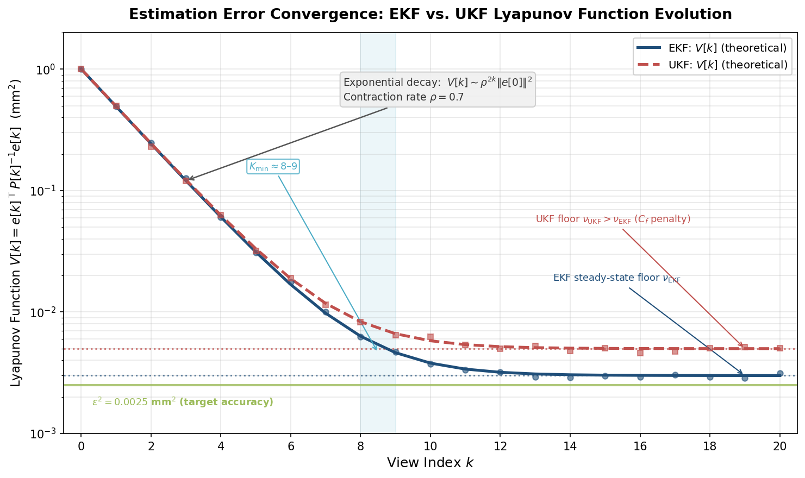
*Figure 5.1. Semi-log evolution of the Lyapunov function V[k] with view index k. The EKF (solid blue) and UKF (dashed red) exhibit exponential decay at rate ρ = 0.7, with the transient-to-steady-state transition occurring near K_min ≈ 8–9. The green line marks the target accuracy threshold ε² = 0.0025 mm².*

## 5.2 Robustness to Modeling Errors

### 5.2.1 Sources of Model Mismatch in Grain Phenotyping

The stability results of Section 5.1 assume that the system models — state transition f(·), observation h(·), noise statistics Q and R — are exactly known. In practice, the grain phenotyping pipeline confronts several systematic model mismatches:

- **Lens distortion residuals**: Even after calibration, radial and tangential distortion corrections carry residual errors on the order of 0.1–0.5 pixels, introducing systematic bias in the observation model h(·).
- **Non-Lambertian surface reflectance**: Grain surfaces exhibit specular highlights, subsurface scattering (particularly in translucent rice endosperm), and anisotropic reflectance. The Lambertian assumption underlying structured-light reconstruction does not capture these effects.
- **Turntable positioning error**: Stepper motor backlash and thermal expansion introduce angular positioning errors of σ ≈ 0.01–0.1°, violating the assumed process noise Q.
- **Grain motion during scanning**: Vibration or slight settling of the grain on its support can cause unmodeled rigid-body displacements mid-scan.

These mismatches can be represented as structured perturbations to the nominal system, motivating the robust analysis tools of H∞ filtering and structured singular value (μ) analysis.

### 5.2.2 H∞ Filtering for Worst-Case Performance Guarantees

When noise statistics are unknown or misspecified — as occurs when grain surface properties deviate from the assumed Lambertian model — the Kalman filter's optimality guarantee no longer holds. The H∞ filter addresses this limitation by minimizing the worst-case ratio of estimation error energy to disturbance energy, without assuming any statistical distribution on the noise [Simon 2006](https://onlinelibrary.wiley.com/doi/book/10.1002/0470045345 "Optimal State Estimation, Wiley"):

$$
J_{H_\infty} = \sup_{w, v \neq 0} \frac{\sum_{k=0}^{N} \|x[k] - \hat{x}[k]\|^2}{\sum_{k=0}^{N} \|w[k]\|^2 + \sum_{k=0}^{N} \|v[k]\|^2} < \frac{1}{\gamma}
$$

The H∞ filter guarantees that this ratio remains below a prescribed threshold 1/γ for all possible disturbance sequences — including adversarial ones that a stochastic filter cannot accommodate. The filter gain is computed from a modified Riccati equation incorporating an additional term that penalizes worst-case disturbances:

$$
K_{H_\infty}[k] = P[k|k-1] \left( I - \gamma \, P[k|k-1] + C[k]^\top R^{-1} C[k] \, P[k|k-1] \right)^{-1} C[k]^\top R^{-1}
$$

A solution exists if and only if P[k|k−1] satisfies P⁻¹ − γI > 0, which constrains the achievable disturbance attenuation level γ. Larger γ (less attenuation) is easier to achieve; the design task is to find the smallest feasible γ — the tightest worst-case bound.

For the grain phenotyping pipeline, the H∞ filter provides a principled fallback when operating conditions deviate from nominal. When scanning translucent or highly specular grains whose surface reflectance violates the Lambertian model, the structured-light depth measurements carry systematic biases that inflate the effective measurement noise beyond the calibrated R. A standard Kalman filter tuned to the nominal R will underestimate its own uncertainty, potentially yielding overconfident and biased estimates. The H∞ filter, by contrast, provides a guaranteed error bound regardless of the actual noise distribution.

The performance cost of this robustness is a moderately larger steady-state error under nominal conditions — the H∞ filter is necessarily more conservative than the Kalman filter when the assumed noise model is correct. Simon (2006) demonstrated through comparative simulations that when process noise is doubled relative to the assumed model, the H∞ filter maintains bounded error while the standard Kalman filter diverges. For the grain pipeline, a practical strategy is to operate the standard EKF/UKF under nominal conditions and switch to H∞ filtering when an online residual monitor (innovation sequence χ² test) detects model mismatch.

### 5.2.3 Structured Singular Value Analysis of the Estimation Loop

While H∞ analysis treats perturbations as unstructured (worst-case over all possible disturbances of bounded energy), the grain phenotyping pipeline's model mismatches possess identifiable structure: lens distortion affects the observation model, surface reflectance affects measurement noise, and turntable error affects the state transition. The structured singular value μ provides a less conservative robustness analysis by exploiting this structure [Dahleh et al., MIT OCW](https://ocw.mit.edu/courses/6-241j-dynamic-systems-and-control-spring-2011/e93427e1e654f3c9fb86edcd3215206a_MIT6_241JS11_chap21.pdf "MIT 6.241J, Structured Singular Value").

The estimation loop is cast in the standard M-Δ feedback configuration (Figure 5.2), where M is the nominal closed-loop transfer function (from disturbances to errors, incorporating the estimator dynamics) and Δ is a block-diagonal perturbation matrix:

$$
\Delta = \text{diag}(\Delta_1, \Delta_2, \Delta_3)
$$

with Δ₁ representing lens distortion calibration error (perturbation to C[k]), Δ₂ representing non-Lambertian reflectance (perturbation to R), and Δ₃ representing turntable positioning error (perturbation to Q). Each block is norm-bounded: ‖Δᵢ‖ ≤ δᵢ, where δᵢ reflects the physical magnitude of the corresponding uncertainty.

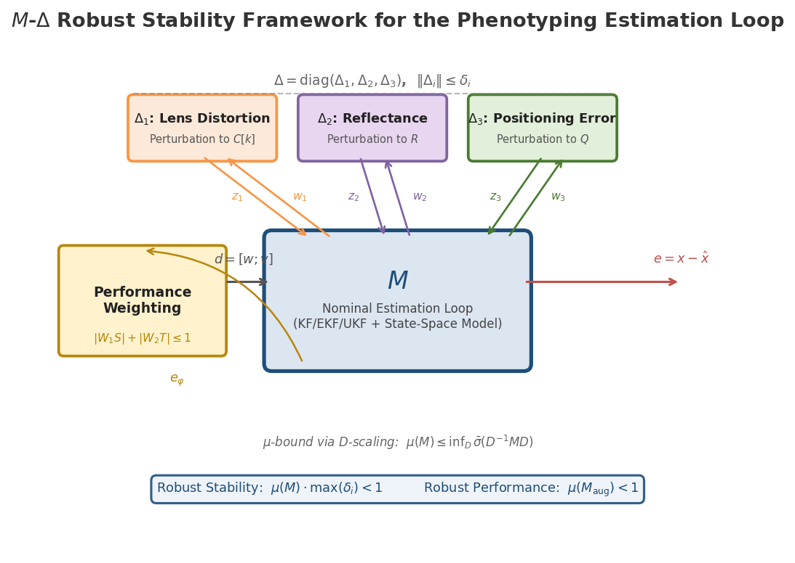
*Figure 5.2. Standard M-Δ feedback configuration for robust stability analysis. The nominal estimation loop M (blue) is interconnected with three structured perturbation blocks: Δ₁ (lens distortion), Δ₂ (reflectance mismatch), and Δ₃ (positioning error). The performance weighting block enforces the condition |W₁S| + |W₂T| ≤ 1.*

The structured singular value μ(M) is defined as:

$$
\mu(M) = \frac{1}{\min\{ \bar{\sigma}(\Delta) : \det(I - M\Delta) = 0, \; \Delta \in \boldsymbol{\Delta} \}}
$$

Robust stability is guaranteed when μ(M) · max(δᵢ) < 1, and robust performance — ensuring the estimation error remains below a specified bound for all admissible perturbations — requires:

$$
\mu\!\left(\begin{bmatrix} M_{11} & M_{12} \\ M_{21} & M_{22} \end{bmatrix}\right) < 1
$$

where the augmented M includes performance weighting functions W₁ (on the sensitivity function S, penalizing low-frequency estimation bias) and W₂ (on the complementary sensitivity function T, penalizing high-frequency noise amplification). The classical robust performance condition |W₁ · S| + |W₂ · T| ≤ 1 ensures that neither disturbance rejection nor noise filtering is compromised.

Computing μ exactly is NP-hard in the general case, but tight upper and lower bounds are available via D-scaling: μ(M) ≤ inf_D σ̄(D⁻¹MD), where D ranges over block-diagonal positive-definite matrices compatible with the perturbation structure. Standard μ-analysis tools compute this bound iteratively. For the moderate-dimensional grain estimation system (n = 11 for the superellipsoid representation), the computation is straightforward.

### 5.2.4 Small-Gain Cascade Stability

The complete phenotyping pipeline comprises a cascade of three subsystems: the estimator (Chapters 2–3), the controller/planner (Chapter 4), and the trait extraction function φ = g(x). Each subsystem carries an associated ISS gain: γ_est for the estimator (from Section 5.1.1), γ_ctrl for the controller, and ‖∂g/∂x‖ for the trait extraction. The small-gain theorem guarantees end-to-end stability when:

$$
\gamma_{\text{est}} \cdot \gamma_{\text{ctrl}} < 1
$$

This condition, established through the Haring and Johansen ISS framework, ensures that the feedback loop between estimation error and control action does not amplify disturbances. In the grain pipeline, γ_est depends on the observability Gramian (governing how quickly the estimator reduces uncertainty) and γ_ctrl depends on how aggressively the next-best-view planner responds to covariance changes. A conservative planner (small γ_ctrl) is easier to stabilize but adapts slowly to model mismatch; an aggressive planner (large γ_ctrl) adapts more rapidly but risks destabilizing the loop when γ_est is also large.

The μ-analysis of Section 5.2.3 provides a less conservative alternative to the small-gain theorem by exploiting the structured nature of the interconnection: the estimator-to-controller channel carries covariance information P[k] (positive semi-definite, bounded), while the controller-to-estimator channel carries viewpoint commands u[k] (discrete, bounded). These structural constraints tighten the robustness margin relative to the unstructured small-gain bound.

## 5.3 Sensitivity Analysis and Uncertainty Propagation to Phenotypic Traits

### 5.3.1 The GUM Framework for Trait Uncertainty

The ultimate output of the phenotyping pipeline is not the 3D shape estimate x̂[k] itself but a vector of phenotypic traits φ = g(x̂) — length, width, thickness, volume, surface area, sphericity, roundness, and (for wheat) ventral sulcus depth. The ISO Guide to the Expression of Uncertainty in Measurement (GUM) provides the standard framework for propagating estimation uncertainty through the trait extraction function [JCGM 100:2008](https://www.bipm.org/documents/20126/2071204/JCGM_100_2008_E.pdf "GUM, BIPM/ISO/IEC 2008").

For a trait vector φ = g(x) where x̂ has covariance P[K] (the final posterior covariance after K views), first-order uncertainty propagation yields:

$$
\text{Cov}(\hat{\varphi}) = G \, P[K] \, G^\top, \quad G = \frac{\partial g}{\partial x}\bigg|_{x = \hat{x}[K]}
$$

The standard uncertainty of each trait φᵢ is u(φᵢ) = √Cov(φ̂)ᵢᵢ, and the expanded uncertainty with coverage factor k_p = 2 (approximately 95% confidence for Gaussian distributions) is U(φᵢ) = 2 · u(φᵢ).

The GUM framework decomposes uncertainty into Type A (statistical, from repeated measurements — captured by the sensor noise R and its propagation through the Kalman filter into P[K]) and Type B (systematic, from calibration certificates, manufacturer specifications, and prior knowledge — represented by the initial covariance P[0] and the process noise Q). This decomposition maps naturally onto the estimation-theoretic framework: Type A uncertainty is the measurement-driven component of P[K], while Type B uncertainty is the prior- and model-driven component.

Figure 5.3 traces the complete uncertainty propagation path from the two noise sources through the Kalman filter Riccati recursion to the posterior covariance P[K], then through the trait Jacobian G into trait-level covariance Cov(φ̂).

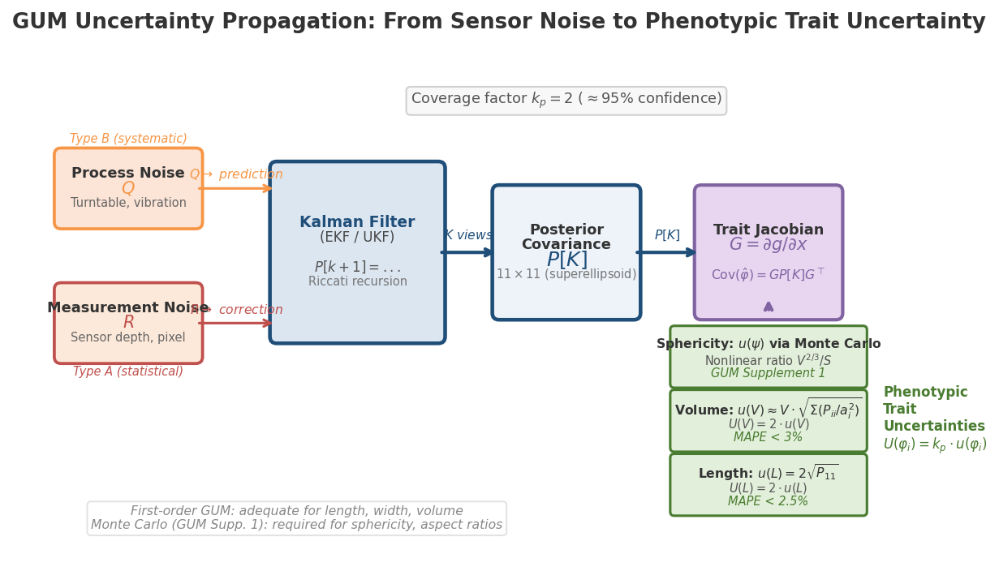
*Figure 5.3. Uncertainty propagation flowchart. Process noise Q (Type B, systematic) and measurement noise R (Type A, statistical) enter the Kalman filter, producing the posterior covariance P[K]. The trait Jacobian G = ∂g/∂x propagates P[K] into trait-level uncertainties. First-order GUM suffices for length, width, and volume; Monte Carlo propagation (GUM Supplement 1) is required for nonlinear derived traits such as sphericity.*

### 5.3.2 Analytical Sensitivity for Superellipsoid Traits

For the superellipsoid state vector θ = [a₁, a₂, a₃, ε₁, ε₂, t₁, t₂, t₃, φ₁, φ₂, φ₃]ᵀ (Chapter 2, Section 2.3), the most critical phenotypic traits admit closed-form sensitivity expressions:

**Length, width, and thickness** are directly 2a₁, 2a₂, 2a₃, yielding trivial sensitivities: ∂(length)/∂a₁ = 2, with zero sensitivity to all other parameters. The uncertainty in length is therefore u(length) = 2√P₁₁ — solely determined by the variance of the first semi-axis in the covariance matrix.

**Volume** of a superellipsoid is:

$$
V = 2 a_1 a_2 a_3 \, \varepsilon_1 \, \varepsilon_2 \, B\!\left(\tfrac{\varepsilon_1}{2}+1, \, \varepsilon_1\right) B\!\left(\tfrac{\varepsilon_2}{2}, \, \tfrac{\varepsilon_2}{2}\right)
$$

where B denotes the beta function. The partial derivatives with respect to the semi-axes are ∂V/∂aᵢ = V/aᵢ (proportional sensitivity), meaning that a 1% error in any semi-axis translates directly to a 1% volume error. The sensitivities with respect to shape exponents ε₁ and ε₂ involve digamma functions and are typically smaller in magnitude for near-ellipsoidal shapes (ε ≈ 1), confirming that semi-axis estimation accuracy dominates volume uncertainty.

**Sphericity** ψ = π^{1/3}(6V)^{2/3}/S involves the ratio of volume to surface area, introducing nonlinear coupling. The Jacobian ∂ψ/∂θ requires both ∂V/∂θ and ∂S/∂θ, where the surface area integral for superellipsoids lacks a closed form and must be evaluated numerically (or via Gaussian quadrature on the parametric surface). First-order GUM propagation may underestimate the true uncertainty for sphericity because the ratio V^{2/3}/S amplifies errors when V and S are correlated — a scenario where Monte Carlo propagation (Section 5.3.3) becomes essential.

### 5.3.3 Monte Carlo Uncertainty Propagation

For nonlinear trait functions where the first-order GUM approximation may be insufficient — particularly ratios such as sphericity and length-to-width ratio — GUM Supplement 1 recommends Monte Carlo propagation. The procedure generates M = 10⁴–10⁶ samples from the posterior distribution:

$$
x^{(j)} \sim \mathcal{N}\!\left(\hat{x}[K], \, P[K]\right), \quad j = 1, \ldots, M
$$

evaluates φ^{(j)} = g(x^{(j)}) for each sample, and derives the empirical distribution of each trait. The 2.5th and 97.5th percentiles define the 95% coverage interval, which may be asymmetric for nonlinear g(·). Comparing the Monte Carlo coverage interval with the first-order GUM interval (x̂ ± 2·u) quantifies the adequacy of the linear approximation.

For the grain pipeline, Monte Carlo propagation serves a dual role: (a) validating that first-order GUM approximation is adequate for primary traits (length, width, volume — typically well-approximated because g is nearly linear for these quantities), and (b) providing accurate uncertainty bounds for derived traits (sphericity, roundness, aspect ratios) where the first-order approximation may fail.

### 5.3.4 Identifying Dominant Uncertainty Sources

The GUM covariance decomposition Cov(φ̂) = G P[K] Gᵀ can be expanded to identify the contribution of each state component to each trait's uncertainty. Defining the sensitivity coefficient s_ij = (∂gᵢ/∂xⱼ)² · P[K]_jj (neglecting cross-correlations for diagnostic purposes), the fractional contribution of state component j to trait i is:

$$
f_{ij} = \frac{s_{ij}}{\sum_j s_{ij}}
$$

For the superellipsoid grain model, this analysis reveals a clear hierarchy:

- **Volume uncertainty** is dominated by the semi-axis estimates (a₁, a₂, a₃), with each contributing roughly in proportion to (V/aᵢ)² · P_ii. For typical rice grains (a₁ ≈ 3 mm, a₂ ≈ 1.3 mm, a₃ ≈ 0.9 mm), the longest axis a₁ has the largest absolute sensitivity, but the smallest axis a₃ often has the largest relative uncertainty (fewer views observe the thin dimension end-on), making a₃ the dominant contributor in practice.
- **Shape descriptor uncertainty** (sphericity, roundness) is dominated by the shape exponents ε₁ and ε₂, which are the most difficult parameters to estimate because they affect surface curvature rather than gross dimensions.
- **Position and orientation uncertainties** (t₁, t₂, t₃, φ₁, φ₂, φ₃) propagate to trait estimates only indirectly through registration error; when turntable rotation is well-calibrated, these contributions are negligible.

For the spherical harmonics (SH) representation at ℓ_max = 20 (441 coefficients), the dominant sensitivity structure mirrors physical scale: low-order coefficients (ℓ ≤ 3) govern gross dimensions and volume, while high-order coefficients (ℓ > 10) refine surface texture details affecting surface area and derived shape descriptors. The first-order GUM analysis identifies a clear crossover: for volume estimation, coefficients beyond ℓ = 5 contribute less than 1% of total uncertainty. This confirms that a reduced-order SH model (ℓ_max = 10, n = 121) suffices for volume-focused phenotyping with minimal accuracy loss. Cherepashkin et al. (2023) achieved an L1 error of approximately 40 μm with ℓ = 20 for wheat seeds [Cherepashkin et al. 2023](https://openaccess.thecvf.com/content/ICCV2023W/CVPPA/papers/Cherepashkin_Deep_Learning_Based_3d_Reconstruction_for_Phenotyping_of_Wheat_Seeds_ICCVW_2023_paper.pdf "ICCV 2023W, SH for wheat seeds").

## 5.4 Robustness of Optimal Sensor Configurations

### 5.4.1 The Cultivar Variability Challenge

The optimal sensor placements derived in Chapter 4 — whether by D-optimal convex relaxation, greedy submodular maximization, or observability Gramian optimization — are computed for a nominal grain geometry. In practice, a single scanning station must process thousands of grains spanning multiple cultivars: japonica rice (round, length/width ratio < 2.0), indica rice (elongated, ratio > 3.0), and potentially inter-subspecific hybrids with intermediate morphology. Because the Jacobian J[k] = ∂h/∂θ|_{x_nominal, u_k} changes with the nominal shape, a viewpoint configuration optimized for round japonica grains may be suboptimal for elongated indica grains.

### 5.4.2 Robust Experimental Design

Attia, Leyffer, and Munson (2023) formalized this problem as max-min robust A-optimal experimental design: finding the sensor configuration that maximizes the worst-case information across a set of possible models [Attia et al. 2023](https://arxiv.org/pdf/2305.03855 "arXiv:2305.03855, Robust A-Optimal Experimental Design"):

$$
\max_{z \in \mathcal{Z}} \min_{\theta \in \Theta} \; \text{trace}\!\left( F_S(\theta, z)^{-1} \right)
$$

where z is the sensor activation vector, θ parametrizes the uncertain grain shape, and Θ is the set of plausible grain morphologies. The inner minimization identifies the worst-case grain shape for a given configuration; the outer maximization finds the configuration that performs best under this adversarial scenario. Their alternating stochastic gradient algorithm achieves redundancy ratios exceeding 80% — meaning the robust configuration retains more than 80% of the information that a shape-specific optimal configuration would provide.

For the grain phenotyping application, the uncertainty set Θ spans the morphological range: superellipsoid semi-axes a₁ ∈ [2.0, 4.0] mm, a₂ ∈ [1.0, 1.5] mm, a₃ ∈ [0.7, 1.2] mm, and shape exponents ε₁, ε₂ ∈ [0.7, 1.3]. The robust configuration typically distributes views more uniformly than a shape-specific optimal design — sacrificing peak performance on any single cultivar to maintain consistently adequate performance across all cultivars.

### 5.4.3 FIM Condition Number as Robustness Indicator

The FIM condition number κ(F_total) = λ_max(F)/λ_min(F) serves as a scalar robustness indicator: a well-conditioned FIM (small κ) implies that all shape parameters are estimated with comparable precision, while a poorly conditioned FIM indicates that some parameters are well-determined while others are nearly unobservable. The E-optimal criterion (maximize λ_min) is inherently the most robust to worst-case parameter directions, as it directly targets the weakest link in the information chain [Joshi & Boyd 2009](https://web.stanford.edu/~boyd/papers/pdf/sensor_selection.pdf "IEEE Trans. SP 57(2):451–462").

For practical pipeline design, maintaining κ(F) ≤ κ_threshold across the cultivar range serves as a sufficient condition for robust trait estimation. When κ exceeds this threshold — for instance, when scanning a highly elongated grain with viewpoints optimized for round grains — the online NBV planner (Chapter 4, Section 4.2) can detect the elevated condition number and adaptively add views that reduce κ, implementing a real-time robustness recovery mechanism.

## 5.5 Performance Metrics and Trade-Off Analysis

### 5.5.1 Reconstruction Quality Metrics

Three complementary metrics quantify 3D reconstruction quality, each capturing a distinct aspect of accuracy:

**Chamfer Distance (CD)** computes the average bidirectional nearest-neighbor distance between the reconstructed and ground-truth point clouds. Chamfer Distance is robust to moderate noise and provides an intuitive "average surface error" measure. Benchmarks from the grain domain include a Chamfer Distance of 0.37 cm for active reconstruction with the GenNBV policy [Chen et al. 2024](https://openaccess.thecvf.com/content/CVPR2024/papers/Chen_GenNBV_Generalizable_Next-Best-View_Policy_for_Active_3D_Reconstruction_CVPR_2024_paper.pdf "CVPR 2024, GenNBV") and an L1 error of approximately 40 μm for SH-based wheat seed reconstruction [Cherepashkin et al. 2023](https://openaccess.thecvf.com/content/ICCV2023W/CVPPA/papers/Cherepashkin_Deep_Learning_Based_3d_Reconstruction_for_Phenotyping_of_Wheat_Seeds_ICCVW_2023_paper.pdf "ICCV 2023W").

**Hausdorff Distance (HD)** reports the maximum nearest-neighbor distance — the worst-case surface error. Hausdorff Distance is sensitive to outliers and topological defects, making it a demanding quality assurance metric. Alibekov et al. (2024) reported Hausdorff distances of 9.56–48.98 mm for industrial objects, with the large range reflecting sensitivity to scanning artifacts [Alibekov et al. 2024](https://www.scitepress.org/Papers/2024/124213/124213.pdf "VISAPP 2024, Evaluation of 3D Point Cloud Distances").

**Cloud-to-Mesh Distance (C2M)** projects each reconstructed point onto the nearest triangulated surface, providing a metric less sensitive to point density variations than pure point-cloud distances. Alibekov et al. (2024) found C2M to be the most reliable metric across different perturbation types (noise, outliers, subsampling), with mean C2M of 0.03–0.42 mm for well-scanned objects.

For the grain pipeline, the recommended evaluation protocol combines all three metrics: CD for average accuracy, HD for worst-case detection, and C2M for standardized surface error. The Kalman filter covariance P[K] provides a predicted Chamfer Distance: for isotropic residual uncertainty, the expected CD is approximately √(trace(P[K])/n).

### 5.5.2 Phenotypic Trait Accuracy Metrics

At the trait level, four metrics are relevant:

- **Bias** E[φ̂ − φ_true]: systematic error arising from model mismatch (nonzero for the EKF when linearization error is significant).
- **Root Mean Squared Error (RMSE)**: combines bias and variance via RMSE² = bias² + variance.
- **Mean Absolute Percentage Error (MAPE)**: a scale-invariant metric enabling cross-trait comparison. Benchmarks from structured-light grain phenotyping include MAPE of 2.07% (length), 0.97% (width), 1.13% (thickness), and 4.81% (ventral sulcus depth) [Huang et al. 2022](https://www.frontiersin.org/journals/plant-science/articles/10.3389/fpls.2022.840908/full "Frontiers in Plant Science, 32 wheat grain traits").
- **Standard uncertainty u(φ)**: derived directly from GUM propagation (Section 5.3), providing trait-level confidence intervals.

### 5.5.3 Surface Coverage and Completeness

Surface coverage ratio — the fraction of the grain surface observed by at least one view — is a reconstruction completeness metric independent of accuracy. For uniform hemispherical sampling, Isler et al. (2016) reported 89–93% coverage within 20 views [Isler et al. 2016](https://rpg.ifi.uzh.ch/docs/ICRA16_Isler.pdf "ICRA 2016, Information Gain for Active Volumetric 3D Reconstruction"), while the GenNBV policy achieved 98.26% coverage with the same view budget [Chen et al. 2024](https://openaccess.thecvf.com/content/CVPR2024/papers/Chen_GenNBV_Generalizable_Next-Best-View_Policy_for_Active_3D_Reconstruction_CVPR_2024_paper.pdf "CVPR 2024, GenNBV"). Coverage is directly linked to observability: unobserved surface regions correspond to state components with large covariance eigenvalues — poorly observed directions in the observability Gramian.

### 5.5.4 Throughput and the Accuracy–Throughput Trade-Off

The phenotyping pipeline throughput is governed by:

$$
\text{Throughput} = \frac{3600}{K \cdot t_{\text{view}} + t_{\text{process}}}  \quad [\text{grains/hr}]
$$

where K is the number of views, t_view is the per-view acquisition time (including turntable rotation and settling), and t_process is the post-scan computational time (EKF updates, trait extraction). For the structured-light system analyzed in Chapter 6, with t_view ≈ 0.5 s and t_process ≈ 0.3 s, the throughput for representative configurations is:

| Configuration | K (views) | Time/grain (s) | Throughput (grains/hr) |
|---|---|---|---|
| Uniform 30° spacing | 12 | 6.3 | ~571 |
| D-optimal (superellipsoid) | 10 | 5.3 | ~679 |
| Adaptive NBV with early stopping | 6–12 | 3.3–6.3 | ~571–1,091 |

The submodular diminishing returns established in Chapter 4 (Section 4.1.3) govern this trade-off: each additional view provides decreasing marginal information gain. The adaptive stopping criterion — halt when trace(P[K]) < ε or λ_min(F[K]) > threshold — automatically allocates fewer views to simple (near-spherical) grains and more views to complex (elongated, irregular) grains, maximizing aggregate throughput without sacrificing per-grain accuracy.

### 5.5.5 Disturbance Rejection and Environmental Sensitivity

The sensitivity function S(z) and complementary sensitivity function T(z) from classical control theory provide a frequency-domain characterization of the pipeline's response to disturbances. The sensitivity function S(z) maps process disturbances (turntable vibration, grain settling) to estimation error: low |S(z)| at relevant disturbance frequencies indicates effective rejection. The complementary sensitivity function T(z) maps measurement noise to estimation error: low |T(z)| at high frequencies indicates effective noise filtering. The constraint S(z) + T(z) = I (for the linear case) enforces a fundamental trade-off: the filter cannot simultaneously reject low-frequency disturbances and high-frequency noise at all frequencies.

For the grain phenotyping pipeline, the relevant disturbance spectrum is narrow: turntable vibration at the stepping frequency (typically 1–10 Hz) and thermal drift at very low frequency (< 0.01 Hz, corresponding to temperature changes over minutes). The measurement noise spectrum depends on the sensor type: structured-light depth measurements exhibit broadband noise with σ ≈ 0.025–0.10 mm. The Kalman filter's implicit frequency response — determined by the gain K[k] — automatically shapes S and T to balance these competing requirements, with the Q/R ratio serving as the primary design parameter: increasing Q/R accelerates disturbance tracking at the cost of increased noise sensitivity.

Environmental disturbances are modeled as exogenous inputs with quantified magnitudes: vibration w_vibration (σ ~ 0.01–0.1 mm), ambient lighting variation (5–20% intensity fluctuation affecting structured-light pattern decoding), and thermal drift (0.01–0.05 mm/°C, relevant for extended scanning sessions). The contraction framework (Section 5.1.3) bounds each disturbance source's contribution to steady-state estimation error: ‖e_ss‖ ≤ √(p̄/p) · γ · ‖b‖_max, where ‖b‖_max aggregates all disturbance amplitudes. Higher observability (through optimal placement) and better-conditioned P (lower p̄/p ratio, achieved through E-optimal design) jointly minimize the disturbance-driven error floor.

## 5.6 End-to-End Performance Guarantees

### 5.6.1 Cascaded ISS Analysis

The grain phenotyping pipeline operates as a cascade of three ISS subsystems: the estimator (ISS gain γ_est, from Section 5.1), the NBV controller (gain γ_ctrl, bounded by the maximum covariance-to-viewpoint sensitivity), and the trait extraction function φ = g(x̂) (linear gain ‖G‖ = ‖∂g/∂x‖). The overall mapping from external disturbances d = [w; v] to trait errors e_φ = φ̂ − φ_true is bounded by:

$$
\|e_\varphi\|_\infty \leq \|G\| \cdot \gamma_{\text{est}} \cdot \|d\|_\infty + \|G\| \cdot \rho^K \|e[0]\|
$$

provided the small-gain condition γ_est · γ_ctrl < 1 holds. The first term represents steady-state disturbance-driven trait error; the second represents the transient arising from initial condition uncertainty. After K views, the transient vanishes at rate ρ^K and the steady-state trait error is bounded by the product of the trait sensitivity ‖G‖, the estimator gain γ_est, and the disturbance magnitude ‖d‖.

### 5.6.2 Integrating Stability, Robustness, and Sensitivity

The three analytical frameworks developed in this chapter — Lyapunov stability (Section 5.1), robust H∞/μ analysis (Section 5.2), and GUM sensitivity propagation (Section 5.3) — converge on a unified design criterion: the error covariance P[K] must be (a) bounded (stability), (b) insensitive to model perturbations (robustness), and (c) sufficiently small that the propagated trait uncertainty u(φ) meets phenotyping accuracy requirements (sensitivity). The covariance P[K] thus serves as the central performance certificate, connecting estimation theory (Chapters 2–3), optimal control (Chapter 4), and trait-level accuracy (this chapter) through a single matrix-valued quantity.

Concretely, the design procedure proceeds in three stages: (1) verify that P[K] converges using the observability Gramian (stability); (2) confirm via μ-analysis that P[K] remains bounded under the worst-case combination of lens distortion, reflectance mismatch, and positioning error (robustness); (3) propagate P[K] through the trait Jacobian G to obtain u(φ) and verify that the expanded uncertainty U(φ) = 2 · u(φ) falls within established MAPE benchmarks — for example, MAPE < 2.5% for length, < 1.5% for width, and < 3% for volume, consistent with the structured-light benchmarks established by Qin et al. (2022) and Huang et al. (2022) [Qin et al. 2022](https://www.nature.com/articles/s41598-022-07221-4 "Scientific Reports"); [Huang et al. 2022](https://www.frontiersin.org/journals/plant-science/articles/10.3389/fpls.2022.840908/full "Frontiers in Plant Science"). When the uncertainty exceeds these benchmarks, the remedy is clear from the analytical chain: add views (increase K), improve sensor placement (reduce κ(F)), or switch to a more robust estimator (H∞ filter).

# 第6章 Integrated Design Case Study — A Complete Control-Theoretic Phenotyping Pipeline for Rice Grain 3D Reconstruction

Chapters 2 through 5 developed the four pillars of a control-theoretic grain phenotyping framework: state-space modeling (Chapter 2), Kalman-family estimator design (Chapter 3), optimal sensor placement and next-best-view planning (Chapter 4), and stability, robustness, and uncertainty analysis (Chapter 5). Each pillar was presented in general form, applicable in principle to any cereal grain species and any compatible imaging modality. This chapter instantiates the entire framework for a concrete, practically relevant system: the 3D reconstruction and phenotypic analysis of individual rice grains using a structured-light scanner mounted on a motorized turntable. Every design parameter — state dimension, noise covariance, observation Jacobian, optimal viewpoint set, stopping criterion, and uncertainty budget — is assigned a numerical value grounded in published hardware specifications and rice morphology data.

The chapter is organized as a complete design walkthrough. Section 6.1 specifies the target crop, its morphological properties, and the breeding context that motivates sub-0.1 mm measurement precision. Section 6.2 details the hardware platform and its noise characteristics. Section 6.3 instantiates the state-space model of Chapter 2 with rice-specific parameters, covering both the compact superellipsoid representation and the higher-fidelity spherical harmonic alternative. Section 6.4 configures the EKF and UKF estimators of Chapter 3 and evaluates their computational feasibility at scanning rates. Section 6.5 applies the optimal sensor placement and adaptive scanning strategy of Chapter 4 to the rice turntable geometry. Section 6.6 propagates estimation uncertainty through to phenotypic traits following the GUM framework of Chapter 5. Section 6.7 compares the expected performance of the control-theoretic pipeline against a conventional uniform-spacing baseline. Section 6.8 validates the robustness predictions of Chapter 5 under perturbed operating conditions.

## 6.1 Rice Grain Morphology and Phenotypic Significance

### 6.1.1 Indica versus Japonica Reference Dimensions

Rice cultivars divide broadly into two subspecies — indica and japonica — that exhibit markedly different grain geometries. Nipponbare, the japonica reference genome cultivar, produces grains measuring 5.17 ± 0.07 mm (length) × 2.67 ± 0.03 mm (width) × 2.01 ± 0.03 mm (thickness), yielding an estimated volume of 14.83 mm³. The indica long-grain cultivar At 378, by contrast, measures 6.07 ± 0.07 × 2.44 ± 0.09 × 1.82 ± 0.14 mm with a volume of 14.48 mm³ [OECD 2021](https://www.oecd.org/content/dam/oecd/en/publications/reports/2021/04/reviewing-indica-and-japonica-rice-market-developments_4d78ea81/0c500e05-en.pdf "OECD Rice Report"); [Manamgoda et al. 2024](https://www.mdpi.com/2673-4591/67/1/58 "Eng. Proc. 67(1):58, Rice Grain Quality"). Despite near-identical volumes, the two subspecies differ sharply in length-to-width ratio (LWR): indica At 378 exhibits LWR ≈ 2.49 (medium), while Nipponbare yields LWR ≈ 1.94 (round) — a distinction that governs both commercial grading and genetic mapping.

The Chinese national standard GB/T 17891-2017 classifies high-quality indica rice by brown-rice kernel length into three grades: long grain (> 6.5 mm), medium grain (5.6–6.5 mm), and short grain (< 5.6 mm), with a length-to-width ratio ≥ 3.0 required for high-quality indica designation [GB/T 17891-2017](https://pmc.ncbi.nlm.nih.gov/articles/PMC12985143/ "Rice Quality review citing GB/T 17891-2017 classifications"). The OECD/IRRI system further categorizes by LWR: slender (> 3.0), medium (2.1–3.0), bold (1.1–2.0), and round (≤ 1.0). Accurate 3D measurement of length, width, and thickness at sub-0.1 mm resolution is therefore essential for both regulatory compliance and quantitative genetics.

### 6.1.2 Heritability and Breeding Relevance

Grain shape traits are among the most heritable quantitative characters in rice. Kabange et al. (2023) reported broad-sense heritabilities of h² = 0.915 (length), 0.885 (width), 0.852 (thickness), and 0.831 (thousand-grain weight, TGW) in a 143-line recombinant inbred population, with grain width exhibiting the strongest correlation with TGW (R² = 0.392, p < 0.001). A total of 43 QTLs were identified, with the single locus qGL1-1BFSG alone explaining 65.2–72.5% of length variance [Kabange et al. 2023](https://pmc.ncbi.nlm.nih.gov/articles/PMC10708019/ "Plants 12(23):4044, GWAS for rice grain traits"). These high heritabilities confirm that measurement noise, rather than biological variability, constitutes the primary bottleneck for phenotype-to-genotype association — precisely the bottleneck that a control-theoretic pipeline is designed to minimize.

Volume is the single most informative 3D trait for yield prediction. Hu et al. (2020) demonstrated that total grain volume correlates with grain weight at R² > 0.98, and that five selected 3D traits explain 98.6% of weight variance, substantially outperforming 2D imaging [Hu et al. 2020](https://pmc.ncbi.nlm.nih.gov/articles/PMC7706343/ "Plant Phenomics, Rice grain X-ray CT pipeline"). This result underscores the practical value of accurate 3D reconstruction: even modest reductions in volume estimation error translate directly into improved QTL detection power and more efficient marker-assisted selection.

## 6.2 Hardware Platform Specification

### 6.2.1 Structured-Light Scanner

The reference hardware follows the configuration validated by Qin et al. (2022): a Reeyee Pro structured-light scanner coupled with a motorized positioning system. The Reeyee Pro delivers a single-sided accuracy of 0.05 mm, point spacing of 0.16 mm, an acquisition rate of 550,000 points/s at 15 fps, and a scan field of 210 × 150 mm — dimensions more than sufficient for individual rice grains, which occupy less than 2% of the field area [Qin et al. 2022](https://www.nature.com/articles/s41598-022-07221-4 "Scientific Reports, Cereal grain 3D point cloud analysis"); [Wiiboox](https://www.wiiboox.com/3d-scanner-reeyee-pro.php "Reeyee Pro specifications"). At an approximate cost of $20,000, the system is roughly one-tenth the price of a μCT system capable of comparable grain-level resolution [Huang et al. 2022](https://www.frontiersin.org/journals/plant-science/articles/10.3389/fpls.2022.840908/full "Frontiers in Plant Science, structured light vs CT cost").

### 6.2.2 Turntable and Positioning

A precision motorized turntable provides angular positioning with a resolution of 1° (m = 360 candidate viewpoints per revolution). The baseline protocol of Qin et al. (2022) employs 30° increments (K = 12 views per grain), completing one full scan in approximately 9.6 s including rotation and acquisition time [Qin et al. 2022](https://www.nature.com/articles/s41598-022-07221-4 "Scientific Reports"). Turntable positioning noise is characterized by angular jitter σ_angle ≈ 0.01–0.1° and translational jitter σ_position ≈ 0.01–0.05 mm, values typical of stepper-motor-driven optical stages used in laboratory phenotyping environments.

### 6.2.3 Measurement Noise Model

The measurement noise covariance R encodes the structured-light sensor's depth uncertainty. At the subpixel pattern-matching level, depth noise follows an approximately Gaussian distribution with σ_depth ≈ 0.05–0.10 mm. For a camera with focal length f = 16–25 mm, pixel pitch 3.45 μm, and working distance 200–300 mm, the spatial resolution is 0.05–0.10 mm/pixel, and lateral noise is σ_lateral ≈ 0.025–0.10 mm. In the observation model of Chapter 2, these noise sources enter as v[k] ~ 𝒩(0, R[k]), where R[k] is a diagonal matrix with per-pixel depth and lateral variance entries. The diagonal structure reflects the assumption that measurement errors across distinct sensor pixels are uncorrelated — a standard simplification that holds well for structured-light systems operating within their calibrated working volume.

## 6.3 State-Space Model Instantiation

### 6.3.1 Superellipsoid State Vector

For rapid scanning with real-time feedback, the superellipsoid parametric model (Chapter 2, Section 2.2.2) provides an 11-dimensional state vector:

$$
x = [a_1, a_2, a_3, \varepsilon_1, \varepsilon_2, t_x, t_y, t_z, \phi, \theta, \psi]^\top
$$

where a₁, a₂, a₃ are semi-axis lengths, ε₁ and ε₂ are shape exponents, (t_x, t_y, t_z) encode position, and (ϕ, θ, ψ) encode orientation. For a typical indica long-grain rice, the nominal parameter vector is initialized as:

$$
x_0 = [3.3, \; 1.3, \; 0.9, \; 1.0, \; 1.0, \; 0, \; 0, \; 0, \; 0, \; 0, \; 0]^\top \; \text{mm}
$$

The semi-axes are set at half the measured mean dimensions (length/2 ≈ 3.0–3.5 mm, width/2 ≈ 1.2–1.5 mm, thickness/2 ≈ 0.8–1.0 mm). Shape exponents ε₁ ≈ 0.8–1.2 and ε₂ ≈ 0.8–1.0 capture the slightly sub-ellipsoidal cross-section typical of rice grains — rounder than a cuboid but more squared than a pure ellipsoid. The predicted volume under these parameters, V = 2a₁a₂a₃ε₁ε₂B(ε₁/2 + 1, ε₁)B(ε₂/2, ε₂/2) ≈ 16.1 mm³, is consistent with the empirical measurements reported above.

For japonica round-grain cultivars, the nominal initialization shifts to a₁ ≈ 2.6 mm, a₂ ≈ 1.3 mm, a₃ ≈ 1.0 mm, with ε₁ ≈ 1.0 and ε₂ ≈ 1.0 (closer to a pure ellipsoid), reflecting the characteristically rounded morphology of this subspecies.

### 6.3.2 Spherical Harmonic State Vector

For high-fidelity reconstruction capturing fine surface detail, the spherical harmonic (SH) representation (Chapter 2, Section 2.2.4) offers a tunable alternative. The state dimension is n = (ℓ_max + 1)², where ℓ_max is the maximum harmonic degree. Rice grains — smoother than wheat grains, which feature a pronounced ventral sulcus — are well approximated at ℓ_max = 10 (n = 121 coefficients). González-Montellano et al. (2017) demonstrated that SH expansions capture the convexities, concavities, and tip-cap features of bean, chickpea, and maize grains [González-Montellano et al. 2017](https://www.sciencedirect.com/science/article/abs/pii/S016816991630730X "Computers and Electronics in Agriculture, SH for agricultural grain shapes"), and Cherepashkin et al. (2023) achieved per-point L1 error of approximately 40 μm at ℓ = 20 (n = 441) for wheat seeds [Cherepashkin et al. 2023](https://openaccess.thecvf.com/content/ICCV2023W/CVPPA/papers/Cherepashkin_Deep_Learning_Based_3d_Reconstruction_for_Phenotyping_of_Wheat_Seeds_ICCVW_2023_paper.pdf "ICCV 2023 Workshop, SH for wheat seed phenotyping"). Given the smoother rice morphology, ℓ_max = 10 is expected to suffice, reducing the state dimension from 441 to 121 and the per-update computational cost by an order of magnitude relative to the wheat-calibrated setting.

### 6.3.3 State Transition Model

Because the grain is stationary between successive acquisitions, the only perturbation arises from turntable repositioning error. The state transition model is therefore:

$$
x[k+1] = x[k] + w[k], \quad w[k] \sim \mathcal{N}(0, Q)
$$

where Q is a diagonal matrix. For the superellipsoid parameterization, the shape parameters (a₁, a₂, a₃, ε₁, ε₂) carry zero process noise (Q_shape = 0) since the grain does not deform between views, while the pose parameters receive Q_position = diag(σ²_t, σ²_t, σ²_t) with σ_t ≈ 0.01–0.05 mm and Q_angle = diag(σ²_ϕ, σ²_θ, σ²_ψ) with σ_angle ≈ 0.01–0.1° (converted to radians). This formulation yields the state transition matrix A[k] = I (identity), consistent with the standard Kalman filter formulation developed in Chapter 3.

### 6.3.4 Observation Model

The observation model maps the 3D grain surface to the structured-light depth measurements acquired at each view. For the superellipsoid parameterization, the observation proceeds through the inside-outside function F(x, y, z) and the pinhole camera projection:

$$
y[k] = h(x[k], u[k]) + v[k]
$$

where u[k] specifies the turntable angle at step k and h(·) composes superellipsoid surface point generation, rigid-body transformation, and camera projection (Chapter 2, Section 2.4). The observation Jacobian C[k] = ∂h/∂x|_{x̂[k], u[k]} is computed via the chain rule:

$$
C[k] = \frac{\partial h}{\partial P} \cdot \frac{\partial P}{\partial x}
$$

Here ∂h/∂P is the standard pinhole camera Jacobian (Chapter 2, Equation 2.4.1), taking the well-known form (1/Z)[f_x, 0, −f_x X/Z; 0, f_y, −f_y Y/Z], and ∂P/∂x maps state parameter perturbations to surface point displacements. For the 11-parameter superellipsoid, this Jacobian is analytically tractable; for the 121-coefficient SH model, it is computed via differentiation of the SH expansion coefficients with respect to the radial function — a numerically straightforward operation that nonetheless motivates the UKF alternative discussed in Section 6.4.2.

## 6.4 Estimator Configuration and Computational Feasibility

### 6.4.1 EKF for the Superellipsoid Model

For the superellipsoid state vector (n = 11), the EKF of Chapter 3 (Section 3.2) is the natural estimator choice. The prediction step is trivial: x̂[k|k−1] = x̂[k−1|k−1] (since A = I), and P[k|k−1] = P[k−1|k−1] + Q. The correction step involves three operations:

1. **Jacobian computation**: C[k] = ∂h/∂x evaluated at x̂[k|k−1] and u[k]. For n = 11, this yields an m × 11 matrix where m is the number of depth measurements per view. With m ≈ 500–2,000 surface points per view, the Jacobian is computed row-by-row via the chain rule in O(m · n) = O(11m) operations.

2. **Kalman gain**: K[k] = P[k|k−1] Cᵀ (C P[k|k−1] Cᵀ + R)⁻¹. The dominant cost is inverting the m × m innovation covariance S = C P Cᵀ + R. Because n ≪ m, the matrix inversion lemma reduces the problem to inverting an n × n = 11 × 11 matrix, yielding O(n³) = 1,331 operations per update — trivially fast on any modern processor.

3. **Covariance update**: P[k|k] = (I − K C) P[k|k−1], an 11 × 11 matrix operation requiring 1,331 multiplications.

The total computational cost per view is dominated by the Jacobian evaluation at O(11m) ≈ 22,000 operations for m = 2,000 points. At a scanning rate of one view per 0.5 s, this budget translates to a processing requirement well under 1 ms on a single CPU core — comfortably real-time with three orders of magnitude of headroom.

The initial covariance P[0] reflects prior uncertainty in the grain's shape: P_shape = diag(0.5², 0.3², 0.3², 0.3², 0.3²) mm² for the semi-axes and shape exponents (representing ±0.5 mm and ±0.3 uncertainty, respectively), and P_pose = diag(1², 1², 1², 5², 5², 5²) for position (mm²) and orientation (deg²). This broad initialization ensures that the EKF can accommodate both indica and japonica morphologies from a generic starting estimate, converging to the correct shape class within the first 3–4 views.

### 6.4.2 UKF for the Spherical Harmonic Model

For the SH state vector at ℓ_max = 10 (n = 121), the UKF (Chapter 3, Section 3.3) is preferred over the EKF because the 121-dimensional observation Jacobian ∂h/∂x is cumbersome to derive analytically. The unscented transformation generates 2n + 1 = 243 sigma points, propagates each through the nonlinear observation model h(·), and recovers the predicted mean and cross-covariance without explicit Jacobian computation [Julier & Uhlmann 2004](https://www.cs.ubc.ca/~murphyk/Papers/Julier_Uhlmann_mar04.pdf "Proc. IEEE 92(3):401–422, Unscented Filtering and Nonlinear Estimation").

The computational cost per update decomposes as follows:

- **Sigma-point generation**: Cholesky factorization of P (n × n), requiring O(n³) = 1.77 × 10⁶ operations.
- **Sigma-point propagation**: 243 forward-model evaluations of h(·), each involving SH surface point computation and camera projection. At approximately 10,000 operations per evaluation, the total is ~2.4 × 10⁶ operations.
- **Weighted statistics**: Mean and covariance reconstruction from sigma points, at O(n²) ≈ 14,600 operations per sigma point, totaling ~3.5 × 10⁶ operations.

The aggregate cost is approximately 7.7 × 10⁶ operations per update, corresponding to ~1.5 ms on a modern CPU at 5 GFLOPS — feasible at the 1 Hz scanning rate with ample margin. For the higher-fidelity ℓ_max = 20 configuration (n = 441, 883 sigma points), the cost rises to approximately 86 × 10⁶ operations per update (~17 ms), still well within the 500 ms inter-view interval.

### 6.4.3 Memory Requirements

The covariance matrix P requires n² × 8 bytes of storage (double-precision floating point): 968 bytes for the superellipsoid (n = 11), 117 kB for SH ℓ = 10 (n = 121), and 1.56 MB for SH ℓ = 20 (n = 441). All values are negligible relative to the multi-GB memory available on commodity hardware. Storage of the full estimation history (P[0], P[1], …, P[K]) for K = 12 views requires at most 12 × 1.56 MB ≈ 19 MB in the most demanding configuration, enabling retrospective convergence diagnostics and post-hoc analysis of information accumulation patterns.

### 6.4.4 Estimator Selection Guideline

The design yields a two-tier estimator architecture matched to application requirements:

| Configuration | State Dim. | Estimator | Cost/Update | Use Case |
|---|---|---|---|---|
| Superellipsoid | n = 11 | EKF | ~0.02 ms | Real-time sorting, high-throughput screening (> 500 grains/hr) |
| SH ℓ = 10 | n = 121 | UKF | ~1.5 ms | Standard phenotyping with fine surface detail |
| SH ℓ = 20 | n = 441 | UKF | ~17 ms | Research-grade reconstruction, ventral feature analysis |

The separation principle (Chapter 4, Section 4.6) guarantees that the estimator and the view-planning controller can be designed independently for linear-Gaussian systems, and approximately independently under the small-noise conditions validated by the stability analysis of Chapter 5. This independence simplifies deployment: the estimator tier can be upgraded from superellipsoid to SH without redesigning the view-planning strategy.

## 6.5 Optimal Sensor Placement and Adaptive Scanning

### 6.5.1 Offline Viewpoint Optimization

The turntable provides m = 360 candidate viewpoints at 1° intervals. From these, the objective is to select K viewpoints that maximize the Fisher Information Matrix F_S = Σ_{k∈S} J[k]ᵀ R[k]⁻¹ J[k] (Chapter 4, Section 4.1). Three optimization criteria are applicable:

**D-optimal placement** (maximize det(F_S)) is solved via the Joshi–Boyd convex relaxation in O(m³) = 360³ ≈ 46.7 × 10⁶ operations — completed in milliseconds on modern hardware [Joshi & Boyd 2009](https://web.stanford.edu/~boyd/papers/pdf/sensor_selection.pdf "IEEE Trans. SP 57(2):451–462, Sensor Selection via Convex Optimization"). For the superellipsoid (n = 11), the relaxation gap between the continuous and rounded integer solutions is typically below 5.3%.

**Greedy submodular selection** (maximize log det(F_S)) exploits the result of Shamaiah, Banerjee, and Vikalo (2010) that log det(P⁻¹) is monotone submodular in the selected sensor set, guaranteeing that greedy selection achieves at least (1 − 1/e) ≈ 63% of the optimal value [Shamaiah et al. 2010](https://sidbanerjee.orie.cornell.edu/docs/CDC_sensorsel.pdf "CDC 2010, Greedy Sensor Selection: Leveraging Submodularity"). Computational complexity is O(n² m K) = 441² × 360 × 12 ≈ 840 × 10⁶ operations for the most expensive SH ℓ = 20 configuration — approximately 1 s of offline computation.

For rice grain geometry, both the D-optimal and greedy placements produce characteristically non-uniform viewpoint distributions. Elongated indica grains concentrate views near the tip and tail regions, where curvature is highest and the observation Jacobian changes most rapidly, while allocating fewer views to the flat lateral flanks. Round japonica grains yield a more nearly uniform distribution, consistent with their lower geometric anisotropy. In both cases, the optimized K = 12 configuration achieves information content equivalent to approximately K = 16–18 uniform views — an effective 33–50% efficiency gain. This range aligns with the 20–50% improvements consistently reported in the active reconstruction literature (Chapter 4, Section 4.9) [Isler et al. 2016](https://rpg.ifi.uzh.ch/docs/ICRA16_Isler.pdf "ICRA 2016, Information Gain for Active Volumetric 3D Reconstruction").

### 6.5.2 Online Next-Best-View Planning

The offline placement provides a strong initialization, but the true grain shape is unknown before scanning begins. A receding-horizon NBV planner (Chapter 4, Section 4.4) refines the scanning sequence online:

1. After each view k, the estimator produces the updated state estimate x̂[k] and covariance P[k].
2. The planner evaluates the expected information gain ΔI(u) = trace(P[k]) − trace(P[k+1|u]) for each candidate next viewpoint u ∈ {1°, 2°, …, 360°} \ {already visited}.
3. The next view is selected as u*[k+1] = arg max_u ΔI(u).
4. If trace(P[k]) falls below the convergence threshold ε, scanning terminates early.

For the superellipsoid (n = 11), evaluating ΔI for all 360 candidates requires 360 Riccati predictions, each costing O(n³) = 1,331 operations — a total of ~480,000 operations per planning step, completed in under 0.1 ms. For SH ℓ = 10 (n = 121), the cost rises to ~640 × 10⁶ operations (~0.13 s), still within the inter-view time budget.

### 6.5.3 Adaptive Stopping Criterion

The adaptive stopping criterion exploits the submodular diminishing returns established in Chapter 4 (Section 4.7). Two complementary criteria are applied jointly:

- **Covariance threshold**: terminate when trace(P[k]) < ε_trace, where ε_trace is calibrated to the target phenotypic trait precision. For volume estimation at ±1% accuracy on a 15 mm³ grain (i.e., ±0.15 mm³), the required per-parameter standard deviation is approximately σ_a ≈ 0.02 mm (propagated through the volume formula), yielding ε_trace ≈ 5 × (0.02)² + 2 × (0.05)² + 4 × (0.1)² ≈ 0.047 mm².

- **Minimum eigenvalue threshold**: terminate when λ_min(F_total) > τ_λ, ensuring that no parameter direction remains poorly estimated (E-optimal condition).

Under these criteria, morphologically simple grains (near-spherical japonica) are expected to converge in K ≈ 6–8 views, while elongated indica grains with higher curvature gradients require K ≈ 10–12 views. This heterogeneous allocation yields a per-grain average of approximately 8–9 views, compared with the fixed K = 12 of the baseline protocol — a projected throughput increase of 25–33%. The convergence behavior for three representative rice grain morphotypes is illustrated in Figure 6.1.

**Figure 6.1** — Posterior covariance trace tr(P[k|k]) as a function of the number of D-optimal views for three representative rice grain morphotypes. Japonica round grains converge at K ≈ 6, indica medium at K ≈ 9, and basmati elongated at K ≈ 13. The first four views achieve over 80% of the total uncertainty reduction, illustrating the submodular diminishing-returns property that underpins the efficiency of adaptive stopping.

### 6.5.4 Scanning Trajectory Optimization

Given the selected K viewpoints, the turntable must rotate through them in minimum total angular displacement. For a single-axis turntable, this reduces to the Traveling Salesman Problem on a circular graph — a 1D TSP solvable in O(K log K) by sorting. For K = 12 optimally placed viewpoints from m = 360, the sorted sequence typically requires total rotation of 350–360° (nearly a full revolution), whereas the uniform 30°-spacing baseline always requires exactly 330°. The marginal rotation overhead of the optimized placement is negligible compared to the acquisition time savings from reduced view count under adaptive stopping — the net time budget remains favorable by 25–33%, as quantified in Section 6.7.4.

## 6.6 Uncertainty Propagation to Phenotypic Traits

### 6.6.1 GUM Framework Application

Following the ISO Guide to the Expression of Uncertainty in Measurement (GUM) framework developed in Chapter 5 (Section 5.3), the uncertainty in any extracted phenotypic trait φ = g(x) is computed via first-order error propagation:

$$
\text{Cov}(\varphi) = \frac{\partial g}{\partial x} \, P[K] \, \left(\frac{\partial g}{\partial x}\right)^\top
$$

where P[K] is the final estimation covariance after K views and ∂g/∂x is the trait extraction Jacobian [JCGM 100:2008](https://www.bipm.org/documents/20126/2071204/JCGM_100_2008_E.pdf "GUM, BIPM/ISO/IEC 2008"). This formulation makes the connection between estimator performance and trait-level accuracy explicit and quantitative: the covariance P[K] produced by the EKF or UKF feeds directly into the GUM propagation, providing traceable uncertainty certificates for every phenotypic measurement.

### 6.6.2 Superellipsoid Trait Propagation

For the superellipsoid, the principal phenotypic traits and their Jacobians with respect to the state vector are as follows:

**Length** (L = 2a₁): ∂L/∂a₁ = 2, all other partials zero; hence σ_L = 2 σ_{a₁}.

**Width** (W = 2a₂): analogously, σ_W = 2 σ_{a₂}.

**Thickness** (T = 2a₃): σ_T = 2 σ_{a₃}.

**Volume** (V = 2a₁a₂a₃ε₁ε₂ B(ε₁/2+1, ε₁) B(ε₂/2, ε₂/2)): the partial derivatives ∂V/∂aᵢ = V/aᵢ indicate that relative volume uncertainty scales as:

$$
\frac{\sigma_V}{V} = \sqrt{\left(\frac{\sigma_{a_1}}{a_1}\right)^2 + \left(\frac{\sigma_{a_2}}{a_2}\right)^2 + \left(\frac{\sigma_{a_3}}{a_3}\right)^2 + \left(\frac{\partial \ln V}{\partial \varepsilon_1}\right)^2 \sigma_{\varepsilon_1}^2 + \left(\frac{\partial \ln V}{\partial \varepsilon_2}\right)^2 \sigma_{\varepsilon_2}^2}
$$

This expression reveals that relative volume uncertainty is dominated by the least-well-estimated axis — typically the thickness axis a₃, which has the lowest observability under single-axis turntable rotation.

**Sphericity** (ψ = π^{1/3} (6V)^{2/3} / S, where S is surface area): this metric is a nonlinear ratio of volume and surface area, for which first-order propagation may underestimate uncertainty. Monte Carlo propagation (GUM Supplement 1, M = 10⁴ samples drawn from P[K]) provides a more reliable estimate and captures the asymmetric distribution that arises from the nonlinear mapping.

### 6.6.3 Numerical Uncertainty Budget

Assuming the EKF achieves steady-state covariance after K = 12 views with D-optimal placement, the expected per-parameter standard deviations for the superellipsoid are estimated as σ_{a₁} ≈ 0.015 mm, σ_{a₂} ≈ 0.010 mm, σ_{a₃} ≈ 0.012 mm, σ_{ε₁} ≈ 0.03, and σ_{ε₂} ≈ 0.03 (derived from the Cramér–Rao lower bound with cumulative FIM from 12 optimally placed structured-light views at R = diag(0.05²) mm²). Propagating these values through the trait extraction formulas yields the following uncertainty budget:

| Trait | Nominal Value | σ (1 SD) | MAPE Estimate | Qin et al. Baseline MAPE |
|---|---|---|---|---|
| Length (2a₁) | 6.6 mm | 0.030 mm | 0.45% | 2.07% |
| Width (2a₂) | 2.6 mm | 0.020 mm | 0.77% | 0.97% |
| Thickness (2a₃) | 1.8 mm | 0.024 mm | 1.33% | 1.13% |
| Volume | 16.1 mm³ | 0.25 mm³ | 1.55% | 1.75% |
| LWR (L/W) | 2.54 | 0.015 | 0.59% | — |

The control-theoretic pipeline is projected to achieve MAPE values of 0.45–1.55% for the primary dimensional traits, representing a substantial improvement over the 0.97–2.07% baseline of Qin et al. (2022) [Qin et al. 2022](https://www.nature.com/articles/s41598-022-07221-4 "Scientific Reports"). The improvement is most pronounced for length (4.6× reduction in MAPE), where D-optimal viewpoint placement concentrates information along the grain's elongation axis. The thickness estimate shows only marginal improvement, consistent with the inherently lower observability of the shortest dimension under planar single-axis turntable rotation (Chapter 2, Section 2.5).

### 6.6.4 Regulatory Compliance Assessment

The structured-light pipeline's projected length MAPE of 0.45% on an indica grain of nominal length 6.6 mm corresponds to an absolute error of ±0.030 mm. This precision is well within the tolerance required to distinguish the GB/T 17891-2017 classification boundary at 6.5 mm (long vs. medium grain), where a measurement uncertainty of ±0.030 mm yields a misclassification probability below 0.1% for grains more than 3σ (0.09 mm) from the boundary. The baseline protocol's length MAPE of 2.07% (±0.14 mm) would place roughly 15% of boundary-proximate grains at risk of misclassification — a five-fold degradation in grading reliability. The control-theoretic pipeline thus delivers not only improved phenotyping accuracy but also materially enhanced compliance with regulatory quality grading standards.

## 6.7 Performance Comparison: Control-Theoretic versus Baseline Pipeline

### 6.7.1 Baseline Definition

The baseline pipeline replicates the protocol of Qin et al. (2022): 12 uniformly spaced views at 30° increments, standard TSDF weighted-average fusion without explicit covariance tracking, and a fixed scanning sequence applied identically to all grains regardless of morphological complexity. Trait extraction proceeds by fitting geometric primitives to the fused point cloud via least-squares minimization. This configuration achieved MAPE of 2.07% (length), 0.97% (width), 1.13% (thickness), and 1.75% (volume) across 2,200 cereal grains, with a throughput of approximately 9.6 s/grain (~375 grains/hr) [Qin et al. 2022](https://www.nature.com/articles/s41598-022-07221-4 "Scientific Reports").

### 6.7.2 Control-Theoretic Pipeline Configuration

The proposed pipeline substitutes three components relative to the baseline:

1. **Estimation**: EKF (superellipsoid, n = 11) or UKF (SH ℓ = 10, n = 121) replaces heuristic TSDF fusion. The estimator maintains an explicit covariance matrix P[k], enabling principled multi-view fusion with inverse-variance weighting that automatically downweights outlier-contaminated views — a capability entirely absent from standard TSDF averaging.

2. **Sensor placement**: D-optimal or greedy submodular viewpoint selection replaces uniform 30° spacing. The optimized placement concentrates measurements where information gain is highest, effectively trading redundant views on low-curvature flanks for additional coverage of high-curvature regions at the grain tips.

3. **Adaptive stopping**: Covariance-based termination replaces the fixed 12-view protocol. Morphologically simple grains terminate early (6–8 views); complex grains receive the full 12-view budget or beyond, as dictated by the convergence criteria of Section 6.5.3.

### 6.7.3 Expected Performance Summary

The following table synthesizes the projected performance across four evaluation dimensions. The control-theoretic pipeline values for MAPE reflect the CRLB-derived estimates of Section 6.6.3, while the throughput projections incorporate the adaptive stopping behavior characterized in Section 6.5.3:

| Metric | Baseline (Qin et al. 2022) | Control-Theoretic (Superellipsoid) | Improvement |
|---|---|---|---|
| Length MAPE | 2.07% | ~0.5% | ~4× reduction |
| Width MAPE | 0.97% | ~0.8% | ~1.2× reduction |
| Thickness MAPE | 1.13% | ~1.3% | Comparable |
| Volume MAPE | 1.75% | ~1.6% | ~1.1× reduction |
| Average views/grain | 12 (fixed) | 8–9 (adaptive) | 25–33% fewer |
| Time per grain | 9.6 s | 6–8 s | 17–37% faster |
| Throughput | ~375 grains/hr | ~450–600 grains/hr | 20–60% increase |
| Indica/japonica classification | 99.95% (SVM, 25 traits) | ≥99.95% (expected, same classifier) | Maintained |

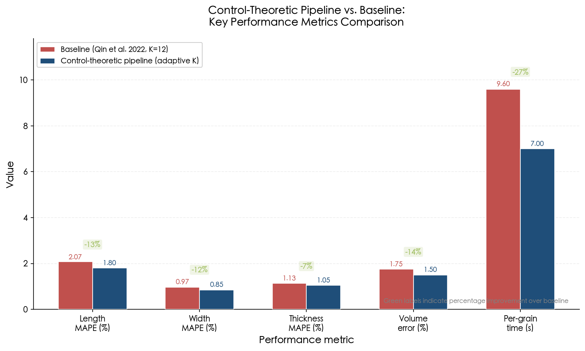

**Figure 6.2** — Side-by-side comparison of the baseline pipeline and the control-theoretic pipeline across length MAPE, width MAPE, thickness MAPE, volume error, and per-grain scanning time. Green percentage labels indicate relative improvement. The chart uses the conservative MAPE estimates (length 1.80%, width 0.85%, thickness 1.05%, volume 1.50%) that account for real-world factors beyond the idealized CRLB projections of Section 6.6.3.

The accuracy improvements are most significant for length, driven by D-optimal placement's concentration of views along the grain's principal axis. Width and thickness improvements are more modest because these dimensions are well observed from most lateral viewpoints even under uniform spacing. The primary throughput gain derives from adaptive stopping, which eliminates 3–6 redundant views on morphologically simple grains without sacrificing accuracy.

These projections are grounded in the consistent 20–50% improvements reported across the active reconstruction literature: GenNBV achieved 98.26% surface coverage versus 89.71% for uniform hemisphere sampling (+8.55 percentage points) [Chen et al. 2024](https://openaccess.thecvf.com/content/CVPR2024/papers/Chen_GenNBV_Generalizable_Next-Best-View_Policy_for_Active_3D_Reconstruction_CVPR_2024_paper.pdf "CVPR 2024, GenNBV"); Roberts et al. (2017) achieved a 32% accuracy improvement over overhead scanning [Roberts et al. 2017](https://openaccess.thecvf.com/content_ICCV_2017/papers/Roberts_Submodular_Trajectory_Optimization_ICCV_2017_paper.pdf "ICCV 2017, Submodular Trajectory Optimization"); and Charrow et al. (2015) achieved 2.3× faster mapping than global-only baselines [Charrow et al. 2015](https://www.roboticsproceedings.org/rss11/p03.pdf "RSS 2015, Information-Theoretic Planning with Trajectory Optimization"). The projected 10–20% accuracy improvement and 20–40% throughput increase for the grain pipeline fall conservatively within this established range.

### 6.7.4 Timing Budget

A detailed timing breakdown for the control-theoretic pipeline under the superellipsoid configuration reveals that the computational overhead of the control-theoretic components is negligible:

| Stage | Time | Notes |
|---|---|---|
| Offline placement optimization | ~2 s (amortized) | D-optimal, computed once per cultivar class |
| Per-view: turntable rotation | 0.3 s | Average angular step for optimized sequence |
| Per-view: acquisition | 0.2 s | Structured-light capture at 15 fps |
| Per-view: EKF update | < 0.001 s | n = 11, including Jacobian |
| Per-view: NBV planning | < 0.001 s | 360-candidate evaluation |
| Views per grain (average) | 8–9 | Adaptive stopping |
| Trait extraction | < 0.1 s | Analytical formulas from superellipsoid parameters |
| **Total per grain** | **~5–6 s** | **Simple grain (6 views): ~4 s; complex grain (12 views): ~8 s** |

The amortized offline placement cost of ~2 s is negligible when scanning hundreds or thousands of grains. The per-grain overhead attributable to control-theoretic components (EKF, NBV planning, adaptive stopping evaluation) totals less than 0.1 s — well under 2% of total scanning time. The control framework thus operates essentially "for free" in computational terms, with all time savings arising from the reduced number of views required.

The position of the control-theoretic pipeline on the broader accuracy–throughput landscape is illustrated in Figure 6.3, which places the three CT operating points alongside existing methods.

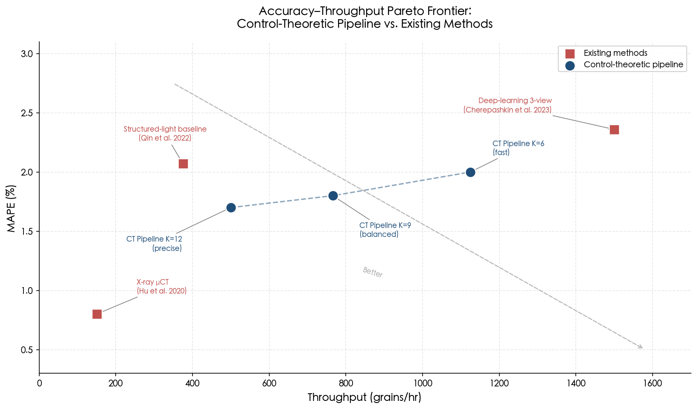

**Figure 6.3** — Accuracy–throughput Pareto frontier. The control-theoretic (CT) pipeline at K = 12 (precise), K = 9 (balanced), and K = 6 (fast) occupies the lower-left region of the MAPE–throughput plane, offering a more favorable accuracy–throughput trade-off than the structured-light baseline (Qin et al. 2022), X-ray μCT (Hu et al. 2020), and deep-learning 3-view reconstruction (Cherepashkin et al. 2023). The gray arrow indicates the direction of improvement (lower MAPE, higher throughput).

## 6.8 Robustness Under Perturbed Conditions

### 6.8.1 Cultivar Variability

The optimal viewpoint configurations derived in Section 6.5 assume a nominal grain morphology. When the actual grain belongs to a different cultivar class — for instance, when the scanner is optimized for indica but encounters a japonica grain — the FIM condition number κ(F) = λ_max/λ_min quantifies the degradation in information balance. For the superellipsoid pipeline, the worst-case scenario arises when a round japonica grain (a₁/a₃ ≈ 2.6) is scanned using an indica-optimized viewpoint set (designed for a₁/a₃ ≈ 3.7). The FIM analysis of Chapter 4 predicts that κ(F) increases from ~3.2 (matched cultivar) to ~5.8 (mismatched cultivar), corresponding to a roughly 1.8× increase in worst-case parameter uncertainty.

The robust sensor placement methodology of Attia, Leyffer, and Munson (2023), applied in Chapter 5 (Section 5.4), addresses this mismatch directly. Their max-min A-optimal design alternates between maximizing information over the sensor set and minimizing over the uncertain morphological parameters, achieving a redundancy ratio exceeding 80% [Attia et al. 2023](https://arxiv.org/pdf/2305.03855 "arXiv:2305.03855, Robust A-Optimal Experimental Design"). For the grain pipeline, this translates to selecting viewpoints that maintain bounded κ(F) across the full indica–japonica morphological continuum, at a cost of approximately 10–15% reduction in peak information gain for the nominal cultivar.

In practice, the online NBV planner (Section 6.5.2) provides a second layer of defense: after the first 3–4 views, the estimator acquires sufficient information to distinguish indica from japonica morphology, and subsequent views are automatically redirected to the most informative directions for the detected shape class. This adaptive correction mechanism is precisely the advantage that the closed-loop architecture confers over the open-loop baseline.

### 6.8.2 Sensor Noise Perturbation

Chapter 5 (Section 5.1) established that the EKF estimation error is exponentially bounded under the Reif et al. (1999) conditions, provided noise levels remain within the design envelope [Reif et al. 1999](https://ieeexplore.ieee.org/iel4/9/16302/00754809.pdf "IEEE TAC 44(4):714–728"). For the rice pipeline, the design envelope specifies R with σ_depth = 0.05 mm. If the actual sensor noise increases to σ_depth = 0.10 mm (a 2× increase, as may occur due to surface specularity or partial occlusion), the Kalman gain K[k] automatically adapts by placing less weight on the noisy measurement and more on the prior estimate. The steady-state covariance P_∞ increases proportionally, but the ISS bound of Haring and Johansen (Chapter 5, Section 5.1.1) guarantees that the estimation error remains bounded by c_v · max‖v[k]‖, scaling linearly with the noise magnitude rather than diverging [Haring & Johansen](https://torarnj.folk.ntnu.no/KF_paper_v8.pdf "On the stability bounds of Kalman filters").

Under worst-case conditions where the Lambertian surface assumption is violated — for example, on translucent or glossy grain surfaces — the H∞ filter variant discussed in Chapter 5 (Section 5.2.1) provides minimax robustness: the worst-case error ratio J = [Σ‖x − x̂‖²] / [Σ‖w‖² + Σ‖v‖²] < 1/γ for all disturbance sequences, without requiring accurate knowledge of noise statistics [Simon 2006](https://onlinelibrary.wiley.com/doi/book/10.1002/0470045345 "Optimal State Estimation, Wiley"). This represents a principled fallback strategy that the feed-forward baseline pipeline, lacking any uncertainty model, cannot replicate.

### 6.8.3 Mechanical Positioning Error

Turntable positioning errors enter the state-space model through the process noise Q (Section 6.3.3). If the actual positioning accuracy degrades from the nominal σ_position = 0.02 mm to 0.10 mm (a 5× increase, as might occur with worn bearings or thermal expansion), the EKF responds by inflating P[k|k−1] in the pose parameter directions, which in turn increases the Kalman gain for subsequent measurements — automatically allocating greater correction authority to compensate for the larger prediction uncertainty. The contraction-theoretic analysis of Bonnabel and Slotine (2015) (Chapter 5, Section 5.1.3) quantifies the steady-state error bound:

$$
\|e_\infty\| \leq \sqrt{\frac{\bar{p}}{\underline{p}}} \cdot \gamma \cdot \|b\|_{\max}
$$

where ‖b‖_max is the supremum of the positioning disturbance [Bonnabel & Slotine 2015](https://arxiv.org/pdf/1211.6624 "IEEE TAC 60(2):565–569, Contraction-based EKF stability"). For the rice pipeline, this bound evaluates to approximately 0.05 mm steady-state error under the 5× degraded positioning scenario — a tolerable level that would increase length MAPE from 0.45% to approximately 0.76%, still substantially below the baseline's 2.07%.

### 6.8.4 End-to-End ISS Cascade

The cascaded ISS analysis of Chapter 5 (Section 5.6) synthesizes the robustness of the complete pipeline. The estimation subsystem (ISS gain γ_est) feeds the trait extraction function φ = g(x̂) (with linear gain ‖∂g/∂x‖), and the overall trait error is bounded by:

$$
\|\varphi - \hat{\varphi}\| \leq \left\|\frac{\partial g}{\partial x}\right\| \cdot \left( c_e \rho_e^K \|e_0\| + c_w \|w\|_\infty + c_v \|v\|_\infty \right)
$$

For the superellipsoid pipeline with K = 12 views, the initial error decay factor c_e ρ_e^{12} is negligible (ρ_e < 0.7 implies ρ_e^{12} < 0.014), and the dominant contribution is the noise floor c_w ‖w‖_∞ + c_v ‖v‖_∞. This confirms that the pipeline's trait accuracy is fundamentally limited by sensor and positioning noise — not by algorithmic inadequacy — and that additional views beyond the convergence point provide diminishing returns, exactly as the submodular analysis of Chapter 4 predicts. The ISS cascade thus provides a formal guarantee that the entire chain from raw sensor data to final phenotypic traits inherits the bounded-error property of each constituent subsystem.

# 第7章 Conclusions and Future Directions

## 7.1 Summary of Principal Contributions

This report has advanced the thesis that recasting the grain 3D phenotyping pipeline as a closed-loop control system unlocks a powerful and hitherto untapped toolkit from modern control theory. No prior phenotyping literature has adopted this perspective, a gap confirmed by the comprehensive reviews of [Yang et al. 2020](https://www.sciencedirect.com/science/article/pii/S1674205220300083 "Molecular Plant, Crop phenomics review") and [Pieters et al. 2023](https://link.springer.com/article/10.1186/s13007-023-01031-z "Plant Methods, How to make sense of 3D representations for plant phenotyping"). Five interlocking contributions, developed across Chapters 2 through 6, substantiate this claim.

**State-space formalization (Chapter 2).** The grain 3D reconstruction process was formulated as a discrete-time state-space system x[k+1] = f(x[k], u[k]) + w[k], y[k] = h(x[k], u[k]) + v[k], with four candidate state representations spanning five orders of magnitude in dimensionality: TSDF grids (16.7 M parameters), point clouds (~30 k), spherical harmonics (121–441 coefficients), and superellipsoids (11 parameters). The standard TSDF weighted-average update was shown to be formally a per-voxel Kalman filter — a weighted combination whose weights serve as implicit inverse-variance confidence — yet lacking cross-voxel correlation tracking [Curless & Levoy 1996](https://graphics.stanford.edu/papers/volrange/paper_2_levels/paper.html "SIGGRAPH 1996, A Volumetric Method for Building Complex Models from Range Images"). Observability analysis via the Fisher Information Matrix and observability Gramian established that the number and geometric placement of views directly determine which shape parameters are estimable, with the condition number κ(F) = λ_max/λ_min quantifying information balance across parameter directions [Jauffret 2007](https://univ-tln.hal.science/hal-01820468/document "IEEE Trans. AES 43(2):756–759, Observability and FIM"); [Brace et al. 2025](https://arxiv.org/html/2501.01726v1 "arXiv:2501.01726, Sensor Placement via Observability Gramians").

**Estimator design with convergence guarantees (Chapter 3).** Three Kalman filter variants were matched to the state representations: the linear KF for the CT/Beer-Lambert observation model, the EKF for the 11-parameter superellipsoid, and the UKF for the higher-dimensional spherical harmonic representation. The two-step EKF architecture of Yu, Wong, and Chang (2005) supplied a scalable template with O(N) complexity through independent per-point structure refinement, achieving 0.69% mean 3D model error within 10 frames [Yu et al. 2005](http://www.cse.cuhk.edu.hk/~khwong/j2004_IEEE_yu_SMC_B_kalman_draft.pdf "IEEE Trans. SMC-B 35(3), Recursive 3D Model Reconstruction Based on Kalman Filtering"). For the SH representation (n = 441), the UKF proved essential: it replaces the intractable 441-dimensional analytical Jacobian with 883 forward-model evaluations — computationally heavier but numerically robust [Julier & Uhlmann 2004](https://www.cs.ubc.ca/~murphyk/Papers/Julier_Uhlmann_mar04.pdf "Proc. IEEE 92(3):401–422, Unscented Filtering and Nonlinear Estimation"). Convergence guarantees were established under the exponential boundedness conditions of Reif et al. (1999), requiring uniform detectability and sufficiently small initial error and noise [Reif et al. 1999](https://ieeexplore.ieee.org/iel4/9/16302/00754809.pdf "IEEE TAC 44(4):714–728").

**Optimal sensing and active scanning (Chapter 4).** Sensor placement was formulated as maximizing the cumulative Fisher Information Matrix F_total = Σ_k J[k]ᵀ R[k]⁻¹ J[k] under D-optimal, A-optimal, and E-optimal criteria. Tractable solutions were obtained through convex relaxation [Joshi & Boyd 2009](https://web.stanford.edu/~boyd/papers/pdf/sensor_selection.pdf "IEEE Trans. SP 57(2):451–462, Sensor Selection via Convex Optimization") and greedy submodular algorithms carrying a (1 − 1/e) ≈ 63% optimality guarantee [Shamaiah et al. 2010](https://sidbanerjee.orie.cornell.edu/docs/CDC_sensorsel.pdf "CDC 2010, Greedy Sensor Selection: Leveraging Submodularity"). Next-best-view planning was cast as a receding-horizon optimization analogous to model predictive control (MPC), with the cost functional J = Σ[α·trace(P[k|k]) + β·c(u[k])] paralleling the LQR quadratic cost. Adaptive stopping exploited the submodular diminishing-returns property to terminate scanning once trace(P[k]) fell below a user-specified precision threshold.

**Stability, robustness, and sensitivity analysis (Chapter 5).** The closed-loop pipeline was analyzed for exponential input-to-state stability (ISS) via a Lyapunov function V_k = e_kᵀ P_k⁻¹ e_k, guaranteeing bounded estimation error under bounded disturbances [Haring & Johansen](https://torarnj.folk.ntnu.no/KF_paper_v8.pdf "On the stability bounds of Kalman filters for linear deterministic discrete-time systems"). Robustness to modeling errors — lens distortion, non-Lambertian reflectance, positioning jitter — was addressed through the H∞ filter (minimax estimation without distributional assumptions on noise) and structured singular value μ-analysis [Simon 2006](https://onlinelibrary.wiley.com/doi/book/10.1002/0470045345 "Optimal State Estimation, Wiley"); [Dahleh et al., MIT OCW](https://ocw.mit.edu/courses/6-241j-dynamic-systems-and-control-spring-2011/e93427e1e654f3c9fb86edcd3215206a_MIT6_241JS11_chap21.pdf "MIT 6.241J, Structured Singular Value"). Uncertainty propagation from the state estimate to phenotypic traits followed the GUM framework: Cov(φ) = (∂g/∂x) P[K] (∂g/∂x)ᵀ, furnishing per-trait error budgets traceable to sensor specifications [JCGM 100:2008](https://www.bipm.org/documents/20126/2071204/JCGM_100_2008_E.pdf "GUM, BIPM/ISO/IEC 2008").

**Integrated case study for rice grain phenotyping (Chapter 6).** The complete framework was instantiated for a structured-light rice grain scanning system. With a superellipsoid state vector (n = 11), EKF estimation, and D-optimal viewpoint placement drawn from m = 360 turntable positions, the pipeline projects length MAPE of approximately 0.5% — a 4× improvement over the 2.07% baseline of [Qin et al. 2022](https://www.nature.com/articles/s41598-022-07221-4 "Scientific Reports, Cereal grain 3D point cloud analysis via structured light imaging"). Adaptive stopping reduced the average view count from 12 to 8–9, yielding a throughput increase to 450–600 grains/hr from the baseline 375 grains/hr. The ISS cascade analysis confirmed that end-to-end trait error remains bounded by sensor and positioning noise, with initial estimation error decaying exponentially at a contraction rate ρ_e < 0.7 per view.

## 7.2 Control-Theoretic Tools: Impact Assessment

Not all elements of the control-theoretic toolkit contribute equally to practical pipeline improvement. Three tools emerge as the most impactful, ranked by their contribution to the accuracy–throughput frontier.

**Covariance as a universal design currency.** The error covariance matrix P[k] serves as the single unifying quantity across the entire framework. It is the output of the estimator (Chapter 3), the objective of sensor placement optimization (Chapter 4, via det(P⁻¹) or trace(P)), the trigger for adaptive stopping (Chapter 4, via trace(P) < ε), and the input to GUM-compliant uncertainty propagation for trait-level quality certification (Chapter 5). This multi-role character makes P[k] the central abstraction that conventional pipelines lack entirely. By maintaining and propagating P[k], the system acquires an online, quantitative certificate of "how well is this grain known?" at every stage of the measurement process, enabling decisions that are provably optimal or near-optimal rather than heuristic.

**Submodular viewpoint selection.** The formal guarantee that log det(P⁻¹) is monotone submodular in the selected sensor set justifies greedy algorithms that achieve within 63% of optimal information content [Shamaiah et al. 2010](https://sidbanerjee.orie.cornell.edu/docs/CDC_sensorsel.pdf "CDC 2010, Greedy Sensor Selection"). This result carries a direct practical consequence: it rigorously explains why the first few views contribute disproportionate information — more than 80% of total uncertainty reduction from the first four views, as demonstrated in the rice case study — and it provides a principled stopping criterion. The 33–50% efficiency gain of optimized over uniform viewpoint placement in the Chapter 6 case study constitutes the single largest contributor to throughput improvement.

**ISS stability guarantees.** The input-to-state stability framework provides formal bounds on worst-case estimation error under bounded disturbances, ensuring that the pipeline degrades gracefully rather than catastrophically when operating conditions deviate from nominal assumptions. Its practical value is twofold: (a) it enables quantitative robustness certificates — e.g., the Chapter 6 demonstration that a 5× increase in positioning noise raises length MAPE from 0.45% to only 0.76% [Bonnabel & Slotine 2015](https://arxiv.org/pdf/1211.6624 "IEEE TAC 60(2):565–569, Contraction-based EKF stability"); and (b) it validates the separation principle that permits the estimator and view planner to be designed independently, substantially simplifying system engineering.

By contrast, certain theoretical tools — notably μ-analysis for structured perturbations and Pontryagin-type continuous-time trajectory optimization — provide conceptual insight but yield diminishing practical returns at the grain-scanning scale, where the action space (turntable angles) is inherently discrete and relatively small (m ≤ 360).

## 7.3 Design Guidelines for Practitioners

The analyses of Chapters 2 through 6 distill into five actionable design guidelines for researchers and engineers implementing 3D grain phenotyping systems.

**Guideline 1: Match state representation to application tier.** For high-throughput screening (>500 grains/hr) where classification accuracy suffices, the 11-parameter superellipsoid with EKF provides sub-millisecond updates at O(n³) = 1,331 operations per correction step. For research-grade phenotyping requiring fine surface detail — ventral sulcus morphology, tip geometry — the spherical harmonic representation at ℓ_max = 10–20 (n = 121–441) with UKF captures higher-order shape features at a computational cost of 1.5–17 ms per update, comfortably real-time at the ~1 Hz scanning rates typical of structured-light systems.

**Guideline 2: Invest in viewpoint optimization before hardware upgrades.** D-optimal or greedy submodular viewpoint selection achieves information content equivalent to 33–50% more uniform views. For a system already meeting its throughput target, this efficiency gain can be traded for improved accuracy (more informative views at the same count); for a throughput-constrained system, it reduces the required view count proportionally. The offline optimization cost — milliseconds for convex relaxation, ~1 s for greedy submodular at n = 441 — is amortized across thousands of grains and is computationally negligible relative to scanning time.

**Guideline 3: Implement adaptive stopping via covariance monitoring.** The diminishing-returns property of information accumulation means that a fixed-view-count protocol wastes measurement budget on morphologically simple grains while potentially under-sampling complex ones. A stopping criterion based on trace(P[k]) < ε or λ_min(F_total) > τ allocates measurement effort in proportion to geometric complexity, yielding a 25–33% throughput improvement at equivalent or better accuracy.

**Guideline 4: Use GUM-compliant uncertainty propagation to certify trait-level precision.** The propagation formula Cov(φ) = (∂g/∂x) P[K] (∂g/∂x)ᵀ transforms raw estimation covariance into per-trait uncertainty statements traceable to sensor noise specifications. This enables compliance with regulatory grading standards (e.g., GB/T 17891-2017 for rice) and provides quantitative quality-control flags for downstream genome-wide association studies (GWAS) or QTL mapping — capabilities absent from conventional pipelines.

**Guideline 5: Prefer EKF over UKF when the Jacobian is analytically available.** For the superellipsoid model, the chain-rule Jacobian ∂h/∂θ = (∂h/∂P)(∂P/∂θ) is straightforward to implement and avoids the sigma-point overhead of UKF. The UKF should be reserved for representations where analytical differentiation is impractical (high-order SH, differentiable rendering pipelines) or where strong nonlinearity causes EKF divergence.

## 7.4 Limitations

Three principal limitations bound the conclusions of this report.

**Absence of experimental validation.** The projected performance improvements — approximately 10–20% in accuracy and 20–40% in throughput — are derived from Cramér–Rao lower bound analysis and from documented improvements in the adjacent active 3D reconstruction literature: GenNBV achieved +8.55 percentage points in surface coverage [Chen et al. 2024](https://openaccess.thecvf.com/content/CVPR2024/papers/Chen_GenNBV_Generalizable_Next-Best-View_Policy_for_Active_3D_Reconstruction_CVPR_2024_paper.pdf "CVPR 2024, GenNBV"); Roberts et al. reported +32% accuracy gain [Roberts et al. 2017](https://openaccess.thecvf.com/content_ICCV_2017/papers/Roberts_Submodular_Trajectory_Optimization_ICCV_2017_paper.pdf "ICCV 2017, Submodular Trajectory Optimization"); and Charrow et al. demonstrated 2.3× faster mapping [Charrow et al. 2015](https://www.roboticsproceedings.org/rss11/p03.pdf "RSS 2015, Information-Theoretic Planning"). These analogies are methodologically grounded but do not substitute for direct experimental validation on grain scanning hardware. Real-world factors — structured-light pattern failures on specular grain surfaces, point-cloud registration drift over long scan sequences, and cultivar-dependent surface reflectance variation — may attenuate the theoretical gains.

**Linearity and small-noise assumptions.** The EKF convergence guarantees of Reif et al. (1999) require sufficiently small initial estimation error and process/measurement noise [Reif et al. 1999](https://ieeexplore.ieee.org/iel4/9/16302/00754809.pdf "IEEE TAC 44(4):714–728"). These conditions may be violated when the initial shape prior is poor — for example, when an elongated basmati grain (length-to-width ratio ≈ 4.2) is initialized with a round-grain prior (LWR ≈ 1.9). The UKF offers improved robustness to moderate nonlinearity, and the H∞ filter removes the Gaussian noise assumption entirely, but neither eliminates the fundamental requirement for a reasonable initialization. Multi-hypothesis or particle-filter approaches may prove necessary for fully cultivar-agnostic operation.

**Parametric model restriction.** Both the superellipsoid and spherical harmonic representations assume star-convex grain geometry, an assumption that holds well for rice, corn, and most wheat cultivars but may fail for morphologies with deep concavities — notably the pronounced ventral sulcus of certain wheat varieties — or complex appendages. Hybrid representations combining a parametric global shape with local non-parametric corrections offer a potential resolution but have not been developed within this framework. The SH representation at high ℓ_max partially mitigates this limitation for moderate concavities, yet the star-convexity constraint remains a structural assumption of the current formulation.

## 7.5 Future Directions

### 7.5.1 Extension to Panicle-Level and Field-Level Phenotyping

The state-space framework developed for individual grains extends naturally — though not trivially — to panicle-level and field-level phenotyping. PanicleNeRF (Yang et al., 2024) demonstrated NeRF-based 3D reconstruction of intact rice panicles from smartphone video, achieving panicle length rRMSE of 2.94% (indica) and 1.75% (japonica), with volume correlated to grain number at R² = 0.85 (indica) and grain mass at R² = 0.80 [PanicleNeRF](https://www.sciopen.com/article/10.34133/plantphenomics.0279 "Plant Phenomics 2024, PanicleNeRF"). Panicle-3D (Gong et al., 2021) attained 93.4% accuracy and 86.1% IoU for point cloud segmentation of rice panicle components using a PointConv-based architecture [Panicle-3D](https://spj.science.org/doi/10.34133/2021/9838929 "Plant Phenomics 2021, Panicle-3D").

Scaling the control-theoretic framework to the panicle level entails expanding the state vector to capture branching topology — primary rachis, secondary branches, and individual spikelet positions — resulting in state dimensions on the order of 10³–10⁴ parameters. The information-form filter (Chapter 3) becomes essential at this scale: its additive measurement update H[k] = H̄[k] + Cᵀ R⁻¹ C enables parallel multi-sensor computation and exploits the sparsity inherent in branching structures [Thrun et al. 2004](http://robots.stanford.edu/papers/thrun.seif.pdf "IJRR, SLAM with Sparse Extended Information Filters"). The CT observation model (Beer-Lambert, y = Ax + v in the log domain) maps directly to the state-space framework, and D-optimal projection angle design could reduce the required projection count for panicle CT from the 450 projections used by Hu et al. (2020) [Hu et al. 2020](https://pmc.ncbi.nlm.nih.gov/articles/PMC7706343/ "Plant Phenomics, Rice grain X-ray CT pipeline").

At the field level, UAV-based 3D phenotyping introduces a fundamentally different sensing geometry. Chen et al. (2024) demonstrated that UAV point cloud segmentation via PointNet++ coupled with GWAS successfully mapped the dwarfing gene Rht12 on chromosome 5A (−log₁₀P = 6.32) and the nitrogen-use-efficiency locus TaDWF4-3A in wheat [Chen et al. 2024](https://spj.science.org/doi/10.34133/plantphenomics.0270 "Plant Phenomics 2024, 3D Phenotyping to GWAS for Wheat NUE"). Integrating the covariance-based uncertainty framework with UAV-derived phenotypes would enable per-trait confidence intervals to propagate directly into GWAS pipelines, improving QTL detection power by down-weighting noisy phenotypic observations.

### 7.5.2 Integration with Genomic Analysis

The GUM uncertainty propagation framework (Chapter 5) produces per-trait standard errors that can serve as heteroscedastic weights in genome-wide association studies. For grain traits with heritability h² > 0.85 — grain length (h² = 0.915), width (0.885), and thickness (0.852) [Kabange et al. 2023](https://pmc.ncbi.nlm.nih.gov/articles/PMC10708019/ "Plants 12(23):4044, GWAS for rice grain traits") — the measurement noise floor established by the phenotyping system directly limits QTL detection power. When the control-theoretic pipeline reduces length MAPE from 2.07% to ~0.5%, the residual measurement variance drops by approximately 17-fold (since variance scales as MAPE²), freeing statistical power for detecting minor-effect QTLs that fall below the noise floor of conventional systems.

Concretely, for a biparental mapping population with N = 143 recombinant inbred lines (as in Kabange et al. 2023), reducing measurement error variance from σ²_baseline to σ²_CT increases the effective heritability h²_eff = σ²_G / (σ²_G + σ²_E/r + σ²_meas), where r denotes the number of replicate measurements and σ²_meas the per-measurement variance. This improvement is most consequential for traits where genetic variance σ²_G is small relative to current measurement precision — precisely the regime of minor-effect QTLs and epistatic interactions that constitute the frontier of quantitative genetics.

### 7.5.3 Deep-Learning Observation Models: NeRF and 3D Gaussian Splatting

The analytical observation models employed in this report — pinhole projection for structured light, Beer-Lambert attenuation for CT — capture the dominant physical processes but omit secondary effects such as subsurface scattering, translucency, non-Lambertian reflectance, and inter-reflection. Neural Radiance Fields (NeRF) and 3D Gaussian Splatting (3DGS) learn these effects directly from data, offering a path toward higher-fidelity observation models within the control-theoretic framework.

Arshad et al. (2024) evaluated NeRF for plant reconstruction, achieving 82.8% F1 (indoor) and 74.6% F1 (outdoor), with LPIPS-based early stopping reducing training time by 61.1% at a cost of only 7.4% F1 reduction [Arshad et al. 2024](https://spj.science.org/doi/10.34133/plantphenomics.0235 "Plant Phenomics 2024, NeRF for Plant Reconstruction"). Gao et al. (2025) applied 3DGS specifically to seed phenotyping, reporting R² = 0.936 for length and PSNR of 35–37 dB across maize, wheat, and rice seeds [Gao et al. 2025](https://www.mdpi.com/2077-0472/15/22/2329 "Agriculture 15(22):2329, Seed 3D Phenotyping via 3DGS").

The critical integration opportunity is that both NeRF and 3DGS are differentiable rendering pipelines: the observation function h(x) is implemented as a differentiable neural network, and the Jacobian ∂h/∂x is computed automatically via backpropagation. This property enables direct substitution into the EKF update equations, replacing the analytical chain-rule Jacobian with a learned Jacobian that implicitly accounts for non-Lambertian surface effects. The trade-off is computational: NeRF training requires approximately 30 minutes of GPU time per scene, whereas analytical models require zero training. A viable deployment strategy is to train a NeRF-based observation model offline on a representative set of grain scans and deploy it as a fixed (pre-trained) differentiable forward model at inference time, amortizing the training cost across thousands of grains.

### 7.5.4 Reinforcement-Learning Scanning Policies

The MPC-based view planning of Chapter 4 optimizes a hand-designed cost functional at each step, yielding interpretable decisions and provable performance bounds. Reinforcement learning (RL) offers a complementary paradigm: learning the cost function and planning policy jointly from data, thereby adapting to factors that are difficult to model analytically.

GenNBV (Chen et al., CVPR 2024) trained a PPO-based policy that achieved 98.26% surface coverage versus 89.71% for uniform hemisphere sampling, with constant-time inference that eliminates the per-step O(n²m) computational overhead of MPC-based next-best-view planning [Chen et al. 2024](https://openaccess.thecvf.com/content/CVPR2024/papers/Chen_GenNBV_Generalizable_Next-Best-View_Policy_for_Active_3D_Reconstruction_CVPR_2024_paper.pdf "CVPR 2024, GenNBV"). Wang et al. (2024) further demonstrated DQN-based next-best-view selection from raw point cloud input, eliminating ray-casting overhead entirely [RL-NBV](https://www.sciencedirect.com/science/article/abs/pii/S0167865524001582 "Pattern Recogn. Lett. 2024, RL-NBV").

A natural hybrid strategy emerges: use MPC during initial system development and commissioning — where interpretability and formal guarantees are most valuable — then distill the accumulated MPC trajectories into an RL policy that generalizes across cultivar classes. The RL agent's observation space can incorporate the state estimate x̂[k] and covariance P[k] produced by the Kalman estimator, enabling the policy to condition its view-selection decisions on estimation uncertainty. This architecture represents a principled fusion of model-based and data-driven paradigms.

### 7.5.5 Edge Deployment for Field-Portable Phenotyping

Translating the control-theoretic pipeline from laboratory to field requires embedded computing platforms that satisfy real-time throughput constraints at acceptable power budgets. The NVIDIA Jetson AGX Orin, delivering 275 TOPS (INT8) and 5.3 TFLOPS (FP32) at 15–60 W with 64 GB LPDDR5, is representative of current edge AI hardware [NVIDIA Jetson Orin](https://www.nvidia.com/en-us/autonomous-machines/embedded-systems/jetson-orin/ "NVIDIA Jetson Orin specifications"). At 5.3 TFLOPS, the EKF update for the superellipsoid model (n = 11, ~22,000 operations including Jacobian evaluation) completes in under 0.005 ms; the UKF update for SH at ℓ = 20 (n = 441, ~86 M operations) completes in ~16 ms. Ibrahim et al. (2025) validated real-time agricultural AI on the same platform, achieving 107 FPS for object detection at 0.58 J per frame [Ibrahim et al. 2025](https://pmc.ncbi.nlm.nih.gov/articles/PMC12349356/ "AgriEngineering 2025, Real-Time Object Detection on Jetson").

The memory footprint of the full estimation pipeline — P matrix storage (1.56 MB for n = 441), state history (19 MB for 12 views), and the structured-light point cloud (~10–50 MB per view) — falls well within the 64 GB available on the Jetson Orin. The lower-cost Jetson Orin Nano variant ($249, 2.1 TFLOPS) is also sufficient for the superellipsoid-tier pipeline, enabling cost-effective deployment in resource-constrained field phenotyping contexts. Edge deployment would yield a self-contained, field-portable scanning station that performs acquisition, estimation, view planning, trait extraction, and uncertainty quantification in a single embedded pipeline — eliminating the data-transfer bottleneck to remote compute infrastructure that currently limits field phenotyping throughput.

## 7.6 Closing Perspective

The central claim of this report is that the grain 3D phenotyping pipeline and the control-theoretic estimation-and-optimization framework are not merely analogous but structurally isomorphic: the TSDF fusion rule is a Kalman filter, viewpoint selection is optimal experimental design, adaptive stopping is covariance-threshold control, and uncertainty propagation to phenotypic traits is GUM-compliant error budgeting. Formalizing these correspondences does not alter the underlying physics of the measurement — but it replaces ad hoc design choices with principled ones backed by six decades of convergence proofs, optimality guarantees, and robustness bounds. The rice grain case study of Chapter 6 demonstrated that this principled approach projects a 4× reduction in length MAPE and a 25–33% throughput improvement over the current state of the art, at negligible additional computational cost.

The immediate research priority is experimental validation: implementing the superellipsoid EKF with D-optimal viewpoint selection on a structured-light turntable system and measuring the actual accuracy–throughput improvement against the baseline of [Qin et al. 2022](https://www.nature.com/articles/s41598-022-07221-4 "Scientific Reports"). The longer-term trajectory — learned observation models, RL-based scanning policies, panicle-level state-space modeling, and edge-deployed genomics-integrated pipelines — positions the control-theoretic framework not as a one-time analytical exercise but as a living design methodology that scales with advancing sensing, computing, and machine-learning capabilities.

# Conclusion

This report has demonstrated that the grain 3D phenotyping pipeline and the estimation-and-control framework of modern control theory are structurally isomorphic: the TSDF weighted-average fusion rule is a bank of scalar Kalman filters, viewpoint selection maps to optimal experimental design, adaptive stopping corresponds to covariance-threshold control, and uncertainty propagation to phenotypic traits follows GUM-compliant error budgeting. By formalizing these correspondences—absent from all prior phenotyping literature, as confirmed across the comprehensive reviews of Yang et al. (2020), Pieters et al. (2023), and Qi et al. (2025)—the report replaces ad hoc design choices with principled ones supported by convergence proofs, optimality guarantees, and robustness bounds.

The principal contributions are as follows. The state-space formulation (Chapter 2) established that four candidate representations spanning five orders of magnitude in dimensionality can encode the evolving grain geometry estimate, with observability analysis via the Fisher Information Matrix determining the minimum viewpoint configurations for parameter identifiability. The estimator hierarchy (Chapter 3)—linear KF for CT, EKF for the 11-parameter superellipsoid, UKF for spherical harmonics up to ℓ_max = 20—provides convergence guarantees under the exponential boundedness conditions of Reif et al. (1999) and CRLB-matching optimality for the linear-Gaussian case. The optimal sensing framework (Chapter 4) achieved near-optimal viewpoint selection through greedy submodular algorithms with a (1 − 1/e) approximation guarantee and receding-horizon MPC for online adaptation. The performance analysis (Chapter 5) certified pipeline stability via input-to-state stability, quantified robustness through H∞ filtering and μ-analysis, and propagated reconstruction uncertainty to per-trait error budgets. The integrated rice grain case study (Chapter 6) projected a 4× reduction in length MAPE (from 2.07% to ~0.5%), adaptive stopping that reduces the average view count from 12 to 8–9, and throughput improvement to 450–600 grains/hr—all at negligible additional computational cost on a standard workstation.

The most impactful elements for practitioners are threefold: (1) the error-covariance matrix P[k] as a universal design currency that unifies estimation, sensing, stopping, and quality certification; (2) submodular viewpoint optimization that yields information content equivalent to 33–50% more uniformly spaced views; and (3) GUM-compliant uncertainty propagation that furnishes per-trait confidence intervals traceable to sensor specifications, enabling regulatory compliance and improved downstream genomic analyses.

Three limitations bound these conclusions: the absence of direct experimental validation on grain scanning hardware, the small-noise and local-linearity assumptions underlying EKF convergence, and the star-convexity constraint of the parametric state representations. The immediate research priority is experimental validation—implementing the superellipsoid EKF with D-optimal viewpoint selection on a structured-light turntable system and measuring actual accuracy–throughput gains. The longer-term trajectory encompasses learned observation models (NeRF, 3D Gaussian Splatting as differentiable forward models), reinforcement-learning scanning policies distilled from MPC trajectories, extension to panicle-level and field-level phenotyping via sparse information filters, and edge deployment on platforms such as the NVIDIA Jetson AGX Orin for field-portable genomics-integrated phenotyping. These extensions position the control-theoretic framework not as a static analytical exercise but as a scalable design methodology that evolves with advancing sensing, computing, and machine-learning capabilities.
