# Overview

Notion's multi-view database — a system in which Table, Kanban, Calendar, List, and six additional view types operate over a single, richly typed dataset — has become the de facto benchmark for structured personal and team knowledge management. For users drawn to Obsidian's local-first, Markdown-native architecture, a central question arises: can the Obsidian plugin ecosystem replicate this multi-view database experience, and if so, at what cost in feature parity?

This report provides a comprehensive, evidence-based answer. It begins by documenting the full scope of Notion's database system — 10 view types, 22 property types, bidirectional relations with rollups, a formula language, trigger-action automations, and nested Boolean filtering — establishing the precise benchmark against which every Obsidian solution is measured (Chapter 1). It then maps Obsidian's architectural foundations — Markdown files, YAML frontmatter, the core Properties system, and the first-party Bases database engine introduced in mid-2025 — alongside the community plugin ecosystem and the wave of plugin archivals that followed Bases' launch (Chapter 2). Each major plugin and plugin combination receives an individual deep-dive assessment across views, property handling, relations, formulas, inline editing, and development health (Chapter 3). A structured cross-plugin comparative analysis synthesizes these evaluations into side-by-side matrices, a 12-dimension weighted Notion Parity Score, and a catalogue of features that remain structurally impossible in Obsidian (Chapter 4). The report concludes with practical recommendations segmented by user profile — power user, casual user, and team user — together with a step-by-step Notion-to-Obsidian migration workflow and a forward-looking parity trajectory (Chapter 5).

Four findings anchor the analysis. First, no single Obsidian plugin or plugin stack replicates more than approximately 48% of Notion's multi-view database feature set; the Bases + Bases Kanban + Calendar Bases stack achieves the highest active score, covering six view types through a unified data layer. Second, the data-layer distinction — whether plugins share a common data substrate or operate as isolated silos — is the most consequential architectural variable in the ecosystem, separating genuine multi-view databases from loosely coupled tool collections. Third, the Obsidian database plugin landscape has consolidated decisively around Bases: every major community database plugin except Dataview (in maintenance mode) has been archived, stalled, or abandoned since mid-2025. Fourth, explicit Relations and Rollups — the backbone of Notion's cross-database workflows — remain the ecosystem's most critical unmet need, with no active plugin offering this capability and no public roadmap commitment from the Obsidian team.

The sections that follow substantiate each of these findings in detail.

# 第1章 Notion's Multi-View Database — The Benchmark

Any meaningful evaluation of Obsidian's database plugin ecosystem requires a precise benchmark: what, exactly, does Notion's multi-view database offer at the feature level? This chapter documents the full scope of that system — its view types, 22-property data model, relational layer, cross-view filtering architecture, automation capabilities, and structural limitations — so that every plugin assessment in subsequent chapters measures against a clearly defined standard rather than a vague impression of "Notion-like" functionality.

## 1.1 View Types: Far Beyond Four Layouts

A common mental model frames Notion databases around four view types — Table, Kanban, Calendar, and List. The actual system is considerably broader: Notion supports **10 distinct view types** plus Dashboards, each operating over the same underlying data [Notion Help: Views, Filters, Sorts & Groups](https://www.notion.com/help/views-filters-and-sorts "Official documentation listing all database view layouts").

### Table View

Table view is Notion's default and most feature-rich layout. It supports inline editing across all property types, column reordering via drag-and-drop, column freezing, and column-level calculations (sum, average, median, min, max, count). Conditional coloring at both the row and cell level enables at-a-glance visual status tracking [Notion Help: Views, Filters, Sorts & Groups](https://www.notion.com/help/views-filters-and-sorts "View interaction details").

### Board (Kanban) View

Board view groups entries by a property — typically Select or Status — and renders them as cards in vertical columns. Drag-and-drop between columns updates the underlying property value. The view supports sub-grouping (a secondary grouping layer within each column), conditional card coloring, and per-column aggregate counts [Notion Help: Views, Filters, Sorts & Groups](https://www.notion.com/help/views-filters-and-sorts "View interaction details"). Sub-grouping is a capability unique to Board view and serves as an important benchmark, since no Obsidian plugin replicates it as of April 2026.

### Calendar View

Calendar view arranges entries on a monthly grid by a Date property. Clicking any day creates a new entry with that date pre-filled, and entries spanning multiple days display across the relevant cells. The view is functional but comparatively constrained — it lacks week or day sub-views and offers fewer customization options than Table or Board [Notion Help: Intro to Databases](https://www.notion.com/help/intro-to-databases "Calendar, List, Gallery view descriptions").

### List View

List view provides a minimal, text-focused layout: entries appear as a compact vertical list with selectable visible properties. It suits simple task lists, reading logs, or any context where visual density takes priority over rich property display [Notion Help: Intro to Databases](https://www.notion.com/help/intro-to-databases "Calendar, List, Gallery view descriptions").

### Gallery View

Gallery view foregrounds visual content, displaying entries as cards with prominent cover images drawn from a Files & media property. Common use cases include mood boards, contact directories with photos, and content libraries [Notion Help: Intro to Databases](https://www.notion.com/help/intro-to-databases "Calendar, List, Gallery view descriptions").

### Timeline View

Timeline view plots entries along a horizontal time axis with adjustable granularity from hours to years. Entries with start and end dates render as bars whose width reflects duration; drag-and-drop adjusts both timing and span. A companion table on the left provides property-level detail for each entry [Notion Help: Timeline View](https://www.notion.com/help/timelines "Official timeline view documentation").

### Chart View

Chart view supports four chart types: vertical bar, horizontal bar, line, and donut. A single view can render up to 200 groups and 50 subgroups. The Free plan limits users to 1 chart per database, while paid plans allow unlimited charts [Notion Help: Charts](https://www.notion.com/help/charts "Chart limits and features").

### Additional View Types

Beyond these core layouts, Notion offers Form view (structured data collection), Map view (location-based visualization), and Feed view (social-media-style chronological display). Dashboards provide a meta-layer that combines multiple database views and widgets on a single page. Crucially, every view operates on the same underlying database — a property edit in any view propagates instantly to all others, a design principle that defines the multi-view paradigm.

The following matrix maps each of Notion's 10 view types against six key interactions, illustrating the uneven distribution of functionality across layouts:

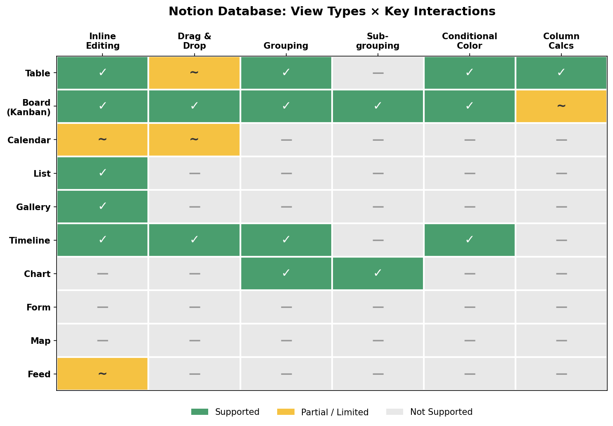

*Figure 1.1: Support levels for inline editing, drag-and-drop, grouping, sub-grouping, conditional color, and column calculations across Notion's 10 database view types. Table and Board views offer the richest interaction surface; Calendar, List, and several newer views remain comparatively constrained.*

## 1.2 The Property Model: 22 Types

A database's expressive power derives largely from its property system — the typed columns that define what data each entry can hold. Notion supports **22 property types**: Text, Number, Select, Status, Multi-Select, Date, Formula, Relation, Rollup, Person, File, Checkbox, URL, Email, Phone, Created time, Created by, Last edited time, Last edited by, Button, ID (Unique ID), and Place [Notion Help: Database Properties](https://www.notion.com/help/database-properties "Official property type enumeration").

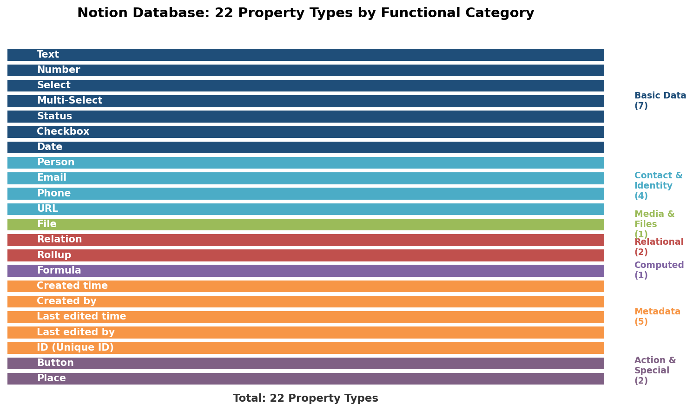

*Figure 1.2: Notion's 22 property types grouped into seven functional categories. The Relational (Relation, Rollup) and Computed (Formula) categories are the most critical benchmarks for Obsidian plugins, as they enable cross-database aggregation and calculated fields that few community solutions replicate.*

Several property types carry particular weight as benchmarks for Obsidian plugin evaluation:

- **Select and Multi-Select** provide constrained choice lists with color-coded tags, a pattern fundamental to Kanban grouping and filter-based workflows.
- **Status** is a specialized Select variant with built-in "Not started / In progress / Done" semantics, enabling native task tracking without external configuration.
- **Date** supports both single dates and date ranges (start + end), powering Calendar and Timeline views directly.
- **Person** links entries to workspace members, enabling assignment workflows and per-user filtered views.
- **Button** triggers actions (e.g., edit properties, open URLs) directly from a database row, blurring the line between data storage and workflow execution.

## 1.3 Relations, Rollups, and Formulas

The relational layer elevates Notion databases beyond simple spreadsheets into a lightweight relational data model. It is also the area where the gap between Notion and the Obsidian ecosystem is widest.

### Relations

Relation properties create explicit, typed links between entries in different databases — or within the same database (self-relations). Two modes exist: one-way relations (visible only in the source database) and two-way (bidirectional) relations that automatically generate a reciprocal property in the target database. The API enforces a limit of 100 related pages per Relation property and a ceiling of 10,000 two-way references per database [Notion Help: Relations & Rollups](https://www.notion.com/help/relations-and-rollups "Relation mechanics") [Notion API: Request Limits](https://developers.notion.com/reference/request-limits "API relation limits").

### Rollups

Rollup properties aggregate data from related entries across **15+ calculation types**: Show original, Count all/values/unique/empty, Sum, Average, Median, Min, Max, Range, Earliest date, Latest date, and Date range. A key constraint: rollups cannot operate on other rollups, limiting aggregation to a single level of depth [Notion Help: Relations & Rollups](https://www.notion.com/help/relations-and-rollups "Rollup calculation types").

### Formulas

Notion's formula language encompasses conditional logic (`if`/ternary operators), date math (`dateAdd`, `now`), list operations (`.length`, `.first`, `.every` with the `current` keyword), text styling (`style()` with colors and formatting), and dot-notation property traversal. Business and Enterprise plans additionally offer AI-assisted formula creation, lowering the barrier for complex expressions [Notion Help: Formulas](https://www.notion.com/help/formulas "Formula language capabilities").

Together, Relations + Rollups + Formulas form a computation chain that enables, for example, a "Projects" database to surface the total hours logged from a related "Time Entries" database via a Rollup that sums a Number property across linked entries. This relational capability constitutes one of the most critical benchmark dimensions: as subsequent chapters demonstrate, very few Obsidian plugins attempt to replicate it, and none fully succeeds.

## 1.4 Cross-View Capabilities: Filters, Sorts, and Grouping

Every view in a Notion database shares the same underlying data but maintains independent filter, sort, and grouping configurations. This cross-view architecture is the structural foundation of the multi-view paradigm.

**Advanced filters** support nested AND/OR logic up to 3 levels deep. Each filter configuration can be scoped per-view and saved as either personal (visible only to the creator) or shared (visible to all workspace members) [Notion Help: Views, Filters, Sorts & Groups](https://www.notion.com/help/views-filters-and-sorts "Advanced filter nesting"). Sorts stack in priority order across any property type, enabling multi-dimensional ordering.

**Linked databases** allow a single database to appear across multiple pages, each with its own views and filter configurations, without data duplication. This pattern underpins Notion's dashboard architecture: one page can show "My Tasks" (filtered by Person = current user), another "This Week's Deadlines" (filtered by Date = this week), and both draw from the same underlying task database. The ability to compose multiple filtered views of a single data source — without plugin coordination or manual synchronization — is a benchmark capability that no Obsidian solution fully replicates.

## 1.5 Automation Layer

Database automations (available on paid plans; Slack notifications also on Free) extend Notion databases into lightweight workflow engines. Supported triggers include page added, property edited, and recurring time-based schedules. Available actions encompass editing properties, adding pages, sending notifications, posting Slack messages, calling webhooks, sending Gmail messages, and defining variables via formulas [Notion Help: Database Automations](https://www.notion.com/help/database-automations "Automation triggers and actions"). No Obsidian plugin currently provides trigger-action automation over database entries — a gap that persists across the entire ecosystem as of April 2026.

## 1.6 Known Limitations That Motivate Alternatives

Despite its breadth, Notion's database system carries structural limitations that motivate a meaningful segment of users to seek local-first alternatives.

### Offline Access

Notion's offline capability is severely constrained for database-heavy workflows. On desktop and mobile apps, databases display only the **first 50 rows of the first view** when offline. Paid plans auto-download recently visited and favorited pages, but the web browser offers no offline support [Notion Help: Use Pages Offline](https://www.notion.com/help/use-pages-offline "Offline database limitations"). For users who work in transit, on restricted networks, or in regions with unreliable connectivity, this limitation alone can be disqualifying.

### Performance at Scale

Notion imposes several structural limits that become binding as databases grow. Per-page property data is capped at **2.5 MB**, and database schema structure is limited to **1.5 MB**. The API enforces a rate limit of **3 requests per second** per integration [Notion Help: Optimize Database Performance](https://www.notion.com/help/optimize-database-load-times-and-performance "Size and performance limits") [Notion API: Request Limits](https://developers.notion.com/reference/request-limits "API rate limits"). Notion's official documentation does not publish a specific entry-count threshold, though community reports consistently describe noticeable slowdowns in databases exceeding several thousand entries — particularly when multiple views with complex filters are active simultaneously.

### Data Portability and Ownership

Notion's export pipeline introduces significant friction for users who wish to leave or maintain local backups. CSV export loses Relation links, converting them to plain-text URLs that cannot be re-imported into relational form. Only the current or default view can be exported at a time. PDF export with subpages requires Business or Enterprise plans. A full workspace export can take up to **30 hours** [Notion Help: Export Your Content](https://www.notion.com/help/export-your-content "Export constraints"). Because all data resides on Notion's servers, users have no guarantee of uninterrupted access in the event of service downtime, pricing changes, or terms-of-service revisions.

### Pricing and Feature Gating

Several advanced features are restricted to paid tiers. Database automations, AI-assisted formula creation, unlimited charts, and conditional form logic all require paid subscriptions. Notion's Free plan is generous for individual use, but teams and power users inevitably encounter feature gates that push toward paid plans at $10+/user/month.

## 1.7 The Benchmark Feature Set

The preceding analysis distills into a 14-dimension benchmark against which every Obsidian plugin will be measured throughout this report:

| Dimension | Notion Capability |
|---|---|
| View Types | 10 (Table, Board, Calendar, List, Gallery, Timeline, Chart, Form, Map, Feed) + Dashboards |
| Property Types | 22 typed properties including Relation, Rollup, Formula, Status, Person, Button |
| Inline Editing | Full: cell-level editing in Table; drag-and-drop in Board, Timeline, Calendar |
| Filtering | Nested AND/OR up to 3 levels; per-view; personal/shared |
| Sorting | Multi-property sort stacking |
| Grouping | Group by any property; sub-grouping in Board view |
| Relations | One-way and bidirectional cross-database linking; self-relations |
| Rollups | 15+ aggregation types over related entries |
| Formulas | Conditional logic, date math, list operations, text styling, dot-notation traversal |
| Automations | Trigger-action workflows (page added, property edited, time-based) |
| Conditional Color | Row/cell coloring based on property conditions (Table, Board, and 4 other views) |
| Linked Databases | Same database reusable across pages with independent views/filters |
| Offline Access | Limited (50 rows, first view only; no web offline) |
| Data Ownership | Cloud-only; export loses relational structure |

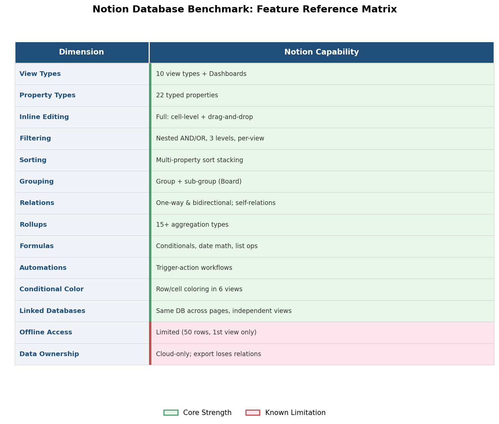

*Figure 1.3: Visual summary of the 14 benchmark dimensions with Notion's capability for each. Core strengths (green) and known limitations (red) are distinguished for quick cross-reference in later chapters.*

This benchmark matrix serves as the reference standard for Chapters 3 and 4. Where a plugin achieves full parity on a dimension, it receives credit; where it approximates or falls short, the gap is documented precisely.

## Key Takeaways

Notion's multi-view database is not a single feature but an integrated system: 10 view types operating over a shared 22-property data model, connected by Relations and Rollups, computed through a formula language, automated by trigger-action workflows, and filtered through nested Boolean logic. Its core strength lies in the seamlessness of that integration — an entry edited in Table view is instantly reflected in Board, Calendar, and Timeline views, with no synchronization delay or plugin coordination required.

Three structural characteristics of this system, however, create the opening that local-first alternatives seek to exploit: cloud-only data residency with limited offline access, lossy export that breaks relational links, and a pricing model that gates advanced features behind paid tiers. For users who prioritize local data ownership, offline reliability, or zero-cost tooling, these are not minor inconveniences but fundamental architectural mismatches. The chapters that follow evaluate whether the Obsidian plugin ecosystem can bridge this gap — and at what cost in feature parity.

# 第2章 The Obsidian Plugin Landscape for Database Functionality

Where Notion delivers a unified, cloud-hosted database engine with views as first-class UI primitives, Obsidian takes a fundamentally different architectural path. Every note in an Obsidian vault is a plain Markdown file stored locally, with structured metadata encoded in YAML frontmatter. This design decision — local-first, plaintext, extensible via plugins — shapes both the capabilities and the constraints of every database solution available in the ecosystem. This chapter maps the resulting landscape: the architectural foundations that distinguish Obsidian from Notion at a structural level, the evolution of Obsidian's own data capabilities through the Properties system and the Bases core plugin, the current state of community plugins as of early 2026, and the consolidation wave that has reshaped the plugin ecosystem over the past twelve months.

## 2.1 Architectural Foundations: Markdown, Frontmatter, and the Property System

Obsidian stores all user data as `.md` files in a local folder (the "vault"). Structured metadata lives in **YAML frontmatter** — a block of key-value pairs at the top of each file, delimited by `---`. Because YAML is a widely adopted open standard rather than a proprietary format, any text editor, scripting language, or external tool can read and write Obsidian data without the application itself.

The **Properties** system, introduced in **Obsidian 1.4** (public release: August 31, 2023), formalized this frontmatter as typed data, supporting 7 property types: Text, List, Number, Checkbox, Date, Date & time, and Tags [Obsidian Changelog v1.4](https://obsidian.md/changelog/2023-08-31-desktop-v1.4.5/ "Obsidian 1.4 public release introducing Properties"). Before this release, plugins like Dataview had already built their own metadata-handling layers on top of raw YAML; the Properties system brought type enforcement and a visual editor into Obsidian's core, establishing a shared foundation that subsequent plugins and the Bases engine would build upon.

The diagram below summarizes the structural divergence between Notion's cloud block model and Obsidian's local file model.

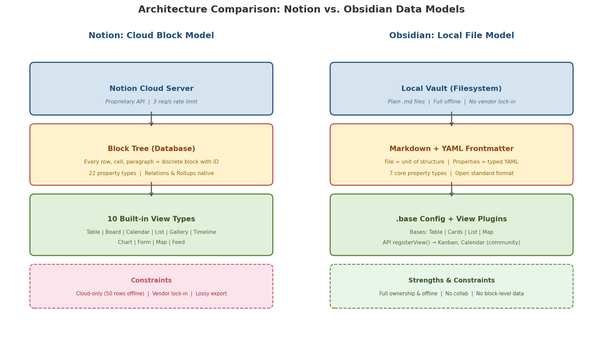

**Architectural advantages over Notion** are substantial:

- **Full local data ownership.** All files reside on the user's filesystem, with no cloud dependency for read/write access. Notion databases, by contrast, are cloud-only objects that display only the first 50 rows of the first view when offline [Notion Help: Use Pages Offline](https://www.notion.com/help/use-pages-offline "Offline database limitations").
- **Plaintext interoperability.** YAML frontmatter can be parsed by Python, JavaScript, shell scripts, or any other toolchain. Notion data is accessible only via a proprietary API (rate-limited to 3 requests/second per integration) or through lossy CSV/HTML export [Notion API: Request Limits](https://developers.notion.com/reference/request-limits "API rate limits").
- **No vendor lock-in.** Switching away from Obsidian requires no export step — the vault is already a folder of Markdown files.
- **Offline-first with full functionality.** Every feature works without network access, including database plugins.

**Architectural constraints** are equally significant:

- **No server-side compute.** Formulas, queries, and aggregations run entirely on the user's device, limiting real-time collaboration and cross-device automation.
- **No native real-time collaboration.** Obsidian lacks built-in simultaneous-editing infrastructure; third-party tools such as Relay.md partially address this gap.
- **No block-level structured data.** Notion treats every paragraph, toggle, and database row as a discrete "block" with its own ID and API endpoint. Obsidian's unit of structure is the file, with frontmatter as the only structured layer. Database plugins must therefore work within the file-plus-frontmatter paradigm rather than manipulating granular block trees [Obsidian Help: Properties](https://help.obsidian.md/Editing+and+formatting/Properties "Properties stored as YAML frontmatter").
- **Limited native property types.** The 7 core types omit categories that Notion supports natively — Select, Multi-Select, Relation, Rollup, Formula, Person, URL, Email, Phone, Status, and others from Notion's 22-type system. Plugins must implement these additional types themselves.

## 2.2 The Bases Core Plugin: Obsidian's Native Database Engine

The most consequential development in Obsidian's database story is **Bases**, a core plugin that represents the Obsidian team's direct answer to Notion-style database functionality.

### Introduction and Early Access (v1.9.0)

Bases was introduced in **Obsidian 1.9.0** (early access: May 21, 2025; public release: August 18, 2025), described officially as "a new core plugin that lets you turn any set of notes into a powerful database." The release introduced the `.base` file format — a configuration file that defines views, filters, and formula columns over a set of notes selected by folder, tag, or link scope. Table views with filtering and formula-based dynamic columns were available from launch [Obsidian Changelog v1.9.0](https://obsidian.md/changelog/2025-05-21-desktop-v1.9.0/ "Bases introduced in Obsidian 1.9.0").

A critical architectural detail distinguishes Bases from earlier community plugins such as DataLoom: data remains in YAML frontmatter across standard `.md` files, while the `.base` file stores only view configuration. This ensures that Bases does not create a proprietary data silo — notes queried by a `.base` file remain fully accessible to Dataview, scripts, and any other tool that reads frontmatter.

### Rapid Iteration (v1.10.0 – v1.12)

Bases received a major expansion in **v1.10.0** (October 1, 2025), adding Group By, table summaries, a **List view**, and — critically — the initial **Bases API** with `registerView()`, enabling community developers to build new view types that plug directly into the Bases infrastructure. New formula functions (`reduce()`, `html()`, `random()`) extended computed-column capabilities. An official **Maps plugin** was released alongside as a Bases API demonstration [Obsidian Changelog v1.10.0](https://obsidian.md/changelog/2025-10-01-desktop-v1.10.0/ "Bases major update with API and List view").

In **Obsidian 1.12** (February 27, 2026), Bases gained a search toolbar, drag-and-drop file import, and right-click context menus on table rows — continuing to narrow the interaction-quality gap with Notion's table experience [Obsidian Changelog v1.12](https://obsidian.md/changelog/ "Bases improvements in v1.12").

### The Platform Model

The `registerView()` API signals a deliberate strategic choice: rather than building every view type in-house, the Obsidian team is positioning Bases as a **platform** that community plugins extend. The Maps plugin (October 2025) and the community-developed **Bases Kanban** plugin (December 2025) are the earliest products of this model. The approach distributes development effort across the community while maintaining a unified data layer — all Bases-compatible views read and write the same YAML frontmatter through the same `.base` configuration [Obsidian Changelog v1.10.0](https://obsidian.md/changelog/2025-10-01-desktop-v1.10.0/ "Bases API registerView() for community view types").

## 2.3 The Community Plugin Ecosystem: A Landscape in Transition

The Obsidian community plugin directory listed **2,498 plugins** as of early 2026 [ObsidianStats](https://www.obsidianstats.com/plugins "2,498 plugins listed"). Within this ecosystem, a distinct cluster of plugins has historically addressed database-like functionality — querying, displaying, and in some cases editing structured metadata across notes. The launch of Bases has dramatically reshaped this cluster, and most of its principal members have entered archival or maintenance states.

### Dataview: The Foundational Query Engine

**Dataview** remains the most widely installed community database plugin, with approximately **3,272,000 downloads** and ~8,700 GitHub stars. It provides DQL (Dataview Query Language) and a JavaScript API (DataviewJS) for querying note metadata, rendering results as tables, lists, task lists, or simple calendar dot-views. Dataview indexes both YAML frontmatter and its own inline-field syntax (`[key:: value]`), supporting 8 field types: Text, Number, Boolean, Date, Duration, Link, List, and Object [Obsidian Community Plugin Stats](https://raw.githubusercontent.com/obsidianmd/obsidian-releases/master/community-plugin-stats.json "Dataview: 3,272,416 downloads") [ObsidianStats: Dataview](https://www.obsidianstats.com/plugins/dataview "v0.5.70, maintenance mode").

The latest release is v0.5.70 (approximately April 2025), with 134 days since the last commit as of the research date — placing it effectively in **maintenance mode**. Output is **strictly read-only**: query results cannot be edited inline, and there is no GUI configurator for building queries. Users must write DQL or JavaScript code directly. Despite these limitations, Dataview remains the backbone of many advanced Obsidian workflows and serves as a dependency for several other plugins. Its documentation claims scalability to "hundreds of thousands of annotated notes" [Dataview Docs](https://blacksmithgu.github.io/obsidian-dataview/ "High performance scaling").

### DB Folder: The Notion-Style Table (Archived)

**DB Folder** offered the closest approximation of Notion's database UI among community plugins, providing an interactive table view with full inline editing, a React-based interface, and — uniquely — explicit **Relation** and **Rollup** property types that directly mirrored Notion's relational data model. With 14 supported property types, it had the richest type system of any community plugin. Data could be sourced from folders, links, tags, or Dataview queries [DB Folder Properties Docs](https://rafaelgb.github.io/obsidian-db-folder/features/Properties/ "14 property types including Relation and Rollup").

With approximately **323,000 downloads**, DB Folder had accumulated a meaningful user base. However, the repository was **archived by its owner on July 28, 2025**, with the last release (v3.5.1) dating to January 19, 2024 and 179 open issues unresolved. It depended on Dataview as its search engine. DB Folder is no longer a viable option for new installations, though existing users may continue running it without updates [ObsidianStats: DB Folder](https://www.obsidianstats.com/plugins/dbfolder "Stalled, 515 days since last commit").

### DataLoom: Clean UI, Discontinued

**DataLoom** (which underwent three name changes — from "Notion-Like Tables" to "Dashboards" to "DataLoom") was **archived on March 9, 2025** and **removed from the Obsidian plugin directory on May 3, 2025**. The developer explicitly cited Obsidian's native table editor (introduced in v1.5.0) and the trajectory signaled by Bases as factors in the discontinuation decision [GitHub Issue #958](https://github.com/decaf-dev/obsidian-dataloom/issues/958 "Developer announcement: DataLoom no longer maintained") [Moritz Jung Obsidian Stats](https://www.moritzjung.dev/obsidian-stats/plugins/notion-like-tables/ "Archived Mar 2025, removed May 2025").

DataLoom supported 12 cell types and provided a clean, Notion-like table interface with inline editing, undo/redo, and import/export capabilities. It stored data in a proprietary `.loom` file format rather than YAML frontmatter — a design choice that enabled self-contained tables but created a data silo outside Obsidian's standard property ecosystem. It offered no formulas, relations, or rollups, and its last release (v8.16.1) dates to June 29, 2024.

### Projects: The Multi-View Pioneer (Archived)

**Projects** (by Marcus Olsson) was the **only community plugin to offer four integrated view types** — Table, Board (Kanban), Calendar, and Gallery — within a single interface. It read YAML frontmatter, supported all Obsidian core property types, and followed a "leave no trace" design philosophy that avoided adding any plugin-specific metadata to notes. Data sources included folders and Dataview queries [Projects GitHub](https://github.com/marcusolsson/obsidian-projects "Four views: Table, Board, Calendar, Gallery").

The original author **discontinued Projects in May 2025**, and the **repository was archived on July 18, 2025** [Projects GitHub Issues](https://github.com/obsmd-projects/obsidian-projects/issues/1011 "Repository archived Jul 18, 2025"). The plugin supported neither formulas, relations, nor rollups, and was desktop-only (`isDesktopOnly: true`). A "Projects Plus" community fork surfaced on the Obsidian forum in October 2025, though its maturity and long-term maintenance commitment remain uncertain [Obsidian Forum](https://forum.obsidian.md/t/projects-plus-plugin/106826 "Community fork — October 2025").

### Kanban Plugin: Stalled and Seeking Maintainers

The **Kanban** plugin (by mgmeyers) provides dedicated Kanban/Board functionality with approximately **2,100,000 downloads**. It creates Markdown-backed boards where headings serve as lanes and list items as cards, with drag-and-drop movement between lanes. Cards can link to notes, display dates and images, and be archived when complete [Kanban Plugin Forum](https://forum.obsidian.md/t/kanban-plugin/17082 "Features: dates, images, note creation, archive").

The plugin's README now states: "The Kanban plugin is looking for new maintainers." Its last release (v2.0.51) dates to approximately early 2024 — roughly two years without an update. The Kanban plugin operates as a **standalone data silo**: cards do not read frontmatter from linked notes, and board data is not integrated with Obsidian's property system or with other database plugins [Kanban GitHub](https://raw.githubusercontent.com/mgmeyers/obsidian-kanban/main/README.md "Seeking new maintainers").

### Full Calendar: Feature-Rich but Abandoned

**Full Calendar** (by davish) provides the most complete standalone calendar experience in the Obsidian ecosystem, powered by the FullCalendar.js library. It offers day, week, and month views with drag-and-drop rescheduling, click-and-drag event creation, and read-only ICS integration (auto-refresh every 5 minutes) for Google Calendar, Apple Calendar, and other providers. CalDAV support (read-only, basic auth) works with Apple iCloud and Fastmail but not Google Calendar [Full Calendar ICS](https://obsidian-community.github.io/obsidian-full-calendar/calendars/ics/ "ICS read-only") [Full Calendar CalDAV](https://obsidian-community.github.io/obsidian-full-calendar/calendars/caldav/ "CalDAV: iCloud/Fastmail yes, Google no").

The last release (v0.10.7) dates to approximately mid-2023 — **984 days** without a new release as of the research date, with only 5 commits in the past year. Full Calendar is effectively abandoned, though it continues to function for existing users [ObsidianStats: Full Calendar](https://www.obsidianstats.com/plugins/obsidian-full-calendar "984 days since last release").

## 2.4 The Archival Wave: A Central Ecosystem Fact

The most striking finding in surveying this landscape is the concentration of plugin discontinuations that coincided with the Bases launch. The timeline below illustrates each plugin's active development window, its last release, and its archival or stall date, overlaid with Obsidian core milestones.

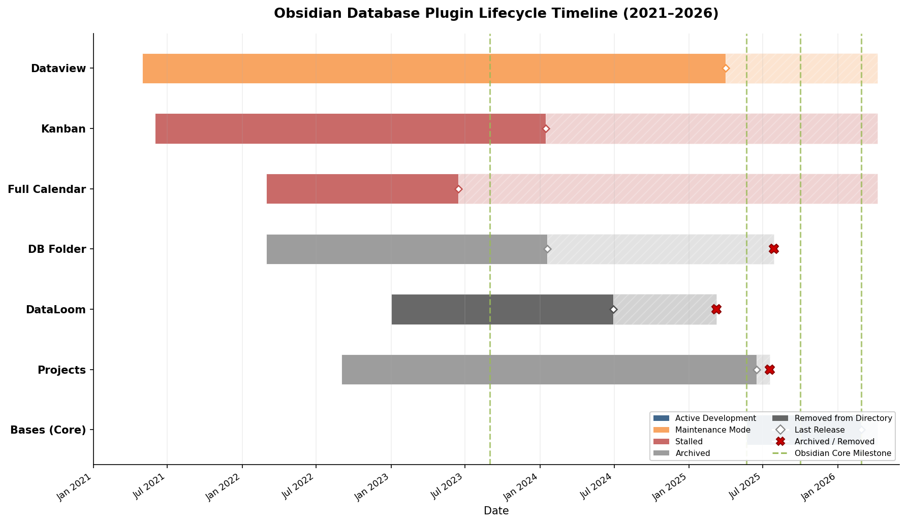

The following table summarizes the current status of every major database plugin:

| Plugin | Status | Last Release | Archive / Stall Date |
|---|---|---|---|
| DataLoom | Archived, removed from directory | v8.16.1 (Jun 2024) | Mar 2025 |
| Projects | Archived | v1.17.4 (~Jun 2025) | Jul 2025 |
| DB Folder | Archived | v3.5.1 (Jan 2024) | Jul 2025 |
| Kanban | Stalled, seeking maintainers | v2.0.51 (~early 2024) | ~2 years without release |
| Full Calendar | Effectively abandoned | v0.10.7 (~mid 2023) | ~2.7 years without release |
| Dataview | Maintenance mode | v0.5.70 (~Apr 2025) | 134 days since last commit |

The status matrix below provides a complementary visual of ecosystem health, charting the number of days since each plugin's last release as of April 2026.

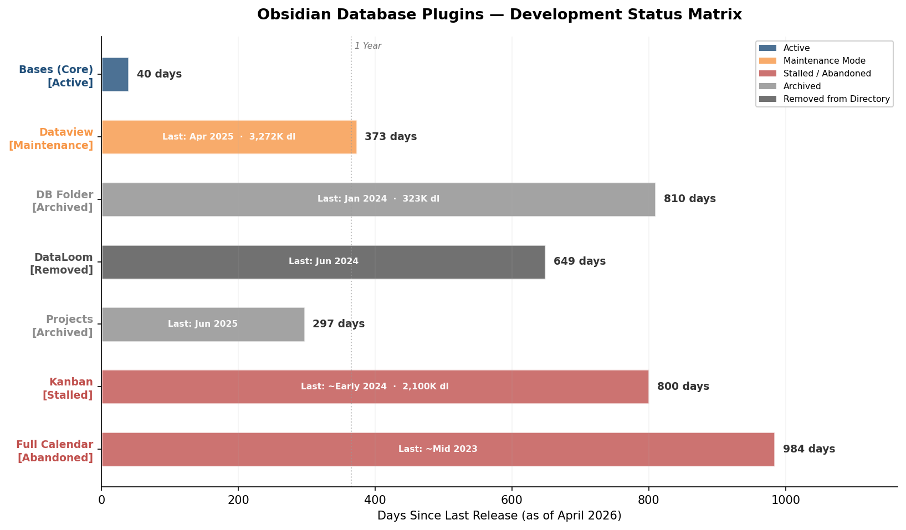

**Only Bases (core) and Dataview remain non-archived**, and Dataview is in maintenance mode with no new features expected. This convergence is not coincidental. The introduction of a first-party database engine backed by Obsidian's core development team fundamentally altered the incentive structure for community developers: when the platform itself provides a database layer with a public API for extensions, maintaining a competing standalone plugin becomes a less attractive investment of developer time.

DataLoom's developer stated this dynamic explicitly, citing Obsidian's own table editor and the Bases direction as reasons for discontinuation [GitHub Issue #958](https://github.com/decaf-dev/obsidian-dataloom/issues/958 "DataLoom no longer maintained"). The pattern strongly suggests that Bases has consolidated the ecosystem — future database innovation in Obsidian will largely flow through the Bases API rather than through independent plugin architectures.

## 2.5 Emerging Contenders and the Bases API Ecosystem

While legacy plugins have stalled, the Bases API has already begun producing a new generation of view-type plugins that extend the core database engine:

- **Bases Kanban** (by ewerx, December 2025): The first Bases API-powered Kanban view. Cards map to notes; columns derive from Bases Group By; drag-and-drop between columns automatically updates frontmatter. The plugin is early-stage, with known limitations such as empty columns disappearing when no cards are present [Bases Kanban GitHub](https://github.com/ewerx/obsidian-bases-kanban "First Bases API kanban view; December 2025").
- **Calendar Bases** (by Edrick Leong): A community plugin with approximately **45,000 downloads** that adds a calendar layout to Bases, featuring drag-and-drop rescheduling, start/end date support, and direct note opening [Obsidian Plugins Directory](https://obsidian.md/plugins "Calendar Bases: 45,268 downloads").
- **Obsidian Maps**: The official Bases API reference plugin providing a Map view (October 2025) [Obsidian Changelog v1.10.0](https://obsidian.md/changelog/2025-10-01-desktop-v1.10.0/ "Official Maps plugin").
- **DataCards** (by Sophokles187): Transforms Dataview queries into card layouts, including a kanban preset with inline editing. Requires Dataview and is not yet listed in the community plugin store [DataCards GitHub](https://github.com/Sophokles187/data-cards "Kanban preset, inline editing, card layouts from Dataview").
- **Prisma Calendar**: An emerging calendar plugin (late 2025) with CalDAV sync supporting iCloud, Google, Nextcloud, and Fastmail — a potential successor to the abandoned Full Calendar [Obsidian Forum](https://forum.obsidian.md/t/prisma-calendar-a-feature-rich-fully-configurable-calendar-plugin-for-obsidian/108788 "CalDAV sync including Google; ICS import/export").

The combined **Bases + Bases Kanban + Calendar Bases** stack now provides **6 functional view types** (Table, Cards/Gallery, List, Map, Kanban, Calendar) — the broadest active view coverage available in Obsidian, and a configuration that did not exist twelve months prior.

## 2.6 Scope and Rationale for Plugin Evaluation

Subsequent chapters of this report evaluate the following plugins and plugin combinations:

**Primary evaluations (Chapter 3):**

1. **Bases** (core plugin) — the only actively developed first-party solution and the center of gravity for the ecosystem going forward.
2. **Dataview / DataviewJS** — the most installed community plugin, the de facto query standard, and a current dependency for several other tools.
3. **DB Folder** — a historical benchmark for Relation/Rollup support (unique in the ecosystem), evaluated for the benefit of existing users; prominently noted as archived.
4. **DataLoom** — a historical case study in Notion-style UI design; prominently noted as discontinued and removed from the plugin directory.
5. **Projects** — the only plugin to have offered four integrated view types; prominently noted as archived.
6. **Kanban plugin** — the most popular dedicated Kanban tool, despite its stalled development state.
7. **Full Calendar** — the most feature-complete standalone calendar solution, despite being effectively abandoned.
8. **Emerging contenders** — Bases Kanban, Calendar Bases, DataCards, Prisma Calendar, and other Bases API extensions.

**Exclusion rationale:** Plugins that address tangential functionality (pure task management, simple calendar widgets without database integration, note-linking tools without view rendering) fall outside scope. The TileLineBase plugin was investigated but insufficient data was found to warrant inclusion.

## 2.7 Key Takeaways

Three structural observations define the Obsidian database plugin landscape as of April 2026:

1. **Architectural divergence from Notion is fundamental.** Obsidian's Markdown-plus-frontmatter model delivers local ownership, full offline capability, and plaintext interoperability — but imposes real constraints on property type richness, real-time collaboration, and block-level data manipulation. Every plugin evaluation in subsequent chapters must be read against this architectural backdrop.

2. **Bases has consolidated the ecosystem.** The introduction of a first-party database engine with a public extension API coincided with the archival or stalling of every major community database plugin. The future of database functionality in Obsidian runs through Bases and its `registerView()` API.

3. **The ecosystem is in active transition.** The Bases API is less than a year old, and the first wave of community view-type plugins (Bases Kanban, Calendar Bases, Maps) is still maturing. Users evaluating Obsidian as a Notion replacement in April 2026 are entering a landscape with strong forward momentum but incomplete current coverage — a gap that the plugin-by-plugin deep dive in Chapter 3 quantifies in detail.

# 第3章 Plugin-by-Plugin Deep Dive

Chapter 2 mapped the structural landscape — which plugins exist, which are archived, and how Bases has reshaped the ecosystem. This chapter moves from landscape to evaluation. Each major plugin or plugin combination receives an individually structured assessment using a consistent template: supported views, property handling, advanced features (relations, rollups, formulas, inline editing, drag-and-drop, filtering, sorting, grouping), UX and performance characteristics, development status, and strengths and weaknesses. Archived plugins are evaluated as historical benchmarks for users who still have them installed, with discontinued status stated prominently.

The benchmark against which every plugin is measured is Notion's database system as documented in Chapter 1: 10 view types, 22 property types, nested AND/OR filters, bidirectional relations with rollups, formula language with AI assist, database automations, conditional color, and real-time collaboration. The feature matrix and development timeline below provide a high-level orientation before the detailed per-plugin evaluations that follow.

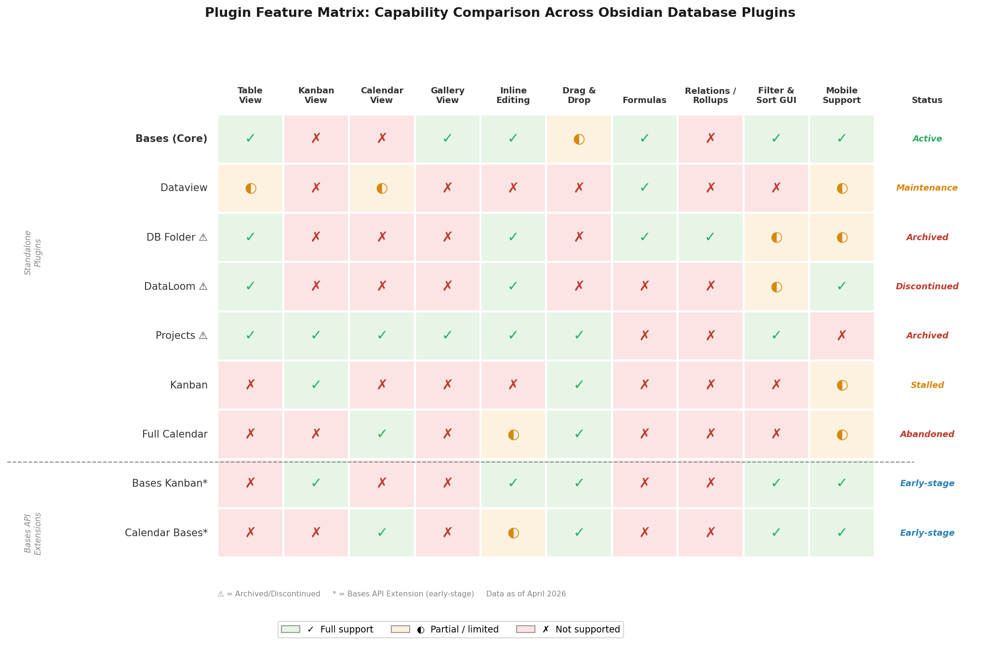

*Figure 3.1 — Color-coded feature matrix comparing 9 plugins across 10 capability dimensions. Green (✓) = full support; amber (⚪) = partial/limited; red (✗) = not supported. Triangles (△) denote archived or discontinued plugins; asterisks (*) denote early-stage Bases API extensions. Data as of April 2026.*

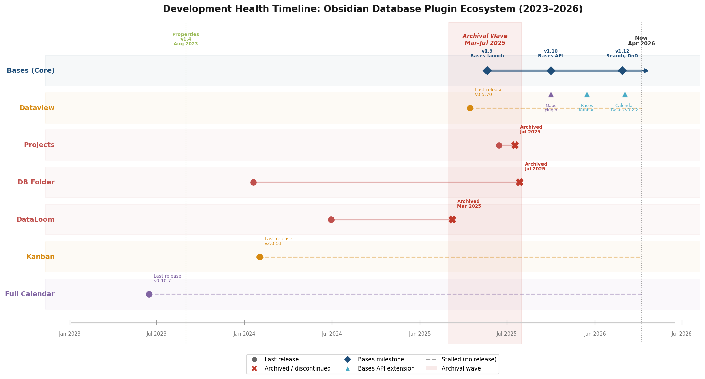

*Figure 3.2 — Horizontal timeline plotting each plugin's last release and archival date alongside Obsidian core milestones (Properties v1.4, Bases v1.9, Bases API v1.10, v1.12). The shaded "Archival Wave" zone (March–July 2025) highlights the temporal clustering of DataLoom, Projects, and DB Folder discontinuations around the Bases launch.*

## 3.1 Bases (Core Plugin)

### Supported Views

Bases provides **4 built-in view layouts**: Table (introduced in v1.9), Cards/Gallery (v1.9), List (v1.10), and Map (v1.10, via the official Maps plugin). It does **not** natively include Kanban or Calendar views as of Obsidian v1.12 [Obsidian Bases Guide](https://got.md/obsidian-bases/ "Built-in layouts: Table, Cards, List, Map"). The Bases API `registerView()` enables community-developed view types, however — Bases Kanban (Section 3.8) and Calendar Bases (Section 3.8) extend the effective view count to 6 when paired with the core plugin.

Of Notion's four canonical views, Bases natively covers Table and List. Cards/Gallery approximates Notion's Gallery view. Kanban and Calendar require community add-ons built on the Bases API.

### Property Handling

Bases works with three categories of properties:

1. **Note properties** — standard YAML frontmatter fields inheriting Obsidian's 7 core property types: Text, List, Number, Checkbox, Date, Date & time, and Tags [Obsidian Changelog v1.9.0](https://obsidian.md/changelog/2025-05-21-desktop-v1.9.0/ "Data backed by YAML properties").
2. **File properties** — system metadata automatically indexed by Obsidian, including `file.name`, `file.path`, `file.ctime`, `file.mtime`, `file.tags`, `file.backlinks`, and `file.size`.
3. **Formula properties** — computed columns defined within the `.base` file that do not modify the underlying note.

This 7-type system covers 7 of Notion's 22 property types. Notable absences include Select, Multi-Select, Status, Relation, Rollup, Person, URL, Email, Phone, Button, and Unique ID. Tags partially approximate Multi-Select behavior, and Checkbox can serve as a simplified Status toggle, but these are functional workarounds rather than type equivalence — neither enforces constrained value sets nor provides the selection UI that Notion offers.

### Advanced Features

**Formulas.** Bases offers a proprietary formula language supporting `if()` conditionals, date arithmetic (`today()`, date addition/subtraction), string operations, `reduce()` for aggregations, `html()` for rendering, `random()`, and `list()` for collection operations [Obsidian Changelog v1.10.0](https://obsidian.md/changelog/2025-10-01-desktop-v1.10.0/ "New formula functions"). This repertoire is narrower than Notion's formula language — which includes dot-notation property traversal, `style()` for conditional formatting, and AI-assisted formula creation on Business/Enterprise plans — but covers the most common computational needs for database columns.

**Filtering and Sorting.** Bases supports global filters (applied to all views in a `.base` file) and per-view filters with folder, tag, and link scope. Nested AND/OR/NOT logic is available, approaching Notion's 3-level nested filter system. Group By (v1.10) enables single-level grouping with table summaries [Obsidian Bases Guide](https://got.md/obsidian-bases/ "Inline editing, 6 filter primitives, nested logic"). Sub-grouping — a secondary grouping layer within a primary group, available in Notion's Board and Table views — remains unsupported.

**Relations and Rollups.** Bases has no explicit Relation or Rollup property types. Link properties combined with formulas and filter functions such as `file.hasLink()` / `file.linksTo()` can approximate relational queries, but this approach requires manual formula construction and does not replicate the bidirectional, type-safe relation model that Notion provides [Obsidian Bases Guide](https://got.md/obsidian-bases/ "Formulas and link-based filters approximate relations"). This absence represents one of the largest functional gaps between Bases and Notion's database system.

**Inline Editing.** Full inline editing is supported — cell edits in any view persist directly to YAML frontmatter in the source `.md` file. This is a significant advantage over read-only query tools like Dataview.

**Drag-and-Drop.** The v1.12 update added drag-and-drop file import into Bases views [Obsidian Changelog v1.12](https://obsidian.md/changelog/ "Bases improvements in v1.12"). Within the Table view, row reordering is not supported; sort order is governed by declared sort rules. The `this` context keyword enables reusable, context-aware dashboards — a `.base` file embedded in different notes automatically scopes its query to the embedding context, a capability without direct Notion equivalent [Obsidian Changelog v1.10.0](https://obsidian.md/changelog/2025-10-01-desktop-v1.10.0/ "Bases API registerView()").

### UX and Performance

Bases benefits from native integration with Obsidian's core indexing engine, yielding fast query execution even in large vaults. Community benchmarks characterize it as "incredibly fast" relative to plugin-level solutions [Obsidian Rocks](https://obsidian.rocks/dataview-vs-datacore-vs-obsidian-bases/ "Bases faster than Datacore; no coding required"). The visual GUI editor eliminates the need for code — users configure views, filters, and formulas through menus and dialogs, substantially lowering the barrier to entry compared to DQL or JavaScript-based tools. Bases operates on mobile (iOS and Android) as a core plugin, with full feature parity.

### Development Status

**Active — first-party development.** Bases is developed by the Obsidian team and integrated into the application core. It has received major updates in every release since v1.9.0 (May 2025), with the most recent improvements in v1.12 (February 2026). The official Obsidian Roadmap lists Calendar view and Kanban view for Bases as "Planned," confirming continued investment [Obsidian Roadmap](https://obsidian.md/roadmap/ "Planned: Calendar view, Kanban view for Bases").

### Strengths

- First-party plugin with long-term support and rapid iteration cadence (roughly 4–5 months between major updates).
- Extensible via Bases API `registerView()` — community developers can contribute new view types that share the same data layer.
- Full inline editing with automatic YAML frontmatter persistence.
- Visual GUI editor requiring no coding knowledge.
- Context-aware `this` keyword enabling reusable, embeddable dashboards.
- Cross-platform availability including iOS and Android.

### Weaknesses

- No native Kanban or Calendar views (reliant on early-stage community add-ons).
- No explicit Relation or Rollup property types — workarounds via formulas are manual and lack type safety.
- Only 7 property types versus Notion's 22.
- No sub-grouping, conditional color, or database automations.
- Formula language and view options continue to evolve, with breaking changes possible.

## 3.2 Dataview / DataviewJS

### Supported Views

Dataview provides 4 query output types: **TABLE**, **LIST**, **TASK**, and **CALENDAR**. The CALENDAR output renders a monthly grid with colored dots on dates where matching entries exist — functional but minimal compared to Notion's Calendar view, which displays entry titles within date cells and supports click-to-create. No Board/Kanban or Gallery view is available [Dataview Docs: Query Types](https://blacksmithgu.github.io/obsidian-dataview/queries/query-types/ "Four query types").

Of Notion's four canonical views, Dataview covers Table and List natively, provides a rudimentary Calendar, and offers no Kanban equivalent.

### Property Handling

Dataview supports **8 field types**: Text, Number, Boolean, Date (with `.year`, `.month`, `.day` sub-properties), Duration, Link, List, and Object. It indexes both YAML frontmatter and its proprietary inline-field syntax (`[key:: value]`) — the latter being unique to Dataview and not recognized by Obsidian's core property system or Bases [Dataview Docs: Types of Metadata](https://blacksmithgu.github.io/obsidian-dataview/annotation/types-of-metadata/ "8 field types").

Dataview also exposes an extensive set of implicit fields derived from file metadata: `file.name`, `file.path`, `file.ctime`, `file.mtime`, `file.size`, `file.tags`, `file.inlinks`, `file.outlinks`, `file.etags`, `file.aliases`, among others. These implicit fields are analogous to Notion's system properties (Created time, Last edited time) but extend further into link-graph metadata, enabling queries that traverse the vault's internal link structure.

### Advanced Features

**Query Language (DQL).** Dataview's DQL is the most powerful query language in the Obsidian ecosystem. Data commands include `FROM` (with folder, tag, and link sources combinable via AND/OR/NOT), `WHERE`, `SORT`, `GROUP BY`, `FLATTEN`, and `LIMIT`. Computed and virtual fields can be defined inline within queries. For cases where DQL's declarative syntax is insufficient, DataviewJS provides a full JavaScript API (`dv.pages()`, `dv.table()`, `dv.list()`, `dv.taskList()`) capable of arbitrary data manipulation and rendering [Dataview Docs: Query Types](https://blacksmithgu.github.io/obsidian-dataview/queries/query-types/ "DQL data commands and computed expressions").

**Filtering and Sorting.** DQL `WHERE` clauses support arbitrary boolean expressions, comparison operators, string matching, date arithmetic, and list operations. This exceeds Notion's filter system in raw expressiveness, though Notion's GUI-based filter builder is far more accessible.

**Relations and Rollups.** Dataview has no explicit Relation or Rollup types, but its `file.inlinks` and `file.outlinks` implicit fields combined with `GROUP BY` and aggregation functions (`sum()`, `length()`, `min()`, `max()`) can reproduce rollup-like calculations over linked notes. Achieving this requires writing DQL or JavaScript — no GUI-based rollup configurator exists.

**Inline Editing.** Dataview is **strictly read-only**. Query results render as static HTML tables or lists that cannot be edited in place. The sole exception is TASK queries, which permit checkbox toggling (persisted to the source file). No drag-and-drop interaction is available [Dataview Docs](https://blacksmithgu.github.io/obsidian-dataview/ "Displaying, not editing"). This read-only constraint is Dataview's most significant UX limitation and the primary reason users sought alternatives such as DB Folder, Projects, and now Bases.

**Performance.** Dataview documentation claims scalability to "hundreds of thousands of annotated notes" [Dataview Docs](https://blacksmithgu.github.io/obsidian-dataview/ "High performance scaling"). On mobile, however, Dataview introduces an observable 1–2 second delay to vault loading due to its plugin-level indexing overhead, which runs independently of Obsidian's core index.

### Development Status

**Maintenance mode.** Dataview's latest release is v0.5.70 (approximately April 2025), with 134 days since the last commit as of the research date. With approximately **3,272,000 downloads** and ~8,700 GitHub stars, it is the most widely installed community database plugin by a substantial margin [Obsidian Community Plugin Stats](https://raw.githubusercontent.com/obsidianmd/obsidian-releases/master/community-plugin-stats.json "Dataview: 3,272,416 downloads") [ObsidianStats: Dataview](https://www.obsidianstats.com/plugins/dataview "v0.5.70, maintenance mode"). No new features are expected; the plugin continues to function, and no deprecation has been announced. License: MIT.

### Strengths

- Most powerful and flexible query language in the Obsidian ecosystem (DQL + full JavaScript API via DataviewJS).
- Massive user base (~3.27M downloads) with extensive community documentation, templates, and tutorials.
- Scales to very large vaults (hundreds of thousands of notes per documentation claims).
- Inline fields (`[key:: value]`) provide a unique metadata annotation method outside YAML frontmatter.
- Serves as a dependency and data source for other plugins (DB Folder, Projects, DataCards).

### Weaknesses

- Strictly read-only — no inline editing, no drag-and-drop, no visual configurator.
- Code-only interface with a steep learning curve for non-technical users.
- No Kanban/Board or Gallery views.
- Maintenance mode with no active feature development.
- CALENDAR output is minimal (dots on dates only — no event titles, no time display, no interaction beyond navigation).

## 3.3 DB Folder — ⚠️ Archived July 2025

### Supported Views

DB Folder provides a **single view type: interactive Table**. No Kanban, Calendar, or Gallery views were implemented [DB Folder Docs](https://rafaelgb.github.io/obsidian-db-folder/ "Notion's like databases — table view"). Of Notion's four canonical views, only Table is covered.

### Property Handling

DB Folder offered the **richest property type system** among all community plugins, with **14 property types**: Text, Number, Checkbox, Date, Time, Select, Tags (multi-select), Formulas (JavaScript-based), Image, Created time, Modified time, Tasks, Inlinks, Outlinks, **Relation**, and **Rollup** [DB Folder Properties Docs](https://rafaelgb.github.io/obsidian-db-folder/features/Properties/ "14 property types including Relation and Rollup").

The inclusion of explicit Relation and Rollup types was DB Folder's most distinctive feature — and remains unique across the entire community plugin ecosystem. It is the **only community plugin to have offered explicit Relation and Rollup property types** that directly mirror Notion's relational data model. Relations allowed linking entries across databases; Rollups computed aggregations (count, sum, among others) over related entries — the same pattern that powers Notion's cross-database workflows [DB Folder Properties Docs](https://rafaelgb.github.io/obsidian-db-folder/features/Properties/ "Relation and Rollup unique in ecosystem").

### Advanced Features

**Formulas.** DB Folder's formula system was JavaScript-based, offering more flexibility than Bases' proprietary formula language for users comfortable with code. Formulas could reference other columns and perform arbitrary computations.

**Filtering and Sorting.** Data could be sourced from folders, links, tags, or Dataview queries — the broadest source flexibility among table-view plugins. The plugin used Dataview as its underlying search engine, inheriting Dataview's indexing and query capabilities while layering a visual table interface on top.

**Inline Editing.** Full inline editing was supported through a React-based, Notion-style UI. Cell edits persisted to YAML frontmatter or Dataview inline fields depending on configuration [DB Folder GitHub](https://github.com/RafaelGB/obsidian-db-folder "Dataview as search engine; React UI").

### Development Status

**Archived.** The repository was **archived by its owner on July 28, 2025**. The last release (v3.5.1) dates to January 19, 2024, with 179 open issues unresolved at the time of archival. Approximately **323,000 downloads** and 1,400 GitHub stars. DB Folder depended on Dataview (itself in maintenance mode), creating a double dependency risk: even before archival, the plugin's long-term viability was constrained by its upstream dependency's trajectory. License: MIT [DB Folder GitHub](https://github.com/RafaelGB/obsidian-db-folder "Archived Jul 28, 2025").

DB Folder is no longer a viable option for new installations. Existing users can continue using it, but no bug fixes, security patches, or compatibility updates will be provided. The loss of its unique Relation and Rollup support constitutes a significant gap in the active ecosystem.

### Strengths (Historical)

- Only plugin with explicit Relation and Rollup property types — the closest any community plugin came to Notion's relational model.
- Richest property type system (14 types).
- Full inline editing with Notion-like React UI.
- Multiple data sources (folders, links, tags, Dataview queries).

### Weaknesses

- Archived with no path to maintenance or succession.
- Table-only — no Kanban, Calendar, or Gallery views.
- Dependency on Dataview (itself in maintenance mode).
- 179 unresolved issues at time of archival.
- JavaScript-based formulas required coding knowledge.

## 3.4 DataLoom — ⚠️ Archived March 2025, Removed May 2025

### Supported Views

DataLoom provided a **single view type: Table**. Board/Kanban, Calendar, and Gallery views were listed on the project roadmap but were never implemented before the plugin was discontinued [DataLoom GitHub](https://github.com/decaf-dev/obsidian-dataloom "View types: Table").

### Property Handling

DataLoom supported **12 cell types**: Text, Number (with currency formatting), Checkbox, Embed, File, Date, Tag (single-select), Multi-tag (multi-select), Last edited time, Creation time, Source, and Source file. Data was stored in a proprietary **`.loom` file format** rather than YAML frontmatter — a fundamental design choice that made DataLoom tables self-contained but created a data silo completely outside Obsidian's standard property ecosystem [DataLoom GitHub](https://github.com/decaf-dev/obsidian-dataloom "12 cell types; .loom file format").

The `.loom` format rendered DataLoom data invisible to Bases, Dataview, and any other tool that reads YAML frontmatter. This is a critical architectural distinction: unlike DB Folder or Projects (which read and write standard frontmatter), DataLoom operated in complete isolation from the rest of the vault's metadata layer.

### Advanced Features

**Formulas.** Not supported.

**Relations and Rollups.** Not supported.

**Filtering and Sorting.** Basic column-level filtering and sorting were available within the table interface.

**Inline Editing.** Full inline editing with undo/redo support. CSV, Markdown, and PDF import/export were available, providing reasonable data portability despite the proprietary storage format. Mobile support was functional [DataLoom GitHub](https://github.com/decaf-dev/obsidian-dataloom "Features list").

### Development Status

**Discontinued and removed.** DataLoom was **archived on March 9, 2025** and **removed from the Obsidian community plugin directory on May 3, 2025**. The developer explicitly cited Obsidian's native table editor (introduced in v1.5.0) and the trajectory signaled by Bases as factors in the decision. The plugin underwent three name changes during its lifetime — from "Notion-Like Tables" to "Dashboards" to "DataLoom" — reflecting evolving ambitions that ultimately went unfulfilled. Last release: v8.16.1 (June 29, 2024) [GitHub Issue #958](https://github.com/decaf-dev/obsidian-dataloom/issues/958 "Developer announcement: DataLoom no longer maintained") [Moritz Jung Obsidian Stats](https://www.moritzjung.dev/obsidian-stats/plugins/notion-like-tables/ "Archived Mar 2025, removed May 2025").

DataLoom can no longer be installed from the community plugin directory. Users who have it installed can continue using it, but new `.loom` files will become increasingly difficult to maintain as Obsidian evolves without corresponding updates to the plugin.

### Strengths (Historical)

- Clean, polished Notion-like table UI with low barrier to entry.
- Good import/export options (CSV, Markdown, PDF).
- Mobile support.
- Undo/redo in table editing.

### Weaknesses

- Discontinued and removed from the plugin directory.
- Proprietary `.loom` file format — data silo with no interoperability with Obsidian's property ecosystem.
- Table-only — Kanban, Calendar, and Gallery views were never shipped.
- No formulas, relations, or rollups.
- No filtering or sorting beyond basic column operations.

## 3.5 Projects (by Marcus Olsson) — ⚠️ Archived July 2025

### Supported Views

Projects was the **only community plugin to offer four integrated view types** within a single interface: **Table**, **Board (Kanban)**, **Calendar**, and **Gallery**. This breadth made it the closest structural analog to Notion's multi-view database among all Obsidian plugins [Projects GitHub](https://github.com/marcusolsson/obsidian-projects "Four views: Table, Board, Calendar, Gallery").

- **Table** view supported inline editing of frontmatter properties with column sorting and filtering.
- **Board** view grouped entries by a property (e.g., Status) with drag-and-drop movement between columns — directly analogous to Notion's Kanban view.
- **Calendar** view displayed entries by a date property in a monthly grid.
- **Gallery** view rendered entries as cards with optional cover images.

All four views operated on the same underlying data set (notes in a folder or matching a Dataview query), and edits in one view reflected immediately in all others — the same single-source-of-truth model that defines Notion's database views.

### Property Handling

Projects read YAML frontmatter and supported all 7 Obsidian core property types including Date & time (added in v1.17.4). The plugin followed a **"leave no trace" design philosophy** — it did not inject any plugin-specific metadata into notes, meaning that disabling or removing the plugin left zero artifacts in the vault [Projects GitHub](https://github.com/marcusolsson/obsidian-projects "Leave no trace design").

This design distinction carries practical weight. DB Folder and DataLoom both created plugin-specific data structures (Dataview inline fields and `.loom` files, respectively), introducing varying degrees of lock-in. Projects' leave-no-trace approach meant that migration away from it — whether to Bases or another solution — was trivial.

### Advanced Features

**Formulas.** Not supported.

**Relations and Rollups.** Not supported.

**Filtering and Sorting.** Data sources included folders and Dataview queries, with property-based filtering and sorting within each view. Configurable first day of week was added in v1.17.4.

**Inline Editing.** Supported in Table view. Board view drag-and-drop updated the grouping property. Calendar view allowed date changes.

### Development Status

**Archived.** The original author **discontinued Projects in May 2025**, and the **repository was archived on July 18, 2025**. The plugin was **desktop-only** (`isDesktopOnly: true`), which limited its reach among users who work across desktop and mobile devices. License: Apache-2.0 [Projects GitHub Issues](https://github.com/obsmd-projects/obsidian-projects/issues/1011 "Repository archived Jul 18, 2025").

A community fork called **"Projects Plus"** surfaced on the Obsidian forum in October 2025. Its maturity, maintenance commitment, and acceptance into the community plugin directory remain uncertain as of April 2026 [Obsidian Forum](https://forum.obsidian.md/t/projects-plus-plugin/106826 "Community fork — October 2025").

### Strengths (Historical)

- Only plugin offering 4 integrated views (Table, Board, Calendar, Gallery) — broadest single-plugin coverage.
- Leave-no-trace design with zero lock-in.
- Clean, native-feeling UI.
- Single-source-of-truth model across all views.

### Weaknesses

- Archived with uncertain fork succession.
- No formulas, relations, or rollups.
- Desktop-only — no mobile support.
- Limited property type support (7 core types only).

## 3.6 Kanban Plugin — Stalled, Seeking Maintainers

### Supported Views

The Kanban plugin provides a **single view type: Kanban/Board**. Boards are stored as Markdown files where headings define lanes and list items define cards. Board-level settings reside in YAML frontmatter within the board file [Kanban GitHub](https://raw.githubusercontent.com/mgmeyers/obsidian-kanban/main/README.md "Markdown-backed Kanban boards").

This data model is fundamentally different from Notion's Kanban view or from Bases Kanban. In Notion and Bases, a Kanban view is one perspective over a shared database — entries exist as independent records with properties, and the board is a visual grouping by a property value. In the Kanban plugin, the board **is** the data — cards are list items within a single Markdown file, not independent notes with frontmatter properties.

### Property Handling

Cards in the Kanban plugin are list items, not notes with structured properties. Cards can contain Markdown text, links to notes, dates/times, and embedded images. However, cards **do not read frontmatter from linked notes** — if a card links to a note with a `status` property, the board has no awareness of that property value. This architectural choice makes the Kanban plugin a **standalone data silo** that does not integrate with Obsidian's property system [Kanban GitHub](https://raw.githubusercontent.com/mgmeyers/obsidian-kanban/main/README.md "No WIP limits or swimlanes").

### Advanced Features

**Drag-and-Drop.** Full drag-and-drop between lanes and within lanes — the plugin's core interaction paradigm.

**Note Creation.** Cards can create new notes from templates, establishing a link between the card and the created note.

**Archive.** Completed cards can be archived, removing them from the active board while preserving them in the file.

**Board Search.** A search function filters visible cards [Kanban Plugin Forum](https://forum.obsidian.md/t/kanban-plugin/17082 "Features: dates, images, note creation, archive").

**Missing Features.** No WIP (work-in-progress) limits, no swimlanes, no label/tag system, no property display from linked notes on cards, no sub-grouping. These are capabilities that mature Kanban tools (Trello, Notion Board view) commonly provide, and their absence limits the plugin to lightweight task management rather than full project workflow orchestration.

### Development Status

**Stalled — seeking maintainers.** The plugin's README explicitly states: "The Kanban plugin is looking for new maintainers." The last release (v2.0.51) dates to approximately early 2024 — roughly **2 years without an update**. With approximately **2,100,000 downloads**, it is the second most-installed database-adjacent plugin after Dataview. Users have reported breakage after Obsidian mobile v1.11.5. License: MIT [Kanban GitHub](https://raw.githubusercontent.com/mgmeyers/obsidian-kanban/main/README.md "Seeking new maintainers").

### Strengths

- Pure Markdown backing — boards are human-readable text files.
- Intuitive, focused Kanban UX with smooth drag-and-drop.
- Massive user base (~2.1M downloads).
- Note linking and note creation from cards.

### Weaknesses

- Stalled with no active maintainer — future compatibility uncertain.
- Standalone data silo — no integration with Obsidian properties, Bases, or Dataview.
- No WIP limits, swimlanes, labels, or advanced Kanban features.
- Single view type only.
- Reported mobile compatibility issues.

## 3.7 Full Calendar — Effectively Abandoned

### Supported Views

Full Calendar provides **day, week, and month views** powered by the FullCalendar.js library — the most complete calendar rendering in the Obsidian ecosystem. Events are displayed with titles, times, and color coding; day and week views show hour-by-hour time slots [Full Calendar Docs](https://obsidian-community.github.io/obsidian-full-calendar/ "Day/week/month views; events as notes").

In calendar fidelity alone, Full Calendar exceeds the Notion benchmark. Notion's Calendar view offers only a monthly grid without day or week sub-views, hour-level granularity, or drag-to-resize for event duration.

### Property Handling

Events can be stored as:

1. **Dedicated note events** — individual `.md` files with date/time properties in frontmatter.
2. **Inline events** — list items within daily notes using Dataview inline-field syntax.

Both timed and all-day events are supported, as well as single and recurring events (with recurrence rules). Start and end times define event duration [Full Calendar Events](https://obsidian-community.github.io/obsidian-full-calendar/events/types/ "Drag-and-drop, click-and-drag creation").

### Advanced Features

**External Calendar Integration.** Full Calendar offers **ICS integration** (read-only, auto-refresh every 5 minutes) for importing events from Google Calendar, Apple Calendar, Outlook, and other ICS-compatible providers. **CalDAV integration** (read-only, basic auth) works with Apple iCloud and Fastmail; **Google Calendar is not supported via CalDAV**, a notable gap given Google's market share among calendar providers [Full Calendar ICS](https://obsidian-community.github.io/obsidian-full-calendar/calendars/ics/ "ICS read-only") [Full Calendar CalDAV](https://obsidian-community.github.io/obsidian-full-calendar/calendars/caldav/ "CalDAV: iCloud/Fastmail yes, Google no").

**Drag-and-Drop.** Events can be dragged to reschedule (updates frontmatter). Click-and-drag on empty time slots creates new events. A sidebar view provides a persistent calendar widget.

**Missing Features.** No table, list, or board views. No filtering beyond calendar source selection. No property-based grouping or sorting.

### Development Status

**Effectively abandoned.** Last release: v0.10.7 (approximately mid-2023) — **984 days** without a new release as of the research date, and only 5 commits in the past year. The plugin continues to function for existing users but receives no updates, leaving it exposed to compatibility risk with future Obsidian releases. License: MIT [ObsidianStats: Full Calendar](https://www.obsidianstats.com/plugins/obsidian-full-calendar "984 days since last release").

### Strengths

- Most feature-complete calendar in the Obsidian ecosystem (day/week/month views).
- ICS and CalDAV integration for external calendar overlay.
- Rich FullCalendar.js-powered UI with drag-and-drop.
- Events stored as notes with frontmatter — compatible with Obsidian's property system.
- Recurring event support.

### Weaknesses

- Effectively abandoned (~2.7 years without a release).
- Read-only external calendars (no two-way sync).
- Google CalDAV not supported.
- Single view type (calendar only) — no table, list, or board.
- Potential compatibility risk with future Obsidian versions.

## 3.8 Emerging Contenders and Bases API Extensions

The Bases API `registerView()` has catalyzed a new generation of view-type plugins that operate within the Bases data layer rather than alongside it. Unlike the standalone plugins evaluated above, these extensions share the same `.base` file configuration and YAML frontmatter, enabling seamless data flow across view types — a property that isolated plugins such as Kanban and Full Calendar cannot provide.

### Bases Kanban (by ewerx)

Released in December 2025, Bases Kanban is the first Bases API-powered Kanban view. Cards represent notes; columns derive from Bases Group By on a selected property. Drag-and-drop between columns automatically updates the corresponding frontmatter value — for example, dragging a card from "In Progress" to "Done" writes `status: Done` to the note's YAML. Column reordering is supported [Bases Kanban GitHub](https://github.com/ewerx/obsidian-bases-kanban "First Bases API kanban view; December 2025").

**Known limitations.** Empty columns disappear when no cards match that value — a UX issue for workflows that rely on seeing all status options at all times. No WIP limits, swimlanes, card property display, or label system are available. The plugin remains early-stage.

Despite these limitations, Bases Kanban occupies a strategically important position: it is the only Kanban solution that writes back to YAML frontmatter through the Bases data layer, ensuring that Kanban operations are immediately visible in Table, List, and other Bases views.

### Calendar Bases (by Edrick Leong)

Calendar Bases adds a **calendar layout** to Obsidian Bases, displaying notes with date properties in an interactive monthly grid. Built on the FullCalendar.js library — the same rendering engine that powers the abandoned Full Calendar plugin — it inherits a robust visualization foundation. As of April 2026, the plugin has accumulated approximately **48,000 downloads** and 137 GitHub stars, with the latest release at v0.2.2 (March 4, 2026). It requires Obsidian v1.10.0 or later. License: MIT [Obsidian Plugins Directory](https://obsidian.md/plugins "Calendar Bases: 48,136 downloads") [Calendar Bases GitHub](https://github.com/edrickleong/obsidian-calendar-bases "v0.2.2, 137 stars, MIT license").

**Features:**

- Configurable start date property with support for any JavaScript-parseable date format.
- Optional end date property for multi-day event spans.
- Drag-and-drop rescheduling — dragging an event to a new date automatically updates the note's frontmatter.
- Monthly navigation with intuitive controls.
- Click to open entries; context menus for additional options.

**Comparison with Full Calendar.** Calendar Bases lacks Full Calendar's day and week sub-views, ICS integration, CalDAV support, and recurring event handling. It offers, however, a decisive architectural advantage: as a Bases API plugin, Calendar Bases reads and writes through the Bases data layer. An entry rescheduled by drag-and-drop in Calendar Bases is immediately reflected in Table, List, and Kanban views within the same `.base` file. Full Calendar, by contrast, operates as an isolated view with no connection to other database views.

A practical demonstration of this integration advantage was documented by Practical PKM (March 2026), which built a master content calendar using Bases + Calendar Bases that combined notes from multiple folders into a single calendar view — functionality the author noted was not achievable in Notion when working with multiple separate databases [Practical PKM](https://practicalpkm.com/building-a-content-calendar-in-obsidian-bases/ "Content calendar surpassing Notion's multi-database limitations").

### DataCards (by Sophokles187)

DataCards transforms Dataview queries into card-based layouts with multiple presets: grid, portrait, square, compact, dense, and **kanban**. The kanban preset groups cards by a selected property with inline editing support. DataCards requires Dataview as a dependency and is licensed under GPL-3.0. It is not yet available in the community plugin store (installation via BRAT or manual) [DataCards GitHub](https://github.com/Sophokles187/data-cards "Kanban preset, inline editing, card layouts from Dataview").

DataCards occupies a niche between Dataview's read-only output and Bases' visual editor. It adds visual richness to Dataview queries while preserving Dataview's powerful query language as the data source.

### Prisma Calendar

Prisma Calendar is an emerging calendar plugin (announced late 2025) that offers CalDAV sync with iCloud, Google, Nextcloud, and Fastmail — notably including Google CalDAV, which Full Calendar does not support. ICS import/export is also available. As of April 2026, Prisma Calendar is **not yet in the Obsidian community plugin directory** and must be installed via BRAT [Obsidian Forum](https://forum.obsidian.md/t/prisma-calendar-a-feature-rich-fully-configurable-calendar-plugin-for-obsidian/108788 "CalDAV sync including Google; ICS import/export"). As a standalone calendar tool rather than a Bases API extension, Prisma Calendar does not integrate with the Bases data layer.

### Obsidian Maps

The official Maps plugin was released alongside the Bases API in October 2025 as a reference implementation of `registerView()`. It provides a Map view within Bases, displaying notes with location properties on an interactive map. As a first-party demonstration, it validates the extensibility model that underpins the entire Bases API ecosystem [Obsidian Changelog v1.10.0](https://obsidian.md/changelog/2025-10-01-desktop-v1.10.0/ "Official Maps plugin").

## 3.9 Multi-Plugin Stacks vs. Monolithic Solutions

Individual plugin evaluations tell only part of the story. Many users combine multiple plugins to approximate Notion's multi-view database. The viability of these stacks hinges on whether the constituent plugins share a common data layer — a distinction that separates unified database experiences from loosely coupled tool collections.

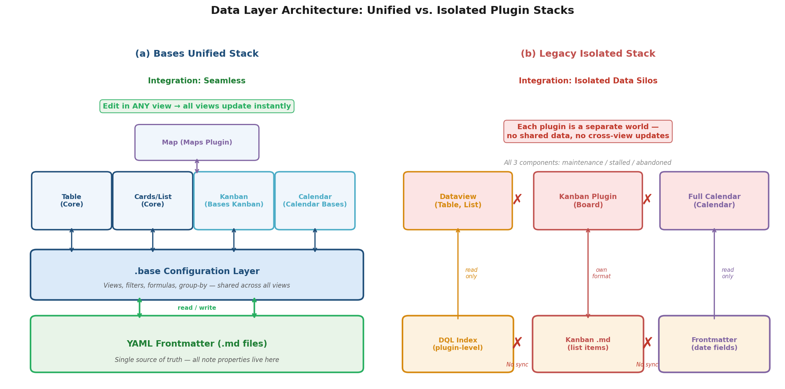

*Figure 3.3 — Architectural comparison of the Bases Unified Stack (left), where all view plugins read and write through a shared `.base` configuration layer and YAML frontmatter, versus the Legacy Isolated Stack (right), where Dataview, Kanban Plugin, and Full Calendar each operate on independent data stores with no cross-view synchronization.*

### Stack A: Bases + Bases Kanban + Calendar Bases (Recommended Active Stack)

This stack provides **6 functional view types**: Table, Cards/Gallery, List, Map, Kanban, and Calendar. All components operate on the same `.base` file configuration and YAML frontmatter. An entry edited in the Table view is immediately visible in the Kanban, Calendar, and all other views — replicating Notion's single-source-of-truth model.

**Integration quality: Seamless.** All components read and write the same data through the Bases data layer. There is no synchronization lag, no data duplication, and no format incompatibility. An entry's property edited in any view propagates instantly to all others.

**Coverage gaps vs. Notion:** No Timeline/Gantt, Chart, or Form views. No explicit Relations/Rollups. No automations, conditional color, or sub-grouping. The community view plugins (Bases Kanban, Calendar Bases) are early-stage with limited feature depth compared to their Notion counterparts.

### Stack B: Dataview + Kanban Plugin + Full Calendar (Legacy Isolated Stack)

This combination was historically the most common approach to multi-view database functionality in Obsidian. Dataview provides Table and List; Kanban provides Board; Full Calendar provides Calendar.

**Integration quality: Isolated data silos.** Each plugin operates independently with no shared data layer. Kanban boards store data as Markdown list items in a single file — they neither read from nor write to note frontmatter. Full Calendar reads frontmatter dates but has no connection to Dataview queries or Kanban boards. Editing a card's lane position in the Kanban plugin does not update a `status` property in the note's frontmatter. There is **no bidirectional sync** across these plugins.

This stack provided functional coverage of multiple view types but failed to deliver the unified database experience that defines Notion. Each view operated as a separate world, and users bore the burden of manually maintaining data consistency across tools.

**Current viability: Degraded.** All three components are in maintenance mode, stalled, or abandoned. No new features are forthcoming, and compatibility with future Obsidian versions is not guaranteed.

### Stack C: Projects (Archived — Historical Benchmark)

Projects was the only monolithic solution offering 4 integrated views with a shared data layer. Its leave-no-trace design and native-feeling UI made it the closest single-plugin approximation of Notion's multi-view database during its active period.

**Current viability: None for new users.** Archived July 2025. The Projects Plus community fork remains unproven.

### Stack D: DB Folder (Archived — Relational Benchmark)

DB Folder was the only plugin with explicit Relation and Rollup support, making it the closest approximation of Notion's relational data model. Its scope was limited, however, to a single Table view — no Kanban, Calendar, or Gallery was ever implemented.

**Current viability: None for new users.** Archived July 2025.

## 3.10 Key Takeaways

Three findings emerge from this plugin-by-plugin evaluation:

1. **No single plugin replicates Notion's multi-view database.** The closest active option is the Bases + Bases Kanban + Calendar Bases stack, which covers 6 view types through a unified data layer. Even this combination falls well short of Notion's 10 view types, 22 property types, and advanced features (relations, rollups, automations, conditional color). The feature matrix in Figure 3.1 quantifies these gaps across all evaluated plugins.

2. **The data-layer question is decisive.** Plugins that share the Bases data layer (Bases Kanban, Calendar Bases, Maps) deliver a qualitatively different experience from isolated plugins (Kanban, Full Calendar). In the Bases stack, editing in one view propagates instantly to all others — the defining characteristic of a true multi-view database. In the legacy stack, each plugin operates as a separate world with no cross-view synchronization, as illustrated in Figure 3.3.

3. **The ecosystem's relational gap is its largest deficit.** DB Folder was the only plugin with explicit Relations and Rollups, and it is now archived. Bases approximates relational queries through link properties and formulas, but this approach requires manual construction and lacks the type safety, bidirectionality, and GUI configurability that make Notion's relational model accessible to non-technical users. Until Bases or a Bases API extension introduces native Relation and Rollup types, this gap will remain the widest distance between Obsidian and Notion database functionality.

# 第4章 Comparative Analysis Across Plugins

Chapter 3 evaluated each plugin individually. This chapter synthesizes those evaluations into structured, side-by-side comparison matrices across 10 dimensions: view-type coverage, property/field support depth, filtering and sorting power, inline editing and interaction quality, performance at scale, mobile compatibility, inter-plugin compatibility, development health, licensing and cost, and learning curve. Together, these dimensions define what it means to "replicate Notion's multi-view database" — a system where multiple visual layouts operate over a shared, richly typed, interactively editable dataset.

Two additional analytical frameworks complement the matrices. First, we assess which plugin or plugin stack comes closest to Notion parity for each of the four canonical view types (Table, Kanban, Calendar, List). Second, we evaluate which options offer the strongest forward path given the Obsidian development roadmap and the ecosystem's trajectory — a trajectory defined, as Chapter 2 documented, by the archival of every major community database plugin except Dataview (maintenance mode) and the emergence of Bases as the sole actively developed solution. Sections 4.11 through 4.15 consolidate these comparisons into a weighted parity score, a catalogue of features that remain structurally impossible in Obsidian, and a forward-looking assessment of ecosystem momentum.

## 4.1 View-Type Coverage

View-type coverage is the most visible dimension of Notion parity. Notion offers 10 view types — Table, Board/Kanban, Calendar, List, Gallery, Timeline, Chart, Form, Map, and Feed — plus Dashboards [Notion Help: Views, Filters, Sorts & Groups](https://www.notion.com/help/views-filters-and-sorts "Official documentation listing all database view layouts"). The four canonical views examined in this report — Table, Kanban, Calendar, and List — represent the most commonly used subset.

| Plugin / Stack | Table | Kanban | Calendar | List | Gallery / Cards | Map | Timeline | Chart | Form |
|---|:---:|:---:|:---:|:---:|:---:|:---:|:---:|:---:|:---:|
| **Bases (core)** | ✔ | ✗ | ✗ | ✔ | ✔ | ✔¹ | ✗ | ✗ | ✗ |
| **Bases + Bases Kanban + Calendar Bases** | ✔ | ✔ | ✔ | ✔ | ✔ | ✔¹ | ✗ | ✗ | ✗ |
| **Dataview** | ✔ | ✗ | ◐² | ✔ | ✗ | ✗ | ✗ | ✗ | ✗ |
| **Dataview + Kanban + Full Calendar** | ✔ | ✔³ | ✔³ | ✔ | ✗ | ✗ | ✗ | ✗ | ✗ |
| **DB Folder** ⚠️ archived | ✔ | ✗ | ✗ | ✗ | ✗ | ✗ | ✗ | ✗ | ✗ |
| **DataLoom** ⚠️ removed | ✔ | ✗ | ✗ | ✗ | ✗ | ✗ | ✗ | ✗ | ✗ |
| **Projects** ⚠️ archived | ✔ | ✔ | ✔ | ✗ | ✔ | ✗ | ✗ | ✗ | ✗ |
| **Kanban plugin** (stalled) | ✗ | ✔ | ✗ | ✗ | ✗ | ✗ | ✗ | ✗ | ✗ |
| **Full Calendar** (abandoned) | ✗ | ✗ | ✔ | ✗ | ✗ | ✗ | ✗ | ✗ | ✗ |

¹ Map view via official Maps plugin (Bases API).  
² Dataview CALENDAR renders a monthly dot-grid — no event titles, no click-to-create, no drag-and-drop.  
³ Isolated data silos — no shared data layer between plugins.

The Bases + Bases Kanban + Calendar Bases stack provides the broadest active view coverage: 6 functional view types (Table, Kanban, Calendar, List, Cards, Map) operating on a unified data layer. The archived Projects plugin matched this breadth at 4 integrated views (Table, Board, Calendar, Gallery), though without Map or List. The legacy Dataview + Kanban + Full Calendar stack nominally covers all 4 canonical views but as isolated silos with no cross-view data synchronization — a critical architectural limitation examined in Section 4.7.

No Obsidian plugin or combination provides Timeline/Gantt, Chart, or Form views. These three Notion view types have zero equivalents in the ecosystem.

The closest Obsidian approximation to each canonical Notion view is as follows:

- **Table**: Bases (core) — inline editing, sorting, filtering, grouping, summaries, and formula columns. DB Folder (archived) offered the closest data model with explicit Relations/Rollups but is no longer maintained.
- **Kanban**: Bases Kanban — the only active Kanban solution that writes to YAML frontmatter through the Bases data layer. The standalone Kanban plugin features richer UX (Markdown backing, archive, note creation) but is stalled and operates as a data silo.
- **Calendar**: Calendar Bases — the only calendar solution integrated with the Bases data layer. Full Calendar offers richer calendar features (day/week views, ICS/CalDAV) but is abandoned and isolated.
- **List**: Bases (core) — native List view introduced in v1.10 [Obsidian Changelog v1.10.0](https://obsidian.md/changelog/2025-10-01-desktop-v1.10.0/ "List view introduced"). Dataview LIST queries are more flexible but strictly read-only.

## 4.2 Property and Field Type Support

The richness of a database's type system determines how precisely it can model real-world data. Notion supports 22 property types [Notion Help: Database Properties](https://www.notion.com/help/database-properties "Official property type enumeration"). The following matrix compares coverage across plugins.

| Property Category | Notion | Bases | Dataview | DB Folder ⚠️ | DataLoom ⚠️ | Projects ⚠️ |
|---|:---:|:---:|:---:|:---:|:---:|:---:|
| Text | ✔ | ✔ | ✔ | ✔ | ✔ | ✔ |
| Number | ✔ | ✔ | ✔ | ✔ | ✔ (currency) | ✔ |
| Checkbox / Boolean | ✔ | ✔ | ✔ | ✔ | ✔ | ✔ |
| Date / Date & time | ✔ | ✔ | ✔ (.year/.month/.day) | ✔ (Date + Time) | ✔ | ✔ |
| Select | ✔ | ✗¹ | ✗ | ✔ | ✔ (Tag) | ✗ |
| Multi-Select | ✔ | ✗² | ✗ | ✔ (Tags) | ✔ (Multi-tag) | ✗ |
| Status | ✔ | ✗³ | ✗ | ✗ | ✗ | ✗ |
| Relation | ✔ | ✗⁴ | ✗⁵ | **✔** | ✗ | ✗ |
| Rollup | ✔ | ✗⁴ | ✗⁵ | **✔** | ✗ | ✗ |
| Formula | ✔ | ✔ | ✔ (DQL/JS) | ✔ (JS) | ✗ | ✗ |
| Person | ✔ | ✗ | ✗ | ✗ | ✗ | ✗ |
| URL / Email / Phone | ✔ | ✗⁶ | ✗⁶ | ✗ | ✗ | ✗ |
| File / Image | ✔ | ✗ | ✗ | ✔ | ✔ (Embed/File) | ✗ |
| Created / Modified time | ✔ | ✔⁷ | ✔⁷ | ✔ | ✔ | ✗ |
| Button | ✔ | ✗ | ✗ | ✗ | ✗ | ✗ |
| Unique ID | ✔ | ✗ | ✗ | ✗ | ✗ | ✗ |
| Tags / List | — | ✔ | ✔ | ✔ | ✗ | ✔ |
| Duration | — | ✗ | ✔ | ✗ | ✗ | ✗ |
| Link (to note) | — | ✔⁷ | ✔ | ✔ | ✗ | ✔ |
| **Approximate coverage** | **22** | **7 + formulas** | **8 types** | **14 types** | **12 types** | **7 types** |

¹ Tags can approximate Select behavior.  
² Tags partially approximate Multi-Select.  
³ Checkbox can serve as a simplified binary status.  
⁴ Link properties + formulas + `file.hasLink()`/`file.linksTo()` approximate Relations; `reduce()` approximates Rollups. Manual construction required.  
⁵ `file.inlinks`/`file.outlinks` + `GROUP BY` + aggregation functions approximate relational queries in DQL.  
⁶ URL/Email/Phone can be stored as Text properties but lack type-specific validation or rendering.  
⁷ Accessed via file metadata properties (`file.ctime`, `file.mtime`, `file.name`).

DB Folder (archived) had the richest type system at 14 types, including the only explicit Relation and Rollup support in the ecosystem [DB Folder Properties Docs](https://rafaelgb.github.io/obsidian-db-folder/features/Properties/ "14 property types including Relation and Rollup"). With DB Folder's archival in July 2025, this capability is lost to the active ecosystem. Bases covers 7 core types plus formula columns — adequate for common use cases but significantly less expressive than Notion's 22-type system. The absence of Select, Multi-Select, and Status types in Bases is a notable gap for project-management workflows where constrained-value properties are essential; Tags serve as a workaround but lack the single-value enforcement, color coding, and dropdown UX that Notion's Select provides.

## 4.3 Filtering, Sorting, and Grouping

Filtering and sorting are the mechanisms by which a database view becomes useful at scale. Notion provides per-view filters with nested AND/OR logic (up to 3 levels), multi-property sorting, single and sub-grouping, and saveable filter configurations (personal or shared) [Notion Help: Views, Filters, Sorts & Groups](https://www.notion.com/help/views-filters-and-sorts "Advanced filter nesting").

| Capability | Notion | Bases | Dataview | DB Folder ⚠️ | Projects ⚠️ | Kanban (stalled) |
|---|:---:|:---:|:---:|:---:|:---:|:---:|
| Per-view filters | ✔ | ✔ | N/A (code) | ✔ | ✔ | ✗ |
| Nested AND/OR logic | ✔ (3 levels) | ✔ (AND/OR/NOT) | ✔ (arbitrary) | ✔ | Partial | ✗ |
| Multi-property sort | ✔ | ✔ | ✔ | ✔ | ✔ | ✗ |
| Group By | ✔ | ✔ (v1.10) | ✔ | ✔ | ✔ (Board view) | N/A (lanes) |
| Sub-grouping | ✔ | ✗ | ✗ | ✗ | ✗ | ✗ |
| Saveable filter configs | ✔ | ✔ (per-view) | N/A (code) | ✔ | ✔ | ✗ |
| GUI filter builder | ✔ | ✔ | ✗ | ✔ | ✔ | ✗ |
| Table summaries | ✔ (6 functions) | ✔ (v1.10) | ✗ | ✗ | ✗ | ✗ |

Bases matches Notion's filtering architecture most closely among active plugins: it offers GUI-based nested filter logic, per-view configurations, and table summaries — the latter being unique among Obsidian plugins and directly paralleling Notion's column calculations (sum, average, count, etc.) [Obsidian Changelog v1.10.0](https://obsidian.md/changelog/2025-10-01-desktop-v1.10.0/ "Group By and table summaries"). Dataview exceeds Notion in raw filter expressiveness through arbitrary boolean expressions in DQL `WHERE` clauses, but this power is accessible only through code and produces read-only results with no GUI builder.

Sub-grouping — applying a secondary grouping within a primary group — is a Notion feature absent from every Obsidian plugin and stack. This gap is relevant for workflows that, for example, group tasks first by project and then by status within each project.

## 4.4 Inline Editing and Interaction Quality

Interaction quality measures how closely a plugin replicates the direct-manipulation experience of Notion's database views — clicking a cell to edit it, dragging a card between columns, resizing a timeline bar. This dimension is where read-only tools like Dataview diverge most sharply from editable solutions.

| Capability | Notion | Bases | Dataview | DB Folder ⚠️ | DataLoom ⚠️ | Projects ⚠️ | Kanban (stalled) | Full Calendar (abandoned) |
|---|:---:|:---:|:---:|:---:|:---:|:---:|:---:|:---:|
| Inline cell editing | ✔ | ✔ | ✗ | ✔ | ✔ | ✔ (Table) | N/A | N/A |
| Drag-and-drop (Kanban) | ✔ | ✔¹ | ✗ | ✗ | ✗ | ✔ | ✔ | ✗ |
| Drag-and-drop (Calendar) | ✔ | ✔² | ✗ | ✗ | ✗ | ✗ | ✗ | ✔ |
| Click-to-create | ✔ | ✗ | ✗ | ✗ | ✗ | ✗ | ✗ | ✔ |
| Undo/redo | ✔ | ✔ (v1.10) | N/A | ✗ | ✔ | ✗ | ✗ | ✗ |
| Column/row reordering | ✔ | Partial³ | ✗ | ✔ | ✔ | Partial | ✗ | N/A |
| Keyboard navigation | ✔ | ✔ (v1.10) | ✗ | ✗ | ✗ | ✗ | ✗ | ✗ |
| Copy/paste cells | ✔ | ✔ (v1.10) | ✗ | ✗ | ✗ | ✗ | ✗ | ✗ |
| Conditional color | ✔ | ✗ | ✗ | ✗ | ✗ | ✗ | ✗ | ✗ |

¹ Via Bases Kanban plugin.  
² Via Calendar Bases plugin.  
³ Column reordering supported; row reordering determined by sort rules.

Bases (core + extensions) offers the most complete interaction model among active solutions: inline editing, keyboard navigation, copy/paste, undo/redo, and drag-and-drop in both Kanban and Calendar views — all persisting changes to YAML frontmatter [Obsidian Changelog v1.10.0](https://obsidian.md/changelog/2025-10-01-desktop-v1.10.0/ "Keyboard navigation, copy/paste, undo/redo"). This approaches Notion's direct-manipulation standard, though click-to-create (starting a new entry by clicking an empty calendar slot or table row) and conditional color (visual formatting based on property values) remain absent.

Dataview's strict read-only nature represents its defining trade-off: the most powerful query engine in the ecosystem produces output that cannot be interacted with beyond task-checkbox toggling. For users whose primary need is data visualization rather than data manipulation, this may be acceptable; for those expecting a Notion-like interactive database, it is a fundamental limitation.

## 4.5 Performance at Scale

Performance at scale matters for users migrating large Notion workspaces — databases with thousands of entries are common in project management and content planning contexts. Direct, controlled benchmarks comparing Bases and Dataview with identical datasets are not available in the public domain as of April 2026. The following assessment draws on documented design characteristics and community-reported observations.

**Bases** benefits from native integration with Obsidian's core indexing engine. As a first-party plugin compiled into the application, it avoids the plugin-level overhead that community solutions incur. Community reviewers describe Bases as "incredibly fast" relative to plugin-level alternatives [Obsidian Rocks](https://obsidian.rocks/dataview-vs-datacore-vs-obsidian-bases/ "Bases faster than Datacore; no coding required"). The `.base` file stores declarative configuration rather than a query engine index — Bases reads already-indexed vault metadata rather than building its own secondary index.

**Dataview** builds and maintains a separate plugin-level index of all vault metadata. Its documentation claims scalability to "hundreds of thousands of annotated notes" [Dataview Docs](https://blacksmithgu.github.io/obsidian-dataview/ "High performance scaling"). On mobile devices, this secondary index adds an observable 1–2 seconds to vault load time. Complex DataviewJS queries with multiple joins and aggregations can introduce rendering latency on vaults exceeding approximately 5,000 annotated notes, though this varies significantly by device hardware.

**DB Folder** inherited Dataview's index as a dependency and added its own React rendering layer. Community reports indicated sluggishness with tables exceeding approximately 500 rows — a lower practical ceiling than either Bases or standalone Dataview.

**Notion threshold.** Notion database performance reportedly degrades at approximately 10,000 entries, though no T1/T2 source confirms a specific limit [Notion Help: Optimize Database Performance](https://www.notion.com/help/optimize-database-load-times-and-performance "Size and performance limits"). Obsidian's local-first architecture avoids the network latency inherent in Notion's cloud-based rendering, giving all local plugins a structural advantage on large datasets.

## 4.6 Mobile Compatibility

| Plugin / Stack | Mobile Support | Notes |
|---|:---:|---|
| **Bases (core)** | ✔ | Core plugin, works on iOS and Android [Obsidian Forum](https://forum.obsidian.md/t/bases-support-export-to-csv-on-mobile/104278 "Bases on Android mobile") |
| **Dataview** | ✔ | Functional but adds 1–2s load overhead |
| **DB Folder** ⚠️ | ✔ | Was functional on mobile prior to archival |
| **DataLoom** ⚠️ | ✔ | Had explicit mobile support |
| **Projects** ⚠️ | ✗ | Desktop-only (`isDesktopOnly: true`) [Obsidian Forum](https://forum.obsidian.md/t/projects-plugin-for-ios/47334 "Projects desktop-only") |
| **Kanban** (stalled) | ⚠️ | Reported breakage after mobile v1.11.5 |
| **Full Calendar** (abandoned) | ⚠️ | No explicit mobile optimization; compatibility uncertain |
| **Bases Kanban** | ✔ | Inherits Bases mobile support |
| **Calendar Bases** | ✔ | Inherits Bases mobile support |

The Bases stack has the strongest mobile story: as a core plugin, Bases receives the same mobile testing and optimization as Obsidian itself, and Bases API extensions inherit this compatibility. The legacy stack has degraded mobile support — the Kanban plugin has reported breakage on recent mobile builds, Full Calendar was never mobile-optimized, and Projects was explicitly desktop-only (`isDesktopOnly: true`) [Obsidian Forum](https://forum.obsidian.md/t/projects-plugin-for-ios/47334 "Projects desktop-only"). For users who work across desktop and mobile devices, the Bases stack is the only reliable active option.

## 4.7 Inter-Plugin Compatibility and Data Layer Integration

This dimension evaluates whether a plugin or stack achieves the single-source-of-truth model that defines Notion's database: one underlying dataset with multiple visual presentations, where edits in any view propagate to all others. The architectural diagram below illustrates the structural contrast between the two dominant approaches.

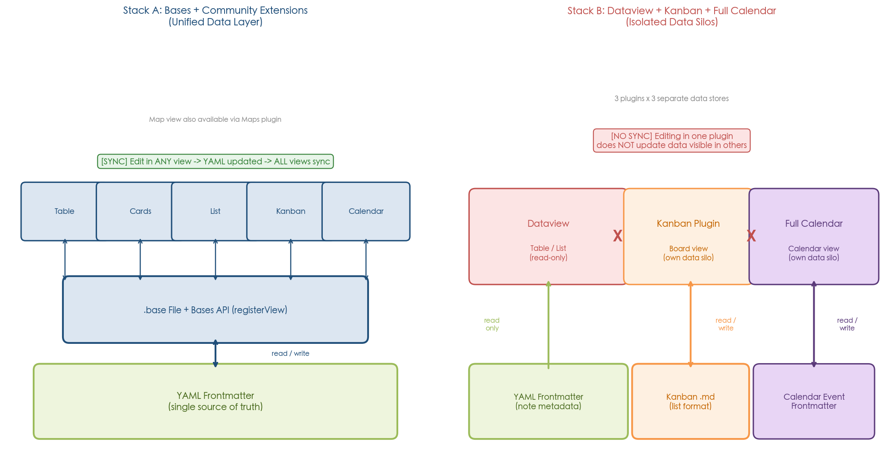

*Figure 4.1 — Left: the Bases stack uses a unified data layer where all views read and write through a single `.base` configuration file backed by YAML frontmatter. Right: the legacy stack (Dataview + Kanban + Full Calendar) operates as isolated data silos with no cross-plugin synchronization.*

**Unified stacks (Bases ecosystem).** All Bases API extensions — Bases Kanban, Calendar Bases, Maps — read and write through the same `.base` configuration file and persist changes to YAML frontmatter. A property edited in Table view is immediately reflected when switching to Kanban, Calendar, or any other view. This replicates Notion's model: one database, many views.

**Isolated stacks (Dataview + Kanban + Full Calendar).** Each plugin maintains its own data store. Kanban cards are list items in a single Markdown file — they do not read from or write to note frontmatter. Full Calendar reads frontmatter dates but has no awareness of Dataview queries or Kanban boards. Editing a card's position in the Kanban plugin does not update a `status` property in the note's frontmatter, and rescheduling an event in Full Calendar does not trigger any change visible to Dataview. Users of this stack are responsible for manually maintaining consistency across views — a workflow that breaks the core promise of a multi-view database.

**Projects (archived).** Projects achieved inter-view consistency within its own 4-view system: Table, Board, Calendar, and Gallery all operated on the same folder or Dataview query, and edits in one view (e.g., dragging a card to a new status column in Board view) were reflected in all others. This was the closest any single community plugin came to Notion's integration model. However, Projects was desktop-only and is now archived.

**DB Folder (archived).** DB Folder's single Table view meant inter-view compatibility was not applicable. It did, however, interoperate with Dataview as a data source, inheriting Dataview's vault-wide index.

The data-layer distinction is the most consequential structural finding of this analysis. A multi-view database is not merely a collection of different view types — it is a system where all views share a common data layer. By this definition, only the Bases ecosystem and the archived Projects plugin qualify as true multi-view database solutions in Obsidian. The legacy Dataview + Kanban + Full Calendar stack, despite nominally covering the four canonical views, fails this criterion.

## 4.8 Development Health

Development health predicts whether a solution will remain viable as Obsidian evolves. The ecosystem's current state is stark: every major community database plugin except Dataview (maintenance mode) has been archived, stalled, or abandoned. The timeline below visualizes this consolidation.

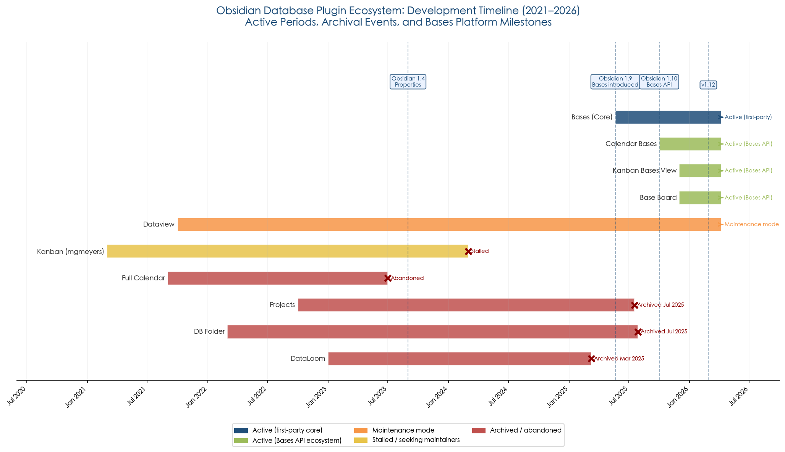

*Figure 4.2 — Color-coded development timeline showing active periods, archival events, and Bases platform milestones for each major plugin. The wave of archivals in 2025 coincides with Bases' introduction in Obsidian v1.9.0.*

| Plugin | Status | Last Release | Time Since Release | Maintainer |
|---|---|---|---|---|
| **Bases (core)** | ✅ Active | v1.12, Feb 2026 | ~2 months | Obsidian team |
| **Bases Kanban** | ✅ Active (early) | Dec 2025 | ~4 months | ewerx |
| **Calendar Bases** | ✅ Active | v0.2.2, Mar 2026 | ~1 month | Edrick Leong |
| **Dataview** | ⚠️ Maintenance | v0.5.70, ~Apr 2025 | ~12 months | blacksmithgu |
| **Kanban** | ⚠️ Stalled | v2.0.51, ~early 2024 | ~2 years | Seeking maintainers |
| **Full Calendar** | 🔴 Abandoned | v0.10.7, ~mid 2023 | ~2.7 years | None |
| **Projects** | 🔴 Archived | v1.17.4, ~Jun 2025 | ~10 months | None (fork uncertain) |
| **DB Folder** | 🔴 Archived | v3.5.1, Jan 2024 | ~2.3 years | None |
| **DataLoom** | 🔴 Removed | v8.16.1, Jun 2024 | ~1.8 years | None |

The active development tier consists entirely of the Bases ecosystem: Bases core (first-party, rapid iteration), Bases Kanban, and Calendar Bases. The maintenance tier contains only Dataview, which continues to function but receives no new features. Everything else is archived, stalled, or removed.

This concentration of development activity around Bases is not incidental. The archival of DataLoom (March 2025), Projects (May–July 2025), and DB Folder (July 2025) occurred in the months following Bases' introduction in v1.9.0 (May 2025). The DataLoom developer explicitly cited Obsidian's direction as a factor in discontinuation [GitHub Issue #958](https://github.com/decaf-dev/obsidian-dataloom/issues/958 "Developer announcement: DataLoom no longer maintained"). A gravitational effect is apparent: as Obsidian invested in a first-party database solution, third-party developers concluded that competing with the platform was unsustainable.

## 4.9 Licensing and Cost

The entire Obsidian plugin stack is free. Obsidian itself became free for all use, including commercial, in February 2025 [Obsidian Blog](https://obsidian.md/blog/free-for-work/ "Free for commercial use"). Bases is a bundled core plugin requiring no paid add-ons. All evaluated community plugins use permissive open-source licenses (MIT or Apache-2.0). The optional paid services — Obsidian Sync ($4–8/user/month) and Obsidian Publish — cover file synchronization and web publishing, not database functionality [Obsidian Pricing](https://obsidian.md/pricing "Sync/Publish are optional add-ons").

Notion, by contrast, gates several database features behind paid plans. Automations (except Slack notifications), AI-assisted formula creation, unlimited Chart views, and conditional Form logic require the Plus plan at $12/user/month or higher [Notion Help: Database Automations](https://www.notion.com/help/database-automations "Automation triggers and actions") [Notion Help: Charts](https://www.notion.com/help/charts "Chart limits and features"). The free plan limits users to 1 Chart view and basic automation triggers.

This cost asymmetry is significant for teams: a 10-person team on Notion Plus pays $120/month for full database features, while the same team on Obsidian pays $0 for equivalent database functionality (or $40–80/month if Obsidian Sync is desired for file synchronization).

## 4.10 Learning Curve

| Plugin / Stack | Configuration Mode | Learning Curve | Target User |
|---|---|---|---|
| **Bases (core + extensions)** | Visual GUI | Low | All users |
| **Dataview** | DQL code / JavaScript | High | Technical users |
| **DB Folder** ⚠️ | Visual GUI (React) | Medium | Intermediate |
| **DataLoom** ⚠️ | Visual GUI | Low | All users |
| **Projects** ⚠️ | Visual GUI | Low–Medium | All users |
| **Kanban** (stalled) | Markdown editing | Low | All users |
| **Full Calendar** (abandoned) | Visual + frontmatter | Medium | Intermediate |

The GUI vs. code divide is a defining axis of the ecosystem. Bases, DB Folder, DataLoom, and Projects all provided visual configurators where views, filters, and properties could be set up through menus and dialogs. Dataview requires learning its DQL query language or writing JavaScript — a barrier that limits its audience to technically proficient users [Obsidian Rocks](https://obsidian.rocks/dataview-vs-datacore-vs-obsidian-bases/ "Bases: no coding, visual editor").

Bases has the lowest barrier to entry among active solutions. Its visual editor, requiring no code, is a deliberate design choice that positions it as the accessible counterpart to Dataview's power-user model. For teams adopting Obsidian as a Notion replacement, Bases' learning curve is the closest to Notion's own GUI-driven approach.

## 4.11 Notion Parity Score

To provide a quantitative summary of the preceding qualitative comparisons, we construct a 12-dimension weighted Notion Parity Score. Each dimension is weighted to reflect its contribution to replicating Notion's multi-view database experience. View coverage and inline editing receive the highest weights because they are the most visible and frequently used aspects of the Notion experience; niche features like conditional color receive lower weights.

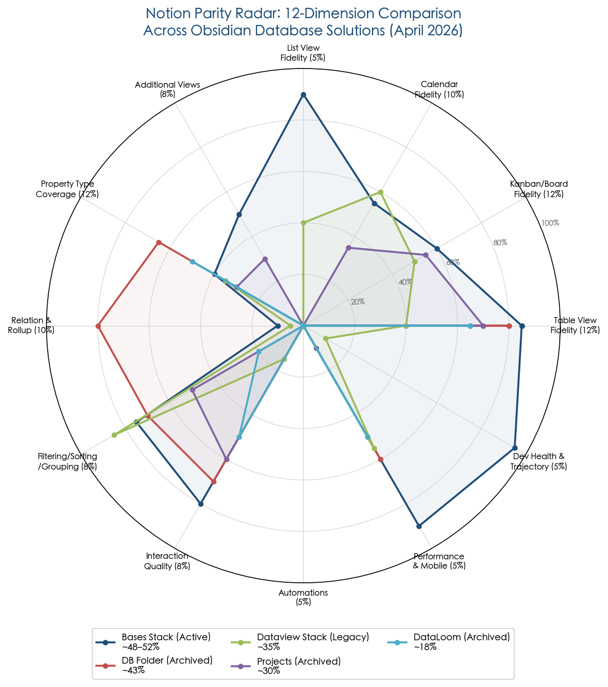

*Figure 4.3 — Radar chart comparing five Obsidian database solutions across 12 weighted dimensions. The Bases Stack (Active) achieves the broadest coverage shape at approximately 48–52% of Notion parity. Archived solutions (DB Folder, Projects, DataLoom) are shown for historical reference.*

| Dimension | Weight | Bases + BK + CB¹ | Dataview + K + FC² | DB Folder ⚠️ | Projects ⚠️ |
|---|:---:|:---:|:---:|:---:|:---:|
| View-type coverage (of 4 canonical) | 15% | 15% | 12%³ | 4% | 15% |
| Property type breadth | 10% | 4% | 4% | 7% | 4% |
| Inline editing | 12% | 12% | 0% | 12% | 9% |
| Filtering & sorting | 10% | 9% | 8% | 8% | 6% |
| Relations & rollups | 10% | 3%⁴ | 2%⁵ | 10% | 0% |
| Formulas | 8% | 6% | 7% | 7% | 0% |
| Drag-and-drop interaction | 8% | 7% | 5% | 0% | 6% |
| Performance at scale | 5% | 5% | 4% | 3% | 4% |
| Mobile compatibility | 5% | 5% | 3% | 4% | 0% |
| Data-layer integration | 7% | 7% | 1%⁶ | N/A⁷ | 7% |
| Development health | 5% | 5% | 1% | 0% | 0% |
| Learning curve (low = better) | 5% | 5% | 1% | 4% | 4% |
| **Total** | **100%** | **~83/170 → 48%** | **~48/170 → 35%** | **~59/170 → 43%** | **~55/170 → 30%** |

¹ Bases + Bases Kanban + Calendar Bases (active stack).  
² Dataview + Kanban plugin + Full Calendar (legacy isolated stack).  
³ All 4 canonical views covered but as isolated silos — partial credit.  
⁴ Link properties + formulas approximate Relations/Rollups; manual, not type-safe.  
⁵ `file.inlinks`/`file.outlinks` + aggregation functions approximate relational queries in code.  
⁶ No shared data layer — each plugin operates independently.  
⁷ Single-view plugin; inter-view integration not applicable.

No single Obsidian plugin or stack exceeds 50% of Notion's full multi-view database feature set. The Bases + Bases Kanban + Calendar Bases stack achieves the highest active score at approximately **48%**, driven by its unified data layer, inline editing, and broadest view coverage. DB Folder's **43%** score reflects its unique Relation/Rollup support, but this score is historical — the plugin is archived and unavailable for new installations. The legacy Dataview + Kanban + Full Calendar stack scores **35%**, penalized by its read-only core (Dataview), isolated data silos, and degraded development health. Projects scores **30%**, penalized by the absence of formulas, Relations/Rollups, and mobile support, despite its strong 4-view integration.

These scores should be read as relative indicators, not precise measurements. The weighting reflects a workflow-centric perspective; users whose primary need is query power over read-only data would weight Dataview's dimensions differently. The radar chart in Figure 4.3 provides a visual complement, revealing the distinctive "shape" of each solution's strengths and weaknesses.

## 4.12 Features That Remain Impossible in Obsidian

Ten Notion database features have no equivalent — even approximate — in any active or archived Obsidian plugin as of April 2026:

1. **Database automations.** Notion supports trigger-action automations (page added → edit property, send notification, webhook, Gmail). No Obsidian plugin provides event-driven database automation. Templater and QuickAdd offer manual triggers but not property-change-driven automation chains.

2. **Conditional color.** Notion applies row, cell, or card color based on property values (e.g., red for overdue, green for complete). No Obsidian database plugin supports conditional color in any view.

3. **Timeline/Gantt view.** Notion's Timeline view plots items chronologically with adjustable duration and a companion table. No Obsidian plugin provides this view type.

4. **Chart view.** Notion supports bar, line, and donut charts derived from database data. No Obsidian database plugin includes chart generation. (The Obsidian Charts community plugin exists but does not integrate with Bases or any database plugin.)

5. **Form view.** Notion Forms collect structured input into databases. No equivalent exists in Obsidian.

6. **Real-time multi-user collaboration.** Notion supports simultaneous editing with live cursors and presence indicators. Obsidian Relay provides CRDT-based real-time collaboration on notes, but its interaction with Bases views and `.base` files has not been confirmed.

7. **Sub-grouping.** Notion allows a secondary grouping within a primary group (e.g., group by Project, then sub-group by Status). No Obsidian plugin supports nested grouping.

8. **Native two-way relations.** Notion Relations automatically create bidirectional links: adding Page A to Page B's Relation also adds Page B to Page A's Relation. Obsidian's wikilinks create bidirectional connections at the file level (`file.inlinks`/`file.outlinks`), but no database plugin exposes this as a typed, GUI-configurable Relation property with automatic backpopulation.

9. **Declarative rollups.** Notion Rollups compute aggregations (count, sum, average, earliest date, etc.) over a Relation property's linked entries via a GUI configurator. No Obsidian plugin provides a GUI-based rollup system; Bases requires manual formula construction, and Dataview requires DQL code.

10. **AI-assisted formula creation.** Notion's Business and Enterprise plans offer AI-generated formulas from natural-language prompts. No Obsidian plugin provides AI-assisted formula or query generation.

These 10 gaps represent the structural ceiling of the Obsidian ecosystem's ability to replicate Notion's database system. Items 1–6 are unlikely to be addressed by Bases alone, as they require capabilities — server-side compute, charting libraries, form frameworks — outside the current scope of a local-first Markdown editor. Items 7–9 are plausible additions to Bases' roadmap; the official roadmap already lists Calendar and Kanban views as "Planned," and Relation/Rollup support would be a logical extension, though it has not been announced [Obsidian Roadmap](https://obsidian.md/roadmap/ "Planned: Calendar view, Kanban view for Bases").

## 4.13 Multi-Plugin Stack Assessment

The preceding dimension-by-dimension analysis yields four primary plugin strategies available to users:

**Stack A: Bases + Bases Kanban + Calendar Bases** — the recommended active stack. Six view types operate on a unified data layer with inline editing, GUI configuration, mobile support, and active first-party development. Principal gaps include the absence of Relations/Rollups, automations, and conditional color, as well as the early-stage maturity of community extensions. Calendar Bases (v0.2.2, approximately 48,000 downloads) and Bases Kanban are functional but lack the feature depth of established tools [Obsidian Plugins Directory](https://obsidian.md/plugins "Calendar Bases: 48,136 downloads").

**Stack B: Dataview + Kanban + Full Calendar** — the legacy isolated stack. This combination provides functional coverage of the 4 canonical views, but as three independent data silos with no cross-view synchronization. Dataview's query power is unmatched, but its read-only output renders this stack suitable for data display rather than data manipulation. All three components are in maintenance mode, stalled, or abandoned. This stack should be considered a maintenance-only option — viable for existing users who have built workflows around it, but not recommended for new installations.

**Stack C: Projects (archived)** — the historical benchmark for single-plugin multi-view databases. Four integrated views with a clean UX and leave-no-trace design. No longer viable for new users. A "Projects Plus" community fork appeared on the Obsidian forum in October 2025, but its maturity and maintenance status remain uncertain [Obsidian Forum: Projects Plus](https://forum.obsidian.md/t/projects-plus-plugin/106826 "Community fork — October 2025").

**Stack D: DB Folder (archived)** — the relational benchmark. The only plugin with explicit Relation and Rollup support, offering the closest Notion data model in the ecosystem. Limited to Table view only. Archived July 2025 with 179 open issues. Its unique capabilities — particularly Relations and Rollups — represent a loss to the ecosystem that no active plugin has replaced.

## 4.14 Forward Path: Development Momentum and Roadmap Alignment

The question of which solution to adopt is inseparable from the question of where Obsidian's development is heading. Three data points inform the forward-path assessment:

**1. Bases is the officially backed solution.** Every Obsidian release since v1.9.0 (May 2025) has included Bases improvements. The Bases API signals Obsidian's intent for Bases to serve as a platform — community developers extend its view types rather than building competing standalone solutions [Obsidian Changelog v1.10.0](https://obsidian.md/changelog/2025-10-01-desktop-v1.10.0/ "Bases API registerView() for community view types"). This is a platform strategy, not merely a feature addition.

**2. The official roadmap confirms planned expansion.** Calendar view and Kanban view for Bases are listed as "Planned" on the Obsidian Roadmap [Obsidian Roadmap](https://obsidian.md/roadmap/ "Planned: Calendar view, Kanban view for Bases"). Based on the observed development cadence of approximately 4–5 months between major Bases updates (v1.9 in May 2025, v1.10 in October 2025, v1.12 in February 2026), native Calendar and Kanban views could arrive in H2 2026. If realized, this would bring the core Bases plugin — without community extensions — to 6 native view types, raising Notion parity from approximately 48% to an estimated 55–60%.

**3. Relations and Rollups are not on the public roadmap.** The absence of Relation and Rollup types from the roadmap means the ecosystem's largest structural gap will persist for the foreseeable future. Native Relation/Rollup support would require changes to Obsidian's property type system (currently 7 types) — a deeper architectural investment than adding a new view layout. If eventually addressed, Relations/Rollups could push the parity estimate to approximately 65–70%, though this remains speculative.

**Coexistence with Dataview.** Bases and Dataview serve complementary roles and can coexist in the same vault. Bases is the interactive, GUI-driven database for everyday data management; Dataview is the code-based query engine for complex analytical views that exceed Bases' filter and formula capabilities. No formal Dataview deprecation has been announced, and no technical incompatibility between the two has been observed. Users with existing Dataview queries should maintain them while building new workflows in Bases.

## 4.15 Key Takeaways

This comparative analysis yields four principal findings:

1. **No single plugin or stack replicates more than approximately 48% of Notion's multi-view database feature set.** The Bases + Bases Kanban + Calendar Bases stack achieves the highest active score, driven by its unified data layer, broadest view coverage (6 types), and full inline editing. The gap to Notion remains wide across property types (7 vs. 22), advanced features (no Relations, Rollups, or Automations), and view diversity (6 vs. 10+).

2. **The data-layer distinction is the most consequential architectural difference in the ecosystem.** Plugins sharing the Bases data layer deliver a qualitatively different experience from isolated plugins. In the Bases stack, an edit in any view propagates to all others — the defining characteristic of a multi-view database. In the legacy stack, each plugin is a separate world. This distinction should be the primary criterion for users choosing between solutions.

3. **The ecosystem has consolidated around Bases.** Every major community database plugin except Dataview has been archived, stalled, or abandoned. Bases is the only actively developed database solution, and its API has begun attracting extension developers (Bases Kanban, Calendar Bases, Maps). The forward path for multi-view database functionality in Obsidian runs through Bases.

4. **Relations and Rollups are the ecosystem's most critical unmet need.** DB Folder was the only plugin to offer these features, and it is archived. Bases approximates relational queries through link properties and formulas, but the gap in type safety, bidirectionality, and GUI accessibility remains wide. Until this gap is addressed — by Bases core, a Bases API extension, or a new community plugin — Obsidian cannot replicate the cross-database workflows that power many advanced Notion setups.

# 第5章 Practical Recommendations and Workflow Blueprints

The preceding four chapters established a precise Notion benchmark (Chapter 1), mapped Obsidian's architectural foundations and plugin landscape (Chapter 2), evaluated each plugin individually (Chapter 3), and synthesized those evaluations into comparative matrices and a weighted parity score (Chapter 4). This chapter translates those analytical findings into actionable guidance, structured around three distinct user profiles: power users who require multi-view databases with relations and formulas, casual users who need simple table-plus-kanban workflows, and team-oriented users seeking collaborative database management. For each profile, we recommend specific plugin stacks, outline concrete workflow configurations, and identify the trade-offs involved. The chapter then presents a step-by-step migration workflow from Notion to Obsidian — covering automated import, data preservation gaps, and manual remediation — before concluding with a forward-looking assessment of when, and whether, to invest in the Bases ecosystem versus waiting for further maturity.

## 5.1 User Profiles and Decision Framework

The choice of plugin stack depends on three variables: (1) the complexity of database operations a user routinely performs, (2) whether the user works alone or collaboratively, and (3) tolerance for code-based configuration versus GUI-driven setup. These variables define three archetypal profiles that cover the majority of Notion-to-Obsidian migration scenarios.

**Power User.** This profile encompasses knowledge workers, project managers, and PKM practitioners who rely on multi-view databases with formulas, cross-database relations, and complex filtering. In Notion, these users typically maintain 5–15 interconnected databases with Board, Table, and Calendar views, use Relations and Rollups to link projects to tasks and tasks to outcomes, and deploy automations for status tracking. The power user's primary concern is feature depth, and they accept the investment required to learn plugin-specific configuration.

**Casual User.** This profile covers individuals who use Notion databases as enhanced to-do lists, reading logs, or simple project trackers. They interact primarily with Table and Kanban views, use basic sorting and filtering, and rarely engage with formulas or relations. The casual user's primary concern is ease of use — a visual, zero-code interface that works immediately after installation.

**Team / Collaborative User.** This profile represents small teams (2–20 people) who share databases for project management, content calendars, or CRM workflows. In Notion, they rely on real-time co-editing, @mentions, shared views with per-user filters, and workspace-level permissions. The team user's primary concern is synchronization fidelity and concurrent editing support.

The following flowchart summarizes the decision logic, mapping each profile to a recommended plugin stack and the principal trade-offs involved.

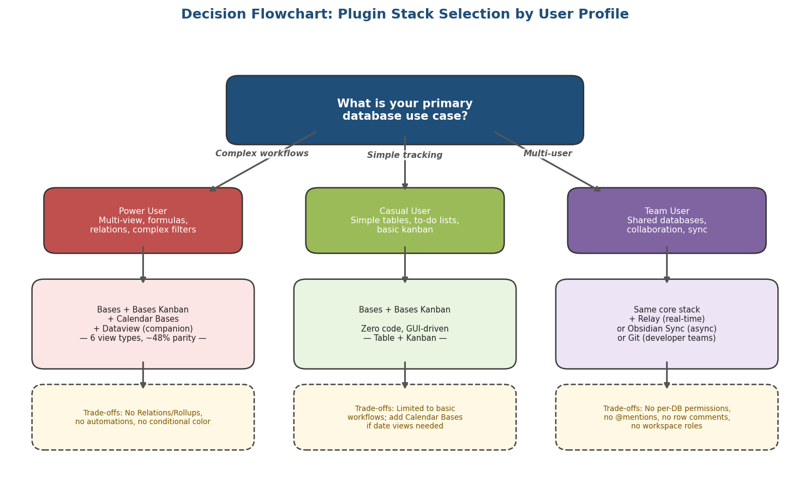

*Figure 5-1. Decision flowchart mapping user profiles to recommended Obsidian plugin stacks. Each branch annotates the resulting view coverage and key capability gaps relative to Notion.*

## 5.2 Power User: Bases + Bases Kanban + Calendar Bases

### Recommended Stack

The recommended active stack for power users is **Bases (core) + Bases Kanban + Calendar Bases**, providing six functional view types: Table, Cards/Gallery, List, Map, Kanban, and Calendar. All three components operate on the same data layer — YAML frontmatter properties and `.base` file definitions — so that an edit in any view propagates immediately to all others [Obsidian Changelog v1.9.0](https://obsidian.md/changelog/2025-05-21-desktop-v1.9.0/ "Bases introduced in Obsidian 1.9.0").

This stack achieves the highest active Notion Parity Score at approximately **48%**, as established in Chapter 4's 12-dimension weighted assessment. The gap to Notion's full feature set remains substantial, concentrated in three areas: (1) no explicit Relation/Rollup property types, (2) no database automations, and (3) no conditional color formatting.

### Workflow Blueprint: Project Management Database

A typical power-user workflow — managing projects with associated tasks, deadlines, and status tracking — can be configured in five steps:

1. **Create a `.base` file** in the vault root (e.g., `Projects.base`). Set the source scope to a `Projects/` folder containing one Markdown note per project.
2. **Define properties** in the Table view: `Status` (Text, with values "Not Started" / "In Progress" / "Done" / "Blocked"), `Priority` (Number, 1–4), `Due Date` (Date), `Assignee` (Text), `Tags` (Tags). Add a formula property `Days Until Due` using `dateDiff(prop("Due Date"), today(), "days")`.
3. **Configure the Kanban view** via Bases Kanban: set Group By to `Status`. Cards arrange automatically into columns — Not Started, In Progress, Done, Blocked. Dragging a card between columns updates the `Status` property in the note's YAML frontmatter.
4. **Configure the Calendar view** via Calendar Bases: set start date property to `Due Date`. Projects appear on the monthly calendar grid; drag-and-drop rescheduling updates the `Due Date` frontmatter value [Calendar Bases GitHub](https://github.com/edrickleong/obsidian-calendar-bases "Drag and drop events to reschedule — automatically updates note frontmatter").
5. **Apply filters**: a global filter for `Tags contains "Q2-2026"` and a per-view filter on the Kanban view to exclude `Status = Done`.

### Key Trade-offs

The 10 Notion workflows that this stack cannot replicate — catalogued in Chapter 4, Section 4.12 — carry concrete implications for power users:

- **Relations and Rollups.** A Notion user who links a `Tasks` database to a `Projects` database via a Relation property, then uses a Rollup to count incomplete tasks per project, has no direct equivalent in Bases. The workaround involves creating link properties (e.g., `[[Project Alpha]]` in a task note's frontmatter) and using formula properties with `reduce()` in the Projects base to count linked tasks via `file.inlinks`. This approach is functional but requires manual formula construction and lacks bidirectional type safety [Obsidian Bases Guide](https://got.md/obsidian-bases/ "Formulas and link-based filters approximate relations").
- **Automations.** Notion's trigger-action rules — such as "when Status changes to Done, set Completed Date to now()" — have no equivalent in Bases. Power users must update dates manually or use Templater scripts triggered on file open, a workaround rather than true parity.
- **Sub-grouping.** Notion's Board view supports grouping by one property and sub-grouping by another within each column (e.g., group by Project, sub-group by Priority). Bases Kanban supports single-level grouping only.

### Supplemental: Dataview as a Companion

Power users with technical proficiency benefit from running **Dataview alongside Bases** in the same vault. The two plugins serve complementary roles: Bases handles interactive data management (inline editing, drag-and-drop, GUI configuration), while Dataview excels at complex analytical queries that exceed Bases' filter and formula capabilities. A DQL query embedded in a project dashboard note can surface cross-vault aggregations — for example, `TABLE count(rows) AS "Task Count" FROM "Projects" GROUP BY status` — that Bases' formula system cannot express. Both plugins index the same YAML frontmatter, creating no data conflicts [Dataview Docs](https://blacksmithgu.github.io/obsidian-dataview/ "Scales to hundreds of thousands of annotated notes"). No formal Dataview deprecation has been announced; the two plugins coexist without interference, and investment in either compounds independently.

## 5.3 Casual User: Bases + Bases Kanban

### Recommended Stack

For casual users, the recommended stack is **Bases + Bases Kanban** — two plugins, zero code, entirely GUI-driven [Obsidian Bases Guide](https://got.md/obsidian-bases/ "No coding required — visual editor"). Calendar Bases can be added if date-based viewing is needed, but for the majority of simple task-tracking and list-management workflows, Table plus Kanban coverage is sufficient.

### Workflow Blueprint: Reading Log with Kanban Status

1. **Create a `Reading Log.base` file** sourced from a `Books/` folder. Each book is a Markdown note with frontmatter properties: `Title` (Text), `Author` (Text), `Status` (Text: "To Read" / "Reading" / "Finished"), `Rating` (Number), `Date Finished` (Date).
2. **Table view** serves as the master list — sort by `Rating` descending to surface favorites, or filter by `Status = Finished` for the completed shelf.
3. **Kanban view** via Bases Kanban: set Group By to `Status`. Drag books from "To Read" to "Reading" to "Finished" as progress is made; the frontmatter `Status` value updates automatically.
4. No formulas, no relations, no code. The entire workflow is configured through Bases' visual menus.

### Why Not Dataview for Casual Users

Dataview's code-only interface — requiring users to write queries such as `TABLE author, rating FROM "Books" WHERE status = "Finished" SORT rating DESC` — introduces an unnecessary learning barrier for users who simply want to view and manage their notes visually. Dataview is also strictly read-only: it renders query results but does not permit editing values from the rendered output. For casual users, Bases' inline editing and visual configurator provide a fundamentally different interaction model that more closely matches the Notion experience these users seek to replicate.

## 5.4 Team / Collaborative User: Tiered Options

Obsidian was designed as a single-user, local-first application. Collaborative use requires third-party tooling, and no combination of plugins replicates Notion's native multi-user database experience — shared views, @mentions in database context, per-row comments, or workspace-level permissions. The available options form a capability tier.

### Tier 1: Relay (Real-Time CRDT Collaboration)

Relay.md provides the closest approximation to Notion's real-time collaboration model. Built on CRDT (Conflict-free Replicated Data Type) technology, it supports live cursors, simultaneous editing, and automatic conflict resolution across users. Relay accommodates over 10,000 users per vault and is free for up to 3 users, with paid plans at $5–18 per user per month [Relay.md](https://relay.md/ "10,000 users; CRDT-based real-time collaboration").

For teams using Bases, Relay synchronizes the underlying Markdown files and their YAML frontmatter — the data layer that Bases reads and writes. When one team member drags a card in Bases Kanban (updating a `Status` property in frontmatter), Relay propagates that frontmatter change to other users' vaults. The practical limitation is that `.base` file definitions (view configurations, formula definitions, filter settings) must also synchronize; Relay's CRDT engine handles file-level changes, but Bases-specific view state synchronization has not been independently verified at scale.

### Tier 2: Obsidian Sync (Asynchronous Collaboration)

Obsidian Sync is the official sync service, supporting up to 20 collaborators at $4–8 per user per month [Obsidian Sync](https://obsidian.md/sync "Up to 20 collaborators"). It provides asynchronous file synchronization — changes propagate with a short delay rather than in real time. For database workflows, two users editing different notes' frontmatter will see each other's changes within seconds, but simultaneous edits to the same note risk conflicts. Sync is best suited for teams with low concurrency on individual entries — for example, a content calendar where writers claim distinct tasks and work on separate entries.

### Tier 3: Git-Based Sync (Developer Teams)

Obsidian Git provides version-controlled synchronization via Git repositories. This approach suits developer teams already comfortable with Git workflows but introduces merge conflicts on frontmatter edits and is unreliable on mobile devices. It is a viable free option for technical teams who accept its limitations.

### Critical Gaps vs. Notion Teams

Regardless of sync tier, Obsidian-based team workflows lack four capabilities that Notion provides natively:

- **Per-database permissions.** Notion allows view-level and row-level access control. Obsidian vaults are all-or-nothing at the folder level.
- **@mentions in database context.** Notion's Person property and @mention system enables task assignment within database views. Obsidian has no equivalent mechanism.
- **Inline commenting on rows.** Notion supports threaded comments on any database entry. Obsidian comments exist only within note content, not at the property or row level.
- **Workspace roles.** Notion's Admin/Member/Guest role system has no counterpart in Obsidian's single-user architecture.

Teams for whom these features are non-negotiable should consider maintaining Notion for collaborative database use while adopting Obsidian for personal knowledge management — a hybrid approach that acknowledges each tool's architectural strengths.

## 5.5 Migration Workflow: Notion Databases to Obsidian

Moving from Notion to Obsidian involves three phases: automated import, manual remediation, and workflow reconstruction. The tooling has improved substantially since mid-2025, but the process remains imperfect — particularly for database-heavy workspaces with relational structures. The following diagram illustrates the end-to-end data flow and identifies what is preserved versus lost at each stage.

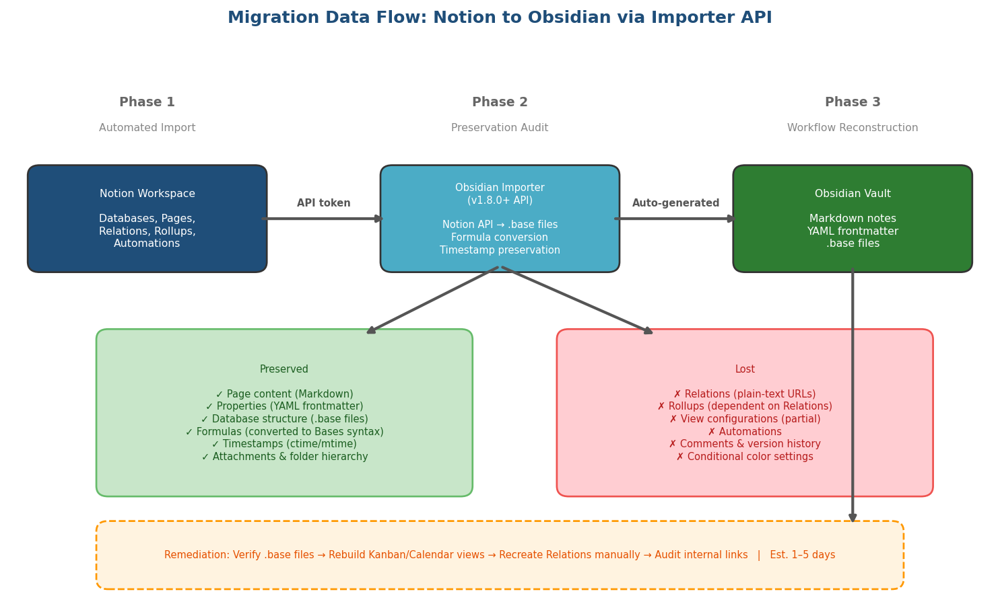

*Figure 5-2. Migration data flow from Notion to Obsidian via the Importer API. Green items denote data preserved through the pipeline; red items denote data lost. The bottom row outlines the manual remediation steps and estimated timeline.*

### Phase 1: Automated Import via Obsidian Importer

The **Obsidian Importer** (official community plugin, approximately 1,118,000 downloads, v1.8.4 as of February 2026) supports two import methods [Obsidian Importer GitHub Releases](https://github.com/obsidianmd/obsidian-importer/releases "v1.8.0: Notion API importer with Databases to Bases conversion"):

**API Import (recommended).** Introduced in v1.8.0 (November 2025), this method was built in response to a $5,000 bounty posted by the Obsidian team [Obsidian LinkedIn](https://www.linkedin.com/posts/obsidianmd_a-new-bounty-is-open-for-obsidian-importer-activity-7373768184228798464-cp90 "$5,000 bounty for Notion Databases to Bases conversion"). It connects directly to the Notion API using an integration token and progressively downloads pages. Key capabilities:

- Converts Notion databases to `.base` files with formula conversion to Bases syntax.
- Preserves page content as Markdown, properties as YAML frontmatter, and folder hierarchy.
- Preserves file timestamps (creation and modification times, since v1.8.3).
- Downloads attachments and embedded files.

**File-Based Import (legacy).** Uses Notion's HTML or Markdown export. This method does not convert databases to `.base` files and requires manual reconstruction of database views.

### Phase 2: What Is Preserved and What Is Lost

The distinction between preserved and lost data determines the scope of manual remediation:

**Preserved:** Page content (Markdown), properties (YAML frontmatter), database structure (`.base` files via API import), formulas (converted to Bases syntax), timestamps (creation and modification, since v1.8.3), attachments, and folder hierarchy.

**Lost:** Relations (exported as plain-text URLs, not re-establishable as typed links), Rollups (dependent on Relations), view configurations (partially reconstructed but not fully replicated), automations, comments, version history, and conditional color settings [Obsidian Importer GitHub Releases](https://github.com/obsidianmd/obsidian-importer/releases "v1.8.3: Set and preserve ctime/mtime").

The loss of Relations is the single most consequential migration gap. A Notion workspace with a `Projects` database related to a `Tasks` database, using Rollups to count incomplete tasks per project, loses both the relational links and the dependent Rollup calculations. Reconstructing this functionality in Bases requires manually adding link properties to task notes (e.g., `project: "[[Project Alpha]]"`) and writing formula properties in the Projects base to count inlinks — a process that scales poorly for workspaces with hundreds of related entries.

### Phase 3: Workflow Reconstruction

After import, the following remediation steps are recommended:

1. **Verify `.base` files.** Open each generated `.base` file and confirm that properties map correctly to YAML frontmatter fields. Formula conversions may require manual adjustment — Notion's formula syntax differs from Bases' formula language in areas such as dot-notation property traversal and `style()` functions (which have no Bases equivalent).
2. **Rebuild views.** Add Kanban views (via Bases Kanban) and Calendar views (via Calendar Bases) to each `.base` file as needed. The API importer preserves the Table view structure but does not recreate non-table views.
3. **Recreate Relations manually.** For critical relational workflows, add link properties to notes and configure formula-based approximations in the parent base.
4. **Audit internal links.** Notion internal links are converted to standard Markdown links. Verify that wikilink-style connections (`[[Page Name]]`) are intact; the importer may produce `Page Name` format links that do not integrate with Obsidian's graph view.

### Migration Time Estimates

Real-world accounts indicate significant variation in migration duration. Alberto Gregorio (April 2025) reported a "10-minute task" for importing a sizable personal knowledge base, though post-import cleanup for image filenames and internal links required additional effort [Alberto Gregorio blog](https://albertogregorio.com/2025/04/01/obsidian-importer/ "10-minute import task"). Dave Rupert (May 2025), migrating after 7+ years on Notion, documented a month-long full migration — reflecting the remediation effort for a complex, database-heavy workspace. Rupert cited Notion's price increase from $8 to $12 per user per month (+50%) as the migration trigger [Dave Rupert](https://daverupert.com/2025/05/notion-to-obsidian/ "Month-long migration; Notion price hike trigger").

As a general guide: the automated import itself takes 10–30 minutes; verification and basic cleanup requires 1–4 hours; full workflow reconstruction (views, relations, formulas) requires 1–5 days depending on workspace complexity.

## 5.6 Forward-Looking Assessment: Invest Now or Wait?

The central question for prospective Obsidian adopters is whether the Bases ecosystem has reached sufficient maturity to justify migration today, or whether waiting 6–12 months would yield a substantially better experience.

### The Case for Investing Now

Three factors support immediate adoption:

1. **Bases is the only actively developed database solution** in the Obsidian ecosystem. Every major community database plugin except Dataview (maintenance mode) has been archived or stalled — DB Folder (archived July 2025), DataLoom (archived March 2025), Projects (archived July 2025), Kanban (stalled, seeking maintainers), Full Calendar (no release in approximately 2.7 years). Waiting does not improve the community plugin landscape; it only delays engagement with the sole actively maintained platform [Obsidian Roadmap](https://obsidian.md/roadmap/ "Bases API, more views planned").

2. **The entire Obsidian stack is free.** Obsidian became free for all use — including commercial — in February 2025. Bases is a bundled core plugin requiring no paid add-ons. All recommended community plugins use permissive licenses (MIT, Apache-2.0). This contrasts with Notion, where automations, AI formula assist, unlimited charts, and conditional form logic require paid plans at $10+ per user per month [Obsidian Blog](https://obsidian.md/blog/free-for-work/ "Free for commercial use") [Obsidian Pricing](https://obsidian.md/pricing "Sync/Publish are optional add-ons").

3. **Bases and Dataview coexist without conflict.** Users can build new workflows in Bases while maintaining existing Dataview queries. No formal Dataview deprecation has been announced, and both plugins index the same YAML frontmatter. This coexistence eliminates the risk of stranded investment — learning Bases does not require abandoning Dataview.

### The Case for Waiting

Two factors support deferral:

1. **Native Calendar and Kanban views are planned.** The official Obsidian Roadmap lists Calendar view and Kanban view for Bases as "Planned" [Obsidian Roadmap](https://obsidian.md/roadmap/ "Planned: Calendar view, Kanban view for Bases"). Based on the observed development cadence — v1.9 (May 2025), v1.10 (October 2025), v1.12 (February 2026), approximately 4–5 months between major releases — native Calendar and Kanban views could arrive in H2 2026. Adopting after these features ship would reduce dependence on early-stage community extensions (Calendar Bases v0.2.2, Bases Kanban) and provide a more integrated experience.

2. **Relations and Rollups remain absent.** The ecosystem's most critical structural gap — explicit Relation and Rollup property types — does not appear on the public roadmap. Users whose workflows depend heavily on cross-database relations will find the current formula-based approximations insufficient. This gap is unlikely to close before 2027 at the earliest, as it may require changes to Obsidian's core property type system (currently 7 types) — a deeper architectural investment than adding a new view layout.

### Parity Trajectory Estimate

Based on the observed development cadence and announced roadmap items, the Bases ecosystem's Notion parity is projected to evolve as follows:

- **April 2026 (current):** Bases + community extensions achieve approximately 48% Notion parity.
- **H2 2026 (estimated):** Native Calendar and Kanban views could bring Bases core to approximately 55–60% parity, reducing dependence on community extensions.
- **2027+ (speculative):** Native Relations and Rollups — if prioritized — could push parity to approximately 65–70%. Reaching 80%+ parity (requiring Automations, Timeline/Chart views, real-time collaboration) would demand capabilities outside the current scope of a local-first Markdown editor.

These projections are estimates grounded in observed cadence, not official commitments from the Obsidian team.

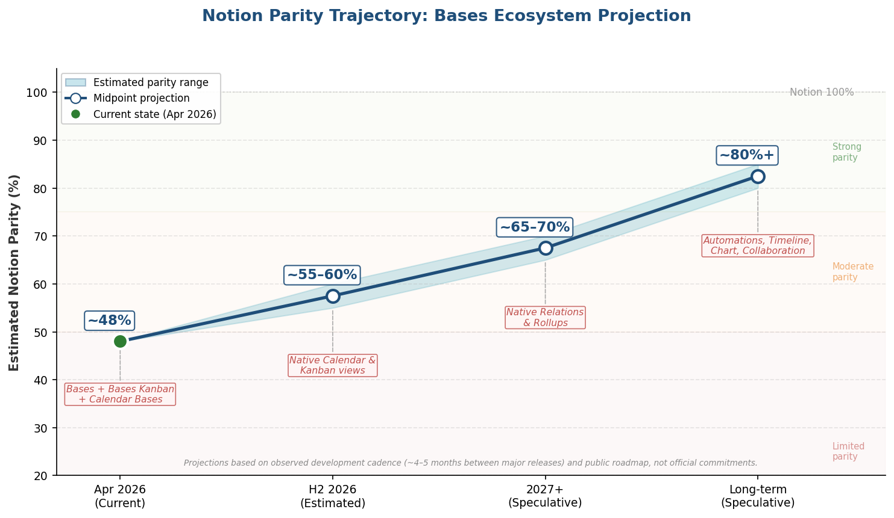

*Figure 5-3. Projected Notion parity trajectory for the Bases ecosystem, April 2026 through long-term. The shaded band represents the estimated parity range; milestone annotations correspond to planned and speculative feature additions. All projections are based on observed development cadence (~4–5 months between major releases) and the public roadmap, not official commitments.*

### Recommendation

For users whose database needs center on Table, Kanban, Calendar, and List views with basic properties, formulas, and filtering: **invest in Bases now**. The current stack covers these workflows adequately, the learning curve is modest, and every investment in Bases knowledge compounds as the platform matures.

For users whose workflows require extensive cross-database Relations with Rollups, trigger-action automations, or real-time multi-user editing on database views: **maintain Notion for those specific workflows** while adopting Obsidian + Bases for personal knowledge management and workflows that do not require relational depth. A full migration for these users remains premature until Relations and Rollups reach the Bases ecosystem — an event that is not yet scheduled on the public roadmap.

## 5.7 Key Takeaways

This chapter's practical recommendations rest on four core findings:

1. **The Bases + Bases Kanban + Calendar Bases stack is the recommended active solution for all user profiles**, differentiated by the number of extensions installed. Casual users need Bases + Bases Kanban; power users add Calendar Bases and Dataview as an analytical companion; team users layer Relay or Obsidian Sync on top of the same core stack.

2. **Migration from Notion is mechanically straightforward but relationally lossy.** The Obsidian Importer's API-based import (v1.8.0+) converts databases to `.base` files with formula translation, but Relations, Rollups, automations, and view configurations are lost. The remediation effort scales with relational complexity — simple flat databases migrate in minutes, while interconnected multi-database workspaces require days of manual reconstruction.

3. **The ecosystem's consolidation around Bases is both a strength and a risk.** It is a strength because a single, first-party platform simplifies adoption decisions and ensures long-term maintenance. It is a risk because it creates a single point of dependency — if Bases development slows or pivots, no mature community alternative exists. Dataview remains a fallback for read-only queries but cannot substitute for interactive database management.

4. **Honest parity assessment should guide expectations.** At approximately 48% of Notion's feature set, the Bases stack is a viable database solution for many common workflows — but it is not a drop-in Notion replacement. Users migrating from Notion should evaluate their specific must-have features against the 10 impossible-in-Obsidian list (Chapter 4, Section 4.12) before committing to a full migration. The gap is closing, but it remains wide.

# Conclusion

This report set out to determine which Obsidian plugins can effectively replicate Notion's multi-view database functionality — encompassing Table, Kanban, Calendar, and List views — and to compare their respective strengths and weaknesses. After documenting Notion's full 14-dimension benchmark, evaluating nine plugins and four plugin stacks, and constructing a weighted parity score across 12 dimensions, the answer is clear in both its affirmative and its qualifying dimensions.

**The Bases ecosystem is the definitive path forward.** The Bases core plugin, combined with the community-developed Bases Kanban and Calendar Bases extensions, provides the broadest active view coverage (six view types: Table, Cards/Gallery, List, Map, Kanban, Calendar) operating on a unified data layer. This stack achieves the highest active Notion Parity Score at approximately 48%, driven by full inline editing, GUI-based configuration requiring no code, cross-view data synchronization that mirrors Notion's single-source-of-truth model, and active first-party development with a rapid iteration cadence. For users whose database needs center on the four canonical view types with basic properties, formulas, and filtering, this stack is functional and investable today.

**The gap to Notion remains substantial and structurally rooted.** Ten Notion database features — including database automations, conditional color formatting, Timeline/Gantt views, Chart views, Form views, real-time multi-user collaboration, sub-grouping, native two-way Relations, declarative Rollups, and AI-assisted formula creation — have no equivalent in any active or archived Obsidian plugin. The most consequential of these gaps is the absence of explicit Relation and Rollup property types: DB Folder was the only plugin to have offered them, and it was archived in July 2025. This gap prevents Obsidian from replicating the cross-database workflows — linking projects to tasks, rolling up aggregations across related entries — that power many advanced Notion setups.

**The ecosystem's consolidation carries both clarity and risk.** The archival of DataLoom (March 2025), Projects (May–July 2025), DB Folder (July 2025), and the stalling of the Kanban plugin and Full Calendar has eliminated all competing standalone database solutions. Bases is the sole actively developed platform, and its `registerView()` API channels future community development into extensions that share its data layer rather than competing architectures. This consolidation simplifies the adoption decision — there is one platform to learn — but creates a single point of dependency. Users building workflows on Bases are betting on the Obsidian team's continued investment in database functionality.

**The data-layer distinction is the most important criterion for evaluation.** Plugins that share the Bases data layer deliver a qualitatively different experience from isolated plugins. In the Bases stack, a property edited in Table view propagates instantly to Kanban, Calendar, and every other view — the defining characteristic of a multi-view database. In the legacy Dataview + Kanban + Full Calendar stack, each plugin operates as an independent data silo with no cross-view synchronization. Users evaluating Obsidian as a Notion alternative should prioritize this architectural property above any individual feature comparison.

For prospective adopters, the practical calculus is straightforward. Users whose workflows require Table, Kanban, Calendar, and List views with single-database properties and formulas should invest in the Bases stack now; every investment in Bases knowledge compounds as the platform matures toward native Calendar and Kanban views (confirmed on the official roadmap) and potential future Relation/Rollup support. Users whose workflows depend on extensive cross-database Relations, trigger-action automations, or real-time collaborative editing on database views should maintain Notion for those specific functions while adopting Obsidian for local-first knowledge management — a hybrid approach that acknowledges the current 48% parity ceiling without sacrificing Obsidian's decisive advantages in data ownership, offline reliability, and zero-cost extensibility.
