# Overview

Reinforcement learning (RL) agents deployed in real-world trajectory planning—robotic manipulation, autonomous driving, UAV navigation—confront a dual challenge that neither sparse-reward exploration nor safety-constrained optimization can address in isolation. Task-completion rewards arrive only at the end of long action sequences, rendering standard exploration strategies exponentially inefficient, while hard operational constraints (collision avoidance, energy budgets, torque limits) must hold at every timestep, restricting the very exploration that might uncover superior policies. This report surveys the research frontier from April 2025 through March 2026, examines how both challenges are being resolved, and analyzes the implications for trajectory planning problems where they co-occur.

Five clusters of advances define the survey period. First, **training-time safety guarantees** now match unconstrained sample complexity: trust-region methods (C-TRPO, sTRPO) ensure constraint satisfaction throughout learning, and near-optimal CMDP bounds confirm that safety imposes at most a polynomial overhead. Second, **residual RL** has emerged as the dominant deployment architecture, simultaneously narrowing the exploration space to address reward sparsity and inheriting approximate constraint satisfaction from a base policy—validated on a physical humanoid robot with dexterous hands and on the large-scale nuPlan driving benchmark. Third, **noise-robust intrinsic motivation** has matured from heuristic exploration aids into theoretically grounded methods: Learning Progress Monitoring (LPM) achieves a 2.5× sample-efficiency gain over RND on Montezuma's Revenge with only 3.9% degradation under sensor noise. Fourth, **foundation-model-guided exploration** delivers up to ~40× sample-efficiency improvements (SENSEI on MiniHack), but ablation studies consistently show that VLM-derived rewards must be combined with classical intrinsic motivation to avoid local-optima trapping—establishing complementarity as the operative design principle. Fifth, **tightened theoretical bounds** for reward-free exploration resolve an open conjecture on minimax optimality, while graph-theoretic intrinsic rewards yield up to 59% success-rate improvements by leveraging environment topology.

The report is organized into six substantive chapters. Chapter 1 formalizes the sparse-reward MDP and constrained MDP frameworks, characterizes the exploration–safety trade-off, and situates trajectory planning as the natural testbed for their intersection. Chapter 2 surveys intrinsic motivation, curiosity-driven, count-based, reward-free, and goal-conditioned exploration methods. Chapter 3 examines foundation-model-guided and hybrid exploration strategies, including VLM reward shaping, LLM subgoal decomposition, and residual RL on FM-derived base policies. Chapter 4 covers constrained RL across six algorithmic families—Lagrangian, trust-region, safety-critic, barrier-function, off-policy, and offline methods. Chapter 5 bridges these advances to trajectory planning across robotics, autonomous driving, and UAV domains, identifying cross-domain synergies and persistent deployment barriers. Chapter 6 synthesizes the most impactful advances, analyzes structural convergence signals toward unified frameworks, and delineates seven critical open problems for the April–September 2026 horizon.

# 第1章 Background and Motivation — The Exploration Challenge in Sparse-Reward and Constrained Reinforcement Learning

## 1.1 The Sparse-Reward Markov Decision Process: Definition and Failure Modes

A Markov Decision Process (MDP) is defined by the tuple $\langle S, A, T, r, \gamma \rangle$, where $S$ is the state space, $A$ is the action space, $T: S \times A \rightarrow \Delta(S)$ is the transition function, $r: S \times A \rightarrow \mathbb{R}$ is the reward function, and $\gamma \in [0,1)$ is the discount factor. A **sparse-reward MDP** is one in which $r(s,a)$ returns a non-zero signal only at a negligibly small fraction of state-action pairs — typically upon task completion or arrival at rare goal states. In many practical problems, "thousands of decisions might need to be made before outcomes are visible," rendering standard trial-and-error learning extraordinarily inefficient [Ladosz et al., Exploration in Deep RL Survey](https://www.sciencedirect.com/science/article/abs/pii/S1566253522000288 "2022 Information Fusion survey on exploration in deep RL"). Diaz-Bone et al. (2025) further characterize sparse-reward RL as intractable without structured curricula of progressively simpler sub-tasks, establishing that the challenge is not merely slow convergence but a fundamental sample-complexity barrier [Diaz-Bone et al., Automated Curricula for Sparse-Reward RL](https://arxiv.org/html/2505.19850v2 "2025 ETH Zürich paper on automated curricula for sparse-reward RL").

Canonical exploration strategies deployed in standard RL algorithms fail systematically under these conditions. Dann et al. (2022) provide rigorous theoretical evidence: $\varepsilon$-greedy exploration requires $O((A/\varepsilon)^H)$ episodes to find an optimal policy in worst-case sparse-reward MDPs — a quantity exponential in the horizon length $H$. Boltzmann exploration suffers an analogous exponential lower bound, with gap-dependent scaling $\alpha \propto (Ae^{-\beta})^{-H/2}$. Gaussian noise policies, which perturb the greedy action by adding continuous noise, remain confined to a local neighborhood of the current policy and cannot discover distant high-reward states separated by long sequences of unrewarded transitions [Dann et al., Guarantees for Epsilon-Greedy RL](https://proceedings.mlr.press/v162/dann22a/dann22a.pdf "ICML 2022 paper on theoretical guarantees for ε-greedy RL").

These theoretical lower bounds find stark empirical confirmation. In the seminal DQN work by Mnih et al. (2015), Montezuma's Revenge — a canonical sparse-reward Atari game requiring navigation through 24 rooms with only occasional score increments — was the sole game where DQN scored 0% of average human performance (approximately 4,700 points) after 200 million frames of training [OpenAI, Reinforcement Learning with Prediction-Based Rewards](https://openai.com/index/reinforcement-learning-with-prediction-based-rewards/ "OpenAI blog on RND, 2018"). It was not until the development of dedicated exploration methods that meaningful progress emerged: Random Network Distillation (RND) achieved a mean return of approximately 10,000 points — exceeding average human performance for the first time — but required massive computational investment with 1,024 parallel rollout workers [Burda et al., Exploration by Random Network Distillation](https://arxiv.org/abs/1810.12894 "ICLR 2019 RND paper"). The contrast between DQN's complete failure and RND's qualified success on the same environment encapsulates the exploration crisis under sparse rewards: standard methods cannot even begin to learn, while specialized exploration techniques can succeed but at extreme computational cost.

Beyond sample inefficiency, intrinsic-motivation-based exploration introduces a complementary failure mode known as the **noisy-TV problem**. Prediction-error intrinsic rewards, such as those produced by the Intrinsic Curiosity Module (ICM) of Pathak et al. (2017), can fixate on inherently unpredictable but task-irrelevant environmental stimuli — analogous to an agent endlessly watching television static because stochastic transitions perpetually generate high prediction error. This pathology causes curiosity-driven agents to expend their exploration budget on sources of aleatoric uncertainty rather than epistemic novelty [Ladosz et al., Exploration in Deep RL Survey](https://www.sciencedirect.com/science/article/abs/pii/S1566253522000288 "2022 Information Fusion survey"). ICM formulates curiosity as the prediction error of action consequences in a self-supervised feature space and demonstrates successful exploration in VizDoom and Super Mario Bros under sparse reward [Pathak et al., Curiosity-driven Exploration](https://arxiv.org/abs/1705.05363 "ICML 2017 ICM paper"). RND's design — employing a fixed random target network — was specifically motivated by the need to mitigate the confounding factors of stochastic targets and model-class limitations in prediction error, thereby achieving robustness to the noisy-TV trap [Burda et al.](https://arxiv.org/abs/1810.12894 "ICLR 2019 RND paper"). Subsequent chapters examine how more recent methods (Learning Progress Monitoring, temporal contrastive representations, graph-theoretic intrinsic rewards) address these failure modes with stronger theoretical foundations.

## 1.2 The Constrained RL Problem: Formalization and the Safety–Exploration Conflict

Real-world decision-making rarely involves reward maximization alone. Safety requirements, resource budgets, and operational limits impose constraints that an agent must satisfy alongside — and sometimes in direct tension with — its exploration and exploitation objectives. The formal framework for reasoning about such settings is the **Constrained Markov Decision Process (CMDP)**, introduced by Altman (1999) [Altman, Constrained Markov Decision Processes](https://www.routledge.com/Constrained-Markov-Decision-Processes/Altman/p/book/9780849303821 "CRC Press / Chapman & Hall, 1999"). A CMDP extends the standard MDP with $m$ auxiliary cost functions $c^{(i)}: S \times A \rightarrow \mathbb{R}$ and corresponding thresholds $d_i$, formulating the optimization problem as:

$$\max_\pi J(\pi) \quad \text{s.t.} \quad J_{c^{(i)}}(\pi) \leq d_i, \quad i = 1, \dots, m$$

where $J(\pi)$ denotes the expected cumulative discounted reward under policy $\pi$ and $J_{c^{(i)}}(\pi)$ denotes the expected cumulative discounted cost under cost function $c^{(i)}$. A central result of CMDP theory is that strong Lagrange duality holds under mild conditions (e.g., Slater's constraint qualification), enabling the penalized-reward approach $r_\lambda = r - \sum_i \lambda_i c^{(i)}$ that underpins primal-dual methods such as Constrained Policy Optimization (CPO), Reward Constrained Policy Optimization (RCPO), and PID-Lagrangian techniques [Ravish et al., Safe RL and CMDPs Survey](https://arxiv.org/html/2505.17342v1 "2025 survey formalizing CMDPs after Altman 1999").

The landscape of constraint formulations in safe RL is considerably richer than the basic expected-cost CMDP. Wachi, Shen, and Sui (2024) provide a systematic taxonomy identifying seven distinct constraint formulations across two families. The **expectation-based** family includes cumulative cost constraints, state-indicator constraints, joint chance constraints, and instantaneous cost constraints. The **almost-sure** family comprises cumulative constraints, instantaneous time-invariant constraints, and generalized safe exploration constraints with time-variant thresholds. A key theoretical contribution of this taxonomy is the proof that two formulations — expected instantaneous constraints and almost-sure instantaneous constraints with time-variant thresholds — constitute IoMG-SafeRL (Intersection of Multiple Goals) problems that subsume the others, establishing a hierarchy of constraint strictness [Wachi et al., Constraint Formulations in Safe RL](https://www.ijcai.org/proceedings/2024/0913.pdf "IJCAI 2024 survey on constraint formulations"). Figure 1.1 visualizes this taxonomy, illustrating the two constraint families and the guarantee-strength spectrum from expected-cost convergence guarantees to almost-sure per-timestep safety.

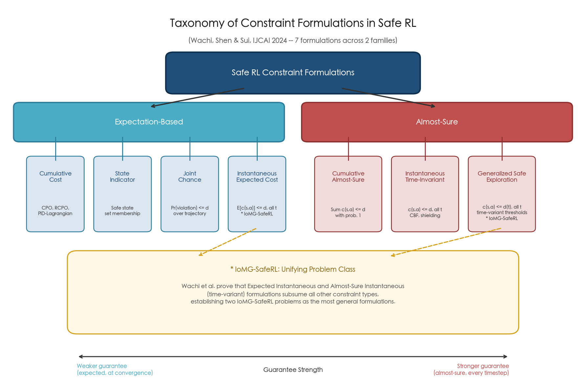

**Figure 1.1.** Taxonomy of constraint formulations in safe RL. The expectation-based family (left) and almost-sure family (right) span a spectrum of guarantee strength. Two formulations — expected instantaneous and almost-sure instantaneous with time-variant thresholds — are identified as IoMG-SafeRL problems subsuming all other constraint types. Adapted from Wachi, Shen, and Sui (IJCAI 2024).

Historically, the study of safety in RL predates the current surge of CMDP-based methods. García and Fernández (2015) provided the first comprehensive survey, categorizing safe RL approaches into two fundamental tendencies: (1) modification of the optimality criterion — including worst-case, risk-sensitive, and constrained criteria — and (2) modification of the exploration process through external knowledge or risk metrics [García and Fernández, A Comprehensive Survey on Safe RL](https://www.jmlr.org/papers/volume16/garcia15a/garcia15a.pdf "JMLR 2015, vol. 16, pp. 1437–1480"). Their taxonomy identified the constrained criterion as "particularly suitable for risky domains" where the objective is to find the best policy within the space of safe policies. The evolution from this foundational classification to the contemporary CMDP-centric formalism reflects the field's maturation: whereas García and Fernández catalogued primarily tabular and small-scale approaches, the modern literature addresses deep RL with continuous state-action spaces and demands safety guarantees not only at convergence but throughout the training process.

The fundamental tension between safety constraints and exploratory learning is articulated with particular clarity by Zhao et al. (2023), who identify an "inherent conflict between exploration for learning optimal RL policies and the need for safety." This conflict manifests through two complementary mechanisms. First, safety filters applied to the policy distort reward signals in ways that are difficult to account for, creating a gap between the policy the agent learns and the policy that would be optimal in the unconstrained MDP. Second, methods that gradually expand safe regions — exploring outward from a known-safe initial set — impose highly restrictive exploration envelopes that may prevent the agent from ever reaching distant reward-rich regions. An explicit trade-off emerges: methods with strong formal guarantees, such as control barrier functions (CBFs), require significant prior knowledge of system dynamics and confine exploration within certified safe sets; methods with weaker assumptions, such as Lagrangian relaxation, allow broader exploration but forfeit formal pointwise safety guarantees [Zhao et al., State-wise Safe RL Survey](https://www.ijcai.org/proceedings/2023/0763.pdf "IJCAI 2023 survey on state-wise safe RL"). Figure 1.2 positions the major method families along this exploration-safety spectrum, making the inherent trade-off visually explicit.

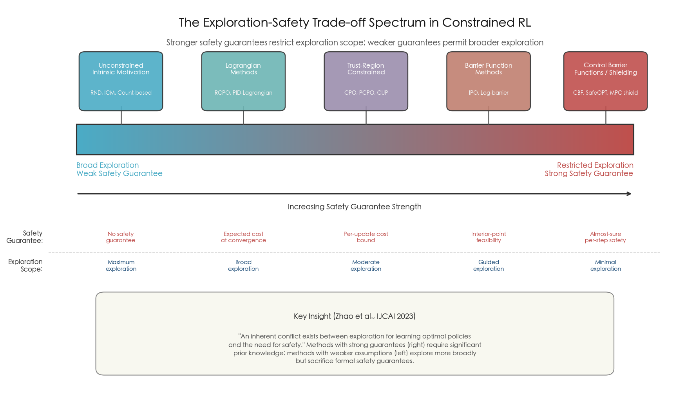

**Figure 1.2.** The exploration-safety trade-off spectrum in constrained RL. Moving from left to right, methods offer increasingly strong safety guarantees at the cost of increasingly restricted exploration scope. Unconstrained intrinsic motivation methods (RND, ICM) occupy the high-exploration / no-safety-guarantee extreme; control barrier functions and shielding methods occupy the restricted-exploration / strong-guarantee extreme. Based on the analysis of Zhao et al. (IJCAI 2023) and Wachi et al. (IJCAI 2024).

## 1.3 Trajectory Planning as a Natural Testbed for Sparse Rewards and Hard Constraints

The co-occurrence of sparse rewards and hard safety constraints is not merely a theoretical construct — it is the default operating condition in trajectory planning across robotics, autonomous driving, and unmanned aerial vehicle (UAV) navigation. These application domains furnish the practical motivation for studying the intersection of sparse-reward exploration and constrained RL, and they serve as the principal empirical testbeds throughout this survey.

**Robotic manipulation** tasks typically yield reward only upon successful task completion (e.g., object placed at a target location, assembly step completed), producing a binary or near-binary reward signal across potentially thousands of intermediate timesteps. Simultaneously, physical hardware imposes instantaneous constraints: joint torque limits $\|\tau_t\| \leq \tau_{\max}$ must hold at every timestep to prevent actuator damage, and workspace boundaries must be respected to avoid collisions [Ravish et al., Safe RL and CMDPs Survey](https://arxiv.org/html/2505.17342v1 "2025 survey, Section 3.3"). The combination of a reward signal that activates only at the end of a multi-second manipulation sequence with per-timestep torque constraints creates a setting where the agent must execute long, precisely coordinated action sequences while never exceeding physical limits — precisely the dual challenge that motivates this survey.

**Autonomous driving** motion planning exhibits an analogous structure. The primary task reward — arriving at a destination — is inherently sparse, received only upon successful route completion. Safety constraints, by contrast, are instantaneous and hard: collision avoidance requires maintaining minimum separation $\text{distance}(s_t) \geq d_{\text{safe}}$ from all surrounding objects at every timestep, with zero tolerance for even momentary violations [Kiran et al., Deep RL for Autonomous Driving](https://arxiv.org/abs/2002.00444 "IEEE TITS 2021 survey"). The density of surrounding traffic, the complexity of intersection negotiation, and the high dimensionality of the joint state (ego vehicle plus multiple other agents) compound the exploration challenge: an agent must discover effective driving strategies through a vast behavioral space while maintaining hard safety constraints against catastrophic outcomes.

**UAV trajectory optimization** introduces additional complexity through 3-D continuous action spaces, energy constraints, and dynamic obstacle fields with altitude corridor restrictions. Unlike ground robots, energy exhaustion in UAVs causes irrecoverable crashes, making energy a uniquely hard constraint that cannot be treated as a soft penalty without risking catastrophic failure. Multi-UAV planning scenarios further expand the state-action space — Afzal et al. (2025) report 54-dimensional observation spaces in multi-agent UAV settings — while requiring coordinated constraint satisfaction across the fleet [Shi et al., Trajectory Planning for UAVs](https://www.sciencedirect.com/science/article/abs/pii/S0957417425042642 "Expert Systems with Applications, 2025"). The confluence of sparse mission-completion rewards, continuous 3-D control, and multiple simultaneous constraints (energy, obstacle avoidance, altitude corridors, communication range) makes UAV trajectory planning among the most demanding application domains for constrained sparse-reward RL.

Across all three domains, a common structural pattern emerges: the reward function is temporally sparse and concentrated at task completion, while constraints are temporally dense and must be satisfied at every timestep. This asymmetry means that constraint-satisfying exploration strategies must operate on a fundamentally different timescale than reward-discovering exploration — safety must be maintained continuously, but reward information arrives only episodically. This structural mismatch is a core driver of the research challenges surveyed in subsequent chapters. Figure 1.3 synthesizes the key characteristics of each domain, highlighting their shared sparse-reward / dense-constraint structure alongside domain-specific challenges.

**Figure 1.3.** Three-domain comparison of trajectory planning under sparse rewards and safety constraints. All three domains share the structural pattern of temporally sparse rewards and temporally dense safety constraints, yet differ in constraint severity, state-action space dimensionality, and domain-specific challenges. Sources: Ravish et al. (2025), Kiran et al. (IEEE TITS 2021), Shi et al. (Expert Systems with Applications, 2025).

## 1.4 The Current Research Landscape and Survey Scope

As of Q1 2026, the research landscape at the intersection of sparse-reward exploration and constrained RL exhibits several defining characteristics. The safe RL community has produced a proliferation of open-source benchmarks — Safety Gymnasium, OmniSafe (PKU-Alignment), FSRL/OSRL — that enable systematic comparison of methods under standardized conditions [Wachi et al., Constraint Formulations in Safe RL](https://www.ijcai.org/proceedings/2024/0913.pdf "IJCAI 2024 survey, Table 1"). A growing emphasis on **during-training safety guarantees** — as opposed to convergence-only guarantees — reflects the practical reality that unsafe behavior during learning is unacceptable for real-world deployment. Meanwhile, the sparse-reward exploration literature has witnessed the emergence of noise-robust intrinsic motivation methods, foundation-model-guided exploration, and tighter theoretical bounds for reward-free learning.

This survey covers literature published between April 2025 and March 2026, with a six-month forward outlook extending to September 2026. The scope encompasses three primary research streams and two integrative chapters:

1. **Exploration under sparse rewards** (Chapter 2): intrinsic motivation and curiosity-driven methods, count-based and pseudo-count exploration, reward-free and task-agnostic exploration, and goal-conditioned and hindsight-based methods.
2. **Foundation-model-guided and hybrid exploration** (Chapter 3): LLM/VLM-driven reward shaping and sub-goal generation, hybrid evolutionary-RL approaches, and preference-based RL for sparse-reward settings.
3. **Exploration under constraints** (Chapter 4): primal-dual and Lagrangian methods, trust-region approaches with embedded safety, safety critics and shielding, barrier-function and control-theoretic methods, and off-policy safe RL with constrained optimistic exploration.

Chapter 5 bridges these research streams to trajectory planning applications, analyzing which methods are most applicable to robotic manipulation, autonomous driving, and UAV navigation, and identifying recurring patterns where sparse-reward exploration and safety constraints interact synergistically or antagonistically. Chapter 6 synthesizes cross-cutting themes, identifies the most impactful methodological advances of the survey period, and outlines critical open problems for the near-term research horizon.

The unifying thesis of this survey is that sparse-reward exploration and constrained RL — traditionally studied as separate subfields — are increasingly converging both theoretically and in practice. Trajectory planning problems, which naturally combine both challenges, serve as the primary arena for this convergence and the most demanding testbed for its success.

# 第2章 Exploration Under Sparse Rewards — Intrinsic Motivation, Curiosity, and Count-Based Methods

Sparse extrinsic rewards remain the central obstacle to sample-efficient reinforcement learning in real-world domains. When an agent receives feedback only upon task completion — a positive signal after navigating an entire maze, or a binary success indicator after a long robotic manipulation sequence — standard exploration strategies collapse. As established in Chapter 1, ε-greedy policies require episodes exponential in horizon length to discover optimal behavior under reward sparsity, and Boltzmann exploration suffers analogous scaling failures. The research community has responded with a rich and rapidly evolving family of intrinsic motivation mechanisms that supply auxiliary reward signals to guide exploration in the absence of extrinsic feedback.

This chapter surveys recent advances (April 2025 – March 2026) across five interconnected fronts: curiosity-driven and prediction-error methods, count-based and pseudo-count exploration, reward-free and task-agnostic exploration, goal-conditioned and hindsight-based methods, and emerging unifying frameworks. The emphasis throughout is on mechanisms whose intellectual lineage lies within the RL exploration literature itself; foundation-model-guided strategies are reserved for Chapter 3. Figure 1 situates the methods examined in this chapter within the broader paradigm evolution from early prediction-error curiosity (ICM, 2017) through the current generation of noise-robust and structurally grounded approaches.

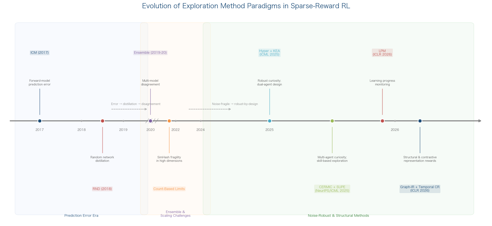

**Figure 1.** Evolution of exploration method paradigms in sparse-reward RL. The timeline delineates three eras: the Prediction Error Era (2017–2018, ICM and RND), the Ensemble and Scaling Challenges period (2019–2022, ensemble disagreement and count-based high-dimensional fragility), and the contemporary Noise-Robust and Structural Methods era (2025–2026), which is the primary focus of this chapter.

## 2.1 Curiosity-Driven and Prediction-Error Methods: From Noisy-TV Fragility to Noise-Robust Designs

### 2.1.1 The Persistent Noisy-TV Challenge

Curiosity-driven exploration, pioneered by ICM [Pathak et al., Curiosity-driven Exploration](https://arxiv.org/abs/1705.05363 "ICML 2017 ICM paper") and refined by RND [Burda et al., Exploration by Random Network Distillation](https://arxiv.org/abs/1810.12894 "ICLR 2019 RND paper"), assigns intrinsic reward proportional to the agent's prediction error on environment transitions. ICM demonstrated that self-supervised forward-model error could drive exploration in VizDoom and Super Mario Bros under sparse rewards, while RND achieved the first better-than-average human performance on Montezuma's Revenge without demonstrations. Both methods, however, remain fundamentally vulnerable to the *noisy-TV problem*: prediction-error intrinsic rewards can fixate on inherently unpredictable yet task-irrelevant stimuli — stochastic visual noise, chaotic dynamics — causing the agent to exhaust its exploration budget on unlearnable transitions rather than task-relevant states.

The noisy-TV problem exposes a deeper conceptual failure: the conflation of *aleatoric* uncertainty (irreducible environmental stochasticity) with *epistemic* uncertainty (reducible model ignorance). Prior remedies, including ensemble disagreement and distributional distance estimators, typically require either strong priors over the state space or substantial data volumes before reliable noise filtering emerges, thereby limiting early-stage exploration efficiency. Overcoming this conflation has become a central design objective for the 2025–2026 generation of intrinsic motivation methods surveyed below.

### 2.1.2 Learning Progress Monitoring: A Paradigm Shift

Learning Progress Monitoring (LPM), presented at ICLR 2026, introduces a fundamentally different approach inspired by neuroscience findings that humans monitor their own learning progress during exploration. Rather than rewarding prediction error or state novelty, LPM rewards model *improvement* — the reduction in dynamics-model prediction error between successive update steps. A dual-network architecture employs a dynamics model $f_\theta$ and a separate error model $g_\phi$ that predicts the expected prediction error of the previous dynamics-model iteration. The intrinsic reward is defined as the gap between the estimated previous error and the current error: $r_t^i = g_\phi(o_t, a_t) - \varepsilon_t^{(\tau)}(o_{t+1})$.

The theoretical contribution is substantial. LPM's intrinsic reward is proven to be *zero-equivariant* (zero reward if and only if information gain is zero) and a *monotone indicator of information gain*. Crucially, the expectation operation via $g_\phi$ is shown to be *necessary* for maintaining monotonicity — a pointwise alternative breaks the monotone relationship and can produce negative rewards even when information gain is positive.

Empirically, LPM demonstrates consistent superiority across multiple benchmarks and noise conditions. On the noisy MNIST benchmark, LPM's intrinsic reward converges within approximately 150 steps for both deterministic and stochastic transitions, compared to approximately 400 steps for AMA (Aleatoric Mapping Agent); EDT (Episodic Novelty Through Temporal Distance) never converges for stochastic transitions. In 3D MiniWorld mazes with 160×120 RGB observations, LPM achieved an average of 1,347.6 visited states across noise conditions, outperforming the second-best method by 95.3 states (7.6% improvement), with remarkable stability: only a 3.9% performance drop under action noise in Space Invader, compared to 100% degradation for the strongest clean-environment baseline (EME). On Montezuma's Revenge, LPM achieves meaningful extrinsic reward within 20 million exploration steps, whereas RND requires 50 million steps for comparable scores — a 2.5× sample-efficiency advantage [LPM at ICLR 2026](https://openreview.net/forum?id=wzm38DRLhC "Beyond Noisy-TVs: Noise-Robust Exploration Via Learning Progress Monitoring, ICLR 2026"). Figure 2 summarizes these quantitative comparisons.

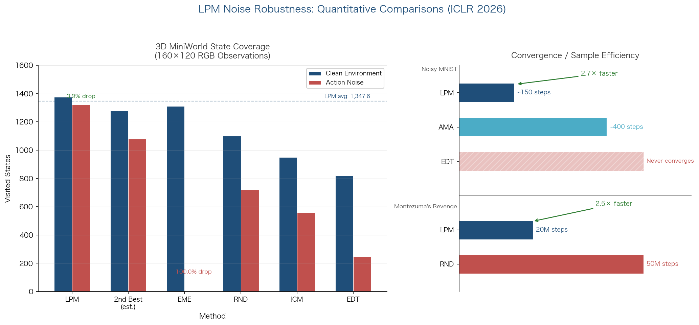

**Figure 2.** Quantitative noise-robustness comparisons for LPM. *Left panel*: State coverage in 3D MiniWorld (160×120 RGB) under clean and action-noise conditions; LPM sustains only 3.9% degradation while EME collapses entirely. *Right panel*: Intrinsic-reward convergence speed on Noisy MNIST (LPM ≈150 steps vs. AMA ≈400 steps) and sample efficiency on Montezuma's Revenge (LPM 20M steps vs. RND 50M steps).

### 2.1.3 Hyperparameter Robustness and Multi-Agent Extension

A complementary line of work addresses the hyperparameter sensitivity that plagues curiosity-based methods in practice. Hyper (ICML 2025) regularizes the agent's visitation distribution and decouples the exploitation objective from the exploration bonus, yielding provable efficiency guarantees under function approximation while eliminating the need for environment-specific tuning of the intrinsic reward coefficient $\beta$. Prior curiosity methods often require careful per-environment calibration of this coefficient — too large a bonus overwhelms the extrinsic signal, while too small a bonus provides insufficient exploration pressure. Hyper resolves this tension structurally, demonstrating empirical robustness across diverse task domains without per-environment tuning [Hyper at ICML 2025](https://icml.cc/virtual/2025/poster/44124 "Hyperparameter Robust Efficient Exploration in RL, ICML 2025").

CERMIC (NeurIPS 2025) extends curiosity-driven exploration to the multi-agent setting, where sparse rewards compound with coordination challenges to create an especially acute exploration problem. CERMIC enables each agent to calibrate its intrinsic curiosity using inferred peer-behavior context, without requiring explicit communication channels. By modeling the likely behaviors of other agents, each agent modulates its exploration intensity: exploring more aggressively when peer behavior is predictable (low-risk coordination scenarios) and more conservatively when peer behavior is uncertain and coordination failures are costly. CERMIC outperforms state-of-the-art multi-agent RL exploration methods on VMAS, Meltingpot, and SMACv2 benchmarks, establishing that single-agent curiosity mechanisms do not transfer trivially to multi-agent settings and that coordination-aware calibration is essential [CERMIC at NeurIPS 2025](https://openreview.net/forum?id=1fOGTbO5Sx "Curiosity-Driven Exploration through Multi-Agent Contextual Calibration, NeurIPS 2025").

### 2.1.4 Representation-Guided and Structural Exploration

Two ICLR 2026 contributions advance exploration by leveraging learned representations rather than raw prediction error, sidestepping the noisy-TV problem by design. *Temporal Contrastive Representations* guide exploration by prioritizing states whose future outcomes are unpredictable within a contrastive embedding space. Because the contrastive loss distinguishes states by their temporal structure rather than pixel-level prediction error, inherently stochastic but temporally uninformative stimuli do not generate spurious exploration bonuses. The approach discovers complex exploratory behaviors — locomotion gaits and object-manipulation strategies — without any extrinsic reward signal, validated across locomotion, manipulation, and embodied-AI benchmarks [Temporal Representations at ICLR 2026](https://openreview.net/forum?id=KjYpHySlb0 "Temporal Representations for Exploration, ICLR 2026").

*Graph-Theoretic Intrinsic Reward via Effective Resistance* takes a distinct approach rooted in spectral graph theory. The method constructs a graph over visited states and computes effective resistance — a measure from electrical network theory quantifying how "far apart" two nodes are in terms of graph connectivity — to generate intrinsic rewards that direct agents toward structurally important configurations correlated with goal achievement. The theoretical contribution includes convergence guarantees, and the empirical results are striking: up to 59% improvement in success rate and 56% reduction in required timesteps relative to state-of-the-art baselines. By operating on an explicit state graph rather than prediction errors, this method is immune to the noisy-TV problem by construction [Graph-Theoretic IR at ICLR 2026](https://iclr.cc/virtual/2026/poster/10009071 "Graph-Theoretic Intrinsic Reward: Guiding RL with Effective Resistance, ICLR 2026").

### 2.1.5 Architectural Separation of Exploration and Exploitation

KEA (Keeping Exploration Alive, ICML 2025) addresses the exploration–exploitation trade-off through architectural design rather than reward-shaping innovation. KEA maintains two parallel agents: a novelty-augmented SAC agent that executes bold, stochastic moves in high-novelty regions, and a standard SAC agent that performs refined exploitation in familiar territory. A proactive switching mechanism determines which agent controls action selection based on local novelty estimates, ensuring that exploration persists even in late training stages when a single unified agent would typically converge to exploitation. This dual-agent architecture yields significant improvements on DeepSea hard-exploration benchmarks and sparse-reward DeepMind Control Suite tasks, demonstrating that explicit structural separation of exploration and exploitation can outperform unified agents augmented with exploration bonuses [KEA at ICML 2025](https://icml.cc/virtual/2025/poster/44965 "KEA: Keeping Exploration Alive, ICML 2025").

### 2.1.6 Optimism-Based Exploration in Model-Based RL

OMBRL (ICLR 2025 Workshop) brings the classical principle of "optimism in the face of uncertainty" to model-based RL with nonlinear dynamics. The method defines intrinsic rewards as calibrated optimistic bonuses derived from the epistemic uncertainty of learned world models, achieving sublinear regret guarantees for nonlinear systems. Validation spans visual control tasks and a physical RC car platform, bridging the gap between theory and hardware deployment. OMBRL represents an important step toward reconciling theoretically principled exploration — long studied in the tabular and linear-function-approximation settings — with the practical demands of deep model-based RL in continuous control domains [OMBRL at ICLR 2025 Workshop](https://openreview.net/forum?id=VGdqa79ugx "Optimism via Intrinsic Rewards for Model-based RL, ICLR 2025 Workshop").

### 2.1.7 Information-Theoretic Intrinsic Motivation and Domain Extensions

VIB-IG (2025) grounds intrinsic motivation in the Information Bottleneck (IB) principle, defining intrinsic rewards as pointwise mutual information estimated via the Mutual Information Neural Estimator (MINE). This formulation establishes a principled connection between count-based intuitions (reward inversely proportional to state familiarity) and information-gain objectives (reward proportional to uncertainty reduction) within a single variational framework. Applied to combinatorial routing problems — TSP-50, TSP-100, TSP-200, and the Split Delivery Vehicle Routing Problem (SDVRP) — VIB-IG reduces the average tour length on TSP-200 from 11.15 (Attention Model baseline) to 10.82, a 3.0% improvement that demonstrates the applicability of intrinsic motivation beyond traditional RL benchmarks to discrete optimization [VIB-IG](https://pmc.ncbi.nlm.nih.gov/articles/PMC12939797/ "Information-Theoretic Intrinsic Motivation for RL in Combinatorial Routing, 2025").

Strategy-aware Surprise (SuS, January 2026) extends intrinsic motivation to large language model reasoning by decomposing surprise into two orthogonal components: *Strategy Stability* (consistency of the reasoning strategy across rollouts) and *Strategy Surprise* (novelty of the strategy relative to the agent's history). This decomposition enables more targeted exploration in the discrete strategy space of mathematical reasoning, achieving 17.4% Pass@1 and 26.4% Pass@5 improvements over baselines. Although the domain differs from traditional continuous-control RL, SuS illustrates how intrinsic motivation principles generalize to structured sequential decision-making in language [SuS on arXiv](https://arxiv.org/abs/2601.10349 "SuS: Strategy-aware Surprise for Intrinsic Exploration, Jan 2026").

## 2.2 Count-Based and Pseudo-Count Exploration: Strengths in Low Dimensions, Fragility at Scale

Count-based exploration — rewarding the agent inversely proportional to the visitation frequency of each state — enjoys strong theoretical guarantees in tabular settings, where PAC-MDP bounds directly leverage visit counts to certify exploration completeness. The fundamental challenge lies in extending exact counts to high-dimensional or continuous state spaces, where individual states are never revisited exactly and approximation schemes become necessary.

### 2.2.1 Empirical Assessment Across Observation Modalities

Kayal et al. (2025) provide the most systematic empirical comparison to date of intrinsic reward mechanisms across observation dimensionalities. Evaluating State Count, Maximum Entropy, DIAYN (skill-discovery), and dynamics-based methods on structured grid environments, they report that State Count produces the best exploration performance in low-dimensional observation settings — confirming that direct counting remains the method of choice when feasible. However, State Count degrades severely under high-dimensional RGB observations, where SimHash-based approximations fail to capture meaningful state similarity, producing hash collisions that conflate genuinely novel states with previously visited ones. Maximum Entropy exploration, by contrast, proves most robust under RGB inputs, maintaining effective exploration where count-based methods collapse. A further notable finding is that DIAYN — a skill-level diversity method — does not promote effective state-level exploration in structured environments, suggesting that skill discovery and state-space coverage address distinct objectives that should not be conflated [Kayal et al. 2025](https://link.springer.com/article/10.1007/s00521-025-11340-0 "Impact of intrinsic rewards on exploration in RL, Neural Computing and Applications, 2025").

These results carry important implications for method selection: the fragility of count-based approaches under high-dimensional observations remains unresolved as of Q1 2026. No major new pseudo-count or hash-based method targeting continuous or image-based state spaces was identified in the survey period, indicating that count-based exploration has plateaued in its applicability to visual domains. The broader research community appears to have redirected investment toward prediction-error, information-theoretic, and representation-based alternatives that handle high-dimensional inputs natively through neural network function approximation.

### 2.2.2 Search-Inspired Sub-Goal Exploration

SIERL (February 2026) bridges classical graph-search algorithms and RL exploration by introducing frontier-based sub-goal selection. Sub-goals are identified at the boundary of the explored state-space region and prioritized via cost-to-come and cost-to-go Q-value estimates — a heuristic reminiscent of A* search applied to the exploration problem. On MiniGrid variants, SIERL outperforms both novelty-bonus baselines and Hindsight Experience Replay (HER), demonstrating that structured search heuristics can complement or replace intrinsic reward bonuses when the state space admits meaningful frontier identification. The principal limitation is restriction to discrete state-action spaces; extending frontier-based selection to continuous domains, where the notion of an exploration frontier is less well-defined, remains an open technical challenge [SIERL on arXiv](https://arxiv.org/html/2602.00460v1 "Search Inspired Exploration in RL, Feb 2026").

## 2.3 Reward-Free and Task-Agnostic Exploration: Theoretical Foundations and Scalable Instantiations

Reward-free exploration — collecting data without access to any reward signal, then solving arbitrary downstream tasks from the collected dataset — represents the strongest form of task-agnostic exploration. By decoupling data collection from task specification, this paradigm enables a single exploration phase to serve multiple downstream objectives. The theoretical foundations and practical scalability of this paradigm have both advanced significantly during the survey period.

### 2.3.1 Tight Minimax Bounds for Tabular Settings

Ridel and Cohen (ICML 2026) resolve an open conjecture by establishing the tight minimax lower bound $\Omega(|S|^2|A|H^3/\varepsilon^2)$ for reward-free exploration in time-inhomogeneous episodic MDPs. Their algorithm achieves optimal high-order sample complexity $\tilde{O}(|S||A|H^3/\varepsilon^2)$ with reduced low-order terms. The gap between the $|S|^2$ factor in the lower bound and the $|S|$ factor in the upper bound reflects a fundamental cost of reward-free exploration relative to reward-aware learning: the agent must achieve uniform coverage of the state space rather than focusing on reward-relevant trajectories. These results apply to tabular MDPs; scalable deep-RL instantiations with comparable guarantees remain an open problem, as the underlying techniques rely on explicit state enumeration and occupancy-measure estimation that do not directly transfer to function-approximation settings [Ridel & Cohen at ICML 2026](https://arxiv.org/html/2602.16363v1 "Improved Bounds for Reward-Agnostic and Reward-Free Exploration, ICML 2026").

### 2.3.2 Skill-Based Task-Agnostic Exploration from Offline Data

SUPE (Skills from Unlabeled Prior Data for Exploration, ICML 2025) addresses the practical scalability gap by leveraging unlabeled offline trajectory data as an exploration prior. SUPE extracts reusable skills from heterogeneous offline datasets via a variational autoencoder (VAE), then deploys these skills as temporally extended actions during online exploration. Optimistic pseudo-labeling estimates the value of unexplored skill trajectories, biasing exploration toward promising but under-visited regions of the skill-conditioned state space. Evaluated across 42 long-horizon sparse-reward robotic tasks, SUPE consistently outperforms prior exploration strategies, demonstrating that task-agnostic skill extraction from offline data can substantially bootstrap online exploration even when the offline data are sub-optimal and collected under different task objectives [SUPE at ICML 2025](https://icml.cc/virtual/2025/poster/43987 "Skills from Unlabeled Prior Data for Exploration, ICML 2025").

### 2.3.3 Diffusion-Based Task-Agnostic Planning

SODP (ICML 2025) introduces a two-phase paradigm: task-agnostic pretraining of a diffusion planner on sub-optimal multi-task trajectories, followed by task-specific fine-tuning with RL. The diffusion model captures the manifold of plausible trajectories from diverse data sources, and RL fine-tuning steers the generative planner toward high-reward regions of this manifold. By confining the search to a learned trajectory prior rather than the full action space, SODP substantially reduces the exploration burden during task-specific adaptation. On Meta-World and Adroit benchmarks, SODP outperforms state-of-the-art methods with limited reward-guided fine-tuning data, suggesting that generative trajectory priors represent a scalable complement to intrinsic reward mechanisms for reducing sample complexity in sparse-reward settings [SODP at ICML 2025](https://icml.cc/virtual/2025/poster/43821 "Task-Agnostic Pre-training and Task-Guided Fine-tuning for Versatile Diffusion Planner, ICML 2025").

## 2.4 Goal-Conditioned and Hindsight-Based Methods: Directed Exploration Toward Sparse Goals

Goal-conditioned RL (GCRL) reformulates the sparse-reward problem by conditioning the policy on a target goal state, transforming a binary success/failure reward into a richer learning signal about progress toward the goal. Hindsight methods further amplify learning efficiency by relabeling failed trajectories with goals that were actually achieved, converting every trajectory into a successful demonstration for some goal. The survey period has seen meaningful advances in directed goal selection, offline GCRL representations, reward robustness, and model-based planning, though the sub-field appears comparatively mature relative to the rapid innovation in intrinsic motivation methods (Section 2.1).

### 2.4.1 Directed Sparse-Reward Goal-Conditioned RL

DISCOVER (NeurIPS 2025) extracts a "sense of direction" from the environment's transition structure to guide goal selection toward the target task, rather than sampling intermediate goals uniformly or from a learned distribution. The central theoretical contribution is formal bounds on time-to-target that are *independent of the full task-space volume* — exploration cost scales with the structural distance to the target rather than the ambient state-space dimensionality. This property makes DISCOVER effective in high-dimensional, long-horizon settings where prior state-of-the-art GCRL methods fail to reach the target within feasible training budgets, establishing directed goal selection as a critical complement to hindsight relabeling [DISCOVER at NeurIPS 2025](https://neurips.cc/virtual/2025/poster/116697 "Directed Sparse-Reward GCRL, NeurIPS 2025").

### 2.4.2 Offline Goal-Conditioned RL with Representation Learning

Two NeurIPS 2025 contributions advance offline GCRL through improved state representations that enable better generalization to unseen goals. *TMD* (Temporal Metric Distillation) unifies contrastive representations with quasimetric temporal distances, combining the training stability of Monte Carlo contrastive RL with the trajectory-stitching capabilities of quasimetric learning. This dual representation enables offline agents to generalize to goals that require novel trajectory compositions not present in the offline dataset — a critical capability for practical deployment where the goal distribution at test time may differ from that at data-collection time [TMD at NeurIPS 2025](https://neurips.cc/virtual/2025/poster/118249 "Offline GCRL with Quasimetric Representations, NeurIPS 2025").

*OTA* (Option-aware Temporal Abstraction) addresses the long-horizon challenge in offline GCRL through temporal abstraction that contracts the effective decision horizon. By learning options (temporally extended macro-actions) and reasoning over option-level value functions, OTA reduces the number of sequential decisions the offline agent must compose, mitigating the compounding errors inherent in long-horizon offline planning. OTA improves over HIQL on OGBench maze navigation and visual robotic manipulation tasks, confirming that hierarchical temporal abstraction is a productive strategy for scaling offline GCRL to long-horizon problems [OTA at NeurIPS 2025](https://neurips.cc/virtual/2025/poster/116719 "Option-aware Temporally Abstracted Value for Offline GCRL, NeurIPS 2025").

### 2.4.3 Robustness of Goal-Achievement Rewards

MSR (Margin-based Policy Self-Regularization, ICML 2025) identifies and addresses a subtle but consequential failure mode in GCRL: the discontinuity inherent in binary goal-achievement rewards. A policy that achieves exactly a 30° turn receives full reward, while one achieving 30.1° receives zero — creating catastrophic gradient landscapes near decision boundaries that destabilize both policy optimization and exploration. MSR smooths this discontinuity through margin-based regularization that penalizes policies for approaching the goal-achievement boundary too closely, encouraging robust goal satisfaction with comfortable margins rather than brittle boundary-riding behavior. Evaluated on robotic arm control and fixed-wing aircraft control, MSR demonstrates that the design of the reward function within GCRL critically affects exploration efficiency and policy robustness, and that simple regularization can yield substantial practical improvements [MSR at ICML 2025](https://icml.cc/virtual/2025/poster/43583 "Policy Self-Regularization for GCRL, ICML 2025").

### 2.4.4 Model-Based Offline Goal-Conditioned Planning

GOPlan (ICLR 2025) integrates learned world models with goal-conditioned offline RL through advantage-weighted conditioned GANs and reanalysis planning. By generating synthetic trajectories through the learned dynamics model and filtering them via advantage estimates, GOPlan augments the offline dataset with high-quality imagined experience. The resulting planner achieves state-of-the-art performance on multi-goal navigation and manipulation benchmarks, with particularly strong *out-of-distribution goal generalization* — the ability to reach goals absent from the offline training data. This capability is essential for practical deployment, where the space of possible goals at test time vastly exceeds what can be anticipated during data collection [GOPlan at ICLR 2025](https://iclr.cc/virtual/2025/poster/31488 "Goal-conditioned Offline RL by Planning with Learned Models, ICLR 2025").

## 2.5 Toward Unifying Frameworks

A persistent challenge in the exploration literature is the proliferation of methods without a clear organizing principle. The traditional division into "knowledge-based" (uncertainty-reducing) and "competence-based" (skill-expanding) intrinsic motivation, while intuitive, fails to capture important distinctions within each category and offers limited guidance for method selection in new domains.

### 2.5.1 Diversity-Level Taxonomy

Kayal et al. (2025) propose a more granular four-level taxonomy organized by the level at which diversity is measured: *State-level* (counting or hashing individual states), *State+Dynamics-level* (prediction error on transitions), *Policy-level* (entropy over action distributions), and *Skill-level* (diversity among discovered skills, e.g., DIAYN). Their empirical analysis reveals that these diversity levels produce markedly different exploration impacts: State-level methods excel in low-dimensional settings but collapse under high-dimensional observations, while State+Dynamics methods (RND, ICM) maintain broader applicability at the cost of noisy-TV vulnerability. This taxonomy offers more operational guidance than the traditional knowledge/competence dichotomy by directly connecting a method's design level to its expected failure modes and domain applicability [Kayal et al. 2025](https://link.springer.com/article/10.1007/s00521-025-11340-0 "Impact of intrinsic rewards on exploration in RL, 2025").

### 2.5.2 Information-Theoretic Partial Unification

VIB-IG partially unifies exploration and representation learning under a single information-theoretic objective derived from the Information Bottleneck principle. By formulating intrinsic reward as pointwise mutual information, VIB-IG establishes a formal connection between count-based intuitions (reward inversely proportional to familiarity) and information-gain objectives (reward proportional to uncertainty reduction) within one variational framework. This connection suggests that count-based and prediction-error methods can be understood as different estimators of related information-theoretic quantities — a conceptually important insight even though a complete formal unification encompassing all exploration families remains elusive as of Q1 2026 [VIB-IG](https://pmc.ncbi.nlm.nih.gov/articles/PMC12939797/ "Information-Theoretic Intrinsic Motivation for RL in Combinatorial Routing, 2025").

### 2.5.3 Community-Maintained Taxonomies

The OpenDILab Awesome Exploration RL repository, updated as of December 2025, functions as a community-maintained taxonomy organizing exploration methods by mechanism type: count-based, prediction-based, information-theoretic, skill-discovery, and hybrid approaches. While not a formal theoretical framework, this living resource reflects the community's evolving consensus on methodological relationships and provides a practical reference for researchers positioning new contributions within the broader landscape [OpenDILab](https://github.com/opendilab/awesome-exploration-rl "Community-maintained exploration RL collection, updated 2025.12.02").

No single dedicated survey covering all five sub-topics examined in this chapter — intrinsic motivation, count-based methods, reward-free exploration, goal-conditioned methods, and unifying frameworks — was published within the April 2025 – March 2026 window. Likewise, no single formal framework comprehensively reconciles all intrinsic motivation families under one theoretical umbrella, though partial unifications (VIB-IG's information-theoretic bridge, Kayal et al.'s diversity-level taxonomy) represent meaningful progress toward that goal.

## 2.6 Comparative Analysis and Cross-Cutting Themes

The five method families surveyed in this chapter differ substantially in their scalability, noise robustness, theoretical guarantees, computational overhead, and research momentum. Figure 3 provides a structured comparison across these dimensions.

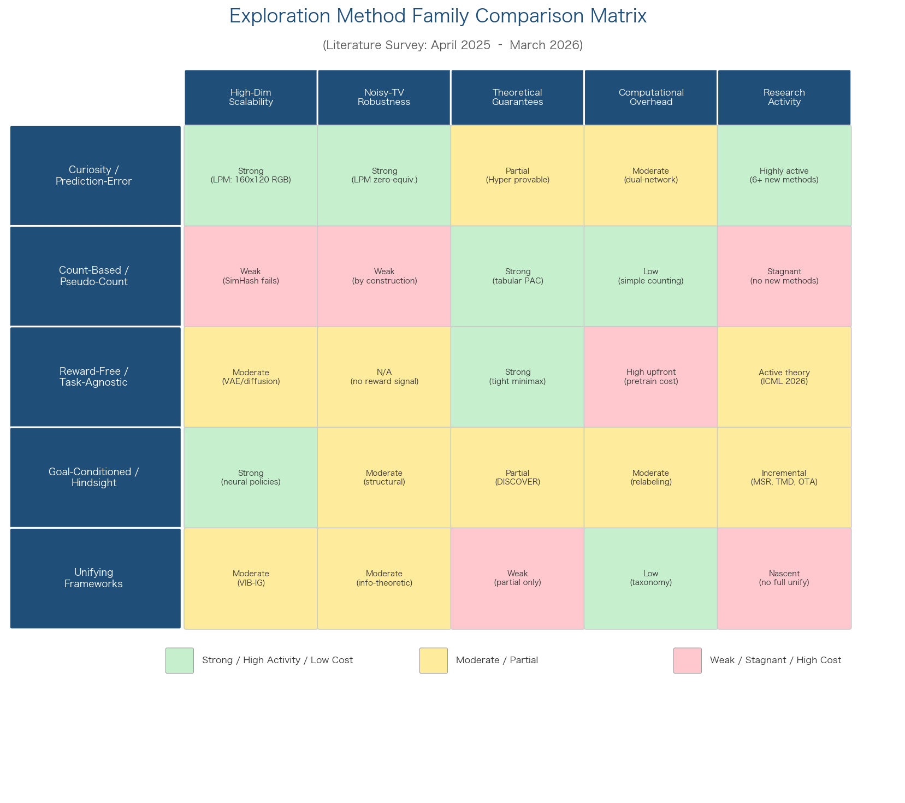

**Figure 3.** Exploration method family comparison matrix. Green cells indicate strong performance or high activity; yellow cells indicate moderate or partial results; red/pink cells indicate weakness or stagnation. The curiosity/prediction-error family leads in both scalability and research activity, while count-based methods retain strong tabular-setting guarantees but exhibit critical fragility under high-dimensional observations.

### 2.6.1 Scalability to High-Dimensional State Spaces

The scalability picture that emerges from the survey period is nuanced. Prediction-error methods (LPM, RND, ICM) and representation-based methods (Temporal Contrastive Representations, Graph-Theoretic IR) handle high-dimensional observations naturally through neural network function approximation; LPM specifically demonstrates robustness with 160×120 RGB inputs in 3D MiniWorld. Count-based methods, by contrast, suffer severe degradation under high-dimensional inputs — a finding confirmed quantitatively by Kayal et al. (2025) and unresolved by any new algorithm in the survey period. Reward-free exploration theory (Ridel & Cohen, ICML 2026) achieves tight minimax bounds but only for tabular MDPs, leaving a fundamental gap between theoretical optimality and practical deep-RL deployment. Goal-conditioned methods scale well through standard neural policy architectures but inherit the scalability limitations of their underlying exploration mechanisms.

### 2.6.2 Noisy-TV Robustness

LPM's learning-progress paradigm provides the strongest demonstrated noise robustness among surveyed methods, supported by both theoretical backing (zero-equivariance, monotone information-gain indicator) and empirical validation across multiple noise types (state noise, action noise) and domains (MNIST, 3D maze, Atari). Hyper complements LPM by eliminating a distinct source of fragility — sensitivity to the intrinsic reward coefficient $\beta$ — though it addresses hyperparameter robustness rather than noisy-TV robustness per se. Graph-Theoretic IR avoids the noisy-TV problem entirely by construction, since effective resistance is computed over an explicit state graph rather than prediction errors on raw observations. Quantitative noise-robustness comparisons among Temporal Contrastive Representations, Hyper, and Graph-Theoretic IR on a common benchmark suite are currently lacking — an important gap that future work should address to enable principled method selection in stochastic environments.

### 2.6.3 Computational Overhead

Computational costs vary substantially across method families. LPM's dual-network design (dynamics model plus error model) incurs overhead comparable to AMA's double-headed architecture and substantially lower than ensemble methods (Ensemble, EME) that maintain multiple parallel models. SUPE and SODP incur significant upfront costs from offline VAE training and diffusion model pretraining, respectively, but amortize these costs across multiple downstream tasks — a favorable trade-off when the number of target tasks is large. Graph-Theoretic IR requires periodic graph construction and spectral computation, with cost scaling with the number of visited states; this overhead is manageable for environments with moderate state-space coverage but may become prohibitive in very large or continuous state spaces. CERMIC adds peer-behavior inference overhead in multi-agent settings, while KEA doubles the number of maintained policies but employs a lightweight switching mechanism with negligible additional cost per decision step.

### 2.6.4 Methodological Maturity and Field Trajectory

The goal-conditioned and hindsight sub-topic appears comparatively mature: no fundamentally new HER relabeling strategy was identified beyond MSR's policy self-regularization. Advances in this area are incremental — improving representations (TMD), temporal abstraction (OTA), and model-based planning (GOPlan) — rather than introducing qualitatively new mechanisms. In contrast, the intrinsic motivation sub-topic remains highly active, with LPM, Temporal Contrastive Representations, and Graph-Theoretic IR each proposing genuinely novel reward formulations grounded in distinct theoretical foundations.

The overall trajectory of the field during April 2025 – March 2026 suggests a convergence toward methods that are *robust by design* rather than robust by tuning. LPM's learning-progress paradigm, Hyper's regularized visitation distributions, and structural methods (graph-theoretic, temporal contrastive) that bypass prediction error entirely all embody this principle. This represents a meaningful maturation from the ICM/RND generation, where noise robustness was an acknowledged weakness addressed post hoc, to a new generation in which noise robustness serves as a first-class design objective. Chapter 3 examines how foundation-model-guided exploration strategies interact with and extend these intrinsic motivation mechanisms in sparse-reward settings.

# 第3章 Foundation-Model-Guided and Hybrid Exploration Strategies for Sparse-Reward Settings

The intrinsic motivation methods surveyed in Chapter 2 derive exploration signals from within the RL loop itself — prediction errors, visitation counts, information gains, and goal-conditioned hindsight. A parallel and rapidly growing line of research imports external semantic priors from large language models (LLMs) and vision-language models (VLMs) to guide exploration under sparse rewards. Rather than asking "what is novel?" these foundation-model-guided (FM-guided) methods ask "what is meaningful?" — leveraging the world knowledge encoded in billion-parameter pretrained models to direct agents toward semantically promising states, decompose long-horizon tasks into tractable subgoals, or reshape sparse reward landscapes into dense supervisory signals. This chapter surveys recent advances (April 2025 – March 2026) in FM-guided exploration, hybrid strategies that combine multiple paradigms (evolutionary search, preference-based learning, residual corrections), the empirical evidence on when FM guidance outperforms or underperforms classical intrinsic motivation, and the systematic limitations that constrain current FM-guided approaches.

## 3.1 Foundation-Model-Guided Exploration: Reward Shaping, Subgoal Generation, and Action Advising

### 3.1.1 VLM-Driven Semantic Reward Shaping

The most direct application of foundation models to sparse-reward RL is the construction of dense reward surrogates from VLM judgments. SENSEI (ICML 2025) exemplifies the state of the art in this paradigm. The system distills "interestingness" rewards from GPT-4 pairwise image annotations into a DreamerV3 world model, jointly maximizing the resulting semantic reward signal and an epistemic uncertainty bonus via adaptive Go-Explore switching. On MiniHack KeyRoom — a challenging sparse-reward navigation task — SENSEI solves the task in approximately 500,000 environment steps, compared to over 20 million steps required by PPO, representing roughly a 40× sample efficiency improvement. Crucially, ablation studies reveal that VLM-generated reward alone is insufficient: when the information-gain component is removed, the agent becomes trapped in local optima, hovering near visually "interesting" states without completing the task. This finding establishes a central theme of the chapter — FM guidance and classical intrinsic motivation are complementary, not substitutional [SENSEI at ICML 2025](https://arxiv.org/html/2503.01584v2 "Semantic Exploration Guided by Foundation Models, ICML 2025").

RG-VLM (April 2025) approaches the same problem from the offline RL perspective, using large vision-language models (Gemini 1.5 Pro, GPT-4, Qwen2-VL-72B) to generate dense reward labels from offline visual trajectory data. Rather than embedding-similarity approaches (CLIP cosine distance, BLIP2 matching scores), RG-VLM employs multi-step chain-of-thought reasoning to assess task progress from visual observations. When integrated with Implicit Q-Learning (IQL), the combination of sparse environmental reward plus RG-VLM reasoning-based reward achieves 1.12×–3.15× higher normalized returns than alternative VLM-based reward methods (CLIP, BLIP2, RoboCLIP) across ALFRED household tasks. The magnitude of improvement scales with task complexity: the advantage over embedding-similarity baselines is most pronounced on long-horizon multi-step tasks where semantic understanding of intermediate progress is most valuable [RG-VLM](https://arxiv.org/html/2504.08772v1 "Reward Generation via Large Vision-Language Model in Offline RL, Apr 2025").

LMGT (Knowledge-Based Systems, 2025) provides theoretical grounding for LLM-based reward shaping by establishing an explicit connection to Q-function initialization. The method demonstrates that LLM-generated reward modifications are formally equivalent to modifying the initial Q-function estimate, which preserves the optimal policy while accelerating value propagation. LMGT outperforms RUDDER — a prior reward redistribution approach — on both the Housekeep embodied robotics benchmark and Google's SlateQ recommendation task, suggesting that LLM reward shaping benefits from this alignment with value-function initialization theory [LMGT](https://www.sciencedirect.com/science/article/abs/pii/S095070512500735X "LMGT: LLM-Guided reward Tuning, KBS 2025").

VIRAL (May 2025) introduces an iterative refinement loop where multi-modal LLMs generate and revise reward functions through either human feedback or Video-LLM-based policy description. The system closes the reward design loop by having the VLM observe the agent's behavior, diagnose reward-misalignment symptoms, and propose corrections — a process that converges within 3–5 iterations across five Gymnasium environments. This iterative paradigm represents a qualitative shift from one-shot reward generation to closed-loop reward engineering [VIRAL](https://arxiv.org/abs/2505.22092 "VIRAL: Vision-grounded Integration for Reward design And Learning, May 2025").

### 3.1.2 LLM-Driven Subgoal Decomposition

A complementary strategy employs LLMs not to reshape rewards directly but to decompose long-horizon tasks into ordered sequences of subgoals, converting a single sparse terminal reward into a curriculum of intermediate objectives. STO-RL (January 2026) operationalizes this approach for offline RL by leveraging LLMs (ChatGPT 5.0, Grok 3, DeepSeek-R1, Qwen3-Max) to generate temporally ordered subgoal sequences, which are then converted into potential-based reward shaping (PBRS) signals that provably preserve the optimal policy of the original MDP. On the PointMaze benchmark, STO-RL achieves a 0.68 success rate on UMaze and 0.55 on Medium configurations, compared to near-zero success for standard IQL with sparse rewards. Notably, ablations across four different LLMs reveal variance in subgoal quality — ChatGPT 5.0 and DeepSeek-R1 produce more reliable decompositions than Grok 3, which occasionally generates environmentally distracting subgoal sequences, highlighting the sensitivity of this paradigm to the choice of foundation model [STO-RL](https://arxiv.org/html/2601.08107v1 "Offline RL via LLM-Guided Subgoal Temporal Order, Jan 2026").

Memory-Based Advantage Shaping (AAAI 2026) offers a theoretically elegant variant that shapes the advantage function rather than the reward, by constructing a memory graph encoding subgoals and trajectory fragments from offline LLM input and agent rollouts. Because advantage shaping modifies the gradient direction without altering the set of optimal policies, this approach provides formal optimality guarantees that simple reward shaping lacks when the shaping potential is misspecified [Memory-Based Advantage Shaping](https://ojs.aaai.org/index.php/AAAI/article/view/42261 "AAAI 2026 Student Abstract").

### 3.1.3 VLMs as Action Advisors

VARL (September 2025) departs from both reward shaping and subgoal generation by using VLMs as direct action advisors. Rather than modifying the reward or goal structure, VARL queries the VLM for action suggestions at each decision point, blending these with the RL agent's own policy according to a confidence-weighted mixture. This design preserves the RL agent's convergence guarantees — the VLM advice is treated as a prior that is gradually overridden as the agent accumulates experience — while increasing sample diversity during early training when the agent's own policy is near-random. The approach sidesteps the reward-misspecification risks inherent in VLM-based reward generation, although it introduces per-step VLM inference cost that scales linearly with episode length [VARL](https://arxiv.org/abs/2509.21126 "VLM as Action Advisor for Online RL, Sep 2025").

## 3.2 Architectural Patterns for FM-RL Integration

The diversity of FM-guided exploration methods crystallizes into several recurring architectural patterns that merit explicit characterization.

### 3.2.1 Hierarchical LLM-Guided Option Discovery

LDSC (March 2025) proposes a three-stage hierarchy: (1) an LLM generates semantic subgoals from task descriptions, (2) a mid-level option-learning module acquires reusable skill policies for each subgoal, and (3) an action-level executor selects primitive actions. This architecture achieves a 55.9% improvement in average reward over flat baselines by exploiting the LLM's ability to impose task-relevant temporal abstraction. The key insight is that the LLM operates only at the highest level of the hierarchy and only at the beginning of each episode, amortizing its computational cost across the entire trajectory [LDSC](https://arxiv.org/abs/2503.19007 "LLM-guided Semantic Hierarchical RL Option Discovery, Mar 2025").

A parallel contribution in Nature Scientific Reports (2025) combines LLM task decomposition with predefined action primitives and hierarchical RL for long-horizon manipulation tasks. By grounding the LLM's decomposition in a fixed library of motion primitives (grasp, place, push, rotate), the system constrains the subgoal space to physically realizable actions, reducing hallucination risk compared to free-form LLM subgoal generation [LLMs-augmented HRL](https://www.nature.com/articles/s41598-025-20653-y "Scientific Reports, 2025").

### 3.2.2 Residual RL on Foundation-Model Policies

Residual Off-Policy RL (September 2025) establishes a qualitatively different integration pattern: rather than using foundation models to shape rewards or generate subgoals, the system learns lightweight per-step residual corrections on top of behavior-cloning (BC) policies using only sparse binary rewards. The approach achieves the first successful real-world RL training on a humanoid robot with dexterous hands — a milestone that validates the residual architecture for high-dimensional contact-rich control under extreme reward sparsity. The residual formulation constrains the exploration space to a manifold around the base policy, which simultaneously limits safety-violating deviations and focuses exploration on task-relevant corrections rather than the full action space [Residual Off-Policy RL](https://arxiv.org/abs/2509.19301 "Residual Off-Policy RL for Finetuning BC Policies, Sep 2025").

### 3.2.3 Asynchronous FM Inference for Real-Time Control

Found-RL (February 2026) addresses the first-order engineering challenge of FM-guided exploration: the inference latency of billion-parameter VLMs is incompatible with real-time control loops. The system integrates VLMs into RL for autonomous driving via four innovations: asynchronous batch inference achieving approximately 500 frames per second (FPS), Value-Margin Regularization (VMR) that prevents policy collapse during VLM-free intervals, Advantage-Weighted Action Guidance (AWAG) that selectively incorporates VLM suggestions based on advantage estimates, and a CLIP-based dense reward with explicit dynamic-blindness correction. The dynamic-blindness correction is particularly notable: standard CLIP embeddings fail to capture temporal dynamics (e.g., a car approaching vs. receding appears identical in a single frame), and Found-RL augments CLIP features with optical-flow-derived motion signals to resolve this ambiguity [Found-RL](https://arxiv.org/abs/2602.10458 "Foundation Model-Enhanced RL for Autonomous Driving, Feb 2026").

## 3.3 Sample Efficiency: FM-Guided vs. Classical Intrinsic Motivation

A critical question for practitioners is when FM-guided exploration justifies its computational overhead relative to classical intrinsic motivation methods. The empirical evidence, while incomplete, points toward a nuanced answer.

# 第4章 Exploration Under Constraints — Safe RL, Constrained MDPs, and Safety-Aware Exploration

Reinforcement learning agents tasked with trajectory planning in safety-critical domains—autonomous driving, robotic manipulation, UAV navigation—must simultaneously discover high-reward behaviors and respect hard operational constraints. Unlike the sparse-reward exploration challenge surveyed in Chapters 2 and 3, where the primary difficulty is insufficient reward signal, constrained RL confronts an additional structural tension: the very exploration that might uncover superior policies can also violate safety requirements, potentially causing irreversible physical damage. This chapter surveys recent advances (April 2025 – March 2026) in methods that enable efficient exploration while respecting safety constraints, organized along six algorithmic families: primal-dual and Lagrangian methods, trust-region approaches, safety critics and shielding mechanisms, control-theoretic barrier functions, off-policy constrained exploration, and offline safe RL. A cross-cutting distinction runs through the discussion: whether a method guarantees constraint satisfaction only at convergence or enforces safety throughout the training process—a distinction of immediate practical relevance for trajectory planning, where every training episode may correspond to a physical deployment.

## 4.1 Primal-Dual and Lagrangian Methods: From PID Control to Predictive Optimization

The Lagrangian relaxation of constrained MDPs (CMDPs) remains the most widely adopted framework for constrained RL. The standard formulation augments the reward with penalized cost terms, r_λ = r − Σ_i λ_i c^{(i)}, converting the constrained problem into an unconstrained one solved by alternating between policy optimization and multiplier updates. The PID-Lagrangian controller—applying proportional-integral-derivative feedback to multiplier dynamics—has become a de facto baseline owing to its simplicity and strong empirical performance. Its principal weaknesses are oscillatory constraint violation during training and limited feasible-region coverage.

Predictive Lagrangian Optimization (PLO) establishes a generic equivalence between constrained optimization and feedback control, subsuming PID-Lagrangian as a special case of a broader control-theoretic formulation [PLO](https://arxiv.org/abs/2501.15217 "Predictive Lagrangian Optimization for Constrained RL, Jan 2025"). By employing model predictive control (MPC) for multiplier updates—anticipating future constraint violations rather than merely reacting to past ones—PLO expands the feasible region by up to 7.2% relative to PID-Lagrangian while maintaining comparable reward. The conceptual significance extends beyond the empirical gain: reframing the Lagrangian multiplier update as a planning problem directly mirrors the trajectory planning domains where these methods are ultimately deployed.

Utke et al. (NeurIPS 2025) pursue a fundamentally different direction, reformulating constrained RL as a linear program (LP) over state-action occupancy measures [Safe RL via LP](https://neurips.cc/virtual/2025/133789 "NeurIPS 2025 — Safe RL via LP Formulation"). The convex reformulation enables direct optimization of returns subject to linear constraints, bypassing the non-convexity and hyperparameter sensitivity inherent in Lagrangian min-max optimization. Empirically, the LP formulation exhibits greater robustness to hyperparameter choices than Lagrangian baselines, though its scalability to high-dimensional continuous action spaces has not yet been demonstrated.

A persistent limitation of standard Lagrangian methods is that constraints are enforced only in expectation over cumulative cost, leaving individual states potentially unsafe. Seo and Choi (October 2025) address this gap by introducing state-dependent Lagrange multipliers that enforce pointwise (instantaneous) safety constraints at each visited state, rather than bounding only the expected cumulative cost [State-Dependent Lagrange](https://www.techrxiv.org/doi/full/10.36227/techrxiv.175979326.64150311 "State-wise Safety via State-Dependent Lagrange Multipliers, Oct 2025"). This shift from aggregate to pointwise constraint enforcement aligns directly with trajectory planning requirements, where a collision at any single timestep constitutes failure regardless of average safety performance.

## 4.2 CPO Successors and Trust-Region Methods: Guaranteeing Safety Throughout Training

Constrained Policy Optimization (CPO) introduced the principle of restricting policy updates to a trust region within which both performance improvement and constraint satisfaction are guaranteed. The survey period witnesses significant extensions of this idea, collectively shifting the field from convergence-only safety to training-time safety.

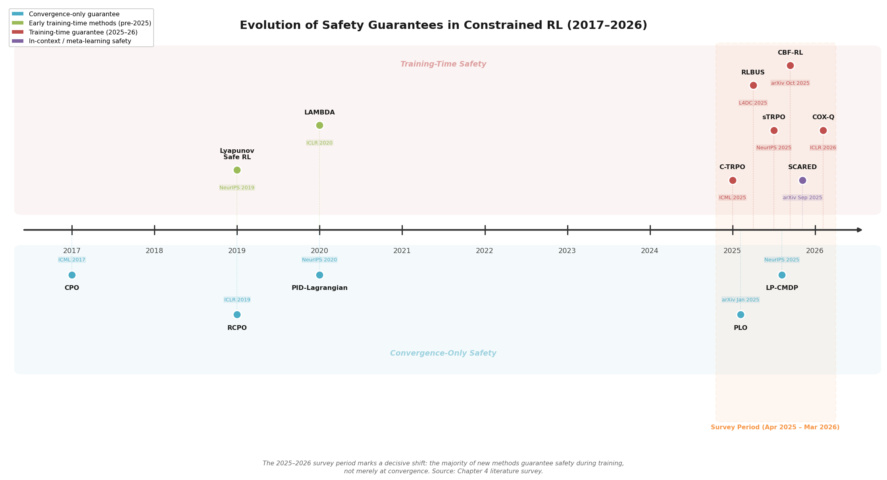

*Figure 4.1. Chronological progression from convergence-only safety methods (CPO, PID-Lagrangian) to training-time safety guarantees (C-TRPO, sTRPO, CBF-RL, RLBUS) during the 2025–2026 survey period.*

C-TRPO (ICML 2025) reshapes the trust region itself to contain only safe policies, guaranteeing constraint satisfaction throughout training rather than only at convergence [C-TRPO](https://icml.cc/virtual/2025/poster/46451 "ICML 2025 — Embedding Safety via Trust Region Methods"). The method establishes formal connections to TRPO, natural policy gradient (NPG), and CPO, positioning it as a unifying framework for trust-region constrained RL. The training-time guarantee is critical for trajectory planning: an autonomous vehicle learning in simulation still executes potentially dangerous maneuvers during training, and transferring such a policy to hardware requires confidence that every intermediate policy respects safety bounds.

sTRPO (NeurIPS 2025) introduces a complementary strategy by learning an auxiliary unsafe policy that estimates high-risk regions and explicitly excludes them from trust-region updates [sTRPO](https://neurips.cc/virtual/2025/136134 "NeurIPS 2025 — Safe Trust Region Policy Optimization"). This dual-policy architecture achieves monotonic improvement in both reward and safety, outperforming seven state-of-the-art baselines on the Safety-Gymnasium benchmark suite. The key insight is that explicitly modeling what is unsafe—rather than merely constraining toward what is safe—provides a more informative signal for shaping the exploration boundary.

SB-TRPO completes the picture with an alternative geometric approach, biasing each TRPO update step toward the feasible region to target hard-constraint satisfaction in CMDPs [SB-TRPO](https://openreview.net/forum?id=4zRb89SbzG "Hard-Constrained RL via Trust Regions"). Taken together, the three methods represent a maturation of trust-region constrained RL: C-TRPO ensures the trust region is safe, sTRPO ensures unsafe regions are explicitly avoided, and SB-TRPO ensures update directions trend toward feasibility. Each addresses a distinct failure mode of the original CPO, whose practical performance often degraded due to approximation errors in the constraint-satisfaction step.

## 4.3 Safety Critics, Shielding, and Chance-Constrained Methods

A distinct line of work decouples the safety mechanism from the policy optimization loop entirely, introducing dedicated safety critics or external shields that filter or modulate agent behavior independently of the reward-maximizing objective.

MAXSAFE (ICML 2025) addresses the sparse-cost problem—a direct parallel to the sparse-reward challenge—through chance-constrained bi-level optimization [MAXSAFE](https://icml.cc/virtual/2025/poster/43599 "ICML 2025 — Safety-Polarized and Prioritized RL"). Cost signals in many trajectory planning tasks are inherently sparse: a collision event is rare but catastrophic. MAXSAFE introduces safety polarization, which amplifies the cost signal at critical states, combined with safety-prioritized experience replay that over-samples trajectories containing constraint violations. The resulting method achieves near-maximal safety on autonomous driving and safe control benchmarks, demonstrating that the sparse-cost problem can be addressed with mechanisms structurally analogous to those used for sparse rewards.

Probabilistic Shielding (AAAI 2025) provides scalable state-augmentation shields with strict formal safety guarantees at both training and test time, contingent on the safety dynamics being known [Probabilistic Shielding](https://ojs.aaai.org/index.php/AAAI/article/view/33767 "AAAI 2025 — Probabilistic Shielding for Safe RL"). The assumption of known safety dynamics is restrictive in general but realistic for trajectory planning applications where kinematic and dynamic models are well-characterized—a robot arm's joint limits or a vehicle's maximum deceleration are typically known a priori, even when the task reward structure is not. Critically, the shield intervenes only when the agent proposes an action leading to a state from which no safe recovery is possible, thereby preserving exploration freedom for all non-critical decisions.

MICE (ICML 2025) identifies a subtle but practically consequential failure mode: cost value function underestimation, where the safety critic systematically underestimates the true cost of states, leading to excessive constraint violations during training [MICE](https://icml.cc/virtual/2025/poster/44096 "ICML 2025 — Controlling Underestimation Bias in Constrained RL"). To counteract this bias, MICE constructs flashbulb-memory modules that store unsafe states and their associated violation magnitudes, producing worst-case violation bounds tighter than standard critic-based estimates. The flashbulb-memory mechanism bears a structural resemblance to hindsight experience replay in goal-conditioned RL (Chapter 2): just as HER relabels failed trajectories as successful for alternative goals, MICE relabels near-safe trajectories as informative exemplars of constraint boundaries. This parallel suggests a potential unification of reward-sparse and cost-sparse exploration through dual memory architectures—a direction explored further in Chapter 6.

## 4.4 Barrier-Function and Control-Theoretic Approaches

Control barrier functions (CBFs) and Lyapunov-based methods import decades of control-theoretic safety guarantees into the RL framework. The survey period witnesses a decisive shift: CBFs are migrating from post-hoc runtime filters—applied only during deployment—to training-time constraints that actively shape the exploration process.

CBF-RL (October 2025) embeds control barrier functions directly into the RL training loop, enabling safe deployment on a Unitree G1 humanoid robot without any runtime safety filter [CBF-RL](https://arxiv.org/abs/2510.14959 "CBF-RL: Safety Filtering RL in Training, Oct 2025"). This result carries two-fold significance. First, it demonstrates empirically that CBF constraints during training do not prevent the agent from learning effective policies—the concern that safety constraints would over-restrict exploration and prevent convergence is refuted for this class of locomotion tasks. Second, eliminating the runtime filter simplifies the deployment pipeline, removing a component that introduces latency and conservatism in real-time trajectory execution.

RLBUS (L4DC 2025) integrates Backup Control Barrier Functions with model-free RL to guarantee zero training-time safety violations while enlarging the forward-invariant safe set for broader exploration [RLBUS](https://proceedings.mlr.press/v283/rabiee25a.html "L4DC 2025 — Safe Exploration via Backup CBFs"). The backup CBF formulation is particularly relevant to trajectory planning: it defines safety not merely as avoiding immediate danger but as maintaining the ability to execute a safe backup trajectory from any reachable state. This forward-looking safety notion aligns naturally with trajectory planning's requirement for feasible recovery maneuvers at every point along a path.

At the multi-agent level, HMARL-CBF (NeurIPS 2025) hierarchically coordinates multi-agent RL with CBFs, achieving success and safety rates within 5% of the theoretical maximum on multi-agent road-network navigation [HMARL-CBF](https://neurips.cc/virtual/2025/poster/116828 "NeurIPS 2025 — Hierarchical Multi-Agent RL with CBFs"). The hierarchical architecture assigns CBF enforcement to the lower level while the higher level manages inter-agent coordination and exploration, demonstrating that the exploration-safety tension can be mitigated through architectural separation of concerns rather than algorithmic compromise.

Adaptive Safety-Certified RL (IEEE, 2025) extends the CBF approach to handle parametric uncertainties in the dynamics model by decoupling safety and RL convergence through a high-order robust adaptive CBF with prescribed-time adaptation [Adaptive Safety-Certified RL](https://ieeexplore.ieee.org/document/10947350/ "IEEE 2025 — Adaptive Safety-Certified RL with CBFs"). This addresses a key limitation of standard CBFs, which assume precise knowledge of system dynamics—an assumption frequently violated in real-world trajectory planning where wind disturbances, payload changes, or surface friction vary unpredictably.

Kushwaha and Biron (August 2025) provide a systematic review of Lyapunov- and barrier-based safe RL, categorizing methods into four families: Lyapunov-based reward shaping, CLF-RL-QP, candidate Lyapunov as value function, and CLF-based loss [Lyapunov-Barrier Review](https://arxiv.org/html/2508.09128v1 "Review on Safe RL Using Lyapunov and Barrier Functions, Aug 2025"). The review identifies conservatism-performance tradeoffs and scalability as the principal open challenges: Lyapunov and CBF methods provide the strongest safety guarantees among all constrained RL approaches but demand the most prior knowledge about system dynamics and tend to produce overly conservative policies in high-dimensional state-action spaces.

## 4.5 Off-Policy Safe RL with Constrained Optimistic Exploration

On-policy methods dominate the safe RL literature, partly because trust-region and Lagrangian frameworks pair naturally with on-policy gradient estimators. Yet on-policy approaches are inherently sample-inefficient—a severe limitation when each sample corresponds to a real-world trajectory or an expensive simulator call. Off-policy safe RL offers higher sample efficiency but introduces two compounding difficulties: distributional shift in the cost critic, and the need to balance optimistic exploration (for reward discovery) with pessimistic caution (for cost avoidance).

COX-Q (ICLR 2026) directly addresses these challenges through cost-constrained optimistic exploration with gradient-conflict resolution [COX-Q](https://iclr.cc/virtual/2026/poster/10010695 "ICLR 2026 — Off-Policy Safe RL with Constrained Optimistic Exploration"). The method identifies a fundamental tension specific to off-policy safe RL: optimistic value estimates encourage exploration of under-visited states (beneficial for reward discovery), but the same optimism applied to cost estimates leads to underestimation of danger (harmful for safety). COX-Q resolves this asymmetry through three mechanisms: (1) cost-constrained optimistic exploration that applies optimism selectively to reward Q-values while maintaining conservative cost estimates; (2) adaptive trust regions that modulate exploration aggressiveness based on proximity to constraint boundaries; and (3) truncated quantile critics that provide calibrated uncertainty estimates for both reward and cost. Evaluated on safe velocity control, navigation, and autonomous driving tasks, COX-Q demonstrates that off-policy constrained RL is viable for domains where on-policy data collection is expensive—establishing a practical pathway for sample-efficient safe exploration in trajectory planning applications.

## 4.6 Safe Exploration During Training: Theoretical Foundations

A fundamental question in constrained RL is whether enforcing safety during training necessarily increases sample complexity relative to unconstrained RL. Recent theoretical work provides increasingly precise answers that carry direct implications for the feasibility of safe exploration in practice.

A NeurIPS 2025 contribution establishes near-optimal sample complexity bounds for online CMDPs: Õ(SAH³/ε²) for relaxed feasibility and Õ(SAH⁵/(ε²ζ²)) for strict feasibility, where S denotes the number of states, A the number of actions, H the horizon, ε the optimality gap, and ζ the Slater constant measuring slack in the constraints [Near-Optimal CMDP](https://neurips.cc/virtual/2025/poster/116370 "NeurIPS 2025 — Near-Optimal Sample Complexity for Online CMDPs"). The relaxed-feasibility bound Õ(SAH³/ε²) matches the unconstrained MDP lower bound, confirming that constraints need not increase sample complexity when the feasible set possesses sufficient interior volume. The strict-feasibility bound introduces a ζ⁻² multiplicative factor, quantifying the price of maintaining safety at every episode rather than merely converging to a safe policy. For trajectory planning, where strict feasibility is the operationally relevant regime, this result provides a formal justification for the empirically observed conservatism-efficiency tradeoff: the tighter the safety margins (smaller ζ), the more exploration episodes are required.

Efficient Action-Constrained RL (ICLR 2025) addresses a complementary form of constraint: restrictions on the action space itself, such as maximum steering angle or thrust limits [Action-Constrained RL](https://iclr.cc/virtual/2025/poster/30623 "ICLR 2025 — Efficient Action-Constrained RL"). Rather than projecting actions onto the feasible set post-hoc—a procedure that distorts the policy gradient—the method uses acceptance-rejection sampling on the unconstrained policy combined with an augmented two-objective MDP that jointly optimizes return and acceptance rate. The result is faster training convergence and lower action inference latency, both critical for real-time trajectory execution where decision cycles operate at 10–100 Hz.

SCARED (September 2025) opens a new frontier by proposing the first method for safe in-context RL—maintaining safety during the parameter-update-free adaptation phase that characterizes meta-RL and in-context learning [Safe ICRL](https://arxiv.org/abs/2509.25582 "Safe In-Context RL, Sep 2025"). Within the CMDP framework, SCARED actively adjusts exploration aggressiveness based on the remaining cost budget, balancing information acquisition against constraint margins. This capability is directly relevant to trajectory planning scenarios where an agent must adapt to a new environment—a novel intersection layout, an unfamiliar wind pattern, or changed surface conditions—without the luxury of extensive retraining.

## 4.7 Offline and Batch Safe RL: Learning Conservative Policies from Data

Offline safe RL addresses the setting where the agent must learn a safe policy entirely from a pre-collected dataset, without any online interaction. This formulation is particularly relevant to trajectory planning in safety-critical domains where online exploration is prohibitively risky—learning a collision-free driving policy from crash-free logged data, for example, rather than risking collisions during training.

O3SRL (NeurIPS 2025) frames offline safe RL as minimax optimization, combining offline RL with online optimization to achieve provable approximate optimality and reliable safety enforcement [O3SRL](https://neurips.cc/virtual/2025/poster/116952 "NeurIPS 2025 — Online Optimization for Offline Safe RL"). Validated on the DSRL benchmark suite, the method demonstrates that the minimax formulation avoids the distributional pessimism that causes standard offline RL to produce overly conservative policies, while still enforcing cost constraints effectively.

TraC (AAAI 2025) pursues a classifier-based approach, partitioning trajectories into desirable and undesirable subsets using a learned scoring function and training the policy exclusively on the desirable subset [TraC](https://ojs.aaai.org/index.php/AAAI/article/view/33855 "AAAI 2025 — Offline Safe RL via Trajectory Classification"). This design bypasses the min-max instability inherent in adversarial formulations and provides a more stable optimization landscape. For trajectory planning, TraC's approach maps naturally to settings where a dataset of recorded trajectories includes both safe and unsafe examples—a common scenario in autonomous driving log data, where near-miss events are abundant and informative.

CAPS (AAAI 2025) addresses a practical deployment concern that the other methods leave open: the need to adapt to varying cost constraint thresholds without retraining [CAPS](https://ojs.aaai.org/index.php/AAAI/article/view/33726 "AAAI 2025 — Constraint-Adaptive Policy Switching"). CAPS learns multiple policies with shared representations and switches among them at deployment based on the active constraint threshold, outperforming baselines across 38 DSRL tasks. In trajectory planning, constraint thresholds often vary by operational context—a delivery drone may tolerate tighter energy constraints than a search-and-rescue drone operating under time pressure—and CAPS enables a single training run to produce a family of policies covering different safety requirements.

## 4.8 Constraint Inference: Learning What Is Safe

A recurring assumption across the preceding sections is that the cost function and constraint thresholds are specified a priori. In many trajectory planning scenarios, however, safety constraints are implicit—encoded in expert demonstrations, user preferences, or regulatory intent rather than explicit mathematical formulations.

PbCRL (March 2026) infers unknown safety constraints from human preferences, introducing dead-zone preference modeling that accounts for indifference regions in human judgment and SNR loss for cost-variance-based exploration [PbCRL](https://arxiv.org/abs/2603.23565 "Preference-based Constrained RL, Mar 2026"). The method addresses a specific failure mode of the standard Bradley-Terry preference model: systematic underestimation of constraint violation risk when human annotators exhibit noisy or indifferent preferences. For trajectory planning, preference-based constraint inference could enable non-expert users to specify safety requirements in qualitative terms—"avoid flying close to buildings," "maintain comfortable deceleration"—rather than as precise mathematical constraints requiring domain expertise to formulate.

Inverse Constrained RL (ICML 2025) recovers constraints from expert demonstrations with tractable sample complexity bounds, establishing provably efficient exploration strategies for the constraint-inference problem [Inverse Constrained RL](https://icml.cc/virtual/2025/poster/44588 "ICML 2025 — Provably Efficient Exploration in Inverse Constrained RL"). The strategic exploration component merits attention: the agent must explore not to maximize reward but to identify the boundary of the constraint set, requiring a fundamentally different exploration objective than standard RL. This constraint-discovery exploration carries direct implications for trajectory planning in novel environments where the safe operating envelope must be learned before it can be respected—a drone entering unfamiliar urban airspace, for instance, must first determine altitude corridors and no-fly zones from observed traffic patterns before optimizing its own trajectory.

## 4.9 Comparative Assessment Across Algorithmic Families

The methods surveyed in this chapter span a spectrum from weak guarantees with broad applicability to strong guarantees with restrictive assumptions.

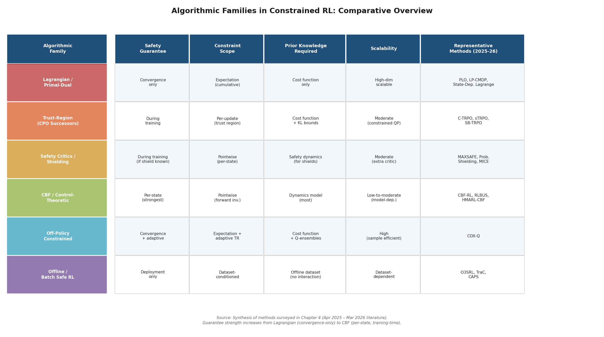

*Figure 4.2. Structured comparison of six algorithmic families across safety guarantee type, constraint scope, prior knowledge requirements, scalability, and representative methods from the April 2025 – March 2026 survey period.*

Lagrangian methods (Section 4.1) offer the broadest applicability—requiring only a differentiable cost function and scaling readily to high-dimensional problems—but guarantee constraint satisfaction only in expectation and at convergence. Trust-region methods (Section 4.2) strengthen this to training-time guarantees at the cost of computational overhead from constrained optimization sub-problems. CBF and control-theoretic methods (Section 4.4) provide the strongest per-state safety guarantees but require a dynamics model of the safety-relevant system, restricting their applicability to domains with well-characterized physics.

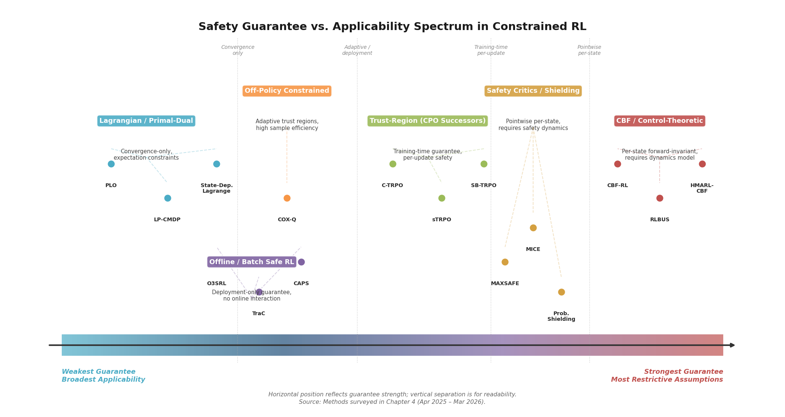

*Figure 4.3. Positioning of algorithmic families and representative methods along the safety-guarantee-strength versus practical-applicability axis, illustrating the fundamental tradeoff governing method selection.*

The off-policy approach of COX-Q (Section 4.5) and the offline methods (Section 4.7) address sample efficiency from opposite directions: COX-Q maximizes the information extracted from each online interaction, while offline methods eliminate online interaction entirely. In trajectory planning, the optimal choice depends on simulator fidelity: when high-fidelity simulators are available (as in autonomous driving with nuPlan or CARLA), off-policy online methods offer the best exploration-safety balance; when only logged data is available, offline methods provide the only viable path.

Two notable gaps persist across all families. First, most methods validated during the survey period address one or two cost functions, whereas trajectory planning in realistic settings—a drone navigating under simultaneous energy, altitude, velocity, and obstacle constraints—requires scaling constrained RL to many (>2) concurrent constraints. The LP formulation of Utke et al. (Section 4.1) and the hierarchical architecture of HMARL-CBF (Section 4.4) represent initial steps toward multi-constraint scalability, but systematic evaluation remains absent. Second, no method identified in the survey period addresses non-stationary safety constraints—constraint boundaries that shift over time due to moving obstacles, weather changes, or evolving regulatory zones. This constitutes a genuine open problem of immediate relevance to trajectory planning in dynamic environments.

# 第5章 Implications for Trajectory Planning — Bridging RL Exploration Advances and Real-World Path Planning

The exploration advances surveyed in Chapters 2 through 4—noise-robust intrinsic motivation, foundation-model-guided reward shaping, constrained optimistic exploration, and training-time safety guarantees—were developed primarily on benchmark environments. Their ultimate value depends on whether they translate to real-world trajectory planning problems, where agents must compute collision-free, energy-efficient, and dynamically feasible paths under sparse task-completion rewards and hard safety constraints.

This chapter examines that translation across three application domains: robotic manipulator and mobile-robot path planning (Section 5.1), autonomous driving motion planning (Section 5.2), and UAV/drone trajectory optimization (Section 5.3). For each domain, the analysis identifies which RL exploration innovations are most applicable, what domain-specific adaptations they require, and where critical gaps remain. Cross-domain patterns of synergy and tension between sparse-reward exploration and safety constraints are then distilled (Section 5.4), followed by an assessment of practical deployment barriers—sim-to-real transfer, verification, and regulatory acceptance (Section 5.5).

## 5.1 Robotic Manipulator and Mobile-Robot Path Planning

Robotic manipulation and mobile-robot navigation present trajectory planning challenges defined by high-dimensional joint or configuration spaces, contact-rich dynamics that resist accurate modeling, and sparse binary rewards—typically a success signal delivered only upon task completion. A 7-DoF manipulator tasked with pick-and-place receives no reward during the reaching, grasping, lifting, and transport phases; a mobile robot navigating a warehouse receives reward only upon arrival at the destination. The combination of long horizons and sparse feedback renders undirected exploration intractable, while joint torque limits, workspace boundaries, and collision avoidance impose hard constraints at every timestep. Recent work addresses these challenges through four complementary strategies: skill-based decomposition, residual RL on base policies, training-time safety via control barrier functions, and intrinsic-motivation-based pre-training.

### 5.1.1 Skill-Based Decomposition for High-Dimensional Exploration

The most significant architectural pattern emerging for robotic trajectory planning is skill-based hierarchical decomposition, which tackles the curse of dimensionality by breaking long-horizon sparse-reward problems into sequences of shorter-horizon sub-tasks with denser intermediate feedback. SUPE (ICML 2025) exemplifies this approach: it extracts reusable skills from unlabeled offline trajectory data via a VAE skill encoder, then employs optimistic pseudo-labeling to guide online exploration through the skill space rather than the raw action space. Across 42 long-horizon sparse-reward robotic tasks, SUPE consistently outperforms prior exploration strategies, confirming that skill-based decomposition effectively manages joint-space dimensionality by constraining exploration to a learned manifold of plausible motion primitives [SUPE](https://proceedings.mlr.press/v267/wilcoxson25a.html "Skills from Unlabeled Prior Data for Exploration, ICML 2025").

The implication for trajectory planning is direct: rather than searching over continuous 7-DoF action sequences spanning hundreds of timesteps, the planner explores over compact skill parameterizations, reducing the effective horizon and enabling sparse task-completion rewards to propagate within individual skill segments.

### 5.1.2 Residual RL: The Dominant Architecture for Contact-Rich Planning

Residual reinforcement learning—training a lightweight correction policy on top of a pre-existing behavior-cloning (BC) or demonstration-based base policy—has emerged as the dominant architecture for deploying RL-based trajectory planners on physical robots under sparse rewards. A base policy provides a competent but imperfect trajectory that satisfies most constraints by construction, while the residual policy explores deviations that improve task success without requiring exploration from scratch in the full action space.

The strongest evidence comes from the first successful real-world RL training on a humanoid robot with dexterous hands, achieved through residual off-policy RL with only sparse binary rewards [Residual Off-Policy RL](https://arxiv.org/abs/2509.19301 "Residual Off-Policy RL for Finetuning BC Policies, Sep 2025"). This result is significant for trajectory planning because it demonstrates that sparse rewards suffice for real-world policy refinement when exploration is constrained to a residual manifold around a competent base policy. The residual architecture naturally limits safety-violating deviations: the base policy ensures approximate constraint satisfaction, while the bounded-magnitude residual correction confines exploration to a neighborhood of known-safe trajectories.

Residual Flow Steering (RFS, February 2026) extends this paradigm to dexterous manipulation by adapting pretrained flow-matching generative policies through joint optimization of residual actions and latent noise, enabling complementary local and global exploration modes [RFS](https://arxiv.org/abs/2602.01789 "Residual Flow Steering for Dexterous Manipulation, Feb 2026"). ManipTrans (CVPR 2025) further validates the architecture's scalability by applying residual learning on imitation models for bimanual dexterous manipulation at 52 degrees of freedom—the most challenging dexterous scenario demonstrated to date [ManipTrans](https://arxiv.org/abs/2503.21860 "Dexterous Bimanual Manipulation Transfer via Residual Learning, CVPR 2025").

For trajectory planning, the residual RL architecture implies a two-phase pipeline. First, a nominal trajectory is generated using classical planning, demonstration, or foundation-model inference. Second, the trajectory is refined online via residual RL exploring corrections under sparse rewards. This pipeline inherits safety properties from the nominal trajectory while enabling adaptation to real-world conditions that the nominal planner cannot fully anticipate.

### 5.1.3 Training-Time Safety via Control Barrier Functions

Integrating control barrier functions (CBFs) into the RL training loop—rather than applying them as post-hoc runtime filters—represents a qualitative shift in how safety constraints interact with exploration for robotic trajectory planning. CBF-RL (October 2025) embeds CBFs directly during training for safe robotic navigation and deploys the resulting policy on a Unitree G1 humanoid robot without any runtime safety filter [CBF-RL](https://arxiv.org/abs/2510.14959 "CBF-RL: Safety Filtering RL in Training, Oct 2025"). RLBUS (L4DC 2025) integrates Backup Control Barrier Functions with model-free RL to guarantee zero training-time safety violations while enlarging the forward-invariant safe set for broader exploration [RLBUS](https://proceedings.mlr.press/v283/rabiee25a.html "L4DC 2025 — Safe Exploration via Backup CBFs").

The trajectory planning implications are twofold. First, training-time CBF enforcement means the learned policy internalizes the constraint boundary, producing trajectories that respect safety margins without a separate safety layer at deployment—reducing computational overhead and latency-critical failure modes in real-time planning. Second, RLBUS demonstrates that CBFs can simultaneously constrain exploration (an antagonistic effect, as they exclude portions of the state space) and focus exploration within the safe set (a synergistic effect, as the agent avoids wasting samples on unsafe trajectories that would be discarded).

### 5.1.4 Intrinsic Motivation for Pre-Training Manipulation Skills

Temporal Contrastive Representations (ICLR 2026) discover manipulation-relevant locomotion gaits and object interaction behaviors entirely without extrinsic rewards, by prioritizing states with unpredictable future outcomes in a contrastive embedding space [Temporal Representations](https://openreview.net/forum?id=KjYpHySlb0 "ICLR 2026"). For trajectory planning, this capability enables a pre-training phase in which the robot acquires a repertoire of motion primitives through purely intrinsic exploration, to be subsequently composed and refined for specific planning objectives. The approach complements skill extraction from demonstrations (SUPE) and offers an alternative when demonstration data is unavailable—a common situation for novel manipulation tasks or unfamiliar environments.

SR2 (IJCAI 2025) addresses a distinct but related challenge: bridging the gap between simulated pre-training and real-world deployment by using a meta-policy to revisit high-quality states from offline data for targeted online re-exploration [SR2](https://www.ijcai.org/proceedings/2025/970 "State Revisit and Re-explore, IJCAI 2025"). This targeted re-exploration strategy is particularly relevant for trajectory planning with imperfect simulators, where sim-to-real discrepancies concentrate in specific state-space regions (e.g., contact dynamics, surface friction) rather than uniformly degrading performance.

## 5.2 Autonomous Driving Motion Planning

Autonomous driving motion planning occupies a distinctive position in the trajectory planning landscape: the state space is high-dimensional (ego-vehicle pose, velocity, surrounding agent states), the action space is continuous but comparatively low-dimensional (steering, acceleration), rewards are naturally sparse (safe arrival at a destination), and safety constraints are simultaneously hard (collision avoidance) and socially nuanced (traffic rules, passenger comfort). The domain has also become the primary testbed for foundation-model-guided RL exploration.

### 5.2.1 RL Planners Surpassing Classical Baselines

CarPlanner (CVPR 2025) marks a milestone as the first RL-based planner to surpass both imitation learning and rule-based state-of-the-art methods on the large-scale nuPlan benchmark, using consistent auto-regressive trajectory generation with expert-guided rewards [CarPlanner](https://arxiv.org/abs/2502.19908 "Consistent Auto-regressive Trajectory Planning for Large-scale RL, CVPR 2025"). The result is significant not merely as a benchmark achievement but as evidence that RL trajectory planning has matured beyond proof-of-concept: nuPlan contains diverse real-world driving scenarios—intersections, lane changes, construction zones—and CarPlanner's superiority over imitation learning baselines indicates that the RL policy discovers driving strategies absent from expert demonstrations, a direct consequence of effective exploration under the benchmark's implicitly sparse reward structure.

Plan-R1 (May 2025) addresses a subtler challenge: the misalignment between reward objectives and safe behavior that arises when dense reward shaping inadvertently dilutes safety-critical signals. Plan-R1 decouples principle alignment from behavior learning via Variance-Decoupled Group Relative Policy Optimization (VD-GRPO), which preserves absolute reward magnitudes for rare safety-critical objectives rather than normalizing them away [Plan-R1](https://arxiv.org/abs/2505.17659 "Safe and Feasible Trajectory Planning as Language Modeling, May 2025"). By formulating trajectory planning as language modeling over waypoint tokens and applying VD-GRPO, Plan-R1 achieves state-of-the-art planning safety on nuPlan. The implication for sparse-reward trajectory planning is that reward design must be complemented by optimization algorithms that respect the heterogeneous importance of reward components—safety events are sparse but must dominate the learning signal when they occur.

### 5.2.2 Foundation-Model-Guided Exploration for Driving

Found-RL (February 2026) represents the most complete integration of vision-language models into RL-based driving trajectory planning, addressing the engineering challenge of billion-parameter VLM inference latency through asynchronous batch inference at approximately 500 frames per second [Found-RL](https://arxiv.org/abs/2602.10458 "Foundation Model-Enhanced RL for Autonomous Driving, Feb 2026"). The system combines Value-Margin Regularization (VMR), Advantage-Weighted Action Guidance (AWAG), and CLIP-based dense reward with a dynamic-blindness correction that compensates for CLIP's inability to distinguish temporal ordering of frames. Found-RL exemplifies a recurring pattern: VLM-derived semantic rewards provide a dense proxy signal that bridges the sparse task-completion reward, but require careful engineering to correct systematic biases in the foundation model's perception.

The synergy between foundation-model guidance and classical exploration signals, established in Chapter 3, manifests clearly in driving applications. Found-RL's CLIP-based reward alone suffers from dynamic blindness—it cannot distinguish a vehicle approaching a pedestrian from one moving away—requiring explicit temporal correction. This echoes SENSEI's finding that VLM-only rewards cause local-optima trapping (Chapter 3, Section 3.1). For driving trajectory planners, foundation models should therefore be deployed as complementary exploration signals alongside model-based or count-based mechanisms, not as standalone reward functions.

### 5.2.3 Safe Exploration for Driving Trajectories

Autonomous driving imposes the most stringent safety requirements among trajectory planning domains: constraint violation (collision) is irreversible and potentially catastrophic. Several constrained RL advances from Chapter 4 bear direct applicability.

COX-Q (ICLR 2026) resolves gradient conflicts between reward maximization and cost minimization via cost-constrained optimistic exploration with truncated quantile critics, achieving high sample efficiency on safe driving tasks [COX-Q](https://iclr.cc/virtual/2026/poster/10010695 "Off-Policy Safe RL with Constrained Optimistic Exploration, ICLR 2026"). Gradient-conflict resolution is particularly important for driving: the reward gradient (reach the destination faster) and cost gradient (maintain safe distances) frequently point in opposing directions during lane changes, merges, and intersection crossings. By explicitly decomposing and reconciling these gradients, COX-Q enables the trajectory planner to explore aggressive-but-safe maneuvers that pure constraint-penalty methods would suppress.

MAXSAFE (ICML 2025) addresses the sparse-cost problem in driving through chance-constrained bi-level optimization with safety polarization and safety-prioritized experience replay [MAXSAFE](https://icml.cc/virtual/2025/poster/43599 "ICML 2025 — Safety-Polarized and Prioritized RL"). Cost signals in driving are inherently sparse—collision events are rare in well-designed simulators—and MAXSAFE's approach of amplifying the cost signal at critical states parallels how intrinsic motivation methods amplify reward signals at novel states, achieving near-maximal safety on autonomous driving benchmarks.

HMARL-CBF (NeurIPS 2025) extends safety-constrained trajectory planning to the multi-agent setting, hierarchically coordinating multiple RL agents with control barrier functions to achieve near-perfect success and safety rates (within 5% of optimal) on multi-agent road-network navigation [HMARL-CBF](https://neurips.cc/virtual/2025/poster/116828 "NeurIPS 2025 — Hierarchical Multi-Agent RL with CBFs"). The hierarchical decomposition—safety enforcement at the lower level, strategic planning at the upper level—exemplifies how the exploration–safety tension can be resolved through architectural separation rather than single-level optimization.

C-TRPO (ICML 2025) and sTRPO (NeurIPS 2025) provide training-time constraint satisfaction guarantees directly applicable to driving planners that must ensure safety throughout the learning process, not only at convergence [C-TRPO](https://icml.cc/virtual/2025/poster/46451 "ICML 2025"); [sTRPO](https://neurips.cc/virtual/2025/136134 "NeurIPS 2025"). For driving trajectory planning, where simulation fidelity increasingly supports direct sim-to-real transfer, training-time safety is a prerequisite rather than an aspiration.

## 5.3 UAV/Drone Trajectory Optimization

UAV trajectory optimization introduces physical constraints absent in ground-based domains: three-dimensional continuous action spaces, strict energy budgets (energy exhaustion causes crashes, unlike ground robots that merely stop), dynamic obstacle fields, altitude corridor restrictions, and sensitivity to atmospheric disturbances. These constraints interact with sparse rewards in ways that shape which RL exploration advances are most applicable.

### 5.3.1 Physical Deployment and Sensor-Criticality

Xiong et al. (Communications Engineering, 2025) present an RL-based drone landing planner validated on a physical quadrotor in 5 m/s wind conditions, balancing safety, energy, and trajectory smoothness [Xiong et al.](https://www.nature.com/articles/s44172-025-00531-1 "Trajectory planning for drone landing with RL, Communications Engineering, 2025"). A notable finding is the asymmetric importance of sensor modalities: velocity sensing proves critical (94% task failure without it), whereas wind sensing contributes less to local planning performance. For trajectory planning, this implies that exploration strategies must account for which state dimensions carry safety-critical information—an observation that connects to the state-dependent Lagrange multiplier approach (Seo and Choi, October 2025; see Chapter 4), where constraint enforcement intensity varies across the state space.

### 5.3.2 Entropy-Based Exploration in 3-D Environments

Entropy Explorer (Measurement Science and Technology, 2024) generates intrinsic rewards combining state entropy and action entropy for UAV path planning in sparse-reward three-dimensional environments [Entropy Explorer](https://iopscience.iop.org/article/10.1088/1361-6501/ad2663 "Entropy-based exploration for UAV path planning, 2024"). The dual-entropy formulation suits UAV planning because it simultaneously encourages spatial coverage (state entropy) and action diversity (action entropy), preventing the policy from collapsing to conservative hover-in-place behaviors that satisfy safety constraints but never reach the destination. This approach constitutes a domain-specific instantiation of the maximum-entropy exploration principle, adapted to the three-dimensional continuous setting where count-based methods degrade severely under high-dimensional observations, as established in Chapter 2.

### 5.3.3 Multi-UAV Coordination and Geometric Priors

Multi-UAV trajectory planning compounds the exploration challenge with coordination requirements. Afzal et al. (Drones, June 2025) conduct a comparative evaluation finding that DDPG and MADDPG outperform PPO, SAC, and TRPO in multi-UAV path efficiency, while highlighting that the transition from 2-D to 3-D environments introduces severe performance degradation from expanded state-action spaces (54-dimensional observation vectors) [Afzal et al.](https://www.mdpi.com/2504-446X/9/6/438 "Comparative RL for Multi-Agent UAV Path Planning, Drones, 2025"). This dimensionality explosion underscores the need for structured exploration mechanisms—random exploration in 54-dimensional observation spaces is prohibitively inefficient.

A promising response is the integration of geometric priors with deep RL. The 3-D RVO-Enhanced MARL framework (Aerospace Science and Technology, 2025) combines Reciprocal Velocity Obstacles with deep RL for multi-UAV conflict resolution under energy constraints, using geometric collision-avoidance priors to constrain the exploration space [3D RVO-MARL](https://www.sciencedirect.com/science/article/abs/pii/S1270963825004493 "Multi-UAV conflict resolution, 2025"). This approach mirrors the residual RL pattern observed in robotic manipulation: a classical geometric planner provides the base behavior, while RL explores refinements within the geometrically constrained manifold. The analogy extends to safety properties—RVO constraints act as implicit control barrier functions, restricting exploration to collision-free velocity regions.

### 5.3.4 Energy as a Uniquely Hard Constraint

Energy exhaustion in UAVs causes catastrophic failure (crash), unlike ground robots where energy depletion results in a stationary but safe stop. This distinction makes energy management a uniquely hard constraint in UAV trajectory planning, requiring either explicit CMDP formulations with energy as a cost function or carefully designed penalty-based reward shaping. No paper in the survey period provides formal energy constraint satisfaction guarantees (as opposed to expected-cost bounds), representing a gap where the CBF-based methods from Chapter 4—particularly RLBUS's zero-violation guarantee during training—could be adapted to energy-aware UAV planning. The challenge lies in specifying a valid control barrier function for energy: unlike collision avoidance, where the barrier function has a clear geometric interpretation, energy depletion is a cumulative constraint requiring lookahead over the remaining trajectory. Instantaneous CBF enforcement is therefore insufficient without a predictive energy model that estimates remaining battery capacity as a function of planned maneuvers.

## 5.4 Cross-Domain Patterns: Synergy and Tension Between Exploration and Safety

Across all three application domains, several recurring patterns characterize how sparse-reward exploration and safety constraints interact in trajectory planning. The cross-domain applicability matrix below synthesizes the domain-specific assessments from Sections 5.1–5.3.

### 5.4.1 Residual RL as a Unifying Architecture

The residual RL paradigm—training a correction policy on top of a competent base policy—emerges as the dominant architecture across domains. In robotic manipulation, residual off-policy RL enables the first real-world humanoid training with sparse rewards. In autonomous driving, CarPlanner's auto-regressive generation with expert-guided rewards follows the same principle of constraining exploration around expert behavior. In UAV planning, geometric priors (RVO) serve the functional role of a base policy that constrains RL exploration. The unifying insight is that residual RL simultaneously addresses both the sparse-reward problem (by reducing the effective exploration space to a manageable residual manifold) and the safety problem (by inheriting approximate constraint satisfaction from the base policy). This dual benefit explains the architecture's cross-domain dominance.

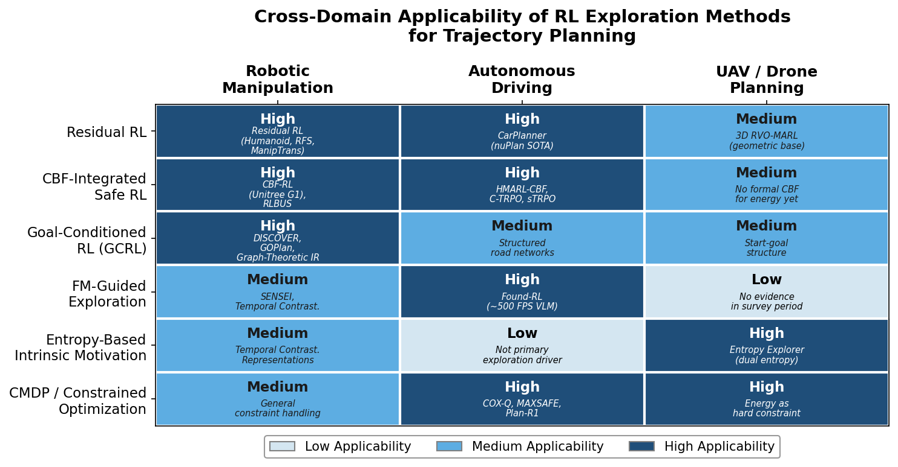

*Figure 5.1. Applicability matrix mapping six RL exploration method families against three trajectory planning domains. Cell shading indicates assessed applicability level (High / Medium / Low) based on the evidence reviewed in Sections 5.1–5.3, with representative methods annotated.*

### 5.4.2 Foundation-Model Guidance Plus Classical Exploration: Complementarity

Evidence from driving (Found-RL), robotic manipulation (SENSEI applied to manipulation-like sub-tasks; Chapter 3), and the broader pattern established in Chapter 3 consistently shows that foundation-model-guided exploration and classical intrinsic motivation are complementary rather than substitutable. VLM-only or LLM-only reward signals cause local-optima trapping, semantic drift, or dynamic blindness; curiosity-only or count-only signals lack the semantic grounding needed for long-horizon task decomposition. The combination—FM-derived sub-goals or dense reward proxies paired with novelty-based or information-gain-based exploration bonuses—yields the strongest performance. For trajectory planning practitioners, FM guidance should be treated as a structural prior that decomposes the planning problem, not as a replacement for principled exploration mechanisms.

### 5.4.3 CBF Integration: From Runtime Filter to Training-Time Constraint

CBF-RL, HMARL-CBF, and RLBUS collectively demonstrate a cross-domain trend: control barrier functions are migrating from post-hoc runtime safety filters to integral components of the RL training process. The trajectory planning implications are substantial. Runtime CBF filters introduce conservatism—they can override the learned policy at deployment, leading to jerky trajectories or deadlocks when the filter activates frequently. Training-time CBF integration allows the policy to learn to operate within the safety boundary, producing smoother trajectories that respect constraints by construction. The trade-off is that training-time CBFs require differentiable barrier function formulations compatible with gradient-based policy optimization, limiting current applicability to domains where the safety constraint has a known analytical form.

### 5.4.4 Sparse Rewards and Safety Constraints: Theoretically Antagonistic, Practically Manageable

The theoretical tension between exploration breadth (needed to overcome sparse rewards) and constraint conservatism (needed to ensure safety) is well-documented (Chapters 1 and 4). In practice, however, recent work identifies three architectural strategies that manage this tension effectively, as illustrated in Figure 5.2.

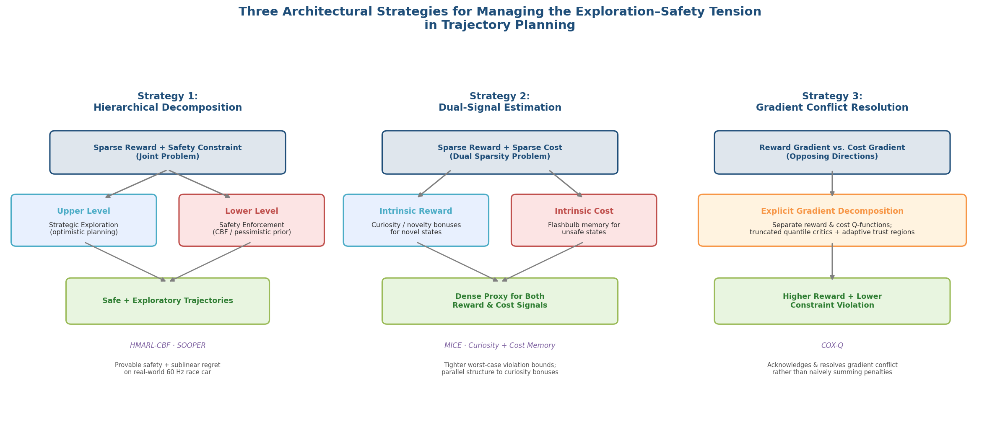

*Figure 5.2. Three architectural strategies for reconciling sparse-reward exploration with safety constraints: hierarchical decomposition, dual-signal estimation, and gradient conflict resolution. Each panel illustrates how the strategy decomposes the joint problem into tractable sub-problems.*

1. **Hierarchical decomposition** separates safety enforcement and exploratory planning across levels. HMARL-CBF enforces CBF constraints at the lower action level while the upper level explores strategic options freely. SOOPER (NeurIPS 2025) unifies pessimistic safety priors and optimistic planning in a single hierarchical objective with provable safety and sublinear regret, validated on a real-world 60 Hz race car [SOOPER](https://arxiv.org/html/2601.19612v1 "Safe Exploration via Policy Priors, NeurIPS 2025").

2. **Dual-signal estimation** addresses sparsity on both the reward and cost sides simultaneously. MICE (ICML 2025) introduces flashbulb-memory modules that estimate cost values for rarely-visited unsafe states, paralleling how curiosity bonuses estimate reward values for rarely-visited novel states [MICE](https://icml.cc/virtual/2025/poster/44096 "ICML 2025 — Controlling Underestimation Bias in Constrained RL"). This dual-memory architecture—intrinsic reward buffers for novel states paired with intrinsic cost buffers for unsafe states—represents a promising template for trajectory planners that must overcome reward sparsity and cost sparsity in tandem.

3. **Gradient conflict resolution** explicitly decomposes and reconciles the opposing gradients from reward maximization and cost minimization. COX-Q's cost-constrained optimistic exploration with truncated quantile critics demonstrates that acknowledging and resolving the gradient conflict—rather than naively summing penalized objectives—yields both higher reward and lower constraint violation.

### 5.4.5 Goal-Conditioned RL and Graph-Based Methods for Structured Environments

Goal-conditioned RL maps naturally to trajectory planning's start-goal structure. DISCOVER (NeurIPS 2025) extracts a "sense of direction" for directed goal selection toward the target task, with formal bounds on time-to-target independent of the full task-space volume [DISCOVER](https://neurips.cc/virtual/2025/poster/116697 "Directed Sparse-Reward GCRL, NeurIPS 2025"). GOPlan (ICLR 2025) achieves state-of-the-art performance on multi-goal navigation and manipulation with superior out-of-distribution goal generalization via model-based offline GCRL [GOPlan](https://iclr.cc/virtual/2025/poster/31488 "ICLR 2025"). Graph-theoretic intrinsic reward via effective resistance (ICLR 2026) achieves up to 59% success rate improvement and 56% timestep reduction over state-of-the-art baselines by using spectral graph theory to guide agents toward goal-correlated configurations [Graph-Theoretic IR](https://iclr.cc/virtual/2026/poster/10009071 "ICLR 2026"). These methods are particularly well-suited to structured trajectory planning environments—warehouse navigation, road networks, indoor spaces—where the state space exhibits graph-like connectivity and the goal-conditioned formulation aligns with the natural problem structure.

## 5.5 Deployment Barriers: Sim-to-Real Transfer, Verification, and Regulatory Acceptance

The translation from RL exploration research to deployed trajectory planners faces three categories of barriers that are partially addressed by current work but remain substantially open. Figure 5.3 maps the RL exploration and safety advances reviewed in this report onto the stages of a trajectory planning deployment pipeline, illustrating where each category of method is most applicable.

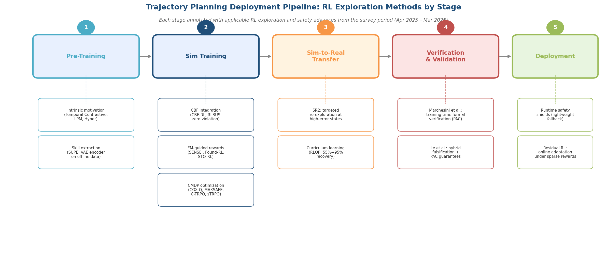

*Figure 5.3. Five-stage deployment pipeline for RL-based trajectory planning, annotated with applicable exploration and safety advances from the April 2025 – March 2026 survey period at each stage.*

### 5.5.1 Sim-to-Real Transfer

Da et al. (February 2025) present the first comprehensive sim-to-real taxonomy organized through MDP elements—State, Action, Transition, and Reward gaps—identifying foundation models as increasingly bridging these gaps via zero-shot transfer and semantic grounding [Da et al.](https://arxiv.org/abs/2502.13187 "Sim-to-Real Survey with Foundation Models, Feb 2025"). However, Lin and Sun (June 2025) reveal that model-based RL faces worse sim-to-real challenges than model-free approaches because planning amplifies transition-model errors: small inaccuracies in the learned dynamics model compound across the planning horizon, producing trajectories that diverge from physically realizable paths [Lin & Sun](https://arxiv.org/abs/2506.12735 "Sim-to-Real Challenges in MBRL, Jun 2025"). This finding carries direct implications for trajectory planning methods relying on world models (e.g., SENSEI's DreamerV3-based approach or SODP's diffusion planners): their sim-to-real degradation may be more severe than that of model-free alternatives, precisely because their strength—planning through a learned model—becomes a liability when model errors are amplified over long horizons.

SR2's targeted re-exploration strategy (IJCAI 2025) offers a partial remedy: rather than uniformly exploring the entire state space after sim-to-real transfer, a meta-policy identifies high-quality states from offline data where real-world performance most diverges from simulation and concentrates online exploration effort on those states [SR2](https://www.ijcai.org/proceedings/2025/970 "IJCAI 2025"). For trajectory planning, this translates to a focused adaptation strategy: identify trajectory segments where sim-to-real error is highest (typically contact events, aerodynamic disturbances, or sensor-noise regimes) and allocate exploration budget accordingly.

Quantitative evidence on sim-to-real degradation for RL trajectory planners remains sparse. The RLQP framework (SERC/DEVCOM AC, September 2025) provides one of the few systematic measurements: drone navigation success rates drop from 100% in simulation to 55% under heavy wind conditions in physical deployment, though curriculum learning restores performance to 95% [RLQP](https://sercuarc.org/wp-content/uploads/2025/09/Senczyszyn_Reinforcement_Learning_Qualification_Process.pdf "RL Qualification Process, Sep 2025"). The 100% → 55% degradation and subsequent 55% → 95% recovery through curriculum learning illustrate both the severity of the sim-to-real gap and the potential of structured training curricula—closely related to the automated curriculum methods discussed in Chapter 1—to mitigate it.

### 5.5.2 Verification and Validation

Verifying that an RL-based trajectory planner satisfies safety properties is fundamentally challenging: neural network policies are opaque, high-dimensional, and lack the compositional structure exploited by classical formal verification. Two recent contributions advance the state of practice.

Marchesini et al. (ACM Transactions on Intelligent Systems and Technology, 2025) integrate formal verification of neural network safety properties during RL training via violation-value sample-based verification with probabilistic guarantees, demonstrated on real-world robotic navigation [Marchesini et al.](https://dl.acm.org/doi/10.1145/3770068 "Verifying Online Safety for Safe Deep RL, ACM TIST, 2025"). The approach embeds verification into the training loop, enabling the learning process to account for verification-detectable failure modes—a direct parallel to training-time CBF integration, but operating at the level of formal property checking rather than barrier function enforcement.

Le et al. (ECAI 2025) propose hybrid verification-guided falsification with PAC-style guarantees and lightweight safety shields for runtime fallback [Le et al.](https://arxiv.org/abs/2506.03469 "Verification-Guided Falsification, ECAI 2025"). The PAC-style guarantee provides a statistical bound on the probability of encountering unverified states, and the lightweight shield ensures safe fallback behavior when the policy enters unverified regions. For trajectory planning, this two-layer architecture—statistical verification during training plus runtime shield at deployment—represents the most practical path toward certifiable RL planners given current verification capabilities.

### 5.5.3 Regulatory Acceptance

Regulatory acceptance remains the least developed deployment barrier. As of Q1 2026, no regulatory framework specifically addresses RL-based trajectory planners. Current certification paradigms—DO-178C for aviation software, ISO 26262 for automotive functional safety, and related standards—assume deterministic or well-characterized stochastic systems with traceable decision logic. Neural network policies, particularly those trained via RL with exploration-driven updates, are fundamentally incompatible with these assumptions: the policy's behavior cannot be decomposed into individually verifiable components, and the training process introduces stochasticity that renders reproducibility difficult.

The RLQP framework proposes a 7-stage V-model qualification process for RL agents in safety-critical applications, structured around progressive validation from simulation to physical deployment with defined performance thresholds at each stage [RLQP](https://sercuarc.org/wp-content/uploads/2025/09/Senczyszyn_Reinforcement_Learning_Qualification_Process.pdf "RL Qualification Process, Sep 2025"). While this framework does not carry regulatory authority, it provides a structured template that could inform future regulatory guidance. The gap between RL research progress and regulatory readiness constitutes a bottleneck unlikely to be resolved through technical advances alone; closing it requires active engagement between the RL research community, regulatory bodies (NHTSA, EASA, SAE), and industry stakeholders.

# 第6章 Synthesis, Open Challenges, and Forward-Looking Outlook

Chapters 2 through 5 have surveyed a rapidly evolving research landscape spanning intrinsic motivation and curiosity-driven exploration under sparse rewards (Chapter 2), foundation-model-guided and hybrid exploration strategies (Chapter 3), constrained and safety-aware exploration (Chapter 4), and the translation of these advances to trajectory planning across robotics, autonomous driving, and UAV domains (Chapter 5). This concluding chapter draws together the cross-cutting themes that emerge from this body of work. It identifies the five most impactful methodological advances of the April 2025 – March 2026 survey period, analyzes the structural intersections and persistent tensions between sparse-reward exploration and constrained RL, assesses the expanding role of foundation models in both exploration guidance and safety specification, and delineates the critical open problems that warrant priority attention over the near-term horizon of April – September 2026.

## 6.1 The Five Most Impactful Advances of the Survey Period

From the breadth of work surveyed, five clusters of contributions stand out for their combination of theoretical depth, empirical scope, and practical relevance to trajectory planning. The matrix below consolidates these advances along key dimensions—representative methods, quantitative results, theoretical guarantee status, and domain applicability.

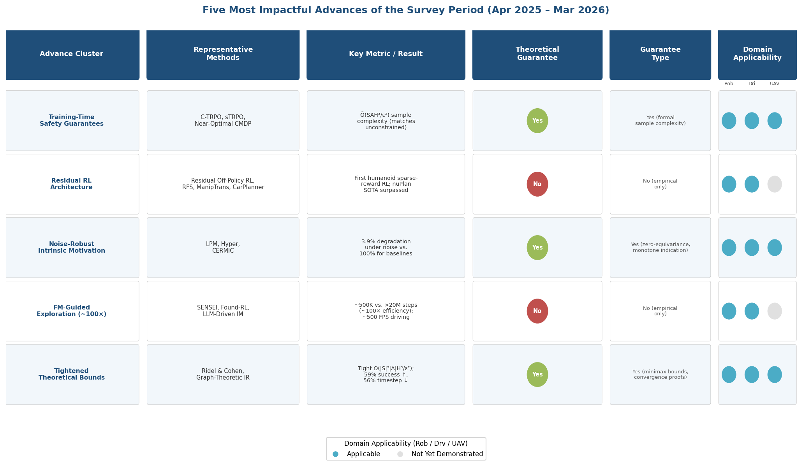

*Figure 6-1. Summary matrix of the five advance clusters, their representative methods, key metrics, theoretical guarantee status, and applicability across robotics (Rob), autonomous driving (Drv), and UAV domains. Blue dots indicate demonstrated applicability; gray dots indicate domains where applicability is plausible but not yet empirically demonstrated.*

### 6.1.1 Training-Time Safety Guarantees Matching Unconstrained Sample Complexity

The most consequential theoretical result of the survey period is the collective demonstration that safe RL during training need not be fundamentally harder than unconstrained RL. C-TRPO (ICML 2025) reshapes trust regions to contain only safe policies, guaranteeing constraint satisfaction throughout training with formal connections to TRPO, NPG, and CPO [C-TRPO](https://icml.cc/virtual/2025/poster/46451 "ICML 2025 — Embedding Safety via Trust Region Methods"). sTRPO (NeurIPS 2025) complements this approach by learning an auxiliary unsafe policy to explicitly exclude high-risk regions from trust-region updates, achieving monotonic improvement in both reward and safety across seven baselines on Safety-Gymnasium [sTRPO](https://neurips.cc/virtual/2025/136134 "NeurIPS 2025 — Safe Trust Region Policy Optimization"). The theoretical capstone is the near-optimal sample complexity result for online CMDPs: Õ(SAH³/ε²) for relaxed feasibility—matching the unconstrained lower bound—and Õ(SAH⁵/(ε²ζ²)) for strict feasibility, where ζ denotes the Slater constant [Near-Optimal CMDP](https://neurips.cc/virtual/2025/poster/116370 "NeurIPS 2025 — Near-Optimal Sample Complexity for Online CMDPs").

The central implication is that safety constraints impose at most a polynomial overhead in sample complexity (through the ζ-dependent term under strict feasibility), rather than the exponential penalty long assumed in the community. For trajectory planning, this result provides theoretical justification for adopting during-training constraint enforcement without accepting fundamentally degraded sample efficiency.

### 6.1.2 Residual RL as the Dominant Real-World Deployment Architecture

No single architectural pattern has demonstrated broader real-world impact during the survey period than residual RL—the training of lightweight correction policies on top of competent base policies using sparse rewards. The period produced the first successful real-world RL training on a humanoid robot with dexterous hands using only sparse binary rewards [Residual Off-Policy RL](https://arxiv.org/abs/2509.19301 "Residual Off-Policy RL for Finetuning BC Policies, Sep 2025"), Residual Flow Steering for dexterous manipulation via flow-matching generative policies [RFS](https://arxiv.org/abs/2602.01789 "Residual Flow Steering for Dexterous Manipulation, Feb 2026"), ManipTrans achieving 52-DoF bimanual dexterous manipulation [ManipTrans](https://arxiv.org/abs/2503.21860 "CVPR 2025"), and CarPlanner surpassing both imitation learning and rule-based planners on the large-scale nuPlan driving benchmark [CarPlanner](https://arxiv.org/abs/2502.19908 "CVPR 2025").

Residual RL's dominance derives from its simultaneous resolution of the sparse-reward and safety challenges inherent in trajectory planning. By constraining exploration to a residual manifold around the base policy, the architecture reduces the effective search space (addressing reward sparsity) while inheriting approximate constraint satisfaction from the base behavior (addressing safety). This dual benefit, analyzed in detail in Chapter 5, explains the independent and convergent emergence of residual RL as the preferred architecture across robotic manipulation, autonomous driving, and UAV planning.

### 6.1.3 Noise-Robust Intrinsic Motivation

The noisy-TV problem—whereby curiosity-driven agents fixate on inherently unpredictable but task-irrelevant stimuli—has persisted as a fundamental limitation of prediction-error intrinsic motivation since the ICM/RND era. Learning Progress Monitoring (LPM, ICLR 2026) provides the first principled resolution by defining intrinsic reward as model *improvement* rather than prediction error, with proven zero-equivariance (zero reward if and only if information gain is zero) and monotone indication of information gain. On Montezuma's Revenge, LPM achieves meaningful extrinsic reward within 20 million steps versus 50 million for RND, with only 3.9% performance degradation under action noise compared to 100% for the strongest clean-environment baseline [LPM at ICLR 2026](https://openreview.net/forum?id=wzm38DRLhC "Beyond Noisy-TVs: Noise-Robust Exploration Via Learning Progress Monitoring, ICLR 2026"). Hyper (ICML 2025) complements LPM by eliminating environment-specific hyperparameter tuning of intrinsic reward coefficients, with provable efficiency guarantees under function approximation [Hyper at ICML 2025](https://icml.cc/virtual/2025/poster/44124 "Hyperparameter Robust Efficient Exploration in RL, ICML 2025"). CERMIC (NeurIPS 2025) extends curiosity calibration to multi-agent settings without explicit communication [CERMIC at NeurIPS 2025](https://openreview.net/forum?id=1fOGTbO5Sx "Curiosity-Driven Exploration through Multi-Agent Contextual Calibration, NeurIPS 2025").

Collectively, these contributions mark the maturation of intrinsic motivation from a heuristic exploration aid to a theoretically grounded and practically robust family of methods. For trajectory planning—where sensor noise, environmental stochasticity, and multi-agent interaction are pervasive—noise-robust intrinsic motivation offers a principled foundation for exploration bonuses that do not degrade under real-world conditions.

### 6.1.4 Foundation-Model-Guided Exploration: ~100× Sample Efficiency via Complementarity

Foundation-model-guided exploration achieves striking sample efficiency gains—SENSEI (ICML 2025) solves MiniHack KeyRoom in approximately 500,000 steps versus over 20 million for PPO—but the central finding of the survey period is that FM guidance and classical intrinsic motivation are complementary rather than substitutional [SENSEI at ICML 2025](https://arxiv.org/html/2503.01584v2 "Semantic Exploration Guided by Foundation Models, ICML 2025"). SENSEI's ablation study demonstrates that VLM-only rewards cause local-optima trapping; the approximately 100× improvement requires the combination of VLM semantic reward and information-gain exploration bonus. This complementarity pattern is replicated by Found-RL in autonomous driving, which achieves approximately 500 FPS with dynamic-blindness correction for CLIP rewards [Found-RL](https://arxiv.org/abs/2602.10458 "Foundation Model-Enhanced RL for Autonomous Driving, Feb 2026"), and by Quadros et al. (ENIAC 2025), who demonstrate that LLM rewards combined with classical intrinsic motivation significantly outperform either signal alone in MiniGrid [LLM-Driven Intrinsic Motivation](https://arxiv.org/abs/2508.18420 "ENIAC 2025, Aug 2025").

The consolidation of a "training-only FM" paradigm—in which VLMs/LLMs are used during training but removed at deployment—addresses the computational latency concern that had limited practical adoption. Found-RL's asynchronous architecture achieves approximately 500 FPS, and DriveVLM-RL (March 2026) follows the same pattern [DriveVLM-RL](https://arxiv.org/abs/2603.18315 "Neuroscience-Inspired RL with VLMs for Safe Driving, Mar 2026"). This paradigm is positioned to become the default architecture for FM-guided RL in trajectory planning, preserving the real-time control requirements of deployed systems while leveraging FM priors during the training phase.

### 6.1.5 Tightened Theoretical Bounds for Exploration

The survey period produced two theoretical results that sharpen the foundations of exploration theory. Ridel and Cohen (ICML 2026) establish the tight minimax lower bound Ω(|S|²|A|H³/ε²) for reward-free exploration in time-inhomogeneous episodic MDPs, resolving an open conjecture, and achieve optimal high-order sample complexity Õ(|S||A|H³/ε²) with reduced low-order terms [Ridel & Cohen at ICML 2026](https://arxiv.org/html/2602.16363v1 "Improved Bounds for Reward-Agnostic and Reward-Free Exploration, ICML 2026"). Graph-theoretic intrinsic reward via effective resistance (ICLR 2026) provides convergence guarantees together with striking empirical results: up to 59% success rate improvement and 56% timestep reduction versus state-of-the-art baselines [Graph-Theoretic IR at ICLR 2026](https://iclr.cc/virtual/2026/poster/10009071 "Graph-Theoretic Intrinsic Reward: Guiding RL with Effective Resistance, ICLR 2026").

These results clarify the theoretical landscape in complementary ways. The minimax bounds establish what is fundamentally achievable for reward-free exploration, while the graph-theoretic approach demonstrates that structured exploration leveraging environment topology can substantially outperform methods treating the state space as unstructured. For trajectory planning in environments with graph-like connectivity—warehouse navigation, road networks, indoor environments—graph-based exploration bonuses appear particularly promising.

## 6.2 Intersections and Tensions Between Sparse-Reward Exploration and Constrained RL

The dual challenge of sparse rewards and safety constraints—the structural default of trajectory planning applications—creates both productive synergies and fundamental tensions that shape the feasible design space for future methods.

### 6.2.1 Productive Intersections

Three architectural strategies have emerged that convert the apparent antagonism between broad exploration and conservative constraint enforcement into a form of mutual reinforcement.

**Hierarchical decomposition with unified objectives.** SOOPER (NeurIPS 2025, ETH Zürich) represents the most theoretically grounded instantiation of this strategy, unifying pessimistic safety priors and optimistic planning in a single objective that yields safe exploration with sublinear regret. Validated on a real-world 60 Hz race car, SOOPER demonstrates that hierarchical separation—safety enforcement at the lower level, optimistic exploration at the upper level—can simultaneously satisfy formal safety guarantees and achieve near-optimal reward discovery [SOOPER](https://arxiv.org/html/2601.19612v1 "Safe Exploration via Policy Priors, NeurIPS 2025"). The HMARL-CBF framework (NeurIPS 2025) applies the same principle in multi-agent settings, attaining near-perfect success and safety rates (within 5%) on road-network navigation by assigning CBF enforcement to the lower level and strategic exploration to the upper level [HMARL-CBF](https://neurips.cc/virtual/2025/poster/116828 "NeurIPS 2025 — Hierarchical Multi-Agent RL with CBFs").

**Dual-memory estimation for reward and cost sparsity.** MICE (ICML 2025) reveals a structural parallel between reward sparsity and cost sparsity: just as curiosity-driven methods construct memory buffers of novel states to bridge sparse reward signals, MICE constructs flashbulb-memory modules of unsafe states to bridge sparse cost signals, producing tighter worst-case violation bounds than standard critic-based baselines [MICE](https://icml.cc/virtual/2025/poster/44096 "ICML 2025 — Controlling Underestimation Bias in Constrained RL"). This duality suggests a unified architectural template: intrinsic reward buffers for novel states paired with intrinsic cost buffers for dangerous states, addressing both failure modes within a single framework. The parallel extends to the estimation problem itself—both reward-value and cost-value functions suffer from underestimation bias when the relevant events are rare, and both benefit from memory-augmented correction.

**Gradient conflict resolution.** COX-Q (ICLR 2026) addresses the most direct manifestation of the exploration-safety tension: gradient conflicts between reward maximization and cost minimization. In trajectory planning scenarios such as lane changes and intersection crossings, the reward gradient (reaching the destination faster) and cost gradient (maintaining safe following distances) frequently oppose each other. COX-Q resolves these conflicts through cost-constrained optimistic exploration with truncated quantile critics, demonstrating that explicit decomposition and reconciliation of opposing objectives yields both higher reward and lower constraint violation than naïve Lagrangian penalization [COX-Q](https://iclr.cc/virtual/2026/poster/10010695 "ICLR 2026 — Off-Policy Safe RL with Constrained Optimistic Exploration").

### 6.2.2 Persistent Tensions

Despite these productive strategies, several fundamental tensions remain unresolved.

No unified theoretical framework characterizes the optimal exploration-safety tradeoff. The near-optimal CMDP sample complexity result (Section 6.1.1) assumes known cost structure and addresses only expected cumulative cost; the interaction between sparse-reward exploration and almost-sure instantaneous constraint satisfaction—the combination most relevant to trajectory planning—lacks any analogous characterization. SOOPER provides the closest approximation but relies on epistemic uncertainty shrinking with data, a process that is slow in high-dimensional continuous spaces and that offers no finite-sample guarantees beyond the tabular or linear regime.

State-wise constraints fundamentally restrict the reachable exploration set. While hierarchical decomposition and gradient conflict resolution mitigate this restriction, they do not eliminate it. In the worst case, the known-safe initial set may exclude all states reachable on a path to high-reward regions, creating an irresolvable conflict between constraint satisfaction and reward discovery. This worst case is not merely theoretical: robotic manipulation tasks where the goal state is separated from the initial configuration by a narrow passage through constraint boundaries—threading a needle, inserting a peg—exhibit precisely this structure.

Multi-constraint settings remain substantially under-addressed. Most methods surveyed handle at most two constraints (one cumulative cost, one instantaneous safety). Trajectory planning applications routinely involve a larger set: a UAV must simultaneously satisfy energy budgets, altitude corridors, obstacle clearance, communication range limits, and velocity bounds. GradS (L4DC 2024) and multi-constraint CBF methods (L4DC 2025) represent initial steps toward this regime but have not been validated at scale [GradS](https://proceedings.mlr.press/v242/yao24a/yao24a.pdf "L4DC 2024"); [Multi-Constraint CBF](https://arxiv.org/abs/2505.00671 "L4DC 2025").

## 6.3 The Expanding Role of Foundation Models in Exploration and Safety for Trajectory Planning

Foundation models are reshaping both the exploration and the safety-specification dimensions of RL-based trajectory planning. Three developments define the emerging paradigm.

### 6.3.1 The "Training-Only FM" Architecture

The consolidation of the training-only FM paradigm—in which VLMs/LLMs are employed during training and removed at deployment—resolves the fundamental tension between FM computational cost and real-time planning requirements. Found-RL achieves approximately 500 FPS through asynchronous batch inference [Found-RL](https://arxiv.org/abs/2602.10458 "Foundation Model-Enhanced RL for Autonomous Driving, Feb 2026"). DriveVLM-RL (March 2026) follows the same architecture, decomposing semantic rewards into spatial safety and temporal risk components via VLM/CLIP inference during training [DriveVLM-RL](https://arxiv.org/abs/2603.18315 "Neuroscience-Inspired RL with VLMs for Safe Driving, Mar 2026"). LMGT (Knowledge-Based Systems, 2025) provides theoretical grounding by establishing that LLM-generated reward modifications are equivalent to Q-function initialization modification, thereby preserving optimal policy guarantees [LMGT](https://www.sciencedirect.com/science/article/abs/pii/S095070512500735X "LMGT: LLM-Guided reward Tuning, KBS 2025").

This architecture is poised to become the default for FM-guided trajectory planning: foundation models supply rich semantic priors during training—subgoal decomposition, reward shaping, action advising—while the deployed policy operates at the latency and compute budget of a standard neural network controller.

### 6.3.2 Foundation Models Meet Constrained Optimization: SafeVLA

SafeVLA (NeurIPS 2025 Spotlight, PKU) establishes a qualitatively new paradigm by integrating safety constraints directly into Vision-Language-Action (VLA) models. Rather than using foundation models merely to guide exploration or shape rewards, SafeVLA treats the foundation model itself as the policy subject of constrained optimization, applying CMDP-based learning to the VLA's action outputs. The result is an 83.58% reduction in cumulative safety violation cost versus the state of the art, achieved while simultaneously improving task success by 3.85% [SafeVLA](https://arxiv.org/abs/2503.03480 "Safety Alignment of VLA via Constrained Learning, NeurIPS 2025 Spotlight"). SafeVLA demonstrates that foundation models are not merely tools for improving exploration; they are becoming the primary policy representations to which constrained optimization is applied. This convergence between FM-based policy learning and safe RL may define the next generation of trajectory planners.

### 6.3.3 Natural-Language Constraint Specification: Promise and Peril

An emerging but as-yet unproven frontier is the extraction of safety constraints from natural-language specifications. DriveVLM-RL's decomposition of semantic rewards into spatial safety and temporal risk components via VLM processing represents an initial step toward language-grounded constraint specification. PbCRL (March 2026) explores a complementary path via preference-based constraint inference, learning unknown safety constraints from human preference feedback with dead-zone preference modeling to address Bradley-Terry risk underestimation [PbCRL](https://arxiv.org/abs/2603.23565 "Preference-based Constrained RL, Mar 2026").

No method yet achieves provably correct safety constraint extraction from natural language. The gap between semantic understanding and formal safety guarantees remains wide: a VLM may correctly interpret "keep safe distance from pedestrians" but cannot translate this instruction into a certified control barrier function with formal collision-avoidance guarantees. Closing this gap—connecting natural-language safety specifications to formally verifiable constraint representations—ranks among the most consequential open problems at the FM-RL intersection.

Silver and Sutton's "Era of Experience" vision (DeepMind, April 2025) provides a broader framing for this convergence: FM priors accelerate early learning and provide semantic grounding, while RL experience overcomes FM limitations including hallucination and local-optima trapping [Silver & Sutton](https://theaiinnovator.com/welcome-to-the-era-of-experience/ "Era of Experience, DeepMind, Apr 2025"). For trajectory planning, this framing implies that the FM-RL integration is not merely an engineering convenience but reflects a deeper complementarity between world-knowledge priors and environment-specific experiential learning.

## 6.4 Signals of Convergence Toward Unified Frameworks

Despite the breadth of methods surveyed, several convergence signals suggest the field is moving toward a more unified treatment of sparse-reward exploration and safety-constrained learning. The roadmap below synthesizes these signals, annotating each with its current maturity level and representative methods.

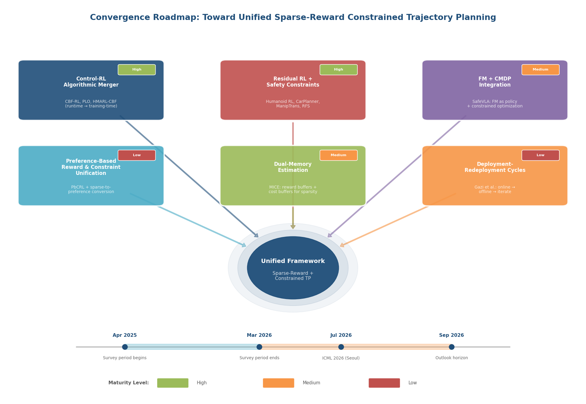

*Figure 6-2. Convergence roadmap illustrating how six research threads—control-RL algorithmic merger, residual RL + safety constraints, FM + CMDP integration, preference-based reward/constraint unification, dual-memory estimation, and deployment-redeployment cycles—converge toward a hypothesized unified framework for sparse-reward constrained trajectory planning. Maturity levels are color-coded: green (High), orange (Medium), red (Low). The timeline spans the survey period (April 2025 – March 2026) through the outlook horizon (September 2026).*

**Control theory and RL are merging at the algorithmic level.** CBF integration is migrating from post-hoc runtime filters to training-time constraints (CBF-RL, HMARL-CBF, RLBUS), while PLO (January 2025) establishes a generic equivalence between constrained optimization and feedback control [PLO](https://arxiv.org/abs/2501.15217 "Predictive Lagrangian Optimization for Constrained RL, Jan 2025"). This bidirectional migration—control-theoretic tools entering RL training loops, RL optimization principles entering constraint enforcement—produces methods that inherit safety guarantees from control theory and adaptability from RL.

**Residual RL combined with safety constraints as a de facto unified architecture.** Across domains, the combination of a competent base policy (derived from demonstrations, classical planning, or FM inference), residual RL corrections under sparse rewards, and either implicit or explicit constraint enforcement (CBFs, trust-region bounds, or geometric priors) constitutes an emergent standard pipeline. This architecture addresses sparse rewards (by restricting exploration to a residual manifold), safety (by inheriting constraint satisfaction from the base policy and enforcing corrections within safe bounds), and deployment practicality (by producing lightweight policies compatible with real-time control). No formal framework yet codifies this pipeline, but its independent emergence across robotics, driving, and UAV planning signals an underlying structural convergence.

**Preference-based methods unify reward and constraint specification.** PbCRL infers unknown safety constraints from human preferences [PbCRL](https://arxiv.org/abs/2603.23565 "Preference-based Constrained RL, Mar 2026"), while Vakkapatla et al. (ICAART 2026) demonstrate that sparse rewards can be self-supervised into preference signals for PbRL methods, achieving performance that surpasses even ground-truth dense rewards in some settings [Sparse Rewards as Preferences](https://www.scitepress.org/Papers/2026/142216/142216.pdf "ICAART 2026"). Together, these results suggest that a common feedback modality—human or automated preferences—may eventually unify reward design and constraint inference under a single learning interface.

**FM + CMDP convergence.** SafeVLA demonstrates that a foundation model can simultaneously serve as the policy representation and the subject of constrained optimization, collapsing the traditional separation between "FM for exploration guidance" and "RL for constrained policy optimization" into a single integrated system [SafeVLA](https://arxiv.org/abs/2503.03480 "Safety Alignment of VLA via Constrained Learning, NeurIPS 2025 Spotlight").

**Iterative deployment-redeployment cycles.** Gazi et al. (Harvard, January 2026) frame practical RL as a deployment-redeployment cycle of online learning, offline analysis, and continual improvement [Gazi et al.](https://arxiv.org/html/2601.15353v1 "Statistical RL in the Real World, Jan 2026"). This framing maps directly onto iterative trajectory planner refinement: an initial planner is deployed, its trajectories are analyzed offline for safety violations and reward-sparse segments, and the planner is refined before redeployment. The cycle connects offline safe RL (O3SRL, TraC, CAPS from Chapter 4), sim-to-real transfer (SR2's targeted re-exploration), and online safe exploration (C-TRPO, sTRPO) into a coherent operational pipeline.

## 6.5 Critical Open Problems for April – September 2026

The convergence signals identified above coexist with substantial gaps that define the most pressing research priorities for the immediate future. The priority matrix below positions each open problem along two axes—estimated tractability within six months and impact on trajectory planning deployability—to guide resource allocation.

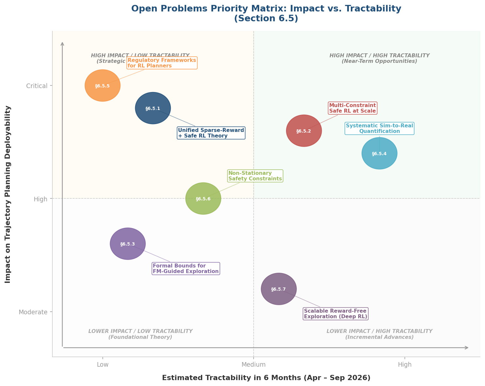

*Figure 6-3. Priority matrix for the seven open problems identified in this section. The top-right quadrant (high impact, high tractability) highlights near-term opportunities such as systematic sim-to-real quantification and multi-constraint safe RL at scale. The top-left quadrant identifies strategic research priorities—regulatory frameworks and unified sparse-reward + safe RL theory—that are high-impact but require longer time horizons.*

### 6.5.1 Unified Theory for Sample Complexity Under Sparse Rewards and Safety Constraints

No theoretical framework jointly characterizes sample complexity under both sparse rewards and safety constraints. The near-optimal CMDP result of Õ(SAH³/ε²) assumes that cost signals are observable and does not account for the additional difficulty introduced by reward sparsity. The reward-free exploration bound of Ω(|S|²|A|H³/ε²) does not incorporate constraint satisfaction requirements. A unified theory would establish how sample complexity depends on reward sparsity (the fraction of rewarding states), constraint density (the frequency and severity of constraint-relevant states), and their interaction. The survey period provides the necessary ingredients—tight bounds for each problem independently—but the synthesis remains an open challenge.

### 6.5.2 Multi-Constraint Safe RL at Scale

Trajectory planning applications routinely involve more than two simultaneous constraints. A UAV must satisfy energy budgets, altitude corridors, obstacle avoidance, communication range requirements, and velocity limits; an autonomous vehicle must respect lane boundaries, speed limits, following distances, right-of-way rules, and comfort thresholds simultaneously. Existing multi-constraint methods (GradS, multi-constraint CBF) have been validated only on low-dimensional tasks with two or three constraints. Scaling to five or more constraints in high-dimensional continuous control—with potentially conflicting constraint gradients—demands new algorithms for constraint-aware gradient decomposition and prioritization that are absent from the current literature.

### 6.5.3 Formal Bounds for Foundation-Model-Guided Exploration

All evidence for FM-guided exploration efficiency is empirical; no sample-complexity or regret bounds exist. This absence of theory limits the ability to predict when FM guidance will help versus hurt, and leaves practitioners without principled criteria for deciding when to invest in FM-guided architectures versus classical exploration. Establishing even loose bounds—for instance, conditions under which FM-derived subgoal decomposition provably reduces effective horizon length—would represent a significant contribution.

### 6.5.4 Systematic Sim-to-Real Quantification for Safe RL Planners

The RLQP framework reveals that drone navigation success drops from 100% in simulation to 55% under heavy wind in physical deployment, recoverable to 95% through curriculum learning [RLQP](https://sercuarc.org/wp-content/uploads/2025/09/Senczyszyn_Reinforcement_Learning_Qualification_Process.pdf "RL Qualification Process, Sep 2025"). Beyond this single data point, systematic quantification of sim-to-real degradation for RL trajectory planners is effectively absent. Lin and Sun (June 2025) demonstrate that model-based RL faces worse sim-to-real challenges than model-free approaches because planning amplifies transition-model errors [Lin & Sun](https://arxiv.org/abs/2506.12735 "Sim-to-Real Challenges in MBRL, Jun 2025"). The community requires standardized protocols for measuring sim-to-real performance gaps across exploration methods, constraint types, and planning domains; without such protocols, claims of real-world applicability remain anecdotal.

### 6.5.5 Regulatory Frameworks for RL-Based Trajectory Planners

As of Q1 2026, no regulatory framework specifically accepts RL-based trajectory planners. Current certification paradigms—DO-178C for aviation, ISO 26262 for automotive safety—assume deterministic or well-characterized stochastic systems with traceable decision logic, a structure fundamentally incompatible with opaque neural network policies trained via stochastic exploration. The RLQP 7-stage V-model provides a research-community template, but closing the gap between technical capability and regulatory acceptance requires active engagement with regulatory bodies (NHTSA, EASA, SAE). This gap cannot be resolved by algorithmic advances alone; it demands interdisciplinary collaboration between RL researchers, safety engineers, and policymakers.

### 6.5.6 Non-Stationary Safety Constraints

Real-world trajectory planning frequently involves time-varying constraints: dynamic obstacles change positions, weather conditions alter safe operating envelopes, regulatory zones shift with time of day, and the agent's own physical state (e.g., remaining fuel) changes the feasible action set. No method from the survey period addresses non-stationary safety constraints in RL; the problem is entirely open. Wachi et al.'s taxonomy (IJCAI 2024) identifies generalized safe exploration with time-variant thresholds as the most general constraint formulation, but no algorithmic solution targeting this formulation has been proposed [Wachi et al.](https://www.ijcai.org/proceedings/2024/0913.pdf "IJCAI 2024 survey on constraint formulations in safe RL").

### 6.5.7 Scalable Reward-Free Exploration Beyond Tabular Settings

The tight minimax bounds established by Ridel and Cohen (ICML 2026) apply to tabular MDPs. Extending these guarantees to function-approximation settings—the regime relevant to all practical trajectory planning—remains open. Deep RL instantiations of reward-free exploration with provable or strong empirical guarantees would bridge the gap between the elegant tabular theory and the continuous, high-dimensional settings where trajectory planners operate.

## 6.6 Forward-Looking Outlook: April – September 2026

Based on the trajectories observed during the survey period, several developments appear probable or desirable in the immediate future.

The confirmed venue calendar—ICML 2026 (Seoul, July) and NeurIPS 2026 (late year)—provides natural anchors for research dissemination. Given the volume of ICML 2025 and NeurIPS 2025 contributions to safe RL and sparse-reward exploration, the next cycle is expected to yield methods that integrate multiple individually proven advances. Four specific directions warrant attention.

**Unified sparse-reward + safe RL benchmarks.** The proliferation of domain-specific benchmarks (Safety Gymnasium for safe RL, MiniGrid for sparse-reward exploration, nuPlan for driving, OGBench for goal-conditioned RL) has enabled rapid progress within each sub-community but impedes cross-pollination. A benchmark that simultaneously evaluates sparse-reward exploration efficiency, safety constraint satisfaction, and trajectory planning quality on the same task suite—for instance, sparse-reward navigation with instantaneous obstacle constraints and cumulative energy budgets—would catalyze progress on the unified problem and provide common ground for comparing methods from different research traditions.

**Residual RL with formal safety certificates.** The residual RL architecture's practical dominance will likely drive efforts to equip it with formal guarantees. Combining residual corrections with training-time CBFs (as in CBF-RL) or trust-region constraint satisfaction (as in C-TRPO) within a single framework would produce a deployment-ready architecture possessing both the adaptability of residual learning and the certifiability demanded by safety-critical applications.

**FM-guided constraint specification.** The convergence of SafeVLA, PbCRL, and DriveVLM-RL suggests that research will increasingly target the extraction of formally verifiable constraints from natural-language or preference-based specifications. Even partial progress—for instance, FM-assisted specification of CBF candidates that are subsequently verified through formal methods—would substantially lower the barrier to deploying constrained RL planners in new domains.

**Deployment-redeployment pipelines for trajectory planners.** Gazi et al.'s practical RL framework provides a template that, combined with SR2's targeted re-exploration, offline safe RL methods (O3SRL, CAPS), and verification-guided training (Marchesini et al.), could be operationalized into a complete development pipeline for RL-based trajectory planners: pretrain with FM-guided exploration → train with constrained RL in simulation → transfer to real world with targeted re-exploration → verify safety properties → deploy with runtime shields → collect deployment data → iterate. Such a pipeline would represent the first end-to-end operational framework for safe sparse-reward trajectory planning.

The field stands at an inflection point. The theoretical tools for sparse-reward exploration and constrained RL are individually mature; the practical architectures (residual RL, hierarchical decomposition, FM-guided training) are proven across domains; and the remaining gaps—unified theory, multi-constraint scalability, regulatory acceptance—are clearly delineated. The central challenge for the next phase of research is integration: constructing systems that combine these individually successful components into unified, certifiable, and deployable trajectory planners that operate reliably under the dual challenge of sparse rewards and hard safety constraints.

# Conclusion

This survey has examined the research landscape at the intersection of sparse-reward exploration and safety-constrained reinforcement learning during the April 2025 – March 2026 period, with a sustained focus on implications for trajectory planning across robotics, autonomous driving, and UAV navigation.

The central finding is that sparse-reward exploration and constrained RL—historically studied as separate subfields—are converging both algorithmically and architecturally. Three integration strategies have demonstrated consistent cross-domain effectiveness: **hierarchical decomposition** that assigns safety enforcement and exploratory planning to separate levels (SOOPER, HMARL-CBF), **dual-memory estimation** that addresses reward sparsity and cost sparsity through parallel mechanisms (MICE's flashbulb-memory modules alongside curiosity buffers), and **gradient conflict resolution** that explicitly decomposes and reconciles the opposing gradients of reward maximization and cost minimization (COX-Q). These strategies transform the theoretical antagonism between exploration breadth and constraint conservatism into a practically manageable design problem.

Residual RL has emerged as the dominant real-world deployment architecture, offering a unified response to both challenges: base policies from demonstrations, classical planning, or foundation-model inference provide approximate constraint satisfaction and a narrowed exploration manifold, while lightweight residual corrections refine behavior under sparse rewards. This architecture's independent emergence across robotic manipulation (humanoid dexterous hands), autonomous driving (nuPlan benchmark), and UAV planning (geometric-prior-constrained RL) signals an underlying structural convergence that transcends domain-specific engineering.

On the theoretical side, two results sharpen the field's foundations. The near-optimal CMDP sample complexity bound of Õ(SAH³/ε²) for relaxed feasibility—matching the unconstrained lower bound—confirms that safety constraints impose at most polynomial, not exponential, overhead. The tight minimax bound of Ω(|S|²|A|H³/ε²) for reward-free exploration resolves an open conjecture and delineates the fundamental cost of task-agnostic exploration relative to reward-aware learning.

Foundation models are reshaping both exploration guidance and safety specification. The operative finding is complementarity: VLM-derived semantic rewards and LLM-generated subgoal decompositions achieve striking sample-efficiency gains (up to ~40× on MiniHack) only when combined with classical intrinsic motivation signals; used in isolation, FM-derived rewards cause local-optima trapping and dynamic blindness. The consolidation of a "training-only FM" paradigm—foundation models employed during training, removed at deployment—resolves the latency barrier that previously limited practical adoption.

Seven critical open problems frame the near-term research agenda. A unified theory characterizing sample complexity under joint reward sparsity and safety constraints remains absent. Multi-constraint safe RL at scale—beyond the two-constraint settings validated in current work—is essential for realistic trajectory planning involving simultaneous energy, obstacle, velocity, and corridor constraints. Formal bounds for FM-guided exploration, systematic sim-to-real quantification, regulatory frameworks for RL-based planners, non-stationary safety constraints, and scalable reward-free exploration beyond tabular settings each represent substantial gaps between current capability and deployment readiness.

Taken together, the evidence reviewed in this report indicates that the individual building blocks—noise-robust intrinsic motivation, training-time safety guarantees, residual RL architectures, FM-guided reward shaping—have each reached a level of maturity sufficient for real-world impact. The defining research agenda for the next period is integration: assembling these proven components into unified, certifiable, and deployable trajectory planners that operate reliably under the dual challenge of sparse rewards and hard safety constraints inherent in real-world path planning.
