# Overview

Kubernetes node-level autoscaling presents a persistent engineering challenge: the standard Cluster Autoscaler (CA) provisions nodes only after pods become unschedulable, imposing an irreducible 2–5 minute latency that is incompatible with workloads requiring sub-minute capacity responses. Karpenter, the newer group-less provisioner that reached v1.0 GA in 2024, accelerates the reactive loop to approximately 60–90 seconds but remains fundamentally unable to anticipate demand. For organizations managing diurnal web traffic, batch ML training bursts, or event-driven spikes — where capacity must be available *before* load arrives — purely reactive scaling forces a binary trade-off between persistent over-provisioning and periodic SLO violations.

This report examines the full spectrum of strategies that break that trade-off. The analysis spans six chapters organized around four complementary approaches — predictive ML-based scaling, scheduled and calendar-driven scaling, proactive overprovisioning, and their operational integration — evaluated across three major managed Kubernetes platforms (EKS, GKE, AKS) and on-premises environments.

**Chapter 1** quantifies the reactive scaling gap across cloud providers, decomposing end-to-end latency into five sequential phases and establishing the structural limitations of both CA and Karpenter. **Chapter 2** surveys predictive autoscaling techniques — from classical Holt–Winters and Prophet models to LSTM/GRU neural networks — alongside KEDA's PredictKube scaler, Kedify's MetricPredictor CRD, and the managed predictive scaling services offered by AWS, GCP, and Azure. **Chapter 3** covers scheduled and calendar-based scaling mechanisms, including KEDA's cron scaler, cloud-provider scheduled actions, Karpenter disruption budgets, and coordination principles for preventing destructive interactions between scheduled and reactive autoscalers. **Chapter 4** examines proactive overprovisioning through pause-pod patterns, the CapacityBuffer CRD introduced in CA v1.35.0 (January 2026), proportional buffer sizing with the Cluster Proportional Autoscaler, and a multi-layer reference architecture that combines all four strategies. **Chapter 5** translates these patterns into an operational playbook covering rollout strategies, multi-layer observability, safety guardrails, Spot instance integration, and cost governance. **Chapter 6** provides a comparative evaluation framework with seven assessment dimensions, benchmarking tools (ClusterLoader2, KWOK, SimKube, kube-burner), workload-archetype analysis, and a decision tree that maps organizational context to recommended strategy combinations.

Three cross-cutting findings emerge from the analysis. First, predictive node autoscaling in Kubernetes is, in practice, *predictive pod autoscaling with node provisioning as a downstream consequence* — no production-ready tool as of April 2026 directly predicts a target node count from an integrated understanding of pod requests, bin-packing efficiency, and scheduling constraints. Second, a layered architecture — where overprovisioning absorbs instant spikes, scheduled rules set deterministic capacity floors, predictive models adjust for learned trends, and reactive autoscaling serves as the safety net — outperforms any single strategy in isolation. Third, the appropriate layer count is determined not by technical ambition but by operational maturity: teams should add complexity incrementally, beginning with a static overprovisioning buffer and progressing through scheduled scaling, predictive pipelines, and full multi-layer integration only as their monitoring, safety guardrail, and incident-response capabilities mature.

# 第1章 The Reactive Scaling Gap — Kubernetes Cluster Autoscaler and Its Limitations

Modern Kubernetes clusters face a fundamental tension between resource efficiency and workload responsiveness. The Cluster Autoscaler (CA), the de facto standard for node-level autoscaling, operates on an inherently reactive paradigm: it provisions new nodes only after pods become unschedulable. This chapter examines the mechanics of that reactive loop, quantifies the end-to-end latency it introduces across the three major managed Kubernetes platforms — EKS, GKE, and AKS — and identifies the architectural constraints that render it unsuitable for workloads requiring proactive capacity management. The analysis extends to Karpenter, a newer group-less provisioner, to determine whether it resolves the forward-looking scaling gap or merely accelerates the same reactive cycle.

## 1.1 The Reactive Loop: How CA Scales Nodes

CA follows a strict detect-decide-provision cycle. By default, it polls the API server for unschedulable pods every 10 seconds (`--scan-interval`). Upon identifying pods that cannot be placed on existing nodes, it evaluates candidate node groups — Auto Scaling Groups (ASG) on AWS, Managed Instance Groups (MIG) on GCP, Virtual Machine Scale Sets (VMSS) on Azure — selects one, and issues a scale-up request to the cloud provider. The official CA SLO covers only the decision phase: ≤ 30 seconds for clusters with fewer than 100 nodes and ≤ 60 seconds for clusters up to 5,000 nodes. Crucially, this SLO excludes VM provisioning time, which constitutes the dominant contributor to end-to-end latency [CA FAQ](https://github.com/kubernetes/autoscaler/blob/master/cluster-autoscaler/FAQ.md "Official CA FAQ — scan interval, SLO, combined latency").

In practice, the combined HPA + CA path — from the moment load increases to the moment a new pod is running on a freshly provisioned node — takes approximately 5 minutes in GCE environments [CA FAQ](https://github.com/kubernetes/autoscaler/blob/master/cluster-autoscaler/FAQ.md "Official CA FAQ — combined HPA+CA latency ~5 min on GCE"). That window decomposes into five sequential phases: HPA evaluation (15–60 s), CA detection and decision (10–60 s), cloud API call and VM boot (60–240 s), kubelet registration and node readiness (10–30 s), and pod scheduling plus container startup (10–60 s). Because each phase must complete before the next begins, latency accumulates linearly and cannot be masked through parallelism.

## 1.2 Cloud-Specific Provisioning Latencies

The VM provisioning phase varies significantly across cloud providers. Understanding these differences is essential for setting realistic SLO expectations.

**Google Kubernetes Engine (GKE)** exhibits node boot times of approximately 80–120 seconds, yielding end-to-end scale-up latency of 3–4 minutes under standard configurations [GKE Capacity Provisioning](https://docs.google.com/kubernetes-engine/docs/how-to/capacity-provisioning "GKE docs: 80–120 s boot time"). GKE has introduced *fast-starting nodes* for Autopilot clusters, achieving up to 4× faster node startup and 2× faster pod scheduling for GPU workloads on G2 and A2 instance types — though this optimization does not apply to Spot VMs [GKE Fast-Starting Nodes](https://docs.google.com/kubernetes-engine/docs/concepts/fast-starting-nodes "GKE docs: up to 4× faster GPU node startup").

**Amazon Elastic Kubernetes Service (EKS)** with standard EC2 nodes provisions VMs in approximately 1–2 minutes, resulting in end-to-end latency of 2–3 minutes [AWS Containers Blog](https://aws.amazon.com/blogs/containers/eliminate-kubernetes-node-scaling-lag-with-pod-priority-and-over-provisioning/ "AWS blog: ~1–2 min node provisioning lag"). EKS benefits from Amazon's mature EC2 fleet infrastructure, but the sequential nature of AMI boot, kubelet startup, and CNI plugin initialization still imposes a hard floor on provisioning speed.

**Azure Kubernetes Service (AKS)** relies on VMSS, where provisioning typically takes 2–4 minutes. The CA `max-node-provision-time` parameter defaults to 15 minutes on AKS, reflecting the wider variance in Azure VM startup times [AKS Cluster Autoscaler](https://learn.microsoft.com/en-us/azure/aks/cluster-autoscaler "AKS CA docs — default parameters and profiles"). While this generous timeout prevents premature failure declarations, it also means that abnormally slow provisioning events may go undetected for extended periods.

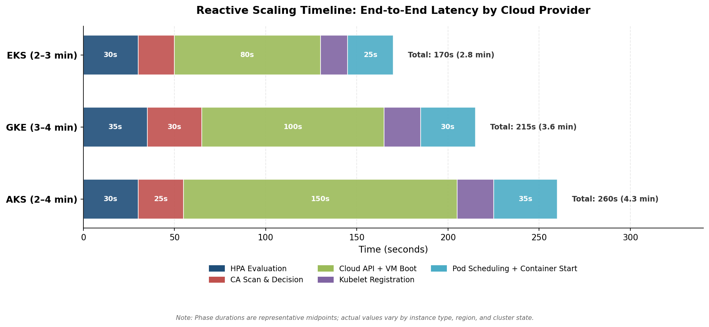

*Figure 1-1. Stacked latency breakdown of the CA reactive scaling loop across EKS, GKE, and AKS. Cloud API + VM boot time dominates total latency on all three platforms. Phase durations represent representative midpoints; actual values vary by instance type, region, and cluster state.*

Across all three providers, the irreducible minimum latency — even under ideal conditions — remains in the 2–4 minute range. For workloads with sub-minute scaling requirements, this structural floor is incompatible with acceptable SLO targets.

## 1.3 Architectural Constraints: Node Groups, Rigidity, and Cold Starts

Beyond raw provisioning latency, CA's architecture introduces several constraints that compound the scaling gap.

**Node group coupling.** CA is tightly coupled to cloud-provider node group abstractions — ASGs on AWS, MIGs on GCP, and VMSS on Azure. All nodes within a single group must share identical scheduling attributes (instance type, labels, taints). This homogeneity requirement forces operators to create separate node groups for each distinct instance configuration. As the number of node groups grows, CA performance degrades markedly; AWS documentation explicitly characterizes multi-shard CA deployment as a "last resort" [AWS EKS Best Practices](https://docs.aws.amazon.com/eks/latest/best-practices/cas.html "AWS CA docs — ASG coupling, node group rigidity, scaling from zero").

**Scale-from-zero penalty.** When a node group has been scaled to zero — a common cost-optimization pattern for non-production environments or specialized GPU pools — CA faces compounded challenges. With no running nodes in the group, the scheduler lacks the metadata (available resources, labels, taints) needed to evaluate whether pending pods would fit. Furthermore, the underlying cloud capacity may have been reclaimed, introducing an additional risk of provisioning failure or extended wait times [AWS EKS Best Practices](https://docs.aws.amazon.com/eks/latest/best-practices/cas.html "AWS CA docs — scaling from zero metadata gaps and capacity risk").

**Real-world failure at scale.** The theoretical SLOs documented by the CA project do not always hold under production conditions. GitHub Issue #5769 reports a large cluster running CA v1.26.1 that experienced scale-up delays of up to 15 minutes with 3,000+ pending pods — far exceeding the ≤ 60-second large-cluster SLO [CA GitHub Issue #5769](https://github.com/kubernetes/autoscaler/issues/5769 "Real-world CA scale-up delays with 3,000+ pending pods on AWS"). Such incidents highlight the gap between documented guarantees and operational reality, particularly at the scale where predictive or scheduled scaling becomes most valuable.

## 1.4 GPU Workloads: The Cold-Start Waterfall

GPU-intensive workloads — increasingly prevalent as AI inference and training migrate to Kubernetes — expose the reactive scaling gap in its most severe form. The cold-start path for a GPU pod involves a cascade of sequential steps, each adding non-trivial latency:

1. **Node provisioning**: 60–120 s (cloud VM with GPU allocation)
2. **Container image pull**: 30–60 s (GPU-optimized images typically range from 5 to 15 GB)
3. **Model download**: 60–180 s (large language models can exceed 50 GB)
4. **CUDA initialization**: 5–30 s (driver loading, device enumeration)
5. **Weight transfer to GPU memory**: 10–60 s (dependent on model size and GPU interconnect bandwidth)

The total cold-start waterfall ranges from approximately 3 to 8 minutes [ScaleOps Blog](https://scaleops.com/blog/reducing-gpu-cold-start-times-in-kubernetes-patterns-and-solutions/ "Cold start waterfall — 3–8 min for GPU workloads"). For a reactive autoscaler that initiates this chain only after detecting unschedulable pods, the effective response time can approach 10 minutes when combined with HPA evaluation and CA decision latency — a timeline incompatible with real-time inference SLOs that typically require sub-second response times.

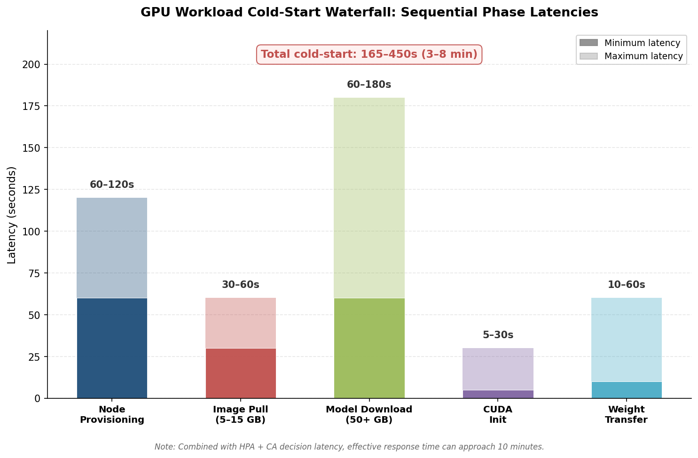

*Figure 1-2. Min/max latency ranges for each phase of the GPU cold-start waterfall. The total end-to-end range of 165–450 s (3–8 min) represents the GPU-specific provisioning penalty alone, before HPA and CA decision overhead.*

GKE's fast-starting nodes represent one vendor-specific mitigation, achieving up to 4× faster startup for G2 and A2 GPU instances in Autopilot clusters [GKE Fast-Starting Nodes](https://docs.google.com/kubernetes-engine/docs/concepts/fast-starting-nodes "GKE docs: up to 4× faster GPU node startup"). However, the optimization remains limited in scope: it does not cover Spot VMs, and equivalent features are not yet available on EKS or AKS.

## 1.5 Karpenter: Faster Reactive, Still Reactive

Karpenter reached v1.0.0 GA in 2024 as a CNCF SIG Autoscaling sub-project (latest release: v1.8.0 under `kubernetes-sigs/karpenter`) and represents a significant architectural departure from CA [Karpenter Core Releases](https://github.com/kubernetes-sigs/karpenter/releases "v1.8.0") [CNCF Karpenter Blog](https://www.cncf.io/blog/2024/11/06/karpenter-v1-0-0-beta/ "Karpenter v1.0.0 and SIG Autoscaling contribution"). Its key innovations address several of CA's structural limitations.

**Group-less provisioning.** Karpenter eliminates the node group abstraction entirely. Rather than mapping pods to pre-defined ASGs or MIGs, it calls cloud provider fleet APIs directly (e.g., EC2 Fleet) to select optimal instance types based on pending pod requirements. This design enables fine-grained bin-packing across a heterogeneous instance type pool without requiring operators to pre-configure node groups.

**Rapid batch scheduling.** Karpenter's provisioning loop uses a batch window with a 1-second idle timeout and a 10-second maximum, aggregating multiple pending pods into a single provisioning decision. Batching optimizes bin-packing efficiency while keeping decision latency low.

**Workload consolidation.** Karpenter actively consolidates workloads by identifying underutilized nodes and migrating pods to achieve tighter packing. This continuous optimization reduces the steady-state node count without operator intervention.

**Multi-cloud trajectory.** While originally developed by AWS, Karpenter now supports AKS through Node Auto Provisioning (NAP), and the core project has moved under `kubernetes-sigs` governance — positioning it as a vendor-neutral standard.

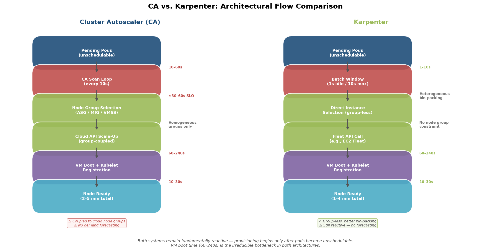

*Figure 1-3. Side-by-side comparison of the CA and Karpenter provisioning flows. Both systems share the same irreducible bottleneck — VM boot time of 60–240 s — but Karpenter eliminates node group selection overhead and achieves tighter bin-packing through direct fleet API calls.*

Despite these improvements, Karpenter remains fundamentally reactive. It monitors the API server for unschedulable pods and provisions nodes only in response to observed scheduling failures. The batch window introduces at most 10 seconds of intentional delay to improve bin-packing, but it cannot eliminate the 1–4 minutes of VM startup time that follows the provisioning decision [CNCF Karpenter Blog](https://www.cncf.io/blog/2024/11/06/karpenter-v1-0-0-beta/ "Karpenter reactive by design"). Karpenter possesses no concept of demand forecasting, time-of-day awareness, or calendar-driven pre-scaling. It does not anticipate load — it responds to it.

## 1.6 The CapacityBuffer CRD: CA's Step Toward Declarative Headroom

CA v1.35.0, released in January 2026 alongside Kubernetes 1.35, introduced the **CapacityBuffer** custom resource definition (`capacitybuffers.autoscaling.x-k8s.io`, v1beta1 API). This feature provides a first-class, declarative mechanism for maintaining spare capacity — replacing the ad hoc pattern of manually managed pause pod Deployments. CapacityBuffer integrates with ResourceQuota and supports multiple provisioning strategies, controlled by two feature flags: `--capacity-buffer-controller-enabled` and `--capacity-buffer-pod-injection-enabled` [CA GitHub Releases](https://github.com/kubernetes/autoscaler/releases "CA v1.35.0 release notes — CapacityBuffer v1beta1").

While CapacityBuffer represents a meaningful step forward, it remains a static or semi-static headroom mechanism. It does not predict future demand or adjust buffer sizes based on temporal patterns. The operational implications of CapacityBuffer and broader overprovisioning strategies are examined in detail in Chapter 4.

## 1.7 When Reactive Scaling Fails: Load Profiles and SLO Implications

The 2–5 minute end-to-end latency inherent in reactive node-level autoscaling becomes a critical limitation under three recurring load profiles.

**Periodic peaks.** Workloads with predictable daily or weekly patterns — such as a web application that surges at 9:00 AM each business day — experience a recurring capacity gap every morning. By the time CA detects pending pods, provisions nodes, and schedules workloads, the initial wave of requests has already degraded user experience. AWS documentation explicitly notes that "nodes may take several minutes to become available, and pod scheduling latency may increase by an order of magnitude" [AWS EKS Best Practices](https://docs.aws.amazon.com/eks/latest/best-practices/cas.html "AWS CA docs — overprovisioning rationale").

**Event-driven bursts.** Flash sales, game launches, marketing campaign activations, and similar business events generate near-instantaneous traffic spikes that vastly exceed steady-state capacity. A reactive autoscaler cannot bridge the gap between spike onset and node availability; users experience failures or degraded performance during the entire provisioning window.

**Scale-to-zero cost optimization.** Organizations that scale non-production or batch-processing clusters to zero nodes during idle periods face the full cold-start penalty when workloads resume. The combination of scale-from-zero metadata gaps, potential capacity unavailability, and sequential VM provisioning creates the longest possible reactive scaling path.

In all three scenarios, the reactive model forces a binary trade-off: maintain permanently over-provisioned capacity (accepting higher cost) or tolerate periodic SLO violations during scaling events (accepting degraded reliability). The subsequent chapters explore strategies that break this trade-off — predictive scaling (Chapter 2), scheduled scaling (Chapter 3), and proactive overprovisioning (Chapter 4) — each addressing specific facets of the reactive scaling gap identified in this chapter.

# 第2章 Predictive (ML / Time-Series-Based) Node Autoscaling

The reactive scaling gap documented in Chapter 1 — an irreducible 2–5 minute latency between demand onset and node readiness — motivates a fundamentally different approach: forecasting future resource needs and provisioning nodes *before* pods become unschedulable. This chapter examines the predictive techniques, open-source frameworks, and cloud-native services that enable machine-learning-driven or time-series-based node autoscaling in Kubernetes. Although most predictive tools operate at the pod level (adjusting HPA replica counts), they influence node provisioning indirectly by shaping the pod scheduling pressure that CA or Karpenter must resolve. The analysis therefore covers both the prediction layer itself and its downstream coupling with node provisioners.

## 2.1 Predictive Techniques Applied to Kubernetes Autoscaling

Several forecasting methodologies have been applied to Kubernetes workload prediction, each presenting distinct trade-offs in accuracy, latency, and operational complexity.

**Classical statistical models.** ARIMA and Holt–Winters exponential smoothing represent the simplest forecasting approaches. Both require minimal computational resources and produce predictions in sub-millisecond time, but they assume stationarity and struggle with the non-linear, multi-seasonal patterns characteristic of production traffic. Liao & Yuan (2024) report that Holt–Winters achieves an MSE of 0.01756 on Kubernetes workload traces — roughly an order of magnitude worse than neural approaches applied to the same dataset [Liao & Yuan 2024](https://www.mdpi.com/2079-9292/13/2/285 "Holt-Winters + GRU multi-model management").

**Facebook Prophet.** Prophet, developed by Meta, handles multiple seasonalities (daily, weekly, yearly) and holiday effects through an additive decomposition model. Its tolerance for missing data and straightforward hyperparameter interface make it a practical choice for operations teams without deep ML expertise — a factor that led Kedify to adopt Prophet as its default engine (Section 2.3). Prophet's accuracy degrades, however, on high-frequency, non-periodic signals: precisely the bursty traffic patterns that most urgently require proactive scaling.

**Recurrent neural networks (LSTM, GRU, Bi-LSTM).** Long Short-Term Memory networks and Gated Recurrent Units capture temporal dependencies in sequential data more effectively than statistical models. Liao & Yuan (2024) demonstrate that a GRU model achieves MSE = 0.00166 on Kubernetes workload traces — roughly 10× better than Holt–Winters on the same dataset [Liao & Yuan 2024](https://www.mdpi.com/2079-9292/13/2/285 "Holt-Winters + GRU multi-model management"). Their multi-model Kubernetes Operator implementation further shows that intelligent model selection reduces cold-start latency by 1 hour 41 minutes and SLA fluctuation by 83.3% compared to single-model approaches.

**Transformer models.** Shim et al. (IEEE SysCon 2023), as cited in Liao & Yuan (2024), find that Transformer-based architectures achieve the highest prediction accuracy in a head-to-head comparison of ARIMA, LSTM, Bi-LSTM, and Transformer models on Kubernetes scaling datasets [Liao & Yuan 2024](https://www.mdpi.com/2079-9292/13/2/285 "Holt-Winters + GRU multi-model management"). Transformers' self-attention mechanism captures long-range dependencies without the vanishing gradient problems of RNNs. However, as of April 2026, no production-ready Kubernetes autoscaling tool ships with a Transformer-based forecasting engine — the technique remains validated in academic settings but not operationalized.

**Hybrid ensembles.** Guruge & Priyadarshana (2025) propose a Prophet–LSTM hybrid that combines Prophet's trend-and-seasonality decomposition with LSTM's capacity for residual pattern learning. On NASA and FIFA World Cup traffic datasets, the hybrid model achieves a 65–90% MSE improvement over individual constituent models. The trade-off is inference latency: approximately 3,500 ms per prediction versus ~5 ms for a standalone Bi-LSTM [Guruge & Priyadarshana 2025](https://www.frontiersin.org/journals/computer-science/articles/10.3389/fcomp.2025.1509165/full "Prophet-LSTM hybrid for K8s autoscaling"). For autoscaling decisions made on minute-level horizons, this latency remains acceptable; for sub-second control loops, it is prohibitive.

The evidence indicates a clear accuracy hierarchy — Transformer > LSTM/GRU > Prophet > ARIMA/Holt–Winters — but an inverse relationship with operational simplicity. Organizations selecting a predictive model must weigh forecasting precision against inference latency, training infrastructure requirements, and the team's capacity to maintain ML pipelines in production. Figure 1 visualizes these trade-offs across six model families.

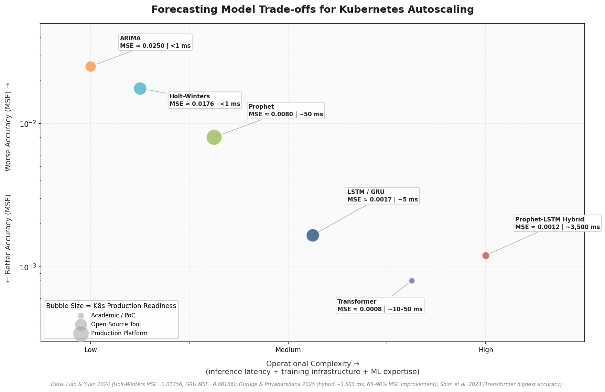

*Figure 1 — Bubble chart plotting six forecasting model families on accuracy (MSE, log scale) versus operational complexity. Bubble size encodes Kubernetes production readiness. Data sourced from Liao & Yuan (2024), Guruge & Priyadarshana (2025), and Shim et al. (2023).*

## 2.2 KEDA and the PredictKube Scaler

KEDA (Kubernetes Event Driven Autoscaling), a CNCF Graduated project since August 2023, provides the most widely adopted framework for event-driven pod scaling. Its latest stable release, v2.19.0 (February 2026), supports approximately 65 built-in scalers and has accumulated roughly 9,900 GitHub stars [KEDA GitHub Releases](https://github.com/kedacore/keda/releases "KEDA v2.19.0, February 2026").

Among these scalers, the **PredictKube scaler** (`type: predictkube`) represents a first-generation approach to predictive autoscaling within the KEDA ecosystem. Developed by Dysnix, PredictKube queries Prometheus for 7–14 days of historical metric data and forwards it to a SaaS AI inference endpoint, which returns a predicted value over a configurable `predictHorizon` (e.g., 2 hours). The scaler feeds this prediction into KEDA's HPA integration, raising the pod replica target before demand materializes [KEDA PredictKube Scaler Docs](https://keda.sh/docs/2.19/scalers/predictkube/ "Official PredictKube scaler documentation").

PredictKube's architecture carries notable constraints. The forecasting model runs entirely within Dysnix's SaaS platform — operators have no visibility into the algorithm, no ability to tune hyperparameters, and a hard dependency on external API availability. An API key is required, introducing both a recurring cost and a network-reachability dependency for every scaling decision. Because the scaler operates at the pod level — adjusting HPA targets rather than node counts — node provisioning occurs only indirectly, when increased pod demand exceeds cluster capacity and triggers CA or Karpenter.

## 2.3 Kedify: Prophet-Based Predictive Autoscaling with Model Lifecycle Management

Kedify, a commercial platform built on KEDA, introduced its predictive autoscaler in October 2025 with a markedly more operationally mature approach to forecast-driven scaling. The `type: kedify-predictive` scaler defaults to Facebook Prophet and introduces the **MetricPredictor CRD** (`apiVersion: kedify.io/v1alpha1`) to manage the full model lifecycle — from data ingestion through retraining to accuracy-gated deployment [Kedify Predictive Autoscaling Blog](https://kedify.io/resources/blog/predictive-autoscaling/ "Predictive Autoscaling announcement, October 2025").

The MetricPredictor CRD encapsulates several operationally critical parameters:

- **Data source and retention period**: the Prometheus query and the historical window used for training (typically 7–14 days).
- **Retraining interval**: a configurable cadence for model refresh; Kedify recommends every 6 hours to track evolving workload patterns.
- **Seasonality configuration**: explicit daily, weekly, and custom seasonality toggles aligned with Prophet's decomposition model.
- **Accuracy guardrails**: a 90/10 train-test split evaluates model quality via Mean Absolute Percentage Error (MAPE), with `modelMapeThreshold` serving as a safety net — when the model's MAPE exceeds this threshold, the system reverts to reactive scaling.

Kedify also supports hybrid scaling formulas such as `(current + predicted) / 2`, blending real-time observed demand with the forecasted value. This hedging strategy mitigates the risk of over-provisioning from an inaccurate forecast while still delivering a proactive lead time that pure reactive scaling cannot provide.

As with PredictKube, Kedify operates at the pod level. Its influence on node provisioning is indirect: elevated predicted pod counts generate scheduling pressure that CA or Karpenter must resolve by adding nodes. The prediction horizon (hours) and retraining cadence (hours) are well-matched to the slow dynamics of node provisioning, where the relevant timescale spans minutes to hours rather than seconds.

## 2.4 Cloud-Native Predictive Scaling Services

All three major cloud providers offer managed predictive scaling at the VM autoscaling-group level. Because EKS managed node groups, GKE node pools, and AKS node pools are backed by ASGs, MIGs, and VMSS respectively, these services can be applied to Kubernetes node infrastructure — albeit with important caveats regarding metric scope, Kubernetes awareness, and scaling directionality.

### AWS Predictive Scaling for Auto Scaling Groups

AWS Predictive Scaling analyzes up to 14 days of CloudWatch historical data and generates hourly forecasts for the next 48 hours, refreshing every 6 hours. A minimum of 24 hours of historical data is required to produce an initial forecast. The `SchedulingBufferTime` parameter allows operators to pre-launch instances a configurable duration before the predicted demand peak, compensating for VM boot and node registration latency documented in Chapter 1 [AWS Predictive Scaling](https://docs.aws.amazon.com/autoscaling/ec2/userguide/ec2-auto-scaling-predictive-scaling.html "AWS official documentation").

A critical architectural constraint is that AWS Predictive Scaling handles only scale-out; scale-in must be managed separately through dynamic scaling policies or manual intervention. The service assumes homogeneous instances within the ASG — a reasonable assumption for traditional EKS managed node groups but problematic when combined with Karpenter or mixed-instance Spot strategies, where fleet composition is heterogeneous and dynamically determined. The ML model is fully managed and opaque: operators cannot inspect, tune, or override the forecasting algorithm.

### GCP Predictive Autoscaling for Managed Instance Groups

GCP's predictive autoscaling requires a minimum of 3 days of CPU autoscaling history and leverages up to 3 weeks of load data. The service recalculates predictions every few minutes and is provided at no additional cost. When actual usage exceeds the prediction, the system automatically prioritizes real-time signals over the forecast, a safeguard that prevents under-provisioning from forecast error [GCP Predictive Autoscaling](https://cloud.google.com/compute/docs/autoscaler/predictive-autoscaling "Official GCP documentation").

GCP's implementation is the most constrained in metric scope among the three providers: it supports only CPU utilization as the prediction input. The service captures daily and weekly cyclical patterns but does not model monthly, yearly, or one-time event-driven patterns, and patterns shorter than 10 minutes are ignored. MIG recreation resets the historical data requirement — a consideration that impacts GKE node pool operations involving pool replacement, such as Kubernetes version upgrades.

### Azure Predictive Autoscale for Virtual Machine Scale Sets

Azure Predictive Autoscale requires a minimum of 7 days of historical data (15 days recommended for optimal accuracy) and supports only `Percentage CPU` with `Average` aggregation as the prediction metric. Like AWS, it handles only scale-out; scale-in requires separate rule configuration. Instances can be pre-launched 5–60 minutes before the predicted peak, providing an adjustable buffer for node readiness [Azure Predictive Autoscale](https://learn.microsoft.com/en-us/azure/azure-monitor/autoscale/autoscale-predictive "Microsoft Learn documentation").

The service is unavailable in Azure Government cloud regions, a constraint relevant to regulated workloads. For AKS node pools backed by VMSS, predictive autoscale coexists with the AKS Cluster Autoscaler, but coordination between the two is implicit rather than explicitly orchestrated — no first-class integration API exists to prevent conflicting scaling decisions.

Figure 2 summarizes the three services across nine comparison dimensions.

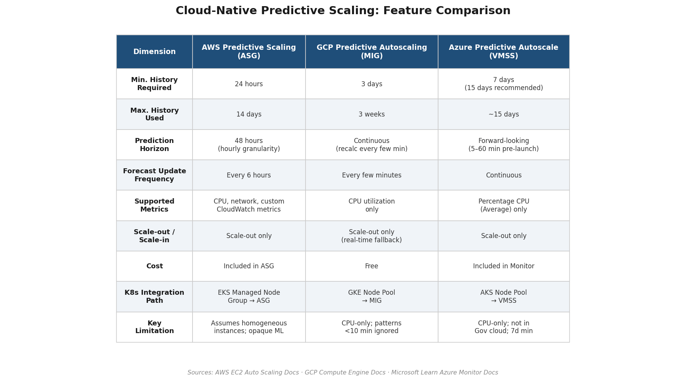

*Figure 2 — Structured comparison of AWS Predictive Scaling (ASG), GCP Predictive Autoscaling (MIG), and Azure Predictive Autoscale (VMSS) across minimum history, prediction horizon, supported metrics, scaling direction, cost, Kubernetes integration path, and key limitations.*

### Common Limitations Across Cloud Providers

The three managed predictive scaling services share a set of structural constraints that limit their effectiveness for Kubernetes node autoscaling:

1. **Metric narrowness.** All three primarily or exclusively operate on CPU utilization. Custom application metrics — request rate, queue depth, GPU utilization — that more accurately reflect actual demand require workarounds or are unsupported entirely.
2. **No Kubernetes awareness.** These services operate at the VM/instance level with no understanding of pod scheduling pressure, resource requests, node affinity, or taints. Predictions target instance counts rather than the Kubernetes-native abstractions that drive actual scaling needs.
3. **Scale-out only.** None provide predictive scale-in, leaving cost optimization during predicted demand troughs to separate mechanisms.
4. **Historical data requirements.** Minimum training windows of 24 hours (AWS) to 7 days (Azure) mean that new clusters, newly created node pools, or pools recovering from replacement events cannot benefit from predictive scaling until sufficient history accumulates.
5. **Black-box models.** The ML algorithms are fully managed and non-inspectable, preventing operators from understanding, debugging, or overriding predictions that may be inappropriate for specific workload characteristics.

## 2.5 Open-Source Predictive Scaling Projects

Beyond the KEDA ecosystem and cloud-native services, several open-source projects address predictive autoscaling at varying levels of maturity and scope.

**Predictive Horizontal Pod Autoscaler (PHPA).** The `jthomperoo/predictive-horizontal-pod-autoscaler` project (v0.13.2, Apache 2.0) implements Holt–Winters exponential smoothing and linear regression for pod-level HPA predictions. PHPA operates as a custom controller that replaces the standard HPA decision logic with a forecasted replica count. Its model options are restricted to classical statistical methods, limiting accuracy on complex workload patterns [PHPA GitHub](https://github.com/jthomperoo/predictive-horizontal-pod-autoscaler "v0.13.2").

**Crane / EffectiveHPA.** Crane (Cloud Resource Analytics and Economics), open-sourced by Tencent, provides the `EffectiveHPA` controller backed by a `TimeSeriesPrediction` CRD. It employs a Digital Signal Processing (DSP) algorithm to forecast custom Prometheus metrics and generate predictive HPA targets. Crane integrates with Prometheus Adapter to expose predicted values as custom metrics consumable by the native Kubernetes HPA, positioning it as part of a broader FinOps toolkit rather than a dedicated autoscaling controller [Crane EffectiveHPA](https://gocrane.io/docs/best-practices/effective-hpa-with-prometheus-adapter/ "EffectiveHPA with Prometheus Adapter").

**Dynatrace obslab.** Dynatrace's open-source observability lab (Apache 2.0) demonstrates a GitOps-driven predictive scaling pattern: Davis AI generates workload forecasts, and the pipeline automatically creates pull requests that adjust HPA or deployment configurations. This approach embeds prediction into the CI/CD workflow rather than operating as a real-time control loop, trading responsiveness for auditability and change-management compliance.

All three projects operate at the pod level. Node-level scaling remains an indirect consequence: predicted pod increases generate scheduling pressure that CA or Karpenter must satisfy. As of April 2026, no open-source project directly predicts and provisions a target node count independent of the pod-scheduling feedback loop.

## 2.6 The Canonical Predictive Pipeline: From Metrics to Nodes

Across the tools and services surveyed, a consistent five-stage architecture emerges for operationalizing predictive node autoscaling. Figure 3 illustrates this pipeline end-to-end.

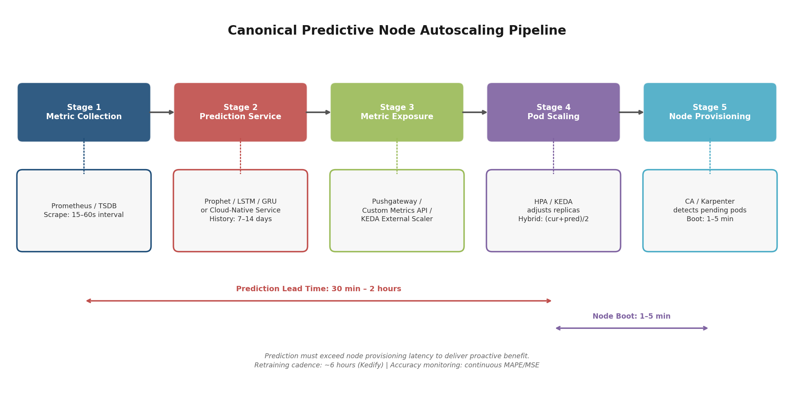

*Figure 3 — Five-stage predictive node autoscaling pipeline, from Prometheus metric collection through prediction service, metric exposure, pod scaling (HPA/KEDA), to node provisioning (CA/Karpenter). Annotated with typical latencies and configuration knobs.*

**Stage 1 — Metric collection.** Prometheus (or an equivalent TSDB) scrapes workload and infrastructure metrics at 15–60 second intervals. The metrics selected as prediction inputs — request rate, CPU utilization, queue depth, or custom business KPIs — directly determine the quality ceiling of all downstream forecasts.

**Stage 2 — Prediction service.** A forecasting model (Prophet, LSTM, GRU, or a cloud-native managed service) queries 7–14 days of historical data from Prometheus and produces a future value over a defined prediction horizon (typically 30 minutes to 2 hours). The service runs as a sidecar, standalone deployment, or external SaaS endpoint.

**Stage 3 — Metric exposure.** The predicted value is published back into the Kubernetes metrics ecosystem via one of three mechanisms: Prometheus Pushgateway (for scraping by HPA via Prometheus Adapter), a custom metrics API server, or a KEDA external scaler gRPC endpoint. The choice of exposure mechanism determines which autoscaling controllers can consume the prediction.

**Stage 4 — Pod scaling.** HPA or KEDA adjusts pod replica counts based on the predicted metric value. Hybrid formulas — such as Kedify's `(current + predicted) / 2` — blend real-time and forecasted signals to hedge against prediction error.

**Stage 5 — Node provisioning.** CA or Karpenter detects that the increased pod replica target creates scheduling pressure (pods that cannot be placed on existing nodes) and provisions additional nodes. The lead time gained by the prediction — typically 30 minutes to 2 hours — must exceed the node provisioning latency (2–5 minutes for CA, 60–90 seconds for Karpenter) to deliver its intended proactive benefit.

This architecture reveals a critical structural property: predictive node autoscaling in Kubernetes is, in practice, *predictive pod autoscaling with node provisioning as a downstream consequence*. The prediction does not directly target a node count; it targets a workload metric that, through the chain of HPA → pod scheduling pressure → CA/Karpenter, results in node provisioning. This indirection introduces two compounding sources of error: forecast inaccuracy in the prediction model, and bin-packing inefficiency in the node provisioner's translation of pod demand into instance selection [Kedify Predictive Autoscaling Blog](https://kedify.io/resources/blog/predictive-autoscaling/ "Architecture with KEDA integration").

## 2.7 Operational Requirements for Production Predictive Scaling

Deploying predictive autoscaling in production demands infrastructure and operational practices that extend well beyond the forecasting model itself.

**Data retention.** Historical metric data must be retained for at least 7–14 days to provide adequate training signal. AWS Predictive Scaling requires a minimum of 24 hours; GCP requires 3 days; Azure requires 7 days (15 recommended). Custom Prophet or LSTM models typically benefit from 14+ days of hourly-granularity data spanning at least two full weekly cycles to capture both daily and weekly seasonality.

**Model retraining cadence.** Static models degrade as workload patterns evolve. Kedify recommends retraining every 6 hours to track drift [Kedify Predictive Autoscaling Blog](https://kedify.io/resources/blog/predictive-autoscaling/ "Predictive Autoscaling announcement, October 2025"). Cloud-native services handle retraining transparently (AWS updates forecasts every 6 hours; GCP recalculates every few minutes). Custom deployments must implement a retraining pipeline — typically a CronJob that triggers model fitting against fresh Prometheus data and updates the prediction service weights.

**Continuous accuracy monitoring.** A predictive autoscaler that diverges from reality is worse than a purely reactive one: it may provision excessive capacity (wasting cost) or, more critically, fail to provision enough (violating SLOs). MAPE and MSE should be tracked continuously on a rolling window. Kedify's `modelMapeThreshold` exemplifies the safety-net pattern: when accuracy falls below a configured threshold, the system automatically disables predictive scaling and reverts to reactive behavior.

**Fallback to reactive scaling.** Every predictive scaling deployment should maintain a parallel reactive scaling path. The prediction layer adjusts the effective floor (minimum replica count or minimum node count), while CA or Karpenter remains active as the safety net for unpredicted demand spikes. This layered approach — prediction sets the baseline, reaction handles the residual — is the operational pattern recommended across the KEDA and Kedify documentation.

## 2.8 The Pod-Level Indirection Problem

A recurring theme across all surveyed tools and services is the absence of direct node-count prediction. KEDA, Kedify, PHPA, Crane, and the cloud-native services all operate at either the pod level or the VM-group level — none natively predict the number of Kubernetes nodes that should exist at a future point in time based on an integrated understanding of pod resource requests, bin-packing efficiency, node types, and scheduling constraints.

This gap creates a structural limitation. Predicting that an application will need 50 pods in 30 minutes does not deterministically translate to a specific node count; the answer depends on pod resource requests, available instance types, existing node headroom, affinity rules, and the bin-packing algorithm of the node provisioner. The prediction-to-node path traverses two stochastic stages — pod scheduling and instance selection — each introducing potential mismatch between predicted need and provisioned capacity.

For organizations where this indirection is acceptable — the common case for web-tier scaling with relatively uniform pod sizes — the existing tooling is functional. For GPU workloads, heterogeneous instance pools, or clusters with complex scheduling constraints, the gap between predicted pod count and required node capacity may be significant enough to warrant custom integration logic. Such logic would translate pod-level forecasts into explicit node-provisioning actions: for example, pre-scaling an ASG's `minSize` or creating targeted placeholder pods sized to specific instance types.

# 第3章 Scheduled and Calendar-Based Node Autoscaling

Where predictive ML models attempt to learn demand patterns from historical data (Chapter 2), scheduled autoscaling takes a more deterministic path: operators encode known traffic patterns — daily peaks, weekly cycles, promotional events — as explicit time-based rules. This chapter examines the mechanisms available for implementing scheduled node-level autoscaling in Kubernetes, the interaction models between time-based rules and reactive autoscalers (CA and Karpenter), calendar-aware extensions for irregular events, and the operational trade-offs of timed scale-down.

A critical distinction runs through the entire discussion: most scheduling mechanisms operate at the pod level — setting replica counts or HPA floor values — and influence node provisioning only indirectly, by generating pod scheduling pressure that CA or Karpenter must resolve. Understanding this indirection is essential for reasoning about end-to-end latencies and failure modes.

## 3.1 KEDA Cron Scaler: Time-Windowed Pod Floors

KEDA's built-in cron scaler (`type: cron`, available in v2.19.0) provides the most Kubernetes-native mechanism for time-based scaling. It accepts a standard five-field Linux cron expression with an IANA timezone identifier, defining a time window during which a `desiredReplicas` value overrides the normal HPA minimum. Outside the window, the ScaledObject's `minReplicaCount` applies — which can be set to zero for scale-to-zero workloads [KEDA Cron Scaler Docs](https://keda.sh/docs/2.19/scalers/cron/ "KEDA v2.19 official cron scaler documentation").

The cron scaler participates in KEDA's multi-trigger evaluation: when multiple triggers — cron, CPU, queue depth, custom metrics — are attached to a single ScaledObject, HPA takes the maximum replica count across all triggers. A cron trigger therefore establishes a guaranteed floor; it cannot suppress a higher replica count demanded by a real-time metric trigger. For node-level autoscaling, the mechanism is indirect: the elevated pod replica count increases aggregate resource requests, and when those requests exceed the cluster's allocatable capacity, CA or Karpenter detects pending (unschedulable) pods and provisions additional nodes.

The effectiveness of cron-based pre-scaling depends critically on how far in advance the trigger fires relative to the actual traffic ramp. If a cron trigger sets `desiredReplicas: 50` at 08:45 and the traffic peak begins at 09:00, the system has a 15-minute window for pods to become Running and — if new nodes are required — for those nodes to be provisioned and ready. Given the 2–5 minute node provisioning latencies documented in Chapter 1, a 15-minute lead time is generally sufficient; a 5-minute lead time leaves little margin for multi-node scale-ups.

## 3.2 The Placeholder Pod Pattern: Bridging Pod Scheduling to Node Provisioning

The cron scaler alone does not guarantee that nodes are pre-provisioned — it only ensures that pods are *desired*. If the cluster already has spare capacity, the new pods schedule immediately without triggering node scale-up. To reliably translate a time-based signal into node provisioning, the placeholder pod (or "pause pod") pattern is essential.

This pattern, formally documented in the CA FAQ, uses a low-priority `PriorityClass` (typically value −10, matching CA's default `--expendable-pods-priority-cutoff`) attached to `registry.k8s.io/pause` container pods. These lightweight pods consume resource reservations without performing actual work. When real workloads arrive with higher priority, the Kubernetes scheduler preempts the placeholder pods. The evicted placeholders return to Pending state, which CA or Karpenter interprets as unschedulable demand, triggering provisioning of replacement nodes [CA FAQ](https://github.com/kubernetes/autoscaler/blob/master/cluster-autoscaler/FAQ.md "CA FAQ — overprovisioning with pause pods and PriorityClass −10").

Combining KEDA cron with placeholder pods produces a two-stage mechanism:

1. **Scheduled pre-expansion.** A KEDA cron trigger increases the replica count of a placeholder Deployment at a configured lead time (e.g., 08:45 for a 09:00 peak). CA or Karpenter provisions nodes to accommodate the placeholder pods.
2. **Real-time preemption.** When production pods arrive at 09:00, they preempt the placeholders. The evicted placeholders re-enter the scheduling queue, and the autoscaler provisions additional nodes to restore the buffer — or allows the buffer to shrink if traffic falls within the pre-provisioned capacity.

This pattern effectively converts a pod-level scheduling signal into deterministic node pre-provisioning, bridging the gap between KEDA's pod-oriented cron scaler and the node-level scaling that operators require. The full lifecycle — from cron trigger through node warm-up, production traffic arrival, scheduled window expiry, stabilization, and graceful scale-down — is illustrated in Figure 3-1.

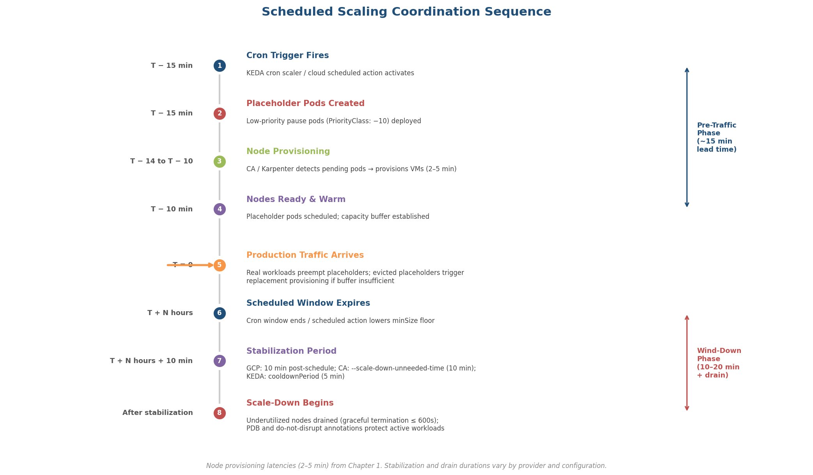

*Figure 3-1. Scheduled scaling coordination sequence. Pre-traffic and wind-down phases are annotated with typical durations based on the cloud-provider latencies documented in Chapter 1.*

## 3.3 Cloud-Provider Scheduled Scaling Mechanisms

Each major cloud provider offers native scheduled scaling at the VM autoscaling group level, applicable to the infrastructure underlying Kubernetes node pools. Figure 3-2 summarizes the key feature differences; the subsections that follow provide detail on each.

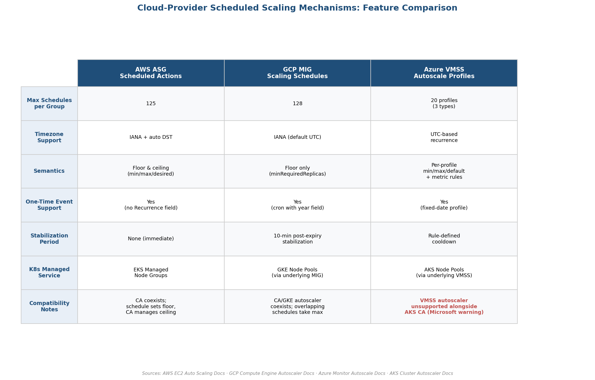

*Figure 3-2. Cloud-provider scheduled scaling feature comparison. Notable divergences include timezone support, floor-versus-ceiling semantics, and AKS compatibility constraints.*

### AWS Auto Scaling Group Scheduled Actions

AWS supports up to 125 scheduled actions per ASG, each specifiable with a cron expression and IANA timezone (with automatic DST handling). A scheduled action can set `desiredCapacity`, `minSize`, and `maxSize` independently; execution latency is typically seconds but may reach 2 minutes in rare cases [AWS Scheduled Scaling](https://docs.aws.amazon.com/autoscaling/ec2/userguide/ec2-auto-scaling-scheduled-scaling.html "AWS EC2 Auto Scaling — Scheduled scaling").

For EKS managed node groups backed by ASGs, scheduled actions serve as a floor-setting mechanism: the action raises `minSize` before an anticipated peak, ensuring CA cannot scale below that level. CA retains the ability to scale above `minSize` in response to pending pods and scales down only after the scheduled action expires or a subsequent action lowers the floor. One-time scheduled actions (without `Recurrence`) support event-driven pre-scaling for product launches or marketing campaigns.

### GCP Managed Instance Group Scaling Schedules

GCP MIGs support up to 128 scaling schedules per group, accommodating both one-time and recurring patterns. Each schedule sets a `minRequiredReplicas` floor, and when multiple schedules overlap, the MIG takes the maximum value. Schedules default to UTC but accept IANA timezones [GCP Scaling Schedules](https://cloud.google.com/compute/docs/autoscaler/scaling-schedules "Compute Engine — Scaling based on schedules").

A distinctive feature of GCP's implementation is the 10-minute stabilization period after a schedule expires: the MIG does not immediately scale down to the previous floor, providing a buffer against premature capacity removal. Individual schedules can be disabled without deletion, enabling operators to toggle seasonal or event-specific schedules without reconstructing the configuration. For GKE node pools — which are backed by MIGs — these schedules directly control the minimum node count. GKE-branded documentation does not provide a dedicated guide for this integration, but the underlying MIG mechanism applies transparently.

### Azure VMSS Autoscale Profiles

Azure takes a profile-based approach to scheduled scaling. Each VMSS autoscale setting supports up to 20 profiles across three types: a default profile (always active as fallback), fixed-date profiles (one-time events with explicit start/end timestamps), and recurrence profiles (triggered on specific days of the week). Profiles are evaluated by priority — fixed-date profiles override recurrence profiles, which override the default. Each profile carries independent `capacity` bounds (minimum, maximum, default) and up to 10 metric-based rules [Azure Autoscale Settings](https://learn.microsoft.com/en-us/azure/azure-monitor/autoscale/autoscale-understanding-settings "Understand autoscale settings in Azure Monitor").

A critical caveat for AKS users: Microsoft explicitly warns that the Azure VMSS autoscaler is not supported for use with AKS cluster node pools and can lead to unexpected behavior when used alongside the AKS cluster autoscaler [AKS Cluster Autoscaler](https://learn.microsoft.com/en-us/azure/aks/cluster-autoscaler "AKS CA docs — VMSS autoscaler unsupported alongside AKS CA"). While VMSS autoscale profiles exist as an Azure platform capability, applying them directly to AKS node pool VMSS instances is an unsupported configuration. AKS operators seeking scheduled scaling must therefore rely on Kubernetes-native mechanisms — KEDA cron with placeholder pods, CronJob-based patching — or accept the risks of an unsupported VMSS-level integration.

## 3.4 Karpenter: No Native Scheduling, but Disruption Budget Windows

Karpenter, as of v1.0+, does not provide a native cron-triggered provisioning mechanism. Its architecture is purely reactive — nodes are provisioned only in response to unschedulable pods. However, Karpenter's **disruption budgets** introduce a time-aware dimension to node lifecycle management, specifically for *preventing* unwanted scale-down during critical periods.

Disruption budgets support `schedule` and `duration` fields using cron expressions (UTC only — no IANA timezone support, a notable operational limitation). During the specified window, the `nodes` field controls how many nodes may be voluntarily disrupted. Setting `nodes: "0"` during business hours (e.g., weekdays 09:00–17:00 UTC) prevents Karpenter from consolidating, drifting, or otherwise disrupting nodes in the pool. The `reasons` field allows selective blocking — for example, permitting `Underutilized` consolidation while blocking `Empty` consolidation [Karpenter Disruption Docs](https://karpenter.sh/docs/concepts/disruption/ "NodePool Disruption Budgets — schedule and duration fields").

This mechanism does not *add* nodes; it *protects* existing nodes from removal. For proactive node addition, the community has developed two CronJob-based patterns:

**Pattern A: CronJob + Placeholder Pods.** A Kubernetes CronJob creates or scales a placeholder pod Deployment at a scheduled time, triggering Karpenter to provision nodes. At a later scheduled time, another CronJob scales the Deployment down, and Karpenter eventually consolidates the freed capacity.

**Pattern B: CronJob + NodePool Limits Patching.** A CronJob patches the Karpenter NodePool's `spec.limits.cpu` to `"0"` at a scheduled time (e.g., end of business day), preventing Karpenter from provisioning new nodes and allowing existing pods to drain. Combined with Fargate for control-plane components (Karpenter itself, CoreDNS, the CronJob pod), this enables full EC2 scale-to-zero. Aircall's engineering team reported approximately 50% reduction in node costs and approximately 25% reduction in total cluster costs for non-production environments using this pattern [Aircall Engineering Blog](https://aircall.io/blog/tech-team-stories/scale-karpenter-zero-optimize-costs/ "Aircall: ~50% node cost reduction"). AWS provides a reference architecture for this Karpenter + serverless approach [AWS Containers Blog](https://aws.amazon.com/blogs/containers/manage-scale-to-zero-scenarios-with-karpenter-and-serverless/ "Karpenter scale-to-zero with serverless").

The UTC-only constraint on disruption budget schedules merits emphasis: teams operating across multiple timezones must manually compute UTC offsets and account for DST transitions — an error-prone process that contrasts with the IANA timezone support offered by KEDA, AWS scheduled actions, and GCP scaling schedules.

## 3.5 Coordinating Scheduled and Reactive Autoscalers

The most operationally challenging aspect of scheduled node autoscaling is not the scheduling mechanism itself but its interaction with the reactive autoscaler running alongside it. Misconfiguration can produce three distinct failure modes: conflicting scale decisions (the scheduler scales up while the autoscaler scales down), redundant provisioning (both mechanisms independently provision for the same demand), or premature scale-down (the autoscaler removes nodes before the scheduled window's anticipated load materializes).

Three coordination principles mitigate these risks:

**Principle 1: Scheduled actions set the floor; reactive autoscalers manage the ceiling.** Scheduled scaling mechanisms should configure `minSize` / `minRequiredReplicas` / `minReplicaCount` — never `desiredCapacity` or `maxSize` in isolation. This ensures the reactive autoscaler retains authority to scale above the scheduled baseline in response to unanticipated demand. AWS scheduled actions explicitly support independent `minSize` adjustment; GCP scaling schedules inherently operate as floors (`minRequiredReplicas`); KEDA's cron scaler sets `desiredReplicas`, which HPA interprets as a floor by taking the maximum across all triggers [AWS Scheduled Scaling](https://docs.aws.amazon.com/autoscaling/ec2/userguide/ec2-auto-scaling-scheduled-scaling.html "AWS EC2 Auto Scaling — Scheduled scaling") [GCP Scaling Schedules](https://cloud.google.com/compute/docs/autoscaler/scaling-schedules "Compute Engine — Scaling based on schedules").

**Principle 2: Allow stabilization periods before scale-down.** When a scheduled window expires, the system should not immediately remove nodes. GCP MIGs enforce a 10-minute stabilization period after schedule expiry. CA's `--scale-down-unneeded-time` (default 10 minutes) requires a node to remain underutilized for this duration before removal. KEDA's `cooldownPeriod` (default 5 minutes) delays scale-in after the last trigger activation. These timers serve as safety margins against oscillation — particularly important when a cron window boundary coincides with the tail end of actual demand [CA FAQ](https://github.com/kubernetes/autoscaler/blob/master/cluster-autoscaler/FAQ.md "CA best practices — stabilization timers").

**Principle 3: Protect peak-period nodes from consolidation.** During a scheduled high-capacity window, the reactive autoscaler's consolidation logic may identify pre-provisioned but lightly loaded nodes as removal candidates — undermining the purpose of scheduled pre-scaling. Karpenter's disruption budget with `nodes: "0"` during peak hours prevents this. For CA, the `cluster-autoscaler.kubernetes.io/scale-down-disabled: "true"` annotation on specific nodes, or the `--scale-down-delay-after-add` parameter (default 10 minutes), provides analogous protection [Karpenter Disruption Docs](https://karpenter.sh/docs/concepts/disruption/ "NodePool Disruption Budgets") [CA FAQ](https://github.com/kubernetes/autoscaler/blob/master/cluster-autoscaler/FAQ.md "scale-down-disabled annotation").

## 3.6 Calendar-Aware Scaling: Beyond Fixed Cron Schedules

Standard cron expressions handle recurring patterns effectively but cannot accommodate irregular events — holiday traffic surges, flash sales, product launches, or maintenance windows. Calendar-aware scaling extends scheduled autoscaling to these non-periodic scenarios through three complementary approaches.

**One-time cloud-provider schedules.** GCP scaling schedules support one-time events through cron expressions that include a year field, allowing operators to pre-configure capacity for a specific date and time. AWS scheduled actions without a `Recurrence` field execute once at the specified time. Azure's fixed-date autoscale profiles define explicit start and end timestamps for event-specific capacity overrides [GCP Scaling Schedules](https://cloud.google.com/compute/docs/autoscaler/scaling-schedules "One-time schedule for events") [Azure Autoscale Settings](https://learn.microsoft.com/en-us/azure/azure-monitor/autoscale/autoscale-understanding-settings "Understand autoscale settings in Azure Monitor").

**Dynamic calendar integration.** Organizations that maintain promotional calendars, release schedules, or holiday calendars in external systems (Google Calendar, PagerDuty, internal APIs) can implement a controller pattern: an external reconciliation loop reads the calendar API, computes required capacity adjustments, and creates or updates KEDA ScaledObjects, AWS scheduled actions, or GCP scaling schedules accordingly. As of April 2026, no CNCF-mature standardized calendar Operator exists for this purpose; implementations remain custom-built.

**Deployment window protection.** During software releases, both scaling up (to handle rollout resource overhead) and scaling down (which might evict pods mid-deployment) require careful management. Karpenter's `karpenter.sh/do-not-disrupt: "true"` annotation on pods prevents voluntary node disruption for the duration of the annotation; CA's `cluster-autoscaler.kubernetes.io/scale-down-disabled: "true"` annotation on nodes achieves the same effect. These annotations can be applied by CI/CD pipelines at deployment start and removed at deployment completion, creating automated deployment-window protection [CA FAQ](https://github.com/kubernetes/autoscaler/blob/master/cluster-autoscaler/FAQ.md "scale-down-disabled annotation") [Karpenter Disruption Docs](https://karpenter.sh/docs/concepts/disruption/ "do-not-disrupt annotation").

## 3.7 Scale-Down Scheduling: Cost Savings vs. Premature Termination

Scheduled scale-down — reducing node counts at predictable low-traffic periods — offers significant cost savings but introduces the risk of terminating nodes that still host active workloads. Balancing these concerns requires attention to graceful termination mechanics, workload protection primitives, and conservative timing margins.

**Graceful termination controls.** CA's `--max-graceful-termination-sec` (default 600 seconds) and Karpenter's `terminationGracePeriod` define the maximum time allowed for pod eviction during node drain. Pods that do not terminate within this window are forcefully deleted. For batch workloads with long-running processes, this timeout must be set conservatively — or the workloads must be explicitly protected from eviction [Kubernetes Node Autoscaling](https://kubernetes.io/docs/concepts/cluster-administration/node-autoscaling/ "Kubernetes Node Autoscaling concepts").

**Workload-level protection.** Pods annotated with `karpenter.sh/do-not-disrupt: "true"` or `cluster-autoscaler.kubernetes.io/safe-to-evict: "false"` are excluded from voluntary eviction. PodDisruptionBudgets (PDBs) provide a higher-level guarantee: `maxUnavailable: 1`, for example, ensures that at most one pod in a set is disrupted simultaneously, throttling the rate at which node drain can proceed.

**Conservative timing.** Scheduled scale-down actions should be set 30–60 minutes after the expected workload completion or traffic decline. This margin accounts for traffic tails that extend beyond the typical pattern, batch jobs that run longer than expected, and the coordination overhead of draining multiple nodes sequentially. The cost of an extra 30–60 minutes of node runtime is negligible compared to the risk of SLO violations from premature capacity removal.

**Scale-to-zero considerations.** For non-production environments, complete scale-down to zero nodes is a powerful cost optimization. Karpenter's NodePool limits patching pattern (Section 3.4, Pattern B) achieves this on EKS when control-plane components run on Fargate. The critical design constraint is ensuring that the scheduling mechanism itself — the CronJob that triggers scale-up the next morning — remains available even when all EC2 nodes are terminated. Fargate, or an equivalent serverless compute layer, is essential for solving this bootstrap problem.

## 3.8 Practical Architecture: Combining Scheduled and Reactive Layers

The evidence presented in this chapter points toward a layered architecture where scheduled scaling establishes deterministic capacity baselines and reactive autoscaling handles residual variance. Figure 3-3 illustrates the five-layer model.

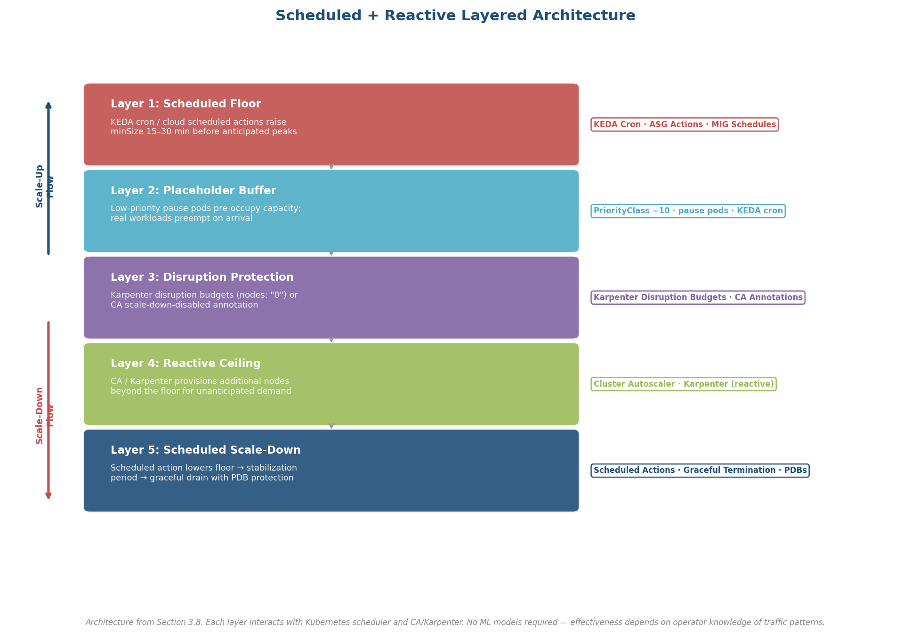

*Figure 3-3. Scheduled + reactive layered architecture. Each layer is annotated with the responsible Kubernetes and cloud-provider components. No ML models are required; effectiveness depends on operator knowledge of traffic patterns.*

The five layers operate as follows:

1. **Scheduled floor.** KEDA cron triggers or cloud-provider scheduled actions raise the minimum node count 15–30 minutes before anticipated demand peaks. For irregular events, one-time schedules or dynamic calendar-driven updates set event-specific floors.
2. **Placeholder buffer.** Low-priority pause pods, scaled by KEDA cron or CronJob, pre-occupy the scheduled capacity, ensuring that nodes are provisioned and warm before production traffic arrives (Chapter 4 examines overprovisioning mechanics in detail).
3. **Disruption protection.** Karpenter disruption budgets or CA annotations prevent the reactive autoscaler from consolidating the pre-provisioned nodes during the scheduled high-capacity window.
4. **Reactive ceiling.** CA or Karpenter retains authority to provision additional nodes beyond the scheduled floor if actual demand exceeds the anticipated pattern.
5. **Scheduled scale-down.** At the end of the high-demand window, a scheduled action lowers the floor. After stabilization periods expire, the reactive autoscaler removes underutilized nodes, with graceful termination and PDB protections ensuring workload safety.

This architecture requires no ML models, no training data, and no prediction accuracy monitoring — its effectiveness depends entirely on the operator's knowledge of traffic patterns. For workloads with highly predictable, recurring demand profiles, scheduled scaling alone may achieve most of the latency reduction that predictive approaches promise, at a fraction of the operational complexity. For workloads with both predictable and unpredictable components, scheduled scaling provides the deterministic baseline while predictive scaling (Chapter 2) adjusts the forecast-driven layer above it.

# 第4章 Proactive Overprovisioning and Hybrid Architectures

Chapters 2 and 3 addressed two proactive strategies — predictive ML models and calendar-based scheduling — that anticipate demand before pods become unschedulable. Both approaches, however, operate through an indirect path: they adjust pod replica counts, which in turn generate scheduling pressure that CA or Karpenter must resolve. This indirection introduces residual latency; even a perfectly timed cron trigger or an accurate prediction still requires 60–240 seconds for node provisioning once pods enter Pending state (Chapter 1). Overprovisioning eliminates this residual gap by maintaining pre-warmed, idle node capacity that absorbs demand spikes instantaneously at the pod-scheduling level, without waiting for a single cloud API call to complete.

This chapter examines the mechanics of pause-container overprovisioning, methods for determining appropriate buffer sizes, the upstream CapacityBuffer CRD introduced in CA v1.35.0, the open-source operators that automate buffer management, cross-cloud implementation differences, and the multi-layer reference architecture that combines overprovisioning with the predictive, scheduled, and reactive strategies discussed in prior chapters.

## 4.1 The Pause-Pod Overprovisioning Mechanism

The core technique relies on Kubernetes pod priority and preemption, a stable API since v1.14 [Kubernetes Pod Priority and Preemption](https://kubernetes.io/docs/concepts/scheduling-eviction/pod-priority-preemption/ "Stable since v1.14"). A set of lightweight placeholder pods — typically running the `registry.k8s.io/pause` container, which consumes negligible CPU and memory beyond its resource requests — is deployed with a deliberately low `PriorityClass`. When real workloads with higher priority arrive and the cluster lacks allocatable capacity, the scheduler preempts the placeholder pods to free their reserved resources. The evicted placeholders return to Pending state, which CA or Karpenter interprets as new unschedulable demand and provisions replacement nodes, thereby restoring the warm buffer. The CA FAQ formally documents this pattern as the recommended approach for eliminating node provisioning latency from the critical scheduling path [CA FAQ](https://github.com/kubernetes/autoscaler/blob/master/cluster-autoscaler/FAQ.md "Official CA FAQ — overprovisioning section").

The critical implementation detail is the `PriorityClass` value. CA's `--expendable-pods-priority-cutoff` flag defaults to −10: pods with priority below this threshold are considered expendable and do not trigger scale-up when pending. Setting the placeholder `PriorityClass` to exactly −10 ensures that (a) they are preemptible by any workload with default priority (0), and (b) they still trigger CA scale-up when evicted and re-enter Pending state. On GKE, the threshold behavior is strict — pods with priority below −10 do not trigger new node creation at all [GKE Capacity Provisioning](https://docs.google.com/kubernetes-engine/docs/how-to/capacity-provisioning "Official GKE guide — priority threshold −10").

The EKS Workshop provides a concrete walkthrough: a `PriorityClass` named "pause-pods" with value −1 is paired with a global default `PriorityClass` at value 0; two pause pods, each requesting 6.5 GiB of memory, collectively occupy nearly the entire allocatable capacity of an `m5.large` instance, maintaining two warm spare worker nodes at all times [EKS Workshop](https://www.eksworkshop.com/docs/fundamentals/compute/managed-node-groups/cluster-autoscaler/overprovisioning/setting-up "EKS overprovisioning lab"). The Kubernetes upstream project maintains a dedicated [Node Overprovisioning task guide](https://kubernetes.io/docs/tasks/administer-cluster/node-overprovisioning/ "Official K8s task guide for node overprovisioning") that codifies this pattern.

## 4.2 Determining Buffer Size: Static, Proportional, and Workload-Aware Strategies

The most consequential design decision in overprovisioning is selecting the buffer quantum. A buffer that is too small leaves spikes to trigger cold provisioning; one that is too large accumulates idle-resource cost without commensurate benefit. Three strategies address this trade-off at different levels of sophistication.

**Static headroom.** A fixed number of placeholder pod replicas with fixed resource requests provides the simplest approach. A team might configure "always maintain two spare nodes" by deploying two pause pods whose requests each approximate 75% of a single node's allocatable resources. This method is deterministic and straightforward to reason about, but it does not adapt to cluster growth: a buffer of two nodes that adequately covers a 20-node cluster provides negligible cushion for a 200-node cluster, yet constitutes excessive headroom for a 5-node cluster.

**Proportional headroom with Cluster Proportional Autoscaler (CPA).** The Cluster Proportional Autoscaler, a kubernetes-sigs project, dynamically adjusts the replica count of a target Deployment based on the cluster's current size [CPA GitHub](https://github.com/kubernetes-sigs/cluster-proportional-autoscaler "kubernetes-sigs project"). In **linear mode**, replicas follow the formula `max(ceil(cores / coresPerReplica), ceil(nodes / nodesPerReplica))`. In **ladder mode**, a step function maps cluster-size thresholds to fixed replica counts (e.g., 0–10 nodes → 1 replica, 11–50 → 3 replicas, 51–200 → 8 replicas). Pairing CPA with a placeholder Deployment creates a self-adjusting buffer that grows and shrinks with the cluster. The CA FAQ formally documents this combination as the recommended dynamic overprovisioning pattern [CA FAQ](https://github.com/kubernetes/autoscaler/blob/master/cluster-autoscaler/FAQ.md "Dynamic overprovisioning with CPA").

**Workload-aware sizing.** Rather than matching the buffer to node dimensions, this strategy mirrors the resource profile of the target workload. If the primary workload requests 2 vCPU and 4 GiB per pod, each placeholder pod requests the same — ensuring that when a real pod preempts a placeholder, the freed resources exactly fit the incoming pod without fragmentation. SuperOrbital's production guide distinguishes three allocation strategies: node-matching (~75% of single-node allocatable), workload-matching (mirror target workload requests), and custom (hybrid based on heterogeneous workload mix) [SuperOrbital Blog](https://superorbital.io/blog/scaling-smarter-instant-nodes-zero-wait/ "Node-matching vs workload-matching strategies").

The following figure summarizes the three strategies across key evaluation dimensions:

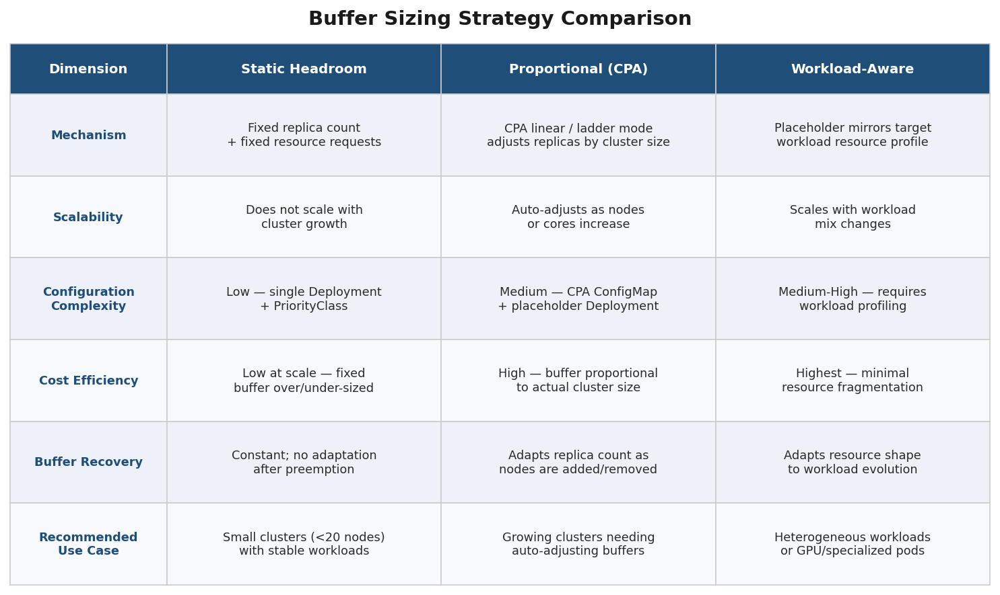

## 4.3 CA CapacityBuffer CRD: First-Class Overprovisioning in Kubernetes 1.35

CA v1.35.0, released in January 2026 alongside Kubernetes 1.35 ("Timbernetes"), introduces the `CapacityBuffer` Custom Resource Definition (`capacitybuffers.autoscaling.x-k8s.io`, API version v1beta1) — the first upstream, declarative mechanism for overprovisioning that eliminates the need for manually managing placeholder pod Deployments and PriorityClasses [CA GitHub Releases](https://github.com/kubernetes/autoscaler/releases "CA 1.35.0 release notes — CapacityBuffer v1beta1").

The CRD is namespace-scoped and integrates with ResourceQuota, allowing buffer capacity to be governed by the same quota mechanisms that constrain production workloads. Two feature flags control its behavior: `--capacity-buffer-controller-enabled` activates the controller that reconciles CapacityBuffer objects, and `--capacity-buffer-pod-injection-enabled` manages the automatic injection of placeholder pods.

GKE exposes CapacityBuffer in Preview (cluster version ≥ 1.35.2-gke.1842000) with three provisioning modes [GKE Capacity Buffer Concepts](https://docs.google.com/kubernetes-engine/docs/concepts/capacity-buffer "GKE official docs, Preview, updated 2026-04-01"):

- **Fixed replicas** — a constant number of placeholder pod replicas, analogous to the manual static approach but declaratively managed.
- **Percentage** — buffer size expressed as a percentage of a reference workload's current replica count, providing proportional scaling without requiring CPA as a separate component.
- **Resource quota** — buffer sized to fill the gap between current resource consumption and a ResourceQuota limit, enabling teams to pre-provision headroom up to their quota ceiling.

The `ProvisioningStrategy` field is exposed as a string type, leaving room for future strategy additions. GKE recommends CapacityBuffer for latency-sensitive use cases including AI inference serving, retail promotional events, and game server scaling — scenarios where the 1–4 minute node provisioning delay documented in Chapter 1 directly impacts user experience or revenue [GKE Capacity Buffer Concepts](https://docs.google.com/kubernetes-engine/docs/concepts/capacity-buffer "Use cases: AI inference, retail, gaming").

As of April 2026, the CapacityBuffer CRD remains in v1beta1 status. Teams operating outside GKE must enable the feature flags manually and should anticipate API surface changes before GA. Nevertheless, its arrival signals a clear trajectory: overprovisioning is graduating from a community workaround to a first-class Kubernetes primitive.

## 4.4 Open-Source Operators for Automated Overprovisioning

Beyond the upstream CapacityBuffer CRD (Section 4.3), several open-source projects package the overprovisioning pattern into operator-managed abstractions, reducing the manual configuration burden.

**Red Hat Proactive Node Scaling Operator.** Published under Apache 2.0 at `redhat-cop/proactive-node-scaling-operator`, this operator introduces the `NodeScalingWatermark` CRD [Red Hat Proactive Node Scaling Operator](https://github.com/redhat-cop/proactive-node-scaling-operator "GitHub repo"). The key parameter, `watermarkPercentage`, defines the utilization threshold at which buffer expansion begins — a value of 20 means that once real workloads consume 80% of allocatable capacity, the operator increases the pause pod count to pre-provision headroom. A `nodeSelector` field scopes the watermark to specific node pools (e.g., GPU nodes only), and the `PausePodImage` field supports air-gapped environments where the default `pause` image may not be reachable [Red Hat Blog](https://www.redhat.com/en/blog/how-full-is-my-cluster-part-6-proactive-node-autoscaling "Design rationale"). The watermark model is conceptually similar to CPA's proportional approach but uses utilization percentage rather than node/core count as the scaling signal, which can be more intuitive for capacity planning.

**Cluster Proportional Autoscaler (CPA).** As discussed in Section 4.2, CPA is a kubernetes-sigs project that scales a target Deployment's replica count proportionally to cluster size [CPA GitHub](https://github.com/kubernetes-sigs/cluster-proportional-autoscaler "kubernetes-sigs project"). While not overprovisioning-specific, its linear and ladder modes make it the most commonly recommended companion for placeholder pod Deployments. CPA itself has no awareness of pod priority or preemption; it simply ensures the placeholder Deployment maintains the correct number of replicas for the current cluster size.

**Codecentric cluster-overprovisioner.** This Helm chart bundles CPA, a placeholder pod Deployment with configurable PriorityClass, and optional CronJob resources that switch between "daytime" and "nighttime" buffer configurations — effectively combining proportional overprovisioning with the scheduled scaling patterns from Chapter 3 into a single deployable package [Codecentric GitHub](https://github.com/codecentric/cluster-overprovisioner "Helm chart with CPA + cron scheduling").

## 4.5 Karpenter and Overprovisioning

Karpenter's group-less, bin-packing-optimized provisioning architecture (Chapter 1) accelerates node delivery — typically 60–90 seconds from pod Pending to node Ready via direct EC2 Fleet API calls, compared with 2–5 minutes through CA's ASG path [AWS Containers Blog](https://aws.amazon.com/blogs/containers/eliminate-kubernetes-node-scaling-lag-with-pod-priority-and-over-provisioning/ "Karpenter + overprovisioning + CPA on EKS"). This speed advantage reduces but does not eliminate the value of overprovisioning: even 60 seconds of scheduling delay remains unacceptable for latency-critical workloads such as real-time inference or interactive gaming.

As of April 2026, Karpenter does not offer a native headroom or overprovisioning feature. GitHub Issue #3240 in the AWS Karpenter provider repository remains open, tracking community requests for built-in buffer capacity management [Karpenter Issue #3240](https://github.com/aws/karpenter-provider-aws/issues/3240 "Feature request for native overprovisioning, still open"). The recommended approach is identical to the CA pattern: deploy placeholder pods with a low PriorityClass, optionally paired with CPA for proportional sizing. Karpenter's faster provisioning cycle means the buffer recovers more quickly after preemption — a placeholder evicted on a Karpenter-managed cluster regains its reserved capacity in approximately 60–90 seconds rather than 2–5 minutes, materially reducing the window during which the buffer is depleted.

## 4.6 Cross-Cloud Implementation Differences

The overprovisioning pattern is architecturally cloud-agnostic — PriorityClass, pause pods, and preemption are upstream Kubernetes features — but practical implementation diverges across managed Kubernetes platforms. The following matrix summarizes these differences:

**EKS (AWS).** EKS represents the most mature Karpenter deployment target. AWS documentation and the EKS Workshop provide explicit overprovisioning walkthroughs. EC2 Warm Pools offer a complementary VM-level optimization: instances can be pre-initialized in a Stopped or Hibernated state and resumed in seconds rather than booted from scratch, reducing the node provisioning phase to sub-minute latency. Warm Pools operate at the ASG level and are therefore compatible with CA-managed node groups but not directly with Karpenter's group-less model [AWS Containers Blog](https://aws.amazon.com/blogs/containers/eliminate-kubernetes-node-scaling-lag-with-pod-priority-and-over-provisioning/ "Karpenter + overprovisioning on EKS").

**GKE (Google Cloud).** GKE offers both the traditional PriorityClass + placeholder pod approach and the newer CapacityBuffer CRD (Section 4.3). A key cost distinction applies: GKE Autopilot clusters bill based on pod resource requests rather than underlying VM capacity, so placeholder pods incur direct, explicit cost proportional to their resource requests. GKE Standard clusters bill at the VM level, meaning placeholder pods on partially filled nodes may "hide" within already-paid VM capacity [GKE Capacity Provisioning](https://docs.google.com/kubernetes-engine/docs/how-to/capacity-provisioning "Official GKE guide").

**AKS (Azure).** AKS Node Auto-Provisioning (NAP), built on Karpenter, uses `NodePool` and `AKSNodeClass` CRDs for group-less provisioning. NAP and CA are mutually exclusive — they cannot be enabled simultaneously on the same cluster. As of February 2026, NAP does not support Windows node pools, IPv6, or Service Principal authentication [AKS NAP](https://learn.microsoft.com/en-us/azure/aks/node-auto-provisioning "Microsoft docs, updated 2026-02-15"). Overprovisioning on AKS follows the standard pause pod pattern; Microsoft has not published a dedicated overprovisioning guide equivalent to the EKS Workshop or GKE capacity provisioning documentation.

**On-premises and hybrid clusters.** Bare-metal node provisioning — involving PXE boot, OS installation, and kubelet registration — typically requires 5–15 minutes, far exceeding cloud VM boot times. This latency makes overprovisioning not merely beneficial but often essential for on-premises Kubernetes deployments; a watermark of 20–30% spare capacity serves as a practical starting point. Cluster API (CAPI) provides infrastructure-agnostic node lifecycle management through Machine, MachineSet, and MachineDeployment abstractions, and CA v1.35.0 includes CAPI-specific fixes for scale-from-zero label propagation and race conditions during concurrent provisioning [CA GitHub Releases](https://github.com/kubernetes/autoscaler/releases "CA 1.35.0 — CAPI fixes"). In hybrid architectures, on-premises clusters maintain a baseline warm buffer via overprovisioning while cloud-burst capacity is handled by Karpenter or CA in an attached cloud environment, combining the cost predictability of owned hardware with the elasticity of public cloud.

## 4.7 The Multi-Layer Reference Architecture

No single autoscaling strategy dominates across all dimensions. Reactive autoscaling (CA/Karpenter) is robust and battle-tested but slow. Predictive models (Chapter 2) anticipate trends but can misforecast anomalous events. Scheduled rules (Chapter 3) handle known patterns but miss unpredictable surges. Overprovisioning absorbs spikes instantly but incurs continuous idle cost. The evidence across Chapters 1–4 converges on a layered architecture in which each strategy compensates for the weaknesses of the others.

The four-layer model operates as follows:

1. **Reactive safety net (CA or Karpenter).** The foundation layer. Regardless of what proactive measures are in place, CA or Karpenter monitors for unschedulable pods and provisions nodes as a catch-all. This layer handles demand that exceeds predictions, scheduled rules, and buffer capacity — functioning as the last line of defense rather than the primary scaling mechanism.

2. **Predictive adjustment (ML-based, Chapter 2).** A forecasting model — Prophet, LSTM, or a cloud-native predictive service (AWS Predictive Scaling, GCP Predictive Autoscaling, Azure Predictive Autoscale) — analyzes 7–14 days of historical data and adjusts pod counts or node group minimums ahead of anticipated demand ramps. The prediction horizon (typically 30 minutes to 2 hours) provides sufficient lead time for node provisioning to complete before traffic arrives.

3. **Scheduled baseline (cron-based, Chapter 3).** For patterns known with certainty — the 09:00 weekday ramp, the Friday evening scale-down, the Black Friday event — explicit cron rules set capacity floors. Scheduled scaling provides deterministic behavior where predictive models might introduce variance. As documented in Chapter 3, KEDA cron triggers, AWS ASG scheduled actions, GCP MIG scaling schedules, and Azure VMSS autoscale profiles all support this function.

4. **Overprovisioning buffer (this chapter).** Placeholder pods absorb the residual latency gap — the 60–240 seconds between a scaling decision (from any layer) and node readiness. The buffer converts node provisioning from a synchronous blocking operation into an asynchronous background refill: real pods preempt placeholders immediately, while replacement nodes are provisioned in the background to restore the buffer.

SuperOrbital demonstrates this model in practice: a base placeholder pod Deployment maintains a constant warm buffer; a KEDA cron trigger raises the placeholder replica count from 5 to 20 at 08:45 on weekdays to pre-expand capacity before the morning peak; a KEDA CPU trigger provides reactive scaling for unpredictable intra-day spikes [SuperOrbital Blog](https://superorbital.io/blog/scaling-smarter-instant-nodes-zero-wait/ "Concrete KEDA + cron + overprovisioning example").

The layered approach introduces operational complexity: four interacting control loops, each with its own configuration surface and failure modes. Chapter 5 addresses the operational practices — monitoring, safety guardrails, and rollout strategies — required to manage this complexity reliably.

## 4.8 Cost Analysis of Overprovisioning

Overprovisioning represents an explicit trade-off: idle compute cost in exchange for reduced scheduling latency. The magnitude of that cost depends on buffer size, instance type, and operating schedule.

A concrete example illustrates the economics: maintaining a two-node buffer of `m5.large` instances (2 vCPU, 8 GiB, On-Demand price $0.096/hour in `us-east-1`) costs $0.192/hour, or approximately **$1,682 per year** [AWS Containers Blog](https://aws.amazon.com/blogs/containers/eliminate-kubernetes-node-scaling-lag-with-pod-priority-and-over-provisioning/ "Performance vs cost trade-off"). For a 50-node production cluster running latency-sensitive services, this represents approximately 4% overhead — a modest premium for eliminating the 1–2 minute cold-provisioning window entirely.

Several techniques reduce overprovisioning cost without sacrificing peak-hour coverage:

- **Scheduled buffer modulation.** The Codecentric cluster-overprovisioner Helm chart supports CronJob-based configuration switching — raising the buffer during business hours and reducing it at night or on weekends. This pattern can reduce overprovisioning cost by 40–60% for workloads with strong diurnal patterns.
- **Spot-backed placeholders.** Since placeholder pods perform no real work, they are ideal candidates for Spot or Preemptible instances. If a Spot instance is reclaimed, the placeholder pod simply re-enters Pending and triggers provisioning of a replacement — the same cycle that occurs during preemption by real workloads.
- **Right-sizing placeholder requests.** Applying the workload-matching strategy (Section 4.2) avoids over-allocating buffer capacity. Placeholder pods that mirror the exact resource profile of the target workload minimize waste from fragmented reservations.

For Karpenter-managed clusters, the Aircall engineering team documented a production case: non-production environments configured with CronJob-based NodePool limits (`spec.limits.cpu` patched to "0" during off-hours) achieved approximately 50% reduction in node costs and approximately 25% reduction in total cluster costs. Core infrastructure components (Karpenter controller, CoreDNS, and CronJob pods) were hosted on AWS Fargate to ensure they remained operational after all EC2 nodes were terminated [Aircall Engineering Blog](https://aircall.io/blog/tech-team-stories/scale-karpenter-zero-optimize-costs/ "Aircall: ~50% node cost reduction").

# 第5章 Implementation Best Practices and Operational Playbook

Chapters 2 through 4 established the building blocks of proactive node-level autoscaling: predictive ML models that forecast demand, scheduled cron rules that encode known traffic patterns, and overprovisioning buffers that absorb residual provisioning latency. Combining these layers with the reactive safety net of CA or Karpenter (Chapter 1) yields a powerful but complex autoscaling stack — four interacting control loops, each with its own configuration surface, failure modes, and observability requirements.

This chapter translates those architectural patterns into an operational playbook. It addresses five questions that every platform engineering team faces when adopting multi-layer node-level autoscaling: (1) how to roll out new scaling layers without endangering production stability, (2) how to monitor and audit the behavior of four concurrent control loops, (3) which safety guardrails to enforce against runaway provisioning or premature scale-down, (4) how to integrate Spot instances and cost governance into the stack, and (5) how to coordinate between layers so that predictive, scheduled, reactive, and overprovisioning controllers reinforce rather than contradict one another. Figure 1 below provides a high-level view of the operational architecture that ties these concerns together.

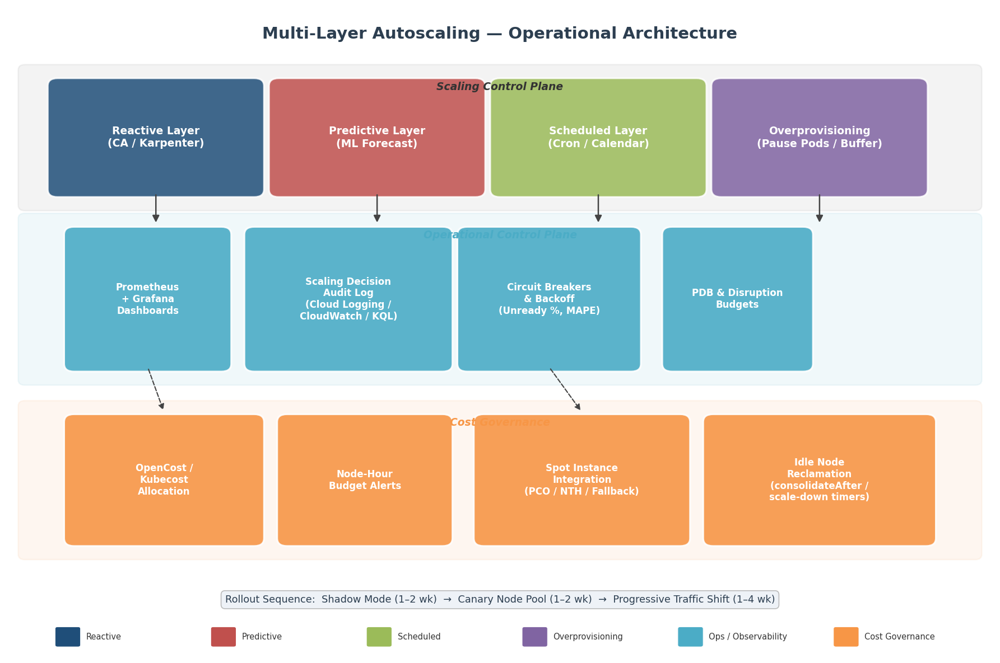

*Figure 1 — The three operational tiers of a multi-layer autoscaling stack: the Scaling Control Plane (reactive, predictive, scheduled, and overprovisioning layers), the Operational Control Plane (monitoring, audit logging, circuit breakers, and disruption budgets), and Cost Governance (allocation tools, node-hour budgets, Spot integration, and idle reclamation). The bottom callout shows the recommended rollout sequence.*

## 5.1 Low-Risk Rollout Strategies

Introducing predictive or scheduled node-level autoscaling into a production cluster that already runs CA or Karpenter carries inherent risk. A misconfigured prediction model can over-provision hundreds of nodes in minutes; an aggressive cron-based scale-down can drain nodes mid-workload. Three graduated rollout strategies — shadow mode, canary node pool, and progressive traffic shifting — mitigate this risk by constraining the blast radius at each stage.

### 5.1.1 Shadow Mode and Observe-Only Evaluation

The safest first step is to deploy the new scaling logic in a non-actuating mode that compares its recommendations against actual cluster behavior. GCP Predictive Autoscaling provides this capability natively: when enabled, the service generates a 7-day retrospective comparison of predicted MIG sizes against the actual sizes that were configured, allowing operators to evaluate forecast accuracy before the system takes any real scaling actions [GCP Predictive Autoscaling](https://cloud.google.com/compute/docs/autoscaler/predictive-autoscaling "GCP built-in shadow mode — 7-day retrospective evaluation"). No nodes are created or removed during this observation window.

Kubernetes itself provides no built-in shadow mode for autoscaling. For custom predictive pipelines (Chapter 2) or KEDA-based scheduled scaling (Chapter 3), operators can implement an equivalent pattern by deploying the prediction service and logging its output — recommended node counts, predicted traffic curves, scaling timestamps — to a time-series database or structured log sink, without connecting the output to any actuating mechanism (HPA, KEDA ScaledObject, or ASG API). The prediction output is then overlaid against actual cluster metrics in a Grafana dashboard for retrospective evaluation. This approach carries minimal infrastructure risk: the prediction service consumes only compute for its own model inference and imposes no scheduling changes on the cluster.

### 5.1.2 Canary Node Pool

Once shadow-mode evaluation confirms acceptable prediction accuracy, the next step is to apply the new scaling logic to a small, isolated node pool that handles a limited subset of traffic. This constrains the blast radius of any prediction error to the canary pool rather than the entire cluster.

With Karpenter, the `spec.weight` field on `NodePool` resources controls provisioning preference. A canary NodePool configured with a lower weight receives workloads only when higher-weight pools cannot satisfy them, effectively functioning as a fallback. Operators can progressively increase the canary pool's weight to direct more workloads toward it as confidence in the predictive logic grows [Karpenter NodePool Docs](https://karpenter.sh/v1.0/concepts/nodepools/ "NodePool weight field controls provisioning preference").

With CA, the `--expander=priority` flag combined with a ConfigMap-based priority list achieves a similar effect. The production ASG/node group receives the highest priority, while the canary ASG — whose minimum size is managed by a predictive or cron-based mechanism — is assigned a lower priority. CA provisions from the canary group only when the production groups cannot accommodate pending pods [AWS EKS CA Best Practices](https://docs.aws.amazon.com/eks/latest/best-practices/cas.html "Priority expander for canary isolation"). This configuration ensures that the predictive scaling logic is exercised under production conditions without becoming the primary provisioning path until it has been validated.

### 5.1.3 Progressive Traffic Shifting

The final rollout phase transitions from canary to full deployment by progressively shifting workloads onto the predictively scaled node pool. For Karpenter clusters, this involves incrementally raising the canary NodePool's `spec.weight` until it matches or exceeds the production pool. For CA clusters, the priority ConfigMap is updated to elevate the predictive ASG's rank. At each increment, operators monitor the key metrics described in Section 5.2 — scheduling latency, node utilization, and prediction accuracy — and roll back by reverting the weight or priority if any metric breaches its threshold.

The full rollout sequence — shadow mode (1–2 weeks) → canary pool (1–2 weeks) → progressive weight increase (1–4 weeks) — typically spans 4–8 weeks for a production cluster. The duration depends on workload variability, prediction model confidence, and organizational risk tolerance; teams with highly periodic workloads and strong observability infrastructure may compress the timeline, while those with irregular traffic patterns or strict SLOs should extend it.

## 5.2 Monitoring, Observability, and Audit Trails

A multi-layer autoscaling stack is only as reliable as its observability infrastructure. When four control loops (reactive, predictive, scheduled, overprovisioning) interact, diagnosing unexpected behavior — a sudden node surge, an unexplained scale-down, or a scheduling-latency spike — requires correlated telemetry across all layers.

### 5.2.1 CA Observability

CA publishes its internal state through three channels. First, it writes a status summary to the `cluster-autoscaler-status` ConfigMap in the `kube-system` namespace (controlled by `--write-status-configmap=true`), which includes current scale-up/scale-down status, node group health, and recent error conditions [CA FAQ](https://github.com/kubernetes/autoscaler/blob/master/cluster-autoscaler/FAQ.md "CA monitoring — status ConfigMap and event deduplication"). Second, CA emits Kubernetes events on pods and nodes for scale-up and scale-down decisions, with a default deduplication window of 5 minutes (configurable via `--record-duplicated-events`). Third, CA exposes Prometheus metrics at `:8085/metrics`, including counters for scale-up and scale-down operations, pending-pod processing times, and node-group capacity utilization.

On **GKE**, CA observability is significantly enhanced. The platform outputs structured JSON visibility events to Cloud Logging under the `container.googleapis.com/cluster-autoscaler-visibility` log name. These events carry rich context: `scaleUp` events include the triggering pod, the selected MIG, and CPU/memory utilization ratios; `noScaleUp` events explain why scaling was blocked (e.g., resource limits, node group at maximum); `scaleDown` events identify the evacuated node and the utilization threshold that triggered removal [GKE Autoscaler Visibility](https://cloud.google.com/kubernetes-engine/docs/how-to/cluster-autoscaler-visibility "Structured JSON visibility events for CA decisions"). This structured format enables programmatic alerting and dashboard construction without parsing unstructured log text.

On **AKS**, the `cluster-autoscaler` log category is available as a resource log that can be routed to a Log Analytics workspace via diagnostic settings. Operators query autoscaler decision events using KQL in Log Analytics, correlating them with other AKS control plane logs (`kube-apiserver`, `kube-scheduler`). AKS also integrates with Azure Managed Prometheus and Azure Managed Grafana for metrics visualization, and provides recommended Prometheus alert rules including `KubeNodeUnreachable`, `KubeNodeReadinessFlapping`, and `KubeletPodStartUpLatencyHigh` [AKS Monitor](https://learn.microsoft.com/en-us/azure/aks/monitor-aks "AKS monitoring — diagnostic settings and Prometheus integration").

### 5.2.2 Karpenter Observability

Karpenter exposes a comprehensive Prometheus metrics endpoint at `karpenter.kube-system.svc.cluster.local:8080/metrics`. Key stable metrics span six categories [Karpenter Metrics Reference](https://karpenter.sh/docs/reference/metrics/ "Official Karpenter metrics documentation"):

- **Provisioning activity:** `karpenter_nodeclaims_created_total` and `karpenter_nodeclaims_terminated_total` track the rate of node creation and removal. A high ratio of created-to-terminated within short windows (< 30 minutes) signals oscillation — the autoscaler is repeatedly provisioning and deprovisioning nodes without reaching a stable state.
- **Pod startup latency:** `karpenter_pods_startup_duration_seconds` measures the end-to-end time from pod creation to Running state, capturing the combined effect of scheduling delay, node provisioning, image pull, and container initialization. This metric directly reflects the user-visible impact of autoscaling decisions.
- **Cluster state:** `karpenter_cluster_state_node_count` provides a real-time view of active nodes, and `karpenter_nodepools_usage` / `karpenter_nodepools_limit` enable alerts when a NodePool approaches its configured resource ceiling.
- **Disruption metrics:** `karpenter_voluntary_disruption_decisions_total` and `karpenter_voluntary_disruption_eligible_nodes` track consolidation and expiration activity, essential for understanding scale-down behavior.
- **Cloud provider health:** `karpenter_cloudprovider_errors_total` surfaces API failures (e.g., EC2 `InsufficientInstanceCapacity`), while `karpenter_cloudprovider_instance_type_offering_price_estimate` enables cost dashboards.
- **Spot interruptions:** `karpenter_interruption_received_messages_total` counts Spot interruption notices received via SQS, providing a leading indicator of impending node churn.

The open-source **kubernetes-autoscaling-mixin** project packages these metrics into three pre-built Grafana dashboards (Overview, Activity, Performance) and three preconfigured alerts (`CloudProviderErrors`, `TerminationDurationHigh`, `NodepoolNearCapacity`), providing a rapid-start observability kit for Karpenter-managed clusters [Karpenter Monitoring Blog](https://hodovi.cc/blog/karpenter-monitoring-with-prometheus-and-grafana/ "Pre-built Grafana dashboards and Prometheus alerts for Karpenter").

### 5.2.3 Multi-Layer Scaling Audit Dashboard

When predictive, scheduled, and reactive scaling layers coexist, a unified audit dashboard is essential for root-cause analysis. We recommend four core panels:

1. **Predicted vs. actual node count.** A dual time-series overlay comparing the prediction model's recommended node count (from the prediction service log) against the actual `karpenter_cluster_state_node_count` or CA-reported node count. Persistent divergence indicates model drift or a change in workload characteristics that the model has not captured.

2. **Scaling decision audit log.** A consolidated event stream correlating CA events (from GKE Cloud Logging, AKS Log Analytics, or EKS CloudWatch Logs), Karpenter Kubernetes events, KEDA ScaledObject status changes, and prediction model output timestamps. Each event should carry a `trigger_source` label (`reactive`, `predictive`, `scheduled`, `overprovisioning`) to attribute scaling actions to their originating layer.

3. **Node turnover rate.** The rate of `karpenter_nodes_created_total` and `karpenter_nodes_terminated_total` (or equivalent CA metrics), plotted as a rolling 30-minute window. Turnover rates exceeding 2× the daily average signal potential oscillation between layers — for example, the predictive layer scaling up while the reactive layer's scale-down timer concurrently removes underutilized nodes.

4. **Pod scheduling latency distribution.** `karpenter_pods_startup_duration_seconds` histograms, broken down by p50/p90/p99, with an SLO reference line. Pods that exceed the SLO threshold are further segmented by whether they were scheduled onto pre-existing nodes (overprovisioning buffer hit) or newly provisioned nodes (buffer miss requiring cold provisioning).

These four panels, combined with platform-specific log integration (GKE Cloud Logging structured events, AKS Log Analytics KQL queries, EKS CloudWatch Logs Insights), provide end-to-end visibility across the entire scaling decision chain [Karpenter Metrics](https://karpenter.sh/docs/reference/metrics/ "Metrics for multi-layer observability") [GKE Autoscaler Visibility](https://cloud.google.com/kubernetes-engine/docs/how-to/cluster-autoscaler-visibility "Cloud Logging integration for CA events").

## 5.3 Safety Guardrails

Multi-layer autoscaling amplifies the consequences of misconfiguration. A faulty prediction model can request hundreds of nodes; a cron rule with an incorrect timezone can trigger a mass scale-down during peak hours. Safety guardrails impose hard limits that prevent any single layer from causing catastrophic outcomes. Figure 2 provides a side-by-side reference of the key CA and Karpenter safety parameters discussed in the subsections below.

### 5.3.1 CA Safety Parameters

CA exposes a comprehensive set of flags that bound its scaling behavior [CA FAQ](https://github.com/kubernetes/autoscaler/blob/master/cluster-autoscaler/FAQ.md "Complete CA parameter reference — flags and defaults") [AWS EKS CA Best Practices](https://docs.aws.amazon.com/eks/latest/best-practices/cas.html "Scan interval and large-cluster tradeoffs"):

- **Global node ceiling:** `--max-nodes-total` (default: unlimited) sets an absolute upper bound on the total number of nodes CA will manage across all node groups. For clusters with predictive scaling, this flag is the primary defense against runaway scale-up caused by model errors.
- **Resource ceilings:** `--cores-total` (default: 0:320000) and `--memory-total` (default: 0:6400000 GB) limit aggregate CPU and memory across the cluster. These constraints complement `--max-nodes-total` by preventing overprovisioning with large instance types that stay within the node count limit but exceed resource budgets.
- **Scale-down stabilization:** `--scale-down-unneeded-time` (default: 10 minutes) requires a node to remain underutilized for this duration before it becomes eligible for removal. `--scale-down-delay-after-add` (default: 10 minutes) prevents CA from immediately removing nodes that were just provisioned — a critical guard against oscillation when the predictive layer and reactive layer disagree on capacity needs.
- **Utilization threshold:** `--scale-down-utilization-threshold` (default: 0.5) defines the utilization level below which a node is considered underutilized. Nodes above this threshold are protected from scale-down regardless of how long they have been idle.
- **Bulk deletion limit:** `--max-empty-bulk-delete` (default: 10) caps the number of empty nodes that can be removed in a single CA cycle, preventing a cascade where the cron-based scale-down of overprovisioning buffers triggers the simultaneous removal of dozens of placeholder-hosting nodes.
- **Graceful termination:** `--max-graceful-termination-sec` (default: 600 seconds) controls how long CA waits for pod eviction before forcibly deleting pods on a node being drained. For workloads with long shutdown procedures (e.g., ML training checkpointing), this value should be increased.
- **Scan interval:** `--scan-interval` (default: 10 seconds) determines how frequently CA evaluates the cluster for scaling decisions. AWS best practices recommend 30–60 seconds for large clusters to reduce API server load, at the cost of slightly increased detection latency.

### 5.3.2 Karpenter Safety Parameters

Karpenter's safety model operates through NodePool-level constraints and disruption budgets [Karpenter NodePool Docs](https://karpenter.sh/v1.0/concepts/nodepools/ "spec.limits and consolidateAfter configuration") [Karpenter Disruption Docs](https://karpenter.sh/docs/concepts/disruption/ "Disruption budgets, terminationGracePeriod, and do-not-disrupt annotation"):

- **Resource limits:** `spec.limits` on a NodePool defines CPU, memory, and GPU ceilings. When the aggregate resources of nodes managed by a NodePool reach these limits, Karpenter stops provisioning regardless of pending pod count. For predictive scaling scenarios, `spec.limits` should be set at 120–150% of the expected peak to allow headroom for prediction overshoot while still preventing unbounded growth.
- **Disruption budgets:** The `spec.disruption.budgets` array controls how aggressively Karpenter consolidates or expires nodes. The default budget of `nodes: 10%` means Karpenter will not simultaneously disrupt more than 10% of nodes in the pool. Critically, disruption budgets support `schedule` and `duration` fields (UTC-only cron expressions) that can block all disruption during known peak windows — for example, `schedule: "0 9 * * 1-5"` with `duration: 8h` and `nodes: "0"` prevents any consolidation-driven node removal during weekday business hours.
- **Consolidation delay:** `consolidateAfter` controls the delay between a pod leaving a node and that node becoming eligible for consolidation. Setting this to `Never` disables consolidation entirely for a pool — useful during initial predictive scaling rollout when operators want to observe behavior without the reactive layer reclaiming predictively provisioned capacity.
- **Termination grace period:** `terminationGracePeriod` on a NodePool sets the maximum time Karpenter waits for pod eviction during node disruption. After this timeout, pods are forcibly deleted even if PodDisruptionBudgets would otherwise block them, ensuring that stuck PDBs cannot permanently prevent node reclamation.
- **Do-not-disrupt annotation:** The `karpenter.sh/do-not-disrupt: "true"` annotation on individual pods prevents Karpenter from voluntarily disrupting the node hosting that pod. This is the recommended mechanism for protecting long-running batch jobs, ML training runs, or stateful workloads during scaling operations.

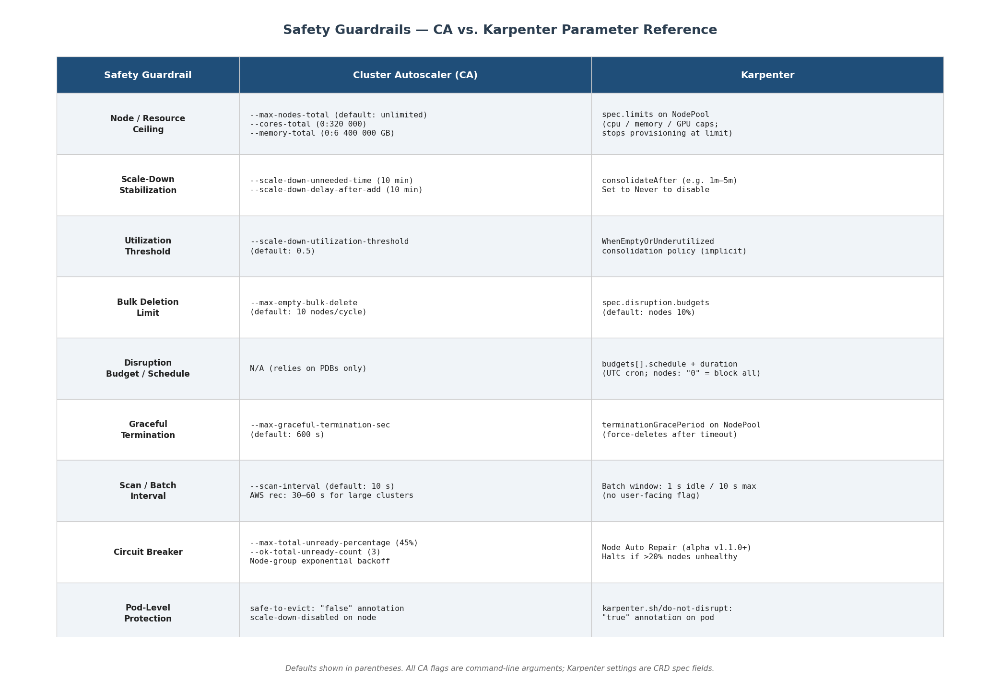

*Figure 2 — Side-by-side comparison of nine key safety guardrail categories for CA and Karpenter, covering node/resource ceilings, scale-down stabilization, utilization thresholds, bulk deletion limits, disruption budgets, graceful termination, scan/batch intervals, circuit breakers, and pod-level protection annotations. CA parameters are command-line flags; Karpenter parameters are CRD spec fields.*

### 5.3.3 PodDisruptionBudgets

Both CA (since v0.5) and Karpenter respect PodDisruptionBudgets (PDBs) through the Kubernetes Eviction API. PDBs are the primary mechanism for expressing application-level availability constraints to the autoscaler [Kubernetes PDB Docs](https://kubernetes.io/docs/tasks/run-application/configure-pdb/ "PDB configuration guide") [CA FAQ](https://github.com/kubernetes/autoscaler/blob/master/cluster-autoscaler/FAQ.md "CA and PDB interaction behavior").

Best practices for PDB configuration in multi-layer autoscaling environments include:

- **Prefer `maxUnavailable` over `minAvailable`.** A PDB with `minAvailable: 3` on a 5-replica Deployment allows 2 simultaneous disruptions, but breaks if the Deployment scales down to 3 replicas (zero disruptions allowed, permanently blocking drain). `maxUnavailable: 2` automatically adapts to any replica count.
- **Avoid `maxUnavailable: 0` or `minAvailable: 100%`.** These configurations permanently block node drain, preventing both CA scale-down and Karpenter consolidation. The autoscaler logs the blocking PDB but cannot override it (except when Karpenter's `terminationGracePeriod` expires).
- **Enable `unhealthyPodEvictionPolicy: AlwaysAllow`.** Stable since Kubernetes v1.31, this policy allows the autoscaler to evict pods in `CrashLoopBackOff` or other unhealthy states even when they are protected by a PDB. Without this setting, a single crashing pod can block node drain indefinitely by occupying a PDB slot.
- **Create explicit PDBs for kube-system pods.** CA will not remove a node running a `kube-system` pod that lacks a PDB, treating it as undrainable. Creating PDBs for DaemonSet-managed system pods (e.g., `kube-proxy`, `aws-node`) ensures they do not inadvertently block scale-down.

### 5.3.4 Circuit Breakers and Backoff

CA implements a multi-level circuit breaker that halts scaling operations when cluster health degrades [CA FAQ](https://github.com/kubernetes/autoscaler/blob/master/cluster-autoscaler/FAQ.md "Unready nodes, backoff durations"):

- **Unready node breaker:** If `--max-total-unready-percentage` (default: 45%) or `--ok-total-unready-count` (default: 3) is exceeded, CA stops all scale-up and scale-down operations cluster-wide. This prevents cascading failures where attempting to scale up in response to failing nodes produces more failing nodes.
- **Scale-down failure backoff:** After a failed scale-down attempt, CA pauses scale-down for `--scale-down-delay-after-failure` (default: 3 minutes).
- **Node group backoff:** Repeated provisioning failures for a specific node group trigger exponential backoff from `--initial-node-group-backoff-duration` (default: 5 minutes) to `--max-node-group-backoff-duration` (default: 30 minutes). This prevents CA from repeatedly hammering a cloud API that is returning capacity errors (e.g., `InsufficientInstanceCapacity`).

Karpenter's equivalent mechanism is **Node Auto Repair** (alpha, v1.1.0+): when a node reports `Ready=False` for 30 minutes, Karpenter automatically cordons it, provisions a replacement, and drains the unhealthy node. A critical safety limit prevents cascade: if more than 20% of nodes in a NodePool are simultaneously unhealthy, auto-repair halts to avoid amplifying an infrastructure-wide failure [Karpenter Disruption Docs](https://karpenter.sh/docs/concepts/disruption/ "Node Auto Repair").

For the predictive scaling layer, no standardized circuit-breaker pattern exists in published T1/T2 sources. However, a practical implementation mirrors the approach used by Kedify's `modelMapeThreshold` (Chapter 2): the prediction service continuously computes rolling MAPE (Mean Absolute Percentage Error) against realized demand, and when the error exceeds a configurable threshold, the service automatically disables its output and falls back to the reactive layer. The specific MAPE threshold depends on organizational SLOs — a latency-sensitive real-time serving cluster might use 15%, while a batch processing cluster might tolerate 30%.

GCP Predictive Autoscaling implements an implicit circuit breaker: when actual usage exceeds the predicted value, the system overrides the forecast and scales based on real-time signals within minutes, ensuring that underprediction does not result in capacity shortfall [GCP Predictive Autoscaling](https://cloud.google.com/compute/docs/autoscaler/predictive-autoscaling "Forecast error adaptation").

## 5.4 Spot and Preemptible Instance Integration

Spot (AWS), Preemptible/Spot (GCP), and Spot (Azure) instances offer 60–90% discounts over On-Demand pricing but can be reclaimed by the cloud provider with as little as 2 minutes' notice. Integrating Spot instances into a multi-layer autoscaling stack amplifies cost savings but introduces additional failure modes that require careful configuration.

### 5.4.1 Karpenter Spot Strategy

Karpenter uses a **Price Capacity Optimized (PCO)** allocation strategy for Spot instances: it first selects from Spot pools with the highest available capacity, then optimizes for the lowest price within those pools. This approach reduces the probability of Spot interruption compared to a purely price-optimized strategy. When a Spot pool experiences insufficient capacity, Karpenter temporarily removes that instance type from its offering set for 3 minutes; if no Spot capacity is available across any pool, Karpenter falls back to On-Demand instances "typically within milliseconds" [AWS Spot+Karpenter Blog](https://aws.amazon.com/blogs/containers/using-amazon-ec2-spot-instances-with-karpenter/ "Spot allocation, fallback, interruption handling").

Karpenter provides native Spot interruption handling via an SQS queue (`--interruption-queue-name`). Upon receiving a 2-minute Spot interruption notice, Karpenter immediately cordons the affected node, initiates pod drain, and concurrently provisions a replacement node — overlapping the drain and provisioning phases to minimize workload disruption. Spot-to-Spot consolidation (feature gate `SpotToSpotConsolidation`, available since v0.34.0) enables Karpenter to migrate workloads between Spot instances when cheaper or more capacious pools become available, but requires a minimum of 15 diverse instance types in the NodePool to ensure sufficient alternative capacity [AWS Spot+Karpenter Blog](https://aws.amazon.com/blogs/containers/using-amazon-ec2-spot-instances-with-karpenter/ "Spot-to-Spot consolidation requirements").

### 5.4.2 CA Spot Strategy

For CA-managed clusters, AWS best practices recommend isolating Spot and On-Demand instances into separate ASGs. Each ASG should contain instance types with similar vCPU and memory ratios to ensure CA's scheduling simulation remains accurate. The `--expander=least-waste` flag optimizes bin-packing across heterogeneous ASGs. Unlike Karpenter, CA does not provide native Spot interruption handling; operators must deploy a separate component such as the AWS Node Termination Handler (NTH) to drain nodes upon receiving interruption notices [AWS EKS CA Best Practices](https://docs.aws.amazon.com/eks/latest/best-practices/cas.html "Spot best practices for CA").

### 5.4.3 Spot in Multi-Layer Architectures

When combining Spot instances with predictive or scheduled scaling, two design principles apply. First, the overprovisioning buffer (Chapter 4) should preferentially run on Spot instances: since placeholder pods perform no real computation, they are ideal Spot candidates. If a Spot instance hosting placeholders is reclaimed, the evicted placeholder pods simply return to Pending state and trigger replacement provisioning — the same cycle that occurs during preemption by real workloads. Second, predictive and scheduled scale-up should request On-Demand capacity for the baseline and Spot capacity for the predicted surplus. This ensures that the minimum guaranteed capacity for known peak loads is not subject to reclamation, while the speculative capacity above the baseline leverages Spot pricing.

## 5.5 Cost Governance

Node-level autoscaling directly controls the largest cost line item in most Kubernetes deployments — the compute fleet. Without cost governance, a well-intentioned autoscaling configuration can generate unexpected bills when prediction models overshoot, cron rules miscalculate, or overprovisioning buffers are sized too generously.

### 5.5.1 Cost Visibility Tools

**OpenCost** (CNCF Sandbox, Apache 2.0) provides real-time cost allocation by cluster, node, namespace, and pod, integrating with cloud provider billing APIs for accurate pricing data. **Kubecost**, built on the OpenCost engine, extends this with enterprise features including budget alerts, RBAC-based cost policies, and anomaly detection that can flag unexpected cost spikes caused by autoscaling events [OpenCost GitHub](https://github.com/opencost/opencost "OpenCost repository").

On AWS, a layered cost alerting strategy combines CloudWatch Billing Alarms (for account-level spend), AWS Cost Anomaly Detection (for ML-based anomaly identification), and Karpenter `spec.limits` (for cluster-level compute ceilings). An additional defense layer uses CloudWatch Logs Metric Filters on Karpenter controller logs to detect "exceeds limit" messages and trigger SNS alerts before the cluster reaches its hard ceiling [AWS EKS Karpenter Best Practices](https://docs.aws.amazon.com/eks/latest/best-practices/karpenter.html "Cost governance with Karpenter").

### 5.5.2 Idle Node Reclamation

Prompt reclamation of idle nodes after demand subsides prevents cost leakage. The two primary autoscalers implement different reclamation strategies:

- **Karpenter consolidation:** The `WhenEmptyOrUnderutilized` consolidation policy (default) enables Karpenter to remove nodes that are either completely empty or carrying workloads that can be redistributed to other nodes with available capacity. The `consolidateAfter` parameter (e.g., `1m`) controls the delay after a node becomes underutilized before consolidation begins. Setting this value too low causes oscillation; setting it too high wastes compute. A starting point of 1–5 minutes balances responsiveness against stability for most workloads.
- **CA scale-down:** CA considers a node underutilized when its total CPU and memory requests fall below `--scale-down-utilization-threshold` (default: 0.5), and removes it after `--scale-down-unneeded-time` (default: 10 minutes) of sustained underutilization. For clusters with scheduled scaling that creates deliberate idle periods (e.g., off-peak buffer reduction), the scale-down timer should be shorter than the scheduled idle window to ensure nodes are reclaimed before the next scheduled scale-up replenishes them.

### 5.5.3 Node-Hour Budget Alerts

A practical cost governance pattern for autoscaled clusters is a node-hour budget: the total number of node-hours consumed per day or week should not exceed a configurable threshold. This metric integrates directly with Karpenter's `karpenter_cluster_state_node_count` (sampled per minute and aggregated) or CA's node-group size metrics. When the rolling node-hour total approaches the budget ceiling, an alert fires to the platform engineering team, who can then investigate whether the excess consumption is driven by legitimate demand growth, prediction error, or configuration drift.

## 5.6 Coordination Between Scaling Layers

The most operationally challenging aspect of multi-layer autoscaling is preventing destructive interactions between layers. Without explicit coordination, the reactive layer may scale down nodes that the predictive layer intentionally provisioned, or the scheduled layer may set a floor that conflicts with the prediction model's recommendation.

### 5.6.1 Floor-Ceiling Separation

The foundational coordination principle, established in Chapter 3, assigns clear roles: scheduled and predictive layers set capacity floors (`minSize`, `minRequiredReplicas`, or minimum pod counts), while the reactive layer (CA/Karpenter) manages the ceiling by provisioning additional nodes when demand exceeds the floor. This separation ensures that the reactive layer never scales below the proactively set minimum, while still responding to demand that exceeds predictions.

For CA-managed clusters, this translates to: scheduled actions or predictive scaling adjust the ASG `minSize`, while `maxSize` and the `--max-nodes-total` flag remain under CA control. For Karpenter, the predictive or cron layer creates placeholder pods to establish the floor (since Karpenter has no native minimum-node-count concept), while `spec.limits` enforces the ceiling.

### 5.6.2 Scale-Down Stabilization

When the scheduled or predictive layer reduces the capacity floor (e.g., the cron window expires, or the prediction drops), the reactive layer should not immediately remove the now-surplus nodes. Built-in stabilization timers serve this purpose: CA's `--scale-down-unneeded-time` (default: 10 minutes) and `--scale-down-delay-after-add` (default: 10 minutes) provide a natural cooling-off period. For KEDA-driven scaling, the `cooldownPeriod` (default: 5 minutes) on the ScaledObject prevents oscillation during the transition between cron windows [CA FAQ](https://github.com/kubernetes/autoscaler/blob/master/cluster-autoscaler/FAQ.md "Key best practices").

For scheduled scale-down events, operators should configure the scale-down window to begin 30–60 minutes after the expected workload completion time, providing a buffer for workloads that run longer than anticipated. Karpenter's disruption budgets with `schedule` fields (Section 5.3.2) offer the most precise mechanism for protecting nodes during specific time windows.

### 5.6.3 Annotation-Based Protection

Individual workloads that must survive scaling transitions can opt out of autoscaler disruption through annotations. CA respects `cluster-autoscaler.kubernetes.io/scale-down-disabled: "true"` on nodes to exclude them from scale-down evaluation, and `cluster-autoscaler.kubernetes.io/safe-to-evict: "false"` on pods to prevent their host node from being drained [CA FAQ](https://github.com/kubernetes/autoscaler/blob/master/cluster-autoscaler/FAQ.md "scale-down-disabled annotation"). Karpenter provides the equivalent `karpenter.sh/do-not-disrupt: "true"` annotation on pods. These annotations should be applied selectively — overuse defeats the purpose of autoscaling — and removed programmatically (e.g., via a post-job-completion hook) to avoid permanently stranding nodes.

## 5.7 Operational Checklist

The following checklist synthesizes the practices in this chapter into a concrete sequence for teams adopting multi-layer node-level autoscaling:

1. **Baseline monitoring.** Deploy Prometheus metric collection for CA or Karpenter (Section 5.2) and establish current-state dashboards for node count, pod scheduling latency, and node utilization before introducing any new scaling layer.

2. **Safety guardrails first.** Configure `--max-nodes-total` (CA) or `spec.limits` (Karpenter), PDBs for critical workloads, and disruption budgets before enabling predictive or scheduled scaling (Section 5.3).

3. **Shadow-mode evaluation.** Deploy the predictive or scheduled scaling logic in observe-only mode for 1–2 weeks. Compare recommendations against actual cluster behavior (Section 5.1.1).

4. **Canary deployment.** Route a small percentage of workloads to a predictively scaled node pool via `spec.weight` (Karpenter) or `--expander=priority` (CA). Monitor for 1–2 weeks (Section 5.1.2).

5. **Progressive rollout.** Incrementally increase workload allocation to the new scaling layer. At each step, verify that prediction accuracy (MAPE), scheduling latency (p99), and cost metrics remain within acceptable bounds (Section 5.1.3).

6. **Cost governance integration.** Deploy OpenCost or Kubecost, configure node-hour budget alerts, and set Karpenter `spec.limits` or CA resource ceiling flags (Section 5.5).

7. **Cross-layer coordination.** Confirm that floor-ceiling separation is enforced: proactive layers set minimums, reactive layers manage maximums. Validate scale-down stabilization timers are longer than the transition period between scheduled windows (Section 5.6).

8. **Ongoing validation.** Continuously monitor prediction accuracy, node turnover rates, and cost trends. Retrain predictive models on a scheduled cadence (e.g., every 6 hours as recommended by Kedify, Chapter 2). Review and adjust cron schedules quarterly or after significant workload pattern changes.

# 第6章 Evaluation Framework and Comparative Analysis

Chapters 1 through 4 presented four complementary approaches to node-level autoscaling — reactive provisioning via CA and Karpenter, predictive ML-based scaling, scheduled and calendar-driven scaling, and proactive overprovisioning with hybrid architectures — while Chapter 5 translated these into operational practices. A central question remains: how should a platform engineering team evaluate which combination of strategies is appropriate for a given workload profile, SLO contract, and operational maturity level?

This chapter provides the analytical framework to answer that question. Section 6.1 defines seven evaluation dimensions that capture the essential trade-offs in node-level autoscaling. Section 6.2 surveys the benchmarking and simulation tools available for empirical validation. Section 6.3 presents a comparative analysis of each strategy across three representative workload archetypes, and Section 6.4 concludes with a decision framework that maps organizational context to recommended strategy combinations.

## 6.1 Evaluation Dimensions

Any meaningful comparison of node-level autoscaling strategies requires a multi-dimensional lens. A strategy that minimizes scaling latency may incur prohibitive cost; one that maximizes portability may sacrifice fine-grained optimization. The seven dimensions defined below collectively span the decision space.

### 6.1.1 Scaling Latency

Scaling latency decomposes into four sequential phases: *detection latency* (time from workload change to autoscaler awareness), *decision latency* (time for the autoscaler to determine the required action), *provisioning latency* (time for the cloud provider to deliver a ready VM), and *registration latency* (time for the new node to join the cluster and become schedulable). As established in Chapter 1, the CA reactive loop yields end-to-end latency of 2–5 minutes depending on cloud provider, while Karpenter reduces this to approximately 60–90 seconds through direct fleet API calls and a 1-second idle batch window [CA FAQ](https://github.com/kubernetes/autoscaler/blob/master/cluster-autoscaler/FAQ.md "Official CA FAQ — combined HPA+CA latency ~5 min on GCE") [AWS Containers Blog](https://aws.amazon.com/blogs/containers/eliminate-kubernetes-node-scaling-lag-with-pod-priority-and-over-provisioning/ "AWS blog: ~1–2 min node provisioning lag").

Proactive strategies shift the relevant latency metric from *provisioning latency* to *prediction lead time* or *schedule accuracy*. A predictive model that forecasts demand 2 hours ahead (as configured in KEDA's PredictKube scaler with `predictHorizon: 2h`) eliminates provisioning latency entirely — provided the forecast is accurate [KEDA PredictKube Scaler Docs](https://keda.sh/docs/2.19/scalers/predictkube/ "Official PredictKube scaler documentation — 2h prediction horizon"). Overprovisioning achieves near-zero effective latency by maintaining pre-warmed capacity, at the cost of continuous idle-resource expenditure (Chapter 4).

For evaluation purposes, *pod scheduling latency* — the time from pod creation to Running state — serves as the unified metric across all strategies. Karpenter exposes this directly via `karpenter_pods_startup_duration_seconds`; for CA environments, the equivalent can be derived from `kubelet_pod_start_sli_duration_seconds` (available since Kubernetes 1.27) [Karpenter Metrics Reference](https://karpenter.sh/docs/reference/metrics/ "Official Karpenter metrics documentation").

The following chart illustrates the magnitude of latency differences across strategies under event-spike conditions, ranging from sub-5-second scheduling when overprovisioning buffers absorb the burst to 2–5 minutes under pure reactive CA provisioning.

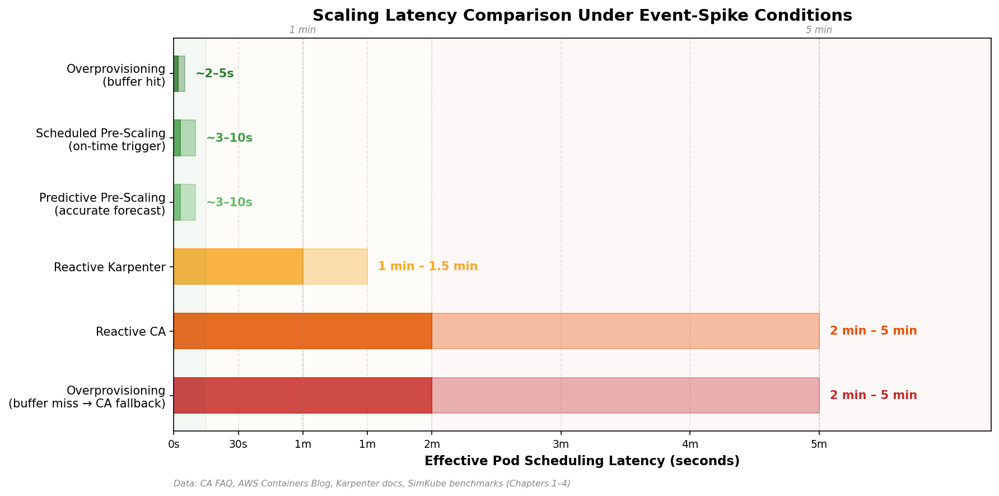

*Figure 6.1: Effective p99 pod scheduling latency by strategy under event-spike conditions. Data synthesized from CA FAQ, AWS Containers Blog, Karpenter documentation, and SimKube benchmarks (Chapters 1–4).*

### 6.1.2 Cost Efficiency

Cost efficiency encompasses five sub-metrics: *bin-packing efficiency* (ratio of requested to allocatable resources), *Spot instance utilization* (fraction of workload running on discounted instances), *idle node-hours* (nodes with utilization below a defined threshold), *overprovisioning overhead* (cost of placeholder capacity), and *consolidation effectiveness* (reduction in node count through active bin-packing).

Karpenter's group-less provisioning achieves demonstrably superior bin-packing. HP PrintOS reported a 40% improvement in EKS worker node utilization after migrating from CA to Karpenter (v0.36.1), with additional annual savings exceeding $125,000 through Spot instance integration for non-production workloads [AWS HP Karpenter Blog](https://aws.amazon.com/blogs/containers/how-hp-achieved-40-improvement-in-kubernetes-node-utilization-utilization-on-amazon-eks-using-karpenter/ "HP PrintOS: 40% utilization improvement, Nov 2024"). Separately, the Aircall engineering team achieved approximately 50% node cost reduction and 25% total cluster cost reduction through scheduled Karpenter scale-to-zero in non-production environments [Aircall Engineering Blog](https://aircall.io/blog/tech-team-stories/scale-karpenter-zero-optimize-costs/ "Aircall: ~50% node cost reduction").

Overprovisioning introduces a quantifiable cost floor. As detailed in Chapter 4, a 2-node `m5.large` buffer at $0.096/hour costs approximately $1,682 per year — a modest absolute cost that must be weighed against the SLO value of eliminating 1–2 minutes of provisioning latency [AWS Containers Blog](https://aws.amazon.com/blogs/containers/eliminate-kubernetes-node-scaling-lag-with-pod-priority-and-over-provisioning/ "Performance vs cost trade-off for overprovisioning"). Scheduled overprovisioning that reduces buffer size during off-peak hours can reclaim 40–60% of this overhead.

### 6.1.3 SLO Attainment Rate

SLO attainment rate measures the proportion of time during which pod scheduling latency remains within the defined target. The Kubernetes Scalability SIG defines a baseline SLO of p99 pod startup latency ≤ 5 seconds for schedulable stateless pods (excluding image pull and init containers) [AWS EKS Scalability Blog](https://aws.amazon.com/blogs/containers/deep-dive-into-amazon-eks-scalability-testing/ "K8s SLIs/SLOs defined in EKS scalability testing"). In autoscaling contexts, the relevant SLO extends beyond this baseline to encompass pods that require new node capacity, where the target must account for provisioning time.

Punniyamoorthy et al. (IEEE 2025) formalized this as a dual metric: *SLO violation frequency* (number of violations per evaluation period) and *SLO violation duration* (cumulative time spent in violation). Their SLO-driven evaluation framework, tested against Kubernetes default autoscaling baselines, reduced SLO violation duration by up to 31% and infrastructure cost by 18% [Punniyamoorthy et al.](https://arxiv.org/html/2512.23415v1 "SLO Driven and Cost-Aware Autoscaling Framework for Kubernetes, IEEE 2025"). This dual metric provides a more nuanced view than a single attainment percentage, as it captures both the incidence and severity of scaling shortfalls.

### 6.1.4 Operational Complexity

Operational complexity reflects the total burden of deploying, configuring, monitoring, and maintaining the autoscaling stack. Four sub-dimensions capture this burden: *CRD and configuration surface area* (number of distinct configuration objects), *CI/CD integration requirements* (GitOps compatibility, rollout procedures), *monitoring infrastructure needs* (dashboards, alerts, log queries), and *team skill threshold* (Kubernetes expertise level required for safe operation).

A standalone CA deployment requires minimal configuration: a single Deployment with command-line flags. Adding KEDA cron scaling introduces ScaledObject CRDs and trigger configurations. Layering predictive scaling adds a model training pipeline, a metrics ingestion path, and MAPE/MSE monitoring. The full four-layer stack described in Chapter 4 — reactive + predictive + scheduled + overprovisioning — may involve CA or Karpenter NodePool configuration, KEDA ScaledObjects with multiple triggers, a prediction service Deployment, PriorityClass definitions, CPA or CapacityBuffer CRDs, and PodDisruptionBudgets. Each additional layer yields incremental SLO improvement at the cost of multiplicative configuration complexity and a wider failure surface.

### 6.1.5 Cross-Cloud Portability

Portability measures the degree to which a scaling strategy can be deployed consistently across cloud providers — or in on-premises environments — without provider-specific reconfiguration.

CA offers the broadest portability, supporting AWS, GCP, Azure, Alibaba Cloud, DigitalOcean, OCI, and additional providers through its cloud-provider plugin architecture [CA FAQ](https://github.com/kubernetes/autoscaler/blob/master/cluster-autoscaler/FAQ.md "Cloud provider support listing"). Karpenter provides first-class support on AWS and Azure integration through AKS Node Auto Provisioning (NAP), but no native GCP provider exists as of April 2026; KWOK provides infrastructure-free simulation for any environment [AKS NAP](https://learn.microsoft.com/en-us/azure/aks/node-auto-provisioning "Microsoft docs, updated 2026-02-15").

Cloud-native predictive autoscaling (AWS Predictive Scaling, GCP Predictive Autoscaling, Azure Predictive Autoscale) is inherently non-portable: each service uses proprietary ML models, provider-specific metric systems, and different minimum history requirements — 24 hours for AWS, 3 days for GCP, and 7 days for Azure (Chapter 2). KEDA-based strategies (cron and predictive scalers) offer the best portability among proactive approaches, as KEDA is a CNCF Graduated project with no cloud-provider dependency [KEDA GitHub Releases](https://github.com/kedacore/keda/releases "KEDA v2.19.0, Feb 2026").

### 6.1.6 Stability and Predictability

Stability captures the degree to which autoscaling behavior is consistent and free from oscillation. Key indicators include *node turnover rate* (creation and termination events per unit time), *scaling oscillation frequency* (rapid alternation between scale-up and scale-down), *decision consistency* (whether identical input states produce identical output actions), and *partial-failure behavior* (how the autoscaler degrades when one layer malfunctions).

SimKube simulation results illuminate meaningful differences. In approximately 1,000 pending-pod scenarios, Karpenter exhibited high instance-type selection consistency across 10 trace replays, while CA's default random expander produced non-deterministic type selection across equivalent runs [SimKube CA vs Karpenter](https://blog.appliedcomputing.io/p/using-simkube-10-comparing-kubernetes "SimKube 1.0: CA vs Karpenter, September 2024"). This determinism advantage compounds in multi-layer stacks, where predictable reactive-layer behavior simplifies the tuning of predictive and scheduled layers.

Multi-layer stacks also introduce inter-layer oscillation risk. If the predictive layer scales up and the reactive layer's consolidation timer subsequently identifies the new nodes as underutilized — because the predicted demand has not yet materialized — it may attempt scale-down, negating the proactive provisioning. The guardrails described in Chapter 5 (Karpenter `consolidateAfter`, CA `--scale-down-delay-after-add`, disruption budget schedules) are essential for damping these feedback loops.

### 6.1.7 Workload Archetype Fitness

Not every strategy suits every workload. Three representative archetypes recur across Kubernetes production environments:

- **Diurnal web traffic.** Predictable daily cycles with weekday peaks and overnight troughs. The dominant pattern spans 10–12 hours of high demand followed by 12–14 hours of low demand, with moderate ramp rates (minutes, not seconds). Holiday and weekend suppression may apply.
- **Batch / ML training bursts.** Large, infrequent jobs that demand tens to hundreds of nodes for hours, then release them entirely. Arrival times may be scheduled (nightly ETL) or ad-hoc (researcher-triggered training). Cost sensitivity is high; latency sensitivity is low relative to total job duration.
- **Event-driven spikes.** Sharp, short-lived demand surges triggered by external events — flash sales, game launches, marketing campaigns, breaking news. Ramp times are measured in seconds; the cost of under-provisioning is measured in lost revenue or user-facing errors.

Each archetype creates distinct demands on the evaluation dimensions defined above. Section 6.3 maps strategies to these archetypes in detail.

## 6.2 Benchmarking and Simulation Tools

Evaluating autoscaling strategies in production is both expensive and risky — a misconfigured experiment can degrade live workloads. The Kubernetes ecosystem provides several tools that enable empirical evaluation without full production exposure.

### 6.2.1 ClusterLoader2

ClusterLoader2 (CL2) is the official Kubernetes scalability testing framework, maintained within the `kubernetes/perf-tests` repository. It serves as the release-blocking scalability test suite for upstream Kubernetes and has been adopted by major cloud providers for platform validation. Amazon EKS used CL2 for its 5,000-node scalability verification, testing pod startup latency, API server responsiveness, and scheduler throughput under sustained load [ClusterLoader2 GitHub](https://github.com/kubernetes/perf-tests "Official K8s performance tests") [AWS EKS Scalability Blog](https://aws.amazon.com/blogs/containers/deep-dive-into-amazon-eks-scalability-testing/ "EKS 5,000-node scalability testing with CL2, 2024").

For autoscaling evaluation, CL2's value lies in its ability to generate controlled, reproducible workload patterns — synthetic pod creation at configurable rates, resource request distributions, and scheduling constraints — that stress-test autoscaler behavior under known conditions. Teams can define CL2 test cases that simulate each of the three workload archetypes (diurnal ramp, batch burst, event spike) and measure autoscaler response across the evaluation dimensions defined in Section 6.1.

### 6.2.2 KWOK and SimKube

KWOK (Kubernetes Without Kubelet), a SIG-sponsored toolset, simulates thousands of nodes in seconds without provisioning real infrastructure. Simulated nodes appear as regular node objects in the Kubernetes API — complete with configurable capacity, labels, and conditions — enabling autoscaler logic to execute against a realistic cluster state at zero infrastructure cost [KWOK official blog](https://kubernetes.io/blog/2023/03/01/introducing-kwok/ "KWOK introduction, March 2023").

AWS has published a methodology combining Karpenter with KWOK for data-plane cost modeling, simulating workload placement across instance-type portfolios to estimate cost and utilization before committing to production changes [AWS Karpenter+KWOK Blog](https://aws.amazon.com/blogs/containers/migrate-to-amazon-eks-data-plane-cost-modeling-with-karpenter-and-kwok/ "Cost modeling with Karpenter and KWOK, August 2025").

SimKube (v1.0, September 2024) extends the KWOK approach with record-and-replay capabilities. Operators capture a trace of production cluster activity — pod creation, deletion, resource requests, scheduling events — and replay it against different autoscaler configurations in a simulated environment. This enables controlled A/B comparisons: the same workload trace evaluated under CA, Karpenter, or any combination of proactive strategies, with identical input conditions [SimKube GitHub](https://github.com/acrlabs/simkube "Record-and-replay K8s simulator").

The SimKube team's published comparison of CA and Karpenter under approximately 1,000 pending pods provides concrete quantitative data points. Karpenter's fast provisioning loop completed each reconciliation in at most ~12 seconds versus CA's 20–60-second main loop. During scale-out transitions, Karpenter maintained roughly 75% fewer pending pods than CA, while consuming 1–2 vCPU for controller operation versus CA's 2–3 vCPU [SimKube CA vs Karpenter](https://blog.appliedcomputing.io/p/using-simkube-10-comparing-kubernetes "SimKube 1.0: CA vs Karpenter, September 2024"). These simulation-derived metrics complement production observations and provide a low-risk evaluation path for teams considering autoscaler migration.

### 6.2.3 Kube-burner

Kube-burner, accepted into the CNCF Sandbox in December 2023, orchestrates Kubernetes performance and scale testing through configurable job definitions that create, modify, and delete cluster objects at controlled rates [kube-burner GitHub](https://github.com/kube-burner/kube-burner "CNCF Sandbox project"). Its primary strength lies in sustained-load generation — creating thousands of pods per minute across namespaces — which stresses autoscaler throughput and reveals bottlenecks in the detection-to-provisioning pipeline that point-load tests may not surface.

### 6.2.4 Chaos Engineering Validation

Chaos engineering tools validate autoscaler resilience under failure conditions — a dimension that synthetic load tests alone cannot cover.

**LitmusChaos** (CNCF Incubating) provides a dedicated `pod-autoscaler` chaos experiment that scales a Deployment to a configurable replica count and verifies that CA provisions sufficient node capacity to accommodate the surge. AWS has published a walkthrough of this experiment on EKS [AWS LitmusChaos Blog](https://aws.amazon.com/blogs/containers/chaos-engineering-with-litmuschaos-on-amazon-eks/ "LitmusChaos on EKS, Dec 2021"). **Chaos Mesh** (CNCF Incubating) offers PodChaos, NetworkChaos, and StressChaos experiments with CRD-native workflow orchestration, enabling scenarios such as simulating node-level CPU pressure to trigger autoscaler response, injecting network partitions between the autoscaler and the cloud API, or inducing pod failures that test PDB interaction with scale-down logic [Chaos Mesh](https://chaos-mesh.org/ "CNCF Incubating project").

For multi-layer autoscaling stacks, a structured chaos validation sequence strengthens confidence in graceful degradation: (1) disable the predictive layer and verify that the reactive safety net (CA or Karpenter) handles the load alone; (2) inject prediction errors (artificially shift the predicted value by ±50%) and verify that the reactive layer compensates; (3) block the scheduled scaling mechanism and confirm that overprovisioning buffers absorb the gap; and (4) simulate cloud provider API failures and verify circuit-breaker activation (Chapter 5). This layered validation confirms that no single-layer failure cascades into an SLO breach.

## 6.3 Comparative Analysis by Workload Archetype

The following analysis maps each strategy to the three representative workload archetypes, evaluating fitness across the seven dimensions defined in Section 6.1. The assessment synthesizes the empirical data, vendor documentation, and simulation results presented in Chapters 1–5.

Figure 6.2 provides an overview of how each strategy scores across evaluation dimensions for each workload archetype before the detailed discussion that follows.

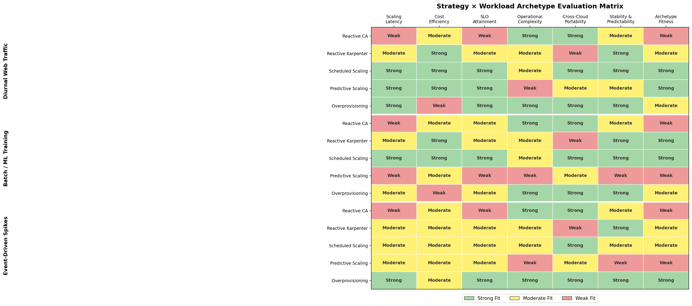

*Figure 6.2: Heatmap evaluating five node-level autoscaling strategies across seven dimensions for three workload archetypes. Green indicates strong fit, yellow moderate fit, and red weak fit.*

### 6.3.1 Diurnal Web Traffic

Diurnal web traffic exhibits strong periodicity, moderate ramp rates, and relatively high tolerance for scheduling latency in the 30–60-second range. Individual HTTP requests are served by existing pods; autoscaling affects the throughput ceiling rather than per-request latency.

**Scheduled scaling** is the natural primary strategy for this archetype. KEDA's cron scaler or cloud-native scheduled actions (AWS ASG Scheduled Actions supporting up to 125 rules per ASG, GCP MIG Scaling Schedules supporting up to 128 schedules, Azure VMSS Autoscale Profiles supporting up to 20 profiles) can encode the daily pattern as floor-setting rules that pre-provision capacity 15–30 minutes before the expected ramp [AWS Scheduled Scaling](https://docs.aws.amazon.com/autoscaling/ec2/userguide/ec2-auto-scaling-scheduled-scaling.html "AWS EC2 Auto Scaling — Scheduled scaling") [GCP Scaling Schedules](https://cloud.google.com/compute/docs/autoscaler/scaling-schedules "Compute Engine — Scaling based on schedules"). Cost efficiency is high because the schedule mirrors the actual demand curve, minimizing idle capacity outside peak windows.

**Cloud-native predictive autoscaling** provides an excellent complement. GCP Predictive Autoscaling requires only 3 days of CPU history and recalculates predictions every few minutes at no additional cost, making it purpose-built for daily and weekly patterns [GCP Predictive Autoscaling](https://cloud.google.com/compute/docs/autoscaler/predictive-autoscaling "Official GCP documentation"). AWS Predictive Scaling analyzes up to 14 days of CloudWatch history and generates 48-hour forecasts updated every 6 hours [AWS Predictive Scaling](https://docs.aws.amazon.com/autoscaling/ec2/userguide/ec2-auto-scaling-predictive-scaling.html "AWS official documentation"). Both services handle daily patterns effectively but cannot adapt to one-time events (promotions, holidays) without manual calendar overrides.

**Overprovisioning** plays a limited role for this archetype — a small static buffer (1–2 nodes) absorbs minor forecast errors, but the predictability of the workload does not justify large warm pools. The reactive layer (CA or Karpenter) serves as the safety net for unexpected deviations from the daily pattern.

### 6.3.2 Batch and ML Training Bursts

Batch workloads demand rapid provisioning of large node quantities (tens to hundreds) and full release upon job completion. Scheduling latency tolerance is moderate — a 5-minute provisioning delay on a 4-hour training job represents approximately 2% overhead — but cost sensitivity is high because idle GPU or CPU nodes during training gaps accumulate expense rapidly.

**Scheduled scaling** is the primary strategy when job timing is known in advance. Nightly ETL pipelines, periodic model retraining, and CI/CD batch runs all follow predictable schedules. CronJob-driven NodePool limit adjustments (the Karpenter pattern described in Chapter 3) or ASG scheduled actions can pre-scale capacity before job submission and aggressively reclaim it afterward.

**Predictive scaling** has limited applicability for this archetype. The burst-and-release pattern — hours of zero demand followed by a sudden spike to hundreds of nodes — is poorly modeled by the time-series approaches that underpin cloud-native predictive services. AWS Predictive Scaling explicitly targets hourly cyclical patterns; GCP Predictive Autoscaling does not capture patterns shorter than 10 minutes and requires at least 3 days of historical data (Chapter 2). Custom ML models (LSTM, Transformer) can in principle learn burst schedules, but the regularity of batch timing typically makes explicit cron rules simpler and more reliable.

**Karpenter's group-less provisioning** is particularly valuable for batch workloads. Jobs with diverse resource profiles (CPU-heavy preprocessing, GPU training, memory-intensive evaluation) benefit from Karpenter's ability to select optimal instance types per-pod rather than mapping all jobs to a pre-defined node group. The SimKube comparison confirms Karpenter's advantage in heterogeneous workloads, achieving more consistent instance selection and faster provisioning under high pending-pod counts [SimKube CA vs Karpenter](https://blog.appliedcomputing.io/p/using-simkube-10-comparing-kubernetes "SimKube 1.0: CA vs Karpenter, September 2024").

**Scale-to-zero** is a critical cost lever for batch environments. Karpenter's `spec.limits.cpu: "0"` pattern, with control-plane components on Fargate (Chapter 3), eliminates 100% of worker-node cost during idle periods. CA requires maintaining at least one node per ASG for metadata propagation, making true scale-to-zero more cumbersome.

### 6.3.3 Event-Driven Spikes

Event-driven spikes — flash sales, game launches, live-stream traffic surges — represent the most challenging autoscaling scenario. Demand can multiply 10× in under a minute, latency sensitivity is extreme (lost sales, degraded user experience), and the timing may be partially known (planned promotion) or entirely unpredictable (viral content).

**Overprovisioning** is the indispensable primary strategy for this archetype. No reactive, predictive, or scheduled mechanism can provision cloud VMs in the sub-minute timeframe that event spikes demand. Pre-warmed pause-pod capacity — sized to absorb the expected initial burst — provides instant scheduling for the first wave of demand while the reactive layer catches up. For planned events, GCP one-time scaling schedules, Azure fixed-date profiles, or AWS one-time scheduled actions can increase the overprovisioning buffer in advance (Chapter 3).

**Karpenter disruption budgets** provide essential protection during events. Configuring `nodes: "0"` with a cron schedule covering the event window prevents consolidation from reclaiming proactively provisioned nodes, while the `karpenter.sh/do-not-disrupt: "true"` annotation protects individual critical-path pods [Karpenter Disruption Docs](https://karpenter.sh/docs/concepts/disruption/ "NodePool Disruption Budgets — schedule and duration fields").

**Predictive scaling** can pre-position capacity for events with partial timing knowledge (e.g., a flash sale announced 24 hours in advance), but accuracy degrades sharply for truly novel events without historical precedent. Kedify's MetricPredictor CRD (`modelMapeThreshold`) provides a principled mechanism for falling back to reactive scaling when prediction confidence drops below an acceptable threshold [Kedify Predictive Autoscaling Blog](https://kedify.io/resources/blog/predictive-autoscaling/ "MetricPredictor CRD with MAPE threshold").

**Reactive scaling** with Karpenter remains the essential backstop. Even with generous overprovisioning, sustained event traffic that exceeds the pre-warmed buffer must trigger additional node provisioning. Karpenter's 60–90-second provisioning latency is strongly preferred over CA's 2–5 minutes in this latency-critical context.

## 6.4 Strategy Selection Decision Framework

The evaluation dimensions and archetype analyses above converge into a decision framework that guides teams toward the right strategy combination. The framework is organized around five contextual factors: workload predictability, latency sensitivity, cloud-provider constraints, operational maturity, and cost optimization priority. It synthesizes the patterns observed across Chapters 1–5 and the empirical data presented in this chapter; it does not derive from a single authoritative publication, but rather represents an analytical consolidation of the evidence assembled throughout this report.

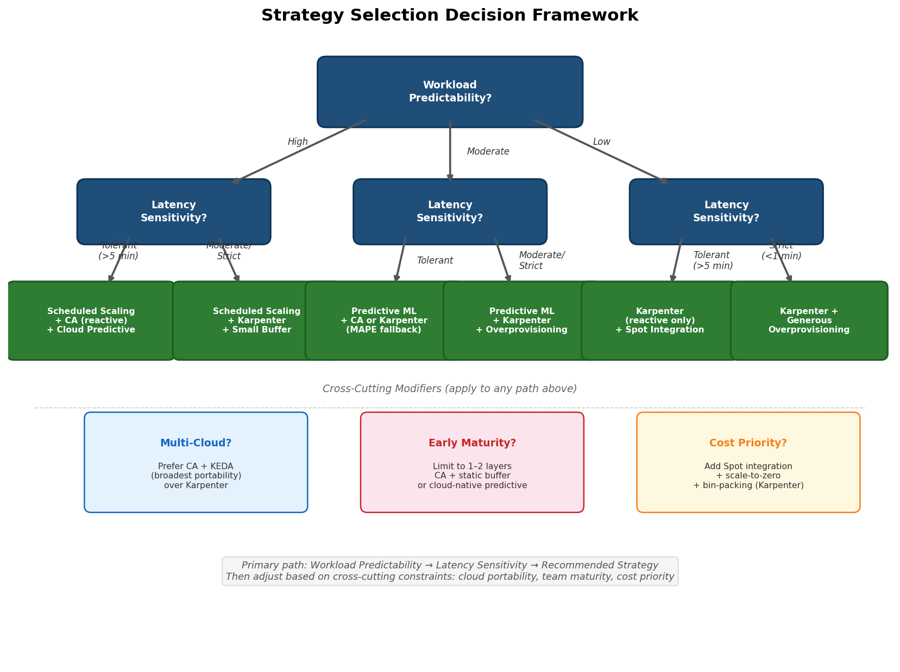

*Figure 6.3: Decision tree guiding strategy selection through workload predictability and latency sensitivity, with cross-cutting modifiers for multi-cloud constraints, team maturity, and cost priority.*

### 6.4.1 Workload Predictability

The degree to which future demand can be anticipated determines the viable proactive strategy tier:

- **High predictability** (regular daily/weekly cycles, known batch schedules): Scheduled scaling via KEDA cron, ASG Scheduled Actions, MIG Scaling Schedules, or VMSS Autoscale Profiles is the simplest and most cost-efficient approach. Cloud-native predictive autoscaling (GCP, AWS, Azure) adds adaptive refinement with minimal additional tooling cost — free on GCP [GCP Predictive Autoscaling](https://cloud.google.com/compute/docs/autoscaler/predictive-autoscaling "Free, recalculates every few minutes").
- **Moderate predictability** (general trends with irregular variations): Predictive ML pipelines (Kedify MetricPredictor, custom Prophet/LSTM models via the five-stage architecture described in Chapter 2) can capture trends that static cron rules miss. Continuous MAPE monitoring and automatic fallback to reactive scaling provide safety against prediction degradation.
- **Low predictability** (event-driven, viral, ad-hoc): Reactive scaling with generous overprovisioning is the primary mechanism. Proactive strategies play a supporting role only for partially known events (planned promotions with uncertain magnitude).

### 6.4.2 Latency Sensitivity

The acceptable pod scheduling latency directly constrains the minimum strategy tier:

- **Tolerant (> 5 minutes):** Reactive CA alone may suffice. Batch and ML training workloads typically fall into this category.
- **Moderate (1–5 minutes):** Karpenter as the reactive layer (60–90-second provisioning) combined with scheduled or predictive pre-scaling covers most web-tier requirements.
- **Strict (< 1 minute):** Overprovisioning is mandatory. Pre-warmed capacity via pause pods or the CapacityBuffer CRD (Chapter 4) provides the only path to sub-minute scheduling when new nodes are required.

### 6.4.3 Cloud Provider and Portability Constraints

Organizational cloud strategy shapes tool selection along a portability spectrum:

- **Single cloud (AWS):** Karpenter + AWS Predictive Scaling for ASG + overprovisioning offers the most tightly integrated stack, leveraging Karpenter's mature AWS provider and native Spot handling with Price Capacity Optimized allocation [AWS Spot+Karpenter Blog](https://aws.amazon.com/blogs/containers/using-amazon-ec2-spot-instances-with-karpenter/ "Spot allocation, fallback, interruption handling").
- **Single cloud (GCP):** CA with GKE-native features (CapacityBuffer CRD in Preview, Predictive Autoscaling, fast-starting nodes for Autopilot) provides a deeply integrated path. Karpenter is not available on GCP as of April 2026.
- **Single cloud (Azure):** AKS Node Auto Provisioning (NAP, based on Karpenter) or CA, combined with Azure Predictive Autoscale for VMSS. NAP limitations — no Windows nodes, no IPv6, no Service Principal as of February 2026 — may constrain adoption [AKS NAP](https://learn.microsoft.com/en-us/azure/aks/node-auto-provisioning "Microsoft docs, updated 2026-02-15").
- **Multi-cloud or hybrid:** CA (broadest provider support) + KEDA (cloud-agnostic cron and predictive scalers) + pause-pod overprovisioning (pure Kubernetes, no provider dependency) constitutes the most portable stack. Cluster API (CAPI) adds infrastructure-agnostic node lifecycle management for on-premises or multi-cloud environments (Chapter 4).

### 6.4.4 Operational Maturity

The team's Kubernetes expertise and observability infrastructure maturity determine how many autoscaling layers can be safely operated simultaneously:

- **Early maturity** (limited Kubernetes experience, basic monitoring): CA with default parameters and a small static overprovisioning buffer represents the lowest-complexity starting point. Cloud-native managed predictive autoscaling (GCP or AWS) provides a low-overhead enhancement requiring no ML expertise.
- **Intermediate maturity** (established monitoring with Prometheus and Grafana, GitOps workflows): Scheduled scaling via KEDA cron and proportional overprovisioning with CPA can be added. The four-panel audit dashboard described in Chapter 5 provides the observability needed to tune multiple layers. Karpenter migration may be considered for improved bin-packing.
- **Advanced maturity** (dedicated platform engineering team, ML pipeline infrastructure, chaos engineering practice): The full four-layer stack — reactive (Karpenter) + predictive (Kedify or custom pipeline) + scheduled (KEDA cron) + dynamic overprovisioning (CapacityBuffer CRD or CPA) — becomes viable. SimKube-based simulation for pre-deployment validation and LitmusChaos or Chaos Mesh for resilience verification complete the operational toolkit.

### 6.4.5 Cost Optimization Priority

When cost reduction is the primary driver rather than latency minimization, three levers offer the highest impact:

- **Spot integration** represents the highest-leverage single intervention. Karpenter's Price Capacity Optimized strategy, native SQS interrupt handling, and automatic On-Demand fallback (Chapter 5) enable substantial savings. HP PrintOS's annual savings exceeding $125,000 through Spot on non-production workloads illustrate the achievable magnitude [AWS HP Karpenter Blog](https://aws.amazon.com/blogs/containers/how-hp-achieved-40-improvement-in-kubernetes-node-utilization-utilization-on-amazon-eks-using-karpenter/ "HP PrintOS: $125K+ annual savings").
- **Scheduled scale-to-zero** for non-production environments (Aircall's approximately 50% node cost reduction pattern) and time-windowed overprovisioning (reducing buffer size during off-peak hours) provide secondary cost levers [Aircall Engineering Blog](https://aircall.io/blog/tech-team-stories/scale-karpenter-zero-optimize-costs/ "Aircall: ~50% node cost reduction").
- **Bin-packing optimization** via Karpenter's consolidation policies (`WhenEmptyOrUnderutilized` with configurable `consolidateAfter`) continuously reclaims underutilized capacity, complementing the proactive scaling layers.

## 6.5 Synthesis: Matching Context to Strategy

The decision framework converges on a core finding: there is no single optimal node-level autoscaling strategy. The right approach is a layered composition whose specific layers are determined by workload predictability, latency requirements, cloud constraints, team capability, and cost priorities. The table below summarizes the recommended primary and secondary strategies for each workload archetype, cross-referenced against the contextual factors discussed in Section 6.4.

| Workload Archetype | Primary Strategy | Secondary Strategy | Reactive Layer | Key Evaluation Metric |
|---|---|---|---|---|
| Diurnal web traffic | Scheduled scaling (cron / cloud-native) | Cloud-native predictive autoscaling | CA or Karpenter | SLO attainment rate during ramp-up |
| Batch / ML training | Scheduled scaling + scale-to-zero | Karpenter group-less provisioning | Karpenter (preferred) | Cost per job-hour; idle node-hours |
| Event-driven spikes | Overprovisioning (pause pods / CapacityBuffer) | Scheduled pre-scaling for planned events | Karpenter (preferred) | p99 pod scheduling latency during spike |
| Mixed / unpredictable | Proportional overprovisioning (CPA) | Predictive ML pipeline with MAPE fallback | Karpenter or CA | Composite: SLO attainment + cost efficiency |

For teams beginning the transition from pure reactive autoscaling, the lowest-risk entry point is adding a small static overprovisioning buffer (Chapter 4) alongside the existing CA or Karpenter deployment. This single addition — requiring only a PriorityClass, a pause-pod Deployment, and minimal configuration — immediately eliminates provisioning latency for burst scenarios that fit within the buffer size, while the reactive layer continues to handle all other scaling decisions. From this baseline, scheduled scaling (KEDA cron or cloud-native scheduled actions) can be layered on to address known patterns, followed by predictive scaling for workloads with sufficient historical data. The full four-layer stack is reserved for organizations with the operational maturity to monitor, tune, and troubleshoot multiple interacting control loops.

The evaluation tools surveyed in Section 6.2 — ClusterLoader2, KWOK, SimKube, kube-burner, LitmusChaos, and Chaos Mesh — enable teams to validate each layer addition in simulation or isolated environments before production deployment, following the shadow → canary → progressive rollout sequence detailed in Chapter 5.

# Conclusion

The Kubernetes node-level autoscaling landscape, as of April 2026, is defined by a central tension: reactive autoscalers (CA and Karpenter) remain the operational backbone of nearly every production cluster, yet their inherent 60-second-to-5-minute provisioning latency is structurally incompatible with workloads that require proactive capacity management. This report has examined the full complement of strategies available to bridge that gap — predictive ML models, scheduled and calendar-driven rules, proactive overprovisioning, and the operational practices that bind them together — and several consolidated findings merit emphasis.

**The reactive layer is necessary but insufficient.** CA and Karpenter provide battle-tested, broadly supported node provisioning with well-understood failure modes. Karpenter's group-less architecture, direct fleet API integration, and sub-90-second provisioning represent a material improvement over CA's 2–5-minute ASG-mediated loop. However, neither system possesses any concept of demand forecasting or time-of-day awareness. For workloads with predictable patterns or latency requirements below 60 seconds, the reactive layer must be complemented by at least one proactive mechanism.

**Predictive autoscaling operates through pod-level indirection.** Every surveyed tool and service — KEDA PredictKube, Kedify MetricPredictor, Crane EffectiveHPA, PHPA, and the managed predictive services from AWS, GCP, and Azure — predicts pod-level or VM-group-level metrics rather than directly forecasting node counts. The translation from predicted pod demand to required node capacity traverses two stochastic stages (pod scheduling and instance selection), each introducing potential mismatch. Cloud-native predictive services further constrain this approach by supporting only CPU utilization as a prediction input, ignoring the custom application metrics that more accurately reflect actual demand. Organizations adopting predictive scaling should treat it as a demand-floor mechanism — one that raises HPA or node-group minimums ahead of anticipated ramps — while maintaining reactive and overprovisioning layers to absorb forecast error.

**Scheduled scaling delivers the highest return on complexity for predictable workloads.** For the substantial category of workloads exhibiting regular daily, weekly, or event-driven patterns, explicit cron-based rules achieve most of the latency reduction that predictive models promise, with none of the ML pipeline overhead. KEDA's cron scaler combined with the placeholder pod pattern converts time-based signals into deterministic node pre-provisioning. Cloud-provider scheduled actions (AWS ASG, GCP MIG, Azure VMSS) provide a complementary infrastructure-level floor. The critical coordination principle — scheduled actions set floors, reactive autoscalers manage ceilings — prevents the destructive interactions that arise when multiple control loops compete over the same capacity.

**Overprovisioning is the only strategy that achieves sub-minute scheduling for cold-start scenarios.** Pre-warmed pause-pod capacity provides instant preemption-based scheduling regardless of VM boot time. The arrival of the CapacityBuffer CRD in CA v1.35.0 signals the upstream project's recognition that overprovisioning is graduating from a community workaround to a first-class Kubernetes primitive. Proportional buffer sizing via the Cluster Proportional Autoscaler, workload-aware placeholder pod requests, and scheduled buffer modulation (raising buffer size before peaks, reducing it off-peak) manage the cost of maintaining idle headroom. For event-driven spikes where even 60 seconds of provisioning latency is unacceptable, overprovisioning is not optional — it is the primary scaling mechanism.

**The multi-layer architecture is the convergent design, but layer count must match operational maturity.** The evidence across all six chapters points toward a layered composition — overprovisioning for instant absorption, scheduled rules for deterministic baselines, predictive models for trend-adaptive adjustment, and reactive autoscaling as the safety net — as the most robust approach to node-level autoscaling. However, each additional layer multiplies configuration surface area, failure modes, and observability requirements. The recommended adoption path is incremental: begin with a static overprovisioning buffer alongside the existing reactive autoscaler, add scheduled scaling for known traffic patterns, introduce predictive pipelines only when monitoring infrastructure and team expertise support ML model lifecycle management, and validate each layer addition through the shadow → canary → progressive rollout sequence before production deployment. Simulation tools — SimKube for trace-based replay, KWOK for infrastructure-free cluster modeling, ClusterLoader2 for controlled load generation — enable empirical validation of each configuration change at minimal risk.

The strategy selection decision ultimately depends on the intersection of workload predictability, latency sensitivity, cloud-provider constraints, and team capability. Diurnal web-tier workloads are best served by scheduled scaling with cloud-native predictive refinement. Batch and ML training workloads benefit most from scheduled provisioning paired with Karpenter's group-less bin-packing and aggressive scale-to-zero. Event-driven spikes demand generous overprovisioning as the primary mechanism, with Karpenter as the preferred reactive backstop. For mixed or unpredictable workloads, proportional overprovisioning combined with a predictive pipeline equipped with MAPE-based fallback provides the broadest coverage. In every case, safety guardrails — node ceilings, resource limits, disruption budgets, PodDisruptionBudgets, and circuit breakers — must be configured before any proactive scaling layer is activated, not after.
