# Overview

The emergence of large-language-model (LLM) driven AI agents as semi-autonomous systems capable of planning, tool use, and multi-step reasoning has created urgent demand for standardized communication protocols. Two open protocols now define the foundational architecture for this emerging agentic ecosystem: Anthropic's **Model Context Protocol (MCP)**, released in November 2024, and Google's **Agent-to-Agent Protocol (A2A)**, unveiled in April 2025. MCP standardizes how an individual agent connects to external tools and data sources—databases, APIs, file systems, and SaaS services—functioning as the vertical, agent-to-tool integration layer. A2A standardizes how autonomous agents discover each other, negotiate tasks, exchange multimodal content, and coordinate complex workflows across organizational boundaries—functioning as the horizontal, agent-to-agent collaboration layer.

This report provides a detailed technical examination of both protocols, their relationship, A2A's distinctive innovations, and the specific problems A2A was designed to solve. The analysis draws on official specification documents, GitHub repositories, release announcements, governance records, and ecosystem data through April 2026.

**Key findings include:**

- **Complementary, not competitive.** MCP and A2A occupy distinct layers of the agent technology stack. MCP governs how agents access tools; A2A governs how agents collaborate with one another. Both protocol communities have endorsed a layered reference architecture—"MCP inside agents, A2A between agents"—that has become the industry consensus model.
- **Shared engineering foundations, divergent architectures.** Both protocols build on JSON-RPC 2.0 and HTTP, but they differ fundamentally in communication topology (host-managed asymmetric vs. symmetric peer-to-peer), capability discovery (runtime negotiation vs. pre-connection Agent Cards), task lifecycle semantics (5 experimental states vs. 8 first-class states encoding agent autonomy), transport options, security philosophy, and content exchange models.
- **A2A introduces genuinely novel contributions.** Agent Cards for decentralized semantic discovery, REJECTED and AUTH_REQUIRED task states encoding agent autonomy at the protocol level, the Messages/Artifacts structural separation, three-tier MIME modality negotiation, and a formal extension mechanism with state-machine extensibility are design elements without direct precedent in prior agent-communication or API protocols.
- **A2A targets six specific problem categories.** These are: heterogeneous agent silos, the "agent-as-tool" anti-pattern, enterprise cross-organizational collaboration requirements, the long-running task management gap, agent discovery and trust deficits, and scalability challenges in multi-agent ecosystems.
- **Emerging functional overlap with distinct trajectories.** MCP's specification pipeline (Tasks, Server Cards, Subtasks, Unsolicited Tasks) is moving toward capabilities A2A already provides, but the protocols' architectural philosophies—tool orchestration vs. agent collaboration—and governance models—Anthropic-led vs. multi-stakeholder Linux Foundation TSC—remain fundamentally distinct.

The report is organized as follows. Chapter 1 establishes the origins and context of both protocols, tracing the path from framework proliferation to standardization. Chapter 2 undertakes a rigorous, dimension-by-dimension technical comparison across seven core architectural dimensions. Chapter 3 examines the complementary relationship between the two protocols, including reference architectures, working implementations, governance dynamics, and convergence signals. Chapter 4 isolates and evaluates A2A's novel design contributions, classifying each along an innovation spectrum. Chapter 5 maps the problem space that motivated A2A's creation, grounding each problem category in documented industry evidence. Chapter 6 surveys ecosystem adoption, governance trajectories, and the forward outlook through late 2026.

# 第1章 Origins and Context — The Rise of Agent Interoperability Protocols

## 1.1 The Agentic AI Inflection Point

Between 2023 and 2025, large-language-model (LLM) driven AI agents evolved from single-turn conversational assistants into semi-autonomous systems capable of planning, tool use, and multi-step reasoning. Frameworks such as LangChain, CrewAI, AutoGen, and OpenAI's Assistants API proliferated, each offering its own abstractions for tool invocation, memory management, and orchestration. Gartner identified Agentic AI as the top strategic technology trend for 2025, projecting that by 2028 at least 15 % of day-to-day work decisions would be made by autonomous agents [Gartner 2025 Technology Trends](https://www.gartner.com/en/newsroom/press-releases/2024-10-21-gartner-identifies-the-top-10-strategic-technology-trends-for-2025 "Gartner Top 10 Strategic Technology Trends for 2025, 2024-10-21").

This rapid proliferation, however, exposed a structural deficit: there was no shared protocol through which agents—or agents and external tools—could interoperate. Each framework defined its own conventions for function calling (e.g., OpenAI Function Calling, LangChain's Tool abstraction), creating an M × N integration fragmentation problem. Connecting *M* agent hosts to *N* data sources or peer agents required *M × N* custom integrations, a burden that scaled poorly as both dimensions grew.

The problem was not entirely new. Earlier generations of multi-agent research had produced interoperability standards—FIPA ACL and KQML in the 1990s–2000s, grounded in speech-act theory; W3C Web Services (WSDL, SOAP, UDDI) for service-oriented architectures; and OpenAPI/Swagger for RESTful API description [FIPA ACL Specification](http://www.fipa.org/specs/fipa00061/SC00061G.html "FIPA ACL Message Structure Specification"). None of these, however, addressed the distinctive requirements of LLM-based agents: dynamic context management, autonomous decision-making, multimodal content exchange, and long-running task lifecycles that may span minutes to days. By late 2024, the industry consensus was clear—standardized agent communication protocols were an urgent necessity.

## 1.2 MCP — Anthropic's Model Context Protocol

Anthropic publicly released the Model Context Protocol (MCP) on November 25, 2024, positioning it as "a universal, open standard for connecting AI models to data sources and tools." The protocol adopted a client-host-server architecture and used JSON-RPC 2.0 as its message format. Anthropic framed MCP with a memorable analogy: "a USB-C port for AI applications"—a single, standardized interface replacing a tangle of proprietary connectors [Anthropic Official Blog](https://www.anthropic.com/news/model-context-protocol "Introducing the Model Context Protocol, 2024-11-25").

MCP's design centered on three core server primitives—Resources (structured data exposed to the model), Tools (executable functions the model can invoke), and Prompts (templated interaction patterns)—together with a Sampling capability on the client side. The initial release shipped with Python and TypeScript SDKs and a set of pre-built servers for popular services including Google Drive, Slack, GitHub, and PostgreSQL. Early client integrations included Claude Desktop, Cursor, and Sourcegraph Cody [Anthropic Official Blog](https://www.anthropic.com/news/model-context-protocol "Introducing the Model Context Protocol, 2024-11-25").

MCP's core value proposition was clear: it decoupled the tool-integration layer from the model layer. Instead of every AI application building bespoke connectors for every data source, developers could write a single MCP server for a given service, and any MCP-compatible client could consume it. This dramatically reduced the integration surface from M × N to M + N.

### The March 2025 Enterprise Upgrade

On March 26, 2025, Anthropic announced a major update that elevated MCP from a local developer tool to an enterprise-grade protocol. The update introduced Streamable HTTP transport (enabling both stateless and stateful remote connections) and OAuth 2.1 authentication, addressing two of the most significant barriers to production deployment. Crucially, the announcement revealed that several major AI companies—OpenAI, Google DeepMind, Microsoft, and Amazon—had joined the MCP ecosystem [Anthropic Official Blog](https://www.anthropic.com/news/model-context-protocol-enterprise "MCP Enterprise Update, 2025-03-26"). On the same day, OpenAI CEO Sam Altman confirmed that OpenAI would add MCP support across its products, beginning with the OpenAI Agents SDK [TechCrunch](https://techcrunch.com/2025/03/26/openai-adopts-rival-anthropics-standard-for-connecting-ai-models-to-data/ "OpenAI adopts rival Anthropic's standard for connecting AI models to data, 2025-03-26"). This cross-industry endorsement signaled that MCP had achieved critical mass as the de facto standard for agent-to-tool connectivity.

## 1.3 A2A — Google's Agent-to-Agent Protocol

Two weeks after the MCP enterprise update, Google unveiled the Agent-to-Agent (A2A) protocol at the Cloud Next '25 conference on April 9, 2025. A2A was defined as "an open protocol that enables AI agents to communicate with each other, securely exchange information, and coordinate actions across different frameworks and vendors." The announcement came with an immediate show of industry support: more than 50 partner organizations—including Salesforce, SAP, Atlassian, ServiceNow, and LangChain—endorsed the protocol at launch [Google Cloud Blog](https://cloud.google.com/blog/products/ai-machine-learning/a2a-a-new-era-of-agent-interoperability "Announcing the Agent2Agent Protocol (A2A), 2025-04-09").

A2A was built around five explicit design principles, articulated by lead designer Saurabh Tiwary and documented in the project's GitHub repository [Google A2A GitHub](https://github.com/google/A2A "A2A Protocol GitHub Repository"):

1. **Embrace agentic capabilities.** Agents are treated as opaque, autonomous entities that collaborate without exposing their internal reasoning, tools, or memory. This stands in deliberate contrast to the tool-centric model, where the host system orchestrates a transparent, deterministic function.
2. **Build on existing web standards.** A2A uses HTTP, JSON-RPC 2.0, and Server-Sent Events (SSE)—technologies already widely deployed in enterprise infrastructure—rather than introducing novel transport mechanisms.
3. **Secure by default.** The protocol integrates enterprise-grade authentication and authorization as first-class concerns, not optional add-ons.
4. **Support long-running tasks.** Unlike synchronous request-response patterns, A2A natively accommodates tasks that may take minutes, hours, or days to complete, with explicit state-machine semantics.
5. **Modality-agnostic.** A2A supports text, images, audio, video, and structured data through a unified content model, negotiated via MIME types rather than hard-coded content schemas.

A distinctive technical mechanism introduced by A2A is the **Agent Card**—a JSON metadata document hosted at a well-known URI (`/.well-known/agent.json`) that declares an agent's identity, capabilities, supported interaction modes, and security requirements. Agent Cards enable pre-connection, zero-handshake discovery: a client agent can inspect a remote agent's capabilities before initiating any communication, analogous to how a browser reads a `robots.txt` or a service mesh queries a health endpoint.

## 1.4 Complementary by Design — Distinct Layers of the Agent Stack

A crucial framing for understanding the relationship between MCP and A2A is the layer of the agent architecture each protocol addresses. Google's official documentation explicitly positioned the two as complementary—"better together"—rather than competitive [Google Developers Blog](https://developers.googleblog.com/en/a2a-a-new-era-of-agent-interoperability/ "A2A: A new era of agent interoperability, 2025-04-09").

- **MCP operates at the agent-to-tool layer.** It standardizes how an individual agent connects to external data sources and deterministic tools—databases, APIs, file systems, SaaS services. The agent remains the orchestrator; the tool is a passive resource.
- **A2A operates at the agent-to-agent layer.** It standardizes how two or more autonomous agents discover each other, negotiate tasks, exchange multimodal content, and coordinate complex workflows—without either party needing to expose its internal architecture.

This layered relationship can be illustrated with a concrete scenario. Consider an enterprise travel-planning system: a user-facing concierge agent receives a request and delegates sub-tasks—flight search, hotel booking, car rental—to specialized agents via A2A. Each specialized agent, in turn, uses MCP to connect to its own tools: airline APIs, hotel databases, payment gateways. MCP governs the vertical connection between an agent and its tools; A2A governs the horizontal connection between peer agents.

The timing of the two releases reinforced this complementarity. MCP arrived first and established itself as the standard for the tool-integration layer. A2A arrived five months later, explicitly acknowledging MCP's role and filling the agent-collaboration layer that MCP had not been designed to address.

## 1.5 Why Standardized Agent Communication Became Urgent

Several converging forces made 2024–2025 the critical window for agent interoperability standards.

**Framework proliferation without interoperability.** By early 2025, at least a dozen major agent frameworks were in active use—LangChain, LangGraph, CrewAI, AutoGen, Google ADK, Amazon Bedrock Agents, Microsoft Semantic Kernel, Agno, LiteLLM, AG2, and others. Each defined its own internal conventions for agent composition, but none provided a wire-level protocol for communicating with agents built on a different stack. A developer building a multi-agent system that spanned two frameworks—say, a LangChain orchestrator coordinating with a CrewAI specialist—faced the prospect of writing and maintaining a custom adapter, with no guarantee of semantic fidelity.

**Enterprise multi-vendor requirements.** Large enterprises rarely operate within a single vendor ecosystem. A global bank might use Salesforce agents for customer service, SAP agents for procurement, and internally developed agents for risk analysis. Without a standard protocol, orchestrating a cross-functional workflow (e.g., a loan approval pipeline that touches customer data, procurement systems, and risk models) required bespoke point-to-point integrations at every boundary—each carrying its own security model, error-handling conventions, and data serialization format. The operational cost of maintaining these integrations at enterprise scale was prohibitive.

**Limitations of the tool-centric paradigm.** MCP solved the M × N problem for tool integration, but treating every external capability as a "tool" proved insufficient when the counterpart was itself an autonomous agent. Tools are deterministic: they accept structured inputs and return structured outputs. Agents, by contrast, may negotiate, ask clarifying questions, refuse tasks, produce intermediate results, and take unpredictable amounts of time. Wrapping an agent as a tool forced it into a synchronous, single-invocation paradigm that stripped away its most valuable capabilities—autonomy, multi-turn reasoning, and context-dependent judgment.

**Security and compliance boundaries.** Agent-to-agent interactions across organizational boundaries introduce trust, auditability, and data-sovereignty concerns that the tool-integration layer was not designed to address. A healthcare agent querying a pharmaceutical agent must do so within HIPAA-compliant communication channels; a financial agent delegating analysis to a third-party agent must maintain audit trails for regulatory review. These requirements demanded a protocol with built-in identity verification, fine-grained authorization, and immutable task records—features that A2A was designed from the outset to provide.

**The precedent of internet protocol layering.** The broader software industry had long demonstrated that different communication needs are best served by purpose-built, layered protocols. HTTP handles document transfer; SMTP handles email; WebSocket handles real-time bidirectional streams. Each operates at a distinct abstraction level, and they coexist within the same network infrastructure. The emergence of MCP and A2A can be understood as the agent ecosystem following this same architectural principle: one protocol for the agent-to-tool channel, another for the agent-to-agent channel, both built on shared underlying standards (HTTP, JSON-RPC 2.0, SSE).

## 1.6 Chapter Summary

The period from late 2024 to mid-2025 marked a turning point for AI agent interoperability. Anthropic's MCP (November 2024) established the first widely adopted open standard for connecting agents to tools and data sources, rapidly gaining cross-industry endorsement from OpenAI, Google, Microsoft, and Amazon by March 2025. Google's A2A (April 2025) addressed the complementary challenge of agent-to-agent communication, introducing mechanisms for capability discovery, autonomous task negotiation, and long-running workflow coordination. Together, the two protocols defined a two-layer architecture—MCP inside agents, A2A between agents—that has become the reference model for the emerging agentic ecosystem. The chapters that follow examine the technical architectures of both protocols in detail, analyze their points of convergence and divergence, evaluate A2A's specific innovations, and survey the problems that motivated its creation.

# 第2章 Architectural Design and Technical Comparison

This chapter undertakes a rigorous, dimension-by-dimension comparison of MCP and A2A at the protocol-specification level. Where Chapter 1 established the origins and motivations behind each protocol, the analysis here examines seven core technical dimensions: communication models, capability discovery mechanisms, message formats and protocol bindings, task lifecycle management, transport layers, security and authentication frameworks, and content exchange paradigms. The objective is to delineate precisely where the two protocols occupy distinct layers of the agent technology stack, where they exhibit functional overlap, and what design trade-offs each embodies as a consequence of its architectural philosophy.

## 2.1 Communication Model and Architectural Topology

The most fundamental architectural divergence between MCP and A2A lies in how they model the relationship between communicating parties.

**MCP: Client-Host-Server with Host-Managed Control Flow.** MCP specifies a three-tier architecture comprising hosts, clients, and servers. The host application (e.g., Claude Desktop, an IDE, or an orchestration engine) spawns one or more MCP clients, each maintaining a 1:1 session with a particular MCP server. The host governs the overall interaction flow—deciding which servers to connect to, which tool calls to authorize, and how to route context between clients and the underlying language model. MCP servers are passive participants: they expose capabilities (tools, resources, prompts) and respond to invocations, but do not initiate actions or contact other servers autonomously [MCP Architecture Specification](https://github.com/modelcontextprotocol/specification/blob/main/docs/specification/2025-11-25/architecture/index.mdx "MCP 2025-11-25 Architecture"). This design is inherently asymmetric—the host holds orchestration authority, and the server operates as a deterministic capability provider.

**A2A: Client-Server with Symmetric Peer Collaboration.** A2A adopts a client-server model in which any agent can assume either role depending on the direction of a given interaction. A client agent sends a task request to a server agent, which processes the task and returns results. Crucially, A2A treats the server agent as an opaque, autonomous entity—capable of reasoning, delegating, negotiating, or refusing—rather than a transparent function endpoint. Any agent that can serve requests can also initiate them, enabling symmetric peer-to-peer topologies. The protocol makes no assumption about the server's internal architecture: it may be a single LLM, a multi-agent ensemble, or a rules-based system [A2A Specification](https://github.com/a2aproject/A2A/blob/main/docs/specification.md "A2A v1.0 Specification — Section 1").

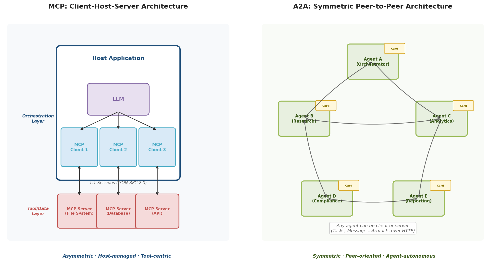

The implications for system design are substantial. MCP's host-managed model is well suited to scenarios where a single orchestrator coordinates a portfolio of tools—a pattern common in coding assistants, search-augmented generation, and data analysis pipelines. A2A's peer model targets scenarios where multiple autonomous agents must collaborate without a single point of control—enterprise cross-department workflows, multi-vendor supply-chain coordination, and federated multi-agent research systems.

## 2.2 Capability Discovery

How a client discovers what a remote endpoint can do is a critical design decision that shapes deployment patterns, security models, and developer experience.

**MCP: Runtime Capability Negotiation.** MCP employs a session-initialization handshake (`initialize` request) during which client and server exchange supported protocol versions and declare their respective capabilities—for example, whether the server supports tools, resources, or prompts, and whether the client supports sampling or roots. Following initialization, the client invokes listing methods (`tools/list`, `resources/list`, `prompts/list`) to enumerate available capabilities at runtime. This approach is inherently connection-time: a client must establish a session before learning what the server offers [MCP Lifecycle Specification](https://github.com/modelcontextprotocol/specification/blob/main/docs/specification/2025-11-25/basic/lifecycle.mdx "MCP Capability Negotiation").

**A2A: Pre-Connection Discovery via Agent Cards.** A2A introduces a fundamentally different discovery paradigm through Agent Cards—JSON metadata documents hosted at the well-known URI `/.well-known/agent-card.json` (following RFC 8615). An Agent Card declares the agent's identity, human-readable description, skills (with natural-language descriptions, tags, and example prompts), supported input/output MIME types, security schemes, and protocol version. A client agent can fetch and interpret an Agent Card before initiating any task, enabling pre-connection capability assessment without establishing a session or exchanging credentials [A2A Specification](https://github.com/a2aproject/A2A/blob/main/docs/specification.md "A2A v1.0 Specification — Section 5").

A2A further introduces **Extended Agent Cards**: after authenticating, a client may request an extended card that reveals additional capabilities not disclosed in the public card. This two-tier discovery model—public card for general discoverability, extended card for authenticated access—addresses enterprise requirements for graded information disclosure, where sensitive capabilities (e.g., access to internal financial models) should be visible only to authorized parties [A2A Specification](https://github.com/a2aproject/A2A/blob/main/docs/specification.md "A2A Specification — Section 3.1.11").

The Agent Card model constitutes a semantic-level discovery mechanism: skill descriptions use natural language supplemented by structured tags and examples, making them interpretable by LLM-based agents capable of reasoning about whether a remote agent's capabilities match a given task. This contrasts with MCP's schema-level discovery, where tool descriptions follow a JSON Schema format oriented toward programmatic matching.

## 2.3 Message Format and Protocol Bindings

Both protocols share a common messaging foundation but diverge significantly in binding strategy and extensibility.

**Shared Foundation: JSON-RPC 2.0.** MCP and A2A both adopt JSON-RPC 2.0 as a core message framing protocol, providing structured request-response semantics with method names, typed parameters, and error objects. This shared choice reflects pragmatic convergence on a lightweight, widely supported wire format.

**MCP: JSON-RPC as the Sole Wire Format.** MCP uses JSON-RPC 2.0 exclusively for all client-server communication. Messages are transmitted over one of two transport mechanisms (stdio or Streamable HTTP), but message framing remains JSON-RPC throughout. This uniformity keeps the protocol surface area small and minimizes implementation complexity [MCP Transports Specification](https://github.com/modelcontextprotocol/specification/blob/main/docs/specification/2025-11-25/basic/transports.mdx "MCP Transports").

**A2A: Three Protocol Bindings with Protobuf as the Canonical Model.** A2A v1.0 employs a three-layer specification architecture: a canonical data model defined in Protocol Buffers (`a2a.proto`), a set of operations (RPC definitions), and three protocol bindings—JSON-RPC 2.0, gRPC, and HTTP+JSON/REST. The `a2a.proto` file serves as the single normative source for all data structures; JSON serialization follows ProtoJSON conventions (documented in ADR-001), and RESTful HTTP bindings are auto-generated from Google API annotations in the proto file [A2A Specification](https://github.com/a2aproject/A2A/blob/main/docs/specification.md "A2A Specification — Section 1.3") [A2A ADR-001](https://github.com/a2aproject/A2A/blob/main/adrs/adr-001-protojson-serialization.md "ADR-001: ProtoJSON Serialization").

This multi-binding design reflects A2A's ambition to serve diverse deployment contexts: JSON-RPC for lightweight integrations, gRPC for high-performance service-to-service communication in cloud-native environments, and HTTP+JSON/REST for compatibility with existing enterprise API gateways and monitoring infrastructure. The use of Protocol Buffers as the canonical data model ensures structural consistency across all three bindings and enables strongly typed code generation in multiple programming languages.

## 2.4 Task Lifecycle Management

Task lifecycle semantics represent one of the sharpest divergences between the two protocols and one of the clearest indicators of their distinct design targets.

**MCP: Stateless Request-Response with Experimental Task Extensions.** MCP's foundational interaction model is stateless request-response: a client issues a method call (e.g., `tools/call`), the server executes it, and the result is returned. There is no built-in concept of a task that persists beyond a single invocation. The 2025-11-25 specification introduced an experimental Tasks feature (proposed via SEP-1686 by Amazon engineers) that wraps existing requests with lifecycle tracking. MCP Tasks define five states: `working`, `input_required`, `completed`, `failed`, and `cancelled`. Notably, one of the six production use cases cited in SEP-1686 is "Agent-to-Agent Communication," an acknowledgment that practitioners had been repurposing MCP for inter-agent coordination despite its tool-centric origins [MCP Tasks Specification](https://github.com/modelcontextprotocol/specification/blob/main/docs/specification/2025-11-25/basic/utilities/tasks.mdx "MCP Tasks — experimental") [MCP SEP-1686](https://github.com/modelcontextprotocol/specification/blob/main/docs/seps/1686-tasks.mdx "MCP SEP-1686: Tasks").

**A2A: First-Class Task State Machine with Eight States.** In A2A, the task is the central protocol abstraction. Every interaction between agents is organized around tasks, each progressing through a well-defined state machine. A2A v1.0 defines eight task states: `UNSPECIFIED`, `SUBMITTED`, `WORKING`, `COMPLETED`, `FAILED`, `CANCELED`, `INPUT_REQUIRED`, `REJECTED`, and `AUTH_REQUIRED`. States are categorized as terminal (`COMPLETED`, `FAILED`, `CANCELED`, `REJECTED`) or interrupted (`INPUT_REQUIRED`, `AUTH_REQUIRED`). Terminal states are immutable—once a task reaches a terminal state, it cannot be modified or restarted; subsequent operations create new tasks within the same `contextId`, forming a directed acyclic graph (DAG) of related tasks [A2A Proto](https://github.com/a2aproject/A2A/blob/main/specification/a2a.proto "A2A — TaskState enum") [A2A Life of a Task](https://github.com/a2aproject/A2A/blob/main/docs/topics/life-of-a-task.md "A2A — Task Immutability").

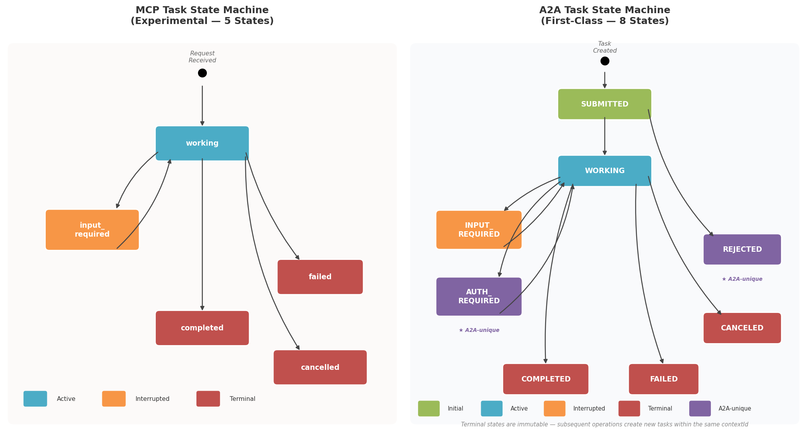

Two states in A2A's model have no counterpart in MCP or in conventional API design patterns:

- **REJECTED**: The server agent autonomously declines a task—not because of a technical error, but because it determines the task falls outside its scope, violates its policies, or is otherwise inappropriate. This encodes agent autonomy at the protocol level.
- **AUTH_REQUIRED**: The server agent signals that a task cannot proceed without additional credentials or authorization, enabling mid-task credential escalation—a pattern essential for enterprise workflows where access to sensitive resources may require step-up authentication.

A2A further introduces a structural separation between **Messages** and **Artifacts**. Messages carry communication turns—instructions, clarifications, status updates, and negotiation exchanges between agents. Artifacts carry task output deliverables—documents, images, structured data, and other results. The specification states explicitly that "Messages SHOULD NOT be used to deliver task outputs," enforcing a clean boundary between the communication channel and the output channel [A2A Specification](https://github.com/a2aproject/A2A/blob/main/docs/specification.md "A2A Specification — Section 3.7"). MCP has no equivalent distinction; tool results are returned inline within the JSON-RPC response.

## 2.5 Transport Layers

Transport-layer choices determine where and how each protocol can be deployed, and what operational patterns it can support.

**MCP: stdio and Streamable HTTP.** MCP supports two transport mechanisms. The `stdio` transport runs the MCP server as a local subprocess, communicating via standard input/output streams—well suited to development workflows, IDE integrations, and local tool servers where network overhead is unnecessary. The `Streamable HTTP` transport (introduced in the March 2025 update) operates over HTTP, supporting both stateless and stateful modes. In stateful mode, the server may issue a session ID and use Server-Sent Events (SSE) for server-to-client streaming. This dual-transport design affords MCP broad deployment flexibility, spanning local developer toolchains and remote cloud-hosted servers alike [MCP Transports Specification](https://github.com/modelcontextprotocol/specification/blob/main/docs/specification/2025-11-25/basic/transports.mdx "MCP Transports").

**A2A: HTTP-Only with Three Bindings and Push Notifications.** A2A operates exclusively over HTTP(S), with no local-process transport equivalent to MCP's stdio. It offers three protocol bindings—JSON-RPC, gRPC, and HTTP+JSON/REST—all operating over HTTP. For real-time updates, A2A supports SSE streaming (comparable to MCP's Streamable HTTP) but adds a critical capability absent from MCP: **push notifications via webhooks**. A2A's webhook system provides a complete CRUD lifecycle for notification subscriptions (create, get, list, delete) with comprehensive security measures including SSRF protections, JWT/JWKS mutual authentication, and replay-attack defenses [A2A Specification](https://github.com/a2aproject/A2A/blob/main/docs/specification.md "A2A — Section 3.5 Task Update Delivery") [A2A Streaming & Async Guide](https://github.com/a2aproject/A2A/blob/main/docs/topics/streaming-and-async.md "A2A — Streaming and Async Operations").

A2A's task-update delivery model operates across three tiers: (1) polling—the client periodically queries task status; (2) SSE—the server pushes real-time updates over a persistent connection; (3) webhooks—the server sends updates to a client-specified callback URL. All three tiers share a unified `StreamResponse` format, ensuring consistent data structures regardless of delivery mechanism. This tiered model accommodates deployment contexts where persistent connections are impractical—mobile clients, serverless functions, and browser-based applications that cannot maintain long-lived HTTP connections.

The absence of a stdio transport in A2A reflects its design focus: agent-to-agent communication inherently involves network boundaries, rendering a local-process transport semantically inappropriate. Conversely, MCP's stdio support reflects its tool-centric heritage, where many integrations (file systems, local databases, development tools) run on the same machine as the host application.

## 2.6 Security and Authentication

Security models reveal differing assumptions about deployment environments and trust boundaries.

**MCP: Prescriptive OAuth 2.1 with DNS Rebinding Protections.** MCP prescribes a specific authentication framework centered on OAuth 2.1 combined with RFC 9728 Protected Resource Metadata. When a client connects to a remote MCP server, the server advertises its authorization requirements via a standardized metadata endpoint, and the client follows the OAuth 2.1 authorization code flow with PKCE. MCP additionally specifies DNS rebinding protections to prevent malicious servers from exploiting browser-like trust assumptions in local deployments. This prescriptive approach reduces implementation variability but constrains flexibility—deployments relying on API keys, mutual TLS, or alternative authentication mechanisms must work within or around the OAuth 2.1 framework [MCP Authorization Specification](https://github.com/modelcontextprotocol/specification/blob/main/docs/specification/2025-11-25/basic/authorization.mdx "MCP Authorization").

**A2A: Declarative, Scheme-Agnostic Security via Agent Cards.** A2A adopts a declarative approach: the Agent Card's `securitySchemes` field advertises which authentication mechanisms the agent supports, and the client selects an appropriate scheme. Supported mechanisms include API Key, HTTP Authentication (Basic/Bearer), OAuth 2.0, OpenID Connect, and mutual TLS (mTLS). This scheme-agnostic model permits each agent to adopt security mechanisms suited to its deployment context—a public-facing agent might use OAuth 2.0, an internal microservice might use mTLS, and a development endpoint might rely on a simple API key [A2A Proto](https://github.com/a2aproject/A2A/blob/main/specification/a2a.proto "A2A — SecurityScheme definition").

A2A introduces two security features without MCP equivalents. First, Agent Cards can be cryptographically signed using JSON Web Signature (JWS) with JSON Canonicalization Scheme (JCS, RFC 8785), enabling clients to verify the authenticity and integrity of a card before trusting its declared capabilities. Second, A2A's webhook notification system incorporates dedicated SSRF protections and JWT-based mutual authentication between the task server and the notification endpoint—addressing a specific attack surface that arises from the push-notification model [A2A Specification](https://github.com/a2aproject/A2A/blob/main/docs/specification.md "A2A v1.0 Specification — Security").

## 2.7 Content Exchange and Modality Support

The content models of the two protocols reflect divergent assumptions about the nature and variety of data exchanged between endpoints.

**MCP: Typed Content Primitives.** MCP defines a fixed set of content types through its server primitives. Resources expose structured data (text documents, binary files) to the model. Tools accept JSON-Schema-defined inputs and return results containing typed content items: `TextContent`, `ImageContent`, `AudioContent`, and `EmbeddedResource`. Each content type carries a protocol-defined schema. Introducing support for a new modality (e.g., video or 3D models) requires a specification-level schema change—a deliberate trade-off that favors type safety and implementation predictability over extensibility [MCP Tools Specification](https://github.com/modelcontextprotocol/specification/blob/main/docs/specification/2025-11-25/server/tools.mdx "MCP Tools").

**A2A: Unified Part Model with MIME-Type Negotiation.** A2A defines a single `Part` abstraction—a `oneof` union type in the protobuf schema capable of carrying text, raw bytes, a URL reference, or structured data. Modality is expressed through MIME types rather than fixed schema types. This design enables A2A to accommodate any current or future content format (video, 3D models, domain-specific binary formats) without protocol-level schema changes—registering a new MIME type suffices [A2A Proto](https://github.com/a2aproject/A2A/blob/main/specification/a2a.proto "A2A — Part message").

A2A further introduces a **three-level modality negotiation** mechanism. At the broadest level, the Agent Card declares the agent's globally supported input and output MIME types. At the skill level, individual `AgentSkill` entries can override these defaults with skill-specific modality constraints. At the request level, `SendMessageConfiguration` specifies `acceptedOutputModes` for a particular interaction. This cascading negotiation—agent-wide defaults, skill-level overrides, request-level preferences—enables fine-grained content-type matching between agents with heterogeneous modality capabilities [A2A Proto](https://github.com/a2aproject/A2A/blob/main/specification/a2a.proto "A2A — AgentCard and SendMessageConfiguration").

## 2.8 Stack Positioning and the Overlap Question

The preceding analysis reveals that MCP and A2A occupy largely distinct but partially overlapping positions in the agent technology stack.

**Distinct Layers.** MCP operates at the agent-to-tool/data layer, standardizing how an agent accesses external tools, databases, APIs, and file systems. A2A operates at the agent-to-agent collaboration layer, standardizing how autonomous agents discover each other, negotiate tasks, exchange results, and coordinate complex workflows. The A2A specification explicitly documents this complementarity in Appendix B, describing a reference architecture in which an A2A server agent uses MCP internally to interact with the tools and data sources needed to fulfill delegated tasks [A2A Specification](https://github.com/a2aproject/A2A/blob/main/docs/specification.md "A2A Specification — Appendix B: Relationship to MCP").

**Emerging Overlap.** Despite the clean layering narrative, MCP's experimental Tasks feature (spec version 2025-11-25) introduces growing functional overlap. MCP Tasks add lifecycle tracking, state management, and asynchronous execution patterns that begin to address some of the coordination challenges A2A was designed for. The SEP-1686 proposal explicitly lists "Agent-to-Agent Communication" as a target use case. MCP's specification pipeline also includes SEP-2127 (Server Cards at `/.well-known/mcp.json`—a discovery mechanism directly analogous to A2A's Agent Cards) and SEP-2268 (Subtasks for hierarchical task decomposition) [MCP SEP-1686](https://github.com/modelcontextprotocol/specification/blob/main/docs/seps/1686-tasks.mdx "MCP SEP-1686: Tasks"). Significant architectural differences nonetheless persist: MCP Tasks define 5 states versus A2A's 8, MCP lacks webhook-based push notifications, and MCP Tasks operate within the tool-invocation paradigm rather than the autonomous-agent collaboration paradigm.

**Version Evolution.** Both protocols are evolving at a rapid pace. MCP has published four specification versions (2024-11-05, 2025-03-26, 2025-06-18, 2025-11-25) plus an active draft, with approximately 290 specification enhancement proposals in its pipeline. A2A progressed through 10 version iterations in under 12 months (0.1.0 through 0.2.6 and 0.3.0 to 1.0.0), migrating from Google's GitHub organization to the Linux Foundation's `a2aproject/A2A` repository upon reaching v1.0 in March 2026 [A2A GitHub README](https://github.com/a2aproject/A2A/blob/main/README.md "A2A README — Linux Foundation") [A2A v1.0 Announcement](https://github.com/a2aproject/A2A/blob/main/docs/announcing-1.0.md "A2A v1.0, March 2026").

## 2.9 Dimension-by-Dimension Comparison

The following figure and table consolidate the technical comparison across all dimensions analyzed in this chapter.

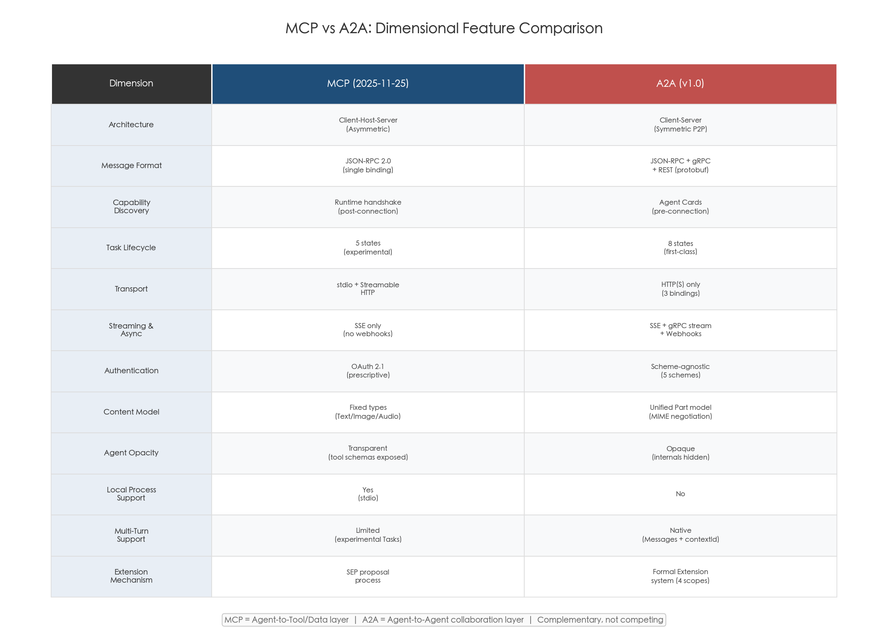

| Dimension | MCP | A2A |
|---|---|---|
| **Architecture** | Client-Host-Server (host-managed, asymmetric) | Client-Server (symmetric, peer-to-peer capable) |
| **Core abstraction** | Tools, Resources, Prompts (server primitives) | Tasks, Messages, Artifacts (agent interactions) |
| **Agent opacity** | Server internals visible via schema (tool parameters, resource URIs) | Server treated as opaque autonomous entity |
| **Message format** | JSON-RPC 2.0 only | JSON-RPC 2.0 + gRPC + HTTP+JSON/REST; Protobuf as canonical data model |
| **Capability discovery** | Runtime negotiation (`initialize` handshake + `*/list` methods) | Pre-connection Agent Cards (`/.well-known/agent-card.json`) + Extended Agent Cards |
| **Task lifecycle** | Experimental: 5 states (working, input_required, completed, failed, cancelled) | First-class: 8 states including REJECTED and AUTH_REQUIRED; terminal state immutability |
| **Messages vs. outputs** | Unified response object | Separated: Messages (communication) vs. Artifacts (deliverables) |
| **Transports** | stdio (local) + Streamable HTTP (remote, with SSE) | HTTP(S) only: JSON-RPC / gRPC / REST bindings |
| **Local process support** | Yes (stdio) | No |
| **Streaming** | SSE via Streamable HTTP | SSE + gRPC server streaming |
| **Async notifications** | None (polling or SSE only) | Webhooks with CRUD lifecycle, JWT auth, SSRF protection |
| **Authentication** | Prescriptive: OAuth 2.1 + RFC 9728 | Declarative: API Key, HTTP Auth, OAuth 2.0, OIDC, mTLS (agent chooses) |
| **Identity verification** | DNS rebinding protections | Agent Card JWS/JCS signing + webhook JWT mutual auth |
| **Content types** | Fixed schema: TextContent, ImageContent, AudioContent, EmbeddedResource | Unified Part model (text/raw/url/data) with MIME-type negotiation |
| **Modality negotiation** | None (fixed type set) | Three-level: Agent Card → AgentSkill → request-level |
| **Multi-turn support** | Via persistent session state | Via contextId linking tasks + INPUT_REQUIRED state |
| **Extension mechanism** | Specification Enhancement Proposals (SEPs) | Four-scope extension system with URI identifiers and TSC governance |
| **Stack layer** | Agent-to-tool/data | Agent-to-agent collaboration |

## 2.10 Chapter Summary

MCP and A2A address distinct but adjacent layers of the agent technology stack. MCP provides a standardized, host-managed interface between an agent and its tools—optimized for deterministic, schema-defined interactions with data sources and APIs. A2A provides a standardized, peer-oriented interface between autonomous agents—optimized for dynamic task negotiation, long-running workflows, multimodal content exchange, and cross-organizational collaboration.

Their shared adoption of JSON-RPC 2.0 and HTTP reflects common engineering pragmatism, but divergences in capability discovery (runtime negotiation versus Agent Cards), task lifecycle (5 experimental states versus 8 first-class states encoding agent autonomy), transport flexibility (stdio plus HTTP versus HTTP-only with three bindings and webhooks), security philosophy (prescriptive OAuth 2.1 versus declarative scheme-agnostic model), and content modeling (fixed type schema versus MIME-negotiated Parts) are direct consequences of fundamentally different design targets. The emerging overlap in MCP's task and discovery features points toward a trajectory of functional convergence, yet the protocols' architectural philosophies—tool orchestration versus agent collaboration—remain distinct.

# 第3章 Complementarity and Convergence — How A2A and MCP Relate

The preceding chapter mapped MCP and A2A across six technical dimensions—communication models, capability discovery, task lifecycle, transport layers, security frameworks, and content exchange—revealing clear architectural divergence. This chapter shifts from feature-level comparison to the structural relationship between the two protocols. The central question is whether their coexistence reflects a stable division of labor or a transitional state en route to convergence. To answer it, the analysis proceeds through four lenses: the official complementarity positioning articulated by both protocol communities, reference architectures and working implementations that layer the two protocols, governance structures and cross-community dynamics that shape their trajectories, and specification-pipeline signals that indicate where technical boundaries are blurring. Each claim rests on specification documents, reference codebases, community samples, and governance records.

## 3.1 The Official Complementarity Thesis

Both protocol communities have publicly stated that A2A and MCP are complementary rather than competitive. Importantly, this framing is not peripheral marketing; it is an architectural stance codified in specification-level artifacts and release documentation.

The A2A v1.0 specification dedicates Appendix B to the relationship with MCP, declaring: "A2A and MCP are complementary protocols designed for different aspects of agentic systems." The appendix describes a canonical integration pattern in which an A2A client dispatches a task to an A2A server, and the server internally employs MCP to access the tools and data sources needed to fulfill that task [A2A Specification — Appendix B](https://github.com/a2aproject/A2A/blob/main/docs/specification.md "A2A v1.0 Specification — Appendix B: Relationship to MCP"). The v1.0 release announcement (March 2026) reinforced this positioning through a section titled "Complementary to MCP, not a replacement," clarifying that the two protocols occupy distinct layers: MCP for tool and context integration, A2A for inter-agent communication and coordination [A2A v1.0 Announcement](https://github.com/a2aproject/A2A/blob/main/docs/announcing-1.0.md "A2A Protocol Ships v1.0").

The A2A documentation index distills the layered view into a three-part mental model: "Build with ADK (or any framework), equip with MCP (or any tool), and communicate with A2A." The formulation assigns each protocol a discrete role—agent framework as execution substrate, MCP as tool-binding layer, A2A as inter-agent communication layer—with clearly separated responsibilities [A2A Documentation Index](https://github.com/a2aproject/A2A/blob/main/docs/index.md "A2A official docs landing page").

From the MCP side, the specification does not reference A2A, and Anthropic has not published a dedicated statement on the A2A–MCP relationship. MCP's scope has remained anchored to the agent-to-tool layer: the March 2025 enterprise update introduced transport upgrades (Streamable HTTP) and authentication (OAuth 2.1) without venturing into inter-agent coordination [Anthropic Official Blog](https://www.anthropic.com/news/model-context-protocol-enterprise "MCP Enterprise Update, 2025-03-26"). The absence of a formal MCP position on A2A is itself informative—it indicates that Anthropic regards MCP's scope as sufficiently distinct to warrant no explicit response.

## 3.2 Reference Architecture — Layered Protocol Integration

The complementarity thesis finds its most concrete expression in published reference architectures that layer both protocols within a single system.

### The Three-Layer Agentic Stack

The A2A project provides a layered architecture diagram depicting the relationship among frameworks, tools, and inter-agent communication. At the base, an agent framework (ADK, LangGraph, Semantic Kernel, or any other) supplies the execution environment. The agent connects downward to tools and data sources via MCP, and laterally to peer agents via A2A. A user or orchestrating system interacts with the top-level agent, which delegates sub-tasks through A2A to specialized agents; each delegate may in turn use MCP to fulfill its portion of the work. This model maps directly to the architectural topology differences identified in Chapter 2: MCP's host-managed, asymmetric client-server model operates on the vertical axis (agent-to-tool), while A2A's symmetric peer model operates on the horizontal axis (agent-to-agent).

### The Auto Repair Shop Scenario

The A2A documentation presents an "Auto Repair Shop" scenario as a multi-layer integration example illustrating all four protocol interaction modes [A2A and MCP Guide](https://github.com/a2aproject/A2A/blob/main/docs/topics/a2a-and-mcp.md "A2A — Auto Repair Shop scenario"):

1. **Customer ↔ Shop Manager (A2A).** A customer-facing agent communicates with a shop-manager agent through A2A multi-turn dialogue—describing the vehicle problem, receiving diagnostic questions, and negotiating scheduling.
2. **Shop Manager → Mechanic (A2A).** The shop-manager agent delegates the diagnostic task to a mechanic agent via A2A, utilizing the task lifecycle (SUBMITTED → WORKING → INPUT_REQUIRED → COMPLETED) to track progress.
3. **Mechanic → Diagnostic Tools (MCP).** The mechanic agent uses MCP to invoke diagnostic equipment APIs, query repair manuals, and operate the vehicle lift—deterministic tools accessed through MCP's tool primitives.
4. **Mechanic ↔ Parts Supplier (A2A).** The mechanic agent communicates with an external parts-supplier agent via A2A to check availability, negotiate pricing, and place orders—a cross-organizational interaction between autonomous agents with distinct business logic and data sovereignty.

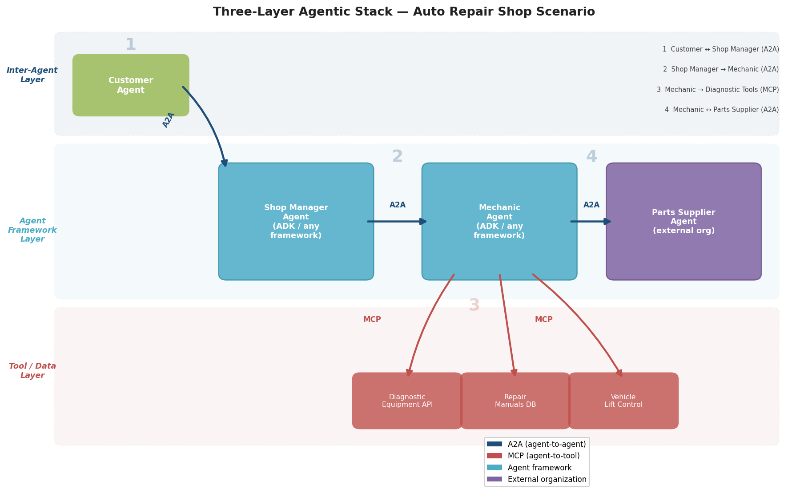

*Figure 3-1. The three-layer agentic stack applied to the Auto Repair Shop scenario. Blue arrows denote A2A (agent-to-agent) interactions; red arrows denote MCP (agent-to-tool) connections. The mechanic agent simultaneously participates in both protocol layers—receiving delegated tasks via A2A and invoking diagnostic tools via MCP.*

This scenario demonstrates that MCP and A2A are not merely non-overlapping but actively interdependent: the mechanic agent's ability to fulfill its A2A-delegated task depends on its MCP connections to tools, and the end-to-end workflow requires both protocols to function. The scenario also illustrates the organizational-boundary crossing that motivates A2A's opaque-agent philosophy—the parts-supplier agent operates under a different organization's control, with its own internal tools and reasoning processes hidden from the mechanic agent.

## 3.3 Dual-Protocol Implementations in Practice

Beyond conceptual reference architectures, working implementations demonstrate how both protocols coexist at the code level and across diverse technology stacks.

### Google ADK as a Dual-Protocol Reference Implementation

Google's Agent Development Kit (ADK) provides the most mature dual-protocol implementation. The ADK Python repository contains dedicated modules for both protocols: `src/google/adk/a2a/` implements A2A client and server functionality, while `src/google/adk/tools/mcp_tool/` provides MCP tool integration [ADK Python Repository](https://github.com/google/adk-python "Google ADK Python — dual-protocol support"). A single ADK-built agent can simultaneously serve as an A2A endpoint—receiving task delegations from peer agents—and as an MCP consumer—invoking tools and accessing data sources. This dual capability is not retrofitted; it reflects the ADK's design as the canonical implementation of the layered agentic stack described in Section 3.2.

### Community Samples Repository

The `a2a-samples` repository, maintained under the Linux Foundation's A2A project, contains five dual-protocol examples spanning different frameworks, languages, and cloud environments [A2A Samples](https://github.com/a2aproject/a2a-samples "A2A official samples repository"):

- **a2a_mcp.** Uses MCP as an Agent Card registration center, enabling A2A agent discovery through an MCP server that manages agent metadata—a creative cross-protocol integration where MCP tools serve the A2A discovery layer.
- **Airbnb Planner Multi-Agent.** Combines ADK, A2A, and MCP in a multi-agent travel-planning system where specialized agents (flight search, accommodation, itinerary) collaborate via A2A while each accesses its tools via MCP.
- **AG2 + MCP + A2A.** Demonstrates how the AG2 framework bridges both protocols, with AG2 agents communicating via A2A and accessing tools via MCP.
- **Java Weather Agent.** A cross-language example implementing a weather-service agent in Java that exposes an A2A interface and consumes weather API tools via MCP.
- **Azure AI Foundry Multi-Agent.** Built on Microsoft's Semantic Kernel, this sample demonstrates A2A inter-agent routing combined with MCP tool access within the Azure cloud environment.

These five samples span four distinct agent frameworks (ADK, AG2, Semantic Kernel, custom Java), three programming languages (Python, Java, C#), and two cloud platforms (Google Cloud, Azure). The breadth of implementations constitutes empirical evidence that the dual-protocol pattern is framework-agnostic and practically realizable, not merely a theoretical aspiration.

### Framework-Level Dual Support

At least twelve major agent frameworks have built-in A2A support, and most simultaneously integrate MCP tools: ADK, Agno, AG2, CrewAI, LangGraph, LiteLLM, and Microsoft Agent Framework (Semantic Kernel), among others [A2A Community Hub](https://github.com/a2aproject/A2A/blob/main/docs/community.md "A2A Community Hub"). In practice, these frameworks function as dual-protocol bridges. A developer building an agent on LangGraph, for instance, can expose it as an A2A server for inter-agent collaboration while using LangGraph's MCP integration to connect to tool servers. The framework layer abstracts protocol-level complexity, presenting both protocols through unified developer-facing APIs and thereby lowering the adoption barrier for dual-protocol architectures.

## 3.4 Governance Asymmetry and Cross-Community Dynamics

The two protocols share a complementary technical positioning yet diverge markedly in governance—a factor that shapes how convergence or divergence may unfold over time.

### A2A: Multi-Stakeholder Governance Under the Linux Foundation

A2A is governed by an eight-seat Technical Steering Committee (TSC) under the Linux Foundation's LF AI & Data umbrella. TSC members include Google, Microsoft, Cisco, AWS, Salesforce, ServiceNow, SAP, and IBM Research—a cross-section of major enterprise technology vendors. Decisions require majority vote with a 50 % quorum, and the governance model is designed to transition from its current launch phase to steady-state governance by mid-2026, at which point TSC composition rules will normalize and community election processes will take effect [A2A Governance](https://github.com/a2aproject/A2A/blob/main/GOVERNANCE.md "A2A GOVERNANCE.md").

A notable governance signal is the absorption of IBM's independently developed Agent Communication Protocol (ACP) into A2A. Rather than maintaining a competing standard, IBM merged ACP's design contributions into the A2A specification and accepted a TSC seat—a consolidation event that reduced fragmentation in the agent-to-agent protocol space and validated A2A as the focal point for multi-vendor collaboration [LF AI & Data Blog](https://lfaidata.foundation/communityblog/2025/08/29/acp-joins-forces-with-a2a-under-the-linux-foundations-lf-ai-data/ "ACP joins forces with A2A under the Linux Foundation").

### MCP: Anthropic-Led Governance with Community Participation

MCP follows a hierarchical governance model in which Anthropic-employed Lead Maintainers hold veto authority over specification changes. Community participation occurs through Working Groups and Interest Groups—such as the Agents Working Group (co-maintained by AWS and Anthropic) and the Financial Services Interest Group—but final decision-making authority remains with Anthropic [MCP Governance SEP-932](https://github.com/modelcontextprotocol/modelcontextprotocol/issues/932 "MCP Governance SEP"). The specification evolution pipeline encompasses approximately 290 Specification Enhancement Proposals (SEPs), indicating active community engagement despite the concentrated governance structure.

### Overlapping Membership, Distinct Authority

Several major organizations participate in both ecosystems but hold formal governance authority only in A2A. Microsoft, AWS, and Salesforce are active contributors to both MCP and A2A, yet only in A2A do they occupy TSC seats with voting rights. This asymmetry means that A2A's direction reflects multi-vendor consensus, whereas MCP's direction remains subject to Anthropic's strategic priorities. For enterprises evaluating long-term protocol commitments, this governance difference may prove as consequential as any technical distinction.

No single standards body currently governs both protocols jointly. The IETF has signaled interest in the broader agent-protocol space: an Internet-Draft by Rosenberg and Jennings (May 2025) surveyed MCP and A2A and identified interoperability gaps, and the CATALIST (Coordinating Agent To Agent List of efforts) Birds-of-a-Feather session is planned for IETF 125 [IETF I-D — Rosenberg & Jennings](https://www.ietf.org/archive/id/draft-rosenberg-ai-protocols-00.txt "AI Agent Protocols framework, May 2025") [IETF CATALIST](https://datatracker.ietf.org/group/catalist/ "CATALIST BoF"). However, no formal working group or joint governance mechanism has been established.

## 3.5 Technical Convergence — MCP's Movement Toward A2A Territory

Despite the clean complementarity narrative, specification activity reveals that MCP is evolving toward capabilities overlapping with A2A's core territory. This convergence is driven not by competitive intent but by the practical needs of MCP's large installed base, which has begun deploying MCP in agent-to-agent scenarios the protocol was not originally designed for.

### MCP Tasks (SEP-1686)

The most significant convergence signal is MCP's experimental Tasks feature, introduced in the 2025-11-25 specification. Proposed by Amazon engineers, SEP-1686 adds lifecycle tracking to MCP requests, defining five task states (working, input_required, completed, failed, cancelled). The proposal explicitly lists six production use cases, one of which is "Agent-to-Agent Communication," accompanied by a description of Amazon's internal experience: "slow agents cause cascading delays" in multi-agent systems built on MCP—a direct acknowledgment that tool-centric protocols face operational challenges when repurposed for agent coordination [MCP SEP-1686](https://github.com/modelcontextprotocol/specification/blob/main/docs/seps/1686-tasks.mdx "MCP SEP-1686: Tasks").

As detailed in Chapter 2, MCP Tasks differ from A2A's task model in three material respects: MCP defines five states versus A2A's eight (lacking REJECTED and AUTH_REQUIRED), MCP lacks a webhook-based push notification mechanism, and MCP Tasks wrap existing tool invocations rather than modeling autonomous agent interactions. These differences are not merely quantitative; they reflect the underlying philosophical gap between treating the remote party as a tool and treating it as an autonomous agent.

### MCP Server Cards (SEP-2127)

SEP-2127 proposes a Server Cards mechanism for MCP, hosting JSON metadata at `/.well-known/mcp.json`—a discovery pattern directly analogous to A2A's Agent Cards at `/.well-known/agent-card.json`. If adopted, this feature would give MCP pre-connection discovery capabilities comparable to A2A's, partially closing the discovery-mechanism gap identified in Chapter 2. The parallel naming convention and identical use of RFC 8615 well-known URIs underscore the directional convergence.

### MCP Subtasks (SEP-2268) and Unsolicited Tasks (SEP-2229)

Additional in-pipeline proposals further narrow the gap. SEP-2268 introduces hierarchical task decomposition (subtasks), moving MCP toward the structured task delegation that A2A implements through contextId-linked task DAGs. SEP-2229 introduces unsolicited tasks—server-initiated task creation—which would partially bridge MCP's asymmetric communication model toward A2A's symmetric peer model.

### Assessing the Convergence Trajectory

The pattern is unmistakable: MCP's specification pipeline is systematically adding capabilities—task lifecycle, pre-connection discovery, hierarchical task management, server-initiated actions—that A2A has implemented as first-class features from its inception. This convergence is driven by pragmatic demand from MCP's large user base encountering use cases that exceed tool-centric assumptions.

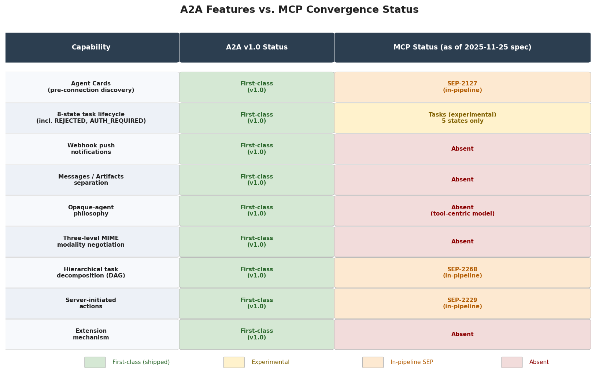

*Figure 3-2. Feature overlap matrix comparing nine A2A first-class capabilities against their current MCP status (first-class, experimental, in-pipeline SEP, or absent). Green cells indicate shipped features; yellow marks experimental status; orange denotes in-pipeline proposals; pink indicates absence.*

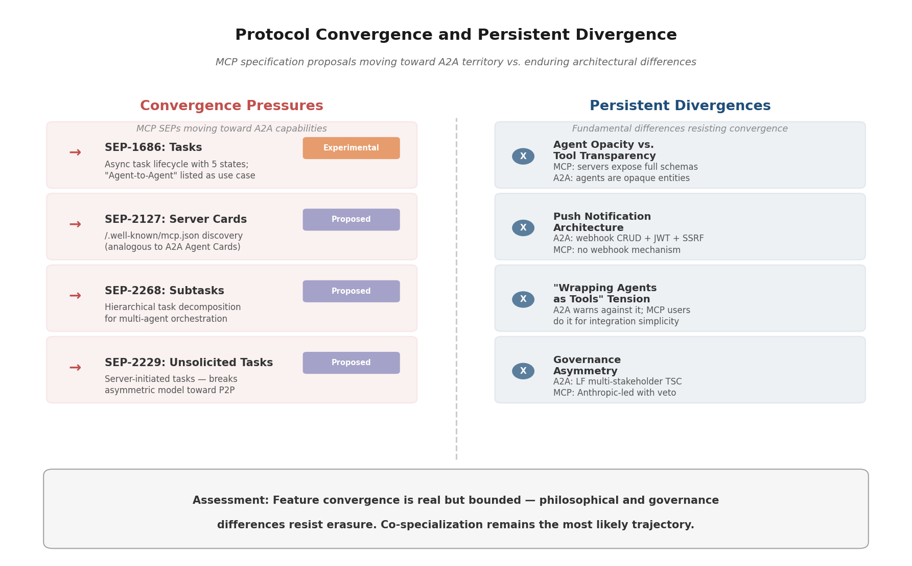

*Figure 3-3. Convergence pressures (left) versus persistent divergences (right). The four MCP SEPs moving toward A2A territory are shown alongside four fundamental architectural and governance differences that resist erasure.*

However, convergence in feature checklists does not imply convergence in architectural philosophy. MCP's evolution occurs within the constraints of its host-managed, tool-centric architecture; the additions are extensions grafted onto a system designed for deterministic tool invocation. A2A's equivalent features emerge organically from an architecture built from the outset for autonomous agent collaboration. The distinction is analogous to the difference between adding email capabilities to an HTTP server and designing SMTP from first principles: both can deliver messages, but the purpose-built protocol embodies assumptions—store-and-forward, relay chains, mailbox semantics—that the adapted protocol cannot easily replicate.

## 3.6 The Philosophical Tension — Agents as Opaque Peers vs. Agents as Tools

A fundamental tension underlies the coexistence of MCP and A2A—one that transcends technical specifications and touches on how the industry conceptualizes what an AI agent is.

A2A's documentation explicitly warns against "wrapping agents as tools," arguing that the pattern "limits their capabilities" by stripping away negotiation, multi-turn interaction, autonomous refusal, long-running execution, and intellectual-property protection [A2A What is A2A](https://github.com/a2aproject/A2A/blob/main/docs/topics/what-is-a2a.md "A2A — Problems that A2A Solves"). The A2A design philosophy treats every agent as an opaque, autonomous entity whose internal reasoning, tool usage, and data remain invisible to its collaborators. The REJECTED state in A2A's task model encodes this principle at the protocol level: an agent can refuse a task on its own judgment—a capability without equivalent in a tool-invocation paradigm.

In practice, however, compatibility pressures push in the opposite direction. A system architect with an established MCP infrastructure and a new requirement to integrate a remote agent faces a pragmatic choice: implement a full A2A client, or wrap the remote agent as an MCP tool. The latter deploys faster, leverages existing infrastructure, and works within familiar patterns—yet at the cost of the capability losses A2A's designers identify. This tension is unlikely to be resolved by protocol design alone; it reflects deeper organizational decisions about whether inter-agent interactions are treated as tool calls with elaborate wrappers or as genuine peer collaborations carrying their own lifecycle semantics.

## 3.7 The Path Forward — Sustained Specialization with Interoperability Bridges

The evidence surveyed in this chapter points toward a specific trajectory for the MCP–A2A relationship: sustained specialization with increasing interoperability, rather than merger or mutual displacement.

**Structural factors favoring continued coexistence.** The two protocols serve genuinely different interaction patterns. The vertical, host-managed, schema-defined pattern of agent-to-tool communication (MCP's domain) and the horizontal, peer-to-peer, autonomy-preserving pattern of agent-to-agent collaboration (A2A's domain) impose different architectural constraints. A protocol optimized for one pattern necessarily makes trade-offs that reduce its fitness for the other. MCP's stdio transport, for instance, is essential for local tool integration but semantically meaningless for inter-agent communication across organizational boundaries. A2A's opaque-agent philosophy and REJECTED/AUTH_REQUIRED states are critical for autonomous collaboration but represent unnecessary overhead for invoking a deterministic database query.

**The "MCP inside, A2A between" reference model.** The three-layer mental model—framework, MCP, A2A—has achieved consensus across both communities as the standard reference architecture. Google ADK implements it directly; Microsoft Semantic Kernel, AG2, LangGraph, and other major frameworks support it through dual-protocol integrations. No credible alternative architecture has emerged that proposes a single protocol for both the tool-binding and agent-collaboration layers.

**Interoperability bridges will deepen rather than merge.** The current integration model is framework-specific: each agent framework independently implements both protocol clients. A logical next step is the emergence of shared middleware or gateway components that abstract protocol translation—a gateway that, for instance, automatically exposes a set of MCP tool servers as capabilities within an A2A Agent Card, or that routes incoming A2A tasks to appropriate MCP tool invocations based on skill matching. The `a2a_mcp` sample in the official repository (using MCP as an Agent Card registry) represents an early step in this direction, but no general-purpose, open-source A2A–MCP bridge exists as of April 2026.

**Standards-body activity may accelerate alignment.** The IETF's CATALIST initiative, should it progress to a formal working group, could produce standardized interoperability recommendations or shared protocol components—common discovery formats, unified security token exchange—that bridge MCP and A2A without requiring either to subsume the other. The outcome of the CATALIST BoF at IETF 125 will serve as a significant indicator of whether inter-protocol standardization is on the near-term horizon.

**The internet protocol layering analogy holds.** The internet's architecture rests on specialized, layered protocols—HTTP for document transfer, SMTP for email, DNS for name resolution—each optimized for a distinct communication pattern yet coexisting within a shared infrastructure. The MCP–A2A relationship follows this precedent: one protocol for the agent-to-tool channel, another for the agent-to-agent channel, both built on common foundations (HTTP, JSON-RPC 2.0, SSE) and increasingly connected by framework-level integration layers. The conditions for complete displacement—one protocol fully replicating the other's capabilities while commanding a larger ecosystem—remain remote.

# 第4章 A2A's Innovations and Unique Design Choices

Chapters 2 and 3 established the technical dimensions on which A2A and MCP diverge and the architectural relationship that positions them as complementary layers. This chapter isolates and evaluates A2A's novel contributions, distinguishing genuinely new architectural ideas from skillful adaptations of existing patterns and from straightforward adoptions of mature standards. The assessment proceeds feature by feature, situating each design choice against its closest historical and contemporary precedents—FIPA ACL, UDDI, OpenAPI, MCP, and conventional REST/gRPC API patterns. The goal is analytical precision rather than advocacy: understanding what A2A adds to the agent-communication design space, and why those additions matter for the trajectory of multi-agent systems.

## 4.1 Agent Cards — Decentralized Semantic Capability Discovery

The Agent Card mechanism is arguably A2A's most distinctive contribution. An Agent Card is a JSON metadata document hosted at the well-known URI `/.well-known/agent-card.json` (following RFC 8615), declaring an agent's identity, natural-language description, skills (each with its own description, tags, and example prompts), supported input/output MIME types, security schemes, and protocol version [A2A Specification — Section 5](https://github.com/a2aproject/A2A/blob/main/docs/specification.md "A2A v1.0 — Agent Discovery").

The innovation is best understood by contrast with prior discovery mechanisms:

- **UDDI (Universal Description, Discovery, and Integration).** The Web Services era's discovery infrastructure relied on centralized registries where service providers published WSDL interface descriptions. UDDI required shared registry infrastructure, imposed rigid XML-based interface descriptions, and ultimately failed to achieve critical mass—its registries were decommissioned by major vendors by 2007. A2A Agent Cards require no centralized infrastructure: each agent self-hosts its card at a predictable URI, enabling purely decentralized discovery.

- **FIPA Directory Facilitator (DF).** FIPA's multi-agent system architecture specified a Directory Facilitator agent as a centralized lookup service. Agents registered their capabilities using ontology-based descriptions, and other agents queried the DF to find collaborators. Like UDDI, this model demands centralized infrastructure and operates on formal ontological descriptions poorly suited to the fuzzy, natural-language skill descriptions that LLM-based agents require.

- **OpenAPI (Swagger).** OpenAPI specifications describe deterministic API endpoints using JSON Schema—parameter types, response formats, error codes. They serve programmatic matching: a client knows exactly what fields to send and what structures to expect. OpenAPI lacks semantic-level descriptions that would allow an LLM agent to reason about whether a remote endpoint's *capabilities* (as opposed to its *interface*) match a given task.

- **MCP Runtime Discovery.** As detailed in Chapter 2, MCP employs session-initialization handshakes and listing methods (`tools/list`, `resources/list`) to enumerate capabilities at connection time. Discovery is inherently post-connection: a client must establish a session before learning what the server offers.

A2A's Agent Card advances beyond all four precedents in three specific respects. First, **semantic-level capability description**: skill declarations combine natural language, structured tags, and example prompts—a format designed for LLM-based agents capable of reasoning about task-capability alignment rather than performing rigid schema matching. Second, **zero-infrastructure decentralization**: the well-known URI convention eliminates the need for registries, directory services, or any shared discovery infrastructure; any HTTP-accessible agent can be discovered by any client that knows its domain. Third, **security-capability bundling**: a single document declares both what the agent can do and how to authenticate to it, eliminating the multi-step flow of discovering capabilities in one location and authentication requirements in another [A2A Agent Discovery Guide](https://github.com/a2aproject/A2A/blob/main/docs/topics/agent-discovery.md "A2A — Agent Discovery strategies").

The figure below compares Agent Cards against their closest prior-art discovery mechanisms across eight dimensions.

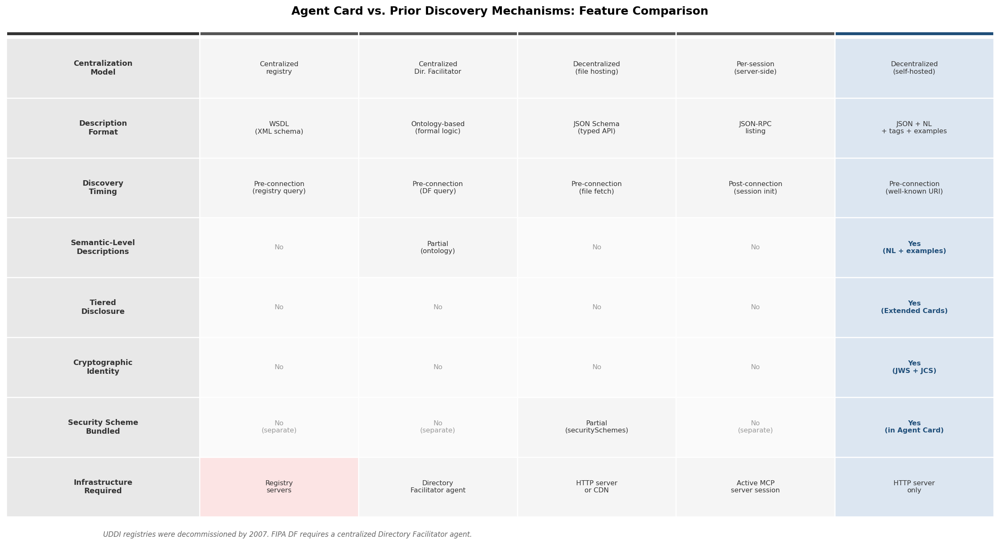
*Figure 4-1. Agent Card compared with UDDI, FIPA DF, OpenAPI, and MCP runtime discovery across centralization model, description format, discovery timing, semantic-level support, tiered disclosure, cryptographic identity, security bundling, and infrastructure requirements.*

### Extended Agent Cards and Tiered Disclosure

A2A further introduces Extended Agent Cards: after authenticating, a client may request an extended card that reveals additional capabilities not disclosed in the public card. This two-tier discovery model—public card for general discoverability, authenticated extended card for sensitive capabilities—has no direct precedent in UDDI, FIPA DF, OpenAPI, or MCP. The pattern addresses a concrete enterprise requirement: organizations may wish to advertise a compliance-checking agent's general availability publicly while restricting knowledge of its specific regulatory-model capabilities to authenticated partners [A2A Specification — Section 3.1.11](https://github.com/a2aproject/A2A/blob/main/docs/specification.md "A2A — Get Extended Agent Card").

### Cryptographic Identity via JWS/JCS Signing

Agent Cards can be cryptographically signed using JSON Web Signature (JWS) combined with JSON Canonicalization Scheme (JCS, RFC 8785). This enables a client to verify that a card was issued by the claimed agent and has not been tampered with—addressing trust-bootstrapping in open-network environments where agents from unknown organizations may present capability claims. No prior agent-discovery mechanism integrates cryptographic identity verification at the discovery layer itself.

**Assessment.** The Agent Card mechanism constitutes a genuinely novel synthesis. It combines decentralized hosting (from the well-known URI convention), semantic-level descriptions (tailored for LLM agent reasoning), cryptographic identity (from the JWS/JCS ecosystem), and tiered disclosure (a pattern without precedent in prior discovery mechanisms) into a single, coherent discovery primitive. While individual components draw on existing standards, the integration into an agent-specific discovery document is architecturally new.

## 4.2 The Opaque-Agent Philosophy

A2A's treatment of remote agents as opaque, autonomous entities represents a philosophical stance with concrete protocol-level consequences. An A2A client sends a task to a server agent and receives results, but the protocol provides no mechanism for the client to inspect, direct, or constrain the server's internal reasoning, tool usage, or data access. The server is a black box whose internal architecture—whether a single LLM, a multi-agent ensemble, a rules engine, or a hybrid system—remains entirely invisible to collaborators [A2A What is A2A](https://github.com/a2aproject/A2A/blob/main/docs/topics/what-is-a2a.md "A2A — Problems that A2A Solves").

This philosophy has historical roots: FIPA's agent model, developed in the 1990s, similarly treated agents as autonomous entities communicating through speech-act-based messages without exposing internal state. A2A's innovation lies not in the concept of agent opacity itself but in embedding it within a modern, Web-native protocol framework and encoding it through specific protocol mechanisms:

- **No protocol-level internal access.** Unlike MCP, where a host can enumerate and invoke specific tools on a server, A2A provides no primitives for inspecting or directing a server agent's internal operations. The client describes what it needs; the server decides how to deliver it.

- **REJECTED state.** The task state machine includes a `REJECTED` terminal state, encoding the server agent's right to autonomously decline a task—not because of a technical failure, but because the agent determines the task falls outside its scope, violates its policies, or is otherwise inappropriate. This encodes agent autonomy at the protocol level, a feature absent from MCP, REST APIs, and FIPA ACL (which modeled refusal through communicative acts rather than protocol-level state transitions).

- **AUTH_REQUIRED state.** The `AUTH_REQUIRED` interrupted state signals that a task cannot proceed without additional credentials, enabling mid-task credential escalation. This mechanism supports enterprise workflows where access to sensitive resources may require step-up authentication partway through execution—a pattern that tool-invocation protocols handle only through error codes rather than structured state transitions.

- **Intellectual property protection.** Because an A2A server never exposes its internal tool chain, prompt strategies, or data sources, organizations can offer agent capabilities as services without revealing proprietary methods. A2A's documentation explicitly identifies this as a design benefit: wrapping an agent as a tool (the MCP pattern) "limits their capabilities" and compromises IP protection [A2A What is A2A](https://github.com/a2aproject/A2A/blob/main/docs/topics/what-is-a2a.md "A2A — Problems that A2A Solves").

**Assessment.** The opaque-agent philosophy is a significant adaptation of FIPA-era autonomous-agent concepts into a Web-native protocol context. The genuine innovation resides in the specific encoding mechanisms—REJECTED and AUTH_REQUIRED states, the deliberate absence of internal-access primitives—rather than in the concept of agent autonomy per se.

## 4.3 The Eight-State Task Lifecycle

A2A's task state machine defines eight states organized into a clear taxonomy: `UNSPECIFIED`, `SUBMITTED`, `WORKING`, `COMPLETED`, `FAILED`, `CANCELED`, `REJECTED`, and `AUTH_REQUIRED`. States are categorized as terminal (`COMPLETED`, `FAILED`, `CANCELED`, `REJECTED`) or interrupted (`INPUT_REQUIRED`, `AUTH_REQUIRED`). Terminal states enforce immutability: once a task reaches a terminal state, it cannot be modified or restarted. Subsequent operations create new tasks within the same `contextId`, forming a directed acyclic graph (DAG) of related tasks [A2A Proto — TaskState](https://github.com/a2aproject/A2A/blob/main/specification/a2a.proto "A2A — TaskState enum") [A2A Life of a Task](https://github.com/a2aproject/A2A/blob/main/docs/topics/life-of-a-task.md "A2A — Task Immutability"). Figure 4-2 diagrams this state machine, highlighting the two states that lack counterparts in prior protocols.

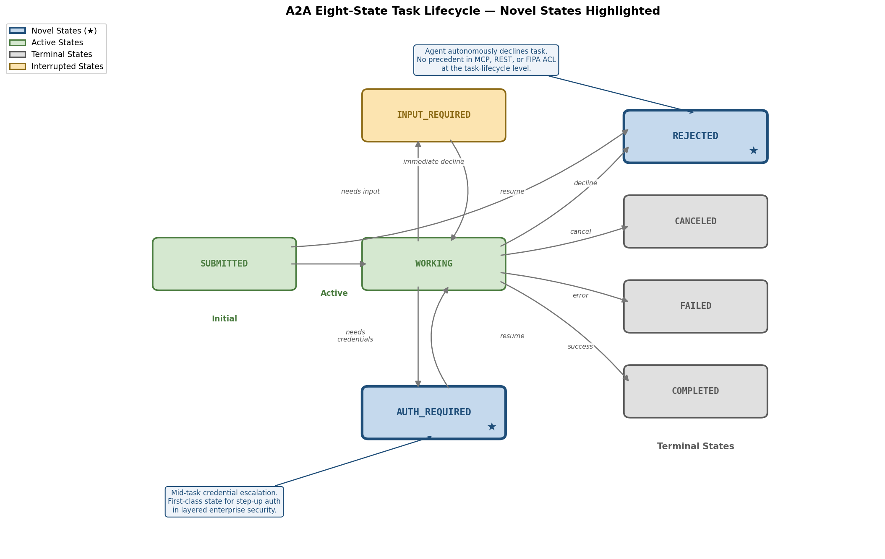
*Figure 4-2. A2A's eight-state task state machine. REJECTED and AUTH_REQUIRED (marked ★) are novel states without precedent in MCP, REST APIs, or FIPA ACL at the task-lifecycle level. Terminal states are immutable; interrupted states allow resumption.*

### Novel States Without Precedent

Two states in A2A's model lack counterparts in MCP, conventional REST API design, or prior agent-communication protocols:

- **REJECTED** encodes autonomous task refusal at the protocol level. In REST APIs, refusal is typically expressed through HTTP 403/422 error codes, conflating access denial with semantic inappropriateness. In MCP, there is no equivalent: a tool server either executes or returns an error. In FIPA ACL, refusal was modeled through the `refuse` performative—a communicative act within a message rather than a state in a managed lifecycle. A2A's approach is structurally different: REJECTED is a terminal state in a tracked task, creating an auditable record that the agent considered and declined the work.

- **AUTH_REQUIRED** models mid-task credential escalation as a first-class state transition. An agent may begin processing a task under one set of credentials and discover that completing it requires elevated access—for instance, accessing a restricted database or invoking a regulated API. Rather than failing the task or returning a generic error, the agent transitions to AUTH_REQUIRED, allowing the client to provide additional credentials and resume. This pattern is essential for enterprise workflows with layered security zones.

### Task Immutability and the contextId DAG

The immutability of terminal states is a deliberate architectural choice. The specification articulates the design rationale: immutable tasks provide "reliable input-to-output mapping for traceability," ensuring that each completed task constitutes an auditable record of what was requested and what was delivered [A2A Life of a Task](https://github.com/a2aproject/A2A/blob/main/docs/topics/life-of-a-task.md "A2A — Task Immutability"). When follow-up work is needed after a task reaches a terminal state, the client creates a new task linked through a shared `contextId`. This forms a DAG of related tasks where each node is immutable and traceable—a model that directly supports compliance and audit requirements in regulated industries.

**Assessment.** The eight-state machine is a genuine innovation in the agent-communication protocol space. The REJECTED and AUTH_REQUIRED states encode agent-specific semantics that no prior protocol has formalized at the task-lifecycle level. Task immutability with contextId-linked DAGs represents an original approach to reconciling traceability requirements with the need for iterative agent collaboration.

## 4.4 Messages versus Artifacts — Structural Separation of Communication and Output

A2A introduces a formal architectural distinction between Messages and Artifacts. Messages carry communication turns: instructions, clarifications, status updates, and negotiation exchanges between agents. Artifacts carry task output deliverables: documents, images, structured data, code, and other work products. The specification states explicitly that "Messages SHOULD NOT be used to deliver task outputs," enforcing a clean boundary between the communication channel and the output channel [A2A Specification — Section 3.7](https://github.com/a2aproject/A2A/blob/main/docs/specification.md "A2A — Messages and Artifacts separation").

This separation has no direct counterpart in MCP, REST APIs, or FIPA ACL. In MCP, a tool call returns its result inline within the JSON-RPC response; the communication medium and the output medium are the same channel. In REST APIs, response bodies serve double duty as both status communication and payload delivery. FIPA ACL messages could carry content of any type, but the standard drew no structural distinction between dialogue turns and deliverables.

The Messages/Artifacts separation yields three practical benefits. First, it enables **independent streaming of deliverables**: an agent can append artifacts to a task as they are generated while simultaneously exchanging messages about progress or clarifications. Second, it provides **clear metadata boundaries**: artifacts carry their own MIME types, names, and descriptions, making them self-describing output units that downstream systems can process, store, or route independently of the conversation context. Third, it supports **selective retrieval**: a client that only needs the output products of a completed task can fetch artifacts directly without parsing the entire message history.

**Assessment.** The Messages/Artifacts separation is a genuinely novel structural contribution to agent-communication protocol design. While the underlying concept—distinguishing dialogue from deliverables—is intuitive, no prior protocol has formalized it at the wire-format level.

## 4.5 Unified Part Model and Three-Tier Modality Negotiation

A2A's content exchange system centers on a unified `Part` model: a `oneof` union type comprising `TextPart`, `DataPart` (structured JSON data), `FilePart` (raw bytes or URL reference), and additional extensions. Parts carry explicit MIME types, and the protocol negotiates supported modalities at three hierarchical levels [A2A Proto — Part, AgentCard, SendMessageConfiguration](https://github.com/a2aproject/A2A/blob/main/specification/a2a.proto "A2A — Part model and MIME negotiation"):

1. **Agent Card level.** The Agent Card's `defaultInputModes` and `defaultOutputModes` fields declare the agent's globally supported MIME types (e.g., `text/plain`, `image/png`, `application/json`).
2. **Skill level.** Each `AgentSkill` in the card can override the agent-level defaults with skill-specific MIME types—a data-analysis skill might accept `text/csv` while a vision skill accepts `image/*`.
3. **Request level.** The client's `SendMessageConfiguration` includes an `acceptedOutputModes` field, narrowing acceptable output types for a specific interaction.

This three-tier negotiation contrasts sharply with MCP's content exchange model, which defines a fixed set of content types (`TextContent`, `ImageContent`, `AudioContent`, `EmbeddedResource`). Adding a new modality in MCP requires a specification change to introduce a new content-type definition. In A2A, new modalities are accommodated by declaring new MIME types without any protocol schema modification—the Part model is inherently extensible through standard MIME type registration.

**Assessment.** The three-tier MIME negotiation is a significant adaptation of content-negotiation patterns (familiar from HTTP's `Accept` headers) into an agent-specific context. The innovation lies in the hierarchical negotiation across agent, skill, and request levels—a granularity not found in MCP or prior agent protocols.

## 4.6 Push Notifications and the Three-Tier Task Update Delivery Model

A2A provides three mechanisms for delivering task status updates, unified under a single `StreamResponse` format [A2A Streaming & Async Guide](https://github.com/a2aproject/A2A/blob/main/docs/topics/streaming-and-async.md "A2A — Streaming and Async Operations"):

1. **Polling.** The client periodically calls `getTask` to check status—simple but latency-bound.
2. **Server-Sent Events (SSE).** The server pushes real-time updates over a persistent HTTP connection—low latency but requires an open connection.
3. **Webhooks.** The server sends updates to a client-specified callback URL when task state changes occur—enabling fully asynchronous workflows where the client need not maintain any persistent connection.

The webhook subsystem extends well beyond a simple callback mechanism. A2A specifies a complete CRUD lifecycle for notification subscriptions (`createPushNotificationConfig`, `getPushNotificationConfig`, `listPushNotificationConfigs`, `deletePushNotificationConfig`), along with comprehensive security measures: SSRF protections to prevent malicious callback URL abuse, JWT/JWKS mutual authentication between the task server and the notification endpoint, and replay-attack defenses [A2A Specification — Section 3.5](https://github.com/a2aproject/A2A/blob/main/docs/specification.md "A2A — Section 3.5 Task Update Delivery").

MCP provides SSE-based streaming through its Streamable HTTP transport but lacks a webhook mechanism. For long-running tasks—complex research, multi-step document generation, procurement workflows spanning hours or days—the absence of push notifications forces clients to maintain persistent connections or resort to polling. Mobile applications, serverless functions, and browser-based clients that cannot maintain long-lived HTTP connections face particular difficulty with this constraint. A2A's push-notification model directly addresses these deployment realities.

**Assessment.** Webhooks are a mature pattern in API design; the innovation lies not in webhooks per se but in their elevation to a first-class protocol feature with integrated lifecycle management, task-state-aware delivery, and comprehensive security specifications. The unified `StreamResponse` format across all three delivery tiers is a clean design choice that simplifies client implementation regardless of delivery mechanism.

## 4.7 The Extension Mechanism

A2A v1.0 introduces a formal extension system designed to enable protocol evolution without core specification changes. Extensions operate across four scopes [A2A Extensions Guide](https://github.com/a2aproject/A2A/blob/main/docs/topics/extensions.md "A2A — Extensions specification"):

1. **Data extensions.** Adding new fields to existing protocol data structures (e.g., attaching traceability metadata to tasks).
2. **Profile constraints.** Restricting the core specification for industry-specific compliance (e.g., a healthcare profile that mandates specific encryption for all Parts containing patient data).
3. **Method extensions / Extended Skills.** Defining new RPC methods beyond the core set (e.g., batch task submission).
4. **State machine extensions.** Adding custom states to the task lifecycle (e.g., a `PENDING_REVIEW` state for human-in-the-loop workflows).

Extensions are activated via HTTP headers, identified by URIs, and governed by a TSC-managed lifecycle: proposal → experimental → graduated → optional core adoption. Crucially, extensions cannot modify core data structures; they can only augment them, ensuring backward compatibility. The specification explicitly requires that agents ignoring an unknown extension must still function correctly on the core protocol.

Several extensions have already materialized: Cisco's AGP (Agent Gateway Protocol) extension introduces hierarchical capability-based routing and Autonomous Squads for internet-scale agent communication; the Secure Passport extension enables cryptographically signed context-state sharing across agent boundaries; and Timestamp and Traceability extensions add audit metadata to task interactions [A2A Extensions Guide](https://github.com/a2aproject/A2A/blob/main/docs/topics/extensions.md "A2A — Extensions specification").

**Assessment.** The extension mechanism represents a mature approach to protocol evolution, drawing on lessons from HTTP (extension headers), gRPC (custom metadata), and W3C standards (profiles and conformance levels). Its application to an agent-communication protocol—particularly the state-machine extension scope, which allows domain-specific task states without forking the core specification—is novel and directly addresses the tension between standardization and domain-specific customization.

## 4.8 Protocol Buffers as the Normative Data Model

A2A v1.0 adopts `a2a.proto` as the single normative source for all data structures, implementing a three-layer specification architecture: data model (Protocol Buffers) → operations (RPC definitions) → protocol bindings (JSON-RPC, gRPC, HTTP+JSON/REST). ADR-001 specifies ProtoJSON as the canonical JSON serialization format, and Google API annotations in the proto file enable automatic generation of RESTful HTTP bindings [A2A ADR-001](https://github.com/a2aproject/A2A/blob/main/adrs/adr-001-protojson-serialization.md "ADR-001: ProtoJSON") [A2A v1.0 What's New](https://github.com/a2aproject/A2A/blob/main/docs/whats-new-v1.md "A2A v1.0 — protobuf as normative model").

This design addresses a concrete engineering problem: maintaining consistency across multiple protocol bindings. When a protocol supports JSON-RPC, gRPC, and REST simultaneously, divergent definitions risk implementation fragmentation—a gRPC client and a JSON-RPC client could inadvertently operate with incompatible message structures. By elevating Protocol Buffers to the normative layer, A2A ensures that all three bindings derive from a single source of truth and that SDK code generation in any language produces structurally identical data types.

The pattern itself is well established—Google's internal API design guide and the gRPC ecosystem have long used proto files as canonical service definitions. Its application to an agent-communication protocol, however, is uncommon: neither MCP, FIPA ACL, nor Web Services (WSDL/SOAP) adopted a binary IDL as the normative data model for a multi-binding protocol.

**Assessment.** This is a significant adaptation of a proven engineering pattern rather than a novel invention. Its value lies in solving a concrete problem (multi-binding consistency) that arises specifically because A2A supports three protocol bindings—a design ambition that itself distinguishes A2A from single-binding protocols.

## 4.9 Innovation Spectrum — A Summary Classification

Not all of A2A's design choices carry equal novelty. The following classification organizes them along an innovation spectrum, from genuinely unprecedented contributions to skillful reuse of mature standards. Figure 4-3 provides a visual summary.

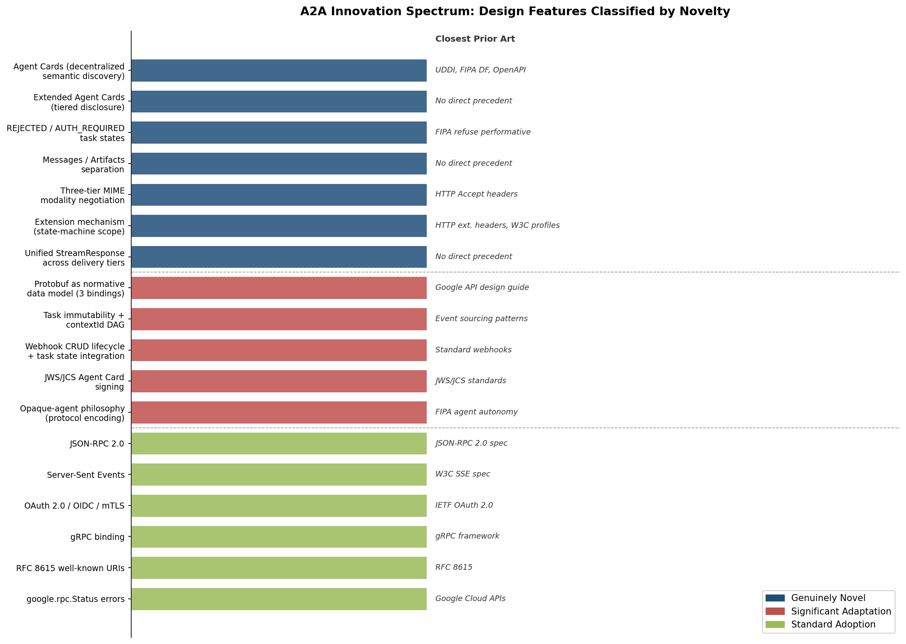
*Figure 4-3. A2A design features classified by novelty category, with the closest prior-art precedent annotated for each feature.*

**Genuinely novel contributions** — design elements without direct precedent in prior agent-communication or API protocols:

- Agent Cards as decentralized, semantic-level capability discovery documents
- Extended Agent Cards with tiered, authentication-gated disclosure
- REJECTED and AUTH_REQUIRED task states encoding agent autonomy and mid-task credential escalation
- Messages/Artifacts structural separation at the wire-format level
- Three-tier MIME modality negotiation (agent → skill → request)
- Formal extension mechanism with state-machine extension scope
- Unified StreamResponse format across polling, SSE, and webhook delivery

**Significant adaptations** — known patterns substantially reworked for agent-specific requirements:

- Protocol Buffers as normative data model with three-binding architecture
- Task immutability with contextId-linked DAG for audit traceability
- Webhook CRUD lifecycle integrated with task state management
- JWS/JCS cryptographic signing of Agent Cards for identity verification
- Opaque-agent philosophy encoded through absence of internal-access primitives

**Standard adoptions** — mature technologies incorporated without substantial modification:

- JSON-RPC 2.0 as a message framing protocol
- Server-Sent Events for real-time streaming
- OAuth 2.0 / OpenID Connect / mTLS for authentication
- gRPC as a high-performance binding
- RFC 8615 well-known URIs as a hosting convention
- `google.rpc.Status` for error modeling

This classification underscores that A2A's value proposition rests not on a single breakthrough feature but on a carefully composed architecture that synthesizes novel agent-specific mechanisms with proven Web infrastructure patterns. The genuinely novel elements—Agent Cards, the enriched task state machine, Messages/Artifacts separation, and the extension system—collectively address a design space that prior protocols left unoccupied: standardized communication between autonomous, opaque AI agents operating across organizational boundaries.

# 第5章 Problem Space — What A2A Is Designed to Solve

Chapters 2 through 4 examined A2A's architecture, its complementary relationship with MCP, and its novel design contributions. This chapter shifts perspective from protocol mechanics to the problem space that motivated A2A's creation. Each section identifies a concrete gap in the pre-A2A landscape, grounds it in documented industry pain points or specification-level evidence, and explains how A2A's design directly addresses that gap. The objective is to articulate not merely what A2A does, but *why* it was needed—and why existing protocols, including MCP, could not fill the void on their own. Six distinct problem categories emerge from the evidentiary record: heterogeneous agent silos, the agent-as-tool anti-pattern, enterprise cross-organizational collaboration requirements, the long-running task management gap, agent discovery and trust deficits, and scalability challenges in multi-agent ecosystems.

## 5.1 The Heterogeneous Agent Silo Problem

The rapid proliferation of AI agent frameworks between 2023 and 2025 produced a fragmented ecosystem in which agents built on different platforms could not communicate with one another. By the time A2A was announced in April 2025, at least a dozen major frameworks—LangChain, CrewAI, AutoGen, Google ADK, Amazon Strands, and Microsoft Semantic Kernel among them—had established substantial developer communities, each maintaining its own internal abstractions for tool invocation, memory management, and task orchestration [A2A Community Hub](https://github.com/a2aproject/A2A/blob/main/docs/community.md "A2A — 12+ framework integrations"). Enterprise software vendors—Salesforce, SAP, ServiceNow, Oracle—were simultaneously embedding agent capabilities into their platforms, adding further proprietary ecosystems to the landscape.

The consequence was a classic N² integration problem. Each pair of frameworks or vendor platforms requiring interoperation demanded bespoke integration work: custom API wrappers, message translators, and authentication bridges. For an ecosystem of N agent platforms, full pairwise connectivity required N×(N−1)/2 unique integrations. Google's A2A announcement explicitly identified this fragmentation as the protocol's motivating problem, stating that agents were "locked into their respective ecosystems," forming "new information silos" that undermined the promise of agentic AI [Google Cloud Blog](https://cloud.google.com/blog/products/ai-machine-learning/a2a-a-new-era-of-agent-interoperability "Announcing the Agent2Agent Protocol (A2A), 2025-04-09").

A2A addresses this fragmentation by reducing the integration burden from O(N²) to O(N). Each framework implements A2A once—publishing an Agent Card, accepting task requests, and emitting task updates—and thereby gains interoperability with every other A2A-compliant agent. The protocol's adoption trajectory substantiates the severity of the silo problem: from over 50 launch partners in April 2025 to more than 160 partner organizations within twelve months [A2A Partners](https://github.com/a2aproject/A2A/blob/main/docs/partners.md "A2A — 160+ partners"). IBM's decision to merge its independently developed Agent Communication Protocol (ACP) into A2A rather than maintain a competing standard provides additional validation—multiple organizations had independently converged on the same diagnosis of fragmentation as the central barrier to multi-agent deployment [LF AI & Data Blog](https://lfaidata.foundation/communityblog/2025/08/29/acp-joins-forces-with-a2a-under-the-linux-foundations-lf-ai-data/ "ACP joins forces with A2A").

## 5.2 The "Agent-as-Tool" Anti-Pattern

Prior to A2A, the dominant approach to agent-to-agent interaction was to wrap one agent as a tool invocable by another—exposing the remote agent's capabilities through a tool-calling interface such as MCP's tool primitives or OpenAI's function-calling API. While pragmatically expedient, this pattern introduces fundamental capability losses that A2A's documentation explicitly catalogs under the heading "Problems that A2A Solves" [A2A What is A2A](https://github.com/a2aproject/A2A/blob/main/docs/topics/what-is-a2a.md "A2A — Problems that A2A Solves"). Five dimensions of capability degradation merit detailed examination.

**Loss of negotiation capability.** Tools operate on schema-validated inputs and produce deterministic outputs. An agent wrapped as a tool cannot negotiate task scope, request clarification, or propose alternative approaches. A2A's multi-turn message exchange (Chapter 2, Section 2.4) enables agents to engage in iterative dialogue—clarifying ambiguities, narrowing scope, and reaching agreement before committing to execution.

**Loss of multi-turn interaction.** Tool invocations follow a single request-response cycle. Complex tasks requiring iterative refinement—a research agent that needs additional context, an analysis agent that produces intermediate results for review—cannot be modeled within a single tool call. A2A's task lifecycle, with its INPUT_REQUIRED interrupted state, natively supports multi-turn workflows in which the server agent can pause execution and request additional information from the client.

**Loss of autonomous refusal.** A tool server either executes a request or returns an error; no protocol-level mechanism exists for a tool to decline a request based on its own judgment about appropriateness, scope, or policy compliance. A2A's REJECTED terminal state (Chapter 4, Section 4.3) encodes the agent's right to refuse a task autonomously—a capability essential for agents operating under organizational policies, regulatory constraints, or capacity limits.

**Loss of long-running execution.** Tool calls are typically bound by invocation timeouts measured in seconds or low minutes. Tasks that require extended processing—comprehensive document generation, multi-source research, procurement approvals—cannot fit within tool-call timeout windows. A2A's asynchronous task model, with webhook-based push notifications, supports tasks spanning minutes to days without requiring persistent client connections.

**Loss of opacity and IP protection.** A tool interface exposes its parameter schema, revealing the structure of the underlying capability. Organizations offering agent-as-a-service may not wish to disclose the specifics of their internal tool chains, prompt strategies, or data sources. A2A's opaque-agent philosophy (Chapter 4, Section 4.2) ensures that a server agent's internal architecture remains invisible to collaborators—protecting intellectual property and proprietary methods.

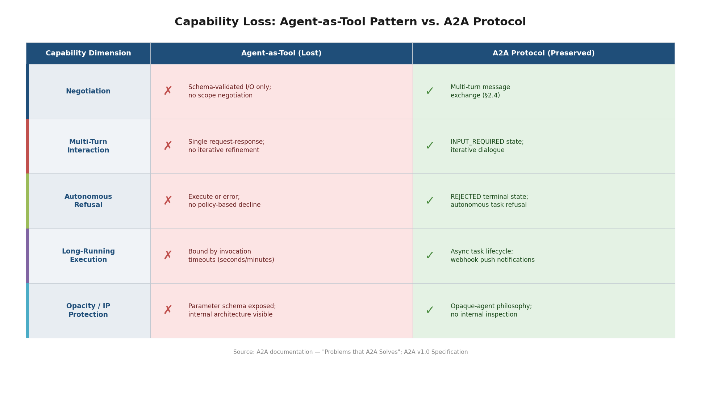

*Figure 5.1 — Side-by-side comparison of capability dimensions lost under the agent-as-tool pattern versus the corresponding A2A protocol mechanisms that preserve each capability. Source: A2A v1.0 Specification.*

The severity of this anti-pattern is corroborated by the MCP community's own recognition of the problem. MCP SEP-1686, the Tasks proposal authored by Amazon engineers, explicitly lists "Agent-to-Agent Communication" as one of six production use cases motivating the addition of task lifecycle management to MCP—an acknowledgment that practitioners had been using tool-centric protocols for inter-agent coordination and encountering operational difficulties as a result [MCP SEP-1686](https://github.com/modelcontextprotocol/specification/blob/main/docs/seps/1686-tasks.mdx "MCP SEP-1686 — Agent-to-Agent Communication use case").

## 5.3 Enterprise Cross-Organizational Collaboration

Enterprise environments impose requirements that significantly exceed those of single-developer or single-organization agent deployments. When agents from different organizations must collaborate—in supply-chain coordination workflows, multi-party compliance reviews, or cross-vendor service fulfillment processes—the communication protocol must address trust boundaries, data sovereignty, and integration with existing enterprise infrastructure.

### Trust Boundaries and Security Infrastructure Reuse

A2A addresses the enterprise integration challenge by designing agents as "standard HTTP-based enterprise applications" that leverage existing security infrastructure rather than requiring new security mechanisms [A2A Enterprise Guide](https://github.com/a2aproject/A2A/blob/main/docs/topics/enterprise-ready.md "A2A — Enterprise Implementation"). An A2A-compliant agent can be deployed behind existing API gateways, firewalls, and identity providers. The Agent Card's security-scheme declarations—supporting API Key, HTTP Auth, OAuth 2.0, OpenID Connect, and mTLS—enable organizations to apply the same authentication and authorization policies to agent-to-agent traffic that they apply to conventional service-to-service communication.

This design reflects a pragmatic understanding of enterprise adoption dynamics. Organizations with mature security infrastructures—SOC 2 compliance frameworks, identity federation systems, network segmentation policies—are unlikely to adopt a protocol that demands parallel security infrastructure. By operating within existing HTTP-based security paradigms, A2A minimizes the incremental trust surface that security teams must evaluate.

### Data Sovereignty and the Opaque-Agent Model

Cross-organizational agent collaboration raises acute data-sovereignty concerns. Under regulatory frameworks such as GDPR, an organization may be prohibited from sharing internal data-processing details with external parties. A2A's opaque-agent philosophy (Chapter 4, Section 4.2) provides a protocol-level guarantee that addresses this requirement: agents exchange task requests and results without exposing internal reasoning chains, tool invocations, or intermediate data. The protocol provides no mechanism for a client agent to inspect how a server agent processes its request—the boundary between organizations is enforced at the protocol level, not merely at the application level.

### Compliance and Audit Traceability

Regulated industries require audit trails documenting what was requested, what was delivered, and when. A2A's task immutability design (Chapter 4, Section 4.3) directly serves this requirement. Terminal task states are immutable—once a task reaches COMPLETED, FAILED, CANCELED, or REJECTED, its record cannot be altered. The specification articulates the rationale explicitly: immutable tasks provide "reliable input-to-output mapping for traceability" [A2A Life of a Task](https://github.com/a2aproject/A2A/blob/main/docs/topics/life-of-a-task.md "A2A — Task Immutability"). Each completed task constitutes an auditable record with a fixed relationship between input and output, suitable for regulatory review.

The contextId mechanism extends traceability across multi-step workflows. When follow-up tasks are created after a terminal state, they share a contextId with the original task, forming a directed acyclic graph (DAG) that documents the full history of an agent interaction. Auditors can reconstruct the complete workflow by traversing the contextId-linked task graph.

## 5.4 The Long-Running Task Management Gap

A foundational limitation of synchronous request-response protocols—including MCP's base interaction model—is their inability to manage tasks that exceed the duration of a single HTTP connection. Many enterprise agent workflows involve tasks measured in minutes, hours, or days: comprehensive multi-source research, multi-step document generation with human review gates, procurement approval chains, and complex analytical pipelines processing large datasets.

Amazon engineers documented this gap explicitly in MCP SEP-1686, the proposal that introduced experimental task support to MCP. The proposal identifies six production use cases requiring asynchronous execution, including agent-to-agent communication scenarios in which "slow agents cause cascading delays" in multi-agent systems [MCP SEP-1686](https://github.com/modelcontextprotocol/specification/blob/main/docs/seps/1686-tasks.mdx "MCP SEP-1686 — 6 production use cases"). The cascading-delay problem is structural: in a synchronous invocation chain, a slow downstream agent blocks the entire calling chain, consuming connection resources at every intermediate node.

A2A addresses this gap through three complementary mechanisms:

- **Decoupled task lifecycle.** A client submits a task (SUBMITTED), the server begins processing (WORKING), and the client can disconnect without losing track of the task. Submission and completion are independent events, eliminating the tight coupling between client presence and task execution.
- **Three-tier update delivery.** The protocol's polling, SSE, and webhook delivery modes provide flexibility matched to deployment context—SSE for low-latency environments where persistent connections are feasible, webhooks for mobile applications, serverless functions, and browser-based clients that cannot maintain long-lived HTTP connections [A2A Streaming & Async Guide](https://github.com/a2aproject/A2A/blob/main/docs/topics/streaming-and-async.md "A2A — Push Notifications").
- **Production-grade webhook subsystem.** The webhook infrastructure includes a complete CRUD lifecycle for notification subscriptions, JWT/JWKS mutual authentication, and SSRF protections—elevating push notifications from a convenience feature to an enterprise-ready infrastructure component.

The practical significance of this gap is underscored by the deployment environments in which agents increasingly operate. Serverless compute platforms impose strict execution timeouts (typically 5–15 minutes). Mobile applications cannot maintain persistent HTTP connections across network transitions. Browser-based agent interfaces are subject to tab closure and connection limits. In each case, the synchronous request-response model forces architectural workarounds—custom polling loops, out-of-band status channels, or application-level state machines—that A2A standardizes at the protocol level.

## 5.5 The Agent Discovery and Trust Deficit

Before A2A, no standardized mechanism existed for an agent to discover what other agents are available, what capabilities they offer, and how to authenticate to them. This absence created a discovery and trust deficit that constrained multi-agent system architectures along two dimensions.

### Discovery Without Infrastructure Prerequisites

Historical agent-discovery mechanisms—UDDI in the Web Services era and FIPA's Directory Facilitator in the multi-agent systems literature—relied on centralized registries. UDDI required organizations to publish service descriptions to shared registries, demanding governance, availability guarantees, and agreement on registry infrastructure; by 2007, major vendors had decommissioned their public UDDI registries. FIPA's Directory Facilitator similarly required a central lookup agent within each multi-agent platform. Both approaches imposed infrastructure prerequisites that inhibited adoption beyond tightly controlled environments.

A2A's Agent Card mechanism eliminates this infrastructure prerequisite. Each agent self-hosts its Agent Card at `/.well-known/agent-card.json` (following RFC 8615), enabling discovery by any client that knows the agent's domain—no registry, directory service, or shared infrastructure is required [A2A Specification — Section 5](https://github.com/a2aproject/A2A/blob/main/docs/specification.md "A2A v1.0 — Agent Discovery"). This decentralized model mirrors the Web's own discovery paradigm—robots.txt, favicon.ico, .well-known URIs—where capability advertisement is self-hosted and infrastructure-free.

The A2A specification additionally outlines multiple discovery strategies for scaling beyond direct URL knowledge: curated registries, agent-network directories, and DNS-based discovery are documented as complementary mechanisms that can layer on top of the base Agent Card convention without serving as prerequisites [A2A Agent Discovery Guide](https://github.com/a2aproject/A2A/blob/main/docs/topics/agent-discovery.md "A2A — Agent Discovery strategies").

### Trust Bootstrapping in Open Networks

In open-network environments, an agent receiving a task request from an unknown counterpart faces a trust-bootstrapping problem: how to verify the claimed identity of the requester, and how the requester can verify the claimed capabilities of the provider. A2A addresses trust bootstrapping through two complementary mechanisms. First, Agent Cards support cryptographic signing via JWS (JSON Web Signature) combined with JCS (JSON Canonicalization Scheme, RFC 8785), enabling a client to verify that a card was issued by the claimed agent and has not been tampered with. Second, Extended Agent Cards provide authenticated tiered disclosure—an agent can reveal sensitive capabilities only to authenticated clients, preventing capability information leakage to untrusted parties [A2A Specification — Section 3.1.11](https://github.com/a2aproject/A2A/blob/main/docs/specification.md "A2A — Get Extended Agent Card").

These mechanisms collectively address a trust gap that neither MCP—which has no pre-connection discovery mechanism and relies on session-initialization handshakes—nor prior agent-communication protocols—which required centralized trust infrastructure—resolved at the protocol level.

## 5.6 Scalability Challenges in Multi-Agent Ecosystems

As agent ecosystems grow from experimental prototypes to production-scale deployments, architectural challenges emerge that single-agent or tool-invocation protocols were not designed to address. Two scalability dimensions are particularly salient.

### The N-Party Integration Problem at Scale

The A2A partner ecosystem now encompasses over 160 organizations [A2A Partners](https://github.com/a2aproject/A2A/blob/main/docs/partners.md "A2A — 160+ partners"). Maintaining bilateral custom integrations between all pairs would require 160×159/2 ≈ 12,720 unique integration contracts—a figure that is both computationally and organizationally infeasible. A2A reduces this to 160 single-protocol implementations, each conforming to the same specification. The economics of standardization compound as the ecosystem expands: each new participant gains immediate interoperability with all existing participants at the cost of a single implementation effort.

### Routing and Hierarchical Coordination

At internet scale, flat agent-to-agent communication becomes insufficient. Tasks may need to be routed to the most appropriate agent based on capabilities, geographic proximity, regulatory jurisdiction, or load-balancing requirements. Cisco's AGP (Agent Gateway Protocol) extension to A2A introduces hierarchical capability-based routing and the concept of Autonomous Squads—groups of agents that collaborate under a local coordinator while interacting with the broader ecosystem through gateway agents. The existence of this extension within the A2A ecosystem demonstrates that internet-scale agent routing is an actively perceived need, and that A2A's extension mechanism (Chapter 4, Section 4.7) provides a viable path for addressing scalability challenges without modifying the core protocol [AGP Extension](https://github.com/a2aproject/a2a-samples/tree/main/extensions/agp "AGP — capability-based routing").

## 5.7 Industry Validation of the Problem Space

The problems articulated in Sections 5.1–5.6 are not hypothetical constructs—they have been independently validated through industry adoption signals, cross-company convergence, and standards-body activity.

**Partner coalition growth.** A2A launched with over 50 partner organizations in April 2025, a figure that expanded to more than 160 by early 2026, spanning enterprise software vendors (Salesforce, SAP, ServiceNow), cloud providers (Google Cloud, Microsoft Azure, AWS), consulting firms (Accenture, Deloitte, McKinsey, BCG, PwC, KPMG), and agent framework developers (LangChain, CrewAI, AG2, Agno). The breadth of this coalition—crossing industry segments, technology stacks, and competitive boundaries—indicates that the problems A2A addresses are structurally pervasive rather than confined to a single vendor's perspective [Google Cloud Blog](https://cloud.google.com/blog/products/ai-machine-learning/a2a-a-new-era-of-agent-interoperability "A2A — 50+ launch partners") [A2A Partners](https://github.com/a2aproject/A2A/blob/main/docs/partners.md "A2A — 160+ partners").

**Independent protocol convergence.** IBM developed its Agent Communication Protocol (ACP) independently, arriving at similar design conclusions—standardized agent-to-agent communication with task lifecycle management. IBM's subsequent decision to merge ACP into A2A under the Linux Foundation, rather than maintain a competing standard, confirms that the problem space was independently identified and convergently addressed by multiple major technology organizations [LF AI & Data Blog](https://lfaidata.foundation/communityblog/2025/08/29/acp-joins-forces-with-a2a-under-the-linux-foundations-lf-ai-data/ "ACP joins forces with A2A").

**Microsoft's explicit endorsement.** Microsoft adopted A2A for its Semantic Kernel agent framework in May 2025, accompanied by a dedicated blog post explaining that enterprise customers require cross-ecosystem agent collaboration that proprietary frameworks alone cannot provide. Microsoft's acceptance of a TSC seat formalizes this commitment beyond API integration to active governance participation [Microsoft Cloud Blog](https://www.microsoft.com/en-us/microsoft-cloud/blog/2025/05/07/empowering-multi-agent-apps-with-the-open-agent2agent-a2a-protocol/ "Microsoft — A2A support").

**MCP community acknowledgment.** As discussed in Section 5.2, MCP's own specification evolution implicitly validates A2A's problem space. The introduction of experimental Tasks in the 2025-11-25 MCP specification, with agent-to-agent communication as an explicit use case, confirms that the tool-centric protocol community recognized the need for capabilities that A2A was explicitly designed to provide [MCP SEP-1686](https://github.com/modelcontextprotocol/specification/blob/main/docs/seps/1686-tasks.mdx "MCP SEP-1686: Tasks").

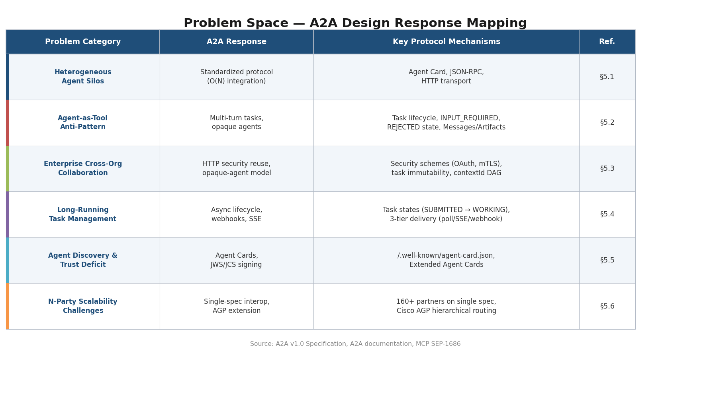

*Figure 5.2 — Summary mapping of the six problem categories identified in this chapter to A2A's corresponding design responses and key protocol mechanisms. Source: A2A v1.0 Specification, A2A documentation, MCP SEP-1686.*

**IETF engagement.** The Internet Engineering Task Force has signaled that agent interoperability has risen to the level of internet-standards concern. The Rosenberg & Jennings Internet-Draft (May 2025) surveys both MCP and A2A and identifies interoperability gaps, while the planned CATALIST (Coordinating Agent To Agent List of efforts) Birds of a Feather session at IETF 125 may lead to a formal working group on agent communication standardization [IETF Internet-Draft](https://www.ietf.org/archive/id/draft-rosenberg-ai-protocols-00.txt "AI Agent Protocols framework, May 2025") [IETF CATALIST](https://datatracker.ietf.org/group/catalist/ "CATALIST BoF").

Collectively, these signals confirm that A2A's problem space is real, urgent, and broadly recognized across the industry. The protocol's design decisions—decentralized discovery, opaque autonomous agents, long-running task management, enterprise security infrastructure reuse, and scalable multi-agent coordination—represent targeted responses to specific, documented gaps rather than speculative anticipation of future needs.

# 第6章 Ecosystem Adoption, Industry Momentum, and Outlook

The preceding chapters examined MCP and A2A along architectural, complementarity, innovation, and problem-space dimensions. This concluding chapter shifts to a quantitative and forward-looking perspective, surveying the adoption landscape of each protocol as of early 2026, the governance structures shaping their respective evolution, competitive and convergence dynamics, and the trajectory both protocols are likely to follow over the next six to twelve months. Claims throughout are grounded in measurable indicators—GitHub activity, package-download volumes, partner counts, specification milestones, and standards-body proceedings—rather than speculative assessments.

## 6.1 A2A Adoption Indicators

A2A's ecosystem has expanded rapidly since Google's announcement at Cloud Next '25 in April 2025. By April 2026, the primary repository under the Linux Foundation (`a2aproject/A2A`) had accumulated approximately 23,000 GitHub stars, 2,339 forks, and 138 contributors [GitHub API — a2aproject/A2A](https://api.github.com/repos/a2aproject/A2A "A2A repo stats, April 2026"). The Python SDK (`a2a-sdk`) records approximately 4.2 million monthly downloads on PyPI [PyPI Stats — a2a-sdk](https://pypistats.org/api/packages/a2a-sdk/recent "a2a-sdk monthly downloads"). Official SDKs span five languages (Python, TypeScript/JavaScript, Java, Go, C#), supplemented by three community-maintained SDKs.

The companion `a2a-samples` repository offers concrete implementation references: 32 Python samples, 7 Java samples, and 4 protocol extensions—Cisco's AGP, Secure Passport, Timestamp, and Traceability [A2A Samples](https://github.com/a2aproject/a2a-samples "A2A official samples repository"). Developer tooling includes the A2A Inspector, an interactive protocol debugger, and a Technology Compatibility Kit (TCK) for validating conformance against the v1.0 specification.

The partner ecosystem grew from over 50 organizations at launch to 166 by early 2026, spanning enterprise software vendors, cloud providers, consulting firms, and agent-framework developers [A2A Partners](https://github.com/a2aproject/A2A/blob/main/docs/partners.md "A2A — 166 partners"). The breadth of participation—Salesforce, SAP, ServiceNow, Atlassian, LangChain, CrewAI, AG2, Agno, among others—indicates that A2A addresses a cross-segment need rather than a niche within a single technology vertical.

At least 12 major agent frameworks have built native A2A integrations, including Google ADK, Agno, AG2, CrewAI, LangGraph, LiteLLM, Microsoft Semantic Kernel, and Amazon Strands Agents. The majority simultaneously support MCP for tool integration, functioning as de facto dual-protocol runtimes [A2A Community Hub](https://github.com/a2aproject/A2A/blob/main/docs/community.md "A2A — 12+ framework integrations").

## 6.2 MCP Adoption Indicators

MCP holds a substantial lead in ecosystem scale, reflecting its 18-month head start (November 2024 versus A2A's April 2025 launch) and its focus on the more immediately actionable agent-to-tool integration layer.

The `modelcontextprotocol/servers` repository—a curated collection of reference and community-contributed MCP server implementations—has attracted approximately 82,800 GitHub stars and 10,173 forks, placing it among the most-starred repositories in the AI infrastructure category [GitHub API — modelcontextprotocol/servers](https://api.github.com/repos/modelcontextprotocol/servers "MCP servers repo stats, April 2026"). The specification repository has accumulated approximately 7,700 stars and 326 contributors, reflecting active community engagement with the protocol's evolution.

Download volumes underscore the scale differential. The MCP Python SDK records approximately 175 million monthly downloads on PyPI; the TypeScript SDK records approximately 142 million monthly downloads on npm [PyPI Stats — mcp](https://pypistats.org/api/packages/mcp/recent "MCP Python SDK monthly downloads"). These figures exceed A2A's Python SDK downloads by a factor of roughly 40×—a disparity attributable to both MCP's longer market presence and the higher frequency of tool-integration use cases relative to agent-to-agent collaboration scenarios in current deployment patterns.

MCP offers official SDKs in 10 languages, providing broader language coverage than A2A's current five. The MCP Inspector—a developer tool for testing and debugging server implementations—has itself accumulated 9,309 GitHub stars.

In September 2025, the MCP project launched an official Server Registry in preview, providing an open catalog and REST API for discovering publicly available MCP servers [MCP Registry Preview](https://nordicapis.com/getting-started-with-the-official-mcp-registry-api/ "Nordic APIs — Getting Started With the Official MCP Registry API, 2025-11-19"). Third-party analyses have identified upwards of 8,000 publicly listed servers across the official registry, npm, PyPI, and GitHub, though the majority represent early-stage or experimental implementations [Apigene Blog](https://apigene.ai/blog/best-mcp-servers "Best MCP Servers: Definitive 2026 List"). Unofficial marketplaces have indexed over 17,000 MCP servers [Astrix Security Research](https://astrix.security/learn/blog/state-of-mcp-server-security-2025/ "State of MCP Server Security 2025").

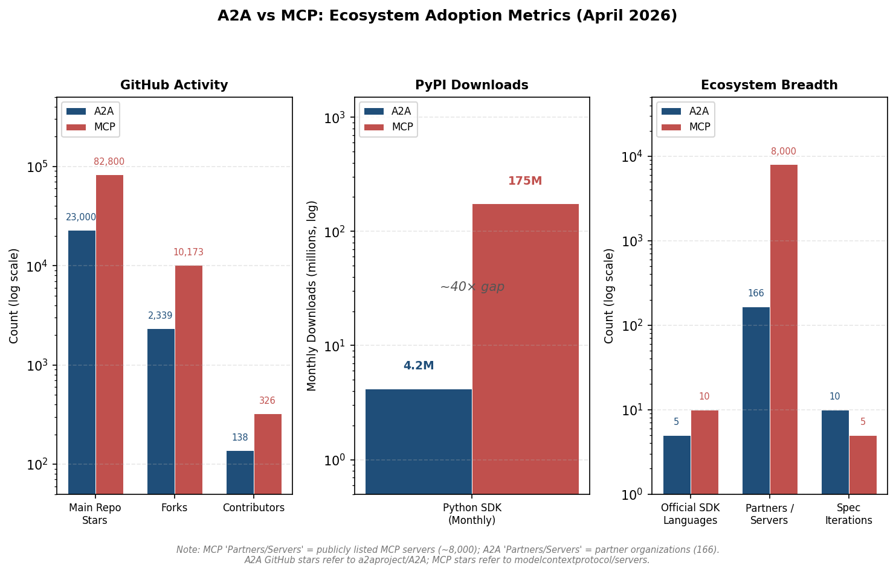

*Figure 6.1. Three-panel log-scale comparison of A2A and MCP across GitHub activity, Python SDK monthly download volumes (highlighting the ~40× gap), and ecosystem breadth metrics. Note: the "Partners / Servers" comparison reflects non-equivalent categories—A2A counts partner organizations (166) while MCP counts publicly listed servers (~8,000).*

## 6.3 Cloud Provider and Platform Integration

The integration posture of major cloud providers reveals the breadth of industry commitment and the distinct roles each protocol occupies within enterprise platforms.

**Google Cloud** is the originator and primary sponsor of A2A. The protocol is natively integrated into Google's Agent Development Kit (ADK), Vertex AI agent platform, and Cloud Run deployment infrastructure. ADK serves as the reference dual-protocol implementation, with dedicated modules for A2A client/server communication (`src/google/adk/a2a/`) and MCP tool consumption (`src/google/adk/tools/mcp_tool/`) [ADK Python Repository](https://github.com/google/adk-python "Google ADK Python — dual-protocol support").

**Microsoft** adopted A2A for its Semantic Kernel agent framework in May 2025, explaining that enterprise customers require cross-ecosystem agent collaboration beyond what proprietary frameworks alone can provide. Microsoft holds a TSC seat in A2A's governance structure, formalizing its commitment at the institutional level. The Azure AI Foundry multi-agent sample is among the official A2A dual-protocol demonstrations [Microsoft Cloud Blog](https://www.microsoft.com/en-us/microsoft-cloud/blog/2025/05/07/empowering-multi-agent-apps-with-the-open-agent2agent-a2a-protocol/ "Microsoft — A2A support, 2025-05-07").

**Amazon Web Services** occupies a distinctive cross-ecosystem position. AWS holds an A2A TSC seat and has developed the Strands Agents framework with A2A integration. Simultaneously, AWS engineers authored MCP SEP-1686 (the Tasks proposal), and AWS participates as co-maintainer of MCP's Agents Working Group alongside Anthropic [MCP SEP-1686](https://github.com/modelcontextprotocol/specification/blob/main/docs/seps/1686-tasks.mdx "MCP SEP-1686: Tasks"). This dual engagement reflects a strategy of supporting both protocols to serve a broad customer base without foreclosing either integration path.

**Cisco** holds an A2A TSC seat and has contributed the AGP (Agent Gateway Protocol) extension, introducing hierarchical capability-based routing and Autonomous Squads—architectural patterns aimed at internet-scale agent communication [AGP Extension](https://github.com/a2aproject/a2a-samples/tree/main/extensions/agp "AGP — capability-based routing").

**Additional TSC members**—Salesforce, ServiceNow, SAP, and IBM Research—each represent major enterprise software platforms with distinct agent-integration requirements. Oracle, while not holding a TSC seat, is listed as an A2A partner. Six major consulting firms—Accenture, Deloitte, McKinsey, BCG, PwC, and KPMG—are listed as A2A partners, signaling advisory-ecosystem alignment with A2A's enterprise positioning [A2A Partners](https://github.com/a2aproject/A2A/blob/main/docs/partners.md "A2A — 166 partners").

On the MCP side, integration is embedded within Anthropic's own products (Claude Desktop, Claude.ai) and has been adopted by a wide range of developer tools, including Cursor, Sourcegraph Cody, and Windsurf. OpenAI announced MCP support for its platform, and Google DeepMind is listed among MCP ecosystem participants following the March 2025 enterprise update [Anthropic Official Blog](https://www.anthropic.com/news/model-context-protocol-enterprise "MCP Enterprise Update, 2025-03-26"). The MCP project has also established a Financial Services Interest Group, indicating early vertical-specific community formation [MCP Financial Services IG](https://github.com/modelcontextprotocol/financial-services-interest-group "MCP Financial Services Interest Group").

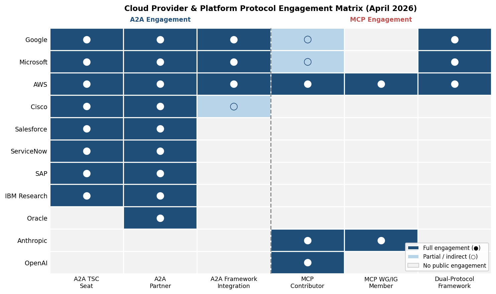

*Figure 6.2. Engagement matrix mapping 11 major organizations against six protocol-engagement dimensions. AWS emerges as the most broadly engaged organization across both ecosystems, while enterprise software vendors concentrate engagement on the A2A side and AI model providers anchor the MCP side.*

## 6.4 Governance Structures Compared

The governance models of A2A and MCP differ fundamentally in their distribution of decision-making authority, reflecting contrasting assumptions about how open protocols should be steered.

### A2A: Multi-Stakeholder TSC Under the Linux Foundation

A2A operates under the Linux Foundation's LF AI & Data umbrella, governed by an 8-seat Technical Steering Committee (TSC) with representatives from Google, Microsoft, Cisco, AWS, Salesforce, ServiceNow, SAP, and IBM Research. Decisions require a majority vote with a 50% quorum. The project is in a "startup phase" as of early 2026 and is expected to transition to "steady-state" governance by mid-2026, at which point TSC composition may evolve through community election processes [A2A Governance](https://github.com/a2aproject/A2A/blob/main/GOVERNANCE.md "A2A GOVERNANCE.md").

The multi-stakeholder model carries structural implications. No single organization holds veto power. Specification changes must achieve consensus across competing interests—Google, Microsoft, and AWS each pursue distinct agent-platform strategies, yet all participate in shaping the shared standard. IBM's merger of its independently developed Agent Communication Protocol (ACP) into A2A exemplifies the model's absorptive capacity: rather than sustaining a parallel standard, IBM contributed its design insights to the shared project and accepted a TSC seat [LF AI & Data Blog](https://lfaidata.foundation/communityblog/2025/08/29/acp-joins-forces-with-a2a-under-the-linux-foundations-lf-ai-data/ "ACP joins forces with A2A").

### MCP: Anthropic-Led Layered Governance

MCP's governance follows a layered model in which Anthropic retains decisive authority. Lead Maintainers (currently Anthropic employees) hold the ability to override community decisions and set strategic direction. Below this layer, Working Groups (WGs) and Interest Groups (IGs) provide structured venues for community contribution. The Agents Working Group, co-maintained by AWS and Anthropic, focuses on the intersection of MCP with agentic use cases—directly relevant to the MCP-A2A boundary [MCP Governance SEP-932](https://github.com/modelcontextprotocol/modelcontextprotocol/issues/932 "MCP Governance SEP").

This model affords faster decision-making and tighter architectural coherence, but introduces governance concentration risk. Organizations investing heavily in MCP as critical infrastructure may face concerns that Anthropic's commercial priorities could influence protocol evolution. The contrast with A2A's distributed governance is likely to become a factor in enterprise adoption decisions, particularly for organizations with multi-vendor procurement policies.

## 6.5 Specification Roadmaps and Evolution Trajectories

Both protocols have maintained aggressive specification cadences, though they occupy different maturity stages.

### A2A: From 0.1.0 to 1.0.0 in Under Twelve Months

A2A progressed through approximately 10 specification iterations between April 2025 and March 2026, culminating in the v1.0.0 release on March 12, 2026. This pace reflects both the urgency of the problem space and the advantage of designing a protocol informed by existing standards (MCP, FIPA, Web Services) rather than pioneering entirely new ground. The v1.0 release consolidated several architectural decisions: Protocol Buffers (`a2a.proto`) became the normative data model, three protocol bindings (JSON-RPC, gRPC, HTTP+JSON/REST) were formally specified, and the extension mechanism was finalized with a TSC-governed lifecycle [A2A v1.0 Announcement](https://github.com/a2aproject/A2A/blob/main/docs/announcing-1.0.md "A2A Protocol Ships v1.0, March 2026").

Post-v1.0 priorities, as indicated by repository activity and TSC communications, center on expanding multi-language SDK support to v1.0 compliance, growing the extension ecosystem, and broadening the TCK test suite to cover edge cases in multi-agent workflows. The repository's migration from Google's GitHub organization to the Linux Foundation's `a2aproject` organization signals institutional maturation beyond a single-company initiative.

### MCP: Five Spec Versions Plus an Active Draft

MCP has published five specification versions (2024-11-05, 2025-03-26, 2025-06-18, 2025-11-25, plus a draft) since its November 2024 launch. The 2025-03-26 release was particularly consequential, introducing Streamable HTTP transport and OAuth 2.1 authentication—upgrades that transitioned MCP from a local development tool to an enterprise-viable protocol [Anthropic Official Blog](https://www.anthropic.com/news/model-context-protocol-enterprise "MCP Enterprise Update, 2025-03-26"). The 2025-11-25 release added experimental Tasks (SEP-1686), representing MCP's first explicit engagement with task-lifecycle semantics.

The MCP specification evolution pipeline (SEPs) contains approximately 290 proposals. Several pending SEPs signal directional convergence toward capabilities that A2A already provides:

- **SEP-2127 (Server Cards / `.well-known/mcp.json`)**: Proposes a discovery mechanism analogous to A2A's Agent Cards, enabling pre-connection capability advertisement via well-known URIs [SEP-2127](https://github.com/modelcontextprotocol/modelcontextprotocol/pulls/2127 "MCP Server Cards proposal").
- **SEP-2339 (Task Continuity)**: Extends task lifecycle management for resumed and continuable workflows.
- **SEP-2268 (Subtasks)**: Introduces hierarchical task decomposition.
- **SEP-2229 (Unsolicited Tasks)**: Allows servers to initiate tasks proactively—a capability that moves MCP closer to symmetric agent interaction.

If adopted, these proposals would narrow the functional gap between MCP and A2A in the task-management and discovery layers. The architectural philosophy (tool-centric versus agent-centric) and governance model (Anthropic-led versus multi-stakeholder TSC), however, would remain distinct.

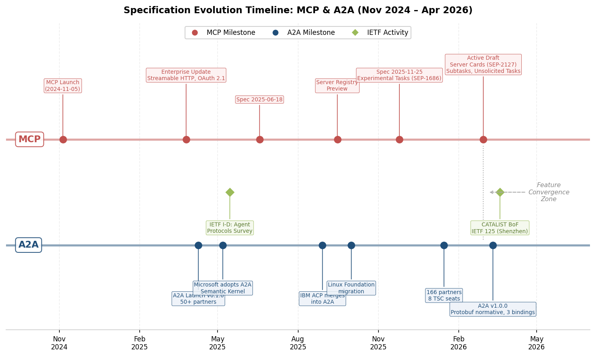

*Figure 6.3. Dual-track timeline of MCP and A2A specification milestones, with IETF activities shown as diamond markers. The dotted "Feature Convergence Zone" in late 2025/early 2026 highlights the period when MCP's proposed features (Tasks, Server Cards, Subtasks) began overlapping with A2A's existing capabilities.*

## 6.6 Competitive Dynamics and Standards-Body Activity

### Absence of Rival Standards

No significant competing standard has emerged to challenge either protocol in its respective domain. The most notable potential competitor—IBM's Agent Communication Protocol (ACP)—was merged into A2A in August 2025, consolidating rather than fragmenting the agent-to-agent communication space [LF AI & Data Blog](https://lfaidata.foundation/communityblog/2025/08/29/acp-joins-forces-with-a2a-under-the-linux-foundations-lf-ai-data/ "ACP joins forces with A2A"). This consolidation is significant: it demonstrates that when independent protocol efforts converge on similar solutions, the industry favors unification under shared governance over sustained standards competition.

### IETF Engagement

The Internet Engineering Task Force has begun formal engagement with agent-protocol standardization. Jonathan Rosenberg and Cullen Jennings published an Internet-Draft in May 2025 surveying both MCP and A2A, identifying gaps in session management, constrained authorization tokens, and human-in-the-loop patterns [IETF Internet-Draft](https://www.ietf.org/archive/id/draft-rosenberg-ai-protocols-00.txt "AI Agent Protocols framework, May 2025").

The CATALIST (Coordinating Agent To Agent List of efforts) Birds-of-a-Feather session was held at IETF 125 in Shenzhen in March 2026. The BoF defined a scope encompassing service invocation, session protocols for AI agents, human-in-the-loop interaction, and constrained limited-access tokens. Multiple related Internet-Drafts were presented, including proposals for MCP over Media-over-QUIC (MoQ) transport, agent discovery via SD-JWT, and agent-operation authorization frameworks [IETF CATALIST BoF — IETF 125](https://datatracker.ietf.org/meeting/125/materials/slides-125-catalist-ai-agent-protocols-01 "AI Agent Protocols — CATALIST BoF slides, March 2026"). The BoF's stated next step is to prepare a working-group-forming BoF for IETF 126, indicating that a formal IETF working group on agent protocols is likely to emerge in 2026 [IETF CATALIST](https://datatracker.ietf.org/group/catalist/ "CATALIST BoF").

The IETF's involvement introduces a potential long-term standardization path that could complement or reshape both protocols. IETF work typically focuses on lower-level building blocks—transport, authentication, session management—rather than application-layer semantics, suggesting that its outputs would serve as foundational components consumed by both MCP and A2A rather than as replacements for either.

### Feature Convergence Trend

Observable feature convergence is occurring from MCP toward A2A's existing capability set. MCP's experimental Tasks feature (2025-11-25) addresses a problem that A2A's task lifecycle was designed to solve from inception. The proposed Server Cards (SEP-2127) replicate A2A's Agent Card discovery pattern. Subtasks (SEP-2268) and Unsolicited Tasks (SEP-2229) move MCP toward multi-agent interaction patterns.

This convergence is asymmetric: A2A has not introduced features that move it toward MCP's tool-integration domain. The directionality suggests that the agent-to-agent communication problem space, once demonstrated by A2A, has been recognized as a legitimate concern within the MCP ecosystem—validating A2A's problem diagnosis while creating increasing functional overlap.

## 6.7 Enterprise Adoption Signals

Direct evidence of named enterprise production deployments using A2A or MCP remains limited in public documentation as of April 2026. Several indirect signals, however, provide robust indicators of enterprise adoption trajectories.

**TSC composition as adoption proxy.** The A2A TSC comprises engineering leaders from eight of the world's largest enterprise technology companies—Google, Microsoft, AWS, Cisco, Salesforce, ServiceNow, SAP, and IBM Research. TSC membership entails engineering resource commitments, governance participation, and reputational alignment. For enterprises evaluating protocol adoption, TSC composition serves as a credibility signal: the organizations shaping the standard are also those most likely to offer commercially supported implementations [A2A Governance](https://github.com/a2aproject/A2A/blob/main/GOVERNANCE.md "A2A TSC composition").

**Consulting-firm alignment.** Six major management consulting firms—Accenture, Deloitte, McKinsey, BCG, PwC, and KPMG—are listed as A2A partners. These firms function as adoption multipliers: their engagement indicates that A2A is entering enterprise strategy conversations and implementation roadmaps at the advisory level [A2A Partners](https://github.com/a2aproject/A2A/blob/main/docs/partners.md "A2A — 166 partners").

**Vertical-specific community formation.** MCP's establishment of a Financial Services Interest Group indicates that sector-specific adoption requirements are being aggregated. Financial services represent a high-value, compliance-intensive vertical where agent-interoperability requirements—audit trails, data sovereignty, cross-organizational workflows—align directly with design priorities analyzed in Chapters 4 and 5 [MCP Financial Services IG](https://github.com/modelcontextprotocol/financial-services-interest-group "MCP Financial Services Interest Group").

**Dual-protocol framework availability.** The availability of major agent frameworks (ADK, Semantic Kernel, LangGraph, CrewAI, AG2, Strands Agents) that support both protocols reduces enterprise adoption friction. Organizations can begin with MCP for tool integration—a lower-risk, more immediately valuable use case—and incrementally adopt A2A for inter-agent collaboration as multi-agent architectures mature.

## 6.8 Adoption Risks and Open Challenges

Several risks could slow or complicate the adoption trajectory of either protocol.

**Functional overlap and developer confusion.** As MCP's specification evolves toward task lifecycle management and capability discovery, the boundary between "agent-to-tool" and "agent-to-agent" becomes less clear-cut. Developers encountering both MCP Tasks and A2A task management may struggle to determine which protocol applies to a given interaction pattern. The risk is not that one protocol will subsume the other, but that persistent ambiguity slows adoption of both.

**Governance concentration in MCP.** MCP's Lead Maintainer veto authority concentrates strategic control within Anthropic. For enterprises building critical infrastructure on MCP, this creates a dependency risk: protocol evolution is ultimately subject to a single company's priorities. The establishment of Working Groups partially mitigates this concern, but the structural asymmetry relative to A2A's multi-stakeholder TSC may weigh on procurement decisions in governance-sensitive industries.

**A2A's scale gap.** A2A's Python SDK download volume (approximately 4.2 million monthly) is roughly 40× smaller than MCP's (approximately 175 million monthly). This gap reflects both MCP's head start and the current preponderance of tool-integration use cases over agent-to-agent collaboration scenarios. If multi-agent production deployments remain limited, A2A's adoption growth may plateau at a community-and-experimentation level without achieving the critical mass necessary for strong network effects.

**Security maturity.** Neither protocol has been subjected to a widely publicized security incident or adversarial stress test at production scale. Third-party analyses have identified concerns in the MCP server ecosystem, including inadequate input validation and inconsistent transport-layer security across community-contributed servers [Astrix Security Research](https://astrix.security/learn/blog/state-of-mcp-server-security-2025/ "State of MCP Server Security 2025"). A2A's security model is more comprehensive at the specification level—Agent Card signing, webhook SSRF protections, multi-scheme authentication—but specification-level guarantees depend on implementation quality, which remains largely untested at scale.

**Observability and management tooling.** Enterprise-grade monitoring, tracing, cost attribution, and compliance tooling for agent-to-agent interactions remains nascent. A2A's Traceability extension and task immutability provide protocol-level foundations, but the operational tooling ecosystem—dashboards, alerting, policy engines—has not yet matured to enterprise expectations.

## 6.9 Forward Trajectory: The Next Six to Twelve Months

Several observable trends and committed milestones anchor a forward-looking assessment of both protocols' trajectories through late 2026 and into early 2027.

**The "MCP inside, A2A between" layered model is consolidating.** Both protocol communities have endorsed this architecture. The A2A project's documentation, the ADK reference implementation, the `a2a-samples` dual-protocol examples, and the MCP Agents Working Group's focus areas all reinforce the same layered positioning. Absent a dramatic shift—such as one protocol fully implementing the other's core feature set—this complementary framing is likely to persist through 2026 and beyond.

**MCP's task and discovery evolution is the key variable.** The trajectory of MCP SEPs 1686 (Tasks), 2127 (Server Cards), 2268 (Subtasks), and 2229 (Unsolicited Tasks) will determine the degree of functional overlap between the two protocols. If MCP adds task rejection states, multi-turn negotiation, and push notifications—capabilities that A2A already provides—the practical distinction may narrow for certain use cases. Conversely, if these SEPs remain experimental or are adopted in limited form, the complementarity thesis strengthens.

**IETF standardization may reshape the long-term landscape.** The CATALIST BoF's progression toward a working-group-forming BoF at IETF 126 suggests that IETF may produce standard building blocks—transport bindings, authentication profiles, session management primitives—that both MCP and A2A can adopt. This would strengthen both protocols' grounding in internet standards and potentially create interoperability bridges at the transport and security layers.

**Complete protocol substitution remains unlikely in the medium term.** For one protocol to subsume the other, it would need to fully replicate the other's core feature set while commanding a larger or equivalent ecosystem. MCP would need to implement symmetric agent-to-agent collaboration, opaque-agent semantics, task rejection, push notifications, and multimodal negotiation. A2A would need to implement tool primitives, resource management, prompt templates, and local-process (stdio) support. Neither trajectory is currently observable. The more probable path is continued specialization with incremental interoperability enhancement—analogous to how HTTP and SMTP coexist as complementary internet protocols serving distinct communication patterns.

**Enterprise production deployments will be the decisive adoption metric.** As of April 2026, both protocols remain predominantly in integration, pilot, and experimentation phases within enterprise environments. The next twelve months will determine whether multi-agent production workflows—supply-chain coordination, multi-party compliance review, cross-vendor service orchestration—materialize at scale. The protocol that demonstrates the most compelling production case studies will likely achieve the network effects needed for sustained ecosystem growth.

# Conclusion

The analysis presented across six chapters converges on a central finding: MCP and A2A are complementary protocols that address fundamentally different layers of the AI agent technology stack, and their coexistence reflects a stable architectural division of labor rather than a transitional state.

## Core Distinctions

MCP, introduced by Anthropic in November 2024, standardizes the **agent-to-tool** interface. Its host-managed, asymmetric architecture treats external endpoints as deterministic capability providers—tools, databases, APIs, and file systems that respond to structured invocations. MCP's design excels in this domain: its fixed content-type schema ensures type safety, its stdio transport supports local developer workflows, and its prescriptive OAuth 2.1 framework simplifies authentication. With approximately 175 million monthly Python SDK downloads and over 8,000 publicly listed servers by April 2026, MCP has achieved critical mass as the de facto standard for connecting agents to external tools and data sources.

A2A, unveiled by Google in April 2025, standardizes the **agent-to-agent** interface. Its symmetric, peer-oriented architecture treats remote agents as opaque, autonomous entities capable of reasoning, negotiating, refusing tasks, and producing results over extended time horizons. A2A's design is purpose-built for this interaction pattern: Agent Cards enable decentralized, pre-connection capability discovery; the eight-state task lifecycle encodes agent autonomy (REJECTED) and mid-task credential escalation (AUTH_REQUIRED) at the protocol level; the Messages/Artifacts separation enforces a structural boundary between dialogue and deliverables; and three-tier MIME modality negotiation accommodates heterogeneous content exchange without protocol-level schema changes.

## A2A's Distinctive Contributions

A2A's innovation profile encompasses genuinely novel design elements—Agent Cards as semantic-level discovery documents, Extended Agent Cards with tiered authentication-gated disclosure, the REJECTED and AUTH_REQUIRED task states, the Messages/Artifacts structural separation, three-tier modality negotiation, and a formal extension mechanism supporting state-machine extensibility—alongside significant adaptations of mature engineering patterns (Protocol Buffers as a normative multi-binding data model, task immutability with contextId-linked DAGs, webhook CRUD lifecycle with integrated security). The protocol's value lies not in any single breakthrough but in a carefully composed architecture that synthesizes agent-specific mechanisms with proven Web infrastructure standards to address a design space that prior protocols—FIPA ACL, UDDI, OpenAPI, and MCP itself—left unoccupied.

## The Problem Space A2A Fills

A2A was motivated by six documented problem categories: heterogeneous agent silos created by framework proliferation (the N² integration burden), the "agent-as-tool" anti-pattern that strips agents of negotiation, multi-turn interaction, and autonomous refusal capabilities, enterprise cross-organizational collaboration requirements demanding trust-boundary enforcement and audit traceability, the long-running task management gap inherent in synchronous request-response protocols, agent discovery and trust deficits in the absence of standardized pre-connection mechanisms, and scalability challenges as agent ecosystems grow from experimental prototypes to production-scale deployments. Industry validation—166 partner organizations, IBM's merger of its independent ACP protocol into A2A, Microsoft's formal governance participation, Amazon's acknowledgment of the agent-to-agent use case in MCP SEP-1686, and IETF engagement through the CATALIST initiative—confirms that these problems are broadly recognized and structurally pervasive.

## Convergence and Outlook

Observable feature convergence is occurring from MCP toward A2A's capability set—experimental Tasks, proposed Server Cards, Subtasks, and Unsolicited Tasks—driven by pragmatic demand from practitioners deploying MCP in agent-to-agent scenarios. This convergence narrows the functional gap in specific feature dimensions but does not erase the architectural and governance divergences: MCP's host-managed, tool-centric paradigm versus A2A's peer-oriented, agent-centric paradigm; Anthropic's centralized governance versus A2A's multi-stakeholder Linux Foundation TSC. The layered reference model—"MCP inside agents, A2A between agents"—has achieved consensus across both communities and across at least twelve major agent frameworks, with no credible alternative architecture proposing a single protocol for both layers.

The trajectory most consistent with available evidence is sustained specialization with deepening interoperability: each protocol continuing to evolve within its core domain, connected by framework-level integrations and, potentially, by IETF-standardized building blocks at the transport and security layers. The analogy to the internet's own layered protocol architecture—HTTP for document transfer, SMTP for email, each purpose-built and coexisting—remains the most apt characterization of the MCP–A2A relationship. The decisive variable over the next twelve months will be the emergence of enterprise production deployments that demonstrate the value of multi-agent coordination at scale—the signal that will determine whether the layered agentic architecture moves from community consensus to operational reality.
