# Overview

The path from Java Servlets to Spring Boot spans nearly three decades of enterprise Java evolution — a progression driven not by arbitrary fashion but by concrete, recurring failures in developer productivity, testability, and operational simplicity. Each generation of the technology stack emerged as a direct response to pain points left unresolved by its predecessor: Servlets replaced CGI's process-per-request model with a thread-based, in-process architecture; J2EE and Enterprise JavaBeans (EJB) attempted to layer declarative transaction management, remoting, and security onto that foundation, but imposed an accidental complexity burden that proved unsustainable; the Spring Framework restored plain-object programming through Inversion of Control and Aspect-Oriented Programming, delivering every enterprise service EJB had promised without requiring business classes to implement framework interfaces; and Spring Boot automated the remaining assembly work — dependency management, embedded server configuration, and production monitoring — through convention over configuration.

This report traces that evolutionary arc in six chapters. Chapter 1 examines the Servlet specification's origins, lifecycle model, and core API abstractions, establishing both the architectural advantages over CGI and the friction points — verbose boilerplate, tight HTTP coupling, manual resource management — that motivated everything that followed. Chapter 2 chronicles the J2EE/EJB era, documenting how a specification-heavy, container-invasive approach to enterprise concerns provoked a community backlash and the lightweight container movement. Chapter 3 details the Spring Framework's founding principles — IoC, Dependency Injection, AOP proxies, and the "wrap, don't replace" integration philosophy — showing how each mechanism addressed a specific EJB-era failure. Chapter 4 provides practitioner-level coverage of the core Spring modules every working developer must master: the ApplicationContext lifecycle, Spring MVC's request pipeline, JDBC and JPA data access, declarative transaction propagation, and Spring Security's filter chain architecture. Chapter 5 traces Spring Boot's genesis from a community feature request through its auto-configuration engine, starter dependency system, embedded servers, and Actuator-based operational tooling. Chapter 6 surveys the modern frontier — the Jakarta EE namespace migration, GraalVM native image compilation, JDK 21 virtual threads, and the reactive stack — positioning the Spring ecosystem in 2026.

Three findings emerge across the full arc. First, the problems that enterprise Java developers face — transactions, security, persistence, lifecycle management, operational visibility — have remained fundamentally stable since the late 1990s; what has changed is the mechanism of delivery, moving progressively from container-managed infrastructure toward framework-managed abstractions that respect the plain Java object. Second, each simplification layer (Spring over EJB, Spring Boot over Spring XML configuration, auto-configuration over manual wiring) succeeded precisely because it preserved the developer's ability to override defaults and access lower-level APIs when necessary — opinionated defaults without dogmatic enforcement. Third, the Servlet specification itself has never been replaced; it remains the foundational request-processing contract beneath Spring MVC, Spring Security, and the embedded Tomcat instance inside every Spring Boot fat JAR, demonstrating that well-designed low-level abstractions endure even as the programming models built atop them evolve dramatically.

# 第1章 The Servlet Foundation — Java's Answer to Dynamic Web Content

## The CGI Era: Process-Per-Request and Its Limits

Before Java Servlets existed, the Common Gateway Interface (CGI) served as the dominant mechanism for generating dynamic web content. First adopted informally in 1993 and eventually codified as [RFC 3875](https://datatracker.ietf.org/doc/html/rfc3875 "The Common Gateway Interface (CGI) Version 1.1, October 2004"), CGI defined a straightforward contract: the web server receives an HTTP request, spawns a new operating-system process to handle it, passes request metadata through environment variables and the request body via standard input, and collects the response from standard output. The model was language-agnostic — any executable (Perl, C, shell script) could serve as a CGI program.

This simplicity came at a steep architectural cost. The **process-per-request** model forced the operating system to fork a new process for every incoming HTTP request. Process creation involves kernel-level resource allocation — virtual memory setup, file descriptor duplication, and scheduler registration — all of which impose significant overhead. Under concurrent load, a server running CGI programs could exhaust system resources rapidly. Beyond raw performance, CGI suffered from several structural deficiencies:

- **No session management.** HTTP is stateless, and CGI offered no built-in mechanism to track user sessions across requests. Developers had to implement session tracking manually, typically through hidden form fields or crude cookie manipulation.
- **Platform dependence.** Although CGI was notionally language-neutral, scripts were tightly bound to the host platform's interpreter and filesystem conventions. Migrating a Perl-based CGI application from a Unix server to a different environment required significant rework.
- **Security exposure.** CGI child processes inherited the user and group permissions of the parent web server process, creating a broad attack surface. A vulnerability in any CGI script could compromise the entire server.
- **No resource sharing.** Each process started with a blank slate — database connections, configuration data, and cached objects could not be shared across requests without external coordination (shared memory, files, or databases).

An intermediate refinement appeared in 1996 when Open Market, Inc. published the [FastCGI Specification](https://fastcgi-archives.github.io/FastCGI_Specification.html "FastCGI Specification, Mark R. Brown, Open Market, April 1996"). FastCGI addressed the most acute performance problem by keeping application processes alive across multiple requests, communicating with the web server over a persistent socket rather than forking a new process each time. While FastCGI significantly improved throughput, it remained a protocol-level optimization: it offered no higher-level programming model, no session abstraction, and no portable component lifecycle. The Java Servlet specification would take a fundamentally different approach — one that embedded the application inside the server process itself.

## From Gosling's Concept to the First Specification

The Servlet concept originated at Sun Microsystems in the mid-1990s, during the initial wave of Java enthusiasm. James Gosling first proposed the idea of server-side Java components in 1995. Pavani Diwanji led the implementation effort in early 1996, building the technology into an internal Sun HTTP server codenamed "Jeeves" — a pure-Java server capable of loading and executing these new components without spawning external processes. The Servlet API received its first public demonstration at the inaugural JavaOne conference in May 1996. [Eclipse Foundation Newsletter](https://www.eclipse.org/community/eclipse_newsletter/2020/february/3.php "Jakarta EE: Servlets and Tomcat — 23 Years and Counting")

The formal Servlet 1.0 specification shipped in June 1997 with the Java Servlet Development Kit (JSDK) 1.0. The core invention was documented in [US Patent 5,928,323](https://patents.google.com/patent/US5928323 "Gosling, Diwanji, Connelly — Sun Microsystems, 1999"), which explicitly described the architecture's advantage over CGI: servlets execute within the server's own Java Virtual Machine process, eliminating the per-request process creation overhead that crippled CGI under load.

The architectural insight was elegant. Instead of one process per request, a single JVM hosts all servlet instances. The servlet container maintains a **thread pool** and assigns a thread — not a process — to each incoming request. Thread creation and context-switching are orders of magnitude cheaper than process forking. Moreover, all servlets share the same JVM heap, enabling efficient resource sharing: database connection pools, cached configuration, and application-wide state become trivially accessible.

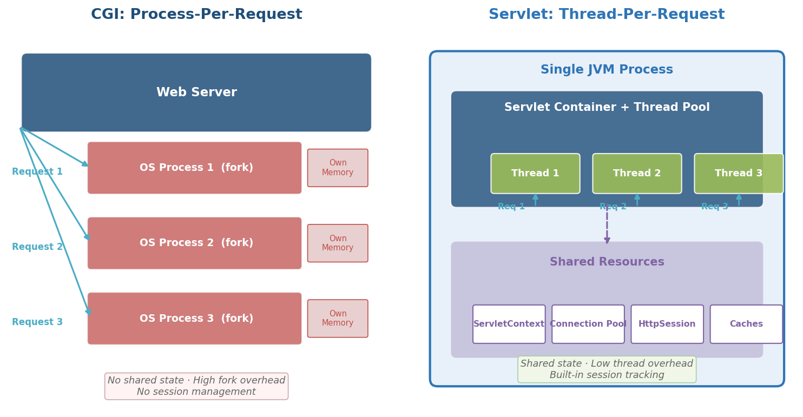

*Figure 1 — CGI's process-per-request model forks a separate OS process with isolated memory for each request, incurring high overhead and precluding shared state. The Servlet model hosts all components within a single JVM, assigning lightweight threads from a shared pool and enabling direct access to common resources such as connection pools, session stores, and caches.*

## Servlet Architecture and Lifecycle

A servlet is a Java class that extends `javax.servlet.http.HttpServlet` (or, since Jakarta EE 9, `jakarta.servlet.http.HttpServlet`). The servlet container manages each instance through a well-defined three-phase lifecycle:

1. **Initialization (`init()`).** When the container first loads a servlet — either at startup (if configured for load-on-startup) or upon the first request — it instantiates the class and calls `init(ServletConfig)`. This method executes exactly once per servlet instance. Developers use it to perform expensive one-time setup: opening database connections, reading configuration, or initializing caches.

2. **Request handling (`service()`).** For each incoming HTTP request, the container selects a thread from its pool and invokes the servlet's `service()` method. The default `HttpServlet.service()` implementation dispatches based on the HTTP method — routing to `doGet()`, `doPost()`, `doPut()`, `doDelete()`, and so forth. Developers override these method-specific handlers to implement business logic. Because the container reuses the same servlet instance across concurrent requests, **the `service()` method must be thread-safe**: instance variables constitute shared mutable state.

3. **Destruction (`destroy()`).** When the container shuts down or decides to unload a servlet, it calls `destroy()` once, giving the servlet an opportunity to release resources: closing database connections, flushing buffers, persisting state.

This lifecycle model delivered the fundamental advantages over CGI. A servlet instance is created once, handles thousands of requests through its `service()` method, and is destroyed once — the "initialize once, serve many" pattern that made Java a viable platform for high-traffic web applications.

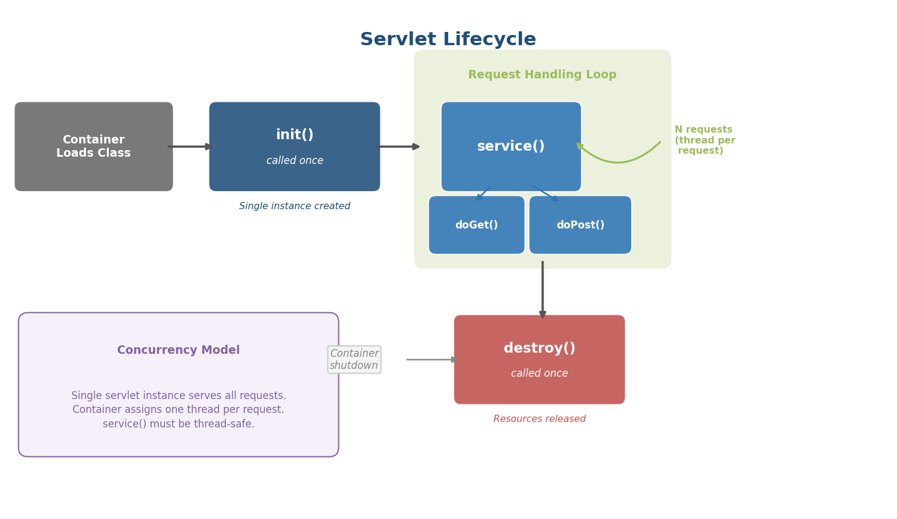

*Figure 2 — The three-phase servlet lifecycle: the container loads the class and calls `init()` exactly once, then routes concurrent requests through `service()` (one thread per request), and finally invokes `destroy()` on shutdown. The single-instance, multi-threaded execution model eliminates the per-request initialization overhead inherent in CGI.*

## The Request/Response Model and Core API Abstractions

The Servlet API provides a layered set of abstractions that insulate developers from raw HTTP protocol handling while preserving full access to HTTP semantics:

- **`HttpServletRequest`** encapsulates all client-supplied data: HTTP method, request URI, query parameters (`getParameter()`), headers (`getHeader()`), cookies (`getCookies()`), the request body input stream, and client metadata (remote address, protocol). It also carries request-scoped attributes for inter-component communication within a single request.

- **`HttpServletResponse`** provides the interface for constructing the HTTP response: setting status codes (`setStatus()`), adding headers (`setHeader()`, `addHeader()`), writing body content through either a `PrintWriter` (character data) or `ServletOutputStream` (binary data), and managing cookies (`addCookie()`).

- **`HttpSession`** introduced server-side session tracking — the capability CGI lacked entirely. The container automatically associates a session with each client (typically via a `JSESSIONID` cookie or URL rewriting), allowing developers to store per-user state across requests through `setAttribute()` and `getAttribute()`. Session timeout is configurable, and the container handles cleanup of expired sessions.

- **`ServletContext`** represents the web application itself, providing application-scoped attribute storage, access to initialization parameters, resource loading, and inter-servlet communication. All servlets within a web application share a single `ServletContext` instance.

Two additional component types, introduced in Servlet 2.3 ([JSR-53](https://jcp.org/en/jsr/detail?id=53 "Java Servlet 2.3 and JSP 1.2 Specification"), 2001), completed the programming model:

- **Filters** implement the `Filter` interface and form a chain around the servlet's request processing. Each filter can inspect or modify the `HttpServletRequest` and `HttpServletResponse` before and after the servlet executes. Common uses include authentication checks, logging, compression, and character encoding normalization. Filters are configured declaratively (originally in `web.xml`, later via `@WebFilter` annotation) and execute in the order defined by the deployment descriptor.

- **Listeners** respond to lifecycle events within the container. `ServletContextListener` fires on application startup and shutdown; `HttpSessionListener` tracks session creation and destruction; `ServletRequestListener` observes request boundaries. These event-driven hooks enable resource initialization, audit logging, and cleanup logic without modifying servlet code.

Together, `HttpServletRequest`, `HttpServletResponse`, `HttpSession`, `ServletContext`, `Filter`, and `Listener` constitute the core Servlet programming model — a component architecture that remained remarkably stable for over two decades and continues to underpin modern frameworks including Spring MVC.

## Specification Evolution: From Servlet 1.0 to 4.0

The Servlet specification evolved through a series of Java Community Process (JCP) Java Specification Requests (JSRs), each addressing specific gaps while preserving backward compatibility:

**Servlet 2.2 (1999)** introduced the `.war` (Web Application Archive) packaging format and formalized the web application directory structure (`WEB-INF/web.xml`, `WEB-INF/classes`, `WEB-INF/lib`). This version was bundled into J2EE 1.2, establishing servlets as a core component of the enterprise Java platform.

**Servlet 2.3 (2001, [JSR-53](https://jcp.org/en/jsr/detail?id=53 "Java Servlet 2.3 and JSP 1.2"))** added the Filter and Listener component models described above — a significant expansion of the programming surface that enabled cross-cutting concerns to be addressed without modifying servlet logic directly.

**Servlet 2.4 (2003, [JSR-154](https://jcp.org/en/jsr/detail?id=154 "Java Servlet 2.4 Specification"))** migrated the deployment descriptor (`web.xml`) from DTD-based validation to XML Schema, enabling more precise configuration validation and IDE tooling support.

**Servlet 3.0 (2009, [JSR-315](https://jcp.org/en/jsr/detail?id=315 "Java Servlet 3.0 Specification"))** represented the most transformative single release. It introduced annotation-based configuration (`@WebServlet`, `@WebFilter`, `@WebListener`), making the `web.xml` deployment descriptor optional for many applications. Equally significant was the addition of asynchronous request processing: the `startAsync()` method on `HttpServletRequest` allowed long-running operations to release the container thread and complete later — a capability essential for server-push patterns and efficient handling of I/O-bound workloads.

**Servlet 3.1 (2013, [JSR-340](https://jcp.org/en/jsr/detail?id=340 "Java Servlet 3.1 Specification"))** extended asynchronous capabilities with non-blocking I/O through `ReadListener` and `WriteListener` interfaces, and provided a standardized HTTP upgrade mechanism that enabled WebSocket support.

**Servlet 4.0 (2017, [JSR-369](https://jcp.org/en/jsr/detail?id=369 "Java Servlet 4.0 Specification"))** added HTTP/2 Server Push via the `PushBuilder` API. This was the final Servlet specification released under the Java EE umbrella before the platform's transfer to the Eclipse Foundation as Jakarta EE.

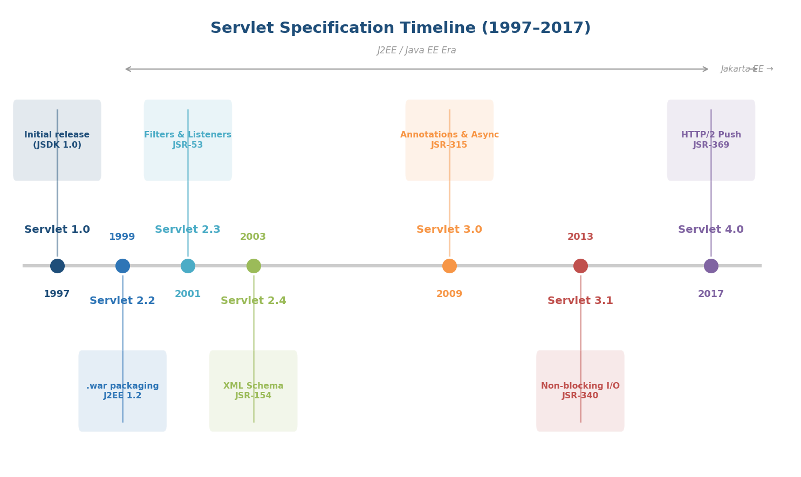

*Figure 3 — Major Servlet specification releases from 1.0 (1997) through 4.0 (2017), annotated with JSR numbers and headline features. The timeline spans the J2EE and Java EE eras, concluding at the threshold of the Jakarta EE transition.*

## Apache Tomcat: The Reference Implementation Becomes the Standard

No account of the Servlet ecosystem is complete without Apache Tomcat. The project traces its lineage directly to Sun Microsystems' own servlet reference implementation. James Duncan Davidson developed the Java Web Server Development Kit (JWSDK) at Sun and in 1999 convinced the company to donate the codebase to the Apache Software Foundation. The donation seeded the Tomcat project, which evolved from a reference implementation into the most widely deployed servlet container in production environments worldwide.

Tomcat became an Apache top-level project in 2005. Its version history mirrors the Servlet specification with notable precision; the official [Apache Tomcat version mapping](https://tomcat.apache.org/whichversion.html "Official Tomcat version-to-specification mapping") documents the correspondence: Tomcat 7.x implements Servlet 3.0, 8.x implements Servlet 3.1, 9.x implements Servlet 4.0, 10.1.x implements Servlet 6.0 (Jakarta EE 10), and 11.x implements Servlet 6.1 (Jakarta EE 11). This tight coupling between Tomcat releases and specification versions provided the open-source community with a reliable, freely available runtime for every generation of the Servlet API.

## Pain Points Left Unsolved

For all its architectural advantages over CGI, the Servlet specification left substantial friction for application developers — friction that would propel the next two decades of Java web framework evolution.

**Verbose boilerplate code.** Every HTTP endpoint required a dedicated class extending `HttpServlet`, overriding the appropriate `doGet()` or `doPost()` method, manually extracting parameters from `HttpServletRequest`, and constructing the response through `HttpServletResponse`. A simple REST-style resource handler that in a modern Spring MVC application occupies five lines of annotated code required dozens of lines of servlet boilerplate — class declaration, method override, parameter parsing, response writing, and error handling.

**Business logic coupled to HTTP mechanics.** The `service()` / `doGet()` / `doPost()` methods inherently mix application logic with HTTP protocol handling. The method signature demands `HttpServletRequest` and `HttpServletResponse` parameters, binding the implementation to the Servlet API. This coupling makes unit testing arduous: verifying business logic requires mocking the full request/response contract or running an actual servlet container.

**No declarative cross-cutting services.** Transaction management, security enforcement, logging, and caching — the "enterprise concerns" — had to be coded manually into each servlet or filter. There was no built-in mechanism for declaring that a particular method should execute within a database transaction or require a specific user role. Developers reinvented these patterns independently and often inconsistently.

**Manual resource management.** Database connections, thread pools, and external service handles were the developer's responsibility to acquire, use, and release. A missed `Connection.close()` in an exception path meant a connection leak; a shared mutable field in a servlet meant a concurrency bug. The Servlet API provided the execution model but no safety net for resource lifecycle.

**Container-dependent testing.** Because servlet code is tightly coupled to the container — receiving its `ServletConfig` from the container, looking up resources through JNDI, depending on the container's thread model — meaningful testing required deploying to a running server. The rapid edit-compile-test cycle that sustains developer productivity was broken by slow container startup times.

These limitations defined the problem space for everything that followed. The J2EE and EJB specifications attempted to address the enterprise-services gap through a comprehensive, container-managed component model — but at the cost of accidental complexity that many developers found worse than the original problem. The Spring Framework would eventually offer a different answer: lightweight, POJO-based programming with inversion of control, addressing every pain point enumerated above while building on top of — rather than replacing — the Servlet foundation.

# 第2章 The J2EE / EJB Era — Enterprise Ambition Meets Accidental Complexity

The Servlet specification gave Java a performant, portable foundation for handling HTTP requests inside a single JVM process. By the late 1990s, however, enterprises demanded far more than request–response plumbing: distributed transactions spanning multiple databases, transparent remote procedure calls, declarative security policies, and managed component lifecycles. Sun Microsystems answered with the Java 2 Platform, Enterprise Edition (J2EE) and its centerpiece component model, Enterprise JavaBeans (EJB). The ambition was sweeping — a single, vendor-neutral platform to address every infrastructure concern an enterprise developer might face. The accidental complexity it introduced proved equally sweeping, and the backlash it provoked would reshape the Java ecosystem for decades.

## 2.1 The Enterprise Vision

### The Problem Space

Large-scale business systems of the late 1990s confronted a recurring set of infrastructure concerns that raw Servlets left unaddressed:

- **Distributed transactions.** An order-processing system might need to debit an inventory database, credit a financial ledger, and enqueue a shipping message — all atomically. Without container support, developers hand-coded two-phase commit logic against the Java Transaction API (JTA).
- **Remote invocation.** Enterprises operated heterogeneous networks of CORBA services, mainframe back-ends, and emerging Java components. A standard remoting protocol was needed to let clients invoke server-side logic transparently.
- **Declarative security.** Rather than embedding access-control checks in every method, architects wanted role-based policies declared externally and enforced by the runtime.
- **Component lifecycle management.** Stateful conversational business objects (e.g., a shopping cart persisting across multiple requests) required pooling, activation, passivation, and concurrency guarantees beyond what a Servlet container provided.

J2EE's answer was a multi-tier architecture in which each concern was delegated to a distinct container layer. The canonical model placed Servlets and JSPs in a Web Tier, EJB components in a managed container, and enterprise information systems (databases, message queues, legacy mainframes) behind a standardized integration layer.

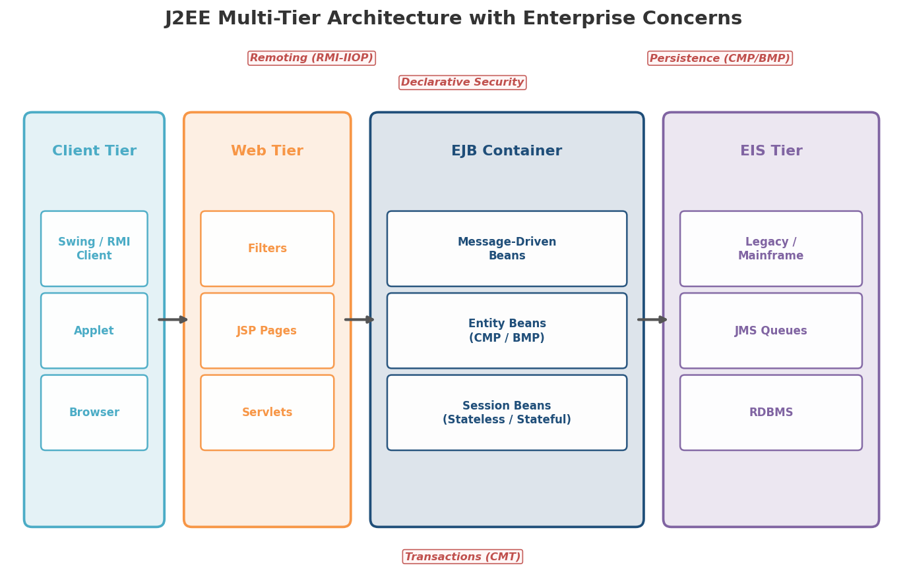

*Figure 2-1. The canonical J2EE four-tier model. Enterprise concerns — transactions, remoting, security, and persistence — are managed by the EJB container, insulating business logic from infrastructure plumbing at the cost of tight coupling to the container itself.*

### J2EE Platform Evolution

J2EE 1.2, released on 17 December 1999, was the inaugural platform release, bundling Servlet 2.2, EJB 1.1, JDBC 2.0, JMS, JNDI, and other enterprise APIs into a single branded specification suite. Subsequent releases broadened the surface area: J2EE 1.3 (24 September 2001, [JSR 58](https://jcp.org/en/jsr/platform?listBy=3&listByType=platform "J2EE 1.3 platform JSR")) added the Java Connector Architecture (JCA) and EJB 2.0; J2EE 1.4 (11 November 2003, [JSR 151](https://jcp.org/en/jsr/platform?listBy=3&listByType=platform "J2EE 1.4 platform JSR")) pushed Web Services via JAX-RPC; and Java EE 5 (11 May 2006, [JSR 244](https://jcp.org/en/jsr/platform?listBy=3&listByType=platform "Java EE 5 platform JSR")) — notably renamed from "J2EE" to "Java EE" — adopted annotations and generics as its central themes. [Jakarta EE — Wikipedia](https://en.wikipedia.org/wiki/Jakarta_EE "J2EE version history table")

Each platform revision expanded the specification count. Yet for working developers, the practical experience of J2EE was dominated by a single technology: Enterprise JavaBeans.

## 2.2 Enterprise JavaBeans in Practice

### Specification Timeline

EJB 1.0 debuted at JavaOne on 24 March 1998, promising that enterprise developers could write business logic as managed "beans" while the application server handled transactions, security, and persistence transparently. EJB 1.1 (17 December 1999) introduced XML deployment descriptors and role-driven declarative security, shipping alongside J2EE 1.2. EJB 2.0 ([JSR 19](https://www.jcp.org/en/jsr/detail?id=19 "EJB 2.0 Specification"), 22 August 2001) added Local interfaces — an implicit acknowledgment that the universal-remote-call assumption imposed unnecessary overhead for co-located components — along with Message-Driven Beans (MDBs) for asynchronous JMS processing and EJB-QL for querying Entity Beans. EJB 2.1 ([JSR 153](https://www.jcp.org/en/jsr/detail?id=153 "EJB 2.1 Specification"), 24 November 2003) extended the model further with Web Service endpoints and a timer service. [Jakarta Enterprise Beans — Wikipedia](https://en.wikipedia.org/wiki/Jakarta_Enterprise_Beans "EJB version history")

### The Component Taxonomy

EJB defined three component types, each targeting a distinct enterprise concern:

1. **Session Beans** — encapsulated business logic. *Stateless* Session Beans served any client with no conversational state; *Stateful* Session Beans maintained per-client state across multiple invocations, managed through activation and passivation by the container.
2. **Entity Beans** — represented persistent domain objects. *Container-Managed Persistence* (CMP) delegated SQL generation to the application server; *Bean-Managed Persistence* (BMP) required the developer to write JDBC code inside lifecycle callbacks (`ejbLoad()`, `ejbStore()`).
3. **Message-Driven Beans** (EJB 2.0+) — stateless, asynchronous consumers of JMS messages, decoupling producers from business processing.

### The "Triple-Class + XML" Burden

In EJB 2.1 and earlier, developing even a trivial Session Bean required the developer to produce three separate Java artifacts and at least one XML descriptor:

- A **Home interface** (extending `javax.ejb.EJBHome` or `EJBLocalHome`) declaring factory methods (`create()`, `findByPrimaryKey()` for Entity Beans).
- A **Remote or Local interface** (extending `javax.ejb.EJBObject` or `EJBLocalObject`) declaring business methods.
- A **Bean implementation class** (implementing `javax.ejb.SessionBean`, `EntityBean`, or `MessageDrivenBean`) containing the actual logic, plus mandatory lifecycle callbacks (`ejbCreate()`, `ejbRemove()`, `ejbActivate()`, `ejbPassivate()`, `setSessionContext()`).
- An **`ejb-jar.xml` deployment descriptor** specifying transaction attributes, security roles, persistence mappings, and bean references.

In practice, the XML alone did not suffice. Each application server vendor required its own supplementary descriptor — `weblogic-ejb-jar.xml` for BEA WebLogic, `jboss.xml` for JBoss, `sun-ejb-jar.xml` for Sun's reference implementation — to configure JNDI names, connection pool bindings, clustering behavior, and cache policies. A single EJB module thus carried multiple vendor-specific configuration files, eroding the "write once, run anywhere" promise and creating tangible vendor lock-in.

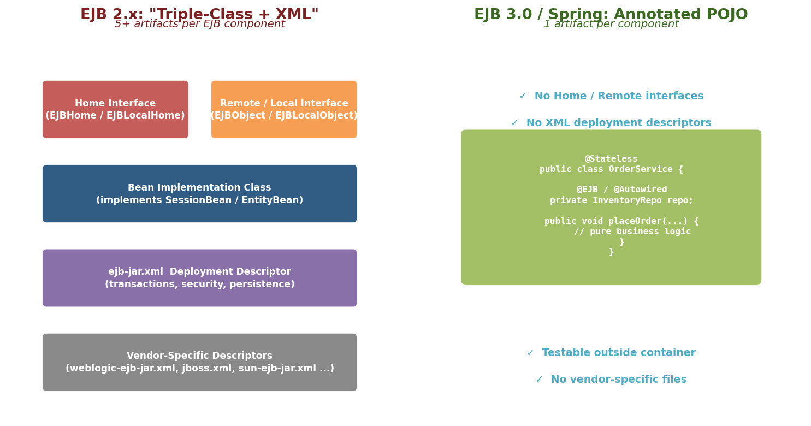

*Figure 2-2. The contrast between EJB 2.x's five-plus mandatory artifacts per component and the single annotated POJO model introduced by EJB 3.0 and Spring. The reduction in ceremony was not merely cosmetic — it fundamentally altered testability, portability, and development velocity.*

### Five Enterprise Concerns — and Their Cost

EJB aimed to solve five cross-cutting enterprise problems through container-managed services:

| Concern | EJB Mechanism | Developer Trade-off |
|---|---|---|
| **Transactions** | Container-Managed Transactions (CMT) with six propagation types (`REQUIRED`, `REQUIRES_NEW`, `MANDATORY`, `SUPPORTS`, `NOT_SUPPORTED`, `NEVER`) declared in XML; or Bean-Managed Transactions via JTA `UserTransaction`. | Declarative power came at the price of opaque runtime behavior; debugging transaction demarcation across nested EJB calls was notoriously difficult. |
| **Remoting** | RMI-IIOP for Java-to-Java and CORBA interop; Web Service endpoints added in EJB 2.1. | Every method call on a Remote interface incurred marshalling overhead. The EJB 2.0 addition of Local interfaces was an implicit admission that forcing remote semantics on co-located calls was a design error. |
| **Concurrency** | The container guaranteed that no two threads would simultaneously execute methods on the same bean instance. | Developers surrendered control over threading, making fine-grained concurrency optimizations impossible without breaking the contract. |
| **Security** | Role-based declarative access control in `ejb-jar.xml`; method-level permissions mapped to abstract security roles. | Security configuration was scattered across XML files and tightly coupled to the deployment environment. |
| **Persistence** | CMP Entity Beans delegated O/R mapping to the container; BMP gave manual JDBC control. | CMP-generated SQL was widely criticized as inefficient and non-portable. Oracle's own documentation acknowledged that "EJB persistence has long been criticized for its complex development model and for poor performance." [Oracle](https://www.oracle.com/technical-resources/articles/enterprise-architecture/tuning-cmp-ejbs1.html "Peak performance tuning of CMP 2.0 Entity beans") |

### The Testing Wall

Perhaps the most damaging consequence of the EJB programming model was its near-total hostility to automated testing. EJB components could not execute outside the application server container. Verifying even a trivial business calculation inside a Stateless Session Bean required booting a full application server — a process that could take thirty seconds to several minutes depending on the vendor — deploying the EJB module, looking up the bean through JNDI, and invoking it through generated stubs.

Martin Fowler identified this as a fundamental architectural flaw in his influential January 2004 article, observing that "component environments that are very intrusive, such as Java's EJB framework" imposed severe penalties on the developer's edit-execute feedback cycle. [Martin Fowler](https://martinfowler.com/articles/injection.html "Inversion of Control Containers and the Dependency Injection pattern, January 2004") The inability to unit-test business logic in isolation — without a container, without a network, without deployment descriptors — meant that many teams simply wrote no automated tests for their EJB code. Integration testing became the *only* testing, and it was slow, fragile, and expensive.

This single deficiency — the tight coupling between business logic and container infrastructure — became the primary rallying point for the lightweight container movement that followed.

## 2.3 The Backlash and the Search for Alternatives

### Voices of Dissent

By 2002, a growing chorus of experienced Java practitioners questioned whether J2EE's complexity was inherent to the enterprise problem space or merely an artifact of over-engineered specifications. The critique crystallized around several recurring themes:

- **Unnecessary indirection.** The triple-class ceremony and XML descriptors imposed boilerplate proportional not to problem complexity but to framework requirements.
- **Violation of object-oriented principles.** Business objects could not simply *be* Java objects; they had to implement container-specific interfaces (`SessionBean`, `EntityBean`), inherit container-dictated lifecycle methods, and surrender construction to factory patterns. The plain old Java object — the POJO — was effectively forbidden.
- **Vendor lock-in despite standardization.** Although EJB was a standard, real-world deployments depended on vendor-specific descriptors, proprietary extensions, and application-server-specific classloading behaviors. Migrating from WebLogic to JBoss, or from WebSphere to Sun ONE, was rarely the seamless exercise the specification promised.
- **Impedance mismatch with agile practices.** The slow build-deploy-test cycle clashed with the emerging Extreme Programming and test-driven development movements that demanded rapid feedback.

### Rod Johnson's Manifesto

The most consequential critique came from Rod Johnson, an enterprise Java consultant who published *Expert One-on-One J2EE Design and Development* through Wrox Press in October 2002 (ISBN 978-0-7645-4385-2). [ACM Digital Library](https://dl.acm.org/doi/10.5555/996540 "Wrox Press, October 2002") The book argued that a large proportion of J2EE projects were over-engineered — adopting EJB and full application servers when simpler architectures built on plain Java objects, lightweight containers, and thoughtful design patterns could deliver better results with less complexity.

Crucially, the book was not mere polemic. Johnson shipped approximately 30,000 lines of framework code demonstrating an alternative model: an Inversion of Control (IoC) container that managed POJO lifecycle and dependencies without requiring business classes to implement any framework interface. This code became the seed of the Spring Framework. Spring 0.9 was released under the Apache 2.0 license in June 2003; version 1.0 followed on 24 March 2004. [Spring Framework — Wikipedia](https://en.wikipedia.org/wiki/Spring_Framework "Spring origin narrative")

### The Lightweight Container Movement

Johnson's work was part of a broader wave. Martin Fowler, writing in January 2004, observed "a rush of lightweight containers" as a reaction to "heavyweight complexity in the mainstream J2EE world" and coined the term "Dependency Injection" to describe the pattern these containers shared. [Martin Fowler](https://martinfowler.com/articles/injection.html "Inversion of Control Containers and the Dependency Injection pattern, January 2004")

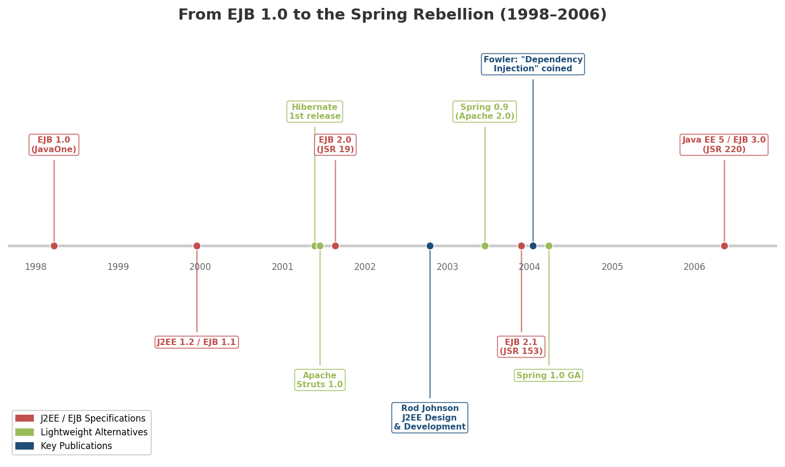

*Figure 2-3. Key milestones from EJB 1.0 (1998) through the lightweight alternative movement to EJB 3.0 / Java EE 5 (2006). Red markers denote J2EE/EJB specification releases; green markers denote lightweight alternatives; blue markers denote pivotal publications.*

Several projects converged on the same insight — that enterprise services could be provided to plain Java objects without invasive container interfaces:

- **Hibernate ORM**, first released by Gavin King on 23 May 2001, offered a transparent object-relational mapping layer explicitly positioned "as an alternative to using EJB2-style entity beans." [Hibernate — Wikipedia](https://en.wikipedia.org/wiki/Hibernate_(framework) "Initial release 23 May 2001") Hibernate demonstrated that persistence could be achieved with annotated POJOs and a session-based API, without the CMP/BMP machinery.
- **Apache Struts 1.0**, released in June 2001, provided an MVC web framework operating at the Servlet layer, bypassing the EJB-centric architecture for web-tier concerns entirely. [Apache Struts 1 — Wikipedia](https://en.wikipedia.org/wiki/Apache_Struts_1 "Initial release June 2001")
- **PicoContainer**, emerging in 2003, demonstrated a minimalist constructor-injection container in fewer than a thousand lines of code, reinforcing the argument that IoC infrastructure need not be heavyweight.

Together, these projects demonstrated that each of EJB's enterprise concerns — persistence, web-tier MVC, dependency management, transaction coordination — could be addressed by focused, non-invasive libraries cooperating through standard Java interfaces, rather than by a monolithic container specification.

### EJB 3.0: The Standard Concedes

The specification itself eventually absorbed the lessons of the revolt. EJB 3.0 ([JSR 220](https://www.jcp.org/en/jsr/detail?id=220 "EJB 3.0 Specification"), released 11 May 2006 as part of Java EE 5) stated its purpose explicitly: to "improve the EJB architecture by reducing its complexity from the developer's point of view." The changes were sweeping:

- **Annotations replaced XML.** `@Stateless`, `@Stateful`, `@MessageDriven`, and `@EJB` eliminated the deployment descriptor for most use cases.
- **Home interfaces abolished.** The triple-class pattern was reduced to a single POJO class annotated with component metadata.
- **Entity Beans replaced by JPA.** The Java Persistence API (JPA), heavily influenced by Hibernate, superseded CMP and BMP Entity Beans with an annotation-driven, POJO-based O/R mapping standard. Gavin King himself participated in the JSR 220 expert group, and many Hibernate features were incorporated directly into JPA.
- **Dependency injection adopted.** The `@EJB` and `@Resource` annotations provided container-managed injection without programmatic JNDI lookups.

EJB 3.0 was, in effect, an acknowledgment that the lightweight container movement had been right. The specification rewrote itself in the image of its critics. Yet by 2006, Spring had already accumulated years of community adoption, a rich ecosystem of integrations, and a philosophy of non-invasive design that extended well beyond what EJB 3.0 offered. The standard had conceded the argument, but the revolution had already moved on.

---

The J2EE/EJB era left a lasting imprint on enterprise Java. It validated the *problems* — transactions, remoting, security, lifecycle management — while demonstrating that a specification-heavy, container-invasive approach to solving them imposed unacceptable costs in developer productivity, testability, and portability. The stage was set for a framework that would deliver the same enterprise services to plain Java objects, without requiring those objects to know they were being managed at all. That framework was Spring.

# 第3章 The Spring Framework — Inversion of Control and the POJO Revolution

The J2EE/EJB era correctly identified the problems that enterprise Java developers faced — transactions, remoting, security, persistence, lifecycle management — yet demonstrated that a specification-heavy, container-invasive approach to solving them imposed costs disproportionate to the benefits. Business classes could not remain plain Java objects; they were required to implement framework interfaces, declare themselves through verbose XML descriptors, and submit to an application server's opaque runtime. Testing was difficult, development cycles were slow, and the platform's portability promise was undermined by vendor-specific deployment artifacts.

The Spring Framework emerged as a direct, technically grounded response to these failures. It did not dismiss the enterprise concerns that J2EE addressed; it re-delivered every one of them to ordinary Java objects — POJOs — through a fundamentally different architectural mechanism: Inversion of Control.

## 3.1 Origin Story and Design Philosophy

### From a Book to a Framework

The origin of Spring is inseparable from Rod Johnson's October 2002 book, *Expert One-on-One J2EE Design and Development* (Wrox Press, ISBN 978-0-7645-4385-2) [ACM Digital Library](https://dl.acm.org/doi/10.5555/996540 "Wrox Press, October 2002"). The book argued that much of J2EE's complexity was self-inflicted — that many enterprise applications adopted EJB and full application servers when simpler architectures built on plain Java objects, lightweight containers, and thoughtful design patterns would deliver superior results. Johnson did not merely theorize: the book shipped with approximately 30,000 lines of framework code that already contained the core abstractions of what would become Spring — an IoC container (the `BeanFactory` and `ApplicationContext` interfaces), the embryonic form of Spring MVC, the Template concept (including `JdbcTemplate` for JDBC boilerplate elimination), and a technology-agnostic data access exception hierarchy [Spring Official Blog](https://spring.io/blog/2006/11/09/spring-framework-the-origins-of-a-project-and-a-name "Rod Johnson's own account of Spring's origins").

Three co-founders shaped the project. Rod Johnson was the original author. Yann Caroff suggested the name "Spring" — evoking renewal after the J2EE "winter." Juergen Hoeller became the core framework project lead and has remained in that role through 2026 [Spring Official Blog](https://spring.io/blog/2006/11/09/spring-framework-the-origins-of-a-project-and-a-name "Co-founders and naming"). Corporate stewardship has passed through multiple hands: Interface21 (the consulting firm Johnson founded) became SpringSource in 2007; VMware acquired SpringSource in 2009; the unit was reorganized into Pivotal Software in 2013; VMware reabsorbed Pivotal in 2019; and Broadcom acquired VMware in 2023.

Spring 0.9 was released under the Apache 2.0 license in June 2003, with version 1.0 following on 24 March 2004 [Spring Framework — Wikipedia](https://en.wikipedia.org/wiki/Spring_Framework "Spring origin narrative"). The timing proved significant: by the time EJB 3.0 adopted many of Spring's ideas in May 2006, Spring had already accumulated three years of community adoption, a mature ecosystem of integrations, and a design philosophy that extended well beyond anything the revised specification offered.

### The Version Arc

The evolution of Spring Framework releases tracks the broader trajectory of enterprise Java itself.

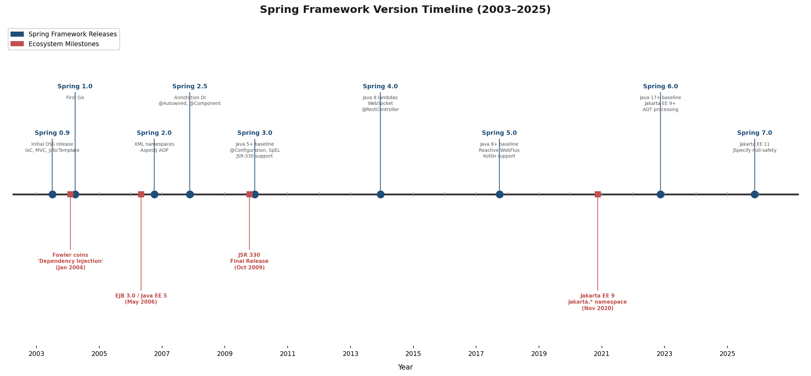

| Version | Release Date | Headline Changes |
|---|---|---|
| 0.9 | June 2003 | Initial open-source release; IoC container, Spring MVC, JdbcTemplate |
| 1.0 | 24 March 2004 | First GA release; stable API contracts |
| 2.0 | October 2006 | XML namespace configuration; AspectJ integration for AOP |
| 2.5 | [19 November 2007](https://spring.io/blog/2007/11/19/spring-framework-2-5-released "Spring 2.5 release announcement") | Annotation-driven DI (`@Autowired`, `@Component`); classpath scanning |
| 3.0 | [16 December 2009](https://spring.io/blog/2009/12/16/spring-framework-3-0-goes-ga "Spring 3.0 GA") | Java 5+ baseline; `@Configuration`/`@Bean` Java config; SpEL; JSR-330 support |
| 4.0 | [12 December 2013](https://spring.io/blog/2013/12/12/announcing-spring-framework-4-0-ga-release "Spring 4.0 GA") | Java 8 lambdas and `Optional`; WebSocket support; `@RestController` |
| 5.0 | [28 September 2017](https://spring.io/blog/2017/09/28/spring-framework-5-0-goes-ga "Spring 5.0 GA") | Java 8+ baseline; Reactive WebFlux; Kotlin support |
| 6.0 | 16 November 2022 | Java 17+ baseline; Jakarta EE 9+ (`jakarta.*` namespace); AOT processing |
| 7.0 | 13 November 2025 | Jakarta EE 11; JSpecify null-safety; Jackson 3.0; Kotlin 2.2 |

[Wikipedia](https://en.wikipedia.org/wiki/Spring_Framework "Version history table") [GitHub Wiki](https://github.com/spring-projects/spring-framework/wiki/Spring-Framework-Versions "Official version support page")

Each major version expanded capability while preserving a defining trait: strong backward compatibility. The Spring team's own documentation enumerates five design principles — provide choice at every level, accommodate diverse perspectives, maintain strong backward compatibility, invest in API design, and demand high code quality (including no circular dependencies between packages) [Spring Official Documentation](https://docs.spring.io/spring-framework/reference/overview.html "Design Philosophy").

### Naming Dependency Injection

Spring did not invent Inversion of Control — the term had circulated in the Smalltalk and object-oriented design communities for years. What Spring accomplished was making IoC the centerpiece of a practical, production-grade framework for enterprise Java. In January 2004, Martin Fowler published a landmark article observing "a rush of lightweight containers" emerging as a reaction to "heavyweight complexity in the mainstream J2EE world" [Martin Fowler](https://martinfowler.com/articles/injection.html "Inversion of Control Containers and the Dependency Injection pattern, January 2004"). Fowler coined the term "Dependency Injection" to distinguish the specific pattern — the container supplies dependencies to objects rather than objects looking them up — from the broader, vaguer Inversion of Control principle.

The terminology crystallized into a Java standard with JSR 330 ("Dependency Injection for Java"), co-led by Bob Lee of Google (creator of Guice) and Rod Johnson of SpringSource. Submitted in May 2009 and reaching Final Release on 14 October 2009, JSR 330 set a JCP record for the shortest development cycle. It defined the `javax.inject` package (now `jakarta.inject`) comprising six elements: `@Inject`, `@Named`, `@Qualifier`, `@Scope`, `@Singleton`, and `Provider<T>`. Spring has supported these annotations since version 3.0 [JCP JSR-330](https://www.jcp.org/en/jsr/detail?id=330 "JSR 330 timeline").

## 3.2 IoC and Dependency Injection in Practice

### The Container: BeanFactory and ApplicationContext

At the heart of Spring lies the IoC container — the runtime that instantiates, configures, wires, and manages the lifecycle of application objects (termed "beans"). Two interfaces define the container hierarchy:

- **`BeanFactory`** is the root interface, providing fundamental dependency injection and lifecycle management. It lazily instantiates beans on first request.
- **`ApplicationContext`** extends `BeanFactory` with enterprise-grade features: automatic `BeanPostProcessor` registration, event publication (`ApplicationEvent`/`ApplicationListener`), internationalization (`MessageSource`), and environment abstraction. In practice, developers work exclusively with `ApplicationContext` implementations — `AnnotationConfigApplicationContext`, `ClassPathXmlApplicationContext`, and in web applications, `WebApplicationContext`.

[Spring Official Documentation](https://docs.spring.io/spring-framework/reference/overview.html "Core container module description")

The critical distinction from EJB lies in what the container *does not* require. A Spring-managed bean can be any Java class. It need not implement a framework interface, extend a framework base class, or declare itself through an external descriptor. The container manages the object's dependencies and lifecycle *externally*, leaving the business class free to remain a plain object — testable with a simple `new` invocation, no container required.

### Configuration Evolution: XML → Annotations → Java Config

Spring's configuration model evolved through three distinct phases, each reducing ceremony while increasing type safety.

**Phase 1: XML Configuration (2003–2006).** The original model declared beans and their dependencies in XML files:

```xml
<bean id="orderService" class="com.example.OrderService">
    <constructor-arg ref="orderRepository"/>
    <constructor-arg ref="paymentGateway"/>
</bean>
```

XML provided full externalization — wiring could change without recompilation — but grew unwieldy at scale. Thousands of `<bean>` definitions spread across dozens of XML files became a maintenance burden that rivaled the EJB descriptor sprawl Spring had set out to eliminate.

**Phase 2: Annotation-Driven Configuration (Spring 2.5, 2007).** The introduction of `@Component` (and its specializations `@Service`, `@Repository`, `@Controller`) combined with `@Autowired` relocated wiring declarations into the Java source itself. Classpath scanning (`@ComponentScan`) eliminated the need to enumerate every bean in XML:

```java
@Service
public class OrderService {
    private final OrderRepository repository;

    @Autowired
    public OrderService(OrderRepository repository) {
        this.repository = repository;
    }
}
```

**Phase 3: Java Configuration (Spring 3.0, 2009).** The `@Configuration` and `@Bean` annotations enabled fully type-safe, refactor-friendly configuration in plain Java:

```java
@Configuration
public class AppConfig {
    @Bean
    public OrderService orderService(OrderRepository repo) {
        return new OrderService(repo);
    }
}
```

Java configuration combined the externalization benefits of XML (configuration logic separated from business logic) with compile-time safety and full IDE support. By Spring 5.x, Java configuration had become the dominant approach, and Spring Boot would later make it the only practically necessary one.

All three mechanisms coexist; Spring never deprecated XML, preserving backward compatibility. The container also honors the standard JSR-250 (`@Resource`) and JSR-330 (`@Inject`, `@Named`) annotations, ensuring that applications are not locked into Spring-proprietary metadata.

### Injection Styles

Spring supports three forms of dependency injection:

1. **Constructor injection** — dependencies are supplied as constructor arguments. The Spring team recommends this as the default: it produces immutable objects, makes dependencies explicit in the class's public API, and ensures that the object is never in a partially initialized state.
2. **Setter injection** — dependencies are supplied via JavaBean setter methods, useful for optional dependencies or reconfiguration scenarios.
3. **Field injection** — `@Autowired` applied directly to fields. While concise, field injection is discouraged because it hides dependencies from the class's public API, complicates unit testing (reflection is required to set fields), and prevents the construction of immutable objects.

### Bean Scopes

Spring defines six built-in bean scopes:

| Scope | Semantics |
|---|---|
| `singleton` (default) | One instance per IoC container; all injection points share the same object. |
| `prototype` | A new instance is created for every injection or `getBean()` call. The container does not manage the full lifecycle — `@PreDestroy` callbacks are not invoked. |
| `request` | One instance per HTTP request (web-aware `ApplicationContext` only). |
| `session` | One instance per HTTP session. |
| `application` | One instance per `ServletContext`. |
| `websocket` | One instance per WebSocket session. |

[Spring Official Documentation](https://docs.spring.io/spring-framework/reference/core/beans/factory-scopes.html "Bean Scopes")

Custom scopes can be defined by implementing the `Scope` interface — a capability exploited by frameworks such as Spring Batch (step scope) and Spring Cloud (refresh scope).

### Bean Lifecycle

The lifecycle of a Spring bean follows a precise callback ordering that developers must understand to use the container effectively.

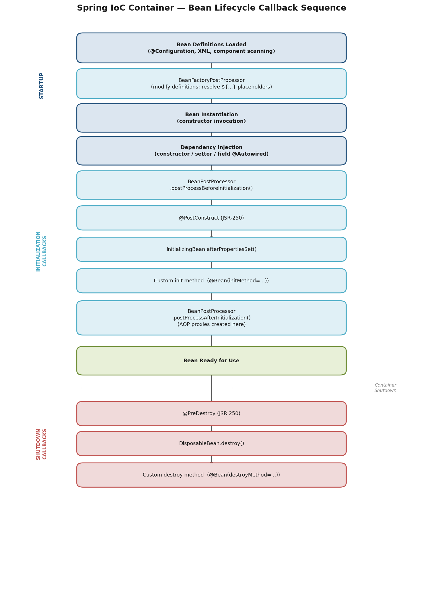

1. **`BeanFactoryPostProcessor`** — invoked after all bean definitions are loaded but before any bean is instantiated. Property placeholder resolution occurs at this stage (e.g., `PropertySourcesPlaceholderConfigurer` resolving `${...}` expressions in bean definitions).
2. **Instantiation and dependency injection** — the container creates the bean instance and injects its dependencies.
3. **`BeanPostProcessor.postProcessBeforeInitialization()`** — called on every bean before initialization callbacks. This hook processes `@Autowired` (via `AutowiredAnnotationBeanPostProcessor`).
4. **`@PostConstruct`** (JSR 250) — the bean's own initialization logic.
5. **`InitializingBean.afterPropertiesSet()`** — a Spring-specific initialization callback.
6. **Custom init method** (`@Bean(initMethod = "...")`) — a named initialization method.
7. **`BeanPostProcessor.postProcessAfterInitialization()`** — called after initialization. AOP proxies are created at this point — the target bean is fully initialized before the proxy wraps it.
8. **Bean is ready for use.**
9. **`@PreDestroy`** (JSR 250) → **`DisposableBean.destroy()`** → **custom destroy method** — invoked on container shutdown, in that order.

The `BeanPostProcessor` mechanism is the engine behind many of Spring's most powerful features: `@Autowired` resolution, AOP proxy creation, `@Scheduled` method registration, and `@Async` method proxying are all implemented as `BeanPostProcessor` instances that intercept the bean lifecycle at well-defined extension points.

## 3.3 Aspect-Oriented Programming

### The Cross-Cutting Problem

Even with IoC eliminating EJB's invasive interfaces, certain concerns resist clean decomposition into individual classes. Logging, transaction demarcation, security enforcement, and caching are *cross-cutting* — they apply uniformly across many methods in many classes. Without a dedicated mechanism, implementing these concerns requires scattering identical boilerplate across the codebase, violating the Don't Repeat Yourself principle and tangling infrastructure logic with business logic.

Aspect-Oriented Programming (AOP) addresses this by allowing developers to define *aspects* — modular units of cross-cutting behavior — and declare *where* (through pointcut expressions) and *when* (before, after, or around a method invocation) they apply. The business code remains entirely unaware of the aspect's existence.

### Spring AOP: Proxy-Based Model

Spring AOP is implemented through runtime proxies rather than compile-time or load-time bytecode weaving. When a bean requires AOP interception, the container wraps it in a proxy object. Two proxy strategies are available:

- **JDK dynamic proxies** — used when the target bean implements at least one interface. The proxy implements the same interfaces and delegates to the target, interposing advice logic at each invocation.
- **CGLIB proxies** — used when the target bean does not implement any interface. CGLIB generates a subclass of the target at runtime, overriding methods to apply advice.

[Spring Official Documentation](https://docs.spring.io/spring-framework/reference/core/aop/introduction-proxies.html "AOP Proxies")

Since Spring 2.0, developers can define aspects using the `@AspectJ` annotation style — declaring an `@Aspect` class with methods annotated `@Before`, `@After`, `@AfterReturning`, `@AfterThrowing`, or `@Around`, and using AspectJ's pointcut expression language to select join points:

```java
@Aspect
@Component
public class PerformanceMonitor {
    @Around("execution(* com.example.service.*.*(..))")
    public Object measureExecutionTime(ProceedingJoinPoint pjp) throws Throwable {
        long start = System.nanoTime();
        Object result = pjp.proceed();
        long elapsed = System.nanoTime() - start;
        logger.info("{} executed in {} ms", pjp.getSignature(), elapsed / 1_000_000);
        return result;
    }
}
```

The proxy-based model carries a critical limitation that every Spring developer must internalize: **self-invocation bypasses the proxy**. When a method within a bean calls another method on the same instance (`this.someMethod()`), the call goes directly to the target object, not through the proxy. AOP advice attached to the inner method will not execute. This constraint applies equally to `@Transactional`, `@Cacheable`, `@Async`, and any other annotation implemented through AOP proxies.

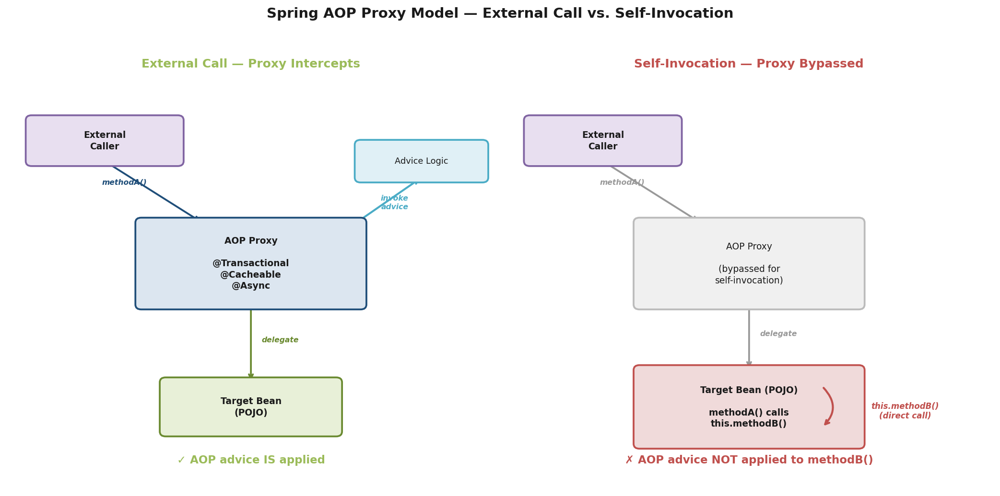

For applications requiring weaving of aspects on self-invocations, private methods, or field access, Spring supports integration with the full AspectJ weaver via compile-time or load-time weaving — though the vast majority of Spring applications rely on the simpler proxy-based model.

### Declarative Transaction Management

The single most consequential application of Spring AOP is `@Transactional`. By annotating a method or class, a developer obtains container-managed transaction demarcation — the same capability that EJB's Container-Managed Transactions provided, but without an application server dependency, without XML descriptors, and without implementing any framework interface.

```java
@Service
public class TransferService {
    @Transactional
    public void transfer(Account from, Account to, BigDecimal amount) {
        accountRepository.debit(from, amount);
        accountRepository.credit(to, amount);
    }
}
```

The `@Transactional` proxy intercepts the method call, starts a transaction through the configured `PlatformTransactionManager` (for imperative code) or `ReactiveTransactionManager` (for reactive streams), commits on normal return, and rolls back on exception. The default settings merit careful attention: propagation `REQUIRED`, isolation `DEFAULT` (delegated to the underlying database), read-write mode, and rollback only on unchecked exceptions (`RuntimeException` and `Error`). Checked exceptions do not trigger rollback by default — a design decision that has produced subtle bugs in production systems. Spring Framework 6.2 introduced the ability to globally configure `rollbackOn=ALL_EXCEPTIONS` to address this long-standing pitfall [Spring Official Documentation](https://docs.spring.io/spring-framework/reference/data-access/transaction/declarative/annotations.html "@Transactional usage guide").

The transaction abstraction is decoupled from any specific transaction technology. The same `@Transactional` annotation functions identically whether the underlying manager is a `DataSourceTransactionManager` (plain JDBC), `JpaTransactionManager` (JPA/Hibernate), `JtaTransactionManager` (distributed XA transactions), or a custom implementation. This is a direct manifestation of Spring's "wrap, don't replace" philosophy: the framework provides a uniform programming model while delegating actual transaction coordination to whatever infrastructure the application employs.

Because `@Transactional` is implemented via AOP proxies, the self-invocation limitation applies: calling a `@Transactional` method from within the same class will not start a transaction.

## 3.4 Integration Without Lock-In

### The "Wrap, Don't Replace" Philosophy

Spring's relationship to the broader Java ecosystem is defined by a deliberate architectural choice: integrate with existing technologies through abstraction layers rather than replace them. The framework does not provide its own persistence engine, its own message broker, or its own HTTP server. Instead, it wraps these technologies behind consistent abstractions that simplify usage, manage resources automatically, and translate technology-specific exceptions into a uniform hierarchy.

### DataAccessException: A Case Study in Abstraction

The most illustrative expression of this philosophy is the `DataAccessException` hierarchy, which traces its origins to Chapter 9 of Rod Johnson's 2002 book. JDBC's `SQLException` is an unwieldy checked exception that encodes vendor-specific error information in integer error codes and SQL state strings. Hibernate throws its own exception types; JPA defines yet another set. Code that catches and interprets these exceptions becomes tied to a specific persistence technology.

Spring's `DataAccessException` and its subclasses (`DataIntegrityViolationException`, `DuplicateKeyException`, `DeadlockLoserDataAccessException`, `OptimisticLockingFailureException`, among others) form a technology-agnostic, **unchecked** exception hierarchy [Spring Javadoc](https://docs.spring.io/spring-framework/docs/current/javadoc-api/org/springframework/dao/DataAccessException.html "DataAccessException class documentation"). Spring automatically translates JDBC `SQLExceptions`, Hibernate exceptions, and JPA `PersistenceExceptions` into the appropriate `DataAccessException` subclass. Service-layer code can catch `DataAccessException` without knowing — or caring — whether the underlying store is accessed via JDBC, Hibernate, JPA, or MongoDB.

The choice of unchecked exceptions was itself philosophically significant. Unlike EJB's reliance on checked exceptions (which forced callers to handle or declare them at every layer), Spring's unchecked exceptions allow the exception to propagate naturally until a layer capable of meaningful recovery catches it. Application code is not cluttered with catch blocks that merely re-throw or log.

### Template Classes: Resource Management Done Once

The Template pattern (`JdbcTemplate`, `JmsTemplate`, `RestTemplate`, `TransactionTemplate`) encapsulates three repetitive tasks that developers previously handled manually:

1. **Resource acquisition and release.** `JdbcTemplate` obtains a JDBC `Connection` from the `DataSource`, creates a `Statement`, and guarantees that both are closed in a `finally` block — even when exceptions occur. Developers never write `try-finally` blocks for connection cleanup.
2. **Exception translation.** Every exception from the underlying API is automatically converted into the appropriate `DataAccessException` subclass.
3. **Transaction participation.** Templates transparently participate in any active Spring-managed transaction, using the same `Connection` bound to the current thread by the `PlatformTransactionManager`.

The net effect is that a JDBC query requiring 15–20 lines of boilerplate (obtain connection, create statement, set parameters, execute, iterate result set, close result set, close statement, close connection, handle exceptions at each step) reduces to a single method call with a lambda:

```java
List<Customer> customers = jdbcTemplate.query(
    "SELECT id, name, email FROM customers WHERE status = ?",
    (rs, rowNum) -> new Customer(rs.getLong("id"), rs.getString("name"), rs.getString("email")),
    "ACTIVE"
);
```

### Compatibility with Java EE Standards

Spring has consistently supported — rather than competed with — Java EE (now Jakarta EE) specifications where they provide genuine value. The container honors JSR-250 lifecycle annotations (`@PostConstruct`, `@PreDestroy`), JSR-330 injection annotations (`@Inject`, `@Named`), JPA for persistence, JTA for distributed transactions, Bean Validation (JSR 303/349/380), and Servlet specifications. An application can use Spring as the wiring and lifecycle layer while relying on standard APIs for data access, validation, and messaging — preserving the option to migrate specific components away from Spring without rewriting business logic.

This deliberate compatibility reflected a philosophical position, not merely a pragmatic one. The Spring team's stated design principle — "provide choice at every level" — meant that developers should never be forced to use a Spring-specific API when a standard alternative existed. The framework's value lay in making those standards easier to use, not in replacing them.

---

The Spring Framework resolved the central failures of the EJB era: business objects became POJOs again, testable without containers; cross-cutting concerns were applied declaratively through AOP proxies; and infrastructure technologies were wrapped behind clean abstractions that freed application code from vendor lock-in. Yet a friction remained. Configuring a Spring application — declaring beans, wiring data sources, setting up transaction managers, registering filters, tuning embedded containers — still demanded substantial boilerplate. The question shifted from *how to write enterprise services* to *how to reduce the ceremony of assembling them*. Chapter 4 examines the core modules a working developer must master, and Chapter 5 shows how Spring Boot would ultimately answer the assembly problem through convention over configuration.

# 第4章 Spring Core Modules — Essential Knowledge for the Working Developer

Chapter 3 established the Spring Framework's philosophical foundations — Inversion of Control, Dependency Injection, AOP proxies, and the "wrap, don't replace" integration philosophy. Those foundations, however, are not self-executing. A working developer must understand the concrete modules that translate principle into practice: the container's startup sequence and bean lifecycle, the Spring MVC request-processing pipeline, the data access abstractions spanning JDBC and JPA, the transaction propagation model, and the security filter architecture. This chapter provides that practitioner-level walkthrough — the knowledge base every Spring developer carries into daily work, and that Spring Boot (Chapter 5) will later automate but never eliminate the need to understand.

## 4.1 ApplicationContext and the Bean Lifecycle

### The Startup Sequence

When a Spring application starts, the `ApplicationContext` orchestrates a precisely ordered initialization pipeline. Familiarity with this sequence is essential for diagnosing startup failures, implementing custom `BeanPostProcessor` logic correctly, and predicting when AOP proxies become active.

The pipeline proceeds through seven distinct phases:

1. **Bean definition loading.** The container reads bean definitions from `@Configuration` classes, `@Component`-scanned classes, XML files, or Groovy scripts. At this stage no beans have been instantiated — the container holds only metadata describing what to create and how to wire it.

2. **`BeanFactoryPostProcessor` execution.** These processors operate on bean *definitions* before any instances exist. The most commonly encountered example is `PropertySourcesPlaceholderConfigurer`, which resolves `${...}` placeholders against property sources. Custom `BeanFactoryPostProcessor` implementations can programmatically add, modify, or remove bean definitions — a powerful extension point used by frameworks such as Spring Cloud Config.

3. **Bean instantiation and dependency injection.** The container creates instances (via constructors or factory methods) and injects dependencies through constructor parameters, setter methods, or annotated fields. `AutowiredAnnotationBeanPostProcessor` resolves `@Autowired` and `@Value` annotations during this phase.

4. **`BeanPostProcessor` execution (before initialization).** Each registered `BeanPostProcessor` receives the bean instance via `postProcessBeforeInitialization()`. `CommonAnnotationBeanPostProcessor` processes `@PostConstruct` annotations through this hook.

5. **Initialization callbacks.** Three mechanisms fire in strict order: `@PostConstruct` (JSR 250) → `InitializingBean.afterPropertiesSet()` → custom init method declared via `@Bean(initMethod = "...")`.

6. **`BeanPostProcessor` execution (after initialization).** `postProcessAfterInitialization()` is invoked — the phase where AOP infrastructure wraps the bean in a proxy if any advice applies. The ordering carries practical consequences: AOP interceptors are not present during initialization callbacks, because the target bean must be fully created before its proxy is constructed. [Spring Official Documentation](https://docs.spring.io/spring-framework/reference/core/beans/factory-nature.html "Bean lifecycle callback ordering and AOP proxy timing")

7. **Bean ready.** The fully initialized (and potentially proxied) bean is available for injection into other beans and for serving application requests.

The destruction sequence mirrors initialization in reverse: `@PreDestroy` → `DisposableBean.destroy()` → custom destroy method. For beans that participate in ordered startup and graceful shutdown — connection pools, message listeners, embedded servers — the `SmartLifecycle` interface provides phase-based ordering via `getPhase()`: lower phase values start first and stop last.

### Scope and Its Implications

The default `singleton` scope creates exactly one instance per bean definition, cached for the container's lifetime. The `prototype` scope creates a new instance on every injection or `getBean()` call, but Spring does not manage the prototype bean's destruction — the caller assumes responsibility for cleanup. Four additional scopes — `request`, `session`, `application`, and `websocket` — are available only in web-aware `ApplicationContext` implementations. Custom scopes can be registered by implementing the `Scope` interface. [Spring Official Documentation](https://docs.spring.io/spring-framework/reference/core/beans/factory-scopes.html "Bean Scopes")

A common pitfall arises when a singleton bean depends on a shorter-lived scoped bean (e.g., a request-scoped service). Because the singleton is instantiated once, it receives the scoped bean's proxy rather than a direct instance; the proxy delegates to the correct scoped instance on each invocation. Failing to declare the scoped bean with `proxyMode = ScopedProxyMode.TARGET_CLASS` (or its XML equivalent) results in a `BeanCreationException` at startup.

## 4.2 Spring MVC — From DispatcherServlet to REST Controllers

### The Front Controller

Spring MVC is built on the Servlet specification. Its entry point, `DispatcherServlet`, is a standard `HttpServlet` implementing the Front Controller pattern — a single servlet receives all incoming requests and delegates them to the appropriate handler. [Spring Official Documentation](https://docs.spring.io/spring-framework/reference/web/webmvc/mvc-servlet.html "DispatcherServlet front controller pattern")

The request-processing pipeline involves a defined set of collaborating components, each registered as a Spring bean that `DispatcherServlet` discovers through the `ApplicationContext`:

1. **`HandlerMapping`** resolves an incoming request to a handler object (typically a controller method) plus an ordered list of `HandlerInterceptor` instances. `RequestMappingHandlerMapping` processes `@RequestMapping` and its composed variants (`@GetMapping`, `@PostMapping`, etc.); `SimpleUrlHandlerMapping` supports explicit URI-to-handler mappings.

2. **`HandlerAdapter`** invokes the resolved handler. `RequestMappingHandlerAdapter` handles annotated controller methods, performing argument resolution (binding request parameters, deserializing `@RequestBody`, injecting `HttpServletRequest` or `@PathVariable` values) and return-value handling.

3. **Return-value processing.** If the method returns a logical view name (a `String`), `DispatcherServlet` passes it to a `ViewResolver` (e.g., `ThymeleafViewResolver`, `InternalResourceViewResolver`) to obtain a `View` object, which renders the response. If the method is annotated with `@ResponseBody` (or resides in a `@RestController`), an `HttpMessageConverter` — typically Jackson's `MappingJackson2HttpMessageConverter` — serializes the return value directly to the HTTP response body, bypassing view resolution entirely.

[Spring Official Documentation](https://docs.spring.io/spring-framework/reference/web/webmvc/mvc-servlet/special-bean-types.html "Special Bean Types in DispatcherServlet")

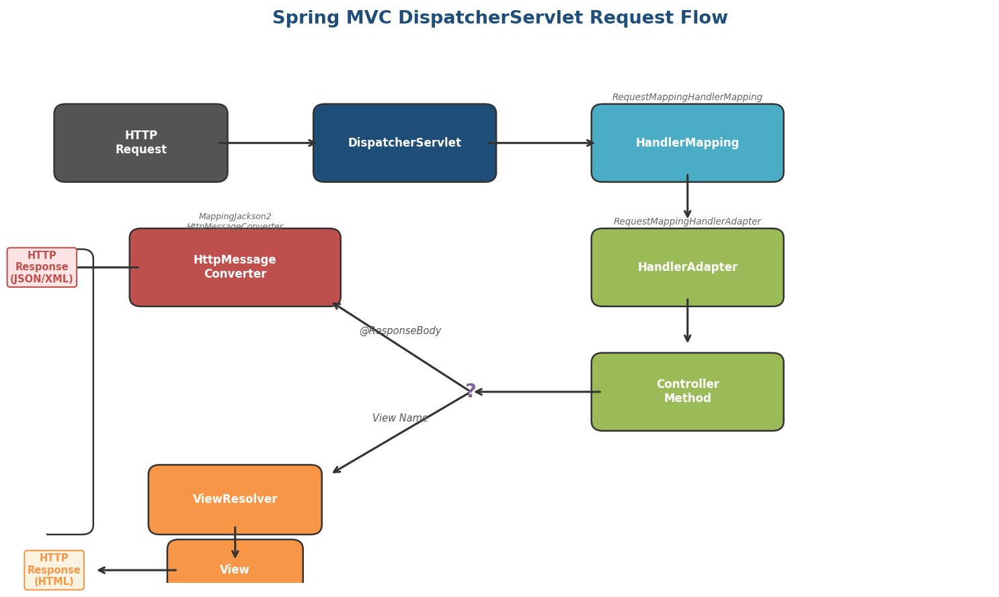

*Figure 4.1 — The complete Spring MVC request-processing pipeline, from inbound HTTP request through `DispatcherServlet`, `HandlerMapping`, and `HandlerAdapter`, branching into the `@ResponseBody` path (via `HttpMessageConverter`) and the view-resolution path (via `ViewResolver`).*

### @RestController and REST API Patterns

`@RestController` is a composed annotation combining `@Controller` and `@ResponseBody`. Every handler method in a `@RestController` class writes its return value directly to the response body. This design decision — introduced in Spring Framework 4.0 — eliminated the most common source of confusion in Spring MVC: forgetting to annotate individual methods with `@ResponseBody` and receiving an unexpected view-resolution error.

A typical REST controller illustrates the annotation-driven programming model:

```java
@RestController
@RequestMapping("/api/orders")
public class OrderController {

    private final OrderService orderService;

    public OrderController(OrderService orderService) {
        this.orderService = orderService;
    }

    @GetMapping("/{id}")
    public ResponseEntity<Order> getOrder(@PathVariable Long id) {
        return orderService.findById(id)
            .map(ResponseEntity::ok)
            .orElse(ResponseEntity.notFound().build());
    }

    @PostMapping
    public ResponseEntity<Order> createOrder(@Valid @RequestBody CreateOrderRequest request) {
        Order created = orderService.create(request);
        URI location = ServletUriComponentsBuilder.fromCurrentRequest()
            .path("/{id}").buildAndExpand(created.getId()).toUri();
        return ResponseEntity.created(location).body(created);
    }
}
```

Constructor injection, validation annotations (`@Valid`), `ResponseEntity` for fine-grained HTTP control, and `ServletUriComponentsBuilder` for URI generation are standard patterns that appear in virtually every Spring MVC application.

### Centralized Exception Handling with @ControllerAdvice

`@ControllerAdvice` (and its REST variant `@RestControllerAdvice`) enables centralized cross-controller exception handling, model attribute initialization, and data binder configuration. A global `@ExceptionHandler` method catches exceptions thrown by any controller and transforms them into structured error responses:

```java
@RestControllerAdvice
public class GlobalExceptionHandler {

    @ExceptionHandler(EntityNotFoundException.class)
    public ResponseEntity<ErrorResponse> handleNotFound(EntityNotFoundException ex) {
        return ResponseEntity.status(HttpStatus.NOT_FOUND)
            .body(new ErrorResponse("NOT_FOUND", ex.getMessage()));
    }
}
```

The scope of a `@ControllerAdvice` can be narrowed via `annotations`, `basePackages`, or `assignableTypes` attributes, enabling module-specific error handling strategies in large applications. [Spring Official Documentation](https://docs.spring.io/spring-framework/reference/web/webmvc/mvc-controller/ann-advice.html "Controller Advice")

## 4.3 Data Access — JDBC, ORM, and the Repository Abstraction

Spring's data access architecture spans three layers of abstraction: raw JDBC simplified through templates, ORM integration through JPA, and the Spring Data repository model that eliminates implementation code entirely. All three layers share a common `DataAccessException` hierarchy and the transaction infrastructure described in Section 4.4.

### JdbcTemplate and Its Variants

`JdbcTemplate` is the central class in Spring's JDBC support. It handles connection acquisition, statement creation, resource cleanup, and exception translation — the boilerplate that typically consumed 15–20 lines per query in raw JDBC code. The class is thread-safe once configured: a single instance, injected with a `DataSource`, can serve an entire DAO layer. [Spring Official Documentation](https://docs.spring.io/spring-framework/reference/data-access/jdbc/core.html "JdbcTemplate core usage")

The `RowMapper<T>` functional interface is the primary mechanism for converting `ResultSet` rows into domain objects:

```java
private final RowMapper<Actor> actorMapper = (rs, rowNum) ->
    new Actor(rs.getString("first_name"), rs.getString("last_name"));

public List<Actor> findAllActors() {
    return jdbcTemplate.query("SELECT first_name, last_name FROM t_actor", actorMapper);
}
```

For queries with named parameters rather than positional `?` placeholders, `NamedParameterJdbcTemplate` wraps `JdbcTemplate` and accepts `Map<String, ?>` or `SqlParameterSource` instances:

```java
String sql = "SELECT count(*) FROM t_actor WHERE first_name = :firstName";
SqlParameterSource params = new MapSqlParameterSource("firstName", "Joe");
int count = namedParameterJdbcTemplate.queryForObject(sql, params, Integer.class);
```

`BeanPropertySqlParameterSource` can extract named parameters directly from a JavaBean's properties, reducing parameter-binding boilerplate further.

Spring Framework 6.1 introduced `JdbcClient`, a unified fluent API combining positional and named parameter support in a single entry point:

```java
List<Actor> actors = jdbcClient.sql("SELECT first_name, last_name FROM t_actor")
    .query(Actor.class)
    .list();
```

`JdbcClient` supports automatic mapping to record classes, bean properties, or plain fields via `SimplePropertyRowMapper`, and accepts parameter source objects through `.paramSource()`. For advanced operations — batch inserts, stored procedures — `SimpleJdbcInsert`, `SimpleJdbcCall`, and direct `JdbcTemplate` usage remain available. [Spring Official Documentation](https://docs.spring.io/spring-framework/reference/data-access/jdbc/core.html "JdbcClient unified API")

### JPA Integration

Spring's JPA support centers on `LocalContainerEntityManagerFactoryBean`, which provides full control over `EntityManagerFactory` configuration in any Spring-managed environment — from embedded test containers to production web applications. It accepts a `DataSource`, an optional `persistence.xml` location, and a `JpaVendorAdapter` (typically `HibernateJpaVendorAdapter`) that supplies provider-specific defaults. [Spring Official Documentation](https://docs.spring.io/spring-framework/reference/data-access/orm/jpa.html "JPA setup options")

The `@PersistenceContext` annotation injects a shared, transaction-scoped `EntityManager` proxy. This proxy is thread-safe: it delegates each call to the `EntityManager` bound to the current transaction. Unlike the raw JPA programming model, where developers must manually create and close `EntityManager` instances, Spring's shared proxy handles lifecycle management transparently:

```java
@Repository
public class ProductRepository {

    @PersistenceContext
    private EntityManager em;

    public List<Product> findByCategory(String category) {
        return em.createQuery("SELECT p FROM Product p WHERE p.category = :cat", Product.class)
            .setParameter("cat", category)
            .getResultList();
    }
}
```

The `@Repository` annotation serves a dual purpose: it marks the class as a component eligible for classpath scanning, and it activates Spring's `PersistenceExceptionTranslationPostProcessor`, which intercepts JPA `PersistenceException` instances and translates them into the appropriate `DataAccessException` subclass — maintaining the technology-agnostic exception hierarchy across both JDBC and ORM code paths.

Spring's `JpaTransactionManager` provides local JPA transactions with capabilities typically associated with JDBC-level control: transaction-specific isolation levels, read-only optimizations, and the ability to expose the underlying JDBC `Connection` for code requiring direct access. For distributed transactions spanning multiple resources, `JtaTransactionManager` coordinates JPA persistence units alongside other XA-capable resources.

### Spring Data JPA and Repository Abstraction

Spring Data JPA builds on Spring's JPA integration to eliminate repository implementation code entirely. The developer declares an interface; Spring generates the implementation at runtime via JDK dynamic proxies.

The repository hierarchy progresses from a marker interface to full JPA capability:

- **`Repository<T, ID>`** — marker interface; declares no methods but signals the type to the Spring Data infrastructure.
- **`CrudRepository<T, ID>`** — provides `save()`, `findById()`, `findAll()`, `delete()`, `count()`, and `existsById()`.
- **`PagingAndSortingRepository<T, ID>`** — adds `findAll(Pageable)` and `findAll(Sort)`.
- **`JpaRepository<T, ID>`** — extends both, adding JPA-specific methods: `flush()`, `saveAndFlush()`, `deleteAllInBatch()`, and `getById()` (now `getReferenceById()`).

[Spring Data JPA Official Documentation](https://docs.spring.io/spring-data/jpa/reference/repositories/core-concepts.html "Repository hierarchy")

#### Query Derivation

Spring Data derives JPQL queries from method names by parsing a subject-predicate structure. The method name `findByEmailAddressAndLastname(String email, String lastname)` is parsed as: `find` (action) + `by` (delimiter) + `EmailAddress` (property) + `And` (conjunction) + `Lastname` (property). Supported keywords include `Between`, `LessThan`, `Like`, `In`, `OrderBy`, `IgnoreCase`, and nested property traversal (e.g., `findByAddress_City`, where the underscore disambiguates property boundaries).

The query resolution strategy defaults to `CREATE_IF_NOT_FOUND`: Spring first checks for a `@Query` annotation, then a named query matching `<Entity>.<methodName>`, and finally falls back to method-name derivation. For complex queries, `@Query` with JPQL or native SQL provides explicit control:

```java
public interface OrderRepository extends JpaRepository<Order, Long> {

    List<Order> findByCustomerIdAndStatusOrderByCreatedAtDesc(Long customerId, OrderStatus status);

    @Query("SELECT o FROM Order o JOIN FETCH o.items WHERE o.id = :id")
    Optional<Order> findByIdWithItems(@Param("id") Long id);
}
```

[Spring Data JPA Official Documentation](https://docs.spring.io/spring-data/jpa/reference/repositories/query-methods-details.html "Query derivation mechanism")

## 4.4 Transaction Management

### Declarative Transactions with @Transactional

Spring's declarative transaction model, introduced in Chapter 3 as the flagship application of AOP, warrants deeper examination in practice. The `@Transactional` annotation can be placed on individual methods or at the class level (applying to all public methods). Its attributes map directly to the transaction semantics that EJB once required an application server to provide.

### Propagation Semantics

Spring defines seven propagation levels that control how a transactional method interacts with an existing transaction context:

| Propagation | Behavior |
|---|---|
| `REQUIRED` (default) | Joins the existing transaction; creates a new one if none exists. |
| `REQUIRES_NEW` | Always creates a new physical transaction, suspending any existing outer transaction. |
| `NESTED` | Executes within a savepoint of the current transaction (single physical transaction with JDBC savepoints). |
| `SUPPORTS` | Joins an existing transaction if present; otherwise executes non-transactionally. |
| `NOT_SUPPORTED` | Suspends any existing transaction and executes non-transactionally. |
| `MANDATORY` | Requires an existing transaction; throws `IllegalTransactionStateException` if none exists. |
| `NEVER` | Throws an exception if a transaction exists. |

[Spring Official Documentation](https://docs.spring.io/spring-framework/reference/data-access/transaction/declarative/tx-propagation.html "Transaction Propagation")

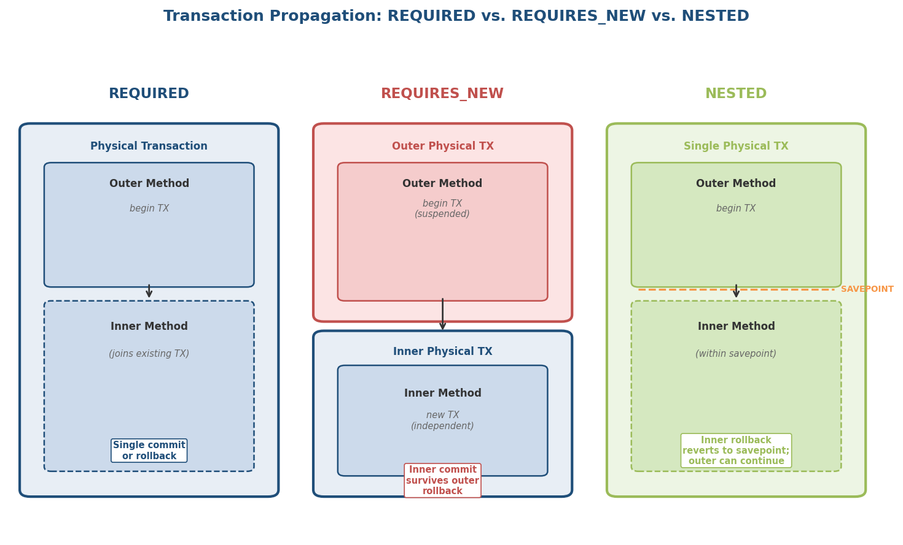

*Figure 4.2 — Comparison of the three most consequential propagation modes. `REQUIRED` joins a single physical transaction; `REQUIRES_NEW` creates an independent transaction (inner commit survives outer rollback); `NESTED` uses a JDBC savepoint within one physical transaction, allowing partial rollback without abandoning the outer operation.*

The distinction between `REQUIRES_NEW` and `NESTED` is subtle but consequential. `REQUIRES_NEW` creates an independent physical transaction — if the inner transaction commits but the outer transaction subsequently rolls back, the inner commit stands. `NESTED` operates within the same physical transaction using a savepoint: if the inner operation fails, only the savepoint is rolled back, preserving the outer transaction's ability to continue. If the outer transaction rolls back, the nested changes are rolled back as well.

### Isolation Levels

Spring exposes five isolation settings through `@Transactional(isolation = ...)`: `DEFAULT` (delegates to the database's configured level), `READ_UNCOMMITTED`, `READ_COMMITTED`, `REPEATABLE_READ`, and `SERIALIZABLE`. The isolation attribute is meaningful only for `REQUIRED` and `REQUIRES_NEW` propagation — when a method participates in an existing transaction (e.g., through `REQUIRED`), the existing transaction's isolation level governs. By default, Spring silently ignores a locally declared isolation level in this scenario. Setting `validateExistingTransactions = true` on the transaction manager causes Spring to reject mismatched isolation levels with an exception. [Spring Official Documentation](https://docs.spring.io/spring-framework/reference/data-access/transaction/declarative/annotations.html "@Transactional settings")

### Rollback Rules

The default rollback policy — rollback on `RuntimeException` and `Error`, commit on checked exceptions — is the single most common source of transaction-related bugs in Spring applications. A `catch` block that converts a checked exception into a domain-specific checked exception causes the transaction to commit even when the business operation has logically failed. Spring Framework 6.2 introduced the ability to configure `rollbackOn = ALL_EXCEPTIONS` globally, addressing this long-standing design tension. Per-method configuration remains available through `rollbackFor` and `noRollbackFor` attributes.

### The Self-Invocation Trap

Because `@Transactional` is implemented through AOP proxies, a method call from within the same class bypasses the proxy and the transactional advice never applies. This is not a Spring bug but an inherent limitation of proxy-based AOP. Established workarounds include: (a) extracting the transactional method into a separate bean, (b) injecting the bean into itself via `@Lazy` self-injection, or (c) switching to AspectJ load-time or compile-time weaving (configured via `@EnableTransactionManagement(mode = AdviceMode.ASPECTJ)`).

## 4.5 Spring Security Fundamentals

### The Filter Chain Architecture

Spring Security operates as a chain of Servlet `Filter` instances inserted into the standard Servlet `FilterChain` via a bridging mechanism. Three components establish this bridge:

1. **`DelegatingFilterProxy`** — a standard Servlet `Filter` registered in the Servlet container (or auto-configured by Spring Boot). It delegates to a Spring-managed bean, decoupling the filter's lifecycle from the Servlet container's lifecycle.

2. **`FilterChainProxy`** — the Spring bean to which `DelegatingFilterProxy` delegates. It holds one or more `SecurityFilterChain` instances and dispatches each request to the first chain whose `RequestMatcher` matches. `FilterChainProxy` also applies `HttpFirewall` protections (rejecting malformed requests) and provides a single point for security debugging.

3. **`SecurityFilterChain`** — an ordered list of security filters. Each filter addresses a specific concern: `CsrfFilter` (CSRF token validation), `BasicAuthenticationFilter` (HTTP Basic), `UsernamePasswordAuthenticationFilter` (form login), `BearerTokenAuthenticationFilter` (OAuth2/JWT), `AuthorizationFilter` (URL-level access control), among others.

[Spring Security Official Documentation](https://docs.spring.io/spring-security/reference/servlet/architecture.html "Architecture – FilterChain, DelegatingFilterProxy, FilterChainProxy, SecurityFilterChain")

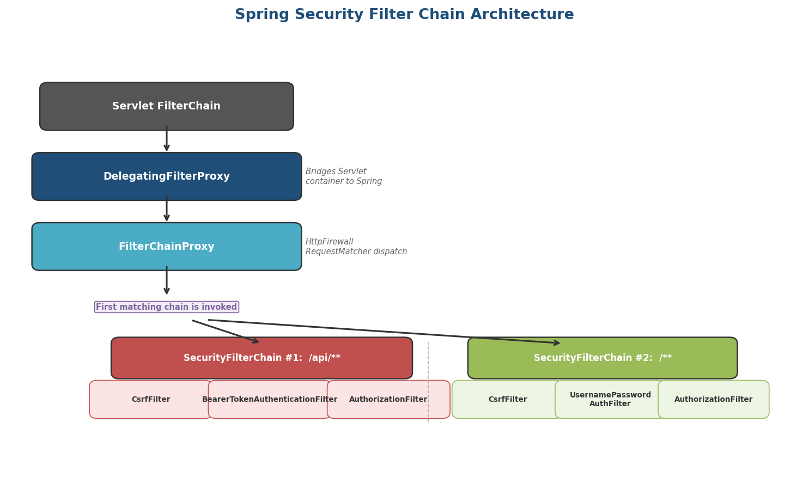

*Figure 4.3 — The Spring Security filter chain delegation hierarchy. `DelegatingFilterProxy` bridges the Servlet container to Spring; `FilterChainProxy` dispatches to the first matching `SecurityFilterChain`. The diagram illustrates a common dual-chain configuration: one chain for `/api/**` with token-based authentication, another for `/**` with form-login filters.*

Multiple `SecurityFilterChain` beans can coexist — for example, one chain matching `/api/**` with stateless JWT authentication and another matching all other paths with session-based form login. Only the first matching chain processes each request.

### Authentication Architecture

The authentication subsystem follows a delegation pattern:

- **`AuthenticationManager`** defines the single method `authenticate(Authentication)`. Its most common implementation, **`ProviderManager`**, maintains an ordered list of `AuthenticationProvider` instances and delegates to each in sequence until one succeeds or all fail.
- **`DaoAuthenticationProvider`** handles username/password authentication by loading user details through a **`UserDetailsService`** — an interface with a single method, `loadUserByUsername(String)`, returning a `UserDetails` object containing the username, encoded password, granted authorities, and account status flags.
- The authenticated `Authentication` object is stored in the **`SecurityContextHolder`**, which uses `ThreadLocal` storage by default. This makes the authenticated principal accessible from anywhere within the request-processing thread.

[Spring Security Official Documentation](https://docs.spring.io/spring-security/reference/servlet/authentication/architecture.html "AuthenticationManager, ProviderManager chain")

### Method-Level Security

URL-based security rules (configured via `SecurityFilterChain`) protect HTTP endpoints. Method-level security protects individual service-layer methods regardless of invocation context. `@EnableMethodSecurity` (replacing the deprecated `@EnableGlobalMethodSecurity`) activates annotation-driven method authorization:

```java
@Service
public class DocumentService {

    @PreAuthorize("hasRole('ADMIN') or #document.ownerId == authentication.name")
    public void delete(Document document) {
        // ...
    }
}
```

The `@PreAuthorize` annotation accepts SpEL expressions evaluated by `PreAuthorizeAuthorizationManager`, invoked through a Spring AOP `MethodInterceptor` (`AuthorizationManagerBeforeMethodInterceptor`). Because the implementation is AOP-based, method security shares the same self-invocation limitation as `@Transactional`. `@PostAuthorize`, `@PreFilter`, and `@PostFilter` provide post-invocation and collection-filtering capabilities. Custom meta-annotations (e.g., `@IsAdmin` wrapping `@PreAuthorize("hasRole('ADMIN')")`) reduce duplication in authorization rule declarations. [Spring Security Official Documentation](https://docs.spring.io/spring-security/reference/servlet/authorization/method-security.html "Method Security")

Spring Boot's `spring-boot-starter-security` auto-configures a default `SecurityFilterChain` with form login, CSRF protection, and a generated password, but does *not* activate method-level security by default. Developers must explicitly add `@EnableMethodSecurity` to opt in.

---

The modules examined in this chapter — the container lifecycle, Spring MVC's request pipeline, the JDBC/JPA data access stack, declarative transactions, and the security filter chain — constitute the operational core of every Spring application. Mastery of these modules is a prerequisite, not an option. Yet configuring them by hand — declaring `DataSource` beans, wiring `EntityManagerFactory`, registering `DispatcherServlet`, assembling security filter chains — still demands significant assembly work. Chapter 5 examines how Spring Boot resolves this remaining friction through auto-configuration, starter dependencies, and embedded servers, transforming the act of building a Spring application from assembly into declaration.

# 第5章 Spring Boot — Convention Over Configuration and Production Readiness

The modules examined in Chapter 4 — the IoC container, Spring MVC, data access abstractions, declarative transactions, and Spring Security — constitute a powerful and cohesive programming model. Yet assembling them into a running application still demanded substantial ceremony: declaring a `DataSource` bean, wiring a `LocalContainerEntityManagerFactoryBean`, registering `DispatcherServlet` in a `web.xml` or `WebApplicationInitializer`, reconciling transitive dependency versions across dozens of JARs, building a `.war` archive, and deploying it to an external Servlet container. A developer who had already chosen Spring MVC, Hibernate, and Tomcat was spending hours on infrastructure plumbing that contributed no business value. Spring Boot arose from a single observation: if the framework knows what you chose, it should configure itself.

## 5.1 The Problem Spring Boot Solved

### The Friction Inventory

In October 2012, community member Mike Youngstrom filed a feature request against the Spring Framework — [SPR-9888](https://github.com/spring-projects/spring-framework/issues/14521 "Improved support for containerless web application architectures") — that catalogued the remaining friction with precision. The request called for embedding Servlet container configuration directly into Spring's component model and enumerated seven specific pain points:

1. **`web.xml` ceremony** — even annotation-driven applications required deployment descriptor knowledge for listener and filter registration.
2. **WAR directory structure** — developers needed to learn a packaging layout dictated by the Servlet specification, not by their application's domain.
3. **Container-specific configuration** — port numbers, thread pool sizes, and connector settings lived outside the application, in container-proprietary XML files.
4. **Complex classloader hierarchies** — application servers imposed parent-child classloader chains that produced inscrutable `ClassNotFoundException` and `NoSuchMethodError` failures when library versions collided.
5. **External monitoring and management** — health checks, metrics, and environment inspection required container-specific tooling (JMX consoles, admin ports) rather than application-level endpoints.
6. **Container-specific logging** — each container maintained its own logging configuration that could conflict with the application's logging framework.
7. **Application context root configuration** — mapping a web application to a URL path was a deployment concern, not an application concern.

Youngstrom explicitly cited DropWizard — an opinionated Java framework by Coda Hale that embedded Jetty and bundled Jackson, Jersey, and Metrics into a single runnable JAR — as evidence that containerless deployment was not merely feasible but already running in production at companies such as Yammer.

These seven friction points shared a common root: the Spring Framework provided the programming model but left deployment, packaging, dependency management, and operational infrastructure to the developer. Spring Boot was conceived to close that gap.

### From Request to Release

Phil Webb led the project through 18 months of development. Spring Boot 1.0 GA shipped on April 1, 2014, representing 1,720 commits from 54 contributors with 549 issues resolved. Webb characterized the project as an "ultralight container, great for application or service deployment in the cloud." [Spring Blog](https://spring.io/blog/2014/04/01/spring-boot-1-0-ga-released "Phil Webb, April 1 2014")

The design philosophy rested on three pillars: **opinionated defaults** (sensible configuration for the common case, overridable for the uncommon), **auto-configuration** (detect what is on the classpath and configure it automatically), and **embedded servers** (the application contains the server, not the reverse). Every subsequent feature — Starter POMs, Actuator endpoints, externalized configuration, profiles — served one or more of these pillars.

## 5.2 Auto-Configuration — The Conditional Wiring Engine

### The @SpringBootApplication Entry Point

A Spring Boot application begins with a single annotated class:

```java
@SpringBootApplication
public class OrderServiceApplication {
    public static void main(String[] args) {
        SpringApplication.run(OrderServiceApplication.class, args);
    }
}
```

`@SpringBootApplication` is a composed meta-annotation combining three annotations: `@EnableAutoConfiguration` (activates the auto-configuration machinery), `@ComponentScan` (scans the package of the annotated class and its sub-packages), and `@SpringBootConfiguration` (a `@Configuration` variant that supports test configuration discovery). [Spring Boot Official Documentation](https://docs.spring.io/spring-boot/reference/using/using-the-springbootapplication-annotation.html "@SpringBootApplication")

This single class replaces the combination of `web.xml`, `WebApplicationInitializer`, infrastructure `@Configuration` classes, and the `main()` bootstrap code that a pre-Boot Spring application required.

### How Auto-Configuration Works

Auto-configuration classes are standard `@Configuration` classes annotated with `@AutoConfiguration` and discovered through a dedicated registration file: `META-INF/spring/org.springframework.boot.autoconfigure.AutoConfiguration.imports`. Each line in this file lists the fully qualified name of an auto-configuration class. This discovery mechanism replaced the earlier `spring.factories` approach — deprecated in Spring Boot 2.7 and fully removed in 3.0. [Spring Boot Official Documentation](https://docs.spring.io/spring-boot/reference/features/developing-auto-configuration.html "Auto-configuration mechanism and Condition Annotations")

The essential insight is that auto-configuration classes are *conditional*. They do not blindly register beans; instead, they use a family of condition annotations to gate their activation:

| Condition Annotation | Activation Trigger |
|---|---|
| `@ConditionalOnClass` | A specified class is present on the classpath. |
| `@ConditionalOnMissingClass` | A specified class is absent from the classpath. |
| `@ConditionalOnBean` | A bean of a specified type already exists in the context. |
| `@ConditionalOnMissingBean` | No bean of a specified type exists — the critical "back off" mechanism. |
| `@ConditionalOnProperty` | A configuration property has a specific value. |
| `@ConditionalOnWebApplication` | The application is a web application (Servlet or Reactive). |

The `@ConditionalOnMissingBean` annotation is the cornerstone of Spring Boot's "opinionated but not dogmatic" contract. Consider `DataSourceAutoConfiguration`: if HikariCP is on the classpath (`@ConditionalOnClass(HikariDataSource.class)`) and the developer has not defined a `DataSource` bean (`@ConditionalOnMissingBean(DataSource.class)`), Spring Boot creates a `HikariDataSource` configured from `spring.datasource.*` properties. The moment a developer declares their own `DataSource` `@Bean` method, the auto-configuration backs off silently. No conflict, no override — the developer's explicit intent always wins.

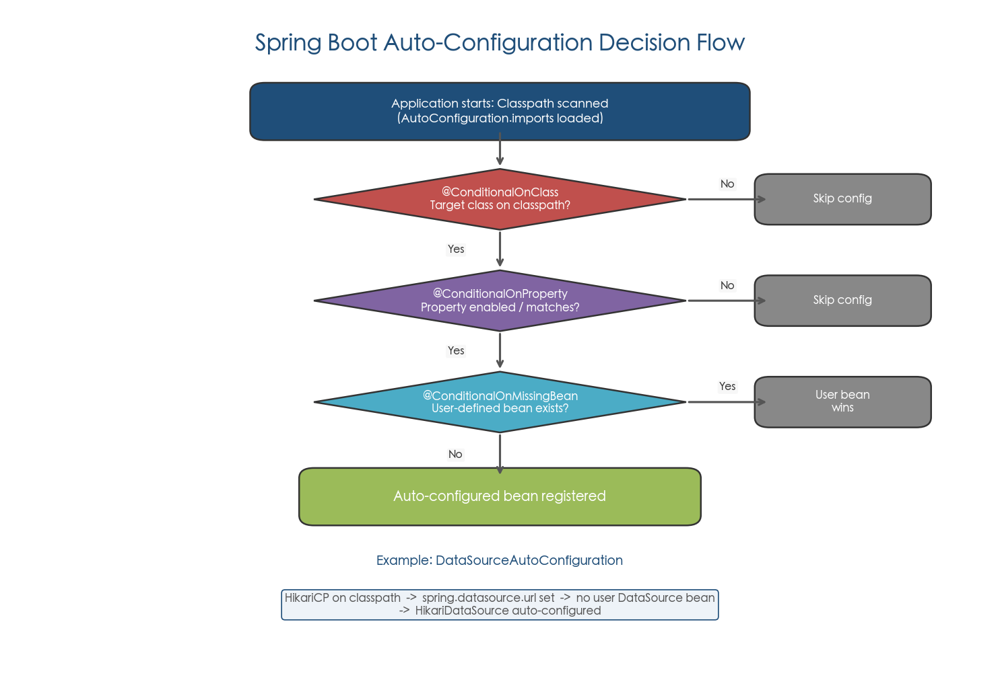

*Figure 5-1. The conditional evaluation sequence that governs auto-configuration. Each auto-configuration class passes through classpath, property, and bean-existence checks before registering its default beans. A user-defined bean causes the corresponding auto-configuration to back off.*

This pattern repeats across the entire auto-configuration surface: `JacksonAutoConfiguration` backs off if a custom `ObjectMapper` exists; `SecurityAutoConfiguration` backs off if a custom `SecurityFilterChain` is defined; `JpaRepositoriesAutoConfiguration` backs off if repositories are already configured. Developers can inspect which auto-configurations fired and which backed off by enabling the `conditions` Actuator endpoint or launching the application with `--debug`.

### Tracing Auto-Configuration to Prior Pain

Every auto-configuration class resolves a specific burden inherited from the pre-Boot era:

- **`DataSourceAutoConfiguration`** eliminates the manual `DataSource` bean definition — connection URL, pool sizing, driver class — that every Spring application previously required.
- **`HibernateJpaAutoConfiguration`** replaces the verbose `LocalContainerEntityManagerFactoryBean` + `JpaTransactionManager` + `JpaVendorAdapter` wiring described in Chapter 4.
- **`DispatcherServletAutoConfiguration`** registers `DispatcherServlet` and its `ServletRegistrationBean`, supplanting `web.xml` servlet mappings or the programmatic `WebApplicationInitializer`.
- **`JacksonAutoConfiguration`** configures an `ObjectMapper` with sensible defaults (ISO-8601 dates, no serialization of null fields), eliminating per-project Jackson configuration boilerplate.
- **`SecurityAutoConfiguration`** provides a default `SecurityFilterChain` with form login, CSRF protection, and a generated password — a secure starting point that Chapter 4's manual filter chain assembly required dozens of lines to achieve.

## 5.3 Starter POMs — Curated Dependency Sets

### The Version Collision Problem

Before Spring Boot, a developer adding Spring MVC, Jackson, Hibernate, and an embedded Tomcat to a Maven project confronted a combinatorial version-compatibility problem. Spring MVC 4.3.x required Jackson 2.8.x but not 2.9.x; Hibernate 5.2.x worked with Spring 4.3.x but Hibernate 5.3.x required Spring 5.0.x; Tomcat 8.5 supported Servlet 3.1 while Tomcat 9.0 demanded Servlet 4.0. Resolving these constraints consumed hours and produced fragile `pom.xml` files where a single version bump could cascade into runtime failures.

### How Starters Work

A Spring Boot starter is, architecturally, an empty JAR — it contains no code of its own. Its sole purpose is to aggregate a curated, tested set of transitive dependencies for a given technology. The naming convention distinguishes official starters (`spring-boot-starter-*`) from third-party starters (`<technology>-spring-boot-starter`).

All starters depend, directly or transitively, on the core `spring-boot-starter`, which provides auto-configuration support, Logback logging, and YAML configuration parsing. Each technology-specific starter then layers the appropriate libraries:

- **`spring-boot-starter-web`** pulls in Spring MVC, Jackson for JSON serialization, embedded Apache Tomcat, and the core starter — everything needed for a REST API in a single dependency declaration.
- **`spring-boot-starter-data-jpa`** adds Spring Data JPA, Hibernate (as the JPA provider), HikariCP (as the connection pool), and the Spring JDBC module.
- **`spring-boot-starter-security`** brings Spring Security's web and configuration modules along with the auto-configuration that wires a default `SecurityFilterChain`.

The `spring-boot-dependencies` BOM (Bill of Materials), inherited through `spring-boot-starter-parent` or imported directly, pins exact versions for over 400 third-party libraries. When a developer declares `spring-boot-starter-web`, they receive not only the correct Spring MVC version but also the specific Jackson, Tomcat, and SnakeYAML versions that the Spring Boot team has integration-tested. Version management disappears from the developer's responsibility.

### Spring Initializr — Project Scaffolding at Scale

Spring Initializr ([start.spring.io](https://start.spring.io "Spring Initializr project generator")) provides a web-based, IDE-integrated, and CLI-accessible project generator that assembles a pre-configured Spring Boot project from selected starters, build tool, and language options. By October 2015, the service was generating approximately 50,000 projects per month. Usage data from that period reveals the ecosystem's center of gravity: 98% of generated projects targeted Java, 80% used Maven (20% Gradle), 82% selected Java 8, and 83% chose JAR packaging over WAR. The most popular starters were `spring-boot-starter-web` (63%), `spring-boot-starter-data-jpa` (25%), `spring-boot-starter-security` (21%), and the MySQL connector (19%). [Spring Blog](https://spring.io/blog/2015/10/06/evolving-spring-initializr "October 2015 usage statistics")

The 83% JAR packaging figure is particularly revealing. By late 2015, the majority of new Spring projects had already abandoned WAR deployment — a structural shift driven directly by Spring Boot's embedded server model.

## 5.4 Embedded Servers and the Fat JAR

### Inverting the Deployment Model

The traditional Java web deployment model required the developer to package an application as a `.war` file and deploy it into an external application server — Tomcat, Jetty, WebLogic, or WebSphere. The server owned the process, the classloader hierarchy, and the lifecycle. Spring Boot inverts this relationship: the application owns the server. An embedded HTTP server starts as a library inside the application's JVM process, configured through the same `application.properties` or `application.yml` that governs everything else.

Spring Boot supports four embedded servers:

- **Apache Tomcat** — the default for Servlet-based applications (`spring-boot-starter-web`).
- **Eclipse Jetty** — selectable by excluding Tomcat and adding `spring-boot-starter-jetty`.
- **JBoss Undertow** — selectable similarly via `spring-boot-starter-undertow`.
- **Netty** — the default for reactive applications using Spring WebFlux (`spring-boot-starter-webflux`).

Server properties — port (`server.port`), context path (`server.servlet.context-path`), thread pool sizes (`server.tomcat.threads.max`), SSL certificates (`server.ssl.*`) — are externalized as standard Spring Boot configuration properties, eliminating the container-specific configuration files that SPR-9888 identified as friction point #3.

### The Executable JAR

The `spring-boot-maven-plugin` (and its Gradle equivalent) produces an executable "fat JAR" — a single archive containing the application's compiled classes, all transitive dependency JARs (nested, not shaded), and the embedded server. Execution reduces to a single command:

```bash
java -jar order-service-1.0.0.jar
```

This command launches the embedded Tomcat (or Jetty, Undertow, Netty), initializes the Spring `ApplicationContext`, triggers auto-configuration, and begins serving requests — typically within 2–5 seconds on modern hardware. No external server installation, no `.war` deployment, no application server administration console. The deployment unit is the JAR; the deployment target is any machine with a JVM.

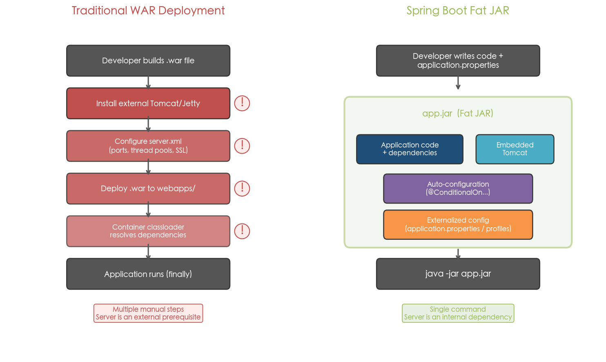

*Figure 5-2. Traditional WAR deployment requires multiple manual steps — installing an external server, editing proprietary configuration files, and deploying into a container-managed directory. The Spring Boot fat JAR model collapses this into a single self-contained archive launched with `java -jar`.*

The fat JAR model aligns directly with cloud-native deployment patterns. Container orchestrators such as Kubernetes and Docker expect a single executable process with externalized configuration. A Spring Boot fat JAR running as `java -jar app.jar` maps naturally to a Docker `ENTRYPOINT`, accepting configuration through environment variables that Spring Boot's externalized configuration system resolves automatically.

## 5.5 Production-Ready Features

### Actuator — Operational Visibility

Spring Boot Actuator addresses friction point #5 from SPR-9888 — the absence of application-level monitoring and management. Actuator exposes a set of HTTP endpoints (base path `/actuator`) that provide operational insight into a running application without custom code:

| Endpoint | Purpose |
|---|---|
| `/actuator/health` | Application health status; supports Kubernetes liveness and readiness probes via `livenessState` and `readinessState` health groups. |
| `/actuator/metrics` | Dimensional metrics (HTTP request latency, JVM memory, connection pool usage) powered by Micrometer. |
| `/actuator/env` | All `PropertySource` entries and their origins, with sensitive values masked. |
| `/actuator/beans` | Complete listing of every bean in the `ApplicationContext` with scope, type, and dependencies. |
| `/actuator/conditions` | Auto-configuration evaluation report — which conditions matched and which did not. |
| `/actuator/configprops` | All `@ConfigurationProperties` beans with their bound values. |
| `/actuator/loggers` | View and dynamically modify log levels at runtime without restarting. |
| `/actuator/mappings` | All `@RequestMapping` paths and their handler methods. |
| `/actuator/threaddump` | Current thread dump for diagnosing deadlocks and contention. |
| `/actuator/heapdump` | On-demand heap dump download for memory analysis. |
| `/actuator/prometheus` | Metrics in Prometheus exposition format for scraping. |

By default, only the `health` endpoint is exposed over HTTP — a secure-by-default posture. Developers opt in to additional endpoints through `management.endpoints.web.exposure.include`. The `shutdown` endpoint (graceful application termination via HTTP POST) exists but is disabled by default. [Spring Boot Official Documentation](https://docs.spring.io/spring-boot/reference/actuator/endpoints.html "Actuator Endpoints")

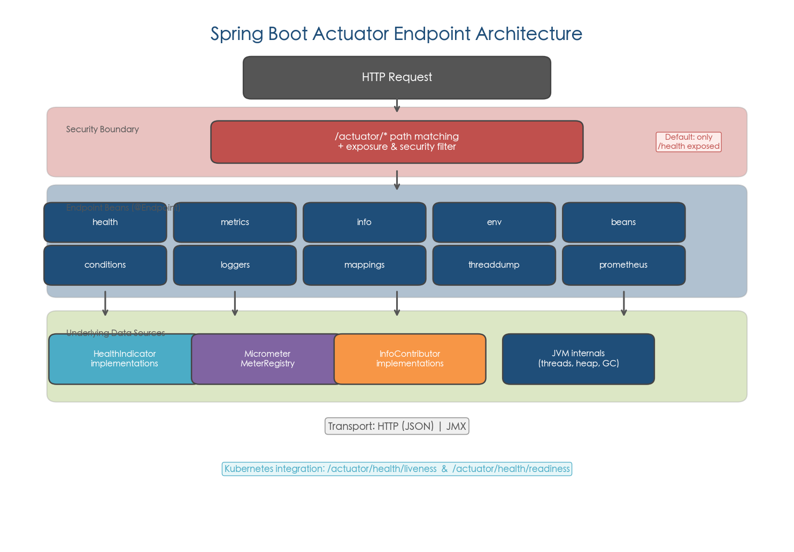

*Figure 5-3. The Actuator endpoint architecture. HTTP requests pass through a security boundary that filters path matching and endpoint exposure. Each endpoint bean draws from underlying data sources — `HealthIndicator` implementations, Micrometer's `MeterRegistry`, `InfoContributor` instances, and JVM internals. Transport options include HTTP (JSON) and JMX, with dedicated Kubernetes integration paths for liveness and readiness probes.*

Each Actuator endpoint maps to a pre-Boot operational burden. Before Actuator, checking application health required custom endpoints or JMX configuration; inspecting bean wiring required attaching a debugger; changing log levels required a restart. Actuator consolidates these operational needs into a standardized, secure, auto-configured surface.

### Externalized Configuration — The Property Hierarchy

Spring Boot's externalized configuration system extends Spring Framework's `PropertySource` abstraction into a multi-level priority hierarchy. Properties defined at higher-priority sources override those at lower-priority sources. The ordering, from lowest to highest priority, includes:

1. Default properties (`SpringApplication.setDefaultProperties`)
2. `@PropertySource` annotations on `@Configuration` classes
3. Config data files (`application.properties` / `application.yml`) inside the JAR
4. Config data files outside the JAR
5. Profile-specific config data (`application-{profile}.properties`) inside the JAR
6. Profile-specific config data outside the JAR
7. OS environment variables
8. Java system properties (`-Dkey=value`)
9. Command-line arguments (`--key=value`)
10. Test properties (`@TestPropertySource`, `@SpringBootTest` properties)

This hierarchy enables the same application binary to run in development (with `application-dev.properties`), staging (with environment variables injected by a deployment pipeline), and production (with Kubernetes ConfigMaps mapped to environment variables) — without rebuilding. [Spring Boot Official Documentation](https://docs.spring.io/spring-boot/reference/features/external-config.html "Externalized Configuration")

### @ConfigurationProperties — Type-Safe Binding

While `@Value("${property.name}")` injects individual properties, `@ConfigurationProperties` binds an entire property namespace to a structured Java object:

```java
@ConfigurationProperties(prefix = "order.service")
public class OrderServiceProperties {
    private Duration timeout = Duration.ofSeconds(30);
    private int maxRetries = 3;
    private final Pool pool = new Pool();

    // getters, setters

    public static class Pool {
        private int minIdle = 5;
        private int maxActive = 20;
        // getters, setters
    }
}
```

Spring Boot's relaxed binding rules map `order.service.max-retries`, `ORDER_SERVICE_MAXRETRIES`, and `order.service.maxRetries` to the same field — bridging the naming conventions of properties files, environment variables, and Java fields. Constructor binding (`@ConstructorBinding` or, since Boot 3.0, any single-constructor class) supports immutable configuration objects, eliminating setter methods entirely.

### Profiles — Environment-Specific Behavior

Spring profiles, inherited from the core Framework, gain operational power in Spring Boot. Activating a profile (`spring.profiles.active=prod`) causes Spring Boot to load `application-prod.properties` (or `.yml`) in addition to the base `application.properties`, with profile-specific values taking precedence. Profiles can also conditionally activate beans (`@Profile("prod")`) and entire auto-configuration classes.

The combination of profiles, externalized configuration, and the fat JAR produces a deployment model where a single build artifact serves all environments. The artifact is immutable; behavior varies exclusively through configuration injection — a principle central to twelve-factor application design.

## 5.6 Version Evolution — From 1.0 to the Jakarta EE Frontier

Spring Boot's release cadence has delivered major versions approximately every 3–4 years, each aligned with a corresponding Spring Framework generation:

| Version | Release Date | Key Themes |
|---|---|---|
| 1.0 | 2014-04-01 | Auto-configuration, Starter POMs, embedded Tomcat, Actuator. |
| 1.1 | 2014-06-10 | Template engine support, metrics, `@EntityScan`. |
| 2.0 | [2018-03-01](https://spring.io/blog/2018/03/01/spring-boot-2-0-goes-ga "Spring Boot 2.0 GA") | Spring Framework 5.0 baseline, Java 8 minimum, WebFlux reactive stack, Micrometer metrics, redesigned Actuator. |
| 2.7 | [2022-05-19](https://spring.io/blog/2022/05/19/spring-boot-2-7-0-available-now "Spring Boot 2.7") | Auto-configuration migration to `.imports` file; last 2.x feature release. |
| 3.0 | [2022-11-24](https://spring.io/blog/2022/11/24/spring-boot-3-0-goes-ga "Spring Boot 3.0 GA") | Java 17 baseline, Jakarta EE 10, GraalVM native image support, Micrometer Tracing. |
| 3.2 | 2023-11-23 | Virtual thread support (`spring.threads.virtual.enabled`), SSL bundle abstraction. |
| 3.5 | [2025-05-22](https://spring.io/blog/2025/05/22/spring-boot-3-5-0-available-now "Spring Boot 3.5 GA") | Last 3.x feature release. |

Spring Boot 2.0 represented the first major generational shift. Built on Spring Framework 5.0, it introduced the reactive programming model through WebFlux, replaced the custom metrics system with Micrometer — a vendor-neutral metrics facade supporting Prometheus, Datadog, New Relic, and other backends — and completely redesigned the Actuator endpoint architecture around a technology-agnostic model supporting both HTTP and JMX transports. [Spring Blog](https://spring.io/blog/2018/03/01/spring-boot-2-0-goes-ga "Spring Boot 2.0 GA release announcement")

Spring Boot 3.0 marked the second generational shift, and the more disruptive one. The Java 17 baseline and Jakarta EE 10 requirement forced the `javax.*` → `jakarta.*` namespace migration across every import statement, annotation, and third-party dependency. GraalVM native image support, previously experimental through the separate Spring Native project, became a first-class feature integrated into the core build plugins. These changes — examined in detail in Chapter 6 — positioned Spring Boot for cloud-native, container-first deployment patterns where startup time and memory footprint directly affect operational cost.

---

The trajectory from SPR-9888 to Spring Boot 3.x traces a consistent theme: each release removed a layer of friction separating a developer's intent from a running application. Auto-configuration eliminated manual bean wiring. Starters eliminated dependency version management. Embedded servers eliminated external container deployment. Actuator eliminated custom operational tooling. Externalized configuration eliminated environment-specific builds. Yet the framework's ambitions have expanded beyond developer productivity into production infrastructure concerns — native compilation, observability, and the JVM's own threading model. Chapter 6 examines these frontier capabilities: the Jakarta EE namespace migration, GraalVM native images, virtual threads, and the reactive stack that define the modern Spring ecosystem.

# 第6章 The Modern Spring Ecosystem — Spring Boot 3.x and Beyond

The evolutionary arc traced through the preceding chapters — from raw Servlets, through J2EE's heavyweight ambitions, into the Spring Framework's POJO revolution, and on to Spring Boot's opinionated productivity — converges in the current generation of the Spring platform. Spring Boot 3.x and Spring Framework 6.x represent the most consequential generational shift since the framework's founding: a simultaneous migration to the Jakarta EE namespace, first-class support for GraalVM native images, integration with JDK 21's virtual threads, and continued maturation of the reactive programming model. This chapter surveys the state and forward trajectory of the Spring ecosystem as of early 2026, placing each modernization initiative in the context of the specific friction point it addresses — namespace governance, cloud-native deployment economics, thread scalability, and streaming data semantics respectively.

## 6.1 Spring Boot 3.x and the Jakarta EE Migration

### A New Generation

Spring Boot 3.0 GA arrived on November 24, 2022 — 4.5 years after the 2.0 release (March 1, 2018). The release encompassed over 5,700 commits from 151 contributors and introduced four headline changes: a Java 17 baseline, Jakarta EE 10 compatibility (with EE 9 as the minimum), production-grade GraalVM native image support replacing the experimental Spring Native project, and enhanced observability through Micrometer and Micrometer Tracing. [Spring Boot 3.0 GA announcement](https://spring.io/blog/2022/11/24/spring-boot-3-0-goes-ga "Phil Webb, November 24 2022")

Spring Framework 6.0 GA preceded Boot 3.0 by eight days, shipping on November 16, 2022. Juergen Hoeller characterized it as "the start of a new framework generation for 2023 and beyond," establishing the Java 17+ baseline, the `jakarta` namespace, and the AOT transformation infrastructure upon which Boot 3.x builds. [Spring Framework 6.0 GA announcement](https://spring.io/blog/2022/11/16/spring-framework-6-0-goes-ga "Juergen Hoeller, November 16 2022")

### The javax-to-jakarta Namespace Shift

The most immediately visible change for developers upgrading to Spring Boot 3.x is the Jakarta EE namespace migration. When the Java EE platform transferred from Oracle to the Eclipse Foundation in 2017, the resulting project — Jakarta EE — could not retain the `javax.*` package prefix due to trademark restrictions. Jakarta EE 9, whose release review ballot closed on November 20, 2020, performed a wholesale rename from `javax.*` to `jakarta.*` while maintaining functional equivalence with Java EE 8. [Jakarta EE 9 specification](https://jakarta.ee/specifications/platform/9/ "Eclipse Foundation")

Jakarta EE 10, with its release review ballot on September 13, 2022, became the first functionally distinct release under the `jakarta.*` namespace. It set a Java SE 11 minimum baseline and removed deprecated legacy technologies including Entity Beans, embedded EJB containers, and applet support. [Jakarta EE 10 specification](https://jakarta.ee/specifications/platform/10/ "Eclipse Foundation")

For Spring Boot users, the migration is non-negotiable: Spring Boot 3.0 and Spring Framework 6.0 require the `jakarta.*` namespace with no backward compatibility for `javax.*` APIs. In practical terms, every `import javax.servlet.http.HttpServletRequest` becomes `import jakarta.servlet.http.HttpServletRequest`; every `@javax.persistence.Entity` becomes `@jakarta.persistence.Entity`. Third-party libraries must also provide Jakarta EE-compatible releases, making the migration a coordination exercise across the entire dependency graph. The payoff is a clean break from legacy baggage: the EE platform evolves freely under community governance, and Spring applications align with the long-term specification trajectory.

### Version Cadence: From 3.0 to 3.5

Following 3.0, the Spring Boot team adopted a rapid cadence of feature releases: 3.1 (May 18, 2023), 3.2 (November 23, 2023), 3.3 (May 23, 2024), 3.4 (November 21, 2024), and 3.5 (May 22, 2025). [Spring Boot 3.5 GA announcement](https://spring.io/blog/2025/05/22/spring-boot-3-5-0-available-now "Spring Boot 3.5 GA") Each release brought incremental capability: 3.2 delivered virtual thread support (Section 6.3), 3.3 expanded CRaC checkpoint/restore integration, and 3.4 refined observability and configuration property binding. This roughly six-month cadence — alternating between November and May releases — reflects a commitment to continuous delivery without the multi-year gaps that characterized earlier major transitions.

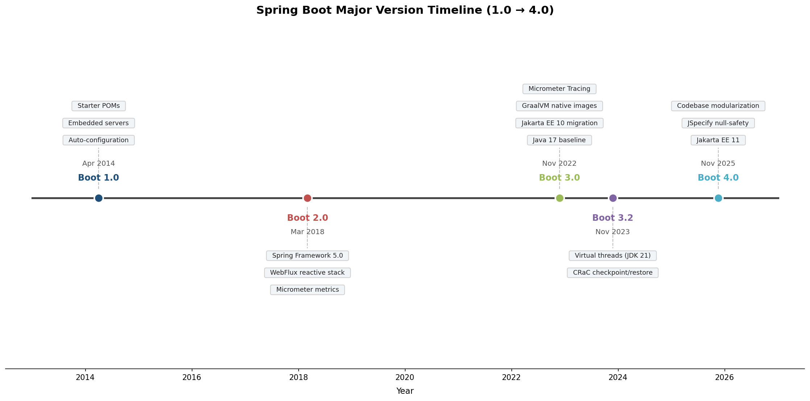

## 6.2 GraalVM Native Images and AOT Processing

### The Cloud-Native Imperative

Traditional JVM applications carry an inherent startup cost: class loading, bytecode verification, JIT compilation warm-up, and framework initialization. For long-running server processes, this overhead amortizes over hours or days of execution. But the container orchestration patterns that define cloud-native deployments — auto-scaling, serverless functions, rolling restarts — elevate startup time and baseline memory consumption to first-class concerns. A cold-starting Spring Boot application that requires 5–10 seconds to serve its first request introduces scaling latencies that undermine the promise of elastic compute.

GraalVM Native Image addresses this by compiling Java applications ahead of time into standalone, platform-specific executables. The resulting binary contains the application code, required libraries, and a minimal runtime (Substrate VM) with no dependency on a separate JVM installation.

### How Spring AOT Works

Native image compilation operates under a "closed-world assumption": the complete set of reachable code must be determined at build time. Dynamic features that the Spring Framework has historically relied upon — runtime reflection for bean instantiation, CGLIB proxy generation, classpath scanning — cannot function transparently under this constraint.

Spring's AOT (Ahead-of-Time) processing engine bridges the gap by transforming runtime decisions into build-time artifacts. During the AOT phase, the engine generates three categories of output: (a) Java source code that replaces reflective `@Configuration` class parsing and `@Bean` method invocation with direct, statically analyzable `BeanDefinition` registration; (b) bytecode for runtime proxies such as CGLIB-based `@Configuration` class proxies; and (c) GraalVM JSON hint files (`reflect-config.json`, `resource-config.json`, `serialization-config.json`) that declare any remaining reflective or resource access requirements to the native image compiler. [Spring Boot official documentation](https://docs.spring.io/spring-boot/reference/packaging/native-image/introducing-graalvm-native-images.html "GraalVM Native Images & AOT")

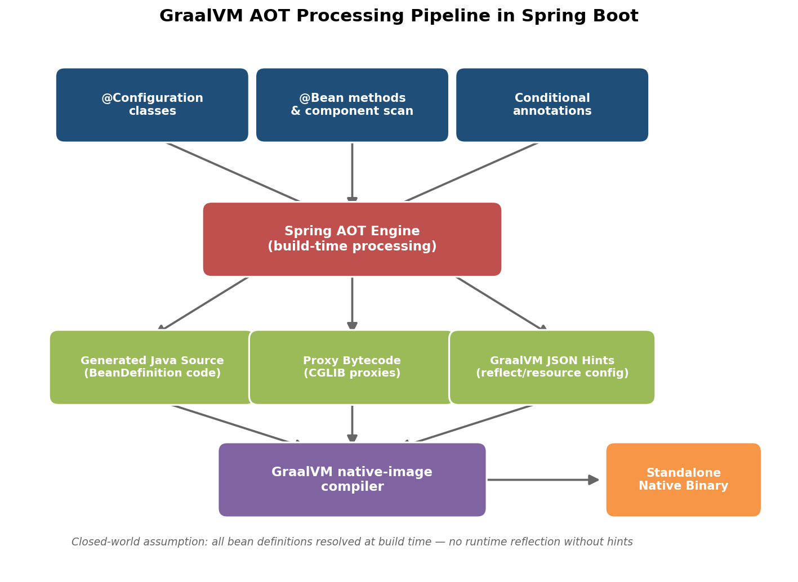

This architecture imposes material constraints: bean definitions cannot change at runtime, `@Profile`-based conditional logic is evaluated at build time, and dynamically conditional beans (such as those gated by `@ConditionalOnProperty`) have their conditions frozen during AOT processing. The application's wiring topology is fixed at compile time — a fundamental trade-off in exchange for the elimination of reflection overhead.

### Performance Characteristics

Oracle's benchmarks of the Spring Petclinic application using GraalVM for JDK 21 illustrate the trade-offs quantitatively. Running with a 512 MB maximum heap, an Oracle GraalVM native image compiled with profile-guided optimization (PGO) achieved a startup time of 0.21 seconds versus 7.09 seconds for the same application on the C2 JIT compiler — a 97% reduction. Resident set size (RSS) dropped 38%, from 1,029 MB to 641 MB. The 99th-percentile latency improved by 28% (5.15 ms vs. 7.20 ms), while throughput remained comparable at approximately 11,900 requests/second for the native image versus 11,066 for C2 JIT. [Oracle GraalVM blog](https://blogs.oracle.com/graal/oracle-graalvm-for-jdk-21 "Spring Petclinic benchmark, GraalVM for JDK 21")

The costs are non-trivial. Native image compilation times run into minutes (versus seconds for a standard JAR build), debugging native executables is more difficult than debugging JVM bytecode, and any library that relies on unconfigured reflection or dynamic class generation will fail silently or at runtime unless appropriate hints are provided. For teams choosing this path, Spring Boot provides integration through the `native` Maven/Gradle profile and Cloud Native Buildpacks, reducing the operational complexity to a single build command.

### Project CRaC: An Alternative Fast-Startup Path

GraalVM native images are not the sole approach to fast startup. Project CRaC (Coordinated Restore at Checkpoint), an OpenJDK initiative, takes a complementary path: the JVM snapshots a running, fully warmed-up application to disk and restores it in milliseconds, preserving JIT-compiled code and initialized state. Spring Framework 6.1 integrated CRaC lifecycle management, and Spring Boot 3.2+ provides out-of-the-box support for checkpointing and restoring resources such as sockets, files, and connection pools. [Spring Boot CRaC documentation](https://docs.spring.io/spring-boot/reference/packaging/checkpoint-restore.html "Checkpoint and Restore With the JVM") Unlike native images, CRaC-restored applications retain full JIT performance and impose no closed-world constraints, but they require a Linux environment with CRIU (Checkpoint/Restore In Userspace) and introduce operational complexity around snapshot management and security of captured state.

## 6.3 Virtual Threads and Project Loom

### The Thread Scalability Problem

The thread-per-request model that Servlets established in 1997 served the Java ecosystem reliably for two decades. But platform threads are expensive: each maps 1:1 to an operating system thread and consumes approximately 1 MB of stack memory by default. A typical Servlet container maintains a thread pool of 200–400 threads, capping concurrent request handling regardless of whether those threads are actively computing or merely waiting on database queries and network responses. Under I/O-heavy workloads — the dominant pattern in enterprise applications — the majority of threads sit idle while blocking on external calls, wasting memory and constraining throughput.

Before JDK 21, the primary escape route was reactive programming (Section 6.4). The reactive model achieves high concurrency by never blocking a thread, but at the cost of a fundamentally different programming paradigm: callback chains, `Mono`/`Flux` pipelines, and non-trivial debugging. Project Loom offered a different proposition: make threads so cheap that the traditional blocking model scales without requiring a paradigm shift.

### Virtual Threads in JDK 21

[JEP 444](https://openjdk.org/jeps/444 "Virtual Threads — finalized in JDK 21") introduced virtual threads as a final feature in JDK 21 (GA September 2023), following preview rounds in JDK 19 and JDK 20. Virtual threads employ M:N scheduling: a large number (M) of virtual threads are multiplexed onto a small number (N) of platform (carrier) threads, managed by a work-stealing `ForkJoinPool` operating in FIFO mode. When a virtual thread encounters a blocking I/O operation — a JDBC call, an HTTP request, a file read — the JVM runtime automatically unmounts it from its carrier thread, freeing that carrier to execute other virtual threads. Upon I/O completion, the virtual thread is remounted onto an available carrier and resumes execution transparently.

Each virtual thread starts with approximately 1 KB of stack space (growing dynamically as needed), compared to the ~1 MB fixed allocation per platform thread. This three-orders-of-magnitude reduction in per-thread memory makes it practical to sustain millions of concurrent virtual threads, restoring the thread-per-request model's viability at modern scale.

A key limitation is "pinning": when a virtual thread executes code inside a `synchronized` block or a native method frame, it cannot unmount from its carrier thread, effectively blocking that platform thread. The recommended mitigation is to replace `synchronized` with `java.util.concurrent.locks.ReentrantLock` in hot paths — a refactoring that library maintainers, including the Spring team, have systematically undertaken.

### Spring Boot's Virtual Thread Integration

Spring Boot 3.2.0 (November 23, 2023) introduced first-class virtual thread support as a headline feature. [Spring Boot 3.2.0 announcement](https://spring.io/blog/2023/11/23/spring-boot-3-2-0-available-now "Virtual Threads as headline feature") Enabling virtual threads requires a single configuration property:

```properties
spring.threads.virtual.enabled=true
```

With this flag set, Spring Boot auto-configures virtual-thread-per-task executors for Tomcat, Jetty, and Undertow request processing, as well as for `@Async` task execution. Spring MVC controllers run on virtual threads without code changes — the same `@RestController` methods, the same blocking `JdbcTemplate` calls, the same synchronous `RestClient` invocations — but each request now occupies a virtual thread that yields its carrier during I/O waits.

The Spring team articulated the architectural implication directly: "The reasons to use asynchronous programming models go away in many cases if we start with the assumption that our code runs on Virtual Threads." The asynchronous Servlet API (`ServletRequest.startAsync()`), introduced in Servlet 3.0 specifically to work around thread scarcity, becomes "subject to be invalidated" under this model. [Spring official blog](https://spring.io/blog/2022/10/11/embracing-virtual-threads "Embracing Virtual Threads, October 2022")

## 6.4 The Reactive Stack: WebFlux and R2DBC

### Reactive Foundations

Spring's reactive programming support predates virtual threads by several years. Spring Framework 5.0 (September 28, 2017) introduced Spring WebFlux as a fully non-blocking, reactive web framework running on event-loop servers such as Netty. The reactive model builds on Project Reactor, which provides two core publisher types implementing the Reactive Streams specification: `Flux<T>` for asynchronous sequences of 0 to N elements, and `Mono<T>` for asynchronous results of 0 or 1 element. [Project Reactor reference](https://projectreactor.io/docs/core/release/reference/coreFeatures/flux.html "Flux reference")

The key differentiator of the reactive model is backpressure: downstream consumers signal demand to upstream producers, preventing buffer overflow in streaming scenarios. This property makes reactive pipelines a natural fit for use cases involving event streams, real-time data feeds, and high-fan-out service orchestration.

### R2DBC: Reactive Database Access

The JDBC API, designed in 1996 alongside the Servlet specification, is inherently blocking: every `Statement.execute()` or `ResultSet.next()` call blocks the calling thread until the database responds. Within a reactive pipeline, a single blocking JDBC call breaks the non-blocking contract and undermines the entire concurrency model.

R2DBC (Reactive Relational Database Connectivity) addresses this gap. The R2DBC 1.0.0.RELEASE specification, published on April 25, 2022 by the Reactive Foundation, defines a Service Provider Interface comprising `ConnectionFactory`, `Connection`, `Statement`, `Result`, and `Row` — mirroring JDBC's conceptual model but returning fully non-blocking, Reactive Streams-based types. [R2DBC 1.0 specification](https://r2dbc.io/spec/1.0.0.RELEASE/spec/html/ "R2DBC 1.0.0.RELEASE, 2022-04-25")

Spring Data R2DBC provides the application-level programming model, offering `R2dbcEntityTemplate` for fluent query/insert/update operations and automatic repository proxy generation that mirrors the Spring Data JPA pattern. A `ReactiveCrudRepository<T, ID>` interface returns `Flux<T>` and `Mono<T>` instead of `List<T>` and `Optional<T>`, allowing the entire data access layer to participate in the reactive pipeline without breaking the non-blocking contract. [Spring Data R2DBC documentation](https://docs.spring.io/spring-data/relational/reference/r2dbc.html "Spring Data R2DBC reference")

### Reactive vs. Virtual Threads: Choosing the Right Model

The arrival of virtual threads has reframed the architectural decision between reactive and imperative programming. The two models address overlapping but distinct concerns:

**Spring MVC + Virtual Threads** excels in straightforward request-response services with I/O-heavy workloads. Developers write familiar synchronous, blocking code — `JdbcTemplate` queries, `RestClient` calls — while virtual threads ensure that blocking operations do not consume platform thread resources. The programming model is identical to pre-Loom Spring MVC; only the underlying thread scheduling changes. This path represents the pragmatic default for the majority of enterprise applications.

**Spring WebFlux + Reactor (+ R2DBC)** retains distinct advantages in scenarios requiring streaming data pipelines with backpressure, declarative concurrent composition of multiple asynchronous sources (e.g., `Mono.zip()`, `Flux.merge()`), and event-driven architectures where data naturally flows as continuous streams rather than discrete request-response pairs. CPU-intensive workloads benefit from neither model, as concurrency gains apply only to I/O wait time.

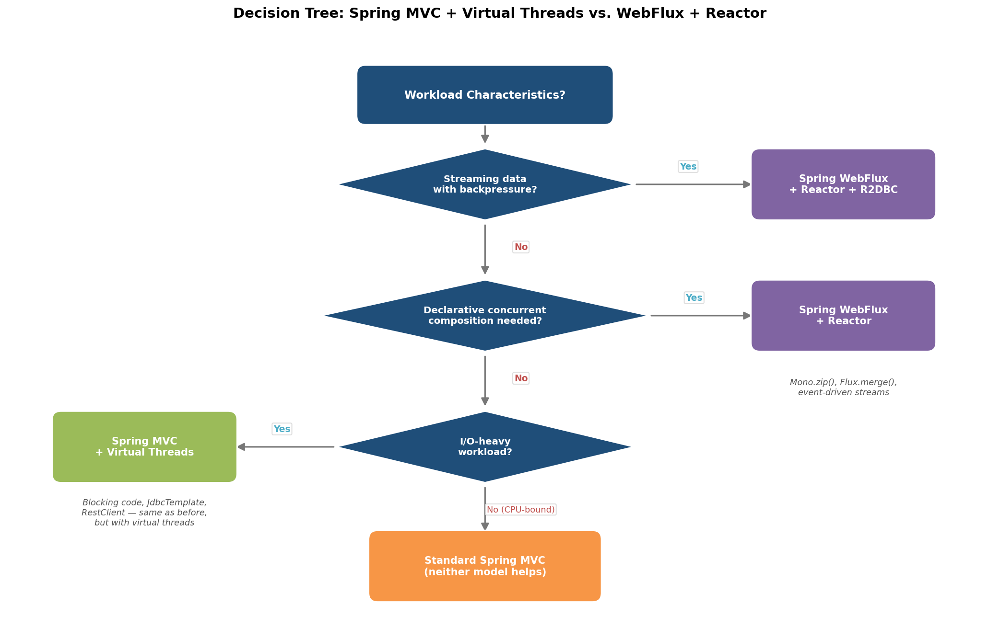

The Spring team's position synthesizes both perspectives: "ReactiveX-style APIs remain a powerful way to compose concurrent logic and a natural way for dealing with streams," while virtual threads "complement reactive programming models in removing barriers of blocking I/O." In practice, many organizations will find that Spring MVC with virtual threads covers the majority of their use cases, reserving WebFlux for specific services where streaming semantics or backpressure control are genuine requirements.

## 6.5 The Latest Frontier: Spring Framework 7.0 and Spring Boot 4.0

The evolutionary story extends beyond the 3.x line. Spring Framework 7.0 GA shipped on November 13, 2025, introducing Jakarta EE 11 support (Servlet 6.1, JPA 3.2), comprehensive null-safety annotations based on JSpecify, Jackson 3.0 integration, Kotlin 2.2 support, and JUnit 6.0 compatibility. The Java 17 baseline is retained, with Java 25 designated as the recommended target LTS release. [Spring Framework 7.0 GA announcement](https://spring.io/blog/2025/11/13/spring-framework-7-0-general-availability "Juergen Hoeller")

Spring Boot 4.0.0 GA followed on November 20, 2025, built atop Framework 7.0. This release delivers full codebase modularization, JSpecify null-safety throughout the API surface, and API versioning capabilities. [Spring Boot 4.0.0 GA announcement](https://spring.io/blog/2025/11/20/spring-boot-4-0-0-available-now "Phil Webb") As of March 26, 2026, the latest stable releases are Spring Boot 4.0.5 and 3.5.13, with both lines under active maintenance. [endoflife.date](https://endoflife.date/spring-boot "Version support matrix")

The trajectory established across these chapters remains legible: each generation continues the pattern set in motion by Rod Johnson's original critique — reduce accidental complexity, embrace platform evolution, and preserve backward compatibility where possible while making clean breaks when necessary. The Jakarta EE migration, GraalVM native compilation, and virtual thread integration each constitute a response to a specific friction point: namespace governance, cloud-native deployment economics, and thread scalability respectively. The Spring ecosystem absorbs these platform shifts and presents them through consistent, opinionated abstractions — the same design philosophy that distinguished `BeanFactory` from the EJB container two decades ago, applied now to the challenges of 2026.

# Conclusion

The evolution from Java Servlets to Spring Boot is not a story of replacement but of progressive abstraction. Each generation inherited the problems its predecessor left unsolved and delivered solutions through a consistent architectural strategy: push infrastructure concerns out of business code and into frameworks, containers, or conventions that manage them transparently.

**The Servlet specification (1997)** solved CGI's fundamental scalability crisis by replacing process-per-request execution with a thread-per-request model inside a single JVM. It introduced session management, a typed request/response API, and a component lifecycle that made Java viable for high-traffic web applications. Yet it left developers responsible for all higher-level concerns — routing, dependency management, transaction coordination, and security enforcement — producing verbose, tightly HTTP-coupled code that resisted unit testing.

**J2EE and Enterprise JavaBeans (1999–2006)** addressed the enterprise-services gap with declarative transactions, remoting, container-managed persistence, and role-based security. The specification correctly identified the problem space but delivered solutions through a container-invasive, artifact-heavy programming model — the triple-class pattern, vendor-specific XML descriptors, and mandatory application server dependencies — that imposed costs in developer productivity, testability, and portability disproportionate to the benefits. The backlash against EJB's accidental complexity catalyzed the lightweight container movement and ultimately forced the specification itself to concede through EJB 3.0's adoption of annotation-driven POJOs.

**The Spring Framework (2003–present)** re-delivered every enterprise service EJB had provided — transactions, security, persistence integration, lifecycle management — to plain Java objects through Inversion of Control and Aspect-Oriented Programming. By externalizing dependency wiring to the IoC container and applying cross-cutting concerns through proxy-based AOP, Spring freed business classes from framework interfaces, restored unit testability without container deployment, and decoupled application code from specific infrastructure technologies through abstraction layers such as `DataAccessException` and the Template pattern. The core modules a developer must master — the ApplicationContext lifecycle, Spring MVC's DispatcherServlet pipeline, JPA and JDBC data access, `@Transactional` propagation semantics, and Spring Security's filter chain — remain the operational foundation of every Spring application, including those running under Spring Boot.

**Spring Boot (2014–present)** resolved the final layer of friction: the assembly work of configuring a Spring application. Auto-configuration eliminated manual bean wiring through classpath detection and conditional registration. Starter POMs eliminated dependency version management through curated, integration-tested BOMs. Embedded servers eliminated external container deployment by inverting the application-server relationship. Actuator eliminated custom operational tooling by exposing health, metrics, and environment data through standardized HTTP endpoints. The result — a single executable JAR launched with `java -jar` — aligned the Spring ecosystem with cloud-native deployment patterns and became the dominant model for new Java web applications.

**The modern frontier (2022–2026)** extends this trajectory into platform-level concerns. The Jakarta EE namespace migration establishes independent governance for the enterprise specification stack. GraalVM native image compilation and AOT processing address cloud-native startup and memory economics, achieving sub-second cold starts at the cost of closed-world constraints. JDK 21 virtual threads restore the thread-per-request model's scalability without requiring a reactive programming paradigm shift, while Spring WebFlux and R2DBC retain distinct value for streaming, backpressure-sensitive workloads. Spring Framework 7.0 and Spring Boot 4.0 continue the pattern: absorb platform evolution, present it through consistent abstractions, and preserve backward compatibility where possible while making clean breaks when necessary.

The essential knowledge for developers working with this stack is layered. At the foundation: the Servlet lifecycle and HTTP contract that Spring MVC still delegates to. At the core: IoC container mechanics, bean scopes and lifecycle callbacks, AOP proxy behavior (including the self-invocation limitation), and the three configuration styles (XML, annotation, Java config). In daily practice: the DispatcherServlet request flow, `@RestController` patterns, Spring Data repository abstraction, `@Transactional` propagation and rollback rules, and the Spring Security filter chain architecture. At the operational level: auto-configuration's conditional wiring model, externalized configuration hierarchies, Actuator endpoints, and the choice between embedded Tomcat with virtual threads and WebFlux with Reactor. Mastery of these layers — not merely familiarity with annotations — is what separates productive Spring developers from those who are surprised by the framework's behavior in production.
