# Overview

Generative artificial intelligence entered K-12 education with extraordinary speed. Within three years of ChatGPT's November 2022 launch, more than half of U.S. K-12 teachers and students reported using AI for school-related work, approximately 41% of lower-secondary teachers across OECD countries had adopted AI tools, and governments on every inhabited continent had begun crafting policies to govern how these technologies are deployed in classrooms. Yet the institutional infrastructure intended to guide this adoption — policies, training, assessment frameworks, data governance — has consistently lagged behind practice. As of spring 2025, only 45% of U.S. principals reported having any AI policy in place, and over 80% of students said their teachers had never taught them how to use AI.

This report presents a comprehensive, evidence-based analysis of how AIGC (AI-Generated Content) is being applied in primary and secondary school classrooms worldwide. Drawing on large-scale survey data from RAND, the OECD, Pew Research Center, and the College Board; peer-reviewed research including the field's most rigorous randomized controlled trial (Bastani et al., PNAS, 2025); government policy documents from more than ten countries; and eleven documented implementation case studies spanning eight nations, the report maps the current landscape, categorizes application approaches, evaluates outcomes, and identifies the conditions under which AIGC integration succeeds or fails.

Five principal findings structure the analysis. First, a dual-axis taxonomy organized by pedagogical function and stakeholder role identifies five distinct AIGC application categories — content generation and lesson preparation, personalized tutoring and adaptive learning, assessment and feedback, creative expression and multimodal production, and AI literacy — each with markedly different adoption rates, evidence bases, and risk profiles. Second, the strongest available causal evidence demonstrates that *how* AI is implemented matters more than *whether* it is adopted: unguarded chatbot access can actively harm student learning, while pedagogically structured tools with guardrails preserve or enhance it. Third, the global policy landscape ranges from China's highly prescriptive age-differentiated mandates to the United States' decentralized, market-driven approach, with no single governance model yet demonstrating clear superiority. Fourth, adoption has created a "third digital divide" in which the critical gap is no longer access to technology but access to the human guidance — trained teachers, informed parents, institutional policies — needed to use it productively. Fifth, the evidence base remains strikingly thin: a March 2026 Stanford review of over 800 papers identified only 20 high-quality causal studies on AI in K-12, and no causal studies of student AI use in U.S. K-12 classrooms.

The report is organized into seven chapters. Chapter 1 defines AIGC in educational contexts, traces the timeline from ChatGPT's launch through early 2026, and introduces the analytical framework. Chapter 2 maps the global policy landscape across supranational bodies, individual nations, and regional blocs. Chapter 3 develops the five-category taxonomy with representative tools, empirical evidence, and pedagogical rationale. Chapter 4 presents eleven global case studies — from the Bastani et al. RCT in Türkiye and South Korea's $850 million AI textbook failure to a Tokyo elementary school's "AI classmate" and Kenya's AI literacy program. Chapter 5 examines the challenges and ethical dilemmas: academic integrity, data privacy, equity, algorithmic bias, and teacher professional identity. Chapter 6 analyzes technological, pedagogical, regulatory, and market trajectories for 2026–2028. Chapter 7 translates findings into actionable recommendations for classroom educators, school administrators, and policymakers.

# 第1章 Introduction — The Rise of AIGC in K-12 Education

## 1.1 Defining AIGC in the Educational Context

The term AIGC (AI-Generated Content) refers to any output—text, images, video, audio, or code—produced by generative artificial intelligence models in response to human prompts. UNESCO defines generative AI as "an AI technology that automatically generates content in response to prompts written in natural language conversational interfaces," capable of producing "texts, images, videos, music and software code" [UNESCO Guidance for GenAI in Education](https://table.media/wp-content/uploads/2023/09/386693eng.pdf "UNESCO, Miao & Holmes, September 2023, Section 1.1"). In Chinese-language policy discourse, the term "AIGC" carries functionally equivalent meaning; China's Ministry of Education defines generative AI as "models and related technology that have the ability to generate text, graphics, audio, video, and other content" [China MOE Guide (2025)](https://cset.georgetown.edu/publication/china-school-gen-ai-use-guide-2025/ "Georgetown CSET English translation of China MOE GenAI school guide, 2025 Edition").

This definitional convergence across languages is noteworthy: despite differing regulatory traditions, major education systems share a common understanding of what generative AI produces and how it functions. The distinguishing characteristic of AIGC relative to earlier waves of AI in education (AIED)—adaptive learning platforms, intelligent tutoring systems (ITS), and learning analytics—is its capacity to produce *new content* rather than merely analyze existing data or deliver pre-authored responses. UNESCO draws this boundary explicitly and further introduces the concept of "EdGPT"—foundation models fine-tuned for education, such as EduChat and MathGPT—as a distinct category within the broader generative AI ecosystem [UNESCO Guidance for GenAI in Education](https://table.media/wp-content/uploads/2023/09/386693eng.pdf "UNESCO 2023, Section 1.4").

For the purposes of this report, AIGC encompasses all content produced by generative AI systems when deployed in K-12 settings—from a lesson plan drafted by a teacher using MagicSchool AI, to a Socratic dialogue generated by Khanmigo for a student, to digital art co-created by middle schoolers with Midjourney. The scope includes both teacher-facing and student-facing applications across elementary/primary (ages 5–10), middle school/lower secondary (ages 11–13), and high school/upper secondary (ages 14–18) settings.

## 1.2 A Brief History: From ChatGPT to Mandatory AI Education (2022–2026)

The modern AIGC era in K-12 education began on November 30, 2022, when OpenAI launched ChatGPT based on the GPT-3.5 model. The tool reached 100 million monthly active users by January 2023, making it the fastest consumer technology adoption on record. The educational community's initial response was sharply polarized: New York City public schools banned ChatGPT in January 2023, igniting a global debate between prohibition and pedagogical integration that continues to shape policy.

Technological advances and institutional responses followed in rapid succession. On March 14, 2023, OpenAI released GPT-4, and Khan Academy simultaneously launched Khanmigo—a GPT-4-powered AI tutor—in limited pilot [Khan Academy Blog](https://blog.khanacademy.org/khanmigo-top-ai-in-education-moments-of-2023-the-year-artificial-intelligence-dominated-education-news-kl/ "Khan Academy year-in-review 2023"). In May 2023, UNESCO convened the first global ministerial round table on generative AI in education, while the U.S. Department of Education published "AI and the Future of Teaching and Learning" [USDOE](https://www.ed.gov/sites/ed/files/documents/ai-report/ai-report.pdf "USDOE AI report, May 2023"). China became the first country to regulate generative AI through the Provisional Regulations on Generative AI Services, effective July 13, 2023. By September 2023, UNESCO had published "Guidance for Generative AI in Education and Research"—the first comprehensive global framework for AIGC in education [UNESCO](https://www.unesco.org/en/articles/guidance-generative-ai-education-and-research "UNESCO, Sep 2023").

The regulatory landscape matured rapidly through 2024. The European Union voted on the AI Act on February 2, 2024, classifying education AI as "high-risk" under Annex III; the Act entered into force on August 1, 2024, with education-specific high-risk provisions taking full effect on August 2, 2026 [Kennedys Law](https://www.kennedyslaw.com/en/thought-leadership/article/2026/the-eu-ai-act-implementation-timeline-understanding-the-next-deadline-for-compliance/ "EU AI Act timeline"). Meanwhile, adoption surged: U.S. teen ChatGPT usage for schoolwork doubled from 13% in 2023 to 26% in fall 2024, based on a Pew Research Center survey of 1,391 teens [Pew Research](https://www.pewresearch.org/short-reads/2025/01/15/about-a-quarter-of-us-teens-have-used-chatgpt-for-schoolwork-double-the-share-in-2023/ "Pew, Jan 2025"). In December 2024, China's MOE designated 184 primary and secondary schools as AI education bases [IEEE IT Professional](https://www.computer.org/csdl/magazine/it/2025/05/11218250/2b9Tuwsg7aU "IEEE 2025").

By 2025, the landscape shifted from experimentation to institutionalization. In May 2025, China's MOE released the "Guide to Using GenAI in Primary and Secondary Schools (2025 Edition)"—the most detailed national AIGC-in-K-12 guidance document issued by any country to date [Georgetown CSET](https://cset.georgetown.edu/publication/china-school-gen-ai-use-guide-2025/ "CSET translation, May 13, 2025"). On September 1, 2025, AI education became mandatory across all Chinese primary and secondary schools. In the United States, Khanmigo expanded to serve approximately 2 million students and teachers across the U.S., India, and Brazil, supported by a Microsoft partnership that made the tool free for U.S. teachers [Microsoft](https://news.microsoft.com/source/features/ai/khan-academy-and-microsoft-partner-to-expand-access-to-ai-tools/ "Microsoft-Khan Academy partnership"). The U.S. Department of Education issued guidance on AI in schools and proposed supplemental grant-making priorities for AI in July 2025 [USDOE](https://www.ed.gov/about/news/press-release/us-department-of-education-issues-guidance-artificial-intelligence-use-schools-proposes-additional-supplemental-priority "USDOE press release, 2025"). RAND published a major update in September 2025, documenting both the rapid acceleration and the persistent guidance gap in AI use across American schools [RAND](https://www.rand.org/pubs/research_reports/RRA4180-1.html "RAND RR-A4180-1, Doss et al., Sep 2025").

The most recent milestones reflect a global convergence toward structured engagement with AIGC. OECD TALIS 2024 results, published in October 2025, revealed that approximately 41% of lower-secondary teachers across OECD countries and regions use AI [Education International](https://www.ei-ie.org/en/item/31815:using-artificial-intelligence-takeaways-from-talis-2024 "EI analysis of TALIS 2024, Dec 2025"). In January 2026, the OECD published "Digital Education Outlook 2026," underscoring a critical distinction between purpose-built education AI and general-purpose tools [OECD](https://www.oecd.org/en/blogs/2026/01/how-to-effectively-use-generative-ai-in-education.html "Schleicher blog, Jan 19, 2026"). In barely three years, AIGC moved from an unfamiliar novelty to a fixture in classrooms worldwide—raising the questions that this report seeks to address.

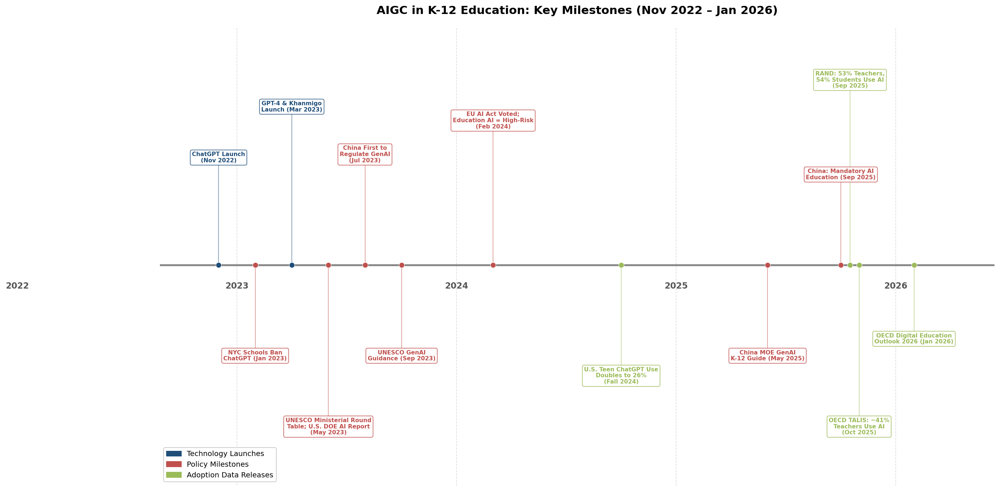

*Figure 1.1. A color-coded timeline of 13 key milestones in the emergence of AIGC in K-12 education, spanning from the ChatGPT launch (November 2022) through the OECD Digital Education Outlook 2026 (January 2026). Technology launches are shown in blue, policy milestones in red, and adoption data releases in green. Sources: see citations in Section 1.2.*

## 1.3 Adoption by the Numbers: A Global Snapshot

The speed of AIGC adoption in K-12 education is without precedent, yet the picture emerging from large-scale survey data is one of rapid growth consistently outpacing the development of adequate guidance and policy infrastructure.

**Teachers.** In the United States, the share of K-12 ELA, math, and science teachers using AI for school-related work rose from approximately 33% in fall 2023 (18% regular users plus 15% who had tried it at least once) to 53% by spring 2025—a 15-percentage-point increase in roughly eighteen months [RAND](https://www.rand.org/pubs/research_reports/RRA956-21.html "RAND 2024, Fall 2023 data"); [RAND](https://www.rand.org/pubs/research_reports/RRA4180-1.html "RAND, Doss et al. 2025"). Globally, the OECD TALIS 2024 survey—covering approximately 300,000 lower-secondary teachers across more than 50 education systems—found that 37–41% reported using AI, though this aggregate figure masks enormous variation: rates ranged from 75% in the UAE and Singapore to 14% in France [Education International / OECD](https://www.ei-ie.org/en/item/31815:using-artificial-intelligence-takeaways-from-talis-2024 "EI/OECD TALIS 2024"). Among AI-using teachers, the most common applications were learning about or summarizing topics (68%) and generating lesson plans (64%); the least common was assessing student work (26%). Among non-users, the dominant barrier was lack of skills, cited by 75%.

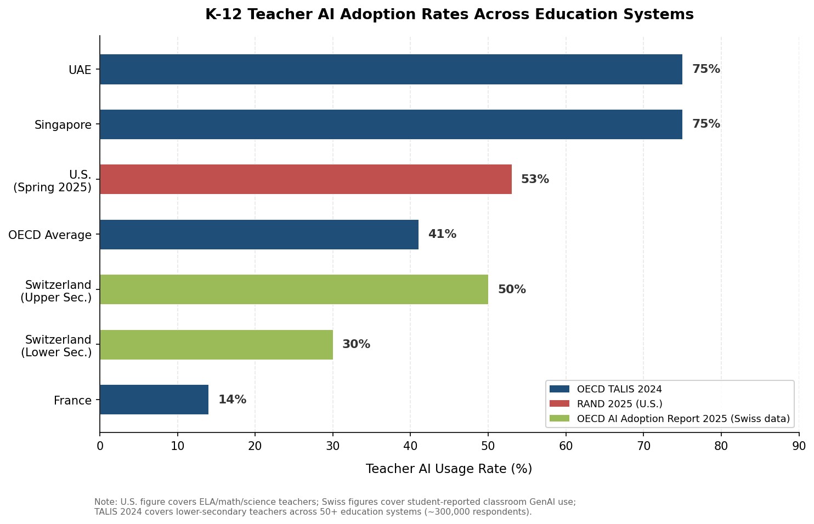

*Figure 1.2. Teacher AI usage rates across seven education systems and benchmarks, ranging from 75% (UAE, Singapore) to 14% (France). Data sources: OECD TALIS 2024 (blue), RAND 2025 (red), and OECD AI Adoption Report 2025 with Swiss data (green). U.S. data cover ELA, math, and science teachers; Swiss data reflect student-reported classroom generative AI use.*

**Students.** Student adoption has tracked closely with—and in some cases exceeded—teacher adoption. RAND's 2025 data show that 54% of U.S. K-12 students use AI for school, a 15-percentage-point increase over earlier measurements [RAND](https://www.rand.org/pubs/research_reports/RRA4180-1.html "RAND 2025"). By fall 2025, a Pew Research Center survey of 1,458 U.S. teens found that 54% had used AI chatbots for help with schoolwork, with 10% reporting that they complete all or most schoolwork with chatbot assistance [Pew Research](https://www.pewresearch.org/internet/2026/02/24/how-teens-use-and-view-ai/ "Pew, Feb 2026"). Swiss data from a 2024 survey of 10,000 students aged 8–18 provides valuable granularity by age band: regular classroom generative AI use stood at 8% among primary students, 30% among lower-secondary students, 50% among upper-secondary students, and 42% among vocational students [OECD AI Adoption Report](https://www.oecd.org/content/dam/oecd/en/publications/reports/2025/12/ai-adoption-in-the-education-system_43251cf0/69bd0a4a-en.pdf "OECD 2025, citing Oggenfuss & Wolter 2024").

**The guidance gap.** Despite this surge, policy and institutional structures have consistently lagged behind practice. An OECD policy survey across 32 jurisdictions in 2025 found that while 81% mention AI in their education strategies, only 25% have specific AI initiatives and a mere 19% include timebound implementation goals [OECD AI Adoption Report](https://www.oecd.org/content/dam/oecd/en/publications/reports/2025/12/ai-adoption-in-the-education-system_43251cf0/69bd0a4a-en.pdf "OECD 2025"). In the United States, the gap is particularly acute: only 45% of principals report having AI policies in place, only 34% of teachers report the existence of policies on AI and academic integrity, and over 80% of students say their teachers have not taught them how to use AI [RAND](https://www.rand.org/pubs/research_reports/RRA4180-1.html "RAND 2025").

**A cautionary signal on implementation design.** Behind the adoption numbers lies a critical insight from one of the most rigorous studies available. An OECD-cited randomized controlled trial in Türkiye (n = 839 secondary students) found that students using a standard ChatGPT interface improved practice performance by 48% but experienced a 17% *decrease* in post-test performance—effectively performing worse on examinations after relying on the tool as a crutch. In contrast, a pedagogically structured "ChatGPT Tutor" with built-in guardrails improved practice performance by 127% with no post-test decline [OECD AI Adoption Report](https://www.oecd.org/content/dam/oecd/en/publications/reports/2025/12/ai-adoption-in-the-education-system_43251cf0/69bd0a4a-en.pdf "OECD 2025, citing Bastani et al. 2024"). This finding—that *how* AIGC is implemented matters more than *whether* it is adopted—constitutes a leitmotif of this report.

**Stakeholder concerns.** Adoption has not proceeded without substantial anxiety across stakeholder groups. RAND's 2025 survey found that 61% of U.S. parents, 48% of middle school students, and 55% of high school students worry that AI will harm critical-thinking skills; notably, only 22% of district leaders share this concern—a perception gap with significant governance implications. Half of all surveyed students worry about being falsely accused of using AI to cheat [RAND](https://www.rand.org/pubs/research_reports/RRA4180-1.html "RAND 2025"). These tensions—between enthusiasm and apprehension, between adoption and regulation, between technological potential and pedagogical risk—define the present moment in AIGC-enabled K-12 education.

## 1.4 Analytical Framework: A Dual-Axis Taxonomy

Making sense of the rapidly expanding AIGC landscape in K-12 education requires a coherent classification scheme. This report adopts a dual-axis taxonomic framework organized along two dimensions: **pedagogical function** and **stakeholder role**.

The **stakeholder axis** draws on the tripartite taxonomy established by Holmes, Bialik, and Fadel (2019), which classifies AIED applications as student-facing, teacher-facing, or system-facing [Holmes et al.](https://curriculumredesign.org/wp-content/uploads/AIED-Book-Excerpt-CCR.pdf "CCR 2019, book excerpt"). This framework remains the most widely cited stakeholder classification in the AIED literature and provides a clear organizing principle for distinguishing who interacts with generative AI tools and in what capacity.

The **pedagogical function axis** synthesizes several established classification schemes. Zawacki-Richter et al. (2019), in a systematic review of 146 articles on AI in higher education, identified four functional categories: profiling and prediction, intelligent tutoring systems, assessment and evaluation, and adaptive systems and personalization [Zawacki-Richter et al.](https://link.springer.com/article/10.1186/s41239-019-0171-0 "IJETHE Vol. 16, 2019"). Holmes and Tuomi (2022) updated this typology to account for the emergence of generative models, organizing applications around tutoring, assessment, content generation, and administrative support [Holmes & Tuomi](https://onlinelibrary.wiley.com/doi/10.1111/ejed.12533 "European Journal of Education Vol. 57, 2022"). UNESCO's 2023 guidance proposed five functional co-design categories specifically for generative AI: research assistance, teacher support, one-to-one coaching for foundational skills, inquiry and project-based learning, and support for learners with special needs [UNESCO Guidance](https://table.media/wp-content/uploads/2023/09/386693eng.pdf "UNESCO 2023, Section 5.3"). Most recently, the OECD Digital Education Outlook 2026 introduced the distinction between "pedagogical purpose" and "general-purpose" tools as a key effectiveness factor [OECD](https://www.oecd.org/en/blogs/2026/01/how-to-effectively-use-generative-ai-in-education.html "Schleicher blog, Jan 2026").

Building on these precedents, this report identifies five application categories that structure the analysis across Chapters 3 through 7:

1. **Content Generation and Lesson Preparation** (primarily teacher-facing): AI-assisted creation of lesson plans, worksheets, reading materials, and presentation slides.
2. **Personalized Tutoring and Adaptive Learning** (primarily student-facing): One-on-one AI tutoring, Socratic dialogue systems, and adaptive practice platforms.
3. **Assessment, Feedback, and Evaluation** (teacher- and student-facing): AI-powered formative assessment, writing feedback, and rubric-aligned grading support.
4. **Creative Expression and Multimodal Production** (primarily student-facing): Text-to-image generation, creative writing with AI, code generation, and music composition.
5. **AI Literacy and Computational Thinking** (student-facing, with system-level curricular implications): Teaching students to understand, critically evaluate, and responsibly use AI systems.

Categories 1, 4, and 5 represent distinctly generative-AI phenomena largely absent from pre-2022 classification frameworks. Categories 2 and 3 update and extend traditional ITS and assessment categories for the generative AI era. No prior publication uses this exact dual-axis formulation, but both constituent dimensions are well-established in the literature. The framework is intended as an analytical lens rather than an exhaustive typology; real-world applications frequently span multiple categories.

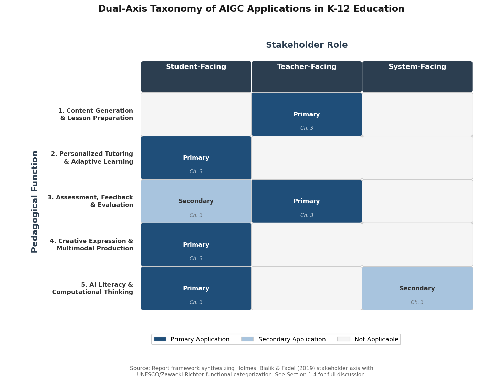

*Figure 1.3. A 5×3 matrix mapping the report's five pedagogical function categories against three stakeholder roles. Dark blue cells indicate the primary application domain; light blue cells indicate secondary relevance. The chapter references (Ch. 3) denote where each category receives detailed treatment. See Section 1.4 for supporting literature.*

## 1.5 Report Scope and Structure

This report examines the practical application of AIGC in primary and secondary education worldwide, drawing on policy documents, large-scale survey data, peer-reviewed research, and documented implementation cases from more than ten countries and regions. The temporal focus spans from November 2022—the launch of ChatGPT—through April 2026, with particular emphasis on developments since mid-2025, a period marked by accelerating institutionalization.

The report is organized as follows:

- **Chapter 2** maps the global policy and institutional landscape, comparing how governments in the United States, China, the United Kingdom, the European Union, Japan, South Korea, Singapore, Australia, and other jurisdictions have responded to AIGC in education—from outright bans to mandatory integration.
- **Chapter 3** develops the five-category taxonomy in detail, analyzing representative tools, pedagogical rationales, and the evidence base for each application category.
- **Chapter 4** presents eleven global case studies of AIGC implementation in K-12 classrooms, spanning six countries and all five taxonomy categories—from large-scale national programs (South Korea's $850 million AI digital textbook initiative, China's 184 AI education base schools) to individual classroom innovations (a Tokyo elementary school's "AI classmate," a Finnish middle school's Midjourney art workshop).
- **Chapter 5** addresses the challenges, risks, and ethical considerations accompanying AIGC adoption: academic integrity, data privacy, equity and access, algorithmic bias, and the evolving professional identity of teachers.
- **Chapter 6** examines the 2026–2028 horizon, analyzing confirmed technological trajectories (OpenAI's "Education for Countries" initiative, Google's Gemini integration with Classroom, mandatory AI literacy curricula), emerging pedagogical frameworks, and market dynamics.
- **Chapter 7** synthesizes findings into actionable recommendations for educators, administrators, and policymakers, encompassing tiered adoption frameworks, AI-resilient assignment design, prompt engineering guidance, and decision criteria for evaluating AI tools.

The evidence base for AIGC in K-12 remains thin relative to the pace of adoption. A 2026 Stanford review of over 800 papers identified only 20 high-quality causal studies on AI in K-12 education—and no causal studies of student AI use in U.S. K-12 classrooms specifically [Stanford SCALE](https://scale.stanford.edu/research-in-action/understanding-evidence-base-ai-k12-education "March 2026"). Alfarwan's (2025) systematic review of 30 empirical generative AI studies in K-12 found that high school students and STEM subjects dominate the literature, with no studies from early childhood education and no representation from Africa [Alfarwan](https://www.frontiersin.org/journals/education/articles/10.3389/feduc.2025.1647573/full "Frontiers in Education, Sep 2025"). This report acknowledges these evidence limitations throughout, while drawing on the best available data—including large-scale surveys from RAND, OECD, and Pew Research; randomized controlled trials; government evaluations; and documented practitioner accounts—to provide a comprehensive picture of how AIGC is reshaping K-12 education around the world.

# 第2章 The Global Policy and Institutional Landscape

The integration of AIGC into K-12 classrooms does not occur in a policy vacuum. Between 2023 and early 2026, governments, supranational organizations, and regulatory bodies worldwide have moved—at markedly different speeds and with divergent philosophies—to establish frameworks governing how generative AI may be used by educators and students in primary and secondary schools. This chapter maps the resulting policy landscape across supranational bodies, individual nations, and regional blocs, identifying convergences, divergences, and critical regulatory gaps. The analysis covers more than ten jurisdictions and draws on primary policy documents, official guidance texts, and cross-national survey data from the OECD, UNESCO, and RAND.

## 2.1 Supranational Frameworks: UNESCO, the OECD, and the EU

Three supranational actors have shaped the global policy discourse on AIGC in education more than any others: UNESCO, the OECD, and the European Union. Each operates from a distinct institutional mandate—normative standard-setting, evidence-based comparative analysis, and binding regulation, respectively—and together they form a layered governance architecture that national policymakers increasingly reference.

### 2.1.1 UNESCO: First-Mover in Normative Guidance

UNESCO published the first global guidance document on generative AI in education in September 2023—*Guidance for Generative AI in Education and Research*—proposing a seven-step regulatory framework for governments and recommending a minimum age of 13 for student use of generative AI tools [UNESCO Guidance for GenAI in Education](https://table.media/wp-content/uploads/2023/09/386693eng.pdf "UNESCO, Miao & Holmes, September 2023"). The guidance urged governments to validate GenAI technologies for educational appropriateness, develop localized regulatory frameworks, and ensure that AI complements rather than replaces human pedagogical judgment.

Building on this foundation, UNESCO released the *AI Competency Framework for Teachers* in August 2024, defining 15 competencies across five dimensions—human-centred mindset, ethics of AI, AI foundations and applications, AI pedagogy, and professional learning—with three progression levels (Acquire, Deepen, Create) [UNESCO AI Competency Framework for Teachers](https://www.unesco.org/en/articles/ai-competency-framework-teachers "UNESCO, August 2024"). A companion *AI Competency Framework for Students* followed later in 2024, outlining 12 competencies across four dimensions [UNESCO AI Competency Framework for Students](https://www.unesco.org/en/articles/ai-competency-framework-students "UNESCO, 2024"). Together, these frameworks constitute the most widely referenced global benchmarks for AI literacy expectations in education.

UNESCO has continued to reinforce its normative leadership. At Digital Learning Week 2025 in Paris, the organization convened a closed-door ministerial session identifying five urgent priorities: confronting the emerging "AI divide," ensuring safety and ethics, protecting the irreplaceable role of teachers, promoting AI that reflects local contexts and languages, and advancing global solidarity. Two accompanying publications—*AI and the Future of Education: Disruptions, Dilemmas and Directions* and *AI and Education: Protecting the Rights of Learners*—signaled a shift from initial guidance toward rights-based governance [UNESCO Digital Learning Week 2025](https://www.unesco.org/en/articles/unesco-convenes-global-leaders-digital-learning-week-2025-shape-inclusive-human-centred-futures-ai "UNESCO, September 2025"). Since 2024, UNESCO has supported 58 countries in designing or improving digital and AI competency frameworks, curricula, and quality-assured training for educators and policymakers.

### 2.1.2 The OECD: Evidence and Comparative Analysis

The OECD has played a complementary role, supplying the empirical evidence base that underpins national policy decisions. Its *Digital Education Outlook 2023* (Chapter 10) surveyed 18 countries and found that, as of early 2024, none had enacted specific binding regulations on generative AI in education: nine had published non-binding guidance, nine delegated decisions entirely to schools, and seven discouraged GenAI use below certain ages (typically 13) [OECD Digital Education Outlook 2023](https://www.oecd.org/en/publications/oecd-digital-education-outlook-2023_c74f03de-en/full-report/emerging-governance-of-generative-ai-in-education_3cbd6269.html "OECD, December 2023").

The OECD's Teaching and Learning International Survey (TALIS) 2024—covering approximately 300,000 teachers across more than 50 education systems—provides the most comprehensive cross-national data on educator AI adoption to date. Results indicate that 37–41% of lower-secondary teachers use AI, with adoption ranging from 75% in the UAE and Singapore to 14% in France. The most common applications are learning about or summarizing topics (68% of AI-using teachers) and generating lesson plans (64%); assessing student work ranks lowest at 26%. Among non-users, 75% cite lack of skills as the primary barrier [Education International/OECD TALIS 2024](https://www.ei-ie.org/en/item/31815:using-artificial-intelligence-takeaways-from-talis-2024 "Education International analysis of TALIS 2024, December 2025").

A separate OECD policy survey in 2025 found that 81% of 32 responding jurisdictions mention AI in their education strategies, yet only 25% have launched specific AI initiatives and only 19% include timebound implementation goals—a finding that exposes the gap between strategic rhetoric and operational commitment [OECD AI Adoption in the Education System](https://www.oecd.org/content/dam/oecd/en/publications/reports/2025/12/ai-adoption-in-the-education-system_43251cf0/69bd0a4a-en.pdf "OECD, 2025"). In January 2026, the OECD published analysis emphasizing that purpose-built education AI tools deliver stronger learning outcomes than general-purpose chatbots, a finding with direct implications for procurement and deployment decisions across member states [OECD Blog](https://www.oecd.org/en/blogs/2026/01/how-to-effectively-use-generative-ai-in-education.html "Schleicher, January 2026").

### 2.1.3 The European Union: Binding Regulation

The EU AI Act, voted in February 2024 and entering into force on August 1, 2024, constitutes the world's first binding regulatory framework that explicitly classifies education AI as high-risk. Under Annex III, Section 3, four education use cases trigger high-risk obligations: admission or enrollment decisions, evaluation of learning outcomes, assessment of appropriate education levels, and monitoring of student behavior during examinations [EU AI Act Annex III](https://artificialintelligenceact.eu/annex/3/ "EU AI Act official text"). Providers and deployers of such systems must comply with requirements for risk management, data governance, transparency, human oversight, and accuracy. The high-risk provisions take full effect on August 2, 2026, with penalties of up to €35 million or 7% of global annual revenue for non-compliance; each Member State must also establish at least one AI regulatory sandbox by that date [Kennedys Law EU AI Act Timeline](https://www.kennedyslaw.com/en/thought-leadership/article/2026/the-eu-ai-act-implementation-timeline-understanding-the-next-deadline-for-compliance/ "Kennedys Law, 2026").

The EU approach is distinctive in its regulatory specificity: while UNESCO and the OECD offer normative guidance and empirical evidence, the EU imposes enforceable legal obligations. This tripartite architecture—normative, analytical, and regulatory—defines the supranational governance landscape within which national education systems must operate.

## 2.2 The Americas and Europe: Federal Ambition Meets Fragmented Implementation

### 2.2.1 The United States: Pro-Adoption Federal Policy, Decentralized Execution

The United States under the Trump administration has pursued an aggressively pro-adoption federal posture. An April 23, 2025 Executive Order, "Advancing AI Education for American Youth," established a White House Task Force, encouraged public-private partnerships, and launched a Presidential AI Challenge [White House Executive Order](https://www.whitehouse.gov/presidential-actions/2025/04/advancing-artificial-intelligence-education-for-american-youth/ "White House, April 2025"). A July 22, 2025 Dear Colleague Letter authorized federal funds for AI in education across three focus areas—instructional materials, tutoring, and career pathways—guided by five principles: educator-led implementation, ethical use, accessibility, transparency, and data protection [WCET Analysis](https://wcet.wiche.edu/frontiers/2025/08/11/understanding-the-trump-administrations-educational-ai-policies/ "WCET, August 2025").

A September 2025 White House AI Education Summit crystallized the administration's public-private approach, yielding substantial corporate commitments: Google pledged $1 billion (including free Gemini for all U.S. high school students), Microsoft offered free Copilot for K-12, NVIDIA committed $25 million over five years, and Amazon targeted 4 million learners by 2028. MagicSchool AI became free for all U.S. educators, and OpenAI committed to certifying 10 million workers by 2030 [White House Summit Commitments](https://www.whitehouse.gov/releases/2025/09/major-organizations-commit-to-supporting-ai-education/ "White House, September 2025").

Federal ambition, however, confronts a profoundly decentralized reality. Over 120 AI-in-education bills were introduced across state legislatures in 2025, with Ohio and Tennessee requiring district-level AI policies [EdWeek](https://www.edweek.org/technology/k-12-world-reacts-to-trumps-executive-order-to-block-state-ai-regulations/2025/12 "EdWeek, December 2025"). A December 11, 2025 Executive Order sought to preempt state AI regulations, generating pushback from teachers' unions and state legislators. At the school level, the gap between policy intent and classroom reality remains stark: RAND data from spring 2025 indicate that only 45% of principals report having AI policies, only 34% of teachers report policies on AI and academic integrity, and over 80% of students report that teachers have not taught them how to use AI [RAND](https://www.rand.org/pubs/research_reports/RRA4180-1.html "RAND, Doss et al., September 2025").

### 2.2.2 The United Kingdom: Permissive, Innovation-First

The UK Department for Education (DfE) adopted an early, permissive, and innovation-friendly stance, publishing an initial policy paper in October 2023 (updated through 2025) that encourages AI adoption within existing safeguards. Government investment includes £4 million for AI tools, £2 million for Oak National Academy's "Aila" lesson planning assistant, and £45 million for digital connectivity. Schools retain autonomy over AI deployment within the bounds of GDPR and the "Keeping Children Safe in Education" statutory guidance [UK DfE Education Hub](https://educationhub.blog.gov.uk/2025/06/artificial-intelligence-in-schools-everything-you-need-to-know/ "DfE, June 2025"). The UK also stands out globally for commissioning rigorous randomized controlled trials on AI in education through the Education Endowment Foundation, making it perhaps the most evidence-oriented national approach.

### 2.2.3 Canada: Provincial Fragmentation

Canada illustrates the challenges of decentralized education governance in the AI era. Only 3 of 13 provinces have published K-12 AI guidance: British Columbia (2023), New Brunswick (July 2024), and Quebec (November 2024). Quebec subsequently suspended its AI assistants in March 2025, underscoring the volatility of early adoption decisions. The federal Artificial Intelligence and Data Act (AIDA) does not specifically address K-12 education, leaving provincial ministries as the de facto regulators [EdCan Report](https://www.edcan.ca/wp-content/uploads/Ai-in-K-12-Frameworks.pdf "EdCan, December 2025").

### 2.2.4 Latin America: Emergent but Rapidly Evolving

Latin America has not yet produced national K-12-specific generative AI policies comparable to those in North America, Europe, or East Asia, but the region is far from passive. An Inter-American Development Bank (IDB) call for solutions, conducted in partnership with Ceibal, identified 193 AI-in-education initiatives across 22 countries. Among these, 57% focused on classroom learning (adaptive platforms, literacy tools, teacher-copilot applications) and 59% incorporated generative AI; 48% combined multiple AI modalities. More than 25% targeted inclusion and equity—students with disabilities, socio-emotional needs, and underserved communities [IDB "AI Here!"](https://www.iadb.org/en/blog/education/how-ai-transforming-education-latin-america-and-caribbean-lessons-193-solutions "IDB, January 2026"). The IDB cautioned, however, that only a minority of these initiatives had undergone rigorous impact evaluation and that responsible governance frameworks remain nascent. Separately, the Raspberry Pi Foundation's Experience AI program, in partnership with Google DeepMind, announced a $4.6 million expansion to nine Latin American countries targeting 1.25 million students by 2028 [Raspberry Pi Foundation](https://www.raspberrypi.org/blog/bringing-ai-education-to-1-25-million-students-across-latin-america/ "March 2026").

### 2.2.5 Continental Europe: A Mosaic of National Approaches

European countries exhibit considerable variation beneath the EU-level regulatory umbrella. Austria published non-binding guidance; Finland delegates AI decisions to schools but produced an *AI Guide for Teachers* (2024); France drafted guidance incorporating age restrictions; and the Netherlands established the National Education Lab AI (NOLAI) as a collaborative research infrastructure. The European Commission published cross-national *Guidelines on Ethical Use of AI and Data in Teaching and Learning for Educators* [OECD Digital Education Outlook 2023](https://www.oecd.org/en/publications/oecd-digital-education-outlook-2023_c74f03de-en/full-report/emerging-governance-of-generative-ai-in-education_3cbd6269.html "OECD, December 2023"). Estonia stands out as an early innovator, launching its "AI Leap" initiative nationwide in September 2025 with an initial cohort of 20,000 high school students and 3,000 teachers, expanding to 58,000 students and 5,000 teachers by spring 2027, with OpenAI and Anthropic as technology partners [e-Estonia](https://e-estonia.com/ai-leap-2025-estonia-sets-ai-standard-in-education/ "March 2025"). The mosaic of European approaches—ranging from Finland's school-level autonomy to Estonia's centralized national program—mirrors on a continental scale the global tension between top-down direction and bottom-up adaptation.

## 2.3 East Asia: Centralized Mandates and Detailed Age-Differentiation

### 2.3.1 China: The World's Most Detailed National Framework

China's approach to AIGC in K-12 education is the most prescriptive and centralized of any major country. China became the first nation to regulate generative AI services broadly, with Provisional Regulations taking effect in July 2023. In the education domain, the Ministry of Education released the *Guide to Using GenAI in Primary and Secondary Schools (2025 Edition)* on May 13, 2025—the most detailed national GenAI-in-K-12 guidance document published by any government [Georgetown CSET Translation](https://cset.georgetown.edu/publication/china-school-gen-ai-use-guide-2025/ "CSET translation, May 2025").

The guide establishes age-differentiated thresholds: elementary/primary students are prohibited from independent open-ended AI use; middle school students may explore logical structure with AI support; and high school students may engage in inquiry-based AI learning. At all levels, students are banned from submitting AI-generated work as original. AI is assigned a strictly "supplementary role"—direct use for evaluating students, answering examinations, or processing sensitive data is prohibited. Schools must implement localized management policies, conduct ethical reviews, and maintain dynamic "whitelists" of approved tools [Georgetown CSET](https://cset.georgetown.edu/publication/china-school-gen-ai-use-guide-2025/ "CSET, May 2025"); [China Daily](https://www.chinadaily.com.cn/a/202505/16/WS6826a712a310a04af22bfd31.html "May 16, 2025").

In parallel, AI education became mandatory across all Chinese primary and secondary schools from September 1, 2025, with 184 schools designated as AI education bases in December 2024. The curriculum follows a tiered progression: basic cognitive understanding, deeper analysis, and applied innovation [IEEE IT Professional](https://www.computer.org/csdl/magazine/it/2025/05/11218250/2b9Tuwsg7aU "IEEE, 2025"). This dual-track strategy—regulating AIGC use while simultaneously mandating AI literacy education—is unique among major education systems and reflects a comprehensive approach to managing both the risks and the opportunities of generative AI in schools.

### 2.3.2 Japan: Cautious, Human-Centered Guidance

Japan's Ministry of Education, Culture, Sports, Science and Technology (MEXT) was among the earliest movers globally, publishing GenAI guidelines v1.0 in July 2023, followed by a substantially revised v2.0 in April 2025. The Japanese approach emphasizes "human-centred utilization," positioning AI as "one of the references" rather than an authoritative source, and instructs educators to calibrate AI use to students' developmental stage. The pedagogical framework encompasses three dimensions: learning *about* AI, learning *to use* AI, and actively *using* AI in classroom work [MEXT Guidelines v2.0](https://www.mext.go.jp/content/20250422-mxt_shuukyo01-000030823_001.pdf "MEXT, April 2025").

MEXT designated 52 GenAI Pilot Schools beginning in fiscal year 2023—spanning 4 elementary, 26 junior high, 17 high schools, 4 compulsory education schools, and 1 secondary school—which collectively submitted 266 use-case reports. In a signal of deepening curricular integration, 220 high school textbooks incorporating generative AI content passed MEXT screening in March 2026 [Japan Times](https://www.japantimes.co.jp/news/2026/03/25/japan/high-school-textbooks-ai/ "March 2026"). Japan's cautious, documentation-first approach—pilot extensively, learn from practice, then codify—contrasts sharply with the more top-down mandates observed in China and South Korea.

### 2.3.3 South Korea: A Cautionary Tale of Rushed Implementation

South Korea's experience constitutes the most prominent policy failure in the global AIGC-in-education landscape. The government invested 1.2 trillion won (~$850 million) to develop 76 AI digital textbooks for mathematics, English, and informatics across multiple grade levels, launching in March 2025. Development timelines were compressed from a standard 33 months to approximately 18, curtailing quality assurance and stakeholder consultation. Within four months, the textbooks were stripped of official status in August 2025 due to widespread factual inaccuracies, technical delays, privacy risks, and sharply increased teacher workload. Adoption among schools plummeted from 37% to 19%. The Korean Teachers and Education Workers Union and civic groups filed lawsuits against the Ministry of Education [Rest of World](https://restofworld.org/2025/south-korea-ai-textbook/ "October 2025").

The South Korean case underscores the risks of politically driven, top-down implementation without adequate piloting, quality assurance, or stakeholder consultation. It has become a frequently cited cautionary example in comparative policy analysis, illustrating that substantial financial investment alone does not guarantee successful integration of AI into classrooms.

## 2.4 Southeast Asia and Oceania: Government-Built Platforms and Principles-Based Frameworks

### 2.4.1 Singapore: The Government-Platform Model

Singapore's Ministry of Education has adopted what is arguably the most comprehensive government-built approach to AI in education globally. The EdTech Masterplan 2030 establishes a four-tier pedagogical model: learn *about* AI, learn *to use* AI, learn *with* AI, and learn *beyond* AI. Rather than relying on commercial tools, Singapore has developed its own Student Learning Space (SLS) platform with integrated AI assistants—including an Adaptive Learning System supporting Primary 5 through Secondary 2 Mathematics and Upper Secondary Geography, along with a Teaching Assistant, a Feedback Assistant, and a Learning Assistant. The platform is governed by an AI-in-Education Ethics Framework structured around four pillars: Agency, Inclusivity, Fairness, and Safety [Singapore MOE](https://www.moe.gov.sg/education-in-sg/educational-technology-journey/edtech-masterplan/artificial-intelligence-in-education "MOE, January 2026").

A critical design principle underpinning the Singaporean model is the mandatory human-in-the-loop requirement: all AI-generated feedback must be vetted by teachers before reaching students. This controlled environment enables Singapore to manage data privacy through government infrastructure, enforce pedagogical guardrails centrally, and iterate on AI capabilities without dependence on third-party commercial platforms—an approach that offers a distinctive alternative to the market-driven models prevalent in the United States and the United Kingdom.

### 2.4.2 Australia: Principles-Based National Framework

Australia published its *National Framework for Generative AI in Schools* in November 2023—making it, alongside Japan, one of the earliest countries to establish a formal national position. The framework, reviewed and updated in June 2025, articulates six principles and 25 guiding statements. A National AI in Schools Taskforce coordinates implementation at the federal level, and a broader National AI Plan released in December 2025 carries additional implications for education policy. Individual states have developed supplementary guidance; Victoria, for example, published state-level policy in 2024 [Australian Department of Education](https://www.education.gov.au/schooling/resources/australian-framework-generative-artificial-intelligence-ai-schools "November 2023, modified June 2025"). Australia's approach is principles-based rather than prescriptive, relying on schools and state governments to operationalize the national framework within their own contexts—a model that provides flexibility but may also produce the same implementation inconsistencies observed in other decentralized systems.

## 2.5 Comparative Analysis: Convergences, Divergences, and Gaps

Across the policy landscape mapped in the preceding sections, several cross-cutting patterns emerge. Figure 2.1 presents a comparative matrix summarizing the governance postures of ten countries and supranational bodies across seven policy dimensions, providing a reference framework for the analysis that follows.

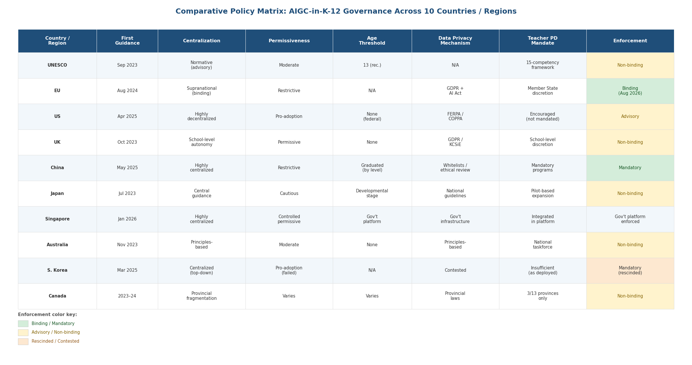

*Figure 2.1 — Comparative policy matrix covering first guidance date, centralization level, permissiveness, age thresholds, data privacy mechanisms, teacher professional development mandates, and enforcement mechanisms across ten jurisdictions. Color coding in the enforcement column distinguishes binding/mandatory (green), advisory/non-binding (yellow), and rescinded/contested (orange) frameworks.*

### Convergences

Despite substantial institutional and cultural differences, a number of policy positions are converging globally. Most countries that have issued guidance recommend some form of age differentiation, whether through explicit thresholds (China's graduated restrictions, UNESCO's recommended minimum age of 13), developmental-stage considerations (Japan), or platform-level age-gating (emerging in the U.S.). Near-universal agreement exists that AI should serve a supplementary rather than replacement role for teachers—a principle articulated across UNESCO guidance, the Chinese MOE guide, the Japanese MEXT guidelines, and the Singaporean Ethics Framework. Teacher professional development is universally recognized as a priority, even as approaches vary from centralized programs (China, Singapore) to school-level discretion (UK, Finland). The OECD's January 2026 finding that purpose-built education AI tools outperform general-purpose chatbots is increasingly reflected in procurement and design decisions, from Singapore's government-built SLS to the UK's curriculum-grounded Aila.

### Divergences

Policy approaches diverge most sharply along three axes, as visualized in Figure 2.2.

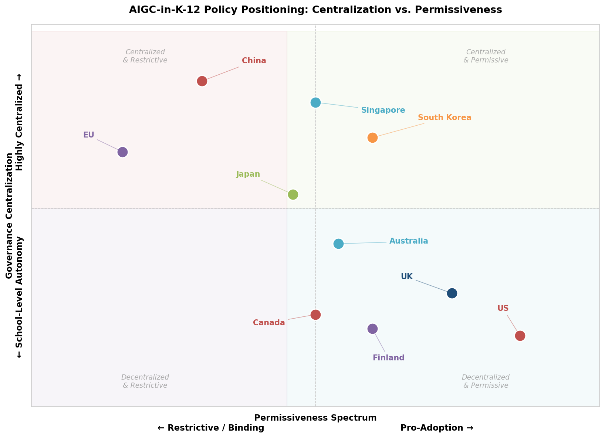

*Figure 2.2 — Two-axis positioning of ten countries/regions on governance centralization (school-level autonomy to highly centralized) versus permissiveness (restrictive/binding to pro-adoption). Quadrant labels indicate the interpretive context for each cluster.*

**Centralization versus school-level autonomy.** China and Singapore represent the most centralized models, with government-mandated whitelists, government-built platforms, and detailed prescriptive guidance. The UK, Finland, Iceland, and Sweden delegate substantial decision-making authority to individual schools. The United States occupies the most decentralized extreme, with 50 states, over 13,000 school districts, and more than 120 AI-in-education bills in 2025 alone producing a fragmented regulatory patchwork.

**Permissiveness versus restriction.** The U.S. federal stance is the most actively pro-adoption, backed by massive public-private investment commitments. The UK shares a permissive, innovation-first orientation. China combines detailed restrictions on student use with mandatory AI literacy education. The EU AI Act imposes the most stringent binding classification, with high-risk provisions for education AI taking full effect in August 2026.

**Data privacy architectures.** The EU AI Act, in conjunction with GDPR, creates the most stringent regulatory environment for education data. China relies on whitelists and ethical review mechanisms. Singapore controls data flow through its government-owned platform. The United States depends on FERPA and the updated COPPA rule (effective June 2025), which strengthens protections for children under 13 but leaves teenagers largely unprotected by federal statute. Australia's framework is principles-based without mandatory compliance mechanisms.

### The Enforcement Gap

The most significant structural finding across the global landscape is the persistent gap between policy aspiration and binding enforcement. The OECD's 2023 survey found zero binding GenAI-in-education regulations among 18 countries surveyed. By early 2026, this picture is evolving—China has imposed mandatory requirements, and the EU's binding provisions take effect in August 2026—but the majority of countries still rely on advisory, non-binding guidance. The OECD's 2025 finding that only 19% of jurisdictions include timebound goals in their AI-in-education strategies underscores the distance between stated intentions and operational commitments. At the school level, the gap is even wider: in the United States, only 45% of principals report having any AI policy, and over 80% of students report receiving no instruction on AI use from their teachers [RAND](https://www.rand.org/pubs/research_reports/RRA4180-1.html "RAND, Doss et al., September 2025").

### Early Movers and Late Entrants

Figure 2.3 plots the sequencing of major policy milestones across regions, illustrating both the acceleration of global policy responses and the clustering of activity in 2025.

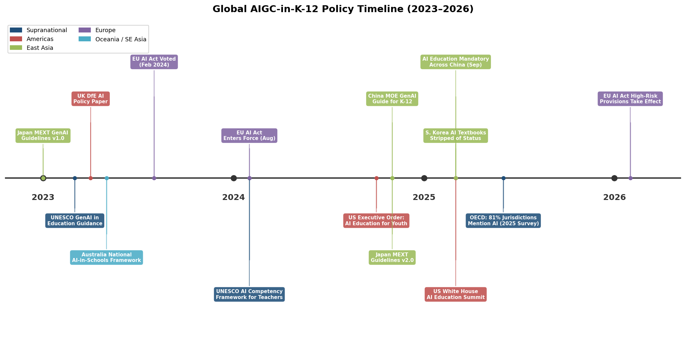

*Figure 2.3 — Horizontal timeline of 15 major national and supranational AIGC-in-K-12 policy milestones from mid-2023 to mid-2026, color-coded by region. The density of activity in 2025 reflects the global inflection point at which generative AI in education transitioned from an emerging concern to a central policy priority.*

Australia (November 2023), Japan (July 2023), and the UK (October 2023) were among the earliest countries to publish formal national positions. China followed with the most detailed prescriptive framework by mid-2025. The United States arrived relatively late to formal federal guidance but has been the most aggressive in mobilizing private-sector investment. South Korea's experience demonstrates that being an early mover with substantial financial resources does not guarantee success when implementation quality, stakeholder engagement, and evidence-based piloting are neglected. Latin America, while lacking formal national K-12 GenAI policies, demonstrates significant bottom-up innovation, with 193 AI-in-education initiatives documented across 22 countries [IDB](https://www.iadb.org/en/blog/education/how-ai-transforming-education-latin-america-and-caribbean-lessons-193-solutions "IDB, January 2026"). Africa remains the least represented region in both policy frameworks and empirical research, though initiatives such as Experience AI's teacher training programs in Kenya and their expansion to Latin America point toward emerging engagement.

The global policy landscape for AIGC in K-12 education is thus characterized by rapid evolution, considerable heterogeneity, and a persistent gap between aspiration and enforcement. As the chapters that follow demonstrate, this policy context profoundly shapes how AIGC tools are actually deployed in classrooms—and which students and educators ultimately benefit.

# 第3章 Taxonomy of AIGC Application Approaches in K-12 Classrooms

Generative AI has entered K-12 education not as a single innovation but as a family of capabilities—text generation, image synthesis, code completion, adaptive dialogue—deployed across markedly different pedagogical contexts. A teacher using AIGC (AI-Generated Content) to draft a differentiated reading passage operates in a fundamentally different mode from a student conversing with an AI tutor about quadratic equations, and both differ from a classroom in which students learn to interrogate AI systems themselves. Analyzing these applications systematically requires a robust taxonomy. This chapter reviews existing classification frameworks from the academic literature, proposes a five-category taxonomy adapted for the generative AI era, and examines each category through representative tools, empirical evidence, pedagogical rationale, and cross-cutting patterns in subject area, age band, and adoption trajectory.

## 3.1 Foundations: Existing Taxonomies and Their Limitations

The classification of AI in education predates the generative AI wave. Three foundational frameworks warrant examination.

Zawacki-Richter et al. (2019) conducted a systematic review of 146 articles on AI in higher education published between 2007 and 2018, identifying four functional categories: profiling and prediction, intelligent tutoring systems (ITS), assessment and evaluation, and adaptive systems and personalization. The review found that 63% of studies addressed academic support functions, while only 1.4% examined ethical challenges—a ratio that foreshadowed the governance gaps that would later characterize the generative AI era [Zawacki-Richter et al.](https://link.springer.com/article/10.1186/s41239-019-0171-0 "IJETHE, 2019"). The framework remains influential but was designed for pre-generative systems that analyzed existing data rather than producing new content.

Holmes, Bialik, and Fadel (2019) introduced a tripartite stakeholder taxonomy—student-facing, teacher-facing, and system-facing AI—that reframed the classification question around *who* interacts with the AI rather than *what* the AI does. Their detailed documentation of ITS architecture (domain models, pedagogical models, learner models, and open learner models) provided a structural vocabulary that continues to inform how purpose-built education AI tools are designed [Holmes, Bialik & Fadel](https://curriculumredesign.org/wp-content/uploads/AIED-Book-Excerpt-CCR.pdf "CCR, 2019"). Holmes and Tuomi (2022) subsequently updated this typology to address the emergence of generative models, organizing applications around student, teacher, and institution axes while cautioning that expectations for AI in education are "often based on misunderstanding" [Holmes & Tuomi](https://eric.ed.gov/?id=EJ1355026 "European Journal of Education, Vol. 57, No. 4, December 2022").

These frameworks offer essential structural scaffolding but require adaptation for the generative AI subset. Three of the five categories proposed below—content generation, creative expression, and AI literacy—represent distinctly generative-AI phenomena absent from pre-2022 classification schemes. The remaining two—personalized tutoring and assessment/feedback—update traditional ITS and evaluation categories to reflect the capabilities and risks of large language models (LLMs). The proposed taxonomy integrates both axes from prior work: the pedagogical function axis (what the AI does) and the stakeholder axis (who uses it), enabling each category to be located within a two-dimensional space. The matrix below summarizes the full taxonomy with key attributes for each category.

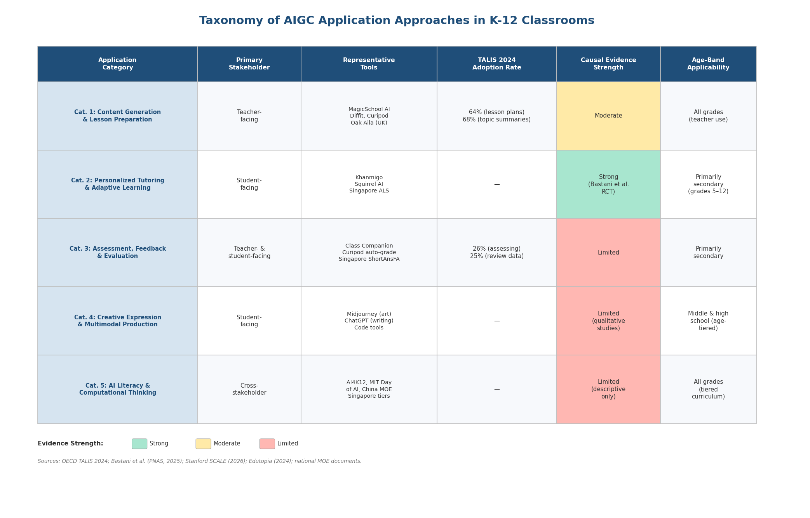

*Figure 3.1. Five-category taxonomy of AIGC applications in K-12, mapping each category against primary stakeholder, representative tools, TALIS 2024 adoption rates (where available), causal evidence strength, and age-band applicability. Evidence strength is color-coded: green = strong, yellow = moderate, red = limited. Sources: OECD TALIS 2024; Bastani et al. (PNAS, 2025); Stanford SCALE (2026); Edutopia (2024); national MOE documents.*

## 3.2 Category 1: Content Generation and Lesson Preparation (Teacher-Facing)

The most widely adopted application of AIGC in K-12 education is teacher-facing content generation—the use of generative AI to produce, adapt, or differentiate instructional materials. OECD TALIS 2024 data, drawn from approximately 300,000 teachers in over 50 education systems, confirm that lesson plan generation (64% of AI-using teachers) and topic summarization (68%) are the two most common AI uses among educators globally [Education International/OECD TALIS 2024](https://www.ei-ie.org/en/item/31815:using-artificial-intelligence-takeaways-from-talis-2024 "Education International, December 2025").

### 3.2.1 Representative Tools

Several purpose-built platforms illustrate the range of teacher-facing content generation tools now available:

- **MagicSchool AI** offers over 80 teacher-facing tools—lesson plan generators, text levelers, rubric creators, worksheet builders—engineered to reduce hallucination rates relative to generic chatbots. Made free for all U.S. educators following the September 2025 White House AI Education Summit, MagicSchool raised $45 million in 2025, signaling substantial investor confidence in the teacher-tools segment [Edutopia](https://www.edutopia.org/article/4-time-saving-ai-tools-for-teachers/ "Edutopia, January 2024"); [HolonIQ](https://www.holoniq.com/notes/edtech-hits-2-6b-in-investment-as-the-market-stabilizes-bigger-bets-in-ai-and-workforce-training "HolonIQ, February 2026").

- **Diffit** specializes in AI-powered text leveling, translating articles to any reading level (grades 2–11) and generating vocabulary lists and assessment questions in under 30 seconds. Its narrow functional scope exemplifies the "purpose-built" design philosophy that the OECD has identified as more effective than general-purpose tools [Edutopia](https://www.edutopia.org/article/4-time-saving-ai-tools-for-teachers/ "Edutopia, January 2024").

- **Curipod** generates full interactive slide presentations (approximately 14 slides) from a single prompt, incorporating polls, reflection questions, exit tickets, and auto-grading functionality [Edutopia](https://www.edutopia.org/article/4-time-saving-ai-tools-for-teachers/ "Edutopia, January 2024").

- **Oak National Academy's Aila** (United Kingdom) represents the most prominent government-funded entry in this category. Backed by £2 million from the Department for Education, Aila attracted over 10,000 teachers who generated approximately 25,000 lesson plans in its first two months of operation following its September 2024 beta launch. An early impact study found that 85% of users rated lesson quality as "fairly high" or "very high," while planning time dropped from a typical 30 minutes to 5–10 minutes per lesson; nearly two-thirds of teachers reported decreased workload [Oak National Academy](https://www.thenational.academy/blog/how-is-aila-impacting-teacher-lesson-planning-practices-workload-and-expertise-early-insights "Oak National Academy, February 2025"). A separate Education Endowment Foundation (EEF) trial found that teachers using ChatGPT for lesson planning saved an average of 25 minutes per session [Oak National Academy](https://www.thenational.academy/blog/how-is-aila-impacting-teacher-lesson-planning-practices-workload-and-expertise-early-insights "February 2025, citing EEF").

### 3.2.2 Pedagogical Rationale and Evidence

The pedagogical rationale for teacher-facing content generation rests on a straightforward proposition: reducing time spent on routine preparation frees cognitive and temporal resources for higher-value activities—differentiation, formative dialogue, relationship-building. The Gallup–Walton Family Foundation survey (June 2025) quantified this effect: teachers who use AI weekly save an average of 5.9 hours per week (approximately six weeks reclaimed per school year), with 64% reporting better differentiated materials and 61% reporting improved data insights [Walton Family Foundation](https://www.waltonfamilyfoundation.org/the-ai-dividend-new-survey-shows-ai-is-helping-teachers-reclaim-valuable-time "Walton Family Foundation, June 2025").

A critical caveat, however, is that time savings do not automatically translate into improved teaching. The Aila study noted that over 50% of users said the tool "changed their lesson planning thinking"—suggesting that AI-generated drafts can serve as cognitive scaffolds, not merely efficiency shortcuts. At the same time, RAND interviews with 14 U.S. districts found that teachers often default to generating multiple-choice questions rather than exploiting AI's capacity for more sophisticated task design [RAND](https://www.rand.org/pubs/research_reports/RRA956-31.html "RAND, April 2025"). The risk of "floor-level adoption"—using a transformative tool for routine substitution—remains significant and requires deliberate professional development to counteract.

## 3.3 Category 2: Personalized Tutoring and Adaptive Learning (Student-Facing)

AI-powered tutoring represents both the oldest aspiration in the AI-in-education field—traceable to Bloom's (1984) "2-sigma problem," which demonstrated that one-on-one human tutoring produces a two-standard-deviation improvement over conventional instruction—and the application most dramatically transformed by generative AI. Where earlier ITS relied on pre-authored response trees, LLM-based tutors generate natural-language explanations, engage in Socratic dialogue, and adapt in real time to student inputs.

### 3.3.1 Representative Tools

- **Khanmigo** (Khan Academy), powered by GPT-4, operates through Socratic dialogue—posing guiding questions rather than providing direct answers. By 2025, Khanmigo had reached approximately 2 million students and teachers across the United States, India, and Brazil. Efficacy data from the 2022–23 school year, covering approximately 350,000 students in grades 3–8, indicate that students using Khan Academy for 30 or more minutes per week achieved roughly 20% greater-than-expected learning gains on MAP Growth assessments (effect size 0.36) [Khan Academy](https://blog.khanacademy.org/khan-academy-efficacy-results-november-2024/ "Khan Academy, November 2024"). A Microsoft partnership made the tool free for U.S. teachers, and Khan Academy announced a reimagined platform for the 2026 school year embedding Khanmigo as a learning coach, teaching assistant, and administrative aide [Khan Academy](https://blog.khanacademy.org/khan-academy-reimagined-for-districts-2026/ "Khan Academy, October 2025").

- **Squirrel AI** (China) has served over 24 million students through its "large adaptive model" (LAM), earning recognition as a TIME Best Inventions 2025 selection. The system personalizes lesson plans and testing sequences and has begun expanding into the U.S. market [TIME](https://time.com/collections/best-inventions-2025/7318298/squirrel-ai-intelligent-adaptive-learning-system/ "TIME, October 2025").

- **Singapore's Adaptive Learning System (ALS)**, built into the national Student Learning Space (SLS) platform, delivers AI-powered adaptive learning for Primary 5 through Secondary 2 Mathematics and Upper Secondary Geography. The system's Learning Experience Assistant (LEA) poses guiding questions across multiple pedagogical roles, and all AI feedback is subject to a human-in-the-loop mandate requiring teacher verification [Singapore MOE](https://www.moe.gov.sg/education-in-sg/educational-technology-journey/edtech-masterplan/artificial-intelligence-in-education "Singapore MOE, January 2026").

### 3.3.2 The Guardrails Question: Evidence from the Bastani et al. RCT

The most rigorous causal evidence on AI tutoring in K-12 comes from the Bastani et al. randomized controlled trial (RCT), conducted with approximately 1,000 high school mathematics students in Türkiye during Fall 2023 and published in the *Proceedings of the National Academy of Sciences* in June 2025. Three experimental arms were compared: GPT Base (unguarded ChatGPT access), GPT Tutor (ChatGPT with pedagogical guardrails including progressive hints and answer verification), and a control group with no AI access.

The results are striking. GPT Base improved practice performance by 48% but *decreased* exam performance by 17% (p < 0.05). GPT Tutor improved practice performance by 127% with no statistically significant decline in exam performance relative to controls. GPT Base provided correct solutions only 51% of the time (with 42% logical errors and 8% arithmetic errors). Critically, students in the GPT Base condition did not perceive their own learning loss [Bastani et al.](https://www.pnas.org/doi/10.1073/pnas.2422633122 "PNAS, Vol. 122, No. 26, June 2025").

Stanford's Center for Research on Education Outcomes (SCALE) elevated this finding in its March 2026 review of over 800 papers on AI in K-12 education, from which only 20 high-quality causal studies were identified. The review concluded that tool design incorporating pedagogical guardrails consistently outperforms general-purpose chatbots and noted the complete absence of causal studies of student AI use within U.S. K-12 classrooms [Stanford SCALE](https://scale.stanford.edu/research-in-action/understanding-evidence-base-ai-k12-education "Stanford SCALE, March 2026").

### 3.3.3 Pedagogical Rationale

Personalized AI tutoring draws on multiple learning-science foundations: Bloom's 2-sigma problem (1984) establishes the theoretical ceiling for individualized instruction; Vygotsky's zone of proximal development (ZPD) provides the framework for calibrated scaffolding; Bjork's (1994) desirable difficulties research explains why overly facilitative AI assistance can undermine long-term retention; and Kalyuga's (2007) expertise reversal effect warns that scaffolding appropriate for novices becomes counterproductive for advanced learners. The Bastani et al. results empirically validate these theoretical concerns: unguarded AI that eliminates productive struggle harms learning, while guardrailed AI that maintains cognitive demand can enhance it.

## 3.4 Category 3: Assessment, Feedback, and Evaluation

Assessment represents the AI application with the highest pedagogical stakes and the lowest adoption rate. TALIS 2024 data show that only 26% of AI-using teachers employ it for assessing student work—the lowest figure among all teacher AI use categories—while just 25% use AI to review student performance data [Education International/OECD TALIS 2024](https://www.ei-ie.org/en/item/31815:using-artificial-intelligence-takeaways-from-talis-2024 "Education International, December 2025"). This caution appears well-founded given the accuracy limitations of current systems, yet several purpose-built tools have demonstrated promising results in controlled settings.

### 3.4.1 Representative Tools

- **Class Companion** provides AI-powered writing feedback for Advanced Placement (AP) courses, aligning responses to specific rubric criteria and allowing students up to five iterative submission attempts. Teachers have reported that the quality of Class Companion's feedback on evidence-based responses is comparable to that of human grading [Edutopia](https://www.edutopia.org/article/4-time-saving-ai-tools-for-teachers/ "Edutopia, January 2024").

- **Curipod's auto-grading function** allows teachers to define assessment criteria against which AI provides instant student feedback. One educator reported zero instances of inaccurate feedback over the course of a full school year—though such self-reported data warrant cautious interpretation [Edutopia](https://www.edutopia.org/article/4-time-saving-ai-tools-for-teachers/ "Edutopia, January 2024").

- **Singapore's ShortAnsFA**, integrated into the national SLS platform, provides AI-assisted marking of short-answer responses, operating under the same human-in-the-loop mandate that governs all AI feedback in Singaporean schools [Singapore MOE](https://www.moe.gov.sg/education-in-sg/educational-technology-journey/edtech-masterplan/artificial-intelligence-in-education "Singapore MOE, January 2026").

### 3.4.2 Accuracy Concerns and the Reliability Gap

The low adoption rate for AI assessment is partly explained by documented accuracy deficiencies in general-purpose models. Bastani et al. (2025) found that unguarded GPT-4 provided correct solutions to high school mathematics problems only 51% of the time, with 42% of errors being logical and 8% arithmetic [Bastani et al.](https://www.pnas.org/doi/10.1073/pnas.2422633122 "PNAS, Vol. 122, No. 26, June 2025"). AI-generated quiz questions have likewise been found to contain frequent factual errors when produced without human review. These accuracy limitations create a fundamental tension: AI assessment tools can dramatically reduce teacher workload, but deploying them without robust verification processes risks propagating errors at scale.

The reliability gap extends to AI detection tools—a closely related assessment application. Over 40% of U.S. teachers in grades 6–12 report using AI detection tools, despite Turnitin's own acknowledgment that scores "may not always be accurate" and independent researcher assessments that such tools are "not fit for purpose" [NPR](https://www.npr.org/2025/12/16/nx-s1-5492397/ai-schools-teachers-students "NPR, December 2025"); [CDT](https://cdt.org/wp-content/uploads/2025/10/FINAL-CDT-2025-Hand-in-Hand-Polling-100225-accessible.pdf "CDT, October 2025"). Documented false accusations—including a 17-year-old at Eleanor Roosevelt High School (Maryland) flagged at 30.76% AI probability and a non-native English speaker at Shaker Heights High School (Ohio) flagged due to vocabulary patterns—underscore the risks of relying on unreliable detection in high-stakes contexts.

### 3.4.3 Pedagogical Rationale

AI-assisted assessment, when functioning reliably, aligns with the formative assessment tradition championed by Black and Wiliam (1998): rapid, specific, actionable feedback that guides student revision. The iterative model used by Class Companion—five attempts with progressive AI feedback—mirrors the revision-centered pedagogy that writing researchers have long advocated. The pedagogical value lies not in the accuracy of the grade itself but in the frequency and specificity of the feedback cycle. The emerging practitioner consensus holds that AI assessment works best in low-stakes formative contexts where errors are tolerable, while high-stakes summative assessment continues to require human judgment.

## 3.5 Category 4: Creative Expression and Multimodal Production

Generative AI's capacity to produce images, music, code, and narrative text has opened a fourth application category with no pre-2022 analogue: AI as creative collaborator. This category occupies a distinctive position in the taxonomy because it is inherently student-facing and extends beyond STEM into arts, humanities, and interdisciplinary domains.

### 3.5.1 Representative Tools and Implementations

- **Text-to-image generation** entered K-12 classrooms early. Vartiainen et al. (2023) documented one of the first empirical studies of K-12 AI art creation: a Finnish middle school workshop in which 10 students engaged with Midjourney over three sessions (3 × 3 hours) during autumn 2022. The researchers observed socio-material co-creation dynamics in which students iteratively refined prompts, negotiated aesthetic choices with the AI, and developed what the authors termed "prompt engineering as creative practice" [Alfarwan 2025](https://www.frontiersin.org/journals/education/articles/10.3389/feduc.2025.1647573/full "Frontiers in Education, September 2025, citing Vartiainen et al. 2023"). While the small sample limits generalizability, the study demonstrated that text-to-image AI can sustain meaningful creative engagement among adolescents.

- **Creative writing with AI** has been explored in several K-12 contexts. Levine et al. (2024) studied the use of ChatGPT as a writing support tool among adolescent and adult learners, publishing findings in the *Journal of Adolescent & Adult Literacy* (Vol. 68, pp. 445–457). The study examined how students used AI-generated text as a starting point for their own compositional processes [Alfarwan 2025](https://www.frontiersin.org/journals/education/articles/10.3389/feduc.2025.1647573/full "Frontiers in Education, September 2025").

- **Programming and code generation** represents a third creative strand. Liao et al. (2024) demonstrated scaffolded computational thinking with ChatGPT, published in *IEEE Transactions on Learning Technologies* (Vol. 17, pp. 1628–1642). Yang et al. (2025b) extended this work to high school programming contexts. These applications are notable because they blur the boundary between creative expression and computational skill development [Alfarwan 2025](https://www.frontiersin.org/journals/education/articles/10.3389/feduc.2025.1647573/full "Frontiers in Education, September 2025").

- **Japan's Takehaya Elementary School "AI Classmate" experiment** illustrates a particularly innovative creative application. At Takehaya Elementary (affiliated with Tokyo Gakugei University), a custom AI character named "Saya" was positioned as a "classmate" who plays devil's advocate in fourth-grade ethics lessons during the 2025–2026 school year. Students reported finding it easier to accept challenges from an AI peer than from a teacher, and the design supported critical thinking and perspective-taking [NHK World](https://www3.nhk.or.jp/nhkworld/en/news/backstories/4680/ "NHK World, March 2026").

### 3.5.2 Pedagogical Rationale

Creative AIGC applications align with the upper tiers of the SAMR model (Puentedura, 2006): at the Modification level, AI enables students to iterate on creative work at speeds impossible without technology; at the Redefinition level, AI enables previously inconceivable tasks—a student with no drawing skill generating visual art through prompt engineering, or an elementary student debating ethical dilemmas with an AI peer [Holmes et al.](https://curriculumredesign.org/wp-content/uploads/AIED-Book-Excerpt-CCR.pdf "CCR, 2019"). A constructivist framing is also relevant: students co-create knowledge through iterative human-AI interaction, with the prompt itself becoming an artifact of learning.

Age differentiation is particularly salient in this category. China's MOE guide (May 2025) establishes a tiered approach: elementary/primary students (ages 5–10) are prohibited from independent AI content generation; middle school/lower secondary students (ages 11–13) may explore AI-assisted creative work under supervision; and high school/upper secondary students (ages 14–18) may engage in inquiry-based AI creative projects [Georgetown CSET](https://cset.georgetown.edu/publication/china-school-gen-ai-use-guide-2025/ "Georgetown CSET translation, May 2025"). This graduated model reflects developmental considerations about creative autonomy and the capacity for critical evaluation of AI outputs.

## 3.6 Category 5: AI Literacy and Computational Thinking

The fifth category is distinctive because its pedagogical objective is not to *use* AIGC as a tool but to *understand* AI as a subject. AI literacy—the knowledge, skills, and dispositions needed to engage critically and productively with AI systems—has rapidly transitioned from an elective enrichment topic to a mandatory curricular element in several national education systems.

### 3.6.1 Curriculum Frameworks

- **AI4K12**, a joint initiative of AAAI and CSTA, defines Five Big Ideas in AI—Perception, Representation and Reasoning, Learning, Natural Interaction, and Societal Impact—with grade-band progression spanning K–2, 3–5, 6–8, and 9–12. The framework provides the most widely adopted structural vocabulary for K-12 AI curriculum design in the United States [AI4K12](https://ai4k12.org/ "AI4K12 initiative website").

- **MIT RAISE's Day of AI** curriculum exemplifies AI literacy implementation at scale. Originally launched in 2021 and becoming a stand-alone nonprofit in 2024, Day of AI offers free, open-source AI curricula, assessments, and teacher professional development materials. By 2025, educators in all 50 U.S. states and 175 countries were using Day of AI curricula, reaching a milestone of over 2 million students. Offerings include progressively structured modules with grade-band-appropriate content, an "AI & the Creative Arts" curriculum developed in 2025, and collaborations with Common Sense Media on AI literacy toolkits for parents and caregivers. Translations are available in Uzbek, Japanese, Arabic, Spanish, Portuguese, and Vietnamese [MIT RAISE](https://raise.mit.edu/stories/2025-day-of-ai-impact-report/ "MIT RAISE, 2025 Day of AI Impact Report").

- **China** has moved furthest toward mandatory AI literacy, requiring AI education across all primary and secondary schools from September 1, 2025. The program designates 184 schools as AI education bases and structures a tiered curriculum: basic cognitive understanding at the primary level, deeper analytical engagement at the middle school level, and applied innovation at the high school level [IEEE IT Professional](https://www.computer.org/csdl/magazine/it/2025/05/11218250/2b9Tuwsg7aU "IEEE, 2025").

- **Singapore** integrates AI literacy into its EdTech Masterplan 2030 through a four-tier developmental model: learn *about* AI, learn *to use* AI, learn *with* AI, and learn *beyond* AI—with milestones mapped to the national curriculum [Singapore MOE](https://www.moe.gov.sg/education-in-sg/educational-technology-journey/edtech-masterplan/artificial-intelligence-in-education "Singapore MOE, January 2026").

- **The OECD–European Commission AILit Framework** (May 2025 draft) defines AI literacy as "technical knowledge, durable skills, and future-ready attitudes" and organizes 22 competences across four domains: Engaging with AI, Creating with AI, Managing AI, and Designing AI. Notably, this framework is designed for cross-subject K-12 integration rather than standalone computer science instruction and will inform the PISA 2029 Media & AI Literacy assessment—the first global standardized benchmarking of AI literacy [AILit Framework](https://ailiteracyframework.org/wp-content/uploads/2025/05/AILitFramework_ReviewDraft.pdf "OECD–EC AILit Framework, May 2025 draft").

### 3.6.2 Pedagogical Rationale and the Teacher Readiness Gap

AI literacy draws on computational thinking (CT) frameworks while extending beyond them. Where CT emphasizes decomposition, pattern recognition, abstraction, and algorithmic thinking, AI literacy adds dimensions of ethical reasoning, societal impact analysis, and critical evaluation of AI outputs—competences that cannot be cultivated through programming exercises alone.

The central challenge is teacher readiness. Stanford HAI's 2025 AI Index found that 81% of U.S. computer science teachers agree that AI should be integrated into foundational CS education, yet fewer than 50% feel equipped to teach it [Stanford HAI](https://hai.stanford.edu/ai-index/2025-ai-index-report/education "Stanford HAI, 2025"). This confidence gap is a global phenomenon: TALIS 2024 reports that 75% of non-AI-using teachers cite lack of skills as the primary barrier to adoption [Education International/OECD TALIS 2024](https://www.ei-ie.org/en/item/31815:using-artificial-intelligence-takeaways-from-talis-2024 "Education International, December 2025"). Closing this gap requires not merely technical training but sustained pedagogical support in integrating AI concepts across subjects—a shift from AI-as-elective to AI-as-cross-curricular-competence.

## 3.7 Cross-Cutting Analysis: Subject Areas, Age Bands, and Adoption Patterns

The five categories do not exist in isolation. Several cross-cutting patterns emerge from the evidence base.

### 3.7.1 Subject-Area Concentration

AIGC adoption in K-12 is heavily concentrated in STEM subjects. Alfarwan's (2025) systematic review of 30 empirical generative AI studies in K-12 found that mathematics dominated (5 of 30 papers), followed by physics (4) and programming (3); non-STEM subjects were markedly underrepresented [Alfarwan](https://www.frontiersin.org/journals/education/articles/10.3389/feduc.2025.1647573/full "Frontiers in Education, September 2025"). RAND's U.S. surveys sample ELA, mathematics, and science teachers, and Stanford SCALE's review focuses primarily on mathematics outcomes. Japan's MEXT pilot schools present a notable exception: foreign language instruction led adoption (36 of 266 use cases), followed by Japanese language arts (27), social studies (21), and mathematics (16). Creative applications—drawing, music, and story creation—accounted for the single largest use-case cluster (40 cases) [Nishimoto et al.](https://www.uchida.co.jp/ueric/pdf/poster_generativeai.pdf "Uchidayoko Institute"). This divergence suggests that subject-area patterns may reflect research attention bias as much as actual classroom adoption.

### 3.7.2 Age-Band Differentiation

Adoption increases substantially with student age. Pew Research Center data from Fall 2025 show that more high school than middle school students use AI for schoolwork [Pew Research](https://www.pewresearch.org/internet/2026/02/24/how-teens-use-and-view-ai/ "Pew Research, February 2026"). Swiss data (2024, n=10,000, ages 8–18) quantify this gradient: regular classroom generative AI use stands at 8% among elementary/primary students, 30% at lower secondary, 50% at upper secondary, and 42% in vocational tracks [OECD AI Adoption Report](https://www.oecd.org/content/dam/oecd/en/publications/reports/2025/12/ai-adoption-in-the-education-system_43251cf0/69bd0a4a-en.pdf "OECD, 2025"). Alfarwan (2025) found that high school students dominated the research literature, with no studies addressing early childhood education.

Policy frameworks reinforce this age gradient. China's graduated thresholds prohibit independent AI use by elementary/primary students, permit supervised exploration for middle school, and allow inquiry-based engagement for high school. UNESCO recommends a minimum age of 13 for generative AI interaction. Seven of the 18 OECD countries surveyed in the 2023 Digital Education Outlook discourage AI use below age 13. These patterns suggest that the K-12 AI adoption landscape is, in practice, primarily a secondary-school phenomenon, with elementary/primary applications largely limited to teacher-facing content generation and structured AI literacy instruction.

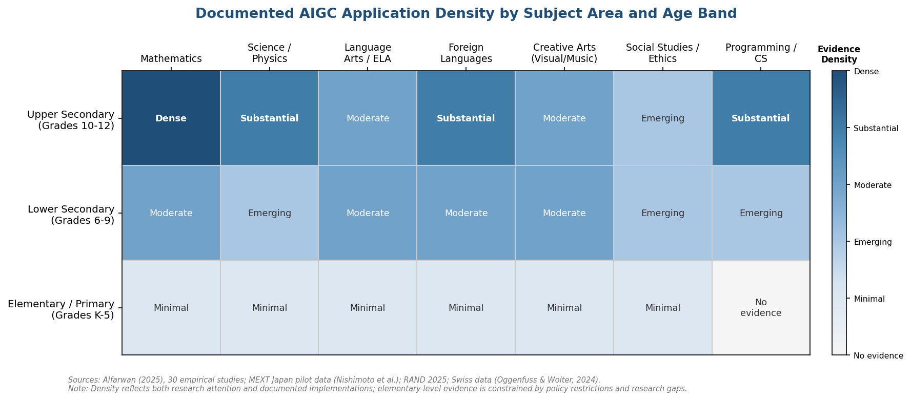

*Figure 3.2. Heatmap of documented AIGC application density across seven subject areas and three age bands. Color intensity reflects evidence density, ranging from "No evidence" (lightest) to "Dense" (darkest). Upper secondary mathematics shows the highest concentration; elementary/primary categories remain largely minimal across all subjects. Sources: Alfarwan (2025); MEXT Japan pilot data; RAND (2025); OECD Swiss student survey (2024).*

### 3.7.3 Teacher-Facing vs. Student-Facing Adoption

A persistent asymmetry characterizes how teachers and students use AIGC. Teachers use AI primarily for preparation—lesson plans (64%) and topic learning (68%)—with assessment ranking lowest (26%). Students, by contrast, use AI predominantly for homework assistance. RAND 2025 data reveal near-parity in overall adoption rates: 53% of ELA/math/science teachers and 54% of students use AI for school [RAND](https://www.rand.org/pubs/research_reports/RRA4180-1.html "RAND, Doss et al., September 2025"). However, this quantitative parity masks a qualitative divergence: teachers use AI to *produce* instructional materials (Categories 1 and 3), while students use it to *receive* assistance (Categories 2 and 4). Category 5 (AI literacy) is the only domain where the pedagogical goal is neither production nor reception but critical understanding.

### 3.7.4 Global Variation

The geographic distribution of adoption is highly uneven. TALIS 2024 data range from 75% teacher AI use in the UAE and Singapore to 14% in France. This variation reflects not only infrastructure and policy differences but also cultural attitudes toward technology in education, varying degrees of centralized curricular control, and the availability of AIGC tools in local languages. The evidence base itself is geographically skewed: Alfarwan (2025) found no African representation among the 30 empirical K-12 generative AI studies reviewed, and Stanford SCALE (2026) noted the absence of causal studies from U.S. K-12 classrooms. The taxonomy proposed in this chapter, while conceptually applicable across contexts, is empirically grounded primarily in data from North America, Europe, and East Asia.

### 3.7.5 The Evidence Gap

A final cross-cutting observation concerns the quality of evidence underlying the entire taxonomy. Stanford SCALE's March 2026 review identified only 20 high-quality causal studies among over 800 papers on AI in K-12 education [Stanford SCALE](https://scale.stanford.edu/research-in-action/understanding-evidence-base-ai-k12-education "Stanford SCALE, March 2026"). Most existing evidence is observational, self-reported, or based on small samples. Long-term learning outcome data are absent across all five categories. The taxonomy is well-supported by descriptive evidence and practitioner documentation, but the causal claims that can be made about any single category remain limited. Rigorous evidence is concentrated almost entirely in Category 2 (personalized tutoring), with the Bastani et al. RCT standing as the field's methodological benchmark.

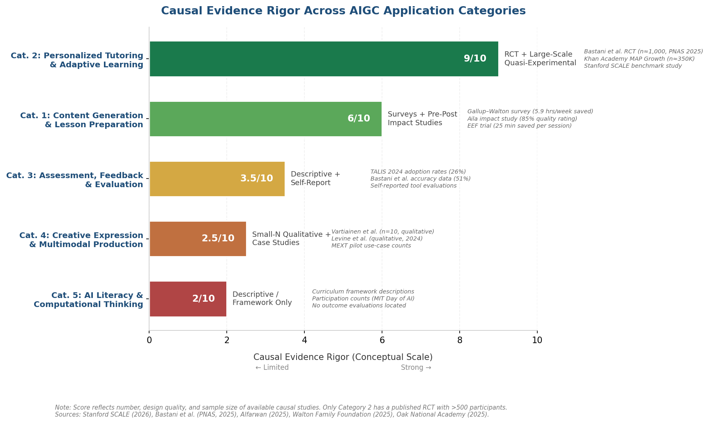

*Figure 3.3. Causal evidence rigor across the five AIGC application categories, scored on a conceptual 0–10 scale. Category 2 (Personalized Tutoring) leads with published RCT-level evidence (9/10). Category 1 (Content Generation) benefits from survey and pre-post impact studies (6/10). Categories 3–5 cluster in the 2–3.5 range, relying on descriptive, self-reported, or small-N qualitative data. Only Category 2 has published large-sample RCTs with more than 500 participants. Sources: Stanford SCALE (2026); Bastani et al. (PNAS, 2025); Alfarwan (2025); Walton Family Foundation (2025); Oak National Academy (2025).*

# 第4章 Global Case Studies — Practical Implementation in Classrooms

The preceding chapters established a taxonomic framework for AIGC (AI-Generated Content) applications in K-12 settings and surveyed the policy landscape governing their deployment. This chapter shifts from typology and regulation to practice, presenting eleven case studies drawn from eight countries across five continents. Each case is selected on three criteria: documented classroom deployment of generative AI tools, reported outcomes or evaluations from identifiable sources, and coverage of at least one of the five taxonomy categories defined in Chapter 3 — content generation and lesson preparation, personalized tutoring and adaptive learning, assessment and feedback, creative expression and multimodal production, and AI literacy. The cases range from a rigorously controlled randomized experiment in Türkiye to a billion-dollar national textbook rollout in South Korea, offering complementary perspectives on what works, what fails, and why context determines outcomes.

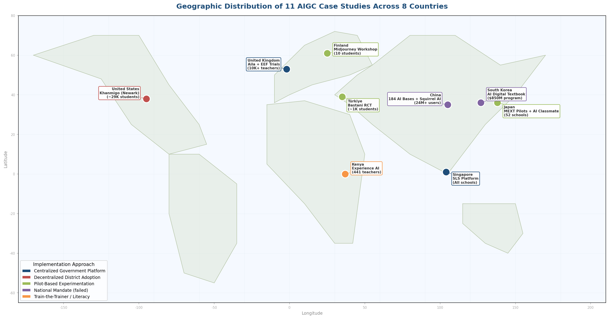

*Figure 4.1 — Geographic distribution of the eleven case studies, color-coded by implementation approach: centralized government platform (UK, Singapore), decentralized district adoption (USA), pilot-based experimentation (Türkiye, Japan, Finland), national mandate — failed (South Korea, China), and train-the-trainer / literacy (Kenya).*

A standardized template guides each case presentation: school or program profile, pedagogical objectives, AIGC tools and workflow, implementation process and scale, outcomes and evidence, challenges encountered, and key takeaways. A cross-case comparative analysis concludes the chapter, identifying recurrent success factors and failure modes.

## 4.1 Khanmigo District Rollout — Newark, New Jersey, United States

### Context and School Profile

Newark Public Schools, a large urban district in New Jersey, serves approximately 43,000 students across 66 schools from Pre-K through 12th grade. The district is historically under-resourced, situated in a national context where only 39 percent of 4th graders and 22 percent of 12th graders achieve math proficiency. The Khanmigo pilot began in 2023 at First Avenue Elementary School, expanded to 14 North Ward schools, and eventually reached all 66 schools — approximately 29,000 students. A $25,000 Gates Foundation grant supported the expansion, and a three-year longitudinal study tracking roughly 8,000 students in grades 3–8 was launched using 2021–22 NJSLA baseline data. [Khan Academy](https://www.khanacademy.org/schools/case-studies/newark-public-schools "Newark Public Schools case study"); [Chalkbeat Newark](https://www.chalkbeat.org/newark/2024/11/15/newark-receives-25k-gates-foundation-grant-to-expand-khanmigo-ai-tutor-chatbot/ "Nov 2024")

### Tools and Pedagogical Design

Khanmigo, Khan Academy's GPT-4-powered AI tutoring assistant, was deployed alongside the broader Khan Academy adaptive learning platform and teacher data dashboards. Teachers used Khanmigo to draft lesson hooks and generate problem sets personalized to student interests — for example, algebra problems referencing local boxer Shakur Stevenson or themes from Pokémon and Roblox — as well as to monitor student skill mastery in real time. The tool employs Socratic dialogue, prompting students to reason through steps rather than supplying answers directly.

### Outcomes and Evidence

Students who became Yearly Proficient Learners on Khan Academy — mastering 60 additional skills — achieved an average gain of +6 points on the NJSLA math assessment, triple the statewide average increase of +2 points. Broader Khan Academy efficacy research covering approximately 350,000 students in grades 3–8 during the 2022–23 school year found that 30 or more minutes of weekly use correlated with roughly 20 percent greater-than-expected learning gains on the MAP Growth Assessment, yielding an effect size of 0.36. [Khan Academy](https://blog.khanacademy.org/khan-academy-efficacy-results-november-2024/ "Nov 2024 efficacy results")

At the national level, Khanmigo grew from approximately 68,000 users in 2023–24 to over 700,000 in 2024–25, expanding from 45 to more than 380 district partners. A Microsoft partnership announced in 2024 made Khanmigo available free to all U.S. teachers. [AEI](https://www.aei.org/op-eds/can-an-ai-powered-tutor-produce-meaningful-results/ "Jul 2025"); [Microsoft](https://news.microsoft.com/source/features/ai/khan-academy-and-microsoft-partner-to-expand-access-to-ai-tools/ "Microsoft-Khan Academy partnership")

### Challenges

Achieving meaningful student engagement proved the most persistent difficulty. Khan Academy's chief learning officer reported that student-Khanmigo conversation logs were dominated by responses such as "I don't know" or "Bro, IDK" rather than substantive reasoning. Many students lacked the metacognitive skills to formulate productive questions for an AI tutor. One teacher addressed this gap by distributing 3×5 cards with question stems; another concern was that teachers defaulted to using Khanmigo for generating multiple-choice questions rather than designing deeper pedagogical activities. [AEI](https://www.aei.org/op-eds/can-an-ai-powered-tutor-produce-meaningful-results/ "Jul 2025")

### Key Takeaways

AI tutoring produces measurable learning gains when paired with consistent dosage (30+ minutes per week), sustained teacher mediation, and explicit scaffolding for student-AI interaction. The efficacy data available to date covers the broader Khan Academy platform rather than Khanmigo specifically; causal evidence isolating Khanmigo's contribution remains forthcoming. The Stanford SCALE 2026 review confirms that no high-quality causal studies of student AI use have yet been conducted in U.S. K-12 classrooms. [Stanford SCALE](https://scale.stanford.edu/research-in-action/understanding-evidence-base-ai-k12-education "Mar 2026")

---

## 4.2 AI Tutoring with and without Guardrails — Türkiye

### Context and Study Design

This case presents the most rigorously designed study to date on generative AI in K-12 classrooms. Conducted at a large Turkish high school during the Fall 2023 semester, the pre-registered, IRB-approved randomized controlled trial (RCT) enrolled approximately 1,000 students and randomly assigned them to one of three conditions: **GPT Base** (a standard ChatGPT-like interface with no pedagogical guardrails), **GPT Tutor** (a version embedding teacher-designed guardrails including Socratic hints, solution verification prompts, and scaffolded reasoning), and a **no-AI control group**. The study was published in the *Proceedings of the National Academy of Sciences* in June 2025. [Bastani et al.](https://www.pnas.org/doi/10.1073/pnas.2422633122 "PNAS v122 n26, Jun 2025")

### Outcomes and Evidence

During AI-assisted practice sessions, GPT Base improved performance by 48 percent and GPT Tutor by 127 percent relative to the control group (mean control performance: 0.28 out of 1.0). The critical finding emerged on subsequent unassisted examinations: GPT Base students scored 17 percent lower than control students (p < 0.05), while GPT Tutor students performed statistically indistinguishably from the control group. A further analysis revealed that GPT Base provided mathematically correct solutions only 51 percent of the time, with 42 percent logical errors and 8 percent arithmetic errors. Perhaps most troubling, students using GPT Base did not perceive any reduction in their learning despite demonstrably poorer performance — a mismatch between perceived and actual competence that the authors describe as "illusory learning." [Bastani et al.](https://www.pnas.org/doi/10.1073/pnas.2422633122 "PNAS, Jun 2025")

### Implications

The Stanford SCALE 2026 review elevated this study's core finding as a central theme for the field: "AI tools designed with pedagogical guardrails — such as tutoring systems that give hints or guide reasoning — show more promising outcomes than general-purpose chatbots that provide answers directly." [Stanford SCALE](https://scale.stanford.edu/research-in-action/understanding-evidence-base-ai-k12-education "Mar 2026") The Bastani et al. RCT demonstrates that generative AI can simultaneously improve practice performance while degrading actual learning — a paradox that renders raw engagement metrics unreliable as indicators of educational value. Pedagogical guardrails are not optional enhancements; they are prerequisites for responsible deployment.

---

## 4.3 AI Digital Textbook Program — South Korea

### Context and Ambition

South Korea's AI digital textbook program represents the most expensive single AIGC initiative in K-12 education globally. Launched under President Yoon Suk Yeol, the program developed 76 AI-powered digital textbooks for mathematics, English, and informatics across elementary and secondary grades. The government allocated over 1.2 trillion won (approximately $850 million), while publishers invested an additional 800 billion won ($567 million) — a combined outlay exceeding $1.4 billion. The textbooks were designed to assess student proficiency via AI, deliver personalized learning pathways, provide remedial materials, and incorporate gamified features. [Rest of World](https://restofworld.org/2025/south-korea-ai-textbook/ "Oct 2025")

### Implementation and Collapse

Development was compressed from the standard 33-month cycle (18 months of development, 9 months of review, 6 months of preparation) to 18 months total. Originally mandated for a March 2025 launch, the program was downgraded to a voluntary one-year trial in January 2025 following public pushback. President Yoon was impeached in December 2024 and removed from office in April 2025; his successor pledged to rescind the AI textbook policy. By August 2025, lawmakers revoked the textbooks' official status, reclassifying them as supplementary materials. Adoption plummeted from 37 percent of schools in the first semester to 19 percent in the second — roughly 2,095 schools, half the earlier figure. The Korean Teachers and Education Workers Union and civic groups including Political Mamas filed lawsuits against the Minister of Education for abuse of authority. [Rest of World](https://restofworld.org/2025/south-korea-ai-textbook/ "Oct 2025")

### Reported Problems

Students and teachers documented factual inaccuracies in textbook content, technical problems causing classroom delays, data privacy risks, and increased screen time. Teachers reported that the textbooks added to rather than reduced their workload. Publishers faced financial devastation, with the Textbook Development Committee planning constitutional complaints and lawsuits against the government for damages. [Rest of World](https://restofworld.org/2025/south-korea-ai-textbook/ "Oct 2025")

### Key Takeaways

South Korea's experience constitutes the most prominent cautionary case in global AIGC-in-education history. Its failures stem from a convergence of factors: politically driven timelines that halved standard development periods, mandatory adoption without adequate piloting, exclusion of teachers and parents from the design process, and entanglement with volatile presidential politics. As one elementary school teacher summarized: "The program failed because everything was rushed; it should have been rolled out gradually after testing its effectiveness." [Rest of World](https://restofworld.org/2025/south-korea-ai-textbook/ "Oct 2025")

---

## 4.4 Oak National Academy's Aila — United Kingdom

### Context and Institutional Design

Oak National Academy is an arm's-length body of the UK government, providing free curriculum resources to teachers across England. With £2 million in Department for Education (DfE) funding, Oak developed Aila, an AI-powered lesson planning assistant available to all state school teachers. Aila draws on thousands of quality-assured teaching resources created by expert subject specialists, producing lesson plans, quizzes, worksheets, and slide decks through an iterative, step-by-step process that positions the teacher in the expert role throughout. Launched in September 2024 in beta, Oak is used in nearly three-quarters of schools in England. [Oak National Academy](https://www.thenational.academy/blog/how-is-aila-impacting-teacher-lesson-planning-practices-workload-and-expertise-early-insights "Feb 2025")

### Outcomes and Evidence

In its first two months, over 10,000 teachers used Aila, generating approximately 25,000 lesson plans across multiple subjects, with mathematics and English the most popular. Eighty-five percent of users rated the quality of structure and content as "fairly high" or "very high." Nearly two-thirds of surveyed teachers reported decreased workload or the ability to reallocate time to other professional responsibilities. Time savings were substantial: lesson creation that typically required 30 minutes was reduced to 5–10 minutes with Aila. Over half of surveyed teachers stated that Aila changed the way they approached lesson planning, including incorporating more checks for understanding and more explicit attention to common misconceptions. A separate Education Endowment Foundation (EEF) trial found that teachers using ChatGPT for lesson planning saved an average of 25 minutes per session. [Oak National Academy](https://www.thenational.academy/blog/how-is-aila-impacting-teacher-lesson-planning-practices-workload-and-expertise-early-insights "Feb 2025")

### Rigorous Evaluation Underway

The EEF commissioned a larger randomized controlled trial through the National Foundation for Educational Research (NFER), targeting Key Stage 2 teachers with a 10-week intervention during autumn 2025. Results are expected by mid-2026 and will provide the first rigorous causal evidence on the impact of a purpose-built AI lesson planning tool in primary schools. [EEF](https://educationendowmentfoundation.org.uk/projects-and-evaluation/projects/aila-teacher-choices-trial "Sep 2025")

### Challenges and Limitations

Teachers expressed concern about their own AI literacy and prompt-crafting ability, noting that the quality of outputs depended heavily on the specificity of their instructions. Output quality also varied with the strength of underlying Oak curriculum resources — materials generated from robust existing content were noticeably superior to those drawn from thinner resource areas. Initial releases lacked image generation for slide decks, a feature subsequently added. The EEF cautioned that teacher support remains essential for ensuring high-quality outputs.

### Key Takeaways

Aila demonstrates that teacher-facing AI tools grounded in expert-curated curriculum content produce substantially better results than generic generative AI. The iterative design maintains teacher agency, and workload reduction is the most immediately measurable benefit. The UK's commitment to commissioning rigorous randomized evaluations through the EEF establishes it as the most methodologically advanced country in assessing AI-in-education tools.

---

## 4.5 MEXT Generative AI Pilot Schools — Japan

### Context and Program Structure

Japan's Ministry of Education, Culture, Sports, Science and Technology (MEXT) issued its first generative AI guidelines for schools in July 2023, making Japan one of the earliest countries to provide official guidance. Under the Leading DX School (LDX) framework, MEXT designated 52 Generative AI Pilot Schools — comprising 4 elementary schools, 26 junior high schools, 17 high schools, 4 compulsory education schools, and 1 secondary education school — to systematically explore and document classroom uses. Japan's prior GIGA School Program (2020) had already provided one device per student and high-speed networks to all public schools, establishing the technical infrastructure necessary for AI experimentation. MEXT updated its guidelines to version 2.0 in April 2025, and in March 2026, 220 high school textbooks incorporating generative AI content passed screening for use beginning April 2027. [Nishimoto et al.](https://www.uchida.co.jp/ueric/pdf/poster_generativeai.pdf "Uchidayoko Institute for Education Research"); [Japan Times](https://www.japantimes.co.jp/news/2026/03/25/japan/high-school-textbooks-ai/ "Mar 2026")

### Documented Use Cases

The 52 pilot schools submitted 266 use-case reports, which researchers at the Uchidayoko Institute systematically categorized. Educational use cases (176) substantially outnumbered administrative ones (102). The most common educational applications were creating drawings, music, and stories (40 cases) and refining or deepening student thinking (26 cases); generative AI was most frequently deployed to help students visualize ideas and externalize thinking processes. Among administrative uses, document drafting (27 cases), plan and proposal creation (17 cases), and exam question generation (17 cases) predominated. High schools produced more educational use cases than junior high schools. By subject, foreign language instruction led with 36 cases, followed by Japanese language (27), social studies (21), mathematics (16), and informatics (15) — a distribution consistent with the text-heavy nature of early generative AI capabilities. [Nishimoto et al.](https://www.uchida.co.jp/ueric/pdf/poster_generativeai.pdf "Uchidayoko Institute")

### Student Adoption Rates

A 2026 Children and Families Agency survey found that 46.2 percent of high school students (ages 14–18), 30.8 percent of middle school students (ages 11–13), and 8.6 percent of elementary students (ages 5–10) used generative AI online, reflecting Japan's age-differentiated approach to AI introduction. [Japan Times](https://www.japantimes.co.jp/news/2026/02/26/japan/students-ai-internet/ "Feb 2026")

### The "AI Classmate" Innovation at Takehaya Elementary

Among the most pedagogically distinctive implementations emerged at Takehaya Elementary School (affiliated with Tokyo Gakugei University), where a custom AI character named "Saya" was introduced as a virtual "classmate" in 4th-grade ethics lessons during the 2025–2026 academic year. Unlike conventional AI tutors or tools, Saya was programmed to play devil's advocate, challenging student consensus with contrarian perspectives. In one documented lesson about a magician torn between honoring a promise and pursuing a dream, most students initially agreed the magician should keep his promise. Saya then proposed that the magician may have been "unfaithful to himself and his own dreams," prompting students to reconsider multiple ethical dimensions they had not initially explored. Students reported finding it easier to accept challenging viewpoints from an AI "peer" than from a teacher authority figure. [NHK World](https://www3.nhk.or.jp/nhkworld/en/news/backstories/4680/ "Mar 2026")

### Key Takeaways

Japan's approach is defined by caution, documentation, and gradual scaling. The systematic categorization of 266 use cases before broader rollout reflects a culture of evidence-gathering that contrasts sharply with South Korea's rush to deployment. Creative and language-oriented applications dominate early adoption patterns. The Takehaya "AI classmate" paradigm — positioning AI as a peer debater rather than a tutor or tool — represents a novel pedagogical contribution that supports critical thinking and perspective-taking in ways distinct from conventional AI tutoring models.

---

## 4.6 Student Learning Space Adaptive Learning System — Singapore

### Context and Platform Architecture

Singapore's Ministry of Education (MOE), in collaboration with GovTech, has built what is arguably the most comprehensive government-developed AI education platform in the world. The Student Learning Space (SLS), originally launched in 2018, serves all schools within Singapore's national system. Under the EdTech Masterplan 2030, SLS has been progressively enhanced with a suite of AI-enabled features forming an integrated ecosystem rather than a collection of isolated tools. [GovTech Singapore](https://www.tech.gov.sg/technews/ai-in-education-transforming-singapore-education-system-with-student-learning-space/ "GovTech, AI in Education")

### Tools and Functions

The platform incorporates six distinct AI capabilities. The **Adaptive Learning System (ALS)** uses machine learning to deliver personalized learning pathways for Primary 5 through Secondary 2 Mathematics and Upper Secondary Geography. The **Authoring Copilot (ACP)** helps teachers transform lesson ideas into structured digital lessons with activities, multiple-choice questions, and discussion prompts. The **Short Answer Feedback Assistant (ShortAnsFA)** provides preliminary AI-generated feedback and suggested scores based on predefined mark schemes. The **Data Assistant (DAT)** analyzes student response data to surface themes, misconceptions, and patterns. The **Learning Assistant (LEA)** engages students through guiding questions in multiple roles to encourage diverse thinking. The **Appraiser Testimonial Generator** has assisted over 4,000 teachers in producing more than 40,000 student testimonials. [GovTech Singapore](https://www.tech.gov.sg/technews/ai-in-education-transforming-singapore-education-system-with-student-learning-space/ "GovTech, AI in Education"); [Singapore MOE](https://www.moe.gov.sg/education-in-sg/educational-technology-journey/edtech-masterplan/artificial-intelligence-in-education "Jan 2026")

### Human-in-the-Loop as Design Principle

A defining characteristic of Singapore's approach is the mandatory human-in-the-loop requirement: all AI-generated feedback from tools such as ShortAnsFA must be reviewed and approved by teachers before being presented to students. This design reflects Singapore's AI-in-Education Ethics Framework, which articulates four principles — Agency, Inclusivity, Fairness, and Safety — and positions AI as an augmentation of, rather than a substitute for, teacher judgment.

### Limitations

Despite the platform's breadth, quantitative student outcome data from rigorous evaluations has not been publicly released. The system's strength lies in its integrated design and governance model rather than in independently demonstrated learning gains — a gap that constrains external assessment of its effectiveness.

### Key Takeaways

Singapore exemplifies a centralized, government-built, progressively scaled approach to AI in education. The integrated suite — spanning tutoring, lesson planning, assessment feedback, analytics, and administrative support — eliminates the fragmentation that characterizes decentralized adoption models. The human-in-the-loop mandate provides a structural safeguard against the errors documented in less controlled settings. The absence of public outcome data, however, means that the platform's pedagogical impact remains an assertion rather than a demonstrated finding.

---

## 4.7 AI Education Base Schools and Squirrel AI — China

### Context and National Ambition

China's AI-in-education initiative is the largest in the world by scale. In January 2024, the Ministry of Education (MOE) designated 184 primary and secondary schools as AI education experimental bases. By September 1, 2025, AI education became mandatory across all Chinese primary and secondary schools. The MOE's digital education pilot program has operated in 10 provinces and 95 districts, delivering over 10,000 hours of courses to more than 60,000 students at 252 rural schools. A 2025 MOE white paper declared the dawn of an "intelligent education era" (智慧教育元年) and set a target of universal basic AI access in primary and secondary schools by 2030. [China Daily](https://global.chinadaily.com.cn/a/202402/23/WS65d85a3aa31082fc043b8ccb.html "Feb 2024"); [IEEE IT Professional](https://www.computer.org/csdl/magazine/it/2025/05/11218250/2b9Tuwsg7aU "2025")

### Tools and Commercial Ecosystem

The commercial AI education ecosystem includes several major platforms. Squirrel AI (松鼠AI), serving over 24 million students with its "large adaptive model" (LAM), was named to TIME's Best Inventions 2025 list and has begun expanding to the U.S. market. [TIME](https://time.com/collections/best-inventions-2025/7318298/squirrel-ai-intelligent-adaptive-learning-system/ "Oct 2025") iFlytek's Changyan Smart Classroom (畅言智慧课堂) covers the full teaching cycle from lesson preparation to grading; its Bengbu city contract alone encompasses 875 schools and 400,000 students at approximately ¥800 ($110) per student per year. The National Smart Education Platform provides over 29,000 courses with AI recommendation algorithms. Some schools have deployed more invasive AI applications: at Guanggu No. 9 Primary School in Wuhan, AI-based psychological assessment evaluated over 800 students, flagging 15 with "unhealthy emotional fluctuations"; at Shuanglin Primary School in Chengdu, smart cameras analyze student attention and facial expressions during class. [ChinaTalk](https://www.chinatalk.media/p/chinas-ai-education-experiment "2025")

### Challenges: Equity, Privacy, and Unfunded Mandates

The gap between China's techno-optimistic ambitions and ground-level reality is severe. MOE white papers signal priorities but do not provide funding; local governments bear approximately 85 percent of education spending, creating unfunded mandates at the school level. Rural schools face a shortfall of 8.5 million computers according to a 2024 literature review. Infrastructure constraints are acute: one school in Gansu province spent two-thirds of its budget on internet fees alone, while iFlytek's software suite cost one school ¥1,744,000 ($254,000). The urban-rural divide is stark — wealthy urban students access comprehensive AI tool suites while rural students receive ad-hoc AI literacy sessions delivered via video conference by college volunteers. [ChinaTalk](https://www.chinatalk.media/p/chinas-ai-education-experiment "2025")

Student data privacy represents a critical vulnerability. A 2024 study published in an MOE-supervised journal found that at least 63 percent of primary and secondary students had experienced spam phone calls resulting from data leaks. AI surveillance of student facial expressions and body language is explicitly promoted in some schools rather than subjected to scrutiny. Historical precedent is discouraging: in the early 2000s, approximately 2 billion RMB was spent on equipment for rural schools that "often fell into disuse." [ChinaTalk](https://www.chinatalk.media/p/chinas-ai-education-experiment "2025")

### Key Takeaways

China's initiative appears driven primarily by political incentives — the credibility gains administrators derive from demonstrating technology investment — rather than by evidence of pedagogical efficacy. Rigorous outcome evaluations of the 184 pilot schools have not been published in English-language sources. The equity gap between urban and rural schools risks widening rather than narrowing under current funding structures, and pervasive student surveillance and data privacy failures raise ethical concerns that extend well beyond educational effectiveness. The sheer scale of China's experiment makes its eventual outcomes consequential for the global field, but absent transparent evaluation, those outcomes remain unknown.

---

## 4.8 Midjourney Art Workshop — Finland

### Context and Research Design

One of the earliest documented K-12 classroom implementations of text-to-image generative AI took place in autumn 2022, when researchers at a Finnish school organized a series of Midjourney workshops with 10 middle school students (ages 11–13). The study, published by Vartiainen, Tedre, and Jormanainen in the *International Journal of Education Through Art* (2023), employed a socio-material analysis framework to examine human-AI co-creation in art education. It has since become one of the most widely cited early studies in the subfield. [Vartiainen et al.](https://intellectdiscover.com/content/journals/10.1386/eta_00143_1 "IJETA v19 n3, 2023")

### Implementation

Three 3-hour workshops were conducted over three weeks (9 total contact hours). Students were introduced to prompt crafting and iteratively explored text-to-image generation, refining prompts based on the AI's outputs and their evolving creative intentions. The study documented how students and the AI co-created digital art through cycles of prompt formulation, output evaluation, and creative redirection.

### Outcomes

The research yielded qualitative socio-material insights: students demonstrated sustained engagement with prompt engineering as both a creative and analytical practice. The iterative refinement process — generating an image, evaluating its alignment with creative intent, adjusting the prompt, and regenerating — mirrors design thinking processes and constitutes a form of computational thinking applied to visual arts. The study is widely cited in subsequent reviews, including Alfarwan's (2025) systematic review of generative AI in K-12 education. [Alfarwan](https://www.frontiersin.org/journals/education/articles/10.3389/feduc.2025.1647573/full "Frontiers in Education, Sep 2025")

### Limitations and Takeaways

The small sample (N = 10) and single-school context constrain generalizability, and no control group was included. The study's contribution is primarily theoretical — providing a framework for understanding creative human-AI collaboration in education — rather than establishing measurable learning outcomes. It demonstrates that middle school students can meaningfully engage with generative AI as a creative medium, and that prompt engineering itself constitutes a form of learning that blends linguistic precision, visual literacy, and iterative design.

---

## 4.9 Experience AI — AI Literacy in Kenya and Global South

### Context and Program Design

Experience AI is a free educational program co-developed by the Raspberry Pi Foundation and Google DeepMind, targeting students aged 11–14. Unlike the preceding case studies, which focus on deploying generative AI as a classroom tool, Experience AI addresses AI literacy — teaching students how AI systems work, how data is used, how to identify AI-generated misinformation, and how to engage with generative AI responsibly. In Kenya, the program was delivered by Tech Kidz Africa in partnership with the Raspberry Pi Foundation across five counties: Mombasa, Nairobi, Taita Taveta, Meru, and Nakuru. Kenya's Competency Based Curriculum (CBC) had introduced coding via Scratch but had not yet formally integrated AI. [Raspberry Pi Foundation](https://www.raspberrypi.org/blog/impact-of-experience-ai-in-kenya/ "May 2025")

### Implementation and Scale

In Kenya, 441 teachers were trained through hands-on sessions coordinated with county governments and the Teachers Service Commission. Globally, the program has trained 30,000 educators and reached an estimated 2.9 million young people in over 180 countries. Resources are available in 19 languages. The program uses a train-the-trainer model, in which local educators receive intensive training and subsequently deliver the curriculum to their own students. In 2025, the program was awarded the UNESCO King Hamad Bin Isa Al-Khalifa Prize for Use of ICT in Education. A $4.6 million Google.org expansion, announced in March 2026, will train 24,000 educators and reach 1.25 million students across nine Latin American countries (Argentina, Brazil, Chile, Colombia, Dominican Republic, El Salvador, Mexico, Peru, and Uruguay) by 2028. [Raspberry Pi Foundation](https://www.raspberrypi.org/blog/bringing-ai-education-to-1-25-million-students-across-latin-america/ "Mar 2026")

### Outcomes

The available evidence is qualitative: Kenyan educators reported increased confidence and reduced anxiety about AI, describing the training as having "demystified AI." Some teachers began integrating AI concepts into their existing classroom practice beyond the dedicated program sessions. Quantitative outcome evaluations — measuring student AI literacy gains through pre-and-post assessments — have not been published.

### Key Takeaways

Experience AI demonstrates that structured AI literacy education can be delivered at scale in low- and middle-income countries through the train-the-trainer model, without requiring expensive technology infrastructure for student-facing AI tool deployment. It is one of the very few documented K-12 AI implementations in Africa — Alfarwan's (2025) systematic review of 30 empirical GenAI K-12 studies found "no representation from Africa." [Alfarwan](https://www.frontiersin.org/journals/education/articles/10.3389/feduc.2025.1647573/full "Frontiers in Education, Sep 2025") The UNESCO prize and Latin American expansion signal growing institutional recognition that AI literacy in the Global South is both feasible and urgent.

---

## 4.10 EEF-Commissioned ChatGPT Trial for Lesson Planning — United Kingdom

### Context

The Education Endowment Foundation (EEF), the UK's leading education charity for evidence-based practice, commissioned a rapid Teacher Choices trial examining the use of ChatGPT for lesson planning among Key Stage 3 Science teachers. This study complements the Aila case (Section 4.4) by evaluating a generic generative AI tool rather than a purpose-built educational platform, providing a direct basis for comparison. [EEF](https://educationendowmentfoundation.org.uk/projects-and-evaluation/projects/aila-teacher-choices-trial "Sep 2025")

### Outcomes

Teachers using ChatGPT for specific aspects of lesson planning saved an average of 25 minutes per planning session. The EEF, however, cautioned that "support is needed for teachers to ensure that outputs are high-quality and to use ChatGPT effectively," indicating that the generic tool's utility was contingent on teacher competence in evaluating and refining AI outputs. [Oak National Academy](https://www.thenational.academy/blog/how-is-aila-impacting-teacher-lesson-planning-practices-workload-and-expertise-early-insights "Feb 2025, citing EEF trial")

### Key Takeaways

Juxtaposed with the Aila results, this trial illuminates the gap between generic and purpose-built AI tools. Both produce measurable time savings, but Aila's curriculum-grounded design yielded 85 percent quality satisfaction ratings and reshaped teachers' pedagogical thinking, while generic ChatGPT required additional support infrastructure to maintain output quality. The UK's systematic approach — commissioning controlled trials on both generic and purpose-built tools — provides uniquely comparative evidence for the field.

---

## 4.11 Cross-Case Comparative Analysis

The eleven cases span eight countries, all five taxonomy categories, and implementation scales ranging from 10 students in a Finnish art workshop to 400,000 students in a single Chinese municipal contract. Figure 4.2 provides a structured comparison across all cases; several recurrent patterns emerge from this cross-case synthesis.

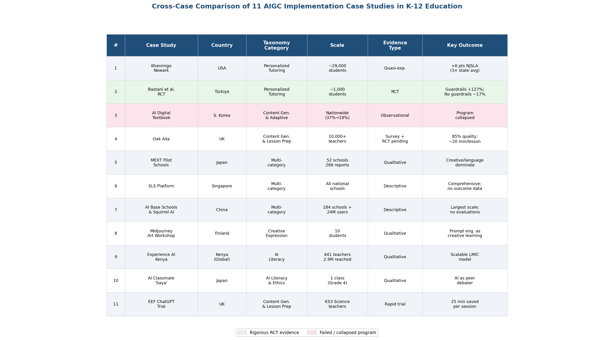

*Figure 4.2 — Summary comparison of all eleven case studies by country, taxonomy category, implementation scale, evidence type, and key outcome. Green highlighting denotes rigorous RCT evidence; red highlighting denotes program failure.*

### Success Factors

**Pedagogical guardrails are non-negotiable.** The Bastani et al. RCT provides the strongest evidence: unguarded ChatGPT harmed student learning by 17 percent on subsequent exams, while a version with teacher-designed guardrails preserved learning while boosting practice engagement by 127 percent. The Stanford SCALE 2026 review identifies this as a central finding for the field: "AI tools designed with pedagogical guardrails — such as tutoring systems that give hints or guide reasoning — show more promising outcomes than general-purpose chatbots that provide answers directly." [Stanford SCALE](https://scale.stanford.edu/research-in-action/understanding-evidence-base-ai-k12-education "Mar 2026") Aila's curriculum-grounded design, Singapore's SLS guardrails, and Khanmigo's Socratic scaffolding all embed this principle.

**Teacher mediation determines outcomes.** Every successful case emphasized sustained teacher investment. Newark's implementation included professional learning and dashboard training. Aila's design positions teachers as experts directing the AI. Singapore mandates teacher vetting of all AI feedback. Kenya's train-the-trainer model centers teacher capacity. Japan's MEXT expert stressed that teachers "cannot use something in class they have never experienced themselves." [NHK World](https://www3.nhk.or.jp/nhkworld/en/news/backstories/4680/ "Mar 2026") South Korea's failure stemmed in part from bypassing teacher and parent engagement.

**Gradual, piloted scaling outperforms rushed rollouts.** Newark progressed from one school to 14 to 66 over multiple years. Japan designated 52 pilot schools and systematically catalogued 266 use cases before considering broader deployment. Singapore expanded SLS features incrementally over years. South Korea attempted nationwide mandatory adoption without adequate piloting, producing the field's most expensive failure. The contrast is stark: systematic evidence-gathering precedes effective scaling; political urgency produces costly reversals.

**Purpose-built tools outperform generic chatbots.** Aila received 85 percent quality ratings from teachers. Khanmigo's Socratic design fostered more substantive student interactions than open-ended ChatGPT. The Bastani et al. GPT Tutor dramatically outperformed GPT Base. South Korea's hastily developed textbooks delivered poor quality despite $1.4 billion in combined government and publisher investment. The pattern is consistent with the OECD Digital Education Outlook 2026's central recommendation to distinguish "pedagogical purpose" tools from "general-purpose" chatbots. [OECD](https://www.oecd.org/en/blogs/2026/01/how-to-effectively-use-generative-ai-in-education.html "Jan 2026")

**Dosage and consistency matter.** Khan Academy's efficacy data establishes a threshold: 30 or more minutes per week of consistent use correlates with approximately 20 percent greater-than-expected learning gains. Below this threshold, or with shallow engagement patterns (the "Bro, IDK" phenomenon documented in Newark), benefits dissipate.

**Human-in-the-loop design protects against AI errors.** Singapore's mandatory teacher vetting of AI feedback, Aila's iterative review process, and Khanmigo's Socratic dialogue all ensure human oversight at critical junctures. The importance of this principle is underscored by GPT Base's 51 percent accuracy rate in mathematics — a tool that produces incorrect answers nearly half the time cannot be deployed without human verification.

### Common Failure Modes

**Politically driven, rushed implementation.** South Korea's $850 million program — marked by compressed timelines, mandatory adoption, exclusion of teacher input, and entanglement with presidential politics — constitutes the paradigmatic failure. China's 184 pilot schools, driven in part by administrators needing to demonstrate AI adoption for key performance indicator (KPI) fulfillment, have similarly produced no published outcome evaluations.

**Absent or inadequate evaluation.** China's pilot schools lack publicly available rigorous evaluations. Singapore's comprehensive platform has not released student outcome data. The Stanford SCALE 2026 review found only 20 high-quality causal studies among more than 800 papers on AI in K-12 — and none conducted in U.S. K-12 classrooms. [Stanford SCALE](https://scale.stanford.edu/research-in-action/understanding-evidence-base-ai-k12-education "Mar 2026") The evidence base remains far thinner than the pace of deployment would suggest.

**Student over-reliance and illusory learning.** The Bastani et al. study found that students using unguarded AI did not perceive their 17 percent performance decline — a mismatch between perceived and actual competence. Khanmigo logs revealed widespread minimal-effort responses. Japanese teachers noted students "immediately turn to a chatbot for the answer instead of thinking for themselves." [NHK World](https://www3.nhk.or.jp/nhkworld/en/news/backstories/4680/ "Mar 2026") Generative AI's fluent outputs can create an illusion of understanding that masks learning deficits.

**Privacy and data security breaches.** China's student data environment offers effectively no expectation of privacy, with 63 percent of students having experienced spam from data leaks. [ChinaTalk](https://www.chinatalk.media/p/chinas-ai-education-experiment "2025") South Korea's textbooks posed documented data privacy risks. AI surveillance of student facial expressions in Chinese classrooms raises ethical concerns that transcend the domain of educational effectiveness.

**Equity gaps widening rather than narrowing.** China's experience provides the starkest illustration: wealthy urban students access full AI tool suites while rural schools face an 8.5 million computer shortfall and prohibitive software costs. The pattern extends beyond China. Brookings has described a "third digital divide" in which resource-rich schools provide both technology and teacher mediation, while resource-poor schools provide technology alone — and AI tutoring without teacher mediation may harm rather than help learning outcomes. [Brookings](https://www.brookings.edu/articles/ai-and-the-next-digital-divide-in-education/ "Jul 2023")

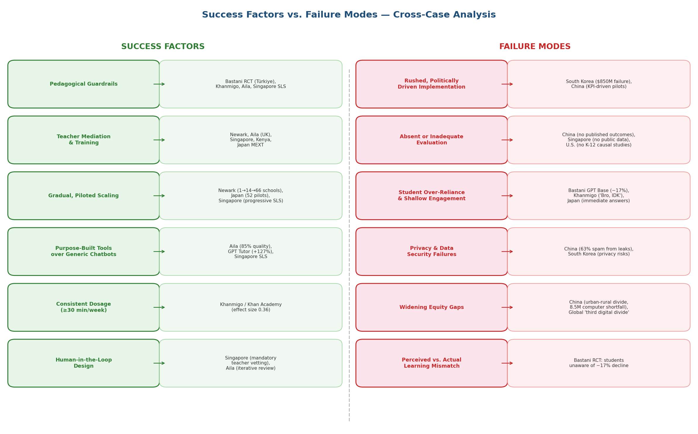

*Figure 4.3 — Six success factors and six failure modes identified across the eleven case studies, each paired with exemplar cases from the chapter.*

### Contextual Factors

Implementation outcomes are shaped by at least four contextual dimensions. First, the **policy environment**: Singapore's centralized, carefully designed system produces coherent implementation, while China's decentralized unfunded mandates create wildly uneven results across provinces and school types. Second, **resource levels**: Singapore's well-funded platform contrasts with the infrastructure crises in China's rural schools and Kenya's reliance on external philanthropic funding. Third, **evaluation culture**: the UK's EEF commissions randomized trials as standard practice; most other countries deploy first and evaluate later — if at all. Fourth, **cultural expectations**: Japan's documentation-first approach reflects institutional caution; South Korea's intensely competitive education culture created unrealistic expectations that AI textbooks could substitute for expensive private tutoring.

# 第5章 Challenges, Risks, and Ethical Considerations

The preceding chapters documented a rapidly expanding landscape of AIGC (AI-Generated Content) applications in K-12 classrooms — from AI-powered lesson planning tools that save teachers hours per week to adaptive tutoring systems deployed across millions of students. Yet adoption has consistently outpaced the institutional guardrails designed to govern it. As of spring 2025, only 45 percent of U.S. principals reported having any AI policy in place, and over 80 percent of students indicated that their teachers had not taught them how to use AI [RAND](https://www.rand.org/pubs/research_reports/RRA4180-1.html "RAND, Doss et al., Sep 2025"). This governance deficit is not unique to the United States; across the OECD, only 25 percent of surveyed jurisdictions had launched specific AI-in-education initiatives, and just 19 percent had set timebound implementation goals [OECD](https://www.oecd.org/content/dam/oecd/en/publications/reports/2025/12/ai-adoption-in-the-education-system_43251cf0/69bd0a4a-en.pdf "OECD AI Adoption Report, 2025").

This chapter examines the risks, challenges, and ethical dilemmas that accompany AIGC's entry into schools, organized across four domains: academic integrity and assessment validity; data privacy and child safety; equity, access, and algorithmic bias; and teacher professional identity and workforce implications. The analysis draws on large-scale survey data from the United States, OECD member states, and case-study evidence from Europe and East Asia, while acknowledging that the evidence base remains heavily concentrated in Anglophone and high-income contexts.

## 5.1 Academic Integrity, Over-Reliance, and Assessment Validity

### 5.1.1 The Scale of Unsanctioned Use

Student adoption of generative AI for schoolwork has surged far ahead of institutional permission structures. A College Board survey of more than 10,000 U.S. high school students (October 2025) found that 84 percent use generative AI for schoolwork, with seniors and high-achieving students approximately twice as likely to report usage as 9th graders [College Board](https://newsroom.collegeboard.org/new-research-majority-high-school-students-use-generative-ai-schoolwork "Oct 2025"). The RAND American Youth Panel tracked an acceleration from 48 percent of students using AI for homework in May 2025 to 62 percent by December 2025 — a 14-percentage-point increase in seven months. Yet only 9 percent of middle schoolers and 7 percent of high schoolers reported that their schools explicitly permitted AI for homework [RAND](https://www.rand.org/pubs/research_reports/RRA4742-1.html "RAND RR-A4742-1, Mar 2026"). The chasm between de facto use and de jure policy constitutes one of the defining governance failures of the current era.

A revealing paradox emerges from the same data: 67 percent of students endorsed the statement that AI harms critical thinking skills — an increase of 10 percentage points in ten months — yet continued using it regardless [RAND](https://www.rand.org/pubs/research_reports/RRA4742-1.html "RAND, Mar 2026"). This disconnect between awareness and behavior mirrors findings from the Bastani et al. randomized controlled trial in Türkiye (Chapter 4), where students using unguarded ChatGPT experienced a 17 percent decline in exam performance without perceiving any learning loss [Bastani et al.](https://www.pnas.org/doi/10.1073/pnas.2422633122 "PNAS v122 n26, Jun 2025"). The phenomenon — termed "illusory learning" by the study's authors — indicates that subjective student experience is an unreliable proxy for actual educational impact.

### 5.1.2 Cheating Rates: Stability Beneath Disruption

Contrary to widespread alarm, available evidence does not indicate a dramatic spike in traditional cheating behaviors. Lancaster et al. (2024), studying three U.S. high schools, found that self-reported cheating rates remained relatively stable after ChatGPT's introduction. Most students rejected the idea of submitting entire AI-generated assignments as their own work, while expressing support for using AI to initiate assignments or clarify difficult concepts [Lancaster et al.](https://www.sciencedirect.com/science/article/pii/S2666920X24000560 "Computers & Education: AI, Vol. 7, Dec 2024"). The distinction is consequential: students are not primarily deploying AI to circumvent learning but rather as a cognitive shortcut whose pedagogical consequences they poorly understand.

East Asian policy frameworks have attempted to preempt this ambiguity. China's Ministry of Education anticipated the pattern in its May 2025 guide, explicitly banning students from submitting AI-generated work as original and prohibiting direct AI use for evaluating students or answering exams [Georgetown CSET](https://cset.georgetown.edu/publication/china-school-gen-ai-use-guide-2025/ "CSET translation, May 2025"). Japan's MEXT guidelines similarly instruct students to treat AI outputs as "one of the references" rather than authoritative sources [MEXT](https://www.mext.go.jp/content/20250422-mxt_shuukyo01-000030823_001.pdf "MEXT v2.0, Apr 2025"). Both frameworks attempt to codify the boundary between legitimate AI-assisted learning and academic dishonesty, though enforcement mechanisms remain underdeveloped.

### 5.1.3 The AI Detection Trap

The instinct to police AI use through detection software has generated its own set of harms. More than 40 percent of U.S. 6th–12th grade teachers now use AI detection tools [CDT](https://cdt.org/wp-content/uploads/2025/10/FINAL-CDT-2025-Hand-in-Hand-Polling-100225-accessible.pdf "CDT, Oct 2025"), and school districts are investing heavily — Broward County, Florida, for example, committed $550,000 to a three-year Turnitin contract [NPR](https://www.npr.org/2025/12/16/nx-s1-5492397/ai-schools-teachers-students "Dec 2025"). Yet the technology is demonstrably unreliable. Turnitin itself acknowledges that its scores "may not always be accurate," and researcher Simon Perkins has characterized current detection tools as "not fit for purpose."

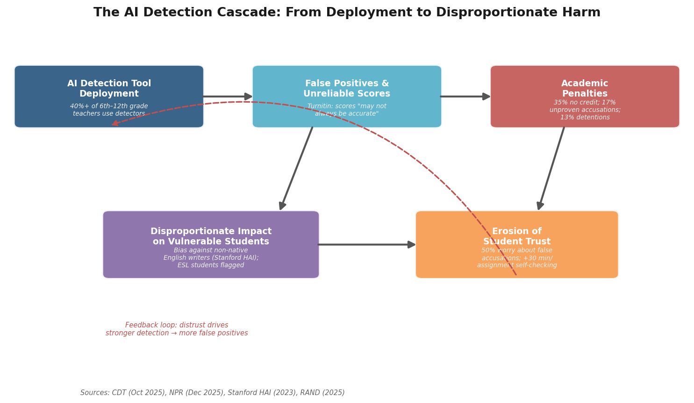

*Figure 5.1 — The AI detection cascade illustrates how deployment of unreliable detection tools generates a self-reinforcing cycle: false positives produce academic penalties that fall disproportionately on vulnerable students, eroding trust and paradoxically driving further investment in detection. Sources: CDT (Oct 2025), NPR (Dec 2025), Stanford HAI (2023), RAND (2025).*

The consequences of false positives fall disproportionately on vulnerable students. A 17-year-old at Eleanor Roosevelt High School in Maryland was flagged at 30.76 percent AI probability, had her grade docked, and saw her appeal denied despite her protest. A non-native Mandarin-speaking student at Shaker Heights High School in Ohio was flagged due to vocabulary patterns characteristic of second-language writing [NPR](https://www.npr.org/2025/12/16/nx-s1-5492397/ai-schools-teachers-students "Dec 2025"). A 2023 Stanford HAI study documented systematic bias in AI detectors against non-native English writers — a finding with significant implications for multilingual K-12 classrooms. The CDT 2025 survey quantified these broader consequences: 35 percent of teachers reported students not receiving credit when proven to have used AI; 17 percent reported accusations that could not be proven or were later shown false; and 13 percent reported detentions or suspensions [CDT](https://cdt.org/wp-content/uploads/2025/10/FINAL-CDT-2025-Hand-in-Hand-Polling-100225-accessible.pdf "CDT, Oct 2025"). Half of all students surveyed expressed worry about being falsely accused of using AI to cheat [RAND](https://www.rand.org/pubs/research_reports/RRA4180-1.html "RAND, 2025"). Students have begun preemptively self-checking their work through detectors before submission, adding approximately 30 minutes per assignment — a time tax that paradoxically penalizes honest students the most.

### 5.1.4 Toward AI-Resilient Assessment

The emerging professional consensus rejects the arms race between AI detection and AI evasion in favor of redesigning assessment itself. The paradigm shift is from "AI-proof" assessments to "authentic assessments" that retain validity regardless of whether students have access to generative AI tools. Strategies gaining traction include oral examinations, portfolio-based assessment with documented revision histories, in-class supervised writing, and process-focused assignments requiring iterative drafts with reflective commentary [Assessment & Evaluation in Higher Education](https://www.tandfonline.com/doi/full/10.1080/02602938.2026.2644516 "2026"). The MIT Sloan 4-step framework operationalizes this approach through Understanding by Design: since "AI detectors don't work, the only way to enforce a ban is in-person without devices," the framework recommends retiring AI-achievable learning outcomes while promoting new ones — such as evaluating AI errors and comparing AI-generated and human reasoning [MIT Sloan](https://mitsloanedtech.mit.edu/ai/teach/4-steps-to-design-an-ai-resilient-learning-experience/ "MIT Sloan EdTech"). This reconceptualization transforms AI from an integrity threat into a pedagogical object whose outputs students learn to interrogate and critique.

## 5.2 Data Privacy, Content Safety, and Child Protection

### 5.2.1 The Regulatory Landscape: Fragmented and Lagging

Legal frameworks governing children's data in generative AI contexts remain fragmented across jurisdictions and poorly calibrated to the technology's actual risk profile. In the United States, the updated COPPA Rule (effective June 23, 2025) prohibits companies from retaining children's data indefinitely for algorithm improvement and requires separate parental consent for sharing data with third parties for AI training. However, COPPA applies only to children under 13, leaving the 13–17 age group — precisely the demographic with the highest generative AI usage — largely unprotected under existing federal law [PIPC](https://publicinterestprivacy.org/coppa-rule-training-algorithms/ "PIPC, Dec 2025"). Pending legislation (KOSA and COPPA 2.0) would extend protections to age 17, but as of April 2026 neither has been enacted [Fortune](https://fortune.com/2026/03/18/kosa-kids-act-app-store-accountability-act-minors-age-verification/ "Mar 18, 2026").

In the European Union, GDPR Article 8 sets a default minimum age of 16 for children to provide valid consent for online services, but permits member states to lower the threshold to as low as 13. The result is a patchwork across the bloc: the United Kingdom, France, and several other countries set the age at 13; Germany, the Netherlands, and others at 16; and various nations at intermediate points. For schools deploying AI tools that process student data, the interaction between GDPR consent requirements, the EU AI Act's high-risk classification of education AI (effective August 2, 2026), and divergent national consent ages creates substantial compliance uncertainty. Schools relying on "legitimate interest" rather than consent as their lawful basis for data processing face untested legal terrain when student data flows into large language model inference pipelines.

China has adopted the most prescriptive approach, requiring schools to maintain dynamic "whitelists" of approved AI tools subject to ethical review, banning direct AI use for evaluating students or processing sensitive data, and mandating localized management policies [Georgetown CSET](https://cset.georgetown.edu/publication/china-school-gen-ai-use-guide-2025/ "CSET translation, May 2025"). Singapore mitigates risk through infrastructure control: all AI tools are deployed through the government-built Student Learning Space (SLS) platform, ensuring that student data remains within a sovereign architecture [Singapore MOE](https://www.moe.gov.sg/education-in-sg/educational-technology-journey/edtech-masterplan/artificial-intelligence-in-education "MOE, Jan 2026").

### 5.2.2 Documented Harms and Emerging Dangers

The risks of inadequately supervised AI interaction with minors are no longer theoretical. Legal proceedings and investigative reporting have documented multiple categories of harm: a wrongful death lawsuit filed in connection with a teenager's suicide following sustained ChatGPT interactions; litigation against Character.AI involving a minor's chatbot dependency; a U.S. Senate hearing titled "Examining the Harm of AI Chatbots" (September 2025); and a Reuters investigation revealing that Meta's chatbot policies enabled sexual conversations with minors [TechCrunch](https://techcrunch.com/2025/09/16/openai-will-apply-new-restrictions-to-chatgpt-users-under-18/ "Sep 2025"). In response, OpenAI announced new restrictions for suspected-under-18 users in September 2025, including prohibitions on flirtatious exchanges, suicide discussion guardrails, parent-configurable blackout hours, and a default to stricter rules when user age is ambiguous.

CDT's 2025 survey of K-12 students reveals the scope of non-academic AI chatbot use among minors: 42 percent reported using AI chatbots as a "friend or companion," 42 percent to "escape real life," 42 percent for "mental health support," and 19 percent for a "romantic relationship." Among conversational AI users, 56 percent reported weekly or more frequent engagement. Critically, 31 percent conducted these personal interactions on school-provided devices [CDT](https://cdt.org/wp-content/uploads/2025/10/FINAL-CDT-2025-Hand-in-Hand-Polling-100225-accessible.pdf "CDT, Oct 2025"). These patterns indicate that school-deployed AI infrastructure is being repurposed for emotionally intimate interactions with minors — a scenario for which most school acceptable-use policies were never designed.

### 5.2.3 Data Breach Risks and the Deepfake Crisis

The introduction of AI tools into school ecosystems has expanded the attack surface for data breaches. The CDT 2025 survey found that 23 percent of teachers reported a large-scale school data breach during the 2024–25 academic year. Among teachers classified as heavy AI users, the figure rose to 28 percent, compared to 18 percent among low-use teachers [CDT](https://cdt.org/wp-content/uploads/2025/10/FINAL-CDT-2025-Hand-in-Hand-Polling-100225-accessible.pdf "CDT, Oct 2025"). The correlation does not establish causation — schools adopting AI tools may also maintain larger digital footprints — but it underscores that AI adoption increases institutional data exposure.

A parallel crisis has emerged around AI-generated deepfakes in schools. CDT found that 36 percent of students and 27 percent of teachers had heard of deepfakes depicting someone at their school; 12 percent of students reported non-consensual intimate imagery (NCII) generated via AI at their school; yet only 21 percent of teachers said their school had a policy addressing deepfake NCII [CDT](https://cdt.org/wp-content/uploads/2025/10/FINAL-CDT-2025-Hand-in-Hand-Polling-100225-accessible.pdf "CDT, Oct 2025"). In China, the scale of data exposure is larger still: 63 percent of students in one study reported experiencing spam or contact from individuals who obtained their data through leaks — a figure reflecting both expansive data collection practices and weak enforcement regimes [ChinaTalk](https://www.chinatalk.media/p/chinas-ai-education-experiment "2025"). These findings establish that data privacy in AI-enabled schools is not merely a compliance concern but a safeguarding imperative with immediate consequences for student welfare.

## 5.3 Equity, Access, and Algorithmic Bias

### 5.3.1 The Third Digital Divide

The integration of AIGC into K-12 classrooms risks replicating and amplifying existing educational inequalities. The Brookings Institution has characterized this dynamic as a "third digital divide": while the first divide concerned access to devices and the second concerned access to broadband, the third divide separates students who possess both technology and informed human guidance (teachers and parents capable of mediating AI use) from those who have technology alone [Brookings](https://www.brookings.edu/articles/ai-and-the-next-digital-divide-in-education/ "Jul 2023"). As the Bastani et al. randomized controlled trial demonstrated, AI tutoring without pedagogical guardrails — a proxy for AI use without teacher mediation — actively harms learning. The implication is that expanding AI access to under-resourced schools without concurrent investment in teacher training and support infrastructure may widen, rather than narrow, achievement gaps.

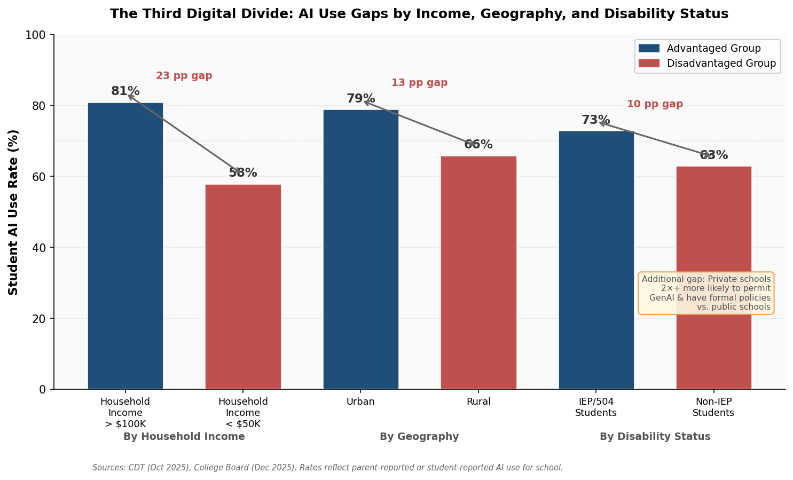

*Figure 5.2 — Student AI use rates diverge sharply across socioeconomic, geographic, and disability dimensions. The 23-percentage-point income gap is the largest observed disparity, while private schools remain more than twice as likely as public schools to both permit generative AI and maintain formal policies. Sources: CDT (Oct 2025), College Board (Dec 2025).*

The College Board captured this dynamic in a December 2025 follow-up report: private schools were more than twice as likely as public schools to both permit generative AI and have formal AI policies. Low-socioeconomic-status public schools were the least likely to have any AI policy in place, and rural or small-town schools were less likely to have AI tools accessible on school networks. The College Board concluded that this constitutes "a new form of the digital divide — not simply about access to devices or the internet, but access to emerging technologies and the guidance to use them well" [College Board](https://newsroom.collegeboard.org/follow-report-ai-high-schools-genai-use-and-policy-varies-academic-achievement-attainment-grade-and "Dec 2025").

CDT's 2025 survey quantified the socioeconomic dimension at the household level: 81 percent of parents with household incomes above $100,000 reported that their child used AI, compared to 58 percent of parents with incomes below $50,000 — a 23-percentage-point gap. The urban-rural divide was similarly pronounced, at 79 percent versus 66 percent [CDT](https://cdt.org/wp-content/uploads/2025/10/FINAL-CDT-2025-Hand-in-Hand-Polling-100225-accessible.pdf "CDT, Oct 2025"). In China, the equity challenge assumes an infrastructural dimension: an estimated 8.5 million computer shortfall in rural schools, per-school AI deployment costs reaching ¥1.7 million (approximately $240,000) for iFlytek systems, and 85 percent of AI education spending borne by local governments with widely varying fiscal capacity [ChinaTalk](https://www.chinatalk.media/p/chinas-ai-education-experiment "2025"). The gap between wealthy-urban and poor-rural school systems is widening as AI becomes a marker of institutional capacity.

### 5.3.2 Racial and Demographic Patterns

The relationship between race, ethnicity, and AI use is more complex than a simple access narrative would suggest. College Board data indicate that Black and Hispanic high school students are the most frequent generative AI users (65 percent), compared to White students (55 percent) and Asian students (58 percent) [College Board](https://newsroom.collegeboard.org/follow-report-ai-high-schools-genai-use-and-policy-varies-academic-achievement-attainment-grade-and "Dec 2025"). The equity concern is therefore not raw access per se but access to effective, guided, pedagogically sound use — precisely the dimension most affected by the third digital divide.

Students with disabilities present a particularly complex case. CDT found that students with Individualized Education Programs (IEPs) or 504 plans use AI more extensively than their peers (73 percent versus 63 percent for conversational AI), yet 57 percent worry that AI will treat them unfairly, compared to 25 percent of students without accommodations. Teacher use of AI for IEP writing rose from 8 percent to 21 percent in a single year, and 60 percent of parents of students with disabilities expressed privacy concerns, compared to 42 percent of other parents [CDT](https://cdt.org/wp-content/uploads/2025/10/FINAL-CDT-2025-Hand-in-Hand-Polling-100225-accessible.pdf "CDT, Oct 2025"). AI tools offer genuine accessibility benefits — text-to-speech, reading level adaptation, personalized pacing — but the concentration of sensitive disability-related student data in commercial AI systems raises proportionally higher privacy stakes for this population.

### 5.3.3 Algorithmic Bias in Education AI Tools

Empirical evidence of algorithmic bias in tools specifically designed for K-12 classrooms has begun to accumulate. A Common Sense Media study published in August 2025 tested widely used AI teacher tools — including MagicSchool AI, Khanmigo, Curipod, and Google's Gemini for Education — and found that these tools generated more punitive behavior intervention recommendations for student profiles with Black-coded names compared to identical profiles with White-coded names. Google subsequently disabled its "Generate behavior intervention strategies" shortcut in response to the findings [Chalkbeat](https://www.chalkbeat.org/2025/08/06/ai-teacher-assistants-promote-racial-bias-study-finds/ "Aug 2025"). The study demonstrates that racial bias is not confined to general-purpose models but can be reproduced and amplified in purpose-built education AI systems — systems that teachers may trust precisely because they are marketed as education-specific.

## 5.4 Teacher Professional Identity and Workforce Implications

### 5.4.1 Global Teacher Attitudes: Ambivalence as the Norm

Survey data across OECD member states reveal a teaching profession defined not by resistance or enthusiasm but by structured ambivalence. TALIS 2024, drawing on approximately 300,000 teachers in over 50 education systems, found that 52 percent of teachers believe AI can help them adapt instruction to student abilities. Simultaneously, 72 percent believe AI enables students to misrepresent their work, and 66 percent believe AI makes inappropriate recommendations [Education International/OECD](https://www.ei-ie.org/en/item/31815:using-artificial-intelligence-takeaways-from-talis-2024 "EI analysis of TALIS 2024, Dec 2025"). Teachers simultaneously perceive AI as a potential pedagogical ally and a source of academic integrity erosion — a rational posture given the evidence reviewed in Section 5.1.

The divergence between heavy and light AI users among teachers is particularly instructive. CDT found that 80 percent of heavy AI-using teachers agree that AI gives them more time to work directly with students, and 82 percent report that it enables more personalized learning. Among low-use teachers, 38 percent find AI "more time consuming than helpful" [CDT](https://cdt.org/wp-content/uploads/2025/10/FINAL-CDT-2025-Hand-in-Hand-Polling-100225-accessible.pdf "CDT, Oct 2025"). The divergence suggests that the value proposition of AI tools is not self-evident from limited exposure; sustained, supported engagement — backed by training and institutional infrastructure — may be necessary before productivity gains materialize.

### 5.4.2 The Erosion of Teacher-Student Connection

Among the most concerning findings in the CDT 2025 data is evidence that AI use in classrooms may attenuate the relational dimension of teaching. Thirty-one percent of students reported feeling less connected to their teacher when AI was used in class, rising to 39 percent in schools with heavy AI integration. Meanwhile, 38 percent of students said they preferred working with AI over their teacher when confused — a figure that reached 48 percent in heavy-AI-use schools [CDT](https://cdt.org/wp-content/uploads/2025/10/FINAL-CDT-2025-Hand-in-Hand-Polling-100225-accessible.pdf "CDT, Oct 2025"). The pedagogical implications are significant: if students increasingly turn to AI rather than teachers for academic support, the teacher's role as a relational anchor — particularly critical for younger learners and those from disadvantaged backgrounds — may erode.

Parental and student perceptions compound this risk. CDT found that 50 percent of parents and 49 percent of students agree with the statement that "a teacher who uses AI in class is not really doing their job" [CDT](https://cdt.org/wp-content/uploads/2025/10/FINAL-CDT-2025-Hand-in-Hand-Polling-100225-accessible.pdf "CDT, Oct 2025"). While this perception may reflect a misunderstanding of how teachers deploy AI (primarily for preparation rather than in-class instruction), it creates reputational risk for educators who adopt AI tools and may discourage adoption among teachers who are already uncertain about the technology's value.

### 5.4.3 The Workload Paradox

Evidence on whether AI reduces or increases teacher workload is decidedly mixed — and highly contingent on implementation quality. On the positive side, the UK's Oak National Academy Aila platform reduced lesson planning time from 30 minutes to 5–10 minutes per lesson, with nearly two-thirds of teachers reporting decreased workload [Oak National Academy](https://www.thenational.academy/blog/how-is-aila-impacting-teacher-lesson-planning-practices-workload-and-expertise-early-insights "Feb 2025"). The EEF trial documented average savings of 25 minutes per planning session. Gallup–Walton Family Foundation data (June 2025) reported that weekly AI users save 5.9 hours per week — equivalent to approximately six weeks per school year. Teachers in schools with formal AI policies experienced 26 percent larger time savings (2.3 versus 1.7 hours per week), suggesting that institutional clarity amplifies individual productivity [Walton Family Foundation](https://www.waltonfamilyfoundation.org/the-ai-dividend-new-survey-shows-ai-is-helping-teachers-reclaim-valuable-time "Jun 25, 2025").

On the negative side, South Korea's AI digital textbook program increased rather than decreased teacher workload (Chapter 4), and CDT's survey found that 39 percent of teachers overall — and 24 percent even among heavy users — describe AI as "more time consuming than helpful." A significant new burden has emerged: 66 percent of teachers report worrying about detecting AI-generated student work [CDT](https://cdt.org/wp-content/uploads/2025/10/FINAL-CDT-2025-Hand-in-Hand-Polling-100225-accessible.pdf "CDT, Oct 2025"). TALIS 2024 data further indicate that 52 percent of teachers identify administrative tasks as their top stress area — precisely the domain where AI time savings are most reliably documented [Education International/OECD](https://www.ei-ie.org/en/item/31815:using-artificial-intelligence-takeaways-from-talis-2024 "Dec 2025"). The emerging pattern suggests that AI is most beneficial when applied to back-office preparation tasks and most disruptive when it introduces new responsibilities — detection, monitoring, policy compliance — in student-facing domains.

### 5.4.4 Professional Advocacy and the Question of Agency

Teacher unions and professional organizations have moved swiftly to frame AI as a labor and professional autonomy issue. The American Federation of Teachers (AFT) passed a resolution in August 2024 declaring that the impact of AI is a "mandatory subject of bargaining" and that AI must "enhance rather than replace human expertise" [AFT](https://www.aft.org/resolution/artificial-intelligence "Aug 2024"). The AFT subsequently launched the National Academy for AI Instruction, a $23 million initiative funded by Anthropic, Microsoft, and OpenAI, targeting 400,000 educators through a teacher-trains-teacher model [EdWeek](https://www.edweek.org/technology/microsoft-openai-partner-with-aft-to-train-teachers-on-ai/2025/07 "Jul 2025"). The National Education Association (NEA) issued a five-principle policy statement in June 2024 insisting that AI must not "undercut educators by exposing them to unnecessary surveillance, undermining their rights, or taking over core job functions" [NEA](https://www.nea.org/resource-library/artificial-intelligence-education/vii-full-statement-text "Jun 2024").

Both organizations opposed a December 2025 Executive Order by the Trump administration seeking to preempt state AI regulations — a position of direct relevance to K-12 education given the 120-plus AI-in-education bills pending in state legislatures during 2025 [EdWeek](https://www.edweek.org/technology/k-12-world-reacts-to-trumps-executive-order-to-block-state-ai-regulations/2025/12 "Dec 2025"). The union response reflects a broader concern that AI adoption in schools may be driven by vendor marketing, political ambition, or efficiency targets rather than pedagogical judgment — a concern substantiated by the South Korea and China case studies examined in Chapter 4. The professional stakes are considerable: if AI reshapes what teachers do without teacher input into how it does so, the profession risks a deskilling trajectory in which routine instructional tasks are automated while the relational, diagnostic, and adaptive work that constitutes expert teaching remains invisible to the systems ostensibly designed to assist it.

## 5.5 Synthesis: An Interconnected Risk Landscape

The four domains examined in this chapter are not independent; they form a self-reinforcing system of cascading risks.

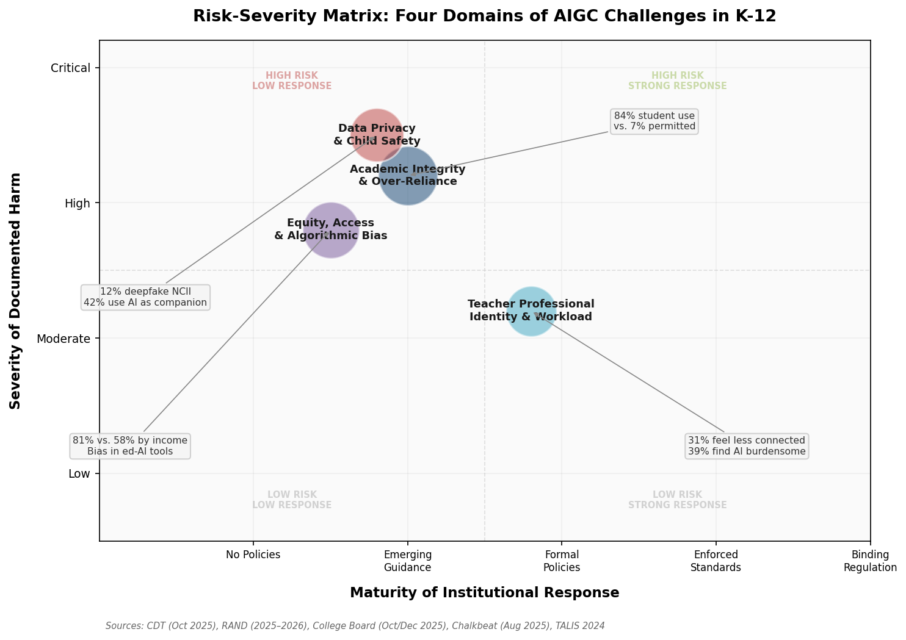

*Figure 5.3 — Risk-severity matrix mapping four challenge domains against documented harm severity and institutional response maturity. Three of four domains fall in the "high risk / low response" quadrant, visually anchoring the chapter's central finding that AIGC adoption in K-12 has systematically outpaced governance capacity. Sources: CDT (Oct 2025), RAND (2025–2026), College Board (Oct/Dec 2025), Chalkbeat (Aug 2025), TALIS 2024.*

Academic integrity pressures drive AI detection adoption, which generates false accusations that fall disproportionately on non-native English speakers and students from marginalized backgrounds — an equity problem. Data privacy failures erode trust in school AI systems, which undermines the institutional credibility needed to implement meaningful AI policies — a governance problem. Teacher workload gains in lesson preparation are offset by new burdens in AI detection and monitoring — a professional identity problem. And the "third digital divide" ensures that all of these challenges are experienced most acutely in under-resourced schools with the least capacity to address them.

The evidence surveyed in this chapter yields a consistent structural finding: AIGC adoption in K-12 education has advanced rapidly on the supply side (tool availability, student uptake, vendor investment) while institutional responses — policies, training, assessment redesign, data governance — remain nascent and unevenly distributed. As Figure 5.3 illustrates, three of four risk domains occupy the "high risk / low response" quadrant. Several structural observations emerge. First, the pace of student adoption has dramatically outstripped institutional policy capacity; most schools are managing AIGC use reactively rather than proactively. Second, detection-based approaches to academic integrity have proven both technically unreliable and ethically problematic; the field is moving toward assessment redesign rather than enforcement escalation. Third, data privacy frameworks designed for the pre-AI internet — COPPA, FERPA, and even GDPR — provide incomplete protection for children interacting with generative AI systems. Fourth, algorithmic bias in education-specific AI tools demonstrates that purpose-built does not mean bias-free. Fifth, teacher professional identity is being reshaped by forces — vendor partnerships, political mandates, union negotiations — that extend well beyond the classroom.

The challenge for educators, administrators, and policymakers is to address these risks not as afterthoughts to adoption but as constitutive elements of responsible implementation. Chapter 7 translates these findings into actionable recommendations.

# 第6章 Future Trends and Outlook (2026–2028)

The preceding chapters documented a field in the midst of explosive yet uneven growth: AIGC tools proliferating across K-12 classrooms, policy frameworks straining to keep pace, promising efficacy signals emerging alongside sobering failures, and ethical dilemmas deepening faster than institutional capacity to address them. This chapter shifts the temporal lens forward, examining the technological, pedagogical, regulatory, and market trajectories that will shape AIGC's role in primary and secondary education over the 2026–2028 horizon. The analysis draws on confirmed product launches and policy commitments announced through early 2026, supplemented by market projections from established research firms. Where a development remains projected rather than confirmed, the distinction is made explicit.

## 6.1 Technological Trajectories: From General-Purpose Chatbots to Purpose-Built Education Platforms

### 6.1.1 The Platform Convergence

The most consequential technological development of 2025–2026 is not any single model improvement but a structural shift: every major general-purpose AI provider is constructing purpose-built education wrappers around its foundation models, while education-first platforms are integrating increasingly powerful general-purpose APIs beneath their pedagogical guardrails. The result is convergence toward a dominant architecture — general-purpose models layered with education-specific scaffolding.

OpenAI launched "Education for Countries" in January 2026, establishing government partnerships to deliver ChatGPT Edu, GPT-5.2, and a dedicated study mode to an initial cohort of eight nations: Estonia, Greece, Italy, Jordan, Kazakhstan, Slovakia, Trinidad and Tobago, and the UAE. Estonia alone reached 30,000 users, with a longitudinal study jointly conducted by the University of Tartu and Stanford tracking 20,000 students [OpenAI](https://openai.com/index/edu-for-countries/ "Jan 28, 2026"). By March 2026, the company released interactive math and science tools offering dynamic visual explanations for over 70 concepts, reporting 140 million weekly ChatGPT users engaging with math and science content. A dedicated "ChatGPT for Teachers" product was adopted by districts representing more than 150,000 teachers, accompanied by a "Learning Outcomes Measurement Suite" — OpenAI's first systematic attempt at educational impact evaluation [OpenAI](https://openai.com/index/new-ways-to-learn-math-and-science-in-chatgpt/ "Mar 6, 2026").

Google announced at BETT 2026 (January 2026) that Gemini 3 Pro would be integrated into Google Classroom at no additional charge, bundling AI-generated infographics and presentations, free practice SATs developed with Princeton Review, audio and video recording capabilities for assignments, learning standards from seven or more countries, suggested writing feedback, and Gemini-powered audio lessons [Google](https://blog.google/products-and-platforms/products/education/bett-2026-gemini-classroom-updates/ "Jan 21, 2026"). Microsoft's parallel BETT 2026 announcement introduced a Copilot "Teach" module with standards-aligned lesson planning, content differentiation, and assessment features, alongside a "Study and Learn Agent" serving as an adaptive assistant. Microsoft also launched "Elevate for Educators," a free credential co-developed with ISTE and ASCD and aligned to the OECD/EC AI Literacy Framework, with standards drawn from 35 or more countries [Microsoft](https://news.microsoft.com/source/2026/01/15/microsoft-expands-its-commitment-to-education-with-elevate-for-educators-program-and-new-ai-powered-tools/ "Jan 15, 2026").

Anthropic extended its reach into K-12 through a partnership with Teach For All, making AI tools and training available to educators across 63 countries; more than 100,000 teachers became eligible, reaching an estimated 1.5 million students. The company's AI Fluency Learning Series enrolled over 530 educators, while Claude Connect engaged more than 1,000 educators in 60 or more countries, with national pilots launched in Iceland and Rwanda [Anthropic](https://www.anthropic.com/news/anthropic-teach-for-all "2026").

### 6.1.2 Education-First Platforms: Deeper Integration

Education-native platforms are simultaneously deepening their AI capabilities. Khan Academy announced a reimagined platform for the 2026–2027 school year, embedding Khanmigo as a learning coach, teaching assistant, and administrative aide across the entire user experience. The redesign introduces gamification elements intended to make practice "feel like play," proactive teacher insights that surface student struggles without requiring teacher initiation, and district-level pacing alignment ensuring that AI tutoring maps onto existing scope-and-sequence documents [Khan Academy](https://blog.khanacademy.org/khan-academy-reimagined-for-districts-2026/ "Oct 8, 2025").

This convergence carries a significant implication: the distinction between "general-purpose AI" and "education AI" is dissolving. The decisive factor is not whether a tool originated as an education product or a general chatbot, but whether its classroom deployment incorporates the pedagogical guardrails that the Bastani et al. RCT (Chapter 4) demonstrated as essential. The OECD's January 2026 analysis reinforced this conclusion, finding that "purpose-built education AI tools deliver stronger outcomes than general-purpose chatbots" [OECD](https://www.oecd.org/en/blogs/2026/01/how-to-effectively-use-generative-ai-in-education.html "OECD, Jan 2026"). The competitive landscape is accordingly shifting from "who has the best model" to "who has the best pedagogical wrapper."

### 6.1.3 On-Device AI and Privacy-by-Architecture

An emerging infrastructure trend with particular relevance to K-12 settings is edge AI — running models locally on school devices rather than routing student data through cloud servers. HP has introduced AI-ready workstations with retrieval-augmented generation (RAG) capabilities designed for privacy-sensitive school deployments, alongside an AI Teacher Academy. Intel has launched "Spotlight Schools" in Michigan and California to pilot on-device AI tools, and Qualcomm has developed AI-compatible vision systems for FIRST Robotics competitions [White House](https://www.whitehouse.gov/releases/2025/09/major-organizations-commit-to-supporting-ai-education/ "Sep 9, 2025"). While large-scale classroom deployment of on-device models remains largely aspirational, the trajectory addresses one of the most persistent barriers to school AI adoption: the risk that student data will be transmitted to and retained by external providers. If sufficiently capable models can run on local hardware within school networks, compliance with data residency requirements — such as those imposed by China's whitelist mandates and the EU AI Act's high-risk obligations — becomes substantially easier to achieve.

### 6.1.4 The "Capability Overhang"

OpenAI's March 2026 education report introduced the concept of a "capability overhang" — the gap between what current AI tools can do and what educators and students actually use them for. Even advanced users, the report found, operate at 90–99 percent below power-user behavior [OpenAI](https://openai.com/index/ai-education-opportunity/ "Mar 4, 2026"). This finding reframes the central technology challenge: the binding constraint on AIGC's educational impact over the next two years is not model capability but user proficiency. The implication is that investments in teacher professional development and instructional design will yield larger marginal returns than investments in more powerful models — a conclusion consistent with the evidence presented in Chapters 4 and 5, where implementation quality, not tool sophistication, determined educational outcomes.

## 6.2 Pedagogical Evolution: Toward AI-Native Instruction

### 6.2.1 From Retrofitting to Redesign

The dominant pedagogical pattern through 2024–2025 was retrofitting — overlaying AIGC tools onto existing instructional workflows without fundamentally rethinking task design, assessment, or the teacher-student dynamic. Lesson planning remained the most common teacher use (64 percent of AI-using teachers according to TALIS 2024), homework help the most common student use, and assessment the least-adopted AI application at 26 percent [Education International/OECD](https://www.ei-ie.org/en/item/31815:using-artificial-intelligence-takeaways-from-talis-2024 "Dec 2025"). The emerging frameworks of 2025–2026 signal a shift toward more deliberate redesign.

The OECD–European Commission AI Literacy Framework (AILit), released in draft form in May 2025, defines AI literacy as encompassing "technical knowledge, durable skills, and future-ready attitudes." Its four domains — Engaging with AI, Creating with AI, Managing AI, and Designing AI — contain 22 competences structured around active human-AI collaboration rather than passive consumption [AILit Framework](https://ailiteracyframework.org/wp-content/uploads/2025/05/AILitFramework_ReviewDraft.pdf "May 2025 draft"). The "Managing AI" domain warrants particular attention: it requires learners to develop intentional task delegation skills — deciding what to assign to AI, what to retain for human effort, and how to evaluate the quality of AI outputs. This represents a departure from earlier frameworks that treated AI as either a tool to use or a topic to study, toward a conception of AI as a cognitive partner whose contributions must be actively managed.

UNESCO's AI Competency Framework for Students (2024) complements the AILit structure with 12 competencies across four dimensions: human-centered mindset, ethics of AI, techniques and applications, and systems design [UNESCO](https://www.unesco.org/en/articles/ai-competency-framework-students "2024"). Together, these two frameworks — one European, one global — establish the intellectual infrastructure for what might be termed "AI-native" pedagogy: instruction designed from the ground up for classrooms where AI is a permanent presence rather than an occasional supplement.

### 6.2.2 Process-Based Pedagogy and Multimodal Assessment

The capability overhang has practical pedagogical consequences. OpenAI's recommendation — to embed authentic AI use in coursework that mirrors professional practice — aligns with a broader shift toward process-based pedagogy visible across multiple national contexts. ChatGPT's "study mode" (step-by-step guidance) and "quizzes" (recall building) exemplify this approach: rather than simply providing answers, the tool scaffolds the learning process itself [OpenAI](https://openai.com/index/ai-education-opportunity/ "Mar 4, 2026").

The trend extends to assessment. Google Classroom's January 2026 update added audio and video recording for assignments and feedback, enabling oral presentations, video explanations, and screen recordings as standard assessment modalities [Google](https://blog.google/products-and-platforms/products/education/bett-2026-gemini-classroom-updates/ "Jan 21, 2026"). This multimodal expansion shifts assessment beyond text — the modality most vulnerable to undetected AI generation — toward formats that require real-time human performance. Combined with the AI-resilient assessment strategies documented in Chapter 5 (oral examinations, portfolio-based assessment, process-focused assignments with revision histories), the overall trajectory points toward assessment regimes designed to work *with* the reality of AI availability rather than against it.

### 6.2.3 AI Literacy as a Mandatory Competency

A defining policy trend for 2026–2028 is the normalization of AI literacy as a required component of K-12 education rather than an elective enrichment. China mandated AI education across all primary and secondary schools from September 1, 2025 [IEEE IT Professional](https://www.computer.org/csdl/magazine/it/2025/05/11218250/2b9Tuwsg7aU "2025"). Estonia launched its nationwide AI Leap in September 2025, enrolling 20,000 high school students and 3,000 teachers in Phase 1; Phase 2 (September 2026) will add vocational schools to reach 38,000 students and 2,000 teachers, with a projected 58,000 students and 5,000 teachers by spring 2027 [e-Estonia](https://e-estonia.com/ai-leap-2025-estonia-sets-ai-standard-in-education/ "Mar 19, 2025"). In the United States, Code.org partnered with 25 states to develop AI pathways and standards, aiming for 25 million learners through Hour of AI and a free AI Foundations course targeting 400,000 students by the 2028–2029 school year [White House](https://www.whitehouse.gov/releases/2025/09/major-organizations-commit-to-supporting-ai-education/ "Sep 9, 2025").

The AILit Framework's contribution to PISA 2029 — which will include a Media and AI Literacy assessment — represents a potential inflection point. For the first time, a globally standardized benchmark will measure student AI literacy, generating accountability pressure comparable to that which PISA reading and mathematics scores have exerted on national education systems for two decades [AILit Framework](https://ailiteracyframework.org/wp-content/uploads/2025/05/AILitFramework_ReviewDraft.pdf "May 2025 draft"). Countries that have not established AI literacy curricula by 2028 risk conspicuous underperformance on a high-visibility international assessment.

## 6.3 Policy and Governance Trajectories

### 6.3.1 Regulatory Milestones on the Horizon

Three regulatory developments with system-wide implications are converging within the 2026–2028 window.

First, the EU AI Act's high-risk provisions for education AI take full effect on August 2, 2026. Under Annex III, four education use cases are classified as high-risk: admission decisions, learning outcome evaluation, education level assessment, and student behavior monitoring during tests. Non-compliant providers face fines of up to €35 million or 7 percent of global revenue, and each member state must establish at least one AI regulatory sandbox by the same date. For EdTech companies serving European schools, the compliance burden is substantial — requiring conformity assessments, risk management systems, human oversight mechanisms, and transparency documentation for every product within the high-risk classification.

Second, in the United States, the Kids Online Safety Act (KOSA) and COPPA 2.0 were advancing through Congress as of March 2026. KOSA raises online safety protections to age 17 and requires platform-level risk assessments; COPPA 2.0 extends data protections to the 13–16 age group and bans targeted advertising to minors. Alabama became the fourth U.S. state to pass an App Store Accountability Act requiring age verification and parental consent for each download [Fortune](https://fortune.com/2026/03/18/kosa-kids-act-app-store-accountability-act-minors-age-verification/ "Mar 18, 2026"). At the state level, the 120-plus AI-in-education bills introduced across U.S. legislatures in 2025 signal a regulatory trajectory that — absent federal preemption — will produce an increasingly fragmented compliance landscape for school AI tools.

Third, China's combination of mandatory AI education (from September 2025) and prescriptive use restrictions (the May 2025 MOE Guide) establishes the world's most directive national framework, with enforcement at the school level through dynamic whitelists and ethical review requirements [Georgetown CSET](https://cset.georgetown.edu/publication/china-school-gen-ai-use-guide-2025/ "CSET translation, May 2025"). The framework's effects on classroom practice — and its interaction with China's substantial equity gaps between urban and rural schools — will become observable over the 2026–2028 period.

### 6.3.2 The White House AI Education Summit and Public-Private Commitments

The September 2025 White House AI Education Summit generated an unprecedented volume of corporate commitments to K-12 AI access: Google pledged $1 billion to provide free Gemini for all U.S. high school students; Microsoft offered free Copilot for K-12 schools; NVIDIA committed $25 million over five years; Amazon committed to reaching 4 million learners by 2028; MagicSchool AI announced free access for all U.S. educators; and OpenAI committed to certifying 10 million workers by 2030 [White House](https://www.whitehouse.gov/releases/2025/09/major-organizations-commit-to-supporting-ai-education/ "Sep 9, 2025"). The scale of these commitments — if sustained — would substantially reduce the cost barrier to AI tool access in American schools, though they raise questions about vendor dependency, data governance, and the sustainability of free-tier business models beyond initial adoption periods.

### 6.3.3 Divergent National Models

The 2026–2028 period will clarify which of several distinct national approaches to governing AIGC in K-12 education proves most effective. Five models are discernible:

- **U.S. public-private partnership model**: Light-touch federal regulation combined with massive corporate commitments; decentralized state and district implementation; speed of adoption prioritized over uniformity of governance.
- **EU regulatory-first model**: Binding high-risk classification enforced through fines; standardized compliance requirements across member states; AI literacy embedded in assessment frameworks (PISA 2029).
- **China centralized mandate model**: Government-directed curriculum, mandatory timelines, whitelist enforcement, and age-graduated restrictions; large-scale implementation accompanied by severe equity gaps between urban and rural contexts.
- **Estonia innovator model**: Small-nation agility combining government initiative with partnerships with U.S. AI companies (OpenAI, Anthropic); rapid phased scaling with integrated research evaluation [e-Estonia](https://e-estonia.com/ai-leap-2025-estonia-sets-ai-standard-in-education/ "Mar 19, 2025").
- **Singapore government-platform model**: All AI tools deployed through a sovereign government-built platform (Student Learning Space), ensuring data residency and human-in-the-loop requirements; comprehensive but with limited outcome transparency [Singapore MOE](https://www.moe.gov.sg/education-in-sg/educational-technology-journey/edtech-masterplan/artificial-intelligence-in-education "MOE, Jan 2026").

South Korea's experience offers a cautionary counter-example. Following the parliamentary reclassification of AI digital textbooks from official textbooks to supplementary materials in mid-2025, and the June 2025 transition to a new government under President Lee Jae-myung — who has expressed skepticism toward the AI textbook program — the country's $850 million initiative faces fundamental uncertainty. Adoption rates dropped from 37 percent to 19 percent of schools nationally, with usage politically polarized: conservative-leaning regions (such as Daegu, at 98 percent) far outpacing liberal-leaning ones (Sejong at 8 percent). A teachers' union survey found that 98.5 percent of educators rated AI textbook training as insufficient [Friedrich Naumann Foundation](https://www.freiheit.org/north-and-south-korea/south-korea-slows-down-ai-education "Jun 2025"). The South Korean trajectory illustrates how political entanglement, rushed timelines, and insufficient stakeholder engagement can transform a well-funded technology initiative into a governance failure.

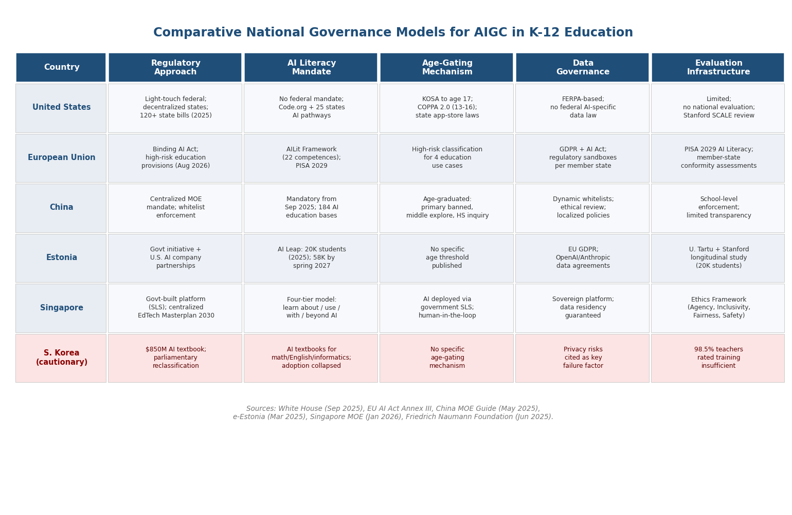

*Figure 6.1 — Comparative governance models across six jurisdictions, contrasting regulatory approach, AI literacy mandates, age-gating mechanisms, data governance, and evaluation infrastructure. South Korea is included as a cautionary case. Sources: White House (Sep 2025), EU AI Act Annex III, China MOE Guide (May 2025), e-Estonia (Mar 2025), Singapore MOE (Jan 2026), Friedrich Naumann Foundation (Jun 2025).*

### 6.3.4 International Age-Gating Convergence

Across jurisdictions, the direction of travel on minor protection is convergent even as specific mechanisms diverge. The United States is moving toward platform-level age verification with parental consent requirements. The EU classifies education AI as a systemic risk category requiring conformity assessment. Individual U.S. states are legislating app-store-level controls. China mandates school-level whitelists with age-differentiated use thresholds. UNESCO recommends a minimum age of 13 for generative AI use. The cumulative effect is an increasing compliance burden for global EdTech providers, which must navigate an expanding matrix of age, consent, data residency, and safety requirements across multiple jurisdictions simultaneously.

## 6.4 Market Dynamics and Investment Trajectories

### 6.4.1 Investment Recovery and AI Concentration

Global EdTech venture capital investment reached $2.6 billion in 2025, an 11 percent year-over-year increase marking the sector's stabilization after the post-pandemic contraction. K-12 captured 36 percent of deal volume. Notable funding rounds included MagicSchool AI ($45 million) and Starbridge ($42 million). Mergers and acquisitions reached approximately 410 transactions, a 20 percent increase over 2024, with landmark deals including Workday's $1.1 billion acquisition of Sana and the Coursera–Udemy combination [HolonIQ](https://www.holoniq.com/notes/edtech-hits-2-6b-in-investment-as-the-market-stabilizes-bigger-bets-in-ai-and-workforce-training "Feb 6, 2026").

The AI-in-education market segment is projected to grow from $5.88 billion in 2024 to $32.27 billion by 2030, representing a compound annual growth rate (CAGR) of 31.2 percent — approximately three times the overall EdTech market's projected CAGR of roughly 9.5 percent (from $337 billion in 2024 to $580 billion by 2030) [Grand View Research](https://www.grandviewresearch.com/industry-analysis/artificial-intelligence-ai-education-market-report "AI in Education Market Report"); [HolonIQ](https://www.holoniq.com/notes/2026-global-education-outlook "2026 Global Education Outlook"). The differential growth rate confirms AI as the primary value-creation driver within the broader EdTech sector.

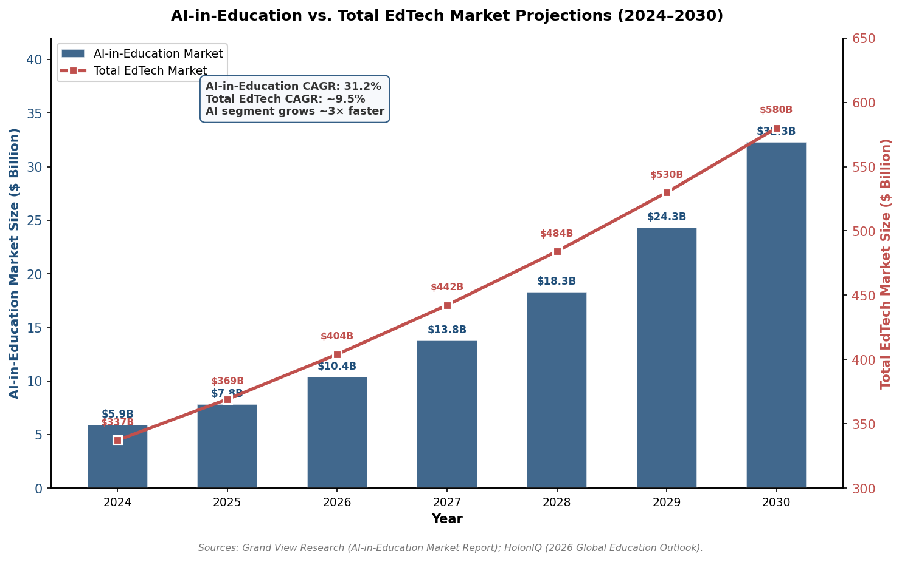

*Figure 6.2 — AI-in-education market trajectory ($5.9 billion in 2024 → $32.3 billion by 2030, CAGR 31.2%) versus the broader EdTech market ($337 billion in 2024 → $580 billion by 2030, CAGR ~9.5%). AI-in-education is growing at approximately three times the rate of the overall sector. Data: Grand View Research; HolonIQ.*

### 6.4.2 Consolidation and the Platform Advantage

Investor sentiment increasingly favors integrated platforms over point solutions. AI capability has emerged as the dominant acquisition driver, as evidenced by the Workday–Sana transaction and by the strategic embedding of AI across the full product suites of Google Classroom, Microsoft 365 Education, and the reimagined Khan Academy platform. For standalone AI-in-education startups, this dynamic creates a strategic dilemma: achieve sufficient scale and differentiation to survive as independent platforms, or position for acquisition by one of the dominant ecosystem players.

The consolidation trend carries equity implications. If a small number of large platforms come to dominate the delivery of AI-enhanced education, school systems lacking the bargaining power or technical capacity to negotiate data governance terms may find themselves locked into proprietary ecosystems — with limited control over how student data is used, what pedagogical approaches are embedded in platform defaults, and whether the tools will remain free or affordable beyond initial adoption incentives.

### 6.4.3 Open-Source as an Equity Lever

Against the consolidation trend, a countervailing movement in open-source AI education resources is gaining momentum. Code.org has released a free, open-source AI Foundations course for high school students. Anthropic's AI Fluency curriculum is published under Creative Commons. Apple has released free AI learning resources. HP and Qualcomm are developing edge AI hardware that could enable local deployment of open-source models in school settings [White House](https://www.whitehouse.gov/releases/2025/09/major-organizations-commit-to-supporting-ai-education/ "Sep 9, 2025"). The open-source trajectory is particularly consequential for schools in lower-income countries and regions, where commercial subscription costs may be prohibitive but where open-source tools combined with on-device inference could provide viable alternatives.

The Experience AI program (Raspberry Pi Foundation and Google DeepMind), which has already reached an estimated 2.9 million young people in over 180 countries and is expanding to 1.25 million students across nine Latin American countries by 2028 [Raspberry Pi Foundation](https://www.raspberrypi.org/blog/bringing-ai-education-to-1-25-million-students-across-latin-america/ "Mar 2026"), exemplifies how open and freely available curricula can achieve scale in contexts where commercial platforms cannot.

## 6.5 Synthesis: Three Defining Tensions for 2026–2028

The trajectories examined in this chapter converge around three tensions that will define the next phase of AIGC integration in K-12 education.

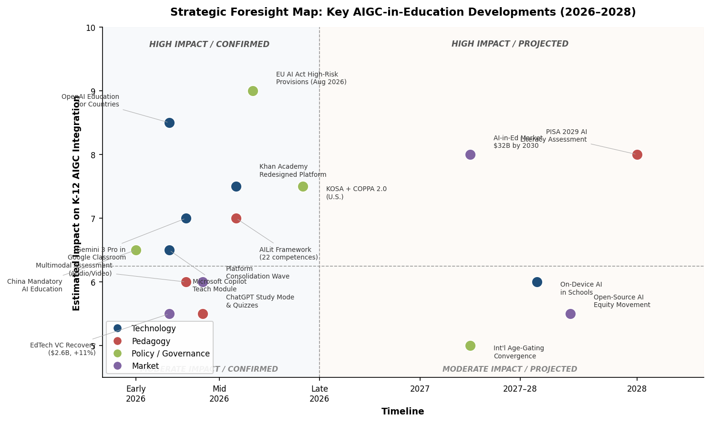

*Figure 6.3 — Strategic foresight map positioning key developments across four domains (Technology, Pedagogy, Policy/Governance, Market) by timeline certainty (confirmed 2026 vs. projected 2027–2028) and estimated impact on K-12 AIGC integration.*

**Speed versus evidence.** The pace of tool deployment and policy commitment continues to outstrip the evidence base. Stanford SCALE's March 2026 review identified only 20 high-quality causal studies on AI in K-12 among more than 800 papers reviewed, and found no causal studies of student AI use in U.S. K-12 classrooms [Stanford SCALE](https://scale.stanford.edu/research-in-action/understanding-evidence-base-ai-k12-education "Mar 2026"). The Estonia AI Leap, with its embedded longitudinal study of 20,000 students, represents a promising model for closing this gap — but results will not be available until 2027–2028 at the earliest. Until then, the sector operates with limited empirical guidance on what works, for whom, and under what conditions.

**Access versus governance.** The White House Summit commitments — free Gemini for all U.S. high schoolers, free Copilot for K-12 — could dramatically expand access. Yet the College Board's December 2025 finding that the emerging digital divide is "not simply about access to devices or the internet, but access to emerging technologies and the guidance to use them well" [College Board](https://newsroom.collegeboard.org/follow-report-ai-high-schools-genai-use-and-policy-varies-academic-achievement-attainment-grade-and "Dec 2025") suggests that access alone is insufficient. The "third digital divide" identified by Brookings — in which affluent students possess both technology and the human support (teachers, parents) to use it productively, while lower-income students have technology alone [Brookings](https://www.brookings.edu/articles/ai-and-the-next-digital-divide-in-education/ "Jul 2023") — will intensify as tools become more powerful and the skill required to use them effectively grows.

**Convergence versus fragmentation.** The technological stack is converging toward a standard architecture (foundation model + pedagogical wrapper). The governance landscape, however, is fragmenting — EU binding regulation, U.S. state-level proliferation, China centralized mandates, and varied national approaches across Asia and Oceania. For educators and school systems, this means navigating an increasingly powerful and standardized set of tools within an increasingly complex and divergent set of rules. The institutions that thrive in this environment will be those that invest not only in technology access but in the human capacity — teacher expertise, instructional design quality, policy literacy, and evaluation infrastructure — to deploy AIGC in ways that are educationally productive, ethically defensible, and legally compliant.

# 第7章 Recommendations for Educators, Administrators, and Policymakers

The preceding chapters documented a field defined by rapid adoption, uneven governance, promising but thin evidence, and a persistent gap between what AIGC (AI-Generated Content) tools can do and what schools are equipped to manage. By spring 2025, 53 percent of U.S. K-12 teachers and 54 percent of students were using AI for school-related work, yet only 45 percent of principals reported having any AI policy in place, and over 80 percent of students said their teachers had not taught them how to use AI [RAND](https://www.rand.org/pubs/research_reports/RRA4180-1.html "RAND, Doss et al., Sep 2025"). Across the OECD, 75 percent of non-AI-using teachers cited lack of skills as their primary barrier [Education International/OECD](https://www.ei-ie.org/en/item/31815:using-artificial-intelligence-takeaways-from-talis-2024 "EI analysis of TALIS 2024, Dec 2025"). The central question is no longer whether generative AI will be present in classrooms — it already is — but whether educators, administrators, and policymakers can build the institutional capacity to deploy it responsibly.

This chapter translates the evidence and case-study findings from Chapters 2 through 6 into actionable recommendations organized by audience: classroom educators, school and district administrators, and policymakers at the regional and national level. Each recommendation is grounded in specific evidence documented earlier in this report and, where available, linked to existing frameworks, tools, or programs that practitioners can adopt immediately. Figure 7-1 provides a consolidated roadmap of recommended actions across all three audiences, organized by implementation timeline.

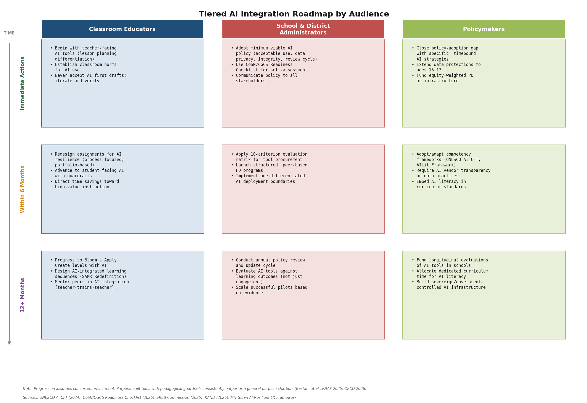

*Figure 7-1. Tiered AI Integration Roadmap by Audience. A phased implementation guide presenting specific actions for classroom educators, school and district administrators, and policymakers across three time horizons: immediate, within six months, and twelve months or longer.*

## 7.1 Recommendations for Classroom Educators

### 7.1.1 Adopt a Tiered Progression Model for AI Integration

Attempting to integrate AIGC into every lesson simultaneously is both impractical and pedagogically risky. A phased approach — moving from substitution through transformation — enables educators to build competence, observe effects, and adjust before scaling. Two established frameworks offer structured progression paths.

The SAMR model (Substitution → Augmentation → Modification → Redefinition), when applied to AI integration, provides an intuitive ladder. Substitution involves using AI for tasks previously done manually (e.g., grammar checking); augmentation adds functional improvement (real-time feedback on student writing); modification restructures the task (students analyze and critique AI-generated content); and redefinition creates previously inconceivable activities (students co-design experiments with AI partners). The Center for Innovation, Design and Digital Learning (CIDDL) cautions that SAMR should serve as "a starting point, not a scorecard," and recommends pairing it with cognition-focused frameworks that evaluate whether AI use deepens or displaces student thinking [CIDDL](https://ciddl.org/ai-integration-and-the-samr-framework-a-practical-lens-for-instructional-design/ "Jan 13, 2026").

UNESCO's AI Competency Framework for Teachers (AI CFT) offers a more comprehensive structure: 15 competencies across five dimensions (human-centered mindset, ethics of AI, AI foundations and applications, AI pedagogy, and professional learning) with three progression levels — Acquire, Deepen, and Create [UNESCO](https://www.unesco.org/en/articles/ai-competency-framework-teachers "Aug 2024"). The framework's practical value lies in its specificity: an educator at the "Acquire" level might use AI to generate a first-draft lesson plan, while one at the "Create" level might design AI-integrated learning sequences in which students evaluate the strengths and limitations of AI outputs. The OECD–European Commission AI Literacy Framework (AILit) complements the AI CFT with 22 competences across four domains — Engaging, Creating, Managing, and Designing AI — providing a parallel reference for student-facing AI literacy goals [AILit Framework](https://ailiteracyframework.org/wp-content/uploads/2025/05/AILitFramework_ReviewDraft.pdf "May 2025 draft").

The operational recommendation is straightforward: begin at the substitution or "Acquire" level with teacher-facing tools (lesson planning, differentiation, worksheet generation), build confidence and critical evaluation habits, and advance to student-facing applications only after establishing classroom norms and assessment protocols.

### 7.1.2 Redesign Assignments for AI Resilience, Not AI Exclusion

The evidence is unambiguous that AI detection tools are unreliable and that detection-based integrity strategies generate significant collateral harm — including false accusations that disproportionately affect non-native English speakers and students from marginalized backgrounds (Chapter 5). The MIT Sloan four-step framework, grounded in Understanding by Design, offers a practical alternative: (1) identify learners; (2) revisit learning outcomes — retiring those that AI can trivially achieve while promoting new outcomes such as evaluating AI errors; (3) redesign assessments with explicit decisions about whether AI is required, allowed, or prohibited per task, prioritizing Bloom's Apply-through-Create levels; and (4) restructure activities toward flipped-classroom active learning. As the framework's authors note: "Since AI detectors don't work, the only way to enforce a ban is in-person without devices" [MIT Sloan](https://mitsloanedtech.mit.edu/ai/teach/4-steps-to-design-an-ai-resilient-learning-experience/ "AI-Resilient LX Design").

Specific AI-resilient assessment strategies documented in the research literature include oral examinations, portfolio-based assessment with documented revision histories, in-class supervised writing, and process-focused assignments requiring iterative drafts with reflective commentary [Assessment & Evaluation in Higher Education](https://www.tandfonline.com/doi/full/10.1080/02602938.2026.2644516 "2026"). These approaches share a common logic: they evaluate learning processes rather than finished products, rendering AI-assisted shortcuts visible without requiring technological detection. The Bastani et al. randomized controlled trial from Türkiye (Chapter 4) reinforces this reasoning — standard ChatGPT improved practice performance by 48 percent while degrading exam performance by 17 percent, demonstrating that unguarded AI use produces "illusory learning" invisible to product-focused assessment [Bastani et al.](https://www.pnas.org/doi/10.1073/pnas.2422633122 "PNAS v122 n26, Jun 2025").

### 7.1.3 Develop Effective Prompting Practices

How an educator prompts an AI tool substantially determines the quality, relevance, and safety of its outputs. Practitioner accounts from the AFT's *American Educator* (Spring 2026) illustrate effective prompting principles in action: a high school career and technical education teacher in Rhode Island provides ChatGPT with district standards and constraints, then iterates through multiple drafts ("I don't use its first draft"); a kindergarten teacher in Florida supplies state standards to Copilot and requests experiments with writing components; a special education teacher in Kansas begins with standards-referenced grading criteria. All describe AI as a "partner in the creative process, not a replacement for judgment" [AFT](https://www.aft.org/ae/spring2026/leonard_siebenmark_venagro "Spring 2026").

Several principles emerge from these accounts and from the broader evidence base:

- **Specify standards, grade level, and student context upfront.** The more precisely constrained the prompt, the more usable the output. Generic prompts produce generic results.
- **Never accept the first draft.** AI-generated content requires iterative refinement — adjusting for tone, accuracy, and alignment with specific classroom needs.
- **Combine AI outputs with teacher expertise and existing materials.** AI is most effective as a starting point, not a finished product.
- **Protect student privacy.** Omit student names, identifying information, and sensitive details from prompts. This is not merely a best practice but a legal obligation under FERPA and comparable data protection frameworks.
- **Restrict student-facing AI to rubric-based feedback.** When using AI for student feedback, configure it to reference specific criteria without providing direct answers — a principle validated by the Bastani et al. RCT's finding that pedagogical guardrails eliminate the learning degradation caused by unguarded chatbot access.

### 7.1.4 Leverage Time Savings Strategically

The Gallup–Walton Family Foundation survey (June 2025) found that weekly AI users among teachers save an average of 5.9 hours per week — equivalent to approximately six weeks per school year. The most common time-saving applications are lesson preparation (37 percent of weekly users), worksheet and material creation (33 percent), differentiation (28 percent), and administrative tasks (28 percent). Quality improvements accompany the efficiency gains: 64 percent of weekly users report better differentiated materials, 61 percent report improved data insights, and 57 percent report enhanced grading and feedback [Walton Family Foundation](https://www.waltonfamilyfoundation.org/the-ai-dividend-new-survey-shows-ai-is-helping-teachers-reclaim-valuable-time "Jun 25, 2025").

These benefits, however, are not automatic. CDT's 2025 survey found that 39 percent of teachers — including 24 percent of heavy users — describe AI as "more time consuming than helpful" [CDT](https://cdt.org/wp-content/uploads/2025/10/FINAL-CDT-2025-Hand-in-Hand-Polling-100225-accessible.pdf "CDT, Oct 2025"). Schools with formal AI policies see 26 percent larger "AI dividends" (2.3 versus 1.7 hours per week saved), suggesting that institutional clarity amplifies individual productivity [Walton Family Foundation](https://www.waltonfamilyfoundation.org/the-ai-dividend-new-survey-shows-ai-is-helping-teachers-reclaim-valuable-time "Jun 25, 2025"). The critical recommendation is to direct AI-generated time savings toward higher-value activities — individual student conferencing, small-group instruction, formative observation — rather than treating AI as a means of compressing preparation into less time while leaving instructional patterns unchanged.

## 7.2 Recommendations for School and District Administrators

### 7.2.1 Establish an AI Policy Before AI Establishes Itself

The most consistent finding across Chapters 2 through 6 is that the absence of institutional policy does not slow AI adoption — it merely ensures that adoption proceeds without guardrails. As of spring 2025, 54 percent of U.S. K-12 students reported using AI for school, yet only 34 percent of teachers reported having policies on AI and academic integrity, and only 9 percent of middle schoolers and 7 percent of high schoolers said their schools explicitly permitted AI for homework [RAND](https://www.rand.org/pubs/research_reports/RRA4180-1.html "RAND, Doss et al., Sep 2025"); [RAND](https://www.rand.org/pubs/research_reports/RRA4742-1.html "RAND RR-A4742-1, Mar 2026"). The CoSN 2025 survey of 645 U.S. districts confirms the broader pattern: 57 percent of districts have incorporated AI guidelines into policies, but 43 percent still lack them; total bans have dropped from 3 percent to 1 percent, while the share of districts "embracing AI" has risen from 22 percent to 30 percent [CoSN](https://www.cosn.org/wp-content/uploads/2025/05/EdTechLeadership_2025_F2.pdf "May 2025"). The trend is clearly toward engagement rather than prohibition, but the pace of policy development remains inadequate relative to adoption rates.

Two freely available instruments provide structured starting points for policy development:

- **CoSN/CGCS K-12 Gen AI Readiness Checklist (V1.2, April 2025)**: 115 questions organized across seven domains — Executive Leadership, Operational, Data, Technical, Security, Legal/Risk, and Academic AI Literacy. Released under Creative Commons license, it is accompanied by a Gen AI Maturity Tool for institutional self-evaluation [CoSN/CGCS](https://www.cosn.org/wp-content/uploads/2025/04/Gen-AI-Readiness-Checklist-Master-V1_2.pdf "Apr 2025").
- **SREB AI Tool Procurement Checklist (May 2025)**: A K-12-specific instrument covering five implementation stages — Design, Procure, Deploy, Monitor & Evaluate, and Engage Vendors — available in spreadsheet format for practical use [SREB](https://www.sreb.org/publication/ai-tool-procurement-implementation-and-evaluation-checklist "May 2025").

A minimum viable AI policy should address five domains: acceptable use parameters (which tools, for which purposes, at which grade levels), academic integrity expectations (with explicit guidance on permitted versus prohibited AI use per assignment type), data privacy requirements (FERPA/COPPA compliance, student data protection), professional development expectations, and a review cycle (at minimum, annual revision given the pace of technological change).

### 7.2.2 Apply Rigorous Evaluation Criteria for AI Tool Procurement

The rapid proliferation of AI tools marketed to schools — and the significant corporate investments behind free-tier offerings following the September 2025 White House AI Education Summit — requires administrators to evaluate tools systematically rather than adopt them on the basis of vendor claims, price, or popularity. The evidence from Chapter 5 demonstrates that purpose-built education AI tools are not immune to bias: a Common Sense Media study (August 2025) found that widely used teacher tools including MagicSchool AI, Khanmigo, and Curipod generated more punitive behavior intervention recommendations for student profiles with Black-coded names [Chalkbeat](https://www.chalkbeat.org/2025/08/06/ai-teacher-assistants-promote-racial-bias-study-finds/ "Aug 2025"). Marketing claims of "education-specific" design do not, in themselves, guarantee safety or equity.

Synthesizing criteria from CoSN, SREB, and ISTE, ten evaluation dimensions warrant systematic assessment before tool adoption (see Figure 7-2):

1. **Data privacy and legal compliance** — FERPA, COPPA, GDPR, and applicable state or national data protection requirements; clarity on data retention, training use, and third-party sharing.
2. **Content safety and guardrails** — age-appropriate content filtering, response constraints, and mechanisms for handling harmful or inappropriate outputs.
3. **Accuracy and reliability** — documented hallucination rates, content verification mechanisms, and subject-matter accuracy for specific grade levels.
4. **Bias and algorithmic fairness** — evidence of bias testing, including demographic equity audits across racial, linguistic, and disability categories.
5. **Curriculum alignment** — ability to map outputs to specific learning standards (national, state, or regional).
6. **Age-appropriateness** — differentiated features and restrictions by grade band (elementary/primary, middle school/lower secondary, high school/upper secondary).
7. **Interoperability** — integration with existing learning management systems, student information systems, and single sign-on infrastructure.
8. **Cost and sustainability** — total cost of ownership including licensing, training, support, and infrastructure requirements; viability beyond free-tier promotional periods.
9. **Transparency and explainability** — ability for educators and administrators to understand how the tool generates outputs and on what basis recommendations are made.
10. **Equity of access** — availability across device types, bandwidth requirements, language support, and accessibility for students with disabilities.

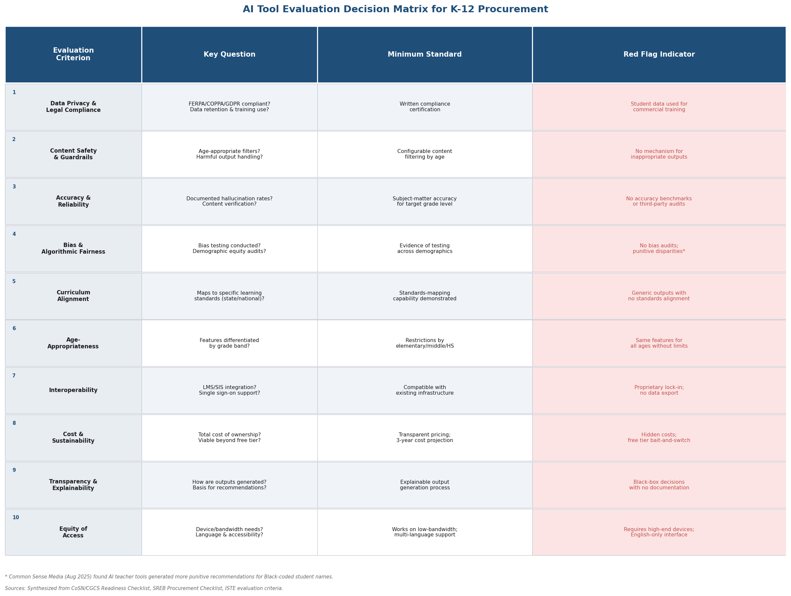

*Figure 7-2. AI Tool Evaluation Decision Matrix for K-12 Procurement. Each of the ten evaluation criteria is mapped to its key question, minimum standard, and red-flag indicator — designed as a directly usable procurement instrument for school and district administrators. Criteria synthesized from CoSN/CGCS, SREB, and ISTE frameworks.*

China's approach to tool governance — requiring schools to maintain dynamic "whitelists" of approved AI tools subject to ethical review — represents the most prescriptive procurement framework globally [Georgetown CSET](https://cset.georgetown.edu/publication/china-school-gen-ai-use-guide-2025/ "CSET translation, May 2025"). While few Western school systems are likely to adopt whitelist mandates, the underlying principle of proactive vetting rather than reactive response to problems merits broader application.

### 7.2.3 Invest in Structured, Peer-Based Professional Development

Teacher professional development in AI is advancing rapidly but unevenly. RAND's American School District Panel data show that district-provided AI training doubled from 23 percent to 48 percent between fall 2023 and fall 2024, yet a persistent socioeconomic gap remains: 67 percent of low-poverty districts provide training compared to only 39 percent of high-poverty districts [RAND](https://www.rand.org/pubs/research_reports/RRA956-31.html "Apr 8, 2025"). This disparity risks widening the "third digital divide" identified by the Brookings Institution — one in which under-resourced schools have access to technology but lack the human capacity to use it productively [Brookings](https://www.brookings.edu/articles/ai-and-the-next-digital-divide-in-education/ "Jul 2023").

RAND's qualitative research (14 district interviews) identified several principles that distinguish effective AI professional development from ineffective approaches:

- **Address anxiety before instruction.** Initial training sessions should acknowledge and normalize educators' fears about AI — concerns about job displacement, academic integrity, and professional identity — before introducing tools.
- **Prioritize hands-on engagement over passive presentations.** Subject-specific, interactive sessions in which teachers use AI tools to solve problems relevant to their own classrooms are consistently more effective than lecture-format overviews.
- **Adopt peer-based models.** The "teacher-trains-teacher" approach is the most effective delivery mechanism identified across multiple programs. As RAND notes, the "do-it-yourself" approach is common — half of district leaders interviewed could not identify external AI training experts — making internal capacity building essential.
- **Start with exploratory play.** Effective programs begin by inviting teachers to experiment without performance pressure, building comfort and curiosity before introducing structured integration frameworks.

Three large-scale professional development programs offer models for different institutional contexts. The AFT National Academy for AI Instruction, funded by $23 million from OpenAI, Microsoft, and Anthropic, targets 400,000 educators through a teacher-trains-teacher model; by March 2026, training had advanced to "agentic" AI tools [Chalkbeat](https://www.chalkbeat.org/2025/07/08/openai-microsoft-teachers-union-ai-training-partnership/ "Jul 8, 2025"); [EdWeek](https://www.edweek.org/technology/teachers-move-beyond-ai-basics-to-more-sophisticated-instructional-uses/2026/03 "Mar 20, 2026"). ISTE+ASCD's GenerationAI provides free AI lesson guides in English, Spanish, and Arabic, alongside StretchAI — described as "the first AI coach specifically for educators" — and a five-hour "AI for Tomorrow's Teachers" module for teacher preparation faculty [ISTE+ASCD](https://iste-ascd.org/ai "AI in Education"). Microsoft's Elevate Educator Credential, co-developed with ISTE and ASCD and aligned to the OECD/EC AI Literacy Framework, is scheduled to launch in May 2026 as a free credential, part of a $4 billion training initiative [Microsoft](https://news.microsoft.com/source/2026/01/15/microsoft-expands-its-commitment-to-education-with-elevate-for-educators-program-and-new-ai-powered-tools/ "Jan 15, 2026").

### 7.2.4 Respect Age-Differentiated Boundaries

Not all AI applications are appropriate for all age groups. China's May 2025 MOE Guide establishes the most detailed age-differentiated framework globally: elementary/primary students (ages 6–12) are banned from independent AI content generation; middle school students (ages 12–15) may explore AI under supervision; and high school students (ages 15–18) may conduct inquiry-based learning with AI tools [Georgetown CSET](https://cset.georgetown.edu/publication/china-school-gen-ai-use-guide-2025/ "CSET translation, May 2025"). UNESCO recommends a minimum age of 13 for student use of generative AI tools [UNESCO Guidance for GenAI in Education](https://table.media/wp-content/uploads/2023/09/386693eng.pdf "UNESCO, Sep 2023"). Swiss data provide empirical context: regular classroom generative AI use stands at 8 percent among primary students, 30 percent among lower-secondary, and 50 percent among upper-secondary — a natural gradient reflecting developmental readiness [OECD AI Adoption Report](https://www.oecd.org/content/dam/oecd/en/publications/reports/2025/12/ai-adoption-in-the-education-system_43251cf0/69bd0a4a-en.pdf "OECD 2025, citing Oggenfuss & Wolter 2024"). Figure 7-3 synthesizes these policy frameworks and empirical data into a consolidated age-differentiated deployment guide.

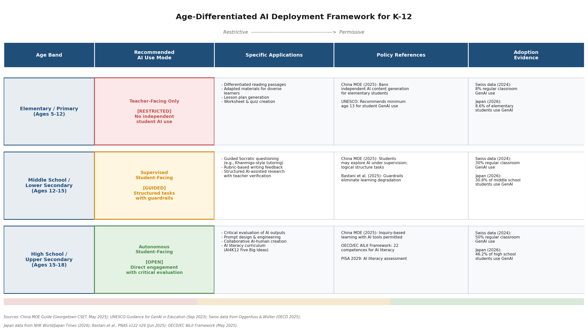

*Figure 7-3. Age-Differentiated AI Deployment Framework for K-12. Maps three age bands (elementary/primary, middle school/lower secondary, high school/upper secondary) against recommended AI use modes, specific applications, policy references, and empirical adoption data.*

Administrators should calibrate AI tool deployment to these developmental differences. At the elementary/primary level, AI should remain primarily teacher-facing — generating differentiated reading passages, adapting materials for diverse learners, supporting lesson design — rather than student-facing. At the middle school level, supervised and structured AI interactions (e.g., guided Socratic questioning with pedagogical guardrails) become appropriate. At the high school level, direct student engagement with AI — including critical evaluation of AI outputs, prompt design, and collaborative creation — can serve both learning objectives and AI literacy goals.

## 7.3 Recommendations for Policymakers

### 7.3.1 Close the Policy-Adoption Gap with Specific, Timebound AI Strategies

The most striking policy finding from this report is the gap between rhetorical commitment and operational specificity. The OECD's 2025 policy survey found that 81 percent of 32 responding jurisdictions mention AI in their education strategies, yet only 25 percent have specific AI initiatives and a mere 19 percent include timebound implementation goals [OECD AI Adoption Report](https://www.oecd.org/content/dam/oecd/en/publications/reports/2025/12/ai-adoption-in-the-education-system_43251cf0/69bd0a4a-en.pdf "OECD 2025"). Vague endorsements of "AI in education" without defined deliverables, timelines, and accountability mechanisms produce the policy vacuum documented throughout this report — one in which students and teachers improvise solutions while institutions deliberate.

Effective policy requires specificity on at least four dimensions: what tools are permitted or mandated and at what grade levels; what training educators must receive and by when; what data governance standards apply to AI tools deployed in schools; and how outcomes will be measured and evaluated. The SREB Commission on AI in Education provides a useful template: its 12 recommendations encompass State AI Networks for cross-district coordination, targeted guidance differentiated by school level, professional development plans with defined timelines, standards integration, capacity assessment, resource allocation mechanisms, risk management protocols, procurement guidelines, K-12/postsecondary/workforce alignment, safety policies, and evaluation frameworks [SREB](https://www.sreb.org/post/sreb-ai-education-commission-approves-final-recommendations "2025"). The breadth of the SREB framework underscores that meaningful AI governance in education requires coordinated action across multiple institutional systems simultaneously.

### 7.3.2 Fund Professional Development as Infrastructure, Not Enrichment

The evidence reviewed in this report consistently identifies teacher capacity — not tool access — as the binding constraint on productive AIGC integration. OpenAI's March 2026 education report documented a "capability overhang" in which even advanced users operate at 90–99 percent below power-user behavior [OpenAI](https://openai.com/index/ai-education-opportunity/ "Mar 4, 2026"). OECD TALIS 2024 data show that 75 percent of non-AI-using teachers cite lack of skills as their primary barrier [Education International/OECD](https://www.ei-ie.org/en/item/31815:using-artificial-intelligence-takeaways-from-talis-2024 "EI/OECD TALIS 2024"). RAND data reveal a persistent socioeconomic gap in professional development provision: 67 percent of low-poverty U.S. districts offer AI training compared to only 39 percent of high-poverty districts [RAND](https://www.rand.org/pubs/research_reports/RRA956-31.html "Apr 8, 2025").

These data points converge on a clear policy implication: investments in teacher professional development will yield larger marginal returns than investments in more powerful AI tools. Policymakers should treat AI-related professional development as core educational infrastructure — funded through recurring budget lines rather than one-time grants, subject to quality standards, and evaluated for impact on classroom practice rather than merely on participation rates. Funding models should incorporate equity weighting to ensure that high-poverty districts receive proportionally greater investment, counteracting the documented tendency for technology benefits to accrue disproportionately to already-advantaged institutions.

### 7.3.3 Protect Student Data Through Updated Legal Frameworks

The data privacy challenges documented in Chapter 5 reflect a fundamental mismatch between existing legal frameworks — designed for the pre-AI internet — and the realities of generative AI interaction with minors. COPPA applies only to children under 13, leaving the 13–17 age group largely unprotected under U.S. federal law despite being the demographic with the highest generative AI usage [PIPC](https://publicinterestprivacy.org/coppa-rule-training-algorithms/ "PIPC, Dec 2025"). The updated COPPA Rule (effective June 2025) prohibits indefinite data retention for algorithm improvement, but pending legislation (KOSA, COPPA 2.0) that would extend protections to age 17 had not been enacted as of April 2026 [Fortune](https://fortune.com/2026/03/18/kosa-kids-act-app-store-accountability-act-minors-age-verification/ "Mar 18, 2026"). In Europe, the interaction between GDPR consent requirements, the EU AI Act's high-risk classification (effective August 2, 2026), and varying national consent ages creates substantial compliance uncertainty for schools.

Policymakers should pursue three data protection priorities. First, extend meaningful data protections to the 13–17 age group — the cohort most actively using generative AI tools — through legislation or regulatory guidance. Second, require AI vendors serving schools to provide transparent, plain-language disclosures about data collection, retention, training use, and third-party sharing, with specific provisions prohibiting the use of student data to train commercial AI models without explicit opt-in consent. Third, invest in sovereign or government-controlled AI infrastructure where feasible. Singapore's approach — deploying all education AI tools through the government-built Student Learning Space (SLS) platform — ensures data residency within a controlled architecture [Singapore MOE](https://www.moe.gov.sg/education-in-sg/educational-technology-journey/edtech-masterplan/artificial-intelligence-in-education "MOE, Jan 2026"). While few jurisdictions possess Singapore's centralized capacity, the principle of maintaining institutional control over student data flows — rather than delegating this responsibility to commercial vendors — is broadly applicable.

### 7.3.4 Embed AI Literacy in Curriculum Standards

The trajectory toward mandatory AI literacy is accelerating globally. China mandated AI education across all primary and secondary schools from September 2025. Estonia's AI Leap reached 20,000 students in Phase 1 (September 2025), with projections of 58,000 students and 5,000 educators by spring 2027 [e-Estonia](https://e-estonia.com/ai-leap-2025-estonia-sets-ai-standard-in-education/ "Mar 19, 2025"). Code.org has partnered with 25 U.S. states to develop AI pathways, targeting 400,000 students through a free AI Foundations course [White House](https://www.whitehouse.gov/releases/2025/09/major-organizations-commit-to-supporting-ai-education/ "Sep 9, 2025"). The OECD/EC AILit Framework's contribution to PISA 2029 — which will include a Media and AI Literacy assessment — creates accountability pressure analogous to what PISA reading and mathematics benchmarks have exerted on curriculum decisions for two decades [AILit Framework](https://ailiteracyframework.org/wp-content/uploads/2025/05/AILitFramework_ReviewDraft.pdf "May 2025 draft").

Policymakers who have not yet embedded AI literacy in curriculum standards face an approaching accountability horizon. Three recommendations follow: (1) adopt or adapt an existing competency framework (UNESCO's AI CFT for teachers, the AILit Framework for students, or both) rather than building from scratch; (2) differentiate AI literacy expectations by age band, following China's graduated model of increasing student autonomy with developmental stage; and (3) allocate curriculum time explicitly — AI literacy cannot be achieved through a single elective or after-school program. The Experience AI program (Raspberry Pi Foundation and Google DeepMind), which has reached an estimated 2.9 million young people in over 180 countries and is expanding to 1.25 million students across nine Latin American countries by 2028 [Raspberry Pi Foundation](https://www.raspberrypi.org/blog/bringing-ai-education-to-1-25-million-students-across-latin-america/ "Mar 2026"), demonstrates that open-source, freely available curricula can achieve scale even in resource-constrained contexts.

### 7.3.5 Prioritize Evidence Generation and Longitudinal Evaluation

The evidence base for AIGC in K-12 education remains disturbingly thin relative to the scale of deployment. Stanford SCALE's March 2026 review identified only 20 high-quality causal studies among more than 800 papers on AI in K-12, and found no causal studies of student AI use in U.S. K-12 classrooms [Stanford SCALE](https://scale.stanford.edu/research-in-action/understanding-evidence-base-ai-k12-education "Mar 2026"). Most available evidence is observational, short-term, or proprietary. The Bastani et al. randomized controlled trial remains the single most rigorous study of its kind, and it was conducted in one school in one country.

Policymakers should fund and mandate longitudinal evaluations of AI tools deployed at scale in schools. Two emerging models merit attention: the Estonia AI Leap, which integrates a longitudinal study jointly conducted by the University of Tartu and Stanford tracking 20,000 students [e-Estonia](https://e-estonia.com/ai-leap-2025-estonia-sets-ai-standard-in-education/ "Mar 19, 2025"), and the Newark–Khan Academy partnership, which launched a three-year study tracking approximately 8,000 students in grades 3–8 [Khan Academy](https://www.khanacademy.org/schools/case-studies/newark-public-schools "Newark case study"). Both embed research into deployment design rather than appending evaluation as an afterthought. Evaluation should measure learning outcomes (not merely engagement or satisfaction), disaggregate results by demographic subgroups, and assess implementation quality alongside tool effectiveness — reflecting the central finding of this report that *how* AI is deployed matters at least as much as *what* is deployed.

## 7.4 A Cross-Cutting Principle: Purpose-Built over General-Purpose

A single finding recurs across every domain examined in this report: purpose-built education AI tools with pedagogical guardrails consistently outperform general-purpose chatbots used without structure. The Bastani et al. randomized controlled trial quantified this effect: a structured ChatGPT Tutor improved practice performance by 127 percent with no post-test learning decline, while standard ChatGPT improved practice by 48 percent but degraded exam performance by 17 percent [Bastani et al.](https://www.pnas.org/doi/10.1073/pnas.2422633122 "PNAS v122 n26, Jun 2025"). The OECD's January 2026 analysis reinforced the conclusion: "purpose-built education AI tools deliver stronger outcomes than general-purpose chatbots" [OECD](https://www.oecd.org/en/blogs/2026/01/how-to-effectively-use-generative-ai-in-education.html "OECD, Jan 2026"). Oak National Academy's Aila, operating within a government-funded and domain-constrained design, produced demonstrable workload reductions and high quality ratings from over 10,000 teachers [Oak National Academy](https://www.thenational.academy/blog/how-is-aila-impacting-teacher-lesson-planning-practices-workload-and-expertise-early-insights "Feb 2025"). South Korea's AI digital textbook experience, by contrast, illustrates what happens when tools are rushed to market without adequate piloting, teacher input, or pedagogical grounding — a failure of implementation quality rather than technological ambition [Rest of World](https://restofworld.org/2025/south-korea-ai-textbook/ "Oct 2025").

For all three audiences addressed in this chapter, the implication is consistent: the decision about which AI tools to adopt, how they are configured, what guardrails surround them, and how teachers are prepared to integrate them matters more than the decision to adopt AI in the first place. Technology adoption without implementation quality produces, at best, marginal gains and, at worst, measurable harm. The institutions that will navigate this transition most successfully are those that invest as heavily in human capacity — teacher expertise, instructional design, evaluation infrastructure, and policy development — as in technological capability.

# Conclusion

The global experiment with AIGC in K-12 education is still in its earliest phase, yet its trajectory is already discernible. Across more than ten countries examined in this report — from large-scale national programs in China, South Korea, and the United States to individual classroom innovations in Japan, Finland, and Kenya — a consistent set of findings emerges that should guide the next stage of adoption.

The single most important conclusion is that implementation design determines educational outcomes. The Bastani et al. randomized controlled trial — the field's most rigorous causal study — demonstrated that the same underlying technology can improve or degrade student learning depending on whether pedagogical guardrails are present. Standard ChatGPT improved practice performance by 48% but decreased exam performance by 17%; a version with teacher-designed scaffolding improved practice by 127% with no exam decline. This finding is not an isolated result. It is corroborated by the contrast between Oak National Academy's curriculum-grounded Aila (85% teacher quality ratings, measurable workload reduction) and South Korea's hastily developed AI textbooks ($850 million invested, program collapsed within months). It is reinforced by Singapore's human-in-the-loop mandate, Japan's systematic pilot-before-scale approach, and Newark's gradual, teacher-mediated Khanmigo rollout. The pattern is unambiguous: technology adoption without implementation quality produces, at best, marginal gains and, at worst, measurable harm.

A second overarching finding is that the governance gap — the distance between the pace of AI adoption and the readiness of institutional frameworks to manage it — remains the field's defining structural challenge. Only 25% of OECD jurisdictions surveyed have launched specific AI-in-education initiatives with timebound goals. In the United States, the majority of students use AI for school while the majority of schools lack AI policies. The evidence reviewed in this report suggests that schools with formal AI policies capture significantly larger productivity gains than those without, and that professional development is the binding constraint on productive AI use — not model capability or tool access. The "capability overhang" identified by OpenAI, in which even advanced users operate far below power-user behavior, reframes the central challenge: the marginal return on investing in teacher expertise now exceeds the marginal return on investing in more powerful models.

Third, equity concerns are not ancillary to AIGC integration but central to it. The "third digital divide" — separating students who have both technology and informed human guidance from those who have technology alone — is widening as AI tools become more powerful and the skill required to use them productively grows. The College Board's finding that private schools are more than twice as likely as public schools to both permit generative AI and maintain formal policies, combined with CDT's documentation of a 23-percentage-point income gap in student AI use, establishes that without deliberate policy intervention, AIGC will amplify rather than reduce existing educational inequalities.

Fourth, the evidence base for AIGC in K-12 remains far thinner than the scale of deployment warrants. Stanford SCALE's March 2026 review identified only 20 high-quality causal studies among over 800 papers. No causal studies of student AI use have been conducted in U.S. K-12 classrooms. Most available evidence is observational, short-term, or derived from self-reported data. The longitudinal evaluations now underway — in Estonia, Newark, and through the UK's Education Endowment Foundation — represent the field's best prospect for closing this gap, but results will not be available before 2027–2028. Until then, practitioners and policymakers must make consequential decisions under conditions of significant empirical uncertainty.

Finally, the report documents a global convergence on several principles that, while not yet universally implemented, increasingly define the emerging consensus: AI should supplement rather than replace teacher judgment; student access to generative AI should be age-differentiated; purpose-built education tools outperform general-purpose chatbots; teacher professional development is infrastructure rather than enrichment; and AI literacy is transitioning from an elective topic to a mandatory competency — a shift that the inclusion of AI literacy in PISA 2029 will accelerate.

The classrooms of 2028 will not resemble those of 2022. Generative AI has become a permanent feature of the educational landscape. The question that remains open — and that the evidence assembled in this report illuminates without fully resolving — is whether the institutions responsible for educating the next generation will develop the capacity to deploy these tools in ways that are pedagogically sound, ethically defensible, and equitably distributed. The answer will depend less on the technology itself than on the human systems — policies, training, evaluation, and professional judgment — built around it.
