# Overview

Artificial intelligence stands at the center of a technological transition that scholars increasingly compare to the great general-purpose technology revolutions of the past — mechanization, electrification, and computerization — each of which restructured labor markets over decades. Unlike its predecessors, however, AI concentrates its initial effects on cognitive, knowledge-intensive, and higher-wage occupations, inverting the historical pattern in which automation predominantly displaced lower-skill manual and routine clerical labor. This review synthesizes the peer-reviewed, English-language research published between 2015 and early 2026 on how AI, as a key driver of the Fourth Industrial Revolution, is restructuring labor markets across industries and occupational categories.

Five principal findings emerge from the literature. First, the task-based framework — in which automation displaces labor from specific task bundles while creating complementarities in non-automated tasks — has proven the most durable and empirically supported theoretical lens, though generative AI's capacity to automate non-routine cognitive tasks challenges its original formulations. Second, empirical evidence reveals a persistent productivity–displacement paradox: micro-level studies document productivity gains of 15–40% from generative AI tools, yet aggregate employment analyses detect modest or null effects in the pre-2022 period and emerging displacement signals — concentrated among freelance workers and early-career cohorts — after 2022. Third, AI's labor market impact is profoundly heterogeneous across sectors: industrial robots produced measurable displacement in U.S. manufacturing, healthcare exhibits augmentation constrained by regulation, and knowledge-intensive industries display a task-dependent mixture shaped by what researchers term a "jagged technological frontier." Fourth, one of the most robust early findings is a skill-leveling effect, whereby generative AI disproportionately benefits less-experienced and lower-performing workers, compressing within-occupation productivity distributions — a pattern documented across customer support, software development, professional writing, and management consulting. Fifth, the distributional outcomes of AI-driven restructuring are not technologically determined but are contingent on institutional design, regulatory frameworks, and the distribution of bargaining power, as demonstrated by the stark contrast between robot-adoption outcomes in the United States and Germany.

The review is organized across seven chapters. Chapter 1 introduces the historical context and frames the central displacement–reinstatement tension. Chapter 2 surveys the major theoretical frameworks, from skill-biased technological change through the task-based model to emerging generative-AI-specific formulations. Chapter 3 examines empirical evidence on aggregate and firm-level labor market outcomes across three waves of research. Chapter 4 disaggregates findings by sector and occupation. Chapter 5 addresses the shifting architecture of skill demand and workforce adaptation strategies. Chapter 6 considers the ethical, social, and policy dimensions of AI-driven restructuring. Chapter 7 identifies methodological limitations, research gaps, and priority questions for future scholarship.

# 第1章 Introduction and Historical Context of Technological Change in Labor Markets

## 1.1 Scope and Motivation

Artificial intelligence has moved from the periphery of economic discourse to its center. Across manufacturing floors, hospital wards, legal offices, and software studios, AI-based systems are reconfiguring how tasks are performed, which workers perform them, and what skills command a premium. The restructuring potential is sufficiently broad that scholars have situated contemporary AI within the lineage of epoch-defining general purpose technologies — the steam engine, the electric dynamo, and the semiconductor — each of which reshaped labor markets over decades rather than years [Bresnahan & Trajtenberg (1995)](https://www.sciencedirect.com/science/article/pii/030440769401598T "Journal of Econometrics, 65(1), pp. 83–108"). Yet the speed and cognitive reach of modern AI distinguish it from these predecessors, raising a question that now pervades labor economics: whether the historical patterns of labor market adjustment that ultimately absorbed prior technological shocks will prove adequate guides to the present transition.

This review synthesizes peer-reviewed, English-language research on how AI is restructuring labor markets, covering publications from 2015 to early 2026 with particular emphasis on work appearing after 2020. Five substantive themes organize the analysis: theoretical frameworks for understanding AI-labor interactions (Chapter 2), empirical evidence on aggregate and firm-level labor market outcomes (Chapter 3), sectoral and occupational heterogeneity in AI's effects (Chapter 4), workforce adaptation and human capital implications (Chapter 5), and the ethical, social, and policy dimensions of AI-driven restructuring (Chapter 6). A concluding chapter (Chapter 7) identifies methodological challenges, research gaps, and priority questions for the next generation of scholarship.

## 1.2 Defining Artificial Intelligence for Labor Market Analysis

Precision in defining "AI" is a prerequisite for meaningful synthesis, because how the technology is bounded materially affects conclusions about its labor market reach. The literature reflects at least three overlapping definitional frames, each foregrounding different aspects of AI capability and, consequently, different mechanisms of labor market impact.

Agrawal, Gans, and Goldfarb offer the most economically precise characterization: recent AI advances are fundamentally advances in *prediction* — the ability to fill in missing information using available data. Their prediction–judgment decomposition clarifies that AI substitutes for human labor in prediction tasks while complementing human judgment; the labor market impact of any AI system thus depends on the relative importance of prediction versus judgment within a given occupation [Agrawal, Gans & Goldfarb (2019)](https://www.sciencedirect.com/science/article/abs/pii/S0167624518301136 "Information Economics and Policy, 47, pp. 1–6"). Brynjolfsson and Mitchell propose a complementary rubric identifying conditions under which tasks are "suitable for machine learning" (SML), emphasizing that machine learning automates *tasks*, not entire jobs, and that suitability hinges on the availability of digital training data, clearly defined inputs and outputs, and tolerance for error [Brynjolfsson & Mitchell (2017)](https://www.science.org/doi/10.1126/science.aap8062 "Science, 358(6370), pp. 1530–1534").

The emergence of large language models (LLMs) and generative AI since 2022 has complicated these boundaries further. Eloundou et al. demonstrate the definitional stakes empirically: when AI is operationalized as a simple LLM interface, approximately 1.8% of U.S. jobs could have more than 50% of their tasks affected; when the definition is broadened to include LLMs augmented by complementary software tools, the figure jumps to over 46% [Eloundou et al. (2024)](https://www.science.org/doi/10.1126/science.adj0998 "Science, 384(6702), pp. 1306–1308"). This order-of-magnitude sensitivity underscores that heterogeneous results across studies often reflect heterogeneous definitions as much as heterogeneous underlying realities.

For the purposes of this review, "AI" encompasses narrow AI systems, machine learning (including deep learning), and generative AI/LLMs. Where studies focus on industrial robotics — a related but distinct technology — the distinction is noted explicitly. Three key terms are standardized throughout: *automation* refers to the substitution of human labor in existing tasks; *augmentation* refers to AI enhancing human productivity without displacing the worker; and *exposure* denotes the degree to which an occupation is susceptible to AI transformation, distinct from *adoption*, which refers to actual firm-level implementation.

## 1.3 Historical Precedents: Technological Anxiety and Labor Market Adjustment

Contemporary debate over AI and employment is the latest instantiation of a recurring pattern that stretches across more than two centuries of industrial history. Mokyr, Vickers, and Ziebarth identify three persistent strands of technological anxiety that have surfaced with each major transition: fear that machines will substitute for human labor and create mass unemployment, moral anxiety about the dehumanizing effects of mechanization, and concern that the great age of progress has ended [Mokyr, Vickers & Ziebarth (2015)](https://www.aeaweb.org/articles?id=10.1257/jep.29.3.31 "Journal of Economic Perspectives, 29(3), pp. 31–50"). All three anxieties are once again prominent in the AI discourse, though their relative salience has shifted: substitution fears now center on cognitive rather than manual labor, and the "end of progress" worry has been supplanted by anxiety about progress that is too rapid for institutions to absorb.

The historical record offers qualified reassurance. Over the long run, technological change has not eliminated work in aggregate; rather, it has restructured the composition of employment. Autor synthesizes this evidence, arguing that automation has not displaced most jobs because it simultaneously complements labor in non-automated tasks and raises aggregate output, thereby sustaining demand for human work. At the same time, he identifies a more nuanced cost: *labor market polarization*, in which routine middle-skill occupations hollow out while employment grows at both the high-skill and low-skill ends of the wage distribution [Autor (2015)](https://www.aeaweb.org/articles?id=10.1257/jep.29.3.3 "Journal of Economic Perspectives, 29(3), pp. 3–30").

The intellectual foundation for understanding this polarization lies in the task-based framework introduced by Autor, Levy, and Murnane. Their seminal contribution demonstrates that computer capital substitutes for workers performing routine cognitive and manual tasks — tasks that follow explicit, codifiable rules — while complementing workers engaged in non-routine problem-solving, complex communication, and manual tasks requiring situational adaptability [Autor, Levy & Murnane (2003)](https://www.nber.org/papers/w8337 "Quarterly Journal of Economics, 118(4), pp. 1279–1333"). The routine–non-routine, cognitive–manual taxonomy has organized nearly two decades of subsequent research, and its extension to AI-era automation constitutes a theoretical backbone of the contemporary literature reviewed in Chapter 2.

## 1.4 From Mechanization to the Fourth Industrial Revolution

The concept of general purpose technologies (GPTs) provides the analytical bridge between historical precedent and contemporary AI. Bresnahan and Trajtenberg formalize GPTs as technologies exhibiting three characteristics: pervasiveness across many economic sectors, inherent potential for improvement over time, and innovational complementarities that spawn further invention in application domains [Bresnahan & Trajtenberg (1995)](https://www.sciencedirect.com/science/article/pii/030440769401598T "Journal of Econometrics, 65(1), pp. 83–108"). The steam engine, the electric dynamo, and the semiconductor each satisfied these criteria and triggered extended periods of economic restructuring. Figure 1 maps these successive technological revolutions alongside key AI-era milestones and the canonical labor market studies associated with each wave.

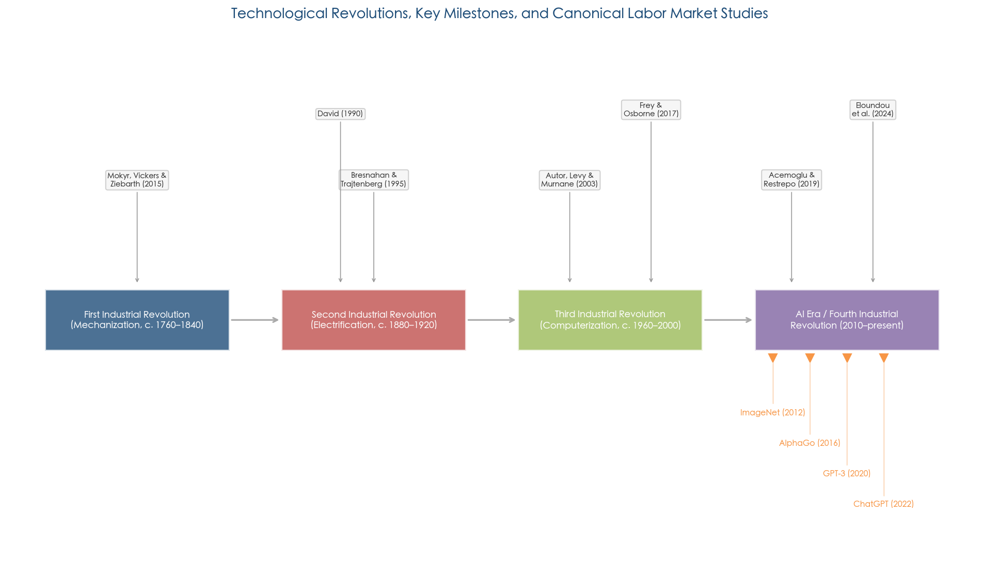

*Figure 1. Timeline of four technological revolutions — mechanization, electrification, computerization, and the AI era — with key milestones and foundational labor market research associated with each transition.*

Several scholars argue that AI, and deep learning in particular, qualifies as a new GPT. Cockburn, Henderson, and Stern go further, proposing that deep learning may constitute a general-purpose *method of invention* — a technology that reshapes the innovation process itself, not merely the production of goods and services (Cockburn, Henderson & Stern, 2018; NBER conference volume chapter). If correct, this characterization implies that AI's labor market effects will be both broader and longer-lasting than those of single-domain automation technologies.

The GPT perspective also illuminates a central puzzle in the current data. Brynjolfsson, Rock, and Syverson address the "modern productivity paradox": despite AI matching or surpassing human performance in domains ranging from image recognition to natural language generation, aggregate productivity growth has declined. They argue that the paradox reflects *implementation lags* — the time required for firms to develop complementary intangible capital, reorganize production processes, and train workforces — analogous to the decades-long delay between the introduction of the electric dynamo in the 1880s and its full productivity impact in the 1920s (Brynjolfsson, Rock & Syverson, 2018; NBER conference volume chapter).

What distinguishes the AI era — sometimes labeled the "Fourth Industrial Revolution" — from prior GPT transitions? Two features stand out in the literature. First, AI concentrates its initial effects in highly educated, well-paid, and predominantly urban industries, marking a qualitative departure from earlier automation waves that primarily displaced lower-skill manual and routine clerical labor. Frank et al. document this pattern and identify fundamental barriers to forecasting AI's labor impacts, including the difficulty of mapping AI capabilities to occupational task requirements and the interconnectedness of tasks within occupations that renders single-task predictions misleading [Frank et al. (2019)](https://pmc.ncbi.nlm.nih.gov/articles/PMC6452673/ "PNAS, 116(14), pp. 6531–6539"). Second, generative AI inverts the historical skill-bias of technological change: Eloundou et al. provide empirical evidence that LLMs possess key GPT characteristics while disproportionately affecting higher-wage, higher-education occupations [Eloundou et al. (2024)](https://www.science.org/doi/10.1126/science.adj0998 "Science, 384(6702)"). Taken together, these findings suggest that the distributional consequences of AI-era automation may diverge substantially from the patterns established by prior waves.

## 1.5 The Displacement–Reinstatement Tension: Framing the Central Debate

The most influential contemporary framework for analyzing AI's labor market effects is the displacement–reinstatement model developed by Acemoglu and Restrepo. They identify two countervailing forces: a *displacement effect*, in which automation reduces labor demand in tasks now performed by machines, and a *reinstatement effect*, in which new technologies create new tasks and occupations that restore or expand labor demand. Their empirical decomposition of U.S. employment trends shows that slower employment growth over recent decades reflects accelerated displacement — particularly in manufacturing — combined with weaker reinstatement and slower productivity growth [Acemoglu & Restrepo (2019)](https://www.aeaweb.org/articles?id=10.1257/jep.33.2.3 "Journal of Economic Perspectives, 33(2), pp. 3–30").

Early estimates of AI-driven displacement attracted widespread attention and shaped public discourse. Frey and Osborne estimated that 47% of total U.S. employment is at "high risk" of computerization within one to two decades, classifying 702 occupations by susceptibility to advances in machine learning and mobile robotics [Frey & Osborne (2017)](https://www.sciencedirect.com/science/article/pii/S0040162516302244 "Technological Forecasting and Social Change, 114, pp. 254–280"). Arntz, Gregory, and Zierahn challenged this occupation-level approach using a task-based methodology applied to OECD countries, finding that only approximately 9% of jobs face high automation risk — a central methodological divergence demonstrating how the unit of analysis (occupation versus task) fundamentally shapes conclusions (Arntz, Gregory & Zierahn, 2016; OECD Social, Employment and Migration Working Papers, No. 189; influential working paper, not peer-reviewed journal article).

The gap between these estimates — 47% versus 9% — encapsulates a broader tension in the field between occupation-level susceptibility assessments and task-level exposure analyses. Figure 2 visualizes this divergence across three major studies, highlighting how analytical methodology, AI scope, and threshold definitions drive dramatically different conclusions about automation risk.

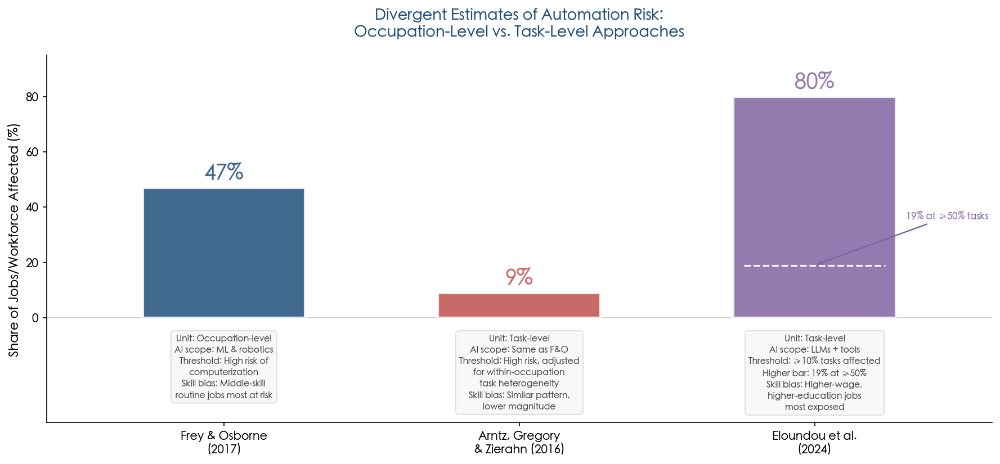

*Figure 2. Comparative estimates of automation risk from Frey & Osborne (2017), Arntz, Gregory & Zierahn (2016), and Eloundou et al. (2024), illustrating how unit of analysis, AI scope, and exposure thresholds produce divergent assessments of labor market vulnerability.*

Subsequent empirical work has generally supported the task-based perspective, confirming that few occupations are fully automatable even as many contain significant shares of automatable tasks. The chapters that follow trace how this methodological insight has shaped both theoretical development and empirical measurement.

## 1.6 Organization of the Review

The remainder of this review proceeds as follows. Chapter 2 surveys the major theoretical frameworks — from skill-biased technological change and the task-based model to GPT theory, the augmentation-versus-automation dichotomy, and emerging generative-AI-specific formulations. Chapter 3 synthesizes empirical evidence on aggregate and firm-level labor market outcomes, including employment effects, wage dynamics, and productivity impacts. Chapter 4 examines sectoral and occupational heterogeneity, comparing AI's effects across manufacturing, healthcare, financial services, creative industries, and knowledge work. Chapter 5 addresses skills, education, and workforce adaptation strategies. Chapter 6 considers ethical, social, and policy dimensions, including inequality, algorithmic bias, social safety nets, and regulatory frameworks. Chapter 7 integrates findings, assesses methodological limitations, and identifies priority research directions.

Three analytical commitments guide the synthesis throughout. First, the review distinguishes carefully between *predictive* studies that estimate potential AI exposure and *empirical* studies that measure realized labor market effects — a distinction the literature does not always make explicit, yet one that is essential for calibrating the strength of available evidence. Second, findings are situated within their institutional and geographic context, acknowledging the heavy concentration of evidence in the United States and Western Europe and the corresponding limits on generalizability. Third, three generations of research are differentiated: pre-2017 work focused on industrial automation and occupation-level probability estimates, 2017–2022 scholarship centered on task-based models and firm-level AI adoption, and post-2022 studies addressing generative AI and LLM diffusion — each carrying distinct methodological orientations and empirical constraints.

# 第2章 Theoretical Frameworks for AI, Automation, and Labor

Understanding how artificial intelligence reshapes labor markets requires a suite of economic theories that have evolved substantially over the past three decades. This chapter surveys and critically compares the major theoretical frameworks explaining the interaction between AI, automation, labor demand, wages, and employment structure. The discussion proceeds in four stages: classical and neoclassical antecedents that first posed the question of technological unemployment; the skill-biased technological change (SBTC) paradigm and its successor, routine-biased technological change (RBTC); the task-based framework that has become the dominant analytical lens; and emerging theoretical contributions addressing the distinctive characteristics of generative AI. Throughout, particular attention is paid to unresolved tensions — above all, the dichotomy between automation and augmentation and the conditions under which AI creates versus destroys labor demand. Figure 2.1 provides a chronological overview of this theoretical progression.

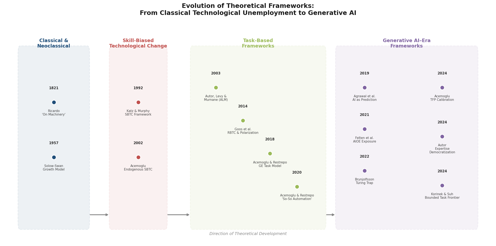

## 2.1 Classical and Neoclassical Antecedents

The concern that machines displace workers is as old as industrial capitalism itself. David Ricardo, in the celebrated Chapter 31 ("On Machinery") appended to the third edition of his *Principles of Political Economy and Taxation* (1821), reversed his earlier optimism and acknowledged that the introduction of machinery could reduce gross output even as it raised net output, thereby rendering a portion of the laboring population "redundant." Ricardo's concession — that technological progress could harm workers at least during transition — established a durable template for subsequent debate. Karl Marx extended the argument more forcefully, treating the "machinery question" as intrinsic to capitalist accumulation: by substituting constant capital for variable capital, machinery displaces workers into a reserve army of the unemployed, exerting downward pressure on wages.

These classical concerns were substantially reframed by neoclassical growth theory. In the standard Solow–Swan framework, technology enters as a labor-augmenting parameter that raises total factor productivity, and competitive labor markets ensure that displaced workers are re-absorbed through wage adjustment and capital deepening. The persistent historical pattern in which aggregate employment grew alongside successive mechanization waves lent empirical support to the neoclassical rebuttal, producing what Mokyr, Vickers, and Ziebarth (2015) term the "Luddite fallacy" — the observation that fears of mass technological unemployment have been repeatedly articulated and repeatedly proven wrong across two centuries of industrial revolutions [Mokyr, Vickers & Ziebarth (2015)](https://www.aeaweb.org/articles?id=10.1257/jep.29.3.31 "Journal of Economic Perspectives, 29(3), pp. 31–50"). Yet the very recurrence of this anxiety signals a persistent theoretical gap: the neoclassical model's assumption of frictionless factor reallocation abstracts away precisely the distributional disruptions — sectoral unemployment, wage compression, skill obsolescence — that define the lived experience of technological transition. Bridging this gap between aggregate equilibrium and distributional reality became the central project of the theoretical frameworks that followed.

## 2.2 Skill-Biased Technological Change and Its Limits

The dominant theoretical framework for technology–labor interactions from the early 1990s through the mid-2000s was skill-biased technological change (SBTC). Katz and Murphy (1992) established the canonical formulation, demonstrating that U.S. relative wage changes between 1963 and 1987 are explained by persistent increases in the demand for skilled relative to unskilled workers, operating through a two-factor (skilled/unskilled) production function with an elasticity of substitution of approximately 1.4 [Katz & Murphy (1992)](https://academic.oup.com/qje/article-abstract/107/1/35/1925833 "Quarterly Journal of Economics, 107(1), pp. 35–78"). The framework offered a parsimonious account of the widening college wage premium observed across advanced economies during the information technology revolution: computerization raised the marginal productivity of educated workers who could leverage new tools while reducing demand for less-educated workers performing tasks that computers could execute.

Acemoglu (2002) provided a comprehensive theoretical elaboration by endogenizing the direction of technical change. He argued that the rapid postwar expansion in the supply of skilled workers itself induced firms and innovators to develop skill-complementary technologies — a self-reinforcing dynamic. Crucially, Acemoglu demonstrated that much nineteenth-century technical change was in fact skill-*replacing* (factory production deskilled artisanal crafts), implying that the skill bias of technology is historically contingent rather than structurally inherent [Acemoglu (2002)](https://www.aeaweb.org/articles?id=10.1257/0022051026976 "Journal of Economic Literature, 40(1), pp. 7–72"). This historical contingency acquires renewed significance in the generative AI era, where emerging evidence suggests that AI disproportionately affects higher-skilled occupations — a pattern that inverts the SBTC prediction.

Despite its influence, the SBTC framework encountered an empirical anomaly it could not resolve: job polarization. Beginning in the 1990s, labor markets in the United States and Europe exhibited simultaneous employment growth at the top and bottom of the wage distribution, accompanied by declining employment and stagnating wages in middle-skill occupations. A simple skilled/unskilled dichotomy predicts monotonic divergence, not the U-shaped pattern observed in the data. Goos, Manning, and Salomons (2014) formally documented this polarization across 16 European countries, attributing it to routine-biased technological change (RBTC) and offshoring — a pattern that the SBTC's two-factor structure cannot accommodate [Goos, Manning & Salomons (2014)](https://www.aeaweb.org/articles?id=10.1257/aer.104.8.2509 "American Economic Review, 104(8), pp. 2509–2526"). The failure of SBTC to explain polarization motivated the development of more granular, task-level models of automation and labor.

## 2.3 The Task-Based Framework

### 2.3.1 Origins: The Autor–Levy–Murnane Model

The intellectual pivot from skill-based to task-based analysis of technology and labor was initiated by Autor, Levy, and Murnane (2003), who proposed that the relevant unit of analysis is not the worker's education level but the *task content* of occupations. They introduced a two-dimensional classification — routine versus non-routine, and cognitive versus manual — and demonstrated that computer capital substitutes for workers performing routine cognitive and routine manual tasks while complementing workers engaged in non-routine analytical and interactive tasks [Autor, Levy & Murnane (2003)](https://www.nber.org/papers/w8337 "Quarterly Journal of Economics, 118(4), pp. 1279–1333"). This "ALM hypothesis" provided the first theoretically grounded explanation for job polarization: middle-skill occupations (bookkeeping, assembly-line work, clerical processing) are precisely those dominated by routine tasks susceptible to codification and automation, while both high-skill professional work and low-skill manual service work involve non-routine tasks that resist algorithmic specification.

Autor (2015) extended this logic to explain why automation has not produced mass unemployment despite decades of computerization. Automation simultaneously substitutes for labor in some tasks and *complements* labor in others, raising output and income and thereby sustaining aggregate labor demand. The complementarity channel operates because automating routine components of a production process increases the marginal value of the remaining non-routine human inputs — a mechanism Autor terms the "O-ring" complementarity, drawing on Kremer's (1993) production theory [Autor (2015)](https://www.aeaweb.org/articles?id=10.1257/jep.29.3.3 "Journal of Economic Perspectives, 29(3), pp. 3–30").

### 2.3.2 General-Equilibrium Formalization: Acemoglu and Restrepo

Acemoglu and Restrepo (2018) formalized the task-based approach into a rigorous general-equilibrium growth model. In their framework, the economy's production process consists of a continuum of tasks, each of which can be performed by labor or capital (including AI). Technological change operates through two countervailing channels: *automation*, which shifts the allocation of existing tasks from labor to capital, and *new task creation*, which generates tasks in which labor possesses a comparative advantage, shifting allocation back toward labor. The net effect on employment and wages depends on the relative pace of these two forces [Acemoglu & Restrepo (2018)](https://www.aeaweb.org/articles?id=10.1257/aer.20160696 "American Economic Review, 108(6), pp. 1488–1542").

In a companion synthesis, Acemoglu and Restrepo (2019) translated these mechanisms into the *displacement effect* (reduction in labor demand as tasks are automated) and the *reinstatement effect* (expansion of labor demand through creation of new labor-intensive tasks). Applying this decomposition to U.S. data over three decades, they documented that slower employment growth reflects both accelerated displacement — concentrated in manufacturing — and weakened reinstatement, with the pace of new task creation failing to keep up with the pace of automation [Acemoglu & Restrepo (2019)](https://www.aeaweb.org/articles?id=10.1257/jep.33.2.3 "Journal of Economic Perspectives, 33(2), pp. 3–30"). Figure 2.2 illustrates these two countervailing channels and their interaction with generative AI.

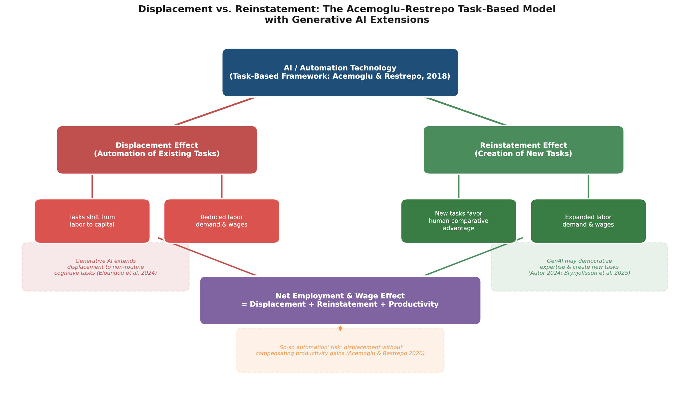

A further extension by Acemoglu and Restrepo (2020) demonstrated that the task-based framework subsumes SBTC as a special case. Automation can reduce real wages even when it generates small productivity gains, while new task creation can either increase or reduce inequality depending on the skill composition of the newly created tasks [Acemoglu & Restrepo (2020)](https://www.aeaweb.org/articles?id=10.1257/pandp.20201063 "AEA Papers and Proceedings, 110, pp. 356–361"). This theoretical generality makes the task-based model the current workhorse for analyzing AI's labor market consequences.

### 2.3.3 "So-So Automation" and the Quality of Technological Change

A critical refinement within the task-based framework is the concept of "so-so automation," introduced by Acemoglu and Restrepo (2020). So-so technologies are those just productive enough for firms to adopt — thereby displacing workers from existing tasks — but not productive enough to generate substantial gains in output or to create significant new tasks requiring human labor. Self-checkout kiosks and automated customer-service phone trees are archetypal examples: they reduce labor costs at the margin but deliver a degraded service that generates minimal new economic surplus. The theoretical implication is that the welfare consequences of automation depend not merely on its pace but on its *quality* — a distinction absent from earlier models that implicitly treated all automation as productivity-enhancing [Acemoglu & Restrepo (2020)](https://economics.mit.edu/sites/default/files/publications/The%20Wrong%20Kind%20of%20AI%20-%20Artificial%20Intelligence%20and.pdf "Cambridge Journal of Regions, Economy and Society, 13(1), pp. 25–35"). This framing has become central to policy discussions about directing AI development toward augmentation rather than mere labor substitution, a theme explored further in Section 2.5.

## 2.4 AI as Prediction Technology: The Agrawal–Gans–Goldfarb Framework

An alternative theoretical entry point, complementary to the task-based model, was proposed by Agrawal, Gans, and Goldfarb (2019), who reframed AI as fundamentally a *prediction technology*. In their framework, the economic value of AI lies in reducing the cost of prediction — statistical inference from data — which constitutes one component of a larger decision-making process that also requires *judgment* (determining the payoff associated with different actions). The labor market implications follow from this decomposition: when AI automates prediction, the effect on human workers depends on whether cheap prediction leads to the automation of full decisions (displacing the worker) or whether it raises the value of complementary human judgment (augmenting the worker) [Agrawal, Gans & Goldfarb (2019)](https://www.aeaweb.org/articles?id=10.1257/jep.33.2.31 "Journal of Economic Perspectives, 33(2), pp. 31–50").

The prediction–judgment decomposition offers several analytical advantages. It explains why identical AI capabilities can be displacing in one occupational context and augmenting in another: where prediction *is* the decision (e.g., routine classification tasks), cheap AI prediction directly substitutes for human labor; where prediction informs a complex, multi-dimensional judgment (e.g., medical diagnosis informing treatment plans), it enhances the productivity of human decision-makers. The framework also illuminates a dynamic concern: as AI systems improve, the boundary between prediction and judgment may shift, progressively encroaching on domains previously thought to require irreducibly human judgment. Whether this boundary shift is gradual or precipitous carries materially different implications for the pace of labor displacement — an issue that the emergence of large language models has made considerably more urgent.

## 2.5 The Automation–Augmentation Dichotomy and the Turing Trap

The tension between labor displacement and labor enhancement runs through all the frameworks reviewed above, but Brynjolfsson (2022) crystallized it as a *design choice* rather than a technological inevitability. In what he terms "The Turing Trap," Brynjolfsson argues that the dominant paradigm in AI research — pursuing human-level or superhuman performance on existing tasks, in the tradition of the Turing test — channels investment toward automation (replicating what humans already do) rather than augmentation (creating new capabilities that expand what humans *can* do). The trap is self-reinforcing: automation produces concentrated gains for capital owners and AI developers, who then possess both the incentive and the resources to pursue further automation, while workers who might benefit from augmentation-oriented AI have less influence over research-and-development priorities [Brynjolfsson (2022)](https://direct.mit.edu/daed/article-abstract/151/2/272/110622 "Daedalus, 151(2), pp. 272–287").

The Turing Trap thesis connects to the broader general-purpose technology (GPT) literature. Bresnahan and Trajtenberg (1995) formalized GPTs as technologies characterized by pervasiveness across sectors, inherent potential for improvement, and innovational complementarities — properties that steam engines, electric motors, and semiconductors each exhibited [Bresnahan & Trajtenberg (1995)](https://www.sciencedirect.com/science/article/pii/030440769401598T "Journal of Econometrics, 65(1), pp. 83–108"). Whether AI fulfills these criteria matters substantially for long-run labor market outcomes: a true GPT generates economy-wide restructuring, creating entirely new industries and occupational categories over time — the reinstatement channel operating at scale. If AI instead proves to be a more bounded technology, the displacement effect may dominate, particularly in its so-so variant. The resolution of this question depends less on AI's technical capabilities in isolation than on the institutional, organizational, and policy environments that shape its deployment — a point to which the empirical evidence in subsequent chapters speaks directly.

## 2.6 Emerging Theoretical Contributions in the Generative AI Era

The rapid diffusion of large language models (LLMs) since late 2022 has prompted a new wave of theoretical work that extends, and in some cases challenges, the frameworks outlined above.

### 2.6.1 Exposure-Based Frameworks

Felten, Raj, and Seamans (2021) introduced the AI Occupational Exposure (AIOE) measure, linking advances in specific AI applications to occupation-level abilities catalogued in O*NET. By mapping ten AI application areas (image recognition, language modeling, translation, among others) onto 52 worker abilities, AIOE provides a granular, ability-based measure of which occupations are most susceptible to AI-driven change. The highest-exposed occupations are white-collar and cognitive-intensive (financial examiners, actuaries, tax preparers), while the lowest-exposed are physically demanding (roofers, construction laborers) [Felten, Raj & Seamans (2021)](https://sms.onlinelibrary.wiley.com/doi/abs/10.1002/smj.3286 "Strategic Management Journal, 42(12), pp. 2195–2217"). AIOE marked a methodological advance over earlier occupation-level approaches by operating at the ability level, though it shares the limitation of measuring *potential* exposure rather than realized impact.

Eloundou et al. (2024) extended this approach specifically to LLMs, estimating that approximately 80% of the U.S. workforce could have at least 10% of their tasks affected by GPT-class models, with roughly 19% potentially seeing 50% or more of tasks impacted. Their analysis reveals that LLM exposure is concentrated among higher-wage and higher-education occupations — a reversal of the historical pattern in which automation predominantly displaced lower-skill workers [Eloundou et al. (2024)](https://www.science.org/doi/10.1126/science.adj0998 "Science, 384(6702), pp. 1306–1308"). This inversion poses a direct challenge to routine-biased technological change theory, which predicts automation pressure concentrated in middle-skill routine occupations, and suggests that generative AI may require a recalibration of task-based models to account for the automation of non-routine cognitive tasks previously considered resistant to computerization.

### 2.6.2 The Expertise-Democratization Thesis

Autor (2024) proposed a theoretically distinct perspective, arguing that AI's most consequential labor market opportunity lies in *democratizing expertise*. In this view, AI systems — particularly LLMs — can encode expert knowledge and decision-support capabilities that enable a broader set of workers to perform tasks previously restricted to highly trained professionals. Rather than displacing experts, AI could restore the "hollowed-out" middle of the skill distribution by enabling mid-skill workers to perform higher-stakes decision-making tasks in healthcare, education, technical services, and other knowledge-intensive domains [Autor (2024)](https://www.nber.org/papers/w32140 "NBER Working Paper 32140").

Early empirical support for this thesis comes from Brynjolfsson, Li, and Raymond (2025), who documented in the first large-scale field study of generative AI at work — involving 5,172 customer-support agents — that AI-powered assistance disproportionately benefited less experienced and lower-skilled workers. Bottom-quintile agents gained up to 30% in productivity, and treated agents with only two months of tenure performed as well as untreated agents with over six months of experience — a "skill-leveling" effect that compresses within-occupation productivity distributions [Brynjolfsson, Li & Raymond (2025)](https://academic.oup.com/qje/article/140/2/889/7990658 "Quarterly Journal of Economics, 140(2), pp. 889–942"). The extent to which this pattern generalizes beyond customer support to higher-complexity occupational settings remains a critical open question.

### 2.6.3 The Bounded Task Frontier and AGI Transition Scenarios

At the theoretical frontier, Korinek and Suh (2024) modeled scenarios for the transition to artificial general intelligence (AGI), demonstrating that if the complexity of human-performable tasks is bounded — that is, if a finite ceiling exists on the difficulty of tasks humans can perform — then sufficiently advanced AI leads to wage collapse even before full automation is achieved. The viability of new task creation as a counterweight to displacement depends critically on whether human capabilities define an unbounded frontier of economically valuable contributions [Korinek & Suh (2024)](https://www.nber.org/papers/w32255 "NBER Working Paper 32255"). This result, while derived from stylized assumptions, sharpens a fundamental question embedded in the Acemoglu–Restrepo framework: is the reinstatement effect structurally reliable, or could a sufficiently capable general-purpose AI exhaust the space of tasks in which humans retain comparative advantage?

### 2.6.4 Quantifying AI's Macroeconomic Impact

Acemoglu (2024) applied the task-based framework directly to AI, generating calibrated predictions for aggregate total factor productivity (TFP) gains. His estimates are notably conservative: AI-driven TFP gains of no more than 0.66% over a ten-year horizon, and likely less than 0.53% once the difficulty of automating tasks requiring real-world judgment is accounted for. These "nontrivial but modest" gains contrast sharply with more optimistic forecasts emanating from technology-industry commentary, and Acemoglu argues further that even these limited productivity benefits will disproportionately accrue to capital owners, widening the gap between capital and labor income shares [Acemoglu (2024)](https://www.nber.org/papers/w32487 "NBER WP 32487 / Economic Policy, 40(5)"). The tension between Acemoglu's calibration and the GPT-theoretic prediction of broad, transformative impact represents one of the field's central unresolved disagreements — one whose resolution will depend on the empirical trajectory of AI adoption and complementary institutional adaptation documented in subsequent chapters.

## 2.7 Unresolved Theoretical Debates

The frameworks surveyed in this chapter converge on several points: AI automates tasks rather than whole occupations; labor market outcomes depend on institutional context and complementary investments, not technology alone; and distributional consequences may be severe even when aggregate effects are modest. Yet five major theoretical debates remain unresolved and will recur throughout subsequent chapters. Figure 2.3 summarizes the divergent predictions of the principal frameworks across key dimensions.

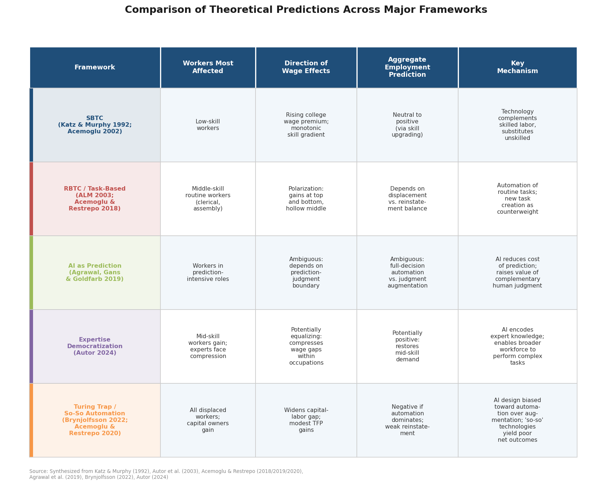

First, the *displacement–reinstatement balance in the generative AI era* remains uncertain. The task-based model predicts that new task creation can offset displacement, but the pace and skill composition of new tasks in the LLM era are empirically undetermined. Second, whether generative AI constitutes *so-so automation or a transformative GPT* is actively contested: Acemoglu's modest TFP estimates of no more than 0.66% over a decade suggest the former, while the breadth and speed of LLM adoption may indicate the latter. Third, the *direction of augmentation* — whether AI primarily augments experts (concentrating gains at the top) or democratizes expertise (compressing inequality) — carries profoundly different distributional implications. The Brynjolfsson, Li, and Raymond (2025) evidence favors the democratization hypothesis in at least one occupational setting, but generalizability beyond customer support remains an open question. Fourth, the *bounded versus unbounded task frontier* identified by Korinek and Suh (2024) determines whether the reinstatement mechanism is structurally reliable or eventually exhaustible — a distinction with far-reaching implications for long-run wage dynamics. Fifth, and most fundamentally, it remains unclear whether *generative AI as a creation technology* requires new theoretical primitives beyond the prediction framework of Agrawal, Gans, and Goldfarb (2019): LLMs generate novel text, code, and images, capabilities that may not reduce cleanly to "prediction" and may necessitate a richer theory of AI as a general-purpose invention tool.

These unresolved questions define the interpretive lens through which the empirical evidence reviewed in subsequent chapters should be assessed. The task-based framework, augmented by the automation–augmentation dichotomy and exposure-based measurement tools, provides the most flexible and empirically tractable analytical apparatus currently available — but its adequacy for the generative AI era is itself an active area of theoretical development.

# 第3章 Empirical Evidence on AI Adoption and Aggregate Labor Market Outcomes

The theoretical frameworks surveyed in Chapter 2 generate sharply divergent predictions about AI's net effect on employment, wages, and productivity. The displacement–reinstatement model anticipates that outcomes hinge on the relative pace of task automation and new task creation; the prediction-technology framework suggests complementarity where judgment remains essential; and the "so-so automation" critique warns that displacement may proceed without commensurate productivity gains. This chapter turns to the empirical record.

The evidence is organized across three temporal waves — industrial robotics studies (pre-2017), firm-level AI adoption analyses (2017–2022), and the emerging literature on generative AI and large language models (post-2022) — each characterized by distinct methodological approaches and increasingly granular findings. Figure 3.2 provides a schematic overview of these three waves, the landmark studies within each, and the evolving pattern of results. A recurring theme throughout is the tension between micro-level studies documenting substantial productivity gains and aggregate analyses that detect modest or null employment effects — a paradox that mirrors the broader gap between theoretical predictions of massive displacement and the nuanced realities documented in the data.

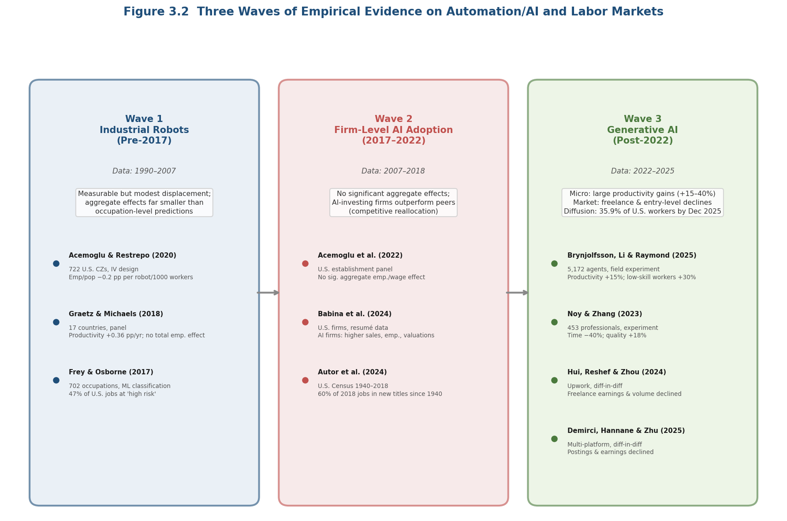

*Figure 3.2: Evolution of empirical evidence across three waves of automation and AI research, from predominantly aggregate-null findings in the robotics era to mixed micro-positive and market-negative results in the generative AI period.*

## 3.1 Measuring AI Adoption and Exposure: Methodological Foundations

Before reviewing substantive findings, it is necessary to address the measurement challenge that pervades this literature. "AI adoption" and "AI exposure" are operationalized in fundamentally different ways across studies, and these methodological choices materially shape the conclusions that can be drawn.

### 3.1.1 Occupation-Level Exposure Indices

The first generation of measures characterizes occupations by their aggregate susceptibility to automation. The most influential — and most contested — is the Frey and Osborne (2017) estimate that 47% of U.S. employment faces "high risk" of computerization, derived from expert classification of 702 occupations followed by machine learning extrapolation [Frey & Osborne (2017)](https://www.sciencedirect.com/science/article/pii/S0040162516302244 "Technological Forecasting and Social Change, 114, pp. 254–280"). As discussed in Chapter 1, this occupation-level approach conflates task-level susceptibility with whole-occupation displacement. Nonetheless, it established the template — and the benchmark — for subsequent exposure frameworks.

Webb (2020) advanced the measurement agenda by constructing patent-based occupational exposure scores that disaggregate exposure to AI, robots, and software. A critical finding is that the occupational profile of AI exposure differs qualitatively from prior automation technologies: AI exposure concentrates among high-skilled, high-wage occupations (clinical laboratory technicians, market research analysts, chemical engineers), whereas robot exposure targets middle-skill manufacturing and software exposure targets routine clerical work [Webb (2020)](https://papers.ssrn.com/sol3/papers.cfm?abstract_id=3482150 "Stanford working paper"). This divergence has become a foundational empirical regularity, though it should be noted that Webb's study remains an unpublished working paper.

Felten, Raj, and Seamans (2021) developed the AI Occupational Exposure (AIOE) index by linking advances in ten specific AI application areas (image recognition, language modeling, translation, among others) to 52 O*NET worker abilities. Their index identifies financial examiners, actuaries, and budget analysts as the most AI-exposed occupations, while physically demanding occupations such as roofers and construction laborers occupy the lowest-exposure positions [Felten, Raj & Seamans (2021)](https://sms.onlinelibrary.wiley.com/doi/abs/10.1002/smj.3286 "Strategic Management Journal, 42(12), pp. 2195–2217"). The AIOE index, by linking capability-level AI advances to specific job requirements, provides a more granular and theoretically grounded approach than earlier whole-occupation classifications.

Most recently, Eloundou et al. (2024) developed a task-level exposure assessment specific to large language models. Their analysis estimates that approximately 80% of the U.S. workforce could have at least 10% of work tasks affected by LLMs, while roughly 19% could see 50% or more of tasks impacted. Critically, exposure estimates prove highly sensitive to assumptions about the complementary tool environment: with simple LLM interfaces, only about 1.8% of jobs face majority-task exposure, but with purpose-built software tools layered on top of LLMs, this figure rises to over 46% [Eloundou et al. (2024)](https://www.science.org/doi/10.1126/science.adj0998 "Science, 384(6702), pp. 1306–1308"). This sensitivity underscores that exposure estimates are not fixed properties of occupations but depend on the technology's deployment context — a methodological lesson with direct implications for interpreting every finding reviewed below.

### 3.1.2 Firm-Level Adoption Measures

A parallel approach measures AI adoption directly at the firm or establishment level. Acemoglu, Autor, Hazell, and Restrepo (2022) operationalize AI adoption using the near-universe of U.S. online job postings from 2007 to 2018, identifying establishments that post vacancies requiring AI-related skills. This revealed-preference measure captures firms' actual demand for AI capabilities rather than occupational susceptibility [Acemoglu et al. (2022)](https://www.journals.uchicago.edu/doi/10.1086/718327 "Journal of Labor Economics, 40(S1), pp. S293–S340"). Babina, Fedyk, He, and Hodson (2024) adopt an alternative firm-level strategy, tracking AI investment through the share of employees whose résumés include AI-related skills, using a comprehensive database of online professional profiles [Babina et al. (2024)](https://www.sciencedirect.com/science/article/pii/S0304405X2300185X "Journal of Financial Economics, 151, article 103745"). These firm-level measures have the advantage of capturing actual adoption decisions rather than theoretical exposure, but they are limited to firms that post jobs online or whose employees maintain public professional profiles — biasing toward larger, technology-intensive establishments.

A fundamental distinction that runs through this literature, and that shapes the interpretation of every finding reviewed below, is between *exposure* (the degree to which an occupation could potentially be affected by AI capabilities) and *adoption* (whether firms have actually implemented AI). High exposure does not guarantee displacement, and actual adoption may proceed slowly, partially, or in augmentative rather than substitutive modes. This distinction maps directly onto the gap between ex-ante predictive studies and ex-post empirical measurement that the remainder of this chapter navigates. Figure 3.1 provides a comparative summary of the major empirical studies discussed in this chapter, organized by methodology, sample, time period, and key effect sizes.

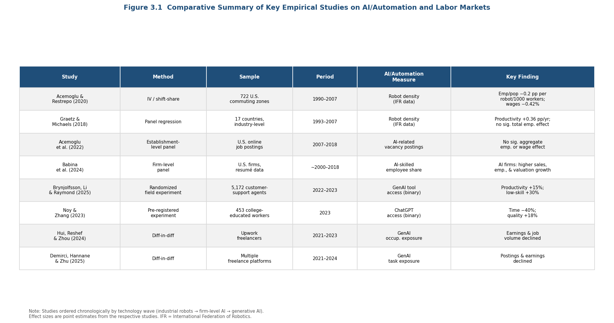

*Figure 3.1: Comparative overview of eight landmark studies spanning the three waves of automation/AI research, illustrating the progression from aggregate-level robotics analyses to micro-level generative AI experiments.*

## 3.2 Industrial Robots and Aggregate Employment: The Pre-AI Baseline

Although this review focuses on AI, the empirical literature on industrial robots provides an indispensable baseline. Robots represent a well-defined, measurable automation technology with decades of deployment data, and the econometric strategies developed in robotics studies have directly shaped identification approaches applied to AI.

Acemoglu and Restrepo (2020) conducted the most influential causal analysis, exploiting variation in robot adoption across 722 U.S. commuting zones between 1990 and 2007. Employing a shift-share instrumental variable strategy that leverages differential industry composition and European robot adoption trends, they estimate that one additional robot per thousand workers reduces the employment-to-population ratio by 0.2 percentage points and wages by 0.42%. Over the full period, robots reduced the U.S. employment-to-population ratio by an estimated 0.37 percentage points — equivalent to approximately 400,000 jobs [Acemoglu & Restrepo (2020)](https://www.journals.uchicago.edu/doi/abs/10.1086/705716 "Journal of Political Economy, 128(6), pp. 2188–2244"). These effects are economically meaningful yet considerably smaller than the mass-displacement scenarios implied by early automation predictions.

Graetz and Michaels (2018) provide a cross-country counterpart, analyzing industrial robot adoption across 17 countries from 1993 to 2007. Robot densification contributed approximately 0.36 percentage points to annual labor productivity growth while raising total factor productivity and reducing output prices. At the aggregate level, no statistically significant reduction in total hours worked is detected, though the employment share of low-skilled workers declined [Graetz & Michaels (2018)](https://direct.mit.edu/rest/article/100/5/753/58489 "Review of Economics and Statistics, 100(5), pp. 753–768"). The contrast with Acemoglu and Restrepo's U.S.-specific findings highlights the importance of institutional context: countries with stronger adjustment mechanisms may absorb robot-driven displacement without aggregate employment losses — a theme explored further in Chapter 4.

These robotics studies establish two empirical regularities that carry forward into the AI-specific evidence. First, automation technologies can produce measurable negative employment effects in directly exposed sectors while generating offsetting gains elsewhere. Second, aggregate effects tend to be substantially smaller than task-level or occupation-level exposure estimates would suggest.

## 3.3 AI Adoption and Aggregate Labor Market Effects (2017–2022)

### 3.3.1 Firm-Level AI Adoption: Growth Without Aggregate Displacement

The transition from studying robots to studying AI introduces both new analytical opportunities and new measurement difficulties. Unlike robots — physical capital goods tracked by industry associations — AI is a software-embedded capability that diffuses through algorithms, cloud services, and internal tool development, rendering comprehensive adoption measurement elusive.

Acemoglu, Autor, Hazell, and Restrepo (2022) provide the most rigorous aggregate analysis to date, linking establishment-level AI adoption (proxied by AI-related job postings) to employment and wage outcomes across the U.S. economy from 2007 to 2018. The study documents a dramatic surge in AI-related vacancy postings after 2016, with adoption concentrated in larger firms, technology-intensive industries, and establishments with more educated workforces. The central finding is striking in its modesty: at the aggregate level, no statistically significant effect on employment or wages is detectable [Acemoglu et al. (2022)](https://www.journals.uchicago.edu/doi/10.1086/718327 "Journal of Labor Economics, 40(S1), pp. S293–S340"). The authors interpret this null result cautiously, noting that the period captures relatively early adoption and that macroeconomic effects may materialize with longer lags — consistent with the implementation-lag hypothesis articulated in general purpose technology theory.

Babina, Fedyk, He, and Hodson (2024) offer a complementary firm-level perspective. Tracking AI investment through employee skill profiles across a broad cross-section of U.S. firms, they find that AI-investing firms experience significantly higher growth in sales, employment, and market valuations relative to non-investing peers. The primary mechanism is product innovation: firms deploy AI to develop new products and services rather than to replace existing workers. The growth benefits, however, concentrate disproportionately among larger firms, raising concerns about rising industry concentration [Babina et al. (2024)](https://www.sciencedirect.com/science/article/pii/S0304405X2300185X "Journal of Financial Economics, 151, article 103745"). This finding resonates with the task-based framework's prediction that new task creation can offset displacement, while also suggesting that the gains from AI-driven reinstatement may be unequally distributed across the firm size distribution.

The juxtaposition of these two studies illuminates a puzzle. If AI-investing firms grow faster — including in employment — why does aggregate analysis fail to detect positive employment effects? One explanation is compositional: employment gains at AI-adopting firms may come at the expense of non-adopting competitors, producing a reallocation that is zero-sum at the aggregate level. An alternative explanation is temporal: the Acemoglu et al. (2022) study's endpoint of 2018 may precede the threshold at which AI diffusion reaches sufficient scale to generate detectable macroeconomic effects — a possibility that post-2022 generative AI evidence, reviewed below, begins to test.

### 3.3.2 Wage Polarization and the Labor Share of Income

A central prediction of the task-based framework is that automation depresses the labor share of income by shifting the task content of production from labor to capital. Acemoglu and Restrepo (2022) provide the most comprehensive empirical decomposition, estimating that automation accounts for 50–70% of changes in the U.S. wage structure over the past four decades. The distributional effects are stark: the real wage of male high-school dropouts declined by an estimated 8.8% between 1980 and 2016, while cumulative total factor productivity gains from automation reached only 3.4% [Acemoglu & Restrepo (2022)](https://onlinelibrary.wiley.com/doi/full/10.3982/ECTA19815 "Econometrica, 90(5), pp. 1973–2016"). This disproportionate wage impact relative to productivity gain epitomizes the "so-so automation" concern: technologies that displace enough workers to depress wages without generating sufficient productivity growth to create compensating demand.

These wage structure findings pertain to the broader automation epoch (including computerization and robotics) rather than AI specifically. Isolating AI's distinct contribution to wage polarization or labor share decline remains an open empirical challenge. Acemoglu (2024) offers a forward-looking calibration, predicting that AI-driven total factor productivity gains over the next decade will amount to no more than 0.66% — and likely less than 0.53% once hard-to-learn tasks are accounted for — while widening the gap between capital and labor income [Acemoglu (2024)](https://www.nber.org/papers/w32487 "NBER WP 32487 / Economic Policy, 40(5)"). Based on a calibrated model rather than ex-post observation, this estimate has nonetheless become a touchstone for sober assessments of AI's macroeconomic potential, contrasting sharply with the large productivity gains documented in micro-level studies.

### 3.3.3 New Task and Job Creation as a Countervailing Force

The displacement–reinstatement framework predicts that automation's employment effects depend critically on the rate at which new tasks and occupations emerge to absorb displaced labor. Autor, Chin, Salomons, and Seegmiller (2024) provide the first systematic evidence on this mechanism at historical scale. Using a novel methodology that identifies the emergence of new job titles in U.S. Census data from 1940 to 2018, they document that approximately 60% of employment in 2018 was in occupations that did not exist in 1940. The pace of new work creation has been *accelerating*: the share of employment in new occupations grew more rapidly in recent decades than in earlier periods [Autor et al. (2024)](https://academic.oup.com/qje/article-abstract/139/3/1399/7630187 "Quarterly Journal of Economics, 139(3), pp. 1399–1465"). This finding provides strong historical support for the reinstatement channel and cautions against projecting automation-induced displacement without accounting for the dynamic creation of new forms of work.

The study's temporal scope, however, extends only to 2018 — before generative AI's commercial diffusion. Whether AI, a technology that unlike prior automation waves targets cognitive and creative tasks, will sustain, accelerate, or disrupt the historical pace of new work creation remains an open empirical question. The theoretical possibility raised by Korinek and Suh (2024) that AI could eventually exhaust the frontier of human-advantaged tasks introduces a scenario in which the reinstatement mechanism attenuates.

## 3.4 Generative AI and Labor Market Outcomes (Post-2022)

The release of ChatGPT in November 2022 and subsequent rapid diffusion of large language models marked a qualitative shift in both AI capabilities and public attention. The empirical literature responding to this shift is young but growing rapidly, dividing into two strands: micro-level productivity studies conducted in controlled or semi-controlled settings, and market-level analyses of employment and earnings in AI-exposed occupations.

### 3.4.1 Micro-Level Productivity Evidence

The most rigorous early evidence on generative AI's workplace effects comes from Brynjolfsson, Li, and Raymond (2025), who study 5,172 customer-support agents at a large software firm. Access to a generative AI assistant increased worker productivity by 15% on average, measured by issues resolved per hour. The gains were sharply heterogeneous: the least experienced workers improved by up to 30%, while the most experienced workers showed minimal improvement. Treated agents with two months of tenure performed at the level of untreated agents with over six months of experience — suggesting that AI effectively compressed the skill distribution by disseminating best-practice knowledge embedded in the model's training data [Brynjolfsson, Li & Raymond (2025)](https://academic.oup.com/qje/article/140/2/889/7990658 "Quarterly Journal of Economics, 140(2), pp. 889–942"). This "skill-leveling" pattern has emerged as one of the most replicated findings in the early generative AI literature.

Noy and Zhang (2023) corroborate this pattern in a pre-registered experiment with 453 college-educated professionals performing writing tasks. Access to ChatGPT reduced task completion time by 40% and improved output quality by 18% as rated by blinded evaluators. As with Brynjolfsson et al., the largest gains accrued to initially lower-performing workers, compressing the quality distribution [Noy & Zhang (2023)](https://www.science.org/doi/10.1126/science.adh2586 "Science, 381(6654), pp. 187–192"). Taken together, these studies suggest that generative AI operates as a "floor raiser" rather than a "ceiling raiser" — augmenting the productivity of less-skilled workers more than that of experts.

The generalizability of this skill-leveling finding warrants careful qualification. Both studies examine tasks with well-defined performance metrics (customer issue resolution, writing quality) where AI can plausibly capture and transmit expert knowledge. Whether the pattern extends to tasks requiring deep domain expertise, creative synthesis, or strategic judgment is less clear. Dell'Acqua, McFowland, Mollick et al. (2026), in a randomized field experiment with 758 BCG consultants, demonstrate that AI's effects are sharply task-dependent: GPT-4 increased output quality by 30–40% and speed by over 25% on within-frontier consulting tasks, but on an out-of-frontier task requiring novel integration, AI-assisted consultants were 19 percentage points *less* likely to reach the correct answer [Dell'Acqua et al. (2026)](https://pubsonline.informs.org/doi/10.1287/orsc.2025.21838 "Organization Science"). This "jagged technological frontier" — where adjacent tasks of similar apparent difficulty fall on opposite sides of AI capability — complicates any simple narrative of uniform productivity enhancement.

### 3.4.2 Market-Level Employment and Earnings Effects

While micro-level experiments document productivity gains within existing employment relationships, a parallel strand of evidence examines whether generative AI is altering the *volume* and *compensation* of work in exposed occupations.

Hui, Reshef, and Zhou (2024) provide the earliest systematic market-level evidence, analyzing employment and earnings on the Upwork freelancing platform before and after the launch of ChatGPT and image-generation models (DALL-E, Midjourney). Freelancers in occupations most exposed to generative AI — particularly writing, translation, and graphic design — experienced significant declines in both the number of jobs obtained and per-job earnings [Hui, Reshef & Zhou (2024)](https://pubsonline.informs.org/doi/abs/10.1287/orsc.2023.18441 "Organization Science, 35(6), pp. 1977–1989"). Demirci, Hannane, and Zhu (2025) corroborate and extend this finding across multiple freelancing platforms, documenting that GenAI-exposed tasks in writing, software development, and image work experienced significant declines in both posting volumes and earnings after ChatGPT's release [Demirci, Hannane & Zhu (2025)](https://pubsonline.informs.org/doi/abs/10.1287/mnsc.2024.05420 "Management Science, 71(4)").

These freelance-market studies are significant precisely because they capture a setting where adjustment frictions are minimal: clients can rapidly substitute AI tools for human freelancers without the institutional constraints — employment contracts, retraining obligations, union agreements — that slow adjustment in traditional employment relationships. The freelance market thus functions as an early-warning indicator, revealing displacement dynamics that may take longer to manifest in conventional labor markets. The observed pattern of simultaneous declines in employment volume and per-unit compensation is consistent with outward supply shifts (AI increasing effective labor supply), demand destruction (clients substituting AI directly for human providers), or both.

Brynjolfsson, Chandar, and Chen (2025) extend the analysis to conventional employment using ADP payroll data covering millions of U.S. workers. Early-career workers (ages 22–25) in AI-exposed occupations experienced a 16% relative employment decline compared to workers in less-exposed occupations; software developers aged 22–25 experienced a nearly 20% employment decline from the late-2022 peak [Brynjolfsson, Chandar & Chen (2025)](https://digitaleconomy.stanford.edu/app/uploads/2025/11/CanariesintheCoalMine_Nov25.pdf "Stanford working paper"). While currently a working paper, this study introduces an important generational dimension: entry-level positions may serve as "canaries in the coal mine," signaling displacement effects that aggregate statistics — dominated by the relative stability of incumbent workers — obscure.

### 3.4.3 Diffusion Pace and Adoption Patterns

The macroeconomic salience of generative AI's labor market effects depends partly on the speed and breadth of diffusion. Hartley et al. (2026) report that by December 2025, 35.9% of U.S. workers had used generative AI tools — a remarkably rapid adoption curve compared to prior general purpose technologies [Hartley et al. (2026)](https://papers.ssrn.com/sol3/papers.cfm?abstract_id=5136877 "SSRN working paper"). Although this estimate derives from a working paper rather than peer-reviewed research, it suggests that generative AI is diffusing substantially faster than predecessors such as personal computers or the internet, potentially compressing the implementation lags that GPT theory predicts. If confirmed, this rapid diffusion rate implies that the modest or null aggregate effects documented in pre-2022 AI studies may not persist: the technology's macroeconomic footprint could emerge on a faster timeline than historical precedent would suggest.

## 3.5 The Productivity–Displacement Paradox

A central tension pervades the empirical evidence reviewed in this chapter. Micro-level studies consistently document large productivity gains from AI — 15% for customer support agents, 40% faster task completion for writing professionals, 30–40% quality improvements for management consultants on within-frontier tasks. Yet aggregate employment analyses either detect no significant effects (Acemoglu et al. 2022, for the pre-GenAI period) or document negative employment and earnings effects in exposed occupations (Hui et al. 2024; Demirci et al. 2025; Brynjolfsson, Chandar & Chen 2025, for the post-GenAI period). This pattern — micro-level productivity gains coexisting with aggregate-level employment fragility — constitutes the productivity–displacement paradox. Figure 3.3 maps the conceptual structure of this paradox, tracing how AI deployment generates divergent outcomes through within-firm augmentation and between-firm substitution channels.

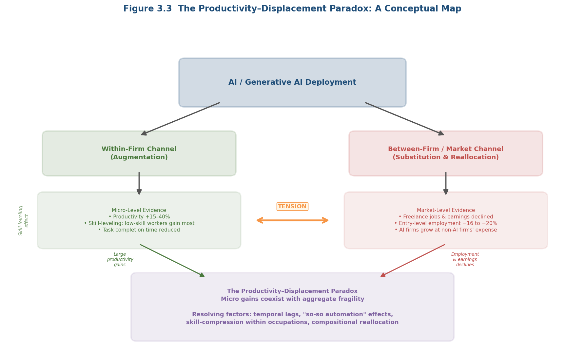

*Figure 3.3: Schematic of the productivity–displacement paradox. The within-firm channel yields micro-level productivity gains and skill-leveling effects; the between-firm/market channel produces freelance and entry-level employment declines. Resolving factors include temporal lags, "so-so automation" dynamics, skill-compression, and compositional reallocation.*

Several non-mutually-exclusive explanations merit consideration. First, the paradox may reflect temporal dynamics: productivity gains materialize quickly within firms, but aggregate employment consequences — both negative (displacement as firms produce the same output with fewer workers) and positive (reinstatement through new tasks and increased demand) — unfold over longer horizons. Second, the "so-so automation" mechanism may be operative: if AI-generated productivity gains are real but modest in aggregate terms, as Acemoglu's (2024) calibration suggests, they may suffice to displace workers at the margin without generating enough surplus to fund compensating job creation. Third, distributional dynamics may dominate: AI may simultaneously create and destroy jobs across different occupational segments, skill levels, and firm sizes — producing aggregate statistics that obscure substantial gross flows beneath apparently stable net figures.

The skill-leveling pattern documented by Brynjolfsson, Li, and Raymond (2025) and Noy and Zhang (2023) introduces a further complication. If AI compresses the productivity distribution within occupations by raising the floor, it reduces employers' willingness to pay the premium previously commanded by experienced workers — potentially depressing wage growth even as measured productivity rises. This mechanism is distinct from displacement and augmentation as conventionally theorized; it represents a redistribution of rents within occupations that standard exposure frameworks do not fully capture.

## 3.6 Synthesis and Limitations

The empirical evidence on AI's aggregate labor market effects, surveyed across three generations of literature, yields several consolidated findings. Industrial robot studies (pre-2017) demonstrate that automation technologies produce measurable but modest negative employment effects, with magnitudes considerably smaller than occupation-level exposure estimates imply. Firm-level AI adoption studies (2017–2022) detect no significant aggregate employment or wage effects, though AI-investing firms individually outperform peers — suggesting that competitive reallocation rather than net job creation may be the dominant short-run mechanism. Post-2022 generative AI evidence reveals a more complex picture: substantial micro-level productivity gains coexist with employment declines in freelance markets and among early-career workers in exposed occupations, while the skill-leveling pattern inverts the historical tendency of automation to disproportionately harm lower-skilled workers.

Several methodological limitations constrain the inferences that can be drawn. The measurement of AI adoption and exposure remains heterogeneous and contested: occupations rank differently across exposure indices, and the choice of measure materially affects conclusions. Most causal identification strategies rely on cross-sectional variation in AI exposure or adoption, making it difficult to disentangle AI-specific effects from confounding technological and economic trends. The geographic concentration of evidence in the United States and Western Europe limits generalizability to other labor market contexts. The post-2022 generative AI literature is necessarily based on short time horizons, raising concerns about whether observed effects represent transient adjustment dynamics or durable structural shifts. Finally, the absence of comprehensive data on new task and job creation in the generative AI era means that the reinstatement side of the displacement–reinstatement ledger remains inadequately measured.

The balance of available evidence, assessed as of early 2026, supports a characterization of AI's aggregate labor market impact as real but uneven — distributed across occupations, skill levels, experience cohorts, and firm sizes in ways that aggregate statistics imperfectly capture. The most robust finding is not a headline employment number but a structural pattern: AI is restructuring *who does what* within the labor market, compressing skill differentials within occupations while potentially widening gaps between AI-adopting and non-adopting firms, and between workers who can leverage AI tools and those who cannot. The chapters that follow examine how these dynamics vary across occupational categories, sectors, and national institutional contexts.

# 第4章 Sectoral and Occupational Heterogeneity in AI's Labor Market Impact

The aggregate evidence reviewed in Chapter 3 — modest employment effects at the macro level, significant productivity gains at the micro level, and a persistent gap between exposure predictions and realized outcomes — obscures substantial variation across industries and occupations. AI is not a uniform shock. Industrial robots displace assembly-line workers in automotive plants; deep-learning diagnostic tools augment radiologists in clinical settings; and large language models simultaneously accelerate writing tasks and degrade the quality of complex analytical judgments in management consulting. This chapter disaggregates the evidence along sectoral and occupational lines. It examines four domains where the empirical record is richest — manufacturing and logistics, healthcare, creative and knowledge-intensive industries, and the legal profession — before turning to a comparative assessment of the occupational exposure frameworks that attempt to map AI's differential reach. The central argument is that the displacement-versus-augmentation dichotomy introduced in Chapter 2 resolves differently depending on task composition, institutional context, regulatory environment, and the position of specific tasks relative to AI's evolving capability frontier. The chapter concludes with a cross-sectoral synthesis that identifies the structural factors governing whether AI adoption in a given industry tilts toward displacement, augmentation, or a task-dependent mixture of both.

## 4.1 Manufacturing and Logistics: Displacement with Institutional Variation

Manufacturing constitutes the sector with the longest and most rigorously documented record of automation's labor market effects. The industrial robotics literature reviewed in Chapter 3 provides the empirical baseline against which AI-specific impacts are measured. A sectoral lens, however, reveals that even within this well-studied domain, the magnitude and distribution of displacement vary dramatically across institutional contexts — a finding with direct implications for predicting how newer AI technologies will diffuse through other industries.

### 4.1.1 The U.S. Experience: Concentrated Displacement

Acemoglu and Restrepo (2020) demonstrate that robot adoption in the United States produced geographically concentrated displacement effects in manufacturing-heavy commuting zones. One additional robot per thousand workers reduced the employment-to-population ratio by 0.2 percentage points and wages by 0.42%, with the strongest effects falling on routine manual, blue-collar, and assembly occupations and on workers without college education. Between 1990 and 2007, an estimated 360,000–670,000 U.S. jobs were lost to industrial robots [Acemoglu & Restrepo (2020)](https://www.journals.uchicago.edu/doi/abs/10.1086/705716 "Journal of Political Economy, 128(6), pp. 2188–2244"). The effects were not merely occupational but spatial: commuting zones with higher baseline shares of routine manufacturing employment experienced disproportionately larger employment and wage declines, reinforcing the geographic concentration of labor market distress.

### 4.1.2 The German Contrast: Institutional Buffering

The contrast with Germany is instructive both empirically and theoretically. Dauth, Findeisen, Suedekum, and Woessner (2021) document that despite Germany's roughly fourfold higher robot density relative to the United States (7.6 versus 1.6 robots per thousand workers over 1994–2014), industrial robots produced no negative aggregate employment effect. Approximately 275,000 manufacturing jobs were destroyed — accounting for nearly 23% of Germany's manufacturing employment decline over the period — but these losses were fully offset by services-sector job creation. Critically, robot-exposed incumbent workers exhibited a *higher* probability of remaining with their original employer than non-exposed workers, a pattern driven by works councils and labor unions that facilitated within-plant task reallocation rather than displacement into unemployment. The burden of adjustment fell disproportionately on young labor market entrants, who faced reduced entry-level opportunities in manufacturing, rather than on incumbent workers [Dauth et al. (2021)](https://academic.oup.com/jeea/article-abstract/19/6/3104/6179884 "Journal of the European Economic Association, 19(6), pp. 3104–3153").

This U.S.–Germany comparison furnishes direct evidence for the proposition advanced in Chapter 2 that automation outcomes are not technologically determined. The same technology — industrial robots performing welding, painting, and assembly tasks — produced net displacement in one institutional environment and net reallocation in another. The mediating factors — collective bargaining institutions, employer-employee codetermination structures, and active labor market policies — determine whether the task-based model's reinstatement effect operates within existing employment relationships or through the more disruptive channel of cross-firm and cross-sector reallocation. This institutional mediation effect carries forward into the AI era: sectors and countries with stronger labor-market institutions may be expected to absorb AI-driven task reallocation with less aggregate displacement, even if the underlying technological shock is comparable.

### 4.1.3 Cross-Country Evidence

Graetz and Michaels (2018) extend the analysis to 17 countries over 1993–2007, finding that industrial robot adoption contributed approximately 0.36 percentage points to annual labor productivity growth — comparable in magnitude to the productivity contribution of earlier general-purpose technologies such as the steam engine. Their cross-country panel reveals no significant reduction in total employment attributable to robots, though the employment share of low-skilled workers declined significantly [Graetz & Michaels (2018)](https://direct.mit.edu/rest/article/100/5/753/58489 "Review of Economics and Statistics, 100(5), pp. 753–768"). The divergence between the U.S.-specific displacement result and this broader cross-country null effect further underscores the role of institutional and policy context in mediating automation's labor market consequences.

## 4.2 Job Polarization: The Structural Precursor

Before examining AI-specific sectoral effects in knowledge-intensive industries, the job polarization phenomenon documented by Autor and Dorn (2013) warrants attention as an essential structural precursor. Analyzing U.S. labor markets from 1980 to 2005, they demonstrate that automation of routine tasks — overwhelmingly concentrated in middle-skill occupations such as production workers, machine operators, and clerical staff — drove simultaneous growth in low-skill service employment and high-skill professional employment. Commuting zones that specialized in routine-intensive activities experienced the sharpest declines in routine occupations, accompanied by corresponding growth in service employment and real wage gains at the lower tail of the wage distribution [Autor & Dorn (2013)](https://www.aeaweb.org/articles?id=10.1257/aer.103.5.1553 "American Economic Review, 103(5), pp. 1553–1597").

This polarization pattern — the hollowing out of middle-skill routine occupations — constitutes the structural baseline against which AI's distinctive sectoral impacts must be evaluated. The critical question is whether AI continues and deepens this polarization dynamic or fundamentally reshapes it. As the evidence reviewed in subsequent sections demonstrates, generative AI's concentration on cognitive, higher-wage tasks marks a qualitative departure from the routine-biased pattern of prior automation waves, suggesting that the next phase of technology-driven labor market restructuring may affect a substantially different segment of the occupational distribution.

## 4.3 Healthcare: Augmentation Constrained by Regulation and Trust

Healthcare illustrates the augmentation-dominant trajectory most clearly among the sectors examined. Unlike manufacturing, where automation directly substitutes for physical labor in production processes, AI in medicine operates primarily within clinical decision-support workflows where regulatory oversight, professional norms, and patient trust impose substantial constraints on autonomous deployment. The result is a sector with high measured AI exposure but markedly limited realized labor displacement.

### 4.3.1 Clinical Performance and the Augmentation Paradigm

Topol (2019) provides a comprehensive review of AI across three levels of medical practice: clinicians, health systems, and patients. At the clinician level, deep-learning systems have achieved physician-level performance in a widening range of diagnostic tasks — including diabetic retinopathy detection, skin cancer classification, arrhythmia identification from electrocardiograms, and breast cancer metastasis detection in lymph node biopsies. At the health-system level, AI tools are improving workflow efficiency and reducing diagnostic errors. At the patient level, AI enables processing of personal health data through wearable devices and mobile applications [Topol (2019)](https://www.nature.com/articles/s41591-018-0300-7 "Nature Medicine, 25(1), pp. 44–56"). Despite these capabilities, the dominant paradigm is augmentation rather than replacement: AI tools serve as decision-support instruments that enhance clinician productivity and diagnostic accuracy without displacing the physician's integrative judgment, communication with patients, or clinical responsibility.

### 4.3.2 The Research-to-Deployment Gap

The distance between research performance and clinical deployment remains substantial. Rajpurkar, Chen, Banerjee, and Topol (2022) document that despite over 2,000 AI-related publications in PubMed during 2021 alone, prospective clinical validation remained limited. Key barriers include data scarcity for rare conditions, racial and demographic bias in training datasets, limited cross-institutional generalizability, and the difficulty of achieving human–AI collaboration that outperforms either component alone [Rajpurkar et al. (2022)](https://pubmed.ncbi.nlm.nih.gov/35058619/ "Nature Medicine, 28(1), pp. 31–38"). From a labor market perspective, these deployment barriers function as a deceleration mechanism: healthcare workers face high *exposure* to AI capabilities (clinical diagnosis, imaging interpretation, and drug-interaction checking are all tasks where AI has demonstrated strong performance) but low *realized displacement* because adoption is gated by regulatory approval processes, liability frameworks, and institutional trust.

The healthcare sector thus exemplifies a broader principle: exposure indices that rank occupations by technical susceptibility to AI may systematically overstate near-term labor market disruption in heavily regulated industries. The task-based model's prediction of displacement requires not only that AI can perform a task but also that institutional and regulatory environments permit substitution — a condition that healthcare, with its multilayered approval processes, professional liability structures, and fiduciary obligations, has to date largely failed to meet. This observation carries implications for other regulated sectors — financial services, education, and public administration — where similar institutional constraints may decelerate the translation of technical capability into labor market displacement.

## 4.4 Creative and Knowledge-Intensive Industries: Generative AI's Complex Frontier

The emergence of generative AI since 2022 has produced the most rapid and empirically well-documented disruption in creative, professional, and knowledge-intensive work. Unlike industrial robotics, whose diffusion unfolded over decades, the deployment of large language models and image-generation systems has compressed the automation cycle into months. The evidence from these sectors reveals a pattern more nuanced than simple displacement or augmentation: generative AI simultaneously boosts productivity on tasks within its capability envelope while potentially degrading output quality on tasks that exceed it — a duality with far-reaching implications for how knowledge work is organized.

### 4.4.1 Professional Writing and Customer Service

Two landmark studies establish the baseline for generative AI's impact on text-intensive knowledge work. Noy and Zhang (2023) conducted a pre-registered experiment with 453 college-educated professionals performing mid-level writing tasks (press releases, short reports, analytical emails). Access to ChatGPT reduced average task completion time by 40% and raised output quality ratings by 18%. The largest productivity gains accrued to initially lower-performing workers, compressing the quality distribution and demonstrating an equalizing pattern across the skill spectrum [Noy & Zhang (2023)](https://www.science.org/doi/10.1126/science.adh2586 "Science, 381(6654), pp. 187–192").

Brynjolfsson, Li, and Raymond (2025) provide the most comprehensive field study to date, tracking 5,172 customer-support agents at a Fortune 500 software firm. Deployment of a GPT-based conversational assistant increased worker productivity — measured as issues resolved per hour — by 15% on average. The distributional pattern is striking: the least experienced and lowest-skilled agents realized gains of up to 30%, while the most experienced agents showed modest speed improvements alongside small quality declines. AI-assisted agents with only two months of tenure performed as well as untreated agents with over six months of experience, compressing the experience curve dramatically. The tool also improved agents' written English fluency and reduced customer hostility, with treated agents exhibiting lower attrition rates [Brynjolfsson, Li & Raymond (2025)](https://academic.oup.com/qje/article/140/2/889/7990658 "Quarterly Journal of Economics, 140(2), pp. 889–942"). This "skill-leveling" pattern — where AI narrows the productivity gap between high- and low-performers — represents a departure from both the displacement predictions of the canonical task-based model and the skill-biased technical change hypothesis that dominated earlier eras. If generative AI disproportionately augments less-skilled workers, the distributional implications of this technology differ qualitatively from those of prior automation waves.

### 4.4.2 Software Development

Software engineering represents a sector where AI augmentation tools have been adopted with unusual speed. Cui, Demirer, Jaffe, Musolff, Peng, and Salz (2026) report results from randomized controlled trials across Microsoft, Accenture, and a Fortune 100 company involving 4,867 software developers. Assignment to an AI coding assistant (GitHub Copilot) increased the number of completed tasks by 26.08%, with less experienced developers exhibiting both higher adoption rates and greater productivity gains [Cui et al. (2026)](https://pubsonline.informs.org/doi/10.1287/mnsc.2025.00535 "Management Science, Articles in Advance"). The consistency of the skill-leveling pattern across customer service, professional writing, and software development — three substantively different knowledge-work domains — suggests a general property of current generative AI tools rather than a domain-specific artifact.

### 4.4.3 Management Consulting and the "Jagged Technological Frontier"

The most theoretically consequential finding for understanding generative AI's sectoral impact comes from Dell'Acqua, McFowland, Mollick, and colleagues (2026), who conducted a pre-registered randomized field experiment with 758 BCG management consultants. On tasks falling *within* GPT-4's capability frontier — including creative ideation, analytical writing, and persuasive communication — AI-assisted consultants produced output that was 30–40% higher in quality and completed tasks more than 25% faster, with overall completion rates rising by over 12 percentage points. Lower-performing consultants benefited disproportionately, consistent with the skill-leveling pattern observed elsewhere.

However, on a task requiring integration of qualitative interview data with quantitative performance metrics — classified as *outside* the model's capability frontier — AI-assisted consultants were 19 percentage points less likely to arrive at the correct answer than the unassisted control group (60–70.6% correct versus 84.5%). This result introduces the concept of a "jagged technological frontier," where adjacent tasks of apparently similar difficulty fall on opposite sides of AI's capability boundary [Dell'Acqua et al. (2026)](https://pubsonline.informs.org/doi/10.1287/orsc.2025.21838 "Organization Science").

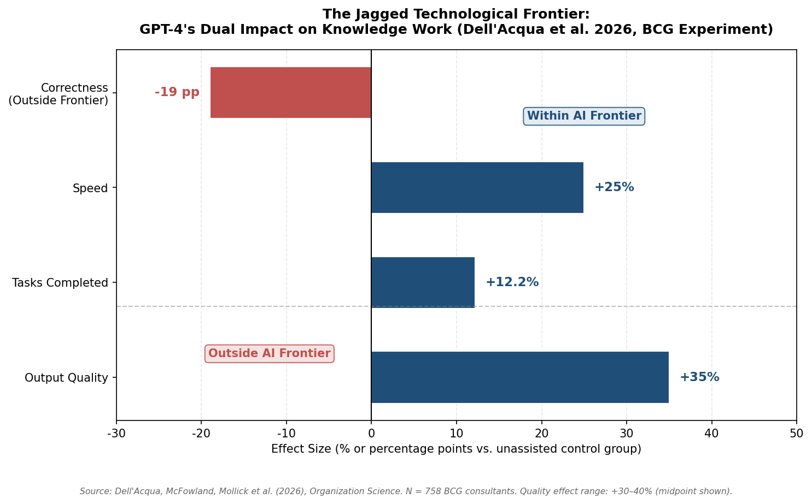

The jagged frontier finding carries significant implications for sectoral analysis: AI's impact on knowledge-intensive industries cannot be characterized as uniformly augmentative or uniformly displacing. Rather, the effect depends on the fine-grained task composition of specific roles and the alignment of those tasks with AI's capability profile — a profile that itself shifts as models improve.

### 4.4.4 Legal Services

Evidence from the legal profession reinforces the task-dependent pattern. Choi and Schwarcz (2024) administered law school examinations under AI-assisted and unassisted conditions. GPT-4 significantly enhanced performance on simple multiple-choice questions, with the largest gains — approximately 45% improvement — accruing to initially lower-performing students. On complex essay questions requiring nuanced legal reasoning, synthesis of competing doctrines, and contextual judgment, AI assistance provided no statistically significant benefit [Choi & Schwarcz (2024)](https://papers.ssrn.com/sol3/papers.cfm?abstract_id=4539836 "Journal of Legal Education, forthcoming"). This pattern maps onto the jagged-frontier framework: legal tasks involving information retrieval, summarization, and pattern recognition fall within AI's capability boundary, while tasks demanding contextual judgment and novel argumentation remain outside it.

### 4.4.5 Freelance and Gig-Economy Platforms: Early Displacement Signals

While the experimental studies reviewed above document augmentation within established employment relationships, evidence from freelance labor markets reveals a more displacement-oriented dynamic. Hui, Reshef, and Zhou (2024) study Upwork, one of the largest online freelancing platforms, and find that freelancers in occupations highly exposed to generative AI — including writing, translation, and graphic design — experienced reductions in both employment and earnings following the launch of ChatGPT and image-generation tools [Hui, Reshef & Zhou (2024)](https://pubsonline.informs.org/doi/abs/10.1287/orsc.2023.18441 "Organization Science"). Demirci, Hannane, and Zhu (2025) corroborate this finding using a broader dataset from freelancing platforms, documenting significant declines in job postings and earnings for occupations most exposed to generative AI, particularly in writing, software development, and image-related work [Demirci, Hannane & Zhu (2025)](https://pubsonline.informs.org/doi/abs/10.1287/mnsc.2024.05420 "Management Science, 71(4)").

The divergence between experimental augmentation findings within firms and observational displacement findings across freelance platforms is analytically significant. Within organizations, generative AI appears to function as a productivity-enhancing complement — making existing workers faster and leveling the skill distribution. Across competitive external labor markets, however, the same technology functions as a substitute, enabling clients to accomplish tasks previously outsourced to freelancers. This dual pattern is consistent with the task-based model's prediction that automation simultaneously creates complementarities for some workers (those integrated into production processes alongside AI) and displacement for others (those whose standalone task output AI can replicate at lower cost). The institutional distinction is key: employment relationships, organizational capital, and switching costs buffer incumbent workers from displacement, while freelance markets — characterized by low switching costs, thin institutional protections, and direct task-level competition — transmit AI's substitution effects more rapidly and more visibly.

## 4.5 Comparative Assessment of Occupational Exposure Frameworks

The sectoral evidence reviewed above demonstrates that AI's labor market impact is profoundly heterogeneous. A parallel strand of research has attempted to systematize this heterogeneity by constructing occupational exposure indices that map AI's differential reach across the entire occupational distribution. Four frameworks have been most influential, and their methodological evolution reflects the field's progressive refinement of what "AI exposure" means.

Frey and Osborne (2017) inaugurated the quantitative exposure literature by classifying 702 U.S. occupations according to their susceptibility to computerization, estimating that 47% of total employment fell in the "high risk" category. Their methodology relied on expert assessment at the occupation level, and their technology scope encompassed machine learning and mobile robotics broadly. The most exposed occupations — telemarketers, tax preparers, insurance underwriters — reflected the routine-task automation paradigm, with low-skill and middle-skill jobs bearing the greatest risk [Frey & Osborne (2017)](https://www.sciencedirect.com/science/article/pii/S0040162516302244 "Technological Forecasting and Social Change, 114, pp. 254–280"). The principal limitation of this approach is that occupation-level classification overstates displacement risk by ignoring within-occupation task variation: as Arntz, Gregory, and Zierahn (2016) demonstrated using task-level data, only approximately 9% of OECD jobs face high automation risk when the unit of analysis shifts from occupations to tasks.

Webb (2020) advanced the methodology by constructing patent-based exposure scores that disaggregate AI, software, and robotics exposure separately. This approach correctly anticipated a finding that subsequent frameworks confirmed: AI exposure concentrates on high-skill occupations — medical professionals, financial analysts, engineers — rather than the low-skill and middle-skill targets of earlier automation waves. Robots, by contrast, target middle-skill manufacturing occupations, while software exposure falls on routine clerical work. This disaggregation represented a significant conceptual advance, establishing that the "skill inversion" in AI's occupational targeting was not an artifact of measurement choices but a structural feature of the technology.

Felten, Raj, and Seamans (2021) introduced the AI Occupational Exposure (AIOE) index, linking ten specific AI application areas (image recognition, language modeling, speech recognition, among others) to 52 O*NET abilities. Their granular, ability-based mapping identified financial examiners, actuaries, and budget analysts as among the most exposed occupations, while physically demanding occupations — roofers, construction laborers — ranked lowest [Felten, Raj & Seamans (2021)](https://sms.onlinelibrary.wiley.com/doi/abs/10.1002/smj.3286 "Strategic Management Journal, 42(12), pp. 2195–2217"). The AIOE index provided the foundation for subsequent LLM-specific exposure assessments.

Eloundou et al. (2024) extended this approach to large language models specifically, combining human expert and GPT-4 assessments at the task level. Their estimates indicate that approximately 80% of the U.S. workforce could have at least 10% of their tasks affected by LLMs, while roughly 19% could see 50% or more of their tasks impacted. Critically, higher-wage and higher-education occupations exhibited greater exposure — a reversal of the historical pattern in which automation disproportionately affected lower-skill workers [Eloundou et al. (2024)](https://www.science.org/doi/10.1126/science.adj0998 "Science, 384(6702), pp. 1306–1308"). This inversion marks generative AI as qualitatively distinct from prior automation technologies in its occupational targeting.

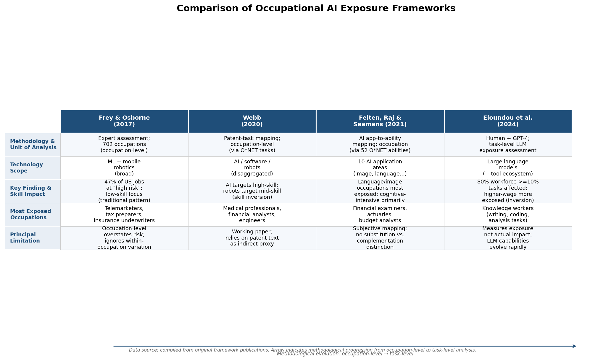

Across these four frameworks, a clear methodological progression emerges — from occupation-level expert assessment to task-level, technology-specific measurement — alongside an empirical convergence: AI, and generative AI in particular, targets cognitive, knowledge-intensive, and higher-wage occupations more heavily than prior automation technologies. All four frameworks share a fundamental limitation, however: they measure *exposure* — the technical susceptibility of tasks or occupations to AI — rather than *realized impact*. As the healthcare and manufacturing evidence reviewed above demonstrates, the translation from exposure to displacement is mediated by institutional, regulatory, and organizational factors that no exposure index currently captures.

## 4.6 Cross-Sectoral Synthesis

The sectoral and occupational evidence assembled in this chapter converges on several structural findings that qualify and extend the aggregate picture presented in Chapter 3.

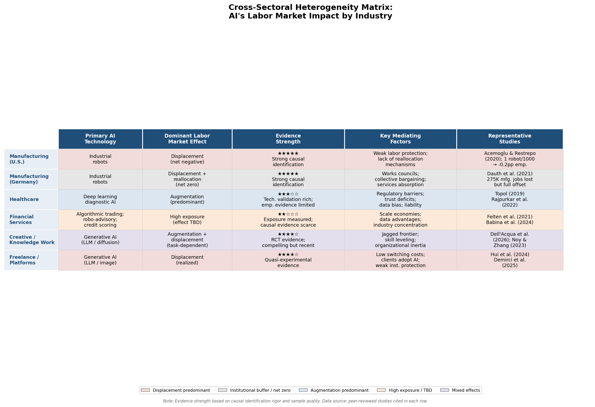

First, the dominant labor market effect of AI differs systematically across sectors. In U.S. manufacturing, industrial robots produced measurable net displacement concentrated among routine manual occupations and workers without college education, with an estimated 360,000–670,000 jobs lost between 1990 and 2007 [Acemoglu & Restrepo (2020)](https://www.journals.uchicago.edu/doi/abs/10.1086/705716 "Journal of Political Economy, 128(6), pp. 2188–2244"). In healthcare, the dominant mode is augmentation constrained by regulation: AI has achieved physician-level diagnostic performance in multiple clinical domains, yet realized labor displacement remains minimal [Topol (2019)](https://www.nature.com/articles/s41591-018-0300-7 "Nature Medicine, 25(1), pp. 44–56"); [Rajpurkar et al. (2022)](https://pubmed.ncbi.nlm.nih.gov/35058619/ "Nature Medicine, 28(1), pp. 31–38"). In creative and knowledge-intensive industries, generative AI produces a task-dependent mixture: augmentation and skill-leveling on tasks within AI's capability frontier, quality degradation and over-reliance on tasks outside it [Dell'Acqua et al. (2026)](https://pubsonline.informs.org/doi/10.1287/orsc.2025.21838 "Organization Science"). In freelance and platform labor markets, displacement effects materialize most rapidly, driven by low switching costs and thin institutional protections [Hui, Reshef & Zhou (2024)](https://pubsonline.informs.org/doi/abs/10.1287/orsc.2023.18441 "Organization Science"); [Demirci, Hannane & Zhu (2025)](https://pubsonline.informs.org/doi/abs/10.1287/mnsc.2024.05420 "Management Science, 71(4)").

Second, institutional context is the primary mediating variable determining whether AI adoption produces displacement or reallocation. The U.S.–Germany comparison in manufacturing — where identical robotic technology produced net job loss in one institutional environment and net-zero employment effects in another [Dauth et al. (2021)](https://academic.oup.com/jeea/article-abstract/19/6/3104/6179884 "Journal of the European Economic Association, 19(6), pp. 3104–3153") — provides the clearest evidence for this proposition. Regulatory barriers in healthcare, organizational capital in established firms, and collective bargaining institutions all function as decelerators that widen the gap between technical exposure and realized labor market impact.

Third, generative AI's occupational targeting represents a structural break from prior automation waves. Where industrial robots and pre-AI software automation concentrated on routine manual and routine cognitive tasks — driving the job polarization pattern documented by Autor and Dorn (2013) — large language models disproportionately affect higher-wage, higher-education, and cognitively intensive occupations [Eloundou et al. (2024)](https://www.science.org/doi/10.1126/science.adj0998 "Science, 384(6702), pp. 1306–1308"). This "skill inversion" in AI's occupational reach, confirmed across multiple exposure frameworks, implies that the distributional consequences of the current technology wave may differ fundamentally from those of preceding decades.

Fourth, the "jagged technological frontier" concept introduced by Dell'Acqua et al. (2026) provides the most empirically grounded framework for understanding within-sector heterogeneity. Tasks that appear similar in complexity and domain can fall on opposite sides of AI's capability boundary, producing augmentation on one and performance degradation on the other. This granularity challenges any simple sectoral or occupational classification and underscores the necessity of task-level analysis for predicting AI's labor market effects.

These findings carry forward into the subsequent chapters' analysis of skill requirements and workforce adaptation (Chapter 5) and policy responses (Chapter 6). The heterogeneity documented here implies that neither uniform optimism about AI-driven productivity gains nor uniform pessimism about technological unemployment captures the empirical reality. The labor market consequences of AI are structurally contingent — on the sector, the occupation, the specific task, the institutional environment, and the position of that task relative to a rapidly shifting technological frontier.

# 第5章 Skills, Education, and Workforce Adaptation Strategies

The preceding chapters established that AI reshapes labor markets through task-level displacement and augmentation, that its aggregate employment effects remain empirically modest relative to theoretical predictions, and that its sectoral impacts vary dramatically with institutional context and the position of tasks along AI's evolving capability frontier. A recurring finding across this body of evidence is that the distributional consequences of AI-driven restructuring depend critically on the human capital endowments of affected workers — their skills, education, and capacity to adapt. This chapter turns directly to that human capital dimension: how AI alters the structure of skill demand, what the empirical evidence reveals about the effectiveness of reskilling and educational adaptation strategies, and which distributional inequalities shape who benefits from — and who is excluded by — the emerging AI economy.

## 5.1 The Shifting Architecture of Skill Demand

### 5.1.1 The Rise of Social and Hybrid Skill Premiums

The task-based framework introduced in Chapter 2 predicts that as automation absorbs routine tasks, the labor market premium shifts toward skills that remain complementary to machine capabilities. Deming (2017) provides the most comprehensive empirical validation of this prediction for the pre-generative-AI era. Analyzing U.S. occupational data from 1980 to 2012, Deming finds that employment and wage growth were highest in occupations requiring high levels of both social and mathematical skills. Jobs requiring high social skills grew by 12 percentage points as a share of the U.S. labor force over this period, while mathematically intensive but socially undemanding occupations — the archetype of routine cognitive work — contracted. The underlying mechanism is that social skills reduce coordination costs and facilitate the flexible, team-based production modes that become more valuable as routine tasks are automated [Deming (2017)](https://academic.oup.com/qje/article-abstract/132/4/1593/3861633 "Quarterly Journal of Economics, 132(4), pp. 1593–1640").

Firm-level evidence reinforces this pattern. Deming and Kahn (2018) analyze the skill content of online job postings for professional occupations and find that employers increasingly demand combinations of cognitive skills (analytics, problem-solving), social skills (teamwork, communication), and specific technical competencies. Large, high-wage firms disproportionately require both cognitive and social skills simultaneously, indicating that hybrid skill portfolios command the highest returns in precisely those firms most likely to adopt AI [Deming & Kahn (2018)](https://www.journals.uchicago.edu/doi/10.1086/694106 "Journal of Labor Economics, 36(S1), pp. S337–S369").

### 5.1.2 The Declining Returns to Routine Specialization

The corollary of rising returns to hybrid and social skills is the erosion of wages for workers specialized in routine tasks. Acemoglu and Restrepo (2022) provide the most rigorous quantification of this dynamic: between 1980 and 2016, 50–70% of changes in the U.S. wage structure are accounted for by the relative wage declines of workers specialized in routine tasks in industries that adopted automation technologies. Over this period, the real wage of male high-school dropouts fell by 8.8%, even as aggregate total factor productivity grew by a cumulative 3.4%. Situated within the task-based framework, this finding demonstrates that automation does not merely eliminate jobs; it restructures the returns to different skill bundles, compressing wages for those whose comparative advantage lies in now-automatable tasks [Acemoglu & Restrepo (2022)](https://onlinelibrary.wiley.com/doi/full/10.3982/ECTA19815 "Econometrica, 90(5), pp. 1973–2016").

### 5.1.3 Cyclical Acceleration of Skill Demands

The shift in skill requirements is not purely secular; economic downturns accelerate it. Hershbein and Kahn (2018) demonstrate that the Great Recession functioned as a catalyst for routine-biased technological change. Using data on the skill content of online job postings across U.S. metropolitan statistical areas (MSAs), they find that skill requirements differentially increased in MSAs more severely affected by the recession. The effects were most pronounced in routine-cognitive occupations and persisted through 2015, well beyond the formal recovery — consistent with a "ratchet" mechanism whereby downturns trigger permanent upskilling of hiring standards [Hershbein & Kahn (2018)](https://www.aeaweb.org/articles?id=10.1257/aer.20161570 "American Economic Review, 108(7), pp. 1737–1772").

Modestino, Shoag, and Ballance (2020) corroborate and extend this finding with an independent methodological approach. They estimate that a one-percentage-point increase in a state's unemployment rate is associated with a 0.6-percentage-point increase in employers requiring a bachelor's degree for positions that previously did not demand one. Great Recession–driven unemployment accounted for 18–25% of the total increase in skill requirements observed in job postings between 2007 and 2010 [Modestino et al. (2020)](https://direct.mit.edu/rest/article/102/4/793/96774 "Review of Economics and Statistics, 102(4), pp. 793–805"). These findings carry direct implications for the current period: if AI adoption accelerates during or immediately after economic slowdowns — as Hershbein and Kahn's framework predicts — then the demand for AI-complementary skills will ratchet upward more sharply than trend projections suggest.

### 5.1.4 Generative AI and the Inversion of Skill Vulnerability

The arrival of generative AI marks a qualitative shift in which skills face displacement pressure. As documented in Chapters 3 and 4, pre-2022 automation predominantly affected routine manual and routine cognitive tasks — the domain of middle-skill workers. Generative AI, by contrast, disproportionately affects higher-wage, knowledge-intensive occupations. Eloundou et al. (2024) estimate that approximately 80% of the U.S. workforce could have at least 10% of their tasks affected by LLMs, with the highest exposure concentrated among workers with professional degrees and higher earnings [Eloundou et al. (2024)](https://www.science.org/doi/10.1126/science.adj0998 "Science, 384(6702), pp. 1306–1308"). This exposure inversion means that the skills that previously insulated workers from automation — advanced literacy, analytical reasoning, domain expertise — now define the terrain of greatest AI capability overlap.

The implications for skill demand are nuanced. Rather than rendering expertise obsolete, generative AI appears to restructure the *type* of expertise that commands a premium. Dell'Acqua, McFowland, Mollick et al. (2026) demonstrate this through the concept of AI's "jagged technological frontier": in a randomized field experiment with 758 BCG consultants, GPT-4 increased output quality by 30–40% on tasks within AI's capability frontier but reduced accuracy by 19 percentage points on tasks just beyond it [Dell'Acqua et al. (2026)](https://pubsonline.informs.org/doi/10.1287/orsc.2025.21838 "Organization Science"). The capacity to discern where this frontier lies — to recognize when AI outputs are reliable and when they require critical human oversight — emerges as a meta-cognitive competency with potentially high labor market returns.

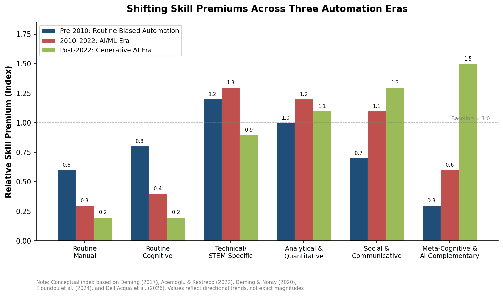

*Figure 5.1: Relative returns to six skill categories across three automation eras. Routine manual and routine cognitive premiums decline progressively, while social, communicative, and meta-cognitive skill premiums rise — particularly in the post-2022 generative AI era. Directional trends anchored in Deming (2017), Acemoglu & Restrepo (2022), Deming & Noray (2020), Eloundou et al. (2024), and Dell'Acqua et al. (2026).*

## 5.2 The Skill-Leveling Effect: Evidence from Generative AI Deployment

### 5.2.1 Productivity Compression in Customer Support

Among the most consequential empirical findings for workforce adaptation is the "skill-leveling" pattern documented in generative AI field studies. Brynjolfsson, Li, and Raymond (2025) conduct the first large-scale study of generative AI in a production environment, analyzing 5,172 customer-support agents at a Fortune 500 software company. Access to a generative AI assistant increased average productivity by 15%, measured in issues resolved per hour. Critically, gains were inversely proportional to baseline skill: agents in the bottom quintile of the pre-treatment productivity distribution experienced gains of up to 30%, while top-quintile agents showed minimal improvement. Treated agents with two months of tenure performed at the level of untreated agents with more than six months of experience [Brynjolfsson, Li & Raymond (2025)](https://academic.oup.com/qje/article/140/2/889/7990658 "Quarterly Journal of Economics, 140(2), pp. 889–942").

This compression of the within-occupation skill distribution carries profound implications. If generative AI systematically narrows the gap between novice and expert performance, the returns to accumulated on-the-job experience diminish, the barriers to competent task execution decline, and the effective labor supply for AI-assisted tasks expands. From the perspective of Autor's (2024) expertise-democratization thesis, this pattern suggests that AI could partially restore the hollowed-out middle of the labor market by enabling a broader set of workers to perform tasks previously reserved for specialists.

### 5.2.2 Skill-Leveling in Software Development

The skill-leveling pattern extends beyond customer support into higher-complexity knowledge work. Cui, Demirer, Jaffe, Musolff, Peng, and Salz (2026) report results from randomized controlled trials conducted across Microsoft, Accenture, and a Fortune 100 company involving 4,867 software developers. Access to an AI coding assistant increased the number of completed tasks by 26.08%, with less experienced developers exhibiting higher adoption rates and greater productivity gains than their senior counterparts [Cui et al. (2026)](https://pubsonline.informs.org/doi/10.1287/mnsc.2025.00535 "Management Science, Articles in Advance"). The consistency of the skill-leveling pattern across occupational contexts — customer service and software development differ markedly in task complexity, educational prerequisites, and wage levels — suggests it may represent a general feature of generative AI's interaction with human labor rather than a domain-specific phenomenon.

### 5.2.3 Writing and Professional Tasks

Noy and Zhang (2023) provide further corroboration in a pre-registered experiment with 453 professionals performing writing-intensive tasks. Access to ChatGPT reduced task completion time by 40% and raised output quality by 18%, with less-skilled writers benefiting disproportionately — narrowing the quality gap between the best and worst performers [Noy & Zhang (2023)](https://www.science.org/doi/10.1126/science.adh2586 "Science, 381(6654), pp. 187–192"). The convergence of evidence across customer support, software development, and professional writing establishes the skill-leveling effect as one of the most robust early empirical findings on generative AI's labor market impact.

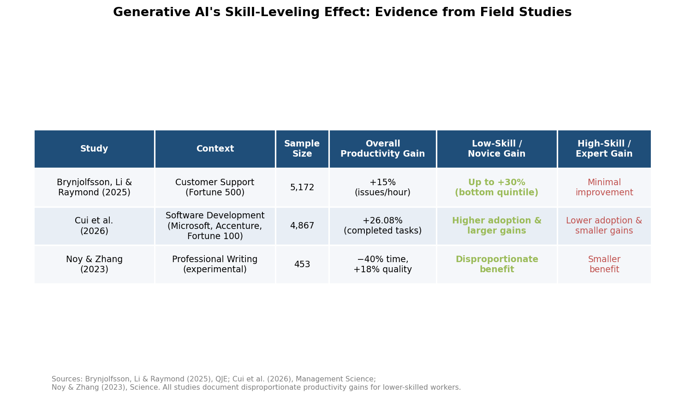

*Figure 5.2: Summary of three key field studies documenting generative AI's differential productivity effects across the skill distribution. All three studies converge on the skill-leveling pattern: lower-skilled and less-experienced workers benefit disproportionately. Sources: Brynjolfsson, Li & Raymond (2025); Cui et al. (2026); Noy & Zhang (2023).*

This body of evidence carries a critical implication for workforce adaptation strategy: if generative AI compresses within-occupation skill distributions, then the highest marginal returns to training may accrue not from upskilling already-expert workers but from equipping less-experienced workers with the capacity to effectively deploy AI tools. The conventional human capital investment logic — that training returns are highest for the most skilled — may be inverted in the generative AI era.

## 5.3 The STEM Premium and the Problem of Skill Depreciation

### 5.3.1 The Lifecycle of Technical Skills

Formal education remains the primary institutional mechanism for human capital formation, and the dominant policy response to technological change has been to expand STEM (science, technology, engineering, and mathematics) enrollment. Deming and Noray (2020) challenge the assumption that STEM education provides durable labor market advantages. Analyzing earnings trajectories from three longitudinal datasets, they find that STEM graduates earn an initial wage premium of approximately 25% over business graduates. However, applied technical skills depreciate more rapidly than those in non-STEM fields, and the STEM premium narrows substantially by age 40. The mechanism is straightforward: technological change devalues the specific technical knowledge acquired during education while leaving broader analytical and managerial competencies intact [Deming & Noray (2020)](https://academic.oup.com/qje/article/135/4/1965/5858010 "Quarterly Journal of Economics, 135(4), pp. 1965–2005").

This finding has immediate relevance for AI-era workforce strategy. If the pace of technological change in AI exceeds that of prior technology cycles — and the speed of LLM capability improvements since 2022 suggests it may — then the depreciation rate of AI-specific technical skills will be correspondingly faster. An education system optimized to produce graduates with narrowly defined AI programming competencies risks generating a workforce whose core skills become obsolete within a decade of graduation. The evidence instead favors educational approaches that balance occupation-specific technical training with transferable analytical, social, and meta-cognitive capacities — the hybrid skill profiles that Deming (2017) and Deming and Kahn (2018) identify as commanding the highest market premiums.

### 5.3.2 Implications for Curriculum Design

The tension between technical specificity and skill transferability manifests directly in curriculum design debates. The evidence base reviewed here supports a pedagogical framework organized around three layers: (1) foundational analytical and quantitative reasoning that transfers across technological paradigms; (2) applied AI literacy — the capacity to evaluate, deploy, and critically assess AI tools within professional domains; and (3) social and communicative competencies that remain complementary to machine capabilities. Peer-reviewed empirical evidence on how universities are adapting curricula specifically for generative AI remains limited, with most available evidence residing in institutional case studies rather than controlled evaluations. The absence of rigorous comparative studies on curricular responses to AI constitutes a notable gap in the literature.

## 5.4 Reskilling, Upskilling, and Workforce Development Programs

### 5.4.1 Sectoral Training Programs: Evidence of Effectiveness

The task-based model's prediction that automation displaces workers from specific task bundles implies a need for institutions that facilitate transitions to new tasks and occupations. The most rigorous evidence on workforce development program effectiveness comes from the sectoral employment training literature. Katz, Roth, Hendra, and Schaberg (2022) synthesize results from randomized evaluations of nine sectoral employment programs and find that programs combining applicant screening, occupation-specific and soft-skills instruction, and wraparound support services generate persistent earnings gains of 12–34% for participants. These gains are driven primarily by enabling access to higher-wage jobs in higher-earning industries rather than by increasing hours worked [Katz et al. (2022)](https://www.journals.uchicago.edu/doi/abs/10.1086/717932 "Journal of Labor Economics, 40(S1)").

The sectoral training model's demonstrated effectiveness rests on several design features directly applicable to AI-era workforce transitions: industry-specific curricula that target occupations with documented demand, integration of technical with interpersonal skills, and institutional linkages between training providers and employers. The 12–34% earnings premium documented across nine independent evaluations is large relative to the returns from most active labor market interventions, indicating that well-designed sectoral programs represent a credible — if supply-constrained — adaptation mechanism.

### 5.4.2 Online Learning Platforms: Promise and Persistent Limitations

The scale challenge inherent in sectoral training programs — each requires curriculum development, employer partnerships, and participant support services — has motivated interest in massive open online courses (MOOCs) and digital learning platforms as vehicles for large-scale reskilling. The empirical evidence, however, raises serious concerns about their effectiveness and equity. Aedo, Aramburu, and Blanco (2024) report results from an experimental evaluation of online courses in Costa Rica, finding a completion rate of only 10%. Critically, completion was positively associated with being male and wealthier — indicating that online reskilling platforms may exacerbate rather than mitigate existing inequalities in access to human capital [Aedo, Aramburu & Blanco (2024)](https://www.sciencedirect.com/science/article/pii/S0304387824000348 "Journal of Development Economics, 2024"). This finding is consistent with the broader MOOC literature, where typical completion rates range from 5% to 15%.

The low completion rates reflect multiple, reinforcing barriers: self-directed online learning demands precisely the self-regulation and meta-cognitive skills that are unevenly distributed in the population; digital literacy prerequisites exclude workers most in need of reskilling; and the absence of institutional support structures (mentoring, peer cohorts, employer connections) reduces both motivation and labor market returns. For AI-era workforce policy, the implication is that digital platforms alone are unlikely to serve as the primary mechanism for labor force adaptation — particularly for the lower-skilled workers whom the skill-leveling evidence suggests would benefit most from AI augmentation.

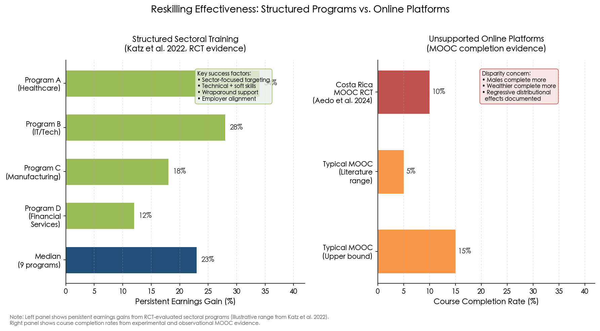

*Figure 5.3: Comparative effectiveness of structured sectoral training programs and unsupported online platforms. Left panel: persistent earnings gains (12–34%) from RCT-evaluated sectoral programs (Katz et al. 2022). Right panel: course completion rates (5–15%) from MOOC evidence, with documented regressive distributional effects (Aedo et al. 2024).*

## 5.5 Distributional Dimensions of Adaptation Capacity

### 5.5.1 Age and Cohort Effects

The distributional burden of AI-driven restructuring is not uniform across demographic groups. Dauth, Findeisen, Suedekum, and Woessner (2021), as discussed in Chapter 4, demonstrate that in Germany the labor market displacement from industrial robots fell disproportionately on young entrants rather than on incumbent workers protected by institutional arrangements [Dauth et al. (2021)](https://academic.oup.com/jeea/article-abstract/19/6/3104/6179884 "Journal of the European Economic Association, 19(6), pp. 3104–3153"). Early evidence from the generative AI era suggests a similar age-vulnerability pattern may be emerging in knowledge work: early-career workers in AI-exposed occupations appear particularly susceptible to displacement, as their relative cost advantage (lower wages) diminishes when AI can perform entry-level tasks at near-zero marginal cost.

Older workers face a distinct but related set of challenges. The skill depreciation dynamics documented by Deming and Noray (2020) imply that mid-career workers whose technical skills were acquired under earlier technological paradigms confront the steepest retraining gradients. The interaction of shorter remaining career horizons with higher retraining costs creates a structural disincentive for human capital investment among precisely those workers whose existing skills are most vulnerable to AI obsolescence.

### 5.5.2 Socioeconomic and Geographic Inequality

The cyclical upskilling mechanism documented by Hershbein and Kahn (2018) and Modestino, Shoag, and Ballance (2020) exhibits a distinctly regressive distributional profile: during economic downturns, employers raise hiring requirements, and workers without postsecondary credentials are disproportionately excluded from positions they previously occupied. If AI adoption follows a similar ratchet pattern — and the concentration of AI investment among large, high-wage firms documented by Babina, Fedyk, He, and Hodson (2024) suggests it may — then credential inflation will compound existing socioeconomic disparities in labor market access [Babina et al. (2024)](https://www.sciencedirect.com/science/article/pii/S0304405X2300185X "Journal of Financial Economics, 151, article 103745").

Geographic disparities constitute a further dimension of unequal adaptation capacity. As Frank, Autor, Bessen, Brynjolfsson et al. (2019) observe, AI deployment concentrates in highly educated, well-paid, predominantly urban industries — a pattern that contrasts with earlier automation waves, which disproportionately affected geographically dispersed manufacturing communities [Frank et al. (2019)](https://pmc.ncbi.nlm.nih.gov/articles/PMC6452673/ "PNAS, 116(14), pp. 6531–6539"). This geographic concentration implies that the benefits of AI-driven productivity growth and the associated demand for AI-complementary skills are spatially concentrated, while displacement effects may be distributed more broadly — particularly as generative AI begins to affect remote-capable knowledge work previously insulated from local labor market conditions.

### 5.5.3 Gender and Racial Disparities

Peer-reviewed evidence on gender- and race-specific disparities in access to and returns from AI-era reskilling programs remains limited. The existing literature on algorithmic bias in hiring — reviewed in Chapter 6 — documents how AI systems can perpetuate and amplify demographic disparities in labor market access. A distinct and under-researched question, however, is whether the institutions of workforce adaptation — corporate training programs, public reskilling initiatives, online learning platforms — themselves generate differential returns along gender and racial lines. The evidence from Aedo, Aramburu, and Blanco (2024), showing that male and wealthier individuals are more likely to complete online training, suggests that without deliberate design interventions, market-driven reskilling mechanisms may reproduce existing demographic inequalities. Rigorous peer-reviewed studies that directly estimate race- and gender-specific returns to AI-era workforce training programs constitute a significant gap in the current literature.

## 5.6 Synthesis: The Human Capital Challenge of the AI Transition

The evidence reviewed in this chapter converges on several core findings. First, the labor market premium has shifted decisively away from routine-task specialization toward hybrid skill portfolios combining analytical, social, and meta-cognitive competencies — a trend that predates generative AI but is accelerating under it. Second, generative AI's most robust early empirical signature is a skill-leveling effect that compresses within-occupation productivity distributions, disproportionately benefiting less-experienced workers. Third, the institutional mechanisms for workforce adaptation — sectoral training programs and formal education — possess demonstrated but supply-constrained effectiveness, while scalable alternatives such as online platforms exhibit persistent completion and equity limitations. Fourth, the distributional burden of AI-driven skill restructuring falls unevenly across age cohorts, socioeconomic strata, and geographies, with the capacity to adapt conditioned by precisely the same inequalities that the AI transition threatens to deepen.

The interaction of these findings produces a central paradox: generative AI's skill-leveling potential is greatest for workers who currently have the least access to the tools, training, and institutional support needed to exploit it. Whether the AI transition narrows or widens human capital inequality depends less on the technology's inherent properties than on the design of the educational, institutional, and policy responses examined in this chapter.

# 第6章 Ethical, Social, and Policy Dimensions of AI-Driven Labor Market Restructuring

The preceding chapters have established that AI-driven automation displaces workers from specific task bundles, generates measurable but unevenly distributed productivity gains, and restructures the architecture of skill demand across occupations and sectors. These findings characterize economic mechanisms without, however, addressing the normative and governance questions they raise: Who bears the costs of displacement, and through what institutional channels can those costs be redistributed? How do algorithmic systems deployed in hiring, management, and task allocation interact with — and potentially amplify — existing inequalities? What policy instruments are available, and what does the evidence indicate about their effectiveness in managing the transition?

This chapter addresses these questions by synthesizing the scholarly literature on five interconnected dimensions: distributional consequences of automation and AI-driven inequality (Section 6.1); algorithmic bias and accountability in employment decisions and workforce management (Section 6.2); the adequacy and adaptability of social safety nets (Section 6.3); emerging regulatory and governance frameworks (Section 6.4); and the role of worker agency, collective bargaining, and platform governance in shaping outcomes (Section 6.5). The analysis culminates in a synthesis (Section 6.6) that foregrounds a central finding of the literature: the distributional outcomes of AI-driven restructuring are not technologically determined but are contingent on institutional design and the distribution of bargaining power.

## 6.1 Inequality, Polarization, and Distributional Consequences

### 6.1.1 Automation as an Engine of Wage Inequality

The task-based framework introduced in Chapter 2 predicts that automation does not merely reduce aggregate labor demand but restructures the distribution of returns across the wage spectrum. The most rigorous empirical quantification of this mechanism comes from Acemoglu and Restrepo (2022), who decompose changes in the U.S. wage structure over four decades (1980–2016) and attribute 50–70% of the observed variation to the relative wage declines of workers specialized in routine tasks within industries that adopted automation technologies. Over this period, the real wage of male high-school dropouts fell by 8.8%, while cumulative total factor productivity grew by only 3.4% — a stark disproportion indicating that automation's displacement effects have been substantial relative to its aggregate productivity contributions [Acemoglu & Restrepo (2022)](https://onlinelibrary.wiley.com/doi/full/10.3982/ECTA19815 "Econometrica, 90(5), pp. 1973–2016"). The concept of "so-so automation" — technologies just productive enough for firms to adopt and displace workers, yet insufficiently transformative to generate compensating productivity gains — provides a theoretical explanation for this asymmetry [Acemoglu & Restrepo (2020)](https://economics.mit.edu/sites/default/files/publications/The%20Wrong%20Kind%20of%20AI%20-%20Artificial%20Intelligence%20and.pdf "Cambridge Journal of Regions, Economy and Society, 13(1), pp. 25–35").

The spatial dimension of this inequality is equally consequential. Autor (2019) demonstrates that automation and trade have eliminated the bulk of non-college production, administrative, and clerical occupations, producing disproportionate polarization within urban labor markets. The urban wage premium for non-college workers has been substantially attenuated: whereas cities once offered broad-based wage advantages across the education spectrum, the concentration of high-skill, AI-complementary employment in metropolitan areas has generated a geography of opportunity in which the returns to urban residence are increasingly conditional on educational attainment [Autor (2019)](https://www.aeaweb.org/articles?id=10.1257/pandp.20191110 "AEA Papers and Proceedings, 109, pp. 1–32").

### 6.1.2 AI-Specific Inequality Channels

While the distributional consequences of industrial automation are well documented, AI introduces additional inequality channels that extend beyond routine-task displacement. Acemoglu (2021) identifies four categories of potential AI-related harm with distributional dimensions: excessive automation without commensurate productivity gains, concentration of market power among AI platform firms, erosion of privacy, and manipulation through AI-generated content. Each operates with disproportionate effects on lower-income and less-educated populations, who possess fewer institutional resources to counter market-power concentration and fewer alternative employment options when displaced [Acemoglu (2021)](https://www.nber.org/papers/w29247 "NBER Working Paper 29247") (working paper).

The market-power channel warrants particular emphasis. Babina, Fedyk, He, and Hodson (2024) document that AI-investing firms experience higher growth in sales, employment, and market valuations, but that this growth concentrates among larger firms and raises industry concentration [Babina et al. (2024)](https://www.sciencedirect.com/science/article/pii/S0304405X2300185X "Journal of Financial Economics, 151, article 103745"). To the extent that AI capabilities exhibit scale economies — training large models requires computational resources disproportionately available to dominant firms — the resulting winner-take-all dynamics redistribute surplus from displaced workers and smaller competitors to a narrowing set of technology-intensive incumbents. The interaction between labor displacement and market concentration creates a compounding mechanism: the same firms driving automation-related wage compression simultaneously accumulate the economic surplus that could, in principle, finance compensatory redistribution.

### 6.1.3 The Generative AI Inversion

The arrival of generative AI complicates the distributional picture in a historically novel way. As documented in Chapters 3 and 5, pre-2022 automation predominantly displaced routine middle-skill tasks, whereas LLMs disproportionately affect higher-wage, higher-education occupations. Eloundou et al. (2024) estimate that approximately 80% of the U.S. workforce could have at least 10% of their tasks affected by LLMs, with the highest exposure concentrated among workers with professional degrees and higher earnings [Eloundou et al. (2024)](https://www.science.org/doi/10.1126/science.adj0998 "Science, 384(6702), pp. 1306–1308"). This exposure inversion suggests that generative AI may partially compress between-occupation wage inequality — even as it could amplify within-occupation inequality between workers who effectively adopt AI tools and those who do not.

The net distributional effect hinges on whether the skill-leveling pattern documented by Brynjolfsson, Li, and Raymond (2025) — whereby less-experienced workers benefit disproportionately from AI assistance, with bottom-quintile agents gaining up to 30% in productivity — generalizes beyond early-adopter settings and survives employer wage adjustments [Brynjolfsson, Li & Raymond (2025)](https://academic.oup.com/qje/article/140/2/889/7990658 "Quarterly Journal of Economics, 140(2), pp. 889–942"). If the pattern holds at scale, generative AI could represent a partial corrective to four decades of routine-biased displacement; if it does not, the technology risks adding a new stratum of within-occupation inequality atop the between-occupation polarization that automation has already produced.

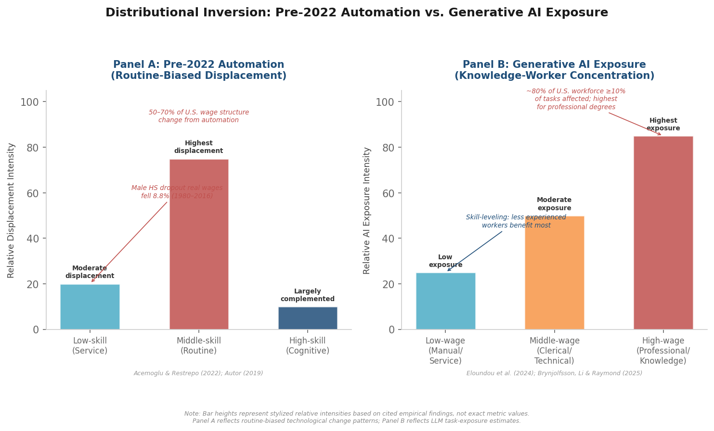

*Figure 6.1. Stylized comparison of displacement intensity under pre-2022 automation (Panel A), which concentrated on middle-skill routine occupations, versus the exposure pattern of generative AI (Panel B), which disproportionately affects high-wage professional and knowledge-worker occupations. Bar heights represent relative intensities derived from the cited empirical studies, not precise metric values.*

## 6.2 Algorithmic Bias in Hiring and Workforce Management

### 6.2.1 Sources and Taxonomy of Algorithmic Bias

The deployment of AI systems in employment decisions — recruitment screening, performance evaluation, promotion recommendations, and termination — introduces a distinct set of ethical concerns centered on fairness, accountability, and transparency. Mehrabi et al. (2021) provide a comprehensive survey identifying over 20 distinct types of bias in machine learning systems, including historical bias (training data reflecting prior discrimination), representation bias (underrepresentation of protected groups in datasets), measurement bias (proxies that correlate with protected characteristics), and aggregation bias (models that fail to account for subgroup heterogeneity). In the employment context, these biases can produce discriminatory outcomes at every stage of the worker lifecycle [Mehrabi et al. (2021)](https://dl.acm.org/doi/10.1145/3457607 "ACM Computing Surveys, 54(6), pp. 1–35").

Raghavan, Barocas, Kleinberg, and Levy (2020) translate this general taxonomy into the specific domain of algorithmic hiring tools. Auditing the claims of commercial vendors, they document significant gaps between marketed bias-mitigation capabilities and actual practice. Critical risks concentrate in three areas: the selection of prediction targets (optimizing for "employee retention" may encode discriminatory preferences if historically retained employees are non-representative); the data collection process (résumé-screening algorithms trained on prior hiring decisions inherit those decisions' biases); and fundamental tensions with existing antidiscrimination law, which was designed to regulate human decision-makers and maps imperfectly onto algorithmic systems [Raghavan et al. (2020)](https://dl.acm.org/doi/10.1145/3351095.3372828 "FAT* Conference, 2020").

### 6.2.2 The Promise and Peril of Algorithmic Decision-Making

The ethical assessment of algorithmic hiring is complicated by evidence that algorithmic prediction can, under specific conditions, outperform human judgment on fairness-relevant dimensions. Kleinberg, Lakkaraju, Leskovec, Ludwig, and Mullainathan (2018) demonstrate this through a study of judicial bail decisions: a machine learning algorithm trained on historical data could substantially reduce jail populations while simultaneously reducing crime rates, primarily by identifying cases where human judges exhibited systematic bias in risk assessment. A significant share of human prediction error reflected not random noise but systematic racial disparities — implying that well-designed algorithms can reduce rather than amplify discrimination [Kleinberg et al. (2018)](https://academic.oup.com/qje/article-abstract/133/1/237/4095198 "Quarterly Journal of Economics, 133(1), pp. 237–293"). Translated to the employment domain, this finding suggests that algorithmic screening could, in principle, mitigate the well-documented implicit biases that affect human hiring decisions.

The operative qualifier is "in principle." The Kleinberg et al. (2018) result depends on a specific design condition: the algorithm must be optimized for an objective that aligns with fairness goals, and the training data must contain sufficient signal to permit unbiased prediction. In practice, employment algorithms rarely satisfy these conditions. As Raghavan et al. (2020) document, vendor-deployed hiring tools frequently optimize for retention or performance metrics that are themselves products of biased organizational processes, creating a feedback loop in which algorithmic "accuracy" embeds and amplifies prior discrimination. The gap between the theoretical potential of algorithmic fairness and its realized practice constitutes one of the central ethical challenges of AI-driven labor market restructuring.

### 6.2.3 Algorithmic Management and Workplace Surveillance

Beyond hiring, AI systems increasingly govern the ongoing employment relationship through what scholars term "algorithmic management." Kellogg, Valentine, and Christin (2020) identify six mechanisms of algorithmic workplace control: *restricting* (limiting worker discretion), *recommending* (suggesting actions), *recording* (monitoring behavior), *rating* (evaluating performance), *replacing* (automating tasks), and *rewarding* (allocating incentives algorithmically). Each mechanism reconfigures the power relationship between employer and worker, shifting discretionary authority from human managers to encoded rules whose logic may be opaque to the workers they govern [Kellogg et al. (2020)](https://journals.aom.org/doi/10.5465/annals.2018.0174 "Academy of Management Annals, 14(1), pp. 366–410").

Bernhardt, Kresge, and Suleiman (2023) document the concrete harms arising from these mechanisms: invasive monitoring of worker activity (keystroke logging, screen capture, location tracking), algorithmic wage-setting that fragments compensation into micro-task payments, automated scheduling that shifts temporal risk to workers, and productivity tracking that generates high-frequency performance assessments tied to disciplinary action. These practices are most prevalent in logistics, warehousing, customer service, and platform-based work — sectors where workers possess relatively limited bargaining power. Bernhardt et al. propose a comprehensive "worker technology rights" framework encompassing transparency requirements (disclosure of algorithmic criteria), contestability rights (mechanisms to challenge automated decisions), data minimization (limits on the scope of surveillance), and anti-retaliation protections [Bernhardt et al. (2023)](https://journals.sagepub.com/doi/10.1177/00197939221131558 "ILR Review, 76(1), pp. 3–29").

The platform economy exemplifies these dynamics in their most concentrated form. Rosenblat and Stark (2016) demonstrate through an empirical study of Uber drivers that platforms leverage information and power asymmetries to exert employer-like control while classifying workers as independent contractors — a legal designation that excludes them from the protections of employment law. Platform algorithms determine pricing, assign tasks, rate performance, and impose de facto discipline through deactivation, yet the "flexibility" narrative positions these relationships as arms-length market transactions [Rosenblat & Stark (2016)](https://ijoc.org/index.php/ijoc/article/view/4892 "International Journal of Communication, 10, pp. 3758–3784"). Wood, Graham, Lehdonvirta, and Hjorth (2019) extend this analysis globally, finding that platform workers experience significant autonomy deficits despite the rhetoric of flexibility: algorithmic control constrains when, how, and for whom they work, with workers in lower-income countries particularly vulnerable to asymmetric power relations on globally intermediated platforms [Wood et al. (2019)](https://journals.sagepub.com/doi/10.1177/0950017018785616 "Work, Employment and Society, 33(1), pp. 56–75").

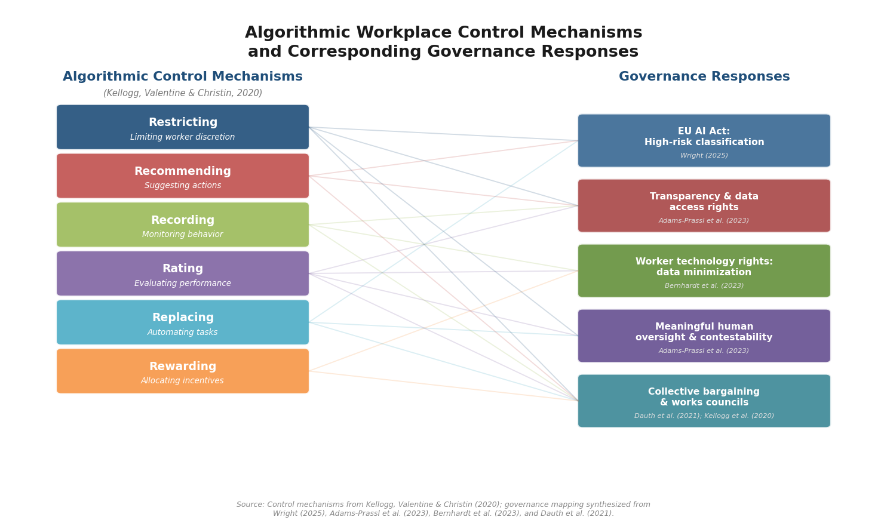

*Figure 6.2. Mapping of the six algorithmic workplace control mechanisms identified by Kellogg, Valentine, and Christin (2020) to the governance responses discussed in Sections 6.4 and 6.5. Connecting lines indicate which regulatory and institutional instruments address each control mechanism. Sources for governance instruments: Wright (2025), Adams-Prassl et al. (2023), Bernhardt et al. (2023), Dauth et al. (2021).*

## 6.3 Social Safety Nets and Redistribution Mechanisms

### 6.3.1 Universal Basic Income: Experimental Evidence

The prospect of large-scale AI-driven displacement has reinvigorated debate over universal basic income (UBI) as a social protection mechanism. The most rigorous evidence comes from the Finnish basic income experiment (2017–2018), in which 2,000 unemployed individuals received an unconditional monthly payment of €560. Verho, Hämäläinen, and Kanninen (2022) report the causal estimates: despite the payment reducing the effective participation tax rate for full-time employment by 23 percentage points, days in employment remained statistically unchanged during the first year of the experiment. Participation in reemployment services remained high even when job-search requirements were waived — indicating that income security did not produce the labor supply withdrawal that critics of UBI anticipate [Verho et al. (2022)](https://www.aeaweb.org/articles?id=10.1257/pol.20200143 "American Economic Journal: Economic Policy, 14(1), pp. 501–522").

The Finnish experiment provides a rigorous but bounded data point. The payment level (€560/month) was relatively modest, the sample consisted entirely of unemployed individuals, and the two-year duration limits inference about long-run behavioral responses. Nonetheless, the absence of significant labor supply reduction, combined with documented improvements in subjective well-being and life satisfaction among recipients, challenges the theoretical prediction that unconditional cash transfers would substantially reduce work effort. For AI labor market policy, the Finnish evidence suggests that basic income mechanisms may function as viable transition support — providing income stability during displacement and retraining periods — without generating the large-scale work disincentives that dominate theoretical objections.

### 6.3.2 Beyond UBI: Structural Safety Net Adaptation

The UBI debate, while prominent, addresses only one dimension of social protection adequacy. The broader challenge is that existing safety net architectures — unemployment insurance, disability benefits, employer-provided health coverage, pension systems — were designed for a labor market characterized by stable, long-term employment relationships. AI-driven restructuring accelerates several trends that erode these foundations: the growth of non-standard employment (gig work, freelancing, contract labor), the acceleration of occupational churn requiring multiple career transitions, and the potential for displacement to occur faster than administrative processes can respond.

The sectoral training evidence reviewed in Chapter 5, particularly Katz, Roth, Hendra, and Schaberg (2022), demonstrates that well-designed active labor market programs can generate persistent earnings gains of 12–34% for displaced workers [Katz et al. (2022)](https://www.journals.uchicago.edu/doi/abs/10.1086/717932 "Journal of Labor Economics, 40(S1)"). The challenge lies in scaling these programs to match the pace and breadth of AI-driven displacement. The task-based framework's prediction — that AI automates specific task bundles rather than entire occupations — implies that displacement will be distributed across occupations rather than concentrated in identifiable industries, rendering traditional sector-specific safety net responses less effective than frameworks supporting portable benefits and continuous reskilling regardless of employment status or sector.

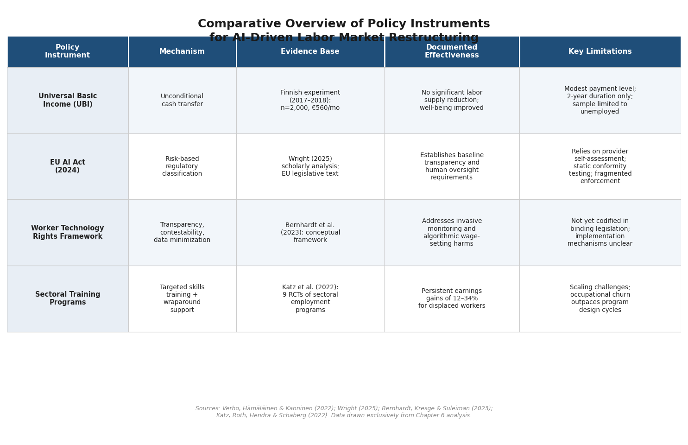

*Figure 6.3. Comparison of four policy instruments discussed in this chapter — universal basic income, the EU AI Act, the worker technology rights framework, and sectoral training programs — across mechanism type, evidence base, documented effectiveness, and key limitations. All entries draw on findings presented in the chapter text.*

## 6.4 Regulatory and Governance Frameworks

### 6.4.1 The EU AI Act: Risk-Based Regulation of Employment AI

The most comprehensive legislative response to AI governance to date is the European Union's AI Act, which entered into force in 2024. The Act classifies AI systems used in recruitment, candidate selection, promotion decisions, task allocation, performance monitoring, and employment termination as "high-risk," subjecting them to conformity assessment requirements, transparency obligations, human oversight mandates, and record-keeping duties. Wright (2025) provides the first detailed scholarly analysis of the Act's employment provisions, identifying both structural innovations and limitations. The risk-based approach represents a significant regulatory advance, establishing a baseline expectation that employment-related AI systems must be demonstrably accurate, non-discriminatory, and subject to human review [Wright (2025)](https://journals.sagepub.com/doi/full/10.1177/00221856251394780 "Journal of Industrial Relations, 67(5)").

Wright's analysis also identifies significant shortcomings. The Act relies heavily on provider self-assessment for conformity certification, creating potential conflicts of interest. Enforcement mechanisms are distributed across national authorities with varying capacities and institutional cultures, raising questions about consistency of application. Most critically for labor market governance, the Act's focus on pre-deployment conformity assessment may be poorly suited to the dynamic nature of machine learning systems, which can develop biased behaviors through post-deployment data drift even if they satisfy initial compliance requirements. The fundamental regulatory challenge is that employment AI systems are not static artifacts but evolving processes whose fairness properties require ongoing monitoring rather than one-time certification.

### 6.4.2 Regulatory Proposals for Algorithmic Management

Adams-Prassl, Binns, and Kelly (2023) propose a regulatory blueprint that addresses several of the EU AI Act's identified gaps. Their framework centers on three pillars: transparency obligations requiring employers to disclose when and how algorithmic systems influence employment decisions; data access rights enabling workers and their representatives to inspect the data inputs, model logic, and output criteria of algorithmic management systems; and meaningful human oversight requirements that go beyond the formality of a "human in the loop" to mandate that reviewers possess the authority, information, and time necessary to evaluate and override algorithmic recommendations [Adams-Prassl et al. (2023)](https://papers.ssrn.com/sol3/papers.cfm?abstract_id=4373355 "European Labour Law Journal, 14(2), pp. 124–151").

The "meaningful oversight" requirement is particularly consequential. Dell'Acqua, McFowland, Mollick et al. (2026) demonstrate through the concept of AI's "jagged technological frontier" that human reviewers who uncritically accept AI outputs — a pattern they term "falling asleep at the wheel" — perform worse than those who exercise independent judgment [Dell'Acqua et al. (2026)](https://pubsonline.informs.org/doi/10.1287/orsc.2025.21838 "Organization Science"). Applied to the regulatory context, this finding implies that compliance frameworks mandating human oversight of algorithmic employment decisions must be designed to prevent automation complacency — requiring not merely procedural human involvement but substantive evaluative engagement.

### 6.4.3 The Regulatory Gap in the United States

In contrast to the EU's comprehensive legislative approach, U.S. regulation of AI in employment remains fragmented across agency-level guidance, executive orders, and state-level initiatives without a unified federal framework. The absence of peer-reviewed empirical analysis of U.S. executive-level AI policy's labor provisions reflects the early stage and non-statutory nature of these initiatives. The resulting regulatory asymmetry — between jurisdictions with binding rules (the EU, and increasingly individual U.S. states and municipalities) and those relying on voluntary frameworks — creates compliance complexity for multinational firms while leaving workers in less-regulated jurisdictions without effective recourse against algorithmic employment decisions.

## 6.5 Worker Agency, Collective Bargaining, and Platform Governance

### 6.5.1 Collective Bargaining as a Mechanism for Algorithmic Accountability

The evidence reviewed in Chapter 4 on Germany's response to industrial robots provides a compelling institutional contrast. Dauth, Findeisen, Suedekum, and Woessner (2021) demonstrate that Germany's strong works council and union structures enabled incumbent workers to transition to new tasks within plants rather than being displaced entirely, even as approximately 275,000 manufacturing jobs were destroyed by robots [Dauth et al. (2021)](https://academic.oup.com/jeea/article-abstract/19/6/3104/6179884 "Journal of the European Economic Association, 19(6), pp. 3104–3153"). This finding underscores that collective bargaining institutions mediate the translation of technological capability into labor market outcomes — a principle that applies with equal or greater force to AI-era restructuring, where the design choices embedded in algorithmic management systems (monitoring intensity, task allocation criteria, performance thresholds) constitute negotiable parameters rather than technical inevitabilities.

The effectiveness of collective bargaining in governing AI depends, however, on the capacity of worker representatives to engage with technical complexity. Kellogg, Valentine, and Christin (2020) observe that algorithmic control creates a "new contested terrain" that triggers worker resistance strategies, but the opacity of algorithmic systems — the "black box" problem — can undermine the informational foundations on which collective bargaining traditionally depends [Kellogg et al. (2020)](https://journals.aom.org/doi/10.5465/annals.2018.0174 "Academy of Management Annals, 14(1), pp. 366–410"). Effective algorithmic bargaining requires that union and works council representatives possess both the technical literacy to evaluate algorithmic systems and the legal mandate to demand disclosure — a combination that the Adams-Prassl et al. (2023) transparency and data access framework is designed to enable.

### 6.5.2 Platform Workers and the Limits of Individual Agency

The platform economy illustrates the distributional consequences of governance failure with particular clarity. Rosenblat and Stark (2016) demonstrate that platform algorithms create structural information asymmetries disadvantaging workers: drivers cannot observe the full algorithmic logic governing pricing, task assignment, or rating penalties, yet their livelihoods depend on conforming to these opaque systems [Rosenblat & Stark (2016)](https://ijoc.org/index.php/ijoc/article/view/4892 "International Journal of Communication, 10, pp. 3758–3784"). Wood, Graham, Lehdonvirta, and Hjorth (2019) document that this asymmetry operates with particular intensity for platform workers in lower-income countries, who face compounding constraints from geographic distance, limited alternative employment, and regulatory environments offering minimal labor protections [Wood et al. (2019)](https://journals.sagepub.com/doi/10.1177/0950017018785616 "Work, Employment and Society, 33(1), pp. 56–75").

The freelancing platform evidence reviewed in Chapter 3 — Hui, Reshef, and Zhou (2024) and Demirci, Hannane, and Zhu (2025) documenting employment and earnings declines for GenAI-exposed freelancers — reveals a compounding dynamic: platform workers face AI-driven displacement from the demand side (clients substituting AI for freelancer services) while simultaneously operating under algorithmic management systems that constrain their capacity to adapt. The absence of collective bargaining structures in the platform economy means that the distributional consequences of these converging pressures fall almost entirely on individual workers, without the institutional shock absorbers that mediated robot adoption in Germany's manufacturing sector.

## 6.6 Synthesis: Governance as a Determinant of Distributional Outcomes

The evidence reviewed in this chapter converges on a central finding: the distributional consequences of AI-driven labor market restructuring are not technologically determined but are mediated by institutional design, regulatory frameworks, and the distribution of bargaining power. Automation has contributed to 50–70% of U.S. wage structure changes over four decades, with the sharpest effects concentrated among workers possessing the least educational attainment and institutional protection [Acemoglu & Restrepo (2022)](https://onlinelibrary.wiley.com/doi/full/10.3982/ECTA19815 "Econometrica, 90(5), pp. 1973–2016"). Algorithmic systems deployed in hiring and workforce management carry documented risks of perpetuating and amplifying discrimination, yet also possess the theoretical potential to reduce bias relative to unassisted human decision-making — a potential that hinges on design choices and regulatory oversight that current practice often fails to provide.

The regulatory landscape is characterized by a temporal mismatch: AI capabilities and deployment are advancing at a pace that outstrips the development of governance institutions. The EU AI Act represents the most ambitious attempt to close this gap, but its reliance on provider self-assessment and static conformity testing raises questions about long-term adequacy for dynamic machine learning systems. The Finnish UBI evidence suggests that unconditional income transfers can provide transitional support without producing large-scale work disincentives, though experimental evidence remains limited in duration, scale, and generalizability to AI-specific displacement scenarios. Collective bargaining institutions have demonstrated effectiveness in mediating the labor market impacts of automation — most prominently in Germany's robot adoption experience — yet these institutions are weakest precisely in the platform and gig economy sectors where algorithmic management is most pervasive.

The overarching implication is that the ethical and social outcomes of AI-driven restructuring hinge on policy choices that remain contested and underdetermined. Technology creates possibilities and constraints; governance determines how the resulting surplus and costs are distributed. The scholarly literature documents both the risks of inaction — widening inequality, unchecked algorithmic discrimination, erosion of worker agency — and the existence of viable, if imperfect, institutional mechanisms for mitigating those risks. Whether those mechanisms are deployed at the scale and speed commensurate with AI's diffusion remains an open question that the evidence can inform but cannot, by itself, resolve.

# 第7章 Synthesis, Research Gaps, and Future Directions

The preceding chapters have surveyed the theoretical frameworks, empirical evidence, sectoral dynamics, human capital implications, and governance dimensions of AI-driven labor market restructuring. This concluding chapter performs three tasks. First, it integrates the principal findings across these domains, identifying where theoretical predictions and empirical observations converge and where they diverge. Second, it maps the methodological challenges and substantive research gaps that constrain the strength of current conclusions. Third, it articulates a concrete research agenda — grounded in documented lacunae rather than speculative extrapolation — for the next generation of scholarship on AI and labor.

## 7.1 Integrating Theory and Evidence: Convergences and Tensions

### 7.1.1 The Task-Based Framework as Organizing Lens

The task-based framework, formalized by Autor, Levy, and Murnane (2003) and extended into general equilibrium by Acemoglu and Restrepo (2018), has proven the most durable theoretical lens for interpreting AI's labor market effects. Its core prediction — that automation displaces labor from specific task bundles while creating complementarities in non-automated tasks — finds broad empirical support across the three temporal waves of evidence reviewed in this review. Industrial robots displaced routine manual tasks in U.S. manufacturing, reducing the employment-to-population ratio by 0.2 percentage points per additional robot per thousand workers [Acemoglu & Restrepo (2020)](https://www.journals.uchicago.edu/doi/abs/10.1086/705716 "Journal of Political Economy, 128(6), pp. 2188–2244"). Pre-generative AI adoption at the firm level produced no detectable aggregate employment effects, consistent with offsetting displacement and reinstatement channels operating simultaneously [Acemoglu et al. (2022)](https://www.journals.uchicago.edu/doi/10.1086/718327 "Journal of Labor Economics, 40(S1), pp. S293–S340"). And the historical record confirms that new task creation has been a powerful counterweight: approximately 60% of U.S. employment in 2018 was in occupations that did not exist in 1940, with the pace of new work creation accelerating over time [Autor et al. (2024)](https://academic.oup.com/qje/article-abstract/139/3/1399/7630187 "Quarterly Journal of Economics, 139(3), pp. 1399–1465").

Yet the framework's predictions are not uniformly validated. The model's displacement–reinstatement equilibrium assumes that new task creation proceeds at a pace sufficient to absorb displaced labor — an assumption that the post-2022 evidence has begun to challenge. Freelance labor markets exposed to generative AI have experienced simultaneous declines in employment and earnings [Hui, Reshef & Zhou (2024)](https://pubsonline.informs.org/doi/abs/10.1287/orsc.2023.18441 "Organization Science"); [Demirci, Hannane & Zhu (2025)](https://pubsonline.informs.org/doi/abs/10.1287/mnsc.2024.05420 "Management Science, 71(4)"), without visible evidence of compensating new task creation in those markets. Whether this reflects the short time horizon of observation, the particular vulnerability of freelance arrangements, or a genuine attenuation of the reinstatement mechanism remains unresolved.

### 7.1.2 The Productivity–Displacement Paradox

A central tension pervading the empirical evidence is the coexistence of substantial micro-level productivity gains with modest or negative aggregate employment effects. Generative AI produces productivity improvements of 15–40% in controlled settings — customer support agents resolving 15% more issues per hour [Brynjolfsson, Li & Raymond (2025)](https://academic.oup.com/qje/article/140/2/889/7990658 "Quarterly Journal of Economics, 140(2), pp. 889–942"), writing professionals completing tasks 40% faster [Noy & Zhang (2023)](https://www.science.org/doi/10.1126/science.adh2586 "Science, 381(6654), pp. 187–192"), and software developers completing 26% more tasks [Cui et al. (2026)](https://pubsonline.informs.org/doi/10.1287/mnsc.2025.00535 "Management Science, Articles in Advance"). Yet aggregate analyses of pre-generative AI adoption detect null employment effects [Acemoglu et al. (2022)](https://www.journals.uchicago.edu/doi/10.1086/718327 "Journal of Labor Economics, 40(S1)"), and early post-2022 evidence from conventional labor markets points to employment declines concentrated among early-career workers in exposed occupations [Brynjolfsson, Chandar & Chen (2025)](https://digitaleconomy.stanford.edu/app/uploads/2025/11/CanariesintheCoalMine_Nov25.pdf "Stanford working paper") (working paper).

Three non-mutually-exclusive explanations merit continued investigation. First, implementation lags: firm-level productivity gains may precede the reorganization of production processes, workforce adjustments, and demand responses that determine aggregate outcomes — a pattern consistent with the general purpose technology literature [Bresnahan & Trajtenberg (1995)](https://www.sciencedirect.com/science/article/pii/030440769401598T "Journal of Econometrics, 65(1), pp. 83–108"). Second, "so-so automation": AI applications that are productive enough to displace workers but insufficiently transformative to generate compensating productivity surpluses, as Acemoglu and Restrepo (2020) theorize [Acemoglu & Restrepo (2020)](https://economics.mit.edu/sites/default/files/publications/The%20Wrong%20Kind%20of%20AI%20-%20Artificial%20Intelligence%20and.pdf "Cambridge Journal of Regions, Economy and Society, 13(1), pp. 25–35"). Third, distributional reallocation: AI simultaneously creates and destroys jobs across different skill levels, firm sizes, and sectors, producing aggregate statistics that mask substantial gross flows.

### 7.1.3 The Skill-Leveling Pattern and Its Theoretical Implications

One of the most robust and theoretically consequential findings across the generative AI literature is the skill-leveling effect: AI assistance disproportionately benefits less-experienced and lower-performing workers, compressing within-occupation productivity distributions. This pattern has been documented in customer support [Brynjolfsson, Li & Raymond (2025)](https://academic.oup.com/qje/article/140/2/889/7990658 "Quarterly Journal of Economics, 140(2)"), professional writing [Noy & Zhang (2023)](https://www.science.org/doi/10.1126/science.adh2586 "Science, 381(6654)"), software development [Cui et al. (2026)](https://pubsonline.informs.org/doi/10.1287/mnsc.2025.00535 "Management Science"), management consulting [Dell'Acqua et al. (2026)](https://pubsonline.informs.org/doi/10.1287/orsc.2025.21838 "Organization Science"), and legal education [Choi & Schwarcz (2024)](https://papers.ssrn.com/sol3/papers.cfm?abstract_id=4539836 "Journal of Legal Education, forthcoming").

This finding challenges existing theoretical frameworks in two ways. First, it inverts the skill-biased technological change (SBTC) prediction that technological advances disproportionately benefit higher-skilled workers [Katz & Murphy (1992)](https://academic.oup.com/qje/article-abstract/107/1/35/1925833 "Quarterly Journal of Economics, 107(1), pp. 35–78"). Second, it complicates the task-based model's displacement–complementarity dichotomy: generative AI neither purely displaces nor purely complements existing workers but *redistributes* productivity gains within the occupation, compressing the distribution of returns to experience and expertise. Whether this compression translates into wage equalization or, alternatively, into downward wage pressure on experienced workers whose premium erodes — remains an open empirical question with significant distributional implications.

### 7.1.4 Institutional Mediation: Technology Does Not Determine Outcomes

A cross-cutting finding is that identical technologies produce divergent labor market outcomes depending on institutional context. The comparison between the United States and Germany in robot adoption is paradigmatic: the same industrial robot technology produced concentrated displacement in U.S. manufacturing communities [Acemoglu & Restrepo (2020)](https://www.journals.uchicago.edu/doi/abs/10.1086/705716 "Journal of Political Economy, 128(6)") and full offsetting reallocation in Germany, where works councils and collective bargaining enabled within-plant task transitions [Dauth et al. (2021)](https://academic.oup.com/jeea/article-abstract/19/6/3104/6179884 "Journal of the European Economic Association, 19(6), pp. 3104–3153"). Similarly, generative AI operates as a productivity-enhancing complement within established employment relationships [Brynjolfsson, Li & Raymond (2025)](https://academic.oup.com/qje/article/140/2/889/7990658 "Quarterly Journal of Economics, 140(2)") but as a labor substitute in freelance markets lacking institutional protections [Hui, Reshef & Zhou (2024)](https://pubsonline.informs.org/doi/abs/10.1287/orsc.2023.18441 "Organization Science"). This evidence reinforces the principle that AI creates possibilities and constraints; institutions, policies, and managerial decisions determine how those possibilities materialize in labor market outcomes.

## 7.2 Methodological Challenges and Interpretive Fragility

### 7.2.1 The AI Exposure Measurement Problem

A foundational methodological difficulty is the absence of a standardized, validated measure of AI exposure or adoption. As documented in Chapter 3, the literature employs at least four distinct approaches: occupation-level automation probability [Frey & Osborne (2017)](https://www.sciencedirect.com/science/article/pii/S0040162516302244 "Technological Forecasting and Social Change, 114, pp. 254–280"), patent-based occupational exposure scores [Webb (2020)](https://papers.ssrn.com/sol3/papers.cfm?abstract_id=3482150 "Stanford working paper") (working paper), ability-linked AI application indices [Felten, Raj & Seamans (2021)](https://sms.onlinelibrary.wiley.com/doi/abs/10.1002/smj.3286 "Strategic Management Journal, 42(12), pp. 2195–2217"), and task-level LLM exposure assessments [Eloundou et al. (2024)](https://www.science.org/doi/10.1126/science.adj0998 "Science, 384(6702), pp. 1306–1308"). These measures produce substantially different occupational rankings and yield materially different conclusions when combined with employment data.

Kolko (2026) synthesizes this problem directly, reviewing studies that combine AI exposure measures with labor market outcomes and concluding that results are "highly sensitive to which AI measure is chosen," with some studies finding employment declines in AI-exposed occupations and others finding the opposite [Kolko (2026)](https://www.brookings.edu/articles/research-on-ai-and-the-labor-market-is-still-in-the-first-inning/ "Brookings Institution, March 2026"). This interpretive fragility is not merely a technical nuisance; it means that headline conclusions about AI's employment effects — whether reassuring or alarming — are conditional on measurement choices that the literature has not yet resolved. The field suffers from what might be characterized as a "streetlamp bias": conclusions depend on whichever metric happens to be available, and the metrics disagree.

A related challenge is the distinction between exposure and usage. High occupational exposure to AI capabilities does not entail high adoption, and adoption does not entail displacement. Each step in the causal chain — from technical capability to firm-level deployment to task-level substitution to occupation-level employment effects — involves mediating factors (cost, regulation, organizational inertia, worker adaptation) that current measurement frameworks do not consistently capture.

### 7.2.2 Causal Identification Difficulties

Even when AI exposure or adoption is reliably measured, establishing causal effects on labor market outcomes presents significant econometric challenges. Frank, Autor, Bessen, Brynjolfsson, and colleagues (2019) identified three fundamental barriers that remain largely unresolved: (1) the difficulty of mapping AI capabilities to occupational task requirements at a granularity sufficient for causal inference, (2) the interconnectedness of tasks within occupations, which means that automating a single task can alter the productivity and demand for the remaining tasks in unpredictable ways, and (3) the failure to account for economic restructuring and new task creation that occur in response to automation [Frank et al. (2019)](https://www.pnas.org/doi/10.1073/pnas.1900949116 "PNAS, 116(14), pp. 6531–6539").

Most existing causal analyses rely on cross-sectional variation in AI exposure or adoption, instrumented by industry composition, patent flows, or pre-existing technology intensity. Bonfiglioli et al. (2025) demonstrate both the promise and difficulty of this approach, using shift-share instruments across U.S. commuting zones (2000–2020) to estimate AI's employment effects and finding robust negative effects — but acknowledging that the exclusion restriction required for causal interpretation is inherently difficult to verify in a setting where AI adoption correlates with numerous other structural changes [Bonfiglioli et al. (2025)](https://academic.oup.com/economicpolicy/article/40/121/145/7908355 "Economic Policy, 40(121)"). The endogeneity problem is particularly acute because AI adoption is not randomly assigned: firms, industries, and regions that adopt AI differ systematically from those that do not, and these differences may independently affect labor market outcomes.

### 7.2.3 The Temporal Limitations of Generative AI Research

The post-2022 generative AI literature, while rapidly expanding, operates under severe temporal constraints. Commercial LLM diffusion is so recent that lasting economic impacts — which the general purpose technology literature suggests take years or decades to materialize fully — cannot yet be reliably distinguished from transient adjustment dynamics. The micro-level experimental studies reviewed in Chapters 3–5, while methodologically rigorous, measure short-run task-level effects within fixed organizational structures; they cannot capture the reorganization of production processes, the emergence of new business models, or the general equilibrium wage and employment adjustments that determine long-run outcomes.

Moreover, AI capabilities are advancing rapidly enough that conclusions drawn from research on GPT-3.5 or GPT-4 may become obsolete as model capabilities shift. The "jagged technological frontier" documented by Dell'Acqua et al. (2026) — the boundary between tasks where AI helps and tasks where it hinders — is not a fixed feature of technology but a moving target whose trajectory is itself uncertain [Dell'Acqua et al. (2026)](https://pubsonline.informs.org/doi/10.1287/orsc.2025.21838 "Organization Science"). Research findings that are robust under current AI capabilities may not hold under subsequent model generations, creating an unusual challenge for cumulative knowledge-building.

## 7.3 Under-Researched Domains

### 7.3.1 Developing Economies and Informal Labor Markets

The geographic concentration of the AI-and-labor literature in the United States and Western Europe represents a significant limitation. Cazzaniga et al. (2024) estimate that AI exposure reaches approximately 60% of jobs in advanced economies but only 40% in emerging markets and 26% in low-income countries [Cazzaniga et al. (2024)](https://www.imf.org/en/publications/staff-discussion-notes/issues/2024/01/14/gen-ai-artificial-intelligence-and-the-future-of-work-542379 "IMF Staff Discussion Note SDN/2024/001"). These lower aggregate exposure figures, however, do not imply lower stakes: developing economies face thinner institutional buffers against displacement, weaker social safety nets, and larger informal sectors that lie entirely outside the measurement frameworks employed in the extant literature.

Fossen et al. (2023) demonstrate the non-transferability of existing frameworks to developing-economy contexts. Using a semantic-similarity methodology to adapt U.S.-based AI impact measures to Lao PDR and Vietnam, they find that the occupational profile of AI exposure differs qualitatively from U.S. predictions — underscoring that country-specific measurement instruments are needed rather than mechanical transposition of OECD-derived indices [Fossen et al. (2023)](https://pmc.ncbi.nlm.nih.gov/articles/PMC9936490/ "Journal of the Economics of Inequality"). The informal sectors that account for large shares of employment in low- and middle-income countries (60–90% in many Sub-Saharan African and South Asian economies) present a particularly acute measurement challenge: these workers are absent from the administrative, survey, and job-posting datasets on which existing AI exposure measures rely.

### 7.3.2 AI and Demographic Change

The interaction between AI-driven automation and population aging represents a theoretically important but under-explored intersection. Acemoglu and Restrepo (2022) provide the foundational empirical contribution, demonstrating across countries that aging leads to greater adoption of industrial automation: a shortage of middle-aged workers in rapidly aging societies creates economic incentives for firms to invest in labor-replacing technologies. Countries experiencing faster aging exhibited more intensive robot adoption, with no net negative employment effect — suggesting that automation can serve as a compensatory mechanism for demographic decline [Acemoglu & Restrepo (2022)](https://academic.oup.com/restud/article-abstract/89/1/1/6295889 "Review of Economic Studies, 89(1), pp. 1–44"). Whether this demographic-pull mechanism generalizes from industrial robots to AI and generative AI remains untested. The relevant question is whether AI adoption in aging societies follows a similar compensatory logic or, alternatively, whether AI's concentration on cognitive tasks means it displaces the experienced older workers whom demographic trends make scarcer, producing a qualitatively different interaction.

### 7.3.3 Labor Supply Effects of AI

The extant literature focuses overwhelmingly on labor demand — how AI affects firms' demand for different types of work. The labor supply side has received almost no rigorous empirical attention. AI could plausibly affect labor supply through multiple channels: improving job search and matching efficiency, reducing the burden of household production tasks (through AI assistants, autonomous vehicles, and home automation), enabling new forms of flexible and remote work, or — conversely — making leisure more engaging through AI-generated entertainment. Each channel could either increase or decrease labor force participation, and the net effect is theoretically indeterminate. The absence of empirical research on these supply-side mechanisms means that current assessments of AI's labor market impact are systematically incomplete, capturing only one side of the market equilibrium.

### 7.3.4 General Equilibrium Effects and Long-Run Dynamics

Most empirical studies in the AI-and-labor literature estimate partial equilibrium effects: the impact of AI adoption on directly exposed workers or occupations, holding constant the broader economic environment. General equilibrium effects — including price adjustments, demand responses, capital reallocation, and the endogenous creation of new industries — are largely unmeasured. Autor, Chin, Salomons, and Seegmiller (2024) demonstrate the historical significance of the new-task-creation channel, but their analysis extends only to 2018 and covers the pre-generative-AI period [Autor et al. (2024)](https://academic.oup.com/qje/article-abstract/139/3/1399/7630187 "Quarterly Journal of Economics, 139(3)"). Whether generative AI sustains, accelerates, or disrupts the historical pace of occupational creation is among the most consequential open empirical questions.

The theoretical stakes are high. Korinek and Suh (2024) model scenarios in which sufficiently advanced AI leads to wage collapse if the set of tasks in which humans maintain a comparative advantage is bounded. In their framework, the viability of new task creation as a countervailing force depends on whether human capabilities define an unbounded frontier — a question that is empirical in nature but currently lacks the data to resolve [Korinek & Suh (2024)](https://www.nber.org/papers/w32255 "NBER Working Paper 32255") (working paper). Structural general equilibrium models that integrate AI adoption with labor supply responses, capital accumulation, new task creation, and demographic dynamics remain rare in the published literature.

## 7.4 Emerging Frontiers

### 7.4.1 Agentic AI and the Limits of Task-Level Analysis

The task-based framework that organizes this review was developed to analyze technologies that automate discrete, well-defined tasks. The emergence of "agentic AI" — systems capable of autonomous multi-step action, goal decomposition, tool use, and self-correction — represents a qualitative shift that may strain this analytical architecture. Current exposure measures classify occupations by the susceptibility of individual tasks to AI automation. Agentic systems, by contrast, can potentially execute sequences of interrelated tasks that together constitute an entire workflow or decision process. If such systems mature, the unit of analysis may need to shift from task-level exposure to process-level or workflow-level automation potential — a measurement challenge for which existing frameworks are not designed.

No peer-reviewed empirical studies of agentic AI's labor market effects exist as of early 2026, making this domain entirely prospective. The theoretical question, however, is tractable: agentic AI's labor market implications depend on whether autonomous multi-step systems substitute for the *judgment* component that Agrawal, Gans, and Goldfarb (2019) identified as the primary complement to AI's prediction capabilities [Agrawal, Gans & Goldfarb (2019)](https://www.sciencedirect.com/science/article/abs/pii/S0167624518301136 "Information Economics and Policy, 47, pp. 1–6"). If agentic AI encroaches on judgment — the capacity to weigh predictions against objectives under uncertainty — then the prediction–judgment complementarity that has historically preserved human labor's role in AI-augmented production may attenuate.

### 7.4.2 Human–AI Teaming and Socio-Technical Systems

The experimental evidence on generative AI reviewed in this review — skill-leveling in customer support, the jagged frontier in consulting, differential effects across task types in legal and software work — underscores that AI's labor market impact depends critically on how human–AI collaboration is designed. O'Neill et al. (2023) observe that research on human–AI teaming is fragmented across computer science, organizational behavior, human factors engineering, and cognitive psychology, and that it lacks a unified conceptual framework. They advocate a socio-technical approach that treats AI as a collaborative teammate whose effectiveness is conditioned by organizational design, trust calibration, role allocation, and communication norms — factors that lie outside the scope of standard economic models [O'Neill et al. (2023)](https://pmc.ncbi.nlm.nih.gov/articles/PMC10570436/ "Frontiers in Artificial Intelligence").

The Dell'Acqua et al. (2026) finding that AI-assisted consultants performed worse on out-of-frontier tasks — a pattern the authors describe as "falling asleep at the wheel" — illustrates why human–AI teaming design matters for labor market outcomes [Dell'Acqua et al. (2026)](https://pubsonline.informs.org/doi/10.1287/orsc.2025.21838 "Organization Science"). If workers systematically over-rely on AI outputs, the augmentation benefit documented in within-frontier tasks converts into a quality degradation on tasks that require independent human judgment. The labor market implication is that the net effect of AI adoption on worker productivity — and by extension on employment and wages — is not a fixed property of the technology but a function of organizational and institutional choices about how AI is integrated into work processes.

### 7.4.3 AI's Interaction with the Evolving Nature of Work

Autor (2022) traces the intellectual evolution of the technology-and-labor debate from "unbridled enthusiasm" through "qualified optimism" to "vast uncertainty," cautioning that "forecasting the 'consequences' of technological change treats the future as a fate to be divined rather than an expedition to be undertaken" [Autor (2022)](https://www.nber.org/papers/w30074 "NBER Working Paper 30074") (working paper). This observation frames a broader emerging frontier: the possibility that AI does not merely automate existing tasks or create new ones within the current structure of production, but fundamentally alters what "work" means. Autor (2024) articulates one such possibility — that AI could democratize expertise by enabling a broader set of workers to perform tasks previously reserved for highly trained specialists, thereby restoring the eroded middle of the labor market [Autor (2024)](https://www.nber.org/papers/w32140 "NBER Working Paper 32140") (working paper). Brynjolfsson's (2022) "Turing Trap" thesis points in a contrasting direction: if the dominant paradigm focuses AI development on replicating human capabilities rather than creating new ones, the result may be accelerating displacement without compensating augmentation [Brynjolfsson (2022)](https://direct.mit.edu/daed/article-abstract/151/2/272/110622 "Daedalus, 151(2), pp. 272–287"). The tension between these visions — AI as expertise-democratizer versus AI as labor-replacer — cannot be resolved empirically at this stage, but it defines the theoretical terrain on which the next generation of research must operate.

## 7.5 A Research Agenda for the Next Five Years

Grounded in the gaps and limitations documented above, the following eight research priorities emerge as both tractable and consequential.

**1. Developing-economy AI displacement with country-specific measurement.** The near-total absence of peer-reviewed evidence on AI's labor market effects in low- and middle-income countries represents the most significant geographic gap. Future research must develop measurement instruments calibrated to local occupational structures, account for informal employment, and investigate whether the institutional mediators identified in advanced-economy research (collective bargaining, regulatory frameworks, safety nets) operate differently in developing contexts.

**2. General equilibrium effects and new task creation in the generative AI era.** The Autor et al. (2024) methodology for identifying historically new occupations provides a template that should be extended to the post-2022 period. Tracking whether generative AI is sustaining or disrupting the pace of new task and occupation creation is essential for evaluating whether the reinstatement mechanism remains operative.

**3. Standardized AI exposure measurement for causal inference.** The interpretive fragility created by disagreeing exposure measures necessitates a coordinated effort to develop standardized, validated, and regularly updated indices. Such indices should distinguish between exposure to narrow AI, generative AI, and agentic AI, and should be validated against observed adoption and employment outcomes rather than relying solely on ex-ante capability assessments.

**4. Labor supply effects of AI.** Research designs that isolate AI's impact on labor force participation, job search behavior, and time allocation between market work and non-market activities are needed to complement the demand-side focus of the current literature. Natural experiments arising from differential AI tool deployment across demographic groups or geographic regions offer one identification strategy.

**5. AI and demographic change.** Acemoglu and Restrepo (2022) demonstrate that aging populations adopt industrial automation as a compensatory mechanism [Acemoglu & Restrepo (2022)](https://academic.oup.com/restud/article-abstract/89/1/1/6295889 "Review of Economic Studies, 89(1), pp. 1–44"). Whether this demographic-pull dynamic extends to cognitive AI technologies — and whether it produces the same benign employment outcomes in a context where AI targets the experienced workers made scarce by aging rather than the routine tasks made abundant by it — requires dedicated empirical investigation, particularly in rapidly aging societies such as Japan, South Korea, and parts of Europe.

**6. Within-occupation distributional effects and the generalizability of skill-leveling.** The skill-leveling pattern is currently documented in a handful of occupational contexts (customer support, writing, software development, consulting) within predominantly U.S.-based organizations. Establishing whether this pattern holds across a wider range of occupations, in non-Anglophone contexts, and over longer time horizons is essential for assessing its implications for wage inequality and human capital strategy.

**7. Agentic AI and the demand for human judgment.** As agentic systems capable of autonomous multi-step action mature, empirical research must assess whether these systems substitute for the human judgment function that current theoretical frameworks identify as AI's primary complement. Early observational and experimental studies of agentic AI deployment in workplace settings would provide foundational evidence for a domain that currently lacks any empirical grounding.

**8. Transition dynamics and historical comparison.** The AI transition can be productively compared with other large-scale economic shocks whose labor market effects have been studied with rigorous causal methods — including the China trade shock, the diffusion of personal computing, and prior waves of industrial automation. Comparative analysis of adjustment speeds, distributional patterns, and the effectiveness of policy responses across these episodes would provide empirically grounded benchmarks for evaluating AI-specific dynamics.

## 7.6 Concluding Observations

This review has documented a literature that is simultaneously expansive in ambition and constrained in its evidentiary foundations. The theoretical frameworks — particularly the task-based model and the displacement–reinstatement equilibrium — provide a coherent analytical structure for understanding AI's labor market effects. The empirical evidence accumulated through early 2026, however, supports conclusions that are more provisional than many policy discussions acknowledge. AI is restructuring labor markets, but the magnitude, distribution, and permanence of that restructuring remain contingent on institutional choices, regulatory responses, and the trajectory of technological development — none of which can be reliably predicted from current data.

The balance of evidence suggests that the most useful framing is neither the alarmist vision of mass technological unemployment nor the complacent assurance that markets will self-correct. AI is producing measurable displacement in specific task bundles and labor market segments, generating significant but unevenly distributed productivity gains, compressing within-occupation skill distributions in ways that benefit less-experienced workers, and raising governance challenges that existing institutions were not designed to address. The interaction of these effects with pre-existing inequalities — in education, geography, institutional protection, and access to adaptation resources — means that the distributional consequences of AI will be determined less by the technology's inherent capabilities than by the quality of the human and institutional responses to it.

The scholarly agenda going forward must combine methodological rigor with geographic and sectoral breadth, distinguish between exposure and actual impact, account for general equilibrium dynamics and new task creation, and resist the temptation to treat early findings from a rapidly evolving technology as settled conclusions. The evidence is sufficient to identify the terrain of AI-driven labor market restructuring; it is not yet sufficient to map that terrain with the precision that effective policy requires.

# Conclusion

This literature review has examined a rapidly expanding body of scholarship on AI's restructuring impact on labor markets, spanning theoretical frameworks, empirical evidence across three waves of research, sectoral and occupational heterogeneity, workforce adaptation dynamics, and the ethical, social, and policy dimensions of the transition.

The weight of evidence supports several consolidated conclusions. The task-based framework — formalized by Autor, Levy, and Murnane (2003) and extended by Acemoglu and Restrepo (2018, 2019) — remains the most productive theoretical lens, correctly predicting that AI automates tasks rather than whole occupations, that displacement and reinstatement operate as countervailing forces, and that institutional context mediates outcomes. Empirically, AI's aggregate labor market effects have been modest relative to the scale of disruption anticipated by early occupation-level exposure estimates: the 47% "high risk" figure of Frey and Osborne (2017) has given way to more nuanced task-level assessments, and realized employment effects through early 2026 remain substantially smaller than theoretical susceptibility would imply.

Three findings carry particular significance for understanding AI's distinctive role in the Fourth Industrial Revolution. First, generative AI's concentration on cognitive, higher-wage, and knowledge-intensive tasks represents a structural break from prior automation waves that predominantly displaced routine manual and clerical work — an inversion with potentially far-reaching consequences for the occupational distribution of economic opportunity. Second, the skill-leveling effect — whereby AI disproportionately benefits less-experienced workers, documented across multiple occupational settings from customer support to management consulting — offers a partial counterweight to four decades of polarization-driven inequality, though its long-run generalizability and wage implications remain to be determined. Third, the divergence between AI's augmentative effects within established employment relationships and its displacement effects in freelance and platform labor markets demonstrates that the same technology can produce fundamentally different outcomes depending on the institutional structures through which it is deployed.

The review also identifies substantial limitations in the current evidence base. The geographic concentration of research in the United States and Western Europe, the absence of standardized AI exposure measures, the short time horizons of post-2022 generative AI studies, and the near-total neglect of developing-economy labor markets, informal employment, and labor supply responses all constrain the conclusions that can be drawn. The productivity–displacement paradox — micro-level gains coexisting with aggregate-level employment fragility — remains unresolved, and the rapid pace of AI capability advancement means that findings calibrated to current model generations may not hold under future ones.

What the literature makes clear is that AI's labor market consequences are not predetermined by the technology's capabilities. They are shaped by the institutional environments in which AI is deployed, the regulatory frameworks that govern its use, the educational systems that prepare workers for changing skill demands, and the policy choices that determine how the gains and costs of restructuring are distributed. The scholarly agenda going forward must match the breadth and speed of the technological transition it seeks to understand — extending rigorous empirical methods to new geographies, new occupational contexts, and the general equilibrium dynamics that will ultimately determine whether AI-driven restructuring narrows or widens the inequalities that define contemporary labor markets.
