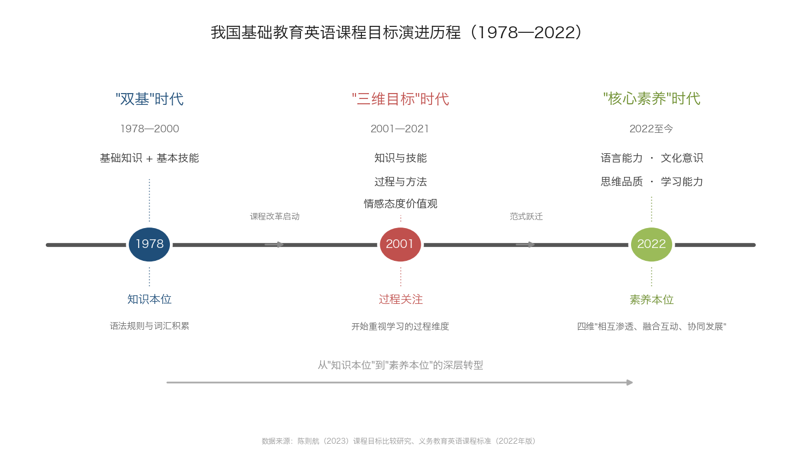
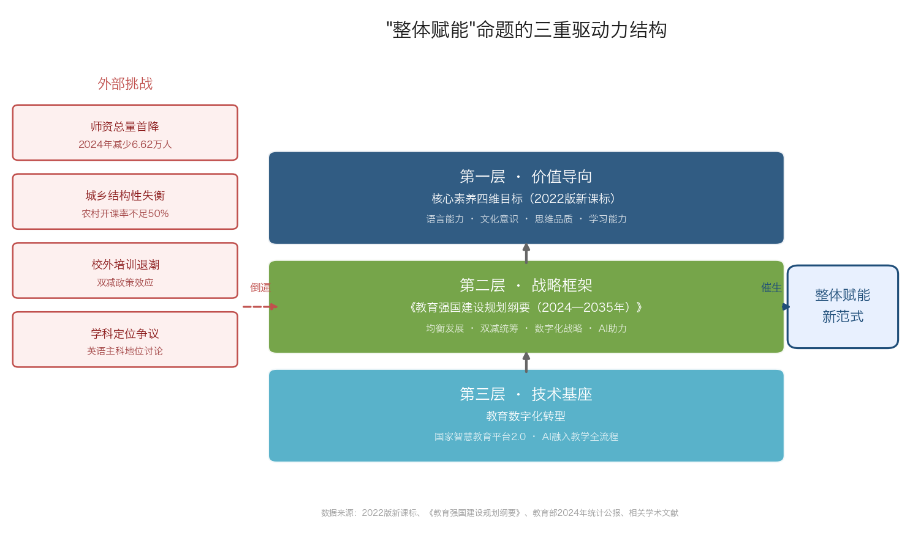
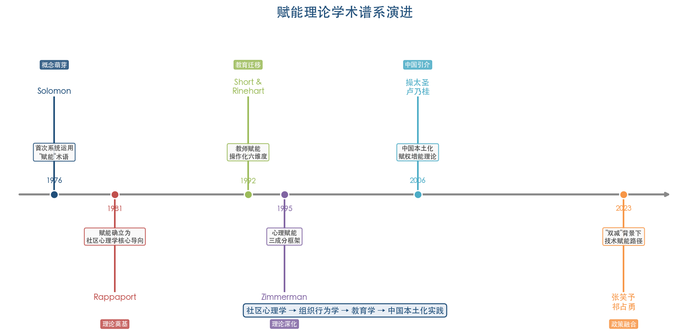
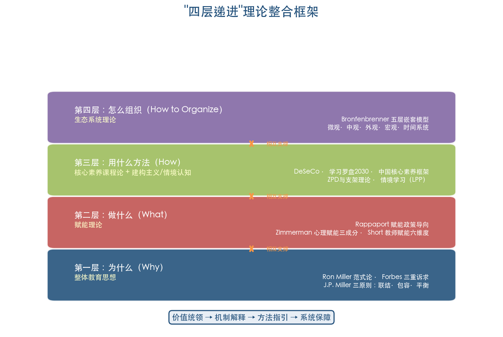
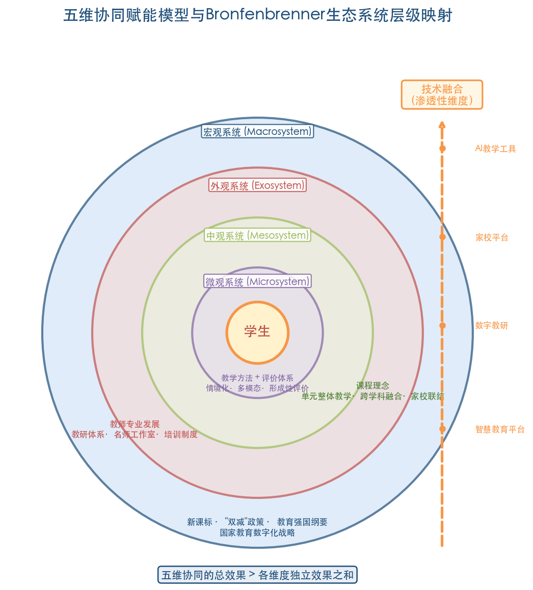

# 摘要

在"双减"政策深入推进、2022版《义务教育英语课程标准》全面实施以及教育数字化转型加速的多重背景下，我国小学英语教育正面临师资结构性短缺、城乡资源失衡、学科定位争议等系统性挑战。传统"单点突破"式改革——或聚焦方法革新，或着力评价工具开发，或侧重技术引入——各维度之间缺乏系统联动，已难以回应上述多重挑战相互交织的现实格局。

本论文提出"整体赋能"（Holistic Empowerment）这一小学英语教育新范式，将其界定为：以核心素养四维目标（语言能力、文化意识、思维品质、学习能力）的综合性和整体性为价值导向，从课程理念、教学方法、评价体系、教师专业发展、技术融合五个维度构建协同赋能系统，使教师获得驾驭全景式教学变革的专业权能，使学生在真实情境中实现核心素养的协同发展。论文整合整体教育思想（Ron Miller, Scott Forbes）、赋能理论（Rappaport, Zimmerman）、核心素养课程论（OECD DeSeCo, 2022版新课标）、建构主义与情境认知理论（Vygotsky, Lave & Wenger）以及Bronfenbrenner生态系统理论，构建了"五维协同赋能模型"的四层递进理论框架——从"为什么"（整体教育的完整性价值取向）到"做什么"（赋能理论的多层次行动机制）再到"用什么方法"（素养导向与支架递进的方法论）直至"怎么组织"（生态系统的嵌套协同结构）。

研究发现，2022版新课标从2011版"综合语言运用能力"五要素的"彼此割裂"走向核心素养四维度的"相互融合"，在课程目标层面确立了"整体性"的内在要求；《教育强国建设规划纲要（2024—2035年）》与教育数字化战略行动则从战略框架与技术基座两个层面为整体赋能提供了制度支撑。五维协同赋能模型的核心命题在于：五个维度之间存在协同效应，整体效果大于各维度独立效果之和——课程理念的素养导向需要教学方法来实现，教学方法的有效运用依赖评价体系的及时反馈与校准，评价改革与方法创新的落地需要教师具备相应专业素养，而技术工具的嵌入为上述各维度的协同运作提供效率放大器与公平均衡器。

本论文以人教版PEP教材为主要案例来源，兼顾低年段与高年段、城市与乡村的差异化教学情境，力求兼具学理深度与一线教学的可操作性，为新手教师理解和实践"整体赋能"范式提供系统性参考。

**关键词：** 整体赋能（Holistic Empowerment）；小学英语教育（Elementary English Education）；核心素养（Core Competencies）；单元整体教学（Unit-based Holistic Teaching）；"教—学—评"一体化（Teaching-Learning-Assessment Integration）；英语学习活动观（English Learning Activity Approach）；AI赋能教育（AI-Empowered Education）；教师专业发展（Teacher Professional Development）

# 第1章 引言——"整体赋能"命题的提出与时代背景

## 1.1 问题的提出：从"碎片化改革"到"整体赋能"

过去四十余年，我国基础教育英语课程经历了从"双基"（基础知识与基本技能）到"三维目标"（知识与技能、过程与方法、情感态度与价值观）再到"核心素养"的三次范式跃迁，映射出从知识本位到素养本位的深层转型[陈则航（2023）](https://www.sohu.com/a/845698532_650698 "从'综合语言运用能力'到'核心素养'——2011年版与2022年版课程目标比较研究，《英语研究》2023年第2期")。每一次范式转换都催生了新一轮教学改革浪潮，然而一线实践中的改革路径往往呈现"单点突破"特征——或聚焦教学方法革新，或着力评价工具开发，或侧重信息技术引入——各维度之间缺乏系统联动。这种碎片化改革格局在面对当前小学英语教育的多重挑战时已显得力不从心。

*图 1-1 我国基础教育英语课程目标演进历程——从"双基"时代（1978—2000）到"三维目标"时代（2001—2021）再到"核心素养"时代（2022至今），课程取向经历了从知识本位到素养本位的深层转型。*

当前小学英语教育面临的困境具有鲜明的结构性与系统性特征。师资方面，2024年全国小学专任教师总数降至659.01万人，较2023年的665.63万人减少6.62万人，为近年首次下降；生师比16.06:1，本科以上学历比例81.35%[教育部统计公报](http://www.moe.gov.cn/jyb_sjzl/sjzl_fztjgb/202506/t20250611_1193760.html "2024年全国教育事业发展统计公报")。城乡均衡方面，农村小学英语教育的结构性困境尤为突出：重庆调研显示偏远农村校点英语开课率不足50%；广东清远调研发现近七成农村小学学生为留守儿童，28.87%的家庭几乎未提供任何英语学习工具或资料，教师队伍中"转岗教师多、专业对口率低"的问题普遍存在[廖莎等（2025）](https://pdf.hanspub.org/ass2025141_282398094.pdf "农村小学英语教育的现状透视与发展策略，《社会科学前沿》2025年第14卷第1期")。乡村小规模学校教师高中和专科学历占比分别为10.17%和42.26%，学历结构重心明显偏低；3—6年级英语成绩优秀率均值仅34.7%，低于大规模学校的42.4%[雷万鹏等（2024）](http://www.jyb.cn/rmtzcg/xwy/wzxw/202407/t20240722_2111225543.html "新时代乡村小规模学校发展面临的困境与突破，中国教育报，2024年7月22日")。

与此同时，"双减"政策（2021年7月）显著压减了学科类校外培训[教育部官网](http://www.moe.gov.cn/jyb_xxgk/moe_1777/moe_1778/202107/t20210724_546576.html "双减意见全文，2021年7月24日")，校外培训的退场将英语学习的主阵地进一步收归校内，对课堂教学质量提出了更高要求。庞小冬等（2025）基于62,956个样本的双重差分（DID）研究表明，"双减"对中低社会经济地位家庭的学科类培训参与和支出产生了显著降低效应，但对高社会经济地位家庭无显著影响，由此存在加剧隐性教育分化的风险[庞小冬等（2025）](https://xbjk.ecnu.edu.cn/CN/10.16382/j.cnki.1000-5560.2025.01.002 "双减政策对学生家庭校外培训参与和支出的影响，《华东师范大学学报（教育科学版）》2025年第43卷第1期")。这意味着，若校内教学无法实现质的提升，"双减"的公平初衷可能因家庭资本差异而部分落空。

更深层的争论触及英语学科的定位本身。2021年，全国政协委员许进建议取消英语在中小学主科地位[中国教育在线](https://news.eol.cn/lh/202103/t20210304_2080989.shtml "许进委员建议取消英语中小学主科地位，2021年3月")；2026年，全国政协委员洪明基建议将高考英语由150分降至100分，并指出"农村考生比城市考生高考英语平均分低约20分"[九派新闻](https://view.inews.qq.com/a/20260313A05UFG00 "多位代表委员热议教育焦点，2026年3月13日")。这些讨论折射出社会对英语教育"高投入、低产出"及公平性问题的焦虑，也从反面印证了英语教育必须回答"为什么教""教什么""怎么教"这些根本性命题。

上述师资短缺、城乡失衡、培训退潮、学科定位争议等挑战并非孤立存在，而是相互交织、彼此强化，构成一幅系统性困境图景。廖莎等（2025）指出，农村地区英语教育政策"往往针对某一个方面，缺少整体考量，导致未能形成合力"[廖莎等（2025）](https://pdf.hanspub.org/ass2025141_282398094.pdf "农村小学英语教育的现状透视与发展策略")。正是这种系统性困境，呼唤一种超越单点突破的新思路——即本论文所倡导的"整体赋能"范式。

## 1.2 政策驱动力：新课标与教育数字化转型

"整体赋能"命题的提出并非凭空构想，而是植根于近年来一系列重大教育政策所形成的制度合力之中。

**2022版新课标：从"综合语言运用能力"到"核心素养"的目标转向。** 2022年4月，教育部正式发布《义务教育英语课程标准（2022年版）》，将课程目标从2011版的"综合语言运用能力"（由语言知识、语言技能、情感态度、学习策略、文化意识五要素构成）转变为"核心素养"四维目标——语言能力、文化意识、思维品质、学习能力。课标明确指出，核心素养的四个方面"相互渗透，融合互动，协同发展"[义务教育英语课程标准（2022年版）](http://www.moe.gov.cn/srcsite/A26/s8001/202204/W020220420582349487953.pdf "《义务教育英语课程标准（2022年版）》")。陈则航（2023）的比较研究进一步揭示，2011版课标五要素"彼此割裂、缺乏互动"，而2022版实现了从"彼此割裂"到"相互融合"的实质转变[陈则航（2023）](https://www.sohu.com/a/845698532_650698 "从'综合语言运用能力'到'核心素养'——2011年版与2022年版课程目标比较研究，《英语研究》2023年第2期")。这一转向在理论层面确立了"整体性"作为课程目标的内在要求，为"整体赋能"提供了最直接的课标依据。

新课标同步推出了两项关键制度创新。其一，课程内容被重构为主题、语篇、语言知识、文化知识、语言技能和学习策略六要素整合结构，其中"主题"具有统领作用，聚焦"人与自我、人与社会、人与自然"三大范畴[任志娟（2022）](https://www.gsier.com.cn/Article.Action?ID=264143 "《义务教育英语课程标准（2022年版）》的特点及教学意蕴，《甘肃教育》2022年第19期")。其二，"英语学习活动观"要求教师以主题为引领，通过学习理解、应用实践、迁移创新三类活动组织教学，体现"在体验中学习、在实践中运用、在迁移中创新"的理念。六要素整合结构与英语学习活动观的制度化，使教学内容与教学过程均被纳入"整体性"框架，教学改革不再可能仅触及单一环节。

**《教育强国建设规划纲要》：宏观战略引领。** 2025年1月19日，中共中央、国务院印发《教育强国建设规划纲要（2024—2035年）》，提出"推动义务教育优质均衡发展和城乡一体化""统筹推进'双减'和教育教学质量提升""实施国家教育数字化战略""促进人工智能助力教育变革"等系统性要求[教育部官网](http://www.moe.gov.cn/jyb_xxgk/moe_1777/moe_1778/202501/t20250119_1176193.html "《教育强国建设规划纲要（2024—2035年）》全文，2025年1月19日")。该纲要将教育数字化、AI赋能、教育公平与质量提升纳入统一战略框架，为英语教育的整体性变革提供了顶层设计支撑。

**教育数字化战略行动：技术赋能加速落地。** 2025年3月28日，教育部召开国家教育数字化战略行动部署会，明确提出将人工智能技术融入教育教学全要素、全过程，并发布国家智慧教育平台2.0智能版[中国教育在线](https://www.eol.cn/news/yaowen/202503/t20250328_2661041.shtml "国家教育数字化战略行动2025年部署会，2025年3月28日")。2026年3月，教育部进一步部署"十五五"时期"人工智能+教育"六大方向，怀进鹏部长强调"人工智能对教育底层逻辑和样态重塑带来系统性影响"[中国教育在线](https://www.eol.cn/news/yaowen/202604/t20260401_2725662.shtml "全面深入推动'人工智能+教育'，2026年4月1日")。上述政策信号表明，技术不再是教学改革的"附加项"，而正成为重塑教育生态的基础设施，为"整体赋能"中的技术维度奠定了坚实的政策基础。

综上，2022版新课标的"核心素养"整体性要求、《教育强国建设规划纲要》的系统性战略部署以及教育数字化的加速推进，共同构成了"整体赋能"命题的三重政策驱动力。三者并非平行并列，而是形成了"价值目标（核心素养）—战略框架（教育强国）—技术基座（数字化转型）"的递进结构（见图 1-2）。

*图 1-2 "整体赋能"命题的三重驱动力结构——以核心素养四维目标为价值导向，以《教育强国建设规划纲要》为战略框架，以教育数字化转型为技术基座，三者递进叠加，同时回应师资下降、城乡失衡、培训退潮、学科定位争议四大外部挑战。*

## 1.3 核心概念界定："整体赋能"的内涵与特征

### 1.3.1 整体教育（Holistic Education）的思想渊源

"整体赋能"概念的形成有赖于两条理论脉络的汇合。第一条脉络是整体教育思想。整体教育兴起于20世纪80年代中期的北美，Ron Miller（1992）将其界定为一种"范式"（paradigm）而非具体教学方法，旨在关注人的智力、身体、精神、情感、社会和审美六维度的整体发展[Mahmoudi et al.（2012）](https://files.eric.ed.gov/fulltext/EJ1066819.pdf "Holistic Education: An Approach for 21 Century, International Education Studies, Vol.5, No.3, 2012")。Scott Forbes（2003）进一步将整体教育的诉求概括为三个层次：教育完整的儿童（educate the whole child）、将学生作为整体来教育（educate the student as a whole）、视儿童为更大整体的一部分（see the child as part of a whole）[Mahmoudi et al.（2012）](https://files.eric.ed.gov/fulltext/EJ1066819.pdf "Holistic Education: An Approach for 21 Century")。这种"完整性"取向与2022版新课标核心素养四维度"相互渗透，融合互动，协同发展"的理念形成了跨文化的内在呼应。

### 1.3.2 赋能理论（Empowerment Theory）的教育迁移

第二条脉络是赋能理论。"赋能"（empowerment）概念最初由Rappaport（1981）作为社区心理学的核心政策导向提出[Rappaport（1981）](https://link.springer.com/article/10.1007/BF00896357 "In Praise of Paradox, American Journal of Community Psychology, 1981")。Zimmerman（1995）将其操作化为心理赋能（Psychological Empowerment）的三组成部分：内在心理成分（对自身能力与效能的感知）、互动成分（对社会政治环境的批判性理解）、行为成分（参与社区行动的实际行为）[Zimmerman（1995）](https://link.springer.com/article/10.1007/BF02506983 "Psychological Empowerment: Issues and Illustrations, American Journal of Community Psychology, 1995")。赋能理论迁移至教育领域后，赋能主体从社区成员拓展为教师与学生：教师赋能强调教师在决策、专业成长、自主性等方面获得实质性权能；学生赋能则强调学习者主体性、自我效能与批判性思维的培育。

### 1.3.3 "整体赋能"的操作性定义

基于上述两条理论脉络，本论文将"整体赋能"（Holistic Empowerment）界定为：**以核心素养四维目标的综合性和整体性为价值导向，从课程理念、教学方法、评价体系、教师专业发展、技术融合五个维度构建协同赋能系统，使教师获得驾驭全景式教学变革的专业权能，使学生在真实情境中实现语言能力、文化意识、思维品质和学习能力的协同发展。**

这一定义包含三个关键特征。其一，**整体性**：五个维度并非相互独立的改革清单，而是构成有机关联的系统，任何单一维度的变革都需要其他维度的协同支撑。其二，**赋能性**：改革的最终目的不是将教师和学生变为制度规范的被动执行者，而是激发其内在的专业判断力（教师）与学习自主性（学生）。其三，**协同性**：五维之间存在协同效应（synergy），即系统整体效果大于各维度独立效果之和。

"整体赋能"区别于既有范式的关键在于：它既非单纯的教学方法创新（如情境教学、任务型教学），也非单一的制度安排（如"教—学—评"一体化），更非技术工具的简单叠加（如AI辅助教学），而是试图在上述诸维度之间建立结构性联结，形成能够回应系统性挑战的系统性方案。

## 1.4 研究问题与论文结构

基于上述背景分析与概念界定，本论文围绕以下核心研究问题展开：

1. **理论基础问题**：哪些教育学、语言学和课程论的经典理论可为"整体赋能"范式提供学理支撑？如何将整体教育思想、赋能理论、核心素养课程论、建构主义与情境认知理论整合为内在一致的分析框架？
2. **课程设计问题**：在"整体赋能"视角下，如何以主题意义探究为主线，实现语言知识、语言技能、文化意识和思维品质的有机整合？单元整体教学设计的操作路径和实施策略是什么？
3. **教学方法问题**：哪些教学方法能在有限课时内同时促进语言习得与核心素养发展？如何使方法选择服务于整体赋能而非碎片化技巧堆砌？
4. **评价变革问题**：如何建立多元化、过程化、素养导向的评价机制，使评价成为驱动教学改进和学生发展的赋能工具？
5. **支撑条件问题**：AI及数字技术如何深度融入小学英语教学全流程？教师应具备怎样的专业素养才能驾驭"整体赋能"范式？新手教师如何分步实现专业成长？

围绕以上问题，本论文共分六章。第1章（本章）阐明命题的提出背景、核心概念界定与研究框架；第2章构建"整体赋能"的理论基础，整合整体教育、赋能理论、核心素养课程论、建构主义/情境认知理论与生态系统理论，提出"五维协同赋能模型"；第3章聚焦课程理念维度，探讨素养导向的单元整体教学设计路径；第4章系统梳理情境化教学、多模态教学、深度学习等教学方法论，阐释方法整合服务于素养整体发展的实践逻辑；第5章探讨"教—学—评"一体化的评价体系变革，涵盖形成性评价、表现性评价和非纸笔测评等前沿实践；第6章论述技术融合与教师专业发展两大支撑条件，为新手教师提供可操作的分步成长策略，并展望"整体赋能"范式的发展方向。

全文以人教版PEP教材为主要案例来源，兼顾低年段与高年段、城市与乡村的差异化教学情境，力求兼具学理深度与一线教学的可操作性，为新手教师理解和实践"整体赋能"范式提供系统性参考。

# 第2章 理论基础——整体赋能范式的学理支撑

"整体赋能"（Holistic Empowerment）作为本论文提出的小学英语教育新范式，并非概念层面的简单拼贴，而是植根于多条成熟学术脉络的理论整合。本章旨在回答两个相互关联的核心问题：其一，哪些教育学、语言学和课程论的经典理论可为"整体赋能"提供学理依据？其二，如何将这些分属不同学科传统的理论整合为内在一致的分析框架？围绕上述问题，本章依次梳理整体教育思想、赋能理论、核心素养课程论、建构主义与情境认知理论以及生态系统理论，并在此基础上提出"五维协同赋能模型"的理论建构逻辑。

## 2.1 整体教育思想：从"碎片化"到"完整性"的范式转换

### 2.1.1 整体教育的思想起源与范式定位

整体教育（Holistic Education）兴起于20世纪80年代中期的北美，是对主流教育中碎片化、还原论取向的系统性反思。Ron Miller在《What Are Schools For? Holistic Education in American Culture》（2nd ed., 1992, Holistic Education Press）中将整体教育明确定位为一种"范式"（paradigm）而非具体方法或技术——"not a particular method or technique; it must be seen as a paradigm"[Mahmoudi et al.（2012）](https://files.eric.ed.gov/fulltext/EJ1066819.pdf "Holistic Education: An Approach for 21 Century, International Education Studies, Vol.5, No.3, 2012")。这一定位具有重要的方法论意义：整体教育所提供的并非一组可直接移植的操作技术，而是一套审视教育目的与过程的根本性思维框架。

Miller（2000）进一步为整体教育识别了五个层次的完整性：完整的个人（涵盖身体、情感、智力、社会、审美、精神六要素）、社区中的完整性、社会中的完整性、完整的地球以及完整的宇宙[Mahmoudi et al.（2012）](https://files.eric.ed.gov/fulltext/EJ1066819.pdf "Holistic Education: An Approach for 21 Century")。这种多层嵌套的完整性观念，为理解小学英语教育中"整体"的内涵提供了重要启示——"整体"不仅指学生个体发展的多维性，也涵括教育生态系统中学校、社区、政策等多层次间的协同关系。

### 2.1.2 Scott Forbes的三重诉求与John P. Miller的课程理论

Scott Forbes（2003）在《Holistic Education: An Analysis of Its Ideas and Nature》中将整体教育的核心诉求概括为三个递进层次：教育完整的儿童（educate the whole child）、将学生作为整体来教育（educate the student as a whole）、视儿童为更大整体的一部分（see the child as part of a whole）[Mahmoudi et al.（2012）](https://files.eric.ed.gov/fulltext/EJ1066819.pdf "Holistic Education: An Approach for 21 Century")。三个层次依次聚焦发展的多维性、教育方式的整合性，以及个体在社会与生态关系中的嵌入性。Forbes同时提出"终极性"（Ultimacy）的目标取向，认为教育应超越工具理性，指向人的终极价值实现。

John P. Miller的整体课程理论（《The Holistic Curriculum》, 3rd ed., 2019, University of Toronto Press）则将整体教育从哲学理念落实到课程设计层面，提出"转化模型"（transformation model）的课程定位，其核心原则为联结（Connection）、包容（Inclusion）与平衡（Balance）[Mahmoudi et al.（2012）](https://files.eric.ed.gov/fulltext/EJ1066819.pdf "Holistic Education: An Approach for 21 Century")。"联结"要求课程建立学科间、身心间、个人与社区间的多重联系；"包容"容纳多元教学哲学而非采取非此即彼的立场；"平衡"追求知识传授与体验学习、个体发展与社会参与之间的动态均衡。三者共同构成整体课程设计的方法论基础。

### 2.1.3 整体教育的理论基础谱系

Mahmoudi等（2012）综合多位学者的研究成果，梳理出整体教育的六大理论基础：永恒哲学（Perennial Philosophy）、原住民世界观（Indigenous Perspectives）、生命哲学（Vitalism）、生态世界观（Ecological Worldview）、系统论（Systems Theory）和女性主义思想（Feminism）[Mahmoudi et al.（2012）](https://files.eric.ed.gov/fulltext/EJ1066819.pdf "Holistic Education: An Approach for 21 Century")。在上述六大基础中，系统论为整体教育提供了关键的认识论支撑——教育系统中的各要素并非孤立运作，而是通过复杂的反馈回路和涌现性（emergence）形成有机整体。这一系统论视角与本论文后文提出的"五维协同赋能模型"在认识论层面高度契合。

### 2.1.4 整体教育对小学英语教育的适用性

整体教育虽起源于北美的通识教育哲学传统，但其核心理念与中国基础教育英语课程改革的方向存在深层契合。《义务教育英语课程标准（2022年版）》将课程目标从2011版的"综合语言运用能力"转变为"核心素养"四维目标——语言能力、文化意识、思维品质、学习能力，并明确要求四个维度"相互渗透、融合互动、协同发展"，共同构成有机整体。陈则航（2023）通过对比两版课标指出，2011版课标五要素"彼此割裂、缺乏互动"，2022版则实现了从"彼此割裂"到"相互融合"的实质性转变[陈则航学术论文](https://www.sohu.com/a/845698532_650698 "从'综合语言运用能力'到'核心素养'——2011年版与2022年版课程目标比较研究，《英语研究》2023年第2期")。这种从割裂到融合的转型，本质上即是整体教育"完整性"理念在英语学科课程中的具体映射。

Ron Miller"范式而非方法"的定位同时提醒我们：小学英语教育改革不能停留在单一教学方法的局部更新，而需要从课程理念、教学方法、评价体系、教师发展到技术融合的系统性变革——这正是本论文所倡导的"整体赋能"范式的核心主张。

## 2.2 赋能理论：从社区心理学到教育实践的迁移

### 2.2.1 赋能理论的起源与核心框架

"赋能"（Empowerment）作为学术概念的系统化始于社区心理学领域。Julian Rappaport（1981）在《American Journal of Community Psychology》发表的经典论文"In Praise of Paradox"中，首次将赋能确立为社区心理学的核心政策导向，主张从"缺陷视角"转向"优势视角"，强调个体和社区自身具备应对挑战的潜能[Rappaport（1981）](https://link.springer.com/article/10.1007/BF00896357 "In Praise of Paradox, American Journal of Community Psychology, 1981")。这一思想奠定了赋能理论的基本信条：赋能并非自上而下的"给予"，而是创造条件使个体和组织能够发现、发展并运用自身力量。

Marc Zimmerman（1995）在此基础上提出心理赋能（Psychological Empowerment, PE）的三组成部分框架：内在心理成分（intrapersonal component），即对自身能力和效能的感知；互动成分（interactional component），即对社会政治环境的批判性理解；行为成分（behavioral component），即参与社区行动的实际行为[Zimmerman（1995）](https://link.springer.com/article/10.1007/BF02506983 "Psychological Empowerment: Issues and Illustrations, American Journal of Community Psychology, 1995")。Zimmerman（2000）进一步将赋能理论扩展为个体赋能、组织赋能和社区赋能三个分析层次，每个层次均包含赋能过程与赋能结果两个维度，由此构成了一个涵盖微观心理机制与宏观社会结构的完整理论体系。

图2-1呈现了赋能理论从社区心理学到教育实践的学术谱系演进脉络，涵盖1976年Solomon的概念萌芽、1981年Rappaport的理论奠基、1992年Short & Rinehart的教育迁移、1995年Zimmerman的理论深化，以及2006年中国本土化引介和2023年"双减"背景下技术赋能路径的最新发展。

### 2.2.2 赋能理论在教育领域的迁移

赋能理论从社区心理学向教育领域的迁移，集中体现在"教师赋能"（Teacher Empowerment）研究脉络中。Short & Rinehart（1992）将教师赋能操作化为六个维度：决策参与（decision making）、专业成长（professional growth）、地位（status）、自主性（autonomy）、自我效能（self-efficacy）和影响力（impact）。这一操作化框架将抽象的赋能概念转化为可测量、可干预的教育管理变量，为后续实证研究奠定了基础。

Lee, Nie & Bai（2016）基于304名新加坡教师的实证研究进一步揭示，多层级领导（multi-level leadership）的协同赋能对教师心理赋能至关重要——仅有校长层面的赋权而缺少中层管理者和同伴层面的支持，教师赋能效果将显著减弱[Lee & Nie（2016）](https://files.eric.ed.gov/fulltext/EJ1211390.pdf "Teachers' Perceptions of School Leader Empowering Behaviors on Psychological Empowerment, 2016")。这一发现对小学英语教育具有直接启示意义：教师的整体赋能需要校长、教研组长、备课组及同伴之间的多层级协同，任何单一层级的赋权行为都难以产生持久效果。

### 2.2.3 从"教师赋能"到"整体赋能"的概念延伸

将赋能理论的分析视野从"教师赋能"扩展到"整体赋能"，是本论文的核心理论贡献之一。Rappaport-Zimmerman框架中"个体—组织—社区"三层分析结构，为将赋能对象从教师个体扩展到整个教育系统提供了理论依据：学生通过参与性学习获得学习赋能，教师通过专业发展获得教学赋能，学校通过组织变革获得制度赋能，区域教研共同体通过协作网络获得生态赋能。由此，"整体赋能"不再局限于对某一个主体的单向赋权，而是教育系统中多主体、多层次、多维度的协同赋能过程。

## 2.3 核心素养课程论：国际比较与中国路径

### 2.3.1 OECD DeSeCo项目与素养的国际定义

核心素养（Key Competencies）的国际定义框架源于OECD于1997年启动、2003年发布最终报告的DeSeCo（Definition and Selection of Competencies）项目。该项目将关键素养划分为三大类别：在社会异质群体中互动（interacting in socially heterogeneous groups）、自主行动（acting autonomously）和互动地使用工具（using tools interactively）。其核心假设在于，"应对复杂需求需要动员认知与实践技能、创造性能力及心理社会资源"[Rychen（2019）](https://www.oecd.org/content/dam/oecd/en/about/projects/edu/education-2040/concept-notes/thought-leader-written-statements/Thought_leader_written_statement_Rychen.pdf "OECD Learning Compass 2030 – Alignment with DeSeCo")。DeSeCo项目的关键贡献在于确立了素养的"整合性"（integrative）本质——素养并非知识、技能和态度的简单相加，而是三者在特定情境中的有机整合与动态调用。

在DeSeCo基础上，OECD 2030学习罗盘（Learning Compass 2030）进一步提出三项变革性素养（transformative competencies）：创造新价值（creating new value）、调和张力与困境（reconciling tensions and dilemmas）、承担责任（taking responsibility）[Rychen（2019）](https://www.oecd.org/content/dam/oecd/en/about/projects/edu/education-2040/concept-notes/thought-leader-written-statements/Thought_leader_written_statement_Rychen.pdf "OECD Learning Compass 2030")。从"选择与定义"到"面向未来变革"的演进，体现了核心素养课程论自身的动态发展特征，也为各国课程改革提供了更具前瞻性的参照坐标。

### 2.3.2 中国核心素养框架：从国家层面到英语学科

2016年9月，由林崇德教授牵头研制的《中国学生发展核心素养》总体框架正式发布，以"全面发展的人"为核心，划分为文化基础、自主发展、社会参与三个方面，涵盖人文底蕴、科学精神、学会学习、健康生活、责任担当、实践创新六大素养，下设十八个基本要点[人民网（2016）](http://edu.people.com.cn/n1/2016/1115/c1053-28860411.html "《学生发展核心素养》总体框架发布，人民日报，2016年11月15日")。该框架深受OECD DeSeCo项目影响，同时融入了中国教育传统中"立德树人"的价值取向，形成了兼具国际视野与本土特色的素养话语体系。

在英语学科层面，《义务教育英语课程标准（2022年版）》将学科核心素养具体化为语言能力、文化意识、思维品质、学习能力四个维度，并特别强调四维之间"相互渗透、融合互动、协同发展"的关系，而非将其视为四个平行独立的目标。陈则航（2023）对比两版课标后指出，这一转变意味着英语课程目标从"要素罗列"走向"有机整体"[陈则航学术论文](https://www.sohu.com/a/845698532_650698 "从'综合语言运用能力'到'核心素养'——2011年版与2022年版课程目标比较研究")。从宏观历史维度审视，中国基础教育英语课程经历了"双基"（基础知识与基本技能）到"三维目标"（知识与技能、过程与方法、情感态度与价值观）再到"核心素养"的三次范式转型（1978→2001→2022），每一次转型都指向更高层次的整合性与整体性。

### 2.3.3 核心素养课程论与"整体赋能"的理论关联

核心素养课程论为"整体赋能"范式提供了"素养整合性"的课程论基础。DeSeCo将素养定义为知识、技能和态度在情境中的整合调用，2022版新课标则要求四维核心素养"协同发展"——两者共同指向一个核心命题：素养的培养无法通过碎片化的知识传授和技能训练实现，而需要整体性的课程设计、教学实施和评价反馈系统的协同支撑。"整体赋能"范式正是对这一命题的系统性回应：它不满足于在某一个维度上实现素养导向的局部改良，而是追求从课程理念到教学方法、从评价体系到教师发展、从技术融合到制度保障的全维度协同转型。

## 2.4 建构主义与情境认知：学习何以发生

### 2.4.1 最近发展区与支架理论

Vygotsky的最近发展区（Zone of Proximal Development, ZPD）理论揭示了学习的本质机制：有意义的学习发生在学习者独立完成能力与帮助下完成能力之间的区间。在这一区间内，学习者通过与更有能力的他者（教师、同伴）的社会性互动，逐步内化新的认知结构和行为模式。Wood, Bruner & Ross（1976）在《Journal of Child Psychology and Psychiatry》发表的"The Role of Tutoring in Problem Solving"一文中首次提出"支架"（Scaffolding）概念，将教师或辅导者的角色比喻为建筑工程中的脚手架——在学习者需要时提供结构化支持，随着学习者能力的增长逐步撤除。

ZPD与支架理论的联合框架对小学英语教学具有直接的指导价值。教师需要准确诊断学生的当前发展水平，设计处于其最近发展区内的学习任务——既非过于简单以致缺乏认知挑战，也非过于困难以致产生挫败感——并在任务过程中提供恰当的支持。这一框架与2022版新课标"英语学习活动观"中从"学习理解"到"应用实践"再到"迁移创新"的三层递进设计在认知逻辑上高度一致：每一层活动均建立在前一层基础上的最近发展区拓展之上，教师通过差异化支架帮助不同水平的学生实现跨层跃升。

### 2.4.2 情境学习与合法的边缘性参与

Lave & Wenger（1991）在《Situated Learning: Legitimate Peripheral Participation》（Cambridge University Press）中提出情境学习理论，其核心概念"合法的边缘性参与"（Legitimate Peripheral Participation, LPP）从根本上重新界定了学习的本质[Cambridge University Press](https://www.cambridge.org/highereducation/books/situated-learning/6915ABD21C8E4619F750A4D4ACA616CD "Situated Learning, Cambridge University Press, 1991")。在这一理论框架下，学习并非脱离情境的知识传递过程，而是学习者在实践共同体（community of practice）中从边缘参与者逐渐成长为充分参与者的社会化历程。知识不是存储在个体头脑中的抽象符号，而是嵌入在社会实践的具体情境之中。

情境学习理论对小学英语教育的启示尤为深刻。英语作为语言学科，其学习本质上是一种社会实践——学习者需要在真实或仿真的交际情境中使用语言来完成有意义的任务。2022版新课标提出的"英语学习活动观"——学习理解、应用实践、迁移创新三类活动——与LPP理论呈现结构性契合："学习理解"阶段对应边缘性参与，学习者在教师支架支持下接触新的语言材料；"应用实践"阶段对应从边缘到核心的参与过渡，学习者在相对真实的情境中运用语言；"迁移创新"阶段对应充分参与，学习者在新情境中自主创造性地使用语言解决实际问题。

### 2.4.3 建构主义学习观对教学设计的整体性要求

建构主义和情境认知理论共同构成了"整体赋能"范式在教学过程层面的理论基础。两种理论的核心共识在于：有意义的学习无法在去情境化、去社会化的真空中发生。这一认识对教学设计提出了整体性要求——课堂中的语言输入、任务设计、互动结构、评价反馈必须构成一个有机系统，共同指向学生在真实情境中的意义建构。碎片化的知识点操练和脱离语境的机械训练，在建构主义视角下不仅效率低下，而且从认知机制层面背离了学习发生的基本条件。

## 2.5 生态系统理论：理解教育变革的结构性框架

### 2.5.1 Bronfenbrenner生态系统模型

Urie Bronfenbrenner（1979, 1994）提出的生态系统理论（Ecological Systems Theory）为理解影响儿童发展的多层次环境因素提供了经典分析框架。该理论将环境划分为五个嵌套层次：微观系统（microsystem，儿童直接参与的环境，如家庭、课堂）、中观系统（mesosystem，微观系统之间的联系，如家校合作）、外观系统（exosystem，儿童未直接参与但间接影响其发展的环境，如教育行政部门、社区资源）、宏观系统（macrosystem，文化、政策、社会价值观等宏观因素）以及时间系统（chronosystem，环境变化的时间维度）[Tian & Abbas（2024）](https://pmc.ncbi.nlm.nih.gov/articles/PMC10801006/ "Review of studies applying Bronfenbrenner's bioecological theory, Frontiers in Psychology, 2024")。

Bronfenbrenner后期将这一理论发展为PPCT（Process-Person-Context-Time）生物生态学模型，强调个体发展是个人特征、环境特征和近端过程（proximal processes）在时间维度上交互作用的产物。该理论视角的核心价值在于揭示了一个关键命题：教育变革不能仅在单一层级上发力，而需要在多个嵌套层次上形成协同效应，方能产生持久而深入的影响。

### 2.5.2 生态系统理论与小学英语教育的对应关系

将Bronfenbrenner的五层嵌套模型映射到小学英语教育场域，各层次对学生英语学习与发展的作用路径清晰可辨：微观系统层面，课堂教学方法、师生互动模式、评价反馈机制直接作用于学生的学习体验；中观系统层面，英语教师与班主任的协作、家校沟通中的英语学习支持构成重要的联结网络；外观系统层面，学校教研制度、区域教研共同体的运作模式间接塑造教学质量；宏观系统层面，《义务教育英语课程标准（2022年版）》《教育强国建设规划纲要（2024—2035年）》等政策文件设定了教育改革的方向与边界；时间系统层面，从"双基"到"三维目标"再到"核心素养"的历史演进构成了理解当下改革的纵深背景。

廖莎等（2025）对农村小学英语教育的调研，恰恰揭示了多层次困境交织的典型图景：微观系统中师资短缺（转岗教师多、专业对口率低）直接制约教学质量，中观系统中家庭英语辅导几近缺位——28.87%的家庭未提供任何英语学习工具或资料，外观系统中区域教研资源匮乏，而宏观系统中的政策则往往"针对某一个方面，缺少整体考量，导致未能形成合力"[廖莎等（2025）](https://pdf.hanspub.org/ass2025141_282398094.pdf "农村小学英语教育的现状透视与发展策略，《社会科学前沿》2025年第14卷第1期")。这一多层次的系统性困境表明，任何试图仅在单一层级进行"单点突破"的改革策略，都难以从根本上改善教育质量——这正是"整体赋能"范式主张在多层级协同发力的实证依据。

## 2.6 五维协同赋能模型：理论整合与框架建构

### 2.6.1 理论整合的四层递进逻辑

基于以上多条理论脉络的系统梳理，本节提出"五维协同赋能模型"的理论建构逻辑。该模型的理论整合遵循四层递进关系：

**第一层：整体教育回答"为什么"。** Ron Miller的整体教育范式提供了根本性的价值取向——教育应关注人的完整发展，反对碎片化与还原论。这一"完整性"理念构成"整体赋能"范式的价值论基础。

**第二层：赋能理论回答"做什么"。** Rappaport-Zimmerman的赋能理论框架提供了多层次赋能机制——从个体自我效能的提升到组织条件的改善再到社区生态的优化。"赋能"而非"给予"的核心理念意味着，教育改革的目标不是替学生和教师做事，而是创造条件激发其自身的潜能与力量。

**第三层：核心素养课程论和建构主义/情境认知回答"用什么方法"。** DeSeCo和2022版新课标的核心素养框架指明了素养导向的目标体系，Vygotsky的ZPD与支架理论揭示了认知发展的内在机制，Lave & Wenger的情境学习理论阐明了学习发生的社会性情境条件。三者共同为教学设计、课程实施和评价反馈提供了方法论依据。

**第四层：Bronfenbrenner生态系统理论回答"怎么组织"。** 五层嵌套结构揭示了教育变革需要在课堂、学校、区域、政策等多个层级上形成协同效应，单一层级的改革难以产生系统性效果。

图2-2以阶梯形式呈现了上述四层递进逻辑，底层"为什么"（整体教育思想）为价值统领，依次经由"做什么"（赋能理论）的机制解释、"用什么方法"（核心素养课程论与建构主义/情境认知）的方法指引，到达顶层"怎么组织"（生态系统理论）的系统保障。

### 2.6.2 五维协同赋能模型的内涵

在上述四层理论逻辑的支撑下，"五维协同赋能模型"将"整体赋能"操作化为五个相互关联的实践维度：

1. **课程理念维度**：以核心素养为导向，以主题意义探究为主线，实施单元整体教学设计。该维度回应"教什么"和"为什么教"的根本性问题，在生态系统理论中对应从微观系统到宏观系统的贯通。

2. **教学方法维度**：综合运用情境化教学、任务型教学、多模态教学和深度学习策略，在真实或仿真情境中促进学生的意义建构与素养发展。该维度运作于微观系统层面，是ZPD与支架理论、情境学习理论在课堂实践中的直接落地。

3. **评价体系维度**：建立"教—学—评"一体化机制，以形成性评价为主、终结性评价为辅，使评价从甄别筛选工具转化为驱动学习的赋能机制。该维度同样运作于微观系统，体现赋能理论中"过程导向"和"优势视角"的核心原则。

4. **教师专业发展维度**：通过行动研究、教研共同体建设、数字素养提升等路径，推动教师从经验型向研究型转变，实现教师的多层次赋能。该维度涉及中观系统和外观系统，直接回应Short & Rinehart（1992）教师赋能六维度的实践需求。

5. **技术融合维度**：将AI及数字技术作为渗透各维度的赋能工具，在伦理和安全的约束下提升教学效能与教育公平。该维度具有跨系统渗透性——从微观系统中的智能语音评测到宏观系统中的国家智慧教育平台，技术贯穿所有层级。

### 2.6.3 "协同效应"：五维之间的关系逻辑

五个维度之间并非简单并列，而是存在"协同效应"（synergy）——整体效果大于各维度独立效果之和。具体而言，课程理念的素养导向需要与之匹配的教学方法来实现，教学方法的有效运用依赖评价体系的及时反馈与校准，评价改革和方法创新的落地需要教师具备相应的专业素养，而技术工具的嵌入则为上述各维度的协同运作提供效率放大器和公平均衡器。任何一个维度的缺失或滞后，都将制约其他维度的效果发挥。

这种协同关系与Bronfenbrenner生态系统理论中嵌套层次之间的交互作用逻辑一致：教学方法和评价体系运作于微观系统，课程理念横跨微观和中观系统，教师专业发展涉及中观和外观系统，技术融合渗透各层级，而新课标和教育政策则构成宏观系统的制度框架[Tian & Abbas（2024）](https://pmc.ncbi.nlm.nih.gov/articles/PMC10801006/ "Bronfenbrenner's bioecological theory, Frontiers in Psychology, 2024")。五维模型正是将生态系统的嵌套性转化为教育实践中可操作、可分析的维度框架。

图2-3以Bronfenbrenner同心圆嵌套结构为骨架，将五维协同赋能模型的五个维度映射到对应的生态系统层级：微观系统对应教学方法与评价体系，中观系统对应课程理念，外观系统对应教师专业发展，宏观系统对应新课标及教育政策，技术融合作为渗透性维度贯穿各层级。底部标注的"五维协同的总效果＞各维度独立效果之和"直观呈现了协同效应的核心命题。

## 2.7 本章小结

本章构建了"整体赋能"范式的理论基础，其学理支撑呈四层递进结构：整体教育思想提供"完整性"的价值论基础，赋能理论提供"多层次赋能"的行动论框架，核心素养课程论与建构主义/情境认知理论提供"素养导向、支架递进、情境嵌入"的方法论依据，Bronfenbrenner生态系统理论提供"嵌套协同"的组织论框架。在此基础上提出的"五维协同赋能模型"——课程理念、教学方法、评价体系、教师专业发展、技术融合——将上述多条理论脉络整合为一个内在一致的分析框架，为后续各章的实践分析提供统一的理论坐标系。

# 结论

本论文围绕"整体赋能"（Holistic Empowerment）这一小学英语教育新范式，从命题提出的时代背景与学理支撑两个层面展开了系统性探讨，形成以下核心结论。

**第一，系统性困境呼唤系统性方案。** 当前我国小学英语教育面临的挑战并非单一维度的问题，而是师资结构性短缺（2024年全国小学专任教师首次下降至659.01万人）、城乡资源失衡（农村偏远校点英语开课率不足50%、留守儿童家庭英语辅导几近缺位）、"双减"政策下培训退潮与隐性分化风险、学科定位争议等多重困境的交织与叠加。廖莎等（2025）的调研揭示，农村地区英语教育政策"往往针对某一个方面，缺少整体考量"[廖莎等（2025）](https://pdf.hanspub.org/ass2025141_282398094.pdf "农村小学英语教育的现状透视与发展策略")。这种系统性困境决定了"单点突破"式改革难以奏效，唯有从课程理念、教学方法、评价体系、教师专业发展、技术融合五个维度协同发力，才有可能产生结构性改善。

**第二，"整体赋能"范式具有坚实的多学科理论基础。** 本论文构建的四层递进理论框架——整体教育思想回答"为什么"（完整性的价值取向）、赋能理论回答"做什么"（多层次赋能机制）、核心素养课程论与建构主义/情境认知理论回答"用什么方法"（素养导向、支架递进、情境嵌入）、Bronfenbrenner生态系统理论回答"怎么组织"（嵌套协同结构）——将分属不同学科传统的理论脉络整合为内在一致的分析框架。这一整合并非概念层面的简单拼贴，而是遵循从价值论到行动论、从方法论到组织论的递进逻辑，为"五维协同赋能模型"提供了完整的学理支撑。

**第三，政策环境为整体赋能范式的落地提供了关键制度支撑。** 2022版新课标将核心素养四维目标确立为"相互渗透、融合互动、协同发展"的有机整体，在课程目标层面奠定了整体性的内在要求；《教育强国建设规划纲要（2024—2035年）》将教育公平、质量提升与数字化转型纳入统一战略框架；教育部"十五五"时期"人工智能+教育"部署进一步加速了技术赋能的制度化进程。三重政策驱动力形成了"价值目标—战略框架—技术基座"的递进结构，为整体赋能范式从理论走向实践创造了有利的制度条件。

**第四，五维协同赋能模型的核心在于"协同效应"。** 五个维度之间并非平行独立，而是存在结构性联结：课程理念设定方向，教学方法承载实施，评价体系提供反馈与校准，教师专业发展确保人力支撑，技术融合贯穿各层级提供效率放大与公平均衡。任何单一维度的缺失或滞后都将制约其他维度的效果发挥。这种协同关系与Bronfenbrenner生态系统理论中嵌套层次之间的交互作用逻辑一致[Tian & Abbas（2024）](https://pmc.ncbi.nlm.nih.gov/articles/PMC10801006/ "Bronfenbrenner's bioecological theory, Frontiers in Psychology, 2024")，也意味着教育改革的推进策略需要从"单维优化"转向"多维协同"。

**对一线教师的启示。** "整体赋能"范式对教师的核心要求并非一次性全面转型，而是在理解整体框架的前提下分步推进。新手教师可优先从丰富教学方法（情境化教学、多模态教学）切入，逐步过渡到单元整体教学设计与"教—学—评"一体化实践，进而融入技术工具与跨学科整合。这一渐进路径与Berliner教师专业发展五阶段模型和Vygotsky最近发展区理论的认知逻辑一致——教师自身的专业成长同样需要处于"最近发展区"的支架支持。

本研究作为理论与经验总结型研究，主要基于文献分析与已有实践案例的系统整合，尚未包含原创量化实验设计或大样本调查；案例来源亦偏向城市发达地区学校，农村小学的实践验证有待后续研究补充。五维协同效应的量化验证、不同区域条件下赋能路径的适应性调整，以及AI深度融入小学英语教学的前瞻性探索，构成了后续研究的重要方向。
