# Overview

The individualization of motor skill instruction has long been constrained by a structural mismatch: effective movement learning depends on timely, specific, and modality-appropriate feedback, yet real-world sports instruction — from school physical education to recreational fitness — operates under resource conditions that make such feedback impractical at scale. Bloom's (1984) landmark finding that one-on-one tutoring improves student performance by two standard deviations established the pedagogical benchmark; four decades of intelligent tutoring system (ITS) research have demonstrated that adaptive computer-based systems can approach this benchmark for cognitive and declarative learning domains, with meta-analytic effect sizes of d = 0.66–0.76. The psychomotor domain — encompassing the coordinated physical movements central to sports — has remained a conspicuous frontier, underserved by both ITS research and conventional coaching practice.

Simultaneously, a convergence of mature sensing technologies and advanced artificial intelligence has rendered the continuous, objective measurement of athletic performance increasingly accessible. Markerless pose estimation through consumer-grade cameras, sub-centimeter wearable positioning, clinically accurate physiological monitoring, and real-time deep learning inference have collectively lowered the cost and complexity thresholds for multimodal data acquisition in sports environments. The fusion of these heterogeneous data streams — vision, inertial measurement, physiological signals, audio, and environmental sensing — into coherent, actionable representations constitutes the computational foundation upon which a new class of intelligent tutoring system can be built.

This report examines the construction and application of Sports Intelligent Tutoring Systems (Sports-ITS) driven by multimodal data fusion. A Sports-ITS, as defined herein, is an adaptive, computer-based system that acquires multimodal data about the learner's movement, physiological state, and learning context; fuses these heterogeneous streams into joint representations; maintains a dynamic learner model tracking motor skill proficiency, physical condition, and learning progress; applies pedagogical reasoning to select appropriate instructional strategies; and delivers individualized feedback through visual, auditory, haptic, or immersive modalities.

The investigation proceeds across seven chapters. Chapter 1 traces the dual-track evolution of intelligent tutoring systems and sports sensing technologies toward their present convergence, establishing the scalability imperative, market dynamics, and policy momentum that motivate Sports-ITS development. Chapter 2 provides a systematic taxonomy of the multimodal data modalities relevant to sports contexts — computer vision, inertial and wearable sensors, physiological signals, audio, and environmental data — evaluating each for information content, accuracy, cost, and deployment constraints. Chapter 3 surveys the computational fusion methods that transform these heterogeneous streams into joint representations, from classical early/intermediate/late fusion through attention-based Transformer architectures, graph neural networks, LLM-based late fusion, and motion foundation models. Chapter 4 synthesizes a five-layer reference architecture for Sports-ITS — Perception, Fusion, Learner Model, Pedagogical Model, and Feedback/Interaction — grounded in both classical ITS principles and the empirical evidence base for feedback effectiveness. Chapter 5 examines concrete application scenarios across elite sport, school physical education, rehabilitation, and recreational fitness, revealing an inverse relationship between deployment scale and evidence quality. Chapter 6 addresses the technical bottlenecks, biometric privacy regulations, algorithmic bias, and psychosocial concerns that constrain responsible deployment. Chapter 7 charts the research and development trajectory through 2030, identifying foundation models for motion understanding, federated learning, digital twin athlete models, neuroadaptive interfaces, generative AI coaching, and interoperability standardization as the six converging trends most likely to reshape the field.

The core finding that emerges across these chapters is that the component technologies for Sports-ITS — multimodal sensing, real-time fusion, adaptive learner modeling, and intelligent feedback delivery — have individually reached operational maturity, yet no deployed system fully integrates all five architectural layers at production quality. The greatest opportunities lie not in advancing any single layer but in composing mature components into end-to-end systems, governed by privacy-preserving data architectures and validated against fairness-aware benchmarks.

# 第1章 Background and Motivation — The Convergence of Multimodal Data Fusion and Intelligent Tutoring in Sports

## 1.1 From Teaching Machines to Intelligent Tutoring: A Century of Automated Instruction

The aspiration to mechanize personalized instruction predates the digital computer by decades. Sidney Pressey constructed the first mechanical teaching machine in 1924 at Ohio State University, and B.F. Skinner's behaviorist teaching machines of the 1950s–1960s at Harvard elevated programmed instruction into a formal educational paradigm. The decisive shift from mechanical to computational instruction arrived with the PLATO system, developed in 1960 by Donald Bitzer at the University of Illinois — the first general-purpose computer-assisted instruction (CAI) platform, subsequently commercialized by Control Data Corporation with over 16,000 hours of courseware [PLATO History](https://grainger.illinois.edu/news/magazine/plato "University of Illinois Grainger College PLATO history page").

The conceptual leap from CAI to intelligent tutoring systems (ITS) is conventionally traced to Carbonell's SCHOLAR system (1970), which supplanted rigid branching scripts with a Socratic dialogue model grounded in a semantic network of domain knowledge. Anderson's LISP Tutor (1983, Carnegie Mellon University), built on his ACT-R cognitive architecture, provided the first compelling empirical demonstration that ITS could yield measurable learning gains by modeling student cognition at the production-rule level [Wikipedia ITS](https://en.wikipedia.org/wiki/Intelligent_tutoring_system "SCHOLAR and LISP Tutor milestone entries").

The theoretical impetus for the entire ITS research program was crystallized by Bloom's (1984) landmark finding: one-on-one human tutoring combined with mastery learning improves student performance by two standard deviations — meaning tutored students outperform 98% of those taught through conventional group instruction. This "2 Sigma Problem" recast ITS as a vehicle for the scalable approximation of an educational ideal that no conventional classroom could economically achieve [Bloom 1984](https://web.mit.edu/5.95/readings/bloom-two-sigma.pdf "The 2 Sigma Problem"). Subsequent meta-analytic evidence has substantially vindicated this vision. Kulik and Fletcher's (2016) meta-analysis, encompassing 50 controlled experiments, reported a median ITS effect size of d = 0.66 — equivalent to shifting a student from the 50th to the 75th percentile — significantly exceeding both traditional CAI (d = 0.31) and conventional human tutoring (d ≈ 0.40) [Kulik & Fletcher 2016](https://journals.sagepub.com/doi/abs/10.3102/0034654315581420 "Effectiveness of Intelligent Tutoring Systems: A Meta-Analytic Review"). VanLehn (2011) corroborated these findings, showing that step-based ITS achieves d = 0.76, approaching the gold standard of one-on-one human tutoring (d = 0.79).

Despite these advances, ITS research has overwhelmingly concentrated on cognitive and declarative learning domains — mathematics, programming, physics — where student knowledge can be represented as symbolic states and learning interactions are mediated through text and diagrams. The psychomotor domain, encompassing the coordinated physical movements central to sports, has remained a conspicuous frontier. A 2025 systematic review in the *International Journal of Artificial Intelligence in Education*, covering 122 papers and 89 ITS prototypes for psychomotor skills, found that existing systems predominantly support fine (61%), closed (90%), internally paced (68%), discrete (57%), individual (91%), and simple (72%) skill categories. Only 20% of reviewed systems support physical activities, and a mere 8% address non-discursive communication skills such as gesture and body language [IJAIED Review](https://link.springer.com/article/10.1007/s40593-025-00526-1 "Systematic Review of ITS for Psychomotor Skills, 2025"). Sports training demands precisely the skill categories that remain underserved: gross motor competencies, open and externally paced tasks, continuous movement sequences, and interactive team dynamics.

## 1.2 The Rise of Multimodal Sensing in Sports

While ITS evolved primarily within computer science and cognitive psychology, a parallel technological trajectory unfolded in sports science: the progressive instrumentation of athletic performance through increasingly diverse sensing modalities.

The earliest milestone in automated sports observation was Prozone (1997), the first computer-vision player-tracking system deployed in elite sport, initially serving the English Premier League's Derby County. Hawk-Eye, commercialized in 2001 for cricket and expanded to tennis in 2006, demonstrated that machine perception could not only supplement but in certain contexts replace human officiating judgment [Sports Business Journal](https://www.sportsbusinessjournal.com/Articles/2023/12/04/ai-timeline/ "Timeline of AI use in sports"). On the wearable front, Catapult Sports commercialized the first GPS-plus-IMU athlete tracking device (minimaXx) in 2006, initially adopted by Australian Football League teams. By 2013, the SportVU optical tracking system had been installed across all 30 NBA arenas, marking the transition from sample-based performance analysis to continuous, league-wide spatial data capture [Catapult Blog](https://www.catapult.com/blog/history-elite-wearable-technology "History of elite wearable technology") [Sports Business Journal](https://www.sportsbusinessjournal.com/Articles/2023/12/04/ai-timeline/ "SportVU timeline").

The deep learning revolution further accelerated this instrumentation. CMU's OpenPose (2017) became the first widely adopted open-source, real-time, multi-person pose estimation algorithm, enabling markerless skeletal tracking from standard video feeds. Google's MediaPipe Pose (2020) extended pose estimation to mobile and embedded devices, dramatically lowering the deployment threshold [PMC Review](https://pmc.ncbi.nlm.nih.gov/articles/PMC12696263/ "Deep learning human body pose estimation in sport"). Together, these advances transformed sports motion analysis from a domain requiring specialized laboratory hardware — force plates and optical marker systems costing hundreds of thousands of dollars — into one accessible through consumer-grade cameras and smartphones.

The convergence of wearable physiological monitoring with AI-driven interpretation reached a qualitative inflection point in 2023, when WHOOP partnered with OpenAI to launch WHOOP Coach — the first generative-AI-based personalized training assistant and the earliest instance of large language models (LLMs) entering sports coaching [Sports Business Journal](https://www.sportsbusinessjournal.com/Articles/2023/12/04/ai-timeline/ "WHOOP Coach 2023"). This development signaled a paradigm shift from passive data dashboards to active, conversational coaching systems capable of interpreting multimodal physiological data and delivering guidance in natural language.

The dual-track evolution of ITS and sports sensing technologies, depicted in Figure 1.1, illustrates how two historically separate research trajectories have converged toward the Sports-ITS concept that motivates this report.

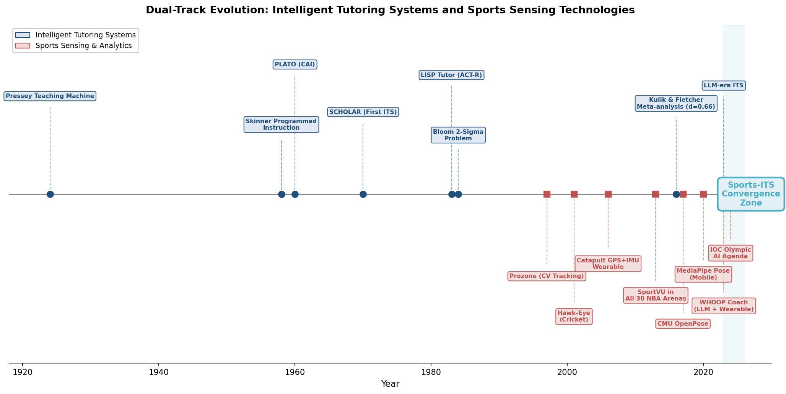

*Figure 1.1. Dual-track evolution of Intelligent Tutoring Systems (blue) and Sports Sensing & Analytics technologies (red), converging toward a Sports-ITS integration zone in the 2023–2026 period. Data sources compiled from academic and industry milestones referenced throughout Sections 1.1 and 1.2.*

## 1.3 The Scalability Imperative: Why Traditional Coaching Cannot Meet Demand

The motivation for a Sports Intelligent Tutoring System (Sports-ITS) — defined in this report as an adaptive, data-driven system that integrates multimodal sensing, learner modeling, and pedagogical reasoning to deliver individualized motor skill instruction and training guidance — extends beyond what is merely technologically possible. It is grounded in a structural mismatch between the individualization requirements of effective motor learning and the resource constraints that govern real-world sports instruction.

Bloom's 2 Sigma finding applies with particular force to motor skill acquisition, where the timing, specificity, and modality of feedback are critical determinants of learning outcomes. Yet physical education classes operate under severe scalability constraints. The Society of Health and Physical Educators (SHAPE America) recommends student-to-teacher ratios not exceeding 1:25 for optimal teaching quality; however, research documents actual ratios in many U.S. schools reaching as high as 1:54, severely constraining the feasibility of individualized instruction [SHAPE America Guidelines](https://www.shapeamerica.org/Common/Uploaded%20files/document_manager/standards/guidelines/Opportunity-to-Learn-Grid.pdf "Opportunity to Learn Guidelines") [ResearchGate](https://www.researchgate.net/publication/280204098_Perspectives_of_Physical_Education_Specialists_who_Teach_in_Large_Class_Settings "PE class ratio study"). At such ratios, meaningful individual movement feedback becomes physically impossible within the available contact time.

Traditional coaching assessment of motor skills also suffers from inherent subjectivity. Unlike cognitive testing, where answers can be objectively scored, movement quality evaluation relies on the coach's perceptual judgment — a process susceptible to fatigue, attentional limitations, and inter-rater variability. When a single instructor must observe and correct 40 or more students performing a standing long jump, the feedback each student receives is necessarily sparse, delayed, and generic. A Sports-ITS capable of continuous, objective movement assessment through multimodal sensing could fundamentally alter this equation by providing each learner with individualized, timely, and modality-appropriate feedback at scale — approaching the pedagogical ideal that Bloom's work identified but that conventional instruction cannot economically deliver.

## 1.4 Market Dynamics and the Opportunity Window

The convergence of mature sensing hardware, advanced AI capabilities, and growing institutional demand has opened a distinct economic opportunity window for Sports-ITS development. Several market trajectories illuminate the scale and momentum of this convergence.

The global sports analytics market was valued at USD 5.678 billion in 2025 and is projected to reach USD 23.148 billion by 2033, reflecting a 2026–2033 CAGR of 18.5% [Grand View Research](https://www.grandviewresearch.com/industry-analysis/sports-analytics-market "Sports Analytics Market Size & Share, Industry Report 2033"). A more conservatively scoped estimate from MarketsandMarkets, focused on performance analytics, predictive analytics, and video analytics, places the 2025 market at USD 2.29 billion, growing to USD 4.75 billion by 2030 at a CAGR of 15.7% [MarketsandMarkets](https://www.marketsandmarkets.com/Market-Reports/sports-analytics-market-35276513.html "Sports Analytics Market 2030"). The variance between these estimates reflects differences in market boundary definitions, yet both confirm sustained double-digit compound growth.

Simultaneously, the global AI in Education market — the broader ecosystem within which Sports-ITS resides — was valued at USD 2.21 billion in 2024 and is projected to reach USD 5.82 billion by 2030 at a CAGR of 17.5%, with ITS identified as a key growth driver [MarketsandMarkets](https://www.marketsandmarkets.com/PressReleases/ai-in-education.asp "AI in Education Market worth $5.82 billion by 2030"). In China, the smart fitness industry market is projected to reach RMB 140 billion (approximately USD 20 billion) by 2026, reflecting the country's aggressive institutional adoption of AI-powered sports technologies [China.org.cn / Xinhua](http://www.china.org.cn/2026-03/10/content_118374008.shtml "Smart fitness market projection").

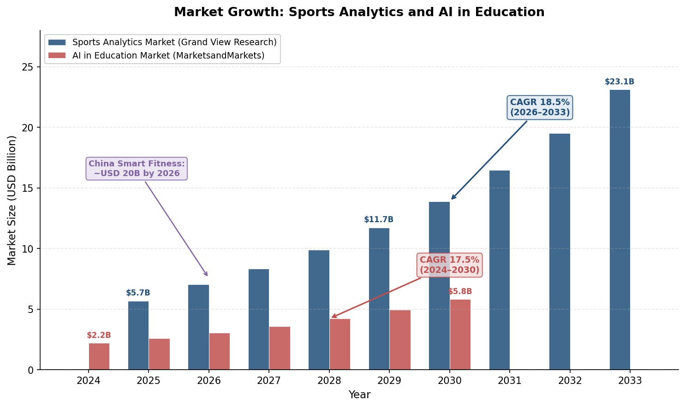

*Figure 1.2. Projected market growth for the global Sports Analytics market (Grand View Research) and the global AI in Education market (MarketsandMarkets), with annotation for China's smart fitness market. Both sectors exhibit double-digit CAGRs, underscoring the economic viability of Sports-ITS development.*

These converging market signals indicate that hardware maturity (low-cost depth cameras, consumer-grade IMUs, mobile pose estimation), algorithmic maturity (real-time pose tracking, transformer-based fusion, LLM-driven reasoning), and institutional demand (scalable PE instruction, personalized fitness, injury prevention) are aligning in a configuration that renders Sports-ITS development not merely technically feasible but economically compelling.

## 1.5 Policy and Institutional Momentum

The transition from technology-push to institutional-pull is evident in recent policy developments at both international and national levels, signaling that Sports-ITS sits at the intersection of strategic priorities for major sports governance bodies and national governments.

In April 2024, the International Olympic Committee (IOC) released the Olympic AI Agenda, a strategic document articulating a systematic vision for AI applications across sports fairness, athlete performance optimization, fan engagement, and operational efficiency [IOC Official](https://www.olympics.com/ioc/olympic-ai-agenda "Olympic AI Agenda, April 2024"). This marked the first occasion on which the world's preeminent sports governance body positioned AI as a strategic priority rather than an incidental technology adoption.

China has moved most decisively toward systematic implementation. In 2024, the Chinese government launched a five-year national action plan under the banner "Technology Empowering Sports," designating AI in sports as a key priority area. AI-powered sports equipment has since been deployed to over 800 schools nationwide, providing AI-assisted motion tracking, personalized training plans, and real-time feedback for physical education [China.org.cn / Xinhua](http://www.china.org.cn/2026-03/10/content_118374008.shtml "How AI powers China's push toward sporting powerhouse goals, March 2026"). The 2026 Milan-Cortina Winter Olympics further marked a milestone: the first deployment of an official Olympic large language model, based on Alibaba's Qwen foundation model, for systematic event operations support [China.org.cn / Xinhua](http://www.china.org.cn/2026-03/10/content_118374008.shtml "Milan-Cortina 2026 AI deployment"). At the elite level, China's national diving team now employs "3D + AI" systems for real-time mid-air posture analysis, while the Table Tennis Association applies AI-driven match video analysis encompassing spin speed, placement patterns, rally tempo, and opponent profiling [SCIO/Xinhua](http://english.scio.gov.cn/m/in-depth/2026-03/10/content_118374140.html "AI in Chinese elite sports, March 2026").

Comparable systematic policy frameworks specifically targeting AI in sports education have not yet emerged at the EU or U.S. federal level, though broader AI-in-education strategies and sport-technology research funding exist in both regions. This asymmetry positions China as a particularly instructive case for understanding large-scale Sports-ITS deployment dynamics, while also underscoring the need for cross-regional comparative analysis as the field matures.

## 1.6 Defining the Scope: Sports-ITS as a Research Frontier

This report defines a **Sports Intelligent Tutoring System (Sports-ITS)** as an adaptive, computer-based system that: (1) acquires multimodal data about the learner's movement, physiological state, and learning context through sensor technologies; (2) fuses these heterogeneous data streams into coherent representations; (3) maintains a dynamic learner model tracking motor skill proficiency, physical condition, and learning progress; (4) applies pedagogical reasoning to select appropriate instructional strategies, training parameters, and difficulty levels; and (5) delivers individualized feedback through one or more output modalities (visual, auditory, haptic, or augmented/virtual reality).

This definition deliberately extends the classical four-component ITS architecture — domain model, student model, tutoring model, and interface model — into the psychomotor domain, where the "student input" is not a typed answer or a clicked option but a continuous, high-dimensional movement signal captured through cameras, IMUs, and physiological sensors. The fusion of these multimodal data streams is not merely a technical convenience; it is an architectural necessity, because no single modality can capture the full spectrum of information required for effective motor skill tutoring. Vision captures spatial kinematics; IMUs capture acceleration dynamics and limb orientation; physiological sensors capture fatigue, stress, and recovery state; audio captures rhythmic timing and verbal communication. Only their principled integration enables the holistic learner model that Bloom's 2 Sigma vision demands.

Figure 1.3 situates Sports-ITS at the intersection of three contributing disciplines, illustrating the domain convergence that defines the scope of this report.

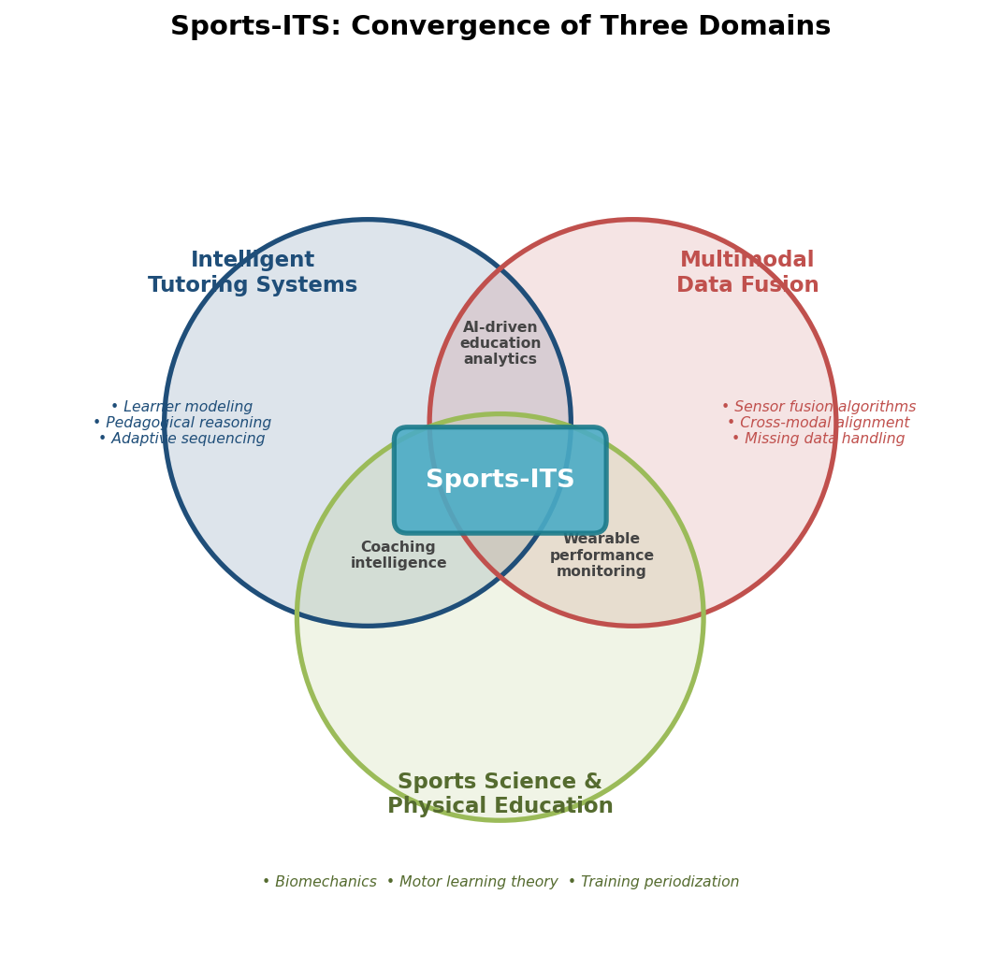

*Figure 1.3. Sports-ITS positioned at the convergence of three domains: Intelligent Tutoring Systems (learner modeling, pedagogical reasoning, adaptive sequencing), Multimodal Data Fusion (sensor fusion algorithms, cross-modal alignment, missing data handling), and Sports Science & Physical Education (biomechanics, motor learning theory, training periodization). Pairwise overlaps — AI-driven education analytics, coaching intelligence, and wearable performance monitoring — represent established subfields whose integration constitutes the Sports-ITS frontier.*

The chapters that follow pursue this vision systematically. Chapter 2 catalogs the multimodal data modalities and acquisition technologies relevant to sports contexts. Chapter 3 examines the computational methods for fusing these heterogeneous data streams. Chapter 4 presents a reference system architecture and its design principles. Chapter 5 surveys concrete application domains — elite sports, school physical education, rehabilitation, and recreational fitness. Chapter 6 addresses the technical, ethical, and regulatory challenges confronting the field. Chapter 7 synthesizes emerging trends and charts a research and development roadmap through 2030.

# 第2章 Multimodal Data Modalities and Acquisition Technologies for Sports Contexts

The design of any Sports Intelligent Tutoring System (Sports-ITS) rests on the quality, diversity, and practical deployability of the data streams it ingests. Unlike cognitive ITS — where student input arrives through keystrokes and mouse clicks — a Sports-ITS must perceive the learner through continuous, high-dimensional signals captured by cameras, inertial sensors, physiological monitors, microphones, and environmental instrumentation. Each modality illuminates a distinct facet of athletic performance: spatial kinematics, acceleration dynamics, metabolic load, communicative context, or positional strategy. None is individually sufficient; their principled combination is what enables the holistic learner model that effective motor skill tutoring demands.

This chapter provides a systematic taxonomy of the data modalities relevant to sports intelligent tutoring, organized into five categories: computer vision, inertial and wearable sensors, physiological signals, audio and speech, and environmental and contextual data. For each category, the discussion characterizes information content, temporal resolution, accuracy benchmarks, noise profiles, cost considerations, and practical deployment constraints. The chapter concludes with a cross-modal comparison that foregrounds the temporal alignment challenge motivating the fusion methods examined in Chapter 3.

## 2.1 Computer Vision: RGB, Depth, and Skeletal Pose Estimation

Computer vision constitutes the most information-rich modality available to Sports-ITS, capable of capturing full-body kinematics without requiring physical instrumentation of the athlete. Three principal sub-modalities serve sports analysis: standard RGB video, depth imaging, and algorithmically derived skeletal pose estimation.

**RGB video** acquired from consumer-grade cameras at 30–120 fps provides the foundational visual stream for markerless motion analysis. A 2025 systematic review covering 50 papers (2014–2023) found that deep learning human pose estimation (HPE) algorithms have become the dominant analytical tool, with four primary application areas in sport: skill analysis, action recognition, enhanced coaching tools, and officiating assistance. OpenPose was employed in 14 of the 50 reviewed studies, making it the most widely adopted HPE algorithm for sports contexts. A critical limitation identified by the review is that only 12 of the 50 studies validated their algorithms on data from real athletes; 21 relied on private datasets, raising concerns about reproducibility and ecological validity [PMC Systematic Review](https://pmc.ncbi.nlm.nih.gov/articles/PMC12696263/ "The Application of Deep Learning Human Pose Estimation in Sport, 2025").

The two dominant HPE frameworks embody contrasting architectural philosophies. **OpenPose** (CMU, 2017) employs a bottom-up architecture with Part Affinity Fields, detecting 18 keypoints and 38 part affinity fields across all individuals in a frame simultaneously, but requires GPU acceleration for real-time performance. **MediaPipe Pose** (Google, 2020) adopts a top-down architecture optimized for mobile and embedded deployment, enabling real-time pose estimation on smartphones without dedicated GPU hardware. In a gait analysis validation study, OpenPose achieved a mean angular error of 5.1 ± 2.5 degrees for knee kinematics — adequate for gross movement screening but insufficient for clinical-grade biomechanical assessment [Gait Analysis Study](https://www.sciencedirect.com/science/article/abs/pii/S0966636222004738 "Gait & Posture").

**Depth sensing** augments RGB with per-pixel distance information, enabling three-dimensional reconstruction. The Azure Kinect DK — the most widely validated depth sensor in sports research — pairs a 12-megapixel RGB camera (4,096 × 3,072 px) with a 1-megapixel time-of-flight (ToF) depth sensor (640 × 576 px in narrow field-of-view mode at 30 fps), yielding a usable depth range of 0.50–5.46 m. Independent evaluation found random depth error below 2.5 mm at 3.5 m distance, with systematic spatial error ranging from 1.1 to 12.7 mm across the 1–5 m operating envelope [Kurillo et al. 2022](https://www.mdpi.com/1424-8220/22/7/2469 "Evaluating the Accuracy of the Azure Kinect, Sensors 2022"). These error margins are acceptable for sports skill screening and movement pattern classification, though they fall short of the sub-millimeter precision required for research-grade biomechanical analysis. A notable constraint is the sensitivity of structured-light and ToF depth sensors to ambient infrared radiation, which renders outdoor deployment impractical under direct sunlight — a significant limitation for field-sport applications.

## 2.2 Inertial and Wearable Sensors: IMU, GPS, and Ultra-Wideband Positioning

Inertial measurement units (IMUs) — integrating accelerometers, gyroscopes, and magnetometers — provide direct measurement of body-segment acceleration, angular velocity, and orientation at sampling rates far exceeding those of camera-based systems. When combined with satellite-based (GPS) or infrastructure-based (UWB) positioning, wearable sensor packages deliver continuous spatiotemporal athlete tracking across both indoor and outdoor environments.

**Professional-grade wearable platforms** have reached a level of miniaturization and analytical sophistication that enables unobtrusive deployment during competitive play. The Catapult Vector S7, designed for outdoor team sports, measures 81 × 43 × 16 mm and weighs 53 g, integrating a 10 Hz GPS receiver, a 1 kHz tri-axial accelerometer (±16G range), a 100 Hz gyroscope, and UWB plus BLE 5.0 connectivity, with a 6-hour battery supporting simultaneous tracking of up to 100 athletes. Its indoor counterpart, the Vector T7, achieves a 73% size reduction (53 × 35 × 8.2 mm, 17.5 g) by replacing GPS with UWB-only positioning [Catapult Vector Pro](https://www.catapult.com/solutions/vector-pro "Official specifications").

**Positioning accuracy** has advanced markedly with the latest generation of devices. STATSports released the Apex 2.0 in April 2025, incorporating military-grade real-time kinematic (RTK) GPS that delivers centimeter-level positional accuracy — representing an approximately 500% improvement over standard 10 Hz GPS. The Apex 2.0 holds FIFA Quality certification and has been adopted by Liverpool FC, Paris Saint-Germain, Manchester City, and the New Zealand All Blacks, among other elite programs [Sports Business Journal](https://www.sportsbusinessjournal.com/Articles/2025/04/25/statsports-upgrades-gps-hardware-to-centimeter-accuracy/ "STATSports Apex 2.0, April 2025"). This level of precision enables tactical spatial analysis — such as inter-player distance maintenance, pressing trigger detection, and defensive line shape quantification — that was previously feasible only through optical tracking systems requiring dedicated stadium infrastructure.

**Physiological integration within wearable form factors** further extends the analytical scope of on-body devices. The WHOOP 4.0 wristband achieved 99.7% heart rate accuracy (standard deviation of 1 bpm) and 99% heart rate variability (HRV) accuracy (standard deviation of 3.9 ms) in an independent validation study conducted by CQUniversity Australia and funded by the Australian Institute of Sport, making it the most accurate device among six wearables tested [WHOOP Validation](https://www.whoop.com/us/en/thelocker/whoop-proven-most-accurate-wearable-in-heart-rate-heart-rate-variability-measurements/ "CQUniversity AIS-funded validation study"). This accuracy level is clinically meaningful: HRV serves as a proxy for autonomic nervous system balance, and errors exceeding 5 ms in root mean square of successive differences (RMSSD) can distort training readiness assessments and recovery prescriptions.

## 2.3 Physiological Signals: Electromyography, Electroencephalography, and Biometrics

Physiological signal acquisition provides direct windows into neuromuscular activation, central nervous system states, and cardiovascular load — dimensions of athletic performance that are invisible to cameras and inertial sensors. For Sports-ITS, these signals enable fatigue estimation, cognitive workload assessment, and neuromuscular coordination analysis.

**Surface electromyography (sEMG)** measures the electrical activity generated by skeletal muscle contraction through surface electrodes. The Delsys Trigno Avanti system — the current standard for sports biomechanics research — achieves a sampling rate of 1,926 samples per second with a bandwidth of 20–450 Hz (extendable to 10–850 Hz), an input range of ±11 mV, and a wireless range exceeding 40 m. The system integrates an IMU within each electrode unit, enabling synchronized motion-muscle activation capture. Parallel bar dry electrode technology eliminates the need for skin preparation with conductive gel, significantly improving deployment feasibility during active sports [Delsys Trigno](https://delsys.com/trigno/ "Delsys Trigno Avanti product specifications"). In a Sports-ITS context, sEMG enables detection of compensatory muscle recruitment patterns — for example, identifying when an athlete compensates for quadriceps fatigue by shifting load to the hip flexors during a squat — that neither kinematics nor subjective observation can reliably capture.

**Electroencephalography (EEG)** captures cortical electrical potentials that reflect attention, arousal, and cognitive processing states. Consumer-grade EEG devices have become sufficiently portable for consideration in sports contexts. The Emotiv EPOC X provides 14-channel wireless EEG recording using the international 10-20 electrode placement system, with BLE 5.0 connectivity, 9-hour battery life, and a weight of 170 g; it has been cited in over 20,000 published papers. For even greater unobtrusiveness, the Emotiv MN8 delivers 2-channel in-ear EEG with sub-one-minute setup time and 6-hour battery life [Emotiv EPOC X](https://www.emotiv.com/blogs/news/your-guide-to-the-emotiv-epoc-x-eeg-headset "EPOC X guide") [Emotiv MN8](https://www.emotiv.com/mn8 "MN8 product page").

However, a 2024 scoping review of consumer-grade EEG devices identified significant signal quality gaps relative to research-grade systems, with **motion artifacts** constituting the primary limitation for sports applications. The mechanical coupling between head movement and electrode contact introduces noise that confounds the neural signals of interest, particularly during dynamic whole-body activities such as running, jumping, or striking [PMC Review](https://pmc.ncbi.nlm.nih.gov/articles/PMC10917334/ "Consumer-grade EEG scoping review, 2024"). This constraint effectively restricts current EEG utility in Sports-ITS to relatively static tasks — archery, shooting, golf putting — or to pre- and post-activity cognitive state assessment rather than real-time monitoring during vigorous movement.

## 2.4 Audio and Speech: Coach–Athlete Communication Analysis

Audio data occupies a distinctive niche within the multimodal Sports-ITS sensing stack. While vision captures what the body does and physiological sensors capture internal states, audio captures the communicative dimension of the coaching interaction — verbal instructions, encouragement, rhythm cues, and the bidirectional dialogue through which motor learning is socially mediated.

The emergence of sports-specific audio intelligence platforms marks the transition from general-purpose speech recognition to domain-adapted coaching dialogue analysis. **CoachScribe** (2025) represents the first platform purpose-built for sports coaching conversation analytics, designed to transcribe, segment, and analyze coach–athlete verbal exchanges at the semantic level. A 2025 study published in *Frontiers in Sports and Active Living* demonstrated the feasibility of using large language models (LLMs) to analyze coaching dialogues, identifying patterns in instructional cue frequency, motivational language distribution, and feedback timing relative to athlete performance events [Frontiers](https://www.frontiersin.org/journals/sports-and-active-living/articles/10.3389/fspor.2025.1627685/full "AI coach-athlete analysis, 2025").

The principal deployment constraint for audio in sports contexts is environmental noise. Indoor facilities — gymnasiums, swimming halls, weight rooms — present moderate acoustic challenges from reverberation and equipment noise, but outdoor fields can exceed 80 dB ambient noise levels (crowd noise, wind, equipment impact), severely degrading speech recognition accuracy and requiring directional microphone arrays or close-talking microphones to maintain acceptable signal-to-noise ratios. Audio thus occupies a supplementary rather than primary role in most Sports-ITS architectures, contributing coaching process data that complements the movement and physiological data captured by other modalities. Its analytical value is expected to grow as noise-robust speech models improve and as Sports-ITS increasingly seek to capture the full pedagogical loop — not merely what the learner does, but what instruction the learner receives and how they verbally respond.

## 2.5 Environmental and Contextual Data: Local Positioning, Force Measurement, and Spatial Context

The final modality category encompasses sensors that characterize the physical environment and the athlete's interaction with it, rather than instrumenting the athlete's body directly. These include local positioning systems (LPS), force platforms, and satellite positioning — technologies that provide the spatial and mechanical context within which movement occurs.

**Ultra-wideband (UWB) local positioning systems** offer the highest-accuracy indoor tracking currently available for sports. The KINEXON PERFORM system achieves sub-10 cm positional accuracy with latency below 100 ms, delivering over 200 derived performance metrics. An independent validation study published in *Biology of Sport* found coefficients of variation (CV) of 0.3–2.8% for speed and distance measurements in the central field area (correlation coefficients r > 0.90), but accuracy degrades at field edges, where CVs rise to 5.4–9.4% [KINEXON](https://kinexon-sports.com/products/perform-lps "KINEXON PERFORM product specifications") [Fleureau et al. 2020](https://pmc.ncbi.nlm.nih.gov/articles/PMC7725040/ "UWB LPS validation, Biology of Sport"). This edge-degradation pattern is characteristic of infrastructure-dependent positioning systems and must be accounted for in Sports-ITS deployments where athletes frequently operate near court or pitch boundaries.

**Research-grade force platforms** (e.g., AMTI, Kistler) capture ground reaction forces at sampling rates of 1,000–2,000 Hz with sub-millimeter precision, providing the gold-standard measurement for jump height, landing impact, and balance assessment. Their fixed installation, substantial size, and estimated cost of USD 10,000–50,000 per unit, however, confine their use to laboratory and dedicated testing environments. They function within Sports-ITS architectures primarily as calibration and validation tools rather than as components of continuous monitoring systems.

**Connectivity infrastructure** has evolved to accommodate the dense sensor networks that multimodal Sports-ITS requires. Bluetooth 5.4, ratified in 2023, introduced Periodic Advertising with Responses (PAwR), enabling a single hub to communicate with thousands of endpoints — a capability essential for gymnasium-scale deployments with multiple sensor-equipped athletes exercising simultaneously. Hardware miniaturization continues to expand the integration envelope: the FDK HY0021 BLE module, released in October 2024, measures just 3.5 × 10 mm, enabling wireless connectivity to be embedded in sensors small enough for integration into sports equipment, protective gear, or even textiles [Bluetooth SIG](https://www.bluetooth.com/bluetooth-resources/whats-new-in-bluetooth-core-5-4-an-overview/ "BLE 5.4 overview").

## 2.6 Cross-Modal Comparison and Deployment Considerations

The five modality categories described above differ profoundly in information content, temporal resolution, invasiveness, cost, and environmental sensitivity. Effective Sports-ITS design requires understanding these trade-offs at the system level, not merely within individual modalities. Figure 2.1 synthesizes the key specifications across all five categories.

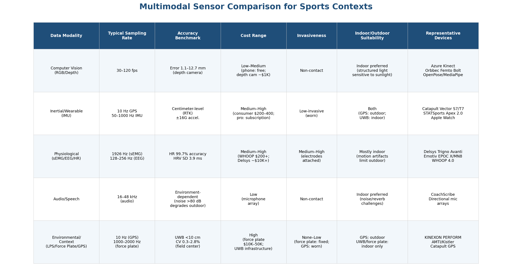

*Figure 2.1. Comparison of the five major sensor modality categories for sports contexts. Computer vision and environmental sensors offer the highest spatial information density but face deployment constraints (sunlight sensitivity, fixed installation). Inertial and physiological wearables provide continuous on-body monitoring at the cost of moderate invasiveness. Audio remains environment-dependent. Data compiled from manufacturer specifications and validation studies referenced in Sections 2.1–2.5.*

A second critical consideration is the interaction between sensor quality and deployment environment. The same device can yield markedly different signal quality depending on whether it operates indoors or outdoors, and whether it contacts the athlete or operates remotely. Figure 2.2 maps 14 sensor–environment combinations across these two dimensions, revealing that indoor non-contact configurations generally yield the highest signal quality, while outdoor contact-based sensing achieves robustness through direct coupling but at the cost of increased invasiveness.

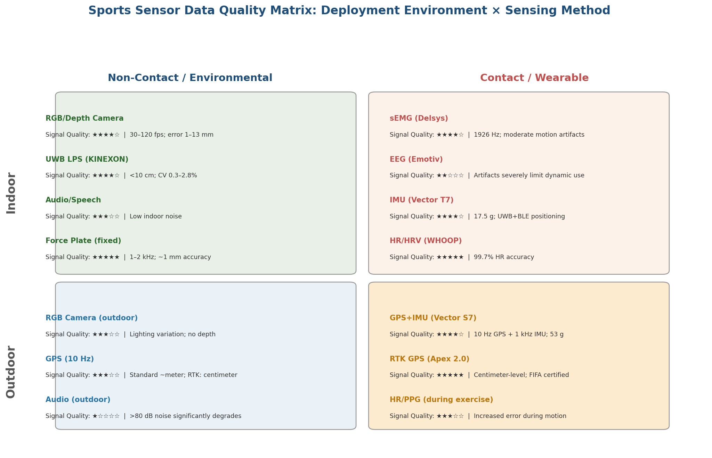

*Figure 2.2. Sports sensor data quality matrix: deployment environment (indoor versus outdoor) by sensing method (non-contact/environmental versus contact/wearable). Star ratings reflect signal quality under typical operating conditions. Force plates achieve the highest absolute quality (★★★★★) but only in fixed indoor installations; RTK GPS (STATSports Apex 2.0) achieves comparable ratings outdoors through direct satellite coupling. EEG exhibits the sharpest quality degradation during dynamic movement (★★☆☆☆ indoors), while outdoor audio approaches unusable levels (★☆☆☆☆) at ambient noise above 80 dB.*

## 2.7 The Temporal Alignment Challenge

Perhaps the most consequential cross-modal characteristic for fusion system design is the vast disparity in temporal resolution across modalities. Sampling rates span three orders of magnitude: from continuous heart rate monitors reporting at 1 Hz to research-grade force platforms capturing at 2,000 Hz, with IMU accelerometers (1,000 Hz), sEMG (1,926 Hz), EEG (256 Hz), depth cameras (30 fps), and GPS (10 Hz) distributed across the intervening range. Figure 2.3 visualizes this hierarchy.

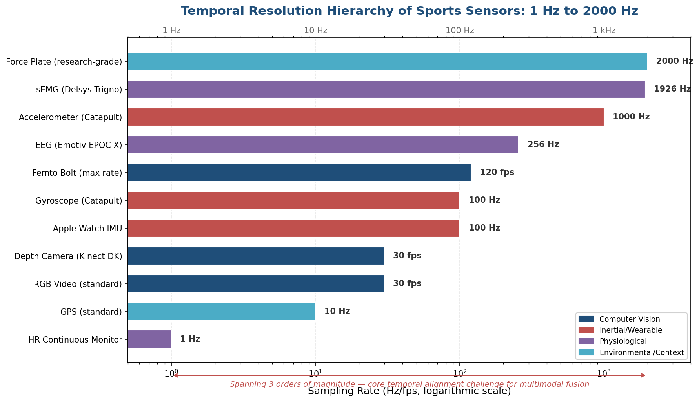

*Figure 2.3. Temporal resolution hierarchy of sports sensors, spanning from 1 Hz (HR continuous monitor) to 2,000 Hz (research-grade force plate), plotted on a logarithmic scale and color-coded by modality category. The three-order-of-magnitude span defines the core temporal alignment challenge for multimodal fusion systems: a single second of synchronized recording produces 1 heart rate sample, 10 GPS fixes, 30 depth frames, 256 EEG samples, 1,000 accelerometer readings, and 2,000 force measurements — all of which must be temporally registered before joint analysis.*

This temporal heterogeneity has direct architectural implications. Naive timestamp-based alignment fails when sensor clocks drift, network transmission introduces variable latency, or sampling rates are non-integer multiples of one another. The fusion methods discussed in Chapter 3 — including Dynamic Time Warping (DTW), adaptive interpolation, and the differentiable temporal alignment layers introduced by TempoFuse (2025) — are motivated precisely by the magnitude of this cross-modal temporal disparity.

## 2.8 Recent Advances Expanding Practical Feasibility

Several developments in the 2024–2025 period have materially expanded the practical deployment envelope for multimodal Sports-ITS.

At the **sensor hardware level**, RTK-GPS integration into wearable form factors (STATSports Apex 2.0) has closed the accuracy gap between infrastructure-free outdoor positioning and infrastructure-dependent indoor UWB systems. The continued miniaturization of BLE modules and the ratification of Bluetooth 5.4 PAwR have removed connectivity bottlenecks that previously limited multi-athlete, multi-sensor deployments.

At the **algorithmic level**, Apple Research demonstrated in 2025 that large language models can perform late fusion of heterogeneous sensor data — combining audio and motion sensor streams — for activity classification, achieving 68% accuracy and 66% macro-F1 in a one-shot evaluation on the Ego4D dataset (12 activity classes including basketball, soccer, and fitness exercises), compared to an 8.3% random baseline. This result required zero task-specific training, suggesting that foundation models may eventually subsume bespoke fusion pipelines for certain Sports-ITS tasks [Apple Research](https://machinelearning.apple.com/research/multimodal-sensor-fusion "LLM-based multimodal sensor fusion, 2025").

These hardware and algorithmic advances collectively lower the cost, complexity, and expertise thresholds for deploying multimodal sensing in sports environments — from elite performance laboratories to school gymnasiums and home fitness settings. The fusion architectures that transform these raw data streams into actionable tutoring signals are the subject of the following chapter.

# 第3章 Multimodal Data Fusion Methods — From Signal-Level Integration to Semantic Alignment

The multimodal data modalities cataloged in Chapter 2 — vision, inertial measurement, physiological signals, audio, and environmental sensing — each capture a distinct facet of athletic performance. No single modality suffices for the holistic learner modeling that a Sports Intelligent Tutoring System (Sports-ITS) demands. Vision provides spatial kinematics but cannot detect muscle fatigue; IMUs capture acceleration dynamics yet miss spatial context; heart rate monitors register cardiovascular load but reveal nothing about movement quality. The computational challenge, therefore, lies not merely in collecting these heterogeneous streams but in *fusing* them into coherent, actionable representations.

This chapter surveys the principal fusion methods, organized from classical signal-level concatenation through feature-level integration to semantic alignment via attention mechanisms, graph neural networks, and foundation models. Each paradigm is evaluated against the specific demands of sports tutoring: real-time feedback latency, variable sampling rates, missing-modality robustness, and scalability across modalities and learner contexts.

## 3.1 Evolving Taxonomies of Multimodal Fusion

### 3.1.1 The Classical Triad: Early, Intermediate, and Late Fusion

The canonical taxonomy classifies fusion strategies by the pipeline stage at which modalities are combined. **Early fusion** (data-level fusion) concatenates raw data along the channel axis before feeding a single encoder, maximizing raw information preservation at the cost of rapidly growing input dimensionality. **Intermediate fusion** (feature-level fusion) merges learned representations at various abstraction levels within deep networks — via element-wise addition, multiplication, or concatenation — exploiting the hierarchical representational power of modern architectures. **Late fusion** (decision-level fusion) trains independent per-modality subnetworks and combines their outputs through voting, weighted averaging, or a meta-classifier [ACM Computing Surveys](https://dl.acm.org/doi/full/10.1145/3649447 "Deep Multimodal Data Fusion, 2024").

Each strategy entails distinct trade-offs. Early fusion preserves maximal cross-modal interaction from the input stage but remains practical only for a small number of modalities with compatible data formats — the concatenation of IMU accelerometer and gyroscope channels along the sensor axis is a canonical example. Intermediate fusion offers the highest architectural flexibility, enabling fusion at any network depth and natural combination with attention mechanisms; its primary cost is the computational burden of maintaining separate sub-encoders as the modality count increases. Late fusion is the simplest to implement and the easiest to interpret — per-modality contributions are directly observable — yet it is vulnerable to degradation when any single modality produces erroneous predictions, and it affords less flexibility in cross-modal information interaction [ACM Computing Surveys](https://dl.acm.org/doi/full/10.1145/3649447 "Sections 2.1–2.3").

### 3.1.2 Beyond the Triad: Modern Deep Learning Taxonomies

The early/intermediate/late framework, while pedagogically useful, increasingly fails to capture the reality of modern deep learning architectures in which representation learning, fusion, and decision-making interleave within a single network. A 2024 deep review published in *ACM Computing Surveys* argues that this interleaving renders the classical position-based taxonomy insufficient, and proposes a five-class scheme organized by dominant computational mechanism: (1) encoder-decoder methods, (2) attention-based methods, (3) graph neural network (GNN) methods, (4) generative neural network methods, and (5) constraint-based methods [ACM Computing Surveys](https://dl.acm.org/doi/full/10.1145/3649447 "Deep Multimodal Data Fusion, 2024").

A complementary survey covering over 200 papers (arXiv, November 2024) provides a parallel reclassification, organizing fusion into kernel-based, graph model, encoder-decoder, and attention-based frameworks, while distinguishing between explicit alignment (Dynamic Time Warping, Canonical Correlation Analysis) and implicit alignment (graph models, neural networks). This survey foregrounds a foundational principle: *alignment is a prerequisite for fusion* — without correct temporal and semantic alignment, fusion risks introducing information distortion or critical information loss [Multimodal Alignment & Fusion Survey](https://arxiv.org/html/2411.17040v1 "Multimodal Alignment and Fusion: A Survey, 2024").

For Sports-ITS, the practical implication is that selecting a fusion architecture requires evaluating not only accuracy but also latency, missing-modality tolerance, and scalability to three or more heterogeneous streams — criteria that cut across both taxonomies. The sections that follow examine each major paradigm against these criteria.

## 3.2 Classical Fusion Paradigms and Their Sports Applications

### 3.2.1 Early Fusion: Maximizing Raw Information at the Cost of Dimensionality

In the sports domain, early fusion is most naturally applied when modalities share compatible data representations and sampling rates. Concatenating tri-axial accelerometer and tri-axial gyroscope signals from a single IMU into a six-channel input tensor, processed by a single convolutional or recurrent encoder, is standard practice in human activity recognition (HAR) for sports. This approach preserves fine-grained temporal correlations between acceleration and angular velocity — correlations essential for distinguishing, for instance, a tennis forehand from a backhand on the basis of wrist-mounted sensor data.

The limitations of early fusion surface when modalities are heterogeneous in format, dimensionality, or sampling rate. Fusing 30 fps RGB video (on the order of 1920 × 1080 × 3 per frame) with 100 Hz IMU data (6 channels) and 1 Hz heart rate signals demands substantial preprocessing — resampling, embedding, or encoding — before concatenation becomes feasible. For Sports-ITS scenarios involving three or more modalities, early fusion is generally impractical owing to the resulting dimensionality explosion [ACM Computing Surveys](https://dl.acm.org/doi/full/10.1145/3649447 "Section 2.1").

### 3.2.2 Intermediate Fusion: Hierarchical Feature Integration

Intermediate fusion occupies the center of most contemporary sports multimodal systems. By fusing modality-specific features extracted by dedicated sub-encoders at one or more intermediate network layers, this approach retains modality-specific abstraction — each encoder can be optimized for its data type — while enabling cross-modal interaction at representation levels where semantic alignment is more tractable than at the raw-data level.

Architectural flexibility is the principal advantage of intermediate fusion. A vision encoder can extract pose keypoints while an IMU encoder produces motion-phase embeddings; these representations can then be fused through concatenation, element-wise addition, or bilinear pooling at whichever layer yields the most informative joint representation. This flexibility also facilitates integration with attention mechanisms, enabling the network to dynamically weight cross-modal contributions based on input quality — a property of particular value in sports settings where sensor occlusion or signal dropout is common [ACM Computing Surveys](https://dl.acm.org/doi/full/10.1145/3649447 "Section 2.2").

### 3.2.3 Late Fusion: Independent Modality Processing with Decision-Level Combination

Late fusion processes each modality through an independent pipeline — potentially using entirely different model architectures — and combines decisions only at the output stage. For classification tasks (e.g., identifying exercise type), combination may employ majority voting or learned weights; for regression tasks (e.g., predicting fatigue level), a meta-regressor aggregates per-modality predictions.

This approach holds pragmatic appeal in Sports-ITS deployments where modularity is a design priority (Chapter 4). Sensor suites vary across venues: a gymnastics training hall may have multi-camera arrays but no wearable IMUs, while an outdoor running track may have GPS-IMU wearables but no cameras. Late fusion architectures accommodate this variability by allowing modality-specific branches to be activated or deactivated without retraining the entire pipeline. The cost is a ceiling on cross-modal information exploitation: because modalities interact only at the decision boundary, fine-grained correlations — such as the relationship between knee joint angle derived from vision and vastus lateralis EMG activation during a squat — cannot be captured [ACM Computing Surveys](https://dl.acm.org/doi/full/10.1145/3649447 "Section 2.3").

## 3.3 Attention Mechanisms and Transformer Architectures for Cross-Modal Alignment

### 3.3.1 From Self-Attention to Cross-Attention: A Three-Level Hierarchy

Attention-based fusion has emerged as the dominant paradigm in multimodal deep learning since 2020, propelled by the success of Transformer architectures. In the context of multimodal sports data, three levels of attention serve distinct functions:

1. **Intra-modality self-attention** operates within a single modality, with Query, Key, and Value all derived from the same input. In pose estimation, self-attention captures spatial relationships among body joints; in IMU data, it captures temporal dependencies across time steps. Self-attention enables each modality encoder to produce richer, context-aware representations prior to fusion.

2. **Cross-modal cross-attention** derives the Query from one modality and the Key/Value from another, producing attention-pooled features conditioned on inter-modal relationships. For a Sports-ITS processing simultaneous video and coaching speech, cross-attention can ground verbal instructions ("extend your right arm fully") in specific visual keypoint configurations, thereby achieving semantic alignment between linguistic and kinematic modalities.

3. **Transformer-based fusion** combines self-attention encoders with cross-attention decoders, capturing both intra- and inter-modal relationships in a unified architecture. Large pretrained multimodal Transformers further divide into single-Transformer designs (e.g., VideoBERT, HERO) that process all modalities through a shared encoder, and multi-Transformer designs (e.g., X-llm, UniVL) that use modality-specific Transformers before joint modeling [ACM Computing Surveys](https://dl.acm.org/doi/full/10.1145/3649447 "Section 3, Attention-based Fusion").

### 3.3.2 CAM-Vtrans: Real-Time Transformer Fusion for Sports Training

CAM-Vtrans (2024) exemplifies the application of Transformer-based cross-modal fusion to real-time sports training. The system combines a Vision Transformer (ViT) for extracting visual features from multi-camera video, CLIP for processing natural language coaching instructions, and a cross-attention layer that dynamically fuses visual and linguistic information. In the training pipeline, ViT encodes spatial-temporal features of athlete movement while CLIP embeds coach instructions into a shared semantic space; the cross-attention layer then aligns these representations, enabling the system to interpret movements in the context of instructional intent.

Experimental evaluation on the OpenImages and Objects365 datasets demonstrated that CAM-Vtrans outperformed traditional CNN and LSTM baselines across accuracy, recall, F1 score, and AUC metrics. The critical performance metric for real-time Sports-ITS is inference latency: CAM-Vtrans achieved 19.2 ms per frame (approximately 52 FPS), comfortably exceeding the 25 FPS threshold generally accepted as sufficient for real-time visual feedback. Ablation studies confirmed that the cross-attention module was the component driving performance gains across all evaluated metrics [CAM-Vtrans](https://www.frontiersin.org/journals/neurorobotics/articles/10.3389/fnbot.2024.1453571/full "Frontiers in Neurorobotics, 2024").

This result carries a concrete design lesson for Sports-ITS: carefully designed Transformer architectures can deliver both the semantic richness of cross-modal attention and sub-20 ms latency suitable for real-time coaching feedback — a combination previously assumed to require a trade-off.

## 3.4 Temporal Alignment: Synchronizing Asynchronous Sensor Streams

### 3.4.1 The Sampling Rate Challenge

A defining characteristic of multimodal sports data is the wide disparity in temporal resolution across modalities. A typical Sports-ITS deployment might simultaneously ingest 30 fps RGB video, 100 Hz IMU accelerometer data, 1 Hz heart rate readings, and irregularly sampled coaching speech utterances. Fusion algorithms that assume temporally aligned inputs will produce meaningless or degraded results if these streams are not first synchronized. Temporal alignment thus constitutes a prerequisite step — and a persistent engineering challenge — for any multimodal fusion pipeline in sports.

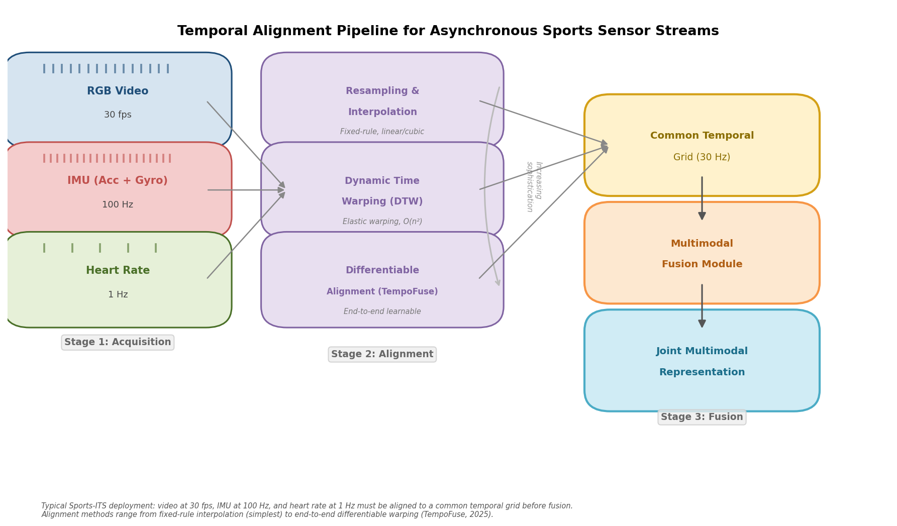

*Figure 3.1. Three-stage pipeline for synchronizing asynchronous sports sensor streams: from acquisition at disparate sampling rates (30 fps video, 100 Hz IMU, 1 Hz heart rate), through alignment via resampling, DTW, or differentiable methods (TempoFuse), to a unified temporal grid for multimodal fusion.*

### 3.4.2 Classical Explicit Alignment Methods

Two classical techniques dominate explicit temporal alignment. **Dynamic Time Warping (DTW)** performs elastic time warping to find an optimal alignment path between two sequences of different lengths or rates, inserting or duplicating frames as needed. DTW is widely used in sports biomechanics for comparing an athlete's movement execution to a reference template — for instance, aligning a novice golfer's swing trajectory against an expert reference despite differences in execution speed. Its limitations are the requirement for a predefined similarity metric and its O(n²) time complexity, which constrains real-time applicability for long sequences.

**Canonical Correlation Analysis (CCA)** projects two representations from different feature spaces into a common space that maximizes their correlation. Standard CCA captures only linear relationships; extensions including Kernel CCA (KCCA) and Deep CCA (DCCA) address this limitation by learning nonlinear projections, enabling alignment of semantically corresponding features across modalities even when their surface representations differ substantially [Multimodal Alignment & Fusion Survey](https://arxiv.org/html/2411.17040v1 "Section 4.1, Explicit Alignment").

In practice, sports sensor fusion commonly relies on resampling and interpolation as a pragmatic first step — upsampling low-rate signals (e.g., linear or cubic interpolation of 1 Hz heart rate to 30 Hz) and downsampling high-rate signals to establish a common temporal grid. A 2025 study in *Nature Scientific Reports* investigating collaborative dynamics analysis in team sports confirmed that DTW and adaptive interpolation remain the standard approaches for synchronizing asynchronous sports sensor streams [Nature Scientific Reports](https://www.nature.com/articles/s41598-025-12920-9 "Multi-level data fusion enables collaborative dynamics analysis in sports, 2025").

### 3.4.3 Learned Alignment: TempoFuse and Differentiable Temporal Warping

Recent work has moved beyond handcrafted alignment toward end-to-end learnable approaches. TempoFuse (2025) introduces a Differentiable Temporal Alignment (DTA) layer that learns to warp heterogeneous sensor streams to a common temporal reference frame before cross-modal feature fusion. The architecture comprises three modules: (i) the DTA layer, which parameterizes temporal correspondences as differentiable operations and enables gradient-based optimization of alignment jointly with the downstream task; (ii) a cross-modal feature fusion module; and (iii) a context-aware classification head. TempoFuse is specifically designed for wearable HAR with variable sampling rates — the exact scenario encountered in Sports-ITS deployments where accelerometers, gyroscopes, and heart rate sensors operate at disparate frequencies [TempoFuse](https://www.researchgate.net/publication/401122586_TempoFuse_Temporal_Alignment-Guided_Multimodal_Fusion_for_Context-Aware_Human_Activity_Recognition_on_Wearable_Devices "2025").

The broader trajectory in temporal alignment research — from fixed-rule interpolation to DTW-based elastic warping to end-to-end differentiable alignment — mirrors the general trend in multimodal fusion toward replacing handcrafted preprocessing with jointly optimized, data-driven pipelines. For Sports-ITS, this trajectory suggests that future systems will increasingly absorb temporal alignment into the fusion architecture itself, reducing manual engineering burden and potentially improving alignment quality through task-specific optimization.

## 3.5 Graph Neural Networks and Spatiotemporal Modeling for Team Sports

### 3.5.1 Two Strategies for GNN-Based Multimodal Fusion

Graph neural networks offer a natural framework for sports data that is inherently relational — team formations, player interactions, and individual body-joint configurations are all natively representable as graphs. In multimodal fusion, GNNs are deployed through two principal strategies:

**Strategy A: Per-modality representation learning followed by integration.** GNNs extract representations from graph-structured data (e.g., skeleton joints, player positions) while non-graph modalities (e.g., audio, physiological signals) use conventional encoders. The resulting modality-specific representations are then integrated through concatenation, attention, or other fusion operators.

**Strategy B: Graph construction that fuses multimodal data before GNN processing.** In this approach, the graph itself encodes multimodal information through heterogeneous node and edge types. Intra-modal edges connect nodes within the same modality (e.g., neighboring joints in a skeleton graph), while inter-modal edges connect the same entity's representations across modalities (e.g., linking a player's positional node to their physiological state node). This construction forces the GNN to jointly explore intra- and inter-modal relationships during message passing [ACM Computing Surveys](https://dl.acm.org/doi/full/10.1145/3649447 "Section 4, GNN-based Fusion").

### 3.5.2 Gender-Specific Counterattack Prediction: A U.S. Soccer Case Study

The U.S. Soccer Federation developed the first gender-specific GNN model for predicting counterattack success probability in soccer (2024). The study fused synchronized StatsPerform event data with SkillCorner 10 Hz spatiotemporal tracking data across 632 MLS, NWSL, and international women's matches encompassing 20,863 counterattack frames. The model architecture employed three CrystalConv graph convolutional layers, with node features encoding normalized coordinates, velocity, movement angle, and distances to goal and ball, and edge features encoding inter-player distance and angle.

Permutation feature importance analysis revealed that velocity along the baseline direction and goal angle were the most influential predictors. A key finding was that gender-specific models outperformed gender-mixed models on both ROC-AUC and Log-Loss metrics, even with significantly smaller training samples — demonstrating that the spatial and tactical dynamics of men's and women's soccer differ sufficiently to warrant separate modeling [U.S. Soccer GNN](https://arxiv.org/html/2411.17450v2 "Graph Neural Network for counterattacks, 2024"). For Sports-ITS design, this result underscores the importance of learner-population-specific model adaptation — a principle that extends beyond gender to encompass age, skill level, and physical characteristics.

### 3.5.3 ST-TransBay: Combining GCN and Transformer for Multi-Modal IoT Fusion

ST-TransBay (2025, *Alexandria Engineering Journal*) represents a hybrid architecture that bridges the GNN and Transformer paradigms. The system employs spatiotemporal graph convolutional networks (ST-GCN) to model human body movement as a graph — joints as nodes, bones as edges — while using a Transformer encoder for multi-modal IoT data fusion across video, inertial, and physiological streams. By leveraging the ST-GCN's strength in capturing skeletal spatial relationships alongside the Transformer's capacity for cross-modal temporal integration, ST-TransBay targets real-time sports event detection and decision support [ST-TransBay](https://www.sciencedirect.com/science/article/pii/S1110016825006702 "Alexandria Engineering Journal, 2025").

## 3.6 LLM-Based Late Fusion: An Emerging Paradigm

A novel fusion paradigm has emerged from the convergence of large language models (LLMs) with multimodal sensing. In a 2025 study (arXiv:2509.10729), Apple Research, in collaboration with MIT and Johns Hopkins University, demonstrated that LLMs can serve as late fusion engines for heterogeneous time-series sensor data without any task-specific training.

The approach employs modality-specific preprocessors — MS CLAP for audio captioning, VGGish for audio tagging, and an IMU activity classifier for motion prediction — to convert each modality's data into natural language descriptions. These text-formatted outputs are concatenated into a single prompt and fed to an LLM, which performs zero-shot or few-shot classification by reasoning across the textual representations of all modalities.

Evaluated on a curated subset of the Ego4D dataset covering 12 activity classes (including basketball, soccer, and fitness), Gemini-2.5-pro achieved 68% accuracy and 66% macro-F1 in one-shot closed-set evaluation — a substantial margin above the 8.3% random baseline. Critically, the approach requires zero task-specific training data, making it particularly attractive for sports domains where annotated multimodal datasets are scarce [Apple Research](https://arxiv.org/html/2509.10729v1 "LLM Late Multimodal Sensor Fusion, Apple/MIT/JHU, 2025").

The implications for Sports-ITS are considerable. LLM-based fusion circumvents two of the field's most persistent bottlenecks: the need for large annotated multimodal training datasets and the engineering effort of designing task-specific fusion architectures. The trade-off is inference latency — current LLM inference exceeds the sub-100 ms budget for real-time movement feedback — positioning this paradigm as better suited to post-session analysis, training plan generation, and reflective coaching dialogue than to in-the-moment corrective feedback.

## 3.7 Motion Foundation Models: Toward Universal Movement Representations

The emergence of motion-specific foundation models — large-scale pretrained models that learn general-purpose representations of human movement — opens a new trajectory for multimodal fusion in sports. Rather than designing task-specific fusion architectures from scratch, future Sports-ITS may leverage foundation model embeddings as a common representational substrate onto which multiple modalities are projected.

**MoFM** (Motion Foundation Model, February 2025) is the first large-scale BERT-style self-supervised foundation model designed specifically for human motion understanding. MoFM introduces MotionBook, a discrete vocabulary of 8,192 motion tokens derived from spatiotemporal "Thermal Cubes" that encode motion heatmaps. A 12-layer Transformer backbone pretrained on large-scale motion corpora produces general-purpose motion embeddings that match or exceed state-of-the-art results on NTU-RGB+D action classification and generalize to one-shot classification and anomaly detection without task-specific fine-tuning [MoFM](https://arxiv.org/abs/2502.05432 "Motion Foundation Model, 2025").

**Large Motion Model (LMM)** (ECCV 2024, NTU/SenseTime) takes a complementary generative approach as the first general-purpose multi-modal motion generation model. Built on the MotionVerse dataset — 320,000 sequences and 100 million frames spanning 10 tasks and 16 datasets — and employing ArtAttention, a joint-aware attention mechanism operating across 10 body-part groups within a Diffusion Transformer, LMM unifies text-to-motion generation, music-to-dance synthesis, and motion completion in a single model, achieving performance competitive with task-specific models across all unified tasks [LMM](https://www.ecva.net/papers/eccv_2024/papers_ECCV/papers/02125.pdf "ECCV 2024").

Together, these foundation models suggest a future fusion architecture in which heterogeneous sports data streams — video-derived pose sequences, IMU motion signals, audio rhythm patterns — are first projected into a shared motion-semantic embedding space provided by a pretrained foundation model, with downstream fusion operating in this semantically rich, modality-agnostic space. This represents a paradigm shift from engineering fusion at the signal or feature level toward fusion at the *semantic* level, where alignment becomes a matter of meaning rather than sampling rate.

## 3.8 Practical Trade-Offs: Real-Time Latency, Missing Modalities, and Scalability

### 3.8.1 Latency Budgets for Sports-ITS

The latency requirements for multimodal fusion in Sports-ITS vary dramatically by application context. Real-time corrective feedback during movement execution — such as alerting a weightlifter to knee valgus during a squat — demands end-to-end latency below approximately 100 ms to be perceived as responsive. Post-session analytical feedback — such as summarizing technique trends across a training session — operates on a seconds-to-minutes timescale and can accommodate computationally expensive fusion.

Available benchmarks illustrate the feasible operating points. CAM-Vtrans achieves 19.2 ms per frame (~52 FPS) with ViT + CLIP + cross-attention, demonstrating that Transformer-based vision-language fusion can meet real-time requirements [CAM-Vtrans](https://www.frontiersin.org/journals/neurorobotics/articles/10.3389/fnbot.2024.1453571/full "Frontiers in Neurorobotics, 2024"). At the edge-deployment extreme, a Jetson-based multimodal AI system deployed at a football training ground achieved 240 ms inference with INT8 quantization, incurring only 1.8% accuracy loss relative to full-precision computation — a latency suitable for near-real-time sideline analytics though insufficient for in-movement corrective cues. A separate edge-intelligent multimodal fusion system reported in *Internet Technology Letters* (2025) demonstrated sub-second inference latency while balancing accuracy and resource efficiency on embedded hardware [Edge-Intelligent Fusion](https://onlinelibrary.wiley.com/doi/10.1002/itl2.70244 "Edge-Intelligent Multimodal Fusion for Ultra-Low Latency Sports Monitoring, 2025").

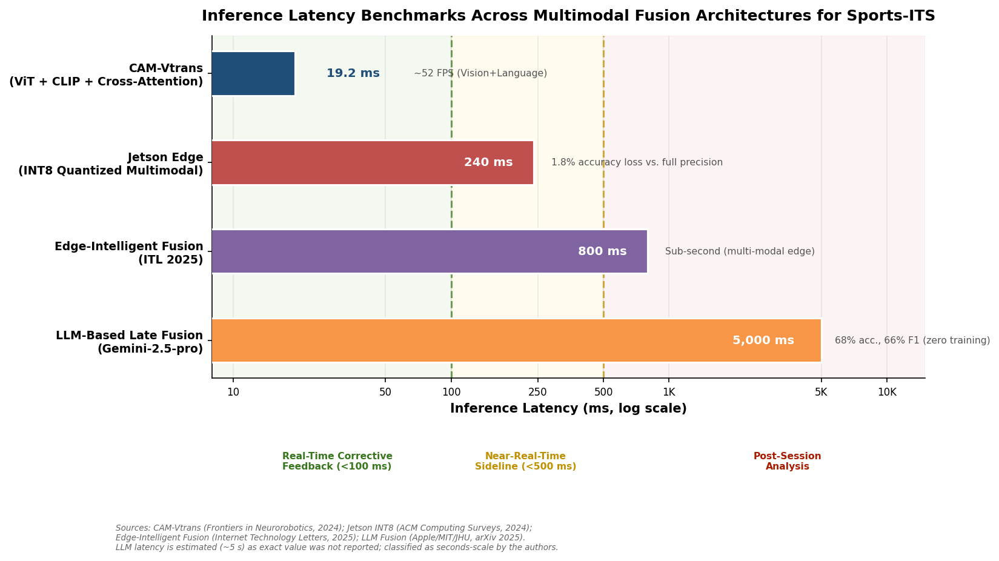

*Figure 3.2. Inference latency (log scale) across four documented multimodal fusion systems, mapped against Sports-ITS feedback-mode thresholds: real-time corrective (<100 ms), near-real-time sideline (<500 ms), and post-session analysis. Bars are annotated with key accuracy and performance context.*

The design implication for Sports-ITS is a tiered latency architecture: lightweight fusion models (potentially single-modality or two-modality early/intermediate fusion) running on edge devices for immediate feedback, with comprehensive multi-modal fusion running on cloud infrastructure for post-session analysis and learner model updating — an architecture detailed in Chapter 4.

### 3.8.2 Missing Modality Robustness

In real-world sports environments, sensor failure, occlusion, and deployment variability mean that all planned modalities may not always be available. A basketball training system designed for video + IMU + heart rate fusion must continue functioning when a player's heart rate monitor loses contact or when camera occlusion obscures a player during a drive to the basket.

Two principal approaches address this challenge. **Generative approaches** use adversarial networks (GANs) to synthesize missing modality data from available modalities — for example, generating an estimated EMG signal from IMU data and video-derived kinematics — before proceeding with the standard fusion pipeline. While effective when cross-modal correlations are strong, generative synthesis requires substantial training data for the generative model itself and adds inference-time computational cost [ACM Computing Surveys](https://dl.acm.org/doi/full/10.1145/3649447 "Section 5, GenNN-based Fusion").

**Graph-based approaches** offer a structurally more elegant solution by constructing heterogeneous graphs in which available and missing modalities are naturally accommodated through graph topology. The Heterogeneous Graph Multi-modal Fusion (HGMF) framework, for instance, builds supernode graphs capable of modeling and fusing incomplete multimodal data without explicit imputation, handling diverse data combinations through the graph structure itself [Multimodal Alignment & Fusion Survey](https://arxiv.org/html/2411.17040v1 "Section 5.3, Graphical Fusion"). For Sports-ITS deployments — which range from fully instrumented elite training facilities to school gymnasiums equipped with a single camera — graph-based missing-modality robustness represents a particularly valuable architectural property.

### 3.8.3 Scalability Across Modalities

As Sports-ITS evolve from two-modality (vision + IMU) prototypes toward more comprehensive systems incorporating video, IMU, EMG, heart rate, EEG, audio, and environmental data, the scalability of fusion architectures becomes a determining design factor. The 2024 *ACM Computing Surveys* review provides a systematic comparison of how each fusion paradigm scales beyond two modalities:

- **Encoder-decoder methods** scale well: adding a new modality requires only a new sub-encoder branch, with shared weights keeping computational costs manageable.
- **Attention-based methods** scale similarly without prohibitive cost increase, as cross-attention computation grows linearly (not quadratically) with modality count when structured as pairwise cross-modal operations.
- **GNN methods** require the most effort in graph construction design, though the GNN architecture itself typically needs no structural changes when modalities are added.
- **Generative methods** scale poorly: each additional modality typically requires a new generator-discriminator pair, increasing architectural complexity substantially.
- **Constraint-based methods** also scale poorly, with non-shareable sub-branch weights and computational costs that grow sharply with modality count [ACM Computing Surveys](https://dl.acm.org/doi/full/10.1145/3649447 "Section 6, Comparison").

For Sports-ITS targeting comprehensive multimodal integration (three or more modalities), encoder-decoder and attention-based architectures emerge as the most viable paradigms, offering the strongest balance of representational power and engineering scalability.

### 3.8.4 Domain-Specific Fusion: sEMG-IMU Integration for Sports Biomechanics

A 2025 comprehensive review in *Information Fusion* systematically analyzed the fusion of surface electromyography (sEMG) and inertial measurement unit (IMU) data for upper limb movement pattern recognition — a modality combination directly relevant to sports biomechanics applications such as tennis stroke analysis, baseball pitching mechanics, and rehabilitation monitoring. The review covered early, intermediate, and late fusion strategies for this specific pairing and demonstrated that the optimal strategy depends on the target task: early fusion preserves temporal correlations between muscle activation and limb kinematics critical for fine-grained movement discrimination, while late fusion provides greater modularity when sensor configurations vary across deployment sites [Information Fusion](https://www.sciencedirect.com/science/article/pii/S1566253525004956 "sEMG-IMU fusion review, 2025").

This domain-specific analysis reinforces a broader principle for Sports-ITS: the optimal fusion strategy is not universal but varies with the specific modality combination, task requirements, and deployment constraints. System architectures (Chapter 4) must therefore support configurable fusion pipelines adaptable to each application scenario (Chapter 5).

## 3.9 Synthesis: Matching Fusion Methods to Sports Tutoring Tasks

The fusion landscape surveyed in this chapter reveals a field in rapid evolution, moving from fixed taxonomies toward flexible, context-dependent architectural choices. Figure 3.3 summarizes the comparative strengths and limitations of each paradigm across seven evaluation dimensions relevant to Sports-ITS.

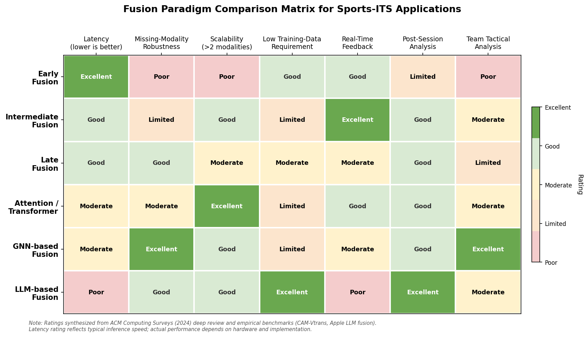

*Figure 3.3. Comparison matrix evaluating six fusion paradigms — early, intermediate, late, attention/Transformer, GNN-based, and LLM-based — across latency, missing-modality robustness, scalability, training data requirements, and suitability for three Sports-ITS task types. Ratings synthesized from the ACM Computing Surveys (2024) review and empirical benchmarks cited in this chapter.*

For Sports-ITS designers, the key matching criteria derived from this analysis are as follows:

**For real-time corrective feedback** (latency < 100 ms): Intermediate fusion with cross-attention on edge hardware, as demonstrated by CAM-Vtrans at 19.2 ms/frame, represents the current state of the art — typically restricted to two or three modalities. INT8 quantization on edge platforms such as Jetson can extend coverage to modest multimodal scenarios with acceptable accuracy trade-offs.

**For post-session analytical feedback**: Late fusion or LLM-based fusion can accommodate richer multimodal inputs. The Apple Research LLM fusion paradigm (68% accuracy on 12-class activity recognition with zero task-specific training) is particularly suited to environments with limited training data and heterogeneous sensor configurations.

**For team sports tactical analysis**: GNN-based fusion (Strategy B — multimodal graph construction before processing) natively captures relational dynamics, as demonstrated by the U.S. Soccer counterattack model. The combination of ST-GCN for skeletal modeling with Transformer encoders for cross-modal integration (ST-TransBay) represents an emerging hybrid architecture for this domain.

**For variable sensor availability**: Graph-based missing-modality methods (HGMF) and late fusion architectures provide the strongest robustness, enabling system operation even when planned modalities are unavailable.

**For future-generation systems**: Motion foundation models (MoFM, LMM) point toward semantic-level fusion in pretrained embedding spaces, potentially unifying the currently fragmented landscape of modality-specific fusion pipelines under a common representational framework. The integration of these models into Sports-ITS architectures — the subject of Chapter 7 — represents the field's most promising long-term trajectory.

# 第4章 System Architecture and Design Principles for Sports Intelligent Tutoring Systems

The preceding chapters established the multimodal data modalities relevant to sports contexts (Chapter 2) and the computational methods for fusing heterogeneous data streams into coherent representations (Chapter 3). This chapter synthesizes those foundations into a reference architecture for multimodal-fusion-driven Sports Intelligent Tutoring Systems (Sports-ITS), covering the full pipeline from data acquisition through fusion, learner modeling, pedagogical decision-making, and adaptive feedback delivery. The architecture is evaluated against five cross-cutting design principles — modularity, real-time responsiveness, explainability, scalability, and pedagogical grounding — that collectively distinguish a Sports-ITS from a passive sports analytics dashboard or a conventional drill-and-practice training tool.

## 4.1 The Classical ITS Architecture and Its Extension to Psychomotor Domains

### 4.1.1 The Four-Component Foundation

The standard ITS architecture, codified over four decades of research, comprises four interacting components: (1) a **Domain Model** encoding domain knowledge and enabling reasoning about correct and incorrect performance; (2) a **Student Model** dynamically recording the learner's knowledge, skills, and cognitive or affective state — widely regarded as the most critical component for adaptive instruction; (3) a **Tutoring Model** selecting instructional content and strategies on the basis of the domain and student models; and (4) an **Interface/Communication Model** managing interaction between the learner and the system. Woolf (2010) distilled seven features that distinguish ITS from conventional computer-assisted instruction: generativity, student modeling, expert modeling, mixed initiative, interactive learning, instructional modeling, and self-improvement [ITS Architecture Thesis](https://pastel.hal.science/tel-04751910v1/file/2022UPSLM103_archivage.pdf "Neagu 2022, Mines ParisTech, pp.35-39").

This four-component framework was designed primarily for cognitive and declarative learning — mathematics, programming, physics — where domain knowledge can be encoded symbolically and learner interactions are mediated through text and diagrams. Extending it to psychomotor domains, where performance is continuous, embodied, and often time-critical, introduces challenges that the classical architecture was not designed to address.

### 4.1.2 The Psychomotor Gap

A 2025 systematic review published in the *International Journal of Artificial Intelligence in Education*, covering 122 papers and 89 ITS prototypes for psychomotor skills, quantifies the extent of this gap. Existing psychomotor ITS overwhelmingly target fine (61%), closed (90%), internally paced (68%), discrete (57%), individual (91%), and simple (72%) skills. Only 20% support physical activities, 35% support skilled movements, and a mere 8% address non-discursive communication. Of particular note, only one system — Selfit — implements training periodization, a fundamental concept in sports science [IJAIED Review](https://link.springer.com/article/10.1007/s40593-025-00526-1 "Systematic Review of ITS for Psychomotor Skills, 2025").

Sports training demands precisely the skill categories that remain underserved: gross motor skills (whole-body movements such as jumping, sprinting, and swimming), open skills (responses to unpredictable environments characteristic of team sports), externally paced tasks (reactions to opponents' actions), continuous movement sequences (rather than discrete actions), and interactive team dynamics. Bridging this gap requires extending the classical four-component model along several axes. The domain model must represent biomechanical knowledge and movement sequences rather than symbolic propositions. The student model must track physical capacity, fatigue, and motor skill proficiency rather than cognitive knowledge states alone. The tutoring model must operationalize motor learning principles — scaffolding, periodization, variable practice — rather than purely cognitive sequencing heuristics. The interface must deliver feedback through modalities appropriate to movement correction — visual overlays, haptic cues, auditory rhythm signals — rather than text alone. The table below summarizes these component-level adaptations.

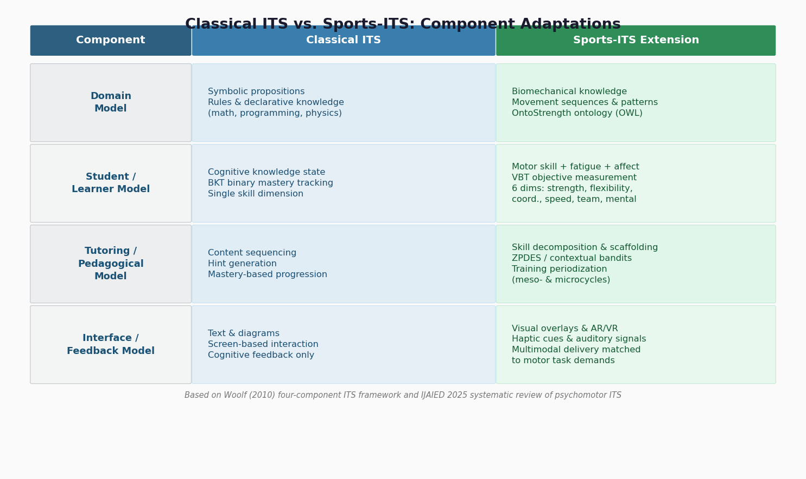

*Figure 4.1. Side-by-side comparison of the four classical ITS components and their Sports-ITS extensions, illustrating the shift from symbolic-cognitive representations to biomechanical, multi-dimensional, and multimodal adaptations required for psychomotor skill tutoring. Based on Woolf (2010) and the IJAIED 2025 systematic review.*

## 4.2 A Five-Layer Reference Architecture for Sports-ITS

Drawing on the classical ITS framework, the fusion methods surveyed in Chapter 3, and the sensor modalities cataloged in Chapter 2, a modular five-layer reference architecture emerges as the organizational backbone for Sports-ITS design. The five layers are: (1) Perception Layer, (2) Fusion Layer, (3) Learner Model Layer, (4) Pedagogical Model Layer, and (5) Feedback and Interaction Layer. Each layer encapsulates a distinct functional responsibility and communicates with adjacent layers through standardized interfaces, enabling independent module replacement and iterative system evolution. Figure 4.2 provides the architectural overview.

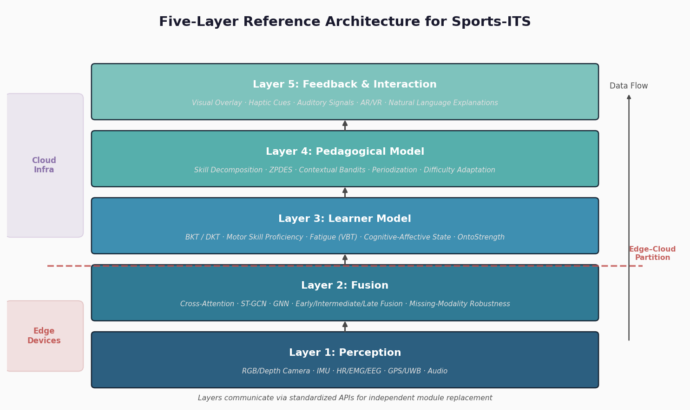

*Figure 4.2. Five-layer reference architecture for Sports-ITS, illustrating the upward data flow from multimodal perception through fusion, learner modeling, pedagogical reasoning, and adaptive feedback delivery. The edge–cloud deployment partition boundary is indicated between the Fusion and Learner Model layers.*

### 4.2.1 Layer 1: Perception — Multimodal Data Acquisition and Preprocessing

The Perception Layer acquires, synchronizes, and preprocesses raw data from heterogeneous sensor modalities. As established in Chapter 2, these modalities span computer vision (RGB, depth, skeletal pose), inertial measurement units (accelerometer, gyroscope), physiological sensors (heart rate, EMG, EEG), audio and speech capture, and environmental/contextual sources (GPS, UWB local positioning, force plates).

The core engineering challenge at this layer is temporal synchronization. Video streams typically operate at 30–60 fps, IMU accelerometers at 100–1,000 Hz, heart rate monitors at 1–4 Hz, and GPS receivers at 10 Hz. Reconciling these disparate sampling rates demands the temporal alignment techniques discussed in Chapter 3 — Dynamic Time Warping (DTW), adaptive interpolation, and differentiable temporal alignment layers such as TempoFuse — which are operationalized here to produce a unified temporal reference before data enters the Fusion Layer [Nature Scientific Reports](https://www.nature.com/articles/s41598-025-12920-9 "Multi-level data fusion enables collaborative dynamics analysis in sports, 2025").

Preprocessing at this layer further encompasses noise reduction (Kalman filtering for IMU drift, motion artifact removal for PPG signals), coordinate frame normalization (aligning camera-frame skeletal keypoints with body-frame IMU data), and continuous data quality monitoring. For deployments such as the 800+ Chinese schools using Uniview Technologies AI vision equipment for physical education testing, the Perception Layer must contend with variable lighting conditions, crowded scenes involving multiple students, and the computational constraints of edge devices processing video on-site.

### 4.2.2 Layer 2: Fusion — Cross-Modal Alignment and Joint Representation

The Fusion Layer receives preprocessed, temporally aligned data streams and produces joint multimodal representations suitable for downstream modeling. The fusion paradigms surveyed in Chapter 3 — early concatenation, intermediate feature integration, late decision combination, attention-based cross-modal alignment, and graph neural network approaches — are instantiated at this layer.

Architecture selection depends on the specific Sports-ITS application context. For real-time coaching feedback during training, attention-based intermediate fusion offers the strongest balance of accuracy and latency. CAM-Vtrans, combining a Vision Transformer (ViT) with CLIP and cross-attention mechanisms, achieves 19.2 ms per frame (~52 FPS), comfortably exceeding the 25 FPS threshold required for real-time visual feedback; ablation studies confirmed that the cross-attention module is critical across all performance metrics [CAM-Vtrans](https://www.frontiersin.org/journals/neurorobotics/articles/10.3389/fnbot.2024.1453571/full "Frontiers in Neurorobotics, 2024"). For post-session analysis where latency constraints are relaxed, more computationally demanding approaches — such as ST-GCN combined with Transformer encoders for skeleton-as-graph modeling of multi-modal IoT data — can extract richer spatiotemporal representations [ST-TransBay](https://www.sciencedirect.com/science/article/pii/S1110016825006702 "Alexandria Engineering Journal, 2025").

A critical design consideration is missing-modality robustness. In real-world sports settings, sensor dropout is common: a camera may be occluded, a wearable may disconnect, or a physiological sensor may produce corrupted data during high-intensity movement. The Fusion Layer must degrade gracefully rather than fail entirely. Two complementary strategies address this requirement: generative neural network approaches (GANs) that synthesize missing modality data from available modalities, and graph model fusion using heterogeneous supernode graphs that handle incomplete multimodal input without imputation [ACM Computing Surveys](https://dl.acm.org/doi/full/10.1145/3649447 "Deep Multimodal Data Fusion, 2024") [Multimodal Alignment & Fusion Survey](https://arxiv.org/html/2411.17040v1 "Section 5.3").

### 4.2.3 Layer 3: Learner Model — Dynamic Skill, Fatigue, and Cognitive State Tracking

The Learner Model Layer maintains and continuously updates a comprehensive representation of each athlete or student, encompassing motor skill proficiency, physical capacity, fatigue state, and cognitive-affective engagement. This layer constitutes the psychomotor analog of the student model in classical ITS and is widely considered the most critical component, since the quality of adaptive tutoring depends on the accuracy and granularity of the learner representation.

**Knowledge tracing approaches.** Three mainstream computational approaches have been adapted for learner modeling in psychomotor contexts. Bayesian Knowledge Tracing (BKT) employs a binary hidden variable to track whether a learner has mastered a given skill component, updating probabilities with each observed performance instance. Deep Knowledge Tracing (DKT), leveraging LSTM or Transformer architectures, models more complex knowledge state transitions and captures temporal dependencies across practice sessions. Ontology-based representation, exemplified by the OntoStrength ontology in Selfit (OWL/SPARQL), encodes domain-specific knowledge structures that enable semantic reasoning about skill relationships and training progression [IJAIED Review](https://link.springer.com/article/10.1007/s40593-025-00526-1 "Dimensions of Psychomotor Skill Learning").

**Psychomotor modeling dimensions.** The IJAIED systematic review identifies six dimensions along which psychomotor learner models should operate: strength, flexibility, coordination, speed, team dynamics, and mental state. These dimensions are interdependent — fatigue degrades coordination, anxiety affects speed, and strength limitations constrain the motor patterns a learner can execute. A comprehensive Sports-ITS learner model must therefore represent these dimensions jointly and model their interactions rather than treating them in isolation.

**Objective fatigue and adaptation estimation.** A defining advantage of multimodal sensing for learner modeling is the capacity to replace subjective self-report measures with objective physiological indicators. Velocity-Based Training (VBT), which monitors barbell or limb velocity to detect fatigue-induced velocity loss, provides a more objective indicator of readiness and adaptation than subjective Rating of Perceived Exertion (RPE) or Repetitions in Reserve (RIR) scales. Selfit integrates calibration procedures with RPE/RIR data to model training load; extending this approach with continuous IMU and physiological data enables richer, more responsive fatigue modeling that updates within a session rather than solely between sessions [ITS Architecture Thesis](https://pastel.hal.science/tel-04751910v1/file/2022UPSLM103_archivage.pdf "Neagu 2022, Chapter 9, pp.153-171").

### 4.2.4 Layer 4: Pedagogical Model — Strategy Selection, Training Planning, and Difficulty Adaptation

The Pedagogical Model Layer translates the learner model into instructional action. Drawing on the learner's current state, the domain model's representation of target skills, and established principles of motor learning, this layer determines what to teach next, how to structure practice, and when to adjust difficulty.

**Scaffolding and skill decomposition.** Motor learning research provides robust evidence that complex skills benefit from decomposition into sub-skills that can be practiced and mastered sequentially before integration. In psychomotor ITS, this principle has been operationalized as skill decomposition — for example, breaking a badminton smash into four discrete poses, or a golf swing into sequential visual constraint targets. The principle extends naturally to Sports-ITS: a swimming stroke can be decomposed into entry, catch, pull, and recovery phases, each analyzed through the Fusion Layer's joint representation and addressed by targeted corrective feedback [ITS Architecture Thesis](https://pastel.hal.science/tel-04751910v1/file/2022UPSLM103_archivage.pdf "pp.97-98, 125-126").

**Adaptive sequencing algorithms.** The Zone of Proximal Development and Empirical Study (ZPDES) algorithm, evaluated in a 400-student, four-group experiment, outperformed alternative approaches — including expert-designed sequences — by dynamically selecting tasks within the learner's zone of proximal development. Selfit operationalizes a complementary approach through a contextual multi-armed bandit algorithm that treats each training session as a sequence of decisions: selecting exercises, configuring sets and repetitions, and determining rest intervals. The algorithm learns the mapping from learner state to optimal training parameters through online interaction, directly addressing the exploration-exploitation trade-off inherent in training adaptation [ITS Architecture Thesis](https://pastel.hal.science/tel-04751910v1/file/2022UPSLM103_archivage.pdf "pp.97-98, 125-126").

**Training periodization.** Unlike cognitive ITS, where content sequencing is the primary pedagogical decision, Sports-ITS must also manage the temporal macrostructure of training — periodization. This encompasses planning mesocycles (weeks) and microcycles (days) that balance load accumulation, recovery, skill acquisition, and competition preparation. The IJAIED review's finding that only one system (Selfit) implements periodization underscores a major architectural gap in the current landscape. In the reference architecture, the Pedagogical Model Layer incorporates periodization logic informed by both the learner model's fatigue and adaptation state and the domain model's representation of training science principles [IJAIED Review](https://link.springer.com/article/10.1007/s40593-025-00526-1 "Training periodization gap").

### 4.2.5 Layer 5: Feedback and Interaction — Adaptive Multimodal Delivery

The Feedback and Interaction Layer translates pedagogical decisions into perceptible guidance delivered to the athlete or student. The effectiveness of this layer hinges on matching feedback modality to the task, the learner's processing capacity, and the timing requirements of the specific motor learning context.

**Modality-task matching.** Sigrist et al.'s (2013) comprehensive review in *Psychonomic Bulletin & Review* established foundational principles for augmented feedback in motor learning: visual feedback is most effective for tasks with strong spatial-visual components; auditory feedback excels for rhythm and timing tasks; haptic feedback lacks strong evidence for skill acquisition; and multimodal feedback mitigates single-channel overload. The review also identifies an unresolved debate between terminal feedback (delivered after movement completion) and concurrent feedback (delivered during movement), with evidence suggesting that terminal feedback may be superior for complex motor tasks where concurrent processing imposes excessive cognitive load [Sigrist et al. 2013](https://pubmed.ncbi.nlm.nih.gov/23132605/ "Augmented feedback in motor learning review").

**Augmented and virtual reality.** Recent empirical evidence demonstrates the substantial impact of immersive feedback technologies on motor skill acquisition. Ji et al.'s (2026) meta-analysis, covering 18 studies with 678 participants and published in *Nature Scientific Reports*, found standardized mean differences of 0.68 for stability and functional mobility and 0.72 for object control and visuomotor skills, with a complex sport-specific subgroup achieving an effect size of 1.15 [Ji et al. 2026](https://www.nature.com/articles/s41598-026-42962-6 "AR/VR motor competence meta-analysis"). He and Wei's (2025) randomized controlled trial with 60 youth footballers provides particularly compelling evidence: augmented reality feedback using HoloLens 2 integrated with Vicon motion capture (~150 ms end-to-end latency) produced effect sizes of d = 1.40 for shooting accuracy, d = 1.05 for passing accuracy, and d = 1.12 for dribbling proficiency — far exceeding control group improvements, with skills retained at a four-week follow-up [He & Wei 2025](https://pmc.ncbi.nlm.nih.gov/articles/PMC12714985/ "AR real-time feedback RCT, Frontiers in Psychology"). Figure 4.3 summarizes these empirical effect sizes alongside ITS effectiveness benchmarks.

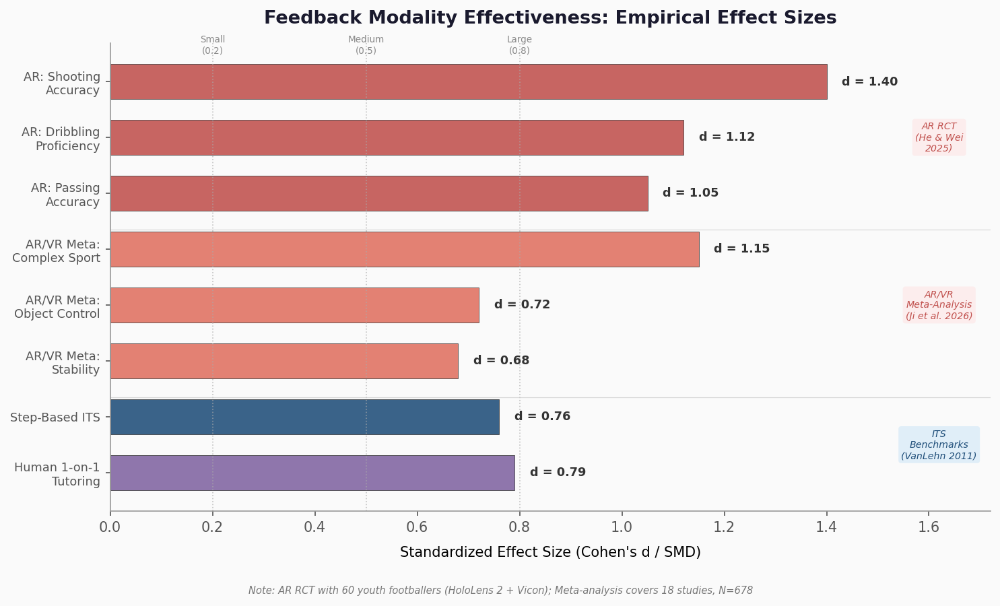

*Figure 4.3. Empirical effect sizes for feedback modalities in sports tutoring contexts, comparing AR real-time feedback (He & Wei 2025), AR/VR meta-analytic estimates (Ji et al. 2026), and ITS effectiveness benchmarks (VanLehn 2011). Cohen's d interpretation thresholds (small = 0.2, medium = 0.5, large = 0.8) are indicated for reference.*

These findings indicate that the Feedback Layer's choice of delivery modality is not merely an interface design question but a substantive determinant of learning outcomes. A Sports-ITS should therefore implement a modality selection module within this layer, informed by the pedagogical model's task classification and the learner model's current cognitive load estimate.

## 4.3 The Selfit Reference Implementation

Among existing psychomotor ITS prototypes, Selfit provides the most architecturally complete reference implementation and merits detailed examination as a design exemplar. Developed and evaluated in a doctoral thesis at Mines ParisTech, Selfit targets strength training and instantiates all four classical ITS components with domain-appropriate adaptations.

The **Domain Module** employs the OntoStrength ontology, implemented in OWL and queried via SPARQL, to encode strength training knowledge — exercise taxonomy, muscle group targets, movement patterns, and periodization principles. This ontological representation enables semantic reasoning about exercise relationships (e.g., identifying substitutes, linking exercises that target the same muscle group at different intensities) that would be difficult to achieve with purely numerical representations.

The **Student Module** combines a calibration procedure (initial strength assessment) with ongoing RPE/RIR data collection to maintain a dynamic representation of the learner's training state, encompassing estimated one-repetition maximums, fatigue accumulation, and adaptation trajectory.

The **Tutoring Module** implements a contextual multi-armed bandit algorithm for personalized training sequence selection. Rather than following a fixed program, the system treats each session as a sequence of decisions — exercise selection, set and repetition configuration, rest interval timing — and learns the mapping from learner state to optimal training parameters through online interaction. This approach directly addresses the exploration-exploitation trade-off inherent in training adaptation: the system must balance trying new training stimuli (exploration) against repeating configurations known to be effective (exploitation).

The **Interface** is mobile-based, reflecting the practical requirement that strength training systems must be usable in gym environments rather than laboratory settings.

In a user evaluation with 42 participants, Selfit was rated as practical, motivating, and engaging [ITS Architecture Thesis](https://pastel.hal.science/tel-04751910v1/file/2022UPSLM103_archivage.pdf "Neagu 2022, Chapter 9, pp.153-171"). The system's limitations, however, illuminate important directions for the broader Sports-ITS architecture. Selfit relies primarily on user self-report (RPE/RIR) rather than multimodal sensor data for learner modeling; it addresses only strength training — a closed, internally paced, individual skill — rather than the open, externally paced, team-based skills central to many sports; and it does not implement real-time movement quality assessment. These gaps delineate the value proposition of extending the architecture with the multimodal Perception and Fusion Layers described in Sections 4.2.1 and 4.2.2.

## 4.4 Design Principles for Real-Time Operation

### 4.4.1 Edge-Cloud Partitioning

A Sports-ITS operating in real time must process continuous multimodal data streams, execute fusion and inference, and deliver feedback within perceptually meaningful time windows. For concurrent feedback during movement execution, the latency budget falls on the order of 100–250 ms — the range within which augmented feedback is perceived as temporally coincident with the movement. He and Wei's AR football coaching system achieved approximately 150 ms end-to-end latency with HoloLens 2 and Vicon integration, establishing a concrete engineering benchmark [He & Wei 2025](https://pmc.ncbi.nlm.nih.gov/articles/PMC12714985/ "AR real-time feedback RCT, Frontiers in Psychology").

Meeting this latency budget with multimodal fusion models necessitates edge-cloud architectural partitioning. Latency-sensitive processing — pose estimation from video, IMU-based motion classification, immediate safety alerts — executes on edge devices (NVIDIA Jetson, Google Coral TPU, or embedded NPUs in mobile processors). More computationally intensive tasks — comprehensive multi-modal fusion, long-horizon learner model updating, periodization planning — are offloaded to cloud infrastructure with relaxed latency requirements.

Quantization provides a critical enabler for edge deployment. INT8 quantization of fusion models on Jetson platforms achieves 240 ms inference latency with only 1.8% accuracy loss relative to full-precision models [CAM-Vtrans](https://www.frontiersin.org/journals/neurorobotics/articles/10.3389/fnbot.2024.1453571/full "Frontiers in Neurorobotics, 2024"). For the vision-language fusion pipeline, CAM-Vtrans demonstrates that 19.2 ms per frame (~52 FPS) is achievable with ViT + CLIP + cross-attention on GPU hardware, well within real-time requirements. A 2024 study on wearable multi-modal edge computing, however, highlights the fundamental tension between edge device power budgets and the computational demands of Transformer-level fusion models: full multimodal fusion (video + IMU + heart rate) multiplies computational demand well beyond what single-modality pipelines require [Wearable Edge Computing](https://arxiv.org/html/2409.06341v1 "arXiv, 2024").

### 4.4.2 Streaming Inference and Incremental Learning

Real-time operation further requires streaming inference architectures rather than batch processing. Sliding window approaches — processing the most recent N frames or T seconds of sensor data — enable continuous output without waiting for an entire session to complete. For the Learner Model Layer, incremental model updating via online learning (contextual bandits, as in Selfit, or incremental reinforcement learning) allows the system to adapt its learner representation and pedagogical strategy within a single session rather than requiring offline retraining between sessions.

This design pattern is particularly consequential for fatigue monitoring. A Sports-ITS capable of detecting declining movement velocity or increasing movement variability — indicators of neuromuscular fatigue — in real time can trigger the Pedagogical Model to reduce training intensity or insert rest periods, implementing a form of automated autoregulation that responds to physiological state rather than predetermined schedules.

## 4.5 Explainability as an Architectural Requirement

A Sports-ITS that produces accurate but opaque recommendations faces a fundamental adoption barrier: coaches and athletes are unlikely to trust — and therefore unlikely to act on — feedback they cannot interpret. Explainability is not merely a desirable feature but an architectural requirement that must be designed into each layer from the outset.

Kranzinger et al.'s (2026) scoping review, published in *Discover AI* and covering 19 studies from 2014 to 2024, maps the current state of explainable AI (XAI) in sports science. SHAP (SHapley Additive exPlanations) is the dominant XAI method; LIME (Local Interpretable Model-agnostic Explanations) appeared in only one study; and visual explanation methods such as Grad-CAM and saliency maps — which would be natural fits for video-based sports analysis — are entirely absent. Most critically, the majority of studies lack expert validation of the generated explanations, raising the question of whether outputs are meaningful to the intended end users [Kranzinger et al. 2026](https://link.springer.com/article/10.1007/s44163-025-00709-8 "XAI in sports science scoping review, Discover AI").

For Sports-ITS, explainability can be operationalized through multiple paths within the five-layer architecture:

- **Perception Layer**: Attention weight visualization in pose estimation models, highlighting which body segments drove a particular classification — analogous to Grad-CAM applied to skeletal keypoint attention maps.
- **Fusion Layer**: Post-hoc SHAP analysis of fused features, quantifying the contribution of each modality (vision, IMU, heart rate) to the system's assessment of a given movement.
- **Learner Model Layer**: Transparent skill decomposition displays showing the learner their current proficiency across each sub-skill dimension and the trajectory over time.
- **Pedagogical Model Layer**: Rule-based or template-generated natural language explanations for training recommendations — for example, "Rest interval increased to 3 minutes because barbell velocity on the last set declined 15% below baseline, indicating neuromuscular fatigue."
- **Feedback Layer**: Domain-specific rubric alignment, such as the International Judging System (IJS) rubric for figure skating or the IRIS system, anchoring AI assessments to established human evaluation criteria.

The SWIM-360 project at the University of Malta (€200K budget, 2025) provides an instructive case: in a coach survey (n = 8), coaches rated the importance of explainability at 4–5 on a 5-point scale and expressed a preference for highlighted video playback as the explanation modality — directly indicating that visual, movement-anchored explanations are valued over abstract statistical outputs [SWIM-360](https://www.mdpi.com/1424-8220/25/22/7047 "Sensors, 2025").

## 4.6 Effectiveness Evidence and Architectural Validation

The architectural choices outlined above are grounded not only in engineering reasoning but in empirical evidence regarding ITS effectiveness. VanLehn's (2011) meta-analysis found that step-based ITS — systems providing feedback at each step of problem-solving rather than only at the final answer — achieve an effect size of d = 0.76, approaching one-on-one human tutoring (d = 0.79) and far exceeding traditional computer-assisted instruction. Steenbergen-Hu and Cooper's (2014) meta-analysis across 50 controlled experiments confirmed this pattern [Steenbergen-Hu & Cooper](https://dukespace.lib.duke.edu/bitstreams/f123780d-7d60-48c2-928d-8a4c402366b0/download "Meta-Analysis of ITS effectiveness, Duke University, 2014").

The architectural implication is direct: the granularity of the system's perception and learner model determines the grain size at which feedback can be delivered. A Sports-ITS equipped with frame-level pose estimation and repetition-level fatigue tracking can implement step-based tutoring for motor skills — providing corrective feedback on each movement repetition rather than only after a practice session — thereby replicating the mechanism that makes step-based cognitive ITS so effective.

Selfit's user evaluation (n = 42) provides preliminary validation that this architectural approach is perceived as practical and motivating in a psychomotor domain, though the study lacked a controlled comparison condition [ITS Architecture Thesis](https://pastel.hal.science/tel-04751910v1/file/2022UPSLM103_archivage.pdf "Neagu 2022, Chapter 9, pp.153-171"). The HALE app — a simpler system using OpenPose and Bi-LSTM for squat analysis (85% classification accuracy) — demonstrated in a randomized controlled trial (n = 20) that the app group's squat scores improved from 0.20 to 8.00 (p = 0.001), compared with the control group's non-significant improvement from 0.70 to 3.80 (p = 0.13). Range of motion gains reached 12.8–15.9% versus 0.9–3.6%, and correct posture improvement was 52.3% versus 21.3% [HALE RCT](https://pmc.ncbi.nlm.nih.gov/articles/PMC10523222/ "Interactive J Med Res, 2023"). While HALE instantiates only a fraction of the full reference architecture (single-modality perception, minimal learner modeling, no periodization), its positive results suggest that even partial implementations of the architectural pipeline yield meaningful learning gains.

## 4.7 Scalability Considerations

The reference architecture must accommodate deployment scenarios ranging from a single athlete with a personal coach (elite training) to hundreds of students in a physical education setting. Scalability manifests at multiple layers:

- **Perception Layer**: In school PE deployments — such as the 800+ Chinese schools using Uniview AI vision equipment — the system must simultaneously track and assess multiple students. Multi-person pose estimation (as enabled by OpenPose's bottom-up architecture) is essential, but computational cost scales with the number of tracked individuals.
- **Fusion Layer**: Multi-student scenarios multiply the number of parallel fusion pipelines. Efficient batching and shared feature extraction — computing a single scene representation from which individual student features are extracted — become architectural necessities.
- **Learner Model Layer**: Each student requires an independent learner model, though model architecture can be shared with per-student parameters stored and retrieved efficiently. Federated learning approaches — discussed in Chapter 7 — offer a path to training learner models across institutions while preserving data privacy.
- **Pedagogical Model Layer**: Group-aware pedagogical strategies must supplement individual optimization. When 40 students practice standing long jumps simultaneously, the system cannot provide concurrent individual feedback to all; it must prioritize interventions on the basis of error severity, learner need, and instructional opportunity.

The modular, API-driven architecture supports horizontal scaling: additional edge devices extend perception capacity, cloud resources scale elastically for fusion and model updating, and the standardized inter-layer interfaces ensure that scaling one layer does not require redesigning others.

## 4.8 Synthesis: From Architecture to Implementation

The five-layer reference architecture integrates the sensor modalities of Chapter 2 and the fusion methods of Chapter 3 into a coherent system design for Sports-ITS. Its distinguishing features relative to both classical cognitive ITS and contemporary sports analytics platforms are: (a) multimodal perception that captures movement quality, physiological state, and environmental context simultaneously; (b) fusion that produces joint representations richer than any single modality alone; (c) learner modeling that tracks psychomotor dimensions — strength, coordination, fatigue — in addition to skill mastery; (d) pedagogical reasoning that operationalizes motor learning principles including scaffolding, adaptive sequencing, and periodization; and (e) feedback delivery matched to the perceptual demands of the motor task.

The architecture is designed for modularity: each layer communicates through standardized interfaces, enabling independent module replacement as sensor technologies, fusion algorithms, and pedagogical models evolve. The Selfit system demonstrates that even a partial instantiation of this architecture — an ontological domain model, a bandit-based pedagogical model, and self-report learner data — produces a usable and positively received training system. The full architecture, integrating continuous multimodal sensing and automated fusion, represents the next evolutionary step: a system capable of the continuous, objective, individualized movement assessment and feedback that neither human coaches at scale nor passive analytics dashboards can provide.

# 第5章 Application Scenarios and Domain-Specific Implementations

Chapters 2 through 4 established the multimodal sensing modalities available for sports contexts, the computational methods for fusing heterogeneous data streams, and a five-layer reference architecture for Sports Intelligent Tutoring Systems (Sports-ITS). This chapter turns from technical foundations to their realization — complete or nascent — across four distinct application domains: elite and competitive sports training, physical education in schools and universities, sports rehabilitation and injury prevention, and recreational fitness and wellness coaching. For each domain, the analysis moves beyond a catalog of products and prototypes to evaluate the specific requirements, constraints, evidence base, and value propositions that shape deployment. A cross-domain synthesis closes the chapter, mapping shared design patterns, domain-specific divergences, and the maturity of existing implementations against the five-layer architecture.

## 5.1 Elite and Competitive Sports Training

### 5.1.1 The Data Infrastructure of Modern Elite Sport

Elite sport has evolved into a data-intensive enterprise. Catapult Sports' Vector system, deployed on AWS IoT infrastructure, serves more than 5,000 professional teams across 40+ sports in 128 countries, generating 600 metrics per athlete per match. The scale of data production is considerable: a typical NHL game lasting two hours with a 30-athlete roster yields 36 million data points, uploadable within 30 seconds [AWS Blog](https://aws.amazon.com/blogs/iot/the-data-behind-the-win-how-catapult-and-aws-iot-are-transforming-pro-sports/ "Catapult & AWS IoT, 2025"). Catapult's architecture implements a two-tier data strategy aligned with the edge-cloud partitioning principle described in Chapter 4: a 10 Hz real-time stream supports sideline decision-making during play, while a 100 Hz post-match layer feeds machine learning models for automatic event detection. This dual-layer approach demonstrates how the five-layer reference architecture manifests in production — the Perception Layer (Layer 1) handles real-time sensor ingestion and synchronization, while heavier fusion and modeling (Layers 2–3) reside in cloud-based post-session pipelines.

The breadth of adoption underscores a critical observation: the data infrastructure for multimodal Sports-ITS in elite settings already exists at scale. The bottleneck is no longer data acquisition but the intelligence layers — learner modeling, pedagogical decision-making, and adaptive feedback — that transform raw metrics into individualized tutoring. Current commercial platforms overwhelmingly serve analytics dashboards and load management without implementing the closed-loop tutoring architecture that defines a full Sports-ITS.

### 5.1.2 Predictive Injury Prevention: Zone7 AI

Zone7 AI represents one of the most rigorously validated applications of multimodal data fusion in elite sport. A validation study spanning 11 professional teams found that 72.4% of 423 injuries were predicted one to seven days in advance, covering 65.4% of total absence days. On 80% of analysis days, three or fewer players were flagged as high risk — a threshold that makes the system operationally tractable for coaching staff. MLS club Real Salt Lake reported a 57% reduction in injury rates following Zone7 deployment [Zone7 Validation](https://zone7.ai/case-studies/validation-study/validation-study-injury-risk-forecasting-with-zone7-ai/ "Sportsmith 2022") [Sports Business Journal](https://www.sportsbusinessjournal.com/Daily/Issues/2020/06/23/Technology/mls-soccer-real-salt-lake-zone7-injury-risk-prevention/ "Real Salt Lake, 2020").

Zone7's architecture fuses GPS tracking, accelerometer workload data, physiological monitoring, and historical injury records — a multimodal input set spanning the vision, inertial, and physiological modalities detailed in Chapter 2. Its output, a per-athlete risk score with a temporal prediction window, operationalizes the Learner Model Layer (Layer 3) for the specific task of injury risk tracking. The system's performance demonstrates that intermediate-level fusion of heterogeneous time-series data, combined with domain-specific feature engineering, can yield clinically actionable predictions in production settings.

### 5.1.3 National-Level Sport-Specific Implementations

China's elite sports programs offer instructive examples of domain-specific multimodal tutoring beyond generic load monitoring. The national diving team employs a "3D + AI" system for real-time mid-air posture analysis, fusing depth camera feeds with biomechanical models to deliver frame-by-frame technique assessment during training dives. The Table Tennis Association applies AI for match video analysis — quantifying spin speed, placement patterns, rally tempo, and opponent tactical profiling — to convert post-match footage into structured tactical intelligence. For the 2026 Milan-Cortina Winter Olympics, VR/AR immersive training was deployed for freestyle skiing aerials, enabling athletes to rehearse complex aerial maneuvers in simulated environments before physical execution [SCIO/Xinhua](http://english.scio.gov.cn/m/in-depth/2026-03/10/content_118374140.html "AI in Chinese elite sports, March 2026").

These implementations illustrate how the generic five-layer architecture adapts to sport-specific biomechanical requirements. Diving analysis demands sub-frame temporal resolution and 3D spatial reconstruction; table tennis analysis requires high-speed ball tracking alongside player pose estimation; aerial skiing training prioritizes immersive feedback delivery (Layer 5) over real-time corrective cues. Each adaptation reinforces the architectural principle of modularity: the same pipeline structure accommodates radically different sports through domain-specific module substitution.

### 5.1.4 Research Prototypes: SWIM-360

SWIM-360, a €200,000 project at the University of Malta (2025), exemplifies a research prototype designed for multimodal explainable swimming analysis. The system integrates IMU force sensors, near-infrared spectroscopy (NIRS) for muscle oxygenation monitoring, and underwater video pose estimation — a modality combination that addresses the specific challenges of swimming, where conventional camera-based tracking faces severe optical distortion and where physiological state cannot be visually assessed. A coach survey (n = 8) rated the importance of explainability at 4–5 on a 5-point scale, with coaches preferring highlighted video playback as the primary explanation interface [SWIM-360](https://www.mdpi.com/1424-8220/25/22/7047 "Sensors, 2025").

The SWIM-360 findings carry implications for Sports-ITS design along two dimensions. First, the coach demand for explainability confirms the architectural need for XAI mechanisms — particularly post-hoc SHAP and attention weight visualization (Chapter 4) — as practitioners resist "black box" recommendations regardless of predictive accuracy. Second, the preference for highlighted video playback over numerical dashboards indicates that the Feedback Layer (Layer 5) must prioritize visual, temporally grounded explanations anchored in the athlete's own performance footage rather than abstract statistical summaries.

## 5.2 Physical Education in Schools and Universities

### 5.2.1 The Scalability Problem in Physical Education

Physical education (PE) faces a structural scalability constraint that creates a distinctive value proposition for Sports-ITS. SHAPE America recommends student-teacher ratios not exceeding 1:25 for optimal teaching quality, yet research documents actual ratios as high as 1:54 in many US schools [SHAPE America Guidelines](https://www.shapeamerica.org/Common/Uploaded%20files/document_manager/standards/guidelines/Opportunity-to-Learn-Grid.pdf "Opportunity to Learn Guidelines") [ResearchGate](https://www.researchgate.net/publication/280204098_Perspectives_of_Physical_Education_Specialists_who_Teach_in_Large_Class_Settings "PE class ratio study"). At such ratios, individualized movement feedback — the mechanism through which Bloom's 2-sigma effect is generated in one-on-one tutoring (Chapter 1) — becomes physically impossible. A teacher supervising 54 students performing standing long jumps cannot observe, assess, and correct each student's knee angle, arm swing timing, and landing mechanics within a single class period.

This structural gap defines the primary value proposition of Sports-ITS in PE: automated, per-student movement assessment and feedback at scale, without requiring additional human instructors. The technical requirements differ markedly from elite sport. The system must handle multiple simultaneous users (20–50 students), operate with minimal hardware (ideally one or a small number of cameras), tolerate highly variable skill levels ranging from beginners to advanced students, and produce feedback that is pedagogically appropriate for children and adolescents rather than adult elite athletes.

### 5.2.2 Large-Scale Deployments in China

China has emerged as the leading deployment site for AI-powered PE systems, driven by national policy prioritizing technology-enabled physical education. The five-year national action plan "Technology Empowering Sports," implemented in 2024, designates AI in sports as a key priority and mandates at least two hours of daily physical activity by 2027 [SCIO/Xinhua](http://english.scio.gov.cn/m/in-depth/2026-03/10/content_118374140.html "Policy mandate"). This policy infrastructure has created a market in which several commercial systems operate at substantial scale.

**Uniview Technologies** has deployed AI sports equipment to over 800 schools for PE examination preparation, covering standardized test events including rope jumping, sprinting, standing long jump, and sit-ups. The system relies on pure AI vision — camera-based pose estimation without wearable sensors — to assess student performance against standardized criteria [SCIO/Xinhua](http://english.scio.gov.cn/m/in-depth/2026-03/10/content_118374140.html "Uniview deployment"). This design choice reflects the PE deployment constraint: wearable sensors are impractical when 30–50 students must be instrumented and de-instrumented within a single class period.

**iFLYTEK Smart PE** operates across 28+ provinces, 500+ schools, and 750,000+ registered users. The system's AI vision engine detects over 40 violation types across standardized PE assessment events. A case study at Hefei No. 7 High School reported that after one year of deployment, students' 100-meter sprint times improved by 16.18% and standing long jump distances increased by 29.03% [iFLYTEK](https://edu.iflytek.com/solution/school/physical-education "Official product page"). These improvements are substantial, though the evidence derives from pre-post observational data without a randomized control group; the gains may partially reflect the motivational effects of systematic assessment and feedback rather than the AI component specifically.

Additional deployments illustrate the breadth of experimentation across Chinese provinces. Beijing's Pinggu district implemented a smart playground with face-recognition-based PE testing. Jiangsu province mandated daily PE from Fall 2025. Wuxi deployed AI-powered automated refereeing for jump rope events in 2026, eliminating the need for human judges in standardized PE testing [China Daily](https://www.chinadaily.com.cn/a/202509/24/WS68d34947a3108622abca2886_3.html "Jiangsu province policy, 2025") [SCIO/Xinhua](http://english.scio.gov.cn/m/in-depth/2026-03/10/content_118374140.html "Wuxi AI referee deployment").

### 5.2.3 Global Context and Evidence Gaps

The concentration of documented large-scale PE deployments in China reflects both a genuine policy-driven deployment advantage and an evidence availability asymmetry. Comparable systematic data from EU or US school-based AI PE deployments has not emerged in T1/T2 sources as of early 2026. Smaller-scale pilots using platforms such as Coach's Eye or Dartfish in US physical education programs have been anecdotally reported, but none has been documented at the scale or with the quantitative outcome data available from Chinese systems.

The absence of randomized controlled trials across all documented PE deployments represents a significant evidence gap. The iFLYTEK Hefei case, while demonstrating impressive improvement magnitudes, lacks the methodological rigor necessary to attribute gains specifically to AI-powered tutoring versus confounding factors such as increased practice time, Hawthorne effects, or concurrent curriculum changes. For Sports-ITS research to mature in the PE domain, controlled experimental designs — ideally comparing AI-augmented instruction against both traditional instruction and non-AI technology-enhanced instruction — are essential.

## 5.3 Sports Rehabilitation and Injury Prevention

### 5.3.1 VR-Based Motor Rehabilitation: Evidence from Systematic Review

Sports rehabilitation represents a domain where the closed-loop feedback architecture of Sports-ITS converges with established clinical rehabilitation principles. A PRISMA-compliant review of 22 studies published in *Bioengineering* (2025) provides the most comprehensive synthesis of VR and AI-driven rehabilitation outcomes to date. For upper limb rehabilitation, VR-based interventions produced approximately 11-point improvements on the Fugl-Meyer Assessment for Upper Extremity (FMA-UE), with a large effect size (η² = 0.633). Balance training using the Wii Fit platform yielded Berg Balance Scale (BBS) improvements of 7.6 points versus 4.2 points in conventional therapy (p = 0.004). A randomized controlled trial (n = 50) of AI-adaptive VR rehabilitation reported significant Barthel Index gains of 25 points, indicating meaningful improvement in activities of daily living. The CUREO immersive VR system demonstrated Action Research Arm Test (ARAT) improvements of 9.8 points versus 5.1 points for robotic therapy alone, with 84% of participants achieving the minimal clinically important difference [PMC Review](https://pmc.ncbi.nlm.nih.gov/articles/PMC12937938/ "Bioengineering, 2025").

These results confirm that the multimodal feedback loops central to Sports-ITS design — real-time movement sensing, adaptive difficulty adjustment, and multi-channel feedback delivery — translate effectively to rehabilitation contexts. The critical mechanism resides in the Pedagogical Model Layer (Layer 4): by adapting task difficulty in response to patient performance, AI-VR systems operationalize the scaffolding principle in a clinical domain where conventional therapy often relies on therapist intuition for load progression.

### 5.3.2 AI-Driven Adaptation Mechanisms

The AI mechanisms underpinning rehabilitation adaptation span multiple algorithmic paradigms. Supervised learning drives difficulty adjustment in response to classified movement quality. Reinforcement learning (Q-learning) optimizes VR task parameters to maximize patient engagement and motor recovery. Generative adversarial networks (GANs) produce difficulty-graded rehabilitation exercises, with a reported correlation of r = 0.74 between generated difficulty levels and patient functional capacity. A Bi-LSTM model integrated with Firefly optimization achieved 99.06% movement classification accuracy and a 98% task success rate in robotic-assisted rehabilitation [PMC Review](https://pmc.ncbi.nlm.nih.gov/articles/PMC12937938/ "Tables 1 & 6").

A particularly noteworthy finding concerns adherence. Home-based rehabilitation systems incorporating these adaptive mechanisms report completion rates of 71–90% over periods up to 12 weeks — substantially higher than the 50–70% adherence typically observed in conventional home exercise programs. This adherence advantage suggests that the closed-loop, adaptive feedback structure of Sports-ITS may address one of rehabilitation's most persistent challenges: patient dropout from unsupervised exercise regimens.

### 5.3.3 Musculoskeletal Injury Prevention: Multimodal Wearable Frameworks

Beyond post-injury rehabilitation, multimodal sensor fusion enables proactive injury prevention — a domain with direct relevance to both elite sport and recreational fitness. A 2026 study published in *Nature Scientific Reports* presents a real-time wearable biomechanics framework integrating IMUs and surface electromyography (sEMG) for injury-risk assessment and rehabilitation tracking. Field experiments with 50 athletes demonstrated that the hybrid IMU-sEMG model achieved 92.3% accuracy, 90.5% recall, and an AUC of 0.93 for injury-risk classification, with an average real-time feedback latency of 188 ± 15 ms. The system detected joint-angle asymmetry exceeding 10° and muscle-force imbalance exceeding 15% as predictive indicators for emerging ACL and muscle-strain risks, enabling individualized rehabilitation load adjustment and progressive recovery milestone tracking [Alzahrani et al. 2026](https://www.nature.com/articles/s41598-025-34551-w "Real-time wearable biomechanics framework, Scientific Reports, 2026").

This framework bridges the gap between the Zone7-style population-level injury prediction described in Section 5.1.2, which relies on aggregated GPS and workload data, and individual biomechanical risk assessment. By fusing inertial and electromyographic modalities — two of the sensor categories detailed in Chapter 2 — the system implements intermediate fusion (Chapter 3) at the individual athlete level, producing clinically actionable real-time feedback with sub-200 ms latency. The 188 ms latency satisfies the threshold for real-time augmented feedback during movement execution, as established in the feedback modality literature reviewed in Chapter 4.

### 5.3.4 Rehabilitation Domain: Evidence Maturity and Limitations

The rehabilitation evidence base, while encouraging, exhibits important limitations. The PRISMA review's 22 studies are predominantly focused on stroke rehabilitation rather than sports-specific injury recovery. ACL post-surgical rehabilitation — the most common sports-related surgical procedure, with approximately 200,000 reconstructions annually in the United States — lacks dedicated multimodal ITS studies at RCT-level rigor. The wearable biomechanics framework described above provides ACL risk detection but has not yet been integrated into a full closed-loop tutoring system with adaptive exercise prescription.

The transition from clinic-based to home-based rehabilitation introduces constraints analogous to the PE scalability problem: reduced supervision, variable hardware availability, and the need for self-contained feedback loops. The REWIRE home-based rehabilitation system achieved 71% session completion and 95% usability scores, suggesting that patient engagement is achievable with well-designed interfaces — though the system's adherence over periods longer than 12 weeks remains uncharacterized [PMC Review](https://pmc.ncbi.nlm.nih.gov/articles/PMC12937938/ "Bioengineering, 2025").

## 5.4 Recreational Fitness and Wellness Coaching

### 5.4.1 Sensor-Embedded Home Fitness Systems

The recreational fitness domain has produced the most commercially mature implementations of multimodal sports tutoring, driven by consumer demand for at-home guided exercise. Tonal, a digitally connected strength training system, embeds 17 sensors operating at 60 Hz across its adjustable cable arms and handles. Its AI engine, trained on approximately one billion repetitions across 100 million+ sets and 111 exercises, delivers six feedback cues per exercise targeting form correction. Internal data demonstrates measurable learning curves: users' form scores improve by 10% after 10 sets and by 34% after 200 sets, with novice users showing 47% improvement — a gradient consistent with the motor learning principle that beginners derive greater marginal benefit from augmented feedback [Tonal Blog](https://tonal.com/blogs/all/introducing-form-feedback "Form Feedback feature description").

Tempo introduced the first home gym with a built-in 3D depth sensor (Analog Devices ToF, 1 MP depth, 40 fps), enabling markerless skeletal tracking without external cameras. Tempo 2.0 integrates generative AI for custom training plan creation, incorporating smartwatch physiological data to adapt programming based on recovery status [ADI-Tempo](https://www.analog.com/en/signals/articles/tempo.html "ADI Signals+, 2023"). In October 2025, Peloton launched Peloton IQ, an AI and computer vision platform providing real-time personalized guidance during cross-training workouts — a strategic pivot from the company's earlier Guide device (discontinued July 2025), shifting from standalone camera-based movement tracking to an integrated AI system embedded in its new Cross Training hardware line [Peloton Investor Relations](https://investor.onepeloton.com/news-releases/news-release-details/peloton-enters-new-era-ai-powered-peloton-iq-and-new-product/ "October 2025 announcement").

These commercial systems instantiate several layers of the reference architecture at varying levels of sophistication. Tonal and Tempo implement Perception (sensor-embedded exercise equipment), rudimentary Fusion (combining kinematic and load data), and simplified Learner Modeling (tracking progression across sessions). Peloton IQ adds computer vision as an additional modality. None, however, implements a full pedagogical model with adaptive scaffolding or periodization — features that remain absent from all consumer fitness platforms examined.

### 5.4.2 Mobile App–Based Coaching: The HALE RCT

The HALE application provides the strongest peer-reviewed evidence for mobile-based sports tutoring in the recreational fitness domain. A randomized controlled trial (n = 20) evaluated a system combining OpenPose pose estimation with Bi-LSTM temporal modeling (85% classification accuracy) for squat exercise assessment and feedback. The intervention group improved squat scores from 0.20 to 8.00 (p = 0.001), while the control group improved from 0.70 to 3.80 (p = 0.13, non-significant). Range of motion increased by 12.8–15.9% in the intervention group versus 0.9–3.6% in controls; correct posture attainment rose by 52.3% versus 21.3% [HALE RCT](https://pmc.ncbi.nlm.nih.gov/articles/PMC10523222/ "Interactive Journal of Medical Research, 2023").

The HALE trial is methodologically notable for its use of a randomized design with objective biomechanical outcome measures — a rarity among consumer fitness AI studies. The effect sizes are large, and the control group's non-significant improvement suggests that the AI feedback component, rather than practice alone, drives the performance gains. Limitations include the small sample size and the restriction to a single exercise (squat), leaving generalizability to complex multi-joint movements uncertain.

### 5.4.3 The Chinese Smart Fitness Ecosystem

China's recreational fitness landscape reflects the same policy-technology convergence observed in its PE deployments. The Wuxi AI smart sports complex integrates IoT sensors, infrared motion detectors, and LED guidance strips to create an intelligent outdoor fitness environment. Multiple Chinese companies have integrated DeepSeek and other domestic large language models into smart treadmills and exercise equipment, enabling conversational coaching during workouts. China's smart fitness industry market is projected to reach RMB 140 billion (approximately USD 20 billion) by 2026 [SCIO/Xinhua](http://english.scio.gov.cn/m/in-depth/2026-03/10/content_118374140.html "Mass fitness AI market projection").

The integration of LLMs into fitness equipment represents an early implementation of the generative AI coaching paradigm discussed in Chapter 4. Following the WHOOP Coach architecture model — query decomposition, personalized data retrieval, domain knowledge search, and LLM synthesis — these systems aim to transform equipment from passive resistance machines into conversational tutoring partners. Independent validation data for these LLM-integrated fitness systems has not yet appeared in peer-reviewed literature.

## 5.5 Cross-Domain Synthesis

### 5.5.1 Shared Design Patterns

Across all four application domains, several architectural patterns recur. First, **vision-based pose estimation** serves as the primary perception modality, whether through professional multi-camera arrays (elite sport), single classroom cameras (PE), clinical motion capture (rehabilitation), or embedded depth sensors (home fitness). The prevalence of vision reflects both its information richness and the maturity of pose estimation algorithms following the OpenPose (2017) and MediaPipe (2020) inflection points documented in Chapter 2. Second, **adaptive difficulty or load progression** appears in every domain — from Zone7's training load management to VR rehabilitation's Q-learning-driven task adjustment to Tonal's progressive overload algorithms. This convergence validates the centrality of the Pedagogical Model Layer (Layer 4) as a universal architectural requirement. Third, all domains demonstrate a consistent **feedback delivery preference**: visual, temporally grounded, and anchored in the athlete/student/patient's own movement data — a pattern consistent with the finding from Sigrist et al. (2013) that visual feedback is most effective for visually guided tasks.

A striking inverse relationship emerges between deployment scale and evidence quality across the systems examined in this chapter. Rehabilitation systems, supported by PRISMA-level systematic reviews and multiple RCTs, exhibit the highest methodological rigor but the smallest deployment footprints. Conversely, commercial fitness platforms (Tonal, Tempo, Peloton IQ) achieve the widest consumer reach while relying primarily on internal metrics without independent peer review. Figure 5.1 visualizes this gradient.

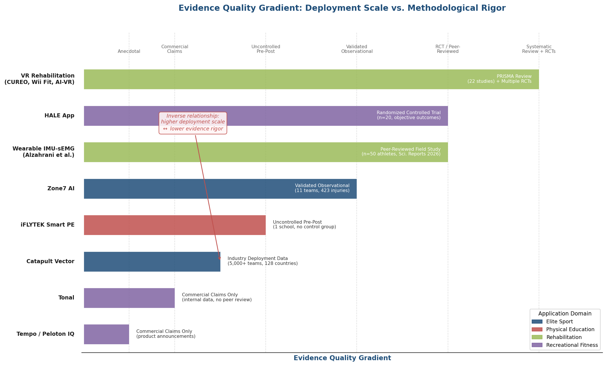

*Figure 5.1. Evidence quality gradient across key Sports-ITS deployments. Systems are ranked from highest methodological rigor (left: systematic review with multiple RCTs) to lowest (right: commercial claims only), color-coded by application domain. The annotation highlights the inverse relationship between commercial deployment scale and evidence quality.*

### 5.5.2 Domain-Specific Divergences

The four domains diverge along several dimensions that fundamentally shape system design. **Sensor complexity** decreases from elite sport (multi-modal, multi-device, high-sampling-rate arrays) to PE (typically single-camera AI vision) to home fitness (embedded sensors in equipment). **Latency tolerance** varies: elite sideline decisions tolerate seconds; rehabilitation exercises tolerate hundreds of milliseconds; real-time technique correction during explosive athletic movements demands sub-100 ms feedback. **User expertise** spans a wide range: elite athletes can interpret nuanced biomechanical feedback, while PE students and recreational users require simplified, motivational cues. **Evidence maturity** is highest in rehabilitation (multiple RCTs, PRISMA reviews) and lowest in PE (observational pre-post studies only) and consumer fitness (limited independent validation). Figure 5.2 presents a six-dimension comparison matrix summarizing these divergences.

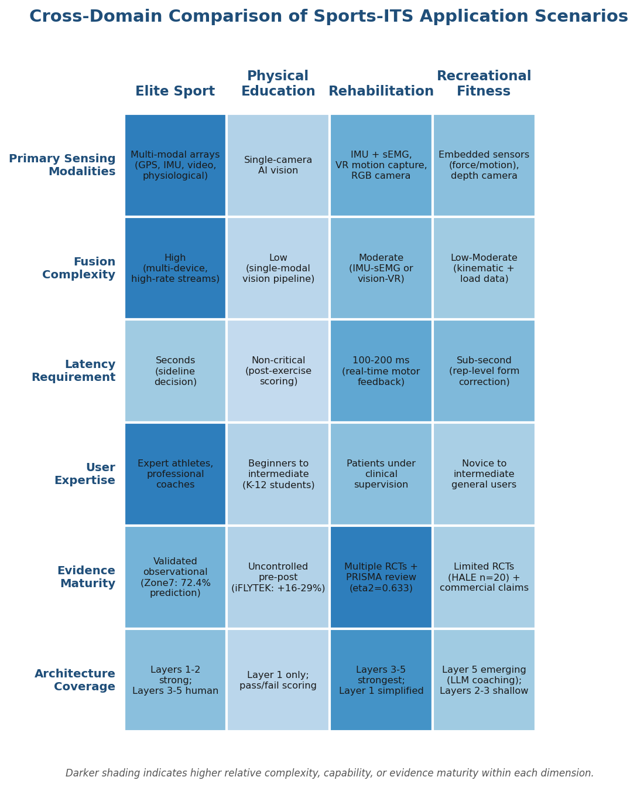

*Figure 5.2. Cross-domain comparison matrix contrasting the four application domains across primary sensing modalities, fusion complexity, latency requirements, user expertise, evidence maturity, and five-layer architecture coverage.*

Perhaps the most consequential divergence concerns the **completeness of the tutoring loop**. Elite sport systems (Catapult, Zone7) implement perception and learner modeling robustly but leave pedagogical decision-making to human coaches. PE systems (iFLYTEK, Uniview) implement perception and automated assessment but lack adaptive tutoring strategies. Rehabilitation systems most closely approximate the full Sports-ITS loop — perception, fusion, adaptive modeling, and automated feedback — likely because the structured, repetitive nature of rehabilitation exercises is most amenable to algorithmic control. Consumer fitness systems occupy a middle ground: Tonal and Tempo provide partial feedback loops, while the integration of LLMs into coaching (WHOOP Coach, DeepSeek-powered equipment) represents an emerging attempt to close the pedagogical gap through conversational intelligence.

### 5.5.3 Maturity Assessment

No deployed system examined in this chapter fully implements the five-layer reference architecture proposed in Chapter 4 with all layers operating at full capability. Elite sport systems excel at Layers 1–2 (Perception and Fusion) but delegate Layers 3–5 to human coaches. PE systems emphasize Layer 1 (automated vision assessment) but compress Layers 2–4 into simple pass/fail scoring. Rehabilitation systems most completely implement Layers 3–5 (adaptive modeling and feedback) but often rely on simplified perception (single RGB camera or basic IMU). Consumer fitness systems are investing heavily in Layer 5 (LLM-based conversational feedback) while Layers 2–3 remain shallow. Figure 5.3 maps nine deployed systems against the five architectural layers, revealing these complementary strengths and gaps.

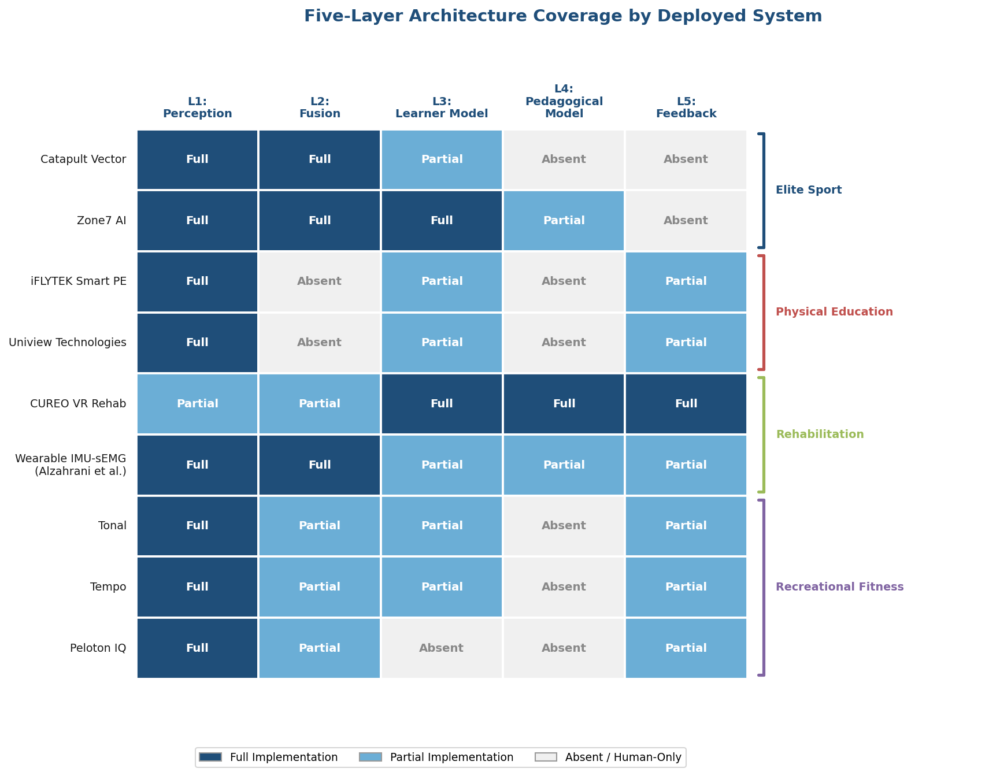

*Figure 5.3. Architecture coverage heat map for nine deployed systems across the five-layer reference architecture. Color intensity indicates implementation depth: full (dark), partial (medium), or absent/human-only (light). Systems are grouped by application domain.*

The implication for Sports-ITS research is clear: the greatest opportunities lie not in advancing any single layer but in integrating mature components across layers. The fusion methods surveyed in Chapter 3, the architectural patterns proposed in Chapter 4, and the domain-specific implementations documented in this chapter collectively define a trajectory in which the next generation of Sports-ITS will combine elite sport's sensor infrastructure with rehabilitation's adaptive algorithms, PE's scalability requirements, and consumer fitness's conversational interfaces.

# 第6章 Challenges, Ethical Considerations, and Regulatory Landscape

The technical foundations (Chapters 2–4) and application scenarios (Chapter 5) examined thus far present a broadly optimistic picture of what Sports Intelligent Tutoring Systems (Sports-ITS) can achieve. This chapter turns a critical lens on the obstacles — technical, ethical, and regulatory — that constrain the development, deployment, and societal acceptance of these systems. The challenges are not merely additive; they interact in consequential ways. Algorithmic bias in pose estimation compounds the regulatory burden of processing biometric data from minors, while the scarcity of annotated multimodal sports datasets limits the very model improvements that could mitigate such bias. A rigorous accounting of these interlocking barriers is essential for responsible system design and for calibrating the expectations established in the preceding chapters.

## 6.1 Technical Bottlenecks in Multimodal Sports-ITS

### 6.1.1 Data Annotation Scarcity and the Single-Modality Trap

The promise of multimodal data fusion (Chapter 3) rests on the availability of large-scale, richly annotated datasets spanning multiple modalities. In practice, such datasets remain severely scarce. A 2024 survey conducted by researchers at UC Irvine, Meta, and Stanford found that the overwhelming majority of sports datasets are single-modality "convertible datasets" — video-only collections such as MultiSports or gymnastics-specific benchmarks like FineGym — that lack integrated text, sensor, or audio modalities [Sports Language & Multimodal Survey](https://arxiv.org/html/2406.12252v1 "UC Irvine/Meta/Stanford, 2024"). Even within the video-only category, annotation costs are substantial: the MultiSports dataset (ICCV 2021) covers four sports and 66 action classes, yet its spatiotemporal localization annotations demand sport-specific biomechanical expertise that limits scalability [MultiSports](https://openaccess.thecvf.com/content/ICCV2021/papers/Li_MultiSports_A_Multi-Person_Video_Dataset_of_Spatio-Temporally_Localized_Sports_Actions_ICCV_2021_paper.pdf "ICCV 2021").

This annotation bottleneck creates a cascading effect through the entire system pipeline. Without paired vision-sensor-physiological data bearing synchronized timestamps and joint annotation schemes, the intermediate and late fusion architectures described in Chapter 3 cannot be trained end-to-end. In practice, developers resort to training unimodal sub-networks independently and combining them through heuristic rules — a configuration that sacrifices the cross-modal interaction effects that constitute the primary rationale for multimodal fusion. The SoccerMon dataset (Scientific Data, 2024) — the first large-scale multivariate soccer player health, performance, and load monitoring benchmark — represents a notable advance, yet it remains domain-specific and confined to professional soccer [SoccerMon](https://www.nature.com/articles/s41597-024-03386-x "Scientific Data, 2024"). No comparable multimodal benchmark exists for school physical education, rehabilitation, or recreational fitness — the deployment contexts where Sports-ITS would serve the broadest populations.

### 6.1.2 Cross-Domain Generalization Failure

Models trained on general-purpose human pose estimation benchmarks do not reliably transfer to sport-specific biomechanical contexts. A 2025 survey published in *AI Review* documented systematic transfer failures when models trained on COCO and MPII are applied to sport-specific movements — gymnastics tumbling, underwater swimming, aerial skiing — that involve extreme joint angles, self-occlusion, and unconventional body configurations absent from the general-purpose training distribution [AI Review](https://link.springer.com/article/10.1007/s10462-025-11344-1 "Sports pose estimation survey, 2025"). AdaptPose (CVPR 2022) provided formal evidence of severe cross-dataset performance degradation for 3D human pose estimation, establishing that domain shift between laboratory capture conditions and real-world athletic environments constitutes a fundamental generalization failure rather than a minor calibration issue [AdaptPose](https://openaccess.thecvf.com/content/CVPR2022/papers/Gholami_AdaptPose_Cross-Dataset_Adaptation_for_3D_Human_Pose_Estimation_by_Learnable_CVPR_2022_paper.pdf "CVPR 2022").

For Sports-ITS, this generalization gap carries direct practical consequences. A tutoring system trained to assess standing long jump technique using COCO-derived pose models may produce unreliable feedback when redeployed for diving or martial arts instruction. The architectural implication is that each sport-specific deployment may require substantial domain adaptation or fine-tuning — an expensive proposition that conflicts with the scalability goals of PE-oriented systems serving dozens of different activities within a single curriculum.

### 6.1.3 Real-Time Processing Constraints

The feedback loop that distinguishes an intelligent tutoring system from an offline analytics platform demands real-time or near-real-time inference. This requirement creates a fundamental tension between model complexity and deployment feasibility, particularly for edge-deployed systems operating without reliable cloud connectivity. A 2024 study on wearable multimodal edge computing (arXiv:2409.06341) characterized the power-latency trade-offs inherent in running Transformer-level fusion models on embedded processors [Wearable Edge Computing](https://arxiv.org/html/2409.06341v1 "arXiv, 2024"). While vision-language models such as CAM-Vtrans achieve 52 FPS on GPU hardware, they cover only two modalities; full multimodal fusion incorporating simultaneous video, IMU, and heart rate streams multiplies computational demand well beyond the envelope of current mobile processors.

The practical consequence is a forced choice between model fidelity and deployment reach. Elite sport facilities can afford dedicated GPU servers for sideline inference — as demonstrated by Catapult's dual-layer edge-cloud architecture described in Chapter 5. School PE deployments, by contrast, must operate on consumer-grade tablets or single-camera setups, hardware that cannot support equivalent fusion complexity. This asymmetry creates a performance stratification in which the populations that stand to benefit most from AI-powered tutoring — students in under-resourced schools — receive the least capable systems, an outcome that compounds rather than alleviates existing educational inequities.

## 6.2 Biometric Data Privacy: A Three-Jurisdiction Analysis

Sports-ITS systems routinely process data that qualifies as biometric or sensitive personal information under the world's major privacy regimes. Facial geometry extracted by pose estimation cameras, gait patterns derived from video tracking, heart rate variability, and muscle activation signals all fall within regulatory scope. The analysis below examines three jurisdictions — the European Union, the United States, and China — that collectively govern the largest current and prospective deployment contexts for Sports-ITS.

### 6.2.1 European Union: GDPR and the EU AI Act

Under the General Data Protection Regulation, Article 9(1) classifies the processing of biometric data for the purpose of uniquely identifying a natural person as special category data, principally prohibited except under enumerated exceptions. Sports-ITS systems that extract facial geometry, gait signatures, or other uniquely identifying biometric features during athlete or student tracking fall squarely within this classification. Lawful processing requires explicit consent (Art. 9(2)(a)), a basis in employment law (Art. 9(2)(b)), or a scientific research exemption (Art. 9(2)(j)), each subject to strict proportionality safeguards. Article 4 further permits member states to impose additional restrictions on biometric and health data processing, creating a fragmented compliance landscape across the EU [GDPR Art. 9](https://gdpr-info.eu/art-9-gdpr/ "Official GDPR text").

The EU AI Act (Regulation (EU) 2024/1689), which entered into force in August 2024 with a phased implementation timeline extending to 2027, introduces a second regulatory layer targeting AI systems directly. Annex III classifies two categories of particular relevance to Sports-ITS as high-risk: (1) biometric AI systems, encompassing remote biometric identification, biometric categorisation based on sensitive attributes, and emotion recognition; and (3) education and vocational training AI, including systems that "evaluate learning outcomes, including when those outcomes are used to steer the learning process" [EU AI Act Annex III](https://artificialintelligenceact.eu/annex/3/ "Regulation (EU) 2024/1689"). A Sports-ITS deployed in a European school that uses camera-based pose estimation to assess student movement competency and adapts instructional content based on those assessments would likely qualify as high-risk under both the biometrics and education categories. This dual classification triggers conformity assessment, risk management system documentation, data governance requirements, human oversight mechanisms, and registration in the EU high-risk AI database — a compliance burden that may prove prohibitive for smaller educational technology providers.

### 6.2.2 United States: The Patchwork of State Biometric Privacy Laws

The United States lacks a comprehensive federal biometric privacy statute, producing a patchwork of state-level regulations with divergent scopes and enforcement mechanisms. The most consequential is Illinois' Biometric Information Privacy Act (BIPA, 740 ILCS 14/), which defines biometric identifiers to include "face geometry scan" — a data type directly produced by the computer vision pose estimation systems described in Chapter 2. BIPA requires written notice and informed consent before collection, prohibits the sale or trade of biometric data, and mandates retention schedules with destruction within three years. Its private right of action provision — $1,000 per negligent violation or $5,000 per intentional or reckless violation — has generated substantial litigation, making it the most enforcement-active biometric privacy law in the United States. A 2024 amendment (P.A. 103-769) clarified that repeated scans of the same biometric identifier constitute a single violation, partially limiting aggregate damage exposure [BIPA Text](http://www.ilga.gov/legislation/ilcs/ilcs3.asp?ActID=3004&ChapterID=57 "Illinois General Assembly").

The relevance to Sports-ITS is not hypothetical. The Chicago Cubs faced a BIPA class action for deploying facial recognition technology at Wrigley Field — a scenario directly analogous to camera-based movement analysis in athletic facilities. An AI vision-based PE system deployed in an Illinois school, capturing facial geometry from students during physical education classes, would trigger BIPA's full compliance apparatus, including parental consent requirements for minors. Beyond Illinois, Texas (CUBI) and Washington state have enacted biometric privacy statutes, and several additional states have introduced comparable legislation, creating an expanding compliance surface for any nationally deployed Sports-ITS platform.

### 6.2.3 China: PIPL and the Scale Challenge of School Deployments

China's Personal Information Protection Law (PIPL), effective November 2021, classifies biometric information as "sensitive personal information" (Art. 28), requiring "separate consent" from data subjects (Art. 29) — a standard more stringent than general consent. Of particular relevance to Sports-ITS, all personal information of children under 14 is automatically classified as sensitive personal information, requiring parental consent and specialized processing rules (Art. 31). Maximum penalties for serious violations reach RMB 50 million or 5% of annual revenue [Bloomberg Law/Dentons](https://pro.bloomberglaw.com/insights/privacy/china-personal-information-protection-law-pipl-faqs/ "PIPL FAQs").

These provisions intersect directly with China's position as the world's most active deployment site for AI-powered PE systems. As documented in Chapter 5, Uniview Technologies has deployed AI sports equipment to over 800 schools, and iFLYTEK Smart PE operates across 28+ provinces and 500+ schools with more than 750,000 registered users. These systems process movement data — and in some cases facial recognition data — from minor students. PIPL's requirement for individualized parental consent at scale, combined with its mandate for specialized processing rules for minors' data, creates an enormous compliance surface. The practical mechanisms by which 800+ schools obtain, document, and manage PIPL-compliant parental consent from hundreds of thousands of families remain largely undocumented in publicly available sources — a gap that itself signals the tension between deployment velocity and regulatory compliance.

The following comparison matrix synthesizes the key regulatory dimensions across the four frameworks examined above, providing a consolidated reference for Sports-ITS designers and deployers navigating multi-jurisdictional compliance.

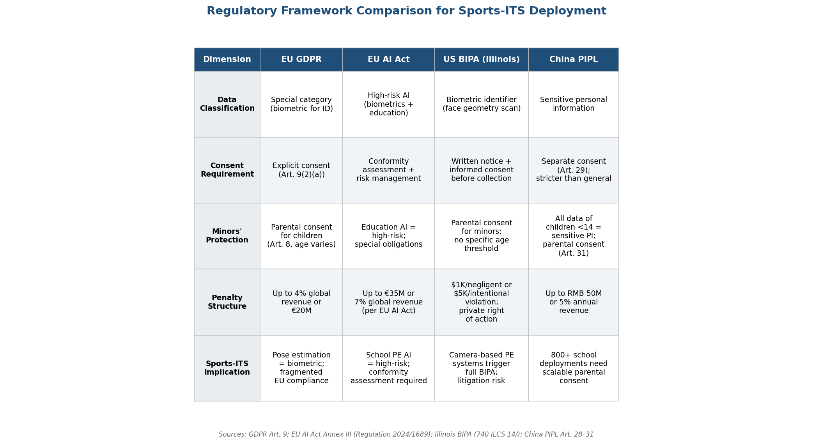

*Figure 6.1. Comparison of data classification, consent requirements, minors' protections, penalty structures, and Sports-ITS implications across the EU GDPR, EU AI Act, US BIPA (Illinois), and China PIPL. Sources: GDPR Art. 9; EU AI Act Annex III (Regulation 2024/1689); Illinois BIPA (740 ILCS 14/); China PIPL Art. 28–31.*

## 6.3 Athlete Data Sovereignty and Ownership

Beyond the question of whether biometric data *can* be lawfully processed lies a deeper structural question: who *owns* athlete performance data and what rights the data subject retains over its downstream use. Kwon (2025), writing in *Frontiers in Sports and Active Living*, identified a fundamental legal vacuum: athlete performance data possesses biological, professional, and commercial attributes simultaneously, yet existing legal frameworks impose binary classifications that cannot accommodate this multidimensional character [Kwon 2025](https://pmc.ncbi.nlm.nih.gov/articles/PMC12745375/ "Athlete data sovereignty, Frontiers in Sports, 2025").

In theory, GDPR grants data subjects robust rights — access, rectification, erasure, and portability. In practice, these rights encounter fragmented storage architectures, procedural barriers, and institutional resistance. An athlete whose performance data is captured by a Catapult Vector system, processed through a club's analytics platform, shared with a league data repository, and potentially accessed by an insurance provider faces a chain of data controllers with no single point of accountability — a situation that renders formal data rights difficult to exercise in practice.

Professional sports collective bargaining agreements provide partial governance frameworks. The NFL's 2020–2030 Collective Bargaining Agreement (Art. 55) requires player consent for biometric data collection and restricts secondary use. The NBA's 2023 CBA grants athletes access to their own data and prohibits unauthorized commercial use. These provisions represent the most concrete athlete data sovereignty protections currently in force, but they apply exclusively to professional leagues and offer no transferable model for the students, recreational athletes, and minors who constitute the majority of prospective Sports-ITS users.

Proposed reforms center on co-ownership models drawing on EU joint controllership jurisprudence — notably the *Wirtschaftsakademie* (C-210/16) and *Fashion ID* (C-40/17) decisions, which established that multiple entities can bear joint responsibility for data processing operations [Kwon 2025](https://pmc.ncbi.nlm.nih.gov/articles/PMC12745375/ "Athlete data sovereignty, Frontiers in Sports, 2025"). Applied to Sports-ITS, a co-ownership framework would assign shared data controllership to the athlete (or guardian), the system operator, and the institutional deployer (school, club, rehabilitation facility), with data processing agreements specifying purpose limitation, retention periods, and rights exercise procedures for each party. Whether such frameworks can operate at the scale required by mass-deployment school PE systems — where hundreds of thousands of data subjects interact with centralized platforms — remains an open question.

## 6.4 Algorithmic Bias and Fairness

### 6.4.1 Demographic Imbalance in Pose Estimation Training Data

The computer vision models that form the perception layer of Sports-ITS inherit systematic biases from their training data. A study by Sony AI presented at AAAI 2023 exposed severe demographic imbalance in the COCO dataset — the de facto training benchmark for human pose estimation: the dataset exhibits a 10:1 light-to-dark skin tone imbalance, and dark-skinned females represent only 2.6% of images (17 out of 657 sampled). The study further demonstrated that the direction of bias in OpenPose and MoveNet can reverse entirely across different subsamples, a finding that underscores how aggregate fairness metrics can mask localized failures for specific demographic subgroups [Sony AI](https://ai.sony/blog/Exposing-Limitations-in-Fairness-Evaluations-Human-Pose-Estimation/ "AAAI 2023").

The FHIBE benchmark (Nature, 2025) — the first consensually collected fairness evaluation dataset for human body shape and pose estimation, comprising 10,318 images from 1,981 individuals across 81 countries with self-reported demographic attributes — provided the most comprehensive evidence to date. FHIBE revealed that the worst performance clusters concentrate among older individuals, individuals with darker skin tones, and those of African ancestry [FHIBE](https://www.nature.com/articles/s41586-025-09716-2 "Nature, 2025"). For a Sports-ITS deployed in a school physical education context, these findings carry direct consequences: pose estimation errors that systematically disadvantage students of specific demographic backgrounds translate into biased assessment scores, incorrect movement feedback, and potential reinforcement of the performance gaps that the tutoring system was designed to close.

### 6.4.2 Physiological Sensor Bias Across Skin Tones

Bias in Sports-ITS is not limited to computer vision. Photoplethysmography (PPG)-based heart rate monitoring — the dominant sensing modality in consumer and athletic wearables — exhibits systematic accuracy differentials across skin tones. A 2025 systematic review published in *Cureus* synthesizing 23 studies found that some WearOS devices underestimate heart rate by 10–15 beats per minute in darker-skinned individuals at rest, with errors exceeding 20% during exercise (n = 75, p < 0.01). Apple Watch demonstrated the smallest skin-tone-dependent differential at less than 5 bpm, but no single brand was consistently accurate across all skin tones and activity levels [PPG Bias Review](https://pmc.ncbi.nlm.nih.gov/articles/PMC12592569/ "Cureus, 2025").

The clinical and pedagogical implications extend beyond measurement error. If a Sports-ITS uses heart rate data to modulate exercise intensity recommendations — prescribing rest when heart rate exceeds a threshold, or escalating difficulty when physiological load appears low — systematic underestimation in darker-skinned users could lead to chronic over-training recommendations. In a rehabilitation context, underestimated cardiovascular strain could mask clinically significant risk. These sensor-level biases propagate through the fusion pipeline described in Chapter 3, compounding with vision-level biases to create layered fairness failures that cannot be addressed by correcting any single modality in isolation.

### 6.4.3 The Absence of Sports-Specific Fairness Frameworks

Despite the documented biases in both vision and physiological sensing modalities, no sports-specific algorithmic fairness framework or bias audit protocol has been published as of 2026. General-purpose AI fairness toolkits (e.g., IBM AIF360, Google What-If Tool) address classification and prediction tasks but do not accommodate the continuous, spatiotemporal nature of pose estimation and movement assessment. The FHIBE benchmark provides an evaluation dataset but not an operational audit procedure that Sports-ITS developers can integrate into their deployment pipeline. This gap leaves the field without standardized methods for measuring, reporting, or mitigating bias in the specific context of automated movement assessment — a deficiency that regulatory frameworks such as the EU AI Act's high-risk classification obligations will increasingly demand to be addressed.

## 6.5 Surveillance, Autonomy, and the Psychosocial Dimensions of Continuous Monitoring

### 6.5.1 The Disciplinary Gaze: Foucauldian Analysis of Sports Monitoring

The ethical concerns surrounding Sports-ITS extend beyond data privacy and algorithmic fairness to encompass the psychosocial effects of continuous AI-mediated monitoring. Jones and Toner, applying Foucault's framework of disciplinary power to sports technology in *Sensoria*, argued that the proliferation of GPS tracking, video analysis, and biometric monitoring in sport creates "docile bodies" — athletes who internalize the surveillance apparatus and modulate their behavior not out of intrinsic motivation but in anticipation of being observed and measured. The analysis documented GPS surveillance applied to children as young as eight years old, and cases where video and GPS data were used as disciplinary punishment mechanisms rather than developmental tools [Jones & Toner](https://hull-repository.worktribe.com/OutputFile/448251 "Surveillance as instruments of discipline, Sensoria"). Williams and Manley (2014) reinforced this critique, arguing that pervasive technology-mediated monitoring produces "unthinking, compliant players" whose agency and creative decision-making are systematically eroded.

For Sports-ITS deployed in school settings — where participants are minors subject to institutional authority — these concerns acquire heightened significance. A PE system that continuously tracks, assesses, and provides corrective feedback on every movement creates a monitoring density that no human teacher could or would maintain. The architectural features described in Chapter 4 — persistent learner models, real-time feedback loops, longitudinal performance tracking — are precisely the mechanisms that, from an ethical standpoint, risk transforming physical education from a space of autonomous physical exploration into a space of continuous algorithmic evaluation.

### 6.5.2 Documented Psychosocial Consequences

The empirical literature on technology-mediated sports surveillance documents a cluster of adverse psychosocial outcomes: negative body image relationships, identity foreclosure (athletes defining self-worth exclusively through quantified performance metrics), over-conformity to externally imposed norms, and erosion of the coach-as-educator role as technology intermediates the coaching relationship [Jones & Toner](https://hull-repository.worktribe.com/OutputFile/448251 "Sensoria"). In adolescent populations, where identity formation and body image are developmentally sensitive, these risks are amplified.

The tension is not between technology and no technology; it is between technology as a tool that augments human judgment and technology as a system that replaces it. A Sports-ITS that provides a teacher with aggregated class-level insights and flags students requiring individual attention operates in the augmentation paradigm. A system that delivers real-time corrective feedback directly to each student, bypassing the teacher's pedagogical judgment, operates closer to the replacement paradigm — with correspondingly greater surveillance and autonomy costs.

### 6.5.3 Technology Over-Reliance and the Erosion of Professional Judgment

The risks of continuous AI monitoring extend to coaching and teaching professionals. Over-reliance on algorithmic outputs threatens to degrade coach professional judgment, diminish athlete autonomy, and systematically neglect factors that resist quantification — creativity, intuition, emotional state, interpersonal dynamics. In physical education settings, a system that assumes assessment and feedback functions may undermine teachers' holistic understanding of student development and students' opportunity to cultivate physical literacy through self-directed exploration.

This risk is not inherent to the technology but to its deployment configuration. The architectural principle of human-in-the-loop oversight (Chapter 4) provides a technical mechanism for preserving professional authority, but its effectiveness depends on institutional deployment practices — whether teachers are trained to interpret and override AI recommendations, whether system defaults encourage or discourage human intervention, and whether performance evaluation structures incentivize teachers to exercise independent judgment rather than deferring to algorithmic assessments.

## 6.6 Toward Responsible Deployment: Cross-Cutting Principles

The technical, regulatory, ethical, and psychosocial challenges analyzed in this chapter are neither independent nor sequentially addressable. A responsible deployment framework for Sports-ITS must address them simultaneously through integrated design principles.

**Privacy by design** requires that data minimization, purpose limitation, and consent management be embedded in the system architecture — not appended as compliance checklists. Federated learning architectures (Chapter 7) offer a technical pathway by enabling model training without centralizing raw biometric data, though they do not eliminate all privacy concerns.

**Bias auditing at each modality layer** is necessary to prevent the compounding of vision-level and sensor-level biases through fusion pipelines. The synthetic data generation approach documented in Chapter 7 — using OpenSim musculoskeletal models rendered through game engines with controlled diversity in body type, skin tone, and clothing — offers a promising mitigation strategy, but its effectiveness for operational Sports-ITS deployment remains to be validated [Scientific Data](https://www.nature.com/articles/s41597-025-06243-7 "Synthetic sports images, Nature 2025").

**Graduated autonomy models** should calibrate the system's decision-making authority to the deployment context. In elite sport, where athletes are consenting adults with professional support structures, higher system autonomy may be appropriate. In school PE settings with minor participants, the system should function as a teacher support tool rather than a direct-to-student assessment authority.

**Interoperability and portability standards** — currently absent from the sports domain (Chapter 7) — are prerequisites for meaningful athlete data sovereignty. Without standardized data formats, the GDPR right to data portability and PIPL's consent management requirements remain technically unenforceable.

The absence of documented sports AI data breaches or security incidents does not indicate absence of risk; it more likely reflects the nascent stage of large-scale deployment and the absence of mandatory incident reporting requirements specific to sports technology. As deployment scales — particularly China's 800+ school systems processing minor student data — the probability of security incidents increases, and the regulatory consequences under PIPL's penalty regime (up to RMB 50 million or 5% annual revenue) provide a powerful incentive for proactive security investment.

# 第7章 Future Trends and the Road Ahead (2026–2030)

The preceding chapters have examined the technical foundations, architectural principles, application scenarios, and governance challenges that collectively define the current state of Sports Intelligent Tutoring Systems (Sports-ITS) driven by multimodal data fusion. This chapter shifts the temporal horizon forward, identifying the technological trajectories most likely to reshape the field between 2026 and 2030. The analysis is organized around six converging trends: foundation models for human motion understanding, federated learning for privacy-preserving model training, digital twin athlete models for predictive simulation, neuroadaptive and brain-computer interfaces, generative AI for coaching interaction, and the nascent standardization efforts that will determine whether these advances compose into interoperable systems or fragment into isolated silos.

Each trend is evaluated not as a speculative possibility but as an identifiable research direction with published prototypes, benchmark results, or institutional commitments. Where evidence supports confident projection, we state it; where significant uncertainty remains, we identify the specific contingencies on which realization depends.

## 7.1 Foundation Models for Human Motion Understanding

### 7.1.1 From Task-Specific Models to Motion Generalists

The most consequential near-term shift in Sports-ITS capability will likely originate not from improvements to individual sensing modalities (Chapter 2) or fusion algorithms (Chapter 3) but from the emergence of foundation models purpose-built for human motion understanding. The field has followed a trajectory parallel to the evolution of large language models — from narrow, task-specific architectures toward unified models that handle multiple tasks within a single framework.

The progression is visible in a compressed timeline. MotionGPT (NeurIPS 2023) established the first motion-language model capable of text-conditioned motion generation [MotionGPT](https://neurips.cc/virtual/2023/poster/71389 "NeurIPS 2023"). A subsequent iteration at AAAI 2024 demonstrated that fine-tuning only 0.4% of a large language model's parameters could enable multimodal motion control — an efficiency gain that foreshadowed the parameter-efficient adaptation strategies now standard in NLP [MotionGPT AAAI](https://ojs.aaai.org/index.php/AAAI/article/view/28567 "AAAI 2024"). MotionGPT-2 (October 2024) introduced Part-Aware VQVAE for fine-grained body and hand representation, enabling natural-language motion control at a level of anatomical detail relevant to sports technique instruction [MotionGPT-2](https://arxiv.org/abs/2410.21747 "arXiv 2024").

Two models published in 2025 mark qualitative thresholds. MoFM (February 2025, UNC Charlotte) is the first BERT-style self-supervised motion foundation model, trained using a MotionBook discrete vocabulary of 8,192 tokens and a Thermal Cubes spatiotemporal encoding scheme. Its 12-layer Transformer backbone matches or exceeds state-of-the-art performance on NTU-RGB+D action classification while generalizing to one-shot classification and anomaly detection — capabilities that could enable Sports-ITS to recognize novel movement patterns without sport-specific retraining [MoFM](https://arxiv.org/html/2502.05432v1 "arXiv 2025"). GENMO (NVIDIA, ICCV 2025), presented as a unified Generalist Model for Human Motion, reformulates motion estimation as constrained motion generation, bridging the traditionally separate tasks of motion reconstruction from video and motion synthesis from text or audio within a single diffusion-based framework. GENMO handles variable-length motions and mixed multimodal conditioning — text, audio, video — at different time intervals, and demonstrates that generative priors improve estimation accuracy under occlusion while diverse video data enhances generation quality [GENMO](https://arxiv.org/abs/2505.01425 "NVIDIA, ICCV 2025").

### 7.1.2 Implications for Sports-ITS Architecture

For Sports-ITS, these foundation models transform the Learner Model Layer (Layer 3) and Pedagogical Model Layer (Layer 4) of the five-layer reference architecture (Chapter 4). A motion foundation model integrated into the Learner Model Layer could maintain a continuous, high-dimensional representation of an athlete's movement vocabulary — not merely tracking isolated skill metrics (as current systems do) but modeling the entire distribution of the learner's movement capabilities, identifying deviations from biomechanically optimal patterns, and detecting skill transfer across related movements.

At the Pedagogical Layer, GENMO's unified estimation-generation capability opens a specific application: the system could estimate the athlete's current motion from video, then generate an improved target motion conditioned on the same biomechanical context — producing a personalized demonstration of "how this movement should look for your body" rather than displaying a generic reference template. The Large Motion Model (LMM, ECCV 2024, NTU/SenseTime), trained on the MotionVerse dataset spanning 320,000 sequences and 100 million frames across 10 tasks and 16 datasets, provides the scale of pretraining data necessary for such generalization, with its ArtAttention mechanism enabling joint-aware attention across 10 body part groups [LMM](https://arxiv.org/abs/2404.01284 "ECCV 2024").

The practical barrier to deployment remains computational cost. Current motion foundation models require GPU inference that exceeds the edge-device budgets described in Chapter 4. The path to real-time Sports-ITS integration will likely follow the edge-cloud partitioning pattern already established for vision models: lightweight pose estimation on edge devices, with foundation model inference offloaded to cloud or institutional GPU servers for post-session analysis and personalized demonstration generation.

## 7.2 Federated Learning for Privacy-Preserving Collaboration

### 7.2.1 The Privacy-Performance Tension

Chapter 6 documented the stringent regulatory requirements governing biometric data processing in Sports-ITS — GDPR Article 9 restrictions on biometric data, China's PIPL classification of all minors' data as sensitive personal information, and Illinois BIPA's consent and retention mandates. These regulations create a structural tension: the models underpinning Sports-ITS improve with more training data, yet centralizing biometric movement data from multiple institutions violates the privacy frameworks that govern its collection. Federated learning (FL) offers the most mature technical resolution to this tension, enabling collaborative model training across distributed data holders while keeping raw data on local devices or institutional servers.

A 2025 comprehensive survey on federated learning for human activity recognition (HAR) confirmed that FL enables on-device training with only model parameter sharing, addressing three challenges endemic to Sports-ITS: non-IID data distributions (athletes of different skill levels, sports, and body types produce fundamentally different data distributions), communication efficiency (wearable and edge devices have limited bandwidth), and personalization (a global model must adapt to individual biomechanical characteristics) [FL Survey](https://www.sciencedirect.com/science/article/pii/S259000562500089X "FL for HAR, 2025"). A complementary framework benchmark (October 2025) evaluated three leading FL platforms: NVIDIA FLARE emerged as the strongest candidate for production-scale deployment, Flower for research flexibility, and Owkin Substra for privacy compliance — the last being particularly relevant to GDPR-regulated European Sports-ITS deployments [FL Benchmark](https://arxiv.org/abs/2511.00037 "arXiv 2025").

### 7.2.2 Sports-Specific Federated Architectures

An early demonstration of FL applied to sports contexts combined federated training with spatiotemporal graph neural networks (ST-GNN) for wearable-based athlete monitoring, showing that privacy-preserving cross-institution collaboration could yield model improvements without raw data exchange [FL+Sport](https://journals.sagepub.com/doi/abs/10.1177/18724981251380391 "Sage 2025"). The architecture is directly applicable to the school PE deployment scenario: hundreds of schools running iFLYTEK or Uniview AI PE systems (Chapter 5) could contribute to improving shared pose estimation and movement assessment models without transmitting student movement videos to a central server — a configuration that would substantially reduce the PIPL compliance burden documented in Chapter 6.

The primary contingency for sports FL adoption is the non-IID challenge at extreme scale. Movement data from a primary school in Hefei and a high school in Beijing differ not only in skill level but in the specific exercises assessed, camera angles, lighting conditions, and student demographics. Standard federated averaging (FedAvg) degrades under such heterogeneity. Personalized FL variants — FedPer (personal layers), FedRep (shared representation with personal heads), and meta-learning-based approaches — offer partial solutions, but their effectiveness for continuous spatiotemporal motion data (as opposed to the classification tasks on which they are typically benchmarked) remains unvalidated in production Sports-ITS settings.

## 7.3 Digital Twin Athlete Models

### 7.3.1 From Load Monitoring to Predictive Simulation

Digital twin technology — the creation of dynamic, data-driven virtual replicas of physical entities — has been identified by Gartner as a top-10 strategic technology trend. In sports, a digital twin athlete model integrates historical and real-time multimodal data to create a computational representation that can simulate physiological responses, predict injury trajectories, and optimize training loads prospectively rather than retrospectively.

FC Barcelona's digital twin pilot (2025–26 season) represents the most ambitious current implementation. Developed in partnership with Genomcore and Made of Genes AI, the system integrates genomics, metabolomics, proteomics, body composition, nutrition, sleep quality, GPS/load monitoring, and psycho-emotional assessment data to construct per-athlete digital twins. The stated objective is to detect "orange flags" — early warning indicators — before injuries materialize, extending the predictive horizon beyond the one-to-seven-day window demonstrated by Zone7 (Chapter 5) toward a proactive, multi-week anticipatory framework [Barça Innovation Hub](https://barcainnovationhub.fcbarcelona.com/blog/from-the-laboratory-to-the-pitch-barca-test-digital-twins-to-anticipate-injuries/ "2025"). A reference point for the underlying modeling approach comes from the French Cycling Federation, whose Margaria-Morton metabolite prediction model achieved 15–16% prediction error and 0.8 correlation with functional exercise assessment — indicating that physiological digital twins can reach operationally useful accuracy for training load management.

A systematic review in *Expert Systems with Applications* (2024) classified digital twin applications in sports across four domains: training optimization, in-game athlete management, pre-game strategy development, and in-game tactical adjustment. The review confirmed the field's nascent maturity: most implementations remain at the conceptual or proof-of-concept stage, with FC Barcelona's pilot among the few moving toward production validation [DT Review](https://www.sciencedirect.com/science/article/pii/S0957417424019717 "Expert Systems with Applications, 2024").

### 7.3.2 Digital Twins for Sports-ITS: Architectural Integration

For Sports-ITS, digital twin models extend the Learner Model Layer (Layer 3) from a reactive state tracker to a predictive simulator. Rather than merely recording that a student's standing long jump performance has plateaued, a digital twin could simulate the biomechanical and physiological factors contributing to the plateau — insufficient hip flexor mobility, asymmetric ground reaction force distribution, or accumulated fatigue from a prior class period — and generate a predicted response to alternative training interventions before they are administered.

The US Army's MASTR-E program provides an instructive parallel. Using wearable-sensor-equipped humanoid digital twins, the program applies the VAULTIS data governance framework (Verifiable, Accessible, Understandable, Linkable, Trustworthy, Interoperable, Secure) to manage the ethical and operational complexities of constructing computational replicas of human performance [MASTR-E](https://www.lineofdeparture.army.mil/Journals/Special-Warfare/Special-Warfare-Archive/2025-E-edition/Digital-Twins/ "US Army 2025"). The VAULTIS principles translate directly to Sports-ITS governance requirements: a student digital twin containing biomechanical, physiological, and performance history data must be verifiable (model accuracy auditable), accessible (to the student and guardians), trustworthy (free from systematic bias), and interoperable (portable between school systems).

The primary barriers to sports digital twin adoption at scale are data richness and computational cost. FC Barcelona's implementation integrates seven distinct data domains, a level of multimodal coverage feasible for a professional club with dedicated sports science staff but impractical for school PE settings. A realistic near-term path for educational Sports-ITS involves "lightweight digital twins" — reduced-dimensionality models incorporating movement kinematics (from vision-based pose estimation), basic physiological proxies (heart rate from wearables), and performance history — that sacrifice omics-level precision for deployment feasibility.

## 7.4 Neuroadaptive Interfaces and Brain-Computer Integration

### 7.4.1 Neurofeedback Training in Sports: Current Evidence

Brain-computer interfaces (BCI) and neuroadaptive technologies represent the most speculative but potentially transformative modality for future Sports-ITS. A PRISMA systematic review (24 studies, 746 participants, *Brain Sciences* 2024) examined neurofeedback training (NFT) across 14+ sports and identified modality-specific effectiveness patterns: sensorimotor rhythm (SMR) training proved effective for precision sports (shooting, golf), while theta-beta ratio training showed benefits for reactive sports requiring rapid attentional shifts [NFT Review](https://www.mdpi.com/2076-3425/14/10/1036 "Brain Sciences, 2024").

The evidence base reveals important performance differentials by expertise level. Novice athletes demonstrated greater improvement in basic skills and reaction time, while elite athletes benefited primarily in attention regulation and stress management — a pattern suggesting that BCI-enhanced Sports-ITS would need to calibrate its neuroadaptive intervention targets to the learner's expertise stage, extending the adaptive pedagogical strategies described in Chapter 4. However, the review identified critical limitations that constrain near-term deployment: only 2 of 24 studies were conducted in real field settings (the remainder in controlled laboratory environments), and at least one study documented explicit lab-to-field transfer failure — enhanced SMR regulation in the laboratory produced no measurable improvement in ice hockey shooting performance. Sample sizes remained small, only 8 of 24 studies included female athletes, and no standardized EEG acquisition protocol for sports contexts has been established.

### 7.4.2 The Path from Laboratory to Field Deployment

The consumer EEG device landscape (Chapter 2) provides the hardware pathway for neuroadaptive Sports-ITS integration. Emotiv EPOC X (14-channel wireless EEG, 170 g, 9-hour battery) and the MN8 in-ear form factor (2-channel, less than 1 minute setup) represent the device classes most likely to bridge the laboratory-field gap. However, the 2024 scoping review of consumer-grade EEG devices documented significant signal quality gaps relative to research-grade systems, with motion artifacts identified as the primary limitation for sports applications (Chapter 2).

A realistic 2026–2030 trajectory for neuroadaptive Sports-ITS involves three stages. In the near term (2026–2027), consumer EEG integration would be limited to low-motion precision sports (archery, shooting, golf putting) where motion artifact contamination is minimal and SMR neurofeedback has the strongest evidence base. In the medium term (2027–2029), advances in artifact rejection algorithms and dry electrode technology could extend applicability to intermittent-pause sports (batting in baseball/cricket, free throw shooting in basketball). Field-wide deployment in continuous-motion sports such as soccer, swimming, or gymnastics would require fundamental advances in motion-robust EEG acquisition that are not yet demonstrated in any published prototype — placing this application horizon beyond 2030 for most practical scenarios.

## 7.5 Generative AI and the Transformation of Coaching Interaction

### 7.5.1 From Passive Dashboards to Active AI Coaches

The integration of large language models (LLMs) into Sports-ITS represents the most immediately deployable of the trends examined in this chapter. WHOOP Coach, launched in partnership with OpenAI in 2023 (Chapter 1), established the architectural template: a multi-model cascade in which a user query triggers topic decomposition (sleep, HRV, stress), retrieval of relevant biometric data, search of sports performance science literature, LLM-based answer synthesis, and re-attachment of personalized data — all within a response time of less than three seconds [WHOOP Dev](https://www.whoop.com/us/en/thelocker/behind-the-development-of-whoop-coach/ "WHOOP 2023"). This architecture transforms the Feedback/Interaction Layer (Layer 5) from a rule-based notification system to a conversational agent capable of contextual, personalized coaching dialogue.

The analytical depth achievable through LLM-based coaching was assessed by Zignoli and Laursen (2025) in the first sports science study to compare LLM and human coach reasoning paths in domain-specific embedding space. Using a multi-agent framework — comprising a Python execution agent, a retrieval-augmented generation (RAG) agent, a web search agent, and domain-specific sport science expert agents for HRV and load analysis, coordinated by an LLM supervisor — the study found that the LLM system achieved comparable semantic coverage to human experts on computational and analytical dimensions. The identified gap lay in empathy and intuition — dimensions that resist quantification but remain central to effective coaching relationships [SPSR](https://sportperfsci.com/wp-content/uploads/2025/05/SPSR256_Zignoli.pdf "Zignoli & Laursen, 2025").

Apple Research (2025) demonstrated a complementary capability: LLM-based late fusion for activity recognition using the Ego4D dataset (12 activity classes including basketball, soccer, fitness). Gemini-2.5-Pro achieved 68% accuracy and 66% macro-F1 in one-shot closed-set evaluation — compared to an 8.3% random baseline — requiring zero task-specific training [Apple Research](https://arxiv.org/html/2509.10729v1 "Apple/MIT/JHU, 2025"). This finding suggests that foundation LLMs can serve as flexible, zero-shot multimodal fusion engines for Sports-ITS, interpreting heterogeneous sensor streams without the brittle, hand-engineered feature pipelines that currently characterize most deployed systems.

### 7.5.2 Synthetic Data as a Fairness Mitigation Strategy

Chapter 6 documented the demographic biases embedded in pose estimation training data — COCO's 10:1 light-to-dark skin tone imbalance, the FHIBE benchmark's evidence of worst performance clusters among darker-skinned individuals and those of African ancestry. Generative AI offers a direct countermeasure. A 2025 workflow published in *Scientific Data* (Nature) demonstrated the generation of annotated synthetic training images from OpenSim musculoskeletal models, rendered through a pipeline of SKEL body models → SMPL skin meshes → Godot game engine rendering. The resulting labels, derived from virtual skeleton markers, are potentially more accurate than manual human annotation. A 100,000-sample dataset was publicly released [Scientific Data](https://www.nature.com/articles/s41597-025-06243-7 "Synthetic sports images, 2025").

The approach's significance for Sports-ITS fairness lies in controlled diversity generation. By systematically varying body type, skin tone, clothing, lighting conditions, and sport-specific movement patterns in the synthetic data pipeline, developers can create training distributions that correct the demographic imbalances of existing datasets without the ethical complexities of recruiting and annotating demographically diverse real-world participants. This synthetic augmentation does not replace the need for real-world validation (the FHIBE benchmark remains essential for evaluating deployed model fairness), but it provides a scalable mechanism for reducing bias at the training data level — addressing the root cause identified in Chapter 6 rather than applying post-hoc corrections.

## 7.6 Standardization and Interoperability: The Missing Infrastructure

### 7.6.1 The Current Void

The sports technology domain currently lacks unified data formats, interoperability protocols, and benchmark standards comparable to those that enable interoperability in adjacent fields. Healthcare has HL7/FHIR for clinical data exchange and ISO 11073 for personal health devices. The sports domain has no equivalent. This absence is not merely inconvenient; it constitutes a structural barrier to the composable, modular Sports-ITS architectures envisioned in Chapter 4. When Catapult, STATSports, WHOOP, and KINEXON each define proprietary data schemas, the Fusion Layer (Layer 2) of any integrative Sports-ITS must implement bespoke adapters for each data source — a configuration that is brittle, expensive to maintain, and resistant to scaling.

The first formal initiative to address this gap emerged in late 2025: the IEEE Standards Association approved Project Authorization Request P3715, "Standard for a Common Exchange Format for Match-Data in Football (Soccer)," chaired by Professor Jesse Davis of KU Leuven, with a completion target of December 2029 [IEEE P3715](https://standards.ieee.org/ieee/3715/12303/ "IEEE Standards Association") [KU Leuven](https://dtai.cs.kuleuven.be/jesse-davis-chairs-the-ieee-standard-for-a-common-exchange-format-for-match-data-in-football-soccer-working-group "February 2026"). While limited to soccer match data, IEEE P3715 establishes an institutional precedent and organizational template that could be extended to other sports and data types. Its significance lies less in its immediate scope than in its demonstration that the international standards community recognizes sports data interoperability as a legitimate standardization domain.

### 7.6.2 Benchmark Datasets as Proto-Standards

In the absence of formal interoperability standards, benchmark datasets serve as de facto coordination mechanisms. SoccerMon (*Scientific Data*, 2024) — the first large-scale multivariate soccer player health, performance, and load monitoring benchmark — defines implicit data schemas and evaluation protocols that enable cross-study comparison [SoccerMon](https://www.nature.com/articles/s41597-024-03386-x "Scientific Data, 2024"). CricBench (2025), the first multilingual LLM benchmark for cricket analytics, provides a methodological template for sport-specific AI evaluation that could be adapted across disciplines [CricBench](https://arxiv.org/html/2512.21877v2 "arXiv, 2025").

For Sports-ITS specifically, the standardization roadmap requires progress on three fronts by 2030. First, a common movement description format — analogous to FHIR resources for clinical concepts — that enables pose estimation outputs, IMU-derived kinematics, and manual coach annotations to be represented in a unified schema. Second, benchmark datasets that span multiple modalities, sports, and demographic groups, building on the FHIBE precedent to establish fairness-aware evaluation standards. Third, interoperability protocols for the edge-cloud partitioning patterns described in Chapter 4, enabling heterogeneous sensing devices (Catapult wearables, depth cameras, consumer smartwatches) to feed data into a common fusion pipeline without vendor-specific adapters.

### 7.6.3 Convergence Toward a 2030 Sports-ITS Ecosystem

The six trends analyzed in this chapter do not operate independently. Foundation models provide the representational backbone for digital twin construction. Federated learning enables privacy-preserving training of those foundation models across institutions. Generative AI powers both the synthetic data needed to debias foundation models and the conversational interfaces through which coaching insights are delivered. Neuroadaptive interfaces add a cognitive-state modality to the multimodal fusion pipeline. And interoperability standards determine whether these components compose into coherent systems or remain isolated research demonstrations.

The convergence trajectory suggests that by 2030, a mature Sports-ITS would operate as a layered ecosystem: edge devices performing real-time pose estimation and physiological monitoring; institutional servers running federated model updates and lightweight digital twin simulations; cloud-hosted motion foundation models generating personalized movement demonstrations; LLM-based coaching agents translating multimodal analytics into natural-language guidance; and standardized data formats enabling any component to be replaced or upgraded without disrupting the pipeline. Whether this vision materializes depends less on any single technological breakthrough — most of the required components exist in prototype form — than on the institutional, regulatory, and standardization infrastructure that governs their integration.

The challenges documented in Chapter 6 — biometric privacy regulation, algorithmic bias, surveillance concerns, and the absence of sports-specific fairness frameworks — do not recede as the technology advances; they intensify. A foundation model that can generate photorealistic synthetic movement sequences raises new questions about consent and likeness rights. A digital twin incorporating genomic and metabolomic data amplifies the data sovereignty concerns that current GPS-and-accelerometer systems already trigger. A conversational AI coach that replaces aspects of human coaching judgment extends the autonomy and over-reliance risks documented by Jones and Toner. The road ahead for Sports-ITS is defined not by the pace of technical progress — which is rapid — but by the pace at which governance frameworks, professional practices, and institutional norms adapt to accommodate it.

# Conclusion

This report has examined the construction and application of Sports Intelligent Tutoring Systems driven by multimodal data fusion across seven dimensions: historical motivation, sensing modalities, fusion methods, system architecture, application domains, governance challenges, and future trajectories. Several principal findings emerge from this investigation.

**The technological substrate for Sports-ITS is operational.** Markerless pose estimation achieves angular accuracy within 5.1 ± 2.5 degrees for joint kinematics, sufficient for gross movement screening. Wearable positioning systems now deliver centimeter-level accuracy in field conditions (STATSports Apex 2.0 RTK-GPS). Physiological monitors attain 99.7% heart rate accuracy (WHOOP 4.0) in independent validation. Transformer-based multimodal fusion achieves sub-20 ms inference latency (CAM-Vtrans at 19.2 ms/frame), meeting real-time feedback requirements. These hardware and algorithmic capabilities, individually mature, collectively satisfy the perception and fusion layers of the five-layer reference architecture proposed in Chapter 4.

**The pedagogical effectiveness of the underlying approach is supported by converging evidence.** Meta-analytic data confirm ITS effect sizes of d = 0.66–0.76 for step-based adaptive tutoring, approaching one-on-one human instruction (d = 0.79). Augmented reality feedback in sports training produces effect sizes of d = 1.05–1.40 for specific motor skills (He & Wei 2025). The HALE randomized controlled trial demonstrated that even a single-modality, smartphone-based tutoring system produces statistically significant motor skill gains over control conditions. VR-based adaptive rehabilitation yields clinically meaningful improvements across upper limb function, balance, and activities of daily living, with adherence rates of 71–90% — substantially exceeding conventional home exercise program completion rates.

**No deployed system fully realizes the five-layer architecture.** The cross-domain analysis in Chapter 5 reveals complementary gaps: elite sport systems excel at perception and fusion but delegate pedagogical reasoning to human coaches; school PE systems implement automated assessment but lack adaptive tutoring strategies; rehabilitation systems most closely approximate the full tutoring loop but rely on simplified perception; consumer fitness platforms invest in conversational feedback while maintaining shallow learner models. The most consequential research opportunity lies in integrating these domain-specific strengths into unified systems rather than advancing any single architectural layer in isolation.

**Governance challenges intensify with deployment scale.** The biometric data processed by Sports-ITS — facial geometry, gait patterns, heart rate variability, muscle activation signals — triggers the most restrictive regulatory classifications across all three major jurisdictions examined (EU GDPR Article 9, Illinois BIPA, China PIPL). School PE deployments, which involve minor participants and operate at the largest scale, face the highest combined regulatory burden. Algorithmic bias in both pose estimation (COCO dataset's 10:1 skin-tone imbalance; FHIBE benchmark's documented performance disparities) and physiological sensing (PPG accuracy differentials of 10–15 bpm across skin tones) compounds through fusion pipelines, creating layered fairness failures that require modality-level auditing rather than output-level correction alone.

**Six converging trends define the 2026–2030 trajectory.** Motion foundation models (MoFM, GENMO) are shifting the field from task-specific fusion to semantic-level alignment in pretrained embedding spaces. Federated learning offers the most mature resolution to the privacy-performance tension, enabling cross-institutional model improvement without centralizing biometric data. Digital twin athlete models — exemplified by FC Barcelona's pilot integrating seven data domains — extend the learner model from reactive state tracking to predictive simulation. Generative AI transforms the feedback layer from rule-based notifications to conversational coaching agents with sports science reasoning capability. Neuroadaptive interfaces, while the most speculative, promise to add a cognitive-state modality for precision sports. Interoperability standardization, initiated by IEEE P3715 for soccer match data, provides the necessary infrastructure for composable, vendor-agnostic system integration.

Whether these components converge into a coherent Sports-ITS ecosystem by 2030 depends less on the pace of technical progress — which is rapid — than on the institutional, regulatory, and professional adaptation required to govern their integration. The systems that will ultimately prove most impactful are those that balance technological capability with pedagogical grounding, regulatory compliance, and the preservation of human agency in the coaching and learning relationship.
