# Overview

Cardiovascular diseases remain the leading cause of death worldwide, and accumulating evidence implicates plasma metal ion concentrations — both essential and toxic — as mechanistically significant, epidemiologically validated, and in certain cases therapeutically modifiable determinants of cardiovascular risk. This report synthesises the current state of knowledge on whether deliberate modulation of metal ion status can serve as an effective preventive or therapeutic strategy against cardiovascular disease, drawing on pathophysiological research, large-scale epidemiological studies, Mendelian randomisation analyses, randomised controlled trials, guideline recommendations, and emerging translational science.

Five categories of evidence are examined across the chapters that follow. **Chapter 1** establishes the pathophysiological basis, mapping how iron, copper, zinc, magnesium, calcium, selenium, potassium, and the toxic metals lead, cadmium, mercury, and arsenic influence oxidative stress, regulated cell death (ferroptosis, cuproptosis), electrophysiological stability, vascular remodeling, and inflammatory signaling — with particular emphasis on the U-shaped dose–response relationships that render both deficiency and excess of essential metals injurious. **Chapter 2** quantifies population-level associations, reviewing meta-analytic and Mendelian randomisation evidence that links metal ion biomarkers to hard cardiovascular endpoints; among the most robust findings are the consistent inverse associations for magnesium and potassium, the linear dose–response gradients for lead and cadmium, and the population-attributable fraction estimates suggesting that declining lead exposure alone accounted for roughly 22.5% of the reduction in U.S. cardiovascular mortality between 1988 and 2004. **Chapter 3** catalogues the full intervention landscape — supplementation, chelation, dietary patterns, pharmacological modulation, and population-level environmental strategies — while **Chapter 4** critically appraises the trial-level evidence, stratifying interventions into three tiers by evidence maturity. **Chapter 5** surveys emerging frontiers, from ferroptosis-inhibitor pharmacology and metal-organic frameworks to gene therapy targeting iron homeostasis and microbiome–metal interactions.

Three core findings emerge from this analysis. First, two metal-ion interventions have attained the highest evidence tier with guideline endorsement: intravenous iron repletion in heart failure patients with documented iron deficiency (ESC Class I / Level of Evidence A for symptom improvement and hospitalisation reduction) and potassium-enriched salt substitution for stroke and cardiovascular event prevention (WHO conditional recommendation, 2025). Second, several biologically plausible interventions — oral magnesium supplementation, zinc supplementation, and selenium repletion in deficient populations — remain at the surrogate-endpoint or single-trial stage, with no adequately powered outcome trial completed to date. Third, individual-level chelation therapy for toxic metals, once promising after the TACT trial, has been substantially weakened by the TACT2 null result and superseded by population-level environmental strategies that have demonstrably reduced cardiovascular mortality at scale.

A recurring principle across these interventions is that efficacy depends critically on baseline metal status: selenium supplementation benefits selenium-deficient but not selenium-replete populations; intravenous iron benefits iron-deficient but not iron-sufficient heart failure patients; chelation showed an attenuated signal as population lead levels declined. This baseline-dependency principle carries fundamental implications for trial design, patient selection, and the future of precision metal-ion therapeutics in cardiovascular medicine.

# 第1章 Pathophysiological Basis — How Metal Ions Influence Cardiovascular Health and Disease

The cardiovascular system is exquisitely sensitive to perturbations in metal ion homeostasis. A diverse array of metal and metalloid ions — essential elements including iron (Fe), copper (Cu), zinc (Zn), magnesium (Mg), calcium (Ca), selenium (Se), and potassium (K), together with toxic contaminant metals such as lead (Pb), cadmium (Cd), mercury (Hg), and arsenic (As) — participate in oxidative stress, regulated cell death, electrophysiological stability, vascular remodeling, and inflammatory signaling within cardiac and vascular tissues. This chapter establishes the biological rationale for targeting plasma metal ion concentrations as a cardiovascular intervention strategy. Each ion of interest is mapped to its known pathophysiological mechanisms, and the U-shaped dose–response relationships that render both deficiency and excess of essential metals injurious are examined in detail.

Throughout this chapter, "metal ions" is used broadly to encompass Se and As (strictly metalloids), following the convention in cardiovascular research literature. All concentration values refer to plasma or serum unless otherwise specified.

## 1.1 Iron: The Dual Hazard of Deficiency and Overload

### 1.1.1 Systemic Iron Homeostasis and Cardiovascular Vulnerability

Systemic iron homeostasis operates at four hierarchical levels: duodenal absorption (via DMT1 for non-heme iron and HCP1 for heme iron), plasma transport (transferrin-bound iron, TBI), intracellular storage (ferritin), and cellular export (ferroportin). Ferroportin is the sole known mammalian iron-export protein; its surface expression is governed by hepcidin, a hepatic peptide hormone that triggers ferroportin endocytosis and lysosomal degradation. Because cardiomyocytes lack redundant iron-export mechanisms, this architecture renders the heart particularly vulnerable to iron dysregulation [Circulation Research — Koleini et al.](https://www.ahajournals.org/doi/10.1161/CIRCRESAHA.122.321667 "Iron Metabolism in Cardiovascular Disease, Circ Res 2023").

Under iron-overload conditions, non-transferrin-bound iron (NTBI) bypasses the canonical transferrin receptor 1 (TFR1) pathway and gains entry to cardiomyocytes through L-type calcium channels (LTCC), T-type calcium channels (TTCC), and zinc transporters ZIP8/ZIP14. Fe²⁺ competes directly with Ca²⁺ for LTCC entry, establishing a mechanistic link between iron excess and arrhythmogenesis by displacing calcium from intracellular binding sites [Circulation Research — Koleini et al.](https://www.ahajournals.org/doi/10.1161/CIRCRESAHA.122.321667 "Iron Metabolism in Cardiovascular Disease, Circ Res 2023").

### 1.1.2 Iron Deficiency in Heart Failure

Iron deficiency (ID) is highly prevalent in heart failure (HF), affecting an estimated 37–75% of patients depending on the diagnostic criteria and cohort studied. The European Society of Cardiology (ESC, 2021) and AHA/ACC (2022) guidelines define ID in HF as serum ferritin < 100 μg/L (absolute ID) or ferritin 100–300 μg/L with transferrin saturation (TSAT) < 20% (functional ID). Even in the absence of overt anemia, myocardial iron depletion — quantifiable by cardiac MRI T2* mapping — independently predicts major cardiovascular events in HF with reduced ejection fraction (HFrEF) [Circulation Research — Koleini et al.](https://www.ahajournals.org/doi/10.1161/CIRCRESAHA.122.321667 "Iron Metabolism in Cardiovascular Disease, Circ Res 2023"). The underlying pathophysiology encompasses impaired mitochondrial oxidative phosphorylation, reduced contractile protein synthesis, and compromised exercise capacity — mechanisms that collectively form the rationale for intravenous iron repletion trials discussed in subsequent chapters.

### 1.1.3 Iron Overload Syndromes

Hereditary hemochromatosis — most commonly caused by the C282Y *HFE* mutation — leads to progressive iron deposition in cardiac tissue. Approximately 30% of hospitalized hemochromatosis patients develop cardiovascular complications, including arrhythmias, heart failure, and pulmonary hypertension. Friedreich's ataxia, arising from frataxin deficiency and consequent mitochondrial iron accumulation, produces hypertrophic cardiomyopathy in up to 85% of patients by early adulthood [Circulation Research — Koleini et al.](https://www.ahajournals.org/doi/10.1161/CIRCRESAHA.122.321667 "Iron Metabolism in Cardiovascular Disease, Circ Res 2023"). These genetic iron-overload conditions underscore the vulnerability of cardiomyocytes to excess labile iron and illustrate the pathological consequences when the hepcidin–ferroportin regulatory axis is bypassed or overwhelmed.

### 1.1.4 Ferroptosis: Iron-Dependent Regulated Cell Death in the Heart

Ferroptosis — formally defined by Dixon et al. in 2012 as an iron-dependent form of non-apoptotic cell death driven by lethal lipid peroxidation — is now recognized as a central mechanism of cardiomyocyte loss during ischemia–reperfusion injury, heart failure progression, and doxorubicin-induced cardiotoxicity [Cell — Dixon et al.](https://www.cell.com/fulltext/S0092-8674(12)00520-X "Ferroptosis: An Iron-Dependent Form of Nonapoptotic Cell Death, Cell 2012"). The core biochemistry involves iron-catalyzed Fenton chemistry (Fe²⁺ + H₂O₂ → Fe³⁺ + OH· + OH⁻), generating hydroxyl radicals that attack polyunsaturated fatty acid (PUFA)-containing membrane phospholipids and yield cytotoxic lipid peroxides.

Four antiferroptotic defense systems converge in cardiomyocytes to counteract this process (Figure 1): (a) the **GSH–GPX4 axis**, in which system Xc⁻ imports cystine for glutathione synthesis and GPX4 reduces lipid hydroperoxides to non-toxic alcohols; (b) the **FSP1–CoQ₁₀ pathway**, an NADPH-dependent mechanism that traps lipid radicals on the plasma membrane; (c) the **GCH1–BH₄ pathway**, where tetrahydrobiopterin prevents PUFA autoxidation; and (d) the **DHODH–CoQ mitochondrial pathway**. Disruption of any of these axes — particularly GPX4 downregulation during ischemia–reperfusion — triggers lipid peroxide accumulation and cardiomyocyte ferroptosis [Frontiers in Pharmacology — Jia et al.](https://www.frontiersin.org/journals/pharmacology/articles/10.3389/fphar.2024.1482986/full "Ferroptosis and myocardial ischemia-reperfusion, 2024").

## 1.2 Copper: Ceruloplasmin, Lysyl Oxidase, and Cuproptosis

### 1.2.1 Copper Homeostasis and Cardiovascular Essentiality

Copper enters cells via copper transporter 1 (CTR1) and is distributed intracellularly by dedicated chaperones: COX17 delivers copper to mitochondrial cytochrome c oxidase (CCO), CCS to Cu/Zn-superoxide dismutase (SOD1), and ATOX1 to the trans-Golgi network for loading onto the P-type ATPases ATP7A and ATP7B, which incorporate copper into ceruloplasmin and other cuproenzymes. Hepatic excretion via ATP7B into bile constitutes the primary elimination pathway. Disruption at any node of this network produces cardiovascular pathology — ranging from Wilson's disease (copper overload with hepatic and cardiac deposition) to Menkes disease (copper deficiency with vascular fragility) [Cell Death & Disease — Cai et al.](https://www.nature.com/articles/s41419-023-05639-w "Copper homeostasis and cuproptosis in CVD, 2023").

Copper deficiency reduces CCO activity by up to 74% in rat models, resulting in mitochondrial dysfunction, decreased ATP and phosphocreatine reserves, and fatal cardiomyopathy. Copper is additionally essential for lysyl oxidase (LOX), the enzyme catalyzing collagen and elastin cross-linking in the vascular wall; deficiency diminishes LOX activity, degrades structural fibers, and in severe cases precipitates vascular rupture. Copper also regulates HIF-1–mediated angiogenesis — cardiac copper concentration declines after ischemic injury in proportion to impaired angiogenic gene expression. Notably, copper repletion fully restores diastolic and systolic function in copper-deficient murine models within four weeks [Cell Death & Disease — Cai et al.](https://www.nature.com/articles/s41419-023-05639-w "Copper homeostasis and cuproptosis in CVD, 2023").

### 1.2.2 Cuproptosis and Cardiovascular Disease

Cuproptosis, a copper-induced cell death mechanism described by Tsvetkov et al. in *Science* (2022), involves copper binding to lipoylated tricarboxylic acid (TCA) cycle proteins, triggering aggregation of fatty-acylated mitochondrial proteins and downregulation of iron–sulfur cluster proteins. The resulting proteotoxic stress is mechanistically distinct from apoptosis, necroptosis, and ferroptosis. Emerging evidence implicates cuproptosis in atherosclerosis, stroke, ischemia–reperfusion injury, and heart failure, positioning copper as a potential therapeutic target for multiple cardiovascular conditions [Cell Death & Disease — Cai et al.](https://www.nature.com/articles/s41419-023-05639-w "Copper homeostasis and cuproptosis in CVD, 2023").

Elevated serum copper — or an elevated Cu/Zn ratio — is associated with increased heart failure risk in prospective studies; a meta-analysis of 1,504 individuals confirmed a significant association between high serum copper levels and HF. Ceruloplasmin, the major copper-carrying plasma protein, displays context-dependent roles: it provides antioxidant protection during ischemia–reperfusion, yet serves as an adverse prognostic marker when chronically elevated in HF [Cell Death & Disease — Cai et al.](https://www.nature.com/articles/s41419-023-05639-w "Copper homeostasis and cuproptosis in CVD, 2023").

## 1.3 Zinc: Anti-Inflammatory Signaling and Vascular Relaxation

Zinc serves as a cofactor for over 300 enzymes and is integral to cardiovascular redox defense and inflammatory regulation. As a catalytic component of Cu/Zn-SOD (SOD1), zinc participates directly in superoxide dismutation. Zinc also induces metallothionein expression — a cysteine-rich protein family that scavenges reactive oxygen species (ROS) — and inhibits the NF-κB inflammatory cascade through activation of PPAR-α, PPAR-γ, and the deubiquitinase A20. Through these pathways, zinc suppresses pro-inflammatory cytokines (IL-1β, IL-6, TNF-α) and enzymes (iNOS, COX-2) implicated in atherogenesis and myocardial inflammation [Int J Mol Sci — Hara et al.](https://pmc.ncbi.nlm.nih.gov/articles/PMC10139119/ "Zinc in Cardiovascular Functions and Diseases, 2023").

Meta-analyses demonstrate consistent associations between low serum zinc and increased risk of myocardial infarction (13 case-control studies, N = 2,886) and heart failure (12 studies, N = 1,453) [Int J Mol Sci — Hara et al.](https://pmc.ncbi.nlm.nih.gov/articles/PMC10139119/ "Zinc in Cardiovascular Functions and Diseases, 2023"). At the molecular level, the zinc transporter ZIP13 — expressed in the Golgi apparatus of cardiomyocytes — is downregulated during ischemia–reperfusion injury, leading to CaMKII activation, pathological cardiac remodeling, and arrhythmia in ZIP13-knockout murine models.

Zinc promotes vasorelaxation through two complementary mechanisms: activation of TRPA1 channels on sensory nerves, which triggers calcitonin gene-related peptide (CGRP) release and smooth muscle relaxation; and direct inhibition of L-type voltage-gated calcium channels on vascular smooth muscle cells, reducing calcium influx and contractile tone [Int J Mol Sci — Hara et al.](https://pmc.ncbi.nlm.nih.gov/articles/PMC10139119/ "Zinc in Cardiovascular Functions and Diseases, 2023").

## 1.4 Magnesium: Electrophysiological Stability and Calcium Antagonism

Magnesium functions as a natural physiological antagonist of calcium ions. Within cardiomyocytes, Mg²⁺ inhibits L-type Ca²⁺ channel (Cav1.2) activity, modulating the cardiac action potential waveform and preventing calcium-overload–driven arrhythmias. In vascular smooth muscle, Mg²⁺ opposes Ca²⁺-mediated vasoconstriction, thereby promoting vasodilation and contributing to blood pressure reduction [Biomedicines — Baker et al.](https://www.mdpi.com/2227-9059/10/10/2356 "The Role of Hypomagnesemia in Cardiac Arrhythmias, 2022").

Hypomagnesemia is associated with atrial fibrillation, ventricular tachycardia, torsades de pointes, and sudden cardiac death. The underlying mechanism involves destabilization of the resting membrane potential, prolongation of the QT interval, and sensitization of myocardial cells to triggered activity through both early and delayed afterdepolarizations. Intravenous magnesium sulfate (MgSO₄) remains the first-line pharmacological intervention for torsades de pointes [Biomedicines — Baker et al.](https://www.mdpi.com/2227-9059/10/10/2356 "The Role of Hypomagnesemia in Cardiac Arrhythmias, 2022").

Beyond electrophysiology, magnesium possesses anti-inflammatory properties: it inhibits NF-κB signaling and reduces circulating C-reactive protein, IL-6, and TNF-α concentrations. Recent Veterans Affairs (VA) cohort data indicate that magnesium supplement use is associated with reduced risk of all-cause mortality or hospitalization among veterans with HF [JAHA — Bress et al.](https://www.ahajournals.org/doi/10.1161/JAHA.124.038870 "Nonprescription Magnesium Supplement Use and Risk of Heart Failure, 2025").

## 1.5 Calcium: Vascular Calcification and the Supplementation Paradox

### 1.5.1 Vascular Calcification Mechanisms

Calcium is indispensable for excitation–contraction coupling in cardiomyocytes and smooth muscle cells, yet its ectopic deposition in vascular tissue constitutes a major driver of cardiovascular morbidity. Vascular calcification involves phenotypic transdifferentiation of vascular smooth muscle cells (VSMCs) into osteoblast-like cells, mediated by bone morphogenetic protein (BMP) signaling, Wnt/β-catenin pathways, and loss of endogenous calcification inhibitors such as matrix Gla protein (MGP) and inorganic pyrophosphate. Two distinct calcification patterns carry different clinical consequences: intimal calcification within atherosclerotic plaques destabilizes the fibrous cap and predisposes to plaque rupture, whereas medial calcification in the tunica media increases arterial stiffness, elevates pulse wave velocity, and raises both systolic blood pressure and cardiac afterload [Circ Res — Leopold et al.](https://pmc.ncbi.nlm.nih.gov/articles/PMC4414672/ "Vascular Calcification: Mechanisms of VSMC Calcification").

### 1.5.2 The Calcium Supplementation Paradox

The "calcium paradox" in cardiovascular medicine refers to the observation that calcium supplementation (≥ 500 mg/day without co-administered vitamin D) — while widely prescribed for bone health — may transiently elevate serum calcium and promote ectopic vascular mineralization. The Auckland Calcium Study reported a 30% increased risk of myocardial infarction (MI) among postmenopausal women randomized to calcium supplements, and a subsequent meta-analysis of 15 trials (N > 12,000) found an MI hazard ratio of 1.31 (95% CI 1.02–1.67) [BMJ — Bolland et al.](https://www.bmj.com/content/341/bmj.c3691 "Effect of calcium supplements on risk of myocardial infarction and cardiovascular events: meta-analysis, BMJ 2010"). Re-analysis of the Women's Health Initiative (WHI) data, incorporating personal-use calcium supplements, yielded concordant point estimates of 20–30% increased MI risk [JACC — Michos et al.](https://www.jacc.org/doi/10.1016/j.jacc.2020.09.617 "Vitamin D, Calcium Supplements, and Implications for Cardiovascular Health, 2021"). Subsequent analyses — including the 2023 Calcium Treatment Trialists' Collaboration — have not consistently replicated these associations, leaving the cardiovascular safety of calcium supplements an open question.

The proposed mechanism centers on postprandial hypercalcemia following bolus supplementation, which may exceed the capacity of renal clearance and calcitonin-mediated buffering, leading to transient calcium deposition in coronary arteries. This pharmacokinetic profile contrasts with dietary calcium intake, which produces smaller, more sustained rises in serum calcium and has not been associated with elevated cardiovascular risk [JACC — Michos et al.](https://www.jacc.org/doi/10.1016/j.jacc.2020.09.617 "Vitamin D, Calcium Supplements, and Implications for Cardiovascular Health, 2021").

## 1.6 Selenium: Selenoproteins, Redox Defense, and Keshan Disease

### 1.6.1 Selenoprotein Biology in the Cardiovascular System

The human genome encodes 25 selenoproteins, of which the glutathione peroxidases (GPx1–4, GPx6), thioredoxin reductases (TXNRD1–3), and iodothyronine deiodinases (DIO1–3) bear the greatest relevance to cardiovascular function. GPX4 — the same enzyme central to antiferroptotic defense (Section 1.1.4) — requires selenium in the form of selenocysteine at its catalytic active site, underscoring the functional intersection between selenium and iron homeostasis. TXNRD2 mutations cause dilated cardiomyopathy, and DIO2 regulates intracardiac triiodothyronine (T3) levels critical for contractile performance [Current Heart Failure Reports — Al-Mubarak et al.](https://pmc.ncbi.nlm.nih.gov/articles/PMC8163712/ "Selenium, Selenoproteins, and Heart Failure, 2021").

Selenoprotein P (SELENOP), the major selenium transport protein, serves as both a biomarker of selenium status and a functional participant in cardiovascular outcomes. SELENOP deficiency predicts cardiovascular mortality and rehospitalization in acute HF, with a hazard ratio of 4.13 for one-year mortality [Current Heart Failure Reports — Al-Mubarak et al.](https://pmc.ncbi.nlm.nih.gov/articles/PMC8163712/ "Selenium, Selenoproteins, and Heart Failure, 2021").

### 1.6.2 Keshan Disease as Historical Proof of Concept

Keshan disease — an endemic dilated cardiomyopathy first described in 1935 in Keshan County, Heilongjiang Province, China — occurred in populations with extremely low soil and dietary selenium, reflected in blood selenium concentrations of approximately 25 μg/L (compared with the normal reference range of 70–150 μg/L). Government-organized selenium supplementation programs in affected Chinese provinces virtually eliminated the disease, providing the earliest and most compelling population-level evidence that selenium is essential for myocardial integrity [Current Heart Failure Reports — Al-Mubarak et al.](https://pmc.ncbi.nlm.nih.gov/articles/PMC8163712/ "Selenium, Selenoproteins, and Heart Failure, 2021").

### 1.6.3 Suboptimal Selenium in Contemporary Heart Failure

Suboptimal selenium levels (< 100 μg/L) are prevalent in more than 70% of European HF patients and are associated with diminished exercise capacity, reduced quality of life, and worse prognosis. These observations form the rationale for selenium supplementation trials, although — as detailed in subsequent chapters — efficacy appears critically dependent on baseline selenium status. The dose–response relationship follows a U-shaped curve, with increasing cardiovascular risk at concentrations below approximately 70 μg/L (impaired selenoprotein synthesis) and above 145–150 μg/L (pro-oxidant selenocompound formation) [Current Heart Failure Reports — Al-Mubarak et al.](https://pmc.ncbi.nlm.nih.gov/articles/PMC8163712/ "Selenium, Selenoproteins, and Heart Failure, 2021").

## 1.7 Potassium: Membrane Potential Regulation and Blood Pressure Modulation

Potassium is the principal intracellular cation, maintained at approximately 140 mmol/L intracellularly versus 3.5–5.0 mmol/L in plasma. This steep concentration gradient, sustained by Na⁺/K⁺-ATPase, establishes the cardiomyocyte resting membrane potential of approximately −90 mV through inward rectifier K⁺ channels (Kir2.x). Hypokalemia depolarizes the resting membrane, prolongs action potential duration and the QT interval, and predisposes to early and delayed afterdepolarizations capable of triggering lethal ventricular arrhythmias — including torsades de pointes and ventricular fibrillation.

Potassium modulates blood pressure through multiple coordinated mechanisms: (a) a direct natriuretic effect in renal tubules, promoting sodium and water excretion; (b) suppression of renin release and downstream renin–angiotensin–aldosterone system (RAAS) activity; (c) endothelium-dependent vasodilation via stimulation of Na⁺/K⁺-ATPase and hyperpolarization of vascular smooth muscle cells; and (d) reduction of sympathetic nervous system activity. Aldosterone secretion from the adrenal cortex is directly stimulated by hyperkalemia, creating a homeostatic feedback loop for potassium excretion that constitutes the central regulatory pathway linking potassium to blood pressure [Circ Res — Patel et al.](https://www.ahajournals.org/doi/10.1161/circresaha.116.303587 "Hypertension: RAAS Alterations, Circ Res 2017").

## 1.8 Toxic Metals: Mechanisms of Cardiovascular Injury

### 1.8.1 Lead (Pb)

Lead induces cardiovascular toxicity through several convergent mechanisms: inhibition of δ-aminolevulinic acid dehydratase (δ-ALAD), generating reactive oxygen species; competition with calcium for calmodulin binding, thereby inhibiting nitric oxide synthase (NOS) and promoting endothelial dysfunction and hypertension; depletion of glutathione and reduction of SOD activity, which exacerbate oxidative stress; and activation of NF-κB signaling with consequent systemic inflammation. The Centers for Disease Control and Prevention (CDC) reference value of ≥ 5 μg/dL blood lead is associated with elevated cardiovascular risk, although recent evidence suggests that no safe threshold exists [Circulation Research — Qi et al.](https://www.ahajournals.org/doi/10.1161/CIRCRESAHA.123.323617 "Heavy Metal Exposure and Cardiovascular Disease, Circ Res 2024").

### 1.8.2 Cadmium (Cd)

Cadmium, with a biological half-life of 17–30 years, exerts cardiovascular toxicity through multiple pathways: substitution for zinc in antioxidant enzymes (SOD, GPx, catalase, paraoxonase), creating persistent ROS imbalance; inhibition of eNOS phosphorylation and impairment of endothelial vasodilation; competition with calcium for membrane transport and disruption of intracellular calcium signaling; and induction of endoplasmic reticulum stress–mediated apoptosis via caspase-12 and caspase-9 pathways. The extraordinary persistence of cadmium in the body ensures that even low-level chronic exposure produces cumulative cardiovascular damage [Circulation Research — Qi et al.](https://www.ahajournals.org/doi/10.1161/CIRCRESAHA.123.323617 "Heavy Metal Exposure and Cardiovascular Disease, Circ Res 2024").

### 1.8.3 Mercury (Hg)

Mercury diminishes cardiovascular antioxidant capacity by forming selenium–mercury complexes that sequester selenium-dependent enzymes (GPx, TXNRD), effectively depleting a critical arm of the redox defense system. Methylmercury additionally inactivates paraoxonase, impairing HDL-mediated reverse cholesterol transport and promoting atherosclerosis. It also induces formation of arachidonic acid metabolites — prostaglandins, thromboxanes, and leukotrienes — that mediate vascular inflammation. Methylmercury bioaccumulates through the food chain, with the highest exposure occurring in populations consuming large quantities of predatory fish [Circulation Research — Qi et al.](https://www.ahajournals.org/doi/10.1161/CIRCRESAHA.123.323617 "Heavy Metal Exposure and Cardiovascular Disease, Circ Res 2024").

### 1.8.4 Arsenic (As)

Arsenic induces cardiovascular injury through several valence-dependent mechanisms: trivalent arsenic (As³⁺) binds to sulfhydryl groups, inhibiting glutathione synthesis and inducing oxidative stress; pentavalent arsenic (As⁵⁺) substitutes for phosphate during oxidative phosphorylation, uncoupling mitochondrial ATP synthesis; both forms impair endothelial NO homeostasis. Epigenetic modifications also contribute — differential DNA methylation positions identified in the Strong Heart Study (N = 2,321) mediate arsenic–CVD associations at the genomic level. Chronic arsenic exposure additionally reduces surface expression of the hERG (KCNH2) potassium channel, increasing the risk of QT prolongation and arrhythmia [Circulation Research — Qi et al.](https://www.ahajournals.org/doi/10.1161/CIRCRESAHA.123.323617 "Heavy Metal Exposure and Cardiovascular Disease, Circ Res 2024").

### 1.8.5 Convergent Evidence and Regulatory Recognition

A meta-analysis of approximately 350,000 individuals from 37 countries demonstrated linear dose–response relationships between arsenic, lead, and cadmium exposure and increased CVD incidence and mortality. In 2023, the American Heart Association (AHA) issued a Scientific Statement formally recognizing lead, cadmium, and arsenic as contaminant metals with established cardiovascular risk — elevating toxic metal exposure to a status comparable to traditional risk factors such as hypertension and hyperlipidemia [Circulation Research — Qi et al.](https://www.ahajournals.org/doi/10.1161/CIRCRESAHA.123.323617 "Heavy Metal Exposure and Cardiovascular Disease, Circ Res 2024").

Figure 2 summarizes the shared and metal-specific cardiovascular injury pathways across the four toxic metals discussed in this section. While oxidative stress, endothelial dysfunction, and NF-κB activation represent common mechanisms, each metal also engages distinctive molecular targets — lead competes with calcium at calmodulin, cadmium substitutes for zinc in antioxidant enzymes, mercury sequesters selenium-dependent enzymes, and arsenic disrupts phosphate-dependent bioenergetics.

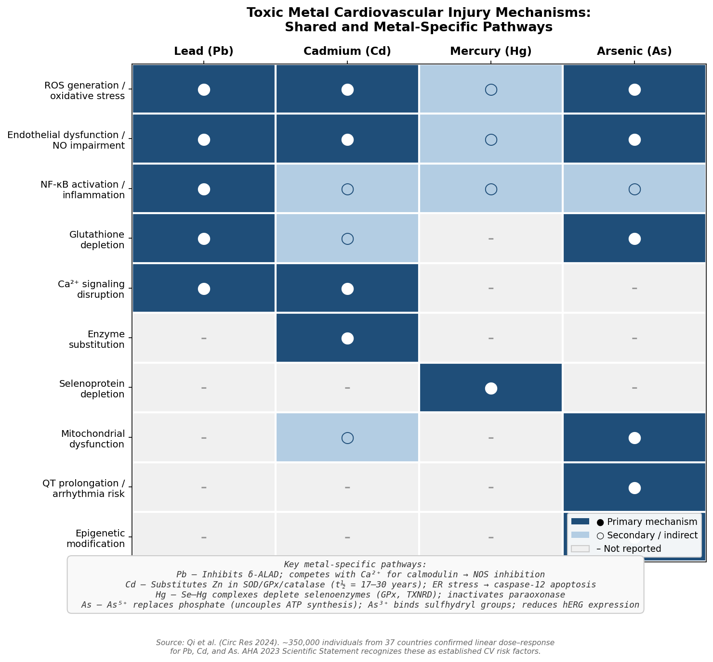

## 1.9 U-Shaped Dose–Response Relationships and Reference Ranges

A defining characteristic of essential metal ion biology in the cardiovascular system is the U-shaped (or J-shaped) dose–response curve: both deficiency and excess confer harm. Selenium illustrates this pattern most clearly — CVD risk increases at blood levels below approximately 70 μg/L (impaired selenoprotein function) and above 145–150 μg/L (pro-oxidant selenocompound formation), with a protective nadir around 100–125 μg/L [Current Heart Failure Reports — Al-Mubarak et al.](https://pmc.ncbi.nlm.nih.gov/articles/PMC8163712/ "Selenium, Selenoproteins, and Heart Failure, 2021"). Iron exhibits a dual-hazard curve in which deficiency impairs mitochondrial function and contractility while overload drives Fenton-reaction oxidative damage and ferroptosis. Copper dietary intake of 1–3 mg/day is associated with the lowest atherosclerosis susceptibility in animal models, with both deficient and excessive intakes increasing cardiovascular risk [Cell Death & Disease — Cai et al.](https://www.nature.com/articles/s41419-023-05639-w "Copper homeostasis and cuproptosis in CVD, 2023"). Figure 3 presents stylized U-shaped dose–response curves for iron, copper, selenium, and zinc, annotated with reference ranges and key clinical landmarks.

Normal plasma/serum reference ranges for cardiovascular-relevant metal ions are: Fe 10–30 μmol/L; Cu 11–22 μmol/L; Zn 10–18 μmol/L; Mg 0.7–1.0 mmol/L; Ca (total) 2.1–2.6 mmol/L; Se 70–150 μg/L; K 3.5–5.0 mmol/L [PMC Reference Intervals Study](https://pmc.ncbi.nlm.nih.gov/articles/PMC6816831/ "Reference Intervals of Essential Trace Elements"). These values represent general clinical chemistry reference ranges; cardiovascular-specific optimal concentrations may differ considerably. Selenium levels below 100 μg/L — within the lower portion of the normal reference interval — are already associated with worse HF prognosis, and serum magnesium represents only approximately 0.3% of total body magnesium stores, limiting its sensitivity as a cardiovascular biomarker.

These U-shaped relationships carry a critical implication for therapeutic strategy: interventions aimed at modulating metal ion concentrations must target restoration of homeostatic balance rather than unidirectional supplementation or depletion. The concept of a therapeutic window — narrow for some ions (selenium, copper) and broader for others (potassium, magnesium) — underpins the design of clinical trials evaluated in subsequent chapters.

# 第2章 Epidemiological Evidence — Associations Between Metal Ion Status and Cardiovascular Outcomes

The pathophysiological mechanisms outlined in Chapter 1 establish biological plausibility, yet they cannot alone quantify the population-level cardiovascular burden attributable to metal ion imbalances. This chapter synthesises observational, meta-analytic, and genetic-epidemiological evidence linking plasma, serum, and urinary metal ion biomarkers to hard cardiovascular endpoints — myocardial infarction (MI), stroke, heart failure (HF), and CVD death. The evidence is organised in five tiers: associations for essential metals, toxic-metal exposure gradients, population-attributable fractions that estimate the public-health magnitude of these associations, Mendelian randomisation (MR) analyses that probe causality, and the methodological limitations that constrain inference throughout.

## 2.1 Essential Metal Ions and Cardiovascular Risk

### 2.1.1 Iron (Fe)

The relationship between iron status and coronary heart disease (CHD) has been debated since the "iron hypothesis" was first proposed in the 1980s. A meta-analysis of 17 prospective studies (9,236 CHD cases among 156,427 participants) found that higher transferrin saturation (TSAT) was inversely associated with CHD risk, whereas serum iron, ferritin, and total iron-binding capacity showed no significant association [Das De et al., Atherosclerosis 2015](https://www.atherosclerosis-journal.com/article/S0021-9150(14)01638-4/abstract "Iron status and coronary heart disease meta-analysis"). The heterogeneity across biomarkers underscores a recurrent challenge in iron epidemiology: ferritin, an acute-phase reactant, is confounded by systemic inflammation, while TSAT more directly reflects iron available for tissue utilisation.

Data from the UK Biobank (N = 368,406) revealed J-shaped observational associations between haemoglobin and coronary artery disease (CAD), with elevated risk at both extremes. MR analyses within the same cohort showed that genetically predicted haemoglobin per 1 SD increase was associated with an 8% higher CAD risk in men (OR 1.08, 95% CI 1.04–1.13; P_interaction by sex = 0.003), with no significant effect in women and no association with HF or ischaemic stroke [Liu et al., JAHA 2024](https://www.ahajournals.org/doi/10.1161/JAHA.123.031732 "Iron Status and Risk of Heart Disease: MR Study"). The ARIC cohort further supports a U-shaped relationship: both ferritin < 100 μg/L and values above the sex-specific 95th percentile were associated with increased HF incidence [Liu et al., JAHA 2024](https://www.ahajournals.org/doi/10.1161/JAHA.123.031732 "ARIC data cited within Liu et al. JAHA 2024"). Taken together, these findings indicate that both iron deficiency and iron excess carry cardiovascular consequences, with sex-dependent heterogeneity that complicates any uniform population-screening strategy.

### 2.1.2 Magnesium (Mg)

Among essential metals, magnesium exhibits some of the most consistent inverse associations with cardiovascular endpoints. In the Rotterdam Study (N = 9,820; median follow-up 8.7 years), participants with serum Mg ≤ 0.80 mmol/L experienced 36% higher CHD mortality (HR 1.36, 95% CI 1.09–1.69) and 54% higher risk of sudden cardiac death (SCD; HR 1.54, 95% CI 1.12–2.11) compared with the reference range of 0.81–0.88 mmol/L. Each 0.1 mmol/L increment in serum Mg was associated with 18% lower CHD mortality (HR 0.82, 95% CI 0.70–0.96) [Kieboom et al., JAHA 2016](https://www.ahajournals.org/doi/10.1161/jaha.115.002707 "Serum Magnesium and Risk of Death From CHD and SCD"). The association strengthened when restricted to participants free of diabetes and with normal kidney function (HR 1.44, 95% CI 1.06–1.95 for CHD mortality among those with low Mg), indicating that the magnesium–CVD link is not merely a reflection of renal or metabolic comorbidity.

A systematic review and meta-analysis of prospective studies confirmed these findings at scale: each 0.2 mmol/L increment in circulating Mg was associated with 30% lower CVD risk (RR 0.70, 95% CI 0.56–0.88), and each 200 mg/day increment in dietary Mg with 22% lower CVD risk [Del Gobbo et al., Am J Clin Nutr 2013](https://pubmed.ncbi.nlm.nih.gov/23520480/ "Circulating and dietary magnesium and CVD risk meta-analysis"). Dose-response analyses further demonstrated a 22% reduction in HF risk per 100 mg/day dietary Mg increment (RR 0.78, 95% CI 0.69–0.89) [Fang et al., cited in Larsson et al., Am J Clin Nutr 2019](https://pubmed.ncbi.nlm.nih.gov/31815866/ "Quantitative Association Between Serum/Dietary Magnesium and CVD/All-Cause Mortality"). The consistency of this gradient across diverse populations and endpoints distinguishes Mg from most other essential metals.

### 2.1.3 Zinc (Zn)

A meta-analysis of 13 case-control studies (N = 2,886) demonstrated significantly lower serum Zn concentrations in CHD patients compared with controls, and a parallel analysis of 12 studies (N = 1,453) confirmed the same pattern in HF [Huang et al., Nutrients 2022](https://pmc.ncbi.nlm.nih.gov/articles/PMC9560831/ "Serum Zinc and CHD Meta-Analysis"). In the Finnish Kuopio Ischaemic Heart Disease Risk Factor Study, participants in the highest serum Zn tertile had 43% lower CVD mortality relative to the lowest tertile (RR 0.57, 95% CI 0.36–0.90) [Virtanen et al., cited in Olechnowicz et al.](https://pmc.ncbi.nlm.nih.gov/articles/PMC5133094/ "Zinc Status and CVD Risk"). NHANES III data extend these findings to all-cause mortality: the highest quartile of dietary Zn intake was associated with 24% lower mortality risk (HR 0.76, 95% CI 0.62–0.94) and lower CVD mortality, with evidence of a nonlinear dose-response [Shi et al., Nutrients 2023](https://pmc.ncbi.nlm.nih.gov/articles/PMC9862936/ "Dietary Zinc Intake and All-Cause and Cardiovascular Mortality").

A key limitation is the case-control design of most Zn–CHD studies, which cannot exclude reverse causation: systemic inflammation lowers serum Zn through hepatic sequestration, so subclinical CVD could precede — and partially explain — the observed zinc deficit.

### 2.1.4 Selenium (Se)

Blood Se and CVD risk follow a nonlinear U-shaped pattern. A meta-analysis of 16 prospective observational studies estimated that a 50% increase in blood Se concentration was associated with 24% lower CHD risk (RR 0.76, 95% CI 0.62–0.93), but the benefit was confined to the 55–145 μg/L range; above approximately 130 μg/L, the protective association disappeared [Zhang et al., Eur J Clin Nutr 2016](https://www.nature.com/articles/ejcn201578 "Selenium status and CVD meta-analysis"). A 2025 systematic review of cohort studies reaffirmed this pattern, demonstrating inverse associations between Se biomarkers and cardiovascular, cancer, and all-cause mortality within the low-to-moderate concentration band, with attenuation or reversal at higher levels [Selenium biomarkers systematic review, ScienceDirect 2025](https://www.sciencedirect.com/science/article/pii/S221323172500268X "Selenium biomarkers and mortality, 2025").

The narrow therapeutic window — protective below ~130 μg/L but potentially harmful above ~145 μg/L — carries direct implications for supplementation strategies (discussed in Chapter 3) and underscores the necessity of baseline Se measurement before any intervention.

### 2.1.5 Copper (Cu)

Copper occupies a paradoxical position in the epidemiological landscape. In the BMJ 2018 meta-analysis by Chowdhury et al. (6 studies), the highest versus lowest third of baseline blood Cu was associated with a pooled RR of 2.22 (95% CI 1.31–3.74) for CHD and 1.81 (95% CI 1.05–3.11) for CVD — effect sizes exceeding those observed for any of the toxic metals in the same analysis [Chowdhury et al., BMJ 2018](https://www.bmj.com/content/362/bmj.k3310 "Environmental toxic metal contaminants and risk of CVD"). Although Cu is essential for ceruloplasmin ferroxidase activity and superoxide dismutase function (see Chapter 1), excess free Cu generates hydroxyl radicals via Fenton-like chemistry and promotes LDL oxidation. Ceruloplasmin-bound Cu is also an acute-phase marker; elevated serum Cu in observational studies may therefore partly reflect inflammatory burden rather than a direct causal contribution to atherogenesis.

### 2.1.6 Potassium (K)

A meta-analysis of 11 prospective cohort studies (> 247,000 participants) found that higher K intake was associated with 21% lower stroke risk (RR 0.79, 95% CI 0.68–0.90), with no significant heterogeneity across studies [D'Elia et al., JACC 2011](https://www.sciencedirect.com/science/article/pii/S0735109710049764 "Potassium Intake, Stroke, and CVD"). The relationship between serum K and mortality is, however, U-shaped: a large NHANES-based prospective analysis reported the lowest all-cause and cardiovascular mortality at approximately 4.2 mmol/L, with increased hazard at both lower and higher serum concentrations [K U-shape analysis, PubMed 2024](https://pubmed.ncbi.nlm.nih.gov/38195532/ "Potassium levels and the risk of mortality: U-shaped association, 2024"). This dual observation — benefit from higher dietary intake, risk from extreme serum levels — reflects the tight renal regulation of extracellular K and the distinct pathophysiological consequences of hypokalaemia (arrhythmogenesis, QT prolongation) and hyperkalaemia (cardiac arrest).

### 2.1.7 Calcium (Ca)

The "calcium paradox" — the observation that supplemental Ca may increase MI risk despite calcium's essential roles in coagulation and excitation–contraction coupling — has a substantive epidemiological dimension. A systematic review by Reid et al. (J Intern Med 2016) reported a pooled HR of 1.08 (95% CI 1.04–1.13) per 1 SD increment in serum Ca for cardiovascular events. MR evidence reinforces this concern (Section 2.4.4 below), with genetically predicted serum Ca showing a positive association with CAD risk. The signal remains contested, however; reconciliation with supplementation trial data is addressed in Chapter 3.

## 2.2 Toxic Metal Exposure and Cardiovascular Mortality

### 2.2.1 Lead (Pb)

Lead is the toxic metal with the most robust cardiovascular epidemiological evidence. In the BMJ 2018 meta-analysis (37 studies, N = 348,259), the top versus bottom third of blood Pb was associated with pooled RRs of 1.43 (95% CI 1.16–1.76) for CVD, 1.85 (95% CI 1.27–2.69) for CHD, and 1.63 (95% CI 1.14–2.34) for stroke; the dose-response was approximately linear, with a 7% increase in CHD risk per 5 μg/dL increment in blood Pb [Chowdhury et al., BMJ 2018](https://www.bmj.com/content/362/bmj.k3310 "BMJ 2018 meta-analysis").

A landmark NHANES III analysis (N = 14,289; follow-up through 2011) by Lanphear et al. quantified the cardiovascular toll at the population level: comparing the 90th percentile of blood Pb (6.7 μg/dL) with the 10th percentile (1.0 μg/dL), the HRs were 1.70 (95% CI 1.30–2.22) for CVD mortality and 2.08 (95% CI 1.52–2.85) for ischaemic heart disease (IHD) mortality. The authors estimated that low-level Pb exposure accounts for approximately 256,000 cardiovascular deaths annually among US adults [Lanphear et al., Lancet Public Health 2018](https://www.thelancet.com/journals/lanpub/article/PIIS2468-2667(18)30025-2/fulltext "Low-level lead exposure and mortality in US adults"). Earlier NHANES III analyses demonstrated even steeper gradients in the highest Pb tertile (≥ 3.62 μg/dL): 55% higher cardiovascular mortality, 89% higher MI death, and 151% higher stroke mortality compared with the lowest tertile [Schober et al., cited in Lamas et al., JAHA 2021](https://www.ahajournals.org/doi/10.1161/JAHA.120.018692 "Lead and Cadmium as Cardiovascular Risk Factors").

### 2.2.2 Cadmium (Cd)

Cadmium, with a biological half-life of 17–30 years, exerts chronic cardiovascular toxicity at exposure levels common in the general population. In the Strong Heart Study (N = 3,348 American Indians), urine Cd at the 80th versus 20th percentile was associated with a cardiovascular mortality HR of 1.43 (95% CI 1.21–1.70) and a CHD mortality HR of 1.34 (95% CI 1.10–1.63) [Tellez-Plaza et al., cited in Lamas et al., JAHA 2021](https://www.ahajournals.org/doi/10.1161/JAHA.120.018692 "Lead and Cadmium as CVD Risk Factors"). NHANES III analyses confirmed that urine Cd predicted CVD mortality at low exposure levels typical of the US general population [Tellez-Plaza et al., Environ Health Perspect 2012](https://pmc.ncbi.nlm.nih.gov/articles/PMC3404657/ "Cadmium Exposure and CVD Mortality in the US").

In the BMJ 2018 meta-analysis, the top-versus-bottom-third pooled RRs for Cd were 1.33 (95% CI 1.09–1.64) for CVD and 1.72 (95% CI 1.29–2.28) for stroke. The dose-response curve was notably steep at low urinary Cd concentrations (0.11–1.41 μg/g creatinine) and flattened at higher levels — a pattern consistent with the risk-per-unit increase being greatest at the lowest exposure levels [Chowdhury et al., BMJ 2018](https://www.bmj.com/content/362/bmj.k3310 "BMJ 2018 meta-analysis").

### 2.2.3 Arsenic (As)

Arsenic exposure is associated with CVD risk across a wide range of concentrations. In the BMJ 2018 meta-analysis, the top-versus-bottom-third pooled RRs were 1.30 (95% CI 1.04–1.63) for CVD and 1.23 (95% CI 1.04–1.45) for CHD. The dose-response relationship was approximately linear over a drinking-water arsenic range of 0–369.5 μg/L, with no discernible no-effect threshold [Chowdhury et al., BMJ 2018](https://www.bmj.com/content/362/bmj.k3310 "BMJ 2018 meta-analysis"). This linearity distinguishes As from essential metals, whose dose-response curves are typically U-shaped, and implies that incremental reductions in arsenic exposure at any level are likely to yield cardiovascular benefit.

### 2.2.4 Mercury (Hg)

In contrast to Pb, Cd, and As, mercury shows no consistent association with cardiovascular endpoints. In the BMJ 2018 meta-analysis (9 studies), the pooled RR for CVD was 0.94 (95% CI 0.66–1.36) and for CHD 0.99 (95% CI 0.65–1.49) — null findings consistent across multiple large cohorts, including the Physicians' Health Study and the Nurses' Health Study [Chowdhury et al., BMJ 2018](https://www.bmj.com/content/362/bmj.k3310 "BMJ 2018 meta-analysis"). The absence of a detectable cardiovascular signal for Hg is notable given its well-documented neurotoxicity and may partly reflect confounding by fish consumption — a major Hg source that simultaneously provides cardioprotective omega-3 fatty acids.

The aggregate pattern across toxic metals is summarised in Figure 1, which displays the pooled RRs from the BMJ 2018 meta-analysis for Pb, Cd, As, Hg, and Cu across CVD, CHD, and stroke endpoints.

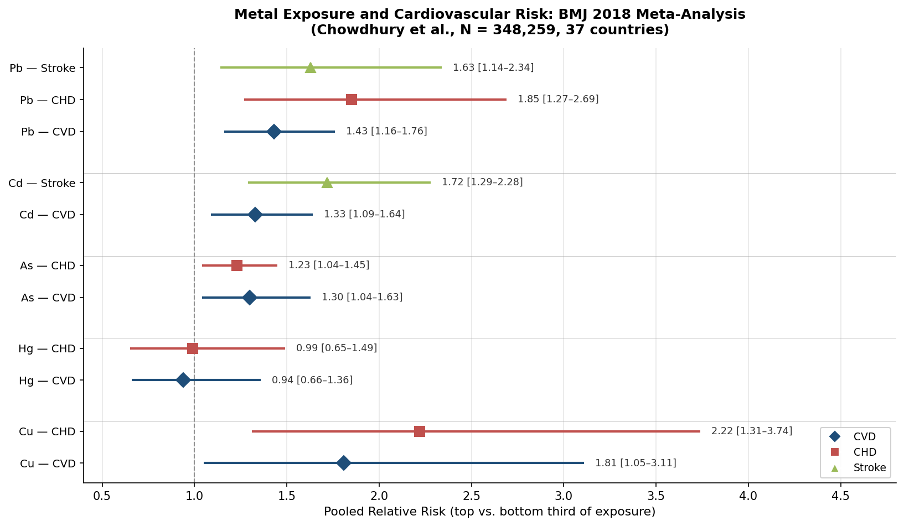

*Figure 1. Metal exposure and cardiovascular risk: pooled relative risks (top vs. bottom third of exposure) for Pb, Cd, As, Hg, and Cu from the Chowdhury et al. BMJ 2018 meta-analysis (N = 348,259, 37 countries). Confidence intervals crossing 1.0 indicate non-significant associations. Data source: [Chowdhury et al., BMJ 2018](https://www.bmj.com/content/362/bmj.k3310 "BMJ 2018 meta-analysis").*

### 2.2.5 Regulatory Recognition

In June 2023, the American Heart Association published a scientific statement formally classifying chronic low-level exposure to Pb, Cd, and As as modifiable environmental cardiovascular risk factors. The statement called for multi-pronged public health strategies — environmental monitoring, individual biomonitoring, and research into chelation and nutritional supplementation — to reduce cardiovascular harm [AHA Scientific Statement 2023](https://newsroom.heart.org/news/chronic-exposure-to-lead-cadmium-and-arsenic-increases-risk-of-cardiovascular-disease "AHA 2023 Scientific Statement on contaminant metals and CVD"). This institutional recognition represents a paradigm shift: metal ion exposure is now incorporated into the established framework of cardiovascular risk assessment alongside traditional factors such as hypertension, dyslipidaemia, and smoking.

## 2.3 Population-Attributable Fractions: Quantifying the Cardiovascular Burden

The population-level significance of metal ion imbalances is best illustrated by estimates of attributable cardiovascular mortality. Lanphear et al. (2018) calculated that low-level Pb exposure was responsible for approximately 412,000 excess deaths per year among US adults, of which roughly 256,000 were cardiovascular — a figure exceeding the annual burden attributed to many traditional risk factors considered in isolation [Lanphear et al., Lancet Public Health 2018](https://www.thelancet.com/journals/lanpub/article/PIIS2468-2667(18)30025-2/fulltext "Low-level lead exposure and mortality in US adults").

Temporal trends provide converging evidence. Ruiz-Hernandez et al. (2017), comparing NHANES 1999–2004 with NHANES III (1988–1994), estimated that 230.7 CVD deaths per 100,000 person-years were avoided over that period. Of these, 22.5% (approximately 52 CVD deaths per 100,000 person-years) were statistically attributable to declines in blood Pb, and an additional 9.5% to declining urinary Cd. Joint adjustment for both metals explained 32.0% of the observed reduction in CVD mortality between the two survey periods [Ruiz-Hernandez et al., Int J Epidemiol 2017](https://academic.oup.com/ije/article/46/6/1903/4098114 "Declining lead and cadmium exposures and CVD mortality reduction, 1988–2004"). More recent NHANES analyses (1999–2012 blood data, follow-up through 2015), using a combined Environmental Risk Score for Pb, Cd, and Hg, improved CVD risk prediction beyond traditional risk factors (C-statistic from 0.845 to 0.854). The multivariable-adjusted HR comparing the 75th with the 25th percentile of this composite score was 1.84 (95% CI 1.48–2.27) [Wang et al., cited in Lamas et al., JAHA 2021](https://www.ahajournals.org/doi/10.1161/JAHA.120.018692 "Lead and Cadmium as Cardiovascular Risk Factors").

These attributable-fraction estimates, while subject to the assumptions inherent in causal inference from observational data, provide a strong rationale for population-level metal ion exposure reduction as a cardiovascular prevention strategy — a theme developed in detail in Chapter 3.

## 2.4 Mendelian Randomisation: Probing Causal Inference

Observational associations between metal ion biomarkers and CVD are vulnerable to confounding and reverse causation. MR analyses — which use genetic variants as instrumental variables for the exposure of interest — offer a complementary approach that is less susceptible to these biases, provided the core MR assumptions (relevance, independence, exclusion restriction) are satisfied.

### 2.4.1 Iron

The largest MR study of iron status and CVD to date (Liu et al., JAHA 2024) leveraged GWAS summary data from CARDIOGRAMplusC4D (181,522 CAD cases), HERMES (115,150 HF cases), GIGASTROKE (62,100 ischaemic stroke cases), and DIAMANTE (80,154 type 2 diabetes cases). Higher genetically predicted iron status was modestly protective for CAD: OR 0.93 (95% CI 0.88–0.98) per 1 SD higher TSAT, OR 0.91 (95% CI 0.83–0.99) per 1 SD higher serum iron, and OR 0.86 (95% CI 0.77–0.96) per 1 SD higher ferritin. Higher iron status was, however, associated with adverse metabolic effects (T2D OR 1.07 per 1 SD TSAT), and no significant associations were observed for HF or ischaemic stroke [Liu et al., JAHA 2024](https://www.ahajournals.org/doi/10.1161/JAHA.123.031732 "Iron Status and Risk of Heart Disease: MR Study"). The discordance between a protective CAD signal and an adverse T2D signal illustrates why iron-targeted interventions must be carefully stratified by clinical phenotype.

### 2.4.2 Magnesium

A two-sample MR analysis by Larsson et al. (BMC Medicine 2018) used 6 SNPs as instrumental variables for serum Mg combined with CARDIoGRAMplusC4D data (60,801 CAD cases, 123,504 non-cases). A genetically predicted 0.1 mmol/L (~1 SD) increase in serum Mg was associated with 12% lower odds of CAD (OR 0.88, 95% CI 0.78–0.99; P = 0.03). Sensitivity analyses using the weighted-median estimator (OR 0.84) and heterogeneity-penalised model averaging (OR 0.83) yielded consistent results [Larsson et al., BMC Medicine 2018](https://pmc.ncbi.nlm.nih.gov/articles/PMC5956816/ "Serum magnesium and CAD: Mendelian randomisation study"). This genetic evidence provides robust support for a causal protective effect of Mg on coronary disease, strengthening the rationale for Mg supplementation trials with hard cardiovascular endpoints.

### 2.4.3 Multi-Element MR and Discordant Signals

A multi-omics MR study incorporating 13 trace elements and 20 CVD phenotypes, using GWAS data from UK Biobank and FinnGen, confirmed protective signals for Mg (IHD OR 0.868, 95% CI 0.763–0.988) and K (IHD OR 0.838, 95% CI 0.719–0.976) and identified a negative association between iron and angina pectoris (OR 0.812, 95% CI 0.666–0.989) [Chen et al., Frontiers in Immunology 2024](https://www.frontiersin.org/journals/immunology/articles/10.3389/fimmu.2024.1459465/full "Multi-omics MR study of trace elements and CVD"). The same analysis, however, produced paradoxical findings: Zn was positively associated with cardiac arrest risk (OR 1.171, 95% CI 1.019–1.345), and Ca showed a positive relationship with MI (OR 1.239, 95% CI 1.016–1.512). The K–IHD signal lost significance in multivariable MR, suggesting potential mediation through correlated pathways.

Figure 2 juxtaposes the observational and MR effect estimates for six essential metals, highlighting the concordance for Mg and Ca and the discordance for Se and Zn between the two analytical frameworks.

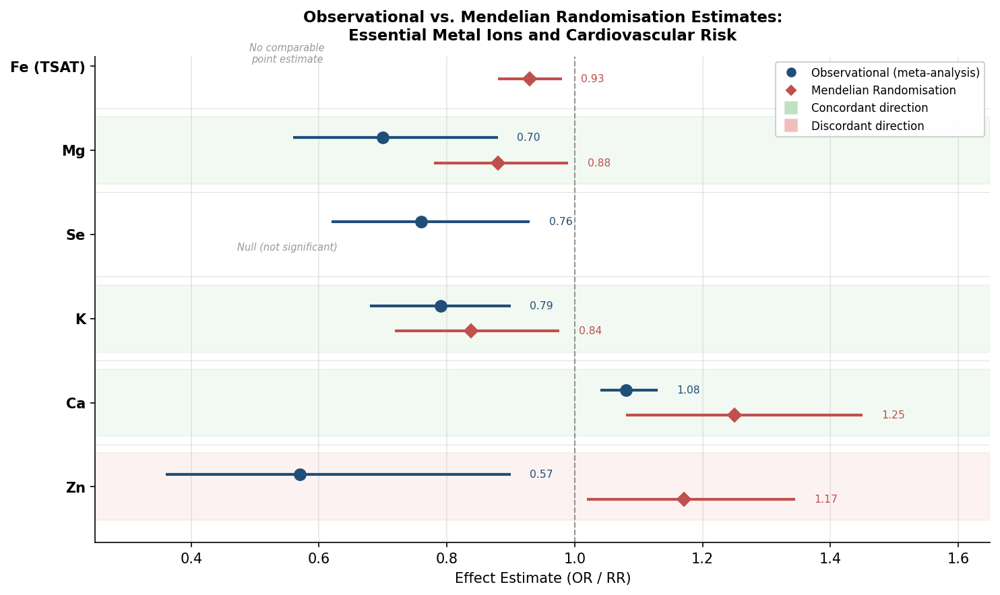

*Figure 2. Observational vs. Mendelian randomisation estimates for essential metal ions and cardiovascular risk. Blue circles represent observational meta-analytic RRs; red diamonds represent MR-derived ORs. Green shading denotes concordant effect direction; pink shading denotes discordant direction. Sources: [Liu et al., JAHA 2024](https://www.ahajournals.org/doi/10.1161/JAHA.123.031732 "Iron MR Study"); [Larsson et al., BMC Medicine 2018](https://pmc.ncbi.nlm.nih.gov/articles/PMC5956816/ "Mg MR Study"); [Chen et al., Frontiers in Immunology 2024](https://www.frontiersin.org/journals/immunology/articles/10.3389/fimmu.2024.1459465/full "Multi-omics MR study").*

### 2.4.4 Calcium

A dedicated MR analysis by Larsson et al. (JAMA 2017), using 6 calcium-associated SNPs and CARDIoGRAMplusC4D data (60,801 CAD cases, 123,504 non-cases), found that a genetically predicted 0.5 mg/dL (~1 SD) increase in serum Ca was associated with 25% higher odds of CAD (OR 1.25, 95% CI 1.08–1.45; P = 0.003) and 24% higher odds of MI (OR 1.24, 95% CI 1.05–1.46; P = 0.009). Results were robust across weighted-median and MR-Egger sensitivity analyses, with no evidence of directional pleiotropy [Larsson et al., JAMA 2017](https://jamanetwork.com/journals/jama/fullarticle/2645106 "Genetic Variants in Serum Calcium and CAD"). These genetic data provide a mechanistic complement to the observational and trial-based concerns regarding calcium supplementation and MI risk discussed in Chapters 1 and 3.

### 2.4.5 Selenium and Toxic Metals

For Se, MR studies have yielded predominantly null results. A two-sample MR analysis presented at the 2022 ESC Congress found no significant causal association between genetically predicted Se concentrations and 15 individual CVD outcomes, despite consistent inverse associations in observational data [ESC 2022 MR abstract](https://academic.oup.com/eurheartj/article/43/Supplement_2/ehac544.2432/6746295 "Selenium and CVD: MR study"). This discordance suggests that the observational Se–CVD association is substantially driven by confounding — Se-rich diets correlate with other cardioprotective nutrients — or by reverse causation.

For toxic metals (Pb, Cd, As), MR approaches remain limited by the scarcity of validated genetic instruments. Chowdhury et al. (2018) identified polymorphisms near AS3MT (arsenic) and MT1A/MT1B (cadmium) as potential instrumental variables, but no large-scale MR studies for toxic metal–CVD associations have been completed as of early 2026 [Chowdhury et al., BMJ 2018](https://www.bmj.com/content/362/bmj.k3310 "BMJ 2018 meta-analysis"). This absence represents a significant evidence gap, given the strength and consistency of the observational signals reviewed in Section 2.2.

## 2.5 Vulnerable Populations and Effect Modification

The cardiovascular burden of metal ion imbalances is not uniformly distributed. The AHA 2023 scientific statement emphasised that lower-income communities face disproportionate toxic metal exposure through contaminated air, water, and soil, with heightened risk for populations near major roadways, industrial facilities, and ageing housing stock. Addressing contaminant metal exposure in these populations may therefore serve as an actionable lever for reducing cardiovascular disease disparities [AHA Scientific Statement 2023](https://newsroom.heart.org/news/chronic-exposure-to-lead-cadmium-and-arsenic-increases-risk-of-cardiovascular-disease "AHA 2023 Scientific Statement").

Sex-stratified analyses reveal additional heterogeneity. In the UK Biobank MR study, the iron–CAD association was confined to men (OR 1.08 per 1 SD haemoglobin), with no effect in women (P_interaction = 0.003), potentially reflecting sex differences in iron metabolism driven by menstrual blood loss and hepcidin regulation [Liu et al., JAHA 2024](https://www.ahajournals.org/doi/10.1161/JAHA.123.031732 "Iron Status MR Study"). In the Rotterdam Study, while no sex-based effect modification was observed for the Mg–CHD association, participants with diabetes mellitus or chronic kidney disease had notably higher hypomagnesaemia prevalence — identifying these comorbidities as markers of heightened vulnerability to Mg-related cardiovascular risk [Kieboom et al., JAHA 2016](https://www.ahajournals.org/doi/10.1161/jaha.115.002707 "Rotterdam Study: Serum Mg and CVD").

## 2.6 Methodological Limitations and Interpretive Caution

Several crosscutting methodological issues constrain the strength of causal inference from the epidemiological evidence reviewed above.

**Reverse causation.** Chronic diseases, including CVD, alter metal ion metabolism: systemic inflammation elevates ferritin and Cu (both acute-phase reactants) while suppressing Zn and albumin-bound metals. Single-timepoint biomarker measurements in most cohort studies cannot determine whether altered metal levels precede or follow subclinical disease onset [Kieboom et al., JAHA 2016](https://www.ahajournals.org/doi/10.1161/jaha.115.002707 "Rotterdam Study"); [Chowdhury et al., BMJ 2018](https://www.bmj.com/content/362/bmj.k3310 "BMJ 2018 meta-analysis").

**Biomarker heterogeneity.** Serum Mg represents only ~0.3% of total body Mg stores and may poorly capture intracellular or bone-reservoir status. Urinary Cd reflects cumulative burden better than blood Cd, but spot-urine measurements are sensitive to hydration and renal function. Iron status assessment requires multiple biomarkers (ferritin, TSAT, serum iron, TIBC); studies employing only one introduce measurement error and regression dilution bias.

**Residual confounding.** Essential metal associations are confounded by correlated dietary patterns (Mg-rich diets tend to be heart-healthy overall), socioeconomic status, smoking (a major Cd confounder), and kidney function (which modulates Mg, K, and Ca excretion). For toxic metals, fish consumption confounds Hg analyses by simultaneously introducing a cardioprotective exposure.

**Between-study heterogeneity.** The BMJ 2018 meta-analysis reported substantial I² values for several metal–CVD associations (78% for As–CHD, 66% for Pb–CHD, 85% for Hg–CHD), reflecting differences in biomarker type, exposure level, population characteristics, adjustment strategies, and follow-up duration [Chowdhury et al., BMJ 2018](https://www.bmj.com/content/362/bmj.k3310 "BMJ 2018 meta-analysis").

**U-shaped dose-response complexity.** Multiple essential metals (Fe, Zn, Se, K, Mg) display U-shaped or J-shaped risk curves, where both deficiency and excess are harmful. This nonlinearity complicates population-level recommendations, as the optimal range is often narrow and population-dependent — Se benefit, for example, disappears in selenium-replete populations. Figure 3 illustrates the U-shaped dose-response relationships for Se and K, two metals for which the nonlinearity is particularly well documented.

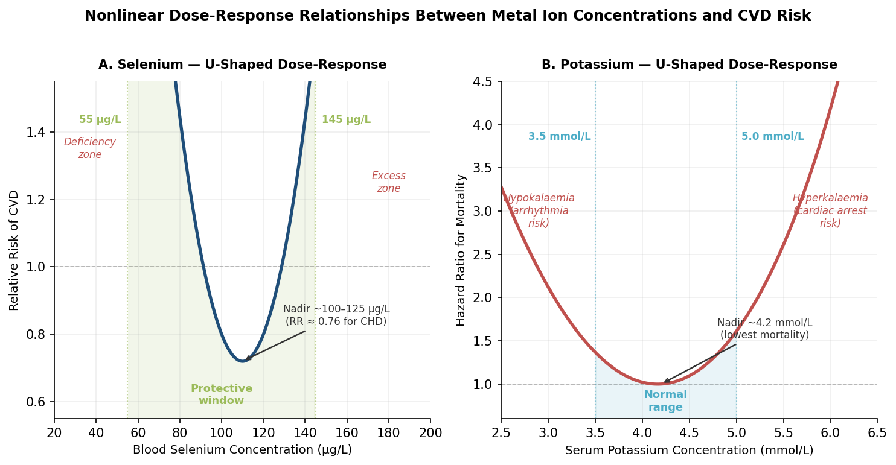

*Figure 3. Nonlinear dose-response relationships between metal ion concentrations and CVD risk. Panel A: Blood Se concentration vs. relative risk of CVD, with the protective window (55–145 μg/L) and nadir (~100–125 μg/L) annotated. Panel B: Serum K concentration vs. hazard ratio for mortality, with the nadir (~4.2 mmol/L) and clinical risk zones (hypokalaemia, hyperkalaemia) indicated.*

Translating these dose-response relationships into actionable supplementation thresholds remains a central challenge for the field.

## 2.7 Synthesis

The epidemiological evidence supports several converging conclusions.

First, among essential metals, Mg and K demonstrate the most consistent inverse associations with CVD across both observational and MR designs, making them priority targets for interventional testing. Iron status shows a complex, sex-dependent, and biomarker-dependent pattern that defies simple characterisation; its U-shaped risk profile demands precision in any corrective strategy. Se associations, while robust in observational data from low-Se populations, lose significance in MR analyses — suggesting confounding as a major driver. Cu's strong observational signal may likewise be inflated by its role as an acute-phase marker.

Second, for toxic metals, Pb and Cd carry the strongest and most consistently replicated cardiovascular risk signals, with linear or near-linear dose-response relationships extending into exposure ranges common in the general population. The estimated population-attributable fractions — 22.5% of the US CVD mortality decline attributed to Pb reduction alone, and a combined 32% when Cd is included — provide a compelling epidemiological case for environmental exposure reduction as cardiovascular prevention.

Third, MR analyses strengthen the causal argument for Mg and Ca (in opposite directions), provide modest support for iron's protective role in CAD, and weaken the case for Se as a causal cardioprotective factor. For toxic metals, the absence of completed MR studies constitutes a significant evidence gap. Collectively, these epidemiological findings inform the selection and prioritisation of therapeutic interventions discussed in Chapter 3.

# 第3章 Therapeutic Interventions — Supplementation, Chelation, and Pharmacological Modulation

The pathophysiological rationale established in Chapter 1 and the epidemiological associations documented in Chapter 2 converge on a translational question of direct clinical relevance: can deliberate modulation of plasma metal ion concentrations produce measurable cardiovascular benefit? This chapter provides a systematic, critical review of the intervention strategies that have been proposed or tested to date. The discussion is organised into five modalities: (1) supplementation of deficient essential metals, (2) chelation therapy for toxic-metal removal or iron-overload reduction, (3) dietary pattern modification as a multi-metal intervention, (4) pharmacological agents that indirectly alter metal ion metabolism, and (5) population-level environmental strategies for toxic-metal reduction. For each modality, the mechanism of action, target metal(s), clinical context, evidence maturity, and guideline status are assessed; detailed trial-level efficacy and safety analyses follow in Chapter 4.

## 3.1 Essential Metal Supplementation

### 3.1.1 Magnesium (Mg) Supplementation

Oral magnesium supplementation is the most extensively trialled essential-metal intervention for cardiovascular risk reduction. A meta-analysis of 34 randomised controlled trials (RCTs; N = 2,028) demonstrated that oral Mg at a median dose of 368 mg/day reduced systolic blood pressure (SBP) by 2.00 mmHg (95% CI 0.43–3.58) and diastolic blood pressure (DBP) by 1.78 mmHg (95% CI 0.73–2.82). Doses ≥ 300 mg/day achieved the maximal hypotensive effect, and inorganic salts — particularly magnesium oxide — produced larger SBP reductions (−3.52 mmHg) than organic formulations [Zhang et al., Hypertension 2016](https://www.ahajournals.org/doi/10.1161/hypertensionaha.116.07664 "Effects of Magnesium Supplementation on Blood Pressure"). In 2022, the U.S. Food and Drug Administration (FDA) authorised a qualified health claim linking magnesium intake to reduced risk of high blood pressure, a regulatory milestone that reflects the weight of accumulated trial evidence.

In the acute setting, intravenous magnesium sulfate (MgSO₄) remains a first-line treatment for torsades de pointes — a polymorphic ventricular tachycardia associated with prolonged QT interval. The mechanistic basis is direct: magnesium functions as a physiological calcium antagonist, suppressing L-type Ca²⁺ channel activity and stabilising cardiac action potential duration (Chapter 1), thereby terminating the re-entrant circuit underlying this arrhythmia [Baker et al., Biomedicines 2022](https://www.mdpi.com/2227-9059/10/10/2356 "The Role of Hypomagnesemia in Cardiac Arrhythmias, 2022").

Despite robust evidence for blood-pressure lowering and acute antiarrhythmic efficacy, no large-scale RCT has yet evaluated oral Mg supplementation against hard cardiovascular endpoints (myocardial infarction, stroke, or cardiovascular death) in the general population. This gap between surrogate-endpoint evidence and clinical-outcome data constitutes the principal limitation of the magnesium supplementation literature and underscores the need for adequately powered outcome trials.

### 3.1.2 Potassium (K) — Salt Substitution as a Population-Level Strategy

The Salt Substitute and Stroke Study (SSaSS; NCT02092090) is the largest completed trial of a potassium-based intervention for cardiovascular prevention. Conducted across 600 villages in rural China (N = 20,995 participants with a history of stroke or age ≥ 60 years with uncontrolled hypertension), SSaSS cluster-randomised villages to a salt substitute containing 75% NaCl / 25% KCl versus regular salt. Over a mean follow-up of 4.74 years, the intervention reduced stroke incidence by 14% (rate ratio [RR] 0.86, 95% CI 0.77–0.96), major adverse cardiovascular events (MACE) by 13% (RR 0.87, 95% CI 0.80–0.94), and all-cause mortality by 12% (RR 0.88, 95% CI 0.82–0.95). Clinical hyperkalaemia was not increased (RR 1.04, 95% CI 0.80–1.37), and SBP decreased by 3.34 mmHg in the intervention arm [Neal et al., NEJM 2021](https://www.nejm.org/doi/full/10.1056/NEJMoa2105675 "Effect of Salt Substitution on CVD Events and Death").

SSaSS is mechanistically a dual intervention — simultaneous sodium reduction and potassium augmentation — exploiting the direct natriuretic effect of dietary K, its capacity to attenuate renin–angiotensin–aldosterone system (RAAS) activation, and enhanced endothelium-dependent vasodilation (Chapter 1). In January 2025, the World Health Organization (WHO) issued its first guideline on lower-sodium salt substitutes (LSSS), providing a conditional recommendation for potassium-enriched alternatives; the accompanying meta-analysis reported an aggregate SBP reduction of approximately 4.76 mmHg across LSSS trials [WHO 2025 LSSS Guideline](https://www.who.int/news-room/events/detail/2025/01/27/default-calendar/launch-of-the-who-guideline-on-the-use-of-lower-sodium-salt-substitutes "WHO LSSS Guideline"). External replication has been achieved in a Peruvian trial (N = 2,376), which confirmed blood-pressure reductions and a halving of new-onset hypertension [Bernabe-Ortiz et al., Nat Med 2020](https://pubmed.ncbi.nlm.nih.gov/32066973/ "Peru salt substitution trial").

### 3.1.3 Zinc (Zn) Supplementation

Zinc supplementation consistently reduces systemic inflammatory biomarkers. A meta-analysis of 20 RCTs demonstrated significant reductions in serum C-reactive protein (CRP) and other inflammatory markers following Zn supplementation [Faghfouri et al., JTEB 2023](https://www.sciencedirect.com/science/article/abs/pii/S0946672X23001207 "Zinc supplementation and CVD risk factors meta-analysis"). These anti-inflammatory effects are biologically coherent with zinc's role in suppressing NF-κB signalling through PPAR-α/γ and A20 activation (Chapter 1).

However, no completed large-scale RCT has evaluated zinc supplementation against hard cardiovascular endpoints. The only registered trial directly assessing cardiac function is a Phase II study (NCT00696410) examining the effect of Zn on left ventricular function in heart failure patients. The evidence base for zinc supplementation as a cardiovascular intervention therefore rests entirely on surrogate endpoints and observational associations, and adequately powered outcome trials remain a prerequisite before clinical adoption.

### 3.1.4 Selenium (Se) Supplementation — The Determinant Role of Baseline Status

Selenium supplementation illustrates a broader principle in metal-ion therapeutics: baseline metal status can determine whether an intervention is beneficial, neutral, or harmful. Two landmark trials encapsulate this divergence.

**SELECT (Selenium and Vitamin E Cancer Prevention Trial; NCT00006392; N = 35,533)** enrolled Se-replete North American men (baseline plasma Se ~135 μg/L) and observed no cardiovascular benefit over 5.5 years of follow-up. SELECT was designed for cancer-prevention endpoints, with cardiovascular events as secondary outcomes; Se 200 μg/day failed to improve either [SELECT, JAMA 2009](https://jamanetwork.com/journals/jama/fullarticle/183451 "SELECT trial results").

**KiSel-10 (NCT01443780; N = 443)** enrolled elderly Swedish participants with low baseline Se (~67 μg/L) and supplemented combined Se (200 μg/day) plus coenzyme Q₁₀ (200 mg/day) for four years. Cardiovascular mortality was reduced by 41% (HR 0.59, 95% CI 0.42–0.81, P = 0.0003), and this benefit persisted through 12 years of follow-up (cardiovascular mortality 28.1% vs 38.7% in placebo) [Alehagen et al., Int J Cardiol 2013](https://pubmed.ncbi.nlm.nih.gov/22626835/ "Selenium/CoQ10 supplementation and cardiovascular mortality"). The combined design (Se + CoQ₁₀) precludes isolation of selenium's independent contribution, but the divergent outcomes between Se-replete (SELECT) and Se-deficient (KiSel-10) populations strongly suggest that supplementation confers benefit only when baseline levels fall below the protective threshold (~70 μg/L) identified in the U-shaped epidemiological data (Chapter 2). This baseline-dependency principle has broad implications for the design of future metal-ion supplementation trials.

### 3.1.5 Intravenous Iron (Fe) for Heart Failure with Iron Deficiency

Intravenous (IV) iron repletion in heart failure patients with documented iron deficiency is the most advanced metal-ion supplementation strategy in cardiovascular medicine, with guideline endorsement at the highest evidence level. Two formulations dominate the clinical landscape: ferric carboxymaltose (FCM) and ferric derisomaltose (FDI, also known as iron isomaltoside).

The rationale draws on the high prevalence of iron deficiency in HF (37–75% of patients; Chapter 1) and the functional consequences of myocardial iron depletion — impaired mitochondrial oxidative phosphorylation, reduced exercise capacity, and compromised quality of life. Five landmark trials have shaped the evidence base:

- **FAIR-HF (NCT00520780; N = 459)** — the first pivotal trial, enrolling ambulatory HFrEF patients with iron deficiency; demonstrated significant improvements in patient-reported outcomes, NYHA class, and six-minute walk distance with FCM [Anker et al., NEJM 2009](https://www.nejm.org/doi/full/10.1056/NEJMoa0908355 "FAIR-HF").
- **AFFIRM-AHF (NCT02937454; N = 1,108)** — tested FCM in patients hospitalised for acute HF with iron deficiency.
- **IRONMAN (NCT02642562; N = 1,137)** — open-label trial of FDI in a broader HFrEF population.
- **HEART-FID (NCT03037931; N = 3,065)** — the largest completed IV iron trial in HF, testing FCM versus placebo in ambulatory HFrEF.
- **FAIR-HF2 (N = 1,105)** — double-blind trial of FCM in ambulatory HFrEF, reported in JAMA 2025.

The European Society of Cardiology (ESC) 2021 guidelines assigned IV iron a Class I, Level of Evidence A recommendation for improving symptoms, exercise capacity, and quality of life in HFrEF with iron deficiency; the 2023 focused update extended this to a Class I/LOE A recommendation for reducing HF hospitalisations. The American Heart Association/American College of Cardiology (AHA/ACC) 2022 guidelines assigned Class 2a, Level of Evidence B-R [ESC 2023 Focused Update](https://onlinelibrary.wiley.com/doi/full/10.1002/ejhf.3024 "2023 ESC HF Guidelines Update"). A comprehensive 2025 meta-analysis of six IV iron trials (N ≈ 7,175) published in Nature Medicine confirmed a 28% relative reduction in the composite of HF rehospitalisation plus cardiovascular death at 12 months (RR 0.72, 95% CI 0.55–0.89), although neither cardiovascular death alone (HR 0.80) nor all-cause mortality (HR 0.82, 95% CI 0.65–1.03) reached statistical significance [Anker et al., Nat Med 2025](https://www.nature.com/articles/s41591-025-03671-1 "IV iron therapy in heart failure meta-analysis"). Detailed trial-level efficacy and safety data are analysed in Chapter 4.

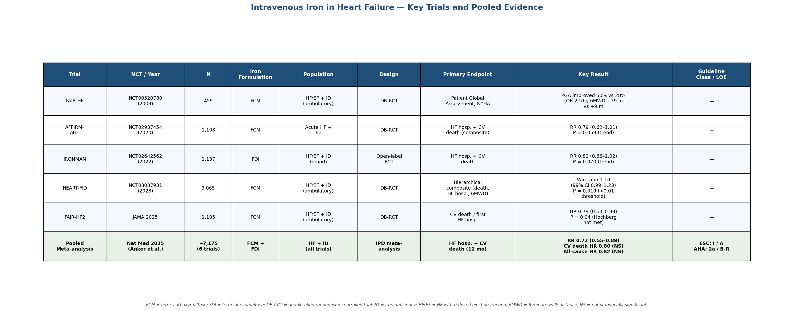

*Figure 3.1. Summary of the five landmark IV iron heart failure RCTs and the 2025 pooled meta-analysis, showing iron formulation, sample size, population, design, primary endpoint, key result, and guideline class/level of evidence.*

### 3.1.6 Calcium (Ca) Supplementation — The "Calcium Paradox"

Calcium supplementation for cardiovascular benefit occupies a uniquely contested position in the metal-ion intervention landscape. While adequate calcium is essential for cardiac excitation-contraction coupling, population-level supplementation has raised safety concerns. A meta-analysis by Bolland et al. (BMJ 2010) of trials administering calcium supplements without co-administered vitamin D (≥ 500 mg/day) reported a 31% increase in myocardial infarction risk (HR 1.31, 95% CI 1.02–1.67). A re-analysis of the Women's Health Initiative (WHI) trial, incorporating personal calcium supplement use, yielded similar point estimates [Bolland et al., BMJ 2010](https://www.bmj.com/content/341/bmj.c3691 "Calcium supplements and MI risk").

Subsequent analyses have not resolved the controversy. A 2023 meta-analysis from the Calcium Treatment Trialists' Collaboration (11 trials; calcium alone N = 8,634; calcium + vitamin D N = 46,804) found a non-significant MI risk ratio of 1.15 (95% CI 0.88–1.51) [Huo et al., Curr Dev Nutr 2023](https://pmc.ncbi.nlm.nih.gov/articles/PMC10111600/ "Calcium Treatment Trialists meta-analysis"). Mendelian randomisation data, however, lend some causal plausibility to the observational signal: genetically predicted higher blood calcium is associated with a 25% increase in CHD risk per 1 SD (OR 1.25; Chapter 2). Current guidelines accordingly recommend dietary calcium as the preferred source, restricting supplementation to individuals with documented dietary insufficiency [Michos et al., JACC 2021](https://www.jacc.org/doi/10.1016/j.jacc.2020.09.617 "Vitamin D, Calcium Supplements, and Implications for Cardiovascular Health, 2021").

## 3.2 Chelation Therapy

### 3.2.1 EDTA Chelation for Post-Myocardial Infarction Patients (TACT and TACT2)

Disodium ethylenediaminetetraacetic acid (Na₂EDTA) chelation has been employed in complementary medicine for decades, premised on the hypothesis that removal of toxic metals — particularly lead and cadmium — and reduction of vascular calcium deposits could attenuate atherosclerotic progression. Two NIH-funded trials have subjected this hypothesis to rigorous evaluation.

**TACT (Trial to Assess Chelation Therapy; NCT00044213; N = 1,708)** enrolled post-MI patients aged ≥ 50 years and administered 40 infusions of a standardised solution containing 3 g Na₂EDTA plus ascorbic acid, B vitamins, and electrolytes, versus placebo. Over a median follow-up of 55 months, the primary composite endpoint (death, MI, stroke, coronary revascularisation, or hospitalisation for angina) was reduced (HR 0.82, 95% CI 0.69–0.99, P = 0.035). A pre-specified subgroup analysis revealed a particularly pronounced benefit in patients with diabetes, where the primary endpoint was reduced by 41% (HR 0.59, 95% CI 0.44–0.79) [Lamas et al., JAMA 2013](https://jamanetwork.com/journals/jama/fullarticle/1672238 "TACT primary results"). Mechanistic substudies documented that a single EDTA infusion increased urinary lead excretion by approximately 4,000% and cadmium excretion by approximately 700%, confirming effective mobilisation of stored toxic metals.

**TACT2 (NCT02733185; N = 959)** was designed specifically to replicate the diabetes subgroup finding, enrolling diabetic patients with prior MI. Using an identical chelation protocol, the trial reported a primary-endpoint HR of 0.93 (95% CI 0.76–1.14, P = 0.53) — a null result. Four factors may account for the discrepancy between the two trials: (a) substantially improved background cardiovascular pharmacotherapy in TACT2 (20–24% use of SGLT2 inhibitors and GLP-1 receptor agonists versus ~0% in TACT); (b) a 35% decline in population blood lead levels between the two enrolment periods, reflecting ongoing environmental lead reduction; (c) chelation reduced mean blood lead from 9.0 to 3.5 μg/L (a 61% decrease) but may have crossed below a threshold where further reduction yields marginal cardiovascular benefit; and (d) the TACT diabetes subgroup effect may have been overestimated due to multiplicity. Bayesian analysis with a sceptical prior yielded a posterior HR of 0.95 (95% CrI 0.77–1.18) [Lamas et al., JAMA 2024](https://jamanetwork.com/journals/jama/fullarticle/2822472 "TACT2 Results").

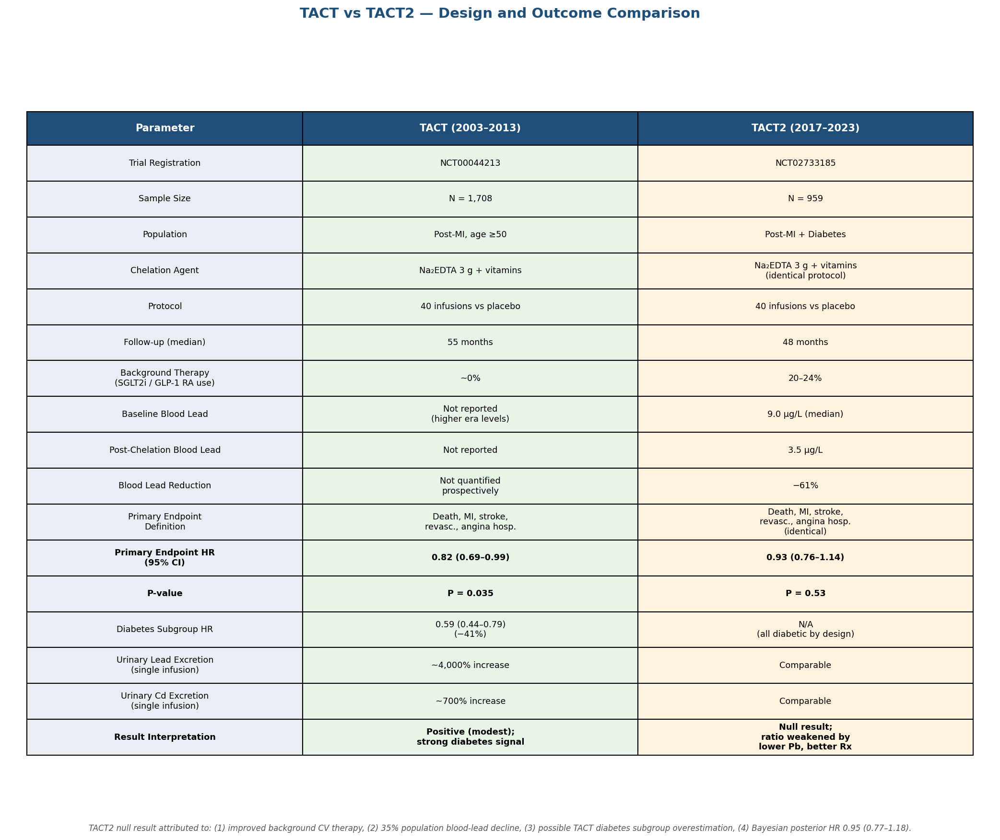

*Figure 3.2. Head-to-head comparison of the two NIH-funded EDTA chelation trials across key design parameters, blood lead dynamics, primary endpoint hazard ratios, and contextual factors underlying the TACT2 null result.*

The TACT2 null result substantially weakens the rationale for individual-level EDTA chelation as a cardiovascular preventive strategy. The AHA 2023 scientific statement on contaminant metals as cardiovascular risk factors confirmed that population-level strategies — leaded-gasoline phase-outs, water-system treatment, agricultural regulation — have proved far more effective at reducing cardiovascular burden from toxic metals than individual therapeutic chelation. Since the phase-out of leaded gasoline, U.S. population blood lead levels have declined by approximately 88% [AHA — JAHA 2023](https://www.ahajournals.org/doi/10.1161/JAHA.123.029852 "Contaminant Metals as CVD Risk Factors").

### 3.2.2 Iron Chelation for Transfusion-Dependent Iron Overload Cardiomyopathy

In transfusion-dependent conditions — principally β-thalassaemia major — each unit of packed red blood cells delivers approximately 200–250 mg of elemental iron, and cardiac iron overload remains the leading cause of death. Three iron chelators are approved and in widespread clinical use:

- **Deferoxamine (DFO)**: the reference standard, administered subcutaneously or intravenously at 25–60 mg/kg/day over 8–12 hours. DFO binds circulating and intracellular iron to form the ferrioxamine complex, which is excreted renally. Decades of observational data demonstrate that adherent DFO therapy has reduced cardiac mortality in thalassaemia major from > 50% to < 5% at age 30.
- **Deferiprone (DFP)**: an oral chelator (75–100 mg/kg/day in three divided doses) with a lower molecular weight that confers superior penetration into the myocardium. A randomised controlled trial demonstrated that DFP was more effective than DFO at improving cardiac iron content assessed by T2* MRI (12-month change +27% vs +13%, P = 0.023) and left ventricular ejection fraction (LVEF; +3.1% vs +0.6%, P = 0.003) [Pennell et al., cited in Tanner et al., Circulation 2007](https://www.ahajournals.org/doi/10.1161/circulationaha.106.648790 "Deferiprone in Thalassemia Major Trial"). The principal safety concern is agranulocytosis (incidence 0.5–1%), necessitating weekly complete blood count monitoring [Tricta et al., Am J Hematol 2016](https://pmc.ncbi.nlm.nih.gov/articles/PMC5129477/ "Deferiprone agranulocytosis review").
- **Deferasirox (DFX)**: a once-daily oral chelator (20–40 mg/kg/day) that primarily targets hepatic iron; cardiac iron clearance is slower than with DFP but superior to DFO at equivalent doses.
- **Combination therapy (DFP + DFO)**: reserved for patients with severe cardiac iron loading (cardiac T2* < 10 ms), exploiting both intracellular (DFP) and extracellular (DFO) chelation simultaneously.

The thalassaemia cardiac chelation paradigm constitutes a proof-of-concept that targeted removal of excess metal ions from the myocardium can produce measurable, life-extending cardiovascular benefit. This paradigm is, however, disease-specific and does not generalise to populations with normal iron homeostasis.

## 3.3 Dietary Pattern Interventions as Multi-Metal Strategies

### 3.3.1 The DASH Diet

The Dietary Approaches to Stop Hypertension (DASH) dietary pattern — rich in fruits, vegetables, whole grains, low-fat dairy, and lean protein — provides high intakes of potassium (~4,700 mg/day), magnesium (~500 mg/day), and calcium (~1,250 mg/day) while limiting sodium, saturated fat, and added sugars. In the original DASH trial (N = 459), the combination diet reduced SBP by 5.5 mmHg and DBP by 3.0 mmHg compared with the control diet (P < 0.001 for both) [Appel et al., NEJM 1997](https://www.nejm.org/doi/full/10.1056/NEJM199704173361601 "A Clinical Trial of the Effects of Dietary Patterns on Blood Pressure"). The subsequent DASH-Sodium trial demonstrated that combining the DASH diet with sodium restriction to 1,500 mg/day achieved a further reduction, lowering SBP by 8.9 mmHg among hypertensive participants [Sacks et al., NEJM 2001](https://www.nejm.org/doi/full/10.1056/NEJM200101043440101 "Effects on Blood Pressure of Reduced Dietary Sodium and the DASH Diet").

The DASH dietary pattern operates as a simultaneous multi-metal intervention: potassium suppresses RAAS activation and promotes natriuresis; magnesium attenuates vascular tone through calcium-channel antagonism; and dietary calcium (as opposed to supplemental calcium) provides the mineral without the bolus-dose concentration spikes that may underlie the calcium-supplement cardiovascular signal discussed in Section 3.1.6. The synergistic interaction among these metals — rather than any single nutrient — likely accounts for a blood-pressure reduction that exceeds what is achievable by supplementation of any individual metal alone.

### 3.3.2 The Mediterranean Diet (PREDIMED)

The Prevención con Dieta Mediterránea (PREDIMED; N = 7,447) trial randomised adults at high cardiovascular risk to a Mediterranean diet supplemented with extra-virgin olive oil, a Mediterranean diet supplemented with mixed nuts, or a control low-fat diet. Over a median follow-up of 4.8 years, both Mediterranean diet arms reduced major cardiovascular events by approximately 30% (HR 0.70, 95% CI 0.54–0.92 for olive oil; HR 0.72, 95% CI 0.54–0.96 for nuts) relative to the control arm [Estruch et al., NEJM 2018](https://www.nejm.org/doi/full/10.1056/NEJMoa1800389 "Primary Prevention of CVD with a Mediterranean Diet — retracted and republished 2018").

The metal-ion dimension of the Mediterranean diet operates at multiple levels. Plant-based components and seafood increase Se, Mg, and K intake; olive oil polyphenols enhance zinc bioavailability; and reduced processed-food consumption minimises cadmium and lead exposure from contaminated agricultural products. Although PREDIMED was not designed to isolate metal-ion effects, mediation analyses indicate that improvements in oxidative stress biomarkers and inflammatory markers — downstream consequences of metal-ion optimisation — contribute to the observed cardiovascular protection. Taken together with the DASH evidence, these findings suggest that dietary patterns achieving simultaneous multi-metal optimisation may represent the most pragmatic and scalable approach to metal-ion cardiovascular intervention.

## 3.4 Pharmacological Modulation of Metal Ion Metabolism

### 3.4.1 Hepcidin–Ferroportin Axis Therapeutics

The hepcidin–ferroportin axis — the master regulator of systemic iron homeostasis (Chapter 1) — has emerged as an attractive drug-development target. Two classes of agents are in clinical development:

**Hepcidin mimetics/agonists** aim to suppress iron absorption and iron release from stores, targeting iron-overload conditions. **Rusfertide (PTG-300)**, a synthetic minihepcin, has advanced to Phase III for polycythaemia vera (NCT05210790), where it reduces erythrocytosis by limiting iron availability for erythropoiesis [Casu et al., Blood 2018](https://ashpublications.org/blood/article/131/16/1790/36820/Hepcidin-agonists-as-therapeutic-tools "Hepcidin agonists review"). No cardiovascular-endpoint trial has been registered for rusfertide.

**Ferroportin inhibitors** block the sole cellular iron-export channel. **Vamifeport (VIT-2763)** is in Phase II for β-thalassaemia (NCT04364269), with the goal of reducing ineffective erythropoiesis and consequent iron overload. Neither agent class has been tested for direct cardiovascular endpoints, but the mechanistic overlap with cardiac iron overload in thalassaemia (Section 3.2.2) suggests potential future extension to cardiovascular indications.

### 3.4.2 SGLT2 Inhibitors and Iron Metabolism

Sodium–glucose co-transporter 2 (SGLT2) inhibitors — empagliflozin, dapagliflozin, canagliflozin — are established heart failure therapies whose capacity to modulate iron metabolism has only recently been recognised. SGLT2 inhibitors lower hepcidin and ferritin levels, increase transferrin receptor (TFR) expression, and stimulate erythropoietin (EPO) production, collectively shifting iron from storage depots into the erythroid compartment. In the DAPA-HF trial, dapagliflozin increased the proportion of patients meeting iron-deficiency criteria by approximately 70%, raising the question of whether SGLT2i-induced functional iron redistribution mediates part of the observed clinical benefit [Packer, JACC Heart Failure 2023](https://www.jacc.org/doi/10.1016/j.jchf.2022.10.004 "SGLT2 Inhibitors and IV Iron in HF").

SGLT2 inhibitors also upregulate sirtuin 1 (SIRT1), which enhances GPX4 activity and thereby suppresses ferroptosis — a mechanism discussed in Chapter 1. A theoretical concern arises from the concurrent use of SGLT2 inhibitors (which mobilise stored iron) and IV iron (which acutely raises circulating iron levels): the combination could transiently elevate non-transferrin-bound iron (NTBI) to concentrations that promote rather than prevent ferroptosis. No dedicated interaction trial has been registered, and this pharmacological intersection represents a critical safety gap in current heart failure management.

### 3.4.3 Chloroquine/Hydroxychloroquine as Zinc Ionophores

Chloroquine (CQ) was identified as a zinc ionophore in 2014, capable of substantially increasing intracellular zinc concentrations by facilitating Zn²⁺ transport across cell membranes [Xue et al., PLoS ONE 2014](https://pmc.ncbi.nlm.nih.gov/articles/PMC4182877/ "Chloroquine Is a Zinc Ionophore"). Given zinc's anti-inflammatory effects via NF-κB suppression (Chapter 1), the concept of deploying CQ or hydroxychloroquine (HCQ) to augment intracellular zinc for cardiovascular benefit is mechanistically plausible. No preclinical study, however, has specifically tested CQ/HCQ as zinc ionophores for cardiovascular endpoints; the concept remains an untested hypothesis at the intersection of zinc biology and pharmacology, and potential cardiac toxicity of CQ/HCQ (QT prolongation) further complicates any translational pathway.

## 3.5 Population-Level Strategies for Toxic Metal Reduction

The AHA 2023 scientific statement formally classified lead, cadmium, and arsenic as modifiable environmental cardiovascular risk factors and recommended multi-level public health interventions rather than individual chelation as the primary response [AHA — JAHA 2023](https://www.ahajournals.org/doi/10.1161/JAHA.123.029852 "Contaminant Metals as CVD Risk Factors"). The historical success of this population-level approach is quantifiable: the global phase-out of leaded gasoline reduced U.S. population blood lead by approximately 88%, and this decline has been estimated to account for 22.5% of the reduction in U.S. cardiovascular mortality between 1988 and 2004 [Ruiz-Hernandez et al., Int J Epidemiol 2017](https://academic.oup.com/ije/article/46/6/1903/4098114 "Declining lead and cadmium exposures and CVD mortality reduction"). Additional population-level strategies include arsenic-safe water infrastructure, cadmium regulation in agricultural fertilisers, and residential lead-pipe replacement programmes.

This body of evidence establishes a clear hierarchy of intervention effectiveness: population-level environmental controls for toxic metals deliver orders-of-magnitude greater cardiovascular benefit than individual chelation, at lower per-capita cost and without the adverse-effect profile associated with repeated EDTA or other chelator infusions.

## 3.6 Summary of the Intervention Landscape

The therapeutic modulation of plasma metal ions for cardiovascular benefit spans a wide spectrum of evidence maturity (Figure 3.3). At the most advanced end, IV iron for heart failure with iron deficiency is supported by six RCTs, guideline endorsement at the highest evidence level, and a unifying meta-analysis — placing it alongside potassium salt substitution (SSaSS, WHO-endorsed) as the most robustly validated metal-ion cardiovascular intervention. At the other end of the spectrum, zinc and magnesium supplementation for hard endpoints, SGLT2 inhibitor–iron interactions, and hepcidin-axis therapeutics for cardiac indications remain evidence gaps awaiting adequately powered trials.

Chelation therapy for toxic metals, once a promising avenue following the positive TACT result, has been substantially diminished by the TACT2 null result and the demonstrated superiority of population-level environmental strategies. Dietary patterns — DASH and Mediterranean — represent pragmatic multi-metal optimisation strategies with proven cardiovascular efficacy, though their benefits cannot be attributed to any single metal ion.

A recurring theme across these interventions is the critical dependence on baseline metal status: selenium supplementation benefits Se-deficient but not Se-replete populations; IV iron benefits iron-deficient but not iron-sufficient heart failure patients; and EDTA chelation showed an attenuated signal as population lead levels declined. This baseline-dependency principle carries fundamental implications for trial design, patient selection, and the future direction of metal-ion cardiovascular therapeutics. The detailed trial-level evaluation of efficacy, safety, and remaining evidence gaps follows in Chapter 4.

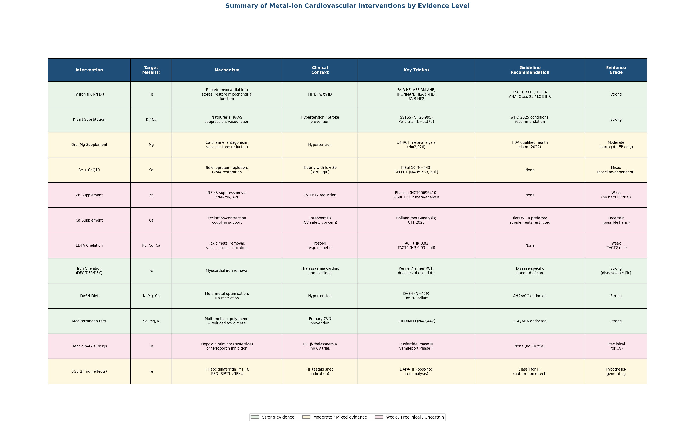

*Figure 3.3. Comprehensive overview of 12 metal-ion cardiovascular interventions, colour-coded by evidence strength (green = strong, amber = moderate/mixed, pink = weak/preclinical/uncertain), with target metals, mechanisms, key trials, and guideline status.*

# 第4章 Clinical Trial Evidence — Efficacy, Safety, and Gaps in the Evidence Base

Chapter 3 catalogued the intervention strategies proposed for modulating plasma metal-ion concentrations to achieve cardiovascular benefit. The present chapter shifts from descriptive inventory to critical appraisal: for each major intervention, the available trial-level evidence is evaluated with respect to endpoint hierarchy, effect size, statistical robustness, safety profile, and generalisability. Interventions are stratified into three evidence tiers — those supported by robust randomised controlled trial (RCT) data and guideline endorsement (Tier 1), those yielding mixed or negative signals that limit clinical adoption (Tier 2), and those for which adequate hard-endpoint RCT evidence does not yet exist (Tier 3). A cross-cutting safety assessment and a survey of pipeline trials conclude the chapter.

## 4.1 Tier 1: Robust RCT Evidence and Guideline Endorsement

### 4.1.1 Intravenous Iron in Heart Failure with Iron Deficiency

Intravenous (IV) iron repletion in heart failure (HF) patients with documented iron deficiency (ID) constitutes the most extensively trialled metal-ion cardiovascular intervention. The pivotal evidence base comprises six RCTs enrolling a combined 7,175 patients, synthesised in a 2025 individual-patient-level meta-analysis published in *Nature Medicine*.

**Trial-level results.** The foundational FAIR-HF trial (NCT00520780; N = 459; HFrEF with ID) demonstrated that ferric carboxymaltose (FCM) improved patient global assessment ("much or moderately improved" in 50 % vs 28 %; OR 2.51, P < 0.001), six-minute walk distance (+39 m vs +9 m; P < 0.001), and NYHA class (improvement ≥ 1 class in 47 % vs 30 %) over 24 weeks [Anker et al., NEJM 2009](https://www.nejm.org/doi/full/10.1056/NEJMoa0908355 "FAIR-HF trial"). These symptomatic benefits established proof of concept but did not address hard clinical endpoints.

AFFIRM-AHF (NCT02937454; N = 1,108; acute HF with ID) narrowly missed its primary composite of total HF hospitalisations plus cardiovascular death (RR 0.79, 95 % CI 0.62–1.01, P = 0.059), although recurrent HF hospitalisations were significantly reduced (RR 0.74, 95 % CI 0.58–0.94). IRONMAN (NCT02642562; N = 1,137; open-label, ferric derisomaltose [FDI]) showed a directionally consistent trend toward benefit for its primary composite but did not reach statistical significance in the intention-to-treat population. HEART-FID (NCT03037931; N = 3,065), the largest completed IV iron HF trial, employed a hierarchical composite evaluated by win ratio (death, HF hospitalisations, six-minute walk distance change at six months). Twelve-month mortality was 8.6 % in the FCM arm versus 10.3 % in the placebo arm, and the win ratio was 1.10 (99 % CI 0.99–1.23, P = 0.019) — a result that did not meet the pre-specified significance threshold of P ≤ 0.01 [ACC 2023](https://www.acc.org/latest-in-cardiology/articles/2023/08/23/19/16/sat-314am-heart-fid-esc-2023 "HEART-FID results"). FAIR-HF2 (N = 1,105; ambulatory HFrEF with ID) reported a primary-endpoint HR of 0.79 (95 % CI 0.63–0.99, P = 0.04) for cardiovascular death or first HF hospitalisation, which did not formally reach significance after Hochberg correction for co-primary endpoints; an exploratory 12-month analysis yielded a more favourable HR of 0.71 (95 % CI 0.53–0.94) [Anker et al., JAMA 2025](https://pmc.ncbi.nlm.nih.gov/articles/PMC11955906/ "FAIR-HF2 trial results").

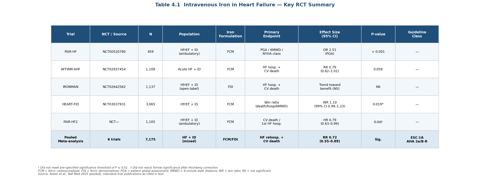

*Table 4.1 summarises the six pivotal IV iron heart failure RCTs, including sample sizes, populations, primary endpoints, effect sizes with 95 % confidence intervals, and guideline recommendation classes. The pooled meta-analytic estimate from Anker et al. (Nat Med 2025) is shown in the final row.*

**Meta-analytic synthesis.** The 2025 *Nature Medicine* individual-patient meta-analysis integrated all six trials and reported, at 12 months, a 28 % relative risk reduction for the composite of HF rehospitalisation plus cardiovascular death (RR 0.72, 95 % CI 0.55–0.89) and a 31 % reduction in HF rehospitalisation alone (RR 0.69). Over total follow-up, the composite remained significant (RR 0.81, 95 % CI 0.63–0.97). Cardiovascular death was reduced by 20 % (HR 0.80) and all-cause mortality by 18 % (HR 0.82, 95 % CI 0.65–1.03), but neither estimate reached conventional statistical significance [Anker et al., Nat Med 2025](https://pubmed.ncbi.nlm.nih.gov/40159279/ "IV iron meta-analysis in heart failure").

**Biomarker-guided treatment.** FAIR-HF2 was the first trial to report outcomes stratified by transferrin saturation (TSAT). Patients with TSAT < 20 % showed a larger absolute treatment effect, and an ESC-sponsored individual-patient meta-analysis suggested that ambulatory patients with TSAT > 20.1 % may not derive meaningful benefit from FCM. These findings support the concept of biomarker-guided iron repletion — potentially replacing the composite ferritin/TSAT criterion with a simpler TSAT-based threshold [Anker et al., JAMA 2025](https://pmc.ncbi.nlm.nih.gov/articles/PMC11955906/ "FAIR-HF2 TSAT stratification").

**Guideline positioning.** The European Society of Cardiology (ESC) 2023 focused update maintained a Class I / Level of Evidence A recommendation for IV iron to improve symptoms, exercise capacity, and quality of life in HFrEF with ID, and added a Class I / LOE A recommendation for reducing HF hospitalisation risk. The American Heart Association / American College of Cardiology (AHA/ACC) 2022 guidelines assigned a Class 2a / LOE B-R recommendation [ESC 2023 Focused Update](https://onlinelibrary.wiley.com/doi/full/10.1002/ejhf.3024 "2023 ESC Heart Failure Guidelines Update").

**Critical assessment.** The individual trials consistently show directionally favourable effects but are individually underpowered for mortality endpoints. The pooled mortality signal (HR 0.82) is clinically meaningful yet remains statistically non-significant, leaving residual uncertainty about whether IV iron extends survival or merely reduces morbidity. Heterogeneity across iron formulations (FCM vs FDI), dosing schedules, and HF populations (acute vs ambulatory; HFrEF vs HFpEF) limits the precision of pooled estimates. The ID definition itself — ferritin < 100 μg/L (absolute) or ferritin 100–300 μg/L with TSAT < 20 % (functional) — may be insufficiently specific, as TSAT-stratified analyses suggest that a simpler TSAT-based criterion could better identify treatment responders. FCM-associated hypophosphataemia (incidence up to 13 %) is a formulation-specific safety signal that warrants long-term monitoring, particularly with repeated dosing cycles [Anker et al., Nat Med 2025](https://pubmed.ncbi.nlm.nih.gov/40159279/ "IV iron safety profile").

### 4.1.2 Potassium Salt Substitution (SSaSS and Replication)

The Salt Substitute and Stroke Study (SSaSS; NCT02092090; N = 20,995) is the only completed cluster-randomised trial to demonstrate that a metal-ion dietary intervention reduces hard cardiovascular endpoints — stroke, major adverse cardiovascular events (MACE), and all-cause mortality — in a general at-risk population. The effect sizes were consistent and clinically significant: stroke RR 0.86 (95 % CI 0.77–0.96), MACE RR 0.87 (0.80–0.94), all-cause mortality RR 0.88 (0.82–0.95), with no increase in clinical hyperkalaemia (RR 1.04, 0.80–1.37) [Neal et al., NEJM 2021](https://www.nejm.org/doi/full/10.1056/NEJMoa2105675 "Salt Substitute and Stroke Study").

**Replication and endorsement.** A Peruvian stepped-wedge cluster-randomised trial (N = 2,376) confirmed blood-pressure reductions and a halving of new-onset hypertension with potassium-enriched salt, providing replication evidence in a non-Chinese population [Bernabe-Ortiz et al., Nat Med 2020](https://pubmed.ncbi.nlm.nih.gov/32066973/ "Peru salt substitution trial"). In January 2025, the World Health Organization (WHO) issued its first guideline on lower-sodium salt substitutes (LSSS), conditionally recommending potassium-enriched salts on the basis of a meta-analytic systolic blood pressure (SBP) reduction of approximately 4.76 mmHg across LSSS trials [WHO 2025 LSSS Guideline](https://www.who.int/news-room/events/detail/2025/01/27/default-calendar/launch-of-the-who-guideline-on-the-use-of-lower-sodium-salt-substitutes "WHO guideline on salt substitutes"). The ESC 2024 hypertension guidelines and the World Heart Federation have both endorsed this recommendation.

**Critical assessment.** SSaSS was conducted in rural China among high-risk individuals (prior stroke or age ≥ 60 with uncontrolled hypertension), and the cluster-randomised, open-label design introduces potential for contamination and ascertainment bias. The dual intervention — simultaneous sodium reduction and potassium augmentation — precludes attribution of outcomes solely to potassium; nevertheless, the biological plausibility of both mechanisms is well established (Chapter 1). Hyperkalaemia risk in patients with advanced chronic kidney disease (eGFR < 30 mL/min) remains a theoretical concern, as SSaSS excluded individuals with known renal disease. The estimated number needed to treat (NNT) to prevent one stroke over 4.74 years is approximately 143 — modest at the individual level, but translating to substantial population-level impact when applied to the billions of individuals consuming salt daily worldwide.

## 4.2 Tier 2: Mixed, Null, or Contested Trial Evidence

### 4.2.1 EDTA Chelation — TACT versus TACT2

The divergent outcomes of two NIH-funded trials of disodium EDTA chelation in post-myocardial infarction (MI) patients illustrate the challenges of conducting confirmatory trials in a rapidly evolving treatment landscape.

TACT (NCT00044213; N = 1,708; post-MI, age ≥ 50) tested 40 infusions of a standardised Na₂EDTA solution (3 g EDTA plus vitamins and minerals) and reported a primary composite endpoint HR of 0.82 (95 % CI 0.69–0.99, P = 0.035). A pre-specified subgroup of patients with diabetes showed a 41 % reduction (HR 0.59, 95 % CI 0.44–0.79), which generated the hypothesis for a confirmatory trial [Lamas et al., JAMA 2013](https://jamanetwork.com/journals/jama/fullarticle/1672238 "TACT primary results"). TACT2 (NCT02733185; N = 959; diabetic post-MI patients) applied the identical chelation protocol but yielded a null result: HR 0.93 (95 % CI 0.76–1.14, P = 0.53) [Lamas et al., JAMA 2024](https://jamanetwork.com/journals/jama/fullarticle/2822472 "TACT2 primary results").

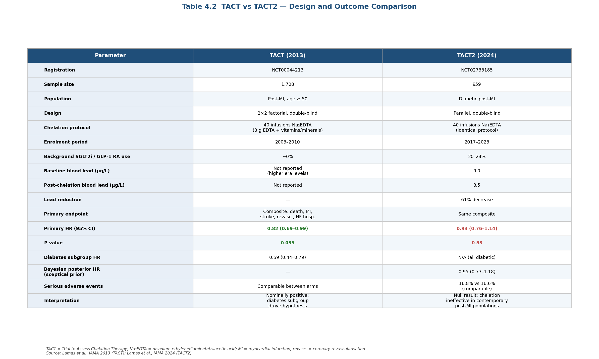

*Table 4.2 presents a side-by-side comparison of the two NIH-funded EDTA chelation trials across 17 parameters, including population, background therapy era, baseline and post-chelation blood lead levels, primary endpoint hazard ratios, and Bayesian posterior estimates.*

**Explanatory factors.** Four non-mutually-exclusive hypotheses may account for the discrepancy. *First*, background cardiovascular therapy improved markedly between the two enrolment periods: 20–24 % of TACT2 participants used SGLT2 inhibitors or GLP-1 receptor agonists versus essentially 0 % in TACT, raising the possibility of event-rate competition from effective background therapy. *Second*, U.S. population blood lead levels declined by approximately 35 % between TACT and TACT2 enrolment, reducing the toxic-metal burden available for chelation to remove; chelation in TACT2 lowered mean blood lead from 9.0 to 3.5 μg/L (a 61 % decrease), but this may have crossed below a clinically meaningful benefit threshold. *Third*, the original TACT diabetes-subgroup effect may have been inflated by multiple-comparison artefact — a Bayesian analysis with a sceptical prior yielded a posterior HR of 0.95 (95 % CrI 0.77–1.18), spanning unity. *Fourth*, the smaller TACT2 sample (959 vs 1,708) may have been insufficiently powered for a modest effect.

**Implications.** The TACT2 null result substantially weakens the evidence base for individual-level EDTA chelation as a cardiovascular preventive strategy. Serious adverse events were comparable between arms (16.8 % vs 16.6 %), confirming that the intervention is not unsafe but neither is it effective in contemporary post-MI populations receiving modern background therapy. The AHA 2023 scientific statement's endorsement of population-level toxic-metal reduction — which has already reduced U.S. blood lead by approximately 88 % since the phase-out of leaded gasoline — further marginalises the role of individual chelation [AHA Scientific Statement](https://www.ahajournals.org/doi/10.1161/JAHA.123.029852 "Contaminant Metals as Cardiovascular Risk Factors, JAHA 2023").

### 4.2.2 Selenium Supplementation — Baseline Status as the Critical Modifier

The selenium supplementation literature is defined by a single biological principle: efficacy is contingent on pre-existing selenium status. The two most informative trials illustrate this principle at opposite ends of the selenium spectrum.

SELECT (NCT00006392; N = 35,533) enrolled selenium-replete North American men (baseline plasma Se ~135 μg/L) and found no cardiovascular benefit from selenium 200 μg/day over 5.5 years. The trial was designed primarily for cancer-prevention endpoints, with cardiovascular events as secondary outcomes; neither showed significant benefit. Cardiovascular event rates were virtually identical between groups, consistent with the U-shaped epidemiological curve described in Chapter 2, which suggests that supplementation above the protective range (~70–145 μg/L) confers no further cardiovascular benefit and may carry metabolic risk [Lippman et al., JAMA 2009](https://jamanetwork.com/journals/jama/fullarticle/183163 "SELECT initial results").

KiSel-10 (NCT01443780; N = 443) enrolled elderly Swedish participants with low baseline selenium (~67 μg/L) and supplemented combined selenium (200 μg/day) plus coenzyme Q₁₀ (200 mg/day) for four years. Cardiovascular mortality was reduced by 41 % (HR 0.59, 95 % CI 0.42–0.81, P = 0.0003), and this benefit persisted through 12-year follow-up (cardiovascular mortality 28.1 % vs 38.7 %) [Alehagen et al., Int J Cardiol 2013](https://pubmed.ncbi.nlm.nih.gov/22626835/ "KiSel-10 primary results").

**Critical assessment.** KiSel-10's impressive effect size must be tempered by several limitations: the small sample (N = 443) amplifies random variation; the combined selenium + CoQ₁₀ design makes it impossible to isolate selenium's independent contribution; and the elderly, selenium-deficient Swedish population limits generalisability. No trial has tested selenium supplementation alone (without CoQ₁₀) in a selenium-deficient population against cardiovascular endpoints. The divergence between SELECT and KiSel-10 reinforces a broader design imperative: metal-ion supplementation trials must stratify by baseline nutrient status, a requirement that few existing trials have adopted.

### 4.2.3 Calcium Supplementation — Persistent Cardiovascular Safety Concerns

The "calcium paradox" in cardiovascular medicine refers to the observation that calcium supplementation, intended to support skeletal health, may paradoxically increase cardiovascular risk. The primary evidence derives from the Bolland et al. (2010) meta-analysis of calcium-supplement trials (without co-administered vitamin D), which reported a 31 % increase in myocardial infarction (MI) risk (HR 1.31, 95 % CI 1.02–1.67) [Bolland et al., BMJ 2010](https://www.bmj.com/content/341/bmj.c3691 "Calcium supplements and myocardial infarction risk").

Subsequent pooled analyses have moderated but not resolved the concern. The 2023 Calcium Treatment Trialists' Collaboration meta-analysis (11 trials; calcium alone N = 8,634; calcium + vitamin D N = 46,804) reported an MI relative risk of 1.15 (95 % CI 0.88–1.51), which did not reach statistical significance [Huo et al., Curr Dev Nutr 2023](https://pmc.ncbi.nlm.nih.gov/articles/PMC10111600/ "Calcium Treatment Trialists meta-analysis"). Mendelian randomisation data add a causal dimension: genetically predicted higher serum calcium is associated with a 25 % increase in coronary heart disease (CHD) risk per standard deviation (OR 1.25), although horizontal pleiotropy cannot be fully excluded (Chapter 2) [Chen et al., Front Immunol 2024](https://www.frontiersin.org/journals/immunology/articles/10.3389/fimmu.2024.1459465/full "Multi-omics MR study of trace elements and CVD").

**Clinical guidance.** The current consensus, reflected in a 2021 *JACC* review, favours dietary calcium over supplemental calcium and restricts supplement use to individuals with documented dietary insufficiency [Michos et al., JACC 2021](https://www.jacc.org/doi/10.1016/j.jacc.2020.09.617 "Vitamin D, Calcium Supplements, and Implications for Cardiovascular Health"). The mechanistic hypothesis — that bolus-dose supplemental calcium produces transient hypercalcaemia, promotes vascular calcification, and activates the coagulation cascade in ways that steady dietary intake does not — remains biologically plausible but unverified in dedicated mechanistic trials.

## 4.3 Tier 3: Absent or Insufficient Hard-Endpoint RCT Evidence

### 4.3.1 Magnesium Supplementation

Oral magnesium supplementation has the strongest surrogate-endpoint evidence of any metal-ion intervention lacking hard-outcome RCT data. A 34-RCT meta-analysis (N = 2,028) demonstrates SBP reductions of 2.00 mmHg and diastolic blood pressure (DBP) reductions of 1.78 mmHg at doses ≥ 300 mg/day, and the U.S. Food and Drug Administration's (FDA) 2022 qualified health claim for magnesium and hypertension risk reduction reflects this evidence. Intravenous MgSO₄ is a guideline-endorsed first-line treatment for torsades de pointes [Baker et al., Biomedicines 2022](https://www.mdpi.com/2227-9059/10/10/2356 "Hypomagnesemia and Cardiac Arrhythmias").

Yet no adequately powered RCT has evaluated oral magnesium supplementation against MI, stroke, or cardiovascular death. The gap is striking given the supportive epidemiological evidence: a Mendelian randomisation study found that each 0.1 mmol/L increase in genetically predicted serum magnesium reduced coronary artery disease (CAD) risk by 12 % (OR 0.88) [Larsson et al., BMC Med 2018](https://pmc.ncbi.nlm.nih.gov/articles/PMC5956816/ "Magnesium and CAD Mendelian randomisation"), and the Rotterdam Study (N = 9,820) linked low serum magnesium (≤ 0.80 mmol/L) to a 36 % increase in CHD death and a 54 % increase in sudden cardiac death (Chapter 2). The explanatory gap likely reflects the generic, low-cost nature of magnesium supplements, which limits commercial incentive for large outcome trials. Until such trials materialise, the blood-pressure–lowering benefit remains the strongest basis for clinical recommendation.

### 4.3.2 Zinc Supplementation

Zinc supplementation consistently reduces serum C-reactive protein and other inflammatory biomarkers across 20 RCTs, and observational data link low serum zinc to increased CHD and HF risk (Chapter 2). However, only a single Phase II trial (NCT00696410) has evaluated zinc's effect on left ventricular function in HF, and no completed RCT has employed hard cardiovascular endpoints. The Mendelian randomisation evidence for zinc is paradoxical: one multi-omics analysis reported that genetically predicted higher zinc was associated with increased cardiac arrest risk (OR 1.171), potentially reflecting confounding by correlated trace-element pathways rather than a true adverse effect [Chen et al., Front Immunol 2024](https://www.frontiersin.org/journals/immunology/articles/10.3389/fimmu.2024.1459465/full "Multi-omics MR study of trace elements and CVD"). Until this paradox is resolved and outcome trials are conducted, zinc supplementation for cardiovascular prevention rests on biological plausibility and surrogate markers alone.

### 4.3.3 Toxic-Metal Chelation for Low-Level Environmental Exposure

The AHA 2023 scientific statement confirmed lead, cadmium, and arsenic as modifiable cardiovascular risk factors (Chapter 2), yet no RCT has tested chelation therapy for cardiovascular endpoints in the general population with low-level environmental exposure. TACT and TACT2 enrolled post-MI patients with moderate lead levels, not environmentally exposed healthy individuals. Given TACT2's null result and the demonstrated success of population-level environmental interventions — leaded-gasoline phase-out alone accounts for an estimated 22.5 % of U.S. cardiovascular disease (CVD) mortality decline between 1988 and 2004 [Ruiz-Hernandez et al., Int J Epidemiol 2017](https://academic.oup.com/ije/article/46/6/1903/4098114 "Declining lead and cadmium exposures and CVD mortality reduction") — the rationale for individual chelation in low-exposure populations is weak. No such trial is registered or anticipated.

## 4.4 Cross-Cutting Safety Assessment

A consistent finding across the Tier 1 and Tier 2 trials is that metal-ion interventions — when properly dosed and administered — demonstrate acceptable safety profiles. The key signals are summarised below by intervention.

**IV iron.** The pooled six-trial meta-analysis reported an all-cause mortality HR of 0.92 (numerically favouring iron), with no excess of serious infection, anaphylaxis, or cardiac events. The primary formulation-specific concern is FCM-associated hypophosphataemia, observed in up to 13 % of patients; FDI carries a lower incidence. The long-term consequences of repeated iron dosing — particularly the theoretical risk of transiently elevated non-transferrin-bound iron (NTBI) levels promoting ferroptosis in the setting of concurrent SGLT2 inhibitor therapy — remain unstudied [Anker et al., Nat Med 2025](https://pubmed.ncbi.nlm.nih.gov/40159279/ "IV iron safety in heart failure").

**Potassium salt substitution.** SSaSS demonstrated no increase in clinical hyperkalaemia (RR 1.04, 95 % CI 0.80–1.37) despite a 25 % KCl content. The WHO guideline notes that patients with advanced chronic kidney disease (eGFR < 30 mL/min) or those taking potassium-sparing diuretics require monitoring, but the population-level safety of LSSS is well established [Neal et al., NEJM 2021](https://www.nejm.org/doi/full/10.1056/NEJMoa2105675 "SSaSS safety data").

**EDTA chelation.** TACT and TACT2 both reported comparable serious adverse event rates between chelation and placebo arms (TACT2: 16.8 % vs 16.6 %), confirming that the 40-infusion EDTA protocol is not unsafe — it is simply ineffective in the contemporary post-MI setting [Lamas et al., JAMA 2024](https://jamanetwork.com/journals/jama/fullarticle/2822472 "TACT2 safety data").

**Iron chelation (thalassaemia).** Deferiprone carries a class-specific risk of agranulocytosis (incidence 0.5–1 %), necessitating weekly complete blood count monitoring [Tricta et al., Am J Hematol 2016](https://pmc.ncbi.nlm.nih.gov/articles/PMC5129477/ "Deferiprone agranulocytosis review"). Deferasirox may cause renal and hepatic toxicity at higher doses. These safety profiles are acceptable within the disease-specific context of transfusion-dependent thalassaemia, where cardiac iron overload remains the leading cause of death, but would be prohibitive in a general cardiovascular prevention context.

## 4.5 Pipeline and Anticipated Evidence

Several ongoing or anticipated trials and regulatory developments may reshape the evidence landscape within the next one to two years:

- **FAIR-HFpEF (NCT03074591):** This multicentre trial of FCM in HFpEF with ID was stopped early after enrolling only 39 patients due to slow recruitment. While the six-minute walk test distance improved by 49 m (95 % CI 5–93, P = 0.029) and serious adverse events were fewer with FCM, the trial was severely underpowered to evaluate symptoms or quality of life [von Haehling et al., Eur Heart J 2024](https://pubmed.ncbi.nlm.nih.gov/39185895/ "FAIR-HFpEF trial"). The benefit of IV iron in HFpEF — a large, underserved population — therefore remains an open question requiring a larger, adequately powered trial.
- **SGLT2 inhibitor–IV iron interaction:** No dedicated trial examining the safety of concurrent SGLT2 inhibitor and IV iron administration — specifically, the theoretical risk of NTBI elevation and ferroptosis promotion — has been registered. Given that both therapies are now co-prescribed in a substantial fraction of HFrEF patients, this gap represents a priority for safety research [Packer, JACC Heart Fail 2023](https://www.jacc.org/doi/10.1016/j.jchf.2022.10.004 "SGLT2 Inhibitors and IV Iron in Heart Failure").
- **WHO LSSS implementation studies:** The 2025 WHO guideline is expected to catalyse large-scale implementation research in diverse settings (South Asia, sub-Saharan Africa), testing the generalisability of SSaSS-derived effect sizes beyond rural China. The U.S. FDA's 2024 proposal to permit potassium-based salt alternatives in commercially processed foods could further amplify population exposure.
- **Iron-deficiency definition refinement:** Ongoing individual-patient meta-analyses are expected to clarify whether TSAT alone is a more reliable treatment-selection biomarker than the composite ferritin/TSAT criterion currently used in guidelines. Such refinement could narrow the treatment-eligible population but improve the number needed to treat.
- **Selenium in deficient populations:** No new trial testing selenium alone (without CoQ₁₀) against cardiovascular endpoints in selenium-deficient populations has been registered, despite the clear biological rationale from KiSel-10 and the U-shaped epidemiological curve. This remains a conspicuous evidence gap.

## 4.6 Evidence Hierarchy Synthesis

The clinical trial evidence for metal-ion cardiovascular interventions distributes unevenly across the evidence hierarchy. Table 4.3 provides a consolidated summary.

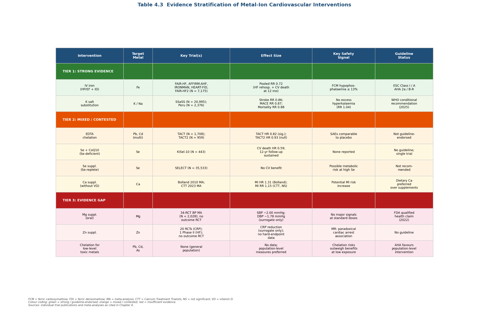

*Table 4.3 classifies all metal-ion cardiovascular interventions assessed in this chapter into three evidence tiers — Strong (green), Mixed/Contested (orange), and Evidence Gap (red) — with columns for target metal, key trials, effect size, safety signal, and guideline status.*

**Strong evidence (guideline-endorsed).** IV iron for HFrEF with iron deficiency (ESC Class I / LOE A for symptoms and hospitalisations; AHA/ACC Class 2a / LOE B-R) and potassium salt substitution (WHO conditional recommendation, 2025; SSaSS, NEJM 2021). Both interventions demonstrate consistent effects across multiple trials or large-scale settings, with acceptable safety profiles.

**Suggestive but unresolved.** Selenium + CoQ₁₀ supplementation in selenium-deficient elderly (KiSel-10: HR 0.59 for cardiovascular death, but small sample, combined intervention, single trial). Calcium supplement cardiovascular risk (Bolland meta-analysis: HR 1.31 for MI, but subsequent pooled analyses non-significant). EDTA chelation (TACT nominally positive, TACT2 null; net evidence insufficient for clinical adoption).

**Evidence gap.** Magnesium for hard cardiovascular endpoints (strong mechanistic and epidemiological rationale, zero outcome RCTs). Zinc for CVD prevention (anti-inflammatory surrogate data only). Selenium alone (without CoQ₁₀) in deficient populations. Chelation for low-level environmental toxic-metal exposure. SGLT2 inhibitor–IV iron interaction safety. IV iron in HFpEF (underpowered pilot only).

This stratification underscores a paradox in the field: the interventions with the strongest biological plausibility and epidemiological support — oral magnesium and zinc supplementation — have received the least investment in outcome-level clinical testing, while the most advanced trial programmes (IV iron, EDTA chelation) address relatively narrow clinical populations. The gap between mechanistic promise and clinical proof remains the defining challenge for metal-ion cardiovascular therapeutics.

# 第5章 Emerging Frontiers — Novel Therapeutic Modalities and Future Directions

The preceding chapters established that plasma metal ion concentrations bear mechanistic, epidemiological, and—in selected cases—interventionally validated relationships with cardiovascular disease (CVD). Yet the clinical interventions reviewed thus far—intravenous iron for heart failure, potassium salt substitution, chelation therapy—represent only a narrow exploitation of the cardiovascular system's dependence on metal-ion biology. A broader wave of preclinical and early-translational strategies is now converging on the field, drawing on ferroptosis pharmacology, nanomedicine, metal-organic frameworks (MOFs), metallodrug chemistry, gene- and RNA-based modulation of iron homeostasis, microbiome–metal crosstalk, and digital health technologies. This chapter surveys these emerging modalities, evaluates their translational readiness, and delineates the obstacles that separate laboratory promise from clinical impact.

## 5.1 Ferroptosis Inhibition as a Cardiovascular Therapeutic Strategy

### 5.1.1 Rationale and Inhibitor Classes

The recognition of ferroptosis—an iron-dependent, lipid-peroxidation-driven form of regulated cell death—as a pathogenic mechanism in myocardial ischemia-reperfusion injury (MIRI), heart failure, and atherosclerosis (Chapter 1) has catalyzed the development of a dedicated ferroptosis-inhibitor pharmacology. Four mechanistically distinct classes have been characterized in cardiovascular preclinical models: (a) iron chelators, exemplified by deferoxamine (DFO), which suppress upstream Fenton chemistry by reducing the labile iron pool; (b) cytosolic radical-trapping agents (UAMC-3203, Nec-1f) that intercept lipid peroxyl radicals in the cytoplasm; (c) lipophilic radical-trapping antioxidants—ferrostatin-1 (Fer-1), liproxstatin-1 (Lip-1), vitamin E, and vitamin K—that scavenge radicals within membrane bilayers and restore GPX4 levels; and (d) ninjurin-1 (NINJ1) monoclonal antibodies that block the terminal plasma-membrane rupture step of the ferroptotic cascade [Cell Death & Differentiation — Maremonti et al., 2024](https://www.nature.com/articles/s41418-024-01350-1 "Ferroptosis-based advanced therapies as treatment approaches for metabolic and cardiovascular diseases"). A fifth, pragmatically important category comprises approved drugs with incidentally discovered ferroptosis-inhibitory activity, discussed below.

### 5.1.2 Preclinical Cardiovascular Evidence

Ferrostatin-1, the prototypical lipophilic radical trap described in the original ferroptosis-discovery literature, reduces infarct size and preserves cardiomyocyte viability in rat and mouse MIRI models, albeit with poor intrinsic pharmacokinetics characterized by a short plasma half-life and limited tissue penetration [Frontiers in Pharmacology — Jia et al., 2024](https://www.frontiersin.org/journals/pharmacology/articles/10.3389/fphar.2024.1482986/full "Ferroptosis and myocardial ischemia-reperfusion"). Liproxstatin-1 maintains mitochondrial integrity and restores GPX4 protein levels in both GPX4-deficient and MIRI mouse models, suppressing lipid-peroxidation-induced reactive oxygen species accumulation [Cell Death & Differentiation — Maremonti et al., 2024](https://www.nature.com/articles/s41418-024-01350-1 "Ferroptosis-based advanced therapies").

Beyond purpose-built ferrostatins, more than 15 small molecules and natural compounds were evaluated as anti-ferroptotic agents in myocardial I/R models between 2021 and 2024. Notable examples include dapagliflozin (via MAPK pathway modulation), puerarin (targeting GPX4/FTH1), resveratrol (via USP19/Beclin1), atorvastatin (via SMAD7/hepcidin), and isoliquiritigenin (via the Nrf2/HO-1/SLC7A11/GPX4 axis) [Frontiers in Pharmacology — Jia et al., 2024](https://www.frontiersin.org/journals/pharmacology/articles/10.3389/fphar.2024.1482986/full "Ferroptosis and myocardial ischemia-reperfusion"). Vericiguat—a soluble guanylate cyclase stimulator already approved for heart failure—has separately been identified as a ferroptosis inhibitor that alleviates doxorubicin-induced cardiomyopathy in preclinical models [Wiley — Vericiguat and Ferroptosis, 2025](https://onlinelibrary.wiley.com/doi/10.1111/bcpt.70219 "Vericiguat as a Novel Ferroptosis Inhibitor"). Several additional clinically approved drugs (omeprazole, rifampicin, promethazine, carvedilol, propranolol) function as lipid peroxyl radical scavengers, positioning them as accessible repurposing candidates for cardiovascular ferroptosis inhibition [Cell Death & Differentiation — Maremonti et al., 2024](https://www.nature.com/articles/s41418-024-01350-1 "Ferroptosis-based advanced therapies").

### 5.1.3 Translational Status and Obstacles

As of early 2026, no dedicated anti-ferroptotic therapy has entered clinical trials for any cardiovascular indication [Cell Death & Differentiation — Maremonti et al., 2024](https://www.nature.com/articles/s41418-024-01350-1 "Ferroptosis-based advanced therapies"). The principal translational bottleneck is the absence of a validated serum or tissue biomarker for ferroptosis detection; without such a biomarker, patient selection, dose calibration, and endpoint adjudication remain impractical. Three near-term clinical scenarios have been proposed as favorable entry points: (a) solid organ transplantation, where donor grafts could be perfused with a ferrostatin prior to reperfusion; (b) elective cardiac surgery with anticipated I/R injury; and (c) acute kidney injury in intensive care settings, using a composite endpoint of death plus dialysis requirement [Cell Death & Differentiation — Maremonti et al., 2024](https://www.nature.com/articles/s41418-024-01350-1 "Ferroptosis-based advanced therapies"). The longest human safety dataset for a lipophilic ferrostatin derives from vitamin E supplementation (96 weeks in the PIVENS trial for nonalcoholic steatohepatitis), providing a preliminary tolerability benchmark. A distinct safety concern is that chronic ferroptosis inhibition could impair endogenous tumor surveillance or antimicrobial immunity, given that ferroptosis participates in both tumor suppression and pathogen clearance.

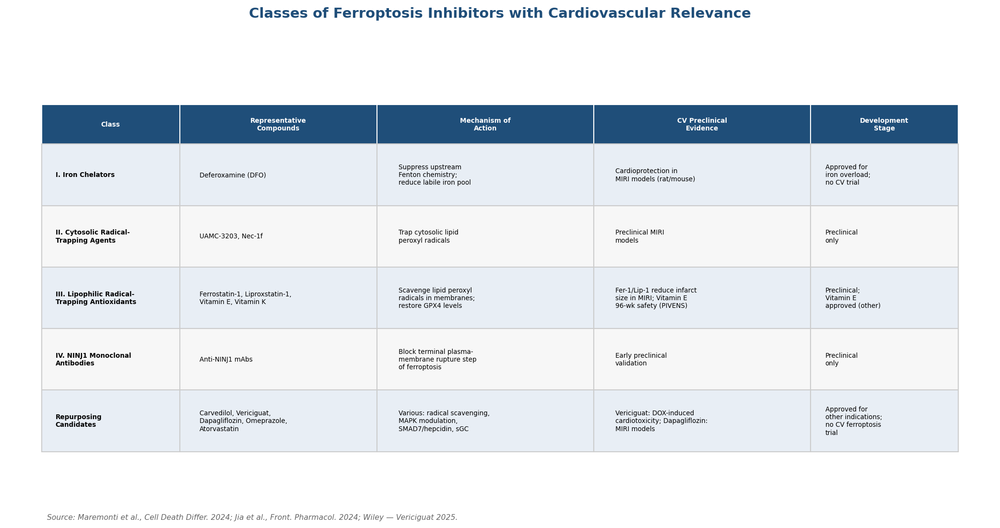

*Table: Classification of ferroptosis inhibitors by mechanism of action, representative compounds, cardiovascular preclinical evidence, and development stage. Source: Maremonti et al., Cell Death Differ. 2024; Jia et al., Front. Pharmacol. 2024.*

## 5.2 Metal-Organic Frameworks for Cardiovascular Theranostics

### 5.2.1 Platform Capabilities

Metal-organic frameworks (MOFs)—crystalline porous materials assembled from metal nodes and organic linkers—have been engineered into multifunctional cardiovascular platforms spanning five application domains: (i) biosensor-based biomarker detection, targeting cardiac troponin I, C-reactive protein, galectin-3, and microRNAs using Fe-MOFs, Eu-MOFs, ZIF-67, and Ru-MOFs; (ii) MRI contrast imaging, with PCN-222(Mn) serving as a T₁ agent for atherosclerotic plaque characterization; (iii) targeted drug delivery, including UiO-66 for rapamycin/IL-1Rα co-delivery, ZIF-8 for losartan potassium, and ZIF-90 for controlled Zn²⁺ release; (iv) therapeutic gas delivery, via Cu-MOFs that catalyze nitric oxide generation on stent surfaces; and (v) nanozyme-mediated ROS scavenging, exemplified by SOD-ZrMOF and Cu-TCPP-Mn for myocardial infarction repair [Advanced Science — MOFs Review, 2025](https://advanced.onlinelibrary.wiley.com/doi/10.1002/advs.202416302 "Metal–Organic Frameworks: Unlocking New Frontiers in Cardiovascular Diagnosis and Therapy").

### 5.2.2 Preclinical Highlights

Cu-MOFs immobilized on cardiovascular stent surfaces via polydopamine coating catalyze NO generation from endogenous S-nitrosothiol donors while simultaneously releasing Cu²⁺ to promote endothelialization. In rabbit implantation experiments at four-week follow-up, Cu-MOF-coated stents reduced neointimal thickness, lowered restenosis rates, and improved re-endothelialization compared with bare metal stents [Advanced Science — MOFs Review, 2025](https://advanced.onlinelibrary.wiley.com/doi/10.1002/advs.202416302 "MOFs for CVD"). The bimetallic nanozyme Cu-TCPP-Mn, which combines copper and manganese nodes, exhibits both superoxide dismutase–like and catalase-like catalytic activities; in a mouse myocardial infarction model, seven days of treatment alleviated cardiac wall thinning, improved ejection fraction and fractional shortening, and reduced neutrophil (CD45⁺) and macrophage (CD68⁺) infiltration [Advanced Science — MOFs Review, 2025](https://advanced.onlinelibrary.wiley.com/doi/10.1002/advs.202416302 "MOFs for CVD").

UiO-66-NH₂ MOFs modified with IL-1Rα and loaded with rapamycin (RUFI) demonstrated anti-atherosclerotic efficacy in vivo by reducing M1 macrophage polarization and decreasing plaque burden. ZIF-90, a zinc-based MOF decorated with endothelial cell–targeted and mitochondria-localizing peptides, functions as a controlled Zn²⁺ delivery system that stimulates angiogenesis through the PI3K/Akt/eNOS pathway in ischemic disease models, illustrating the principle of biologically active metal ion delivery at therapeutically relevant low dosages [Advanced Science — MOFs Review, 2025](https://advanced.onlinelibrary.wiley.com/doi/10.1002/advs.202416302 "MOFs for CVD").

### 5.2.3 Biocompatibility Challenges

Several critical obstacles constrain MOF translation to clinical use. Metal node toxicity—particularly Co²⁺ release from ZIF-67 and uncontrolled Zn²⁺ liberation from ZIF-8 at acidic pH—poses direct cardiovascular cytotoxicity risks; zinc ion release has been shown to disrupt vascular smooth muscle cell actin assembly even at concentrations nominally considered safe. Limited stability of mesoporous MOFs in aqueous biological media leads to rapid and poorly controlled degradation. Protein corona formation on MOF surfaces upon contact with blood reduces drug release efficiency, while clearance by the mononuclear phagocyte system limits bioavailability. Long-term in vivo toxicity data remain insufficient, particularly for cardiovascular-specific cell types such as cardiomyocytes and endothelial cells [Advanced Science — MOFs Review, 2025](https://advanced.onlinelibrary.wiley.com/doi/10.1002/advs.202416302 "MOFs for CVD").

## 5.3 Nanoparticle-Based Metal Ion Delivery and Theranostics

Iron oxide nanoparticles (IONPs) constitute the most clinically advanced metal-based nanoplatform for cardiovascular applications. Superparamagnetic IONPs (SPIONs) serve as T₂-weighted MRI contrast agents for atherosclerotic plaque characterization, while ultrasmall SPIONs (USPIONs) provide additional T₁-weighted contrast capability. Surface functionalization with targeting ligands—including anti-CD68 antibodies, osteopontin antibodies, and mannose receptors—enables macrophage-specific plaque imaging. Therapeutic extensions of these platforms encompass photothermal ablation of vulnerable plaques, magnetic hyperthermia, and targeted anti-inflammatory drug delivery [Advanced Science — IONPs Review, 2024](https://advanced.onlinelibrary.wiley.com/doi/10.1002/advs.202308298 "Advances in Atherosclerosis Theranostics Harnessing Iron Oxide-Based Nanoparticles").

Polydopamine nanoparticles (PDA NPs) exemplify a nanoengineered approach to ferroptosis inhibition in the cardiac setting. By combining intrinsic ROS-scavenging capacity with Fe²⁺ chelation, PDA NPs effectively decrease Fe²⁺ deposition and lipid peroxidation in mouse MIRI models, reducing infarct size and preserving cardiac function. Enhanced formulations carrying a ferrostatin-1 payload provide dual antioxidant and anti-ferroptotic cardioprotection [ACS Applied Materials & Interfaces — Zhang et al., 2021](https://pubs.acs.org/doi/10.1021/acsami.1c18061 "Targeting Ferroptosis by Polydopamine Nanoparticles Protects Heart against Ischemia/Reperfusion Injury").

Ferumoxytol (Feraheme), an FDA-approved ultrasmall superparamagnetic iron oxide formulation indicated for iron-deficiency anemia, has been used off-label in cardiovascular MRI studies of atherosclerosis and myocardial inflammation. However, no metal-based nanoparticle has received regulatory approval for a cardiovascular therapeutic indication. Translational barriers include biodistribution unpredictability, protein corona effects, long-term tissue bioaccumulation of iron, and the generally low targeting efficiency characteristic of nanomedicines—typically 0.07–7% of the injected dose per gram of target tissue [Advanced Science — IONPs Review, 2024](https://advanced.onlinelibrary.wiley.com/doi/10.1002/advs.202308298 "IONPs in atherosclerosis theranostics").

## 5.4 Metallodrugs: Repurposing and Novel Scaffolds

### 5.4.1 Gold — Auranofin

Auranofin, a gold(I)-phosphine compound approved for rheumatoid arthritis in 1985, possesses several cardiovascular-relevant pharmacological activities: inhibition of thioredoxin reductase (TrxR1/TrxR2) with dose-dependent modulation of endothelial cell survival; anti-inflammatory effects mediated through NF-κB downregulation, NLRP3 inflammasome suppression, and TLR4/NOX4 pathway modulation in macrophages; and, at low concentrations (≤0.5 μM), selective downregulation of VEGFR3 via lysosome-dependent degradation, which inhibits lymphangiogenesis [Anti-Cancer Agents in Medicinal Chemistry — Chen et al., 2014](https://pmc.ncbi.nlm.nih.gov/articles/PMC5055472/ "Novel action and mechanism of auranofin in inhibition of VEGFR3-dependent lymphangiogenesis"). Despite this mechanistic portfolio, no dedicated cardiovascular endpoint trial has been conducted with auranofin, and its clinical relevance to CVD remains conjectural.

### 5.4.2 Ruthenium — Antiplatelet and Vasoactive Complexes

Novel ruthenium(II) complexes of the TQ series have demonstrated antiplatelet and antithrombotic effects in preclinical studies. TQ-6 inhibits collagen-induced platelet aggregation through the Src-Syk-PLCγ2 cascade and suppresses integrin αIIbβ3-mediated outside-in signaling. In functional assays, TQ-6 prolonged closure time in PFA-100 from 93.2 ± 5.5 seconds to 123.8 ± 5.7 seconds at 1 μM and extended bleeding time in mice, without platelet cytotoxicity at effective concentrations (up to 200 μM by LDH assay) [Int J Mol Sci — Jayakumar et al., 2018](https://pmc.ncbi.nlm.nih.gov/articles/PMC6032250/ "Possible Molecular Targets of Novel Ruthenium Complexes in Antiplatelet Therapy"). Nitrosyl ruthenium complexes offer a dual-function platform that combines controllable NO and nitroxyl (HNO) release with the pharmacological properties of the ruthenium scaffold, yielding concurrent vasodilatory, antiplatelet, and anti-inflammatory effects [ResearchGate — Nitrosyl Ru Complexes, 2023](https://www.researchgate.net/publication/369124389_New_nitrosyl_ruthenium_complexes_with_combined_activities_for_multiple_cardiovascular_disorders "New nitrosyl ruthenium complexes with combined activities for multiple cardiovascular disorders"). These compounds are positioned as potential alternatives to aspirin and clopidogrel with theoretically lower bleeding risk, though all remain at the preclinical proof-of-concept stage with no clear timeline for first-in-human studies.

## 5.5 Gene Therapy and RNA-Based Approaches Targeting Metal Homeostasis

### 5.5.1 TMPRSS6 Silencing — Hepcidin Upregulation

SLN124 (divesiran), a GalNAc-conjugated 19-mer siRNA targeting TMPRSS6 developed by Silence Therapeutics, represents the first clinical-stage RNA therapeutic directed at a component of iron homeostasis. TMPRSS6 encodes matriptase-2, a negative regulator of hepcidin; its silencing increases endogenous hepcidin synthesis, reduces serum iron, and lowers transferrin saturation. The Phase 1 GEMINI study in healthy volunteers demonstrated dose-dependent hepcidin elevation and serum iron reduction sustained for at least six weeks after a single administration [American Journal of Hematology — Porter et al., 2023](https://pubmed.ncbi.nlm.nih.gov/37497888/ "SLN124/divesiran Phase 1 first-in-human study"). SLN124 is currently in Phase 1/2 trials for polycythemia vera (SANRECO study, NCT05499013), where it has maintained durable hematocrit control and substantially reduced phlebotomy requirements. Complementary approaches include TMPRSS6-targeted antisense oligonucleotides (ASOs) developed with Ionis Pharmaceuticals, which demonstrated preclinical efficacy in β-thalassemia mouse models—increasing hepcidin, reducing serum iron, improving anemia, and decreasing splenomegaly—and an anti-TMPRSS6 monoclonal antibody (DISC-3405) [Haematologica — TMPRSS6-ASO Combination Study](https://haematologica.org/article/view/7623 "Combination of Tmprss6-ASO and deferiprone in NTDT"). No cardiovascular endpoint trial exists for any TMPRSS6-targeting agent; however, the cardiovascular rationale resides in the potential to prevent iron overload cardiomyopathy and to enable fine-tuning of systemic iron homeostasis without the pharmacokinetic limitations of small-molecule iron chelators.

### 5.5.2 AAV-Based Frataxin Gene Therapy

The most advanced gene therapy approach targeting cardiac iron metabolism is LX2006 (AAVrh.10hFXN), developed by Lexeo Therapeutics for Friedreich ataxia (FA) cardiomyopathy—a condition driven by frataxin deficiency and consequent mitochondrial iron overload. The SUNRISE-FA Phase 1/2 trial (NCT05445323) and a Weill Cornell Medicine investigator-initiated Phase 1A trial (NCT05302271) have yielded positive interim data: participants with abnormal baseline left ventricular mass index (LVMI) achieved a mean 25% LVMI reduction by 12 months, accompanied by sustained improvements in left ventricular wall thickness and troponin I levels. Cardiac biopsies confirmed increased frataxin protein expression in all evaluated participants. LX2006 has received FDA Fast Track Designation and Rare Pediatric Disease Designation, with Lexeo planning to initiate a registrational study in the first half of 2026 [Lexeo Therapeutics — Phase 1/2 Interim Data, April 2025](https://hfsa.org/lexeo-therapeutics-announces-positive-interim-phase-12-data-lx2006-friedreich-ataxia-cardiomyopathy "Lexeo Phase 1/2 interim data for LX2006 in FA cardiomyopathy"). Although FA cardiomyopathy is a rare monogenic condition, the LX2006 program provides a proof of concept that gene-level modulation of cardiac iron handling can produce measurable structural and functional cardiac improvement.

### 5.5.3 Broader Gene Therapy Targets

Beyond TMPRSS6 and frataxin, potential gene therapy targets in metal-ion cardiovascular biology remain at early preclinical stages. These include ZIP/ZnT zinc transporters—notably ZIP13, whose downregulation during ischemia-reperfusion leads to CaMKII activation and arrhythmogenesis—as well as DMT1 (divalent metal transporter 1, mediating iron import) and ferroportin (the sole cellular iron exporter). The gap between target identification and therapeutic vector development is substantial, reflecting the complexity of multi-organ metal homeostasis and the attendant risk of unintended metabolic perturbations in non-target tissues.

## 5.6 Microbiome–Metal Interactions and Cardiovascular Implications

The gut microbiome modulates host metal ion absorption through multiple mechanisms bearing indirect cardiovascular relevance. Commensal bacteria produce organic acids and short-chain fatty acids (SCFAs)—notably butyrate and pentanoate—that lower luminal pH and increase iron solubility. *Lactobacillus fermentum* produces p-hydroxyphenyllactic acid, which reduces Fe³⁺ to the more bioavailable Fe²⁺ form, while bacterial phytases liberate iron from dietary phytate-iron complexes. Conversely, microbiota-derived 1,3-diaminopropane (DAP) and *Lactobacillus reuteri*-derived reuterin directly suppress HIF-2α-mediated intestinal iron absorption, providing a feedback mechanism against iron overload [Nature Microbiology — Bessman et al., 2025](https://pmc.ncbi.nlm.nih.gov/articles/PMC12302899/ "Iron at the crossroads of host-microbiome interactions in health and disease").

This bidirectional relationship creates both therapeutic opportunities and hazards. Oral iron supplementation—the most common intervention for iron deficiency—can adversely reshape the gut microbiome: randomized trials in Kenyan and Côte d'Ivoire children demonstrated that oral iron increased Proteobacteria abundance, decreased *Bifidobacterium*, and elevated intestinal inflammation. Conversely, severe iron deficiency irreversibly decreased microbial diversity and richness, reducing SCFA-producing Firmicutes such as *Roseburia* and *Eubacterium rectale* [Nature Microbiology — Bessman et al., 2025](https://pmc.ncbi.nlm.nih.gov/articles/PMC12302899/ "Iron at the crossroads of host-microbiome interactions"). Microbiota-derived butyrate enhances red blood cell recycling by bone marrow macrophages and supports hematopoietic stem cell self-renewal, while pentanoate increases intracellular iron in T cells critical for intestinal regulatory T cell differentiation—establishing mechanistic links among the gut microbiome, iron metabolism, and cardiovascular-relevant immune pathways [Nature Microbiology — Bessman et al., 2025](https://pmc.ncbi.nlm.nih.gov/articles/PMC12302899/ "Iron at the crossroads of host-microbiome interactions").

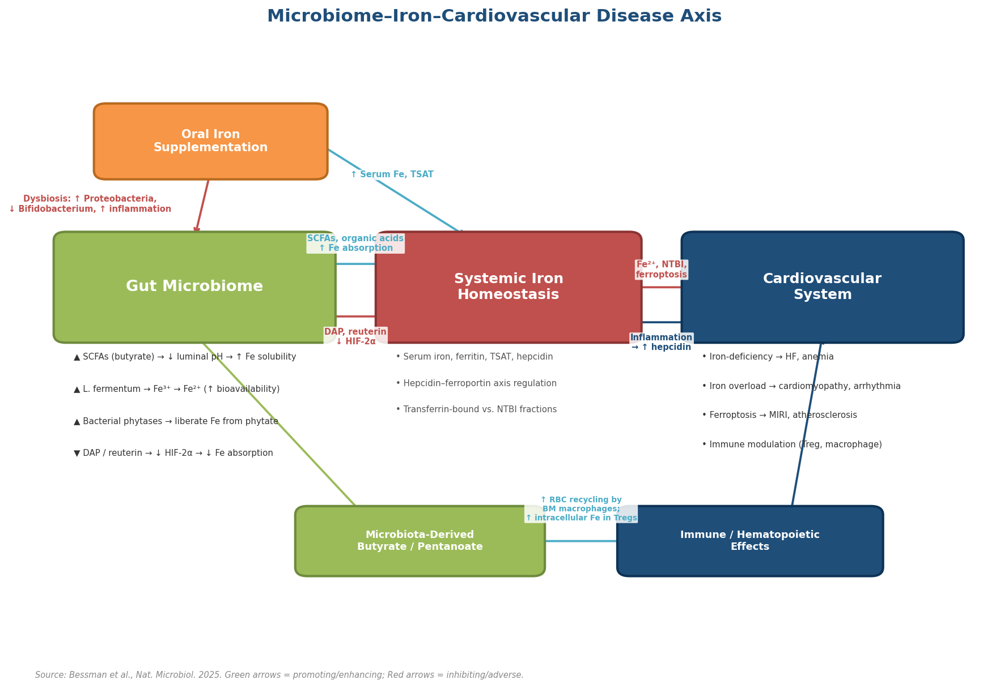

*Schematic: Bidirectional interactions between the gut microbiome and systemic iron homeostasis, illustrating how microbial metabolites (SCFAs, DAP, reuterin) modulate iron absorption and downstream cardiovascular consequences including iron-deficiency heart failure, iron overload cardiomyopathy, ferroptosis, and immune modulation. Source: synthesized from Bessman et al., Nature Microbiology 2025.*

Probiotics such as *E. coli* Nissle 1917 and *Bifidobacterium* isolates with high iron-sequestering potential represent candidate interventions for indirect modulation of iron-related cardiovascular risk. However, clinical cardiovascular endpoint data for microbiome-based metal-ion interventions are entirely absent, and the field remains at a mechanistic and preclinical stage.

## 5.7 Digital Health, Wearable Sensors, and Precision Medicine

Wearable electrochemical biosensors capable of measuring electrolyte and metal ion concentrations in sweat are approaching clinical prototyping. Ion-selective electrode–based flexible sensors enable continuous K⁺ monitoring as a surrogate for serum potassium status, while bismuth-film printed wearable sensors permit real-time detection of heavy metals (Pb²⁺, Cd²⁺) in perspiration. An AI-assisted wearable microfluidic colorimetric sensor system (AI-WMCS) integrates rapid, non-invasive sweat analysis with machine-learning interpretation for multi-analyte detection. These technologies remain at the prototype and validation stage; no FDA-cleared cardiovascular-specific metal ion monitoring device is currently available.

AI-driven precision nutrition platforms are emerging that leverage machine learning to analyze genomic, metabolomic, and microbiome data for personalized supplementation recommendations. A digital-twin approach for micronutrient supplementation during pregnancy has demonstrated the capacity to simulate micronutrient needs and predict maternal-fetal outcomes under varying supplementation scenarios [Nature Communications — AI in Precision Nutrition, 2025](https://www.nature.com/articles/s41467-025-62985-3 "Advances in artificial intelligence and precision nutrition approaches"). The natural cardiovascular extension—personalized metal ion (Fe, Zn, Mg, K) supplementation guided by individual biomarker trajectories, genetic risk profiles, and dietary patterns—remains conceptual. No validated algorithm has been specifically deployed or tested for metal ion optimization in CVD patient populations.

## 5.8 Translational Barriers and Regulatory Considerations

### 5.8.1 Regulatory Classification

Metal-based therapeutics straddle existing FDA regulatory categories. Metallodrugs do not fit cleanly into small-molecule or biologic frameworks, while MOF-encapsulated agents and nanoparticle formulations may require classification as combination products or novel drug-device entities. Historical precedents (cisplatin, auranofin) provide limited regulatory guidance for these newer formulations. The pharmacokinetics of metal ions—characterized by multi-organ distribution, redox-state-dependent bioactivity, and in some cases extremely long biological half-lives (cadmium: 17–30 years)—demand novel PK/PD modeling approaches that current regulatory frameworks do not explicitly accommodate.

### 5.8.2 Formulation and Manufacturing

Scalable GMP manufacturing of porous crystalline MOFs that retain structural integrity upon hydration, protein corona–resistant nanoparticle coatings, and controlled-degradation metal-ion delivery vehicles present unresolved engineering challenges. The generally low targeting efficiency of nanomedicines—0.07–7% of injected dose per gram of tissue—constrains therapeutic windows and necessitates dose escalation, which in turn amplifies off-target metal deposition in non-cardiovascular organs [Advanced Science — MOFs Review, 2025](https://advanced.onlinelibrary.wiley.com/doi/10.1002/advs.202416302 "MOFs for CVD").

### 5.8.3 Long-Term Safety Unknowns

Chronic ferroptosis inhibition may impair tumor suppression or antimicrobial immunity—functions in which ferroptosis plays a physiologically important role. MOF degradation products—Zn²⁺, Cu²⁺, Fe³⁺, and organic linkers—may accumulate in cardiovascular tissues with unknown long-term consequences. Iron oxide nanoparticles can be retained in the reticuloendothelial system (liver, spleen) for extended periods, raising concerns about chronic hepatic iron loading. Off-target effects of TMPRSS6 silencing on erythropoiesis and immune function beyond iron regulation have not been characterized in long-term studies [Cell Death & Differentiation — Maremonti et al., 2024](https://www.nature.com/articles/s41418-024-01350-1 "Ferroptosis-based advanced therapies").

### 5.8.4 The Biomarker Bottleneck

A recurrent challenge across multiple emerging modalities is the lack of validated biomarkers. Ferroptosis lacks a clinically deployable detection assay; MOF degradation kinetics cannot be monitored in real time in patients; and wearable metal-ion sensors have not been validated against venous blood reference standards in cardiovascular populations. Without adequate biomarker infrastructure, patient stratification, dose optimization, and surrogate endpoint selection remain formidable obstacles to clinical trial design and regulatory approval.

## 5.9 Synthesis: Near-Term and Longer-Term Horizons

The emerging modalities reviewed in this chapter span a wide developmental continuum. At the nearer translational horizon, three directions stand out. First, repurposing approved drugs with demonstrated ferroptosis-inhibitory activity (vitamin E, carvedilol, vericiguat) into cardioprotective ischemia-reperfusion protocols could leverage existing safety databases and expedite clinical testing. Second, AAV-based frataxin gene therapy (LX2006) is poised to enter registrational trials in 2026 and, if successful, would validate the principle of gene-level cardiac metal-ion modulation. Third, divesiran (SLN124) and related TMPRSS6-targeting agents may expand from hematological indications into iron overload cardiomyopathy if Phase 2 efficacy and safety data support such extension.

At a longer horizon, MOF-based drug-eluting stents, nanoparticle-mediated ferroptosis inhibition during cardiac surgery, AI-guided personalized metal ion supplementation, and microbiome engineering for iron homeostasis represent conceptually promising but experimentally immature strategies. Their progression will depend on resolving the biomarker, manufacturing, and regulatory challenges outlined in Section 5.8.

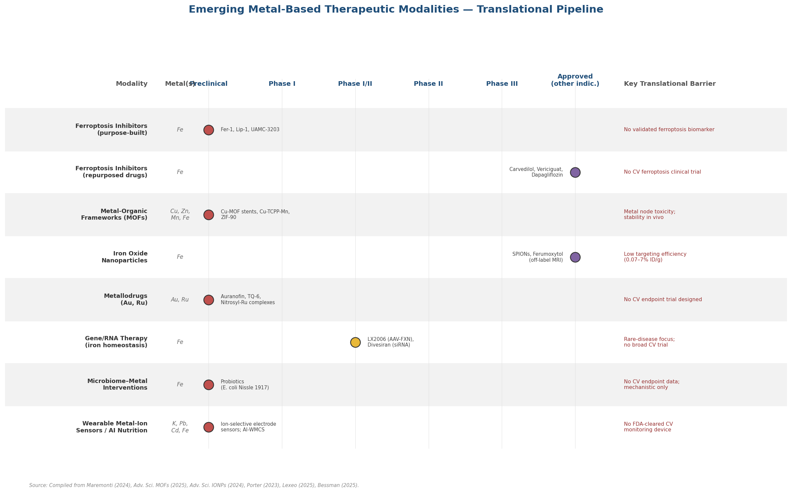

*Pipeline overview mapping eight emerging metal-based therapeutic modalities to their highest achieved development stage, with target metals, lead compounds, and key translational barriers annotated for each modality. Sources: synthesized from Maremonti et al., 2024; Advanced Science MOFs Review, 2025; IONPs Review, 2024; Porter et al., 2023; Lexeo Therapeutics, 2025.*

Taken together, these frontiers affirm that the therapeutic modulation of metal ion biology in cardiovascular disease is entering a phase of rapid diversification—moving beyond oral supplementation and intravenous repletion toward targeted, pathway-specific interventions. The distance from preclinical demonstration to clinical validation remains substantial for most of these modalities, but the convergence of nanotechnology, gene therapy, and digital health has created a translational ecosystem that did not exist a decade ago.

# Conclusion

The evidence assembled in this report supports the conclusion that therapeutic modulation of plasma metal ion concentrations represents a viable — and, in specific clinical contexts, already guideline-endorsed — strategy for cardiovascular prevention and treatment. The field, however, is characterised by marked heterogeneity in evidence maturity across different metals and intervention modalities, and several critical gaps separate biological plausibility from clinical proof.

## Principal Findings

**Guideline-level interventions.** Intravenous iron repletion in heart failure with iron deficiency and potassium-enriched salt substitution for cardiovascular event prevention stand as the two metal-ion interventions supported by robust randomised controlled trial evidence and international guideline endorsement. The 2025 individual-patient meta-analysis of six IV iron trials (N ≈ 7,175) demonstrated a 28% relative reduction in the composite of heart failure rehospitalisation plus cardiovascular death at 12 months, while the SSaSS trial (N = 20,995) showed 14% reductions in stroke, 13% in major adverse cardiovascular events, and 12% in all-cause mortality — with subsequent WHO endorsement for potassium-enriched salt substitutes. These two interventions address distinct pathophysiological targets (myocardial iron depletion and sodium–potassium imbalance, respectively) and distinct populations (heart failure patients and hypertensive or stroke-prone individuals), illustrating the breadth of the metal-ion intervention paradigm.

**Contested and mixed evidence.** EDTA chelation therapy for toxic-metal removal, once a promising cardiovascular strategy based on the TACT trial's nominally positive result, has been substantially weakened by the TACT2 null result in a contemporary population with improved background therapy and lower ambient lead exposure. Selenium supplementation demonstrates dramatic efficacy in selenium-deficient populations (KiSel-10: 41% cardiovascular mortality reduction) but no benefit in selenium-replete settings (SELECT), reinforcing the principle that baseline nutrient status is the critical determinant of supplementation efficacy. Calcium supplementation remains under a cloud of cardiovascular safety concern, with Mendelian randomisation data lending causal plausibility to the observational signal of increased myocardial infarction risk.

**Evidence gaps.** Oral magnesium supplementation — supported by consistent epidemiological associations, Mendelian randomisation evidence (12% CAD risk reduction per 0.1 mmol/L genetically predicted serum Mg), FDA-authorised health claims for blood pressure, and surrogate-endpoint trial data — has never been tested in an adequately powered outcome trial for myocardial infarction, stroke, or cardiovascular death. Zinc supplementation for cardiovascular endpoints exists only as biological plausibility supported by anti-inflammatory surrogate markers. These gaps likely reflect the low commercial value of generic supplements rather than a lack of scientific rationale.

**Population-level environmental strategies.** For toxic metals (lead, cadmium, arsenic), population-level environmental interventions — leaded-gasoline phase-outs, arsenic-safe water infrastructure, cadmium regulation — have delivered cardiovascular mortality reductions at a scale that individual chelation therapy cannot match. The estimated 22.5% of U.S. cardiovascular mortality decline attributable to lead reduction alone between 1988 and 2004 underscores the primacy of environmental policy over clinical pharmacology for this class of exposures.

**Emerging frontiers.** Ferroptosis-inhibitor pharmacology, metal-organic frameworks for targeted ion delivery, AAV-based gene therapy for cardiac iron homeostasis (LX2006 for Friedreich ataxia cardiomyopathy), RNA therapeutics targeting the hepcidin–ferroportin axis (divesiran/SLN124), and microbiome-mediated modulation of metal absorption represent a diversifying translational pipeline. Most of these modalities remain at preclinical or early-phase stages, constrained by the absence of validated ferroptosis biomarkers, the manufacturing complexity of nanoscale metal-delivery systems, and unresolved long-term safety questions.

## Cross-Cutting Principles

Three overarching principles emerge from the aggregate evidence. First, **U-shaped dose–response relationships** govern the cardiovascular effects of most essential metals: both deficiency and excess are harmful, and the therapeutic window is often narrow and population-dependent. Effective interventions must therefore aim for homeostatic restoration rather than unidirectional supplementation. Second, **baseline metal status is the single strongest predictor of intervention efficacy**, as demonstrated by the divergent outcomes of selenium trials in deficient versus replete populations and by the attenuation of chelation benefit as environmental lead levels decline. Third, **dietary pattern approaches** — exemplified by the DASH and Mediterranean diets — achieve simultaneous multi-metal optimisation (potassium, magnesium, calcium, selenium) with proven cardiovascular benefit, and may represent the most pragmatic and scalable strategy for population-level metal-ion intervention.

## Implications

The current evidence supports several actionable conclusions. Intravenous iron should be offered to all heart failure patients meeting iron-deficiency criteria, with emerging data suggesting that transferrin saturation alone may provide a more precise treatment-selection biomarker than the current composite ferritin/TSAT criterion. Potassium-enriched salt substitutes warrant broad public-health implementation, particularly in high-risk populations with hypertension or prior stroke. Oral magnesium and zinc supplementation merit investment in adequately powered outcome trials, given their strong biological rationale and low safety risk. For toxic metals, continued investment in environmental exposure reduction remains the highest-yield cardiovascular prevention strategy. Finally, the design of future metal-ion supplementation trials should mandate baseline biomarker stratification — a lesson that the selenium literature has taught convincingly but that much of the field has yet to adopt systematically.
