# Overview

The human gut harbors approximately 3.8 × 10¹³ bacteria encoding over 9.9 million non-redundant genes — a genetic repertoire 150- to 500-fold larger than the host genome — that collectively functions as a metabolic and immunological organ integral to intestinal homeostasis. Within this ecosystem, a dynamic tension exists between protective commensals that produce short-chain fatty acids, reinforce the epithelial barrier, and educate the immune system, and pathobionts whose virulence factors and toxic metabolites can trigger chronic inflammation and contribute to colorectal carcinogenesis. Colorectal cancer (CRC) remains the third most common malignancy worldwide, with an estimated 1.93 million new cases and over 900,000 deaths recorded in 2022, and accumulating evidence implicates the gut microbiota as a modifiable contributor to its pathogenesis.

This report examines the significance of the gut microbiota for intestinal function and disease through seven interconnected chapters. **Chapter 1** establishes the compositional, genomic, and functional architecture of the gut ecosystem — including the dominant Firmicutes–Bacteroidetes framework, the six core functional roles of the microbiota, and the factors that shape community assembly. **Chapter 2** defines probiotics, prebiotics, synbiotics, and postbiotics according to current ISAPP consensus criteria, surveys the major classical genera (*Lactobacillus*, *Bifidobacterium*, *Saccharomyces boulardii*) and next-generation candidates (*Akkermansia muciniphila*, *Faecalibacterium prausnitzii*), and details the four principal mechanisms of probiotic action. **Chapter 3** catalogues the pathogenic bacteria — *Fusobacterium nucleatum*, colibactin-producing *Escherichia coli*, enterotoxigenic *Bacteroides fragilis*, *Clostridioides difficile*, *Enterococcus faecalis*, and sulfate-reducing bacteria — and the toxic metabolites (secondary bile acids, hydrogen sulfide, TMAO, N-nitroso compounds, polyamines) they generate under dysbiotic conditions. **Chapter 4** traces the mechanistic chain from barrier disruption through NF-κB/STAT3/Wnt signaling to the inflammation–dysplasia–carcinoma sequence, integrating the driver–passenger model, biofilm biology, and epigenetic reprogramming into a multi-hit framework for microbiota-mediated CRC. **Chapter 5** evaluates the clinical evidence for probiotics, prebiotics, and fecal microbiota transplantation as therapeutic interventions — highlighting a 37% reduction in postoperative infections in CRC patients (24 RCTs, n = 2,204) and a candid appraisal of the persistent translational gap between preclinical promise and validated human outcomes. **Chapter 6** translates these findings into an evidence-tiered dietary recommendation framework, grading each recommendation by the strength of its supporting human data. **Chapter 7** synthesizes the evidence maturity landscape, surveys emerging frontiers — engineered probiotics, phage therapy, microbiome-based screening biomarkers, and AI-driven personalized nutrition — and identifies the translational gaps that define the field's next decade.

The core findings converge on three principal themes. First, dysbiosis is not merely correlated with but mechanistically contributory to intestinal inflammation and CRC, operating through defined molecular pathways with identifiable mutational fingerprints in human tumor genomes. Second, probiotics and dietary interventions offer measurable protective effects in specific clinical contexts, though their roles remain adjunctive rather than standalone for cancer prevention. Third, the response to both dietary and microbial interventions varies substantially across individuals, driven by baseline microbiota composition, host genetics, and dietary history — underscoring the emerging imperative for personalized, microbiome-informed strategies.

# 第1章 The Gut Microbiota Ecosystem — Composition, Diversity, and Core Functions

The human gastrointestinal tract harbors a dense and remarkably diverse microbial community — collectively termed the gut microbiota — that participates in nutrient metabolism, immune regulation, and defense against pathogens. Over the past two decades, advances in culture-independent sequencing have transformed understanding of this ecosystem from a peripheral curiosity into a central axis of human physiology. With an estimated 3.8 × 10¹³ bacterial cells coexisting alongside approximately 3.0 × 10¹³ human cells, and a collective gene repertoire that exceeds the host genome by two to three orders of magnitude, the gut microbiota functions as a metabolic and immunological organ in its own right. This chapter surveys the composition, genomic scale, functional repertoire, and regulatory determinants of this ecosystem, establishing the foundational context for the discussions of probiotics, pathogens, and disease that follow in subsequent chapters.

## 1.1 Scale and Genomic Complexity

A landmark quantitative reassessment estimated the total number of bacteria in a 70 kg reference man at approximately 3.8 × 10¹³, with roughly 3.0 × 10¹³ human cells, yielding a bacteria-to-human-cell ratio of about 1.3:1 and a total bacterial mass of ~0.2 kg [Sender et al., 2016](https://pmc.ncbi.nlm.nih.gov/articles/PMC4991899/ "Revised Estimates for the Number of Human and Bacteria Cells in the Body, PLoS Biology 2016"). The vast majority of these bacteria reside in the colon, where densities reach approximately 0.9 × 10¹¹ cells per gram of wet stool. This revision displaced the long-cited 10:1 ratio, yet the near numerical parity between microbial and human cells underscores the biological significance of the partnership.

The genetic repertoire of the gut microbiota dwarfs that of its host. The Integrated Gene Catalog (IGC), constructed from 1,267 gut metagenome samples, identified approximately 9.9 million non-redundant microbial genes — representing a 150- to 500-fold expansion over the roughly 20,000 human protein-coding genes [Li et al., 2014](https://pubmed.ncbi.nlm.nih.gov/24997786/ "An integrated catalog of reference genes in the human gut microbiome, Nature Biotechnology 2014"). Subsequent cataloging efforts have deepened this picture considerably. The Unified Human Gastrointestinal Genome (UHGG) collection encompasses 204,938 non-redundant genomes from 4,644 gut prokaryotic species, encoding more than 170 million protein sequences; notably, over 70% of these species lack cultured representatives [Almeida et al., 2021](https://www.nature.com/articles/s41587-020-0603-3 "UHGG, Nature Biotechnology 2021"). A 2025 expansion unified reference genomes for 14,062 species, providing the most comprehensive map to date of the gut microbial "dark matter" — the vast fraction of gut organisms that remain uncultured and poorly characterized [Unified catalog, 2025](https://link.springer.com/article/10.1186/s40168-025-02232-5 "14,062 species catalog, Microbiome 2025").

## 1.2 Taxonomic Composition — The Major Phyla

Despite individual variation, a consistent phylum-level architecture characterizes the healthy adult gut. Two phyla — **Firmicutes** and **Bacteroidetes** — together account for more than 90% of the total gut community in most surveyed populations [Magne et al., 2020](https://pmc.ncbi.nlm.nih.gov/articles/PMC11505267/ "Firmicutes/Bacteroidetes Ratio and Diseases, Nutrients 2024"). Although precise percentage breakdowns vary substantially across studies — owing to differences in geography, diet, sequencing methodology (16S rRNA amplicon vs. shotgun metagenomics), and bioinformatic pipelines — most reviews converge on Firmicutes comprising roughly 50–60% and Bacteroidetes roughly 20–30% of the healthy adult fecal microbiota. Figure 1 presents the approximate phylum-level distribution.

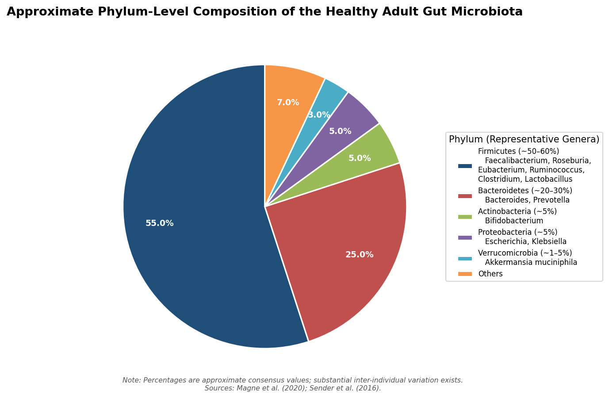

*Figure 1. Approximate relative abundance of the five major phyla in the healthy adult gut microbiota, with representative genera. Percentages represent consensus estimates; substantial inter-individual variation exists. Data synthesized from Magne et al. (2020) and Sender et al. (2016).*

**Firmicutes** is the most species-rich phylum in the gut. Key genera include *Faecalibacterium*, *Roseburia*, *Eubacterium*, *Ruminococcus*, *Clostridium*, and *Lactobacillus* (recently reclassified into *Lacticaseibacillus*, *Limosilactobacillus*, *Lactiplantibacillus*, and related genera; the traditional name *Lactobacillus* is retained here for clarity).[^1] Many Firmicutes members are obligate anaerobes and prominent producers of short-chain fatty acids, particularly butyrate — a metabolite of central importance to colonocyte energy metabolism and mucosal homeostasis.

**Bacteroidetes** — dominated by the genera *Bacteroides* and *Prevotella* — specializes in the degradation of complex plant polysaccharides and dietary fiber. *Bacteroides* species encode extensive glycoside hydrolase arsenals that enable fermentation of otherwise indigestible carbohydrates. The Firmicutes-to-Bacteroidetes (F/B) ratio has been proposed as a biomarker for various disease states, though its clinical utility remains debated owing to high inter-individual variability and inconsistent associations across cohorts.

Beyond these two dominant phyla, several minor but functionally significant lineages contribute to gut ecology:

- **Actinobacteria**: Represented primarily by *Bifidobacterium*, a genus central to infant gut colonization and one of the most extensively studied probiotic taxa. Actinobacteria typically constitute a small fraction of the adult gut community but are substantially enriched in breast-fed infants, where human milk oligosaccharides (HMOs) selectively promote *Bifidobacterium* growth.
- **Proteobacteria**: Includes *Escherichia*, *Klebsiella*, and other facultative anaerobes. Proteobacteria are normally present at low abundance in the healthy gut; their bloom is widely regarded as a microbial signature of dysbiosis and mucosal inflammation, as discussed in Section 1.4.
- **Verrucomicrobia**: Represented almost exclusively by *Akkermansia muciniphila*, a mucin-degrading specialist that colonizes the mucus layer and typically accounts for 1–5% of the total community. *A. muciniphila* has attracted considerable attention as a next-generation probiotic candidate (discussed in Chapter 2).

[^1]: The genus *Lactobacillus* was reclassified in 2020 by Zheng et al. into 25 genera. Throughout this report, the traditional genus name is used in general discussion; specific reclassified names are noted where strain-level precision is required.

## 1.3 Core Functional Roles

The gut microbiota performs a suite of metabolic, immunological, and protective functions that are indispensable to host health. These functions are best understood as emergent properties of the community rather than attributes of any single species. Figure 2 provides an overview of the six principal functional domains.

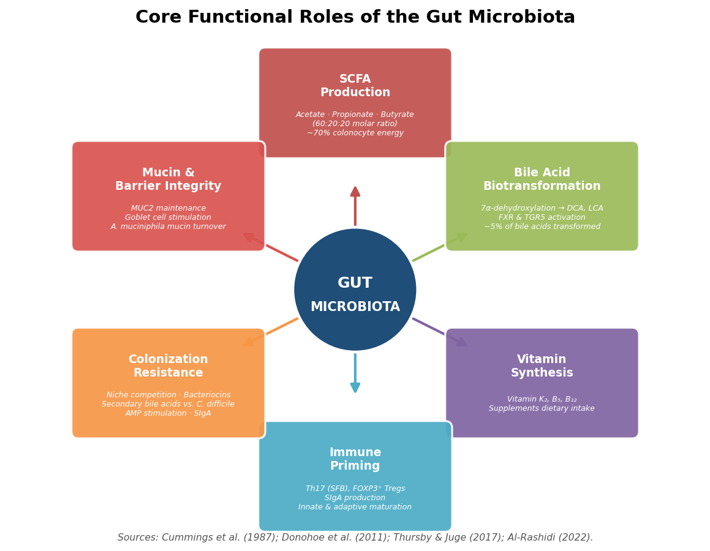

*Figure 2. Hub-and-spoke overview of the six core functional roles of the gut microbiota, with key quantitative parameters annotated for each domain. Sources: Cummings et al. (1987); Donohoe et al. (2011); Thursby & Juge (2017); Al-Rashidi (2022).*

### 1.3.1 Short-Chain Fatty Acid Production

Microbial fermentation of dietary fiber and resistant starch in the colon yields short-chain fatty acids (SCFAs) — principally acetate, propionate, and butyrate — at a molar ratio of approximately 60:20:20. Together, these three SCFAs account for 90–95% of total colonic SCFA content. Luminal concentrations are highest in the proximal colon, reaching 131 ± 9 mmol/kg in the caecum, and decline distally to 80 ± 11 mmol/kg in the descending colon, a gradient that reflects the interplay of microbial production rates and epithelial absorption kinetics [Cummings et al., 1987](https://pmc.ncbi.nlm.nih.gov/articles/PMC1433442/ "SCFA in human large intestine, Gut 1987").

Butyrate holds particular physiological importance: it serves as the primary energy substrate for colonocytes, providing approximately 70% of their ATP requirements [Donohoe et al., 2011](https://pmc.ncbi.nlm.nih.gov/articles/PMC3099420/ "Microbiome and Butyrate, Cell Metabolism 2011"). Beyond energy provision, butyrate functions as a histone deacetylase (HDAC) inhibitor with anti-inflammatory and anti-proliferative properties, modulates epithelial barrier integrity by upregulating tight junction proteins, and activates G-protein-coupled receptors GPR43 and GPR109A on immune cells to promote regulatory T-cell differentiation. These pleiotropic effects position butyrate — and by extension its principal microbial producers (*Faecalibacterium prausnitzii*, *Roseburia* spp., *Eubacterium rectale*) — as central mediators of gut homeostasis.

### 1.3.2 Bile Acid Biotransformation

Approximately 95% of bile acids secreted into the duodenum are reabsorbed in the ileum via the enterohepatic circulation. The remaining ~5% transit to the colon, where gut bacteria catalyze a series of biotransformation reactions — most importantly, 7α-dehydroxylation — converting primary bile acids (cholic acid, chenodeoxycholic acid) into secondary bile acids, principally deoxycholic acid (DCA) and lithocholic acid (LCA). This conversion is carried out predominantly by species of *Clostridium*, notably *C. scindens* and *C. perfringens* [Thursby & Juge, 2017](https://www.frontiersin.org/journals/microbiology/articles/10.3389/fmicb.2018.01835/full "Human Gut Microbiome, Frontiers in Microbiology 2018").

Secondary bile acids are not merely metabolic waste products; they function as potent signaling molecules that activate the nuclear receptor FXR (farnesoid X receptor) and the membrane receptor TGR5, thereby modulating glucose metabolism, lipid homeostasis, energy expenditure, and — critically — the composition of the microbiota itself. The dual nature of secondary bile acids as both homeostatic regulators and potential carcinogens (discussed in Chapter 3) exemplifies the context-dependent character of microbiota–host interactions.

### 1.3.3 Vitamin Synthesis and Nutrient Provision

The gut microbiota contributes to host nutrition through de novo synthesis of several essential vitamins, including vitamin K₂ (menaquinone), pantothenic acid (B₅), and cobalamin (B₁₂). These microbially derived vitamins supplement dietary intake and, in the case of vitamin K₂, contribute to both coagulation homeostasis and bone metabolism [Al-Rashidi, 2022](https://pmc.ncbi.nlm.nih.gov/articles/PMC8913379/ "Gut microbiota and immunity, Saudi J Biol Sci 2022"). Although the quantitative contribution of microbial vitamin synthesis to total host requirements remains incompletely defined for most vitamins, germ-free animal models consistently exhibit deficiencies in these micronutrients, confirming the microbiota as a physiologically relevant — if not always sufficient — source.

### 1.3.4 Immune System Maturation and Regulation

Evidence from germ-free (GF) mouse models has established that the gut microbiota is indispensable for normal maturation of both the innate and adaptive immune systems. GF mice exhibit hypoplastic Peyer's patches, reduced secretory IgA (SIgA) production, diminished lamina propria T-cell populations, and impaired antimicrobial peptide expression. Colonization of GF animals with a conventional microbiota rapidly corrects these deficits, demonstrating a causal rather than merely correlative relationship [Al-Rashidi, 2022](https://pmc.ncbi.nlm.nih.gov/articles/PMC8913379/ "Gut microbiota and immunity, Saudi J Biol Sci 2022").

Several specific microbiota–immune interactions have been dissected at the molecular level. Segmented filamentous bacteria (SFB), a group of Clostridia-related organisms that adhere to the ileal epithelium, are potent inducers of T helper 17 (Th17) cells — a lineage critical for mucosal barrier defense but also implicated in inflammatory pathology when dysregulated. Conversely, specific *Clostridium* clusters (notably clusters IV and XIVa) and certain *Bacteroides* species promote the differentiation of FOXP3⁺ regulatory T cells (Tregs), which are essential for immune tolerance and suppression of excessive inflammation. The microbiota also stimulates IgA class-switching in B cells, with SIgA functioning as a first-line mucosal defense that coats and neutralizes luminal pathogens without triggering inflammatory cascades. This capacity for simultaneous induction of both pro-inflammatory (Th17) and anti-inflammatory (Treg) arms illustrates the microbiota's role as a calibrator — rather than merely an activator — of immune tone.

### 1.3.5 Colonization Resistance

The resident microbiota provides a formidable barrier against invading pathogens through colonization resistance — a multifaceted defense that operates via two complementary mechanisms [Thursby & Juge, 2017](https://www.frontiersin.org/journals/microbiology/articles/10.3389/fmicb.2018.01835/full "Human Gut Microbiome, Frontiers in Microbiology 2018"):

1. **Direct mechanisms**: Commensal bacteria compete with pathogens for nutrients and ecological niches, produce bacteriocins and other antimicrobial peptides, and lower luminal pH through SCFA production — collectively suppressing pathogen establishment and growth.
2. **Indirect mechanisms**: The microbiota enhances host defenses by stimulating antimicrobial peptide (AMP) secretion by Paneth cells, promoting SIgA production, and generating secondary bile acids that exert direct bactericidal activity against many pathogenic species.

A well-characterized illustration of colonization resistance involves *C. scindens*: its production of secondary bile acids (particularly DCA) inhibits the growth of *Clostridioides difficile*, a finding that mechanistically explains why antibiotic-mediated depletion of bile acid–producing commensals predisposes to *C. difficile* infection — one of the most clinically significant consequences of disrupted colonization resistance.

### 1.3.6 Mucin Maintenance and Barrier Integrity

The colonic mucus layer — a dynamic gel composed primarily of MUC2 glycoprotein secreted by goblet cells — serves as a physical barrier separating the dense luminal microbiota from the epithelial surface. Certain commensals actively reinforce this barrier: butyrate stimulates goblet cell differentiation and MUC2 secretion, while species such as *A. muciniphila* participate in mucin turnover by degrading outer mucus layer glycans and, paradoxically, stimulating compensatory mucin production by the host. The integrity of this mucus layer is a critical determinant of gut homeostasis; its thinning or disruption permits direct bacterial contact with the epithelium, representing an early event in the pathogenesis of intestinal inflammation (discussed in Chapter 4).

## 1.4 Eubiosis, Dysbiosis, and the Boundaries of a "Healthy" Microbiota

The terms **eubiosis** and **dysbiosis** are widely used to distinguish a balanced, health-associated microbial state from a disturbed one, yet neither possesses a universally agreed-upon quantitative definition. Operationally, dysbiosis is recognized by one or more of the following signatures: (1) expansion of pathobionts — commensal organisms that acquire pathogenic potential under permissive conditions; (2) depletion of key beneficial commensals, particularly butyrate producers such as *F. prausnitzii* and *Roseburia*; and (3) a global reduction in microbial alpha-diversity.

A 2024 study published in *PNAS* advanced a mechanistic definition of dysbiosis, proposing that the core disturbance is an increase in host-derived electron acceptors — oxygen and nitrate — in the colonic lumen [Byndloss & Bäumler, 2024](https://www.pnas.org/doi/10.1073/pnas.2316579120 "Gut dysbiosis, PNAS 2024"). Under healthy conditions, the colon is profoundly anaerobic, favoring obligate anaerobes (Firmicutes, Bacteroidetes). Inflammation-driven epithelial dysfunction releases oxygen and reactive nitrogen species into the lumen, shifting the competitive landscape toward facultative anaerobes (particularly Proteobacteria such as *Escherichia* and *Klebsiella*) and away from obligate anaerobic commensals. This "oxygen hypothesis" provides a unifying framework that links mucosal inflammation, altered redox chemistry, and compositional shifts into a coherent mechanistic narrative — moving the concept of dysbiosis beyond a purely descriptive label.

The absence of a consensus definition for a "healthy" microbiome remains a significant limitation in the field. Inter-individual variation is substantial, and what constitutes eubiosis in one population may not apply to another with different dietary, genetic, and environmental contexts. This variability has prompted calls for personalized baselines rather than universal benchmarks in clinical microbiome assessment.

## 1.5 Factors Shaping Microbiota Composition

The assembly and maintenance of the gut microbiota are governed by a complex interplay of host and environmental factors, with the latter exerting a dominant influence [Al-Rashidi, 2022](https://pmc.ncbi.nlm.nih.gov/articles/PMC8913379/ "Gut microbiota and immunity, Saudi J Biol Sci 2022"). Figure 3 summarizes the six principal determinants and their directional effects on community structure.

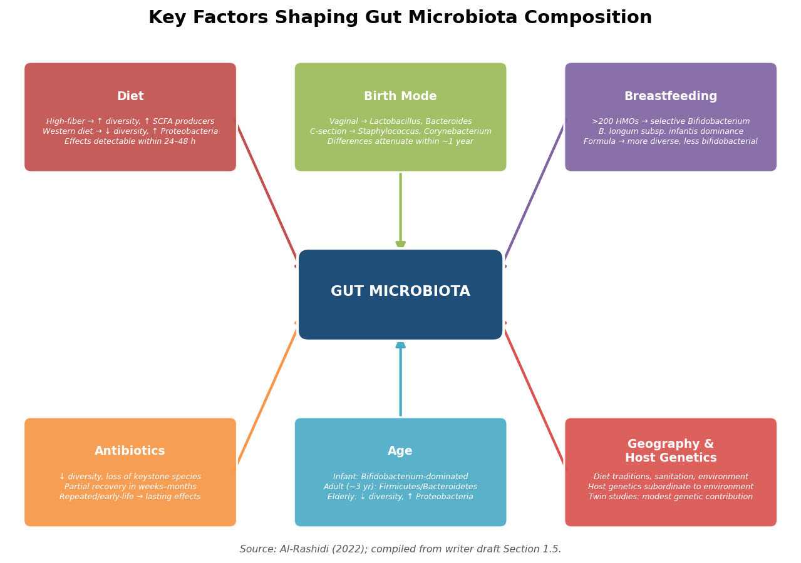

*Figure 3. Converging-arrows diagram of the six key factors that shape gut microbiota composition and diversity. Each factor's principal effects on community structure are annotated. Data drawn from Al-Rashidi (2022) and sources cited in the text.*

**Birth mode and early life.** Vaginal delivery exposes the neonate to maternal vaginal and fecal microbiota (*Lactobacillus*, *Prevotella*, *Bacteroides*), whereas cesarean-section delivery results in initial colonization by skin-associated and environmental taxa (*Staphylococcus*, *Corynebacterium*, *Propionibacterium*). Although these compositional differences attenuate over the first year of life, accumulating evidence suggests lasting effects on immune development and susceptibility to allergic and metabolic disease.

**Breastfeeding.** Human breast milk contains more than 200 structurally distinct HMOs that are indigestible by the infant but serve as selective substrates for *Bifidobacterium longum* subsp. *infantis* and other bifidobacteria, driving a *Bifidobacterium*-dominated early-life community. Formula-fed infants, by contrast, develop a more taxonomically diverse but less bifidobacterial community, a distinction with potential downstream immunological consequences.

**Diet.** Dietary composition is the single most powerful modifiable determinant of adult microbiota structure. High-fiber, plant-rich diets promote SCFA-producing anaerobes and increase overall diversity, while Western-style diets — rich in saturated fat, refined sugar, and ultra-processed foods — are associated with reduced diversity, depletion of fiber-fermenting taxa, and expansion of Proteobacteria. Dietary effects on community composition can be detected within 24–48 hours of a major dietary shift, though stable remodeling requires sustained changes over weeks to months.

**Antibiotics.** Broad-spectrum antibiotic exposure can cause profound and sometimes long-lasting disruption of the microbiota, reducing diversity and eliminating keystone species. While partial recovery typically occurs within weeks to months after cessation, certain perturbations — particularly those following repeated or early-life antibiotic courses — may persist for years and have been epidemiologically linked to increased risk of obesity, allergic disease, and *C. difficile* infection.

**Age.** The microbiota follows a developmental trajectory from the relatively simple, *Bifidobacterium*-dominated community of infancy through the adult-type, Firmicutes/Bacteroidetes-dominated community established by approximately age three, to the altered communities of elderly individuals, which tend to exhibit reduced diversity, decreased Firmicutes representation, and increased Proteobacteria abundance.

**Geography and host genetics.** Large-scale population surveys have revealed marked geographic variation in microbiota composition, driven primarily by dietary traditions, sanitation infrastructure, and environmental exposures. Host genetics contribute but remain subordinate: twin studies indicate that identical twins share only modestly more of their gut microbiota than do fraternal twins, and environmental factors consistently explain a larger proportion of compositional variance.

## 1.6 Recent Advances (2025–2026)

Several developments in the period from April 2025 to early 2026 expand the foundational knowledge described above and signal the direction of the field's evolution:

- **Expanded reference catalogs.** The unified catalog of 14,062 species reference genomes (Microbiome, 2025) constitutes the most comprehensive genomic map of the human gut microbiota to date, enabling more precise taxonomic assignment in metagenomic studies and substantially reducing the proportion of "unclassified" sequences [Unified catalog, 2025](https://link.springer.com/article/10.1186/s40168-025-02232-5 "14,062 species catalog, Microbiome 2025").

- **Global strain-level diversity.** A 2025 study in *Cell* characterized genetic diversity across the gut microbiome at strain-level resolution in globally distributed populations, revealing that strain-level variation far exceeds species-level differences and is strongly structured by geography and lifestyle [Cell, 2025](https://www.cell.com/cell/fulltext/S0092-8674(25)00416-7 "Global genetic diversity, Cell 2025"). This finding underscores the limitations of species-level analyses and highlights the imperative for strain-resolution approaches in functional and translational microbiome research.

- **CRISPR-based gut microbe reprogramming.** In March 2026, researchers at UC Berkeley demonstrated the feasibility of using CRISPR-based tools to reprogram commensal gut bacteria in situ, potentially enabling targeted modulation of microbiota function without exogenous probiotic administration [UC Berkeley, 2026](https://news.berkeley.edu/2026/03/05/reprogramming-our-gut-bacteria-could-be-key-to-fighting-disease/ "CRISPR gut bacteria, Berkeley News 2026"). While this work remains at an early preclinical stage, it represents a conceptual shift toward precision microbiota engineering.

- **Metabolite–disease linkages.** A 2025 study in *Nature* linked the microbial metabolite imidazole propionate — produced from histidine by certain gut bacteria — to atherosclerosis progression, adding to a growing roster of microbiota-derived small molecules with systemic pathological consequences beyond the intestinal tract.

These advances collectively illustrate a field in rapid transition — from descriptive cataloging of community membership toward mechanistic understanding of microbial function and the development of targeted therapeutic interventions.

## 1.7 Chapter Summary

The gut microbiota constitutes a numerically vast, genomically complex, and functionally indispensable component of human physiology. Its core contributions — SCFA production, bile acid biotransformation, vitamin synthesis, immune education, colonization resistance, and mucin barrier maintenance — operate in concert to sustain intestinal homeostasis. When this equilibrium is disrupted by dietary shifts, antibiotic exposure, or other perturbations, the resulting dysbiosis — characterized by pathobiont expansion, commensal depletion, and altered luminal redox chemistry — creates permissive conditions for inflammation and disease. Understanding the composition, functional architecture, and regulatory determinants of this ecosystem provides the prerequisite foundation for the targeted interventions — probiotics, prebiotics, dietary strategies, and emerging biotechnologies — explored in the chapters that follow.

# 第2章 Probiotics and Prebiotics — Definitions, Mechanisms, and Functional Roles

The preceding chapter established that the gut microbiota performs metabolic, immunological, and protective functions essential to host physiology. A natural question follows: can these functions be deliberately enhanced through the administration of beneficial microorganisms or the dietary substrates that nourish them? This chapter addresses that question by examining the definitions, major taxa, mechanisms of action, and functional roles of probiotics and prebiotics — two concepts that, despite widespread commercial adoption, rest on an evolving scientific foundation requiring careful strain- and substrate-level scrutiny. The discussion extends to synbiotics (combinations of probiotics and prebiotics) and postbiotics (preparations of inanimate microorganisms), and concludes with an appraisal of the strain-specificity principle that governs evidence interpretation throughout the field.

## 2.1 Defining Probiotics: The ISAPP Consensus

The modern scientific definition of probiotics was established by an expert panel convened by the International Scientific Association for Probiotics and Prebiotics (ISAPP) in 2014. The panel defined probiotics as "live microorganisms that, when administered in adequate amounts, confer a health benefit on the host" [Hill et al., 2014](https://www.nature.com/articles/nrgastro.2014.66 "ISAPP probiotic consensus, Nat Rev Gastroenterol Hepatol 2014"). Three features of this definition merit emphasis:

1. **Viability at delivery** — the organisms must be alive at the point of administration; inactivated cells and their components fall under the separate concept of "postbiotics" (Section 2.6).
2. **Adequate dosage** — the phrase "adequate amounts" underscores that a product containing a named species at insufficient colony-forming units (CFU) does not qualify as a probiotic intervention.
3. **Demonstrated health benefit** — the benefit must be established in the target host, typically through randomized controlled trials (RCTs) or systematic reviews.

A critical nuance recognized by the ISAPP panel is the distinction between genus-level and strain-level evidence. Certain health effects — such as the capacity to colonize the gut transiently and compete with pathogens — may apply broadly across well-characterized probiotic species. However, specific clinical endpoints, including immunomodulatory effects and reduction of antibiotic-associated diarrhea (AAD), are often strain-dependent. Efficacy demonstrated for *Lactobacillus rhamnosus* GG, for example, cannot be automatically extrapolated to other strains of *L. rhamnosus*, let alone to other species within the genus. This strain-specificity principle recurs throughout the chapter and is treated in detail in Section 2.7.

## 2.2 Predominant Probiotic Genera and Key Strains

### 2.2.1 *Lactobacillus* sensu lato

The genus *Lactobacillus* was reclassified in 2020 (Zheng et al.) into 25 genera, including *Lacticaseibacillus*, *Limosilactobacillus*, *Lactiplantibacillus*, and others. Throughout this report, the legacy name *Lactobacillus* is retained for general discussion, with reclassified nomenclature noted where strain-level precision is required.

*Lactobacillus rhamnosus* GG (LGG; reclassified as *Lacticaseibacillus rhamnosus* GG) is the most extensively studied probiotic strain worldwide. A 2015 meta-analysis confirmed its efficacy in preventing antibiotic-associated diarrhea, consolidating its status as a benchmark strain for probiotic research [Szajewska & Kołodziej, 2015](https://pubmed.ncbi.nlm.nih.gov/26365389/ "LGG AAD meta-analysis, Aliment Pharmacol Ther 2015"). Other well-characterized lactobacilli include *L. plantarum* 299v (enhancement of non-heme iron absorption), *L. reuteri* DSM 17938 (reduction of infantile colic episodes), and *L. acidophilus* NCFM (alleviation of lactose maldigestion symptoms).

### 2.2.2 *Bifidobacterium*

*Bifidobacterium* species are Gram-positive anaerobes that dominate the infant gut, particularly in breast-fed neonates, where human milk oligosaccharides (HMOs) selectively promote their proliferation (see Section 2.4). Five species — *B. adolescentis*, *B. animalis*, *B. bifidum*, *B. breve*, and *B. longum* — have been granted Qualified Presumption of Safety (QPS) status by the European Food Safety Authority (EFSA).

Among the most commercially deployed strains is *Bifidobacterium animalis* subsp. *lactis* BB-12, which has been evaluated in clinical settings since 1987. BB-12 demonstrates high gastric acid and bile tolerance, strong mucosal adherence, and antagonistic activity against pathogens including *C. difficile*, *E. coli*, and *Salmonella typhimurium*. In a double-blind RCT of 192 breast-fed Chinese infants with colic, 21 days of BB-12 supplementation (1 × 10⁹ CFU/day) produced a ≥50% reduction in daily crying duration in 61.5% of treated infants versus 21.9% receiving placebo (P < 0.001), with concurrent reductions in crying episodes and increases in sleep duration [Chen et al., 2021, cited in Bueno et al., 2026](https://www.frontiersin.org/journals/microbiology/articles/10.3389/fmicb.2026.1773473/full "BB-12 mini-review, Frontiers in Microbiology 2026"). In a separate trial of 172 healthy infants, BB-12 supplementation significantly increased fecal secretory IgA (sIgA) levels and enhanced immune responses to poliovirus and rotavirus vaccination, with particularly pronounced effects in cesarean-delivered infants [Holscher et al., 2012, cited in Bueno et al., 2026](https://www.frontiersin.org/journals/microbiology/articles/10.3389/fmicb.2026.1773473/full "BB-12 mini-review, Frontiers in Microbiology 2026").

### 2.2.3 *Saccharomyces boulardii*

*Saccharomyces boulardii* is the only yeast with well-established probiotic credentials. As a eukaryotic organism, it is intrinsically resistant to all antibacterial antibiotics, making it uniquely suited for concurrent administration during antibiotic therapy. A 2015 meta-analysis demonstrated that *S. boulardii* reduces the risk of AAD by approximately 57% in children and approximately 51% in adults [Szajewska et al., 2015](https://pubmed.ncbi.nlm.nih.gov/26216624/ "S. boulardii AAD meta-analysis, Aliment Pharmacol Ther 2015"). Its mechanisms include secretion of a 54-kDa serine protease that cleaves *C. difficile* toxin A at its receptor-binding site and direct trophic effects on enterocyte brush-border disaccharidases.

## 2.3 Next-Generation Probiotics

Beyond the classical genera described above, a category of "next-generation probiotics" (NGPs) has emerged from metagenomic and mechanistic research. Unlike traditional probiotics, which were identified through empirical fermentation traditions, NGPs were discovered through their consistent depletion in disease states and subsequently characterized for functional mechanisms.

### 2.3.1 *Akkermansia muciniphila*

*Akkermansia muciniphila*, the sole cultured representative of the phylum Verrucomicrobia in the human gut (typically comprising 1–5% of the community; see Chapter 1), has advanced furthest toward clinical application among NGPs. In the first-in-human randomized controlled trial (n = 32, 3-month intervention), pasteurized *A. muciniphila* improved insulin sensitivity by +28.62% (P = 0.002), reduced insulinemia by −34.08% (P = 0.006), and decreased total cholesterol by −8.68% (P = 0.02) relative to placebo [Depommier et al., 2019](https://www.nature.com/articles/s41591-019-0495-2 "Akkermansia RCT, Nature Medicine 2019"). Notably, the pasteurized (heat-killed) form outperformed the live form on several metabolic parameters, identifying the outer membrane protein Amuc_1100 — which interacts with Toll-like receptor 2 (TLR2) — as a key mediator of barrier-reinforcing effects. This finding also positions pasteurized *A. muciniphila* as a leading example of a postbiotic (Section 2.6).

The regulatory trajectory of *A. muciniphila* represents a milestone for the NGP field. The European Union expanded authorization of pasteurized *A. muciniphila* to adolescents aged ≥12 years under Regulation (EU) 2026/391, effective February 2026, making it the first NGP to receive formal regulatory approval for both adult and adolescent populations [CIRS Group, 2026](https://www.cirs-group.com/en/food/expanded-use-of-pasteurised-akkermansia-in-the-eu-now-permitted-for-adolescents-aged-12-and-above "EU Akkermansia approval for adolescents").

### 2.3.2 *Faecalibacterium prausnitzii*

*Faecalibacterium prausnitzii* constitutes approximately 5% of the total fecal microbiome in healthy adults, making it the single most abundant butyrate-producing species in the human gut. Its depletion is consistently associated with inflammatory bowel disease (IBD), particularly Crohn's disease. Mechanistically, *F. prausnitzii* produces a microbial anti-inflammatory molecule (MAM) that inhibits NF-κB activation in intestinal epithelial cells, thereby suppressing pro-inflammatory cytokine cascades [Al-Fakhrany & Elekhnawy, 2024](https://pmc.ncbi.nlm.nih.gov/articles/PMC11018693/ "Next-generation probiotics review, Mol Biol Rep 2024").

Despite compelling preclinical evidence, *F. prausnitzii* presents formidable translational challenges. As an extremely oxygen-sensitive obligate anaerobe, it cannot survive standard aerobic manufacturing, storage, or delivery conditions. No human clinical trials with *F. prausnitzii* supplementation have been completed as of early 2026. This gap illustrates a broader theme in the NGP field: the considerable distance between mechanistic promise identified through association studies and the practical requirements of therapeutic development — encompassing formulation stability, viable delivery, and regulatory safety assessment.

The table below consolidates the key properties, evidence levels, and regulatory status of the classical and next-generation probiotic organisms discussed in Sections 2.2 and 2.3.

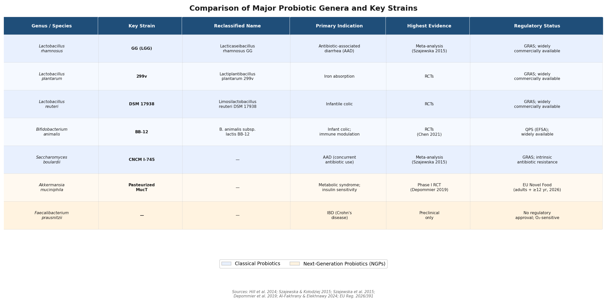

*Figure 2-1. Comparison of classical and next-generation probiotic genera and key strains, including reclassified nomenclature, primary clinical indications, highest-level evidence, and regulatory status. Classical probiotics (blue) and next-generation probiotics (yellow) are color-coded for distinction.*

## 2.4 Prebiotics: Definition, Evolution, and Major Classes

### 2.4.1 The Evolving Prebiotic Concept

The concept of a "prebiotic" was first proposed by Gibson and Roberfroid in 1995, originally restricted to non-digestible food ingredients that selectively stimulate the growth and/or activity of beneficial colonic bacteria. The definition underwent successive refinements — in 2004, 2008 (FAO), and most recently in 2017 — when an ISAPP consensus panel redefined a prebiotic as "a substrate that is selectively utilized by host microorganisms conferring a health benefit" [Gibson et al., 2017](https://www.nature.com/articles/nrgastro.2017.75 "ISAPP prebiotic consensus, Nat Rev Gastroenterol Hepatol 2017"). This 2017 definition expanded the concept in two significant directions: beyond carbohydrates (encompassing, for example, polyphenols) and beyond the gastrointestinal tract (recognizing potential prebiotic effects on skin, vaginal, and respiratory microbiota).

The key criterion distinguishing a prebiotic from ordinary dietary fiber is *selectivity*: the substrate must preferentially nourish beneficial taxa over harmful ones. Not all dietary fibers meet this criterion, and not all prebiotics are fibers.

### 2.4.2 Major Prebiotic Classes

**Fructo-oligosaccharides (FOS) and inulin.** FOS are short-chain fructans (degree of polymerization [DP] 2–10) derived from chicory root, onions, garlic, asparagus, and bananas. Inulin is a longer-chain fructan (DP 2–60) obtained from the same botanical sources. Both are selectively metabolized by *Bifidobacterium* species via β-fructanosidase. Inulin holds the distinction of being the only prebiotic to receive an EU-authorized health claim — for maintenance of normal bowel function at an intake of ≥12 g/day [Gibson et al., 2017](https://www.nature.com/articles/nrgastro.2017.75 "ISAPP prebiotic consensus 2017").

**Galacto-oligosaccharides (GOS).** GOS are synthesized enzymatically from lactose and selectively fermented by *Bifidobacterium* via β-galactosidase. Together with FOS, GOS constitutes the most extensively documented prebiotic pair in clinical literature, with demonstrated bifidogenic effects across infant, adult, and elderly populations.

**Human milk oligosaccharides (HMOs).** HMOs are structurally complex glycans present at 5–15 g/L in mature human breast milk and serve as the prototypical natural prebiotics. They selectively promote the growth of *B. longum* subsp. *infantis*, which possesses a complete enzymatic machinery for HMO internalization and degradation. HMOs also function as decoy receptors for enteric pathogens and modulate intestinal epithelial cell responses directly. The commercial availability of biosynthetic 2′-fucosyllactose (2′-FL) has expanded HMO application into infant formula supplementation.

**Resistant starch.** Resistant starch (RS) escapes digestion by α-amylase in the small intestine and reaches the colon intact, where it is fermented to SCFAs — particularly butyrate, at higher yields than most other fermentable fibers. RS is classified into five subtypes based on the mechanism conferring digestive resistance:

- **RS1** — Physically inaccessible starch trapped within intact cell walls (whole grains, seeds, legumes).
- **RS2** — Native granular starch with a tightly packed crystalline structure resistant to enzymatic attack (raw potatoes, green bananas, high-amylose maize).
- **RS3** — Retrograded starch formed when cooked starch is cooled, creating recrystallized amylose networks (cooked-and-cooled rice, pasta, potatoes).
- **RS4** — Chemically modified starch (phosphorylated, cross-linked) engineered to resist digestion; used commercially in low-carbohydrate food formulations. RS4 exhibits substantially different fermentation profiles from natural RS types, and health benefits demonstrated for RS1–RS3 may not generalize to RS4.
- **RS5** — Amylose–lipid complexes formed during starch processing that resist enzymatic hydrolysis.

A 2025 multicenter RCT enrolling 200 patients demonstrated that type 2 resistant starch (40 g/day for 4 months) reduced fatty liver markers by 39.42%, with treatment response predicted by baseline microbiota composition — illustrating the prebiotic-mediated interplay between dietary substrate and individual microbial ecology [Prebiotic Association, 2026](https://prebioticassociation.org/whats-the-latest-in-prebiotic-research-february-2026-edition/ "Feb 2026 prebiotic research roundup"). For context, current average U.S. intake of RS is estimated at only 4.6 g/day for males and 3.3 g/day for females, well below the 30–40 g/day estimated to have been consumed historically before the rise of processed foods.

**Polyphenols.** The 2017 ISAPP definition expanded the prebiotic concept to include non-carbohydrate substrates. Dietary polyphenols — abundant in berries, tea, cocoa, coffee, and red wine — exhibit prebiotic-like effects, promoting *Bifidobacterium* and *Lactobacillus* while inhibiting pathogenic species. Critically, 90–95% of ingested polyphenols are not absorbed in the small intestine and transit to the colon, where the gut microbiota biotransforms them into more bioactive metabolites such as urolithins (from ellagitannins) and equol (from soy isoflavones) [Gibson et al., 2017](https://www.nature.com/articles/nrgastro.2017.75 "ISAPP prebiotic consensus 2017"). Although the prebiotic classification of polyphenols is supported by mechanistic and preclinical data, robust human RCT evidence establishing selective utilization and defined health endpoints remains more limited than for classical carbohydrate prebiotics.

The following figure provides a consolidated overview of the six major prebiotic classes, their dietary sources, selectively targeted microorganisms, and principal metabolic products.

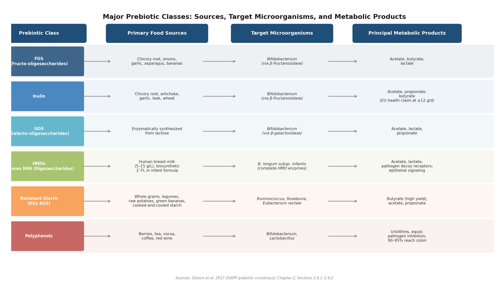

*Figure 2-2. Overview of major prebiotic classes, mapping each substrate to its primary food sources, selectively targeted gut microorganisms, and principal metabolic products. Data synthesized from Gibson et al. (2017) and sources cited in Section 2.4.2.*

## 2.5 Mechanisms of Probiotic Action

Probiotic organisms exert their health effects through four principal, often overlapping, mechanisms. Each has been characterized to varying degrees in vitro, in animal models, and — to a more limited extent — in human clinical settings. The schematic below illustrates how these four mechanisms operate simultaneously at the intestinal epithelium.

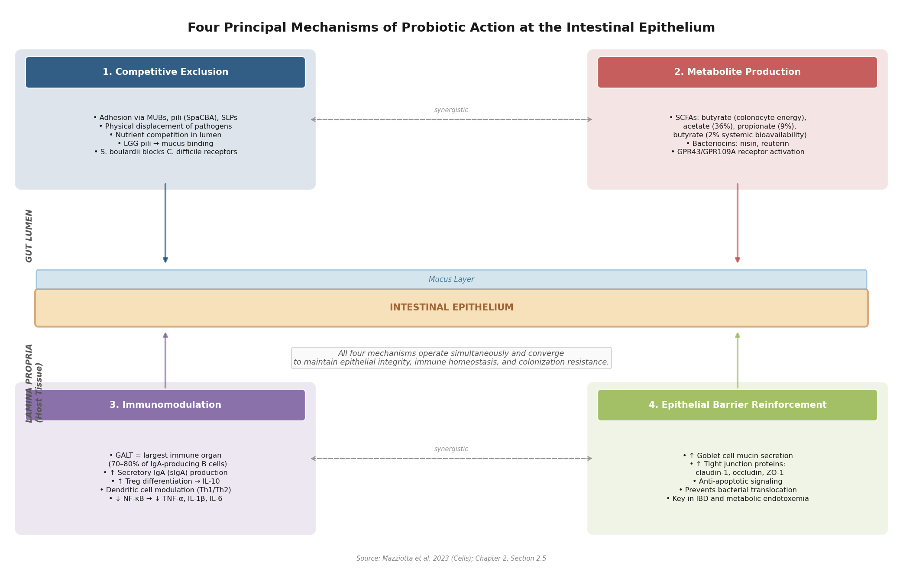

*Figure 2-3. Conceptual diagram of the four principal mechanisms of probiotic action — competitive exclusion, metabolite production, immunomodulation, and epithelial barrier reinforcement — operating simultaneously at the intestinal epithelium. Luminal mechanisms (top) and host-tissue mechanisms (bottom) converge synergistically to maintain epithelial integrity, immune homeostasis, and colonization resistance. Adapted from Mazziotta et al. (2023).*

### 2.5.1 Competitive Exclusion

Probiotics compete with potential pathogens for adhesion sites on the intestinal epithelium and for luminal nutrients. Adhesion is mediated by surface structures including mucus-binding proteins (MUBs), fimbriae and pili, and surface layer proteins (SLPs). *L. rhamnosus* GG, for instance, expresses SpaCBA pili that bind intestinal mucus, enabling persistent colonization that physically excludes competitors. *S. boulardii* competes directly with *C. difficile* for receptor-binding sites on enterocytes. The net effect is a reduction of pathogen load without requiring direct antimicrobial activity — augmenting the colonization resistance mechanisms introduced in Chapter 1.

### 2.5.2 Immunomodulation

The intestine harbors 70–80% of all IgA-producing B cells in the body, making the gut-associated lymphoid tissue (GALT) the largest immune organ by cellular mass. Probiotics interact with this system at multiple levels [Mazziotta et al., 2023](https://pmc.ncbi.nlm.nih.gov/articles/PMC9818925/ "Probiotics mechanism, Cells 2023"):

- **Secretory IgA stimulation** — sIgA coats luminal bacteria and prevents their translocation across the epithelium.
- **Regulatory T cell induction** — differentiation of FOXP3⁺ Tregs producing anti-inflammatory IL-10 dampens excessive inflammatory responses.
- **Dendritic cell modulation** — probiotics influence dendritic cell maturation and the consequent Th1/Th2 balance.
- **NF-κB inhibition** — select strains suppress this central pro-inflammatory transcription factor, reducing downstream expression of TNF-α, IL-1β, and IL-6.

These immunomodulatory effects are among the most strain-specific probiotic properties, varying substantially even between closely related strains within a single species.

### 2.5.3 Metabolite Production

Probiotics contribute to the luminal metabolite milieu through the generation of short-chain fatty acids (SCFAs) and bacteriocins. SCFA production — particularly of butyrate, the principal energy source for colonocytes (Chapter 1) — reinforces epithelial integrity, modulates immune responses via GPR43/GPR109A receptor activation, and inhibits histone deacetylases (HDACs), thereby influencing gene expression. The systemic bioavailability of the three principal SCFAs differs markedly: acetate achieves approximately 36%, propionate approximately 9%, and butyrate only approximately 2%, reflecting avid colonocyte utilization of butyrate before it reaches the portal circulation [Mazziotta et al., 2023](https://pmc.ncbi.nlm.nih.gov/articles/PMC9818925/ "Probiotics mechanism, Cells 2023").

Bacteriocins are ribosomally synthesized antimicrobial peptides that kill or inhibit closely related bacterial species. Notable examples include nisin (produced by *Lactococcus lactis*), widely used as a food preservative, and reuterin (produced by *L. reuteri*), a broad-spectrum antimicrobial active against Gram-positive and Gram-negative bacteria, yeasts, and protozoa. Bacteriocin production contributes to both competitive exclusion and direct pathogen suppression, linking this mechanism to the first.

### 2.5.4 Epithelial Barrier Reinforcement

Probiotics enhance the physical integrity of the intestinal barrier through several converging actions: stimulation of goblet cell mucin secretion, which thickens the mucus layer separating luminal bacteria from the epithelial surface; upregulation of tight junction proteins — including claudin-1, occludin, and zonula occludens-1 (ZO-1) — that seal the paracellular space between adjacent enterocytes; and promotion of epithelial cell survival through anti-apoptotic signaling. This barrier-reinforcing capacity is particularly relevant in clinical contexts where barrier breakdown drives disease pathogenesis, including IBD and metabolic endotoxemia (discussed in Chapter 4).

## 2.6 Related Concepts: Synbiotics and Postbiotics

The probiotic and prebiotic fields have generated two additional conceptual categories that warrant rigorous definition, as both recur in subsequent chapters.

### 2.6.1 Synbiotics

A 2020 ISAPP consensus panel (Swanson et al.) defined a synbiotic as "a mixture comprising live microorganisms and substrate(s) selectively utilized by host microorganisms that confers a health benefit" [ISAPP, 2021](https://isappscience.org/a-roundup-of-the-isapp-consensus-definitions-probiotics-prebiotics-synbiotics-postbiotics-and-fermented-foods/ "ISAPP consensus definitions roundup"). The panel distinguished two architectures:

- **Complementary synbiotics** — the probiotic and prebiotic components each independently satisfy their respective definitions. An example is a product combining *Bifidobacterium* BB-12 (a qualified probiotic) with inulin (a qualified prebiotic), where each component provides independently validated benefits.
- **Synergistic synbiotics** — the substrate is specifically selected to be utilized by the co-administered microorganism. An example is a combination of *B. longum* subsp. *infantis* with specific HMO structures that preferentially nourish that strain, creating a functionally integrated system.

The synergistic design, while conceptually elegant, demands a higher burden of proof: demonstrating that the substrate enhances the administered organism's survival, engraftment, or metabolic output beyond what either component achieves independently. Published human trials providing such evidence remain limited.

### 2.6.2 Postbiotics

In 2021, a separate ISAPP consensus panel (Salminen et al.) defined postbiotics as "a preparation of inanimate microorganisms and/or their components that confers a health benefit on the host" [ISAPP, 2021](https://isappscience.org/a-roundup-of-the-isapp-consensus-definitions-probiotics-prebiotics-synbiotics-postbiotics-and-fermented-foods/ "ISAPP consensus definitions roundup"). Unlike probiotics, postbiotics do not require viability at the point of administration; the health benefit derives from structural components (cell wall fragments, exopolysaccharides, surface proteins) or metabolic byproducts of the original organisms.

The paradigmatic postbiotic is pasteurized *A. muciniphila*, which — as described in Section 2.3.1 — demonstrated metabolic benefits comparable to or exceeding those of its live counterpart in the Depommier et al. (2019) trial. The active agent was identified as the thermostable outer membrane protein Amuc_1100, which remains functional after pasteurization and signals through TLR2. The postbiotic concept confers several practical advantages over live-organism approaches: greater stability during manufacturing and storage, longer shelf life, reduced safety concerns for immunocompromised populations, and simplified regulatory pathways in certain jurisdictions.

## 2.7 Strain Specificity and Evidence Hierarchies

A recurring theme across Sections 2.2–2.6 is that probiotic effects cannot be generalized from one strain to another, from one species to another, or — even more problematically — from one genus to another. The clinical literature documents cases of strains within the same species producing opposite immunological outcomes (pro-inflammatory versus anti-inflammatory). This strain specificity carries three practical implications:

1. **Product labeling** — Probiotic products that identify organisms only to the genus or species level (e.g., "contains *Lactobacillus acidophilus*") without specifying the strain provide insufficient information for evidence-based evaluation.
2. **Evidence transferability** — Systematic reviews and meta-analyses that pool data across different strains within a genus risk masking true efficacy or generating spurious effect sizes.
3. **Regulatory rigor** — The path to regulatory recognition — as exemplified by the EU approval trajectory for pasteurized *A. muciniphila* — increasingly demands strain-level characterization, genomic profiling, and safety assessment.

The evidence presented in this chapter spans a wide maturity spectrum. Classical probiotic strains such as LGG and *S. boulardii* are supported by multiple RCTs and meta-analyses conducted in defined clinical populations. Next-generation candidates such as *A. muciniphila* have completed early-phase human trials with promising metabolic outcomes but require larger confirmatory studies. *F. prausnitzii* remains entirely at the preclinical stage. Evaluating claims about probiotic efficacy requires attention to the specific strain tested, the study design hierarchy (in vitro → animal model → human RCT → meta-analysis), the clinical population studied, and the independence of the investigators from product manufacturers.

# 第3章 Pathogenic Bacteria and Toxic Metabolites — The Detrimental Side of the Gut Microbiota

The gut microbiota is not uniformly beneficial. Alongside the commensal organisms that sustain intestinal homeostasis, a subset of bacteria — variously termed pathobionts or opportunistic pathogens — harbor virulence factors capable of inflicting direct damage on the colonic epithelium. Under conditions of dysbiosis, these organisms bloom, and their metabolic output shifts from innocuous to genotoxic. This chapter catalogues the principal pathogenic species implicated in intestinal inflammation and colorectal carcinogenesis (Sections 3.1–3.6), details the toxic metabolites generated under dysbiotic conditions (Sections 3.7–3.11), and dissects the molecular mechanisms through which microbial genotoxins damage host DNA (Section 3.12).

## 3.1 *Fusobacterium nucleatum*: An Oral Pathobiont in the Colorectal Cancer Niche

*Fusobacterium nucleatum* (Fn) is a Gram-negative, anaerobic, spindle-shaped bacterium that normally inhabits the oral cavity but is consistently enriched in both stool and tumor tissues of patients with colorectal cancer (CRC). Elevated intratumoural Fn abundance correlates with disease recurrence, metastasis, and poorer prognosis [Nature 2024](https://www.nature.com/articles/s41586-024-07182-w "A distinct Fn clade dominates the CRC niche, Nature 2024").

Critically, not all Fn strains are equally pathogenic. Pangenomic analysis of 135 Fn strains (55 CRC-associated, 80 oral) revealed that the subspecies *animalis* bifurcates into two genetically and epigenetically distinct clades: Fna C1, largely oral-restricted, and **Fna C2**, which dominates the CRC tumor niche (enrichment P < 0.00001). Metagenomic screening detected Fna C2 in the stool of 29.2% of CRC patients (n = 627) versus 4.8% of healthy controls (n = 619), yielding a pooled effect size of 0.45 (95% CI 0.34–0.56, P = 5.55 × 10⁻¹⁵) [Nature 2024](https://www.nature.com/articles/s41586-024-07182-w "Fn clade analysis, Nature 2024").

Fna C2 possesses a repertoire of virulence factors absent from its oral-restricted counterpart — *fap2*, *cmpA*, and *fusolisin* — alongside metabolic operons for ethanolamine (*eut*) and 1,2-propanediol (*pdu*) utilization and a glutamate-dependent acid resistance (GDAR) system that enables survival through gastric transit. In ApcMin⁺/⁻ mice, Fna C2 significantly increased large intestinal adenoma counts compared with Fna C1 or vehicle control (ANOVA P = 0.0009), accompanied by a 3.5-fold elevation in oxidative stress measured by the GSSG/GSH ratio (P = 0.0031) [Nature 2024](https://www.nature.com/articles/s41586-024-07182-w "Fn clade analysis, Nature 2024").

Two adhesins underpin Fn's tumor-colonizing strategy. **FadA** binds E-cadherin at extracellular domain 5 (EC5), enabling epithelial attachment and invasion while activating β-catenin signaling to promote proliferation. **Fap2** functions as a bifunctional lectin: it recognizes the Gal-GalNAc sugar motif overexpressed on CRC cells, mediating tumor-specific homing, and simultaneously engages the immune inhibitory receptor TIGIT on NK cells and T cells, thereby suppressing anti-tumor immunity. A 2025 structural study resolved the molecular basis of Fap2's dual adhesion and confirmed the lectin domain architecture underlying this bifunctionality [Nature Communications 2025](https://www.nature.com/articles/s41467-025-63451-w "Structural basis of Fap2, Nature Communications 2025").

## 3.2 Colibactin-Producing *Escherichia coli* (pks⁺ Strains)

Certain commensal *Escherichia coli* strains — predominantly those belonging to phylogroup B2 — harbor the ~54-kb *pks* genomic island encoding a hybrid polyketide/nonribosomal peptide synthase assembly line that produces **colibactin**, one of the most potent bacterial genotoxins identified to date. Colibactin alkylates DNA at adenine residues via reactive cyclopropane warheads, generating interstrand cross-links (ICLs), monoadducts, and double-strand breaks. These lesions have been confirmed in vivo in the colonic epithelium of monocolonized mice [Science 2019](https://www.science.org/doi/10.1126/science.aar7785 "Colibactin alkylates DNA, Science 2019").

The prevalence of pks⁺ strains escalates along the healthy-to-cancer continuum: approximately 20% of healthy individuals harbor pks⁺ *E. coli*, rising to ~40% in patients with inflammatory bowel disease (IBD) and ~67% in CRC patients [de Souza et al. 2024](https://www.sciencedirect.com/science/article/abs/pii/S0024320524000511 "Prevalence of pks+ E. coli in CRC, Life Sciences 2024"). Colibactin-induced DNA damage imprints a characteristic mutational fingerprint designated **SBS88** in the COSMIC catalog, marked by single-nucleotide variants and insertions/deletions at T-homopolymer contexts. In a pan-study analysis of 5,292 CRCs across 17 studies, 7.5% (398/5,292) were SBS88-positive; of these, 98.7% were microsatellite-stable. SBS88-positive tumors were significantly enriched in the distal colon (OR = 1.84, 95% CI 1.40–2.42) and rectum (OR = 1.90, 95% CI 1.44–2.51), yet were associated with better CRC-specific survival (HR = 0.69, 95% CI 0.52–0.90, P = 0.007) [Georgeson et al. 2024](https://pmc.ncbi.nlm.nih.gov/articles/PMC10120801/ "Colibactin mutational signature in CRC").

The strongest recurrent somatic mutation driven by colibactin is *APC*:c.835-8A>G (OR = 65.5, 95% CI 39.0–110.0, P = 3 × 10⁻⁸⁰), likely representing an early clonal driver event. Colibactin-induced ICLs are repaired primarily via the Fanconi anemia pathway; error-prone repair generates the SBS88 and ID18 mutational signatures. The bacterium self-protects through ClbS, a cyclopropane hydrolase that detoxifies colibactin intracellularly [Nature Communications 2025](https://www.nature.com/articles/s41467-025-65606-1 "Fanconi pathway repairs colibactin ICLs, Nature Communications 2025").

## 3.3 Enterotoxigenic *Bacteroides fragilis* (ETBF)

*Bacteroides fragilis* ranks among the most abundant Gram-negative anaerobes in the human colon, yet a toxigenic subpopulation — ETBF — secretes **B. fragilis toxin (BFT/fragilysin)**, a 21-kDa zinc-dependent metalloprotease and the sole recognized virulence factor distinguishing ETBF from nontoxigenic strains.

Three BFT isoforms exist (BFT-1, BFT-2, BFT-3), sharing >90% amino acid identity. BFT-1 is the most prevalent (~75% of clinical isolates), whereas BFT-2 is the most virulent. A 2025 crystallographic study resolved the structures of BFT-1 (1.80 Å) and BFT-2 (1.97 Å), identifying a single residue at position 357 within the catalytic domain (Glu in BFT-1, Arg in BFT-2, Asn in BFT-3) as the principal determinant of subtype-specific potency. BFT-2 exhibited a TC₅₀ of 3.6 ng/mL on HT-29 cells, compared with 8.9 ng/mL for BFT-1 and 22.3 ng/mL for BFT-3 [Cell Chemical Biology 2025](https://www.cell.com/cell-chemical-biology/fulltext/S2451-9456(25)00425-8 "BFT structures, Cell Chemical Biology 2025").

Mechanistically, BFT cleaves E-cadherin at extracellular domain 4 (EC4), disrupting cell–cell adhesion and releasing β-catenin to the nucleus, where it activates c-Myc–driven proliferation. Simultaneously, BFT triggers STAT3/IL-17/NF-κB pro-inflammatory cascades. Longitudinal clinical data indicate that 80% of patients initially colonoscopy-positive for ETBF developed precancerous lesions within 12–15 years, with ETBF detection rates increasing progressively with advancing CRC stage [Cell Chemical Biology 2025](https://www.cell.com/cell-chemical-biology/fulltext/S2451-9456(25)00425-8 "BFT mechanism, Cell Chemical Biology 2025").

ETBF and pks⁺ *E. coli* frequently co-colonize mucosal biofilms in CRC patients. In patients with familial adenomatous polyposis, colonic biofilms harboring both species have been identified, and dual colonization in ApcMin⁺/⁻ mice synergistically promoted colon tumorigenesis through IL-17–dependent inflammation and colibactin-mediated DNA damage [Frontiers in Bacteriology 2023](https://www.frontiersin.org/journals/bacteriology/articles/10.3389/fbrio.2023.1229077/full "B. fragilis and E. coli in CRC, Frontiers 2023").

## 3.4 *Clostridioides difficile*: Antibiotic-Associated Intestinal Destruction

*Clostridioides difficile* is the most prevalent cause of nosocomial antibiotic-associated diarrhea in high-income countries, responsible for over 120,000 infections per year in the EU and approximately 29,000 deaths per year in the United States, with a case fatality rate approaching 15% [Okunye et al. 2023](https://pmc.ncbi.nlm.nih.gov/articles/PMC9815241/ "C. difficile pathogenicity, Virulence 2023").

Pathogenesis is driven by two large glucosylating exotoxins encoded within the 19.6-kb pathogenicity locus (PaLoc): **TcdA** (308 kDa) and **TcdB** (270 kDa). Both toxins inactivate Rho family GTPases (Rho, Rac, Cdc42) via glucosylation, leading to cytoskeletal disruption, tight junction breakdown, barrier failure, and cell death. TcdB is now recognized as the principal virulence determinant. Hypervirulent ribotype 027 strains additionally produce the binary toxin **CDT**, an ADP-ribosyltransferase that depolymerizes actin and promotes microtubule-based cellular protrusions that enhance bacterial adherence. These strains also carry a truncated *tcdC* negative regulator, resulting in elevated toxin expression [Okunye et al. 2023](https://pmc.ncbi.nlm.nih.gov/articles/PMC9815241/ "C. difficile virulence factors, Virulence 2023").

## 3.5 *Enterococcus faecalis*: Extracellular Reactive Oxygen Species

*Enterococcus faecalis* occupies a distinctive niche among gut pathobionts as the only intestinal commensal known to produce extracellular superoxide and hydrogen peroxide under aerobic conditions. These reactive oxygen species (ROS) directly damage colonocyte DNA, inducing double-strand breaks and chromosomal instability (CIN) [Huycke et al. 2002](https://pubmed.ncbi.nlm.nih.gov/11895869/ "E. faecalis ROS, Carcinogenesis 2002"). The *E. faecalis*–derived superoxide additionally induces macrophage cyclooxygenase-2 (COX-2), promoting CIN in bystander epithelial cells through diffusible inflammatory mediators [Gastroenterology 2006](https://www.gastrojournal.org/article/S0016-5085(06)02521-2/abstract "E. faecalis promotes CIN, Gastroenterology 2006").

## 3.6 *Desulfovibrio* spp. and Sulfate-Reducing Bacteria

Sulfate-reducing bacteria (SRB), notably *Desulfovibrio* and *Bilophila wadsworthia*, produce hydrogen sulfide (H₂S) as the terminal product of dissimilatory sulfate reduction. Although these organisms occupy a numerically minor fraction of the healthy gut microbiota, they expand substantially under sulfur-rich dietary conditions and are enriched in the fecal microbiota of CRC patients. Their pathogenic significance derives primarily from H₂S production, addressed in detail in Section 3.8.

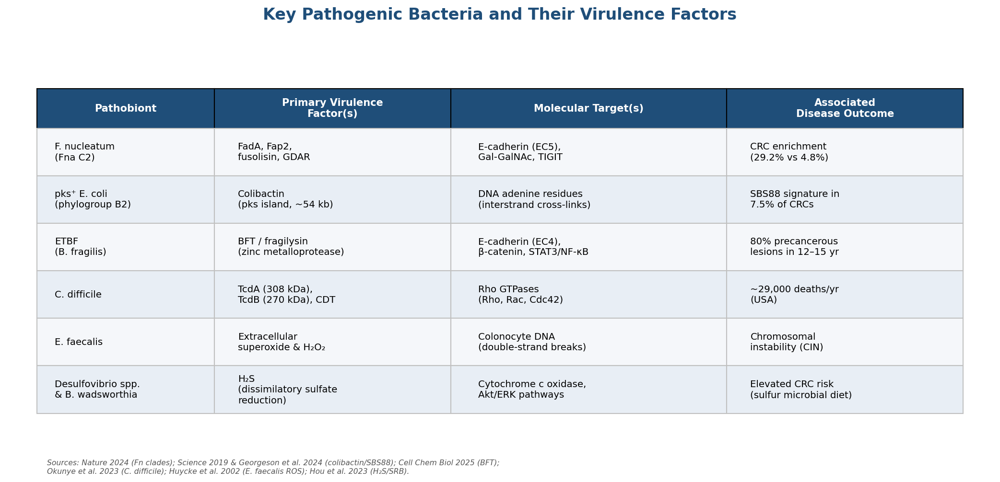

*Figure 3-1. Summary of the six principal gut pathobionts discussed in Sections 3.1–3.6, their primary virulence factors, molecular targets, and associated disease outcomes.*

## 3.7 Toxic Metabolites: Secondary Bile Acids

Secondary bile acids — principally **deoxycholic acid (DCA)** and **lithocholic acid (LCA)** — arise when microbial 7α-dehydroxylating bacteria convert the primary bile acids cholic acid and chenodeoxycholic acid. The responsible organisms, primarily *Clostridium scindens* and *Clostridium hylemonae*, harbor the *bai* operon encoding the enzymatic machinery for this transformation (see Chapter 1).

A 2025 study published in *Gut* provided the strongest causal evidence to date linking secondary bile acids to Western diet–associated CRC. In APC1311/+ pigs fed a Western diet (red meat and lard), exacerbated colonic epithelial proliferation and elevated fecal DCA concentrations were reversed by the bile acid sequestrant colestyramine. Metagenomic analysis of 1,034 CRC patients versus 1,108 controls revealed significantly higher occurrence of *bai* operons from *C. scindens* and *C. hylemonae* in CRC feces. In gnotobiotic mice, introduction of 7α-dehydroxylating bacteria (*C. scindens* or *Extibacter muris*) into defined microbial communities produced DCA and significantly increased colonic tumor burden, whereas a *baiH* mutant of *Faecalicatena contorta* (lacking 7α-dehydroxylation capacity) did not [Osswald et al. 2025](https://gut.bmj.com/content/early/2025/12/17/gutjnl-2024-332243 "Secondary bile acids promote CRC, Gut 2025").

At the molecular level, DCA promotes cancer stemness via β-catenin signaling, triggers DNA damage and proliferation in Lgr5⁺ intestinal stem cells by antagonizing the farnesoid X receptor (FXR), and activates TGR5 (Takeda G protein–coupled receptor 5). High-fat Western diets stimulate hepatic bile acid synthesis, thereby increasing the substrate pool delivered to the colon for secondary bile acid conversion [Osswald et al. 2025](https://gut.bmj.com/content/early/2025/12/17/gutjnl-2024-332243 "Secondary bile acid mechanisms, Gut 2025").

## 3.8 Toxic Metabolites: Hydrogen Sulfide

Colonic H₂S originates from both endogenous enzymatic sources (cystathionine β-synthase [CBS], cystathionine γ-lyase [CSE], and 3-mercaptopyruvate sulfurtransferase [3-MST] in colonocytes) and exogenous microbial production via multiple pathways: dissimilatory sulfate reduction by SRB (*Desulfovibrio*, *Bilophila wadsworthia*), taurine metabolism, sulfoquinovose degradation, and cysteine/methionine catabolism. Fecal H₂S levels are significantly elevated in CRC patients compared with healthy individuals [Hou et al. 2023](https://pmc.ncbi.nlm.nih.gov/articles/PMC9841368/ "H₂S in CRC, World Journal of Gastroenterology 2023").

H₂S exhibits a **bell-shaped dose-response** in cancer biology. At low concentrations (0.03–0.3 mM NaHS equivalent), it stimulates CRC cell proliferation by enhancing mitochondrial bioenergetics and activating Akt/ERK signaling. At high concentrations (>1 mM), it inhibits cytochrome c oxidase (mitochondrial Complex IV), suppresses oxidative phosphorylation, and induces apoptosis. CBS expression is elevated in colon tumor tissues relative to adjacent normal mucosa and correlates with CRC severity and stage [Hou et al. 2023](https://pmc.ncbi.nlm.nih.gov/articles/PMC9841368/ "H₂S mechanisms in CRC, World Journal of Gastroenterology 2023").

From a dietary perspective, long-term adherence to a "sulfur microbial diet" — characterized by high intake of low-calorie beverages, red and processed meats, and low intake of fruits and vegetables — is associated with increased risk of distal CRC and rectal cancer [Hou et al. 2023](https://pmc.ncbi.nlm.nih.gov/articles/PMC9841368/ "Sulfur microbial diet and CRC, World Journal of Gastroenterology 2023").

## 3.9 Toxic Metabolites: Trimethylamine N-Oxide (TMAO)

Trimethylamine N-oxide (TMAO) is produced through a two-step metabolic relay between gut microbiota and liver. Gut bacteria — including *Prevotella*, *Clostridium*, and *Desulfovibrio* — first convert dietary choline, phosphatidylcholine, L-carnitine, and betaine to trimethylamine (TMA), which is absorbed into the portal circulation and oxidized to TMAO by hepatic flavin-containing monooxygenase 3 (FMO3).

The cardiovascular toxicity of TMAO is well established. A meta-analysis found that elevated circulating TMAO was associated with a 23% higher risk of cardiovascular events (HR = 1.23, 95% CI 1.07–1.42) and a 55% higher risk of all-cause mortality (HR = 1.55, 95% CI 1.19–2.02) [Schiattarella et al. 2017](https://pmc.ncbi.nlm.nih.gov/articles/PMC5742728/ "TMAO and CVD meta-analysis, ESC Heart Failure 2017"). Mechanistically, TMAO enhances macrophage cholesterol accumulation and foam cell formation via upregulation of scavenger receptors, activates NF-κB inflammatory signaling, and increases platelet hyperreactivity [Nature Communications Biology 2025](https://www.nature.com/articles/s42003-025-08016-9 "TMAO promotes cardiac hypertrophy, Communications Biology 2025").

Emerging evidence extends the TMAO–disease link beyond the cardiovascular system. In the prospective PLCO (Prostate, Lung, Colorectal, Ovarian) Cancer Screening Trial cohort (761 CRC cases, 761 matched controls), serum TMAO was not associated with overall CRC risk but showed a positive association with distal CRC (OR for Q90 vs. Q10 = 1.90, 95% CI 1.24–2.92, P = 0.003). Red meat intake correlated positively with serum TMAO levels (Spearman ρ = 0.10, P = 0.0003), suggesting that TMAO may represent a mechanistic link between red meat consumption and distal colorectal carcinogenesis [Byrd et al. 2024](https://pubmed.ncbi.nlm.nih.gov/38285606/ "TMAO and CRC risk in PLCO cohort, Cancer 2024").

## 3.10 Toxic Metabolites: N-Nitroso Compounds

N-nitroso compounds (NOCs) form in the gut through bacterial nitrosation of dietary amines, a process particularly relevant to the consumption of red and processed meats. Gut bacteria catalyze this reaction via nitrate reductases and through acid-catalyzed nitrosation of secondary amines by nitrite. The resulting NOCs — including N-nitrosodimethylamine (NDMA) — cause DNA alkylation, predominantly generating O⁶-methylguanine adducts that are mutagenic and pro-carcinogenic if not repaired by O⁶-methylguanine-DNA methyltransferase (MGMT) [Loh et al. 2011](https://pmc.ncbi.nlm.nih.gov/articles/PMC4339287/ "Dietary NOCs and CRC risk, Clinical Medicine & Geriatrics 2011").

A meta-analysis of dietary nitrate, nitrite, and NOC intake demonstrated a significant dose-response relationship between increasing NDMA consumption and CRC risk, with positive trends for rectal tumors (P-trend = 0.01) and proximal colon tumors (P-trend = 0.003) [Etemadi et al. 2023](https://pmc.ncbi.nlm.nih.gov/articles/PMC9962651/ "NOCs and GI cancer meta-analysis, Toxics 2023").

## 3.11 Toxic Metabolites: Polyamines and Bacterial Reactive Oxygen Species

Polyamines (putrescine, spermidine, spermine) serve dual roles in the gut. At physiological concentrations, they stabilize DNA structure and scavenge ROS. Under dysbiotic conditions, however, bacterial overproduction of polyamines by species such as *E. coli* and *Enterococcus* may promote cell proliferation, and catabolism of excess polyamines generates ROS and toxic aldehydes. In the Fna C2 mouse model, Fna C2–treated animals exhibited significantly decreased levels of putrescine, spermidine, and spermine alongside a 3.5-fold increase in oxidative stress markers, indicating that pathobiont colonization can deplete protective polyamine pools while simultaneously amplifying oxidative damage [Nature 2024](https://www.nature.com/articles/s41586-024-07182-w "Fna C2 depletes polyamines, Nature 2024").

Beyond polyamine dysregulation, direct bacterial ROS production constitutes an additional genotoxic threat. As detailed in Section 3.5, *E. faecalis* is unique among gut commensals in generating extracellular superoxide and H₂O₂, which cause double-strand DNA breaks and chromosomal instability in colonocytes.

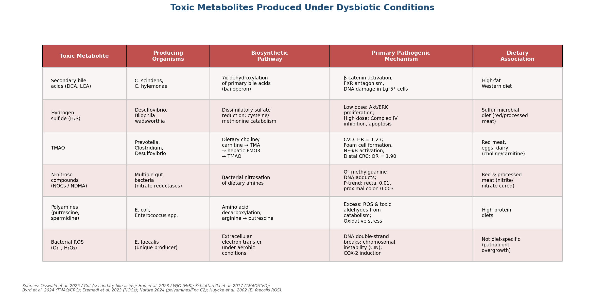

*Figure 3-2. Summary of the six major toxic metabolites produced under dysbiotic conditions (Sections 3.7–3.11), including producing organisms, biosynthetic pathways, primary pathogenic mechanisms, and dietary associations.*

## 3.12 Genotoxicity Mechanisms: A Comparative Summary

The pathogenic bacteria described in this chapter employ three principal genotoxic strategies — mechanistically distinct yet convergent on DNA damage and pro-carcinogenic signaling.

**Colibactin (pks⁺ *E. coli*).**  The ~54-kb *pks* island encodes a nonribosomal peptide synthetase/polyketide synthase hybrid assembly line. The mature colibactin molecule bears two nearly symmetrical cyclopropane warheads that alkylate deoxyadenosines on opposite DNA strands, forming interstrand cross-links. These ICLs are channeled through the Fanconi anemia repair pathway; error-prone repair generates the hallmark SBS88/ID18 mutational signatures. The bacterium self-protects via ClbS, a cyclopropane hydrolase [Science 2019](https://www.science.org/doi/10.1126/science.aar7785 "Colibactin alkylates DNA, Science 2019"); [Nature Communications 2025](https://www.nature.com/articles/s41467-025-65606-1 "Fanconi pathway, Nature Communications 2025").

**BFT/Fragilysin (ETBF).**  A zinc-dependent metalloprotease whose catalytic zinc ion is coordinated by His348, His352, and His358. BFT cleaves E-cadherin, releasing β-catenin to activate Wnt/c-Myc proliferation pathways while simultaneously triggering STAT3/NF-κB/IL-17 inflammatory cascades that sustain a pro-carcinogenic microenvironment [Cell Chemical Biology 2025](https://www.cell.com/cell-chemical-biology/fulltext/S2451-9456(25)00425-8 "BFT structure and mechanism, Cell Chemical Biology 2025").

**Cytolethal Distending Toxin (CDT).**  Produced by several Gram-negative pathogens — including *Campylobacter jejuni*, *Haemophilus ducreyi*, and certain *E. coli* strains — CDT is an AB₂ toxin whose CdtB subunit functions as a DNase I–like enzyme, causing DNA double-strand breaks and inducing G2/M cell cycle arrest. The CDT produced by *C. difficile* is mechanistically distinct: an ADP-ribosyltransferase that depolymerizes actin and promotes microtubule-based protrusions enhancing bacterial adherence, rather than directly damaging DNA [Okunye et al. 2023](https://pmc.ncbi.nlm.nih.gov/articles/PMC9815241/ "C. difficile CDT, Virulence 2023").

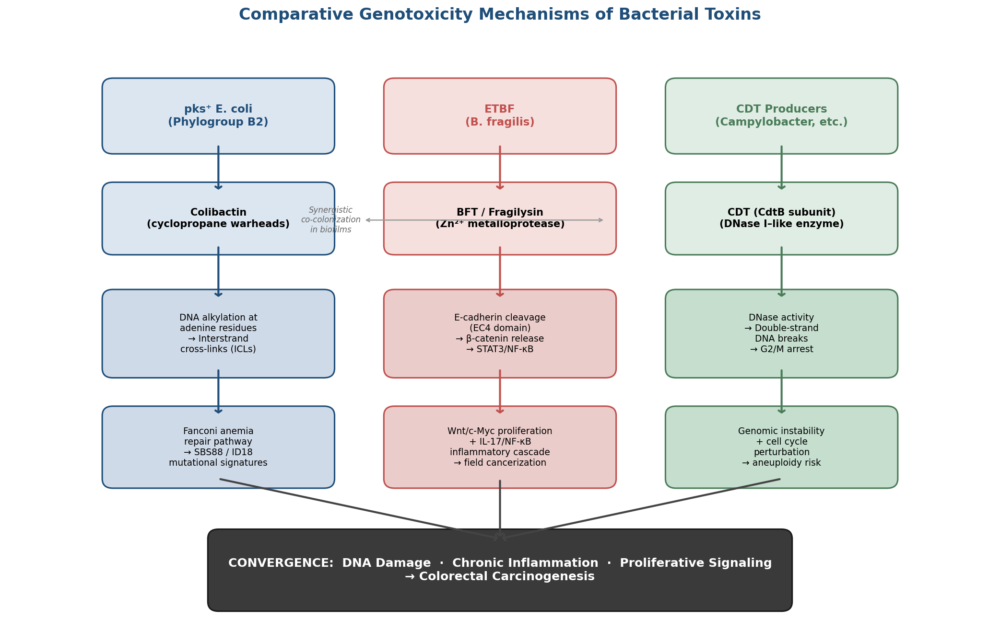

*Figure 3-3. Comparative schematic of the three principal bacterial genotoxicity mechanisms: colibactin-mediated DNA alkylation, BFT-driven E-cadherin cleavage and inflammatory signaling, and CDT-induced double-strand breaks. All three pathways converge on DNA damage, chronic inflammation, and proliferative signaling, culminating in colorectal carcinogenesis.*

These genotoxic mechanisms do not operate in isolation. The co-colonization of ETBF and pks⁺ *E. coli* within mucosal biofilms demonstrates that synergistic interactions between pathobionts can amplify tumorigenesis beyond the contribution of either organism alone. The interplay between direct DNA damage (colibactin), barrier disruption and inflammatory signaling (BFT), and immune evasion (Fn Fap2/TIGIT) creates a multifactorial assault on epithelial integrity that is examined further in the context of disease progression in Chapter 4.

# 第4章 From Dysbiosis to Disease — Intestinal Inflammation and Colorectal Cancer Pathogenesis

The preceding chapters established that the gut microbiota comprises both protective commensals and potentially harmful pathobionts, each equipped with distinct metabolic and virulence repertoires. This chapter traces the mechanistic chain connecting microbial dysbiosis to intestinal disease — from barrier breakdown and immune activation through chronic inflammation to the development of colorectal cancer (CRC). CRC remains a formidable global health burden: in 2022, an estimated 1.93 million new cases and more than 900,000 deaths were recorded worldwide, ranking it the third most common cancer and the second leading cause of cancer mortality [WHO Fact Sheet](https://www.who.int/news-room/fact-sheets/detail/colorectal-cancer "WHO CRC, GLOBOCAN 2022"). Accumulating evidence implicates the gut microbiota not merely as a passive bystander but as an active participant in both the inflammatory prelude and the neoplastic transformation that characterize this disease. The discussion proceeds from epithelial barrier disruption (Section 4.1) through inflammatory signaling cascades (Section 4.2), the colitis-associated cancer sequence (Section 4.3), microbial carcinogenic models (Sections 4.4–4.6), epidemiological evidence (Section 4.7), and recent 2025–2026 discoveries (Section 4.8), culminating in an integrative multi-hit model (Section 4.9).

## 4.1 Barrier Disruption and Bacterial Translocation

The intestinal epithelial barrier — a single-cell-thick layer reinforced by tight junction proteins (claudins, occludin, ZO-1) and overlaid by a bilayer mucus structure — constitutes the primary physical interface between the luminal microbiota and the host immune system. Under eubiotic conditions, commensal-derived signals maintain this barrier: butyrate fuels colonocyte metabolism and stimulates mucin production (Chapter 1), while specific probiotic species reinforce tight junctions through claudin-1 and ZO-1 upregulation (Chapter 2).

Dysbiosis disrupts this equilibrium through multiple convergent mechanisms. Depletion of butyrate-producing taxa — notably *Faecalibacterium prausnitzii* and *Roseburia* — reduces the principal energy substrate available to colonocytes, impairing tight junction assembly and compromising the mucus layer. Concurrently, pathobiont expansion introduces virulence factors that actively dismantle barrier integrity: BFT from enterotoxigenic *Bacteroides fragilis* (ETBF) cleaves E-cadherin (Chapter 3), while *Clostridioides difficile* toxins TcdA (308 kDa) and TcdB (270 kDa) glucosylate Rho GTPases, disassembling the actin cytoskeleton and opening paracellular gaps. The resulting increase in intestinal permeability permits translocation of bacterial components — lipopolysaccharide (LPS), peptidoglycan, flagellin, and even intact bacteria — across the epithelium into the lamina propria [Shahgoli et al. 2024](https://pmc.ncbi.nlm.nih.gov/articles/PMC11513726/ "IBD, Colitis, and Cancer, Int J Colorectal Dis 2024").

Once translocated, these microbial-associated molecular patterns (MAMPs) engage basolateral pattern recognition receptors (PRRs) on epithelial cells, dendritic cells, and resident macrophages. The principal receptor–ligand pairings include TLR4–LPS, TLR2–peptidoglycan/lipoteichoic acid, TLR5–flagellin, and NOD1/NOD2–muramyl dipeptide. Activation of these PRRs converges on NF-κB signaling, initiating the release of pro-inflammatory cytokines (TNF-α, IL-1β, IL-6, IL-8) and launching the inflammatory cascade that, if sustained, generates the tissue microenvironment permissive for neoplastic transformation [Shahgoli et al. 2024](https://pmc.ncbi.nlm.nih.gov/articles/PMC11513726/ "Barrier disruption and immune activation, Int J Colorectal Dis 2024").

## 4.2 Inflammatory Signaling Pathways in Microbiota-Driven Carcinogenesis

The transition from acute, self-limiting inflammation to chronic, tumor-promoting inflammation hinges on the sustained activation of several interconnected signaling axes. Each pathway has been implicated in microbiota-mediated colorectal carcinogenesis through complementary lines of evidence — genetic mouse models, human tumor profiling, and mechanistic in vitro studies. Figure 1 provides an overview of the crosstalk among these pathways and their bacterial inputs.

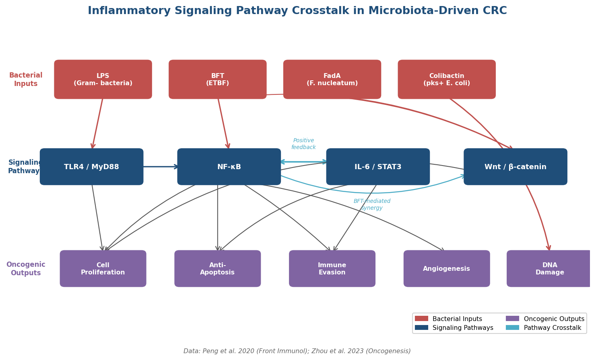

*Figure 1. Inflammatory Signaling Pathway Crosstalk in Microbiota-Driven CRC. Bacterial inputs engage four interconnected signaling cascades — TLR4/MyD88, NF-κB, IL-6/STAT3, and Wnt/β-catenin — whose positive-feedback loops drive oncogenic outputs including cell proliferation, anti-apoptosis, immune evasion, angiogenesis, and DNA damage. Data from [Peng et al. 2020](https://pmc.ncbi.nlm.nih.gov/articles/PMC7338561/ "NF-κB and GI tumorigenesis, Front Immunol 2020") and [Zhou et al. 2023](https://www.nature.com/articles/s41389-023-00492-0 "CAC molecular mechanisms, Oncogenesis 2023").*

### 4.2.1 NF-κB: The Central Orchestrator

NF-κB functions as the master transcriptional regulator linking microbial sensing to both inflammation and tumor promotion. Upon activation by TLR/MyD88 or NOD signaling, the IκB kinase (IKK) complex phosphorylates IκBα, releasing NF-κB dimers (typically p65/p50) for nuclear translocation. In the nucleus, NF-κB upregulates pro-inflammatory cytokines (TNF-α, IL-6, IL-1β), anti-apoptotic proteins (Bcl-2, Bcl-xL, XIAP), cell-cycle regulators (cyclin D1), and pro-angiogenic factors (VEGF). The net effect is a microenvironment that simultaneously promotes cell survival, proliferation, and resistance to apoptosis — cardinal hallmarks of cancer [Peng et al. 2020](https://pmc.ncbi.nlm.nih.gov/articles/PMC7338561/ "NF-κB and GI tumorigenesis, Front Immunol 2020").

Bacterial-specific activation of this axis is well characterized. *Fusobacterium nucleatum* engages TLR4/MyD88/NF-κB signaling in CRC cells, upregulating the oncogenic microRNA miR-21. ETBF-derived BFT triggers NF-κB through both direct epithelial damage and an IL-17–dependent amplification loop involving Th17 cell recruitment, creating a feed-forward inflammatory circuit [Peng et al. 2020](https://pmc.ncbi.nlm.nih.gov/articles/PMC7338561/ "Bacterial NF-κB activation, Front Immunol 2020").

### 4.2.2 IL-6/STAT3 Axis

IL-6, released by activated macrophages and T cells in response to microbial stimulation, signals through JAK kinases to phosphorylate STAT3. Phosphorylated STAT3 dimerizes and translocates to the nucleus, activating genes governing cell proliferation (cyclin D1, c-Myc), survival (Bcl-xL, survivin), and immune evasion. Constitutively active STAT3 has been detected in the stromal compartment of human CRC tissues, and genetic studies in mice demonstrate that stromal STAT3 activation increases tumor burden. A critical feature of this axis is its positive-feedback loop with NF-κB: NF-κB drives IL-6 transcription, while STAT3 sustains NF-κB activity through p300-mediated acetylation of the RelA subunit — a self-reinforcing circuit that perpetuates the inflammatory microenvironment [Zhou et al. 2023](https://www.nature.com/articles/s41389-023-00492-0 "CAC molecular mechanisms, Oncogenesis 2023").

### 4.2.3 TLR4/MyD88 Signaling

The TLR4/MyD88 pathway warrants separate attention because of its direct involvement in microbiota-driven oncogenesis. TLR4 recognizes LPS from Gram-negative pathobionts; signaling through the adaptor protein MyD88 activates both NF-κB and MAPK cascades. In *F. nucleatum*–enriched CRC, TLR4/MyD88 activation upregulates miR-21, which suppresses the tumor suppressors PDCD4 and PTEN, thereby promoting proliferation and chemoresistance. Causality has been established in animal models: MyD88-deficient mice exhibit significantly reduced tumor burden in colitis-associated CRC, underscoring the pathway's non-redundant role in inflammation-driven tumorigenesis [Peng et al. 2020](https://pmc.ncbi.nlm.nih.gov/articles/PMC7338561/ "TLR4/MyD88 in CRC, Front Immunol 2020").

### 4.2.4 Wnt/β-Catenin Pathway

The Wnt/β-catenin pathway is the most frequently mutated signaling axis in sporadic CRC, with loss-of-function mutations in *APC* found in approximately 81% of cases. In colitis-associated CRC (CAC), however, *APC* mutations are present in only 11–22% of tumors, pointing to alternative activation mechanisms. Bacterial virulence factors supply such mechanisms: FadA from *F. nucleatum* binds E-cadherin and releases β-catenin from the adherens junction complex; BFT from ETBF cleaves E-cadherin, achieving the same downstream effect. Secondary bile acids, particularly deoxycholic acid (DCA), further activate β-catenin signaling and promote cancer stemness in Lgr5⁺ intestinal stem cells by antagonizing FXR (Chapter 3). The convergence of bacterial and endogenous Wnt pathway activation generates a particularly potent oncogenic stimulus within the inflamed colon [Zhou et al. 2023](https://www.nature.com/articles/s41389-023-00492-0 "Wnt/β-catenin in CAC, Oncogenesis 2023").

### 4.2.5 NF-κB/Wnt Synergy and the Field Cancerization Paradox

BFT exemplifies the synergy between NF-κB and Wnt signaling: E-cadherin cleavage simultaneously activates β-catenin/c-Myc–driven proliferation and STAT3/IL-17/NF-κB–mediated inflammation. This dual activation creates a "field cancerization" effect in which histologically normal mucosa adjacent to tumors acquires molecular features of malignancy — a phenomenon with direct implications for surgical margin assessment and surveillance strategy.

A striking paradox has emerged from genomic studies of inflamed colonic tissue. Activating mutations in *NFKBIZ* — encoding the NF-κB inhibitor zeta — are found in approximately 30% of non-dysplastic IBD mucosa yet in fewer than 5% of established CAC tumors. This distribution suggests that NF-κB hyperactivation confers a selective advantage during chronic inflammation but may become dispensable or even deleterious once tumorigenesis is fully established. The observation is consistent with a "hit-and-run" model in which inflammation-driven mutations initiate transformation, while subsequent selection favors distinct oncogenic programs [Zhou et al. 2023](https://www.nature.com/articles/s41389-023-00492-0 "NFKBIZ paradox, Oncogenesis 2023").

## 4.3 The Inflammation–Dysplasia–Carcinoma Sequence: Colitis-Associated CRC

Inflammatory bowel disease (IBD) — encompassing ulcerative colitis (UC) and Crohn's disease — provides the clearest clinical demonstration that chronic intestinal inflammation predisposes to CRC. IBD patients carry an approximately two-fold higher lifetime CRC risk compared to the general population, and cumulative CRC incidence in UC follows a well-characterized temporal gradient: 2% at 10 years, 8% at 20 years, and 18% at 30 years of disease duration. Colitis-associated CRC (CAC) accounts for approximately 15% of IBD-related deaths [Nardone et al., 2023](https://pmc.ncbi.nlm.nih.gov/articles/PMC10136846/ "Inflammation-driven CRC, Cancers 2023").

CAC follows a molecular trajectory distinct from the canonical adenoma–carcinoma sequence of sporadic CRC. In the sporadic pathway, *APC* inactivation is the initiating event (mutated in ~81% of tumors), followed by sequential acquisition of *KRAS*, *SMAD4*, and *TP53* mutations. In CAC, this sequence is inverted: **TP53 mutations occur early**, present in approximately 50% of IBD-associated dysplastic lesions, while *APC* mutations are observed in only 11–22% of CAC tumors. This early TP53 loss removes a critical genomic checkpoint at the onset of the inflammatory cascade, permitting the accumulation of further mutations under sustained inflammatory pressure [Zhou et al. 2023](https://www.nature.com/articles/s41389-023-00492-0 "CAC molecular mechanisms, Oncogenesis 2023"). Figure 2 summarizes the key molecular distinctions between sporadic and colitis-associated CRC.

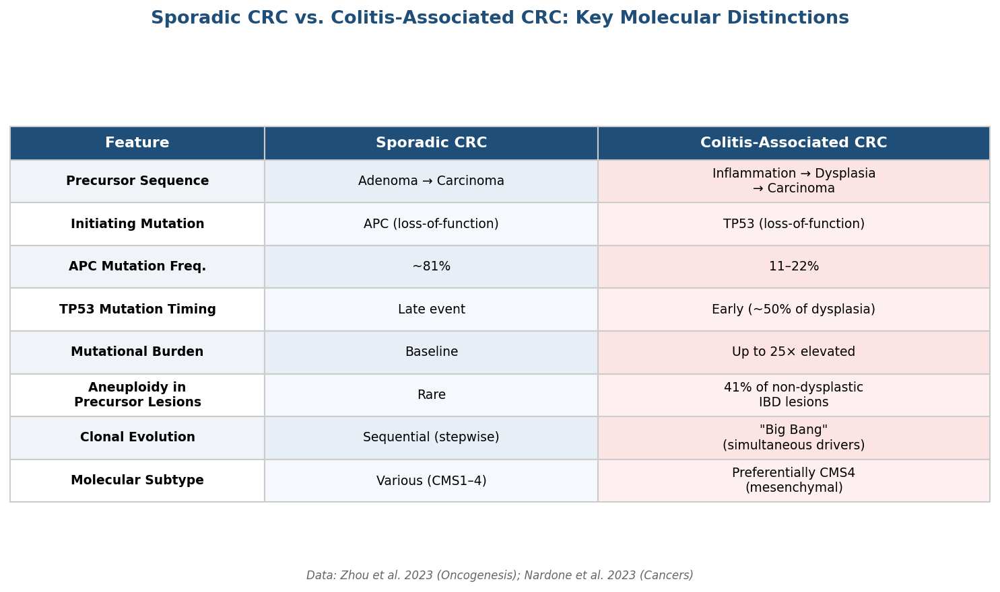

*Figure 2. Sporadic CRC vs. Colitis-Associated CRC — Key Molecular Distinctions. The comparison highlights fundamental differences in precursor sequence, initiating mutations, mutational burden, and clonal evolution models. Data from [Zhou et al. 2023](https://www.nature.com/articles/s41389-023-00492-0 "CAC molecular mechanisms, Oncogenesis 2023") and [Nardone et al. 2023](https://pmc.ncbi.nlm.nih.gov/articles/PMC10136846/ "Inflammation-driven CRC, Cancers 2023").*

Additional genomic features distinguish CAC from sporadic CRC. The mutational burden in UC-affected colon can reach up to 25-fold higher than that of unaffected tissue, reflecting chronic exposure to inflammatory mutagens — principally reactive oxygen species (ROS) and reactive nitrogen species. Aneuploidy, a hallmark of chromosomal instability, is detectable in 41% of non-dysplastic IBD lesions, indicating that genomic destabilization precedes histologically visible neoplasia. CAC tumors preferentially match the CMS4 (mesenchymal) molecular subtype, characterized by stromal infiltration, TGF-β activation, and poor prognosis [Zhou et al. 2023](https://www.nature.com/articles/s41389-023-00492-0 "CAC genomics, Oncogenesis 2023").

The "Big Bang" model of CAC evolution further refines understanding of clonal dynamics. Analysis of nine CAC cases revealed that in eight of nine, all driver mutations arose simultaneously in a single ancestral clone rather than accumulating sequentially. This pattern indicates that the chronically inflamed colonic epithelium generates a "fertile ground" in which multiple oncogenic hits co-occur within a compressed evolutionary window — consistent with the mutational hyperfixation induced by sustained NF-κB/STAT3 signaling [Zhou et al. 2023](https://www.nature.com/articles/s41389-023-00492-0 "Big Bang model in CAC, Oncogenesis 2023").

## 4.4 The Driver–Passenger Model of Microbial Carcinogenesis

Tjalsma and colleagues (2012) proposed the "driver–passenger" model to describe the dynamic succession of bacterial communities during CRC development. The model distinguishes two functional categories of CRC-associated bacteria:

**Driver bacteria** — including pks⁺ *E. coli* and ETBF — initiate tumorigenesis through direct genotoxicity and pro-inflammatory signaling. pks⁺ *E. coli* produces colibactin, an alkylating genotoxin that generates interstrand DNA cross-links and the characteristic SBS88 mutational signature detected in 7.5% of 5,292 CRCs (Chapter 3). ETBF secretes BFT, which cleaves E-cadherin and activates Wnt/NF-κB dual signaling. These "first hit" events create epithelial damage and genomic instability that favor clonal expansion of initiated cells [Sorbara & Pamer 2021](https://pmc.ncbi.nlm.nih.gov/articles/PMC8265790/ "Driver-passenger model, Gut Microbes 2021").

**Passenger bacteria** — such as *F. nucleatum* and *Streptococcus gallolyticus* — are not primary initiators but proliferate in the altered tumor microenvironment. *F. nucleatum* Fna C2 homes to CRC tissue through Fap2-mediated binding to the tumor-associated carbohydrate Gal-GalNAc, suppresses anti-tumor immunity via TIGIT engagement, and sustains NF-κB/β-catenin signaling. *S. gallolyticus* produces biofilms on colonic tumors and has long been recognized as a clinical harbinger of occult CRC.

Experimental validation of this framework comes from co-colonization studies. In ApcMin⁺/⁻ mice, co-inoculation with pks⁺ *E. coli* and ETBF significantly increased colon tumor burden compared to either bacterium alone, demonstrating synergistic tumor promotion through combined genotoxicity (colibactin) and IL-17–dependent inflammation (BFT). The model thus captures a temporal progression in which driver species create the oncogenic niche that passenger species subsequently exploit and amplify [Sorbara & Pamer 2021](https://pmc.ncbi.nlm.nih.gov/articles/PMC8265790/ "Synergistic driver model, Gut Microbes 2021").

## 4.5 Bacterial Biofilms: Architecture of a Pro-Carcinogenic Niche

The pathogenic bacteria described in the driver–passenger model do not operate as planktonic individuals. Rather, they organize into polymicrobial biofilms — structured communities encased in extracellular matrix — that adhere directly to the colonic mucosa and create a protected microenvironment for sustained host–microbe interaction.

The clinical significance of mucosal biofilms in CRC is strikingly site-dependent. In a landmark study, 89% of right-sided (proximal) colon tumors and 100% of right-sided adenomas were biofilm-positive, compared to only 12% of left-sided tumors. Biofilm-positive patients exhibited a greater than five-fold higher CRC risk [Dejea et al. 2014](https://www.pnas.org/doi/10.1073/pnas.1406199111 "Biofilms in proximal CRC, PNAS 2014").

The molecular consequences of biofilm colonization extend well beyond the tumor itself. Even in histologically normal tissue from biofilm-positive individuals, reduced E-cadherin expression, enhanced IL-6/STAT3 signaling, and increased Ki67 proliferation indices have been documented. These findings indicate that biofilms establish a "field effect," priming macroscopically normal mucosa for neoplastic transformation through paracrine inflammatory signaling before morphological changes become apparent. The preferential association of biofilms with right-sided CRC is notable because proximal tumors are more frequently microsatellite-instable and carry a distinct molecular profile from left-sided tumors — suggesting that biofilm-driven carcinogenesis may represent an etiological pathway with specific anatomical and molecular predilections [Dejea et al. 2014](https://www.pnas.org/doi/10.1073/pnas.1406199111 "Biofilm field effect, PNAS 2014").

## 4.6 Epigenetic Modulation: The Butyrate Paradox and Beyond

The interplay between microbial metabolites and epigenetic regulation of gene expression adds a further dimension to microbiota-mediated carcinogenesis.

### 4.6.1 The Butyrate Paradox

Butyrate, the principal metabolic product of commensal fiber fermentation, exerts a dual and context-dependent role in colonic epithelial biology — a phenomenon termed the "butyrate paradox" (also known as the Warburg paradox). In normal colonocytes, butyrate serves as the preferred energy substrate, oxidized via mitochondrial β-oxidation to supply approximately 70% of cellular ATP (Chapter 1). Under these metabolic conditions, butyrate is consumed before it accumulates to concentrations sufficient to influence gene expression.

In cancerous colonocytes, the metabolic landscape shifts fundamentally. The Warburg effect — preferential reliance on aerobic glycolysis — means that cancer cells underutilize butyrate as an energy source. Unmetabolized butyrate accumulates in the nucleus, where it acts as a potent histone deacetylase (HDAC) inhibitor, driving histone hyperacetylation at the promoters of silenced tumor suppressor genes. Reactivation of p21 (cell-cycle arrest), BAX (pro-apoptotic), and other tumor suppressors induces growth arrest and apoptosis selectively in CRC cells [Bhat & Kapila 2023](https://academic.oup.com/microlife/article/doi/10.1093/femsml/uqad032/7199775 "SCFA epigenetics, microLife 2023").

The clinical implication of this paradox is direct: dysbiosis-driven depletion of butyrate-producing taxa (*F. prausnitzii*, *Roseburia*, *Eubacterium rectale*) removes a natural epigenetic brake on CRC progression. Restoration of butyrate levels — through dietary fiber, prebiotic supplementation, or probiotic colonization — represents a mechanistically grounded therapeutic strategy, though one that remains to be validated in large-scale human CRC prevention trials.

### 4.6.2 *Morganella morganii* and Novel Genotoxins

The genotoxic repertoire of the gut microbiota extends beyond colibactin. *Morganella morganii*, a member of the Enterobacteriaceae family, produces novel indolimine genotoxins that are structurally distinct from colibactin. In mouse models, these indolimine compounds increased tumor burden, and some exhibited genotoxic potency exceeding that of colibactin. Notably, pks⁺ *E. coli* was detected in 67% of CRC biopsies compared to 21% in healthy controls, while *M. morganii* enrichment added an independent genotoxic layer — indicating that the mutagenic landscape within the CRC-associated microbiome is more diverse than previously appreciated [Nardone et al. 2023](https://pmc.ncbi.nlm.nih.gov/articles/PMC10136846/ "Novel genotoxins in CRC, Cancers 2023").

## 4.7 Epidemiological and Clinical Evidence: Microbial Signatures of CRC Risk

The mechanistic pathways described above are corroborated by a growing body of epidemiological and clinical data linking specific microbial signatures to CRC risk.

**Pathobiont enrichment.** Cross-sectional and case-control studies consistently identify enrichment of *F. nucleatum* (Fna C2 detected in 29.2% of CRC patients vs. 4.8% of controls; pooled effect size 0.45, 95% CI 0.34–0.56; Chapter 3), pks⁺ *E. coli* (67% of CRC biopsies vs. 21% of controls), and ETBF in CRC tissues and stool. The longitudinal finding that 80% of ETBF-colonized patients developed precancerous lesions within 12–15 years provides temporal evidence consistent with a causal role.

**Commensal depletion.** Reciprocally, CRC patients exhibit reduced abundance of known protective taxa — particularly butyrate producers (*F. prausnitzii*, *Roseburia*) and *Akkermansia muciniphila* — consistent with the loss of barrier-reinforcing and anti-inflammatory functions described in Chapters 1 and 2.

**Mutational fingerprints.** The SBS88 signature attributable to colibactin has been identified in 7.5% of 5,292 CRCs, with the strongest recurrent driver mutation *APC*:c.835-8A>G (OR = 65.5, 95% CI 39.0–110.0). The emerging identification of indolimine-specific mutational patterns from *M. morganii* provides additional molecular forensic evidence linking specific bacteria to specific tumors — a level of causal inference not achievable through microbiome profiling alone.

These convergent lines of evidence — mechanistic, epidemiological, and genomic — support a model in which dysbiosis is not merely correlated with but mechanistically contributory to CRC pathogenesis, operating through barrier disruption, sustained inflammatory signaling, direct genotoxicity, epigenetic deregulation, and immune evasion.

## 4.8 Recent Advances (2025–2026)

Three discoveries reported between April 2025 and April 2026 have substantially refined the mechanistic understanding of inflammation-driven colorectal carcinogenesis.

### 4.8.1 Epigenetic Memory in Colonic Stem Cells

Nagaraja et al. (2026), publishing in *Nature*, demonstrated that chronic colitis leaves heritable AP-1 transcription factor epigenetic memories in colonic stem cells. These epigenetic imprints persisted for more than 100 days after inflammation resolved and accelerated subsequent CRC growth upon oncogenic challenge. Pharmacological blockade of AP-1 eliminated the pro-tumorigenic epigenetic memory, suggesting a potential therapeutic window between inflammation resolution and cancer initiation. This finding provides a molecular mechanism for the long-recognized clinical observation that CRC risk in IBD patients correlates with cumulative inflammatory burden rather than current disease activity [NIH 2026](https://www.nih.gov/news-events/news-releases/chronic-inflammation-leaves-long-lasting-impression-gut-stem-cells-increasing-colorectal-cancer-risk "AP-1 epigenetic memory, NIH/Nature 2026").

### 4.8.2 The TL1A/ILC3 Axis and Emergency Granulopoiesis

Pires et al. (2026), publishing in *Immunity*, identified a previously unappreciated pathway linking intestinal inflammation to tumor-promoting neutrophil mobilization. TNF-like ligand 1A (TL1A) activates type 3 innate lymphoid cells (ILC3s) in the inflamed gut, which produce GM-CSF and thereby trigger emergency granulopoiesis in the bone marrow. The resulting neutrophil influx to the colonic mucosa promotes tumor growth through ROS production, angiogenesis stimulation, and immune suppression. This TL1A/ILC3/GM-CSF/neutrophil axis represents a systemic amplification loop through which local gut inflammation recruits distant immune resources to the service of tumor promotion [Cornell 2026](https://news.cornell.edu/stories/2026/01/discovery-illuminates-how-inflammatory-bowel-disease-promotes-colorectal-cancer "TL1A/ILC3 axis, Cornell/Immunity 2026").

### 4.8.3 Gain-of-Function Mutant p53 Sustains Inflammatory Signaling

Gain-of-function *TP53* mutations — particularly R175H and R248Q — have been shown to sustain NF-κB and STAT3 inflammatory signaling in CAC models, creating a self-perpetuating cycle in which the very mutations caused by chronic inflammation actively maintain the inflammatory microenvironment that promoted their emergence. This positive-feedback mechanism may explain why CAC tumors, despite harboring earlier *TP53* mutations than sporadic CRC, continue to exhibit a strongly inflammatory (CMS4) molecular phenotype [Zhou et al. 2023](https://www.nature.com/articles/s41389-023-00492-0 "Gain-of-function p53 in CAC, Oncogenesis 2023").

## 4.9 Integrative Model: From Dysbiosis to Colorectal Cancer

The evidence assembled in this chapter supports a multi-hit, multi-stage model of microbiota-mediated colorectal carcinogenesis (Figure 3):

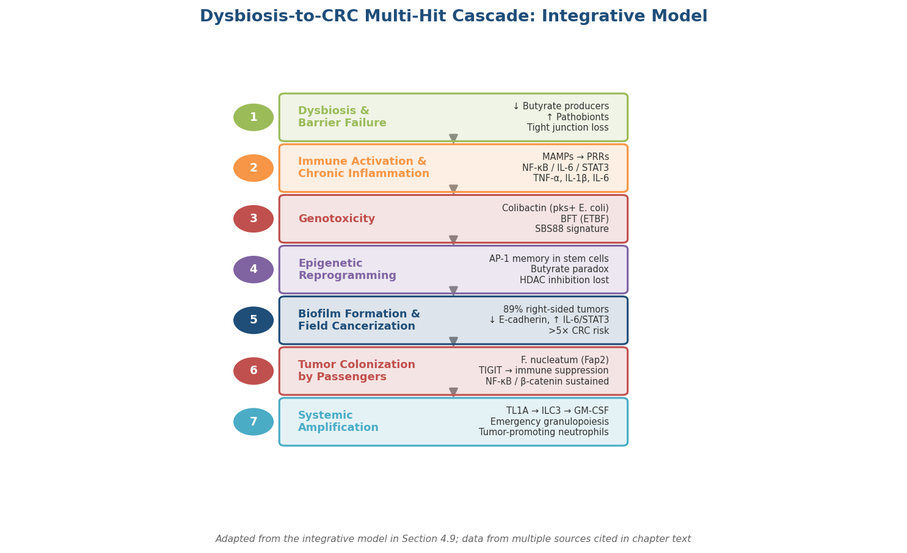

*Figure 3. Dysbiosis-to-CRC Multi-Hit Cascade — Integrative Model. Each step is annotated with key bacterial players, signaling pathways, and quantitative data points discussed in the chapter text.*

1. **Dysbiosis and barrier failure.** Depletion of butyrate producers and expansion of pathobionts compromise the mucus layer and tight junctions, permitting bacterial translocation.
2. **Immune activation and chronic inflammation.** Translocated MAMPs engage PRRs, activating NF-κB, IL-6/STAT3, and TLR4/MyD88 signaling cascades that sustain pro-inflammatory cytokine production.
3. **Genotoxicity.** Driver bacteria (pks⁺ *E. coli*, ETBF) inflict direct DNA damage through colibactin and BFT, generating mutational signatures (SBS88) and oncogenic pathway activation (Wnt/β-catenin).
4. **Epigenetic reprogramming.** Chronic inflammation imprints AP-1 epigenetic memories on colonic stem cells; depletion of butyrate removes HDAC-mediated tumor suppressor reactivation.
5. **Biofilm formation and field cancerization.** Polymicrobial biofilms establish IL-6/STAT3–active, E-cadherin–depleted fields in macroscopically normal mucosa, priming large tissue areas for transformation.
6. **Tumor colonization by passengers.** *F. nucleatum* and other passenger bacteria home to established tumors, suppressing anti-tumor immunity and sustaining proliferative signaling.
7. **Systemic amplification.** The TL1A/ILC3 axis recruits tumor-promoting neutrophils from bone marrow, extending the influence of local dysbiosis to systemic immune compartments.

This model does not imply that dysbiosis is sufficient for CRC development. Host genetics (*APC*, *TP53*, mismatch repair deficiency), dietary exposures (red and processed meat, secondary bile acid substrates), and stochastic mutational events all interact with microbial factors. The microbiota is best understood as a modifiable contributor to a multifactorial disease — a perspective that opens avenues for prevention through dietary intervention, probiotic supplementation, and targeted microbiome therapies explored in subsequent chapters.

# 第5章 Probiotics as Therapeutic Allies — Mitigating Inflammation and Retarding Colorectal Cancer Progression

The preceding chapter delineated a multi-hit model in which microbial dysbiosis drives barrier failure, chronic inflammation, genotoxicity, and ultimately colorectal carcinogenesis through coordinated activation of NF-κB, IL-6/STAT3, TLR4/MyD88, and Wnt/β-catenin signaling. A logical corollary follows: if pathobiont expansion fuels disease, can deliberate reinforcement of protective microbial communities reverse or attenuate that trajectory? This chapter evaluates the evidence for probiotics, prebiotics, synbiotics, and fecal microbiota transplantation (FMT) as therapeutic agents capable of mitigating intestinal inflammation and retarding CRC progression. A critical distinction governs the analysis throughout — the strength of evidence varies dramatically across experimental models, and findings supported only by in vitro or animal data cannot be equated with those validated in human clinical trials.

## 5.1 Anti-Inflammatory Mechanisms of Probiotics

### 5.1.1 SCFA-Mediated Immune Modulation

Short-chain fatty acids (SCFAs) — particularly butyrate, propionate, and acetate — constitute the primary metabolic currency through which probiotics and prebiotic-nourished commensals exert anti-inflammatory effects. As established in Chapter 1, these three SCFAs circulate at an approximately 60:20:20 molar ratio, with butyrate supplying ~70% of colonocyte energy. The mechanistic pathway linking SCFAs to immune regulation operates through two complementary routes.

First, butyrate and propionate activate G-protein-coupled receptors GPR43 (FFAR2) and GPR109A (HCAR2) expressed on colonic epithelial cells, dendritic cells, and macrophages. GPR109A engagement on dendritic cells promotes the differentiation of naïve CD4⁺ T cells into FOXP3⁺ regulatory T cells (Tregs) and stimulates IL-10 production — the principal anti-inflammatory cytokine in the gut mucosa. In parallel, GPR43 activation on neutrophils and macrophages suppresses NF-κB–dependent transcription of pro-inflammatory mediators TNF-α, IL-6, and IFN-γ [Tbahriti et al. 2025](https://link.springer.com/article/10.1007/s12672-025-01996-4 "Probiotics in CRC, Discover Oncology 2025").

Second, butyrate functions as a potent histone deacetylase (HDAC) inhibitor in immune cells — a role distinct from the "butyrate paradox" in cancer cells described in Chapter 4 (Section 4.6.1). In macrophages, HDAC inhibition by butyrate suppresses NF-κB activation and downregulates pro-inflammatory genes including *COX-2*, *iNOS*, and *TNF-α*. The net immunological outcome is a shift from a Th1/Th17-dominated inflammatory profile toward a Treg/IL-10–dominated tolerogenic state, directly counteracting the inflammatory signaling cascades that Chapter 4 identified as drivers of colitis-associated carcinogenesis.

### 5.1.2 NF-κB Suppression by Probiotic Strains

Multiple *Lactobacillus* species suppress NF-κB through mechanisms independent of SCFA production. *L. rhamnosus* GG, *L. plantarum*, and *L. acidophilus* have each been shown to inhibit IκBα phosphorylation, thereby preventing nuclear translocation of NF-κB dimers and downregulating downstream targets including COX-2, cyclin D1, and Bcl-2 (in vitro and animal model evidence). Exopolysaccharides (EPS) represent a particularly well-characterized effector class: EPS isolated from *L. plantarum* L-14 inhibits IL-6, TNF-α, and IL-1β secretion through direct TLR4 signaling modulation in macrophage cell lines (in vitro evidence) [Tbahriti et al. 2025](https://link.springer.com/article/10.1007/s12672-025-01996-4 "Probiotics in CRC, Discover Oncology 2025").

These strain-specific mechanisms map directly onto the pathogenic pathways outlined in Chapter 4. Where ETBF-derived BFT activates NF-κB through E-cadherin cleavage and the IL-17/STAT3 amplification loop (Chapter 4, Section 4.2.1), probiotic NF-κB suppression operates as a biochemical counterweight, dampening the same transcriptional programs that drive chronic inflammation and tumor-promoting cytokine release.

### 5.1.3 Epithelial Barrier Restoration and IgA Enhancement

Probiotics reinforce the intestinal epithelial barrier through three convergent mechanisms. First, specific strains upregulate tight junction proteins — claudin-1, occludin, and ZO-1 — that Chapter 4 (Section 4.1) identified as primary targets of dysbiosis-driven disruption. *L. rhamnosus* GG and *Bifidobacterium* species have demonstrated tight junction protein upregulation in both cell culture models and rodent studies. Second, butyrate and probiotic-derived signals stimulate goblet cell mucin production (MUC2), reinforcing the physical barrier separating luminal bacteria from the epithelium. Third, probiotics enhance secretory IgA (sIgA) production — the intestine harbors 70–80% of all IgA-producing B cells — thereby providing a first-line adaptive immune defense that neutralizes pathogens and toxins at the mucosal surface without triggering inflammatory cascades [Mazziotta et al. 2023](https://pmc.ncbi.nlm.nih.gov/articles/PMC9818925/ "Probiotics mechanism, Cells 2023").

Collectively, these barrier-reinforcing effects directly counter the translocation of LPS, peptidoglycan, and bacterial components that initiates the pattern-recognition receptor (PRR)-driven inflammatory cascade described in Chapter 4 (Section 4.1).

## 5.2 Anti-Carcinogenic Mechanisms of Probiotics

### 5.2.1 Apoptosis Induction in CRC Cells

Probiotics and their metabolites induce apoptosis in CRC cell lines through multiple pathways. Cell-free supernatants from *L. acidophilus* reduced the viability of CRC cells (HT-29 and Caco-2 lines) by up to 80.65%, mediated by upregulation of the tumor suppressors p53 and BAX and downregulation of the anti-apoptotic protein Bcl-2 (in vitro evidence) [Tbahriti et al. 2025](https://link.springer.com/article/10.1007/s12672-025-01996-4 "Probiotics in CRC, Discover Oncology 2025"). Ferrichrome, a siderophore produced by *L. casei* ATCC 334, induces apoptosis through the JNK-DDIT3 endoplasmic reticulum stress pathway — a mechanism validated in both cell culture and murine xenograft models. The selectivity of this effect warrants emphasis: ferrichrome induced apoptosis in cancer cells at concentrations that spared normal colonic epithelial cells, suggesting a potential therapeutic window (in vitro and animal model evidence).

### 5.2.2 Carcinogen Detoxification and Enzyme Modulation

Probiotics modulate the enzymatic landscape of the colonic lumen in ways that reduce carcinogen exposure. Bacterial β-glucuronidase — produced by pathobionts including certain *E. coli* strains — reactivates glucuronide-conjugated carcinogens that were detoxified by hepatic phase II metabolism and excreted in bile. Probiotics reduce β-glucuronidase activity through two complementary mechanisms: competitive exclusion of β-glucuronidase–producing organisms and direct enzymatic inhibition. Probiotic strains similarly reduce nitroreductase and azoreductase activities, diminishing the conversion of dietary pro-carcinogens to their active mutagenic forms [Tbahriti et al. 2025](https://link.springer.com/article/10.1007/s12672-025-01996-4 "Probiotics in CRC, Discover Oncology 2025").

Certain *Lactobacillus* and *Bifidobacterium* strains also physically bind dietary carcinogens — including heterocyclic amines and N-nitroso compounds (Chapter 3, Section 3.10) — to their cell wall peptidoglycan, sequestering these agents and facilitating fecal elimination (in vitro binding assay evidence).

### 5.2.3 Immune Surveillance Enhancement

Beyond suppressing pathological inflammation, probiotics bolster the anti-tumor arm of the immune response. Enhanced natural killer (NK) cell activity has been documented with multiple *Lactobacillus* and *Bifidobacterium* strains in both animal models and small human studies. Probiotic-stimulated dendritic cell maturation promotes a balanced Th1 response that enhances cytotoxic T lymphocyte (CTL) surveillance against emerging neoplastic cells without triggering the chronic inflammatory programs associated with tumor promotion [Mazziotta et al. 2023](https://pmc.ncbi.nlm.nih.gov/articles/PMC9818925/ "Probiotics mechanism, Cells 2023").

### 5.2.4 *Lactobacillus gallinarum* and Immunotherapy Synergy

A particularly compelling line of preclinical evidence has emerged from studies of *Lactobacillus gallinarum*, a commensal species found to be depleted in CRC patients. *L. gallinarum* produces two tryptophan-derived metabolites with distinct anti-tumor activities: indole-3-lactic acid (ILA), which directly inhibits CRC cell proliferation, and indole-3-carboxaldehyde (ICA), which potentiates anti-PD-1 immunotherapy efficacy. Mechanistically, ICA suppresses regulatory T cell differentiation and enhances CD8⁺ cytotoxic T cell infiltration into tumors through inhibition of the IDO1/kynurenine/AhR immunosuppressive pathway. In murine CRC models, *L. gallinarum* supplementation combined with anti-PD-1 therapy achieved tumor regression significantly greater than either intervention alone (murine model evidence) [Fong et al. 2023](https://pmc.ncbi.nlm.nih.gov/articles/PMC10715476/ "L. gallinarum boosts anti-PD1, Gut 2023").

This finding maps directly onto the immune evasion mechanisms described in Chapter 4: where *F. nucleatum* suppresses anti-tumor immunity via Fap2-TIGIT engagement, *L. gallinarum* metabolites restore it via the complementary IDO1/AhR axis. The potential for microbiota-based immunotherapy adjuvants represents an active research frontier, though translation from murine models to human clinical trials remains pending (see Section 5.7).

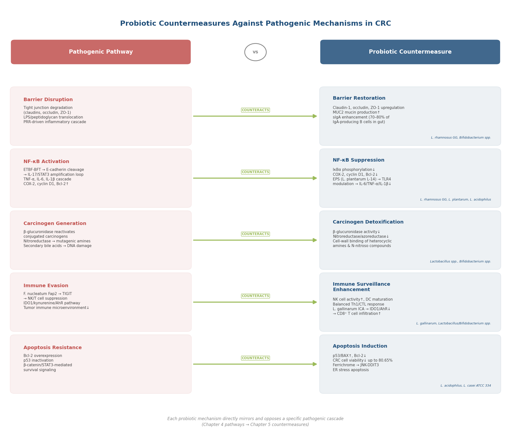

*Figure 5.1 — Each pathogenic pathway from the Chapter 4 multi-hit model (barrier disruption, NF-κB activation, carcinogen generation, immune evasion, apoptosis resistance) is paired with its corresponding probiotic countermeasure, illustrating the mechanistic "mirror" relationship between dysbiosis-driven carcinogenesis and probiotic-mediated protection.*

## 5.3 Clinical Evidence: Probiotics in IBD Management

### 5.3.1 Umbrella Meta-Analysis of Probiotics in IBD

The most comprehensive assessment of probiotic efficacy in inflammatory bowel disease to date — a 2025 umbrella meta-analysis encompassing 20 meta-analyses and 46 datasets — yields a nuanced picture. Probiotics reduced IBD relapse compared to placebo, with a pooled risk ratio of 0.55 (95% CI 0.22–0.88, P < 0.001). However, probiotics showed no advantage over mesalazine (5-ASA), the standard maintenance therapy for ulcerative colitis (UC), with a risk ratio of 1.00. No consistent benefit was observed for remission induction in active disease. Heterogeneity across included meta-analyses was very high (I² > 90%), reflecting the diversity of strains, doses, durations, and patient populations [Liu et al. 2025](https://pmc.ncbi.nlm.nih.gov/articles/PMC12486786/ "Umbrella meta-analysis, Nutrition & Metabolism 2025").

Two formulations have accumulated the strongest clinical evidence. *E. coli* Nissle 1917, a non-pathogenic strain with a century-long safety record, has demonstrated equivalence to mesalazine for preventing UC relapse in multiple RCTs — a finding reflected in European Crohn's and Colitis Organisation (ECCO) guidelines. VSL#3, a multi-strain formulation containing eight bacterial strains (four *Lactobacillus*, three *Bifidobacterium*, and one *Streptococcus thermophilus*), is the most studied multi-species probiotic in IBD and has demonstrated efficacy in inducing and maintaining remission of pouchitis. Current ECCO and American Gastroenterological Association (AGA) guidelines recognize probiotics only as adjunctive therapeutic options — not first-line agents — for specific IBD indications [Liu et al. 2025](https://pmc.ncbi.nlm.nih.gov/articles/PMC12486786/ "Umbrella meta-analysis, Nutrition & Metabolism 2025").

### 5.3.2 Probiotics as Surgical and Chemotherapy Adjuncts in CRC

The evidence for probiotics in CRC patients is most robust in perioperative and chemotherapy-supportive settings. A 2024 systematic review of 24 RCTs involving 2,204 CRC patients found that probiotics and synbiotics reduced postoperative infectious complications by 37% (RR = 0.63, 95% CI 0.54–0.74) and surgical site infections (OR = 0.53, 95% CI 0.36–0.78). Multi-strain formulations and longer intervention durations (≥7 days preoperatively) were associated with greater benefit [Moreira et al. 2024](https://www.frontiersin.org/journals/oncology/articles/10.3389/fonc.2024.1395966/full "Pre/pro/synbiotics in CRC, Frontiers in Oncology 2024").

In the chemotherapy-supportive context, *L. rhamnosus* GG reduced grade 3–4 chemotherapy-induced diarrhea from 37% in the control group to 22% in the probiotic group (P = 0.027) and decreased the rate of chemotherapy dose reductions from 47% to 21% (P = 0.008). The capacity to maintain chemotherapy dose intensity carries practical implications for treatment efficacy, as dose reductions compromise anti-tumor outcomes [Moreira et al. 2024](https://www.frontiersin.org/journals/oncology/articles/10.3389/fonc.2024.1395966/full "LGG in CRC chemotherapy, Frontiers in Oncology 2024").

### 5.3.3 A 2026 Signal: Fiber-Probiotic Combination in Advanced CRC

A 2026 retrospective cohort study (n = 80 patients with advanced CRC) examined the effects of a 12-week fiber plus multi-strain probiotic intervention. The combination group demonstrated significant improvements in immune markers — elevated IgA, IgG, and CD4⁺/CD8⁺ T cell ratios (all P < 0.01) — as well as improved nutritional status. The intervention was associated with higher 3-year survival: 83.5% versus 67.4% in the control group (P = 0.001). These results, while provocative, require cautious interpretation: the study was retrospective, single-center, and involved a small sample, precluding causal inference. Prospective RCT validation is needed before clinical recommendations can be derived [Wang et al. 2026](https://pubmed.ncbi.nlm.nih.gov/41823995/ "Fiber + probiotics in advanced CRC, Support Care Cancer 2026").

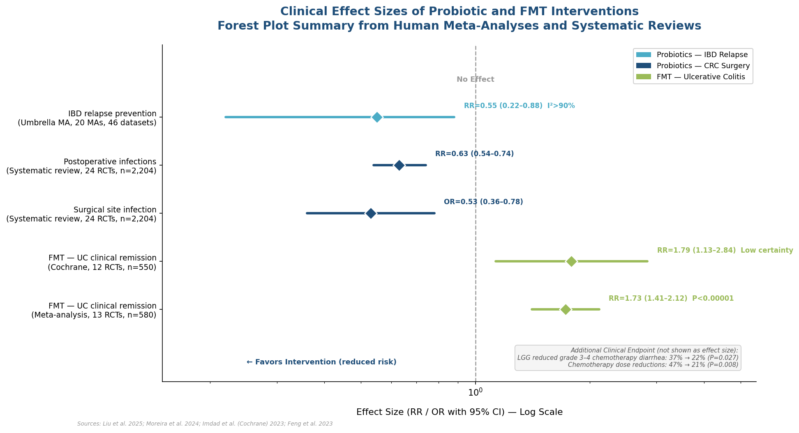

*Figure 5.2 — Forest plot summarizing the primary effect sizes from human meta-analyses and systematic reviews: IBD relapse prevention (RR = 0.55), perioperative infection reduction (RR = 0.63), surgical site infection (OR = 0.53), and FMT for UC remission (RR = 1.73–1.79). An annotation box presents additional LGG chemotherapy-diarrhea data (22% vs. 37%, P = 0.027). Sources: [Liu et al. 2025](https://pmc.ncbi.nlm.nih.gov/articles/PMC12486786/ "Umbrella meta-analysis 2025"); [Moreira et al. 2024](https://www.frontiersin.org/journals/oncology/articles/10.3389/fonc.2024.1395966/full "Systematic review 2024"); [Imdad et al. 2023](https://www.cochranelibrary.com/cdsr/doi/10.1002/14651858.CD012774.pub3/full "Cochrane FMT 2023"); [Feng et al. 2023](https://www.nature.com/articles/s41598-023-41182-6 "FMT meta-analysis 2023").*

## 5.4 Prebiotic and Synbiotic Interventions in Inflammation and CRC Prevention

Prebiotics — "substrates selectively utilized by host microorganisms conferring a health benefit" (Chapter 2, Section 2.4) — function as upstream amplifiers of probiotic effects by selectively nourishing beneficial taxa. The mechanistic rationale is direct: by providing fermentable substrates (inulin, FOS, GOS, resistant starch) that drive SCFA production and *Bifidobacterium*/*Lactobacillus* expansion, prebiotics enhance the anti-inflammatory and barrier-protective mechanisms described in Section 5.1 without requiring exogenous microbial administration.

In the context of CRC prevention, the fiber–CRC relationship rests on the strongest epidemiological foundation. As detailed in Chapter 6 (Section 6.2), WCRF/AICR-funded meta-analyses demonstrate a 10% CRC risk reduction per 10 g/day increase in total dietary fiber (RR = 0.90, 95% CI 0.86–0.94) with a linear dose-response. Resistant starch has attracted particular attention: a 2025 multicenter RCT of 200 patients demonstrated that type 2 resistant starch supplementation (40 g/day for 4 months) reduced fatty liver markers by 39.42%, with response predicted by baseline microbiota composition (Chapter 2, Section 2.4.2) [Prebiotic Association 2026](https://prebioticassociation.org/whats-the-latest-in-prebiotic-research-february-2026-edition/ "Feb 2026 prebiotic research roundup").

Synbiotics — combinations of live microorganisms with selectively utilized substrates (Chapter 2, Section 2.6) — represent a logical extension of this approach. The synbiotic concept exists in two forms: complementary synbiotics (each component independently qualifies as a probiotic or prebiotic) and synergistic synbiotics (the substrate is specifically selected for the co-administered microbe). The 2024 systematic review of CRC patients did not disaggregate synbiotic from probiotic effects sufficiently to quantify an independent synbiotic advantage, though the combined probiotic/synbiotic intervention data yielded the 37% reduction in postoperative complications noted above [Moreira et al. 2024](https://www.frontiersin.org/journals/oncology/articles/10.3389/fonc.2024.1395966/full "Pre/pro/synbiotics in CRC, Frontiers in Oncology 2024").

## 5.5 Fecal Microbiota Transplantation: Resetting the Microbial Ecosystem

Fecal microbiota transplantation (FMT) — the transfer of processed stool from a healthy donor to a patient's gastrointestinal tract — represents the most radical approach to microbiome modulation. Rather than supplementing individual strains, FMT effectively replaces a dysbiotic community with a eubiotic one.

### 5.5.1 FMT for Ulcerative Colitis

The strongest evidence for FMT in inflammatory disease derives from UC. A Cochrane systematic review of 12 RCTs involving 550 participants concluded that FMT may increase clinical remission compared to placebo (RR = 1.79, 95% CI 1.13–2.84), though the certainty of evidence was rated as low. A parallel meta-analysis of 13 RCTs (580 patients) reported clinical remission rates of 50.17% versus 29.02% (RR = 1.73, 95% CI 1.41–2.12, P < 0.00001). Several protocol variables influenced outcomes: higher doses (≥300 g donor stool), multi-donor preparations, and repeated infusions were each associated with greater efficacy [Imdad et al. 2023](https://www.cochranelibrary.com/cdsr/doi/10.1002/14651858.CD012774.pub3/full "Cochrane FMT for IBD 2023"); [Feng et al. 2023](https://www.nature.com/articles/s41598-023-41182-6 "FMT meta-analysis for UC, Sci Rep 2023").

Despite these signals, major clinical guidelines — including those from ECCO and AGA — currently recommend against routine FMT for UC outside of clinical trials, citing low certainty of evidence, heterogeneous donor screening and preparation protocols, uncertain durability of response, and unresolved safety concerns regarding long-term engraftment of donor microbiota.

### 5.5.2 FMT and CRC: A Theoretical Frontier

The application of FMT to CRC prevention or treatment remains largely theoretical. The rationale is mechanistically sound: if dysbiosis drives carcinogenesis through the multi-hit model described in Chapter 4, restoring eubiosis via FMT could interrupt the cascade at its origin. However, no completed RCTs have evaluated FMT for CRC prevention or as a CRC treatment adjunct. The principal concern is that FMT introduces an undefined microbial community — potentially harboring pathobionts — into a compromised host, and the long-term consequences of donor microbiota engraftment on cancer risk remain unknown. The two FDA-approved microbiome therapeutics (Rebyota™ and VOWST®) are restricted to recurrent *Clostridioides difficile* infection, underscoring the current regulatory consensus that FMT-derived products require extensive safety characterization before broader indications can be approved (Chapter 7).

## 5.6 Evidence Hierarchy and the Translational Gap

A candid assessment of the evidence landscape reveals a persistent translational gap between mechanistic promise and clinical validation.

**In vitro evidence (strong mechanistic plausibility, limited clinical relevance):** SCFA-mediated HDAC inhibition, NF-κB suppression by specific *Lactobacillus* strains, apoptosis induction in CRC cell lines, carcinogen binding, and β-glucuronidase modulation have all been robustly demonstrated in cell culture. These findings establish mechanism-of-action but cannot account for the complexity of host–microbe interactions in vivo — including gastric acid survival, colonization efficiency, strain competition, and host immune context.

**Animal model evidence (supportive, with caveats):** Murine CRC models — principally ApcMin⁺/⁻ and chemically induced (AOM/DSS) models — have confirmed that probiotics reduce tumor burden, attenuate inflammatory markers, and modulate immune cell populations. The *L. gallinarum*/anti-PD-1 synergy is among the most compelling examples. However, mouse models of CRC differ fundamentally from human disease in microbiota composition, immune architecture, and tumor biology.

**Human clinical evidence (limited but growing):** The strongest human data support probiotics as surgical and chemotherapy adjuncts (37% reduction in postoperative infections; reduced chemotherapy-induced diarrhea) and for IBD relapse prevention (*E. coli* Nissle 1917 equivalent to mesalazine; VSL#3 for pouchitis). FMT for UC achieves modest remission rates with low-certainty evidence. No large-scale RCT has demonstrated that probiotics alone prevent CRC in humans.

This evidence stratification carries a direct implication: probiotic interventions are best understood as adjunctive — enhancing standard medical or surgical therapy — rather than as standalone agents for CRC prevention or treatment.

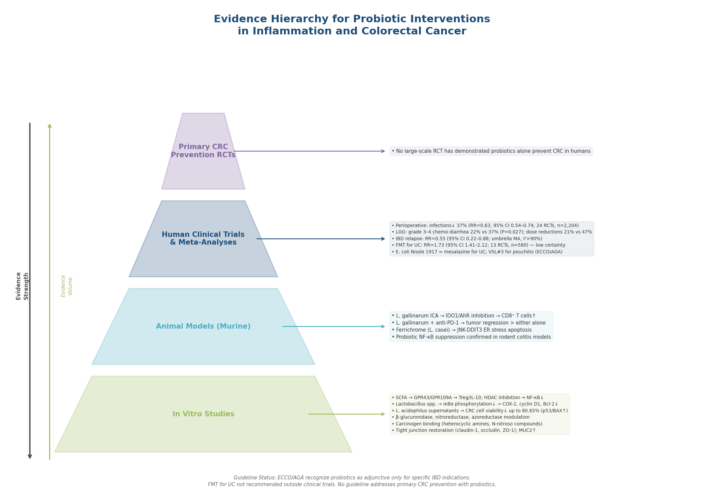

*Figure 5.3 — A four-tier evidence pyramid mapping probiotic intervention categories against their key findings, effect sizes, and guideline status. The apex (primary CRC prevention RCTs) remains empty, crystallizing the translational gap between preclinical promise and clinical validation.*

## 5.7 Limitations and Frontiers

Several structural limitations constrain the current evidence and define the research frontier.

**Strain specificity without consensus.** Effects are highly strain-specific — efficacy demonstrated for *L. rhamnosus* GG cannot be extrapolated to other *Lactobacillus* strains (Chapter 2, Section 2.7). Yet no consensus exists on optimal strain selection, dosing regimen, or intervention duration for any specific clinical endpoint in CRC. The umbrella meta-analysis heterogeneity (I² > 90%) reflects this unresolved variability [Liu et al. 2025](https://pmc.ncbi.nlm.nih.gov/articles/PMC12486786/ "Umbrella meta-analysis, Nutrition & Metabolism 2025").

**Absence of primary CRC prevention trials.** Existing human RCTs evaluate probiotics as adjuncts to surgery or chemotherapy in patients who already have CRC. No large-scale multicenter RCT has assessed whether long-term probiotic supplementation reduces CRC incidence in at-risk populations (e.g., IBD patients, individuals with family history).

**Immunotherapy synergy pending human validation.** The *L. gallinarum*/anti-PD-1 data derive exclusively from murine models. Human clinical trials evaluating probiotics as adjuncts to immune checkpoint inhibitors in CRC are anticipated but have not yet been completed.

**FMT evidence at low certainty.** The Cochrane review rated FMT evidence for UC as "low certainty," and 29 ongoing studies were identified at the time of the review (search ended December 2022). Updated systematic reviews incorporating these trials are expected to reshape the evidence base substantially.

**Inter-individual variability.** The response to both probiotics and FMT is modulated by baseline microbiota composition, host genetics, diet, and immune status. The 2025 resistant starch trial's finding that baseline microbiota predicted treatment response illustrates the emerging paradigm of personalized microbiome interventions — a concept explored further in Chapter 7.

# 第6章 From Bench to Plate — Evidence-Based Dietary Recommendations for Gut Health

The preceding chapters established a detailed mechanistic landscape: probiotic organisms and their metabolites suppress inflammation, reinforce the epithelial barrier, and may retard colorectal carcinogenesis (Chapter 5), while pathobiont-driven dysbiosis activates NF-κB, IL-6/STAT3, and Wnt/β-catenin cascades that promote the inflammation–cancer sequence (Chapters 3–4). A practical question remains — how should these findings inform daily food choices?

This chapter translates the mechanistic and epidemiological evidence assembled in the preceding chapters into a stratified framework for dietary recommendations, explicitly grading each recommendation by the strength of its supporting evidence:

- **Tier A** — supported by human randomized controlled trials (RCTs) or large prospective cohorts.
- **Tier B** — supported by mechanistic and animal evidence with plausible but incomplete human confirmation.
- **Tier C** — traditional or popular practices that currently lack robust scientific validation.

All quantitative claims retain the original effect sizes, confidence intervals, and sample sizes from the source studies. The chapter closes with an integrative synthesis that maps each recommendation to the underlying microbiota-mediated pathways documented throughout this report.

## 6.1 Dietary Patterns That Promote Eubiosis

### 6.1.1 The Mediterranean Diet — Tier A

Among named dietary patterns, the Mediterranean diet possesses the broadest evidence base linking gut microbiota modulation to CRC risk reduction. A 2024 meta-analysis encompassing 26 studies and 2,217,404 participants reported a 16% reduction in CRC risk among individuals with high adherence (HR = 0.84, 95% CI 0.78–0.91, P < 0.01), an association consistent across sexes [Fekete et al., 2024](https://link.springer.com/article/10.1007/s11357-024-01296-9 "Mediterranean diet and CRC, GeroScience 2024"). The protective mechanisms operate through multiple microbiota-mediated channels identified in earlier chapters: high fiber content drives SCFA production (Chapter 1); abundant polyphenols from olive oil, nuts, and red wine activate SIRT1/Nrf2 anti-inflammatory pathways; and overall dietary diversity expands microbiota alpha-diversity, the erosion of which characterizes dysbiosis (Chapter 1).

The Mediterranean pattern is defined by high intake of fruits, vegetables, legumes, whole grains, nuts, and olive oil; moderate consumption of fish and poultry; limited consumption of red meat, processed meat, and refined sugars; and optional moderate red wine intake. This is not a single-nutrient intervention but an integrated dietary ecology — the protective effect likely emerges from synergistic interactions among fiber, polyphenols, omega-3 fatty acids, and reduced pro-inflammatory substrates rather than any isolated component.

### 6.1.2 High-Fiber, Plant-Rich Diets — Tier A

Dietary fiber is the most extensively validated single dietary component for CRC prevention. A WCRF/AICR-funded meta-analysis of 25 prospective studies involving 1,985,552 participants and 14,514 CRC cases established a 10% CRC risk reduction per 10 g/day increase in total dietary fiber (RR = 0.90, 95% CI 0.86–0.94, I² = 0%), with a linear dose-response and no apparent threshold [Aune et al., 2011](https://pmc.ncbi.nlm.nih.gov/articles/PMC3213242/ "Fiber and CRC dose-response, BMJ 2011"). Cereal fiber and whole grains conferred the strongest protection: whole grain consumption yielded a 17% risk reduction per 90 g/day (RR = 0.83). The WCRF/AICR 2018 Continuous Update Project classifies dietary fiber as a "probable" protector against CRC [WCRF, 2018](https://www.wcrf.org/wp-content/uploads/2024/10/Colorectal-cancer-report.pdf "WCRF CRC Report 2018").

The mechanistic basis for fiber's protection converges on the SCFA axis detailed in Chapters 1 and 5. Colonic fermentation of dietary fiber produces butyrate, propionate, and acetate in the ~60:20:20 molar ratio. Butyrate provides ~70% of colonocyte energy and acts as an HDAC inhibitor in cancerous colonocytes — the "butyrate paradox" described in Chapter 4, whereby butyrate accumulation in glycolysis-shifted cancer cells triggers apoptosis via reactivation of silenced tumor suppressors (p21, BAX). Fiber simultaneously nourishes key butyrate-producing taxa including *Faecalibacterium prausnitzii* and *Roseburia* spp., counteracting the depletion of these organisms that characterizes CRC-associated dysbiosis.

### 6.1.3 Timescale of Dietary Impact on Microbiota Composition

A key question for practical implementation is how rapidly diet reshapes the gut microbiota. David et al. demonstrated in a controlled feeding study that short-term consumption (5 days) of diets composed entirely of animal or plant products altered microbial community structure within 1–2 days, with changes reversing equally rapidly upon diet cessation [David et al., 2014](https://www.nature.com/articles/nature12820 "Diet rapidly and reproducibly alters the human gut microbiome, Nature 2014"). This rapidity reflects the short generation times of gut bacteria and the direct substrate dependence of fermentative metabolism.

A more disease-relevant demonstration came from the O'Keefe diet-swap study, in which 20 African Americans (CRC incidence 65 per 100,000) and 20 rural South Africans (CRC incidence <5 per 100,000) exchanged diets under controlled conditions for two weeks. The dietary switch produced reciprocal changes in mucosal biomarkers of CRC risk: African Americans consuming the high-fiber, low-fat African-style diet exhibited increased colonic butyrate production and reduced mucosal inflammation markers, while rural Africans consuming the high-fat, low-fiber Western-style diet showed the opposite pattern [O'Keefe et al., 2015](https://www.nature.com/articles/ncomms7342 "Fat, fibre and cancer risk in African Americans and rural Africans, Nat Commun 2015"). These findings indicate that dietary modification can measurably shift microbiota composition and functional output within days to weeks — although long-term stability requires sustained dietary adherence.

## 6.2 Specific Food Categories and Their Microbiota Effects

### 6.2.1 Fermented Foods — Tier A

The Stanford FeFiFo randomized controlled trial (n = 36, 17 weeks) provided the first direct experimental evidence that a high-fermented-food diet reshapes the gut microbiota in healthy adults. Participants consuming 6.3 servings/day of fermented foods — yogurt, kefir, kombucha, kimchi, sauerkraut, and vegetable brine drinks — demonstrated a steady increase in gut microbiota diversity (linear mixed-effects model P = 2.3 × 10⁻³) alongside decreases in 19 inflammatory markers, including IL-6, IL-10, and IL-12b. Only ~5% of the increased microbial diversity overlapped with organisms present in the consumed foods, indicating that fermented food consumption triggers ecological cascading effects rather than simple colonization by ingested strains [Sonnenburg et al., 2021](https://pmc.ncbi.nlm.nih.gov/articles/PMC9020749/ "FeFiFo fermented food trial, Cell 2021").

For practical implementation, one serving is defined as 6 oz (~170 g) of yogurt, kefir, or kombucha; ¼ cup (~60 g) of kimchi or sauerkraut; or 2 oz (~60 mL) of vegetable brine drink. The Stanford trial protocol suggests initiating with at least 1 serving/day and progressively increasing to 2 or more [Stanford Nutrition](https://med.stanford.edu/nutrition/education/Resources/Fermenting-the-Facts/What-Counts-as-a-Serving-of-Fermented-Foods.html "Stanford fermented food serving guidance"). An important distinction, emphasized by ISAPP, is that not all fermented foods qualify as probiotic products — the term "probiotic" requires demonstrated health benefits of specific live strains at defined doses (Chapter 2). Traditionally fermented foods such as artisanal sauerkraut or kefir contain diverse live cultures but often lack strain-level characterization and CFU standardization.

### 6.2.2 Dietary Fiber Sources — Tier A

Beyond the aggregate fiber–CRC relationship established in Section 6.1.2, specific fiber subtypes exert differential effects on the gut microbiota:

- **Inulin and fructo-oligosaccharides (FOS):** The most documented prebiotics, selectively metabolized by *Bifidobacterium* via β-fructanosidase. Inulin is the only prebiotic carrying an EU-authorized health claim (Chapter 2).
- **Galacto-oligosaccharides (GOS):** Selectively promote *Bifidobacterium* growth through β-galactosidase activity; particularly relevant for infant formula applications.
- **Resistant starch:** A 2025 multicenter RCT (n = 200) demonstrated that type 2 resistant starch at 40 g/day over 4 months reduced fatty liver markers by 39.42%, with treatment response predicted by baseline microbiota composition [Prebiotic Association, 2026](https://prebioticassociation.org/whats-the-latest-in-prebiotic-research-february-2026-edition/ "Feb 2026 prebiotic research roundup").
- **Whole grains:** The WCRF/AICR meta-analysis identified whole grains as the most protective fiber source against CRC (RR = 0.83 per 90 g/day) [WCRF, 2018](https://www.wcrf.org/wp-content/uploads/2024/10/Colorectal-cancer-report.pdf "WCRF CRC Report 2018").

Dietary sources rich in prebiotic fibers include oats, barley, bananas, garlic, onions, asparagus, chicory root (inulin), legumes, and cooled cooked potatoes or rice (resistant starch formed through retrogradation). The Stanford FeFiFo trial observed that a high-fiber diet did not increase microbial diversity — unlike fermented foods — but did increase glycan-degrading carbohydrate-active enzymes (CAZymes). Importantly, the fiber response was modulated by baseline microbiota diversity: individuals with lower initial diversity showed less metabolic response to fiber [Sonnenburg et al., 2021](https://pmc.ncbi.nlm.nih.gov/articles/PMC9020749/ "FeFiFo fermented food trial, Cell 2021"). This observation carries a practical implication: for individuals with low baseline diversity, fermented foods may be a more effective initial intervention than fiber alone.

### 6.2.3 Polyphenol-Rich Foods — Tier B

Polyphenols from berries, tea, cocoa, coffee, and red wine exert prebiotic-like effects on the gut microbiota, promoting the growth of *Bifidobacterium* and *Lactobacillus* while inhibiting pathogenic species. The mechanistic basis is well established: 90–95% of dietary polyphenols reach the colon unabsorbed, where they undergo microbial biotransformation into more bioactive metabolites — urolithins from ellagitannins (pomegranates, berries), equol from soy isoflavones, and various phenolic acids from flavonoids [Nutrients, 2022](https://pmc.ncbi.nlm.nih.gov/articles/PMC9220293/ "Polyphenol-microbiota interactions, Nutrients 2022").

This bidirectional polyphenol–microbiota interaction creates substantial inter-individual variability in response: the capacity to produce specific bioactive metabolites (e.g., urolithin A) depends on the pre-existing microbial community, dividing the population into distinct "metabotypes." While mechanistic and preclinical evidence is compelling, direct human epidemiological evidence linking specific polyphenol-rich food intake amounts to measurable CRC risk reduction remains limited. Polyphenol-rich food consumption is therefore classified as Tier B — biologically plausible and mechanistically supported, but awaiting the large-scale prospective cohort or RCT evidence that characterizes Tier A recommendations.

### 6.2.4 Cruciferous Vegetables — Tier B

Cruciferous vegetables (broccoli, Brussels sprouts, kale, cauliflower) contain glucosinolates, which are hydrolyzed to isothiocyanates — most notably sulforaphane — by both plant myrosinase and gut bacterial enzymes. Sulforaphane activates the Nrf2 antioxidant pathway and has demonstrated anti-inflammatory and anti-cancer properties in preclinical models. A 2025 RCT of broccoli sprout extract (BSE) in individuals with prediabetes (n = 74 analyzed) revealed that the glycemic response to sulforaphane was critically dependent on gut microbiota composition: individuals whose microbiome harbored higher abundance of *Bacteroides*-encoded BT2160 — a transcriptional regulator required for converting the inactive glucosinolate precursor to bioactive sulforaphane — achieved greater glucose reductions (0.4 mmol/L in the responder subgroup vs. 0.2 mmol/L overall) [Dwibedi et al., 2025](https://www.nature.com/articles/s41564-025-01932-w "Broccoli sprout extract and gut microbiota, Nature Microbiology 2025"). This finding illustrates a principle with broad relevance: dietary bioactive compounds are not universally effective — their health impact is filtered through the individual's gut microbial enzymatic repertoire.

Cruciferous vegetables are classified as Tier B because, while sulforaphane's anti-inflammatory and anti-carcinogenic mechanisms are well characterized in vitro and in animal models, standalone human data linking cruciferous vegetable intake to measurable changes in gut microbial community structure remain limited.

## 6.3 Foods and Dietary Patterns Associated with Dysbiosis and Elevated CRC Risk

### 6.3.1 Red and Processed Meat — Tier A (Harmful)

The International Agency for Research on Cancer (IARC) classified processed meat as a Group 1 carcinogen ("carcinogenic to humans") and red meat as Group 2A ("probably carcinogenic to humans") in 2015, based on an evaluation by 22 experts reviewing more than 800 epidemiological studies [IARC, 2015](https://www.iarc.who.int/wp-content/uploads/2018/07/pr240_E.pdf "IARC Press Release No. 240"). The WCRF/AICR Continuous Update Project quantified the dose-response: each 50 g/day increment of processed meat increases CRC risk by 16% (RR = 1.16, 95% CI 1.08–1.26), while each 100 g/day of red meat increases risk by 12% (RR = 1.12, 95% CI 1.00–1.25) [WCRF, 2018](https://www.wcrf.org/wp-content/uploads/2024/10/Colorectal-cancer-report.pdf "WCRF CRC Report 2018").

Multiple microbiota-mediated mechanisms underlie these associations:

1. **N-nitroso compound formation.** Heme iron in red meat catalyzes the endogenous production of NOCs from dietary amines — the same genotoxins that generate O⁶-methylguanine DNA adducts implicated in CRC (Chapter 3).
2. **Sulfate-reducing bacteria expansion.** High-protein, high-fat animal product consumption promotes *Desulfovibrio* and *Bilophila wadsworthia*, increasing colonic H₂S production — a metabolite exhibiting a bell-shaped dose-response relationship to CRC cell proliferation (Chapter 3).
3. **TMAO pathway.** Dietary carnitine and choline, abundant in red meat, serve as substrates for microbial trimethylamine (TMA) production, which hepatic FMO3 converts to TMAO. Elevated plasma TMAO has been linked to 23% higher cardiovascular disease risk (HR = 1.23, 95% CI 1.07–1.42) and 55% higher all-cause mortality (HR = 1.55, 95% CI 1.19–2.02) [Schiattarella et al., 2017](https://pmc.ncbi.nlm.nih.gov/articles/PMC5742728/ "TMAO and CVD meta-analysis, ESC Heart Fail 2017").
4. **Secondary bile acid synthesis.** High-fat diets increase bile acid secretion, promoting microbial 7α-dehydroxylation to DCA and LCA — the carcinogenic mediators detailed in Chapter 3.

### 6.3.2 Ultra-Processed Foods — Tier A (Harmful)

Ultra-processed foods (UPFs) — industrially formulated products containing substances not typically used in home cooking, such as emulsifiers, artificial sweeteners, and hydrogenated oils — have emerged as an independent risk factor for CRC. A Harvard/Tufts prospective cohort study following 206,248 participants over 24–28 years (3,216 CRC cases) found that men in the highest UPF consumption quintile had a 29% higher CRC risk (HR = 1.29, 95% CI 1.08–1.53, P-trend = 0.01), with the strongest association observed for distal colon cancer (HR = 1.72). Among UPF sub-categories, meat-, poultry-, and seafood-based ready-to-eat products showed the strongest association (HR = 1.44). The overall association did not reach significance in women [Wang et al., 2022](https://www.bmj.com/content/378/bmj-2021-068921 "UPF and CRC, BMJ 2022").

Beyond their direct nutritional profile, UPFs affect the gut ecosystem through additives that impair barrier function. Dietary emulsifiers (carboxymethylcellulose, polysorbate-80) have been shown in animal models to erode the mucus layer, increase bacterial translocation, and promote low-grade inflammation — mirroring the barrier disruption pathway described in Chapter 4. Artificial sweeteners (saccharin, sucralose, aspartame) alter gut microbial composition in ways that may impair glucose tolerance, though human evidence for these specific mechanisms remains mixed.

### 6.3.3 Alcohol — Tier A (Harmful)

Alcohol consumption above moderate levels is classified by the WCRF/AICR as a "convincing" cause of CRC. A meta-analysis of 57 studies established that moderate drinking (2–3 drinks/day) increases CRC risk by 21% (RR = 1.21, 95% CI 1.13–1.28) and heavy drinking (≥4 drinks/day) by 52% (RR = 1.52, 95% CI 1.27–1.81) [Fedirko et al., 2011](https://www.annalsofoncology.org/article/S0923-7534(19)38342-5/fulltext "Alcohol and CRC, Ann Oncol 2011"). The threshold for "convincing" carcinogenicity set by the WCRF/AICR begins at approximately 30 g/day of ethanol (~2 standard drinks). Underlying mechanisms include acetaldehyde genotoxicity (acetaldehyde itself is classified as a Group 1 carcinogen), folate malabsorption, oxidative stress, and alcohol-induced disruption of gut barrier integrity that promotes endotoxemia.

### 6.3.4 The Western Dietary Pattern — Tier A (Harmful)

The Western dietary pattern — characterized by high red and processed meat, refined grains, sugar-sweetened beverages, and low fiber and vegetable intake — aggregates multiple risk factors identified above into a single dietary ecology. The O'Keefe diet-swap study (Section 6.1.3) provided direct experimental evidence that switching from a high-fiber, low-fat diet to a Western-style diet for just two weeks increased mucosal markers of CRC risk, including proliferative biomarkers, reduced butyrate production, and elevated secondary bile acid synthesis [O'Keefe et al., 2015](https://www.nature.com/articles/ncomms7342 "Fat, fibre and cancer risk, Nat Commun 2015"). The rapidity of these changes underscores that the Western diet is not merely correlated with but actively promotes the dysbiotic, pro-inflammatory microbiota state that Chapters 3 and 4 identified as a driver of colorectal carcinogenesis.

## 6.4 The WCRF/AICR Evidence Matrix — An Integrative Summary

The World Cancer Research Fund and American Institute for Cancer Research maintain the most comprehensive evidence-grading system for diet–cancer relationships. Their 2018 CRC report synthesizes the full hierarchy of evidence into actionable categories [WCRF, 2018](https://www.wcrf.org/wp-content/uploads/2024/10/Colorectal-cancer-report.pdf "WCRF CRC Report 2018"):

- **Convincing causes of increased risk:** processed meat, alcohol (>30 g/day ethanol), body fatness, adult attained height. Physical activity is classified as a "convincing" protector against colon cancer.
- **Probable protectors:** wholegrains, dietary fiber, dairy products, calcium supplements.
- **Probable cause of increased risk:** red meat.

The WCRF/AICR recommends a diet rich in wholegrains, vegetables, fruits, and beans; limited consumption of red meat (<500 g cooked weight/week) with avoidance of processed meat; limited sugar-sweetened drinks and "fast foods" high in fat, starches, and sugars; limited or no alcohol consumption for cancer prevention; and no reliance on dietary supplements for cancer prevention. These recommendations align closely with the microbiota-mediated mechanisms documented throughout this report: every "convincing" or "probable" protective factor promotes SCFA production and eubiosis, while every risk factor drives the dysbiotic, pro-inflammatory, and genotoxic pathways elaborated in Chapters 3 and 4. The diagram below illustrates how protective and harmful dietary factors converge on the gut microbiota as a central mediating hub, channeling downstream consequences toward either reduced or elevated CRC risk.

## 6.5 Practical Integration of Probiotics and Prebiotics in Daily Diet

### 6.5.1 Probiotic-Rich Foods versus Supplements

The distinction between probiotic-containing foods and probiotic supplements is both scientific and regulatory. As established in Chapter 2, ISAPP defines probiotics as "live microorganisms that, when administered in adequate amounts, confer a health benefit on the host" — a definition requiring demonstrated health benefits at defined doses. Commercial yogurts, kefir, and other fermented dairy products often contain well-characterized strains (e.g., *L. acidophilus*, *B. animalis* subsp. *lactis* BB-12) at declared CFU counts and may satisfy this definition. Many traditionally fermented foods — artisanal cheeses, miso, tempeh, kombucha — contain diverse but uncharacterized microbial communities that may or may not include organisms with demonstrated probiotic effects.

For individuals seeking evidence-based probiotic support, commercial products with strain-level identification, declared CFU counts, and clinical evidence for the specific health claim of interest represent the most reliable option. For general microbiota diversity support, the Stanford FeFiFo trial evidence (Section 6.2.1) indicates that diverse fermented food consumption — regardless of formal probiotic qualification — can expand microbial diversity and reduce inflammatory markers.

### 6.5.2 Prebiotic-Rich Dietary Strategies

Incorporating prebiotic substrates through whole foods is generally preferable to isolated supplementation, as whole foods deliver fiber in a complex matrix that includes co-transported vitamins, minerals, and phytochemicals. Practical strategies for integrating prebiotic-rich foods across daily meals include:

- **Breakfast:** Oats (β-glucan), mixed berries (polyphenols), and kefir or yogurt (fermented food with potential probiotic strains).
- **Lunch and dinner:** Legumes (resistant starch, FOS), garlic and onions (inulin, FOS), cruciferous vegetables (glucosinolates), and whole grains (cereal fiber).
- **Snacks:** Bananas — especially slightly green, which are higher in resistant starch — and nuts (polyphenols, fiber).
- **Resistant starch enhancement:** Cooking and then cooling starchy foods (potatoes, rice, pasta) increases resistant starch content through retrogradation.

These strategies operationalize the prebiotic mechanisms described in Chapter 2, delivering fermentable substrates that selectively nourish *Bifidobacterium*, *Lactobacillus*, and butyrate-producing commensals.

## 6.6 Inter-Individual Variability and Personalized Nutrition

### 6.6.1 The Microbiome as a Mediator of Dietary Response

A recurring theme across the evidence reviewed in this chapter is that dietary interventions do not produce uniform responses. The Stanford FeFiFo trial demonstrated that the metabolic response to high-fiber diets was contingent on baseline microbiota diversity (Section 6.2.2). The broccoli sprout extract RCT (Section 6.2.4) showed that sulforaphane efficacy depended on the abundance of a specific *Bacteroides*-encoded enzyme. More broadly, the PREDICT studies — enrolling over 34,000 participants — established that identical twins share only ~37% of their gut microbiome composition, indicating that environmental and dietary factors, not host genetics, are the dominant determinants of microbial individuality.

### 6.6.2 Personalized Nutrition Approaches — Tier A (Emerging)

The ZOE METHOD randomized controlled trial (n = 347, 18 weeks) provided the first large-scale RCT evidence that personalized dietary recommendations — integrating postprandial glucose and triglyceride responses, gut microbiome profiles, and individual health history — outperform standardized dietary advice. Compared to standard USDA guidelines, the personalized program achieved greater reductions in triglycerides (−0.13 mmol/L, P = 0.016), body weight (−2.46 kg), and HbA1c (−0.05%), with sustained gut microbiome remodeling [ZOE METHOD, 2024](https://www.nature.com/articles/s41591-024-02951-6 "Personalized nutrition RCT, Nat Med 2024").

These findings suggest that the future of dietary recommendations for gut health lies not in universal prescriptions but in frameworks that account for individual microbiome composition, metabolic phenotype, and dietary history. At present, such personalized approaches remain technology-dependent and not yet scalable to population-level public health recommendations. The evidence-tiered framework adopted in this chapter — where Tier A recommendations apply broadly while Tier B and C recommendations invite individual exploration — represents a pragmatic interim approach that balances population-level guidance with recognition of inter-individual variability.

## 6.7 Synthesis: A Stratified Recommendation Framework

The following synthesis integrates the evidence reviewed across this chapter and the preceding five chapters into a three-tier recommendation structure. The summary table below provides a rapid-reference overview of all 12 recommendations, their evidence tiers, quantitative effect sizes, and key supporting studies.

**Tier A — Strong evidence (human RCTs and/or large prospective cohorts):**

1. **Increase dietary fiber intake** to ≥25–30 g/day, emphasizing whole grains, legumes, and vegetables. Each additional 10 g/day is associated with a ~10% reduction in CRC risk.
2. **Adopt a Mediterranean-style dietary pattern** rich in fruits, vegetables, legumes, nuts, olive oil, and fish — associated with a 16% CRC risk reduction (HR = 0.84).
3. **Incorporate fermented foods** at ≥2 servings/day to increase microbiota diversity and reduce inflammatory markers.
4. **Limit processed meat** — avoid where possible. Each 50 g/day increment increases CRC risk by ~16%.
5. **Limit red meat** to <500 g cooked weight/week. Each 100 g/day increment increases CRC risk by ~12%.
6. **Limit or avoid alcohol.** Risk increases above ~30 g/day ethanol (~2 standard drinks); the WCRF/AICR recommends avoidance for cancer prevention.
7. **Reduce ultra-processed food consumption.** The highest intake quintile in men was associated with 29% higher CRC risk.
8. **Maintain physical activity** — classified as "convincing" protection against colon cancer by WCRF/AICR.

**Tier B — Plausible evidence (mechanistic and animal data, limited human confirmation):**

9. **Consume polyphenol-rich foods** (berries, tea, cocoa, coffee, red wine in moderation) for prebiotic-like effects on *Bifidobacterium* and *Lactobacillus*.
10. **Include cruciferous vegetables** (broccoli, kale, Brussels sprouts) for sulforaphane- and glucosinolate-derived anti-inflammatory effects, recognizing that individual benefit depends on gut microbial enzymatic capacity.
11. **Consider specific prebiotic supplements** (inulin, FOS, GOS, resistant starch) if whole-food fiber intake is insufficient, particularly for individuals with low baseline microbiota diversity.

**Tier C — Insufficient or preliminary evidence:**

12. **Over-the-counter probiotic supplements for CRC prevention:** No large-scale RCT has demonstrated that probiotics alone prevent CRC in humans (Chapter 5). Probiotic supplements are supported as adjunctive therapy in specific clinical contexts (perioperative CRC care, chemotherapy-induced diarrhea) but not as standalone cancer prevention agents.
13. **Dietary supplements for cancer prevention:** The WCRF/AICR explicitly recommends against using dietary supplements for cancer prevention.

These recommendations reflect evidence available as of April 2026 and are intended as general guidance informed by current research rather than prescriptive medical advice. Individual responses to dietary modifications vary substantially based on baseline microbiota composition, genetic background, health status, and concurrent medications. Individuals with existing gastrointestinal conditions, those undergoing cancer treatment, or those contemplating significant dietary changes should consult qualified healthcare professionals.

# 第7章 Conclusions and Future Perspectives

The preceding six chapters traced a continuous arc — from the composition and genomic scale of the gut microbiota (Chapter 1), through the protective roles of probiotics and prebiotics (Chapter 2), the virulence mechanisms of pathogenic bacteria and their toxic metabolites (Chapter 3), the multi-hit pathways linking dysbiosis to intestinal inflammation and colorectal carcinogenesis (Chapter 4), the therapeutic potential of microbiota-directed interventions (Chapter 5), to the translation of these findings into evidence-based dietary recommendations (Chapter 6). This concluding chapter synthesizes the central themes that emerged across these discussions, critically appraises the maturity of the evidence base, and identifies the frontiers most likely to reshape gut microbiota science and its clinical applications in the coming years. All forward-looking assessments are anchored to the state of the field as of April 2026.

## 7.1 Integrative Summary: The Bidirectional Relationship Between Microbiota and Intestinal Health

The gut microbiota functions as a metabolic organ of remarkable complexity. An estimated 3.8 × 10¹³ bacteria coexist with approximately 3.0 × 10¹³ human cells, collectively encoding over 9.9 million non-redundant genes — a genetic repertoire 150- to 500-fold larger than the human protein-coding genome [Sender et al., 2016](https://pmc.ncbi.nlm.nih.gov/articles/PMC4991899/ "Revised Estimates, PLoS Biology 2016"); [Li et al., 2014](https://pubmed.ncbi.nlm.nih.gov/24997786/ "IGC, Nature Biotechnology 2014"). This community sustains intestinal homeostasis through short-chain fatty acid (SCFA) production — butyrate alone supplies approximately 70% of colonocyte energy — alongside bile acid biotransformation, vitamin synthesis, immune maturation, and colonization resistance. When these protective functions are compromised through pathobiont bloom, commensal depletion, or diversity loss, the resulting dysbiosis initiates a cascade of barrier disruption, immune activation, and chronic inflammation that, in its most consequential trajectory, contributes to colorectal carcinogenesis.

The relationship is fundamentally bidirectional. Just as the microbiota shapes host physiology, host factors — diet, immune status, medication exposure, and genetic background — continuously remodel the microbial community. The O'Keefe diet-swap study demonstrated that switching between a high-fiber African-style diet and a low-fiber Western-style diet for just two weeks produced reciprocal changes in mucosal CRC risk biomarkers [O'Keefe et al., 2015](https://www.nature.com/articles/ncomms7342 "Diet swap, Nat Commun 2015"). This bidirectionality carries a critical practical implication: the microbiota is modifiable, and dietary or therapeutic interventions can shift the equilibrium in either direction within days to weeks.

Three pathogenic organisms emerged from the evidence as particularly consequential for CRC. *Fusobacterium nucleatum* Fna C2, detected in 29.2% of CRC patients versus 4.8% of healthy controls, homes to tumors via Fap2-mediated Gal-GalNAc binding and suppresses anti-tumor immunity through TIGIT engagement [Nature 2024](https://www.nature.com/articles/s41586-024-07182-w "Fn clade analysis, Nature 2024"). Colibactin-producing pks⁺ *Escherichia coli* generates the SBS88 mutational signature, identified in 7.5% of 5,292 CRCs analyzed across 17 studies, with the strongest recurrent mutation being *APC*:c.835-8A>G (OR = 65.5, 95% CI 39.0–110.0) [Georgeson et al., 2024](https://pmc.ncbi.nlm.nih.gov/articles/PMC10120801/ "Colibactin mutational signature in CRC"). Enterotoxigenic *Bacteroides fragilis* (ETBF) secretes BFT, which cleaves E-cadherin and activates dual Wnt/NF-κB signaling; longitudinal data indicate that 80% of ETBF-colonized individuals developed precancerous lesions within 12–15 years [Cell Chemical Biology 2025](https://www.cell.com/cell-chemical-biology/fulltext/S2451-9456(25)00425-8 "BFT structures, Cell Chemical Biology 2025").

On the protective side, probiotics have demonstrated measurable clinical benefits in specific, well-defined contexts. A 2024 systematic review of 24 RCTs (n = 2,204 CRC patients) reported that probiotics and synbiotics reduced postoperative infectious complications by 37% (RR = 0.63, 95% CI 0.54–0.74) [Moreira et al., 2024](https://www.frontiersin.org/journals/oncology/articles/10.3389/fonc.2024.1395966/full "Pre/pro/synbiotics in CRC, Frontiers in Oncology 2024"). *L. rhamnosus* GG reduced grade 3–4 chemotherapy-induced diarrhea from 37% to 22% (P = 0.027). For IBD maintenance, a 2025 umbrella meta-analysis encompassing 20 prior meta-analyses found that probiotics reduced relapse versus placebo (RR = 0.55, 95% CI 0.22–0.88), though they conferred no advantage over mesalazine [Liu et al., 2025](https://pmc.ncbi.nlm.nih.gov/articles/PMC12486786/ "Umbrella meta-analysis, Nutrition & Metabolism 2025"). The dietary evidence is equally substantive: a meta-analysis of 26 studies (n = 2,217,404) demonstrated a 16% CRC risk reduction with high Mediterranean diet adherence (HR = 0.84, 95% CI 0.78–0.91), while each 10 g/day increase in dietary fiber was associated with a 10% CRC risk reduction (RR = 0.90, 95% CI 0.86–0.94) [Fekete et al., 2024](https://link.springer.com/article/10.1007/s11357-024-01296-9 "Mediterranean diet and CRC, GeroScience 2024"); [Aune et al., 2011](https://pmc.ncbi.nlm.nih.gov/articles/PMC3213242/ "Fiber and CRC, BMJ 2011").

## 7.2 Evidence Maturity: A Candid Appraisal

Not all findings reviewed in this report carry equal evidentiary weight. A stratified assessment reveals three tiers of evidence maturity as of April 2026, summarized in the matrix below.

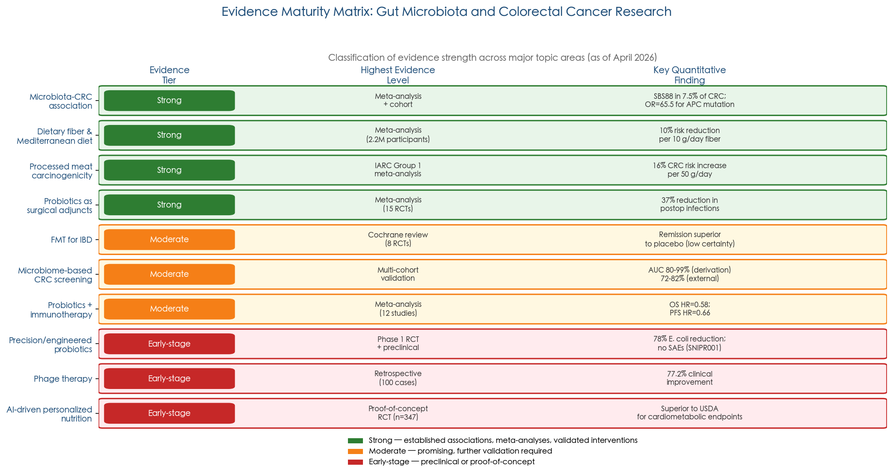

*Figure 7.1. Evidence Maturity Matrix. Topics are classified into three tiers — Strong (established by multiple large human studies), Moderate (consistent but incompletely validated), and Early-stage (preclinical or proof-of-concept) — with the highest evidence level and key quantitative findings indicated for each.*

### 7.2.1 Strong Evidence (Established by Multiple Large Human Studies)

Several associations and interventions now rest on robust foundations. The role of specific bacterial species in CRC promotion — while not yet definitively proven in humans through Koch's postulates — is supported by converging lines of evidence: consistent epidemiological enrichment, defined molecular mechanisms, mutational fingerprints in human tumor genomes (SBS88 for colibactin), and recapitulation in gnotobiotic animal models. The protective effects of dietary fiber and the Mediterranean dietary pattern against CRC are grounded in meta-analyses of prospective cohorts encompassing over two million participants. The carcinogenicity of processed meat (IARC Group 1) and excess alcohol reflects systematic evaluation of hundreds of epidemiological studies. Probiotic efficacy for specific indications — antibiotic-associated diarrhea prevention, perioperative CRC complication reduction, and ulcerative colitis relapse maintenance — is supported by multiple RCTs and meta-analyses, though with important strain-specificity caveats.

### 7.2.2 Moderate Evidence (Consistent but Incomplete Human Data)

Fecal microbiota transplantation (FMT) for ulcerative colitis remission has reached RCT-level evidence, with four RCTs demonstrating superiority over placebo. However, optimal donor selection, preparation methods, dosing frequency, and long-term safety profiles remain incompletely defined. Microbiome-based CRC screening signatures have achieved AUC values of 83–93% in multi-country derivation cohorts, but geographical variation causes significant AUC degradation (from 93% to 72–82%) when applied to external populations, limiting universal deployment [JNCI Cancer Spectrum 2025](https://academic.oup.com/jncics/article/9/3/pkaf026/8056043 "Microbiome in CRC: bench to bedside, 2025"). Probiotics as surgical and chemotherapy adjuncts show consistent benefit across meta-analyses, yet heterogeneity in strains, doses, and patient populations precludes definitive clinical protocols.

### 7.2.3 Early-Stage Evidence (Preclinical or Proof-of-Concept)

Several of the most intellectually compelling findings remain in early translational stages. The anti-tumor synergy between *Lactobacillus gallinarum* metabolites and anti-PD-1 immunotherapy has been demonstrated only in murine models. SNIPR001, the first CRISPR-armed phage therapy to enter human testing, has completed a Phase 1 safety trial in 36 healthy volunteers but has not been evaluated in CRC patients. Engineered bifidobacteria delivering CRISPR antimicrobials against *F. nucleatum* remain at the preclinical validation stage. AI-driven personalized nutrition has shown proof-of-concept improvements in glycemic control and microbiome diversity relative to conventional advice, but no large-scale RCTs have assessed CRC-relevant endpoints. The critical gap across all these frontiers is consistent: translation from mechanistic demonstration to validated human clinical outcomes.

## 7.3 Emerging Frontiers

### 7.3.1 Precision and Engineered Probiotics

The concept of probiotics is undergoing a paradigm shift — from empirically selected, broadly administered live cultures toward rationally designed, disease-targeted microbial therapeutics. Two developments exemplify this trajectory.

First, next-generation probiotics (NGPs) such as pasteurized *Akkermansia muciniphila* have crossed the regulatory threshold. The first-in-human RCT (n = 32) demonstrated improved insulin sensitivity (+28.62%, P = 0.002) and reduced total cholesterol (−8.68%, P = 0.02) over three months [Depommier et al., 2019](https://www.nature.com/articles/s41591-019-0495-2 "Akkermansia RCT, Nature Medicine 2019"). In February 2026, the EU expanded pasteurized *A. muciniphila* authorization to adolescents aged ≥12 years (Regulation (EU) 2026/391), making it the first NGP with formal regulatory approval for both adult and adolescent populations [CIRS Group 2026](https://www.cirs-group.com/en/food/expanded-use-of-pasteurised-akkermansia-in-the-eu-now-permitted-for-adolescents-aged-12-and-above "EU Akkermansia approval for adolescents").

Second, synthetic biology is enabling the engineering of probiotics with programmable therapeutic functions. SNIPR001, the first CRISPR-armed bacteriophage to enter human testing, demonstrated dose-dependent *E. coli* reduction with acceptable tolerability in a Phase 1 trial of 36 volunteers and has received FDA Fast Track designation [SNIPR Biome 2023](https://lundbeckfonden.com/business-activities/biocapital-portfolio-news/snipr-biome-reports-positive-clinical-interim-results "SNIPR001 Phase 1, 2023"). In the CRC context specifically, engineered bifidobacteria delivering CRISPR antimicrobials targeting *F. nucleatum* were validated preclinically in 2026 [PubMed 2026](https://pubmed.ncbi.nlm.nih.gov/41496929/ "CRISPR bifidobacteria targeting Fn, 2026"). The American Gastroenterological Association (AGA) has reported a Phase 1 engineered probiotic trial for IBD planned for 2026. Despite these advances, the microbiome therapeutics pipeline remains largely preclinical: only two approved microbiome medicinal products exist (Rebyota™ and VOWST®, both for recurrent *Clostridioides difficile* infection), while more than 150 candidates occupy various stages of clinical development [Rodriguez et al., 2025](https://www.nature.com/articles/s41522-025-00683-0 "Regulatory framework for microbiome therapies, npj Biofilms Microbiomes 2025").

### 7.3.2 Phage Therapy: Targeted Pathobiont Elimination

Bacteriophage therapy offers a conceptually distinct approach to microbiota modulation — selectively eliminating specific pathobionts while preserving commensal diversity, in contrast to the broad-spectrum disruption caused by antibiotics. The largest clinical evidence base derives from a landmark 100-case study spanning 35 hospitals across 12 countries, which reported 77.2% clinical improvement and 61.3% bacterial eradication; eradication was 70% less probable in the absence of concomitant antibiotics [Pirnay et al., 2024](https://www.nature.com/articles/s41564-024-01705-x "100-case phage therapy, Nat Microbiol 2024").

Technological advances are addressing the formulation challenge. Hydrogel-encapsulated phage cocktails, reported in 2025, achieved approximately 2,000-fold *Salmonella* reduction in murine models while preserving commensal diversity — a selectivity unattainable with conventional antibiotics [Nat Commun 2025](https://www.nature.com/articles/s41467-025-65498-1 "Hydrogel phage cocktails, Nat Commun 2025"). For CRC specifically, phage therapy targeting tumor-associated *F. nucleatum* or pks⁺ *E. coli* remains entirely preclinical, with no human trials initiated. The regulatory landscape is evolving: the European Medicines Agency (EMA) is developing phage-specific guidelines, and the EU Substances of Human Origin (SoHO) Regulation (EU 2024/1938, effective August 2027) will explicitly include human microbiomes for the first time. A fundamental tension persists between phage therapy's inherently personalized nature — requiring patient-specific phage selection — and the standardized manufacturing and quality control models upon which pharmaceutical regulation depends.

### 7.3.3 Microbiome-Based CRC Screening Biomarkers

The integration of microbiome signatures into CRC screening represents one of the most translatable near-term applications. Cologuard Plus™, approved by the FDA in October 2024 on the basis of the BLUE-C study (approximately 19,000 participants), achieved 95% CRC sensitivity and 94% specificity using a multi-target stool DNA approach [Exact Sciences 2024](https://www.exactsciences.com/news-events/press-releases/fda-approves-exact-sciences-cologuard-plus-test "Cologuard Plus FDA approval 2024"). Fecal microbiome signatures alone differentiate CRC from controls with AUC values exceeding 80%; multi-omics models integrating taxonomic, functional, and metabolomic features achieve AUC values of 83–93% across eight countries and more than 2,600 participants. The 4Bac panel (*F. nucleatum*, *Parvimonas micra*, *Clostridium hathewayi*, *Solobacterium moorei*) demonstrated higher sensitivity than fecal immunochemical testing (FIT) but lower specificity [JNCI Cancer Spectrum 2025](https://academic.oup.com/jncics/article/9/3/pkaf026/8056043 "Microbiome in CRC: bench to bedside, 2025").

The principal barrier to clinical deployment is geographical generalizability. Cross-cohort validation studies consistently reveal AUC degradation from approximately 93% in training populations to 72–82% in geographically distinct external cohorts, reflecting population-level differences in diet, environment, and baseline microbiota composition. Overcoming this challenge will require geographically diverse training datasets, standardized sample collection and sequencing protocols, and potentially population-specific classifier calibration.

### 7.3.4 AI-Driven Dietary Personalization

The recognition that dietary responses are filtered through individual microbiota composition — exemplified by *Bacteroides* BT2160-dependent sulforaphane activation from cruciferous vegetables (Chapter 6) and the microbiota-dependent response to resistant starch supplementation (Chapter 2) — has catalyzed interest in AI-driven personalized nutrition. A 2025 systematic review found that AI-based dietary recommendation systems improved glycemic control, weight management, and microbiome diversity compared with conventional dietary advice [PMC 2025](https://pmc.ncbi.nlm.nih.gov/articles/PMC12193492/ "AI dietary recommendations systematic review, 2025"). The BEAUT deep-learning tool, published in *Cell* in 2025, identified novel bile acid metabolizing enzymes in gut bacteria, demonstrating that machine learning can accelerate functional annotation of the gut microbiome [Cell 2025](https://www.sciencedirect.com/science/article/abs/pii/S0092867425008062 "BEAUT BA enzyme discovery, Cell 2025").

The ZOE PREDICT program has contributed the largest dataset to date for microbiome–diet–health associations. Analysis of 34,694 participants identified 661 non-rare microbial species and ranked 50 favorable and 50 unfavorable species by their association with cardiometabolic health markers (BMI, triglycerides, blood glucose, HbA1c). Individuals at healthy weight carried, on average, 5.2 more of the 50 favorably ranked species than individuals with obesity. Dietary interventions — including a personalized dietary program and prebiotic supplementation — significantly shifted microbiome composition toward favorable profiles, with increases in *Bifidobacterium animalis*, *Roseburia hominis*, and health-associated Lachnospiraceae species [Asnicar et al., 2025](https://www.nature.com/articles/s41586-025-09854-7 "Gut micro-organisms and health, Nature 2025"). These findings establish a quantitative framework for microbiome-informed dietary guidance, though prospective validation of clinical outcomes — particularly CRC-relevant endpoints — remains pending.

## 7.4 Translational Gaps and Unresolved Questions

Five structural barriers impede the translation of microbiome science into clinical and public health practice [Rodriguez et al., 2025](https://www.nature.com/articles/s41522-025-00683-0 "Regulatory framework for microbiome therapies, npj Biofilms Microbiomes 2025"):

1. **Study design complexity.** The gut microbiota is a community-level phenomenon, yet most clinical trials evaluate single-strain interventions. Community-level endpoints — alpha diversity, functional capacity, metabolomic output — lack standardized measurement and reporting frameworks.

2. **Analytical method heterogeneity.** Differences in DNA extraction protocols, sequencing platforms (16S rRNA amplicon versus shotgun metagenomics), bioinformatic pipelines, and reference databases introduce systematic variability that complicates cross-study comparison. The 2025 unified catalog of 14,062 species reference genomes represents progress toward standardization [Unified catalog, 2025](https://link.springer.com/article/10.1186/s40168-025-02232-5 "14,062 species catalog, Microbiome 2025"), but laboratory adoption remains incomplete.

3. **Absence of a consensus "healthy" microbiome definition.** No universally accepted compositional or functional benchmark distinguishes a healthy from a dysbiotic microbiome. The ZOE Microbiome Health Ranking (2025) offers a data-driven scoring approach, but its clinical utility for disease prediction requires prospective validation.

4. **Inter-individual variability.** Host genetics, diet, geography, medication history, and circadian rhythms all modulate microbiota composition, creating a personalization challenge that traditional one-size-fits-all therapeutic models cannot accommodate. Conventional pharmacokinetic and pharmacodynamic (PK/PD) frameworks are inadequate for living microbial therapeutics that proliferate, metabolize, and interact with the host community.

5. **Cross-jurisdictional regulatory fragmentation.** The FDA, EMA, and national regulatory agencies have adopted divergent frameworks for microbiome-based products — classifying them variously as drugs, biologics, foods, or dietary supplements depending on the intended claim. This fragmentation increases development costs and delays global access. The EU SoHO Regulation (effective August 2027) will be the first framework to explicitly address human microbiomes, potentially establishing a regulatory model for other jurisdictions.

Beyond these structural barriers, several fundamental scientific questions remain open. Definitive causal evidence — satisfying modified Koch's postulates — for most candidate driver organisms in human CRC in vivo is still lacking. The "hit-and-run" hypothesis, whereby an initiating pathobiont triggers oncogenic mutations and subsequently recedes, is inherently difficult to validate experimentally. Approximately 70–80% of gut microbial species remain uncultured, constraining functional characterization. Probiotic evidence for CRC prevention or treatment remains largely adjunctive, with no standalone evidence that probiotic supplementation alone prevents CRC incidence. The interplay between microbiota-directed therapies and emerging cancer immunotherapies (anti-PD-1, anti-CTLA-4) has been demonstrated only in murine models, and the optimal strategies for clinical combination remain undefined.

## 7.5 From Knowledge to Practice: A Consolidated Perspective

For clinicians, researchers, and individuals seeking to optimize gut health, the evidence reviewed in this report converges on several actionable principles. A Mediterranean or plant-rich dietary pattern, with emphasis on dietary fiber (≥25–30 g/day), fermented foods (≥2 servings/day, based on the Stanford FeFiFo trial protocol), and polyphenol-rich plant foods, represents the most evidence-supported approach to maintaining microbiota diversity and reducing CRC risk. Minimizing processed meat, excess alcohol, and ultra-processed food consumption addresses the upstream substrates that fuel pathobiont expansion and toxic metabolite production. Probiotic supplementation — particularly with well-characterized strains such as *L. rhamnosus* GG, *S. boulardii*, and *B. animalis* subsp. *lactis* BB-12 — has demonstrated benefits for specific clinical indications (antibiotic-associated diarrhea prevention, perioperative CRC care), though routine supplementation in healthy individuals for CRC prevention lacks supporting evidence.

The field stands at an inflection point. The foundational cataloging phase — identifying which organisms are present and what genes they carry — has reached a degree of maturity with the 14,062-species unified catalog and global strain-level diversity analyses. The trajectory of key milestones over the past decade is illustrated below.

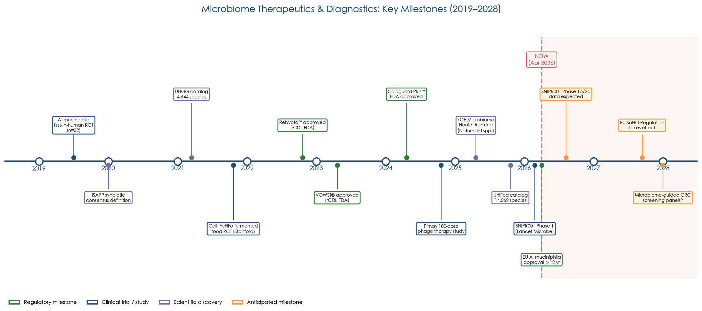

*Figure 7.2. Timeline of key regulatory, clinical, and scientific milestones in microbiome therapeutics and diagnostics (2019–2028). Green markers denote regulatory milestones; blue, clinical trials and studies; purple, scientific discoveries; orange, anticipated milestones.*

The coming decade will be defined by the functional and translational phase: determining what these organisms do in specific host contexts, engineering them for therapeutic purposes, and validating these interventions in adequately powered human trials. The CRISPR-based reprogramming of gut bacteria announced by UC Berkeley in March 2026 [UC Berkeley 2026](https://news.berkeley.edu/2026/03/05/reprogramming-our-gut-bacteria-could-be-key-to-fighting-disease/ "CRISPR gut bacteria, Berkeley News 2026") symbolizes this transition — from observing the microbiota to deliberately reshaping it. Whether this technological capacity can be translated into safe, equitable, and effective clinical tools will determine the trajectory of gut microbiota science for years to come.

# Conclusion

The gut microbiota occupies a central position in the maintenance of intestinal function and the pathogenesis of intestinal disease. The evidence assembled across this report establishes that the roughly 3.8 × 10¹³ bacteria inhabiting the human colon are not passive bystanders but active participants in a bidirectional relationship with the host — sustaining epithelial barrier integrity, calibrating immune tone, and producing metabolites that serve as both energy substrates and epigenetic regulators. When this equilibrium is disrupted, pathobiont-driven genotoxicity, chronic inflammatory signaling, and toxic metabolite accumulation create a microenvironment permissive for colorectal carcinogenesis through defined, molecularly characterized pathways.

Probiotics and prebiotics offer genuine but bounded therapeutic potential. Classical probiotic strains such as *Lactobacillus rhamnosus* GG, *Bifidobacterium animalis* subsp. *lactis* BB-12, and *Saccharomyces boulardii* have demonstrated efficacy in reducing antibiotic-associated diarrhea, perioperative complications, and chemotherapy-induced toxicity, while next-generation candidates — most notably pasteurized *Akkermansia muciniphila*, now the first NGP with regulatory approval in two age populations — signal a shift toward precision microbiota therapeutics. Prebiotics, particularly dietary fiber and resistant starch, function as upstream amplifiers of these protective effects by selectively nourishing beneficial taxa and driving short-chain fatty acid production. The dietary evidence converges on a clear practical framework: a Mediterranean or plant-rich dietary pattern emphasizing fiber (≥25–30 g/day), fermented foods, and polyphenol-rich plants, combined with reduced intake of processed meat, excess alcohol, and ultra-processed foods, represents the most evidence-supported strategy for maintaining microbial homeostasis and reducing CRC risk.

Three limitations temper these conclusions. First, no large-scale randomized controlled trial has demonstrated that probiotic supplementation alone prevents CRC incidence in humans — current evidence supports probiotics as adjunctive, not standalone, agents. Second, inter-individual variability in microbiota composition means that dietary and microbial interventions do not produce uniform responses; the emerging paradigm of personalized, microbiome-informed nutrition addresses this challenge conceptually but remains technology-dependent and incompletely validated. Third, approximately 70–80% of gut microbial species remain uncultured, and definitive causal evidence satisfying modified Koch's postulates is still lacking for most candidate driver organisms in human CRC.

The field stands at a transition from descriptive cataloging to functional and therapeutic application. Engineered probiotics, CRISPR-based gut microbe reprogramming, bacteriophage therapy, microbiome-based screening biomarkers, and AI-driven dietary personalization each represent distinct but converging vectors of innovation. Whether these advances can be translated into safe, effective, and equitable clinical tools will depend on resolving the translational gaps identified throughout this report — standardizing analytical methods, achieving geographical generalizability, navigating regulatory fragmentation, and, above all, conducting adequately powered human trials that bridge the persistent distance between mechanistic promise and validated clinical outcomes.
