# 概览

Need for Closure (NFC) — the dispositional desire for a definitive answer on a given topic, any answer as opposed to ambiguity — has emerged as a theoretically compelling yet empirically underdeveloped predictor of individual susceptibility to misinformation. Drawing on the seizing–freezing dual-process framework first articulated by Kruglanski and Webster (1996), this report examines how the motivational drive toward cognitive closure shapes the acceptance, persistence, and correction of false beliefs across domains including conspiracy theories, fake news, and health misinformation.

Five principal findings emerge from the synthesis of evidence spanning meta-analyses, panel studies, cross-sectional surveys, and experimental interventions.

**First, the overall association between reflective thinking dispositions (NFC/NFCC, Need for Cognition, CRT) and misinformation acceptance is statistically significant, directionally consistent, and moderate in magnitude.** The most comprehensive meta-analysis to date (Stasielowicz, 2022; *k* = 145, 64 articles) reports a pooled correlation of *r* = −.189, with 94 % of effect estimates in the negative direction — higher reflective motivation corresponds to lower misinformation acceptance. However, studies that isolate the Kruglanski NFC/NFCC construct specifically remain scarce within that evidence base.

**Second, the effect of NFC on misinformation acceptance is conditional rather than uniform.** The pivotal finding of Marchlewska, Cichocka & Kossowska (2018) demonstrates that high-NFCC individuals do not invariably gravitate toward conspiracy theories; instead, they seize whichever causal explanation is most accessible in the information environment. When an official, non-conspiratorial explanation is salient, high-NFCC individuals are *less* likely to endorse conspiracy beliefs. This content-free directionality of the seizing mechanism is the single most consequential theoretical insight for intervention design.

**Third, intuitive cognitive style — rather than lack of reflective motivation per se — appears to be the more proximal cognitive mediator.** Pytlik et al. (2020) found that NFC's bivariate association with conspiracy beliefs (*r* = −.19) was fully absorbed when Faith in Intuition was controlled (β = −.07, n.s.), while Faith in Intuition remained a strong positive predictor (β = .34). This pattern is consistent with seizing operating through heightened reliance on intuitive, low-effort processing.

**Fourth, NFC does not significantly moderate the effectiveness of structured interventions such as accuracy nudges and capacity-building training.** Rasmussen et al. (2024; *N* > 4,200) found that a 3-minute media-literacy video reduced misinformation sharing equally across NFC levels. This null-moderation result carries a practical implication: well-designed capacity-building programs can be deployed universally without NFC-based personalization.

**Fifth, the empirical literature suffers from three structural limitations that constrain the strength of conclusions: (a) near-total reliance on cross-sectional designs, (b) dominance of WEIRD samples, and (c) widespread conflation of conceptually distinct epistemic-motivation constructs (NFC/NFCC, NfCog, CRT).** Only one study (Jedinger & Masch, 2025) approaches a longitudinal design, and no published study simultaneously manipulates state NFC while measuring trait NFC in a misinformation paradigm.

The report is organized as follows. Chapter 1 establishes the theoretical foundations of NFC, including the seizing–freezing model, measurement instruments (NFCS-42 and NFC-15), trait–state duality, and discriminant validity against neighboring constructs. Chapter 2 maps the broader psychological mechanisms underlying misinformation acceptance — dual-process cognition, motivated reasoning, cognitive biases, and affective factors — and locates NFC within that multi-mechanism network. Chapter 3 reviews the empirical evidence linking NFC (and related constructs) to conspiracy beliefs, fake-news discernment, health misinformation, correction outcomes, and eyewitness misinformation effects. Chapter 4 analyzes mediating pathways (intuitive reliance, political trust, system justification, RWA/SDO) and moderating conditions (information accessibility, mixed-information environments, epistemic authority, political ideology, and NFC sub-dimensions). Chapter 5 evaluates five classes of intervention strategies through the lens of NFC mechanisms, extracting five design principles grounded in available evidence and theoretical inference. Chapter 6 charts the research frontier, highlighting methodological gaps, cross-cultural blind spots, challenges posed by algorithmic environments and AI-generated content, and the need for an integrative epistemic-motivation framework.

# 第1章 Need for Closure — 理论基础与测量

## 1.1 Lay Epistemic Theory 与 NFC 的理论起源

Need for Closure（NFC，认知闭合需要）作为一个核心动机构念，源于 Arie Kruglanski 在 1989 年专著 *Lay Epistemics and Human Knowledge* 中系统提出的 lay epistemic theory（普通认识论）。该理论关注非专业个体如何在日常生活中获取、验证和使用知识，NFC 被定位为这一知识获取过程中的关键动机驱动力。Kruglanski 将 NFC 定义为"对某一议题获得确定性答案的渴望——任何确定性答案，而非混淆与模糊"（Kruglanski, 1990b, p. 337）。这一定义蕴含两个核心特征：其一，NFC 是一种指向"闭合"（closure）的动机，即寻求认知确定性的内在驱力；其二，它具有"内容无关性"（content-free），指向获得答案这一过程本身，而非任何特定方向的答案 [Webster & Kruglanski 1994](http://www.communicationcache.com/uploads/1/0/8/8/10887248/individual_differences_in_need_for_cognitive_closure.pdf "JPSP 1994, Vol.67, No.6, 1049-1062")。

在概念结构上，NFC 被刻画为一个连续体（continuum）：一端是强烈的认知闭合需要（need for closure），另一端是强烈的认知闭合回避需要（need to avoid closure）。处于闭合回避端的个体倾向于延迟判断、保持开放性并持续搜集信息，而处于闭合需要端的个体则倾向于迅速形成判断并维持已有信念 [Kruglanski & Webster 1996](http://fitelson.org/current/seizing.pdf "Psychological Review, 1996, Vol.103, No.2, pp.263-283")。这一连续体特征意味着 NFC 并非简单的"有或无"二分变量，而是一个从积极寻求开放到积极寻求闭合的渐变维度——对后续理解 NFC 在错误信息接受中的调节作用而言，这是一项重要的概念前提。

## 1.2 Seizing 与 Freezing：NFC 的双过程机制

NFC 对信息加工的影响通过两个互补的认知过程展开：seizing（急切抓取）与 freezing（固化锁定）。Kruglanski & Webster (1996) 在 *Psychological Review* 中系统阐述了这一双过程模型，其核心逻辑如下。

**Seizing**（急切抓取）对应"急迫倾向"（urgency tendency）。高 NFC 个体在信息加工过程中倾向于在有限信息基础上迅速抓取可用线索，形成初步判断。这一过程的认知表现包括：处理的信息量更少、生成的竞争性假设更少、对早期线索赋予过高权重。Seizing 发生在信念结晶点（point of belief crystallization）之前——即个体尚未形成明确判断的阶段。

**Freezing**（固化锁定）对应"持久倾向"（permanence tendency）。一旦判断形成（即越过信念结晶点），高 NFC 个体倾向于将该判断固化锁定，抵制与之不一致的新信息。Freezing 的认知表现包括：选择性暴露于确认性信息、忽略或贬低不一致证据、对已有信念展现更高的主观自信。Kruglanski & Webster (1996) 特别指出，高 NFC 个体"处理信息量更少、生成竞争性假设更少、但主观自信更高"，由此构成一种"无根据自信悖论"（unwarranted confidence paradox）[Kruglanski & Webster 1996](http://fitelson.org/current/seizing.pdf "Psychological Review, 1996, Vol.103, No.2, pp.265-269")。

信念结晶点是 seizing 与 freezing 的时序分界线。在该节点之前，NFC 驱动个体加速信息搜集但范围狭窄；在该节点之后，NFC 驱动个体封闭认知系统、抵御修正。这一时序机制意味着高 NFC 个体在面对错误信息时可能面临双重脆弱性：在判断形成前容易被最先接触到的信息（无论真伪）所锚定（seizing），在判断形成后又难以接受纠正（freezing）。

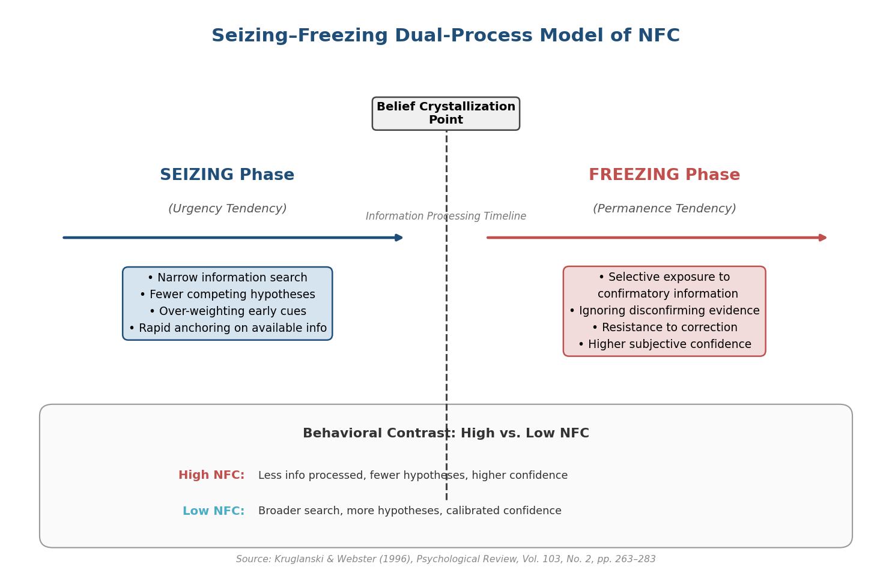

**图 1-1** Seizing–Freezing 双过程模型。以信念结晶点为轴心，左侧展示 Seizing 阶段的认知特征（信息搜集窄化、快速锚定），右侧展示 Freezing 阶段的认知特征（信念固化、纠正抵抗），底部对比高/低 NFC 个体的行为差异。来源：Kruglanski & Webster (1996)。

## 1.3 NFCS 量表：结构、信效度与争议

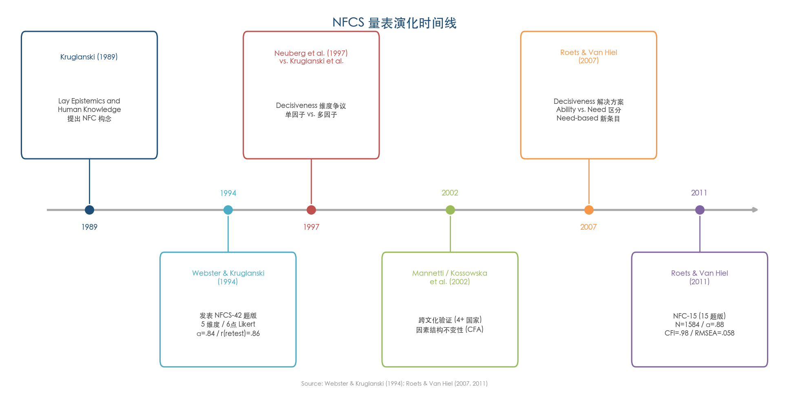

**图 1-2** NFCS 量表演化时间线。从 Kruglanski (1989) 提出 NFC 概念，到 Webster & Kruglanski (1994) 发表 42 题原版，历经 Decisiveness 维度争议、跨文化验证，直至 Roets & Van Hiel (2011) 推出 15 题修订版。

### 1.3.1 42 题原版量表（NFCS）

Webster & Kruglanski (1994) 在 *Journal of Personality and Social Psychology*（Vol.67, No.6）发表了 Need for Closure Scale（NFCS）的 42 题版本，至今仍是 NFC 领域引用最广的测量工具。量表采用 6 点 Likert 计分，涵盖五个理论维度：

1. **Order**（秩序偏好）：偏好结构化、有组织的生活方式；
2. **Predictability**（可预测性偏好）：偏好可预见的未来与稳定的社会环境；
3. **Decisiveness**（果断性）：迅速做出决定的倾向；
4. **Ambiguity Discomfort**（模糊不适）：面对模糊情境时的不安感；
5. **Close-Mindedness**（封闭心态）：不愿考虑与已有信念不一致的信息。

心理测量属性方面，NFCS 表现出良好的信度：两个独立样本中总量表 Cronbach's α = .84，12–13 周的重测信度 r = .86。验证性因子分析（CFA）显示含维度内误差相关的单因子模型拟合最佳，支持将 NFC 视为一个高阶单一构念，五个维度则为该构念的不同表现面 [Webster & Kruglanski 1994](http://www.communicationcache.com/uploads/1/0/8/8/10887248/individual_differences_in_need_for_cognitive_closure.pdf "JPSP 1994, Vol.67, No.6, pp.1050-1053")。

### 1.3.2 Decisiveness 维度争议与解决

NFCS 的五维结构并非毫无争议。Neuberg, Judice & West (1997, *JPSP*) 提出系统性批评，指出 Decisiveness 维度与其余四个维度之间的因子载荷模式显著不同，且与 Personal Need for Structure（PNS）量表存在较高冗余度，由此质疑 NFCS 是否真正测量了一个统一构念。Kruglanski et al. (1997) 在回应中辩称，多面性（multifacetedness）是 NFC 理论预期的特征，不构成对构念效度的威胁。

这一争议的实质性解决来自 Roets & Van Hiel (2007, *Personality and Social Psychology Bulletin*, Vol.33, No.2)。他们从"能力"（ability）与"需要"（need）的区分切入，指出 NFCS 中传统 Decisiveness 条目（如"I usually make important decisions quickly and confidently"）更多反映的是决策能力而非决策需要。Roets & Van Hiel 据此开发了新的 need-based Decisiveness 条目，实证结果表明这些新条目能够有效预测 seizing 过程（即快速抓取可用信息形成判断的行为），而传统的 ability-based 条目则不能 [Roets & Van Hiel 2007](https://journals.sagepub.com/doi/10.1177/0146167206294744 "PSPB, 2007, Vol.33, No.2, pp.266-280")。这一发现不仅化解了长达十年的维度争议，也为后续量表修订提供了直接依据。

### 1.3.3 15 题修订版（NFC-15 / NFC-R）

在 Decisiveness 维度修正的基础上，Roets & Van Hiel (2011, *Personality and Individual Differences*, Vol.50, pp.90–94) 开发了 15 题修订版量表。该版本从修订后的全量表五个维度中各选取 3 个条目，在 N = 1,584 的样本中完成验证。15 题版保持了与全量表相当的心理测量属性，Cronbach's α 介于 .80–.86 [Roets & Van Hiel 2011](https://sjdm.org/dmidi/files/Roets_&_Van_Hiel_(2011)_NFC_scale_revised_-_short_version.doc "PAID, 2011, Vol.50, pp.90-94")。凭借简洁性与改进后的 Decisiveness 条目，NFC-15 已成为近年来大规模调查和在线实验中最常用的 NFC 测量工具。

## 1.4 Trait 与 State 的双重属性

NFC 理论的一项核心方法论特征在于 trait-state 功能等价性（functional equivalence）。NFC 既可作为稳定的人格特质通过问卷量表（NFCS / NFC-15）测量，也可通过情境操纵在实验中暂时诱发。四种经典情境操纵范式已在多项研究中获得反复验证：

1. **时间压力**（time pressure）：要求被试在严格时间限制下完成判断任务；
2. **环境噪音**（environmental noise）：在高噪音环境中进行实验；
3. **任务吸引力降低**（dull task）：通过降低任务的内在吸引力提升被试结束任务的动机；
4. **心理疲劳**（mental fatigue）：通过先行认知负荷任务耗竭心理资源。

Webster & Kruglanski (1994) 在 Studies 4–6 中提供了 trait-state 功能等价性的直接证据：使用 NFCS 量表测量的特质性高 NFC，成功复验了此前通过情境操纵获得的三种经典效应——首因效应（primacy effect）、对应偏差（correspondence bias）和说服抗拒效应（resistance to persuasion）[Webster & Kruglanski 1994](http://www.communicationcache.com/uploads/1/0/8/8/10887248/individual_differences_in_need_for_cognitive_closure.pdf "JPSP 1994, Vol.67, No.6, pp.1057-1061") [Kruglanski & Webster 1996](http://fitelson.org/current/seizing.pdf "Psychological Review, 1996, Vol.103, No.2, pp.269-274")。

这种双重属性对错误信息研究具有直接的方法论意义。它表明，高 NFC 不仅是某些个体的稳定倾向，也可以由特定信息环境暂时激活。社交媒体的快节奏、信息过载和截止时间压力均符合已验证的 state NFC 诱发条件，由此可推论：即使 trait NFC 处于中等水平的个体，在特定数字环境条件下也可能表现出类似高 NFC 的信息加工模式。这一推论为理解当代媒体环境中错误信息传播的普遍性提供了理论切入点。

## 1.5 NFC 与邻近构念的区分

NFC 所处的心理学概念网络中存在多个功能相似但理论内涵不同的构念。精确界定这些构念之间的边界，对于理解 NFC 在错误信息研究中的独特贡献不可或缺。

**NFC 与 Dogmatism 和权威主义**。NFCS 与 Dogmatism 量表的相关为 r = .29，与权威主义量表的相关为 r = .27，均属低至中等水平。这些相关表明 NFC 与教条主义共享"对确定性的偏好"这一表层特征，但 NFC 的理论定位更为基础：它是一个内容无关的认识论动机，而 Dogmatism 和权威主义则包含特定的意识形态内容 [Webster & Kruglanski 1994](http://www.communicationcache.com/uploads/1/0/8/8/10887248/individual_differences_in_need_for_cognitive_closure.pdf "JPSP 1994, Vol.67, No.6, Table 4")。

**NFC 与 Ambiguity Intolerance**。两者的相关为 r = .29。模糊不耐受（Ambiguity Intolerance）侧重于对模糊刺激的情感反应（不适、焦虑），而 NFC 强调的是主动寻求闭合的动机驱力。此外，NFC 的理论框架涵盖 seizing/freezing 双过程机制，这是 Ambiguity Intolerance 构念所不具备的。

**NFC 与 Need for Cognition（NfCog）**。两者的相关为 r = −.28（负相关），方向一致但属于不同的动机维度。Need for Cognition（Cacioppo & Petty 构念）指向"享受思考过程本身"的动机，高 NfCog 个体寻求认知刺激、乐于深入分析；NFC 则指向"获得确定性答案"的动机，高 NFC 个体寻求认知闭合、避免持续的不确定状态。这一区分在错误信息文献中尤为关键：大量实证研究使用 CRT（认知反思测试）或 REI（理性-经验思维量表）作为代理指标，这些工具在概念上更接近 NfCog 而非 NFC，研究者在解读相关结论时须审慎辨别。

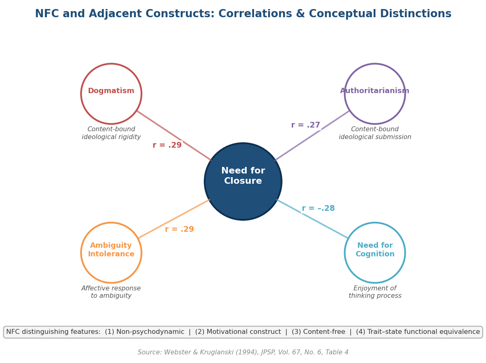

**图 1-3** NFC 与邻近构念的相关系数及概念区分。中心为 NFC，四个节点分别为 Dogmatism (r = .29)、Authoritarianism (r = .27)、Ambiguity Intolerance (r = .29) 和 Need for Cognition (r = −.28)。底部列出 NFC 的四项核心区分特征。数据来源：Webster & Kruglanski (1994), JPSP, Table 4。

Webster & Kruglanski (1994) 和 Kruglanski & Webster (1996) 将 NFC 区别于相邻构念的核心特征归纳为四项：(1) 非精神动力学解释——NFC 不诉诸无意识冲突或防御机制；(2) 明确的动机构念——NFC 是驱动信息搜集与处理的目标导向力量，而非被动的认知风格；(3) 内容无关性——NFC 不指向特定议题或意识形态方向；(4) trait-state 功能等价性——NFC 可通过人格特质和情境因素同等激活 [Kruglanski & Webster 1996](http://fitelson.org/current/seizing.pdf "Psychological Review, 1996, Vol.103, No.2, pp.266-268")。

## 1.6 跨文化适用性

NFC 构念的理论普遍性有赖于跨文化测量学验证的支撑。迄今为止，多国多语言的 NFCS 适配研究提供了积极但有限度的证据。

Mannetti et al. (2002, *British Journal of Social Psychology*, Vol.41, pp.139–156) 在克罗地亚、意大利、美国和荷兰样本中验证了 NFCS 的因素结构不变性（factorial invariance），表明五维度结构在西方文化圈内具有跨国稳定性 [Mannetti et al. 2002](https://pubmed.ncbi.nlm.nih.gov/11970779/ "BJSP, 2002, Vol.41, pp.139-156")。Kossowska et al. (2002, *Psychologica Belgica*, Vol.42, No.4) 将验证范围进一步扩展至波兰、比利时、韩国和美国样本，确认了结构不变性与部分计量/标量不变性（partial metric/scalar invariance）[Kossowska et al. 2002](https://psychologicabelgica.com/articles/10.5334/pb.998 "Psychologica Belgica, 2002, Vol.42, No.4")。韩国样本的纳入为 NFC 构念在东亚文化中的适用性提供了初步支持。

后续适配工作覆盖了更广泛的语言和文化背景：中文版（Moneta & Yip, 2004; Hang et al., 2024）、土耳其语版（Yılmaz, 2018，CFA 拟合指标 CFI = .99, RMSEA = .039）、以及西班牙语版和捷克语版均已完成适配。这些跨文化验证为在不同社会背景下运用 NFC 理论框架分析错误信息接受行为提供了测量学基础。

须指出的是，现有跨文化验证仍以欧洲和北美样本为主，南亚、中东和非洲地区的适配研究十分有限。鉴于这些地区在错误信息传播方面面临的严峻挑战，NFC 量表在这些文化中的适用性验证在学术与实践层面均具紧迫性。

## 1.7 小结：NFC 理论框架对错误信息研究的预测

综合上述理论基础，NFC 构念对错误信息接受行为的影响可沿以下路径进行理论推演。

第一，seizing 机制预测高 NFC 个体在信息搜集阶段更容易被最先可及的信息——无论其真伪——所锚定。在社交媒体的信息流中，标题化、情感化的错误信息往往比系统性的事实核查更先进入认知视野，高 NFC 个体因而面临更高的初始锚定风险。

第二，freezing 机制预测高 NFC 个体在信念形成后更抵抗纠正信息。这与错误信息研究中广泛记录的"持续影响效应"（continued influence effect）——即使错误信息已被明确纠正，其影响仍持续存在——形成理论对接。

第三，NFC 的内容无关性意味着高 NFC 个体并非天然偏向接受错误信息或阴谋论。他们所 seize 的是当前最可及的确定性解释；当官方解释更为可及且明确时，高 NFC 个体同样可能坚定接受官方叙事。这一推论对后续章节讨论的情境可及性调节效应具有奠基性意义。

第四，trait-state 功能等价性暗示，当代数字信息环境本身可能构成一种 state NFC 的系统性诱发因素——信息过载、注意力碎片化和时间压力持续地将用户推向高闭合需要状态，即使其 trait NFC 并不特别高。

上述四条理论预测为第二章关于错误信息接受的心理机制讨论以及第三章关于 NFC 与错误信息接受的实证关系梳理奠定了概念基础。

# 第2章 错误信息接受的心理机制

错误信息（misinformation）的接受并非简单的知识缺陷问题，而是受多层次心理机制共同驱动的认知现象。理解个体为何相信——乃至在纠正后仍然坚持——虚假信息，需要整合认知加工、动机推理、认知偏差与情感因素等多条理论线索。本章系统梳理上述机制，并在此基础上明确认知闭合需要（Need for Closure, NFC）在现有理论框架中的位置，为后续章节的实证分析搭建理论桥梁。

在进入具体机制之前，有必要首先厘清一组核心术语。Wardle & Derakhshan (2017) 在提交欧洲委员会的报告中提出"信息失序"（information disorder）三分法：mis-information 指虚假但无蓄意伤害意图的信息；dis-information 指被故意创建以造成伤害的虚假信息；mal-information 指真实但被用于伤害目的的信息（如隐私泄露）。该分类基于虚假性（falseness）与伤害意图（intent to harm）两个维度的交叉 [Wardle & Derakhshan 2017](https://rm.coe.int/information-disorder-toward-an-interdisciplinary-framework-for-researc/168076277c "Information Disorder, Council of Europe report DGI(2017)09")。本报告聚焦 misinformation 接受——即个体在无特定创建动机的情况下相信虚假信息的心理过程，而非虚假信息的蓄意制造与传播。绝大多数心理学实证研究实际考察的也正是这一层面。

## 2.1 双过程理论视角：System 1 与 System 2 在错误信息判断中的作用

当代认知科学中的双过程理论（dual-process theory）为错误信息接受研究提供了基础分析框架。该理论区分两类认知加工模式：System 1 指快速、自动化、低认知负荷的直觉加工；System 2 指缓慢、受控、高认知负荷的分析性加工。由此引出的核心问题是：个体为何未能激活 System 2 对初始直觉判断加以校正？

### 2.1.1 "懒惰而非偏见"假说

Pennycook & Rand (2019, *Cognition*, Vol.188, pp.39–50) 提出了该领域最具影响力的理论命题之一——"lazy, not biased"假说。其核心发现是，对假新闻（fake news）的易感性更好地由分析性思维的缺乏来解释，而非党派动机推理。以认知反思测试（Cognitive Reflection Test, CRT）测量的分析性思维与假新闻辨别力呈正相关，且该关联在政治光谱两端均成立——高分析性思维者无论政治立场如何，均能更好地区分真假新闻 [Pennycook 官方发表页](https://gordonpennycook.com/published-work/ "含 Cognition 2019 论文")。

后续研究为该框架提供了进一步支持。Pennycook & Rand (2020, *Journal of Personality*, Vol.88, pp.185–200) 确认，伪深奥接受度（bullshit receptivity）、过度声称（overclaiming）与低分析性思维共同预测假新闻易感性，而政治意识形态本身的预测力相对有限 [Pennycook & Rand 2020](https://onlinelibrary.wiley.com/doi/abs/10.1111/jopy.12476 "Who falls for fake news, J. Personality 2020")。

### 2.1.2 因果实验证据

"懒惰"假说不仅依赖相关证据，也获得了实验因果证据的支持。Bago, Rand & Pennycook (2020, *Journal of Experimental Psychology: General*, Vol.149, pp.1608–1613) 在题为"Fake news, fast and slow"的研究中发现，实验性诱导深思熟虑可选择性地降低被试对虚假（而非真实）新闻标题的相信程度，直接支持了"System 2 能够纠正 System 1 直觉错误"这一因果路径 [Bago et al. 2020](https://gordonpennycook.com/wp-content/uploads/2020/02/bago-rand-pennycook-2020.pdf "Fake news fast and slow, JEP:G 2020")。

Pennycook & Rand (2021, *Trends in Cognitive Sciences*, Vol.25, pp.388–402) 在系统综述中将 classical reasoning account 与 motivated reasoning account 进行了正面对比，总体结论支持分析性思维不足作为错误信息接受的主要机制 [Pennycook & Rand 2021](https://www.sciencedirect.com/science/article/pii/S1364661321000516 "The Psychology of Fake News, TICS 2021")。然而，这一结论并非没有挑战——动机推理研究者提出了不同的证据模式，详见下一节。

## 2.2 动机推理：身份认同保护与意识形态一致性偏差

双过程理论侧重认知能力维度——个体是否投入了足够的分析性资源；动机推理理论则将焦点转向认知目标维度——个体为何以及如何有选择性地加工信息。两种视角对错误信息接受的解释逻辑截然不同。

### 2.2.1 动机推理的理论框架

Kunda (1990, *Psychological Bulletin*, Vol.108, pp.480–498) 在经典论文"The Case for Motivated Reasoning"中提出，动机通过偏向性认知策略影响推理过程：准确性动机（accuracy goals）促使个体采用最恰当的信息搜集和评估策略；方向性动机（directional goals）则促使个体采用最可能产生期望结论的策略。关键约束在于，个体只有在能够构建看似合理的论证（illusion of objectivity）时才能得出期望结论 [Kunda 1990](https://fbaum.unc.edu/teaching/articles/Psych-Bulletin-1990-Kunda.pdf "The Case for Motivated Reasoning")。换言之，动机推理并非完全不受现实约束——它在"合理性"的边界内运作，但该边界具有相当的弹性。

### 2.2.2 身份认同保护认知

Kahan (2013, *Judgment and Decision Making*, Vol.8, pp.407–424) 将动机推理理论推向了更具挑战性的领域。在一项全国代表性样本（N = 1,750）研究中，Kahan 报告了三项关键结果。其一，意识形态动机推理在自由派与保守派中对称存在，反驳了"意识形态不对称"假说。其二，CRT 得分更高的个体反而展示出更强的意识形态动机推理。其三，该发现支持"表达效用立场"（Expressive Utility Posture, EUP）——高认知能力者更善于利用分析性思维保护群体身份，而非更客观地评估证据 [Kahan 2013](https://ndg.asc.upenn.edu/wp-content/uploads/2017/08/Ideology-motivated-reasoning.pdf "Ideology motivated reasoning, JDM 2013")。这一发现直接挑战了"分析性思维越强越好"的简单预期。

### 2.2.3 "懒惰"与"动机"假说之间的张力

Pennycook & Rand 的证据表明分析性思维总体帮助人们抵御假新闻，而 Kahan 的证据表明高认知反思者在评估与身份相关的证据时反而表现出更极化的判断。这一张力构成错误信息心理学领域的核心辩论之一。

两组发现并不必然相互矛盾，更可能反映了不同信息情境下的不同主导机制。在评估一般性假新闻标题时，分析性思维确实发挥保护作用（classical reasoning account 占主导）；而在评估高度政治化的科学议题——如气候变化、枪支管控——时，分析性思维可能被方向性动机征用，反而加剧极化（motivated reasoning account 占主导）。这一情境依赖性对理解 NFC 的作用机制具有直接启示：NFC 作为非特定方向的认知闭合动机，其效应方向可能同样因信息情境而异。

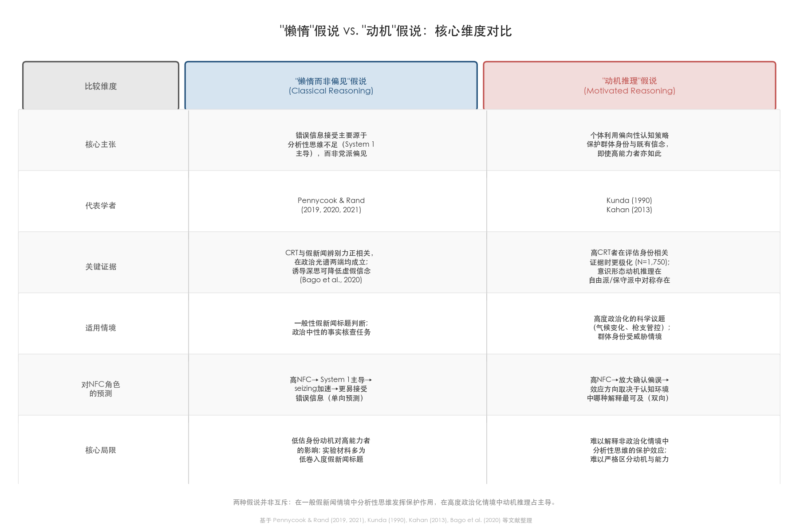

图 2-1 从核心主张、关键证据、适用情境、对 NFC 角色的预测及核心局限等维度，系统对比了两种假说的理论结构与边界条件。

## 2.3 关键认知偏差：真相错觉效应、确认偏误与来源启发

在宏观层面的双过程理论与动机推理框架之外，若干具体的认知偏差在错误信息接受过程中发挥着不可忽视的作用。

### 2.3.1 真相错觉效应

真相错觉效应（illusory truth effect）是与错误信息传播最直接相关的认知偏差之一。Hasher, Goldstein & Toppino (1977, *Journal of Verbal Learning and Verbal Behavior*, Vol.16, pp.107–112) 的奠基性研究发现，40 名被试在三次间隔两周的测试中对重复陈述的真实性评级显著上升（F(2,78) = 16.34, p < .01），且该效应不受陈述实际真伪影响——无论陈述客观上为真或为假，重复均提升了被感知到的真实性 [Hasher et al. 1977](https://transition-news.org/IMG/pdf/hasher-illusory-truth-effect.pdf "奠基性研究")。

该效应的底层机制被归结为加工流畅性（processing fluency）：重复接触使信息加工变得更顺畅，而这种流畅感被个体误归因为信息的真实性。Fazio et al. (2015, *Journal of Experimental Psychology: General*, Vol.144, No.5) 进一步揭示了该效应的稳健性——即使被试明确知晓某个重复陈述为假（例如"大西洋是最大的海洋"），重复仍提升了其真实性评级。先验知识无法完全屏蔽加工流畅性的误导 [Fazio et al. 2015](https://psycnet.apa.org/record/2015-38275-001 "Knowledge does not protect against illusory truth")。

真相错觉效应与 NFC 的关系构成一个重要的理论节点。De keersmaecker et al. (2020, *Personality and Social Psychology Bulletin*, Vol.46, pp.204–215) 直接检验了 NFC 是否调节该效应，结果表明真相错觉效应在不同 NFC 水平的个体中均稳健存在——NFC 并非该效应的显著调节变量 [De keersmaecker et al. 2020](https://journals.sagepub.com/doi/10.1177/0146167219853844 "NFC 不调节真相错觉效应")。该零结果的理论含义在于：加工流畅性驱动的真实性判断可能绕过 NFC 所影响的 seizing/freezing 过程——重复效应更多作用于感知层面（perceptual fluency），而非假设生成层面（hypothesis generation）。

### 2.3.2 确认偏误

确认偏误（confirmation bias）在错误信息接受中发挥系统性作用。Lord, Ross & Lepper (1979) 的经典研究表明，持有不同立场的被试在阅读同一组混合证据后态度反而更加极化——他们选择性地接受支持自己立场的研究，同时以更严格的标准审视反对立场的研究。在 Kunda (1990) 的理论框架中，这一现象被归结为方向性动机驱动的偏向性记忆搜索和信念构建过程：个体并非有意忽视反面证据，而是在信息搜索与评估策略上无意识地偏向了能产生期望结论的方向 [Kunda 1990](https://fbaum.unc.edu/teaching/articles/Psych-Bulletin-1990-Kunda.pdf "方向性目标驱动偏向性证据评估，pp.489–490")。

在数字信息环境中，确认偏误与算法推荐系统形成正反馈循环：个体的选择性信息消费行为被算法捕获并强化，进而形成信息茧房。高 NFC 个体的 freezing 机制——一旦形成判断便倾向于维持不变——可能使其更易陷入此类确认性信息循环。

### 2.3.3 来源可信度启发

来源可信度启发（source credibility heuristic）在社交媒体环境中尤为值得关注。个体在判断信息真实性时，往往依赖来源线索而非内容本身的逻辑与证据。然而，社交媒体环境系统性地模糊了来源线索——来自权威新闻机构与阴谋论网站的帖子在界面呈现上几乎无法区分 [Wardle & Derakhshan 2017](https://rm.coe.int/information-disorder-toward-an-interdisciplinary-framework-for-researc/168076277c "Information Disorder 报告, pp.13–14")。当来源线索被削弱时，个体更易退回到其他启发式策略——包括基于重复暴露的流畅性启发和基于情感共鸣的情绪启发——从而提升错误信息被接受的概率。

## 2.4 情感因素：情绪唤醒与不确定性规避

情感因素在错误信息接受中的作用超越了"情绪化使人不理性"的通俗解释。Martel, Pennycook & Rand (2020, *Cognitive Research: Principles and Implications*, Vol.5, Article 47) 提供了迄今最为系统的情感-错误信息关联证据。

Study 1（N = 409）发现，PANAS 量表上几乎所有情绪维度的升高均预测了对假新闻的更强信念，但不影响对真实新闻的判断。值得注意的例外是"感兴趣"（interested）、"警觉"（alert）、"坚定"（determined）和"专注"（attentive）等更接近分析性思维状态的情绪维度。Study 2（跨 4 个实验，总 N = 3,884）提供了因果证据：实验性诱导情绪依赖显著提升了对假新闻的准确性评级（emotion vs. control, b = −0.12, p = .003; emotion vs. reason, b = −0.09, p = .028）[Martel et al. 2020](https://pmc.ncbi.nlm.nih.gov/articles/PMC7539247/ "Reliance on emotion promotes belief in fake news")。

两项关键发现为情感因素的理论定位提供了澄清。第一，情绪效应并非由特定情绪（如愤怒或焦虑）驱动，而是一般性情绪唤醒即可增加假新闻信念——这指向情绪与分析性思维之间的资源竞争机制，而非特定情绪通路。第二，实验条件与政治一致性之间未检测到显著交互（F(2,39081) = 1.09, p = .335），表明情绪对假新闻信念的促进并非经由意识形态一致性偏差实现，不支持动机推理解释 [Martel et al. 2020](https://pmc.ncbi.nlm.nih.gov/articles/PMC7539247/ "Study 2 交互分析结果")。

情感因素与不确定性规避的结合构成另一条值得关注的路径。焦虑与威胁感知——无论源自公共健康危机、经济不确定性抑或社会变革——可提升个体对确定性的渴望，进而间接增强 NFC 的 seizing 倾向。在这一路径中，情感因素不仅直接干扰分析性加工，还通过提升认知闭合动机间接放大了错误信息的吸引力。

## 2.5 NFC 在错误信息接受理论框架中的位置

上述四条理论线索——双过程认知加工、动机推理、认知偏差与情感因素——并非相互独立，而是构成一个交互作用的心理机制网络。NFC 在其中占据独特的理论位置，原因在于它同时涉及认知加工方式与动机方向两个维度。

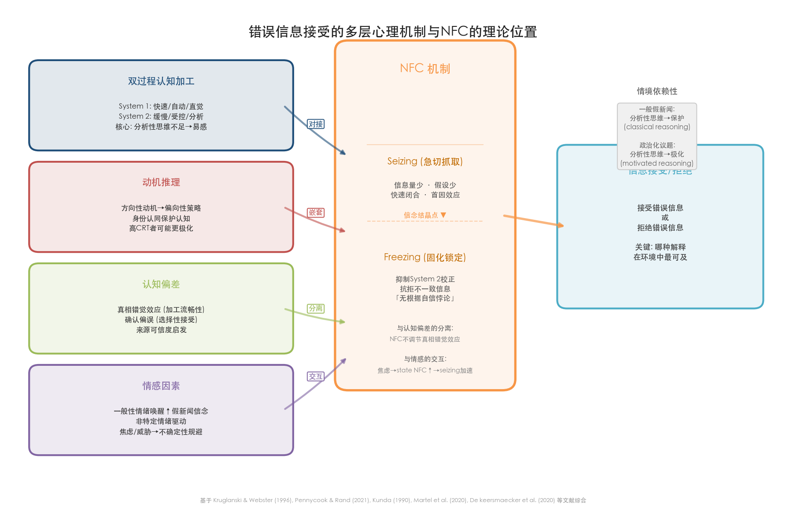

图 2-2 展示了四条心理机制线索与 NFC seizing/freezing 双过程之间的关系类型（对接、嵌套、分离、交互），以及信息最终被接受或拒绝的情境依赖路径。以下逐一阐述各理论接口。

### 2.5.1 NFC 与双过程理论的对接

在 Pennycook & Rand 的 classical reasoning 框架中，高 NFC 个体的 seizing（急切抓取）机制可被理解为 System 1 主导的快速、低努力信息处理——倾向于抓取最先出现或最易获得的线索，对早期信息赋予过高权重（首因效应放大）。freezing（固化锁定）机制则意味着初始判断一旦形成，System 2 的校正功能即受到抑制。Kruglanski & Webster (1996, *Psychological Review*, Vol.103, No.2) 的实验证据指出，高 NFC 个体处理的信息量更少、生成的竞争性假设更少，但主观自信程度反而更高——由此构成"无根据自信悖论"（unfounded confidence paradox）[Kruglanski & Webster 1996](http://fitelson.org/current/seizing.pdf "pp.268–269")。该悖论对错误信息接受的含义是双重的：高 NFC 个体不仅更易接受错误信息（seizing 加速），而且对所持信念的确信度更高，从而使后续纠正更加困难（freezing 固化）。

### 2.5.2 NFC 与动机推理的嵌套

在 Kunda (1990) 和 Kahan (2013) 的动机推理框架中，NFC 可被定位为一种非特定方向的动机（non-specific directional goal）——它不指向特定结论，而是指向"任何确定的结论"。然而，当 NFC 与身份保护动机（specific directional goal）结合时，两种动机可能产生叠加效应：高 NFC 个体更迅速地 seize 与既有信念一致的信息并 freeze 于该判断，从而放大确认偏误与身份保护认知。Kruglanski & Webster (1996) 的实验证据显示，高 NFC 个体对意见偏离者表现出更强的排斥（评价显著更负），而对意见一致者表现出更强的偏好——这一群体共识偏向可直接映射至政治极化情境中的选择性信息接受 [Kruglanski & Webster 1996](http://fitelson.org/current/seizing.pdf "意见偏离者排斥实验, pp.272–274")。

### 2.5.3 NFC 与真相错觉效应的分离

De keersmaecker et al. (2020) 的零调节结果提示，NFC 的 seizing/freezing 机制与加工流畅性驱动的真相错觉效应在机制层面可能相互独立。NFC 影响的是假设生成与信息搜索的广度——高 NFC 个体更快闭合于可用假设；真相错觉效应影响的则是感知层面的熟悉感归因——重复使信息加工更流畅，流畅感被误归因为真实性。这两个过程可以并行运作，其实践含义在于：即使成功降低个体的 NFC（例如通过消除时间压力），重复暴露仍可独立地增加错误信息的可信度。

### 2.5.4 NFC 与情感因素的交互

Martel et al. (2020) 揭示了一般性情绪唤醒对假新闻信念的因果促进效应。在 Kruglanski & Webster (1996) 的理论框架中，焦虑与威胁感知可进一步提升 NFC、加速 seizing 过程——个体更快地接受能够提供确定感的解释，即使该解释为虚假信息。由此形成一条理论路径：情感唤醒 → NFC 提升 → seizing 加速 → 错误信息接受增加。该路径尚待直接实证检验，但其理论逻辑与 NFC 的 trait-state 功能等价性一致——情绪状态可作为 state NFC 的情境性诱发因素。

### 2.5.5 从理论到实证的过渡

综合上述分析，NFC 在错误信息接受的心理机制网络中呈现出三重理论特征。第一，NFC 的 seizing 机制对应 System 1 主导的快速信息抓取，使高 NFC 个体更易被最先可及的信息锚定。第二，NFC 的 freezing 机制抑制 System 2 校正，令初始判断更加固化、纠正更加困难。第三，NFC 的内容无关性意味着其效应方向取决于信息环境中哪种解释最为可及——这使得 NFC 既可能促进也可能抑制错误信息接受，关键在于认知环境的结构。然而，理论推演与实证验证之间仍存在距离：NFC 是否确实如理论所预测的那样影响错误信息的接受、辨别与纠正？现有实证研究揭示了怎样的效应模式？这些问题将在下一章中通过对经验证据的系统梳理予以回应。

# 第3章 NFC 与错误信息接受的实证关系

前两章分别阐述了认知闭合需要（Need for Closure, NFC）的理论基础及错误信息接受的多层次心理机制。理论推演表明，高 NFC 个体的"急切抓取"（seizing）与"固化锁定"（freezing）倾向应使其更容易接受错误信息且更难被纠正。然而，理论预测与经验证据之间的对应关系远非单一线性的。本章系统梳理 NFC（及其邻近构念 NFCC、NfCog、CRT）与多种错误信息类型——阴谋论信念、假新闻辨别、健康错误信息、错误信息纠正、目击者记忆错误——之间的实证关系，评估效应方向、大小与一致性，并分析方法论异质性对结论可靠性的制约。

在进入具体证据之前，须再次澄清一个贯穿本章的术语问题。该领域文献中存在三个频繁被混淆的构念与测量工具：(1) **Need for Closure / Need for Cognitive Closure**（NFC/NFCC，Kruglanski 构念），以 NFCS-42 或 NFC-15 量表测量，指向"对确定性答案的渴望"；(2) **Need for Cognition**（NfCog，Cacioppo & Petty 构念），以 NCS 或 REI 理性分量表测量，指向"对思考过程本身的享受"；(3) **认知反思测试**（CRT，Frederick, 2005），属表现型测量，考察个体抑制直觉错误并激活分析性思维的实际能力。三者在概念上相关——均涉及分析性信息加工的某一侧面——但操作化方式与理论指涉各异。本章在引用每项研究时均标注其实际使用的构念与测量工具，以避免将不同构念的证据混为一谈。

## 3.1 NFC/NFCC 与阴谋论信念

阴谋论信念是 NFC 与错误信息接受关系中实证积累最为丰富的领域。阴谋论为不确定性事件提供了简洁的、封闭性的因果解释，理论上对高 NFC 个体具有特殊吸引力——但这一吸引力的实现以阴谋论解释在信息环境中足够"可及"为前提条件。

### 3.1.1 元分析证据

Stasielowicz (2022, *Judgment and Decision Making*) 提供了该领域迄今最全面的定量综合，汇总 145 项独立样本、64 篇文章（其中 48 篇已发表、16 篇未发表）。总体元分析相关为 *r* = −.189（*SE* = .008, *p* < .001, 95% CI [−.206, −.172]），接近心理学领域中等效应量基准（*r* = .20）；94% 的效应估计为负值方向，反映效应方向的高度一致性。*p*-curve 分析未检出发表偏倚 [Stasielowicz 2022](https://www.cambridge.org/core/journals/judgment-and-decision-making/article/reflective-thinking-predicts-lower-conspiracy-beliefs-a-metaanalysis/73D77DBC333AA2C1778D8F71A1A918FF "JDM: 反思性思维预测更低阴谋论信念的元分析")。

子组分析揭示了测量工具类型对效应量的调节作用。自我报告型测量（主要为 NfCog / REI 理性分量表）与一般阴谋论信念的相关为 *r* = −.173（*k* = 28），与特定阴谋论信念的相关为 *r* = −.146（*k* = 23）；表现型测量（主要为 CRT）对应值分别为 *r* = −.175（*k* = 33）和 *r* = −.219（*k* = 94）。两类工具效应方向一致，CRT 在特定阴谋论信念上的效应略大 [Stasielowicz 2022](https://www.cambridge.org/core/journals/judgment-and-decision-making/article/reflective-thinking-predicts-lower-conspiracy-beliefs-a-metaanalysis/73D77DBC333AA2C1778D8F71A1A918FF "JDM: 自我报告 vs. 表现型测量的子组分析")。需要注意的是，该元分析中"自我报告型"测量以 NfCog 为主体，而非 NFC/NFCC（Kruglanski 构念），因此其效应量不可直接等同于认知闭合需要与阴谋论信念的关系——但它为理解"反思性思维动机不足"这一更广泛机制提供了可靠的效应量基准。

### 3.1.2 直接使用 NFCC 的关键研究

Marchlewska, Cichocka & Kossowska (2018, *European Journal of Social Psychology*, Vol.48(2), pp.109–117) 是直接检验认知闭合需要（NFCC, Kruglanski 构念）与阴谋论信念关系的标志性研究。核心发现为：当阴谋论解释被情境凸显时，NFCC 正向预测阴谋论信念。其关键意义在于揭示高 NFCC 个体并非固定地倾向于接受或拒绝阴谋论，而是倾向于"急切抓取"当前信息环境中最可及的确定性解释——当该解释恰为阴谋论时，接受概率随之上升 [Marchlewska et al. 2018](https://onlinelibrary.wiley.com/doi/abs/10.1002/ejsp.2308 "EJSP: NFCC 与阴谋论信念")。这一条件性效应将在第4章作为核心调节机制展开讨论。

Jedinger & Masch (2025, *Frontiers in Social Psychology*) 在德国 GESIS Panel 数据（*N* = 2,883）中延续了上述研究路线。NFCC 对 COVID-19 阴谋论信念有显著但较弱的正向效应（β = 0.08, *p* < .001），远小于政治信任（β = −.33）和危机信任（β = −.51）的预测力。由于 NFCC 与政治信任均于疫情前（2018年）测量，时间先行性得到保证，增强了因果推断的可信度 [Jedinger & Masch 2025](https://www.frontiersin.org/journals/social-psychology/articles/10.3389/frsps.2024.1447313/full "Frontiers in Social Psychology 2025")。

### 3.1.3 NFC 独立效应的边界条件

Pytlik, Soll & Mehl (2020, *Frontiers in Psychiatry*) 的研究（*N* = 488，德国非临床被试）为 NFC 的独立预测力划定了重要边界。该研究使用 REI 理性分量表操作化"NFC"（实际上更接近 NfCog 构念），发现其与阴谋论信念的双变量相关为 *r* = −.190（*p* < .001）。然而，在纳入直觉信赖（Faith in Intuition）的多元回归模型中，NFC 不再显著（β = −.07, *p* = .13），而 Faith in Intuition 显著正向预测阴谋论信念（β = 0.34, *p* < .001），模型解释了 14% 的方差。与此同时，表现出"跳跃式结论"（jumping-to-conclusions, JTC）偏差——在 fish task 中仅观看 1–2 条鱼后即做决定——的被试，阴谋论信念显著更高（*M* = 2.99 vs. 2.58, Cohen's *d* = .53, *p* < .001），NFC 得分显著更低（*M* = 64.78 vs. 71.59, Cohen's *d* = .47, *p* = .001）[Pytlik et al. 2020](https://pmc.ncbi.nlm.nih.gov/articles/PMC7530244/ "Frontiers in Psychiatry: 思维偏好与阴谋论信念")。

这一发现具有重要的理论含义：直觉依赖（而非反思性思维的缺乏本身）可能是连接认知风格与阴谋论信念的更近端机制。从 NFC/NFCC 理论视角审视，seizing 过程的本质正是对直觉性、低努力信息加工的过度依赖。Pytlik 等人的结果与 seizing 机制在操作层面高度一致，但提示后续研究需更精细地区分"不愿进行分析性思考"与"主动依赖直觉"这两种认知倾向——二者可能位于同一因果链的不同位置。

## 3.2 NFC 与假新闻辨别

假新闻辨别是 NFC 与错误信息关系的另一核心研究领域。与阴谋论信念研究多采用态度量表不同，假新闻辨别研究通常要求被试判断具体新闻标题的真伪，因而提供了更具行为效度的因变量。

### 3.2.1 以 CRT 为代理变量的元分析证据

Sultan et al. (2024, *PNAS*) 完成了该领域迄今规模最大的系统性个体参与者数据（IPD）元分析，覆盖 31 项研究、11,561 名被试、256,337 个判断。该元分析首次采用信号检测论（Signal Detection Theory, SDT）框架，将辨别能力（*d'*）与反应偏向分离。结果显示，分析性思维（以 CRT 衡量）与新闻辨别能力之间存在强正向关联（β = 0.66, 95% CI [0.52, 0.81]），同时高分析性思维者对虚假新闻的偏向更低（β = −0.19, 95% CI [−0.26, −0.12]）[Sultan et al. 2024](https://www.pnas.org/doi/10.1073/pnas.2409329121 "PNAS: 在线错误信息易感性的系统元分析")。

该元分析的一个关键局限在于未纳入 NFC/NFCC 量表作为预测变量，仅以 CRT 代理"分析性思维"。CRT 测量的是反思性思维的实际表现（能力维度），而 NFC/NFCC 测量的是对确定性的动机需求（动机维度）——两者在概念层面存在本质区别。Sultan 等人的结论更准确地指向"反思性思维能力"而非"认知闭合动机"与假新闻辨别的关系。NFC/NFCC 作为独立预测因子在假新闻辨别中的作用，至今缺乏同等规模的元分析证据。

### 3.2.2 直接使用 NFC 量表的假新闻研究

George (2025, *PLoS ONE*) 是少数直接使用 NFC 量表（而非 CRT 代理）检验健康虚假信息辨别力的研究之一。该研究纳入 508 名美国成人，每人评估 10 条社交媒体健康帖子（真实与虚假各半）。在整体分析中，NFC 是成功检测虚假帖子的唯一显著预测因子（V1: Wald χ² = 15.01, *p* < .001; V2: Wald χ² = 29.78, *p* < .001）；高 NFC 个体检测成功率为 69–72%，低 NFC 个体为 61–62%。回归分析显示 NFC 的效应量（β = −.316, *p* < .001）大于政治党派（β = −.117, *p* = .006）[George 2025](https://pmc.ncbi.nlm.nih.gov/articles/PMC12380328/ "PLoS ONE: NFC 与健康虚假信息检测")。

George (2025) 的逐帖分析进一步揭示了效应的内容特异性：NFC 仅对 35%（7/20）的帖子构成显著预测因子，政治党派对 15%（3/20）显著，其余 50% 的帖子中二者均不显著。政治化程度较高的帖子（如 COVID-19 疫苗相关内容）更多受党派归属驱动，认知风格差异的解释力在此类内容中相对有限。

## 3.3 NFC 与健康错误信息

健康领域的错误信息因直接关乎公共安全而受到特别关注。NFC/NFCC 与健康错误信息接受的关系呈现出比一般假新闻领域更复杂的图景，信任变量和媒体使用模式在此类情境中扮演了更突出的角色。

### 3.3.1 COVID-19 错误信息

Erceg, Ružojčić & Galić (2020) 在 1,439 名克罗地亚被试的结构方程模型中发现，认知反思（CRT，非 NFC 量表）和积极开放性思维（AOT）负向预测 COVID-19 不实信念，Faith in Intuition 正向预测不实信念，模型解释了 39.7% 的不实信念方差。CRT 与不实信念的潜变量相关达 *r* = −.48，Faith in Intuition 与不实信念的相关为 *r* = .34 [Erceg et al. 2020](https://pmc.ncbi.nlm.nih.gov/articles/PMC8280379/ "Current Psychology: 新冠危机中的焦虑与不实信念")。虽使用 CRT 而非 NFC/NFCC 量表，但"直觉信赖是不实信念的强正向预测因子"这一发现与 NFC 的 seizing 机制在理论层面相一致。

Jedinger & Masch (2025) 的 GESIS Panel 研究（详见 3.1.2 节）提供了直接使用 NFCC 量表的 COVID-19 证据。NFCC 效应虽显著但较弱（β = 0.08），远低于政治信任和危机信任的预测力。这一结果表明，在公共健康危机情境下，制度信任是阴谋论信念的远更强驱动力，而 NFCC 更像是一种"背景性"易感因素——它放大了个体"急切抓取"任何可用解释的一般倾向，但并不决定个体最终选择何种解释。

### 3.3.2 NFC 的媒体使用调节效应

Wu, Kuru, Campbell & Baruh (2023, *Health Communication*, Vol.38(7), pp.1416–1429) 检验了 NFC 和 Faith in Intuition 对媒体使用与健康错误信息信念之间关系的调节作用。初步发现提示，在某些媒体使用情境下，高 NFC 可能与更高的错误信息易感性相关——高 NFC 个体可能更积极地搜寻信息以获取确定性答案，而在信息质量参差不齐的数字环境中，这种搜寻动机反而增加了接触错误信息的概率 [Wu et al. 2023](https://pubmed.ncbi.nlm.nih.gov/34978236/ "Health Communication: 健康错误信息信念的媒体使用与 NFC 调节")。这一方向与 seizing 机制存在理论张力：seizing 本应导致快速抓取可及信息，但当这种动机转化为主动信息搜寻行为时，其后果取决于所处信息生态的质量分布。

## 3.4 NFC 与错误信息纠正效果

错误信息一旦被接受，能否被有效纠正？NFC 在纠正过程中是否扮演独立角色？Hutmacher, Appel, Schätzlein & Mengelkamp (2024, *Cognitive Research: Principles and Implications*) 通过两项预注册实验（*N*₁ = 355, *N*₂ = 725）直接检验了这一问题。流体智力显著预测错误信息纠正后的态度改变（实验1: β = 0.15, *p* = .044; 实验2: β = 0.17, *p* = .001），而 NFC（此处为 Need for Cognition, Cacioppo 构念）在两项实验中均无显著独立效应——实验2 中 NFC 加入回归模型后未改善拟合（ΔR² < .01, *p* = .205），NFC 与实验条件的交互效应亦不显著（*p* = .490）[Hutmacher et al. 2024](https://pmc.ncbi.nlm.nih.gov/articles/PMC11411052/ "Cognitive Research: 流体智力 vs NFC")。

实验2 的事后分析揭示了一个值得关注的交互模式：流体智力与 NFC 之间存在交互作用（*p* = .023）。当 NFC 低于或等于均值时，流体智力显著预测纠正效果；当 NFC 高于均值一个标准差时，流体智力的效应不再显著。对此，作者提出的解释是：高 NFC 个体可能同时展现出更深入的信息加工与更强的态度抵抗——他们在原始信息暴露阶段投入了更多认知努力构建初始态度，经 seizing 形成的信念在更充分加工后进一步"固化"（frozen），两种效应相互抵消导致流体智力的纠正优势消失。这一"双刃剑"效应为理解 NFC 在错误信息纠正中的角色提供了重要线索，尽管其直接统计效应未达显著水平。

## 3.5 NFC 与目击者记忆错误信息效应

经典的错误信息效应研究——即 Loftus 范式——也将 NFC 纳入了个体差异变量的考察范围。Bailey et al. (2021, *Applied Cognitive Psychology*) 检验了 NFC 在错误信息效应范式中的差异检测（discrepancy detection）功能，发现 NFC 是影响目击者对误导性事后信息易感性的个体差异变量之一 [Bailey et al. 2021](https://onlinelibrary.wiley.com/doi/abs/10.1002/acp.3812 "Applied Cognitive Psychology: NFC 与错误信息差异检测")。

Malejka et al. (2024, *Memory*) 的系统综述"Do cognitive abilities reduce eyewitness susceptibility to the misinformation effect?"对该领域做了全面梳理，将 NFC 列为已纳入检验的认知个体差异变量。综述的总体结论为：较高的认知能力与降低的错误信息易感性相关，但没有任何单一认知能力变量能完全保护个体免受错误信息的影响 [Malejka et al. 2024](https://pmc.ncbi.nlm.nih.gov/articles/PMC11680610/ "Memory: 认知能力与目击者错误信息易感性的系统综述")。

目击者记忆研究与前述假新闻和阴谋论研究之间存在一个关键的范式差异：前者的错误信息在实验环境中由研究者控制呈现（内部效度较高但生态效度受限），后者涉及自然媒体环境中的信息评估。NFC 在两类范式中的作用机制可能存在分化——在目击者记忆范式中，高 NFC 个体可能因更积极地整合多来源信息而更易受误导性事后信息的影响；而在媒体信息评估情境中，高 NFC 个体的信息加工模式则取决于信息环境中何种解释最为可及（Marchlewska et al., 2018）。

## 3.6 效应异质性与方法论评估

### 3.6.1 效应方向的一致性与效应量的可变性

综合本章各节证据，NFC/NFCC（及邻近构念 NfCog、CRT）与错误信息接受之间的关系呈现如下格局：效应方向高度一致——Stasielowicz (2022) 元分析中 94% 的效应为负向（更高反思性思维 → 更低错误信息接受）；效应大小则呈现相当的可变性——从双变量相关 *r* ≈ −.15 至 −.22（Stasielowicz, 2022）、George (2025) 报告的约 8–11 个百分点的检测成功率差异，到 Jedinger & Masch (2025) 控制政治信任后的边际效应 β = 0.08。

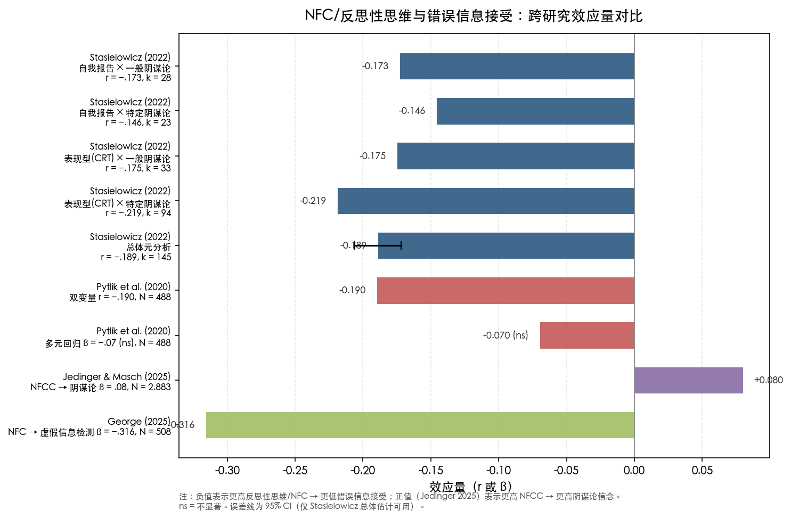

*图 3-1　跨研究效应量对比。负值表示更高反思性思维/NFC 对应更低错误信息接受；正值（Jedinger 2025）表示更高 NFCC 对应更高阴谋论信念。误差线为 95% CI（仅 Stasielowicz 总体估计可用）。ns = 不显著。*

效应量可变性受至少四项因素驱动：(1) **构念与测量工具差异**——使用 NFCC 量表（Kruglanski 构念）与使用 CRT 或 REI（更接近 NfCog）的研究捕捉的认知维度不同；(2) **控制变量的纳入**——Pytlik et al. (2020) 表明控制 Faith in Intuition 后 NFC 独立效应可能消失，提示直觉依赖可能是更近端的中介变量而非平行预测因子；(3) **错误信息类型**——NFC 对阴谋论信念、健康错误信息、假新闻标题判断的效应大小各异，George (2025) 的逐帖分析表明效应具有内容特异性；(4) **信息环境的情境特征**——Marchlewska et al. (2018) 的核心发现是 NFCC 效应方向取决于阴谋论解释的可及性，这意味着不控制信息情境的研究中，效应量异质性部分来源于未被测量的情境变量。

### 3.6.2 自我报告与表现型测量的效应差异

Stasielowicz (2022) 的子组分析表明，自我报告型测量（*r* = −.146 至 −.173）与表现型测量（*r* = −.175 至 −.219）效应方向一致但大小略有差异。Pytlik et al. (2020) 对此提供了更深入的讨论：阴谋论信念者可能在自我报告中声称自己是"理性的"（高 NFC/NfCog 自评分），但实际认知表现（CRT、JTC 任务）却揭示出相反的倾向。这一"自评-表现解离"具有重要的方法论含义——依赖自我报告量表的研究可能系统性地低估反思性思维与错误信息接受之间的真实关联强度。

### 3.6.3 因果推断的局限

绝大多数 NFC-错误信息研究采用横截面相关设计，无法确立因果方向。Stasielowicz (2022) 指出，其元分析覆盖的 64 篇文章中仅约 6 项采用实验设计来检验反思性思维操纵对阴谋论信念的因果效应。Hutmacher et al. (2024) 虽采用实验设计但发现 NFC 无显著独立效应；Jedinger & Masch (2025) 的面板设计（NFCC 先于因变量测量）改善了时间先行性，但仍无法排除遗漏变量的混杂。

因果方向的不确定性具有实质性的理论意义。除"高 NFC → 更易接受错误信息"这一默认方向外，替代性假设——如"长期暴露于错误信息和低质量信息环境 → 认知闭合需要上升"——在理论上同样可行。NFC 的 trait-state 双重属性（见第1章）意味着持续的信息环境威胁感知可能通过 state NFC 的慢性激活逐步影响 trait NFC 水平，形成正反馈回路。

### 3.6.4 WEIRD 样本偏倚

几乎所有高质量 NFC-错误信息研究均来自西方、教育程度高、工业化、富裕、民主（WEIRD）国家的样本。Sultan et al. (2024) 的 PNAS 元分析仅限于美国样本；Pytlik et al. (2020) 采用德国样本；Erceg et al. (2020) 采用克罗地亚样本；Jedinger & Masch (2025) 基于德国面板数据；George (2025) 的被试全部为美国成人。非西方文化背景下 NFC 与错误信息关系的实证研究极为稀缺。鉴于 NFC 的 seizing/freezing 机制在不同文化中的知识权威结构和信息生态中可能产生不同效果——例如在集体主义文化中，"最可及的解释"更可能来自社区权威或官方渠道而非个人信息搜索——跨文化验证构成该领域最紧迫的方法论缺口之一。

## 3.7 本章小结

现有实证证据支持 NFC/NFCC 与错误信息接受之间存在统计显著但中等偏小的关联（双变量 *r* ≈ −.15 至 −.22）。效应方向高度一致：更高的反思性思维动机与更低的错误信息接受相关。然而，NFC 的独立预测力在控制直觉依赖偏好后可能减弱甚至消失，暗示其对错误信息接受的影响部分通过直觉加工路径传导。效应大小和方向受信息类型、信息环境情境特征以及测量工具选择等多重因素的调节。

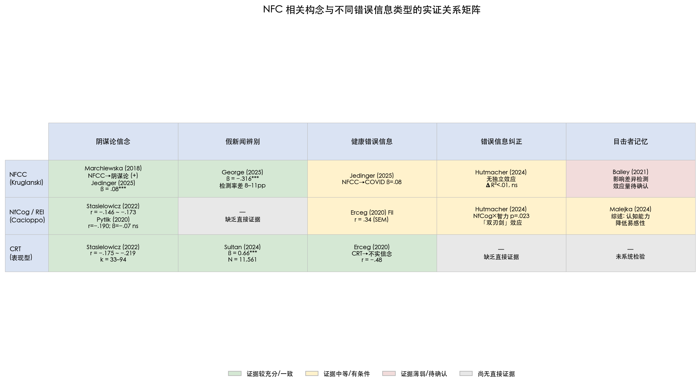

*图 3-2　NFC 相关构念（NFCC / NfCog-REI / CRT）与五类错误信息的实证关系矩阵。背景色区分证据充分程度：绿色 = 证据较充分且一致，黄色 = 证据中等或有条件，粉色 = 证据薄弱，灰色 = 尚无直接证据。*

从 NFC/NFCC 理论视角审视，本章核心发现可概括为：关键不在于高 NFC 个体"总是"更容易接受错误信息，而在于他们更倾向于"急切抓取"当前最可及的解释——该解释可能是阴谋论，也可能是官方叙事。方法论层面，因果证据的匮乏与 WEIRD 样本的主导地位是制约该领域结论强度的两个核心瓶颈。这些效应异质性与边界条件将在第4章中得到进一步系统分析。

# 第4章 调节与中介机制

第3章的实证综述表明，NFC/NFCC 与错误信息接受之间的关联在效应方向上高度一致，但在效应大小上呈现相当的可变性。双变量相关约 *r* ≈ −.15 至 −.22，然而在控制直觉依赖后可能趋近于零（Pytlik et al., 2020），在控制政治信任后大幅缩减（Jedinger & Masch, 2025），且效应方向本身取决于信息环境中何种解释最为可及（Marchlewska et al., 2018）。这些异质性不能简单归结为测量噪音——它们指向一个更根本的理论问题：NFC 对错误信息接受的影响通过什么路径传导？在什么条件下效应增强、减弱或发生逆转？

本章围绕两条分析主线展开。第一条是**中介机制**：NFC 与错误信息接受之间的"黑箱"中存在哪些传导变量？现有证据指向两类通路——认知通路（直觉依赖、启发式加工、跳跃式结论偏差）与社会动机通路（政治信任缺失、系统正当化、权威主义取向）。第二条是**调节机制**：哪些变量改变了 NFC 效应的大小或方向？本章依次考察信息情境因素（阴谋论解释的可及性、来源可信度、混合信息环境）、政治与意识形态变量、其他个体差异（教育、自恋、独特性需要），以及 NFC 五个子维度的差异化效应。

## 4.1 中介机制：从 NFC 到错误信息接受的传导路径

### 4.1.1 认知通路：直觉依赖与启发式加工

NFC 理论的核心预测在于：高 NFC 个体在"急切抓取"（seizing）阶段过度依赖直觉性、低努力的信息加工策略，从而更易接受表面可信的错误信息。该预测在实证上获得了部分支持，但关键证据主要来自对邻近构念——尤其是 Faith in Intuition（直觉信赖）和"跳跃式结论"（jumping-to-conclusions, JTC）偏差——的考察。

Pytlik, Soll & Mehl (2020, *Frontiers in Psychiatry*, *N* = 488) 提供了直觉依赖作为近端中介的最直接证据。该研究采用 REI 理性分量表（操作化为反思性思维偏好，概念上更接近 Need for Cognition 而非严格的 NFC/NFCC）和 REI 直觉分量表（操作化为 Faith in Intuition）。在双变量水平上，反思性思维偏好与阴谋论信念的相关为 *r* = −.190（*p* < .001）；但在纳入 Faith in Intuition 的多元回归模型中，反思性思维偏好不再显著（β = −.07, *p* = .13），而 Faith in Intuition 显著正向预测阴谋论信念（β = 0.34, *p* < .001）。与此同时，表现出 JTC 偏差的被试（在 fish task 中仅观看 1–2 条鱼即做出决定）报告了显著更高的阴谋论信念（Cohen's *d* = 0.53, *p* < .001）[Pytlik et al. 2020](https://pmc.ncbi.nlm.nih.gov/articles/PMC7530244/ "Frontiers in Psychiatry: 思维偏好与阴谋论信念")。

上述发现的中介含义需要审慎解读。虽然 Pytlik 等人并未以正式的中介分析检验"NFC → Faith in Intuition → 阴谋论信念"路径，但变量间的关系模式与中介模型一致：NFC（反思性思维偏好的缺乏）的效应在控制直觉依赖后趋近于零，提示直觉依赖可能是 NFC 影响阴谋论信念的近端传导机制。从 seizing 过程的理论内涵看，这一结果具备逻辑一致性——seizing 的实质正是对低努力、直觉性加工策略的过度依赖，而 JTC 偏差则是该过程的行为表征：在信息尚不充分时即匆忙形成判断。

进一步的间接支持来自 Erceg, Ružojčić & Galić (2020, *Current Psychology*, *N* = 1,439) 在克罗地亚样本中的结构方程模型。该研究发现 Faith in Intuition 正向预测 COVID-19 不实信念（潜变量相关 *r* = .34），CRT 则负向预测不实信念（潜变量相关 *r* = −.48）。综合这两项研究的证据，一个初步判断浮现：就错误信息接受的近端认知机制而言，"主动依赖直觉"可能比"缺乏分析性思考动机"更具解释力。

### 4.1.2 认知通路：流体智力与 NFC 的交互

Hutmacher, Appel, Schätzlein & Mengelkamp (2024, *Cognitive Research: Principles and Implications*) 的两项预注册实验（*N*₁ = 355, *N*₂ = 725）虽未直接检验中介模型，但其交互分析揭示了认知能力与认知动机在错误信息纠正过程中的复杂关系。流体智力显著预测错误信息纠正后的态度改变（β = 0.15–0.17），而 NFC（此处为 Need for Cognition, Cacioppo 构念）无显著独立效应（ΔR² < .01, *p* = .205）。事后分析发现的交互效应（*p* = .023）揭示了一个重要的非线性模式：当 NFC 低至中等时，流体智力显著预测纠正效果；当 NFC 高于均值一个标准差时，流体智力的效应消失 [Hutmacher et al. 2024](https://pmc.ncbi.nlm.nih.gov/articles/PMC11411052/ "Cognitive Research: 流体智力 vs NFC")。

该交互效应的理论解释涉及 NFC 的"双刃剑"属性。高认知动机个体在初始信息暴露阶段可能投入更多认知资源构建态度，导致初始信念经过更充分的加工而更加"固化"——这一过程对应 NFC 理论中的 freezing 机制。当后续纠正信息出现时，更强的初始态度固化抵消了流体智力带来的纠正优势。需要指出的是，此处的 NFC 是 Cacioppo 的认知需求构念而非 Kruglanski 的认知闭合需要，但 seizing-freezing 框架下的推论具有理论迁移价值：高 NFCC 个体在 seizing 阶段快速形成判断后，freezing 机制使其抵抗后续纠正信息，该过程可能独立于——甚至抵消——认知能力的保护作用。

### 4.1.3 社会动机通路：政治信任与制度怀疑

NFC 对错误信息接受的影响并不仅仅通过认知加工路径传导，社会动机变量——尤其是对政治制度和权威的信任程度——亦可能构成间接作用的通道。

Jedinger & Masch (2025, *Frontiers in Social Psychology*, GESIS Panel, *N* = 2,883) 为该通路提供了关键实证证据。该研究发现 NFCC 对 COVID-19 阴谋论信念具有显著但较弱的正向效应（β = 0.08, *p* < .001），而政治信任（β = −.33）和危机信任（β = −.51）是远更强的预测因子。尤其值得关注的是一个关键零结果：预注册假设中政治信任调节 NFCC 效应的交互项在所有模型中均不显著（β = 0.00, 95% CI [−0.03, 0.04]）。该研究设计具有时间先行性优势——NFCC 和政治信任均于 2018 年（疫情前）测量，因变量为 2020 年的 COVID-19 阴谋论信念 [Jedinger & Masch 2025](https://www.frontiersin.org/journals/social-psychology/articles/10.3389/frsps.2024.1447313/full "Frontiers in Social Psychology 2025")。

该零交互结果的理论意义不容忽视。它表明 NFCC 和政治信任对阴谋论信念的影响相对独立——政治信任缺失并非 NFCC 效应的放大器或传导路径，二者更可能通过不同的心理机制分别作用于阴谋论信念。从理论角度解读，NFCC 提供的是一种"认知风格"层面的易感性（倾向于急切抓取确定性解释），而政治信任缺失提供的是一种"动机方向"层面的推力（对官方解释的不信任使替代性解释——包括阴谋论——成为更具吸引力的选项）。两条路径平行运作，而非交互运作。

### 4.1.4 社会动机通路：系统正当化与 NFCC 的调节性中介

Loverrea, Bonora et al. (2025, *Psychology Hub*, *N* = 138, 意大利样本) 从系统正当化理论（system justification theory）出发，检验了 NFCC 在系统正当化→阴谋论信念路径中的调节作用。该研究区分了一般阴谋论心态（general conspiracy mentality）和特定阴谋论信念（specific conspiracy beliefs），并发现了一个差异化的调节模式：低 NFCC 条件下，系统正当化对一般阴谋论心态的负向效应最强（β = −0.35, *p* < .001），与系统正当化理论的核心预测一致——认同现有系统的个体较少需要阴谋论来解释社会不公。然而，在从一般阴谋论心态到特定阴谋论信念的转化过程中，NFCC 的调节方向发生逆转：高 NFCC 个体的转化效应更强（高 NFCC: β = 0.39, *p* < .001 vs. 低 NFCC: β = 0.01, n.s.）[Loverrea et al. 2025](https://www.researchgate.net/publication/398681504 "Psychology Hub, 2025")。

从 freezing 机制的视角解读，高 NFCC 个体一旦形成一般性的阴谋论心态，更容易将这种一般倾向"固化锁定"为对特定事件的阴谋论解释——freezing 过程促进了从抽象态度到具体信念的转化。该研究的样本量较小（*N* = 138），外部效度受限，但其对 NFCC 在信念固化阶段（而非信念形成阶段）的调节作用的区分，为理解 seizing 与 freezing 两个过程的差异化功能提供了有价值的初步证据。

### 4.1.5 社会动机通路：RWA 与 SDO 的中介作用

Roets & Van Hiel (2006, *Psychologica Belgica*, Vol.46(3)) 检验了 NFC 通过意识形态态度影响偏见和保守主义信念的中介路径，发现右翼权威主义（Right-Wing Authoritarianism, RWA）和社会支配取向（Social Dominance Orientation, SDO）中介了 NFC 与种族主义及保守主义信念的关系。其中，NFC 的 urgency（急迫）维度主要通过 RWA 路径影响文化保守主义 [Roets & Van Hiel 2006](https://psychologicabelgica.com/articles/10.5334/pb-46-3-235 "Psychologica Belgica, 46(3)")。

虽然该研究的因变量是偏见和保守主义信念而非狭义的错误信息接受，但这条中介路径对理解 NFC → 错误信息关系具有启示意义。鉴于 RWA 与阴谋论信念之间存在稳定的正相关（多项独立研究证实），而 SDO 则与对社会等级秩序的偏好相关，这两种意识形态取向可能构成 NFC 影响政治化错误信息接受的"下游"传导路径。具体而言，高 NFC 个体因渴望确定性和秩序而倾向于接受提供明确等级结构和权威秩序的意识形态（RWA/SDO），而这些意识形态取向又进一步增加对特定类型错误信息——如关于移民、精英阴谋等政治化叙事——的易感性。

## 4.2 调节机制：NFC 效应的边界条件

### 4.2.1 信息情境因素：阴谋论解释的可及性

Marchlewska, Cichocka & Kossowska (2018, *European Journal of Social Psychology*, Vol.48(2), pp.109–117) 的发现构成 NFC-错误信息文献中最具理论启发性的调节效应之一。该研究在多项实验中发现，NFCC 与阴谋论信念的关系取决于阴谋论解释在信息环境中的"可及性"（accessibility）。当阴谋论解释被情境凸显——例如在媒体讨论中已被广泛传播——时，NFCC 正向预测阴谋论信念：高 NFCC 个体更倾向于接受这些阴谋论。然而，在 Germanwings 坠机案情境中，当存在明确的官方非阴谋解释（副驾驶蓄意坠机的调查结论）时，效应方向发生逆转——高 NFCC 个体反而更倾向于接受官方解释、拒绝阴谋论 [Marchlewska et al. 2018](https://onlinelibrary.wiley.com/doi/abs/10.1002/ejsp.2308 "EJSP: NFCC 与阴谋论信念")。

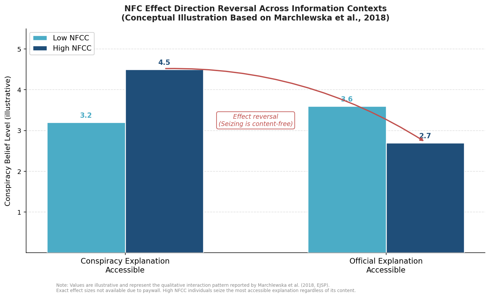

图 4-1 以概念示意形式呈现了上述效应方向逆转的模式。当阴谋论解释可及时，高 NFCC 个体的阴谋论信念水平高于低 NFCC 个体；而当官方解释可及时，高 NFCC 个体的信念水平反而低于低 NFCC 个体。这一交叉交互模式直观展示了 seizing 机制的"内容无关性"。

这一"方向逆转"发现为 seizing 机制提供了精确的操作化验证。高 NFC 个体的核心认知倾向并非偏向某一特定类型的解释（阴谋论或官方叙事），而是偏向当前信息环境中最可及、最能提供认知闭合感的解释。seizing 过程是"内容无关的"（content-free）——它加速了对任何可及性最高的解释的接受。由此推论，NFC 对错误信息接受的影响本质上由信息环境的结构决定：当错误信息是信息环境中最突出、最简洁、最易获取的解释时，高 NFC 个体将率先接受它；当正确信息或官方解释占据主导地位时，高 NFC 个体反而会率先锁定正确解释。

这一调节效应对理解第3章报告的效应量异质性具有直接解释力。在多数研究中，阴谋论解释在实验材料或自然媒体环境中处于"可及"状态，因此 NFCC 与阴谋论信念的相关表现为正向。但跨研究的效应量差异（从 Jedinger & Masch 的 β = 0.08 到 Marchlewska 等人报告的更大效应）可能部分归因于不同研究中阴谋论解释可及性的未测量变异。

### 4.2.2 信息情境因素：混合信息环境中的信念极化

Nan & Daily (2015, *Journal of Health Communication*, Vol.20(4), *N* = 338) 将调节分析从"单一解释的可及性"扩展至"混合信息环境"中的 NFC 效应。该研究发现，当被试同时暴露于支持和反对 HPV 疫苗安全性的博客文章时，信念极化（belief polarization）——即被试在信息暴露后更加坚持原有立场——在高 NFC 个体中最为显著 [Nan & Daily 2015](https://pubmed.ncbi.nlm.nih.gov/25751250/ "J. Health Communication: NFC 与混合健康信息中的信念极化")。

该结果与 freezing 机制的预测高度一致。在混合信息环境中，正反双方的信息同时可及，seizing 机制可能使高 NFC 个体率先"抓取"与先前信念一致的信息，随后 freezing 机制锁定这一选择性加工的结果并抵抗不一致信息，净效应表现为信念极化而非态度改变。该发现对公共健康传播具有直接的实践警示：对高 NFC 个体而言，简单地向信息环境中"增加正确信息"而不减少错误信息的策略可能适得其反——若个体已先接触到错误信息，后续的正确信息非但无法发挥纠正作用，反而可能被选择性地解读为强化原有极化立场的"证据"。

### 4.2.3 信息情境因素：认识论权威与来源效应

Pica, Milyavsky, Pierro & Kruglanski (2021, *European Journal of Social Psychology*, Vol.51(4-5), *N* = 352) 从认识论权威（epistemic authority）的角度揭示了来源特征对高 NFC 个体决策的差异化影响。该研究发现，高 NFC 个体在意见改变和选择行为中更受认识论权威——即被认为具有专业知识和可信度的信息来源——的影响，而非论证质量本身的驱动 [Pica et al. 2021](https://onlinelibrary.wiley.com/doi/abs/10.1002/ejsp.2753 "EJSP: 认识论权威与 NFC")。

该发现对理解 NFC 在错误信息情境中的运作具有双重启示。一方面，高 NFC 个体对权威来源的依赖意味着事实核查机构的来源标签可能对他们特别有效——若事实核查者被视为认识论权威，其纠正信息将被高 NFC 个体优先接受。另一方面，若错误信息附带具有权威外表的来源（如冒充科学机构的网站、知名人物的背书），高 NFC 个体可能因更依赖来源线索而非独立评估论证质量，从而更易被误导。从理论上看，依赖来源线索（而非逐条评估论证）正是 seizing 过程中一种典型的启发式简化策略——通过减少信息加工量以快速达到认知闭合。

### 4.2.4 政治意识形态与党派归属

政治意识形态构成 NFC 效应的重要边界条件，但现有证据揭示的关系远比预期复杂。

George (2025, *PLoS ONE*, *N* = 508) 的逐帖分析表明，NFC 效应的大小取决于信息的政治化程度。在 20 条健康相关社交媒体帖子中，NFC 对 35%（7/20）的帖子是显著预测因子，政治党派对 15%（3/20）显著，50% 的帖子中两者均不显著。政治化程度较高的帖子（如 COVID-19 疫苗相关内容）更多受党派归属驱动，而非认知风格差异。从全样本回归看，NFC 的效应（β = −.316, *p* < .001）强于政治党派（β = −.117, *p* = .006），但这一总体模式掩盖了帖子层面显著的内容特异性 [George 2025](https://pmc.ncbi.nlm.nih.gov/articles/PMC12380328/ "PLoS ONE: NFC 与健康虚假信息检测")。

该发现与 Kahan (2013, *Journal of Decision Making*, Vol.8, *N* = 1,750) 的"表达效用立场"（expressive utility position）形成理论对照。Kahan 发现意识形态动机推理在自由派和保守派中对称存在，且 CRT 高分者反而展示更强的意识形态极化——高认知能力者更善于利用分析性思维保护群体身份 [Kahan 2013](https://ndg.asc.upenn.edu/wp-content/uploads/2017/08/Ideology-motivated-reasoning.pdf "Ideology motivated reasoning, JDM 2013")。将 Kahan 的发现与 NFC 框架结合，可推论：高 NFC 个体在面对政治化错误信息时，seizing 过程可能不是指向"任何可及的解释"，而是指向"与党派身份一致的解释"——因为党派身份本身就是一种强大的认知闭合来源。该推论目前尚缺乏直接检验 NFCC × 政治意识形态交互效应的实证证据。

### 4.2.5 教育、自恋与独特性需要

Cosgrove (2026, *Personality and Individual Differences*, Vol.251, Article 113567, Study 1: *N* = 354, Study 2: *N* = 306) 提供了关于教育作为保护因素的重要限定条件。该研究发现，当自恋性夸大和独特性需要高于均值一个标准差时，教育对阴谋论信念的保护效应变为不显著（*p*s > .44）。NFCC 呈现类似的调节模式（NFC × 硕博教育交互 β = 0.44, *p* = .044），但在控制人口学变量后该效应不再稳定 [Cosgrove 2026](https://www.researchgate.net/publication/398024994 "PAID, 251, 113567")。

Cosgrove 据此提出的"认知-社会动机推理"框架具有整合价值：确定性需要（NFC）、独特性需要和优越感需要（自恋）可以"劫持"推理能力，使之服务于非准确性动机。高教育水平赋予的分析能力在这些社会动机足够强时，非但不能保护个体免受错误信息侵害，反而可能被用于构建更精致的论证来维护错误信念——这与 Kahan (2013) 关于高认知能力者更善于保护身份的发现形成呼应。该框架提示，NFC 与错误信息接受的关系嵌套在更广泛的动机系统中，认知闭合需要仅是多种可能驱动非准确性信息加工的动机之一。

### 4.2.6 元分析层面的异质性来源

Stasielowicz (2022, *Journal of Research in Personality*, Vol.98, Article 104229) 在另一项元分析中专门考察了人格特质与阴谋论信念关联的异质性来源，发现测量方法——使用一般阴谋论心态量表还是特定阴谋论信念量表——是调节效应异质性的显著预测因子 [Stasielowicz 2022](https://www.sciencedirect.com/science/article/abs/pii/S0092656622000423 "JRP: 人格特质与阴谋论信念的元分析")。一般阴谋论心态测量的效应量通常大于特定阴谋论信念，这一差异可能源于一般心态量表捕捉的是稳定的认知风格（与 NFC 这一特质变量更为匹配），而特定信念受更多情境变量——如事件的媒体曝光度、政治极化程度——的影响，从而引入了额外的异质性方差。

## 4.3 NFC 子维度的差异化效应

NFC 并非单一构念——NFCS 的五个维度（Order, Predictability, Decisiveness, Ambiguity Discomfort, Close-Mindedness）可能通过不同路径影响错误信息接受。近年来的研究已开始探索这一维度层面的差异化效应。

Staszak, Krawczyk, Holas & Kossowska (2022, *International Journal of Environmental Research and Public Health*, Vol.19(22), *N* = 380) 提供了 NFC 子维度与 COVID-19 阴谋论信念关系的最细粒度证据。该研究发现 Close-Mindedness（封闭心态）和 Avoidance of Ambiguity（回避模糊）与 COVID-19 阴谋论信念关系最为密切，且中介分析显示阴谋论信念完全中介了恐惧与这两个维度的关系 [Staszak et al. 2022](https://pmc.ncbi.nlm.nih.gov/articles/PMC9690611/ "IJERPH: NFC 子维度与 COVID-19 阴谋论")。从理论角度审视，Close-Mindedness 对应 freezing 过程（抵制新信息的进入），而 Avoidance of Ambiguity 对应 seizing 的动机根源（模糊状态的不适驱动快速判断），两者对错误信息接受的贡献可能通过不同的认知路径运作。

Gundersen et al. (2024) 在四国跨文化研究中进一步发现 Close-Mindedness 和 Need for Predictability 与错误信息易感性相关，但具体模式因国家而异——该发现暗示 NFC 子维度的差异化效应可能与文化背景产生交互。在对确定性和可预测性有不同规范性期待的文化中，各子维度与错误信息接受的关联方向和强度可能呈现系统性差异。

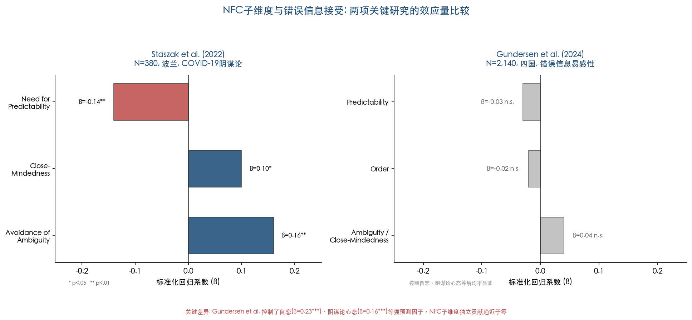

图 4-2 对比了 Staszak et al. (2022) 与 Gundersen et al. (2024) 两项研究中 NFC 子维度的标准化回归系数。值得注意的是，Gundersen et al. 在控制自恋（β = 0.23, *p* < .001）、阴谋论心态（β = 0.16, *p* < .001）等强预测因子后，NFC 子维度的独立贡献趋近于零，提示子维度效应的稳健性在纳入更全面的预测因子集后可能大幅衰减。

Decisiveness（果断性）维度的特殊性值得单独讨论。如第1章所述，该维度在 NFCS 的因素分析中始终表现出与其他四个维度不同的载荷模式。Roets & Van Hiel (2007) 区分了能力型果断性（ability-based decisiveness）和需要型果断性（need-based decisiveness），发现仅后者能预测 seizing 过程。在错误信息研究中，未区分两类果断性的研究可能低估了该维度的真实效应——或者错误地将其归入"无效应"类别。

## 4.4 综合讨论：从路径图到理论整合

综合本章证据，NFC/NFCC 对错误信息接受的影响可被概括为一个多通路、条件性的理论模型。

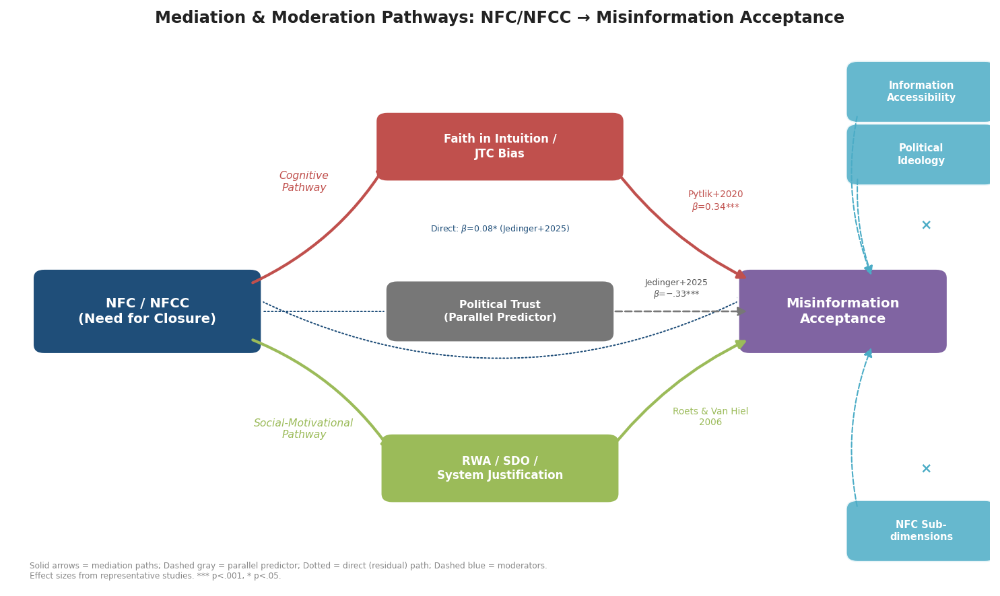

图 4-3 以路径图形式整合了本章讨论的两条中介通路（认知通路与社会动机通路）、一条平行预测路径（政治信任）以及三类调节变量（信息可及性、政治意识形态、NFC 子维度），并标注了代表性效应量与来源研究。

在**中介层面**，至少存在两条可区分的传导通路。认知通路中，直觉依赖和 JTC 偏差是 NFC 影响错误信息接受的近端机制——Pytlik et al. (2020) 的证据表明，NFC 的效应在控制直觉依赖后趋近于零，提示 seizing 过程通过增强直觉性加工而非直接作用于信念内容来影响错误信息接受。社会动机通路中，RWA/SDO（Roets & Van Hiel, 2006）和系统正当化（Loverrea et al., 2025）为 NFC 影响政治化错误信息提供了"下游"传导路径。政治信任则作为独立的平行预测因子运作，而非 NFCC 效应的放大器——Jedinger & Masch (2025) 的零交互结果（β = 0.00, 95% CI [−0.03, 0.04]）明确确认了这一判断。

在**调节层面**，信息环境的结构特征是决定 NFC 效应方向和大小的最关键因素。Marchlewska et al. (2018) 的"方向逆转"发现表明，高 NFC 个体的 seizing 过程是内容无关的——它加速接受信息环境中最可及的解释，无论该解释是错误信息还是正确信息。混合信息环境则可能触发 freezing 机制导致信念极化（Nan & Daily, 2015），来源权威性线索在高 NFC 个体中产生增强的影响（Pica et al., 2021）。在个体差异层面，教育的保护效应可被自恋、独特性需要等社会动机因素抵消（Cosgrove, 2026），NFC 子维度中 Close-Mindedness 和 Avoidance of Ambiguity 与错误信息接受的关联最为密切（Staszak et al., 2022）。

上述多通路模型揭示了 NFC 在不同研究中效应量异质性的深层原因：NFC 并非通过单一路径以恒定强度作用于错误信息接受，而是通过多条可替代的路径运作，每条路径的激活程度和效应大小取决于信息环境、文化背景与其他个体差异变量的组合。对于第5章将讨论的干预策略而言，这一认识意味着有效干预需同时关注信息环境的结构设计（确保正确信息的可及性优于错误信息）和个体认知过程的引导（降低直觉依赖、提供替代性因果解释），而非仅仅针对 NFC 本身。

# 第5章 干预策略与实践应用

第4章的机制分析揭示了若干可干预节点：信息环境中正确解释的可及性决定了高 NFC 个体 seizing 的方向 [Marchlewska et al. 2018](https://onlinelibrary.wiley.com/doi/abs/10.1002/ejsp.2308 "EJSP: NFCC与阴谋论信念")，直觉依赖是 NFC 影响错误信息接受的近端认知通路 [Pytlik et al. 2020](https://pmc.ncbi.nlm.nih.gov/articles/PMC7530244/ "Frontiers in Psychiatry: 思维偏好与阴谋论")，而认识论权威线索在高 NFC 个体中具有放大效应 [Pica et al. 2021](https://onlinelibrary.wiley.com/doi/abs/10.1002/ejsp.2753 "EJSP 2021")。这些机制发现为干预策略的设计提供了理论基础。然而，从机制理解转向实践转化时，一个首要现实不容回避：直接检验 NFC 与特定干预类型交互效应的实证研究极为稀少。这一空白本身构成本章的核心发现之一——它既限定了现有策略的循证基础，也指明了未来研究的优先方向。

本章依次评估五类干预策略在不同 NFC 水平个体中的效果证据：准确性提示与能力建设干预、来源可信度与平台标签设计、纠正信息呈现策略、自我肯定与动机层面干预，以及 AI 对话式干预。在每一类策略中，分析区分三种证据状态：已有直接实证、可从机制推论获得的理论预测，以及完全空白的实证领域。

## 5.1 准确性提示与能力建设干预

### 5.1.1 NFC 不调节准确性提示效果：丹麦实验证据

准确性提示（accuracy nudge）是近年来减少错误信息分享最具影响力的干预策略之一。其核心思路在于：在信息分享决策前激活个体的准确性动机，从而抑制党派性动机或惰性分享。该策略的理论基础隐含一个假设——个体在默认状态下未充分运用准确性判断能力，轻度提示即可激活 System 2 校正功能。

Rasmussen, Andersen, Roozenbeek, Rantzau & Lindholt (2024, *Journal of Experimental Political Science*, Vol.11(3)) 在丹麦开展的两项大规模实验（*N*₁ = 2,232, *N*₂ = 2,012）提供了迄今最为直接的证据。该研究系统比较了三种干预策略：准确性提示、15 秒简短能力建设视频以及 3 分钟详细能力建设视频。结果显示，3 分钟能力建设视频显著降低了虚假信息分享意图（*b* = −0.055, *d* = −0.222）并提升了自我效能感（*d* = 0.274），而准确性提示和 15 秒视频的效果相对有限。核心发现在于：**NFC 不调节上述任何一种干预的效果**——无论个体的 NFC 水平高低，三种干预策略的效应大小均保持一致 [Rasmussen et al. 2024](https://www.cambridge.org/core/journals/journal-of-experimental-political-science/article/public-health-communication-reduces-covid19-misinformation-sharing-and-boosts-selfefficacy/A8D26780C3BF1FA037B8FC6D340BB2BE "JEPS 2024")。

这一零调节结果具有双重含义。从理论角度看，它暗示能力建设干预的作用机制可能绕过了 NFC 的 seizing/freezing 过程——通过直接提升个体的错误信息识别技能而非改变其认知动机来发挥效果。从实践角度看，该结果释放了积极信号：能力建设干预可以作为"普适性"工具加以部署，无需根据受众的 NFC 水平进行个性化调整。

### 5.1.2 NFC 不独立预测纠正效果

在纠正类干预中，NFC 同样未展现独立的预测效应。De keersmaecker & Roets (2017) 在分析智力与态度纠正的关系时将 NFC 作为控制变量纳入，加入 NFC 后主效应保持不变，表明 NFC 的解释力可被认知能力变量完全吸收。Hutmacher, Appel, Schätzlein & Mengelkamp (2024, *Cognitive Research: Principles and Implications*, *N*₁ = 355, *N*₂ = 725) 的两项预注册实验进一步确认了这一模式：流体智力显著预测错误信息纠正后的态度改变（β = 0.15–0.17），而 NFC（此处为 Need for Cognition, Cacioppo 构念）无显著独立效应（ΔR² < .01, *p* = .205）[Hutmacher et al. 2024](https://pmc.ncbi.nlm.nih.gov/articles/PMC11411052/ "Cognitive Research 2024")。

综合 Rasmussen et al. (2024) 和 Hutmacher et al. (2024) 的证据，一个初步判断得以成立：NFC 对干预效果的调节作用在现有实证中尚未获得支持。这并不意味着 NFC 在干预情境中毫无意义——第4章已表明 NFC 通过直觉依赖和信息可及性间接影响信息加工，但这些间接路径在结构化干预（提供明确的替代解释或技能训练）面前可能丧失边界效应。

## 5.2 来源可信度线索与平台标签设计

### 5.2.1 高 NFC 个体对认识论权威的特殊敏感性

能力建设干预可能绕过 NFC 的影响路径，但来源可信度线索则与 NFC 的核心机制存在更为直接的交互关系。Pica, Milyavsky, Pierro & Kruglanski (2021, *European Journal of Social Psychology*, Vol.51(4-5), *N* = 352) 发现，高 NFC 个体在意见改变和选择行为中更受认识论权威（epistemic authority）的影响——即更倾向于依赖被认为"值得信赖的知识来源"来形成和维持信念 [Pica et al. 2021](https://onlinelibrary.wiley.com/doi/abs/10.1002/ejsp.2753 "EJSP 2021")。

这一发现与 seizing 机制高度吻合：高 NFC 个体在急切抓取确定性答案时，倾向于将来源线索作为快速的可信度启发式加以利用。在错误信息语境下，该机制呈现双刃剑效应——当来源线索指向高可信度权威机构时，事实核查信息的接受度得到增强；当错误信息附着于看似权威的来源时，其接受度同样被放大。对平台设计的启示在于：来源标签和事实核查标识在高 NFC 用户群体中可能产生超出总体平均水平的效果，前提是标签本身被用户感知为源自可信权威。

### 5.2.2 NFCC 与错误信息警告标签态度

Kaufman, Seberger, Pan & Gilbert (2025, *Proceedings of the ACM on Human-Computer Interaction*, CSCW, MTurk *n* = 132, 本科生 *n* = 112) 将 NFCC 引入平台标签研究，发现 NFCC 是显著预测个体对错误信息警告标签态度的因素 [Kaufman et al. 2025](https://dl.acm.org/doi/10.1145/3757521 "PACM HCI, CSCW 2025")。该研究受付费墙限制，完整回归系数尚未获取，但其核心贡献在于将认知闭合需要纳入人机交互领域的设计考量——错误信息警告标签的有效性可能系统性地受到用户 NFC 特征的影响。

综合 Pica et al. (2021) 和 Kaufman et al. (2025) 的证据，可以合理推断：对高 NFC 个体而言，来源可信度线索和平台标签可能是比一般性准确性提示更具效力的干预杠杆。推断的逻辑基础在于 seizing 机制对"确定性信号"的偏好——来源标签提供的恰恰是"这条信息是否可靠"的确定性判断线索，而这正是高 NFC 个体最为渴望获得的信息类型。

## 5.3 纠正信息呈现策略：替代解释的核心地位

### 5.3.1 高 NFC 个体对替代因果解释的特殊需求

持续影响效应（continued influence effect）研究表明，简单否定错误信息（"X 说法是假的"）的纠正效果远不如提供替代因果解释（"X 说法是假的，实际原因是 Y"）。这一一般性发现对高 NFC 个体具有特殊的理论意义。Guess, Nagler & Tucker (2020, *Social Media and Democracy*, Cambridge University Press, Ch.8) 指出，高 NFC 个体无法容忍心理模型中的因果空白——当错误信息被否定却未获替代解释时，个体的因果模型出现"空洞"，而高 NFC 个体对这种不确定状态的耐受力最低。在缺乏替代解释的条件下，他们可能更倾向于保留原有的错误信息以维持因果模型的完整性 [Guess et al. 2020](https://www.cambridge.org/core/books/social-media-and-democracy/misinformation-and-its-correction/61FA7FD743784A723BA234533012E810 "Social Media and Democracy, Ch.8")。

这一理论推演与 Marchlewska, Cichocka & Kossowska (2018, *European Journal of Social Psychology*, Vol.48(2)) 的核心发现形成呼应：高 NFCC 个体 seize 当前信息环境中最可及的确定性解释——当阴谋论解释被凸显时接受阴谋论，当官方解释被凸显时接受官方解释 [Marchlewska et al. 2018](https://onlinelibrary.wiley.com/doi/abs/10.1002/ejsp.2308 "EJSP: NFCC与阴谋论信念")。从干预设计角度出发，这一机制意味着纠正策略的重心不在于"否定错误信息"，而在于"确保正确的替代解释成为信息环境中最可及的选项"。对高 NFC 个体而言，替代解释的可及性和确定性程度可能是决定纠正成败的关键变量。

### 5.3.2 事后纠正优于前瞻性预警

van Huijstee, Bernritter, Weinmann & Loth (2025, *New Media & Society*, *N*₁ = 657, *N*₂ = 427) 比较了 debunking（事后纠正）与 forewarning（前瞻性预警）两种策略的效果，发现 debunking 效应量 *d* = 0.61，显著优于 forewarning。该研究还明确将 NFC 列为未来应探索的调节变量，确认了这一实证空白的存在 [van Huijstee et al. 2025](https://journals.sagepub.com/doi/10.1177/14614448251359988 "New Media & Society 2025")。

从 NFC 理论角度推演，debunking 优于 forewarning 的结果具有内在一致性。Forewarning 要求个体在接触错误信息之前即保持警觉——这是一种需要持续认知资源投入的策略，而高 NFC 个体的 seizing 倾向恰与之矛盾：他们倾向于快速接受最先接触到的信息，而非保持开放的判断状态。Debunking 则在错误信息已被接受后提供替代解释，其作用机制更接近于"替换"而非"预防"——对高 NFC 个体而言，这可能是更为可行的策略路径，因为它不要求个体在 seizing 阶段延迟判断，而是在 freezing 尚未完全固化时提供新的确定性锚点。

### 5.3.3 混合信息环境中的信念极化风险

并非所有纠正策略对高 NFC 个体均产生积极效果。Nan & Daily (2015, *Journal of Health Communication*, Vol.20(4), *N* = 338) 发现，当个体暴露于 HPV 疫苗正反混合博客信息时，信念极化效应在高 NFC 个体中最为显著 [Nan & Daily 2015](https://pubmed.ncbi.nlm.nih.gov/25751250/ "J. Health Communication 2015")。

这一发现对公共健康传播策略具有直接的警示意义。在混合信息环境中——即正确信息与错误信息同时存在且可及性相当——高 NFC 个体的 freezing 机制可能将既有信念进一步固化：先前已接受某一立场的个体在遭遇反面证据时，触发了对既有信念的防御性加固，而非重新评估。实践层面的启示在于：单纯增加"正确"信息的数量而不降低"错误"信息的可及性，对高 NFC 个体可能适得其反。有效的纠正策略需要同时管理信息环境的两端——提升正确信息的优先可及性，同时降低错误信息的显著度。

## 5.4 动机层面干预：自我肯定与身份安全

### 5.4.1 自我肯定降低阴谋论吸引力

前述三类策略聚焦于认知层面的干预路径，但第4章的分析已表明 NFC 对错误信息接受的影响部分通过社会动机通路传导——系统正当化、独特性需要和群体身份保护均可能放大 NFC 的效应。因此，直接针对动机层面的干预同样值得系统考察。

Saucier, Calabrese & Walter (2025, *Journal of Media Psychology*, Vol.37(5)) 发现，自我肯定任务（self-affirmation task）减少了参与者阅读政治化阴谋论的倾向。该研究将 NFC 和归属需要（need for belonging, NFB）作为核心动机变量纳入分析，确认了这些变量在阴谋论吸引力中的角色 [Saucier et al. 2025](https://econtent.hogrefe.com/doi/10.1027/1864-1105/a000481 "J. Media Psychology 2025")。受付费墙限制，NFC × 自我肯定交互的具体效应量尚未获取，但自我肯定干预的理论逻辑与 NFC 机制高度契合：自我肯定通过降低身份威胁感，可能减弱个体对确定性答案的防御性需求，从而降低 seizing 的紧迫程度。

从更广泛的理论框架审视，自我肯定干预的潜在价值在于它作用于 NFC 的上游动机。如果 NFC 的部分变异源于身份威胁和不确定性焦虑（这与 NFC 的 state 属性一致：威胁感知可提升情境性 NFC），那么降低威胁感知即可降低情境性 NFC 水平，从而间接削弱 seizing 和 freezing 倾向。

## 5.5 AI 对话式干预：新兴方向

Costello, Pennycook & Rand (2024, *Science*, Vol.385(6714), *N* = 2,190) 报告了一项突破性发现：由 GPT-4 Turbo 驱动的个性化对话平均减少了约 20% 的阴谋论信念，且效果持续至少两个月 [Costello et al. 2024](https://www.science.org/doi/10.1126/science.adq1814 "Science 2024")。该研究未测量 NFC，但其干预机制与 NFC 理论之间存在值得关注的理论联系。

AI 对话式干预可能通过三条路径与 seizing/freezing 机制发生交互。其一，AI 能够为每位参与者的阴谋论信念提供具体的替代因果解释，直接回应高 NFC 个体对因果模型完整性的需求——这一功能与 Guess et al. (2020) 关于替代解释对高 NFC 个体重要性的理论分析高度一致。其二，AI 对话的渐进式、个性化特征使其有别于一次性的事实核查推送；它允许信念更新以较小增量逐步发生，可能在 freezing 完全固化之前逐步软化既有信念。其三，AI 可被框架为一种非威胁性的认识论权威——它不代表任何政治或意识形态阵营，因此可能规避动机推理的防御反应。

上述理论推演目前尚无直接实证支持，但鉴于 Costello et al. (2024) 的效应量级和持久性，以及 AI 对话干预在规模化部署方面的优势，NFC × AI 对话干预的交互效应应被列为高优先级的研究方向。

## 5.6 心理接种与 NFC：关键实证空白

心理接种（prebunking/inoculation）——即在个体接触错误信息之前，通过暴露弱化版本的误导技术来建立"认知抗体"——是近年来最受关注的错误信息干预策略之一。然而，所有已检索的心理接种研究（含 Roozenbeek & van der Linden 系列）均未纳入 NFC 作为调节变量。van Huijstee et al. (2025) 已明确将 NFC 列为 forewarning 和 debunking 研究中应探索的调节变量。Biddlestone, Roozenbeek & van der Linden (2025, *Journal of Experimental Social Psychology*, *N*₁ = 462, *N*₂ = 464) 虽使用了 Roets & Van Hiel 15 项 NFC 量表，但仅将其作为控制变量纳入，未报告 NFC × 接种效果的交互分析 [PsyPost 报道 Biddlestone et al. 2025](https://www.psypost.org/a-simple-cognitive-vaccine-can-make-you-more-resistant-to-misinformation/ "JESP 2025")。

从理论角度推演，NFC 对心理接种效果的调节方向并不明确，存在两种相反的理论预测。一方面，心理接种的核心机制是在接触错误信息前建立"元认知警觉"——这要求个体在后续信息接触中保持开放的判断状态，而高 NFC 个体的 seizing 倾向可能削弱这种持续性警觉。另一方面，心理接种一旦成功安装了"认知抗体"，该抗体本身可能转化为一种新的认知闭合工具——高 NFC 个体可能 seize 已安装的免疫模板，将其作为快速判断的启发式应用于后续信息。这两种相反预测使 NFC × 心理接种的交互方向成为一个有待实证裁决的开放问题。

此外，De keersmaecker et al. (2020, *Personality and Social Psychology Bulletin*, Vol.46, pp.204–215) 确认真相错觉效应在不同 NFC 水平个体中均稳健存在，NFC 并不调节该效应 [De keersmaecker et al. 2020](https://journals.sagepub.com/doi/10.1177/0146167219853844 "NFC不调节真相错觉效应")。这意味着重复暴露产生的 processing fluency 构成 NFC 无法缓冲的"底线"机制——任何依赖减少重复暴露的干预策略（如内容降权、算法调整）对所有 NFC 水平的个体同等重要。

## 5.7 综合评估：NFC 导向干预设计的原则框架

综合上述五类干预策略的证据与推论，可以提炼出若干关于 NFC 导向干预设计的原则性判断。

**原则一：确保正确信息的优先可及性，而非仅仅纠正错误信息。** 这是从 Marchlewska et al. (2018) 的方向逆转发现中获得的最具实践价值的启示。高 NFC 个体 seize 信息环境中最可及的确定性解释——干预策略的首要目标应是管理信息环境的可及性结构，确保可靠来源的解释在时间和空间上优先于错误信息到达受众。在平台设计层面，这意味着事实核查标签应在错误信息首次传播时即时附着，而非事后补充。

**原则二：纠正应提供替代因果解释，避免留下因果模型的空洞。** Guess et al. (2020) 的理论分析表明，高 NFC 个体对因果完整性有特殊需求。有效的纠正信息不应止步于否定错误声明，还应提供一个逻辑自洽、能够填补因果空白的替代解释。在公共健康传播中，"某疫苗说法是假的"远不如"某疫苗说法是假的，实际的作用机制是……"来得有效。

**原则三：利用来源权威性作为高 NFC 个体的干预杠杆。** Pica et al. (2021) 和 Kaufman et al. (2025) 的证据共同表明，高 NFC 个体对认识论权威高度敏感。平台和公共机构在部署事实核查和纠正信息时，应注重来源可信度的标注和传递。来源不明或可信度模糊的纠正信息对高 NFC 个体的效果可能最为有限。

**原则四：能力建设干预具有普适性，无需针对 NFC 进行个性化。** Rasmussen et al. (2024) 的零调节结果表明，结构化的能力建设训练（如教授识别错误信息的具体技巧）在不同 NFC 水平中效果一致。这为大规模、标准化的媒体素养教育项目提供了积极的循证支持。

**原则五：避免在混合信息环境中对高 NFC 个体进行"两面呈现"式纠正。** Nan & Daily (2015) 的极化发现表明：当正确信息与错误信息同时可及且地位相当时，高 NFC 个体的 freezing 机制可能导致既有信念的进一步固化。在健康传播和科学传播中，"平衡报道"策略对高 NFC 受众可能产生适得其反的效果。

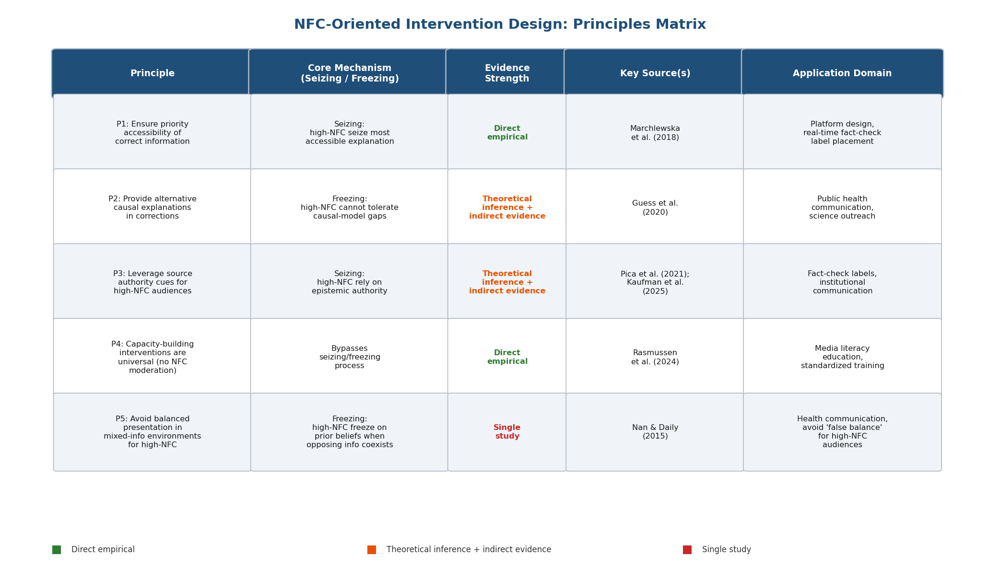

上图以矩阵形式呈现五条干预设计原则，标注各原则对应的 seizing/freezing 核心机制、证据强度、代表性来源研究及适用场景。

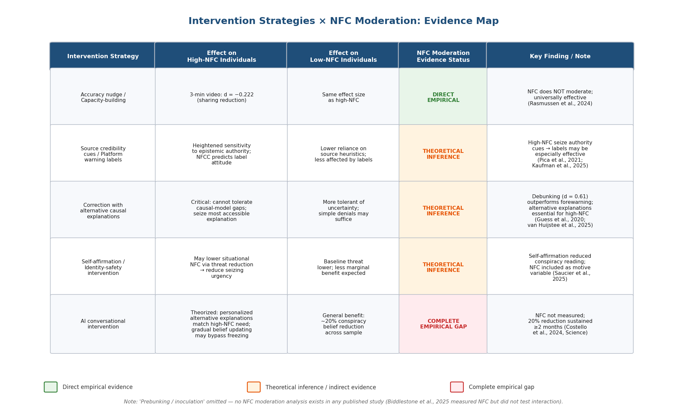

上图以行列对照形式展示五类干预策略在高 NFC 与低 NFC 个体中的已知效果差异，通过颜色编码区分三种证据状态（直接实证、理论推演、完全空白），直观呈现该领域的实证版图与研究缺口。

以上五条原则中，原则一和原则四有直接的实证支持，原则二和原则三基于较强的理论推演和间接证据，原则五基于单一研究的发现。所有原则均有待在更多样化的文化背景和信息情境中接受进一步检验——这一需求将在第6章中展开讨论。

# 第6章 研究前沿与未来方向

前五章的综述揭示了一个贯穿该领域的结构性矛盾：NFC 在理论上被视为理解错误信息易感性的关键动机构念，但在干预实证中几乎未被系统检验为调节变量。Rasmussen et al. (2024) 的零调节结果、Biddlestone et al. (2025) 将 NFC 仅作控制变量而未报告交互分析、以及所有心理接种研究对 NFC 的系统性忽略，共同勾勒出一幅"理论丰富、实证稀薄"的学科图景。本章从六个维度——方法论空白、跨文化盲区、数字环境新挑战、AI 技术冲击、构念整合需求以及系统设计转化前景——审视该领域的前沿与未解问题，旨在为未来研究议程提供具体的优先方向与可操作的设计建议。

## 6.1 方法论空白：因果设计与生态效度的双重缺失

### 6.1.1 纵向与因果设计的系统性缺乏

NFC 与错误信息接受关系的实证基础面临一个根本性方法论限制：绝大多数证据源自横截面相关设计。Kurniawan & Muluk (2025) 覆盖 2005–2025 年文献的系统综述明确指出，该领域过度依赖横截面设计与西方样本，并呼吁转向文化敏感、人格导向的干预策略 [Kurniawan & Muluk 2025](https://papers.ssrn.com/sol3/papers.cfm?abstract_id=5418399 "SSRN: Temporal Bias and Psychological Susceptibility to Misinformation")。这一判断与本报告第3章和第4章的发现高度一致：Stasielowicz (2022) 元分析纳入的 145 项独立样本中，仅约 6 项采用实验设计来检验反思性思维操纵对阴谋论信念的因果效应 [Stasielowicz 2022](https://www.cambridge.org/core/journals/judgment-and-decision-making/article/reflective-thinking-predicts-lower-conspiracy-beliefs-a-metaanalysis/73D77DBC333AA2C1778D8F71A1A918FF "JDM: 反思性思维与阴谋论信念的元分析")。

横截面设计的局限性在 NFC 研究中尤为突出，原因有三。其一，NFC 既是稳定特质又可被情境诱导（其 trait-state 双重属性已于第1章论述），横截面设计无法区分 trait NFC 的长期效应与 state NFC 的瞬时效应。其二，因果方向的模糊性不可忽视——长期持有阴谋论信念的个体可能因反复的"解释成功"体验而强化闭合动机，从而形成错误信息信念与 NFC 之间的正反馈环路。其三，横截面设计无法捕捉 NFC 与错误信息接受之间的动态轨迹，例如在重大公共事件（疫情爆发、选举争议）期间，人群的 state NFC 是否因不确定性升高而系统性上升，进而导致错误信息易感性的阶段性波动。

在时间序列方面，Jedinger & Masch (2025) 的 GESIS Panel 研究（*N* = 2,883）提供了目前最接近纵向设计的证据：其 NFCC 和政治信任测量在疫情前（2018年）完成，阴谋论信念在疫情期间测量，从而确保了时间先行性 [Jedinger & Masch 2025](https://www.frontiersin.org/journals/social-psychology/articles/10.3389/frsps.2024.1447313/full "Frontiers in Social Psychology 2025")。然而该设计仍非严格的多时点纵向追踪——它提供了预测效度证据，却未能揭示 NFC 与错误信息信念随时间的协变动态或因果方向。

### 6.1.2 NFC 情境操纵在错误信息范式中的可行性与不足

经典 NFC 情境操纵范式——时间压力、环境噪音、任务吸引力降低和心理疲劳——已在社会认知研究中被反复验证（Webster & Kruglanski, 1994; Kruglanski & Webster, 1996）。Sultan et al. (2022) 将时间压力范式引入新闻标题判断任务，发现时间压力降低了辨别能力但未改变反应偏向，证明 state NFC 操纵在错误信息研究中具有基本可行性 [引自 Scholten et al. 2024](https://www.pnas.org/doi/10.1073/pnas.2409329121 "PNAS 2024 元分析")。然而该研究的关键缺陷在于未同时测量 trait NFC，因而无法分析 state 操纵与 trait 水平的交互效应，亦无法评估情境操纵在多大程度上覆盖或叠加了 trait NFC 的效应。

这一空白指向一个高优先级的实验设计：采用 2（trait NFC: 高/低，通过 NFCS 或 NFC-15 筛选）× 2（state NFC: 时间压力 vs. 充裕时间）× 2（新闻类型: 真实 vs. 虚假）的因子设计，以信号检测论（SDT）框架分离辨别能力（*d'*）与反应偏向（*c*）。Scholten et al. (2024, *PNAS*) 的元分析已为 SDT 框架在错误信息辨别研究中的应用建立了方法论基准 [Scholten et al. 2024](https://www.pnas.org/doi/10.1073/pnas.2409329121 "PNAS 2024")。值得注意的是，该元分析汇集的 256,337 个判断中没有任何一项研究同时纳入 NFC/NFCC 作为预测变量——这一遗漏本身即刻画出 NFC 在主流错误信息研究范式中的边缘地位。

### 6.1.3 生态效度的挑战

现有 NFC 与错误信息研究几乎全部采用实验室或在线调查范式，被试在控制条件下评估预先筛选的新闻标题或声明。然而真实社交媒体环境中的信息消费远比此复杂——用户面对的是算法推荐的信息流、社交网络转发所携带的社会证据、以及多轮互动中不断更新的信息环境。NFC 的 seizing 机制在高信息密度、低注意力分配的社交媒体滚动浏览场景中可能被显著放大，但这一推论至今缺乏直接的田野实验证据支持。

## 6.2 跨文化研究的紧迫性

### 6.2.1 WEIRD 样本偏差的系统性影响

NFC 与错误信息接受的高质量实证证据几乎全部来自西方、受教育程度较高、工业化、富裕且民主（WEIRD）的样本。Stasielowicz (2022) 元分析的 145 项独立样本主要来源于北美和西欧；Jedinger & Masch (2025) 的准纵向数据来自德国 GESIS Panel；Rasmussen et al. (2024) 的干预实验在丹麦完成；George (2025) 的健康错误信息研究以美国成人为样本。Kurniawan & Muluk (2025) 的系统综述将西方样本偏差列为该领域的首要方法论缺口 [Kurniawan & Muluk 2025](https://papers.ssrn.com/sol3/papers.cfm?abstract_id=5418399 "SSRN 2025")。

这一偏差对研究结论的可迁移性构成实质性威胁。NFC 的理论基础——lay epistemic theory——假设认知闭合动机是一种普遍的人类心理机制，但其表现形式和功能后果可能因文化语境而显著不同。在集体主义文化中，群体共识本身可能构成闭合的替代来源，使得个体层面的 NFC 测量所捕捉的心理过程与西方个体主义情境下有所差异。在威权政治体制中，官方叙事的高可及性可能使高 NFC 个体更倾向于接受而非质疑权威解释——这与 Marchlewska et al. (2018) 关于信息可及性决定 seizing 方向的核心发现一致，但尚未获得跨文化实证检验的直接支持。

### 6.2.2 初步的跨文化线索与缺口

少数研究提供了跨文化差异的初步线索。Wang et al. (2023) 发现 NFC 与政府信任的关系存在显著的中美差异——NFC 在中国与政府信任正相关，在美国则无此关联。这一发现暗示高 NFC 个体在不同政治文化中 seize 不同的"默认"解释框架：在政府权威性较高的社会中，高 NFC 可能导向对官方解释的接受；在政治极化社会中，高 NFC 则可能导向与自身群体一致的解释。Jedinger & Masch (2025) 亦推测 NFC 与阴谋论信念的关系强度可能受媒体极化程度调节，在极化程度更高的国家中效应更强 [Jedinger & Masch 2025](https://www.frontiersin.org/journals/social-psychology/articles/10.3389/frsps.2024.1447313/full "Frontiers in Social Psychology 2025")。

尽管 NFCS 的量表层面跨文化适用性已获初步验证——Mannetti et al. (2002) 和 Kossowska et al. (2002) 在多国样本中确认了因素结构不变性，中文版、土耳其语版、西班牙语版等多语言版本亦已完成适配——但量表等值性并不等同于构念功能等值性。未来研究需从"是否可测量"进阶到"是否以相同方式影响信息加工"，在非 WEIRD 样本中直接检验 NFC → seizing/freezing → 错误信息接受的完整路径模型，并将信息环境特征（媒体极化程度、官方叙事可及性等）纳入宏观调节变量的考察范围。

## 6.3 数字环境中的 NFC：算法推荐与信息茧房

### 6.3.1 算法推荐与 seizing 机制的理论交汇

社交媒体算法通过优化用户参与度来筛选和呈现信息，其核心逻辑——展示用户最可能互动的内容——与高 NFC 个体的 seizing 机制之间存在潜在的协同放大效应。高 NFC 个体倾向于快速抓取最可及的确定性解释（Marchlewska et al., 2018），而算法推荐恰恰提升了与用户既有偏好一致的信息的可及性。这一双重机制可能加速信息茧房的形成：高 NFC 个体更快 seize 算法推荐的一致性信息，freezing 机制进一步抑制对不一致信息的主动搜寻，算法据此强化推荐方向，由此形成自我封闭的信息循环。

这一推论目前完全停留在理论层面。尚无实证研究直接检验 NFC 是否调节算法推荐环境中的信息茧房效应，亦无研究系统比较高 NFC 与低 NFC 个体在算法驱动信息环境中的信息多样性消费差异。鉴于社交媒体已成为全球多数人群的主要新闻来源，这一实证空白具有高度的现实紧迫性。

### 6.3.2 信息过载作为 state NFC 的慢性激活源

数字环境的另一显著特征——持续性信息过载——可能构成 state NFC 的慢性激活源。经典研究已表明时间压力和心理疲劳可在实验室中诱导 state NFC（Webster & Kruglanski, 1994）。社交媒体的高信息密度、快速滚动浏览模式和注意力碎片化则创造了类似甚至更极端的认知负荷条件，可能使绝大多数用户——无论其 trait NFC 高低——都在功能上处于高 state NFC 状态。若这一推论成立，则 NFC 的个体差异效应可能在真实数字环境中被系统性压缩，trait NFC 的解释力将低于实验室研究中所观察到的水平。Nan & Daily (2015, *Journal of Health Communication*, Vol.20(4), *N* = 338) 的发现为此提供了间接支持：在正反混合信息环境中（一定程度上模拟了信息过载情境），高 NFC 个体展现出更强的信念极化 [Nan & Daily 2015](https://pubmed.ncbi.nlm.nih.gov/25751250/ "J. Health Communication 2015")。

## 6.4 AI 生成内容：对高 NFC 个体的特殊威胁

### 6.4.1 深度伪造检测能力的基线危机

AI 生成内容——包括深度伪造视频、AI 合成文本和 AI 生成图像——构成了错误信息领域的最新威胁前沿。世界经济论坛（WEF）《全球风险报告 2026》将错误信息与虚假信息列为顶级短期全球风险，指出 AI 深度伪造已跨越影响公众舆论的关键阈值 [WEF 2026](https://www.weforum.org/stories/2026/03/how-cognitive-manipulation-and-ai-will-shape-disinformation-in-2026/ "WEF 2026")。Lovato et al. (2024, *Nature npj Complexity*, *N* = 2,016) 的实验数据揭示了基线检测能力的严峻现实：在未受提示的情况下，参与者检测深度伪造的准确率仅为 51%，与随机猜测无实质差异 [Lovato et al. 2024](https://www.nature.com/articles/s44260-024-00006-y "Nature npj Complexity 2024")。

这一发现与 NFC 研究的关联在于：若普通人群的深度伪造检测能力已降至随机水平，则个体差异变量（包括 NFC）可能在此类判断任务中丧失预测效力——当任务难度超越人类认知能力的上限时，认知动机差异不再产生有意义的行为差异。替代性地，高 NFC 个体可能采取另一策略：放弃对内容真实性的独立判断，转而依赖来源线索和认识论权威——这与 Pica et al. (2021) 关于高 NFC 个体更受 epistemic authority 影响的发现一致。在深度伪造辨别不可靠的条件下，来源信任可能成为高 NFC 个体的主要甚至唯一判断依据。

### 6.4.2 AI 生成错误信息的来源归因效应

Spearing et al. (2025, *Royal Society Open Science*, *N* = 1,223) 的 AI 来源接种实验发现，AI 生成错误信息的影响并不取决于感知来源（人类 vs. AI），AI 免责声明亦未能降低错误信息依赖 [Spearing et al. 2025](https://pmc.ncbi.nlm.nih.gov/articles/PMC12187399/ "R. Soc. Open Sci. 2025")。该研究未纳入 NFC 作为调节变量进行分析——这代表了一个高优先级的实证空白。从理论角度，高 NFC 个体对来源线索的高敏感性（Pica et al., 2021）可能使 AI 来源标签对其产生差异化效果：当 AI 来源被感知为低可信度时，高 NFC 个体可能更迅速地拒绝此类内容；反之，若 AI 被感知为客观或高效的信息处理者，高 NFC 个体则可能更倾向于接受 AI 生成内容。来源标签效果的方向性取决于 AI 在特定文化与受众中的认识论地位，这一问题本身亦具有跨文化研究价值。

### 6.4.3 治理框架的现有进展与 NFC 维度的缺位

在政策层面，欧盟《人工智能法案》（EU AI Act）第 50 条要求对 AI 生成内容和深度伪造内容进行标注，并要求披露与合成系统的交互，该条款计划于 2026 年 8 月正式执行，违规企业面临最高全球营收 6% 的罚款 [WEF 2026](https://www.weforum.org/stories/2026/03/how-cognitive-manipulation-and-ai-will-shape-disinformation-in-2026/ "WEF 2026")。这一监管方向与 Kaufman et al. (2025, *PACM HCI*, CSCW) 关于 NFCC 预测个体对错误信息警告标签态度的发现形成呼应——标签的实际效果可能因受众的认知动机特征而显著分化 [Kaufman et al. 2025](https://dl.acm.org/doi/10.1145/3757521 "PACM HCI, CSCW 2025")。然而，目前尚无任何政策框架将 NFC 或更广泛的认知闭合动机维度纳入设计考量。政策制定者需认识到，同一标签系统在不同 NFC 水平的用户群体中可能产生截然不同的行为后果——对低 NFC 用户有效的信息标注对高 NFC 用户而言可能既不被注意也不被加工。

## 6.5 Epistemic Motivation 整合框架的构建需求

### 6.5.1 构念碎片化的现状

本报告通篇面临的一个核心困难是认知动机相关构念的碎片化状态。Need for Closure（NFC/NFCC, Kruglanski 构念）指向获得确定性答案的动机；Need for Cognition（NfCog, Cacioppo & Petty 构念）指向享受深度思考的动机；Actively Open-minded Thinking（AOT, Baron 构念）指向对多元观点的开放态度；CRT（Cognitive Reflection Test, Frederick 构念）则是分析性思维的表现型测量。这四类构念在理论上部分重叠，在经验层面呈中度相关，在预测错误信息易感性时提供部分重复但又各有独特贡献的解释方差。

Biddlestone et al. (2025, *JESP*, *N*₁ = 462, *N*₂ = 464) 的发现使这一整合需求更加紧迫：该研究使用 Roets & Van Hiel 15 项 NFC 量表但仅作控制变量处理，发现 AOT 的提升是改善错误信息辨别能力的关键中介，而 CRT 在某些情况下甚至与更高的阴谋论信念相关 [PsyPost 报道 Biddlestone et al. 2025](https://www.psypost.org/a-simple-cognitive-vaccine-can-make-you-more-resistant-to-misinformation/ "JESP 2025")。这一结果暗示，不同 epistemic motivation 构念在错误信息判断中的功能角色可能截然不同——NFC 影响信息搜索的早期阶段（seizing 阶段的搜索范围与终止时机），AOT 影响信息评估的中间阶段（是否主动考虑替代解释），CRT 则影响信息整合的后期阶段（是否修正直觉判断）。

### 6.5.2 整合模型的理论轮廓

目前尚无发表论文正式提出整合 NFC、NfCog、AOT 和 CRT 的统一 epistemic motivation 框架。基于本报告综述的证据，一个可能的整合方向是将这些构念定位于信息加工序列的不同阶段与不同功能层面（参见图1）：

**图1 Epistemic Motivation 整合框架概念图。** 横向流程表示信息加工的四个阶段（搜索→评估→整合→判断），三类 epistemic motivation 构念分别定位于其主要作用阶段，虚线箭头表示各构念对相应阶段的功能影响。该框架为概念性提议，有待结构方程模型的正式检验。

- **信息搜索动机层面**：NFC 决定信息搜索的范围和终止点——高 NFC 缩短搜索、降低信息多样性。
- **信息评估倾向层面**：AOT 决定对竞争性假设的开放程度——高 AOT 增加替代解释的考虑。
- **信息整合能力层面**：CRT/NfCog 决定是否投入认知资源进行深度加工——高 CRT 增加 System 2 校正的概率。

在此框架下，NFC 对错误信息接受的独立效应之所以在控制 Faith in Intuition（Pytlik et al., 2020）或流体智力（Hutmacher et al., 2024）后减弱甚至消失，可从信息加工序列的角度加以解释：这些变量捕捉了序列中更下游的过程。即使个体的搜索范围受限（高 NFC 导致的 seizing），若其评估能力足够强（高 AOT）或深度加工意愿足够高（高 CRT），仍可在有限信息基础上做出相对准确的判断。这一解释为效应量的异质性提供了结构化的理论解释，同时也指明了未来实证检验的具体假设。

### 6.5.3 Cosgrove 框架的启示：认知-社会动机推理

Cosgrove (2026, *Personality and Individual Differences*, Vol.251, Study 1: *N* = 354, Study 2: *N* = 306) 提出的"认知-社会动机推理"框架为构念整合提供了另一种视角。该框架将确定性需要（NFC）、独特性需要（need for uniqueness）和优越感需要（narcissistic grandiosity）并列为三种可将推理能力重新导向非准确性目标的社会动机。实证结果显示，当自恋性夸大和独特性需要高于均值一个标准差时，教育对阴谋论信念的保护效应变为不显著（*p*s > .44）。NFCC 呈现类似的调节模式（NFC × 硕博教育交互 β = 0.44, *p* = .044），尽管在控制人口学变量后未达显著水平 [Cosgrove 2026](https://www.researchgate.net/publication/398024994 "PAID, 251, 113567")。

这一发现与 Kahan (2013) 的"表达效用立场"（expressive-utility posture）形成理论呼应——高认知能力者并非更善于识别真相，而是可能更善于利用分析性思维保护群体身份。NFC 在此框架中的角色值得深入检验：高 NFC 是否同样可能将认知资源导向"快速找到支持既有立场的证据"而非"准确判断信息真伪"，取决于信息环境中何种解释最为可及，以及个体所嵌入的社会身份网络如何形塑其闭合方向。

## 6.6 从个体干预到系统设计：NFC 研究的转化路径

### 6.6.1 信息可及性作为系统设计的核心杠杆

贯穿本报告的一个关键洞察源自 Marchlewska et al. (2018)：高 NFCC 个体 seize 当前最可及的确定性解释，无论该解释是阴谋论还是官方叙事。Jedinger & Masch (2025) 的预注册假设中 NFC × 政治信任交互不显著（β = 0.00, 95% CI [−0.03, 0.04]）进一步暗示，信息环境的结构性特征（何种解释最可及、最先被接触到）可能比个体层面的态度（是否信任政府）更能决定高 NFC 个体的信念走向。

这一推论对系统设计具有直接启示。平台架构可以通过调控信息可及性来引导高 NFC 用户的 seizing 方向——例如，在争议性话题的信息流中优先展示经事实核查的权威解释，使其成为高 NFC 用户最先接触到的信息。第5章所讨论的 AI 对话式干预（Costello, Pennycook & Rand, 2024, *Science*, Vol.385(6714), *N* = 2,190, 平均减少约 20% 阴谋论信念，效果持续≥2个月）亦可被理解为一种可及性干预——AI 对话通过提供具体的替代解释，填补了高 NFC 个体所不能容忍的认知空白 [Costello et al. 2024](https://www.science.org/doi/10.1126/science.adq1814 "Science 2024")。

### 6.6.2 面向 NFC 维度的公共传播策略

将 NFC 纳入公共传播策略设计需要在两个层面展开。第一，在信息内容层面，公共卫生和政策传播应遵循"替代优先于否定"的原则——第5章的综述表明，单纯否定错误信息对高 NFC 个体可能适得其反（freezing 机制导致态度抵抗），而提供清晰、结构化的替代因果解释更可能被 seize 并接受。George (2025, *PLoS ONE*, *N* = 508) 发现高 NFC 个体在健康虚假信息检测中的表现优于低 NFC 个体（检测率 69–72% vs. 61–62%），表明认知闭合动机在信息本身具有明确结构时可被引导向准确判断的方向 [George 2025](https://pmc.ncbi.nlm.nih.gov/articles/PMC12380328/ "PLoS ONE: NFC与健康虚假信息检测")。

第二，在信息呈现格式层面，高 NFC 个体对秩序（Order）和可预测性（Predictability）的偏好——NFCS 的两个核心维度——暗示结构化、层级清晰的信息呈现可能比非结构化的叙事更易被高 NFC 个体接受和加工。然而这一假设目前缺乏直接实证检验，构成一个可操作的近期研究方向。

### 6.6.3 优先研究议程

综合本章分析，以下五个方向构成了 NFC 与错误信息研究的高优先级前沿。图2以理论成熟度和实证证据充裕度为两维，直观呈现了各方向在学术成熟度空间中的定位——所有方向均落入实证稀缺区，印证了该领域"理论丰富、实证稀薄"的结构性特征。

**图2 NFC与错误信息研究的六大前沿方向定位矩阵。** 纵轴表示理论成熟度，横轴表示实证证据充裕度。六个前沿方向均位于矩阵左半区（实证稀缺区），其中"纵向因果设计"和"构念整合框架"理论成熟度较高但实证严重不足，属于最高优先级缺口。

1. **纵向因果设计**：采用多时点面板数据或日记法追踪 NFC 与错误信息信念的双向动态关系，系统分离 trait 效应、state 效应及两者的交互，以解决当前横截面研究无法回答的因果方向问题。

2. **NFC × 干预类型交互的系统检验**：在心理接种、AI 对话式干预和来源标签干预中系统纳入 NFC 作为预注册的调节变量，填补第5章所揭示的核心实证空白。van Huijstee et al. (2025) 已明确将此列为未来优先方向 [van Huijstee et al. 2025](https://journals.sagepub.com/doi/10.1177/14614448251359988 "New Media & Society 2025")。

3. **非 WEIRD 样本的直接检验**：在东亚、南亚、中东和撒哈拉以南非洲等文化区系统检验 NFC → seizing/freezing → 错误信息接受的完整路径模型，并评估信息环境特征（媒体极化程度、官方叙事可及性）作为宏观调节变量的作用。

4. **NFC × AI 生成内容辨别**：检验 NFC 是否调节个体对深度伪造和 AI 合成文本的辨别能力，以及 AI 来源标签对不同 NFC 水平用户的差异化效果，弥合认知动机研究与 AI 治理之间的学术鸿沟。

5. **Epistemic motivation 整合模型的正式检验**：构建并检验将 NFC、AOT、NfCog/CRT 整合于信息加工序列不同阶段的结构方程模型，以错误信息辨别能力和接受程度为最终因变量，为构念碎片化问题提供统一的分析框架。

# 结论

This report set out to answer a deceptively simple question: what role does Need for Closure play in misinformation acceptance? The answer that emerges from six chapters of theoretical analysis and empirical synthesis is that NFC occupies a genuine but conditional position in the psychological architecture of misinformation susceptibility — one whose practical significance depends less on NFC itself than on the informational structure within which it operates.

## Core Findings

The seizing–freezing framework provides the most parsimonious theoretical account of NFC's dual vulnerability pathway. Seizing accelerates the uptake of whatever causal explanation is most accessible in a given information environment, while freezing locks that initial judgment in place and suppresses corrective updating. The meta-analytic evidence base (Stasielowicz, 2022: pooled *r* = −.189, 94 % negative-direction estimates) confirms that higher reflective thinking motivation is reliably associated with lower misinformation acceptance, though most constituent studies operationalize the construct through Need for Cognition or CRT rather than the Kruglanski NFC/NFCC measure.

The most consequential empirical insight for both theory and practice is the content-free directionality of seizing. Marchlewska et al. (2018) demonstrated that high-NFCC individuals seize whichever explanation is most salient — conspiracy or official — with the effect reversing direction depending on which explanation dominates the information environment. This finding reframes NFC not as a fixed risk factor for misinformation acceptance, but as an amplifier of whatever informational signal is strongest. The intervention implication is direct: managing the accessibility structure of the information environment may matter more than modifying individual cognitive dispositions.

At the mediating level, intuitive cognitive style appears to be a more proximal driver than NFC per se. Pytlik et al. (2020) showed that NFC's bivariate association with conspiracy beliefs was fully absorbed by Faith in Intuition, and Erceg et al. (2020) confirmed intuitive reliance as a strong positive predictor of COVID-19 misbeliefs. These results are consistent with seizing operating through heightened dependence on low-effort, heuristic processing rather than through a unique motivational channel.

At the moderating level, information-environment characteristics — explanation accessibility (Marchlewska et al., 2018), mixed-information exposure (Nan & Daily, 2015), and epistemic-authority cues (Pica et al., 2021) — exert stronger boundary effects on NFC's influence than do individual-difference moderators such as education or political ideology. Notably, political trust operates as an independent, parallel predictor rather than an amplifier of NFCC (Jedinger & Masch, 2025: interaction β = 0.00, 95 % CI [−0.03, 0.04]).

## Limitations of the Evidence Base

Three structural limitations constrain the strength of conclusions drawn here. First, near-total reliance on cross-sectional designs leaves causal directionality unresolved; only Jedinger & Masch (2025) approximate a longitudinal design, and no published study simultaneously manipulates state NFC while measuring trait NFC within a misinformation paradigm. Second, the dominance of WEIRD samples — North American and Western European populations account for the vast majority of high-quality evidence — means that the generalizability of NFC's effects to collectivist, high-authority, or non-industrialized information environments remains essentially untested. Third, widespread conflation of NFC/NFCC, Need for Cognition, and CRT across studies introduces persistent construct-level ambiguity that complicates cross-study comparison. These limitations are not merely methodological footnotes; they define the boundaries within which any practical recommendation can be offered.

## Implications for Intervention and Information-Environment Design

Five evidence-grounded design principles emerge from the synthesis. Ensuring that accurate explanations reach audiences before — or at least concurrently with — misinformation is the highest-leverage strategy for high-NFC populations, given the content-free nature of seizing (Marchlewska et al., 2018). Corrections should supply alternative causal explanations rather than mere negations, addressing high-NFC individuals' intolerance for causal gaps (Guess et al., 2020). Source-credibility cues and epistemic-authority signals function as potent heuristic anchors for high-NFC users (Pica et al., 2021). Structured capacity-building interventions can be deployed universally, as NFC does not moderate their effectiveness (Rasmussen et al., 2024). Finally, "balanced" information presentations that place correct and incorrect information on equal footing risk triggering belief polarization among high-NFC individuals through the freezing mechanism (Nan & Daily, 2015).

Looking ahead, the field's most pressing needs are longitudinal and experimental designs that disentangle trait and state NFC effects, systematic inclusion of NFC as a preregistered moderator in inoculation and AI-dialogue interventions, cross-cultural replication in non-WEIRD populations, and formal integration of NFC with neighboring epistemic-motivation constructs (AOT, NfCog, CRT) within a unified information-processing model. Until these gaps are addressed, the theoretical promise of NFC as a lens for understanding misinformation acceptance will continue to outpace its empirical grounding.
