# Overview

Parkinson's disease (PD) is the fastest-growing neurological condition worldwide, with an estimated 11.77 million people affected as of 2021 and projections reaching 25.2 million by 2050. Beyond the familiar motor symptoms — tremor, rigidity, bradykinesia — PD unfolds as a multisystem disorder whose non-motor manifestations, including cognitive decline, psychiatric disturbance, autonomic dysfunction, and sleep disruption, frequently impose equal or greater burdens on patients and their families. For the millions of households navigating this diagnosis, two questions recur with particular urgency: *What signs should we be watching for, and what can we do to help?*

This report addresses those questions through five interconnected chapters spanning pathophysiology, clinical warning signs, caregiver action frameworks, deep brain stimulation (DBS) management, and holistic quality-of-life strategies. Chapter 1 establishes the biomedical foundation — from α-synuclein pathology and Braak staging through the Hoehn & Yahr clinical scale, genetic determinants, and emerging biological classification systems — providing the conceptual scaffolding necessary to interpret the disease trajectory. Chapter 2 maps motor, non-motor, cognitive, and psychiatric warning signs onto each disease stage, from prodromal indicators that may appear up to 20 years before motor diagnosis through the life-threatening complications of advanced PD. Chapter 3 translates these clinical indicators into a tiered alert framework for family caregivers, distinguishing between red-flag emergencies, urgent medication-related concerns, and gradual changes warranting scheduled review — while also addressing the often-overlooked burden borne by caregivers themselves. Chapter 4 examines life after deep brain stimulation, covering post-operative recovery, iterative programming, medication recalibration, device safety considerations, and the recognition of hardware and stimulation-related complications. Chapter 5 synthesizes evidence-based strategies for optimizing quality of life following DBS, encompassing structured exercise, nutritional management, psychological support, palliative care integration, and multidisciplinary care coordination.

Three cross-cutting findings emerge from this synthesis. First, PD warning signs do not respect neat stage boundaries: prodromal non-motor symptoms persist alongside motor signs, cognitive and psychiatric complications can surface at any stage, and the pattern of co-occurring symptoms — rather than any single indicator — most reliably predicts the pace of decline. Second, family caregivers occupy a uniquely important surveillance role, as many of the symptoms most predictive of accelerated progression (impulse control disorders, emerging hallucinations, non-motor wearing-off, apathy) are observable at home but frequently under-reported by patients. Third, DBS surgery marks not an endpoint but the beginning of a complex, months-long optimization process in which medication recalibration, rehabilitation, psychological monitoring, and proactive device management collectively determine long-term outcomes.

# 第1章 Parkinson's Disease — Pathophysiology, Staging Systems, and Disease Trajectory

## 1.1 The Neurodegenerative Foundations of Parkinson's Disease

Parkinson's disease (PD) is the second most common neurodegenerative disorder after Alzheimer's disease and the fastest-growing neurological condition worldwide in terms of prevalence, disability, and mortality [Luo et al. 2025](https://www.frontiersin.org/journals/aging-neuroscience/articles/10.3389/fnagi.2024.1498756/full "GBD 2021 analysis, Front Aging Neurosci 2024;16:1498756"). Global Burden of Disease (GBD) 2021 estimates place the worldwide PD population at 11.77 million (95% uncertainty interval [UI]: 10.44–13.42 million), a 274% increase from 3.15 million in 1990. The age-standardized prevalence rate reached 138.63 per 100,000, with an incidence of 15.63 per 100,000 and a male-to-female incidence ratio of approximately 1.6:1 [Luo et al. 2025](https://www.frontiersin.org/journals/aging-neuroscience/articles/10.3389/fnagi.2024.1498756/full "Regional and national GBD findings"). *BMJ* projections estimate that 25.2 million people (95% UI: 21.7–30.1 million) will be living with PD by 2050 — a 112% increase from 2021 — with population aging driving 89% of the projected rise [Su et al. 2025](https://www.bmj.com/content/388/bmj-2024-080952 "Projections for PD prevalence to 2050, BMJ 2025;388:e080952"). The highest absolute case burden resides in East Asia, where 5.21 million cases were recorded in 2021; China alone reported an age-standardized prevalence of 245.73 per 100,000 and an incidence of 24.34 per 100,000, the highest of any nation [Luo et al. 2025](https://www.frontiersin.org/journals/aging-neuroscience/articles/10.3389/fnagi.2024.1498756/full "China-specific findings"). The male-to-female prevalence ratio is projected to widen from 1.46 (2021) to 1.64 by 2050 [Su et al. 2025](https://www.bmj.com/content/388/bmj-2024-080952 "Sex ratio projections").

The pathogenic cascade underlying PD — from molecular triggers to clinical motor symptoms — is summarized in the figure below.

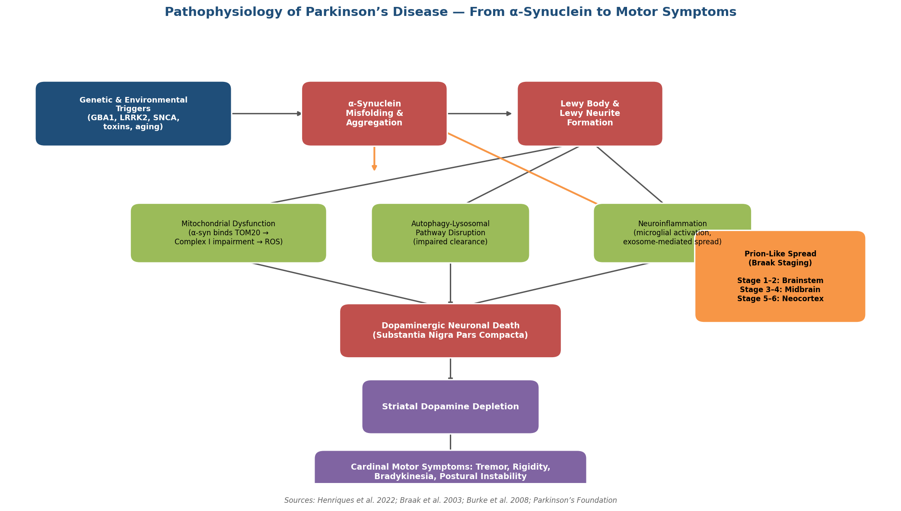

*Figure 1-1. Pathophysiology of Parkinson's disease. The flowchart traces the cascade from genetic and environmental triggers through α-synuclein misfolding, Lewy body formation, three convergent injury mechanisms, dopaminergic neuronal death, and the emergence of cardinal motor symptoms. A parallel branch depicts prion-like propagation mapped to Braak neuropathological stages. Sources: Henriques et al. 2022; Braak et al. 2003; Burke et al. 2008.*

### 1.1.1 Dopaminergic Neuronal Loss and Alpha-Synuclein Pathology

The central pathological event in PD is the progressive loss of dopaminergic neurons in the substantia nigra pars compacta (SNpc), resulting in striatal dopamine depletion and four cardinal motor symptoms: resting tremor, rigidity, bradykinesia (slowness of movement), and postural instability [Henriques et al. 2022](https://pmc.ncbi.nlm.nih.gov/articles/PMC9456396/ "Alpha-Synuclein: The Spark That Flames Dopaminergic Neurons, Int J Mol Sci 2022;23(17):9864"). The neuropathological hallmark is the accumulation of misfolded α-synuclein protein into intraneuronal inclusions known as Lewy bodies and Lewy neurites. These aggregates induce toxicity through multiple converging mechanisms: mitochondrial dysfunction, oxidative stress, and disruption of the autophagy-lysosomal degradation pathway [Henriques et al. 2022](https://pmc.ncbi.nlm.nih.gov/articles/PMC9456396/ "Mechanisms of α-synuclein toxicity").

The mitochondrial injury pathway is particularly well characterized. Aggregated α-synuclein binds the outer mitochondrial membrane protein TOM20, blocking import of nuclear-encoded mitochondrial proteins. This interaction impairs Complex I of the electron transport chain, dissipates the mitochondrial membrane potential, and triggers the release of pro-apoptotic molecules — cytochrome C and apoptosis-inducing factor (AIF) — ultimately driving neuronal death [Henriques et al. 2022](https://pmc.ncbi.nlm.nih.gov/articles/PMC9456396/ "CytC, AIF, ROS markers in primary dopaminergic neurons").

Equally important is the capacity of α-synuclein for "prion-like" cell-to-cell transmission. Misfolded α-synuclein seeds can template the misfolding of native protein in recipient neurons, thereby propagating pathology across connected brain regions in a pattern consistent with the Braak neuropathological staging hypothesis (see Section 1.1.3) [Henriques et al. 2022](https://pmc.ncbi.nlm.nih.gov/articles/PMC9456396/ "Prion-like propagation in vitro and in vivo") [Parkinson's Foundation](https://www.parkinson.org/understanding-parkinsons/what-is-parkinsons/stages "Braak's Hypothesis section").

### 1.1.2 Neuroinflammation

Neuroinflammation amplifies and sustains the neurodegenerative process. Microglial activation accompanies α-synuclein accumulation progressively throughout the disease course, as demonstrated by studies showing increasing IBA1-positive microglial staining in affected brain regions. Activated microglia release exosomes that facilitate neuron-to-neuron α-synuclein transfer, establishing a feed-forward loop: inflammation accelerates pathological protein spread, which in turn intensifies the inflammatory response [Henriques et al. 2022](https://pmc.ncbi.nlm.nih.gov/articles/PMC9456396/ "IBA1+ microglia activation observed progressively"). This self-reinforcing cycle has implications for therapeutic strategy, as anti-inflammatory interventions may slow the rate of protein propagation in addition to reducing direct neuronal injury.

### 1.1.3 Braak Neuropathological Staging

The Braak staging hypothesis, first proposed in a landmark 2003 postmortem study (Braak et al. 2003, *Neurobiology of Aging* 24:197–211), provides a spatial model for PD progression based on the topographic spread of α-synuclein pathology through the nervous system. Six stages are defined in an ascending caudal-to-rostral pattern:

- **Stage 1** — Pathology appears in the dorsal motor nucleus of the vagus (medulla oblongata) and the olfactory bulb, regions associated with early autonomic and olfactory dysfunction.
- **Stage 2** — Extension to the caudal raphe nuclei and locus ceruleus, correlating with early mood and sleep disturbances.
- **Stage 3** — Involvement of the substantia nigra and amygdala — the threshold at which clinical parkinsonism typically becomes manifest.
- **Stage 4** — Spread to the temporal mesocortex.
- **Stages 5–6** — Progression to association and primary neocortices, correlating with cognitive decline and dementia.

[Burke et al. 2008](https://pmc.ncbi.nlm.nih.gov/articles/PMC2605160/ "A Critical Evaluation of the Braak Staging Scheme, Ann Neurol 2008;64:485–491")

The Braak model has been influential in framing PD as a whole-brain disease whose non-motor features — olfactory dysfunction, autonomic dysregulation, sleep disturbances — reflect pre-nigral pathology preceding motor onset. However, critical evaluation has identified important limitations: some individuals harbor advanced-stage α-synuclein pathology without clinical symptoms, no consistent correlation has been demonstrated between Braak stage and Hoehn & Yahr motor severity, and the scheme does not accommodate patterns observed in dementia with Lewy bodies or certain genetic forms such as LRRK2-associated PD, where classic Lewy pathology may be absent [Burke et al. 2008](https://pmc.ncbi.nlm.nih.gov/articles/PMC2605160/ "Predictive validity limitations of Braak staging").

## 1.2 Genetic Architecture and Its Influence on Disease Course

Although the majority of PD cases are classified as idiopathic (sporadic), several monogenic variants exert strong influence on disease risk, age of onset, and progression trajectory. The table below summarizes the four most clinically significant genetic determinants.

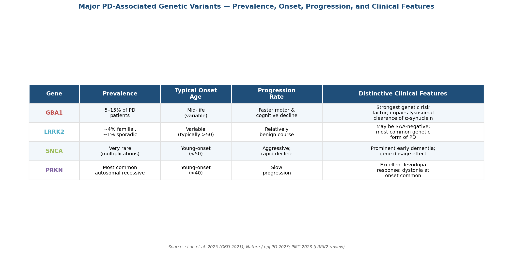

*Figure 1-2. Comparison of four major PD-associated genetic variants across prevalence, typical onset age, progression rate, and distinctive clinical features. Sources: Luo et al. 2025; Nature / npj PD 2023; PMC 2023.*

**GBA1 mutations**, present in 5–15% of PD patients, impair the lysosomal enzyme glucocerebrosidase (GCase) and reduce clearance of aggregated α-synuclein. GBA1 variants constitute one of the strongest known genetic risk factors for PD and are associated with earlier disease onset, faster motor decline, and accelerated progression to cognitive impairment [Luo et al. 2025](https://www.frontiersin.org/journals/aging-neuroscience/articles/10.3389/fnagi.2024.1498756/full "GBA mutation prevalence in GBD 2021 context").

**LRRK2 mutations** (approximately 4% of familial and 1% of sporadic cases) confer a relatively benign disease course compared with idiopathic PD. Notably, LRRK2-PD can be α-synuclein seed amplification assay (SAA)-negative, posing a challenge to purely α-synuclein-based biological classification systems [Nature / npj PD](https://www.nature.com/articles/s41531-023-00608-8 "Rare PD variants analysis") [PMC](https://pmc.ncbi.nlm.nih.gov/articles/PMC10270275/ "LRRK2 and PD: from genetics to targeted therapy").

**SNCA gene multiplications** (duplications and triplications) cause early-onset, aggressively progressive PD with prominent dementia, reflecting a gene-dosage effect in which greater α-synuclein overexpression correlates with earlier onset and more severe phenotype. **PRKN (Parkin) mutations** — the most common autosomal recessive cause of PD — typically produce young-onset disease (under 40 years) characterized by slow progression, dystonia at onset, and excellent long-term response to levodopa [Nature / npj PD](https://www.nature.com/articles/s41531-023-00608-8 "Rare PD variants analysis").

These genetic profiles carry direct implications for affected families: a GBA1 carrier diagnosed in mid-life may face a more compressed timeline to advanced disability than a PRKN carrier diagnosed at a younger age, underscoring the clinical value of genetic counseling in disease management and family planning.

## 1.3 Clinical Staging: The Hoehn & Yahr Scale

The Hoehn & Yahr (H&Y) scale, first published in 1967 (*Neurology* 17(5):427–442) and later modified to include intermediate stages, remains the most widely used clinical staging framework for PD. It translates the continuum of motor disability into discrete milestones that guide treatment decisions and help families anticipate disease progression:

- **Stage 0** — No signs of disease.
- **Stage 1** — Unilateral involvement only; symptoms such as resting tremor, mild rigidity, or reduced arm swing affect one side of the body. Posture and balance remain normal.
- **Stage 1.5** — Unilateral involvement plus axial (midline) involvement.
- **Stage 2** — Bilateral involvement without impairment of balance; symptoms are evident on both sides, often accompanied by gait slowing and facial masking (hypomimia).
- **Stage 2.5** — Mild bilateral disease with recovery on the pull test (a clinician-administered assessment of postural reflexes).
- **Stage 3** — Mild-to-moderate bilateral disease with postural instability (positive pull test); the patient remains physically independent. Shuffling gait, festination (involuntary quickening of steps), and fear of falling typically emerge at this stage.
- **Stage 4** — Severe disability; the patient can still walk or stand unassisted but requires substantial help with daily activities.
- **Stage 5** — Wheelchair-bound or bedridden without assistance; full-time nursing care is needed.

[VA PADRECC](https://www.parkinsons.va.gov/resources/HY.asp "Modified Hoehn and Yahr Staging") [NCBI Bookshelf](https://www.ncbi.nlm.nih.gov/books/NBK379751/ "PD REHAB trial appendix")

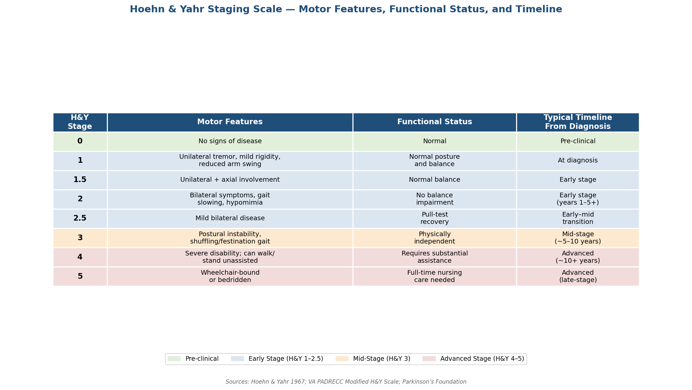

*Figure 1-3. Hoehn & Yahr staging scale with motor features, functional status, and typical timeline from diagnosis. Color coding distinguishes pre-clinical (green), early-stage (blue), mid-stage (amber), and advanced-stage (red) categories. Sources: Hoehn & Yahr 1967; VA PADRECC; Parkinson's Foundation.*

Clinically, Stages 1–2 are categorized as early-stage PD, Stage 3 as mid-stage, and Stages 4–5 as advanced-stage disease. Motor fluctuations typically emerge 5–10 years after diagnosis, and postural instability becomes a dominant feature approximately 10 years into the disease course [Parkinson's Foundation](https://www.parkinson.org/understanding-parkinsons/what-is-parkinsons/stages "Stages of Parkinson's").

A key limitation of the H&Y scale is its exclusive focus on motor function. Non-motor symptoms — psychiatric disturbances, cognitive decline, autonomic dysfunction, pain, and sleep disorders — often cause equal or greater disability in advanced disease but are not captured by H&Y staging [APDA](https://www.apdaparkinson.org/article/factors-in-parkinson-disease-progression/ "Parkinson's disease progression, by Rebecca Gilbert, MD, PhD"). This gap motivated the development of the MDS-UPDRS, described in the following section.

## 1.4 The MDS-UPDRS: Quantifying Motor and Non-Motor Burden

To address the limitations of H&Y staging, the Movement Disorder Society (MDS) developed the MDS-Unified Parkinson's Disease Rating Scale (MDS-UPDRS), published by Goetz et al. in 2008 (*Movement Disorders* 23(15):2129–2170). This comprehensive instrument encompasses 65 items organized into four parts:

- **Part I — Non-Motor Experiences of Daily Living (nM-EDL):** 13 items covering cognitive impairment, hallucinations, depressed mood, anxious mood, apathy, dopamine dysregulation syndrome features, sleep problems, daytime sleepiness, pain, urinary problems, constipation, light-headedness on standing, and fatigue.
- **Part II — Motor Experiences of Daily Living (M-EDL):** 13 items assessing speech, saliva and drooling, chewing and swallowing, eating tasks, dressing, hygiene, handwriting, doing hobbies, turning in bed, tremor, getting out of bed/car/chair, walking and balance, and freezing.
- **Part III — Motor Examination:** 33 scored assessments derived from 18 items, administered by the clinician.
- **Part IV — Motor Complications:** 6 items evaluating dyskinesia duration and functional impact, off-state duration and functional impact, complexity of motor fluctuations, and painful off-state dystonia.

Each item is rated on a 0–4 anchored scale. Clinimetric validation demonstrated strong internal consistency: Cronbach's α = 0.79 (Part I), 0.90 (Part II), 0.93 (Part III), and 0.79 (Part IV), with an overall correlation of r = 0.96 against the original UPDRS [Goetz et al. 2008](https://movementdisorders.onlinelibrary.wiley.com/doi/10.1002/mds.22340 "MDS-UPDRS: Scale presentation and clinimetric testing results").

The MDS-UPDRS introduced nine items absent from the original UPDRS: anxious mood, dopamine dysregulation syndrome, urinary problems, constipation, fatigue, doing hobbies, getting in/out of bed, toe tapping, and freezing of gait [Goetz et al. 2008](https://movementdisorders.onlinelibrary.wiley.com/doi/10.1002/mds.22340 "Factor structures and new items"). These additions enable clinicians to track non-motor symptom progression alongside motor worsening — a dimension of particular relevance for caregivers, given that non-motor burden correlates more strongly with caregiver strain than motor disability alone.

## 1.5 Emerging Biological Classification Approaches

### 1.5.1 The SynNeurGe Research Diagnostic Criteria

A paradigm-shifting development in PD classification is the SynNeurGe biological framework proposed by Höglinger et al. in 2024 (*The Lancet Neurology* 23(2):191–204). Rather than relying on clinical presentation alone, this system classifies PD using three biological anchors:

- **S (Synuclein):** Presence of pathological α-synuclein, detected through seed amplification assays (SAAs) in cerebrospinal fluid or peripheral tissues.
- **N (Neurodegeneration):** Evidence of neuronal degeneration assessed via neuroimaging (e.g., dopamine transporter SPECT, structural MRI).
- **G (Gene):** Identification of pathogenic gene variants (e.g., SNCA, LRRK2, GBA1, PRKN).

These biological components are linked to a clinical phenotype component (**C**), enabling a multidimensional diagnostic profile [Höglinger et al. 2024](https://pubmed.ncbi.nlm.nih.gov/38267191/ "SynNeurGe research diagnostic criteria, Lancet Neurol 2024").

The MDS issued a formal cautionary statement in 2024, emphasizing that α-synuclein SAA remains qualitative only — it cannot predict clinical syndrome, correlate with disease severity, or track progression. Furthermore, certain genetic forms of PD (notably LRRK2-associated disease) can be SAA-negative, and the biological staging framework should remain restricted to research settings until it has been prospectively validated in longitudinal cohorts [MDS Statement 2024](https://www.movementdisorders.org/Moving-Along/2024-issue-1/Statement-of-the-MDS-on-Biological-Definition-Staging-and-Classification-of-PD.htm "MDS 2024 formal statement").

### 1.5.2 Prodromal PD Criteria

The MDS Research Criteria for Prodromal PD (Berg et al. 2015, *Movement Disorders* 30(12):1600–1611) employ a Bayesian naïve classifier that combines an age-based prior probability with likelihood ratios derived from established risk and diagnostic markers. "Probable prodromal PD" is defined as a posterior probability of ≥80%. The criteria were updated in 2019 (Heinzel et al. 2019, *Movement Disorders* 34(10):1464–1470), incorporating enhanced likelihood ratios for olfactory loss, polygenic risk scores, and newly identified markers including diabetes, global cognitive deficit, and physical inactivity [Berg et al. 2015](https://pubmed.ncbi.nlm.nih.gov/26474317/ "MDS research criteria for prodromal PD") [Heinzel et al. 2019](https://pubmed.ncbi.nlm.nih.gov/31412427/ "Update of MDS prodromal criteria").

These prodromal criteria hold direct relevance for families: many of the markers they incorporate — REM sleep behavior disorder, hyposmia (reduced sense of smell), constipation, depression — are observable in the home environment, potentially years before motor symptoms emerge. The detailed clinical significance of these warning signs is examined in Chapter 2.

## 1.6 Disease Trajectory and Factors Influencing Progression

PD progression is highly heterogeneous, and no fixed timeline governs the transition from diagnosis to advanced disability. Many patients remain at H&Y Stage 2 for years or even decades, and a substantial proportion never progress beyond Stage 3. Motor fluctuations commonly emerge 5–10 years after diagnosis, while clinically significant postural instability typically appears around the 10-year mark [Parkinson's Foundation](https://www.parkinson.org/understanding-parkinsons/what-is-parkinsons/stages "Stages of Parkinson's").

Several factors modulate the rate and pattern of progression:

- **Motor subtype.** Patients with the postural instability and gait difficulty (PIGD) subtype experience more rapid motor decline, higher falls risk, and greater cognitive impairment compared with tremor-dominant PD. The tremor-dominant phenotype is associated with decreased mortality (HR = 0.67, p = 0.006) [APDA](https://www.apdaparkinson.org/article/factors-in-parkinson-disease-progression/ "Factors predicting PD progression").
- **Age at onset.** Individuals diagnosed after age 78 tend to present with prominent stiffness, balance impairment, and gait difficulties rather than the tremor-predominant pattern more common in younger-onset disease [APDA](https://www.apdaparkinson.org/article/factors-in-parkinson-disease-progression/ "Older-onset PD phenotype").
- **Non-motor burden at diagnosis.** A significant non-motor symptom load at the time of diagnosis — particularly cognitive deficits, psychiatric symptoms, and REM sleep behavior disorder — predicts a faster disease progression trajectory [APDA](https://www.apdaparkinson.org/article/factors-in-parkinson-disease-progression/ "Non-motor burden as predictor").
- **Genetic subtype.** As detailed in Section 1.2, LRRK2 carriers tend toward a milder course, while GBA1 carriers face earlier onset and faster motor and cognitive decline. SNCA multiplication carriers experience early-onset aggressive disease with prominent dementia, whereas PRKN carriers exhibit slow progression with sustained levodopa responsiveness [Nature / npj PD](https://www.nature.com/articles/s41531-023-00608-8 "Genetic progression profiles").

The Parkinson's Progression Markers Initiative (PPMI) cohort provides benchmark data on early-stage disease: among 417 de novo PD patients at enrollment, 44% were classified as H&Y Stage 1, with a mean MDS-UPDRS Part III motor score of 20.9 (SD 8.9) [Gallagher et al. 2024](https://pmc.ncbi.nlm.nih.gov/articles/PMC11318527/ "Long-Term Dementia Risk, Neurology 2024"). These figures illustrate the relatively mild motor burden at the point of clinical diagnosis — a window during which early intervention, lifestyle modification, and family education can exert the greatest impact on long-term outcomes.

## 1.7 Implications for Patients and Families

The pathophysiology, staging systems, and progression data reviewed in this chapter provide families with a conceptual framework for understanding what lies ahead. Several practical insights emerge:

1. **PD is not solely a movement disorder.** The α-synuclein pathology underlying PD affects brain regions far beyond the motor system. Non-motor symptoms — constipation, olfactory loss, depression, cognitive changes — may appear years before tremor and constitute an integral component of disease burden.
2. **Staging provides guideposts, not rigid timelines.** The H&Y scale offers useful milestones (bilateral involvement, postural instability, loss of independence), but individual trajectories vary substantially. Families should anticipate variability and avoid comparing their relative's course to population averages.
3. **Motor subtype and genetic profile inform prognosis.** Establishing whether a patient has tremor-dominant or PIGD disease, and identifying specific genetic variants through testing, enables clinicians to tailor prognostic counseling and therapeutic strategy.
4. **The MDS-UPDRS captures what H&Y misses.** Families attending clinical visits benefit from understanding that Part I (non-motor daily living) and Part II (motor daily living) scores reflect symptoms observable at home — information that feeds directly into the caregiver monitoring strategies discussed in Chapter 3.
5. **Biological classification is advancing but remains research-only.** While SAA-based α-synuclein detection and the SynNeurGe framework represent a frontier in research diagnostics, these tools have not yet been validated for clinical decision-making or prognostication.

# 第2章 Health Warning Signs Across Disease Stages — Motor, Non-Motor, Cognitive, and Psychiatric Indicators

Parkinson's disease (PD) does not announce itself with a single event. It unfolds along a continuum that may span decades — beginning with subtle non-motor disturbances years before the classic tremor appears and culminating in severe disability that reshapes every dimension of daily life. Recognizing the warning signs at each stage, and understanding which signals predict accelerated decline, equips families and clinicians to intervene earlier, adjust treatment proactively, and prepare for the challenges ahead.

This chapter catalogues the prodromal, early, mid-stage, and advanced indicators across motor, non-motor, cognitive, and psychiatric domains, mapped onto the Hoehn & Yahr (H&Y) staging framework introduced in Chapter 1. Figure 1 provides a synoptic overview of how 11 symptom domains evolve from the prodromal phase through H&Y Stages 4–5.

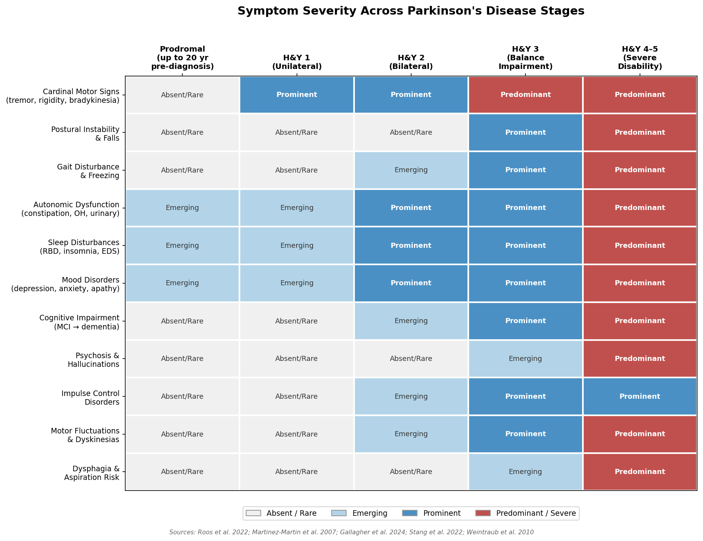

*Figure 1. Stage-by-symptom heatmap mapping 11 symptom domains across five disease phases (prodromal through H&Y 4–5), color-coded by severity level. Sources: Roos et al. 2022; Martinez-Martin et al. 2007; Gallagher et al. 2024; Stang et al. 2022; Weintraub et al. 2010.*

## 2.1 The Prodromal Phase: Warning Signs Before the Tremor

The prodromal phase of PD can last up to 20 years before motor symptoms cross the diagnostic threshold. During this period, pathological α-synuclein aggregation progresses through lower brainstem and olfactory structures — a trajectory consistent with Braak's staging hypothesis — producing a constellation of non-motor symptoms that, in retrospect, serve as the disease's earliest fingerprints [Roos et al. 2022](https://pmc.ncbi.nlm.nih.gov/articles/PMC9108586/ "Prevalence of Prodromal Symptoms, J Parkinsons Dis 2022"). Figure 2 illustrates the approximate temporal windows during which each prodromal marker typically emerges before the motor diagnosis threshold.

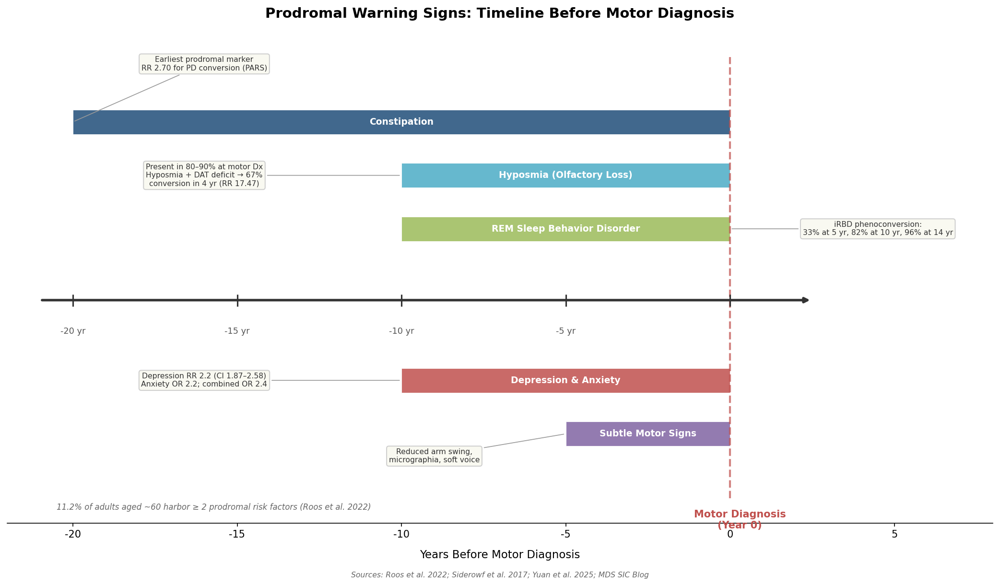

*Figure 2. Horizontal timeline showing the approximate appearance windows of key prodromal signs (constipation, hyposmia, RBD, depression/anxiety, subtle motor signs) relative to motor diagnosis (year 0), annotated with conversion-risk statistics. Sources: Roos et al. 2022; Siderowf et al. 2017; Yuan et al. 2025; MDS SIC Blog.*

### Constipation

Constipation ranks among the very earliest prodromal markers, appearing up to 20 years before motor diagnosis. The enteric nervous system harbors α-synuclein pathology well before the substantia nigra is significantly affected, and reduced bowel frequency has been prospectively linked to increased PD risk [Roos et al. 2022](https://pmc.ncbi.nlm.nih.gov/articles/PMC9108586/ "Prodromal symptoms study"). In the PARS (Parkinson Associated Risk Study) cohort, constipation — defined as fewer than one bowel movement per day — was significantly associated with conversion to PD, with a relative risk of 2.70 (95% CI: 1.19–6.16) [Siderowf et al. 2017](https://pmc.ncbi.nlm.nih.gov/articles/PMC5710321/ "PARS study, JAMA Neurol 2017;74:933–940").

### Olfactory Dysfunction (Hyposmia)

Reduced sense of smell is present at the time of motor diagnosis in 80–90% of PD patients and may precede motor onset by up to 10 years [Roos et al. 2022](https://pmc.ncbi.nlm.nih.gov/articles/PMC9108586/ "Prodromal symptoms study"). A 2019 meta-analysis estimated that hyposmia is associated with a 3.84-fold increase in lifetime PD risk [Hyposmia meta-analysis 2019](https://pmc.ncbi.nlm.nih.gov/articles/PMC11971265/ "Hyposmia in PD: selective odour loss review citing meta-analysis"). In the landmark PARS prospective cohort, hyposmic individuals with a dopamine transporter (DAT) imaging deficit had a 67% conversion rate to clinical PD within 4 years (relative risk 17.47; 95% CI: 7.02–43.45), compared with only 2.8% among hyposmic individuals without a DAT deficit [Siderowf et al. 2017](https://pmc.ncbi.nlm.nih.gov/articles/PMC5710321/ "PARS study, JAMA Neurol 2017;74:933–940"). These findings underscore that olfactory testing, while not diagnostic in isolation, functions as a powerful first-tier screening tool when combined with dopaminergic imaging.

### REM Sleep Behavior Disorder (RBD)

RBD — characterized by vigorous dream-enactment behaviors during REM sleep — is among the strongest prodromal predictors of α-synucleinopathy. Idiopathic RBD (iRBD) carries a cumulative phenoconversion rate of 33% at 5 years, 82% at 10 years, and 96% at 14 years [MDS SIC Blog](https://www.movementdisorders.org/MDS/Scientific-Issues-Committee-Blog/Early-stage-predictors-of-Parkinsons-disease-evolution.htm "MDS SIC Blog: Early-stage predictors of PD evolution"). A prospective Chinese cohort (N = 141 iRBD patients, 2025) reported lower but still substantial cumulative phenoconversion: 16.3% at 3 years, 27.6% at 5 years, and 57.2% at 10 years. Among converters, 58% developed PD, 31% dementia with Lewy bodies (DLB), and 11% multiple system atrophy (MSA) [Yuan et al. 2025](https://www.nature.com/articles/s41531-024-00856-2 "Phenoconversion of iRBD, npj Parkinson's Disease 2025"). In established PD, RBD prevalence reaches 42.3%, compared with approximately 1% in the general population [Neurobiol Dis 2020](https://www.sciencedirect.com/science/article/pii/S0969996120302710 "REM sleep behavior disorder review").

### Depression and Anxiety

Mood disorders frequently emerge during the prodromal window. Baseline depression confers a relative risk of 2.2 (95% CI: 1.87–2.58) for subsequently developing PD over a 10-year follow-up; anxiety carries a comparable odds ratio of 2.2, and the combination of depression and anxiety raises the odds ratio to 2.4 [Roos et al. 2022, citing Wang et al. 2018](https://pmc.ncbi.nlm.nih.gov/articles/PMC9108586/ "Prodromal symptoms study"). These associations persist after adjusting for confounders, suggesting a shared neurobiological substrate — likely early serotonergic and noradrenergic degeneration — rather than a purely reactive relationship.

### Clustering of Prodromal Risk Factors

Individual prodromal markers carry moderate predictive power on their own, but their co-occurrence substantially strengthens the case for incipient PD. In a cohort of 775 late middle-aged adults (mean age 60.3 years), individual prodromal risk factor prevalence ranged from 2.8% (cognitive impairment) to 13.3% (possible RBD); 11.2% harbored two or more prodromal risk factors, a combination associated with significantly worse motor performance (p ≤ 0.001) [Roos et al. 2022](https://pmc.ncbi.nlm.nih.gov/articles/PMC9108586/ "LASA cohort study"). The MDS Prodromal PD Research Criteria formalize this multi-marker approach through a Bayesian classifier that combines age-based prior probability with likelihood ratios from risk and diagnostic markers, defining "probable prodromal PD" at ≥ 80% certainty [Berg et al. 2015](https://pubmed.ncbi.nlm.nih.gov/26474317/ "MDS research criteria for prodromal PD") [Heinzel et al. 2019](https://pubmed.ncbi.nlm.nih.gov/31412427/ "Update of MDS prodromal criteria").

## 2.2 Early Stage (H&Y Stages 1–2): Unilateral Onset and Bilateral Spread

### H&Y Stage 1 — Unilateral Motor Signs

The hallmark of Stage 1 is unilateral involvement: a resting tremor in one hand, subtle rigidity on one side, reduced arm swing during walking, and mild bradykinesia. Posture and balance remain normal. In the PPMI cohort (N = 417 de novo PD patients), 44% were classified as H&Y Stage 1 at enrollment, with a mean MDS-UPDRS Part III (motor examination) score of 20.9 (SD 8.9) [Gallagher et al. 2024](https://pmc.ncbi.nlm.nih.gov/articles/PMC11318527/ "Long-Term Dementia Risk, Neurology 2024"). Falls are rare: only 2% of newly diagnosed, drug-naïve patients were classified as fallers, and the tremor-dominant subtype experienced no falls in this early phase [Hiorth et al. 2013](https://onlinelibrary.wiley.com/doi/10.1111/j.1468-1331.2012.03821.x "Falls at different PD stages, Eur J Neurol 2013").

Despite the predominantly motor presentation, non-motor symptoms are already detectable. An international NMSQuest study (N = 545) established that virtually 100% of PD patients report at least one non-motor symptom, with the most prevalent being nocturia (59.7%), urinary urgency (54.6%), depression (51.7%), constipation (48.5%), anxiety (46.9%), forgetfulness (45.5%), and insomnia (44.7%) [Martinez-Martin et al. 2007](https://movementdisorders.onlinelibrary.wiley.com/doi/abs/10.1002/mds.21586 "NMSQuest study, Mov Disord 2007"). Many of these symptoms are present from diagnosis onward and substantially erode quality of life even when motor disability remains minimal.

### H&Y Stage 2 — Bilateral Involvement Without Balance Impairment

Stage 2 marks bilateral spread of motor symptoms: tremor and rigidity appear on the previously unaffected side, gait begins to slow, and facial expression diminishes (hypomimia). Non-motor symptoms — constipation, urinary urgency, depression, and sleep disturbances — become more prominent and functionally burdensome. The DOMINION study (N = 3,090, median disease duration 6.5 years) reported a median H&Y of 2.0, reflecting the typical disease severity of a community-dwelling, treated PD population [Weintraub et al. 2010](https://jamanetwork.com/journals/jamaneurology/fullarticle/800232 "DOMINION Study: ICDs in PD, Arch Neurol 2010").

Cognitive concerns may first surface at this stage. Approximately 25% of non-demented PD patients meet criteria for PD–mild cognitive impairment (PD-MCI), and 10–20% of newly diagnosed individuals already demonstrate measurable cognitive deficits — predominantly in executive function and processing speed [Gallagher et al. 2024](https://pmc.ncbi.nlm.nih.gov/articles/PMC11318527/ "Long-Term Dementia Risk, Neurology 2024").

## 2.3 Mid-Stage (H&Y Stage 3): The Balance Turning Point

H&Y Stage 3 introduces postural instability — a defining transition that fundamentally alters the risk landscape. The pull test becomes positive, gait shifts toward a shuffling, festinating pattern, and fear of falling begins to constrain daily activities. Falls prevalence rises sharply: across PD populations, 45–68% of patients fall each year, and 50–86% of fallers experience recurrent falls [MDPI 2019](https://www.mdpi.com/1660-4601/16/12/2216 "Falls in PD Subtypes") [Hiorth et al. 2013](https://onlinelibrary.wiley.com/doi/10.1111/j.1468-1331.2012.03821.x "Falls frequency study"). Freezing of gait — sudden, transient episodes of inability to initiate or continue walking — typically emerges during this stage, particularly when navigating narrow spaces, executing turns, or approaching doorways.

### Motor Fluctuations and Wearing-Off

By Stage 3 — typically reached 5–10 years post-diagnosis — motor complications from chronic levodopa therapy become a central clinical challenge. Approximately 50% of patients develop motor fluctuations after five or more years on levodopa, with an estimated 10% per year developing fluctuations after levodopa initiation [Bhidayasiri & Truong 2011](https://pmc.ncbi.nlm.nih.gov/articles/PMC3152175/ "Motor fluctuations and dyskinesias, Ann Indian Acad Neurol 2011"). The wearing-off phenomenon is the most common pattern: a predictable return of motor symptoms — tremor, stiffness, slowness — occurring 2–4 hours after a levodopa dose, before the next dose takes effect. Patients and families may also observe non-motor wearing-off manifestations, including anxiety, sweating, pain, and depressed mood [Simonet et al. 2020](https://pmc.ncbi.nlm.nih.gov/articles/PMC7029239/ "Emergencies in PD, Practical Neurology").

Peak-dose dyskinesias — involuntary choreiform movements at the height of levodopa effect — increase in prevalence with treatment duration: 11% at ≤ 5 years, 32% at 6–9 years, and 89% at ≥ 10 years [JAMA Neurol 2003](https://jamanetwork.com/journals/jamaneurology/fullarticle/792950 "Motor Fluctuations and Dyskinesias in PD"). These complications create an increasingly narrow therapeutic window that demands careful medication timing and dose calibration.

### Escalating Non-Motor Burden

Stage 3 also marks an intensification of non-motor symptoms across multiple domains. Sleep architecture deteriorates further: excessive daytime sleepiness affects approximately 30% of patients, while RBD prevalence in established PD ranges from 25% to 65% [Simonet et al. 2020](https://pmc.ncbi.nlm.nih.gov/articles/PMC7029239/ "Emergencies in PD"). Autonomic dysfunction broadens to include orthostatic hypotension (symptomatic in approximately 10% of PD patients), which may cause unsteadiness or near-syncope upon standing — particularly after meals or medication changes [Simonet et al. 2020](https://pmc.ncbi.nlm.nih.gov/articles/PMC7029239/ "Emergencies in PD"). Pain, fatigue, and urinary dysfunction continue to escalate, compounding disability beyond what motor scores alone capture.

## 2.4 Advanced Stage (H&Y Stages 4–5): Severe Disability and Life-Threatening Complications

### Motor Deterioration

Stages 4 and 5 represent the most debilitating phases of PD. At Stage 4, severe bradykinesia, rigidity, and postural instability require substantial physical assistance for daily activities, although patients may retain the ability to stand and walk with support. By Stage 5, patients are wheelchair-bound or bedridden and require full-time nursing care [Parkinson's Foundation](https://www.parkinson.org/understanding-parkinsons/what-is-parkinsons/stages "Stages of Parkinson's") [VA PADRECC](https://www.parkinsons.va.gov/resources/HY.asp "Hoehn and Yahr Staging").

### Dysphagia and Aspiration Risk

Swallowing dysfunction (dysphagia) is a critical warning sign in advanced PD with life-threatening implications. A meta-analysis of 58 studies encompassing 20,530 PD patients estimated a pooled dysphagia prevalence of 36.9% (95% CI: 30.7–43.6%) across all disease stages; when assessed by instrumental examination (videofluoroscopy or fiberoptic endoscopic evaluation), prevalence rose to 57.3% (95% CI: 44.3–69.1%) [Gong et al. 2022](https://pmc.ncbi.nlm.nih.gov/articles/PMC9582284/ "Dysphagia prevalence meta-analysis, Front Neurol 2022"). Dysphagia was significantly associated with higher H&Y stage, longer disease duration, and the PIGD subtype (OR 3.09; 95% CI: 1.27–7.52) [Gong et al. 2022](https://pmc.ncbi.nlm.nih.gov/articles/PMC9582284/ "Dysphagia associated factors").

In advanced PD, aspiration pneumonia is a leading cause of death. PD patients face a 4.21-fold higher risk of aspiration pneumonia compared with age-matched controls (adjusted HR; 95% CI: 3.87–4.58), with post-first-episode mortality reaching 23.9% at 1 month and 65.2% at 1 year [Won et al. 2021](https://www.nature.com/articles/s41598-021-86011-w "Risk and mortality of aspiration pneumonia in PD, Sci Rep").

### Psychiatric Symptoms: Psychosis, Hallucinations, and Impulse Control Disorders

Psychiatric manifestations escalate dramatically in late-stage disease. PD psychosis (PDP) has an incidence of 4.28 per 100 person-years and a median onset of 8.1 years from PD diagnosis. Hallucinations occur in 87% of PDP patients, with prevalence rising from 10.1% at year 5 to 23.2% at year 10 and 39.6% at year 15. PDP is associated with a 71% increase in mortality (HR = 1.71, p = 0.027) [Stang et al. 2022](https://pmc.ncbi.nlm.nih.gov/articles/PMC9336204/ "Incidence and Prevalence of PDP, J Parkinsons Dis 2022"). In late-stage PD specifically, 55.4% of patients exhibit psychotic symptoms and 72.5% carry comorbid psychiatric diagnoses [ScienceDirect 2021](https://www.sciencedirect.com/science/article/pii/S2590112521000311 "Psychosis in late-stage PD").

A severity-grading framework aids clinical monitoring: visual hallucinations with retained insight represent an early warning marker that warrants close surveillance, whereas hallucinations with loss of insight — accompanied by delusions and agitation — signal escalating severity requiring urgent medical review [Simonet et al. 2020](https://pmc.ncbi.nlm.nih.gov/articles/PMC7029239/ "Emergencies in PD").

Impulse control disorders (ICDs) constitute a distinct behavioral warning sign, particularly in patients receiving dopaminergic therapy. The DOMINION study (N = 3,090) identified ICDs in 13.6% of treated PD patients overall, rising to 17.1% among those on dopamine agonists versus 6.9% not on agonists (OR = 2.72, p < 0.001). The most common forms were compulsive buying (5.7%), pathological gambling (5.0%), binge eating (4.3%), and compulsive sexual behavior (3.5%). Additional risk factors included age ≤ 65, concurrent levodopa use, and being unmarried [Weintraub et al. 2010](https://jamanetwork.com/journals/jamaneurology/fullarticle/800232 "DOMINION Study, Arch Neurol 2010"). The cumulative incidence of ICDs in patients on dopamine agonists may reach 46% over time, and patients frequently do not self-report these behaviors due to embarrassment — making proactive family observation essential [Simonet et al. 2020](https://pmc.ncbi.nlm.nih.gov/articles/PMC7029239/ "Emergencies in PD").

## 2.5 Cognitive Trajectory: From Mild Impairment to Dementia

Cognitive decline in PD follows a gradual but relentless trajectory. The probability of PD dementia (PDD) by disease duration, estimated from PPMI and Penn cohorts, is: 3–12% at year 5, 9–27% at year 10, 50% at year 15, 74% at year 20, and 90% at year 25 or beyond (Figure 3). Median time to dementia is 15.2 years (95% CI: 13.3–15.2) [Gallagher et al. 2024](https://pmc.ncbi.nlm.nih.gov/articles/PMC11318527/ "Long-Term Dementia Risk, Neurology 2024"). A pooled incidence rate of 4.45 per 100 person-years (95% CI: 3.91–4.99) — equivalent to an approximately 4.5% annual dementia risk — has been reported across systematic reviews [Mov Disord 2024](https://movementdisorders.onlinelibrary.wiley.com/doi/10.1002/mds.29918 "Risk of Dementia in PD: Systematic Review").

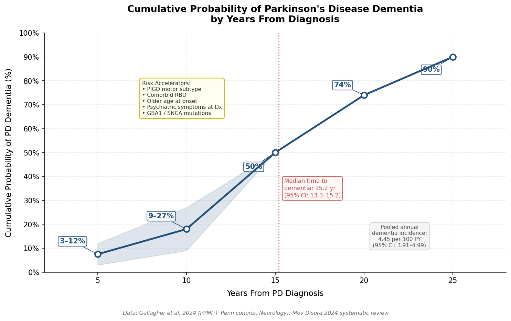

*Figure 3. Cumulative probability of PD dementia plotted against years from diagnosis, based on PPMI and Penn cohort data (Gallagher et al. 2024). The shaded band represents the uncertainty range for early time points. Annotated risk accelerators include PIGD subtype, comorbid RBD, older onset, baseline psychiatric symptoms, and GBA1/SNCA mutations.*

Several factors accelerate cognitive decline and warrant heightened vigilance: older age at onset, greater baseline motor severity, the PIGD motor subtype, comorbid RBD, and psychiatric symptoms at diagnosis all predict faster progression to dementia [Gallagher et al. 2024](https://pmc.ncbi.nlm.nih.gov/articles/PMC11318527/ "Long-Term Dementia Risk, Neurology 2024"). The PIGD subtype carries a dual burden — more rapid motor progression with higher falls risk and earlier cognitive decline — in contrast to the tremor-dominant subtype, which is associated with decreased mortality (HR = 0.67, p = 0.006) [MDS SIC Blog](https://www.movementdisorders.org/MDS/Scientific-Issues-Committee-Blog/Early-stage-predictors-of-Parkinsons-disease-evolution.htm "MDS SIC Blog"). RBD in PD independently predicts faster cognitive deterioration, increased dementia risk, and a higher frequency of hallucinations [Stang et al. 2022](https://pmc.ncbi.nlm.nih.gov/articles/PMC9336204/ "PDP incidence study").

## 2.6 Predictive Patterns: Which Signs Signal Accelerated Progression?

Across the disease trajectory, certain symptom profiles emerge as harbingers of more rapid decline. A synthesis of the evidence yields six key predictive markers:

- **Motor subtype.** The PIGD phenotype is consistently associated with faster motor decline, greater cognitive impairment, higher falls risk, and earlier transition to advanced stages, compared with the tremor-dominant phenotype [MDS SIC Blog](https://www.movementdisorders.org/MDS/Scientific-Issues-Committee-Blog/Early-stage-predictors-of-Parkinsons-disease-evolution.htm "MDS SIC Blog").

- **RBD at any stage.** Whether identified prodromally or after motor diagnosis, RBD independently predicts accelerated cognitive decline, increased psychosis risk, and a more aggressive disease course [Stang et al. 2022](https://pmc.ncbi.nlm.nih.gov/articles/PMC9336204/ "PDP incidence study") [Yuan et al. 2025](https://www.nature.com/articles/s41531-024-00856-2 "Phenoconversion of iRBD").

- **Non-motor burden at diagnosis.** Patients presenting with significant non-motor symptoms — depression, anxiety, cognitive deficits, autonomic dysfunction — at the time of motor diagnosis tend to follow the fastest progression trajectory [APDA](https://www.apdaparkinson.org/article/factors-in-parkinson-disease-progression/ "Factors predicting PD progression").

- **Age of onset.** Onset above approximately 78 years is associated with more prominent stiffness, balance, and gait problems, and a steeper decline in activities of daily living [APDA](https://www.apdaparkinson.org/article/factors-in-parkinson-disease-progression/ "Factors predicting PD progression").

- **Genetic subtype.** GBA1 mutation carriers (5–15% of PD patients) experience earlier onset and faster motor and cognitive decline. SNCA multiplication carriers develop early-onset, aggressive PD with prominent dementia. In contrast, LRRK2 mutation carriers tend toward a relatively benign course, and PRKN-associated young-onset PD progresses slowly with excellent levodopa response [Nature / npj PD](https://www.nature.com/articles/s41531-023-00608-8 "Rare PD variants analysis") [PMC](https://pmc.ncbi.nlm.nih.gov/articles/PMC10270275/ "LRRK2 and PD: from genetics to targeted therapy").

- **Early hallucinations or psychosis.** The emergence of hallucinations — even with retained insight — signals a trajectory toward greater psychiatric morbidity and increased mortality [Stang et al. 2022](https://pmc.ncbi.nlm.nih.gov/articles/PMC9336204/ "PDP incidence study").

These predictive patterns enable a risk-stratified approach: patients with high-risk profiles may benefit from earlier specialist referral, more intensive monitoring, and anticipatory care planning, while lower-risk profiles support reassurance alongside standard surveillance.

## 2.7 Bridging to Caregiver Action

The symptom landscape described in this chapter does not evolve within rigid stage boundaries. Prodromal features may persist alongside motor signs; non-motor symptoms often outpace motor progression in their impact on quality of life; and cognitive and psychiatric complications can emerge at any stage, not merely in the final years. This overlap carries practical implications: families who observe a constellation of worsening sleep disruption, growing apathy, emerging hallucinations, or increasing freezing episodes should not wait for a formal staging reassessment. As the evidence presented throughout this chapter demonstrates, these patterns correlate with accelerated decline and may warrant earlier medical intervention. The following chapter translates these clinical indicators into concrete action thresholds for caregivers — specifying what to watch for, when to schedule a medical review, and when to seek emergency care.

# 第3章 Family Caregiver Alert Signals — When to Intervene and When to Seek Medical Attention

Chapter 2 catalogued the motor, non-motor, cognitive, and psychiatric warning signs that clinicians track across disease stages. This chapter translates those observations into actionable guidance for the people who know the patient best — family caregivers. Not every change demands an emergency call, and not every worrisome sign can safely wait until the next scheduled appointment. The central challenge is distinguishing between the two.

The discussion is organized around a tiered alert framework. Section 3.1 addresses red-flag emergencies requiring immediate medical intervention. Section 3.2 covers medication-related warning signs that demand prompt clinical review. Section 3.3 identifies gradual functional, behavioral, and physical changes warranting scheduled evaluation. Section 3.4 presents systematic tools that help caregivers document and communicate what they observe. Section 3.5 addresses an often-neglected dimension — the caregiver's own health and resilience. Section 3.6 consolidates the chapter's findings into a printable three-tier checklist suitable for home use.

## 3.1 Red-Flag Emergency Signals: When to Act Immediately

Certain acute events in Parkinson's disease (PD) constitute medical emergencies in which delayed recognition can result in irreversible harm or death. The scenarios below all require immediate emergency evaluation.

### 3.1.1 Akinetic Crisis (Parkinsonism-Hyperpyrexia Syndrome)

Akinetic crisis, also termed parkinsonism-hyperpyrexia syndrome (PHS), is the most dangerous acute complication specific to PD. Despite a relatively low incidence — approximately 0.3% of PD patients per year — it carries a mortality rate of 4–23% [Pötter-Nerger et al. 2024](https://pmc.ncbi.nlm.nih.gov/articles/PMC11447035/ "German DGN guideline on akinetic crisis, J Neurol 2024"). The defining clinical picture comprises acute, severe worsening of rigidity and akinesia; fever often exceeding 38.5 °C; impaired consciousness ranging from confusion to coma; dysphagia; and resistance to the patient's usual levodopa doses persisting for three or more days. Creatine kinase (CK) and myoglobin are elevated in 80–100% of cases [Pötter-Nerger et al. 2024](https://pmc.ncbi.nlm.nih.gov/articles/PMC11447035/ "German DGN guideline").

PHS shares cardinal features with neuroleptic malignant syndrome (NMS) — rigidity, hyperthermia, altered consciousness, and CK elevation — but arises from disruption of dopaminergic therapy rather than neuroleptic exposure. The most common precipitants are omission or abrupt reduction of dopaminergic medications, concurrent infections (particularly urinary tract infections and pneumonia), dehydration, and inadvertent administration of dopamine-blocking agents such as metoclopramide or typical antipsychotics. Patients at Hoehn & Yahr (H&Y) stage > 3, those with pre-existing hallucinations, and those with dementia are at heightened risk [Pötter-Nerger et al. 2024](https://pmc.ncbi.nlm.nih.gov/articles/PMC11447035/ "German DGN guideline").

Complications are severe: aspiration pneumonia occurs in 19.2% of PHS cases, disseminated intravascular coagulation (DIC) in 8.1%, and acute renal failure in 5.1% [Pötter-Nerger et al. 2024](https://pmc.ncbi.nlm.nih.gov/articles/PMC11447035/ "German DGN guideline").

**What caregivers should watch for:** A PD patient who develops sudden, extreme stiffness combined with high fever and confusion — especially after missing medication doses, during an infection, or following a hospital admission where PD medications may have been withheld or delayed — requires emergency department evaluation without delay.

### 3.1.2 Aspiration Risk and Swallowing Emergencies

Dysphagia (difficulty swallowing) is a progressive feature of PD that ultimately affects the majority of patients in advanced stages. Relative to age-matched controls, PD patients face a 4.21-fold higher risk of aspiration pneumonia (adjusted HR; 95% CI: 3.87–4.58), with an incidence of 3.01 per 1,000 person-years versus 0.59 in controls. The consequences are severe: mortality after the first episode of aspiration pneumonia reaches 23.9% at one month and 65.2% at one year [Won et al. 2021](https://www.nature.com/articles/s41598-021-86011-w "Risk and mortality of aspiration pneumonia in PD, Sci Rep").

Observable signs of aspiration risk include frequent coughing or choking during meals, nasal regurgitation of food or liquid, a wet or "gurgly" voice quality immediately after swallowing, unexplained recurrent respiratory infections, persistent drooling, and gradual unexplained weight loss. Notably, dysphagia can emerge even in early PD (within two years of diagnosis), making vigilance necessary throughout the disease course [Simonet et al. 2020](https://pmc.ncbi.nlm.nih.gov/articles/PMC7029239/ "Emergencies in PD, Practical Neurology").

A particularly dangerous scenario arises when the patient suddenly becomes unable to swallow oral medications, as levodopa levels can collapse within days and precipitate an akinetic crisis. Caregivers who observe this should seek emergency evaluation immediately so that alternative medication delivery routes — dispersible levodopa formulations, nasogastric tube administration, transdermal rotigotine patches, or subcutaneous apomorphine injections — can be arranged under medical supervision [Simonet et al. 2020](https://pmc.ncbi.nlm.nih.gov/articles/PMC7029239/ "Emergencies in PD") [Parkinson's Foundation](https://www.parkinson.org/library/fact-sheets/hospital-safety "Hospital Safety and Parkinson's").

### 3.1.3 Falls With Head Injury or Fracture

Falls affect 50–60% of PD patients, and the consequences can be catastrophic. Falls with head impact carry the risk of subdural hematoma — a recognized and potentially lethal complication — while hip and vertebral fractures accelerate functional decline and raise mortality. Nocturnal falls related to nocturia are especially dangerous because they frequently occur in low-light conditions when the patient is cognitively less alert [Simonet et al. 2020](https://pmc.ncbi.nlm.nih.gov/articles/PMC7029239/ "Emergencies in PD").

**Immediate action threshold:** Any fall resulting in head injury, loss of consciousness (even briefly), confusion, persistent pain suggestive of fracture, or inability to bear weight warrants emergency evaluation. For patients on anticoagulants — common given the typical age profile of PD — even a seemingly minor head impact should prompt urgent assessment, because subdural bleeding may develop insidiously over hours.

### 3.1.4 Acute Psychosis

PD psychosis constitutes a psychiatric emergency when accompanied by loss of insight, fixed delusions, severe agitation, or behavior that endangers the patient or others. Visual hallucinations occur in up to 30% of patients on long-term dopaminergic therapy; the critical clinical distinction is between hallucinations with retained insight (the patient recognizes them as unreal) and those without (the patient acts on them) [Simonet et al. 2020](https://pmc.ncbi.nlm.nih.gov/articles/PMC7029239/ "Emergencies in PD").

When a patient begins acting on hallucinations — for example, leaving the house in response to perceived threats or becoming combative toward a "stranger" who is actually a family member — emergency medical evaluation is necessary. The initial clinical approach involves excluding systemic precipitants (urinary tract infection and pneumonia are frequent triggers) followed by a structured reduction of antiparkinsonian medications: anticholinergics are withdrawn first, then MAO-B inhibitors, amantadine, dopamine agonists, COMT inhibitors, and levodopa last. Among atypical antipsychotics, quetiapine is typically employed first-line; typical antipsychotics (haloperidol, chlorpromazine) are contraindicated because they block dopamine receptors and can precipitate akinetic crisis [Simonet et al. 2020](https://pmc.ncbi.nlm.nih.gov/articles/PMC7029239/ "Emergencies in PD").

### 3.1.5 Hospital Safety: Protecting the Patient During Acute Admissions

Hospitalization itself poses distinctive risks for PD patients. Approximately one in six PD patients experiences avoidable complications during a hospital stay, most commonly due to medication errors [Parkinson's Foundation](https://www.parkinson.org/library/fact-sheets/hospital-safety "Hospital Safety and Parkinson's"). The Parkinson's Foundation recommends that the patient's home medication chart accompany them to every admission, that PD medications be administered within 15 minutes of their usual scheduled time, and that dopamine-blocking drugs (certain antiemetics such as metoclopramide, sedatives, and typical antipsychotics) be avoided entirely.

Caregivers serve a critical advocacy function in hospital settings. Preparing a concise medication list with exact doses and timing — ideally both in print and on a smartphone — and clearly communicating the contraindicated-drug list can prevent the medication disruptions that precipitate akinetic crisis or acute psychosis.

## 3.2 Medication-Related Warning Signs: What Caregivers Should Monitor

As PD progresses and the pharmacological regimen grows more complex, several medication-related phenomena produce observable changes that caregivers are uniquely positioned to detect — often before the patient recognizes them. Figure 3.1 provides a quick-reference summary of these phenomena, the signs caregivers may observe, and the recommended action level for each.

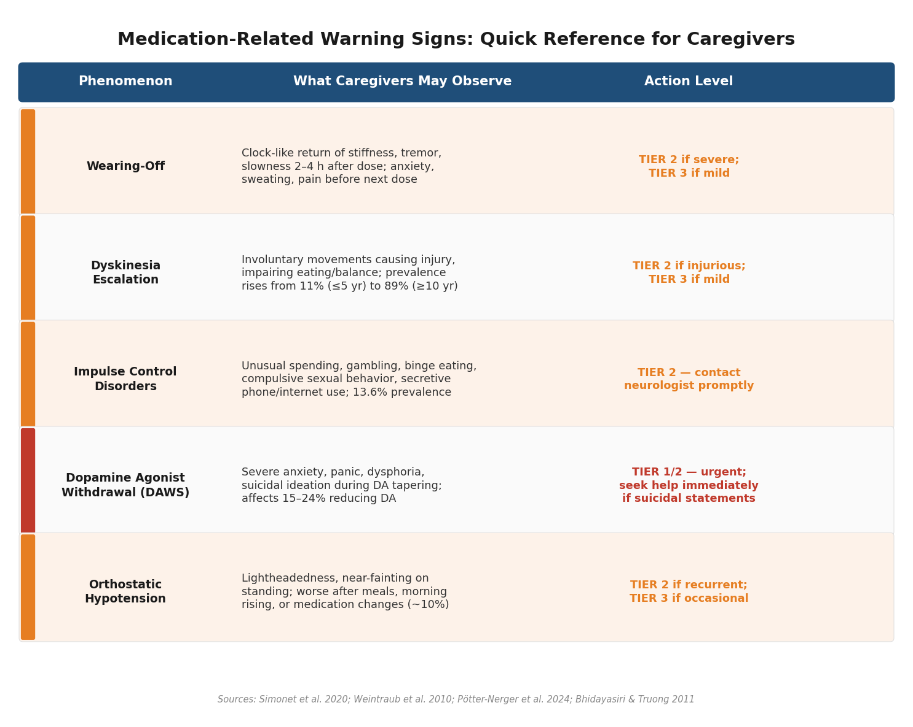

*Figure 3.1. Quick-reference card summarizing five medication-related warning signs, their observable manifestations, and corresponding action tiers. Sources: Simonet et al. 2020; Weintraub et al. 2010; Pötter-Nerger et al. 2024.*

### 3.2.1 Wearing-Off and End-of-Dose Deterioration

Wearing-off is the predictable return of motor and non-motor symptoms as a levodopa dose loses effect, typically 2–4 hours after ingestion. Caregivers may observe a clock-like pattern: the patient becomes stiffer, slower, and more tremulous at predictable intervals before the next dose. Non-motor wearing-off signs are equally important but often less recognized — anxiety, profuse sweating, tachycardia, abdominal discomfort, pain, and depressed mood can all signal end-of-dose deterioration [Simonet et al. 2020](https://pmc.ncbi.nlm.nih.gov/articles/PMC7029239/ "Emergencies in PD, Practical Neurology").

Severe OFF states — characterized by complete immobility, profuse diaphoresis, acute anxiety, and inability to speak — can be distressing for both patient and caregiver. Although not immediately life-threatening, recurrent severe OFF episodes warrant urgent neurological review to recalibrate the medication regimen.

### 3.2.2 Dyskinesia Escalation

Dyskinesias — involuntary, often choreiform movements — emerge as a complication of chronic levodopa therapy. Peak-dose dyskinesia prevalence rises from 11% at ≤ 5 years to 89% at ≥ 10 years of levodopa treatment [JAMA Neurol 2003](https://jamanetwork.com/journals/jamaneurology/fullarticle/792950 "Motor Fluctuations and Dyskinesias in PD"). Mild dyskinesias may not trouble the patient, but caregivers should report escalation — particularly when movements become violent enough to cause injury, interfere with eating or drinking, impair balance, or persist for extended periods. Biphasic dyskinesias (occurring at both the onset and offset of dose effect) may signal the need for dosing adjustments distinct from those appropriate for peak-dose dyskinesias.

### 3.2.3 Impulse Control Disorders

Impulse control disorders (ICDs) rank among the most socially and financially destructive medication-related complications of PD. The DOMINION cross-sectional study (N = 3,090) identified ICDs in 13.6% of treated PD patients, with prevalence nearly tripling among those receiving dopamine agonists (17.1% vs. 6.9%; OR = 2.72; P < 0.001). The most common manifestations were compulsive buying (5.7%), pathological gambling (5.0%), binge eating (4.3%), and compulsive sexual behavior (3.5%) [Weintraub et al. 2010](https://jamanetwork.com/journals/jamaneurology/fullarticle/800232 "DOMINION Study, Arch Neurol 2010"). Cumulative incidence in patients receiving dopamine agonists may reach 46% over time [Simonet et al. 2020](https://pmc.ncbi.nlm.nih.gov/articles/PMC7029239/ "Emergencies in PD").

Patients frequently fail to self-report ICDs due to embarrassment, lack of insight, or failure to connect the behavior with their medication. Caregivers thus serve as the primary surveillance system. Signs warranting prompt medical review include unexplained financial expenditures, secretive internet or phone use, changes in eating patterns (particularly nocturnal binge eating), increased sexual demands or inappropriate sexual behavior, and compulsive engagement in hobbies or tasks to the exclusion of other responsibilities. Additional risk factors include age ≤ 65, concurrent levodopa use, and being unmarried [Weintraub et al. 2010](https://jamanetwork.com/journals/jamaneurology/fullarticle/800232 "DOMINION Study").

### 3.2.4 Dopamine Agonist Withdrawal Syndrome

When dopamine agonists are reduced or discontinued — whether for ICD management, deep brain stimulation (DBS) optimization, or side-effect control — 15–24% of patients develop dopamine agonist withdrawal syndrome (DAWS). Symptoms include severe anxiety, panic attacks, dysphoria, irritability, suicidal ideation, fatigue, and autonomic instability. A critical feature of DAWS is that it does not respond to levodopa supplementation; only reintroduction of the dopamine agonist reliably alleviates symptoms. Risk factors include a history of ICDs, higher dopamine agonist doses (≥ 150 mg levodopa equivalent dose), and prior DBS [Pötter-Nerger et al. 2024](https://pmc.ncbi.nlm.nih.gov/articles/PMC11447035/ "German DGN guideline: DAWS section").

Caregivers should receive specific counseling about DAWS before any planned dopamine agonist reduction. The sudden onset of severe mood changes, panic, or suicidal statements in the context of medication tapering constitutes an urgent indication for immediate medical contact.

### 3.2.5 Orthostatic Hypotension

Symptomatic orthostatic hypotension affects approximately 10% of PD patients and is exacerbated by dopaminergic medications, antihypertensives, and dehydration [Simonet et al. 2020](https://pmc.ncbi.nlm.nih.gov/articles/PMC7029239/ "Emergencies in PD"). Caregivers should be alert to unsteadiness, lightheadedness, or near-fainting episodes upon standing — particularly on rising from bed in the morning, after prolonged sitting, post-meal, or following medication changes. Recurrent symptomatic orthostasis elevates fall risk and warrants medical review for medication adjustment and non-pharmacological countermeasures (e.g., compression garments, adequate hydration, slow postural transitions).

## 3.3 Gradual Changes That Warrant Scheduled Medical Review

Not all worrisome changes constitute emergencies. A range of gradual functional, behavioral, and physical shifts — each individually subtle — may collectively signal disease progression, medication inadequacy, or treatable comorbidities. Caregivers who recognize these patterns and document them systematically can bring actionable information to scheduled medical appointments, enabling earlier intervention.

### 3.3.1 Cognitive and Behavioral Decline

Increasing forgetfulness, difficulty with multitasking, impaired judgment, and slowed processing speed may herald progression from normal cognition toward PD–mild cognitive impairment (PD-MCI) or PD dementia. As detailed in Chapter 2, the probability of PD dementia rises with disease duration: 3–12% at year 5, 9–27% at year 10, and 50% at year 15 from diagnosis [Gallagher et al. 2024](https://pmc.ncbi.nlm.nih.gov/articles/PMC11318527/ "Long-Term Dementia Risk, Neurology 2024"). Factors predictive of faster cognitive decline include older age, greater disease severity, the postural instability/gait difficulty (PIGD) motor subtype, concurrent REM sleep behavior disorder (RBD), and psychiatric comorbidity [Gallagher et al. 2024](https://pmc.ncbi.nlm.nih.gov/articles/PMC11318527/ "Long-Term Dementia Risk, Neurology 2024").

Growing apathy — a loss of motivation, initiative, and emotional engagement distinct from depression — warrants particular attention. Apathy may manifest as decreased interest in previously enjoyed activities, reduced conversation initiation, reluctance to leave the house, or passive acceptance of a shrinking social world. Because the apathetic patient seldom complains, caregivers are often the first to recognize this change.

### 3.3.2 Hallucinations With Retained Insight

Not all hallucinations are emergencies. Visual hallucinations in which the patient retains insight — recognizing that the perceived figure, animal, or object is not real — represent an early marker of PD psychosis. Their prevalence rises with disease duration: 10.1% at year 5, 23.2% at year 10, and 39.6% at year 15 from PD diagnosis [Stang et al. 2022](https://pmc.ncbi.nlm.nih.gov/articles/PMC9336204/ "Incidence and Prevalence of PDP, J Parkinsons Dis 2022"). Although benign in the short term, these "passage" or "presence" hallucinations should be reported at the next scheduled visit because they predict later progression to more severe psychosis with lost insight — a state associated with 71% increased mortality (HR = 1.71; P = 0.027) [Stang et al. 2022](https://pmc.ncbi.nlm.nih.gov/articles/PMC9336204/ "PDP incidence study").

### 3.3.3 Weight Loss and Nutritional Decline

Unexplained weight loss exceeding 5% of body weight over six months should prompt medical evaluation. Contributing causes in PD are multifactorial: dysphagia reducing oral intake, medication-related nausea, depression-driven anorexia, increased energy expenditure from dyskinesias or tremor, and olfactory loss diminishing appetite [Simonet et al. 2020](https://pmc.ncbi.nlm.nih.gov/articles/PMC7029239/ "Emergencies in PD"). Because individual contributors may each seem minor, caregivers who track weight weekly are best positioned to detect a clinically significant downward trend before it becomes critical.

### 3.3.4 Sleep Architecture Disruption

Progressive sleep disturbances — excessive daytime sleepiness (affecting approximately 30% of patients), new or worsening RBD episodes, insomnia, and nocturia-driven fragmented sleep — compromise both safety and quality of life. Sudden-onset sleep attacks, a recognized side effect of dopamine agonists, pose a specific hazard for patients who continue to drive and should be reported to the treating physician immediately [Simonet et al. 2020](https://pmc.ncbi.nlm.nih.gov/articles/PMC7029239/ "Emergencies in PD").

### 3.3.5 Gait Deterioration and Freezing

Increasing frequency, duration, or severity of freezing-of-gait (FOG) episodes predicts falls and functional decline. Caregivers should log the context of each episode (doorways, turns, narrow spaces, dual-tasking), its frequency, and its duration. A pattern of escalating FOG despite stable medication — or new freezing during ON periods — warrants neurological review to explore programming adjustments (for DBS patients) or medication recalibration [Simonet et al. 2020](https://pmc.ncbi.nlm.nih.gov/articles/PMC7029239/ "Emergencies in PD").

### 3.3.6 Constipation and Gastrointestinal Complications

Severe constipation affects a substantial proportion of PD patients and can progress to intestinal pseudo-obstruction — a condition occurring in approximately 2.4% of cases that requires urgent medical intervention [Simonet et al. 2020](https://pmc.ncbi.nlm.nih.gov/articles/PMC7029239/ "Emergencies in PD"). Caregivers should monitor bowel frequency and report any abdominal distension, pain, or periods exceeding three days without a bowel movement to the clinical team.

## 3.4 Systematic Symptom-Tracking Tools for Caregiver Use

Accurate documentation transforms subjective caregiver impressions into clinically actionable data. Several validated instruments support home-based symptom tracking; their consistent use materially improves the quality of information available at medical appointments.

### 3.4.1 The PD Home Diary (Hauser Diary)

The PD Home Diary (Hauser Diary), designated "recommended" by the Movement Disorder Society, remains the gold standard for tracking motor fluctuations at home. In its standard format, the patient or caregiver records motor state in 30-minute intervals across the waking day, categorizing each block as ON without dyskinesia, ON with non-troublesome dyskinesia, ON with troublesome dyskinesia, OFF, or asleep. The diary yields quantifiable daily OFF-time and ON-time with troublesome dyskinesia — two metrics that are central to medication optimization decisions [Vizcarra et al. 2019](https://pmc.ncbi.nlm.nih.gov/articles/PMC8114172/ "PD e-Diary consensus, Mov Disord 2019").

The U.S. Department of Veterans Affairs provides a standardized Patient Motor Diary in a 24-hour format designed for clinical use; caregivers can assist in completing the diary when patients face cognitive or motor limitations [VA PD Consortium](https://www.parkinsons.va.gov/resources/motordiary.pdf "VA Patient Motor Diary").

An emerging approach — the PD e-Diary — integrates patient-reported outcomes with wearable sensor data and non-motor fluctuation assessment. This digital format may improve accuracy and reduce caregiver burden in the tracking process [Vizcarra et al. 2019](https://pmc.ncbi.nlm.nih.gov/articles/PMC8114172/ "PD e-Diary consensus, Mov Disord 2019").

### 3.4.2 A Recommended Home-Monitoring Framework

Drawing on the Parkinson's Foundation's care recommendations, a comprehensive home-monitoring framework should incorporate four complementary components [Parkinson's Foundation](https://www.parkinson.org/library/fact-sheets/hospital-safety "Five Parkinson's Care Needs"):

1. **Motor diary** (Hauser format): 30-minute interval recording of ON/OFF/dyskinesia states, maintained for 2–3 consecutive days before each neurology appointment.
2. **Falls log**: date, time, circumstance, activity at time of fall, environmental factors, injury sustained, and whether head impact occurred.
3. **Medication timing chart**: exact doses and actual administration times (not just prescribed times), noting any missed or delayed doses and the reason.
4. **Non-motor symptom checklist**: weekly or biweekly tracking of mood changes, sleep quality, constipation, urinary symptoms, pain, and any perceptual disturbances (hallucinations, illusions).

### 3.4.3 Consensus Prevention Measures

Aligned with NICE and AAN guidelines, consensus recommendations for clinical visits include the following systematic practices: review the current medication list with exact timing at every appointment; avoid changing more than one PD medication simultaneously; provide caregivers with a list of drugs known to worsen parkinsonism; inform patients and caregivers about sleep-attack risk and ICDs before initiating dopamine agonists; and conduct annual reviews covering falls, sleepiness, cognition, autonomic function, and psychiatric symptoms [Simonet et al. 2020](https://pmc.ncbi.nlm.nih.gov/articles/PMC7029239/ "Box 3: Key prevention measures").

## 3.5 Caregiver Burnout: Recognizing and Addressing the Hidden Patient

The caregiver is, in many respects, the hidden patient in Parkinson's disease. A comprehensive scoping review of 114 studies (2017–2022) found that non-motor symptoms — depression, apathy, cognitive impairment, hallucinations, and psychosis — correlate more strongly with caregiver burden than the motor symptoms that define clinical staging [Aamodt et al. 2024](https://pmc.ncbi.nlm.nih.gov/articles/PMC10802092/ "Caregiver Burden Scoping Review, JGPN"). This finding underscores a painful irony: the symptoms least visible to outside observers inflict the greatest toll on those providing daily care.

### 3.5.1 Prevalence and Trajectory of Caregiver Depression

In a prospective study of 101 Taiwanese PD caregivers assessed with the MINI structured diagnostic interview, depression prevalence rose from 11.6% at baseline to 13.3% at six months and 17.8% at twelve months. The strongest predictor of caregiver depression was the severity of the caregiver's own anxiety (OR = 1.73) [Lee et al. 2022](https://pmc.ncbi.nlm.nih.gov/articles/PMC9318994/ "Depression in PD Patients and Caregivers, Healthcare"). Female caregivers are approximately twice as likely to report exhaustion as male caregivers, and caregivers of male patients with dementia experience the highest strain levels [Aamodt et al. 2024](https://pmc.ncbi.nlm.nih.gov/articles/PMC10802092/ "Caregiver Burden Scoping Review").

Physical health consequences are substantial. A UK study of 107 PD caregivers documented musculoskeletal conditions in 26.1%, mental health problems in 6.1%, and respiratory conditions in 4.3%. Qualitative research consistently identifies themes of anticipatory grief, loss of personal identity, shifting spousal roles, decreased intimacy, and social stigma [Aamodt et al. 2024](https://pmc.ncbi.nlm.nih.gov/articles/PMC10802092/ "Impact of caregiving").

### 3.5.2 The Zarit Burden Interview

The Zarit Burden Interview (ZBI), a 22-item self-report questionnaire, is the most widely used validated instrument for measuring caregiver burden in PD. It has been validated across multiple languages and cultural contexts. Motor severity, motor fluctuations, and neuropsychiatric symptoms consistently correlate with higher ZBI scores [Aamodt et al. 2024](https://pmc.ncbi.nlm.nih.gov/articles/PMC10802092/ "Caregiver Burden Scoping Review — ZBI sections"). Periodic self-administration of the ZBI — or even informal reflection on its themes of feeling strained, overwhelmed, or resentful — can help caregivers recognize when their burden has exceeded sustainable levels.

### 3.5.3 Evidence-Based Interventions for Caregiver Well-Being

Several interventions have demonstrated efficacy in reducing caregiver distress:

- **Cognitive behavioral therapy (CBT):** Both telephone-based and in-person CBT have reduced depression, anxiety, and perceived burden among PD caregivers, with gains sustained at three months post-treatment [Aamodt et al. 2024](https://pmc.ncbi.nlm.nih.gov/articles/PMC10802092/ "Interventions section").
- **Psychoeducational empowerment programs:** A randomized controlled trial in Iran demonstrated that a structured psychoeducational intervention reduced ZBI scores by 25.1 ± 13.9 points in the intervention group versus 0.6 ± 3.1 points in controls (P < 0.001) [Aamodt et al. 2024](https://pmc.ncbi.nlm.nih.gov/articles/PMC10802092/ "Interventions section").
- **Integrated palliative care:** A landmark three-center RCT (N = 210 patients + 175 caregivers) demonstrated that outpatient palliative care significantly reduced caregiver anxiety and burden at 12 months (ZBI-12: −2.60, P = 0.01) [Kluger et al. 2020](https://jamanetwork.com/journals/jamaneurology/fullarticle/2760511 "Integrated palliative care vs standard care in PDRD, JAMA Neurol 2020;77:551–60").
- **Community programs:** Initiatives such as ParkinSong (therapeutic singing groups) have demonstrated reductions in caregiver stress and depression [Aamodt et al. 2024](https://pmc.ncbi.nlm.nih.gov/articles/PMC10802092/ "Interventions section").

### 3.5.4 Respite and Self-Care

The Parkinson's Foundation explicitly advises caregivers to place their own needs on equal par with those of the patient [Parkinson's Foundation](https://www.parkinson.org/resources-support/carepartners/caring-for-self "Caring for the Care Partner"). Systematic reviews confirm that respite care reduces caregiver distress and depression, though caregivers commonly report guilt when accepting time away. Outpatient palliative care models that integrate social work, chaplaincy, nursing, and neurology have shown promise in normalizing and facilitating respite [Aamodt et al. 2024](https://pmc.ncbi.nlm.nih.gov/articles/PMC10802092/ "Palliative care and respite sections").

Resilience — the capacity to adapt positively in the face of chronic adversity — has been identified as a protective factor against caregiver burnout. Modifiable contributors to resilience include maintaining social connections outside the caregiving relationship, preserving at least one personal activity or interest, securing adequate sleep, and accessing professional support before reaching crisis [Aamodt et al. 2024](https://pmc.ncbi.nlm.nih.gov/articles/PMC10802092/ "Impact of caregiving").

## 3.6 Putting It Together: A Tiered Alert Framework

The following summary organizes the caregiver alert signals discussed in this chapter into a practical three-tier framework, aligned with the clinical urgency of each sign.

**Tier 1 — Emergency (call emergency services or go to the emergency department immediately):**
- Akinetic crisis: sudden extreme rigidity + fever + confusion, especially after missed medication or infection
- Fall with head injury, loss of consciousness, suspected fracture, or inability to bear weight
- Inability to swallow medications
- Acute psychosis with loss of insight, agitation, or dangerous behavior
- Signs of aspiration: choking event with respiratory distress, blue lips, inability to breathe or speak

**Tier 2 — Urgent (contact the neurologist or PD care team within 24–48 hours):**
- New or escalating hallucinations, even with retained insight
- Recurrent severe OFF states despite adherence to medication schedule
- Sudden mood change (severe anxiety, panic, suicidal statements) during dopamine agonist tapering (suspect DAWS)
- New impulse control behaviors (unusual spending, gambling, binge eating, compulsive sexual behavior)
- Worsening dyskinesias causing injury or interfering with eating/balance
- Recurrent near-syncope or falls associated with standing (orthostatic hypotension)
- Abdominal distension or more than three days without a bowel movement

**Tier 3 — Scheduled review (document and bring to the next medical appointment):**
- Increasing apathy, social withdrawal, or loss of initiative
- Progressive cognitive difficulties (forgetfulness, poor multitasking, impaired judgment)
- Gradual weight loss (> 5% in six months) without clear cause
- Worsening sleep disturbances (excessive daytime sleepiness, RBD escalation, insomnia)
- Increasing freezing-of-gait frequency or new ON-state freezing
- Wearing-off pattern changes (shorter effective dose duration, new non-motor OFF symptoms)
- Caregiver exhaustion, mood decline, or persistent feeling of being overwhelmed

# 第4章 Life After Deep Brain Stimulation — Post-Operative Adjustments, Device Management, and Medication Recalibration

Deep brain stimulation (DBS) represents a pivotal intervention in the management of advanced Parkinson's disease (PD), yet the surgical procedure itself marks only the beginning of a complex, months-long optimization process. Post-operative recovery, iterative stimulation programming, medication recalibration, and long-term management of an implanted neurostimulation device impose demands on patients and caregiving networks that extend well beyond the operating room. This chapter examines the practical realities of life after DBS — from the immediate post-surgical period through long-term device stewardship — integrating clinical evidence on outcomes, complications, and emerging adaptive technologies with the daily-life implications that patients and families must navigate.

## Post-Operative Recovery: Timeline and the Microlesion Effect

### The First Days to Weeks

Following electrode implantation, patients typically remain hospitalized for one to two days. Wound care during the initial recovery period requires keeping incision sites dry for at least 72 hours; sponge baths are recommended for approximately seven days, and submersion in water should be avoided until full wound healing is confirmed by the surgical team. Heavy lifting (more than approximately 10 kg / 20 lbs) and strenuous upper-body activity are restricted for four to six weeks to protect the integrity of the surgical site and implanted leads. Most patients return to work or routine activities only after initial DBS programming begins, typically four to five weeks post-surgery [Boston Scientific DBS Recovery Guide](https://www.bostonscientific.com/en-US/patients-caregivers/device-support/dbs/recovering-from-your-procedure.html "Boston Scientific DBS recovery guidance") [Beth Israel Deaconess Medical Center](https://bidmc.org/services/neurology-neurosurgery/movement-disorders-center/deep-brain-stimulation/recovery "After DBS Surgery").

The figure below summarizes the key phases from surgery through the sixth post-operative month, illustrating the overlap between wound care, activity restrictions, the microlesion effect window, initial programming, iterative optimization, and medication recalibration.

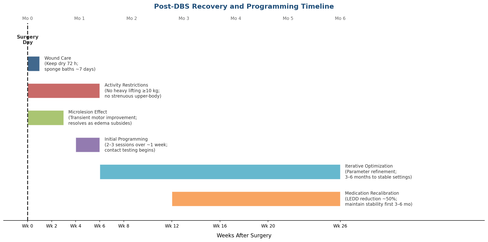

### The "Honeymoon" Microlesion Effect

A frequently misunderstood phenomenon occurs immediately after electrode placement: the microlesion effect (MLE), a transient improvement in motor symptoms that appears within 48 hours of implantation — before any stimulation has been activated. In a study of 74 PD patients, the magnitude of this effect correlated with six-month post-operative outcomes: patients with a high MLE showed mean UPDRS-III improvement of 61.4%, compared with 47.5% in the moderate group and 33.6% in the low-MLE group [Tykocki et al. 2013](https://karger.com/sfn/article/91/1/12/293259/Microlesion-Effect-as-a-Predictor-of-the "MLE as Predictor of STN-DBS Effectiveness, Stereotact Funct Neurosurg 2013;91:12–17"). The underlying mechanism involves local tissue disruption, perielectrode edema, and astrocyte activation, which transiently modulate pathological circuit activity in the target nucleus [Nature Scientific Reports 2022](https://www.nature.com/articles/s41598-022-23156-2 "Micro lesion effect of pallidal DBS").

The practical implication for families is critical: the initial dramatic improvement is temporary and should not be mistaken for the final therapeutic benefit. As perielectrode edema resolves over days to weeks, symptoms typically return to near-baseline levels before formal programming begins — a transition that can be distressing if not anticipated.

## DBS Programming: Parameters, Process, and Expectations

### Initiation and Iterative Optimization

Initial DBS programming is typically deferred until four to six weeks after surgery to allow post-operative swelling to subside, as residual edema distorts the effective stimulation field and renders parameter selection unreliable during the acute period [Diao et al. 2023](https://www.frontiersin.org/journals/neurology/articles/10.3389/fneur.2023.1270746/full "Premature drug reduction after STN-DBS, Front Neurol 2023"). The first programming session usually spans two to three visits over approximately one week, during which the clinician systematically tests individual electrode contacts to identify the optimal configuration. Full optimization — the iterative process of refining stimulation parameters to achieve the best balance of symptom control and side-effect minimization — typically requires three to six months of periodic adjustments.

### Core Stimulation Parameters

Three primary parameters govern DBS output:

- **Amplitude** (voltage or current): determines the strength of stimulation and the volume of tissue activated. Typical ranges for subthalamic nucleus (STN) DBS are 1–4 V (or equivalent mA in constant-current systems); globus pallidus internus (GPi) DBS employs similar amplitude ranges.
- **Pulse width** (microseconds): defines the duration of each electrical pulse. STN-DBS typically uses 30–90 μs; GPi-DBS often requires wider pulse widths of 60–120 μs.
- **Frequency** (Hz): the rate of pulse delivery. Standard settings cluster around 130 Hz, with therapeutic ranges spanning 90–185 Hz.

Standard initial STN-DBS parameters approximate 130 Hz frequency, 60 μs pulse width, and 2.0 V amplitude in monopolar configuration [Diao et al. 2023](https://www.frontiersin.org/journals/neurology/articles/10.3389/fneur.2023.1270746/full "DBS parameters") [ScienceDirect 2023](https://www.sciencedirect.com/science/article/pii/S2949669123000179 "Current DBS programming"). Each parameter can be adjusted independently, and the therapeutic window — the gap between effective symptom suppression and stimulation-induced side effects — varies across contacts and patients, necessitating individualized titration.

### Adaptive DBS: The Closed-Loop Frontier

A major technological advance reached clinical application in 2025 with FDA approval of the first closed-loop (adaptive) DBS system. The ADAPT-PD pivotal trial (N=68) demonstrated that adaptive DBS (aDBS) using Medtronic's BrainSense technology — which reads local field potentials (LFPs) in the alpha-beta frequency band (8–30 Hz) and modulates stimulation in real time — achieved comparable on-time without troublesome dyskinesia while reducing total electrical energy delivered (TEED) by 13–16%. Among participants, 98% (44 of 45 completers) elected to continue aDBS over conventional constant stimulation [Bronte-Stewart et al. 2025](https://jamanetwork.com/journals/jamaneurology/fullarticle/2839117 "ADAPT-PD Trial, JAMA Neurol 2025;82:1171–1180"). The first non-research patient received aDBS in March 2025 at UCHealth Colorado [APDA 2025](https://www.apdaparkinson.org/article/adaptive-deep-brain-stimulation-dbs/ "Adaptive DBS: A New Era in PD Treatment, APDA July 2025").

For caregivers, the emergence of aDBS represents a shift toward more physiologically responsive therapy, with the potential to reduce the burden of frequent in-clinic reprogramming and improve the consistency of symptom control across varying daily activity states.

## Medication Recalibration After DBS

### The Post-Operative Medication Landscape

One of the most consequential aspects of the post-DBS period is the recalibration of dopaminergic medications. A meta-analysis of 31 studies encompassing 1,644 patients found that STN-DBS enables an average levodopa equivalent daily dose (LEDD) reduction of 50.0%, with GPi-DBS producing a less pronounced decrease [Lachenmayer et al. 2021](https://www.nature.com/articles/s41531-021-00223-5 "STN and pallidal DBS meta-analysis, npj PD 2021;7:77"). This reduction is clinically meaningful: it attenuates levodopa-induced dyskinesias, diminishes motor fluctuations, and decreases the pill burden that dominates daily life in advanced PD.

The timing and pace of medication reduction, however, profoundly affect psychiatric outcomes. A retrospective cohort study at Beijing Tiantan Hospital (N=122) demonstrated that patients whose LEDD was reduced at the time of initial programming showed no improvement in anxiety or depression scores at three to six months, whereas patients whose medication was held stable during this period showed significant improvement on both the Hamilton Depression Rating Scale (HAMD, p<0.001) and Hamilton Anxiety Rating Scale (HAMA, p=0.004) [Diao et al. 2023](https://www.frontiersin.org/journals/neurology/articles/10.3389/fneur.2023.1270746/full "Premature drug reduction after STN-DBS").

### Principles of Safe Medication Adjustment

Several evidence-based principles guide post-DBS medication management:

1. **Maintain medication stability for three to six months** after surgery, adjusting stimulation parameters first and reducing medications only once stable programming settings have been achieved.
2. **Levodopa is the primary target** for initial dose reduction; COMT inhibitors and amantadine are typically maintained longer to support residual symptom control.
3. **Dopamine agonist reduction requires particular caution.** Reducing agonists within the first three months post-DBS is associated with manic symptoms and impulse control disorder exacerbation, or conversely, dopamine agonist withdrawal syndrome (DAWS) — a condition affecting 15–24% of patients discontinuing dopamine agonists, characterized by anxiety, panic attacks, dysphoria, and in severe cases suicidal ideation [Diao et al. 2023](https://www.frontiersin.org/journals/neurology/articles/10.3389/fneur.2023.1270746/full "Medication recalibration").
4. **Simultaneous stimulation and medication changes should be avoided**, as concurrent adjustments make it impossible to attribute symptom changes to either variable.

Caregivers play a central role in this process by monitoring for emerging mood changes, anxiety, apathy, or behavioral shifts during medication adjustments and communicating these observations to the clinical team promptly.

## Daily-Life Precautions: Electromagnetic Interference, Travel, and MRI Safety

### Electromagnetic Interference

An implanted DBS system is an active electronic device whose function can be disrupted by strong electromagnetic fields. An analysis of 346 FDA MAUDE (Manufacturer and User Facility Device Experience) adverse event reports for Medtronic DBS systems filed between 2002 and 2019 documented a range of electromagnetic interference (EMI) incidents, including involuntary device shutoff at airport security checkpoints, "jolting" sensations near anti-theft systems, and tonic muscle contractions during MRI scanning [Rahimpour et al. 2021](https://pmc.ncbi.nlm.nih.gov/articles/PMC8081063/ "DBS and EMI, Clin Neurol Neurosurg 2021;203:106577").

Sources of probable EMI hazard include arc welding equipment, electrocautery devices, industrial power generators and furnaces, ham radio transmitters, high-voltage power lines, therapeutic radiation equipment, and lithotripsy machines. Conversely, standard consumer electronics — including cell phones, household appliances, and personal computers — are generally considered safe and do not produce field strengths sufficient to affect DBS operation [Rahimpour et al. 2021](https://pmc.ncbi.nlm.nih.gov/articles/PMC8081063/ "DBS and EMI").

The following reference chart categorizes common activities and environments by their risk profile for DBS patients:

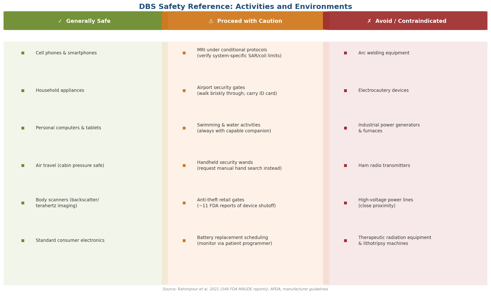

### Airport Security and Travel

Air travel is feasible for DBS patients but requires preparation. Body scanners employing backscatter X-ray or terahertz imaging pose minimal risk to the device. However, handheld security wands contain magnets capable of switching the implantable pulse generator (IPG) on or off; approximately 11 FDA reports over a 15-year period documented "jolting" or device shutoff at retail anti-theft gates. Patients should carry a DBS identification card at all times, inform security personnel of the implant, request a manual hand search in lieu of wand screening, and walk briskly through security gates to minimize exposure time [Rahimpour et al. 2021](https://pmc.ncbi.nlm.nih.gov/articles/PMC8081063/ "DBS and EMI"). Cabin pressure and altitude do not affect DBS function, and patients can generally fly as early as two weeks after surgery once cleared by their surgical team.

### MRI Compatibility

MRI access is among the most clinically consequential device-related concerns, given that 57% of DBS patients require MRI within five years and 66–75% within ten years of implantation. All current-generation DBS systems from the three FDA-approved manufacturers — Medtronic Percept, Abbott Infinity, and Boston Scientific Vercise — carry MR Conditional labeling, meaning MRI can be performed safely under manufacturer-specified conditions governing specific absorption rate (SAR), coil type, and scanning parameters. The Abbott Infinity system holds FDA approval for full-body MRI, offering broader scanning flexibility compared with head-only conditional systems [Rahimpour et al. 2021](https://pmc.ncbi.nlm.nih.gov/articles/PMC8081063/ "DBS and EMI") [Abbott MRI Support](https://www.neuromodulation.abbott/us/en/healthcare-professionals/mri-support/mri-dbs-full-systems.html "Abbott MRI Support for DBS"). The principal risks of non-compliant MRI include electrode tip heating, induced electrical currents, and IPG malfunction. Patients should present their DBS identification card to radiology staff before any scan, and MRI centers must verify compatibility with the specific system model before proceeding.

### Swimming and Water Safety

An area of particular concern — one that receives insufficient attention in routine post-operative counseling — is swimming. A case series published in *Neurology* (2020) identified nine previously proficient swimmers with PD who lost the ability to coordinate swimming strokes after DBS activation. A subsequent randomized within-person crossover study (N=18, DBS on vs. off) found that while DBS did not significantly impair swimming performance overall, one participant demonstrated a clear stimulation-induced drowning hazard that resolved when stimulation was turned off [Morgan et al. 2021](https://pubmed.ncbi.nlm.nih.gov/34840886/ "DBS and Swimming Performance, Neurol Clin Pract 2021;11(5)"). The American Parkinson Disease Association advises that all PD patients with DBS should be accompanied by a capable swimmer at all times when in the water, as PD symptoms can change suddenly and DBS may unpredictably affect aquatic motor coordination [APDA 2019](https://www.apdaparkinson.org/article/deep-brain-stimulation-and-swimming/ "Deep Brain Stimulation and Swimming, APDA").

## DBS Devices: Current Systems and Battery Management

### The Three FDA-Approved Manufacturers

As of 2025–2026, three companies manufacture FDA-approved DBS systems for PD:

- **Medtronic** (Percept PC/RC): the original DBS manufacturer (first FDA approval 1997); features BrainSense sensing technology enabling adaptive DBS; the Percept RC is rechargeable.
- **Abbott** (Infinity/Liberta RC): offers full-body MRI compatibility and an iOS-based patient programmer; the Liberta RC is the smallest rechargeable IPG available, with a 37-day charge cycle.
- **Boston Scientific** (Vercise Genus P16/R16): introduced the first 16-contact directional leads (Cartesia X/HX), providing greater precision in current steering; compatible with leads from other manufacturers.

[Michael J. Fox Foundation 2025](https://www.michaeljfox.org/news/choosing-deep-brain-stimulation-device "Choosing a DBS Device, Michael J. Fox Foundation") [Medtronic DBS Products](https://www.medtronic.com/en-us/l/patients/treatments-therapies/deep-brain-stimulation-parkinsons-disease/about-dbs-therapy/dbs-products.html "Medtronic DBS Products") [Boston Scientific Vercise DBS](https://www.bostonscientific.com/en-US/products/deep-brain-stimulation-systems/vercise-tm-dbs.html "Vercise DBS System")

The figure below provides a side-by-side comparison of these three systems across key feature categories:

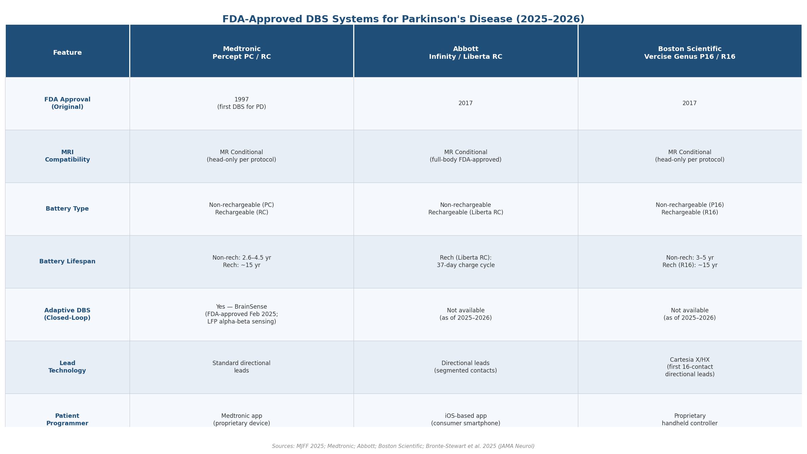

### Battery Life and Replacement

IPG battery longevity varies substantially by device type and stimulation demands. Non-rechargeable systems typically last three to five years (Medtronic Activa PC average: 2.6–4.5 years), while rechargeable systems offer dramatically extended lifespans of 9–25 years (Boston Scientific Vercise Genus R16: approximately 15 years) [Michael J. Fox Foundation 2025](https://www.michaeljfox.org/news/choosing-deep-brain-stimulation-device "MJFF DBS device comparison"). Battery replacement (IPG exchange) is a comparatively minor surgical procedure involving the chest-wall pocket but not the brain; it carries, however, a higher infection risk than primary implantation, underscoring the importance of monitoring battery status through the patient programmer and scheduling elective replacement before complete depletion.

## Warning Signs of Device-Related Complications

### Hardware Complications

A 21-year, single-center experience tracking 426 bilateral DBS patients provides the most comprehensive long-term complication data available. Infection occurred in 2.8% of patients (12/426), with a mean onset of 23.7 months post-surgery and no infections observed beyond four years; six of twelve cases followed external skin barrier disruption (e.g., trauma to the incision site). Hardware failure occurred in 0.7% (3/426), intracranial hemorrhage in 2.3% (0.7% major, requiring surgical evacuation), and mortality in 0.5% (2/426) [Jung et al. 2022](https://www.frontiersin.org/journals/aging-neuroscience/articles/10.3389/fnagi.2022.819730/full "Complications After DBS: 21-Year Experience, Front Aging Neurosci 2022"). A separate 519-case series reported lead fracture in 2.5% and infection in 1.9% [Doshi 2021](https://onlinelibrary.wiley.com/doi/10.1111/ner.13360 "Surgical and Hardware Complications of DBS, Neuromodulation 2021").

Signs that should prompt urgent clinical evaluation include:

- **Sudden return of symptoms** without medication change, suggesting device malfunction or lead displacement.
- **Pain, swelling, warmth, or drainage** at the chest-wall IPG site or scalp incision, indicating possible infection.
- **Rhythmic muscle contractions or tingling** unrelated to voluntary movement, which may reflect lead migration or stimulation of adjacent neural structures.
- **Persistent headache, confusion, or new neurological deficits** in the early post-operative period, warranting evaluation for intracranial hemorrhage.

### Stimulation-Induced Side Effects

Beyond hardware complications, the stimulation itself can produce adverse effects requiring programming adjustments:

**Speech and voice changes** are among the most common and functionally significant consequences. A systematic review of 90 studies encompassing 3,660 patients found that STN-DBS exerts heterogeneous effects on speech: verbal fluency declines by 15–17% (both semantic and phonemic categories), and 73% of patients experienced speech impairment at three years in the ON-medication/ON-stimulation condition. Stimulation-induced dysarthria is more frequently associated with left-sided stimulation, and evidence suggests that low-frequency stimulation (60 Hz) may mitigate speech deterioration compared with standard high-frequency settings (130 Hz) [Phillips et al. 2024](https://pmc.ncbi.nlm.nih.gov/articles/PMC11086900/ "Speech outcomes following DBS: systematic review, PLoS ONE 2024").

**Mood changes** represent another consequential category. Post-DBS apathy is a recognized phenomenon confirmed by meta-analysis, driven by the convergence of LEDD reduction, direct stimulation of limbic subthalamic circuits, and psychosocial adjustment to altered functional status [Zoon et al. 2021](https://movementdisorders.onlinelibrary.wiley.com/doi/10.1002/mds.28390 "Apathy induced by STN-DBS: meta-analysis, Mov Disord 2021"). Less commonly, stimulation of ventromedial STN contacts can produce euphoria, impulsivity, or hypomania — effects that are typically reversible with programming adjustments but that caregivers should recognize as potential stimulation-related phenomena rather than intrinsic psychiatric deterioration.

## Practical Guidance for Families

The post-DBS period demands sustained engagement from both the patient and the caregiving network. Several practical principles emerge from the clinical evidence reviewed in preceding sections:

**Expect a non-linear trajectory.** The sequence of microlesion benefit → symptom recurrence → iterative programming → gradual optimization means that the months following surgery involve fluctuating symptom control. Understanding this trajectory in advance helps families calibrate expectations and reduces distress during transient setbacks.

**Maintain a medication and symptom log.** Detailed records of medication timing, doses, motor states (ON/OFF periods, dyskinesia), mood, sleep quality, and speech clarity provide invaluable data for the programming team. The Hauser Home Diary format — recording motor state in 30-minute intervals — is endorsed by the Movement Disorder Society for this purpose.

**Learn to use the patient programmer.** Each DBS system includes a handheld patient controller that allows within-range amplitude adjustments and the ability to check battery status. Familiarity with this device enables patients and caregivers to make minor adjustments between clinic visits and to confirm device function if symptoms change unexpectedly.

**Prioritize fall prevention.** While DBS improves tremor, rigidity, and bradykinesia, axial symptoms — gait, balance, and postural stability — respond less consistently and may continue to deteriorate with disease progression. The home environment should be assessed for trip hazards, and patients should be encouraged to use assistive devices when appropriate.

**Communicate proactively with the clinical team.** Sudden symptom changes, new mood or behavioral patterns, signs of infection, or any unusual sensations at the device site warrant prompt communication. The threshold for contacting the care team should be lower in the first year post-implantation, when complications are most likely to emerge.

# 第5章 Quality-of-Life Support Strategies for DBS Patients and Holistic Caregiving Approaches

Deep brain stimulation reshapes the motor landscape of Parkinson's disease yet does not halt neurodegeneration. The post-DBS patient presents a distinctive clinical phenotype: improved tremor, rigidity, and bradykinesia coexist with progressive deterioration of gait, postural stability, speech, and cognition — domains less responsive to electrical stimulation and more dependent on sustained rehabilitative effort. Concurrently, medication reduction, limbic circuit stimulation, and psychosocial adjustment introduce new vulnerabilities in mood, weight regulation, and daily functioning. This chapter synthesizes evidence-based strategies — spanning exercise, nutrition, psychological support, palliative care, and community infrastructure — that collectively define quality-of-life optimization for DBS patients and the families who support them.

## Exercise and Physical Rehabilitation After DBS

### The Clinical Rationale for Structured Exercise

DBS produces what rehabilitation specialists characterize as a "new PD phenotype." With tremor and rigidity substantially controlled by stimulation, the dominant functional limitations shift to axial motor symptoms — gait disturbance, postural instability, freezing of gait, and speech deterioration — which respond poorly to stimulation alone. A 2024 Delphi panel comprising 21 international DBS experts (including Okun, Fasano, Limousin, and Lozano) reached strong consensus that physical therapy should be prescribed for PD-DBS patients to address these residual deficits and improve quality of life: 89% strongly agreed on the general recommendation, and 94% agreed that physical therapy should begin as soon as clinical conditions stabilize after surgery [Guidetti et al. 2024](https://pmc.ncbi.nlm.nih.gov/articles/PMC11469472/ "Physical therapy in PD patients treated with DBS, Delphi panel 2024"). A further 88% endorsed physical therapy for chronically implanted patients, affirming that exercise is not merely a post-operative measure but a lifelong component of DBS management.

Among modalities, conventional physical therapy — encompassing gait training, balance exercises, transfer practice, and physical capacity building — was the only treatment reaching consensus (81%) as specifically appropriate for DBS patients. Massage and manual therapy were explicitly discouraged (81% agreement). Dance-based and tai chi–based approaches, despite strong evidence in general PD populations, did not reach consensus for DBS patients specifically; the panel noted that DBS-related hardware, altered motor patterns, and the absence of RCT data in post-DBS cohorts warrant caution before extrapolating from non-DBS trials [Guidetti et al. 2024](https://pmc.ncbi.nlm.nih.gov/articles/PMC11469472/ "Delphi panel: exercise-DBS interactions").

A paradox compounds the clinical rationale: post-DBS physical inactivity. One study documented a 69% decrease in daily physical activity counts at six months after surgery, suggesting that the motor improvement conferred by stimulation may reduce the perceived urgency of exercise rather than enhance it [Guidetti et al. 2024](https://pmc.ncbi.nlm.nih.gov/articles/PMC11469472/ "Delphi panel: exercise-DBS interactions"). Structured, supervised exercise programs are therefore essential to counteract this behavioral pattern.

### Evidence From General PD Exercise Research

No RCTs have specifically enrolled post-DBS populations — a gap the Delphi panel identified as a critical research priority. The broader PD exercise literature nevertheless provides a robust foundation for clinical recommendations.

**Tai chi** remains among the most rigorously studied interventions. A landmark randomized controlled trial (N=195, Hoehn & Yahr stages 1–4) demonstrated that tai chi improved limits-of-stability by 11.98 percentage points versus stretching controls (P<0.001) and by 5.55 percentage points versus resistance training (P=0.01), with additional benefits for directional control, stride length, Timed Up and Go (TUG) performance, and UPDRS-III motor scores. The incidence rate ratio for falls was 0.33 (95% CI: 0.16–0.71) compared with the stretching group, representing a 67% reduction in fall incidence [Li et al. 2012](https://www.nejm.org/doi/full/10.1056/NEJMoa1107911 "Tai chi and postural stability in PD, NEJM 2012;366:511–9"). A 3.5-year follow-up (Li et al. 2024, *JNNP*) reported sustained benefits, suggesting durable neuroprotective or compensatory effects.

**LSVT BIG** (Lee Silverman Voice Treatment adapted for limb movement) targets amplitude-based motor deficits. A 2025 meta-analysis of six RCTs found significantly improved walking speed on the 10-Meter Walk Test (mean difference −0.60; 95% CI: −1.17 to −0.02; P=0.04) and motor function on UPDRS-III (sensitivity analysis MD −5.52; 95% CI: −7.72 to −3.32; P<0.05) versus general exercise in mild-to-moderate PD. No significant improvement in disease-specific quality of life (PDQ-39) was detected, and evidence certainty was rated moderate-to-low [Luna et al. 2025](https://pubmed.ncbi.nlm.nih.gov/40300045/ "LSVT BIG systematic review, Am J Phys Med Rehabil 2025").

**Bicycling** has demonstrated consistent motor benefits. A 2021 meta-analysis of 22 studies (N=505) found a significant pooled effect on motor function (SMD 0.35; 95% CI: 0.21–0.48; P<0.001; I²=0%), with benefits for balance, walking speed, six-minute walk test distance, and quality of life (PDQ-39 SMD 0.43). Longer intervention durations produced greater effects than single sessions (P=0.003) [Tiihonen et al. 2021](https://www.nature.com/articles/s41531-021-00222-6 "Bicycling in PD, npj Parkinsons Dis 2021;7:86").

**Rock Steady Boxing**, a community-based boxing fitness program adapted for PD, has demonstrated significantly better health-related quality of life and exercise self-efficacy compared with non-participating PD populations, alongside improvements in balance (Berg Balance Scale, Mini-BESTest), functional gait (TUG), and gait velocity over 12 months of participation [Hermanns et al. 2022](https://www.tandfonline.com/doi/full/10.1080/09638288.2021.1963854 "RSB and QoL in PD, Disabil Rehabil 2022;44").

### Practical Considerations for DBS Patients

Exercise programs for DBS patients require several adaptations. Implanted hardware necessitates avoidance of strong magnetic fields in exercise environments (as detailed in Chapter 4). Adaptive DBS systems may require specific programming adjustments during physical therapy sessions to accommodate the distinct motor demands of exercise versus rest. Caregivers and physical therapists should coordinate with the DBS programming team to ensure that stimulation settings support — rather than hinder — rehabilitation goals. Given the 73% prevalence of speech impairment at three years post-DBS, speech-language pathology (including LSVT LOUD, the voice-focused counterpart to LSVT BIG) should be integrated alongside physical exercise as a core rehabilitation component.

## Nutritional and Dietary Considerations After DBS

### Weight Gain: A Post-DBS Metabolic Challenge

Weight gain after STN-DBS is a well-documented and clinically significant phenomenon. A prospective study comparing 14 DBS patients with matched controls found a mean weight increase of 3.2 ± 7.2 kg and a 2.8 ± 5.4% increase in fat mass at 12 months post-surgery (P=0.011 and P=0.001, respectively). The primary driver was a 69% decrease in daily physical activity counts rather than increased caloric intake. Stimulation of the limbic portion of the subthalamic nucleus correlated with weight change (P=0.005, r=0.70), and insulin levels rose from 7.0 to 9.6 µIU/mL (P=0.048), suggesting a neuroendocrine component to post-DBS metabolic shifts [Steinhardt et al. 2023](https://pmc.ncbi.nlm.nih.gov/articles/PMC10468527/ "Mechanisms of weight gain after STN-DBS, Sci Rep 2023;13:14202"). Prior meta-analytic data have confirmed an average gain of approximately 5 kg in the first post-operative year, with obesity class I prevalence increasing by up to one-third.

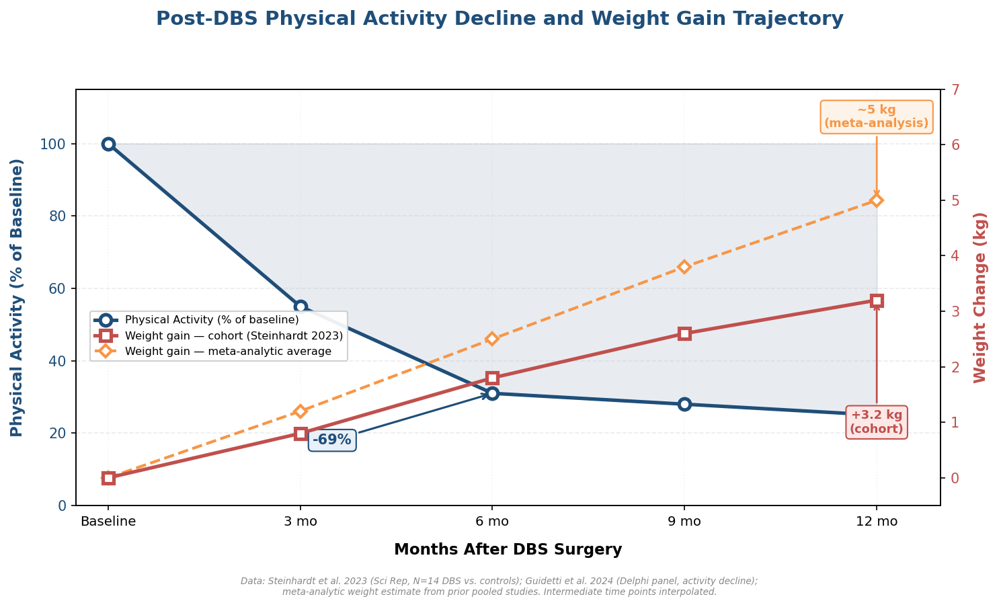

*Figure 1. Inverse relationship between physical activity decline and progressive weight gain during the first year after DBS surgery. Data from Steinhardt et al. 2023 and Guidetti et al. 2024; intermediate time points interpolated.*

The convergence of reduced physical activity, possible limbic stimulation effects on appetite regulation, and the metabolic consequences of reduced levodopa dosing creates a multifactorial risk profile for post-DBS weight gain. Dietary counseling — initiated before surgery and continued throughout the first year — should address caloric adjustment proportional to reduced activity levels, with regular weight monitoring.

### Protein–Levodopa Interaction and Dietary Timing

Although DBS enables an average levodopa equivalent daily dose (LEDD) reduction of approximately 50% (as described in Chapter 4), most patients continue to require levodopa at reduced doses. The protein–levodopa interaction therefore remains clinically relevant. Large neutral amino acids from dietary protein compete with levodopa for transport across the blood-brain barrier via the LAT1 (large amino acid transporter 1) system. Protein redistribution diets (PRDs) — which limit daytime protein intake to less than 7 g and concentrate protein consumption at the evening meal — have been shown to improve levodopa absorption and reduce motor fluctuations [Boelens Keun et al. 2021](https://pmc.ncbi.nlm.nih.gov/articles/PMC8634393/ "Dietary approaches to improve levodopa efficacy, Adv Nutr 2021;12:2265–80").

Complementary dietary strategies include co-administration of vitamin C (ascorbic acid) with levodopa to enhance absorption and reduce oxidative degradation, and adequate dietary fiber intake to address the constipation that affects nearly half of PD patients — a condition that may further impair levodopa absorption through delayed gastric emptying [Boelens Keun et al. 2021](https://pmc.ncbi.nlm.nih.gov/articles/PMC8634393/ "Dietary approaches to improve levodopa efficacy, Adv Nutr 2021;12:2265–80").

### Dysphagia and Swallowing-Safe Nutrition

Swallowing difficulties represent a progressive concern in PD that DBS does not reliably ameliorate. Aspiration pneumonia remains a leading cause of death in advanced PD, with an adjusted hazard ratio of 4.21 (95% CI: 3.87–4.58) compared with age-matched controls (as discussed in Chapter 3). For patients with identified dysphagia, the International Dysphagia Diet Standardisation Initiative (IDDSI) framework provides a globally standardized system for texture-modified foods and thickened fluids, spanning Level 0 (thin liquids) through Level 7 (regular foods). Speech-language pathologists trained in videofluoroscopic swallowing studies or fiberoptic endoscopic evaluation of swallowing (FEES) should guide individualized dietary texture recommendations. General principles include maintaining upright posture during and for 30 minutes after meals, consuming food slowly in small boluses, and avoiding mixed-consistency foods (e.g., soup with chunks) that demand complex swallowing coordination.

## Psychological and Psychiatric Support

### Post-DBS Mood Vulnerability

The psychiatric landscape after DBS is shaped by the interplay of three factors: direct stimulation of limbic subthalamic circuits, medication reduction (particularly dopamine agonist withdrawal), and psychosocial adjustment to altered functional status. Post-DBS apathy is a recognized phenomenon confirmed by meta-analysis: apathy scores significantly increase after STN-DBS compared with both pre-operative levels and medication-only controls, with ventromedial (limbic) STN stimulation implicated as a key driver [Zoon et al. 2021](https://movementdisorders.onlinelibrary.wiley.com/doi/10.1002/mds.28390 "Apathy induced by STN-DBS: meta-analysis, Mov Disord 2021"). The clinical manifestation — diminished motivation, social withdrawal, loss of initiative — can be profoundly distressing for families who expected surgery to broadly improve the patient's engagement with daily life.

This vulnerability underscores the need for proactive psychiatric monitoring beginning in the early post-operative period and extending throughout the first year, when medication adjustments are most active. As detailed in Chapter 4, premature levodopa or dopamine agonist reduction is associated with worse anxiety and depression outcomes, and dopamine agonist withdrawal syndrome (DAWS) affects 15–24% of patients discontinuing these medications.

### Cognitive Behavioral Therapy

Cognitive behavioral therapy (CBT) has the strongest evidence base among psychotherapeutic interventions for PD-associated depression and anxiety. A Class I randomized controlled trial demonstrated that telephone-delivered CBT (T-CBT) — 10 sessions over 14 weeks — produced a 6.53-point improvement on the Hamilton Depression Rating Scale (HAM-D) compared with −0.27 for treatment as usual (P<0.0001; Cohen's d=1.69). The number needed to treat was 2.4, and 41% of the T-CBT group was rated "much improved" on the Clinical Global Impression scale versus 0% in the control arm. Gains in depression, anxiety, and quality of life were maintained at six-month follow-up [Dobkin et al. 2020](https://www.neurology.org/doi/10.1212/WNL.0000000000009292 "T-CBT for depression in PD, Neurology 2020;94:e1764–73").

A 2025 systematic review confirmed that both remote and face-to-face CBT delivery modalities produce significant improvements in anxiety and depression among PD patients, supporting the scalability of telehealth-based CBT for populations with mobility barriers — a finding of particular relevance to DBS patients whose travel to clinic-based therapy may be constrained by disease progression [CBT review 2025](https://www.frontiersin.org/journals/aging-neuroscience/articles/10.3389/fnagi.2025.1440850/full "CBT for anxiety and depression in PD, Front Aging Neurosci 2025").

### Mindfulness-Based Interventions

Mindfulness-based approaches represent an emerging complement to conventional psychotherapy for PD. A randomized clinical trial (N=68, Hoehn & Yahr stages 2–3) comparing a modified mindfulness meditation program (eight weekly 90-minute sessions adapted from MBSR) with stretching and resistance training exercise (SRTE) found that the mindfulness group demonstrated significantly greater improvement in depressive symptoms at eight weeks (β = −1.13; 95% CI: −2.06 to −0.19; P=0.019; within-group d=−0.48) and maintained superior emotional non-reactivity at 20-week follow-up (d=2.08; 95% CI: 0.59–3.56). Both groups showed comparable improvements in overall cognitive performance, suggesting that mindfulness may address the psychospiritual burden of PD without sacrificing cognitive gains [Kwok et al. 2023](https://www.nature.com/articles/s41531-023-00452-w "Mindfulness meditation vs exercise in PD, npj Parkinsons Dis 2023;9:7"). Among secondary findings, 67.7% of mindfulness participants self-reported improvement in constipation and 51.6% in sleep quality — non-motor symptoms pervasive in PD that were not primary study endpoints.

A separate RCT of mindfulness yoga (N=138) demonstrated significant superiority over stretching and resistance training for anxiety and depression in PD, with comparable physical benefits, suggesting that physically active forms of mindfulness practice may amplify therapeutic pathways [Kwok et al. 2019](https://doi.org/10.1001/jamaneurol.2019.0534 "Mindfulness yoga vs SRTE in PD, JAMA Neurol 2019"). Although these trials did not enroll DBS patients specifically, the psychological vulnerabilities identified in the post-DBS population — apathy, depression, and anxiety from medication withdrawal — align closely with the symptom domains where mindfulness has demonstrated efficacy.

### Support Groups and Peer Networks

Peer support fills a role that clinical interventions alone cannot replicate. The Parkinson's Foundation operates a national network of support groups, and programs such as PD Avengers and the Michael J. Fox Foundation's community engagement initiatives provide structured peer interaction. For DBS patients specifically, online forums and DBS-focused support groups allow patients to share device management experiences, programming challenges, and coping strategies. Caregiver-specific support groups address the distinct burden profile documented in Chapter 3, where non-motor symptoms — depression, apathy, hallucinations — correlate more strongly with caregiver distress than the motor symptoms that DBS most effectively controls.

## Long-Term Care Planning and Palliative Care Integration

### The Case for Early Palliative Care

Palliative care in PD is not synonymous with end-of-life care; it is a framework for managing symptom burden, facilitating goals-of-care discussions, and addressing the holistic needs of patients and families from diagnosis through the full disease trajectory. The first randomized controlled trial of integrated palliative care for PD (N=210 patients and 175 caregivers across three academic centers) demonstrated substantial benefits at six months: the palliative care group achieved better quality of life (QoL-AD: +1.87, P=0.009), lower symptom burden (ESAS-PD: −7.15, P=0.003), and improved motor scores (UPDRS: −5.98, P=0.001). At 12 months, caregiver burden was significantly lower in the palliative care arm (ZBI-12: −2.60, P=0.01). Advance directive completion was markedly higher: 53% versus 26% (P=0.02) [Kluger et al. 2020](https://jamanetwork.com/journals/jamaneurology/fullarticle/2760511 "Integrated palliative care vs standard care in PDRD, JAMA Neurol 2020;77:551–60").

The American Academy of Neurology recognizes annual advance care planning as a PD quality metric, and the Parkinson's Foundation has launched a three-year, PCORI-funded initiative to integrate palliative care across its Center of Excellence network [Kluger et al. 2021](https://pmc.ncbi.nlm.nih.gov/articles/PMC8217287/ "Palliative Care and PD, Mov Disord 2021;36:1325–9"). The optimal delivery model combines primary palliative care — neurologists who adopt palliative communication and symptom-management skills — with specialist palliative care consultation for high-need patients, supported by community organizations providing practical and emotional assistance.

### Advance Directives and DBS-Specific Decisions

DBS introduces advance care planning considerations absent from standard PD management. Given the approximately 80% cumulative probability of dementia over the disease course, patients and families must confront decisions about device management under circumstances of diminished capacity. Specific questions include whether to continue, reduce, or deactivate stimulation as cognitive function declines or at the end of life. No universal protocol exists for these decisions; they must be individualized through early, explicit conversation between the patient, family, and the multidisciplinary team. Initiating these discussions while the patient retains decision-making capacity — ideally during the first year after DBS implantation — ensures that the patient's values and preferences guide future care.

## Community Resources, Telemedicine, and Multidisciplinary Care

### Telemedicine and Remote DBS Management

The geographic and mobility barriers facing DBS patients make telemedicine a particularly valuable care delivery model. The Connect.Parkinson study demonstrated the feasibility and effectiveness of specialty PD care delivered via videoconferencing into patients' homes, reaching a population in which over 40% of Medicare PD beneficiaries lack access to neurologic care [Achey et al. 2014](https://pmc.ncbi.nlm.nih.gov/articles/PMC4289172/ "Connect.Parkinson study protocol, Trials 2014;15:465"). Travel burden was substantially reduced — a meaningful outcome for patients whose disease-related fatigue, motor limitations, and caregiver dependency render clinic visits increasingly difficult.

Remote DBS programming has emerged as a further innovation. Internet-based adjustment of stimulation parameters has demonstrated safety and efficacy, enabling real-time parameter optimization without requiring patients to travel to specialized centers. For patients in rural or underserved areas, remote programming transforms DBS from a treatment requiring proximity to a movement disorders center into a geographically accessible therapy.

### The ParkinsonNet Model

The Netherlands' ParkinsonNet, established in 2004, represents the most extensively evaluated multidisciplinary network model for PD. The system trains specialized allied health professionals — physiotherapists, occupational therapists, speech-language pathologists — organized into regional clusters, now covering more than 30,000 PD patients nationally. Outcomes data indicate a 34% reduction in PD-related hospital admissions and a significant decrease in hip fractures from falls, achieved at an implementation cost of approximately €2 per patient per year [Bloem et al. 2017](https://www.healthaffairs.org/doi/10.1377/hlthaff.2017.0832 "ParkinsonNet: low-cost innovation, Health Aff 2017;36:1987–96"). The model has been replicated in California and Luxembourg, demonstrating cross-cultural scalability.

The ParkinsonNet approach embodies a principle directly relevant to DBS care: specialized expertise distributed across a coordinated network produces better outcomes than generalist care in isolation. A DBS patient's needs span neurology, neuropsychiatry, physical therapy, occupational therapy, speech-language pathology, nutrition, social work, and palliative care — a breadth that no single provider can encompass.

### The Optimal Multidisciplinary Team

The convergence of evidence from the Delphi panel, the palliative care RCT, and the ParkinsonNet experience points toward an optimal multidisciplinary team composition for DBS patients:

- **Neurologist / Movement Disorder Specialist**: oversees stimulation programming, medication management, and disease monitoring.
- **DBS Nurse Specialist**: provides day-to-day device troubleshooting, patient education, and coordination between programming visits.
- **Physical Therapist** (PD-specialized): addresses gait, balance, postural stability, and fall prevention — the functional domains most resistant to DBS benefit.
- **Occupational Therapist**: supports activities of daily living, home safety assessments, and adaptive equipment.
- **Speech-Language Pathologist**: addresses the 73% prevalence of speech impairment at three years post-DBS, along with swallowing assessment and dysphagia management [Phillips et al. 2024](https://pmc.ncbi.nlm.nih.gov/articles/PMC11086900/ "Speech outcomes following DBS: systematic review, PLoS ONE 2024").
- **Psychologist / Neuropsychiatrist**: manages post-DBS mood changes, apathy, CBT delivery, and cognitive monitoring.
- **Social Worker**: coordinates community resources, financial planning, and family support.
- **Palliative Care Specialist**: integrates symptom management, advance care planning, and goals-of-care discussions.
- **Dietitian**: addresses post-DBS weight gain, protein–levodopa timing, and dysphagia-safe nutrition.

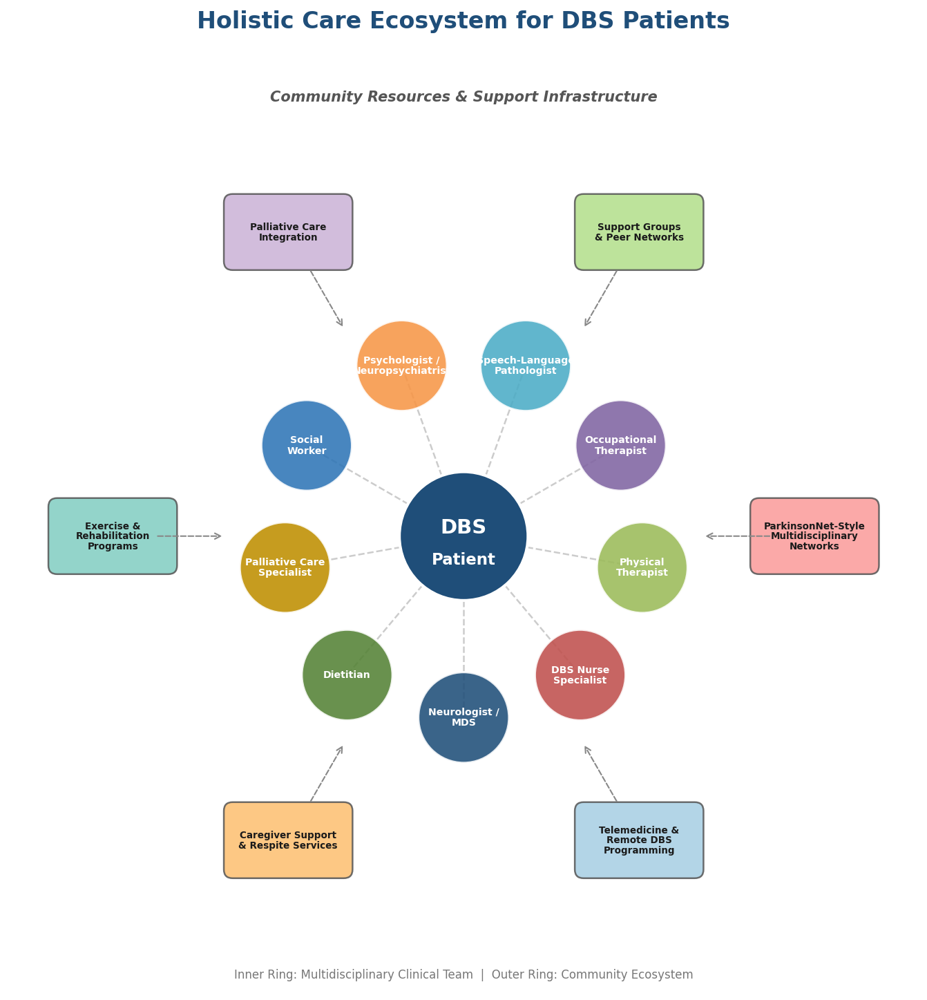

*Figure 2. Hub-and-spoke ecosystem diagram illustrating the multidisciplinary clinical team (inner ring) and community-level support infrastructure (outer ring) recommended for DBS patients.*

This team structure acknowledges that DBS does not simplify PD management — it redirects its complexity. The surgical intervention shifts the clinical challenge from medication-dominated symptom control to a multidimensional rehabilitation and support enterprise spanning the patient's remaining disease trajectory.

## Caregiver Well-Being as a Core Dimension of Care

The quality of life of DBS patients is inseparable from the well-being of their caregivers. As documented in Chapter 3, non-motor symptoms correlate more strongly with caregiver burden than the motor symptoms that DBS most effectively controls. Female caregivers are twice as likely to report exhaustion, and caregivers of male patients with co-existing dementia experience the highest strain [Aamodt et al. 2024](https://pmc.ncbi.nlm.nih.gov/articles/PMC10802092/ "Caregiver Burden Scoping Review, JGPN"). A prospective study found caregiver depression prevalence rising from 11.6% at baseline to 17.8% at 12 months, with anxiety severity (OR=1.73) as the strongest predictor of incident depression [Lee et al. 2022](https://pmc.ncbi.nlm.nih.gov/articles/PMC9318994/ "Depression in PD Patients and Caregivers, Healthcare").

Evidence-based interventions for caregiver distress include CBT (telephone or in-person delivery), which has demonstrated sustained reductions in depression, anxiety, and subjective burden at three months post-treatment. A psychoeducational empowerment RCT reported a 25.1 ± 13.9–point reduction on the Zarit Burden Interview in the intervention group versus 0.6 ± 3.1 in controls (P<0.001) [Aamodt et al. 2024](https://pmc.ncbi.nlm.nih.gov/articles/PMC10802092/ "Interventions section"). Palliative care integration (as demonstrated in the Kluger et al. RCT) reduced caregiver anxiety and burden at 12 months, and community programs such as ParkinSong reduced stress and depression among participating caregivers.

Respite care — whether through adult day programs, in-home aides, or institutional short-stay arrangements — addresses the sustained physical and emotional demands of caregiving. Caregivers frequently report guilt about seeking respite alongside fear of falls and complications during their absence. Healthcare teams can mitigate this ambivalence by framing respite as a component of the patient's care plan: a rested, emotionally resourced caregiver provides better care and sustains the caregiving relationship longer.

## Summary of Evidence-Based Interventions

The following matrix consolidates the quality-of-life domains, key interventions, evidence levels, and quantitative outcome metrics discussed throughout this chapter.

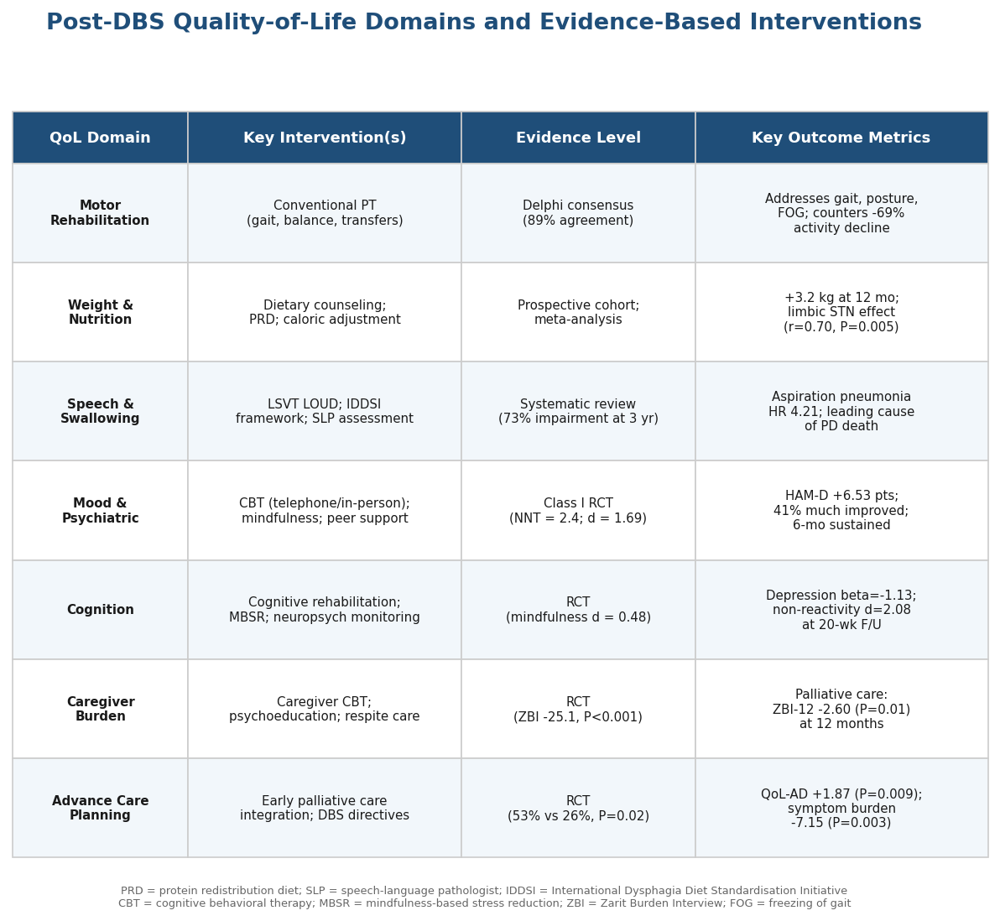

*Figure 3. Evidence summary table mapping seven QoL domains to specific interventions, evidence levels, and key outcome metrics for DBS patients. Abbreviations: PRD = protein redistribution diet; SLP = speech-language pathologist; IDDSI = International Dysphagia Diet Standardisation Initiative; CBT = cognitive behavioral therapy; MBSR = mindfulness-based stress reduction; ZBI = Zarit Burden Interview; FOG = freezing of gait.*

# Conclusion

Parkinson's disease imposes a cumulative burden that extends far beyond motor impairment, reshaping the physical, cognitive, psychiatric, and social dimensions of life for patients and their families alike. The evidence reviewed across the preceding chapters converges on several core conclusions.

**Warning signs follow a predictable — but individually variable — trajectory.** The disease announces itself through prodromal non-motor signals (constipation, hyposmia, REM sleep behavior disorder, depression) that may precede motor onset by up to two decades. Once motor symptoms emerge, the Hoehn & Yahr staging framework provides clinically useful milestones: unilateral onset, bilateral spread, the critical balance turning point at Stage 3, and the severe dependency of Stages 4–5. At each transition, the risk landscape shifts — from early medication-responsive motor symptoms toward motor fluctuations, freezing of gait, dysphagia with aspiration risk, psychosis, and dementia. The probability of PD dementia alone rises from 3–12% at year 5 to approximately 50% at year 15 and 90% by year 25 from diagnosis.

**Certain symptom profiles reliably signal accelerated decline.** The postural instability/gait difficulty motor subtype, comorbid REM sleep behavior disorder, significant non-motor burden at diagnosis, older age at onset, GBA1 or SNCA genetic mutations, and early hallucinations each independently predict faster progression. Families who recognize these markers can work with clinical teams to implement earlier specialist referral, more intensive monitoring, and anticipatory care planning.

**Family caregivers occupy an indispensable surveillance role.** Many of the most prognostically important symptoms — impulse control disorders, emerging hallucinations, non-motor wearing-off, apathy, weight loss — are observable at home yet frequently under-reported by patients. The tiered alert framework presented in Chapter 3 — distinguishing between emergency signals (akinetic crisis, aspiration events, falls with head injury, acute psychosis), urgent concerns warranting 24–48 hour clinical contact (escalating hallucinations, severe OFF states, dopamine agonist withdrawal symptoms, new impulse control behaviors), and gradual changes for scheduled review (cognitive decline, sleep disruption, gait deterioration) — provides a practical decision structure for daily caregiving. Systematic documentation through motor diaries, falls logs, and non-motor checklists transforms subjective observations into clinically actionable data.

**Deep brain stimulation transforms — but does not simplify — disease management.** DBS enables a mean 50% reduction in levodopa equivalent daily dose, substantially attenuates motor fluctuations and dyskinesias, and has entered a new technological era with the 2025 FDA approval of adaptive closed-loop stimulation. Yet the post-operative period demands careful navigation: the transient microlesion effect must not be mistaken for final benefit; medication recalibration requires a deliberately staged approach, with premature dopamine agonist reduction linked to psychiatric deterioration; and axial symptoms — gait, balance, speech — respond inconsistently to stimulation and require sustained rehabilitative effort. Device management introduces lifelong considerations around electromagnetic interference, MRI safety, battery monitoring, and, uniquely, advance care planning for stimulation decisions as cognitive capacity declines.

**Quality of life after DBS depends on a sustained, multidisciplinary support ecosystem.** Structured physical rehabilitation — particularly conventional gait and balance training, which reached expert consensus as appropriate for DBS patients — counteracts the documented 69% post-operative decline in physical activity. Nutritional strategies must address the dual challenges of post-DBS weight gain and continued protein–levodopa interactions. Psychological support, including cognitive behavioral therapy (number needed to treat: 2.4 for depression) and mindfulness-based interventions, targets the apathy, depression, and anxiety that stimulation alone does not resolve. Early integration of palliative care improves quality of life, reduces symptom burden, and lowers caregiver distress, while advance directive completion rates in palliative care cohorts reach twice those of standard care. Multidisciplinary network models such as ParkinsonNet — which achieved a 34% reduction in PD-related hospital admissions — demonstrate that coordinated specialized care produces measurably better outcomes than fragmented generalist management.

Throughout this report, the evidence consistently underscores a single overarching principle: proactive, informed engagement by families — grounded in an understanding of disease biology, alert to the warning signs at each stage, and supported by a coordinated clinical team — remains the most consequential modifiable factor in the long-term well-being of people living with Parkinson's disease.
