# Overview

Transgender lives in the Middle East and North Africa have been shaped by a distinctive convergence of Islamic jurisprudence, colonial legal inheritance, and state censorship — yet cinema from the region and its diasporas has received almost no sustained scholarly attention as a site where those forces become visible and contestable. This paper undertakes the first systematic investigation of transgender representation in MENA cinema, bringing trans theory and film theory into sustained dialogue across a corpus of seventeen films produced between 1981 and 2024. The corpus spans Iranian state-sanctioned narratives, Turkish-German diasporic performance cinema, Lebanese documentary intimacy, Moroccan experimental non-fiction, and transnational co-productions financed from Berlin, Paris, and North America.

Three principal arguments organize the study. First, MENA transgender cinema constitutes a distinct field of cultural production that is irreducible to either "MENA cinema" or "trans cinema" as conventionally understood: these films reconfigure the formal and political possibilities of both traditions. Second, the theoretical frameworks developed in Euro-American contexts — Judith Butler's gender performativity, Jay Prosser's embodied narrativity, Jack Halberstam's "transgender look," Laura Mulvey's gaze theory, Hamid Naficy's accented cinema — prove indispensable but insufficient; the films themselves function as theoretical interlocutors that expose the unmarked whiteness and Western-centrism of foundational scholarship and demand revision. Third, the conditions of production, circulation, and reception are not contextual supplements to analysis but constitutive of meaning: no film in the corpus has been funded entirely by MENA-based sources, and the differential Western reception of films such as *Facing Mirrors* (2011) and *Circumstance* (2011) reveals an orientalist cultural gatekeeping mechanism that functions as a second-order censorship.

The paper proceeds through seven chapters. Chapter 1 frames the terminological challenge of applying "transgender" to cultures possessing indigenous taxonomies of gender nonconformity — Arabic *khuntha*, *mukhannath*, and *khanith*; Ottoman *köçek* — and establishes the scope, corpus, and theoretical arc. Chapter 2 assembles a dual theoretical apparatus from trans studies (Butler, Prosser, Susan Stryker, Julia Serano, C. Riley Snorton) and film theory (Mulvey, bell hooks, Naficy, Ella Shohat and Robert Stam, B. Ruby Rich), bridged by Dina Georgis's affect-theoretical method and Cáel Keegan's concept of trans aesthetics. Chapter 3 maps the regulatory and cultural contexts — Khomeini's fatwa authorizing sex reassignment surgery, al-Tantawi's ambiguous Sunni ruling, Turkey's Article 40 forced-sterilization requirement, Lebanese judicial contestation of French Mandate-era statutes, and the colonial genealogy of anti-sodomy legislation across the region. Chapters 4 and 5 constitute the analytical core: Chapter 4 offers in-depth close readings of three feature films — *Facing Mirrors* (Iran/Germany, 2011), *Lola und Bilidikid* (Germany, 1999), and *Circumstance* (France/Iran/USA, 2011) — each examined for narrative structure, visual style, the construction of trans subjectivity, and spectatorial positioning; Chapter 5 extends the analysis to documentary and non-fiction works including *Be Like Others* (2008), *Cinema Fouad* (1993), *The Belle from Gaza* (2024), and *The Great Safae* (2014), interrogating the ethics of witnessing, consent, and the "visibility trap." Chapter 6 addresses diaspora, transnationalism, and the politics of location, tracing how Western funding structures, festival gatekeeping, and homonationalist reception dynamics shape what stories can be told and by whom. Chapter 7 synthesizes the study's findings, proposes five analytical principles for future research — terminological vigilance, the inseparability of form and politics, the "doubled accent" of gender and geopolitical displacement, resistance to the orientalist binary, and the centering of trans creative agency — and reflects on the persistent tensions that a critical framework for MENA trans cinema must hold in productive suspension rather than resolve.

# 第1章 Introduction — Framing Trans Visibility in MENA Cinema

## The Problem of Naming

In 2014, Afsaneh Najmabadi published *Professing Selves: Transsexuality and Same-Sex Desire in Contemporary Iran*, documenting a legal regime in which the Islamic Republic simultaneously authorized sex reassignment surgery (SRS) through a fatwa first articulated by Ayatollah Khomeini in 1964 and criminalized homosexuality with punishment up to execution [Najmabadi, *Professing Selves*](https://www.jstor.org/stable/j.ctv11vc8md "Duke University Press, 2014, via JSTOR"). The paradox Najmabadi described — a state that produces "transsexuality" as a legible category while foreclosing other forms of gender nonconformity — encapsulates in miniature the central challenge of this study: how to analyze cinematic representations of gender transgression across the Middle East and North Africa (MENA) without flattening the radically heterogeneous legal, religious, and cultural frameworks that give those representations their meaning.

Susan Stryker defines "transgender" capaciously as encompassing all who "move away from the gender they were assigned at birth," a formulation rooted in Anglophone activism and identity politics that deliberately exceeds the clinical boundaries of "transsexual" [Stryker, *Transgender History*](https://archive.org/details/transgenderhisto0000stry_o1w1 "Stryker 2008/2017, foundational history of US transgender movements"). This breadth is analytically useful, yet its universalizing gesture demands scrutiny when applied to MENA contexts. Joseph Massad's *Desiring Arabs* (2007) contended that Western sexual identity categories are not universal but products of a specific epistemological tradition, and that organizations Massad termed the "Gay International" impose these categories on Arab societies, paradoxically inciting repression rather than liberation [Massad, *Desiring Arabs*](https://press.uchicago.edu/ucp/books/book/chicago/D/bo5378447.html "University of Chicago Press, 2007"). Although Massad focused primarily on homosexuality, his argument compels any study of "transgender cinema" in the MENA region to reckon with the epistemic violence potentially inherent in the analytical framework itself.

The Arabic linguistic tradition offers its own taxonomy of gender nonconformity. Saqer Almarri demonstrated that three terms sharing the Arabic root *khaʾ-nun-thaʾ* — signifying "the mixing of forms" — constitute an interrelated triad resistant to absorption into Western categories. The *khuntha* (pl. *khunatha*) refers to a person with ambiguous genitalia, recognized primarily in Islamic legal treatises on inheritance; the *mukhannath* (pl. *mukhannathun*) denotes an effeminate male figure documented in early Islamic Medina, who adopted feminine adornment but was not necessarily associated with sodomy; and the *khanith* (pl. *makhanith*), first documented anthropologically by Unni Wikan in Sohar, Oman in 1977, designates a contemporary marginal identity that transgresses heteronormative and cisnormative boundaries. Almarri contended that translating these terms directly into Western categories constitutes epistemic violence, as they "belong to a different knowledge system" [Almarri, "Identities of a Single Root"](https://shc.stanford.edu/arcade/interventions/identities-single-root-triad-khuntha-mukhannath-and-khanith-0 "Stanford Humanities Center, originally Women & Language 2018"). Similarly, the Ottoman *köçek* tradition — young male dancers who performed in feminine dress — represents a Turkish cultural formation of gender transgression that defies simple mapping onto Western transgender categories and has received cinematic treatment in *Zenne Dancer* (2012) [Cambridge University Press, *Theatre Research International*](https://www.cambridge.org/core/journals/theatre-research-international/article/zenne-male-belly-dancers-and-queer-modernity-in-contemporary-turkey1/4DEB67C60F4B97EC6E99CCFD7069CEE4 "The Zenne: Male Belly Dancers and Queer Modernity in Contemporary Turkey").

The following table maps these indigenous categories across their linguistic, historical, and cinematic dimensions, illustrating the irreducibility of MENA gender formations to any single Western framework:

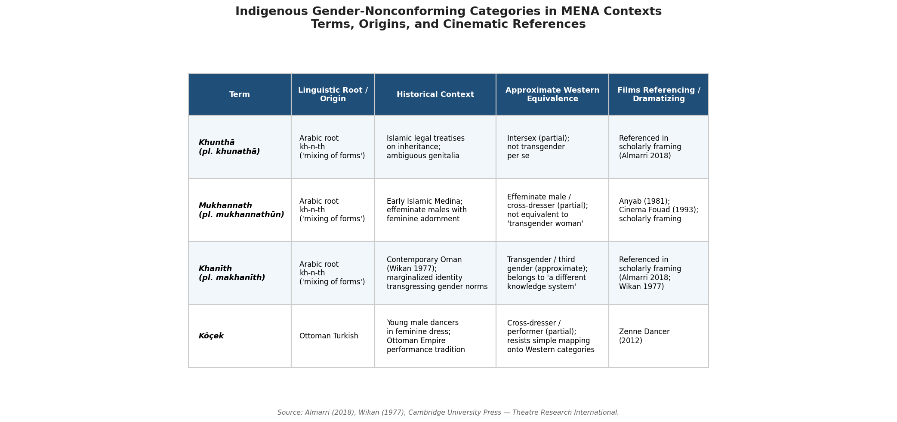

*Table 1. Comparative mapping of four indigenous gender-nonconforming terms — khunthā, mukhannath, khanīth, and köçek — across linguistic roots, historical contexts, approximate Western equivalences, and films in the corpus that reference or dramatize each category.*

This study therefore deploys "transgender" as a working analytical category while maintaining vigilance about its limits. Following Stryker's capacious definition but inflected by Massad's critique and Almarri's attention to indigenous taxonomies, the term designates cinematic representations in which characters embody, narrate, or are subjected to gender crossings that exceed the normative alignment of sex assigned at birth with social gender presentation. This formulation is deliberately broad enough to encompass Iranian state-sanctioned transsexuality, Arabic *mukhannathun* traditions, Turkish *zenne* culture, and diasporic drag performance, while acknowledging that these formations are not equivalent and that the category "transgender" itself remains part of what is under investigation.

## Why Cinema

Cinema occupies a distinctive position as an analytical site for trans lives in the MENA region for four interrelated reasons. First, in contexts where public discourse on gender and sexuality is heavily regulated by state censorship, religious institutions, and social norms, film furnishes visual evidence of bodies and embodiments that are otherwise systematically rendered invisible. Sandy Stone's 1991 essay "The 'Empire' Strikes Back: A Posttranssexual Manifesto" — widely credited as the founding text of transgender studies — called on trans people to resist the demand for a coherent, medicalized narrative and instead embrace the "intertextuality" of their lived experience [Stone, "The 'Empire' Strikes Back"](https://sandystone.com/empire-strikes-back.html "Stone 1991, authorized version"). Stone's insistence on self-narration against institutional gatekeeping resonates with particular force in MENA contexts where state and religious authorities control the very terms of gender legibility; cinema becomes one of the few spaces where alternative narratives can be articulated, however obliquely.

Second, cinematic form — editing, framing, point-of-view structure, sound design — encodes spectatorial relationships to the trans body in ways that reveal the politics of the gaze beyond the reach of textual or oral accounts. When the camera lingers on a trans character's reflection in a mirror, or when an editing pattern withholds the revelation of a character's assigned sex, the film formally constructs the viewer's encounter with gender ambiguity. This formal dimension is central to the analytical method adopted throughout this study.

Third, the transnational circulation of MENA films through international festival circuits produces what may be termed a "dual address": films speak simultaneously to domestic audiences who decode allegorical content through culturally specific interpretive frameworks, and to international audiences who consume trans narratives through different — often orientalist — hermeneutic lenses. Hamid Naficy's *An Accented Cinema: Exilic and Diasporic Filmmaking* (2001) established that filmmaking by displaced, exilic, and diasporic subjects constitutes a distinct mode of cultural production with its own formal characteristics — claustrophobia, tactility, epistolarity, multilingualism — thereby providing a framework for understanding how MENA trans cinema operates under and against structural constraint [Naficy, *An Accented Cinema*](https://books.google.com/books/about/An_Accented_Cinema.html?id=SoKeH59mLfQC "Princeton University Press, 2001").

Fourth, the material conditions of cinematic production — censorship negotiations, funding sources, casting decisions, festival strategies — are themselves indexes of the political constraints shaping trans visibility. That *Facing Mirrors* (*Ayneh-ha-ye Rooberoo*, 2011, dir. Negar Azarbayjani) could be produced in Iran and screened at the Fajr International Film Festival while *Circumstance* (*Sherayet*, 2011, dir. Maryam Keshavarz) had to be filmed in Beirut with a fake script submitted to Lebanese authorities reveals the differential operation of censorship across national contexts and the creative strategies filmmakers deploy to navigate it.

Viviane Namaste's *Invisible Lives: The Erasure of Transsexual and Transgendered People* (2000) argued that trans people are not so much "produced" by medical discourse as they are "erased, or made invisible, in a variety of institutional and cultural settings" [Namaste, *Invisible Lives*](https://press.uchicago.edu/ucp/books/book/chicago/I/bo3683192.html "University of Chicago Press, 2000"). Namaste's critique of institutional erasure bears directly on MENA trans subjects, whose experiences are doubly effaced: by Western queer theory's abstraction of embodied lives into discursive categories, and by regional state apparatuses that either deny trans existence or channel it through narrow medical-legal pathways. Cinema, in its capacity to make bodies visible and to stage encounters between viewers and those bodies, functions as a counter-technology to erasure — though, as subsequent chapters argue, cinematic visibility itself carries risks ranging from orientalist spectacularization to state surveillance.

As filmmakers in the region have themselves articulated, cinema serves as a vehicle for alternative narration. Abdellah Taïa — the first openly gay Moroccan public figure, whose memoir adaptation *Salvation Army* (*L'Armée du salut*, 2013) premiered at the Venice Film Festival — credited Egyptian cinema specifically for providing images that were "a continuation of me and my stories...those were the images that helped me to deal with my Moroccan reality" [MEI, "Arab Queer Cinema Emerges to Break Taboos"](https://mei.edu/publication/arab-queer-cinema-emerges-break-taboos/ "Middle East Institute"). The constitutive rather than merely reflective function of cinematic representation — the insight, foregrounded by Sam Feder's documentary *Disclosure: Trans Lives on Screen* (2020), that representation shapes rather than simply mirrors trans subjectivity — applies with heightened force in MENA contexts where available images are scarce and therefore more determinative of public and self-understanding.

## The Scholarly Gap

The existing scholarly literature on queer cinema from the MENA region focuses overwhelmingly on gay and lesbian representation. Maria Abdel Karim's article in *Alphaville: Journal of Film and Screen Media* (Issue 20, 2020/2021) — one of the few peer-reviewed studies directly addressing queer representation in Arab and Middle Eastern films — observed that "queer representations have been present since the 1930s in Arab and Middle Eastern cinema, albeit always in coded forms," yet analyzed exclusively lesbian representation through case studies of *Caramel* (2007), *Circumstance* (2011), and *In Between* (2016), leaving transgender representation entirely unexamined [Abdel Karim, "Queer Representation"](https://cora.ucc.ie/bitstreams/ba003553-b32b-4f59-9546-a21aac2b2fa5/download "University College Cork repository, Alphaville Journal"). A 2023 special issue of *Transnational Screens*, edited by Zahra Khosroshahi and Sara Saljoughi, called for "transnational feminist approaches to film and media from the Middle East and North Africa," noting that the area "remains understudied and even marginal within studies of film and media," yet no essay in the issue addressed transgender representation specifically [Khosroshahi & Saljoughi, 2023](https://www.tandfonline.com/doi/full/10.1080/25785273.2023.2231775 "Transnational Screens 2023 special issue introduction").

Meanwhile, the most rigorous scholarship on trans lives in MENA contexts — Najmabadi's historical and ethnographic work on Iran, Almarri's autoethnographic study of Arabic gender categories, Pirnia and Pirnia's legal analysis of Iran's SRS framework — has operated within history, anthropology, or legal studies rather than film studies [Pirnia & Pirnia, *Iranian Journal of Public Health*](https://pmc.ncbi.nlm.nih.gov/articles/PMC9745420/ "Sex Reassignment Surgery in Iran, 2022"). The conceptual challenge of applying "transgender" as an analytical category across diverse MENA contexts — Iranian legal transsexuality, Arab *mukhannathun* traditions, Turkish *köçek* culture — has not been taken up with cinema as the primary lens. This study addresses that gap: it constitutes the first systematic scholarly investigation to treat transgender representation in MENA cinema as a distinct category of analysis, bringing trans theory and film theory into sustained dialogue with a corpus of films spanning three decades and multiple national contexts.

## Scope: Temporal, Geographic, and Curatorial

The corpus under study encompasses films produced between 1981 and 2024 that centrally engage transgender themes — defined as narratives centering on trans protagonists, transition processes, cross-gender embodiment, or the social and political regulation of gender transgression. The geographic scope covers the MENA region and its diasporas, recognizing that many of the most significant films in this corpus were produced under conditions of exile or displacement: in Berlin, Paris, London, or North American cities, by filmmakers of Iranian, Turkish, Arab, or North African origin. The study treats both domestic and diasporic productions as part of a single, if internally differentiated, field of cultural production.

The following timeline situates all seventeen films against the key legal and political milestones that have shaped the conditions of possibility for trans cinema in the region:

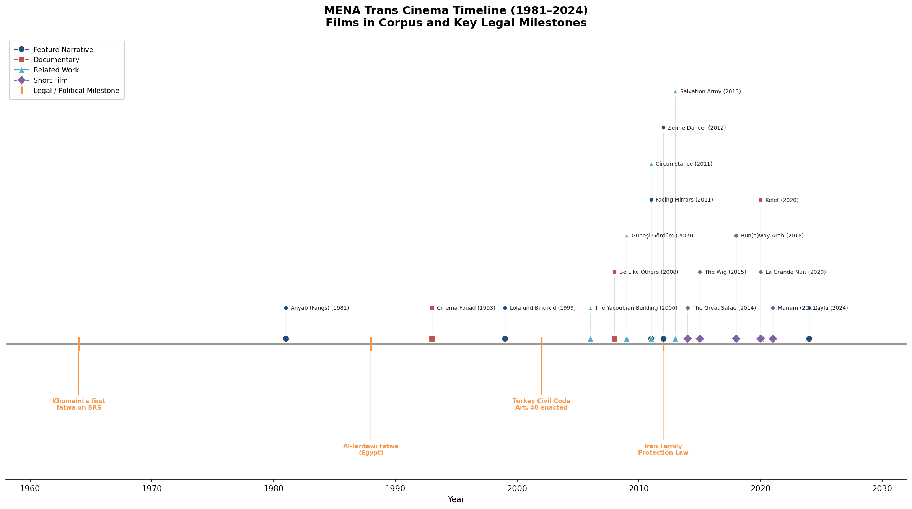

*Figure 1. Horizontal timeline placing seventeen films in the corpus — differentiated by format (feature narrative, documentary, short, related work) — against four key legal and political milestones: Khomeini's first fatwa on SRS (1964), the al-Tantawi fatwa in Egypt (1988), Turkey's Civil Code Article 40 (2002), and Iran's Family Protection Law (2012).*

The preliminary filmography comprises seventeen works across multiple formats. Feature narrative films include *Facing Mirrors* (2011, Iran), *Lola und Bilidikid* (*Lola and Billy the Kid*, 1999, dir. Kutluğ Ataman, Germany/Turkey), *Zenne Dancer* (2012, dir. Caner Alper & Mehmet Binay, Turkey), *Anyab* (*Fangs*, 1981, dir. Mohamed Shebl, Egypt), and *Layla* (2024, dir. Amrou Al-Kadhi, UK/US). Feature documentaries include *Cinema Fouad* (1993, dir. Mohamed Soueid, Lebanon) — possibly the earliest Arab documentary centering a trans subject — *Be Like Others* (2008, dir. Tanaz Eshaghian, Canada/Iran), and *Kelet* (2020, dir. Susani Mahadura, Finland). Short films include *The Great Safae* (2014, dir. Randa Maroufi, France/Morocco), *The Wig* (2015, dir. Karim Boukhari, Morocco), *Run(a)way Arab* (2018, dir. Amrou Al-Kadhi, UK), *Mariam* (2021, dir. Reem Jubran, US), and *La Grande Nuit* (2020, dir. Sharon Hakim, France). Additional films with gender-transgressive dimensions but not exclusively transgender subjects — *The Yacoubian Building* (2006, dir. Marwan Hamed, Egypt), *Salvation Army* (2013, dir. Abdellah Taïa, Morocco/France), *Güneşi Gördüm* (*I Saw the Sun*, 2009, dir. Mahsun Kırmızıgül, Turkey), and *Circumstance* (2011) — inform the broader analysis. The complete filmography is summarized in the table below:

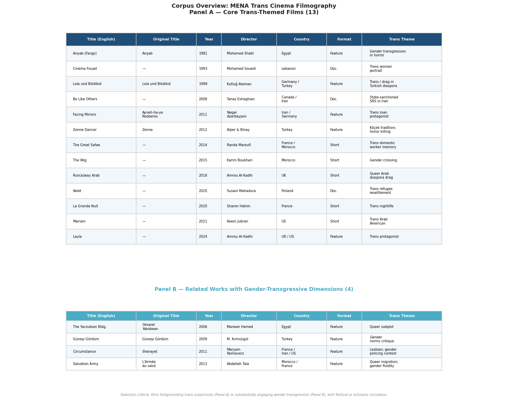

*Table 2. Two-panel filmography of the seventeen-work corpus. Panel A lists thirteen core trans-themed films; Panel B lists four related works with gender-transgressive dimensions. Columns include title (English and original), year, director, country of production, format, and primary trans theme.*

Selection criteria prioritize films that foreground trans subjectivity rather than merely including trans characters as peripheral figures, and that have entered scholarly or critical discourse through festival screenings, academic analysis, or both. The corpus is not exhaustive — particularly regarding short films circulating primarily through festival circuits — but it is sufficient to sustain the study's analytical claims.

## Theoretical Framework and Argumentative Arc

The analytical framework braids two bodies of scholarship. From trans studies, it draws on Stryker's definitional capaciousness, Stone's call for counter-narratives, Namaste's attention to institutional erasure, Massad's critique of Western category-imposition, and Najmabadi's analysis of how state power produces legible and illegible gender subjects. From film studies, it deploys Naficy's accented cinema framework, B. Ruby Rich's concept of New Queer Cinema, Ella Shohat and Robert Stam's critique of Eurocentrism in film, and Laura Mulvey's theory of the male gaze as adapted for bodies that destabilize the gender binary [Rich, *New Queer Cinema: The Director's Cut*](https://www.dukeupress.edu/New-Queer-Cinema/?bestseller=Y "Duke University Press, 2013"). Dina Georgis's affect-theoretical approach in *The Better Story: Queer Affects from the Middle East* (2013) provides a bridge between these frameworks, offering "story as a method for social inquiry" that attends to the emotional and aesthetic dimensions of cinematic trans representation without reducing them to identity politics [Georgis, *The Better Story*](https://wgsi.utoronto.ca/person/dina-georgis/ "University of Toronto, Women and Gender Studies Institute").

Chapter 2 establishes this dual theoretical apparatus in detail, staging a dialogue between Butler's gender performativity, Prosser's embodied narrativity, Halberstam's "transgender look," and hooks's oppositional gaze on one side, and Naficy's formal categories, Shohat and Stam's polycentric framework, and third-cinema traditions on the other. Chapter 3 maps the regulatory and cultural contexts — censorship regimes, Islamic jurisprudence (particularly the fatwas of Khomeini and al-Tantawi on sex reassignment), and colonial legal legacies — that shape the conditions of possibility for trans cinema across the region. Chapter 4 constitutes the analytical core, offering sustained close readings of at least three feature films: *Facing Mirrors*, *Lola und Bilidikid*, and *Circumstance*, each examined for narrative structure, visual style, the construction of trans subjectivity, and the interplay between cinematic form and political context. Chapter 5 turns to documentary and non-fiction, examining works including *Be Like Others*, *Cinema Fouad*, and *The Belle from Gaza* (2024, dir. Yolande Zauberman) for the distinct ethical and formal questions they raise about witnessing, consent, and the politics of visibility. Chapter 6 addresses diaspora, transnationalism, and the politics of location, analyzing how the fact that no film in the corpus received funding entirely from MENA sources shapes the narratives available for production. Chapter 7 synthesizes these analyses and reflects on implications for trans studies, film studies, and MENA area studies.

Throughout, the study maintains a commitment to what Shohat and Stam termed a "polycentric" approach — allowing the films themselves to challenge and revise the theoretical frameworks brought to bear on them, rather than treating theory as a grid to be applied and cinema as a set of illustrations. It resists the orientalist temptation to construct the MENA region as a monolithic space of oppression measured against a putatively progressive Western norm, drawing instead on Jasbir Puar's concept of homonationalism to interrogate how Western reception of MENA trans cinema is itself structured by geopolitical power [Puar, *Terrorist Assemblages*](https://en.wikipedia.org/wiki/Homonationalism "Summary of Puar's 2007 concept, Duke University Press"). And it heeds Massad's warning that the imposition of Western identity categories can intensify rather than alleviate the pressures faced by gender-nonconforming people in the region, while nonetheless insisting — with Najmabadi — that the lived experiences documented in these films demand scholarly attention on their own terms.

# 第2章 Theoretical Foundations — Trans Theory and Film Theory in Dialogue

## Gender, Performativity, and the Trans Body

Any theoretical framework for analyzing transgender representation in MENA cinema must begin with — and move beyond — Judith Butler's account of gender performativity. In *Gender Trouble* (Routledge, 1990), Butler argued that gender is not the expression of an interior essence but the product of "a stylized repetition of acts," performances that congeal over time to produce the appearance of a natural, stable identity. The critical distinction is between *performativity* and *performance*: the former holds that the subject itself is constituted through the iterative execution of gender norms, whereas the latter implies a pre-existing agent who chooses to perform. Gender, on Butler's account, has no ontological status apart from the acts that constitute it [Salih, *Judith Butler*](https://theconversation.com/judith-butler-their-philosophy-of-gender-explained-192166 "Routledge 2002; see also The Conversation's summary confirming the performativity ≠ performance distinction"). In *Bodies That Matter* (1993), Butler extended this analysis to the materiality of sexed bodies, arguing that materialization is itself a process of regulatory reiteration — the body is not a passive surface upon which gender is inscribed but is produced through the very norms it is said to express.

Butler's framework proves indispensable for analyzing how specific regulatory regimes — state censorship, religious law, medical gatekeeping — produce legible and illegible gender subjects on screen. When *Facing Mirrors* (2011) depicts Eddie binding his chest beneath layers of clothing before entering a Tehran street patrolled by morality police, the scene renders visible precisely the "stylized repetition of acts" through which gender intelligibility is maintained and contested within the Islamic Republic's legal apparatus. Yet Butler's emphasis on discursive constitution has provoked the most sustained critique from within trans studies itself.

Jay Prosser's *Second Skins: The Body Narratives of Transsexuality* (Columbia University Press, 1998) mounted the most systematic challenge to the performativity framework from a trans-theoretical standpoint. Prosser argued that Butler's account renders the embodied experience of transsexuality — the felt sense of inhabiting a body misaligned with one's gender — theoretically unintelligible. If gender is performative all the way down, with no pre-discursive bodily truth beneath the performance, then the transsexual narrative of being "trapped in the wrong body" — however clinically overdetermined — loses its phenomenological force. Prosser proposed narrative rather than performance as the register through which trans subjectivity becomes intelligible: autobiography, testimony, and the storied body constitute the means by which trans subjects render their experience legible to themselves and others [Prosser, *Second Skins*](https://cup.columbia.edu/book/second-skins/9780231109345/ "Columbia University Press, 1998"). Butler subsequently acknowledged aspects of this critique in the 1999 preface to the revised edition of *Gender Trouble* and, more extensively, in *Undoing Gender* (Routledge, 2004), conceding that "the livability of life" and the material conditions of embodiment must be central to any adequate gender theory.

The Butler-Prosser debate is not merely an intramural theoretical dispute; it structures the formal and narrative choices available to filmmakers representing trans lives. Films that foreground gender as performance — drag shows, costume changes, the theatrical adoption and discarding of gendered signifiers — implicitly align with a Butlerian ontology. Films that foreground bodily suffering, medical transition, and the yearning for somatic coherence operate closer to Prosser's narrative phenomenology. MENA trans cinema frequently stages precisely this tension: *Lola und Bilidikid* (1999) presents Lola's gender as irreducibly theatrical, a performance inseparable from the drag cabaret stage, while *Facing Mirrors* constructs Eddie's transmasculinity through embodied pain, chest binding, and the anguish of a body that cannot pass. The theoretical choice between performativity and narrativity is, this paper argues, simultaneously a cinematic choice — realized through specific formal decisions about framing, editing, and point of view.

Teresa de Lauretis's *Technologies of Gender: Essays on Theory, Film, and Fiction* (Indiana University Press, 1987) provides a crucial bridge between feminist film theory and the analysis of gender construction. Extending Foucault's concept of the "technology of sex," de Lauretis argued that gender is not a property of bodies but a product of "various technologies of gender (e.g., cinema) and institutional discourses (e.g., theory)" — cinema itself functions as a technology for the production of gendered subjects. This formulation moves beyond the question of how films *represent* gender to ask how films *produce* gender as an experiential and social category. De Lauretis, who coined the term "queer theory" at a 1990 conference at the University of California, Santa Cruz, occupies a hinge position between feminist film theory's analysis of the apparatus and queer/trans theory's interrogation of identity categories [de Lauretis, *Technologies of Gender*](https://iupress.org/9780253204417/technologies-of-gender/ "Indiana University Press, 1987"). For MENA trans cinema, the concept of cinema-as-gender-technology holds particular force: when Iranian state censorship mandates that all women on screen — including trans men who have not yet legally transitioned — must wear the hijab, the cinematic apparatus becomes a literal technology for enforcing the state's gender regime.

## Trans Rage, Trans Aesthetics, and the Limits of Representation

Susan Stryker's 1994 essay "My Words to Victor Frankenstein Above the Village of Chamounix: Performing Transgender Rage" recast the relationship between trans subjectivity and cultural production. Published in *GLQ* 1(3): 237–254, the essay reclaimed Mary Shelley's monster as a figure for transgender experience: like the creature, the trans person is "made" through medical and technological intervention, cast out by the social order that produced them, yet capable of transforming abjection into political agency. "Transgender rage," in Stryker's formulation, is not pathology but a productive political affect — the energetic response to a society that simultaneously creates and repudiates trans existence. In a subsequent 2004 essay in *GLQ*, Stryker characterized transgender studies as "queer theory's evil twin," insisting on its irreducibility to queer frameworks [Stryker, "More Words," *GLQ* 25(1), 2019: 39–44](https://read.dukeupress.edu/glq/article/25/1/39/137213/More-Words-About-My-Words-To-Victor-Frankenstein "2019 retrospective on the 1994 essay"). The Frankensteinian metaphor resonates with particular force in contexts where the state actively produces trans subjects through legal and medical bureaucracies — as in Iran, where Khomeini's fatwa creates the conditions for surgical transition while the broader social order stigmatizes the resulting bodies.

Julia Serano's *Whipping Girl: A Transsexual Woman on Sexism and the Scapegoating of Femininity* (Seal Press, 2007) introduced the concept of "transmisogyny" to name the specific intersection of transphobia and misogyny directed at trans women. Serano's "double bind model" holds that trans women face hostility both from "traditional sexism" (the devaluation of femininity) and from "oppositional sexism" (the insistence on rigid gender boundaries). This dual mechanism provides an analytical tool for understanding the differential cinematic treatment of trans women and trans men across the MENA corpus. Trans women in films such as *Lola und Bilidikid* and *Cinema Fouad* (1993) are consistently associated with sex work, poverty, and violent death, whereas trans men in *Facing Mirrors* are situated within narratives of family honor and medical legitimacy. Serano's framework suggests that this asymmetry reflects not merely narrative convention but the structural devaluation of femininity that transmisogyny names [Serano, "What Is Transmisogyny?"](https://juliaserano.medium.com/what-is-transmisogyny-4de92002caf6 "2021 explication of the concept").

Cáel Keegan's *Lana and Lilly Wachowski: Sensing Transgender* (University of Illinois Press, 2018) advances the theoretical conversation beyond questions of representation altogether. Keegan's concept of "trans aesthetics" designates not the depiction of trans characters but the cinematic production of sensory experiences — disorientation, transition, perceptual recalibration — that resonate with transgender phenomenology. The Wachowskis' cinema, Keegan argues, "animates trans* as a sensing beyond the representational edges of cinematic reality," linking trans subjectivity to the historical shift from analog to digital filmmaking and the perceptual possibilities it enables. Where analog fragmentation — exemplified by the violent cutting of *Psycho* (1960) and *Dressed to Kill* (1980) — historically served to pathologize the trans body, digital cinema's fluid, omniscient camera offers a mode of perception aligned with transgender consciousness [Keegan, *Sensing Transgender*](https://www.press.uillinois.edu/books/?id=p083839 "University of Illinois Press, 2018"). Keegan's analysis is rooted in Hollywood blockbuster aesthetics and thus not directly transposable to the low-budget, often artisanal conditions of MENA trans cinema. Nonetheless, the concept of trans aesthetics — the proposition that cinematic form can produce trans sensory experience rather than merely depicting trans bodies — opens a critical horizon for examining how MENA filmmakers deploy claustrophobic framing, mirror imagery, and temporal ellipsis to generate embodied knowledge of gender dislocation.

## The Gaze Reconsidered: Mulvey, hooks, and Halberstam

Laura Mulvey's "Visual Pleasure and Narrative Cinema" (*Screen* 16(3), 1975: 6–18) established the foundational framework for feminist analyses of cinematic spectatorship. Mulvey argued that classical Hollywood cinema constructs a tripartite "gaze" — the camera's, the male characters' within the diegesis, and the spectator's — positioning the female body as a passive object of visual pleasure structured by patriarchal unconscious. The "male gaze" operates through two psychoanalytic mechanisms: scopophilic pleasure (taking other people as objects of controlling visual stimulation) and narcissistic identification (with an idealized, active male protagonist) [The Conversation, "Half a Century of the Male Gaze," 2025](https://theconversation.com/half-a-century-of-the-male-gaze-why-laura-mulveys-pioneering-theory-still-resonates-today-256875 "Ben McCann's 50th-anniversary analysis of Mulvey's essay"). While Mulvey's framework has been extensively critiqued and revised over five decades, its core insight — that the cinematic apparatus structures gendered power relations through the organization of looking — remains analytically productive.

When the object of the gaze is a transgender subject, Mulvey's apparatus is destabilized in analytically revealing ways. The male gaze presupposes a stable gender binary: a masculine subject who looks and a feminine object who is looked at. A trans body disrupts this economy by introducing gender ambiguity into the visual field, producing what might be termed a spectatorial crisis — the viewer's inability to assign the body on screen to one pole of the binary. This destabilization is productive precisely because it exposes the normative labor that the gaze ordinarily performs without visibility.

bell hooks's "The Oppositional Gaze: Black Female Spectators" (in *Black Looks: Race and Representation*, South End Press, 1992) provided a critical corrective to Mulvey by theorizing spectatorship from the position of those excluded from the gaze's normative address. hooks argued that Black women developed "an oppositional gaze" — a mode of critical looking that refuses the objectifying positions offered by mainstream cinema and instead interrogates the racial and gender politics of representation. This oppositional gaze is not merely resistant but generative: it produces alternative viewing practices and, eventually, alternative cinematic practices [hooks, "The Oppositional Gaze"](https://warwick.ac.uk/fac/arts/english/currentstudents/postgraduate/masters/modules/femlit/bell_hooks.pdf "Warwick University-hosted PDF"). The concept extends productively to what might be termed a "trans oppositional gaze" — the critical viewing practice by which trans spectators refuse the pathologizing, spectacularizing, or pitying terms under which trans bodies are typically offered for visual consumption. In MENA contexts, where trans representation remains scarce and often filtered through Western or state-sanctioned frameworks, the oppositional gaze functions as a mode of survival: trans viewers learn to read against the grain of films that do not address them, extracting recognition from images not designed to provide it.

Jack Halberstam's *In a Queer Time and Place: Transgender Bodies, Subcultural Lives* (NYU Press, 2005) advanced the most sustained effort to theorize a specifically transgender mode of spectatorship. In the chapter "The Transgender Look," developed through a reading of Kimberly Peirce's *Boys Don't Cry* (1999), Halberstam argued that certain films construct a viewing position that is "neither simply male nor female" but one that registers gender ambiguity, the labor of "passing," and the ever-present threat of violence attending gender nonconformity. The "transgender look" is not identical with the gaze of a trans character; it is a structural feature of the film's visual economy, produced through specific formal choices — point-of-view shots that align the viewer with a trans protagonist's experience of navigating gendered space, editing patterns that withhold or defer the revelation of bodily sex, and mirror scenes that stage the disjunction between self-perception and social legibility [Halberstam, *In a Queer Time and Place*](https://transreads.org/wp-content/uploads/2019/03/2019-03-18_5c902453b74f2_judith-halberstam-in-a-queer-time-and-place-transgender-bodies-subcultural-lives2.pdf "NYU Press, 2005, full text").

Halberstam's concept has direct analytical purchase on MENA trans cinema, though its application requires critical modification. *Facing Mirrors* constructs precisely such a transgender look: the film's opening sequences guide the viewer to misread the intimacy between Rana and Eddie as a lesbian relationship, a misrecognition that, as Schoonover and Galt observed, "uncomfortably aligns the spectator's gaze with that of the police" — the morality police whose surveillance structures the film's spatial politics [Schoonover & Galt, *Queer Cinema in the World*](https://filmquarterly.org/wp-content/uploads/2017/01/schoonover_queercinema_excerpt_chapter_3.pdf "University of Minnesota Press, 2016, Chapter 3 excerpt"). Yet Halberstam's analysis draws almost exclusively on white, Anglophone visual culture — *Boys Don't Cry*, *The Crying Game*, *The Brandon Teena Story* — and does not account for the ways in which the transgender look might be inflected by the regulatory conditions of MENA cinematic production: state censorship mandating the hijab on screen, legal frameworks rendering certain gender presentations literally criminal, and transnational reception economies filtering trans visibility through orientalist expectations.

## Racializing Trans: Snorton, Roen, and the Imperative of Intersectional Analysis

The theoretical frameworks surveyed thus far — Butler's performativity, Prosser's embodied narrativity, Halberstam's transgender look, Mulvey's gaze and its revisions — were developed primarily through engagement with white, Western bodies and visual cultures. C. Riley Snorton's *Black on Both Sides: A Racial History of Trans Identity* (University of Minnesota Press, 2017) issued the most consequential challenge to this universalizing tendency. Snorton argued that racial and gender categories are not merely "intersecting" but "co-constitutive": the legal fungibility of enslaved Black bodies in the antebellum United States produced a "de-gendering" that laid the groundwork for modern gender categories themselves. Trans identity, on this account, cannot be understood apart from the racial logics through which bodies have historically been classified, regulated, and rendered intelligible or unintelligible [AAIHS, "Online Roundtable: *Black on Both Sides*"](https://www.aaihs.org/online-roundtable-black-on-both-sides-a-racial-history-of-trans-identity/ "African American Intellectual History Society, 2018"). Katrina Roen's earlier intervention in the *Journal of Gender Studies* (10(3), 2001: 253–263) similarly argued that dominant transgender theory takes the white body as its unmarked norm, rendering the specific modalities of gender nonconformity in racialized communities invisible to theoretical scrutiny [Roen, *Journal of Gender Studies*](https://www.tandfonline.com/doi/abs/10.1080/09589230120086467 "Taylor & Francis, 2001").

The methodological demand issued by Snorton and Roen has direct consequences for the study of MENA trans cinema. The region is internally stratified by its own racialized hierarchies — Arab-Amazigh relations in the Maghreb, Turkish-Kurdish dynamics in Anatolia, the Gulf states' dependence on racialized South Asian and East African labor — that determine which bodies can access gender transition and which cannot, which gender transgressions are visible on screen and which remain structurally invisible. *Lola und Bilidikid* exemplifies this entanglement: its depiction of Turkish-German trans women in Berlin's sex work economy renders inseparable the operations of ethnic marginalization, economic precarity, and gender nonconformity. As Barbara Mennel demonstrated, these characters "are not marginalized because they are gay, but rather their ethnicity and economic marginality place them in a gay subculture characterized by violence, poverty, prostitution, and cross-dressing" [Petersen, *Gender Questions* 1(1), 2013: 33–44](https://unisapressjournals.co.za/index.php/GQ/article/download/1543/735/7031 "Citing Mennel 2004 on intersectional marginality"). Any analytical framework that treats gender transition in isolation from these racialized and classed structures will fail to apprehend the specific configurations of trans life that MENA cinema documents.

## Accented Cinema, Third Cinema, and the Postcolonial Frame

Hamid Naficy's *An Accented Cinema: Exilic and Diasporic Filmmaking* (Princeton University Press, 2001) provides perhaps the most directly applicable film-theoretical framework for the corpus under study. Naficy argued that films made by displaced, exilic, and diasporic subjects bear a distinctive cinematic "accent" — not merely in the linguistic sense but in formal and aesthetic terms. Accented cinema is characterized by epistolarity (the letter as narrative device and structural principle), claustrophobic spatial organization (reflecting the confined conditions of exile), tactile optics (a haptic visual register foregrounding the body's sensory engagement with space), and a preoccupation with borders, thresholds, and transit spaces — airports, tunnels, vehicles, hotels [Naficy, *An Accented Cinema*](https://www.jstor.org/stable/27933844 "Princeton University Press, 2001"). Naficy identified three types of accented filmmakers: exilic filmmakers oriented primarily toward the homeland left behind; diasporic filmmakers maintaining both vertical ties to the homeland and horizontal connections to dispersed communities; and postcolonial ethnic and identity filmmakers focused on life in the host country [Naficy, Chapter 1 preview](https://api.pageplace.de/preview/DT0400.9780691186214_A33704991/preview-9780691186214_A33704991.pdf "Princeton University Press, pp. 10–17").

The accented cinema framework maps onto MENA trans cinema with remarkable precision. The taxi in *Facing Mirrors* — at once a claustrophobic interior, a threshold space between gendered public and private domains, and a vehicle of transit toward uncertain exile — exemplifies Naficy's formal categories so directly that the film might serve as a textbook illustration. The epistolary mode operates in *Cinema Fouad* (1993), whose intimate address and associative structure recall the letter-film tradition. Naficy's concept of the "interstitial mode of production" — filmmaking that operates outside studio systems, relying on small-scale, often transnational funding — describes the material conditions of virtually every film in this corpus: not a single MENA trans film has been funded entirely by MENA-based sources.

Yet Naficy's framework requires extension to account for the specific intersections of displacement and gender transgression. *An Accented Cinema* was published in 2001 and did not engage with transgender subjectivity; its analysis of displacement operates along national and ethnic axes without theorizing how gender nonconformity might produce its own forms of exile, even within the homeland. For a trans person in Tehran or Cairo, the experience of displacement — inhabiting a body and social world that does not recognize one's gender — may precede and exceed geographical dislocation. The concept of "accent" must therefore be doubled: MENA trans cinema bears the accent of geopolitical displacement *and* the accent of gender displacement, and the formal features Naficy identified — claustrophobia, tactility, border-crossing — resonate simultaneously with both registers.

Ella Shohat and Robert Stam's *Unthinking Eurocentrism: Multiculturalism and the Media* (Routledge, 1994) provides the epistemological orientation for this doubled analysis. Shohat and Stam argued that Eurocentrism operates in cinema not as explicit ideological content but as "a series of interrelated assumptions" — about narrative structure, visual pleasure, historical agency, and cultural normativity — embedded in the dominant cinematic apparatus itself. Their call for a "polycentric" approach to media analysis insists that non-Western cultural productions not be treated as raw material for Western theoretical frameworks but as sites that generate their own theoretical knowledge [Frames Cinema Journal, review of *Unthinking Eurocentrism*](https://framescinemajournal.com/article/unthinking-eurocentrism-multiculturalism-and-the-media/ "Confirming the book's core argument"). This polycentric commitment structures the methodology of the present study: the films analyzed in subsequent chapters are not illustrations of Butler, Mulvey, or Naficy, but interlocutors that challenge, revise, and extend those frameworks.

The tradition of Third Cinema, inaugurated by Fernando Solanas and Octavio Getino's 1969 manifesto "Towards a Third Cinema," offers a complementary political framework. Solanas and Getino distinguished First Cinema (Hollywood commercial entertainment), Second Cinema (European auteur cinema), and Third Cinema (revolutionary cinema committed to decolonization and political awakening) — a tripartite schema that, while schematic, usefully locates MENA trans cinema in relation to dominant production modes [Solanas & Getino, "Towards a Third Cinema"](https://files.commons.gc.cuny.edu/wp-content/blogs.dir/8374/files/2019/08/Towards-a-Third-Cinema-by-Fernando-Solanas-and-Octavio-Getino.pdf "CUNY Commons-hosted PDF"). Few MENA trans films sit comfortably within any of the three categories: they are too politically inflected and formally experimental to be First Cinema, too collectively oriented and materially constrained to be classical Second Cinema, and too entangled with Western funding and festival circuits to embody the autonomy that Third Cinema demands. This structural in-betweenness — irreducible to any single mode — is itself a defining characteristic of the corpus.

B. Ruby Rich's concept of "New Queer Cinema," coined in 1992 in *Sight & Sound* to describe a wave of formally experimental, politically provocative independent queer films, provides a historical reference point for understanding how MENA trans cinema enters global circulation. Rich's formulation captured a moment when queer identity and avant-garde aesthetics converged in the Anglophone independent film world; her 2013 expanded edition (Duke University Press) tracked the concept's diffusion and dilution. New Queer Cinema offers a useful lens for understanding the festival-circuit mechanisms through which MENA trans films reach international audiences, but its white, Anglophone, American-centric genealogy constitutes a significant limitation when applied to works emerging from radically different production contexts [Rich, *New Queer Cinema: The Director's Cut*](https://www.dukeupress.edu/New-Queer-Cinema/?bestseller=Y "Duke University Press, 2013").

## Queer Diaspora, Impossible Desires, and Transnational Frameworks

Gayatri Gopinath's *Impossible Desires: Queer Diasporas and South Asian Public Cultures* (Duke University Press, 2005) developed the concept of "impossible desires" to name the structural position of queer diasporic subjects caught between the heteronormative demands of homeland nationalism and the racial exclusions of the host country. Queer desire within the diaspora occupies a position of double impossibility: it is rendered unthinkable by the nationalist narratives that constitute the homeland as heterosexual, and it is rendered invisible by the racial logics that structure belonging in the receiving society. Gopinath's subsequent *Unruly Visions: The Aesthetic Practices of Queer Diaspora* (Duke University Press, 2018) extended this framework to visual culture, including engagement with Middle Eastern artists such as Akram Zaatari, demonstrating that the concept's analytical reach extends well beyond the South Asian contexts from which it was initially developed [Gopinath, *Impossible Desires*, introduction](https://read.dukeupress.edu/books/book/950/chapter/145984/Impossible-DesiresAn-Introduction "Duke University Press"). The "impossible desires" framework applies with particular force to the MENA trans filmmakers examined in this study: directors such as Maryam Keshavarz (Iranian-American), Kutluğ Ataman (Turkish, based between Istanbul and London), and Tanaz Eshaghian (Iranian-American, returning to Iran for the first time in twenty-five years to make *Be Like Others*) each occupy positions of double impossibility, producing representations of gender transgression from locations simultaneously inside and outside the cultures they depict.

Aren Aizura's *Mobile Subjects: Transnational Imaginaries of Gender Reassignment* (Duke University Press, 2018) contributes a critical geography of trans embodiment. Aizura's concept of "provincializing trans" — explicitly invoking Dipesh Chakrabarty's project of provincializing Europe — challenges the assumption that Euro-American models of transgender subjectivity are universal, attending instead to the specific material and geopolitical conditions under which gender transition occurs in different locations. The book's analysis of sex reassignment surgery tourism is particularly relevant: it documents how Casablanca, Morocco functioned as a historical center for SRS, a geography in which colonial exoticism and medical modernity converged to produce a specific transnational imaginary of gender transformation [Aizura, *Mobile Subjects*, introduction](https://assets-us-01.kc-usercontent.com/f7ca9afb-82c2-002a-a423-84e111d5b498/8e8d9be3-1e7a-4f8b-b70d-4b3a5cb81fcb/978-1-4780-0156-0_601.pdf "Duke University Press, 2018"). The concept of provincializing trans guards against the analytical temptation to measure MENA trans cinema against a Western template of "authentic" transgender representation.

Sima Shakhsari's work on Iranian transgender asylum seekers extends the transnational frame to questions of biopolitics and precarity. In "The Queer Time of Death" (*Sexualities* 17(8), 2014: 998–1015), Shakhsari demonstrated how Iranian trans people seeking asylum in Turkey are suspended in a biopolitical gap — recognized by Western rights discourse as victims of Iranian oppression, yet subjected to new forms of precarity in the transit country. Western rights frameworks simultaneously empower and constrain trans subjects, offering legibility at the cost of conformity to narratives of victimhood and rescue [Shakhsari, *Sexualities*](https://journals.sagepub.com/doi/abs/10.1177/1363460714552261 "Sage Journals, 2014"). This biopolitical analysis directly informs the reception of MENA trans documentaries — especially *Be Like Others* (2008), whose Western circulation is structured by the same rescue narratives Shakhsari identifies in asylum discourse. The filmmakers' strategies for resisting or accommodating those narratives constitute a key analytical concern in the chapters that follow.

## Toward an Integrated Framework

The theoretical apparatus assembled in this chapter does not propose a single master framework but a repertoire of analytical tools calibrated to the specific features of MENA trans cinema. Figure 1 maps the three pillars of this framework and their convergence on the central analytical object; Figure 2 plots the genealogical development of the key texts across five decades, illustrating how trans theory and film theory evolved along parallel tracks before converging in the 2000s around shared questions of embodiment, spectatorship, and transnational circulation.

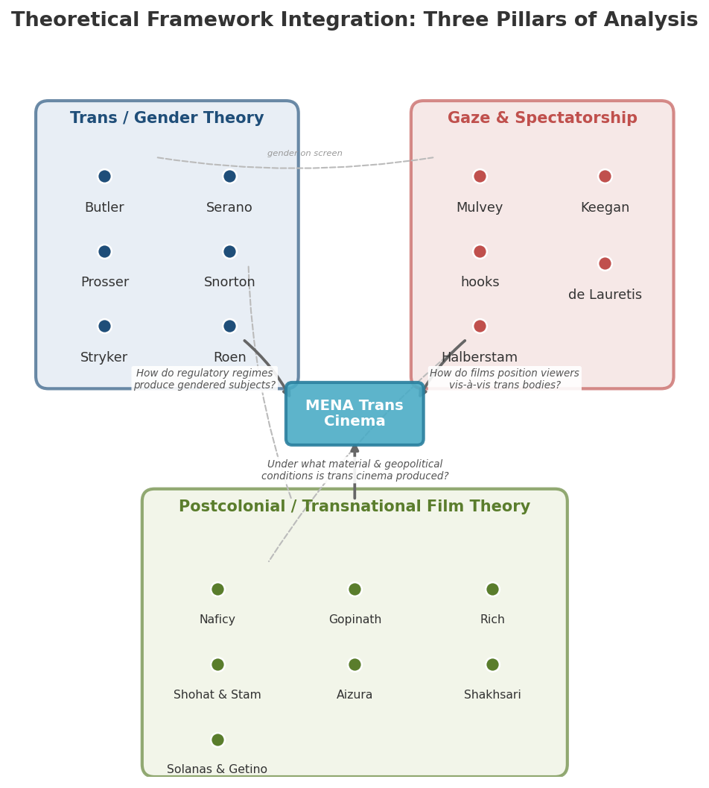

*Figure 1. Schematic of the integrated theoretical framework. Three clusters — Trans/Gender Theory, Gaze & Spectatorship, and Postcolonial/Transnational Film Theory — converge on MENA trans cinema, each contributing a distinct analytical question.*

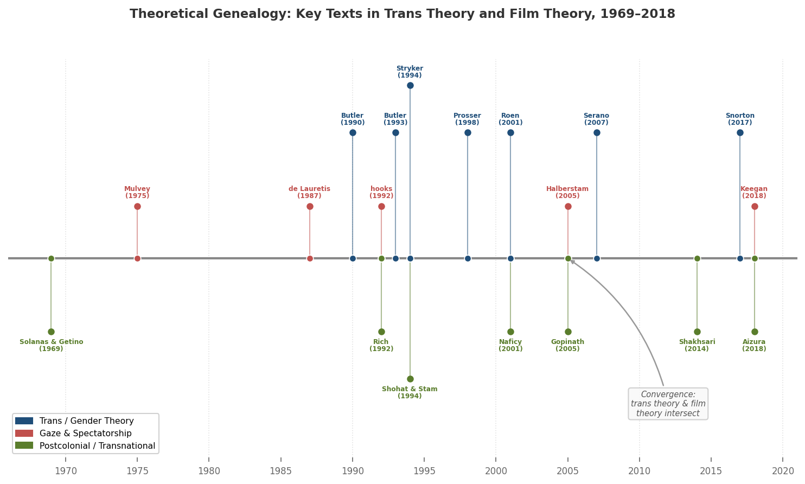

*Figure 2. Chronological timeline of nineteen foundational texts (1969–2018), color-coded by theoretical category, illustrating the parallel development and eventual convergence of trans theory and film theory.*

The framework operates through five interrelated commitments:

First, Butler's performativity serves as a tool for analyzing how specific regulatory regimes — Iranian censorship, Turkish civil law, Egyptian moral codes — produce legible and illegible gender subjects through the "stylized repetition of acts" visible on screen. It is supplemented by Prosser's insistence on embodied narrativity and Serano's analysis of transmisogyny, ensuring that the lived materiality and gendered asymmetries of trans experience are not dissolved into discursive abstraction.

Second, the gaze apparatus — Mulvey's male gaze, hooks's oppositional gaze, Halberstam's transgender look — provides the primary instrument for close reading the spectatorial politics of individual films. The guiding question is: how does a given film position the viewer in relation to the trans body on screen, and what political work does that positioning perform?

Third, Naficy's accented cinema framework, extended through Aizura's concept of provincializing trans and Gopinath's queer diaspora, accounts for the material conditions — exile, diaspora, transnational funding, festival circulation — under which MENA trans cinema is produced and received. This pillar attends simultaneously to form (epistolarity, claustrophobia, border aesthetics) and to political economy (who funds these films, where they circulate, and who watches them).

Fourth, Shohat and Stam's polycentric methodology and the Third Cinema tradition ensure that the analysis does not reduce MENA films to raw material for Western theory. The films are permitted to challenge, revise, and generate theoretical propositions — to theorize back. Keegan's concept of trans aesthetics extends this commitment to the formal register, asking not only what MENA trans films represent but what modes of perception and embodied knowledge they produce.

Fifth, Snorton's co-constitutive analysis of race and gender, together with Roen's critique of whiteness in trans theory, functions as a corrective mechanism — a persistent demand to attend to the racialized hierarchies (Arab-Amazigh, Turkish-Kurdish, Gulf-South Asian labor) that shape which gender transgressions become visible in MENA cinema and which remain structurally unseen.

This integrated framework is deliberately plural rather than synthesized into a false unity. The diversity of the film corpus — spanning Iranian state-sanctioned narratives, Turkish-German diasporic cinema, Lebanese documentary, and Moroccan experimental short film — demands analytical flexibility. No single theoretical lens can illuminate a corpus in which *Facing Mirrors* negotiates Iranian censorship through formal indirection while *Lola und Bilidikid* deploys drag cabaret in Berlin's Turkish-German underworld and *Be Like Others* stages the encounter between a diasporic documentarian and Iranian trans subjects navigating a state-mandated transition apparatus. The framework's coherence lies not in theoretical uniformity but in a shared commitment to reading cinematic form and political context together — to insisting that what these films look like is inseparable from the conditions under which they were made and the power relations they engage.

# 第3章 Regulatory and Cultural Contexts — Censorship, Islamic Jurisprudence, and Colonial Legacies

The films examined in this study do not emerge from a vacuum of creative expression but from densely regulated environments in which state power, religious authority, and colonial inheritance converge to determine which bodies may appear on screen and under what conditions. This chapter maps the political, legal, religious, and historical landscapes that shape the production, distribution, and reception of transgender-themed cinema across the Middle East and North Africa. Rather than treating the MENA region as a monolithic space of prohibition, the analysis reveals a spectrum of regulatory regimes — from Iran's state-sanctioned sex reassignment surgery apparatus to the near-total suppression of gender nonconformity in the Gulf states — and traces the colonial genealogies that underpin many contemporary legal frameworks. Throughout, the chapter attends to how censorship operates not merely as an external constraint on cinematic content but as a generative force that shapes cinematic form itself.

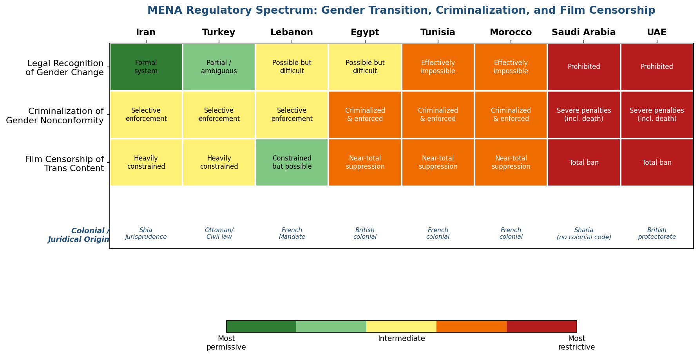

*Figure 1. Comparative heatmap of eight MENA jurisdictions across three regulatory dimensions — legal recognition of gender change, criminalization of gender nonconformity, and film censorship of transgender content — with colonial and juridical origins noted for each country.*

## Iran: The Fatwa, the State, and the Paradox of Legible Transsexuality

Iran presents the most complex case in the MENA region: a state that simultaneously authorizes sex reassignment surgery and criminalizes homosexuality with penalties up to execution. This paradox — what Afsaneh Najmabadi termed the production of Iran as "a hell for homosexuals and a paradise for those seeking SRS" — is rooted in a specific trajectory of Shia jurisprudence and state power [Najmabadi, *Professing Selves*](https://www.jstor.org/stable/j.ctv11vc8md "Duke University Press, 2014, via JSTOR").

The juridical foundations were laid in Ayatollah Khomeini's *Tahrir al-Wasila*, a work of jurisprudence composed in 1964 during his exile in Najaf. Khomeini addressed the permissibility of sex reassignment surgery directly, stating that "the transformation of a man into a woman and vice versa does not appear to be forbidden (*haram*) in Islam." Mehrdad Alipour's analysis in the *International Journal of Transgenderism* reconstructed the jurisprudential reasoning underlying this position, identifying three principles of Islamic legal methodology: the principle of permission (*isalat al-ibahah*), holding that any act not explicitly prohibited is permissible; the principle of sovereignty (*isalat al-taslit*), affirming the individual's authority over their own body; and Khomeini's distinctive contribution — the doctrine that "time and place play a role in *ijtihad*" (independent juridical reasoning), enabling Shia jurists to adapt rulings to changing circumstances [Alipour, *International Journal of Transgenderism* 18(1), 2017: 91–103](https://research-portal.uu.nl/ws/files/251568277/Islamic_shari_a_law_neotraditionalist_Muslim_scholars_and_transgender_sex-reassignment_surgery_A_case_study_of_Ayatollah_Khomeini_s_and_Sheikh_al-Ta.pdf "Open access, Taylor & Francis").

The abstract juridical permission acquired institutional force in 1986–1987, when Maryam Khatoon Molkara — a trans woman who had been involuntarily committed to a psychiatric institution and forcibly injected with male hormones — secured a personal audience with Khomeini and obtained a fatwa specifically authorizing her surgery. Khomeini's ruling stipulated that "if a reliable doctor advises, sex reassignment surgery is not prohibited in the Sharia." This fatwa subsequently became the foundation for a comprehensive state apparatus. The 2013 Family Protection Law, Article 4(18), placed "transsexuality" decisions under family court jurisdiction; the Legal Medicine Organization conducts mandatory psychological and physical evaluations; courts issue surgical authorization permits; and the National Organization for Civil Registration processes post-surgical documentation changes. Article 939 of the Civil Code determines transgender individuals' inheritance rights according to the sex toward which their "symptoms lean" [Outright International, *Being Transgender in Iran* (2016)](https://outrightinternational.org/sites/default/files/2022-10/OutRightTransReport.pdf "Human rights report, pp. 6–10"); [Pirnia & Pirnia, *Iranian Journal of Public Health*, 2022](https://pmc.ncbi.nlm.nih.gov/articles/PMC9745420/ "PMC").

The scale of state-sanctioned surgery is substantial: Iran ranks as the second most prolific country globally for sex reassignment procedures, after Thailand. Data reported by the *New York Times* in October 2025 indicated that SRS procedures in Iran nearly tripled from 4,552 in 2016 to 13,011 in 2019 [Pirnia & Pirnia, *IJPH* 2022](https://pmc.ncbi.nlm.nih.gov/articles/PMC9745420/ "PMC"). Yet Outright International's 2016 field research documented the coercive dynamics embedded within this system. Forensic organization psychologists were found to be "deeply homophobic and sexist, often associating any same-sex desire or gender nonconforming expression with transsexuality." Gender-nonconforming Iranians consequently face "two mutually exclusive options, both of which endanger their health and safety" — undergo surgical transition regardless of whether they identify as transgender, or risk prosecution under sodomy statutes carrying the death penalty [Outright International 2016](https://outrightinternational.org/sites/default/files/2022-10/OutRightTransReport.pdf "pp. 6–10").

This paradox carries direct consequences for cinematic representation. *Facing Mirrors* (*Ayneh-ha-ye Rooberoo*, 2011, dir. Negar Azarbayjani) navigated the Iranian censorship apparatus with notable, if constrained, success. The film premiered at the 29th Fajr International Film Festival, where it received the Special Jury Crystal Simorgh award, and screened at the Mofid University seminary in Qom, reportedly drawing favorable responses from theology students. Yet it did not receive a theatrical exhibition permit until October 2012, over a year after its festival premiere [Ajam Media Collective, 2013](https://ajammc.com/2013/05/11/queer-and-trans-subjects-in-iranian-cinema-between-representation-agency-and-orientalist-fantasies/ "Analysis of Iranian trans cinema"). The film's formal strategies — avoidance of physical intimacy between characters, framing of Eddie's transmasculinity through suffering rather than desire, alignment of the protagonist's gender identity with the state-sanctioned transsexual framework rather than non-normative or non-binary positions — are inseparable from the regulatory conditions under which it was produced.

The broader relationship between Iranian state censorship and cinematic form has been extensively theorized. The Ministry of Culture and Islamic Guidance (*Ershad*) prohibits on-screen physical contact between men and women and requires all women — including transgender men who have not yet legally transitioned — to wear the hijab even in domestic scenes. Negar Mottahedeh's *Displaced Allegories: Post-Revolutionary Iranian Cinema* (Duke University Press, 2008) argued that these restrictions compelled filmmakers to develop a distinctive visual language in which "film narratives became secondary to the religious and ideological work of the cinematic apparatus itself" [Mottahedeh, *Displaced Allegories*](https://api.pageplace.de/preview/DT0400.9780822381198_A35714784/preview-9780822381198_A35714784.pdf "Duke University Press, 2008, preview"). Such formal innovation does not merely respond to post-revolutionary censorship; it draws on deep traditions of symbolic indirection in Persian literature — *kinaya* (metonymy), *ishara* (allusion), *tamsil* (allegory) — that long predate the Islamic Republic. Naghibi and O'Malley, writing in *Hypatia*, traced how "cross-dressing and gender trespassing" function as a recurring formal strategy in new Iranian cinema, serving as "a site of agential potential" and "a means of survival and mobility" [Naghibi & O'Malley, *Hypatia*](https://www.cambridge.org/core/journals/hypatia/article/crossdressing-and-gender-trespassing-the-transgender-move-as-a-site-of-agential-potential-in-the-new-iranian-cinema/B3633A4D5371D77758504C6CBBBF635E "Cambridge University Press").

## The Sunni Counterpoint: Al-Tantawi's Fatwa and Egyptian Ambiguity

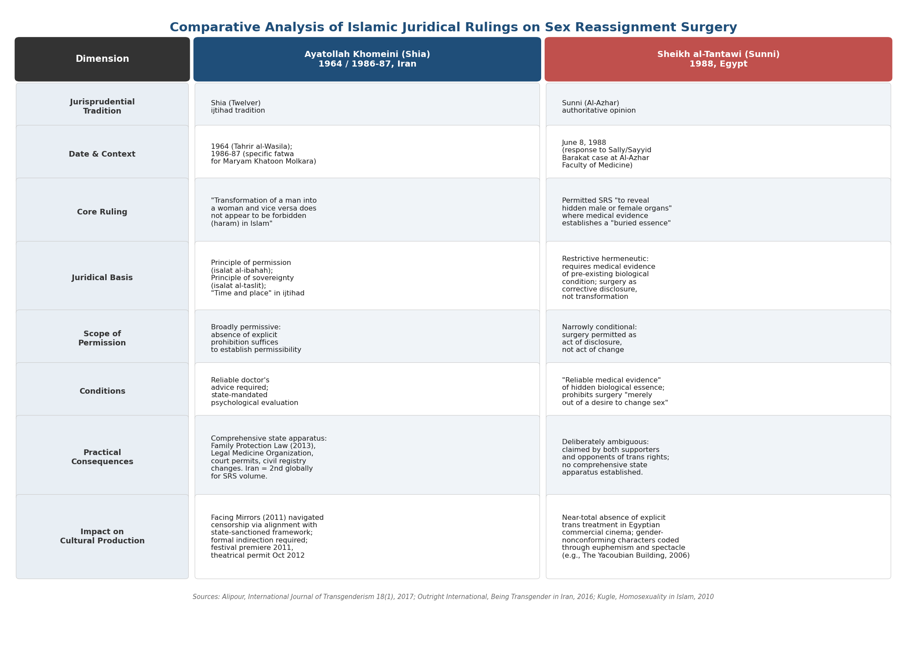

*Figure 2. Side-by-side comparison of Ayatollah Khomeini's (1964/1986–87) and Sheikh al-Tantawi's (1988) rulings on sex reassignment surgery, organized across eight dimensions from jurisprudential tradition to impact on cultural production.*

If Iran's Shia juridical tradition produced a relatively systematic — if deeply problematic — framework for transsexuality, the Sunni world offers a more fragmented and ambiguous landscape. The most consequential Sunni pronouncement came from Egypt in 1988, in response to the case of Sally (née Sayyid) Barakat, a medical student at Al-Azhar University's Faculty of Medicine who underwent sex reassignment surgery. The case prompted Sheikh Muhammad Sayyid al-Tantawi — then Grand Mufti of Egypt and later Sheikh of Al-Azhar, the most prestigious institution of Sunni Islamic learning — to issue a fatwa on June 8, 1988. Alipour's comparative analysis documented that al-Tantawi's ruling permitted SRS "to reveal hidden male or female organs" where reliable medical evidence established the existence of "a buried feminine essence" or "a covered masculine essence," but prohibited surgery undertaken "merely out of a desire to change sex." The fatwa's deliberately ambiguous phrasing — hinging on the distinction between "revealing" a pre-existing truth and "creating" a new one — has been claimed by both supporters and opponents of transgender rights as endorsing their respective positions [Alipour 2017, pp. 93–97](https://research-portal.uu.nl/ws/files/251568277/Islamic_shari_a_law_neotraditionalist_Muslim_scholars_and_transgender_sex-reassignment_surgery_A_case_study_of_Ayatollah_Khomeini_s_and_Sheikh_al-Ta.pdf "Detailed account of the Sally case and al-Tantawi fatwa").

The theological distinction between these two rulings is instructive. Khomeini's position, grounded in the Shia principle of *ijtihad* and his own doctrine of temporal adaptability, permitted SRS on broadly permissive grounds — the absence of explicit prohibition sufficed to establish permissibility. Al-Tantawi's ruling, by contrast, was anchored in a more restrictive Sunni hermeneutic framework requiring medical evidence of a pre-existing biological condition: surgery was permitted as a corrective act of disclosure, not as an act of transformation. Scott Kugle's *Homosexuality in Islam: Critical Reflection on Gay, Lesbian, and Transgender Muslims* (Oneworld, 2010) situated these divergent rulings within a broader analysis of how Islamic jurisprudential traditions have engaged with gender and sexual diversity, arguing that the Quranic tradition itself contains "sexually-sensitive" resources that dominant legal schools have suppressed [Kugle, *Homosexuality in Islam*](https://archive.org/details/homosexualityini0000kugl "Oneworld Publications, 2010"). While not focused on cinema, Kugle's work provides essential context for understanding why transgender-themed films encounter radically different regulatory environments across Shia and Sunni jurisdictions.

The Egyptian censorship apparatus through which any film treating gender nonconformity must pass predates the Republic itself. Established in 1914 under British colonial administration, the system was codified in the 1976 censorship law, which prohibits content critical of "revealed religions," forbids nudity or pornographic scenes, and bars depictions of "social problems as unsolvable." Dina Mansour's analysis in *Alphaville: Journal of Film and Screen Media* demonstrated that censorship decisions rest on the discretion of individual censors, producing marked inconsistencies and compelling filmmakers to employ strategies of indirection — allegory, irony, and dual-version production for domestic and international distribution. Mansour characterized the system as operating "as the patriarchal hand of the state," reinforcing normative gender and sexual orders through the regulation of visual representation [Mansour, *Alphaville* 4, 2012](https://cora.ucc.ie/bitstreams/2be59db3-0a5f-46b9-a918-1b34578ebb10/download "Peer-reviewed analysis of Egyptian censorship"). The practical effect for transgender representation is a near-total absence of explicit treatment in Egyptian commercial cinema. Where gender-nonconforming characters do appear — as in *The Yacoubian Building* (*ʿImarat Yaʿqubyan*, 2006, dir. Marwan Hamed), adapted from Alaa Al Aswany's bestselling novel — they tend to be embedded within larger ensemble narratives and coded through euphemism, spectacle, or tragic resolution.

## Turkey: Civil Law, Forced Sterilization, and Democratic Erosion

Turkey occupies an intermediate position in the MENA regulatory landscape, marked by formal legal recognition of gender transition coexisting with escalating political hostility and social violence. Article 40 of the Turkish Civil Code, enacted in 2002, established the legal framework for gender reassignment. The statute requires applicants to be at least eighteen years of age, unmarried, "of transsexual nature," and to provide a health board report from a teaching and research hospital certifying that gender reassignment is "indispensable for mental health." Critically, Article 40 also mandates "permanent infertility" — forced sterilization as a precondition for legal gender recognition. Between 2015 and 2017, courts in Ankara and Edirne challenged the constitutionality of the surgical requirement, though these challenges have not yielded systematic legal reform [openDemocracy](https://www.opendemocracy.net/en/north-africa-west-asia/legal-recognition-of-transgender-people-in-turkey-will-court-seize-/ "Analysis of Article 40").

The trajectory of Turkish policy has been one of accelerating regression. In October 2025, Human Rights Watch documented a draft bill threatening to raise the minimum age for gender-affirming healthcare and further criminalize gender nonconformity — part of a broader campaign by the ruling AKP government against LGBTQ+ populations that has included bans on Pride marches since 2015 and systematic exclusion of LGBTQ+ organizations from civil society consultations [HRW, 2025](https://www.hrw.org/news/2025/10/29/turkiye-draft-law-threatens-lgbt-people-with-prison "Human Rights Watch report"). Transgender individuals in Turkey face acute vulnerability to violence; Transgender Europe's Trans Murder Monitoring project has consistently identified Turkey as one of the countries with the highest reported numbers of murders of transgender persons in Europe and its surrounding region.

For cinema, Turkey's regulatory environment creates a double bind. The country possesses a robust film industry with strong international connections — particularly through the Berlin International Film Festival, which has historically served as a primary platform for Turkish-German cinema. Yet the domestic climate has grown increasingly hostile to films treating gender and sexual nonconformity. *Lola und Bilidikid* (1999, dir. Kutluğ Ataman), the most significant Turkish-associated transgender-themed film, was produced in Germany with WDR co-financing precisely because its subject matter — the lives of transgender and gay Turkish-German individuals in Berlin — could not find institutional support in Istanbul. The film premiered in the Panorama section of the 49th Berlin International Film Festival and won the Teddy Award; its production history, however, reflects the structural impossibility of making such a film within Turkey's domestic industry. *Zenne Dancer* (2012, dir. Caner Alper & Mehmet Binay), which engaged Ottoman *köçek* dance traditions and contemporary anti-transgender violence, represented a rare attempt to address gender transgression from within the Turkish production system. Its critical success was accompanied by predictable controversy, illustrating the narrow and unstable margin of representational possibility.

## Lebanon: Colonial Statutes, Judicial Ambiguity, and Fragile Openings

Lebanon's regulatory landscape is defined by the interplay between inherited colonial statutes and an intermittently progressive judiciary. Article 534 of the Lebanese Penal Code, a legacy of the French Mandate period (adopted in 1943 and modeled on its French colonial predecessor), criminalizes "sexual intercourse contrary to the order of nature" with penalties of up to one year of imprisonment. Article 521 separately criminalizes "disguising oneself as the opposite sex." Neither provision is consistently enforced, and Lebanese courts have at times interpreted them narrowly. In 2009, a judge ruled that consensual same-sex relations did not violate Article 534. In 2014, Judge Naji al-Dahdah dismissed Article 534 charges against a transgender woman — reportedly the first application of the statute to a transgender individual — reasoning that the defendant's gender expression did not constitute a criminal act [Human Rights First, 2014](https://humanrightsfirst.org/library/lebanon-court-dismisses-case-against-transgender-woman/ "Analysis of Judge Dahdah's ruling"); [Human Dignity Trust](https://www.humandignitytrust.org/country-profile/lebanon/ "Lebanon country profile").

This judicial ambiguity has created limited but significant spaces for cultural production. Beirut has functioned as the most permissive urban node for queer and transgender cultural activity in the Arab world, hosting film festivals, supporting NGOs such as Helem (the first above-ground LGBTQ+ organization in the region, founded in 2004), and providing production infrastructure for films that could not be realized elsewhere. *Circumstance* (2011, dir. Maryam Keshavarz) was shot in Beirut with a false script submitted to Lebanese authorities, using the city as a stand-in for Tehran. *Cinema Fouad* (1993, dir. Mohamed Soueid), one of the earliest Arab documentaries centering a transgender subject, was produced in Beirut's relatively permissive cultural milieu; the Arab Film & Media Institute identified the film as a foundational work and noted that it lent its name to Lebanon's first queer cinema event [AFMI](https://arabfilminstitute.org/queer-arab-films-to-watch-during-pride-month/ "Cinema Fouad entry and festival naming"). The fragility of this permissiveness, however, is underscored by periodic crackdowns: security forces have raided cultural events, and the Mashrou' Leila concert controversy in 2019 demonstrated that cultural spaces for gender and sexual nonconformity remain contingent on political and sectarian calculations.

## Colonial Genealogies: From Ottoman Tolerance to European Criminalization

A recurrent analytical error in Western discussions of gender and sexuality in the MENA region is the assumption that repressive legal frameworks reflect an essential feature of Islamic or Arab culture. Historical analysis reveals a more complex genealogy in which European colonial intervention actively introduced or reinstituted criminalization in territories where prior legal regimes had been more permissive.

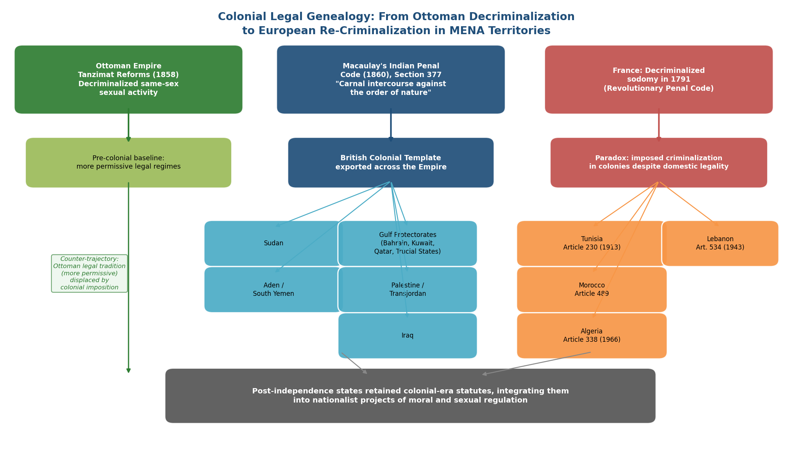

*Figure 3. Flow diagram tracing three parallel legal trajectories — the Ottoman Empire's 1858 decriminalization as a pre-colonial baseline, the British colonial template exported via Macaulay's 1860 Indian Penal Code (Section 377), and the French colonial paradox of domestic decriminalization coexisting with colonial re-criminalization — converging on post-independence retention of colonial-era statutes.*

The Ottoman Empire decriminalized same-sex sexual activity in 1858 as part of the Tanzimat modernization reforms — decades before many European jurisdictions. This reform reflected not a liberal sexual politics in the modern sense but an administrative rationalization of the penal code and a broader move away from religious courts' direct jurisdiction over criminal matters. The significance for this study is that it establishes a pre-colonial baseline against which subsequent European interventions can be measured: the British and French colonial administrations that partitioned Ottoman territories after World War I often imposed legal codes representing a regression from the Ottoman status quo.

British colonial sodomy laws followed a template established by Thomas Babington Macaulay's 1860 Indian Penal Code, whose Section 377 criminalized "carnal intercourse against the order of nature." This statute was exported across the British Empire and imposed on British-administered MENA territories including Sudan, Aden (later South Yemen), the Gulf protectorates (Bahrain, Kuwait, Qatar, the Trucial States), Palestine/Transjordan, and Iraq [Outright International](https://outrightinternational.org/world-map-criminalization-same-sex-conduct-and-its-colonial-roots "Interactive map of colonial origins of criminalization"). French colonial influence operated through a different mechanism. France had decriminalized sodomy in 1791 during the Revolution, yet the legal codes imposed on or adopted by its North African territories contained provisions criminalizing same-sex conduct: Tunisia's Article 230 (1913), Morocco's Article 489, and Algeria's Article 338 (1966) all derive from this colonial framework [UK Parliament Research Briefing CBP-9407](https://researchbriefings.files.parliament.uk/documents/CBP-9407/CBP-9407.pdf "North Africa LGBT+ issues briefing"). The paradox of a nation that had long decriminalized homosexuality at home imposing or maintaining criminalization in its colonies reveals the disciplinary function of sexual regulation within colonial governance — what Joseph Massad's *Desiring Arabs* analyzed as the imposition of Western sexual identity categories on societies organized according to different epistemic frameworks [Massad, *Desiring Arabs*](https://press.uchicago.edu/ucp/books/book/chicago/D/bo5378447.html "University of Chicago Press, 2007").

These colonial legal structures have proven remarkably durable. Post-independence states across the MENA region retained colonial-era sodomy statutes, often integrating them into nationalist projects of moral and sexual regulation. Such persistence is not merely legislative inertia; it reflects the degree to which colonial sexual regulation was absorbed into the ideological apparatus of the post-colonial state. For transgender individuals, the effects are compounding: colonial-era sodomy statutes are frequently applied to gender nonconformity through interpretive extension, and laws criminalizing "cross-dressing" or "disguising oneself as the opposite sex" — as in Lebanon's Article 521 — target the visible expression of gender transgression regardless of sexual conduct.

## The Gulf States: Prohibition and Silence

At the most restrictive end of the MENA spectrum, the Gulf Cooperation Council states — Saudi Arabia, Qatar, the United Arab Emirates, Kuwait, Bahrain, and Oman — maintain legal frameworks approaching total prohibition of gender nonconformity. Under specific interpretations of Sharia law applied in Saudi Arabia, Qatar, and the UAE, same-sex sexual activity can carry the death penalty. While these extreme penalties are rarely imposed for gender nonconformity per se, they create an environment of comprehensive suppression extending to cultural production. ILGA World's 2024 global survey documented that Kuwait, Saudi Arabia, and the UAE maintain explicit bans on films and television programs depicting sexual and gender diversity [ILGA World, *Laws on Us*, 2024](https://ilga.org/wp-content/uploads/2024/05/Laws_On_Us_2024.pdf "Global overview of anti-LGBTQ+ legislation").

The consequences for cinema are stark: no transgender-themed films have been produced within the Gulf states' domestic industries, and international films treating gender nonconformity are routinely censored or banned from theatrical distribution. This absence constitutes its own form of evidence — a negative image revealing the outer limits of the regulatory spectrum. The Gulf states' influence extends beyond their borders as well: their substantial investments in global media distribution (including streaming platforms) and their hosting of international cultural events create incentive structures discouraging the production and circulation of transgender content across the broader Arabic-speaking media ecosystem.

## Censorship as Cinematic Form: Allegory, Indirection, and Dual Address

The regulatory conditions surveyed in this chapter do not merely determine *whether* transgender-themed films can be made; they shape *how* those films look. Censorship, in this analysis, functions not as a purely repressive force but as a productive one — generating specific formal strategies that become defining features of MENA transgender cinema.

Hamid Naficy's work on Iranian cinema and Mottahedeh's *Displaced Allegories* established that the post-revolutionary Iranian censorship regime compelled filmmakers to develop formal strategies of indirection — allegory, visual metonymy, displaced narrative focus, and the exploitation of ambiguity — that became recognized internationally as hallmarks of "Iranian art cinema." For transgender-themed films, these strategies take specific forms: the withholding of bodily revelation (camera angles that avoid showing the transgender character's body in states of undress); the displacement of desire onto spatial movement (the road movie structure of *Facing Mirrors*, where physical transit substitutes for a narrative of transition that cannot be directly shown); and the encoding of gender ambiguity in sartorial and gestural detail rather than explicit verbal declaration.

The practice of dual-version production — creating one version for domestic censors and another for international festival circulation — is a material expression of what may be termed "dual address": the capacity of a film to speak simultaneously to domestic audiences through culturally specific allegorical registers and to international audiences through the conventions of art cinema and human rights documentary. Dual address is not unique to transgender-themed films, but the stakes of this double articulation are particularly acute when the subject matter itself concerns the legibility and illegibility of gendered bodies.

The Ajam Media Collective's 2013 analysis illuminated how dual address interacts with orientalist reception dynamics. Comparing the international fates of *Circumstance* (2011) and *Facing Mirrors* (2011) — two Iranian-associated films treating gender and sexuality that premiered in the same year — the analysis demonstrated that Western audiences and media institutions rewarded the film conforming to "Western orientalist imaginations" of oppressed Muslim women (*Circumstance*, which won the Sundance Audience Award and received extensive Western press coverage) while marginalizing the film that "subverted and challenged hegemonic Orientalizing narratives about sexual and gender minorities in Iran" (*Facing Mirrors*, which screened at over sixty-four international festivals yet received virtually no mainstream Western media attention) [Ajam Media Collective, 2013](https://ajammc.com/2013/05/11/queer-and-trans-subjects-in-iranian-cinema-between-representation-agency-and-orientalist-fantasies/ "Differential reception and Orientalism analysis"). This differential reception reveals that censorship and its circumvention operate not only at the level of national regulatory bodies but through transnational cultural gatekeeping mechanisms that reward certain narratives of gender transgression — typically those confirming Western assumptions about Islamic "backwardness" — while rendering others invisible.

Jasbir Puar's concept of homonationalism, developed in *Terrorist Assemblages: Homonationalism in Queer Times* (Duke University Press, 2007), provides the theoretical framework for understanding this transnational dimension of censorship. Puar argued that in the post-9/11 geopolitical order, certain queer subjects — particularly white, cisgender, nationally identified ones — are incorporated into narratives of Western modernity and democratic progress, while Muslim and racialized bodies are positioned as "abnormal, backward, or pro-terrorist." The related concept of "pinkwashing" — the strategic deployment of progressive positions on sexuality and gender to obscure other forms of political violence — describes how Western reception of MENA transgender cinema can function as geopolitical legitimation rather than neutral cultural engagement [Puar, *Terrorist Assemblages*](https://en.wikipedia.org/wiki/Homonationalism "Summary of Puar's 2007 concept"). When Western audiences consume *Be Like Others* (2008) or *Circumstance* primarily as evidence of Islamic repression, the viewing experience is structured by homonationalist dynamics — even when the filmmakers, such as Tanaz Eshaghian, explicitly resist such framing. As the *Reverse Shot* review of *Be Like Others* observed, the film merited praise precisely for its "unwillingness to pander to American popular discourse — those that appropriate stories of Iranian social inequality to justify our hostility, even military action" [Reverse Shot](https://reverseshot.org/symposiums/entry/167/be_others "Anti-homonationalist reading of Be Like Others").

## Implications for Cinematic Analysis

The regulatory and cultural contexts mapped in this chapter establish several analytical principles that inform the close readings in subsequent chapters. First, the legal status of gender transition in a given national context does not straightforwardly predict the representational possibilities available to filmmakers: Iran's juridical authorization of SRS coexists with a censorship regime that severely constrains how transition can be depicted on screen, while Turkey's formal legal recognition of gender change is accompanied by escalating social violence rendering transgender visibility physically dangerous. Second, the colonial genealogy of anti-sodomy legislation complicates any narrative positioning Islam as the primary obstacle to transgender visibility; the legal frameworks criminalizing gender nonconformity in much of the MENA region are products of European colonial intervention, imposed on societies whose prior legal traditions were, in key respects, more tolerant. Third, censorship functions not merely as an obstacle to be circumvented but as a force shaping the formal vocabulary of MENA transgender cinema — the strategies of allegory, indirection, spatial displacement, and dual address that emerge in response to regulatory constraint constitute a distinctive aesthetic tradition. Fourth, the regulatory environment must be understood not only at the national level but at the transnational level, where orientalist reception dynamics and homonationalist frameworks operate as a second-order censorship determining which MENA transgender films gain visibility and on what terms.

These principles resist any simple binary between "repressive" MENA states and "liberating" Western cultural markets. The landscape that emerges is one of overlapping, sometimes contradictory regulatory pressures operating at multiple scales — from the Shia jurist's chamber to the Cannes selection committee — that collectively determine the conditions of possibility for transgender representation in MENA cinema.

# 第4章 Close Readings — Transgender Narratives in MENA Feature Films

The preceding chapters established a dual theoretical framework — drawing on trans studies and film theory — and mapped the regulatory environments that condition transgender visibility across the Middle East and North Africa. This chapter activates those tools through sustained close readings of three feature films that occupy distinct positions within the spectrum of MENA transgender cinema: *Facing Mirrors* (*Ayneh-ha-ye Rooberoo*, 2011, dir. Negar Azarbayjani, Iran/Germany), *Lola und Bilidikid* (*Lola and Billy the Kid*, 1999, dir. Kutluğ Ataman, Germany), and *Circumstance* (*Sherayet*, 2011, dir. Maryam Keshavarz, France/Iran/USA). Each film is examined not merely for its thematic treatment of gender nonconformity but as a formal and political object whose narrative structure, visual style, spectatorial positioning, and transnational circulation illuminate — and in turn complicate — the theoretical categories developed in Chapter 2. Together, the three readings demonstrate that MENA transgender cinema is not a uniform genre but a heterogeneous field traversed by competing conceptions of gender, divergent formal strategies, and radically different relationships to domestic and international audiences.

The selection proceeds from a principle of maximum analytical contrast. *Facing Mirrors* is produced within Iran's domestic film industry and navigates the Islamic Republic's censorship apparatus from within; it centres a trans male protagonist and constructs transmasculinity through embodied pain rather than performative play. *Lola und Bilidikid* is produced in the Turkish-German diasporic space of 1990s Berlin; it renders gender transgression as irreducibly theatrical, inseparable from ethnic marginalization and migrant precarity, and refuses the medical-legal framework of transsexuality altogether. *Circumstance*, while not centred on a transgender protagonist, is included as a comparative case that reveals how the transnational circulation of MENA queer cinema is structured by orientalist reception dynamics — dynamics that directly determine which transgender narratives gain visibility and on what terms.

## *Facing Mirrors*: Embodied Transition and the Limits of Iranian Legibility

### Production Context and Festival Trajectory

*Facing Mirrors* occupies a singular position in the filmography of MENA transgender cinema: it is the first Iranian feature film to place a trans protagonist at the centre of its narrative. Directed by Negar Azarbayjani, an Iranian woman filmmaker operating within the domestic production system, the film was co-produced with German partners — a transnational financing arrangement typical of the corpus, in which no MENA trans film has been funded entirely by MENA-based sources. The film premiered at the 29th Fajr International Film Festival, Iran's preeminent state-sanctioned film event, where it received the Special Jury Crystal Simorgh award, and subsequently screened at more than sixty-four international LGBTQ and general film festivals, winning the Best First Feature award at San Francisco's Frameline and the Grand Prix at Paris's Chéries-Chéris [Ajam Media Collective, 2013](https://ajammc.com/2013/05/11/queer-and-trans-subjects-in-iranian-cinema-between-representation-agency-and-orientalist-fantasies/ "Analysis of Iranian trans cinema and festival trajectory"). The film also screened at the Mofid University seminary in Qom, where theology students reportedly responded favourably — a reception trajectory that underscores the paradoxical relationship between Iran's juridical authorization of transsexuality and the censorship apparatus that constrains its cinematic depiction.

Yet the film's path through Iranian regulatory institutions was far from smooth. Despite its Fajr premiere in February 2011, *Facing Mirrors* did not receive a theatrical exhibition permit from the Ministry of Culture and Islamic Guidance (*Ershad*) until October 2012 — a delay of more than eighteen months [Ajam Media Collective, 2013](https://ajammc.com/2013/05/11/queer-and-trans-subjects-in-iranian-cinema-between-representation-agency-and-orientalist-fantasies/ "Delay in obtaining theatrical permit"). The delay is analytically significant: the state could authorize a festival screening — signalling cosmopolitan tolerance to international audiences — while withholding domestic theatrical distribution, thereby managing the film's visibility with granular precision.

### Narrative Structure and the Road Movie as Transition

The film narrates the encounter between two women navigating different forms of constraint within the Islamic Republic's gender order. Rana is a devout, working-class taxi driver who has taken up illegal fare-driving to pay her husband's debts; Eddie (born Adineh) is a pre-operative trans man from a wealthy family, fleeing an arranged marriage to a male cousin. When Eddie hires Rana's taxi for an extended journey toward the Turkish border — and, ultimately, exile in Germany — the film adopts the structure of the road movie, a genre whose privileged spaces of transit, threshold, and border crossing directly correspond to the signature chronotopes of what Hamid Naficy theorized as "accented cinema" [Naficy, *An Accented Cinema*](https://www.jstor.org/stable/27933844 "Princeton University Press, 2001").

The road movie structure functions here not merely as a genre convention but as a formal solution to a representational problem. Iranian censorship prohibits the direct depiction of physical transition: the bodily process of becoming cannot be shown on screen. The film therefore displaces the narrative of bodily transition onto spatial transit — the journey from Tehran toward the Turkish border literalizes the movement from one gendered condition to another without requiring the camera to show the trans body in states of undress or transformation. This displacement is characteristic of what Naghibi and O'Malley, writing in *Hypatia*, identified as "the transgender move" in new Iranian cinema — a recurring formal strategy in which gender transgression functions as "a site of agential potential" and "a means of survival and mobility" [Naghibi & O'Malley, *Hypatia*](https://www.cambridge.org/core/journals/hypatia/article/crossdressing-and-gender-trespassing-the-transgender-move-as-a-site-of-agential-potential-in-the-new-iranian-cinema/B3633A4D5371D77758504C6CBBBF635E "Cambridge University Press"). In *Facing Mirrors*, the "transgender move" is literal: transition *is* movement, and movement is the condition of possibility for transition.

### The Taxi as Gendered Threshold

The taxi interior constitutes the film's most significant spatial construction — what Schoonover and Galt, in *Queer Cinema in the World*, described as "an overly public private space" [Schoonover & Galt, *Queer Cinema in the World*](https://filmquarterly.org/wp-content/uploads/2017/01/schoonover_queercinema_excerpt_chapter_3.pdf "Duke University Press, 2016, Chapter 3"). The taxi is simultaneously a domestic interior (where Rana and Eddie develop intimacy) and a public space (subject to police checkpoints, surveillance, and the gaze of other road users). It functions as a threshold zone where gender norms both operate and can be questioned — precisely because the taxi's mobile interiority disrupts the Islamic Republic's spatial segregation of public and private, male and female domains. Naficy's formal category of "claustrophobic space" — the confined interior that characterizes accented cinema's representation of exile — maps directly onto the taxi's cramped, mobile enclosure, compressing two women into a space of enforced proximity that gradually transforms into one of mutual recognition.

The spatial politics extend to the film's conclusion. Eddie's arrival in Germany is presented not as liberation but as structural ambiguity: the German scenes are, as Schoonover and Galt observed, "empty, cold, strangely devoid of affect" [Schoonover & Galt, 2016](https://filmquarterly.org/wp-content/uploads/2017/01/schoonover_queercinema_excerpt_chapter_3.pdf "Germany as affectively depleted space"). Exile is not a resolution but a dislocation — a point that resonates with Wienke Straube's concept of "exit scapes," the discursive and material landscapes through which queer and trans subjects flee persecution. Eddie's escape, Schoonover and Galt noted, "both complies with and resists the idea of the exit scape": the film neither celebrates Western refuge nor condemns Iranian society, maintaining an irreducible ambivalence about the geography of trans livability [Schoonover & Galt, 2016](https://filmquarterly.org/wp-content/uploads/2017/01/schoonover_queercinema_excerpt_chapter_3.pdf "Eddie's exit scape").

### Spectatorial Misrecognition and the Transgender Look

*Facing Mirrors* deploys a sophisticated strategy of spectatorial positioning that directly instantiates Halberstam's concept of the "transgender look." In the opening sequences, visual and narrative cues guide the viewer to misread the developing relationship between Rana and the figure who will become Eddie as a lesbian intimacy. Schoonover and Galt's analysis demonstrated that this initial misrecognition "uncomfortably aligns the spectator's gaze with that of the police" — the morality police whose surveillance structures the film's spatial and narrative economy [Schoonover & Galt, 2016](https://filmquarterly.org/wp-content/uploads/2017/01/schoonover_queercinema_excerpt_chapter_3.pdf "Spectatorial misrecognition and police gaze"). The viewer who reads the relationship as lesbian desire reproduces, at the level of spectatorship, the same misrecognition that the state apparatus performs at the level of legal classification: the refusal to see a trans man as a man.

This alignment of spectator and surveilling state is disrupted when the film reveals Eddie's trans identity — a revelation that compels the viewer to retroactively reassess every prior scene. Halberstam's theorization of the "transgender look" in *In a Queer Time and Place* (NYU Press, 2005) described precisely this dynamic: a viewing position that registers "gender ambiguity, the labor of 'passing,' and the ever-present threat of violence that attends gender nonconformity" [Halberstam, *In a Queer Time and Place*](https://transreads.org/wp-content/uploads/2019/03/2019-03-18_5c902453b74f2_judith-halberstam-in-a-queer-time-and-place-transgender-bodies-subcultural-lives2.pdf "NYU Press, 2005"). The transgender look, in Halberstam's formulation, is not the gaze of a trans character but a structural feature of the film's visual economy, produced through point-of-view alignments, editing patterns that defer the revelation of bodily sex, and mirror scenes that stage the disjunction between self-perception and social legibility. *Facing Mirrors* — whose very title announces this thematics of reflection and recognition — extends Halberstam's concept into a regulatory context the original theorization did not anticipate: one in which the state actively produces the category of "transsexual" while policing the boundaries of its legibility.

### Embodied Narrativity versus Performativity

The film's construction of Eddie's transmasculinity aligns more closely with Jay Prosser's embodied narrative model than with Butler's performativity framework. Eddie's gender is not presented as a play of signifiers or a theatrical adoption and discarding of gendered markers; rather, it is constructed through bodily suffering — chest binding beneath layers of clothing, the physical discomfort of occupying a body misaligned with self-knowledge, the prospect of an unwanted marriage that would inscribe femininity onto his social existence. Prosser's *Second Skins* (Columbia University Press, 1998) argued that narrative rather than performance is the register through which trans subjectivity becomes intelligible: autobiography, testimony, and the storied body constitute the means by which trans persons render their experience legible [Prosser, *Second Skins*](https://cup.columbia.edu/book/second-skins/9780231109345/ "Columbia University Press, 1998"). *Facing Mirrors* is structured around precisely this narrative logic: Eddie's story unfolds as a journey from illegibility to contingent legibility, mediated not by performative gender play but by the embodied experience of a body in transit.

Schoonover and Galt underscored this point: the film "neither advocates for Iran's transgender policy as a sexual-freedom oasis nor implies that Western Europe is a transgender utopia" [Schoonover & Galt, 2016](https://filmquarterly.org/wp-content/uploads/2017/01/schoonover_queercinema_excerpt_chapter_3.pdf "Non-advocacy stance"). This refusal of advocacy is itself a formal and political choice, positioning the film outside the binary of celebration and condemnation that structures much Western reception of Iranian gender politics. The film occupies instead what might be termed an analytic stance — one that renders visible the contradictions of a system that authorizes surgery while constraining livability.

### Critical Receptions and the Gender Binary Debate

Emily O'Dell's analysis in *Iranian Studies* offered the most sustained scholarly critique of the film's gender politics, arguing that *Facing Mirrors*, alongside other post-revolutionary Iranian trans-themed works, "reinforces a strict gender binary" by constructing its trans male protagonist within a framework that ultimately recuperates normative masculinity rather than challenging the binary itself [O'Dell, "Performing Trans in Post-Revolutionary Iran," *Iranian Studies* 53(1-2), 2020: 129–164](https://www.cambridge.org/core/journals/iranian-studies/article/performing-trans-in-postrevolutionary-iran-gender-transitions-in-islamic-law-theatre-and-film/7CCE93B829EC2041D576E9BFCD77E514 "Cambridge University Press"). This critique identifies a genuine tension: Eddie's narrative arc moves toward legibility as a man within a heteronormative framework — precisely the framework that Iran's juridical apparatus authorizes. The question the film raises, but does not resolve, is whether this recuperation reflects the filmmaker's own ideological investment or the structural constraints of producing a trans-themed film within a censorship regime that permits transsexuality only insofar as it restores the gender binary.

Elhum Shakerifar's earlier work on visual representations of Iranian trans subjects — published in *Iranian Studies* 44(3), 2011: 327–339 — provided essential context for this debate by documenting how Iranian documentary and journalistic representations consistently framed transsexuality through a medical-legal discourse of correction and normalization, leaving little space for gender identities that exceed the binary [Shakerifar, "Visual Representations of Iranian Transgenders," *Iranian Studies* 44(3), 2011](https://www.cambridge.org/core/journals/iranian-studies/article/visual-representations-of-iranian-transgenders/6737035B543DF86A9619AC67AB4594E0 "Cambridge University Press"). *Facing Mirrors* operates within and against this representational tradition: it accepts the binary framework sufficiently to navigate the censorship apparatus, yet the formal ambiguities of its spectatorial positioning — the misrecognition strategy, the affectively depleted exile — introduce fractures that resist narrative and ideological closure.

### Differential Reception and Orientalist Gatekeeping

The international reception of *Facing Mirrors* reveals the second-order censorship discussed in Chapter 3 — the transnational cultural gatekeeping that determines which MENA trans narratives achieve visibility in the West. Despite screening at over sixty-four international festivals and winning major LGBTQ film awards, the film received virtually no mainstream Western media attention — no *New York Times* review, no NPR feature, no *Guardian* profile. The Ajam Media Collective's 2013 analysis attributed this neglect to the film's refusal to conform to orientalist narrative expectations: "Unfortunately, Western mainstream culture views this complexity as antagonistic to its Orientalist narratives" [Ajam Media Collective, 2013](https://ajammc.com/2013/05/11/queer-and-trans-subjects-in-iranian-cinema-between-representation-agency-and-orientalist-fantasies/ "Orientalist reception differential"). A film that presents Iran as a site of genuine complexity — where a trans man can win a state film prize and screen at a Qom seminary, yet cannot secure timely theatrical distribution — does not serve the Western demand for narratives of Muslim oppression. The comparative case of *Circumstance*, examined below, makes this dynamic starkly visible.

## *Lola und Bilidikid*: Performativity, Ethnic Marginality, and the Refusal of Medical Legibility

### Production Context and Diasporic Positioning

*Lola und Bilidikid* occupies a fundamentally different position in the landscape of MENA trans cinema. Directed by Kutluğ Ataman — a Turkish-born, UCLA-educated filmmaker who is openly gay and was shortlisted for the 2004 Turner Prize for his video art — the film was produced in Germany with WDR co-financing, precisely because its subject matter could not find institutional support in Turkey. The film premiered in the Panorama section of the 49th Berlin International Film Festival and won the Teddy Award, the festival's prize for films with queer themes [Petersen, *Gender Questions* 1(1), 2013: 33–44](https://unisapressjournals.co.za/index.php/GQ/article/download/1543/735/7031 "Teddy Award and Panorama premiere"). Ataman's positioning — Turkish by birth, American-educated, active in the German film industry, moving between Istanbul and London — exemplifies what Naficy theorized as the "diasporic filmmaker": a figure who maintains both "vertical" ties to the homeland and "horizontal" connections to dispersed communities, and whose films are "more fully saturated by the multiplicity and performativity of identity" than those of exilic filmmakers oriented primarily toward the homeland left behind [Naficy, *An Accented Cinema*](https://api.pageplace.de/preview/DT0400.9780691186214_A33704991/preview-9780691186214_A33704991.pdf "Princeton University Press, pp. 10–17").

The film narrates queer Turkish-German life in Berlin through three intertwined storylines: seventeen-year-old Murat's budding sexuality and search for his missing brother Osman; the relationship between Lola — a gender-nonconforming Turkish-German performer — and Bili, a hypermasculine Turkish-German man; and the shadow of Lola's murder at Osman's hands, which structures the film's temporal organization as a retroactive investigation. The settings — Kreuzberg domestic interiors, kebab shops, the Siegessäule (Victory Column), and the Olympic Stadium — map Berlin as a palimpsest of ethnic, sexual, and historical tensions.

### Gender Ambiguity and the Refusal of Classification

The most analytically significant feature of Lola's characterization is its deliberate resistance to categorical fixity. Scholars have variously described Lola as a drag queen, a trans woman, and a gay man who cross-dresses — and the film furnishes evidence for each reading without resolving the ambiguity. As Petersen noted, Lola "claims lifelong wig-wearing is no problem," explicitly refusing Bili's insistence that Lola undergo sex reassignment surgery so the couple can return to Turkey and live as a "normal heterosexual couple" [Petersen, 2013](https://unisapressjournals.co.za/index.php/GQ/article/download/1543/735/7031 "Lola's refusal of SRS"). This refusal is a theoretical as much as a narrative act: it rejects the medical-legal framework of transsexuality that structures Iranian cinema's approach to gender transgression (and that *Facing Mirrors* inhabits), insisting instead on a mode of gender nonconformity that cannot be assimilated into the binary categories of the state.

Where Eddie in *Facing Mirrors* is constructed through Prosser's embodied narrativity — a trans man seeking somatic coherence in a body experienced as misaligned — Lola is constructed through what aligns more closely with Butler's performativity. Lola's gender is theatrical, inseparable from the drag cabaret stage where Lola performs with a troupe called *Die Gastarbeiterinnen* ("the female guest workers") — a name that, as Barbara Mennel observed, satirically feminizes the *Gastarbeiter* (guest worker) category, simultaneously queering gender and immigration status [Petersen, 2013, citing Mennel 2004](https://unisapressjournals.co.za/index.php/GQ/article/download/1543/735/7031 "Die Gastarbeiterinnen and the queering of Gastarbeiter"). The troupe's performance constitutes a "stylized repetition of acts" — Butler's definition of gender — that makes no appeal to an underlying bodily truth. Yet this theatricality is not free play: it is constrained by the intersecting pressures of ethnic marginalization, economic precarity, and the violence of both German racism and Turkish patriarchal honour codes.

### The Fairy Tale, the Thesis Statement, and Narrative Voice

The film's central thesis is articulated most explicitly in Lola's birthday-party monologue, delivered as a fairy tale: "Bilidikid did not come back. Why do you think he left Lola? Because the woman he married was not the man he fell in love with" [Petersen, 2013](https://unisapressjournals.co.za/index.php/GQ/article/download/1543/735/7031 "Lola's fairy-tale monologue"). The sentence performs grammatically the gender instability that structures the entire film: "woman" and "man" refer to the same person, and the sentence's logic depends on the copresence of both gendered identifications. This is not the language of medical transition — of becoming one sex in order to cease being another — but the language of irreducible doubleness, of a subjectivity that resists resolution into a single gendered term. The fairy-tale form is itself significant: it signals the mythic, archetypal dimension of Lola's story while distancing it from the realist registers of medical discourse and legal procedure.

### Berlin Spaces: The Siegessäule and the Olympiastadion

The film's spatial economy mobilizes Berlin's built environment as a palimpsest of competing histories — German nationalism, fascist architecture, postwar reconstruction, and queer subcultural reclamation. The opening shot frames the Siegessäule, which functions simultaneously as a Berlin landmark and as a symbol of the city's gay community — Berlin's principal gay magazine bears the column's name. This double coding establishes the film's central method: every space carries multiple, often contradictory significations that mirror the gender multiplicity of its characters.

Nicholas Baer's shot-by-shot analysis in *TRANSIT* (UC Berkeley) provided the most detailed formal account of the Olympiastadion sequence. Murat visits the Olympic Stadium on a school trip, and the sequence deploys alternating high-angle and eye-level shots to articulate vertical power hierarchies — the camera's overhead positioning aligns the viewer with the disciplinary gaze of the architecture itself, while eye-level shots restore the characters' subjective perspectives. The teacher's voiceover narration invokes the stadium's Nazi history, and the visual composition echoes the monumental aesthetics of Leni Riefenstahl's *Olympia* (1938), creating a layered temporality in which fascist history, Cold War partition, and contemporary ethnic and sexual marginalization coexist within a single architectural space [Baer, *TRANSIT* (UC Berkeley), 2008](https://transit.berkeley.edu/2008/baer/ "Shot-by-shot analysis of the Olympiastadion sequence"). For a film about Turkish-German queer subjects, the Olympiastadion is not merely a setting but a thesis about the continuity of exclusionary spatial regimes — from the Aryan body ideal of the 1936 Olympics to the racialized sexual policing of contemporary Berlin.

### Honor Killing, Category Crisis, and Intersectional Violence

The film's central act of violence — Osman's murder of Lola — is constructed as an honour killing, but the film complicates the standard framing of such violence by revealing that its motive is not Lola's gender nonconformity per se but Osman's own repressed homosexuality. As Petersen clarified: "Osman kills Lola not because Lola is gay, but because Osman himself is gay, and Lola's intended relationship with Murat threatens to expose this" [Petersen, 2013](https://unisapressjournals.co.za/index.php/GQ/article/download/1543/735/7031 "Honor killing and repressed homosexuality"). The murder is thus an act of self-protective annihilation — the destruction of the figure whose visible gender transgression threatens to render legible Osman's invisible sexual transgression.

Marjorie Garber's concept of "category crisis" — developed in *Vested Interests: Cross-Dressing and Cultural Anxiety* (Routledge, 1992) — is directly applicable here. Garber argued that the cross-dressed figure provokes a crisis not merely in gender categories but in the entire system of binary classification that organizes cultural intelligibility. Lola's gender ambiguity destabilizes not only the male/female binary but also the Turkish/German, migrant/citizen, and homosexual/heterosexual binaries that structure the film's social world. Baer extended this analysis by demonstrating how Ataman deploys "a notion of space as 'overdetermined'" — the Olympiastadion, the Siegessäule, the kebab shop — to render these intersecting category crises visible as spatial configurations rather than merely narrative themes [Baer, 2008](https://transit.berkeley.edu/2008/baer/ "Garber's category crisis applied to spatial analysis").

Julia Serano's concept of transmisogyny provides a further analytical layer. Lola — who presents as feminine and is associated with sex work, poverty, and cabaret — faces the specific intersection of transphobia and misogyny that Serano's "double bind model" describes: hostility directed at those who cross gender boundaries in the direction of femininity, which is itself culturally devalued [Serano, "What Is Transmisogyny?"](https://juliaserano.medium.com/what-is-transmisogyny-4de92002caf6 "2021 explication of transmisogyny"). The contrast with Eddie in *Facing Mirrors* is structurally revealing: Eddie's transmasculinity, while stigmatized, operates within a framework of medical legitimacy and family honour that affords certain forms of cultural recognition; Lola's gender transgression toward femininity is legible only through the register of abjection — sex work, violence, death. This asymmetry reflects not merely the films' differing national contexts but a structural devaluation of femininity that operates across the MENA trans cinema corpus.

### Mennel's Intersectional Reading and the Limits of "Queer Utopia"

Barbara Mennel's scholarship on *Lola und Bilidikid* — developed in her work on queer cinema and gender in German film — provided the most thorough contextual analysis of the film's intersectional dynamics. Mennel argued that the characters "are not marginalized because they are gay, but rather their ethnicity and economic marginality place them in a gay subculture characterized by violence, poverty, prostitution, and cross-dressing" [Petersen, 2013, citing Mennel 2004](https://unisapressjournals.co.za/index.php/GQ/article/download/1543/735/7031 "Mennel on intersectional marginality"). This formulation reverses the expected causal logic: gender and sexual nonconformity are not the primary axes of marginalization but are *produced* by the intersection of ethnic exclusion and economic precarity. The drag cabaret is not a space of liberated self-expression but a labour-market niche shaped by the structural constraints of Turkish-German working-class life.

Christopher Clark's concept of "transculturation" — developed in his analysis of the film in *German Life and Letters* (59(4), 2006) — proposed a more optimistic reading, identifying moments of cross-cultural exchange and queer community formation that exceed the film's violences. Baer critiqued Clark's reading for underestimating the "overdetermination" of Berlin's spaces by histories of fascism, partition, and racial exclusion that foreclosed the utopian possibilities Clark identified [Baer, 2008](https://transit.berkeley.edu/2008/baer/ "Critique of Clark's transculturation reading"). The scholarly debate between Clark and Baer mirrors a tension internal to the film: between the vitality and humour of Lola's performances — which do generate moments of genuine communal pleasure — and the lethal violence that terminates them.

## *Circumstance*: Orientalist Desire, Gender Regulation, and the Comparative Case

### Production Context and Justification for Inclusion

*Circumstance* (*Sherayet*, 2011) requires a different analytical framing than the preceding two films. Directed by Maryam Keshavarz — an Iranian-American filmmaker who grew up in the United States but spent portions of her adolescence visiting family in Shiraz — the film was shot in Beirut using a false script submitted to Lebanese authorities, with a cast of diasporic Iranian actors raised in Vancouver and Paris. It won the Audience Award at Sundance, achieved an 86% approval rating on Rotten Tomatoes, and received extensive coverage from the *New York Times*, NPR, and the *Guardian*. It was banned in Iran, and Keshavarz was barred from entering the country [Wikipedia, *Circumstance*](https://en.wikipedia.org/wiki/Circumstance_(2011_film) "Production background, Sundance award, and Iranian ban").

The film's primary narrative concerns a lesbian relationship between two young women in contemporary Tehran. It does not centre a transgender protagonist and is not, strictly speaking, a transgender-themed film. Its inclusion in this chapter serves a comparative and methodological function: *Circumstance* and *Facing Mirrors* premiered in the same year, creating a natural experiment in the differential reception of MENA queer cinema. Moreover, the film's treatment of gender regulation — morality police, mandatory hijab, sex-segregated public spaces — renders visible the structural conditions that constrain all gender nonconformity in the Islamic Republic. The contrast between the two films' international fortunes illuminates the orientalist cultural gatekeeping mechanisms that determine which MENA gender narratives become globally legible and on what terms.

### The Orientalist Gaze and Its Pleasures

The most trenchant critique of *Circumstance* came from the Ajam Media Collective's 2013 analysis, which argued that the film reproduces orientalist visual regimes rather than subverting them. The collective identified the slow-motion erotic belly dance sequence as exemplary: the scene offers Western audiences precisely the spectacle of "behind the veil" Muslim female sexuality that orientalist fantasy demands, positioning Iranian women as "merely (queer) sexual objects rather than agents of their own destiny" [Ajam Media Collective, 2013](https://ajammc.com/2013/05/11/queer-and-trans-subjects-in-iranian-cinema-between-representation-agency-and-orientalist-fantasies/ "Orientalist critique of *Circumstance*"). Laura Mulvey's concept of the male gaze is operationalized here with a geopolitical inflection: the Western spectator occupies the structural position of the desiring subject, and the Iranian female body is constructed as the object of a gaze that is simultaneously gendered and civilizational. The film's formal choices — lingering close-ups, eroticized slow motion, a visual register borrowed from fashion photography — facilitate rather than interrogate this scopophilic economy.

bell hooks's concept of the oppositional gaze offers theoretical resources for articulating what an alternative viewing position might entail. If the oppositional gaze names the critical practice by which marginalized spectators refuse the objectifying terms offered by dominant cinema, then its application to *Circumstance* foregrounds the film's failure to construct such a position for its Iranian or MENA-identified viewers. The film does not address an audience capable of reading Persian cultural codes, recognizing class and regional markers in the characters' speech, or contextualizing the narrative within the texture of Iranian daily life; it addresses, structurally, the Sundance audience — an audience for whom Iran functions as a site of exotic prohibition. This observation bears not on Keshavarz's intentions but on the film's formal address, which aligns with what Joseph Massad theorized as the "Gay International" — the transnational apparatus that imposes Western sexual identity categories on non-Western societies and rewards cultural productions confirming the narrative of Islamic sexual repression [Massad, *Desiring Arabs*](https://press.uchicago.edu/ucp/books/book/chicago/D/bo5378447.html "University of Chicago Press, 2007").

### Mehran's Gender Trajectory and the Regulation of Masculinity

Within the film's ensemble narrative, the character of Mehran — the protagonists' brother who transforms from a secular, Western-oriented young man into a rigid religious enforcer — provides the most direct point of contact with the analysis of gender regulation. Mehran's transformation is not a gender transition in the transsexual sense, but it constitutes a radical regendering: the adoption of a mode of masculinity defined by surveillance, control, and the enforcement of gender boundaries upon female family members. His trajectory literalizes the mechanism by which the state's gender regime is reproduced at the domestic level — the brother becomes the morality police within the family home.

This narrative element connects *Circumstance* to the broader thematic of gender regulation that structures the entire corpus under study. The film demonstrates that in the Islamic Republic's gender order, the policing of femininity and the enforcement of gender boundaries are not external impositions on an otherwise free domestic sphere but constitutive features of familial and intimate life. For trans subjects — who are not represented in this film but whose lives are shaped by the same regulatory apparatus — the implications are direct: the gender order that constrains Atafeh and Shireen's lesbian relationship is the same order that channels Eddie's transmasculinity in *Facing Mirrors* into the state-sanctioned category of "transsexual," foreclosing other modes of gender nonconformity.

### The Differential Reception as Analytical Object

The juxtaposition of *Circumstance* and *Facing Mirrors* — two films associated with Iranian gender politics, premiering in the same year, yet achieving radically different degrees of Western visibility — constitutes perhaps the most instructive finding of this chapter. *Circumstance* won the Sundance Audience Award, received extensive reviews in every major Anglophone publication, and became the most commercially successful MENA queer film of its decade. *Facing Mirrors* screened at over sixty-four international festivals, won awards at Frameline and Chéries-Chéris, and was virtually ignored by the Western mainstream press.

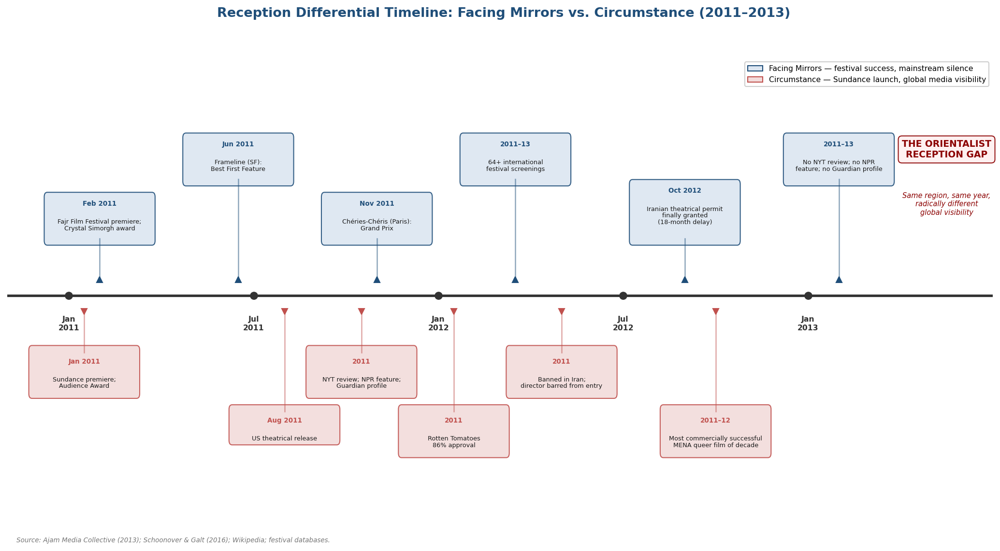

*Figure 1. Parallel festival trajectories, awards, and media coverage of *Facing Mirrors* and *Circumstance* between 2011 and 2013, illustrating the orientalist reception gap.*

The Ajam Media Collective's analysis identified the mechanism: *Circumstance* conforms to what the collective termed "the Western Orientalist imagination" — presenting Iranian women as victims of Islamic repression whose desire for Western modernity is frustrated by patriarchal religious authority. *Facing Mirrors*, by contrast, "subverts and challenges hegemonic Orientalizing narratives about sexual and gender minorities in Iran" — presenting a trans male protagonist who wins a state film prize, screens at a Qom seminary, and reaches Germany only to find affective depletion rather than liberation [Ajam Media Collective, 2013](https://ajammc.com/2013/05/11/queer-and-trans-subjects-in-iranian-cinema-between-representation-agency-and-orientalist-fantasies/ "Differential reception as evidence of Orientalist cultural power"). The differential reception thus functions as evidence of what Jasbir Puar theorized as homonationalism — the incorporation of certain queer narratives into Western civilizational self-congratulation, in which the display of Muslim sexual repression serves to confirm Western modernity's superiority [Puar, *Terrorist Assemblages*, Duke University Press, 2007](https://en.wikipedia.org/wiki/Homonationalism "Puar's homonationalism concept"). Trans narratives that resist this incorporation — that present Iran as complex, that refuse the liberation-through-exile arc, that depict the West as affectively depleted — are systematically filtered out by the transnational cultural economy.

This finding carries methodological consequences for the study of MENA trans cinema. The films that achieve the widest global circulation are not necessarily representative of the field; they are the films that have passed through the orientalist filter. The archive of MENA trans cinema — the films that scholars can access, cite, and analyse — is itself shaped by the differential reception dynamics documented above. Any critical framework for MENA trans cinema must therefore account for the constitutive role of reception in determining which trans narratives exist as objects of analysis.

## Comparative Synthesis: Three Models of Trans Cinematic Subjectivity

The three films analysed in this chapter instantiate three distinct models of transgender or gender-nonconforming cinematic subjectivity, each aligned with different theoretical frameworks and producing different spectatorial positions.

*Facing Mirrors* constructs trans subjectivity through **embodied narrativity** — the Prosserian register of bodily suffering, medical-legal process, and the storied journey from illegibility to contingent legibility. Its formal strategies — the road movie structure, the claustrophobic taxi interior, the misrecognition of the opening sequences, the affectively depleted exile — align with Naficy's accented cinema framework and Halberstam's transgender look, while the regulatory constraints of Iranian censorship produce a film that, as O'Dell argued, operates within the gender binary even as its formal ambiguities introduce productive fractures.

*Lola und Bilidikid* constructs gender nonconformity through **performative theatricality** — the Butlerian register of stylized repetition, drag performance, and the refusal of bodily truth claims. Its formal strategies — the cabaret stage, the fairy-tale monologue, the spatially overdetermined Berlin locations — align with Garber's category crisis and Serano's transmisogyny, while Mennel's and Baer's intersectional analyses demonstrate that gender performance is inseparable from the racialized and classed conditions of Turkish-German diasporic life. The film's refusal to resolve Lola's gender into a stable category constitutes its most radical gesture — and the one most directly aligned with the "queer theory" pole of the theoretical spectrum established in Chapter 2.

*Circumstance* constructs gender regulation as **structural apparatus** — a system that constrains all gendered subjects, including those whose gender identities fall within normative parameters. Its formal strategies — the eroticized slow motion, the fashion-photography visual register, the legible narrative of prohibition and desire — align with Mulvey's gaze theory in its geopolitical extension, hooks's critique of scopophilic economies, and Massad's analysis of the "Gay International." The film's analytical value lies less in its representation of gender nonconformity per se than in its demonstration of how orientalist reception dynamics shape which MENA gender narratives achieve global visibility.

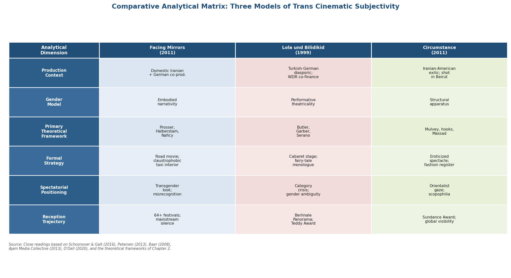

*Figure 2. Structured comparison of the three films across six analytical dimensions — production context, gender model, primary theoretical framework, formal strategy, spectatorial positioning, and reception trajectory.*

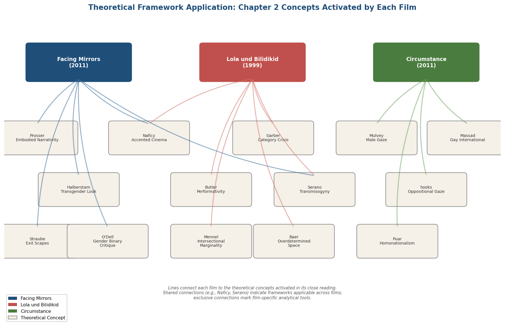

*Figure 3. Mapping of theoretical concepts from Chapter 2 activated by each film. Shared connections (e.g., Naficy's accented cinema) bridge multiple films, while exclusive connections indicate film-specific analytical tools.*

Together, the three readings demonstrate that no single theoretical framework is adequate to the heterogeneity of MENA transgender cinema. The embodied narrativity that illuminates *Facing Mirrors* cannot account for the performative excess of *Lola und Bilidikid*; the performativity framework that illuminates Lola's gender theatricality cannot grasp Eddie's somatic suffering; the gaze theory that reveals *Circumstance*'s orientalist economy cannot address the internal dynamics of films that are not structured for Western consumption. The theoretical framework developed in Chapter 2 must therefore be deployed not as a unified grid but as a toolkit — an assemblage of analytical resources selectively activated by the demands of specific films, specific regulatory contexts, and specific circuits of transnational circulation.

# 第5章 Documentary and Non-Fiction — Witnessing Trans Lives Beyond Narrative Fiction

The feature films analyzed in the preceding chapter constructed transgender subjectivities through narrative strategies — road-movie structures, spectatorial misrecognition, performative stagings of gender. Documentary film operates under a fundamentally different representational contract. Where fiction negotiates the tension between allegory and embodiment, documentary advances a truth claim about the profilmic real: it asserts, however provisionally, that the bodies, voices, and spaces before the camera exist in the historical world and that the film bears an indexical relationship to their lived experience. When the subjects of that truth claim are transgender persons living under regimes that criminalize or pathologize their existence, the documentary form's promise of witness becomes entangled with questions of exposure, consent, and complicity.

This chapter examines four documentary and non-fiction works that occupy distinct positions along this axis of risk and revelation: *Be Like Others* (2008, dir. Tanaz Eshaghian), *Cinema Fouad* (1993, dir. Mohamed Soueid), *The Belle from Gaza* (2024, dir. Yolande Zauberman), and *The Great Safae* (2014, dir. Randa Maroufi). A fifth work, the short documentary *Aleya* (2024, dir. Omar Abogabal), is considered as an index of generational change. Together, these films illuminate how the non-fiction mode both enables and constrains the representation of MENA trans lives — and how the formal choices of documentary filmmakers encode, whether deliberately or not, the power asymmetries that structure the encounter between camera and subject.

The theoretical framework for this chapter draws on two complementary traditions. From documentary theory, Bill Nichols's taxonomy of documentary modes — expository, observational, participatory, reflexive, performative, and poetic — provides the initial descriptive apparatus, while Stella Bruzzi's challenge to Nichols in *New Documentary* supplies the corrective. Bruzzi argued that "documentaries are performative acts, inherently fluid and unstable and informed by issues of performance and performativity," rejecting the premise that non-fiction film aspires toward unmediated capture of reality and proposing instead that truth "comes into being only at the moment of filming" [Bruzzi, *New Documentary*](https://www.taylorfrancis.com/books/mono/10.4324/9780203967386/new-documentary-stella-bruzzi "Routledge, 2nd ed. 2006"). Trinh T. Minh-ha's concept of "speaking nearby" — articulated in *Reassemblage* (1982) and elaborated in a 1992 interview with Nancy N. Chen — offers a crucial ethical vocabulary: "a speaking that does not objectify, does not point to an object as if it is distant from the speaking subject or absent from the speaking place. A speaking that reflects on itself and can come very close to a subject without, however, seizing or claiming it" [Chen & Trinh, "Speaking Nearby," *Visual Anthropology Review* 8(1), 1992](https://www.situatedecologies.net/wp-content/uploads/Trinh-Speaking-Nearby-1983.pdf "VAR, Spring 1992, pp. 82–91").

From trans media studies, Sam Feder's *Disclosure: Trans Lives on Screen* (Netflix, 2020) furnishes the concept of the "visibility trap" — the paradox that increased screen representation of transgender persons does not automatically translate into improved material conditions and may, in fact, intensify surveillance and backlash. As Feder stated: "Disclosure was arguing that visibility is not always good, and it's not always helpful for the ones on the streets" [Feder, interview](https://beyondthecineramadome.com/interviews/sam-feder-heightened-scrutiny-interview "Beyond the Cinerama Dome, 2024"). In the MENA context, where visibility can invite state violence, this trap is not metaphorical but literal.

## *Be Like Others*: Participatory Documentary and the Coercion of Legibility

### Production Context and Transnational Circulation

*Be Like Others* (2008) remains the most internationally visible documentary addressing transgender experience in Iran. Directed by Tanaz Eshaghian — born in Iran in 1974, emigrated to the United States after the Revolution, educated at Brown University in semiotics — the film occupies a characteristic position in the corpus of MENA trans cinema: it is the work of a diasporic filmmaker who returned to the country of origin for the first time in twenty-five years to document a phenomenon rendered legible by the collision between Islamic jurisprudence and state biopolitics [ITVS, *Be Like Others*](https://itvs.org/films/be-like-others/ "Director biography and Emmy nomination"). The film follows patients at the Tehran clinic of Dr. Mir-Jalali, a surgeon who performs sex reassignment surgeries under the legal framework authorized by Ayatollah Khomeini's fatwa. It premiered at the 2008 Sundance Film Festival, receiving a Grand Jury Prize nomination, and subsequently won three Teddy Awards at the 2008 Berlin International Film Festival — the Allianz International Film Award special mention, the *Siegessäule* Readers' Jury Award, and the Jury Award. The BBC broadcast it under the title *Transsexual in Iran*; HBO later acquired U.S. distribution rights [Wikipedia, *Be Like Others*](https://en.wikipedia.org/wiki/Be_Like_Others "Complete festival and award history").

This festival-to-broadcast trajectory — Sundance to Berlin to BBC to HBO — is paradigmatic of how MENA trans documentaries reach audiences. Domestic Iranian exhibition was effectively impossible; the film's primary viewers were Western festival-goers, television audiences, and university classrooms. The circuit itself encodes the geopolitics of trans visibility: the Iranian state authorizes SRS but would not permit a documentary exposing the coercive dimensions of that authorization to circulate domestically.

### Documentary Mode and Formal Strategy

Eshaghian's film operates primarily within what Nichols classified as the participatory mode: the filmmaker is present as interlocutor, guiding conversations, accompanying subjects to medical appointments, and occasionally visible in the frame. The participatory mode's defining feature — that "the filmmaker's engagement with his or her subjects alters the event" — carries particular charge here, where the filmmaker's diasporic Iranian-American identity places her simultaneously inside and outside the community she documents. She is neither a Western outsider performing ethnographic extraction nor a domestic insider constrained by the same regulatory apparatus as her subjects. This intermediate positionality — what Hamid Naficy might classify as a diasporic filmmaker whose relationship to the homeland is mediated through absence and return — shapes both what the film can show and how its subjects address the camera [Naficy, *An Accented Cinema*](https://www.jstor.org/stable/27933844 "Princeton University Press, 2001").

Alongside the participatory framework, the film deploys observational elements — extended sequences in the clinic waiting room, footage of post-operative domestic life — and expository features, notably the opening title cards that establish the film's political coordinates: "In the Islamic Republic of Iran, sex-change operations are legal" / "Homosexuality is punishable by death." These two sentences, presented without commentary, compress the paradox that structures the entire film and, indeed, the entire field of Iranian trans politics as documented by Afsaneh Najmabadi in *Professing Selves* [Najmabadi, *Professing Selves*](https://www.jstor.org/stable/j.ctv11vc8md "Duke University Press, 2014, via JSTOR").

### The Coercion Problem: Testimony and Its Limits

The film's most analytically significant contribution lies in its documentation of what might be termed coerced legibility — the process by which Iran's juridical-medical apparatus channels gender nonconformity into the single permissible category of transsexuality, regardless of whether the individual's self-understanding aligns with that category. Subjects in the film disclose, often in moments of apparent spontaneity, that they would not have pursued surgery absent the state's binary enforcement. One participant states in the closing moments: "If not in Iran, we would not have the operation." Another identifies "society" as the agent compelling surgical intervention [IranNamag, "Queering the Iranian Nation"](https://www.irannamag.com/en/article/queering-iranian-nation-like-others-resistance-heteronormative-nationalism/ "Detailed analysis of coercion dynamics and subject statements").

The scholarly analysis published in *IranNamag* situated these testimonies within a broader historical framework, reading the film against the grain of post-1979 nation-building. Drawing on Najmabadi, Benedict Anderson, and Foucault, the analysis argued that *Be Like Others* "complicates the heteronormative narrative of post-1979 nation-building" by exposing how the Islamic Republic's simultaneous authorization of SRS and criminalization of homosexuality functions not as progressive gender policy but as a technology of normalization — one that forces gender-nonconforming Iranians into "two mutually exclusive options, both of which endanger their health and safety" [Outright International, *Being Transgender in Iran*](https://outrightinternational.org/sites/default/files/2022-10/OutRightTransReport.pdf "Human rights report, 2016, pp. 6–10").

This dynamic directly engages Julia Serano's theorization of transmisogyny. Clinic patients who present as feminine males face a regulatory apparatus that reads their femininity as evidence of an "inner female" requiring surgical correction — a reading that simultaneously pathologizes male femininity and instrumentalizes medical transition. Serano's "double bind" model, in which transfeminine persons are punished both for being male-assigned persons who express femininity and for being trans women who are never fully accepted as women, operates in the Iranian context with the additional coercive force of state compulsion [Serano, *Whipping Girl*](https://juliaserano.medium.com/what-is-transmisogyny-4de92002caf6 "2021 elaboration of the transmisogyny concept").

### Against Orientalism: The Film's Structural Refusals

A significant critical thread in the film's reception concerns its relationship to orientalist viewing practices. A *Reverse Shot* review argued that *Be Like Others* avoids the orientalist trap by situating Iran's SRS regime within a global history of gender nonconformity's pathologization rather than presenting it as a uniquely Islamic aberration: "It does not present Iran as atemporal, outside of history, or hopelessly backward" [Reverse Shot](https://reverseshot.org/symposiums/entry/167/be_others "Anti-orientalist analysis"). The same reviewer praised Eshaghian's refusal "to play into American popular discourse — those that appropriate stories of Iranian social inequality to justify our hostility, even military action" — a direct invocation of the homonationalist dynamic theorized by Jasbir Puar in *Terrorist Assemblages* (Duke University Press, 2007), in which queer and trans suffering in Muslim-majority countries is consumed as evidence of civilizational backwardness [Wikipedia, "Homonationalism"](https://en.wikipedia.org/wiki/Homonationalism "Puar 2007, 2013 core arguments").

The film achieves this refusal through formal as well as thematic means. Eshaghian does not provide a Western expert voiceover contextualizing Iranian law for a presumed ignorant audience; instead, the juridical framework emerges through the subjects' own accounts and through the institutional spaces — the clinic, the courtroom, the forensic medicine office — in which they navigate the state apparatus. The *IranNamag* analysis credited the film with demonstrating that Iranian homophobia "is not a unique Islamic phenomenon but is rooted in the modernity project influenced by nineteenth-century Europe" — a finding that directly resonates with the colonial genealogies of anti-sodomy legislation traced in Chapter 3 [IranNamag](https://www.irannamag.com/en/article/queering-iranian-nation-like-others-resistance-heteronormative-nationalism/ "Historical framing of Iranian homophobia").

### The Ethics of Proximity: *Be Like Others* and the "Speaking Nearby" Problem

Despite these structural refusals of orientalism, the film's participatory mode raises its own ethical questions — questions best approached through Trinh T. Minh-ha's distinction between "speaking about" and "speaking nearby." Trinh defined the latter as "a speaking that reflects on itself and can come very close to a subject without, however, seizing or claiming it" — a form of indirectness whose "closures are only moments of transition opening up to other possible moments of transition" [Chen & Trinh, *Visual Anthropology Review* 8(1), 1992](https://www.situatedecologies.net/wp-content/uploads/Trinh-Speaking-Nearby-1983.pdf "VAR, Spring 1992"). Eshaghian's film does not fully achieve this "speaking nearby." It retains a fundamentally explanatory impulse, organizing its subjects' testimonies into a legible argument about the Iranian state's instrumentalization of transsexuality. The opening title cards, the narrative arc from pre-operative aspiration through surgery to post-operative disillusionment, and the closing confessions of coercion all construct a coherent thesis — one that, however sympathetically rendered, ultimately speaks *about* Iranian trans experience rather than *nearby* it.

This is not necessarily a failure. The participatory mode's truth claims — its assertion that the filmmaker's engagement with subjects produces knowledge unavailable to the detached observer — carry their own epistemological value. Yet the distinction between speaking about and speaking nearby becomes critical when considering the subjects' vulnerability. The individuals who appear on camera, faces visible and names disclosed, exist within a state apparatus that authorizes their surgical transition while surveilling and constraining their social existence. The film's international circulation, while invisible within Iran, is not invisible to the Iranian state — and the gap between the filmmaker's freedom to return to the United States and the subjects' continuing constraint within Iran is a structural asymmetry that the participatory mode cannot resolve.

## *Cinema Fouad*: The Earliest Arab Trans Documentary and the Poetics of Intimacy

### A Pioneering Work in Context

*Cinema Fouad* (1993, dir. Mohamed Soueid, Lebanon, 41 minutes) predates *Be Like Others* by fifteen years and may constitute the earliest Arabic-language documentary to center a transgender subject. The film constructs an intimate portrait of Khaled El Kurdi, a Syrian trans woman living in Beirut, who sustains herself through domestic labor and belly dancing. The camera follows her through the rituals of daily life — dressing, applying makeup, dancing alone in her bedroom — while she narrates memories of her Palestinian fighter lover's death in the Lebanese Civil War. The film's cultural significance is such that it provided the name for Beirut's first queer film festival, Cinema al Fouad, organized by the Lebanese LGBT organization Helem [AFMI, "Queer Arab Films to Watch During Pride Month"](https://arabfilminstitute.org/queer-arab-films-to-watch-during-pride-month/ "Cinema Fouad entry and festival naming source").

Soueid, a Lebanese filmmaker known for his personal essay-documentary practice and his documentation of Beirut's post-war cultural landscape, brings a distinctly different sensibility to the trans subject than Eshaghian's explanatory-participatory approach. Where *Be Like Others* constructs its subjects primarily as case studies within a juridical-medical apparatus, *Cinema Fouad* presents El Kurdi as a person whose gender identity is one dimension of a complex selfhood defined equally by displacement (a Syrian in Lebanon), bereavement (the dead lover), labor (the gendered economics of domestic work and dance), and memory (the civil war as backdrop to personal history).

### Observational and Poetic Modes

The formal register of *Cinema Fouad* is best described through the intersection of two of Nichols's modes: the observational and the poetic. Observationally, the film offers extended, uninterrupted sequences of domestic routine — sequences that foreground the quotidian rather than the spectacular, the mundane textures of trans life rather than the crisis points (surgery, confrontation, flight) that typically organize narrative representations of transgender subjects. Poetically, the film deploys associative editing, non-linear temporal structures, and a foregrounding of El Kurdi's own reflective monologue that resists the explanatory logic of expository or participatory documentary.

This combination of modes aligns the film more closely with Trinh T. Minh-ha's "speaking nearby" ethic than *Be Like Others* achieves. The camera does not interrogate El Kurdi; it accompanies her. There is no thesis about the Lebanese state's regulation of gender — no equivalent to Eshaghian's opening title cards. The political is present, but it arrives through the biographical rather than the juridical: El Kurdi's displacement, her lover's death in a militia conflict, and her economic marginality are all effects of the Lebanese Civil War's restructuring of social relations. Gender nonconformity in *Cinema Fouad* is not extracted from these conditions and presented as a discrete analytical object; it is woven into the fabric of a life shaped by multiple, intersecting forms of precarity.

The film's brevity (41 minutes) and its predominantly art-institutional circulation — it has screened at Documenta 14, through Bidoun magazine projects, and at the Guggenheim — distinguish it from the festival-to-broadcast trajectory of *Be Like Others*. This circulation pattern places *Cinema Fouad* within what Naficy termed the "interstitial mode of production," characterized by "artisanal, collective, and guerrilla" production practices and distribution through cultural institutions rather than commercial channels [Naficy, *An Accented Cinema*](https://www.jstor.org/stable/27933844 "Princeton University Press, 2001"). The art-world framing confers a different kind of legibility than the human-rights framing of *Be Like Others*: El Kurdi is positioned less as a victim of state apparatus than as a subject of aesthetic and affective interest — a positioning that carries its own risks of aestheticization but also opens space for a less instrumentalizing encounter with trans subjectivity.

### Bruzzi's Performative Documentary and the Trans Subject

Stella Bruzzi's challenge to Nichols's modal taxonomy is particularly illuminating for *Cinema Fouad*. Bruzzi argued that all documentaries are "performative acts, inherently fluid and unstable," and that truth in documentary "comes into being only at the moment of filming" [Bruzzi, *New Documentary*](https://www.taylorfrancis.com/books/mono/10.4324/9780203967386/new-documentary-stella-bruzzi "Routledge, 2nd ed. 2006"). This thesis acquires specific resonance when the documentary subject is a trans woman whose daily life already involves what might be called a double performativity: the social performance of gender that Judith Butler theorized as constitutive of all gendered existence, and the documentary performance of selfhood before the camera.

El Kurdi's makeup ritual, filmed in her bedroom mirror, stages this intersection with particular clarity. The camera observes a subject who is simultaneously performing femininity for herself (the private act of becoming), performing femininity for Soueid's camera (the documentary act of being seen), and — at a further remove — performing trans femininity for the eventual audience (the circulatory act of being known). Bruzzi's insistence that the "moment of filming" is where documentary truth is produced, rather than in some pre-existing reality that the camera merely records, is directly applicable: what the film captures is not a pre-given trans identity but the emergence of a gendered selfhood in and through the encounter with the camera.

## *The Belle from Gaza*: The Absent Subject and the Ethics of Search

### Cannes, Conflict, and the Problem of Findability

*The Belle from Gaza* (2024, dir. Yolande Zauberman, France, premiered at the 77th Cannes Film Festival) occupies a radically different position in the field of MENA trans documentary. The film documents the director's nearly five-year search for a trans woman who reportedly walked from Gaza to Tel Aviv. The titular figure is never found; in her absence, other Palestinian trans women living in Tel Aviv come into the foreground, offering testimonies of displacement, transition, and precarious residence in a city whose publicized gay-friendliness — what Puar termed "pinkwashing" — coexists with the structural violence of occupation and the particular vulnerabilities of Palestinian trans subjects [The Guardian, "Yolande Zauberman Documentary"](https://www.theguardian.com/film/article/2024/may/16/yolande-zauberman-documentary-the-belle-from-gaza-cannes-film-festival "Cannes premiere and director's ethical reflections").

Zauberman, a cisgender French filmmaker, produced the film across a period that culminated in the October 7, 2023 attacks and their aftermath. She reportedly considered shelving the project entirely, ultimately deciding to proceed with the Cannes screening. This decision foregrounds the question of whether Palestinian trans stories can be told without being instrumentalized by geopolitical narratives — a question the film cannot fully answer but has the merit of posing explicitly.

### The Structure of Absence

The film's most distinctive formal feature is its organization around an absence. The subject of the search — the trans woman from Gaza — is never located, never filmed, never given the opportunity to speak for herself. The film thus constructs a documentary around its own constitutive failure: the impossibility of witness, the limits of the camera's reach, the conditions under which certain trans lives remain undocumentable. This structure of absence resonates with Trinh T. Minh-ha's ethic in a way that the explicit address of *Be Like Others* does not. By failing to find its subject, *The Belle from Gaza* inadvertently practices a form of "speaking nearby" — circling around a presence it cannot confirm, speaking in the vicinity of a life it cannot capture. Whether this constitutes an ethical achievement or merely a failure dressed in formal sophistication is a question the film leaves productively open.

Zauberman's explicit reflection on the ethics of her own search — her acknowledgment that finding the titular figure might be "too dangerous for her" — introduces a dimension largely absent from *Be Like Others*: the filmmaker's recognition that the documentary act itself may constitute a form of violence. The visibility trap theorized by Feder is here literalized: to be found, to be filmed, to be made visible as a Palestinian trans woman who crossed from Gaza to Israel, is to be placed at risk from multiple directions simultaneously — Palestinian social structures that may punish gender nonconformity, the Israeli state apparatus that may detain or deport, and the international media economy that may consume the resulting narrative as exotic spectacle.

### Nichols's Modes and Their Dissolution

*The Belle from Gaza* resists classification within any single Nicholsian mode. It begins as a participatory documentary — the filmmaker as active investigator, seeking a subject — but the failure of the search transforms it into something closer to the reflexive mode, in which the process of documentation itself becomes the subject. The testimonies of the Palestinian trans women who do appear partake of both participatory and observational registers, while the film's overall meditation on absence, impossibility, and the geopolitics of visibility gestures toward the poetic. This modal instability confirms Bruzzi's critique: the "family tree" of documentary modes, with its implied developmental progression, cannot accommodate a film whose formal identity is constituted by the collapse of its founding premise. The documentary truth of *The Belle from Gaza* is not the information it conveys about Palestinian trans lives — though that information is valuable — but the structural revelation that certain trans lives exist beyond the reach of documentary witness.

The following matrix maps each of the four principal films against Nichols's six-mode taxonomy, illustrating the modal diversity across the corpus and the inadequacy of any single classification.

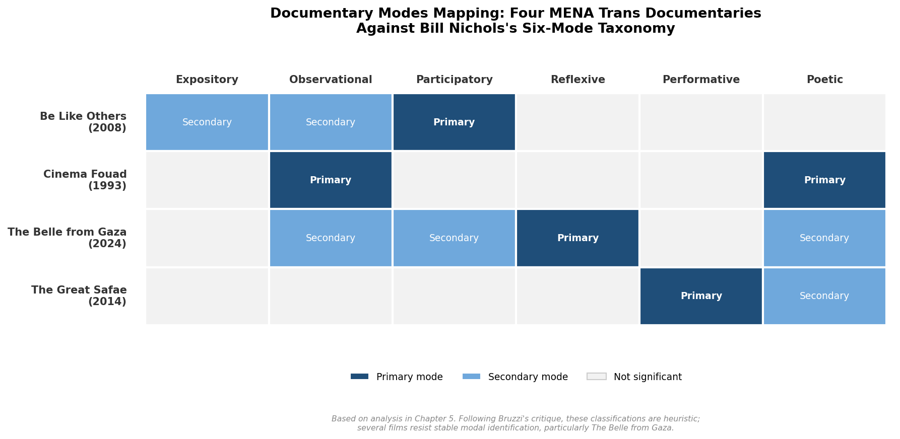

*Figure 5.1. Documentary mode classification for the four principal MENA trans documentaries analyzed in this chapter. Following Bruzzi's critique, these classifications are heuristic rather than definitive; several films — particularly* The Belle from Gaza *— resist stable modal identification.*

## Experimental Non-Fiction: *The Great Safae* and the Dissolution of the Fiction/Documentary Boundary

### Reconstruction, Memory, and Domestic Space

*The Great Safae* (2014, dir. Randa Maroufi, France/Morocco, 16 minutes) introduces a further complication into the documentary field by operating at the boundary between fiction and non-fiction. Inspired by a real trans woman who worked as a domestic laborer in the director's family home in Morocco, the film reconstructs her presence through reenactment, poetic imagery, and fragmented family testimonies. The result deliberately refuses to stabilize its own generic identity: it is too grounded in biographical actuality to qualify as pure fiction, yet too invested in poetic construction and dramatic reenactment to satisfy documentary's indexical truth claims. The film screened at the BBC Arabic Film Festival (2015/2017) and Queer Lisboa 19, circulating through queer and Arab cinema programming rather than mainstream documentary channels [AFMI, "Queer Arab Films"](https://arabfilminstitute.org/queer-arab-films-to-watch-during-pride-month/ "The Great Safae entry").

Maroufi's formal strategy — the use of reconstruction rather than direct testimony — responds to a practical impossibility: the trans woman who inspired the film is not available as a documentary subject. Her absence from the film, unlike the absence of the titular figure in *The Belle from Gaza*, is not narrativized as a failed search but accepted as a given condition. The film does not seek her; it remembers her — or more precisely, it stages the family's fragmented, contradictory acts of remembering. This approach places *The Great Safae* within what Nichols categorized as the performative mode, in which "the experiential and the subjective dimensions of knowledge and experience" take precedence over the referential, and in which the filmmaker's own relationship to the subject is foregrounded as constitutive of the film's meaning.

The domestic space — the Moroccan family home — functions as the primary site of gender's regulation and transgression. The trans woman occupied the structurally ambiguous position of domestic laborer: present within the family's most intimate spaces yet excluded from the family itself, visible in her daily labor yet invisible in her gender identity. This spatial logic of simultaneous presence and erasure recalls Viviane Namaste's theorization of transgender "institutional erasure" — the processes by which trans persons are rendered invisible not through spectacular violence but through the mundane operations of social institutions [Namaste, *Invisible Lives*](https://press.uchicago.edu/ucp/books/book/chicago/I/bo3683192.html "University of Chicago Press, 2000"). The family's fragmented testimonies reproduce this erasure even as they ostensibly commemorate: what they recall is not the trans woman's selfhood but her labor, her strangeness, her departure — the traces she left in a domestic order that could accommodate her body but not her identity.

### A Newest Generation: *Aleya* and the Diasporic Short

*Aleya* (2024, dir. Omar Abogabal, Egypt/Germany, 10 minutes), which screened at the MENA Film Festival in 2026, represents the most recent stratum of MENA trans documentary production. The film follows a Cairo-born trans woman rebuilding her life in Berlin after transition, placing it squarely within the diasporic trajectory that structures much of this corpus. Its brevity and festival-circuit distribution — outside both Egyptian domestic exhibition and mainstream Western broadcast — position it as an instance of Naficy's "interstitial" mode of production: small-scale, often self-funded or supported through micro-grants, and dependent on the cultural infrastructure of queer diasporic networks for circulation [MENA Film Festival, *Aleya*](https://www.menafilmfestival.com/films/aleya "MENA Film Festival entry").

The emergence of works like *Aleya* suggests a generational shift in MENA trans documentary: from the explanatory, institution-focused mode of *Be Like Others* (centered on the clinic, the state, the juridical apparatus) toward a more intimate, subject-centered practice in which the trans filmmaker or subject exercises greater control over the terms of representation. Whether this shift constitutes a genuine redistribution of representational authority or merely reconfigures the same asymmetries within a smaller-scale format remains an open question — one that the following section's analysis of structural patterns helps to frame.

## Structural Patterns: The Festival as Distribution, the NGO as Frame

### Festival Circuits as Primary Exhibition

The four principal documentaries examined in this chapter share a structural feature: none achieved conventional domestic theatrical release in the country of its subject matter. *Be Like Others* was exhibited at Sundance, Berlin, Frameline, and through BBC/HBO broadcast — never in Iranian cinemas. *Cinema Fouad* circulated through art institutions and cultural organizations — Documenta 14, Bidoun, the Guggenheim — rather than Lebanese commercial venues. *The Belle from Gaza* premiered at Cannes. *The Great Safae* moved through queer and Arab film festival programming. For MENA trans documentary, the international film festival is not a supplement to domestic distribution but its functional replacement.

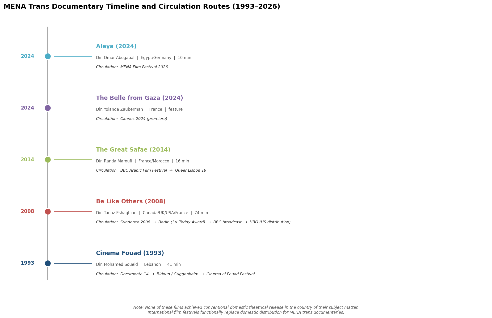

*Figure 5.2. Chronological timeline of the five MENA trans documentaries analyzed in this chapter, with festival and institutional circulation routes annotated. None achieved domestic theatrical release in the country of their subject matter; international film festivals functionally replace domestic distribution.*

This pattern, identified in Chapter 4 with respect to feature films, intensifies in the documentary context. Marijke de Valck's analysis of film festivals as "sites of cultural legitimation" that "occupy nodal roles" as "gatekeepers and taste-makers" applies with particular force: the festival determines not only which MENA trans documentaries are seen but the interpretive frameworks within which they are received [de Valck, film festival research](https://www.researchgate.net/profile/Marijke-De-Valck/publication/313742575 "Film festivals as gatekeepers"). A film that premieres at Sundance is positioned within a human-rights discourse; one that premieres at Documenta is positioned within contemporary art discourse; one that premieres at Cannes is positioned within auteurist cinema discourse. These framings are not neutral — they shape audience expectations, critical vocabulary, and the kinds of questions asked of the film.

### Funding Structures and Narrative Shaping

The funding ecology of MENA trans documentary further reinforces the structural dependence on Western institutional frameworks. *Be Like Others* was a Canada/UK/USA/France co-production; *The Belle from Gaza* was French-produced with Arte involvement; *The Great Safae* was a France/Morocco co-production. The pattern identified in Chapter 6 — that no film in the corpus of MENA trans cinema has been funded entirely by MENA-based sources — holds equally for documentary. Western funding bodies — the Sundance Institute, Ford Foundation, European public broadcasters, and national arts councils — create structural incentives for MENA trans documentaries to adopt frameworks legible to Western audiences. The human-rights narrative (trans persons as victims of state oppression requiring international solidarity) and the ethnographic narrative (trans persons as bearers of cultural difference requiring Western interpretation) are the two most readily available templates. The receipt by *Be Like Others* of the Allianz International Film Award — sponsored by a financial corporation and explicitly linked to human-rights advocacy — directly illustrates this dynamic.

The concept formulated by Shahram Malaklou proves instructive: Iranians "narrating their non-normative gender and sexuality in documentary" seek "not recognition of their non-normative gender and sex but recognition of their modern human type — from the gatekeepers of Empire" [IranNamag](https://www.irannamag.com/en/article/queering-iranian-nation-like-others-resistance-heteronormative-nationalism/ "Malaklou's concept of imperial recognition"). The documentary form, with its truth claims and its indexical relationship to the profilmic real, intensifies this dynamic: the trans subject who appears before the documentary camera offers not a performance (as in fiction film) but a testimony, and that testimony is addressed, structurally if not intentionally, to an audience that holds the power to confer or withhold recognition.

### The Absence of Trans Filmmakers

A critical structural feature of the MENA trans documentary corpus is the absence of trans-identified filmmakers in directorial roles. Eshaghian is a cisgender Iranian-American; Zauberman is a cisgender French woman; Soueid's gender identity has not been publicly marked as transgender; Maroufi is a cisgender Moroccan-French artist. This pattern reproduces, within the MENA context, the dynamic that Feder's *Disclosure* identified in Hollywood: cisgender filmmakers control the means of representing trans lives, while trans persons themselves occupy the position of subject rather than author.

The implications extend beyond individual representation to structural questions of epistemic authority. When a cisgender filmmaker decides which trans testimonies to include, how to edit them, and within what narrative framework to situate them, the resulting documentary inevitably reflects the filmmaker's understanding of trans experience — an understanding shaped by positionality, relationship to funding bodies, and the expectations of the festival circuits through which the film will travel. The "speaking nearby" that Trinh T. Minh-ha theorized as an ethical alternative to "speaking about" may be structurally unavailable when the filmmaker does not share the subject's embodied experience of gender nonconformity. This is not to argue that only trans filmmakers can ethically represent trans lives — a position that would render most of the existing MENA trans documentary corpus illegitimate — but to identify a structural condition that shapes the field and that future practice must address.

The emergence of works like *Aleya*, whose production context suggests closer alignment between the trans subject's self-understanding and the film's representational choices, may signal the beginning of a shift. Whether that shift can be sustained within existing funding and festival structures — structures that have historically privileged cisgender auteurs and Western institutional frameworks — remains to be determined.

# 第6章 Diaspora, Transnationalism, and the Politics of Location

The close readings of Chapters 4 and 5 repeatedly encountered a structural condition that exceeds the scope of textual analysis: nearly every film in the corpus of MENA transgender cinema was produced, financed, or primarily circulated outside the territorial boundaries of the state whose gender order it represents. *Facing Mirrors* was co-produced with German partners and screened at over sixty-four international festivals before receiving a delayed Iranian theatrical permit. *Lola und Bilidikid* was made in Berlin because its subject matter could not find institutional support in Turkey. *Circumstance* was filmed in Beirut with a fake script submitted to Lebanese authorities, directed by an Iranian-American filmmaker who has since been barred from entering Iran. *Be Like Others* was a Canada/UK/USA/France co-production whose director returned to Iran for the first time in twenty-five years. *The Belle from Gaza* was a French production backed by Arte that premiered at Cannes. Not a single film in this study's corpus has been funded entirely by MENA-based sources.

This chapter examines the structural conditions that produce this pattern and the theoretical frameworks that illuminate its consequences. It argues that MENA transgender cinema is constitutively transnational — not merely in the descriptive sense that its production crosses borders, but in the analytical sense that the meaning, form, and political valence of these films are fundamentally shaped by the dynamics of displacement, diasporic positioning, festival gatekeeping, and the unequal geopolitics of cultural circulation. The chapter draws principally on Hamid Naficy's theorization of "accented cinema," Gayatri Gopinath's concept of "impossible desires" in queer diaspora, and Jasbir Puar's critique of homonationalism, while engaging the film festival studies of Marijke de Valck and Dina Iordanova to trace the institutional mechanisms through which MENA trans films reach their audiences. Together, these frameworks reveal that the "politics of location" — the question of where a film is made, by whom, for whom, and under what conditions — is not a contextual supplement to the analysis of MENA transgender cinema but its constitutive problematic.

## Accented Cinema and the Transgender Supplement

### Naficy's Typology: Exile, Diaspora, and Ethnic Identity Filmmakers

Hamid Naficy's *An Accented Cinema: Exilic and Diasporic Filmmaking* (Princeton University Press, 2001) remains the foundational theoretical account of filmmaking from positions of displacement. Naficy defined the cinematic "accent" as deriving not solely from the spoken language of characters but from "the filmmakers' displacement and their artisanal mode of production" — a displacement that marks their work against the presumptively "universal" and "unaccented" cinema of dominant industries [Naficy, *An Accented Cinema*, Chapter 1](https://api.pageplace.de/preview/DT0400.9780691186214_A33704991/preview-9780691186214_A33704991.pdf "Princeton University Press, pp. 3–22"). His empirical survey identified 321 filmmakers from sixteen "sending countries" working in twenty-seven "receiving countries," producing at least 920 films. Iranian filmmakers were the single largest group (307 films), followed by Armenian (235) and Algerian (107) filmmakers — a distribution that reflects the geopolitical upheavals of the twentieth century and, not coincidentally, maps onto the national origins of many filmmakers in the MENA trans cinema corpus [Naficy, pp. 10–17](https://api.pageplace.de/preview/DT0400.9780691186214_A33704991/preview-9780691186214_A33704991.pdf "Quantitative survey of accented filmmakers").

Naficy's tripartite typology distinguished among three categories of accented filmmaker. *Exilic filmmakers* maintain a primary orientation toward the homeland; their films are "dominated by the there and then of the homeland." *Diasporic filmmakers* sustain both "vertical" ties to the country of origin and "horizontal" connections to dispersed communities, producing films that are "more fully saturated by the multiplicity and performativity of identity" than those of their exilic counterparts. *Postcolonial ethnic and identity filmmakers* focus on the "here and now" of life in the host country, engaging questions of racial, ethnic, and cultural identity within the receiving society. Crucially, these categories are not rigid: filmmakers may migrate between them across a career, and individual films may exhibit characteristics of more than one type [Naficy, pp. 10–17](https://api.pageplace.de/preview/DT0400.9780691186214_A33704991/preview-9780691186214_A33704991.pdf "Three types of accented filmmakers").

### Formal Categories of the Accented Mode

Naficy identified a constellation of formal features that recur across accented cinema regardless of national origin. *Epistolarity* — the use of letters, phone calls, voice-over address, and other communicative forms that register distance and absence — arises because "exile and epistolarity need each other, as distance and absence drive them both." *Claustrophobic space* — the confined interior, the cramped dwelling, the prison cell, the vehicle — expresses the constriction of exilic existence and the spatial compression of lives lived in transit. *Tactile optics* — a haptic rather than optical visuality, emphasizing surface, texture, and proximity — encodes the embodied experience of dislocation. *Border chronotopes* — borders, tunnels, airports, seaports, hotels, and vehicles — are the "privileged sites" of accented cinema, the spaces where the social and political negotiations of displacement are most visible. Finally, the *interstitial mode of production* — characterized by artisanal craft, multi-source funding, collective labor, and distribution outside commercial circuits — describes the material conditions under which accented films are made [Naficy, various chapters](https://api.pageplace.de/preview/DT0400.9780691186214_A33704991/preview-9780691186214_A33704991.pdf "Formal categories of accented cinema").

These formal categories bear a striking affinity to the aesthetic strategies of MENA transgender cinema. The taxi interior in *Facing Mirrors* — the "overly public private space" identified by Schoonover and Galt — is simultaneously a claustrophobic enclosure in Naficy's sense and a mobile border chronotope through which Eddie's transition from one gendered existence to another is narrativized [Schoonover & Galt, *Queer Cinema in the World* (University of Minnesota Press, 2016), Chapter 3](https://filmquarterly.org/wp-content/uploads/2017/01/schoonover_queercinema_excerpt_chapter_3.pdf "The taxi as liminal space"). The opening title cards of *Be Like Others* — "In the Islamic Republic of Iran, sex-change operations are legal" / "Homosexuality is punishable by death" — function as a form of epistolary address, communicating across the distance between the Iranian juridical order and the Western festival audience. The art-institutional circulation of *Cinema Fouad* — Documenta 14, Bidoun, the Guggenheim — exemplifies the interstitial mode of production, in which distribution occurs through cultural infrastructure rather than commercial channels. The formal vocabulary of accented cinema, developed to describe the experience of national displacement, proves unexpectedly adequate to the description of gender displacement as well.

### The Limits of Naficy's Framework for Trans Cinema

The affinity, however, has limits that must be specified. Naficy's framework was published in 2001, before the production of most films in this study's corpus; it does not address gender nonconformity or transgender subjectivity as axes of displacement. The "accent" in accented cinema is generated by national, linguistic, and cultural dislocation — the filmmaker is displaced from a homeland, and this displacement leaves formal traces in the work. But the transgender filmmaker or the filmmaker addressing transgender subjects may be displaced along a gender axis that is irreducible to the national one. Eddie, in *Facing Mirrors*, is displaced not only from Iran (when he crosses the border to Germany) but from the gender assigned at birth — and the film's formal strategies encode both displacements simultaneously, through the same set of spatial and temporal devices. The claustrophobic taxi is at once the space of national transit and the space of gender transit; the border is both the Turkish frontier and the threshold between gendered existences.

Naficy's tripartite typology, moreover, does not adequately capture the positionality of filmmakers like Tanaz Eshaghian, who returned to Iran after twenty-five years in the United States specifically to document trans lives. Eshaghian is neither a classic exilic filmmaker (her film is not oriented nostalgically toward the homeland) nor a straightforward diasporic filmmaker (she does not maintain ongoing horizontal connections to an Iranian diasporic community). She occupies instead a position of *return* — a return made possible precisely by the paradox of Iranian trans politics (the state authorizes SRS even as it criminalizes homosexuality), and motivated by a documentary impulse to render that paradox visible to Western audiences. This positional complexity suggests that Naficy's typology requires supplementation when applied to the specific dynamics of trans cinema — a supplementation that the queer diasporic frameworks of Gopinath and Puar can provide.

## Queer Diaspora, Impossible Desires, and Homonationalist Reception

### Gopinath's "Impossible Desires" and the Queer Diasporic Subject

Gayatri Gopinath's *Impossible Desires: Queer Diasporas and South Asian Public Cultures* (Duke University Press, 2005) theorized the position of queer diasporic subjects as constituted by a double impossibility: they are rendered unthinkable within the heteronormative narratives of the homeland (which constructs homosexuality or gender nonconformity as Western imports) and within the racist structures of the receiving society (which constructs them as bearers of backward, homophobic cultures). The "impossible desire" of the title names a subject position that exceeds the available frameworks of both homeland nationalism and Western liberal multiculturalism — a position that "cannot be contained within the binary of home and away, tradition and modernity, that structures both nationalist and diaspora discourse" [Gopinath, *Impossible Desires*](https://read.dukeupress.edu/books/book/950/chapter/145984/Impossible-DesiresAn-Introduction "Duke University Press, Introduction").

Gopinath's framework, developed through analysis of South Asian diasporic cultural production, translates with analytical precision to the MENA trans cinematic corpus. The filmmakers examined in this study occupy precisely the double bind she described. Maryam Keshavarz, who directed *Circumstance*, grew up in the United States but spent formative summers in Shiraz; her film was shot in Beirut with diasporic actors from Vancouver and Paris because Iran was inaccessible as a location [Wikipedia, *Circumstance*](https://en.wikipedia.org/wiki/Circumstance_(2011_film) "Production circumstances"). Kutluğ Ataman moved between Istanbul and London while making films in Berlin about Turkish-German queer communities [Petersen, *Gender Questions* 1(1), 2013: 33–44](https://unisapressjournals.co.za/index.php/GQ/article/download/1543/735/7031 "Ataman's transnational positioning"). Abdellah Taïa, who in 2006 became the first publicly out Moroccan public figure, moved to Paris in 1999 and directed *Salvation Army* (2013) — a film "widely considered to have given Arab cinema its first gay protagonist" — from a position of irreversible exile [Berghahn Journals, *JBSM* 1(1)](https://www.berghahnjournals.com/view/journals/jbsm/1/1/jbsm010106.xml?print "Academic analysis of Taïa's work"). Each of these filmmakers embodies Gopinath's "impossible" subject position: they are too queer for the homeland, too foreign for the host country, and the films they produce circulate in spaces — international film festivals, European public broadcasting, American streaming platforms — that are neither "home" nor "away" but what might be called a transnational third space of cultural mediation.

Gopinath's subsequent work, *Unruly Visions: The Aesthetic Practices of Queer Diaspora* (Duke University Press, 2018), extended her framework to visual culture, including work on the Lebanese artist Akram Zaatari and Middle Eastern visual practices, published in the *Journal of Middle East Women's Studies* (2017). This extension confirmed that her conceptual vocabulary is not confined to South Asian contexts but addresses a structural dynamic of queer diasporic cultural production across geographies [NYU Faculty Page, Gopinath](https://as.nyu.edu/faculty/gayatri-gopinath.html "JMEWS article on Zaatari"). The "unruly vision" — a mode of seeing that refuses the disciplinary optics of both homeland and host-country normativity — offers a useful descriptor for the spectatorial position these films construct: a position that is neither the morality police's surveillance gaze nor the Western orientalist's consuming gaze, but an "impossible" viewing position that registers the contradictions of trans existence across borders.

### Puar's Homonationalism and the Geopolitics of Trans Spectatorship

Jasbir Puar's *Terrorist Assemblages: Homonationalism in Queer Times* (Duke University Press, 2007) introduced a framework indispensable for understanding how MENA trans films are received in Western contexts. Puar argued that in the post-9/11 era, "queerness is deployed within counter-terrorism narratives" such that certain queer populations — primarily white, cisgender, nationally identified — are celebrated as "modern, patriotic citizens representing liberal democracy," while Muslim and racialized bodies are "depicted as aberrant, backward, or pro-terrorism." The concept of "pinkwashing" described specifically how "the modern image of Israeli gay life is deliberately used to obscure ongoing violations of Palestinian human rights" [Wikipedia, "Homonationalism"](https://en.wikipedia.org/wiki/Homonationalism "Puar 2007, 2013 core arguments"). In a 2013 article in the *International Journal of Middle East Studies*, Puar emphasized that homonationalism should not be reduced to a critique of individual policies but understood as "a feature of modernity, embedded within broader systems of neoliberal governance, security frameworks, and (global) capitalism" [Puar, *IJMES* 2013](https://en.wikipedia.org/wiki/Homonationalism "Puar's 2013 elaboration").

The homonationalist dynamic structures the reception of MENA trans cinema in ways that extend well beyond the intentions of individual filmmakers. When Western festival audiences watch *Be Like Others*, the viewing experience is potentially organized by a pre-existing framework in which Iranian trans suffering functions as evidence of Islamic civilizational "backwardness" — a framework that, as the *Reverse Shot* review noted, Eshaghian explicitly resisted. That review praised the director's "unwillingness to play into American popular discourse — those that appropriate stories of Iranian social inequality to justify our hostility, even military action" [Reverse Shot](https://reverseshot.org/symposiums/entry/167/be_others "Anti-homonationalist reading of Be Like Others"). The film's formal strategies — its refusal to provide a Western expert voiceover, its insistence that the juridical framework emerge through subjects' own accounts, its contextualization of Iranian homophobia within nineteenth-century European modernity rather than as a timeless Islamic essence — all function as structural refusals of homonationalist appropriation.

The differential Western reception of *Circumstance* and *Facing Mirrors* illuminates the homonationalist dynamic with particular clarity. *Circumstance* — directed by an Iranian-American filmmaker, featuring slow-motion eroticized dance sequences, and structured around the oppression of Iranian women by a religious surveillance state — received extensive coverage in the *New York Times*, NPR, and the *Guardian*, and won the Sundance Audience Award. *Facing Mirrors* — made by an Iranian director within the domestic production system, refusing to present either Iran as a "sexual-freedom oasis" or Western Europe as a "transgender utopia" — screened at more than sixty-four international festivals yet received virtually no mainstream Western media attention. The Ajam Media Collective's 2013 analysis attributed this differential directly to orientalist cultural gatekeeping: "Unfortunately, Western mainstream culture views this complexity as antagonistic to its Orientalist narratives" [Ajam Media Collective, 2013](https://ajammc.com/2013/05/11/queer-and-trans-subjects-in-iranian-cinema-between-representation-agency-and-orientalist-fantasies/ "Orientalist reception differential"). A film that fits the homonationalist frame — Muslim women oppressed by Islamic patriarchy, liberated through Western-coded forms of sexual expression — circulates widely; a film that complicates the frame is structurally rendered invisible.

This analysis does not impugn the aesthetic or political merits of *Circumstance*, which, as noted in Chapter 4, raises genuine questions about gender regulation in the Islamic Republic. The point is structural rather than evaluative: the transnational circulation of MENA trans cinema is not a neutral distribution mechanism but a system shaped by geopolitical power relations that determine which stories are amplified and which are silenced. Puar's framework makes visible the machinery through which this determination operates.

## The Film Festival as Infrastructure: Gatekeeping, Legitimation, and the "Festival Film"

### Festivals as Functional Replacement for Domestic Distribution

For the films examined in this study, the international film festival is not a supplement to domestic theatrical exhibition but its functional replacement. None of the principal films in the MENA trans corpus achieved conventional domestic theatrical release in the country whose gender order it examines. *Be Like Others* premiered at Sundance (2008), won three Teddy Awards at Berlin, was broadcast by the BBC as *Transsexual in Iran* and acquired by HBO — but was never screened in Iranian cinemas [Wikipedia, *Be Like Others*](https://en.wikipedia.org/wiki/Be_Like_Others "Festival and broadcast trajectory"). *Facing Mirrors* received a Fajr Film Festival premiere and eventually a delayed domestic theatrical permit, but its primary audience was the sixty-four-plus international festivals through which it circulated [Ajam Media Collective, 2013](https://ajammc.com/2013/05/11/queer-and-trans-subjects-in-iranian-cinema-between-representation-agency-and-orientalist-fantasies/ "Festival circulation"). *Lola und Bilidikid* opened the Panorama section at the 49th Berlin International Film Festival and won the Teddy Award, circulating primarily through European art-house and LGBTQ festival circuits rather than through Turkish domestic exhibition [Petersen, 2013](https://unisapressjournals.co.za/index.php/GQ/article/download/1543/735/7031 "Berlinale Panorama premiere"). *Cinema Fouad* moved through art institutions — Documenta 14, Bidoun, the Guggenheim — rather than commercial Lebanese venues. *The Belle from Gaza* premiered at the 77th Cannes Film Festival. The festival, in each case, is the primary site of encounter between film and audience.

Marijke de Valck's research on film festivals as cultural institutions argued that festivals function as "sites of cultural legitimation" that "occupy nodal roles" as "gatekeepers and taste-makers" within the global film economy [de Valck](https://www.researchgate.net/profile/Marijke-De-Valck/publication/313742575 "Film festivals as gatekeepers"). Dina Iordanova's *Cinema at the Periphery* (Wayne State University Press, 2010) extended this analysis to films from the Global South, demonstrating how peripheral cinemas access international audiences primarily through festival networks rather than commercial distribution. For MENA trans cinema, these structural analyses acquire a particular edge: the "gatekeeping" function is not merely economic (determining market access) but epistemological (determining the frameworks within which gender nonconformity in the MENA region becomes legible to Western audiences) and, ultimately, political (determining which narratives of trans experience are amplified and which remain inaudible).

### The Festival as Framing Device

The specific festival at which a film premieres shapes the interpretive context within which it is received. A film that premieres at Sundance — as *Be Like Others* did — is positioned within an American independent cinema tradition inflected, in the documentary category, by a strong human-rights sensibility. A film that premieres at Berlin's Panorama section and wins the Teddy Award — as *Lola und Bilidikid* did — is positioned within a European art-cinema tradition with explicit queer-political commitments. A film that circulates through Documenta and the Guggenheim — as *Cinema Fouad* did — is positioned within contemporary art discourse, where questions of form, affect, and aesthetic experience take precedence over political instrumentality. A film that premieres in competition or out of competition at Cannes — as *The Belle from Gaza* did — is positioned within the most prestigious auteurist framework in global cinema. These framings are not neutral containers; they shape audience expectations, the vocabulary of critical response, and the kinds of political work the film is understood to perform.

The Teddy Award merits particular attention in this context. Established in 1987 at the Berlinale, it is the world's most prominent film award for works with queer themes, conferred by a jury alongside (but not as part of) the festival's official competition. Its roster of MENA-connected laureates — *Lola und Bilidikid* (1999), *Be Like Others* (2008, three awards) — positions Berlin as a uniquely important node in the circulation of MENA trans cinema. The Teddy's institutional location within the Berlinale, which also houses the World Cinema Fund (WCF) — a major source of development and production funding for Global South cinema — creates a vertically integrated system in which Berlin functions simultaneously as funder, exhibitor, and awarder of MENA queer and trans films. This concentration of institutional power within a single European city raises questions about the extent to which the aesthetics and politics of MENA trans cinema are shaped by the expectations of Berlin-based institutional gatekeepers.

### Urban Nodes of Trans Cinematic Production and Circulation

The geography of MENA trans cinema coalesces around a small number of European and North American cities that function as production bases, exhibition sites, and loci of diasporic community. *Berlin* is the most important single node: it serves as the location of *Lola und Bilidikid*, the home base of Ataman's European career, the site of the Berlinale and Teddy Award, and the location of institutions such as Sinema Transtopia that actively foster transnational diasporic cinema. *Paris* is the center of Francophone MENA filmmaking: Taïa has lived there since 1999, directing *Salvation Army* from this base; the Chéries-Chéris festival provides a dedicated LGBTQ exhibition venue; France's institutional support for Francophone cinema (through CNC, Arte, and various co-production mechanisms) makes Paris the default production center for Maghrebi filmmakers including those treating trans themes. *London* hosts BFI Flare (formerly the London Lesbian and Gay Film Festival), one of the oldest LGBTQ film festivals in Europe, and serves as a secondary base for Ataman and other mobile MENA filmmakers. In North America, *New York* and *San Francisco* function as gateway cities: Sundance provides the principal American platform for MENA trans documentaries, while San Francisco's Frameline — the oldest continuously running LGBTQ film festival in the world — awarded *Facing Mirrors* its Best First Feature prize. *Toronto*'s TIFF serves as a major cross-over platform bridging art-house and wider commercial distribution.

These cities constitute not merely exhibition venues but *ecosystemic nodes* — concentrations of funding bodies, festival programmers, diasporic communities, queer activist networks, and academic institutions that together produce the conditions of possibility for MENA trans cinema. The pattern reveals an irony: films that depict the impossibility of trans life in Tehran, Cairo, or Istanbul achieve their fullest circulation in the very European and North American cities whose colonial and geopolitical interventions contributed to the legal and cultural conditions that constrain trans existence in those MENA states — a point to which the colonial genealogies of anti-sodomy legislation documented in Chapter 3 attest.

## Funding Structures and the Absence of MENA-Origin Finance

A critical structural finding of this study is that no film in the corpus of MENA trans cinema has been funded entirely by MENA-based sources. Every film involves European or North American production companies, broadcasters, or festival-affiliated funding mechanisms: *Circumstance* was a France/Iran/USA co-production; *Lola und Bilidikid* received WDR co-financing; *Be Like Others* was a Canada/UK/USA/France multi-country production; *The Belle from Gaza* was produced with French finance and Arte involvement; *Facing Mirrors* was an Iran/Germany co-production. Even *Cinema Fouad*, produced in the comparatively permissive Lebanese context, circulated primarily through European and American art institutions rather than regional distribution networks.

This financial dependency creates structural incentives that shape what kinds of stories are told and how. Western funding bodies — Sundance Institute Documentary Fund, Ford Foundation, European public broadcasters such as BBC, Arte, and ZDF, and national film funds such as Germany's World Cinema Fund and the Netherlands' Hubert Bals Fund — operate within institutional frameworks that privilege certain narrative templates. The human-rights narrative, in which trans subjects figure as victims of state oppression requiring international solidarity, and the ethnographic narrative, in which trans subjects serve as bearers of cultural difference requiring Western interpretation, are the two most readily legible frameworks for Western funders. As the *IranNamag* analysis of *Be Like Others* observed, drawing on Shahram Malaklou's formulation, Iranians "narrating their non-normative gender and sexuality in documentary" seek "not recognition of their non-normative gender and sex but recognition of their modern human type — from the gatekeepers of Empire" [IranNamag](https://www.irannamag.com/en/article/queering-iranian-nation-like-others-resistance-heteronormative-nationalism/ "Malaklou's concept of imperial recognition"). The documentary form intensifies this dynamic: the indexical truth claim of non-fiction — its assertion that the bodies before the camera exist in the historical world — transforms the trans subject's testimony into a petition addressed, structurally if not intentionally, to an audience that holds the power to confer recognition.

The structural absence of MENA-origin finance is not accidental. It reflects the convergence of censorship regimes that prohibit or constrain trans representation (documented in Chapter 3) and the underdevelopment of independent film financing infrastructure in most MENA states. State-sponsored film funds in the region — Egypt's National Cinema Center, Iran's Farabi Cinema Foundation, Turkey's Ministry of Culture cinema support — are structurally unlikely to fund trans-themed projects given the regulatory environments within which they operate. The result is a self-reinforcing circuit: MENA trans films are made with Western money, circulated through Western festivals, and consumed by Western audiences — reproducing the very asymmetry of representational power that scholars such as Shohat and Stam identified in *Unthinking Eurocentrism* as characteristic of the global film economy [Shohat & Stam, *Unthinking Eurocentrism*](https://framescinemajournal.com/article/unthinking-eurocentrism-multiculturalism-and-the-media/ "Routledge, 1994, core argument confirmed").

## Internal Production versus External Production: Divergent Strategies and Trade-Offs

The corpus reveals a fundamental strategic divergence between films produced within MENA territories and films produced from diasporic positions. This divergence is not merely a matter of production logistics; it generates distinct formal strategies, spectatorial addresses, and political vulnerabilities.

### The Internal Strategy: Formal Indirection and Domestic Legibility

*Facing Mirrors* exemplifies the internal production strategy. Made within Iran's domestic film industry and subject to the Ministry of Culture and Islamic Guidance's censorship apparatus, the film navigates regulatory constraints through what Chapter 3 identified as the tradition of *kinaya* (indirect expression) and *ishara* (allusive signification) — strategies with deep roots in Persian literary culture that Naficy and Negar Mottahedeh (*Displaced Allegories*, Duke University Press, 2008) documented as central to post-revolutionary Iranian cinema. The film deploys spatial transit (the road movie) as a displacement of bodily transition, uses the confined taxi interior to stage gender negotiations that cannot be shown explicitly, and avoids depicting the physical body in states of undress or surgical transformation. These formal indirections are not merely evasions; they produce a mode of representation that is, in certain respects, more formally innovative than the more explicit representations available to diasporic filmmakers, precisely because the constraints force creative solutions.

The internal strategy also enables a form of domestic political intervention unavailable to diasporic productions. *Facing Mirrors*'s screening at the Mofid University seminary in Qom — where it reportedly received favorable responses from theology students — constitutes an act of engagement with the Iranian religious establishment that no film produced in exile could accomplish [Ajam Media Collective, 2013](https://ajammc.com/2013/05/11/queer-and-trans-subjects-in-iranian-cinema-between-representation-agency-and-orientalist-fantasies/ "Qom seminary screening"). The delayed but ultimately granted domestic theatrical permit demonstrates that the film was legible, and to some degree acceptable, within Iran's regulatory framework — a legibility that derives precisely from the formal indirections that render the film less immediately accessible to Western audiences.

### The External Strategy: Representational Freedom and the Orientalism Risk

*Circumstance* exemplifies the external production strategy. Keshavarz, based in the United States, circumvented Iranian censorship entirely by shooting in Beirut with diasporic actors, submitting a fake script to Lebanese authorities, and financing the film through French, Iranian exile, and American sources. This strategy enabled representational freedoms impossible within Iran — eroticized dance sequences, same-sex physical intimacy, direct depiction of moral-police surveillance — but it also introduced vulnerabilities. The Ajam Media Collective's critique argued that the film "reproduces the Orientalist gaze," presenting Iranian women as "merely (queer) sexual objects and not subjects of their own destiny" [Ajam Media Collective, 2013](https://ajammc.com/2013/05/11/queer-and-trans-subjects-in-iranian-cinema-between-representation-agency-and-orientalist-fantasies/ "Orientalist gaze critique of Circumstance"). The "slow-motion erotic belly-dance sequences" were read as conforming to Western fantasies of "behind the veil" exoticism — a reading that, whether or not it captures the filmmaker's intent, identifies a structural risk inherent in the external production strategy.

Ataman's positioning with *Lola und Bilidikid* introduces a third variant: the diasporic filmmaker who works not by returning to or simulating the homeland but by depicting the diasporic community itself. Ataman could not secure institutional support in Turkey for a film about queer Turkish-Germans; he made the film in Berlin with German financing (WDR). But unlike Keshavarz, who simulated an Iranian setting abroad, Ataman set his film in the very diasporic space he inhabited. The result is a film that does not represent Turkey or Turkish gender politics at all; it represents the specific conditions of gender nonconformity within the Turkish-German migrant community — conditions shaped by the intersection of ethnic marginality, economic precarity, and the particular sexual geographies of 1990s Berlin. As Barbara Mennel argued, Lola and her companions "are not marginalized because of being homosexual, but their ethnic and economic marginality places them within a homosexual subculture characterized by violence, poverty, prostitution, and cross-dressing" [Petersen, 2013, citing Mennel 2004](https://unisapressjournals.co.za/index.php/GQ/article/download/1543/735/7031 "Mennel on intersecting marginalities"). The film's diasporic setting relieves it of the burden of representing "the homeland" while exposing it to different representational pressures — the risk of pathologizing migrant communities, of reducing Turkish-German queerness to a symptom of cultural conflict.

### The Double Bind of Authenticity and Translation

Both strategies are caught in what we may term the *double bind of authenticity and translation*. Internal productions, by virtue of their domestic legibility and regulatory navigation, possess a form of cultural authenticity that Western audiences and critics sometimes fail to recognize because the films do not perform their politics in registers legible to outside observers. External productions, by virtue of their representational freedom and their address to Western audiences, achieve wider circulation but risk being read — by both MENA and Western critics — as inauthentic, co-opted, or complicit with orientalist consumption. Malaklou's formulation captures the structural trap: the diasporic filmmaker must negotiate between performing authenticity for Western audiences (who demand evidence of "real" oppression) and resisting the orientalist frameworks through which that performance is consumed (which convert specific political analysis into civilizational judgment).

Aren Aizura's concept of "provincializing trans" — developed in *Mobile Subjects: Transnational Imaginaries of Gender Reassignment* (Duke University Press, 2018) — offers a way out of this impasse, at least analytically. Aizura proposed that the universalizing framework of Euro-American trans subjectivity must itself be provincially situated rather than assumed as the normative standard against which all other trans experiences are measured. Applied to the production dynamics of MENA trans cinema, this means attending to the specific ways in which each film's production conditions — internal or external, state-navigated or exile-produced — shape the particular mode of trans subjectivity it constructs, without measuring any of them against a presumed Western standard of authentic trans representation [Aizura, *Mobile Subjects*, Introduction](https://assets-us-01.kc-usercontent.com/f7ca9afb-82c2-002a-a423-84e111d5b498/8e8d9be3-1e7a-4f8b-b70d-4b3a5cb81fcb/978-1-4780-0156-0_601.pdf "Duke University Press, 2018"). *Facing Mirrors*'s construction of transmasculinity through embodied pain and spatial transit is not a deficient version of the explicit representations available in Western trans cinema; it is a formally distinct response to a historically specific set of constraints and possibilities. *Lola und Bilidikid*'s refusal of medical-legal classification is not a failure to arrive at "proper" trans identity but a positive assertion of a mode of gender nonconformity rooted in diasporic working-class culture. *Circumstance*'s explicit erotics are not simply orientalist capitulation but also a diasporic filmmaker's exercise of representational freedom denied to domestic Iranian cinema.

## Toward a Transnational Analytics of MENA Trans Cinema

The analysis developed in this chapter points toward a conclusion that extends beyond the specific films examined in this study. MENA transgender cinema is not a national cinema in any conventional sense; it is constitutively transnational, produced in the interstices between states, languages, and funding regimes, and addressed to audiences distributed across multiple political and cultural contexts. The theoretical frameworks assembled here — Naficy's accented cinema, Gopinath's impossible desires, Puar's homonationalism, de Valck's festival studies, Aizura's provincializing trans — do not cohere into a unified theory but rather constitute a constellation of analytical tools, each illuminating a different facet of the transnational condition.

What this constellation reveals, above all, is that the politics of location is inseparable from the politics of representation. Where a film is made determines not only what it can show but what it *means*: the same narrative of gender transition carries different political charges depending on whether it is produced within the regulatory framework of the Islamic Republic, in the Turkish-German diasporic space of Berlin, or in the deterritorialized production circuit of Franco-Iranian-American co-production. The task for future scholarship is not to adjudicate between these locations — to declare one more "authentic" or politically effective than another — but to develop analytical tools adequate to the constitutive transnationalism of the field, tools that can track how meaning, form, and political valence are transformed as films cross the borders that their narratives depict.

# 第7章 Conclusion — Toward a Critical Framework for MENA Trans Cinema

This paper has traversed a terrain that no prior study had systematically mapped: the cinematic representation of transgender lives across the Middle East and North Africa, examined through a sustained dialogue between trans theory and film theory. It began with the terminological and epistemological challenges of applying "transgender" as an analytical category to cultures possessing their own taxonomies of gender nonconformity — *khuntha*, *mukhannath*, *khanith*, *köçek* — and proceeded through regulatory landscapes shaped by Islamic jurisprudence, colonial legal legacies, and state censorship. It undertook close readings of feature films (*Facing Mirrors*, *Lola und Bilidikid*, *Circumstance*), documentary works (*Be Like Others*, *Cinema Fouad*, *The Belle from Gaza*, *The Great Safae*), and the transnational production and circulation structures that condition what stories can be told, by whom, and for which audiences. This concluding chapter synthesizes the paper's principal contributions, distills the analytical principles that emerged from the encounter between theory and film, reflects on what the corpus reveals about the global politics of trans visibility, and identifies the persistent tensions that a critical framework for MENA trans cinema must hold in productive suspension rather than resolve.

## Synthesis of Principal Arguments

Three interlocking arguments have organized this study. The first is that MENA transgender cinema constitutes a distinct field of cultural production irreducible to either "MENA cinema" or "trans cinema" as those categories are conventionally understood. The films examined here do not simply add transgender content to an existing regional cinema tradition; they reconfigure the formal and political possibilities of that tradition. *Facing Mirrors* displaces the narrative of bodily transition onto the spatial transit of the road movie, producing not merely an evasion of Iranian censorship but a formal homology between national and gender displacement that generates new cinematic knowledge about both. *Lola und Bilidikid* refuses the medical-legal framework of transsexuality in favor of a theatricality rooted in Turkish-German migrant working-class culture, challenging the assumption — embedded in both Iranian juridical practice and Western transgender medicine — that surgical transition constitutes the telos of trans experience. *Be Like Others* documents the coercive channeling of gender nonconformity into state-sanctioned transsexuality, revealing the Islamic Republic's SRS apparatus not as progressive gender policy but as a biopolitical technology of normalization — a finding that, as the *IranNamag* analysis demonstrated, destabilizes the boundary between "tolerance" and "repression" structuring Western reception [IranNamag, "Queering the Iranian Nation"](https://www.irannamag.com/en/article/queering-iranian-nation-like-others-resistance-heteronormative-nationalism/ "Scholarly analysis of Be Like Others within Iranian nation-building"). None of these interventions is legible within the existing frameworks of regional cinema studies or transgender media studies taken in isolation; it is their intersection that produces the distinctive analytical yield.

The second argument is that theoretical frameworks developed in Euro-American contexts — Butler's performativity, Prosser's embodied narrativity, Halberstam's transgender look, Mulvey's male gaze and its revisions, Naficy's accented cinema — are indispensable but insufficient for analyzing MENA trans cinema. Each illuminated specific dimensions of the corpus: Butler's performativity proved productive for reading *Lola und Bilidikid*'s theatrical construction of gender; Prosser's narrative phenomenology better captured the embodied transmasculinity of *Facing Mirrors*; Halberstam's transgender look described the spectatorial misrecognition that *Facing Mirrors* constructs; and Naficy's accented cinema categories mapped with precision onto the claustrophobic spaces, border chronotopes, and epistolary modes of the corpus as a whole. Yet each framework also exhibited limits that the films themselves exposed. Halberstam's transgender look, developed exclusively through white, Anglophone visual culture, did not account for how state-mandated hijab or morality-police surveillance inflects the cinematic construction of gender ambiguity [Halberstam, *In a Queer Time and Place*](https://transreads.org/wp-content/uploads/2019/03/2019-03-18_5c902453b74f2_judith-halberstam-in-a-queer-time-and-place-transgender-bodies-subcultural-lives2.pdf "NYU Press, 2005"). Naficy's accented cinema framework, published in 2001, did not theorize gender as an axis of displacement; this paper demonstrated that the "accent" of MENA trans cinema is doubled, marking geopolitical dislocation and gender dislocation simultaneously through the same formal devices [Naficy, *An Accented Cinema*](https://www.jstor.org/stable/27933844 "Princeton University Press, 2001"). The polycentric methodology advocated by Shohat and Stam — treating films not as illustrations of theory but as interlocutors that challenge and revise it — proved essential: the corpus did not merely receive theoretical frameworks but talked back to them [Shohat & Stam, *Unthinking Eurocentrism*](https://framescinemajournal.com/article/unthinking-eurocentrism-multiculturalism-and-the-media/ "Routledge, 1994").

The third argument is that the conditions of production, circulation, and reception are not contextual supplements to the analysis of MENA trans cinema but constitutive of its meaning. The finding that no film in the corpus has been funded entirely by MENA-based sources is not merely a production statistic; it is a structural condition that shapes the narratives that can be told. Western funding incentivizes human-rights or ethnographic templates legible to European and North American audiences; festival gatekeeping rewards films that conform to orientalist expectations while rendering invisible those that complicate them — as the differential reception of *Circumstance* and *Facing Mirrors* demonstrated with particular clarity [Ajam Media Collective, 2013](https://ajammc.com/2013/05/11/queer-and-trans-subjects-in-iranian-cinema-between-representation-agency-and-orientalist-fantasies/ "Orientalist reception differential"). Jasbir Puar's concept of homonationalism provided the framework for understanding how Western spectatorship of MENA trans films can function as geopolitical legitimation — consuming Iranian or Arab trans suffering as evidence of Islamic civilizational "backwardness" — even when filmmakers such as Tanaz Eshaghian explicitly resist such appropriation [Reverse Shot](https://reverseshot.org/symposiums/entry/167/be_others "Anti-homonationalist reading"). The politics of location, this paper has argued, is inseparable from the politics of representation: where a film is made determines not only what it can show but what it means.

## Five Analytical Principles for Future Research

The sustained encounter between theory and film across the preceding chapters yields five principles that, taken together, constitute the outline of a critical framework for studying MENA trans cinema. These principles are offered not as a closed methodology but as a set of commitments — points of analytical attention that future scholarship in this emerging field would do well to maintain.

### 1. Terminological Vigilance without Paralysis

The paper opened by confronting the problem of applying "transgender" — a category rooted in Anglophone activism and identity politics — to cultural contexts possessing their own taxonomies of gender nonconformity. Saqer Almarri's demonstration that the Arabic triad *khuntha–mukhannath–khanith* belongs to "a different knowledge system" than Western gender categories, and Joseph Massad's argument that Western identity categories imposed on Arab societies can intensify rather than alleviate repression, established that terminological choice is never neutral [Almarri, "Identities of a Single Root"](https://shc.stanford.edu/arcade/interventions/identities-single-root-triad-khuntha-mukhannath-and-khanith-0 "Stanford Humanities Center, originally Women & Language 2018"); [Massad, *Desiring Arabs*](https://press.uchicago.edu/ucp/books/book/chicago/D/bo5378447.html "University of Chicago Press, 2007"). The analytical solution adopted here — deploying "transgender" as a working category while maintaining critical awareness of its limits — proved workable but not without cost. The term's capaciousness enabled the construction of a corpus spanning Iranian state-sanctioned transsexuality, Turkish-German diasporic drag, and Lebanese documentary intimacy, but it also risked subsuming genuinely distinct formations under a single rubric. Future research should continue to hold this tension rather than resolve it prematurely: the goal is not to find the "correct" category but to let the friction between categories generate analytical insight. Aren Aizura's concept of "provincializing trans" — situating Euro-American transgender subjectivity as one historically specific formation among others rather than the universal standard — remains the most productive methodological compass for this navigation [Aizura, *Mobile Subjects*](https://assets-us-01.kc-usercontent.com/f7ca9afb-82c2-002a-a423-84e111d5b498/8e8d9be3-1e7a-4f8b-b70d-4b3a5cb81fcb/978-1-4780-0156-0_601.pdf "Duke University Press, 2018").

### 2. Form and Politics as Inseparable

The close readings of Chapters 4 and 5 demonstrated that cinematic form in MENA trans cinema is never merely aesthetic; it is always also political, shaped by the regulatory constraints and representational possibilities of specific production contexts. The taxi interior in *Facing Mirrors* is simultaneously a claustrophobic space in Naficy's formal vocabulary and a gendered threshold where the Islamic Republic's spatial segregation is negotiated. The drag cabaret in *Lola und Bilidikid* is simultaneously a Butlerian staging of performative gender and a material site of Turkish-German economic marginality, where the troupe's name — Die Gastarbeiterinnen, "female guest workers" — satirically feminizes the *Gastarbeiter* category [Petersen, *Gender Questions* 1(1), 2013: 33–44](https://unisapressjournals.co.za/index.php/GQ/article/download/1543/735/7031 "Citing Mennel 2004"). The opening title cards of *Be Like Others* — "In the Islamic Republic of Iran, sex-change operations are legal" / "Homosexuality is punishable by death" — function both as Nichols's expository mode and as an epistolary address bridging the distance between Iranian juridical reality and the Western festival audience. In each case, formal analysis and political analysis are not sequential operations (first describe the form, then interpret the politics) but simultaneous ones: what the film looks like is inseparable from the conditions under which it was made and the power relations it engages.

This principle carries a methodological corollary: any scholarship on MENA trans cinema that treats films primarily as windows onto social conditions — extracting "information" about trans lives in Iran or Turkey while ignoring the mediating work of cinematic form — will miss precisely what makes these films distinctive as cultural objects. Conversely, any formal analysis that brackets the specific censorship regimes, legal frameworks, and transnational circulation dynamics under which these films operate will produce readings that are technically precise but analytically hollow. The integrated approach — reading form and context together, always — is the paper's most fundamental methodological commitment.

### 3. The Doubled Accent: Gender Displacement as Cinematic Displacement

One of this paper's original theoretical contributions is the concept of the "doubled accent." Naficy theorized the cinematic accent as the formal trace of geopolitical displacement — the aesthetic residue of exile, diaspora, and cultural dislocation. This paper demonstrated that MENA trans cinema bears an accent that is doubled: it registers simultaneously the displacement of national or ethnic belonging and the displacement of gender. The same formal devices — claustrophobic interiors, border chronotopes, tactile optics, epistolary address — encode both registers at once. Eddie's taxi journey in *Facing Mirrors* is a border crossing in both the geopolitical sense (toward Turkey and Germany) and the gender sense (toward a livable masculinity). The confined spaces of *Cinema Fouad* — the bedroom where Khaled El Kurdi dresses and dances — resonate with the claustrophobia of exilic existence and the claustrophobia of a gender identity constrained by social illegibility. The doubled accent names a condition in which the formal language of displacement speaks for two kinds of dislocation at once, producing a density of meaning that neither displacement alone could generate.

This concept extends Naficy's framework without abandoning it. The extension is necessary because Naficy's original typology — exilic, diasporic, postcolonial ethnic/identity filmmakers — does not adequately capture the complex positionalities of filmmakers like Tanaz Eshaghian, who returned to Iran after twenty-five years specifically to document trans lives, or Negar Azarbayjani, who made *Facing Mirrors* within Iran's domestic system while navigating a censorship apparatus that both authorizes and constrains trans representation. A framework attentive to the doubled accent can account for these positionalities by tracking how gender displacement intersects with — and sometimes substitutes for, intensifies, or reconfigures — the geopolitical displacement that Naficy's categories were designed to describe.

### 4. Resisting the Orientalist Binary

The paper's analysis consistently resisted the orientalist temptation to construct the MENA region as a monolithic space of repression measured against a putatively progressive Western norm. This resistance required multiple theoretical resources. Massad's critique of the "Gay International" identified the epistemic violence of imposing Western identity categories on non-Western contexts. Puar's homonationalism revealed how Western consumption of MENA queer and trans suffering functions as geopolitical legitimation. The colonial genealogy of anti-sodomy legislation documented in Chapter 3 — showing that British and French colonial administrations imposed criminal codes that represented a regression from the Ottoman Empire's 1858 decriminalization — demonstrated that the legal frameworks constraining trans visibility in much of the MENA region are products of European colonial intervention, not of an essential Islamic hostility to gender nonconformity [UK Parliament Research Briefing CBP-9407](https://researchbriefings.files.parliament.uk/documents/CBP-9407/CBP-9407.pdf "Colonial origins of North African anti-LGBT legislation"). Afsaneh Najmabadi's meticulous documentation of Iran's juridical production of transsexuality — a system that is simultaneously enabling and coercive, that authorizes surgery while foreclosing livability — refused the binary of tolerance and repression altogether [Najmabadi, *Professing Selves*](https://www.jstor.org/stable/j.ctv11vc8md "Duke University Press, 2014").

The differential reception of *Circumstance* and *Facing Mirrors* — two films associated with Iranian gender politics that premiered in the same year (2011) — crystallized the stakes of this resistance. *Circumstance*, which conformed to orientalist expectations of oppressed Muslim women and deployed eroticized imagery legible to Western audiences, achieved wide mainstream coverage and the Sundance Audience Award. *Facing Mirrors*, which presented Iran as a site of genuine complexity where a trans man could win a state film prize and screen at a Qom seminary yet face delayed theatrical distribution, was structurally rendered invisible to Western mainstream media despite screening at over sixty-four international festivals. This differential is not accidental; it is the product of what the Ajam Media Collective identified as orientalist cultural gatekeeping, in which Western audiences "view this complexity as antagonistic to [their] Orientalist narratives" [Ajam Media Collective, 2013](https://ajammc.com/2013/05/11/queer-and-trans-subjects-in-iranian-cinema-between-representation-agency-and-orientalist-fantasies/ "Orientalism and reception analysis"). A critical framework for MENA trans cinema must account for this second-order censorship — the transnational filtering mechanism that determines which narratives of gender transgression are amplified and which are silenced — as rigorously as it accounts for state censorship.

### 5. Centering Trans Creative Agency

The paper documented a structural absence that demands attention: not a single major film in the MENA trans cinema corpus has been directed by a filmmaker who publicly identifies as transgender. Eshaghian, Azarbayjani, Ataman, Keshavarz, Soueid, Zauberman — all are cisgender, to the extent that public biographical information permits determination. This reproduces the dynamic that Sam Feder critiqued in *Disclosure: Trans Lives on Screen* (2020): cisgender filmmakers controlling the representation of trans lives, often without trans creative input at the level of writing, directing, or producing. The absence is compounded by the specific vulnerabilities of trans persons in the MENA region, where public identification as transgender can carry legal and physical consequences that make directorial visibility a matter of personal safety rather than career choice.

Laura Horak's *Trans Cinema* (University of California Press, 2025) — the first book-length study of cinema made by trans creators — argued that trans filmmakers "are innovating filmmaking to imagine a more inclusive world," developing aesthetic strategies that emerge from the specific phenomenology of trans experience: embodiment, disorientation, temporal rupture, and the navigation of visibility's paradoxes [Horak, *Trans Cinema*](https://www.ucpress.edu/books/trans-cinema/paper "University of California Press, 2025"). Horak's insistence on centering trans creative agency — on attending not only to how trans people are represented but to how trans people represent — names a horizon that MENA trans cinema has not yet reached, at least not in the public sphere of internationally circulating film. Future research must be attentive to this absence without treating it as evidence of MENA trans passivity; it is, rather, an index of the material constraints — legal, economic, social — that shape who can make films and under what conditions. The emergence of new works by MENA-connected filmmakers who are themselves navigating gender transition, such as Amrou Al-Kadhi's feature *Layla* (2024) and Omar Abogabal's documentary short *Aleya* (2024), suggests that this structural condition may be shifting — though the pace and direction of that shift remain contingent on regulatory, funding, and social dynamics that are far from settled.

## Persistent Tensions

A responsible critical framework for MENA trans cinema must resist the teleological narrative of "progress" — the assumption that representation is improving, visibility is expanding, and the arc of cinematic history bends toward inclusion. The corpus examined here reveals persistent tensions that are structural rather than contingent, and that any future scholarship in this field must engage rather than elide.

The first tension is between *visibility and vulnerability*. Feder's concept of the "visibility trap" — the paradox that increased representation does not automatically translate into improved material conditions and may intensify surveillance and backlash — applies in the MENA context with literal, sometimes lethal, force. When *Be Like Others* was broadcast by the BBC as *Transsexual in Iran*, its subjects' faces and stories became internationally visible in a context where the Iranian state, though it authorized their surgeries, also surveilled their social existence. Donna Haraway's concept of "situated knowledges" — the insistence that all knowledge claims are partial, located, and embodied rather than universal and disembodied — provides an epistemological foundation for taking this tension seriously: the knowledge produced by documentary visibility is always situated, always partial, and always implicated in the power relations it purports to document [Haraway, "Situated Knowledges," *Feminist Studies* 14(3), 1988: 575–599](https://philpapers.org/archive/HARSKT.pdf "Feminist Studies, 1988"). The question is not whether MENA trans cinema should pursue visibility — cinema is, by definition, a medium of making-visible — but under what conditions, for whom, and at what cost.

The second tension is between *universalism and particularism* in the application of theoretical categories. This paper has argued, following Aizura, for "provincializing trans" — recognizing that the Euro-American transgender subject is not the universal standard against which all other formations should be measured. Yet it has also, following Stryker, deployed "transgender" as a working analytical category that enables comparison across radically different national, legal, and cultural contexts [Stryker, *Transgender History*](https://archive.org/details/transgenderhisto0000stry_o1w1 "Stryker 2008/2017"). The tension between the universalizing gesture of the category and the particularizing demand of the contexts it encompasses is not a problem to be solved but a productive friction to be maintained. It is in the gap between the category and the experience — between what "transgender" claims to name and what *khuntha*, *mukhannath*, or the Iranian juridical subject of *tabdil-i jinsiyyat* actually names — that the most analytically productive questions arise.

The third tension is between *aesthetic autonomy and political instrumentality*. The films analyzed in this paper are works of art; they are also political interventions in contexts where gender nonconformity is regulated, criminalized, or violently policed. The human-rights documentary (*Be Like Others*), the allegorical feature (*Facing Mirrors*), the diasporic performance film (*Lola und Bilidikid*), and the art-institutional experimental work (*The Great Safae*) occupy different positions on the spectrum between aesthetic and instrumental imperatives. A critical framework that reduces these films to political evidence — extracting "information" about trans lives while ignoring the formal mediation through which that information is produced — replicates the very instrumentalization it should critique. Cáel Keegan's concept of "trans aesthetics" — which asks not what films depict about trans life but what modes of perception and embodied knowledge they produce — points toward an approach that takes aesthetic experience seriously without bracketing the political contexts that shape it [Keegan, *Sensing Transgender*](https://www.press.uillinois.edu/books/?id=p083839 "University of Illinois Press, 2018").

The fourth tension is between *the domestic and the transnational*. This paper documented that MENA trans cinema is constitutively transnational — produced in the interstices between states, languages, and funding regimes. Yet the meaning of these films is never fully transnational; it is always also shaped by specific domestic regulatory contexts — the Iranian *Ershad*'s censorship apparatus, Turkey's Article 40 forced-sterilization requirement, Lebanon's Article 534 and its judicial contestation. The critical challenge is to hold the domestic and transnational simultaneously in view: to analyze how *Facing Mirrors* operates within the Iranian censorship system while also tracking how its formal strategies are transformed when the film circulates through Frameline in San Francisco or Chéries-Chéris in Paris. Neither the national frame (which would miss the transnational production and circulation dynamics) nor the purely transnational frame (which would miss the specific regulatory constraints that shape cinematic form) is adequate alone.

## Implications for Converging Fields

This paper's contribution extends beyond the specific films it analyzes to three converging disciplinary fields. For *transgender studies*, it demonstrates that the theoretical frameworks developed within the discipline — from Stone's posttranssexual manifesto through Butler's performativity to Stryker's transgender rage and Prosser's embodied narrativity — are simultaneously indispensable and insufficient when applied beyond their Euro-American contexts of origin. The MENA corpus exposes the unmarked whiteness and Western-centrism of foundational trans theory, not to invalidate those frameworks but to provincialize them — to reveal them as situated knowledges rather than universal analytics, partial perspectives rather than complete accounts. The films themselves function as theoretical interlocutors: *Facing Mirrors*'s embodied transmasculinity revises Prosser by showing how embodied narrativity operates under conditions of state-mandated gender legibility that Prosser's framework, developed through Euro-American autobiographical writing, did not anticipate. *Lola und Bilidikid*'s refusal of medical classification revises Butler by showing how performative gender operates not in the abstract space of philosophical argument but in the material space of Turkish-German migrant sex work, where the "stylized repetition of acts" is shaped by ethnic marginalization and economic necessity as much as by gender norms. C. Riley Snorton's insistence that race and gender are "co-constitutive" rather than merely "intersecting" acquires new force in the MENA context, where the racialized hierarchies of the region — Arab-Amazigh, Turkish-Kurdish, Gulf-South Asian labor — shape which gender transgressions become visible and which remain structurally unseen [Snorton, *Black on Both Sides*](https://www.aaihs.org/online-roundtable-black-on-both-sides-a-racial-history-of-trans-identity/ "AAIHS, 2018").

For *film studies*, the paper provides a test case for the limits and possibilities of gaze theory, accented cinema theory, and documentary ethics when applied to bodies and identities that these frameworks were not originally designed to accommodate. The concept of the doubled accent — cinema that bears the formal traces of both geopolitical and gender displacement — offers a contribution to accented cinema theory that has implications beyond the MENA corpus. Any cinema in which displaced subjects navigate gender transition — whether from Central America, sub-Saharan Africa, or Southeast Asia — might be productively analyzed through this lens. Similarly, the paper's demonstration that orientalist reception dynamics function as a form of second-order censorship — determining which trans narratives gain visibility in the global film economy and on what terms — extends the film festival studies of de Valck and Iordanova into territory they have not yet systematically explored [de Valck, "Film Festivals"](https://www.researchgate.net/profile/Marijke-De-Valck/publication/313742575 "Film festivals as gatekeepers").

For *MENA area studies*, the paper demonstrates that cinema — a medium that makes bodies visible and stages encounters between viewers and those bodies — is a privileged site for analyzing gender politics in contexts where public discourse is heavily regulated. The regulatory mapping of Chapter 3 — from Khomeini's fatwa through al-Tantawi's ruling to Turkey's Article 40, from Ottoman decriminalization through British and French colonial recriminalization to post-independence retention — is itself a contribution to the legal and cultural history of gender in the region. The paper's insistence on internal differentiation — refusing to treat "MENA" as a monolithic entity, attending instead to the radical differences between Iranian, Turkish, Egyptian, Lebanese, and Maghrebi contexts — models an approach to the region that respects its complexity while still permitting analytical comparison.

## Coda: What MENA Trans Cinema Teaches

The seventeen films examined across this study — feature narratives and documentaries, fictional and experimental, produced domestically and in exile, screened at Fajr and Sundance and Cannes and Documenta — constitute a body of work that is small in quantity but dense in analytical yield. What these films teach, above all, is that transgender experience in the MENA region is not a single story but a field of irreducible multiplicity: shaped by different national histories, different colonial legacies, different jurisprudential traditions, different languages and cultural forms, different material conditions of possibility and constraint. The irreducibility of this multiplicity to any single theoretical framework — whether Butler's performativity or Prosser's narrativity, whether Naficy's accented cinema or Puar's homonationalism — is not a limitation of the analysis but its most fundamental finding.

These films also teach that cinematic form is a mode of knowledge production in its own right. The formal strategies developed by MENA trans filmmakers — the displacement of transition onto spatial transit, the use of allegory and indirect expression to navigate censorship, the construction of spectatorial positions that compel viewers to confront their own gendered assumptions, the exploitation of the documentary form's truth claims to make visible what states and societies would prefer to keep invisible — are not merely clever responses to constraint. They are contributions to the grammar of cinema: ways of making meaning that arise from the specific pressures of representing lives that exist at the intersection of gender transgression, state regulation, colonial inheritance, and transnational displacement.

Finally, these films teach that the relationship between visibility and justice is neither straightforward nor guaranteed. Visibility can be a tool of liberation and a mechanism of surveillance; it can enable solidarity and facilitate orientalist consumption; it can make trans lives legible to sympathetic audiences and expose those lives to hostile ones. The critical framework proposed here does not resolve these contradictions. It holds them in productive tension, insisting that the analysis of MENA trans cinema must attend simultaneously to what films show and how they show it, to the conditions under which they were made and the conditions under which they are watched, to the theoretical frameworks that illuminate them and the limits of those frameworks when confronted with the irreducible particularity of the lives they represent.

Julia Serano argued that transmisogyny operates through a "double bind" in which trans women are punished for crossing the gender boundary in the direction of devalued femininity [Serano, *Whipping Girl*](https://juliaserano.medium.com/what-is-transmisogyny-4de92002caf6 "2021 elaboration"). The corpus examined here reveals a double bind of a different order: MENA trans cinema is caught between the demand for visibility — from trans communities, from international human rights discourse, from the medium of cinema itself — and the material dangers that visibility entails in contexts of state surveillance, legal criminalization, and social violence. That filmmakers from across the region and its diasporas have continued to make work that navigates this double bind — producing images that are formally innovative, politically courageous, and analytically generative — is itself a testament to the resilience and creative agency that, as Horak's *Trans Cinema* demonstrates, has always been a defining feature of trans cultural production worldwide [Horak, *Trans Cinema*](https://www.ucpress.edu/books/trans-cinema/paper "University of California Press, 2025"). The task for scholarship is to be worthy of these films: to bring to them an analytical attention as rigorous, as situated, and as committed to complexity as the films themselves demand.

# Summary of Findings

This paper has mapped a field that had not previously been subject to sustained scholarly investigation: the cinematic representation of transgender lives across the Middle East and North Africa. Across seven chapters, it examined seventeen films — feature narratives, documentaries, and experimental shorts produced between 1981 and 2024 — through a dual theoretical apparatus drawing on trans studies and film theory, situated within the regulatory, juridical, and colonial contexts that shape the conditions of possibility for trans visibility in the region.

The study's core findings may be distilled into four propositions. First, MENA transgender cinema is constitutively transnational: every film in the corpus depends on Western financing, festival infrastructure, or diasporic production networks, a structural condition that shapes not only which stories are told but how they signify. Second, the theoretical frameworks dominant in Euro-American trans studies and film studies — from Butler's performativity and Prosser's embodied narrativity to Naficy's accented cinema and Halberstam's transgender look — are productively challenged and extended by the MENA corpus, which exposes their unmarked Western-centrism and demands revision rather than mere application. Third, censorship functions not solely as a repressive force but as a generative one, producing formal strategies — allegory, spatial displacement, spectatorial misrecognition, dual address — that constitute a distinctive aesthetic tradition. Fourth, orientalist reception dynamics operate as a second-order censorship at the transnational level, systematically amplifying narratives that confirm Western assumptions about Islamic "backwardness" while rendering invisible those that present the MENA region as a site of genuine complexity.

The in-depth readings of *Facing Mirrors*, *Lola und Bilidikid*, and *Circumstance* demonstrated that no single model of trans cinematic subjectivity — embodied narrativity, performative theatricality, or structural apparatus — is adequate to the heterogeneity of the field. The documentary analyses of *Be Like Others*, *Cinema Fouad*, *The Belle from Gaza*, and *The Great Safae* further revealed the ethical entanglements of witnessing trans lives under regimes of criminalization and surveillance, and the persistent absence of trans-identified filmmakers in directorial roles.

What emerges from this investigation is not a resolved argument but a set of productive tensions — between visibility and vulnerability, universalism and particularism, aesthetic autonomy and political instrumentality, the domestic and the transnational — that any future scholarship on MENA trans cinema must sustain rather than prematurely resolve. The concept of the "doubled accent," proposed here as an extension of Naficy's framework, names the condition in which the formal language of displacement speaks simultaneously for geopolitical and gender dislocation, producing a density of meaning that neither register alone could generate. As filmmakers from across the region and its diasporas continue to navigate the double bind between the demand for visibility and the dangers it entails, the task for scholarship remains what it has always been: to develop analytical tools worthy of the complexity, courage, and formal innovation these films embody.
