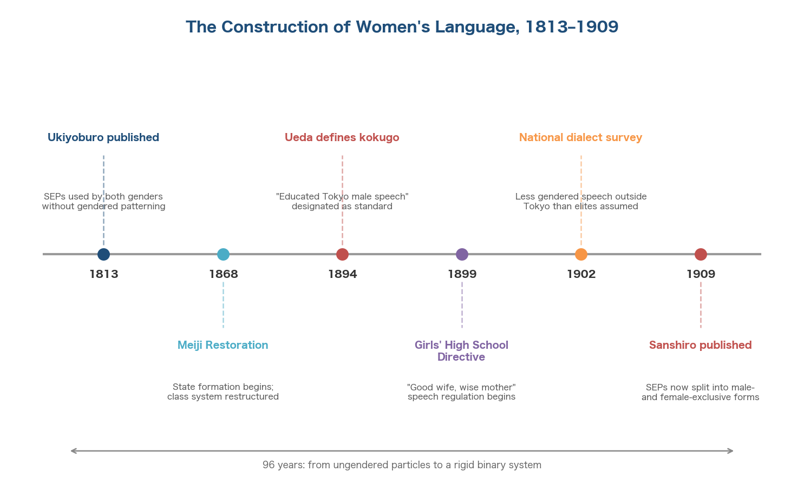
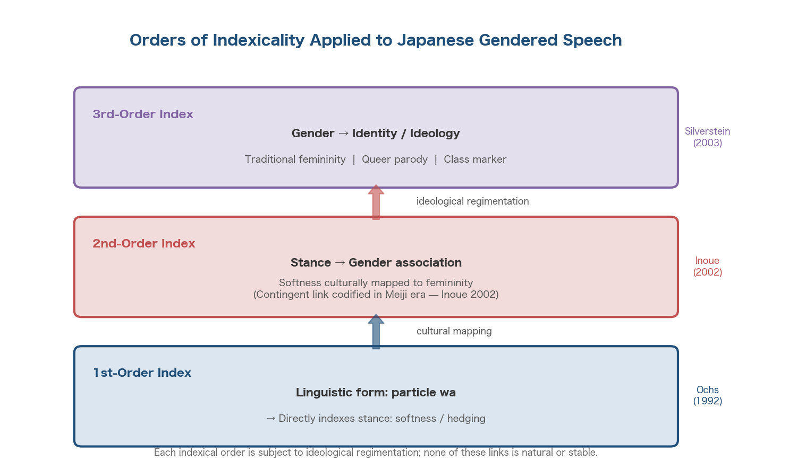
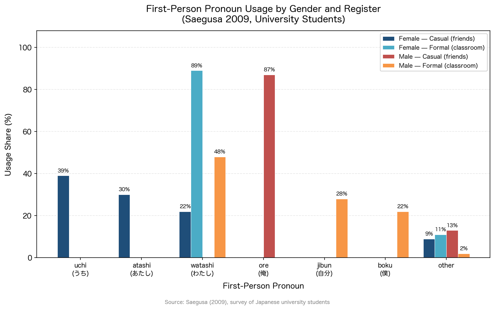
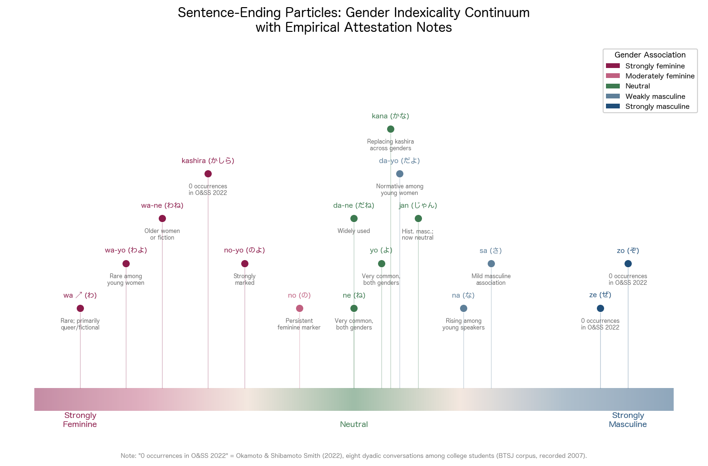
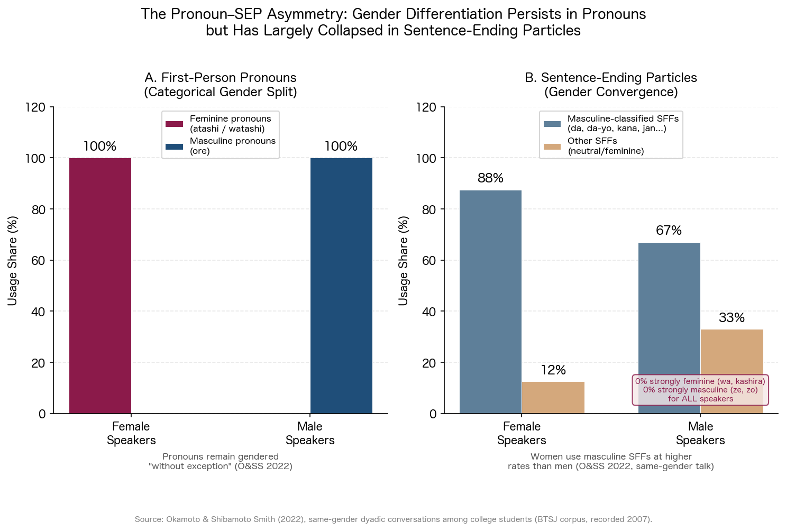
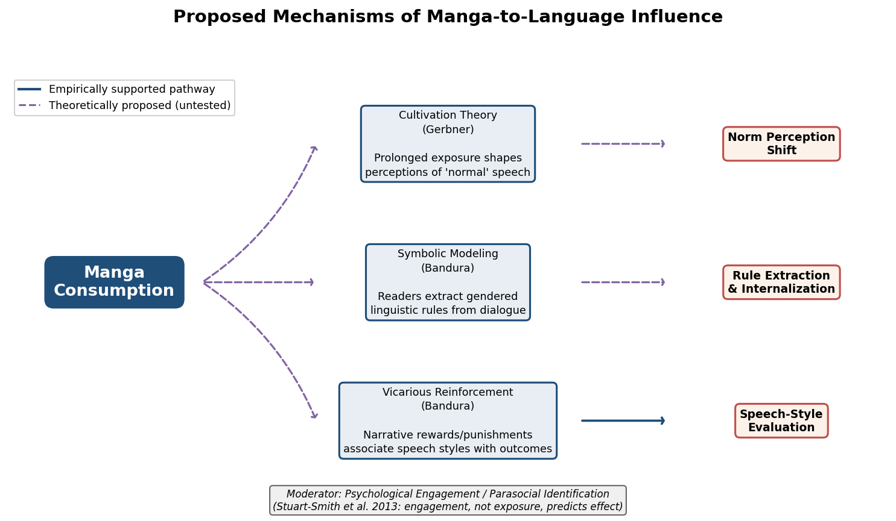
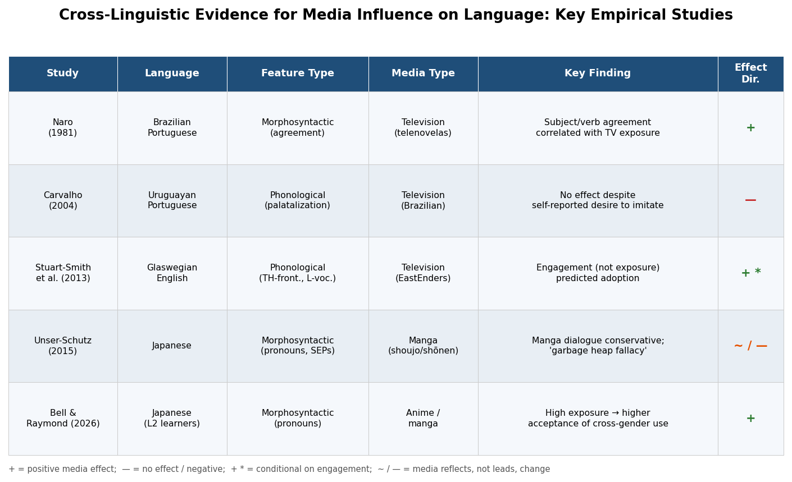
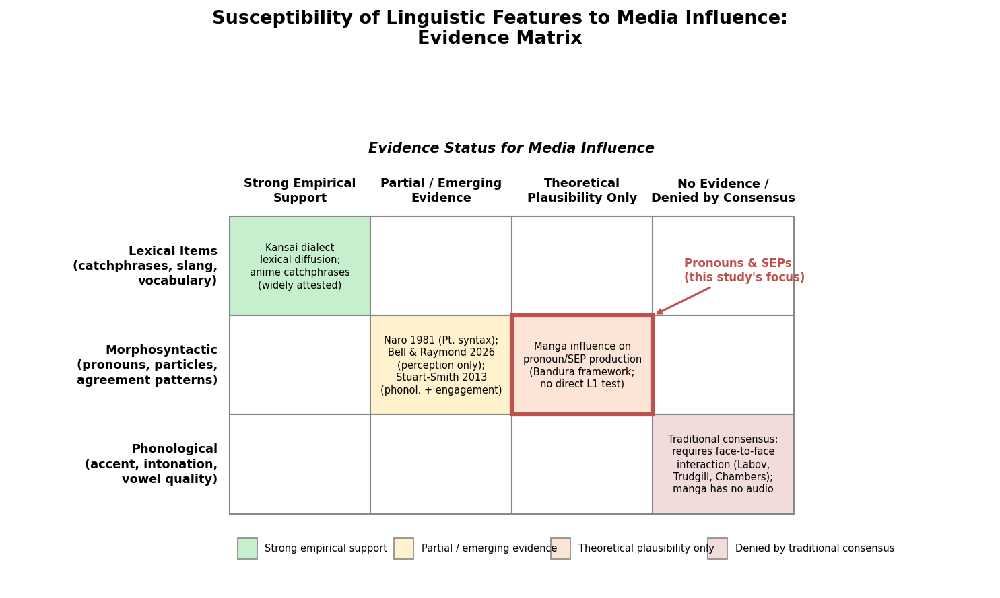
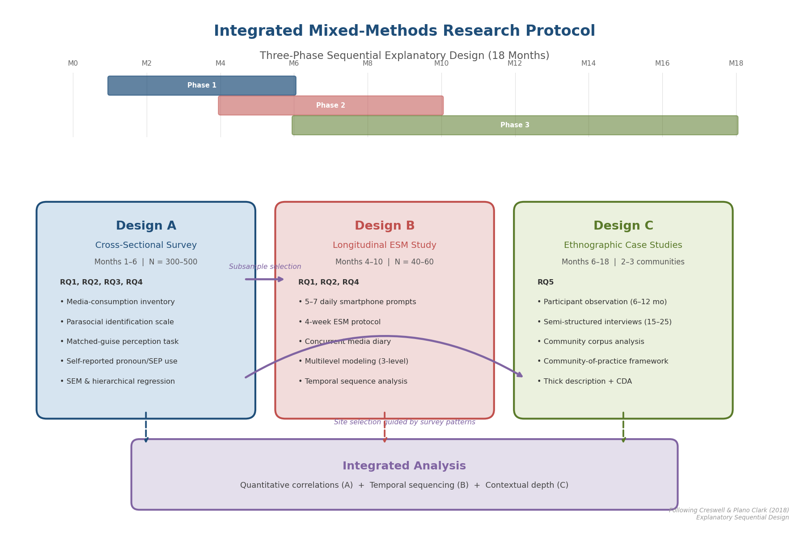
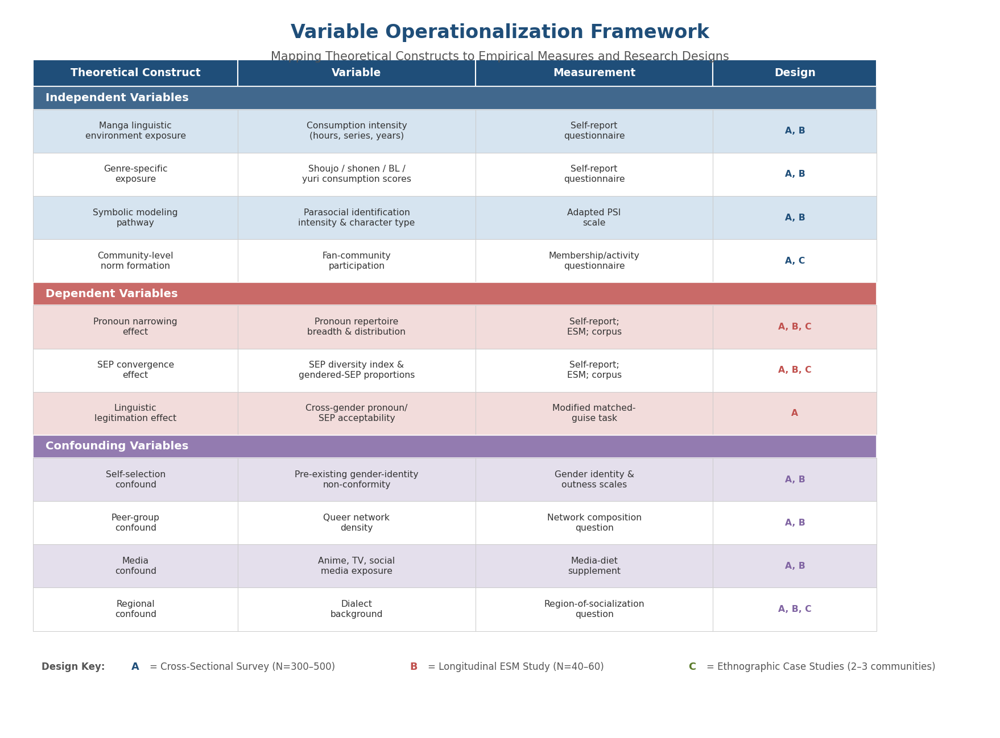

# Overview

This report investigates whether and how the consumption of shoujo manga by queer Japanese young adults influences their use of first-person pronouns and sentence-ending particles (SEPs) — two grammatical categories that carry an outsized share of gendered meaning in the Japanese language. Pronouns such as *watashi*, *ore*, *atashi*, and *boku* and particles such as *wa*, *ze*, *no*, and *kashira* do not merely reflect a speaker's gender; they actively constitute gendered identity through repeated performative use. Because these same forms are deployed with distinctive, often exaggerated consistency in manga dialogue through the convention of *yakuwarigo* (role language), the question arises whether sustained media consumption shapes the linguistic repertoires of readers — particularly readers whose relationship to gendered norms is already one of conscious negotiation.

The analysis proceeds through seven chapters. Chapter 1 establishes the theoretical foundations: the historical construction of gendered speech during the Meiji era, the sociolinguistic frameworks of indexicality, language ideology, and performativity that explain how linguistic forms acquire and lose gendered associations, and the media-effects theories — cultivation, social cognitive modeling, parasocial identification — that bridge fictional dialogue and real-world speech production. Chapter 2 provides a systematic inventory of first-person pronouns and sentence-ending particles, documenting their gender associations, formality registers, and pragmatic connotations on the basis of survey and corpus evidence. A critical empirical asymmetry emerges: SEP-based gender differentiation has nearly collapsed among young speakers, while pronoun selection remains strongly gendered.

The middle chapters examine shoujo manga's distinctive linguistic model and queer speakers' active manipulation of gendered resources. Shoujo manga is conservative on pronouns — female characters use *watashi* and *atashi* almost exclusively, with zero representation of the real-world-popular *uchi* or *jibun* — yet relatively naturalistic on SEPs, deploying strongly feminine particles at only 4.1% of all SEP tokens, a rate close to what young women actually produce in conversation (Unser-Schutz 2015; Okamoto 1995). Queer Japanese speakers, meanwhile, navigate this gendered system with particular intentionality: some adopt *jibun* for its gender neutrality, others appropriate cross-gender forms such as *ore* or rising-intonation *wa*, and still others construct mixed idiolects that resist binary classification entirely.

Chapter 5 evaluates the mechanisms through which manga consumption might shape linguistic behavior, drawing on Stuart-Smith et al.'s (2013) landmark finding that psychological engagement with media characters — not passive exposure — predicts phonological change. Chapter 6 synthesizes the preceding evidence into three testable hypotheses: the norm-calibration hypothesis (manga shifts perceptions of what gendered speech is "normal"), the modeling-and-reinforcement hypothesis (manga provides vicariously rewarded speech models that readers internalize), and the identity-resource hypothesis (manga functions as a repertoire of gendered linguistic materials that queer readers selectively appropriate for identity work). Chapter 7 translates these hypotheses into a concrete empirical research framework, specifying research questions, candidate designs (cross-sectional survey, mixed-methods naturalistic study, longitudinal panel), variable operationalizations, and the ethical considerations that are particularly acute when researching queer populations in Japan.

The central finding of this report is not a demonstrated causal effect but a carefully delimited zone of theoretical plausibility. No existing study has tested whether manga consumption shapes L1 Japanese speakers' production of gendered pronouns and SEPs. The evidence assembled here establishes that such influence is mechanistically plausible, identifies the specific linguistic features and population segments where effects are most likely to be detected, and provides the research architecture necessary to move from plausibility to empirical test.

# 第1章 Gendered Language in Japanese — Theoretical Foundations

Any investigation of whether mass media consumption shapes individual linguistic behavior requires, in the Japanese case, a prior question: what exactly constitutes the "gendered language" that media might transmit and speakers might adopt? This chapter establishes the theoretical architecture for the study as a whole. It first traces the historical construction of gendered speech norms in Japanese, demonstrating that the system commonly understood as "women's language" (女言葉 *onna-kotoba*) is a modern ideological artifact rather than an organic linguistic tradition. It then introduces three sociolinguistic frameworks — indexicality, language ideology, and performativity — that collectively explain how linguistic forms acquire, maintain, and potentially lose gendered associations. Finally, it examines theories of media influence on linguistic behavior, building the conceptual bridge between gendered speech norms, their fictional representation in manga, and the possibility that media consumption reshapes speakers' deployment of first-person pronouns and sentence-ending particles (終助詞 *shūjoshi*, hereafter SEPs).

## 1.1 The Historical Construction of Gendered Speech in Japanese

### 1.1.1 Women's Language as Modern Invention

The contemporary system of gendered speech in Japanese — the expectation that women use certain first-person pronouns (*watashi*, *atashi*), attach particular sentence-ending particles (*wa*, *no*, *kashira*), and deploy honorifics more frequently than men — presents itself as an ancient tradition. Scholarly evidence decisively refutes this impression. Inoue Miyako's genealogical analysis demonstrates that the speech forms now catalogued as "women's language" were codified during the Meiji era (1868–1912) as part of state formation, capitalist accumulation, and radical class reconfiguration. Prior to this period, the particle *wa* — now quintessentially "feminine" — was considered vulgar rather than refined, and particles such as *da-wa*, *no-yo*, and *teyo* were associated with the daughters of low-ranking samurai, not with normative femininity [Inoue 2002](https://web.stanford.edu/~eckert/Courses/l1562018/Readings/inoue2002.pdf "Gender, Language, and Modernity, American Ethnologist 29(2), 392–422").

A comparison of sentence-ending particles in two literary texts separated by nearly a century underscores the point. In Shikitei Sanba's *Ukiyoburo* (1813), SEPs attached to the copula *da* were used by both male and female characters without gender-exclusive patterning. By the time of Natsume Sōseki's *Sanshirō* (1909), the same inventory of particles had been systematically split into male-exclusive and female-exclusive categories. Forms such as *na-no*, *no-ne*, *wa-ne*, and *wa-yo* — absent from the pre-Meiji text — had become markers of feminine speech. The binary gendering of particle usage was an artifact of the *gembun'itchi* (言文一致, speech–writing unification) literary movement and its absorption into nation-building projects [Inoue 2002](https://web.stanford.edu/~eckert/Courses/l1562018/Readings/inoue2002.pdf "Tables 1–2 comparing particles in Ukiyoburo and Sanshirō").

### 1.1.2 Institutional Codification: National Language and the "Good Wife, Wise Mother"

Three institutional developments in the 1890s–1900s cemented the prescriptive system. First, the linguist Ueda Kazutoshi, trained in Germany, introduced the concept of *kokugo* (国語, national language) in 1894 and designated "the speech of educated Tokyo middle-class males" as the basis for the standard language (*hyōjungo*). This decision simultaneously created a masculine standard and, by implication, defined all speech deviating from it — including the forms being assigned to women — as marked. Second, the 1899 Directive on Girls' High Schools (*Kōtō Jogakkō Rei*) institutionalized women's education under the ideology of "good wife, wise mother" (良妻賢母 *ryōsai kenbo*), embedding speech regulation within female moral instruction. Third, the 1902 nationwide dialect survey conducted by the National Language Research Council found that regional communities outside Tokyo exhibited far less gender-based speech differentiation than central elites had assumed — a finding that embarrassed the surveyors but confirmed that rigid gendered speech was a metropolitan product, not a pan-Japanese inheritance [Inoue 2002](https://web.stanford.edu/~eckert/Courses/l1562018/Readings/inoue2002.pdf "pp. 396–409").

*Figure 1.1. Timeline of institutional and literary milestones in the codification of gendered speech, from the gender-neutral particle usage of* Ukiyoburo *(1813) to the rigid binary system evidenced in* Sanshirō *(1909).*

Nakamura Momoko's *Gender, Language and Ideology: A Genealogy of Japanese Women's Language* (2014) extends this genealogical work into a comprehensive book-length treatment, tracing the processes of objectification and naturalization of "women's language" across multiple historical periods. What appears as a stable linguistic category is, in Nakamura's account, the product of sustained ideological labor — carried out in schools, newspapers, novels, and government language planning [Nakamura 2014](https://benjamins.com/catalog/dapsac.58 "John Benjamins, ISBN 978-90-272-0649-7"). Ide Sachiko's earlier descriptive work (1982) had characterized women's speech as "more polite than men's" and identified morphological markers of this politeness, but Inoue and Nakamura demonstrate that Ide's descriptions, influential as they were, treated prescriptive norms as descriptive realities [Ide 1982](https://www.sciencedirect.com/science/article/pii/0024384182900092 "Linguistics 20(5–6), 357–377"). The distinction between prescription and description — between idealized norms and actual usage — is foundational for the present study.

### 1.1.3 Yakuwarigo: The Persistence of Gendered Speech in Fiction

If real-world usage has diverged from prescriptive norms, why do gendered speech stereotypes remain so vivid in Japanese popular culture? Kinsui Satoshi's concept of *yakuwarigo* (役割語, "role language"), first proposed in 2000 and elaborated in his 2003 monograph *ヴァーチャル日本語：役割語の謎* (Virtual Japanese: The Enigma of Role Language), provides an answer. Yakuwarigo denotes speech styles in fiction — manga, anime, novels, video games — that convey character traits such as age, gender, class, and regional origin. These styles are "highly recognizable" to audiences yet "usually partially or entirely distinct from the real-life language typical of the kind of people [they are] used to represent" [Teshigawara & Kinsui 2011](https://www.researchgate.net/publication/274286972_Modern_Japanese_Role_Language_Yakuwarigo_fictionalised_orality_in_Japanese_literature_and_popular_culture "Sociolinguistic Studies 5(1): 37–58").

The yakuwarigo system relies heavily on precisely the two grammatical categories central to this study: first-person pronouns and sentence-ending particles. A character's pronoun choice (*ore* for rough masculinity, *watashi* for polite neutrality, *atashi* for casual femininity) and SEP deployment (*ze* and *zo* for masculine assertiveness, *wa* and *kashira* for feminine softness) function as instant character indexicals — readers recognize the "type" of character from a single speech balloon. This produces a paradox: fictional media preserve and circulate gendered speech norms that real-world speakers — particularly young women — are increasingly abandoning. The widening gap between yakuwarigo convention and naturalistic speech constitutes the space within which this study's central question operates.

## 1.2 Sociolinguistic Frameworks: Indexicality, Ideology, and Performativity

Three theoretical traditions converge in explaining how linguistic forms become gendered, how those associations are maintained through ideological processes, and how speakers deploy — or refuse — gendered forms as constitutive acts of identity. Each framework contributes a distinct analytical layer invoked in subsequent chapters when examining manga dialogue and queer speakers' linguistic practices.

### 1.2.1 Indexicality: From Ochs to Silverstein

Elinor Ochs's (1992) two-tier indexicality model provides the primary sociolinguistic mechanism for understanding how linguistic features acquire gendered associations. Ochs argues that few linguistic forms directly index gender; instead, forms directly index interactional stances — affective dispositions such as assertiveness, softness, or deference — which in turn indirectly index gender through culturally constituted associations. The particle *wa*, in this model, directly indexes a stance of softness; it is the cultural association between softness and femininity that indirectly links *wa* to female speakers [Inoue 2002](https://web.stanford.edu/~eckert/Courses/l1562018/Readings/inoue2002.pdf "Critique of Ochs's indexicality model, pp. 394–395").

Inoue's critique of this model is consequential for the present study. She argues that Ochs inadvertently naturalizes a historically contingent indexical order: the link between *wa* and softness/femininity "did not exist until the late 19th century," when *wa* was associated with vulgarity rather than gentleness. By treating the stance-to-gender mapping as a stable cultural given, the Ochs model obscures the historical labor that produced the mapping [Inoue 2002](https://web.stanford.edu/~eckert/Courses/l1562018/Readings/inoue2002.pdf "pp. 394–395").

Michael Silverstein's (2003) concept of "orders of indexicality" extends Ochs's binary model into a multi-layered framework. In Silverstein's account, indexical meanings are not limited to two tiers but are schematized across multiple "n-th order" levels, each subject to ideological regimentation. A first-order index (e.g., *wa* indexes softness) can become the object of a second-order interpretation (softness indexes femininity), which itself can be reinterpreted at a third order (use of feminine forms indexes traditional values or, alternatively, queer identity through parodic appropriation). This layered model is critical for understanding how the same linguistic feature — *wa*, *ore*, *atashi* — carries different social meanings depending on the speaker's identity and the interpretive framework of the listener [Silverstein 2003](https://cscs.uchicago.edu/mslv-library/ "Language and Communication 23(3–4): 193–229").

*Figure 1.2. Conceptual diagram illustrating how the particle* wa *passes through successive indexical orders — from direct stance indexing (Ochs 1992), through culturally contingent gender mapping (Inoue 2002), to higher-order identity and ideological reinterpretation (Silverstein 2003). None of these links is natural or stable.*

For the study of queer speakers and manga consumers, the Silverstein framework illuminates a key phenomenon: a queer speaker who uses *ore* (conventionally masculine) is not simply "speaking like a man" but is engaging in a higher-order indexical act — one that may simultaneously index toughness, reject feminine norms, signal queer identity, and reference manga characters who use the same pronoun. The multiplicity of indexical orders means that no single interpretation exhausts the social meaning of a gendered form.

### 1.2.2 Language Ideology: Irvine and Gal's Semiotic Framework

Irvine and Gal's (2000) framework identifies three semiotic processes through which linguistic differentiation is ideologically constructed: iconization, fractal recursivity, and erasure. *Iconization* transforms a contingent linguistic feature into an icon of a social group, rendering the link natural and inevitable — as when certain SEPs become "icons" of femininity. *Fractal recursivity* projects an opposition salient at one level onto other levels: the male/female binary, initially mapped onto pronoun choice, is recursively extended to particles, intonation, vocabulary, and even the distinction between "natural" and "artificial" speech. *Erasure* renders invisible all linguistic practices that fail to fit the ideological schema — the actual diversity of women's speech, the masculine particles used by young women in casual conversation, or the feminine forms employed by queer male speakers [Irvine & Gal 2000](https://web.stanford.edu/~eckert/PDF/IrvineGal2000.pdf "Language Ideology and Linguistic Differentiation, in Regimes of Language, pp. 35–84").

Applied to the present study, these three processes operate at every analytical stage. The yakuwarigo system in manga *iconizes* specific pronouns and particles as inherent markers of character gender. The prescriptive binary is *fractally* extended from real-world norms into fictional dialogue and back again, creating a feedback loop between social expectation and media representation. And the speech practices of speakers who do not fit the binary — queer speakers, women who use *ore*, men who use *wa* — are systematically *erased* from both prescriptive accounts and most fictional representations.

### 1.2.3 Performativity: Butler and Japanese Adaptations

Judith Butler's theory of gender performativity (1988; 1990) supplies the philosophical foundation for treating gendered speech not as expression but as constitution. Gender, Butler argues, "is in no way a stable identity or locus of agency from which various acts proceed; rather, it is an identity tenuously constituted in time — an identity instituted through a stylized repetition of acts" [Butler 1988](https://www.amherst.edu/system/files/media/1650/butler_performative_acts.pdf "Performative Acts and Gender Constitution, Theatre Journal 40(4): 519–531"). Applied to language, this means that deploying "feminine" speech forms does not express a pre-existing female identity but rather constitutes femininity through the act of speaking. Each utterance either reiterates or subverts prevailing norms, and no utterance stands outside the performative field.

Inoue and Nakamura have adapted Butler's insight for the Japanese linguistic context in ways that prove particularly generative for this study. Inoue argues that Japanese women's language was historically produced precisely through performative repetition — not in organic speech communities but through the institutions of the modern novel, girls' magazines, and state education. Women encountered "their" language first as consumers of print media and only subsequently as speakers; they were, in Inoue's formulation, "not so much its producers but its (gendered) consumers" [Inoue 2002](https://web.stanford.edu/~eckert/Courses/l1562018/Readings/inoue2002.pdf "p. 402"). This observation bears directly on the central concern of this report: if gendered speech was originally constituted through media consumption rather than organic production, contemporary media — including manga — may continue to function as a primary site of gendered-language socialization.

Nakamura (2014) extends the analysis by tracing how each historical period produced its own version of "women's language" through discourse — advice literature, language manuals, media commentary — rather than through bottom-up linguistic change. Her genealogical method reveals that the "women's language" invoked by contemporary prescriptive norms is not a single stable system but a palimpsest of ideologically motivated codifications, each responding to different anxieties about modernity, class, and national identity [Nakamura 2014](https://benjamins.com/catalog/dapsac.58 "John Benjamins, ISBN 978-90-272-0649-7").

The performativity framework carries a specific implication for queer speakers. If gendered speech constitutes rather than reflects gender identity, then a queer speaker's deliberate adoption of cross-gender or mixed-gender speech forms is not a deviation from a "true" linguistic identity but a performative act constituting an alternative identity — one that may draw resources from multiple sources, including manga character speech. The intersection of performativity with media consumption opens the possibility that manga functions not merely as entertainment but as a repertoire of performative scripts available for identity work.

## 1.3 Media Consumption and Linguistic Behavior: Theoretical Bridges

The claim that media consumption influences how people speak is intuitive yet empirically contentious. This section introduces the principal media-effects theories relevant to linguistic behavior and assesses the evidentiary basis for each, distinguishing between well-attested mechanisms and theoretical extensions that remain to be tested.

### 1.3.1 Cultivation Theory and Linguistic Norms

George Gerbner's cultivation theory, developed from the 1960s Cultural Indicators Project, posits that prolonged, cumulative media exposure shapes consumers' perceptions of social reality. Heavy television viewers, Gerbner and colleagues argued, tend to perceive the world as more consistent with televised portrayals than it is in actuality — the "mean world" syndrome being the most studied instance. Applied to language, the cultivation hypothesis predicts that heavy consumers of media featuring rigid yakuwarigo patterns may internalize fictional gendered particle and pronoun usage as more normative — and more rigidly binary — than contemporary real-world speech warrants.

This application constitutes a theoretical extension rather than a claim grounded in existing empirical work. No published study has directly applied cultivation theory to linguistic feature adoption; the cultivation literature overwhelmingly addresses perceptual outcomes (fear of crime, gender-role attitudes, body-image norms) rather than productive linguistic behavior. The extension is nonetheless conceptually well-motivated: if media consumption can shift perceptions of how dangerous the world is or what constitutes an attractive body, it is plausible that it can also shift perceptions of how men and women "should" speak — and that such perceptual shifts may, over time, influence production.

### 1.3.2 Social Cognitive Theory and Symbolic Modeling

Albert Bandura's social cognitive theory (1986) offers a more specific mechanism. The theory distinguishes three types of models — live, verbal, and symbolic — and argues that observers can acquire new behaviors by watching models being rewarded or punished, without requiring direct reinforcement. Bandura explicitly includes language among the behaviors acquired through abstract modeling: "Through abstract modeling, people acquire, among other things, standards for categorizing and judging events, linguistic rules of communication, thinking skills..." [Bandura 2001](https://techofcomm.wordpress.com/wp-content/uploads/2015/09/bandura-sct-of-mass-communication.pdf "Social Cognitive Theory of Mass Communication, in Media Effects, 2nd ed., pp. 121–153").

The concept of vicarious reinforcement is particularly applicable to manga. Shibamoto Smith (2004) demonstrated that romance heroines receiving "happy endings" in fiction use *watashi* more than tragic heroines (who use *atashi*, *uchi*, or their own name), while Takahashi (2009) found that villainesses in shōjo manga deploy strongly feminine *onna-kotoba* (*wa*, *no yo*, *kashira*) to construct social power. These narrative patterns create a reinforcement structure in which certain gendered speech forms are associated with desirable outcomes and others with negative ones — precisely the vicarious reinforcement mechanism that Bandura theorizes as a pathway for behavior acquisition.

### 1.3.3 Empirical Evidence: Media and Language Change

The most robust empirical demonstration of media influence on linguistic behavior comes from Stuart-Smith et al. (2013), who studied phonological changes among adolescents in Glasgow, Scotland. They found that TH-fronting and L-vocalization correlated significantly with *psychological engagement* with the London-based soap opera *EastEnders* — behaviors such as choosing favorite characters and discussing plot lines in daily life — even after controlling for social, linguistic, and dialect-contact variables. Crucially, the effect was not driven by positive attitudes toward London accents; most participants reported disliking them. Stuart-Smith characterized the mechanism as "the effective enhancement of existing variation," where "media may act as another means of enabling existing or latent variation to 'bubble up' into changes" (Stuart-Smith et al. 2013, *Language* 89(3): 501–536).

This finding has direct implications for the present study. If psychological engagement with fictional characters — not passive exposure or attitudinal alignment — mediates linguistic influence, then the intensity of parasocial identification with manga characters becomes the critical variable. A queer young adult who identifies deeply with a shōjo manga heroine's emotional world may be more susceptible to adopting that character's speech patterns than a casual reader, regardless of how many volumes each has consumed.

Earlier evidence from other linguistic contexts supports the plausibility of media effects at the morphosyntactic level. Naro (1981) found that syntactic changes in Brazilian Portuguese — specifically, shifts in subject-verb agreement patterns — correlated with reported telenovela exposure (*Language* 57(1): 63–98). However, Carvalho (2004) provides a sobering counterexample: Uruguayan Portuguese speakers who reported wanting to "speak like the guys on TV" showed no greater palatalization than non-viewers, suggesting that self-reported media influence may overstate actual effects (*Language Variation and Change* 16: 127–151).

The dominant variationist position, articulated by Chambers (1998), Labov (2001), and Trudgill (2014), holds that media can diffuse lexical items but cannot drive phonological or morphosyntactic change, which requires face-to-face interaction. The 2014 debate in the *Journal of Sociolinguistics* — initiated by Sayers's "mediated innovation model" (18(2): 185–212) and including responses from Trudgill, Stuart-Smith, Tagliamonte, and Androutsopoulos — represents the most comprehensive disciplinary discussion of this question. The emerging consensus, as articulated by Stuart-Smith (2014), is that media cannot introduce entirely new variants into a community's repertoire but may accelerate or amplify changes that are already latent in the sociolinguistic environment.

### 1.3.4 Vicarious Language and the Specificity of Manga

Inoue's (2006) concept of "vicarious language" — language experienced primarily through mediated consumption rather than production — provides the most direct conceptual bridge to manga. Inoue demonstrates that Japanese women's language was historically constituted as vicarious language: women first encountered "their" speech forms through serialized novels and girls' magazines and only subsequently performed them in daily life. The novel form and the *gembun'itchi* movement created the discursive space within which women became "objectified, evaluated, studied, staged, and normalized through [their] imputed language use" [Inoue 2006](https://sts.stanford.edu/publications/vicarious-language-gender-and-linguistic-modernity-japan "University of California Press, ISBN 978-0-520-24585-7").

If this was the historical pattern — media first, production second — then manga represents a contemporary continuation of the same dynamics. Manga readers encounter hundreds of hours of gendered dialogue without producing it themselves. The medium's specific affordances shape the nature of this vicarious encounter: manga dialogue is written, not spoken, which means it can influence morphosyntactic features (pronoun choice, particle selection, vocabulary) but not phonological ones (pitch, intonation, accent). Characters in manga typically maintain fixed pronoun systems — a heroine who uses *watashi* will do so in virtually every panel — unlike real-world speakers who switch pronouns routinely across contexts. This fixity creates unusually clear, consistent models of gendered speech, potentially reinforcing the association between specific forms and specific gender identities.

Bell and Raymond (2026) provide preliminary evidence that anime and manga exposure shapes perceptions of gendered pronoun usage, at least among second-language learners. In their study of beginner-level American learners of Japanese, those with high anime/manga exposure rated cross-gender pronoun usage as far more acceptable than heritage speakers: 53.9% of high-exposure beginners accepted men using *atashi* versus 0% of heritage speakers (χ² = 11.94, p = 0.0026), and 46.2% accepted women using *ore* versus 0% of heritage speakers (χ² = 9.81, p = 0.0074) [Bell & Raymond 2026](https://digitalcommons.dartmouth.edu/cgi/viewcontent.cgi?article=1000&context=ascl_60-20 "Learning Gendered Speech, Dartmouth College, March 2026"). While this study measures perceptual judgments among L2 learners rather than production among L1 speakers, it establishes a clear empirical link between manga/anime consumption and the cognitive representation of gendered speech norms.

### 1.3.5 Synthesis: A Theoretical Framework for This Study

The theoretical architecture assembled in this chapter points toward a specific set of analytical expectations:

1. **Gendered speech is ideologically constructed, not natural.** The historical evidence (Inoue 2002; Nakamura 2014) demonstrates that the prescriptive system was created through institutional and discursive processes, not through organic linguistic evolution. Any influence of media on gendered speech therefore operates within an ideological field, not a natural one.

2. **Indexical relationships are multi-layered and historically contingent.** The Ochs–Silverstein framework, as critiqued by Inoue, cautions against treating the link between a linguistic form and a gendered meaning as stable. The same form (*wa*, *ore*, *atashi*) may index different social meanings depending on the speaker, the context, and the historical moment.

3. **Fictional media perpetuate gendered speech norms through yakuwarigo.** Kinsui's framework explains why manga dialogue remains more conservatively gendered than naturalistic speech: yakuwarigo functions as a character-recognition system that requires stable, stereotypical speech markers.

4. **Media influence on language operates through psychological engagement, not passive exposure.** Stuart-Smith et al.'s (2013) findings suggest that the relevant variable is not how much manga a person reads but how deeply they engage with characters — a prediction with specific consequences for queer readers, whose identification with characters may be structured differently than that of heterosexual, cisgender readers.

5. **Gendered speech is performative, and media provide performative scripts.** Butler's performativity, adapted for Japanese by Inoue and Nakamura, implies that manga characters' speech patterns constitute a repertoire of gendered performances available for adoption, subversion, or recombination by readers — particularly by queer readers engaged in active identity work with respect to gender norms.

These five propositions collectively frame the empirical questions addressed in subsequent chapters: what gendered speech patterns does shōjo manga present (Chapter 3), how do queer young adults in Japan position themselves linguistically (Chapter 4), what mechanisms might connect the two (Chapter 5), and what specific hypotheses and research designs follow from this theoretical architecture (Chapters 6–7).

# 第2章 First-Person Pronouns and Sentence-Ending Particles — A Linguistic Inventory

The theoretical frameworks introduced in Chapter 1 — indexicality, language ideology, performativity, and yakuwarigo — converge on two grammatical categories that carry an outsized share of gendered meaning in Japanese: first-person pronouns (一人称代名詞 *ichininshō daimeishi*) and sentence-ending particles (終助詞 *shūjoshi*, hereafter SEPs). Before examining how these forms function within shoujo manga dialogue or queer speakers' linguistic repertoires, the present chapter establishes a systematic inventory of each category, characterizing every form's gendered indexicality, formality register, and pragmatic connotations on the basis of survey research, corpus data, and ethnographic observation. The chapter then synthesizes empirical evidence on how pronoun and SEP usage varies by speaker gender, age cohort, and social setting in mainstream Japanese. The resulting baseline of real-world variation serves as the reference standard against which manga dialogue conventions (Chapter 3) and queer linguistic practices (Chapter 4) are subsequently measured.

## 2.1 First-Person Pronouns: An Open-Class Inventory

### 2.1.1 The Structural Distinctiveness of Japanese Self-Reference

Unlike English, where *I* is the sole first-person singular pronoun and carries no inherent social information, Japanese maintains an open class of self-reference terms whose selection encodes the speaker's gender presentation, relative social status, relationship with the interlocutor, and desired affective stance. Including regional variants and euphonic shortenings, the inventory is among the largest of any documented language [Tofugu — Japanese First-Person Pronouns](https://www.tofugu.com/japanese/japanese-first-person-pronouns/ "Detailed pragmatic guide, March 2019"). Crucially, pronoun selection is not fixed: a single individual may use *watashi* in a job interview, *ore* at an izakaya with friends, and *boku* when speaking to a romantic partner — all within the same day. This context-dependent switching indicates that first-person pronouns function less as fixed identity labels than as dynamic indexical resources deployed to accomplish interactional goals.

### 2.1.2 The Core Inventory

The following inventory focuses on forms attested in contemporary usage (post-2000 survey and corpus data), organized along the gender-indexicality continuum from strongly feminine to strongly masculine, with neutral and special-register forms included.

**Table 2.1. Primary First-Person Pronouns in Modern Japanese**

| Form | Romanization | Gender Association | Formality | Pragmatic Connotations |
|------|-------------|-------------------|-----------|----------------------|
| あたし | *atashi* | Strongly feminine | Informal | Phonetic shortening of *watashi*; indexes casual, youthful femininity; common among younger women in conversation; historically used by male Edo-period merchants and *rakugo* performers |
| うち | *uchi* | Feminine (increasingly neutral) | Informal | Originally Kansai dialect; spread nationally via anime and *gyaru* culture; popular among young women; plural *uchira* is gender-neutral |
| 私 わたし | *watashi* | Neutral in formal register; feminine in casual | Formal–informal | Default polite pronoun; in casual speech among men, signals formality-consciousness or femininity |
| 私 わたくし | *watakushi* | Neutral | Very formal | Highest formality; official announcements, conservative business settings, political oratory |
| 自分 じぶん | *jibun* | Neutral (male-leaning in some contexts) | Neutral | Reflexive "self"; used as first-person pronoun in military and sports hierarchies; popular among young men in formal alternatives to *ore*; favored in LGBTQ communities for gender neutrality |
| 僕 ぼく | *boku* | Masculine (weakly) | Formal–informal | Humble, youthful, gentle masculinity; first pronoun taught to boys; use by women carries tomboyish or feminist connotations |
| 俺 おれ | *ore* | Strongly masculine | Informal | Assertive masculinity, peer-group familiarity; dominant in adult male casual speech |
| わし | *washi* | Masculine (elderly/dialectal) | Variable | Western Japanese dialects; stereotypically associated with elderly men in fiction (yakuwarigo); gaining ironic currency as internet slang (ワシ/ワイ) among young users |
| おいら | *oira* | Masculine (rural) | Informal | Similar to *ore* but more casual; rural/Tohoku connotations; strongly associated with anime characters (e.g., Son Goku) |
| 俺様 おれさま | *ore-sama* | Strongly masculine (fictional) | Informal | Self-aggrandizing; primarily restricted to fiction; indexes arrogant male character types |
| (own name) | — | Feminine/childish | Informal | Used by small children and some young women; *burikko* (ぶりっ子) associations; culturally standard for adult women in Okinawa |

Additional archaic or highly specialized forms — *wagahai* (吾輩, literary pomposity), *sessha* (拙者, samurai self-deprecation), *warawa* (わらわ, aristocratic femininity), *atai* (あたい, Shōwa-era geisha register) — survive almost exclusively as yakuwarigo in fiction and historical drama. Their persistence in manga and anime, despite near-total absence from contemporary naturalistic speech, illustrates the conservative function of role language analyzed in Chapter 1 (§1.1.3).

### 2.1.3 Gender, Register, and the Pronoun Continuum

Survey data confirm that pronoun selection in contemporary Japanese is governed by the intersection of gender and register rather than by gender alone. Saegusa's (2009) survey of university students provides the most detailed quantitative snapshot. Among female students speaking with friends, *uchi* was the most popular choice at 39%, followed by *atashi* (30%) and *watashi* (22%). In classroom settings, the same women overwhelmingly used *watashi* (89%). Among male students speaking with friends, *ore* dominated at 87%; in classrooms, usage fragmented among *watashi* (48%), *jibun* (28%), and *boku* (22%) [Saegusa 2009, cited in Wikipedia](https://en.wikipedia.org/wiki/Pronouns_in_Japanese "Tables based on Saegusa, Yuko (2009), The Japanese Language and Literature Society of Korea 44: 97–109"). These distributions reveal two patterns relevant to the present study. First, the casual-speech repertoire is far more gender-differentiated than the formal-speech repertoire, where *watashi* functions as a near-universal default. Second, women's casual-speech inventory is notably more diverse than men's: three forms share the female casual market, whereas a single form (*ore*) commands nearly nine-tenths of male casual usage.

*Figure 2.1. Distribution of first-person pronouns among university students by gender and register. In casual settings, women's usage disperses across uchi, atashi, and watashi, while men's usage concentrates on ore. Both genders converge on watashi in formal contexts. Data from Saegusa (2009).*

The pronoun *boku* occupies a particularly instructive intermediate position on this continuum. Miyazaki (2004) found that Tokyo junior high school girls perceived a gradient — *ore* as most masculine, *atashi* as most feminine, with *boku* and *uchi* positioned as relatively neutral [Miyazaki 2004, in Okamoto & Shibamoto Smith (eds.), *Japanese Language, Gender, and Ideology*, OUP, pp. 256–274]. Some girls in Miyazaki's study used *boku* regularly within their peer group (*gakkyū*), while boys who chose *ore* were regarded as "stronger and more powerful" than those preferring other forms. Ito (2006) documented the social policing of this gradient among children as young as six: a first-grade girl described how she "practiced" using *watashi* at school to avoid rejection for saying *boku*, even as her mother encouraged her to "refer to herself however she wants to" [Ito 2006](https://www.inst.at/trans/16Nr/01_4/ito16.htm "BOKU or WATASHI: Variation in self-reference terms among Japanese children, TRANS 16"). These findings demonstrate that pronoun gender associations are not intrinsic properties of forms but are socially enforced through peer pressure, parental coaching, and institutional norms — a dynamic that becomes acutely salient for queer speakers navigating competing identity demands (Chapter 4).

The regional dimension adds further complexity. *Uchi*, originally a western Japanese (especially Kansai) dialect form meaning "inside" or "home," has spread nationally over the past three decades as a casual first-person pronoun popular among young women, propelled by anime, *gyaru* culture, and Kansai comedy. Saegusa's (2009) data place *uchi* as the single most popular female casual pronoun at 39%; among elementary school girls speaking to friends, it reached 49%. Miyazaki (2002) observed that Tokyo middle school girls perceived *uchi* as a "new term" whose novelty contributed to a less gendered feel [Ito 2006](https://www.inst.at/trans/16Nr/01_4/ito16.htm "Footnote citing Miyazaki 2002:363 on uchi"). The trajectory of *uchi* from regional dialect to national slang — driven partly by media exposure — constitutes a micro-case of media-mediated linguistic diffusion relevant to the broader question of manga's influence examined in Chapter 5.

## 2.2 Sentence-Ending Particles: The Most Iconic — and Most Unstable — Gender Markers

### 2.2.1 The SEP System and Its Prescriptive Gender Mapping

Sentence-ending particles attach to the final position of a clause and modulate the utterance's illocutionary force — assertion, confirmation-seeking, emotional emphasis, self-directed musing. In prescriptive accounts, SEPs constitute the most salient locus of gendered speech: textbooks and language-instruction materials routinely classify *wa*, *no*, *kashira*, *wa-yo*, and *wa-ne* as "women's language" and *ze*, *zo*, and *na* as "men's language." As Chapter 1 demonstrated, this binary classification is historically contingent, a product of Meiji-era codification rather than organic differentiation. The following inventory characterizes each primary SEP's current gender associations, pragmatic functions, and empirical usage patterns.

**Table 2.2. Primary Sentence-Ending Particles in Modern Japanese**

| Form | Gender Association | Pragmatic Function | Contemporary Usage Notes |
|------|-------------------|-------------------|--------------------------|
| わ *wa* (↘ falling) | Weakly gendered / neutral | Personal realization, emotional investment, casual assertion | Relatively gender-neutral with falling intonation; common in Kansai male speech; *desu-wa* / *masu-wa* used by middle-aged Kansai men |
| わ *wa* (↗ rising) | Strongly feminine | Softening, emphasis of femininity | "No longer common in ordinary interactions"; primarily used "to emphasize femininity in queer speech or to accentuate the femininity of a character in creative productions" |
| わよ *wa-yo* | Strongly feminine | Informing + feminine emphasis | Considered feminine regardless of intonation; rare in naturalistic young women's speech |
| わね *wa-ne* | Strongly feminine | Confirming + feminine emphasis | Associated with older women or fictional characters |
| わよね *wa-yo-ne* | Strongly feminine | Confirming-informing + feminine emphasis | Same as above |
| かしら *kashira* | Strongly feminine | "I wonder" (feminine counterpart of *kana*) | Zero occurrences across all eight conversations in Okamoto & Shibamoto Smith (2022) |
| の *no* | Moderately feminine | Explanation, softening, seeking confirmation | Can be neutral in certain contexts; feminine when sentence-final with rising intonation; among the more persistent feminine markers |
| のよ *no-yo* | Strongly feminine | Explanatory + assertive (feminine) | Strongly marked; identified by Inoue (2002) as a historically constructed feminine form |
| だ *da* / だよ *da-yo* | Weakly masculine | Assertive declaration | Very common across genders in contemporary speech; women's use is now normative among young speakers |
| だね *da-ne* | Neutral | Seeking agreement | Widely used by both genders |
| ぜ *ze* | Strongly masculine | Strong assertion, emphasis | Very rare in naturalistic data; zero occurrences in Okamoto & Shibamoto Smith (2022); primarily fictional/yakuwarigo |
| ぞ *zo* | Strongly masculine | Strong assertion, self-directed determination | Very rare in naturalistic data; zero occurrences in Okamoto & Shibamoto Smith (2022); primarily fictional/yakuwarigo |
| よ *yo* | Neutral / weakly masculine | Informing, asserting new information | Gender-neutral; one of the most common SEPs across all speakers |
| ね *ne* | Neutral | Seeking agreement, confirming shared knowledge | Gender-neutral; extremely common; women may deploy more frequently as backchannel |
| な *na* / なあ *nā* | Weakly masculine | Self-reflection, musing, mild assertion | More commonly used by men; rising as casual particle among young speakers of all genders |
| さ *sa* | Weakly masculine | Casual filler, softening in narrative | Weakly gendered; mild masculine association as discourse marker |
| かな *kana* | Neutral / weakly masculine | "I wonder" (gender-neutral counterpart of *kashira*) | Functionally replacing *kashira* among young speakers regardless of gender |
| じゃん *jan* | Neutral (historically masculine) | Tag question "right? / isn't it?" | Classified as masculine by prescriptive norms but "used widely by both women and men today" |

Two structural observations emerge from this inventory. First, the strongly gendered forms cluster at the extremes: the strongly feminine set (*wa* rising, *wa-yo*, *wa-ne*, *wa-yo-ne*, *kashira*, *no-yo*) and the strongly masculine set (*ze*, *zo*) are precisely the forms most distant from contemporary naturalistic usage. Second, the neutral and weakly gendered middle ground — *yo*, *ne*, *da-yo*, *kana*, *jan* — constitutes the bulk of actually attested SEP usage across genders. This "hollow extremes" pattern, wherein the most prescriptively gendered particles are the least empirically attested, visually corroborates the convergence documented in the quantitative studies reviewed in §2.3.

*Figure 2.2. Sixteen sentence-ending particles placed along a gender-indexicality continuum from strongly feminine (left) to strongly masculine (right), with empirical attestation notes from Okamoto & Shibamoto Smith (2022). The strongly gendered extremes — including wa (rising), kashira, ze, and zo — record zero occurrences in naturalistic conversation data, while the neutral middle ground dominates actual usage.*

### 2.2.2 The Case of *wa*: A Single Particle, Multiple Indexical Lives

The particle *wa* merits extended treatment because it crystallizes virtually every analytical theme of this study. As documented in a comprehensive grammar analysis, *wa* with falling intonation is now "relatively gender-neutral" in casual speech, particularly in Kansai, where middle-aged and elderly men routinely use *desu-wa* and *masu-wa* without feminine connotation. By contrast, *wa* with rising intonation is "regarded as highly feminine" — yet this usage is "no longer common in ordinary interactions." Rising-intonation *wa* now functions primarily in two domains: queer speech (specifically *onee-kotoba*, where it serves as a deliberate marker of camp femininity) and fictional character dialogue (where it signals *ojōsama* refinement or generic female-character marking) [Tofugu 2024](https://www.tofugu.com/japanese-grammar/sentence-ending-particle-wa/ "Comprehensive grammar page on sentence-ending particle わ").

This intonation-dependent split illustrates Silverstein's orders of indexicality (Chapter 1, §1.2.1) in miniature: the same segmental form carries first-order meanings (assertion, emotional investment) that are reinterpreted at second and third orders as gendered, regional, or subcultural markers depending on prosodic realization and social context. The migration of rising *wa* from mainstream women's speech into queer and fictional registers exemplifies the decoupling of gendered forms from their prescriptive populations — a decoupling that creates the conditions under which manga consumption and queer identity may interact to reshape individual linguistic repertoires.

## 2.3 Empirical Evidence on Usage Variation

### 2.3.1 The Decline of Gendered SEP Differentiation

The most striking empirical finding in the contemporary sociolinguistic literature is the near-collapse of SEP-based gender differentiation among young speakers. Okamoto & Shibamoto Smith (2022) analyzed eight dyadic conversations among college students (recorded in 2007 as part of the BTSJ Natural Conversation Corpus) and found that sentence-final form (SFF) usage was "hardly gendered." In same-gender conversations, female speakers used masculine-classified SFFs — *da*, *da-yo*, *da-yo-ne*, *kana*, *jan* — at rates of 87% and 88%, actually exceeding the two male speakers (both 67%). None of the eight speakers produced the strongly feminine forms *wa* or *kashira*, nor the strongly masculine forms *zo* or *ze* [Okamoto & Shibamoto Smith 2022](https://onlinelibrary.wiley.com/doi/full/10.1111/josl.12569 "Journal of Sociolinguistics, BTSJ corpus data from 2007").

This pattern extends findings first documented by Okamoto (1995), whose study "'Tasteless' Japanese: Less 'Feminine' Speech Among Young Japanese Women" showed that women in their 20s used masculine and neutral sentence-final forms at substantially higher rates than women in their 30s and 50s [Okamoto 1995, in Hall & Bucholtz (eds.), *Gender Articulated*, Routledge, pp. 297–325]. The apparent-time distribution suggests generational change rather than age-grading: younger women are not temporarily adopting masculine forms before "growing into" feminine speech but are members of successive cohorts from whose active repertoire the prescriptive feminine forms are progressively receding.

Large-scale digital data corroborate the trend at population scale. Carpi and Iacus (2020) analyzed 408 million Japanese tweets posted between 2015 and 2019 and found that identifiably gendered language features appeared in only approximately 6% of tweets, with "remarkable exceptions" to prescriptive gender classifications. The study also identified temporal shifts in individual SEP frequencies, indicating ongoing evolution in gendered-particle usage even within the four-year observation window [Carpi & Iacus 2020](https://www.ojcmt.net/article/is-japanese-gendered-language-used-on-twitter-a-large-scale-study-9141 "Online Journal of Communication and Media Technologies 10(4), e202024").

### 2.3.2 The Persistence of Pronoun-Based Gender Differentiation

In sharp contrast to the convergence observed in SEPs, first-person pronoun usage remains strongly gendered — a finding with major implications for the study of manga influence. In the same Okamoto & Shibamoto Smith (2022) dataset where SFF usage showed negligible gender differentiation, pronoun usage was "gendered without exception": both female speakers used exclusively feminine pronouns (one *atashi*, one *watashi*), while both male speakers used exclusively *ore* [Okamoto & Shibamoto Smith 2022](https://onlinelibrary.wiley.com/doi/full/10.1111/josl.12569 "Tables 4–8").

*Figure 2.3. The pronoun–SEP asymmetry. Panel A: first-person pronouns remain categorically gendered — women used exclusively feminine forms, men used exclusively ore. Panel B: sentence-ending particles show gender convergence — women used masculine-classified SFFs at 87–88%, exceeding men's 67%. Strongly gendered forms (wa, kashira, ze, zo) registered zero occurrences across all speakers. Data from Okamoto & Shibamoto Smith (2022), same-gender dyadic conversations (BTSJ corpus, recorded 2007).*

This asymmetry between particles and pronouns is analytically consequential. It suggests that the two grammatical categories occupy different positions in what Eckert (2003) terms the "off the shelf" versus "under the counter" distinction: pronouns are highly salient, consciously selected lexical items, while SEPs operate closer to the level of habitual, less monitored discourse-level choices. If manga influence operates primarily through conscious symbolic modeling (Bandura 2001, discussed in Chapter 5), it may affect pronoun selection — which readers explicitly notice and can deliberately adopt — more readily than SEP deployment, which is more deeply embedded in discourse-level habit. Conversely, if media influence operates through cumulative normalization (cultivation theory), SEP patterns absorbed through thousands of pages of manga dialogue might gradually reshape habitual usage. The pronoun–SEP divergence thus furnishes a natural test for competing theories of media influence on language.

### 2.3.3 Context-Dependent Variation: The Heterosocial Effect

Gendered linguistic performance is not constant across interactional contexts; it intensifies in heterosocial settings. Okamoto & Shibamoto Smith (2022) found that female speakers shifted toward more feminine SFF variants when conversing with men: masculine SFF ratios dropped from 87–88% in same-gender conversations to 58–67% in mixed-gender conversations. Simultaneously, these women spoke at higher pitch (+8–11%) and with wider pitch range (+22–26%) when addressing male interlocutors. The authors interpret these shifts as evidence that speakers "were conforming to heterosexual gender norms to be gentle, polite, and so forth, when speaking with men" [Okamoto & Shibamoto Smith 2022](https://onlinelibrary.wiley.com/doi/full/10.1111/josl.12569 "Section 4.4").

This heterosocial activation effect carries particular implications for queer speakers who may orient to different interactional norms. If the shift toward feminine speech in mixed-gender contexts reflects adherence to heteronormative scripts, queer speakers — for whom heteronormative audience design may be less salient or actively resisted — might exhibit attenuated or absent heterosocial shifts. Whether manga consumption reinforces or destabilizes these heteronormative scripts is a question taken up in Chapter 6.

### 2.3.4 Masculine Speech as Equally Variable

The prescriptive system implies a monolithic masculine norm no less than a monolithic feminine one, yet empirical research reveals substantial variation within men's speech as well. SturtzSreetharan (2004), analyzing all-male conversations among Kansai-region men aged 19 to 68, found that deployment of stereotypically masculine SEPs varied significantly by life stage — students, *sarariiman* (salaried workers), and seniors each exhibited distinct profiles of "manly" particles — and by interactional context. Masculine speech, like feminine speech, indexes "particular identities, which may or may not correspond to traditional notions of Japanese masculinity" [SturtzSreetharan 2004](https://www.cambridge.org/core/journals/language-in-society/article/students-sarariiman-pl-and-seniors-japanese-mens-use-of-manly-speech-register/FA0EDF56766A578A350CABD68F829C13 "Language in Society 33(1): 81–107").

Noguchi (2022), drawing on focus-group data from female university students collected in 2013 and 2019, reported that participants used "very few of the traditional elements of *onna-kotoba*" in casual settings while freely adopting traditionally masculine features, including the second-person pronouns *omae* and *kimi*, the adjective *umai* (in place of the neutral *oishii*), and the intensifier *kuso*. These shifts remained "not yet evident in most public contexts," pointing to a register-sensitive erosion: gendered speech persists in formal and public registers while dissolving in casual, private interaction [Noguchi 2022](https://hal.science/hal-05514023/ "The Journal of Asian Linguistic Anthropology 4(2): 1–19").

## 2.4 Queer Speakers and the Pronoun–Particle Nexus: A Preview

The inventory and variation patterns established above carry distinctive implications for queer Japanese speakers — implications developed fully in Chapter 4. Two findings from the existing literature merit anticipation here, as they motivate the selection of pronouns and SEPs as the analytical focus for the remainder of this study.

First, Abe (2010) documented that the gender-neutral pronoun *jibun* was favored among women who self-identified as *onabe* at lesbian bars in Shinjuku, precisely because feminine pronouns (*watashi*, *atashi*) "do not match their identity at all," while masculine pronouns (*ore*, *boku*) also felt inappropriate. *Jibun* was perceived as "adequately rough" yet gender-neutral, occupying a pragmatic position outside the feminine–masculine binary [Abe 2010](https://link.springer.com/content/pdf/10.1057/9780230106161.pdf "Queer Japanese: Gender and Sexual Identities through Linguistic Practices, Palgrave Macmillan"). This finding reveals the pronoun inventory not as an abstract taxonomic exercise but as a practical field of navigation for speakers whose gender identities resist alignment with prescriptive categories.

Second, the observation that rising-intonation *wa* has migrated from mainstream women's speech into queer speech (*onee-kotoba*) and fictional dialogue demonstrates that SEPs, too, function as sites of active identity work rather than passive gender markers. The queer reappropriation of *wa* transforms a prescriptively feminine form into a resource for parodic, performative, or camp self-presentation — an instance of higher-order indexical reinterpretation (Silverstein 2003) carried out at the intersection of gender, sexuality, and media influence.

Together, these two grammatical categories — pronouns as conscious lexical choices, SEPs as discourse-level indexical resources — constitute the analytical lens through which the subsequent chapters examine the interplay among manga dialogue, queer identity, and personal linguistic expression. The inventory presented here provides the reference framework: each pronoun and particle discussed in the analysis of shoujo manga conventions (Chapter 3), queer linguistic positioning (Chapter 4), and media-influence mechanisms (Chapter 5) can be located within this system and evaluated against the empirical baselines established above.

# 第5章 Media Influence on Linguistic Behavior — Mechanisms and Evidence

The preceding chapters established that Japanese gendered language is ideologically constructed rather than naturally given (Chapter 1), that real-world pronoun and sentence-ending particle (SEP) usage diverges substantially from prescriptive norms (Chapter 2), that shoujo manga occupies a distinctive position in this landscape — conservative on pronouns yet relatively naturalistic on SEPs (Chapter 3), and that queer Japanese speakers actively manipulate gendered linguistic resources to construct non-normative identities (Chapter 4). This chapter addresses the central theoretical question binding those threads: through what mechanisms might media consumption — specifically, the sustained reading of shoujo manga — shape a consumer's own linguistic behavior?

The question carries practical consequences. If manga dialogue functions as a site of gendered-language socialization, the specific linguistic conventions of shoujo manga — its watashi-dominant pronoun ecology, its restrained deployment of strongly feminine SEPs, its emotionally expressive male characters — constitute a distinctive model of gendered speech that readers internalize alongside, and potentially in tension with, both prescriptive norms and the speech patterns of their immediate social environment. For queer young adults, whose relationship to gendered language is already one of conscious negotiation, this potential media influence acquires particular salience.

## 5.1 Theoretical Frameworks for Media Influence on Language

### 5.1.1 Cultivation Theory: Shaping Perceptions of Linguistic Norms

George Gerbner's cultivation theory, developed across the 1960s–1980s, posits that prolonged, cumulative media exposure shapes consumers' perceptions of social reality. Heavy television viewers, the theory predicts, come to perceive the world as more closely resembling its televised depiction — a phenomenon Gerbner termed "mainstreaming." The framework distinguishes first-order effects (estimates of prevalence), second-order effects (attitudes and values), and third-order effects (behavioral changes). Applied to gendered language, cultivation theory generates a specific prediction: heavy consumers of manga in which gendered speech follows yakuwarigo conventions may perceive pronoun and SEP usage as more rigidly binary than contemporary real-world speech warrants, even while their own speech communities exhibit substantial variation from prescriptive norms.

No published study has directly applied cultivation theory to linguistic feature adoption; the extension to language constitutes a theoretical proposition rather than an empirically validated program. The theory's core mechanism — that media shapes baseline expectations of "normal" social behavior — is nonetheless directly relevant. A reader who encounters thousands of pages of manga dialogue in which female characters uniformly use watashi and male characters uniformly use ore is predicted, under this framework, to perceive such binary pronoun assignment as more normative than a reader with less manga exposure, regardless of what either reader observes in face-to-face interaction.

### 5.1.2 Social Cognitive Theory: Symbolic Modeling and Vicarious Reinforcement

Albert Bandura's social cognitive theory provides the most developed mechanistic account of how media-presented speech patterns might be acquired. Bandura identifies symbolic models — those encountered through media rather than face-to-face interaction — as capable of transmitting "new ways of thinking and behaving simultaneously to countless people in widely dispersed locales" [Bandura 2001](https://techofcomm.wordpress.com/wp-content/uploads/2015/09/bandura-sct-of-mass-communication.pdf "Social Cognitive Theory of Mass Communication, in Media Effects, 2nd ed., pp. 121–153"). Critically, Bandura discusses language explicitly as a domain of observational learning: "through abstract modeling, people acquire, among other things, standards for categorizing and judging events, linguistic rules of communication, thinking skills on how to gain and use knowledge" [Bandura 2001](https://techofcomm.wordpress.com/wp-content/uploads/2015/09/bandura-sct-of-mass-communication.pdf "Section on Abstract Modeling"). This formulation directly authorizes the hypothesis that manga readers extract gendered linguistic rules from repeated exposure to character dialogue — learning, for instance, that watashi indexes maturity and femininity while ore indexes masculinity and casual intimacy.

The specific mechanism most applicable to shoujo manga is vicarious reinforcement: readers observe characters being narratively rewarded or punished for certain speech styles, shaping whether those patterns are adopted. As established in Chapter 3, Shibamoto Smith (2004) found that shoujo manga heroines who use watashi receive happy endings, while Takahashi (2009) documented that villainesses deploy hyperfeminine onna-kotoba (wa, no yo, kashira) to construct social power — and are narratively punished for it. This creates a reinforcement structure in which restrained, watashi-based femininity is narratively "rewarded" and exaggerated feminine speech is associated with antagonism. Bandura's framework predicts that readers who process these narrative outcomes will internalize corresponding evaluations of speech styles, potentially influencing their own linguistic choices.

### 5.1.3 Uses-and-Gratifications and Parasocial Identification

The uses-and-gratifications framework, originating with Katz, Blumler, and Gurevich (1974), reframes the media-influence question from "what does media do to audiences?" to "what do audiences do with media?" This reorientation proves critical because the landmark Stuart-Smith et al. (2013) study demonstrated empirically that passive exposure to media is insufficient to produce linguistic effects — active psychological engagement with media characters is the operative variable.

Stuart-Smith and colleagues studied Glaswegian adolescents' adoption of London-associated phonological features (TH-fronting and L-vocalization) and found that the key predictor was not hours of television watched but "strong psychological engagement with characters in *EastEnders*" — behaviors such as choosing favorite characters and discussing their lives in daily conversation. Passive exposure showed no significant effect; most participants reported negative attitudes toward London accents, ruling out conscious imitation or positive evaluation as the mechanism. Stuart-Smith characterized the process as "the effective enhancement of existing variation… media may act as another means of enabling existing or latent variation to 'bubble up' into changes" [University of Glasgow 2013](https://www.gla.ac.uk/news/archiveofnews/2013/september/headline_289308_en.html "Press release on Language 89(3) article").

This finding implicates parasocial relationships — one-sided psychological bonds with media characters, first theorized by Horton and Wohl (1956) — as the mediating mechanism between media consumption and linguistic output. Manga readership, with its character-centered narratives, repeated reading of favorite volumes, visual intimacy through close-up panels, and access to characters' internal monologue, may foster particularly strong parasocial attachments. If these bonds function psychologically like real social relationships, Communication Accommodation Theory (Giles, Coupland & Coupland, 1991) predicts that readers may unconsciously converge toward characters' speech patterns — not through deliberate imitation, but through the same accommodative processes that operate in face-to-face interaction.

### 5.1.4 From "Media Influence" to "Mediatization"

Androutsopoulos (2014) argues for moving beyond the binary "media influence" framework toward a "mediatization" approach that examines how media and language change are co-constitutive. Rather than treating audiences as passive recipients of media speech, this perspective recognizes that audiences actively recontextualize, perform, and transform media-derived linguistic resources in their own interactions. The distinction is especially pertinent to fan communities — including anime and manga fandom — where media-derived speech forms are consciously adopted, stylized, and repurposed as markers of subcultural belonging or identity expression. For queer manga fans, the mediatization framework implies that the relationship between manga consumption and linguistic behavior is bidirectional: manga provides linguistic resources that readers selectively appropriate, while readers' existing identity projects shape which resources they extract and how they deploy them.

Figure 5.1 synthesizes the three primary theoretical mechanisms discussed above — cultivation, symbolic modeling, and vicarious reinforcement — and identifies the key moderating variable (psychological engagement) that the Stuart-Smith et al. (2013) findings place at the center of any plausible influence pathway.

*Figure 5.1. Proposed pathways through which manga consumption may influence gendered-language behavior. Solid lines indicate empirically supported pathways; dashed lines indicate theoretically proposed but untested connections. Psychological engagement / parasocial identification is shown as the key moderating variable (Stuart-Smith et al. 2013).*

## 5.2 Empirical Evidence Across Languages

### 5.2.1 The Variationist Consensus and Its Challengers

The dominant position in variationist sociolinguistics, articulated by Chambers (1998), Labov (2001), and Trudgill (2014), holds that media can diffuse lexical items and conscious stylistic features ("off the shelf" changes, in Eckert's 2003 terminology) but cannot drive phonological or morphosyntactic change ("under the counter" changes, per Milroy 2007), which require face-to-face interaction for unconscious adoption. Labov's "density principle" — that linguistic change propagates through dense social networks — serves as the theoretical foundation for this skepticism [Strawn 2022](https://digitalcommons.spu.edu/cgi/viewcontent.cgi?article=1175&context=honorsprojects "Summary of the traditional position, pp. 3–10").

This consensus has been progressively qualified. Sayers (2014) proposed a "mediated innovation model" in a focus article for the *Journal of Sociolinguistics* (18(2): 185–212), arguing that conventional sociolinguistic methods are insufficient because they fail to incorporate media-effects variables such as psychological engagement and parasocial identification. The article provoked a landmark special-issue debate with responses from Trudgill (2014, "Diffusion, Drift, and the Irrelevance of Media Influence"), Tagliamonte (2014, "Situating Media Influence in Sociolinguistic Context"), Stuart-Smith (2014), and Androutsopoulos (2014, "Beyond 'Media Influence'") — the most comprehensive disciplinary exchange on media influence and language change to date [Strawn 2022](https://digitalcommons.spu.edu/cgi/viewcontent.cgi?article=1175&context=honorsprojects "Discussion of the 2014 debate, pp. 11–24").

The emerging nuanced position holds that media may not introduce entirely new variants into a speech community but may accelerate changes already present, particularly when audiences are psychologically engaged with media characters and when the relevant linguistic features carry at least partial conscious salience.

### 5.2.2 Cross-Linguistic Empirical Evidence

Beyond the Stuart-Smith et al. (2013) study discussed in Section 5.1.3, several cross-linguistic investigations illuminate the mechanisms and limits of media influence on language.

Naro (1981) provided one of the earliest quantitative demonstrations of media effects at the morphosyntactic level — the same linguistic level (pronouns, particles) most relevant to Japanese gendered speech. Studying Brazilian Portuguese, Naro found that syntactic changes in subject–verb agreement patterns were significantly correlated with reported soap-opera (telenovela) exposure. This finding, predating Stuart-Smith by over three decades, suggests that media influence on grammar — not merely lexicon or phonology — is empirically attested [Strawn 2022](https://digitalcommons.spu.edu/cgi/viewcontent.cgi?article=1175&context=honorsprojects "Citing Naro 1981, p. 19").

Carvalho (2004) provides a critical counterexample. Studying Uruguayan Portuguese speakers who reported wanting to "speak like the guys on TV," Carvalho found no correlation between Brazilian television viewing and actual palatalization patterns — despite participants' self-reported desire to emulate television speech. Two methodological implications follow: first, self-reported media influence may substantially overstate actual effects; second, the gap between metalinguistic awareness ("I want to speak like X") and habitual production ("I actually speak like X") can be considerable [Strawn 2022](https://digitalcommons.spu.edu/cgi/viewcontent.cgi?article=1175&context=honorsprojects "Citing Carvalho 2004, p. 19").

Muhr (2003) documented lexical and grammatical influences of German television broadcasting on Austrian German, extending the evidence base beyond the Anglophone world. Taken together, these studies indicate that media influence on language is neither universal nor impossible but is modulated by the type of linguistic feature, the degree of audience engagement, and the social conditions under which media is consumed.

### 5.2.3 Japanese-Specific Evidence

Within Japan, the national diffusion of Kansai dialect (関西弁) through manzai (漫才) comedy provides the most widely cited example of media-facilitated dialect spread. Since the Taishō period, Osaka-based comedians have appeared in nationally broadcast media, and elements of Kansai dialect — expressions such as *nandeyanen*, *akan*, *ōkini*, and *metcha* — have entered the passive vocabulary of non-Kansai speakers. Tokyo speakers occasionally employ Kansai dialect to provoke humor, indicating at minimum a lexical-level diffusion effect [Kansai dialect — Wikipedia](https://en.wikipedia.org/wiki/Kansai_dialect "Section on manzai and media exposure"). The mechanism, however, remains lexical and stylistic rather than morphosyntactic: non-Kansai speakers adopt Kansai vocabulary items and set phrases as conscious performance features, not as habitual grammatical patterns.

Anime character speech provides another domain of suggestive evidence. Distinctive character catchphrases — Naruto's *dattebayo*, Arale-chan's *N'cha*, Lum's *daccha*, Kenshin's *de gozaru* — are widely reported as imitated by children and L2 learners. These represent yakuwarigo catchphrases: high-salience, conscious lexical features that fit comfortably within the traditional consensus about media's capacity to diffuse "off the shelf" features. The critical question for this report is whether deeper morphosyntactic features — habitual pronoun selection, default SEP usage — are also susceptible to media-driven change.

The Japanese Agency for Cultural Affairs' 2007 national survey found that 45% of respondents considered manga influential on young people's speech, ranking after television (85.8%), mothers (73.9%), and fathers (69.3%), and ahead of friends (63.8%). Unser-Schutz (2015), however, argues this perception is inflated. Her corpus analysis demonstrates that manga dialogue is actually conservative regarding gendered linguistic features, reflecting rather than leading linguistic change. She invokes Aitchison's (1998) "garbage heap fallacy" — the tendency to blame low-prestige cultural forms for language change that is driven by other social forces [Unser-Schutz 2015](https://www.researchgate.net/publication/265729754_Influential_or_influenced_The_relationship_between_genre_gender_and_language_in_manga "Discussion section").

The most directly relevant empirical study is Bell and Raymond (2026), which conducted the first controlled investigation of anime/manga exposure effects on pronoun perception. Surveying American learners of Japanese at different proficiency levels, the authors found that beginner learners with high anime/manga exposure (76.9% reporting regular anime consumption, 53.9% regular manga consumption) rated cross-gender pronoun usage as far more socially acceptable than heritage speakers: 53.9% of beginners rated a man using atashi as appropriate versus 0% of heritage speakers (χ² = 11.94, df = 2, p = 0.0026); 46.2% of beginners rated a woman using ore as appropriate versus 0% of heritage speakers (χ² = 9.81, p = 0.0074) [Bell & Raymond 2026](https://digitalcommons.dartmouth.edu/cgi/viewcontent.cgi?article=1000&context=ascl_60-20 "Learning Gendered Speech, Dartmouth College, March 2026"). Bell and Raymond conclude that "stylized representations of pronoun usage [in anime/manga] may shape learners' perceptions of what is socially acceptable in everyday communication."

This study demonstrates that media consumption measurably shapes perceptions of gendered pronoun norms, though it measures L2 learner perceptions rather than L1 speaker production. The gap between perceiving cross-gender pronoun use as acceptable and actually producing cross-gender pronouns in one's own speech remains unaddressed empirically.

Figure 5.2 consolidates the key empirical studies discussed in Sections 5.2.2 and 5.2.3, enabling a comparative assessment of the evidence landscape across languages, feature types, and media.

*Figure 5.2. Summary comparison of five key empirical studies on media influence on language. Effect direction: + = positive media effect; − = no effect; +\* = conditional on engagement; ~/− = media reflects rather than leads change.*

## 5.3 Manga as a Medium: Affordances and Constraints for Linguistic Influence

Manga possesses distinctive medium-specific properties that differentiate its potential linguistic influence from that of television, film, or face-to-face interaction. Identifying these affordances is essential for theorizing the specific pathways through which shoujo manga might shape readers' pronoun and SEP usage.

### 5.3.1 Written Dialogue Without Audio

The most consequential affordance is simultaneously a constraint: manga dialogue is written, not spoken. Readers encounter morphosyntactic features — pronoun selection, particle choice, vocabulary — but not phonological features such as pitch, intonation, speech rate, or voice quality. Manga therefore cannot influence pronunciation, pitch patterns, or the prosodic features that also carry gendered indexicality in Japanese (as documented in Chapter 2, women's higher pitch and wider pitch range in Okamoto & Shibamoto Smith 2022). Manga *can*, however, model precisely the features most relevant to this study: the selection of first-person pronouns and sentence-ending particles, both visible in written text and constituting the primary carriers of grammatical gender indexicality in Japanese.

This constraint paradoxically sharpens manga's potential influence on the specific linguistic features under investigation. A television viewer's linguistic uptake is distributed across multiple channels (lexical, morphosyntactic, phonological, prosodic), whereas a manga reader's linguistic processing is concentrated on morphosyntactic and lexical features — the very categories that pronouns and SEPs represent.

### 5.3.2 Fixed Character Pronoun Systems

As established in Chapter 3, manga characters maintain remarkably fixed pronoun assignments. Kloutvorová (2021) found that 9 of 10 shoujo manga protagonists surveyed used a single first-person pronoun throughout — typically watashi — with no context-dependent switching. This contrasts with real-world usage, where a young woman might employ watashi in class, uchi with friends, and atashi with close friends within a single day (Saegusa 2009).

This fixity carries two potential consequences for linguistic influence. First, it creates an unusually clear and consistent associative model: each pronoun becomes tightly linked to a specific character type, gender presentation, and narrative role, reinforcing binary gender-pronoun associations in readers' cognitive maps. Second, the rarity of pronoun switching in manga means that when a character *does* switch pronouns — Chihaya's shift from atashi to watashi in *Chihayafuru*, Nana's deployment of masculine temee alongside feminine atashi — the switch carries outsized narrative salience, rendering it more memorable and more likely to be processed as meaningful by readers [Kloutvorová 2021](https://www.researchgate.net/publication/353607241_First_Person_Expressions_Used_by_Teenage_Girl_Characters_in_Shojo_Manga "Section on Chihaya"); [Unser-Schutz 2015](https://www.researchgate.net/publication/265729754_Influential_or_influenced_The_relationship_between_genre_gender_and_language_in_manga "Nana discussion").

### 5.3.3 Vicarious Language and Gendered-Language Socialization

Inoue's (2006) concept of "vicarious language" — language experienced primarily through mediated consumption rather than production — provides a directly applicable theoretical lens. Inoue demonstrates that modern Japanese women encountered "women's language" primarily through consumption of novels, magazines, and media rather than through organic community production, making media itself the primary site of linguistic norm formation [Inoue 2006](https://sts.stanford.edu/publications/vicarious-language-gender-and-linguistic-modernity-japan "Vicarious Language, UC Press"). This framework applies with particular force to manga, where readers encounter hundreds of hours of gendered dialogue without producing it themselves. The manga reading experience constitutes a sustained exercise in vicarious gendered-language consumption — a context in which readers build extensive receptive knowledge of gendered speech conventions without the corrective feedback that face-to-face interaction provides.

### 5.3.4 Genre as a Modulating Variable

Unser-Schutz's (2015) finding that shoujo and shōnen manga present substantially different gendered-speech environments has direct implications for theorizing media influence. Shoujo manga's female characters use strongly feminine SEPs at only 4.1% of all SEPs — close to Okamoto's (1995) real-world figure of 4% for young women — while shōnen manga's female characters use strongly feminine SEPs at 18.4%, more than four times the shoujo rate [Unser-Schutz 2015](https://www.researchgate.net/publication/265729754_Influential_or_influenced_The_relationship_between_genre_gender_and_language_in_manga "Tables 9–10"). A reader who consumes primarily shoujo manga encounters a gendered-speech model relatively faithful to contemporary spoken norms, potentially reinforcing the ongoing trend toward de-feminization of women's speech. A reader who consumes primarily shōnen manga encounters an exaggerated model that reinforces prescriptive binary norms.

This genre effect is further complicated by cross-genre readership. Approximately 40% of *Weekly Shōnen Jump* readers are female (Shueisha), and girls read across genre boundaries more frequently than boys [Unser-Schutz 2015](https://www.researchgate.net/publication/265729754_Influential_or_influenced_The_relationship_between_genre_gender_and_language_in_manga "Table 4"). A female reader who consumes both shoujo and shōnen manga is exposed to contradictory models of gendered speech: the relatively naturalistic speech of shoujo heroines and the hyperfeminized speech of shōnen heroines. How readers reconcile these competing models — and whether genre preference or consumption intensity better predicts linguistic outcomes — remains an open empirical question.

## 5.4 The "Off the Shelf" Problem: Where Do Pronouns and SEPs Sit?

The distinction between "off the shelf" changes (features that can be consciously adopted from media) and "under the counter" changes (features that require unconscious adoption through face-to-face interaction) is critical for evaluating the plausibility of manga influence on gendered speech. Eckert (2003) proposed the "off the shelf" concept; Milroy (2007) developed the complementary "under the counter" category [Strawn 2022](https://digitalcommons.spu.edu/cgi/viewcontent.cgi?article=1175&context=honorsprojects "Discussion of off-the-shelf vs. under-the-counter, pp. 12–14").

Japanese gendered pronouns occupy an ambiguous position on this continuum. On one hand, they are conscious lexical choices: a speaker can deliberately select ore over watashi, and many speakers are metalinguistically aware of the gendered associations of different pronouns. This consciousness suggests that pronouns are at least partially "off the shelf" — accessible to deliberate adoption from media models. On the other hand, habitual pronoun selection in spontaneous speech involves automatic processes: a speaker does not consciously deliberate over pronoun choice in every utterance. The habitual, default pronoun a speaker reaches for in relaxed conversation may be shaped by processes closer to the "under the counter" end of the continuum.

SEPs present a similar ambiguity. Strongly marked particles (wa with rising intonation, ze, zo) are highly salient and can be consciously deployed or avoided, but the habitual frequency of moderately gendered particles in spontaneous speech likely involves less conscious selection.

Figure 5.3 maps the susceptibility of different linguistic feature types to media influence against the available evidence, highlighting that pronoun and SEP production — the central concern of this study — occupies the zone of theoretical plausibility rather than established empirical support.

*Figure 5.3. Evidence matrix cross-referencing linguistic feature type with evidence status for media influence. The cell corresponding to manga influence on pronoun and SEP production (highlighted) falls in the "theoretical plausibility only" category, positioned between well-attested lexical diffusion and traditionally denied phonological influence.*

This ambiguity is theoretically consequential. It means that manga influence on pronoun and SEP choice may be easier to establish than influence on phonological features — because the features are partially conscious and lexically encoded — but harder to distinguish from conscious identity work. When a queer young adult who reads shoujo manga uses watashi rather than atashi, the choice may reflect media influence, identity-driven self-presentation, regional norms, formality calibration, or some combination of all these factors. Disentangling these influences requires the kind of multivariate design that Stuart-Smith et al. (2013) employed but that no existing study has applied to manga's influence on Japanese-language production.

## 5.5 Methodological Challenges

### 5.5.1 Self-Selection Bias

The most serious methodological challenge for any study linking manga consumption to linguistic behavior is self-selection: individuals who read shoujo manga may already differ from non-readers in ways that independently predict linguistic behavior. A queer young adult drawn to shoujo manga's emotionally complex narratives and its relatively nuanced portrayal of gendered relationships may already possess greater openness to gender nonconformity, more exposure to online fan communities, higher educational attainment, or more urban social networks — any of which might independently predict less normative gendered-language use. Carvalho's (2004) finding that self-reported desire to emulate television speech did not predict actual linguistic behavior underscores the danger of treating media preference as a proxy for media influence.

### 5.5.2 Directionality

The directionality problem is fundamental: does manga influence speech, or does pre-existing linguistic disposition drive manga choice? A reader who already uses masculine pronouns or avoids strongly feminine SEPs may gravitate toward manga characters who validate that usage, producing a correlation between manga consumption and pronoun/SEP repertoire without any causal effect from the medium. Longitudinal designs that track linguistic behavior before, during, and after intensive manga consumption would help establish temporal precedence, but no such study exists.

### 5.5.3 Confounds

Manga consumption covaries with numerous potential confounds: membership in fan communities (where media-derived speech may be socially reinforced), online forum participation (where written gendered-language norms may differ from spoken norms), peer-group composition, consumption of related media (anime, drama, light novels, fan fiction), regional dialect background, and socioeconomic factors. Stuart-Smith et al. (2013) addressed analogous confounds through multivariate regression incorporating detailed social histories for each participant. Achieving comparable rigor for manga's influence on Japanese-language features would demand equally careful sampling and measurement — a methodological bar that no existing study has cleared.

## 5.6 Synthesis: What Manga Can and Cannot Do to Language

The theoretical and empirical evidence assembled in this chapter supports a calibrated assessment of manga's potential influence on gendered-language use. Several propositions can be advanced with varying degrees of confidence.

First, manga is theoretically capable of influencing pronoun and SEP usage through social cognitive mechanisms — specifically symbolic modeling and vicarious reinforcement — and through the cultivation of normative perceptions about how gendered speech "should" work. Bandura's framework provides direct theoretical authorization, and the Stuart-Smith et al. (2013) findings demonstrate that media can influence linguistic features when psychological engagement is high.

Second, manga's medium-specific properties concentrate its potential influence on exactly the morphosyntactic features relevant to gendered speech in Japanese, while excluding phonological influence. The written, pronoun-fixed, visually gendered nature of manga dialogue creates an unusually clear model of gendered-language associations.

Third, the type of manga consumed matters. Shoujo manga presents a relatively naturalistic model of gendered speech (particularly regarding SEPs), while shōnen manga presents an exaggerated one. Genre preference is therefore a theoretically important variable, not merely a demographic descriptor.

Fourth, the available evidence supports influence on perceptions and evaluative norms more strongly than influence on production. Bell and Raymond (2026) demonstrate that media exposure shapes how people evaluate gendered pronoun use; no study has yet demonstrated that it shapes how L1 speakers produce gendered pronouns or SEPs in their own speech.

Fifth, any influence that exists is likely modulated by psychological engagement — parasocial identification with characters — rather than by passive exposure. The Stuart-Smith finding that engagement, not exposure time, predicts linguistic effects is the single most important empirical constraint on theorizing manga influence.

Sixth, the methodological challenges of self-selection, directionality, and confounding are severe and cannot be resolved through existing data. The gap between theoretical plausibility and empirical demonstration remains wide, and responsible analysis must maintain this distinction.

For queer young adults — who read across manga genres, who engage in active identity negotiation through linguistic resources, and who may form particularly strong parasocial bonds with characters whose gender expression diverges from norms — manga consumption represents one component of a complex linguistic ecology. The following chapter examines how this component interacts with the others.

# 第6章 Connecting the Threads — Shoujo Manga Consumption and Gendered-Language Use Among Queer Young Adults

The preceding chapters have established, independently, five bodies of evidence. Japanese gendered language is an ideologically constructed and historically contingent system (Chapter 1). Real-world pronoun and sentence-ending particle (SEP) usage diverges substantially from prescriptive norms, with particular fluidity among young speakers (Chapter 2). Shoujo manga occupies a distinctive position within the media landscape of gendered speech — conservative on pronouns yet relatively naturalistic on SEPs (Chapter 3). Queer Japanese speakers actively manipulate gendered linguistic resources to construct identities that resist binary classification (Chapter 4). Media consumption can plausibly influence morphosyntactic features through symbolic modeling, vicarious reinforcement, and parasocial identification, though direct empirical evidence remains limited (Chapter 5).

This chapter draws these threads together. It articulates specific hypotheses about how and why shoujo manga consumption might shape — or interact with — the pronoun and SEP choices of queer Japanese young adults, evaluates the plausibility of different influence mechanisms, and addresses alternative explanations that guard against overattributing linguistic behavior to a single media source.

## 6.1 Hypotheses: What Shoujo Manga Might Do to Queer Speakers' Gendered Language

The synthesis of evidence from Chapters 1–5 generates three principal hypotheses, each corresponding to a distinct mechanism of influence. These are presented not as established conclusions but as theoretically grounded propositions that organize the available evidence and identify the predictions a future empirical study would need to test.

### 6.1.1 The Norm-Calibration Hypothesis

Cultivation theory predicts that sustained media exposure shapes consumers' perceptions of social reality. Applied to gendered language, the hypothesis holds that heavy shoujo manga readers will perceive the boundaries of "normal" gendered speech as conforming more closely to manga's conventions than to either prescriptive norms or naturalistic speech patterns.

The pronoun ecology of shoujo manga is dominated by watashi and atashi for female characters (78% atashi, 22% watashi in Unser-Schutz's 2015 corpus, with zero instances of the real-world-popular uchi or jibun) and by ore for male characters (88.8% of male first-person pronouns) [Unser-Schutz 2015](https://www.researchgate.net/publication/265729754_Influential_or_influenced_The_relationship_between_genre_gender_and_language_in_manga "Gender and Language 9(2)"). This produces a clear binary model — female = watashi/atashi, male = ore — that is considerably more rigid than contemporary spoken practice, where Saegusa's (2009) survey of university students shows young women distributing pronoun use across watashi (22%), uchi (39%), and atashi (30%) in casual settings [Saegusa 2009](https://en.wikipedia.org/wiki/Pronouns_in_Japanese "Saegusa, Yuko (2009), Japanese Language and Literature Society of Korea 44: 97–109"). A queer reader who consumes large volumes of shoujo manga may internalize this binary as more normatively rigid than it actually is.

At the same time, shoujo manga's SEP ecology is relatively de-feminized: strongly feminine particles account for only 4.1% of all SEPs used by female characters — close to the 4% documented in Okamoto's (1995) real-world data for young women [Unser-Schutz 2015](https://www.researchgate.net/publication/265729754_Influential_or_influenced_The_relationship_between_genre_gender_and_language_in_manga "Tables 9–10"). The norm-calibration effect would therefore pull in different directions for different linguistic features: toward greater binary rigidity for pronouns, and toward acceptance of de-feminized SEP usage.

For queer readers, this divergent pull carries distinctive implications. A queer young adult who already experiences tension with the gendered pronoun system may find shoujo manga's binary pronoun assignment reinforcing the very norm they are negotiating against — potentially intensifying the perception that any departure from watashi (for assigned-female speakers) or ore (for assigned-male speakers) is marked and deviant. Conversely, the manga's de-feminized SEP model may validate existing choices to avoid strongly feminine particles, providing normative cover for practices the reader has already adopted for identity-related reasons.

### 6.1.2 The Modeling-and-Reinforcement Hypothesis

Bandura's social cognitive theory identifies symbolic modeling and vicarious reinforcement as the mechanisms through which media-presented behavior is acquired. Applied to shoujo manga:

**Symbolic modeling of pronoun-gender links**: Manga characters' fixed pronoun assignments — watashi for heroines, ore for heroes, with virtually no context-dependent switching [Kloutvorová 2021](https://www.researchgate.net/publication/353607241_First_Person_Expressions_Used_by_Teenage_Girl_Characters_in_Shojo_Manga "Section on protagonist pronouns") — create an exceptionally clear model of gendered-speech rules. Bandura's framework predicts that readers extract these rules through "abstract modeling," internalizing the generalization that specific pronouns index specific gender presentations. For queer readers engaged in conscious identity work, these extracted rules become raw material: a reader who identifies as X-gender (Xジェンダー) and encounters manga's consistent watashi = female / ore = male mapping may use this mapping as a reference point from which to construct an alternative — selecting jibun, boku, or strategic pronoun mixing precisely because the manga-derived norm makes the binary visible and therefore resistible.

**Vicarious reinforcement of speech-style evaluations**: Shibamoto Smith (2004) documented that shoujo manga heroines who use watashi receive happy endings, while Takahashi (2009) found that villainesses deploy hyperfeminine onna-kotoba — wa, no yo, kashira — to construct social power and are narratively punished. This creates a reinforcement structure in which linguistically restrained femininity (watashi + neutral SEPs) is positively valued and linguistically exaggerated femininity is associated with antagonism. For queer readers who already avoid hyperfeminine speech, this narrative reinforcement may validate and stabilize their linguistic choices: avoiding wa and kashira is not merely a personal preference but is aligned with the desirable protagonist model.

The modeling-and-reinforcement mechanism also operates through male characters. Shoujo manga's male characters use moderately feminine SEPs at 2.7% — significantly higher than their shōnen manga counterparts at 1.1% (p = 0.0017) [Unser-Schutz 2015](https://www.researchgate.net/publication/265729754_Influential_or_influenced_The_relationship_between_genre_gender_and_language_in_manga "Tables 7 and 10"). These softened male characters, often romantic leads who are narratively rewarded for emotional expressiveness, model a masculinity that is not linguistically rigid. For queer readers who identify with male characters or who aspire to a softer masculine self-presentation, the shoujo manga love interest provides a linguistic template — ore plus occasional softer particles — that is distinct from the aggressively masculine speech modeled in shōnen manga.

### 6.1.3 The Identity-Resource Hypothesis

Neither cultivation theory nor social cognitive theory fully captures the agency that queer readers bring to media consumption. A third hypothesis, grounded in Androutsopoulos's (2014) mediatization framework and the uses-and-gratifications tradition, proposes that shoujo manga functions not as a deterministic influence on speech but as an identity resource — a repertoire of gendered linguistic materials that readers selectively appropriate, recombine, and repurpose in their own identity projects.

This hypothesis draws on the Stuart-Smith et al. (2013) finding that psychological engagement with media characters, not passive exposure, predicts linguistic effects. For queer manga fans, engagement is often intense and identity-relevant: readers who form parasocial bonds with characters whose gender expression deviates from norms — Nana's punk-feminine persona constructed through masculine temee and feminine atashi, or Chihaya's maturation-marking shift from atashi to watashi in *Chihayafuru* [Kloutvorová 2021](https://www.researchgate.net/publication/353607241_First_Person_Expressions_Used_by_Teenage_Girl_Characters_in_Shojo_Manga "Section on Chihaya") — may extract specific linguistic strategies from these characters and adapt them to their own self-presentation.

The identity-resource hypothesis predicts not uniform media effects but individualized, selective appropriation. A queer woman who identifies with Nana's transgressive femininity may adopt a similar asymmetric strategy — masculine address forms combined with feminine self-reference. A non-binary reader drawn to BL manga's male-male romance may extract ore from the genre's dominant pronoun ecology and deploy it as a masculine identity marker, while simultaneously drawing on shoujo manga's softened male speech for SEP choices. The key prediction is that genre preference interacts with identity position to produce different linguistic outcomes: the same manga provides different resources to different readers, depending on what they are looking for.

# 第7章 Toward an Empirical Research Framework

The preceding chapters have assembled a multi-layered argument. Japanese gendered language is ideologically produced rather than naturally given (Chapter 1). Real-world pronoun and sentence-ending particle (SEP) usage diverges substantially from prescriptive norms, particularly among young speakers (Chapter 2). Shoujo manga presents a distinctive linguistic model — conservative on pronouns yet relatively naturalistic on SEPs (Chapter 3). Queer Japanese speakers actively manipulate gendered linguistic resources to construct identities that resist binary classification (Chapter 4). Media influence on morphosyntactic features is theoretically plausible but empirically undemonstrated for Japanese L1 speakers (Chapter 5). The intersection of queerness, manga consumption, and gendered-language negotiation generates three testable hypotheses — norm-calibration, modeling-and-reinforcement, and identity-resource — none of which has been subjected to direct empirical investigation (Chapter 6).

This chapter translates the analytical framework into a concrete research program. It formulates specific, testable research questions (Section 7.1), proposes candidate research designs capable of addressing them (Section 7.2), specifies the key independent, dependent, and confounding variables required for operationalization (Section 7.3), and discusses the ethical considerations that are particularly acute when researching queer populations in Japan (Section 7.4).

## 7.1 Research Questions

Five research questions emerge from the synthesis in Chapters 5 and 6. They are ordered from most descriptive to most explanatory, following the principle that descriptive baselines must be established before causal mechanisms can be tested.

**RQ1 (Descriptive Baseline): What are the first-person pronoun and SEP usage patterns of queer Japanese young adults (ages 18–30) in casual same-gender conversation, and how do these patterns compare with (a) mainstream usage documented in Okamoto & Shibamoto Smith (2022) and Saegusa (2009), and (b) manga dialogue patterns documented in Unser-Schutz (2015) and Kloutvorová (2021)?**

This question addresses the most fundamental empirical gap identified in Chapter 4. No large-scale quantitative data exist on pronoun and SEP distribution among self-identified queer Japanese speakers. Abe's (2010) ethnographic work at Shinjuku Ni-chōme lesbian bars documented qualitative patterns — preference for jibun among onabe-identified speakers, context-dependent switching to ore, mixed idiolects combining masculine and feminine forms — but did not produce frequency counts amenable to statistical comparison with mainstream or manga baselines [Abe 2010](https://transreads.org/wp-content/uploads/2021/12/2021-12-30_61cdc9d64808c_QueerJapaneseGenderandSexualIdentitiesthroughLinguisticPracticesbyHidekoAbez-lib.org_.pdf "Queer Japanese, Ch. 2"). Establishing such a quantitative profile is the prerequisite for all subsequent questions.

**RQ2 (Norm-Calibration): Does the intensity of shoujo manga consumption — measured by volume, frequency, and years of engagement — predict the breadth or composition of the pronoun and SEP repertoire used by queer young adults, after controlling for other media consumption, regional dialect, and social-network variables?**

This question operationalizes the norm-calibration hypothesis (Section 6.1.1). Shoujo manga's pronoun ecology is dominated by watashi and atashi for female characters and ore for male characters, with virtually no representation of uchi, jibun, or boku [Unser-Schutz 2015](https://www.researchgate.net/publication/265729754_Influential_or_influenced_The_relationship_between_genre_gender_and_language_in_manga "Gender and Language 9(2)"). If cultivation effects operate, heavy shoujo manga consumers should exhibit a narrower pronoun repertoire — more concentrated on the watashi–ore axis — compared with light consumers, even within the queer subpopulation. Conversely, shoujo manga's de-feminized SEP model (only 4.1% strongly feminine SEPs for female characters) predicts that heavy consumers would use fewer strongly feminine SEPs than light consumers. Rigorous inclusion of control variables is essential to disentangle manga effects from the confounds identified in Section 5.5.

**RQ3 (Identity-Resource Interaction): Does genre preference within manga consumption (shoujo vs. shōnen vs. BL vs. yuri) interact with queer identity position (lesbian, gay, bisexual, X-gender/non-binary, transgender) to predict distinct patterns of pronoun and SEP use?**

This question operationalizes the identity-resource hypothesis (Section 6.1.3). Androutsopoulos's (2014) mediatization framework predicts that readers extract different linguistic resources from the same media depending on their identity projects. If this mechanism operates, genre preference should interact with identity position: a non-binary reader who primarily consumes BL manga may extract and deploy masculine pronoun forms (ore, boku) that a lesbian reader oriented toward shoujo manga does not. The predicted effect is not a main effect of genre or identity alone, but a specific interaction term in which the linguistic uptake from manga consumption depends on what the reader is seeking to accomplish with their identity work.

**RQ4 (Engagement Mechanism): Is psychological engagement with manga characters — measured through parasocial identification scales — a stronger predictor of pronoun and SEP usage patterns than passive exposure volume?**

This question directly tests the Stuart-Smith et al. (2013) finding that psychological engagement, rather than passive exposure, mediates linguistic influence from media. Stuart-Smith and colleagues demonstrated that Glaswegian adolescents' adoption of TH-fronting correlated with strong psychological engagement with *EastEnders* characters, not with the number of hours of television watched [University of Glasgow 2013](https://www.gla.ac.uk/news/archiveofnews/2013/september/headline_289308_en.html "Press release on Language 89(3) article"). Translated to the manga domain, RQ4 asks whether a reader who reports deep identification with specific manga characters — discussing their lives, imagining conversations with them, modeling self-presentation after them — exhibits different pronoun and SEP patterns than a reader who consumes equal volumes of manga with lower psychological investment.

**RQ5 (Temporal Directionality): Do queer young adults who report increased shoujo manga consumption during adolescence (ages 12–18) show different pronoun and SEP usage trajectories from those whose consumption was stable or declining, when assessed retrospectively and cross-sectionally?**

This question confronts directionality — the most intractable methodological challenge identified in Section 5.5.2. A fully longitudinal design tracking linguistic behavior before, during, and after intensive manga consumption would be ideal but is resource-prohibitive for an initial study. RQ5 proposes a partial solution: retrospective self-report of consumption trajectories combined with current linguistic measurement. Although this design cannot establish causation, it can identify whether the temporal pattern of consumption (increasing during identity-formation years versus stable or declining) predicts current linguistic behavior, yielding evidence consistent or inconsistent with a causal account.

## 7.2 Candidate Research Designs

Three progressively more ambitious designs are proposed below. Each addresses a different subset of the research questions and entails different trade-offs between feasibility, inferential strength, and ethical complexity. The designs are conceived as complementary rather than competing: an integrated research program would deploy them sequentially, with each phase informing the next.

### 7.2.1 Design A: Cross-Sectional Online Survey with Embedded Linguistic Tasks

**Target RQs**: RQ1, RQ2, RQ3 (partial), RQ5 (partial)

**Structure**: A web-based survey administered in Japanese, comprising four modules:

1. *Demographics and identity module*: Age, regional background, education, self-identified gender identity (open-ended field plus checkbox options drawn from Japanese community terminology: レズビアン, ゲイ, バイセクシュアル, Xジェンダー, ノンバイナリー, トランスジェンダー, クィア, with an additional free-text option), sexual orientation, and assigned sex at birth. The inclusion of both standardized and open-ended identity items follows Suen et al. (2020), whose qualitative research found that participants value the ability to self-describe rather than being confined to researcher-imposed categories [Suen et al. 2020](https://doi.org/10.1007/s10508-020-01810-y "Archives of Sexual Behavior 49: 2301–2318").

2. *Media consumption module*: Current and retrospective manga consumption (titles, frequency, estimated weekly hours, years of engagement), genre preferences (shoujo, shōnen, seinen, josei, BL, yuri, other), other media consumption (anime, live-action drama, YouTube, social media), and online fan-community participation.

3. *Pronoun and SEP elicitation module*: A discourse-completion task (DCT) presenting 8–10 scenarios varying along three dimensions: formality (casual/formal), interlocutor gender (same/cross), and emotional valence (neutral/heated/intimate). For each scenario, participants select or write the first-person pronoun and sentence-ending form they would most naturally use. The DCT approach is limited by its reliance on metalinguistic judgments rather than naturalistic production, but it permits efficient large-sample data collection and has been productively employed in Japanese sociolinguistic research, notably Saegusa's (2009) pronoun survey of university students.

4. *Norm-perception module*: Adapted from Bell and Raymond (2026), participants rate the social acceptability of cross-gender pronoun usage (e.g., a woman using ore, a man using atashi) on Likert scales. This module tests whether manga consumption predicts normative perceptions — the cultivation-theory pathway — independently of production data [Bell & Raymond 2026](https://digitalcommons.dartmouth.edu/cgi/viewcontent.cgi?article=1000&context=ascl_60-20 "Learning Gendered Speech, Dartmouth College, March 2026").

**Sampling**: Convenience sampling through Japanese queer community organizations, university LGBTQ+ circles (サークル), online platforms (Twitter/X, specialized forums), and manga fan communities. A target sample of n ≥ 300 provides adequate statistical power for multivariate regression with the number of predictors specified in Section 7.3. A heterosexual, cisgender comparison group (n ≥ 150), recruited through the same manga fan communities, enables between-group comparisons on RQ1.

**Analysis**: Multinomial logistic regression predicting pronoun choice (watashi / atashi / ore / boku / jibun / uchi / other) and ordinal logistic regression predicting an SEP femininity score — a composite index based on the gendered classification of SEPs used across DCT scenarios. Independent variables include manga consumption intensity (composite index), genre preference (categorical), identity position (categorical), and interaction terms (genre × identity). Covariates: age, region, other media consumption, and fan-community participation.

**Strengths**: Large sample size; efficient data collection; capacity for statistical testing of RQ2 and RQ3; replication and extension of Bell and Raymond (2026) to L1 speakers.

**Limitations**: DCT data reflect metalinguistic judgments rather than naturalistic production; self-selection bias remains uncontrolled; retrospective consumption reports are subject to memory distortion; the cross-sectional design cannot distinguish media influence from self-selection (readers who already use non-normative pronouns may gravitate toward specific manga genres).

### 7.2.2 Design B: Mixed-Methods Study with Naturalistic Speech Data

**Target RQs**: RQ1, RQ2, RQ3, RQ4

**Structure**: A two-phase sequential explanatory design combining quantitative and qualitative methods.

*Phase 1 — Survey and screening*: An abbreviated version of Design A's survey (modules 1, 2, and the norm-perception module) administered to a broad sample (n ≥ 200). Phase 1 results are used to identify Phase 2 participants, stratified by manga consumption intensity (high / medium / low) and identity position.

*Phase 2 — Recorded conversations and interviews*: A subsample of 30–40 participants, selected to maximize variation across manga consumption and identity categories, participates in two recorded sessions:

(a) *Peer conversation task*: Each participant engages in a 20–30 minute casual conversation with a friend or partner of their choosing. The researcher provides conversation prompts (discussing a favorite manga, recounting a recent experience, debating a social issue) but is absent during recording, following the sociolinguistic interview tradition's emphasis on minimizing observer effects while eliciting casual speech. Pronoun and SEP usage is coded from transcripts, generating frequency counts comparable to the Okamoto & Shibamoto Smith (2022) framework, which analyzed 15–30 minute dyadic conversations from the BTSJ corpus [Okamoto & Shibamoto Smith 2022](https://onlinelibrary.wiley.com/doi/full/10.1111/josl.12569 "Journal of Sociolinguistics, BTSJ corpus data from 2007").

(b) *Semi-structured interview*: A 30–45 minute interview covering the participant's linguistic autobiography — pronoun history (when they first adopted their current pronoun, what alternatives they considered), awareness of manga's influence on their speech, character-identification experiences, and metalinguistic reflection on gendered language. This qualitative component addresses RQ4 by eliciting narrative accounts of parasocial identification and its perceived linguistic effects, while providing rich interpretive context for the quantitative pronoun and SEP counts.

*Parasocial identification measurement*: Administered during Phase 1, a modified version of the Parasocial Interaction Scale (Rubin, Perse & Powell 1985; adapted for manga characters) measures the intensity and quality of participants' relationships with specific manga characters. This instrument enables direct testing of RQ4: whether parasocial identification scores predict pronoun and SEP patterns over and above raw consumption volume.

**Analysis**: In the quantitative phase, pronoun and SEP frequency counts from transcripts are analyzed via the same regression framework as Design A, with parasocial identification scores entered as an additional predictor. In the qualitative phase, thematic analysis of interview transcripts is organized around three axes: (a) pronoun-biography themes, (b) perceived media influence, and (c) identity-language negotiation strategies. Mixed-methods integration follows an explanatory sequential design: qualitative findings interpret, contextualize, and interrogate the quantitative patterns.

**Strengths**: Naturalistic speech data overcome the metalinguistic-judgment limitation of Design A; mixed-methods integration enables both statistical testing and interpretive depth; parasocial identification measurement directly tests the Stuart-Smith mechanism; the linguistic-autobiography component captures diachronic trajectories that cross-sectional survey data alone cannot.

**Limitations**: The smaller sample size limits statistical power for interaction terms (RQ3); peer conversation data may be affected by recording awareness; recruitment of 30–40 participants willing to be recorded discussing their identity and speech carries significant ethical and practical challenges (see Section 7.4); the design remains cross-sectional and cannot fully resolve directionality.

### 7.2.3 Design C: Longitudinal Panel Study

**Target RQs**: RQ1 through RQ5

**Structure**: A two-year panel design with three measurement points (T1, T2, T3 at 12-month intervals), combining elements of Designs A and B.

At each wave, participants (target n = 100 at T1, allowing for approximately 30% attrition) complete:
- The full survey battery (media consumption, identity, norm perceptions)
- A discourse-completion task (consistent across waves to enable within-subject comparison)
- A brief recorded conversation task (10–15 minutes with a self-selected interlocutor)

A subset of 15–20 participants, oversampled for high manga engagement, additionally participates in annual semi-structured interviews.

**Analysis**: Growth-curve modeling examines whether changes in manga consumption between waves predict changes in pronoun and SEP usage, controlling for time-invariant confounds (region, baseline identity) and time-varying confounds (other media consumption, life transitions). The longitudinal design provides the strongest available evidence for temporal precedence: if an increase in shoujo manga consumption between T1 and T2 predicts a shift in pronoun use between T2 and T3, the temporal ordering is consistent with a causal account — though alternative explanations, such as a third variable driving both changes, cannot be definitively excluded.

**Strengths**: Longitudinal data address directionality (RQ5) more rigorously than cross-sectional or retrospective designs; within-subject comparisons control for all time-invariant individual differences; the design can detect developmental trajectories in both media consumption and linguistic behavior.

**Limitations**: High cost and logistical complexity; participant attrition over two years, particularly in a population that may be geographically mobile and that faces identity-related pressures; the 12-month measurement interval may be too coarse to capture rapid linguistic shifts; the design requires sustained institutional support and ethical oversight across multiple waves.

### 7.2.4 Integrated Protocol

The three designs are most productively conceived as phases of a single integrated research program rather than as standalone alternatives. Design A establishes broad correlational patterns and identifies the most promising variables; Design B validates survey-based findings against naturalistic speech data and adds the parasocial identification mechanism; Design C tests temporal precedence. The figure below illustrates how the three designs map onto a sequential explanatory protocol.

*Figure 7.1. Integrated mixed-methods research protocol. The three-phase sequential explanatory design spans approximately 18 months, with subsample selection from Phase 1 (Design A) feeding Phase 2 (Design B), and site selection guided by survey patterns informing Phase 3 (Design C). Adapted from the Creswell & Plano Clark (2018) explanatory sequential framework.*

## 7.3 Variable Operationalization

Translating the theoretical constructs developed in Chapters 5 and 6 into measurable variables requires explicit decisions about operationalization. This section specifies the independent, dependent, and confounding variables that structure the proposed research designs, and maps each to its measurement instrument and the design(s) in which it appears.

*Figure 7.2. Variable operationalization framework. Each theoretical construct from the analytical model is mapped to a specific variable, measurement instrument, and research design (A = Cross-Sectional Survey, B = Longitudinal ESM Study, C = Ethnographic Case Studies).*

### 7.3.1 Independent Variables

Four independent variables operationalize the media-influence pathways theorized in Chapters 5 and 6:

**Manga consumption intensity** captures the cumulative volume of linguistic exposure. It is measured through a self-report questionnaire assessing hours per week, number of series read, and years of engagement. A composite index combining these dimensions is preferable to any single indicator, since cultivation theory posits that cumulative, long-duration exposure is the operative mechanism rather than momentary dose. This variable is deployed in Designs A and B.

**Genre-specific exposure** disaggregates total consumption by manga genre (shoujo, shōnen, BL, yuri, seinen, josei). Because the linguistic environments of these genres differ markedly — shoujo manga deploys 4.1% strongly feminine SEPs for female characters versus 18.4% in shōnen manga [Unser-Schutz 2015](https://www.researchgate.net/publication/265729754_Influential_or_influenced_The_relationship_between_genre_gender_and_language_in_manga "Tables 9–10") — genre-level measurement is essential for testing RQ3's interaction hypothesis. Measured via the same self-report instrument in Designs A and B.

**Parasocial identification intensity** operationalizes the Stuart-Smith engagement mechanism central to RQ4. A modified Parasocial Interaction Scale (Rubin, Perse & Powell 1985), adapted for manga characters, measures the depth of the reader's psychological relationship with specific characters — including dimensions of companionship, character realism, and identity modeling. This variable is measured in Designs A and B.

**Fan-community participation** captures the social dimension of media consumption. Active participation in fan communities — online discussion forums, doujinshi circles, cosplay groups — may amplify or transform the linguistic effects of reading alone. Measured through a membership and activity questionnaire in Designs A and C.

### 7.3.2 Dependent Variables

Three dependent variables capture the linguistic outcomes of interest:

**Pronoun repertoire breadth and distribution** measures the range of first-person pronouns a speaker uses across contexts and the relative frequency of each form. In Design A, this is assessed through DCT responses; in Design B, through coded transcript data from naturalistic conversations; in Design C, through community-level corpus analysis. The key analytic contrast is between narrow repertoires (concentrated on the watashi–ore axis, mirroring manga conventions) and broad repertoires (incorporating uchi, jibun, boku, or other forms that manga underrepresents).

**SEP diversity index and gendered-SEP proportions** measure both the overall variety of sentence-ending particles deployed and the proportion classified as strongly feminine, moderately feminine, neutral, moderately masculine, or strongly masculine, using the taxonomy established in Chapter 2. This dual measurement captures whether manga consumption predicts not only *which* SEPs are used but also how diverse the SEP repertoire is overall.

**Cross-gender pronoun and SEP acceptability** targets the perceptual dimension of the norm-calibration hypothesis. A modified matched-guise task, administered in Design A, presents participants with audio or text stimuli in which speakers use cross-gender pronouns or SEPs, and elicits acceptability judgments on Likert scales. This variable measures whether manga consumption shifts the perceived boundaries of legitimate gendered-language use, independently of the speaker's own production patterns.

### 7.3.3 Confounding Variables

Four categories of confounding variables must be controlled to isolate media effects:

**Pre-existing gender-identity non-conformity** addresses the self-selection confound: individuals who already experience their gender as non-normative may simultaneously seek out specific manga genres and use non-normative linguistic forms, producing a spurious correlation between consumption and usage. Gender-identity and outness scales measure this confound in Designs A and B.

**Queer network density** captures the peer-group confound. Speakers embedded in dense queer social networks are exposed to non-normative linguistic models through interpersonal interaction, potentially independent of media consumption. A network-composition question estimates the proportion of close contacts who identify as queer.

**Other media consumption** — anime, live-action television drama, YouTube, and social media — must be controlled because these media also carry gendered linguistic models. A media-diet supplement questionnaire captures consumption across non-manga channels.

**Regional dialect background** accounts for the substantial regional variation in gendered-language norms documented in Chapter 2. The functional split of the particle わ wa (gender-neutral with falling intonation in Kansai, strongly feminine with rising intonation in Tokyo) illustrates why region of socialization is a critical covariate. This variable is measured across all three designs.

## 7.4 Ethical Considerations

Research involving queer populations in Japan raises ethical challenges that extend well beyond standard informed-consent protocols. Four areas demand particular attention.

### 7.4.1 Privacy, Anonymity, and Identity Disclosure

Japan lacks comprehensive anti-discrimination legislation protecting sexual and gender minorities. The 2023 Act on Promotion of Understanding (LGBT理解増進法) encourages societal understanding but does not prohibit discrimination in employment, housing, or services. In this legal context, participation in research that records queer identity carries material risk: inadvertent disclosure of a participant's sexual orientation or gender identity could result in social ostracism, workplace consequences, or familial conflict. Survey data must be collected anonymously, with no linkage between identity responses and personally identifiable information. For Designs B and C, where recorded speech and interview transcripts create inherently identifiable data, pseudonymization must be applied at the transcription stage, audio files stored in encrypted repositories with access limited to the research team, and participants given the option to review and redact transcript passages before analysis.

### 7.4.2 Informed Consent and the Right to Withdraw

Informed-consent procedures must communicate not only the standard elements (purpose, procedures, risks, benefits) but also the specific risk that linguistic data — particularly pronoun choices — may inadvertently reveal identity information even in de-identified transcripts. Participants in all designs retain the right to withdraw at any point, including retroactively requesting deletion of their data. For the longitudinal Design C, re-consent at each wave is essential, as participants' circumstances and comfort levels may shift over a two-year period.

### 7.4.3 Researcher Positionality and Community Engagement

The ethical legitimacy of research on marginalized communities depends in part on the researcher's relationship to those communities. A non-queer, non-Japanese researcher investigating queer Japanese linguistic practices occupies a position of multiple outsiderness that must be acknowledged and actively managed. Community-engaged research principles — consulting with queer Japanese organizations during instrument design, sharing preliminary findings with participants for member-checking, and ensuring that research outputs do not reinforce deficit narratives — are not optional courtesies but methodological necessities. Suen et al. (2020) found that LGBTQ+ participants in East Asian contexts were more willing to disclose sensitive information when they perceived the researcher as genuinely invested in community well-being rather than extractive in orientation [Suen et al. 2020](https://doi.org/10.1007/s10508-020-01810-y "Archives of Sexual Behavior 49: 2301–2318").

### 7.4.4 Avoiding Essentialization of Queer Linguistic Practice

A persistent risk in research on language and identity is the reification of group boundaries that the research purports to describe. Reporting aggregate pronoun distributions for "queer speakers" risks constructing a monolithic "queer speech style" that obscures the intra-group variation documented in Chapter 4 — variation that is, in many respects, the most theoretically interesting finding. Analytical and rhetorical strategies to mitigate this risk include foregrounding within-group variance in statistical reporting, presenting individual case profiles alongside aggregate patterns, and framing findings in terms of repertoire breadth and strategic deployment rather than categorical identity-to-form mappings. The identity-resource hypothesis (Section 6.1.3) itself predicts that queer speakers will diverge from one another depending on their specific identity projects, reading histories, and community affiliations — a prediction that, if confirmed, constitutes evidence against essentialization.

# Conclusion

The question motivating this report — whether the consumption of shoujo manga by queer Japanese young adults affects their pronoun use and sentence-ending particle deployment — sits at the intersection of three bodies of scholarship that have developed largely in isolation: the sociolinguistic study of Japanese gendered language, the empirical investigation of media influence on linguistic behavior, and the ethnographic documentation of queer linguistic practices in Japan. By drawing these threads together, this report arrives at several principal conclusions.

**Gendered speech in Japanese is an ideological artifact, not a natural given.** The prescriptive system that assigns *watashi* and *wa* to women and *ore* and *ze* to men was constructed during the Meiji era through state language planning, literary reform, and institutional education — not through organic linguistic evolution (Inoue 2002; Nakamura 2014). This historical contingency means that any influence of manga on gendered speech operates within an ideological field where the "rules" have always been externally imposed rather than internally generated.

**Real-world usage has diverged sharply from prescriptive norms, but the divergence is asymmetric.** Sentence-ending particles have undergone near-complete de-gendering among young speakers: women in the Okamoto & Shibamoto Smith (2022) dataset used masculine-classified sentence-final forms at 87–88%, and the strongly gendered extremes (*wa* rising, *kashira*, *ze*, *zo*) recorded zero occurrences across all speakers. First-person pronouns, by contrast, remain categorically gendered — women used exclusively feminine forms, men used exclusively *ore* — in the same data. This pronoun–SEP asymmetry furnishes a natural test for competing theories of media influence: if manga primarily operates through conscious symbolic modeling, its effects should appear first in the more salient, more consciously selected category (pronouns); if it operates through cumulative normalization, effects may surface in the more habitual, less monitored category (SEPs).

**Shoujo manga presents a distinctive and internally contradictory linguistic model.** Its pronoun ecology is more rigidly binary than contemporary spoken practice — *watashi* and *atashi* account for virtually all female pronoun tokens, with zero representation of the real-world-popular *uchi* or *jibun* (Unser-Schutz 2015; Kloutvorová 2021). Its SEP ecology, however, is relatively naturalistic: strongly feminine particles account for only 4.1% of female characters' SEP usage, closely approximating the rates documented in young women's actual conversation (Okamoto 1995). This combination means that a queer reader absorbing shoujo manga's linguistic conventions encounters a model that simultaneously reinforces pronoun-based gender rigidity and validates the de-feminization of particle use.

**Queer Japanese speakers navigate the gendered-language system with particular intentionality.** The ethnographic and qualitative evidence — Abe's (2010) documentation of *jibun* preference among *onabe*-identified speakers, the appropriation of rising-intonation *wa* in *onee-kotoba*, the strategic deployment of cross-gender pronoun and particle combinations — demonstrates that queer speakers treat gendered linguistic forms not as fixed identity markers but as resources for active identity construction. This intentionality positions queer speakers as a population where media influence and identity work are most likely to interact in observable ways.

**Media influence on morphosyntactic features is theoretically plausible but empirically undemonstrated for Japanese L1 speakers.** The Stuart-Smith et al. (2013) finding that psychological engagement with media characters predicts phonological change — and Bell and Raymond's (2026) demonstration that anime/manga exposure shifts L2 learners' perceptions of gendered pronoun acceptability — establish that media can affect both linguistic production and linguistic evaluation. The extension to L1 Japanese speakers' production of pronouns and SEPs remains untested. The gap between theoretical plausibility and empirical demonstration is the defining limitation of the current evidence base.

**Three hypotheses organize the space of possible media effects.** The norm-calibration hypothesis predicts that heavy shoujo manga consumption shifts readers' perceptions of gendered-speech norms toward manga conventions — reinforcing pronoun binarism while validating SEP de-feminization. The modeling-and-reinforcement hypothesis predicts that narrative reward structures in shoujo manga (heroines with restrained speech receive positive outcomes; villainesses with hyperfeminine speech are punished) shape readers' evaluative attitudes toward different speech styles. The identity-resource hypothesis predicts that queer readers selectively extract and recombine gendered linguistic materials from manga in service of their individual identity projects, producing not uniform media effects but individualized, genre- and identity-dependent patterns of appropriation. None of these hypotheses has been subjected to direct empirical test.

**A concrete research program can bridge the gap.** The three-phase integrated design proposed in Chapter 7 — cross-sectional survey with embedded linguistic tasks, mixed-methods study with naturalistic speech data and parasocial identification measurement, and longitudinal panel tracking — provides a feasible pathway from the current state of theoretical plausibility to empirical evidence. The critical design element, informed by Stuart-Smith et al. (2013), is the measurement of psychological engagement with manga characters as a predictor variable, rather than relying solely on exposure volume. The ethical framework for conducting such research with queer populations in Japan — where comprehensive anti-discrimination protections remain absent — requires particular attention to anonymity, consent, and the avoidance of essentializing group-level findings.

This report does not claim that shoujo manga causes queer young adults to speak differently. It establishes, through systematic theoretical analysis and cross-disciplinary evidence synthesis, that the question is well-formed, that the mechanisms through which such influence could operate are identifiable, that the specific linguistic features and population segments where effects are most likely to be detected can be specified, and that the research designs necessary to answer the question definitively are within reach. The intersection of media consumption, gendered language, and queer identity in Japan constitutes a domain where sociolinguistic theory, media-effects research, and queer studies converge — and where empirical investigation has only begun.
