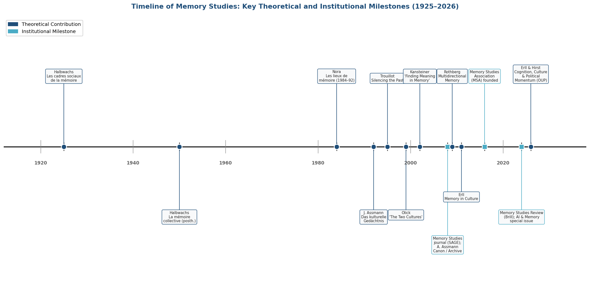
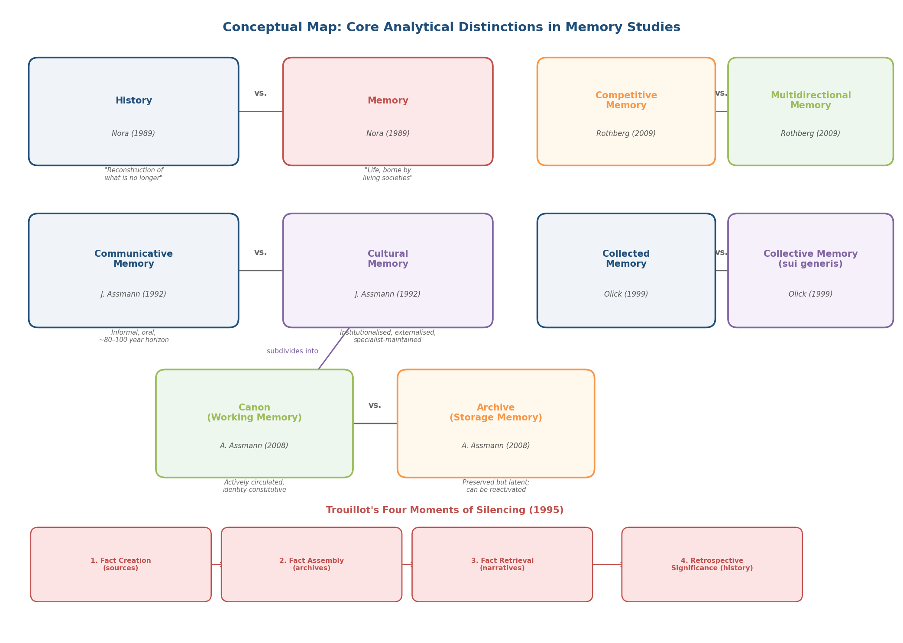
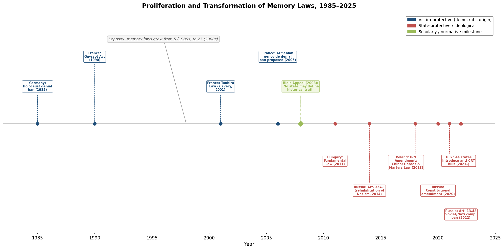
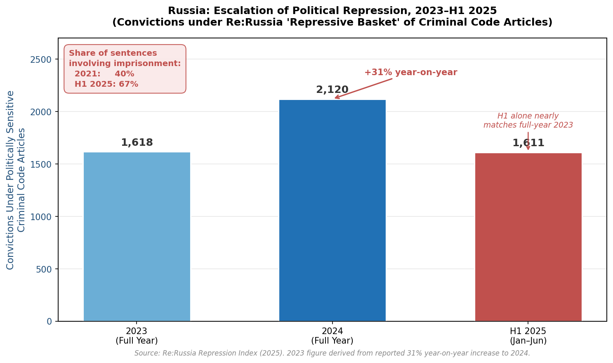
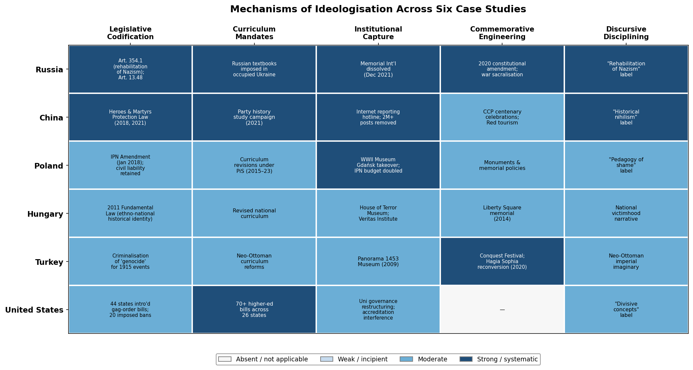
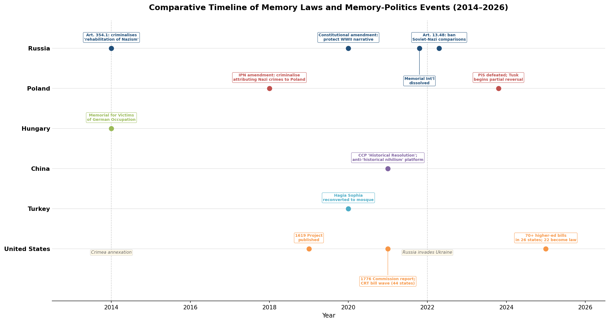
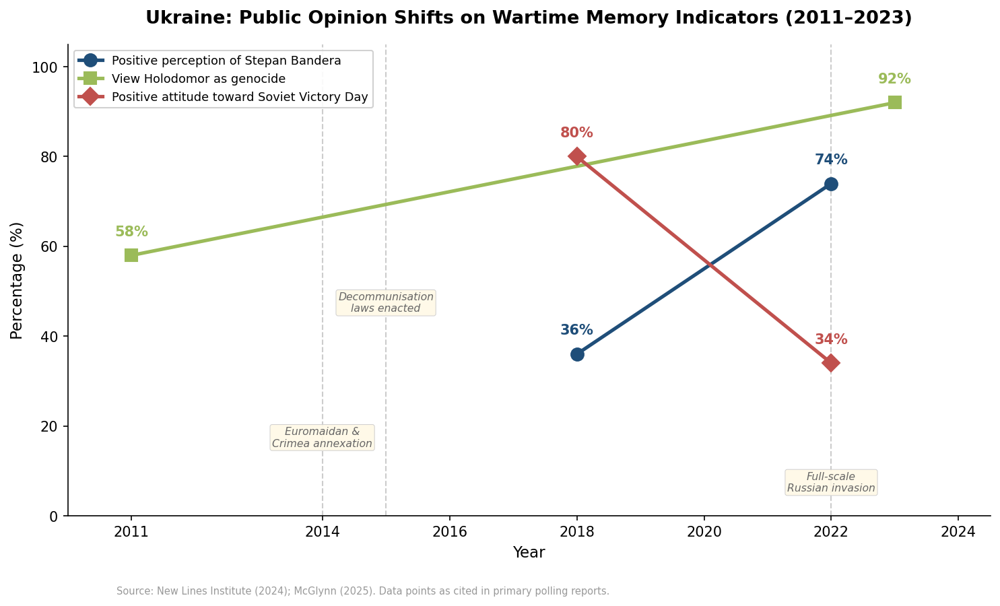
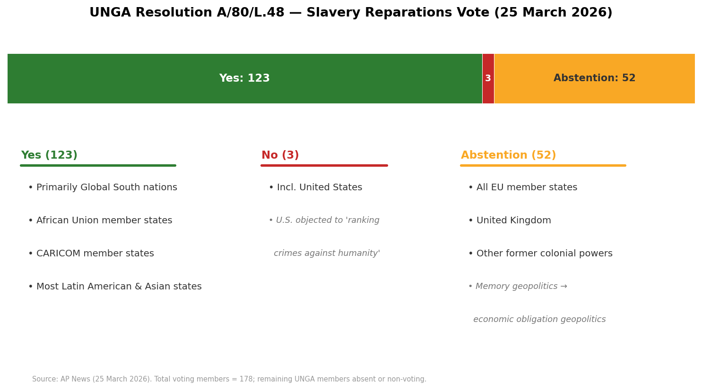

# Overview

The past is never settled. Across political systems and world regions, historical narratives are being rewritten, legislated, commemorated, and contested with an intensity that reflects not antiquarian curiosity but the urgency of present-day power struggles. From Russia's criminal prosecution of citizens who challenge the official Second World War narrative to the wave of U.S. state legislation restricting how race may be taught, from China's campaign against "historical nihilism" to the global movement to repatriate looted Benin Bronzes, the reinterpretation of the past through contemporary political and social lenses has become one of the defining features of early twenty-first-century governance and culture.

This report examines that phenomenon through five interconnected lines of analysis. **Chapter 1** establishes the theoretical foundations — drawing on the work of Halbwachs, Nora, the Assmanns, Trouillot, Rothberg, and others — to provide the conceptual vocabulary necessary for distinguishing between legitimate interpretive pluralism and the coercive instrumentalisation of history. **Chapter 2** traces the mechanisms of ideologisation across six national cases (Russia, China, Poland, Hungary, Turkey, and the United States), identifying five recurrent instruments — legislative codification, curriculum mandates, institutional capture, commemorative engineering, and discursive disciplining — through which states convert historical scholarship into ideological doctrine. **Chapter 3** turns to the inverse movement: the efforts of marginalised communities to reclaim silenced narratives through subaltern, decolonial, and counter-hegemonic historiographies, including material repatriation, Indigenous land-back, curriculum decolonisation, and critical race theory. **Chapter 4** analyses commemorative practices — monuments, counter-monuments, memorial museums, and public rituals — as active agents in the production of historiography, not merely its reflection. **Chapter 5** synthesises these threads by examining how historical memory functions as an operational political resource: mobilised for geopolitical ends in Russia–Ukraine memory wars and East Asian textbook disputes, deployed as foundational trauma in the Israeli–Palestinian conflict, weaponised in domestic culture wars, and channelled through transitional justice and reparations frameworks.

Three cross-cutting findings emerge from the analysis. First, the ideologisation of history is not confined to authoritarian regimes; it operates across the full spectrum of political systems, differing in intensity and institutional mechanism but sharing a common structural logic in which state power forecloses interpretive possibility. Second, the recovery of silenced narratives is an epistemological project as much as a political one: it requires not merely the addition of suppressed content but the transformation of the frameworks through which historical knowledge is produced, validated, and circulated. Third, the relationship between memory and power is recursive — states mobilise memory to legitimate power, that mobilisation reshapes collective remembrance, and the reshaped memory generates new political demands in a self-reinforcing cycle that neither legislation nor ethical aspiration alone can resolve.

# 第1章 Theoretical Foundations — Collective Memory, Cultural Memory, and the Politics of the Past

The contemporary proliferation of disputes over historical narratives — from memory laws in Moscow and Warsaw to curriculum battles in Texas and "historical nihilism" campaigns in Beijing — demands an analytical vocabulary capable of distinguishing between legitimate interpretive pluralism and the political instrumentalisation of the past. That vocabulary originates in memory studies, a field that has evolved over roughly a century from Maurice Halbwachs's sociological insight that memory is collectively constituted to a genuinely interdisciplinary enterprise spanning history, literary theory, political science, psychology, and digital humanities. This chapter surveys the major theoretical traditions, clarifies the core conceptual distinctions they generate, and identifies the specific analytical tools they furnish for examining ideologisation, silencing, and commemoration in the chapters that follow.

## 1.1 The Sociological Origins: Halbwachs and the Social Frameworks of Memory

Modern memory studies begins with Maurice Halbwachs (1877–1945), whose *Les cadres sociaux de la mémoire* (1925) advanced the then-radical proposition that individual recollection depends on collective social frameworks — that memory is not a private neurological retrieval but an act conditioned by socialisation, group membership, and communication. A full English translation of this foundational work, edited by John Sutton, is forthcoming from Oxford University Press (2025), attesting to its continued centrality a century after publication. Halbwachs's posthumous *La mémoire collective* (1950) — published after his death at Buchenwald — extended the argument: every act of remembering presupposes a social group that furnishes the frameworks within which experience becomes meaningful [University of Chicago Press](https://press.uchicago.edu/ucp/books/book/chicago/O/bo3619875.html "On Collective Memory — English translation edited by Lewis A. Coser, 1992").

The principle Halbwachs established — that memory is always already social — remains indispensable. Even ostensibly private recollections, a childhood scene or a personal loss, are structured by the language, categories, and narratives supplied by the groups to which the individual belongs. This insight underpins every subsequent development in the field: if memory is social, then it is also political, contestable, and subject to strategic manipulation.

## 1.2 Pierre Nora and the Memory/History Dichotomy

Pierre Nora's landmark essay "Between Memory and History: Les Lieux de Mémoire" (*Representations*, No. 26, Spring 1989, pp. 7–24) introduced what became arguably the most influential conceptual opposition in the field. For Nora, "memory" is "life, borne by living societies," perpetually evolving, "open to the dialectic of remembering and forgetting," while "history" is "the reconstruction, always problematic and incomplete, of what is no longer." Memory binds a community to its experienced past; history subjects that past to critical analysis. Nora's diagnosis was elegiac: modernity destroys the environments of spontaneous memory (*milieux de mémoire*), leaving behind only deliberate, archival, self-conscious sites of memory (*lieux de mémoire*) — "moments of history torn away from the movement of history, then returned" [UC Press / *Representations*](https://online.ucpress.edu/representations/article/doi/10.2307/2928520/82272/Between-Memory-and-History-Les-Lieux-de-Memoire "Between Memory and History, 1989, pp. 7–24").

His multi-volume *Les lieux de mémoire* (Gallimard, 1984–1992) created a new genre: national memory cartography — the systematic mapping of sites (physical, symbolic, functional) through which a nation constitutes its collective self-understanding. The model was subsequently adapted in Italy, Germany, the Netherlands, and elsewhere, generating a comparative infrastructure for analysing how different polities organise their relationship to the past.

The memory/history dichotomy, however, has attracted sustained criticism. Critics observe that Nora's scheme risks essentialising "memory" as authentic and "history" as inert, when in practice the boundary is porous and politically constructed. States routinely present ideological narratives as organic memory; grassroots communities employ historical methods to validate suppressed experiences. Yet the dichotomy retains analytical utility precisely because it names a tension — between the living, identity-constitutive engagement with the past and the disciplined, critical interrogation of it — that recurs in every case examined in this report.

## 1.3 Jan and Aleida Assmann: Communicative Memory, Cultural Memory, and the Canon/Archive Dynamic

Jan Assmann's *Das kulturelle Gedächtnis* (1992) and his 2008 chapter "Communicative and Cultural Memory" (De Gruyter, pp. 109–118) introduced a typology that has become standard equipment in the field. **Communicative memory** is everyday, informal, orally transmitted, and limited to a horizon of roughly 80–100 years — the span of living generational contact. **Cultural memory**, by contrast, is institutionalised, externalised in stable symbolic forms (texts, monuments, rituals, images), maintained by specialists (priests, teachers, archivists, curators), and extends to an "absolute past" of mythic or foundational events. Assmann defined memory as "knowledge with an identity-index" — "knowledge about oneself" — thereby foregrounding the constitutive link between what a group remembers and who it understands itself to be [Jan Assmann](https://archiv.ub.uni-heidelberg.de/propylaeumdok/1774/1/Assmann_Communicative_and_cultural_memory_2008.pdf "Communicative and Cultural Memory, De Gruyter 2008, pp. 109–118").

This distinction matters analytically because it identifies the institutional mechanisms through which memory becomes durable and, consequently, subject to political control. When a state rewrites school curricula, purges museum exhibitions, or legislates commemorative calendars, it intervenes in cultural memory — the externalised, specialist-maintained layer of collective remembrance. Communicative memory, by contrast, resists top-down control precisely because it resides in informal, intergenerational conversation. The 80–100-year horizon also illuminates why contemporary memory politics is so intense around events of the early-to-mid twentieth century: the communicative memory of the World Wars, the Holocaust, colonialism, and foundational national traumas is now passing beyond living transmission and must either be institutionalised as cultural memory or risk dissolution.

Aleida Assmann complemented this architecture with a further distinction between **canon** and **archive**. The canon constitutes functional or "working memory" — the actively circulated, identity-constitutive selections that a society foregrounds. The archive constitutes "storage memory" — materials preserved but not actively circulating, latent resources that may be reactivated when political or cultural conditions shift. This dynamic is pivotal for understanding how silenced narratives can be reclaimed: suppressed histories often persist in archival storage, awaiting the political moment that moves them from archive into canon [De Gruyter](https://www.degruyterbrill.com/document/doi/10.1515/9783110207262.2.97/html "Canon and Archive, 2008/2010"). Aleida Assmann's broader synthesis *Cultural Memory and Western Civilization* (Cambridge UP, 2011) and subsequent works — including *Shadows of Trauma* (Fordham UP, 2016) and *Is Time Out of Joint?* (Cornell UP, 2020) — further elaborated these concepts. She and Jan Assmann received the Peace Prize of the German Book Trade in 2018, an unusual honour for scholars of memory that signalled the field's growing public resonance.

## 1.4 Travelling Memory, Reception, and Multidirectionality: Erll, Kansteiner, and Rothberg

Astrid Erll's *Memory in Culture* (Palgrave Macmillan, 2011), translated into five languages, provided a comprehensive synthesis of memory studies as an interdisciplinary field. More consequentially for the present analysis, her concept of **travelling memory** rejects the assumption that memory is static or nationally contained. Memory, Erll argues, is constituted through the movement of people, media, and practices across borders; it is always already transcultural, shaped by migration, translation, and remediation. This framework, further developed in *Travels in Time: Essays on Collective Memory in Motion* (Oxford UP, 2025), challenges the methodological nationalism that pervades much memory scholarship and the notion that memory "belongs" to a single community [OUP](https://global.oup.com/academic/product/cognition-culture-and-political-momentum-9780197788332 "Erll bio confirming 2011 publication and Travels in Time, 2025").

Wulf Kansteiner's "Finding Meaning in Memory: A Methodological Critique of Collective Memory Studies" (*History and Theory*, Vol. 41, No. 2, May 2002, pp. 179–197; over 2,500 citations) identified what remains the field's most persistent weakness: the gap between the **production** of memory representations and their **reception** by actual audiences. Scholars routinely analyse monuments, museums, films, and curricula yet rarely demonstrate that these representations are internalised as collective remembering. Kansteiner challenged the field to attend to the reception side — what audiences do with memory representations — rather than assuming that cultural production automatically translates into shared consciousness [Google Scholar](https://scholar.google.com/citations?user=4n-4cBAAAAAJ&hl=en "Kansteiner profile showing 2,572 citations for the 2002 article"). This critique bears directly on the analysis of ideologisation: a state may legislate a particular historical narrative, but whether that narrative is actually absorbed by the population is an empirical question, not an automatic consequence of institutional power.

Michael Rothberg's *Multidirectional Memory: Remembering the Holocaust in the Age of Decolonization* (Stanford UP, 2009) challenged what he termed the "competitive memory" framework — the assumption that public memory operates as a zero-sum contest in which attention to one group's suffering necessarily diminishes attention to another's. Rothberg proposed instead that memories of distinct historical events interact productively: memory of one atrocity can enable, rather than foreclose, recognition of another. Through readings of Hannah Arendt, Aimé Césaire, Charlotte Delbo, and W. E. B. Du Bois, he demonstrated how Holocaust memory and colonial memory have historically cross-fertilised rather than competed. His subsequent *The Implicated Subject: Beyond Victims and Perpetrators* (Stanford UP, 2019) extended this framework by introducing a figure "neither a victim nor a perpetrator, but rather a participant in histories and social formations that generate the positions of victim and perpetrator" [Stanford University Press](https://www.sup.org/books/literary-studies-and-literature/multidirectional-memory "Publisher page, release date June 2009"). Rothberg's framework proves essential for diagnosing cases — examined in Chapter 5 — where competitive memory claims serve political mobilisation.

## 1.5 The Two Cultures of Memory and the Problem of Mediation: Olick and Trouillot

Jeffrey K. Olick's "Collective Memory: The Two Cultures" (*Sociological Theory*, Vol. 17, No. 3, 1999; over 2,260 citations) articulated a methodological schism within memory studies itself. One tradition treats collective memory as the aggregation of socially framed individual memories ("collected memory") — the domain of survey research, oral history, and psychological experiment. The other treats collective memory as a phenomenon *sui generis* — public commemorations, national narratives, institutional archives — irreducible to individual cognition. Olick advocated a "multidimensional rapprochement" between these traditions, arguing that neither alone captures how societies engage with their pasts [SAGE Journals](https://journals.sagepub.com/doi/10.1111/0735-2751.00083 "Article abstract and reference list"). This tension — between the psychological and the cultural, between what individuals actually remember and what institutions claim they should — structures ongoing debates about digital memory, generational transmission, and the politics of commemoration.

Michel-Rolph Trouillot's *Silencing the Past: Power and the Production of History* (Beacon Press, 1995; 20th anniversary edition with foreword by Hazel V. Carby, 2015) operates at the intersection of memory studies and historiography, providing what is perhaps the single most productive analytical framework for understanding how power shapes historical knowledge. Trouillot identified four moments at which power enters the process of historical production: (1) the moment of **fact creation** — the making of sources; (2) the moment of **fact assembly** — the making of archives; (3) the moment of **fact retrieval** — the making of narratives; (4) the moment of **retrospective significance** — the making of history in the final instance. At each moment, silences are produced — not through conspiracy, but through the routine operations of power that determine what counts as a fact, what is preserved, what is narrated, and what is deemed significant [Beacon Press](https://www.beacon.org/Silencing-the-Past-P1109.aspx "Publisher page with description and publication date").

Trouillot's central case was the Haitian Revolution (1791–1804), rendered "unthinkable" within the prevailing racial epistemology: the very categories through which Europeans understood the world precluded the possibility that enslaved people could conceive and execute a successful revolution. His framework transcends the memory/history dichotomy altogether, because silencing operates not only in how societies remember but in how professional historians produce knowledge. It is therefore indispensable for analysing both ideologisation (Chapter 2), where states manipulate all four moments, and counter-narrative reclamation (Chapter 3), where marginalised communities intervene at specific moments to recover suppressed pasts.

## 1.6 Postmemory: Generational Transmission and Its Limits

Marianne Hirsch's concept of **postmemory**, first articulated in *Family Frames: Photography, Narrative, and Postmemory* (1997) and fully elaborated in *The Generation of Postmemory: Writing and Visual Culture After the Holocaust* (Columbia UP, 2012), describes the relationship that the "generation after" bears to the traumatic experiences of those who came before — experiences transmitted so powerfully through narratives, images, and behaviours that they constitute memories in their own right, despite the second generation's absence from the originating events. Hirsch specifies that postmemory "is not a movement, method, or idea" but rather "a structure of inter- and trans-generational transmission of traumatic knowledge and experience" [Columbia University Press](https://cup.columbia.edu/author-interviews/hirsch-generation-postmemory/ "An Interview with Marianne Hirsch").

The concept has been applied well beyond the Holocaust context — to intergenerational memory of slavery, colonialism, apartheid, and political violence — becoming one of the most widely cited frameworks in contemporary memory studies. Its analytical value lies in its capacity to explain why memory conflicts intensify rather than fade across generations: as communicative memory gives way to cultural memory (in Jan Assmann's terms), the "generation after" may invest the transmitted past with heightened emotional and political urgency precisely because it is mediated rather than directly experienced.

## 1.7 The Institutional Consolidation of Memory Studies

The trajectory from Halbwachs's 1925 sociological intervention to the present reveals a field that has undergone rapid institutional consolidation. Key inflection points include: Nora's cultural turn (1984–1992); the Assmanns' typological refinement and Trouillot's power analysis (1992–1995); Olick's two-cultures intervention (1999); Kansteiner's reception critique (2002); Rothberg's multidirectional turn (2009); and the period of institutional consolidation signalled by the founding of the *Memory Studies* journal (SAGE, 2008) and the establishment of the Memory Studies Association (MSA) in Amsterdam in December 2016, with approximately 200 scholars attending its inaugural conference [Memory Studies Association](https://www.memorystudiesassociation.org/ "MSA homepage, founded 2016"). The MSA's creation marked the field's passage from an intellectual current within adjacent disciplines to a self-conscious, professionally organised research community with its own governance structures, conferences, and publication networks.

*Figure 1.1. Timeline of memory studies, charting major theoretical contributions (blue) and institutional milestones (orange) from Halbwachs (1925) to recent publications. Note: some dates in the figure are approximate; precise publication years are given in the text.*

Recent developments (2024–2026) suggest the field is entering a new phase characterised by both theoretical deepening and thematic expansion. Brill launched *Memory Studies Review* in 2024, with an inaugural focus on "Memory and Environment" that signals convergence with the environmental humanities [*Memory Studies Review*](https://brill.com/view/journals/mesr/mesr-overview.xml "Journal overview, Brill 2024"). A 2024 special issue titled "Is Artificial Intelligence the Future of Collective Memory?" (edited by Gensburger and Clavert) examined how generative AI transforms collective memory practices — raising questions about algorithmic curation, hallucinated pasts, and the epistemological status of machine-generated historical narratives [HAL](https://hal.science/hal-04839884v1 "Introduction to special issue, DOI: 10.1163/29498902-202400019"). Erll and Hirst's *Cognition, Culture, and Political Momentum* (Oxford UP, estimated January 2026, 464 pp.) represents the most ambitious attempt to bridge psychological and cultural memory research, featuring Olick's "The Two Cultures Revisited" and Kansteiner's new concept of "Meta-Memory" [Oxford University Press](https://global.oup.com/academic/product/cognition-culture-and-political-momentum-9780197788332 "OUP product page with TOC"). Ann Rigney's *Remembering Hope: The Cultural Afterlife of Protest* (Oxford UP, 2025) links memory studies to activism and "transformative memory," extending the field's engagement with politically mobilised remembrance.

## 1.8 Analytical Tools for Diagnosing Instrumentalisation

The theoretical traditions surveyed above yield a specific set of analytical instruments deployed throughout the remainder of this report. Four deserve explicit identification.

*Figure 1.2. Conceptual map of the core analytical distinctions in memory studies, showing five key oppositional pairs and Trouillot's four moments of silencing. Each distinction is attributed to its originating scholar and date.*

**Trouillot's four moments of silencing** provide a diagnostic protocol for identifying where power intervenes in the production of historical knowledge. When a state destroys archives (moment 2), criminalises particular narratives (moment 3), or legislates retrospective significance (moment 4), the framework specifies the mechanism of instrumentalisation with precision.

**Aleida Assmann's canon/archive dynamic** explains how narratives move between active circulation and latent storage. Ideologisation operates by fixing the canon — declaring certain narratives the only legitimate reading of the past — while suppressing archival materials that might support alternative interpretations. Counter-narrative reclamation operates by moving materials from archive into canon, reactivating suppressed pasts for contemporary purposes.

**Rothberg's competitive vs. multidirectional memory framework** provides diagnostic criteria for evaluating memory claims. When political actors frame public memory as a zero-sum contest — asserting that recognition of one group's historical suffering necessarily diminishes another's — the competitive framework is being deployed as a political resource. Multidirectional memory, by contrast, offers both a normative and an empirical alternative, demonstrating that solidarity across distinct memory communities is historically attested and politically viable.

**Kansteiner's reception-side methodology** imposes an evidentiary discipline: claims about the social effects of memory narratives must demonstrate actual audience uptake, not merely the existence of representations. This criterion is particularly important for evaluating state-sponsored ideologisation, where the production of official narratives is often conflated with their successful internalisation.

## 1.9 Defining the Key Terms

The analytical clarity of this report depends on consistent deployment of the following distinctions, derived from the traditions surveyed above:

- **History** refers to the disciplined, critical, methodologically regulated inquiry into the past — a practice that, while never free of perspective, operates under norms of evidentiary accountability, peer review, and revisability. History, in Nora's formulation, is "the reconstruction, always problematic and incomplete, of what is no longer."

- **Memory** denotes the living, identity-constitutive engagement with the past — always selective, affectively charged, and group-bound. Memory is not false history; it is a different mode of relating to the past, one that serves identity and belonging rather than disciplinary truth-claims.

- **Collective memory** encompasses both "collected memory" (the socially shaped individual memories aggregated within a group) and "collective memory" *sui generis* (the public narratives, commemorations, and institutional practices through which a group constitutes its shared past), following Olick's two-cultures distinction.

- **Ideology**, as deployed here, refers not to any system of ideas but specifically to the closure of interpretive debate through the authoritative fixing of meaning. Ideologisation of history occurs when a narrative is removed from the domain of contestable interpretation and installed as doctrine backed by institutional power — legal sanction, curricular mandate, or social coercion.

- **Instrumentalisation** describes the strategic deployment of historical narratives for present political purposes — electoral mobilisation, regime legitimation, territorial claims, or identity formation — in ways that subordinate the complexity of the past to the requirements of the present.

- **Commemoration** refers to the material and performative practices — monuments, museums, rituals, holidays, and increasingly digital platforms — through which societies mark and re-mark selected pasts. Commemoration is the primary mechanism through which cultural memory is externalised and maintained.

These terms are not mutually exclusive. All historiography is in some sense perspectival; all memory carries elements of interpretation; all commemoration involves selection. The analytical challenge, taken up in the chapters that follow, is to identify the conditions under which these inevitable features of engagement with the past cross into instrumentalisation, ideologisation, or silencing — and the conditions under which they enable critical understanding, solidarity, and justice.

# 第2章 The Ideologisation of History — When the Past Becomes Doctrine

The conversion of historical knowledge into ideological doctrine is not new. What distinguishes the early twenty-first century is the sophistication of the mechanisms through which states accomplish it. Where earlier regimes relied principally on censorship bureaus and propaganda ministries, contemporary ideologisation operates through an interlocking apparatus of legislative codification, curriculum mandates, institutional capture, commemorative engineering, and discursive disciplining — instruments that span regime types and traverse the conventional boundary between authoritarian and democratic governance. This chapter examines how historical narratives are absorbed into ideological systems — nationalist, populist, authoritarian, identitarian — so that the past ceases to function as an object of inquiry and becomes instead a fixed script legitimising present power arrangements. It begins with the philosophical question of whether all historiography is inherently ideological (Section 2.1), traces the evolution of memory laws from democratic safeguard to authoritarian weapon (Section 2.2), and then analyses six comparative cases — Russia, China, Poland, Hungary, Turkey, and the United States — before distilling the cross-cutting mechanisms that unite them (Section 2.8).

## 2.1 The Narrative Foundations of Ideologisation

Any analysis of how history becomes doctrine must reckon with a prior philosophical question: is all historiography inherently ideological, or does a meaningful boundary exist between interpretation and instrumentalisation? Hayden White's *Metahistory* (1973) offered the most radical affirmative answer. Historical writing, White argued, is inescapably structured by literary and rhetorical devices — four master tropes, four modes of emplotment, four ideological implications — such that narrative form carries ideological weight irrespective of factual accuracy. In *The Content of the Form* (1987), he pressed the argument further: narrativity naturalises particular social and moral orders; the discipline of history domesticates the past's disruptive potential into orderly narratives whose very claims to objectivity are ideological [Hopkins Press](https://press.jhu.edu/books/title/2540/content-form "Publisher page for The Content of the Form, 1987"). His "Politics of Historical Interpretation" essay in *Critical Inquiry* (1982) sharpened the point: professional historiography's insistence on disciplinary norms functions to contain the radical otherness of the past, and the appeal to value-free inquiry masks the ideological work performed by narrative conventions [JSTOR](https://www.jstor.org/stable/1343276 "White, 'Politics of Historical Interpretation,' Critical Inquiry 1982").

Critics — Carlo Ginzburg and Arnaldo Momigliano foremost among them — contended that White's narrativism, whatever its philosophical elegance, inadvertently provides cover for denial and distortion: if all historical narratives are equally literary constructions, the distinction between a rigorously documented account and a propagandistic fabrication collapses [Open Research Europe](https://open-research-europe.ec.europa.eu/articles/5-259 "Scholarly analysis of White's narrativism, 2025"). This tension remains unresolved, but it establishes an essential analytical baseline for the present chapter. The ideologisation of history operates precisely in the space between interpretation — which is epistemologically inevitable — and instrumentalisation — which involves the coercive closure of interpretive possibility.

A complementary framework comes from Eric Hobsbawm and Terence Ranger's *The Invention of Tradition* (1983), which defined "invented traditions" as practices of ritual or symbolic nature that "seek to inculcate certain values and norms of behaviour by repetition, which automatically implies continuity with the past" — where that continuity is "largely factitious" [Cambridge University Press](https://psi424.cankaya.edu.tr/uploads/files/Hobsbawm_and_Ranger_eds_The_Invention_of_Tradition.pdf "Full text, 1983 edition"). The framework directly diagnoses how states fabricate historical legitimacy: the past is not discovered but constructed, and the construction follows the requirements of present political authority. Combined with White's insight that narrative form itself carries ideological implications, this yields a powerful analytical apparatus. Ideologisation, in these terms, is the moment when interpretive openness gives way to doctrinal closure, and when the fabrication of continuity is enforced through institutional and legal power.

## 2.2 Memory Laws: From Democratic Safeguard to Authoritarian Weapon

The most visible instrument of contemporary ideologisation is the memory law — legislation that mandates or prohibits specific historical interpretations. Nikolay Koposov's *Memory Laws, Memory Wars* (Cambridge UP, 2018) documents a critical transformation in both the quantity and the character of such laws. Their number proliferated from five in the 1980s to twenty-seven in the 2000s, but the more consequential shift was qualitative. Memory laws originated as democratic instruments — Germany's 1985 Holocaust denial ban, France's 1990 Gayssot Act — designed to protect the dignity of victims and prevent the rehabilitation of genocidal ideologies. Over time, however, they became, in Koposov's formulation, "weapons not of the weak, but of the strong," as authoritarian and illiberal states adopted memory legislation to enforce mythical national histories and shield official narratives from scholarly scrutiny [Los Angeles Review of Books](https://lareviewofbooks.org/article/weapons-not-of-the-weak-but-of-the-strong-on-nikolay-koposovs-memory-laws-memory-wars-the-politics-of-the-past-in-europe-and-russia "Douglas Smith review, LARB, April 2018").

*Figure 2.1 — The timeline traces memory-law enactments from 1985 to 2025, colour-coded to distinguish victim-protective legislation of democratic origin (blue) from state-protective or ideological legislation (red). The 2008 Blois Appeal (green) marks the normative counter-position. Data drawn from Koposov (2018) and subsequent legislative developments.*

The 2008 Blois Appeal, signed by Pierre Nora, Carlo Ginzburg, and other prominent historians, crystallised the scholarly counter-position: "In a free state, no political authority has the right to define historical truth and to restrain the freedom of the historian with the threat of penal sanctions." This principle — that the state may legitimately protect victims from denial but may not arrogate to itself the determination of historical truth — provides the normative anchor for distinguishing democratic memory legislation from ideological instrumentalisation. The sections that follow apply this distinction to six national cases in which the boundary has been crossed or is under sustained pressure.

## 2.3 Russia: The Sacralisation of the Great Patriotic War

Russia offers the most fully developed contemporary case of history's conversion into state doctrine. Article 354.1 of the Criminal Code (2014) criminalises the "rehabilitation of Nazism," but its operational function extends far beyond Holocaust denial: it shields the official "Great Patriotic War" narrative from critical interrogation of any kind. Following the full-scale invasion of Ukraine in February 2022, Article 13.48 (April 2022) banned comparisons between Soviet and Nazi actions and criminalised denying "the decisive role of the Soviet people" in the defeat of fascism. By July 2023, 620 individuals had been indicted in 78 regions on wartime-narrative-related charges, with 81 sentenced to imprisonment [Verfassungsblog](https://verfassungsblog.de/weaponizing-russias-memory-law/ "Nekoliak & Klochkova, 'Weaponizing Russia's Memory Law,' July 2023").

Enforcement has since intensified dramatically. According to Re:Russia's Repression Index, which tracks convictions across a "basket" of politically sensitive Criminal Code articles, 2,120 people were convicted under the broader repressive basket in 2024 — a 31% increase over 2023's estimated 1,618. In the first half of 2025 alone, 1,611 were convicted, nearly matching the full-year 2023 total. Convictions specifically for "rehabilitation of Nazism" doubled in the first half of 2025 compared to the same period in 2024. Across all politically sensitive articles, the share of sentences involving actual imprisonment rose from 40% in 2021 to 67% in the first half of 2025, and the overall integrated repression index reveals a second wave of intensification beginning in the second half of 2024 that significantly exceeds the initial wartime surge [Re:Russia](https://re-russia.net/en/analytics/0358/ "Re:Russia Repression Index, 2025").

*Figure 2.2 — Convictions under Re:Russia's "repressive basket" of politically sensitive Criminal Code articles, 2023–H1 2025. The share of sentences involving imprisonment rose from 40% (2021) to 67% (H1 2025). Source: Re:Russia Repression Index (2025).*

The institutional architecture of ideologisation extends well beyond criminal law. Memorial International, the Nobel Peace Prize-winning organisation that documented Soviet-era repression for over three decades, was dissolved by court order in December 2021 — eliminating the most authoritative independent repository of counter-memory in Russia. The 2020 constitutional amendment enshrined the protection of the Soviet war narrative as a constitutional obligation, elevating ideological historiography to the status of supreme law. In occupied Ukrainian territories, Russia has exported its memory regime wholesale: purging Ukrainian curricula, imposing Russian textbooks, vandalising Holodomor memorials, and replacing monuments to Taras Shevchenko with busts of Alexander Pushkin. Jade McGlynn characterises the resulting system as "cognitive warfare" operating through "memory traps" — institutional and discursive mechanisms designed to lock populations into state-mandated historical frameworks from which exit is both legally and psychologically costly [Jade McGlynn](https://smalldeedsbigwar.substack.com/p/memory-traps "Memory Traps, November 2025").

## 2.4 China: Historical Nihilism and the Party as Historiographic Authority

The Chinese Communist Party's campaign against "historical nihilism" (*lishi xuwuzhuyi*) represents a structurally distinct but functionally analogous form of ideologisation. Where Russia sacralises a specific historical event — the Great Patriotic War — the CCP claims comprehensive historiographic authority over the entire arc of party history, treating any critical reassessment as an existential threat to regime legitimacy.

Xi Jinping framed the stakes explicitly upon assuming the general secretaryship, arguing that the "comprehensive negation" of Soviet history and the "denial of Lenin and Stalin" constituted historical nihilism that "paralysed minds" and rendered party organisations "ineffective" — a lesson drawn directly from the Soviet collapse. Document No. 9 (2013), the internal communiqué on the ideological sphere, identified historical nihilism alongside "universal values" and "Western governance styles" as threats aimed at undermining the CCP's historical legitimacy [Jamestown Foundation](https://jamestown.org/battling-nihilism-the-prcs-quest-for-autonomy/ "Battling Nihilism: The PRC's Quest for Autonomy, March 2025").

The CCP's response has been simultaneously coercive and constructive. On the coercive side, slander against "heroes and martyrs" became punishable under civil law in 2018 and was criminalised in 2021. Internet regulators established a reporting hotline for historical nihilism violations in 2021, and platforms removed over two million pieces of content deemed non-compliant. The artist Gao Zhen was detained in mid-2024 for "slandering the reputation of heroes and martyrs" after creating works that questioned official narratives. The prosecution of journalists who challenged the canonical account of the "Five Heroes of Langya Mountain" demonstrated that even granular factual disputes about specific episodes are treated as ideological transgressions.

On the constructive side, the November 2021 "Resolution on the Major Achievements and Historical Experience of the Party over the Past Century" — only the third such resolution in CCP history, after those of 1945 and 1981 — established Xi Jinping's era as the "New Era" and elevated his thought to "the scientific guiding force for the Sinicization of Marxism" [CSIS Interpret](https://interpret.csis.org/translations/resolution-of-the-ccp-central-committee-on-the-major-achievements-and-historical-experience-of-the-party-over-the-past-century/ "CSIS translation"). The accompanying party history study campaign was characterised as "a massive party history propaganda and education campaign on a scale unseen since the Mao era" [Jamestown Foundation](https://jamestown.org/the-2021-party-history-study-campaign-stresses-revolution-and-sacrifice/ "Jamestown analysis, June 2021"). By early 2022, the party declared that historical nihilism had been "discredited and effectively curbed." A January 2025 *Study Times* article, however, warned that AI models now repackage nihilistic narratives through deepfakes and fabricated historical texts — suggesting the threat has migrated to new technological terrain rather than disappeared.

The CCP's internal framework conceives of ideological collapse as proceeding through three stages: isolated cases of historical nihilism → proliferation across mainstream society → critical-mass rejection of the system. A 2015 survey found that only 38% of university students could correctly define historical nihilism as "using the negation of history to achieve the negation of reality," while 34% regarded it merely as "another historical perspective." For the party, this gap between intended doctrine and actual reception confirms the existential urgency of the campaign. The biological metaphor pervading official discourse — "inherit red genes" (*chuancheng hongse jiyin*) — merges ideological loyalty with identity formation, converting party history from a subject of study into something approaching a hereditary obligation.

Since 2022, the campaign has evolved further into a struggle against "cultural nihilism" (*wenhua xuwuzhuyi*), framed as an even graver threat capable of severing the "spiritual lifeline" of Chinese civilisation. This conceptual expansion — from policing historical interpretation to policing cultural identity itself — illustrates a recurring dynamic: once initiated, ideologisation tends toward totality, progressively widening the category of impermissible thought.

## 2.5 Poland and Hungary: Illiberal Memory Politics in the European Union

Within the European Union, Poland under the Law and Justice party (PiS, 2015–2023) and Hungary under Viktor Orbán's Fidesz demonstrate that the ideologisation of history is not confined to consolidated authoritarian regimes but can be pursued within nominally democratic frameworks — and, crucially, within a supranational legal order that formally protects academic freedom.

Poland's January 2018 amendment to the Institute of National Remembrance (IPN) Act criminalised attributing Nazi crimes to the Polish nation or state. Criminal sanctions were in force from March to July 2018 before being repealed under intense international pressure, though civil liability provisions were retained. Anna Wójcik argues that Poland's memory laws constituted "a perversion of classic European memory laws" and "examples of penal populism and populist revanchism" — instruments designed not to protect victims but to enforce a narrative of exclusive national innocence [Anna Wójcik, *Journal of Illiberalism Studies*](https://www.illiberalism.org/memory-laws-rule-of-law-and-democratic-backsliding/ "Wójcik, JIS 3(3), Fall 2023"). PiS's ideologisation programme extended well beyond legislation: the government intervened in the Museum of the Second World War in Gdańsk, replacing its internationalist curatorial vision with a narrative centred on Polish heroism; doubled the IPN budget to fund research aligned with the official narrative; rewrote school curricula; and deployed the concept of *pedagogika wstydu* ("pedagogy of shame") to delegitimise any scholarship acknowledging Polish complicity in wartime atrocities [Lossi 36](https://lossi36.com/2024/09/13/opinion-it-is-time-to-dismantle-piss-memory-politics/ "Lossi 36, September 2024"). After PiS's defeat in the October 2023 elections, the Tusk government initiated reversals of several policies, but the institutional infrastructure of ideologisation — the expanded IPN, revised curricula, and civil liability provisions — has proven considerably more durable than the electoral mandate that created it.

Hungary's trajectory, analysed in a 2026 University of Amsterdam doctoral dissertation by Réka Deim, confirms that "memory politics has become a central ideological instrument in Viktor Orbán's illiberal regime" [University of Amsterdam](https://www.uva.nl/shared-content/uva/en/news/news/2026/02/commemoration-as-a-tool-of-power-in-hungary.html "UvA, February 2026"). The 2011 Fundamental Law constitutionalised an ethno-national historical identity, embedding a particular reading of Hungarian history — as a Christian nation victimised successively by Ottoman, Habsburg, Nazi, and Soviet occupations — into the supreme legal document. The 2014 Memorial for Victims of the German Occupation in Budapest's Liberty Square presented Hungary as a passive victim of Nazi invasion, suppressing extensive documentation of Hungarian state co-responsibility in the deportation of over 400,000 Jews. Citizens responded by creating a "Living Memorial" (*Eleven Emlékmű*) — a grassroots counter-memory installation of personal artefacts and photographs placed directly opposite the official monument, a practice that persists to the present day. The House of Terror Museum devotes the overwhelming majority of its exhibition space to communist-era persecution while compressing the Holocaust into a single room, producing a historiographic asymmetry calibrated to sustain the regime's narrative of exclusive national victimhood.

## 2.6 Turkey: Neo-Ottoman Commemoration as Ideological Practice

Under Recep Tayyip Erdoğan and the AKP, Turkey has developed a distinctive form of ideologisation centred on the transformation of Ottoman imperial history into contemporary political theatre. The 1453 conquest of Constantinople has been converted into a massive annual "Conquest Festival" (*Fetih Şöleni*), an event whose scale and choreography serve as instruments of neo-Ottoman identity construction. The Panorama 1453 History Museum (2009) — a state-funded installation enabling visitors to experience the siege as immersive spectacle — and the 2020 reconversion of Hagia Sophia from museum to functioning mosque physically recreate Ottoman "conquest" as contemporary political acts. Infrastructure projects are named after Ottoman sultans and timed to coincide with anniversary dates, embedding a neo-Ottoman imaginary into the material fabric of everyday life.

Dissard and Kurşunlugil (2021) argue that these commemorative practices serve to disguise the celebration of twentieth-century "ethnic and religious purification," converting a narrative of imperial conquest into a contemporary assertion of Sunni Turkish supremacy [Dissard & Kurşunlugil, *L'Espace Politique*](https://journals.openedition.org/espacepolitique/8806 "L'Espace Politique 41, 2021"). The legislative dimension mirrors this commemorative programme: Turkey's criminalisation of the term "genocide" for the 1915 Armenian massacres exemplifies what Koposov identifies as the "reversal" of memory laws — legislation that protects not victims but perpetrators, not historical truth but national mythology. The Turkish case thus illustrates how commemorative engineering and legislative codification can operate in tandem, each reinforcing the other's ideological function.

## 2.7 The United States: Curriculum Wars and Legislative Censorship

The United States presents a case in which ideologisation operates not through a single authoritarian apparatus but through a dispersed, federated system of legislative interventions targeting education at both the K–12 and higher-education levels. Since January 2021, forty-four states have introduced bills restricting teaching on race and racism, and twenty states have imposed bans. By mid-2025, over seventy bills across twenty-six states targeted higher education specifically, with twenty-two becoming law in sixteen states; seven higher-education censorship laws were enacted in 2025 alone. Nearly 40% of the U.S. population now lives in states with such restrictions [Education Week](https://www.edweek.org/policy-politics/map-where-critical-race-theory-is-under-attack/2021/06 "CRT Tracker, updated January 2026") [PEN America](https://pen.org/with-a-wave-of-new-bills-in-2025-state-legislators-cast-a-web-of-control-over-higher-education/ "PEN America report, July 2025").

The mechanisms differ from those in Russia or China — there are no criminal penalties for "historical nihilism" or "rehabilitation" of an enemy ideology — but the structural logic is recognisably ideological: the state intervenes to foreclose certain interpretive frameworks while mandating others. Educational "gag orders" prohibit instruction in "divisive concepts"; governance restructuring transfers faculty authority to politically appointed bodies; "institutional neutrality" mandates prohibit universities from taking positions on contested social issues; and interference with accreditation processes threatens the institutional autonomy that underwrites academic freedom.

These interventions have produced paradoxical effects. Shaw (2025) demonstrates that "it was the states' misappropriation of CRT for political purposes that elevated the theory to doctrinal, popular, and pedagogical prominence." Since 2021, lawmakers in every U.S. state except Delaware have introduced "anti-CRT" bills, and twelve states adopted legislation banning "divisive concepts" between April 2021 and March 2023. Shaw characterises these laws as "pedagogical censorship" targeting *how* race is taught rather than *what* is taught — a distinction that matters precisely because it reveals the ideological operation at work. The stated aim is to protect students from discomfort; the actual effect is to foreclose an entire analytical framework. In a further irony, Shaw observes that some provisions, "though written with the aim of protecting white students, might actually promote a CRT analysis" — since the laws' own logic of racialised educational governance exemplifies the structural dynamics that critical race theory describes [Shaw, *Washington and Lee Law Review*](https://scholarship.law.vanderbilt.edu/cgi/viewcontent.cgi?article=3015&context=faculty-publications "Shaw, 82 Wash. & Lee L. Rev. 1301, Fall 2025").

## 2.8 Cross-Cutting Mechanisms and the Boundary Question

The comparative analysis of Russia, China, Poland, Hungary, Turkey, and the United States reveals five recurrent mechanisms through which states convert historical scholarship into ideological doctrine:

1. **Legislative codification**: Memory laws, criminal provisions against "historical nihilism" or "rehabilitation of Nazism," educational gag orders on "divisive concepts," and civil liability for attributing atrocities to the nation.
2. **Curriculum mandates**: State-directed rewriting of school and university syllabi to enforce approved narratives — from Russia's imposition of textbooks in occupied territories to U.S. state legislatures prescribing what may and may not be taught about race.
3. **Institutional capture**: The appropriation or restructuring of museums, research institutes, and academic governance bodies — Poland's intervention in the Gdańsk museum, Hungary's House of Terror, China's expanded party history apparatus, U.S. legislatures' restructuring of university boards.
4. **Commemorative engineering**: The construction of monuments, festivals, and immersive exhibitions that materialise approved narratives — Turkey's Panorama 1453, Russia's constitutional sacralisation of the war narrative, Hungary's Liberty Square memorial.
5. **Discursive disciplining**: The deployment of ideological labels that delegitimise dissenting interpretations — "historical nihilism" in China, "pedagogy of shame" in Poland, "rehabilitation of Nazism" in Russia, "divisive concepts" in the United States.

*Figure 2.3 — Comparative matrix mapping the five mechanisms of ideologisation across six case-study countries. Colour intensity indicates the strength and systematisation of each mechanism. Cell-level annotations identify the specific instruments deployed in each case.*

These mechanisms operate across regime types, from consolidated authoritarian states (Russia, China) through illiberal democracies (Hungary, Poland under PiS, Turkey) to a federal democracy with robust constitutional protections for speech (the United States). The variation in institutional context produces variation in intensity and enforceability — Russia imprisons dissenting historians; the United States restricts syllabi — but the underlying logic is consistent: the state claims authority to determine which historical interpretations are permissible and deploys institutional power to enforce that determination.

The question raised at the outset — whether a defensible boundary exists between interpretive pluralism and ideologisation — can be maintained along four axes. First, the presence or absence of *institutional coercion*: ideologisation involves legal penalties or institutional sanctions for divergent historical claims, whereas interpretive pluralism accepts competing accounts without punitive consequences. Second, the *Blois Appeal principle*: no political authority may define historical truth. Third, the *closure of debate*: ideologisation forecloses inquiry by declaring certain questions settled by political authority rather than by evidence and argument, whereas pluralism accepts that historical understanding is necessarily provisional and contestable. Fourth, Hobsbawm's *invention criterion*: ideologisation typically involves the fabrication of continuity with a past that is "largely factitious," whereas interpretive pluralism operates within the constraints of documented evidence even when interpretations diverge sharply.

None of these criteria is absolute — the boundary between vigorous interpretation and soft ideologisation admits of grey zones, and democratic memory legislation itself occupies contested terrain. Together, however, they provide a workable analytical framework for distinguishing between the inevitable perspectivism of all historiography (which White correctly identified) and the coercive instrumentalisation of the past (which Koposov, Wójcik, and others document as a qualitatively distinct phenomenon). The cases examined in this chapter suggest that the distinguishing feature of ideologisation is not the presence of a political perspective — all historical writing carries one — but the deployment of state power to foreclose alternatives.

# 第3章 Reclaiming Silenced Narratives — Subaltern, Decolonial, and Counter-Hegemonic Historiographies

Where the previous chapter examined how states convert the past into doctrine, this chapter turns to the inverse movement: the efforts of marginalised communities to recover histories that dominant power structures have suppressed, distorted, or rendered "unthinkable." The recovery of silenced narratives is not simply additive — a matter of filling archival gaps — but epistemological. It challenges the very frameworks through which historical knowledge has been produced, validated, and circulated. Subaltern studies, decolonial theory, and critical race historiography each contest the assumption that Euro-Atlantic disciplinary norms constitute neutral ground for historical inquiry. They insist that what counts as a historical fact, who qualifies as a historical agent, and which archives are deemed legitimate are themselves products of power relations that must be exposed and dismantled.

The recovery of suppressed pasts is not, however, without its own tensions. When counter-narratives gain institutional traction — entering university curricula, shaping museum exhibitions, informing legislative agendas — they risk co-optation, simplification, or a new form of closure. This chapter traces the theoretical foundations of counter-hegemonic historiography, examines contemporary instances of narrative reclamation across multiple world regions, and analyses the consequences when the subaltern does, in some measure, "speak" — only to discover that institutional absorption can blunt the critical edge of the enterprise.

## 3.1 The Architecture of Silence: Trouillot and the Production of Historical Absence

Any examination of silenced narratives must begin with Michel-Rolph Trouillot's *Silencing the Past: Power and the Production of History* (Beacon Press, 1995), which remains the most rigorous account of how power enters the production of historical knowledge. Trouillot identified four moments at which silences are generated: (1) the moment of fact creation — the making of sources; (2) the moment of fact assembly — the making of archives; (3) the moment of fact retrieval — the making of narratives; (4) the moment of retrospective significance — the making of history in the final instance. Power operates at each juncture not through conspiracy but through routine institutional decisions that determine what is recorded, what is preserved, what is narrated, and what is deemed historically significant [Beacon Press](https://www.beacon.org/Silencing-the-Past-P1109.aspx "Publisher page, 1995; 20th-anniversary edition 2015").

Trouillot's central case — the Haitian Revolution (1791–1804) — demonstrated these mechanisms with devastating clarity. The revolution "challenged the ontological and political assumptions of the most radical writers of the Enlightenment," rendering it literally "unthinkable" within prevailing racial epistemology [Ndlovu-Gatsheni](https://library.oapen.org/bitstream/handle/20.500.12657/41376/9781138588578_oachapter1.pdf "Epistemic Freedom in Africa, Ch. 1, 2018, quoting Trouillot 1995: 26"). Enslaved people who conceived and executed a successful revolution against the most powerful colonial armies of the age were not merely ignored; the categories through which Europeans understood the world precluded the very possibility of such agency. The Haitian case thus illustrates that silencing need not take the form of censorship or deliberate erasure — it can inhere in the epistemic structures that organise what is thinkable. A 20th-anniversary edition (2015) with a foreword by Hazel V. Carby underscored the work's enduring centrality, and Raoul Peck's 2021 HBO miniseries *Exterminate All the Brutes* brought Trouillot's framework to a mass audience.

Trouillot's four-moment schema provides the analytical backbone for the analysis that follows. Each strategy of narrative reclamation examined in this chapter — subaltern reading practices, decolonial epistemological reframing, archival counter-projects, and material repatriation — can be understood as an intervention at one or more of these moments, seeking to undo specific silences by altering the conditions under which sources are created, assembled, narrated, or deemed significant.

## 3.2 Subaltern Studies: Reading Against the Grain of the Colonial Archive

The Subaltern Studies collective, founded by Ranajit Guha in 1982, launched one of the most consequential historiographic interventions of the late twentieth century. Guha's founding statement declared both Cambridge imperial history and nationalist-Marxist historiography "elitist," positing an "autonomous domain" of subaltern politics irreducible to the agendas of colonial administrators, nationalist bourgeoisies, or metropolitan Marxist theorists. Against Eric Hobsbawm's influential category of the "pre-political" — which consigned peasant insurgencies to a developmental stage prior to "proper" political consciousness — Guha insisted that peasant rebellion constituted a contemporary, autonomous form of political action with its own rationality and organisational logic [Chakrabarty](https://files.libcom.org/files/subaltern.pdf "Subaltern Studies and Postcolonial Historiography, Nepantla 1:1, 2000, pp. 9–27").

What distinguished Subaltern Studies methodologically was its approach to the colonial archive. Guha developed a critical reading strategy that moved beyond identifying elite bias to analysing the "textual properties" of colonial documents — the rhetorical structures, narrative conventions, and classificatory schemas through which British administrators constructed accounts of peasant insurgency. Reading the archive "against the grain" entailed not merely extracting suppressed facts but exposing the discursive machinery that reproduced domination at the level of the text itself. This method intervened directly at Trouillot's first and third moments — the making of sources and the making of narratives — by demonstrating that colonial records are not transparent windows onto subaltern experience but artefacts of power requiring deconstruction before they can yield historical knowledge.

Gayatri Chakravorty Spivak's "Can the Subaltern Speak?" (1985; revised 1988, 1999) pushed the project's logic to its most radical conclusion. Spivak argued that the subaltern cannot "speak" — not because subaltern people lack voice, but because the epistemic structures of colonial and postcolonial power foreclose self-representation within dominant knowledge systems. Her critique targeted Western intellectuals, specifically Foucault and Deleuze, who presume to "let the subaltern speak" while unwittingly re-inscribing the structures that produce silence. Through the case of *sati* (widow self-immolation), Spivak demonstrated how both colonial British narratives ("white men saving brown women from brown men") and indigenous patriarchal narratives erased subaltern women's subjectivity, producing a double foreclosure that no simple act of "giving voice" could overcome. Dipesh Chakrabarty observed that the essay had "a serious impact on the later intellectual trajectory" of the Subaltern Studies project [Chakrabarty](https://files.libcom.org/files/subaltern.pdf "Chakrabarty, Nepantla 1:1, 2000, pp. 24–25") [Literary Encyclopedia](https://www.litencyc.com/php/sworks.php?rec=true&UID=19945 "Entry on 'Can the Subaltern Speak?'").

Spivak's intervention is indispensable because it guards against the naïve assumption that counter-narrative recovery is a straightforward exercise in amplifying suppressed voices. If the frameworks through which "voice" is heard and recognised are themselves products of epistemic domination, then reclamation demands not merely new content but new conditions of audibility — a transformation of the structures of knowing, not only of what is known.

## 3.3 Provincialising Europe: Chakrabarty and the Critique of Historicism

Dipesh Chakrabarty's *Provincializing Europe: Postcolonial Thought and Historical Difference* (Princeton UP, 2000; reissued 2007) extended the subaltern critique into a systematic challenge to the universalist claims of European historical thought. Chakrabarty argued that "historicism" — the assumption that modernity appears "first in Europe and then elsewhere" — consigned non-Western societies to a perpetual "waiting room," measuring their progress against a European template they could only belatedly approximate. His distinction between "History 1" (the universalising logic of capitalist modernity, narrated through European categories) and "History 2" (subaltern pasts that resist incorporation into this logic, persisting as irreducible difference) created analytical space for what he called the "politics of human diversity" [Not Even Past](https://notevenpast.org/dipesh-chakrabartys-provincializing-of-europe/ "University of Texas review").

To "provincialise" Europe was not to reject European thought wholesale but to recognise it as particular rather than universal — as one tradition among many, produced from a specific historical location and bearing the marks of that location. This move had direct implications for historiographic practice: if the disciplinary norms of professional history — periodisation, evidence standards, narrative conventions — are themselves products of a particular European genealogy, then their claim to universal applicability is itself an exercise of power. A 2025 reassessment by Richard Bourke in *Global Intellectual History* acknowledged the work's innovations while critiquing certain conclusions, testifying to its continued capacity to generate productive scholarly debate a quarter-century after publication [Bourke](https://www.tandfonline.com/doi/full/10.1080/23801883.2025.2497092 "Bourke, 'Provincializing Europe Revisited,' Global Intellectual History, May 2025").

## 3.4 Decolonial Epistemologies: Quijano, Mignolo, and Ndlovu-Gatsheni

Where subaltern studies emerged from within the Western academy's encounter with South Asian history, the decolonial tradition originates in Latin American and African intellectual formations and mounts a more frontal challenge to European epistemic authority. Aníbal Quijano's concept of the "coloniality of power" (*colonialidad del poder*; first articulated in 1991; landmark essay in *Nepantla* 1(3), 2000, pp. 533–580) argues that the colonial classification of populations by race became the foundational axis of modern capitalist power, organising not only labour and authority but knowledge production and intersubjective relations on a global scale. Crucially, coloniality persists long after the formal end of colonial administration: the racial hierarchy that structured colonial exploitation continues to operate through disciplinary norms, institutional arrangements, and epistemic assumptions that privilege European-derived frameworks as universal. A 2024 volume, *Foundational Essays on the Coloniality of Power* (Duke UP, edited by Walsh, Mignolo, and Segato), consolidates Quijano's contributions for a new generation of scholars [Duke UP](https://dokumen.pub/anibal-quijano-foundational-essays-on-the-coloniality-of-power-1478030321-9781478030324.html "Duke UP, 2024").

Walter Mignolo's "Epistemic Disobedience, Independent Thought and Decolonial Freedom" (*Theory, Culture & Society* 26(7–8), 2009) translates the coloniality framework into a historiographic programme. Mignolo calls for conscious refusal to comply with Eurocentric epistemic norms — what he terms "delinking" — and insists on the "geo- and body-politics of knowledge": all knowledge is produced from a specific location, by bodies marked by specific histories, and the pretension of a "zero-point epistemology" (a view from nowhere) is itself an imperial artefact. For historiography, this means that the claim of Western disciplinary history to universal methodological authority is not a neutral procedural commitment but a geopolitical position that must be recognised as such [Mignolo](https://journals.sagepub.com/doi/10.1177/0263276409349275 "Theory, Culture & Society, 2009").

Sabelo Ndlovu-Gatsheni's *Epistemic Freedom in Africa: Deprovincialization and Decolonization* (Routledge, 2018) extends these arguments into the specifically African context. Ndlovu-Gatsheni defines "epistemic freedom" as "the right to think, theorize, interpret the world, develop own methodologies and write from where one is located" and argues that this freedom is foundational to all other freedoms — political, economic, cultural. He traces the mechanisms of colonial epistemicide: the systematic destruction of indigenous knowledge systems through forced conversion, colonial education, linguicide, and the asymmetric global division of intellectual labour that assigned Africa the role of data producer while reserving theorisation for metropolitan centres. His concept of "deprovincializing Africa" deliberately extends Chakrabarty's project: if Chakrabarty provincialised Europe by exposing its particularity, Ndlovu-Gatsheni deprovincialises Africa by insisting on its capacity for universal theoretical production [Ndlovu-Gatsheni](https://library.oapen.org/bitstream/handle/20.500.12657/41376/9781138588578_oachapter1.pdf "Epistemic Freedom in Africa, Ch.1, 2018, Open Access").

The African dimension of narrative reclamation is further illuminated by Jacques Depelchin's *Silences in African History: Between the Syndromes of Discovery and Abolition* (2005), which argues that what appeared as a historiographic shift "from denial to recognition" of African agency was in many cases "a redefinition or reformulation of denial." The structures of knowledge production — peer review norms, publication hierarchies, funding circuits, language requirements — continued to reproduce asymmetries even as the explicit content of historical narratives became more inclusive. Ngũgĩ wa Thiong'o's framework of colonial "dismemberment" and decolonial "re-membering" identifies epistemological, physical, and linguistic forms of domination, insisting that "the most important area of domination was the mental universe of the colonized" [Ndlovu-Gatsheni](https://library.oapen.org/bitstream/handle/20.500.12657/41376/9781138588578_oachapter1.pdf "Epistemic Freedom in Africa, 2018, pp. 10–20"). The distinction between *dismemberment* — the fragmentation of colonised peoples from their languages, histories, and knowledge systems — and *re-membering* — the active reconnection with those severed traditions — captures the dual nature of narrative reclamation as both intellectual and existential practice.

## 3.5 Material Reclamation: The Benin Bronzes and the Politics of Repatriation

Theoretical frameworks acquire concrete significance when they inform material struggles over historical objects, archives, and territories. The repatriation of the Benin Bronzes — looted by British forces during the 1897 punitive expedition against the Kingdom of Benin — has become the most prominent international case of material narrative reclamation in the 2020s. Germany transferred over 1,000 objects in 2022; the Netherlands returned 119 artefacts in June 2025; Cambridge University transferred ownership of 116 bronzes to Nigeria in February 2026; and Switzerland returned 34 objects in March 2026. The Digital Benin database now catalogues over 5,000 Benin artefacts held across 131 institutions in 20 countries, making visible the global dispersal produced by a single act of colonial plunder [Museums Association](https://www.museumsassociation.org/museums-journal/news/2026/02/cambridge-university-transfers-ownership-of-116-benin-bronzes-to-nigeria/ "Museums Association, Feb 2026") [MoMAA](https://momaa.org/benin-bronzes-2026-how-zurichs-museum-rietberg-returned-11-objects-to-nigeria/ "MoMAA, Mar 2026").

The significance of repatriation extends well beyond the return of physical objects. As NCMM Director-General Abba Isa Tijani stated: "The return of cultural items for us is not just the return of the physical object, but also the restoration of the pride and dignity that was lost." Repatriation intervenes at Trouillot's first two moments — fact creation and archival assembly — by reconstituting the material basis from which communities can produce their own historical narratives. When a Benin bronze is held in the British Museum, it serves a British narrative about the "discovery" and "preservation" of non-Western art; when it returns to Nigeria, it becomes available for a narrative about the Kingdom of Benin's sophisticated artistic, political, and metallurgical traditions — a narrative that colonial epistemology systematically suppressed.

The Benin Bronzes case also reveals the limits of repatriation as a strategy of narrative reclamation. Controversies over the Nigerian federal government's transfer of returned bronzes to the Oba of Benin raised questions about intra-national power dynamics: whose narrative is restored when objects return to a nation-state whose own internal politics may not align with the communities from which those objects originated? Decolonial restitution, in other words, does not automatically produce decolonial historiography; it opens a field of possibility that remains politically contested.

## 3.6 Indigenous Land-Back and the Reclamation of Territorial Memory

If the Benin Bronzes represent the repatriation of moveable cultural heritage, the Indigenous land-back movement represents the reclamation of the territorial substrate of memory itself. In 2025, several landmark developments reshaped the landscape: the Yurok Tribe reclaimed over 125 square miles in the largest California land-back agreement to date; Leonard Peltier was released after nearly 50 years of imprisonment; Juukan Gorge traditional owners secured veto power over mining operations after Rio Tinto's 2020 destruction of a 46,000-year-old sacred site in Western Australia; New Zealand's Parliament voted down the Treaty Principles Bill that would have redefined Crown obligations to Māori; Colombia recognised the self-governance of nearly 200 Indigenous territories; and Namibia held its first official Genocide Remembrance Day commemorating the Herero and Nama colonial campaign of 1904–1908 [Intercontinental Cry](https://icmagazine.org/20-major-wins-for-indigenous-rights-in-2025/ "IC Magazine, '20 Major Wins for Indigenous Rights in 2025,' Jun 2025").

These developments operate at multiple levels of narrative reclamation. Land-back is not merely a property claim but an assertion that territory carries memory — that landscape, waterways, and sacred sites are themselves archives of knowledge that colonial dispossession rendered inaccessible. The Juukan Gorge case is paradigmatic: Rio Tinto's destruction of a 46,000-year-old rock shelter was not only an act of environmental vandalism but an erasure of one of the oldest continuous human archival records on earth. The subsequent granting of veto power to traditional owners reconstitutes — partially — the conditions under which that territorial archive can be preserved and interpreted on Indigenous terms.

Yet the same period witnessed countervailing forces. Alcantara and De Sousa (2025) introduce the concept of "reconciliatory backsliding" — the strategic weakening or reversal of pro-Indigenous legislation under conditions of settler backlash — to theorise recent developments in Australia and New Zealand. Australia's 2023 Aboriginal and Torres Strait Island Voice referendum failed with only 40% support; New Zealand's 2023 general election produced a coalition government that repealed four major reconciliatory policies within eight months, including the dismantling of the Māori Health Authority and the abandonment of the Three Waters co-governance framework. The authors trace these reversals to settler backlash animated by "a deeply embedded 'white possessiveness' over the nation state" and the mobilisation of liberal-universalist principles against Indigenous-specific rights [Alcantara & De Sousa, *Political Studies Review*](https://journals.sagepub.com/doi/10.1177/14789299251361779 "From Reconciliation to Reversal, Political Studies Review, 2025"). Reconciliatory backsliding demonstrates that narrative reclamation is not a linear process; gains can be reversed when the political conditions that enabled them shift.

## 3.7 Decolonising the Curriculum: Institutional Transformation and Its Limits

The movement to decolonise university curricula represents a distinct mode of narrative reclamation operating at Trouillot's third and fourth moments — the making of narratives and the determination of retrospective significance. By challenging which texts are taught, which theoretical traditions are centred, and which methodologies are valued, curriculum decolonisation seeks to transform the institutional infrastructure through which historical knowledge is reproduced.

A 2025 Open University PhD dissertation documents institutional decolonisation processes in UK higher education, revealing both the ambition and the friction of such efforts [Open University PhD](https://oro.open.ac.uk/107483/1/Shannon%20Martin%202025%20PhD%20Decolonising%20the%20University%20A%20Case%20Study%20of%20The%20Open%20University.pdf "Martin 2025"). A 2025 Taylor & Francis study of 34 UK university teachers found that academics are "key actors in efforts to decolonise higher education curricula" but face persistent tensions between institutional mandates and practical implementation challenges — including resource constraints, disciplinary resistance, and uncertainty about what "decolonisation" means in operationally specific terms [Taylor & Francis](https://www.tandfonline.com/doi/full/10.1080/14703297.2025.2558222 "Innovations in Education and Teaching International, 2025"). In South Africa, a 2026 *Higher Education* article finds that university curricula remain "dominated by 'western' knowledge systems" despite more than a decade of formal commitment to transformation — an institutional persistence that illustrates Depelchin's warning about the "reformulation of denial" [Springer](https://link.springer.com/article/10.1057/s41307-026-00452-4 "Higher Education, 2026").

The Rhodes Must Fall movement, which began at the University of Cape Town in 2015 and spread to Oxford, exemplifies both the possibilities and constraints of institutional contestation. The Rhodes statue at Oxford's Oriel College remains in place following a May 2021 decision against relocation. However, in February 2025, Oriel announced a sculpture competition with the Oxford Zimbabwe Arts Partnership at Chitungwiza Arts Centre, Harare, for an exhibition contextualising "the contested history of colonialism in Zimbabwe and legacy of Cecil Rhodes" — a shift from the binary "remove or preserve" framing toward counter-contextualisation through additional artistic and scholarly production [The Art Newspaper](https://www.theartnewspaper.com/2025/02/07/oxford-university-exhibition-aims-to-contextualise-the-legacy-of-british-imperialist-cecil-rhodes "Art Newspaper, Feb 2025"). This trajectory — from radical demand (removal) through institutional resistance to managed accommodation (contextualisation) — recurs across decolonisation struggles and raises a critical question: does contextualisation constitute meaningful narrative reclamation, or does it domesticate the challenge by absorbing it into the institution's existing self-understanding?

## 3.8 Critical Race Theory and the Paradox of Counter-Narrative Institutionalisation

The fate of Critical Race Theory (CRT) in the United States illuminates a paradox at the heart of counter-hegemonic historiography: the very success of a counter-narrative in gaining public visibility can trigger a backlash that simultaneously distorts and amplifies it. Shaw (2025) demonstrates that "it was the states' misappropriation of CRT for political purposes that elevated the theory to doctrinal, popular, and pedagogical prominence." Since 2021, lawmakers in every U.S. state except Delaware introduced "anti-CRT" bills; 12 states adopted legislation banning "divisive concepts" between April 2021 and March 2023. These laws constitute "pedagogical censorship" targeting not *what* is taught about race but *how* — prohibiting frameworks that locate racism in systemic structures rather than individual prejudice. Ironically, Shaw observes, some provisions "though written with the aim of protecting white students, might actually promote a CRT analysis" by revealing the very structures of racial power that CRT identifies [Shaw, *Washington and Lee Law Review*](https://scholarship.law.vanderbilt.edu/cgi/viewcontent.cgi?article=3015&context=faculty-publications "Shaw, 82 Wash. & Lee L. Rev. 1301, Fall 2025").

The CRT case is analytically instructive because it demonstrates that counter-narratives do not simply succeed or fail; they enter a dynamic field in which their meaning is contested, appropriated, and transformed by multiple actors. The academic corpus of CRT — rooted in the legal scholarship of Derrick Bell, Kimberlé Crenshaw, and Richard Delgado — bears little resemblance to the phantasmatic "CRT" invoked by legislative opponents. Yet the legislative backlash has material consequences for historiographic practice: by restricting how educators can discuss the structural dimensions of racial history, "anti-CRT" laws intervene at Trouillot's third moment (the making of narratives), constraining the frameworks through which the past can be narrated in publicly funded institutions. The result is a paradox in which a theory developed to expose silencing becomes itself the object of new silencing mechanisms.

## 3.9 The Institutionalisation Tension: When Counter-Narratives Become Canonical

The Subaltern Studies collective itself provides a cautionary case study of what happens when counter-narratives achieve institutional success. Chakrabarty observed that the project moved from "a specific and focused intervention in the academic discipline of (Indian) history" to "a general designation for a field of studies often seen as a close relative of postcolonialism." This transformation brought international recognition but also diluted the project's specificity and exposed it to charges of co-optation. Indian Marxist critics argued that the "valorization of the fragment" — the insistence on irreducible subaltern particularity against totalising class analysis — fractured the solidarity necessary for emancipatory politics. Defenders responded that "the public sphere has fragmented under the pressure of democracy anyway" — that the recognition of subaltern multiplicity was not an academic luxury but a reflection of actually existing political complexity [Chakrabarty](https://files.libcom.org/files/subaltern.pdf "Chakrabarty 2000, pp. 9, 26–27").

This tension between counter-hegemonic specificity and institutional absorption is structural rather than contingent. When a suppressed narrative enters the curriculum, the museum, the policy document, or the legislative framework, it acquires visibility and legitimacy — but at the cost of being translated into the institutional language and operational logic of the very structures it originally challenged. Aleida Assmann's canon/archive dynamic, discussed in Chapter 1, provides the analytical vocabulary: counter-narratives that succeed in moving from archive to canon gain circulation but also submit to the selective and simplifying pressures that canonisation entails. What is canonised is a version — often a domesticated, politically palatable version — of the original intervention.

The decolonising-the-curriculum movement confronts this tension directly. When "decolonisation" becomes an institutional mandate — a checkbox in strategic plans, a module added to existing programmes — it risks what Sara Ahmed has called "non-performative" institutional speech: declarations that substitute for, rather than produce, transformative action. The South African evidence — curricula that remain "dominated by western knowledge systems" despite a decade of formal transformation commitments — suggests that institutional adoption of decolonial language does not automatically produce decolonial practice.

## 3.10 Convergences: Power, Epistemology, and the Conditions of Recovery

The theoretical traditions examined in this chapter — Trouillot's silencing framework, Guha's and Spivak's subaltern studies, Chakrabarty's provincialisation, Quijano's coloniality of power, Mignolo's epistemic disobedience, Ndlovu-Gatsheni's epistemic freedom — converge on a fundamental insight: the silencing of narratives is not merely an informational deficit that can be remedied by adding neglected stories to an otherwise sound epistemic structure. Silencing operates at the level of the structures themselves — the categories, methods, institutions, and material conditions through which historical knowledge is produced, validated, and circulated. Narrative reclamation, accordingly, requires not only new content but new epistemological conditions: alternative archives, non-textual knowledge systems, reformed institutional practices, and a reflexive awareness of the power relations embedded in disciplinary norms.

The contemporary landscape of narrative reclamation — from the Benin Bronzes repatriation to Indigenous land-back victories, from curriculum decolonisation to the CRT backlash — reveals a field of active, contested, and deeply uneven struggle. Gains in one domain (material repatriation in Europe) coexist with reversals in another (reconciliatory backsliding in Australasia). Institutional adoption of counter-narrative language (decolonisation mandates) coexists with the persistence of the very structures that language was designed to challenge. This unevenness is not a failure of the reclamation project but an expression of its operating conditions: counter-hegemonic historiography works against entrenched power, and power does not yield its epistemic privileges voluntarily.

The asymmetry between the ideologisation examined in Chapter 2 and the narrative reclamation examined here must be underscored. State-sponsored ideologisation operates from positions of institutional power — with legislatures, police forces, and educational bureaucracies at its disposal. Counter-narrative recovery, by contrast, typically operates against institutional power, from positions of epistemic and material disadvantage. To treat the two as symmetrical phenomena — as equivalent "politicisations" of history — would be to obscure the power differential that structures the entire field. The analytical task is to maintain rigour about both while acknowledging that they occupy fundamentally different positions in the architecture of power.

# 第4章 Commemorative Practices and the Making of Historiography — Monuments, Museums, and Rituals

The preceding chapters examined how states convert history into ideological doctrine and how marginalised communities contest that conversion through counter-hegemonic epistemologies. This chapter turns to the material and performative infrastructure through which both processes operate: monuments, memorials, museums, national holidays, and public rituals. Commemorative practices are not mere reflections of historical understanding already arrived at elsewhere; they function as active agents in the production of historiography itself. What is cast in bronze, installed in museum vitrines, or enacted in annual ceremony shapes not only what publics remember but what scholars investigate, what archives receive funding, and what questions are deemed legitimate. The relationship between commemoration and historiography is recursive: monuments provoke research that reshapes the political arguments surrounding those monuments, which in turn generates new commemorative interventions in an ongoing cycle.

Pierre Nora's foundational observation — that "the less memory is experienced from the inside, the more it exists through its exterior scaffolding and outward signs" — captures the paradox animating the present analysis [UC Press / *Representations*](https://online.ucpress.edu/representations/article/doi/10.2307/2928520/82272/Between-Memory-and-History-Les-Lieux-de-Memoire "Between Memory and History, 1989, pp. 7–24"). As lived memory recedes, commemorative forms proliferate — a phenomenon Erika Doss has termed "memorial mania." Yet this proliferation does not guarantee historical understanding; it may, as Andreas Huyssen warns, operate in "inverse proportion" to genuine contemplation and study. The analytical task is therefore to trace how commemorative practices function simultaneously as historiographic engines and as obstacles to the disciplined inquiry they ostensibly serve.

## 4.1 Monuments as Historiographic Acts: Savage, Young, and the Politics of Sculptural Form

Monuments are commonly understood as commemorative endpoints — objects erected to mark a settled historical judgment. Kirk Savage's *Standing Soldiers, Kneeling Slaves: Race, War, and Monument in Nineteenth-Century America* (Princeton UP, 1997; new edition 2018) fundamentally disrupted this assumption by demonstrating that post-Civil War monument construction functioned as "a process of national and racial definition" [Princeton University Press](https://press.princeton.edu/books/paperback/9780691183152/standing-soldiers-kneeling-slaves "Publisher page, 2018 edition"). The sculptural conventions adopted for Union and Confederate memorials did not passively record a consensus about the war's meaning; they actively produced one. The ubiquitous standing soldier — dignified, anonymous, racially unmarked — suppressed the war's central issue of slavery while valorising military sacrifice in terms available to both sides. Black soldiers and enslaved people were rendered invisible or, when depicted at all, consigned to postures of subordination. Savage's analysis revealed that the monumental landscape of the post-bellum United States was not a mirror reflecting historical truth but a machine generating a specific racial epistemology — one in which white supremacy could be perpetuated through commemorative form even as the legal architecture of slavery was dismantled.

This insight — that monuments do not merely express but constitute historical understanding — is the premise from which subsequent monument scholarship proceeds. If a monument is a historiographic act, then its installation, retention, or removal carries epistemological consequences: it alters the conditions under which a society can think historically about a given subject.

James Young extended this logic in a radically different direction through his concept of the "counter-monument" (*Gegendenkmal*), introduced in *Critical Inquiry* 18 (Winter 1992) and elaborated in *The Texture of Memory* (Yale UP, 1993). Working primarily with post-Holocaust German commemorative art, Young identified a generation of artists who rejected the traditional monument's claim to permanence, closure, and authoritative meaning [Harvard Design Magazine](https://www.harvarddesignmagazine.org/articles/memory-and-counter-memory/ "Young, 'Memory and Counter-Memory'"). The paradigmatic examples are instructive. Jochen Gerz and Esther Shalev-Gerz's *Monument Against Fascism* (Hamburg-Harburg, 1986) was a twelve-metre-high lead column that invited visitors to inscribe their names before the column progressively sank into the ground — designed, ultimately, to disappear entirely, leaving only the memory of its absence. Horst Hoheisel's "negative-form" Aschrott Fountain (Kassel, 1987) inverted the original destroyed fountain, sinking it twelve metres underground as a void that visitors could hear but not see. Micha Ullman's empty underground library at Bebelplatz in Berlin (1995) — visible only through a glass panel in the square where the 1933 Nazi book burnings occurred — commemorated through absence rather than presence. Rachel Whiteread's Vienna Holocaust memorial (2000) cast the interior of a library in concrete, its books turned outward, their spines unreadable — a monument to irrecoverable knowledge.

Young's central argument was that "the surest engagement with Holocaust memory in Germany may actually lie in its perpetual irresolution, that only an unfinished memorial process can guarantee the life of memory." The counter-monument rejects the historiographic closure that traditional monuments impose — the pretence that a single sculptural form can adequately represent events whose meaning remains fundamentally contested. In doing so, it enacts an alternative historiographic principle: historical understanding is a process rather than a product, and commemorative forms ought to sustain inquiry rather than foreclose it. The tension between monumental permanence and counter-monumental provisionality maps directly onto the broader epistemological divide between history-as-settled-record and history-as-ongoing-interpretation that structures contemporary memory studies.

## 4.2 Memorial Mania and the Emotional Economy of Public Commemoration

If individual monuments function as historiographic acts, the aggregate proliferation of commemorative projects constitutes a broader cultural phenomenon with distinct historiographic implications. Erika Doss's *Memorial Mania: Public Feeling in America* (University of Chicago Press, 2010) diagnosed an "obsession with issues of memory and history, and the urgent desire to express — and claim — particular emotional and cultural stakes in public commemoration" [ResearchGate](https://www.researchgate.net/publication/265935264_Memorial_Mania_Public_Feeling_in_America_by_Erika_Doss_review "Scholarly review"). The explosion of memorials since the late twentieth century, Doss argued, reflects not a deepening of historical understanding but an intensification of affective investment — anxieties about identity, belonging, grief, gratitude, and fear channelled into the production of commemorative objects.

The historiographic consequences of this "mania" are ambivalent. New memorials can redirect scholarly attention toward previously neglected subjects: the National Memorial for Peace and Justice in Montgomery, Alabama (opened 2018), dedicated to over 4,400 victims of lynching, catalysed a wave of historiographic engagement with racial terror that deepened both public and scholarly understanding of a subject long marginalised within mainstream American history. Conversely, the sheer volume of commemorative production can fragment historical consciousness, substituting serial emotional encounters for sustained analytical engagement. Doss's framework suggests that the relationship between commemoration and historiography is mediated by affect: what a society feels about its past determines what it is willing to investigate, and commemorative practices function as emotional gatekeepers capable of opening or closing avenues of scholarly inquiry.

Sanford Levinson's *Written in Stone: Public Monuments in Changing Societies* (Duke UP, 1998; twentieth-anniversary edition 2018) complemented Doss's affective analysis with an explicitly political one, arguing that "those with political power configure public spaces in ways that shape public memory and politics" [Duke University Press](https://www.dukeupress.edu/written-in-stone-twentieth-anniversary-edition "Publisher page"). Levinson examined how regime changes — from post-Soviet transitions to post-apartheid South Africa — produce monument crises in which decisions about the previous regime's commemorative landscape become proxies for unresolved political conflicts. The twentieth-anniversary edition, addressing Confederate monument removals in New Orleans (2017) and the white-nationalist march in Charlottesville, demonstrated the prescience of his central argument: monuments are not merely symbolic but constitutional in the deepest sense — they structure the public sphere within which political deliberation occurs. Taken together, Savage, Young, Doss, and Levinson establish that monumental commemoration operates across epistemological, affective, and political registers simultaneously, and that any analysis confined to a single dimension will misapprehend how the commemorative landscape shapes historiographic possibility.

## 4.3 The Memorial Museum: A Hybrid Institution Between Commemoration and Historiography

Paul Williams's *Memorial Museums: The Global Rush to Commemorate Atrocities* (Berg/Bloomsbury, 2007) identified a "novel hybrid" institutional form that blurs the boundary between commemorative practice and historiographic production. Memorial museums — dedicated to the Holocaust, the Cambodian genocide, Rwandan genocide, apartheid, political disappearances, and state repression — do not merely display historical artefacts; they construct narratives that carry explicit historiographic claims while simultaneously performing commemorative functions of mourning, witness, and moral instruction [Bloomsbury](https://www.bloomsbury.com/us/memorial-museums-9781845204891/ "Publisher page").

This hybridity creates productive tensions. Curatorial decisions about what to display, how to sequence narrative, which testimonies to foreground, and what contextual information to provide are simultaneously historiographic choices (constructing an interpretation of the past) and commemorative choices (shaping how visitors emotionally and morally engage with that past). The memorial museum thus occupies precisely the intersection between "history" and "memory" that Nora theorised — an institutional space where professional historiographic standards and vernacular commemorative impulses negotiate, sometimes productively and sometimes in tension.

# 第5章 Historical Memory as Political Resource — Mobilisation, Legitimation, and Conflict

The preceding chapters traced how states convert the past into doctrine (Chapter 2), how marginalised communities contest that conversion (Chapter 3), and how commemorative practices function as both engines and objects of historiographic production (Chapter 4). This chapter synthesises those threads by examining the operational dimension: the ways in which historical memory functions not merely as cultural inheritance but as an active political resource — mobilised for electoral advantage, deployed to legitimate regimes, weaponised in territorial disputes, invoked in transitional justice proceedings, and contested across the fracture lines of international diplomacy. Where the earlier chapters analysed the mechanisms by which the past is shaped, this chapter asks what that shaping is *for*.

The concept of "foundational pasts" — events so deeply embedded in collective consciousness that they structure how a society interprets all subsequent history — provides the analytical anchor. Alon Confino's *Foundational Pasts: The Holocaust as Historical Understanding* (Cambridge UP, 2012) argues that certain historical episodes cease to function as discrete events and become instead interpretive grids through which entire political orders are constructed and contested [Cambridge University Press](https://assets.cambridge.org/97805215/16655/frontmatter/9780521516655_frontmatter.pdf "Confino, Foundational Pasts frontmatter"). Duncan Bell's *Memory, Trauma and World Politics* (Palgrave, 2006) extended this insight into international relations, demonstrating that memory of traumatic episodes shapes political identities, post-conflict reconstruction, and the perceived legitimacy of political violence [SpringerLink](https://link.springer.com/chapter/10.1057/9780230627482_1 "Bell, Memory, Trauma and World Politics, 2006"). Together, these frameworks reveal historical memory as infrastructure — the cognitive scaffolding upon which political projects are erected, maintained, and challenged. The comparative timeline below illustrates the acceleration and global spread of memory legislation across both authoritarian and democratic regimes between 2014 and 2026, providing the empirical backdrop against which the case studies in this chapter unfold.

*Figure 5.1. Key memory-law enactments and memory-politics events across six countries (2014–2026), with geopolitical trigger events marked as vertical reference lines. Source: compiled from legislative records and scholarly analyses cited throughout this report.*

## 5.1 Memory Wars as Geopolitical Phenomenon: Russia, Ukraine, and the Weaponisation of the Second World War

The most consequential contemporary "memory war" is the Russian–Ukrainian contest over the meaning of the Second World War — a conflict in which historiographic claims and military operations have become inseparable. Russia's elevation of WWII memory to civic religion proceeded through a series of institutional escalations: the criminalisation of "rehabilitation of Nazism" under Article 354.1 of the Criminal Code (2014); the 2020 constitutional amendment enshrining protection of the Soviet war narrative as a constitutional duty; and the April 2022 extension (Article 13.48) banning comparison of Soviet and Nazi actions and denying "the decisive role of the Soviet people." By July 2023, 620 individuals had been indicted across 78 regions on wartime-narrative-related charges, with 81 sentenced to imprisonment [Verfassungsblog](https://verfassungsblog.de/weaponizing-russias-memory-law/ "Nekoliak & Klochkova, 'Weaponizing Russia's Memory Law,' July 2023").

The "denazification" justification for the full-scale invasion of Ukraine in February 2022 represents the most extreme instance of memory-as-casus-belli in the twenty-first century. The term collapsed an 80-year temporal distance, casting a contemporary sovereign state as a reincarnation of a historical enemy and thereby rendering military aggression interpretable — within the domestic Russian frame — as defensive and morally obligatory. Jade McGlynn (2025) describes this process as "cognitive warfare" operating through "memory traps": narrative frameworks embedded in education, youth organisations (the Yunarmiia movement enrolls approximately 1.85 million members), media, and commemorative ritual that preconfigure how populations interpret new events [Jade McGlynn](https://smalldeedsbigwar.substack.com/p/memory-traps "Memory Traps, November 2025"). The dissolution of Memorial International — the Nobel Prize-winning organisation documenting Soviet-era repression — by court order in December 2021 eliminated the institutional infrastructure for counter-memory precisely on the eve of war.

Ukraine's counter-mobilisation has been equally dramatic. The 2015 decommunisation laws renamed the "Great Patriotic War" as the "Second World War," symbolically detaching Ukrainian memory from the Soviet narrative architecture. Polling data reveals the velocity of wartime memory reconfiguration: positive perception of Stepan Bandera rose from 36% in 2018 to 74% in December 2022; the proportion viewing the Holodomor as genocide increased from 58% in 2011 to 92% in 2023; positive attitudes toward Soviet Victory Day collapsed from 80% in 2018 to 34% in 2022 [New Lines Institute](https://newlinesinstitute.org/intl-law-peace/how-ukraines-history-impacts-its-war-with-russia/ "How Ukraine's History Impacts its War with Russia, July 2024"). In occupied territories, Russia exports its memory regime directly — purging Ukrainian curricula, imposing Russian textbooks, vandalising Holodomor memorials, and replacing Shevchenko monuments with Pushkin busts. The memory war is not a metaphor: it is a constitutive dimension of the physical conflict, with territorial control and narrative control operating as mutually reinforcing objectives.

*Figure 5.2. Three polling indicators tracking Ukrainian public opinion on wartime memory (2011–2023), annotated with major political events. The dramatic post-2022 shifts illustrate how active conflict accelerates memory reconfiguration. Sources: New Lines Institute (2024); McGlynn (2025).*

The Russia–Ukraine case illustrates a broader principle: historical memory becomes a political resource not when it is passively inherited but when it is institutionally activated — codified in law (Chapter 2), embedded in commemorative infrastructure (Chapter 4), and operationalised for strategic ends. The recursive relationship between memory and conflict is especially visible here: the war reshapes memory, and the reshaped memory sustains the war.

## 5.2 East Asian Textbook Disputes: Sovereignty, Pedagogy, and the Instrumentalisation of the Archive

Where the Russia–Ukraine memory war operates through military force, the East Asian textbook disputes demonstrate that memory can be weaponised through the quieter instruments of curricular revision and diplomatic protocol. On 24 March 2026, Japan's Ministry of Education approved textbooks asserting "inherent" sovereignty over Dokdo/Takeshima and describing South Korea as "illegally occupying" the islands. Since a 2021 government position paper, expressions such as "taken away" and "forcibly taken away" for Korean labourers have been systematically replaced by the term "mobilised" — a lexical substitution that diminishes the coercive dimension of wartime forced labour. South Korea expressed "deep regret" and summoned Japan's deputy chief of mission [The Straits Times](https://www.straitstimes.com/asia/east-asia/south-korea-expresses-regret-over-japans-approval-of-history-textbooks-urges-rectification "South Korea on Japan textbook approval, 24 March 2026").

These textbook disputes exemplify what Aleida Assmann's framework identifies as intervention at the level of cultural memory's specialist-maintained layer: by controlling what enters the curriculum — the primary mechanism through which communicative memory (the informal, generational layer) is supplemented by institutionalised cultural memory — states determine not only what young citizens know but what they are capable of debating. The 2023 forced labour compensation plan, under which a Korean-funded foundation (rather than direct Japanese corporate payments) compensates victims, drew fierce domestic criticism in South Korea as a structure that permits Japan to evade direct historical responsibility [The Guardian](https://www.theguardian.com/world/2023/may/07/japanese-pm-arrives-in-south-korea-amid-warming-ties "May 2023"). The compensation mechanism thus operates as a site where memory, diplomacy, and material justice converge — and where the instrumentalisation of the past serves present-day alliance management at the cost of historical acknowledgement.

The East Asian case also reveals the limits of Rothberg's multidirectional memory framework. Where Rothberg theorises that memories of distinct atrocities can interact productively, the Japan–Korea–China triangle demonstrates that when memory is embedded in active territorial disputes and unresolved sovereignty claims, it tends toward competitive rather than multidirectional dynamics. The structural incentive for each state is to maximise its own narrative's authority rather than to acknowledge the productive entanglement of overlapping victimhoods. Curricular control, in this context, functions as the institutional mechanism through which competitive memory is reproduced across generations.

## 5.3 The Holocaust and the Nakba: Foundational Traumas in Collision

No contemporary case illustrates the political mobilisation of historical memory more intensely than the Israeli–Palestinian conflict, where two "foundational traumas" — the Holocaust and the Nakba — function simultaneously as sources of collective identity, legitimation narratives for competing sovereignty claims, and rhetorical instruments in international advocacy. Grace Wermenbol's *A Tale of Two Narratives* (Cambridge UP, 2021) demonstrates how these operate as "ethnocentric victimhood narratives that serve as the theoretical foundations for an ensuing minimization — or even denial — of the other's past" [Cambridge University Press](https://www.cambridge.org/core/books/tale-of-two-narratives/1AD44AAD479A135B7E44553F0FC06657 "Wermenbol 2021"). Robert Rotberg's *Israeli and Palestinian Narratives of Conflict: History's Double Helix* (Indiana UP, 2006) earlier analysed how "two powerful, bitterly contested, competing historical narratives" serve as active resources for legitimating sovereignty and mobilising diasporic support [Belfer Center](https://www.belfercenter.org/publication/israeli-and-palestinian-narratives-conflict-historys-double-helix "Rotberg 2006"). The metaphor of a "double helix" is apt: the two narratives are structurally intertwined yet never converge.

The events following 7 October 2023 dramatically intensified this competitive memory dynamic. Israeli officials, beginning with Prime Minister Netanyahu, immediately framed the Hamas attack as "the largest massacre against the Jewish people since the Holocaust," casting the perpetrators as "modern-day Nazis" and the subsequent military campaign as an extension of the "never again" imperative. As Wermenbol observes, Israeli political culture has long deployed Holocaust memory as both casus belli and deflection of international criticism — from the 1967 invocation of "Auschwitz borders" to the 2005 settler protests employing Star of David badges [Georgetown Journal of International Affairs](https://gjia.georgetown.edu/society-culture/the-post-october-7-specter-of-the-holocaust/ "Wermenbol, 'The Post-October 7 Specter of the Holocaust'").

The post-October 7 period precipitated an unprecedented rift among Holocaust scholars. Shira Klein's analysis in the *Journal of Genocide Research* (2025) documents how "a chasm has formed between Holocaust scholars concerning Israel/Palestine, deepening immeasurably since 7 October 2023." One camp, grounded in Holocaust exceptionalism, defends Israeli policies as existential self-defence continuous with Jewish historical vulnerability; the other, drawing on comparative genocide studies and settler-colonial frameworks, identifies Israeli actions in Gaza as war crimes or genocide. Klein traces this divide to a deeper methodological fissure: scholars who treat the Holocaust as a unique event tend to regard Israel as uniquely entitled to defensive measures, while those who contextualise the Holocaust within comparative genocide studies apply the same analytical frameworks to Israeli state violence [Shira Klein, *Journal of Genocide Research*](https://www.tandfonline.com/doi/full/10.1080/14623528.2024.2448061 "Klein, 'The Growing Rift between Holocaust Scholars over Israel/Palestine,' 2025"). The scholarly field itself has thus become a theatre of the very competitive memory dynamic it seeks to analyse.

Marianne Hirsch, whose concept of "postmemory" has been central to Holocaust studies (Chapter 1), offered a self-critical reassessment in *Public Books* (2024). She acknowledged that the trauma-centred approach to Holocaust memory that her generation of scholars developed may have inadvertently "left a space for its ideological and political misuse" — enabling the reactivation of transgenerational trauma as a justification for eliminationist violence. Hirsch argued that the focus on "severe trauma" and its intergenerational transmission "fuels defensiveness and disavowal, paranoia, and renewed cycles of violence," calling instead for a relational understanding of memory that connects Holocaust postmemory to the Nakba rather than isolating it [Marianne Hirsch, *Public Books*](https://www.publicbooks.org/rethinking-holocaust-memory-after-october-7/ "Hirsch, 'Rethinking Holocaust Memory after October 7,' July 2024"). This intervention is remarkable precisely because it applies the analytical tools of memory studies reflexively — to the field's own role in constituting the political resource that memory has become.

The Israeli–Palestinian case demonstrates Confino's "foundational pasts" thesis at its most extreme: when two communities organise their entire political existence around competing foundational traumas, memory ceases to be a resource that *supplements* political action and becomes the *substance* of it. Every act of commemoration — from Yom HaShoah to Nakba Day — is simultaneously a historiographic claim and a political mobilisation. The open letters signed by over fifty Holocaust scholars warning of "the danger of genocide in Israel's attack on Gaza" (December 2023), and the counter-statements by scholars defending Israel's right to self-defence, confirm that even the scholarly apparatus of memory studies is drawn into the competitive dynamic it purports to analyse.

## 5.4 Domestic Culture Wars: The 1619 Project, the 1776 Commission, and Memory as Electoral Infrastructure

The geopolitical memory wars examined above have domestic analogues of comparable intensity. In the United States, the contest between the *New York Times*' "1619 Project" (August 2019, led by Nikole Hannah-Jones) and the Trump administration's "1776 Commission" (November 2020; report January 2021) crystallised two incompatible foundational narratives: one centring slavery as constitutive of the American national experience, the other positioning the founding as defined by liberty and universal principle. Biden dissolved the 1776 Commission on inauguration day, but the conflict had already metastasised into legislative infrastructure. Since January 2021, 44 U.S. states have introduced bills restricting the teaching of race and racism; by mid-2025, over 70 bills across 26 states targeted higher education, with 22 becoming law in 16 states — meaning almost 40% of the U.S. population now lives in states with such restrictions [Education Week](https://www.edweek.org/policy-politics/map-where-critical-race-theory-is-under-attack/2021/06 "CRT Tracker, updated January 2026") [PEN America](https://pen.org/with-a-wave-of-new-bills-in-2025-state-legislators-cast-a-web-of-control-over-higher-education/ "PEN America report, July 2025"). The scholarly analysis in *Opera Historica* situates the 1619 Project controversy within a longer tradition of memory contestation in which national origin narratives function as proxies for contemporary political identity [Opera Historica](https://www.opera-historica.com/pdfs/oph/2021/01/05.pdf "The 1619 Project and Living in Truth, scholarly analysis").

What distinguishes the American case from its authoritarian analogues (Russia, China) is the mechanism rather than the objective. Rather than criminalising dissenting interpretations outright, the U.S. legislative apparatus operates through educational "gag orders" on "divisive concepts," governance restructuring that transfers faculty authority to politically appointed bodies, "institutional neutrality" mandates, and interference with accreditation. Shaw (2025) demonstrates that "it was the states' misappropriation of CRT for political purposes that elevated the theory to doctrinal, popular, and pedagogical prominence." These laws constitute "pedagogical censorship" targeting *how* race is taught rather than *what* is taught — and, ironically, some provisions "though written with the aim of protecting white students, might actually promote a CRT analysis" [Shaw, *Washington and Lee Law Review*](https://scholarship.law.vanderbilt.edu/cgi/viewcontent.cgi?article=3015&context=faculty-publications "Shaw, 82 Wash. & Lee L. Rev. 1301, Fall 2025"). The 1619/1776 conflict thus functions as memory mobilisation for electoral purposes: school-board races, gubernatorial campaigns, and congressional platforms increasingly organise around competing historical narratives, converting historiographic disputes into voter-mobilisation instruments.

The cross-cutting mechanisms identified in Chapter 2 — legislative codification, curriculum mandates, institutional capture, commemorative engineering, and discursive disciplining — are all visible in the American case, albeit operating through democratic rather than authoritarian institutional channels. This convergence suggests that the instrumentalisation of historical memory is not confined to illiberal regimes but constitutes a structural feature of political systems in which identity and legitimacy are contested through narrative control.

## 5.5 Transitional Justice, Reparations, and the Institutional Architecture of Memory Governance

If the memory wars examined above represent the conflictual pole of memory-as-political-resource, transitional justice frameworks represent the institutional attempt to channel that conflict toward accountability. Ruti Teitel's "Transitional Justice Genealogy" (*Harvard Human Rights Journal* 16, 2003) proposes three phases: Phase I (postwar, 1945 — international criminal accountability via Nuremberg); Phase II (post-Cold War, 1989 — local restorative mechanisms, truth commissions, South Africa's TRC); Phase III (steady-state, late 1990s — normalisation through the ICC and permanent humanitarian law). Teitel observes that "a genealogy of transitional justice demonstrates, over time, a close relationship between the type of justice pursued and the relevant limiting political conditions" — justice does not stand outside politics but is constituted by it [Harvard HRJ](https://journals.law.harvard.edu/hrj/wp-content/uploads/sites/83/2020/06/16HHRJ69-Teitel.pdf "Teitel, Transitional Justice Genealogy, 2003"). Pablo de Greiff, the first UN Special Rapporteur on truth, justice, reparation and non-recurrence (2012–2018), argued that the four "pillars" — truth, justice, reparation, and guarantees of non-recurrence — must function as interconnected elements of a coherent framework rather than as isolated measures [OHCHR](https://www.ohchr.org/en/special-procedures/sr-truth-justice-reparation-and-non-recurrence/pablo-de-greiff-former-special-rapporteur-2012-2018 "OHCHR biography").

The period 2024–2026 witnessed a significant expansion of reparatory justice frameworks, particularly concerning transatlantic slavery. On 25 March 2026, the UN General Assembly adopted resolution A/80/L.48 by a vote of 123–3, with 52 abstentions (including the UK and all EU member states), declaring racialised chattel enslavement "the gravest crime against humanity" and calling for reparatory justice measures including "a full and formal apology, measures of restitution, compensation, rehabilitation, satisfaction, guarantees of non-repetition." The United States objected to "ranking crimes against humanity" [AP News](https://apnews.com/article/un-vote-africa-slavery-trafficking-reparations-a7497cdb7d24a89eedb50beb683adc0f "UN calls for reparations, 25 March 2026"). At the 2024 Commonwealth Heads of Government Meeting in Samoa, member states agreed that "the time has come for a meaningful, truthful and respectful conversation" on reparatory justice. A University of the West Indies report concluded that the UK owed more than £18 trillion in reparations for slavery in 14 Caribbean countries, though UK PM Starmer maintained reparations were "not on the agenda" [BBC News](https://www.bbc.com/news/articles/cd6vy79p750o "Commonwealth heads defy UK on slavery reparations, October 2024").

*Figure 5.3. Vote distribution for UNGA Resolution A/80/L.48 on slavery reparations (25 March 2026), showing the tripartite alignment between Global South states in favour, the three opposing votes, and former colonial powers among the abstentions. Source: AP News (25 March 2026).*

The CARICOM Reparations Commission undertook its first UK visit in November 2025, and the Second Africa–CARICOM International Summit on Reparations (Addis Ababa, September 2025) broadened the coalition to include the African Union [CARICOM](https://caricom.org/caricom-leaders-strengthen-reparations-agenda/ "CARICOM 2025") [Harvard FXB](https://fxb.harvard.edu/blog/2025/11/21/bridging-the-atlantic-legacy-solidarity-and-reparations/ "November 2025"). At the state level, California Governor Newsom signed five reparations-related laws in 2024 (including the creation of a Bureau for Descendants of American Slavery) but vetoed five others — a mixed outcome that exemplifies the tension between symbolic recognition and substantive redistribution [The Guardian](https://www.theguardian.com/us-news/2024/oct/28/california-reparations-black-residents "October 2024").

These developments expose a structural tension within reparations as a mode of memory governance. On one hand, reparatory justice operationalises memory as a resource for redistribution — the historical record of atrocity becomes the evidentiary basis for material claims. On the other hand, the quantification that reparations require (£18 trillion, five laws signed versus five vetoed) risks reducing complex historical experiences to balance sheets, potentially flattening the moral and epistemic dimensions of historical acknowledgement into economic transactions. The UNGA vote, with its stark tripartite division between supporting states (primarily Global South), opposing states, and abstaining states (former colonial powers of Europe), maps the geopolitics of memory onto the geopolitics of economic obligation with considerable precision.

## 5.6 Toward a Memory Ethics: Assmann, Rothberg, Margalit, and the Normative Horizon

The tension between memory laws (which operate through legal coercion) and memory ethics (which operate through normative obligation, education, and civic culture) constitutes the central governance question facing contemporary memory politics. Aleida Assmann distinguishes "memory from above" — state-directed, potentially instrumentalising — from "memory from below" — grassroots, potentially emancipatory — and advocates a "dialogical" memory culture that incorporates self-critical acknowledgement of perpetration alongside recognition of victimhood. Her framework differentiates the "right to remember" (victims' communities), the "duty to remember" (perpetrator societies), and broader democratic obligations to sustain plural, self-critical memorial cultures [OUP](https://global.oup.com/academic/product/cognition-culture-and-political-momentum-9780197788332 "Assmann chapter in Erll & Hirst 2026").

Avishai Margalit's *The Ethics of Memory* (Harvard UP, 2002) provides a complementary philosophical architecture. Margalit distinguishes between "ethics" — which governs "thick relations" (family, friends, co-nationals, communities bonded by shared memory) — and "morality" — which governs "thin relations" (obligations to strangers and to humanity as such). Memory obligations, he argues, are primarily ethical rather than moral: we owe robust remembrance to those with whom we share thick relations. Yet when "radical evil attacks our shared humanity," a moral obligation to remember extends to all human beings, regardless of thick relational bonds [Harvard University Press](https://books.google.com/books/about/The_Ethics_of_Memory.html?id=HHG5mRuVXN4C "Margalit, The Ethics of Memory, 2002"). This distinction yields analytical precision that Assmann's framework alone does not provide: it explains why memory obligations feel most intense within national communities (thick relations) yet why certain events — genocide, slavery, colonial dispossession — generate trans-communal demands for remembrance (thin, morality-based relations activated by radical evil).

Michael Rothberg's "implicated subject" framework (*The Implicated Subject*, Stanford UP, 2019) extends the ethical horizon further. The implicated subject is "neither a victim nor a perpetrator, but rather a participant in histories and social formations that generate the positions of victim and perpetrator." Implicated subjects "contribute to, inhabit, inherit, or benefit from regimes of domination." Rothberg distinguishes genealogical implication (inherited responsibility) from structural implication (participation in ongoing systems) and proposes "long-distance solidarity" as the ethical response — arguing that "collective memory that avoids such a sense of implication tends toward empty rhetoric and platitude" [Stanford UP](https://www.sup.org/books/literary-studies-and-literature/implicated-subject/excerpt/introduction "Rothberg, The Implicated Subject, Introduction, 2019"). The UNGA reparations vote, the CARICOM commission's transatlantic advocacy, and the California reparations process can all be read through this lens: they represent attempts to convert structural implication into institutional accountability — to move from the recognition that contemporary populations benefit from historical atrocities to the construction of mechanisms that address that implication materially.

The tension between memory ethics and memory laws remains unresolved. Nikolay Koposov's *Memory Laws, Memory Wars* (CUP, 2018) demonstrates that memory laws oscillate between protecting victims and serving state ideology — the same legal instrument can function democratically (Germany's Holocaust denial ban) or as an authoritarian tool (Russia's Article 354.1), depending on the political conditions of its deployment [Cambridge UP](https://www.cambridge.org/core/books/memory-laws-memory-wars/FAEB22B10B3C7E630662E6660C780B19 "Koposov, Memory Laws, Memory Wars, 2018"). Ethics advocates argue that legal mandates risk instrumentalising the past — converting memory from a site of civic reflection into a tool of state power. Legislation proponents counter that without legal frameworks, powerful actors dominate memory production unchallenged. The evidence surveyed across this report suggests that neither approach alone suffices: memory laws without an underlying ethical culture devolve into instruments of control (Chapter 2), while memory ethics without institutional enforcement risks remaining aspirational in the face of determined political mobilisation.

## 5.7 Synthesis: The Recursive Architecture of Memory and Power

The cases examined in this chapter — and across the report as a whole — converge on a structural finding: historical memory operates as a political resource through recursive feedback loops. States mobilise memory to legitimate power; that mobilisation reshapes what populations remember; the reshaped memory generates new political demands, which in turn provoke further memory interventions. This recursive architecture is visible in every case examined here: Russia's war justification reshapes Ukrainian memory, which fuels Ukrainian counter-mobilisation; Japan's textbook revisions provoke Korean diplomatic responses that further entrench competitive memory; Holocaust memory shapes Israeli policy, which generates Palestinian counter-memory, which in turn reshapes the scholarly field that studies both.

The theoretical frameworks established in Chapter 1 prove indispensable for diagnosing this recursion. Trouillot's four moments of silencing identify *where* in the historiographic process political power intervenes. Aleida Assmann's canon/archive dynamic explains *how* narratives move between active circulation and latent storage under political pressure. Kansteiner's reception critique insists on empirical attention to *whether* state-produced narratives are actually absorbed by populations — a question whose urgency is underscored by the dramatic polling shifts documented in wartime Ukraine (Figure 5.2). Rothberg's multidirectional memory framework offers a normative alternative to the competitive dynamics that dominate the cases examined here, yet the evidence suggests that multidirectionality remains more an ethical aspiration than an empirical description of how memory politics operates under conditions of active conflict.

The reparations and transitional justice developments of 2024–2026 represent the most ambitious institutional attempts to channel memory's political energy toward justice rather than domination. Yet as Teitel's genealogy demonstrates, transitional justice is itself shaped by the political conditions it seeks to transform. The UNGA resolution, the CARICOM commission, and the California process all confront the fundamental paradox of memory governance: the institutions charged with adjudicating memory are themselves products of the power structures that memory contestation seeks to challenge.

What emerges from the analysis is not a prescriptive formula for resolving memory conflicts but a diagnostic framework for understanding their dynamics. The distinction between history and memory — established by Nora, refined by the Assmanns, complicated by Trouillot — remains analytically indispensable precisely because the political mobilisation of the past depends on collapsing it. When states present ideological narratives as organic memory, when commemorative practices are naturalised as mere tradition, when foundational traumas are deployed as sacral truths immune to critical inquiry, the boundary between disciplined historical understanding and politically constituted memory is deliberately obscured. The analytical task — for scholars and citizens alike — is to maintain that boundary as a space of critical possibility, even as political forces work relentlessly to close it.

# Conclusion

The evidence assembled across the preceding chapters confirms that the reinterpretation of historical narratives through contemporary political and social lenses is neither an aberration nor a passing phase but a structural condition of modern political life. The theoretical traditions surveyed in Chapter 1 — from Halbwachs's insight that memory is socially constituted, through Trouillot's demonstration that silencing operates at every stage of historical production, to Rothberg's argument that memories can interact multidirectionally rather than competitively — provide indispensable diagnostic tools. Yet the empirical record presented in Chapters 2 through 5 reveals that these tools describe a landscape considerably more conflictual than the normative aspirations of memory scholars might suggest.

The ideologisation of history, examined through six national cases in Chapter 2, operates through a recognisable repertoire: legislative codification, curriculum mandates, institutional capture, commemorative engineering, and discursive disciplining. These mechanisms traverse regime types. Russia criminalises challenges to the Great Patriotic War narrative and exports its memory regime into occupied Ukrainian territories; China prosecutes "historical nihilism" as an existential threat to party legitimacy; Poland and Hungary embed ethno-national victimhood into constitutional and institutional architecture; Turkey converts Ottoman imperial history into neo-Ottoman political theatre; and the United States deploys educational "gag orders" and governance restructuring to foreclose how race may be taught in publicly funded institutions. The common denominator is not authoritarianism per se but the exercise of state power to close interpretive space — to convert the past from an object of inquiry into a fixed script legitimising present arrangements.

The counter-movement documented in Chapter 3 — subaltern, decolonial, and counter-hegemonic historiography — demonstrates that silenced narratives can be recovered, but that recovery is an epistemological undertaking as much as a political one. Trouillot's framework, Spivak's critique, Chakrabarty's provincialisation of Europe, and Ndlovu-Gatsheni's demand for epistemic freedom all converge on the recognition that adding suppressed content to an unchanged epistemic architecture does not constitute decolonisation. Material reclamation — the return of Benin Bronzes, Indigenous land-back agreements, reparatory justice resolutions — translates these theoretical insights into concrete institutional change, yet the same period has witnessed "reconciliatory backsliding" in Australia and New Zealand, persistent Western-knowledge dominance in formally decolonised curricula, and legislative backlash against critical race theory in the United States. The trajectory of narrative reclamation is neither linear nor assured.

Chapter 4 established that commemorative practices — monuments, counter-monuments, memorial museums, and public rituals — are not passive reflections of historical understanding but active agents in its production. Kirk Savage's demonstration that post-Civil War monuments produced rather than recorded a racial epistemology, James Young's counter-monument concept, and the proliferation of memorial museums as hybrid institutions between commemoration and historiography all confirm that what a society chooses to memorialise shapes what it is capable of investigating. Decisions about monumental landscapes carry epistemological consequences that extend well beyond the symbolic.

The synthesis in Chapter 5 revealed the recursive architecture through which memory and power interact. Historical memory serves as a political resource in geopolitical conflicts (Russia–Ukraine, East Asian textbook disputes), as a mobiliser of foundational trauma (the Holocaust–Nakba collision), as electoral infrastructure (the 1619 Project versus the 1776 Commission), and as the evidentiary basis for reparatory justice (the 2026 UNGA resolution on slavery reparations, CARICOM advocacy, California's legislative process). In each case, the relationship between memory and politics is not unidirectional but recursive: states mobilise memory to legitimate power, that mobilisation reshapes collective remembrance, and the reshaped memory generates new political demands — a cycle that neither legislation nor ethical aspiration alone can break.

The distinction between history and memory — established by Nora, refined by the Assmanns, complicated by Trouillot — remains analytically indispensable precisely because the political mobilisation of the past depends on collapsing it. When states present ideological narratives as organic memory, when commemorative practices are naturalised as mere tradition, when foundational traumas are deployed as sacral truths immune to critical inquiry, the boundary between disciplined historical understanding and politically constituted memory is deliberately obscured. Maintaining that boundary — not as an impermeable wall but as a space of critical possibility — is the condition under which historical inquiry can serve understanding rather than domination, and under which the recovery of silenced pasts can aim at justice rather than the mere replacement of one doctrinal closure with another.
