# Overview

The transition from developing to developed-nation status ranks among the most consequential economic transformations of the modern era — yet the pathways to that status have been remarkably diverse. Between 1945 and the early twenty-first century, a heterogeneous group of countries across Europe, East Asia, and the Americas navigated from war-ravaged rubble, colonial poverty, or peripheral stagnation into the ranks of the world's high-income economies. Germany and Japan rebuilt from catastrophic destruction; South Korea and Taiwan rose from per capita incomes comparable to Sub-Saharan Africa; Ireland, Spain, and Portugal escaped decades of inward-looking stagnation through European integration; Singapore transformed an entrepôt without natural resources into one of the world's wealthiest city-states; Chile became the first Latin American country to cross the World Bank's high-income threshold; and Canada leveraged continental-scale resource endowments alongside deep integration with the United States.

This report provides a comparative analysis of these diverse development trajectories. Drawing on macroeconomic data, institutional case studies, and the theoretical frameworks of Gerschenkron, Johnson, Amsden, Evans, and others, it examines six interconnected dimensions: the post-1945 starting conditions that defined each country's menu of feasible strategies (Chapter 1); the competing development strategies and their intellectual foundations (Chapter 2); the institutional architectures and state capacities that enabled or constrained implementation (Chapter 3); the role of education, technology acquisition, and innovation systems as engines of productivity advance (Chapter 4); the patterns of trade, capital flows, and regional integration that shaped external engagement (Chapter 5); and the crises that tested — and ultimately strengthened — the adaptive resilience of these economies (Chapter 6). A final comparative synthesis (Chapter 7) distills the necessary and sufficient conditions for successful transition, assesses convergence outcomes as of the mid-2020s, and evaluates the transferability of historical lessons to contemporary developing nations.

Several cross-cutting findings emerge from the analysis. First, no single development model proved universally superior: the East Asian developmental state, the European social market economy, Nordic welfare-state corporatism, FDI-led growth, and pragmatic neoliberalism each generated sustained catch-up growth under specific structural and geopolitical conditions. Second, five conditions were present in every successful case — sustained investment in human capital, macroeconomic stability, secure property rights, eventual openness to the world economy, and coherent state capacity — though the institutional forms through which these conditions were realized varied enormously. Third, the capacity to adapt strategies at critical junctures — to abandon failing approaches, learn from crises, and restructure entrenched arrangements — proved at least as important as the initial choice of model. Fourth, historically specific enabling conditions — Cold War geopolitical rents, the European integration architecture, and cheap fossil energy — were decisive for many transitions but are no longer available in equivalent form, requiring contemporary developing nations to devise new instruments for the same structural objectives.

# 第1章 Point of Departure — The Post-1945 Starting Conditions

The countries that would eventually join the ranks of "developed nations" entered the postwar era from strikingly different starting positions. Some — Germany, Japan, Italy — lay in physical ruins, their industrial capacity shattered and populations traumatized. Others — Sweden, Canada, Ireland — emerged with infrastructure intact but at vastly different levels of prosperity. Still others — South Korea, Taiwan, Singapore — were impoverished colonial or semi-colonial territories whose modern economic histories had barely begun. These divergent initial conditions shaped the menu of feasible development strategies for decades to come, and understanding them is essential to any comparative analysis of postwar catch-up growth.

This chapter maps five dimensions of the 1945–1950 starting conditions across the full country set: the scale of wartime destruction, institutional legacies, human capital endowments, natural resource profiles, and geopolitical positioning. The composite picture that emerges is one of radical heterogeneity — a reminder that "developed nation" status was not a predetermined destination for any of these societies.

## 1.1 The Wreckage of War: Physical Destruction and Population Losses

The scale of physical devastation varied enormously. At one extreme stood Germany, where Allied strategic bombing had destroyed approximately 20% of the total national housing stock and 45% of housing in the 49 largest cities, amounting to some 3.6 million dwelling units destroyed or severely damaged [Britannica](https://www.britannica.com/event/World-War-II/Human-and-material-cost "U.S. Strategic Bombing Survey findings") [IZA Working Paper](https://conference.iza.org/SUMS2008/akbulut-yuksel_m4176.pdf "Long Run Effects of WWII Destruction on German Households"). Japan suffered comparably: roughly 40% of the built-up area in the 66 cities subjected to aerial bombardment was destroyed, approximately 30% of the urban population lost their homes, and an estimated one-quarter of the nation's physical wealth was obliterated. By 1946, Japanese industrial output had collapsed to just 26% of its prewar level [RIETI](https://www.rieti.go.jp/en/papers/contribution/okazaki/11.html "Okazaki Tetsuji, 80 Years after WWII Ended, RIETI 2025"). France estimated total war costs at roughly three times its annual national income, with approximately 20% of housing destroyed across France, Belgium, and the Netherlands [Britannica](https://www.britannica.com/event/World-War-II/Human-and-material-cost "Britannica WWII: Human and Material Cost"). Italy, theater of the prolonged 1943–1945 Allied campaign, suffered extensive destruction of transport infrastructure, industrial facilities, and housing, particularly in the south and center.

Human losses reinforced these material disparities. Germany lost between 6.6 and 8.8 million people — approximately 8–10% of its prewar population. Japan's toll reached 2.6–3.1 million (3–4% of the population). France lost 567,600 (roughly 1.4%), Italy 457,000, and Finland 97,000 (about 2.5%) [National WWII Museum](https://www.nationalww2museum.org/students-teachers/student-resources/research-starters/research-starters-worldwide-deaths-world-war "Research Starters: Worldwide Deaths in WWII"). Korea, under Japanese colonial rule, suffered 378,000–473,000 civilian deaths. Beyond the dead, Europe counted an estimated 21 million refugees by 1945, including over 8 million Germans who fled or were expelled from Soviet-occupied territories and more than 5 million Soviet POWs and forced laborers returning eastward [Britannica](https://www.britannica.com/event/World-War-II/Human-and-material-cost "Britannica WWII displaced persons").

At the other extreme, several future developed nations escaped the war nearly untouched. Sweden maintained strict neutrality and experienced virtually no physical destruction. Ireland declared neutrality ("The Emergency") and, while economically stagnant, preserved its infrastructure and population. Canada, though contributing significantly to the Allied military effort (45,400 military deaths), saw no combat on its own soil and instead expanded its industrial base as a major arsenal for the Allies. Spain and Portugal, under the authoritarian regimes of Franco and Salazar respectively, remained non-belligerents; Chile, on the other side of the globe, was entirely removed from the theaters of conflict. For these countries, the postwar challenge was not reconstruction but modernization from a low or middling base.

## 1.2 Income Levels Circa 1950: A Panorama of Inequality

The Maddison Project Database provides the clearest snapshot of initial economic divergence. In 1950, GDP per capita (measured in 1990 international Geary-Khamis dollars) ranged across the country set by a factor of more than ten. The United States led at $9,573, followed by Canada at $7,047 and Sweden at $6,738. These were already rich societies by mid-century standards — their challenge was to sustain prosperity rather than achieve it from scratch [NationMaster/Maddison](https://www.nationmaster.com/country-info/stats/Economy/GDP-per-capita-in-1950 "GDP per capita in 1950, 1990 international dollars, based on Maddison Historical Statistics").

A middle tier encompassed the war-damaged European economies that nonetheless retained substantial industrial capacity. Germany registered $4,281, Finland $4,131, and France $5,221. Ireland ($3,518) and Italy ($3,425) occupied the lower end of this group — already independent and institutionally Western but significantly poorer than the continental core [NationMaster/Maddison](https://www.nationmaster.com/country-info/stats/Economy/GDP-per-capita-in-1950 "Maddison data").

The Iberian economies lagged further. Spain's 1950 per capita income of $2,397 and Portugal's $2,132 placed them at roughly half the Western European average, reflecting decades of authoritarian autarky, non-participation in the war economy's industrial modernization, and exclusion from the emerging postwar institutional architecture [NationMaster/Maddison](https://www.nationmaster.com/country-info/stats/Economy/GDP-per-capita-in-1950 "Maddison data").

In the Americas, Chile stood at $3,827 — a figure above Finland and comparable to Austria — reflecting its status as a middle-income commodity exporter with established institutions. Canada, at $7,047, was already among the world's wealthiest nations, its wartime industrial expansion translating into a strong peacetime manufacturing and resource-extraction base [NationMaster/Maddison](https://www.nationmaster.com/country-info/stats/Economy/GDP-per-capita-in-1950 "Maddison data").

The starkest gap lay in East Asia. Japan, despite its prewar status as a major industrial power, recorded just $1,873 — roughly one-fifth of the American level — after wartime devastation and postwar dislocation. South Korea ($876) and Taiwan ($922) ranked among the world's poorest economies, comparable in income to Sub-Saharan African nations. Singapore, then a British Crown Colony recovering from Japanese occupation, lacked a 1950 entry in the Maddison database, but its 1960 GDP per capita was approximately one-third of the Western European average, suggesting a level around or below $2,000 in 1990 international dollars at mid-century [Our World in Data](https://ourworldindata.org/data-insights/since-1960-singapore-has-risen-from-three-times-poorer-than-western-europe-to-twice-as-rich "Singapore 1960 income was one-third of Western Europe"). That future East Asian "tigers" would overtake not only Spain and Ireland but eventually approach or surpass American income levels was, from the vantage point of 1950, entirely unimaginable.

## 1.3 Institutional Legacies: From Colonial Administration to Democratic Continuity

Institutional inheritance was arguably more consequential than income levels in shaping the range of postwar options. The country set entered the postwar era under at least four distinct regime configurations, each carrying specific implications for state capacity, policy legitimacy, and reform feasibility.

**Post-fascist reconstruction states.** Germany and Italy faced the most radical institutional rupture. Germany's Nazi state apparatus was dismantled under four-power Allied occupation; denazification, decartelization, and the creation of entirely new democratic institutions culminated in the Federal Republic's Basic Law of 1949. Italy's transition was less thoroughgoing: a 1946 referendum abolished the monarchy and established a republic, but much of the prewar bureaucratic and corporate structure — including the powerful state holding company IRI, founded in 1933 — survived intact [Britannica](https://www.britannica.com/event/World-War-II/Human-and-material-cost "Occupied Europe reconstruction"). Japan, under exclusive American occupation, underwent comparably sweeping reforms: a new democratic constitution (1947), land reform, dissolution of the zaibatsu conglomerates, and labor union legislation — all directed by the Supreme Commander for the Allied Powers (SCAP).

**Authoritarian corporatist continuity.** Spain under Franco (in power 1939–1975) and Portugal under Salazar's Estado Novo (established 1933) maintained unreconstructed authoritarian regimes throughout the postwar period. Both were excluded from or marginal to the new international institutional architecture — Spain was barred from the Marshall Plan entirely — and pursued autarkic economic policies in the late 1940s that kept their economies isolated from the Western European mainstream [CIA Historical Review](https://www.cia.gov/readingroom/docs/CIA-RDP85T01058R000202700001-5.pdf "Portugal: From Empire to Small Country"). Their institutional path to developed-nation status would prove the longest and most politically fraught.

**Democratic continuity.** The Nordic countries entered the postwar era with intact democratic institutions and well-established corporatist labor-market bargaining traditions. Sweden, having maintained wartime neutrality, enjoyed complete institutional continuity and virtually no physical destruction. Finland, despite having fought the Soviet Union in two wars (the Winter War 1939–40 and the Continuation War 1941–44), preserved its democratic system but was compelled to pay $300 million in war reparations (1938 dollars) to the USSR [Maddison Project Database](https://en.wikipedia.org/wiki/List_of_regions_by_past_GDP_(PPP)_per_capita "Finnish and Swedish relative positions in 1950"). Canada and Ireland likewise possessed continuous democratic governance, though Ireland's economy remained heavily agricultural and characterized by persistent emigration. Chile maintained democratic governance (albeit with chronic political instability) and was a founding member of the United Nations and the Bretton Woods institutions.

**Colonial-exit transitions.** South Korea and Taiwan inherited the institutional residue of Japanese colonial rule — centralized bureaucracies, modern land-property rights established through cadastral surveys, and transportation and communications infrastructure — but faced abrupt discontinuity when Japanese personnel and capital withdrew in 1945. The institutions left behind were authoritarian instruments of colonial extraction, yet they also provided an administrative skeleton that postwar governments could repurpose for developmental ends [EH.net](https://eh.net/encyclopedia/the-economic-history-of-korea/ "Myung Soo Cha, Economic History of Korea"). Singapore, a British Crown Colony with approximately one million inhabitants in 1945, returned to British administration after three and a half years of devastating Japanese occupation, entering a period of political instability, communist insurgency, and labor unrest [Britannica](https://www.britannica.com/place/Singapore/History "Singapore: British Colony, Trade Hub, Modern City").

A critical institutional variable that would later distinguish East Asian trajectories from Latin American ones was land reform. Japan (under SCAP direction), South Korea (1948–1950), and Taiwan (1949–1953) all implemented sweeping land redistribution that created more egalitarian rural societies, eliminated the political power of landed oligarchies, and freed capital and labor for industrial development. No comparable reform occurred in the Iberian countries or Chile, where concentrated land ownership persisted well into the late twentieth century [EH.net](https://eh.net/encyclopedia/the-economic-history-of-korea/ "Land reform and institutional foundations").

## 1.4 Human Capital: Literacy, Education, and the Knowledge Base for Industrialization

Initial human capital endowments varied as dramatically as income levels and proved equally consequential. Western and Northern European countries — Germany, France, Sweden, Finland — had achieved near-universal primary education and literacy rates above 95% well before the war. Average years of schooling for the adult population in 1950 ranged from approximately six to eight years in Western Europe. Canada matched these levels, with literacy rates comparable to other Anglo-Saxon economies and a well-developed university system [Our World in Data](https://ourworldindata.org/grapher/cross-country-literacy-rates "Cross-country literacy rates").

Southern European disparities were significant. Italy's illiteracy rate in 1951 was still approximately 12–14%. Portugal lagged far more severely, with an estimated 40–45% of the adult population illiterate as late as 1950, reflecting the Estado Novo regime's chronic underinvestment in mass education [Our World in Data](https://ourworldindata.org/grapher/cross-country-literacy-rates "Cross-country literacy rates, compiled from UNESCO and historical census data"). Spain's adult literacy rate was estimated at roughly 80–85% by 1950. Chile, with an adult literacy rate of approximately 80% by mid-century (rising to 91% by the 1982 census), occupied an intermediate position between the European laggards and leaders [Macrotrends](https://www.macrotrends.net/global-metrics/countries/chl/chile/literacy-rate "Chile literacy rate historical data").

East Asia presented the most extreme contrasts. Japan possessed near-universal literacy by 1945 — compulsory education had been in force since 1908, and the functional literacy rate exceeded 95% — though approximately 4,000 schools had been destroyed by bombing and 18 million students were idle at capitulation [NIER Japan](https://www.nier.go.jp/English/educationjapan/pdf/201103EJPP.pdf "Education in Japan: Past and Present"). South Korea's adult literacy rate in 1945, by contrast, was approximately 22% — among the lowest in the world for a country that had experienced colonial modernization — reflecting Japan's deliberate restrictions on Korean-language higher education, even as colonial-era primary school enrollment had risen from 1% in 1910 to 47% in 1943 [The Borgen Project](https://borgenproject.org/education-in-south-korea/ "Education in South Korea") [EH.net](https://eh.net/encyclopedia/the-economic-history-of-korea/ "Primary school enrollment under Japanese colonial rule"). Taiwan's educational profile fell between the Japanese and Korean extremes, with literacy and primary enrollment rates higher than Korea's owing to a longer and less restrictive colonial educational policy, though precise mid-century figures remain debated.

These human capital differentials had immediate implications. Japan's nearly universal literacy meant that wartime destruction, however devastating, left intact the cognitive infrastructure for rapid industrial recovery. South Korea's illiteracy deficit, by contrast, required a massive postwar campaign before industrialization could proceed — a campaign that would prove extraordinarily successful but that consumed a critical early decade. Portugal's educational lag would constrain its modernization for a generation.

## 1.5 Resource Endowments and Geographic Positioning

Natural resource profiles shaped — and in some cases constrained — the industrial strategies open to each country. Germany's Ruhr Valley coal-and-steel complex, the largest in Europe with prewar annual coal output exceeding 100 million tons, remained substantially intact beneath the rubble and would form the material basis for the 1951 European Coal and Steel Community. The Nordic countries possessed distinctive endowments: Sweden had abundant iron ore (Kiruna), hydroelectric power, and timber; Finland's vast forest resources supported pulp and paper industries that would anchor its export economy for decades.

Canada was endowed on a continental scale — mineral wealth, timber, hydroelectric power, petroleum (Alberta), and vast arable land for grain production — combined with direct proximity to the enormous American market and membership in the British Commonwealth trading system. Chile's economy was heavily dependent on copper mining, which accounted for the majority of export earnings, alongside nitrate and agricultural exports. Its narrow, geographically elongated territory contained significant mineral wealth but limited arable land, and distance from major industrial markets imposed structural trade costs.

Resource poverty defined the East Asian condition. Japan had minimal domestic reserves of oil, iron ore, or coal, and only approximately 15% of its territory was cultivable — a structural constraint that channeled postwar strategy toward manufacturing exports and technology importation. South Korea was doubly disadvantaged: the Japanese colonial industrial base had been concentrated in the north, which inherited the bulk of heavy industry, hydroelectric capacity, and mineral resources; southern Korea was predominantly agricultural with limited industrial infrastructure [EH.net](https://eh.net/encyclopedia/the-economic-history-of-korea/ "Industrial base concentration in northern vs. southern Korea"). Singapore occupied a unique position — strategically located at the crossroads of major sea lanes in the Strait of Malacca, it possessed a natural entrepôt advantage but lacked natural resources, agricultural hinterland, and even adequate fresh water supply [Britannica](https://www.britannica.com/place/Singapore/History "Singapore geographical profile").

The resource dimension highlights a recurring theme in postwar development: resource abundance was neither necessary nor sufficient for achieving developed-nation status. Japan, South Korea, Taiwan, and Singapore would industrialize precisely because resource scarcity forced them toward manufacturing and human capital investment, while resource-rich economies like Chile and Canada followed fundamentally different — and in some respects less transformative — trajectories.

## 1.6 Geopolitical Positioning and the Architecture of the Postwar Order

The emerging Cold War order superimposed a geopolitical logic on economic development that profoundly shaped the opportunities available to each country. Three mechanisms deserve particular emphasis: the Marshall Plan, the American security umbrella in East Asia, and the institutional architecture of the Bretton Woods system.

**The Marshall Plan (1948–1952)** transferred approximately $13.3 billion (roughly $143 billion in 2017 dollars) to 16 Western European nations, establishing both an economic lifeline and an institutional framework — the Organization for European Economic Cooperation (OEEC, later OECD) — that would coordinate Western European recovery [CRS Report R45079](https://www.congress.gov/crs_external_products/R/PDF/R45079/R45079.3.pdf "The Marshall Plan: Design, Accomplishments, and Significance, January 2018"). The distribution was uneven and politically driven. Britain received the largest share ($3.19 billion, 24.0%), followed by France ($2.71 billion, 20.4%), Italy ($1.51 billion, 11.3%), and West Germany ($1.39 billion, 10.4%). On a per capita basis, the disparities were even more striking: the Netherlands received $85.46 per capita, Norway $71.81, Austria $80.87, and France $57.04, while West Germany — initially subject to punitive occupation policies — received just $18.84 per capita [LearnEurope/OECD](https://learneurope.eu/wp-content/uploads/2023/03/Distribution_of_MP_aid_en.pdf "Distribution of Marshall Plan aid by countries 1948–1952"). Ireland received a modest $146 million ($49.41 per capita). Spain, owing to Franco's alignment with the Axis, was excluded entirely, reinforcing its economic isolation until the 1953 Pact of Madrid with the United States.

**The American security umbrella in East Asia** created a parallel set of enabling conditions. Japan came under exclusive U.S. occupation (1945–1952), during which SCAP directed sweeping institutional reforms. Critically, Cold War priorities — intensified by the Chinese Communist revolution in 1949 and the outbreak of the Korean War in 1950 — shifted American occupation policy from punitive to reconstructive in what became known as the "reverse course." South Korea received direct U.S. military government (1945–1948) and subsequently massive economic and military aid; Taiwan's security was guaranteed after the Korean War prompted restoration of American military assistance and the deployment of the Seventh Fleet to the Taiwan Strait. The United States would tolerate the mercantilist trade practices of Japan, South Korea, and Taiwan for decades — accepting their import restrictions while keeping American markets open — in exchange for geopolitical alignment against the Soviet Union and China. This asymmetric bargain was indispensable to the East Asian development model, as Chapter 2 will examine.

**The Korean War (1950–1953)** constituted a second catastrophic starting point for South Korea. The conflict killed approximately 1.5 million people and destroyed an estimated quarter of South Korea's capital stock. Destruction ratios for major industries during the initial months were devastating: 70% of the textile industry, 70% of chemicals, and 40% of machinery [EH.net](https://eh.net/encyclopedia/the-economic-history-of-korea/ "Quarter of capital stock destroyed") [Columbia CIAO](https://ciaotest.cc.columbia.edu/journals/ijoks/v5i1/f_0013337_10833.pdf "Impact of the Korean War on the Korean Economy"). The war effectively reset South Korea's postwar starting conditions to near zero, making its subsequent transformation all the more remarkable.

**Finland's geopolitical tightrope** constituted yet another variant. Compelled to maintain Cold War neutrality and to pay war reparations to the Soviet Union — $300 million in 1938 dollars (approximately $6.9 billion in 2025 terms), payable in manufactured goods between 1944 and 1952 — Finland faced what appeared to be a crushing burden. In a paradox that would be widely noted by economic historians, the reparations obligation accelerated Finnish industrialization by forcing the rapid development of engineering and shipbuilding capacity in what had been a predominantly agricultural economy [EH.net](https://eh.net/encyclopedia/an-economic-history-of-finland/ "Riitta Hjerppe, Economic History of Finland, 2008"). The burden became a catalyst.

Canada, by contrast, occupied the most favorable geopolitical position of any country in the set. A founding member of NATO (1949), the Bretton Woods institutions, and GATT (1947), it was fully integrated into the Western institutional architecture from the outset, with privileged access to the American market and no reconstruction burden.

## 1.7 The Composite Starting Position: A Typology

Synthesizing across these five dimensions yields a rough typology of starting conditions that will structure the analysis in subsequent chapters:

- **Devastated-but-capable rebuilders** (Germany, Japan, Italy): Massive physical destruction combined with substantial prewar industrial capacity, high human capital, and — through occupation — access to American-sponsored institutional reform and economic assistance. Their challenge was reconstruction, not construction from scratch.
- **Intact advanced economies** (United States, Canada, Sweden): Little or no war damage, high income levels, strong institutions, and full integration into the new international order. Their postwar task was sustained growth and adaptation, not catch-up.
- **Low-income colonial-exit economies** (South Korea, Taiwan, Singapore): Extremely low income, limited industrial infrastructure, inherited colonial institutions of variable quality, and initial dependence on American security and aid. Their trajectories would prove the most dramatic.
- **European late developers** (Ireland, Spain, Portugal, Finland): Moderate-to-low income, intact but often rigid or authoritarian institutions, limited participation in the Marshall Plan framework (or outright exclusion), and peripheral geographic positioning. Their catch-up would require decades and, in the Iberian case, political transformation.
- **Resource-rich middle-income economies** (Chile, and to some extent Canada): Established institutions, moderate income levels, heavy reliance on commodity exports, and geographic distance from the centers of the emerging postwar order.

These categories are analytical conveniences, not rigid boxes. Finland, for example, shared features of both the "intact advanced" and "late developer" categories; Chile combined democratic institutions with commodity dependence and Latin American structural constraints. The chapters that follow will trace how countries within and across these groups navigated the transition from these diverse starting points toward developed-nation status — or, in some cases, how they remained trapped by the very conditions that defined their point of departure.

# 第2章 Development Strategies and Their Ideological Foundations

The pathways that post-1945 economies followed toward developed-nation status were neither accidental nor predetermined. Each rested on a constellation of strategic choices—about the role of the state, the sequencing of trade openness, the allocation of credit, and the management of industrial structure—that were themselves grounded in competing intellectual traditions. This chapter maps the principal strategy archetypes adopted across Europe, East Asia, and the Americas, traces the ideas that informed them, and examines how political-economic conditions enabled or constrained their implementation. A central finding is that the boundary between "state-led" and "market-led" development proved far more porous in practice than in doctrine: every successful case blended elements of both. Equally important, the capacity to shift strategies at critical junctures—rather than any single model's inherent superiority—frequently distinguished success from stagnation.

## 2.1 The Intellectual Landscape: Competing Visions of Late Development

Three broad currents of development-specific economic thought shaped post-war strategy debates, each offering a distinct diagnosis of why late industrializers could not simply replicate the British path. First, Friedrich List's *The National System of Political Economy* (1841) supplied the foundational case for infant-industry protection, arguing that nations at earlier stages of industrialization required temporary tariff barriers to nurture domestic manufacturing capacity before exposing it to British (later, broadly Western) competition [Liberty Fund](https://oll.libertyfund.org/titles/lloyd-the-national-system-of-political-economy "Friedrich List, The National System of Political Economy, 1841"). List's framework directly influenced Bismarckian German tariff policy, Meiji Japan's industrialization strategy, and—through those historical precedents—the post-war East Asian developmental states.

Second, Alexander Gerschenkron's *Economic Backwardness in Historical Perspective* (1962) formalized a key empirical regularity: the greater a country's relative backwardness at the onset of industrialization, the more likely that large-scale institutional substitutes—state-directed banks, planning agencies, public enterprises—would replace the spontaneous private capital accumulation that had characterized early British industrialization. Gerschenkron predicted that late industrializers would emphasize heavy industry, borrow technology from leaders, and concentrate capital through non-market mechanisms [EH.net](https://eh.net/book_reviews/economic-backwardness-in-historical-perspective-a-book-of-essays/ "Review of Gerschenkron 1962"). This logic resonated powerfully in the subsequent work of Chalmers Johnson, Alice Amsden, and Robert Wade.

Third, the Latin American structuralist school, anchored by Raúl Prebisch's 1950 "ECLA manifesto," diagnosed a secular deterioration in the terms of trade for primary-product exporters and prescribed import substitution industrialization (ISI) as the remedy—erecting protective barriers to redirect foreign exchange from consumer-goods imports toward domestic capital-goods production [Douglas Irwin, NBER](https://www.nber.org/system/files/working_papers/w27919/w27919.pdf "The Rise and Fall of Import Substitution, NBER Working Paper 27919, October 2020"). By the early 1960s, ISI had become the dominant prescription not only in Latin America but across much of the developing world.

Alongside these development-specific traditions, two broader intellectual currents shaped European strategy choices. Keynesian demand management, institutionalized through the Bretton Woods fixed-exchange-rate system, underpinned the mixed-economy consensus across Western Europe and legitimized active fiscal policy as a tool for maintaining full employment. In West Germany specifically, ordoliberalism—the Freiburg School of Walter Eucken and Franz Böhm—provided a distinctive alternative: the state's role was not to plan production or direct credit, but to actively construct and maintain a competitive market order, anchored by price stability, anti-monopoly law, and rule-governed economic policy. These five intellectual currents—Listian infant-industry protection, Gerschenkronian institutional substitution, Prebisch-style structuralism, Keynesian demand management, and ordoliberalism—constituted the ideational toolkit from which post-war policymakers assembled their national strategies.

## 2.2 Strategy Archetypes in Action

### The Social Market Economy: West Germany

The decisive moment in West Germany's post-war trajectory came on 20 June 1948, when Ludwig Erhard, director of the Bizonal Economic Council, simultaneously introduced the Deutsche Mark and abolished most price controls—a radical policy break that fused ordoliberal conviction with Marshall Plan–backed purchasing power. The resulting supply-side shock released pent-up productive capacity: between 1948 and 1973, West German per capita GDP grew at an annual average rate of 5.8% [ScienceDirect](https://www.sciencedirect.com/science/article/abs/pii/S0165188909000396 "A Quantitative Exploration of the Golden Age of European Growth"). The institutional architecture that sustained this *Wirtschaftswunder* included the 1957 *Gesetz gegen Wettbewerbsbeschränkungen* (Act Against Restraints of Competition), an independent Bundesbank committed to price stability, codetermination laws granting workers seats on supervisory boards, and the dual vocational training system (*duales Ausbildungssystem*) that supplied industry with a deep pool of skilled labor. This was emphatically not laissez-faire: the state set the rules of the competitive order, invested heavily in infrastructure and education, and maintained substantial social insurance, but refrained from picking industrial winners or directing credit to favored sectors.

### Indicative Planning: France

France pursued a more interventionist variant of European capitalism. Jean Monnet established the *Commissariat Général du Plan* in January 1946 and launched the first Modernization and Equipment Plan (1946–1952), targeting investment in six bottleneck sectors: coal, electricity, cement, agricultural machinery, transport, and steel. Marshall Plan funds financed a significant share of Monnet Plan capital expenditure. Over the next four decades France produced ten multi-year plans—indicative rather than mandatory, but reinforced by the state's control of the nationalized banking sector and its capacity to direct credit. Per capita GDP grew at 4.4% annually from 1948 to 1973, a period Jean Fourastié termed *Les Trente Glorieuses* [Wikipedia](https://en.wikipedia.org/wiki/Economic_planning_in_France "Economic planning in France"). The French model demonstrated that selective state coordination of investment, operating within a market economy, could accelerate reconstruction and structural transformation—though its effectiveness diminished as the economy matured and the informational demands of planning grew more complex.

### State Holding Companies: Italy

Italy's path relied on a distinctive institutional vehicle inherited from the Fascist era. The *Istituto per la Ricostruzione Industriale* (IRI), established in 1933 to rescue failing banks during the Depression, had by 1939 acquired control of over 80% of Italian shipping and shipbuilding, 75% of pig-iron output, and nearly half of steel production. Repurposed after 1945, IRI became the principal instrument of state-led industrial development, channeling investment into basic industries, building the *Autostrada del Sole*, and expanding steel capacity in the underdeveloped *Mezzogiorno*. At its peak in the early 1980s, IRI controlled roughly 1,000 companies employing over 500,000 workers [Wikipedia — IRI](https://en.wikipedia.org/wiki/Istituto_per_la_Ricostruzione_Industriale "IRI"). Italy's per capita GDP grew at 5.0% per year during 1948–1973, the period of the *miracolo economico*. The IRI model—a state holding company operating firms on broadly commercial principles within a mixed-economy framework—constituted a third European variant, distinct from both German ordoliberalism and French indicative planning.

### Welfare-State Corporatism: The Nordic Path

Sweden and Finland exemplified yet another approach, combining private ownership of industry with expansive welfare provision and institutionalized labor-management bargaining. Sweden's post-war model crystallized in the 1951 Rehn-Meidner framework, which proposed a distinctive policy triad: restrictive macroeconomic policy to contain inflation, a "solidaristic" wage policy that compressed wage differentials across firms and sectors, and active labor-market policies to facilitate worker reallocation from declining to expanding industries [Levy Institute](https://www.levyinstitute.org/wp-content/uploads/2024/12/wp_1066.pdf "Lessons from the Rehn-Meidner Plan, Working Paper No. 1066, 2024"). The solidaristic wage policy operated as a structural-adjustment mechanism in disguise: by raising labor costs for low-productivity firms while restraining wages in high-productivity sectors, it accelerated the exit of inefficient producers and channeled resources toward the technological frontier.

Finland's trajectory carried a distinctive element born of geopolitical obligation. Soviet war reparations (valued at $300 million in 1938 dollars, approximately $6.86 billion in 2025 terms), payable in manufactured goods—principally metal products and ships—between 1944 and 1952, paradoxically forced the rapid development of engineering and shipbuilding capacity in what had been a predominantly agricultural economy. GDP grew at 4.9% annually during 1950–1973, with per capita growth of 4.3% [EH.net](https://eh.net/encyclopedia/an-economic-history-of-finland/ "Riitta Hjerppe, Economic History of Finland, 2008"). The reparations episode illustrates how external coercion, under conditions of adequate institutional capacity, can function as involuntary industrial policy.

### Autarky to Apertura: The Iberian Late-Comers

Spain and Portugal entered the post-war era under corporatist-authoritarian regimes that initially pursued inward-looking strategies—not from Prebisch-style structuralist conviction, but from a conservative reflex combining political suspicion of foreign influence with a mercantilist desire for self-sufficiency. In Spain, Francisco Franco's regime established the *Instituto Nacional de Industria* (INI) in 1941 to pursue state-led heavy industrialization behind protective barriers, an approach that yielded slow growth and persistent shortages through the 1950s. The decisive break came with the 1959 Stabilization Plan, adopted under pressure from the IMF and OEEC: Spain unified its exchange rate, devalued the peseta, liberalized trade, and opened to foreign investment. The result was the "Spanish miracle"—GDP growth averaging approximately 7% per year through the 1960s, among the fastest in the world [Wikipedia](https://en.wikipedia.org/wiki/Stabilization_Plan "Stabilization Plan of 1959") [IMF eLibrary](https://www.elibrary.imf.org/view/journals/022/0005/001/article-A006-en.xml "Stabilizing an Economy: Spain").

Portugal's *Estado Novo* under Salazar operated through a *condicionamento industrial* system, introduced by law in 1931, which required prior state authorization for establishing or expanding any industrial plant—effectively granting the regime a veto over private investment decisions [Baklanoff, *Luso-Brazilian Review*](https://cooperative-individualism.org/baklanoff-eric_the-political-economy-of-portugal-1992-summer.pdf "The Political Economy of Portugal's Later Estado Novo, 1992"). Unlike Spain, Portugal joined the Marshall Plan and NATO, and its economic isolation was comparatively less severe. The strategic inflection came around 1959, when Portugal became a charter member of EFTA and progressively liberalized trade and foreign investment. Under this moderately outward-looking posture—and aided by emigrant remittances reaching $1.1 billion annually by 1972–1973, roughly 10% of national income—Portugal achieved per capita GDP growth fully comparable to the East Asian NICs during 1960–1973 [Baklanoff, *Luso-Brazilian Review*](https://cooperative-individualism.org/baklanoff-eric_the-political-economy-of-portugal-1992-summer.pdf "GDP per capita growth 1960–73 comparable to Asian Tigers"). The Iberian cases demonstrate that authoritarian regimes could execute sharp strategic pivots—from autarky to openness—without the consensus-building constraints faced by democracies, though the sustainability and distributional consequences of such pivots varied considerably.

The following matrix consolidates the strategy archetypes, intellectual lineages, core policy tools, and golden-age growth rates discussed above.

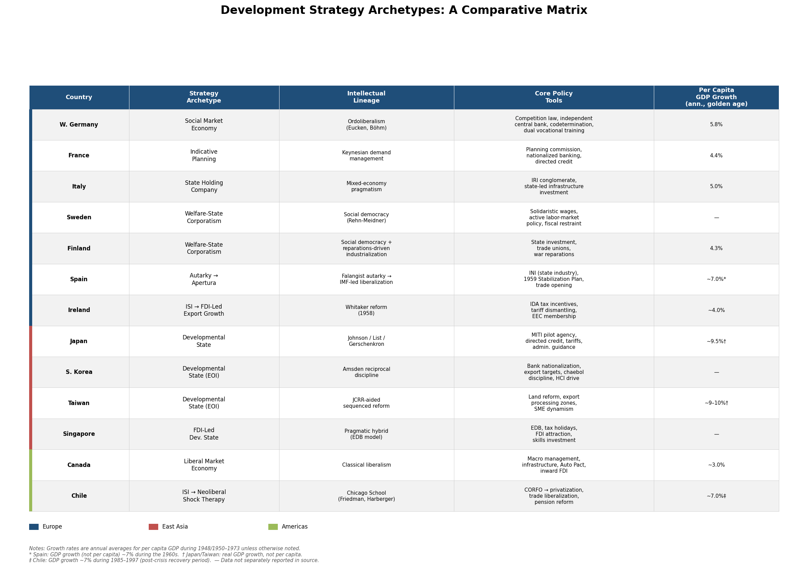

*Figure 2.1 — Comparative matrix of development strategy archetypes across 13 countries, showing intellectual lineage, core policy instruments, and annual per capita GDP growth during the golden age (ca. 1948/1950–1973). Countries are color-coded by region: Europe (blue), East Asia (red), Americas (green). Footnotes clarify where figures refer to aggregate GDP rather than per capita GDP or to non-standard time periods.*

## 2.3 The East Asian Developmental State

### Japan: The Archetype

Chalmers Johnson's *MITI and the Japanese Miracle* (1982) formalized the concept of the "developmental state," identifying four structural elements: an elite bureaucracy recruited by meritocratic examination; a political system granting the bureaucracy sufficient autonomy to set industrial priorities; market competition preserved at the firm level; and a pilot agency—the Ministry of International Trade and Industry (MITI)—that coordinated industrial policy [American Affairs Journal](https://americanaffairsjournal.org/2020/02/korean-industrial-policy-from-the-arrest-of-the-millionaires-to-hallyu/ "Korean Industrial Policy, American Affairs Spring 2020"). Japan's post-war strategy proceeded through a deliberate sectoral sequence: textiles and light manufactures in the 1950s, steel, shipbuilding, and petrochemicals in the 1960s, and automobiles and electronics from the 1970s onward. The policy toolkit included selective tariff protection, foreign-exchange and import-licensing priorities for strategic sectors, directed credit through government financial institutions, tax incentives for targeted industries, and *administrative guidance* (*gyōsei shidō*)—informal yet effective bureaucratic coordination of private-sector investment decisions. Real GDP grew at approximately 9.5% annually during 1950–1973, and the 1960 Income Doubling Plan was achieved ahead of schedule [American Affairs Journal](https://americanaffairsjournal.org/2020/02/korean-industrial-policy-from-the-arrest-of-the-millionaires-to-hallyu/ "Johnson's MITI framework").

### Korea: Disciplined Subsidies and Export Targeting

South Korea in 1961 had a per capita GDP below $100—lower than Guatemala or Cameroon. Park Chung-hee's military government, seizing power in May 1961, immediately nationalized the banking system, thereby acquiring direct control over credit allocation, and launched the First Five-Year Plan. The pivotal strategic shift came during 1964–1967: Korea moved from ISI to export-oriented industrialization (EOI), unifying the exchange rate, introducing export subsidies, and making export targets the key performance indicator by which *chaebol* conglomerates earned or lost access to state-directed preferential credit. The results were dramatic: exports grew at 28% annually through the 1970s, and real wages rose 19% per year during 1976–1979 [American Affairs Journal](https://americanaffairsjournal.org/2020/02/korean-industrial-policy-from-the-arrest-of-the-millionaires-to-hallyu/ "Korean Industrial Policy").

Alice Amsden's *Asia's Next Giant* (1989) characterized Korea as a "late industrializer" in which the state deliberately distorted relative prices through subsidies to stimulate economic activity, but imposed "reciprocal discipline"—particularly export-performance standards—as the quid pro quo. Firms that failed to meet targets lost subsidized credit; the mechanism was enforced, not merely announced. This "reciprocal control mechanism," Amsden argued, distinguished the East Asian developmental state from rent-seeking ISI regimes where subsidies flowed without performance accountability [American Affairs Journal](https://americanaffairsjournal.org/2020/02/korean-industrial-policy-from-the-arrest-of-the-millionaires-to-hallyu/ "Referencing Amsden 1989"). The 1970s saw a further strategic escalation into heavy and chemical industries (HCI)—steel, petrochemicals, shipbuilding, machinery—a state-directed "big push" that entailed significant short-term distortions but established the industrial base on which Korea's subsequent technological ascent rested.

### Taiwan: Sequenced Reform and Export Processing

Taiwan's development strategy was distinguished by a carefully sequenced reform program anchored by one of the most radical land reforms in post-war history. Between 1949 and 1953, the Kuomintang government—itself a recent arrival from the mainland—implemented three stages of agrarian restructuring: the 37.5% Rent Reduction Act (1949), the Sale of Public Lands (1951), and the Land-to-the-Tiller Act (1953). The Sino-American Joint Commission on Rural Reconstruction (JCRR), established in 1948 with US funding, provided critical technical assistance—conducting cadastral surveys, designing implementation procedures, and supporting agricultural extension—that rendered the reform operationally viable [JCRR/ICWA](http://www.icwa.org/wp-content/uploads/2015/09/GDN-22.pdf "JCRR and Taiwan's Agriculture"). By equalizing rural incomes and creating a domestic consumer market, land reform laid the institutional foundation for the subsequent industrial transition.

Taiwan followed the ISI-to-EOI sequence observable in Korea but with distinct institutional features. The Nineteen-Point Reform Program of 1960 and the Statute for Encouragement of Investment liberalized trade, introduced tax incentives for exporters, and streamlined foreign-investment approval. In 1966, the establishment of the Kaohsiung Export Processing Zone—among the world's first dedicated export-processing zones—signaled a decisive commitment to outward orientation. GDP grew at approximately 9–10% annually during 1960–1980, driven by small- and medium-enterprise dynamism rather than the *chaebol*-scale conglomerate model characteristic of Korea.

### Singapore: FDI-Led Developmental State

Singapore, independent from 1965 with no natural resources, negligible agricultural hinterland, and a population under two million, adopted a hybrid strategy that combined developmental-state dirigisme with aggressive courting of foreign direct investment—a combination that Johnson's original framework, centered on Japan's FDI-restrictive model, had not anticipated. The Economic Development Board (EDB), established in 1961, offered multinational corporations tax holidays, subsidized industrial estates, and a disciplined, English-speaking workforce. Per capita GDP rose from roughly $500 at independence in 1965 to over $11,000 by 1990 [Singapore EDB](https://www.edb.gov.sg/en/business-insights/insights/why-southeast-asia-has-attracted-strong-fdi-inflows-from-advanced-manufacturing-to-the-digital-economy.html "EDB historical overview"). Singapore demonstrated that FDI attraction and state capacity were complements rather than substitutes: the state shaped the investment environment, selected priority sectors, invested in workforce skills, and let multinational enterprises supply the capital, technology, and market access.

## 2.4 The Americas: Liberal Market and Neoliberal Alternatives

### Canada: Resource-Rich Liberalism

Canada's post-war development followed a broadly liberal-market trajectory, distinct from both the European dirigiste models and the East Asian developmental state. The federal government's role centered on macroeconomic management, infrastructure provision (the Trans-Canada Highway, the St. Lawrence Seaway), and resource-sector regulation rather than sectoral industrial targeting. The most significant industrial-policy intervention was the 1965 Auto Pact with the United States, which integrated North American automobile production and allowed Canadian plants to achieve economies of scale otherwise unattainable in a market one-tenth the size of its neighbor. More broadly, Canada relied on inward FDI—overwhelmingly from the United States—as the primary channel for technology transfer and capital formation, rather than restricting foreign ownership as Japan and Korea did. Per capita GDP grew at approximately 3% annually during 1950–1973, a respectable if unspectacular rate that reflected an already-high starting position and an economy whose comparative advantage lay in resource extraction and processing rather than manufactured-export-driven catch-up.

### Chile: From ISI to the Chicago Boys

Chile presents the most dramatic strategic reversal in the sample. From the 1930s, the Chilean state pursued ISI through the *Corporación de Fomento de la Producción* (CORFO), established in 1939, which channeled public investment into steel, electricity, and import-substituting manufactures. Following the September 1973 military coup, Augusto Pinochet's regime installed the "Chicago Boys"—Chilean economists trained at the University of Chicago under Milton Friedman and Arnold Harberger—in key policy positions. The ensuing reforms constituted one of the most radical neoliberal experiments attempted anywhere: trade liberalization compressed tariffs from rates exceeding 500% to a uniform 10% by 1979; state enterprises were privatized; financial markets were deregulated; and in 1981, the pension system was converted from pay-as-you-go to individually capitalized accounts [Princeton University Press](https://press.princeton.edu/books/hardcover/9780691208626/the-chile-project "Sebastian Edwards, The Chile Project, 2023").

The adjustment costs were severe: GDP contracted approximately 13% in 1975, and a banking crisis struck in 1982–1983, requiring state intervention to rescue the financial system—an outcome deeply ironic for a program premised on reducing state involvement in the economy. The post-crisis period, however, saw sustained high growth: GDP expanded at roughly 7% annually from 1985 to 1997, and Chile eventually became the first Latin American economy to cross the World Bank's high-income threshold. The Chilean trajectory underscores both the potential and the perils of shock-therapy liberalization: the eventual growth payoff was real, but it arrived only after painful corrections and required pragmatic policy modifications—including reimposition of capital controls and targeted social spending—that deviated substantially from orthodox prescriptions.

### Ireland: FDI-Driven Transformation from the European Periphery

Ireland's post-war experience bridges the European and liberal-market categories. Through the 1930s and 1950s, Ireland pursued protectionist ISI with predictably stagnant results for a small, resource-poor economy hemorrhaging population through emigration. The pivotal document was T.K. Whitaker's 1958 report *Economic Development*, which diagnosed the failure of inward-looking policies and prescribed a decisive pivot toward export-oriented growth driven by foreign direct investment [Encyclopedia.com](https://www.encyclopedia.com/international/encyclopedias-almanacs-transcripts-and-maps/economic-development-1958 "Economic Development 1958"). Key measures included zero taxation on export profits (administered through the Industrial Development Authority), progressive dismantling of tariff barriers, and application for EEC membership (achieved in 1973). Real GDP grew at approximately 4% per year during the 1960s, reversing decades of relative decline. Ireland's model—combining EU membership, aggressive tax competition for FDI, and investment in an English-speaking, educated workforce—would reach full maturity in the 1990s "Celtic Tiger" period, but its strategic foundations were laid in the Whitaker reforms three decades earlier.

## 2.5 The Political Economy of Strategy Choice

The diversity of strategies surveyed above raises a central analytical question: what determined which model a given country adopted? The evidence points to three clusters of conditioning factors that operated simultaneously, though with differing relative weights across cases.

**Regime type and elite coalitions.** Authoritarian regimes enabled more abrupt strategic pivots. Park Chung-hee's nationalization of Korean banks in 1961 and imposition of export discipline on the *chaebol*, Franco's acceptance of the 1959 Stabilization Plan over the objections of Falangist autarky advocates, and Pinochet's delegation of economic policy to the Chicago Boys all exploited the concentrated decision-making authority that democratic systems constrain by design. Democratic developmental paths—in the Nordic countries, Germany, and Ireland—required broader coalition-building and institutional consensus, producing more incremental but also more politically durable strategy evolution.

**External pressure and Cold War architecture.** The Cold War security framework was structurally constitutive of East Asian developmental success. The United States extended a security umbrella, economic aid (Korea received approximately $13 billion in US economic and military assistance between 1946 and 1978), and preferential access to American markets, while tolerating mercantilist trade practices that it would not have accepted from non-allied states [American Affairs Journal](https://americanaffairsjournal.org/2020/02/korean-industrial-policy-from-the-arrest-of-the-millionaires-to-hallyu/ "Korean Industrial Policy"). In Europe, the Marshall Plan and subsequent integration architecture—from the European Coal and Steel Community to the EEC—provided analogous external support, conditioning aid on market-oriented reforms and offering the incentive of access to a large, prosperous customs union. The Iberian dictatorships, initially excluded from these frameworks (Spain from the Marshall Plan entirely; Portugal included in the Marshall Plan but excluded from the EEC), faced mounting external pressure to liberalize as a condition of fuller participation in the Western economic order.

**Intellectual transmission and policy learning.** Strategy adoption was not merely a functional response to structural conditions; it was mediated by specific channels of intellectual influence and cross-national emulation. The ECLA apparatus transmitted Prebisch's ISI framework across Latin America. The Chicago–Santiago pipeline produced Chile's neoliberal reformers. Korea's economic planners studied Japanese precedents explicitly; Taiwan's technocrats adapted both Japanese colonial-era planning methods and American development-economics advice channeled through the JCRR and USAID. Germany's ordoliberal turn reflected the direct influence of Freiburg School economists on Erhard and his circle. These transmission channels help explain why countries with broadly similar structural conditions sometimes adopted sharply different strategies—and why strategy choices, once made, proved self-reinforcing through the bureaucratic and intellectual communities they created.

## 2.6 The ISI Critique and the Convergence Toward Openness

By the mid-1960s, empirical research was accumulating against the ISI model. Studies by Little, Scitovsky, and Scott (1970) and Béla Balassa (1971) documented highly irregular effective protection rates, severe resource misallocation, and the emergence of uncompetitive, subsidy-dependent industrial sectors under ISI regimes. Prebisch himself acknowledged in 1963 that "closed industrialization" had rendered Latin American manufactured exports extremely difficult [Douglas Irwin, NBER](https://www.nber.org/system/files/working_papers/w27919/w27919.pdf "The Rise and Fall of Import Substitution, NBER Working Paper 27919, October 2020"). The World Bank's 1993 *East Asian Miracle* report attempted to adjudicate between market-oriented and interventionist explanations of East Asian success, producing an internally contradictory conclusion: it acknowledged that directed credit had worked in certain East Asian contexts while summarizing that "rapid growth was primarily due to a common set of market-friendly economic policies." Robert Wade's 1996 critique in the *New Left Review* documented the report's internal contradictions line by line, arguing that its conclusions reflected institutional pressure within the Bank to conform to the Washington Consensus rather than dispassionate analysis of the evidence [American Affairs Journal](https://americanaffairsjournal.org/2020/02/korean-industrial-policy-from-the-arrest-of-the-millionaires-to-hallyu/ "Discussing Wade's critique and World Bank 1993 report").

The critical distinction, as Amsden's reciprocal-discipline framework clarified, lay not between intervention and non-intervention but between disciplined and undisciplined intervention. East Asian states subsidized extensively but imposed performance standards—above all, export targets—that maintained competitive pressure and provided an objective metric for withdrawing support from failing enterprises. ISI regimes in Latin America, by contrast, typically lacked such accountability mechanisms, allowing protected industries to capture rents indefinitely without improving productivity or achieving international competitiveness. This distinction carries implications well beyond the historical period under review: it reframes the perennial "state vs. market" debate as a question of institutional design rather than ideological allegiance.

## 2.7 Timeline of Strategic Turning Points

The chronology of major strategic shifts reveals both regional clustering and cross-regional learning. Figure 2.2 visualizes these inflection points on a single timeline.

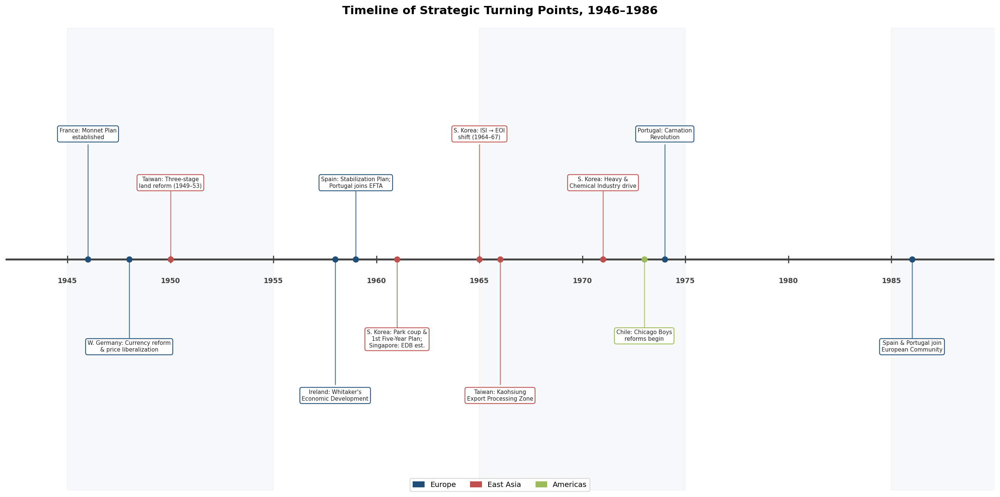

*Figure 2.2 — Horizontal timeline of twelve major strategic inflection points from 1946 to 1986, color-coded by region: Europe (blue), East Asia (red), Americas (green). The clustering of European reforms in the late 1940s–1950s and the concentration of East Asian developmental-state pivots in the 1960s are clearly visible.*

Key milestones in this chronology include:

- **1946** — France: Monnet establishes the *Commissariat Général du Plan*
- **1948** — West Germany: Currency reform and price liberalization under Erhard
- **1949–1953** — Taiwan: Three-stage land reform (Rent Reduction → Public Land Sale → Land-to-the-Tiller)
- **1958** — Ireland: Whitaker's *Economic Development* report
- **1959** — Spain: Stabilization Plan; Portugal joins EFTA
- **1961** — South Korea: Park Chung-hee coup, bank nationalization, First Five-Year Plan; Singapore: EDB established
- **1964–1967** — South Korea: Shift from ISI to EOI
- **1966** — Taiwan: Kaohsiung Export Processing Zone
- **1970s** — South Korea: Heavy and Chemical Industry (HCI) drive
- **1973** — Chile: Chicago Boys neoliberal reforms begin
- **1974** — Portugal: Carnation Revolution triggers political and economic restructuring
- **1986** — Spain and Portugal join the European Community

This timeline reveals that strategic transformations were rarely single-event phenomena. They unfolded over years, involved contestation among domestic factions, and frequently required external catalysts—whether Cold War security guarantees, international financial institution conditionality, or the gravitational pull of regional integration.

## 2.8 Synthesis: No Single Model, but Shared Imperatives

The comparative record yields no verdict in favor of a single development strategy. The social market economy, indicative planning, state holding companies, Nordic corporatism, the East Asian developmental state, FDI-led growth, and neoliberal shock therapy each produced episodes of rapid catch-up growth under specific conditions. Figure 2.3 illustrates the range of golden-age growth rates achieved across strategy archetypes.

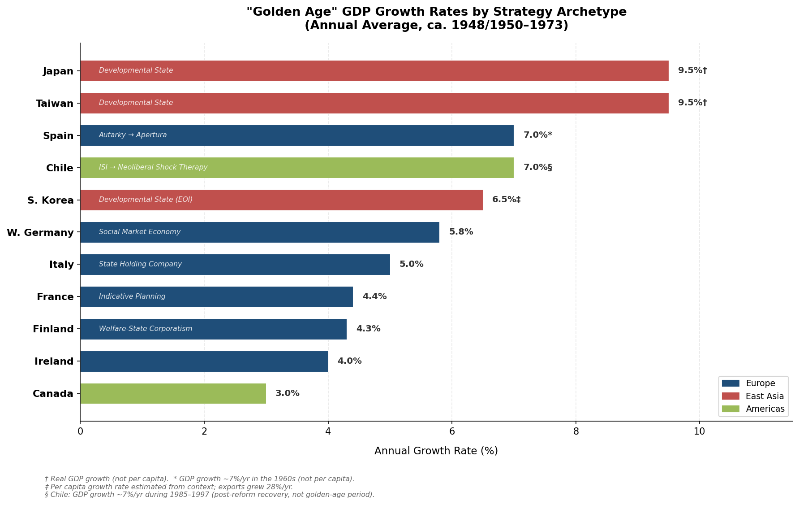

*Figure 2.3 — Annual average GDP growth rates during the golden age (ca. 1948/1950–1973) for eleven countries, sorted by growth rate and color-coded by region. Each bar is labeled with the corresponding strategy archetype. Footnotes distinguish per capita from aggregate GDP figures and note Chile's post-reform recovery period (1985–1997) as distinct from the standard golden-age window.*

What the record does reveal are several shared imperatives that transcended model differences:

First, macroeconomic stability—whether achieved through ordoliberal fiscal discipline, Nordic wage restraint, or East Asian managed exchange rates—was a near-universal prerequisite for sustained investment and growth. Episodes of instability (Chile in 1975, the pre-1959 Iberian economies, pre-Whitaker Ireland) consistently preceded or accompanied strategic failure.

Second, exposure to international competitive pressure—through export orientation, trade liberalization, or EU accession—served as a discipline mechanism that pure ISI lacked. The timing and sequencing of openness varied enormously, but every successful transition eventually incorporated it.

Third, the capacity to shift strategies at critical junctures proved at least as important as the initial choice of model. Korea's ISI-to-EOI pivot, Spain's 1959 *apertura*, Ireland's Whitaker turn, and Chile's post-crisis pragmatic corrections all demonstrate that developmental trajectories are path-shaped rather than path-determined: initial conditions constrain but do not dictate outcomes, and the political capacity to enact discontinuous policy change is itself a form of institutional capital. The institutional and governance dimensions that enabled or blocked such pivots are the subject of Chapter 3.

# 第3章 Institutions, Governance, and State Capacity

The development strategies surveyed in Chapter 2 did not implement themselves. Each required an institutional apparatus capable of formulating coherent policy, coordinating public and private actors, and sustaining implementation across decades. The variation in institutional quality across the post-war world was at least as consequential as the variation in strategy choice itself. A brilliantly conceived industrial policy executed by a fragmented, patronage-ridden bureaucracy yielded very different results from a more modest agenda administered by a meritocratic, corporately coherent state apparatus.

This chapter examines the institutional architectures that underpinned successful transitions to developed-nation status. It proceeds in five sections: a comparative analysis of pilot agencies and bureaucratic structures (Section 3.1); an assessment of the relationship between regime type and developmental effectiveness (Section 3.2); an evaluation of land reform and property rights as foundational institutions (Section 3.3); a survey of governance quality, corruption control, and rule of law (Section 3.4); and an analysis of the fiscal capacities that made growth-oriented public expenditure sustainable (Section 3.5).

## 3.1 Pilot Agencies and the Architecture of Embedded Autonomy

Peter Evans identified "embedded autonomy" as the distinguishing organizational characteristic of developmental states: a combination of Weberian bureaucratic coherence—meritocratic recruitment, predictable career paths, corporate identity—with dense, institutionalized networks linking the state apparatus to private economic elites [Peter Evans, *Sociological Forum* 4(4), 1989](https://courses.washington.edu/pbaf531/Evans_Predatory.pdf "Evans, 'Predatory, Developmental, and Other Apparatuses,' pp. 561–587"). The formulation captured a critical paradox: the state needed sufficient insulation from particularistic interests to avoid capture, yet sufficient connectedness to the private sector to gather intelligence, coordinate investment, and induce entrepreneurial risk-taking. The countries that successfully navigated the transition to high-income status resolved this tension through distinctive institutional arrangements, ranging from centralized pilot agencies in East Asia and France to dispersed rule-based frameworks in Germany and corporatist bargaining systems in the Nordics.

### Japan: MITI and the Prototype of the Pilot Agency

The Ministry of International Trade and Industry (MITI) remains the canonical case of a developmental pilot agency. As Chalmers Johnson documented, MITI concentrated an extraordinary density of policy instruments—authority over foreign-exchange allocations, import licensing, technology-transfer approvals, tax incentives for strategic sectors, and the capacity to organize "administrative guidance cartels"—under a single institutional roof [Chalmers Johnson, *MITI and the Japanese Miracle*, 1982](https://americanaffairsjournal.org/2020/02/korean-industrial-policy-from-the-arrest-of-the-millionaires-to-hallyu/ "Johnson's MITI framework as discussed in American Affairs"). Johnson characterized MITI as "without doubt the greatest concentration of brainpower in Japan," a claim grounded in observable selection mechanisms: the higher civil service examination passed as few as 2–3% of candidates in a given year, and graduates of Tokyo University's Faculty of Law constituted 73% of higher bureaucrats in 1965 [Peter Evans, 1989](https://courses.washington.edu/pbaf531/Evans_Predatory.pdf "Evans citing Johnson on MITI recruitment").

MITI's effectiveness rested not merely on internal competence but on what Evans termed "reinforced Weberianism"—informal solidarity networks (*gakubatsu*, alumni ties from elite universities) that reinforced formal bureaucratic structures rather than subverting them. The external dimension was equally critical. The *amakudari* ("descent from heaven") system, through which retiring MITI officials assumed positions in private corporations and industry associations, created a dense web of public-private linkages. Deputy directors of MITI sectoral bureaus routinely devoted the majority of their working time to engagement with key corporate personnel [Daniel Okimoto, *Between MITI and the Market*, 1989](https://courses.washington.edu/pbaf531/Evans_Predatory.pdf "Evans citing Okimoto on MITI-industry ties"). This embeddedness enabled MITI to function as an institution capable of identifying investment opportunities, providing disequilibrating incentives, and alleviating sectoral bottlenecks—a role consistent with Hirschman's framework of "maximizing induced decision-making."

### Korea: The Economic Planning Board as Super-Ministry

South Korea's institutional architecture centered on the Economic Planning Board (EPB), established on 22 July 1961, two months after Park Chung-hee's military coup. Designed as a "super-ministry," the EPB consolidated budgetary authority, economic planning, foreign capital management, and statistical coordination under a single agency headed by a Deputy Prime Minister—a rank that gave the EPB formal precedence over the Ministry of Finance and other economy-related ministries [Oxford Academic](https://academic.oup.com/book/26495/chapter/194950127 "Korea's Evolving Business–Government Relationship"). The EPB's institutional autonomy was further reinforced by Park's 1961 nationalization of the banking system, which gave the state direct control over credit allocation—the single most powerful lever of industrial policy in the Korean developmental model.

The Korean bureaucracy shared key Weberian features with its Japanese counterpart: competitive examination-based recruitment, prestige-laden career paths, and a strong esprit de corps. Evans classified Korea alongside Japan and Taiwan as exemplars of "embedded autonomy," noting that all three states emerged from the post-war period with long bureaucratic traditions, considerable experience in direct economic intervention, and—crucially—societal environments in which traditional agrarian elites had been decimated and industrial groups were disorganized and undercapitalized, qualitatively enhancing the autonomy of the state apparatus [Peter Evans, 1989](https://courses.washington.edu/pbaf531/Evans_Predatory.pdf "Evans on East Asian state autonomy"). The EPB organized forums bringing together government agencies and private-sector representatives to navigate bottlenecks, functioning as the Korean analogue to MITI's coordinating role—though with more overtly coercive authority over the *chaebol* conglomerates, backed by the state's capacity to grant or withhold subsidized credit.

### Singapore: The EDB and Technocratic Governance

Singapore's Economic Development Board (EDB), established in 1961 with an initial capital allocation of S$100 million, served as the city-state's pilot agency for industrialization [Wikipedia](https://en.wikipedia.org/wiki/Economic_Development_Board "EDB founding and capitalization"). Unlike MITI or the EPB, which coordinated a domestic industrial base, the EDB's primary mission was to attract and anchor foreign direct investment by functioning as a one-stop interface between multinational corporations and the Singapore state. The EDB offered tax holidays, subsidized industrial estates, and a disciplined English-speaking labor force—but its effectiveness derived from institutional qualities that transcended incentive packages: speed of decision-making, reliability of commitments, and the near-absence of corruption.

Anti-corruption enforcement constituted a pillar of state legitimacy under Lee Kuan Yew's government. The Corrupt Practices Investigation Bureau (CPIB), originally founded under British colonial rule in 1952, was empowered after independence with sweeping investigative authority and placed under the Prime Minister's Office to insulate it from ministerial interference [CPIB](https://www.cpib.gov.sg/about-corruption/prevention-and-corruption/singapores-corruption-control-framework/ "Singapore's Corruption Control Framework"). Civil service salaries were benchmarked to private-sector compensation for comparable talent, reducing the economic incentive for rent-seeking. By the 2020s, Singapore ranked consistently among the three least corrupt countries globally on Transparency International's Corruption Perceptions Index [Cambridge University Press](https://www.cambridge.org/core/books/east-asian-challenge-for-democracy/political-meritocracy-in-singapore/35270F13FC26D9A3177950B39C08BA11 "Political Meritocracy in Singapore"). The EDB's effectiveness was thus inseparable from this broader institutional environment of meritocratic recruitment, performance-based advancement, and zero-tolerance anti-corruption enforcement.

### France: The Commissariat du Plan and Indicative Coordination

France's *Commissariat Général du Plan*, established by Jean Monnet in January 1946, represented a distinctively European variant of the pilot agency. Unlike the East Asian models, the Commissariat operated within a democratic political system and lacked coercive instruments over private investment. Its influence derived from its role as a forum for "concerted economy"—bringing together senior civil servants, industrialists, trade unionists, and technical experts in *commissions de modernisation* that formulated sectoral investment priorities [NBER](https://www.nber.org/system/files/chapters/c1426/c1426.pdf "French Planning, NBER chapter"). The Commissariat's leverage was reinforced by the French state's control over nationalized banks, which gave it indirect influence over credit allocation—a mechanism functionally analogous, if institutionally different from, the directed-credit systems of East Asia.

Ten multi-year plans were produced between 1946 and 1992. The first four (1946–1965) focused on reconstruction bottlenecks and basic industrial infrastructure; by the Fifth Plan (1966–1970), emphasis had shifted toward international competitiveness, regional development, and social objectives [Wikipedia](https://en.wikipedia.org/wiki/Economic_planning_in_France "Economic planning in France"). As the French economy matured and the informational demands of coordination grew more complex, the Commissariat's influence waned—a trajectory that illustrated both the power and the inherent limitations of indicative planning as an institutional form. The Commissariat was ultimately dissolved in 2006 and replaced by more modest advisory bodies, signaling the end of a planning tradition that had, at its peak, helped propel France through the *trente glorieuses*.

### Decentralized Governance Models: Germany, the Nordics, and Canada

Not all successful development trajectories required a centralized pilot agency. West Germany's post-war institutional architecture was deliberately designed to prevent the concentration of economic authority that had characterized the Nazi regime. The ordoliberal framework dispersed governance functions across multiple independent institutions: the Bundesbank maintained monetary stability with statutory independence from the federal government; the *Bundeskartellamt* (Federal Cartel Office), empowered by the 1957 Act Against Restraints of Competition, enforced market competition; and the codetermination system (*Mitbestimmung*) gave organized labor institutional voice on company supervisory boards [Harvard CES](https://ces.fas.harvard.edu/uploads/files/Reports-Articles/Ordoliberalism-A-German-Oddity-By-Hans-Helmut-Kotz.pdf "Ordoliberalism: A German Oddity?"). The state's role was to construct and maintain the rules of the competitive order rather than to direct investment toward chosen sectors. This rule-based framework proved remarkably effective: per capita GDP grew at 5.8% annually during 1948–1973, as documented in Chapter 2. The German case demonstrated that embedded autonomy could be achieved through dispersed institutional checks rather than a single pilot agency.

The Nordic countries achieved a functionally equivalent form of coordination through tripartite corporatism. Sweden's *Saltsjöbaden Agreement* of 1938 established the framework for centralized bargaining between the Swedish Employers' Confederation (SAF) and the Swedish Trade Union Confederation (LO), with the state acting as a facilitating but non-directive third party. The Rehn-Meidner model, operationalized from 1951 onward, relied on this corporatist infrastructure to implement its distinctive policy triad of restrictive macroeconomic policy, solidaristic wages, and active labor-market programs [Levy Institute](https://www.levyinstitute.org/wp-content/uploads/2024/12/wp_1066.pdf "Lessons from the Rehn-Meidner Plan, Working Paper No. 1066, 2024"). Finland developed a parallel but chronologically later corporatist system: the first comprehensive incomes-policy agreement was reached in 1968 (the Liinamaa Agreement), and tripartite exchange subsequently gave rise to the key institutions of the Finnish welfare state, including mandatory earnings-related pensions and unemployment insurance [University of Tampere](https://trepo.tuni.fi/bitstream/handle/10024/210707/Partial_organization.pdf "The Gradual Re-organization of Finnish Corporatism"). In both cases, the institutional architecture served a coordination function analogous to East Asian pilot agencies—aligning investment incentives, managing structural adjustment, constraining wage-push inflation—but through negotiated consensus rather than bureaucratic directive.

Canada represented yet another institutional variant: a federal system in which economic governance was distributed across federal and provincial jurisdictions. The federal government's direct industrial-policy interventions were limited compared to European or East Asian counterparts—the 1965 Auto Pact with the United States constituted the most significant sectoral intervention. State capacity was channeled primarily into macroeconomic management, infrastructure provision (notably the Trans-Canada Highway and St. Lawrence Seaway), and resource-sector regulation. Provincial governments exercised substantial autonomous authority over natural resources, education, and health care. Canada's tax-to-GDP ratio stood at approximately 25.5% in 1965, rising to 31.0% by 1980 and 34.8% by 2023 [OECD Revenue Statistics 2025](https://www.oecd.org/en/publications/revenue-statistics-2025_3a264267-en/full-report/tax-revenue-trends-1965-2024_98c75833.html "OECD Revenue Statistics, Table 1.1")—a trajectory reflecting the gradual expansion of the welfare state rather than growth-directing industrial policy.

The following exhibit summarizes the comparative architecture of pilot agencies and governance models across the six institutional variants examined in this section.

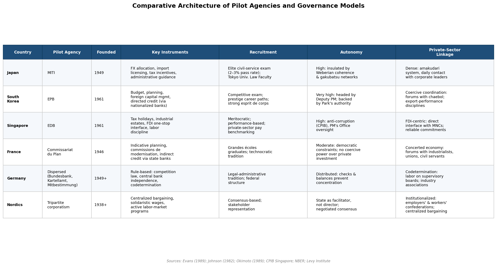

*Figure 3.1 — Structured comparison of six governance models across key institutional dimensions: founding date, policy instruments, recruitment mechanism, degree of autonomy, and private-sector linkage. Sources: Evans (1989); Johnson (1982); Okimoto (1989); CPIB Singapore; NBER; Levy Institute.*

## 3.2 Regime Type and Developmental Effectiveness

The post-war record challenges any simple equation between regime type and developmental success. Authoritarian regimes presided over both spectacular growth accelerations (South Korea under Park Chung-hee, Singapore under Lee Kuan Yew, Taiwan under KMT one-party rule, Spain after the 1959 Stabilization Plan) and developmental catastrophes across sub-Saharan Africa and much of Latin America. Democratic regimes exhibited equally wide variance, from the sustained high growth of West Germany and the Nordic states to the prolonged stagnation of democratic India before the 1991 reforms. The critical variable was not the presence or absence of electoral competition but rather the internal coherence and external connectedness of the state apparatus itself.

### The Authoritarian Advantage—and Its Limits

Authoritarian developmental states possessed one structural advantage: the capacity for rapid, decisive strategic pivots unconstrained by the consensus-building requirements of democratic politics. Park Chung-hee nationalized Korea's banking system, arrested leading industrialists to demonstrate state dominance over capital, and imposed export-performance disciplines on the *chaebol*—actions that would have been politically difficult in a pluralist democracy. Franco's 1959 Stabilization Plan reversed decades of autarkic policy within months. Pinochet's Chile imposed radical neoliberal reforms that entailed severe short-term output contraction—GDP fell approximately 13% in 1975—but restructured the economy in ways that a democratic government, facing immediate electoral accountability, might not have sustained [Princeton University Press](https://press.princeton.edu/books/hardcover/9780691208626/the-chile-project "Sebastian Edwards, The Chile Project, 2023").

Evans's comparative framework illuminates why some authoritarian regimes succeeded developmentally while others became predatory. The East Asian developmental states emerged from a historically specific conjuncture: long bureaucratic traditions, the decimation of traditional agrarian elites through war and occupation, the disorganization of private capital, and an international environment (Cold War geopolitics) that simultaneously motivated rapid industrialization and constrained the range of acceptable policy choices. This combination produced what Evans termed "conjuncturally generated autonomy"—state apparatuses insulated from particularistic demands not because of regime type per se but because of the structural weakness of potential veto players [Peter Evans, 1989](https://courses.washington.edu/pbaf531/Evans_Predatory.pdf "Evans on dynamics of developmental states").

The Iberian cases exhibited a more qualified version of this pattern. Spain's *Instituto Nacional de Industria* (INI) operated under Franco as a state holding company for heavy industry, but without the performance disciplines or meritocratic bureaucratic culture characteristic of the East Asian pilot agencies. The "Spanish miracle" of the 1960s owed more to the external discipline imposed by international institutions (IMF, OEEC) and the liberalization framework of the 1959 Stabilization Plan than to the developmental capacity of the Francoist bureaucracy itself. Portugal's *Estado Novo* under Salazar employed the *condicionamento industrial* system—a prior-authorization requirement for establishing or expanding any industrial plant—which functioned less as industrial policy than as a mechanism for protecting incumbent firms and maintaining political control [Baklanoff, *Luso-Brazilian Review*](https://cooperative-individualism.org/baklanoff-eric_the-political-economy-of-portugal-1992-summer.pdf "The Political Economy of Portugal's Later Estado Novo, 1992").

### Democratic Developmental Paths

The European and Canadian cases demonstrated that democratic institutions were fully compatible with sustained high growth, provided that mechanisms existed for building and maintaining policy consensus across electoral cycles. Germany's social market economy rested on a constitutional framework (the 1949 *Grundgesetz*) that embedded economic governance principles—central bank independence, federalism, social partnership—in the political structure itself. The Nordic corporatist model institutionalized consensus through tripartite bargaining, making organized labor a stakeholder in productivity-enhancing structural adjustment rather than a veto player against it.

Ireland's transition from protectionist stagnation to FDI-driven growth occurred within a democratic framework but required the intellectual leadership of T.K. Whitaker's 1958 *Economic Development* report and the political willingness of successive governments to dismantle the protectionist edifice built since the 1930s [Encyclopedia.com](https://www.encyclopedia.com/international/encyclopedias-almanacs-transcripts-and-maps/economic-development-1958 "Economic Development 1958"). The subsequent "Celtic Tiger" acceleration of the 1990s was undergirded by social partnership agreements—tripartite accords between government, employers, and unions that moderated wage growth in exchange for tax reductions and social spending commitments—an institutional innovation bearing structural similarities to Nordic corporatism.

The democratic developmental path carried a distinctive institutional requirement: the capacity to construct and sustain broad-based political coalitions supporting growth-oriented policies across multiple electoral cycles. Where this capacity existed—in the "grand coalition" logic of German codetermination, the Swedish *Saltsjöbaden* framework, or Irish social partnership—democratic governance proved not only compatible with but arguably more durable than authoritarian developmentalism, since policy legitimacy reduced the risk of abrupt reversals. The democratization of South Korea (1987), Taiwan (late 1980s–1990s), and post-Franco Spain (1975–1978) did not derail their growth trajectories; political liberalization broadened the social base of development by expanding welfare provision and labor rights, a dynamic examined in detail in Chapter 6.

## 3.3 Land Reform, Property Rights, and Inclusive Institutions

Among the institutional preconditions most consequential for divergent development outcomes, the post-war land reforms of East Asia stand out. Japan, South Korea, and Taiwan all implemented radical redistributive land reforms between 1945 and 1953—a shared institutional transformation that distinguished their subsequent trajectories from those of Latin American and Southeast Asian countries where concentrated landownership persisted.

### The East Asian Land Reforms

Japan's land reform, implemented under SCAP (Supreme Commander for the Allied Powers) direction between 1946 and 1950, transferred approximately 80% of tenanted land to cultivators. Before the reform, nearly 46% of arable land was tenant-farmed; afterward, the figure fell to approximately 10%. The reform was administered through local Land Commissions composed of tenants, landlords, and owner-cultivators—a design that embedded implementation in existing social structures while shifting the balance of power decisively toward smallholders [World Bank](https://documents.worldbank.org/en/publication/documents-reports/documentdetail/469971468771280762 "Japan's postwar agricultural land reform").

South Korea's land reform unfolded in two stages: the redistribution of formerly Japanese-owned land (approximately 20% of total arable land) by the US Military Government in 1948, followed by the 1950 Land Reform Act, which imposed a 3-hectare ceiling on ownership and mandated the sale of excess land to tenants. The Korean War disrupted implementation, but by the mid-1950s owner-cultivated land had risen from roughly 35% to over 70% of total farmland. The reform eliminated the landlord class as a political force, reduced rural inequality, and created a relatively egalitarian distribution of assets that became a foundation for broad-based human capital investment in subsequent decades [EH.net](https://eh.net/encyclopedia/the-economic-history-of-korea/ "Land reform and institutional foundations").

Taiwan's three-stage land reform (1949–1953)—the 37.5% Rent Reduction Act, the Sale of Public Lands, and the Land-to-the-Tiller Act—ranked among the most thoroughgoing redistributions in modern history. Landlords were compensated partly in shares of state enterprises being privatized, redirecting elite capital from land to industry. The Sino-American Joint Commission on Rural Reconstruction (JCRR) provided critical technical support, conducting cadastral surveys and designing implementation procedures [JCRR/ICWA](http://www.icwa.org/wp-content/uploads/2015/09/GDN-22.pdf "JCRR and Taiwan's Agriculture").

The scale of tenancy reduction across all three cases is captured in the following exhibit.

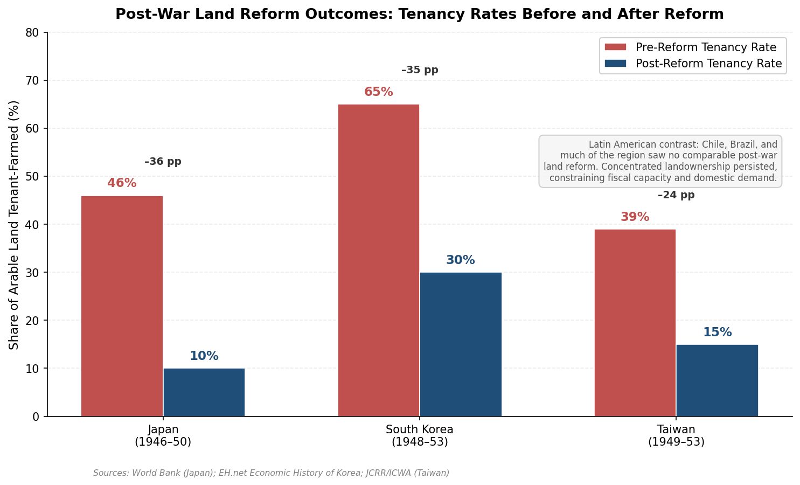

*Figure 3.2 — Pre-reform and post-reform tenancy rates in Japan (46% → 10%), South Korea (65% → 30%), and Taiwan (39% → 15%). No comparable post-war land reform occurred in Latin America, where concentrated landownership persisted. Sources: World Bank (Japan); EH.net (Korea); JCRR/ICWA (Taiwan).*

### The Latin American Counterfactual

The contrast with Latin America is analytically instructive. Chile, despite its relatively high 1950 per capita GDP of $3,827 (1990 international dollars), entered the post-war era with a highly concentrated landowning structure. The *hacienda* system persisted through the 1950s and 1960s; meaningful land reform was attempted only under Eduardo Frei (1964–1970) and Salvador Allende (1970–1973), and was partially reversed under Pinochet. The persistence of landed oligarchies constrained the fiscal base (large landowners resisted taxation), limited domestic demand (rural populations lacked purchasing power), and shaped political coalitions in ways that favored rent-seeking over productive investment. Evans's comparative analysis highlighted precisely this dynamic: in Latin American "intermediate states," the continuing social power of agrarian elites complicated the state's relationship with industrial capital and prevented the kind of focused developmental project achievable in East Asia [Peter Evans, 1989](https://courses.washington.edu/pbaf531/Evans_Predatory.pdf "Evans on agrarian elites and intermediate states").

The East Asian land reforms succeeded for reasons that were substantially contingent. In Japan, the occupation authority possessed unchallenged political power to override landlord resistance. In Korea and Taiwan, the landlord class had been weakened by Japanese colonialism and wartime disruption, and the incoming regimes (Rhee in Korea, the KMT in Taiwan) had no political ties to the indigenous landed elite—the KMT was itself an externally imposed regime on Taiwan that could carry out reform against local Taiwanese landlords without threatening its own political base. These structural preconditions did not exist in Latin America, where landed elites were deeply embedded in the political system. The lesson is not that land reform was universally desirable and merely lacked political will, but rather that the political feasibility of radical redistribution depended on historically specific configurations of power that made it possible in one region and structurally resistant in another.

## 3.4 Governance Quality: Corruption Control, Rule of Law, and Regulatory Evolution

The transition from developing to developed-nation status required not only growth-enabling institutions but also the progressive construction of governance quality—transparency, predictability, judicial reliability, and corruption control. The pathways to governance quality varied substantially across the cases examined here, and the relationship between governance improvement and economic development was interactive rather than unidirectional: stronger governance facilitated growth, and the demands of a more complex economy in turn created pressure for institutional upgrading.

### Corruption Control as Institutional Discipline

Singapore's trajectory represents the most dramatic governance transformation among the cases studied. At independence in 1965, corruption was pervasive—a legacy of colonial-era patronage networks and the wartime Japanese occupation. Lee Kuan Yew's government made anti-corruption enforcement a core legitimacy claim, empowering the CPIB with authority to investigate any person, including ministers and senior officials, without requiring prior approval from a government department. The Prevention of Corruption Act imposed severe penalties, and the government adopted a policy of paying civil servants competitively with the private sector to reduce incentives for graft. By 2024, Singapore ranked 3rd globally on Transparency International's Corruption Perceptions Index [Cambridge University Press](https://www.cambridge.org/core/books/east-asian-challenge-for-democracy/political-meritocracy-in-singapore/35270F13FC26D9A3177950B39C08BA11 "Political Meritocracy in Singapore").

Japan and Korea followed more complex trajectories. Japan's post-war bureaucracy maintained high standards of technical competence and institutional integrity, but the relationship between the Liberal Democratic Party (LDP), the bureaucracy, and big business—the so-called "iron triangle"—created systemic channels for political influence over economic decisions that, while rarely involving crude bribery, constituted a form of institutionalized rent distribution. Korea under Park Chung-hee operated a system in which corruption was contained at lower levels of the bureaucracy but selectively tolerated at the apex: the *chaebol* made contributions to the ruling party, and the state allocated preferential credit in return, but this exchange was disciplined by export-performance requirements that channeled rents toward productive rather than purely extractive ends. This pattern—sometimes characterized as "corruption with developmental purpose"—was qualitatively different from the undisciplined kleptocracy of predatory states, but it remained an institutional vulnerability that would generate political crises in subsequent decades.

The European cases exhibited a different pattern. West Germany's ordoliberal institutional framework—an independent judiciary, the constitutional court (*Bundesverfassungsgericht*), and a federal structure with dispersed authority—created structural constraints on corruption embedded in the political system from the outset. The Nordic countries similarly benefited from long-established traditions of bureaucratic integrity, press freedom, and transparent governance. Sweden's tradition of public access to official documents (*offentlighetsprincipen*), codified since 1766, sustained an unusually deep culture of administrative transparency that reinforced bureaucratic accountability.

The Iberian democracies, transitioning from authoritarian rule in the 1970s, faced the challenge of building governance quality from a comparatively low baseline. Spain's post-Franco institutional construction—the 1978 Constitution, the establishment of autonomous communities, accession to the European Community in 1986—progressively embedded rule-of-law standards, with EU conditionality serving as an external anchor for governance improvement. Portugal followed a parallel trajectory, with the European integration process functioning as a powerful institutional upgrade mechanism that imposed regulatory standards, competition law, and public-procurement transparency requirements that might have taken decades longer to develop endogenously.

### The Role of Judicial Independence

Judicial independence proved a significant institutional variable across all cases. In the developmental states of East Asia, the judiciary was typically subordinated to executive authority during the high-growth phase: Korea's judiciary under Park Chung-hee exercised minimal independent review of economic policy decisions, and Singapore's courts operated within a system where the ruling People's Action Party (PAP) faced no effective political opposition. Judicial independence strengthened in tandem with democratization—Korea's Constitutional Court, established in 1988, gradually asserted its authority, and Taiwan's judiciary gained independence through the democratic reforms of the 1990s. The sequencing is notable: in East Asia, economic development preceded rather than followed the establishment of robust judicial independence, challenging the premise that rule-of-law institutions must precede growth.

In the European democracies, judicial independence was a foundational institution from the outset of the post-war period. Germany's Basic Law created one of the world's strongest constitutional courts, which served as a check on both executive and legislative power. The European Court of Justice and, later, the European Court of Human Rights provided supranational judicial oversight that reinforced domestic rule-of-law standards across the EU accession states—a form of external institutional anchoring that proved particularly consequential for the Iberian and Irish cases.

## 3.5 Fiscal State Capacity: Revenue Mobilization and Growth-Enabling Expenditure

The capacity to extract revenue, invest in public goods, and sustain growth-enabling expenditure without destabilizing macroeconomic balances constitutes a foundational dimension of state capacity. The post-war trajectories of tax-to-GDP ratios across the countries studied reveal distinctive fiscal configurations that illuminate the relationship between revenue mobilization and developmental strategy.

### Divergent Fiscal Trajectories

In 1965, the OECD average tax-to-GDP ratio stood at 24.9%. By 2023, it had risen to 33.7%—an increase of 8.9 percentage points reflecting the expansion of public-sector functions across developed economies [OECD Revenue Statistics 2025](https://www.oecd.org/en/publications/revenue-statistics-2025_3a264267-en/full-report/tax-revenue-trends-1965-2024_98c75833.html "OECD Revenue Statistics 2025"). Within this average, however, variation was pronounced, falling into three broadly distinguishable fiscal models.

The Nordic countries established the highest tax-extraction capacity among developed economies. Sweden's tax-to-GDP ratio reached 50.0% by 2000 (declining to 41.7% by 2023), while Finland's peaked at 45.8% in 2000 and stood at 42.8% in 2023. Denmark's ratio reached 44.0% in 2023, the highest in the OECD [OECD Revenue Statistics 2025](https://www.oecd.org/en/publications/revenue-statistics-2025_3a264267-en/full-report/tax-revenue-trends-1965-2024_98c75833.html "OECD, Tax-to-GDP ratios 2023"). These high extraction rates financed extensive welfare provision, universal education, and active labor-market policies—the institutional infrastructure of the Nordic model. The political sustainability of high taxation rested on the corporatist bargain: organized labor accepted wage restraint and structural adjustment in exchange for comprehensive social insurance and public services, a trade that required both institutional trust and visible returns on taxation.

The East Asian developmental states pursued a distinctively different fiscal strategy: moderate taxation combined with high savings mobilization and directed-credit allocation. Japan's tax-to-GDP ratio was 25.3% in 2000 and rose to 33.7% by 2023—below the OECD average for most of the high-growth period. Korea's ratio was only 20.2% in 2000, rising to 26.9% by 2023—still well below the OECD average [OECD Revenue Statistics 2025](https://www.oecd.org/en/publications/revenue-statistics-2025_3a264267-en/full-report/tax-revenue-trends-1965-2024_98c75833.html "OECD, Japan and Korea"). The East Asian model compensated for moderate tax extraction through high household and corporate savings rates, postal savings systems that channeled funds to public financial institutions, and directed-credit mechanisms that functioned as quasi-fiscal instruments—allocating resources to priority sectors without requiring formal budgetary appropriation. This approach minimized the political constraints of taxation while achieving high rates of public and quasi-public investment, but it created fiscal vulnerabilities that became apparent as populations aged and welfare demands expanded.

The continental European model occupied a middle position. Germany's tax-to-GDP ratio stood at 36.0% in 2000 and 37.3% in 2023; France's was 43.7% in 2000 and 43.9% in 2023 [OECD Revenue Statistics 2025](https://www.oecd.org/en/publications/revenue-statistics-2025_3a264267-en/full-report/tax-revenue-trends-1965-2024_98c75833.html "OECD, France and Germany"). Both relied heavily on social security contributions (38.4% and 33.2% of total tax revenue respectively in 2023), reflecting the Bismarckian insurance-based welfare tradition. Italy's ratio reached 41.5% in 2023, though the quality of tax administration—particularly the gap between statutory and effective rates arising from evasion in a large informal economy—modulated the fiscal capacity that headline figures suggested.

The Iberian late-comers and Ireland exhibited particularly steep fiscal trajectory changes. Spain's tax-to-GDP ratio rose from 33.1% in 2000 to 36.4% in 2023; Portugal's from 30.9% to 35.3%. Ireland, uniquely, saw its ratio fall from 30.8% in 2000 to 21.3% in 2023, largely an artifact of the 2015 GDP revision that reflected multinational profit-shifting rather than a genuine reduction in fiscal capacity [OECD Revenue Statistics 2025](https://www.oecd.org/en/publications/revenue-statistics-2025_3a264267-en/full-report/tax-revenue-trends-1965-2024_98c75833.html "OECD, Ireland"). Chile's tax-to-GDP ratio of 20.6% in 2023 remained among the lowest in the OECD, reflecting the constrained fiscal capacity inherited from the Pinochet era's neoliberal framework and constitutional limits on state expansion.

These divergent fiscal paths are traced in the following exhibit.

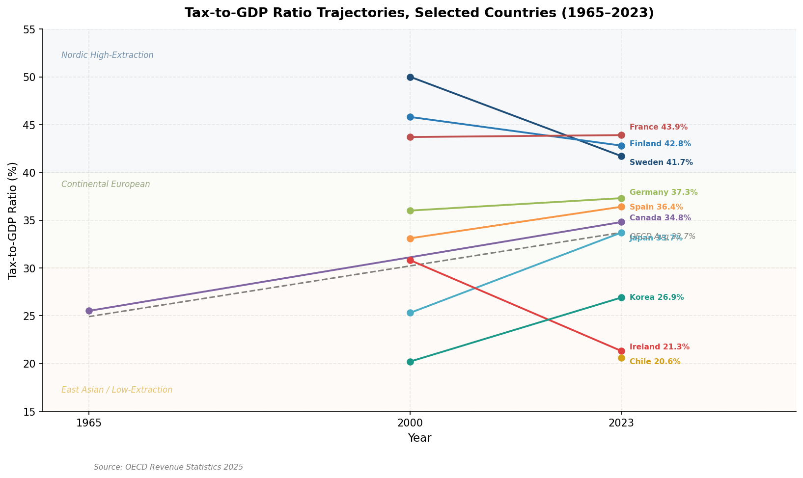

*Figure 3.3 — Evolution of tax-to-GDP ratios for ten countries plus the OECD average across 1965, 2000, and 2023, illustrating the divergence between Nordic high-extraction, continental European moderate-extraction, and East Asian / low-extraction fiscal models. Data source: OECD Revenue Statistics 2025.*

### Revenue Composition and Institutional Choice

Tax structures both reflected and reinforced institutional choices. The Nordic reliance on high personal income taxes (Denmark raised 57.2% of its total tax revenue from individual income taxes in 2023) was both a consequence and a precondition of the universalist welfare model—broad-based taxation funded broad-based benefits, creating a self-reinforcing political constituency for the continuation of both. The East Asian reliance on social security contributions (39.1% of Japan's total revenue, 29.2% of Korea's in 2023) reflected the insurance-based rather than redistributive character of their social protection systems. The low-tax outliers (Chile at 20.6%, Ireland at 21.3%) reflected deliberate institutional choices to constrain the state's fiscal footprint—choices that enhanced competitiveness through low corporate taxation but limited the resources available for public investment and social protection.

The fiscal dimension of state capacity thus operated as both enabler and constraint. High-extraction Nordic states could afford universal education, generous R&D subsidies, and comprehensive retraining programs that sustained productivity growth. Low-extraction East Asian states compensated through directed credit and high private savings, but faced growing fiscal pressures as development matured and populations aged. The continental European model balanced moderate extraction with insurance-based social protection but contended with the rigidities that contribution-based systems created in labor markets. Each fiscal configuration embodied a political bargain between the state and organized social interests—a bargain that, as Chapter 6 explores, would be tested by the crises and transformations of subsequent decades.

# 第4章 Human Capital, Technology, and Innovation Systems

The institutional architectures examined in Chapter 3 provided the governance scaffolding for development, but institutions alone do not generate growth. The knowledge and skills embodied in a nation's workforce, the technologies deployed in its firms, and the systems through which new knowledge is created, diffused, and commercialized constitute the proximate engines of productivity advance. Across the diverse group of countries that transitioned to developed-nation status after 1945, the sequencing of human capital investment, the channels of technology acquisition, and the maturation of national innovation systems varied enormously—yet a common pattern is discernible: every successful case involved deliberate, sustained, and strategically sequenced investment in these domains.

This chapter traces those investments comparatively, proceeding through four linked analyses: education strategies and their alignment with industrialization phases (Section 4.1); channels of foreign technology acquisition (Section 4.2); the trajectory from imitation to indigenous innovation, as reflected in R&D spending and institutional evolution (Section 4.3); and the role of talent mobility—brain drain, brain circulation, and diaspora networks—in accelerating technological upgrading (Section 4.4). A concluding synthesis (Section 4.5) distills the cross-cutting patterns that emerge from this comparison.

## 4.1 Education Strategies: Sequencing, Structure, and Alignment with Development Phases

The post-war development record demonstrates that human capital formation was not merely a background condition for growth but an actively managed strategic variable. The countries that achieved the fastest and most sustained convergence with the technological frontier invested heavily in education—but not uniformly. The timing, structure, and institutional design of education systems differed markedly across Europe, East Asia, and the Americas, reflecting both inherited endowments and deliberate policy choices.

### East Asia: Mass Education as Precondition and Accelerant

The East Asian developmental states entered the post-war era with highly unequal initial endowments in human capital—Japan with functional literacy above 95%, South Korea with adult literacy of approximately 22% in 1945—but shared an institutional orientation that treated education as a public good and a vehicle of national development [The Borgen Project](https://borgenproject.org/education-in-south-korea/ "Education in South Korea") [NIER Japan](https://www.nier.go.jp/English/educationjapan/pdf/201103EJPP.pdf "Education in Japan: Past and Present").

Japan's advantage was foundational. Compulsory education, mandated since 1908, had produced a workforce whose literacy and numeracy enabled rapid absorption of imported technologies. By 1975, more than 50% of the employed population had attended school for more than ten years, and 12% had completed at least college-level education [Jan Winiecki, *Intereconomics* 13(3/4), 1978](https://www.econstor.eu/bitstream/10419/139531/1/v13-i03-a07-BF02928847.pdf "Japan's Imports of Technology, p. 81"). The post-war education system expanded tertiary enrollment steadily: university participation rates climbed from approximately 10% in the early 1950s to over 30% by the 1970s, with a pronounced emphasis on engineering and applied sciences that fed directly into the industrial workforce.

South Korea's trajectory was considerably more compressed. From a primary school enrollment rate of 54% in 1945, the government—even amid the devastation of the Korean War—pursued the "Six-Year Plan to Complete Mandatory Education" beginning in 1954, achieving 96% primary enrollment by 1959 [Korean Education Centre in the UK](http://www.koreaneducentreinuk.org/wp-content/uploads/downloads/Education_the-driving-force-for-the-development-of-Korea.pdf "Education, the Driving Force for the Development of Korea, p. 13"). The concurrent "Five-Year Project to Eradicate Illiteracy" (1954–1958) raised the literacy rate of those over twelve years old to 96% by 1958. Middle school enrollment was universalized through the abolition of entrance examinations in 1969, and high school education was standardized in 1974. Critically, the Korean government systematically aligned educational expansion with its Five-Year Economic Development Plans: the Industrial Education Promotion Act of 1963 and the Vocational Training Act of 1967 promoted technical skills formation, while the establishment of the Korea Institute of Science and Technology (KIST) in 1966 and the Korea Advanced Institute of Science and Technology (KAIST) in 1971 created elite research institutions explicitly designed to produce the scientific manpower required for technology-intensive industrialization [Wikipedia](https://en.wikipedia.org/wiki/KAIST "KAIST founding") [Wikipedia](https://en.wikipedia.org/wiki/Korea_Institute_of_Science_and_Technology "KIST founding 1966"). The college enrollment rate subsequently leapt from 27.2% in 1980 to 72.0% by 2012 [Korean Education Centre in the UK](http://www.koreaneducentreinuk.org/wp-content/uploads/downloads/Education_the-driving-force-for-the-development-of-Korea.pdf "Education, the Driving Force, p. 5").

Taiwan followed a parallel but distinctly sequenced trajectory. The Japanese colonial legacy had left a basic education infrastructure—primary enrollment rose from 1% in 1910 to 47% by 1943, as noted in Chapter 1—which the KMT government rapidly expanded after 1949. Universal primary education was achieved by the early 1960s, and compulsory education was extended to nine years in 1968. Taiwan's distinctive contribution lay in the early establishment of research-linked higher education institutions, notably the Industrial Technology Research Institute (ITRI, 1973) and the Hsinchu Science-Based Industrial Park (1980), which created institutional bridges between university research, government-funded R&D, and private-sector commercialization—a linkage whose consequences for semiconductor development are examined in Section 4.4.

Singapore, lacking both natural resources and a domestic university tradition at independence in 1965, treated human capital development as an existential priority. The government's education strategy evolved in deliberate phases: survival-driven mass literacy and bilingual education in the 1960s–1970s; efficiency-driven streaming and technical education in the 1980s; and ability-driven, innovation-oriented education from the late 1990s onward. The National University of Singapore (established 1905, reorganized 1980) and Nanyang Technological University (1991) were developed into globally ranked research institutions, with explicit mandates to serve the economy's shifting needs [World Bank](https://openknowledge.worldbank.org/entities/publication/67713a1f-d633-51a5-9ad6-abe3e8988512 "Building Human Capital: Lessons from Country Experiences").

### Europe: Diverse Architectures of Skill Formation

European education systems entered the post-war period with near-universal literacy (above 95% in northwestern Europe), but with sharply different institutional architectures for translating educational attainment into industrial capability.

Germany's dual vocational training system (*duale Berufsausbildung*) constitutes the most distinctive European model of human capital formation for industrial competitiveness. Rooted in guild traditions dating to the Middle Ages but formalized through the Vocational Training Act (*Berufsbildungsgesetz*) of 1969, the dual system combines firm-based apprenticeship (three to four days per week) with classroom instruction at vocational schools (*Berufsschulen*, two days per week) [German Federal Government](https://www.germany.info/us-en/welcome/wirtschaft/03-wirtschaft/1048296-1048296 "The German Vocational Training System: An Overview"). Nearly 60% of each annual cohort enters the dual system, acquiring nationally recognized qualifications across approximately 330 occupations. The system's strength lies in its institutional embeddedness: because firms bear a substantial share of training costs, curricula remain closely aligned with industry needs, and the transition from training to employment is structurally smooth. The dual system produced the *Facharbeiter*—the skilled industrial worker—who became the backbone of Germany's manufacturing excellence and export competitiveness.

The Nordic countries developed comprehensive education models that combined high-quality universal secondary education with robust tertiary systems. Finland's education trajectory is particularly instructive. The comprehensive school reform of 1972 abolished the old parallel-track system (separating academic and vocational tracks at age 11) in favor of a unified nine-year comprehensive school. Finland's polytechnic (*ammattikorkeakoulu*) system, established in the early 1990s, created a practice-oriented higher education tier that paralleled the university system and provided industry-relevant skills. Finnish R&D intensity rose from approximately 1.2% of GDP in 1981 to 2.7% by 1999 and peaked at 3.7% in 2009—a trajectory closely linked to the rise of Nokia and the broader ICT cluster, but also to deliberate government policy through the National Technology Agency (Tekes, established 1983) and the Science and Technology Policy Council [OECD](https://www.oecd.org/content/dam/oecd/en/publications/reports/2021/06/targeting-r-d-intensity-in-finnish-innovation-policy_2642b895/51c767c9-en.pdf "Targeting R&D Intensity in Finnish Innovation Policy").

The Iberian latecomer states faced a markedly different starting position. Portugal's literacy rate stood at approximately 55–60% in the mid-twentieth century—among the lowest in Western Europe—reflecting decades of underinvestment under the Estado Novo regime [Our World in Data](https://ourworldindata.org/grapher/cross-country-literacy-rates "Cross-country literacy rates"). Spain's illiteracy rate was similarly elevated by Western European standards. Both countries undertook massive expansions of education following their democratic transitions in the 1970s, and EU accession in 1986 brought structural funds that financed educational infrastructure. Spain's university enrollment expanded rapidly during the 1980s and 1990s, and by the early 2000s tertiary attainment among younger cohorts approached northwestern European levels—a transformation accomplished within a single generation.

Ireland's education strategy was distinctive in its explicit orientation toward FDI attraction. From the 1960s onward, the Irish government expanded secondary education (free secondary schooling was introduced in 1967) and subsequently invested heavily in universities and institutes of technology, producing a large English-speaking graduate workforce that became one of the country's primary attractions for multinational corporations. By the 1990s, Ireland's tertiary enrollment rates exceeded the EU average, and the educational profile of the workforce had become a central element of the Industrial Development Authority's (IDA) investment promotion strategy.

### The Americas: Chile and Canada

Chile entered the post-war era with relatively high literacy by Latin American standards, but its education system remained deeply stratified by socioeconomic class. The expansion of higher education was significant—the University of Chile and the Pontifical Catholic University served as research anchors—but the Pinochet-era reforms of the 1980s introduced market mechanisms into education (including a voucher system for primary and secondary schooling and significant privatization of universities) that expanded access while generating persistent quality stratification. Chile's R&D spending remained low by OECD standards, hovering around 0.3–0.4% of GDP through the 1990s and reaching approximately 0.36% by 2007—far below the OECD average [OECD](https://www.oecd.org/content/dam/oecd/en/publications/reports/2007/10/oecd-reviews-of-innovation-policy-chile-2007_g1gh8749/9789264037526-en.pdf "OECD Reviews of Innovation Policy: Chile 2007").

Canada's education system benefited from high baseline literacy rates, a well-funded public school system, and world-class universities (Toronto, McGill, UBC). The expansion of community colleges in the 1960s and 1970s provided vocational and technical training pathways. Canada's human capital challenge was less about building from a low base than about retaining talent: proximity to the United States created a persistent brain-drain dynamic, particularly in scientific and engineering fields, that Canadian policy addressed through research funding programs (notably the Canada Research Chairs program, established 2000) and immigration policy designed to attract skilled workers.

The divergent education trajectories across regions—from Korea's compressed leap from 22% adult literacy to a 72% college enrollment rate within six decades, to the Iberian states' single-generation catch-up, to the incremental deepening of already-advanced systems in Germany and the Nordics—underscore a central finding: the sequencing and institutional design of education investment were as consequential as its aggregate volume.

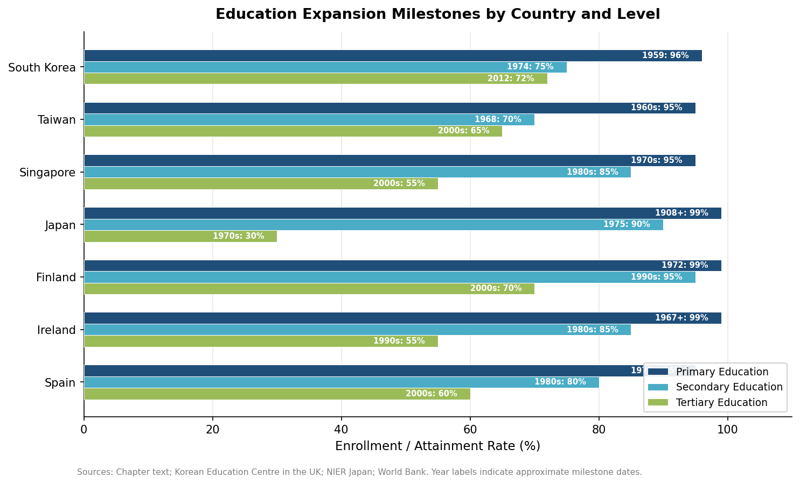

*Figure 4.1 — Education expansion milestones across seven countries, showing the year each economy reached key primary, secondary, and tertiary enrollment thresholds. The compressed timelines of South Korea and Taiwan contrast with Japan's pre-war head start and the later expansions of the Iberian and Irish systems.*

## 4.2 Technology Acquisition: From Licensing to Reverse Engineering to FDI-Mediated Transfer

No country that transitioned to developed-nation status after 1945 did so by generating all its technology domestically. Every successful late industrializer devised mechanisms for acquiring foreign technology, adapting it to local conditions, and progressively building indigenous capacity to improve upon—and eventually surpass—the imported models. The channels through which this occurred varied substantially, and the variation had lasting consequences for national innovation trajectories.

### Japan: The Licensing Strategy as Industrialization Engine

Japan's post-war technology acquisition strategy was among the most systematic and consequential in economic history. Under the 1950 Foreign Investment Law and the Foreign Exchange and Foreign Trade Control Law, the government established a regulatory framework that channeled technology inflows through licensing agreements while severely restricting foreign direct investment—ensuring that Japanese firms, rather than foreign subsidiaries, controlled the deployment and improvement of imported technologies [Jan Winiecki, *Intereconomics* 13(3/4), 1978](https://www.econstor.eu/bitstream/10419/139531/1/v13-i03-a07-BF02928847.pdf "Japan's Imports of Technology").

The scale of this effort was remarkable. The number of "Category A" technology licensing contracts (those with transfer periods or payment obligations exceeding one year) grew from 101 in 1951 to 320 in 1961 and to 1,546 in 1971. Over the period 1950–1971, Japan spent approximately $3 billion on technology imports—a sum that appears modest against the returns it generated [Jan Winiecki, *Intereconomics* 13(3/4), 1978](https://www.econstor.eu/bitstream/10419/139531/1/v13-i03-a07-BF02928847.pdf "Japan's Imports of Technology, p. 77"). The sectoral composition of license imports mirrored the government's evolving industrial priorities: engineering and chemical industries together accounted for 79.4% of all Category A licenses in 1950–1971 (83.9% when metallurgy was included). As Japan's steel and electrical machinery industries reached world-class standards, their shares of license imports declined while non-electrical machinery, plastics, and more technology-intensive sectors gained share—a pattern that tracked the planned structural transformation of Japanese industry.

MITI played a central coordinating role, as discussed in Chapter 3. It vetted proposed license agreements for their contribution to national development priorities, curbed destructive competition among Japanese firms bidding for the same foreign technology, intervened to improve contract terms unfavorable to the Japanese side, and coordinated the timing of license introductions to ensure that early producers achieved profitable volumes before competitors entered. Crucially, Japanese firms rarely applied imported technologies in their original form. Internal R&D was integrated into the licensing process from the outset: firms purchased licenses and a minimum of know-how, then relied on their own engineering capabilities to adapt, improve, and extend the imported technology. This integration of technology imports with domestic R&D—facilitated by a highly educated workforce—was what distinguished Japan's approach from passive technology dependence [Jan Winiecki, *Intereconomics* 13(3/4), 1978](https://www.econstor.eu/bitstream/10419/139531/1/v13-i03-a07-BF02928847.pdf "Japan's Imports of Technology, pp. 80–81").

The empirical evidence for the strategy's effectiveness is substantial. Heavy industry's share of Japan's manufacturing output rose from 43.7% in 1955 to 63.0% in 1970, and heavy industry's share of exports rose from 38% to 72.4% over the same period. Production function analyses estimated that the "residual factor" (encompassing technical and organizational progress, workforce quality, and scale economies) contributed 47% of Japan's economic growth during 1955–1970 [Jan Winiecki, *Intereconomics* 13(3/4), 1978](https://www.econstor.eu/bitstream/10419/139531/1/v13-i03-a07-BF02928847.pdf "Japan's Imports of Technology, p. 78, citing Oshima 1973").

### South Korea: Sequenced Acquisition under State Direction

South Korea replicated key elements of the Japanese licensing model but with important modifications reflecting its later starting point and greater initial dependence on foreign capital. In the 1960s and early 1970s, Korean firms—particularly the *chaebol*—acquired technology primarily through turnkey plant purchases and licensing from Japanese and American firms. The government, through the Economic Planning Board and the Ministry of Commerce and Industry, exercised oversight over technology import agreements to ensure knowledge transfer rather than mere equipment procurement.

The establishment of KIST in 1966—the first multidisciplinary scientific research institute in Korea, founded with American assistance—marked a deliberate effort to build absorptive capacity. KIST initially served as a bridge institution, helping Korean firms identify, evaluate, and adapt foreign technologies. KAIST (1971) added a graduate training function, producing the research-capable engineers who would staff both government laboratories and *chaebol* R&D divisions. The government actively recruited Korean scientists and engineers working abroad, offering salary premiums, research funding, and institutional positions—an early manifestation of the brain-circulation strategy analyzed in Section 4.4.

As Korean firms gained absorptive capacity through the 1970s and 1980s, the dominant mode of technology acquisition shifted from passive licensing toward more active strategies: joint ventures, strategic alliances, and increasingly, reverse engineering. Samsung's entry into semiconductors in the early 1980s exemplified this progression. The firm began by licensing 64K DRAM technology from Micron Technology but rapidly invested in internal R&D to close the gap with the technological frontier—reducing the time lag from several years to months by the late 1980s.

### The FDI Channel: Ireland and Singapore

Ireland and Singapore pursued a fundamentally different model of technology acquisition—one mediated by foreign direct investment rather than restricted by it. Both countries actively courted multinational corporations, offering tax incentives, infrastructure, and skilled labor, with the explicit expectation that MNC operations would transfer technology, management practices, and market knowledge to the domestic economy.

Ireland's Industrial Development Authority (IDA), established originally in 1949 and restructured in the 1960s, became the institutional vehicle for this strategy. The IDA's approach evolved in phases: in the 1960s and 1970s, the focus was on attracting manufacturing operations (electronics assembly, pharmaceuticals) that provided employment and basic technology exposure. By the 1990s, the strategy had shifted toward higher-value-added functions—R&D centers, European headquarters, and software development operations—leveraging Ireland's expanding pool of university graduates, English-language environment, EU membership, and a corporate tax rate of 12.5%. By the 2000s, nine of the ten largest global pharmaceutical companies and all major US technology firms maintained significant operations in Ireland, and MNC-linked R&D spending had become a major component of national research activity [IDA Ireland](https://www.idaireland.com/ "IDA Ireland overview").

Singapore's Economic Development Board similarly orchestrated a progressive upgrading of FDI-mediated technology transfer. The government deliberately shifted Singapore's industrial base from labor-intensive manufacturing in the late 1960s to skill- and capital-intensive sectors in the 1970s and 1980s (petrochemicals, electronics, precision engineering), and toward knowledge-intensive activities (biomedical sciences, aerospace) from the 2000s onward. Each transition required attracting MNCs operating at higher technological levels and simultaneously upgrading the domestic workforce to absorb increasingly sophisticated technologies.

The FDI-mediated model carried inherent limitations: technology remained under foreign control, and the extent of spillovers to the domestic economy depended on local absorptive capacity and the degree to which MNCs undertook R&D locally rather than merely production. Both Ireland and Singapore addressed this constraint through sustained investment in higher education and, from the 1990s onward, through the establishment of indigenous R&D funding mechanisms—Science Foundation Ireland (2003) and Singapore's Agency for Science, Technology and Research (A*STAR, 1991)—designed to complement MNC-driven research with nationally directed basic and applied science.

### Europe: Marshall Plan Transfers and Intra-European Diffusion

Western European technology acquisition in the immediate post-war period occurred through a distinctive channel: the systematic transfer of American industrial techniques facilitated by the Marshall Plan's "technical assistance" programs. Between 1948 and 1958, thousands of European managers, engineers, and workers visited American factories, studying production methods, management techniques, and quality control systems. The European Productivity Agency (established 1953 under OEEC auspices) institutionalized this transatlantic knowledge diffusion.

Germany's technology trajectory combined the recovery of its substantial pre-war industrial knowledge base—much of which survived the war in the form of human capital, even as physical capital was destroyed—with the absorption of American mass-production methods and management practices. The dual vocational training system ensured that shop-floor innovations and incremental improvements were continuously integrated into production processes, creating the "diversified quality production" model that became Germany's competitive signature in the decades that followed.

France channeled technology acquisition partly through its nationalized industries and the Commissariat du Plan, which directed investment toward sectors where French capabilities lagged. The state's role in aviation (Aérospatiale, later Airbus), nuclear energy (Commissariat à l'énergie atomique, CEA), and telecommunications (the Plan Calcul for computing, 1966) reflected a deliberate strategy of building national technological champions in sectors deemed strategic—an approach that paralleled the East Asian developmental state model in its sectoral targeting, if not in its institutional mechanisms.

### Chile and the Limits of Technology Acquisition without Industrial Policy

Chile's technology acquisition strategy diverged sharply from both the East Asian and the European models. Under the neoliberal framework imposed after 1973, tariff barriers were dismantled and FDI restrictions lifted, creating an open economy in which technology flowed primarily through imported capital goods, FDI in mining and agroindustry, and market transactions. The absence of the directed licensing, strategic R&D subsidies, or sectoral targeting that characterized the East Asian approach meant that technology acquisition was driven by market signals rather than developmental strategy. The result was effective technology transfer in resource-extraction sectors—copper mining, for instance, became world-class in productivity—but limited development of indigenous technological capabilities in manufacturing or high-technology services. Chile's R&D intensity remained well below 0.5% of GDP through the first two decades of the twenty-first century, placing it among the lowest in the OECD [OECD](https://www.oecd.org/content/dam/oecd/en/publications/reports/2007/10/oecd-reviews-of-innovation-policy-chile-2007_g1gh8749/9789264037526-en.pdf "OECD Reviews of Innovation Policy: Chile 2007").

The contrast between the East Asian licensing-and-reverse-engineering model, the FDI-mediated approach of Ireland and Singapore, and Chile's market-driven path illustrates how the institutional design of technology acquisition channels shaped long-run innovation trajectories—a pattern summarized in Figure 4.2.

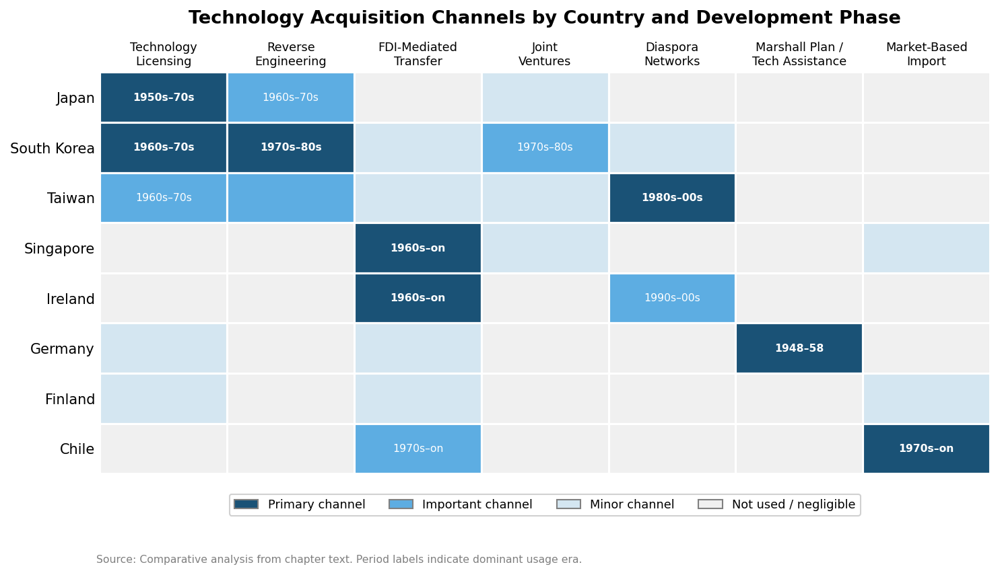

*Figure 4.2 — Technology acquisition channels by country and development phase. Cell shading indicates channel dominance (primary, important, minor, not used). The heatmap reveals the sharp contrast between the East Asian licensing/reverse-engineering model, the FDI-mediated pathway of Ireland and Singapore, and Chile's reliance on market-based imports.*

## 4.3 From Imitation to Innovation: R&D Trajectories and the Crossing of the Technological Frontier

The transition from technology follower to technology leader—from absorbing and adapting foreign knowledge to generating original innovations at the global frontier—is among the most consequential and difficult thresholds in a nation's development trajectory. The countries examined in this report crossed that threshold at different times, through different mechanisms, and with different degrees of completeness. R&D expenditure as a share of GDP provides a rough but informative proxy for this transition.

### The Global R&D Landscape in Historical Perspective

In 1980, global R&D spending totaled approximately $478.6 billion (2009 PPP dollars), heavily concentrated among wealthy nations. The United States led with $149.5 billion (31.2% of the global total, R&D intensity of 2.32% of GDP), followed by the Soviet Union ($80.1 billion, 2.58%), Japan ($49.3 billion, 2.19%), and Germany ($42.9 billion, 2.35%). South Korea, which would become the world's fifth-largest R&D spender by 2013, ranked only 36th globally in 1980. By 2013, global R&D had risen to $1.61 trillion, with the United States at $441.2 billion (27.4%, 2.80% of GDP), Japan at $153.4 billion (3.49%), Germany at $94.0 billion (2.94%), and South Korea at $62.3 billion (4.15%)—the highest R&D intensity among the top ten spenders [Dehmer et al., *PLoS ONE* 14(3), 2019](https://pmc.ncbi.nlm.nih.gov/articles/PMC6440631/ "Reshuffling the Global R&D Deck, 1980–2050"). Korea's ascent from 36th to 5th position in global R&D rankings within thirty-three years constitutes one of the most remarkable trajectories in the modern history of science and technology policy.

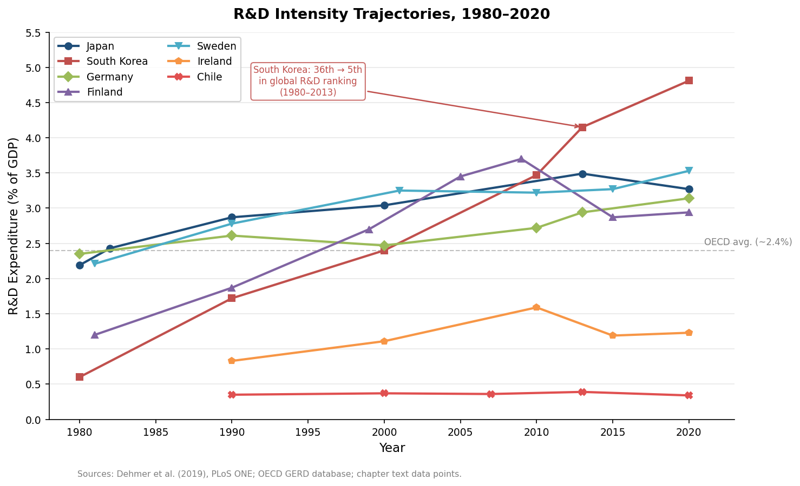

*Figure 4.3 — R&D expenditure as a percentage of GDP for seven countries, 1980–2020. South Korea's steep ascent from negligible R&D spending to the world's highest intensity (above 4% of GDP) contrasts sharply with Chile's persistently low levels. The OECD average reference line (~2.4%) highlights the divide between innovation leaders and laggards.*

### Japan: Crossing the Frontier in the 1980s

Japan's transition from technology follower to technology leader was gradual and sector-specific rather than sudden and economy-wide. Through the 1960s and 1970s, Japan remained primarily an adapter and improver of imported technologies, albeit an extraordinarily effective one. The inflection point came in the late 1970s and 1980s, when Japanese firms in electronics, automobiles, and materials science began generating original innovations that set global standards. Japan's R&D intensity surpassed 2% of GDP by the early 1980s—reaching 2.43% in 1982, exceeding the United States' 2.01% [JSTOR](https://www.jstor.org/stable/1697578 "Japanese Research and Technology Policy")—and continued to climb, reaching 3.49% by 2013.

The institutional underpinnings of this transition included the reorganization of corporate R&D. Japanese firms progressively shifted from applied-research divisions focused on adapting imported technologies to basic-research laboratories pursuing frontier science. NTT's Musashino laboratories, Hitachi's Central Research Laboratory, and Toyota's advanced engineering divisions became generators of globally significant innovations. The government facilitated this transition through programs such as the Very Large Scale Integration (VLSI) semiconductor research consortium (1976–1980), which pooled resources from five competing electronics firms under MITI coordination to develop next-generation semiconductor manufacturing techniques—a model of pre-competitive collaborative research that influenced innovation policy worldwide.

By the late 1980s, Japan led the world in patent applications in several technology fields and had become a net exporter of technology licenses in selected sectors—a symbolic reversal of its decades-long status as the world's largest license importer. The shift was also reflected in the changing terms of technology trade: foreign licensors increasingly demanded cross-licensing agreements granting them access to Japanese technological improvements, or equity stakes in Japanese partner firms, rather than simple royalty payments [Jan Winiecki, *Intereconomics* 13(3/4), 1978](https://www.econstor.eu/bitstream/10419/139531/1/v13-i03-a07-BF02928847.pdf "Japan's Imports of Technology, p. 81").

### South Korea: The Compressed Catch-Up

South Korea's R&D trajectory compressed into three decades a transition that Japan accomplished over four. Korean R&D expenditure as a share of GDP rose from approximately 0.6% in 1980 to 2.4% by 2000 and reached 4.15% by 2013—the highest ratio among the world's top ten R&D spenders. In absolute terms, Korea's R&D spending grew from a negligible base to $62.3 billion (2009 PPP dollars) by 2013 [Dehmer et al., *PLoS ONE* 14(3), 2019](https://pmc.ncbi.nlm.nih.gov/articles/PMC6440631/ "Reshuffling the Global R&D Deck, 1980–2050"). The private sector drove this expansion: the *chaebol*—Samsung, Hyundai, LG, SK—established corporate research institutes that grew into world-class laboratories. Samsung Electronics alone invested over $22 billion in R&D in 2023, ranking among the top five corporate R&D spenders globally.

The government's role evolved across distinct phases: direct technology acquisition in the 1960s–1970s gave way to co-investment in strategic sectors during the 1990s (the "HAN" national technology development projects targeted semiconductors, telecommunications, and advanced materials), and subsequently to the creation of framework conditions for private-sector innovation from the 2000s onward. Government-funded research institutes (GRIs)—including KIST, the Electronics and Telecommunications Research Institute (ETRI), and the Korea Research Institute of Chemical Technology (KRICT)—served as institutional bridges, performing pre-competitive research, training researchers, and diffusing technological knowledge to the private sector.

### Finland: From Resource Periphery to Innovation Frontier

Finland's transformation from a resource-dependent peripheral economy to one of the world's most innovation-intensive countries represents a distinctive European variant of the imitation-to-innovation transition. As late as the 1970s, Finland's industrial structure was dominated by forestry, paper, and metals—sectors driven by natural-resource endowments rather than technological sophistication. The country's R&D intensity was modest: approximately 1.2% of GDP in the early 1980s, below the OECD average.

The transformation was catalyzed by a conjunction of deliberate policy, institutional innovation, and entrepreneurial dynamism. The establishment of the National Technology Agency (Tekes) in 1983 and the Science and Technology Policy Council in 1987 signaled a government commitment to constructing a national innovation system. Tekes operated as a funding agency for applied R&D, co-investing with firms in technology development projects and fostering university-industry collaboration. The Council provided strategic coordination across ministries, ensuring that education, science, and industrial policies were aligned [Sitra Reports Series No. 7](https://www.sitra.fi/wp-content/uploads/2017/02/raportti7.pdf "Schienstock & Hämäläinen, Transformation of the Finnish Innovation System, 2001").

Nokia's rise from a diversified conglomerate to the world's leading mobile phone manufacturer provided both the demand pull for Finland's innovation system and a demonstration of what a small peripheral economy could achieve at the technological frontier. At its peak in the early 2000s, Nokia accounted for approximately 4% of Finnish GDP and a substantial share of national R&D spending [ETLA](https://www.etla.fi/wp-content/uploads/2012/09/B244.pdf "Ali-Yrkkö (Ed.), Nokia and Finland in a Sea of Change"). Finland's aggregate R&D intensity rose to 3.7% of GDP by 2009—among the highest in the world—though it subsequently declined following Nokia's loss of smartphone market share. This episode exposed the vulnerability of a small economy's innovation system to the fortunes of a single dominant firm and set the stage for an ongoing challenge: diversifying Finland's innovation base beyond any single corporate anchor.

### Germany and Sweden: Sustained Frontier Presence

Germany and Sweden, unlike the East Asian or Finnish cases, did not undergo a dramatic imitation-to-innovation transition in the post-war period; both were already at or near the technological frontier in multiple sectors before 1945. Their post-war R&D trajectories reflected the consolidation and deepening of existing capabilities rather than catch-up from behind.

Germany's R&D intensity stood at 2.35% of GDP in 1980 and rose to 2.94% by 2013 [Dehmer et al., *PLoS ONE* 14(3), 2019](https://pmc.ncbi.nlm.nih.gov/articles/PMC6440631/ "Reshuffling the Global R&D Deck, 1980–2050"). The distinctive feature of German innovation was its concentration in "medium-high technology" sectors—automotive engineering, industrial machinery, chemicals, medical devices—where incremental innovation, process optimization, and the integration of advanced materials and electronics into established product architectures generated sustained competitive advantage. The institutional infrastructure supporting this model is layered and dense. The Fraunhofer Institutes (77 institutes by the 2020s), established from 1949 onward, provide a distinctive mechanism for applied research: each institute operates at the interface between university science and industrial application, with roughly 70% of funding derived from contract research for industry and government. The Max Planck Institutes (86 by the 2020s) anchor basic research, while the Leibniz Association and Helmholtz Association fill intermediate niches in the research landscape.

Sweden maintained one of the world's highest R&D intensities throughout the post-war period, reaching 3.25% of GDP in 2001 before stabilizing around 3.2–3.4% in subsequent years. Swedish innovation was driven by a small number of large multinational corporations—Ericsson, Volvo, ABB, AstraZeneca, Atlas Copco—whose R&D operations were embedded in a dense network of university research departments, government-funded laboratories, and specialized supplier firms. The Wallenberg foundation system, Sweden's dominant constellation of industrial ownership and philanthropic research funding, channeled substantial private resources into both basic science and applied research, creating a distinctive public-private synergy that reinforced the country's position at the technological frontier.

## 4.4 Brain Drain, Brain Circulation, and Diaspora Networks

The mobility of highly skilled individuals—scientists, engineers, entrepreneurs—has been a significant but often underestimated factor in the technology upgrading of late-industrializing countries. The dominant narrative of the 1960s and 1970s framed this mobility as "brain drain"—a unidirectional loss of human capital from developing to developed countries. By the 1990s, a more nuanced understanding had emerged: under the right institutional conditions, emigrant talent could be converted into a developmental asset through "brain circulation"—the return flow of knowledge, networks, and capital from diaspora communities to the home country.

### Taiwan: The Hsinchu Model

Taiwan's experience constitutes the canonical case of successful brain circulation in the service of industrial upgrading. Between 1960 and 1990, tens of thousands of Taiwanese students pursued graduate education in the United States, primarily in engineering and the sciences. Many remained in the US, building careers in Silicon Valley and other technology hubs. Rather than viewing this outflow as an unrecoverable loss, the Taiwanese government designed institutions to harness the diaspora's accumulated knowledge and networks.

The Hsinchu Science-Based Industrial Park, established in 1980 adjacent to two leading research universities (National Tsing Hua University and National Chiao Tung University), was explicitly modeled on Stanford Research Park and designed to attract returning diaspora engineers. The government offered tax incentives, subsidized land, and venture capital co-investment to returnees establishing technology firms. ITRI served as an institutional incubator, developing prototype technologies that were spun off to private firms—often founded by US-trained returnees. The number of returnees establishing themselves in Hsinchu reached a peak of approximately 6,000 in 1995, and by 2004 Taiwanese who had studied abroad had founded 113 of the approximately 380 firms in the park [*Taiwan Panorama*](https://www.taiwan-panorama.com/en/Articles/Details?Guid=85fb0a14-8c4e-43cc-8517-e119956d59bf "Brain Drain, Brain Gain").

AnnaLee Saxenian's research documented the mechanisms through which the Silicon Valley–Hsinchu connection operated: transpacific networks of shared ethnicity, educational ties, and professional associations facilitated flows of market intelligence, technical knowledge, and venture capital that would not have occurred through arm's-length market transactions [AnnaLee Saxenian](https://people.ischool.berkeley.edu/~anno/Speeches/braindrain.html "Brain Drain or Brain Circulation?"). The outcome was not merely a transfer of technical knowledge but the transplantation of an entire entrepreneurial ecosystem—including the Silicon Valley norms of risk-taking, rapid iteration, and equity-based compensation—into a Taiwanese institutional context.

The semiconductor industry exemplified this brain-circulation dynamic. Morris Chang, who spent 25 years at Texas Instruments before returning to Taiwan in 1985 to lead ITRI, subsequently founded the Taiwan Semiconductor Manufacturing Company (TSMC) in 1987. TSMC's pure-play foundry model—manufacturing chips designed by other firms—became one of the most consequential business innovations of the late twentieth century and the foundation of Taiwan's dominance in advanced semiconductor manufacturing by the 2020s.

### South Korea: Targeted Recruitment of Overseas Scientists

Korea's approach to diaspora talent was more state-directed than Taiwan's market-facilitated model. From the late 1960s onward, the Korean government actively recruited Korean scientists and engineers working in the United States and Europe, offering permanent positions at government research institutes (particularly KIST and KAIST), salary premiums, housing subsidies, and research autonomy exceeding what was available in the domestic private sector. The "Brain Pool" program and subsequent iterations formalized these recruitment efforts.

The impact was concentrated in strategic sectors. Returned Korean scientists played pivotal roles in establishing Korea's semiconductor, telecommunications, and nuclear energy capabilities. The flow was smaller in volume than Taiwan's diaspora-driven entrepreneurship but more precisely targeted: the government identified specific technological gaps and recruited individuals with the expertise to fill them.

### Ireland: The Diaspora as FDI Bridge

Ireland's relationship to its diaspora operated through a different mechanism. The massive emigration of the nineteenth and twentieth centuries created a global Irish diaspora, concentrated in the United States, the United Kingdom, and Australia. While historically experienced as a national wound, the diaspora's networks—particularly in American business and politics—facilitated Ireland's FDI-attraction strategy. Irish-Americans in senior positions at US technology and pharmaceutical firms served as informal advocates for locating operations in Ireland, and returning emigrants brought market knowledge, professional networks, and managerial experience.

The "Celtic Tiger" era of the 1990s and 2000s saw significant return migration as economic opportunities in Ireland began to rival or exceed those available abroad. This reverse flow brought back not only human capital but also the professional networks, industry knowledge, and cultural capital accumulated during years of working in the world's leading technology clusters—a form of brain circulation that, while less institutionally orchestrated than the Taiwanese model, was quantitatively significant in reshaping Ireland's workforce profile.

### Finland: Internationalization without Large-Scale Emigration

Finland, with a relatively small diaspora and no tradition of large-scale skilled emigration, pursued technology upgrading primarily through the internationalization of its research system rather than through brain circulation. Finnish universities and research institutes developed extensive international collaboration networks, and the rapid internationalization of Nokia created dense channels of knowledge flow between Finland and global technology centers. Finland's experience demonstrates that brain circulation is not the only pathway to integrating national innovation systems with global knowledge networks—institutional internationalization, through collaborative research programs, international student exchange, and the attraction of foreign researchers, can serve a functionally equivalent purpose.

## 4.5 Comparative Patterns and Analytical Synthesis

The comparative evidence assembled in this chapter reveals several cross-cutting patterns that transcend regional and institutional boundaries.

First, the sequencing of education investment preceded and enabled technology absorption in every successful case. Mass basic education was prioritized before vocational training, and vocational training before tertiary and research-oriented education—though the timescale of this progression varied from decades (Korea, Taiwan) to a more compressed and concurrent process (Singapore). The alignment of educational expansion with industrial strategy—exemplified by Korea's Industrial Education Promotion Act coinciding with the shift to export-oriented industrialization—proved more consequential than aggregate spending levels alone.

Second, the channel of technology acquisition shaped subsequent innovation trajectories in lasting ways. Countries that acquired technology through domestic licensing and reverse engineering (Japan, Korea) built deeper indigenous absorptive capacity than those relying primarily on FDI-mediated transfer (Ireland, Singapore), though the latter compensated through sustained investment in higher education and, eventually, the construction of indigenous R&D institutions. Chile's market-driven approach, by contrast, delivered effective technology transfer in resource-extraction sectors but generated limited spillovers into manufacturing or high-technology services.

Third, the transition from imitation to frontier innovation required not merely rising R&D expenditure but the development of institutional architectures—research universities, public research institutes, venture capital markets, intellectual property regimes—that enabled the commercialization of domestically generated knowledge. The Fraunhofer model in Germany, the ITRI-to-Hsinchu pipeline in Taiwan, and the KIST-KAIST-*chaebol* nexus in Korea each represent distinct but functionally analogous solutions to this institutional design challenge.

Fourth, the mobility of human capital—whether through brain circulation (Taiwan, Korea), diaspora-facilitated FDI (Ireland), or institutional internationalization (Finland)—served as a critical complement to domestic capacity-building. These channels provided access to tacit knowledge and social networks that could not be acquired through technology licensing or arm's-length market transactions alone.

These patterns collectively indicate that human capital, technology acquisition, and innovation system development are not merely background conditions for economic growth but actively managed strategic investments whose sequencing and institutional design rank among the most consequential policy choices available to late-industrializing nations—a theme that the analysis of trade integration and global architecture in Chapter 5 further develops.

# 第5章 Global Integration — Trade, Capital, and Regional Architecture

The development strategies examined in Chapter 2 and the institutional capacities analyzed in Chapter 3 did not operate in autarky. Each country's growth trajectory was profoundly shaped by its mode of engagement with the international economy—the timing and sequencing of trade liberalization, the architecture of regional arrangements that amplified or constrained market access, the channels through which foreign capital and investment entered (or were excluded from) the domestic economy, and the exchange-rate and financial regimes that mediated exposure to global shocks. Where domestic institutions and strategies constituted the engine of development, global integration determined the terrain on which that engine operated.

This chapter traces five interconnected dimensions of global economic integration. Section 5.1 examines the evolution of trade policy from post-war protectionism through staged liberalization, with attention to the multilateral GATT/WTO framework and the sharply different national tempos of tariff reduction. Section 5.2 analyzes the distinctive role of regional economic architectures—above all European integration—as development accelerators. Section 5.3 contrasts the divergent FDI strategies pursued by different country groups, from the deliberate restriction practiced by Japan and Korea to the active attraction model of Ireland and Singapore. Section 5.4 assesses the sequencing of capital-account liberalization and the role of development banks in channeling finance. Section 5.5 evaluates the impact of commodity cycles, terms-of-trade shocks, and exchange-rate regimes on resource-dependent economies. A concluding synthesis (Section 5.6) draws out cross-cutting comparative patterns.

## 5.1 Trade Policy Evolution: From Protection to Phased Liberalization

The post-war international trading order rested on the General Agreement on Tariffs and Trade (GATT), signed by 23 founding members on 30 October 1947. The initial negotiating round produced 45,000 tariff concessions affecting approximately $10 billion in trade—roughly one-fifth of the world total [WTO](https://www.wto.org/english/thewto_e/whatis_e/tif_e/fact4_e.htm "The GATT years: from Havana to Marrakesh"). Over eight successive rounds spanning nearly five decades, average tariff levels among major participants fell from approximately 22% in 1947 to under 5% by the conclusion of the Tokyo Round in 1979; the Uruguay Round (1986–1994) extended disciplines to services, intellectual property, and agriculture while establishing the World Trade Organization [WTO](https://www.wto.org/english/thewto_e/whatis_e/tif_e/fact4_e.htm "GATT trade rounds table"). These multilateral reductions helped sustain world trade growth of approximately 8% per year during the 1950s and 1960s, consistently outpacing production growth.

Yet this aggregate trajectory conceals sharp national variation in the timing, sequencing, and sectoral selectivity of trade opening—variation that proved deeply consequential for development outcomes.

### The Managed Openness of the Golden Age

The Bretton Woods system (1944–1971/73) provided a distinctive institutional environment for trade liberalization. Fixed exchange rates, pegged to the US dollar and ultimately to gold, reduced currency uncertainty and facilitated trade expansion, while capital controls afforded governments the macroeconomic policy space to pursue full employment alongside gradual tariff reduction. Western European economies and Japan operated within this framework during their high-growth decades, combining progressive external liberalization with substantial domestic industrial management.

West Germany's trade opening was inseparable from its broader ordoliberal framework. Ludwig Erhard's 1948 currency reform and price decontrol were followed by rapid trade liberalization through the 1950s; by the completion of the EEC customs union in 1968, Germany had become Europe's largest exporter. The social market economy combined open external trade with a dense institutional framework for domestic competition and social protection—a configuration that enabled Germany to harness trade as a growth engine while managing its distributional consequences.

France pursued a more guarded path. The Monnet Plan's targeted investment in six bottleneck sectors was accompanied by selective tariff protection for nascent industries and extensive use of non-tariff barriers. Participation in the EEC customs union obliged progressive tariff reduction vis-à-vis European partners, but the Common Agricultural Policy (CAP) simultaneously erected substantial external protection for French agriculture—a trade-off that exemplified the political economy of managed liberalization.

Japan's trade regime during the high-growth era (1950–1973) represented the most systematic case of strategic protection among the eventual advanced economies. MITI employed the Foreign Exchange and Foreign Trade Control Law and the Foreign Investment Law to regulate both imports and technology inflows. Tariff and non-tariff barriers sheltered infant industries during their scaling phase, while export promotion incentives—preferential financing, tax rebates, and diplomatic support—drove external sales. Japan's accession to GATT in 1955 was contested: fourteen existing members invoked Article XXXV to deny Japan most-favored-nation treatment, reflecting acute anxiety over Japan's competitive potential. The government subsequently lowered tariffs in staged rounds, particularly after joining the OECD in 1964, but maintained substantial non-tariff barriers—import quotas, administrative guidance, distribution-system opacity—well into the 1980s.

### East Asian Export Orientation and Selective Protection

South Korea's trade policy trajectory exemplified the sequenced combination of import protection and export promotion that characterized the East Asian developmental model. The Park Chung-hee government's pivot from ISI to export-oriented industrialization (EOI) during 1964–1967 unified the exchange rate, introduced export subsidies, and established export targets as key performance indicators for chaebol access to subsidized credit. Critically, export orientation did not imply free trade. Korea maintained high tariffs and quantitative restrictions on consumer goods imports while selectively liberalizing intermediate and capital goods imports required by export industries. Average nominal tariffs remained above 20% through the 1970s and declined only gradually during the 1980s and 1990s—partly under US bilateral pressure, partly as a condition of OECD accession in 1996 [OECD](https://www.oecd.org/content/dam/oecd/en/publications/reports/1996/01/oecd-economic-surveys-korea-1996_g1g17263/eco_surveys-kor-1996-en.pdf "OECD Economic Surveys: Korea 1996").

Taiwan followed a broadly parallel pattern. The 1960 Nineteen-Point Reform Program and the Statute for the Encouragement of Investment liberalized trade for export-oriented firms while maintaining protection for the domestic market. The Kaohsiung Export Processing Zone (1966)—among the world's first dedicated export-processing zones—physically embodied this dual regime: firms within the zone imported inputs duty-free and exported without restriction, while the broader economy remained substantially protected. Taiwan's GATT/WTO accession did not occur until 2002, reflecting both geopolitical complications and the persistence of protective structures.

Singapore represented the polar case: a city-state with virtually no domestic market to protect. From the late 1960s onward, Singapore maintained one of the world's most open trade regimes, with minimal tariffs and no quantitative restrictions. Openness was not merely a policy choice but a structural imperative for an economy entirely dependent on external trade—trade openness measured by the ratio of exports and imports to GDP consistently ranged between 280% and 380% of GDP, placing Singapore far above any other economy in the sample.

### Late Liberalizers: Iberian and Latin American Trajectories

The Iberian economies and Chile illustrate the consequences of delayed liberalization followed by compressed opening. Franco's Spain pursued autarky through the 1940s and 1950s, with pervasive import licensing, multiple exchange rates, and average tariffs exceeding 30%. The 1959 Stabilization Plan dismantled the most extreme controls under IMF and OEEC pressure. Subsequent liberalization proceeded in stages: GATT membership (1963), a preferential trade agreement with the EEC (1970), and ultimately full EEC accession in 1986, which required definitive dismantling of remaining protective structures.

Portugal's trajectory paralleled Spain's but with important differences. Membership in EFTA from 1960 exposed Portuguese industry to competition from northern European partners earlier than Spain's eventual EEC accession would, though the *condicionamento industrial* system continued to restrict domestic competition. The 1974 Carnation Revolution disrupted existing trade relations, but democratic Portugal rapidly pursued European integration, joining the EEC alongside Spain in 1986.

Chile's trade liberalization was the most radical in the sample. The Pinochet regime's "Chicago Boys" reduced tariffs from an average exceeding 100% (with peaks above 500% on certain items) to a uniform 10% by 1979—a compression accomplished in approximately six years [Princeton University Press](https://press.princeton.edu/books/hardcover/9780691208626/the-chile-project "Sebastian Edwards, The Chile Project, 2023"). The 1982–1983 financial crisis led to a temporary reversal (the uniform tariff was raised to 35% before being gradually re-lowered), but by the late 1980s Chile had returned to a low-tariff, uniform-rate regime that made it one of Latin America's most open economies. Chile subsequently pursued an active bilateral and plurilateral trade agreement strategy, signing FTAs with the EU (2003), the United States (2004), and China (2006), among others.

Canada liberalized trade within the framework of deep bilateral integration with the United States. The 1965 Auto Pact—which eliminated tariffs on vehicles and parts traded between US and Canadian plants meeting production-to-sales ratio requirements—was the most consequential sectoral trade agreement in Canadian post-war economic history, transforming Ontario into a major automotive production hub [TVO](https://www.tvo.org/article/how-the-1965-auto-pact-kicked-off-canada-us-free-trade "How the 1965 Auto Pact kicked off Canada-U.S. free trade"). The Canada-US Free Trade Agreement (1988) and its successor NAFTA (1994) extended this integration across the broader economy, making Canada one of the most trade-dependent developed economies: by the early 2000s, exports to the United States alone exceeded 30% of Canadian GDP.

### Ireland: Trade Liberalization as Development Strategy

Ireland's trade trajectory constitutes a distinctive case in which progressive liberalization was not merely a complement to development strategy but its central mechanism. The 1958 Whitaker Report's diagnosis that protectionism had failed led to a systematic dismantling of tariff barriers through the 1960s, culminating in EEC accession in 1973. Access to the European common market, combined with the Industrial Development Authority's (IDA) tax incentives and an expanding pool of English-speaking graduates, made Ireland uniquely attractive to American multinationals seeking a European production base. The corporate tax rate—reduced to 10% for manufacturing in 1980 and subsequently standardized at 12.5% for all sectors in 2003—became the linchpin of a strategy that leveraged trade openness into sustained FDI attraction [CTF Canada](https://www.ctf.ca/EN/EN/Newsletters/Perspectives/2020/2/200206.aspx "A Low CIT Rate Has Worked for Ireland").

The divergent trade openness trajectories of these economies—from Japan's cautious, managed opening to Ireland's dramatic surge following EEC accession to Chile's compressed liberalization shock—are visualized in Figure 5.1 below.

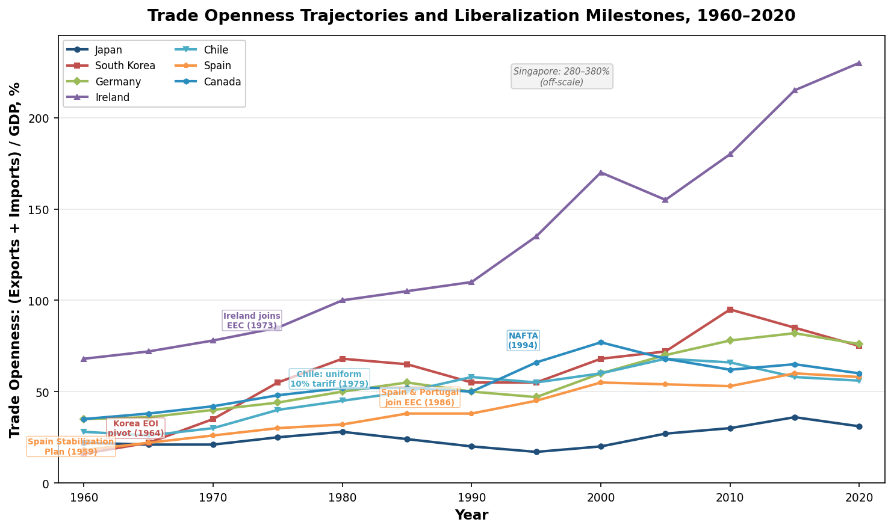

## 5.2 Regional Economic Architecture as Development Accelerator

No dimension of global integration more sharply differentiates the European development experience from the East Asian and American trajectories than the role of regional institutional architecture. European integration—from the European Coal and Steel Community (ECSC) through the European Economic Community (EEC) to the European Union (EU)—constituted a unique, multi-layered mechanism for locking in liberalization, transferring resources to lagging members, and anchoring institutional reform. No comparable structure emerged in East Asia or the Western Hemisphere during the critical decades of post-war development.

### The European Sequence: From Sectoral Integration to Common Market to Monetary Union

The ECSC, established by the Treaty of Paris in 1951 among France, West Germany, Italy, Belgium, the Netherlands, and Luxembourg, created a common market for coal and steel—eliminating tariffs, quotas, and subsidies among members in these strategic sectors [European Union](https://european-union.europa.eu/principles-countries-history/history-eu/1945-59_en "History of the EU, 1945–59"). The Schuman Plan's political logic—binding French and German heavy industry to make war "not merely unthinkable, but materially impossible"—was inseparable from its economic logic of market enlargement and specialization.

The 1957 Treaty of Rome extended this logic to the entire economy, establishing the EEC as a customs union. Internal tariffs among the six founding members were progressively eliminated and a common external tariff adopted—a process completed by July 1968, eighteen months ahead of schedule. The impact on trade patterns was transformative: where over 60% of the Community's eventual twelve members' trade had been with non-member countries in 1960, by the early 1990s over 60% was intra-Community trade [Barry Eichengreen, Econlib](https://www.econlib.org/library/Enc/EuropeanEconomicCommunity.html "European Economic Community, written 1992"). Most economic analyses concluded that the customs union was predominantly trade-creating rather than trade-diverting, though the Common Agricultural Policy constituted a significant exception—maintaining high internal prices at the expense of consumers and extra-European producers.

Institutional deepening continued through successive layers. The Single European Act (1986) committed members to completing the internal market by 1992, removing non-tariff barriers to the free movement of goods, services, capital, and labor. The Maastricht Treaty (1992) established the path to monetary union, culminating in the introduction of the euro in 1999 (physical circulation from 2002). Each layer raised the costs of defection and deepened market access, creating an institutional ratchet that proved particularly consequential for latecomer members.

### The Cohesion Effect: Iberian and Irish Convergence through EU Membership

For Spain, Portugal, and Ireland, EU membership functioned as a comprehensive development accelerator operating through at least four channels: guaranteed market access, structural fund transfers, institutional anchoring, and credibility signaling.

Spain's GDP per capita (in purchasing power standards) stood at approximately 71% of the EU-15 average at accession in 1986; by 2005 it had risen to over 90% [Real Instituto Elcano](https://www.realinstitutoelcano.org/en/work-document/the-europeanisation-of-spain-1986-2006/ "The Europeanisation of Spain, 1986–2006"). Portugal's purchasing power per capita rose from approximately 50% of the EEC average in 1986 to close to 75% of the EU average by the 2020s [Euronews](https://www.euronews.com/my-europe/2026/01/01/four-decades-in-the-european-union-spain-and-portugals-journey-since-1986 "Four decades in the EU: Spain and Portugal's journey"). Both countries ranked among the largest recipients of EU structural and cohesion funds, which financed the modernization of transport infrastructure, educational institutions, and public services. Spain obtained approximately 27% of EU structural and cohesion fund allocations during the critical 1990s expansion period [Charles Powell](https://charlespowell.eu/wp-content/uploads/2003/12/2003-Spanish-membership-of-the-European-Union-revisited.pdf "Spanish Membership of the EU Revisited, 2003").

Ireland's convergence was even more dramatic. From one of Western Europe's poorest economies at EEC accession in 1973 (GDP per capita below 65% of the EC average), Ireland surpassed the EU average by the late 1990s during the "Celtic Tiger" boom. EU structural funds contributed, but the primary mechanism was the combination of single-market access with Ireland's FDI-oriented strategy (discussed in Section 5.3). EU membership provided the credibility and market-access guarantee that made Ireland's low corporate tax rate and skilled workforce attractive to American multinationals. These convergence trajectories are visualized in Figure 5.2 below.

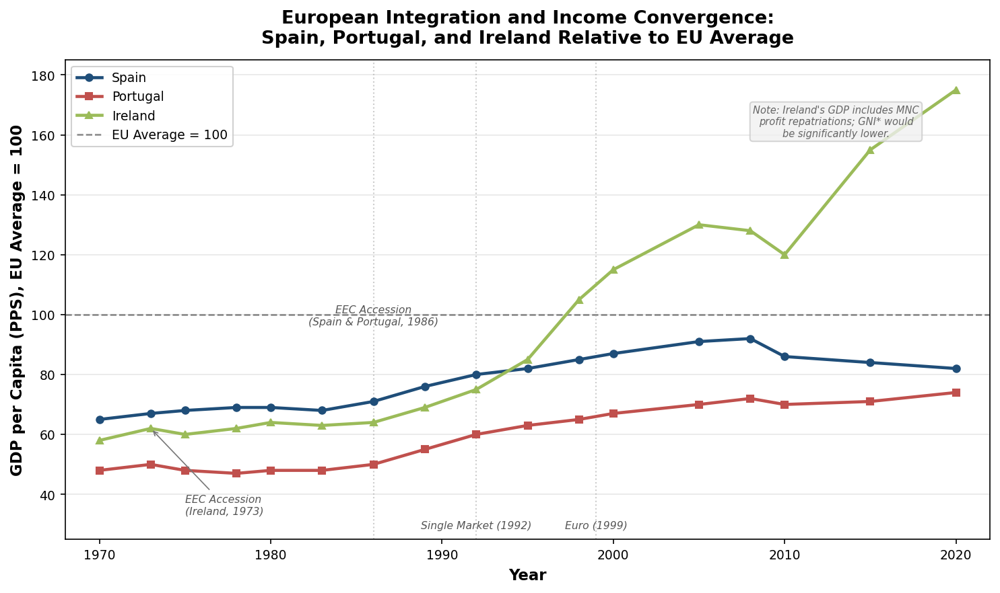

The EU functioned as an institutional anchor in a more fundamental sense as well. Accession requirements compelled candidate countries to adopt the *acquis communautaire*—the accumulated body of EU law covering competition policy, state aid rules, environmental standards, and consumer protection. For the Iberian democracies, EU accession served as an external commitment device that locked in democratic and market-oriented reforms of the post-authoritarian transition, making policy reversal prohibitively costly. This anchoring function was arguably as important as the direct economic benefits.

Finland and Sweden, which joined the EU in 1995 after the end of the Cold War removed the neutrality constraint, experienced a different dynamic. Both were already high-income economies; for them, EU membership consolidated market access (particularly important for Finland following the collapse of Soviet trade) and provided a voice in shaping European regulatory standards, but did not serve the same catch-up function as for the Iberian states or Ireland.

### East Asia: Deep Integration without Regional Architecture

The contrast with East Asia is striking. Despite extraordinarily intensive trade relationships—Japan, South Korea, and Taiwan collectively accounted for a substantial share of intra-Asian trade by the 1990s—Northeast Asia developed no regional institutional architecture remotely comparable to the European project. No customs union, no common market, no structural funds, and no equivalent of the EU's institutional anchoring mechanism emerged among the region's developmental states.

Several factors explain this absence. Historical animosities rooted in Japan's colonial rule of Korea (1910–1945) and wartime occupation of much of Asia inhibited the kind of Franco-German reconciliation that underpinned European integration. The Cold War divided the region along ideological lines, with the People's Republic of China, North Korea, and—until the 1970s—Taiwan's ambiguous international status complicating multilateral diplomacy. The US hub-and-spoke alliance system, built on bilateral security treaties with Japan, South Korea, and (informally) Taiwan, substituted for indigenous multilateral cooperation, providing the security umbrella and market access that in Europe were bundled into the integration project.

The Association of Southeast Asian Nations (ASEAN), established in 1967, offered a loose consultative framework but pursued a fundamentally different model from European integration. ASEAN's principle of non-interference, consensus-based decision-making, and avoidance of binding supranational commitments meant that it functioned primarily as a diplomatic forum rather than an economic integration mechanism. The ASEAN Free Trade Area (AFTA), initiated in 1992, reduced intra-ASEAN tariffs but lacked the deep institutional infrastructure—common external tariff, regulatory harmonization, structural transfers—that characterized the European project.

For the East Asian developmental states, the absence of regional architecture meant that global integration was mediated primarily through bilateral relationships with the United States and through the multilateral GATT/WTO system. American market access was the critical external condition enabling export-led growth. The Cold War security calculus led Washington to tolerate the mercantilist trade practices of its East Asian allies—Japan's non-tariff barriers, Korea's subsidized exports, Taiwan's undervalued currency—to a degree that would have been politically unsustainable absent the geopolitical imperative.

### The Americas: NAFTA and Hemispheric Asymmetry

The Western Hemisphere developed a third model of regional integration, characterized by deep bilateral integration between an overwhelmingly dominant economy (the United States) and smaller partners. The 1965 Auto Pact pioneered this approach for Canada; the Canada-US Free Trade Agreement (1988) and NAFTA (1994) generalized it. Unlike European integration, NAFTA involved no supranational institutions, no structural transfers to poorer members, and no aspiration to regulatory harmonization beyond trade-related disciplines. It was a market-access agreement, not a development project.

For Canada, continental integration with the United States was the defining structural fact of post-war economic life. The Auto Pact rationalized North American automotive production, enabling Canadian plants to achieve efficient scale by producing for the continental rather than the small domestic market. NAFTA deepened this integration across sectors, but the relationship remained fundamentally asymmetric: Canada's economy was roughly one-tenth the size of the American economy, and over 75% of Canadian exports were destined for the US market by the 2000s.

Chile, geographically distant from the major economic blocs, pursued global integration through a web of bilateral and plurilateral trade agreements rather than through deep regional architecture. Chile became an associate member of Mercosur (1996) and signed FTAs with the EU, the United States, South Korea, China, Japan, and numerous other partners. This "open regionalism" strategy diversified Chile's trade relationships but provided neither the institutional anchoring nor the structural transfers that European integration offered to its poorer members.

## 5.3 Foreign Direct Investment: Attraction versus Restriction

Among the sharpest strategic divergences in post-war development concerned the treatment of foreign direct investment. At one pole, Japan and South Korea pursued deliberate FDI restriction, insisting that domestic firms retain control over the deployment of imported technology. At the other, Ireland and Singapore built their development strategies around active FDI attraction. Between these poles, the European continental economies, Canada, and Chile adopted intermediate or evolving positions. Figure 5.3 below provides a comparative matrix of these strategic positions across four key dimensions.

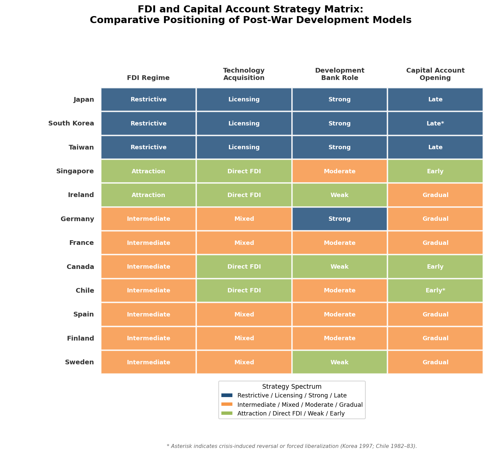

### Japan and Korea: Strategic Restriction

Japan's FDI regime during the high-growth era was among the most restrictive in the non-communist world. The 1950 Foreign Investment Law required government approval for all foreign investments, and MITI used this authority systematically to prevent foreign ownership of Japanese firms while channeling technology inflows through licensing agreements. Foreign direct investment in Japan remained negligible as a share of GDP through the 1970s and 1980s. The logic was explicit: where foreign technology could be acquired through licensing, there was no reason to cede ownership and control to foreign firms.

South Korea replicated this restrictive approach with even greater intensity. Foreign direct investment was formally permitted under the 1962 Foreign Capital Inducement Act, but the government strongly preferred foreign loans to foreign equity investment, since loans carried no ownership implications. Korea's total inward FDI stock remained below $5 billion through the early 1990s—a remarkably low figure for an economy of Korea's size and growth rate. The chaebol were directed to acquire technology through licensing, turnkey contracts, and reverse engineering rather than through joint ventures with foreign firms. FDI restrictions were liberalized only gradually during the 1990s, partly as a condition of OECD accession (1996), and more drastically after the 1997 financial crisis, when the IMF program required substantial opening of the capital account and FDI regime.

### Ireland and Singapore: FDI as Development Engine

Ireland and Singapore represent the opposite strategic choice: both placed FDI attraction at the center of their development models. The institutional mechanisms—IDA Ireland and Singapore's EDB—functioned as one-stop facilitation agencies that offered multinational corporations tax incentives, infrastructure, and a skilled labor force in exchange for employment, technology transfer, and export revenue.

The scale of FDI's role in these economies was extraordinary. By the 2000s, nine of the ten largest global pharmaceutical companies and all major US technology firms maintained significant operations in Ireland; foreign-owned firms accounted for approximately 90% of Irish manufacturing exports and a large share of corporate tax revenue. Singapore's FDI stock as a share of GDP ranked among the world's highest, reaching over $3,100 billion by end-2024 [Singapore Department of Statistics](https://www.singstat.gov.sg/news/foreign-direct-investment-in-singapore-2024 "FDI in Singapore 2024"). The EDB's strategy evolved in deliberate phases—from labor-intensive manufacturing in the late 1960s through capital-intensive industries in the 1970s–1980s to knowledge-intensive sectors (biomedical sciences, aerospace, fintech) from the 2000s onward [IADB](https://publications.iadb.org/publications/english/document/The-Singapore-Model-of-Industrial-Policy-Past-Evolution-and-Current-Thinking.pdf "The Singapore Model of Industrial Policy").

The FDI-attraction model carried distinctive risks, which the Irish and Singaporean experiences illuminate. Dependence on foreign-owned firms exposed the host economy to decisions made in distant corporate headquarters. Ireland's vulnerability became apparent during the post-2008 fiscal crisis, when the collapse of FDI-linked tax revenues compounded the banking crisis. The "leprechaun economics" episode of 2016—when Irish GDP surged 26.3% in a single year due to multinational accounting reclassifications—highlighted the statistical distortions created by the gap between GDP (which includes MNC profits booked in Ireland) and GNI (which better reflects Irish residents' income). Singapore mitigated these risks through sovereign wealth accumulation (GIC and Temasek Holdings) and by building indigenous enterprise capacity alongside MNC operations.

### Continental Europe and Canada: Intermediate Positions

The continental European economies adopted positions between the Japanese/Korean restriction model and the Irish/Singaporean attraction model. West Germany, France, and Italy generally welcomed FDI but did not make it the centerpiece of their development strategies. German FDI policy was liberal in principle, but the economy's dense institutional texture—codetermination, the *Mittelstand* structure, the dual vocational system—created de facto barriers to hostile foreign acquisition while making Germany attractive for greenfield investment by firms willing to operate within German institutional norms.

France maintained a more actively managed FDI regime. The Gaullist tradition of *dirigisme* treated certain sectors (defense, energy, telecommunications) as strategic domains where foreign ownership was restricted. The post-1983 liberalization under subsequent governments progressively opened France to FDI, but state influence over major corporate decisions persisted through golden shares, cross-shareholdings among French firms, and occasional direct intervention to prevent foreign takeovers deemed contrary to the national interest.

Canada occupied a distinctive position as a resource-rich economy deeply integrated with the world's largest source of outward FDI. American investment dominated Canadian manufacturing, mining, and energy sectors throughout the post-war period. The 1974 Foreign Investment Review Agency (FIRA) represented a brief nationalist attempt to screen foreign acquisitions, but it was replaced in 1985 by Investment Canada, which adopted a more welcoming stance. Canada's development path was thus shaped by heavy FDI dependence on a single source country—a structural characteristic distinguishing it from the more diversified FDI profiles of European economies.

## 5.4 Capital Account Liberalization and Development Finance

The sequencing of capital-account opening—when and how countries removed restrictions on cross-border financial flows—proved one of the most consequential and contested dimensions of global integration. The post-war consensus, embedded in the Bretton Woods system, treated capital controls as a normal and necessary complement to fixed exchange rates and domestic policy autonomy. The shift toward capital-account liberalization gathered force from the 1970s onward, but the timing, pace, and consequences varied enormously across the countries under study.

### The Bretton Woods Framework and Its Dissolution

The Bretton Woods system (1944–1971/73) provided the macroeconomic scaffolding within which the initial decades of post-war development occurred. Fixed exchange rates, maintained through capital controls and occasional IMF-supervised adjustments, reduced currency uncertainty for trade while affording governments the policy space to pursue full employment and industrial development. The system's dissolution—triggered by President Nixon's suspension of dollar-gold convertibility on 15 August 1971 and the subsequent move to floating exchange rates by March 1973—forced all countries to confront new challenges of exchange-rate management and capital flow volatility [US Department of State](https://history.state.gov/milestones/1969-1976/nixon-shock "Nixon and the End of the Bretton Woods System").

The European response was distinctive: a series of attempts to recreate exchange-rate stability on a regional basis, from the "Snake in the Tunnel" arrangement (1972) through the European Monetary System (EMS, 1979) to the euro (1999). Each iteration deepened the commitment to fixed intra-European exchange rates and progressively constrained national monetary policy autonomy—a trajectory that culminated in the European Central Bank and the irrevocable fixing of exchange rates among eurozone members. For the Iberian accession countries, participation in the EMS and subsequent euro adoption served as macroeconomic discipline devices that reduced inflation, lowered interest rates, and attracted capital inflows.

East Asian economies maintained managed exchange-rate regimes throughout the high-growth period. Japan operated under a fixed rate of 360 yen per dollar until the Bretton Woods collapse, then shifted to a managed float under which the yen appreciated substantially over subsequent decades. Korea maintained a fixed rate until 1980 before moving to a managed float that was progressively liberalized. Taiwan's central bank actively managed the New Taiwan dollar's exchange rate to support export competitiveness, maintaining substantial foreign-exchange reserves as a buffer against speculative pressure.

### Development Banks as Channels of Directed Finance

A critical institutional complement to trade and investment strategies was the network of development banks and directed-credit mechanisms that channeled finance toward priority sectors. These institutions—operating at the intersection of the state and the financial system—embodied the principle that financial markets alone would not allocate capital in ways consistent with national development objectives.

Germany's Kreditanstalt für Wiederaufbau (KfW), established in November 1948 as part of the Marshall Plan framework, channeled reconstruction credit to housing, energy, and industrial infrastructure during the 1950s and subsequently evolved into the world's largest national development bank, with total assets exceeding €555 billion by 2022 [KfW](https://en.wikipedia.org/wiki/KfW "KfW Wikipedia"). Owned 80% by the federal government and 20% by the German states, KfW raised funds in capital markets with government guarantees and on-lent at below-market rates for policy-priority purposes—a model that influenced development bank design worldwide, supporting SME lending, housing, environmental investment, and export finance.

South Korea's development banking system was more overtly interventionist. The Korea Development Bank (KDB, established 1954), the Korea Export-Import Bank (1976), and the system of state-directed commercial bank lending (enabled by the 1961 nationalization of commercial banks) constituted the financial infrastructure of the developmental state. Government control over credit allocation—determining which chaebol received subsidized loans and at what interest rates—served as the primary lever through which industrial policy was implemented. This system produced rapid industrial deepening but also accumulated vulnerabilities: the absence of market-based credit risk assessment contributed to the corporate over-leverage that erupted in the 1997 financial crisis.

### The Perils of Premature Liberalization

The 1997 Asian financial crisis provided the most consequential case study of the dangers of poorly sequenced capital-account opening. South Korea had begun liberalizing its capital account in the early 1990s, partly in preparation for OECD accession (achieved in December 1996). The liberalization was asymmetric: it opened short-term debt channels (allowing financial institutions to borrow abroad in foreign currency) while retaining restrictions on longer-term FDI and portfolio equity flows. Gross external liabilities grew at rates exceeding 30% annually from 1994 to 1996 [ScienceDirect](https://www.sciencedirect.com/science/article/pii/S1566014100000030 "The Korean financial crisis: an asymmetric information perspective"). When confidence collapsed in late 1997, the resulting maturity and currency mismatches in the Korean financial system triggered a devastating twin banking-and-currency crisis, necessitating a $58 billion IMF-led rescue package.

Chile's earlier experience with premature financial liberalization during 1979–1982 offered a parallel cautionary tale. The Pinochet government's simultaneous trade liberalization, capital-account opening, and fixed exchange rate created a classic boom-bust cycle: capital inflows fueled a consumption and real-estate boom, the real exchange rate appreciated sharply, and when commodity prices fell and international capital flows reversed, the banking system collapsed. GDP contracted approximately 13% in 1975, and the 1982–1983 crisis required a massive government bailout of the financial sector. The post-crisis "pragmatic" phase—including temporary capital controls (the *encaje*, a mandatory reserve requirement on short-term capital inflows introduced in the early 1990s) and strengthened banking supervision—reflected hard-won lessons from the costs of premature opening.

The broader pattern across the countries examined is consistent: the most successful development trajectories combined early and vigorous trade openness with cautious, phased capital-account liberalization. The Bretton Woods system institutionalized this combination during the Golden Age; after its collapse, countries that maintained managed capital accounts during their high-growth phases (Japan in the 1950s–1960s, Korea in the 1960s–1970s, Taiwan through the 1980s) fared better than those that opened both fronts simultaneously (Chile in the early 1980s, Korea in the mid-1990s).

## 5.5 Commodity Dependence, Terms of Trade, and the Resource Curse Question

For resource-rich economies—Chile, Canada, and to a lesser extent the Nordic states—the management of commodity wealth and terms-of-trade volatility constituted a distinctive integration challenge that resource-poor economies (Japan, Korea, Singapore) did not confront.

### Chile: Copper and the Challenge of Diversification

Copper has dominated Chile's export basket throughout the post-war period. Between 2008 and 2018, copper mining accounted for approximately 59% of total exports and 18% of fiscal revenues, while attracting a substantial share of FDI inflows [Tandfonline](https://www.tandfonline.com/doi/full/10.1080/15140326.2021.1880243 "Sub-national economic effects of the resources sector in Chile"). This concentration created persistent terms-of-trade vulnerability: rising global copper prices brought fiscal windfalls and real exchange rate appreciation that squeezed non-copper tradeable sectors (a dynamic consistent with "Dutch disease" pressures), while falling prices triggered fiscal austerity and currency depreciation.

Chile's institutional response to commodity dependence evolved over time. The most consequential innovation was the structural fiscal balance rule (adopted in 2001), which linked government spending to trend copper prices and potential GDP rather than current revenues. This counter-cyclical framework, anchored in an independent expert panel's assessment of the long-term copper price, enabled Chile to accumulate fiscal surpluses during boom periods and draw down reserves during downturns—a mechanism that proved its value during the 2008–2009 global financial crisis, when Chile implemented counter-cyclical fiscal stimulus while many commodity-dependent emerging markets were forced into austerity.

Diversification of the export basket proved more difficult. Chile's FTA network expanded market access for non-copper exports (wine, salmon, fruit), and these sectors grew substantially from the 1990s onward. An IMF study noted, however, that Chile's Herfindahl-Hirschman index of export concentration remained elevated by OECD standards, with copper continuing to represent approximately half of goods exports [IMF](https://www.elibrary.imf.org/view/journals/001/2021/148/article-A001-en.xml "Chile: A Role Model of Export Diversification Policies?"). The tension between commodity wealth and economic complexity—reflected in Chile's relatively low ranking on the Economic Complexity Index—remains a defining structural characteristic.

### Canada: Resource Wealth within a Diversified Economy

Canada's resource endowment—oil, natural gas, minerals, timber, hydropower—was more diversified than Chile's, and resource extraction was embedded within a substantially larger and more complex industrial economy. The Alberta oil sands, which became commercially significant from the 1970s onward, generated fiscal revenues, export earnings, and investment flows but also periodic Dutch disease concerns—particularly during the commodity boom of the 2000s, when the Canadian dollar appreciated sharply and Ontario's manufacturing sector contracted.

Canada's institutional management of resource wealth operated primarily through provincial rather than federal mechanisms; the Alberta Heritage Savings Trust Fund (established 1976) was modeled partly on Alaska's Permanent Fund. The federal government's role was more indirect, operating through equalization payments that transferred resource revenues from wealthy provinces to poorer ones.

### Nordic Resource Management: Finland and the Norwegian Counter-Example

Finland's resource endowment—principally forests—played a central role in its early industrialization, with timber and paper industries providing the export earnings that financed capital-goods imports. The transition from resource-based to knowledge-based exports, culminating in the Nokia-led ICT cluster, represented a successful case of resource-economy upgrading, facilitated by the innovation system investments analyzed in Chapter 4.

While Norway falls outside the primary scope of this report, its Government Pension Fund Global (established 1990) merits mention as the most successful institutional response to commodity dependence among developed nations. By investing petroleum revenues abroad and withdrawing only the estimated real return (the "spending rule" of approximately 3% of fund value annually), Norway insulated its domestic economy from Dutch disease pressures while accumulating a fund exceeding $1.7 trillion by the mid-2020s—a model that influenced Chile's own fiscal rule design.

## 5.6 Synthesis: Patterns of Global Integration

The comparative analysis of global integration strategies across Europe, East Asia, and the Americas reveals several cross-cutting patterns.

First, **trade openness was a necessary but not sufficient condition for successful development.** Every country that achieved high-income status in the post-war era eventually attained high levels of trade integration. Yet the sequencing and selectivity of opening mattered profoundly. The most successful cases—Germany, Japan, Korea, Taiwan—combined progressive trade liberalization with strategic management of the pace and sectoral composition of opening, rather than adopting uniform, rapid liberalization.

Second, **regional institutional architecture constituted a distinctive European advantage.** The ECSC-EEC-EU sequence provided market access, structural transfers, institutional anchoring, and macroeconomic discipline in a mutually reinforcing package that had no equivalent in East Asia or the Americas. For the European latecomer states—Spain, Portugal, Ireland, and Finland—EU membership was arguably the single most consequential factor in their convergence trajectories. The absence of comparable regional architecture in East Asia meant that development there depended more heavily on bilateral relationships with the United States and on purely domestic institutional capacity.

Third, **the treatment of FDI represented a genuine strategic choice with lasting consequences.** The Japanese/Korean restriction model preserved domestic ownership and control, channeling technology acquisition through licensing and reverse engineering, but required exceptionally strong domestic institutional capacity to function effectively. The Irish/Singaporean attraction model accelerated technology transfer and employment creation but generated structural dependencies on foreign corporate decision-making. Neither model was universally superior; each proved effective under specific institutional and structural conditions.

Fourth, **the sequencing of capital-account liberalization relative to trade liberalization and domestic financial development emerged as a critical determinant of crisis vulnerability.** Countries that opened trade early but maintained capital controls during their high-growth phases (Japan in the 1950s–1960s, Korea in the 1960s–1970s) avoided the boom-bust cycles that afflicted those that opened both simultaneously (Chile in 1979–1982, Korea in the 1990s).

Fifth, **resource-dependent economies faced a distinctive integration challenge:** managing terms-of-trade volatility and Dutch disease pressures while maintaining incentive structures for economic diversification. Chile's structural fiscal rule and Canada's equalization system represented institutional responses, but neither fully resolved the tension between resource wealth and industrial complexity.

These patterns of global integration did not operate in isolation from the domestic strategies, institutions, and human capital investments analyzed in preceding chapters. The interaction between domestic capacity and external engagement constituted the critical nexus: countries with strong institutions and human capital could exploit global integration as an accelerant, while those with weaker domestic foundations proved more vulnerable to its disruptive effects. Chapter 6 examines how these vulnerabilities manifested in the crises that punctuated the post-war development trajectory.

# 第6章 Crises, Turning Points, and Adaptive Resilience

The development strategies, institutional architectures, and global integration patterns examined in preceding chapters were forged and tested not only during periods of sustained expansion but also—and perhaps more revealingly—during episodes of acute disruption. Every country that transitioned to developed-nation status after 1945 confronted severe exogenous shocks and endogenous crises: oil price explosions, financial collapses, political regime ruptures, and sovereign debt spirals that threatened to derail convergence trajectories. The manner in which each economy responded to these disruptions proved at least as consequential for long-run development outcomes as the initial choice of growth strategy. Crises destroyed wealth, exposed institutional fragilities, and inflicted acute social pain; yet they also opened windows for structural reform that would have been politically impossible under normal conditions. The capacity to adapt—to absorb shocks, restructure failing sectors, and emerge with strengthened institutional foundations—constitutes a defining feature of the countries that successfully entered the ranks of developed nations.

This chapter traces five linked episodes of crisis and adaptation across the study's geographic scope. Section 6.1 examines the 1970s oil shocks and the termination of the European "Golden Age," with particular attention to Japan's landmark energy-efficiency transformation. Section 6.2 analyzes political regime transitions—the Iberian democratizations of the 1970s and East Asian democratizations of the late 1980s—as simultaneous political crises and developmental turning points. Section 6.3 assesses the 1980s Latin American debt crisis and Chile's distinctive experience within it. Section 6.4 evaluates the 1997 Asian financial crisis and its catalytic role in restructuring Korea's developmental model. Section 6.5 examines the 2008 Global Financial Crisis and the European sovereign debt crisis as tests of mature developed economies, with attention to the divergent experiences of Ireland and Finland. Section 6.6 draws comparative lessons on the relationship between crisis, institutional adaptation, and sustained development.

## 6.1 The Oil Shocks and the End of the Golden Age (1973–1982)

The quadrupling of crude oil prices following the October 1973 Arab oil embargo marked the definitive termination of the post-war growth regime that Jean Fourastié had named the *Trente Glorieuses*. Between 1948 and 1973, Western European per capita GDP had grown at historically unprecedented rates—approximately 5.8% per annum in West Germany, 5.0% in Italy, 4.4% in France (Chapter 2)—sustained by cheap energy, expanding trade, fixed exchange rates under Bretton Woods, and the diffusion of American mass-production technologies. The collapse of the Bretton Woods fixed-rate system (completed by 1973), the first oil shock, and a second oil price spike triggered by the 1979 Iranian Revolution together ended this configuration decisively.

### The European Deceleration

The impact across Western Europe was immediate and severe. Crude oil prices rose from approximately $3 per barrel in early 1973 to $12 by early 1974, and then from $13 to over $34 following the second shock in 1979–1980 [Wikipedia](https://en.wikipedia.org/wiki/1973_oil_crisis "1973 oil crisis price data"). For economies whose industrial structures had been built around cheap imported energy, the terms-of-trade deterioration was devastating. Inflation surged into double digits across much of the continent while growth collapsed and unemployment rose—producing the novel combination of stagnation and inflation that entered the vocabulary as "stagflation."

West Germany's GDP growth averaged approximately 2.4% per annum between 1973 and 1989, less than half its Golden Age rate. France experienced a comparable deceleration, with growth falling to roughly 2.3% annually. Italy's trajectory was more turbulent, marked by severe inflation, currency instability, and widening fiscal deficits. The oil shocks exposed the limitations of the corporatist wage-setting systems that had underpinned the Golden Age: across much of Western Europe, nominal wages proved rigid downward, transmitting the external price shock into a domestic cost-price spiral that monetary tightening alone could not easily resolve.

The Nordic economies responded distinctively. Sweden's centralized wage bargaining under the Rehn-Meidner framework (Chapter 2) initially facilitated coordinated restraint, but by the late 1970s competitive devaluations and fiscal expansion had eroded the model's discipline. Finland, still dependent on bilateral trade with the Soviet Union for approximately 15–20% of its exports, enjoyed a partial buffer against Western business-cycle fluctuations but confronted its own structural adjustment challenges as traditional industries lost competitiveness.

### Japan's Energy Transformation

Japan's response to the oil shocks constitutes the most consequential case of crisis-driven structural adaptation in the post-war development record. In 1973, petroleum supplied approximately 77.4% of Japan's total primary energy consumption, virtually all of it imported [IDE](https://www.ide.go.jp/library/English/Publish/Periodicals/De/pdf/76_04_01.pdf "Yoshitomi, The Recent Japanese Economy: The Oil Crisis"). The first oil shock produced Japan's first post-war recession: real GDP fell by approximately 1.2% in fiscal year 1974, and consumer price inflation surged above 20% in what was domestically termed *kyōran bukka* (wild prices).

The government and private sector responded with a comprehensive energy-efficiency campaign that fundamentally restructured Japanese industry. MITI orchestrated conservation targets across sectors, and the 1979 Energy Conservation Law mandated efficiency standards for all major industrial users. Energy-intensive industries—steel, chemicals, aluminum smelting—pursued dramatic efficiency gains: the steel industry reduced energy consumption per unit of output by approximately 20% between fiscal years 1975 and 1985, while the aluminum refining industry, unable to compete at higher energy costs, effectively ceased domestic operations [JCER](https://www.jcer.or.jp/eng/pdf/m38_topic.pdf "Looking to the 70s Oil Crisis for Lessons in Energy-Saving, 2012"). Manufacturing energy efficiency improved at an average rate of roughly 3% per year through fiscal year 1990.

Crucially, the crisis accelerated Japan's industrial shift from energy-intensive heavy materials toward higher-value-added machinery, electronics, and precision equipment. The machinery industry's share of manufacturing GDP rose substantially between 1970 and 1985, displacing materials-based production [JCER](https://www.jcer.or.jp/eng/pdf/m38_topic.pdf "Manufacturing structural shift from materials to machinery"). Japanese auto manufacturers, responding to both domestic conservation mandates and shifting global demand, developed fuel-efficient vehicles that captured enormous export market share—Toyota and Honda's compact cars became emblematic of Japan's adaptive capacity. By the 1980s, Japan achieved roughly 3% annual economic growth while simultaneously reducing fossil fuel import volumes, a combination that no other major industrial economy replicated during the period [JCER](https://www.jcer.or.jp/eng/pdf/m38_topic.pdf "Economic growth and fossil fuel import reduction in the 1980s").

The IMF observed that Japan made "greater progress in reducing its ratio of energy consumption to GNP than any other major industrial country" following the oil price increases [IMF eLibrary](https://www.elibrary.imf.org/view/journals/022/0018/004/article-A008-en.xml "Japan's adjustment to the increased cost of energy"). This achievement was rooted in the institutional infrastructure analyzed in Chapters 2 and 3: MITI's coordinating capacity, close government-industry consultation channels, firm-level engineering capabilities built through decades of technology absorption (Chapter 4), and a highly skilled workforce capable of rapid adaptation to new production processes.

### Divergent Responses Among Energy-Dependent Economies

The oil shocks divided the study's countries along a resource-importer/exporter axis. Canada, as a net energy exporter, experienced the oil price increases as a terms-of-trade windfall: Alberta's oil sands became commercially viable, and the National Energy Program (1980) attempted to capture resource rents for the federal government and shield domestic consumers. The program provoked lasting regional political tensions but insulated the national economy from the demand-side shock that devastated net importers. Norway, not yet among the study's core cases but increasingly relevant as a Nordic comparator, began North Sea oil production in 1971 and would subsequently leverage petroleum revenues into a sovereign wealth fund model of global influence.

Chile, dependent on copper exports, experienced the oil shocks through a different channel. The Pinochet regime's radical liberalization program (Chapter 2) was already underway when the second oil shock struck; the combination of trade opening, financial deregulation, and adverse external conditions would culminate in the devastating 1982–1983 crisis examined in Section 6.3.

Ireland, a small open economy with negligible domestic energy resources and heavy dependence on the United Kingdom market, suffered acutely. The oil shocks compounded the structural weaknesses of an economy still in the early stages of its FDI-driven transformation (Chapter 2). Inflation exceeded 20% in the mid-1970s, and public finances deteriorated sharply as successive governments pursued expansionary fiscal policies to maintain employment—setting the stage for a fiscal crisis in the 1980s that would require painful consolidation.

## 6.2 Political Regime Transitions as Developmental Turning Points

Among the most consequential crises examined in this report were not economic shocks but political ruptures: the transitions from authoritarian to democratic governance that reshaped the institutional foundations of development in Southern Europe and East Asia. These transitions posed a distinctive analytical challenge. Authoritarian regimes had, in several cases, presided over rapid economic growth—the developmental states of Korea and Taiwan, the "Spanish miracle" under late Francoism—raising the question of whether democratization would disrupt the policy frameworks that had enabled convergence. The historical record demonstrates that, while transitions generated short-term economic turbulence, they ultimately strengthened the institutional foundations of sustained development by broadening political legitimacy, embedding rule-of-law guarantees, and—in the European cases—unlocking access to regional integration frameworks that proved decisive for convergence.

### The Iberian Democratizations (1974–1982)

Portugal's Carnation Revolution of April 25, 1974, and Spain's managed transition following Franco's death in November 1975 constituted the inaugural wave of what Samuel Huntington would later term the "third wave" of global democratization. Both transitions entailed substantial economic disruption before yielding transformative developmental benefits.

Portugal's revolutionary period (1974–1976) was economically chaotic. The nationalization of major industries, banks, and insurance companies in 1975, combined with the return of approximately 600,000 *retornados* from the former African colonies, a collapse of foreign investment, and political instability—six provisional governments in two years—produced severe macroeconomic dislocation. GDP contracted, inflation accelerated, and the balance of payments deteriorated sharply; stabilization required two IMF standby arrangements (1977 and 1983). Yet the democratic consolidation that followed enabled Portugal's accession to the European Economic Community on January 1, 1986—a development that proved transformative. EEC/EU structural funds financed massive infrastructure modernization, the single-market framework compelled regulatory upgrading, and the prospect of accession itself functioned as an "external anchor" for institutional reform, a mechanism analyzed in Chapter 5. Spain's per capita income, approximately $3,207 in 1985 on the eve of accession, converged significantly toward the EU average over the subsequent two decades [Real Instituto Elcano](https://www.realinstitutoelcano.org/en/commentaries/forty-years-on-from-signing-up-to-the-eec/ "Forty years on from signing up to the EEC").

Spain's transition was politically more controlled but economically no less demanding. The Moncloa Pacts of October 1977—tripartite agreements among the new democratic parties, trade unions, and employers—combined wage restraint with fiscal reform and democratic institution-building, providing a framework for managing the economic costs of political opening during a period of global stagflation. Spain's unemployment rate, already elevated, rose to extraordinary levels exceeding 20% by the mid-1980s, reflecting both the structural adjustment imposed by trade liberalization and the demographic pressure of large cohorts entering the labor force. Accession to the EEC in 1986, alongside Portugal, delivered the same external anchor: structural and cohesion funds transferred substantial resources, trade integration spurred productivity growth, and EU membership requirements locked in property rights protections, competition policy, and macroeconomic discipline.

The Iberian experience illuminates a pattern in which short-term political crisis enabled long-term institutional upgrading. Authoritarian regimes had pursued development strategies—Franco's ISI and subsequent partial liberalization, Salazar/Caetano's *Estado Novo* with its *condicionamento industrial*—that generated growth but accumulated institutional deficits: weak rule of law, limited social protection, truncated civil liberties, and exclusion from the European integration project. Democratization imposed immediate economic costs (capital flight, policy uncertainty, redistributive pressures) but removed the political barriers to European integration—the single most powerful accelerator of Iberian convergence.

### East Asian Democratizations (1987–1996)

South Korea's democratic transition, catalyzed by the June 1987 mass protests and Roh Tae-woo's June 29 Declaration conceding direct presidential elections, occurred at a markedly different point in the development trajectory than the Iberian cases. Korea's per capita GDP at the time of democratization was substantially higher than Portugal's or Spain's had been at their respective transition points, and the country was in the midst of an export-driven boom. The central question was whether democratic governance would preserve the developmental state's capacity for coordinated industrial policy—or whether electoral competition, independent labor unions, and press freedom would fragment the policy coherence that had underpinned rapid growth.

The outcome was a qualified preservation of policy continuity combined with significant distributional adjustment. The newly empowered labor movement secured substantial real wage increases: between 1987 and 1989, nominal wages in manufacturing rose by approximately 50%, compressing the gap between capital returns and labor compensation that had characterized authoritarian-era growth. The chaebol-centered industrial structure remained intact, and the Economic Planning Board continued to function, though with diminished directive authority. Korea's democratic governments maintained the outward-oriented, export-competitive macroeconomic framework—the fundamental strategic orientation established under Park Chung-hee (Chapter 2) survived the regime change, even as its distributional and governance dimensions were progressively reformed.

Taiwan's democratization followed a more gradual trajectory. The lifting of martial law in July 1987, the legalization of opposition parties, and the first fully competitive legislative elections in 1992 proceeded without the mass confrontation that characterized Korea's transition. Taiwan's technocratic economic apparatus—centered on the Council for Economic Planning and Development and institutions such as the Industrial Technology Research Institute (ITRI, Chapter 4)—maintained remarkable continuity through the political transition. The semiconductor industry strategy that would position Taiwan as a global technology leader was conceived under authoritarian rule but scaled under democratic governance, illustrating the institutional stickiness of well-designed developmental architectures.

Singapore presents a contrasting case: sustained authoritarian governance under the People's Action Party's dominant-party system without a comparable democratic transition during the development period. The absence of regime rupture meant that Singapore avoided the short-term costs of political transition but also foregone the institutional deepening that democratization brought to Korea and Taiwan. By the 2000s, Singapore's governance model—combining authoritarian political control with rule-of-law property protections and an independent judiciary in commercial matters—occupied a distinctive position among developed nations, raising unresolved questions about the relationship between political liberalization and sustained high-income status.

## 6.3 The Latin American Debt Crisis and Chile's Distinctive Trajectory

The debt crisis that erupted in August 1982—when Mexico declared its inability to service external obligations—devastated Latin America as a region. During the ensuing "lost decade," the region's per capita GDP fell from 112% to 98% of the world average, and from 34% to 26% of the developed-country average [José Antonio Ocampo](https://ipdcolumbia.org/wp-content/uploads/2024/08/The_Latin_American_Debt_Crisis_in_Historical_Perspective_Jos_Antonio_Ocampo.pdf "The Latin American Debt Crisis in Historical Perspective"). For Chile—the only Latin American country in this study's sample that would ultimately cross the high-income threshold—the crisis was both devastating and, paradoxically, formative.

### The Chilean Crisis of 1982–1983

Chile entered the 1982 crisis acutely vulnerable. The "Chicago Boys" reforms analyzed in Chapter 2 had produced a radical liberalization of both trade and capital accounts: tariffs had been reduced to a uniform 10% by 1979, the exchange rate was fixed to the US dollar, and the financial sector had been extensively deregulated. Capital inflows surged during the late 1970s, fueling a private-sector borrowing boom and real exchange rate appreciation that eroded export competitiveness. When international interest rates spiked following the Volcker tightening and commodity prices collapsed, the economy imploded. GDP contracted by approximately 14.3% in 1982, with the cumulative output decline in 1982–1983 reaching approximately 15% [Lehigh University](https://preserve.lehigh.edu/_flysystem/fedora/2023-12/303816.pdf "The 1982 Debt Crisis and Recovery in Chile") [World Bank](https://documents.worldbank.org/curated/en/265811468743754577/pdf/multi_page.pdf "Chile: origins and resolution of banking crisis"). Unemployment exceeded 25% (surpassing 30% when emergency employment programs are included), and the banking system required a massive government bailout as a large share of loans became non-performing.

### Crisis as Catalyst for Policy Learning

Chile's recovery proved more rapid and sustainable than that of most Latin American peers, and the crisis produced crucial policy corrections that distinguished Chile's subsequent trajectory from the region's broader experience of prolonged stagnation.

The Pinochet government partially reversed the most doctrinaire elements of the Chicago Boys' program. The uniform tariff was temporarily raised to 35% before being gradually reduced. Capital account liberalization was pulled back, with regulations reimposed on short-term capital inflows. The regime pragmatically maintained the core export-oriented framework while grafting onto it counter-cyclical macroeconomic management tools and strengthened banking supervision. The 1986 banking law imposed strict capital adequacy requirements and provisioning rules—institutional upgrades that reflected lessons extracted from the crisis at great social cost [Banco Central de Chile](https://www.bcentral.cl/documents/33528/133326/DTBC_57.pdf "Origins and Resolution of a Banking Crisis: Chile 1982-86").

The result was a revised development model—sometimes characterized as "pragmatic neoliberalism"—that combined open trade, fiscal discipline, and export diversification with stronger prudential regulation and targeted social spending. Between 1985 and 1997, Chile's GDP grew at approximately 7% per year, driven by diversified commodity exports (copper, fruit, wine, salmon farming) and increasingly by manufactured goods and services. Chile's debt-to-GDP ratio fell from over 100% in 1985 to below 40% by the late 1990s.

The Chilean experience offers a critical comparative lesson. The initial liberalization strategy of the 1970s contained fundamental design flaws—premature capital-account opening, inadequate financial supervision, an inflexible exchange rate peg—that the crisis brutally exposed. Yet the institutional and policy infrastructure established during the reform period (market-oriented relative prices, open trade architecture, technocratic fiscal management) provided a foundation upon which corrected policies could build. Chile's capacity to learn from crisis failure—rather than reverting to the ISI framework—distinguished it from other Latin American economies that cycled between populist expansion and stabilization crises throughout the 1980s and 1990s.

## 6.4 The 1997 Asian Financial Crisis: Restructuring the Developmental State

The financial crisis that erupted with the floating of the Thai baht on July 2, 1997, constituted the most severe test of the East Asian developmental model since its inception. For South Korea—the most advanced developmental state to be directly struck—the crisis compelled a fundamental restructuring of the government-business-finance nexus that had powered four decades of rapid industrialization.

### Anatomy of the Korean Crisis

Korea entered 1997 with apparent macroeconomic strength: government budgets were broadly in balance, inflation was moderate, and the economy had grown by 7.1% in 1996. Beneath these aggregate indicators, however, structural vulnerabilities had accumulated. The chaebol conglomerates had pursued aggressive debt-financed expansion into excess capacity, with average debt-to-equity ratios exceeding 400%. The financial system—liberalized during the 1990s under OECD accession commitments (Chapter 5) without commensurate strengthening of prudential supervision—had accumulated large stocks of short-term external debt. Implicit government guarantees and close government-bank-chaebol relationships had created pervasive moral hazard. When contagion from Southeast Asia reached Korea in late 1997, the combination of short-term external debt exposure, depleted foreign exchange reserves, and corporate-sector fragility produced a classic sudden-stop crisis [IMF](https://www.imf.org/external/np/exr/ib/2000/062300.HTM "Recovery from the Asian Crisis and the Role of the IMF, 2000").

The scale of the shock was enormous. Korea's GDP contracted by 6.7% in 1998—a magnitude of decline previously inconceivable for an economy that had not experienced a single year of negative growth since the Korean War. Unemployment tripled, and the Korean won depreciated by approximately 50% against the US dollar. On December 4, 1997, the IMF approved a $58.4 billion standby arrangement—at the time the largest in IMF history—comprising $21 billion from the IMF itself, with additional commitments from the World Bank, the Asian Development Bank, and bilateral creditors [IMF](https://www.imf.org/external/np/exr/ib/2000/062300.HTM "IMF financing for Korea") [Dallas Fed](https://www.dallasfed.org/~/media/documents/research/efr/2001/efr0104c.pdf "Recovery from a Financial Crisis: The Case of South Korea").

### Crisis-Driven Structural Reform

The IMF-supported program required far-reaching structural reforms extending well beyond standard macroeconomic stabilization. Financial-sector restructuring involved closing insolvent institutions, recapitalizing viable banks (with government funds amounting to approximately 30% of GDP over several years), strengthening prudential supervision, and bringing regulation into alignment with international standards. Corporate restructuring targeted the chaebol's opaque governance structures, excessive diversification, and overleveraged balance sheets: the government mandated that the top five chaebol reduce their debt-to-equity ratios to below 200% by end-1999 and eliminate cross-debt guarantees among subsidiaries.

Labor market reform, negotiated through a Tripartite Commission involving government, business, and—for the first time at this level—organized labor, legalized layoffs for economic reasons while expanding the unemployment insurance system. Capital account liberalization was deepened, and restrictions on foreign direct investment were substantially removed, enabling foreign acquisitions that would have been politically inconceivable before the crisis.

The recovery was remarkably rapid. GDP growth rebounded to 10.7% in 1999 and 8.0% in 2000 [IMF](https://www.imf.org/external/np/exr/ib/2000/062300.HTM "Korea selected economic indicators"). Korea repaid part of its IMF borrowings nine months ahead of schedule and rebuilt foreign exchange reserves from their crisis nadir to $85 billion by April 2000. The structural reforms—particularly in corporate governance, financial supervision, and labor market flexibility—altered the institutional architecture of the Korean developmental model in ways that persisted well beyond the immediate crisis period.

### Comparative Significance

The 1997 crisis exposed the specific institutional fragility of a developmental state in transition. The government-directed credit allocation system analyzed in Chapters 2 and 3 had generated extraordinary growth when state capacity was high and the industrial frontier was clear, but it became a source of systemic risk once financial liberalization removed controls on capital flows without correspondingly strengthening market-based risk management. Korea's crisis thus represented not a failure of the developmental state *per se* but a failure to adapt its institutional architecture to the requirements of a more financially open, capital-account-liberalized economy.

The contrast with Japan's experience is instructive. Japan's asset bubble (peaking in 1989–1990) and the ensuing "lost decade" of stagnation through the 1990s reflected a different variant of the same underlying problem: institutional rigidities accumulated during the high-growth era that resisted adaptation to changed conditions. Japan's response—characterized by delayed recognition of non-performing loans, forbearance toward zombie firms, and prolonged macroeconomic stagnation—proved far slower and less decisive than Korea's crisis-driven restructuring. By the early 2000s, the Korean economy had emerged leaner and more resilient, while Japan continued to struggle with deflation and balance-sheet overhang.

Singapore and Taiwan, though affected by regional contagion, weathered the 1997 crisis without systemic financial disruption. Stronger foreign exchange reserve positions, more conservative financial regulation, and—in Singapore's case—the absence of chaebol-style conglomerate structures insulated these economies from the cascading failures that engulfed Korea.

## 6.5 The 2008 Global Financial Crisis and the European Sovereign Debt Crisis

The global financial crisis of 2008–2009 and the European sovereign debt crisis that followed (2010–2013) tested the resilience of mature developed economies in ways that earlier episodes had tested developing and newly industrialized ones. For the countries in this study that had already achieved high-income status, these crises revealed whether the institutions built during their convergence trajectories could absorb shocks of a magnitude not experienced since the 1930s.

### Asymmetric Impact Across Europe

The collapse of the US subprime mortgage market and the September 2008 failure of Lehman Brothers triggered a synchronized global recession. Among the study's European countries, the impact was sharply asymmetric, reflecting differences in pre-crisis financial structures, housing market dynamics, fiscal positions, and eurozone membership constraints.

Germany, entering the crisis with a current account surplus, moderate private-sector leverage, and a manufacturing export base, experienced a sharp but brief contraction—GDP fell approximately 5.6% in 2009—followed by a rapid, export-led recovery that earned the label "Germany's jobs miracle." Unemployment actually fell during the crisis, aided by the *Kurzarbeit* (short-time work) scheme that subsidized reduced hours rather than layoffs. Germany's institutional architecture—the social market economy's combination of flexible labor market instruments, strong industrial firms, and fiscal conservatism analyzed in Chapters 2 and 3—proved remarkably well-suited to absorbing and recovering from the shock.

France experienced a more conventional recession—GDP declined approximately 2.9% in 2009—and a slower recovery, constrained by structural rigidities in labor markets and higher pre-crisis public debt levels. Italy, already suffering from two decades of near-stagnation following the exhaustion of its post-war growth model and the fiscal costs of eurozone convergence, was hit severely: GDP fell approximately 5.5% in 2009, and the sovereign debt crisis compounded the banking sector's non-performing loan problem, producing a second recession in 2012–2013.

Among the Nordic economies, Finland stands out as a notable exception to the group's characteristic resilience. The 2008 crisis compounded a sector-specific shock: the decline of Nokia—which at its peak had accounted for approximately 4% of Finnish GDP and a substantial share of corporate R&D spending—removed the engine that had driven Finland's technology-intensive growth model since the 1990s. Finnish GDP fell approximately 8.1% in 2009, one of the sharpest contractions among advanced economies, and the subsequent recovery was protracted: Finland's real GDP did not regain its 2008 level until approximately 2017. The Finnish case illustrates the acute vulnerability of small open economies to the simultaneous occurrence of a global demand shock and a sector-specific structural disruption.

Sweden, by contrast, had entered the 2008 crisis having already absorbed the lessons of its own severe banking crisis of the early 1990s, when GDP fell approximately 5% over 1990–1993. That earlier crisis had prompted comprehensive financial-sector reform, fiscal consolidation, and the establishment of a bank resolution framework that became internationally influential. Sweden's 2009 GDP contraction (approximately 5%) was sharp but the recovery was swift, supported by a flexible exchange rate (Sweden remained outside the eurozone), sound fiscal fundamentals, and a financial system substantially strengthened by the earlier crisis experience.

### Ireland: From Celtic Tiger to Bailout to Recovery

Ireland's experience of the 2008 crisis constitutes the most dramatic boom-bust-recovery cycle among the study's countries. The Celtic Tiger economy had generated annual growth averaging over 6% in the two decades ending in 2007, driven by the FDI-attraction model analyzed in Chapter 2. The extended boom, however, also fueled a property bubble of extraordinary proportions: bank lending on commercial and residential property expanded bank assets to approximately five times Ireland's GDP [IMF](https://www.imf.org/en/countries/irl/ireland-lending-case-study "IMF Lending Case Study: Ireland, 2019").

When global liquidity contracted in 2008, the bubble collapsed. The Irish government's September 2008 blanket guarantee of the liabilities of the country's six major banks—subsequently estimated to have cost the equivalent of approximately 30% of GDP in direct recapitalization—transformed a banking crisis into a sovereign fiscal crisis. Budget deficits soared as tax revenues plummeted 20% in two years, unemployment reached 15%, and approximately €60 billion (over one-third of GDP) in capital flowed out of the country in the last four months of 2010 [IMF](https://www.imf.org/en/countries/irl/ireland-lending-case-study "IMF Lending Case Study: Ireland, 2019").

In November 2010, Ireland entered an EU-IMF program totaling €67.5 billion—approximately 40% of GDP. The program combined bank restructuring (mergers, staff reductions, asset-deposit alignment), fiscal consolidation amounting to 8% of GDP (through tax increases and spending cuts), and mortgage workout frameworks. The Irish government preserved most welfare spending and consulted broadly with stakeholders, maintaining a degree of social consensus that facilitated the adjustment process.

Ireland's recovery, once underway, was among the fastest in Europe. By 2012 investment was recovering and unemployment declining; by 2018 unemployment had fallen below 6%. The recovery was powered by the continued strength of the multinational sector—Ireland's low corporate tax rate and English-speaking, well-educated workforce (Chapter 4) continued to attract FDI even during the crisis—combined with improved competitiveness achieved through internal devaluation. The Irish case demonstrates both the extreme vulnerability created by an FDI-dependent model with inadequate financial regulation and the adaptive capacity of an economy possessing strong underlying human capital and institutional fundamentals.

### The Austerity Versus Stimulus Debate

The European response to the 2008–2013 crises generated a consequential policy debate with direct bearing on recovery trajectories. The initial coordinated fiscal stimulus of 2008–2009 gave way, from 2010 onward, to a pivot toward fiscal consolidation—particularly within the eurozone, where the European Central Bank's mandate, the Stability and Growth Pact, and German-led policy preferences constrained expansionary responses. Countries that had entered the crisis with high sovereign debt (Italy, Greece, Portugal) or that had accumulated large banking-sector liabilities (Ireland, Spain) faced severe austerity programs as conditions for financial assistance.

The consequences were starkly visible: eurozone GDP did not regain its pre-crisis peak until 2015, whereas the United States—which pursued more aggressive monetary and fiscal stimulus—recovered more quickly. Within Europe, countries with independent monetary policy and flexible exchange rates (Sweden, the United Kingdom) generally outperformed eurozone members constrained by the common currency. The experience reinforced a lesson visible in earlier crisis episodes: the sequencing, pace, and institutional context of fiscal adjustment matter enormously for recovery trajectories. Premature consolidation in a demand-deficient environment can prove self-defeating when it depresses growth faster than it reduces debt ratios—a dynamic that the IMF itself acknowledged in its post-crisis reassessment of fiscal multipliers.

## 6.6 Comparative Synthesis: Crisis, Adaptation, and Institutional Evolution

The five crisis episodes examined in this chapter span four decades and three continents, yet they reveal several cross-cutting patterns in the relationship between external shocks, institutional adaptation, and long-run development outcomes. The severity of each shock varied considerably, as Figure 6.1 illustrates.

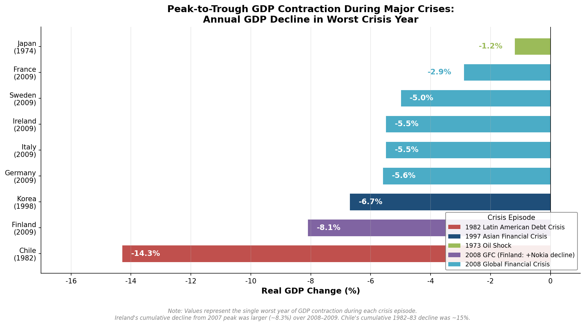

*Figure 6.1: Peak-to-trough GDP contraction during major crises. Chile's 1982 debt crisis produced the deepest single-year contraction (−14.3%), followed by Finland's 2009 decline (−8.1%, compounded by Nokia's collapse). Japan's 1974 oil shock contraction (−1.2%) was mild in GDP terms but catalyzed the most far-reaching structural transformation.*

The recovery trajectories that followed these contractions diverged even more sharply than the initial shocks, as Figure 6.2 documents.

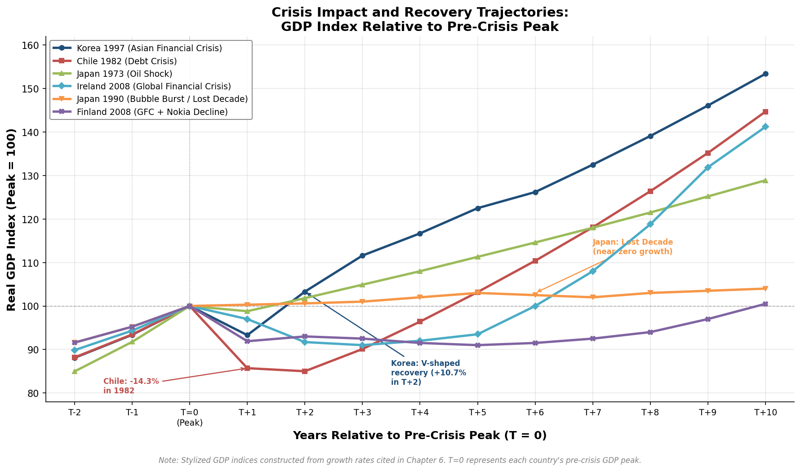

*Figure 6.2: GDP recovery trajectories indexed to pre-crisis peak (= 100). Korea's V-shaped rebound after 1997 and Japan's energy-driven recovery after 1973 contrast sharply with Japan's L-shaped stagnation after 1990 and Finland's protracted post-2008 adjustment.*

**Crisis as selection mechanism.** Each major crisis operated as a filter separating adaptive economies from rigid ones. Japan's energy transformation after 1973, Korea's financial-sector restructuring after 1997, Chile's policy correction after 1982, and Ireland's recovery after 2010 all involved painful but ultimately growth-enhancing structural adjustments. Conversely, Japan's prolonged stagnation after 1990 and Italy's post-2008 drift illustrate the costs of institutional rigidity—the inability or unwillingness to restructure accumulated commitments in response to changed conditions.

**The political economy of reform windows.** Crises created political conditions for reforms that would have been blocked under normal circumstances. Korea's 1997 crisis enabled chaebol restructuring, labor market liberalization, and foreign investment opening that decades of gradualist pressure had failed to achieve. Chile's 1982 crisis produced the shift from doctrinaire to pragmatic market-oriented policy. The Iberian democratizations unlocked European integration. In each case, the acute pain of crisis weakened the political resistance of entrenched interests—whether chaebol families, protected industries, or authoritarian elites—and opened windows for institutional upgrading. Figure 6.3 traces the causal pathways from structural vulnerability through crisis-driven reform to recovery outcomes for the two most instructive cases.

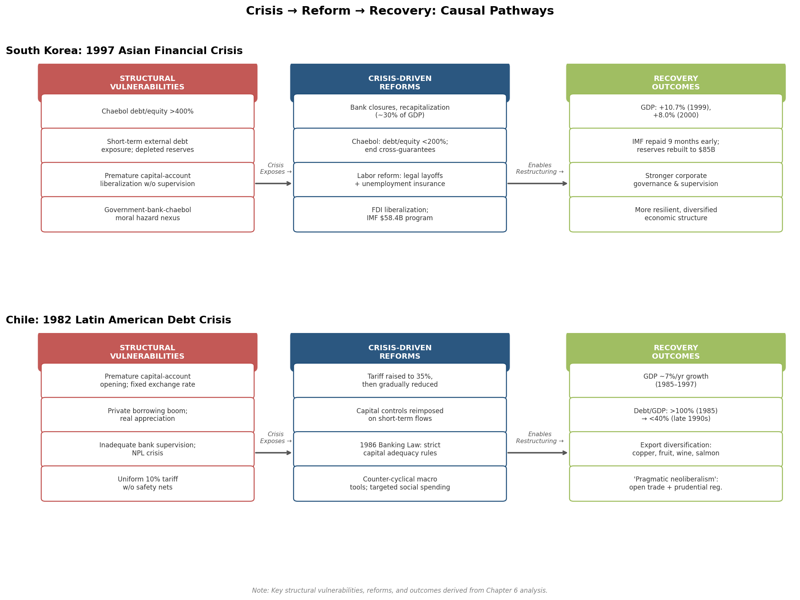

*Figure 6.3: Crisis → Reform → Recovery causal pathways for South Korea (1997) and Chile (1982). Both cases illustrate how pre-crisis institutional weaknesses—premature financial liberalization without adequate supervision—were exposed by external shocks, catalyzed far-reaching structural reforms, and ultimately yielded stronger growth and governance outcomes.*

**Sequencing of financial liberalization matters.** A recurring pattern across the Chilean 1982 crisis, the Korean 1997 crisis, and the Irish 2008 crisis is the danger of premature or poorly sequenced financial liberalization. In each case, capital account opening or financial deregulation preceded the development of adequate prudential supervisory capacity, enabling the accumulation of risks that eventually crystallized in systemic crises. The lesson—that financial deepening must be accompanied by commensurate strengthening of regulatory institutions—was learned repeatedly and at enormous cost.

**External anchors accelerate recovery.** The Iberian democratizations benefited enormously from the prospect and reality of European integration, which provided external institutional discipline and resource transfers. Korea's IMF program, for all its controversies regarding conditionality, accelerated structural reforms and furnished a credibility anchor for the recovery. Ireland's EU-IMF program played an analogous role. Countries without such external anchoring mechanisms—or those that rejected them—tended toward slower and less comprehensive adjustment.

**The human capital buffer.** Across all crisis episodes, the countries that recovered most effectively were those that had invested most deeply in human capital (Chapter 4). Japan's engineering workforce enabled the energy-efficiency transformation. Korea's educated labor force facilitated rapid reallocation across sectors during post-1997 restructuring. Ireland's English-speaking graduates attracted continued FDI even at the depth of the crisis. Human capital stock, once accumulated, proved remarkably resilient to financial and macroeconomic shocks—a finding consistent with the broader pattern that investment in education and skills constitutes the most durable foundation for development.

The crisis experiences examined in this chapter underscore a central finding of this report: the path to developed-nation status was never linear. Every country in the study's sample encountered severe disruptions that could have derailed convergence. What distinguished successful transitions was not the avoidance of crisis but the capacity to extract institutional learning from it—to leverage the political windows opened by acute pain for structural reforms that strengthened the foundations for subsequent growth. This adaptive resilience, rooted in institutional quality, state capacity, and human capital depth, constitutes the connective thread linking the diverse development paths analyzed throughout this report.

# 第7章 Comparative Synthesis — Models, Convergence, and Lessons for Developing Nations

The preceding six chapters have traced, through thematic lenses, the diverse pathways by which a heterogeneous group of countries in Europe, East Asia, and the Americas transitioned from war-ravaged, colonial, or middle-income starting conditions into the ranks of the world's developed nations. Chapter 1 mapped the radical heterogeneity of post-1945 starting conditions; Chapter 2 examined the competing development strategies and their intellectual foundations; Chapter 3 analyzed the institutional architectures and state capacities that made strategy implementation possible; Chapter 4 traced investments in human capital, technology acquisition, and innovation systems; Chapter 5 assessed the role of trade, capital flows, and regional integration; and Chapter 6 showed how crises tested and ultimately strengthened the adaptive resilience of these economies. This concluding chapter draws the threads together. It constructs a comparative matrix across the full country set, distills the necessary and sufficient conditions for successful transition, assesses the degree of convergence achieved as of the mid-2020s, evaluates China as a contemporary test case, and extracts forward-looking implications for today's developing nations.

## 7.1 A Comparative Matrix: Dimensions of Divergence and Convergence

The countries examined in this report span at least five analytically distinct development archetypes, each characterized by a particular configuration of initial conditions, strategic choices, institutional forms, and external circumstances. No single variable explains why some transitions succeeded faster or more completely than others; rather, it is the interaction among multiple dimensions that produced distinct trajectories.

### The East Asian Developmental States: Japan, South Korea, Taiwan, Singapore

These four economies share a cluster of features that, taken together, constitute the most intensive state-directed industrialization model in the post-war record. All began from low or devastated bases — Japan's 1946 industrial output stood at 26% of prewar levels (Chapter 1); South Korea's 1961 per capita GDP was below $100; Singapore at independence in 1965 had per capita income of roughly $500. All relied on meritocratic pilot agencies — MITI, the EPB, the EDB — endowed with substantial autonomy from particularistic interests yet densely embedded in private-sector networks (Chapter 3). All pursued deliberate, sequenced industrial upgrading: light manufactures to heavy and chemical industries to electronics and high technology (Chapter 2). All invested massively in education, achieving universal literacy within a generation where it did not already exist, and built systematic channels for foreign technology acquisition — licensing in Japan, turnkey contracts and reverse engineering in Korea, FDI-mediated transfer in Singapore (Chapter 4).

What distinguished the East Asian model from other state-led approaches — notably Latin American ISI — was the imposition of performance disciplines on subsidized firms. Amsden's "reciprocal control mechanism" (Chapter 2) captured the essential logic: subsidies were exchanged for measurable outcomes, particularly export performance, and firms that failed to meet targets lost access to preferential credit. This export discipline served as a market test that compensated for the absence of domestic competitive pressure, preventing the rent-seeking and resource misallocation that plagued ISI regimes elsewhere.

Two additional conditions, often underemphasized, were critical. First, radical land reform — implemented in Japan under SCAP, in South Korea during 1948–1950, and in Taiwan through the three-stage KMT reform of 1949–1953 — eliminated landed oligarchies, equalized rural incomes, and created the social preconditions for broad-based industrialization (Chapter 1). No comparable redistribution occurred in Latin America. Second, the Cold War security architecture provided an enabling external environment: the United States tolerated East Asian mercantilist trade practices, provided military protection that allowed developmental states to concentrate resources on economic growth, and offered preferential access to the American market (Chapters 2 and 5).

### The European Social Market and Corporatist Models: Germany, France, Sweden, Finland

The Western and Northern European economies that achieved or sustained developed-nation status operated within democratic political systems and pursued strategies in which the state shaped market outcomes without directly controlling firm-level investment decisions. Germany's ordoliberal social market economy constructed a competitive order through independent institutions — the Bundesbank, the Bundeskartellamt, the codetermination system — that dispersed economic governance rather than concentrating it in a pilot agency (Chapter 3). France's indicative planning under the Commissariat du Plan coordinated investment in bottleneck sectors through consultation rather than command, backed by the state's influence over nationalized banks (Chapter 2). Italy's IRI represented a hybrid — a state holding company operating firms on commercial principles.

The Nordic variant combined private ownership with comprehensive welfare provision and corporatist wage bargaining. Sweden's Rehn-Meidner model used solidaristic wage policy as an active structural-adjustment mechanism, accelerating the exit of low-productivity firms and channeling resources toward the frontier (Chapter 2). Finland's trajectory carried the distinctive imprint of Soviet war reparations, which paradoxically forced rapid industrialization of an agricultural economy (Chapters 1 and 2).

These European models shared several features absent from or weaker in the East Asian cases: strong organized labor as a social partner rather than a suppressed or co-opted force; extensive social insurance that cushioned structural adjustment and maintained political legitimacy; and, crucially, access to the deepening European integration project, which provided market access, structural fund transfers, and institutional anchoring that had no East Asian equivalent (Chapter 5).

### The European Late-Comers: Ireland, Spain, Portugal

The Iberian economies and Ireland constitute a third archetype: countries that were significantly poorer than the European core at mid-century and achieved convergence through a combination of strategic reorientation and European integration. All three experienced decisive policy pivots — Ireland's Whitaker Report of 1958, Spain's Stabilization Plan of 1959, Portugal's EFTA membership from 1960 and post-1974 democratic opening — that replaced inward-looking strategies with outward orientation (Chapter 2). All three benefited enormously from EEC/EU accession (Ireland in 1973, Spain and Portugal in 1986), which provided guaranteed market access, structural and cohesion fund transfers, institutional anchoring through the *acquis communautaire*, and a credibility signal that attracted foreign investment (Chapter 5).

Ireland's distinctive feature was its reliance on FDI attraction as the central development mechanism, leveraging its English-speaking workforce, low corporate tax rate, and EU single-market membership to become a production and profit-booking hub for American multinationals (Chapters 3 and 5). Spain and Portugal followed paths in which domestic firm development played a larger role, but EU structural funds and the discipline of convergence criteria were equally decisive. The Iberian democratizations of the 1970s — Portugal's Carnation Revolution (1974) and Spain's managed transition (1975–1978) — removed the political barriers to European integration and thus to the most powerful external accelerator available (Chapter 6).

### The Liberal Resource-Rich Path: Canada

Canada represents a distinct trajectory: a resource-rich, English-speaking democracy closely integrated with the United States that achieved high-income status through a combination of natural resource exploitation, manufacturing development within the North American market (anchored by the 1965 Auto Pact and later NAFTA), and a relatively light-touch state role focused on macroeconomic management, infrastructure provision, and social insurance rather than industrial targeting (Chapters 2, 3, and 5). Canada's development model relied heavily on FDI inflows — predominantly from the United States — and on preferential access to the American market. Per capita GDP growth during 1950–1973 averaged approximately 3% per year, more modest than European or East Asian catch-up rates but sustained from a much higher starting base.

### The Latin American Exception: Chile

Chile's trajectory is the most complex in the sample. It combined ISI (under CORFO from 1939), radical neoliberal reform under the Pinochet dictatorship (the "Chicago Boys" program from 1973), a devastating financial crisis in 1982–1983 that exposed the flaws of premature liberalization, and a subsequent "pragmatic neoliberal" phase that tempered market orthodoxy with counter-cyclical fiscal management and strengthened prudential regulation (Chapters 2 and 6). Chile became the first Latin American country to achieve World Bank high-income status, crossing the threshold in 2012 [Wikipedia](https://en.wikipedia.org/wiki/World_Bank_high-income_economy "Chile classified as high-income since 2012"). Its position remains more fragile than that of the East Asian or European cases: commodity dependence on copper persists, economic complexity is comparatively low, and inequality — though reduced — remains high by OECD standards (Chapter 5).

## 7.2 Necessary Conditions versus Sufficient Conditions

A central analytical question posed throughout this report is which factors were common to all successful transitions (necessary conditions) and which appeared in some cases but not others (pathway-specific or contingent factors). The cross-case comparison permits a provisional answer.

### Conditions Present in All Successful Cases

**Sustained investment in human capital.** Every country that achieved developed-nation status invested heavily and persistently in education — though the timing, structure, and institutional form varied enormously. Japan entered the postwar era with near-universal literacy; South Korea had to build it from a 22% adult literacy rate in 1945 but achieved 96% within thirteen years (Chapter 4). Germany's dual vocational system, Finland's comprehensive school reform, Ireland's expansion of tertiary education for FDI attraction, and Singapore's phased human capital strategy all reflected deliberate alignment of educational investment with economic strategy. No country in the sample achieved high-income status without first achieving near-universal basic education and subsequently building substantial technical and tertiary capacity.

**Macroeconomic stability.** Sustained high inflation and chronic fiscal indiscipline are absent from the growth phases of every successful case. Germany's ordoliberal commitment to price stability, the Bretton Woods fixed-rate system that constrained European and Japanese policy during the Golden Age, Korea's fiscal conservatism even during periods of aggressive industrial intervention, and Chile's structural fiscal balance rule (adopted in 2001 after the lessons of 1982) all reflect this pattern. Where macroeconomic instability occurred — as in Chile during 1975 and 1982, or Korea during the 1997 crisis — it interrupted growth and required painful correction (Chapter 6).

**Secure property rights and contractual enforcement.** All successful cases, whether authoritarian or democratic, provided a sufficient degree of property-rights security and contractual predictability to sustain private investment. This did not require Anglo-American-style liberal legal systems: Japan's administrative guidance, Korea's state-directed credit, and France's indicative planning all involved substantial state intervention in property and contract, but within frameworks that were predictable enough for firms to make long-term investment commitments. The critical distinction was between states that intervened within rules (even if those rules were informal) and those that intervened arbitrarily.

**Openness to the world economy — on managed terms.** Every successful case ultimately integrated into the global trading system, but the timing and sequencing of openness varied dramatically. Japan and Korea maintained substantial protection during early industrialization and liberalized gradually; Ireland and Singapore pursued openness from the outset; the Iberian economies liberalized in compressed bursts tied to international institutional commitments (Chapter 5). The common pattern was not free trade per se but a willingness to engage with international competition at some point in the development trajectory, combined with export orientation that provided a market test for domestic firms. Pure autarky — Franco's Spain before 1959, Portugal's Estado Novo, Latin American ISI at its most extreme — consistently produced stagnation.

**State capacity for coherent policy formulation and implementation.** Whether through a centralized pilot agency (MITI, EPB, EDB), an indicative planning apparatus (Commissariat du Plan), a rule-based competitive order (Germany's ordoliberal framework), or corporatist bargaining institutions (the Nordic model), every successful case possessed a state apparatus capable of formulating coherent economic policy and implementing it with reasonable effectiveness (Chapter 3). The specific institutional form varied, but the underlying requirement — what Evans termed "embedded autonomy," combining bureaucratic competence with societal connectedness — was universal.

### Pathway-Specific and Contingent Factors

**Authoritarian governance** was present in several of the fastest-growing cases (South Korea, Taiwan, Singapore, Spain under late Francoism, Chile under Pinochet) but absent from others (Germany, Sweden, Finland, Canada, Ireland). The comparative record suggests that authoritarianism can accelerate decisive strategic pivots — Park Chung-hee's bank nationalization, Franco's 1959 Stabilization Plan, Pinochet's Chicago Boys reforms — but is neither necessary for successful development nor sufficient for it. The vast majority of authoritarian regimes in the postwar period produced developmental disaster, not miracle. What mattered was not regime type per se but the internal coherence and external connectedness of the state apparatus, as Evans's comparative framework demonstrates (Chapter 3).

**Natural resource abundance** characterized Canada, Chile, and to a lesser extent the Nordic economies (Swedish iron ore, Finnish forests, Norwegian oil) but was conspicuously absent from the East Asian developmental states, which industrialized precisely because resource scarcity foreclosed commodity-based growth paths. Resource wealth shaped the menu of available strategies — enabling commodity-based development in Canada and Chile, funding the Nordic welfare state in Norway — but was neither necessary (Japan, Korea, Singapore, Taiwan) nor sufficient (many resource-rich developing countries have failed to achieve high-income status).

**Regional integration architecture** was decisive for the European late-comers (Ireland, Spain, Portugal) and significant for the European core, but absent in East Asia and the Americas. EU accession functioned as a comprehensive development accelerator through market access, structural transfers, institutional anchoring, and credibility effects (Chapter 5). No equivalent mechanism existed for Korea, Taiwan, or Chile, which achieved convergence through bilateral relationships and multilateral institutions rather than deep regional integration.

**Cold War geopolitical rents** were critical for the East Asian developmental states. American security guarantees, economic and military aid (Korea received approximately $13 billion in US assistance between 1946 and 1978), and tolerance of mercantilist trade practices constituted an enabling environment that is no longer available to today's developing nations (Chapter 2). The European cases benefited from a parallel dynamic: the Marshall Plan, NATO membership, and the US-backed postwar institutional architecture provided both resources and a geopolitical framework within which European recovery and integration could proceed.

## 7.3 Convergence Achieved — and Residual Divergence

As of the mid-2020s, all countries in this study's core sample are classified as high-income economies by the World Bank, whose current threshold for FY2026 stands at a GNI per capita exceeding $13,935 (Atlas method, current US dollars) [World Bank](https://datahelpdesk.worldbank.org/knowledgebase/articles/906519-world-bank-country-and-lending-groups "World Bank Country and Lending Groups, FY2026 thresholds"). This shared classification, however, conceals substantial variation in income levels, productivity, inequality, and broader wellbeing indicators.

### Income Convergence: A Partial Success Story

The scale of catch-up growth since 1950 has been extraordinary. South Korea's GDP per capita in PPP terms has risen from roughly one-tenth of the American level in 1960 to approximately $56,000 by 2025, placing it among the world's top twenty economies by living standards. Singapore, starting from approximately one-third of the Western European average in 1960, had by 2025 achieved a GDP per capita (PPP) of approximately $157,000 — the second highest in the world, surpassing every European economy [IMF/Worldometer](https://www.worldometers.info/gdp/gdp-per-capita/imf-2025-ppp-worldwide/ "IMF GDP per capita PPP 2025 estimates"). Ireland's GDP per capita (PPP) of approximately $148,000 in 2025 ranks among the highest globally, though this figure is substantially inflated by multinational profit-booking — Ireland's modified GNI (GNI*), which strips out globalization effects, is roughly 40% lower, placing it closer to the Western European average.

Japan, whose per capita GDP grew at approximately 9.5% annually during 1950–1973, experienced prolonged stagnation following the asset-bubble collapse of 1990 (Chapter 6) and has seen its relative position erode: Japan's GDP per capita (PPP) in 2025 stands at approximately $52,000, below the levels of Korea and well below Singapore. Germany, at approximately $72,000 (PPP), maintains its position as Europe's largest economy with a robust manufacturing export base, but faces long-term demographic and productivity headwinds. The Nordic economies — Sweden at roughly $74,000, Finland at approximately $58,000 — sustain high income levels alongside extensive welfare provision.

Spain and Portugal, the European late-comers, have achieved substantial but incomplete convergence. Spain's per capita income rose from approximately 71% of the EU-15 average at the time of EEC accession in 1986 to over 90% by 2005 [Real Instituto Elcano](https://www.realinstitutoelcano.org/en/work-document/the-europeanisation-of-spain-1986-2006/ "The Europeanisation of Spain, 1986–2006"), though progress stalled after the 2008 crisis and the subsequent eurozone sovereign debt episode. Portugal's purchasing power per capita rose from approximately 50% of the EEC average in 1986 to close to 75% of the EU average by the 2020s [Euronews](https://www.euronews.com/my-europe/2026/01/01/four-decades-in-the-european-union-spain-and-portugals-journey-since-1986 "Four decades in the EU: Spain and Portugal's journey").

Chile, the only Latin American country to cross the World Bank high-income threshold (in 2012), maintains a GNI per capita of approximately $16,700 (Atlas method, 2024) — comfortably above the threshold but far below the OECD average [World Bank](https://data.worldbank.org/?locations=CL-XD "Data for Chile, High income"). Chile's position illustrates the distinction between crossing an administrative income threshold and achieving the broader institutional depth, economic complexity, and social indicators that characterize established developed nations.

### Beyond Income: The Human Development Dimension

The UNDP Human Development Index (HDI), which incorporates life expectancy, education, and income, provides a complementary perspective. The 2025 HDI report (based on 2023 data) places all countries in this study within the "very high human development" category (HDI ≥ 0.800), but with notable internal variation. Switzerland and Norway lead globally at 0.970; Germany and Sweden score 0.959; Singapore 0.949; South Korea 0.929; Japan 0.920 [UNDP HDR](https://hdr.undp.org/sites/default/files/2025_HDR/HDR25_Statistical_Annex_HDI_Table.pdf "HDI 2025 Statistical Annex"). Spain and Ireland occupy strong positions in the mid-0.900s range. Chile and Portugal, while firmly in the "very high" category, register lower scores that reflect continuing gaps in educational attainment and life expectancy relative to the leading economies.

### Inequality as Residual Divergence

Income convergence at the national level coexists with persistent — and in some cases widening — inequality within countries. The Gini coefficient of disposable income varies substantially across the sample. The Nordic economies maintain among the world's lowest inequality levels (Gini coefficients in the 0.25–0.28 range), reflecting the redistributive mechanisms embedded in the welfare-state corporatist model analyzed in Chapters 2 and 3. Germany and France occupy intermediate positions. The Anglo-Saxon and East Asian cases — Ireland, Singapore, and Korea — exhibit higher inequality, reflecting more market-oriented distributional regimes. Chile records the highest inequality in the sample, with a Gini coefficient that, while reduced from its Pinochet-era levels, remains elevated by OECD standards.

The inequality dimension reveals an important limitation of the income-based definition of "developed" status. A country can cross the World Bank high-income threshold while retaining distributional characteristics more typical of middle-income economies. Chile's experience — and, in a different way, Singapore's combination of high average income with substantial wealth concentration — suggests that the income threshold captures only one dimension of the multidimensional concept of "development."

### Is "Developed" Status Permanent?

The historical record suggests that developed-nation status, once achieved, is broadly durable but not irreversible. None of the countries in this study has fallen back below the World Bank high-income threshold (though Chile oscillated near it in earlier years). However, relative positions have shifted substantially. Japan's "lost decades" after 1990 demonstrate that institutional rigidities and policy failures can produce prolonged stagnation even in a technologically advanced economy. Italy's near-zero per capita GDP growth since the early 2000s — the longest such stagnation in any major European economy — illustrates the costs of accumulated structural rigidities, demographic decline, and the constraints imposed by eurozone membership on macroeconomic adjustment. Finland's post-2008 experience, in which the simultaneous collapse of Nokia and the global financial crisis produced a protracted recession from which recovery was incomplete until approximately 2017 (Chapter 6), demonstrates the vulnerability of small open economies to sector-specific shocks.

These cases suggest that the institutional, human capital, and adaptive capacities that enabled convergence in the first place must be continuously maintained and renewed. Developed-nation status is an achievement that requires ongoing investment, not a permanent condition guaranteed by past performance.

## 7.4 China as a Contemporary Test Case

The plan for this report identified China as a critical contemporary reference point — the most consequential test of whether the developmental-state model, adapted to unprecedented scale, can carry a continental economy across the high-income threshold. As of 2024, China's GNI per capita stood at approximately $13,660 (Atlas method) — just below the World Bank's FY2026 high-income threshold of $13,935 [World Bank/ycharts](https://ycharts.com/indicators/china_gni_per_capita_atlas_method "China GNI per Capita, Atlas Method, 2024") [World Bank](https://datahelpdesk.worldbank.org/knowledgebase/articles/906519-world-bank-country-and-lending-groups "FY2026 thresholds"). China is classified as an upper-middle-income economy, the largest and most significant country remaining in that category.

China's development trajectory since 1978 shares recognizable features with the East Asian developmental-state model: state-directed credit allocation, strategic industrial policy, export orientation, massive investment in education and infrastructure, and technology acquisition through a combination of FDI attraction (via special economic zones), licensing, joint ventures, and — increasingly — indigenous R&D. The intellectual lineage running from Gerschenkron through Johnson and Amsden to China's reform-era policymakers is traceable, even as China's sheer scale and political-institutional configuration distinguish it from all predecessors.

Several structural differences, however, complicate direct comparison. First, China's population (approximately 1.4 billion) is an order of magnitude larger than that of any previous developmental state, creating distributional and coordination challenges that Japan (127 million), Korea (52 million), or Singapore (6 million) never faced. China's per capita income average conceals enormous regional disparities: coastal provinces like Jiangsu and Zhejiang have per capita incomes comparable to middle-income European countries, while inland provinces remain far below the national average. Second, China's political system — an authoritarian one-party state with no trajectory toward the democratization that characterized Korea, Taiwan, and the Iberian cases — raises the question of whether the institutional accountability mechanisms that corrected policy errors in other developmental states can function within a system that lacks electoral competition, independent judiciary, and press freedom. Third, the international environment has shifted fundamentally: the geopolitical tolerance that allowed earlier East Asian developmental states to pursue mercantilist trade policies under American security patronage is no longer available to China, which faces intensifying trade restrictions, technology controls, and strategic rivalry with the United States.

Whether China will cross the high-income threshold — and, more importantly, whether it can sustain growth beyond it, avoiding the "middle-income trap" that has stalled many upper-middle-income economies — remains an open question that the historical patterns analyzed in this report can illuminate but not resolve. The East Asian precedents suggest that the transition from catch-up growth (driven by factor accumulation and technology absorption) to frontier growth (driven by innovation) requires institutional adaptations — stronger intellectual property protection, competitive market structures, risk-tolerant capital allocation — that China's current political-economic configuration may struggle to deliver. The Chilean experience offers a different cautionary note: crossing an income threshold does not by itself ensure the institutional depth, economic complexity, and social cohesion that characterize established developed nations.

## 7.5 Lessons for Developing Nations: What Remains Applicable and What Does Not

The post-war development experiences analyzed in this report were products of a historically specific constellation: the geopolitical structure of the Cold War, the institutional architecture of Bretton Woods, the availability of labor-intensive manufacturing as a pathway to export-led growth, cheap fossil energy, and a globalizing trade environment that, despite periodic protectionist pressures, trended toward openness over seven decades. The question facing today's developing nations is which elements of these historical experiences remain structurally relevant under twenty-first-century conditions — and which are historically contingent artifacts of a vanished era.

### Elements That Remain Structurally Relevant

**The primacy of human capital investment.** The finding that every successful case invested heavily and persistently in education — from basic literacy through technical training to research capacity — is the most robust and transferable lesson of the post-war record. The mechanisms through which human capital contributes to growth — enabling technology absorption, supporting structural transformation, building adaptive capacity — are not time-bound. If anything, the shift toward knowledge-intensive and digitally mediated economic activity has increased the returns to education, making human capital investment even more critical for twenty-first-century development than it was in the mid-twentieth century.

**Macroeconomic discipline as a precondition.** The consistent association between macroeconomic stability and sustained growth across all country archetypes is not historically contingent. Chronic inflation, fiscal indiscipline, and balance-of-payments crises disrupted growth trajectories wherever they occurred — in Latin America during the 1980s, in the Asian crisis countries during 1997, in the European periphery during 2010–2013 — and the institutional mechanisms for maintaining stability (independent central banks, fiscal rules, prudential financial regulation) are as relevant today as they were during the Golden Age.

**State capacity as an enabler — not a substitute — for markets.** The comparative record demonstrates that effective state institutions, capable of formulating and implementing coherent economic policy, are indispensable for development. This finding applies across regime types and strategic orientations: the German ordoliberal state that maintained competitive market order, the Korean developmental state that directed industrial investment, and the Singaporean technocratic state that attracted and anchored FDI all required high-quality public institutions. For today's developing nations, building state capacity — through meritocratic recruitment, anti-corruption enforcement, and institutional design that balances autonomy with accountability — remains a foundational task.

**Engagement with the global economy — on managed terms.** The pattern of phased, strategically sequenced trade liberalization, combined with export orientation as a market test for domestic producers, retains structural relevance. The specific instruments have evolved — WTO disciplines constrain the tariff and subsidy tools that Japan and Korea employed — but the underlying principle that outward orientation disciplines domestic producers and facilitates technology transfer remains operative.

### Elements That Are Historically Contingent or No Longer Available

**Cold War geopolitical rents.** The US security umbrella, toleration of mercantilist trade practices, preferential market access, and massive economic and military aid that underwrote East Asian development are products of a geopolitical configuration that no longer exists. Today's developing nations operate in a fragmented, multipolar environment characterized by great-power competition (particularly US-China rivalry), reshoring and "friendshoring" of supply chains, and proliferating trade restrictions. The external enabling conditions for East Asian-style export-led industrialization have changed fundamentally.

**Labor-intensive manufacturing as a universal escalator.** The pathway from labor-intensive manufacturing exports to industrial upgrading that Japan pioneered in the 1950s and Korea and China followed subsequently faces structural headwinds. Automation, robotics, and AI-driven production are reducing the labor content of manufacturing, potentially eroding the comparative advantage of low-wage economies before they can achieve sufficient scale. The phenomenon of "premature deindustrialization" — documented by Dani Rodrik — suggests that the manufacturing escalator that carried East Asian economies to high-income status may be more difficult for today's low-income countries to access.

**The European integration model as a replicable template.** The EU's unique combination of market access guarantees, structural fund transfers, institutional anchoring through the *acquis communautaire*, and credibility signaling was decisive for the convergence of Ireland, Spain, and Portugal. No comparable regional architecture exists elsewhere, and the political conditions for creating one — the specific Franco-German reconciliation dynamic, the Cold War imperative for European unity, the accumulated institutional capital of seven decades of integration — are not reproducible. Regional integration in other contexts (ASEAN, the African Union, Mercosur) operates at far lower levels of institutional depth and transfers far fewer resources.

**Cheap fossil energy as a growth input.** The post-war growth model, particularly during the 1945–1973 Golden Age, was built on abundant, inexpensive fossil fuels. Today's developing nations face climate constraints — both physical (rising temperatures, extreme weather) and regulatory (carbon pricing, border adjustment mechanisms, ESG-linked capital allocation) — that alter the energy economics of industrialization. The transition to renewable energy creates opportunities (solar manufacturing, green hydrogen) but also imposes adjustment costs and technological requirements that earlier industrializers did not face.

### A Conditional Assessment

The post-war development record offers today's developing nations not a playbook but a set of structural principles — invest in people, maintain macroeconomic discipline, build capable institutions, engage with the global economy — whose implementation must be adapted to radically different external conditions. The specific strategic choices that worked in the twentieth century (import substitution followed by export-oriented industrialization, directed credit through state-owned banks, infant-industry protection behind high tariff walls) are constrained by WTO disciplines, changed technology, and a less permissive geopolitical environment. The challenge for contemporary policymakers is to extract the structural logic of successful development — the sequencing of reform, the alignment of institutions with strategy, the discipline of market accountability — while devising new instruments suited to a digital, carbon-constrained, geopolitically fractured world.

The countries that transitioned to developed-nation status after 1945 did not follow a single model, and their successes were never foreordained. What they shared was a capacity for pragmatic adaptation — the willingness to abandon strategies that were not working, to learn from crises, and to invest persistently in the foundations of productive capability. That capacity, rather than any specific institutional blueprint, is the most enduring lesson of the postwar development experience.

# Conclusion

The diverse paths to developed-nation status traced in this report converge on a central insight: there was no single model of successful postwar development, but there was a common underlying logic. Countries that achieved high-income status — whether through the dirigiste precision of East Asian developmental states, the rule-based competitive order of German ordoliberalism, the corporatist bargaining systems of the Nordic welfare states, the FDI-attraction strategies of Ireland and Singapore, or the pragmatic neoliberalism that emerged from Chile's costly trial and error — all satisfied a core set of structural prerequisites: deep and sustained investment in human capital, macroeconomic discipline, secure and predictable property rights, eventual engagement with international competitive pressure, and a state apparatus capable of coherent policy formulation and implementation.

The institutional forms through which these prerequisites were met varied as dramatically as the starting conditions from which each country departed. Japan's MITI and South Korea's Economic Planning Board directed industrial investment with a specificity that would have been inconceivable in Germany's dispersed ordoliberal framework or Sweden's tripartite corporatist system. Ireland leveraged EU membership and a 12.5% corporate tax rate to attract multinational investment, while Korea and Japan deliberately restricted foreign ownership to preserve domestic control over technology deployment. Finland's war reparations to the Soviet Union — an apparent burden — paradoxically catalyzed industrial diversification, while Chile's radical trade liberalization under the Chicago Boys inflicted severe short-term costs before yielding sustained growth under a corrected policy framework. The range of successful institutional configurations demonstrates that development is a problem of functional requirements, not institutional blueprints: multiple architectures can satisfy the same underlying imperatives.

Equally significant is what the record reveals about the role of crisis and adaptation. No country in this study's sample followed a smooth, uninterrupted trajectory to high-income status. Japan's oil-shock transformation of the 1970s, Korea's post-1997 financial restructuring, Chile's policy correction after the 1982 debt crisis, Ireland's recovery from the 2008 banking collapse, and the Iberian economies' leveraging of democratic transitions into European integration all demonstrate that the capacity to extract institutional learning from acute disruption — to convert crisis into reform — was as consequential as the initial choice of strategy. Conversely, Japan's post-1990 stagnation and Italy's two-decade growth paralysis illustrate the costs of institutional rigidity: accumulated commitments and entrenched interests that resist adaptation to changed conditions.

The convergence achieved by the mid-2020s is substantial but uneven. All countries in the study are classified as high-income by the World Bank, and all register "very high" human development on the UNDP index. Yet residual divergence persists: in income levels (Singapore's per capita GDP of approximately $157,000 versus Chile's $16,700 GNI per capita), in inequality (Nordic Gini coefficients below 0.28 versus Chile's elevated levels), and in institutional depth and economic complexity. Chile's experience — crossing the high-income threshold while retaining structural characteristics more typical of middle-income economies — underscores that development is a multidimensional process not fully captured by any single metric.

For contemporary developing nations, the postwar record offers structural principles rather than a replicable playbook. The primacy of human capital investment, the necessity of macroeconomic stability, the importance of capable state institutions, and the discipline imposed by engagement with international competition remain as relevant as they were in the mid-twentieth century. Yet the specific enabling conditions that underwrote many historical transitions — Cold War security guarantees and geopolitical tolerance of mercantilist trade practices, the European integration architecture's unique combination of market access, structural transfers, and institutional anchoring, cheap fossil energy as a universal growth input, and labor-intensive manufacturing as an accessible escalator to industrial upgrading — are either unavailable or fundamentally altered. The challenge for today's policymakers is to honor the structural logic of successful development while devising instruments suited to a world defined by digital transformation, carbon constraints, geopolitical fragmentation, and the automation of tasks that once provided mass employment in industrializing economies.

The countries examined in this report did not succeed because they discovered a universal formula. They succeeded because they invested persistently in productive capability, adapted pragmatically when strategies failed, and built institutions capable of learning from both success and catastrophe. That capacity for pragmatic adaptation — rather than any specific policy toolkit — constitutes the most enduring and transferable lesson of the postwar development experience.
