# Overview

Tablet-style devices — encompassing smart POS terminals, mPOS tablets, self-service kiosks, all-in-one countertop systems, and rugged field tablets — have become central infrastructure in global commerce. In 2024, the world shipped approximately 165 million payment-acceptance devices (128.1 million PCI-certified terminals plus 36.9 million non-certified units), serving an installed base of roughly 292 million POS terminals as of 2023. These devices no longer merely process card transactions; they anchor cloud-based SaaS platforms for inventory management, workforce scheduling, customer engagement, and multi-channel order fulfillment across retail, food service, hospitality, healthcare, logistics, and government.

This report provides a comprehensive analysis of the tablet-style payment and SaaS device landscape, structured around four interconnected objectives aligned with the needs of a senior hardware product manager:

**Device taxonomy and manufacturer landscape.** Chapter 1 establishes a five-category classification framework — grounded in PCI SSC and EMVCo standards — that distinguishes smart POS terminals, mPOS tablets, tablet kiosks, all-in-one countertop POS systems, and rugged field tablets by form factor, certification status, and deployment mode. Chapter 2 catalogs the major manufacturers (PAX Technology, Sunmi, Ingenico, Verifone, Newland, Clover/Fiserv, Square/Block, Toast, Castles Technology, and regional OEMs), profiles their current-generation product lines with detailed hardware specifications, and tracks new product launches through October 2026.

**Use cases and deployment scenarios.** Chapter 3 maps device categories to six primary vertical markets — retail, restaurants and food service, hospitality, healthcare, field service and logistics, and transportation and government — and analyzes the structural shift from acquirer-driven terminal placement to SaaS-first subscription models. Emerging high-growth use cases including self-ordering kiosks (installations up 43% globally through June 2025), pay-at-table systems, and unattended micro-markets receive dedicated treatment.

**Regional market penetration and pricing.** Chapter 4 quantifies market size, installed base, growth trajectory, and typical device pricing across four target regions. North America leads in absolute revenue (~USD 29.5 billion in 2024); Southeast Asia exhibits the fastest growth (15.7% CAGR); Brazil maintains the world's highest per-capita terminal density (~20 million units); and Japan and South Korea present distinctive landscapes shaped by domestic OEM incumbency, QR-code payment adoption, and VAN-subsidized distribution models.

**Competitive dynamics and forward outlook.** Chapter 5 dissects the six-layer value chain from silicon vendors through merchants, revealing a "smile curve" margin structure where hardware manufacturing occupies the lowest-margin position. Chapter 6 identifies five technology trends — on-device AI, biometric authentication under PCI PTS v7.0, 5G/eSIM fleet management, modular hardware architecture, and sustainability requirements — and maps whitespace opportunities across all four target regions.

The central finding is that tablet-style payment devices are undergoing a fundamental transformation: from standalone transaction-processing endpoints to software-delivery platforms where hardware serves as the vehicle for recurring SaaS and payment-processing revenue. Vertically integrated players (Toast, Clover, Square) that bundle hardware, software, and payment processing into subscription models are capturing the highest-margin positions, while open-platform OEMs face mounting pressure to build proprietary software layers or risk confinement to the lowest-margin segment of the value chain. For hardware product managers, the strategic imperative is clear — compete on ecosystem breadth and software-platform capability, not on hardware specifications alone.

# 第1章 Device Taxonomy & Form-Factor Landscape

The ecosystem of tablet-style devices used for payments and SaaS applications is broad, overlapping, and often confusingly labeled. What one vendor calls a "smart POS" another markets as an "Android payment tablet"; what a payment network classifies as a "PIN Transaction Security point of interaction" an acquirer may simply label a "terminal." Industry standards bodies, card-scheme operators, and device manufacturers each maintain distinct classification schemes, and the resulting terminological drift creates real friction in procurement, certification, and cross-border deployment.

This chapter imposes order on that fragmented landscape. It establishes a unified five-category taxonomy — grounded in PCI SSC and EMVCo frameworks — that will serve as the structural backbone for the remainder of this report. It draws boundary lines between purpose-built payment terminals and general-purpose tablets running POS software, maps the peripheral ecosystem surrounding each form factor, surveys the operating-system landscape shaping device design decisions in 2025–2026, and anchors the discussion in current market-scale data on global shipments and installed bases.

## 1.1 Industry Classification Frameworks

Before proposing a working taxonomy, it is necessary to ground the discussion in the authoritative classification systems that govern how payment devices are designed, certified, and deployed worldwide: the PCI SSC hardware-security framework, the EMVCo transaction-level terminal typology, and the U.S. Payments Forum's acceptance-mode model.

### PCI PTS POI Device Categories

The Payment Card Industry Security Standards Council (PCI SSC) classifies payment-acceptance hardware through its PTS POI (PIN Transaction Security — Point of Interaction) standard. Version 6.1, published in March 2022, defines five principal device categories: **stand-alone POS terminals**, **unattended payment terminals (UPT)**, **encrypting PIN pads (EPP)**, **secure card readers (SCR/SCRP)**, and **non-PED POI devices** — i.e., devices that accept cards but do not handle PIN entry [PCI SSC PTS POI v6.1](https://listings.pcisecuritystandards.org/documents/PCI_PTS_POI_SRs_v6-1_Final.pdf "PCI PTS POI Security Requirements v6.1, March 2022"). PCI PTS certification demands hardware-level tamper-resistance, firmware integrity verification, and encrypted PIN processing — physical-security requirements that commercial off-the-shelf (COTS) tablets cannot satisfy without purpose-built hardware modifications.

PCI SSC defines **COTS** as "a mobile device such as a smartphone or tablet, that is built for mass-market distribution and is not designed specifically for payment-transaction processing" [PCI SSC PTS POI v6.1](https://listings.pcisecuritystandards.org/documents/PCI_PTS_POI_SRs_v6-1_Final.pdf "PCI PTS POI v6.1, COTS definition"). The distinction between a PCI-certified terminal and a COTS device constitutes the single most important boundary line in the tablet-payment landscape and recurs throughout this report.

To extend payment acceptance to COTS hardware, PCI SSC has issued three successive standards: **CPoC** (Contactless Payments on COTS — limited to NFC tap acceptance), **SPoC** (Software-based PIN Entry on COTS — permitting on-screen PIN entry paired with an external PCI-certified card reader), and **MPoC** (Mobile Payments on COTS — published November 2022, a modular framework that subsumes and replaces both predecessors) [U.S. Payments Forum](https://www.uspaymentsforum.org/introduction-to-mpos-and-taptomobile-solutions/ "Introduction to mPOS and TapToMobile Solutions, April 2023").

### EMVCo Terminal Type Classification

EMVCo classifies terminals at the transaction layer through **Tag 9F35 (Terminal Type)**, a two-digit code embedded in every EMV transaction message. Types 21/22 designate attended merchant POS terminals; Types 24/25/26 cover unattended terminals such as kiosks and vending machines; Types 34/35/36 identify cardholder-activated devices, a category that now encompasses SoftPOS configurations [MST Company](https://mstcompany.net/blog/acquiring-types-of-pos-terminals-classification-of-emvco-and-payment-systems "EMVCo POS Terminal Type Classification"). Although these codes are transaction-layer metadata rather than hardware specifications, they influence how acquirers and payment networks enforce acceptance rules and, by extension, constrain which device form factors may be deployed in attended, unattended, or self-service scenarios.

### U.S. Payments Forum Acceptance-Mode Framework

The U.S. Payments Forum formalizes three acceptance modes that map directly onto hardware configurations: **(1) Traditional POS** — a dedicated, purpose-built payment terminal; **(2) mPOS** — a COTS device paired with external card-reading, PIN-entry, or printing peripherals; and **(3) Tap-to-Mobile (TapToMobile)** — payment acceptance using only the COTS device's built-in NFC radio, requiring no external hardware [U.S. Payments Forum](https://www.uspaymentsforum.org/introduction-to-mpos-and-taptomobile-solutions/ "Introduction to mPOS and TapToMobile Solutions, April 2023"). This tripartite model is particularly useful for understanding the spectrum that extends from fully integrated hardware (smart POS) through peripheral-dependent configurations (mPOS) to pure-software acceptance (SoftPOS / Tap-to-Phone).

## 1.2 A Five-Category Working Taxonomy

Synthesizing the regulatory and transaction-level frameworks above with current manufacturer product-line structures, this report adopts a five-category, mutually exclusive taxonomy of tablet-style payment and SaaS devices. Each category is defined by a combination of form factor, PCI certification status, peripheral integration, and primary deployment mode. The classification is corroborated by the product-line architecture of leading manufacturers such as PAX Technology, whose portfolio spans Android SmartPOS (mobile/mini/countertop), SmartTablet (multilane), and Unattended (IM/SK series) categories [PAX Technology](https://www.paxglobal.com.hk/en/latest-news/is-softpos-the-payment-industry-s-hot-new-thing/ "PAX product-line classification").

### Category 1: Smart POS Terminal

**Definition.** A compact device (5″–8″ screen), PCI PTS–certified, running Android or Linux, with an integrated thermal printer, NFC/EMV contact reader, magnetic stripe reader (MSR), barcode scanner, and camera. Connectivity typically includes Wi-Fi, Bluetooth, and cellular (4G LTE; increasingly 5G-ready).

**Boundary condition.** Active PCI PTS POI certification is the defining differentiator from a general-purpose tablet running payment software. The integrated printer and multi-modal card reader eliminate the need for external peripherals in most deployment scenarios.

**Representative devices.** PAX A920/A920Pro, Sunmi P2 series, Verifone V240m, Ingenico Axium DX8000, Newland N910, Castles S1F2.

**Typical deployment.** Attended, merchant-operated countertop or tableside payment in restaurants, retail, and hospitality.

### Category 2: mPOS Tablet

**Definition.** A general-purpose COTS tablet (typically 7″–13″), running iOS/iPadOS or Android, paired with one or more external peripherals to enable payment acceptance. The tablet itself holds no PCI PTS certification; payment security relies on MPoC/SPoC/CPoC software standards and PCI-certified external card readers.

**Boundary condition.** The tablet is mass-market hardware; payment capability is conferred by software and peripherals rather than by the device's own certification. This category spans configurations from an iPad with a Square Reader to a Samsung Galaxy Tab running Toast POS with a connected card terminal.

**Representative configurations.** iPad + Square Reader, iPad + Stripe Terminal (BBPOS Chipper / WisePOS E), Android tablet + Clover Flex pairing, custom Android tablet + SumUp card reader.

**Typical deployment.** Small-to-medium merchants, pop-up retail, food trucks, market stalls, and any environment where a lightweight, general-purpose device is preferred over a dedicated terminal.

### Category 3: Tablet Kiosk

**Definition.** A 10″–32″ tablet or tablet-class display permanently mounted within a self-service enclosure. The enclosure typically integrates a payment module (PCI-certified PIN pad or NFC reader), a receipt printer, a barcode scanner, and sometimes a cash-recycler module. The computing core may be a commercial Android or Windows board, or an embedded off-the-shelf tablet (e.g., iPad) enclosed in a third-party housing.

**Boundary condition.** Fixed installation and unattended or semi-attended operation distinguish this category from handheld or countertop form factors. The kiosk enclosure is integral to the product identity: it provides physical security, ADA-compliant mounting, and environmental protection that a bare tablet cannot offer.

**Representative configurations.** Elo I-Series interactive signage with Toast Kiosk software, KioWare-managed Windows kiosks, GRUBBRR self-ordering kiosks (Samsung displays + custom enclosure), PAX IM30/SK700 unattended payment terminals integrated into third-party kiosk shells, Sunmi K2, Telpo custom Android kiosks.

**Typical deployment.** Quick-service restaurant (QSR) self-ordering, airport check-in, hotel self-check-in/check-out, retail self-checkout, parking-payment stations, healthcare patient registration, ticketing.

### Category 4: All-in-One Countertop POS

**Definition.** A large-format (10″–22″ primary display) integrated point-of-sale station combining a touch display, processor, and — typically — a customer-facing secondary display (7″–15″), a built-in receipt printer, and connectivity ports for cash drawers, barcode scanners, and payment terminals. Designed as the central command station of a checkout lane or service counter.

**Boundary condition.** Unlike a smart POS terminal, an all-in-one countertop POS is not hand-portable and typically does not integrate its own PCI-certified card reader; instead, it pairs with a separate payment terminal or PIN pad at the point of checkout. Unlike a tablet kiosk, it is operator-facing (attended) rather than customer-facing (unattended).

**Representative devices.** Sunmi T3 series (15.6″ + 10.1″ customer display), Clover Station Duo, Toast Terminal, Elo PayPoint Plus (15″ with integrated receipt printer and cash drawer), NCR Voyix (Aloha) CX Series, Square Register (dual-screen countertop).

**Typical deployment.** Full-service restaurants, retail checkout lanes, grocery/convenience stores, hospitality front desks — any attended counter environment where screen real estate, dual-display capability, and peripheral integration take precedence over portability.

### Category 5: Rugged Field Tablet

**Definition.** An 8″–12″ tablet hardened to IP65/IP67/IP68 ingress-protection ratings and MIL-STD-810G/H shock, vibration, and temperature standards. These devices run Android or Windows and are engineered for outdoor, industrial, or harsh-environment use where standard consumer tablets would fail. Payment acceptance — when required — is typically achieved through a Bluetooth-paired card reader or SoftPOS (Tap-to-Phone).

**Boundary condition.** Rugged certification (IP6x + MIL-STD-810) is the defining differentiator. These devices may lack integrated payment hardware entirely; their inclusion in this taxonomy reflects their expanding role in field-service SaaS workflows — work-order management, asset inspection, delivery confirmation — that increasingly incorporate payment collection at the point of service.

**Representative devices.** Zebra ET60/ET65 (10″, Android, IP65, MIL-STD-810H), Samsung Galaxy Tab Active5 (8″, IP68, MIL-STD-810H), Panasonic TOUGHBOOK G2/S1 (10″/7″, Windows/Android, IP65–IP68, MIL-STD-810H), DT Research DT301Y (10″, Windows, IP65, MIL-STD-810H).

**Typical deployment.** Field-service technicians, delivery drivers, warehouse/logistics workers, utility and energy inspectors, military/government field operations, outdoor event vendors.

## 1.3 Taxonomy Summary Matrix

The following matrix distills the five categories into a single reference table for use throughout this report.

| Category | Screen Size | PCI PTS Certified? | Integrated Payment HW | Primary OS | Portability | Attended / Unattended |
|---|---|---|---|---|---|---|
| **Smart POS Terminal** | 5″–8″ | Yes | NFC + EMV + MSR + Printer | Android, Linux | Handheld / Countertop | Attended |
| **mPOS Tablet** | 7″–13″ | No (COTS) | External reader required | iOS/iPadOS, Android | Fully mobile | Attended |
| **Tablet Kiosk** | 10″–32″ | Enclosure-integrated module | PCI module in kiosk shell | Android, Windows | Fixed-mount | Unattended / Semi-attended |
| **All-in-One Countertop POS** | 10″–22″ | Paired external terminal | External terminal at counter | Android, Windows, Linux | Stationary | Attended |
| **Rugged Field Tablet** | 8″–12″ | No | BT reader or SoftPOS | Android, Windows | Fully mobile (hardened) | Attended (field) |

## 1.4 Peripheral Ecosystem by Form Factor

Peripheral requirements differ substantially across the five categories and drive procurement decisions, total cost of ownership, and vendor lock-in dynamics.

**Smart POS terminals** derive their value proposition precisely from *internalizing* the peripheral stack. A single device such as the PAX A920Pro integrates a 5.5″ HD touchscreen, EMV contact + NFC contactless + MSR reader, 2D barcode scanner, thermal printer (58 mm roll), front and rear cameras, Wi-Fi/BT/4G, and GPS — all within a sub-400 g handheld chassis. The trade-off is a smaller screen and limited expandability; external peripherals are generally restricted to Bluetooth-connected cash drawers or kitchen-display relays.

**mPOS tablets** depend entirely on external peripherals for payment functionality. The minimum viable configuration is a single Bluetooth or audio-jack card reader (e.g., Square Reader for contactless + chip at ~USD 49 MSRP; Stripe BBPOS Chipper 2X at ~USD 59). Merchants requiring richer functionality add a Bluetooth receipt printer (Star Micronics mC-Print3, ~USD 350–450), a USB or Bluetooth barcode scanner (Socket Mobile, ~USD 300–400), and a cash drawer (APG Vasario, ~USD 100–150). The iOS/iPadOS mPOS ecosystem — dominated by Square, Shopify POS, and Lightspeed — relies heavily on MFi (Made for iPhone/iPad)–certified accessories. The Android mPOS ecosystem (Toast, Loyverse, Vend) is more fragmented but correspondingly more open to third-party hardware.

**Tablet kiosks** require the most elaborate peripheral integration, often custom-engineered into the enclosure: a PCI-certified payment module (typically a PIN pad such as Ingenico Lane/3000 or PAX Q30), a high-speed receipt printer (Epson TM-T88VII, ~USD 350–500), an ADA-compliant mounting bracket, power management, and optional accessories including cash recyclers (Glory CI-10, ~USD 2,500+) and ID/age-verification scanners.

**All-in-one countertop POS** systems reduce peripheral sprawl by integrating the receipt printer and customer display into the base unit. External peripherals typically include a cash drawer, a barcode scanner (handheld or in-counter), a scale (for grocery), and — critically — a PCI-certified payment terminal mounted on a customer-facing swivel (e.g., Verifone P400, PAX A35, Ingenico Lane/3600). The payment terminal is physically separate but operationally tethered via USB or Ethernet.

**Rugged field tablets** prioritize connectivity and environmental resilience over peripheral richness. Common accessories include a Bluetooth-paired mobile printer (Brother RuggedJet RJ-4250WB, ~USD 500–700), a magnetic-stripe or smart-card sled, a vehicle dock with charging and antenna pass-through, and an external GPS antenna. Payment peripherals — when present — are typically a compact Bluetooth card reader or the device's own NFC radio operating in SoftPOS / Tap-to-Phone mode.

## 1.5 Operating System & Platform Landscape

The choice of operating system is among the most consequential design decisions for a tablet-payment device. It determines the available application ecosystem, security-update cadence, peripheral-driver compatibility, and — increasingly — the hardware bill-of-materials cost. The current landscape reveals a clear directional shift toward Android across most categories, though the transition is uneven.

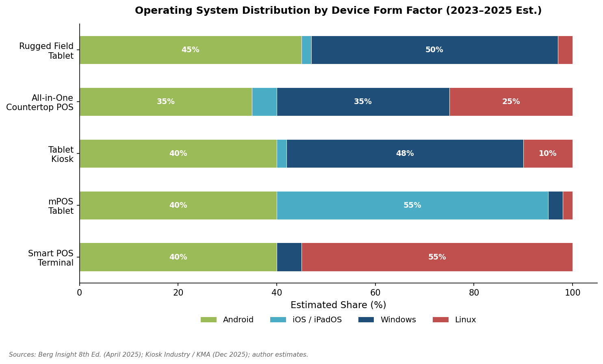

*Figure 1-1. Estimated operating-system share across the five device categories, anchored on Berg Insight shipment data for Android smart POS (~40%) and Kiosk Industry/KMA figures for kiosk OS split, with directional estimates for remaining categories. Sources: [Berg Insight via BusinessWire](https://www.businesswire.com/news/home/20250428903740/en/Connected-POS-Terminals-Market-Report-2025-Installed-Base-of-Cellular-POS-Terminals-to-Reach-229-Million-in-2028-mPOS-Terminals-Worldwide-to-Reach-152-Million-Units-by-2028---ResearchAndMarkets.com "Berg Insight 8th Edition, April 2025"); [Kiosk Industry/KMA](https://kioskindustry.org/which-os-for-my-kiosk-is-best/ "Which OS For My Kiosk Is Best?, December 2025").*

### Android's Ascendancy in Smart POS

Android-based smart POS terminals accounted for approximately 40% of global POS terminal shipments in 2023, up sharply from 27% in 2022 [Berg Insight via BusinessWire](https://www.businesswire.com/news/home/20250428903740/en/Connected-POS-Terminals-Market-Report-2025-Installed-Base-of-Cellular-POS-Terminals-to-Reach-229-Million-in-2028-mPOS-Terminals-Worldwide-to-Reach-152-Million-Units-by-2028---ResearchAndMarkets.com "Berg Insight 8th Edition Connected POS Terminals Report, April 2025"). The leading Android smart POS manufacturers, ranked by shipment volume, are Sunmi, Tianyu, PAX Technology, Verifone, Castles Technology, Ingenico, Landi, and Newland [Berg Insight via BusinessWire](https://www.businesswire.com/news/home/20250428903740/en/Connected-POS-Terminals-Market-Report-2025-Installed-Base-of-Cellular-POS-Terminals-to-Reach-229-Million-in-2028-mPOS-Terminals-Worldwide-to-Reach-152-Million-Units-by-2028---ResearchAndMarkets.com "Berg Insight 8th Edition, April 2025"). The majority of Android smart POS devices ship with AOSP (Android Open Source Project) builds customized by the OEM rather than GMS (Google Mobile Services)–certified builds — a reflection of the payment industry's preference for controlled, locked-down firmware over consumer-oriented Google Play integration.

### The iOS/iPadOS Stronghold in mPOS

The mPOS tablet segment remains bifurcated between two distinct ecosystems. The **iOS/iPadOS camp** is anchored by Square (Block), Lightspeed, and Shopify POS, all of which have designed their flagship merchant experiences around the iPad. Apple's tight hardware-software integration, reliable peripheral connectivity via MFi certification, and the consumer-recognizable iPad form factor make it the default choice for many North American and European SMB merchants. The **Android camp** is led by Toast, which ships proprietary Android tablets, and by a growing cohort of ISVs in Asia and Latin America that deploy Samsung Galaxy Tab A-series or Chinese OEM Android tablets as cost-effective alternatives.

### Windows and the Kiosk / All-in-One Legacy

In the tablet kiosk segment, Windows retains a substantial installed-base advantage: an estimated 45–55% of deployed kiosks worldwide run Windows (predominantly Windows 10 IoT Enterprise), reflecting decades of enterprise deployment and deep integration with x86 kiosk-management software [Kiosk Industry/KMA](https://kioskindustry.org/which-os-for-my-kiosk-is-best/ "Which OS For My Kiosk Is Best?, December 2025"). New kiosk shipments, however, tell a different story: Android now accounts for an estimated 35–45% of new deployments, driven by lower hardware costs (ARM-based SoCs versus x86), faster boot times, and an expanding ecosystem of Android kiosk-management platforms (KioWare for Android, Scalefusion, Hexnode).

The all-in-one countertop POS category exhibits a three-way split among Android, Windows, and Linux, with relative shares varying by vertical and geography. Linux maintains a foothold in large-enterprise retail deployments (NCR Voyix, Toshiba Global Commerce Solutions) where long-term OS-support stability and licensing-cost avoidance are paramount.

### Rugged Field Tablets: Android–Windows Coexistence

The rugged field tablet segment is the most evenly split between Android and Windows. Android rugged tablets (Zebra ET60/ET65, Samsung Galaxy Tab Active series) dominate in delivery, field-service, and warehouse applications where lightweight mobility and application simplicity are valued. Windows rugged tablets (Panasonic TOUGHBOOK, Getac, DT Research) retain strongholds in government, defense, and utility sectors where legacy x86 application compatibility, Active Directory integration, and enterprise-management tooling remain non-negotiable requirements.

## 1.6 The PCI Certification Boundary

The taxonomy proposed in Section 1.2 is organized around form factor and use case, but the single most consequential dividing line in the payment-device landscape is **PCI PTS certification status**. PCI PTS–certified devices — Category 1 (Smart POS Terminal) and the payment modules embedded in Category 3 (Tablet Kiosk) enclosures — must pass rigorous physical and logical security evaluations: tamper-detection circuitry, secure key storage, firmware-signing verification, and encrypted PIN-block generation [PCI SSC PTS POI v6.1](https://listings.pcisecuritystandards.org/documents/PCI_PTS_POI_SRs_v6-1_Final.pdf "PCI PTS POI v6.1 physical/logical security requirements"). These requirements add an estimated USD 15–40 per unit to the hardware bill of materials and impose 6–18-month certification timelines that constrain product-refresh cadences.

COTS devices (Categories 2, 4 in part, and 5) bypass hardware-level PCI certification entirely. When used for payment acceptance, they operate under the MPoC framework, which enforces security through software attestation, kernel-integrity monitoring, and secure-element or TEE (Trusted Execution Environment)–based key management. The practical consequence is that mPOS tablets and rugged field tablets can refresh hardware on consumer-electronics cadences (12–24 months), while PCI-certified smart POS terminals are typically refreshed on 3–5-year cycles dictated by certification expiry and ROI amortization.

SoftPOS (Tap-to-Phone) represents the furthest extension of the COTS model, enabling contactless payment acceptance using only a COTS device's built-in NFC radio with no external hardware. As of 2023, fewer than 10 million devices worldwide were running SoftPOS applications — a small fraction of the approximately 292-million-unit global POS terminal installed base, but a fast-growing category that increasingly blurs the line between "payment device" and "general-purpose mobile device" [Berg Insight via BusinessWire](https://www.businesswire.com/news/home/20250428903740/en/Connected-POS-Terminals-Market-Report-2025-Installed-Base-of-Cellular-POS-Terminals-to-Reach-229-Million-in-2028-mPOS-Terminals-Worldwide-to-Reach-152-Million-Units-by-2028---ResearchAndMarkets.com "Berg Insight 8th Edition, April 2025").

## 1.7 Market-Scale Context

To anchor the taxonomy in quantitative reality, a summary of the global device population is warranted.

**Shipments.** In 2024, global shipments of PCI-certified POS terminals totaled 128.1 million units [Nilson Report Issue 1296](https://nilsonreport.com/articles/pos-terminal-manufacturer-shipments-worldwide-2024/ "2024 Global POS Terminal Manufacturer Shipments"). An additional 36.9 million non-PCI-certified devices shipped in the same year, of which QR-code readers accounted for 63.4% and card-reader dongles for 24.5% [Nilson Report Issue 1297](https://nilsonreport.com/articles/pos-device-shipments-2024-part-2/ "2024 POS Device Shipments — Part 2"). Combined, the global market shipped approximately 165 million payment-acceptance devices in 2024.

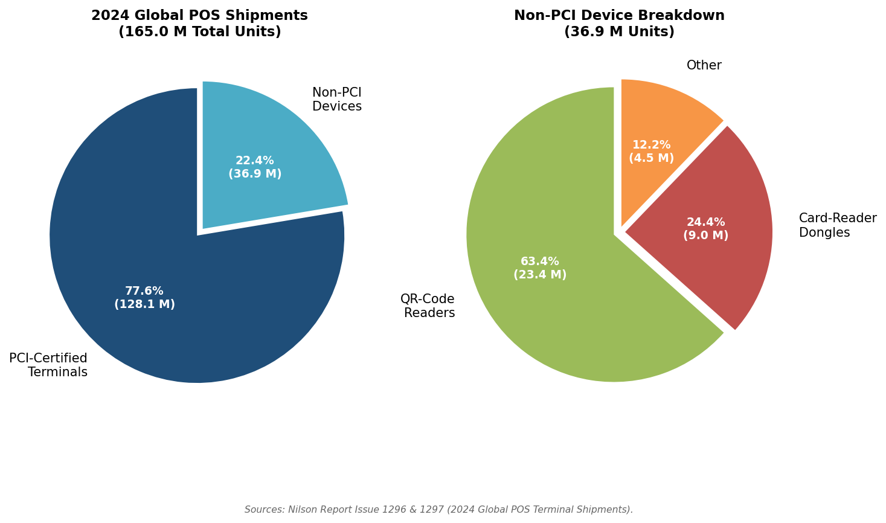

*Figure 1-2. Left: split between PCI-certified terminal shipments (128.1 M, 77.6%) and non-PCI device shipments (36.9 M, 22.4%) out of 165.0 M total units shipped globally in 2024. Right: breakdown of the non-PCI segment. Sources: [Nilson Report Issue 1296](https://nilsonreport.com/articles/pos-terminal-manufacturer-shipments-worldwide-2024/ "2024 Global POS Terminal Shipments"); [Nilson Report Issue 1297](https://nilsonreport.com/articles/pos-device-shipments-2024-part-2/ "2024 POS Device Shipments — Part 2").*

**Installed base and growth trajectory.** The global installed base of POS terminals stood at approximately 292 million units as of 2023. Within this total, cellular-connected POS terminals numbered 146.1 million units — representing 53% of all shipped devices with cellular connectivity — and are projected to grow at a 9.4% CAGR to reach 229.3 million units by 2028. The mPOS terminal installed base, encompassing Category 2 (mPOS Tablet) and lightweight dongle-plus-phone configurations, reached 110 million units in 2023 and is forecast to grow to 152 million by 2028 [Berg Insight via BusinessWire](https://www.businesswire.com/news/home/20250428903740/en/Connected-POS-Terminals-Market-Report-2025-Installed-Base-of-Cellular-POS-Terminals-to-Reach-229-Million-in-2028-mPOS-Terminals-Worldwide-to-Reach-152-Million-Units-by-2028---ResearchAndMarkets.com "Berg Insight 8th Edition, April 2025").

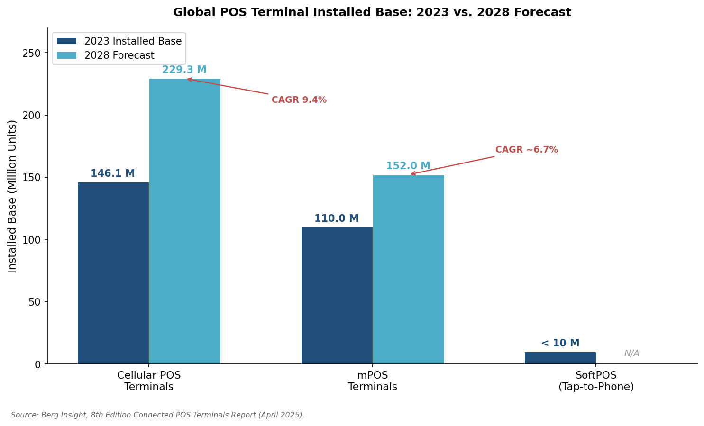

*Figure 1-3. Installed-base comparison for cellular POS terminals (146.1 M → 229.3 M, CAGR 9.4%), mPOS terminals (110 M → 152 M, CAGR ~6.7%), and SoftPOS devices (<10 M in 2023, 2028 forecast not available). Source: [Berg Insight via BusinessWire](https://www.businesswire.com/news/home/20250428903740/en/Connected-POS-Terminals-Market-Report-2025-Installed-Base-of-Cellular-POS-Terminals-to-Reach-229-Million-in-2028-mPOS-Terminals-Worldwide-to-Reach-152-Million-Units-by-2028---ResearchAndMarkets.com "Berg Insight 8th Edition Connected POS Terminals Report, April 2025").*

These figures confirm that the tablet-style device landscape is not a niche segment but a central pillar of global commerce infrastructure, with aggregate installed bases in the hundreds of millions and annual shipments exceeding 160 million units across PCI-certified and non-certified categories combined.

# 第2章 Major Manufacturers & Device Portfolio

The tablet-style payment and SaaS device market is served by a diverse set of hardware OEMs whose competitive positioning spans two fundamentally different models: vertically integrated payment-platform providers that bundle proprietary hardware with their own software and acquiring services (Clover/Fiserv, Square/Block, Toast), and pure-play terminal manufacturers that sell through acquirer and ISV channels on an open-market basis (PAX, Sunmi, Ingenico, Verifone, Newland). This chapter catalogs the major manufacturers, profiles their current-generation product lines against the five-category taxonomy established in Chapter 1, and compares flagship device specifications at BOM-relevant detail. Regional and niche OEMs — Castles Technology, Telpo, Elo Touch, BBPOS/Stripe, and NEWPOS — receive dedicated coverage reflecting their significance in specific geographies and verticals. The chapter closes with a review of new product launches and roadmap announcements within the April 2025 – October 2026 observation window.

## 2.1 Tier-1 Global OEMs

### PAX Technology

PAX Technology (Hong Kong/Shenzhen) operates one of the broadest product portfolios in the industry, spanning smart POS terminals, all-in-one countertop workstations, and unattended payment modules. In the 2024 Nilson Report ranking of global POS terminal manufacturer shipments, PAX remained among the top-tier manufacturers by volume [Nilson Report Issue 1296](https://nilsonreport.com/articles/pos-terminal-manufacturer-shipments-worldwide-2024/ "2024 global POS terminal manufacturer shipments"). Berg Insight's 8th Edition Connected POS Terminals Report (April 2025) ranks PAX as the third-largest Android SmartPOS manufacturer by shipment volume, behind Sunmi and Tianyu [Berg Insight via BusinessWire](https://www.businesswire.com/news/home/20250428903740/en/Connected-POS-Terminals-Market-Report-2025-Installed-Base-of-Cellular-POS-Terminals-to-Reach-229-Million-in-2028-mPOS-Terminals-Worldwide-to-Reach-152-Million-Units-by-2028---ResearchAndMarkets.com "Berg Insight 8th Edition, April 2025").

**Smart POS Terminal line (A-series).** PAX's flagship mobile smart POS family comprises three current-generation models, differentiated primarily by screen size, compute headroom, and connectivity tier:

- **A920** — 5.0″ HD touchscreen, Cortex-A53 quad-core processor, 2 GB RAM / 16 GB Flash, 5,250 mAh battery, integrated 58 mm thermal printer, EMV contact + NFC + MSR + 2D barcode scanner, Wi-Fi / Bluetooth / 4G LTE, PCI PTS 5.x certified [PAX Technology](https://www.pax.us/product/a920/ "PAX A920 product page").
- **A920 Pro** — Enhanced variant with 5.5″ HD display, faster processor, 3 GB RAM / 32 GB Flash, and an improved camera array; connectivity and certification suite unchanged from the base A920 [PAX Technology](https://www.pax.us/compare-a920-models/ "Compare A920 models").
- **A920MAX** — 6.5″ full touchscreen with water-notch design, 4 GB RAM / 64 GB Flash, rear 13 MP autofocus camera, laser barcode scanner, 5,250 mAh battery, Wi-Fi 5 / Bluetooth 5.0 / 4G LTE, PCI PTS 6.x certified. A 5G variant (A920MAX 5G) is available in select markets [PAX Technology](https://www.paxtechnology.com/a920max "PAX A920MAX global product page") [PAX Technology](https://www.pax.com.cn/AndroidSmartPOS/A920MAX5G/ "A920MAX 5G").

**All-in-One Countertop (Elys family).** The Elys ecosystem centers on the **Elys Workstation L1400**, a 14″ FHD (1920 × 1080) touchscreen countertop terminal running Android 11 on a Qualcomm octa-core 2.0 GHz processor with 4 GB LPDDR4X RAM and 64 GB storage. The chassis measures just 9.5 mm thick in aluminum alloy, and a 5 MP front-facing camera supports facial-recognition and age-verification workflows. The Workstation pairs with the **Elys Tablet A3700** (7″ HD, quad-core) as a customer-facing display and with PAX payment peripherals (A35 PIN pad, receipt printer base) to form a complete countertop station [PAX Technology](https://www.pax.us/elys-family/elys-workstation/ "Elys Workstation product page") [OrderPin](https://www.orderpin.co/hardware/pax-elys/ "PAX Elys specifications").

**Unattended modules.** The IM30 and SK700 series address the tablet kiosk and unattended vertical, designed to integrate into third-party kiosk enclosures for self-service ordering, ticketing, and parking payment.

### Sunmi

Sunmi (Shanghai) has emerged as the global volume leader in Android smart POS terminals. Berg Insight ranks Sunmi first among Android SmartPOS manufacturers by shipment volume [Berg Insight via BusinessWire](https://www.businesswire.com/news/home/20250428903740/en/Connected-POS-Terminals-Market-Report-2025-Installed-Base-of-Cellular-POS-Terminals-to-Reach-229-Million-in-2028-mPOS-Terminals-Worldwide-to-Reach-152-Million-Units-by-2028---ResearchAndMarkets.com "Berg Insight 8th Edition, April 2025"). At NRF 2025 (January 2025), Sunmi unveiled the SUPER Solution — a dual-OS platform (Android + Windows IoT) developed in partnership with Qualcomm Technologies — positioning the company to serve both payment-terminal and full-POS-workstation segments simultaneously [PR Newswire](https://www.prnewswire.com/news-releases/sunmi-shines-at-nrf-2025-with-innovative-commercial-pads-302354082.html "Sunmi at NRF 2025, January 2025").

**Smart POS Terminal line (P-series).**

- **P2 SE** — Entry-level 6.0″ handheld, Android 7.1, 2 GB RAM / 16 GB ROM, EMV + NFC + MSR, thermal printer, Wi-Fi / Bluetooth / optional 4G. Targeted at price-sensitive emerging markets [Sunmi](https://file.cdn.sunmi.com/newebsite/downloads/specs/en/p2-pro-en-new.pdf "P2 Pro datasheet").
- **P2 Pro** — Upgraded 6.0″ HD display, 2 GB RAM / 16 GB ROM, higher-resolution rear camera for barcode scanning, retaining the same form factor as the P2 SE [Sunmi](https://file.cdn.sunmi.com/newebsite/downloads/specs/en/p2-pro-en-new.pdf "P2 Pro datasheet").
- **P3** — Current-generation 6.75″ TFT display, Android 11 Go (Sunmi OS), quad-core A53 at 2.0 GHz, 2 GB RAM / 32 GB ROM, 2,500 mAh battery, EMV contact + NFC + MSR + QR, 58 mm thermal printer, Wi-Fi / Bluetooth / 4G [Sunmi TH](https://sunmith.com/en/products/sunmi-p3 "Sunmi P3 specifications").

**All-in-One Countertop (T-series).**

- **T3 Pro** — 15.6″ FHD (1920 × 1080) capacitive touchscreen, Qualcomm octa-core processor, 6 GB RAM / 128 GB storage, Android-based Sunmi OS, Wi-Fi / Ethernet / Bluetooth, NFC reader, optional 10.1″ customer-facing secondary display. Unit price approximately USD 1,357 (screen only) [Sunmi](https://www.sunmi.com/en/t3-pro-series "T3 Pro Series") [Touch Screens Inc.](https://www.touchwindow.com/c/SunmiT3Pro.html "Sunmi T3 Pro pricing").
- **T3 Pro Max** — Shares the T3 Pro's 15.6″ FHD display and compute platform but adds a built-in high-speed 80 mm Seiko thermal printer (250 mm/s) integrated into the base, delivering a single-unit countertop station without external printer peripherals [POS Hardware UK](https://www.pos-hardware.co.uk/blogs/product-comparisons/sunmi-pos-terminal-guide-uk-2026 "Sunmi POS terminal guide, 2026").

Sunmi also produces the **K2** series of self-service kiosk displays (15.6″–24″) for QSR ordering and retail self-checkout, placing the company across three of the five taxonomy categories established in Chapter 1: smart POS terminal, all-in-one countertop, and tablet kiosk.

### Ingenico

Ingenico (Suresnes, France), the longest-established pure-play payment terminal manufacturer, has undergone a product-line transformation centered on its AXIUM platform. In February 2026, the company unveiled the **next-generation AXIUM family** at Ingenico Paytech 2026, built on a unified architecture spanning mobile, countertop, multilane, self-service, PIN pad, and SoftPOS form factors. All next-generation AXIUM devices carry **PCI PTS v7** certification and run **Android 14** (field-upgradable to future Android versions), with AI-ready design, digital-identity support, and stablecoin acceptance capabilities [Ingenico](https://ingenico.com/us-en/newsroom/press-releases/ingenico-launches-next-generation-axium-payment-device-family-and-ingenico "Next-generation AXIUM launch, February 2026").

**Smart POS Terminal line (AXIUM DX-series, current generation).**

- **AXIUM DX8000** — 6.0″ HD capacitive multi-touch display, ARM Cortex-A53 quad-core processor, up to 3 GB RAM / 32 GB Flash (base configuration: 2 GB / 16 GB), Android 10, integrated thermal printer, EMV contact + NFC + MSR, front and rear cameras, Wi-Fi / Bluetooth / 4G LTE, PCI PTS 5.x certified. The DX8000 is Ingenico's primary handheld smart POS and competes directly with the PAX A920 series and Sunmi P3 [Ingenico](https://ingenico.com/us-en/products-services/payment-terminals/axium-android/axium-dx8000-series "AXIUM DX8000 Series") [Ingenico](https://ingenico.com/sites/default/files/resource-document/2022-07/AXIUM_DX8000_datasheet_JUL22.pdf "DX8000 datasheet, July 2022").
- **AXIUM DX4000** — Desktop countertop variant sharing the same AXIUM Android platform, designed for fixed-counter deployment with optional multilane integration [Qualcomm Device Finder](https://www.qualcomm.com/internet-of-things/device-finder/axium-dx8000 "Ingenico AXIUM DX4000 via Qualcomm").
- **Next-gen DX8 (flagship, 2026)** — The successor to the DX8000, announced at Paytech 2026, featuring Android 14, PCI PTS v7, a redesigned UX with secondary display, LED guidance, haptics, and audio cues [Ingenico](https://ingenico.com/us-en/newsroom/press-releases/ingenico-launches-next-generation-axium-payment-device-family-and-ingenico "Ingenico Paytech 2026 announcement").

Ingenico's global installed base spans "tens of millions of managed payment devices," according to company press materials, with the AXIUM platform deployed across Europe, the Americas, and APAC [Ingenico](https://ingenico.com/us-en/newsroom/press-releases/ingenico-launches-next-generation-axium-payment-device-family-and-ingenico "Ingenico 360 platform, February 2026").

### Verifone

Verifone (Coral Springs, Florida), historically the dominant terminal manufacturer in North America, has undergone ownership changes and strategic pivots in recent years. Its current Android smart POS portfolio is anchored by the T650-series, with the legacy V240m approaching end-of-lifecycle.

**Smart POS Terminal line.**

- **T650p** — 5.5″ color touchscreen portable terminal, Verifone Secure OS (VAOS, based on Android 8.1), ARM Cortex-A7 quad-core at 1.1 GHz, 2 GB RAM / 16 GB Flash, EMV + NFC + MSR, integrated thermal printer, Wi-Fi 2.4/5 GHz / Bluetooth / 4G LTE, 2,600 mAh Li-ion battery, PCI PTS 5.x certified [Verifone](https://www.verifone.com/en-us/hardware-product/verifone-t650m "Verifone T650m specifications") [Armour Payments](https://armourpayments.io/products/verifone-t650p "Verifone T650P specifications").
- **T650m** — Mobile variant of the T650, with specifications identical to the T650p but configured for mobile/roaming use with enhanced battery management [Verifone](https://www.verifone.com/en-us/hardware-product/verifone-t650m "Verifone T650m").
- **V240m** — Compact 3.5″ color touchscreen portable terminal, PCI PTS 5.0 certified, Wi-Fi / Bluetooth / 3G, designed as an economical PIN pad or standalone terminal for smaller merchants. Now approaching end-of-lifecycle as Verifone transitions to the T650 series [Verifone](https://www.verifone.com/hardware-product/verifone-v240m "Verifone V240m").

Verifone's Android migration has lagged its peers: the T650-series runs Android 8.1 (via VAOS), whereas competitors have moved to Android 10–14. This version gap limits Verifone's competitiveness in ISV-ecosystem richness — particularly for developers targeting API levels available only on Android 10 or later — compared to PAX, Sunmi, and Ingenico AXIUM devices.

### Newland Payment Technology

Newland Payment Technology (Fujian, China) achieved a notable milestone in 2024: according to Nilson Report Issue 1296, Newland was the **largest POS terminal manufacturer globally by shipment volume in 2024**, with its total including 3.5 million portable battery-powered terminals and 22,000 desktop Android terminals [Nilson Report Issue 1296](https://nilsonreport.com/articles/pos-terminal-manufacturer-shipments-worldwide-2024/ "2024 global POS terminal manufacturer shipments, November 2025"). This ranking reflects Newland's dominance in traditional (non-Android) terminal categories alongside its expanding Android SmartPOS portfolio.

**Smart POS Terminal line (N-series).**

- **N910** — 5.0″ TFT LCD (1280 × 720), Android 10, Cortex-A53 quad-core at 1.4 GHz, 1 GB RAM / 8 GB Flash (optional 2 GB / 16 GB), EMV contact + NFC + MSR, thermal printer, Wi-Fi (2.4 GHz & 5 GHz) / Bluetooth / 4G LTE, PCI PTS 5.x certified. The N910 occupies the entry-to-mid tier of the handheld smart POS market [Newland via Clearly Payments](https://www.clearlypayments.com/products/terminals/newland-n910/ "Newland N910 specifications") [Armour Payments](https://armourpayments.io/products/newland-n910 "Newland N910 specifications").
- **N950** — 5.99″ touchscreen, next-generation SoC with a higher-performance chipset, expanded RAM/storage configurations, full payment suite (chip + NFC + MSR + QR), Wi-Fi / 4G, PCI PTS 6.x certified. Positioned as Newland's flagship handheld smart POS [AllayPay](https://allaypay.com/wp-content/uploads/2025/05/newland-n950-product-details.pdf "Newland N950 product details") [Bluefin](https://www.bluefin.com/device/newland-n950/ "Newland N950 via Bluefin").

## 2.2 Vertically Integrated Platform OEMs

A distinct category of manufacturers builds tablet-style payment devices not as standalone hardware products but as tightly bundled components of proprietary SaaS platforms. These vendors — Clover (Fiserv), Square (Block), and Toast — design hardware primarily to serve as the physical touchpoint for their own software ecosystems. Their devices are rarely available through open-market channels; distribution occurs through the vendor's own acquiring relationships or subscription programs, creating a closed loop between hardware, software, and payment processing.

### Clover (Fiserv)

Clover, owned by Fiserv (the largest U.S. merchant acquirer), operates a closed-ecosystem model: Clover hardware runs exclusively Clover software, and Clover software runs exclusively on Clover hardware.

**Smart POS Terminal.**

- **Clover Flex (4th generation)** — 6.0″ touchscreen handheld, Qualcomm Snapdragon 660 octa-core processor (1.8 GHz × 4 + 2.2 GHz × 4), EMV + NFC + MSR, integrated thermal printer, camera with barcode scanning, 16.6 Wh (2,190 mAh) Li-ion battery, Wi-Fi / Bluetooth 5.0 / 4G LTE, PCI PTS certified. The Flex is Clover's most versatile device, deployable for tableside payment, line-busting, and delivery [Clover](https://nl.clover.com/en/flex/ "Clover Flex specifications").
- **Clover Mini** — Compact 8″ countertop device with EMV + NFC + MSR, receipt printer, and customer-facing PIN entry, positioned for small-footprint retail and quick-service counters.

**All-in-One Countertop.**

- **Clover Station Duo 2** — Dual-screen countertop system comprising a 14″ HD merchant-facing display and an 8″ customer-facing touchscreen, 2 GB RAM / 16 GB Flash, integrated receipt printer, Wi-Fi / Ethernet / 4G LTE / Bluetooth 5.0, EMV + NFC + MSR on the customer-facing terminal. The merchant screen serves as the POS interface; the customer screen handles order confirmation, tip entry, and contactless payment [Clover](https://www.clover.com/station-duo "Clover Station Duo") [Clover](https://docs.clover.com/dev/docs/clover-devices-tech-specs "Clover devices tech specs") [Merchant Industry](https://www.merchantindustry.com/wp-content/uploads/2023/12/Clover-Station-Duo-2-Specifications-012024.pdf "Station Duo 2 specifications, January 2024").

### Square (Block)

Square (Block, Inc.) takes a differentiated approach by designing hardware that maximizes compatibility with general-purpose COTS tablets — particularly iPad — while also offering purpose-built proprietary devices for merchants seeking an integrated countertop or handheld solution.

**Smart POS Terminal.**

- **Square Terminal** — 5.5″ display, integrated 57 mm receipt printer, EMV + NFC + MSR, Wi-Fi / Ethernet (via hub), battery-powered for portable use. Dimensions: 142.2 × 86.4 × 63.5 mm; weight: 417 g. The second-generation Terminal (launched 2025) delivers 40% faster processing than its predecessor [Square](https://squareup.com/us/en/hardware/terminal/specs "Square Terminal specifications") [Square](https://squareup.com/us/en/press/square-register-second-generation "Square Register 2nd generation press release, 2025").
- **Square Handheld** — A newer addition featuring a built-in barcode scanner and camera for inventory management alongside payment acceptance, targeting mobile retail and field operations [Square](https://squareup.com/us/en/hardware/handheld "Square Handheld").

**All-in-One Countertop.**

- **Square Register (2nd generation)** — Dual-screen countertop system with a merchant-facing display and a customer-facing payment screen, five USB ports for accessories (barcode scanner, receipt printer, cash drawer), Ethernet connectivity. The second generation features improved durability and faster processing [Square](https://squareup.com/us/en/hardware/register/specs "Square Register specifications") [Square](https://squareup.com/us/en/hardware/register "Square Register").

**mPOS Tablet ecosystem.** Square's original value proposition — and still its highest-volume channel — is the pairing of Square Reader hardware with an iPad or iPhone running Square POS software. The **Square Reader for contactless and chip** (~USD 49) and the **Square Reader for magstripe** (free with account) transform any COTS tablet into a functional mPOS terminal.

### Toast

Toast (Boston) is the dominant restaurant-vertical POS platform in the United States and — uniquely among SaaS POS companies — manufactures its own proprietary Android hardware rather than relying on COTS tablets or third-party terminals.

**All-in-One Countertop.**

- **Toast Flex 3** — 14″ hospitality-grade touchscreen, high-performance processor (up to 2× faster than its predecessor), adjustable articulating stand with built-in cable management, Wi-Fi / Ethernet connectivity. Terminal dimensions (with stand at highest position): 13.70″ × 9.74″ × 7.25″. Toast pairs the Flex 3 with a **Guest Display** (customer-facing screen) and a **Printing Hub** for receipt and kitchen-ticket output [Toast](https://pos.toasttab.com/hardware/toast-flex "Toast Flex hardware") [Toast](https://support.toasttab.com/article/Toast-Flex-3-Terminal-FAQ "Toast Flex 3 FAQ").
- **Toast Flex 3 Guest Display** — Customer-facing secondary screen, cross-compatible with multiple card readers via USB-A, micro USB, and USB-C connectors [Toast](https://support.toasttab.com/article/Toast-Flex-3-Hardware-Compatibility "Toast Flex 3 hardware compatibility").

**Smart POS Terminal.** Toast's handheld offering — the **Toast Go** — is a compact, ruggedized handheld for tableside ordering and payment in restaurant environments, integrating EMV + NFC payment acceptance with the Toast POS application.

Toast hardware is available exclusively through Toast's subscription plans and is not sold as standalone hardware on the open market, reinforcing the vertically integrated business model.

## 2.3 Regional & Niche OEMs

Several manufacturers occupy significant positions in specific geographies or device segments without commanding global Tier-1 volume. Their products frequently serve as the hardware backbone for regional payment networks and fintech-driven merchant acquisition.

### Castles Technology

Castles Technology (Taipei, Taiwan) specializes in Android-based smart POS terminals with a strong presence in the European acquiring market, particularly through partnerships with Adyen and other payment facilitators.

- **S1F2 (Saturn 1000F2)** — 5.5″ full touchscreen, Android 9/10, ARM A53 quad-core at 1.3 GHz + M3 secure processor, 2 GB RAM / 16 GB Flash, EMV contact + NFC + MSR, thermal printer, optional 4G LTE / Wi-Fi / Bluetooth, rear camera with barcode scanning, 6,000 mAh battery (one of the largest in its class), PCI PTS 6.x certified. Castles was the first manufacturer to achieve PCI PTS 6.x certification for a mobile payment device [Castles Technology](https://www.castlestech.com/products/s1f2/ "S1F2 product page") [Castles Technology](https://www.castlestech.com/castles-technology-first-to-achieve-latest-security-standard-for-mobile-payment-devices/ "PCI PTS 6.x first certification") [Adyen](https://www.adyen.com/devices/castles-s1f2 "Castles S1F2 via Adyen").

Berg Insight ranks Castles Technology fifth among global Android SmartPOS manufacturers by shipment volume [Berg Insight via BusinessWire](https://www.businesswire.com/news/home/20250428903740/en/Connected-POS-Terminals-Market-Report-2025-Installed-Base-of-Cellular-POS-Terminals-to-Reach-229-Million-in-2028-mPOS-Terminals-Worldwide-to-Reach-152-Million-Units-by-2028---ResearchAndMarkets.com "Berg Insight 8th Edition, April 2025").

### BBPOS / Stripe Terminal

BBPOS (Hong Kong), now fully integrated into Stripe's hardware division, manufactures the card readers and smart terminals distributed through Stripe Terminal. The product line spans a range of form factors from compact Bluetooth readers to full-featured countertop smart terminals:

- **WisePOS E** — 5.0″ IPS capacitive touchscreen countertop reader, Android-based, EMV + NFC + MSR, 318 g, Wi-Fi / Ethernet (via dock), designed as a smart reader for Stripe-integrated POS applications [Stripe](https://stripe.com/terminal/wisepose "BBPOS WisePOS E specifications").
- **WisePad 3** — Compact handheld Bluetooth card reader (2.4″ color LCD, 130 g, 69.7 × 121.7 × 17.7 mm), EMV + NFC + MSR, connects to mobile devices via Bluetooth LE or USB, designed for mobile and pop-up commerce [Stripe](https://stripe.com/terminal/wisepad3 "BBPOS WisePad 3 specifications").
- **Stripe Reader S700 / S710** — 5.5″ IPS LCD (1920 × 1080, Gorilla Glass, 580 nit), 318 g, EMV + NFC + MSR, battery life of approximately 140 hours standby / 8 hours active use, Wi-Fi / Bluetooth, PCI PTS certified. The S700/S710 represents Stripe's premium smart reader for countertop and handheld use, with customizable on-reader checkout experiences via Stripe Terminal APIs [Stripe](https://stripe.com/terminal/s700 "Stripe Reader S700") [Stripe](https://stripe.com/terminal/s710 "Stripe Reader S710").

### Telpo

Telpo (Guangzhou, China) is a white-label/ODM manufacturer whose devices are rebranded by acquirers and fintech companies across Africa, the Middle East, Southeast Asia, and Latin America.

- **TPS900** — 5.5″ IPS (1280 × 720), Android 10, Qualcomm chipset, 2 GB RAM / 16 GB ROM (configurable up to 4 GB / 64 GB), EMV + NFC + MSR + QR code + optional fingerprint/iris biometrics, 58 mm thermal printer, Wi-Fi / Bluetooth / 4G, PCI PTS 6.0 / EMVCo / Visa / Mastercard certified [Telpo](https://www.telpo.com.cn/eft-pos/tps900-eft-pos "Telpo TPS900 product page") [Telpo](https://www.telpo.com.cn/technical-specifications/eft-pos/Telpo-TPS900-Specifications.pdf "TPS900 specifications PDF").

Telpo's biometric integration (fingerprint and iris options) differentiates the TPS900 for government ID-linked payment programs and social-disbursement use cases prevalent in emerging markets.

### Elo Touch Solutions

Elo Touch (Milpitas, California) serves the all-in-one countertop and tablet kiosk segments with commercial-grade touch displays and integrated POS systems.

- **PayPoint Plus for Android** — 15.6″ Android-powered all-in-one POS with an integrated 2D Honeywell barcode scanner, 3″ Star receipt printer, full-size cash drawer, and customer-facing display. Designed for retail and hospitality countertop deployment [Elo Touch](https://www.elotouch.com/pos-terminals-paypoint-plus-for-android.html "PayPoint Plus for Android").
- **PayPoint Plus for Windows** — 15.6″ Intel Coffee Lake Core i5-8500T (9 MB cache) powered variant for Windows-based POS software ecosystems; now being superseded by the EloPOS Z30 with Intel [Elo Touch](https://docs.elotouch.com/Elo_PayPoint_Plus_Windows_DS.pdf "PayPoint Plus for Windows datasheet").
- **I-Series** — Interactive signage and kiosk platform (10″–22″) for self-service ordering and digital signage, deployable with Toast Kiosk, KioWare, and other kiosk-management software.

### NEWPOS

NEWPOS (Shenzhen, China) has risen rapidly in the global rankings. According to the Nilson Report (Issue 1296), NEWPOS shipped 7.346 million POS units globally in 2024, capturing a 5.73% market share — ranking 6th worldwide and 3rd in Asia-Pacific [NEWPOS](https://www.newpostech.com/news/440.html "NEWPOS Nilson Report ranking, 2024"). The company's product line spans traditional and Android smart POS terminals, with particular strength in emerging-market deployments across Africa, Southeast Asia, and the Middle East.

## 2.4 Flagship Device Specifications Comparison

The following table consolidates key hardware specifications for flagship handheld smart POS terminals — the highest-volume and most competitively contested form factor — across the major OEMs profiled in preceding sections.

| Specification | PAX A920MAX | Sunmi P3 | Ingenico DX8000 | Verifone T650p | Newland N950 | Castles S1F2 | Clover Flex 4 | Stripe S700 |
|---|---|---|---|---|---|---|---|---|
| **Display** | 6.5″ HD | 6.75″ TFT | 6.0″ HD | 5.5″ color | 5.99″ | 5.5″ | 6.0″ | 5.5″ FHD |
| **OS** | Android (AOSP) | Android 11 Go | Android 10 | VAOS (Android 8.1) | Android 10+ | Android 9/10 | Android (Clover OS) | Android |
| **Processor** | Quad-core A53 | Quad-core A53 2.0 GHz | Quad-core A53 | Quad-core A7 1.1 GHz | Next-gen SoC | Quad-core A53 1.3 GHz | Snapdragon 660 Octa | — |
| **RAM / Storage** | 4 GB / 64 GB | 2 GB / 32 GB | Up to 3 GB / 32 GB | 2 GB / 16 GB | Expanded | 2 GB / 16 GB | — / — | — |
| **Battery** | 5,250 mAh | 2,500 mAh | Long-life (spec N/A) | 2,600 mAh | — | 6,000 mAh | 2,190 mAh (16.6 Wh) | ~140 h standby |
| **Payment** | EMV+NFC+MSR+QR | EMV+NFC+MSR+QR | EMV+NFC+MSR | EMV+NFC+MSR | EMV+NFC+MSR+QR | EMV+NFC+MSR | EMV+NFC+MSR | EMV+NFC+MSR |
| **Printer** | 58 mm thermal | 58 mm thermal | Thermal | Thermal | Thermal | Thermal | Thermal | — |
| **Connectivity** | Wi-Fi 5/BT 5.0/4G | Wi-Fi/BT/4G | Wi-Fi/BT/4G | Wi-Fi/BT/4G | Wi-Fi/4G | Wi-Fi/BT/4G | Wi-Fi/BT 5.0/4G | Wi-Fi/BT |
| **PCI PTS** | v6.x | — | v5.x | v5.x | v6.x | v6.x | Certified | Certified |

*Note: "—" indicates specification not publicly disclosed by manufacturer. Sunmi P-series devices carry EMVCo and payment-scheme certifications but Sunmi does not always publish PCI PTS version numbers on its public product pages.*

The specification comparison reveals several competitive patterns. PAX's A920MAX leads in RAM/storage headroom (4 GB / 64 GB), which supports richer on-device SaaS applications and local data caching. Castles' S1F2 stands out for battery capacity (6,000 mAh), a critical differentiator for mobile and outdoor deployments where charging access is limited. The Clover Flex 4's Snapdragon 660 octa-core processor is the most powerful mobile SoC in this comparison class, reflecting Fiserv's investment in performance for its proprietary software stack. Verifone's T650-series, running Android 8.1, carries the oldest OS version in the group — a potential constraint for ISVs targeting API levels available only on Android 10 or later.

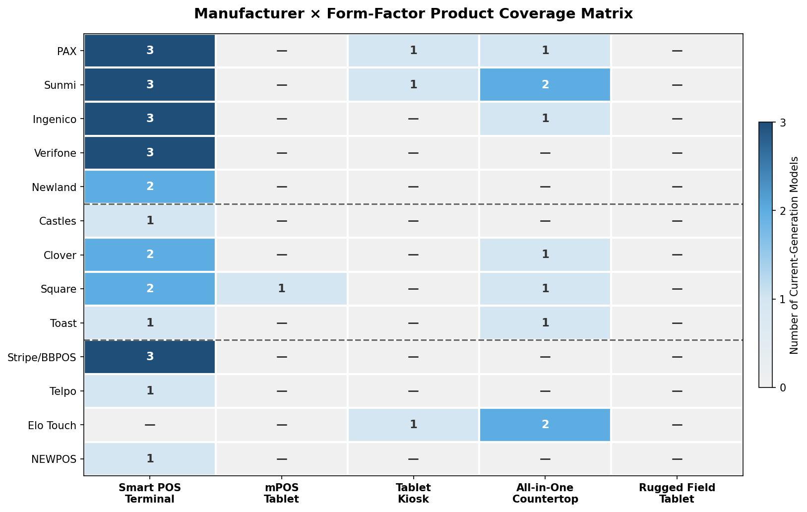

*Figure 2.1: Manufacturer × Form-Factor Product Coverage Matrix. The heatmap displays the number of current-generation models each manufacturer offers across the five taxonomy categories. PAX and Sunmi demonstrate the broadest cross-category coverage (3–4 categories each), while vertically integrated vendors (Clover, Square, Toast) concentrate on smart POS terminals and all-in-one countertop systems.*

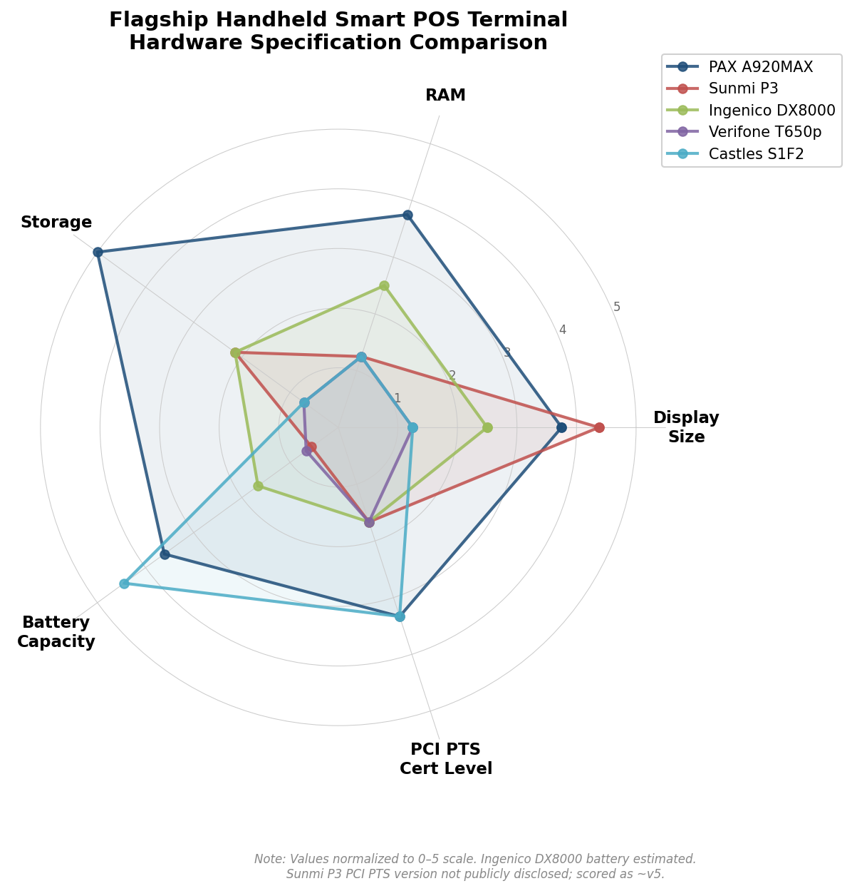

*Figure 2.2: Radar chart comparing normalized hardware specifications (RAM, display size, PCI PTS certification level, battery capacity, storage) across five flagship handheld smart POS terminals. Values are normalized to a 0–5 scale for cross-metric comparison; absolute values appear in the specification table above.*

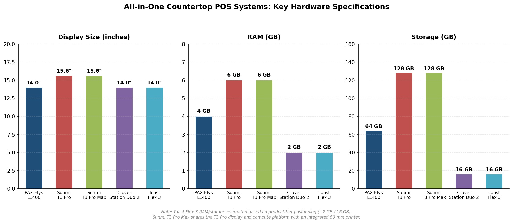

*Figure 2.3: Comparison of display size, RAM, and storage across current-generation all-in-one countertop POS systems (14″–15.6″ class). Sunmi T3 Pro leads in both RAM (6 GB) and storage (128 GB), while Clover Station Duo 2 and Toast Flex 3 cluster at approximately 2 GB RAM / 16 GB storage.*

## 2.5 New Launches & Roadmap Announcements (April 2025 – October 2026)

The observation window has produced several strategically significant product introductions that signal evolving competitive dynamics.

**Ingenico next-generation AXIUM family (February 2026).** The most consequential platform refresh in the period. Ingenico's move to a unified PCI PTS v7 / Android 14 architecture across all form factors — from handheld mobile to self-service kiosk — establishes a new security and OS baseline for the industry. The AI-ready design and support for stablecoin acceptance signal positioning for next-generation payment rails beyond traditional card schemes [Ingenico](https://ingenico.com/us-en/newsroom/press-releases/ingenico-launches-next-generation-axium-payment-device-family-and-ingenico "Ingenico Paytech 2026 announcement, February 2026").

**Sunmi SUPER Solution (NRF, January 2025).** Sunmi's dual-OS platform (Android + Windows IoT), developed with Qualcomm Technologies, targets the convergence of payment-terminal and full-POS-workstation segments. The initiative allows Sunmi to compete for enterprise retail accounts that require Windows-based POS software compatibility alongside Android flexibility [PR Newswire](https://www.prnewswire.com/news-releases/sunmi-shines-at-nrf-2025-with-innovative-commercial-pads-302354082.html "Sunmi at NRF 2025").

**PAX A920MAX 5G.** The 5G variant of PAX's flagship handheld extends the A920MAX platform to markets deploying 5G-first connectivity strategies. While 4G LTE remains sufficient for baseline transaction processing, 5G's lower latency and higher throughput support emerging on-device AI inference, video-streaming, and rich-media checkout experiences [PAX Technology](https://www.pax.com.cn/AndroidSmartPOS/A920MAX5G/ "A920MAX 5G").

**Square Register 2nd generation (2025).** Block's redesigned countertop system emphasizes durability and performance (40% faster processing), reflecting the migration of Square's customer base from micro-merchants toward mid-market businesses requiring higher transaction throughput [Square](https://squareup.com/us/en/press/square-register-second-generation "Square Register 2nd generation, 2025").

**Verifone Commander Fleet (October 2025).** A payment and site-management system for fuel and convenience retailers, supporting WEX and fleet card acceptance. While not a tablet-form-factor device per se, it illustrates Verifone's strategic shift toward vertical-specific integrated solutions rather than head-to-head competition in the general-purpose smart POS market [Coherent Market Insights](https://www.coherentmarketinsights.com/industry-reports/payment-devices-market "Payment devices market report, 2026").

**NEWPOS global expansion.** NEWPOS's ascent to 6th globally and 3rd in Asia-Pacific by 2024 shipment volume (7.346 million units, 5.73% market share) signals intensifying competition from Chinese OEMs beyond the established Sunmi–PAX–Newland triad [NEWPOS](https://www.newpostech.com/news/440.html "NEWPOS Nilson Report ranking, 2024").

# 第3章 Primary Use Cases & Deployment Scenarios

Tablet-style payment and SaaS devices derive their value not from product specifications alone, but from the specific operational contexts in which they are deployed. A PAX A920MAX in a fine-dining restaurant, a Sunmi K2 kiosk in a quick-service lobby, an iPad running Square POS at a pop-up market, and a Zebra ET65 in a utility technician's truck all belong to the same broad device ecosystem — yet they serve radically different workflows, face distinct environmental stresses, and impose divergent requirements on hardware design. This chapter maps each device category from the taxonomy established in Chapter 1 to its real-world deployment contexts, analyzes how the shift from acquirer-driven terminal placement to SaaS-first subscription models reshapes hardware requirements, identifies the emerging use cases driving the next wave of device adoption, and examines how physical deployment environments constrain hardware selection.

## 3.1 Vertical Market Mapping

Tablet-style payment and SaaS devices concentrate in six primary vertical markets, each imposing distinct demands on device form factor, software stack, peripheral integration, and environmental hardening. The global tablet POS systems market was valued at USD 5.16 billion in 2024 and is projected to reach USD 7.28 billion by 2030 at a CAGR of 5.90%, powered disproportionately by retail and food-service verticals; North America alone accounts for over 34% of total market revenue [ResearchAndMarkets](https://www.globenewswire.com/news-release/2025/08/25/3138302/28124/en/Tablet-POS-Systems-Market-Focused-Insights-Report-2025-2030-AI-Powered-Personalization-Cloud-Deployment-and-Restaurant-Efficiency-Fuel-Growth.html "Tablet POS Systems Market Focused Insights 2025–2030, August 2025").

### 3.1.1 Retail

Retail represents the largest end-user segment of the tablet POS systems market by revenue share [ResearchAndMarkets](https://www.globenewswire.com/news-release/2025/08/25/3138302/28124/en/Tablet-POS-Systems-Market-Focused-Insights-Report-2025-2030-AI-Powered-Personalization-Cloud-Deployment-and-Restaurant-Efficiency-Fuel-Growth.html "Tablet POS Systems Market 2025–2030"). The vertical spans a wide spectrum — from single-register boutiques to multi-lane grocery chains — and deploys all five device categories defined in Chapter 1, though the concentration varies by merchant scale.

**Small-to-medium retail** overwhelmingly favors the mPOS tablet model. An iPad or Android tablet paired with a Square Reader, Stripe S700, or SumUp card reader provides a low-capex entry point — hardware costs as low as USD 49 for a contactless/chip reader, combined with cloud-based POS software at USD 0–79 per month — delivering a functional checkout system within minutes of unboxing. Square's mPOS ecosystem processed approximately USD 210 billion in gross payment volume in 2025, underscoring the scale this model has achieved [CoinLaw](https://coinlaw.io/square-statistics/ "Square Statistics 2026"). Lightspeed and Shopify POS similarly target the iPad-based retail POS segment, differentiating through inventory management, omnichannel fulfillment, and analytics capabilities rather than payment acceptance alone.

**Mid-market and enterprise retail** increasingly deploys all-in-one countertop POS systems. Devices such as the Sunmi T3 Pro (15.6″ FHD, 6 GB RAM, 128 GB storage) and Clover Station Duo 2 (14″ + 8″ dual display) serve as the central command station of a checkout lane, integrating receipt printing, customer-facing displays for order confirmation and tip entry, and connectivity to cash drawers and barcode scanners. These devices pair with separate PCI-certified payment terminals — a PAX A35 PIN pad or Verifone T650, for instance — to handle card transactions while the countertop display manages the broader POS workflow.

**Self-checkout and retail kiosks** represent the fastest-growing hardware deployment category in the retail vertical. The global self-checkout system market was valued at USD 5.56 billion in 2025 and is projected to reach USD 16.39 billion by 2033 at a CAGR of 14.5% [Grand View Research](https://www.grandviewresearch.com/industry-analysis/self-checkout-systems-market "Self-Checkout Systems Market Size, 2033"). Grocery and convenience-store chains deploy tablet kiosk configurations — typically 15″–21″ Android or Windows displays in fixed enclosures with integrated barcode scanners, scales, cash-recycler modules, and PCI-certified payment terminals — to reduce labor costs per transaction while accommodating consumer preference for speed. The broader self-service kiosk market (spanning retail, hospitality, transportation, and government) reached USD 14.52 billion in 2025 [Research Nester](https://www.researchnester.com/reports/self-service-kiosk-market/2772 "Self-Service Kiosk Market Size 2025").

### 3.1.2 Restaurants & Food Service

Restaurants and food service constitute the second-largest — and arguably the most hardware-diverse — vertical for tablet-style devices. The restaurant POS software market alone was valued at USD 9.44 billion in 2024 and is projected to reach USD 17.88 billion by 2032 at a CAGR of 6.88% [Verified Market Research](https://www.verifiedmarketresearch.com/product/restaurant-pos-software-market/ "Restaurant POS Software Market Size"). The vertical cleaves into two sharply distinct deployment patterns: full-service (table-service) and limited-service (quick-service / fast-casual).

**Full-service restaurants** deploy a combination of all-in-one countertop POS stations and handheld smart POS terminals or mPOS tablets. The countertop station — a Toast Flex 3, Clover Station Duo, or Sunmi T3 Pro — anchors the host stand or service bar, managing order entry, kitchen display system (KDS) integration, reservations, and reporting. Handheld devices enable tableside ordering and pay-at-table workflows: the Toast Go, Clover Flex, or an iPad running Square POS allows servers to take orders and process payment without returning to a fixed terminal. According to the National Restaurant Association's 2024 Technology Landscape Report, 65% of full-service restaurant customers would use a computer tablet at the table to pay the check and 60% would use one to place an order, making tableside devices the most-desired technology option in sit-down dining [National Restaurant Association](https://go.restaurant.org/rs/078-ZLA-461/images/NatRestAssoc_TechLandscapeReport_2024.pdf "Restaurant Technology Landscape Report 2024"). First Watch, a 520-unit breakfast chain, reported that over 125,000 customers per week used its QR-code-based tableside payment system across 420 corporate-owned locations, yielding an estimated savings of 1,000 combined customer-and-employee hours per week [National Restaurant Association](https://go.restaurant.org/rs/078-ZLA-461/images/NatRestAssoc_TechLandscapeReport_2024.pdf "First Watch case study, Technology Landscape 2024").

Toast dominates the U.S. restaurant POS segment with approximately 134,000 locations as of year-end 2024, having added a record 28,000 net new locations during the year, and projects annualized recurring revenue (ARR) exceeding USD 1.6 billion [Kiosk Industry](https://kioskindustry.org/toast-pos/ "Toast POS — A Closer Look, 2025 Edition"). Toast's hardware strategy is fully vertically integrated: proprietary Android devices (Flex 3 countertop, Go handheld, Guest Display, Kiosk) are available exclusively through Toast subscription plans, forming a closed loop between hardware, software, and payment processing.

**Limited-service restaurants (QSR / fast-casual)** are the primary adopters of self-ordering kiosks. Global self-ordering kiosk installations surged 43% in the two years through June 2025, with explosive growth in Asia-Pacific markets including India, the Philippines, and South Korea [Datos Insights](https://datos-insights.com/wp-content/uploads/2025/12/Global-Self-Ordering-Kiosks-Brochure.pdf "Global Self-Ordering Kiosks, 2025"). Quick-service restaurants dominate the self-ordering kiosk segment with an estimated 45% share of total installations [LinkedIn / Self-ordering Kiosk Market](https://www.linkedin.com/pulse/self-ordering-kiosk-market-size-revenue-growth-adoption-2epjf/ "Self-ordering Kiosk Market Size 2026–2033"). The NRA survey found that 65% of limited-service customers would order using a self-service electronic kiosk and 63% would pay via one, making kiosks the third-most-desired technology option in QSR — behind smartphone apps and website pre-ordering [National Restaurant Association](https://go.restaurant.org/rs/078-ZLA-461/images/NatRestAssoc_TechLandscapeReport_2024.pdf "Restaurant Technology Landscape Report 2024").

The Philippines illustrates the pace of QSR kiosk deployment in emerging markets. The country's self-ordering kiosk installed base reached approximately 2,649 units as of June 2023 — a near-quadrupling from June 2021 — led by McDonald's (1,700 kiosks across 705 outlets) and Jollibee Foods Corporation. Datos Insights forecasts the Philippine installed base to approach 7,500 kiosks by 2028 [Datos Insights](https://datos-insights.com/wp-content/uploads/2025/12/Global-Self-Ordering-Kiosks-Brochure.pdf "Global Self-Ordering Kiosks — Philippines sample, 2025").

The 2025 Restaurant Technology Outlook survey (Nation's Restaurant News / Restaurant Business, January 2025, n = 562) confirms the breadth of technology investment across the restaurant vertical: 88% of operators planned to invest in technology in 2025, with top targets being digital marketing (46%), POS systems (40%), and digital-ordering channels (38%). Notably, 25% of operators planned to devote resources to self-ordering/self-payment systems (tablets or kiosks), with limited-service operators (30%) significantly outpacing full-service operators (20%) [NRN / Restaurant Business](https://greatmenusstarthere.com/uploads/files/05_25_Restaurant_Business_Digital_Technology_Report.pdf "2025 Restaurant Technology Outlook, March 2025").

### 3.1.3 Hospitality

Hotels, resorts, and entertainment venues deploy tablet-style devices across three primary touchpoints: front-desk check-in/check-out, in-room guest services, and on-property food-and-beverage operations.

**Front-desk operations** increasingly migrate from legacy Windows-based PMS (property management system) terminals to tablet-form-factor devices running cloud-based PMS platforms. All-in-one countertop POS systems — such as the Elo PayPoint Plus or Oracle MICROS workstations — serve the traditional attended front desk, while tablet kiosks enable self-service check-in/check-out in hotel lobbies, reducing front-desk staffing requirements during off-peak hours. Airport-hotel and budget-hotel chains have been early adopters of lobby kiosk deployment, paralleling the airline industry's migration from staffed check-in counters to self-service kiosk banks.

**On-property F&B** largely mirrors standalone restaurant deployment: hotel restaurants and bars use the same all-in-one countertop and handheld smart POS configurations as their freestanding counterparts, frequently running Toast, Oracle MICROS, or Lightspeed POS. Pool bars, room service, and banquet operations favor handheld smart POS terminals or mPOS tablets for their portability and cellular connectivity.

**Guest-facing tablets** — typically consumer-grade iPads or Android tablets deployed in-room — serve as concierge interfaces, room-service ordering platforms, and guest-feedback terminals. These devices sit in the mPOS tablet category by form factor but serve a SaaS-application role rather than a payment-acceptance role; payment is typically charged to the guest's room folio through the PMS rather than processed through an on-device card reader.

### 3.1.4 Healthcare

Healthcare represents a growing but still underserved vertical for tablet-style payment and SaaS devices. Deployment concentrates in three areas: patient registration and co-pay collection kiosks in outpatient clinic and hospital lobbies, pharmacy point-of-sale terminals, and mobile clinical-workflow tablets.

**Patient-registration kiosks** function as tablet kiosks with specialized software for insurance verification, co-pay collection, and consent-form signing. These typically combine a 15″–21″ touchscreen with an integrated EMV payment module, ID-card scanner, and receipt printer. The requirement to handle protected health information (PHI) under HIPAA in the United States — and analogous patient-data regulations globally — imposes additional software-layer security requirements beyond PCI DSS.

**Pharmacy POS** deploys all-in-one countertop systems that integrate with pharmacy-management software for prescription dispensing, insurance adjudication, and point-of-sale payment in a single workflow. These countertop devices must support age-verification for controlled substances and integrate with government prescription-monitoring databases.

**Mobile clinical tablets** typically fall into the rugged field tablet category: devices such as the Zebra ET60/ET65 or Panasonic TOUGHBOOK S1 are deployed by home-health nurses, paramedics, and field clinicians for patient-data entry, vitals recording, and — increasingly — co-pay or fee-for-service payment collection at the point of care. IP65+ ingress protection and disinfectant-compatible screen coatings are essential for infection-control compliance.

### 3.1.5 Field Service & Logistics

Field-service organizations — utilities, telecommunications, HVAC, pest control, plumbing, electrical contractors — and logistics companies represent the primary market for rugged field tablets. The deployment use case combines work-order management, asset inspection, customer-signature capture, and payment collection into a single device workflow.

A utility technician performing a meter installation, for example, may use a Panasonic TOUGHBOOK G2 to pull up the work order from a cloud-based field-service management (FSM) platform (ServiceTitan, Salesforce Field Service, ServiceMax), photograph the completed installation, capture the customer's signature, and process a co-pay or service fee via a Bluetooth-paired card reader or SoftPOS (Tap-to-Phone). Delivery drivers — from last-mile couriers to wholesale-distribution fleets — similarly rely on rugged tablets for proof-of-delivery confirmation and cash-on-delivery payment processing, particularly in markets where cash remains prevalent (Southeast Asia, South America, parts of the Middle East).

The convergence of FSM software and payment acceptance on a single rugged tablet is a relatively recent development, driven by the maturation of SoftPOS/MPoC standards that allow NFC contactless payment acceptance on the device's built-in antenna without requiring external card-reading hardware. This eliminates the need for field technicians to carry both a tablet and a separate payment terminal, reducing device proliferation and training complexity.

### 3.1.6 Transportation & Government

**Transportation** deploys tablet-style devices for fare collection (transit kiosks), parking payment (unattended kiosk terminals), in-vehicle ticketing (smart POS terminals on buses and trains), and ride-hailing driver settlement. PAX Technology's IM30 and SK700 unattended modules are widely integrated into transit and parking kiosk enclosures, processing contactless EMV and QR-code fare payments.

**Government** applications include citizen-services kiosks (license renewal, permit payment, tax payment), social-disbursement terminals (benefit distribution using biometric authentication), and field-inspection tablets. Telpo's TPS900, with its optional fingerprint and iris biometric modules, specifically targets government ID-linked payment and disbursement programs in emerging markets — a use case that combines payment processing with identity verification in a single device.

The matrix below summarizes the deployment density of each device form factor across the six primary verticals, providing a quick-reference view for hardware product managers evaluating which markets drive demand for which device categories.

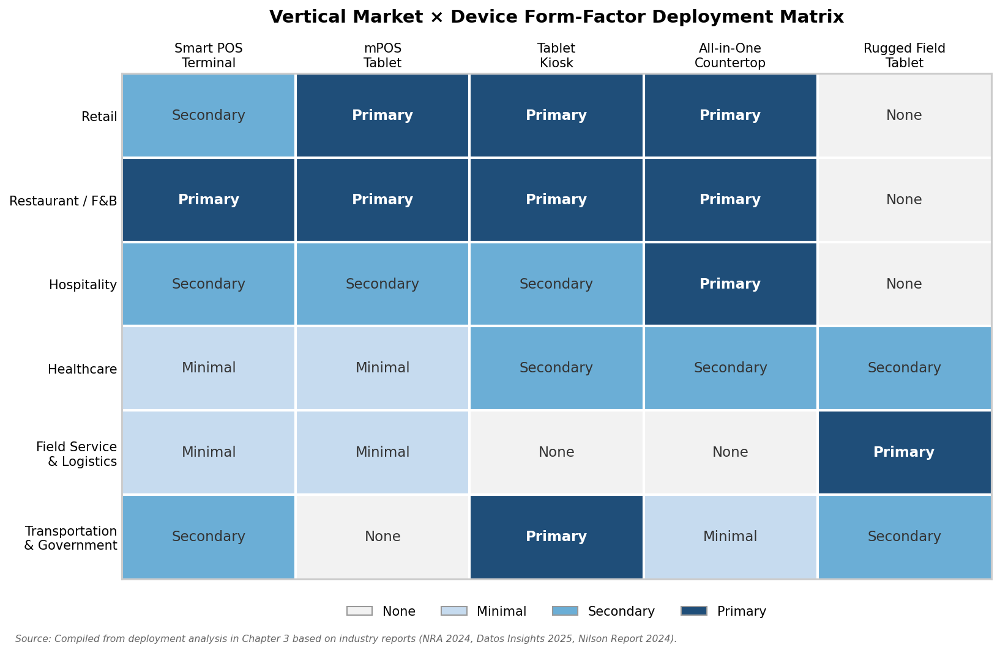

*Figure 3-1. Deployment density by vertical market and device form factor. "Primary" denotes the dominant form factor for the vertical; "Secondary" indicates meaningful but non-dominant deployment; "Minimal" reflects niche or early-stage use. Source: compiled from NRA 2024, Datos Insights 2025, and Nilson Report 2024.*

## 3.2 SaaS-First vs. Acquirer-Driven Deployment Models

The distribution and deployment of tablet-style payment devices follows two fundamentally different models, each imposing distinct requirements on hardware design, software architecture, and the commercial relationship among device manufacturer, software provider, and merchant.

### 3.2.1 The Acquirer-Driven Terminal Placement Model

In the traditional model — still dominant in terms of global POS terminal installed base — a payment processor or merchant acquirer selects, procures, and deploys terminals from pure-play OEMs (PAX, Ingenico, Verifone, Newland) into its merchant network. The acquirer typically owns the terminal and places it with the merchant under a lease, rental, or free-placement arrangement subsidized by transaction-processing revenue. Device lifecycle management — provisioning, firmware updates, key injection, compliance certification, and eventual decommissioning — rests with the acquirer.

This model favors **smart POS terminals** — the 5″–8″ PCI-certified handheld devices cataloged in Chapter 2 — because the acquirer's primary concern is payment acceptance rather than broader business-management software. The terminal runs the acquirer's payment application (or a thin ISV layer approved by the acquirer), and the merchant retains limited control over the software environment. Hardware selection is driven by PCI PTS certification status, payment-scheme approvals (Visa, Mastercard, local debit networks), and total cost of ownership for the acquirer's fleet — not by the merchant's SaaS preferences.

The acquirer-driven model produced the 128.1 million PCI-certified POS terminals shipped globally in 2024 [Nilson Report Issue 1296](https://nilsonreport.com/articles/pos-terminal-manufacturer-shipments-worldwide-2024/ "2024 global POS terminal manufacturer shipments"). It remains the default deployment model in most of the world outside North America and Western Europe, particularly in markets where acquiring banks maintain direct merchant relationships and where terminal subsidization is standard commercial practice.

### 3.2.2 The SaaS-First Subscription Model

The SaaS-first model inverts the traditional hierarchy: the software platform — not the payment acquirer — drives device selection and deployment. The merchant subscribes to a cloud-based POS platform (Toast, Square, Shopify, Lightspeed, Clover) and either purchases or leases hardware through the platform vendor's channel. Payment processing is embedded in the SaaS subscription as an integrated fintech service rather than maintained as a standalone acquiring relationship.

This model favors **mPOS tablets** and **all-in-one countertop POS systems** because the software platform's value proposition extends well beyond payment acceptance to encompass inventory management, employee scheduling, customer relationship management, marketing automation, analytics, and omnichannel fulfillment. A 14″ countertop display running Toast or a 10.2″ iPad running Shopify POS provides the screen real estate and compute headroom to support these workflows — capabilities that a 5.5″ smart POS terminal cannot deliver.

Toast's vertical integration exemplifies the SaaS-first approach at scale: 134,000 restaurant locations at year-end 2024, ARR exceeding USD 1.6 billion, gross payment volume exceeding USD 100 billion, and hardware available exclusively through Toast subscription plans [Kiosk Industry](https://kioskindustry.org/toast-pos/ "Toast POS, 2025 Edition"). Square's model is structurally similar but hardware-agnostic by design — the iPad + Square Reader remains the highest-volume configuration, alongside Square's proprietary Terminal and Register devices — processing approximately USD 210 billion in GPV in 2025 [CoinLaw](https://coinlaw.io/square-statistics/ "Square Statistics 2026"). Clover (Fiserv) occupies a hybrid position: Clover hardware is proprietary and runs exclusively Clover software, but distribution occurs through Fiserv's acquiring network rather than through direct merchant self-service, blending acquirer-driven channel control with SaaS-first product design.

### 3.2.3 Implications for Hardware Requirements

The two deployment models produce markedly different hardware requirement profiles, summarized in the comparison below.

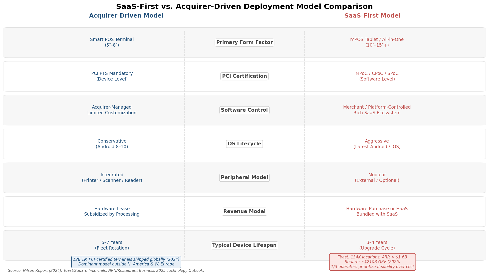

*Figure 3-2. Side-by-side comparison of the acquirer-driven and SaaS-first deployment models across seven key dimensions. Sources: Nilson Report (2024), Toast/Square financials, NRN/Restaurant Business 2025 Technology Outlook.*

| Dimension | Acquirer-Driven Model | SaaS-First Model |
|---|---|---|
| **Primary form factor** | Smart POS terminal (5″–8″) | mPOS tablet / all-in-one countertop (10″–15″+) |
| **PCI certification** | PCI PTS mandatory (device-level) | MPoC/CPoC/SPoC (software-level) or external certified reader |
| **Software control** | Acquirer-managed, limited merchant customization | Merchant/platform-controlled, rich SaaS ecosystem |
| **OS version lifecycle** | Conservative (Android 8–10 common, long certification cycles) | Aggressive (latest Android/iOS, frequent OTA updates) |
| **Peripheral model** | Integrated (printer, scanner, reader in device) | Modular (external reader, optional peripherals) |
| **Revenue model** | Hardware lease/subsidized by processing margin | Hardware purchase or HaaS bundled with SaaS subscription |
| **Typical device lifespan** | 5–7 years (acquirer fleet rotation) | 3–4 years (merchant upgrade cycle, SaaS feature requirements) |

The 2025 Restaurant Technology Outlook confirms that restaurant operators increasingly prioritize flexibility and integration capability over raw affordability when evaluating technology investments: more than one in three operators cited flexibility — defined as the ability to quickly add or change features and integrate with other vendors' tools — as the most important consideration when vetting front-of-house and back-of-house technology [NRN / Restaurant Business](https://greatmenusstarthere.com/uploads/files/05_25_Restaurant_Business_Digital_Technology_Report.pdf "2025 Restaurant Technology Outlook, March 2025"). This preference structurally advantages the SaaS-first model, in which hardware is selected to serve a broader software ecosystem rather than optimized solely for payment acceptance.

## 3.3 Emerging & High-Growth Use Cases

Beyond the established vertical-market deployments described in Section 3.1, several emerging use cases are driving incremental device adoption and reshaping hardware requirements. These represent the growth frontier for tablet-style payment and SaaS devices in the 2025–2027 window.

### 3.3.1 Self-Service Ordering Kiosks

Self-ordering kiosks in QSR and fast-casual restaurants constitute the single largest emerging deployment category for tablet-style devices. A customer approaches a freestanding or countertop tablet kiosk (typically 15″–32″ touchscreen), browses the menu, customizes an order, and pays via contactless EMV, chip-and-PIN, or QR code — all without interacting with a cashier. The kiosk transmits the order directly to the kitchen display system, eliminating transcription errors and freeing counter staff for food preparation and order fulfillment.

The economics are compelling. One operator profiled by the National Restaurant Association reported labor costs of 11%–15% for a QSR pizza concept using self-order kiosks — well below the 25%–35% labor-cost ratio typical for staffed counter-service operations — with order error rates below 1% [National Restaurant Association](https://go.restaurant.org/rs/078-ZLA-461/images/NatRestAssoc_TechLandscapeReport_2024.pdf "Dough Boy Pizza Co. case study, Technology Landscape 2024"). Multiple industry analyses indicate that self-service kiosks increase average order value by 15%–30% through consistent upselling prompts [Local Express](https://www.localexpress.io/post/in-store-kiosk-statistics "22 In-Store Kiosk Statistics 2025").

The deployment footprint is expanding rapidly beyond traditional QSR chains. Datos Insights tracks kiosk deployments across coffee shops, pizza outlets, and diverse food-service establishments — broadening the addressable market well beyond the McDonald's-and-Subway deployments that dominated early adoption [Datos Insights](https://datos-insights.com/wp-content/uploads/2025/12/Global-Self-Ordering-Kiosks-Brochure.pdf "Global Self-Ordering Kiosks, 2025"). Major brands continue aggressive rollout: Subway launched ambitious European kiosk deployments in 2024–2025, while in Asia-Pacific markets, KFC and Jollibee Foods expanded kiosk installations across hundreds of locations in the Philippines, South Korea, and India [Datos Insights](https://datos-insights.com/wp-content/uploads/2025/12/Global-Self-Ordering-Kiosks-Brochure.pdf "Global Self-Ordering Kiosks, 2025").

Hardware vendors serving this use case span the taxonomy: PAX (IM30 unattended payment module, SK700 kiosk enclosure), Sunmi (K2 kiosk display series), Elo Touch (I-Series interactive displays), and GRUBBRR (Samsung displays in custom enclosures with integrated payment modules) all offer purpose-built kiosk solutions.

### 3.3.2 Pay-at-Table / Tableside Payment

Pay-at-table — the practice of processing payment at the diner's table rather than at a fixed register — is the most consumer-desired technology innovation in full-service dining. The NRA's 2024 survey found that 65% of full-service customers would use a tablet at the table to pay the check, with adoption intent reaching 79% among millennials and 68% among Gen Xers [National Restaurant Association](https://go.restaurant.org/rs/078-ZLA-461/images/NatRestAssoc_TechLandscapeReport_2024.pdf "Restaurant Technology Landscape Report 2024").

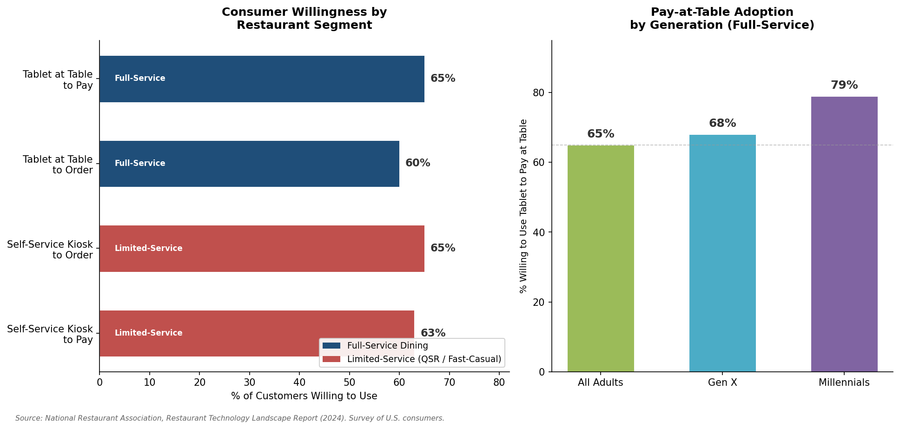

*Figure 3-3. Consumer willingness to use tablet-based payment and self-service kiosks by restaurant segment (left panel) and generational breakdown of pay-at-table intent in full-service dining (right panel). Source: National Restaurant Association, Restaurant Technology Landscape Report (2024).*

Pay-at-table deploys two distinct hardware configurations. **Server-carried handheld devices** — a Toast Go, Clover Flex, or PAX A920 — enable the server to bring the payment terminal to the table, process the transaction (contactless, chip-and-PIN, or swipe), and print or email a receipt on the spot. This model is the norm in Europe, Canada, Australia, and most of Asia, where pay-at-table has been standard practice for over a decade. **Table-fixed tablets or QR-code solutions** — an iPad mounted in a tabletop stand running a payment app, or a QR code printed on the check that the customer scans with a personal smartphone — enable independent customer-initiated payment. First Watch's deployment of QR-code-based tableside payment across 420 locations demonstrates the scalability of the smartphone-based variant, which requires zero incremental hardware beyond the existing POS infrastructure [National Restaurant Association](https://go.restaurant.org/rs/078-ZLA-461/images/NatRestAssoc_TechLandscapeReport_2024.pdf "First Watch case study, 2024").

The U.S. market has historically lagged in pay-at-table adoption — a legacy of the swipe-and-sign card culture and the absence of mandatory PIN entry — but post-pandemic acceleration of contactless payment, combined with labor shortages that make server round-trips to a fixed register operationally costly, is driving rapid convergence with international norms. Pay-at-table directly improves table-turn time (estimated at 5–8 minutes saved per table cycle) and enables digital tipping interfaces that consistently produce higher gratuity rates than manual calculation.

### 3.3.3 Curbside Pickup, Delivery, & Mobile Commerce

The pandemic-era surge in off-premises dining has permanently elevated the role of mobile and tablet-based ordering and fulfillment management. While the ordering-side workflow primarily runs on customer-owned smartphones, the **merchant fulfillment side** — managing incoming orders from multiple channels (DoorDash, Uber Eats, Grubhub, direct web/app orders), staging them for pickup, and notifying customers of order readiness — increasingly runs on dedicated tablet displays. These fulfillment-management tablets are typically mPOS tablets or all-in-one countertop displays running order-aggregation software (Otter, Cuboh, or native POS integrations) that consolidate multi-platform orders onto a single screen.

The 2025 Restaurant Technology Outlook found that third-party delivery platforms are the most widely adopted digital-ordering touchpoint among surveyed operators, deployed by more than half of respondents — a substantially larger penetration rate than branded mobile apps, self-operated delivery, or self-service kiosks [NRN / Restaurant Business](https://greatmenusstarthere.com/uploads/files/05_25_Restaurant_Business_Digital_Technology_Report.pdf "2025 Restaurant Technology Outlook, March 2025"). Managing these multi-channel orders requires additional screen real estate and dedicated hardware, driving demand for secondary tablets or displays beyond the primary POS terminal.

### 3.3.4 Unattended Vending & Micro-Markets

Unattended retail — smart vending machines, micro-markets in offices and hospitals, and automated retail kiosks — increasingly incorporates tablet-style payment modules. The Nilson Report documented 36.9 million non-PCI-certified POS devices shipped globally in 2024, of which 63.35% were QR-code readers targeted primarily at unattended and semi-attended environments [Nilson Report Issue 1297](https://nilsonreport.com/articles/pos-device-shipments-2024-part-2/ "POS Device Shipments 2024 — Part 2"). PAX's IM-series unattended payment modules (IM20, IM25, IM30) are designed specifically for integration into vending machines, micro-market cabinets, and automated retail enclosures, providing PCI-certified contactless and chip payment acceptance in a compact, embeddable form factor.

### 3.3.5 Age Verification & Digital Identity

Age-restricted product sales (alcohol, tobacco, cannabis, lottery) increasingly require automated identity verification at the point of sale, driving demand for devices equipped with front-facing cameras capable of ID scanning (driver's license barcode parsing, passport MRZ reading) and — in more advanced deployments — facial-recognition-based age estimation. PAX's Elys Workstation L1400 integrates a 5 MP front-facing camera explicitly designed for facial-recognition and age-verification workflows. As regulatory environments tighten around age-restricted sales (particularly cannabis in North American markets and alcohol in self-service environments), camera and biometric capabilities of tablet-style POS devices are becoming a hardware-selection differentiator rather than an ancillary feature.

### 3.3.6 Digital Tipping

The migration from cash tips to digital tipping — prompted by the decline in cash usage and the proliferation of tablet-based POS systems with customer-facing displays — has reshaped both device design and consumer behavior. All-in-one countertop systems with customer-facing secondary screens (Clover Station Duo's 8″ customer display, Toast Flex 3 Guest Display, Square Register's customer-facing screen) present tipping prompts with pre-set percentage options during the payment flow. This "tip screen" has expanded well beyond traditional tipping contexts — appearing in coffee shops, bakeries, fast-casual counters, and even retail checkout — generating both increased gratuity revenue for staff and occasional consumer backlash over perceived "guilt tipping." The hardware implication is clear: customer-facing secondary displays have shifted from an optional accessory to a near-mandatory component of countertop POS systems in the U.S. and Canadian markets.

## 3.4 Environment-Driven Hardware Requirements

The physical deployment environment — countertop, mobile/line-busting, outdoor, wall-mounted, or customer self-service — imposes a set of non-negotiable hardware constraints that cut across vertical markets and use cases. These constraints are essential considerations for hardware product managers evaluating device selection, custom-design decisions, or OEM partnerships.

### 3.4.1 Countertop / Fixed-Station

Countertop deployments (retail registers, restaurant host stands, hotel front desks) impose the fewest environmental constraints: devices operate indoors, on stable surfaces, connected to wired power. The dominant hardware requirements are **screen size** (10″–22″ for operator productivity), **peripheral connectivity** (USB/serial ports for cash drawers, receipt printers, barcode scanners, kitchen printers), and **dual-display capability** (merchant-facing + customer-facing screens). Battery capacity is irrelevant; ruggedization is minimal (spill resistance is desirable, but IP ratings beyond IP2x are unnecessary). Weight and portability are non-factors. This environment favors all-in-one countertop POS systems such as the Sunmi T3 Pro, Clover Station Duo, Toast Flex 3, and Elo PayPoint Plus.

### 3.4.2 Mobile / Line-Busting

Mobile deployments — tableside ordering, line-busting in retail queues, event-venue concession sales — demand **portability** (sub-500 g, one-hand operable), **battery endurance** (minimum 8-hour shift on a single charge), and **wireless connectivity** (Wi-Fi 5/6 and/or 4G LTE for cellular failover). Integrated thermal printers are highly valued for receipt generation without returning to a base station. This environment is the natural habitat of the smart POS terminal (PAX A920MAX at 5,250 mAh, Castles S1F2 at 6,000 mAh, Clover Flex at 2,190 mAh) and lightweight mPOS tablet configurations (iPad mini + Bluetooth reader).

Battery capacity serves as a competitive differentiator in this segment. The Castles S1F2's industry-leading 6,000 mAh battery enables continuous operation through a 12-hour restaurant shift, while the Clover Flex's 2,190 mAh battery requires mid-shift charging in high-volume tableside deployments — a meaningful operational constraint that affects device selection.

### 3.4.3 Outdoor / Harsh Environment

Outdoor deployments — food trucks, farmers markets, sporting events, construction-site commissaries, field-service operations — demand **ruggedization** (IP65+ dust/water ingress protection, MIL-STD-810G/H shock/drop/vibration/temperature resistance), **sunlight-readable displays** (500+ nit brightness, anti-glare coatings), and **extended-temperature operation** (typically −10 °C to +50 °C for commercial outdoor use; −20 °C to +60 °C for military-grade). Cellular connectivity (4G LTE, increasingly 5G) is essential where Wi-Fi infrastructure is unavailable.

This environment favors rugged field tablets such as the Zebra ET60/ET65 (IP65 + MIL-STD-810H), Samsung Galaxy Tab Active5 (IP68 + MIL-STD-810H), and Panasonic TOUGHBOOK G2 (IP65 + MIL-STD-810H). Consumer-grade mPOS tablets are functionally unsuitable: an iPad's operating-temperature range of 0 °C–35 °C and absence of ingress protection render it impractical for outdoor deployment beyond fair-weather pop-up commerce.

### 3.4.4 Wall-Mounted / Kiosk-Enclosed

Wall-mounted and kiosk-enclosed deployments — self-ordering kiosks, wayfinding stations, check-in terminals — impose **physical-security requirements** (anti-theft housings, tamper-evident enclosures, cable-lock mounts), **ADA compliance** (mounting height, screen angle, tactile feedback for visually impaired users in public-access deployments), and **persistent power** (power-over-Ethernet or wired AC; battery operation is impractical for always-on public-facing devices). Payment acceptance requires a PCI-certified module integrated into the kiosk enclosure — either a standalone unattended payment module (PAX IM30, Ingenico iUC Series) or a certified PIN pad mounted adjacent to the display.

The Kiosk Industry / KMA analysis of kiosk OS market share confirms that Windows retains a 45%–55% share of the global kiosk installed base, while Android accounts for 35%–45% of new kiosk shipments (2024–2025), driven by lower licensing costs, faster boot times, and growing ISV support for Android kiosk-mode applications [Kiosk Industry / KMA](https://kioskindustry.org/which-os-for-my-kiosk-is-best/ "Which OS For My Kiosk Is Best?, December 2025").

### 3.4.5 Customer Self-Service

Customer self-service deployments require hardware optimized for untrained, unsupervised users — a fundamentally different design challenge from operator-facing devices. Key requirements include **intuitive touchscreen UX** (large touch targets, minimal text input, prominent visual guidance), **durability against misuse** (Gorilla Glass or equivalent scratch/impact-resistant screens, sealed port covers), **accessibility** (multilingual interfaces, high-contrast display modes, screen-reader compatibility), and **rapid session reset** (automatic timeout and return to the home screen between transactions).

An increasingly critical requirement in this category is **real-time monitoring and remote management**. The 2025 Restaurant Technology Outlook identified device management as a growing concern: 36% of operators cited a lack of staff to manage and implement new technology as their top challenge — the single largest year-over-year increase among all challenges surveyed [NRN / Restaurant Business](https://greatmenusstarthere.com/uploads/files/05_25_Restaurant_Business_Digital_Technology_Report.pdf "2025 Restaurant Technology Outlook, March 2025"). For self-service devices deployed across multiple locations, mobile device management (MDM) platforms — Esper, SOTI, VMware Workspace ONE — are increasingly viewed as essential infrastructure, enabling remote firmware updates, application management, security-patch deployment, and real-time device-health monitoring without requiring on-site IT support at each location.

# 第4章 Regional Market Landscape — Penetration, Installed Base & Pricing

The global POS terminal installed base stood at approximately 292 million units in 2023, distributed unevenly across regions by divergent regulatory regimes, payment cultures, and economic structures [Berg Insight via BusinessWire](https://www.businesswire.com/news/home/20250428903740/en/Connected-POS-Terminals-Market-Report-2025-Installed-Base-of-Cellular-POS-Terminals-to-Reach-229-Million-in-2028-mPOS-Terminals-Worldwide-to-Reach-152-Million-Units-by-2028---ResearchAndMarkets.com "Berg Insight 8th Edition Connected POS Terminals Report, April 2025"). This chapter quantifies market size, installed base, growth trajectory, and typical device pricing across four target regions — North America, Japan & Korea, Southeast Asia, and South America (broadly inclusive of Latin America) — and identifies the regulatory and infrastructure factors that shape device adoption in each.

Where source data employs regional groupings that differ from this report's four-region framework, mapping assumptions are noted explicitly. All prices are stated in USD; local-currency equivalents appear in parentheses where relevant. The analysis distinguishes three pricing registers: hardware-only MSRP, channel acquisition price, and hardware-plus-SaaS bundle cost.

## 4.1 North America — Market Size, Installed Base, Pricing & Regulatory Context

### Market Size and Growth

North America is the world's largest POS terminal market by revenue. Grand View Research estimates the region generated USD 29.5 billion in POS terminal revenue in 2024 — approximately 26% of the global total — and projects growth at a 6.1% CAGR to reach USD 42.3 billion by 2030 [Grand View Research](https://www.grandviewresearch.com/horizon/outlook/point-of-sale-terminal-market/north-america "North America Point-of-Sale Terminal Market Size & Outlook, 2030"). Mordor Intelligence, employing a narrower hardware-unit scope, sizes the market at USD 9.78 billion in 2025 and forecasts a 9.29% CAGR to USD 15.86 billion by 2030 [Mordor Intelligence](https://www.mordorintelligence.com/industry-reports/north-america-pos-terminal-market "North America POS Terminal Market Size & Share Analysis"). The variance between these estimates reflects differing scope definitions: Grand View Research includes hardware, software, and services revenue, while Mordor Intelligence reports primarily on terminal unit value.

Cyclical dynamics further nuance the growth picture. An IHL Group study released in April 2025 observes that North American POS shipments recorded strong double-digit growth in 2023 as chip production and supply-chain constraints eased, but 2024 experienced a notable slowdown; IHL characterizes 2025 as "challenging but showing growth" [IHL Group via BusinessWire](https://www.businesswire.com/news/home/20250411961571/en/North-American-POS-Terminal-Market-Study-2025-2024-Saw-Significant-Struggles-2025-is-Looking-Challenging-but-Shows-Growth---ResearchAndMarkets.com "North American POS Terminal Market Study 2025, April 2025").

### Installed Base and Device Mix

Fixed POS systems — all-in-one countertop registers, multilane terminals, and kiosk configurations — accounted for 60.63% of North American POS terminal market revenue in 2024, anchored by grocery, mass-merchant, and fuel verticals that require high throughput [Mordor Intelligence](https://www.mordorintelligence.com/industry-reports/north-america-pos-terminal-market "North America POS Terminal Market — Fixed POS share 60.63%"). Mobile and portable POS terminals — encompassing smart POS terminals, mPOS tablets, and handheld devices — are expanding at a 9.39% CAGR, propelled by restaurant tableside settlement, pop-up retail, and curbside pickup [Mordor Intelligence](https://www.mordorintelligence.com/industry-reports/north-america-pos-terminal-market "North America POS Terminal Market — mobile POS CAGR 9.39%").

By payment modality, contact-based terminals still held 58.73% of the market in 2024, but contactless readers are growing at a 9.22% CAGR as tap-to-pay habits accelerate; contactless-enabled form factors are projected to exceed 70% of total shipments by decade-end [Mordor Intelligence](https://www.mordorintelligence.com/industry-reports/north-america-pos-terminal-market "North America POS Terminal Market — contactless CAGR 9.22%"). NFC-ready terminal shipments already reached a 99% attach rate in North America and Europe in 2023 [Berg Insight via BusinessWire](https://www.businesswire.com/news/home/20250428903740/en/Connected-POS-Terminals-Market-Report-2025-Installed-Base-of-Cellular-POS-Terminals-to-Reach-229-Million-in-2028-mPOS-Terminals-Worldwide-to-Reach-152-Million-Units-by-2028---ResearchAndMarkets.com "Berg Insight 8th Edition, April 2025").

At the country level, the United States anchors more than two-thirds of the regional market, with approximately 120,000 gas-station sites budgeting up to USD 20,000 per dispenser for EMV-compliant readers. Canada captures share through multi-currency capabilities driven by cross-border tourist inflows and Interac network requirements. Mexico presents the highest organic growth curve in the region, propelled by digital-wallet uptake and government tax reforms mandating electronic invoicing [Mordor Intelligence](https://www.mordorintelligence.com/industry-reports/north-america-pos-terminal-market "North America POS Terminal Market — country-level analysis").

### Typical Pricing

North American pricing reflects a mature, competitive market in which acquirer subsidies and SaaS bundling have compressed hardware-only price points:

| Device Category | Hardware-Only MSRP (USD) | Channel / Acquisition Price (USD) | HW + SaaS Bundle (USD/mo) |
|---|---|---|---|
| **Smart POS terminal** (PAX A920Pro, Sunmi V3, Verifone V240m) | 300–600 | 150–400 (acquirer-subsidized) | 30–80/mo (hardware lease + software) |
| **mPOS tablet** (iPad 10th gen + Square Reader) | 350–550 (tablet) + 49–59 (reader) | ~400 total (Square starter kit) | 0–69/mo (software; hardware purchased outright) |
| **Tablet kiosk** (Sunmi K2, Elo I-Series + enclosure) | 1,500–4,000 | 1,200–3,500 | 100–250/mo (HaaS + kiosk software) |
| **All-in-one countertop** (Clover Station Duo, Toast Terminal, Sunmi T3 Pro) | 1,200–2,000 | 800–1,600 | 70–165/mo (includes POS software) |
| **Rugged field tablet** (Zebra ET60, Samsung Tab Active5) | 1,200–3,000 | 900–2,500 | Rarely bundled; purchased outright |

Sources: PAX reseller pricing via MPI POS (PAX A920 at USD 570, PAX A35 at USD 450) [MPI POS](https://store.mpipos.com/collections/pax-terminals "PAX Terminals — MPI POS Store"); Sunmi T3 Pro at USD 1,574 [All Star Terminals](https://allstarterminals.com/collections/sunmi-countertop-terminals "Sunmi T3 PRO listing"); PAX A920Pro bundle at USD 369 [eMerchant Authority](https://shop.emerchantauthority.com/collections/pax-smartpos-point-of-sale-systems-terminals "PAX A920Pro listing"). Sunmi does not publish fixed retail prices; channel pricing varies by distributor, order volume, and configuration [Rosper Technology](https://blog.rospertech.com/sunmi-pos-terminal-pricing-guide-2026/ "SUNMI POS Terminal Pricing Guide 2026").

### Regulatory and Infrastructure Context

Several regulatory factors uniquely shape the North American device landscape:

- **EMV liability shift and fuel-dispenser deadline.** The U.S. EMV liability shift for fuel dispensers has been extended multiple times but continues to drive outdoor-rated smart POS terminal deployments at gas stations. Fuel-dispenser retrofits cost between USD 7,000 and USD 20,000 per pump, incentivizing station owners to adopt modular smart POS units [Mordor Intelligence](https://www.mordorintelligence.com/industry-reports/north-america-pos-terminal-market "North America POS Terminal Market — gas-station EMV driver").
- **PCI DSS v4.0 compliance.** Mandatory since March 2025, PCI DSS v4.0 requires enhanced tokenization, multi-factor authentication, and biometric-ready hardware that many legacy devices cannot support, triggering a refresh cycle for older terminals [Mordor Intelligence](https://www.mordorintelligence.com/industry-reports/north-america-pos-terminal-market "North America POS Terminal Market — PCI DSS v4.0 impact").
- **State-level digitalization grants.** Programs such as New York's USD 1 billion small-business technology fund reimburse technology costs, accelerating POS upgrades among small merchants in traditionally underserved rural counties [Mordor Intelligence](https://www.mordorintelligence.com/industry-reports/north-america-pos-terminal-market "North America POS Terminal Market — state incentives").
- **SoftPOS cannibalization risk.** SoftPOS (Tap-to-Phone) is beginning to erode the entry-level smart POS segment, though certification complexity and persistent merchant demand for printed receipts slow absolute cannibalization [Mordor Intelligence](https://www.mordorintelligence.com/industry-reports/north-america-pos-terminal-market "North America POS Terminal Market — SoftPOS restraint").

## 4.2 Japan & Korea — Market Size, Installed Base, Pricing & Regulatory Context

### Japan

**Market size.** Grand View Research estimates Japan's POS terminal market at USD 9,190.7 million in 2025, projecting growth to USD 17,668.4 million by 2033 at an 8.5% CAGR [Grand View Research](https://www.grandviewresearch.com/horizon/outlook/point-of-sale-terminal-market/japan "Japan Point-of-Sale Terminal Market Size & Outlook, 2033"). Mordor Intelligence sizes the market at 149,320 terminal units shipped in 2025 on a hardware-unit basis, growing at a 9.31% CAGR to 233,030 units by 2030 [Mordor Intelligence](https://www.mordorintelligence.com/industry-reports/japan-pos-terminals-market "Japan POS Terminals Market Size & Share Outlook to 2031"). IMARC Group places the market at USD 7.8 billion in 2025, forecasting USD 15.3 billion by 2034 at a 7.79% CAGR [IMARC Group](https://www.imarcgroup.com/japan-pos-terminals-market "Japan POS Terminals Market Size, Share, Forecast 2034"). As with North America, the spread across these estimates reflects differing scope definitions — hardware-only versus full-stack revenue.

**Cashless Vision mandate.** Japan's Cabinet Office has set a target of 40% cashless transaction ratio by 2025, with a long-term goal of 80%, channeling subsidies toward terminals capable of authenticating My Number (national ID) cards [Mordor Intelligence](https://www.mordorintelligence.com/industry-reports/japan-pos-terminals-market "Japan POS Terminals Market — Cashless Vision"). This policy initiative directly stimulates demand for smart POS terminals and mPOS tablets with NFC and QR-code acceptance capabilities.

**Device landscape.** Japan's market features a distinctive mix of domestic incumbents and global entrants. NEC Corporation, Sharp Electronics, Fujitsu, Casio, and Uniwell dominate the traditional fixed POS and electronic cash register (ECR) segments, reflecting decades of entrenched relationships with Japanese retailers and hospitality operators. International players — PAX Japan, Ingenico Japan, and Samsung — have made inroads particularly in smart POS and mobile POS segments. In February 2023, Ingenico introduced the Android-based AXIUM DX8000 to the Japanese market, equipped with EMV Chip & PIN, MSR, contactless, and QR-code scanner capabilities [Mordor Intelligence](https://www.mordorintelligence.com/industry-reports/japan-pos-terminals-market "Japan POS Terminals Market — Ingenico DX8000 launch").

**QR-code payments.** Japan has emerged as a significant QR-code payment market. PayPay — a joint venture between SoftBank and Yahoo Japan — reported that its total transaction count exceeded 7.46 billion in 2024, representing approximately 20% of all cashless transactions in the country [PayPay Corporation](https://about.paypay.ne.jp/en/pr/20250331/01/ "PayPay press release, March 2025"). QR-code payment apps ranked as the most-used digital payment services in Japan as of April 2025, surpassing traditional card payments in mobile contexts [Statista](https://www.statista.com/statistics/1307570/japan-most-used-cashless-payment-services/ "Most used cashless payment services in Japan 2025"). This dual-modality landscape (card + QR) compels terminal manufacturers to equip devices with both NFC contactless readers and camera-based QR scanners — a configuration now standard on Android smart POS devices but absent from legacy fixed ECRs.

**Pricing.** Japan's pricing structure sits at a premium relative to global averages, reflecting higher distribution costs, mandatory compliance certifications (including the Ministry of Economy, Trade and Industry [METI] technical standards), and the dominance of domestic OEMs with shorter supply chains but higher per-unit costs. Smart POS terminals typically retail at USD 400–800 (¥60,000–¥120,000) in the Japanese channel. All-in-one countertop systems from NEC, Fujitsu, and Sharp command USD 1,500–3,500 (¥225,000–¥525,000), with configurations often customized for specific vertical applications such as restaurant order-taking and convenience-store inventory integration.

### South Korea

**Market size.** South Korea's POS terminal market reached approximately USD 2.3 billion in 2025, with a forecast 8.27% CAGR to USD 4.6 billion by 2034 [IMARC Group](https://www.imarcgroup.com/south-korea-pos-terminals-market "South Korea POS Terminals Market Size and Outlook 2034"). Mordor Intelligence estimates the market at USD 3.63 billion in 2026, growing at a 6.88% CAGR to USD 5.07 billion by 2031 [Mordor Intelligence](https://www.mordorintelligence.com/industry-reports/south-korea-pos-terminal-market "South Korea POS Terminals Market — Share & Size"). The discrepancy between the two estimates again reflects scope: IMARC's figure covers hardware-centric value, while Mordor's encompasses a broader technology stack.

**Hyper-terminalized economy.** South Korea ranks among the world's most cashless and most heavily terminalized markets. The country had approximately 118 million credit cards in circulation in 2021, serving a population of roughly 52 million — more than two cards per capita [Mordor Intelligence](https://www.mordorintelligence.com/industry-reports/south-korea-pos-terminal-market "South Korea POS Terminals Market — credit card issuance"). Card payment values expanded 4.5% in 2024 to 1,255.2 trillion won (approximately USD 940 billion), with forecasts pointing toward USD 1.1 trillion by 2029 [The Asset](https://www.theasset.com/article/55404/south-korea-card-payments-forecast-to-hit-us11-trillion-by-2029 "South Korea card payments forecast, 2025").

**VAN infrastructure.** South Korea's payment ecosystem is uniquely structured around Value-Added Network (VAN) operators — intermediaries such as KIS Information & Communication, KICC, NICE Information, and KCP — who manage the routing of card transactions between merchants and card issuers. VAN companies historically bundled terminal provision with transaction-routing services, creating a deeply embedded distribution model [CardInfoLink](https://cardinfolink.com/en-US/newsroom/article/21 "Exploring South Korea's Payment System"). The majority of POS terminals in Korea are therefore deployed, owned, and maintained by VAN operators rather than purchased outright by merchants — a distribution model that sustains high terminal density but depresses hardware MSRP transparency.

**Pricing.** Due to VAN-subsidized distribution, the effective cost of smart POS terminals to merchants is frequently USD 0 upfront, with terminals provided as part of the VAN service contract. Where merchants procure independently, smart POS terminals range from USD 250–500, and all-in-one countertop systems from domestic manufacturers (Castles Technology Korea, KIS terminals) range from USD 800–1,800. Self-ordering kiosks — ubiquitous in Korean QSR chains — typically cost USD 2,000–5,000 per unit, with widespread deployment at convenience stores, cafes, and fast-food restaurants reflecting both high labor costs and consumer familiarity with self-service interfaces.

### Japan & Korea — Combined Regulatory Context

- **Japan — Fiscal receipt requirements.** Japanese tax law requires businesses to issue qualified invoices under the "Invoice System" (適格請求書保存方式), effective October 2023, necessitating POS terminals capable of generating and transmitting compliant tax documentation. This requirement favors integrated smart POS devices over mPOS tablet configurations that rely on separate printers.
- **Japan — My Number card authentication.** Government subsidies for terminals capable of reading My Number cards (national digital ID) create incremental demand for NFC-equipped devices beyond payment acceptance.
- **South Korea — VAN/PG regulatory reform.** Ongoing regulatory changes to VAN fee structures and the emergence of Payment Gateway (PG) companies are gradually altering the traditional VAN-dominated terminal distribution model, opening space for direct-to-merchant hardware sales by OEMs.
- **South Korea — Mandatory card acceptance.** Korean regulations require most commercial establishments to accept card payments, sustaining near-universal terminal penetration. Combined with one of the world's highest credit-card-to-population ratios, this regulatory mandate ensures consistently high terminal density.

## 4.3 Southeast Asia — Market Size, Installed Base, Pricing & Regulatory Context

### Market Size and Growth

Southeast Asia represents the fastest-growing POS terminal market among the four target regions. Mordor Intelligence estimates the market at USD 4.96 billion in 2025, projecting a 15.73% CAGR to reach USD 10.31 billion by 2030 [Mordor Intelligence](https://www.mordorintelligence.com/industry-reports/southeast-asia-pos-terminal-market "Southeast Asia POS Terminal Market — Size, Share & Industry Analysis"). This growth rate — roughly double North America's and triple Japan's — reflects the region's comparatively low base of digital payment infrastructure and rapid digitalization driven by both government policy and private-sector investment.

The hardware segment accounted for approximately 55% of the total market in 2024, while software and services are growing fastest at approximately 18% annually. Fixed POS terminals retained 67% market share in 2024, but mobile POS terminals are projected to expand at approximately 18% CAGR through 2029 [Mordor Intelligence](https://www.mordorintelligence.com/industry-reports/southeast-asia-pos-terminal-market "Southeast Asia POS Terminal Market — segment analysis").

### Installed Base and Country-Level Distribution

Indonesia commands approximately 31% of the Southeast Asian POS terminal market, consistent with its population of 270 million. Over 50% of Indonesians lack traditional bank accounts, presenting both a challenge and an opportunity for digital payment expansion; mobile penetration rates of approximately 60% have created a favorable environment for mPOS deployment, particularly among small and medium enterprises [Mordor Intelligence](https://www.mordorintelligence.com/industry-reports/southeast-asia-pos-terminal-market "Southeast Asia POS Terminal Market — Indonesia 31% share").

Singapore — despite its small population — is the fastest-growing POS terminal market in the region, projected to expand at approximately 18% annually from 2024 to 2029. The city-state's Smart Nation Vision, advanced fintech ecosystem, and near-universal smartphone penetration underpin rapid adoption of both contactless payment terminals and innovative mPOS configurations [Mordor Intelligence](https://www.mordorintelligence.com/industry-reports/southeast-asia-pos-terminal-market "Southeast Asia POS Terminal Market — Singapore fastest-growing").

Vietnam benefits from the government's ambitious cashless-economy goals and the dominance of micro-merchants (96% of Vietnamese enterprises), who constitute a massive addressable base for low-cost mPOS solutions. Malaysia leads its Southeast Asian peers in digital-wallet usage, with over 50% of consumers having adopted contactless payment methods [Mordor Intelligence](https://www.mordorintelligence.com/industry-reports/southeast-asia-pos-terminal-market "Southeast Asia POS Terminal Market — Vietnam and Malaysia analysis").

### The QR-Code Factor

Southeast Asia's payment landscape is fundamentally shaped by QR-code payment infrastructure in a manner that distinguishes it from every other target region. National QR standards — Indonesia's QRIS (Quick Response Code Indonesian Standard), Thailand's Thai QR (integrated with PromptPay), Singapore's SGQR (unified QR standard), and Vietnam's VietQR — have created interoperable, low-cost acceptance networks that reduce dependence on traditional card-based POS terminals [CardInfoLink](https://cardinfolink.com/en-US/newsroom/article/12 "Establishing the Southeast Asian QR Code Payment System").

The ASEAN Integrated QR Code Payment System, launched in 2023, enables cross-border QR payments across participating member states, further embedding QR-based acceptance as a regional standard. For hardware manufacturers, the entry-level payment acceptance device in Southeast Asia is consequently often not a PCI-certified smart POS terminal but a simple printed QR-code standee or a smartphone camera — reducing the hardware barrier to merchant acquisition to near zero. The implication for tablet-style devices is that their value proposition in the region must increasingly extend beyond payment acceptance into SaaS functionality (inventory management, order-taking, analytics) to justify the hardware investment relative to QR-only acceptance.

### Typical Pricing

Southeast Asia's pricing landscape reflects lower purchasing power and competitive pressure from QR-code-based alternatives:

| Device Category | Hardware-Only Price Range (USD) | Notes |
|---|---|---|
| **Smart POS terminal** (Sunmi P2/P3, PAX A920, Newland N910) | 150–400 | Chinese OEMs dominate; prices 30–40% below North American levels due to direct factory-to-distributor supply chains |
| **mPOS tablet** (Android tablet + reader) | 100–300 (tablet) + 20–50 (reader) | Samsung Galaxy Tab A-series and local Chinese-brand tablets widely used |
| **Tablet kiosk** (Sunmi K2 Mini, local assemblers) | 800–2,500 | Significant local assembly in Indonesia, Thailand; lower than global average |
| **All-in-one countertop** (Sunmi T2/T3, local brands) | 500–1,200 | Volume pricing for chains significantly below list |
| **Rugged field tablet** | 800–2,000 | Limited deployment; field-service use cases still emerging |

### Regulatory and Infrastructure Context

- **QRIS mandate (Indonesia).** Bank Indonesia mandates QRIS acceptance for an expanding set of merchant categories, driving adoption of QR-capable devices — including smart POS terminals with cameras as well as simple smartphone-based solutions.
- **Connectivity gaps.** Mobile broadband coverage remains patchy across island archipelagos (Indonesia, Philippines) and rural areas (Vietnam, Myanmar), necessitating offline-capable or SMS-fallback terminal configurations.
- **Fragmented certification landscape.** Unlike the unified PCI framework, Southeast Asian markets impose varying national certification requirements. Devices must often pass Bank of Thailand, Bank Indonesia, or Monetary Authority of Singapore approval in addition to — or in lieu of — PCI PTS certification.
- **Thailand's PromptPay subsidy.** The Thai government's subsidy for PromptPay-enabled terminals accelerated merchant adoption, reducing the effective cost of entry-level QR-and-card terminals below USD 100 for qualifying micro-merchants.

## 4.4 South America — Market Size, Installed Base, Pricing & Regulatory Context

### Market Size and Growth

The Latin American POS terminal market — which in this report's framing encompasses South America, Mexico, Central America, and the Caribbean — generated USD 9.42 billion in revenue in 2024, with a forecast 8.8% CAGR to reach USD 15.73 billion by 2030 [Grand View Research](https://www.grandviewresearch.com/horizon/outlook/point-of-sale-terminal-market/latin-america "Latin America Point-of-Sale Terminal Market Size & Outlook, 2030"). Fixed POS terminals accounted for 65.73% of market revenue in 2024, with mobile POS terminals constituting the fastest-growing segment; Brazil is expected to register the highest country-level CAGR through 2030 [Grand View Research](https://www.grandviewresearch.com/horizon/outlook/point-of-sale-terminal-market/latin-america "Latin America POS Terminal Market — fixed POS share 65.73%").

Mordor Intelligence estimates the Brazil-specific market at USD 6.84 billion in 2026, growing at a 6.02% CAGR to USD 9.16 billion by 2031 [Mordor Intelligence](https://www.mordorintelligence.com/industry-reports/brazil-pos-terminal-market "Brazil POS Terminal Market — Size, Share & Industry Analysis").

### Brazil: The World's Most Terminalized Market

Brazil stands as perhaps the most distinctive POS terminal market among the four target regions — and arguably globally. The country maintains more than one POS terminal for every ten residents, a per-capita terminalization rate that exceeds even mature card markets such as the United States and the United Kingdom [Flagship Advisory Partners](https://insights.flagshipadvisorypartners.com/brazil-defining-fintech-in-latam "Brazil: Defining Fintech in LatAm, November 2021"). Industry estimates place the total Brazilian POS terminal installed base at approximately 20 million units as of 2024 [Valor Internacional](https://valorinternational.globo.com/business/news/2024/10/17/are-pos-terminals-on-their-way-out.ghtml "Are POS terminals on their way out?, October 2024").

Nearly half of this installed base consists of mPOS devices — low-cost, battery-powered card readers paired with smartphones — designed for micro-merchants and rural environments where traditional countertop terminals are impractical [Flagship Advisory Partners](https://insights.flagshipadvisorypartners.com/brazil-defining-fintech-in-latam "Brazil: Defining Fintech in LatAm, November 2021"). The terminal installed base grew 42% from 2016 to 2020, compared with global growth of 15% over the same period [Flagship Advisory Partners](https://insights.flagshipadvisorypartners.com/brazil-defining-fintech-in-latam "Brazil POS terminal growth 42% vs. global 15%").

The competitive landscape is dominated by a mix of domestic acquirers and fintech disruptors. Cielo and Rede (traditional market leaders, backed by major banks) have steadily lost share to Stone and PagSeguro (fintech challengers who gained traction via inexpensive mPOS products targeting small merchants) [Flagship Advisory Partners](https://insights.flagshipadvisorypartners.com/brazil-defining-fintech-in-latam "Brazil acquiring market share — Cielo, Rede, Stone, PagSeguro"). On the hardware manufacturing side, major global manufacturers operating in Brazil include Verifone (with a factory in Sorocaba, São Paulo) and Ingenico, alongside Chinese entrants PAX, Sunmi, and Newland. Local manufacturers Gertec (which has shipped 8 million POS terminals since entering the market), Positivo, and Tectoy have carved out niche positions [Valor Internacional](https://valorinternational.globo.com/business/news/2024/10/17/are-pos-terminals-on-their-way-out.ghtml "Brazil POS terminal manufacturers").

### The Pix Effect

Brazil's instant payment system Pix, launched by the Central Bank of Brazil in November 2020, has fundamentally altered the payment acceptance landscape. Pix enables free real-time bank transfers via QR codes or digital keys, reducing merchants' dependence on card-based payment processing and associated interchange fees. Rather than displacing POS terminals, however, Pix has been integrated into them: modern smart POS devices in Brazil accept payments via dynamic QR codes (more secure than static variants) alongside traditional card acceptance (NFC, chip, and magnetic stripe) [Valor Internacional](https://valorinternational.globo.com/business/news/2024/10/17/are-pos-terminals-on-their-way-out.ghtml "Pix integration into POS terminals").

Gastão Mattos of consultancy GMattos observes that Tap-to-Phone may serve street vendors and micro-entrepreneurs but "does not threaten the dominance of POS terminals" for mainstream retail, characterizing it as "a very small niche, not even 5% of the total," and noting that "no other solution is as comprehensive" as purpose-built terminals [Valor Internacional](https://valorinternational.globo.com/business/news/2024/10/17/are-pos-terminals-on-their-way-out.ghtml "GMattos quote on POS terminal resilience").

### Mexico and Broader LATAM

Mexico's POS terminal market is the second largest in Latin America and exhibits the region's highest growth rate, driven by government tax reforms mandating electronic invoicing (Comprobante Fiscal Digital por Internet, CFDI) and expanding digital-wallet adoption. Cross-border tourism at airports such as Cancún and Los Cabos generates demand for multi-currency terminals. Connectivity gaps persist in rural states, necessitating satellite or 4G-fallback terminal configurations.

Other significant LATAM markets — Colombia, Argentina, Chile, and Peru — share common characteristics: rising card penetration, increasing regulatory pressure for electronic receipt issuance, and a competitive mix of global OEMs and regional fintech acquirers distributing subsidized terminals.

### Typical Pricing

Latin American pricing is characterized by intense acquirer competition and heavy subsidization of entry-level devices:

| Device Category | Hardware-Only Price Range (USD) | Notes |
|---|---|---|
| **Smart POS terminal** (PAX A920, Sunmi P2/V3, Gertec) | 200–450 | Acquirers (Stone, PagSeguro, Cielo) frequently subsidize to USD 0 upfront with transaction-fee lock-in |
| **mPOS card reader** (Stone Ton T3, PagSeguro Moderninha) | 20–80 | Entry-level mPOS readers priced as low as R$50–200 (USD 10–40) for micro-merchants |
| **Tablet kiosk** | 1,000–3,000 | Limited deployment; primarily in QSR chains and airport/hotel self-service |
| **All-in-one countertop** | 600–1,500 | Growing adoption in mid-market restaurants and retail chains |
| **Rugged field tablet** | 800–2,000 | Minimal deployment; field-service use cases nascent |

### Regulatory and Infrastructure Context

- **Pix mandate expansion.** The Central Bank of Brazil has progressively expanded Pix functionality (Pix Parcelado for installments, Pix Automático for recurring payments), making Pix-capable terminals a de facto requirement for merchants.
- **Fiscal module requirements.** Brazil requires Nota Fiscal de Consumidor Eletrônica (NFC-e) electronic receipt generation, mandating POS devices with printing and connectivity for real-time tax reporting. Some Brazilian states require fiscal receipt issuance at the point of sale — a capability inherent to smart POS terminals but cumbersome on mPOS tablet configurations.
- **CFDI (Mexico).** Mexico's mandatory electronic invoicing system requires real-time digital invoice generation and transmission, driving demand for smart POS terminals with integrated connectivity.
- **Connectivity challenges.** Rural and peri-urban areas in Brazil, Colombia, and Peru face intermittent mobile-network coverage, sustaining demand for terminals with offline transaction buffering and satellite or multi-band cellular fallback.
- **Installment-payment culture.** Brazilian consumers heavily favor installment payments (parcelamento) via credit card. POS terminals must support installment selection at the point of sale — a feature set deeply integrated into Brazilian acquirer firmware and typically absent from generic international terminal configurations.

## 4.5 Cross-Regional Comparison

The following analysis synthesizes the quantitative and qualitative findings from sections 4.1–4.4 into a comparative framework. Figure 4.1 presents the revenue-scale contrast across all five regional markets.

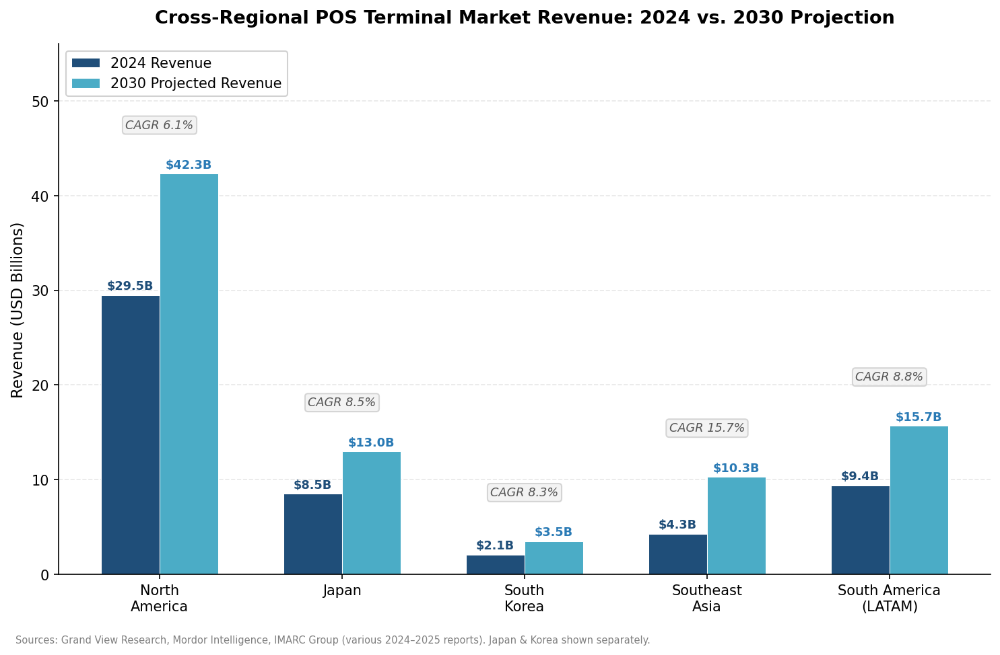

*Figure 4.1 — Grouped bar chart comparing 2024 estimated revenue and 2030 projected revenue (USD billions) for five regional markets, with CAGR annotations. Southeast Asia's 15.7% growth rate is the fastest among all regions. Sources: Grand View Research, Mordor Intelligence, IMARC Group (various 2024–2025 reports).*

The summary table below distills the core parameters across all four target regions:

| Parameter | North America | Japan & Korea | Southeast Asia | South America (LATAM) |
|---|---|---|---|---|
| **Market revenue (2024–2025, USD)** | ~29.5 B (2024) | Japan: ~7.8–9.2 B; Korea: ~2.3 B | ~4.2–5.0 B | ~9.4 B |
| **CAGR (2025–2030)** | 6.1–9.3% | Japan: 7.8–9.3%; Korea: 6.9–8.3% | 15.7% | 8.8% |
| **Dominant device category** | All-in-one countertop + smart POS | Fixed ECR + smart POS (Japan); smart POS + kiosk (Korea) | QR readers + smart POS + mPOS | mPOS + smart POS |
| **Estimated installed base** | Largest absolute base; >2/3 US share | Japan: mature, high-density; Korea: hyper-terminalized | Low-to-mid penetration; rapidly expanding | Brazil alone: ~20 M units; highest per-capita density globally |
| **Smart POS price range (USD)** | 300–600 MSRP; 150–400 subsidized | 400–800 (Japan); 250–500 (Korea) | 150–400 | 200–450; frequently USD 0 upfront |
| **Kiosk adoption** | Growing (QSR, healthcare) | High (Korea: QSR, convenience); moderate (Japan) | Low, emerging | Low, urban-QSR only |
| **QR-code payment weight** | Low (card-dominant) | Moderate (Japan: growing rapidly); Low-moderate (Korea: card-dominant) | High (national QR standards) | High (Pix QR ubiquitous in Brazil) |
| **Regulatory driver** | PCI DSS v4.0, EMV fuel, state grants | Cashless Vision subsidies, fiscal invoice, VAN regulation | National QR mandates, connectivity gaps | Pix expansion, fiscal receipt mandates, CFDI |
| **Distribution model** | Acquirer + ISV/VAR + direct | Domestic OEM + acquirer (Japan); VAN-subsidized (Korea) | Direct + regional distributor + fintech | Acquirer-subsidized (Brazil); mixed elsewhere |

Figure 4.2 visualizes the hardware-only pricing spectrum across device categories and regions, illustrating how Japan commands the highest premium while Southeast Asia offers the lowest price points.

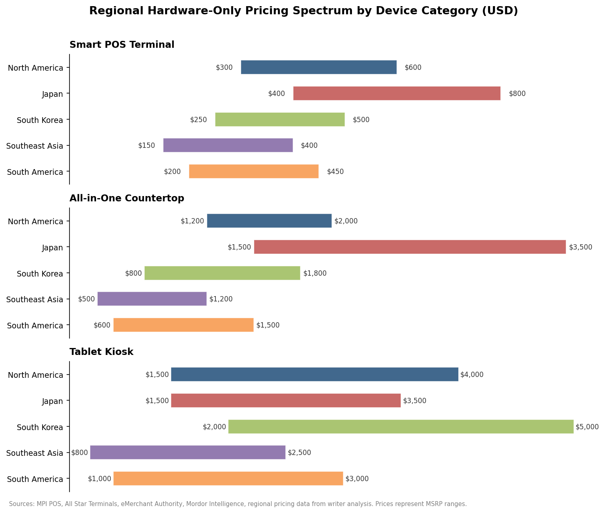

*Figure 4.2 — Horizontal range chart showing hardware-only MSRP price ranges (USD) for Smart POS Terminals, All-in-One Countertop systems, and Tablet Kiosks across five regional markets. Sources: MPI POS, All Star Terminals, eMerchant Authority, Mordor Intelligence, regional pricing data.*

Three structural insights emerge from this cross-regional comparison:

**Growth inversely correlates with maturity.** Southeast Asia's 15.7% CAGR dwarfs North America's 6.1%, reflecting the compounding effect of low installed base, rapid digitalization, and government-driven cashless mandates. South America occupies a middle position — high terminalization in Brazil coexists with significant growth potential in Mexico and secondary markets.

**QR-code infrastructure reshapes hardware economics.** In Southeast Asia and Brazil, the proliferation of national QR-code payment standards (QRIS, Pix) has compressed the entry-level hardware requirement for payment acceptance toward zero. This forces tablet-style device manufacturers to differentiate on SaaS functionality, merchant workflow automation, and value-added services rather than payment acceptance alone.

**Subsidization models determine pricing reality.** In all four regions, the MSRP of a smart POS terminal (USD 200–800) bears limited resemblance to the effective cost borne by merchants. Acquirer subsidies (North America, South America), VAN bundling (Korea), government programs (Japan, Thailand), and fintech-led terminal giveaways (Brazil) mean that the competitive battlefield is less about hardware price and more about total-cost-of-ownership models and transaction-fee structures.

Figure 4.3 summarizes the regulatory and infrastructure factors analyzed throughout sections 4.1–4.4, rating each factor's relative impact across the five regional markets.

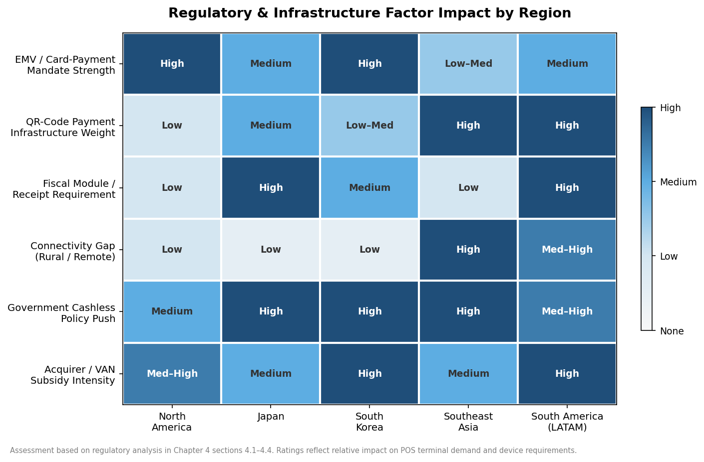

*Figure 4.3 — Heat-map matrix rating the relative impact (High / Medium / Low) of six regulatory and infrastructure factors across five regional markets. Southeast Asia and South America face the highest connectivity challenges, while Japan and South Korea lead in government cashless-policy intensity.*

# 第5章 Competitive Dynamics & Value-Chain Analysis

The tablet-style payment and SaaS device industry comprises a multi-layered value chain — spanning chipset vendors, ODMs/OEMs, software platforms, payment processors, acquirers, independent software vendors (ISVs), value-added resellers (VARs), and merchants — in which margin concentration, alliance structures, and business-model evolution determine competitive positioning far more than standalone product specifications. For a hardware product manager weighing build-versus-partner-versus-buy decisions, the critical questions are where profits accrue, which alliances create durable moats, and how the shift toward bundled-SaaS models reshapes the economics of device manufacturing. This chapter addresses those questions across four sections: the end-to-end value-chain map and margin distribution (Section 5.1), the ecosystem alliances that define competitive positioning (Section 5.2), the spectrum of hardware business models from outright purchase to bundled SaaS (Section 5.3), and the strategic transactions that have reshaped the landscape within the April 2025 – October 2026 observation window (Section 5.4).

## 5.1 Value-Chain Map & Margin Distribution

The payment-device value chain comprises six principal layers, each characterized by distinct margin profiles and competitive dynamics. The subsections below trace each layer from silicon through to the merchant end-user, concluding with an assessment of where margin concentrates and what that distribution implies for hardware-focused competitors.

### Layer 1: Silicon & Core Components

The foundation of every smart POS terminal, all-in-one countertop, and tablet kiosk is a system-on-chip (SoC) — overwhelmingly sourced from Qualcomm or, to a lesser extent, MediaTek and proprietary ARM-based designs. Qualcomm's Dragonwing IoT platform — particularly the QCS6490 (6 nm, octa-core, up to 16 GB RAM) and QCS4490 (optimized for industrial handhelds) — powers a significant share of current-generation Android smart POS terminals and commercial tablets [Qualcomm](https://www.qualcomm.com/internet-of-things/products/q6-series/qcs6490 "QCS6490 IoT platform specifications"). The QCS6125, specifically optimized for retail IoT, supports payment applications ranging from secure-rich POS devices to touchless and biometric-enabled terminals [Qualcomm](https://www.qualcomm.com/content/dam/qcomm-martech/dm-assets/documents/application-processors-selection-guide.pdf "Qualcomm Application Processors Selector Guide"). Sunmi's partnership with Qualcomm Technologies for its SUPER Solution dual-OS platform, announced at NRF 2025, illustrates how chipset selection shapes product architecture and competitive positioning at the device layer [PR Newswire](https://www.prnewswire.com/news-releases/sunmi-shines-at-nrf-2025-with-innovative-commercial-pads-302354082.html "Sunmi at NRF 2025, January 2025").

Beyond the SoC, critical BOM components include secure elements (NXP, Infineon), display panels (5″–15.6″ IPS/TFT from BOE, Innolux, AUO), thermal printer mechanisms (Seiko Instruments, APS/Axiohm, Xiamen PRT), NFC antennas, EMV contact-reader modules, and cellular modems. Secure-element suppliers — particularly NXP Semiconductors, whose SE050/SE051 and JCOP series dominate payment-terminal secure-element sockets — occupy a high-margin niche: secure elements are low-cost components (typically USD 1–3 per unit), yet their PCI certification requirements create substantial switching costs that protect incumbent suppliers.

**Margin profile.** Silicon vendors operate at gross margins of 50–65% (Qualcomm's QCT segment reported 56% gross margin in fiscal 2025), though their per-device revenue from a payment terminal remains modest — an SoC contributes roughly USD 8–25 to a terminal BOM. Secure-element margins are similarly high on a percentage basis but small in absolute dollar terms. The silicon layer thus captures a thin slice of terminal-level revenue while exerting disproportionate influence over device capability and certification timelines.

### Layer 2: ODM / OEM Manufacturing

OEM manufacturers — PAX Technology, Sunmi, Ingenico, Verifone, Newland, Castles Technology, Telpo, NEWPOS — design hardware, integrate BOM components, manage PCI PTS and EMVCo certification processes, and produce finished devices. A subset (notably Telpo and several Shenzhen-based factories) also operates as ODMs, manufacturing white-label terminals that acquirers, fintech companies, and regional brands rebrand under their own names.

In 2024, global PCI-certified POS terminal shipments totaled 128.1 million units, with an additional 36.9 million non-PCI-certified devices (QR readers, dongles, multilane PIN pads) [Nilson Report Issue 1296](https://nilsonreport.com/articles/pos-terminal-manufacturer-shipments-worldwide-2024/ "2024 global POS terminal manufacturer shipments") [Nilson Report Issue 1297](https://nilsonreport.com/articles/pos-device-shipments-2024-part-2/ "2024 POS device shipments — Part 2"). Newland Payment Technology led global POS terminal shipments in 2024, with volumes including 3.5 million portable battery-powered terminals and 22,000 desktop Android units [Nilson Report Issue 1296](https://nilsonreport.com/articles/pos-terminal-manufacturer-shipments-worldwide-2024/ "Newland #1 in 2024 shipments"). NEWPOS shipped 7.346 million units globally (5.73% market share), ranking sixth worldwide [NEWPOS](https://www.newpostech.com/news/440.html "NEWPOS Nilson Report ranking, 2024"). By Android SmartPOS shipment volume, the leading manufacturers were, in order: Sunmi, Tianyu, PAX Technology, Verifone, Castles Technology, Ingenico, Landi, and Newland [Berg Insight via BusinessWire](https://www.businesswire.com/news/home/20250428903740/en/Connected-POS-Terminals-Market-Report-2025-Installed-Base-of-Cellular-POS-Terminals-to-Reach-229-Million-in-2028-mPOS-Terminals-Worldwide-to-Reach-152-Million-Units-by-2028---ResearchAndMarkets.com "Berg Insight 8th Edition, April 2025").

**Margin profile.** Hardware OEM gross margins typically range from 30–45% for branded OEMs (PAX, Ingenico, Verifone) and 15–25% for ODM/white-label manufacturers. A smart POS terminal with an MSRP of USD 400–600 carries a hardware BOM cost of roughly USD 120–200; manufacturing-plus-certification costs bring total COGS to USD 200–350. The certification burden is a significant margin determinant: PCI PTS certification alone costs USD 200,000–500,000 per device family and requires 6–18 months, creating a barrier that insulates established OEMs from new entrants.

### Layer 3: Software Platforms & Operating Systems

The software layer encompasses the operating system (Android AOSP, Android GMS, Sunmi OS, Verifone VAOS, Linux, Windows IoT), the payment application (EMV kernel, NFC contactless kernel, QR-code processing), and the device-management and app-distribution platform. Sunmi's BIoT platform exemplifies this layer: its app ecosystem includes over 20,000 developers and more than 13,000 applications across 100+ industries, distributed through the Sunmi App Store — one of the largest commercial application platforms in the payment-terminal space [BusinessWire](https://www.businesswire.com/news/home/20260223939384/en/OPP-and-SUNMI-Partner-to-Democratise-Payment-Monetisation-for-SaaS-Platforms-Across-Europe "OPP and SUNMI partnership, February 2026"). Ingenico's newly launched Ingenico 360 unified cloud platform similarly targets the device-management and service-delivery layer across its global estate of tens of millions of managed payment devices [Ingenico](https://ingenico.com/us-en/newsroom/press-releases/ingenico-launches-next-generation-axium-payment-device-family-and-ingenico "Ingenico 360 platform, February 2026").

**Margin profile.** Software-platform and device-management services represent the highest-margin layer in the value chain. Recurring SaaS fees — typically USD 10–50 per device per month for device management, app distribution, and remote key injection — carry gross margins exceeding 70%. For vertically integrated players such as Toast and Clover, the software subscription is the primary economic engine; hardware functions as a delivery vehicle for software-layer revenue.

### Layer 4: Payment Processing & Acquiring

Payment processors and merchant acquirers — Fiserv, Worldpay/FIS, Global Payments/TSYS, Adyen, Stripe, Stone, PagSeguro — authorize and settle card transactions, earning interchange commissions and processing fees. This layer does not manufacture hardware but profoundly shapes hardware distribution through terminal-placement economics: acquirers routinely subsidize or fully fund hardware deployments, recovering costs through transaction-fee margins over the merchant contract term.

**Margin profile.** Payment processing operates on thin per-transaction margins (typically 0.05–0.30% of transaction value for large acquirers) but at enormous scale: Fiserv processed over USD 3.3 trillion in merchant payment volume in 2025 [Fiserv](https://investors.fiserv.com/news-releases/news-release-details/fiserv-reports-fourth-quarter-and-full-year-2025-results "Fiserv FY2025 results"), and Block's Square processed over USD 210 billion in gross payment volume during the same year [CoinLaw](https://coinlaw.io/square-statistics/ "Square Statistics 2026"). The acquiring layer captures the largest absolute profit pool in the value chain — dwarfing hardware OEM profits — yet hardware remains a cost center rather than a profit center for most acquirers.

### Layer 5: ISV / VAR Distribution

Independent software vendors (ISVs) and value-added resellers (VARs) serve as the go-to-market bridge between OEM hardware and merchant end-users. ISVs develop vertical-specific SaaS applications — restaurant management, retail inventory, salon booking, field-service dispatch — that run on OEM-manufactured terminals. VARs bundle hardware, software, and payment processing into turnkey merchant solutions. The Retail Solutions Providers Association (RSPA) ecosystem, encompassing hundreds of VARs across North America, represents a critical distribution channel for open-platform OEMs such as PAX, Sunmi, and Newland.

PAX's BroadPOS program with Payroc exemplifies the ISV-channel model: pre-certified integrations with major processing platforms (Fiserv, TSYS) enable ISVs to deploy PAX hardware without undergoing independent certification [PAX Technology](https://www.pax.us/about/press-room/pax-and-payroc-isv-growth-partnership/ "PAX and Payroc ISV growth partnership").

**Margin profile.** ISVs capture SaaS subscription revenue (USD 50–300 per merchant per month) at 60–80% gross margins. VARs operate on thinner margins (15–30% on hardware resale, plus residual income from payment-processing referral agreements). Notably, the ISV/VAR layer is where hardware-selection decisions are frequently made: a VAR's recommendation of PAX versus Sunmi versus Castles can determine which OEM captures a given deployment.

### Layer 6: Merchant

The merchant is the terminal end-user and ultimate cost bearer — whether through direct hardware purchase, leasing, SaaS subscription, or implicit transaction-fee subsidization. As documented in Chapter 4, effective merchant cost varies dramatically by region: from USD 0 upfront (acquirer-subsidized smart POS in Brazil or VAN-bundled terminals in South Korea) to USD 1,500–4,000 for self-procured all-in-one countertop and kiosk systems in North America and Japan.

### Margin Concentration

The value chain exhibits a characteristic "smile curve": margins are highest at the silicon layer (50–65% gross) and the software/SaaS layer (70%+), while the hardware-manufacturing middle (30–45% for branded OEMs, 15–25% for white-label) and the acquiring/processing layer (thin per-transaction margins on massive volume) occupy the curve's trough. For a hardware PM, this margin distribution carries a direct strategic implication: competing on hardware alone positions a company in the lowest-margin segment of the chain. The most profitable positions belong to players that span multiple layers — combining hardware with proprietary software (Toast, Clover) or hardware with device-management platforms (Sunmi BIoT, Ingenico 360).

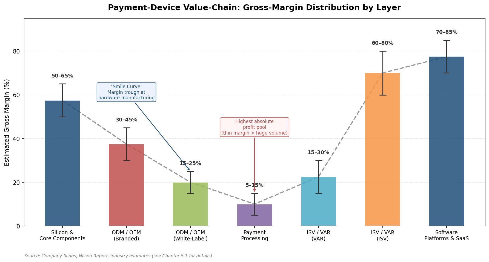

*Figure 5-1. Estimated gross-margin ranges across the six principal layers of the payment-device value chain. The dashed "smile curve" highlights that margins concentrate at the silicon and software endpoints, with hardware manufacturing and payment processing occupying the margin trough.*

## 5.2 Key Vendor Alliances & Ecosystem Plays

Competitive positioning in the tablet-style payment device market is increasingly defined not by standalone product capability but by the breadth and depth of ecosystem alliances. Three archetypal alliance models have emerged, each with distinct implications for OEM monetization, merchant lock-in, and addressable market size.

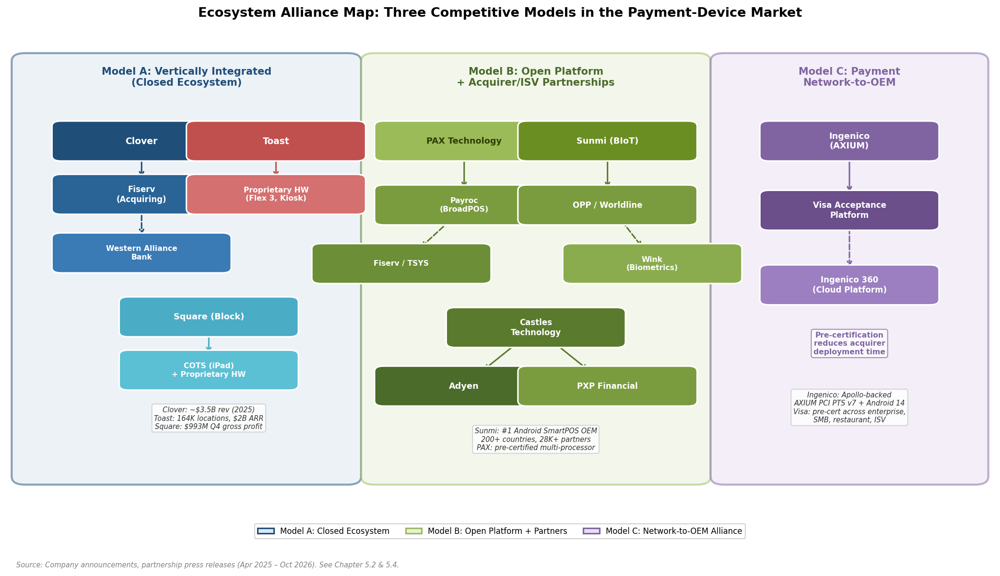

*Figure 5-2. Mapping of the three dominant alliance archetypes — vertically integrated closed ecosystems (Model A), open-platform OEM partnerships (Model B), and payment-network-to-OEM alliances (Model C) — with representative vendors, partnership linkages, and key financial metrics.*

### Model A: Vertically Integrated Platform (Closed Ecosystem)

**Clover (Fiserv).** Clover operates the most tightly closed ecosystem in the market: Clover hardware runs exclusively Clover software, and Clover software runs exclusively on Clover hardware. This vertical integration extends through payment processing (Fiserv acquiring) and distribution (Fiserv's merchant-services salesforce and bank-partnership channels). Clover revenue reached approximately USD 3.5 billion in 2025, growing 23% year-over-year, with gross payment volume approaching USD 329 billion annualized by Q4 2025 and value-added services penetration reaching 27% of the merchant base [Fiserv](https://investors.fiserv.com/static-files/2c7e8f1e-2c9e-461a-b793-cbf13069d465 "Fiserv Q4 2025 financial results"). Fiserv's February 2026 strategic alliance with Western Alliance Bank — described as the largest agent-bank deal in Fiserv history — further extends Clover's distribution into Western Alliance's commercial client base [Fiserv](https://investors.fiserv.com/news-releases/news-release-details/fiserv-and-western-alliance-bank-form-strategic-alliance-power "Fiserv–Western Alliance alliance").

**Toast.** Toast replicates the closed-ecosystem model within the restaurant vertical: proprietary Android hardware (Flex 3, Go, Guest Display, Kiosk), proprietary POS software, and integrated payment processing. Toast added a record 30,000 net locations in 2025 (including approximately 8,000 in Q4), ending the year at 164,000 total locations; ARR surpassed USD 2.0 billion, up 26% year-over-year [Toast](https://investors.toasttab.com/financials/quarterly-results/default.aspx "Toast Q4 and FY2025 results"). Hardware operates as a loss leader or break-even proposition: subscription and payment-processing revenue constitute the economic engine, with hardware serving as a customer-acquisition and retention mechanism.

**Square (Block).** Square occupies a hybrid position: it designs proprietary hardware (Terminal, Register, Handheld) but also supports mPOS configurations on third-party COTS tablets (iPad + Square Reader). Square's gross profit from the Square segment reached USD 993 million in Q4 2025, though hardware continues to operate at a loss; growth is driven by software subscriptions and integrated payment processing [Block](https://s29.q4cdn.com/628966176/files/doc_financials/2025/q4/Q4-2025-Shareholder-Letter_Block.pdf "Block Q4 2025 shareholder letter").

The vertically integrated model maximizes software-layer margin capture but constrains the addressable market: Clover's hardware cannot run third-party POS software, and Toast's hardware is unavailable outside its subscription ecosystem. The resulting "walled garden" trades breadth of terminal placement for depth of per-merchant monetization.

### Model B: Open-Platform OEM + Acquirer/ISV Partnerships

**PAX Technology** exemplifies the open-platform OEM model: PAX devices support multiple payment-processing platforms through pre-certified integrations, and the BroadPOS program with Payroc provides ISVs with seamless access to major processors including Fiserv and TSYS [PAX Technology](https://www.pax.us/about/press-room/pax-and-payroc-isv-growth-partnership/ "PAX and Payroc partnership"). PAX hardware is distributed by Fiserv (in select European markets), independent VARs, and directly to large acquirers — a multi-channel strategy that maximizes terminal-placement volume at the cost of lower per-unit monetization relative to vertically integrated competitors.

**Sunmi** has constructed a distinctive alliance model centered on its BIoT platform. Operating in over 200 countries with more than 28,000 global partners and 3 million merchants, Sunmi positions its hardware as a neutral platform onto which ISVs, acquirers, and SaaS platforms deploy their own applications [BusinessWire](https://www.businesswire.com/news/home/20260223939384/en/OPP-and-SUNMI-Partner-to-Democratise-Payment-Monetisation-for-SaaS-Platforms-Across-Europe "OPP–SUNMI partnership, February 2026"). The February 2026 strategic partnership between Sunmi and Online Payment Platform (OPP, part of Worldline Group) illustrates this model: OPP provides embedded payment infrastructure while Sunmi supplies the device ecosystem, enabling European SaaS platforms and resellers to deliver unified in-store and omnichannel payment experiences through a single integration [BusinessWire](https://www.businesswire.com/news/home/20260223939384/en/OPP-and-SUNMI-Partner-to-Democratise-Payment-Monetisation-for-SaaS-Platforms-Across-Europe "OPP–SUNMI partnership details"). Sunmi has further expanded into biometric-enabled checkout through a partnership with Wink for AI-powered facial-recognition payments [PRWeb](https://www.prweb.com/releases/sunmi-elevates-next-gen-payment-terminals-with-biometric-identity-partners-with-wink-to-deliver-ai-powered-checkout-302715820.html "Sunmi–Wink biometric partnership").

**Castles Technology** has built its competitive position through deep integration with payment facilitators, particularly Adyen. Adyen's in-person payment terminal lineup — including the S1E2L, S1E4 Pro, and S1F4 Pro — is manufactured by Castles (and Datex), with Adyen designing the terminal experience and Castles providing the certified hardware platform [Adyen](https://www.adyen.com/press-and-media/adyen-launches-two-ipp-terminals "Adyen S1E4 Pro and S1F4 Pro launch") [American Banker](https://www.americanbanker.com/payments/news/why-adyen-is-adding-point-of-sale-hardware-in-a-digital-age "Adyen terminals manufactured by Castles and Datex"). PXP Financial has similarly partnered with Castles to bring Android-based payment terminals to global merchants through PXP's payment platform [Castles Technology](https://www.castlestech.com/pxp-brings-castles-technologys-android-terminals-to-global-merchants/ "PXP–Castles partnership"). This positioning as a preferred ODM/OEM for payment facilitators allows Castles to capture volume through partners' distribution networks rather than building its own merchant-facing salesforce.

### Model C: Payment-Network-to-OEM Alliance

The most recent alliance archetype involves card networks partnering directly with terminal OEMs to accelerate market adoption. In March 2026, Ingenico and Visa announced a collaboration combining Ingenico's Android-based AXIUM smart POS terminals with the Visa Acceptance Platform (encompassing gateway and risk-management services). The solution provides technical pre-certification with Visa's platform, significantly reducing time-to-market for merchants and partners across enterprise retail, SMB, restaurant, and ISV-enablement use cases [Ingenico](https://ingenico.com/us-en/newsroom/press-releases/ingenico-and-visa-collaborate-accelerate-unified-commerce-solutions-across "Ingenico–Visa unified commerce collaboration, March 2026"). This category of alliance — network-level pre-certification combined with OEM hardware — represents a structural shift: it compresses the certification layer of the value chain, removing a historically significant cost and time barrier for acquirers deploying new terminals.

## 5.3 Business-Model Spectrum: Purchase, Lease, HaaS, and Bundled SaaS

The commercial relationship between device manufacturer and merchant end-user has evolved from a straightforward hardware-purchase transaction into a spectrum of four distinct business models, each with different implications for cash flow, customer lock-in, and lifetime revenue. Figure 5-3 summarizes the four models across key dimensions.

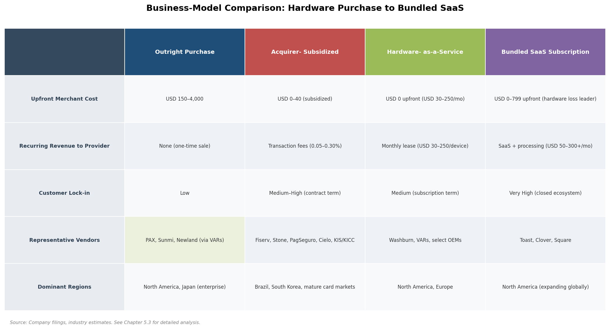

*Figure 5-3. Comparison of the four principal hardware business models — Outright Purchase, Acquirer-Subsidized, Hardware-as-a-Service, and Bundled SaaS Subscription — across upfront merchant cost, recurring revenue to provider, customer lock-in level, representative vendors, and dominant regions.*

### Outright Hardware Purchase

The traditional model — merchant buys a terminal at full MSRP — persists primarily in two contexts: large enterprise deployments where procurement teams negotiate bulk pricing directly with OEMs, and independent merchants who purchase through VARs or online retailers. As documented in Chapter 4, hardware-only MSRPs range from USD 150–600 for smart POS terminals to USD 1,200–4,000 for all-in-one countertop and kiosk configurations. Representative pricing includes USD 570 for the PAX A920 and USD 450 for the PAX A35 through reseller channels, while the Sunmi T3 Pro lists at approximately USD 1,357–1,574 depending on configuration [MPI POS](https://store.mpipos.com/collections/pax-terminals "PAX terminal pricing") [All Star Terminals](https://allstarterminals.com/collections/sunmi-countertop-terminals "Sunmi T3 Pro listing").

The outright-purchase model maximizes merchant flexibility — no contractual lock-in to a specific acquirer or software platform — but generates only one-time revenue for the OEM with no recurring stream. The economic challenge for OEMs is that hardware margins (30–45% gross) alone cannot fund the customer-acquisition and support costs required at scale without a recurring revenue component.

### Acquirer-Subsidized Placement

The dominant distribution model in mature card-payment markets — and effectively the sole model in Brazil and South Korea — is acquirer-subsidized terminal placement. The acquirer (Fiserv, Global Payments, Stone, PagSeguro, Cielo, KIS/KICC in Korea) purchases terminals from OEMs at wholesale cost and deploys them to merchants at zero or heavily discounted upfront cost, recovering the hardware investment through transaction-processing fees over a multi-year merchant contract.

In Brazil, acquirers such as Stone and PagSeguro have deployed aggressive terminal subsidization as their primary merchant-acquisition tool, distributing millions of mPOS devices and smart POS terminals at effective costs of R$ 0–200 (USD 0–40) to micro-merchants, while locking in transaction-fee revenue streams [Flagship Advisory Partners](https://insights.flagshipadvisorypartners.com/brazil-defining-fintech-in-latam "Brazil: Defining Fintech in LatAm, November 2021"). In South Korea, VAN operators (KIS Information & Communication, KICC, NICE Information, KCP) have historically bundled terminal provision with transaction-routing services, deploying terminals at zero cost as part of the VAN service contract [CardInfoLink](https://cardinfolink.com/en-US/newsroom/article/21 "South Korea's VAN payment system").

This model positions the OEM as a commodity hardware supplier to acquirers — high volume, but under relentless pricing pressure. The acquirer captures the customer relationship and recurring transaction revenue, while the OEM's revenue is limited to the wholesale hardware sale. The historically dominant positions of Ingenico and Verifone in the acquirer channel illustrate both the volume opportunity and the margin constraint inherent in this model.

### Hardware-as-a-Service (HaaS)

HaaS represents an intermediate model in which the merchant leases hardware on a monthly subscription basis, typically bundled with maintenance, warranty, and device-replacement services. Monthly fees range from USD 30–80 for a smart POS terminal to USD 100–250 for an all-in-one countertop or kiosk configuration. The model shifts the financial profile from a capital expenditure to an operating expense for the merchant while providing the hardware provider with predictable recurring revenue.

HaaS programs are increasingly offered by both OEMs and VARs. Washburn Computer Group, for example, operates a POS-specific HaaS program that bundles hardware procurement, deployment, and ongoing management under a single subscription [Washburn POS](https://washburnpos.com/hardware-as-a-service "Washburn HaaS program"). The model aligns with the broader enterprise trend toward subscription-based procurement: for merchants, it eliminates large upfront capital outlays and provides technology-refresh flexibility; for providers, it creates customer stickiness through recurring billing relationships.

### Bundled SaaS Subscription (Hardware as a Vehicle for Software Revenue)

The most economically powerful business model — and the one driving the highest-valuation companies in the sector — bundles hardware, SaaS software, and payment processing into a single monthly subscription. Toast, Clover, and Square each execute variations of this model, in which hardware functions as a loss leader or break-even proposition designed to acquire customers for high-margin software and payment-processing revenue.

**Toast** exemplifies the model's economics. With 164,000 restaurant locations and ARR exceeding USD 2.0 billion at year-end 2025, Toast derives the bulk of its revenue from subscription services (payment processing fees, SaaS subscriptions for POS, payroll, marketing, and supply-chain management) rather than hardware sales [Toast](https://investors.toasttab.com/financials/quarterly-results/default.aspx "Toast FY2025 results"). Toast hardware is available exclusively through Toast subscription plans — a merchant cannot purchase a Toast Flex 3 without committing to a Toast software subscription — creating a closed loop between hardware deployment and recurring revenue.

**Clover** follows a similar trajectory within Fiserv's merchant-services ecosystem. With revenue of approximately USD 3.5 billion in 2025 and a target of USD 4.5 billion for 2026, Clover's growth is increasingly driven by value-added services (VAS) — SaaS products layered atop the core POS and payment-processing stack — which reached 27% penetration of the Clover merchant base by Q4 2025 [Fiserv](https://investors.fiserv.com/static-files/2c7e8f1e-2c9e-461a-b793-cbf13069d465 "Fiserv Q4 2025 results") [Payments Dive](https://www.paymentsdive.com/news/fiserv-clover-growth-goals-square-jack-dorsey-smb-merchant-pos-software-services/711202/ "Fiserv Clover growth goals").

**Square** differs in one important respect: it supports COTS hardware (iPad + Square Reader) alongside proprietary devices (Terminal, Register), enabling a lower-capex entry point for merchants. Square's Q4 2025 gross profit from the Square segment was USD 993 million (up 7.5% year-over-year), with hardware operating at a loss and growth driven by Financial Solutions (Square Loans) and software subscriptions [Block](https://s29.q4cdn.com/628966176/files/doc_financials/2025/q4/Q4-2025-Shareholder-Letter_Block.pdf "Block Q4 2025 shareholder letter").

The bundled SaaS model fundamentally redefines hardware's role in the value chain: the terminal is no longer the product but rather the distribution channel for software and payment-processing revenue. For open-platform OEMs (PAX, Sunmi, Newland), the strategic implication is clear: without a proprietary software layer, they risk confinement to the lowest-margin segment of the chain, selling hardware at wholesale to acquirers and SaaS platforms that capture the recurring revenue.

## 5.4 Recent M&A and Strategic Moves (April 2025 – October 2026)

The observation window has produced several significant transactions and strategic realignments that reflect — and in some cases accelerate — the structural trends described in the preceding sections.

### Ownership Structures and Capital Realignment

**Ingenico — Apollo ownership and strategic independence.** Ingenico operates as an independent company following acquisition by private equity funds managed by Apollo Global Management, which purchased approximately 85% of the Terminal, Solutions & Services (TSS) business from Worldline for a total consideration at current fair value of approximately EUR 2.3 billion [Apollo](https://www.apollo.com/insights-news/pressreleases/2022/02/worldline-sale-of-tss-activities-to-apollo-funds "Worldline sale of TSS to Apollo, 2022") [Ingenico](https://ingenico.com/en/newsroom/press-releases/ingenico-launches-independent-company-following-acquisition-apollo-private "Ingenico launches as independent company"). Under Apollo ownership, Ingenico has pursued an aggressive product-refresh strategy — the next-generation AXIUM family (PCI PTS v7, Android 14) and the Ingenico 360 unified cloud platform both launched in February 2026 — positioning the company for either long-term independent operation or an eventual exit at an enhanced valuation.

**Verifone — Francisco Partners recapitalization.** Verifone remains privately held following its USD 3.4 billion acquisition by an investor group led by Francisco Partners (with British Columbia Investment Management Corporation) in 2018 [Francisco Partners](https://www.franciscopartners.com/media/verifone-to-be-acquired-by-francisco-partners-for-34-billion "Verifone acquisition, 2018"). In 2025, Verifone received a USD 235 million equity investment from Francisco Partners and BCI to fund its transition from legacy terminals to next-generation cloud-connected platforms [Verifone](https://www.verifone.com/resources/press-room-article-verifone-receives-equity-investment "Verifone equity investment"). The competitive repositioning — including the Commander Fleet system for fuel/convenience verticals and the FreedomPay partnership for enterprise hospitality — signals a strategic pivot toward vertical-specific integrated solutions rather than broad competition in the general-purpose smart POS market.

### Strategic Partnerships and Alliances (Within the Observation Window)

**Ingenico × Visa (March 2026).** The collaboration combining Ingenico's AXIUM terminals with the Visa Acceptance Platform establishes a new category of alliance — payment-network pre-certification — that has the potential to reduce acquirer deployment timelines and accelerate terminal refresh cycles [Ingenico](https://ingenico.com/us-en/newsroom/press-releases/ingenico-and-visa-collaborate-accelerate-unified-commerce-solutions-across "Ingenico–Visa collaboration, March 2026").

**Sunmi × OPP/Worldline (February 2026).** This partnership enables European SaaS platforms to combine Sunmi's device ecosystem with OPP's embedded payment infrastructure, targeting the underserved segment of mid-market software companies that lack the resources to integrate payment acceptance independently [BusinessWire](https://www.businesswire.com/news/home/20260223939384/en/OPP-and-SUNMI-Partner-to-Democratise-Payment-Monetisation-for-SaaS-Platforms-Across-Europe "OPP–SUNMI partnership, February 2026").

**Fiserv × Western Alliance Bank (2025–2026).** Described as the largest agent-bank deal in Fiserv history, this alliance extends Clover payment tools to Western Alliance's commercial banking clients, deepening Fiserv's distribution penetration into the mid-market banking channel [Fiserv](https://investors.fiserv.com/news-releases/news-release-details/fiserv-and-western-alliance-bank-form-strategic-alliance-power "Fiserv–Western Alliance strategic alliance").

**PAX × Payroc.** The BroadPOS Program provides ISVs with pre-certified integrations to major processors (Fiserv, TSYS), reinforcing PAX's positioning as the preferred open-platform terminal for the North American ISV channel [PAX Technology](https://www.pax.us/about/press-room/pax-and-payroc-isv-growth-partnership/ "PAX–Payroc ISV partnership").

**Adyen terminal expansion (2025–2026).** Adyen launched two new in-person payment terminals — the S1E4 Pro (spill- and drop-proof mobile device for food-and-beverage environments) and the S1F4 Pro (portable Android device) — manufactured by Castles Technology and Datex. This expansion signals Adyen's deepening commitment to in-person payment hardware as a complement to its online acquiring platform [Adyen](https://www.adyen.com/press-and-media/adyen-launches-two-ipp-terminals "Adyen S1E4 Pro and S1F4 Pro launch").

**Castles Technology × PXP Financial.** PXP announced a strategic collaboration to bring Castles' Android-based payment terminals to global merchants through PXP's payment platform, broadening Castles' distribution beyond its established Adyen relationship [Castles Technology](https://www.castlestech.com/pxp-brings-castles-technologys-android-terminals-to-global-merchants/ "PXP–Castles collaboration").

### Competitive Implications

Three structural themes emerge from these transactions and alliances:

**Vertical integration continues to deepen.** Clover's 23% revenue growth, Toast's 26% ARR growth, and Square's continued hardware losses all confirm that the bundled-SaaS model is the highest-growth segment of the market. Open-platform OEMs face a narrowing window in which to build proprietary software layers — Sunmi's BIoT platform and Ingenico's 360 platform represent their respective responses to this imperative.

**Pre-certification alliances are compressing the value chain.** The Ingenico–Visa collaboration and PAX–Payroc BroadPOS program both reduce the certification and integration burden for acquirers and ISVs deploying terminals, effectively removing a layer of cost and time from the traditional value chain. As pre-certification becomes table stakes, OEMs that lack broad processor pre-certifications risk exclusion from major deployment opportunities.

**Chinese OEMs continue to gain global share.** Sunmi's position as the leading Android SmartPOS manufacturer, NEWPOS's rise to sixth globally (7.346 million units, 5.73% market share in 2024), and the expanding Shenzhen-based ODM ecosystem reflect a structural shift in manufacturing economics: Chinese OEMs deliver PCI-certified smart POS terminals at 30–40% lower price points than Western incumbents while rapidly iterating on hardware design and software-platform capabilities.

# 第6章 Forward Outlook & Strategic Implications

The tablet-style payment and SaaS device landscape is entering a period of accelerated transformation. The convergence of on-device artificial intelligence, new biometric modalities, next-generation connectivity standards, evolving payment-security certification frameworks, and shifting monetary architectures will reshape device hardware requirements within the next 12–18 months. This chapter identifies the technology trends most likely to alter device design (Section 6.1), analyzes how payment-standard evolution affects hardware specifications (Section 6.2), maps the whitespace opportunities that current product portfolios leave underserved (Section 6.3), and synthesizes strategic guidance for hardware product managers evaluating build-versus-partner-versus-acquire decisions (Section 6.4).

## 6.1 Technology Trends Reshaping Device Design

### 6.1.1 On-Device AI and Edge Intelligence

The integration of AI inference capabilities directly into payment terminals — rather than relying solely on cloud-based processing — constitutes the most consequential hardware-design shift on the near-term horizon. Ingenico's next-generation AXIUM family, unveiled at Paytech 2026, is explicitly positioned as an "AI-ready design optimized for real-world use cases," running on Android 14 with hardware architectures capable of supporting on-device inference workloads [Ingenico](https://ingenico.com/us-en/newsroom/press-releases/ingenico-launches-next-generation-axium-payment-device-family-and-ingenico "Next-Generation AXIUM Launch, February 2026"). At the silicon level, Qualcomm's Dragonwing QCS6490 SoC — the foundation for a growing share of Android smart POS terminals — incorporates a dedicated AI Engine with a Hexagon DSP capable of 12 TOPS (tera operations per second), enabling edge-AI workloads without the latency or connectivity dependency of cloud inference.

The practical applications of on-device AI in payment terminals cluster around three principal use cases:

**Fraud detection and transaction-risk scoring.** Real-time behavioral analytics — monitoring transaction velocity, amount anomalies, and merchant patterns — can run locally on a terminal's NPU, flagging suspicious transactions before authorization requests reach the processor. This reduces false declines and accelerates authorization for legitimate transactions, particularly valuable in offline or intermittent-connectivity environments common in Southeast Asia and rural Latin America.

**Computer-vision-assisted checkout.** On-device image recognition enables automated product identification (scan-free checkout), age verification via facial analysis, and inventory monitoring through shelf-facing cameras. Sunmi's partnership with Wink for AI-powered facial-recognition payments illustrates the trajectory: biometric identity verification executed at the edge rather than through cloud round-trips [PRWeb](https://www.prweb.com/releases/sunmi-elevates-next-gen-payment-terminals-with-biometric-identity-partners-with-wink-to-deliver-ai-powered-checkout-302715820.html "Sunmi–Wink biometric partnership").

**Predictive device management.** On-device telemetry analysis can predict hardware failures (printer jams, battery degradation, thermal issues) before they cause downtime, enabling proactive maintenance scheduling. Ingenico 360's "real-time monitoring, analytics, and remote management capabilities" represent a cloud-plus-edge approach to fleet management across "tens of millions of managed payment devices" [Ingenico](https://ingenico.com/us-en/newsroom/press-releases/ingenico-launches-next-generation-axium-payment-device-family-and-ingenico "Ingenico 360 Platform, February 2026").

**Hardware implications.** Edge AI demands SoCs with dedicated NPUs or DSPs (Qualcomm QCS6490, MediaTek Genio series), expanded RAM (4–8 GB minimum to support inference models alongside payment applications), and enhanced thermal-management designs to sustain prolonged inference workloads. Devices built around older quad-core Cortex-A53 processors with 1–2 GB RAM — still prevalent in the entry-level smart POS segment — lack the compute headroom for meaningful on-device AI. This constraint establishes a clear product-segmentation boundary between "AI-capable" and "transaction-only" terminals, with significant implications for OEM portfolio architecture.

### 6.1.2 Biometric Authentication

PCI PTS POI v7.0, published by PCI SSC in May 2025, introduces for the first time an explicit requirement for "the physical/logical security of biometric interfaces" on payment terminals [PCI SSC](https://blog.pcisecuritystandards.org/just-published-pts-poi-v7-0 "Just Published: PTS POI v7.0, May 2025"). This regulatory signal formalizes biometrics — fingerprint, facial recognition, palm-vein, and iris — as first-class authentication modalities alongside PIN entry on PCI-certified devices.

PAX Technology's A77 Android MiniPOS became the world's first payment terminal to receive PCI PTS POI v7.0 certification, achieving the milestone in July 2025 with validity through April 2035 [PAX Technology](https://www.pax.com.cn/PAX-First-to-Achieve-PCI7-PTS-POI-Certification-in-Payment-Terminals/ "PAX A77 PCI PTS v7.0 Certification, July 2025"). Ingenico's next-generation AXIUM family followed with v7.0 certification and includes "support for digital identity" as a core capability [Ingenico](https://ingenico.com/us-en/newsroom/press-releases/ingenico-launches-next-generation-axium-payment-device-family-and-ingenico "Next-Gen AXIUM, February 2026").

The biometric trajectory exhibits distinct regional contours. In Japan, the My Number national-ID card authentication mandate drives demand for NFC-based biometric-linked identity verification at the point of sale. In South Korea, facial-recognition payment pilots at convenience stores and QSR kiosks leverage the country's high kiosk density — one of the highest globally. In Southeast Asia and South America, fingerprint-linked government disbursement programs (e.g., deployments using the Telpo TPS900 with integrated fingerprint and iris modules) create demand for biometric-capable terminals in public-sector payment channels.

**Hardware implications.** Biometric-ready terminals require front-facing cameras with sufficient resolution for facial recognition (5 MP minimum, 8 MP preferred), optical or capacitive fingerprint sensors integrated into the device chassis, secure enclaves (NXP SE050/SE051 or equivalent) for biometric template storage, and — crucially — PCI PTS v7.0 certification that now explicitly covers the physical and logical security of these biometric interfaces. Devices certified only to PCI PTS v5.x or v6.x will face a competitive disadvantage as acquirers and payment networks begin requiring v7.0 compliance for new deployments.

### 6.1.3 5G Connectivity and eSIM Fleet Management

The transition from 4G LTE to 5G connectivity in payment terminals is progressing incrementally rather than disruptively. PAX Technology's A920MAX 5G variant — available in select markets — represents the earliest 5G-capable smart POS terminal, though the primary near-term benefit is enhanced throughput and lower latency rather than fundamentally new use cases. The more consequential connectivity evolution is the adoption of eSIM (embedded SIM) technology enabled by the GSMA SGP.32 IoT standard, finalized in stable form in 2024.

SGP.32 introduces cloud-driven, fully automated, zero-touch provisioning for POS device fleets through an eSIM IoT Remote Manager (eIM) architecture. Unlike the earlier SGP.22 consumer eSIM standard — which required per-device QR-code scanning or user-initiated activation — SGP.32 enables centralized profile management across thousands of terminals without manual intervention at any endpoint [Cavli Wireless](https://www.cavliwireless.com/blog/nerdiest-of-things/sgp-32-esim-pos-solutions "SGP.32 eSIM Standard in POS Solutions, January 2026"). For global OEMs, the standard unlocks a single-SKU hardware strategy: one device variant shipped worldwide, with operator profiles assigned remotely based on region, coverage quality, or cost optimization.

**Hardware implications.** eSIM adoption requires MFF2-form-factor embedded SIM modules soldered to the PCB (replacing removable SIM card slots), eUICC-capable secure elements, and firmware support for IPA (IoT Profile Assistant) communication with cloud-based eIM platforms. The elimination of physical SIM slots also improves device ingress protection ratings and reduces points of physical vulnerability — a meaningful security benefit for unattended kiosk and outdoor deployments. OEMs that continue to ship devices with only removable SIM trays face increasing friction in multi-country fleet deployments where SGP.32 automation is expected.

### 6.1.4 Modular Hardware Architecture

Global Payments' November 2025 launch of what it described as "the industry's first modular, countertop point-of-sale device" — purpose-built for its Genius platform with three interchangeable configurations (dual-screen premium, single-screen, and low-profile) — signals a design philosophy shift toward modularity in the POS hardware industry [Yahoo Finance / Insider Monkey](https://finance.yahoo.com/news/global-payments-launches-industry-first-130719826.html "Global Payments Modular POS Launch, November 2025"). Rather than designing monolithic devices that bundle payment, display, compute, and peripheral functions into a single fixed form factor, modular architecture enables merchants to reconfigure hardware components — swapping display sizes, attaching or detaching payment modules, upgrading compute units — without replacing the entire device.

This approach directly addresses two pain points identified across the regional analyses in Chapter 4: the high total cost of ownership for all-in-one countertop systems (USD 1,200–4,000), and the 5–7-year device lifecycles in acquirer-driven deployments that strand merchants on outdated hardware. A modular design enables selective component upgrades — replacing a PCI PTS v5.x-certified payment module with a v7.0-certified unit, for instance — without discarding the display, compute, and chassis.

**Hardware implications.** Modular POS requires standardized internal bus interfaces (USB-C, proprietary docking connectors), hot-swappable payment modules with independent PCI PTS certification, and chassis designs that accommodate multiple form-factor configurations. The certification complexity is nontrivial: each modular payment component requires independent PCI PTS evaluation, and the combination of modules must be validated as a system. OEMs with broad PCI certification portfolios (PAX, Ingenico) hold an advantage in pursuing modular strategies.

### 6.1.5 Sustainability and Device Circularity

Environmental regulation and corporate sustainability commitments are beginning to influence payment-terminal design decisions. The European Union's Ecodesign for Sustainable Products Regulation (ESPR), which establishes requirements for product repairability, recyclability, and digital product passports, will apply to electronic devices including commercial terminals sold in the EU. While enforcement timelines for specific product categories remain under development, the regulatory trajectory is clear: terminals designed for disposability — sealed enclosures, glued batteries, non-replaceable components — will face increasing compliance friction in European markets.

**Hardware implications.** Design-for-sustainability favors modular architectures with user-replaceable batteries, standardized connectors, and recyclable chassis materials. Ingenico's emphasis that the next-gen AXIUM family is "designed, built, and owned" in-house — with full control over the technology stack — positions the company to address data sovereignty and sustainability traceability requirements more readily than OEMs relying on fragmented ODM supply chains.

The figure below synthesizes the five technology trends discussed above into a prioritization matrix, plotting each trend by its hardware-design impact and expected commercial deployment timeline.

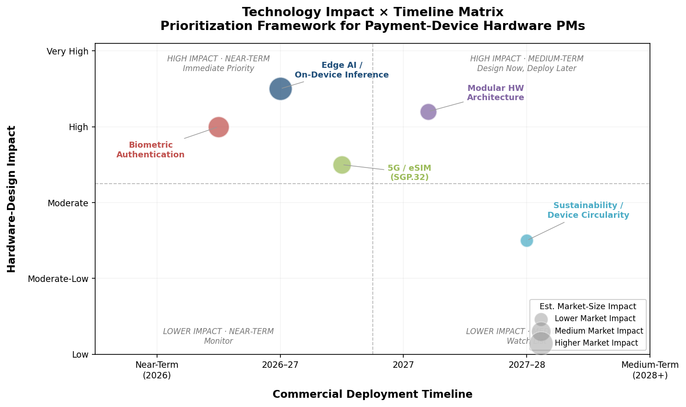

## 6.2 Payment-Standard Evolution and Hardware Impact

### 6.2.1 SoftPOS / Tap-to-Phone Expansion

SoftPOS — the use of a COTS device's built-in NFC antenna to accept contactless payments without external hardware — is the fastest-growing acceptance category by adoption rate, albeit from a modest base. The global SoftPOS market was valued at USD 365 million in 2024 and is projected to reach USD 1.24 billion by 2030 at a CAGR of 23.1% [Grand View Research](https://www.grandviewresearch.com/industry-analysis/softpos-market-report "SoftPOS Market Size, 2030"). Berg Insight estimated fewer than 10 million SoftPOS-running devices worldwide as of 2023, compared to an aggregate installed base of 292 million POS terminals [Berg Insight via BusinessWire](https://www.businesswire.com/news/home/20250428903740/en/Connected-POS-Terminals-Market-Report-2025-Installed-Base-of-Cellular-POS-Terminals-to-Reach-229-Million-in-2028-mPOS-Terminals-Worldwide-to-Reach-152-Million-Units-by-2028---ResearchAndMarkets.com "Berg Insight 8th Edition, April 2025"). SoftPOS adoption thus remains below 3.5% of the global POS installed base — significant in growth rate, but limited in absolute scale.

SoftPOS poses a structural threat to the entry-level smart POS terminal segment — the sub-USD 300, 5″-screen handheld devices that constitute the highest-volume category globally. If a merchant's smartphone can accept contactless payments via MPoC-certified software alone, the incremental value of a dedicated terminal rests on integrated peripherals (printer, barcode scanner, EMV contact reader) and PCI PTS hardware-level security. Brazilian market consultant GMattos assesses Tap-to-Phone as "a very small niche, not even 5% of the total," observing that "no other solution is as comprehensive" as purpose-built terminals for mainstream retail [Valor Internacional](https://valorinternacional.globo.com/business/news/2024/10/17/are-pos-terminals-on-their-way-out.ghtml "GMattos on POS terminal resilience, October 2024"). This view, articulated in a market where terminal density is among the world's highest, underscores that SoftPOS substitution remains bounded by the peripheral-integration gap.

**Hardware implications for OEMs.** SoftPOS does not eliminate hardware demand — it restructures it. The entry-level handheld smart POS terminal faces margin compression as SoftPOS absorbs the simplest payment-only use case (single NFC tap, no receipt, no chip-and-PIN). Mid-range and feature-rich smart POS terminals retain their value proposition through integrated peripherals, PCI PTS hardware security, and multi-modal payment acceptance (EMV contact + NFC + MSR + QR). The strategic response for OEMs is twofold: (1) incorporate SoftPOS capability into smart POS terminals as a supplementary mode, enabling the same device to function as both a PCI-certified terminal and an MPoC SoftPOS endpoint; and (2) defend the mid-range by enriching the software ecosystem and peripheral integration that SoftPOS-on-a-phone cannot replicate.

### 6.2.2 PCI PTS v7.0: The New Certification Baseline

PCI PTS POI v7.0, published in May 2025, introduces 59 requirement changes and 23 pieces of additional guidance relative to v6.2 [PCI SSC](https://blog.pcisecuritystandards.org/just-published-pts-poi-v7-0 "Just Published: PTS POI v7.0, May 2025"). Key changes with direct hardware-design impact include:

- **Biometric interface security requirements** — formalizing physical and logical protection for fingerprint sensors, cameras, and other biometric inputs integrated into payment terminals.
- **Third-party application support** — a new requirement allowing certified devices to run third-party applications (e.g., through app stores), legitimizing the Android smart POS model of ISV-ecosystem richness.
- **128-bit minimum effective key strength** — mandating that all terminal security functions (firmware authentication, tamper detection, storage encryption) use cryptography implementing at least 128-bit effective key strength, deprecating weaker legacy implementations.
- **Accessibility-oriented PIN entry** — an option for terminals to provide an accessibility-designed PIN-entry feature on a per-transaction basis, addressing regulatory requirements for inclusive payment access.

PAX Technology achieved the first PCI PTS v7.0 certification globally with its A77 Android MiniPOS in July 2025, valid through April 2035 [PAX Technology](https://www.pax.com.cn/PAX-First-to-Achieve-PCI7-PTS-POI-Certification-in-Payment-Terminals/ "PAX A77 — First PCI PTS v7.0 Certification, July 2025"). Ingenico's next-generation AXIUM family subsequently obtained v7.0 certification across its mobile, countertop, multilane, and self-service form factors [Ingenico](https://ingenico.com/us-en/newsroom/press-releases/ingenico-launches-next-generation-axium-payment-device-family-and-ingenico "Next-Gen AXIUM, February 2026").

The certification transition timeline is critical for hardware planning. Devices certified under PCI PTS v5.x reach end-of-life acceptance between 2025 and 2028 (depending on original certification date), and v6.x certifications follow on a similar cadence. Acquirers and payment networks will progressively require v7.0-certified devices for new deployments. The figure below illustrates the overlapping certification windows and key milestones.

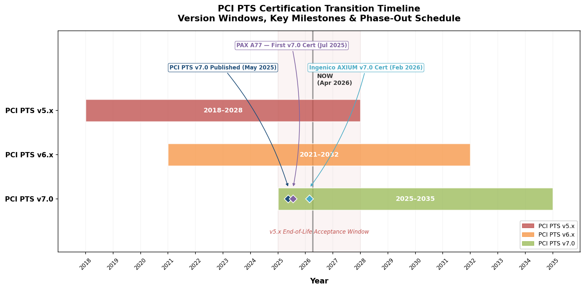

OEMs that delay v7.0 certification risk exclusion from acquirer refresh cycles — a particularly severe consequence given that acquirer-subsidized placement remains the dominant distribution model globally, as documented in Chapter 5.

### 6.2.3 CBDC Readiness and Stablecoin Acceptance

Central bank digital currencies (CBDCs) represent a medium-term hardware consideration rather than an immediate design imperative. China's e-CNY pilot — the most advanced retail CBDC globally — has expanded to Hong Kong and multiple mainland provinces, with offline NFC-based payment as a core design feature [IMF](https://www.imf.org/-/media/files/publications/pp/2025/english/ppea2025041.pdf "CBDC: Further Navigating Challenges and Risks, 2025"). The European Central Bank's digital euro pilot, announced in March 2025, explicitly includes point-of-sale payment testing — both online and offline via NFC — with staff of participating central banks conducting real-world person-to-person and person-to-business transactions [ECB](https://www.ecb.europa.eu/press/intro/news/html/ecb.mipnews260305.en.html "Digital Euro Pilot Call for PSPs, March 2025").

Ingenico's next-generation AXIUM platform includes "support for stablecoin acceptance" as a stated capability [Ingenico](https://ingenico.com/us-en/newsroom/press-releases/ingenico-launches-next-generation-axium-payment-device-family-and-ingenico "Next-Gen AXIUM, February 2026"), signaling that at least one major OEM views digital-asset acceptance as a near-term product differentiator. The hardware requirements for CBDC and stablecoin acceptance are modest in isolation — NFC for offline CBDC wallets, secure storage for digital-currency credentials, and software-layer integration with central-bank or stablecoin-issuer APIs — but the certification and compliance requirements are likely to be substantial and region-specific.

**Hardware implications.** No terminal redesign is required specifically for CBDC readiness; current-generation NFC-equipped, Android-based smart POS terminals already possess the necessary hardware prerequisites. The differentiator will be software-platform agility: OEMs whose device-management platforms (e.g., Sunmi BIoT, Ingenico 360) can push CBDC acceptance applications via OTA updates will capture early deployment opportunities as CBDC pilots transition to production. OEMs locked into inflexible firmware architectures will face extended integration cycles and risk missing early adoption windows.

## 6.3 Whitespace Opportunities by Region and Vertical

The analysis across Chapters 2–5 reveals several segments where demand is growing but current product offerings remain insufficient or absent. Each whitespace opportunity below is characterized by a specific regional or vertical context, a quantified market gap, and the type of purpose-built product required to address it.

### 6.3.1 Southeast Asia: SaaS-Integrated Mid-Range Smart POS

Southeast Asia's 15.7% CAGR — the fastest among the four target regions — is driven primarily by QR-code payment expansion and micro-merchant digitalization. The current product supply, however, skews toward two extremes: ultra-low-cost QR standees and basic mPOS readers (USD 20–80) at the entry level, and imported mid-to-high-end smart POS terminals (USD 250–400) at the premium tier. The gap lies in affordable (USD 100–200), Android-based smart POS devices that integrate QR scanning, NFC contactless, and lightweight SaaS applications (inventory management, sales reporting) in a single form factor — priced and configured for the region's micro-to-small merchant majority. Chinese OEMs (Sunmi, NEWPOS, Telpo) are well positioned to fill this gap, but the opportunity remains underexploited due to fragmented distribution channels and the dominance of QR-only acceptance in regulatory mandates such as Indonesia's QRIS.

### 6.3.2 Japan: Cloud-POS Migration for Legacy ECR Replacement

Japan's POS terminal market — estimated at USD 7.8–9.2 billion in 2025 — remains heavily weighted toward legacy fixed electronic cash registers (ECRs) from domestic incumbents (NEC, Sharp, Fujitsu, Casio). The government's Cashless Vision targets and fiscal-invoice mandates are creating modernization pressure, but the migration path from legacy ECRs to cloud-connected Android devices proceeds slowly due to entrenched domestic OEM relationships, high customization requirements for Japanese retail workflows, and retailer resistance to SaaS subscription models. The whitespace is a "hybrid migration" device — a countertop all-in-one that preserves the peripheral ecosystem of Japanese ECRs (cash drawers, specific receipt formats, inventory-link protocols) while running Android-based cloud POS software. International OEMs that partner with Japanese ISVs to deliver localized SaaS stacks on globally sourced hardware stand to capture a meaningful share of this transition.

### 6.3.3 South America: Rugged and Offline-Capable Field Terminals

Brazil's 20-million-unit terminal installed base is dense in urban retail but thin in field-service and logistics applications. The combination of Pix instant-payment ubiquity, expanding e-commerce delivery volumes, and vast geography with intermittent connectivity creates demand for rugged, offline-capable smart POS terminals designed for delivery drivers, field technicians, and agricultural-sector transactions. Current field-tablet offerings (e.g., Zebra ET60/ET65, Panasonic TOUGHBOOK) are priced above USD 1,200 and lack integrated payment peripherals, while entry-level mPOS readers lack the compute capability for field-service SaaS workflows. A sub-USD 500 rugged smart POS terminal with IP65+ protection, offline transaction buffering, Pix QR acceptance, and basic field-service SaaS capability represents an unaddressed product category with substantial latent demand.

### 6.3.4 Cross-Regional: Self-Service Kiosk Software Standardization

The self-checkout and self-ordering kiosk market — valued at USD 5.56 billion in 2025 for self-checkout alone, growing at a 14.5% CAGR [Grand View Research](https://www.grandviewresearch.com/industry-analysis/self-checkout-systems-market "Self-Checkout Systems Market Size, 2033") — suffers from extreme fragmentation in software platforms. Each kiosk deployment typically involves custom software integration, proprietary enclosure designs, and bespoke payment-module combinations. An OEM or platform vendor that offers a standardized, turnkey kiosk hardware-plus-software platform — analogous to what Toast and Clover have achieved for restaurant POS — could capture significant share in the underserved mid-market kiosk segment (single-location QSR, convenience stores, clinic lobbies).

The figure below maps all four regional whitespace opportunities by competitive intensity and market attractiveness, illustrating that each occupies the "prime whitespace" quadrant — high attractiveness with low existing competition.

## 6.4 Strategic Framework for Hardware Product Managers

The technology trends, standard evolution, and whitespace opportunities identified above converge into four strategic imperatives for hardware product managers evaluating device-portfolio decisions in the 2026–2028 planning horizon.

### Imperative 1: Secure PCI PTS v7.0 Certification Early

PCI PTS v7.0 is not merely an incremental compliance update; it functions as a competitive gate. The standard's new requirements for biometric interface security, third-party application support, and 128-bit cryptographic key strength collectively define the minimum hardware specification for next-generation deployments. PAX's first-mover certification of the A77 (valid through 2035) and Ingenico's AXIUM family certification demonstrate that Tier-1 OEMs are treating v7.0 as an urgent priority. OEMs that delay certification risk exclusion from acquirer refresh programs — the single largest distribution channel for smart POS terminals globally.

**Actionable guidance.** Prioritize v7.0 certification for the flagship smart POS terminal within the next product cycle. Allocate certification budget (typically USD 200,000–500,000 per device family, as noted in Chapter 5) and timeline (6–18 months) accordingly. Integrate biometric sensor design into the industrial-design phase rather than treating it as a post-certification add-on.

### Imperative 2: Build or Partner for a Software-Platform Layer

The value-chain analysis in Chapter 5 demonstrates that margin concentrates at the software/SaaS layer (70%+ gross margins) rather than the hardware layer (30–45%). Vertically integrated players — Toast (164,000 locations, ARR exceeding USD 2.0 billion), Clover (approximately USD 3.5 billion revenue, targeting USD 4.5 billion in 2026), Square (USD 993 million quarterly gross profit from the Square segment) — capture recurring revenue that dwarfs hardware-only economics. Open-platform OEMs without a proprietary software layer face a narrowing window before the bundled-SaaS model becomes the default commercial structure for mid-market merchants.

**Actionable guidance.** For OEMs without an existing SaaS platform: invest in a device-management and app-distribution platform (following the Sunmi BIoT and Ingenico 360 model) as the minimum viable software layer. This captures recurring device-management fees (USD 10–50/device/month) and creates ISV-ecosystem stickiness. For OEMs contemplating vertical integration: evaluate acquisition of — or strategic partnership with — a vertical SaaS company (restaurant management, retail inventory, field-service dispatch) to build a Clover/Toast-like closed loop.

### Imperative 3: Adopt eSIM and Prepare for Global Single-SKU

The SGP.32 eSIM standard makes single-SKU global hardware a practical reality. OEMs that continue shipping region-specific hardware variants with removable SIM trays incur higher manufacturing complexity, larger inventory holding costs, and slower time-to-deployment in multi-country acquirer programs. The competitive advantage of SGP.32-enabled devices — zero-touch provisioning, centralized fleet management, automatic network switching — is particularly acute for acquirers managing cross-border terminal estates.

**Actionable guidance.** Transition next-generation device designs to MFF2 embedded eSIM with SGP.32-compatible firmware. Eliminate physical SIM slots from new product lines (retaining dual-SIM capability via eSIM profile switching). Partner with eSIM platform providers to offer SGP.32 fleet-management services as a value-added capability for acquirer customers.

### Imperative 4: Target Regional Whitespace with Purpose-Built SKUs

The whitespace analysis reveals that the global smart POS market is oversupplied in its center (USD 300–600 handheld terminals for urban retail) and undersupplied at the edges: SaaS-integrated mid-range devices for Southeast Asian micro-merchants, hybrid cloud-POS migration hardware for Japanese ECR replacement, rugged field terminals for South American logistics, and standardized kiosk platforms for mid-market self-service. Addressing these segments requires not merely pricing adjustments but purpose-built hardware-software combinations tailored to specific deployment environments and regulatory requirements.

**Actionable guidance.** Commission market-specific discovery research for the two highest-priority whitespace segments. For Southeast Asia, design a sub-USD 200 Android smart POS SKU with integrated QR + NFC + lightweight SaaS, targeting QRIS-mandated merchants in Indonesia and PromptPay-subsidized deployments in Thailand. For South America, develop a sub-USD 500 rugged smart POS terminal with IP65 protection, offline Pix QR acceptance, and field-service SaaS capability, targeting the Brazilian delivery and utility-service verticals.

# Conclusion

The tablet-style payment and SaaS device ecosystem in 2025–2026 is defined by three structural dynamics: platform convergence, regional divergence, and value-chain realignment.

**Platform convergence** is collapsing the boundaries between payment terminal, POS workstation, and business-management platform. The five device categories identified in this report — smart POS terminals, mPOS tablets, tablet kiosks, all-in-one countertop systems, and rugged field tablets — are converging around Android-based architectures (approximately 40% of global POS terminal shipments in 2023, up from 27% in 2022) and cloud-connected SaaS platforms. Ingenico's next-generation AXIUM family (PCI PTS v7.0, Android 14) and Sunmi's dual-OS SUPER Solution exemplify the design direction: unified hardware architectures capable of spanning mobile, countertop, and self-service form factors while supporting on-device AI inference, biometric authentication, and digital-currency acceptance. PCI PTS v7.0 — with its new requirements for biometric interface security, third-party application support, and 128-bit cryptographic key strength — codifies this convergence at the certification level, establishing a hardware baseline that will govern new deployments through at least 2035.

**Regional divergence** persists despite platform convergence. North America's USD 29.5-billion market (2024) is characterized by the SaaS-first subscription model, where Toast (164,000 restaurant locations, ARR exceeding USD 2.0 billion), Clover (~USD 3.5 billion revenue), and Square (~USD 210 billion GPV) drive device selection through software ecosystems rather than acquirer mandates. Japan and South Korea present contrasting pictures — Japan's legacy ECR installed base from domestic OEMs (NEC, Sharp, Fujitsu) resists cloud-POS migration, while South Korea's VAN-subsidized distribution model sustains hyper-terminalization and ubiquitous self-ordering kiosks. Southeast Asia's 15.7% CAGR — the fastest among all target regions — is propelled by national QR-code payment standards (QRIS, Thai QR, SGQR, VietQR) that compress the entry-level hardware requirement toward zero and force device manufacturers to differentiate on SaaS functionality. South America, anchored by Brazil's approximately 20-million-unit installed base and the transformative Pix instant-payment system, demonstrates that fintech-driven acquirer competition and heavy terminal subsidization can produce per-capita terminal densities exceeding those of mature card markets.

**Value-chain realignment** is shifting profit concentration from hardware manufacturing to software platforms and payment processing. The "smile curve" documented in Chapter 5 — with gross margins of 50–65% at the silicon layer and 70%+ at the software/SaaS layer, versus 30–45% for branded hardware OEMs — underscores that hardware-only competition positions a company in the lowest-margin segment of the chain. The vertically integrated model (Toast, Clover, Square) maximizes per-merchant monetization through bundled SaaS subscriptions, while open-platform OEMs (PAX, Sunmi, Newland, Ingenico) must build proprietary device-management and app-distribution platforms — as Sunmi's BIoT ecosystem (20,000+ developers, 13,000+ applications) and Ingenico's 360 cloud platform illustrate — to capture recurring revenue beyond the one-time hardware sale.

Four strategic imperatives emerge for hardware product managers navigating this landscape. First, secure PCI PTS v7.0 certification early — it functions as a competitive gate for next-generation acquirer deployments. Second, build or partner for a software-platform layer, because hardware margins alone cannot sustain competitive investment. Third, adopt eSIM (SGP.32) to enable single-SKU global deployment and zero-touch fleet provisioning. Fourth, target regional whitespace with purpose-built SKUs — SaaS-integrated mid-range devices for Southeast Asian micro-merchants, hybrid cloud-POS migration hardware for Japanese ECR replacement, rugged field terminals for South American logistics, and standardized kiosk platforms for the fast-growing mid-market self-service segment.

The global POS terminal installed base of 292 million units and annual shipments exceeding 165 million devices confirm that this ecosystem is not a peripheral technology niche but a central pillar of commerce infrastructure. The manufacturers and platform operators that successfully navigate the convergence of hardware, software, and payment services — while adapting to the regulatory, cultural, and infrastructure realities of each target region — will define the next generation of in-person commerce.
