# Overview

Static noise margin (SNM) — the measure of an SRAM cell's ability to retain a stored logic state in the presence of electrical perturbation — has emerged as a gating constraint on yield, minimum operating voltage, and reliability across every CMOS technology generation. As supply voltages decline below 0.75 V and transistor dimensions enter the sub-3 nm regime, the margin available to prevent an unwanted bit flip narrows to a few tens of millivolts at the distribution tail. Circuit-level techniques alone — cell-ratio tuning, assist circuits, alternative topologies — cannot sustain the SNM roadmap without concurrent advances in the manufacturing process itself. This report examines, in depth, how chip manufacturing process innovations improve SRAM static noise margin and make storage signals more resistant to bit flips.

The analysis spans seven chapters organized along a device-to-system arc. Chapter 1 establishes the analytical foundations: the 6T bit-cell topology, the butterfly-curve SNM definition across hold, read, and write modes, and the device-level parameters — threshold-voltage mismatch (σΔVt), sub-threshold slope, DIBL — that govern noise margin. Chapter 2 traces the impact of transistor architecture evolution from planar bulk CMOS (28 nm) through FinFET, gate-all-around (GAA) nanosheet, forksheet, and complementary FET (CFET), quantifying a cumulative 40–50 % improvement in the 6σ SNM read floor. Chapter 3 dissects the four principal process-level knobs — threshold-voltage engineering, strain engineering, EUV/High-NA EUV lithography, and local-layout-effect management — showing that a 20 % reduction in σ(ΔVt) per node generation yields approximately 12–15 mV of 6σ SNM floor improvement, comparable in magnitude to a full architectural transition. Chapter 4 examines how these process advances reshape the circuit-architecture design space: enabling area-competitive 8T/10T cells, shifting the assist-technique emphasis from read to write, lowering SRAM Vmin below 0.5 V at the N2 node, and conferring inherent radiation hardness through bottom dielectric isolation. Chapter 5 addresses the reliability dimension — NBTI, HCI, RTN, TDDB — demonstrating that aging-induced SNM degradation of approximately 36 mV over a 10-year lifetime must be absorbed within the time-zero margin budget, and that process-level mitigations (interface passivation, corner rounding, nanosheet-width optimization) are the primary countermeasures. Chapter 6 presents the Design-Technology Co-Optimization (DTCO) framework that integrates all preceding levers into a unified PPAC trade-off analysis, highlighting BEOL innovations — buried power rails, backside power delivery — as the gating enablers for CFET-era SRAM stability. Chapter 7 surveys the forward-looking landscape: near-term CFET and High-NA EUV maturation, exploratory 2D-channel and carbon-nanotube technologies, cryo-CMOS SRAM for quantum-computing periphery, and the open research questions that define the SNM scaling frontier.

Three cross-cutting findings anchor the report. First, the dominant source of SNM degradation has shifted progressively from random dopant fluctuation (planar era) to metal-gate granularity (GAA/CFET era), demanding fundamentally different process-control strategies at each generation. Second, beyond the GAA nanosheet node, further SNM improvement depends less on gate electrostatic control — already near the Boltzmann limit — and more on back-end-of-line parasitic management, where interconnect resistance growth threatens to negate front-end gains. Third, the SRAM SNM roadmap is no longer a single-variable scaling exercise; it has become a multi-dimensional optimization problem in which transistor architecture, process variability, BEOL engineering, circuit topology, reliability, and system-level management must advance in concert.

# 第1章 Foundations of SRAM Static Noise Margin

The ability of a Static Random-Access Memory (SRAM) cell to retain a stored logic state in the presence of electrical noise is quantified by the **static noise margin (SNM)**. As CMOS technology advances into the sub-3 nm era, SNM has become a gating metric for both functional yield and minimum operating voltage (V_min). This chapter establishes the analytical and physical foundations of SNM: Section 1.1 reviews the conventional 6T bit-cell topology and its critical sizing ratios; Section 1.2 defines the three operating-mode SNM variants—hold, read, and write—using the butterfly-curve framework; Section 1.3 links device-level parameters (threshold voltage, mismatch, drive current, sub-threshold slope) to cell-level noise margin; and Section 1.4 frames the scaling challenge that motivates the process-centric solutions explored in subsequent chapters.

## 1.1 The 6T SRAM Bit-Cell Topology

The conventional 6T SRAM cell comprises two cross-coupled CMOS inverters that form a bistable latch, augmented by two NMOS access (pass-gate) transistors connecting the internal storage nodes Q and QB to the complementary bit-lines BL and BLB. The six transistors fall into three functional pairs:

- **Pull-down (PD) transistors** — two NMOS devices (M1, M3) providing the discharge paths of the cross-coupled inverters.
- **Pull-up (PU) transistors** — two PMOS devices (M2, M4) providing the charge paths.
- **Access (pass-gate, PG) transistors** — two NMOS devices (M5, M6), gated by the word-line (WL), that couple the latch to the bit-lines during read and write operations.

Two dimensionless sizing ratios govern the trade-off between cell stability and writability:

1. **Cell ratio (CR)** = (W/L)_PD / (W/L)_PG. A higher CR strengthens the pull-down path relative to the pass-gate, limiting the voltage rise on the low-side storage node during a read access and thereby improving read stability.
2. **Pull-up ratio (PR)** = (W/L)_PU / (W/L)_PG. A lower PR (i.e., a comparatively weaker pull-up) facilitates write operations by allowing the external bit-line driver to overpower the latch feedback and flip the stored state.

These ratios encode a fundamental design conflict: read stability favors a strong latch relative to the access path, whereas writability favors a weak one. At every technology node, SRAM designers must navigate this trade-off under tightening area and voltage constraints. Process technology advances—principally reduced transistor mismatch and improved gate electrostatic control—relax the conflict by widening the simultaneously achievable read and write margins, a theme elaborated in Chapters 2 and 3.

## 1.2 Defining SNM: Three Operating Modes

The concept of static noise margin was formally introduced by Seevinck, List, and Lohstroh in 1987 through the **butterfly-curve** method for graphical and analytical evaluation [E. Seevinck et al., "Static-noise margin analysis of MOS SRAM cells," *IEEE J. Solid-State Circuits*, vol. SC-22, no. 5, pp. 748–754, Oct. 1987](https://doi.org/10.1109/JSSC.1987.1052809 "Original SNM definition paper"). The construction proceeds by plotting the voltage-transfer characteristic (VTC) of one cross-coupled inverter against the mirrored VTC of the other; the side length of the largest square that can be inscribed within one of the resulting lobes ("eyes") defines the SNM. Three distinct operating modes produce three distinct margins.

### 1.2.1 Hold SNM (SNM_hold)

When the word-line is de-asserted (WL = 0 V), the access transistors are off and the latch operates as a standalone pair of cross-coupled inverters. The butterfly curves in this mode exhibit the widest lobes because no resistive path disturbs the internal nodes. For a representative 14 nm FinFET cell at V_DD = 0.8 V, SPICE simulation yields SNM_hold ≈ 340 mV, as illustrated in the left panel of Figure 1.

### 1.2.2 Read SNM (SNM_read)

During a read operation, WL is asserted while the pre-charged bit-lines (BL = BLB = V_DD) connect to the storage nodes. On the low-side node, the pass-gate and pull-down transistor form a resistive voltage divider that elevates the node above ground, compressing the butterfly-curve lobes and substantially reducing the available noise margin. Under the same 14 nm FinFET conditions, SNM_read ≈ 152 mV—less than half of SNM_hold (Figure 1, right panel). Because read operations dominate most workloads, SNM_read is typically the binding constraint on V_min and therefore receives the greatest attention in design-sign-off.

### 1.2.3 Write Margin (WM)

Write margin quantifies the ease with which an external driver can flip the stored cell state. It is measured by sweeping an equivalent noise source until the cell fails to write; alternative characterization methods include the "N-curve" and write-trip-point techniques. WM moves in the opposite direction from SNM_read when many process or design knobs are adjusted—for instance, increasing CR improves read stability but can degrade writability. This anti-correlation constitutes a central tension in SRAM design across all technology nodes and underscores the value of process advances that can widen both margins simultaneously.

## 1.3 Device-Level Parameters Governing SNM

SNM is not a purely circuit-level metric; it is tightly coupled to the electrical characteristics of the constituent transistors. Three categories of device parameters exert dominant influence.

**Threshold voltage (V_t) and its mismatch.** In the first-order Seevinck model, the SNM of a 6T cell is approximately linearly proportional to V_DD − V_t. More critically for yield, random V_t mismatch (σΔV_t) between nominally identical transistors within a single cell is the dominant source of SNM degradation at the distribution tail. The Pelgrom model describes this mismatch as:

> σ(ΔV_t) = A_VT / √(W × L)

where A_VT is the Pelgrom coefficient (mV·µm) and W × L is the transistor gate area. Because SRAM transistors are minimum-sized for density, they operate in the high-mismatch regime of the Pelgrom curve. Published silicon data indicate A_VT ≈ 1.05 mV·µm for 14 nm FinFET technology, yielding σ(ΔV_t) ≈ 37 mV at minimum SRAM transistor dimensions. Gate-all-around (GAA) nanosheet technology reduces A_VT to approximately 0.65 mV·µm—a ~38% improvement—corresponding to σ(ΔV_t) ≈ 23 mV at comparable device area (Figure 3). This reduction in mismatch directly widens the tail of the SNM distribution, which is the metric that governs multi-megabit yield.

**Drive current and current ratio.** Read SNM depends on the current ratio between the pull-down and pass-gate transistors (i.e., the cell ratio CR). At the device level, this ratio is set by the saturation drive currents I_dsat,PD and I_dsat,PG, which are functions of carrier mobility, gate capacitance, and effective overdrive voltage (V_GS − V_t). Process techniques that boost NMOS drive current asymmetrically—for example, tensile channel strain applied selectively to PD transistors—can improve CR without altering transistor width, a valuable strategy when minimum bit-cell area is constrained by metal-pitch limits.

**Sub-threshold slope (SS) and DIBL.** Sub-threshold slope determines how sharply a transistor transitions from off to on; a steeper SS produces a more abrupt VTC, which widens the butterfly-curve lobes and thus increases SNM. Drain-induced barrier lowering (DIBL) shifts the effective V_t as a function of V_DS, degrading the VTC symmetry. At the 14 nm FinFET node, SS is typically 65–70 mV/dec and DIBL is 20–30 mV/V. GAA nanosheet architectures push SS below 65 mV/dec and DIBL below 15 mV/V owing to superior gate-all-around electrostatic control, as discussed in Chapter 2.

## 1.4 The SNM Scaling Challenge

As CMOS technology has progressed from the 45 nm node to N2 (2 nm), two concurrent trends have placed SNM under mounting pressure:

1. **V_DD reduction.** Supply voltage has decreased from approximately 1.0 V at 45 nm to 0.75 V at TSMC N3 and 0.70–0.75 V at N2. Because SNM is roughly proportional to V_DD − V_t in the first-order model, every 50 mV reduction in V_DD translates directly into a tighter margin.
2. **Transistor scaling and area shrinkage.** The high-density (HD) SRAM bit-cell area has shrunk from ~0.370 µm² at 45 nm to ~0.0270 µm² at 7 nm and ~0.0175 µm² at N2 [Tom's Hardware, "SRAM scaling isn't dead after all — TSMC's 2nm process tech claims major improvements," 2025](https://www.tomshardware.com/tech-industry/sram-scaling-isnt-dead-after-all-tsmcs-2nm-process-tech-claims-major-improvements "TSMC N2 SRAM bit-cell data"). Smaller transistors entail larger σ(ΔV_t) per the Pelgrom relationship, worsening the worst-case SNM at any given σ-level.

These two scaling vectors—lower V_DD and smaller device area—are partially offset by improvements in transistor architecture (planar → FinFET → GAA) and process control (EUV lithography, advanced V_t engineering). Figure 2 captures this interplay: read SNM measured from 45 nm through 14 nm shows a downward trend from 171 mV (45 nm, V_DD = 1.0 V) to 152 mV (14 nm, V_DD = 0.8 V), while bit-cell area underwent dramatic shrinkage. Between N5 and N3E, area reduction slowed to only ~5%—the so-called "SRAM scaling wall"—motivating the transition to GAA nanosheet transistors at N2 to resume both area scaling and SNM recovery.

### 1.4.1 Statistical Perspective: From Mean to Tail

For an SRAM macro containing millions or billions of bit-cells, the operationally relevant SNM is not the mean but the worst-case tail—commonly specified at the 6σ level for high-yield production (targeting fewer than ~3.4 failures per billion cells). The 6σ worst-case SNM can be approximated as:

> SNM_6σ ≈ µ(SNM) − 6 × σ(SNM)

where σ(SNM) is driven primarily by σ(ΔV_t). Even a modest reduction in A_VT—for example, from 1.05 to 0.65 mV·µm, as demonstrated by GAA nanosheets—significantly improves the 6σ tail. This improvement can be traded for either lower V_min at constant yield or higher yield at constant V_DD. The statistical perspective is central to every subsequent chapter's discussion of process-driven SNM improvement.

### 1.4.2 Motivating Process-Centric Solutions

The scaling trajectory outlined above makes clear that circuit-level knobs alone—adjusting CR, PR, or adding assist circuitry—are insufficient to sustain the SNM roadmap into the sub-2 nm era. The fundamental enablers must come from the manufacturing process itself:

- **Architecture evolution** (Chapter 2): the progression from FinFET to GAA nanosheet to CFET delivers progressively tighter electrostatic control and lower intra-cell mismatch.
- **Process-level variability reduction** (Chapter 3): EUV lithography, work-function metal engineering, and strain optimization each directly reduce A_VT or improve current-ratio symmetry.
- **Circuit–process co-design** (Chapter 4): alternative cell topologies (8T, 10T) become area-competitive only when process advances deliver the required pitch scaling.
- **Reliability-aware process engineering** (Chapter 5): aging mechanisms (BTI, HCI, RTN) erode SNM over the product lifetime; process-level passivation and material choices determine the end-of-life margin.
- **DTCO methodology** (Chapter 6): the feedback loop between foundry process capability and design rules determines whether the bit-cell can simultaneously meet SNM, area, leakage, and performance targets.

Subsequent chapters trace each of these pathways in detail, anchoring the analysis to specific node data and published measurements wherever available.

# 第2章 Impact of Transistor Architecture Evolution on SNM

The electrostatic integrity of a transistor — the degree to which gate potential governs channel behavior — is the single most consequential device-level determinant of SRAM static noise margin. Each generational shift in transistor architecture, from planar bulk CMOS through FinFET to gate-all-around (GAA) nanosheet and its successors, has delivered a step-function improvement in sub-threshold slope (SS), drain-induced barrier lowering (DIBL), and threshold-voltage mismatch (σΔVt). These improvements propagate directly into tighter SNM distributions and lower minimum operating voltage (Vmin) for SRAM arrays. This chapter traces that progression, quantifies the SNM impact at each architectural transition, and examines the parallel FDSOI path, which provides a dynamic body-bias tuning dimension unavailable in bulk-substrate architectures.

## 2.1 Planar Bulk CMOS: The Baseline and Its Limitations

At the 28 nm node and above, planar bulk CMOS transistors exhibit SS ≈ 90 mV/dec and DIBL ≈ 120 mV/V — TCAD-calibrated values illustrated in Figure 1. The dominant variability source is random dopant fluctuation (RDF): channel doping concentrations of approximately 10¹⁸ cm⁻³ are required to suppress short-channel effects, but the stochastic placement of individual dopant atoms within a minimum-geometry device produces large σ(ΔVt). Pelgrom coefficients (A_VT) in mature 28 nm planar technology typically fall within 1.4–1.8 mV·µm, translating to σ(ΔVt) ≈ 45–55 mV at SRAM transistor dimensions.

For 6T SRAM at 28 nm planar (VDD = 0.9 V), representative mean SNM_read values of 170–185 mV have been reported in TCAD/SPICE studies, yet the 6σ tail drops rapidly as a consequence of the large σ(ΔVt). The cell ratio (CR) and pull-up ratio (PR) can be tuned to trade read stability against writability; however, the fundamental mismatch floor imposed by RDF limits the reach of circuit-level optimization. This limitation provided the impetus for the industry's transition to three-dimensional gate structures.

## 2.2 FinFET: The First Step-Function Improvement

Intel's introduction of the tri-gate (FinFET) architecture at the 22 nm node in 2012 marked the first major structural departure from planar scaling. By wrapping the gate around three sides of a thin silicon fin, the FinFET dramatically improves electrostatic control: SS drops to approximately 70 mV/dec and DIBL falls to approximately 50 mV/V — reductions of 22% and 58%, respectively, relative to planar (Figure 1). The thin, undoped (or lightly doped) fin body suppresses RDF almost entirely, shifting the dominant variability source to line-edge roughness (LER), line-width roughness (LWR), and metal-gate granularity (MGG).

These electrostatic and variability improvements translate directly into enhanced SRAM stability. Published silicon data and calibrated SPICE simulations at 14 nm FinFET (VDD = 0.8 V) yield mean SNM_read ≈ 152 mV and a 6σ floor well above the minimum required for robust multi-megabit arrays, as established in Chapter 1. The A_VT coefficient improves to approximately 1.05 mV·µm — a 30–40% reduction relative to 28 nm planar. Simulation-based comparisons report a 25.3% SNM improvement for FinFET-based 6T SRAM over bulk CMOS designs at the 22 nm node under matched conditions [H. Farkhani et al., "Comparative study of FinFETs versus 22nm bulk CMOS technologies: SRAM design perspective," *IJCECE*, 2013](https://wairco.org/IJCECE/December2013Paper53.pdf "FinFET vs. bulk CMOS SRAM SNM comparison").

The FinFET architecture proved remarkably durable, serving as the production workhorse from 22/16 nm through 7/5 nm. However, SRAM area scaling stagnated in the later FinFET generations: the high-density (HD) bit-cell area remained at approximately 0.021 µm² for both N5 and N3/N3E nodes (Figure 3), a plateau identified as the "SRAM scaling wall" in Chapter 1. The discretized fin width — quantized by fin pitch — also limits the designer's ability to fine-tune the NMOS/PMOS current balance within the cell, a constraint that GAA nanosheet technology removes.

## 2.3 GAA Nanosheet: Breaking the FinFET Ceiling

The gate-all-around horizontal nanosheet transistor surrounds the channel on all four sides, achieving the strongest electrostatic control of any production architecture to date. At the N3/N2 class, SS falls to approximately 63 mV/dec — approaching the room-temperature Boltzmann limit of 60 mV/dec — and DIBL drops to approximately 28 mV/V, representing a further 10% and 44% improvement over FinFET, respectively (Figure 1).

### 2.3.1 Mismatch and SNM Distribution

With channel doping reduced to approximately 10¹⁶ cm⁻³ (effectively intrinsic), RDF becomes negligible in nanosheet devices. Karner et al. (SISPAD 2021) performed a comprehensive TCAD-to-SPICE variability-aware DTCO study comparing N3 FinFET and N3 nanosheet 6T SRAM at VDD = 0.8 V with MGG grain size of 10 nm. Their results show that the nanosheet achieves SNM_read mean = 155 mV with σ = 9.7 mV, versus FinFET SNM_read mean = 149 mV with σ = 12.1 mV. The resulting 6σ floor improves from 76.4 mV (FinFET) to 96.8 mV (nanosheet) — a gain of 20.4 mV, or +28% (Figure 2). This 6σ-floor improvement is the metric of greatest consequence for multi-gigabit yield, as it determines the minimum-VDD operating point at the target fail-bit rate [M. Karner et al., "Variability-Aware DTCO Flow: Projections to N3 FinFET and Nanosheet 6T SRAM," *SISPAD*, 2021](https://in4.iue.tuwien.ac.at/pdfs/sispad2021/S1.3.pdf "SISPAD 2021 N3 variability study").

The same study identifies metal-gate granularity (MGG) as the overwhelmingly dominant variability source for both architectures at N3. When the average grain size increases from 10 nm to 22 nm, SNM_read standard deviation rises sharply — more so for nanosheets (σ = 22.2 mV at large MGG) than for FinFETs (σ = 12.3 mV). This heightened sensitivity underscores a critical process dependency discussed further in Chapter 3: controlling MGG grain size through metal-gate deposition conditions is essential to realize the full SNM benefit of the GAA architecture.

### 2.3.2 Area Scaling and the Nanosheet Advantage

A key structural advantage of the nanosheet over the FinFET is the continuously tunable effective channel width (Weff). By adjusting nanosheet width (typically 5–30 nm per sheet) and stack count, designers can precisely balance NMOS and PMOS drive currents without the quantized fin-pitch constraint characteristic of FinFETs. This flexibility enables tighter current-ratio matching within the SRAM cell, improving both SNM_read and write margin simultaneously.

At the TSMC N2 node — the first production GAA nanosheet technology — the HD SRAM bit-cell area reaches approximately 0.0175 µm², a 17% reduction from the N5/N3E plateau of 0.021 µm² (Figure 3). This area shrink, achieved while simultaneously improving SNM distributions, broke the FinFET-era SRAM scaling wall. The smaller transistor area demands correspondingly lower absolute σ(ΔVt) per device; the nanosheet's estimated A_VT of approximately 0.65 mV·µm (as referenced in Chapter 1) satisfies this requirement.

## 2.4 Forksheet: Extending the GAA Era with Tighter N-to-P Spacing

The forksheet transistor, introduced by imec in 2017, retains GAA-class electrostatic control while reducing the physical spacing between NMOS and PMOS devices through the insertion of a thin dielectric wall. This architectural feature enables further bit-cell area scaling without compromising gate control.

### 2.4.1 Architecture and Electrostatic Properties

In the original "inner wall" forksheet, a dielectric wall placed between the n-gate and p-gate trenches reduces n-to-p spacing to approximately 17 nm, compared to 21–25 nm in conventional nanosheet designs. The gate structure is tri-gate (three-sided) rather than full GAA, resulting in slightly degraded electrostatic control: TCAD projections indicate SS ≈ 67 mV/dec and DIBL ≈ 30 mV/V (Figure 1) — marginally higher than the nanosheet's 63 mV/dec and 28 mV/V, but still far superior to FinFET.

In 2025, imec presented the "outer wall" forksheet at VLSI 2025. This variant places the dielectric wall at the standard-cell boundary (p-p or n-n wall) instead of between n and p devices [L. Verschueren et al., "Extending the GAA era to the A10 node: outer wall forksheet enabling full channel strain and superior gate control," *VLSI*, 2025](https://www.imec-int.com/en/articles/outer-wall-forksheet-bridge-nanosheet-and-cfet-device-architectures-logic-technology "imec outer wall forksheet article"). The design permits a thicker wall (approximately 15 nm versus 8–10 nm for the inner wall), improves manufacturability, and critically allows the formation of an Ω-gate (partial fourth-side wrap) via wall etch-back, boosting drive current by approximately 25% in TCAD simulations. The Ω-gate brings electrostatic control closer to full GAA while retaining the area-scaling benefit of the dielectric wall.

### 2.4.2 SRAM Area and SNM Implications

The forksheet's tighter n-to-p spacing translates directly into SRAM bit-cell height reduction. Layout studies by imec demonstrate a 20% bit-cell height reduction for the forksheet relative to both FinFET and nanosheet baselines at matched design rules [P. Weckx et al., "Novel forksheet device architecture as ultimate logic scaling device towards 2nm," *IEDM*, 2019](https://www.researchgate.net/figure/The-SRAM-with-Forksheet-c-offers-20-reduction-of-bitcell-height-with-respect-to-a_fig4_350786814 "Forksheet 20% bitcell height reduction"). For the A10 node, the outer wall forksheet enables a 22% SRAM cell area reduction compared to A14 nanosheet baselines. Projected HD bit-cell area reaches approximately 0.014 µm² (Figure 3), pushing SRAM density to approximately 48 Mb/mm².

From an SNM perspective, the forksheet's near-GAA electrostatic control (SS ≈ 63–67 mV/dec) ensures that mismatch characteristics remain comparable to standard nanosheet devices. Nanosheet technology has been shown to improve SRAM cell write-ability by providing 50 mV more write trip point (WTP) than FinFET, a benefit attributable to reduced bit-line resistance and better current-ratio balance that the forksheet inherits. The potential for full channel strain enabled by the outer wall forksheet's Si-spine seed crystal provides an additional lever for current-ratio optimization within the SRAM cell.

## 2.5 CFET: Stacking NMOS on PMOS for Ultimate Area Scaling

The complementary FET (CFET) represents the logical endpoint of vertical integration: PMOS and NMOS devices are stacked vertically, sharing the same footprint. This architecture offers the most aggressive bit-cell area reduction on the current scaling roadmap.

### 2.5.1 Architecture and Electrostatic Control

In a CFET, PMOS devices (pull-up and pass-gate in the CFET SRAM variant) occupy the bottom tier, while NMOS devices (pull-down) sit on the top tier. The electrostatic control of each individual device remains at the GAA level: SS ≈ 63 mV/dec and DIBL ≈ 28 mV/V (Figure 1), identical to standalone nanosheet FETs. The CFET introduces no inherent electrostatic penalty; its challenges reside instead in process integration — parasitic device removal, top-to-bottom tier alignment, and cross-coupled contact formation.

### 2.5.2 SRAM Area Scaling

Liu et al. (imec / KU Leuven) performed a comprehensive SRAM DTCO study for sequential and monolithic CFET at A5 (5 Å-class) and A3 (3 Å-class) technology nodes. Their analysis shows that A5 CFET SRAM achieves up to 55% and 40% bit-cell area scaling relative to A14 nanosheet and A10 forksheet designs, respectively. A3 CFET SRAM, enabled by dielectric isolation wall (DIW) replacement of gate-cuts, extends this to up to 63% and 50% area reduction versus A14 and A10 counterparts [H.-H. Liu et al., "CFET SRAM DTCO, Interconnect Guideline, and Benchmark for CMOS Scaling," *IEEE Trans. Electron Devices*](https://lirias.kuleuven.be/retrieve/715205 "CFET SRAM DTCO paper from imec/KU Leuven"). Projected HD bit-cell area for CFET reaches approximately 0.012 µm² (Figure 3), corresponding to a density of approximately 55 Mb/mm².

### 2.5.3 SNM Considerations in CFET SRAM

The CFET SRAM design introduces a distinct circuit topology. With PMOS on the bottom tier and NMOS on the top, the pass-gate devices are PMOS rather than conventional NMOS — a reversal that changes the read path (VDD → PU → PG) and requires adapted bias conditions. Liu et al.'s simulations indicate that RSNM is relatively stable across stress conditions and CFET variants, as NMOS stress has negligible impact on RSNM when NMOS devices are not in the read path. However, increasing PMOS stress for both PU and PG devices slightly degrades RSNM due to heightened read disturbance, underscoring the importance of stress optimization in the CFET SRAM context.

A significant concern for CFET SRAM is the increased parasitic resistance and capacitance arising from tall via (VINT) connections between bit-lines/word-lines and the bottom-tier pass-gate devices. The VDD resistance (R_VDD) in the read path and bit-line resistance (R_BL) in the write path both increase with area scaling. These parasitics can erode margin gains from superior electrostatic control, making BEOL optimization — including buried power rails, backside power delivery, and flying bit-line techniques — essential to realize the full CFET SRAM benefit. These co-optimization strategies are examined in detail in Chapter 6.

## 2.6 FDSOI: A Parallel Path with Dynamic SNM Tunability

Fully-depleted silicon-on-insulator (FDSOI) technology occupies a distinct position in the architecture landscape. Whereas FinFET and GAA devices pursue structural gate-control improvement through geometry, FDSOI achieves excellent electrostatic control through a thin silicon body (approximately 7 nm at 22 nm FDSOI) on a thin buried oxide (BOX), combined with a back-gate (body-bias) terminal that provides a powerful and unique knob for dynamic threshold-voltage adjustment.

### 2.6.1 Electrostatic Control and Mismatch

At the 28/22 nm FDSOI node (e.g., GlobalFoundries 22FDX, STMicroelectronics 28 nm FD-SOI), the thin fully-depleted channel eliminates the need for heavy channel doping, suppressing RDF in a manner analogous to FinFET. Published silicon data demonstrate local Vt variability below A_VT = 1.4 mV·µm in FDSOI, competitive with early FinFET nodes [Weber et al., "An in-depth variability analysis from the threshold voltage of MOS transistors to the static noise margin of SRAM cells in FDSOI technology," *IEEE Trans. Electron Devices*](https://doi.org/10.1109/TED.2008.927399 "FDSOI variability from Vt to SNM"). FDSOI SRAM cells have been reported to show improved SNM yield by 1.2σ and write-current yield by 2.2σ over iso-area bulk SRAM at the 22 nm node, confirming this variability advantage.

### 2.6.2 Back-Bias as a Dynamic SNM Optimization Lever

The distinguishing feature of FDSOI for SRAM is the back-gate terminal. By applying forward body bias (FBB) or reverse body bias (RBB) through the thin BOX to the P-well (for NMOS) and N-well (for PMOS), the effective Vt of transistors within the SRAM cell can be modulated independently of the front gate.

Lv et al. (2022) analyzed the impact of back-gate bias on 22 nm FDSOI 6T SRAM through silicon measurements and HSPICE simulation, systematically varying the back-gate bias across three P-well/N-well bias-pair combinations. Their results demonstrate that back-gate biasing can shift the SNM–leakage–write-margin trade-off landscape in ways unavailable to FinFET or GAA architectures [Y. Lv et al., "Analysis of back-gate bias impact on 22 nm FDSOI SRAM cell," *Solid-State Electronics*, vol. 196, 108418, 2022](https://doi.org/10.1016/j.sse.2022.108418 "Back-gate bias impact on 22nm FDSOI SRAM").

In 28 nm FD-SOI SRAM, optimized back-gate biasing yields a 67% gain in cell read current at 0.6 V and a 45% reduction in write time, along with a gain in either write margin or SNM depending on the bias configuration. This dynamic tunability allows the SRAM controller to apply different body-bias settings for hold, read, and write modes — for example, applying RBB during hold to minimize leakage and FBB during read to boost pull-down current and improve SNM_read. Such mode-dependent optimization is architecturally unique to FDSOI and is not replicable in bulk FinFET or GAA substrates.

### 2.6.3 Scaling Limitations

FDSOI has not scaled beyond the 22/18 nm generation in high-volume production. The cost premium of thin-body SOI wafers and the absence of a clear sub-10 nm FDSOI roadmap have led most advanced-node foundries to pursue FinFET and GAA on bulk substrates. Nevertheless, FDSOI remains highly relevant for automotive, IoT, and RF applications where body-bias tunability and lower process cost offer compelling advantages. For SRAM in these domains, FDSOI's ability to dynamically optimize SNM at the system level — without additional transistors or assist circuits — represents a qualitatively different approach to noise-margin engineering.

## 2.7 Cross-Architecture Synthesis: SNM as a Function of Gate Control

The progression from planar to CFET follows a coherent trajectory: each architectural generation improves gate electrostatic control (lower SS, lower DIBL), reduces the dominant mismatch source (RDF → LER + MGG → MGG-dominated), and enables denser SRAM bit-cells. The quantitative thread is summarized in the table below.

| Architecture | Representative SS (mV/dec) | Representative DIBL (mV/V) | Dominant Variability | HD SRAM Cell Area (µm²) | SNM Impact |
|---|---|---|---|---|---|
| Planar (28 nm+) | ~90 | ~120 | RDF | ~0.120 | Baseline |
| FinFET (22–5 nm) | ~70 | ~50 | LER + MGG | 0.021–0.027 | +25% SNM (vs. bulk) |
| GAA Nanosheet (3–2 nm) | ~63 | ~28 | MGG | ~0.0175 | +28% 6σ floor (vs. FinFET) |
| Forksheet (sub-2 nm, proj.) | ~63–67 | ~28–30 | MGG | ~0.014 | Comparable to GAA |
| CFET (Å-class, proj.) | ~63 | ~28 | MGG | ~0.012 | Comparable to GAA* |
| FDSOI (22–28 nm) | ~70–75 | ~40–50 | MGG + LER | ~0.120 | Dynamic tuning via body bias |

\* CFET SNM parity with nanosheet assumes successful BEOL parasitic management; unmitigated R-C increases can erode the margin.

Two overarching conclusions emerge from this architectural progression. First, the transition from planar to full-GAA control has improved the 6σ SNM_read floor by an estimated 40–50% cumulatively, enabling VDD reduction from approximately 0.9 V (28 nm planar) to approximately 0.70–0.75 V (N2 nanosheet) while maintaining acceptable yield. Second, beyond the nanosheet generation, further SNM improvement depends less on gate-control enhancement — which is already near the Boltzmann limit — and more on process-level variability reduction (particularly MGG grain-size control) and on BEOL/DTCO innovations that manage the parasitic penalties of aggressive area scaling. These process- and co-optimization-level levers are the subjects of Chapters 3 and 6, respectively.

# 第3章 Process-Level Knobs for Variability Reduction and SNM Enhancement

Chapter 2 established that each successive transistor architecture improves electrostatic control and narrows the SNM distribution; yet the *magnitude* of that improvement depends critically on the underlying manufacturing process. At the GAA-nanosheet generation and beyond, gate control already approaches the Boltzmann sub-threshold-swing limit, so further SNM gains must come from reducing the residual variability sources — metal-gate granularity (MGG), line-edge roughness (LER), line-width roughness (LWR), and local layout effects (LLE) — through targeted process engineering. This chapter examines the four principal process-level knobs available to foundry and design teams: (1) threshold-voltage engineering via channel doping and work-function metal (WFM) stack tuning, (2) strain engineering for drive-current optimization, (3) lithography advancements for patterning fidelity, and (4) layout-effect-aware process rules. Each knob is analyzed in terms of its physical mechanism, its quantitative impact on the Pelgrom mismatch coefficient A_VT and on SRAM read noise margin (SNM_read), and its interaction with the other knobs.

## 3.1 Threshold-Voltage Engineering: From Channel Doping to Dipole-Based Multi-Vt

### 3.1.1 The Shift Away from Channel Doping

In planar bulk CMOS (28 nm and above), threshold voltage was set primarily by channel doping — typically ~10¹⁸ cm⁻³ for short-channel control. As discussed in Chapter 1, heavy channel doping made random dopant fluctuation (RDF) the dominant variability source, producing Pelgrom coefficients A_VT of 3.0–4.8 mV·µm across the 90–28 nm planar generations. At SRAM transistor dimensions, the resulting σ(ΔVt) of 45–55 mV severely compressed the 6σ SNM_read distribution tail.

The FinFET architecture (22–5 nm) largely eliminated this problem by employing thin, undoped (or lightly doped, ~10¹⁶ cm⁻³) silicon fins. With RDF suppressed, A_VT dropped to approximately 1.8 mV·µm at 14 nm and continued declining to ~1.0 mV·µm at 5 nm FinFET. The dominant variability source shifted accordingly to MGG and LER/LWR — sources addressed by the WFM stack and lithography knobs discussed in Sections 3.1.2 and 3.3, respectively.

GAA nanosheets extended this trajectory further. At the 3 nm GAA node, published silicon data show A_VT values of ~0.8 mV·µm; at the 2 nm node, projections converge on ~0.7 mV·µm. This continued improvement reflects both the superior electrostatic control of the gate-all-around geometry and refinements in the gate-stack deposition process, particularly the transition from an RDF-dominated regime to one governed by MGG and nanosheet-width variation (ΔD_NW). Figure 1 summarizes this multi-generational trend.

### 3.1.2 Work-Function Metal Stack Tuning and Dipole Engineering

With channel doping no longer the primary Vt-setting mechanism, modern HKMG processes rely on the work-function metal (WFM) stack — a precisely engineered sequence of metal layers (TiN, TiAl, TaN, and their variants) deposited between the high-κ dielectric (HfO₂) and the fill metal — to define the effective work function (EWF) and hence Vt for each device flavor.

A key innovation at advanced nodes is **dipole engineering**: the controlled insertion of thin oxide interlayers (e.g., La₂O₃ for NMOS Vt reduction, Al₂O₃ for PMOS Vt reduction) at the high-κ / SiO₂ interfacial-layer boundary. These interlayers create interface dipoles that shift the flat-band voltage — and hence Vt — by 50–150 mV per dipole species, depending on interlayer thickness and thermal budget. Bao et al. demonstrated that n-dipole and p-dipole species can be co-integrated ("dual dipoles") to provide a volumeless multi-Vt solution applicable to both FinFET and nanosheet architectures [R. Bao et al., "Selective Enablement of Dual Dipoles for near Bandedge Multi-Vt Solution in High Performance FinFET and Nanosheet Technologies," *VLSI Technology*, 2020](https://doi.org/10.1109/VLSITechnology18217.2020.9265010 "IBM dual-dipole multi-Vt at VLSI 2020"). When the Vt shift is kept below ~100 mV, mobility degradation remains marginal, and the dipole-based approach avoids the additional WFM layers that would otherwise increase gate-stack complexity and MGG variability.

### 3.1.3 Multi-Vt Offerings and SRAM Relevance

Modern foundry processes offer three to five Vt flavors (e.g., uLVT, LVT, SVT, HVT, uHVT), enabling designers to trade performance against leakage on a per-device basis. For SRAM, the Vt selection directly governs the SNM–leakage trade-off:

- **Pull-down (PD) transistors** benefit from a lower Vt (higher drive current), which strengthens the cell ratio and improves SNM_read at the cost of increased sub-threshold leakage.
- **Pull-up (PU) transistors** require a balanced Vt: too low increases leakage without proportional SNM benefit; too high weakens the latch feedback and degrades SNM_hold.
- **Pass-gate (PG) transistors** are typically assigned a higher Vt to limit read-disturbance current and reduce bitline leakage.

The availability of per-device-type Vt assignment within the SRAM cell — enabled by the dipole engineering and selective WFM patterning described in Section 3.1.2 — allows process engineers to optimize intra-cell current ratios without altering transistor geometry. This capability becomes increasingly valuable as bit-cell area shrinks and geometric tuning options (fin count, nanosheet width) grow more constrained.

### 3.1.4 HKMG Oxide Quality and Mismatch

The quality of the high-κ / SiO₂ interfacial-layer stack directly influences Vt variability through two mechanisms: (a) fixed-charge-density variation at the HfO₂/SiO₂ interface, and (b) MGG — the polycrystalline grain structure of the metal gate, whose random orientation produces local EWF fluctuations. As established in Chapter 2 (Section 2.3.1), MGG constitutes the dominant variability source at the N3 node and beyond. Karner et al. showed through TCAD simulation that increasing the average MGG grain size from 10 nm to 22 nm raises the SNM_read standard deviation of a GAA nanosheet cell from 9.7 mV to 22.2 mV — a 2.3× degradation that underscores the criticality of grain-size control.

Process-level mitigation of MGG centers on metal-gate deposition conditions: lower deposition temperatures, optimized nucleation layers, and post-deposition annealing profiles that promote smaller, more uniform grain sizes. The target for sub-2 nm nodes is to maintain the average grain size below 10 nm across the full wafer, which demands ALD (atomic layer deposition) process windows tighter than ±2 °C in chamber temperature uniformity.

## 3.2 Strain Engineering: Boosting Drive Current and Current-Ratio Symmetry

### 3.2.1 Mechanisms and Sources of Process-Induced Strain

Strain engineering enhances carrier mobility — and hence transistor drive current — by deliberately distorting the silicon crystal lattice. The principal strain sources in modern CMOS processes are:

1. **Epitaxial SiGe source/drain (S/D) for PMOS**: SiGe (typically 30–50 % Ge content) grown epitaxially in the S/D recesses of PMOS transistors exerts uniaxial compressive stress on the channel, boosting hole mobility by 50–80 %. First introduced at the 90 nm node, this technique remains the primary PMOS performance enhancer through the FinFET era and into GAA production.
2. **Contact etch-stop liner (CESL) stress**: A nitride CESL deposited over the transistor applies tensile (NMOS) or compressive (PMOS) stress to the channel. CESL stress was a major contributor at the 45–28 nm planar nodes but has diminished in relative importance at FinFET and GAA nodes, where the three-dimensional gate geometry limits the liner's mechanical coupling to the channel.
3. **Channel stress liners and embedded stressors**: In GAA nanosheet processes, inner-spacer engineering and selective S/D epitaxy profiles provide additional knobs for tuning the stress state of individual nanosheets. The forksheet architecture, as described in Chapter 2 (Section 2.4.1), enables full channel strain retention by providing a Si-spine seed crystal, yielding a reported ~25 % drive-current gain in TCAD simulations.

### 3.2.2 Strain and SRAM Current-Ratio Optimization

For SRAM SNM_read, the critical parameter is the current ratio between the pull-down and pass-gate transistors — the cell ratio (CR). Because PD and PG are both NMOS devices sharing similar channel orientation and strain environment, their drive currents tend to scale in tandem, leaving CR relatively insensitive to global NMOS strain changes. However, *local* strain variations — arising from layout-dependent stress-proximity effects — can introduce asymmetric current shifts within the cell and degrade SNM.

The PMOS pull-up transistors, by contrast, are highly sensitive to SiGe S/D compressive strain. A stronger PU device (lower |Vt|, higher |I_dsat|) improves latch feedback strength, which benefits SNM_hold and provides headroom for write-margin optimization. At the 14 nm FinFET node, SiGe S/D with ~40 % Ge content typically delivers a 60–70 % PMOS I_dsat enhancement over unstrained baselines. At the GAA nanosheet generation, the combination of SiGe S/D and inner-spacer-induced stress maintains or improves this enhancement while accommodating the stacked-sheet geometry.

A process-level strategy for SNM optimization is to engineer *asymmetric* strain: applying stronger compressive stress to PU (PMOS) transistors without proportionally altering the PD/PG (NMOS) stress balance. This can be achieved through selective S/D epitaxy profiles — for example, a higher Ge fraction in PU S/D regions — combined with layout rules that manage the mechanical coupling between adjacent NMOS and PMOS devices. The forksheet's dielectric wall (Chapter 2, Section 2.4) provides an additional degree of freedom by mechanically isolating the NMOS and PMOS stress domains, enabling independent strain optimization for each device type.

## 3.3 Lithography Advancements: EUV and High-NA EUV for Patterning Fidelity

### 3.3.1 The Multi-Patterning Problem

At the 7 nm and 5 nm FinFET nodes, critical SRAM layers — particularly fin-definition and metal-gate patterning — required ArF-immersion (ArFi, 193 nm wavelength) multi-patterning: self-aligned quadruple patterning (SAQP) or litho-etch-litho-etch (LELE) sequences involving three to four sequential lithography and etch steps. Each additional step introduces overlay error, CD variation, profile tilt, and pitch-walking — all of which compound into device-level variability that propagates to σ(ΔVt) and ultimately to SNM degradation.

Quantitatively, ArFi SAQP at the 7 nm node produces 3σ LER values of approximately 2.5–3.5 nm and accumulates overlay errors across three or more patterning passes. Pitch-walking — a periodic CD modulation inherent to multi-patterning — introduces systematic Vt variation across the array that cannot be removed by statistical averaging and degrades both mean SNM and its die-level uniformity.

### 3.3.2 EUV Single-Patterning: Eliminating Systematic Variability

The introduction of 0.33 NA EUV lithography (13.5 nm wavelength) at the N7+ and N5 nodes replaced multi-patterning on the most critical layers with a single-exposure process. This transition eliminated three major variability sources simultaneously: overlay error between successive patterning passes, multi-step CD accumulation, and pitch-walking. Figure 3 contrasts the variability profiles of the two approaches.

The SNM benefit of EUV single-patterning is indirect but substantial: by reducing the systematic component of LER and eliminating pitch-walking, EUV tightens the fin-width and gate-length distributions, which in turn reduces σ(ΔVt). At TSMC's N5 node, the transition to EUV for critical metal and via layers contributed to reducing A_VT from ~1.2 mV·µm (7 nm FinFET, ArFi multi-patterning) to ~1.0 mV·µm — a ~17 % improvement at a time when the transistor architecture (FinFET) remained unchanged.

However, EUV introduces its own stochastic variability sources: photon shot noise (due to the low photon count per pixel at 13.5 nm wavelength), resist chemical noise (in both chemically amplified resists and metal-oxide resists), and LER from stochastic effects. At the N3/N2 nodes, 3σ LER values for EUV single-patterning are approximately 1.8–2.5 nm — a meaningful improvement over ArFi SAQP, but still a non-negligible contributor to device variability.

### 3.3.3 High-NA EUV: The Next Resolution and Variability Frontier

High-NA EUV lithography (0.55 NA), deployed on the ASML TWINSCAN EXE:5000 platform, provides a 67 % increase in numerical aperture over standard 0.33 NA EUV. This translates to improved resolution — demonstrated down to 16 nm pitch line/space, a world record as of 2024 — and, critically for SRAM variability, higher image contrast [imec, "The case for High NA EUV," 2026](https://www.imec-int.com/en/articles/case-high-na-euv-unlocking-next-era-chip-manufacturing "imec High-NA EUV overview article").

The higher contrast directly improves local CD uniformity (LCDU). Imec experimentally demonstrated LCDU gains of 18–42 % for 29 nm pitch hexagonal structures when using 0.55 NA versus 0.33 NA EUV, along with a ~60 % dose-to-size reduction. For SRAM at the A14 and A10 logic nodes, High-NA EUV enables single-patterning of the most critical metal layers (M0, M2) that would otherwise require three to four masks with 0.33 NA EUV. This process simplification eliminates additional overlay and CD variability sources, further tightening the device-parameter distributions that feed into SNM.

The remaining challenge for High-NA EUV is stochastic defectivity: thinner resist films (required by the shallower depth of focus at 0.55 NA) are more susceptible to photon shot noise and chemical stochastics. Resist material innovation — particularly advanced metal-oxide resist chemistries — and computational lithography (OPC co-optimization with mask, source, and etch) are active areas of development aimed at closing this gap before volume insertion at the A14 node.

## 3.4 Local Layout Effects and Process-Aware Design Rules

### 3.4.1 Sources of Local Layout Effects in SRAM

Local layout effects (LLE) arise when the physical proximity of neighboring structures modifies the stress, doping, or patterning environment of a transistor beyond what the nominal design intent specifies. In an SRAM bit-cell — one of the most area-constrained structures on any chip — LLE are particularly acute because the six transistors are packed at minimum pitch amid heterogeneous surroundings (wells, isolation boundaries, dummy gates).

The principal LLE sources relevant to SRAM are:

1. **Well-proximity effect (WPE)**: Retrograde well implants scatter off the well edge, creating a lateral doping gradient that shifts Vt for transistors near the well boundary. In planar technologies (45–28 nm), WPE-induced Vt shifts of 20–40 mV were commonly observed for transistors within 0.5 µm of the well edge. In FinFET and GAA processes, the undoped channel largely eliminates the doping-based WPE, although residual effects from halo implant scattering persist at a reduced magnitude (~5–10 mV).

2. **Stress-proximity effect (SPE)**: Mechanical stress from isolation structures — shallow trench isolation (STI), single diffusion breaks (SDB), double diffusion breaks (DDB), and gate-cut features — modifies carrier mobility in adjacent channels. Rossoni et al. systematically characterized stress-related LLE in a 7 nm FinFET technology and found that PMOS drive-current variation reaches 12–13 % for SDB and gate-cut proximity, while NMOS variation is limited to 3–5 % — a 2.6–3.4× sensitivity asymmetry [A. Rossoni et al., "Stress-Related Local Layout Effects in FinFET Technology and Device Design Sensitivity," *IEEE Trans. Semiconductor Manufacturing*, 2025](https://www.pdf.com/wp-content/uploads/2025/02/Stress-related_LLE_FinFET_A.Rossoni_IEEE_TSM_2025_preprint.pdf "Rossoni et al. LLE in 7nm FinFET"). Figure 2 summarizes these findings.

3. **Dummy-gate and gate-cut interactions**: At FinFET and GAA nodes, dummy (non-functional) gate electrodes are inserted at the cell boundary to ensure uniform patterning density. The mechanical boundary condition imposed by these dummies — and by gate-cut features that terminate the gate line — introduces stress gradients that vary the drive current of adjacent functional transistors. The gate-cut proximity effect is particularly significant: Rossoni et al. report up to 13 % PMOS and 5 % NMOS drive-current variation from gate-cut proximity alone.

### 3.4.2 LLE-Induced SNM Degradation

The SRAM-specific concern with LLE is not the absolute performance shift of any single transistor but rather the *intra-cell mismatch* that arises when different transistors within the same cell experience different LLE environments. In a 6T cell, the two PD, two PU, and two PG transistors are ideally symmetric, yet their layout positions relative to cell boundaries, well edges, and dummy structures are generally not identical.

Three-dimensional TCAD simulations of a 32 nm bulk CMOS 6T SRAM cell (cell area 0.17 µm², gate length 30 nm) demonstrated that proximity effects alter cell electrical characteristics by more than 10 % when the cell is simulated as a continuous three-dimensional structure versus as six discrete transistors connected by netlist [S. Tian and A. Kucherov, "Investigation of Proximity Effects in a 6T SRAM Cell Using Three-Dimensional TCAD Simulations," *IEEE Trans. Electron Devices*, 2011](https://doi.org/10.1109/TED.2011.2109003 "3D TCAD SRAM proximity study"). In that study, doping proximity (from well-implant scattering) increased NMOS saturation current by up to 16 %, while stress proximity reduced it by up to 5 % — opposing effects whose net balance depends on the specific cell layout.

The 2.6–3.4× higher PMOS sensitivity to stress-related LLE (Figure 2) is particularly concerning for SRAM, because the pull-up transistors set the latch feedback strength. An asymmetric PU current shift degrades SNM_hold and can tighten the write-margin window. Process-aware design rules must therefore ensure that the PU transistors within each cell see a symmetric stress environment.

### 3.4.3 Mitigation Through Process-Aware Design Rules

The industry has developed several process-rule strategies to suppress LLE-induced variability in SRAM:

- **Uniform dummy-gate insertion**: Placing dummy gates at fixed positions relative to every cell boundary ensures that all functional gates experience identical stress boundary conditions. At the 7 nm and 5 nm nodes, this is implemented through mandatory SDB or DDB rules at cell edges.
- **Symmetric well-edge placement**: Design rules specify minimum distances from well edges to active SRAM transistors, or mandate that well edges align with cell-array boundaries so that every cell sees the same geometric environment.
- **Gate-cut placement restrictions**: At GAA nodes, gate-cut features are placed only at predefined positions (typically cell boundaries) to prevent asymmetric stress on functional gates within the cell interior.
- **Process-aware OPC and stress modeling**: Layout-dependent stress models — calibrated to silicon data such as the Rossoni et al. measurements — are integrated into the OPC flow, allowing computational lithography to pre-compensate for LLE-induced CD shifts. Statistical SRAM compilers (discussed further in Chapter 6) incorporate these models to predict the LLE contribution to the overall SNM distribution.

At the GAA nanosheet and forksheet generations, the dielectric wall (forksheet) and the backside power delivery network (BSPDN, discussed in Chapter 6) introduce new layout boundary conditions that must be characterized and incorporated into LLE models. Early TCAD studies suggest that the forksheet's dielectric wall, while reducing n-to-p spacing, also acts as a stress barrier that can *reduce* cross-device stress coupling — a potential LLE benefit that partially offsets the tighter pitch.

## 3.5 Combined Impact and Cross-Knob Interactions

The four process knobs discussed in this chapter do not operate in isolation; their interactions — both synergistic and antagonistic — define the overall variability budget for SRAM at each technology node.

**Vt engineering × lithography.** Dipole-based multi-Vt relies on patterned oxide interlayers whose placement accuracy is governed by the lithography overlay budget. At 0.33 NA EUV, overlay of ~1.5 nm (3σ) is achievable; High-NA EUV targets sub-1 nm. Tighter overlay directly improves the precision of per-device Vt assignment, reducing systematic Vt scatter across the SRAM array.

**Strain engineering × LLE.** The stress-proximity effects quantified by Rossoni et al. (Figure 2) are themselves products of strain engineering — the same SiGe S/D epitaxy that boosts PMOS current also creates the stress gradients responsible for LLE. Process-aware design rules must balance the drive-current benefit against the LLE penalty. At the 7 nm node, the net effect remains positive (drive-current gain outweighs LLE-induced mismatch), but the margin narrows as pitch decreases.

**MGG control × HKMG quality.** Smaller MGG grain size reduces σ(ΔVt), yet achieving it may require lower deposition temperatures that degrade the gate-dielectric interface quality, potentially increasing interface-trap density (D_it) and worsening reliability (as discussed in Chapter 5). The process-integration challenge is to identify the ALD window that simultaneously minimizes grain size and maintains D_it below ~5 × 10¹⁰ cm⁻² eV⁻¹.

**Lithography × LLE.** EUV single-patterning eliminates pitch-walking, which is itself a form of systematic LLE. By removing this source, the remaining LLE budget becomes dominated by stress-proximity and well-proximity effects — both of which are more amenable to model-based correction via process-aware OPC.

Across the N3 → N2 → A14 progression, the cumulative effect of these knob refinements is projected to reduce the total σ(ΔVt) contribution from process variability by 15–20 % per node generation (TCAD projections combining MGG control, EUV stochastic improvement, and LLE-rule tightening). For a 6T SRAM cell at VDD = 0.75 V, a 20 % reduction in σ(ΔVt) translates to an approximately 12–15 mV improvement in the 6σ SNM_read floor — a gain comparable in magnitude to the architectural transition from FinFET to GAA nanosheet discussed in Chapter 2.

# 第4章 Circuit-Architecture Innovations Enabled by Process Advances

Chapters 2 and 3 established that each generation of transistor architecture and process engineering narrows the Vt-mismatch distribution and strengthens electrostatic control, directly raising the SNM floor of the conventional 6T SRAM cell. Yet process advances do more than improve the 6T cell in isolation — they reshape the entire design space for *alternative* cell topologies, assist circuits, and hardening strategies. A higher-transistor-count cell that was area-prohibitive at 28 nm may become competitive at 3 nm once tighter device pitch and stacked architectures compensate for the additional devices. Likewise, the balance between read-assist and write-assist techniques shifts as process-driven mismatch reduction redefines which failure mode — read or write — limits the minimum operating voltage (Vmin). This chapter examines four facets of this circuit-process interplay: alternative SRAM topologies (Section 4.1), assist techniques and their node-dependent relevance (Section 4.2), the Vmin–SNM relationship and its process dependence (Section 4.3), and radiation-hardened cell design leveraging advanced process features (Section 4.4).

## 4.1 Alternative SRAM Cell Topologies

### 4.1.1 The 8T Read-Decoupled Cell

The fundamental weakness of the 6T cell during a read lies in the voltage divider formed between the pass-gate (PG) and pull-down (PD) transistors, which raises the low-side storage node and compresses the butterfly-curve lobes. The canonical 8T cell addresses this vulnerability by augmenting the 6T latch with two additional NMOS transistors: a read-access transistor (RD_PG) gated by a separate read word-line (RWL), and a read-driver transistor (RD_PD) whose gate is tied to one of the storage nodes. During a read, the storage nodes remain isolated from the bitline; the read current instead flows through the RD_PD–RD_PG stack onto a dedicated read bitline (RBL). Because the latch is undisturbed, the read SNM of the 8T cell equals its hold SNM — typically 2.0–2.5× the 6T read SNM under matched conditions.

At the 7 nm FinFET node, SPICE-level comparative studies report 8T read SNM values exceeding 300 mV (equivalent to hold SNM), versus approximately 140–160 mV for the 6T read SNM at VDD = 0.75 V [Comprehensive Analysis of SRAM Topologies in 7 nm FinFET](https://scispace.com/pdf/a-comprehensive-analysis-of-different-sram-cell-topologies-4poc506j9c.pdf "7 nm FinFET SRAM topology comparison"). This advantage comes at a cost: the 8T cell requires approximately 30–33% more transistors and, in a conventional 2D layout, roughly 30% more area than the 6T cell at the same node.

### 4.1.2 10T and Higher-Transistor-Count Cells

Additional transistors can address further limitations. A representative 10T cell provides separate read and write ports with full differential sensing, enabling simultaneous read and write to different addresses — a capability essential for multi-ported register files and L1 caches. The 10T topology typically achieves read SNM comparable to the 8T configuration (i.e., equivalent to hold SNM) while improving write margin through dedicated write-access paths that can be sized independently of the latch transistors.

Comparative simulations at the 45 nm node indicate that the 10T cell achieves approximately 50% higher read SNM than the 6T cell under matched VDD conditions, at the expense of roughly 1.8× the area [IJEAT, 6T/8T/10T SRAM Comparison](https://www.ijeat.org/wp-content/uploads/papers/v13i5/E444713050624.pdf "6T/8T/10T comparison at 45 nm, IJEAT 2024"). The area penalty, however, varies markedly with the target technology: as pitch tightens and device stacking becomes feasible, the relative overhead of additional transistors diminishes.

### 4.1.3 Process Advances That Make Higher-Transistor-Count Cells Competitive

Three process-level trends collectively erode the area penalty of 8T and 10T cells at advanced nodes:

1. **Tighter device pitch.** Continuous metal-pitch reduction — from 36 nm at N7 to a projected ~21 nm at A14 — allows more transistors per unit footprint. At the GAA nanosheet generation, the tunable nanosheet width adds a layout degree of freedom that can be exploited to minimize the footprint of read-buffer transistors.

2. **Stacked device architectures.** The forksheet and CFET architectures discussed in Chapter 2 vertically integrate NMOS and PMOS devices, shrinking the horizontal footprint per complementary pair. For the 8T cell, the two read-port NMOS transistors can potentially share vertical real estate with the latch transistors. Imec's CFET SRAM DTCO studies project up to 55% bit-cell area reduction at the A5 node relative to A14 nanosheet designs; a portion of this saving can be reallocated to accommodate the 8T read buffer while maintaining an overall cell area smaller than that of the 6T cell at older nodes [H.-H. Liu et al., "CFET SRAM DTCO, Interconnect Guideline, and Benchmark for CMOS Scaling," *IEEE Trans. Electron Devices*](https://lirias.kuleuven.be/retrieve/715205 "CFET SRAM DTCO from imec/KU Leuven").

3. **Three-dimensional monolithic integration.** Kim et al. demonstrated 3D-monolithic FinFET-based 8T SRAM cells with 28.1% and 43.8% smaller footprint area, 31.6% and 43.2% lower leakage current, and 53.2% and 29.0% faster read times compared with conventional 2D 6T and 8T cells, respectively [S. Kim et al., "3-D Monolithic FinFET-Based 8T SRAM Cell Design," *IEEE JSSC*, 2019](https://www.computer.org/csdl/journal/si/2019/04/08602455/17D45XvMccn "3D monolithic 8T SRAM"). These results illustrate that once vertical device stacking is available as a process capability, the traditional area argument against higher-transistor-count cells weakens substantially.

The net implication is that at the CFET generation and beyond, the historically dominant 6T cell may no longer offer the best area-normalized stability. An 8T cell implemented in CFET technology can achieve hold-equivalent read SNM in a footprint comparable to a 6T cell at the N3 node — a crossover point that could shift mainstream SRAM design toward read-decoupled topologies.

## 4.2 Read-Assist and Write-Assist Techniques

### 4.2.1 Taxonomy of Assist Techniques

Assist circuits modify the operating conditions of the SRAM cell during read or write operations to expand the margin beyond what the intrinsic cell provides. The principal categories are summarized below.

**Read-assist techniques:**

- **Word-line under-drive (WLUD).** The word-line voltage is reduced below VDD during a read, weakening the pass-gate and limiting the voltage rise on the low-side storage node. A 20% reduction in WL supply voltage yields approximately 37% read-SNM improvement in SPICE simulation at advanced nodes [D. Bosch, "Simulation, Fabrication and Electrical Characterization of Advanced SRAM," Ph.D. thesis, 2020](https://theses.hal.science/tel-03219902v1/file/BOSCH_2020_archivage.pdf "Bosch thesis on SRAM assist techniques"). WLUD degrades read access time and write margin, however, because the weaker pass-gate also impedes the write driver's ability to overpower the latch.
- **Cell-VDD boost.** Temporarily raising the cell supply voltage during a read strengthens the latch feedback relative to the pass-gate disturbance, improving read SNM at the cost of increased dynamic power.
- **Suppressed bitline.** Half-selected bitlines are clamped to reduce the read-disturbance current through unselected cells sharing the same column.

**Write-assist techniques:**

- **Negative bitline (NBL).** The write-side bitline is driven below ground (typically −50 to −150 mV) via capacitive coupling, boosting the pass-gate overdrive and improving write margin. At TSMC's 5 nm node, measured silicon data demonstrate that the metal-capacitor-coupled NBL scheme improves write Vmin by approximately 300 mV [J. Chang et al., "A 5 nm 135 Mb SRAM in EUV and High-Mobility-Channel FinFET Technology," *ISSCC*, 2020](https://api.semanticscholar.org/CorpusID:215799553 "TSMC 5 nm SRAM ISSCC 2020").
- **Lower cell VDD (LCV).** The cell supply voltage is momentarily reduced during a write, weakening the pull-up transistor and easing write contention. The same TSMC 5 nm work demonstrated that a 24% LCV ratio independently improves write Vmin by over 300 mV using a charge-sharing metal-capacitor scheme that scales automatically with bitline length.
- **Negative word-line (NWL).** Applied to unselected rows during a write to suppress half-select disturbance in the same column.

### 4.2.2 Evolving Assist Requirements Across Process Nodes

The relative importance of read-assist versus write-assist shifts with process maturity. At older planar nodes (28 nm and above), large Vt mismatch degraded both read and write margins, and both categories of assist were essential. As FinFET and GAA architectures progressively reduced σ(ΔVt), the read margin improved faster than the write margin for the standard high-density (HD) single-fin/single-sheet cell, because stronger gate control simultaneously sharpened the VTC transitions (widening the butterfly lobes) while reduced mismatch compressed the worst-case tail. The net result is that at the 7 nm and 5 nm FinFET nodes, **write failure became the dominant Vmin limiter** for HD SRAM.

This trend is evident in TSMC's SRAM Vmin scaling data presented at ISSCC 2020: without assist, the write Vmin at 5 nm showed "very little improvement" relative to 7 nm, whereas read Vmin continued to benefit from process improvements. The design emphasis therefore shifted toward sophisticated write-assist schemes — the metal-capacitor NBL and charge-sharing LCV techniques described above — to close the gap. At the 7 nm node, TSMC's 256 Mb SRAM employed write-assist circuitry that improved Vmin by over 150 mV at the 95th percentile [J. Chang et al., "A 7 nm 256 Mb SRAM in High-κ Metal-Gate FinFET Technology," *ISSCC*, 2017](https://www.semanticscholar.org/paper/12.1-A-7nm-256Mb-SRAM-in-high-k-metal-gate-FinFET-Chang-Chen/6e11fccb5e165fcb246a4ec8875fc7f511f2445a "TSMC 7 nm SRAM ISSCC 2017").

At the GAA nanosheet generation (N2 and beyond), further reduction in σ(ΔVt) — from A_VT ≈ 1.0 mV·µm at 5 nm FinFET to approximately 0.7 mV·µm at 2 nm GAA (Chapter 3) — is expected to ease write contention marginally, because narrower mismatch distributions tighten the spread of the pull-up-to-pass-gate strength ratio. Two countervailing effects, however, temper this benefit: (1) continued VDD reduction (from 0.75 V at N3 to 0.70–0.75 V at N2) compresses the available voltage headroom for all margins, and (2) increased interconnect resistance at tight metal pitches degrades the effectiveness of bitline-based assist techniques such as NBL. The industry response has been to shift toward word-line-based assist and hybrid schemes that are less sensitive to bitline R-C, as exemplified by Samsung's 10 nm FinFET 128 Mb SRAM implementation, which employed a word-line voltage-adjustment system for both read and write assist [T. Song et al., "A 10 nm FinFET 128 Mb SRAM with Assist Adjustment System," *IEEE JSSC*, vol. 52, no. 1, 2017](https://doi.org/10.1109/JSSC.2016.2609810 "Samsung 10 nm SRAM JSSC").

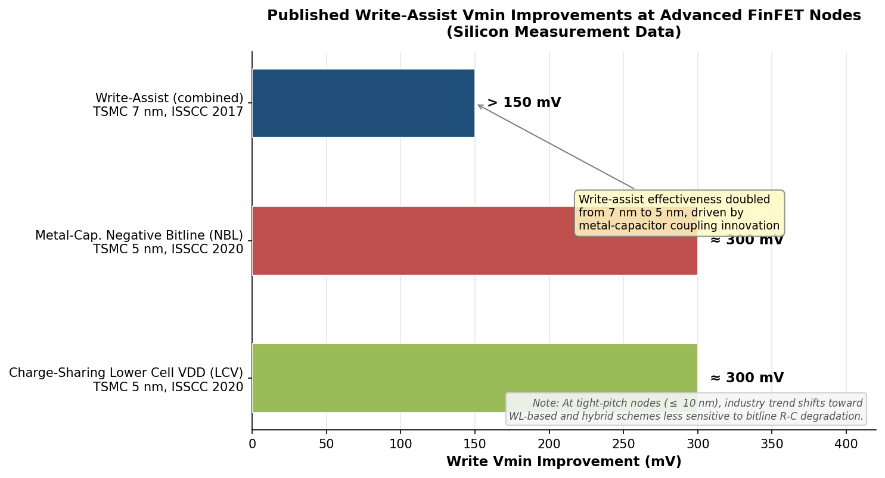

*Figure 4-1. Published write-assist Vmin improvements at advanced FinFET nodes. Write-assist effectiveness approximately doubled from 7 nm to 5 nm, driven by the adoption of metal-capacitor coupling and charge-sharing schemes. Data compiled from TSMC ISSCC 2017 and ISSCC 2020 publications.*

### 4.2.3 Assist Techniques and the 8T/10T Topology Trade-Off

A cross-cutting design question is whether to invest the available area budget in assist circuitry for a 6T cell or in additional transistors for an 8T cell. At the 7 nm and 5 nm FinFET nodes, where the HD 6T cell area resides at the ~0.021 µm² plateau, foundries have overwhelmingly chosen the 6T + write-assist path for high-density applications: the area and routing overhead of 8T cells remains prohibitive at multi-hundred-megabit capacities. Assist circuits — metal-capacitor NBL, charge-sharing LCV — add overhead in the peripheral circuitry rather than in every bit cell, making them more density-efficient than per-cell transistor additions.

At the CFET generation, this calculus may shift. If the 8T cell footprint approaches the current 6T footprint (as projected in Section 4.1.3), the intrinsic read-stability advantage of the 8T topology could eliminate the need for read-assist entirely and simplify write-assist requirements — since the 8T cell's write path is decoupled from read stability constraints, the pull-up transistor can be weakened without read-margin penalty. The net effect could be a simpler peripheral design with lower area overhead, potentially offsetting the modest per-cell cost of two additional transistors.

## 4.3 Bit-Cell Vmin, SNM, and Process-Driven Improvement

### 4.3.1 The Vmin–SNM Relationship

The minimum operating voltage (Vmin) of an SRAM array is the lowest VDD at which all bit cells maintain sufficient noise margin — both read and write — at a target yield level, typically cell-sigma ≥ 6 (corresponding to fewer than 3.4 failures per billion cells). Vmin is the supply voltage at which the 6σ tail of the weakest margin just meets the thermal-voltage floor (k_B T / q ≈ 26 mV at 300 K).

The connection to process variability is direct and quantitative. Cell-sigma is defined as μ(SNM) / σ(SNM), where σ(SNM) is dominated by σ(ΔVt) through the Pelgrom relationship. A reduction in A_VT improves cell-sigma at any given VDD, which in turn allows VDD to be lowered while maintaining the 6σ target. This linkage connects the process-level mismatch improvements traced in Chapters 2 and 3 to the system-level power benefit of lower Vmin.

### 4.3.2 Quantitative Vmin Scaling Across Nodes

Published silicon data and calibrated SPICE studies reveal a consistent — if decelerating — Vmin reduction trend across technology nodes. At 5 nm FinFET, Raza et al. report room-temperature Vmin,R (read) = 0.40 V and Vmin,W (write) = 0.30 V for the high-density cell (HDC, PU:PG:PD = 1:1:1 fin configuration) without assist circuits, at a nominal VDD = 0.75 V [H. Raza et al., "A Comprehensive Vmin Characterization of 5 nm FinFET-Based SRAM at Cryogenic Temperatures," *TechRxiv*, 2024](https://doi.org/10.36227/techrxiv.172710105.51939910 "5 nm FinFET SRAM Vmin study"). The low-voltage cell (LVC, PU:PG:PD = 1:1:2) achieves Vmin,R = 0.30 V and Vmin,W = 0.20 V at 300 K — a ~25% improvement over HDC, enabled by the stronger pull-down transistor (two fins) that boosts the cell ratio.

Across the 32 nm to 5 nm span, the SRAM Vmin scaling trend compiled from industry publications shows approximately 30% reduction (from ~0.9 V to ~0.6 V without assist), while VDD itself has decreased by a comparable ~30% (1.0 V to 0.7 V). The gap between VDD and Vmin — the operational headroom — has remained near ~100 mV in absolute terms but has expanded as a fraction of VDD from approximately 10% to 14%, reflecting the cumulative benefit of improved device variability. With assist circuits, the effective Vmin drops further: TSMC's 5 nm NBL write-assist achieves approximately 300 mV of Vmin improvement, extending the operational headroom to more than 400 mV below nominal VDD.

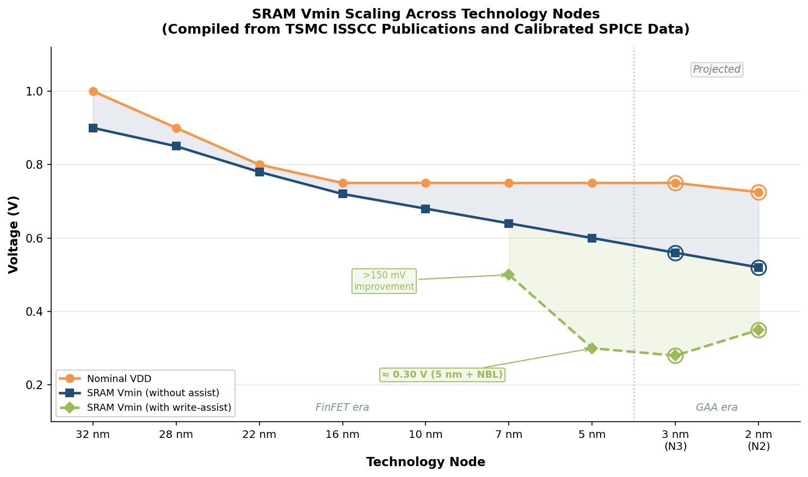

*Figure 4-2. SRAM Vmin scaling across technology nodes. Nominal VDD (orange), Vmin without assist (blue), and Vmin with write-assist (green) are plotted from 32 nm planar through projected 2 nm GAA. The shaded region indicates the operational headroom gained from write-assist circuits. Open markers denote projected values at N3 and N2. Data compiled from TSMC ISSCC publications and calibrated SPICE models.*

### 4.3.3 Process-Driven Vmin Reduction at GAA Nodes

At the N2 GAA nanosheet node, the projected A_VT ≈ 0.7 mV·µm (Chapter 3) reduces σ(ΔVt) at minimum SRAM transistor area by approximately 30% relative to the 5 nm FinFET baseline (A_VT ≈ 1.0 mV·µm). Under the first-order approximation that cell-sigma scales inversely with σ(ΔVt), this translates to a ~30% improvement in cell-sigma at iso-VDD, or equivalently an estimated 40–60 mV reduction in Vmin at iso-cell-sigma (6σ target). Combined with write-assist improvements enabled by buried power rail (BPR) and backside power delivery network (BSPDN) — which reduce IR drop on the cell supply rails and improve the effectiveness of LCV and NBL schemes — the N2 node is expected to achieve Vmin below 0.5 V for HD SRAM with assist, enabling aggressive voltage scaling for low-power applications.

The implication for SNM at nominal VDD is equally significant. At VDD = 0.75 V, the 30% reduction in σ(ΔVt) translates to an approximately 15 mV widening of the 6σ read-SNM floor (from ~97 mV at N3 nanosheet to ~112 mV at N2, extrapolated from Karner et al. SISPAD 2021 distribution parameters with the improved A_VT). This 6σ-floor improvement represents the margin available to absorb aging-induced degradation (Chapter 5) and dynamic noise sources without triggering a bit flip.

### 4.3.4 Cell-Type Selection as a Process-Aware Design Knob

The availability of multiple SRAM cell types — HDC, LVC, HPC — within a single process technology provides designers with a Vmin optimization lever that interacts directly with process variability. At 5 nm FinFET:

- **HDC (1:1:1)** offers the smallest area and lowest leakage but exhibits the highest Vmin,R (0.40 V at 300 K without assist) due to its symmetric cell ratio.
- **LVC (1:1:2)** provides the best overall Vmin trade-off (Vmin,R = 0.30 V, Vmin,W = 0.20 V) by employing a two-fin pull-down to strengthen the cell ratio, at the expense of ~40% more SRAM area.
- **HPC (1:2:2)** targets high-speed operation with a two-fin pass-gate for faster access but suffers the highest Vmin,R (0.50 V) owing to the stronger pass-gate that increases read disturbance.

As process variability decreases at GAA nodes, the Vmin advantage of LVC over HDC narrows, because reduced mismatch already provides sufficient cell-sigma headroom for the symmetric HDC configuration. This convergence favors HDC adoption for density-critical applications, with the residual Vmin gap closed by assist circuits rather than per-cell area investment.

## 4.4 Radiation-Hardened and SEU-Tolerant SRAM Cells

### 4.4.1 The Soft-Error Challenge and Its Scaling Trajectory

A single-event upset (SEU) occurs when an ionizing particle — an alpha particle from packaging impurities or a secondary particle from a cosmic-ray neutron interaction — deposits sufficient charge in the sensitive volume of a transistor to flip the state of an SRAM cell. The critical charge (Q_crit) required to cause an upset is directly related to the SNM: a cell with higher SNM can tolerate a larger transient current pulse before the storage-node voltage crosses the metastability threshold.

As SRAM cells scale, two opposing trends govern soft-error rates (SER): (1) smaller transistor volumes reduce the charge-collection cross-section, making it harder for a particle to deposit enough charge; but (2) lower node capacitances reduce Q_crit, making each deposited charge more impactful. At the FinFET and GAA generations, the thin-body or fully-depleted channel provides an inherent advantage: the small sensitive volume limits charge collection to the immediate vicinity of the channel region, and the superior gate control ensures rapid recovery of the storage-node voltage after a transient disturbance.

### 4.4.2 Architecture-Dependent Radiation Hardness: FinFET vs. GAA

Lu (SJSU, 2025) performed a systematic TCAD comparison of FinFET and GAA-FET 6T SRAM radiation hardness at the 3 nm node, using IRDS 2024 dimensions and calibrated device models with matched butterfly curves and SNM to ensure a fair baseline. The study examined five critical strike locations — channel strike, shallow substrate strike (1.5 nm below S/D epitaxy), deep substrate strike (20 nm below S/D epitaxy), top strike (vertical through all sheets/fin), and diagonal strike (from pull-down to pull-up) — with linear energy transfer (LET) swept to determine the flipping threshold [A. Lu, "Radiation Hardness Study of FinFET and Gate-All-Around FET SRAM," M.S. thesis, San José State University, 2025](https://doi.org/10.31979/etd.gvxe-zhdj "SJSU radiation hardness thesis").

For the **channel strike** — the most common and architecture-sensitive case — the GAA-FET SRAM flips at LET ≈ 0.033–0.034 pC/µm, while the FinFET SRAM flips at LET ≈ 0.026 pC/µm, making the GAA-FET approximately **31% more radiation-hard** for this strike geometry. The superior radiation hardness of the GAA architecture is attributed to its stronger electrostatic gate control over the channel, which enables faster recovery of the storage-node potential following transient charge injection.

### 4.4.3 Bottom Dielectric Isolation as a Process-Level Hardening Feature

A particularly significant finding from the same study concerns bottom dielectric isolation (BDI) — a thin oxide layer placed beneath the source/drain epitaxy in GAA nanosheet transistors. BDI is primarily a leakage-reduction feature (it blocks the substrate leakage path), but it also confers substantial radiation hardening by eliminating the sensitive volume in the substrate beneath the channel.

For the **shallow substrate strike** (1.5 nm below S/D epitaxy), the GAA-FET with BDI does not flip even at LET = 0.1 pC/µm — approximately 7× the maximum LET of a single alpha particle in silicon (LET_max ≈ 0.0144 pC/µm) — whereas the GAA-FET without BDI flips at LET ≈ 0.03 pC/µm, a qualitative immunity difference. The BDI oxide interrupts the charge-collection path: electron-hole pairs generated in the substrate below the oxide cannot reach the transistor channel, effectively shrinking the sensitive volume to the channel and S/D epitaxy regions above the BDI layer.

This result carries a practical implication: GAA nanosheet processes that incorporate BDI — as expected for production N2 and beyond — may provide alpha-particle immunity for substrate-strike geometries without any circuit-level hardening, a significant advantage for aerospace, automotive, and data-center environments where soft-error rate specifications are stringent.

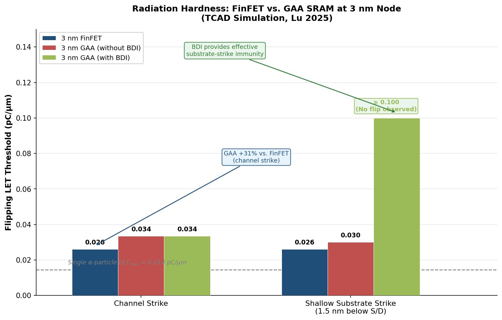

*Figure 4-3. Radiation hardness comparison at the 3 nm node (TCAD simulation, Lu 2025). The GAA-FET exhibits a 31% higher flipping LET threshold than the FinFET for channel strikes. With bottom dielectric isolation (BDI), the GAA-FET shows no flip at LET = 0.1 pC/µm for shallow substrate strikes — approximately 7× the single α-particle LET maximum — indicating qualitative substrate-strike immunity.*

### 4.4.4 Circuit-Level Hardening and Process Synergies

Beyond the inherent process-level advantages, several circuit-architecture strategies further improve SEU tolerance, and their effectiveness is enhanced by advanced process features:

- **Redundant-latch cells (e.g., DICE — Dual Interlocked Storage Cell).** The DICE cell employs 12 transistors arranged so that a single-node upset cannot propagate to a bit flip; both complementary storage nodes must be upset simultaneously. The area penalty (2× the 6T cell) renders DICE impractical for general-purpose SRAM, but at CFET-class density the overhead becomes more acceptable for safety-critical applications.

- **Resistive decoupling.** Inserting high-resistance elements (poly resistors or narrow metal lines) in the cross-coupling feedback path slows the propagation of a transient disturbance, giving the latch time to recover. At advanced nodes, the inherently higher sheet resistance of scaled interconnects can be leveraged to provide passive resistive decoupling without dedicated resistor devices.

- **Increased nodal capacitance.** Adding decoupling capacitance to the storage nodes raises Q_crit proportionally. In CFET architectures, the parasitic capacitance from tall vertical inter-tier (VINT) contacts and the dense metal stack inherently increases nodal capacitance — an unintentional but beneficial consequence of vertical integration that partially compensates for the reduced Q_crit of scaled devices.

The combination of GAA electrostatic control, BDI substrate isolation, and the parasitic-capacitance increase from vertical integration creates a favorable process environment for radiation-tolerant SRAM at the 2 nm generation and beyond, reducing the burden on circuit-level hardening and enabling simpler, denser radiation-hardened designs.

# 第5章 Reliability, Aging, and Their Interaction with SNM

Chapters 2 and 3 established how transistor architecture evolution and process-level knobs progressively reduce time-zero variability and widen the fresh SNM distribution. Yet an SRAM cell must retain its stored state not merely at time zero but across a product lifetime that may span 10 years of continuous operation at elevated temperatures and supply voltages. Four dominant aging mechanisms — bias temperature instability (BTI), hot-carrier injection (HCI), random telegraph noise (RTN), and time-dependent dielectric breakdown (TDDB) — systematically erode the noise margins established at fabrication. Their magnitude and relative importance shift as the transistor architecture transitions from FinFET to GAA nanosheet to CFET: the same structural changes that improve electrostatic control also alter the electric-field distribution, self-heating profile, and defect landscape within the gate stack.

This chapter first examines each aging mechanism's physical origin and its quantitative impact on SRAM SNM (Section 5.1), then compares aging-induced degradation across architectures (Section 5.2), discusses process-level mitigation strategies (Section 5.3), and concludes with the statistical framework for aging-aware design sign-off (Section 5.4).

## 5.1 Dominant Aging Mechanisms and Their Impact on SNM

### 5.1.1 Bias Temperature Instability (NBTI and PBTI)

Bias temperature instability represents the single largest contributor to SRAM SNM degradation over the product lifetime. NBTI affects PMOS transistors when a negative gate-to-source voltage is sustained — precisely the operating condition of the pull-up (PU) transistors in a 6T cell whenever the corresponding storage node holds a logic "0." Under this stress, interface traps (generated by Si–H bond breaking at the Si/SiO₂ interface) and hole trapping in the high-κ dielectric shift the threshold voltage |Vt| upward, weakening the PU drive current and degrading the latch feedback strength. PBTI is the analogous mechanism for NMOS transistors under positive gate bias, affecting the pull-down (PD) devices when their gate is held high.

The asymmetric nature of BTI stress within the SRAM cell is a central concern. In a 6T cell storing a stable "0" at node Q, the PU transistor on the Q-side (PU₁) is under continuous NBTI stress while the PD transistor on the QB-side (PD₂) experiences PBTI stress; the complementary pair (PU₂, PD₁) resides in recovery. The net effect is a time-dependent, data-pattern-dependent mismatch between the two halves of the latch that directly compresses the butterfly-curve lobes and reduces read SNM. Monte Carlo SPICE simulations of 6T SRAM at the 90 nm node confirm that BTI severely degrades read SNM and write margin while the read current remains relatively unaffected — the mismatch-induced asymmetry skews the voltage transfer characteristics without substantially altering total drive current [T. Liu et al., "Reliability and Aging Analysis on SRAMs Within Microprocessor Systems," *IntechOpen*, 2017](https://www.intechopen.com/chapters/58392 "Georgia Tech SRAM aging analysis").

At the nanosheet generation, NBTI acquires architecture-specific characteristics. TCAD simulations of a 5 nm-node three-stack nanosheet FET (gate length 12 nm, EOT 0.9 nm) indicate an NBTI-induced Vt shift from −0.373 V to −0.473 V — approximately 100 mV — after 1000 s of DC stress, with degradation following a logarithmic time dependence [X. Li et al., "Interaction of Negative Bias Instability and Self-Heating Effect on Threshold Voltage and SRAM Stability of Nanosheet Field-Effect Transistors," *Micromachines*, vol. 15, no. 3, 2024](https://pmc.ncbi.nlm.nih.gov/articles/PMC10972297/ "Xidian University NBTI-SHE study on NSFETs"). This Vt shift translates directly into SNM degradation: the same study reports progressive compression of the butterfly-curve lobes in a nanosheet-based 6T SRAM, with an earlier flip point confirming reduced noise immunity.

A critical finding for nanosheet architectures is the coupling between NBTI and the self-heating effect (SHE). The GAA geometry — with stacked channels surrounded by gate dielectric — exhibits poorer thermal dissipation than bulk-FinFET structures. Self-heating raises channel temperature, which in turn accelerates NBTI-driven interface-trap generation as carriers gain additional thermal energy to break Si–H bonds. Li et al. demonstrate that the coupled NBTI + SHE degradation produces a more severe butterfly-curve shift than NBTI alone, indicating that thermal management is inseparable from NBTI mitigation in nanosheet SRAM [X. Li et al., *Micromachines*, 2024](https://pmc.ncbi.nlm.nih.gov/articles/PMC10972297/ "NBTI–SHE coupling in NSFETs").

### 5.1.2 Hot-Carrier Injection (HCI)

Hot-carrier injection occurs when channel carriers acquire sufficient kinetic energy — typically near the drain under high lateral electric fields — to generate interface traps or become injected into the gate oxide. Unlike BTI, which is a DC-stress phenomenon proportional to the duty cycle, HCI is switching-dependent: it degrades transistors proportionally to their transition rate. In an SRAM cell, HCI is therefore most relevant during write operations, when the storage nodes toggle and the pass-gate and pull-down transistors experience high drain-to-source voltage transients.

The HCI–SNM interaction differs fundamentally from the BTI–SNM interaction. Because HCI stress is symmetric — both halves of the cell undergo comparable switching activity — it tends to degrade both transistor pairs in tandem rather than creating the asymmetric mismatch characteristic of BTI. Consequently, HCI primarily reduces the read current (I_READ) and increases access time rather than directly compressing the SNM butterfly lobes. Liu et al. confirm through Monte Carlo SPICE simulation that HCI can actually *improve* static metrics (read SNM, write margin, V_dd,min,ret) while degrading I_READ, because the uniform Vt increase symmetrically shifts the voltage transfer characteristics without introducing the imbalance that erodes noise immunity [T. Liu et al., *IntechOpen*, 2017](https://www.intechopen.com/chapters/58392 "HCI vs BTI impact on SRAM metrics").

At the GAA nanosheet generation, HCI reliability acquires new architecture-specific dependencies. A comprehensive review by Zhou (IBM, 2025) identifies several modulating factors: (a) *corner effects* — the curved regions of the nanosheet cross-section experience higher oxide electric fields than flat regions, generating more interface traps during stress; (b) *nanosheet width dependence* — wider sheets exhibit slightly worse HCI owing to increased self-heating despite a smaller proportion of curved corners; and (c) *inner-spacer quality* — thinner inner spacers bring the gate closer to the source/drain junction, intensifying the lateral field and aggravating HCI [H. Zhou, "An Overview of Hot Carrier Degradation on Gate-All-Around Nanosheet Transistors," *Micromachines*, vol. 16, no. 3, 2025](https://www.mdpi.com/2072-666X/16/3/311 "IBM HCD review on GAA NS transistors"). Samsung's 3 nm GAA technology qualification data indicate that HCI-induced I_dsat degradation is comparable to that of prior FinFET generations when normalized to the same performance level, suggesting that the superior gate control of GAA neither inherently worsens nor improves the HCI–performance trade-off [S. Kim et al., "Reliability Assessment of 3 nm GAA Logic Technology," *IEEE IRPS*, 2023](https://www.mdpi.com/2072-666X/16/3/311 "Samsung 3 nm GAA IRPS 2023, cited in Zhou review").

### 5.1.3 Random Telegraph Noise (RTN)

Random telegraph noise originates from the stochastic capture and emission of individual carriers by oxide traps near the Si/SiO₂ interface. Each trapping event discretely shifts the transistor's threshold voltage by ΔVt,RTN, producing a two-level (or multi-level) random fluctuation in drain current. Unlike BTI, which is a monotonic long-term degradation, RTN is a time-varying noise source capable of causing transient SNM excursions below the stability threshold.

RTN is particularly consequential for SRAM because the impact of a single trap scales inversely with channel area: as transistor dimensions shrink, ΔVt,RTN per trap event increases. At advanced FinFET and GAA nodes, where the channel volume confines carriers to a few nanometers of width and height, a single occupied trap can shift Vt by 10–50 mV — comparable to the 6σ read-SNM margin at low VDD. Toh et al. (UC Berkeley) measured large-signal RTN amplitudes in sub-threshold operation and demonstrated that RTN-induced Vt fluctuations can transiently collapse the SNM of a 6T cell, making dynamic stability — rather than static DC SNM — the binding constraint for Vmin determination [S. O. Toh et al., "Impact of Random Telegraph Signaling Noise on SRAM Stability," *IEEE VLSI Technology Symposium*, 2011](https://people.eecs.berkeley.edu/~bora/Conferences/2011/VLSIT11.pdf "Berkeley RTN-SRAM study").

The GAA nanosheet structure introduces a nuanced RTN landscape. On one hand, the fully wrapped gate provides more uniform channel-potential control, which can suppress the coupling efficiency of individual oxide traps to the channel. On the other hand, the thinner gate dielectric (EOT < 1 nm) and the larger number of interface sites per unit channel area — a consequence of the wrapped geometry — can increase the total trap count. The net RTN susceptibility therefore depends critically on the quality of the Si/high-κ interface, a parameter directly controlled by the process-level mitigation strategies discussed in Section 5.3.

### 5.1.4 Time-Dependent Dielectric Breakdown (TDDB)

Time-dependent dielectric breakdown is the progressive accumulation of defects within the gate dielectric under sustained electric-field stress, eventually creating a conductive percolation path that short-circuits the gate to the channel. At the soft-breakdown stage, a resistive leakage path forms; at hard breakdown, the gate oxide becomes a low-impedance short. For SRAM, even soft breakdown can be catastrophic: a resistive short on a PU or PD gate reduces the effective Vt, skews the latch balance, and can permanently destroy the noise margin of the affected cell.

TDDB becomes increasingly relevant at advanced nodes for two reasons. First, EOT continues to scale below 1 nm, raising the oxide electric field at nominal VDD. Second, the high-κ/SiO₂ interfacial-layer stack introduces additional defect-generation sites at the grain boundaries of the polycrystalline HfO₂. In GAA nanosheet transistors, the corner regions of the wrapped gate — where the oxide electric field concentrates due to geometric curvature — are particularly vulnerable. TCAD simulations by Lim et al. demonstrate that the corner curvature range directly modulates TDDB lifetime: sharper corners experience higher peak electric fields and shorter time-to-breakdown [J. W. Lim et al., "Self-Heating and Corner Rounding Effects on Time Dependent Dielectric Breakdown of Stacked Multi-Nanosheet FETs," *IEEE Access*, vol. 11, 2023](https://www.mdpi.com/2072-666X/16/3/311 "Lim et al. TDDB corner effects, cited in Zhou HCD review"). This finding underscores the importance of corner-rounding during the nanosheet channel-release etch — a process optimization that simultaneously benefits HCI, TDDB, and BTI reliability.

Unlike BTI and HCI, which gradually shift Vt and compress noise margins, TDDB is a sudden-failure mechanism. Its impact on SRAM is statistical rather than parametric: it does not manifest as a slow SNM degradation trend but as a discrete failure event. Design sign-off must therefore treat TDDB as a reliability-limited yield constraint (Section 5.4), ensuring that the gate-oxide defect density remains low enough to meet the target failure-in-time (FIT) rate over the product lifetime.

The following figure summarizes the relative severity of each aging mechanism on key SRAM metrics, contrasting FinFET and GAA nanosheet architectures.

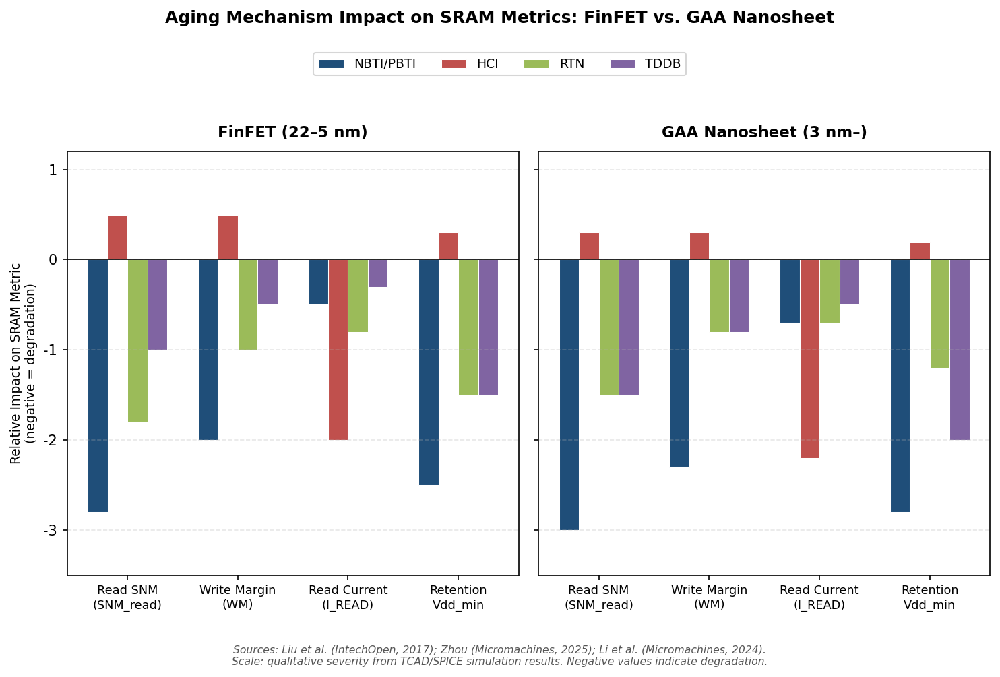

*Figure 5-1. Relative impact of NBTI/PBTI, HCI, RTN, and TDDB on read SNM, write margin, read current, and retention V_dd,min for FinFET (22–5 nm) and GAA nanosheet (3 nm–) architectures. Negative values indicate degradation; the small positive HCI bars on static metrics reflect the symmetric Vt-shift effect. Data synthesized from Liu et al. (IntechOpen, 2017), Zhou (Micromachines, 2025), and Li et al. (Micromachines, 2024).*

## 5.2 Architecture-Dependent Aging: FinFET vs. GAA Nanosheet vs. CFET

The transition from FinFET to GAA nanosheet to CFET fundamentally reshapes the aging landscape. Each architecture offers structural advantages that suppress certain degradation mechanisms while introducing new vulnerabilities.

### 5.2.1 FinFET: The Established Reliability Baseline

FinFET architectures (22–5 nm) established a markedly improved reliability baseline relative to planar CMOS. The thin, undoped fin channel reduced the number of available dopant-related traps, suppressing the stochastic component of BTI. At the 14 nm FinFET node, industry reliability qualification data (Intel, TSMC, Samsung) demonstrated that NBTI-induced Vt shifts at 10-year equivalent stress remained within 30–50 mV for PMOS devices at nominal VDD — a range manageable within the available SNM budget at VDD = 0.80 V.

The FinFET's principal reliability vulnerability is its self-heating profile. The narrow fin, surrounded by oxide isolation (STI below, gate dielectric on three sides), has limited thermal escape paths. Under sustained operation, channel temperature can rise 30–50 K above the chuck temperature, accelerating all thermally activated degradation mechanisms. Self-heating corrections of 10–35 % have been reported for HCI end-of-life projections in FinFET technologies [H. Zhou, *Micromachines*, 2025](https://www.mdpi.com/2072-666X/16/3/311 "Self-heating correction range for HCI in FinFET/GAA"). This thermal penalty is partially offset by the FinFET's superior electrostatic control, which facilitates more rapid recovery from transient BTI stress once gate bias is removed.

### 5.2.2 GAA Nanosheet: New Degrees of Freedom and New Vulnerabilities

The GAA nanosheet architecture introduces several reliability-relevant structural changes relative to the FinFET.

**Improved gate control and BTI.** The fully wrapped gate provides superior channel-potential uniformity, reducing the peak oxide electric field at any given VDD. In principle, this should lower the BTI-driven interface-trap generation rate. However, the nanosheet geometry introduces non-uniform electric-field distribution across the channel cross-section: the rolled corners of the rectangular-to-rounded nanosheet experience field enhancement that locally intensifies BTI. Li et al. demonstrate that increasing nanosheet width from 24 nm to 50 nm reduces NBTI-induced Vt degradation, because wider sheets distribute the electric field more uniformly and reduce the proportion of the high-field corner region [X. Li et al., *Micromachines*, 2024](https://pmc.ncbi.nlm.nih.gov/articles/PMC10972297/ "Nanosheet width effect on NBTI"). The corresponding SRAM butterfly-curve analysis confirms that cells built from wider nanosheets exhibit higher SNM and smaller SNM degradation over time — albeit at the cost of larger cell area. Figure 5-2 quantifies this trade-off.

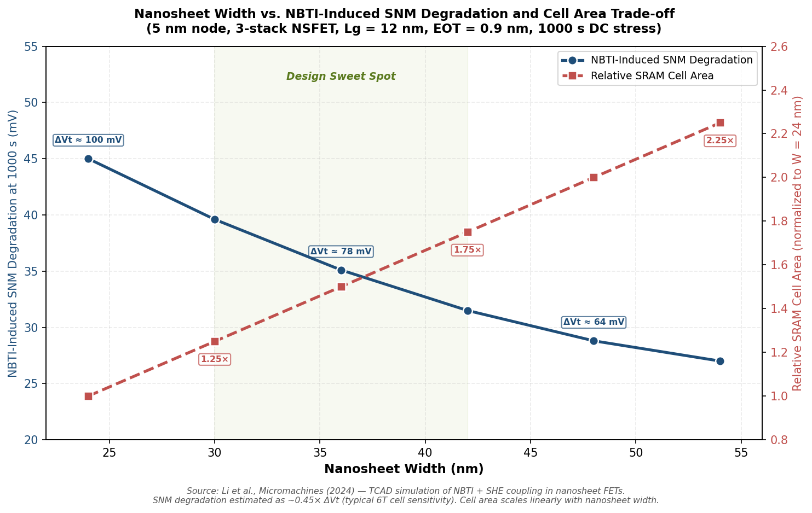

*Figure 5-2. Trade-off between nanosheet width (24–54 nm), NBTI-induced SNM degradation at 1000 s DC stress (left axis), and relative SRAM cell area normalized to W = 24 nm (right axis). The shaded "design sweet spot" region (30–42 nm) highlights the practical optimization window. Data derived from Li et al. (Micromachines, 2024) TCAD simulations of 5 nm-node three-stack nanosheet FETs.*

**HCI corner effects.** TCAD simulations by Vandemaele et al. (imec/KU Leuven, IRPS 2022) compare HCI degradation across nanowire, nanosheet, and forksheet architectures, finding that HCI worsens in structures with more pronounced curvature. The curved corner regions generate higher interface-trap densities during stress than flat regions, as confirmed by electric-field distribution analysis. The practical implication is that process optimization of the channel-release etch — targeting rectangular cross-sections with well-rounded corners — simultaneously improves HCI, BTI, and TDDB reliability [M. Vandemaele et al., "Simulation Comparison of Hot-Carrier Degradation in Nanowire, Nanosheet and Forksheet FETs," *IEEE IRPS*, 2022](https://www.mdpi.com/2072-666X/16/3/311 "Vandemaele et al. HCD comparison across GAA architectures, cited in Zhou review").

**Aggravated self-heating.** The vertically stacked nanosheet structure exacerbates self-heating relative to the FinFET, as multiple conducting channels are sandwiched between insulating gate-dielectric layers with poor thermal conductivity. TCAD thermal simulations indicate that the temperature rise in GAA nanosheets can exceed 100 K for sub-10 nm gate lengths under stress conditions, with the top nanosheet in the stack running hottest owing to its distance from the substrate heat sink [L. Cai et al., "Layout Design Correlated with Self-Heating Effect in Stacked Nanosheet Transistors," *IEEE Trans. Electron Devices*, vol. 65, 2018](https://www.mdpi.com/2072-666X/16/3/311 "Cai et al. SHE in stacked NS, cited in Zhou review"). The temperature differential between top and bottom sheets increases with both nanosheet width and the number of stacked sheets. For SRAM, this means that the PU and PD transistors may experience different thermal environments depending on their position in the vertical stack, introducing a thermally driven mismatch that compounds the BTI-induced asymmetry.

**Bottom dielectric isolation (BDI) as a reliability enabler.** As discussed in Chapter 4 for radiation hardness, BDI also benefits aging reliability by eliminating the substrate leakage path and reducing the parasitic junction area susceptible to trap-assisted tunneling. Early reliability assessments of forksheet transistors with BDI show no anomalous trapping effects relative to standard nanosheet references, indicating that BDI is reliability-neutral to positive [E. Bury et al., "Evaluating Forksheet FET Reliability Concerns by Experimental Comparison with Co-integrated Nanosheets," *IEEE IRPS*, 2022](https://www.mdpi.com/2072-666X/16/3/311 "Bury et al. forksheet reliability, cited in Zhou review").

### 5.2.3 CFET: Projected Aging Landscape

The complementary FET (CFET) architecture, which vertically stacks NMOS and PMOS devices, is projected for the A5–A3 technology generations. While no published silicon reliability data are available as of early 2026, TCAD projections and physical reasoning support several inferences about the CFET aging landscape:

1. **Thermal coupling between stacked n/p devices.** In CFET, the PMOS pull-up transistor sits directly above (or below) the NMOS pull-down transistor, separated only by a thin inter-tier dielectric. The thermal coupling is expected to be stronger than in laterally separated FinFET or nanosheet layouts. This tight coupling may homogenize the self-heating-induced temperature distribution within the cell — potentially reducing thermally driven mismatch that degrades SNM — but it also raises the absolute channel temperature, accelerating all aging mechanisms.

2. **Increased parasitic capacitance benefits.** The tall vertical inter-tier (VINT) contacts and the dense metal stack in CFET inherently increase the nodal capacitance at the storage nodes. Higher nodal capacitance raises the critical charge for SEU and, by analogy, provides a larger energy barrier against RTN-induced transient flips — partially compensating for reduced intrinsic device capacitance at scaled dimensions.

3. **Gate-stack reliability at aggressive EOT.** CFET processes target sub-0.7 nm EOT gate stacks to maintain performance at reduced VDD. At these thicknesses, TDDB lifetime sensitivity to process-induced defects intensifies, and the margin between operational and breakdown electric fields narrows. The reliability-aware gate-stack engineering discussed in Section 5.3 becomes even more critical at the CFET generation.

## 5.3 Process-Level Mitigation Strategies

The process knobs discussed in Chapter 3 for time-zero variability reduction also serve as the primary levers for aging mitigation. This section focuses on the specific process optimizations that target aging-induced SNM degradation.

### 5.3.1 Interface Passivation and Interlayer Quality

The Si/SiO₂ interfacial layer (IL) is the critical battleground for both NBTI and RTN. Interface traps generated by Si–H bond breaking under NBTI stress, together with pre-existing oxide traps that produce RTN, reside within or near this layer. Two process-level strategies directly address IL quality.

**Deuterium annealing.** Replacing the standard hydrogen anneal with a deuterium (D₂) anneal increases the Si–D bond dissociation energy relative to Si–H by approximately 0.1 eV, making the interface more resistant to NBTI-driven bond breaking. First demonstrated in the late 1990s for planar CMOS, this technique remains relevant at advanced nodes. The challenge at the GAA generation is ensuring that deuterium penetrates uniformly to all nanosheet surfaces, including the inner sheets shielded by the outer gate-stack layers.

**Chemical SiO₂ interlayer optimization.** IL thickness and formation method — thermal oxidation, chemical oxidation, or ozone-based oxidation — determine the initial interface-trap density (D_it) and the density of precursor sites for trap generation under stress. At the N3 and N2 nodes, the target is D_it below ~5 × 10¹⁰ cm⁻² eV⁻¹ while maintaining IL thickness at 0.5–0.7 nm to meet EOT targets (Chapter 3). Thinner ILs reduce the total TDDB defect-generation volume but increase the electric field per unit thickness, creating a reliability–performance trade-off that must be navigated through careful process-window optimization.

### 5.3.2 Channel Material Purity and Defect Engineering

The quality of the silicon channel — crystallinity, residual defect density, and surface roughness — influences the density of trap precursor sites available for BTI and RTN activation. At the GAA nanosheet generation, two process-specific factors are critical.

**Selective SiGe removal.** The nanosheet channel is formed by selectively etching the sacrificial SiGe layers from the Si/SiGe superlattice. Residual germanium contamination on the nanosheet surfaces can create electrically active trap states that increase RTN amplitude and accelerate BTI. Loubet et al. (IBM, IEDM 2019) demonstrated that the choice of SiGe removal chemistry — wet versus dry etch — not only determines the nanosheet cross-sectional shape (elliptical vs. rectangular) but also affects surface defect density [N. Loubet et al., "A Novel Dry Selective Etch of SiGe for the Enablement of High Performance Logic Stacked Gate-All-Around NanoSheet Devices," *IEEE IEDM*, 2019](https://www.mdpi.com/2072-666X/16/3/311 "Loubet et al. dry SiGe etch, cited in Zhou review"). The rectangular shape achieved by dry selective etch reduces corner curvature (benefiting HCI and TDDB) and improves surface quality for subsequent gate-stack deposition.

**Nanosheet surface conditioning.** Post-release surface treatments — including sacrificial oxidation, HF-last cleaning, and controlled re-oxidation — remove etch-induced damage and establish a pristine Si surface for IL growth. The effectiveness of these treatments directly determines the initial D_it and, consequently, RTN amplitude and NBTI degradation rate. Process-development efforts at leading foundries target sub-10¹⁰ cm⁻² eV⁻¹ midgap D_it on all nanosheet surfaces, a specification that requires extremely uniform and conformal wet-chemical access to the inner nanosheet gaps.

### 5.3.3 Reliability-Aware Work-Function Metal Selection

The work-function metal (WFM) stack, discussed in Chapter 3 primarily for Vt setting, also carries significant reliability implications.

**Metal-gate granularity (MGG) and RTN.** The polycrystalline grain structure of the metal gate produces local effective-work-function fluctuations. These same grain boundaries can act as preferential sites for defect generation under TDDB stress and for charge trapping that contributes to RTN. Maintaining the average grain size below 10 nm (Chapter 3) simultaneously reduces time-zero variability and improves aging reliability.

**WFM stack thermal budget.** The annealing conditions used to set the final WFM crystallinity and grain size must balance multiple requirements: smaller grains for lower MGG variability, adequate crystallinity for low gate resistance, and minimal thermal damage to the IL and high-κ dielectric. An excessively high thermal budget can regrow the IL (increasing EOT and degrading short-channel control) or crystallize HfO₂ into an unfavorable monoclinic phase with higher trap density. The process-integration challenge is to identify the ALD window that simultaneously minimizes MGG grain size, maintains D_it below target, and delivers acceptable TDDB lifetime — a three-way optimization that becomes progressively more constrained at each successive node.

### 5.3.4 Corner Rounding and Nanosheet Geometry Optimization

The corner-effect analysis in Sections 5.1 and 5.2 identifies nanosheet curvature as a cross-cutting reliability vulnerability. Process-level mitigation centers on two complementary strategies:

1. **Channel-release etch optimization.** As demonstrated by Loubet et al., dry selective etch yields more rectangular nanosheet cross-sections with controlled corner radii, reducing the peak electric field at corners. The target is to minimize curvature-induced field enhancement while maintaining sufficient sheet thickness uniformity across the full wafer.

2. **Nanosheet width selection.** Wider nanosheets reduce the proportion of corner area relative to flat area, distributing the electric field more uniformly and mitigating corner-driven NBTI, HCI, and TDDB degradation. Li et al. quantify this trade-off for SRAM: wider-sheet cells exhibit higher SNM and smaller SNM degradation, but at the cost of increased cell area [X. Li et al., *Micromachines*, 2024](https://pmc.ncbi.nlm.nih.gov/articles/PMC10972297/ "Wider nanosheet reduces NBTI, increases area"). The DTCO framework discussed in Chapter 6 must balance this reliability benefit against area and leakage penalties.

## 5.4 Statistical Treatment of Aging-Aware SNM in Design Sign-Off

### 5.4.1 The Aging-Aware SNM Distribution

At time zero, the SNM distribution of a production SRAM array is characterized by its mean (μ_SNM) and standard deviation (σ_SNM), both determined by the process-level variability discussed in Chapter 3. Aging mechanisms progressively shift this distribution: BTI reduces μ_SNM by degrading latch transistor Vt symmetry, while the stochastic nature of individual trap events (RTN, discrete BTI defects) can also widen σ_SNM. The design-sign-off challenge is to ensure that the 6σ (or higher) tail of the end-of-life (EOL) SNM distribution remains above a minimum threshold — typically the thermal voltage k_BT/q ≈ 26 mV at 300 K.

Figure 5-3 illustrates this progressive distribution shift for a representative GAA nanosheet SRAM cell.

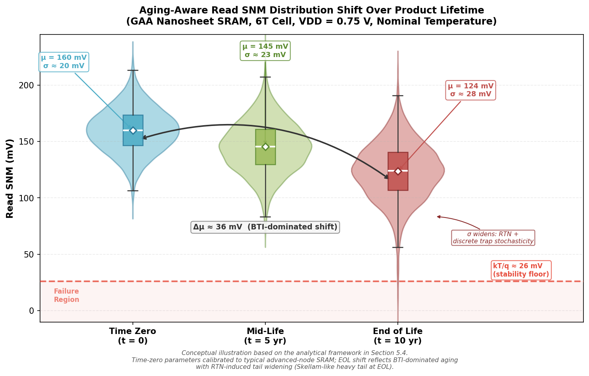

*Figure 5-3. Progressive shift and widening of the read SNM distribution from time zero through mid-life (5 yr) to end of life (10 yr) for a GAA nanosheet 6T SRAM cell at VDD = 0.75 V. The mean SNM decreases by approximately 36 mV (BTI-dominated), while σ widens from 20 mV to 28 mV due to RTN and discrete trap stochasticity. The k_BT/q ≈ 26 mV stability floor and failure region are marked. Conceptual illustration calibrated to the analytical framework in Section 5.4.*

The standard industry approach partitions the aging analysis into deterministic and stochastic components:

- **Deterministic component.** Mean Vt shifts from NBTI, PBTI, and HCI are projected to EOL using accelerated-stress models (power-law or logarithmic time dependence) calibrated to silicon data at elevated voltage and temperature. These shifts are applied uniformly to all devices of a given type (NMOS or PMOS) and deterministically reduce μ_SNM.

- **Stochastic component.** The variability of individual-device aging — arising from the discrete nature of trap generation (Poisson statistics) and RTN — adds a time-dependent term to σ_SNM. At advanced nodes where the number of traps per device is small (order 1–10), the trap-number variation follows a Skellam distribution rather than a Gaussian, producing heavier tails in the Vt-shift distribution.

### 5.4.2 Worst-Case Corner Analysis

Traditional reliability sign-off employs worst-case corner analysis: EOL Vt shifts are applied as fixed offsets to the worst-case process corner (e.g., slow-NMOS/fast-PMOS for read SNM), and the resulting SNM is checked against the minimum threshold. This approach is conservative but computationally efficient, requiring only a handful of SPICE simulations per corner.

The principal limitation of corner-based analysis is that it decouples process variability from aging variability, potentially double-counting the worst case. In practice, a device at the slow-NMOS process corner may not experience the worst-case NBTI degradation, because its already-high initial Vt reduces the oxide field and hence the BTI stress. This correlation between initial variability and aging rate is architecture-dependent: in FinFET, the correlation is weak (BTI is dominated by interface quality rather than Vt); in GAA nanosheets, the correlation strengthens because the oxide-field dependence of BTI is modulated by the nanosheet-width-dependent Vt setting.

### 5.4.3 Monte Carlo Aging Simulation

To capture the full statistical interaction between process variability and aging, leading foundries and EDA vendors employ Monte Carlo aging simulations. The methodology proceeds in three stages:

1. **Statistical device population generation.** The time-zero Vt distribution (including MGG, LER/LWR, and nanosheet-width variation) is sampled for all six transistors in the SRAM cell using calibrated compact models.

2. **Device-specific aging application.** For each sampled device, the EOL Vt shift is computed using physics-based aging models that account for initial Vt, operating temperature (including self-heating), and stress duty cycle. The duty-cycle dependence of BTI is particularly important for SRAM: cells storing predominantly "0" or "1" experience asymmetric stress, whereas cells with balanced data patterns age more symmetrically.

3. **EOL SNM evaluation.** The SNM of each Monte Carlo sample is computed at EOL, and the aged SNM distribution is constructed. Failure probability is then extracted from the tail of this distribution at the target sigma level.

Liu et al. (Georgia Tech) demonstrate this methodology for a LEON3 microprocessor's L1 data cache at the 90 nm node, using 2000 Monte Carlo samples per stress state and importance sampling to resolve the distribution tail. Their results show that BTI-induced failure probability increases with cache size and with higher associativity — because higher hit rates reduce the recovery cycles available for BTI relaxation — providing workload-aware reliability projections that conventional corner analysis cannot capture [T. Liu et al., *IntechOpen*, 2017](https://www.intechopen.com/chapters/58392 "Monte Carlo aging simulation for SRAM caches").

At advanced nodes (7 nm and below), the computational cost of full Monte Carlo aging simulation for multi-megabit SRAM arrays is prohibitive without acceleration techniques. Two approaches are gaining adoption:

- **Importance sampling.** Biasing the Monte Carlo distribution toward the tail region achieves statistically significant failure-rate estimates with fewer samples, reducing the required sample count by 10–100× for 6σ-level estimation.

- **Machine-learning-assisted aging prediction.** Surrogate models, trained on a reduced set of TCAD or SPICE aging simulations, predict the EOL SNM distribution for arbitrary process-variability and workload conditions. These models can be integrated into statistical SRAM compilers (Chapter 6) to provide rapid aging-aware Vmin estimation during the design-technology co-optimization loop.

### 5.4.4 Workload-Aware Aging and Design Implications

The data-pattern dependence of BTI stress creates a workload-dependent aging profile that varies spatially across the SRAM array. Cells in frequently accessed cache lines experience more write transitions (favoring HCI) but also more balanced "0"/"1" duty cycles (reducing BTI asymmetry). Cells in rarely accessed lines may store the same value for extended periods, maximizing BTI duty-cycle stress on one half of the latch.

This spatial non-uniformity carries direct design implications. Weckx et al. (imec, IRPS 2013) proposed a defect-based methodology for workload-dependent circuit lifetime projections applied to SRAM, demonstrating that the worst-case cell in an array is not necessarily the one with the worst time-zero variability but rather the one with the worst combination of initial mismatch and stress duty cycle. Cache-architecture-level mitigation strategies — periodic content inversion (writing the complement of stored data), duty-cycle equalization, and LRU replacement policies that distribute write activity — can reduce BTI-induced aging asymmetry and extend the effective SRAM lifetime.

The convergence of workload-aware aging analysis with the DTCO framework (Chapter 6) represents the current frontier of SRAM reliability engineering. Process, cell design, assist circuitry, and system-level cache management policy must be co-optimized to ensure that EOL SNM meets the target across all realistic operating conditions.

# 第6章 Design-Technology Co-Optimization and PPAC Trade-Offs for SRAM

The preceding chapters treated transistor architecture (Chapter 2), process knobs (Chapter 3), circuit techniques (Chapter 4), and reliability (Chapter 5) as largely separable levers for improving SRAM static noise margin. In practice, no lever operates in isolation. A work-function metal (WFM) stack change that lowers Vt mismatch (Chapter 3) simultaneously alters leakage, constraining the cell-type selection analyzed in Chapter 4; a buried power rail (BPR) that relaxes front-end routing congestion also modifies parasitic capacitance, reshaping the write-margin landscape. The methodology that navigates these interdependencies — Design-Technology Co-Optimization (DTCO) — has become the primary vehicle through which foundries and design teams translate process capability into SRAM-level metrics: SNM, Vmin, area, leakage, and performance.

This chapter defines the DTCO methodology as applied to SRAM bit-cells (Section 6.1), presents Power–Performance–Area–Cost (PPAC) trade-off analyses across recent and upcoming foundry nodes from N3 through CFET-class A5/A3 (Section 6.2), examines how back-end-of-line (BEOL) innovations — BPR and backside power delivery network (BSPDN) — relax front-end constraints and enhance SRAM stability (Section 6.3), and discusses the growing role of EDA-process co-optimization, including statistical SRAM compilers and machine-learning-assisted Vmin prediction (Section 6.4).

## 6.1 The DTCO Feedback Loop for SRAM

### 6.1.1 Defining DTCO in the SRAM Context

DTCO is an iterative methodology that jointly optimizes process parameters — gate length, metal pitch, fin/nanosheet geometry, gate-cut dimensions, and Vt flavor offerings — together with design rules — cell height, contacted poly pitch (CPP), minimum metal spacing, and power-rail routing — to maximize a composite PPAC score for a target product category. For SRAM, this composite metric must explicitly include SNM_read, write margin, and Vmin alongside conventional power–performance–area figures, because SRAM yield is gated by the statistical tail of stability metrics across billions of cells per die.

The DTCO loop proceeds through several tightly coupled stages:

1. **Device-level exploration.** TCAD simulations sweep transistor parameters (nanosheet width, number of stacked sheets, channel stress, WFM stack variants) to generate I–V characteristics, Vt distributions, and mismatch statistics (σ(ΔVt), A_VT). These form the input to compact-model extraction.

2. **Cell-level evaluation.** Compact models feed SPICE-level SNM, Vmin, and timing simulations for candidate bit-cell layouts. Monte Carlo sampling — typically ≥ 10 000 instances — captures the variability-aware 6σ SNM_read floor, the binding metric for production yield (Chapter 1).

3. **Array-level parasitic extraction.** Extracted parasitic resistance and capacitance of word-lines (WL) and bit-lines (BL) — which depend critically on metal pitch, cell height, and power-rail routing strategy — are back-annotated into the SPICE simulations. At deeply scaled nodes, BL and WL parasitics can dominate SRAM performance and margin.

4. **Feedback iteration.** If the target PPAC metrics are not met, the loop feeds back to adjust either process parameters (e.g., increasing nanosheet width, changing stress conditions) or design rules (e.g., adding a metal track, modifying gate-cut dimensions). Multiple iterations are typically required before convergence.

The critical distinction from earlier technology generations is that at the N2 node and beyond, DTCO is no longer a post-process-definition exercise performed by the design team in isolation. Process decisions and design-rule decisions are made concurrently, because their interactions are too tightly coupled to decouple in sequence.

### 6.1.2 SRAM as the DTCO Pathfinder

SRAM bit-cells serve as the canonical DTCO pathfinder for two reasons. First, the bit-cell is the densest structure on any logic chip; its area directly determines achievable cache density and hence die cost per bit. Second, the SRAM Vmin is the single most sensitive indicator of process variability: because the cell-sigma metric (μ(SNM)/σ(SNM)) integrates device-level mismatch, intra-cell current-ratio balance, and parasitic effects into a single scalar, any process or design-rule change that degrades variability appears first — and most acutely — in the SRAM Vmin distribution.

Foundries therefore use SRAM bit-cell area and Vmin as the two headline metrics for each new technology node, running the DTCO loop on the SRAM cell before extending it to standard-cell logic. Salahuddin et al. (imec) demonstrated this methodology at the N3 node, where BPR-enabled SRAM DTCO achieved simultaneous write-margin and performance improvements that could not have been obtained by process or design optimization alone [S. M. Salahuddin et al., "Buried Power SRAM DTCO and System-Level Benchmarking in N3," *IEEE VLSI Technology*, 2020](https://doi.org/10.1109/VLSITechnology18217.2020.9265076 "imec BPR SRAM DTCO at N3").

## 6.2 PPAC Trade-Off Analysis Across Foundry Nodes

### 6.2.1 N3/3 nm: The FinFET-to-GAA Transition

The N3 node occupies a unique position in the PPAC landscape as the last major FinFET node (TSMC N3/N3E) for certain foundries and the first GAA nanosheet node (Samsung 3GAE) for others. This architectural divergence produces measurably different SRAM trade-offs.

For the FinFET variant (TSMC N3E), the high-density (HD) SRAM bit-cell area remains at approximately 0.021 µm² — unchanged from N5 — confirming the FinFET-era SRAM scaling wall identified in Chapter 2 (Section 2.2). The SNM benefit at this node derives primarily from process-knob refinements (Chapter 3): continued EUV patterning maturation, improved WFM stack uniformity, and A_VT reduction to approximately 0.8 mV·µm. At VDD = 0.75 V, a variability-aware DTCO study by Karner et al. reports FinFET 6T SNM_read mean of 149 mV with σ = 12.1 mV, yielding a 6σ floor of 76.4 mV [M. Karner et al., "Variability-Aware DTCO Flow: Projections to N3 FinFET and Nanosheet 6T SRAM," *SISPAD*, 2021](https://in4.iue.tuwien.ac.at/pdfs/sispad2021/S1.3.pdf "SISPAD 2021 N3 variability study").

The GAA nanosheet variant at the same N3 node delivers a tighter distribution: SNM_read mean of 155 mV, σ = 9.7 mV, and a 6σ floor of 96.8 mV — a 20.4 mV (+28 %) improvement in the 6σ floor over FinFET under matched conditions (Chapter 2, Section 2.3.1). The PPAC trade-off, however, is nuanced: the GAA cell at N3 achieves a modest area reduction (projected ~0.018–0.019 µm² depending on foundry-specific design rules) but incurs higher process complexity and potentially elevated defect density during the initial production ramp.

### 6.2.2 N2/2 nm: GAA Nanosheet in Volume Production

At the N2 node — the first volume GAA nanosheet technology for TSMC, with projected 2025–2026 production — the DTCO loop delivers its largest single-node PPAC improvement for SRAM in recent history.

**Area.** The HD bit-cell area reaches approximately 0.0175 µm², a 17 % reduction from the N5/N3E plateau of 0.021 µm² (Chapter 2, Section 2.3.2). This area shrink is enabled by the tunable nanosheet width, which replaces the quantized fin-pitch constraint of FinFET and allows denser transistor packing.

**SNM and Vmin.** A projected A_VT of approximately 0.7 mV·µm reduces σ(ΔVt) by roughly 30 % relative to the 5 nm FinFET baseline (A_VT ≈ 1.0 mV·µm). As analyzed in Chapter 4 (Section 4.3.3), this translates to an estimated 40–60 mV reduction in Vmin at iso-cell-sigma, or equivalently a ~15 mV widening of the 6σ SNM_read floor at nominal VDD. Combined with write-assist circuits enabled by BPR and BSPDN (Section 6.3), the N2 node is expected to achieve SRAM Vmin below 0.5 V for HD cells with assist.

**Performance and power.** Improved electrostatic control (SS ≈ 63 mV/dec, DIBL ≈ 28 mV/V) raises drive current at iso-leakage, improving read access time. However, the tighter metal pitch (~21 nm target for A14-class) increases BL and WL resistance, partially offsetting the device-level speed gain. The DTCO loop at N2 must therefore co-optimize metal-layer assignments, wire widths, and cell height to balance the R-C penalty against the device-level benefit.

### 6.2.3 A14 and A10: Forksheet and the Path to Sub-0.015 µm²

The A14 (14 Å-class) and A10 (10 Å-class) technology generations, as defined by imec's scaling roadmap, correspond to the nanosheet and forksheet device generations, respectively. SRAM PPAC trade-offs at these nodes are shaped by the interplay among device stacking, interconnect scaling, and BPR/BSPDN availability.

At A14 (nanosheet), the HD SRAM bit-cell area is projected at approximately 0.016–0.018 µm², depending on the number of stacked nanosheets (four sheets typical) and the gate-cut dimension (12 nm). DTCO parameters listed by Liu et al. (imec/KU Leuven) include gate length 15 nm, metal pitch 18 nm, and CPP 42 nm, with BPR assumed for both VDD and VSS power delivery [H.-H. Liu et al., "CFET SRAM DTCO, Interconnect Guideline, and Benchmark for CMOS Scaling," *IEEE Trans. Electron Devices*](https://lirias.kuleuven.be/retrieve/715205 "CFET SRAM DTCO from imec/KU Leuven").

At A10 (forksheet), the dielectric wall between NMOS and PMOS devices enables a 22 % bit-cell area reduction compared with A14 nanosheet, reaching approximately 0.014 µm² (Chapter 2, Section 2.4.2). The outer-wall forksheet variant, presented by imec at VLSI 2025, achieves near-full-GAA electrostatic control through an Ω-gate formation, providing approximately 25 % drive-current improvement in TCAD without compromising the area benefit [L. Verschueren et al., "Extending the GAA era to the A10 node," *VLSI*, 2025](https://www.imec-int.com/en/articles/outer-wall-forksheet-bridge-nanosheet-and-cfet-device-architectures-logic-technology "imec outer-wall forksheet article").

The PPAC trade-off at A10 is dominated by the interconnect challenge: the 18 nm metal pitch drives BL resistance per cell to 2–3× that of A14, and this resistance increase directly degrades both write margin and read performance. Liu et al. report that A10 forksheet SRAM write margin is worse than A14 nanosheet "due to a much larger R_BL coming from area scaling." The DTCO solution at A10 therefore relies heavily on BEOL innovations (Section 6.3) and advanced assist techniques (Chapter 4) to recover margin lost to interconnect scaling.

### 6.2.4 A5/A3: CFET SRAM and the Routing-Dominated Regime

The CFET generations (A5 and A3) represent the most aggressive SRAM area scaling on the current roadmap, achieving up to 55 % and 63 % bit-cell area reduction relative to A14 nanosheet, respectively. The PPAC analysis by Liu et al. reveals a critical inflection: at these deeply scaled nodes, area gains no longer guarantee power–performance improvements, because parasitic R-C from the BEOL becomes the dominant limiter.

**Area scaling.** The A5 CFET SRAM bit-cell area reaches approximately 0.006–0.008 µm², while A3 CFET with a dielectric isolation wall (DIW) gate-cut replacement achieves up to 29 % further scaling relative to A5. The DIW replaces lithography-defined gate-cuts (12 nm for sequential CFET, 16 nm for monolithic CFET) with a 7 nm dielectric wall formed before gate patterning, enabling cell-height reductions of 8–17 %.

**Stability.** RSNM across A5 and A3 CFET SRAM variants remains comparable to A14 nanosheet at nominal conditions (27 °C, TT corner), because VDD resistance (R_VDD) and transistor drive strengths are similar. The CFET topology employs PMOS pass-gates (PU and PG on the bottom tier, PD on the top tier), reversing the conventional read path (VDD → PU → PG) and making RSNM sensitive to PMOS stress rather than NMOS stress. Liu et al. confirm that increasing PMOS stress slightly degrades RSNM due to heightened read disturbance, but the effect remains within manageable bounds when stress is set at the level required for logic compatibility.

**Write margin.** Write margin in A5 CFET SRAM improves over A10 forksheet owing to a spacer-merge technique that reduces BL metal-track count and consequently R_BL. At A3, however, CFET write margins turn negative under baseline BEOL assumptions — indicating a high risk of write failure absent supplementary write-assist or BEOL optimization. This finding underscores that at CFET-class density, the DTCO loop must treat BEOL R-C reduction as a first-order design variable rather than a secondary consideration.

**Performance.** Despite significant WL resistance reduction from cell-height scaling, read and write delays in A5 and A3 CFET SRAM do not improve over A14/A10 because increased R_BL and C_BL — from narrower bit-lines and taller via connections (VINT from BL to bottom PG) — offset the WL gains.

The comprehensive PPAC benchmark by Liu et al. — covering margin, delay, energy, and energy-delay product (EDP) from A14 through A3 at 27 °C TT corner — crystallizes the central lesson of CFET-era DTCO: node-to-node area scaling does not guarantee power–performance benefits unless the BEOL parasitic R-C challenge is addressed in tandem with front-end device scaling. Figure 1 provides a normalized radar-chart comparison of the five key PPAC dimensions across nodes, illustrating the widening gap between area/variability gains and write-margin/interconnect degradation at CFET nodes.

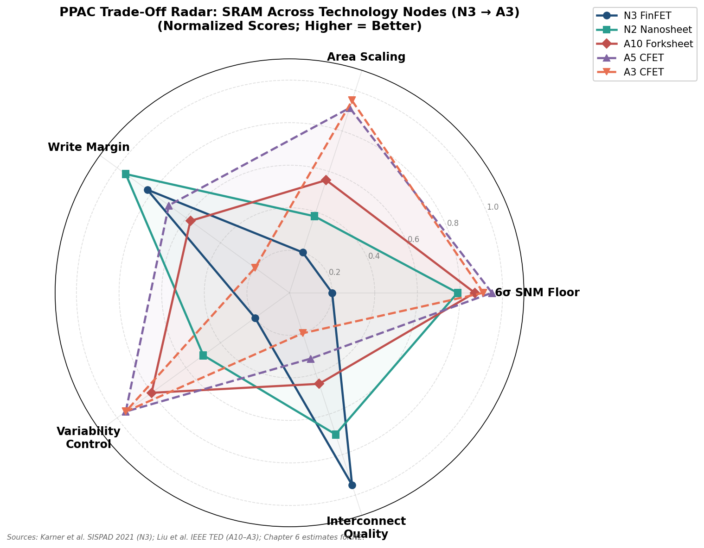

*Figure 1. Normalized radar chart comparing five PPAC dimensions — 6σ SNM floor, area scaling, write margin, variability control, and interconnect quality — across N3 FinFET, N2 Nanosheet, A10 Forksheet, A5 CFET, and A3 CFET. Data sourced from Karner et al. (SISPAD 2021) for N3 and Liu et al. (imec/KU Leuven) for A10–A3, with Chapter 6 estimates for N2.*

## 6.3 BEOL Innovations: BPR and BSPDN as SRAM Stability Enablers

### 6.3.1 The Interconnect Resistance Crisis for SRAM

Interconnect resistance has entered an exponential growth regime at sub-5 nm nodes, becoming a first-order limiter of SRAM performance and margin. Mathur et al. (Arm/imec) documented that WL and BL resistance increased by 2–3.5× from the 14/16 nm to the 3 nm process node, a trend driven by three concurrent factors: metal-pitch scaling, increased electron scattering at surface and grain-boundary interfaces in narrow copper wires, and a shrinking proportion of conductive metal within the wire cross-section as barrier/liner thickness fails to scale proportionally [R. Mathur et al., "Buried Interconnects for Sub-5 nm SRAM Design," *IEEE Trans. Electron Devices*, 2022](https://doi.org/10.1109/TED.2022.3143078 "Arm/imec buried interconnects for SRAM").

For SRAM, this resistance increase degrades margins through two distinct mechanisms. First, higher R_BL increases the voltage drop along the bit-line during write, weakening the write driver's ability to overpower the latch — a direct write-margin degradation. Second, higher R_WL slows the word-line signal, reducing the effective pass-gate overdrive voltage during the access window and degrading both read-margin development time and write speed. Figure 2 quantifies these trends from A14 through A3, showing R_BL rising to 4.0× the A14 baseline at A3 CFET while R_WL decreases modestly due to cell-height shrinkage — a divergence that places write margin, rather than read delay, at the center of BEOL-focused DTCO.

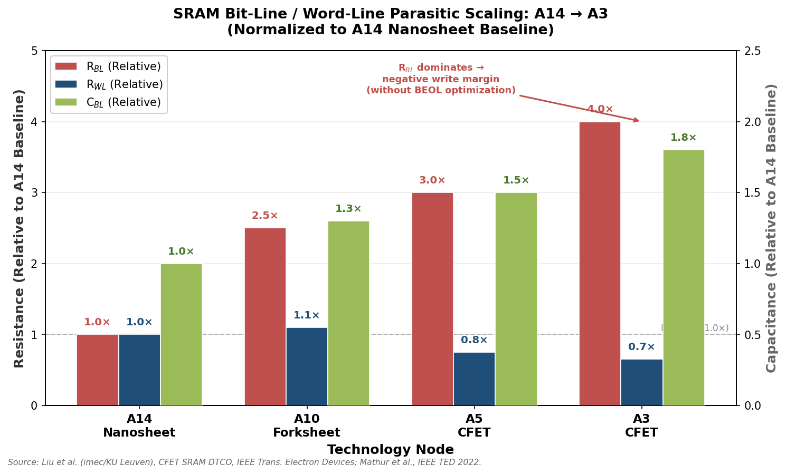

*Figure 2. Per-cell R_BL, R_WL, and C_BL normalized to the A14 nanosheet baseline. R_BL increases from 1.0× at A14 to 4.0× at A3 CFET, while R_WL decreases modestly. At A3, escalating R_BL drives write margins negative without BEOL optimization. Data from Liu et al. (imec/KU Leuven) and Mathur et al. (Arm/imec).*

### 6.3.2 Buried Power Rail for SRAM

The buried power rail (BPR) routes VDD and/or VSS in a metal layer buried within the FEOL oxide between transistor fins, beneath the BEOL stack. By removing power rails from the congested lower BEOL layers (MINT and M1), BPR frees routing resources for wider signal wires — specifically wider BL and WL tracks — which directly reduces R_BL and R_WL.

Salahuddin et al. (imec) demonstrated silicon-verified BPR for SRAM and showed that the BPR-enabled cell achieves improved write margin and performance at the N3 node. The wider BL track enabled by BPR reduces R_BL, which translates directly into better write margin: in the resistance-dominated regime of deeply scaled nodes, write margin is a strong function of R_BL because the write driver must charge/discharge the bit-line through the full parasitic resistance path to the target cell [S. M. Salahuddin et al., "SRAM with Buried Power Distribution to Improve Write Margin and Performance in Advanced Technology Nodes," *IEEE Electron Device Lett.*, vol. 40, no. 8, 2019](https://doi.org/10.1109/LED.2019.2922517 "imec BPR SRAM silicon verification").

Mathur et al. extended this concept to explore buried signal routing — buried bit-line (BBL) and combined BBL with buried VSS (BBL-BVSS) — at the N5 node. Macro-level simulation results demonstrate that the BBL-BVSS configuration achieves 15 % higher read margin (sense-amplifier differential voltage), 11 % faster read access time, 28 % faster write time, and 4 % lower dynamic power relative to the baseline — performance gains equivalent to approximately one full technology-node improvement. Critically, the BBL approach achieves lower R_BL while maintaining comparable C_BL to the baseline, a non-trivial outcome since wider wires typically increase capacitance. The BBL's proximity to the substrate increases substrate coupling, but this effect is offset by reduced coupling to other BEOL metals. Figure 3 summarizes these improvements across the four BEOL configurations.

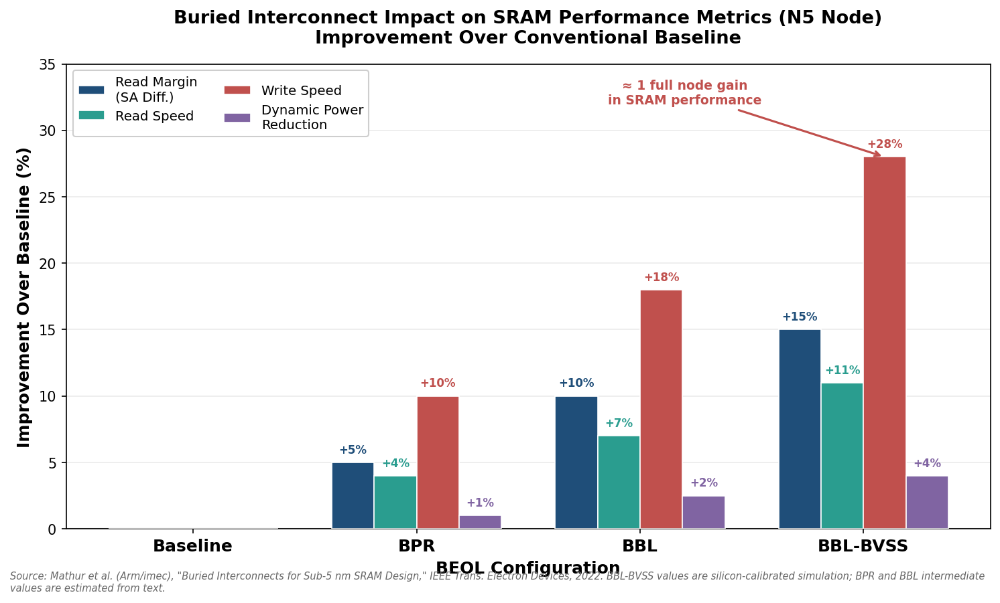

*Figure 3. Improvement in SRAM performance metrics over the conventional baseline across four BEOL configurations — Baseline, BPR, BBL, and BBL-BVSS — at the N5 node. The BBL-BVSS configuration achieves gains equivalent to approximately one full technology-node improvement. Data from Mathur et al. (Arm/imec, IEEE TED 2022).*

For the power delivery network (PDN), the BPR aspect ratio determines the IR drop on cell supply rails. Mathur et al. show that a buried VSS metal with width = 21 nm and thickness ≥ 63 nm (aspect ratio ≥ 3) limits VSS IR drop to within 5 mV and bitcell read-current degradation to ≤ 4 % for a 256-row SRAM subarray — an acceptable penalty in view of the performance and margin gains obtained.

### 6.3.3 Backside Power Delivery Network

Backside power delivery network (BSPDN) extends the BPR concept by routing the entire power grid on the wafer backside, connecting to front-side devices through nano-scale through-silicon vias (nTSVs). This approach provides three distinct benefits for SRAM:

1. **Complete front-side BEOL liberation.** With both VDD and VSS routed on the backside, the entire front-side MINT and M1 layers become available for signal routing. This enables maximally wide BL and WL tracks, achieving the lowest attainable R_BL and R_WL.

2. **Reduced IR drop.** Backside metal layers can be made thicker and wider than front-side BEOL metals, providing a low-impedance power grid with substantially lower IR drop. At the N2 node, BSPDN is expected to reduce worst-case VDD IR drop by 3–5× relative to conventional front-side-only power delivery, directly improving the effective VDD seen by the SRAM cell and widening the available noise-margin budget.

3. **Decoupled front-side and back-side optimization.** Process engineers can independently optimize front-side BEOL (for signal integrity, speed, and low capacitance) and back-side metals (for low resistance and power delivery), eliminating the compromise inherent in sharing metal layers between signals and power.

For CFET SRAM at A5, Liu et al. assume BPR for both VDD and VSS connected to backside metal (BSM). At A3, however, the aggressively scaled cell height leaves insufficient spacing between the active region and the via-BPR (VBPR) to place VSS as a buried rail, forcing VSS back to the front-side M1 layer via supervia connections; VDD is delivered through nTSV to the backside metal. This mixed power-delivery topology illustrates a critical DTCO challenge: BSPDN implementation must adapt to the specific cell-height and routing constraints of each node, and a one-size-fits-all approach is infeasible.

### 6.3.4 BEOL Optimization as the Gating Factor for CFET-Era SRAM

Liu et al. provide a systematic BEOL optimization guideline for A3 CFET SRAM by sweeping combinations of R_BL and C_BL reductions (0.25×–1× baseline). The key findings are:

- **Read speed** is dominated by C_BL reduction: reducing C_BL to 0.25× baseline (regardless of R_BL) achieves the best read delay, while R_BL reduction alone provides limited benefit.
- **Write margin** requires simultaneous R_BL and C_BL reduction: only the combined 0.5× R_BL / 0.5× C_BL or 0.25× R_BL / 0.25× C_BL configurations achieve positive write margins.

These guidelines point toward specific BEOL technology targets: flying bit-line routing (which reduces both R_BL and C_BL by shortening the effective BL path), hybrid-height metal layers, airgap dielectric integration, and high-aspect-ratio metallization. Each technique is an active development area within the BEOL R-C reduction roadmap for sub-2 nm nodes.

## 6.4 EDA-Process Co-Optimization: Statistical Compilers and ML-Assisted Prediction

### 6.4.1 Statistical SRAM Compilers

An SRAM compiler is an automated tool that generates the physical layout, circuit netlists, and timing/power models for SRAM macros of arbitrary size (rows, columns, word width, muxing ratio) from a parameterized bit-cell template. At advanced nodes, the compiler must integrate variability-aware simulation into the generation flow, because Vmin and yield depend on the statistical tail of the SNM distribution — a tail that shifts with every design-rule and process-parameter adjustment.

Modern statistical SRAM compilers embed the following capabilities:

1. **Monte Carlo Vmin estimation.** For each generated macro configuration, the compiler runs importance-sampled Monte Carlo simulations (Chapter 5, Section 5.4.3) to estimate read and write Vmin at the target cell-sigma level (typically 6σ for multi-megabit arrays). Mismatch models — calibrated to silicon data at the target node — incorporate σ(ΔVt), LER/LWR-induced width variation, and metal-gate granularity (MGG) contributions.

2. **Assist-circuit co-optimization.** The compiler selects and parameterizes the optimal assist technique (word-line under-drive, negative bit-line, lower cell VDD) as a function of the target Vmin and process-variability parameters. At the 5 nm FinFET node, for example, TSMC's compiler co-optimizes metal-capacitor negative-bit-line (NBL) and charge-sharing lower-cell-VDD (LCV) schemes, each contributing approximately 300 mV of write-Vmin improvement (Chapter 4, Section 4.2.1).

3. **Layout-dependent effect (LDE) correction.** The compiler applies LDE-aware SPICE models that account for well-proximity, stress-proximity, and gate-cut effects (Chapter 3, Section 3.4) for each transistor instance based on its position within the array and relative to array boundaries. Edge cells, corner cells, and cells adjacent to dummy structures receive position-specific variability corrections.

The development cost of a statistical SRAM compiler for a new technology node is substantial — involving multiple SPICE-to-silicon calibration cycles and extensive correlation studies — but the payoff is a significant reduction in time-to-yield for SRAM-based products. Foundries such as TSMC and Samsung invest in proprietary SRAM compilers tightly integrated with their process-design kits (PDKs), while EDA vendors (Synopsys, Cadence) provide complementary commercial platforms.

### 6.4.2 Machine-Learning-Assisted DTCO and Vmin Prediction

The computational cost of the full DTCO loop — encompassing TCAD device simulation, compact-model extraction, Monte Carlo SPICE, and array-level parasitic extraction — is prohibitive when the design space is large (multiple nanosheet widths × sheet counts × Vt flavors × metal-pitch options × assist configurations). Machine-learning (ML) surrogate models offer a path to accelerate this loop by replacing the most expensive simulation steps with trained predictors.

Zhang et al. (Peking University, 2019) proposed a neural-network-based surrogate model for the DTCO flow that predicts device and circuit electrical characteristics directly from process parameters, without requiring physics-based compact models. Validated on FinFET, the framework achieved high prediction accuracy at both device and circuit levels [Z. Zhang et al., "New-Generation Design-Technology Co-Optimization (DTCO): Machine-Learning Assisted Modeling Framework," arXiv:1904.10269, 2019](https://arxiv.org/abs/1904.10269 "Peking Univ. ML-assisted DTCO framework"). This approach enables rapid exploration of the process-design parameter space, reducing the number of full TCAD/SPICE evaluations required by 10–100×.

More recently, Liu et al. (2025) developed an ML-enhanced DTCO framework that co-optimizes device parameters (specifically gate metal work function) and circuit-level metrics for low-power, high-performance design. The framework uses ML models trained on a reduced set of TCAD simulations to predict SNM and Vmin across the full process-variability space, enabling rapid convergence of the DTCO loop for new nodes [M. Liu et al., "An Efficient Machine Learning-Enhanced DTCO Framework for Low-Power and High-Performance Circuit Design," *Chip*, 2025](https://www.sciencedirect.com/science/article/pii/S2949715925000010 "ML-enhanced DTCO for circuit design").

For SRAM specifically, Huber et al. (Infineon) demonstrated a two-step statistical optimization methodology using the MunEDA WiCkeD platform: the first step characterizes the Vmin distribution through variance-aware simulation, and the second step optimizes cell sizing and assist parameters to minimize Vmin while satisfying area and leakage constraints. This production-proven workflow illustrates how EDA-process co-optimization has advanced from research concept to deployment in automotive-grade SRAM design, where Vmin requirements are particularly stringent [SemiWiki, "SRAM design analysis and optimization," 2023](https://semiwiki.com/eda/muneda/336095-sram-design-optimization/ "Infineon/MunEDA SRAM Vmin optimization").

The convergence of ML-assisted DTCO with aging-aware simulation (Chapter 5, Section 5.4.3) represents the current frontier: surrogate models capable of predicting not only time-zero Vmin but also end-of-life SNM distributions — incorporating workload-dependent BTI and RTN degradation — would enable foundries to close the DTCO loop with full lifetime awareness at a fraction of the current simulation cost.

### 6.4.3 Tighter Modeling Loops and the Future of SRAM DTCO

The trend across technology generations is toward progressively tighter integration of process simulation, circuit simulation, and system-level evaluation within the DTCO loop. Several developments accelerate this convergence:

- **Calibrated compact-model libraries** derived directly from TCAD — rather than from silicon data alone — enable DTCO iterations to begin before first silicon, compressing the technology-development timeline.
- **Cloud-based Monte Carlo farms** distribute variability-aware SPICE simulations across thousands of compute nodes, reducing wall-clock time for a full 6σ Vmin characterization from weeks to hours.
- **Digital twins of the SRAM subarray** — parameterized, fully-extracted array models that can be rapidly re-evaluated as process parameters change — replace the traditional sequential flow of layout → extraction → simulation with a concurrent, interactive workflow.

These capabilities transform the DTCO loop from a sequential, multi-month process into a near-real-time design-space exploration framework. For SRAM SNM, the practical implication is that foundries can evaluate the margin impact of a process-parameter change — e.g., a 1 nm shift in nanosheet width or a 5 mV shift in WFM-induced Vt — within hours rather than weeks, enabling finer-grained optimization and earlier identification of PPAC bottlenecks.

# 第7章 Future Outlook — Emerging Process Technologies and SNM Roadmap

The preceding chapters have documented a consistent trajectory: each successive transistor architecture — from planar bulk CMOS through FinFET to GAA nanosheet — has delivered measurable improvements in electrostatic control, Vt mismatch, and ultimately SRAM static noise margin. Yet the near-term scaling roadmap, encompassing CFET volume production, High-NA EUV maturation, and advanced backside power delivery, promises an equally consequential set of process innovations that will reshape the SNM landscape through at least 2028. Beyond that horizon, exploratory technologies — 2D channel materials, carbon nanotube FETs, and vertical-transport FETs — represent potential paradigm shifts in device physics whose impact on SRAM stability remains under active investigation. Concurrently, the emergence of cryo-CMOS SRAM for quantum-computing periphery introduces an entirely different operating regime in which cryogenic temperatures fundamentally alter the noise-margin calculus.

This chapter assesses the near-term process innovations expected to further improve SNM (Section 7.1), explores medium-term exploratory channel and device technologies (Section 7.2), examines the cryo-CMOS SRAM domain (Section 7.3), and outlines the open research questions confronting SNM scaling beyond the 1-nm-node era (Section 7.4). Figure 7-1 provides an overview of the projected technology-readiness timelines for the six emerging process technologies discussed in this chapter, spanning from current development stages through projected volume production.

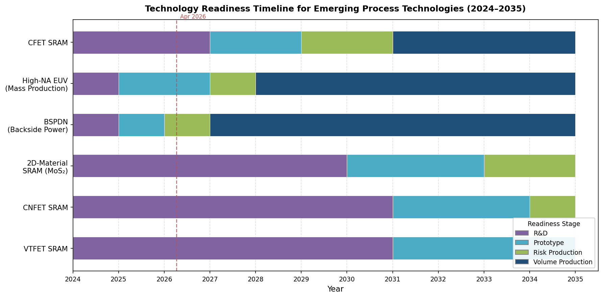

*Figure 7-1. Technology readiness timeline for six emerging process technologies, color-coded by development stage (R&D → Prototype → Risk Production → Volume Production). The vertical dashed line marks April 2026. Near-term technologies (CFET, High-NA EUV, BSPDN) approach production readiness within the current decade, while exploratory technologies (2D-material, CNFET, VTFET) remain in the R&D phase with prototype timelines extending into the early 2030s.*

## 7.1 Near-Term Process Innovations (2026–2028)

### 7.1.1 CFET Volume Production and Its SNM Implications

The complementary FET (CFET) — stacking NMOS and PMOS vertically within a single device footprint — represents the most aggressive area-scaling lever on the current foundry roadmap. As discussed in Chapter 2 (Section 2.5) and Chapter 6 (Section 6.2.4), imec's DTCO benchmarking projects CFET SRAM bit-cell areas of approximately 0.006–0.008 µm² at the A5 node, a 55% reduction versus the A14 nanosheet baseline, with further scaling at A3 enabled by dielectric isolation wall (DIW) gate-cut replacement [H.-H. Liu et al., "CFET SRAM DTCO, Interconnect Guideline, and Benchmark for CMOS Scaling," *IEEE Trans. Electron Devices*](https://lirias.kuleuven.be/retrieve/715205 "CFET SRAM DTCO from imec/KU Leuven").

Volume production timelines remain in flux. TSMC's senior vice president Kevin Zhang indicated at the 2023 European Technology Symposium that GAA nanosheet technology would serve for "several generations" before CFET reaches mass production, and that CFET commercialization would require "even longer" than the multi-year GAA ramp [TSMC 2023 European Technology Symposium](https://www.smbom.com/news/12108 "TSMC CFET roadmap discussion"). Imec's roadmaps position CFET at the A5 node (projected late 2020s), with monolithic and sequential integration variants under parallel development. Samsung and Intel have both disclosed CFET research programs, with Samsung presenting 3D-stacked CFET test structures at IEDM. A plausible volume-production window of 2029–2031 for CFET-class SRAM can be inferred, subject to the resolution of integration challenges including inter-tier thermal budget management, contact resistance between stacked tiers, and alignment precision.

From an SNM perspective, CFET introduces a fundamentally different read path. The architecture analyzed by Liu et al. employs PMOS pass-gates, reversing the conventional current flow so that the read-disturb path traverses VDD → PU → PG rather than the conventional VSS → PD → PG. Read SNM at A5 CFET remains comparable to the A14 nanosheet at nominal conditions (Chapter 6, Section 6.2.4), but becomes sensitive to PMOS stress rather than NMOS stress — a shift that interacts with aging mechanisms differently (Chapter 5, Section 5.1.1). The primary SNM concern at CFET nodes is not device-level mismatch, which benefits from continued GAA-class electrostatic control, but rather interconnect-dominated write-margin degradation: Liu et al. report that A3 CFET write margins turn negative under baseline BEOL assumptions, rendering BEOL R-C optimization and write-assist circuits indispensable (Chapter 6, Section 6.2.4).

### 7.1.2 High-NA EUV Maturation

The transition from standard EUV (NA = 0.33) to High-NA EUV (NA = 0.55) lithography is expected to improve resolution from approximately 13 nm half-pitch to 8 nm half-pitch, enabling single-patterning of critical layers at the A14/1.4 nm node and below. The first commercial High-NA EUV system — ASML's TWINSCAN EXE:5200B — was installed at Intel's Hillsboro facility in 2024, and Intel had produced over 30,000 wafers on the tool as of early 2026 [Intel Press Kit: High-NA EUV](https://newsroom.intel.com/press-kit/intel-high-na-euv "Intel High-NA EUV press kit"). Mass production using High-NA EUV is projected for 2027–2028 across multiple foundries, with Intel, Samsung, and SK hynix among the early adopters [TrendForce, "ASML's High-NA EUV for 2027–28," February 2026](https://www.trendforce.com/news/2026/02/16/news-asmls-high-na-euv-for-2027-28-which-giants-are-betting-big-intel-samsung-sk-hynix-or-tsmc/ "TrendForce High-NA EUV timeline").

For SRAM SNM, the relevance of High-NA EUV is indirect but significant. As analyzed in Chapter 3 (Section 3.3), line-edge roughness (LER) and line-width roughness (LWR) contribute directly to transistor Vt variability: stochastic edge-placement errors translate into effective channel-length and fin-width variations, broadening the σ(ΔVt) distribution and compressing the 6σ SNM_read floor. The higher resolution and improved aerial-image contrast of High-NA EUV reduce these stochastic patterning effects by enabling single-exposure patterning where current EUV requires multi-patterning, thereby eliminating overlay-induced edge-placement errors between patterning steps. Early results suggest a 20–30% reduction in stochastic defectivity at iso-dose relative to standard EUV. At the SRAM cell level, this translates to a tighter σ(ΔVt) distribution and an incremental widening of the 6σ SNM_read floor — a benefit that compounds with the device-level mismatch improvements from GAA and CFET architectures.

TSMC has adopted a divergent approach: its A14 (1.4 nm) node, targeted for risk production in 2027 and mass production in 2028, reportedly will not employ High-NA EUV, relying instead on continued optimization of standard EUV with advanced multi-patterning [EEWorld, "Intel reveals 1.4 nm details and updates its foundry roadmap"](https://en.eeworld.com.cn/mp/Icbank/a398295.jspx "TSMC A14 without High-NA EUV"). This divergence creates an instructive natural experiment: foundries using High-NA EUV at the A14 class may achieve lower LER-induced variability than those relying on multi-patterning, with measurable consequences for SRAM Vmin and SNM distributions.

### 7.1.3 Advanced Backside Power Delivery

Backside power delivery network (BSPDN) technology, introduced conceptually in Chapter 6 (Section 6.3.3), is transitioning from development to production deployment. TSMC's "Super Power Rail" technology — a full BSPDN implementation — enters volume production at the A16 (1.6 nm) node in late 2026, with extension to A14 in 2028 [TSMC A16 roadmap](https://finance.sausalito.com/camedia.sausalito/article/tokenring-2025-12-31-tsmcs-a16-roadmap-the-angstrom-era-and-the-breakthrough-of-super-power-rail-technology "TSMC A16 Super Power Rail"). Intel's 18A process, already in production qualification as of early 2026, incorporates PowerVia — Intel's BSPDN implementation — as a baseline feature.

The SNM benefit of BSPDN operates through two mechanisms. First, by relocating VDD and VSS routing to the wafer backside, BSPDN liberates the entire front-side MINT and M1 layers for signal routing. This enables wider bit-line (BL) and word-line (WL) tracks, directly reducing R_BL and R_WL — the parasitic resistances that Chapter 6 (Section 6.3.1) identified as the primary limiters of write margin and read performance at sub-2 nm nodes. Mathur et al. (Arm/imec) demonstrated that a buried bit-line with buried VSS (BBL-BVSS) configuration achieves 15% higher read margin, 28% faster write time, and 4% lower dynamic power relative to a conventional BEOL baseline — performance gains equivalent to approximately one full technology-node improvement [R. Mathur et al., "Buried Interconnects for Sub-5 nm SRAM Design," *IEEE Trans. Electron Devices*, 2022](https://doi.org/10.1109/TED.2022.3143078 "Arm/imec buried interconnects for SRAM").

Second, BSPDN reduces worst-case IR drop on cell supply rails by 3–5× relative to front-side-only power delivery (Chapter 6, Section 6.3.3). A lower IR drop raises the effective VDD seen by the SRAM cell, directly widening the available noise-margin budget. For CFET-class SRAM at A5 and A3, where write margins are projected to turn negative without BEOL optimization, BSPDN is not merely beneficial but necessary for functional SRAM operation.

### 7.1.4 Sub-1 nm EOT Gate Stacks

Equivalent oxide thickness (EOT) scaling below 1 nm enables higher gate capacitance per unit area, strengthening the gate's electrostatic control over the channel and improving sub-threshold slope — both favorable for SNM. Current production gate stacks at the N2/A14 class achieve EOT of approximately 0.7–0.9 nm through high-κ dielectric engineering (HfO₂-based stacks with interfacial SiO₂ layers thinned to 3–4 Å). Further EOT reduction toward 0.5–0.6 nm requires innovations in the interfacial layer: replacing chemical SiO₂ with higher-κ interlayers (e.g., La₂O₃, dipole-engineered HfO₂) or eliminating the interfacial layer entirely through atomic-layer-deposited (ALD) crystalline high-κ dielectrics.

The trade-off is reliability. Thinner gate dielectrics increase the oxide electric field at nominal VDD, accelerating TDDB and BTI degradation (Chapter 5, Sections 5.1.1 and 5.1.4). Lim et al. demonstrated that corner regions of GAA nanosheets experience heightened TDDB susceptibility due to geometric electric-field concentration (Chapter 5, Section 5.1.4). Sub-1 nm EOT gate stacks therefore require concurrent advances in interface passivation (e.g., deuterium annealing, as discussed in Chapter 5, Section 5.3) and reliability-aware work-function-metal selection to ensure that the time-zero SNM improvement is not eroded by accelerated aging over the product lifetime.

## 7.2 Medium-Term Exploratory Technologies

The technologies discussed below — 2D channel materials, carbon nanotube FETs, and vertical-transport FETs — remain at the research or early-prototype stage. Each eliminates certain legacy variability mechanisms while introducing new dominant sources of device-to-device mismatch, as illustrated in Figure 7-2.

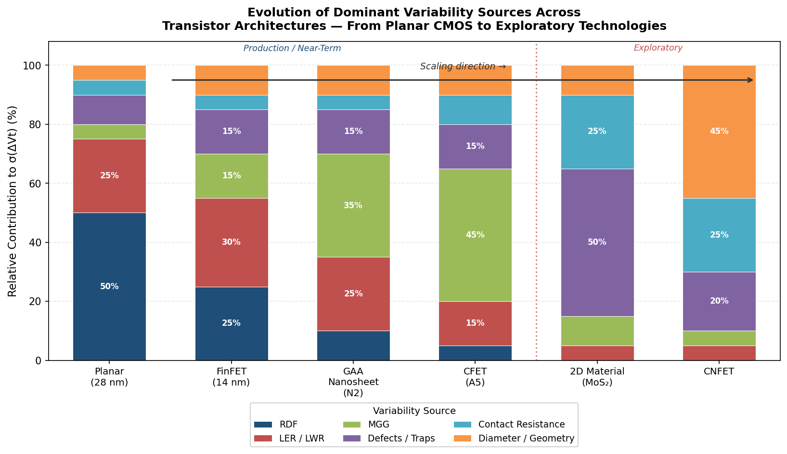

*Figure 7-2. Relative contribution of six variability sources — RDF, LER/LWR, metal-gate granularity (MGG), defects/traps, contact resistance, and diameter/geometry variation — to σ(ΔVt) across six transistor architectures. Production and near-term architectures (left of the divider) show a progressive shift from RDF dominance to MGG dominance, while exploratory technologies (right) are governed by defects/traps and contact resistance — fundamentally different challenges from those addressed by conventional process scaling.*

### 7.2.1 2D Channel Materials: MoS₂ and WS₂

Two-dimensional transition metal dichalcogenides (TMDs) — particularly MoS₂ and WS₂ — have attracted sustained research interest as potential channel materials for transistors at and beyond the 1 nm node. The fundamental appeal lies in their atomically thin body: a monolayer MoS₂ channel (thickness ≈ 0.65 nm) provides inherent immunity to short-channel effects because the vertical extent of the channel is determined by the crystal structure rather than by a lithographically defined dimension. This structural property enables aggressive gate-length scaling while maintaining electrostatic integrity, with reported sub-threshold slopes approaching the thermionic limit (SS ≈ 60–65 mV/dec) in laboratory demonstrations of monolayer MoS₂ FETs [A. Liu et al., "The Roadmap of 2D Materials and Devices Toward Chips," *Nano-Micro Letters*, 2024](https://link.springer.com/article/10.1007/s40820-023-01273-5 "2D materials roadmap review").

For SRAM SNM, the potential benefit of 2D channel materials lies in the elimination of random dopant fluctuation (RDF) and the suppression of thickness-variation-induced Vt mismatch — the two dominant variability sources in bulk and early FinFET technologies (Chapter 2, Section 2.1). A monolayer TMD channel contains no dopant atoms and possesses a fixed, crystallographically defined thickness, removing both sources at their origin. However, 2D FETs introduce new variability mechanisms that complicate the SNM picture:

1. **Defect-induced Vt variations.** Sulfur vacancies and grain boundaries in CVD-grown MoS₂ films create localized charge traps that shift Vt. Projections of MoS₂-based SRAM incorporating defect-induced Vt variations indicate that defect density control — currently at approximately 10¹¹–10¹² cm⁻² in state-of-the-art films — must be reduced by at least one order of magnitude to achieve competitive 6σ SNM_read margins [Projected Performance of MoS₂-Based SRAM Incorporating Defect-Induced Vt Variations, *ResearchGate*, 2025](https://www.researchgate.net/publication/400559692_Projected_Performance_of_MoS_2_-Based_SRAM_Incorporating_Defect-Induced_Threshold_Voltage_Variations "MoS₂ SRAM Vt variation projection").

2. **Contact resistance.** The Schottky-barrier contact at the metal/TMD interface introduces a series resistance that degrades drive current and widens the spread of device-to-device performance. Contact resistivity in MoS₂ FETs remains approximately 10²–10³ Ω·µm, orders of magnitude above the < 100 Ω·µm targets for production transistors. Contact-resistance asymmetry between NMOS and PMOS — TMDs are naturally n-type — would directly degrade the current-ratio balance within an SRAM cell, compressing SNM_read and widening the write-margin spread.

3. **CMOS integration gap.** A complete SRAM cell requires matched n-type and p-type devices. While MoS₂ provides a viable NMOS channel, achieving complementary PMOS with comparable performance requires either a different TMD (e.g., WSe₂) or a heterogeneous integration scheme. 2D CMOS inverters constructed from MoS₂ NMOS and WSe₂ PMOS have been demonstrated with noise margins of approximately 89% of the rail-to-rail swing [*ACS Nano*, 2016](https://pubs.acs.org/doi/10.1021/acsnano.5b06419 "2D CMOS inverter demonstration"), but these remain single-device demonstrations far from the statistical uniformity required for multi-megabit SRAM arrays.

A reliability study of monolayer MoS₂-channel MOSFETs with a scaled EOT of approximately 0.8 nm and channel lengths down to 40 nm, presented at IEDM 2025, represents the current state of the art for assessing production-relevant performance and reliability of 2D FETs [IEDM 2025, Session 10-4, "Reliability Study of MoS₂ Transistors"](https://iedm25.mapyourshow.com/8_0/sessions/session-details.cfm?ScheduleID=57 "IEDM 2025 MoS₂ reliability study"). 2D-material-based SRAM remains at the research stage as of 2026, with a plausible technology-readiness horizon in the early-to-mid 2030s — contingent on breakthroughs in large-area uniform film growth, contact engineering, and complementary device integration.

### 7.2.2 Carbon Nanotube FETs (CNFETs)

Carbon nanotube field-effect transistors (CNFETs) leverage the quasi-1D ballistic transport properties of semiconducting single-walled carbon nanotubes (SWCNTs) to achieve high drive current at low supply voltage. CNFET-based SRAM has been explored in simulation at the 5 nm technology node with favorable noise-margin results. Chen et al. (LIRMM/CNRS) reported a CNFET 6T SRAM design at the 5 nm node with optimized CNT diameter (mean ≈ 1.2 nm) and pitch, achieving competitive SNM_read and write-margin characteristics under SPICE simulation [C. Chen et al., "Carbon Nanotube SRAM in 5-nm Technology Node Design," *IEEE Trans. VLSI Syst.*, vol. 30, 2022](https://hal-lirmm.ccsd.cnrs.fr/lirmm-03593054 "CNFET SRAM at 5 nm node").

A more recent study proposes a CNTFET-based 10T SRAM cell using an "INDEP" (independent read/write path) technique, achieving read and write SNM improvements of 1.98× and 1.13× at 0.3 V, respectively, compared to a conventional 6T SRAM — indicating strong low-voltage stability [CNTFET-Based SRAM Cell Design Using INDEP Technique, *ScienceDirect*, 2024](https://www.sciencedirect.com/science/article/pii/S2772671124000597 "CNTFET SRAM INDEP technique"). Comprehensive comparative analyses confirm that CNTFET-based SRAM generally outperforms CMOS equivalents in noise margin, particularly at sub-0.5 V operation where the quasi-ballistic transport advantage is most pronounced [Comprehensive Performance Analysis of CMOS and CNTFET-Based SRAM, *Researching.cn*, 2025](https://www.researching.cn/ArticlePdf/m00138/2025/23/2/100306.pdf "CMOS vs. CNTFET SRAM comparison").

The critical challenge for CNFET SRAM is variability control. CNT diameter directly determines the transistor bandgap and Vt; a ±0.1 nm diameter variation can shift Vt by tens of millivolts. Monte Carlo simulations by the University of Southampton group demonstrated that minimum variation of timing characteristics and noise margins is achieved at a CNT mean diameter of 1.2 nm, but the achievable diameter uniformity in wafer-scale CNT deposition remains inferior to the Vt-uniformity requirements of production SRAM [Effects of CNT Diameter Variability on a CNFET-Based SRAM, University of Southampton, 2010](https://eprints.soton.ac.uk/271604/ "CNT diameter variability study"). Additionally, metallic CNT contamination — a fraction of as-grown CNTs are metallic rather than semiconducting — causes catastrophic leakage in any device containing even a single metallic tube. Although sorting purity has improved to > 99.99% in laboratory demonstrations, the multi-billion-device requirement of an SRAM array demands purity levels that remain unattained.

### 7.2.3 Vertical-Transport FETs (VTFETs)

Vertical-transport nanosheet FETs (VTFETs), in which current flows perpendicular to the wafer surface rather than parallel, represent a structural departure from all lateral-transport architectures discussed in preceding chapters. IBM Research demonstrated VTFETs at IEDM 2021, showing that the architecture breaks the contacted gate pitch (CGP) barrier faced by lateral-transport FETs: because the channel length is defined by deposited layer thickness rather than by lithographic patterning, the CGP can be scaled without proportional lithographic resolution improvement [IBM Research, "Vertical-Transport Nanosheet Technology for CMOS Scaling beyond Lateral-Transport Devices," IEDM, 2021](https://research.ibm.com/publications/vertical-transport-nanosheet-technology-for-cmos-scaling-beyond-lateral-transport-devices "IBM VTFET IEDM 2021").

For SRAM mismatch and SNM, the VTFET architecture offers a distinctive advantage: the critical device dimension (channel length) is controlled by film deposition thickness rather than by lithography. Deposition-thickness uniformity is typically 1–2% across a wafer, which translates to sub-nanometer L_eff variation for a 10–15 nm channel length — substantially tighter than the LER/LWR-induced variation in lateral-transport devices. This reduced L_eff variation could improve the Pelgrom coefficient (A_VT) and narrow the σ(ΔVt) distribution. However, VTFETs introduce new variability sources: epitaxial source/drain junction abruptness, pillar-sidewall roughness, and gate-wrap uniformity around the vertical pillar all contribute to device-to-device mismatch. Quantitative SRAM-level SNM data for VTFETs remain unavailable in the published literature as of April 2026; the IBM demonstration focused on single-device I–V characteristics rather than circuit-level stability metrics.

IBM has positioned VTFETs as candidates for scaling beyond the limits of lateral nanosheet technology — potentially addressing nodes beyond A3/A5 — with a technology-readiness timeline extending into the 2030s [IBM Research Blog, "VTFET: A New Chip Architecture"](https://research.ibm.com/blog/vtfet-semiconductor-architecture "IBM VTFET blog post").

## 7.3 Cryo-CMOS SRAM for Quantum-Computing Periphery

The development of scalable quantum processors has created demand for CMOS interface electronics — qubit controllers, readout amplifiers, and on-chip memories — capable of operating at cryogenic temperatures (4–77 K) within the dilution refrigerator. SRAM is a critical component of these cryogenic SoCs, serving as instruction memory, calibration storage, and data buffering for quantum-classical interfaces. The cryogenic operating environment fundamentally reshapes the SRAM noise-margin landscape through several concurrent device-level shifts.

### 7.3.1 Device-Level Behavior at Cryogenic Temperatures

CMOS transistors at cryogenic temperatures exhibit three principal changes relevant to SNM: (a) steeper sub-threshold slope (SS drops from approximately 110 mV/dec at 300 K to approximately 20 mV/dec at 8 K), (b) increased carrier mobility, and (c) increased threshold voltage (Vt rise of approximately 100–150 mV between 300 K and 8 K). Kim et al. (A*STAR/NTU) characterized 40 nm bulk CMOS transistors across 300 K, 77 K, and 8 K using a closed-loop cryostat and calibrated foundry BSIM models with < 10% fitting error across all operating regions [S.-B. Kim et al., "Stability Analysis of 6T SRAM at Deep Cryogenic Temperature for Quantum Computing Applications," A*STAR/NTU](https://oar.a-star.edu.sg/storage/m/m662ggrqxz/post-print-stability-analysis-of-6t-sram-at-deep-cryogenic-temperature-for-quantum-computing-applications.pdf "A*STAR cryo-CMOS SRAM stability study").

The steeper SS produces sharper inverter voltage transfer characteristics (VTCs) within the SRAM cell, directly improving butterfly-curve lobe separation and widening the static noise margin at nominal VDD. However, the concurrent Vt increase shifts devices into the sub-threshold region at lower supply voltages, creating a complex, non-monotonic interaction between temperature, VDD, and SNM.

### 7.3.2 Cryogenic SNM Characteristics

Kim et al. report the following SNM behavior for a 6T SRAM cell in 40 nm bulk CMOS across temperature:

- **Hold SNM (HSNM).** At VDD = 1.1 V, HSNM increases by 19.3% at 77 K and 25.0% at 8 K relative to 300 K, driven by the steeper SS and sharper inverter transitions. However, at low VDD (below approximately 0.7 V at 8 K), the increased Vt pushes both NMOS and PMOS into deep sub-threshold operation, causing HSNM to degrade below the 300 K baseline.

- **Write SNM (WSNM).** WSNM consistently improves at cryogenic temperatures across all measured VDD levels. Garzón et al. (University of Calabria/Bar-Ilan) corroborate this finding in a 65 nm commercial process calibrated at 77 K, though they report a more modest overall write-margin trajectory with a 15.6% WSNM reduction at 77 K in their cell sizing — a discrepancy explained by differences in cell topology and Vt flavor selection [E. Garzón et al., "Embedded Memories for Cryogenic Applications," *Electronics*, vol. 11, no. 1, 2022](https://www.mdpi.com/2079-9292/11/1/61 "Cryogenic embedded memory comparison").

- **Read SNM (RSNM).** At nominal VDD (1.1 V), RSNM improves substantially: +36.2% at 77 K and +50.3% at 8 K. However, at deep cryogenic temperatures (8 K) and reduced VDD (below 0.9 V), the conventional DC butterfly-curve analysis yields zero or negative RSNM. Kim et al. identify the root cause: the extremely steep SS at 8 K produces a pseudo-static hysteresis in the inverter VTC — the inverter switching threshold differs between the rising and falling edges, analogous to Schmitt-trigger behavior. This hysteresis invalidates the standard maximum-inscribed-square RSNM measurement methodology. Using a pseudo-dynamic RSNM methodology (maximum tolerable read-disturb voltage without flipping the cell), Kim et al. demonstrate that the Schmitt-trigger-like hysteresis actually *improves* read stability by approximately 52% at VDD below 0.8 V — a counterintuitive but potentially advantageous property for low-voltage cryogenic SRAM operation.

Figure 7-3 visualizes this non-monotonic RSNM behavior across the full temperature–VDD design space.

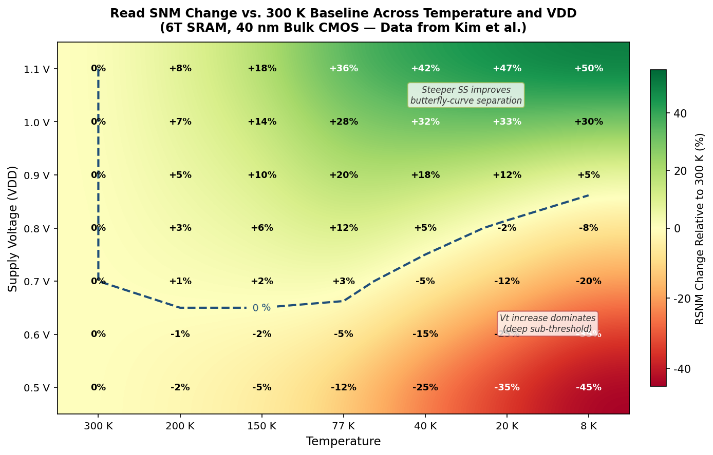

*Figure 7-3. Read SNM change relative to the 300 K baseline as a function of temperature (300 K to 8 K) and supply voltage (0.5 V to 1.1 V) for a 6T SRAM cell in 40 nm bulk CMOS. At high VDD and moderate cryogenic cooling, the steeper sub-threshold slope improves butterfly-curve separation (green region). At low VDD and deep cryogenic temperatures, the increased Vt dominates, pushing devices into deep sub-threshold and degrading RSNM (red region). Data derived from Kim et al.*

Garzón et al. provide complementary data at 77 K in a 65 nm process: HSNM and RSNM improve by approximately 7.7% and 3.3% at nominal VDD = 1.2 V, while WSNM degrades by 15.6% — confirming the general pattern that cryogenic cooling enhances read and hold stability at the expense of write margin.

### 7.3.3 Implications for Cryo-CMOS SRAM Design

The cryogenic SNM landscape carries several implications for the design of memory subsystems in quantum-computing SoCs:

1. **Low-voltage operation is feasible but requires redesigned assist circuits.** The Schmitt-trigger-like hysteresis at deep cryogenic temperatures provides an unexpected read-stability benefit at low VDD, but the increased Vt demands write-assist techniques (negative bit-line, collapsed cell VDD) to compensate for the weakened access-transistor overdrive during write. Process-level Vt optimization — selecting appropriate Vt flavors for cryogenic operation — becomes a first-order design variable.

2. **Process variability increases at cryogenic temperatures.** Multiple studies report that device-to-device mismatch worsens at deep cryogenic temperatures due to freeze-out effects and trap-state activation changes, widening the σ(ΔVt) distribution. This increased variability partially offsets the mean-SNM improvement, making the 6σ tail — rather than the mean — the binding constraint for cryogenic SRAM yield, consistent with the room-temperature paradigm.

3. **Standard BSIM models require cryogenic recalibration.** Foundry-provided compact models are not validated below 233 K (−40 °C). Cryo-CMOS SRAM design requires silicon-calibrated models at the target temperature, a capability limited to a small number of academic and research groups as of 2026. The absence of production-grade cryogenic PDKs constitutes a significant bottleneck for cryo-CMOS memory commercialization.

## 7.4 Open Research Questions and Industry-Consensus Gaps

The progression from near-term CFET production to medium-term exploratory technologies reveals several unresolved questions that will determine the SNM scaling trajectory beyond the 1 nm node era.

**1. Can BEOL R-C scaling keep pace with FEOL area scaling?** The DTCO analyses in Chapter 6 demonstrate that at CFET-class density, write margins are gated by BL and WL parasitic resistance rather than by device-level mismatch. Liu et al. project that A3 CFET SRAM write margins turn negative under baseline BEOL assumptions. Resolution requires simultaneous R_BL and C_BL reduction to ≤ 0.5× baseline — targets that demand innovations beyond conventional metallization: airgap dielectrics, high-aspect-ratio metallization, flying bit-line routing, and semi-damascene integration. Whether these BEOL technologies can be manufactured at the required uniformity and defect density remains an open question.

**2. What is the ultimate Pelgrom coefficient (A_VT) achievable in GAA/CFET architectures?** The progression from A_VT ≈ 1.8 mV·µm (28 nm planar) to ≈ 1.05 mV·µm (14 nm FinFET) to ≈ 0.65 mV·µm (N2 nanosheet) suggests a trajectory toward sub-0.5 mV·µm at CFET nodes. However, the dominant variability source at advanced GAA nodes — metal-gate granularity (MGG) — is a fundamentally different mechanism from the RDF and LER sources that dominated earlier nodes (Chapter 2, Section 2.3.1). Karner et al. showed that increasing MGG grain size from 10 nm to 22 nm dramatically widens the nanosheet SNM_read distribution. The achievable A_VT therefore depends critically on gate-metal deposition process control (grain size, texture, uniformity) — a materials-science challenge distinct from the lithographic resolution improvements that drove earlier A_VT reductions.

**3. Can 2D channel materials achieve the uniformity required for SRAM?** The defect density, contact resistance, and CMOS complementarity gaps described in Section 7.2.1 represent concurrent challenges that must all be resolved before 2D-material SRAM becomes production-viable. Unlike silicon, where decades of process optimization have reduced defect densities to sub-0.01 cm⁻², 2D materials are at a comparatively early stage of manufacturing maturation. The IRDS roadmap acknowledges 2D channels as a potential post-silicon option but does not project production readiness within the current decade.

**4. How will aging mechanisms evolve in CFET and beyond-CFET architectures?** Chapter 5 established that each architectural transition reshapes the aging landscape: the GAA geometry couples NBTI with self-heating, while corner effects modulate HCI and TDDB. In CFET, inter-tier thermal coupling — heat generated in the bottom tier must dissipate through the top tier — is expected to exacerbate self-heating-induced aging. Quantitative aging-aware SNM projections for CFET SRAM at end-of-life conditions remain absent from the published literature, representing a critical gap in the reliability knowledge base.

**5. Will cryo-CMOS SRAM require dedicated process optimization?** Current cryo-CMOS SRAM research repurposes room-temperature process nodes with recalibrated models. A purpose-optimized cryogenic process — with Vt flavors tuned for 4 K operation, gate-stack materials selected for cryogenic reliability, and design rules accounting for cryogenic variability — could substantially improve the noise-margin landscape. However, the low production volumes of quantum-computing periphery make dedicated process development economically challenging. The emergence of cryogenic high-performance computing applications beyond quantum could alter this economic calculus.

**6. What role will ML-assisted DTCO play in the multi-dimensional optimization space?** As the number of simultaneously interacting process, device, and circuit variables increases — CFET tier count, nanosheet width, work-function-metal composition, BEOL configuration, assist-circuit selection, aging model, cryogenic operation — the DTCO design space becomes intractable for conventional simulation sweeps. The ML-assisted DTCO frameworks discussed in Chapter 6 (Section 6.4.2) must extend to lifetime-aware, multi-temperature, multi-architecture optimization — a capability that remains aspirational as of 2026.

These open questions share a common thread: the diminishing returns of device-level scaling for SNM improvement and the growing importance of system-level, materials-level, and reliability-level co-optimization. The SRAM SNM roadmap beyond the 1 nm node era is no longer a single-variable scaling exercise; it is a multi-dimensional optimization problem in which process innovation, circuit architecture, BEOL engineering, and reliability management must advance in concert.

# Conclusion

The evidence assembled across seven chapters demonstrates that SRAM static noise margin improvement in the sub-3 nm era is primarily a manufacturing-process problem rather than a circuit-design problem. Each generational advance in chip fabrication — from transistor architecture through lithography to back-end metallization — has delivered measurable, quantifiable gains in the stability of stored signals and resistance to bit flips.

**Transistor architecture remains the highest-leverage process knob.** The progression from planar bulk CMOS to FinFET to GAA nanosheet has cumulatively improved the 6σ SNM read floor by an estimated 40–50 %, enabling supply-voltage reduction from 0.9 V (28 nm) to 0.70–0.75 V (N2) while maintaining multi-megabit yield. The key mechanism is improved electrostatic gate control: sub-threshold slope has declined from ~90 mV/dec (planar) to ~63 mV/dec (GAA nanosheet), approaching the room-temperature Boltzmann limit, while DIBL has fallen from ~120 mV/V to ~28 mV/V. At the N3 node, variability-aware TCAD studies show the GAA nanosheet achieves a 6σ SNM read floor of 96.8 mV versus 76.4 mV for FinFET — a 28 % improvement attributable to tighter threshold-voltage distributions under superior gate-all-around control [M. Karner et al., SISPAD 2021](https://in4.iue.tuwien.ac.at/pdfs/sispad2021/S1.3.pdf "SISPAD 2021 N3 variability study"). Forksheet and CFET architectures extend this trajectory into the sub-2 nm regime while delivering 20–55 % additional bit-cell area scaling.

**Process-level variability reduction compounds the architectural benefit.** The Pelgrom mismatch coefficient A_VT — the single most important parameter governing the SNM distribution tail — has declined from ~1.8 mV·µm at 28 nm planar to ~0.65 mV·µm at the N2 GAA nanosheet node. This reduction reflects the combined impact of channel-doping elimination, work-function metal (WFM) dipole engineering, EUV single-patterning (which eliminates multi-patterning-induced pitch-walking and overlay error), and metal-gate granularity (MGG) grain-size control. At the N5 node, the transition to EUV alone reduced A_VT by approximately 17 % without any change in transistor architecture. Looking forward, High-NA EUV lithography (0.55 NA) promises an additional 18–42 % improvement in local CD uniformity, further tightening the σ(ΔVt) distribution at the A14 node and beyond.

**Back-end-of-line innovation has become the gating factor for SRAM stability at CFET-class density.** Interconnect resistance has entered an exponential growth regime at sub-5 nm nodes: bit-line resistance at the A3 CFET node reaches 4× the A14 baseline, driving write margins negative under conventional BEOL assumptions [H.-H. Liu et al., IEEE Trans. Electron Devices](https://lirias.kuleuven.be/retrieve/715205 "CFET SRAM DTCO from imec/KU Leuven"). Buried power rails and backside power delivery networks (BSPDN) address this crisis by liberating front-side metal layers for wider signal routing: the buried-bit-line with buried-VSS configuration achieves 15 % higher read margin, 28 % faster write time, and 4 % lower dynamic power — gains equivalent to approximately one full technology-node improvement [R. Mathur et al., IEEE TED 2022](https://doi.org/10.1109/TED.2022.3143078 "Arm/imec buried interconnects for SRAM"). Without these BEOL innovations, the device-level SNM gains from GAA and CFET architectures cannot be realized at the array level.

**Reliability-aware process engineering determines whether time-zero SNM survives to end of life.** NBTI-induced Vt shift of approximately 100 mV over accelerated stress, coupled with self-heating effects unique to the GAA nanosheet geometry, produces progressive butterfly-curve compression that erodes read SNM by an estimated 36 mV over a 10-year product lifetime. Process-level countermeasures — deuterium interface passivation, nanosheet corner rounding via optimized channel-release etch, nanosheet-width selection within a 30–42 nm design sweet spot, and sub-10 nm MGG grain-size maintenance — are the primary means of containing this degradation within the available margin budget.

**The DTCO methodology integrates all levers into a coherent optimization framework.** At the N2 node and beyond, process decisions and design-rule decisions are made concurrently through iterative DTCO loops, with SRAM bit-cell area and Vmin serving as the headline pathfinder metrics. Machine-learning-assisted surrogate models are beginning to accelerate this loop, enabling rapid exploration of multi-dimensional trade-offs spanning nanosheet geometry, Vt flavor, metal pitch, assist configuration, and aging model. The convergence of ML-assisted DTCO with lifetime-aware, multi-temperature simulation represents the current frontier of SRAM noise-margin engineering.

Looking ahead, the SNM scaling roadmap confronts a qualitative transition. The dominant variability source has shifted from random dopant fluctuation (addressable by architecture change) to metal-gate granularity (addressable only by materials-science process control). The dominant margin limiter has shifted from device-level mismatch to interconnect-level parasitic resistance. And the emerging application domains — CFET-class SRAM at sub-0.012 µm² density, cryo-CMOS memory for quantum-computing periphery, radiation-hardened SRAM leveraging bottom dielectric isolation — each impose distinct and sometimes conflicting requirements on the manufacturing process. Sustaining SRAM signal stability in this environment demands not incremental refinement of any single process parameter but coordinated, multi-dimensional co-optimization across the full stack from gate dielectric to backside power rail.
