# Overview

Precision piezoelectric vibration isolation systems form the backbone of nanometer- and sub-nanometer-scale stability in semiconductor lithography, space-borne optical payloads, electron microscopy, and advanced metrology. These systems rely on the coordinated performance of three principal subsystems—sensors, actuators, and controllers—each of which contributes distinct error sources and bandwidth limitations to overall isolation efficacy. Enhancing system accuracy therefore requires simultaneous advances across four interdependent dimensions: hardware design, structural design, manufacturing processes, and control algorithms. Equally critical is ensuring that nominally identical production units deliver consistent performance, a challenge rooted in the inherent ±10–20% variability of piezoelectric ceramic properties and the cubic sensitivity of flexure hinge stiffness to machining tolerances.

This report synthesizes findings across seven chapters to address both questions. Chapter 1 establishes the physical foundations and system-level architecture, delineating passive, active, and hybrid isolation paradigms and mapping the sensor–controller–actuator feedback loop. Chapter 2 surveys the sensor technologies that define the system noise floor, from geophones and piezoelectric accelerometers to capacitive displacement sensors and laser interferometers, and introduces dual-sensor architectures that achieve closed-loop noise as low as 9 pm RMS. Chapter 3 examines piezoelectric actuator materials, stack and amplified configurations, flexure mechanism design, and hardware-level linearity improvements—notably charge-drive electronics that reduce hysteresis from 14.3% to 0.65%. Chapter 4 analyzes manufacturing processes from PZT ceramic synthesis through wire-EDM flexure machining to assembly and bonding, quantifying how tolerances propagate through the cubic stiffness–thickness relationship. Chapter 5 addresses control algorithms including integral force feedback (IFF), Preisach/Prandtl–Ishlinskii/Bouc–Wen hysteresis compensation, feedforward–feedback fusion, and emerging AI/ML approaches, alongside the digital controller platforms that execute them. Chapter 6 presents the production management framework—design for manufacturability, statistical process control, per-unit digital calibration via ID-Chip auto-calibration, and lifecycle management—that ensures unit-to-unit consistency across deployed fleets. Chapter 7 integrates these threads through application case studies in semiconductor lithography (STACIS achieving 60 dB attenuation at 2 Hz), electron microscopy, diamond turning, and space systems, and concludes with benchmarking standards, emerging technologies, and open challenges.

The central finding is that state-of-the-art piezoelectric isolation platforms achieve system-level noise floors below 0.05 nm RMS, settling times of 0.02 s, and active bandwidths spanning 0.2–150 Hz—performance enabled not by any single subsystem but by the co-optimization of sensor selection, actuator topology, structural architecture, manufacturing discipline, and digital control. Production consistency across identical units is achieved through a layered strategy: monolithic fabrication and cofired multilayer processes minimize variability sources at the design stage; impedance spectroscopy and 100% end-of-line testing screen for outliers; and per-unit digital calibration normalizes residual hardware variation to below 0.01% nonlinearity, transforming a statistically distributed hardware population into a population of functionally identical systems.

# 第1章 System Architecture & Fundamental Principles

Precision piezoelectric vibration isolation systems exploit the bidirectional electromechanical coupling of piezoelectric materials to suppress mechanical disturbances in environments where nanometer- or sub-nanometer-level stability is required—semiconductor lithography, space-borne optical payloads, and advanced metrology among them. This chapter establishes the physical foundations of such systems, delineates the three principal isolation architectures (passive, active, and hybrid), and maps the system-level feedback loop from sensor through controller to actuator. It concludes by defining the key performance metrics that govern isolation effectiveness and by identifying how each sub-system contributes to overall accuracy and unit-to-unit consistency.

## 1.1 Piezoelectric Fundamentals for Vibration Isolation

Piezoelectric materials exhibit a bidirectional electromechanical coupling that is central to their dual role in vibration isolation systems. The **direct piezoelectric effect** converts mechanical stress into electric charge, enabling the material to function as a high-bandwidth force or strain sensor. The **converse (inverse) piezoelectric effect** converts an applied electric field into mechanical strain, enabling precision actuation. The coupling strength is quantified by the piezoelectric charge constant d₃₃ (longitudinal mode), which for lead zirconate titanate (PZT) ceramics typically spans 200–700 pC/N [Wang et al., IntechOpen](https://www.intechopen.com/chapters/81174 "Active Vibration Suppression Based on Piezoelectric Actuator, 2022").

In a **stack actuator** configuration, multiple thin ceramic layers are mechanically series-connected and electrically paralleled. The total free displacement follows:

> **ΔA = n · d₃₃ · V**

where *n* is the number of active layers and *V* the applied voltage. Individual layer thicknesses of 20–100 µm keep the per-layer voltage low (60–200 V for multilayer designs), yet the aggregate raw displacement remains in the micrometer range—typically requiring 5–20× mechanical amplification through lever or flexure mechanisms to reach the strokes demanded by vibration isolation stages [Wang et al., IntechOpen](https://www.intechopen.com/chapters/81174 "Active Vibration Suppression Based on Piezoelectric Actuator, 2022").

The intrinsic properties of piezoelectric actuators confer several decisive advantages for vibration isolation: response times on the microsecond scale, positioning resolution in the sub-nanometer regime, achievable accelerations exceeding 10,000 g, load capacities reaching several tonnes, and zero magnetic-field emission. Long-term reliability data reinforce these advantages. PI PICMA® actuators have sustained 10⁹ cycles without measurable degradation in laboratory testing, while the ESA BepiColombo mission has accumulated 3.22 × 10¹² cycles in flight [PI/TMC White Paper](https://www.techmfg.com/learning/whitepapers/piezo-driven-active-vibration-control-pushes-limits "Piezo-Driven Active Vibration Control Pushes Limits"). Taken together, these characteristics—broadband speed, extreme resolution, high force density, and endurance—underpin the selection of piezoelectric transducers as the primary actuator (and often co-located sensor) technology in modern precision isolation platforms.

A further property of practical significance is that piezoelectric actuator resolution is, in principle, unlimited: the solid-state crystal deformation is continuous and free of stick-slip or backlash. The practical resolution floor is therefore set by electronic noise in the drive and sensing chain rather than by the transducer itself. The PI N-310 NEXACT® linear motor illustrates this point, achieving an open-loop resolution of 0.03 nm (30 pm) over a 20 mm travel range [PI N-310 NEXACT®](https://www.pi-usa.us/en/products/piezo-motors-stages-actuators/linear-piezo-motors-actuators-for-integration/n-310-nexact-oem-miniature-linear-motor-actuator-1000700 "specifications").

## 1.2 Passive Vibration Isolation

Passive isolation relies on a mass–spring–damper arrangement that mechanically decouples the payload from the vibrating base above the system's natural frequency f₀. For a single-degree-of-freedom (SDOF) system, the transmissibility rolls off as 1/f² (–40 dB/decade) above f₀, providing monotonically increasing attenuation at higher frequencies. Below f₀, however, the system amplifies input vibrations at resonance, and frequencies below approximately 2 Hz remain effectively unattenuated by conventional pneumatic isolators.

**Negative-stiffness isolators** represent an advanced passive approach that addresses this low-frequency limitation. Minus K Technology's negative-stiffness mechanism achieves a natural frequency of 0.5 Hz—far below what is practical with air springs—and delivers 93% isolation at 2 Hz, 99% at 5 Hz, and 99.7% at 10 Hz. Across the critical low-frequency band, this performance exceeds that of high-performance pneumatic tables by a factor of 10–100× [Minus K Technology](https://www.minusk.com/content/technology/transmissibility_curves_vibration_isolation_isolators_tables.html "Transmissibility Curves").

In space applications, passive isolation is frequently the only viable approach owing to power, mass, and complexity constraints. The James Webb Space Telescope (JWST) employs a two-stage passive isolation architecture whose second stage comprises four 52-inch graphite beams with constrained-layer viscoelastic damping, supporting the 1,000 kg telescope assembly at a 1 Hz natural frequency with >4% modal damping. The resulting transmissibility delivers >40 dB attenuation across 12–90 Hz and no less than 28 dB from 12 Hz to 1 kHz, ensuring that the 18 primary mirror segments maintain vibration amplitudes below 10 nm without active correction while pointing error remains within 4 milliarcseconds [Bronowicki & Innis, Northrop Grumman](http://www.vibrationdata.com/tutorials_alt/05FW_Bronowicki.pdf "A Family of Full Spacecraft-to-Payload Isolators, 2005").

Despite these achievements, passive isolation is fundamentally bounded: it cannot attenuate disturbances below f₀, its resonance peak must be managed through damping (at the expense of high-frequency roll-off rate), and it provides no means to adapt to changing disturbance spectra. These limitations motivate the development of active systems.

## 1.3 Active Piezoelectric Vibration Isolation

Active isolation employs a closed-loop feedback system in which sensors detect residual vibration, a digital controller computes a corrective signal, and piezoelectric actuators generate counteracting forces or displacements to cancel the disturbance. Unlike passive systems, active architectures can provide attenuation below the structural natural frequency and can adapt their response to time-varying disturbance spectra.

The TMC STACIS 4 system exemplifies the state of the art in floor-mounted active piezoelectric isolation. It integrates geophone inertial velocity sensors, a dual-core 150/75 MHz DSP controller sampling at 10 kHz, and high-force piezoelectric actuators within a **serial (hard-mount) architecture**—the actuator is placed in series between the floor and a passive elastic element. This configuration yields a system stiffness of approximately 40,000 lb/in (7.3 × 10⁶ N/m), several hundred times that of pneumatic isolators, directly benefiting settling time. The active bandwidth spans 0.2–150 Hz, with 85–96% isolation at 1 Hz and up to 60 dB (1,000×) attenuation at 2 Hz. Settling time is 0.02 s, and the internal noise floor remains below 0.05 nm RMS [TMC STACIS 4](https://www.techmfg.com/products/stacis/stacis-4 "TMC STACIS 4 Active Floor Vibration Cancellation"). The FloorSense™ variant achieves 60 dB insertion loss at 2 Hz and 27 dB at 1 Hz, equivalent to an improvement of up to five Vibration Criterion (VC) classes [TMC STACIS 4](https://www.techmfg.com/products/stacis/stacis-4 "specifications").

The serial hard-mount design stands in contrast to the **parallel soft-mount** approach common in pneumatic tables, where the isolator is placed in parallel with the payload's weight support. The hard-mount architecture provides a stiffness advantage exceeding 100× over pneumatic systems; moreover, when active modules are installed beneath passive tables, the two-stage transmissibility functions multiply (equivalently, their dB values add), yielding compound performance gains [PI/TMC White Paper](https://www.techmfg.com/learning/whitepapers/piezo-driven-active-vibration-control-pushes-limits "2011").

The effective upper frequency of piezoelectric isolation is governed by several interacting factors: the actuator's first mechanical resonance (typically >10 kHz for stacks), the sensor bandwidth and noise floor, the controller sampling rate and computational latency, and structural parasitic modes of the mechanical assembly. In the STACIS 4, these factors combine to yield a practical upper limit of 150 Hz—adequate for most floor-borne disturbance spectra encountered in semiconductor fabrication and precision metrology [TMC STACIS 4](https://www.techmfg.com/products/stacis/stacis-4 "specifications").

The transmissibility comparison in Figure 1 illustrates the frequency-domain performance differences among the three isolation paradigms discussed in Sections 1.2 and 1.3.

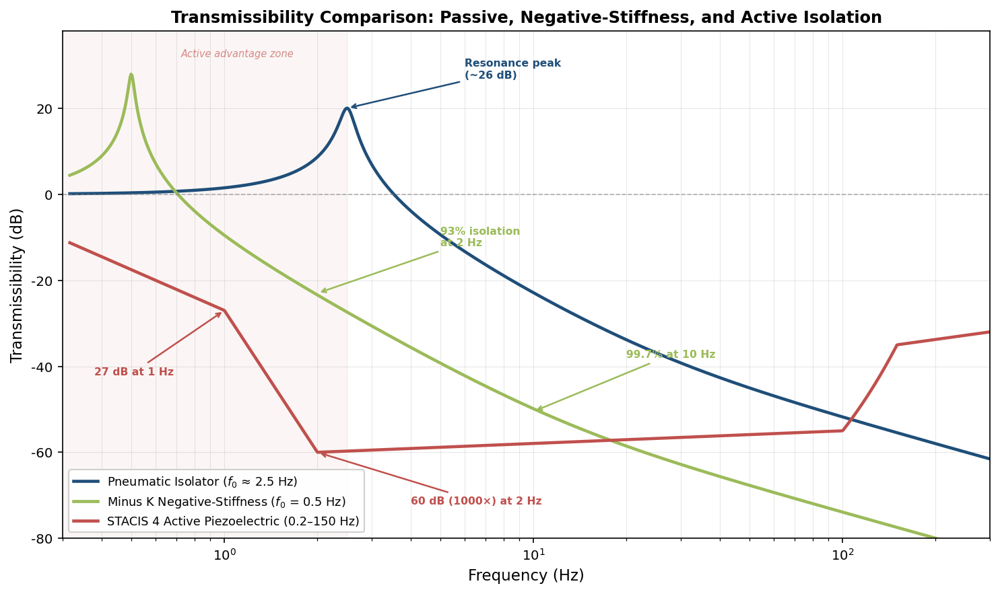

*Figure 1 — Transmissibility comparison: a conventional pneumatic isolator (f₀ ≈ 2.5 Hz), the Minus K negative-stiffness isolator (f₀ = 0.5 Hz), and the TMC STACIS 4 active piezoelectric system (0.2–150 Hz). The shaded region highlights the active advantage zone where piezoelectric feedback provides attenuation unattainable by passive means.*

## 1.4 Hybrid (Active–Passive) Isolation

Hybrid architectures combine passive elastic elements with active piezoelectric actuators in series or parallel, exploiting the strengths of both paradigms: the inherent high-frequency roll-off and fail-safe behavior of passive isolation, augmented by the low-frequency authority and adaptability of active control.

Wang et al. (2022) demonstrated an active–hybrid control (AHC) system in which a piezoelectric actuator operates in parallel with a passive spring element. The hybrid configuration reduced the resonance peak from 28 dB to 7.2 dB—a 20.8 dB suppression—and lowered the effective isolation onset frequency from 43 Hz to 22 Hz, substantially extending the useful bandwidth without sacrificing high-frequency performance [Wang et al., IntechOpen](https://www.intechopen.com/chapters/81174 "Active Vibration Suppression, 2022").

This hybrid principle extends naturally to multi-degree-of-freedom (multi-DOF) platforms. The Space Interferometry Mission (SIM) employed a 6-DOF piezoelectric Stewart platform to achieve optical path difference (OPD) control to within 10 nm, while the Spacecraft Structures Experimental Testbed System (SSETS) demonstrated PZT sensing and actuation embedded within fiberglass struts, achieving 20% modal damping and a 2 s step settling time [Bronowicki & Innis, Northrop Grumman](http://www.vibrationdata.com/tutorials_alt/05FW_Bronowicki.pdf "2005"). More recently, Fang et al. (2025) developed a 6-DOF piezoelectric Stewart platform that achieved 14 dB axial and 15.3 dB lateral vibration attenuation at 1.403 Hz. Bouc–Wen hysteresis modeling combined with modified particle swarm optimization (MPSO) reduced actuator tracking error from 7.79% to less than 0.6% and improved linearity from 8.9% to 1.8%. The platform further demonstrated fault tolerance, maintaining 8.2–13.3 dB attenuation even with three of six legs deactivated [Fang et al., Scientific Reports 2025](https://pmc.ncbi.nlm.nih.gov/articles/PMC11704038/ "2025").

## 1.5 System-Level Architecture: The Feedback Loop

A typical active piezoelectric vibration isolation system is structured as a closed-loop feedback chain comprising five principal stages:

1. **Sensor** — detects vibration (velocity, acceleration, displacement, or force) and converts it to an electrical signal.
2. **Signal conditioning** — amplifies, filters (anti-aliasing), and digitizes the sensor output.
3. **Digital controller (DSP/FPGA)** — executes the control algorithm (e.g., skyhook damping, integral force feedback, feedforward–feedback blending) and generates a corrective command.
4. **High-voltage amplifier** — converts the low-voltage control signal to the 0–200 V (multilayer) or 0–1,000 V (discrete stack) range required by the piezoelectric actuator.
5. **Piezoelectric actuator** — produces a mechanical displacement or force that counteracts the measured disturbance.

Advanced systems augment this single-loop topology with a **dual-loop architecture** comprising a ground feedforward path (using a floor-mounted sensor to anticipate incoming disturbances) and a payload feedback path (using a payload-mounted sensor to correct residual errors). The STACIS system implements this dual-loop strategy, with geophone sensors on both the floor and the payload [Wang et al., IntechOpen](https://www.intechopen.com/chapters/81174 "2022"); [TMC STACIS 4](https://www.techmfg.com/products/stacis/stacis-4 "specifications"). Figure 2 provides a schematic representation of this signal-flow architecture.

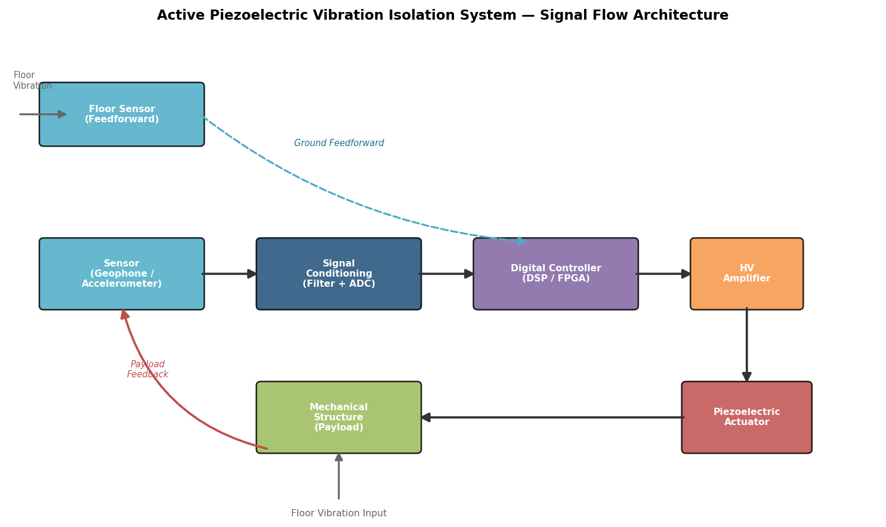

*Figure 2 — Signal-flow architecture of an active piezoelectric vibration isolation system. The primary feedback loop (payload sensor → signal conditioning → DSP controller → HV amplifier → piezoelectric actuator) is augmented by a ground feedforward path that anticipates floor-borne disturbances before they reach the payload.*

Each element in this chain contributes a distinct error or limitation to overall system performance. The sensor determines the noise floor and usable bandwidth; the controller determines loop bandwidth and stability margins; the amplifier contributes electronic noise that sets the practical actuator resolution; and the actuator introduces nonlinearities—principally hysteresis (10–15% of full stroke in open-loop voltage drive) and creep (~1–2% per time decade)—that must be compensated either at the hardware level (charge drive, ceramic insulation) or through control algorithms (inverse hysteresis models, integral action) [Fang et al., Scientific Reports 2025](https://pmc.ncbi.nlm.nih.gov/articles/PMC11704038/ "Stewart platform, 2025").

## 1.6 Key Performance Metrics

Evaluating and comparing vibration isolation systems requires a consistent set of quantitative metrics. The principal figures of merit—and the sub-systems that most strongly influence each—are outlined below.

### 1.6.1 Transmissibility

Transmissibility T(f) is the ratio of output (payload) vibration amplitude to input (base) vibration amplitude at frequency f, typically expressed in decibels: T_dB = 20·log₁₀(A_out / A_in). A passive SDOF system yields T(f) < 1 (negative dB) only above √2 · f₀; an active system can push this crossover to substantially lower frequencies. The JWST spacecraft-to-payload isolator, for instance, achieves T(f) exceeding –40 dB (attenuation >100×) across 12–90 Hz, with no worse than –28 dB from 12 Hz to 1 kHz [Bronowicki & Innis, Northrop Grumman](http://www.vibrationdata.com/tutorials_alt/05FW_Bronowicki.pdf "2005").

### 1.6.2 Insertion Loss

Insertion loss (IL) quantifies the improvement attributable to the isolation system by comparing payload vibration with and without the isolator installed under identical excitation conditions. The STACIS 4 FloorSense™ system demonstrates 60 dB IL at 2 Hz (a 1,000-fold reduction) and 27 dB at 1 Hz, performance equivalent to upgrading a facility by up to five VC classes [TMC STACIS 4](https://www.techmfg.com/products/stacis/stacis-4 "specifications").

### 1.6.3 Positioning Resolution

In applications where the isolation platform doubles as a positioning stage, the minimum resolvable displacement is critical. As discussed in Section 1.1, piezoelectric actuator resolution is in principle unlimited; the practical limit is set by electronic noise in the sensor and drive chain. Current commercial systems achieve open-loop resolution of 0.03 nm (PI N-310 NEXACT®) and closed-loop system-level noise floors below 0.05 nm RMS (STACIS 4) [PI N-310 NEXACT®](https://www.pi-usa.us/en/products/piezo-motors-stages-actuators/linear-piezo-motors-actuators-for-integration/n-310-nexact-oem-miniature-linear-motor-actuator-1000700 "specifications"); [TMC STACIS 4](https://www.techmfg.com/products/stacis/stacis-4 "specifications").

### 1.6.4 Bandwidth

The effective bandwidth defines the frequency range over which meaningful vibration attenuation is achieved. It is bounded at the low end by sensor low-frequency noise and controller DC stability, and at the high end by the actuator's first mechanical resonance, structural parasitic modes, and the controller sampling rate. STACIS 4 provides active isolation from 0.2 Hz to 150 Hz; the upper bound reflects the combined constraints of actuator resonance (>10 kHz), controller sampling rate (10 kHz), and structural modes of the supporting frame [TMC STACIS 4](https://www.techmfg.com/products/stacis/stacis-4 "specifications").

### 1.6.5 Settling Time

Settling time—the interval required for transient vibrations to decay below a specified threshold after a disturbance event—is especially critical in semiconductor lithography, where tool-induced transients (wafer exchange, stage step-and-settle) directly limit throughput. The STACIS 4 achieves a settling time of 0.02 s, enabled by the high stiffness (~7.3 × 10⁶ N/m) of its serial hard-mount architecture—orders of magnitude faster than pneumatic systems, which typically require 0.5–5 s [PI/TMC White Paper](https://www.techmfg.com/learning/whitepapers/piezo-driven-active-vibration-control-pushes-limits "2011"); [TMC STACIS 4](https://www.techmfg.com/products/stacis/stacis-4 "specifications").

### 1.6.6 Sub-System Contributions — A Summary View

The following table maps each performance metric to the sub-systems that most directly govern it:

| Performance Metric | Primary Sub-System Contributors |
|---|---|
| Transmissibility | Passive element stiffness/damping; actuator force authority; control loop gain |
| Insertion loss | Combined passive + active chain; installation stiffness |
| Positioning resolution | Sensor noise floor; amplifier noise; actuator solid-state continuity |
| Bandwidth | Sensor low-frequency cutoff; actuator resonance; controller sampling rate; structural parasitic modes |
| Settling time | System stiffness (serial vs. parallel architecture); control damping ratio |

The sensor establishes the system noise floor and determines the minimum detectable vibration—STACIS's geophone inertial sensors contribute to the system's <0.05 nm RMS internal noise [TMC STACIS 4](https://www.techmfg.com/products/stacis/stacis-4 "specifications"). The controller governs loop bandwidth and stability; advanced strategies such as skyhook damping, integral force feedback (IFF), and combined feedforward–feedback architectures are examined in Chapter 5 [Wang et al., IntechOpen](https://www.intechopen.com/chapters/81174 "2022"). The actuator determines force authority, stroke, and the nonlinearity budget; material selection and structural design of actuators are the subject of Chapter 3. The mechanical structure—including flexure amplification mechanisms, preload systems, and assembly interfaces—introduces parasitic modes and manufacturing-dependent variability that directly affect unit-to-unit consistency, themes developed in Chapters 4 and 6.

Figure 3 consolidates the quantitative performance data discussed throughout this chapter into a single benchmarking view across four representative isolation systems.

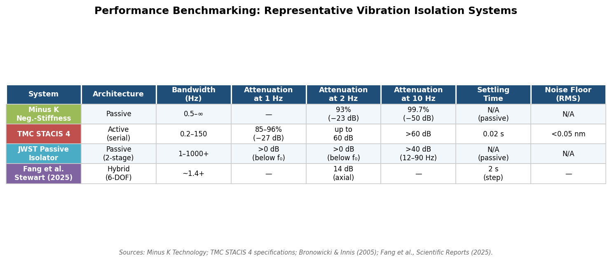

*Figure 3 — Performance benchmarking of representative vibration isolation systems. Attenuation, bandwidth, settling time, and noise-floor data are drawn from the sources cited in Sections 1.2–1.4.*

## 1.7 Implications for System Accuracy and Consistency

The architecture-level analysis presented in this chapter reveals that enhancing system accuracy is not a matter of optimizing any single component in isolation but rather requires coordinated advances across four interdependent dimensions:

- **Hardware design** — selecting sensor types matched to the required noise floor and bandwidth (Chapter 2); choosing piezoelectric materials and actuator topologies that balance stroke, force, linearity, and reliability (Chapter 3).
- **Structural design** — adopting serial hard-mount architectures for maximum stiffness and settling speed; incorporating monolithic flexure mechanisms to eliminate assembly interfaces; and deploying parallel kinematic configurations (e.g., cubic Stewart platforms) to minimize directional coupling and tolerance sensitivity.
- **Manufacturing processes** — controlling critical dimensions (particularly flexure hinge thickness, where stiffness scales as t³) through precision wire-EDM machining; ensuring uniform co-firing and electrode deposition in multilayer actuators; and maintaining bond-line uniformity during assembly (Chapter 4).
- **Control algorithms** — implementing inverse hysteresis models or charge-drive electronics to suppress open-loop nonlinearity from 10–15% to below 1%; employing integral force feedback for unconditional stability; and applying digital calibration (per-unit ID-chip polynomial linearization) to normalize the inherent ±10–20% unit-to-unit variation in piezoelectric actuator displacement (Chapters 5 and 6).

Ensuring consistent performance across identical production units demands that these four dimensions be addressed simultaneously within a design-for-manufacturability (DFM) framework. The subsequent chapters develop each of these themes in detail.

# 第2章 Sensor Technologies for Precision Vibration Isolation

Sensors define the fundamental performance envelope of any active vibration isolation system. A control loop cannot correct what it cannot observe; consequently, the noise floor, bandwidth, dynamic range, and linearity of the sensing element impose an irreducible lower bound on achievable isolation. This chapter surveys the principal sensor families deployed in precision piezoelectric vibration isolation platforms—from piezoelectric accelerometers and geophones through capacitive displacement sensors, laser interferometers, and quartz force transducers—examines how hardware design and structural integration influence system-level accuracy, and establishes a selection framework that maps application requirements to optimal sensor technology.

## 2.1 Piezoelectric Accelerometers

Piezoelectric accelerometers remain the most widely adopted inertial sensor for ground vibration monitoring and broadband isolation feedback. The PCB 393B04, a representative high-sensitivity model, delivers 1000 mV/g sensitivity with a noise floor of 0.30 µg/√Hz at 1 Hz, 0.10 µg/√Hz at 10 Hz, and 0.04 µg/√Hz at 100 Hz over a usable bandwidth of 0.06–450 Hz (±5 %), transverse sensitivity ≤ 5 %, and nonlinearity ≤ 1 % [PCB 393B04 Datasheet](https://www.pcb.com/contentstore/docs/pcb_corporate/vibration/products/specsheets/393b04_h.pdf "Model 393B04 specification, 2022"). These specifications suit seismic-band characterization well, yet the noise density at 1 Hz—equivalent to roughly 0.3 nm/√Hz of displacement on a platform with a 1 Hz natural frequency—constrains the ultimate residual motion achievable in closed-loop operation.

A critical deployment decision concerns the signal-conditioning topology. In charge mode, the sensor outputs a high-impedance charge signal processed by an external charge amplifier whose transfer function follows V_out = −Q / C_f, with the time constant τ = R_f · C_f setting the low-frequency corner. This topology supports operation above 200 °C but remains susceptible to cable capacitance loading and triboelectric noise on long cable runs [PCB/Modal Shop](https://www.modalshop.com/calibration/learn/accelerometers/charge-vs-icp-operation "Charge vs ICP comparison"). ICP (IEPE) mode, by contrast, embeds a charge-to-voltage conversion circuit inside the sensor housing, permitting long, low-cost coaxial cable runs with minimal noise degradation at the expense of limiting the operating temperature to approximately 120 °C [PCB/Modal Shop](https://www.modalshop.com/calibration/learn/accelerometers/charge-vs-icp-operation "Charge vs ICP comparison"). For factory-floor vibration isolation systems operating near ambient temperature, ICP mode is the standard choice; charge mode is reserved for high-temperature or ultra-low-frequency applications demanding extended time constants.

## 2.2 Geophones and Inertial Velocity Sensors

Geophone-type inertial velocity sensors occupy a central role in the highest-performance commercial active isolation systems. The TMC STACIS 4 employs proprietary geophone-based sensors to achieve an effective bandwidth of 0.2–150 Hz and system-level internal noise below 0.05 nm RMS [TMC STACIS 4](https://www.techmfg.com/products/stacis/stacis-4 "TMC STACIS 4 Active Floor Vibration Cancellation"). Because geophones transduce velocity rather than acceleration, their output rises with frequency in the low-frequency seismic band, providing inherently favorable signal-to-noise characteristics precisely where isolation is most needed and where accelerometer noise density is at its worst.

Mechanically, a geophone consists of a coil-magnet proof mass suspended on a spring with a natural frequency typically between 1 and 4.5 Hz. Above this resonance the velocity response is flat; below it the output rolls off at 20 dB/decade, forming a high-pass mechanical filter. Modern feedback electronics within the sensor housing can electrically extend the flat response down to 0.1 Hz or below, partially compensating this limitation. In the STACIS architecture, a ground-referenced geophone (FloorSense™) supplies the feedforward path while a second sensor on the payload provides the feedback path, enabling a dual-loop topology that delivers up to 60 dB (1000×) attenuation at 2 Hz and 85–96 % isolation at 1 Hz [TMC STACIS 4](https://www.techmfg.com/products/stacis/stacis-4 "specifications").

## 2.3 Optomechanical MEMS Geophones

Emerging micro-electro-mechanical geophones aim to combine the sensitivity of traditional geophones with the form factor, cost, and manufacturability advantages of MEMS fabrication. Jiao et al. (2024) demonstrated an optomechanical MEMS geophone employing a planar concave Fabry–Pérot microcavity that achieved a noise floor of 2.5 ng/√Hz across 100–200 Hz, a bandwidth of 500 Hz, a full-scale range of ± 4 mg, and a dynamic range of 124 dB [Jiao et al., Microsystems & Nanoengineering 2024](https://www.nature.com/articles/s41378-024-00802-5 "optomechanical MEMS geophone, 2024"). Balanced optical detection suppressed excess intensity noise from 15 ng/√Hz down to the thermal noise limit, confirming that optical readout can push MEMS inertial sensors toward performance levels previously exclusive to macroscale instruments.

Although not yet deployed in commercial vibration isolation platforms, such devices point toward future systems in which sensor arrays are lithographically batch-fabricated, yielding tighter unit-to-unit consistency than hand-wound geophone coils—a consideration of direct relevance to the production repeatability concerns addressed in Chapters 4 and 6.

## 2.4 Capacitive Displacement Sensors

Where absolute or relative displacement measurement at sub-nanometer resolution is required—as in payload position metrology or closed-loop nanopositioning—capacitive sensors represent the dominant technology. PI dual-plate capacitive sensors (D-015, D-050, D-100 series) achieve resolution below 0.01 nm, linearity of 0.003 %, and bandwidth up to 10 kHz [PI Capacitive Sensors](https://www.pi-usa.us/en/products/capacitive-sensors "PI capacitance sensors"). For a typical 100 µm-range commercial capacitive sensor, Fleming (2013) reports a noise density of approximately 20 pm/√Hz, yielding a 6σ resolution of 2.4 nm over a 1 kHz measurement bandwidth [Fleming, Sensors and Actuators A 2013](https://www.precisionmechatronicslab.com/wp-content/publications/J13a.pdf "A review of nanometer resolution position sensors").

Fleming's generalized 6σ resolution formula—6√A · √(f_nc · ln(f_h / f_l) + k_e · f_h)—makes explicit that sensor resolution is meaningful only when reported together with the measurement bandwidth and statistical definition employed [Fleming, Sensors and Actuators A 2013](https://www.precisionmechatronicslab.com/wp-content/publications/J13a.pdf "2013"). This point carries direct practical importance: a sensor quoted at "0.01 nm resolution" may refer to a narrow-band or single-frequency measurement that does not translate to sub-nanometer performance across the full control bandwidth.

One notable limitation of capacitive sensors in vibration isolation feedback loops is their relatively high low-frequency noise compared to force sensors. Fleming (2010) measured closed-loop position noise of 1.7 nm RMS when using a capacitive sensor alone, versus 9 pm RMS when a piezoelectric force sensor supplied the high-frequency feedback path—a four-order-of-magnitude difference in high-frequency noise density [Fleming, IEEE/ASME Trans. Mechatronics 15(3), 2010](https://www.precisionmechatronicslab.com/wp-content/publications/J10a.pdf "Force Feedback Nanopositioning"). This discrepancy motivates the dual-sensor architectures discussed in Section 2.8.

## 2.5 Laser Interferometers

Laser heterodyne interferometry provides the highest-accuracy displacement reference currently available. A He-Ne 633 nm interferometer offers a fundamental resolution of λ/2 ≈ 316 nm per fringe; electronic interpolation to λ/1024 extends this to approximately 0.31 nm [Fleming 2013](https://www.precisionmechatronicslab.com/wp-content/publications/J13a.pdf "2013"). ZYGO ZMI displacement-measuring interferometers serve as the industry-standard stage position metrology tool in semiconductor lithography [ZYGO DMI](https://www.zygo.com/products/nano-position-sensors/displacement-measuring-interferometers "ZYGO ZMI overview").

Despite their unmatched traceability and absence of contact forces, interferometers introduce error sources absent from other sensor types: atmospheric refractive-index fluctuations (approximately 1 ppm per °C in air), Abbe errors arising from angular misalignment between the measurement axis and the axis of motion, and dead-path errors proportional to uncompensated optical path length [Fleming 2013](https://www.precisionmechatronicslab.com/wp-content/publications/J13a.pdf "2013"). These characteristics confine interferometers in vibration isolation systems to the role of external metrology references—validating system performance or providing slow-update position feedback—rather than serving as the primary high-bandwidth control sensor.

## 2.6 Quartz Force Sensors

Piezoelectric quartz force sensors occupy a distinctive niche in active vibration isolation: when collocated with the actuator inside an active strut, they supply the feedback signal for integral force feedback (IFF) control, enabling unconditionally stable damping of all structural modes. The Kistler 9301C–9371C series delivers sensitivity of −3.1 to −4.0 pC/N, natural frequencies spanning 19.9–58.5 kHz, and stiffness of 0.245–4.794 kN/µm [Kistler Catalog](https://kistler.cdn.celum.cloud/SAPCommerce_Download_original/960-262e.pdf "Kistler force sensors catalog"). The six-axis 9306A model achieves natural frequencies exceeding 18 kHz (axial) and 11 kHz (moment), making it well suited for micro-vibration testing and multi-degree-of-freedom isolation platforms [Kistler Catalog](https://kistler.cdn.celum.cloud/SAPCommerce_Download_original/960-262e.pdf "Kistler force sensors catalog").

Force sensors offer a compelling advantage over accelerometers when isolating heavy payloads. On a 1000 kg payload, a 10⁻³ N disturbance force corresponds to an acceleration of only 10⁻⁶ m/s²—well below the detection threshold of most commercial accelerometers—yet falls comfortably within the measurement range of quartz force transducers [Preumont](http://bluebox.ippt.pan.pl/~smart01/lectures/preumont.pdf "Sections 10.2-10.3"). This sensitivity advantage scales with payload mass, making force feedback the preferred strategy for semiconductor lithography tools and heavy optical instruments.

## 2.7 Piezoelectric and Resistive Strain Sensors

For embedded sensing within active struts or flexure-guided nanopositioners, piezoelectric strain sensors and resistive strain gauges present complementary trade-offs. Piezoelectric strain sensors exhibit noise density more than 100× lower than resistive gauges above 1 Hz, but their capacitive source impedance introduces low-frequency drift with a practical low-frequency cutoff around 0.05 Hz, precluding reliable measurement below approximately 0.5 Hz [Fleming 2013](https://www.precisionmechatronicslab.com/wp-content/publications/J13a.pdf "2013"). Resistive strain gauges, by contrast, maintain DC response but suffer a noise density of approximately 15 pm/√Hz, yielding a 6σ resolution of only 23 nm over a 1 kHz bandwidth [Fleming 2013](https://www.precisionmechatronicslab.com/wp-content/publications/J13a.pdf "2013"). This resolution is adequate for coarse positioning but falls well short of the sub-nanometer threshold required for vibration isolation metrology.

## 2.8 Signal Conditioning and Anti-Aliasing

The preceding sections reveal that each sensor technology occupies a distinct region of the noise-density–frequency plane. Figure 2-1 consolidates these noise characteristics, illustrating the crossover frequencies at which one technology supersedes another—a comparison that directly motivates the signal-conditioning and dual-sensor strategies discussed below.

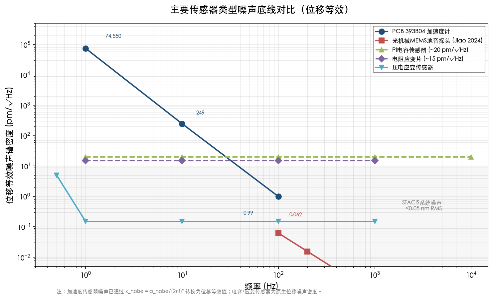

*Figure 2-1. Sensor noise floor comparison (displacement-equivalent). Accelerometers dominate at high frequencies but exhibit elevated noise below ~10 Hz; capacitive sensors and strain gauges provide frequency-independent noise floors; piezoelectric strain sensors achieve the lowest high-frequency noise density among embedded transducers. The STACIS system-level noise reference (< 0.05 nm RMS) is annotated for context.*

The interface between sensor and controller—signal conditioning—is a frequent source of performance degradation that hardware design must address systematically. Charge amplifier design determines the low-frequency behavior of piezoelectric sensors: the feedback capacitor C_f sets gain (V_out = −Q / C_f), while the parallel resistance R_f establishes the time constant τ = R_f · C_f and hence the low-frequency roll-off [Fleming 2013](https://www.precisionmechatronicslab.com/wp-content/publications/J13a.pdf "2013").

For digital control systems, anti-aliasing filtering ahead of the analog-to-digital converter is mandatory. A system sampling at 10 kHz (as in STACIS) requires an anti-aliasing low-pass filter with a cutoff frequency of approximately 4 kHz; a four-pole Butterworth design is typical for its maximally flat passband [Fleming 2013](https://www.precisionmechatronicslab.com/wp-content/publications/J13a.pdf "2013"). Preumont's rule of thumb specifies the sampling frequency f_s ≥ 100 · f_c, where f_c is the highest frequency of interest in the control loop, to provide adequate phase margin for digital controllers [Preumont](http://bluebox.ippt.pan.pl/~smart01/lectures/preumont.pdf "Active Vibration Control, Section 3.1"). Under-sampling or inadequate anti-aliasing introduces aliased spectral content that the controller interprets as in-band disturbance, potentially destabilizing the loop.

A dual-sensor architecture—combining a high-frequency piezoelectric force sensor with a low-frequency capacitive displacement sensor—exploits the complementary noise spectra visible in Figure 2-1. Fleming (2010) demonstrated that such a configuration achieved closed-loop position noise of just 9 pm RMS on a 1.5 kHz resonance nanopositioner, because the piezoelectric force sensor contributed four orders of magnitude less high-frequency noise density than the capacitive sensor alone [Fleming, IEEE/ASME Trans. Mechatronics 15(3), 2010](https://www.precisionmechatronicslab.com/wp-content/publications/J10a.pdf "Force Feedback Nanopositioning"). The low-frequency bypass scheme transferred control authority to the capacitive sensor below the force sensor's charge-decay corner frequency, ensuring broadband coverage without low-frequency drift.

## 2.9 Collocation, Pole-Zero Interlacing, and Loop Stability

Sensor placement relative to the actuator profoundly affects achievable closed-loop performance. When a sensor and actuator are collocated—physically coincident and measuring along the same degree of freedom—the open-loop transfer function exhibits alternating poles and zeros on the imaginary axis, a property known as interlacing [Preumont](http://bluebox.ippt.pan.pl/~smart01/lectures/preumont.pdf "Sections 4.1, 7"). This structural property guarantees that a broad class of active damping controllers, including IFF, positive position feedback (PPF), and integral resonant control (IRC), are unconditionally stable for all positive gains—a guarantee that does not extend to non-collocated configurations.

Integral force feedback with collocated piezoelectric actuators and force sensors constitutes an "energy absorption" strategy with infinite gain margin. The maximum achievable modal damping ratio follows ξ_max = (Ω_i − ω_i) / (2ω_i), where Ω_i and ω_i are the transmission and resonance zeros and poles, respectively, and the separation is proportional to the modal strain energy fraction ν_i captured by the active strut [Preumont](http://bluebox.ippt.pan.pl/~smart01/lectures/preumont.pdf "Sections 7.5, 9-10"). Experimental validation on active truss structures confirmed damping ratios exceeding 10 % for the first two structural modes [Preumont](http://bluebox.ippt.pan.pl/~smart01/lectures/preumont.pdf "Sections 7.5, 9-10").

In the cubic Stewart platform architecture—a six-strut hexapod with mutually orthogonal leg pairs—decentralized IFF (identical gain on all six legs) minimizes inter-axis coupling and reduces the control problem to six independent single-input-single-output loops. Experimental validation of this architecture achieved 14–21 % damping ratios for the first three flexible modes [Preumont](http://bluebox.ippt.pan.pl/~smart01/lectures/preumont.pdf "Sections 9, 10.4-10.5"). Sensor and actuator layout optimization to maximize the strain energy fraction ν_i for the critical modes is therefore a primary structural design objective.

Non-collocated sensor-actuator pairs, by contrast, can exhibit non-minimum-phase behavior, in which pole-zero interlacing is lost. The resulting phase uncertainty limits the achievable control bandwidth and may require robust control synthesis (e.g., H∞) to maintain stability, at the cost of reduced performance [Preumont](http://bluebox.ippt.pan.pl/~smart01/lectures/preumont.pdf "Sections 4.1, 7").

## 2.10 Sensor Mounting and Structural Integration

Even the most sensitive transducer will deliver degraded performance if mounting introduces parasitic compliance, misalignment, or mechanical cross-talk. Fleming (2013) quantified the impact of geometric imperfections on capacitive sensors: a tilt of 2 mrad produces 0.08 % nonlinearity and 0.8 % scale-factor error, while a 30 µm bow depth produces 0.33 % nonlinearity and 11 % scale-factor error [Fleming 2013](https://www.precisionmechatronicslab.com/wp-content/publications/J13a.pdf "Table 2"). Spring-washer mounting is recommended to reduce installation stress that can drift over thermal cycles.

For force sensors embedded in Stewart platform active struts, mechanical decoupling of parasitic bending moments is essential. Flexible end-tips (spherical joints) at both ends of each strut isolate the quartz element from off-axis loads, ensuring that the sensor measures only the axial force aligned with the actuator's working direction [Preumont](http://bluebox.ippt.pan.pl/~smart01/lectures/preumont.pdf "Section 8.3"). Without such decoupling, moment loading introduces cross-axis contamination that corrupts the force measurement and degrades the IFF loop's unconditional stability guarantee.

These mounting considerations carry direct implications for production consistency. Mounting torque, adhesive layer uniformity, and joint alignment must be controlled within tight tolerances across production units to ensure that sensor performance does not vary from system to system—a theme developed further in Chapters 4 and 6.

## 2.11 Sensor Selection Hierarchy for Vibration Isolation Applications

Drawing on the foregoing analysis, a decision framework emerges that maps application requirements to sensor technology:

1. **Broadband active ground isolation (0.2–150 Hz):** Geophone-type inertial velocity sensors, as deployed in STACIS, offer the best combination of low-frequency sensitivity, bandwidth, and integration maturity. System-level noise below 0.05 nm RMS is achievable [TMC STACIS 4](https://www.techmfg.com/products/stacis/stacis-4 "specifications").

2. **Collocated control on Stewart platforms:** Quartz force sensors (natural frequency > 20 kHz) provide the IFF-compatible feedback signal with unconditional stability and superior heavy-payload sensitivity [Preumont](http://bluebox.ippt.pan.pl/~smart01/lectures/preumont.pdf "Sections 10.2-10.3"); [Kistler Catalog](https://kistler.cdn.celum.cloud/SAPCommerce_Download_original/960-262e.pdf "Kistler specs").

3. **Highest-resolution payload position metrology:** Capacitive sensors (< 0.01 nm resolution) for nanopositioning and stage-level feedback; laser interferometers (0.31 nm with λ/1024 interpolation) for traceable displacement metrology [PI Capacitive Sensors](https://www.pi-usa.us/en/products/capacitive-sensors "PI specs"); [Fleming 2013](https://www.precisionmechatronicslab.com/wp-content/publications/J13a.pdf "2013").

4. **High-temperature or strong-EMI environments:** Fiber Bragg grating (FBG) sensors, which are immune to electromagnetic interference and operate across wide temperature ranges, serve as alternatives where conventional electronic sensors are impractical.

5. **Dual-sensor architectures:** Combining a high-frequency force or piezoelectric sensor with a low-frequency capacitive sensor achieves broadband coverage with noise performance surpassing either sensor alone—9 pm RMS demonstrated experimentally [Fleming, IEEE/ASME Trans. Mechatronics 15(3), 2010](https://www.precisionmechatronicslab.com/wp-content/publications/J10a.pdf "Force Feedback Nanopositioning").

The selection hierarchy underscores that no single sensor type optimally serves all roles in a precision vibration isolation system. System-level accuracy is maximized by matching each feedback channel to the sensor technology whose noise spectrum, bandwidth, and stability properties best suit the specific loop requirement.

# 第3章 Piezoelectric Actuator Design & Optimization

Within a precision piezoelectric vibration isolation system, the actuator serves as the force-generating element that converts electrical command signals into mechanical displacement or force to counteract incoming disturbances. Actuator performance—encompassing stroke, force authority, bandwidth, linearity, and long-term stability—directly determines the achievable isolation accuracy and, by extension, the system's capacity to meet increasingly stringent vibration criteria in semiconductor fabrication, space instrumentation, and metrology. This chapter examines the material science foundations, structural-mechanical design strategies, and hardware-level linearity improvements that collectively govern actuator performance. It concludes by addressing the manufacturing-related parameters that drive unit-to-unit consistency, a prerequisite for reproducible system-level behavior across production volumes.

## 3.1 Piezoelectric Material Selection and Trade-Offs

### 3.1.1 PZT Ceramics: The Workhorse Family

Lead zirconate titanate (PZT) ceramics remain the dominant material class for precision actuation. Within the PZT family, the distinction between "soft" and "hard" compositions defines the primary design trade-off between piezoelectric output and internal loss.

**PZT-5A** (Navy Type II, soft PZT) serves as the baseline actuator-grade piezoceramic, with d₃₃ = 374 pC/N, electromechanical coupling factor k₃₃ = 0.71, Curie temperature T_C = 350 °C, and mechanical quality factor Q_M = 100 [Boston Piezo-Optics](https://www.bostonpiezooptics.com/ceramic-materials-pzt "PZT material properties"). This composition provides a balanced combination of moderate piezoelectric output and high thermal stability, making it a common reference point against which other grades are evaluated.

**PZT-5H** (Navy Type VI, soft PZT) achieves the highest piezoelectric coefficients among standard PZT compositions: d₃₃ = 585 pC/N—approximately 56% higher than PZT-5A—with k₃₃ = 0.75 and relative dielectric permittivity K^T₃₃ = 3,400. These gains come at the cost of a substantially lower Curie temperature (T_C = 195 °C, limiting safe continuous operation to approximately 80–100 °C), increased temperature sensitivity of key coefficients, and lower Q_M = 65 [Boston Piezo-Optics](https://www.bostonpiezooptics.com/ceramic-materials-pzt "PZT material properties"); [PIEZO.COM](https://info.piezo.com/hubfs/Data-Sheets/piezo-PZT-5A_PZT-5H-material-properties.pdf "PZT 5A/5H datasheet").

**PZT-4** (Navy Type I, hard PZT) is optimized for high-power and high-duty-cycle operation. Its d₃₃ of 295 pC/N is the lowest of the three standard grades, yet its Q_M of 400—four times that of PZT-5A—translates directly to lower internal dielectric and mechanical losses during sustained dynamic actuation. Hard PZT grades are therefore the preferred choice when continuous cyclic driving and thermal management are primary concerns [Boston Piezo-Optics](https://www.bostonpiezooptics.com/ceramic-materials-pzt "PZT material properties").

Commercial actuator manufacturers employ proprietary PZT formulations tailored to specific actuator architectures. PI Ceramic's **PIC 151** (modified soft PZT) is the standard material for their PICA-Stack high-voltage actuators, with d₃₃ = 500 pm/V and T_C = 250 °C. **PIC 255** serves PICA-Power actuators requiring higher thermal margins, with d₃₃ = 400 pm/V and T_C = 350 °C. The PICMA multilayer actuator line uses **PIC 252** material with monolithic ceramic insulation and T_C = 320 °C, enabling operation up to 150 °C and providing humidity resistance far superior to polymer-insulated designs [PI Ceramic Catalog C](https://www.pi-usa.us/fileadmin/user_upload/pi_us/files/catalogs/PI_Ceramic_CatalogC.pdf "p.40 material data").

### 3.1.2 PMN-PT Single Crystals: The High-Performance Frontier

Relaxor-based single crystals represent the highest-performance piezoelectric materials currently available. PMN-PT ([001]-poled) achieves d₃₃ = 1,190–1,620 pC/N and k₃₃ = 90–93%—a 3–4× improvement in piezoelectric coefficient over the best PZT ceramics. CTS Corporation's PMN-28%PT (Type A) delivers d₃₃ = 1,190 pC/N and k₃₃ = 90%, while PMN-32%PT (Type B) reaches d₃₃ = 1,620 pC/N and k₃₃ = 93%. PIN-PMN-PT ternary single crystals offer improved thermal stability through higher morphotropic phase boundary temperatures, while maintaining k₃₃ ≈ 89% and d₃₃ ≈ 1,285–1,338 pC/N [CTS Corporation](https://www.ctscorp.com/Files/Brochures/Piezoelectric/CTS-Piezoelectric-Single-Crystal-PMN-PT-Brochure.pdf "PMN-PT brochure").

Despite this superior electromechanical coupling, single crystals remain confined primarily to ultrasonic imaging and sonar transducers. Their high unit cost, limited availability in large-area formats, lower mechanical robustness relative to polycrystalline PZT, and susceptibility to depolarization under compressive stress currently restrict adoption in vibration isolation actuators, where stack configurations require dozens to hundreds of individually matched layers.

### 3.1.3 Lead-Free Alternatives: Regulatory Pressure and Current Limitations

Emerging lead-free piezoelectric systems—primarily (K,Na)NbO₃ (KNN)-based and Bi₁/₂Na₁/₂TiO₃ (BNT)-based compositions—have achieved d₃₃ values of approximately 220–500 pC/N in optimized laboratory compositions, approaching the lower end of PZT performance. However, these alternatives generally suffer from lower effective strain output (typically < 400 pm/V for d*₃₃), higher sensitivity to processing conditions, and narrower usable temperature ranges [Eureka/PatSnap Review](https://eureka.patsnap.com/report-lead-free-piezoelectric-materials-bifeo-knn-and-alternatives-for-eco-friendly-pengs "Lead-free review, 2024"). The EU RoHS Directive exemption for PZT in precision instruments remains in force, and no commercial lead-free actuator product specifically designed for precision vibration isolation has been identified as of early 2026. Institutions such as Fraunhofer IKTS continue to pursue lead-free actuator development, yet commercial readiness for demanding isolation applications has not been demonstrated.

The following table consolidates key material parameters across the PZT grades, proprietary PI compositions, and PMN-PT single crystals discussed above, providing a reference for material selection in actuator design.

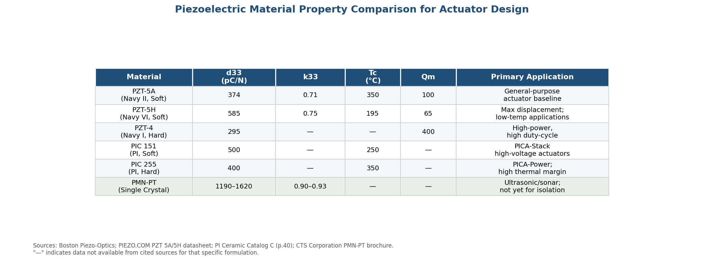

*Figure 3-1. Comparison of six piezoelectric material formulations across d₃₃, k₃₃, Curie temperature, mechanical quality factor, and primary application suitability. Data from Boston Piezo-Optics, PIEZO.COM, PI Ceramic Catalog C, and CTS Corporation.*

## 3.2 Actuator Configurations: From Stacks to Amplified Mechanisms

### 3.2.1 Multilayer Stack Actuators

The multilayer (cofired) stack actuator is the foundational topology for vibration isolation. Thin ceramic layers—typically 20–60 µm for low-voltage multilayer designs—are mechanically connected in series and electrically in parallel, producing a total free displacement of ΔA = n · d₃₃ · V, where n is the number of active layers and V the applied voltage. This architecture allows the driving electric field per layer to be achieved at modest voltages (60–200 V), while the stack generates high blocking forces proportional to its cross-sectional area and material stiffness.

PI Ceramic's **PICMA P-885 series** illustrates the performance envelope of modern multilayer stacks: displacements of 6.5–32 µm at 100 V, blocking forces of 800–950 N, stiffness of 25–100 N/µm, and resonant frequencies of 40–135 kHz, all in packages from 9 to 36 mm in length. The operating temperature range spans −40 °C to +150 °C, and PI reports endurance exceeding 10⁹ cycles with no measurable performance degradation [PI Ceramic Catalog C](https://www.pi-usa.us/fileadmin/user_upload/pi_us/files/catalogs/PI_Ceramic_CatalogC.pdf "pp.14-15").

For applications demanding higher force authority and longer stroke at the expense of higher driving voltage, **PICA-Stack high-voltage actuators** (0–1,000 V, PIC 151 material) provide a complementary solution. The P-010.80 (10 mm diameter) delivers 120 µm displacement with 2,400 N blocking force and 20 N/µm stiffness, while the P-056.80 (56 mm diameter) maintains the same 120 µm stroke but scales blocking force to 76,000 N and stiffness to 630 N/µm—sufficient for multi-tonne payload applications in heavy semiconductor equipment [PI Ceramic Catalog C](https://www.pi-usa.us/fileadmin/user_upload/pi_us/files/catalogs/PI_Ceramic_CatalogC.pdf "pp.16-19").

### 3.2.2 Amplified Piezoelectric Actuators

Raw stack displacement—typically tens of micrometers—is often insufficient for vibration isolation applications that require stroke on the order of 100 µm to millimeters. Amplified piezoelectric actuators (APAs) address this limitation by coupling a multilayer stack to a flextensional or lever-based compliant mechanism that magnifies output displacement at the cost of proportionally reduced force and stiffness.

Cedrat Technologies' APA product line exemplifies this approach. The **APA120S** achieves 140 µm stroke, 46 N blocked force, 0.33 N/µm stiffness, 1,300 Hz blocked-free resonant frequency, and 7.9 nm resolution in a compact 13 × 29 × 9 mm package (7.2 g). Its integrated flextensional shell provides both displacement amplification and built-in mechanical preload, eliminating the need for external preload mechanisms [Cedrat APA120S](https://cedrat-technologies.com/wp-content/uploads/products/datasheets/APA120S.pdf "2024").

The APA product line spans three orders of magnitude in both stroke and bandwidth, illustrating the fundamental trade-off between amplification and dynamic performance. At the compact end, the APA30uXS achieves 34 µm stroke with 4,800 Hz resonance in a 0.15 g package; at the large-stroke end, the APA1000XL delivers 1,100 µm (1.1 mm) stroke but with resonance reduced to 210 Hz. The largest variant, APA2000L, reaches 2,000 µm stroke at 62 N blocked force and only 87 Hz resonance [MMECH/Cedrat](https://www.mmech.com/cedrat-actuators/apa-overview/apas-specifications "APA specs"). This inverse relationship between amplification ratio and both stiffness and bandwidth is fundamental: for a lever amplification ratio r, output stiffness scales approximately as 1/r² and resonant frequency as 1/r—a constraint explored quantitatively in Section 3.3.2.

## 3.3 Flexure Mechanism Design

### 3.3.1 Flexure Topologies

Compliant (flexure) mechanisms provide frictionless, backlash-free, and wear-free motion guidance and displacement amplification—properties essential for nanometer-level repeatability in precision actuator systems. Four principal topologies are employed:

- **Parallelogram flexures** deliver high-purity translational guidance with excellent off-axis stiffness rejection, serving as the standard motion guide for single-axis nanopositioners.
- **Bridge-type (diamond/rhombus) mechanisms** use symmetric flexure arms inclined at an angle to convert axial stack displacement into amplified transverse motion. Optimized designs can achieve amplification ratios up to 65×, although increasing the ratio by reducing hinge thickness introduces stress concentrations at hinge roots that limit fatigue life [Yong, Frontiers in Mech. Eng. 2016](https://www.frontiersin.org/journals/mechanical-engineering/articles/10.3389/fmech.2016.00008/full "Preloading in High-Speed Nanopositioning").
- **Lever mechanisms** with flexure pivots offer simple, geometrically tunable amplification (r = (a+b)/a) and are widely used in commercial actuator modules such as PI's PiezoMove series.
- **Scott-Russell mechanisms** provide near-rectilinear output motion with large amplification, though at the expense of increased footprint and parasitic error motions that require compensation.

The standard manufacturing process for high-performance flexure mechanisms is monolithic wire-EDM fabrication from aluminum alloy Al 7075 (yield strength 505 MPa, E = 72 GPa). Monolithic fabrication eliminates assembly interfaces and their associated stiffness and alignment variability, a critical consideration for unit-to-unit consistency [PI TEC72](https://www.pi-usa.us/fileadmin/user_upload/physik_instrumente/files/TEC/PI-TEC72-Piezo-Actuators-with-Guiding-and-Preload.pdf "2017").

### 3.3.2 The Amplification–Stiffness–Bandwidth Trade-Off

The fundamental constraint governing flexure-amplified actuator design is the inverse relationship between displacement amplification and both output stiffness and resonant frequency. For a simple lever mechanism with amplification ratio r, the output stiffness k_out relates to the stack stiffness k_stack approximately as:

> **k_out ≈ k_stack / r²**

and the first resonant frequency scales approximately as:

> **f_res ∝ 1/r**

This trade-off is not merely theoretical; it is directly observable across the Cedrat APA product line, where moving from the APA100M (140 µm, 1,900 Hz) to the APA200M (246 µm, 900 Hz) within the same 55 mm form factor approximately halves the resonant frequency while nearly doubling the stroke [MMECH/Cedrat](https://www.mmech.com/cedrat-actuators/apa-overview/apas-specifications "APA specs"). A power-law fit across six APA models yields f ∝ stroke⁻⁰·⁹⁸, closely matching the theoretical 1/r scaling prediction.

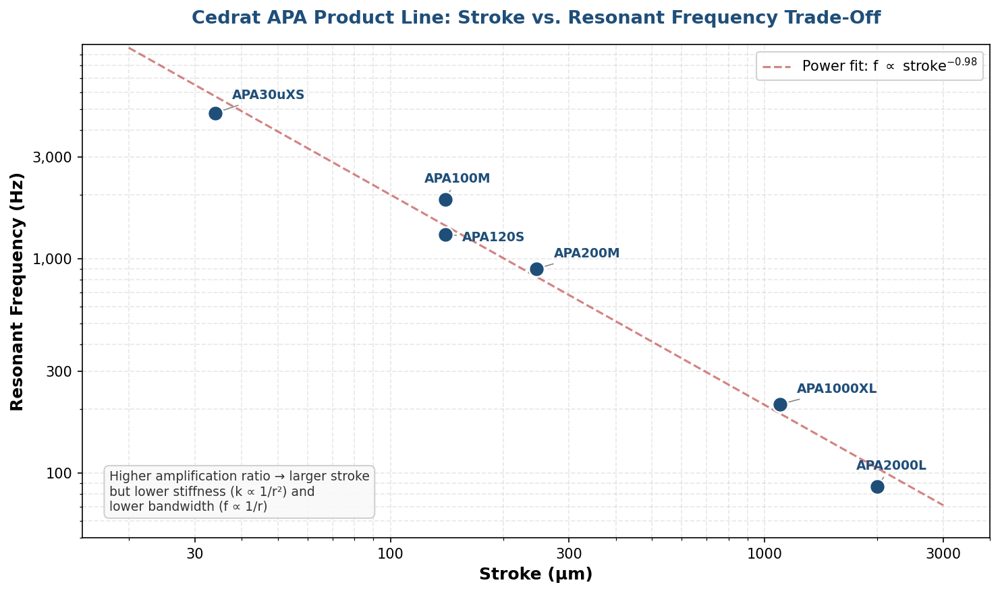

*Figure 3-2. Log-log scatter plot of stroke versus resonant frequency for six Cedrat APA amplified actuator models. The fitted power law (f ∝ stroke⁻⁰·⁹⁸) confirms the theoretical inverse relationship between displacement amplification and dynamic bandwidth. Data from Cedrat APA120S datasheet and MMECH/Cedrat specifications.*

For vibration isolation design, this trade-off demands careful co-optimization: sufficient stroke to accommodate the expected disturbance amplitude, sufficient stiffness to maintain structural integrity and fast settling, and sufficient bandwidth to cover the target frequency range. System designers must therefore select an amplification ratio that balances these competing requirements against the specific disturbance spectrum and payload mass of the application.

### 3.3.3 Integration and Guiding

PI's lever-amplified **PiezoMove** flexure actuators illustrate the integration of guiding, preload, and amplification in a single monolithic package. The flexure guide constrains motion to a straight line, prevents lateral migration, and mechanically decouples lateral forces from the piezo ceramic—protecting it from bending-induced tensile stress. A spring preload between the housing and the stack prevents tensile loads during dynamic operation. Travel ranges reach up to 1 mm with open-loop linearity of 99.8% (with strain gauge sensor) and closed-loop linearity exceeding 99.9% (with capacitive sensor) [PI TEC72](https://www.pi-usa.us/fileadmin/user_upload/physik_instrumente/files/TEC/PI-TEC72-Piezo-Actuators-with-Guiding-and-Preload.pdf "2017"). This level of monolithic integration represents the current commercial state of the art for guided piezoelectric actuators, reducing assembly-related variability that would otherwise propagate into unit-to-unit performance scatter.

## 3.4 Preload Strategies

Piezoelectric ceramics exhibit high compressive strength but are brittle in tension. Preloading the stack actuator is therefore essential to prevent tensile failure during dynamic operation. An appropriately sized preload can additionally improve strain output by increasing the population of non-180° ferroelectric domains available for switching. However, excessive preload suppresses strain output, increases hysteresis, and generates additional heat under cyclic operation—requiring the designer to navigate a constrained optimization window.

Manufacturer recommendations for optimal preload levels vary but converge on a similar range: Noliac (now CTS) recommends a minimum of 10 MPa with a maximum of 20% of blocking force; Thorlabs recommends 40% of blocking force for discrete stacks and ≤50% for cofired stacks; PI recommends 15 MPa as sufficient and 30 MPa as the absolute maximum [Yong 2016](https://www.frontiersin.org/journals/mechanical-engineering/articles/10.3389/fmech.2016.00008/full "Preloading in High-Speed Nanopositioning").

Three primary preload implementation techniques are employed in practice:

1. **Wedge-based preload** — a pair of wedges generates axial compressive force. This method is mechanically simple but may introduce parasitic lateral forces on the stack, potentially causing shear damage.
2. **Screw-and-block preload** — avoids lateral forces and allows precise adjustment, but the added mass introduces a secondary mass–spring resonance that limits achievable dynamic bandwidth.
3. **Flexure-only preload** — the compliance of the guiding flexure itself provides the preload force. This is the preferred approach for high-bandwidth systems because it avoids additional dynamic elements. However, installation can be demanding: deforming a 13.1 N/µm flexure by 0.5 mm to achieve the required preload requires over 6,500 N of installation force.

Yong (2016) demonstrated a novel curved-beam preload mechanism that achieves 24 kHz first resonance with 10.6 µm travel range while requiring less than 20 N installation force—resolving the conflict between high-stiffness flexure design and practical assembly without compromising dynamic performance [Yong 2016](https://www.frontiersin.org/journals/mechanical-engineering/articles/10.3389/fmech.2016.00008/full "Preloading in High-Speed Nanopositioning").

The preload design must also account for thermal expansion mismatch between the stack and its housing. As discussed in Section 3.6, the negative thermal expansion coefficient of PZT stacks (approximately −6 × 10⁻⁶ K⁻¹) combined with the positive expansion of steel housings (approximately +12 × 10⁻⁶ K⁻¹) means that temperature changes alter the effective preload—potentially causing loss of contact if preload decreases or excessive compression if preload increases. Robust preload designs must therefore incorporate sufficient margin to accommodate the expected operating temperature range.

## 3.5 Hardware-Level Linearity Improvements

### 3.5.1 The Hysteresis Challenge

Open-loop piezoelectric actuators driven by conventional voltage amplifiers exhibit hysteresis of typically 10–15% of commanded stroke. This nonlinearity arises from the ferroelectric domain-switching process: the remanent polarization state depends on the history of the applied electric field, producing a multi-valued voltage–displacement relationship. Critically, hysteresis is proportional to the commanded displacement range—operating over a small fraction of full range reduces absolute hysteresis but not the percentage error relative to the commanded span [PI Tutorial](https://www.pi-usa.us/en/products/piezo-flexure-nanopositioners/piezo-motion-control-tutorial/tutorial-4-20 "Piezo displacement tutorial"); [Piezosystem Jena Piezopedia](https://www.piezosystem.com/piezopedia/properties-and-performance/ "Section 3.2 Hysteresis").

Creep constitutes a secondary nonlinearity: a logarithmic drift of approximately 1–2% per time decade following a step voltage change, described by ΔL(t) ≈ ΔL₀.₁ · (1 + γ · log₁₀(t / 0.1)), where γ ≈ 0.01–0.02 [PI Tutorial](https://www.pi-usa.us/en/products/piezo-flexure-nanopositioners/piezo-motion-control-tutorial/tutorial-4-20 "Piezo displacement tutorial"). While hysteresis dominates dynamic tracking error, creep is the principal error source in quasi-static positioning and step-and-hold operations.

### 3.5.2 Charge Drive: Bypassing the Voltage–Charge Nonlinearity

The charge drive approach, first proposed by Newcomb and Flinn (1982), exploits the observation that the hysteresis nonlinearity resides primarily in the voltage-to-charge transfer function of the piezoelectric element. By controlling the charge delivered to the piezoelectric capacitance directly—rather than the applied voltage—the nonlinear pathway is bypassed, and the charge-to-displacement relationship, which is substantially more linear, governs actuator motion.

Experimental validation across independent studies is compelling. PiezoDrive demonstrated on a Noliac SCMAP07 stack actuator (10.5 µm full range at 200 V) that voltage-driven hysteresis of 14.3% (1.1 µm) was reduced to 0.65% (0.05 µm) under charge control at 100 Hz and 150 V—a 93% reduction [PiezoDrive](https://www.piezodrive.com/wp-content/uploads/2016/01/IntroToCharge.pdf "Introduction to Charge Drive"). Clayton et al. (2006) independently confirmed the approach on a 10 cm PZT tube actuator, measuring a reduction from 8.8% (0.35 µm) to 1.5% (0.06 µm) under charge control, with the combined charge-control/inverse-feedforward scheme reducing total positioning error by 93.7% at 75 Hz [Clayton et al., IFAC 2006](https://www.precisionmechatronicslab.com/wp-content/publications/C06b.pdf "IFAC 2006").

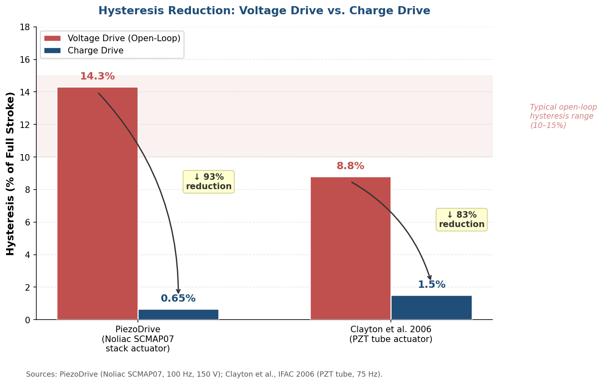

*Figure 3-3. Comparative bar chart showing hysteresis reduction achieved by switching from conventional voltage drive to charge drive, based on two independent experimental studies. PiezoDrive achieved a 93% reduction on a Noliac SCMAP07 stack actuator; Clayton et al. (2006) achieved an 83% reduction on a PZT tube actuator. Data from PiezoDrive technical note and Clayton et al. IFAC 2006.*

A practical implementation challenge was resolved by Fleming and Moheimani (2006), who developed a DC-accurate grounded-load charge amplifier by matching resistance ratios (C_L · R_L = C_S · R_S), overcoming earlier difficulties with floating loads and low-frequency drift. A fundamental limitation of charge drive remains: below a transition frequency f_c (typically 0.03–0.1 Hz), the charge amplifier degrades to a voltage amplifier due to the finite parallel resistance of the piezoelectric element, so hysteresis reduction applies only above f_c, and creep compensation is not provided [PiezoDrive](https://www.piezodrive.com/wp-content/uploads/2016/01/IntroToCharge.pdf "Introduction to Charge Drive").

### 3.5.3 Ceramic Insulation: Eliminating the Dominant Failure Mechanism

The PICMA (Piezo Ceramic Multilayer Actuator) technology developed by PI Ceramic replaces conventional polymer insulation between electrode and housing with a monolithic ceramic insulation layer cofired with the active ceramic. This design addresses the dominant failure mechanism of traditional multilayer actuators—dielectric breakdown caused by water molecule diffusion through the polymer insulation layer. Humidity testing at 70% RH and 100 VDC reveals that conventional polymer-insulated actuators exhibit increasing leakage current (signaling insulation degradation) within hours, while PICMA actuators show no measurable change over the same period [PI Ceramic Catalog C](https://www.pi-usa.us/fileadmin/user_upload/pi_us/files/catalogs/PI_Ceramic_CatalogC.pdf "pp.14-19").

The reliability implications are substantial: accelerated testing at 90% RH yields a mean time to failure (MTTF) of approximately 890 hours for polymer-coated actuators versus >400,000 hours (>45 years) for PICMA designs—an improvement exceeding two orders of magnitude [PI PICMA Technology](https://www.pi-usa.us/en/expertise/technology/piezo-technology/picma "PICMA DFM and reliability"). The ceramic insulation further enables bakeout at up to 150 °C for ultra-high vacuum compatibility (to 10⁻⁹ hPa), extending the application envelope to semiconductor vacuum chambers and space instruments where outgassing constraints are stringent.

## 3.6 Thermal Effects and Environmental Sensitivity

Temperature variations introduce both dimensional and performance changes that must be managed in sub-micron precision applications. Three distinct thermal effects act on piezoelectric actuators, each with different time constants and mitigation strategies:

1. **Differential thermal expansion.** The thermal expansion coefficient of multilayer PZT stacks is approximately −6 × 10⁻⁶ K⁻¹ (the stack contracts as temperature increases), while steel housings expand at approximately +12 × 10⁻⁶ K⁻¹. For a typical assembly with 19 mm of active PZT and 16 mm of steel housing, a 10 K temperature change produces a net thermal displacement of approximately 0.78 µm [Piezosystem Jena Piezopedia](https://www.piezosystem.com/piezopedia/properties-and-performance/ "Section 3.6 Thermal Effects"). This displacement is comparable to the full stroke of small multilayer actuators and constitutes a significant error source unless actively compensated.

2. **Temperature coefficient of the piezoelectric effect.** The piezoelectric charge constant d₃₃ decreases at approximately −0.4%/K below 260 K. At liquid nitrogen temperature (77 K), actuator stroke falls to 10–30% of the room-temperature value. At 4 K, hysteresis is nearly absent—an operational advantage for cryogenic applications—but the dramatically reduced stroke requires proportionally larger actuators to achieve equivalent displacement authority [Piezosystem Jena Piezopedia](https://www.piezosystem.com/piezopedia/properties-and-performance/ "Section 3.6 Thermal Effects").

3. **Self-heating under dynamic operation.** Dielectric losses in the ceramic generate heat proportional to the square of the applied field amplitude, the driving frequency, and the loss tangent (tan δ). Hard PZT grades (PZT-4, Q_M = 400) dissipate significantly less heat per cycle than soft grades (PZT-5H, Q_M = 65), which is the primary motivation for selecting hard PZT in high-duty-cycle vibration isolation where continuous actuation at elevated frequencies is required.

Closed-loop operation with calibrated displacement sensors is the standard mitigation strategy for thermal drift, as the feedback controller inherently compensates for slowly varying thermal offsets. For open-loop applications or configurations where sensor bandwidth is limited at low frequencies, temperature-compensated housing designs—matching the effective thermal expansion coefficients of the stack and housing assembly—can reduce thermal drift by approximately an order of magnitude.

## 3.7 Implications for Unit-to-Unit Consistency

Actuator-level parameters that vary from unit to unit directly propagate into the performance scatter of assembled vibration isolation systems. The most consequential sources of unit-to-unit variation are:

- **Piezoelectric coefficient (d₃₃) batch variation.** PI PICMA actuator specifications include tolerance bands of ±10% (large-size actuators) to ±20% (small-size actuators) on displacement, ±20% on capacitance, and ±20% on resonant frequency [PI PICMA Reliability](https://www.pi-usa.us/fileadmin/user_upload/pi_us/files/catalogs/Piezo_Actuator_Lifetime_Test_Reliability_Results.pdf "tolerance bands"). These tolerances reflect the inherent variability of the sintering, electrode deposition, and polarization processes in PZT ceramic manufacturing, and they represent the baseline uncertainty that downstream calibration must absorb.

- **Flexure hinge thickness variation.** Because flexure hinge stiffness scales as the cube of the web thickness (k ∝ t³), a ±2 µm tolerance on a 40 µm web—readily achievable with optimized wire-EDM using 9 or more trim passes—produces ±5% dimensional variation but approximately ±15% stiffness variation [Klocke et al., euspen 2014](https://www.euspen.eu/knowledge-base/ICE14-P6.10.pdf "web thickness impact"). This cubic sensitivity makes hinge thickness the single most critical mechanical dimension for unit-to-unit consistency in amplified actuators.

- **Bond-line variability.** The adhesive layer between the piezoelectric stack and the flexure mechanism introduces both stiffness and damping variations. Typical epoxy bond layers are approximately 10 µm thick, while conductive silver epoxy layers can reach approximately 110 µm. Variations in bond-line thickness and uniformity directly affect the mechanical coupling between stack and flexure, creating a path from manufacturing variability to performance scatter in the final assembly [Purdue Ultrasonics 2005](https://engineering.purdue.edu/oxidemems/conferences/ultrasonics2005/DATA/PP3K_3.PDF "Bondlines for Piezoelectric Actuators").

The consistency imperative extends to system-level digital calibration. As detailed in Chapter 6, PI's digital controllers store per-unit calibration data—including fourth-order polynomial linearization coefficients, optimized servo parameters, and sensor calibration constants—on an embedded ID-Chip within each piezoelectric stage. This approach compensates for the inherent ±10–20% displacement variation at the hardware level, reducing effective nonlinearity to <0.01% of full stroke and enabling interchangeability between any calibrated stage and any compatible controller without manual tuning.

# 第4章 Manufacturing Processes & Tolerances

Precision piezoelectric vibration isolation systems operate at nanometer and sub-nanometer scales, where even minor manufacturing variations propagate into measurable deviations in stiffness, stroke, resonant frequency, and ultimately isolation efficacy. This chapter examines the critical manufacturing steps—from piezoelectric ceramic synthesis through flexure machining to final assembly—and analyzes how process tolerances at each stage govern unit-to-unit performance consistency.

## 4.1 Piezoelectric Ceramic Manufacturing

### 4.1.1 Bulk PZT Ceramic Processing

The fabrication of bulk lead zirconate titanate (PZT) ceramics follows an eight-step process: raw material mixing and ball milling, calcination at approximately 75% of the sintering temperature, secondary ball milling to increase reactivity, granulation with organic binder, green shaping via hydraulic pressing, binder burnout at ~750 °C, high-temperature sintering at 1250–1350 °C, and poling in a heated oil bath at electric fields of several kV/mm [PI Ceramic Tutorial](https://www.pi-usa.us/en/products/piezo-flexure-nanopositioners/piezo-motion-control-tutorial/tutorial-4-16 "PZT Ceramics Manufacturing Process"). PI Ceramic performs all steps in-house from raw powder to finished product, enabling end-to-end process control.

The underlying solid-state chemistry proceeds through four temperature-dependent regions during conventional one-stage synthesis: no reaction below 350 °C, PbTiO₃ formation at 350–500 °C, PZT formation at 500–800 °C via ZrO₂ diffusion into PbTiO₃, and grain growth above 800 °C [University of Birmingham thesis](https://www.birmingham.ac.uk/documents/college-eps/irc/hydrothermal-phd-thesis/chapter3.pdf "PZT Synthesis Chapter"). An improved two-stage route first synthesizes (Zr₁₋ₓTiₓ)O₄, then reacts it with PbO, eliminating intermediate phases and enabling densification at temperatures 100–200 °C lower than conventional processing. Chemical synthesis routes (coprecipitation, sol-gel, hydrothermal) can produce particles as small as ~10 nm with superior compositional homogeneity, although conventional solid-state powders remain the production standard with particle sizes typically exceeding 1000 nm [University of Birmingham thesis](https://www.birmingham.ac.uk/documents/college-eps/irc/hydrothermal-phd-thesis/chapter3.pdf "PZT Synthesis Chapter").

A critical challenge for dimensional control is sintering shrinkage: PZT ceramics exhibit 15–20% linear contraction during sintering, the magnitude of which depends on composition, particle size distribution, and green-body density [PI Ceramic Tutorial](https://www.pi-usa.us/en/products/piezo-flexure-nanopositioners/piezo-motion-control-tutorial/tutorial-4-16 "bulk process"); [Han et al., Ceramics International 2015](https://www.sciencedirect.com/science/article/abs/pii/S0272884215006975 "PAN-PZT sintering dilatometry"). This variability means that parts are either manufactured "true to size" with pre-calculated shrinkage allowance, or sintered oversize and post-machined (ground, lapped) to final dimensions. The latter approach yields tighter dimensional tolerances but increases processing cost and lead time.

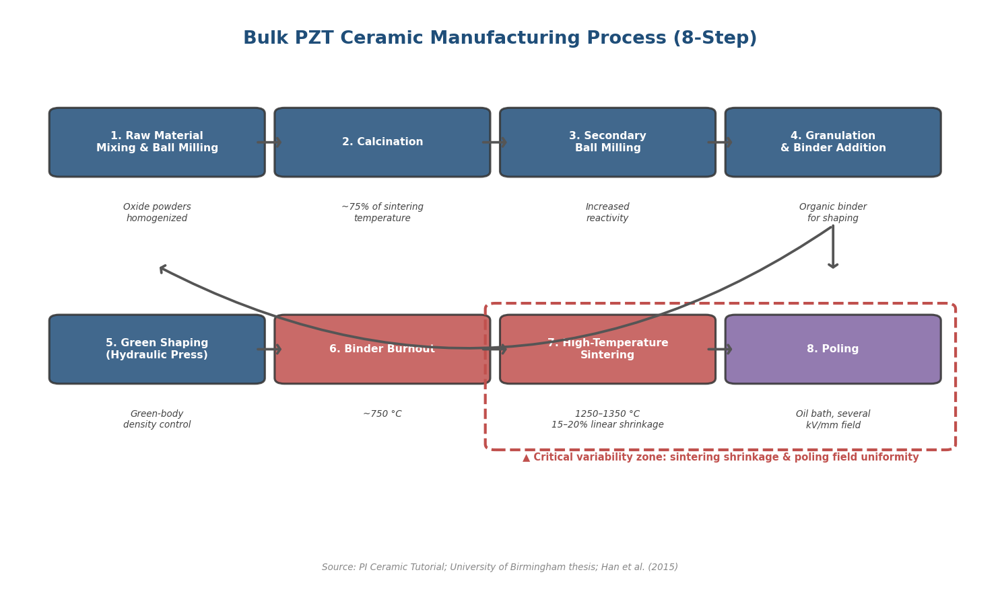

*Figure 4.1 — Eight-step bulk PZT ceramic manufacturing process. Steps 6–8 (binder burnout, sintering, and poling) constitute the critical variability zone where sintering shrinkage (15–20%) and poling field uniformity most strongly influence final part dimensions and electromechanical properties. Data sources: [PI Ceramic Tutorial](https://www.pi-usa.us/en/products/piezo-flexure-nanopositioners/piezo-motion-control-tutorial/tutorial-4-16 "PZT Ceramics Manufacturing Process"); [University of Birmingham thesis](https://www.birmingham.ac.uk/documents/college-eps/irc/hydrothermal-phd-thesis/chapter3.pdf "PZT Synthesis Chapter"); [Han et al. 2015](https://www.sciencedirect.com/science/article/abs/pii/S0272884215006975 "PAN-PZT sintering dilatometry").*

### 4.1.2 Electrode Deposition

Electrode quality directly affects electromechanical coupling and long-term reliability. Screen-printed fired silver remains the predominant electroding method in the piezoelectric industry. Paste formulations contain approximately 70–75% silver, 20% organic vehicles and solvents, and 5% glass frit; application proceeds through 200–325 mesh stainless steel screens, with subsequent firing at 500–850 °C yielding a final electrode thickness of approximately 10 µm [APC International](https://www.americanpiezo.com/blog/ceramic-manufacturing-series-electroding-pzt-ceramics/ "Electroding PZT Ceramics"). The glass frit penetrates 1–2× the fired silver thickness into the ceramic substrate, rendering this method less suitable for very thin components where electrode–ceramic interface effects become proportionally significant.

Alternative methods address specialized requirements. Electroless nickel plating produces layers below 10 µm at low temperatures, preserving the polarization of shear-mode components. Physical vapor deposition (PVD) sputtering, employed by PI Ceramic for thin metallization, enables extremely thin and uniform electrode layers with precise compositional and thickness control [PI Ceramic Tutorial](https://www.pi-usa.us/en/products/piezo-flexure-nanopositioners/piezo-motion-control-tutorial/tutorial-4-16 "sputtering for metallization"). The selection among these methods depends on component geometry, operating mode, required electrode uniformity, and environmental exposure conditions.

### 4.1.3 Multilayer Cofiring: The PICMA Process

Multilayer cofired actuators represent a distinct manufacturing paradigm that eliminates many variability sources inherent in bonded bulk-ceramic assemblies. PI Ceramic's PICMA process proceeds through six stages: (1) slurry preparation and tape casting to produce piezoceramic tapes of 20–40 µm thickness; (2) screen printing of Ag-Pd internal electrodes; (3) lamination of up to several hundred layers under uniaxial or isostatic pressure; (4) automated cutting and green-state shaping (milling, drilling, punching); (5) slow debindering by pyrolysis up to 500 °C followed by cofiring at 1100 °C; and (6) precision lapping, termination electrode application, and room-temperature polarization [PI PICMA Tape Technology](https://www.pi-usa.us/en/expertise/technology/piezo-technology/manufacturing-technology/tape-technology "PICMA process").

Several aspects of this process merit attention from a tolerance perspective. The cofiring temperature of 1100 °C is substantially lower than the 1250–1350 °C required for bulk PZT, because the ceramic formulation is specifically tailored for compatibility with Ag-Pd internal electrodes. This lower temperature reduces thermal gradients and associated dimensional variability. The patented all-ceramic outer insulation layer eliminates the polymer insulation used in conventional multilayer designs—a critical innovation, as polymer layers introduce water-vapor diffusion pathways that constitute the dominant failure mechanism in high-humidity environments [PI PICMA Tape Technology](https://www.pi-usa.us/en/expertise/technology/piezo-technology/manufacturing-technology/tape-technology "PICMA process"). Every step in the cofiring sequence requires tight control: PI Ceramic states that "the smallest change affects quality and properties of the piezo material" [PI Ceramic Tutorial](https://www.pi-usa.us/en/products/piezo-flexure-nanopositioners/piezo-motion-control-tutorial/tutorial-4-16 "Thin Film Multilayer Process").

PICMA stack actuators employ 60 µm active layers, while bender actuators use 20–30 µm layers to enable operation at ≤60 V. Specialized green-state milling machines enable production of virtually any cross-sectional shape (round, triangular, etc.) with full-ceramic encapsulation prior to sintering [PI PICMA Tape Technology](https://www.pi-usa.us/en/expertise/technology/piezo-technology/manufacturing-technology/tape-technology "shape flexibility").

## 4.2 Flexure Mechanism Machining

### 4.2.1 Wire-EDM as the Standard Process

Monolithic flexure mechanisms—fabricated from a single metal billet without fasteners, adhesives, or alignment interfaces—are fundamental to precision vibration isolation actuator design. Wire electrical discharge machining (wire-EDM) is the established fabrication method, capable of cutting intricate two-dimensional profiles from aluminum alloy (typically Al 7075), stainless steel, or titanium with minimal induced residual stress.

Klocke et al. (RWTH Aachen, 2014) systematically optimized wire-EDM parameters for flexure hinges using a Sodick AP200L machine with 0.2 mm brass wire in CH-based dielectric. After a main roughing cut followed by nine successive trim cuts, the process achieved web (minimum) thickness tolerance below ±2 µm and surface roughness Ra < 0.09 µm for flexure hinges with a minimum web thickness of 40 µm [Klocke et al., euspen 2014](https://www.euspen.eu/knowledge-base/ICE14-P6.10.pdf "High precision flexure hinges machining optimization"). This level of precision is essential because hinge stiffness depends on the cube of web thickness, as analyzed in Section 4.3.

The machining sequence reveals important error mechanisms. After the main cut alone, a significant barrel-shape contour error (bulge) arises from wire deflection during high-productivity roughing. Four trim cuts nearly eliminate this systematic error, but the final workpiece thickness typically remains approximately 10 µm below the target dimension due to discharge gap variations [Klocke et al., euspen 2014](https://www.euspen.eu/knowledge-base/ICE14-P6.10.pdf "machining accuracy analysis"). Both notch geometries of a hinge should be cut without reclamping to minimize internal positioning error to near machine accuracy, and both ends of the hinge blank must remain fixed during machining to prevent movement from flushing forces.

### 4.2.2 Additive Manufacturing of Flexures

Additive manufacturing (AM) is emerging as a complementary process for geometries that wire-EDM cannot produce. Electron beam melting (EBM) of Ti-6Al-4V has been demonstrated for topology-optimized three-degree-of-freedom spatial flexure mechanisms achieving 4 mm linear stroke, ±6° angular motion, and a first-mode resonant frequency of 119 Hz [Micromachines 2025](https://pmc.ncbi.nlm.nih.gov/articles/PMC12734550/ "Flexure nanopositioning review"). AM enables internal cavities, lattice structures, and complex three-dimensional topologies inaccessible to planar wire-EDM.

However, AM-fabricated flexures typically require post-processing to reach the surface finish and dimensional accuracy demanded by precision applications. As-printed surfaces are rougher than wire-EDM finishes, and material properties may exhibit anisotropy depending on build orientation. For production-grade vibration isolation hardware where hinge thickness must be controlled to ±2 µm, wire-EDM remains the process of record. AM currently serves prototyping and applications where design freedom outweighs the tighter tolerances achievable through subtractive methods.

## 4.3 Tolerance Propagation: The Cubic Sensitivity Problem

The stiffness of a flexure hinge scales with the cube of web thickness: *k* ∝ *t*³. This nonlinear relationship carries profound consequences for manufacturing tolerance management. A ±2 µm tolerance on a 40 µm nominal web thickness corresponds to ±5% dimensional variation, which propagates to approximately ±15.8% variation in hinge stiffness [Klocke et al. 2014](https://www.euspen.eu/knowledge-base/ICE14-P6.10.pdf "tolerance analysis"); [Micromachines 2025](https://pmc.ncbi.nlm.nih.gov/articles/PMC12734550/ "stiffness-range trade-offs"). In an amplified piezoelectric actuator, this stiffness variation directly alters the amplification ratio, output stroke, blocking force, and resonant frequency—all parameters critical to vibration isolation performance.

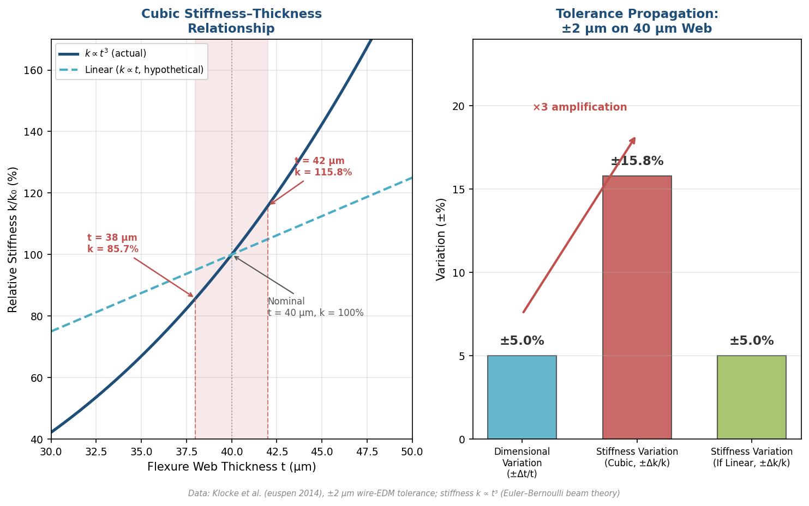

*Figure 4.2 — Cubic stiffness–thickness relationship and tolerance propagation. Left panel: relative stiffness versus flexure web thickness under k ∝ t³ compared with a hypothetical linear relationship, with the ±2 µm tolerance band on a 40 µm nominal web highlighted. Right panel: the ×3 amplification effect—±5% dimensional variation maps to ±15.8% stiffness variation under the cubic law, versus only ±5% under a linear assumption. Data: [Klocke et al. 2014](https://www.euspen.eu/knowledge-base/ICE14-P6.10.pdf "wire-EDM tolerance"); Euler–Bernoulli beam theory.*

Three standard methods exist for tolerance stack-up analysis in piezoelectric flexure systems:

- **Worst-case analysis** assumes all tolerances simultaneously at their extreme limits. While guaranteeing that every possible assembly meets specification, this approach is overly conservative for precision systems and drives unnecessarily tight—and expensive—component tolerances.
- **Root-sum-square (RSS) analysis** statistically combines independent, normally distributed tolerances, providing a practical middle ground. However, RSS assumes linearity and independence—assumptions violated by the cubic hinge-thickness relationship.
- **Monte Carlo simulation** randomly samples from component tolerance distributions and propagates them through the full system model, capturing nonlinear interactions. It is the preferred method for predicting the process capability index (Cpk) of assembled systems from known component distributions, particularly when relationships such as *k* ∝ *t*³ invalidate the linearity assumption underlying RSS [Micromachines 2025](https://pmc.ncbi.nlm.nih.gov/articles/PMC12734550/ "serial vs parallel tolerance sensitivity").

An important architectural consideration emerges from tolerance analysis: parallel kinematic designs (e.g., the cubic Stewart platform) inherently average leg-to-leg tolerance variations at the system level, whereas serial kinematic chains compound positioning errors along the kinematic path. Symmetric parallel architectures thus provide a structural buffer against manufacturing scatter [Micromachines 2025](https://pmc.ncbi.nlm.nih.gov/articles/PMC12734550/ "serial vs parallel tolerance").

## 4.4 Assembly and Bonding

### 4.4.1 Stack Actuator Assembly

High-voltage bulk-ceramic stack actuators (PICA type) are assembled by stacking individually sintered and electroded piezoceramic discs with intermediate metal foils, followed by application of an outer insulation layer. PI Ceramic's Piezo Devices division performs gluing and joining under cleanroom conditions using automated dispensing and positioning systems, with adhesive selection and curing conditions optimized for each product's material combination. PI Ceramic describes this step as "critical … [with] a considerable influence on the finished product's characteristics such as total resonance frequency and stability" [PI Ceramic Piezo Devices](https://www.piceramic.com/en/about/capabilities/product-division-piezo-devices "Assembly capabilities").

The adhesive bond line constitutes a direct transmission path from manufacturing variation to performance scatter. Typical non-conductive epoxy bond lines are approximately 10 µm thick, while silver-loaded conductive epoxy bond lines reach approximately 110 µm [Purdue Ultrasonics 2005](https://engineering.purdue.edu/oxidemems/conferences/ultrasonics2005/DATA/PP3K_3.PDF "Bondlines for Piezoelectric Actuators"). Both the stiffness and the thickness of these bond lines influence electromechanical coupling and resonant frequency. Inhomogeneities at the micrometer scale in bond-line thickness produce channel-to-channel stiffness variations that manifest as unit-to-unit performance differences.

### 4.4.2 Diffusion Bonding as an Alternative

NASA's diffusion bonding technique (MSC-22886) offers a chemically cleaner alternative to conventional epoxy bonding. Coated piezoelectric layers are stacked in a precision alignment jig and subjected to controlled temperature and pressure for a specified curing cycle. The technique addresses three limitations of chemical bonding: difficulty in applying uniformly thin adhesive layers, difficulty in maintaining accurate layer-to-layer alignment, and generation of hazardous waste from urethane or epoxy agents [NASA MSC-22886](https://ntrs.nasa.gov/citations/20110023809 "Diffusion Bonding for Piezoelectric Actuators"). By eliminating the compliant adhesive interlayer, diffusion bonding improves bond-line uniformity and reduces its contribution to unit-to-unit scatter.

### 4.4.3 Cofired Multilayer Advantage

From a consistency standpoint, the PICMA cofired multilayer architecture largely circumvents the bond-line problem. Because hundreds of ceramic-electrode layers are consolidated in a single sintering step, no post-sintering adhesive interfaces exist within the active stack. The resulting monolithic structure exhibits more uniform electromechanical properties across production units than adhesively bonded bulk stacks, and the all-ceramic insulation eliminates the dominant moisture-induced failure mechanism. Under accelerated humidity testing at 70% RH and 100 VDC, conventional polymer-insulated multilayer actuators exhibit measurable leakage current increases within hours, whereas PICMA devices show no detectable change [PI Ceramic Catalog C](https://www.pi-usa.us/fileadmin/user_upload/pi_us/files/catalogs/PI_Ceramic_CatalogC.pdf "pp.14-19").

## 4.5 Quality Assurance and Testing

### 4.5.1 Standards Framework

PI Ceramic has held ISO 9001 certification since 1997, with the entire production chain managed through ERP and Kanban systems under a Kaizen continuous-improvement philosophy [PI Ceramic Manufacturing](https://www.pi-usa.us/en/expertise/technology/piezo-technology/manufacturing-technology "Manufacturing Technology overview"). The company employs semiconductor-industry processing techniques—precision wafer saws, specialized green-state milling machines—and operates under cleanroom conditions. Testing follows the DIN ISO 2859 standardized sampling method at an acceptance quality limit (AQL) of 1.0, with visual inspection criteria derived from the former MIL-STD-1376 standard [PI Ceramic Testing](https://www.pi-usa.us/en/expertise/technology/piezo-technology/manufacturing-technology/testing-procedures "Testing Procedures").

### 4.5.2 Electrical Characterization

Each piezoelectric element undergoes both small-signal and large-signal electrical characterization prior to release:

- **Small-signal measurements** determine resonant and anti-resonant frequencies, impedance, electromechanical coupling factors, capacitance, and dielectric loss factor. These parameters serve as sensitive indicators of ceramic integrity—cracked, under-sintered, or improperly poled elements produce measurably deviant impedance spectra.
- **Large-signal measurements** at DC voltages up to 1200 V quantify strain output, hysteresis width, and dielectric strength under conditions representative of actual operating fields [PI Ceramic Testing](https://www.pi-usa.us/en/expertise/technology/piezo-technology/manufacturing-technology/testing-procedures "Testing Procedures").

Material properties are determined using standardized test specimens with geometric dimensions conforming to EN 50324-2, and conformance is documented through continual testing of individual material batches before production release.

### 4.5.3 Impedance Spectroscopy as a Production Gate

Impedance spectroscopy serves as the primary in-line quality screen for piezoelectric ceramics. The Hioki IM3570 impedance analyzer—representative of instruments deployed in piezo production—achieves measurement speeds of 0.5 ms per point, frequency resolution of 0.01 Hz below 1 kHz, and coverage from DC to 5 MHz [Hioki IM3570](https://www.hioki.com/global/industries-solutions/manufacturing/im3570-im9000.html "Hioki production case study"). Automated resonance-point search and pass/fail judgment generation enable 100% shipping inspection at production throughput rates. Resonance sharpness (mechanical quality factor Q_M) is a particularly sensitive indicator: it degrades measurably with internal micro-cracks, porosity, or incomplete poling—all defects that would compromise actuator performance in service.

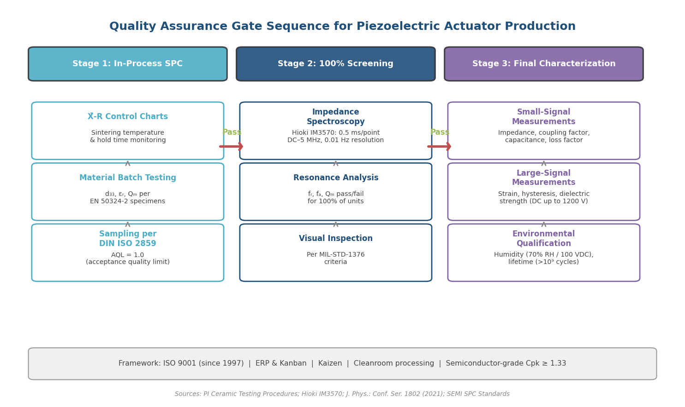

*Figure 4.3 — Three-stage quality assurance gate sequence for piezoelectric actuator production. Stage 1: in-process SPC monitoring (X̄-R control charts, material batch testing per EN 50324-2, sampling per DIN ISO 2859 at AQL 1.0). Stage 2: 100% impedance spectroscopy screening (Hioki IM3570, resonance pass/fail, visual inspection per MIL-STD-1376). Stage 3: final small-signal and large-signal characterization (up to 1200 V) and environmental qualification. The overarching framework encompasses ISO 9001, ERP/Kanban, Kaizen, cleanroom processing, and a semiconductor-grade Cpk ≥ 1.33 target.*

### 4.5.4 Statistical Process Control for PZT Sintering

The application of SPC to piezoceramic manufacturing is an active area of development. A 2020 study applied X̄-R control charts to monitor PZT sintering temperature, hold time, and resulting ceramic properties including dielectric constant, piezoelectric charge constant d₃₃, and mechanical quality factor Q_M [J. Phys.: Conf. Ser. 1802 (2021) 022042](https://iopscience.iop.org/article/10.1088/1742-6596/1802/2/022042/pdf "SPC for PZT sintering"). The study noted that standard SPC control charts, designed for mass production, require adaptation for PZT manufacturing because batch sizes are relatively small and material properties exhibit higher inherent variability than typical industrial goods.

The semiconductor industry—whose processing standards PI Ceramic explicitly references—targets a process capability index Cpk ≥ 1.33 (approximately 63 defects per million opportunities) for critical process parameters, rising to Cpk ≥ 1.67 for safety-critical dimensions [SEMI SPC](https://www.semi.org/en/most-important-qm-tool-statistical-process-control-spc "SEMI SPC Standards"). Published Cpk values specific to commercial piezoelectric actuator manufacturing lines remain proprietary; nonetheless, the semiconductor-grade processing framework establishes the applicable quality benchmark for high-end PZT production.

## 4.6 Environmental Protection and Coating

The operating environment imposes additional demands on manufacturing processes. Parylene conformal coating provides a pinhole-free moisture barrier against water vapor, organic and inorganic media, gases, acids, and alkalis. Because parylene polymerizes on cold surfaces via vapor deposition, the coating process introduces no thermal strain to the already-poled piezoelectric element [PI Ceramic Manufacturing](https://www.pi-usa.us/en/expertise/technology/piezo-technology/manufacturing-technology "Coating section").

For ultra-high-vacuum applications, the PICMA all-ceramic insulation is critical: it permits bakeout at temperatures up to 150 °C, achieving vacuum levels of 10⁻⁹ hPa—a requirement for space-borne instruments and synchrotron beamline hardware. Conventional polymer-insulated multilayer actuators cannot withstand such bakeout temperatures without degradation of the insulation layer [PI Ceramic Manufacturing](https://www.pi-usa.us/en/expertise/technology/piezo-technology/manufacturing-technology "Coating section").

## 4.7 From Process Tolerance to Performance Scatter

The preceding sections reveal a clear hierarchy of manufacturing variability sources and their influence on system-level performance:

1. **Ceramic material properties.** Batch-to-batch variation in d₃₃, coupling factor, and dielectric constant during sintering and poling represents an irreducible source of variability. For commercial PICMA actuators, PI specifies displacement tolerance of ±10% for large-format and ±20% for small-format devices, capacitance tolerance of ±20%, and resonant frequency tolerance of ±20% [PI PICMA Reliability](https://www.pi-usa.us/fileadmin/user_upload/pi_us/files/catalogs/Piezo_Actuator_Lifetime_Test_Reliability_Results.pdf "tolerance bands"). These tolerance bands reflect the inherent variability of ferroelectric ceramic materials.

2. **Flexure hinge geometry.** The cubic stiffness–thickness relationship (*k* ∝ *t*³) amplifies machining tolerance into disproportionate mechanical property variation. Wire-EDM with nine trim cuts (±2 µm on a 40 µm web) limits stiffness scatter to approximately ±15.8%, establishing this as the most leverage-sensitive manufacturing step for flexure-based designs.

3. **Bond-line uniformity.** In bonded assemblies, micrometer-scale variations in adhesive thickness and mixing quality alter channel stiffness and resonant frequency. Cofired multilayer architectures eliminate this variability source entirely.

4. **Assembly alignment.** Cleanroom conditions, automated dispensing, and precision fixturing reduce—but cannot fully eliminate—alignment-induced asymmetries, particularly in multi-axis platforms.

The practical consequence is that identical-design piezoelectric actuators emerging from the same production line exhibit parametric spread that must be either (a) tightened through process control investment, (b) compensated through calibration and digital correction (addressed in Chapter 6), or (c) mitigated through architectures inherently tolerant of component variation, such as parallel kinematic platforms.

# 第5章 Control Algorithms & Digital Implementation

The control algorithm constitutes the intelligence of a precision piezoelectric vibration isolation system, translating raw sensor signals into actuator commands that suppress disturbances to sub-nanometer levels. While hardware—sensors, actuators, and mechanical structures—defines the physical plant, it is the controller that determines how closely the closed-loop system approaches its theoretical performance limits. This chapter surveys the principal control strategies employed in piezoelectric isolation and nanopositioning (Section 5.1), analyzes model-based and hardware-level techniques for compensating the intrinsic nonlinearities of piezoelectric actuators (Section 5.2), examines feedforward–feedback fusion architectures that combine the strengths of both paradigms (Section 5.3), reviews emerging AI/ML-based approaches (Section 5.4), and assesses the digital implementation trade-offs that govern real-time execution fidelity (Sections 5.5–5.6). A recurring theme throughout is that unit-to-unit hardware variation—±10–20% in actuator displacement, ±15% in flexure stiffness—can be substantially normalized through digital calibration and adaptive algorithms, positioning the controller as a critical enabler of production consistency.

## 5.1 Integral Force Feedback and Collocated Control

### 5.1.1 Classical Integral Force Feedback (IFF)

Integral force feedback (IFF) occupies a foundational position in piezoelectric vibration isolation owing to its unconditional stability guarantee. When a force sensor is collocated with a piezoelectric actuator—physically mounted in series along the same mechanical path—the open-loop transfer function exhibits an alternating pole–zero pattern known as the interlacing property. This structural property ensures that the Nyquist plot of the loop transfer function remains entirely in the right half-plane for all positive gains, yielding infinite gain margin and 90° phase margin. The controller itself takes the simplest possible form: a pure integrator, C(s) = g/s, where g is the scalar feedback gain [Preumont, Actuators 12(3):122, 2023](https://www.mdpi.com/2076-0825/12/3/122 "Active Damping Tutorial").

The maximum achievable modal damping ratio under classical IFF is given by:

> **ζ_max = (Ωᵢ − ωᵢ) / (2ωᵢ)**

where ωᵢ is the open-loop natural frequency and Ωᵢ is the corresponding transmission zero. This limit is governed by the modal strain energy fraction νᵢ at the sensor/actuator location: larger νᵢ values widen the pole–zero spacing and increase achievable damping. In experimental Stewart-platform configurations, IFF has delivered damping ratios of 14–21% on the first three flexible modes. NASA JPL's micro-precision interferometer test bed achieved ξ₇ = 0.21, ξ₈ = 0.16, and ξ₉ = 0.14 using only three active tendons adding a total of 110 g [Preumont, Actuators 12(3):122, 2023](https://www.mdpi.com/2076-0825/12/3/122 "Active Damping Tutorial").

The physical interpretation of IFF as a "skyhook" damper is instructive: the controller produces a force proportional to the integral of the measured force, which is equivalent to velocity feedback referenced to an inertial frame. On a Stewart platform, IFF produces an asymptotic transmissibility roll-off of −40 dB/decade—matching the theoretical ideal of a skyhook damper—while maintaining stability even when connecting two arbitrary flexible structures, a robustness property that acceleration feedback does not possess [Preumont, Actuators 12(3):122, 2023](https://www.mdpi.com/2076-0825/12/3/122 "Active Damping Tutorial").

### 5.1.2 Optimal Integral Force Feedback (OIFF)

Classical IFF imposes a hard ceiling on achievable damping determined by the pole–zero spacing of the collocated transfer function. Teo and Fleming (2015) introduced Optimal IFF (OIFF), which inserts a direct feedthrough term β into the feedback path, effectively modifying the controller to C(s) = g/(s + β·g). This modification shifts the closed-loop root locus away from the imaginary axis, enabling damping ratios that substantially exceed the classical limit.

Experimental validation on a nanopositioning stage with a 1.5 kHz resonance demonstrated that OIFF raised the maximum achievable damping ratio from ζ = 0.33 (classical IFF) to ζ = 0.85—a 2.6× improvement. Step-response overshoot dropped from 18% to 1%, and 0.1% settling time improved by more than 40%, from 0.173 s to 0.102 s. The implementation overhead is minimal: replacing the pure integrator with a first-order low-pass filter requires no additional hardware and negligible additional computation [Teo & Fleming, J. Sound Vib. 356, 2015](https://www.precisionmechatronicslab.com/wp-content/uploads/2015/10/J15c.pdf "Optimal integral force feedback").

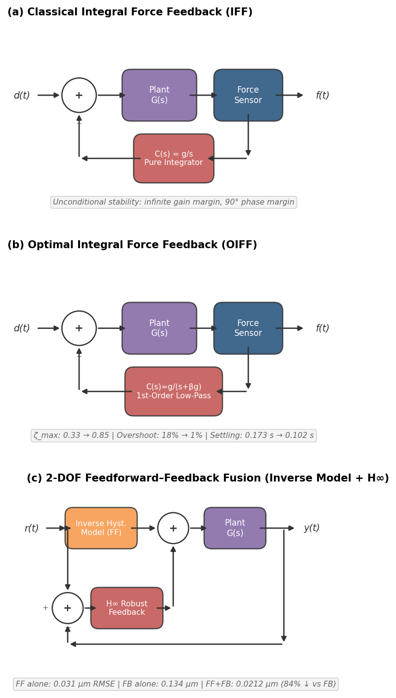

*Figure 5-1. Comparison of three control architectures. (a) Classical IFF with pure integrator and unconditional stability. (b) OIFF with feedthrough term β, achieving ζ_max = 0.85. (c) Two-degree-of-freedom feedforward–feedback fusion combining inverse hysteresis model with H∞ robust feedback (0.0212 µm RMSE). Key performance metrics annotated beneath each sub-diagram.*

### 5.1.3 Force Feedback for Nanopositioning and Tracking

Beyond vibration isolation, collocated force feedback enables high-bandwidth position tracking that substantially outperforms conventional displacement feedback. Fleming (2010) demonstrated that on a system with a 1.5 kHz open-loop resonance, force feedback achieved a 2.07 kHz closed-loop tracking bandwidth—roughly ten times the 210 Hz bandwidth attainable with standard integral displacement feedback under a 5 dB gain margin constraint. The first three resonant modes were attenuated by 24 dB, 9 dB, and 4 dB respectively [Fleming, IEEE/ASME Trans. Mechatronics 15(3), 2010](https://www.precisionmechatronicslab.com/wp-content/publications/J10a.pdf "Force Feedback Nanopositioning").

A dual-sensor architecture further exploits the complementary noise characteristics of force and displacement sensors. A piezoelectric force sensor exhibits noise density roughly four orders of magnitude lower than a capacitive displacement sensor at high frequencies, while the capacitive sensor provides superior low-frequency (DC) accuracy. By blending high-frequency force feedback with low-frequency capacitive position feedback through a crossover filter, Fleming achieved a closed-loop position noise of 9 pm RMS—compared to 1.7 nm RMS for the capacitive sensor alone, a reduction of nearly 200× [Fleming, IEEE/ASME Trans. Mechatronics 15(3), 2010](https://www.precisionmechatronicslab.com/wp-content/publications/J10a.pdf "Section IV-D").

The underlying principle is that the maximum tracking bandwidth of a standard integral controller is approximately 2ωₙξ, where ωₙ is the resonant frequency and ξ is the damping ratio. Since force feedback (or any collocated damping inner loop) dramatically increases ξ, the outer tracking bandwidth scales proportionally. This bandwidth multiplication constitutes the primary mechanism by which active control extends system performance beyond what hardware alone can deliver [Fleming, IEEE/ASME Trans. Mechatronics 15(3), 2010](https://www.precisionmechatronicslab.com/wp-content/publications/J10a.pdf "Section I-B").

## 5.2 Nonlinearity Compensation: Hysteresis and Creep

### 5.2.1 The Hysteresis Challenge

Piezoelectric actuators driven by voltage amplifiers exhibit open-loop hysteresis of 10–15% of full stroke, a consequence of irreversible ferroelectric domain switching within the PZT ceramic. This nonlinearity manifests as a rate-dependent, multi-valued mapping between applied voltage and displacement, introducing positioning errors that linear controllers alone cannot correct. Three principal model-based compensation frameworks have been developed—the Preisach model, the Prandtl–Ishlinskii (PI) model, and the Bouc–Wen model—each offering distinct trade-offs between fidelity, computational cost, and real-time invertibility.

### 5.2.2 Preisach Model and Variants

The classical Preisach model represents hysteresis as a weighted superposition of elementary relay operators (hysterons), each parameterized by an ascending switching threshold α and a descending threshold β. While highly accurate, the classical formulation requires identification of a large number of first-order reversal curves (FORCs) stored in a two-dimensional Preisach function, making real-time inversion computationally demanding.

Baziyad et al. (2023) advanced the Preisach framework by combining a modified Preisach model with least-squares support vector machines (LSSVM) and particle-swarm optimization (PSO) of hyperparameters, using 55 stop operators. Tested on a PI P-752.21C nanopositioning stage with 35 µm range, this approach achieved a modeling RMSE of 0.0107 µm. When the inverse model was deployed as a feedforward compensator, tracking RMSE ranged from 0.026 to 0.036 µm depending on input waveform [Baziyad et al., Micromachines 14(6):1208, 2023](https://pmc.ncbi.nlm.nih.gov/articles/PMC10305727/ "Modified Preisach + LSSVM").

### 5.2.3 Prandtl–Ishlinskii (PI) Model

The Prandtl–Ishlinskii model uses a weighted superposition of play or stop operators—piecewise-linear elements simpler than Preisach hysterons. Its key advantage is that the inverse of a classical PI model can be computed analytically, enabling real-time feedforward compensation without iterative numerical inversion.

An et al. (2018) proposed a three-segment extension of the classical PI model to capture the asymmetric hysteresis behavior observed in commercial actuators. Tested on a PSt150/4/7VS9 actuator, the tripartite PI model achieved a mean absolute error (MAE) of 0.035 µm—compared to 0.190 µm for the classical PI inverse model and 0.109 µm for a Preisach inverse model. This represents an improvement exceeding 80% over both classical alternatives [An et al., Micromachines 9(2):44, 2018](https://www.mdpi.com/2072-666X/9/2/44 "Tripartite PI Model").

### 5.2.4 Bouc–Wen Model

The Bouc–Wen model describes hysteresis through a first-order nonlinear differential equation, offering a compact parametric representation (typically 5–7 parameters) amenable to both time-domain simulation and control design. Rakotondrabe (2011) demonstrated an inverse multiplicative compensation structure based on the Bouc–Wen model that completely eliminated approximately 56% initial hysteresis nonlinearity in a single-crystal PZT cantilever actuator, reducing phase lag from 16° to 3° at 0.1 Hz. The same direct-model parameters were reused for the compensator, minimizing identification overhead [Rakotondrabe, IEEE Trans. ASE 8(2), 2011](https://hal.science/hal-00635669/file/Rakotondrabe_TAS21011_BoucWenModeling.pdf "Bouc-Wen inverse multiplicative").

In a six-degree-of-freedom (6-DOF) Stewart platform context, Fang et al. (2025) applied a Bouc–Wen model with modified particle swarm optimization (MPSO) for parameter identification. The compensator reduced hysteresis tracking error from 7.79% to below 0.6% and improved linearity from 8.9% to 1.8%. The Stewart platform achieved axial vibration attenuation of 14 dB and lateral attenuation of 15.3 dB at 1.403 Hz, with graceful degradation maintaining 8.2–13.3 dB attenuation even with three of six legs failed [Fang et al., Scientific Reports 2025](https://pmc.ncbi.nlm.nih.gov/articles/PMC11704038/ "Stewart platform, 2025").

An additional hardware-level approach to hysteresis mitigation is charge-mode driving, which bypasses the voltage–charge nonlinearity inherent in the capacitive PZT element. PiezoDrive testing on a Noliac SCMAP07 actuator demonstrated a reduction from 14.3% to 0.65% hysteresis (95% reduction), and Clayton et al. (2006) measured a reduction from 8.8% to 1.5% (83% reduction) on a PZT tube scanner. Combined inverse feedforward further reduced total positioning error by 93.7%. Charge-mode driving degrades to voltage-mode behavior below a transition frequency f_c ≈ 0.03–0.1 Hz and does not compensate creep [PiezoDrive](https://www.piezodrive.com/wp-content/uploads/2016/01/IntroToCharge.pdf "IntroToCharge"); [Clayton et al., IFAC 2006](https://www.precisionmechatronicslab.com/wp-content/publications/C06b.pdf "IFAC 2006").

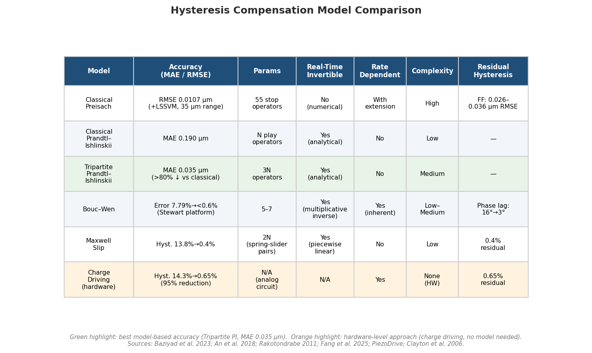

*Figure 5-2. Comparison of six hysteresis compensation approaches. Green highlight indicates the best model-based accuracy (Tripartite PI, MAE 0.035 µm); orange highlight indicates the hardware-level approach (charge driving, 95% reduction with no model required). Data from Baziyad et al. (2023), An et al. (2018), Rakotondrabe (2011), Fang et al. (2025), PiezoDrive, and Clayton et al. (2006).*

### 5.2.5 Creep Compensation

Open-loop creep in piezoelectric actuators follows a logarithmic time dependence: ΔL(t) ≈ ΔL₀.₁·(1 + γ · log(t/0.1)), where γ ≈ 0.01–0.02, yielding approximately 1–2% additional displacement per decade of time. This drift is particularly problematic for quasi-static positioning tasks requiring extended hold times. In closed-loop operation, the integral action of a PID controller inherently compensates creep by continuously correcting the low-frequency position error, effectively eliminating this drift mechanism without requiring a dedicated creep model [PI Tutorial](https://www.pi-usa.us/en/products/piezo-flexure-nanopositioners/piezo-motion-control-tutorial/tutorial-4-20 "Piezo displacement tutorial").

## 5.3 Feedforward–Feedback Fusion Architectures

Model-based feedforward and sensor-based feedback possess complementary strengths and limitations. Feedforward compensation—using an inverse hysteresis model to pre-distort the command signal—effectively cancels known, repeatable nonlinearities but is inherently open-loop: it cannot reject unmeasured disturbances or compensate for model mismatch. Feedback control rejects disturbances and adapts to plant variation but is bandwidth-limited by stability constraints and introduces sensor noise into the loop. Combining both paradigms in a two-degree-of-freedom (2-DOF) architecture yields performance that exceeds either strategy alone.

Baziyad et al. (2023) quantified this synergy on a PI P-752.21C nanopositioning stage (35 µm range). Inverse Preisach feedforward alone achieved a tracking RMSE of 0.031 µm; H∞ robust feedback alone produced 0.134 µm RMSE. The combined 2-DOF architecture—inverse Preisach feedforward plus H∞ feedback—achieved 0.0212 µm RMSE, representing a 32% improvement over feedforward alone and an 84% improvement over feedback alone. The H∞ controller was synthesized to be robust against ±20% plant uncertainty, reflecting the unit-to-unit variation encountered in production piezoelectric stages. The entire system ran on a dSPACE DS1104 real-time controller at 500 samples/s [Baziyad et al., Micromachines 14(6):1208, 2023](https://pmc.ncbi.nlm.nih.gov/articles/PMC10305727/ "2-DOF H∞ + Preisach").

The dual-sensor blending approach described in Section 5.1.3 represents a hardware-level implementation of the same principle: a high-frequency force-feedback inner loop provides wideband damping and disturbance rejection, while a low-frequency capacitive position loop ensures DC accuracy and creep rejection. This architecture exploits the four-orders-of-magnitude noise advantage of piezoelectric force sensors at high frequencies while relying on the capacitive sensor's superior low-frequency stability [Fleming, IEEE/ASME Trans. Mechatronics 15(3), 2010](https://www.precisionmechatronicslab.com/wp-content/publications/J10a.pdf "Section IV-D").

The Maxwell slip model offers an additional feedforward paradigm: a parallel arrangement of spring–slider elements that approximate the hysteresis loop with computationally simple piecewise-linear functions. Maxwell-model feedforward has been reported to reduce hysteresis from 13.8% to 0.4%, with a computational footprint well suited to real-time embedded systems [referenced in An et al., Micromachines 9(2):44, 2018](https://www.mdpi.com/2072-666X/9/2/44 "Section 1, citing Liu et al. 2015").

## 5.4 Emerging AI/ML-Based Control

### 5.4.1 Neural Network Self-Tuning Control

Neural network controllers offer a model-free route to handling the coupled nonlinearities (hysteresis, creep, cross-coupling) present in piezoelectric systems, bypassing the need for explicit hysteresis model identification. Li et al. (2020) implemented a dual back-propagation (BP) neural network self-tuning controller on a PZT 150/7×7/50 actuator, using two networks of five hidden neurons each to approximate the unknown nonlinear plant dynamics online. Over a 1–40 Hz tracking bandwidth, the controller achieved RMSE values of 0.113–0.315 µm and maximum error (MAXE) of 1.02–2.45%, representing improvements of 25–55% in MAXE and 22–49% in RMSE compared to a tuned classical PID controller under identical conditions [Li et al., Sensors 20(12):3342, 2020](https://www.mdpi.com/1424-8220/20/12/3342 "Neural Network Self-Tuning Control").

### 5.4.2 Broader AI Landscape for Active Vibration Control

A 2025 comprehensive review classified AI-based active vibration and noise control (AI-AVNC) into four technology pathways: (1) AI-driven input shaping optimization, (2) AI-based system identification and modeling, (3) AI-assisted controller parameter optimization, and (4) AI controller modeling, where neural networks or deep reinforcement learning (DRL) agents directly replace traditional control laws. Key milestones include Febvre et al. (2019), who first applied DRL to active vibration control, and Chen et al. (2023), who deployed Transformer architectures for vibration signal denoising [Li et al., Machines 13(10):946, 2025](https://www.mdpi.com/2075-1702/13/10/946 "AI-AVNC review").

For piezoelectric vibration isolation specifically, peer-reviewed experimental demonstrations of DRL-based controllers remain limited as of early 2026. The most mature AI applications focus on two areas: system identification—replacing or augmenting analytical hysteresis models with data-driven surrogates—and controller gain optimization, using genetic algorithms or PSO to tune PID/H∞ parameters for specific hardware instances. These approaches are particularly relevant to the production consistency challenge discussed in Section 5.6: an AI-optimized tuning procedure can automatically adapt controller parameters to each unit's measured transfer function, compensating for the ±10–20% displacement variation and ±20% capacitance spread inherent in piezoelectric actuator production.

## 5.5 Digital Implementation: Hardware and Architecture

### 5.5.1 Commercial Digital Controller Platforms

The transition from analog to digital control enables sophisticated algorithms—H∞ synthesis, iterative learning, adaptive feedforward—that are impractical in analog circuitry. However, digital implementation introduces quantization noise, sampling-induced latency, and computational throughput constraints that must be carefully managed.

The PI E-712 represents the high end of commercial piezoelectric digital controllers. Its 600 MHz processor delivers servo update rates of 50 kHz for three-axis systems and 20 kHz for six-axis configurations (20 µs cycle time). The signal chain uses 18-bit analog-to-digital converters (ADCs) on the sensor input and 20-bit digital-to-analog converters (DACs) on the drive output, providing sufficient dynamic range to resolve sub-nanometer displacements over travel ranges of 100 µm or more. Closed-loop accuracy reaches below 0.01% of travel when used with capacitive sensors—a factor of 10× improvement over analog controllers. The E-712 also hosts PI's proprietary Dynamic Digital Linearization (DDL) firmware, which can reduce periodic tracking error by up to 1,000× [PI Controllers Catalog](https://www.nanopositioning.net/datasheets/Nanopositioning_Controllers_Piezo_Digital_Analog.pdf "E-712 specs").

At the single-channel high-speed tier, the PI E-753 achieves 100 kHz sensor sampling and 25 kHz servo update using a 32-bit floating-point 60 MHz DSP with 24-bit DAC output. The compact PI E-709 operates at 10 kHz sampling with a 150 MHz DSP, offering a cost-effective solution for single-axis applications. For integration into larger motion control architectures, the PI E-761 PCI board provides 25 kHz servo update (40 µs loop time) with 4× sensor oversampling and 24-bit DAC resolution [PI Controllers Catalog](https://www.nanopositioning.net/datasheets/Nanopositioning_Controllers_Piezo_Digital_Analog.pdf "E-753/E-709/E-761 specs").

The TMC STACIS active isolation system employs a dual-core DSP architecture (150/75 MHz processors) operating at a 10 kHz sampling rate—sufficient for its 0.2–150 Hz active bandwidth. Preumont's rule of thumb for control sampling in vibration systems—sampling frequency f_s ≥ 100 × f_c, where f_c is the control bandwidth—indicates that 10 kHz sampling supports control bandwidths up to approximately 100 Hz with adequate phase margin, consistent with the STACIS specification.

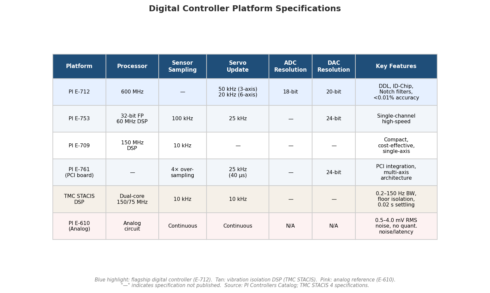

*Figure 5-3. Specification comparison of six controller platforms. Blue highlight marks the flagship digital controller (PI E-712); tan marks the vibration isolation DSP (TMC STACIS); pink marks the analog reference (PI E-610). Dashes indicate specifications not published by the manufacturer.*

### 5.5.2 Dynamic Digital Linearization (DDL)

DDL is an iterative feedforward technique embedded in PI digital controllers that exploits the repetitive nature of scanning and periodic motion profiles. The algorithm performs an FFT analysis of the closed-loop tracking error during an initial scan cycle, computes the optimal pre-distortion signal based on the measured system frequency response and harmonic distortion, and applies this correction to subsequent cycles. The result is a dramatic reduction in periodic tracking error without modifying the feedback controller.

Quantitative performance data illustrate the scale of improvement: for a 312 Hz triangular-wave scan, conventional PID tracking yields 2.6 µm peak tracking error; with DDL active, the error drops to approximately 7 nm—a 370× improvement. PI reports that DDL can achieve up to 1,000× tracking error reduction for periodic waveforms, effectively pushing residual error to the noise floor of the sensor [PI Tech Blog](https://www.pi-usa.us/en/tech-blog/methods-to-improve-piezo-dynamics-accuracy-and-linearity-preshaping-ddl-apc "DDL 1000× improvement").

### 5.5.3 FPGA-Based Control

Field-programmable gate arrays (FPGAs) offer deterministic, sub-microsecond loop latency and massive parallelism unattainable with sequential DSP architectures. Juhász et al. (2011) demonstrated FPGA implementation of state-space control combined with real-time Prandtl–Ishlinskii hysteresis compensation for a piezoelectric actuator. The FPGA executes the state-space update and inverse PI model evaluation in parallel within a single clock cycle, eliminating the operating-system jitter that afflicts DSP-based real-time systems [Juhász et al., STR 61(2), 2011](https://scindeks-clanci.ceon.rs/data/pdf/1451-4869/2011/1451-48691102181J.pdf "FPGA Control of Piezo Actuators").

LabVIEW FPGA provides a higher-level development environment that maps control algorithms onto FPGA hardware with nanosecond-level timing precision. Multi-loop architectures—fast inner damping loops and slower outer position loops—can execute truly in parallel on a single FPGA device, a capability that is difficult to replicate on time-sliced DSP platforms.

A critical consideration in FPGA implementation is the use of fixed-point arithmetic, which requires careful word-length analysis to avoid quantization-induced limit cycles—self-sustaining oscillations caused by finite-precision rounding in the feedback loop. Floating-point FPGA cores are available but consume substantially more logic resources, creating a design trade-off between numerical fidelity and computational density.

### 5.5.4 Analog vs. Digital: When Simplicity Wins

For the simplest collocated control laws—pure IFF or integral resonance control (IRC)—analog implementation eliminates quantization noise and sampling delay entirely, which can be decisive at very high frequencies. Fleming (2010) achieved a 2.07 kHz closed-loop bandwidth on a 29 kHz resonant nanopositioning stage using an analog force feedback circuit, a result that would require a sampling rate exceeding 200 kHz to replicate digitally with equivalent phase margin. PI's analog controllers (e.g., E-610 series) specify output noise of 0.5–4.0 mV RMS over the 0–100 kHz bandwidth [Fleming, IEEE/ASME Trans. Mechatronics 15(3), 2010](https://www.precisionmechatronicslab.com/wp-content/publications/J10a.pdf "Section V-C"); [PI Controllers Catalog](https://www.nanopositioning.net/datasheets/Nanopositioning_Controllers_Piezo_Digital_Analog.pdf "E-610 specs").

However, analog implementation becomes impractical for algorithms requiring memory (DDL), adaptation (neural networks), multi-input multi-output (MIMO) coupling compensation, or model inversion (Preisach, Prandtl–Ishlinskii). The prevailing industrial trend is therefore a hybrid architecture: analog front-end signal conditioning (charge amplifiers, anti-aliasing filters) feeding digital control computation, with high-resolution DACs driving the power amplifier output stage.

## 5.6 Digital Calibration as a Production Consistency Enabler

The inherent variability of piezoelectric ceramics—±10% displacement tolerance for large-format PICMA actuators, ±20% for small-format units, and ±20% capacitance spread—means that nominally identical production units exhibit measurably different voltage-to-displacement transfer functions. Traditional approaches to managing this variability rely on mechanical sorting, binning, or parametric matching (as practiced in CERN/DESY SRF cavity tuning applications). Digital calibration offers a more scalable and precise alternative.

PI's ID-Chip system embeds a non-volatile memory chip within each nanopositioning stage that stores unit-specific calibration data: fourth-order polynomial linearization coefficients, optimized servo parameters (proportional and integral gains, notch filter frequencies), and sensor calibration constants. When a stage is connected to any compatible PI digital controller, the ID-Chip data are automatically loaded at power-up and applied to the control loop—a process PI terms "Auto-Calibration." The fourth-order polynomial maps the approximately 15% intrinsic voltage–displacement nonlinearity to below 0.01% of travel (sub-nanometer at 100 µm range), effectively normalizing the unit-to-unit variation in the electromechanical transfer function [PI BRO12E](https://www.physikinstrumente.de/fileadmin/user_upload/physik_instrumente/files/BRO/BRO12E_Digitalcontroller_090610.pdf "ID-Chip Auto-Calibration").

This architecture decouples hardware variability from system-level performance: each physical unit may differ by ±20% in raw displacement, yet after ID-Chip calibration all units present an identical, linearized transfer function to the control loop. The approach extends naturally to multi-axis systems, where per-axis calibration coefficients compensate not only individual actuator variation but also cross-axis coupling introduced by manufacturing and assembly tolerances.

From a production management perspective, the ID-Chip workflow integrates into end-of-line testing: after functional verification, each unit undergoes automated characterization (quasi-static voltage sweeps, frequency response measurement), the polynomial and servo coefficients are computed, and the data are written to the chip. This single additional step transforms a statistically distributed population of hardware units into a population of functionally identical systems—without manual tuning, binning, or operator judgment.

# 第6章 Unit-to-Unit Consistency & Production Management

Precision piezoelectric vibration isolation systems operate at performance thresholds where nanometer-scale variations between nominally identical units can compromise the isolation guarantees upon which end applications depend. A semiconductor fab installing multiple STACIS platforms across a lithography floor expects each unit to deliver the same 60 dB attenuation at 2 Hz and the same 0.02 s settling time [TMC STACIS 4](https://www.techmfg.com/products/stacis/stacis-4 "TMC STACIS 4 specifications"); a space program integrating six piezoelectric Stewart-platform legs requires matched stiffness and stroke characteristics to maintain six-degree-of-freedom isolation symmetry. Achieving this level of unit-to-unit repeatability demands a coordinated strategy spanning design philosophy, manufacturing discipline, individual-unit calibration, and lifecycle management.

This chapter examines the principal methods by which the precision piezoelectric industry addresses production consistency. The discussion proceeds from design-for-manufacturability principles that minimize variability sources at the outset (Section 6.1), through calibration protocols and end-of-line testing that screen for outliers (Section 6.2), robust design and statistical process control methods that quantify and contain process variation (Section 6.3), digital calibration architectures that normalize residual hardware variation in the control domain (Section 6.4), lifecycle management strategies that prevent deployed units from diverging over time (Section 6.5), and the overarching quality infrastructure that sustains these practices at production scale (Section 6.6).

## 6.1 Design for Manufacturability and Assembly

### 6.1.1 Monolithic Flexure Design as a DFA Strategy

The most effective approach to eliminating unit-to-unit assembly variation is to eliminate assembly interfaces altogether. Monolithic flexure mechanisms, machined from a single metal billet by wire electrical discharge machining (wire-EDM), replace what would otherwise be an assembly of 10–30 discrete parts—brackets, fasteners, alignment pins, adhesive bonds—with a single part whose internal geometry is defined entirely by the machining program. This approach directly applies the Boothroyd Design for Assembly (DFA) minimum-parts-count principle: every fastener and adhesive joint that is eliminated removes a source of positional uncertainty, preload variation, and long-term creep [Micromachines 2025](https://pmc.ncbi.nlm.nih.gov/articles/PMC12734550/ "Flexure nanopositioning review"). Figure 6.1 contrasts the variability landscape of a monolithic flexure against that of a conventional multi-part assembly.

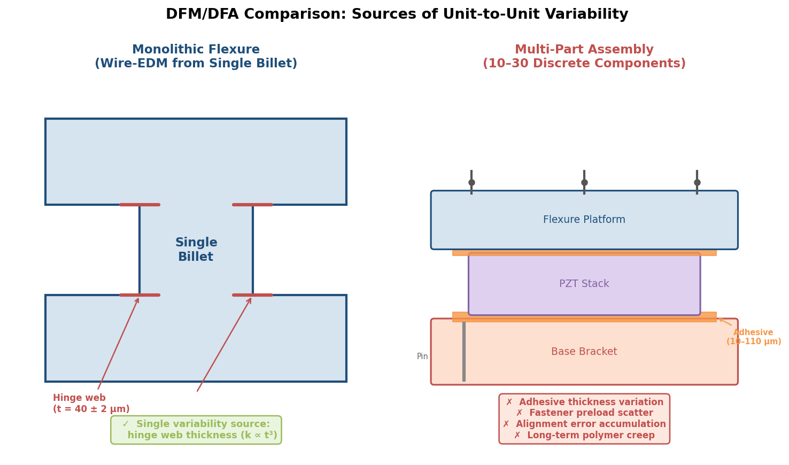

*Figure 6.1 — DFM/DFA comparison: a monolithic wire-EDM flexure (left) consolidates all variability into a single dimension—hinge web thickness—whereas a multi-part assembly (right) introduces independent variability from adhesive thickness (10–110 µm), fastener preload scatter, alignment error accumulation, and long-term polymer creep.*

The practical consequence is that unit-to-unit variability in a monolithic flexure is dominated by a single critical dimension: the flexure hinge web thickness. As established in Chapter 4, hinge rotational stiffness scales with the cube of web thickness (k ∝ t³), so that a ±2 µm tolerance on a 40 µm web—achievable with a nine-pass wire-EDM protocol—propagates to approximately ±15% stiffness variation [Klocke et al., euspen 2014](https://www.euspen.eu/knowledge-base/ICE14-P6.10.pdf "web thickness impact"); [Micromachines 2025](https://pmc.ncbi.nlm.nih.gov/articles/PMC12734550/ "stiffness-range trade-offs"). While ±15% is substantial in absolute terms, it represents a single, well-characterized, and measurable source of variation—far more tractable than the multidimensional scatter arising from a multi-part bonded assembly where adhesive thickness, alignment error, and fastener preload all contribute independently.

### 6.1.2 PICMA Cofiring as a DFM Innovation

At the actuator level, PI Ceramic's PICMA cofiring process embodies an analogous DFM philosophy for the piezoelectric stack itself. Hundreds of ceramic-electrode layers are cofired into a monolithic ceramic block with an all-ceramic outer insulation layer, eliminating the polymer insulation and adhesive bonds that conventional multilayer actuators require between individually sintered and electroded ceramic discs. The significance of this process extends beyond reliability: it is fundamentally a manufacturing consistency improvement, because it removes the variable-thickness adhesive bonds (typically ~10 µm for structural epoxy, ~110 µm for conductive silver epoxy) that constitute a direct path from assembly process variation to electromechanical performance scatter [Purdue Ultrasonics 2005](https://engineering.purdue.edu/oxidemems/conferences/ultrasonics2005/DATA/PP3K_3.PDF "Bondlines for Piezoelectric Actuators").

The reliability data reinforce the consistency argument. In accelerated humidity testing at 90% RH, conventional polymer-insulated multilayer actuators exhibit a mean time to failure (MTTF) of approximately 890 hours due to moisture diffusion through polymer layers leading to dielectric breakdown. PICMA actuators under identical conditions demonstrate an MTTF exceeding 400,000 hours (>45 years), representing a 450× improvement [PI PICMA Technology](https://www.pi-usa.us/en/expertise/technology/piezo-technology/picma "PICMA DFM and reliability"). In production terms, this compression of the failure-rate tail to a negligible level means that the actuator population retains tightly grouped performance characteristics over the full operational lifetime.

### 6.1.3 Parallel Kinematic Architectures and Tolerance Averaging

System-level topology also influences production consistency. Parallel kinematic designs—exemplified by the cubic Stewart platform with six identical active legs—provide an inherent tolerance-averaging mechanism: dimensional and stiffness variations among individual legs partially cancel when the six legs work in concert to control six degrees of freedom. By contrast, serial kinematic chains (stacked single-axis stages) accumulate errors along the chain, so that the final positioning uncertainty equals the sum, not the average, of individual stage contributions [Micromachines 2025](https://pmc.ncbi.nlm.nih.gov/articles/PMC12734550/ "serial vs parallel tolerance"). The cubic Stewart configuration affords additional symmetry advantages: because each leg is geometrically equivalent, a single manufacturing recipe and a single set of quality acceptance criteria apply to all six legs, simplifying production management and enabling lot-based component matching.

### 6.1.4 Bondline Control and Alternative Joining Methods

Where adhesive bonds remain unavoidable—notably at the interface between piezoelectric stacks and flexure mechanisms—bondline thickness control becomes a critical DFM parameter. The distinction between structural epoxy (~10 µm) and conductive silver epoxy (~110 µm) bondlines represents an order-of-magnitude difference in interface compliance, directly affecting the mechanical coupling between actuator and load structure [Purdue Ultrasonics 2005](https://engineering.purdue.edu/oxidemems/conferences/ultrasonics2005/DATA/PP3K_3.PDF "Bondlines for Piezoelectric Actuators"). PI Ceramic performs bonding and assembly under cleanroom conditions with automated dispensing and alignment systems, characterizing the bonding step as "critical to the total resonant frequency and stability of the finished product" [PI Ceramic Piezo Devices](https://www.piceramic.com/en/about/capabilities/product-division-piezo-devices "Assembly capabilities").

NASA's diffusion bonding technique offers an alternative that eliminates chemical adhesives entirely, producing a metallic bond at the piezo-metal interface through controlled temperature and pressure. This approach resolves alignment accuracy challenges associated with adhesive flow, eliminates hazardous waste from chemical bonding agents, and yields a bondline whose properties are determined by the base metals rather than by an organic adhesive sensitive to mixing ratio, cure profile, and environmental exposure [NASA MSC-22886](https://ntrs.nasa.gov/citations/20110023809 "Diffusion Bonding for Piezoelectric Actuators").

## 6.2 Calibration, Characterization, and End-of-Line Testing

Design-phase measures reduce variability sources, but residual variation in piezoelectric ceramic properties and machined dimensions is inherent to the physics and process. The calibration and testing protocols described in this section serve as the quality gate that quantifies each unit's actual performance and screens for outliers before system assembly.

### 6.2.1 100% Component-Level Testing

PI Ceramic applies a comprehensive testing protocol to every piezoelectric component before it enters system assembly. The protocol follows DIN ISO 2859 standardized sampling at an Acceptable Quality Level (AQL) of 1.0, with 100% final inspection for critical parameters. Small-signal measurements determine resonant and anti-resonant frequencies, impedance magnitude, electromechanical coupling factor, capacitance, and dielectric loss tangent—parameters that collectively characterize the ceramic's piezoelectric performance and structural integrity. Large-signal measurements, conducted at DC voltages up to 1200 V, determine strain output, hysteresis width, and dielectric strength. Visual inspection follows the conventions of the former MIL-STD-1376 standard. All material data are determined using standardized specimen geometries per EN 50324-2, ensuring comparability across production lots [PI Ceramic Testing](https://www.pi-usa.us/en/expertise/technology/piezo-technology/manufacturing-technology/testing-procedures "Testing Procedures").

### 6.2.2 Impedance Spectroscopy as a Production Screen

Impedance spectroscopy serves as the primary rapid-screening tool in piezoelectric production. The Hioki IM3570 impedance analyzer, operating at 0.5 ms per measurement point with 0.01 Hz frequency resolution below 1 kHz and a frequency range extending to 5 MHz, enables 100% outgoing inspection at production throughput rates. Automated resonance-point search algorithms detect shifts in resonant frequency, anomalous impedance magnitude, or unexpected mode splitting that indicate internal cracks, under-sintering, incomplete poling, or electrode defects. Pass/fail thresholds are programmed for each product type, enabling automated disposition of conforming and non-conforming units [Hioki IM3570](https://www.hioki.com/global/industries-solutions/manufacturing/im3570-im9000.html "Hioki production case study").

The sensitivity of impedance spectroscopy to subtle defects makes it particularly valuable for consistency assurance. A partially depoled region within a multilayer stack, invisible to visual inspection, manifests as a reduced electromechanical coupling factor and a shift in impedance circle parameters. Similarly, a microcrack in a flexure hinge that might not yet affect static performance will shift the structural resonant frequency detectably. Impedance testing thus functions as a non-destructive acceptance gate that screens for both piezoelectric and structural anomalies in a single measurement sweep.

### 6.2.3 Published Tolerance Bands and Their Implications

The tolerance bands published for PICMA actuators provide a quantitative measure of the irreducible unit-to-unit variation in piezoelectric manufacturing: displacement tolerance is ±10% for larger actuators and ±20% for smaller form factors; capacitance tolerance is ±20%; resonant frequency tolerance is ±20%. These ranges reflect the inherent variability of piezoelectric ceramic properties—principally batch-to-batch variation in the piezoelectric charge constant d₃₃—rather than gross manufacturing defects [PI PICMA Reliability](https://www.pi-usa.us/fileadmin/user_upload/pi_us/files/catalogs/Piezo_Actuator_Lifetime_Test_Reliability_Results.pdf "tolerance bands").

For a vibration isolation system designer, these tolerance bands define the hardware variation envelope that the control system must accommodate. A ±20% spread in resonant frequency means that notch filters or gain-scheduling parameters optimized for one unit may be suboptimal for another—unless the control architecture includes per-unit adaptation. A ±10% stroke variation means that maximum achievable actuator authority varies across units, potentially affecting isolation performance at the extremes of the operating range. The digital calibration strategies discussed in Section 6.4 address precisely this challenge.

### 6.2.4 Parameter Matching and Binning for High-Reliability Applications

Applications demanding the tightest inter-unit consistency adopt explicit parameter matching and binning. The DESY and CERN superconducting radio-frequency (SRF) cavity tuning programs exemplify this approach: every piezoelectric actuator undergoes complete characterization—including full stroke measurement, hysteresis curve acquisition, capacitance measurement, and cryogenic performance evaluation—before installation. Actuators are then selected and matched based on measured properties to ensure that multiple actuators within the same cryomodule exhibit closely matched electromechanical behavior [CERN SRF](https://cds.cern.ch/record/928679/files/care-conf-05-054.pdf "SRF actuator characterization"); [DESY SRF2003](https://proceedings.jacow.org/SRF2003/papers/thp23.pdf "SRF actuator characterization").

This approach represents the highest tier of production consistency management. Rather than relying solely on tightened manufacturing tolerances—which face fundamental material-property limits—it acknowledges the irreducible variation and manages it through informed selection and pairing. The cost is additional testing time and a reduced yield of matched sets from a given production lot, but the benefit is inter-unit consistency that approaches the measurement uncertainty of the characterization instrumentation itself.

## 6.3 Robust Design and Statistical Process Control

While DFM/DFA (Section 6.1) reduces variability sources and end-of-line testing (Section 6.2) screens for outliers, a complementary set of methods operates at the intersection of design and production to systematically desensitize performance to the variability that remains. Taguchi robust design optimizes the design itself for insensitivity to noise factors; statistical process control monitors and contains variation during production; and Monte Carlo tolerance analysis predicts the resulting performance distribution before units are built.

### 6.3.1 Taguchi Robust Design for Piezoelectric Systems

Taguchi methods provide a systematic framework for desensitizing piezoelectric system performance to uncontrollable variation sources—the core problem of maintaining consistent performance across units operating in variable environments. Park et al. (2019) applied multi-response signal-to-noise ratio (MRSN) optimization to a PZT cantilever beam energy harvester, treating environmental frequency variation as a noise factor. By optimizing geometry and material parameters using Taguchi orthogonal arrays, the study achieved an 18.14% reduction in voltage deviation (the robustness metric) with only a 9.86% sacrifice in peak voltage output [Park et al., J. Electronic Materials 48, 2019](https://link.springer.com/article/10.1007/s11664-019-06994-1 "Taguchi MRSN for PZT cantilever").

The principle generalizes directly to vibration isolation design: rather than optimizing a single nominal performance target, the designer simultaneously minimizes the sensitivity of transmissibility, bandwidth, and settling time to the noise factors that differ between units—ceramic d₃₃ variation, flexure thickness variation, bondline thickness variation, and environmental temperature. Taguchi's inner-outer array experiment structure suits this problem because the noise factors (material properties, machining tolerances) are known and measurable, even if they cannot be economically controlled below current process limits.

### 6.3.2 Statistical Process Control in Piezoelectric Manufacturing

Statistical process control (SPC) provides the production-phase complement to Taguchi's design-phase robustness optimization. Research published in 2021 applied X̄-R control charts to monitor PZT sintering temperature, hold time, and resulting ceramic properties (dielectric constant, d₃₃, mechanical quality factor Q_M). A key finding was that PZT production—characterized by small batch sizes and relatively high inherent material variability—requires adaptation of standard SPC chart parameters: the control limits must account for non-normal distributions and serial correlation patterns typical of ceramic sintering processes [J. Phys.: Conf. Ser. 1802 (2021) 022042](https://iopscience.iop.org/article/10.1088/1742-6596/1802/2/022042/pdf "SPC for PZT sintering").

The semiconductor industry—which PI Ceramic explicitly references as its process standard—targets a process capability index Cpk ≥ 1.33 for critical process parameters (corresponding to approximately 63 defects per million opportunities) and Cpk ≥ 1.67 for safety-critical parameters [SEMI SPC](https://www.semi.org/en/most-important-qm-tool-statistical-process-control-spc "SEMI SPC Standards"). Specific Cpk values for commercial piezoelectric actuator production lines remain proprietary. However, PI Ceramic's adoption of semiconductor-grade SPC methodology—operating under ISO 9001 certification since 1997, with ERP/Kanban production control and Kaizen continuous improvement—indicates that the infrastructure for quantitative process capability tracking is in place [PI Manufacturing](https://www.pi-usa.us/en/expertise/technology/piezo-technology/manufacturing-technology "ISO 9001 and traceability").

### 6.3.3 Tolerance Analysis: Monte Carlo as the Preferred Method

The nonlinear relationship between component dimensions and system performance—most critically the cubic dependence of flexure stiffness on hinge thickness (k ∝ t³)—renders conventional tolerance stack-up methods inappropriate for predicting unit-to-unit performance spread. The root-sum-of-squares (RSS) method assumes linear sensitivity coefficients and normally distributed, independent variables; both assumptions break down for k ∝ t³ and for the correlated dimensional errors produced by wire-EDM, where thermal drift affects all features machined in sequence.

Monte Carlo simulation is the preferred tolerance analysis method for piezoelectric flexure systems, capable of propagating realistic probability distributions through arbitrary nonlinear models to predict the statistical distribution of output parameters such as amplification ratio, stiffness, resonant frequency, and maximum stress [Micromachines 2025](https://pmc.ncbi.nlm.nih.gov/articles/PMC12734550/ "tolerance sensitivity"); [Klocke et al. 2014](https://www.euspen.eu/knowledge-base/ICE14-P6.10.pdf "tolerance analysis"). In a production context, Monte Carlo analysis feeds directly into process capability estimation: simulating 10,000 or more assemblies with input distributions matched to measured process data allows the designer to predict the fraction of units falling outside specification limits—the anticipated Cpk—before committing to a production run.

## 6.4 Digital Calibration and Per-Unit Normalization

The tolerance bands documented in Section 6.2.3—±10–20% in displacement, ±20% in resonant frequency—represent the irreducible hardware variation that survives design optimization, process control, and end-of-line screening. Digital calibration architectures absorb this residual variation in the control domain, presenting nominally identical behavior to the application regardless of individual hardware characteristics.

### 6.4.1 The ID-Chip Auto-Calibration Architecture

The most powerful tool for normalizing unit-to-unit hardware variation in modern piezoelectric systems is per-unit digital calibration embedded in the control electronics. PI's digital controllers implement this through an ID-Chip architecture: a non-volatile memory chip physically integrated into each piezoelectric nanopositioning stage stores the individual unit's calibration data, including fourth-order polynomial linearization coefficients, optimized servo parameters (proportional-integral gains, notch filter frequencies), and sensor calibration constants. When a stage is connected to any compatible PI digital controller, the ID-Chip data is read automatically at power-up and used to configure the controller for that specific unit [PI BRO12E](https://www.physikinstrumente.de/fileadmin/user_upload/physik_instrumente/files/BRO/BRO12E_Digitalcontroller_090610.pdf "ID-Chip Auto-Calibration"). Figure 6.2 illustrates this workflow.

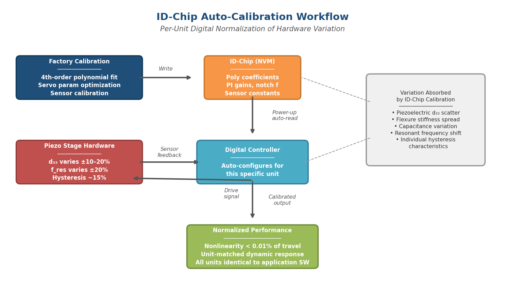

*Figure 6.2 — ID-Chip auto-calibration workflow: factory calibration writes unit-specific polynomial coefficients, servo parameters, and sensor constants to a non-volatile memory chip on each stage. At power-up, any compatible digital controller reads these data and auto-configures, absorbing hardware variation (d₃₃ scatter ±10–20%, resonant frequency ±20%, ~15% hysteresis) to deliver normalized performance (nonlinearity < 0.01% of travel).*

The fourth-order polynomial linearization addresses the ~15% open-loop hysteresis and nonlinearity characteristic of PZT actuators (as detailed in Chapter 3), reducing total nonlinearity to below 0.01% of travel. On a 100 µm range stage, this corresponds to sub-nanometer linearity error. Because the polynomial coefficients are determined for each individual unit during factory calibration, this compensation absorbs not only the systematic PZT hysteresis but also the unit-specific voltage-displacement relationship that varies with the particular d₃₃ value, capacitance, and flexure stiffness of that unit. The result is that two stages with ±10% displacement tolerance at the hardware level present identical calibrated performance to the application software.

The servo parameter storage addresses a second dimension of unit-to-unit variation: dynamic response. Each unit's resonant frequency (varying by ±20% across the production population) determines the optimal PI gain settings and the notch filter frequencies needed to suppress structural resonances. By storing these parameters per unit, the ID-Chip system ensures that every unit operates with dynamically optimized loop tuning, rather than conservative generic settings that must accommodate the full ±20% frequency spread.

### 6.4.2 Dynamic Digital Linearization (DDL)

Dynamic Digital Linearization (DDL), implemented as a firmware capability in PI's digital controllers (e.g., E-712), extends per-unit calibration from static nonlinearity to dynamic tracking accuracy. DDL analyzes the system's frequency response and harmonic distortion via FFT, then iteratively computes a pre-distorted drive signal that cancels the system's nonlinear dynamic behavior. For periodic scanning trajectories—the dominant use case in nanopositioning and metrology—DDL reduces tracking error by up to 1000×. A representative benchmark illustrates the magnitude of this improvement: for a 312 Hz triangular-wave scan, conventional PID tracking error measured 2.6 µm, while DDL reduced this to approximately 7 nm—a 370× improvement [PI Tech Blog](https://www.pi-usa.us/en/tech-blog/methods-to-improve-piezo-dynamics-accuracy-and-linearity-preshaping-ddl-apc "DDL 1000× improvement").

From a production consistency standpoint, DDL provides an additional layer of per-unit normalization for dynamic behavior. Because the DDL algorithm measures and compensates the actual dynamic response of the specific hardware unit in its specific operating configuration, it automatically adapts to variations in resonant frequency, damping, amplifier bandwidth, and cable capacitance that would otherwise produce measurable unit-to-unit differences in scanning performance. The algorithm operates entirely within controller firmware, requiring no external instrumentation or operator expertise for recalibration.

## 6.5 Lifecycle Management: Aging, Degradation, and Drift Compensation

Even units that leave the factory with matched, calibrated performance can diverge over operational life if time-dependent phenomena—creep, material aging, mechanical fatigue, and environmentally accelerated degradation—proceed at different rates across the deployed fleet. Managing these drift mechanisms is therefore an essential dimension of production consistency.

### 6.5.1 Piezoelectric Material Aging and Creep

Piezoelectric actuators exhibit two time-dependent phenomena that can cause individual units to diverge from their factory-calibrated performance: open-loop creep and material aging. Open-loop creep follows a logarithmic time dependence, ΔL(t) ≈ ΔL₀.₁ · (1 + γ · log(t/0.1)), with γ ≈ 0.01–0.02, corresponding to approximately 1% additional displacement per time decade. Under closed-loop operation, the integral action of the servo controller inherently compensates creep by continuously correcting the position error, rendering the effect invisible to the end application [PI Tutorial](https://www.pi-usa.us/en/products/piezo-flexure-nanopositioners/piezo-motion-control-tutorial/tutorial-4-20 "creep and aging").

Material aging—the gradual loss of polarization alignment in the ceramic's ferroelectric domains—reduces the effective d₃₃ over time. For actuator applications, this effect is largely self-correcting: each time a drive voltage exceeding the coercive field is applied in the poling direction, the material is re-poled. Normal high-voltage operation of a PZT stack actuator continuously refreshes domain alignment, making aging-related performance drift negligible under typical operating conditions [PI Tutorial](https://www.pi-usa.us/en/products/piezo-flexure-nanopositioners/piezo-motion-control-tutorial/tutorial-4-20 "creep and aging").

### 6.5.2 Mechanical Fatigue and Long-Term Cycling Stability

Long-term cycling stability is critical for production consistency: if units degrade at different rates, an initially matched set will diverge over operational life. NASA/JPL conducted extended life testing on PICMA cofired actuators, accumulating 10¹¹ (100 billion) cycles. Stroke degradation was less than 3% for primary stacks and less than 4% for redundant stacks, with approximately half of the total degradation occurring during the first 10¹⁰ cycles—indicating a decelerating degradation trajectory. Post-test application of 100 V DC at room temperature recovered approximately half of the lost displacement through re-poling [Sherrit et al., IEEE Trans. UFFC 58(4), 2011](https://pubmed.ncbi.nlm.nih.gov/21507759/ "NASA JPL life test"). PI confirms that PICMA actuators retain at least 96% of original stroke after 10¹¹ cycles [PI PICMA](https://www.pi-usa.us/en/expertise/technology/piezo-technology/picma "96% after 10¹¹ cycles").

National Physical Laboratory (NPL) testing provides material-level insight into degradation mechanisms. Under 160 MPa compressive cycling, soft PZT-5A exhibited a pronounced decrease in electromechanical coupling factor k₃₃ from 0.659 to 0.270 over 100 cycles, following a logarithmic degradation model: k(N) = 1 − 10^(y₀ + σ/K₁) − (σ/K₂) · log(N), with K₁ = 90, y₀ = −2.25, K₂ = 1520. Hard PZT-4D under identical conditions showed no detectable degradation. A finding of particular value for production screening is that the maximum degradation occurs on the first cycle at any given stress level: if the first cycle produces no measurable degradation, significant degradation before 10⁹ cycles is unlikely—suggesting a simple single-cycle proof test as an effective acceptance screen [NPL CMMT(A)148, 1999](https://eprintspublications.npl.co.uk/1085/1/cmmt148.pdf "Degradation of Piezoelectric Materials").

Electrical fatigue (voltage cycling at 566 Vpp, 1 kHz, up to 10⁸ cycles) produces distinct but milder effects in soft PZT: capacitance and dielectric loss tangent increase, while the coupling factor exhibits a non-monotonic response—rising at 10⁵–10⁶ cycles before declining after 10⁶ cycles. Hard PZT (PC4D) shows minimal change under electrical cycling. Static compressive stress significantly accelerates electrical fatigue, underscoring the importance of preload management for long-term consistency [NPL CMMT(A)148, 1999](https://eprintspublications.npl.co.uk/1085/1/cmmt148.pdf "Electrical vs mechanical fatigue").

Figure 6.3 consolidates the key lifecycle and degradation data relevant to production consistency assessment.

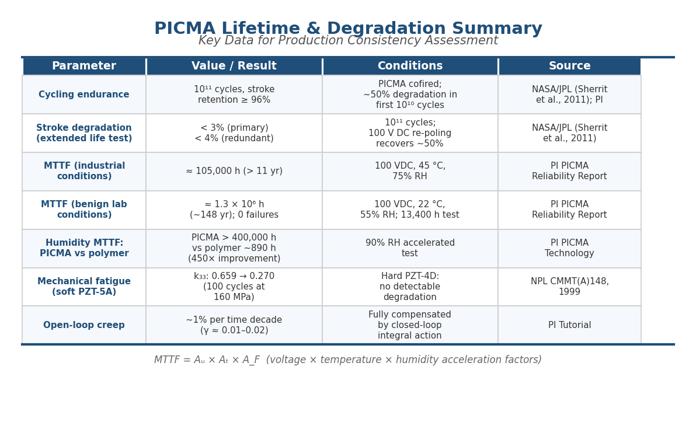

*Figure 6.3 — PICMA lifetime and degradation summary: key quantitative benchmarks for production consistency assessment, including 10¹¹-cycle stroke retention (≥ 96%), MTTF under industrial and benign laboratory conditions, PICMA-vs-polymer humidity performance (450× improvement), NPL mechanical fatigue thresholds for soft vs. hard PZT, and open-loop creep characteristics.*

### 6.5.3 DC Lifetime and Environmental Derating

For applications requiring DC or quasi-static operation—such as maintaining a constant isolation platform position—the PICMA DC lifetime model provides a quantitative framework for predicting service life and managing consistency across deployed units. The model expresses MTTF as a product of three acceleration factors:

> **MTTF = A_U × A_T × A_F**

where A_U is the voltage acceleration factor, A_T the temperature acceleration factor, and A_F the humidity acceleration factor. Under representative industrial conditions (100 VDC, 75% RH, 45 °C), the predicted MTTF is approximately 105,000 hours (>11 years). Under benign laboratory conditions (100 VDC, 22 °C, 55% RH), PICMA actuators accumulated 13,400 hours with zero failures, yielding a calculated MTTF of 1.3 × 10⁶ hours (~148 years), while polymer-coated actuators under identical conditions exhibited a 75% failure rate [PI PICMA Reliability](https://www.pi-usa.us/fileadmin/user_upload/pi_us/files/catalogs/Piezo_Actuator_Lifetime_Test_Reliability_Results.pdf "MTTF model"); [PI PICMA](https://www.pi-usa.us/en/expertise/technology/piezo-technology/picma "MTTF formula").

This model enables production-phase derating: by specifying operating voltage, temperature, and humidity envelopes for each deployment site, the system integrator can predict the MTTF for each unit and schedule preventive maintenance or recalibration at intervals that prevent any unit from drifting outside specification. The multiplicative structure of the model means that relatively modest environmental controls—reducing operating temperature by 10 °C, for example—can extend MTTF by factors of 3–10×, providing a cost-effective lever for fleet consistency management.

## 6.6 Production Infrastructure and Quality System

The design, testing, calibration, and lifecycle strategies described in Sections 6.1–6.5 require an organizational and infrastructural framework to sustain them at production scale. This section outlines the quality management system and environmental protection measures that underpin reproducible manufacturing.

### 6.6.1 Integrated Manufacturing Under ISO 9001

PI Ceramic has maintained ISO 9001 certification since 1997, covering the entire production chain from raw powder synthesis through finished-system shipment. The quality management system integrates ERP-based production planning, Kanban material flow control, and Kaizen continuous improvement methodology. Manufacturing is conducted under cleanroom conditions using semiconductor-industry-grade processing equipment, including precision wafer saws and dedicated milling machines for green-state ceramic processing [PI Manufacturing](https://www.pi-usa.us/en/expertise/technology/piezo-technology/manufacturing-technology "ISO 9001 and traceability").

For custom products—which constitute a significant fraction of precision isolation system orders—PI Ceramic offers agreed-upon special specifications including individual release records with measured parameter values, measurement curves, and single-unit test reports. This per-unit documentation provides full traceability from raw material lot through every processing step to final acceptance, enabling root-cause analysis if a deployed unit subsequently exhibits anomalous behavior [PI Manufacturing](https://www.pi-usa.us/en/expertise/technology/piezo-technology/manufacturing-technology "ISO 9001 and traceability").

### 6.6.2 Environmental Protection for Deployed Consistency

Maintaining unit-to-unit consistency extends beyond the factory gate to the deployed operating environment. PI Ceramic offers parylene conformal coating for environmental protection, providing a pinhole-free barrier against water vapor, organic and inorganic media, gases, acids, and bases. The parylene deposition process—a room-temperature vapor-phase polymerization—produces a uniform coating thickness without the thermal stresses that would result from high-temperature encapsulation methods, preserving the calibrated mechanical and piezoelectric properties of the coated assembly [PI Ceramic Manufacturing](https://www.pi-usa.us/en/expertise/technology/piezo-technology/manufacturing-technology "Coating section").

For ultra-high-vacuum applications (e.g., semiconductor lithography chambers or space instruments), PICMA's all-ceramic construction supports bakeout at 150 °C, achieving vacuum compatibility to 10⁻⁹ hPa without the outgassing that polymer-insulated actuators would produce. This eliminates a significant source of long-term performance variation in vacuum-deployed units, where outgassing products can contaminate optical surfaces or alter dielectric properties over extended service periods.

# 第7章 System Integration, Benchmarking & Outlook

Preceding chapters have examined sensors, actuators, control algorithms, manufacturing processes, and unit-to-unit consistency as individual disciplines. In practice, however, the performance of a precision piezoelectric vibration isolation system emerges from the interaction of all these elements within a specific application context. A high-performance piezoelectric stack paired with an optimally tuned controller delivers little value if the installation environment, mechanical integration strategy, or benchmarking methodology is inadequate. This chapter brings the subsystem threads together by presenting integration case studies across four high-impact domains—semiconductor lithography, electron microscopy and optical metrology, precision manufacturing, and space systems—before establishing the benchmarking standards and measurement methodologies that enable quantitative cross-platform comparison. It concludes with a survey of emerging technologies and open challenges that will shape the next generation of piezoelectric isolation systems.

## 7.1 Semiconductor Lithography

### 7.1.1 The Vibration Challenge at Advanced Nodes

Semiconductor lithography imposes the most stringent vibration requirements of any terrestrial manufacturing process. At the 22 nm node and below, overlay and critical-dimension budgets demand sub-nanometer tool stability; every vibration source—from building mechanical systems to traffic-induced ground motion—must be suppressed to levels that were considered laboratory-grade a decade earlier. The TMC STACIS platform has become the de facto standard for floor-level active isolation in this environment, deployed at nine of the world's ten largest semiconductor manufacturers [PI/TMC White Paper](https://www.pi-usa.us/fileadmin/user_upload/pi_us/files/technotes_whitepapers/White-Paper_Piezo_Driven_Active_Vibration_Control_Microscopy_Lithography.pdf "Piezo-Driven Active Vibration Control").

The STACIS serial hard-mount architecture places the piezoelectric actuator in series between the floor and a passive elastic element, achieving a system stiffness of approximately 7.3 × 10⁶ N/m—several hundred times that of pneumatic isolators. This stiffness advantage translates directly into a settling time of 0.02 s, critical for maintaining sub-nanometer overlay precision during the rapid stage acceleration–deceleration cycles of a lithographic stepper or scanner. With an active bandwidth of 0.2–150 Hz and up to 60 dB (1,000×) attenuation at 2 Hz, the system suppresses floor vibrations across the entire frequency range relevant to lithographic imaging [TMC STACIS 4](https://www.techmfg.com/products/stacis/stacis-4 "TMC STACIS 4 specifications").

### 7.1.2 Field Validation: SEMATECH 45 nm Patterning

A field validation conducted at SEMATECH (Austin, TX) provides direct evidence of the integration benefit. Using 45 nm line-width test patterns under controlled vibration conditions, ground-borne vibration without active isolation completely destroyed lithographic image quality, rendering the patterns unresolvable. After installation of STACIS active piezoelectric isolators, the same exposure tool produced clear, dimensionally precise 45 nm patterns [PI/TMC White Paper](https://www.pi-usa.us/fileadmin/user_upload/pi_us/files/technotes_whitepapers/White-Paper_Piezo_Driven_Active_Vibration_Control_Microscopy_Lithography.pdf "SEMATECH 45 nm case").

As the industry transitions to extreme ultraviolet (EUV) lithography at 13.5 nm wavelength, vibration requirements tighten further. EUV tools typically require VC-D (6.25 µm/s, 1–80 Hz) or stricter environments to maintain the overlay budgets of sub-7 nm nodes. The Rochester Institute of Technology EUV Interference Lithography tool (EUV-IL15) achieved VC-E or better performance through piezoelectric active isolation, confirming that the technology scales to the most demanding lithographic applications [RIT EUV-IL15](https://www.rit.edu/kgcoe/microsystems/lithography/research/imagetheory/smith_jm3_2009.pdf "EUV-IL design, 2009").

### 7.1.3 Serial Hard-Mount vs. Parallel Soft-Mount Integration

The integration architecture matters as much as the isolation hardware itself. When active piezoelectric modules are installed in a serial (hard-mount) configuration beneath equipment that already contains internal passive pneumatic isolation, the two-stage transmissibility functions multiply—their dB attenuation values add algebraically. This compound benefit yields substantially greater isolation than either stage alone. Quantitatively, the serial hard-mount active approach provides approximately 30 dB more isolation at 10 Hz than converting the internal passive pneumatic system to an active pneumatic (parallel soft-mount) approach [CMM Magazine/TMC-AMETEK](https://www.cmmmagazine.com/cmm-articles/vibration-isolation-in-sensitive-instruments-equipped-with-i/ "Vibration isolation, 2018"). The stiffness advantage of hard-mount designs (>100× relative to pneumatic isolators) also prevents the low-frequency rocking modes that arise in soft-mount configurations when multiple isolation points interact with an uneven floor.

## 7.2 Electron Microscopy and Optical Metrology

### 7.2.1 SEM/FIB Performance in Urban Environments

Scanning electron microscopes (SEMs) and focused ion beam (FIB) systems operate at magnifications where nanometer-scale vibrations produce visible image artifacts. In university and urban laboratory settings—where ground vibration from traffic, rail systems, and building HVAC is unavoidable—active piezoelectric isolation often determines whether an instrument can achieve its rated specifications.

Portland State University offers a quantitative case study. Located adjacent to an active light-rail transit line, the university's Zeiss Sigma field-emission SEM suffered periodic vibration-induced image degradation. At magnifications above 100,000×, jagged sawtooth artifacts appeared whenever a tram passed. After installation of a TMC SEM-Base active isolation system, the same microscope achieved clear imaging at 250,000–300,000× magnification—a 2.5–3× improvement in usable magnification. The co-located FIB/SEM dual-beam system, which had experienced sample fly-off (loss of beam-sample registration during milling) during tram passes, operated without interruption after isolation. The net productivity impact was a 4–5× increase in instrument utilization, with the isolation system investment recovered within four months [TMC Application Note](https://www.techmfg.com/learning/applicationnotes/active-piezoelectric-vibration-isolation-enables-scanning-electron-microscopes-in-harsh-city-environment "SEM/FIB case study").

### 7.2.2 Implications for Facility Design

These results carry an important facility-design implication: purpose-built "vibration-isolated" concrete slabs do not guarantee adequate low-frequency performance. As the diamond turning case in Section 7.3 illustrates, a nominally isolated concrete floor can actually amplify vibrations at frequencies below 5 Hz—precisely the range where active piezoelectric isolation provides its greatest advantage. Facility designers increasingly recognize that structural isolation alone is insufficient for sub-nanometer instruments and that active piezoelectric systems must be incorporated as a standard element of the instrument integration plan.

## 7.3 Precision Manufacturing: Diamond Turning

Ultra-precision diamond turning machines, exemplified by the Precitech Nanoform 250 Ultra, produce optical-quality surfaces on molds for consumer electronics, automotive lighting, and defense optics. Surface finishes at the 1–2 nm Ra level make the process exquisitely sensitive to vibration-induced tool–workpiece relative motion.

A case study involving the Nanoform 250 Ultra machining nickel-phosphorus optical molds illustrates a characteristic integration challenge. The machine's embedded MaxDamp air-bearing isolation system provided effective attenuation above 2–3 Hz but offered no suppression of lower-frequency ground motion. Adding a STACIS active piezoelectric system beneath the machine—active from 0.5 Hz—more than doubled machining yield. The investigation revealed that the facility's purpose-built "vibration-isolated" concrete floor actually amplified vibrations in the sub-5 Hz band, underscoring the necessity of active low-frequency isolation for nanometer-tolerance manufacturing [TMC Application Note](https://www.techmfg.com/learning/applicationnotes/precitech-nanoform-250-with-stacis "Nanoform 250 + STACIS"). This finding reinforces the facility-design lesson noted in Section 7.2.2: passive structural measures cannot be assumed adequate without measured verification across the full frequency band of concern.

## 7.4 Space Applications

### 7.4.1 James Webb Space Telescope

Space-borne optical and interferometric payloads impose vibration isolation requirements comparable in severity to those of semiconductor lithography, compounded by launch-survival loads, zero gravity, extreme temperature, and radiation exposure. The James Webb Space Telescope (JWST) employs a two-stage passive isolation architecture. The second stage uses four 52-inch graphite beams with constrained-layer viscoelastic damping, supporting the 1,000 kg telescope assembly at a 1 Hz natural frequency with >4% modal damping. The resulting transmissibility provides >40 dB attenuation across 12–90 Hz and no less than 28 dB from 12 Hz to 1 kHz, ensuring that the 18 primary mirror segments maintain vibration amplitudes below 10 nm without active correction while pointing error remains within 4 milliarcseconds [Bronowicki & Innis, Northrop Grumman](http://www.vibrationdata.com/tutorials_alt/05FW_Bronowicki.pdf "JWST isolators, 2005").

JWST's reliance on passive isolation reflects a system-integration trade-off: at the time of design, the reliability risk of active electronics and piezoelectric actuators in the L2 deep-space thermal and radiation environment was judged to exceed the performance benefit. This decision illustrates a recurring theme in space-system integration—technology readiness level (TRL) and mission assurance considerations constrain the isolation architecture as strongly as performance optimization alone.

### 7.4.2 Space Interferometry Mission and Active Stewart Platforms

The Space Interferometry Mission (SIM) pursued a more aggressive integration approach, employing a 6-DOF piezoelectric Stewart platform to achieve optical path difference (OPD) control to <10 nm. The Spacecraft Structures and Experiments Test Set (SSETS) demonstrated PZT sensing and actuation elements embedded directly within glass-fiber support struts, achieving 20% modal damping and a 2 s step settling time [Bronowicki & Innis, Northrop Grumman](http://www.vibrationdata.com/tutorials_alt/05FW_Bronowicki.pdf "SIM, 2005").

More recently, Fang et al. (2025) advanced Stewart platform integration with a 6-DOF piezoelectric system demonstrating 14 dB axial and 15.3 dB lateral vibration attenuation at 1.403 Hz. The integration incorporated Bouc–Wen hysteresis compensation with modified particle swarm optimization (MPSO), reducing actuator tracking error from 7.79% to <0.6% and improving linearity from 8.9% to 1.8%. A distinctive contribution was the fault-tolerance demonstration: with three of six legs failed, the platform retained 8.2–13.3 dB attenuation, validating the inherent redundancy of hexapod architectures for mission-critical applications [Fang et al., Scientific Reports 2025](https://pmc.ncbi.nlm.nih.gov/articles/PMC11704038/ "Stewart platform, 2025").

### 7.4.3 Space Environment Challenges

The aerospace environment imposes constraints absent in terrestrial applications that must be addressed during system integration. Piezoelectric actuator stroke decreases to 10–30% of room-temperature values at 77 K, with hysteresis nearly vanishing at 4 K—beneficial for linearity but detrimental to available actuator authority. Radiation exposure, zero-gravity preload redistribution, and launch-survival mechanical loads (often exceeding 20 g quasi-static) further constrain actuator, sensor, and structural design choices [Bronowicki & Innis 2005](http://www.vibrationdata.com/tutorials_alt/05FW_Bronowicki.pdf "SIM"); [Wang et al., Aerospace 9(6):324, 2022](https://www.mdpi.com/2226-4310/9/6/324 "Stewart platform in aerospace").

The following table consolidates the key parameters and lessons from the four application domains surveyed in Sections 7.1–7.4.

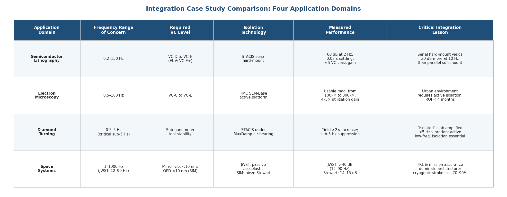

*Figure 7.1 — Comparison of integration case studies across semiconductor lithography, electron microscopy, diamond turning, and space systems, summarizing frequency ranges of concern, required vibration criteria, deployed isolation technologies, measured performance, and critical integration lessons.*

## 7.5 Benchmarking Standards and Measurement Methodology

### 7.5.1 Vibration Criterion (VC) Curves

Quantitative benchmarking of vibration isolation systems requires standardized criteria against which floor and payload vibration levels can be assessed. The Vibration Criterion (VC) curves, originally developed by Ungar and Gordon in the early 1980s and subsequently codified in IEST-RP-CC012.4 and IEST-RP-CC024.1, define maximum allowable RMS velocity in one-third octave bands. The hierarchy spans from VC-A (50 µm/s, 8–80 Hz, suitable for optical microscopes to 400× and detail sizes of approximately 8 µm) through VC-E (3.1 µm/s, 1–80 Hz, suitable for E-beam lithography at sub-100 nm detail sizes), with extensions VC-F and VC-G characterizing extremely quiet research spaces [Crystal Instruments](https://www.crystalinstruments.com/vibration-criteria-for-facilities-with-sensitive-equipment "VC curves"); [Colin Gordon, SPIE 1999](https://colingordon.com/research/generic-vibration-criteria-for-vibration-sensitive-equipment/ "VC definitions").

The full VC curve hierarchy, together with associated detail sizes and representative equipment categories, is summarized below:

| VC Level | Velocity (µm/s RMS) | Frequency Range | Detail Size (µm) | Representative Equipment |
|----------|---------------------|-----------------|-------------------|--------------------------|
| VC-A | 50 | 8–80 Hz | 8 | Optical microscopes ≤400×, microbalances |
| VC-B | 25 | 8–80 Hz | 3 | Steppers/lithography ≤3 µm line width |
| VC-C | 12.5 | 1–80 Hz | 1–3 | Optical microscopes ≤1000×, TFT-LCD processes |
| VC-D | 6.25 | 1–80 Hz | 0.1–0.3 | TEMs, SEMs, E-beam systems |
| VC-E | 3.1 | 1–80 Hz | <0.1 | E-beam lithography, laser interferometry |
| VC-F | 1.6 | 1–80 Hz | — | Extremely quiet research spaces |
| VC-G | 0.78 | 1–80 Hz | — | Extremely quiet research spaces |

*Table 7.1 — VC curve hierarchy adapted from Minus K Technology / Colin Gordon Associates [Minus K Technology](https://www.minusk.com/content/technology/vc_curves_minus_k_vibration_isolation.html "VC curves reference table").*

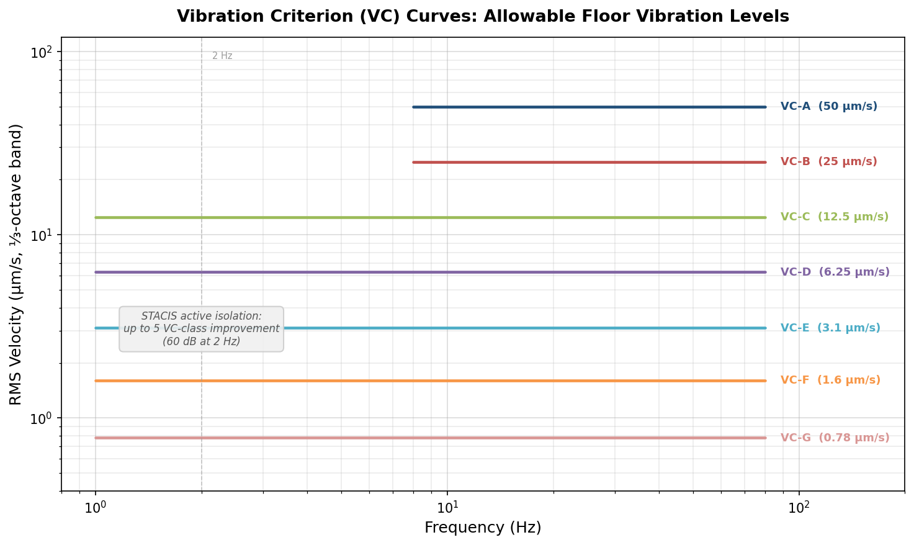

*Figure 7.2 — Log-log plot of VC-A through VC-G allowable RMS velocity thresholds as a function of frequency, annotated with the STACIS active isolation capability of up to five VC-class improvement (60 dB at 2 Hz).*

The STACIS FloorSense™ system achieves up to 60 dB insertion loss at 2 Hz, equivalent to an improvement of up to five VC classes—a facility meeting only VC-A on its structural floor can reach VC-F performance on the isolated payload [TMC STACIS 4](https://www.techmfg.com/products/stacis/stacis-4 "specifications").

### 7.5.2 Limitations of Generic Criteria

VC curves, while indispensable as a common language, are not universally conservative. A systematic comparison of eight equipment types found that manufacturer vibration specifications were expressed in inconsistent units (acceleration, velocity, or displacement), statistical measures (RMS, peak, or peak-to-peak), and bandwidth conventions (one-third octave or narrowband). For certain instruments—notably transmission electron microscopes at frequencies below 10 Hz—the VC-D criterion underestimated actual vibration sensitivity, while for others it proved overly conservative [Salyards & Firman, IMAC-XXVII 2009](https://lithographysolutions.com/wp-content/uploads/2021/08/Review-Generic-Manufacturer-Design-Criteria-Vi.pdf "manufacturer vs VC comparison"). The practical implication is that facility and integration engineers should obtain manufacturer-specific vibration specifications wherever possible, treating VC curves as a design starting point rather than a definitive performance guarantee.

### 7.5.3 ISO 10846 and the Standards Gap for Active Systems

The ISO 10846 series (Parts 1–5) defines laboratory measurement methods for the dynamic transfer stiffness k₂₁(f) = F₂/x₁ of resilient vibration isolation elements. Part 2 specifies the direct method (measuring transmitted force with a known input displacement) and Part 3 the indirect method (deriving transfer stiffness from driving-point impedance). These standards provide a rigorous framework for characterizing passive elastic isolators under controlled conditions [ISO 10846-1:2008](https://www.iso.org/obp/ui/es/#iso:std:iso:10846:-1:en "scope"); [ISO 10846-2:2008](https://www.iso.org/obp/ui/es/#iso:std:iso:10846:-2:en "direct method").

A significant gap exists: ISO 10846 does not address active isolation systems. Active piezoelectric isolators generate their own internal forces in response to sensed vibration, fundamentally altering the input–output relationship assumed by the standard's passive-element framework. No internationally standardized test protocol currently exists for characterizing the performance of active piezoelectric vibration isolation systems under representative operating conditions. The measurement methodologies used in practice—transmissibility T(f), insertion loss, power spectral density, and coherence function analysis—are well established individually but lack a unifying standard specifying test configuration, excitation type, averaging method, and reporting format.

### 7.5.4 Measurement Best Practices

In the absence of a unified active-isolation standard, best practice calls for reporting the following measurement parameters:

1. **RMS velocity** in three orthogonal directions, in one-third octave bands, for direct VC-curve comparison.
2. **Narrowband power spectral density (PSD)** for detailed spectral characterization below the one-third octave resolution.
3. **Transmissibility T(f)** in dB, measured with coherent broadband excitation (e.g., white noise applied to the floor through a shaker) to distinguish active isolation performance from ambient spectral variation.
4. **Coherence function** to verify linear input–output behavior and identify frequency bands where measurement signal-to-noise ratio is insufficient.
5. **Insertion loss**, comparing payload vibration with and without the active system energized while floor excitation remains constant.

Adherence to this protocol enables meaningful cross-platform comparison and supports procurement-specification development for active piezoelectric isolation systems [Colin Gordon 1999](https://colingordon.com/research/generic-vibration-criteria-for-vibration-sensitive-equipment/ "methodology"); [Salyards & Firman 2009](https://lithographysolutions.com/wp-content/uploads/2021/08/Review-Generic-Manufacturer-Design-Criteria-Vi.pdf "measurement").

## 7.6 Emerging Technologies

### 7.6.1 Additive Manufacturing of Piezoelectric Ceramics

Conventional piezoelectric ceramics are constrained by the geometries achievable through pressing, tape casting, and machining. Additive manufacturing (AM) is beginning to lift this constraint. Didilis et al. (2025) demonstrated the first fully sintered, lead-free piezoelectric ceramics with triply periodic minimal surface (TPMS) topologies exhibiting auxetic (negative Poisson's ratio) behavior and piezoelectric actuation capability. This result opens a pathway toward single-step fabrication of integrated actuator–flexure structures where the ceramic itself provides both actuation and compliant mechanical amplification—eliminating the adhesive bond between discrete actuator and flexure that is a primary source of unit-to-unit variability (as discussed in Chapters 4 and 6) [Didilis et al., Acta Materialia 2025](https://www.sciencedirect.com/science/article/pii/S1359645425310110 "3D-printed TPMS piezo ceramics").

### 7.6.2 Additive Manufacturing of Flexure Mechanisms

On the structural side, electron beam melting (EBM) of Ti-6Al-4V has been used to fabricate topology-optimized 3-DOF spatial flexure mechanisms with performance parameters—4 mm travel, ±6° angular motion, 119 Hz first mode—competitive with wire-EDM monolithic designs. AM enables internal cavities, lattice structures, and conformal cooling channels that are geometrically impossible with subtractive machining. The current limitation is surface quality: as-built AM parts require post-processing (machining, polishing, or chemical etching) to achieve the surface finish and dimensional tolerances needed for flexure hinges, where roughness directly affects fatigue life [Micromachines 2025](https://pmc.ncbi.nlm.nih.gov/articles/PMC12734550/ "AM flexures review").

### 7.6.3 MEMS-Scale Piezoelectric Isolation

Miniaturization of vibration isolation to the MEMS scale extends the application domain to micro-optical systems. Air-damped MEMS isolators have been demonstrated for protecting dual-axis micromirrors in LiDAR, endoscopy, and satellite optical systems, functioning as mechanical low-pass filters that attenuate high-frequency parasitic modes while transmitting the desired scanning motion. Experimental MEMS mechanical low-pass filters have achieved targeted attenuation of piston-mode vibration in large-aperture electromagnetic micromirrors [Rosen et al., JMEMS 34:260, 2025](https://ui.adsabs.harvard.edu/abs/2025JMemS..34..260R/abstract "MEMS isolator for micromirrors"); [Micromachines 14(8):1490, 2023](https://www.mdpi.com/2072-666X/14/8/1490 "MEMS vibration isolator"). These devices do not yet employ piezoelectric actuation for active feedback; however, the convergence of piezoelectric thin-film deposition and MEMS fabrication processes suggests that active MEMS-scale isolation is a plausible near-term development.

### 7.6.4 AI and Machine Learning for Active Vibration Control

Artificial intelligence is entering the vibration control domain along four principal pathways: (1) *AI-optimized input shaping*, where neural networks generate pre-shaped command signals to minimize residual vibration; (2) *AI-based system identification*, where data-driven models replace or augment physics-based plant models; (3) *AI-tuned controller parameters*, where optimization algorithms (genetic algorithms, particle swarm, Bayesian methods) replace manual or grid-search tuning; and (4) *AI-as-controller*, where neural networks or deep reinforcement learning (DRL) agents directly replace conventional control laws. Notable milestones include Febvre et al. (2019), who first applied DRL to active vibration control, and Chen et al. (2023), who employed Transformer architectures for vibration signal denoising [Li et al., Machines 13(10):946, 2025](https://www.mdpi.com/2075-1702/13/10/946 "AI-AVNC review").

For precision piezoelectric isolation, the most immediately impactful pathway is AI-tuned controller parameters: the per-unit calibration data stored in PI's ID-Chip (discussed in Chapter 6) could, in principle, be generated by an automated optimization algorithm rather than a fixed calibration routine, potentially tightening the residual performance spread across production units. Full AI-as-controller implementations for precision isolation have not yet been demonstrated in peer-reviewed experiments, and the deterministic latency guarantees required for closed-loop stability at kilohertz servo rates remain a challenge for current neural-network inference hardware.

### 7.6.5 Digital Twins for Vibration Isolation Systems

The digital-twin concept—a continuously updated virtual replica of a physical asset—has demonstrated value for predictive maintenance in adjacent domains. Zhou et al. (2023) established a five-dimensional digital-twin model (physical, virtual, service, data, and connection modules) specifically targeting piezoelectric vibration sensors, using Wiener–Arrhenius accelerated degradation models to predict remaining useful life (RUL) through sensitivity degradation monitoring and enabling maintenance scheduling before performance degradation exceeded acceptable thresholds [Zhou et al., Sensors 23(19):8173, 2023](https://www.mdpi.com/1424-8220/23/19/8173 "Digital-twin framework for PVS RUL prediction").

A 2024 review noted that digital-twin applications for vibration control in manufacturing systems enable real-time model updating, predictive maintenance (forecasting actuator degradation and sensor drift), and model-adaptive control [WJARR-2024-3821](https://wjarr.com/sites/default/files/fulltext_pdf/WJARR-2024-3821.pdf "Digital twin for vibration, 2024"). No complete digital-twin implementation for a precision piezoelectric vibration isolation platform has been published to date. The required data infrastructure—continuous streaming of sensor signals, actuator drive voltages, temperature, and humidity from a deployed isolation system to a cloud or edge computing platform—is technically feasible but represents a significant integration effort beyond current commercial practice.

The technology readiness and projected commercialization timelines for the five emerging technologies surveyed above are summarized in Figure 7.3.

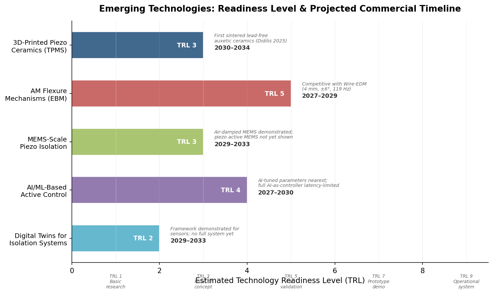

*Figure 7.3 — Estimated technology readiness levels (TRL 2–5) and projected commercial deployment timelines for five emerging technologies in precision piezoelectric vibration isolation: 3D-printed piezo ceramics, AM flexure mechanisms, MEMS-scale isolation, AI/ML-based active control, and digital twins.*

## 7.7 Open Challenges

Several fundamental challenges define the research frontier for precision piezoelectric vibration isolation.

**Sub-0.1 Hz broadband isolation.** The current state of the art (STACIS) provides active isolation from 0.2 Hz. Extending effective bandwidth to 0.1 Hz and below requires ultra-low-noise inertial sensors with flat response approaching DC, extremely high loop gain without stability compromise, and actuators with negligible creep drift—a combination that exceeds present capabilities.

**High-duty-cycle thermal management.** Piezoelectric actuators operated at high duty cycles generate heat through dielectric loss. The thermal expansion coefficient mismatch between PZT stacks (approximately −6 × 10⁻⁶ K⁻¹) and steel housings (approximately 12 × 10⁻⁶ K⁻¹) produces approximately 0.78 µm net thermal displacement per 10 K temperature change—a significant error source at sub-nanometer accuracy levels. Active thermal compensation and low-loss hard-PZT materials offer partial mitigation, but a comprehensive thermal–mechanical co-design methodology has yet to be established.

**Long-term stability of soft PZT under mechanical cycling.** As documented in Chapter 6, soft PZT-5A under 160 MPa compressive cycling exhibits severe degradation of the coupling factor k₃₃ (from 0.659 to 0.270 over 100 cycles), while hard PZT-4D shows no detectable change under identical conditions. For isolation systems subject to continuous seismic-level excitation, material selection and preload design must account for this degradation mechanism; in-service monitoring protocols remain underdeveloped.

**Standardization of active isolation testing.** The absence of an internationally recognized test protocol for active piezoelectric isolation systems—comparable to ISO 10846 for passive elements—hinders direct cross-manufacturer comparison and complicates procurement specifications. Development of such a standard would require consensus on excitation type (broadband random vs. swept sine), measurement metrics (transmissibility vs. insertion loss), payload mass and boundary conditions, and reporting format.

**Cost reduction and accessibility.** Precision piezoelectric isolation remains confined to high-value applications (semiconductor, space, defense) partly due to the cost of piezoelectric materials, precision machining, and control electronics. Pathways to cost reduction include lead-free ceramics that eliminate regulatory compliance overhead (though current KNN-based materials at d₃₃ ≈ 220–500 pC/N do not yet match PZT performance), additive manufacturing of flexures and ceramics that reduce machining and assembly labor, and MEMS-scale integration that amortizes fabrication costs over high-volume wafer processing.

**Multi-physics co-design and topology optimization.** Current design practice proceeds sequentially—actuator selection, then flexure design, then controller tuning—with limited iteration between stages. Simultaneous optimization of the piezoelectric, mechanical, thermal, and control domains through multi-physics topology optimization promises superior system-level performance but requires computational tools and design frameworks that remain in early development.

# Conclusion

The evidence assembled across this report demonstrates that enhancing the accuracy of a precision piezoelectric vibration isolation system is not reducible to the optimization of any single component. Rather, it demands coordinated engineering across four tightly coupled dimensions—hardware design, structural design, manufacturing processes, and control algorithms—each of which imposes constraints that propagate through the system-level performance envelope.

**Hardware design** determines the fundamental noise floor and bandwidth. Geophone-type inertial velocity sensors enable system-level noise below 0.05 nm RMS over a 0.2–150 Hz active bandwidth (TMC STACIS 4), while dual-sensor architectures combining piezoelectric force sensors with capacitive displacement sensors reduce closed-loop position noise to 9 pm RMS by exploiting complementary noise spectra. At the actuator level, PZT-5H ceramics (d₃₃ = 585 pC/N) maximize stroke authority, while charge-drive electronics reduce hysteresis from 10–15% to below 1%, and PICMA monolithic ceramic insulation extends mean time to failure from approximately 890 hours to over 400,000 hours under accelerated humidity testing.

**Structural design** governs stiffness, settling speed, and inter-axis coupling. The serial hard-mount architecture achieves system stiffness exceeding 7 × 10⁶ N/m—several hundred times that of pneumatic isolators—yielding settling times of 0.02 s. Monolithic flexure mechanisms fabricated by wire-EDM eliminate assembly interfaces and their associated variability, while the cubic Stewart platform configuration minimizes directional coupling and enables decentralized integral force feedback with unconditional stability.

**Manufacturing processes** control the dimensional and material-property tolerances that propagate—often nonlinearly—into performance scatter. The cubic dependence of flexure hinge stiffness on web thickness (k ∝ t³) means that a ±2 µm machining tolerance on a 40 µm web produces approximately ±15% stiffness variation. Nine-pass wire-EDM protocols hold this tolerance; cofired multilayer (PICMA) processing eliminates adhesive bond-line variability entirely; and impedance spectroscopy provides 100% production screening at throughput-compatible speeds. Statistical process control adapted to the small-batch, high-variability characteristics of PZT sintering complements these measures.

**Control algorithms** compensate residual hardware imperfections and absorb unit-to-unit variation. Integral force feedback provides unconditionally stable active damping (14–21% damping ratios on Stewart-platform modes); Optimal IFF raises the damping ceiling from ζ = 0.33 to ζ = 0.85. Model-based hysteresis compensation—using Prandtl–Ishlinskii, Preisach, or Bouc–Wen frameworks—reduces tracking error to below 0.6%, and feedforward–feedback fusion architectures achieve positioning RMSE of 0.021 µm with ±20% plant uncertainty robustness. Dynamic Digital Linearization further reduces periodic tracking error by up to 1,000× for scanning applications.

Ensuring consistent performance across identical production units requires these four dimensions to be addressed within an integrated design-for-manufacturability framework. The layered strategy demonstrated by industry leaders proceeds from monolithic fabrication and cofired processes that reduce variability sources, through 100% impedance-spectroscopy screening and parametric binning, to per-unit digital calibration—the ID-Chip architecture—that stores fourth-order polynomial linearization coefficients, optimized servo parameters, and sensor calibration constants on each stage. This final digital normalization step compresses the ±10–20% raw displacement spread across a production population to below 0.01% nonlinearity, enabling any calibrated unit to function as a drop-in replacement without manual tuning.

Looking ahead, several frontiers stand to extend these capabilities: additive manufacturing of both piezoelectric ceramics and flexure mechanisms promises to reduce assembly-related variability while enabling geometries inaccessible to conventional processing; AI/ML-based controller tuning and system identification may further tighten the residual performance spread across production units; MEMS-scale piezoelectric isolation could expand the application domain to micro-optical and integrated-photonic systems; and the development of an international test standard for active isolation systems—analogous to ISO 10846 for passive elements—would enable rigorous cross-platform benchmarking that the field currently lacks. The extension of active bandwidth below 0.1 Hz, comprehensive thermal–mechanical co-design methodologies, and multi-physics topology optimization represent additional open challenges that will shape the next generation of precision piezoelectric vibration isolation platforms.
