# Overview

The hollow motor shaft has become a defining component of New Energy Vehicle (NEV) electric drive units, enabling simultaneous weight reduction, rotor oil cooling, and multi-material construction within a single part. As mainstream rotor speeds reach 15,000–18,000 rpm and frontier designs push beyond 30,000 rpm — exemplified by BYD's 30,511 rpm motor (2025) and GAC's 30,000 rpm Quark Electric Drive 2.0 — the manufacturing route chosen for this shaft directly governs fatigue life, dimensional precision, dynamic balance quality, and per-unit economics at volumes that IDTechEx projects will exceed 140 million EV motors per year by 2036.

This report presents a comprehensive assessment of hollow motor shaft manufacturing technologies for the NEV electric drive application. Twenty-two forming, machining, joining, and emerging processes — organized into five families (subtractive, bulk metal forming, incremental and tube forming, joining-based and hybrid, and non-conventional) — are catalogued, described, and evaluated against a 15-parameter requirement checklist covering geometry, dimensional tolerance, surface integrity, grain-flow characteristics, material yield, cycle time, capital intensity, and production-volume suitability.

The principal findings are as follows. Three manufacturing routes have reached full industrial maturity (TRL 9) for NEV rotor shafts: laser-welded assembled shafts on EMAG ELC 6 turnkey lines — the dominant high-volume route, with thyssenkrupp producing approximately 1.5 million shafts in fiscal year 2023/2024 across 10 global locations — gun drilling from solid bar for low-volume and prototype production, and radial forging for automotive driveshafts more broadly. Two additional monolithic forming routes — rotary swaging (Felss, 22-second cycle demonstrated) and radial forging applied specifically to EV rotor shafts (Tsuzuki/GFM, fatigue-tested) — stand at TRL 7–8 with purpose-built equipment platforms launched in 2025–2026. Cross-wedge rolling and cold-formed modular shaft concepts remain at research stages (TRL 3–4).

The report is structured in five chapters. Chapter 1 establishes the application context — performance envelopes, functional drivers for the hollow design, and the requirement checklist. Chapter 2 provides a taxonomic catalogue of all 22 forming processes with detailed descriptions. Chapter 3 delivers multi-criteria comparisons across geometry and quality, economics and industrialisation, and secondary processing requirements. Chapter 4 synthesizes these comparisons into volume-tiered route recommendations, end-to-end process chains, and a sensitivity analysis identifying the parameters that shift the optimal route. Chapter 5 examines near-term technology trends, material and design evolution, and industry-level developments shaping the 2026–2030 outlook. A critical limitation noted throughout is the absence of cross-route fatigue-life data under identical loading conditions — the single most consequential open gap for data-driven route selection.

# 第1章 Application Context — Why Hollow Shafts in NEV Electric Drive Units

## 1.1 The Rotor Shaft in the Integrated Electric Drive Unit

In a modern New Energy Vehicle (NEV) integrated electric drive unit (EDU), the rotor shaft is the sole mechanical link converting electromagnetic torque into drivetrain motion. The power path follows a defined sequence: the stator generates a rotating magnetic field acting on the rotor; the rotor transmits torque through the rotor shaft; the shaft interfaces via spline or gear teeth with a single-speed or two-stage reduction gearbox; the reducer drives the differential; and half-shafts deliver power to the wheels [thyssenkrupp Dynamic Components](https://www.thyssenkrupp.com/en/stories/automotive-and-new-mobility/the-perfect-rotor-shaft "The perfect rotor shaft"). The rotor shaft therefore sits at the epicenter of every mechanical load the EDU experiences — peak torque pulses, sustained high-speed rotation, gear-mesh forces, and bearing reaction loads.

Contemporary EDUs overwhelmingly adopt a "3-in-1" architecture integrating the electric motor, power inverter, and single-speed reduction gearbox into a single compact housing. Within this framework, three principal layout variants exist: coaxial designs, where the motor shaft passes through the center and yields a longer shaft with coaxial gear mesh; offset designs, where motor and output sit on parallel axes, producing a shorter shaft but introducing offset gear loads; and hybrid offset-coaxial arrangements [Punch Powertrain](https://punchpowertrain.com/products/integrated-edrive-unit/ "Integrated eDrive"); [GM Ultium EDU](https://news.gm.com/home.detail.html/Pages/topic/us/en/2025/dec/1218-Plugged-in-EV-drive-units-work.html "How EV drive units work"). The architecture choice directly governs shaft length, number of bearing seats, and whether the shaft must carry gearing on one or both ends.

## 1.2 Torque and Speed Envelopes Driving Shaft Design

The performance envelope of NEV electric motors has expanded dramatically, and the rotor shaft must be designed to the upper bounds of that envelope. BorgWarner's production permanent-magnet synchronous motor (PMSM) portfolio spans 100–650 Nm peak torque, 14,000–18,000 rpm maximum speed, 45–500 kW power, and 96–800 V platforms [BorgWarner](https://www.borgwarner.com/technologies/electric-drive-motors "Electric Drive Motors"). These figures represent the mainstream; frontier designs have pushed far beyond.

Tesla's Model S Plaid achieves 20,000 rpm with carbon-fiber-sleeved interior permanent magnet (IPM) rotors, delivering a combined system output of 760 kW and 1,420 Nm [MotorTrend](https://www.motortrend.com/reviews/2022-tesla-model-s-plaid-first-test-review "Model S Plaid test"). Xiaomi's HyperEngine V8s (2025) reaches 27,200 rpm and 431 kW per motor, with 635 Nm peak torque, 98.11% peak efficiency, and a power density of 10.14 kW/kg [Xiaomi Global](https://www.mi.com/global/discover/article?id=3768 "SU7 Ultra specs"). BYD unveiled a motor operating at 30,511 rpm in March 2025, producing 580 kW per module and achieving dynamic balance precision within 50 mg — half the 100 mg industry standard [CarNewsChina](https://carnewschina.com/2025/03/20/byd-releases-ground-breaking-30511-rpm-motor/ "BYD 30,511 rpm motor"). GAC's Quark Electric Drive 2.0, announced in August 2024, targets 30,000 rpm with a motor power density of 13 kW/kg and 98.5% peak efficiency [InsideEVs](https://insideevs.com/news/731663/gac-new-advanced-electric-motor/ "GAC advanced motor").

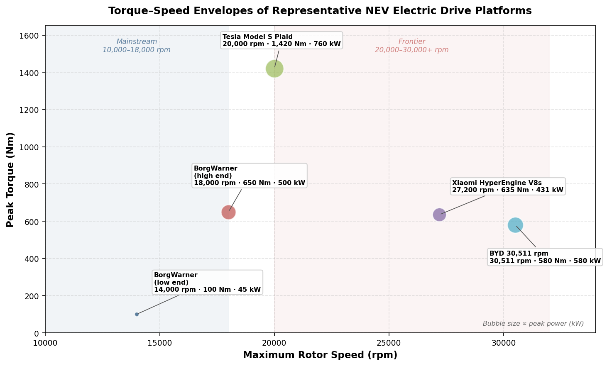

*Figure 1-1. Peak torque versus maximum rotor speed for five major EDU platforms. Bubble size is proportional to peak power (kW). Shaded bands distinguish the mainstream (10,000–18,000 rpm) and frontier (20,000–30,000+ rpm) speed ranges.*

IDTechEx's December 2025 analysis frames these trends quantitatively: the average EV motor operates at 10,000–15,000 rpm, while frontier designs now range from 20,000 to over 30,000 rpm. Increasing rotor speed from 10,000 to 20,000 rpm yields approximately 69% power-density gain; from 20,000 to 30,000 rpm, an additional 41% incremental gain is realized. The same report projects that over 140 million EV motors will be required globally per year by 2036 [IDTechEx](https://www.idtechex.com/en/research-article/the-need-for-speed-ev-motors-breaking-the-30-000rpm-barrier/34219 "EV Motors Breaking 30,000 rpm").

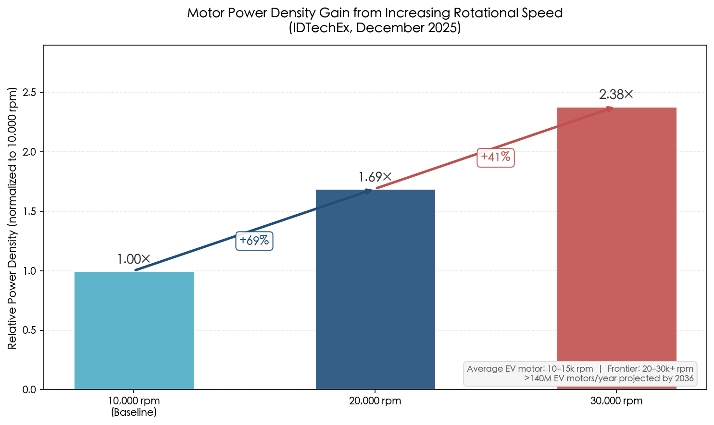

*Figure 1-2. Relative power density normalized to a 10,000 rpm baseline, based on IDTechEx (December 2025) data. The diminishing but still substantial incremental gains at higher speeds underscore the engineering incentive to push rotor speeds beyond 20,000 rpm.*

Every increment in maximum speed and torque tightens the mechanical demands on the rotor shaft — fatigue resistance, dimensional precision, balance quality, and thermal management all scale with the operating envelope.

## 1.3 Functional Drivers for the Hollow Design

The transition from solid to hollow rotor shafts in NEV electric drives is driven by a convergence of three functional imperatives: weight reduction, oil cooling, and multi-material construction. Each addresses a distinct design constraint, yet all three benefit from the same geometric feature — the axial bore.

### 1.3.1 Weight Reduction Through Material-Efficient Design

A hollow shaft removes material from the region closest to the neutral axis, where it contributes least to bending and torsional stiffness. For a typical motor shaft with an outer diameter (OD) of approximately 50 mm and a wall thickness of 5–10 mm, weight savings of up to 30% relative to a solid equivalent are achievable [KeSu Group](https://kesugroup.com/motor-shaft-guide/ "Motor Shaft Guide"). A hollow shaft with an inner diameter equal to 60% of its outer diameter demonstrates an 18.7% improvement in strength-to-mass ratio under torsion compared with a solid shaft of equal outer dimension, while the solid shaft retains a 12.4% advantage in bending-deflection resistance [Sujita & Sutanto, IJEI 2025](http://www.ijeijournal.com/papers/Vol14-Issue8/14086265.pdf "Solid vs. Hollow Shaft Performance"). In NEV applications, this mass reduction is doubly valuable: it lowers rotating inertia, improving transient torque response, and it reduces overall vehicle mass, extending driving range.

The rotational-inertia advantage follows directly from geometry. The polar moment of inertia of a hollow shaft scales as J_hollow / J_solid = 1 − (d / D)⁴, where *d* is the bore diameter and *D* the outer diameter. At d / D = 0.6, the hollow shaft retains approximately 87% of the solid shaft's polar moment of inertia — a 13% inertia reduction that translates into faster dynamic response and lower energy dissipation during speed transients.

### 1.3.2 Oil Cooling Through the Hollow Bore

Thermal management of the rotor is among the critical challenges in high-speed electric motors. As rotor speeds climb above 20,000 rpm, eddy-current losses in the laminations and rare-earth magnets generate heat that must be extracted to preserve magnet performance and prevent demagnetization. The hollow bore provides a direct pathway for oil cooling: coolant is injected into the bore, and centrifugal force drives it outward through radial openings to cool the rotor and, in certain designs, the end-windings [thyssenkrupp](https://www.thyssenkrupp.com/en/stories/automotive-and-new-mobility/the-perfect-rotor-shaft "The perfect rotor shaft").

This approach is already in series production. Tesla and Audi (Q8 e-tron induction machines) employ hollow-shaft rotor cooling, and adoption is expanding to PMSM designs as rotor thermal management becomes critical at high speeds [Goetz et al., arXiv 2510.22029](https://arxiv.org/html/2510.22029v1 "Adoption status"). Patent activity confirms sustained industry investment: Porsche's US Patent 9,148,041 B2 describes a hollow rotor shaft with a stationary cooling lance that eliminates rotating seals [Porsche Patent](https://patents.google.com/patent/US9148041B2/en "Cooled rotor shaft — Porsche"); BMW's DE102015214309A1 covers a hollow shaft cooling system for EV drives [BMW Patent](https://patents.google.com/patent/DE102015214309A1/en "Hollow shaft cooling — BMW"); and EP 4145683 (2023) discloses a hollow shaft with integrated cooling ducts and radial openings for simultaneous rotor, stator, and winding cooling [EP4145683](https://data.epo.org/publication-server/rest/v1.2/publication-dates/20231122/patents/EP4145683NWB1/document.pdf "Hollow shaft for rotor — EPO").

Recent research extends the concept further. Goetz et al. (2025) developed a tooth-guided liquid-cooling shaft in 20MnCr5 steel — 340–359 mm length, 11 mm inlet bore, 52–98 mm OD — achieving 110% higher cooling efficiency at low RPM compared with a conventional hollow-shaft arrangement [Goetz et al., arXiv 2510.22029](https://arxiv.org/html/2510.22029v1 "Ducted Liquid Cooling in Cold-Formed Motor Shaft").

### 1.3.3 Assembled Multi-Material Construction

The hollow bore also enables assembled, multi-material shaft designs. Different steel grades can be used for different shaft sections — a higher-alloy, case-hardened steel (e.g., 20MnCr5) at the gearing or spline end, and a lower-cost, lower-alloy grade for the central tube section — joined by laser welding or friction welding into a monolithic-equivalent assembly [thyssenkrupp](https://www.thyssenkrupp.com/en/stories/automotive-and-new-mobility/the-perfect-rotor-shaft "The perfect rotor shaft"). This approach places high-alloy steel only where the metallurgical demand exists, optimizing both material cost and mechanical performance.

EMAG LaserTec's production lines for assembled rotor shafts illustrate the industrial maturity of this concept. A single line executes 11 operations within a 47-second total cycle time — soft turning, laser welding, induction hardening, finish turning, and grinding — and is capable of producing up to 500,000 rotor shafts per year [EMAG](https://www.emag.com/industries-solutions/workpieces/assembled-rotor-shaft-electric-motor/ "Assembled Rotor Shaft — EMAG").

## 1.4 Rotor Dynamics, NVH, and Balance Quality

Electric vehicles lack the combustion engine's broadband noise that traditionally masks drivetrain vibrations, making NVH (Noise, Vibration, and Harshness) performance of the electric drive unit directly perceptible to occupants and subject to stringent specifications. The rotor shaft is central to NVH behavior: any mass eccentricity, runout, or geometric imperfection generates unbalance forces that scale with the square of rotational speed. At 20,000–30,000+ rpm, even microgram-level imbalance produces measurable vibration and elevated bearing loads.

BYD's 30,511 rpm motor achieves dynamic balance precision within 50 mg, compared with the prevailing industry standard of 100 mg [CarNewsChina](https://carnewschina.com/2025/03/20/byd-releases-ground-breaking-30511-rpm-motor/ "Balance precision"). According to thyssenkrupp, at speeds exceeding 25,000 rpm the concentricity of the splined gearing interface becomes the top dimensional priority, and rotor shaft torques are 3–5× greater than those of conventional camshafts — historically the most demanding automotive shaft application [thyssenkrupp](https://www.thyssenkrupp.com/en/stories/automotive-and-new-mobility/the-perfect-rotor-shaft "Tolerance requirements").

High-speed operation also intensifies centrifugal stresses on the rotor structure. Countermeasures adopted across the industry include reducing rotor diameter (compensated by increased axial length or higher speed), carbon-fiber wrapping to retain magnets, ceramic hybrid bearings for reduced friction, and direct oil cooling through the hollow shaft [IDTechEx](https://www.idtechex.com/en/research-article/the-need-for-speed-ev-motors-breaking-the-30-000rpm-barrier/34219 "High-speed challenges"). Each of these measures either depends on or benefits from a hollow shaft architecture.

## 1.5 Critical Performance Requirements

### 1.5.1 Material Grades

Three steel families dominate NEV rotor shaft applications:

- **42CrMo4 (DIN 1.7225) / AISI 4140** — A quenched-and-tempered alloy steel with tensile strength of 800–1,000 MPa. It serves as the de facto standard for high-torque EV motor shafts, combining high torsional fatigue resistance, deep hardenability, and good machinability [Ovako](https://steelnavigator.ovako.com/steel-grades/42crmo4/ "42CrMo4"); [AmTech OEM](https://www.amtechinternational.com/project/ev-motor-shaft/ "EV Motor Shaft case study").
- **20MnCr5 (DIN 1.7147)** — A case-hardening steel (density 7,850 kg/m³, thermal conductivity 45.9 W/(m·K)) preferred for components requiring a hard, wear-resistant surface layer over a tough core, particularly gearing interfaces. It is the material of choice for cold-forming processes targeting hollow shafts with integrated cooling features [Goetz et al., arXiv 2510.22029](https://arxiv.org/html/2510.22029v1 "20MnCr5 properties").
- **S45C (JIS) / AISI 1045** — A medium-carbon steel suited to lower-cost, moderate-load applications where the full alloy content of 42CrMo4 is unnecessary [KeSu Group](https://kesugroup.com/motor-shaft-guide/ "Material comparison").

Grade selection is governed by the balance between fatigue performance at the operating speed, hardenability requirements for bearing seats and splines, and per-unit cost. Assembled shaft designs can exploit multi-material construction — placing 20MnCr5 at the gearing end and a lower-alloy grade for the tube section — to optimize this balance across the shaft's length.

### 1.5.2 Dimensional Tolerances and Surface Integrity

The tolerance regime for a NEV rotor shaft is among the most demanding in automotive powertrain manufacturing. CNC machining achieves ±0.01 mm on critical diameters; bearing seats and seal surfaces require Ra 0.4–0.8 µm after grinding. Hardness specifications are zone-dependent: through-hardened sections typically range from 20–40 HRC, while induction-hardened bearing seats reach 58–62 HRC. Dynamic balancing must meet ISO 1940 grade G2.5 or better for motors operating above 3,000 rpm [KeSu Group](https://kesugroup.com/motor-shaft-guide/ "Tolerances and surface finish").

A representative production case illustrates these values concretely. AmTech's EV motor shaft — 64 mm OD, 305 mm length, AISI 4140 — is manufactured to ±0.076 mm on the outer diameter (approximately IT8–IT9). The process chain comprises gun drilling, hobbing, shaping, milling, grinding, and heat treating [AmTech OEM](https://www.amtechinternational.com/project/ev-motor-shaft/ "Production specifications"). For bearing seats specifically, IT5–IT6 is the target grade, with total indicated runout (TIR) in the single-digit micrometer range — necessary to satisfy the concentricity demands imposed by high-speed operation.

### 1.5.3 Geometry Envelope

Synthesizing data from multiple production and research sources, the representative geometry envelope for a NEV hollow motor shaft is: outer diameter 40–100 mm (most commonly 50–70 mm); bore diameter 10–30 mm for oil-cooling passages, or up to 60% of OD for structural optimization; wall thickness 5–15 mm; overall length 250–400 mm. Characteristic features include a splined output interface, two to three precision bearing seats, and lamination stack mounting surfaces that must maintain interference-fit dimensions.

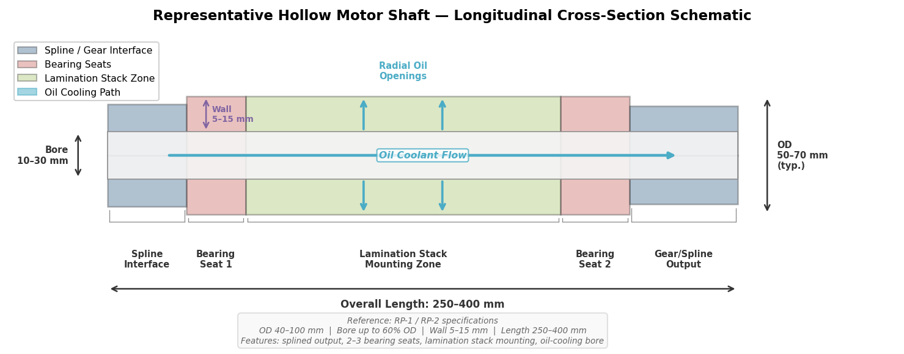

*Figure 1-3. Color-coded longitudinal cross-section of a representative hollow motor shaft, annotated with RP-1 / RP-2 dimensional specifications. The schematic identifies the spline interface, bearing seats, lamination stack mounting zone, and oil-coolant flow path through the hollow bore.*

## 1.6 Production Volumes and Market Context

The scale of hollow motor shaft demand is anchored to the trajectory of global EV adoption. Global EV sales exceeded 17.8 million units in 2024, representing approximately 20% of all new passenger cars sold worldwide. Each EV requires one to three motor/shaft assemblies depending on drivetrain configuration (single-motor, dual-motor, or tri-motor) [EV-Volumes](https://ev-volumes.com/ "Global EV sales 2024"). IDTechEx projects over 140 million EV motors annually by 2036, implying shaft volumes of comparable magnitude [IDTechEx](https://www.idtechex.com/en/research-article/the-need-for-speed-ev-motors-breaking-the-30-000rpm-barrier/34219 "140M motors by 2036").

Individual OEM volumes further contextualize the manufacturing challenge. BYD alone delivered 3.28 million NEV units in the first ten months of 2024, implying hollow shaft volumes exceeding 3 million per year from a single manufacturer [PR Newswire](https://www.prnewswire.com/news-releases/global-times-the-power-of-planning-chinese-nevs-rewrite-the-global-automotive-landscape-302702112.html "BYD 2024 production data"). Volumes of this order demand manufacturing technologies capable of sustaining high throughput, tight tolerances, and consistent quality across millions of parts per year — a criterion that strongly influences the selection of primary forming processes examined in subsequent chapters.

## 1.7 Requirement Checklist for Manufacturing Route Evaluation

The analysis in Sections 1.1–1.6 yields a consolidated set of requirements against which all forming technologies and manufacturing routes are evaluated in Chapters 3 and 4:

| ID | Requirement | Specification |
|------|-------------|---------------|
| RP-1 | Geometry envelope | OD 40–100 mm (typ. 50–70 mm); bore 10–30 mm (cooling) or up to 60% OD (structural); wall 5–15 mm; length 250–400 mm |
| RP-2 | Stepped profile features | Splined output, 2–3 bearing seats, lamination stack mounting surfaces |
| RP-3 | Material grades | 42CrMo4 (primary), 20MnCr5 (case-hardened applications), S45C (cost-sensitive) |
| RP-4 | Dimensional tolerance — OD | IT6–IT8 on functional diameters; ±0.01 mm on critical sections |
| RP-5 | Dimensional tolerance — bore | Bore straightness sufficient for oil flow; IT7–IT9 depending on cooling design |
| RP-6 | Surface finish — bearing seats | Ra 0.4–0.8 µm after grinding |
| RP-7 | Hardness | 20–40 HRC (through-hardened); 58–62 HRC (induction-hardened bearing seats) |
| RP-8 | Dynamic balance | ISO 1940 G2.5 or better; ≤ 50 mg for 30,000+ rpm applications |
| RP-9 | Operating speed range | 10,000–18,000 rpm (mainstream); 20,000–30,000+ rpm (frontier) |
| RP-10 | Peak torque range | 100–650 Nm (mainstream); up to 1,420 Nm (system-level, multi-motor) |
| RP-11 | Oil-cooling compatibility | Hollow bore must accommodate coolant passage; radial openings in some designs |
| RP-12 | Production volume | 10,000–500,000+ shafts/year per platform; single-OEM volumes > 3 M/year |
| RP-13 | Material efficiency | Minimize buy-to-fly ratio; target ≥ 85% material yield for high-volume routes |
| RP-14 | Multi-material capability | Desirable for cost optimization; higher-alloy steel at gear end, lower-alloy for tube |
| RP-15 | Grain flow and residual stress | Continuous grain flow and compressive surface residual stress preferred for fatigue life |

These requirements are referenced by the short codes RP-1 through RP-15 throughout the remainder of this report.

# 第2章 Taxonomy and Process Descriptions of Hollow Shaft Forming Technologies

This chapter presents a comprehensive catalogue of every industrially relevant and credibly emerging technique for producing hollow motor shafts. Twenty-two processes are organized into five families — subtractive (material-removal), bulk metal forming, incremental and tube forming, joining-based and hybrid, and non-conventional or emerging — and described in terms of physical mechanism, principal equipment, typical operating parameters, achievable geometries, and grain-flow effects. Evaluative comparison against the requirement checklist established in Chapter 1 is deferred to Chapter 3; the present chapter is strictly descriptive.

Each process is assigned a short code that is used consistently throughout the remainder of this report. The taxonomy diagram and short-code reference table below provide a navigational overview of the full process landscape.

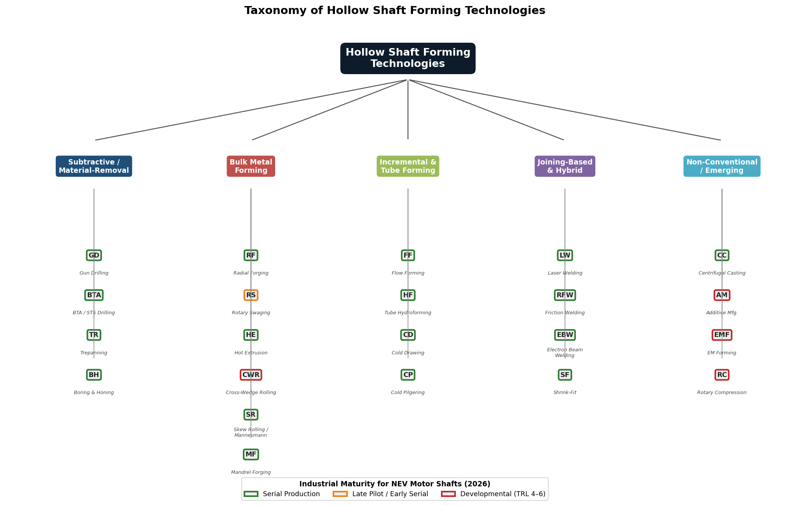

*Figure 2-1. Hierarchical taxonomy of 22 hollow shaft forming processes, organized by five process families. Color-coded border indicators distinguish industrial maturity levels for NEV motor shafts as of 2026: serial production (green), late pilot / early serial (orange), and developmental TRL 4–6 (red).*

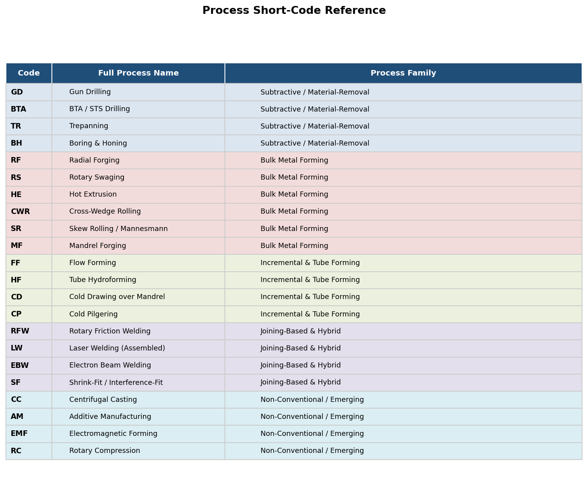

*Figure 2-2. Short-code reference table listing all 22 process codes, full names, and process family assignments used throughout this report.*

## 2.1 Subtractive / Material-Removal Processes

Subtractive methods start from a solid bar or thick-walled tube and create the hollow bore by removing material. They represent the most broadly accessible manufacturing routes: any machine shop equipped with appropriate drilling or boring equipment can produce a hollow shaft without dedicated forming tooling. The principal trade-off is material waste — the removed core becomes swarf — and a neutral or interrupted grain structure, since material removal severs the fiber lines established during billet rolling.

### 2.1.1 Gun Drilling (GD)

Gun drilling employs a single-flute tool with an asymmetric cutting head, internal coolant supply, and external chip evacuation through a V-shaped flute running along the tool body. The tool's self-piloting geometry — a bearing pad opposite the cutting edge — centers it within the bore during the cut, producing straight, round holes without a preceding pilot operation.

Key parameters and capabilities:

- **Bore diameter range**: 1–50 mm; the process is most economical in the 3–30 mm range typical of EV motor shaft oil-cooling passages.
- **Length-to-diameter ratio**: Routinely 100:1; extreme setups achieve 400:1. L/D ratios exceeding 20:1 generally require dedicated gun-drilling machines rather than lathe-mounted tooling.
- **Bore tolerance**: ±0.008 mm under controlled conditions.
- **Surface finish**: Ra 0.4–0.5 µm in the as-drilled bore.
- **Feed rates**: Moderate; the single-flute design limits the metal removal rate relative to multi-edge tools.

Gun drilling is confirmed in series production for EV motor shafts. AmTech International machines an AISI 4140 rotor shaft (OD 64 mm, length 305 mm) using gun drilling as the primary bore-creation operation, followed by CNC turning, hobbing, grinding, and heat treatment [UNISIG](https://unisig.com/information-and-resources/what-is-deep-hole-drilling/what-is-gun-drilling/ "Gun Drilling — UNISIG"); [AmTech OEM](https://www.amtechinternational.com/project/ev-motor-shaft/ "EV Motor Shaft — AmTech").

As a subtractive process, gun drilling does not alter the grain structure of the workpiece. The bore surface exhibits a machined microstructure with no work-hardening benefit, and the removed core material is not recoverable in useful form.

### 2.1.2 BTA / STS Drilling (BTA)

BTA (Boring and Trepanning Association) drilling — also known as STS (Single Tube System) drilling — reverses the coolant path relative to gun drilling: coolant is delivered externally (between the drill tube and the bore wall), while chips are evacuated internally through the hollow drill tube. This configuration accommodates larger chip cross-sections and supports higher feed rates.

Key parameters and capabilities:

- **Bore diameter range**: 20–200 mm in standard configurations; specialized setups extend to 8–630 mm.
- **Feed rates**: 5–7× faster than gun drilling at equivalent diameters, owing to the multi-edge drill head and more efficient chip evacuation.
- **Bore tolerance**: ±0.025–0.05 mm.
- **Surface finish**: Ra 0.4–1.6 µm.

BTA drilling is the preferred deep-hole process when bore diameter exceeds approximately 20 mm, at which point gun drilling becomes progressively slower and tool deflection increases. For NEV motor shafts with bore diameters in the 15–30 mm range, both GD and BTA are technically feasible; selection is governed by the specific diameter, required tolerance, and available equipment [UNISIG](https://unisig.com/information-and-resources/what-is-deep-hole-drilling/what-is-bta-drilling/ "BTA Drilling — UNISIG").

Like gun drilling, BTA drilling is purely subtractive and confers no grain-flow benefit.

### 2.1.3 Trepanning (TR)

Trepanning removes an annular ring of material rather than the full bore cross-section. A hollow, ring-shaped cutting tool advances into the workpiece, leaving a solid cylindrical core that can be withdrawn and reused — a significant advantage when the workpiece material is expensive (e.g., high-alloy steel or titanium alloys).

Key parameters and capabilities:

- **Bore diameter range**: Effective for larger diameters, up to 300–630 mm; depths up to 10,000–20,000 mm in specialized setups.
- **Material recovery**: The solid core constitutes a reclaimable product, reducing effective material waste.

For NEV motor shaft bores in the 15–30 mm range, trepanning is generally less practical than gun drilling or BTA because the recoverable core volume is small and the process is optimized for larger diameters. Its relevance to hollow shaft manufacturing lies primarily in its role as a preforming step for very large or thick-walled tubular blanks [UNISIG](https://unisig.com/information-and-resources/deep-hole-processes/trepanning/ "Trepanning — UNISIG").

### 2.1.4 Conventional Boring and Honing (BH)

Boring on a lathe or horizontal boring mill, followed by honing, constitutes the baseline reference process for hollow shaft production. A solid billet is chucked and bored using single-point or multi-edge boring bars; the bore is then honed to achieve the required surface finish and straightness.

Key parameters and capabilities:

- **Bore tolerance**: Achievable bore straightness ≤ 0.05 mm per 100 mm of bore length.
- **Surface finish**: Ra 0.4–1.6 µm after honing.
- **Equipment**: Standard CNC lathes or boring mills; no specialized tooling required.

This process is fully mature and universally available but inherently material-wasteful. It serves as the default process for prototype and very-low-volume production where dedicated forming equipment cannot be justified.

## 2.2 Bulk Metal Forming Processes

Bulk forming processes reshape metal through plastic deformation of a billet, preform, or tube under compressive forces. They are distinguished from subtractive methods by high material utilization and from incremental/tube forming by the larger deformation volumes per stroke. A defining advantage across this family is continuous grain flow: the metal's fiber structure, established during initial rolling of the billet, is redirected rather than severed, yielding enhanced fatigue resistance and closure of internal porosity.

### 2.2.1 Radial Forging (RF)

Radial forging uses four radially arranged hammers (or hydraulic cylinders) that oscillate at high frequency to incrementally reduce the cross-section of a rotating workpiece over a mandrel. The process operates in cold, warm (semi-hot), or hot regimes.

**Mechanism and equipment.** The workpiece is held between two axial manipulators and rotated incrementally between strokes. A mandrel inserted in the bore defines the internal contour. Four hammers deliver short, rapid blows — up to 1,450 strokes per minute on the latest GFM ESA-series machines — each reducing the OD by a small increment. The combination of rapid hammering and workpiece rotation produces circumferentially uniform deformation.

Two principal equipment families serve the automotive sector:

- **GFM (Austria)**: Over 200 machines installed in the automotive industry; annual production exceeds 10 million driveshafts globally. GFM explicitly targets EV rotor shafts with semi-hot radial forging at 700–850 °C, describing the production of "hollow & bottle-shaped contour" geometries. The ESA-series platform offers 90–440 tons of forging force [GFM](https://www.gfm.at/products/radial-forging-automotive/?lang=en "Radial Forging Automotive — GFM").
- **SMS Group SMX**: Four hydraulic cylinders delivering up to 300 strokes per minute. A third manipulator holds the mandrel bar independently, enabling precise bore control. SMS reports eccentricity reduction from ±15 mm (input) to a maximum of ±2.6 mm (output). The ComForge® software platform provides digital-twin-based microstructure optimization, including prediction of pore closure and strain distribution [SMS Group](https://www.sms-group.com/plants/radial-forging-machines "SMX Radial Forging — SMS Group").

**Achievable geometries.** Stepped outer profiles, bottle-shaped contours, and hollow shafts closed on one or both ends are all feasible. Internal splines can be forged directly using profiled mandrels, potentially eliminating a separate hobbing operation. The inner contour can be produced to net shape (cold) or near-net shape (warm/hot), while the outer contour is typically near-net shape, requiring 0.5–2.0 mm of finish machining stock.

**Grain-flow effects.** Radial forging produces continuous circumferential and axial grain flow that follows the part contour. The compressive forging action closes internal porosity and casting voids. GFM states that radial-forged components exhibit "distinctively higher fatigue strength" than machined-from-solid equivalents [GFM](https://www.gfm.at/products/radial-forging-automotive/?lang=en "GFM fatigue claim"). SMS Group's ComForge® system explicitly models pore closure during the forging sequence [SMS Group](https://www.sms-group.com/plants/radial-forging-machines "ComForge® pore closure").

### 2.2.2 Rotary Swaging (RS)

Rotary swaging is an incremental cold-forming process in which multiple die segments (typically 4–8) oscillate radially at frequencies exceeding 1,000 strokes per minute. Each stroke reduces the workpiece diameter by 0.25–1.5 mm. The process operates on tubular or solid bar stock and encompasses three variants: infeed swaging (axial feed through oscillating dies), recess swaging (radial die closure on a stationary workpiece), and mandrel swaging (forming over an internal mandrel to define bore geometry).

**Mechanism and equipment.** Felss Group is the principal equipment supplier for automotive rotary swaging. The workpiece — typically a seamless steel tube — is fed axially into the swaging head, where the oscillating dies compress the OD while a mandrel controls the ID. Variable wall thickness, stepped profiles, and ball closures at tube ends are all achievable in a single setup.

Felss has demonstrated a complete EV rotor shaft cycle: starting from a seamless tube of 60 × 6.0 mm (OD × wall), the swaging operation produces a stepped hollow shaft profile in 22 seconds. The Generation E10 machine, launched in March 2026, is specifically designed for rotor shafts, side shafts, and transmission shafts and features a 6-jaw configuration, 6,000 kN forming force, up to 50 Hz oscillation frequency, five NC axes, 50% higher runout accuracy than predecessor models, and ≥ 30% energy reduction through a fully electric drive [Felss](https://felss.com/en/technologies/rotary-swaging/ "Rotary Swaging — Felss"); [Felss Tube 2026](https://www.wire.de/vis-content/event-tube2026/exh-tube2026.3043336/Tube-2026-Felss-Group-GmbH-Paper-tube2026.3043336-FZ2ApYTISNirA9GZOxe72g.pdf "Felss Tube 2026 paper").

**Achievable geometries.** Outer diameters from 3 to 120 mm; stepped profiles with diameter transitions, tapered sections, and ball-sealed tube ends. With profiled mandrels, internal splines and variable wall thickness are feasible. The process is limited to axially symmetric geometries.

**Tolerances and surface quality.** Mandrel swaging achieves ID tolerance of IT7; recess swaging achieves OD tolerance of IT8; infeed swaging achieves IT9. Surface roughness can reach Ra < 0.1 µm in recess and mandrel swaging — comparable to ground surfaces [Felss Tube 2026](https://www.wire.de/vis-content/event-tube2026/exh-tube2026.3043336/Tube-2026-Felss-Group-GmbH-Paper-tube2026.3043336-FZ2ApYTISNirA9GZOxe72g.pdf "Felss tolerance data").

**Grain-flow effects.** Cold swaging produces work hardening and continuous grain flow aligned with the axial direction. Felss reports fatigue strength increases of up to 30% compared with machined equivalents, with corresponding weight reductions up to 50% relative to solid shafts. The compressive residual stress state at the surface is favorable for fatigue life [Felss](https://felss.com/en/technologies/rotary-swaging/ "Rotary Swaging — Felss").

### 2.2.3 Hot Extrusion (HE)

Hot extrusion forces a heated billet through a die opening under very high compressive loads from a hydraulic ram. For hollow profiles, a mandrel or piercing pin is positioned in the die aperture so that the extruded material flows around it, forming a tube.

**Mechanism and equipment.** The Ugine-Séjournet process is the standard for steel extrusion. The billet is heated to 1,000–1,300 °C, coated with glass lubricant to reduce friction and insulate the die, and forced through the die at exit speeds of 1–2 m/s. Extrusion presses for steel range from 15 to 25 MN (or higher for large sections). Extrusion ratios — the ratio of billet cross-section to extruded cross-section — can reach 100:1 [IspatGuru](https://www.ispatguru.com/hot-extrusion-process-and-its-application-for-steel/ "Hot Extrusion — IspatGuru").

**Achievable geometries.** Constant cross-section profiles of virtually any symmetric or asymmetric shape, including hollow sections, can be produced. Stepped profiles are not directly achievable; the extruded tube must be subsequently machined or forged to create diameter transitions, bearing seats, and spline features. Wall-thickness control depends on mandrel alignment and is less precise than in cold-forming processes.

**Grain-flow effects.** The extreme deformation and high temperature produce a fully recrystallized, fine-grained microstructure with axially aligned grain flow. Porosity from the cast billet is closed during extrusion. However, the elevated forming temperature and subsequent cooling introduce thermal residual stresses that typically require normalizing or quench-and-temper treatment before the part can enter service.

Hot extrusion is economically viable for alloy steels where seamless welded tube is impractical, or for small lot sizes of specialty alloys. For standard carbon and low-alloy steels used in motor shafts (42CrMo4, 20MnCr5, S45C), seamless tube produced by rotary piercing (Mannesmann process) or radial forging is generally more cost-effective at automotive volumes.

### 2.2.4 Cross-Wedge Rolling (CWR)

Cross-wedge rolling forms a stepped shaft profile by passing a heated cylindrical billet between two flat or cylindrical tools that carry wedge-shaped forming surfaces. As the tools move relative to each other, the wedges progressively reduce the workpiece diameter in selected zones while intervening sections retain a larger diameter, producing a multi-stepped profile in a single pass.

**Mechanism and equipment.** In the flat-die variant, two flat tool plates with wedge profiles translate in opposite directions while the workpiece rotates between them. In the cylindrical-die variant, two rolls with wedge profiles rotate in the same direction. Forming temperatures for steel are typically 1,000–1,100 °C, with tool translation speeds of approximately 300 mm/s.

For hollow shafts, CWR is performed on a tubular preform rather than a solid billet, with or without an internal mandrel. The hollow preform eliminates the central defects (Mannesmann effect, internal voids) that constrain solid-billet CWR, because no material exists at the center to fail in tension.

**Current status.** Han et al. (2024, Chinese Academy of Sciences) conducted finite-element simulation of CWR for a hollow motor shaft using 45 steel at 1,000 °C with 300 mm/s tool speed, demonstrating OD deviation < 0.8%. The study remains at the simulation stage with no physical rolling trial reported [Han et al., Metal Forming 2024](https://www.researchgate.net/publication/384053671_Design_and_simulation_of_cross_wedge_rolling_process_for_hollow_motor_shaft "CWR for hollow motor shaft"). Fraunhofer Institute has published on modified CWR for hollow shafts, and Lublin University of Technology has studied CWR for both Ti6Al4V and steels, contributing to the broader theoretical foundation [Fraunhofer](https://publica.fraunhofer.de/entities/publication/def1f3c2-1974-490d-9eef-1dee3c0a377e "Modified CWR for hollow shafts"). CWR is assessed at TRL 4–5 for hollow motor shaft geometries: the fundamental process is established for solid stepped shafts in selected industrial applications, but its extension to hollow motor shafts with bearing seats, splines, and tight tolerance requirements has not been experimentally validated.

**Grain-flow effects.** CWR produces helical grain flow wrapping around the shaft axis, with significant refinement in the deformation zones. The process is inherently material-efficient — no flash is generated — and cycle times are short (seconds per part), making it attractive for high-volume production if industrialized.

### 2.2.5 Skew Rolling / Mannesmann Piercing (SR)

The Mannesmann process is the foundational method for producing seamless steel tubes. Two barrel-shaped or cone-shaped rolls, inclined at 3–12° to the workpiece axis, rotate in the same direction. A solid round billet fed between the rolls receives both rotational and axial motion. The alternating compressive-tensile stress state at the billet center (the Mannesmann effect) initiates a central cavity, which is then expanded and shaped by a piercing plug or mandrel positioned between the rolls.

**Key parameters.** Piercing temperature ranges from 1,100 to 1,250 °C for carbon and alloy steels. The process produces mother tubes typically starting at approximately 50 mm OD, with wall thickness controlled by mandrel position and roll gap.

Skew rolling is an industrial standard for producing the seamless tube input stock that feeds downstream processes — including radial forging, rotary swaging, cold drawing, and cold pilgering. It is not a finish-forming process for motor shafts; its role in the hollow shaft manufacturing chain is as a raw-material supplier. The resulting tube has a hot-pierced microstructure with some grain refinement from the deformation but requires subsequent cold working or heat treatment to meet motor shaft specifications.

### 2.2.6 Mandrel Forging and Upset Forging with Piercing (MF)

Mandrel forging encompasses operations in which a heated billet is forged over an internal mandrel — on an open-die press, a radial forging machine, or a ring-rolling mill — to produce a thick-walled hollow shape. Upset forging with piercing is a related preforming technique: the billet is compressed axially to increase its diameter (upset) and then punched to create a central cavity, yielding a cup- or ring-shaped preform for subsequent extrusion or ring rolling.

These operations function primarily as preforming steps rather than finish-forming processes. SMS Group's SMX radial forging machines can be configured with a third manipulator holding the mandrel bar for tube forging from pierced billets, bridging mandrel forging and radial forging within a single production cell [SMS Group](https://www.sms-group.com/plants/radial-forging-machines "SMX tube forging with mandrel").

For NEV motor shafts, mandrel forging is most relevant as a method for producing the tubular preform that enters radial forging or rotary swaging — particularly when the required starting tube dimensions are not available as standard seamless tube products.

## 2.3 Incremental and Tube Forming Processes

This family of processes reshapes tubular or disc-shaped preforms through localized, progressive plastic deformation — typically using rotating tools or rollers acting on a mandrel-supported workpiece. Material utilization is very high (often > 90%), and the incremental nature of the deformation produces work-hardened, refined microstructures without the extreme temperatures associated with hot bulk forming.

### 2.3.1 Flow Forming (FF)

Flow forming (also termed "tube spinning" or "spin forming" in older literature) uses three or more rollers to press a tubular preform against a rotating mandrel. As the rollers traverse axially, they thin the wall and elongate the tube. Two principal variants exist: forward flow forming, in which material flows in the direction of roller traverse, and backward flow forming, in which material flows opposite to the traverse direction.

**Mechanism and equipment.** Leifeld Metal Spinning (Germany) is the principal supplier of CNC flow-forming machines for precision tubes. The workpiece — a thick-walled tube or cup — is clamped on a rotating mandrel. Three staggered rollers, each offset axially, compress the wall sequentially. CNC control of roller position, axial feed, and mandrel speed enables precise wall-thickness profiling along the tube length.

Key parameters and capabilities:

- **Dimensional range**: ID 6.35–584 mm; wall thickness 0.20–38 mm; length up to 12 m.
- **Wall reduction**: Up to 90% in a single pass sequence.
- **Standard tolerances**: ID ±0.127 mm, wall thickness ±0.127 mm, straightness 0.076 mm/m.
- **Internal features**: Profiled mandrels enable internal teeth, gears, splines, and variable wall thickness.

GFM explicitly uses flow-formed blanks as input for radial forging of hollow gear shafts, demonstrating a hybrid process chain in which flow forming creates the tubular preform and radial forging shapes the final stepped profile [Leifeld](https://leifeldms.com/en/flow-forming.html "Flow Forming — Leifeld"); [GFM](https://www.gfm.at/products/radial-forging-automotive/?lang=en "Flow-formed blanks for gear shaft radial forging").

**Grain-flow effects.** Flow forming produces severe plastic deformation that refines the grain structure and generates significant work hardening. At 60% wall reduction, ultimate tensile strength can reach 160 ksi (1,100 MPa) in suitable steel grades. The axially aligned grain flow and compressive residual stresses contribute to improved fatigue performance [PMF Industries](https://www.pmfind.com/news/flowforming-yields-precision-accuracy-and-keeps-an-operation-competitive "Flowforming properties"); [ATI](https://www.atimaterials.com/markets/energy/Documents/Flowform_Datasheet.pdf "ATI Flowform specs").

### 2.3.2 Tube Hydroforming (HF)

Tube hydroforming employs internal hydraulic pressure — typically 50–400 MPa — combined with axial feeding of the tube ends to expand a tube into a die cavity. The process can produce complex hollow shapes with variable cross-sections, asymmetric bulges, and T-branches.

**Mechanism and equipment.** A straight or pre-bent tube is placed in a two-piece die. Hydraulic fluid is injected through sealed end plugs, and axial cylinders feed material inward as the tube expands to fill the die cavity. The process is well established in automotive structural applications (subframes, roof rails, exhaust manifolds) where lightweight, complex hollow cross-sections replace stamped-and-welded assemblies.

For rotational powertrain shafts, hydroforming has limited applicability. The process excels at producing thin-walled, large-expansion shapes but offers limited wall-thickness control in the expansion zones. The high L/D ratios and thick walls (5–15 mm) characteristic of motor shafts are not well suited to hydroforming, which typically performs best at wall-thickness-to-diameter ratios below approximately 5%. Published documentation of hydroforming applied specifically to high-L/D, thick-walled, stepped shaft profiles remains sparse.

### 2.3.3 Cold Drawing over Mandrel (CD)

Cold drawing pulls a tube through a die while a mandrel (fixed, floating, or moving) controls the bore dimension. The combination of die and mandrel produces simultaneous OD reduction and wall-thickness control.

**Key parameters and capabilities:**

- **Tolerances**: IT8–IT10 on OD; ID controlled by mandrel geometry.
- **Surface finish**: Ra 0.4–1.6 µm.
- **Cross-section reduction**: 20–40% per pass.
- **Mandrel types**: Fixed-plug drawing (best wall control, limited length), floating-plug drawing (longer tubes, slightly less control), and moving-mandrel drawing (highest wall uniformity).

Cold drawing is a continuous process that produces constant or gently tapered cross-sections. Stepped profiles — the defining geometric feature of motor shafts — cannot be produced directly; the drawn tube must be subsequently machined or forged. The process is therefore relevant as a tube-preparation step rather than a finish-forming route. Mandrel drawing yields better wall-thickness uniformity than hollow sinking (drawing without a mandrel), which is important when the bore serves as an oil-cooling passage [The Fabricator](https://www.thefabricator.com/tubepipejournal/article/tubepipeproduction/cold-drawing-principles "Cold Drawing Principles").

**Grain-flow effects.** Cold drawing refines the grain structure axially and produces significant work hardening (20–40% increase in yield strength per pass). The resulting tube has a smooth, strain-hardened surface but may require stress-relief annealing between passes if cumulative reduction exceeds 40–50%.

### 2.3.4 Cold Pilgering (CP)

Cold pilgering uses a pair of oscillating ring dies with tapered grooves, combined with a tapered mandrel inside the tube. The ring dies rock back and forth over the tube while the tube is incrementally advanced and rotated between strokes. Each stroke progressively reduces both the OD and wall thickness.

**Key parameters and capabilities:**

- **Cross-section reduction**: > 90% in a single pass — significantly greater than cold drawing.
- **Wall-thickness variation**: < 0.5 µm at medium ODs (exceptional uniformity).
- **Surface finish**: Ra approaching 0.5 nm in stainless steel (mirror-like); for carbon and alloy steels, Ra values are higher but still excellent.
- **Material loss**: Virtually zero — the process is nearly waste-free.

Cold pilgering is the premium tube-finishing process for applications requiring extreme wall uniformity and surface quality. However, like cold drawing, it produces constant or gently tapered cross-sections and cannot directly form multi-stepped shaft profiles. Its role in the motor shaft supply chain is as a tube-preparation process, producing seamless tubes with precise dimensions that feed downstream forming operations (radial forging, rotary swaging) or machining [SMS Meer / The Fabricator](https://www.thefabricator.com/tubepipejournal/article/tubepipeproduction/introducing-cold-pilger-mill-technology "Cold Pilger Mill Technology").

## 2.4 Joining-Based and Hybrid Approaches

Joining-based approaches construct a hollow shaft by assembling two or more individually manufactured components — typically a central tube section and one or two end pieces (flanges, gear blanks, splined stubs). This family enables multi-material designs and complex internal geometries that are difficult or impossible to achieve through monolithic forming. The critical engineering requirement is that every joint must perform at a level equivalent to the parent material under the full fatigue and torque loading imposed on the rotor shaft.

### 2.4.1 Rotary Friction Welding (RFW)

Rotary friction welding is a solid-state joining process in which one workpiece is rotated at high speed against a stationary counterpart under axial force. Frictional heating at the interface plasticizes the material, and an axial forging pressure consolidates the joint. No melting occurs; the process operates below the solidus temperature.

**Mechanism and equipment.** The rotating workpiece is driven at 1,000–3,000 rpm (depending on diameter and material). After a friction phase that generates a heat-affected zone (HAZ) typically 1–3 mm wide, rotation is stopped abruptly and a forging force is applied to upset the joint. The flash — a ring of displaced material at the joint line — is removed by on-machine turning or a dedicated flash-trimming station.

KUKA (formerly Thompson Friction Welding) has installed over 1,200 friction welding machines in more than 44 countries. The technology is extensively used in automotive applications for assembled shafts, piston rods, and turbocharger components [KUKA](https://www.kuka.com/en-us/products/production-machines/rotary-friction-welding-machines "Rotary Friction Welding — KUKA").

**Key capabilities:**

- **Joint quality**: Full-section solid-state bond with narrow HAZ; forged-quality grain structure at the interface.
- **Dissimilar metals**: RFW can join different steel grades — for example, high-alloy steel at the spline or gear end with a lower-alloy tube section — directly supporting multi-material shaft designs.
- **Dimensional control**: Weld-to-finished-length tolerance ±0.38 mm; angular orientation ±1°.
- **Cycle time**: Approximately 45 seconds for a two-weld assembly (two end pieces joined to a central tube) [MTI](https://www.mtiwelding.com/wp-content/uploads/2015/11/mti-friction-welding-technology-brochure.pdf "Friction Welding — MTI").

**Grain-flow effects.** The friction and forging phases produce a narrow zone of highly refined, dynamically recrystallized grain structure at the joint interface. Parent material on either side of the HAZ retains its original microstructure. Flash material contains coarse, extruded grains and is removed.

### 2.4.2 Laser Welding — Assembled Rotor Shafts (LW)

Laser welding of assembled rotor shafts has emerged as the dominant high-volume production method for NEV hollow motor shafts. The process joins two or more near-net-shape components — typically a tube and one or two flanged end pieces — using a focused, high-power laser beam.

**Mechanism and equipment.** EMAG LaserTec's ELC 6 machine is the industry reference platform. The system employs a rotary indexing table that cycles each workpiece through laser cleaning, laser welding (with EC Seam position control performing 20 measurements per circumference to track the joint), and post-weld inspection stations. Welding is performed under inert gas shielding, producing a narrow, deep-penetration weld with minimal thermal distortion.

The ELC 6 integrates into a complete turnkey production line encompassing the following operations:

- **OP10/OP20**: Soft turning of tube and end components (VLC 200 turning centers).
- **OP30**: Laser cleaning of weld zone (LC 4-2).
- **OP40**: Laser welding (ELC 6 with EC Seam control).
- **OP50**: Induction hardening of bearing seats (MIND machine) + hard turning (VTC 200 CD).
- **OP60**: Gear cutting (HLC 150 H hobbing center).
- **OP70**: Grinding (HG 310).
- **Quality assurance**: EC Seam weld inspection, ultrasonic testing, CMM, and dynamic balancing.

The total cycle time across all 11 operations is 47 seconds per shaft, and a single ELC 6 line can produce up to 500,000 rotor shafts per year. EMAG states that "all leading automotive manufacturers have the associated systems in use" [EMAG LaserTec](https://www.engineering.com/manufacturing-rotor-shafts-at-the-speed-of-light-with-laser-welding/ "EMAG rotor shaft laser welding"); [EMAG](https://www.emag.com/industries-solutions/workpieces/assembled-rotor-shaft-electric-motor/ "Assembled Rotor Shaft — EMAG").

**Grain-flow effects.** The weld zone comprises a narrow fusion zone flanked by a HAZ. Parent-material grain structure is unaffected outside the HAZ. Because the weld is circumferential and relatively thin, its effect on overall shaft fatigue behavior depends on weld quality, post-weld heat treatment, and the location of the weld relative to high-stress regions. Induction hardening of bearing seats (OP50) re-establishes the required surface hardness independent of the weld.

### 2.4.3 Other Welding Methods: LFW, FSW, EBW

Several alternative welding technologies are technically capable of joining shaft components but occupy narrower applicability windows for NEV motor shafts:

- **Linear friction welding (LFW)**: One component reciprocates linearly against a stationary counterpart. The process is suited to non-axisymmetric joints and widely used in aerospace (e.g., blisk manufacture). For axisymmetric motor shafts, rotary friction welding is preferred because it produces a more uniform circumferential joint.
- **Friction stir welding (FSW)**: A non-consumable rotating tool is plunged into the joint line and traversed along it. Well established for aluminum alloys, steel FSW remains constrained by extreme tool wear and is not currently practical for high-volume steel motor shaft production.
- **Electron beam welding (EBW)**: A focused electron beam operating in vacuum produces very deep, narrow welds (aspect ratios up to 20:1). EBW is used for turbocharger shaft assemblies and other precision components, but the requirement for a vacuum chamber and longer cycle times render it higher-cost than laser welding for high-volume motor shaft production [EB Industries](https://ebindustries.com/welding-specifications-for-electron-beam-welding/ "EBW specs").

### 2.4.4 Shrink-Fit / Interference-Fit Assembly (SF)

Shrink-fitting exploits differential thermal expansion to assemble components. The outer component (e.g., a shaft flange or gear hub) is heated, expanding its bore; the inner component (shaft tube) is inserted; and as the outer component cools, the resulting interference generates a compressive joint that transmits torque through friction.

Shrink-fitting is widely used for mounting the rotor lamination stack onto the shaft and for multi-material shaft designs where the joint transmits lower loads than the spline or gear interface. The method produces no metallurgical bond; joint integrity depends entirely on the interference pressure and the friction coefficient of the mating surfaces. For high-torque, high-speed applications, shrink-fitting alone may be insufficient, and it is often combined with welding or mechanical keying (splines) to ensure positive torque transmission.

## 2.5 Non-Conventional and Emerging Processes

The processes in this section are either established for other product families but not yet applied to motor shafts, or remain at research and development stages. They are catalogued for completeness, as one or more may achieve industrial relevance within the next decade.

### 2.5.1 Centrifugal Casting (CC)

Centrifugal casting pours molten metal into a spinning mold rotating at 250–1,500 rpm. Centrifugal force presses the liquid metal against the mold wall, forming a hollow cylinder as the metal solidifies from the outside inward. Impurities, oxides, and low-density inclusions migrate toward the bore surface and are subsequently machined away.

**Key capabilities.** OD up to 1,092 mm; lengths up to 7,620 mm; compatible materials include carbon steel, alloy steel, stainless steel, and non-ferrous alloys [Spuncast](https://spuncast.com/capabilities/centrifugal-casting/ "Centrifugal Casting — Spuncast").

**Limitations for motor shafts.** The as-cast microstructure is coarser than wrought material, exhibiting columnar grain growth oriented radially. Dimensional tolerances are IT14–IT16 as-cast, requiring extensive machining to reach the IT6–IT8 levels demanded by motor shaft functional surfaces. The process is better suited to large-diameter, thick-walled components (pipe fittings, pressure vessel liners, large rolls) than to the 50–100 mm OD precision shaft geometry typical of NEV applications.

### 2.5.2 Additive Manufacturing (AM)

Two additive manufacturing families possess theoretical relevance to hollow shaft production:

- **Wire Arc Additive Manufacturing (WAAM)**: Deposition rates of 1–10 kg/h; build volumes limited only by robotic reach; buy-to-fly ratio < 2:1 (i.e., less than half the deposited material is removed in finish machining). BMW Group has adopted WAAM for vehicle structural components and tooling, demonstrating automotive-grade material qualification [Metal AM / BMW](https://www.metal-am.com/bmw-group-looks-to-wire-arc-additive-manufacturing-for-lightweight-and-sustainable-vehicle-components/ "BMW WAAM"). As-built dimensional tolerances are IT14–IT16.
- **Laser Powder Bed Fusion (L-PBF)**: Enables complex internal cooling channels impossible to produce by conventional means. Build volume is limited (typically < 500 mm in the largest dimension), build rates are slow, and per-part cost is high. As-built tolerances are IT12–IT14.

Neither WAAM nor L-PBF is currently viable for series production of motor shafts at volumes exceeding approximately 1,000 per year. No published case study documents the additive manufacture of a production motor shaft. The nearest potential role for AM in the motor shaft supply chain is rapid prototyping or the production of forming tool inserts (mandrels, dies) rather than the shafts themselves.

### 2.5.3 Electromagnetic Forming (EMF)

Electromagnetic forming uses pulsed magnetic fields to generate Lorentz forces that expand or compress a conductive tube workpiece at velocities of 100–300 m/s, completing the forming operation at room temperature in microseconds. The process is well suited to high-conductivity materials — principally aluminum and copper — and is used industrially for tube crimping, expansion-joining, and calibration of tubular assemblies [Belgian Welding Institute](https://bil-ibs.be/en/project/magpuls-electromagnetic-pulse-forming "MAGPULS — EM forming").

For high-strength steel motor shafts, electromagnetic forming has limited applicability. The lower electrical conductivity of steel reduces forming efficiency, and the achievable deformation is small compared with mechanical forming processes. EMF may find a niche role in the motor shaft process chain for operations such as electromagnetic expansion of a steel tube into a flanged end piece (as a joining technique), but it does not constitute a primary shaft-forming process.

### 2.5.4 Rotary Compression (RC)

Rotary compression employs three radially arranged rolls to deform hollow parts — a kinematic arrangement conceptually similar to cross-wedge rolling but with a distinct tool geometry. The process has been studied primarily by researchers at Lublin University of Technology (Poland) for stepped hollow shafts, hollow gear blanks, and related geometries. As of early 2026, rotary compression remains at an academic research stage with no documented industrial application for motor shafts.

## 2.6 Process Family Summary

The twenty-two processes catalogued in this chapter span five families, ranging from universally available subtractive methods (GD, BTA, TR, BH) to developmental technologies (CWR, AM, EMF, RC). The industrially relevant processes for NEV hollow motor shafts as of 2026 can be organized into three tiers based on their role in the manufacturing chain:

**Primary forming processes** — capable of producing the hollow shaft geometry as a principal operation: GD (from solid), RF (from tube/preform), RS (from tube), FF (preform or near-net tube), HE (constant-section tube), and LW/RFW (assembled from components).

**Tube-supply processes** — producing the seamless tube input for downstream forming: SR (Mannesmann piercing), CD (cold drawing), CP (cold pilgering), MF (mandrel forging).

**Niche or developmental processes** — not currently practical for series motor shaft production: CWR (simulation stage for hollow motor shaft geometry), CC (microstructure too coarse for precision shafts), AM (too slow and costly for volume), HF (geometry mismatch), EMF (material mismatch), EBW (cost/throughput), RC (academic).

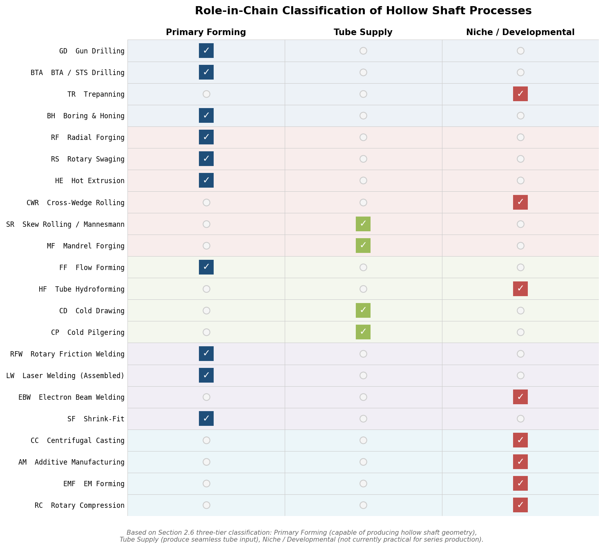

*Figure 2-3. Classification matrix assigning each of the 22 processes to one of three roles within the NEV hollow motor shaft manufacturing chain: Primary Forming, Tube Supply, or Niche / Developmental.*

The comparative evaluation of these processes against the requirement checklist established in Chapter 1 is presented in Chapter 3.

# 第3章 Multi-Criteria Technical Comparison

This chapter evaluates the forming technologies catalogued in Chapter 2 against two structured comparison matrices — Geometry & Quality (Section 3.1) and Economics & Industrialisation (Section 3.2) — followed by a secondary processing map (Section 3.3) that details the post-forming operations required by each primary route. A cross-criteria synthesis (Section 3.4) then draws out the structural trade-offs that emerge when the three assessment dimensions are read in combination. The evaluation criteria are derived from the requirement checklist established in Chapter 1 (RP-1 through RP-15), and each process is identified by its short code defined in Chapter 2. The matrices are descriptive rather than weighted-score, enabling readers to apply weighting appropriate to their specific application constraints.

## 3.1 Matrix 1: Geometry & Quality Comparison

The Geometry & Quality matrix assesses each process against the dimensional, metallurgical, and geometric parameters that determine whether a given technology can produce a shaft meeting the RP-1 through RP-8 and RP-15 specifications without undue reliance on secondary processing.

### 3.1.1 Evaluation Axes

Seven criteria structure this comparison, each mapped to one or more requirement parameters from Chapter 1:

- **Bore diameter range and L/D ratio** (RP-1, RP-11): Achievable bore size and depth-to-diameter ratio, governing compatibility with both structural hollowing and oil-cooling passage geometries.
- **Dimensional tolerance — bore and OD** (RP-4, RP-5): As-formed or as-machined tolerances on inner and outer diameters, expressed in IT grades or ±mm.
- **Surface finish** (RP-6): As-formed bore and OD surface roughness (Ra), indicating the residual grinding or honing effort to reach the Ra 0.4–0.8 µm specification for bearing seats.
- **Wall-thickness uniformity** (RP-8, RP-9): Circumferential and axial variation in wall thickness — critical for dynamic balance and structural integrity at speeds exceeding 20,000 rpm.
- **Grain structure and residual stress** (RP-15): Whether the process produces continuous grain flow, refined microstructure, and compressive residual surface stress — all of which enhance fatigue life under the torsional and bending loads specified in RP-9 and RP-10.
- **Stepped/profiled geometry capability** (RP-2): Ability to produce bearing seats, diameter transitions, and splined features during primary forming, thereby reducing secondary machining.
- **Minimum wall thickness** (RP-1): The thinnest wall the process can reliably produce, relevant for lightweight optimization and cooling-channel design.

### 3.1.2 Comparative Analysis by Process

**Gun Drilling (GD)** covers a bore diameter range of 1–50 mm at L/D ratios routinely reaching 100:1 (400:1 in extreme setups), making it fully compatible with the 10–30 mm cooling bore specified in RP-1. Bore tolerance reaches ±0.008 mm, and as-drilled surface finish is Ra 0.4–0.5 µm — among the finest of any primary bore-creation method [AMG](https://www.amgundrilling.com/technical-gundrilling-information.html "Gun drilling specifications"). GD, however, produces no grain-flow enhancement (RP-15); the bore surface retains the machined microstructure of the parent bar. All stepped features (RP-2) must be created by separate CNC turning and hobbing operations. Wall-thickness uniformity depends on bar concentricity and drill straightness rather than on the drilling process itself, and minimum wall thickness is constrained only by structural requirements.

**BTA Drilling (BTA)** extends the bore diameter range to 20–200 mm with feed rates 5–7× faster than GD, albeit at slightly relaxed bore tolerance (±0.025–0.05 mm) and surface finish (Ra 0.4–1.6 µm) [UNISIG](https://unisig.com/information-and-resources/what-is-deep-hole-drilling/what-is-bta-drilling/ "BTA Drilling — UNISIG"). BTA shares GD's grain-structure neutrality and absence of profiled-geometry capability. For the typical NEV motor shaft bore diameter of 10–30 mm, BTA becomes advantageous when throughput outweighs bore tolerance requirements; for diameters above 20 mm, it is generally preferred over GD on cycle-time grounds.

**Radial Forging (RF)** on four-hammer machines (GFM, SMS SMX) covers OD 30–150 mm — encompassing the full RP-1 envelope — with mandrel-assisted forming that yields net-shape inner contours and near-net-shape outer profiles. Cold-forged inner-diameter tolerance reaches ±0.025 mm; outer-diameter tolerance is approximately ±0.1 mm; surface finish ranges from Ra 3.2 µm (hot/semi-hot) to Ra 0.4 µm (cold) [GFM](https://www.gfm.at/products/radial-forging-automotive/?lang=en "Radial Forging Automotive"); [CT Forge](https://www.creatorcomponents.com/news/what-is-radial-forging-technology.html "Radial forging tolerances"). The process generates continuous grain flow with pore closure — verified by SMS ComForge® simulation — and compressive residual stress at the surface, directly addressing RP-15 [SMS group](https://www.sms-group.com/plants/radial-forging-machines "SMX Radial Forging"). RF can produce stepped profiles, bottle-shaped contours, and internal splines via profiled mandrels (RP-2), reducing downstream hobbing requirements. Eccentricity reduction from ±15 mm to ±2.6 mm has been demonstrated on SMS SMX machines, a result that directly benefits wall-thickness uniformity.

**Rotary Swaging (RS)** on Felss multi-die machines covers OD 3–120 mm with mandrel-assisted forming at >1,000 strokes/min. ID tolerance over mandrel reaches IT7; OD achieves IT8 (recess swaging) to IT9 (infeed swaging). Surface finish is notably fine: Ra < 0.1 µm by recess or mandrel swaging — comparable to grinding and potentially eliminating finish-grinding on non-bearing surfaces [Felss Tube 2026](https://www.wire.de/vis-content/event-tube2026/exh-tube2026.3043336/Tube-2026-Felss-Group-GmbH-Paper-tube2026.3043336-FZ2ApYTISNirA9GZOxe72g.pdf "Felss Tube 2026 paper"). Cold swaging produces a 30% increase in fatigue strength through work hardening and refined grain structure (RP-15), and variable wall thickness along the axis is achievable. Stepped profiles and ball-closure features have been demonstrated for EV rotor shafts from tube stock of 60 × 6.0 mm. Minimum wall thickness is limited by mandrel rigidity and die clearance but remains well within the 5–15 mm range specified by RP-1.

**Flow Forming (FF)** operates on three-roller CNC machines over a mandrel, producing ID from 6.35 to 584 mm, wall thickness from 0.20 to 38 mm, and lengths up to 12 m. Standard tolerances are ID ±0.127 mm, wall ±0.127 mm, and straightness 0.076 mm/m [ATI](https://www.atimaterials.com/markets/energy/Documents/Flowform_Datasheet.pdf "ATI Flowform specs"). Wall-thickness reductions up to 90% are achievable in a single setup, and work hardening yields substantial property enhancement — ultimate tensile strength reaches 160 ksi (1,103 MPa) at 60% reduction in alloy steels [PMF Industries](https://www.pmfind.com/news/flowforming-yields-precision-accuracy-and-keeps-an-operation-competitive "Flowforming properties"). The process produces improved grain structure with elongated grains aligned circumferentially. Internal teeth and gears are feasible via profiled mandrels (RP-2), and the minimum achievable wall of 0.20 mm far exceeds the RP-1 range, making FF the process of choice when thin walls are required. FF inherently produces constant or smoothly tapered cross-sections, however; multi-stepped profiles with abrupt diameter transitions require secondary machining or a subsequent radial-forging step. GFM explicitly uses flow-formed blanks as preforms for radial forging of hollow gear shafts [GFM](https://www.gfm.at/products/radial-forging-automotive/?lang=en "Flow-formed blanks for radial forging").

**Cold Pilgering (CP)** achieves cross-section reductions exceeding 90% in a single pass with wall-thickness variation below 0.5 µm at medium outer diameters and surface roughness as fine as Ra ~0.5 nm on stainless steel — the highest precision of any tube-forming process [SMS Meer / The Fabricator](https://www.thefabricator.com/tubepipejournal/article/tubepipeproduction/introducing-cold-pilger-mill-technology "Cold Pilger Mill"). Material loss is virtually zero. These characteristics make CP an excellent tube-preform supplier for subsequent forming operations, though CP is limited to constant or tapered cross-sections and cannot generate the multi-stepped profiles required by RP-2 without secondary machining. For NEV motor shaft applications, CP therefore serves primarily as an upstream tube supplier rather than a standalone shaft-forming process.

**Cold Drawing over Mandrel (CD)** achieves IT8–IT10 tolerances, Ra 0.4–1.6 µm surface finish, and 20–40% cross-section reduction per pass [The Fabricator](https://www.thefabricator.com/tubepipejournal/article/tubepipeproduction/cold-drawing-principles "Cold Drawing Principles"). Like CP, CD is confined to constant or tapered sections and serves primarily as a tube-preparation process. Wall-thickness uniformity from mandrel drawing is superior to hollow sinking (drawing without a mandrel), making CD a suitable preform route for shafts where bore concentricity matters (RP-5).

**Cross-Wedge Rolling (CWR)** has been demonstrated in finite-element simulation for hollow motor shafts: Han et al. (2024) modeled CWR of a hollow shaft from 45 steel at 1,000 °C with 300 mm/s roll speed, achieving OD deviation below 0.8% and producing stepped profiles [Han et al., Metal Forming 2024](https://www.researchgate.net/publication/384053671_Design_and_simulation_of_cross_wedge_rolling_process_for_hollow_motor_shaft "CWR for hollow motor shaft"). These results are promising for RP-2 compliance, but no experimental validation exists for a complete motor shaft geometry. CWR remains at TRL 3–4; tolerance, surface finish, and grain-flow data (RP-4 through RP-8) cannot yet be assessed with production-grade confidence.

**Rotary Friction Welding (RFW)** produces a full-section solid-state joint with a narrow heat-affected zone (HAZ), achieving weld-to-finished-length tolerance of ±0.38 mm and angular orientation within ±1° [MTI](https://www.mtiwelding.com/wp-content/uploads/2015/11/mti-friction-welding-technology-brochure.pdf "Friction Welding — MTI"). Joint quality is characterized as "forged quality" with 100% butt-section bonding. RFW enables dissimilar-metal joining (RP-14), allowing a high-alloy steel spline end to be joined to a lower-alloy tube section. The stepped profile (RP-2) is achieved by individually forming each component before welding, with the weld itself constituting a cylindrical butt joint. Wall-thickness uniformity is governed by the input components rather than the welding process.

**Laser Welding — Assembled Shaft (LW)** on EMAG ELC 6 machines produces assembled rotor shafts at rates up to 500,000 per year per machine, with EC Seam weld-position control performing 20 measurements per circumference for in-process quality assurance [EMAG](https://www.emag.com/industries-solutions/workpieces/assembled-rotor-shaft-electric-motor/ "EMAG Assembled Rotor Shaft"). LW accommodates complex internal cooling-channel geometries (RP-11) that cannot be machined into a solid part — a significant advantage for advanced oil-cooling designs. Dimensional tolerances and surface finish of the finished shaft are determined primarily by the pre-weld machining and post-weld grinding operations rather than by the welding step itself. Multi-material construction (RP-14) is a core design intent of the assembled approach [thyssenkrupp](https://www.thyssenkrupp.com/en/stories/automotive-and-new-mobility/the-perfect-rotor-shaft "Bimetallic shaft advantages").

**Centrifugal Casting (CC)** produces hollow cylinders with OD up to 1,092 mm, but as-cast tolerances are coarse (IT14–IT16) and the microstructure is significantly coarser than wrought material [Spuncast](https://spuncast.com/capabilities/centrifugal-casting/ "Centrifugal Casting"). CC fails to meet RP-4/RP-5 without extensive machining, produces no continuous grain flow (RP-15), and offers no stepped-profile capability (RP-2). For the dimensional range and quality requirements of NEV motor shafts, CC is not competitive.

**Additive Manufacturing (AM)** — both WAAM and L-PBF — offers maximum geometric freedom for internal cooling channels (RP-11) and complex features. As-built tolerances, however, are IT14–IT16 (WAAM) or IT12–IT14 (L-PBF), surface finish is rough, and build rates restrict throughput to prototype or very-low-volume applications [Gefertec](https://www.gefertec.de/en/buy-to-fly-ratio/ "WAAM buy-to-fly"). Neither variant is viable at the RP-12 production volumes required for NEV series production.

### 3.1.3 Summary Table — Geometry & Quality Matrix

The radar chart below synthesizes the qualitative trade-offs across the six primary candidate processes on a normalized 1–5 scale. Rotary swaging (RS) and radial forging (RF) occupy the largest polygon areas, reflecting their combined advantages in surface finish, grain-flow enhancement, and stepped-profile capability.

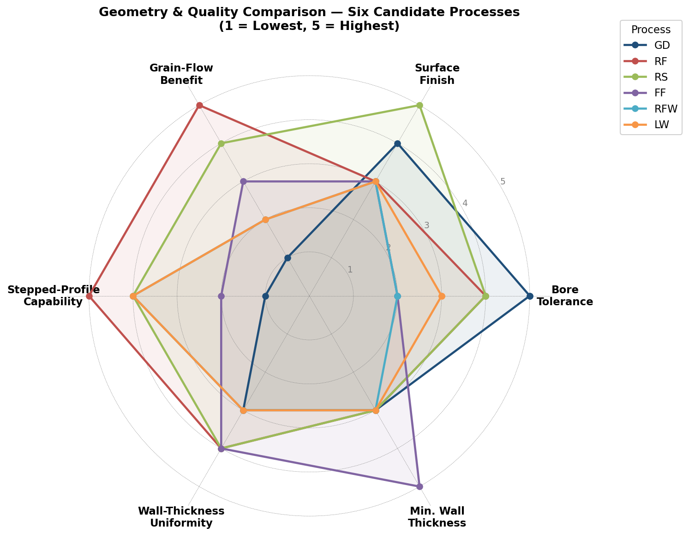

| Process | Bore ∅ Range | L/D Ratio | Bore Tolerance | OD Tolerance | Surface Ra (as-formed) | Grain Flow / Residual Stress (RP-15) | Stepped Profile (RP-2) | Min. Wall | Notes / Limitations |
|---------|-------------|-----------|---------------|-------------|----------------------|--------------------------------------|----------------------|-----------|-------------------|
| GD | 1–50 mm | 100:1 (400:1) | ±0.008 mm | Per CNC turning | 0.4–0.5 µm (bore) | None (subtractive) | No — requires CNC | Structural limit only | Best bore precision; zero grain benefit |
| BTA | 20–200 mm | Similar to GD | ±0.025–0.05 mm | Per CNC turning | 0.4–1.6 µm (bore) | None (subtractive) | No — requires CNC | Structural limit only | 5–7× faster than GD above ∅20 mm |
| RF | OD 30–150 mm | Shaft L/D typical | ±0.025 mm (cold ID) | ±0.1 mm | 3.2–0.4 µm | Continuous flow, pore closure, compressive | Yes — steps, splines, bottle shapes | ~3–5 mm (mandrel limited) | Eccentricity ±15→±2.6 mm (SMS) |
| RS | OD 3–120 mm | Shaft L/D typical | IT7 (mandrel) | IT8–IT9 | <0.1 µm (recess) | Refined, +30% fatigue, compressive | Yes — steps, ball closure | ~3–5 mm | 22 s cycle; near-grinding finish |
| FF | ID 6.35–584 mm | To 12 m length | ±0.127 mm (ID) | ±0.127 mm (wall) | Work-hardened surface | Elongated circumferential grain, hardened | Limited — constant/tapered only | 0.20 mm | Best for thin walls; preform for RF |
| CP | Medium OD tube | Long tube | Sub-µm wall variation | Per tube spec | ~0.5 nm (SS) | Cold-worked, refined | No — constant/tapered only | Per tube spec | Preform supplier, not standalone |
| CD | Per tube spec | Per draw bench | IT8–IT10 | IT8–IT10 | 0.4–1.6 µm | Cold-worked | No — constant/tapered only | Per tube spec | Preform supplier |
| CWR | Motor shaft OD | Shaft L/D | OD dev. <0.8% (sim) | <0.8% (sim) | Not validated | Expected continuous flow | Yes (simulation) | Not validated | TRL 3–4; simulation only |
| RFW | Per components | Per components | ±0.38 mm (weld length) | Per components | Per components | Forged-quality weld zone | Via component pre-forming | Per components | Dissimilar metals; 100% butt bond |
| LW | Per components | Per components | Per pre-weld machining | Per pre-weld machining | Per post-weld grinding | HAZ at weld; base per components | Via component pre-forming | Per tube wall | Complex internal channels; 500k/yr |
| CC | Up to 1,092 mm OD | Limited | IT14–IT16 | IT14–IT16 | Coarse as-cast | Coarser than wrought; no flow | No | Thick walls only | Not competitive for motor shafts |
| AM | Per build volume | Per build volume | IT12–IT16 | IT12–IT16 | Rough as-built | Columnar/equiaxed (varies) | Yes (digital) | ~1–2 mm | Prototype only at NEV volumes |

## 3.2 Matrix 2: Economics & Industrialisation Comparison

The Economics & Industrialisation matrix evaluates each process against the cost-structure, throughput, and scalability parameters that determine viability at the production volumes specified in RP-12 and the material efficiency target of RP-13.

### 3.2.1 Evaluation Axes

Six criteria structure the economic comparison:

- **Material yield** (RP-13): Ratio of finished-part mass to input-material mass, directly affecting raw-material cost per shaft and embodied energy.
- **Cycle time**: Duration of the primary forming operation for one shaft, excluding secondary processing. Determines line throughput and labor-cost allocation.
- **Capital expenditure (capex) class**: Order-of-magnitude equipment investment, governing the minimum volume at which a process becomes economically justified.
- **Volume suitability** (RP-12): The production-volume range at which total cost per part (amortized capex + operating cost) is competitive.
- **Energy intensity**: Relative energy consumption per shaft — a function of forming temperature, force requirements, and cycle time.
- **Design flexibility**: Ease of switching between shaft variants on the same equipment — relevant for OEMs producing multiple EDU platforms.

### 3.2.2 Comparative Analysis by Process

**Gun Drilling (GD)** from solid bar exhibits the lowest material yield among all routes — approximately 40–60% — because the entire bore volume is converted to swarf. The drilling cycle for a typical NEV shaft bore requires 2–5 minutes, and the full machining chain (turning, drilling, hobbing, grinding) extends total cycle time to 10–30 minutes per shaft. Capital expenditure is low to medium ($50k–$500k for gun-drilling equipment), making GD accessible at virtually any production volume [Surplus Record](https://surplusrecord.com/machinery-equipment/horizontal-deep-hole-gun-drilling-machines/ "Used gun drilling machines"). The high per-part material and machining cost, however, renders GD economically disadvantaged at volumes above approximately 10,000 shafts/year, where forming-based routes amortize their higher capex over sufficient volume. Design flexibility is high: any geometry change requires only a CNC program modification.

**Radial Forging (RF)** from tube or pre-pierced billet achieves material yield of 85–95%, representing 30–50% material savings compared with machining from solid bar [CT Forge](https://www.creatorcomponents.com/news/what-is-radial-forging-technology.html "Radial forging material savings"). Estimated cycle time is 30–120 seconds for an automotive-sized shaft, depending on profile complexity and whether hot or semi-hot forming is used. Capex is very high — $2M–$25M+ for a GFM or SMS SMX machine — restricting economic justification to volumes above approximately 10,000–50,000 shafts/year [Dataintelo](https://dataintelo.com/report/radial-forging-machines-market "Radial forging machine capex"). GFM reports over 200 machines installed in the automotive industry, producing more than 10 million driveshafts per year globally, confirming the technology's high-volume industrial maturity [GFM](https://www.gfm.at/products/radial-forging-automotive/?lang=en "GFM automotive installed base"). Energy intensity is high for hot/semi-hot regimes (700–1,300 °C workpiece heating) but lower for cold radial forging. Design flexibility is limited: tooling changes for different shaft profiles require die and mandrel replacement.

**Rotary Swaging (RS)** from seamless tube achieves material yield of 95–100%, described by Felss as producing "no waste of material" [Felss Tube 2026](https://www.wire.de/vis-content/event-tube2026/exh-tube2026.3043336/Tube-2026-Felss-Group-GmbH-Paper-tube2026.3043336-FZ2ApYTISNirA9GZOxe72g.pdf "Felss zero waste"). A 22-second cycle time for an EV rotor shaft has been demonstrated from tube stock of 60 × 6.0 mm, making RS the fastest primary forming process among the monolithic routes. Capex is high (Felss HA-series with full NC and automation), though the Generation E10 machine achieves ≥30% energy reduction through a fully electric drive, placing it in the medium energy-intensity range. RS is economically suited to mid-to-high volumes (>10,000/year). Design flexibility is moderate: NC-controlled die movements and mandrel configurations allow variant production, but geometry-specific dies remain necessary.

**Flow Forming (FF)** achieves material yield of 90–98% with cycle times of 1–5 minutes, depending on reduction ratio and part length. Capex is high (multi-roller CNC machines), and the process is economically viable across a wide volume range — from low (given its aerospace heritage of small-lot production) to high. Energy intensity is medium (cold forming with high roller forces). Design flexibility within the constant/tapered profile envelope is moderate: mandrel changes accommodate different ID geometries.

**Cold Pilgering (CP)** and **Cold Drawing (CD)** operate as tube-preparation processes with virtually zero material loss (CP) and moderate loss (CD). Their economics are embedded in the tube supply chain rather than in shaft-specific capex decisions; both processes produce input stock for subsequent forming operations (RF, RS) and contribute to the overall material yield of the combined process chain.

**Rotary Friction Welding (RFW)** consumes only minimal material (flash at the weld interface) and operates at a demonstrated rate of 250–300 assemblies per hour, with each two-weld assembly requiring approximately 45 seconds [MTI](https://www.mtiwelding.com/wp-content/uploads/2015/11/mti-friction-welding-technology-brochure.pdf "MTI cycles"). Energy consumption is approximately 20% of conventional fusion welding processes. Over 1,200 KUKA/Thompson friction welding machines are installed in 44+ countries, confirming broad industrial maturity [KUKA](https://www.kuka.com/en-us/products/production-machines/rotary-friction-welding-machines "Rotary Friction Welding — KUKA"). RFW suits mid-to-high volumes and offers high design flexibility through component mix: different shaft variants can be produced by changing the pre-formed input components rather than re-tooling the welding machine.

**Laser Welding — Assembled Shaft (LW)** on the EMAG ELC 6 achieves the highest documented throughput: up to 500,000 shafts per year per machine, with a complete 11-operation cycle time of approximately 47 seconds encompassing soft turning, laser cleaning, welding, induction hardening, finish turning, and grinding [EMAG](https://www.emag.com/industries-solutions/workpieces/assembled-rotor-shaft-electric-motor/ "EMAG Assembled Rotor Shaft"). Capex for a full EMAG turnkey production line is high, but the throughput yields a low amortized cost per part at scale. Linamar's Hungary facility targets 430,000 parts per type per year on EMAG lines [EMAG/Linamar](https://www.emag.com/blog/en/linamar-relies-on-emag-for-e-mobility/ "Linamar 430k/yr target"). Energy intensity is low to medium (laser welding is efficient; induction hardening is localized). Design flexibility is high: different assembled-shaft configurations are accommodated by changing pre-machined input components and adjusting welding parameters.

**Centrifugal Casting (CC)** and **Additive Manufacturing (AM)** are not competitive on economic grounds for NEV motor shaft volumes. CC targets large-diameter, thick-walled parts outside the motor-shaft envelope; AM is restricted to prototype or very-low-volume production with high per-part cost and no published automotive shaft demonstrator.

### 3.2.3 Summary Table — Economics & Industrialisation Matrix

The bubble chart below plots primary forming cycle time against material yield for the six candidate processes, with bubble size proportional to capex class and color indicating volume-suitability tier. Rotary swaging (RS) occupies the upper-left quadrant — fastest cycle time combined with highest material yield — while gun drilling (GD) anchors the lower-right corner, illustrating its cycle-time and yield penalties at scale.

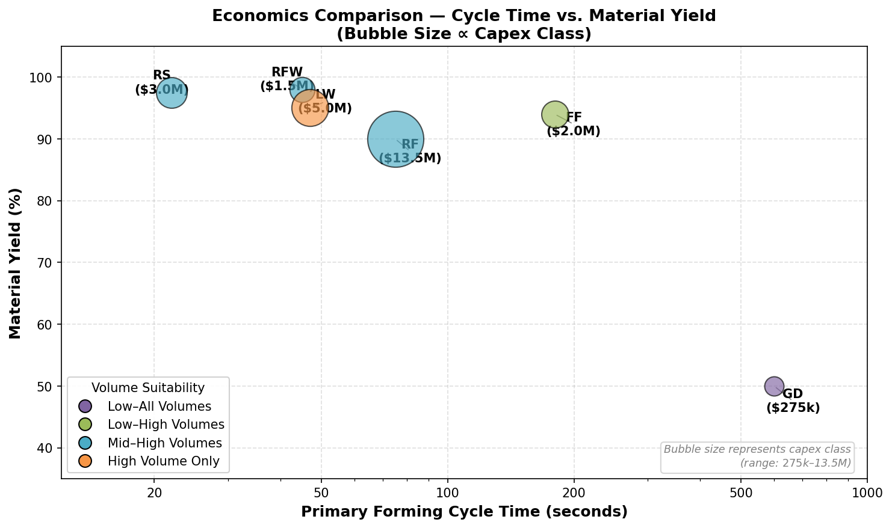

| Process | Material Yield (RP-13) | Cycle Time (primary) | Capex Class | Volume Suitability (RP-12) | Energy Intensity | Design Flexibility | Notes / Limitations |
|---------|----------------------|---------------------|------------|--------------------------|-----------------|-------------------|-------------------|
| GD | 40–60% (from solid) | 2–5 min (bore) + 10–30 min (full) | Low–Medium | All volumes (high per-part cost) | Medium | High (CNC program) | Lowest barrier to entry; worst yield |
| BTA | 40–60% (from solid) | Faster than GD (bore) | Low–Medium | All volumes | Medium | High (CNC program) | Preferred over GD above ∅20 mm |
| RF | 85–95% (from tube) | 30–120 s | Very High ($2M–$25M+) | Mid–High (>10k/yr) | High (hot/semi-hot); Medium (cold) | Low (tooling change) | >10M driveshafts/yr globally (GFM) |
| RS | 95–100% | 22 s (demonstrated) | High | Mid–High (>10k/yr) | Medium (cold, electric drive) | Moderate (NC + dies) | Fastest monolithic; ≥30% energy saving (E10) |
| FF | 90–98% | 1–5 min | High (CNC multi-roller) | Low–High | Medium (cold) | Moderate (mandrel change) | Wide volume range; preform supplier role |
| CP | ~100% | Continuous process | High (mill) | High (tube supply) | Medium | Low (fixed pass schedule) | Upstream tube supplier only |
| CD | ~95% | Continuous process | Medium (draw bench) | All volumes (tube supply) | Low–Medium | Low | Upstream tube supplier only |
| CWR | ~95% (estimated) | <30 s (estimated) | High (rolling mill) | High (if industrialized) | High (hot, 1,000 °C) | Low | TRL 3–4; not yet industrialized |
| RFW | ~98% (flash loss) | 45 s (2 welds) | Medium–High | Mid–High (250–300/hr) | Low (20% of fusion) | High (component mix) | 1,200+ machines installed globally |
| LW | ~95% (assembled) | 47 s (11 operations) | High (turnkey line) | High (500k/yr per machine) | Low–Medium | High (component mix) | Dominant serial route; all major OEMs |
| CC | ~70–80% (machining) | Minutes (casting) | Medium | Low–Medium | High (melting) | Low | Not suitable for motor shaft geometry |
| AM | <50% (WAAM) to ~95% (L-PBF near-net) | Hours per part | High (L-PBF) / Medium (WAAM) | Prototype–Low (<1k/yr) | High | Very High (digital) | No automotive shaft demonstrator |

## 3.3 Secondary Processing Map

No primary forming process delivers a finished NEV motor shaft without secondary operations. The extent and nature of these post-forming steps determine total manufacturing cost, lead time, and quality attainment for each route. This section maps the required secondary operations for each primary process against the RP-4 through RP-8 finish specifications.

### 3.3.1 Gun Drilling / BTA from Solid Bar (GD, BTA)

The subtractive route starts from solid bar and requires the most extensive secondary processing chain. After bore drilling, the full external geometry must be created by CNC turning (all diameters, shoulders, and transitions). Heat treatment follows — either through-hardening (Q&T to 20–40 HRC per RP-7) or selective induction hardening of bearing seats and spline roots to 58–62 HRC. Gear teeth are cut by hobbing or shaping. Grinding of bearing seats and seal surfaces achieves the RP-6 specification of Ra 0.4–0.8 µm and IT5–IT6 dimensional tolerance (RP-4). Shot peening of fatigue-critical zones is optional but recommended for high-speed applications (RP-9). Inspection includes ultrasonic testing (UT) of the bore for drilling defects, coordinate measuring machine (CMM) dimensional verification, and dynamic balancing to ISO 1940 G2.5 or better (RP-8). In this route, secondary processing accounts for the majority of total manufacturing cost and cycle time.

### 3.3.2 Radial Forging from Tube (RF)

Radial forging produces a near-net-shape outer profile and net-shape inner contour, substantially reducing the secondary machining envelope. CNC turning removes 0.5–2.0 mm of stock on the OD to reach final dimensions; the inner bore may require no machining if cold-forged to tolerance. Heat treatment depends on the forging regime: semi-hot forging at 700–850 °C may require normalizing or Q&T, while cold forging develops sufficient hardness through work hardening for some applications — though bearing seats still require induction hardening to 58–62 HRC (RP-7). Grinding targets bearing seats to IT6–IT7 and Ra 0.4–0.8 µm. Shot peening of fatigue zones is recommended. UT inspection verifies bore-wall uniformity and absence of internal forging defects. The reduced machining allowance relative to GD translates to lower tooling wear, shorter cycle time, and less chip disposal [GFM](https://www.gfm.at/products/radial-forging-automotive/?lang=en "GFM near-net-shape").

### 3.3.3 Rotary Swaging from Seamless Tube (RS)

Rotary swaging offers the smallest secondary processing footprint among all primary forming routes. Felss characterizes cold-swaged surfaces as potentially "ready for installation," with surface finish Ra < 0.1 µm already comparable to grinding [Felss Tube 2026](https://www.wire.de/vis-content/event-tube2026/exh-tube2026.3043336/Tube-2026-Felss-Group-GmbH-Paper-tube2026.3043336-FZ2ApYTISNirA9GZOxe72g.pdf "Felss ready-for-installation"). Machining allowance is minimal (0.1–0.5 mm) or absent on most surfaces. Heat treatment may be unnecessary for the base structure because cold work hardening provides a 30% fatigue strength increase, though induction hardening of bearing seats to 58–62 HRC remains standard practice for RP-7 compliance. Grinding is required only where IT6 or tighter tolerance is specified on bearing seats (RP-4). Gear teeth, if not formed during swaging via profiled mandrel, require separate hobbing. Inspection follows the standard UT + CMM + dynamic balancing sequence.

### 3.3.4 Flow Forming (FF)

Flow-formed tubes require 0.2–1.0 mm machining allowance on functional surfaces. Stress-relief annealing or aging heat treatment is recommended after heavy cold work (>60% wall reduction) to stabilize the microstructure and manage residual-stress distribution [ATI](https://www.atimaterials.com/markets/energy/Documents/Flowform_Datasheet.pdf "ATI Flowform HT note"). OD grinding achieves final tolerance and finish on bearing seats. UT wall-thickness measurement verifies uniformity. When FF serves as a preform for subsequent radial forging, the secondary processing requirements shift to the RF chain described in Section 3.3.2.

### 3.3.5 Laser-Welded Assembled Shaft (LW)

EMAG documents the complete process chain for assembled rotor shafts as an integrated 11-operation sequence: OP10/20 soft turning of both components (4× VLC machines), OP30 laser cleaning of weld interfaces (LC 4-2), OP40 laser welding (ELC 6 with EC Seam quality monitoring), OP50 induction hardening (MIND) and hard turning (VTC 200 CD), OP60 interior geometry machining, OP70/80 gear cutting (HLC 150 H), OP90/100 grinding (HG 310), followed by cleaning, EC Seam weld inspection, UT, CMM, and dynamic balancing [EMAG](https://www.emag.com/industries-solutions/workpieces/assembled-rotor-shaft-electric-motor/ "EMAG OP sequence"). This constitutes the most extensively documented process chain in the industry, with all operations integrated into a single automated line. The 47-second total cycle time includes all secondary processing — a critical distinction that positions LW as the most industrially mature end-to-end solution for high-volume production.

### 3.3.6 Rotary Friction Welding — Assembled Shaft (RFW)

After friction welding, flash at the weld interface is removed on-machine. CNC turning and grinding of functional surfaces follow. Heat treatment is applied per the material specification of each welded component. Weld-quality monitoring occurs in-process (torque, upset distance, and RPM are recorded during each weld cycle), and post-process inspection includes UT or radiographic examination of the weld zone [MTI](https://www.mtiwelding.com/wp-content/uploads/2015/11/mti-friction-welding-technology-brochure.pdf "MTI weld monitoring").

### 3.3.7 Hot Extrusion (HE)

Hot-extruded profiles require 2–5 mm machining allowance on all surfaces due to oxide scale and dimensional scatter inherent in high-temperature processing. Normalizing or Q&T heat treatment is required. All functional surfaces must be ground. UT inspection verifies the absence of internal defects. The extensive secondary processing requirement represents a significant disadvantage relative to near-net-shape forming routes.

### 3.3.8 Summary Table — Secondary Processing Map

The heatmap below distills the secondary processing requirements into a color-coded intensity matrix. Rotary swaging (RS) stands out with the lightest post-forming burden — minimal or no machining, optional heat treatment, and grinding limited to bearing seats. The laser-welded assembled route (LW) registers "extensive" across multiple categories, but this is mitigated by the fact that all operations are integrated into a single automated line with a 47-second total cycle.

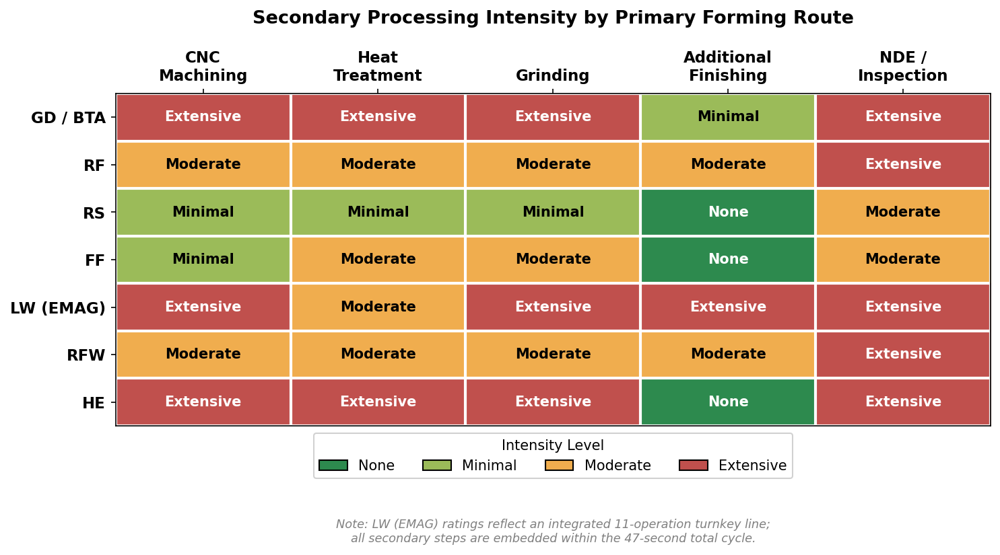

| Process | Machining Allowance | Heat Treatment | Grinding | Additional Finishing | NDE / Inspection |
|---------|-------------------|---------------|---------|---------------------|-----------------|
| GD/BTA | Full OD turning required | Q&T or induction hardening | Bearing seats, seals (IT5–IT6, Ra 0.4–0.8 µm) | Shot peening (optional) | UT bore, CMM, dynamic balancing |
| RF | 0.5–2.0 mm OD; ID may be net-shape | Depends on forging regime; induction for bearing seats | Bearing seats to IT6–IT7 | Shot peening (recommended) | UT bore wall, CMM, dynamic balancing |
| RS | 0.1–0.5 mm or none | May skip bulk HT (cold-work hardened); induction for bearing seats | Only if IT6 required on bearing seats | Minimal | UT, CMM, dynamic balancing |
| FF | 0.2–1.0 mm | Stress relief / aging after heavy cold work; induction for bearing seats | OD functional surfaces | — | UT wall measurement, CMM, dynamic balancing |
| LW | Integrated in 11-OP chain | Induction hardening (MIND) | Integrated (HG 310) | Interior geometry machining, gear cutting | EC Seam, UT weld, CMM, dynamic balancing |
| RFW | Full turning/grinding of functional surfaces | Per component material spec | Functional surfaces | Flash removal (on-machine) | In-process monitoring, UT/radiographic, CMM, balancing |
| HE | 2–5 mm all surfaces | Normalizing or Q&T | All functional surfaces | — | UT internal, CMM, dynamic balancing |

## 3.4 Cross-Criteria Synthesis

The two comparison matrices and the secondary processing map, when read together, reveal several structural trade-offs that govern process selection for NEV hollow motor shafts.

**Material efficiency inversely correlates with process accessibility.** GD/BTA achieves the worst material yield (40–60%) but requires only standard CNC equipment available in any contract machine shop. RS and RF achieve 85–100% material yield yet demand specialized capital equipment costing $2M or more. This trade-off defines the volume threshold at which forming-based routes become economically superior: material savings and reduced secondary processing must amortize the higher capex over a sufficient number of parts.

**Surface finish and tolerance from primary forming determine the secondary processing burden.** RS achieves Ra < 0.1 µm and IT7 on the bore — potentially eliminating finish grinding on non-bearing surfaces and reducing the total process chain to primary forming, induction hardening, and final inspection. RF achieves Ra 0.4–3.2 µm and ±0.025 mm bore tolerance, requiring moderate machining and grinding. GD achieves excellent bore precision (±0.008 mm) but demands full external machining. LW sidesteps the trade-off entirely by embedding all secondary processing into a single automated line with a 47-second total cycle time.

**Grain-flow and residual-stress benefits separate forming routes from subtractive and joining routes.** RF and RS produce continuous grain flow, pore closure, and compressive surface residual stress — directly improving fatigue performance under the high-cycle torsional loads encountered at 20,000–30,000+ rpm (RP-9, RP-10, RP-15). GD/BTA severs grain flow. LW and RFW introduce a weld zone with a distinct microstructure and heat-affected zone. No published fatigue-life comparison exists across all routes for identical shaft geometry — a critical gap. The Shimadzu/Tsuzuki application note confirms that radial-forged specimens from Tsuzuki Manufacturing survived 1 million cycles at 200 Nm torque amplitude without failure (maximum torque 802.5 Nm, yield torque 352.5 Nm), but comparable data for LW, RS, and RFW under the same loading conditions are not available [Shimadzu](https://www.shimadzu.com/an/sites/shimadzu.com.an/files/pim/pim_document_file/applications/application_note/22205/an_01-00620-en.pdf "Shimadzu/Tsuzuki fatigue test 2023").

**Multi-material capability is exclusive to assembled routes.** Only LW and RFW can combine different steel grades within a single shaft — for example, placing 20MnCr5 at the spline/gear end and a lower-alloy grade for the tube section (RP-14). Monolithic routes (GD, RF, RS, FF) are restricted to a single material grade throughout. This constraint becomes consequential when cost-optimization requirements differ between the high-stress gearing interface and the lower-stress tube section.

**Oil-cooling channel complexity varies by route.** LW offers the greatest design freedom for internal cooling geometry, as pre-machined or pre-formed components can incorporate features that are geometrically impossible to create in a monolithic part. All hollow routes provide a simple through-bore for axial coolant flow (RP-11), but only LW readily accommodates complex ducted, multi-passage, or radially branched cooling architectures.

**The absence of cross-route fatigue data constitutes the most significant gap in this comparison.** Route recommendations in Chapter 4 are therefore grounded in process capability, material yield, cycle time, industrial maturity, and quality parameters — rather than in validated fatigue equivalence across all forming methods.

# 第4章 Integrated Manufacturing Route Assessment for NEV Hollow Motor Shafts

The preceding chapters catalogued individual hollow-shaft forming technologies (Chapter 2) and compared them across geometry, quality, and economics criteria (Chapter 3). This chapter synthesizes those findings into actionable manufacturing route recommendations. It identifies the best-fit primary forming processes for three production-volume tiers, lays out representative end-to-end process chains from raw material to inspected shaft, analyzes the sensitivity parameters that shift the optimal route, and assesses the technology-readiness and supply-chain maturity of each recommended path. An important caveat applies throughout: route recommendations are grounded in process capability, material yield, cycle time, and industrial maturity — not in validated cross-route fatigue equivalence, which remains an unresolved gap (see Section 3.4).

## 4.1 Volume-Tiered Route Recommendations

Production volume is the single strongest determinant of the economically optimal manufacturing route. The capital intensity of forming equipment creates a breakeven threshold below which subtractive methods remain competitive despite inferior material yield. Three tiers — low, mid, and high — capture the principal decision boundaries.

### 4.1.1 Low Volume and Prototype (< 10,000 shafts/year)

**Recommended primary route: Gun Drilling from Solid Bar (Route A — GD)**

At volumes below approximately 10,000 shafts per year, gun drilling from solid bar remains the most accessible option. The route requires no dedicated forming tooling: any machine shop equipped with CNC turning centers and gun-drilling capability can produce a hollow motor shaft. AmTech International confirms this route in production for an AISI 4140 rotor shaft (OD 64 mm, length 305 mm), using gun drilling as the bore-creation operation followed by CNC turning, hobbing, grinding, and heat treatment [AmTech OEM](https://www.amtechinternational.com/project/ev-motor-shaft/ "EV Motor Shaft — AmTech").

The trade-offs are well characterized. Material yield is 40–60% — the lowest of any route — because the entire bore volume is converted to swarf. Total cycle time ranges from 10 to 30 minutes per shaft across the full machining chain. The bore surface retains a machined microstructure with no grain-flow or work-hardening benefit. All stepped features, bearing seats, splines, and diameter transitions must be created by separate CNC operations.

Three primary advantages justify the route at low volume: (1) minimal capital expenditure ($50k–$500k for gun-drilling equipment); (2) maximum design flexibility, as geometry changes require only CNC program modification, enabling rapid iteration during development; and (3) universal availability of equipment and supplier capacity.

**Alternative: Flow Forming (FF)** offers a viable low-volume alternative with aerospace heritage, delivering near-net-shape output with 90–98% material yield and work-hardened mechanical properties (UTS up to 1,103 MPa at 60% reduction) [ATI](https://www.atimaterials.com/markets/energy/Documents/Flowform_Datasheet.pdf "ATI Flowform specs"); [PMF Industries](https://www.pmfind.com/news/flowforming-yields-precision-accuracy-and-keeps-an-operation-competitive "Flowforming properties"). FF is economically viable even at small lot sizes, though it produces constant or tapered cross-sections only; multi-stepped profiles require secondary machining or subsequent radial forging.

### 4.1.2 Mid Volume (10,000–100,000 shafts/year)

**Recommended primary routes: Radial Forging (Route C — RF) and Rotary Swaging (Route D — RS)**

At annual volumes exceeding approximately 10,000 shafts, the superior material yield (85–100%), shorter cycle times, and metallurgical advantages of forming-based routes amortize their higher capital expenditure.

GFM's ESA-series radial forging machines target EV rotor shafts explicitly, delivering 90–440 tons of forging force at up to 1,450 strokes/min across cold, semi-hot, and hot regimes [GFM Tube 2026](https://www.wire.de/vis-content/event-tube2026/exh-tube2026.3048758/Tube-2026-GFM-GmbH-Paper-tube2026.3048758-RHn6chgbSQyspVyFD9vihQ.pdf "GFM ESA-series — Tube 2026"). Radial forging produces net-shape inner contours, near-net-shape outer profiles, continuous grain flow with pore closure, and compressive residual surface stress — directly improving fatigue performance at high rotational speeds. Material yield reaches 85–95%, representing 30–50% material savings versus machining from solid. Estimated cycle time is 30–120 seconds depending on profile complexity and forming temperature.

Felss demonstrates rotary swaging of an EV rotor shaft from seamless tube (60 × 6.0 mm) in 22 seconds, achieving IT7 bore tolerance over mandrel, surface finish Ra < 0.1 µm (comparable to grinding), and a 30% fatigue strength increase through cold work hardening [Felss Tube 2026](https://www.wire.de/vis-content/event-tube2026/exh-tube2026.3043336/Tube-2026-Felss-Group-GmbH-Paper-tube2026.3043336-FZ2ApYTISNirA9GZOxe72g.pdf "Felss rotor shaft — Tube 2026"). The Generation E10 machine, launched in March 2026, is purpose-designed for rotor shafts: 6,000 kN force, 6-jaw configuration, up to 50 Hz stroke frequency, 50% higher runout accuracy, and ≥30% energy reduction through a fully electric drive [The Fabricator](https://www.thefabricator.com/tubepipejournal/product/tubepipefabrication/modular-rotary-swaging-machine-is-fully-electric "Felss E10 — March 2026"). Material yield is 95–100%, characterized as "no waste of material."

**Also viable: Rotary Friction Welding (Route E — RFW)** at 250–300 assemblies per hour (approximately 45 seconds per two-weld assembly), with over 1,200 KUKA/Thompson machines installed globally. RFW is particularly attractive when the design calls for dissimilar-metal construction — joining a high-alloy steel spline end to a lower-alloy tube section [MTI](https://www.mtiwelding.com/wp-content/uploads/2015/11/mti-friction-welding-technology-brochure.pdf "MTI"); [KUKA](https://www.kuka.com/en-us/products/production-machines/rotary-friction-welding-machines "KUKA").

### 4.1.3 High Volume (> 100,000 shafts/year)

**Recommended primary route: Laser-Welded Assembled Shaft (Route B — LW)**

For volumes exceeding 100,000 shafts per year — the production scale of major NEV OEMs — the laser-welded assembled rotor shaft on EMAG ELC 6 lines represents the most widely adopted serial-production route. A single ELC 6 machine produces up to 500,000 shafts per year, with a complete 11-operation cycle time of approximately 47 seconds encompassing soft turning, laser cleaning, laser welding, induction hardening, finish turning, gear cutting, and grinding [EMAG](https://www.emag.com/industries-solutions/workpieces/rotor-shaft-electric-motor/ "EMAG rotor shaft line"). EMAG states that "all leading automotive manufacturers" use ELC systems for rotor shaft production [EMAG LaserTec](https://www.engineering.com/manufacturing-rotor-shafts-at-the-speed-of-light-with-laser-welding/ "EMAG rotor shaft laser welding").

Linamar's Hungary facility targets 430,000 parts per type per year on EMAG lines [EMAG/Linamar](https://www.emag.com/blog/en/linamar-relies-on-emag-for-e-mobility/ "Linamar 430k/yr target"). thyssenkrupp Dynamic Components, which pioneered the assembled rotor shaft in volume production for the VW e-UP in 2013, now operates at 10 global locations — including Dalian and Changzhou (China), the USA, Mexico, Brazil, and Hungary — and planned production of approximately 1.5 million rotor shafts in fiscal year 2023/2024 [thyssenkrupp Dynamic Components](https://www.thyssenkrupp-automotive-technology.com/en/press-detail/thyssenkrupp-dynamic-components-celebrates-10-years-of-rotor-shafts-for-electric-motors-and-continues-its-global-expansion-strategy-229318 "thyssenkrupp 10 years of rotor shafts").

The assembled route's advantages at high volume are fourfold: (1) the lowest per-part amortized cost, driven by the 47-second integrated cycle and 500,000-shaft annual capacity per line; (2) multi-material design — higher-alloy steel at the gear interface, lower-alloy for the tube section — optimizing material cost; (3) design freedom for complex internal cooling channels that cannot be produced in a monolithic part; and (4) full turnkey automation from EMAG, integrating VLC turning, LC cleaning, ELC welding, MIND induction hardening, VTC hard turning, HLC gear cutting, and HG grinding into a single production line.

**Also viable at high volume: Radial Forging (RF)** — GFM reports over 200 machines installed in the automotive industry, producing more than 10 million driveshafts per year globally [GFM](https://www.gfm.at/products/radial-forging-automotive/?lang=en "GFM 10M+ driveshafts/yr"). For applications where monolithic construction and continuous grain flow are prioritized over multi-material flexibility, radial forging at high volume is a proven alternative.

## 4.2 End-to-End Process Chains

Each recommended route involves a defined sequence of operations from raw material receipt through final inspection. The following six process chains represent the principal manufacturing paths, ordered by ascending production-volume target. Process short codes and tolerance designations follow the conventions established in Chapters 1–3.

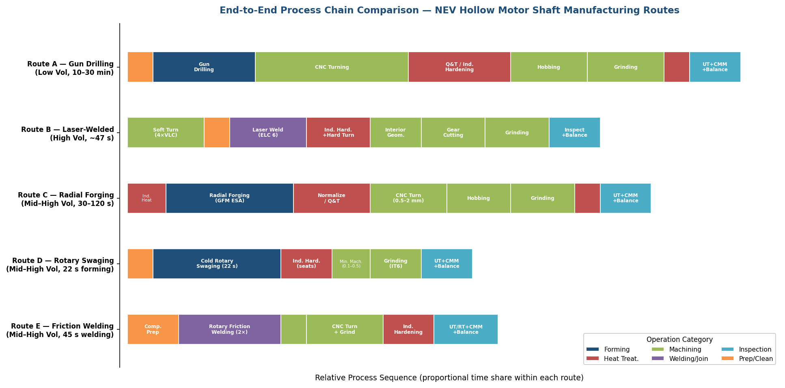

*Figure 4.1 — Comparative timeline of operations for Routes A–E. Route D (Rotary Swaging) exhibits the shortest total process chain; Route A (Gun Drilling) the longest, with machining dominating the time share.*

### 4.2.1 Route A — Gun Drilling from Solid Bar (Low Volume)

**Input**: Solid round bar, typically 42CrMo4 (AISI 4140) in quenched-and-tempered or normalized condition, OD oversized by 3–5 mm.

**Process chain**:

1. **Facing and centering** — CNC lathe; establish datum faces and center drill for gun-drilling alignment.
2. **Gun drilling** — Dedicated gun-drilling machine or lathe-mounted system; bore ∅10–30 mm, L/D typically 10:1–15:1 for NEV shafts; cycle time 2–5 minutes; bore tolerance ±0.008 mm, bore Ra 0.4–0.5 µm [AMG](https://www.amgundrilling.com/technical-gundrilling-information.html "Gun drilling specifications").
3. **CNC turning** — Full external geometry: bearing seats, diameter transitions, shoulders, and lamination-stack mounting surfaces; IT8–IT9 for general OD, IT6 for bearing seats after grinding.
4. **Heat treatment** — Quenching and tempering (Q&T) to 20–40 HRC through section, or selective induction hardening of bearing seats and spline roots to 58–62 HRC.
5. **Hobbing / gear shaping** — Spline or gear teeth at output end.
6. **Grinding** — Bearing seats and seal surfaces to IT5–IT6 and Ra 0.4–0.8 µm; centerless or cylindrical grinding.
7. **Shot peening** — Optional; recommended for high-speed applications to induce compressive surface residual stress.
8. **Inspection** — Ultrasonic testing of bore for drilling defects; CMM dimensional verification; dynamic balancing to ISO 1940 G2.5 or better.

**Characteristics**: Material yield approximately 40–60%. Total cycle time 10–30 minutes. Maximum design flexibility. No grain-flow benefit in the bore region. Suitable for prototyping, design validation, and low-rate initial production [AmTech OEM](https://www.amtechinternational.com/project/ev-motor-shaft/ "EV Motor Shaft — AmTech").

### 4.2.2 Route B — Laser-Welded Assembled Shaft (High Volume, Most Widely Adopted)

**Input**: Two or three near-net-shape components — typically a thin-walled tube section (lower-alloy steel) and one or two flanged/geared end pieces (case-hardening steel such as 20MnCr5) — individually forged or machined before assembly.

**Process chain (EMAG turnkey line)**:

1. **OP10/20 Soft turning** — Four VLC 200 vertical lathes; turn both components to pre-weld dimensions.
2. **OP30 Laser cleaning** — LC 4-2 machine; remove contaminants from weld interfaces to ensure joint integrity.
3. **OP40 Laser welding** — ELC 6 machine; circumferential butt welds; EC Seam position control performs 20 measurements per circumference for real-time quality assurance [EMAG](https://www.emag.com/industries-solutions/workpieces/assembled-rotor-shaft-electric-motor/ "EMAG Assembled Rotor Shaft").
4. **OP50 Induction hardening + hard turning** — MIND induction hardener for bearing seats (58–62 HRC) followed by VTC 200 CD hard turning for dimensional correction.
5. **OP60 Interior geometry** — Machining of internal features (oil passages, cross-holes for radial coolant distribution).
6. **OP70/80 Gear cutting** — HLC 150 H hobbing machine; spline and gear teeth at the output end.
7. **OP90/100 Grinding** — HG 310 grinder; bearing seats and seal surfaces to IT5–IT6, Ra 0.4–0.8 µm.
8. **Cleaning and inspection** — Parts washing; EC Seam weld inspection; ultrasonic testing of the weld zone; CMM dimensional verification; dynamic balancing.

**Characteristics**: Approximately 47 seconds total cycle time across all operations. Up to 500,000 shafts/year per ELC 6 line (approximately 360,000 at realistic OEE). Multi-material construction optimizes cost and performance. Complex internal cooling channels are achievable. This is the dominant serial-production route — thyssenkrupp Dynamic Components has produced assembled rotor shafts since 2013 across 10 global locations [thyssenkrupp](https://www.thyssenkrupp-automotive-technology.com/en/press-detail/thyssenkrupp-dynamic-components-celebrates-10-years-of-rotor-shafts-for-electric-motors-and-continues-its-global-expansion-strategy-229318 "thyssenkrupp 10 years of rotor shafts"); [Production Machining](https://www.productionmachining.com/articles/automated-high-production-welding-of-ev-rotor-shafts "EMAG welding — Production Machining 2024").

### 4.2.3 Route C — Radial Forging from Tube or Pre-Pierced Billet (Mid–High Volume, Monolithic)

**Input**: Pre-pierced billet or flow-formed tube blank, 42CrMo4 or 20MnCr5, heated to 700–850 °C for semi-hot forging.

**Process chain**:

1. **Heating** — Induction heating to 700–850 °C (semi-hot regime); cold or hot alternatives selected per alloy and geometry.
2. **Radial forging** — GFM ESA-series or SMS SMX machine; four radially oscillating hammers with profiled mandrel; 30–120 seconds; net-shape inner contour, near-net-shape outer profile; continuous grain flow with pore closure [GFM](https://www.gfm.at/products/radial-forging-automotive/?lang=en "Radial Forging Automotive").
3. **Heat treatment** — Normalizing or Q&T after semi-hot forging; induction hardening of bearing seats only if the cold-forged base structure provides sufficient bulk hardness.
4. **CNC turning** — Remove 0.5–2.0 mm stock on OD to reach final dimensions; inner bore may require no machining if cold-forged to tolerance (±0.025 mm).
5. **Hobbing** — Spline/gear teeth at the output end, unless already formed during forging via profiled mandrel (internal splines can be produced in-process).
6. **Grinding** — Bearing seats to IT6–IT7 and Ra 0.4–0.8 µm.
7. **Shot peening** — Fatigue-critical zones; complements compressive residual stress imparted during forming.
8. **Inspection** — Ultrasonic testing of bore wall uniformity; CMM dimensional verification; dynamic balancing.

**Characteristics**: Material yield 85–95%. Torsional fatigue performance has been confirmed by Tsuzuki Manufacturing (Nagano, Japan) on actual specimens: maximum torque 802.5 Nm, yield torque 352.5 Nm, unbroken at 1 million cycles at 200 Nm torque amplitude [Shimadzu](https://www.shimadzu.com/an/sites/shimadzu.com.an/files/pim/pim_document_file/applications/application_note/22205/an_01-00620-en.pdf "Shimadzu/Tsuzuki fatigue test 2023"). Capital expenditure is substantial ($2M–$25M+), justified at volumes exceeding approximately 10,000–50,000 shafts/year.

### 4.2.4 Route D — Rotary Swaging from Seamless Tube (Mid–High Volume, Monolithic)

**Input**: Seamless cold-drawn or pilgered tube, typically 60 × 6.0 mm (OD × wall thickness), 42CrMo4 or equivalent.

**Process chain**:

1. **Tube preparation** — Cut to length; optional pre-annealing if tube supplier hardness exceeds the swaging machine's input limits.
2. **Cold rotary swaging with mandrel** — Felss HA-series or Generation E10; stepped profile with ball closure; 22 seconds demonstrated for EV rotor shaft geometry; IT7 bore tolerance, Ra < 0.1 µm OD finish, 30% fatigue strength increase via cold work hardening [Felss Tube 2026](https://www.wire.de/vis-content/event-tube2026/exh-tube2026.3043336/Tube-2026-Felss-Group-GmbH-Paper-tube2026.3043336-FZ2ApYTISNirA9GZOxe72g.pdf "Felss rotor shaft — Tube 2026").
3. **Induction hardening** — Bearing seats to 58–62 HRC; bulk heat treatment may be unnecessary because cold work hardening provides sufficient fatigue resistance for non-contact zones.
4. **Minimal machining** — 0.1–0.5 mm stock removal, or none — Felss describes cold-swaged surfaces as potentially "ready for installation."
5. **Grinding** — Only where IT6 or tighter tolerance is specified on bearing seats.
6. **Hobbing** — Only if gear teeth are not formed during swaging via profiled mandrel.
7. **Inspection** — Ultrasonic testing; CMM dimensional verification; dynamic balancing.

**Characteristics**: Material yield 95–100%. Fastest monolithic forming cycle (22 seconds). Smallest secondary-processing footprint — the near-grinding surface finish from primary forming can potentially eliminate finish grinding on non-bearing surfaces. The Generation E10 machine, with ≥30% energy reduction and 50% higher runout accuracy, is specifically positioned for rotor shaft production [The Fabricator](https://www.thefabricator.com/tubepipejournal/product/tubepipefabrication/modular-rotary-swaging-machine-is-fully-electric "Felss E10 — March 2026").

### 4.2.5 Route E — Friction-Welded Assembled Shaft (Mid–High Volume)

**Input**: Two or three individually formed components — dissimilar metals possible (e.g., 20MnCr5 spline end joined to a lower-alloy tube section) — pre-machined to weld-ready dimensions.

**Process chain**:

1. **Component preparation** — CNC turning or forging of individual shaft sections to weld-interface dimensions.
2. **Rotary friction welding** — KUKA/Thompson or MTI machine; two welds per assembly, approximately 45 seconds total; full-section solid-state joint with a narrow heat-affected zone; weld-to-finished-length ±0.38 mm, angular orientation ±1° [MTI](https://www.mtiwelding.com/wp-content/uploads/2015/11/mti-friction-welding-technology-brochure.pdf "Friction Welding — MTI").
3. **Flash removal** — On-machine trimming of weld flash from the joint periphery.
4. **CNC turning / grinding** — Functional surfaces brought to final dimensions.
5. **Heat treatment** — Per component material specification; induction hardening of bearing seats.
6. **Inspection** — In-process weld monitoring (torque, upset, RPM); ultrasonic or radiographic examination of the weld zone; CMM dimensional verification; dynamic balancing.

**Characteristics**: Material yield approximately 98% (flash loss only). Throughput of 250–300 assemblies per hour. Energy consumption approximately 20% of conventional fusion welding. Over 1,200 machines installed in 44+ countries. The dissimilar-metal joining capability is a distinctive advantage shared only with the laser-welded (LW) route [KUKA](https://www.kuka.com/en-us/products/production-machines/rotary-friction-welding-machines "Rotary Friction Welding — KUKA").

### 4.2.6 Route F — Cold-Formed Modular Shaft with Guided Cooling (Emerging)

**Input**: 20MnCr5 tubes; tube-in-tube construction with cold-formed inner cooling channels.

**Process chain**: Cold forming of inner-channel tube → assembly with outer tube → cold forming of outer profile → heat treatment → finish machining → inspection.

**Characteristics**: This route remains at the research stage. Goetz et al. (2025) demonstrated a tooth-guided liquid-cooling shaft that achieved 110% higher cooling efficiency at low RPM compared with conventional hollow-shaft cooling, using 20MnCr5 with shaft dimensions of 340–359 mm length, 11 mm inlet bore, and 52–98 mm OD [Goetz et al., arXiv 2510.22029](https://arxiv.org/html/2510.22029v1 "Cold-formed modular cooling shaft 2025"). The route is not viable for serial production at present, but it represents a potential path for next-generation designs requiring advanced thermal management beyond simple through-bore cooling.

## 4.3 Sensitivity Analysis — Parameters That Shift the Optimal Route

The volume-tiered recommendations in Section 4.1 represent a default hierarchy. In practice, several application-specific parameters can shift the optimal route. This section identifies the most influential sensitivity factors and their directional effects.

### 4.3.1 Bore Tolerance Tightening

Tighter bore tolerance favors cold-forming or subtractive processes. Gun drilling achieves bore ±0.008 mm — the tightest of any primary bore-creation method [AMG](https://www.amgundrilling.com/technical-gundrilling-information.html "GD bore tolerance"). Rotary swaging over mandrel reaches IT7 (approximately ±0.01–0.05 mm depending on bore diameter) [Felss Tube 2026](https://www.wire.de/vis-content/event-tube2026/exh-tube2026.3043336/Tube-2026-Felss-Group-GmbH-Paper-tube2026.3043336-FZ2ApYTISNirA9GZOxe72g.pdf "RS ID tolerance"). Radial forging in cold regime delivers inner ∅ ±0.025 mm. Hot or semi-hot radial forging produces wider as-forged tolerances that require secondary boring to meet tight bore specifications. The implication: if the oil-cooling bore demands precision approaching ±0.01 mm, the route shifts toward cold rotary swaging, cold radial forging, or subtractive finishing after forming.

### 4.3.2 Wall Thickness Below 5 mm

Thin-wall designs (< 5 mm) favor flow forming and rotary swaging. Flow forming achieves minimum wall thickness of 0.20 mm — far beyond the practical range of any competing forming process [ATI](https://www.atimaterials.com/markets/energy/Documents/Flowform_Datasheet.pdf "ATI min wall"). Rotary swaging produces variable wall thickness along the shaft axis, readily accommodating localized thin sections. Radial forging is constrained at thin walls by mandrel rigidity — below approximately 3–5 mm, mandrel deflection under forging loads compromises dimensional accuracy. Gun drilling from solid bar becomes increasingly wasteful as bore diameter grows relative to OD. Assembled routes (LW, RFW) accommodate thin-walled tube sections without forming constraints on wall thickness, since the tube is a pre-made input rather than a formed output.

### 4.3.3 Integrated Splines and Internal Features

The ability to form splines or internal teeth during the primary forming step eliminates separate hobbing — reducing cycle time, tooling cost, and dimensional error from re-fixturing. Radial forging with a profiled mandrel produces internal splines and bottle-shaped contours [GFM](https://www.gfm.at/products/radial-forging-automotive/?lang=en "GFM internal splines"). Rotary swaging with a profiled mandrel forms internal features during the swaging stroke. Flow forming in forward mode generates internal teeth via profiled mandrels [Leifeld](https://leifeldms.com/en/flow-forming.html "FF internal teeth"). Gun drilling and the assembled routes (LW, RFW) always require separate hobbing. When a shaft design specifies complex internal spline geometry, monolithic forming routes (RF, RS) offer a measurable process-chain advantage.

### 4.3.4 Dual-Material / Bimetallic Construction

Assembled routes (LW, RFW) hold an exclusive advantage for dual-material designs. thyssenkrupp explicitly designs assembled rotor shafts with higher-alloy, case-hardening steel (e.g., 20MnCr5) at the gear interface and lower-alloy, lower-cost steel for the tube section [thyssenkrupp](https://www.thyssenkrupp.com/en/stories/automotive-and-new-mobility/the-perfect-rotor-shaft "Bimetallic shaft advantages"). Monolithic routes (GD, RF, RS, FF) are inherently restricted to a single material grade. The cost optimization from dual-material construction can be substantial when the gearing end requires expensive case-hardening steel while the central tube section can use a commodity grade. This parameter strongly favors Route B (LW) or Route E (RFW) irrespective of volume.

### 4.3.5 Oil-Cooling Channel Complexity

Simple straight-through bores are achievable by any hollow-shaft route. Complex ducted, multi-passage, or radially branched cooling architectures strongly favor the assembled route. EMAG notes that laser welding enables "geometries that cannot be machined in a solid part" — pre-formed or pre-machined internal features on individual components are sealed during welding [EMAG](https://www.emag.com/industries-solutions/workpieces/assembled-rotor-shaft-electric-motor/ "EMAG internal cooling"). Goetz et al.'s cold-formed modular approach (Route F) represents a future alternative for advanced cooling, but it remains at research stage. For current production designs requiring more than a simple axial bore, the laser-welded assembled route is the only industrially proven option.

### 4.3.6 Rotor Speed Exceeding 30,000 rpm

Extreme rotational speeds tighten dynamic balance requirements to 50 mg (versus the 100 mg industry standard), demand tighter concentricity, and elevate fatigue requirements under centrifugal loading [CarNewsChina](https://carnewschina.com/2025/03/20/byd-releases-ground-breaking-30511-rpm-motor/ "BYD 50 mg balance"). These conditions theoretically favor monolithic forming routes (RF, RS), which produce compressive residual surface stress and refined grain flow — both of which improve high-cycle fatigue resistance — over assembled routes where the weld zone introduces a microstructural discontinuity.

However, no published study quantifies the speed threshold at which monolithic routes become necessary over assembled alternatives. thyssenkrupp and EMAG assembled shafts are in series production for high-performance NEV platforms, and weld-zone-induced imbalance remains a theoretical concern rather than a documented failure mode. The sensitivity of route choice to extreme speed is therefore directional rather than quantified: increasing speed shifts the balance of argument toward monolithic forming, but the magnitude of this shift remains unvalidated.

### 4.3.7 Summary of Sensitivity Effects

| Parameter | Favored Route Shift | Disadvantaged Routes |
|-----------|-------------------|---------------------|
| Bore tolerance < ±0.01 mm | GD, cold RS, cold RF | Hot RF, LW (unless post-machined) |
| Wall < 5 mm | FF, RS, LW (pre-made tube) | RF (mandrel limited) |
| Integrated splines | RF, RS (profiled mandrel) | GD, LW, RFW |
| Dual-material design | LW, RFW | All monolithic routes |
| Complex cooling channels | LW, Route F (future) | GD, RF, RS |
| Speed > 30,000 rpm | RF, RS (directional) | LW, RFW (theoretical concern) |

The decision flowchart below synthesizes the volume-tiered recommendations (Section 4.1) and the sensitivity analysis above into a navigable route-selection framework.

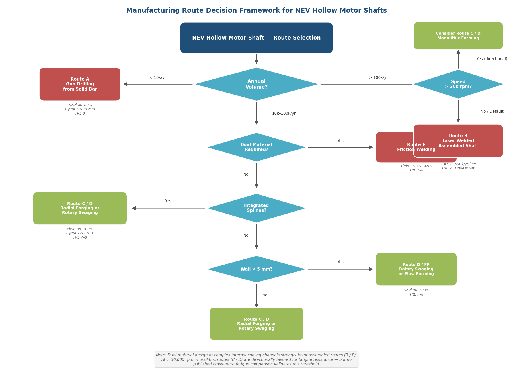

*Figure 4.2 — Decision-tree framework for NEV hollow motor shaft route selection. Key performance metrics (material yield, cycle time, TRL) are annotated at each endpoint. Dual-material or complex cooling requirements strongly favor assembled routes (B/E); ultra-high speed (>30,000 rpm) directionally favors monolithic routes (C/D).*

## 4.4 Risk and Maturity Assessment

Technology-readiness level (TRL) directly influences procurement risk, qualification timeline, and the willingness of Tier-1 suppliers and OEMs to commit capital. This section classifies each recommended route and notable developmental process by maturity tier.

### 4.4.1 Serial Production — TRL 9

Three routes are confirmed in automotive serial production at scale.

**Laser-welded assembled shaft (Route B)** is the most mature and most widely deployed route. thyssenkrupp Dynamic Components has produced assembled rotor shafts since 2013 — beginning with the VW e-UP — and now operates at 10 global locations including Dalian and Changzhou (China), with approximately 1.5 million shafts planned for fiscal year 2023/2024. Volvo production commenced at the Changzhou facility in 2023 [thyssenkrupp Dynamic Components](https://www.thyssenkrupp-automotive-technology.com/en/press-detail/thyssenkrupp-dynamic-components-celebrates-10-years-of-rotor-shafts-for-electric-motors-and-continues-its-global-expansion-strategy-229318 "thyssenkrupp 10 years of rotor shafts"). EMAG ELC systems are used by "all leading automotive manufacturers," and Linamar's Hungary facility targets 430,000 parts per type per year on EMAG lines [EMAG/Linamar](https://www.emag.com/blog/en/linamar-relies-on-emag-for-e-mobility/ "Linamar EMAG"). The assembled route carries the lowest adoption risk of any option.

**Gun drilling from solid bar (Route A)** is universally available and confirmed in production for EV motor shafts (AmTech, AISI 4140, OD 64 mm). It requires no qualification of novel forming processes and presents zero adoption risk.

**Radial forging for automotive driveshafts** has over 200 GFM machines installed globally, producing more than 10 million driveshafts per year. The process itself is TRL 9 for automotive shafts, though its application to EV rotor shafts specifically is at late-pilot stage (see Section 4.4.2) [GFM](https://www.gfm.at/products/radial-forging-automotive/?lang=en "GFM automotive installed base").

### 4.4.2 Late Pilot / Early Serial — TRL 7–8

**Radial forging for EV rotor shafts (Route C)**: Tsuzuki Manufacturing (Nagano, Japan) has operated a GFM radial forging machine since 2019 and has conducted torsional fatigue testing on actual rotor shaft specimens — maximum torque 802.5 Nm, yield torque 352.5 Nm, unbroken at 1 million cycles at 200 Nm [Shimadzu](https://www.shimadzu.com/an/sites/shimadzu.com.an/files/pim/pim_document_file/applications/application_note/22205/an_01-00620-en.pdf "Shimadzu/Tsuzuki fatigue test 2023"); [DMG MORI/Tsuzuki](https://en.dmgmori.com/news-and-media/customer-stories/tsuzuki-manufacturing-co-ltd "Tsuzuki"). GFM's ESA-series launch at Tube 2026 explicitly targets the EV rotor shaft segment. The transition from driveshaft to rotor shaft application is substantive — rotor shafts demand tighter balance (50 mg versus the standard 100 mg), smaller diameters with thinner walls, and integration with oil-cooling bores — but the underlying process technology is proven. Remaining qualification risk is moderate: the manufacturer must demonstrate consistent bore tolerance, wall uniformity, and fatigue performance across production lots for a specific OEM shaft geometry.

**Rotary swaging for EV rotor shafts (Route D)**: Felss has demonstrated the complete rotor shaft forming cycle (22 seconds, 60 × 6.0 mm tube, stepped profile with ball closure) and has launched the Generation E10 machine specifically for this application. Rotary swaging is in full serial production for other automotive shafts (camshafts, steering shafts, side shafts). Tian et al. (2025) validated rotary swaging for railway motor shafts, providing cross-domain evidence of applicability to high-torque rotating shafts [ScienceDirect / Tian et al.](https://www.sciencedirect.com/science/article/abs/pii/S0959652625003610 "Rotary swaging hollow motor shafts 2025"). Felss operates globally (Germany, Switzerland, USA, China, Slovakia), ensuring regional supply-chain access [Felss](https://felss.com/en/anwendung/rotor-shaft/ "Felss rotor shaft application"). Qualification risk is moderate: OEM serial references specifically for EV rotor shafts have not yet been made public.

**Friction welding for EV shafts (Route E)**: Rotary friction welding is in full serial production for automotive driveline components and has over 1,200 machines installed globally. Its application to EV rotor shaft assemblies specifically is not confirmed by published references, though the process is directly transferable. Qualification risk is low to moderate.

### 4.4.3 Developmental — TRL 4–6

**Cross-wedge rolling (CWR)**: Han et al. (2024) published FEM simulation of CWR for hollow motor shafts in 45 steel at 1,000 °C, achieving OD deviation < 0.8% [Han et al., Metal Forming 2024](https://www.researchgate.net/publication/384053671_Design_and_simulation_of_cross_wedge_rolling_process_for_hollow_motor_shaft "CWR for hollow motor shaft"). Zhu et al. (2025) conducted the first experimental CWR of a bimetallic hollow shaft (304SS/45 steel). No experimental trial has yet produced a complete motor shaft geometry with stepped profile, bearing seats, and splined ends. CWR is assessed at TRL 3–4; industrialization is unlikely before 2028–2029.

**Cold-formed modular shaft with guided cooling (Route F)** remains at research stage (Goetz et al., 2025). Cooling performance is promising, but no production-scale demonstration exists. TRL is approximately 3.

**Additive manufacturing for motor shafts**: No published demonstrator exists. BMW Group has adopted wire arc additive manufacturing (WAAM) for vehicle components and tools, but no application to motor shafts is documented. AM remains impractical for series shaft production in the 2026–2028 horizon.

### 4.4.4 Maturity Summary

| Route | TRL | Serial OEM Reference | Qualification Risk | Time to Production |
|-------|-----|---------------------|-------------------|-------------------|
| A — GD from solid | 9 | AmTech (AISI 4140 EV shaft) | None | Immediate |
| B — LW assembled | 9 | thyssenkrupp (VW, Volvo), Linamar | None | Immediate |
| C — RF monolithic | 7–8 | Tsuzuki (GFM, fatigue-tested) | Moderate | 6–18 months |
| D — RS monolithic | 7–8 | Felss demo + E10; other auto shafts in serial | Moderate | 6–18 months |
| E — RFW assembled | 7–8 | Full serial for other auto; EV shaft unconfirmed | Low–Moderate | 3–12 months |
| F — Cold-formed modular | ~3 | None | High | >3 years |
| CWR | 3–4 | None (simulation + lab only) | Very High | >3 years |

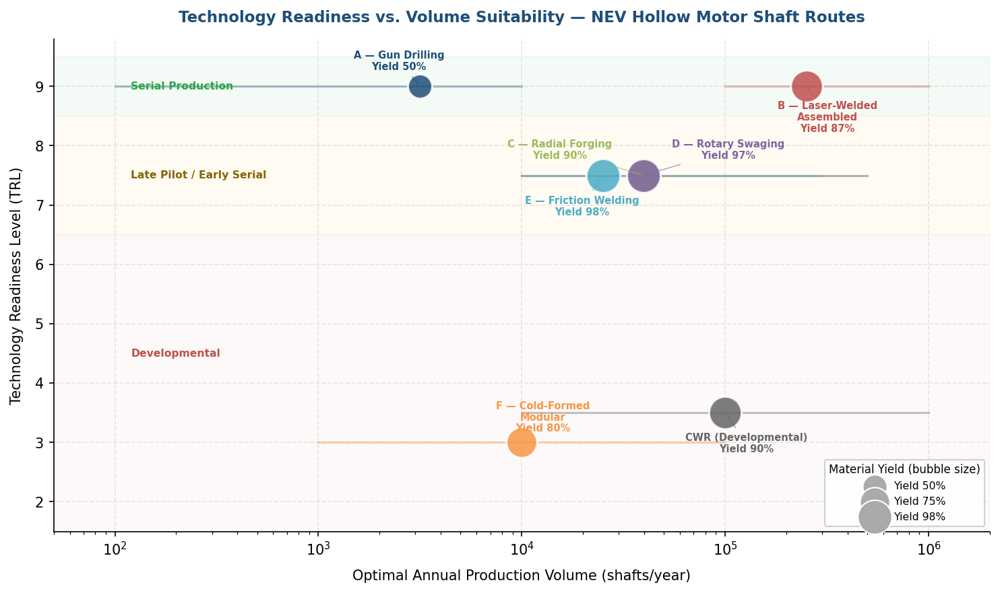

*Figure 4.3 — Bubble scatter plot positioning each manufacturing route by TRL (y-axis) and optimal annual production volume (x-axis, log scale). Bubble size represents material yield. Routes A and B occupy the TRL 9 / Serial Production zone; Routes C, D, and E cluster at TRL 7–8; Routes F and CWR remain in the Developmental zone.*

## 4.5 Supply Chain Structure and Equipment Ecosystem

The availability and geographic distribution of equipment suppliers and contract manufacturers shape the practical feasibility of each route. A concentrated supply base increases lead-time risk; a distributed base enables multi-sourcing and regional production — an increasingly important consideration as NEV supply chains regionalize.

### 4.5.1 Equipment Suppliers

- **Radial forging**: GFM (Steyr, Austria; with USA offices) and SMS Group (Düsseldorf, Germany; SMX platform) are the two principal suppliers. Both offer machines tailored to automotive shaft geometries. GFM's installed base exceeds 200 machines in the automotive sector.
- **Rotary swaging**: Felss Group (Königsbach-Stein, Germany) is the dominant supplier, with manufacturing facilities in Germany, Switzerland, the USA, China, and Slovakia. The Generation E10 is the latest platform for rotor shaft applications.
- **Laser welding / turnkey lines**: EMAG LaserTec (Heubach/Schwäbisch Gmünd, Germany) provides the ELC 6 and next-generation ELC 6i machines, as well as complete turnkey production lines integrating VLC, LC, MIND, VTC, HLC, and HG machines. EMAG's customer base spans "all leading automotive manufacturers."
- **Friction welding**: KUKA/Thompson (UK) and MTI (South Bend, Indiana, USA) are the two leading suppliers of rotary friction welding machines, with a combined installed base exceeding 1,200 machines in 44+ countries.
- **Deep-hole drilling**: UNISIG (Menomonee Falls, Wisconsin, USA) is a leading supplier of gun-drilling and BTA-drilling equipment.
- **Flow forming**: Leifeld Metal Spinning (Ahlen, Germany; part of the Nihon Spindle Group) supplies CNC flow-forming machines.

### 4.5.2 Tier-1 Contract Manufacturers and Integrators

- **thyssenkrupp Dynamic Components**: The largest confirmed producer of assembled rotor shafts. The division operates at 10 global locations (Germany, Hungary, Brazil, Mexico, USA, and China — Dalian and Changzhou), with planned production of approximately 1.5 million shafts in fiscal year 2023/2024. First OEM references include VW e-UP (2013) and Volvo Changzhou (2023). The CEO has stated a target for electric drive components to account for approximately 30% of divisional sales within five years [thyssenkrupp](https://www.thyssenkrupp-automotive-technology.com/en/press-detail/thyssenkrupp-dynamic-components-celebrates-10-years-of-rotor-shafts-for-electric-motors-and-continues-its-global-expansion-strategy-229318 "thyssenkrupp 10 years of rotor shafts").
- **Linamar Corporation**: Hungary facility targets 430,000 EV parts per type per year on EMAG production lines [EMAG/Linamar](https://www.emag.com/blog/en/linamar-relies-on-emag-for-e-mobility/ "Linamar EMAG").
- **Tsuzuki Manufacturing**: Based in Nagano, Japan; operates GFM radial forging machines since 2019; confirmed fatigue testing on EV rotor shaft specimens in collaboration with Shimadzu [Shimadzu](https://www.shimadzu.com/an/sites/shimadzu.com.an/files/pim/pim_document_file/applications/application_note/22205/an_01-00620-en.pdf "Shimadzu/Tsuzuki 2023").
- **AmTech International**: USA-based contract manufacturer producing gun-drilled and fully machined EV motor shafts (AISI 4140, OD 64 mm, length 305 mm) [AmTech OEM](https://www.amtechinternational.com/project/ev-motor-shaft/ "AmTech EV shaft").

Chinese NEV OEM manufacturing route selections (BYD, NIO, Xiaomi, GAC) are not publicly documented. Given the concentration of Chinese NEV production — BYD alone exceeded 3.28 million NEV units in the first 10 months of 2024 — a significant portion of global rotor shaft production is likely sourced from domestic Chinese Tier-1 or Tier-2 suppliers whose technology choices are not visible in the public domain [PR Newswire](https://www.prnewswire.com/news-releases/global-times-the-power-of-planning-chinese-nevs-rewrite-the-global-automotive-landscape-302702112.html "BYD 2024 production data").

## 4.6 Synthesis — Recommended Manufacturing Routes by Application Profile

The analysis in Sections 4.1–4.5 converges on a structured set of recommendations, summarized here by matching application profiles to optimal routes.

**For the majority of high-volume NEV programs (> 100,000 shafts/year) with conventional oil-cooling bores and moderate rotor speeds (10,000–20,000 rpm)**, Route B — laser-welded assembled shaft — is the clear first choice. It offers the lowest per-part cost at scale, multi-material optimization, complex internal cooling capability, full turnkey automation, and the deepest industrial track record (thyssenkrupp since 2013, EMAG ELC systems at all major OEMs, Linamar at 430,000 shafts/year). Qualification risk is zero.

**For high-volume programs prioritizing monolithic construction** — driven by ultra-high rotor speeds (> 20,000 rpm), preference for continuous grain flow and compressive residual stress, or avoidance of weld-zone discontinuities — Route C (radial forging) and Route D (rotary swaging) are the most capable alternatives. Rotary swaging offers the fastest forming cycle (22 seconds), highest material yield (95–100%), and smallest secondary-processing footprint. Radial forging offers broader geometric flexibility (stepped profiles, bottle shapes, internal splines via mandrel) and confirmed fatigue data (Tsuzuki/Shimadzu). Both routes are at TRL 7–8 for EV rotor shafts specifically; OEM qualification programs of 6–18 months should be anticipated.

**For mid-volume programs (10,000–100,000 shafts/year)**, all five primary routes (A, B, C, D, E) are technically viable. The optimal choice depends on the sensitivity parameters analyzed in Section 4.3: dual-material requirement → Route B or E; integrated splines → Route C or D; tight bore tolerance → Route A or cold D; thin walls → Route D or FF preform + Route C. Friction welding (Route E) is an attractive assembled-route alternative to laser welding at mid volumes, offering dissimilar-metal joining with lower capital intensity than a full EMAG turnkey line.

**For low-volume and prototype production (< 10,000 shafts/year)**, Route A (gun drilling from solid) remains the default. No forming tooling investment is required, design changes are implemented through CNC reprogramming, and supplier capacity is universally available. The material yield penalty (40–60%) is acceptable at low volumes where material cost constitutes a small fraction of total per-part cost relative to labor and setup time.

**A critical limitation constrains all route recommendations**: no published fatigue-life comparison exists across Routes A, B, C, D, and E for identical shaft geometry and loading conditions. The Shimadzu/Tsuzuki data covers radial-forged specimens only. Route recommendations are therefore grounded in process capability, material efficiency, cycle time, and industrial maturity. Fatigue equivalence across routes — particularly between monolithic formed shafts and laser-welded assembled shafts at 30,000+ rpm — remains the single most important open question for future validation.

# 第5章 Outlook — Technology Trends and Future Directions

The preceding chapters established that laser-welded assembled shafts (Route B), radial forging (Route C), and rotary swaging (Route D) constitute the three most industrially relevant manufacturing routes for NEV hollow motor shafts, while gun drilling (Route A) and friction welding (Route E) serve complementary roles at lower volumes or for specific design requirements. This chapter examines the near-term technology trends poised to reshape this landscape over the 2026–2030 horizon, organized into three domains: process innovation, material and design evolution, and industry-level structural shifts.

## 5.1 Process Innovation Trends

### 5.1.1 Next-Generation Equipment Platforms

Equipment manufacturers are converging on EV rotor shafts as a primary growth application. Several purpose-built machine platforms reached the market in 2025–2026, each representing a step-change in capability for its respective forming family.

**GFM ESA-Series Radial Forging Machines.** GFM launched its ESA-series at Tube 2026, explicitly targeting EV rotor shaft production. The platform delivers 90–440 tons of forging force at up to 1,450 strokes per minute, supporting cold, semi-hot (700–850 °C), and hot regimes [GFM Tube 2026](https://www.wire.de/vis-content/event-tube2026/exh-tube2026.3048758/Tube-2026-GFM-GmbH-Paper-tube2026.3048758-RHn6chgbSQyspVyFD9vihQ.pdf "GFM ESA-series — Tube 2026"). The launch represents GFM's formal expansion from its established driveshaft base — over 200 machines installed, more than 10 million automotive driveshafts forged per year — into the rotor shaft segment. ESA-series machines produce net-shape inner contours and near-net-shape outer profiles for hollow and bottle-shaped motor shafts in a single forging setup, reducing downstream machining requirements relative to hot-extrusion or gun-drilling routes.

**Felss Generation E10 Rotary Swaging Machine.** Launched in March 2026, the E10 is a fully electric, modular rotary swaging machine designed for rotor shafts, side shafts, and transmission shafts. Key specifications include 6,000 kN forming force, a 6-jaw tool configuration, stroke frequency up to 50 Hz, five NC axes, and 50% higher runout accuracy compared to the prior generation [FFJournal](https://www.ffjournal.net/industry-news/5-news/generation-e10-felss-advances-rotary-swaging-technology "Felss E10 — March 2026"); [The Fabricator](https://www.thefabricator.com/tubepipejournal/product/tubepipefabrication/modular-rotary-swaging-machine-is-fully-electric "Felss E10 fully electric"). The fully electric drive architecture achieves ≥30% energy reduction versus its hydraulic predecessors and incorporates component condition monitoring for predictive maintenance. Whereas Felss previously demonstrated 22-second rotor shaft swaging on its HA-series machines, the E10 is expected to further improve cycle consistency and in-process quality assurance.

**EMAG ELC 6i Compact Laser Welding.** EMAG's next-generation compact laser welding machine integrates up to six process steps within a single machine envelope, reducing cycle time to under 20 seconds — a substantial improvement over the 45-second cycle of the ELC 6 that currently dominates serial production [EMAG](https://www.emag.com/products-services/machines/laser-machines/laser-welding-machines/elc-6i/ "ELC 6i compact laser welding 2026"). The ELC 6i achieves a 36% smaller footprint and 15% lower investment cost relative to its predecessor, with changeover time under 20 minutes and a Siemens Sinumerik One CNC platform. This evolution directly addresses two key constraints of the current assembled-shaft production model: floor space and capital cost per unit of throughput.

### 5.1.2 Intelligent Process Control and Digital Twins

The integration of Industry 4.0 capabilities into shaft manufacturing is advancing across all major equipment families, creating the infrastructure for closed-loop quality control.

SMS Group's ComForge® Property Predictor provides a digital twin for radial forging that predicts strain and temperature distributions within seconds, enabling property-based process optimization. The system draws on a database of over 200 materials and includes pore closure verification — critical for ensuring that cast or semi-finished preform porosity is eliminated during forging [SMS Group](https://www.sms-group.com/en-es/services/comforge "ComForge® intelligent process control"). By reducing trial-and-error iteration during process setup and providing auditable quality evidence, ComForge® shortens OEM qualification timelines for new shaft variants.

EMAG's EDNA ONE ecosystem implements full IoT data acquisition, real-time production display, workpiece tracking, and predictive condition monitoring using a traffic-light system for machine axis status. The system spans the entire EMAG product range — VLC turning, ELC welding, MIND induction hardening, and HG grinding — enabling end-to-end traceability for assembled rotor shaft production lines [EMAG](https://www.emag.com/products-services/digitalization/ "EDNA ONE Industry 4.0"). The Felss E10 similarly incorporates component condition monitoring that tracks tool wear and forming force signatures in real time, supporting both quality assurance and predictive tool replacement scheduling.

These capabilities are converging toward closed-loop manufacturing systems in which process parameters are adjusted automatically in response to measured part quality — reducing scrap rates and enabling statistical process control at the individual-shaft level.

### 5.1.3 Servo-Press Technology in Forging

Servo-hydraulic press technology, maturing in forging applications since Fagor Arrasate's initial deployment in 2005, is increasingly relevant to forming-based shaft routes. Servo-hydraulic presses achieve over 50% energy savings versus conventional hydraulic presses by eliminating continuous hydraulic flow and enabling speed adaptation during the stroke [Fagor Arrasate](https://fagorarrasate.com/solution/spt-servo-press-technology-in-forging/ "SPT Servo Press"); [Baumüller](https://www.baumueller.com/en/news/press/releases/2022/hydraulics-vs-servo-hydraulics-calculate-energy-saving-quickly-and-easily "Servo-hydraulic energy savings"). For radial forging and hot extrusion applications, servo-driven systems offer programmable stroke profiles that optimize metal flow, reduce forming loads, and improve die life. The synergy with digital twin platforms such as ComForge® enables servo profiles to be computed from simulation rather than developed empirically — accelerating process development cycles.

### 5.1.4 Cross-Wedge Rolling: From Simulation Toward Early Experimentation

CWR for hollow motor shafts has advanced from pure simulation to early experimental work, though it remains distant from industrial readiness. Zhu et al. (May 2025) published the first experimental CWR of a bimetallic hollow shaft (304 stainless steel / 45 steel composite) with mandrel, investigating interfacial bonding quality under rolling deformation [Zhu et al., ACME 2025](https://ui.adsabs.harvard.edu/abs/2025ACME...25..178Z/abstract "CWR bimetallic hollow shaft — experimental, 2025"). Lei et al. (July 2025) proposed a flat-corrugated CWR configuration for 42CrMo4/45 steel hollow laminated shafts explicitly targeting NEV applications, with simulation results indicating a maximum rolling force of approximately 290 kN [Lei et al., J. Netshape Forming Eng. 2025](https://www.nsforming.com/EN/10.3969/j.issn.1674-6457.2025.07.003 "Corrugated CWR for NEV laminated shaft, 2025").

Despite this progress, no experimental CWR trial has produced a complete motor shaft geometry incorporating stepped profiles, bearing seats, and splined ends. CWR is assessed at TRL 3–4; the timeline to industrialization is unlikely to be shorter than 2028–2029. Significant experimental validation — particularly of bore concentricity, wall uniformity, and fatigue life — is required before the process could be considered for pilot-scale motor shaft production.

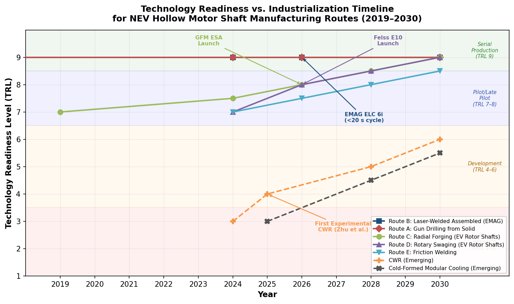

*Figure 5.1 — Technology readiness levels and industrialization trajectories for established and emerging hollow motor shaft manufacturing routes, 2019–2030. Serial-production routes (A, B) anchor the upper TRL band, while monolithic forming routes (C, D) are transitioning from late pilot to serial. CWR and cold-formed modular concepts remain in the development stage (TRL 3–6).*

### 5.1.5 Additive Manufacturing: Role Confined to Tooling and Prototyping

Additive manufacturing remains impractical for series production of motor shafts within the 2026–2028 horizon. No published demonstrator of an AM-produced motor shaft exists. BMW Group has adopted wire-arc additive manufacturing (WAAM) for vehicle components and tooling, and laser powder bed fusion (L-PBF) can produce complex internal cooling channels, but build volume limitations (< 500 mm), slow deposition rates, and as-built tolerances (IT12–IT16) render these approaches uncompetitive with forming or machining for production shafts [Metal AM / BMW](https://www.metal-am.com/bmw-group-looks-to-wire-arc-additive-manufacturing-for-lightweight-and-sustainable-vehicle-components/ "BMW WAAM"). The nearest practical role for AM in motor shaft manufacturing is rapid prototyping of shaft concepts and production of tooling components — mandrels, fixture elements, cooling channel inserts — where geometric complexity or lead-time advantages justify the cost premium.

## 5.2 Material and Design Trends

### 5.2.1 Assembled Multi-Material Shafts in Volume Production

The assembled multi-material rotor shaft — joining higher-alloy case-hardening steel at the gear interface with lower-alloy steel for the tube section — has transitioned from a design concept to the dominant volume-production architecture. thyssenkrupp Dynamic Components produced approximately 1.5 million rotor shafts in fiscal year 2023/2024 across 10 global locations; Volvo production at the Changzhou (China) facility commenced in 2023; and the division's CEO has stated a target for electric drive components to account for approximately 30% of divisional sales within five years [thyssenkrupp](https://www.thyssenkrupp-automotive-technology.com/en/press-detail/thyssenkrupp-dynamic-components-celebrates-10-years-of-rotor-shafts-for-electric-motors-and-continues-its-global-expansion-strategy-229318 "thyssenkrupp 10 years of rotor shafts"). This growth trajectory indicates that the assembled multi-material approach will remain the mainstream architecture for high-volume programs through at least 2030.

The economic logic reinforcing this trend is structural: case-hardening grades such as 20MnCr5 are necessary only at the gear/spline interface where surface hardness and wear resistance are critical, while the central tube section — which carries torsional load but has no tribological contact — can employ a lower-cost grade. Laser welding (LW) and rotary friction welding (RFW) both enable this material mix. As motor speeds continue to increase, the question of whether weld-zone discontinuities impose a speed ceiling on assembled designs remains unresolved (see Section 4.3.6), though no failure cases have been reported in published literature.

### 5.2.2 Bimetallic Shafts via Forming Processes

Beyond joining-based multi-material approaches, researchers are exploring forming-based bimetallic construction. Zhu et al. (2025) conducted the first experimental CWR of a bimetallic hollow shaft comprising a 304 stainless steel outer layer and a 45 steel core, demonstrating that interfacial bonding can be achieved through the plastic deformation inherent in the rolling process [Zhu et al., ACME 2025](https://ui.adsabs.harvard.edu/abs/2025ACME...25..178Z/abstract "CWR bimetallic — 2025"). Lei et al. (2025) simulated flat-corrugated CWR for 42CrMo4/45 steel hollow laminated shafts targeting NEV applications [Lei et al., J. Netshape Forming Eng. 2025](https://www.nsforming.com/EN/10.3969/j.issn.1674-6457.2025.07.003 "Corrugated CWR for NEV laminated shaft, 2025").

These approaches could theoretically combine the fatigue resistance and surface hardness of 42CrMo4 on the outer surface with the ductility and lower cost of 45 steel in the core — a material optimization not achievable through any monolithic forming route. Both approaches remain at laboratory scale (TRL 3–4), however, and critical questions regarding interfacial bond integrity under high-cycle torsional fatigue and the effect of rolling-induced residual stresses on dimensional stability are unresolved.

### 5.2.3 Topology-Optimized Internal Cooling Channels

Rotor thermal management is emerging as a design-limiting factor as motor speeds push beyond 20,000 rpm, where eddy-current losses in rotor laminations and rare-earth magnets generate increasing heat. Conventional hollow-shaft cooling employs a simple axial bore with radial exit holes. Goetz et al. (2025) demonstrated a cold-formed tube-in-tube construction with tooth-guided liquid-cooling channels in 20MnCr5, achieving 110% higher cooling efficiency at low RPM versus conventional hollow-shaft cooling — with shaft dimensions (340–359 mm length, 11 mm inlet bore, 52–98 mm OD) well within the typical NEV motor shaft envelope [Goetz et al., arXiv 2510.22029](https://arxiv.org/html/2510.22029v1 "Cold-formed modular cooling shaft 2025").

This research points toward a future in which the shaft bore is not merely a structural weight-saving feature or a simple coolant pathway, but an engineered heat-exchange surface with optimized flow geometry. The assembled-shaft route (LW) already offers the greatest design freedom for internal cooling architectures, since pre-formed or pre-machined internal features on individual components can be sealed during welding. The cold-formed modular approach represents an alternative path that avoids welding entirely but remains at the research stage (TRL ~3).

### 5.2.4 Material Grade Landscape

The material grade landscape for NEV motor shafts has stabilized around three established alloys: 42CrMo4 (AISI 4140) for high-torque applications requiring through-hardened or induction-hardened sections, 20MnCr5 for case-hardened gear interfaces and cold-forming compatibility, and S45C (AISI 1045) for lower-cost, moderate-load designs. No evidence of advanced high-strength steel (AHSS) evaluation for motor shafts has emerged as of early 2026. The multiphase microstructures characteristic of AHSS — engineered for sheet-forming crash energy absorption — are not inherently suited to the high-cycle torsional fatigue regime at 30,000+ rpm that defines motor shaft service conditions. A material grade shift within the next five years is unlikely unless a specific high-speed fatigue or thermal limitation of existing grades is identified through systematic testing.

### 5.2.5 Integrated Rotor-Shaft Concepts

GFM and Felss already produce rotor mounting OD profiles during primary forming, eliminating secondary machining for lamination retention surfaces. A more ambitious concept — a true single-piece rotor-shaft that eliminates the interference-fit assembly of the lamination stack — has not been demonstrated. Such a design would require the forming process to create both the shaft geometry and the rotor retention features in a single operation, with tolerances compatible with lamination stack alignment. The manufacturing complexity and the requirement for electrical insulation between shaft and laminations present fundamental design barriers. This concept remains speculative rather than developmental as of early 2026.

## 5.3 Industry and Supply-Chain Considerations

### 5.3.1 Market Scale and Growth Trajectory

The global EV rotor shaft market was valued at approximately $423 million in 2024, with projections reaching $1.14 billion by 2031 at a compound annual growth rate (CAGR) of approximately 15.3% [OpenPR/QYResearch](https://www.openpr.com/news/4441570/global-ev-rotor-shaft-market-to-surge-from-us-423-million-to-us "EV rotor shaft market forecast"). An alternative estimate places the market at $3.03 billion in 2026 growing to $5.14 billion by 2032 at 9% CAGR [Research and Markets](https://www.researchandmarkets.com/reports/6126803/ev-rotor-shaft-market-global-forecast "EV rotor shaft market alternative estimate"). The wide range reflects differing scope definitions — whether the estimate encompasses only the shaft blank or the fully machined and assembled component, and whether it includes adjacent rotational components. Regardless of which estimate more closely reflects reality, the directional signal is consistent: demand for EV rotor shafts is growing at double-digit rates. The European e-motor market alone is projected to exceed £27 billion by 2035, and IDTechEx forecasts that over 140 million EV motors will be required globally per year by 2036 — each requiring at least one rotor shaft [APC](https://www.apcuk.co.uk/wp-content/uploads/2024/05/2024-e-motors-value-chain-insight.pdf "APC E-Motors Value Chain Insight"); [IDTechEx](https://www.idtechex.com/en/research-article/the-need-for-speed-ev-motors-breaking-the-30-000rpm-barrier/34219 "IDTechEx 140M motors by 2036").

This demand scale carries direct implications for manufacturing technology selection. At 140 million shafts per year, even the highest-throughput routes (EMAG ELC 6 at ~500,000 shafts/year per line) would require hundreds of production lines globally. The industry's ability to deploy sufficient forming capacity — particularly for capital-intensive routes such as radial forging and rotary swaging — will depend on equipment supplier ramp-up timelines that remain commercially opaque.

### 5.3.2 Supply-Chain Regionalization

The geographic distribution of EV production is driving localization of rotor shaft manufacturing. thyssenkrupp Dynamic Components operates across 10 global locations spanning Germany, Hungary, Brazil, Mexico, the USA, and China (Dalian and Changzhou), reflecting the imperative to serve OEMs regionally [thyssenkrupp](https://www.thyssenkrupp-automotive-technology.com/en/press-detail/thyssenkrupp-dynamic-components-celebrates-10-years-of-rotor-shafts-for-electric-motors-and-continues-its-global-expansion-strategy-229318 "thyssenkrupp global footprint"). Linamar's Hungary facility targets 430,000 EV parts per type per year on EMAG lines, serving European OEMs [EMAG/Linamar](https://www.emag.com/blog/en/linamar-relies-on-emag-for-e-mobility/ "Linamar EMAG Hungary"). Ford's Halewood facility in the UK is converting to produce 400,000 e-drive units per year [APC](https://www.apcuk.co.uk/wp-content/uploads/2024/05/2024-e-motors-value-chain-insight.pdf "Ford Halewood").

This regionalization trend favors manufacturing routes with broadly distributed equipment suppliers. EMAG (Germany), Felss (Germany, Switzerland, USA, China, Slovakia), and KUKA/MTI (UK, USA) maintain multi-continental presence. GFM (Austria, USA) and SMS Group (Germany) have narrower geographic footprints, which could constrain rapid regional deployment of radial forging capacity. The concentration of Chinese NEV production — BYD alone exceeded 3.28 million NEV units in the first 10 months of 2024 [PR Newswire](https://www.prnewswire.com/news-releases/global-times-the-power-of-planning-chinese-nevs-rewrite-the-global-automotive-landscape-302702112.html "BYD 2024 production data") — implies a substantial domestic Chinese shaft manufacturing base whose technology choices are not publicly documented.

### 5.3.3 Vertical Integration Versus Tier-1 Outsourcing

The motor shaft value chain exhibits a mixed vertical integration model. Tesla is known for extensive vertical integration in motor and drive-unit manufacturing, though specific in-house shaft production methods are not publicly confirmed. Most major European and North American OEMs (VW, Volvo, Ford) source assembled rotor shafts from Tier-1 suppliers such as thyssenkrupp (confirmed for VW e-UP since 2013, Volvo Changzhou since 2023) and Linamar. This outsourcing model favors the assembled-shaft route, where Tier-1 suppliers invest in dedicated EMAG turnkey lines and amortize the capital across multiple OEM programs.

A potential shift toward vertical integration could arise if OEMs adopt monolithic forming routes (RF, RS) for strategic differentiation — particularly for ultra-high-speed motor platforms where shaft metallurgical quality is perceived as a competitive advantage. The high capital cost of forming equipment ($2M–$25M+ for radial forging machines) and the specialized process expertise required, however, make Tier-1 outsourcing the more probable model for the majority of programs.

### 5.3.4 Sustainability Drivers

Environmental regulation and corporate sustainability targets are increasingly influencing manufacturing technology selection. Cold forming routes offer measurable advantages across multiple sustainability metrics:

- **Material yield**: Rotary swaging achieves 95–100% yield versus 40–60% for gun drilling from solid bar, proportionally reducing the embodied energy and CO₂ associated with raw steel production.
- **Process energy**: The Felss E10 achieves ≥30% energy reduction through its fully electric drive architecture; servo-hydraulic presses save over 50% energy versus conventional hydraulic systems. Cold forming eliminates the 700–1,300 °C heating energy required for hot forging and hot extrusion entirely.
- **Friction welding**: RFW consumes approximately 20% of the energy of conventional fusion welding processes [MTI](https://www.mtiwelding.com/wp-content/uploads/2015/11/mti-friction-welding-technology-brochure.pdf "MTI friction welding energy").

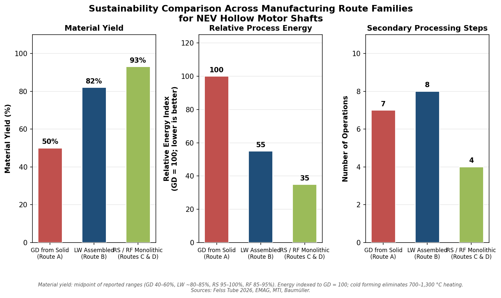

*Figure 5.2 — Comparative sustainability indicators for three route families: gun drilling from solid (Route A), laser-welded assembled (Route B), and monolithic formed via rotary swaging or radial forging (Routes C & D). Material yield values represent midpoints of reported ranges; relative process energy is indexed to gun drilling = 100.*

No shaft-specific lifecycle assessment (LCA) has been published. The absence of per-shaft energy consumption data (kWh/shaft) across routes prevents a fully quantitative comparison. The directional advantage of forming-based routes over subtractive routes is nonetheless clear: higher material yield eliminates upstream steelmaking emissions, and cold or near-ambient-temperature forming eliminates the thermal energy budget. As automotive OEMs face Scope 3 emissions accounting requirements, these advantages are expected to increase the weighting of sustainability criteria in manufacturing route selection.

### 5.3.5 Implications of the 30,000+ rpm Motor Trend

The push toward 30,000+ rpm motor speeds — demonstrated by BYD at 30,511 rpm, GAC at 30,000 rpm, and Xiaomi at 27,200 rpm — has cascading implications for shaft manufacturing technology. Higher speeds tighten dynamic balance requirements to 50 mg (versus the 100 mg industry standard at conventional speeds), demand tighter concentricity, and elevate fatigue loading under centrifugal stress [CarNewsChina](https://carnewschina.com/2025/03/20/byd-releases-ground-breaking-30511-rpm-motor/ "BYD 50 mg balance"); [IDTechEx](https://www.idtechex.com/en/research-article/the-need-for-speed-ev-motors-breaking-the-30-000rpm-barrier/34219 "IDTechEx 30,000 rpm barrier").

These requirements directionally favor monolithic forming routes (RF, RS) that produce compressive residual surface stress, refined grain flow, and eliminate weld-zone discontinuities. If the industry migrates from 15,000 rpm mainstream designs to 25,000–30,000 rpm as the new standard over the next five years, the relative attractiveness of monolithic formed shafts versus assembled shafts will increase — potentially shifting market share from Route B (LW assembled) toward Routes C (RF) and D (RS). No published study has quantified the speed threshold at which monolithic construction becomes necessary rather than merely preferable, however. Assembled rotor shafts from thyssenkrupp and EMAG lines are deployed on high-performance NEV platforms without reported failure, and the weld-zone imbalance concern remains theoretical rather than empirically validated.

The resolution of this question — through comparative fatigue testing of assembled versus monolithic shafts under identical 30,000+ rpm loading conditions — represents the single most consequential open research gap for manufacturing route strategy in the NEV sector.

## 5.4 Convergence and Outlook

The trends identified in this chapter point toward a manufacturing landscape that is simultaneously consolidating around proven routes and diversifying through emerging technologies.

**Near-term (2026–2028).** The laser-welded assembled shaft will retain its dominant position for high-volume programs, reinforced by the ELC 6i platform's lower cost, smaller footprint, and sub-20-second cycle time. Equipment evolution and digital integration (EDNA ONE, ComForge®) will improve yield, traceability, and reduce qualification timelines for new shaft variants.

**Medium-term (2028–2030).** Radial forging and rotary swaging are positioned to capture increasing market share in the monolithic segment. The GFM ESA-series and Felss E10 represent purpose-built platforms that lower the adoption barrier for EV rotor shafts. If OEM qualification programs initiated in 2026–2027 demonstrate competitive fatigue life and dimensional consistency, these routes could transition from TRL 7–8 to full serial production (TRL 9) for EV rotor shafts specifically. The high-speed motor trend (25,000–30,000+ rpm) provides a technical pull toward monolithic construction that could accelerate this transition.

**Longer-term (beyond 2030).** CWR and cold-formed modular shaft concepts may reach pilot-scale readiness, but neither is likely to displace the established routes within this decade. Bimetallic forming via CWR, if validated, could offer a forming-based alternative to welded multi-material designs — combining the metallurgical advantages of continuous grain flow with the economic advantages of material grade optimization. Additive manufacturing will remain confined to prototyping and tooling roles.

The overall trajectory favors manufacturing processes that combine high material yield, cold or near-ambient forming temperatures, in-process quality monitoring, and the ability to produce near-net-shape or ready-for-installation surfaces. These attributes align with both the technical demands of higher-speed motors and the sustainability imperatives driving automotive supply chains. The critical enabler for the next phase of route optimization is comparative fatigue data across routes — once available, it will transform route selection from an engineering judgment call into a data-driven design decision.

# Conclusion

This report evaluated twenty-two manufacturing processes for hollow motor shafts used in NEV electric drive units, comparing them across geometry and quality, economics and industrialisation, and secondary processing requirements against a consolidated checklist of fifteen application-specific parameters. The analysis yields the following principal conclusions.

**The laser-welded assembled shaft is the established volume-production standard.** Route B — laser welding on EMAG ELC 6 turnkey lines — offers the lowest amortized per-part cost at volumes exceeding 100,000 shafts per year, multi-material construction that places high-alloy case-hardening steel only at the gear interface, design freedom for complex internal cooling architectures, and the deepest industrial track record. thyssenkrupp Dynamic Components has operated this route since 2013 across 10 global locations, with approximately 1.5 million shafts produced in fiscal year 2023/2024. EMAG's next-generation ELC 6i, with sub-20-second cycle times and a 36% smaller footprint, reinforces this route's dominance for the near term.

**Monolithic cold-forming routes represent the strongest emerging alternatives.** Rotary swaging (Route D) achieves 95–100% material yield, a 22-second forming cycle, surface finish approaching ground quality (Ra < 0.1 µm), and a 30% fatigue strength increase through cold work hardening — the smallest secondary-processing footprint of any route. Radial forging (Route C) delivers broader geometric flexibility (stepped profiles, bottle shapes, internal splines via profiled mandrel), material yield of 85–95%, and confirmed torsional fatigue performance (Tsuzuki Manufacturing: 1 million cycles at 200 Nm amplitude without failure). Both routes stand at TRL 7–8 for EV rotor shafts specifically, with purpose-built equipment platforms — the GFM ESA-series and Felss Generation E10 — launched in 2025–2026. OEM qualification timelines of 6–18 months are anticipated before these routes reach full serial production status.

**Gun drilling from solid bar remains the pragmatic low-volume and prototype solution.** Route A requires no dedicated forming tooling, offers maximum design flexibility via CNC reprogramming, and is universally available. Its material yield of 40–60% and cycle times of 10–30 minutes per shaft render it uneconomic above approximately 10,000 shafts per year, but it carries zero adoption risk and is confirmed in EV shaft production (AmTech, AISI 4140).

**Route selection is volume-driven by default but parameter-sensitive in practice.** At mid volumes (10,000–100,000 shafts/year), five routes are technically viable; the optimal choice depends on application-specific sensitivity parameters. Dual-material requirements favor assembled routes (LW, RFW). Integrated spline or internal feature requirements favor monolithic forming routes (RF, RS) with profiled mandrels. Tight bore tolerance (< ±0.01 mm) favors gun drilling or cold swaging. Complex internal cooling channels favor laser-welded assembly. Ultra-high rotor speeds (> 30,000 rpm) directionally favor monolithic construction, though no published study quantifies the speed threshold at which this preference becomes a requirement.

**The most consequential open gap is the absence of cross-route fatigue data.** No published study compares fatigue life across laser-welded assembled, radial-forged, rotary-swaged, and machined-from-solid shafts under identical geometry and loading conditions. Route recommendations in this report are grounded in process capability, material efficiency, cycle time, and industrial maturity. Resolving this gap — through systematic comparative fatigue testing at 30,000+ rpm loading — would transform route selection from an engineering judgment informed by indirect evidence into a fully data-driven design decision.

**The industry trajectory favors processes that combine high material yield, cold or near-ambient forming, near-net-shape output, and in-process digital quality monitoring.** These attributes align with both the technical demands of higher-speed motors and the sustainability imperatives now influencing automotive supply chains. Equipment platforms launched in 2025–2026 (GFM ESA, Felss E10, EMAG ELC 6i), coupled with digital-twin and IoT capabilities (SMS ComForge®, EMAG EDNA ONE), position the hollow motor shaft manufacturing landscape for a period of concurrent consolidation around proven routes and competitive entry of monolithic forming alternatives at the high-volume tier.
