# Overview

Generative AI has moved beyond back-office optimization to reshape the creative core of the fashion industry. As tools for sketch-to-design conversion, trend prediction, virtual prototyping, and AI-assisted imagery proliferate—backed by venture capital exceeding USD 2.5 billion since 2022 and projected market growth at a CAGR of 38–41%—two intertwined questions have moved to the center of industry discourse: whether AI design tools are driving creative homogenization, and how the copyright disputes they generate between independent designers and algorithmic systems can be resolved.

This report examines both questions through six chapters of analysis spanning market dynamics, empirical evidence on aesthetic convergence, comparative legal frameworks, litigation patterns, resolution mechanisms, and forward-looking scenarios. The core findings are as follows.

On creative homogenization, the evidence points toward what this report terms **conditional homogenization**: AI design tools exert measurable convergence pressure on both creative outputs and design processes, but the magnitude of that pressure is modulated by operator expertise, workflow architecture, and institutional context. Experimental research demonstrates that AI-assisted groups generate significantly less diverse ideas than unaided groups, cross-model homogeneity persists across major AI model families, and the recursive training phenomenon known as model collapse threatens to progressively narrow the aesthetic range available to future systems. At the same time, expert operators can maintain creative complexity, and carefully structured AI intermediation may reduce rather than amplify creative fixation. The emerging anti-AI craft movement in luxury fashion confirms that market actors are already responding to perceived homogenization, though this response concentrates in premium segments and offers limited corrective force for mass-market convergence.

On copyright disputes, the legal landscape is fragmented and jurisdictionally inconsistent. The United States maintains the most restrictive stance on AI output copyrightability—requiring human authorship and rejecting prompting alone as sufficient—while offering the weakest protection for fashion designs among major jurisdictions. China has set the lowest authorship threshold, and the EU has constructed the most comprehensive regulatory architecture through the AI Act, the DSM Directive, and a decisive 2026 parliamentary resolution calling for training data transparency and collective licensing. Litigation has surged past 80 active US cases, yet fashion-specific disputes remain concentrated on fast-fashion algorithmic copying rather than generative AI design tools. The settlement and licensing models emerging in music—opt-in frameworks with dual-layer compensation—provide a template that the fashion industry currently lacks the institutional infrastructure to replicate.

No single resolution mechanism suffices. Effective protection for fashion designers in the AI era requires a layered approach combining content provenance technologies, legislative transparency mandates, opt-in licensing once collective institutions emerge, and foundational IP reform—particularly in the United States, where three legislative attempts to protect fashion designs have failed. The critical regulatory inflection point arrives on 2 August 2026, when the EU AI Act's labeling mandate and GPAI enforcement powers take effect simultaneously, creating the first binding compliance obligations for AI fashion design tool providers.

# 第1章 The AI-Powered Fashion Design Landscape — Tools, Adoption, and Industry Dynamics

Artificial intelligence has moved from back-office optimization into the creative core of the fashion industry. What began as demand-forecasting algorithms and recommendation engines has, by early 2026, matured into a diverse ecosystem of generative AI design tools, trend-prediction platforms, and virtual prototyping systems that touch every stage from initial concept to consumer-facing imagery. This chapter maps the current tool landscape, quantifies market scale and adoption intensity across industry segments, examines how AI is compressing and restructuring design workflows, and surfaces the uneven dynamics — between luxury conglomerates and independent designers, between back-end enthusiasm and consumer-facing resistance — that define the industry's present inflection point.

## 1.1 Market Scale and Growth Trajectory

Multiple market-research firms converge on a striking conclusion: the global AI-in-fashion market is one of the fastest-growing intersections of technology and creative industry. Fortune Business Insights valued the market at approximately USD 1.81 billion in 2025, projecting growth to USD 40.81 billion by 2034 at a CAGR of 41.39% [Fortune Business Insights](https://www.fortunebusinessinsights.com/ai-in-fashion-market-109328 "AI in Fashion Market Size, 2026-2034"). Precedence Research placed the 2025 baseline higher, at USD 3.14 billion, with a forecast of USD 60.57 billion by 2034 at a CAGR of 39.12% [Precedence Research](https://www.precedenceresearch.com/ai-in-fashion-market "AI in Fashion Market to USD 60.57B by 2034"). Straits Research offered a third calibration, estimating USD 2.78 billion in 2025 and USD 39.71 billion by 2033, at a comparable CAGR of 39.43% [Straits Research](https://straitsresearch.com/report/ai-in-fashion-market "AI in Fashion Market by 2033"). Meticulous Research, cited in Forbes, placed the 2024 figure at USD 2.14 billion and projected USD 75.9 billion by 2035 at a 38.6% CAGR [Forbes](https://www.forbes.com/sites/josipamajic/2026/03/24/how-luxury-fashion-is-rebuilding-its-creative-and-commercial-stack-using-ai/ "Forbes, March 2026; citing Meticulous Research").

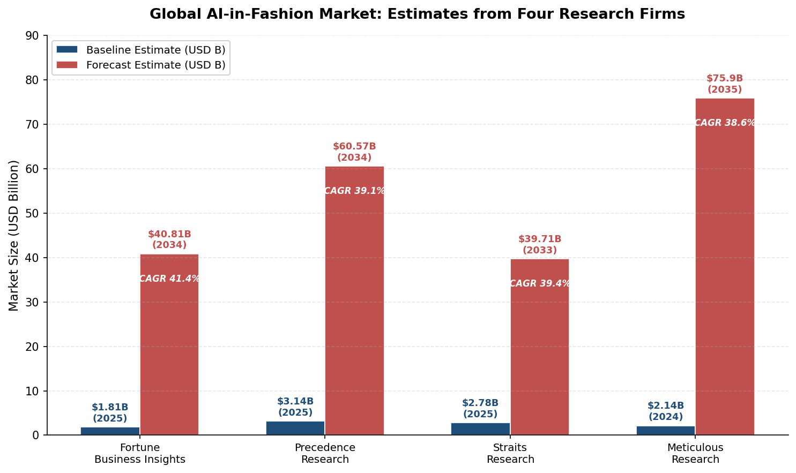

*Figure 1.1: Baseline and forecast estimates from four market-research firms. Despite differing scope definitions and forecast horizons, all four converge on a CAGR of 38–41%, projecting a market exceeding USD 40 billion within the next decade.*

Despite these differences in baseline estimation and forecast horizon, the four sources converge on a CAGR range of roughly 38–41% and agree that the market will exceed USD 40 billion within the next decade. The variance in baseline figures (USD 1.81–3.14 billion for 2025) reflects differing scope definitions — some include AI-powered retail and supply-chain applications, while others focus narrowly on design and creative tools.

McKinsey's separate analysis provides a complementary lens: generative AI could add USD 150–275 billion to the operating profits of apparel, fashion, and luxury sectors over three to five years, with up to 25% of that value originating in the creative side — faster prototyping, reduced sampling, and AI-assisted design [McKinsey](https://www.mckinsey.com/industries/retail/our-insights/generative-ai-unlocking-the-future-of-fashion "Generative AI: Unlocking the future of fashion, 2023"). This profit-uplift estimate underscores that AI's impact on fashion extends far beyond the market size of tool vendors themselves.

### Regional Distribution

North America commands the largest share of the AI-in-fashion market at approximately 33%, followed by Europe at 26% and Asia Pacific at 23%, with the Middle East & Africa (11%) and South America (7%) accounting for the remainder [Fortune Business Insights](https://www.fortunebusinessinsights.com/ai-in-fashion-market-109328 "Regional distribution"). Asia Pacific is expected to register the fastest growth during the forecast period, driven by expanding e-commerce penetration, smartphone adoption, and the concentration of manufacturing capacity in China, India, and Japan [Precedence Research](https://www.precedenceresearch.com/ai-in-fashion-market "Regional insights").

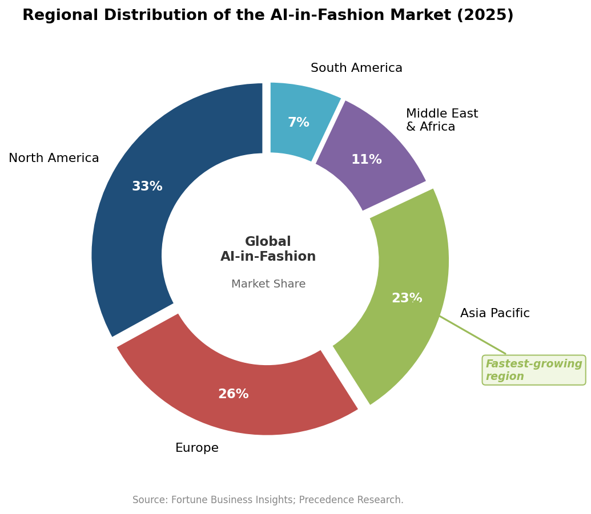

*Figure 1.2: Regional market-share breakdown. Asia Pacific, while third in current share, is the fastest-growing region in AI-in-fashion adoption.*

## 1.2 The AI Fashion Design Tool Ecosystem

The current generation of AI design tools spans a functional spectrum from early ideation through prototyping, trend prediction, virtual fitting, and production-ready output. The ecosystem can be organized into several overlapping but analytically distinct categories.

### Generative Design and Prototyping Platforms

**Style3D** operates as an end-to-end AI platform offering sketch-to-design conversion, garment simulation, virtual try-on, automatic pattern generation, and realistic fabric-physics rendering. Positioned for production-scale users, it represents the integration of generative AI with 3D fashion-design infrastructure [Style3D](https://www.style3d.ai/blog/which-are-the-top-10-ai-fashion-design-platforms-in-2026/ "Top 10 AI Fashion Design Platforms in 2026"). **Refabric**, selected for the 2024 LVMH Accelerator after raising approximately USD 2.4 million, enables brands to upload sketches or CAD files, refine them with AI, and auto-generate campaign-ready imagery from approved designs [Forbes](https://www.forbes.com/sites/josipamajic/2026/03/24/how-luxury-fashion-is-rebuilding-its-creative-and-commercial-stack-using-ai/ "Forbes, March 2026"). **The New Black** accepts text descriptions or rough sketches and returns polished clothing-design images within minutes, functioning primarily as a rapid-ideation engine for early-stage concept exploration [ETC Journal](https://etcjournal.com/2026/02/11/ai-accelerating-fashion-design/ "AI Accelerating Fashion Design, February 2026"). **NewArc.ai** combines sketch-to-image conversion with materials simulation across different fabrics and custom pattern generation, creating a design suite aimed at reducing both cycle time and sampling costs [ETC Journal](https://etcjournal.com/2026/02/11/ai-accelerating-fashion-design/ "AI Accelerating Fashion Design, February 2026"). **Cala** bridges design and production, using generative AI to explore numerous design variations without producing physical samples [McKinsey](https://www.mckinsey.com/industries/retail/our-insights/generative-ai-unlocking-the-future-of-fashion "Generative AI: Unlocking the future of fashion, 2023").

### Trend Prediction and Demand Intelligence

**Heuritech**, a Paris-based image-recognition platform, processes millions of social-media images to forecast demand by color, shape, fabric, and detail. Its client roster includes Prada, New Balance, and Skims [Forbes](https://www.forbes.com/sites/josipamajic/2026/03/24/how-luxury-fashion-is-rebuilding-its-creative-and-commercial-stack-using-ai/ "Forbes, March 2026") [ETC Journal](https://etcjournal.com/2026/02/11/ai-accelerating-fashion-design/ "AI Accelerating Fashion Design, February 2026"). **Designovel** and **Trendalytics** analyze datasets from social media, street-style photography, e-commerce analytics, and runway reports to predict emerging trends in colors, silhouettes, prints, and consumer preferences [ETC Journal](https://etcjournal.com/2026/02/11/ai-accelerating-fashion-design/ "AI Accelerating Fashion Design, February 2026").

### Virtual Try-On and AI Photography

**Botika**, **ZMO.ai**, and **FASHN** offer virtual try-on and AI photography platforms that enable brands to produce scalable product imagery by swapping garments onto model photos without physical reshooting, maintaining visual consistency across product lines [ETC Journal](https://etcjournal.com/2026/02/11/ai-accelerating-fashion-design/ "AI Accelerating Fashion Design, February 2026"). **DressX Agent**, launched in August 2025, allows users to upload a selfie, generate an AI twin, and try on pieces from partner brands including Farfetch, Mytheresa, and Off-White. The platform reports an average order value of USD 302 and average session durations of 3.5 minutes — metrics that suggest meaningful commercial traction beyond novelty usage [Forbes](https://www.forbes.com/sites/josipamajic/2026/03/24/how-luxury-fashion-is-rebuilding-its-creative-and-commercial-stack-using-ai/ "Forbes, March 2026").

### AI-Powered Discovery

**Daydream**, founded by Julie Bornstein and backed by approximately USD 50 million in funding including from Google Ventures, indexes 2 million products across 8,000 brands and processes natural-language queries for AI-powered fashion discovery [Forbes](https://www.forbes.com/sites/josipamajic/2026/03/24/how-luxury-fashion-is-rebuilding-its-creative-and-commercial-stack-using-ai/ "Forbes, March 2026").

## 1.3 Adoption Across the Industry: Executive Sentiment and Deployment Reality

Industry-wide survey data reveals a rapid shift from curiosity to commitment. In the BoF-McKinsey State of Fashion 2024 Executive Survey, 73% of fashion executives identified generative AI as a priority for their business, yet only 28% had experimented with it in creative processes and a mere 5% believed they possessed the capabilities to fully leverage it [BoF-McKinsey State of Fashion 2024](https://www.mckinsey.com/de/~/media/mckinsey/locations/europe%20and%20middle%20east/deutschland/news/presse/2023/2023-11-28%20state%20of%20fashion%202024/sof24_report.pdf "73% priority stat"). By the State of Fashion 2026 cycle, published in November 2025, over 35% of fashion executives reported already deploying generative AI in areas such as image creation, copywriting, consumer search, and product discovery — a substantial acceleration from the 2024 baseline [McKinsey/BoF State of Fashion 2026](https://www.mckinsey.com/industries/retail/our-insights/state-of-fashion "State of Fashion 2026"). That same report characterizes AI as having shifted "from a competitive edge to a business necessity," with companies restructuring workforces to redirect existing roles toward higher-value creative and analytical tasks [McKinsey/BoF State of Fashion 2026](https://www.mckinsey.com/industries/retail/our-insights/state-of-fashion "State of Fashion 2026").

### Luxury Conglomerates: Infrastructure-Scale Deployment

The most visible deployments have come from luxury conglomerates with the capital and data assets to build enterprise-wide AI infrastructure.

**LVMH** has spent four years constructing an "AI Factory" in partnership with Google Cloud — a centralized data platform supporting predictive AI, generative AI, and AI agents across all 75 of its maisons. The platform serves more than 40,000 users per month and processes over 1.5 million queries. LVMH's internal philosophy, branded "quiet tech," keeps AI invisible to consumers while transforming operations across demand forecasting, supply-chain optimization, and clienteling [Google Cloud Blog](https://cloud.google.com/transform/lvmh-data-ai-platform-interview-franck-le-moal-luxury-gen-ai-louis-vuitton-sephora-dom-perignon "Inside LVMH's data estate, June 2025"). Bernard Arnault's family office, Aglaé Ventures, reinforced this strategic commitment by deploying over USD 300 million in direct AI startup investments in 2024, including a position in Holistic AI, founded by former Google DeepMind researchers [Forbes](https://www.forbes.com/sites/josipamajic/2026/03/24/how-luxury-fashion-is-rebuilding-its-creative-and-commercial-stack-using-ai/ "Forbes, March 2026").

**PVH Corp.**, parent of Calvin Klein and Tommy Hilfiger, announced a collaboration with OpenAI in January 2026 to deploy ChatGPT Enterprise across its entire value chain, co-creating custom AI capabilities for product design, demand planning, inventory optimization, and consumer engagement [OpenAI](https://openai.com/index/pvh-future-of-fashion/ "PVH reimagines fashion with OpenAI, Feb 2026").

**Tapestry**, parent of Coach, Kate Spade, and Stuart Weitzman, used Adobe Firefly generative AI to create custom digital twins of handbag designs, training the model on proprietary brand assets to generate product visuals that closely mirror physical products. The BoF-McKinsey State of Fashion 2026 report highlights Tapestry's Firefly-powered "digital twins" as a best-practice case for AI-augmented product visualization [Adobe](https://business.adobe.com/blog/coach-reimagines-handbag-design-process-with-adobe-firefly-generative-ai "Coach + Firefly, Jan 2025").

### Consumer-Facing AI and Its Discontents

Not all luxury AI deployment has proceeded without friction. **Gucci** launched AI-generated promotional images ahead of Milan Fashion Week in February 2026, with imagery explicitly labeled "created with AI." The campaign triggered significant consumer backlash, with critics labeling the visuals "AI slop" — a term denoting the perceived generic, low-quality character of machine-generated imagery — and questioning its consistency with the brand's claimed commitment to Italian craftsmanship [BBC News](https://www.bbc.com/news/articles/cjwz6yzn5jqo "Gucci AI slop backlash, Feb 2026"). **Valentino** encountered a similar reaction in December 2025, when an AI-generated video promoting its Garavani DeVain handbag drew hundreds of negative comments describing the imagery as "cheap," "tacky," and "lazy," with consumers accusing the brand of "choosing efficiency over artistry" [Forbes](https://www.forbes.com/sites/josipamajic/2026/03/24/how-luxury-fashion-is-rebuilding-its-creative-and-commercial-stack-using-ai/ "Forbes, March 2026").

These episodes illustrate a core tension in luxury AI adoption: the same brands that invest heavily in back-end AI infrastructure face sharp consumer resistance when AI becomes visible in creative output — particularly in segments where perceived craftsmanship constitutes a central pillar of brand equity.

### Fast Fashion: AI at Scale, Limited Public Data on Design-Stage Use

Fast-fashion companies are widely understood to be aggressive AI adopters, yet publicly available data on AI use specifically in the design stage — as opposed to supply chain, recommendation, or marketing — remains sparse at verifiable (T1/T2) levels. H&M Group's most prominent public AI initiative in 2025 centered on generative AI for marketing imagery: the company created AI "digital twins" of 30 models for campaign photography, with Chief Creative Officer Jörgen Andersson framing the effort as "exploring emerging technologies like generative AI to amplify creativity and reimagine how we showcase fashion" [H&M Group](https://hmgroup.com/news/hm-continues-its-exploration-of-creativity-with-ai/ "H&M AI digital twins, July 2025"). This initiative, while commercially significant, operates in the marketing and visual-merchandising layer rather than the garment-design process itself.

### Independent Designers: A Spectrum of Engagement

Systematic survey data quantifying AI design-tool adoption among independent designers does not yet exist at a rigorous level. Anecdotal evidence, however, reveals a wide spectrum. At one end, veteran designer **Norma Kamali** completed MIT Professional Education's "Applied Generative AI for Digital Transformation" course and developed a closed-loop AI tool trained solely on her 57-year archive, describing AI as potentially serving as "my Karl Lagerfeld" — a reference to archival inspiration rather than creative replacement [ETC Journal](https://etcjournal.com/2026/02/11/ai-accelerating-fashion-design/ "AI Accelerating Fashion Design, February 2026"). At the other end, many independent designers voice concern that generative AI tools trained on broad internet data could reproduce elements of their work without consent or attribution — a concern that intersects directly with the copyright disputes examined in subsequent chapters.

## 1.4 How AI Is Transforming Design Workflows

AI design tools are compressing timelines, reducing physical prototyping costs, and shifting the designer's role from sole creator to creative director orchestrating algorithmic output.

### Speed and Cost Compression

McKinsey estimates attribute up to 25% of AI's potential value in fashion to the creative side, with leading companies reporting concept-to-market timeline reductions of up to 70% [Forbes](https://www.forbes.com/sites/josipamajic/2026/03/24/how-luxury-fashion-is-rebuilding-its-creative-and-commercial-stack-using-ai/ "Forbes citing McKinsey"). AI-powered 3D design and visualization tools claim to reduce physical sampling costs by up to 72% and compress design-to-production timelines by combining sketch-to-design, color and print visualization, and virtual try-on capabilities into integrated workflows [Style3D](https://www.style3d.ai/blog/how-can-ai-fashion-design-visualization-reduce-physical-sampling-and-speed-production/ "Style3D Blog; vendor-sourced claim"). These vendor-sourced figures merit caution, though the directional trend — substantial reductions in both time and physical sample production — is corroborated by multiple independent industry accounts.

### The New Ideation Loop

Designers now routinely employ generative AI platforms — Midjourney, DALL·E, Adobe Firefly, The New Black — to co-create mood boards, sketches, and complete outfit designs, converting what once required commissioning illustrators into a rapid-ideation engine that can compress design timelines from weeks to days [ETC Journal](https://etcjournal.com/2026/02/11/ai-accelerating-fashion-design/ "AI Accelerating Fashion Design, February 2026"). At Stitch Fix, AI enabled buying teams to make data-driven decisions between design alternatives — for example, choosing between a red and blue stripe shirt — by analyzing customer data rather than requesting overseas samples that could take weeks, thereby accelerating the pre-production decision loop [ETC Journal](https://etcjournal.com/2026/02/11/ai-accelerating-fashion-design/ "AI Accelerating Fashion Design, February 2026; quoting Amy Sullivan, VP of Buying at Stitch Fix").

### The Three-Wave Model of Fashion AI Adoption

Virginia Commonwealth University researchers offer a useful periodization of fashion AI adoption in three distinct waves: (1) back-end infrastructure for merchandising decisions such as demand forecasting and dynamic pricing; (2) consumer-facing personalization in marketing systems; and (3) the current wave, in which generative AI enters creation itself — handling imagery, concept boards, and early-stage ideation [ETC Journal](https://etcjournal.com/2026/02/11/ai-accelerating-fashion-design/ "AI Accelerating Fashion Design, February 2026; quoting VCU assistant professor Jennie Cook"). The first two waves are now mature capabilities embedded across the industry. The third wave, still in its expansionary phase, is the focus of this report — and the source of the creative-homogenization concerns and copyright disputes examined in subsequent chapters.

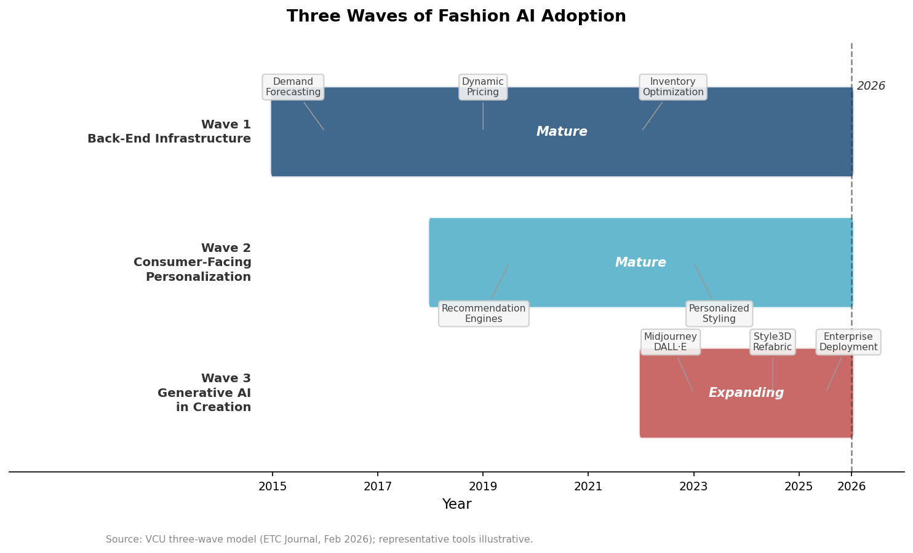

*Figure 1.3: The VCU three-wave model of fashion AI adoption. Waves 1 and 2 (back-end infrastructure and consumer-facing personalization) have reached maturity; Wave 3 (generative AI in creation) remains in an expansionary phase as of early 2026.*

## 1.5 Investment Landscape: Capital Flows Into Fashion AI

Venture capital has committed over USD 2.5 billion to fashion AI since 2022, reflecting investor conviction that AI-powered design tools represent a structural transformation of the industry rather than a passing trend [Forbes](https://www.forbes.com/sites/josipamajic/2026/03/24/how-luxury-fashion-is-rebuilding-its-creative-and-commercial-stack-using-ai/ "Forbes, March 2026"). Notable capital events include approximately USD 50 million for Daydream (backed by Google Ventures) and USD 55 million for Vue.ai's computer-vision commerce platform [Forbes](https://www.forbes.com/sites/josipamajic/2026/03/24/how-luxury-fashion-is-rebuilding-its-creative-and-commercial-stack-using-ai/ "Forbes, March 2026").

The clearest signal of market maturation came from Adobe's acquisition of Fashable for approximately USD 450 million in December 2024 — a transaction that recast AI design-layer tools as consolidation targets rather than speculative bets [Forbes](https://www.forbes.com/sites/josipamajic/2026/03/24/how-luxury-fashion-is-rebuilding-its-creative-and-commercial-stack-using-ai/ "Forbes, March 2026"). Alongside strategic acquisitions, corporate venture arms are deepening direct investment: LVMH's Aglaé Ventures deployed over USD 300 million in AI startups in 2024, and the CFDA–OpenAI Innovation Hub, launched in February 2026, paired six fashion brands with six AI tool providers, offering over USD 300,000 in grants and unlimited API access [CFDA](https://cfda.com/news/cfda-openai-launch-innovation-hub/ "CFDA-OpenAI Innovation Hub, Feb 2026").

These capital flows reinforce the expectation that AI design tools will continue consolidating into fewer, larger platforms integrated with enterprise design and production systems — a trajectory with direct implications for both creative homogenization and the bargaining position of independent designers relative to AI platform providers.

## 1.6 Industry Dynamics: Uneven Adoption and Emerging Tensions

The landscape that emerges from this survey is one of rapid but markedly uneven adoption. Luxury conglomerates with deep capital reserves and proprietary data assets — LVMH, PVH, Tapestry — are building enterprise-scale AI infrastructure that touches design, production, marketing, and retail simultaneously. Fast-fashion companies appear to be aggressive adopters, yet public disclosure of AI use specifically in the design stage remains limited. Independent designers, the group most exposed to both the creative-homogenization risk and the copyright-enforcement gap, lack both the systematic data to quantify their own adoption and the institutional infrastructure to negotiate collectively with AI platform providers.

Several tensions are already visible. First, the gap between back-end enthusiasm and consumer-facing acceptance: LVMH's "quiet tech" philosophy explicitly keeps AI invisible to consumers, while Gucci's and Valentino's experiments with visible AI-generated content provoked strong negative reactions. Second, an asymmetry in adoption capacity: the same AI tools that promise to "democratize" design by lowering barriers to entry simultaneously concentrate data advantages in the hands of large players who can train models on proprietary archives — as Norma Kamali's closed-loop approach illustrates at the individual level. Third, a speed-quality tradeoff: AI tools compress timelines dramatically, but whether they simultaneously compress the range of aesthetic outcomes is precisely the creative-homogenization concern that the following chapter examines.

# 第2章 Creative Homogenization — Evaluating the Evidence

The rapid integration of AI design tools into fashion workflows — documented in Chapter 1 — has provoked a pointed question: does algorithmic assistance erode the diversity of creative output? This chapter evaluates the theoretical mechanisms through which homogenization may occur, assembles the empirical and qualitative evidence on both sides, and draws a critical distinction between the homogenization of *outputs* and the potentially more consequential homogenization of *creative processes*. The analysis finds that convergence pressures are real and empirically documented, yet their severity is contingent on operator expertise, workflow architecture, and the role AI occupies in the design process — a pattern we term **conditional homogenization**.

## 2.1 Theoretical Mechanisms of Convergence

Four interrelated mechanisms explain why AI-assisted fashion design may tend toward aesthetic uniformity. Each operates through a distinct channel, yet they compound one another in practice.

### Training-Data Bias and the Mean-Reversion Problem

Generative image models learn to produce outputs that approximate the statistical center of their training distributions. Stanford cognitive psychologist Cameron Ellis has documented that LLM-generated images are objectively less complex than human-created images because they converge on the "average" of training data, producing stereotyped, "smoothed-out" aesthetics [DesignObserver](https://designobserver.com/suddenly-everyones-life-got-a-lot-more-similar-ai-isnt-just-imitating-creativity-its-homogenizing-thinking/ "AI isn't just imitating creativity, it's homogenizing thinking, January 2026"). In fashion, where training corpora inevitably over-represent commercially successful silhouettes and colorways, this mean-reversion effect predisposes AI tools toward reproducing dominant trends rather than generating genuinely novel forms.

The bias extends beyond aesthetics to representation. A Business of Fashion analysis found that Stable Diffusion, when given the prompt "model in a black sweater," generated outputs overwhelmingly featuring white, thin models — replicating and amplifying the demographic homogeneity that has long characterized fashion imagery [Business of Fashion](https://www.businessoffashion.com/articles/technology/how-generative-ai-could-perpetuate-fashions-biases/ "How Generative AI Could Perpetuate Fashion's Biases, May 2023"). The system does not merely reproduce aesthetic sameness; it encodes and scales the industry's pre-existing representational narrowness.

### Model Collapse and Recursive Degradation

A more structural threat emerges as models increasingly train on data that already contains AI-generated content. Shumailov et al. demonstrated in *Nature* that recursive training on a model's own outputs causes the tail ends of the original distribution to vanish, with behavior converging toward a low-variance point estimate — a phenomenon the authors term "model collapse." Critically, this degradation pattern is universal across LLMs, variational autoencoders, and Gaussian mixture models [Shumailov et al., *Nature*](https://www.nature.com/articles/s41586-024-07566-y "AI models collapse when trained on recursively generated data, Nature vol. 631, July 2024"). As AI-generated fashion imagery proliferates on social media and e-commerce platforms, it inevitably feeds back into the web-scraped corpora used for subsequent model training. This recursive narrowing could progressively shrink the aesthetic range available to future models — a pipeline-level risk that compounds the mean-reversion problem described above.

### Platform Defaults and Optimization Lock-In

AI design tools ship with default parameters, curated style presets, and optimization targets that channel outputs toward commercially safe aesthetics. When thousands of designers use the same platform with similar default settings, the resulting designs converge not because of any individual creative choice but because of shared infrastructure. This "platform effect" parallels the well-documented homogenization produced by algorithmic music recommendation, with one important distinction: in fashion, the outputs enter physical production and become the visible material culture of everyday life. The convergence, in other words, is not confined to a digital feed — it materializes on bodies and in retail environments.

### Cross-Model Homogeneity

A critical recent finding dispels the assumption that switching between AI vendors would naturally produce diverse outputs. Wenger and Kenett (March 2026, *PNAS Nexus*) tested humans against multiple LLM families — including Gemini, GPT, and Llama — on standardized creativity tasks. Their central finding: "LLM responses mirror other LLM responses far more than humans do other humans, even after controlling for key confounding variables." The tendency toward repetitive outputs held consistently across all major model families, indicating that homogeneity is inherent to the architecture of large language models rather than specific to any single vendor [Wenger & Kenett, *PNAS Nexus*](https://neurosciencenews.com/ai-creativity-homogeneity-llm-30371/ "AI 'Creativity' is More Predictable Than Human Thought, March 2026; DOI: 10.1093/pnasnexus/pgag042"). Raising the temperature parameter — the standard method for boosting output diversity — yielded more variable results only at the cost of incoherence, revealing a structural ceiling on AI-generated variety.

These four mechanisms — training-data mean reversion, platform defaults, cross-model homogeneity, and model collapse — do not operate in isolation. They form a compounding system, illustrated in Figure 1, in which each channel reinforces the others and a feedback loop connects AI outputs back to training data.

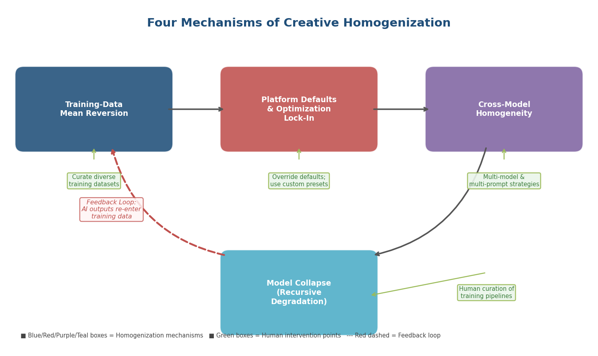
*Figure 1. Four Mechanisms of Creative Homogenization. Blue, red, purple, and teal boxes represent the homogenization channels; green boxes indicate human intervention points that can interrupt each pathway; the red dashed arrow traces the feedback loop through which AI outputs re-enter training data.*

## 2.2 Empirical Evidence: The Case for Homogenization

### The Wharton Creativity Experiments

The most rigorous experimental evidence to date comes from Wharton researchers Meincke, Nave, and Terwiesch. In controlled creativity tasks, only 6% of ideas generated by participants using ChatGPT were rated as unique, compared with 100% in the purely human control group. Across 45 paired comparisons, 37 showed AI-assisted groups producing significantly less diverse output than unaided groups. Nearly all AI-assisted participants converged on the same toy concept, prompting Terwiesch to observe: "If you only rely on ChatGPT as your sole creative consultant, you'll quickly run out of new ideas" [Knowledge at Wharton](https://knowledge.wharton.upenn.edu/article/does-ai-limit-our-creativity/ "Does AI Limit Our Creativity? July 2025"). Applied to fashion, this finding implies that design teams relying on a single AI ideation tool risk generating collections that appear superficially varied but remain fundamentally interchangeable in their underlying creative logic.

### Consumer Backlash as Market Signal

Two high-profile incidents in 2025–2026 provide qualitative evidence that consumers can perceive — and commercially penalize — AI-driven aesthetic convergence:

- **Gucci (February 2026).** Ahead of Milan Fashion Week, Gucci released AI-generated promotional images that triggered the "AI slop" label across social media. Creative director Demna Gvasalia defended the decision — "This is 2026, I use it as a tool" — but CNN fashion critic Rachel Tashjian assessed that the runway collection itself felt "closer to the hollowness of an AI concept than a human's genuine feeling" [BBC News](https://www.bbc.com/news/articles/cjwz6yzn5jqo "Gucci AI slop backlash, Feb 2026") [CNN](https://www.cnn.com/2026/02/27/style/demna-gucci-ai "Can Gucci make luxury AI? Feb 2026").

- **Valentino (December 2025).** An AI-generated video advertisement drew consumer responses including "cheap," "tacky," and "lazy," with widespread accusations that the brand had "chosen efficiency over art" [New York Post](https://nypost.com/2025/12/03/lifestyle/valentino-trashed-for-tacky-and-lazy-ai-ad/ "Valentino AI ad backlash, Dec 2025").

These reactions carry commercial weight. In luxury, where brand equity depends on the perception of singular creative vision, association with algorithmic production erodes the intangibility premium that sustains pricing power. The backlash also suggests that consumers possess an intuitive sensitivity to what might be called "statistical aesthetics" — images and designs that feel plausible but lack the deliberate imperfections and unexpected choices that signal human authorship.

### Representational Narrowing

The homogenization concern extends beyond aesthetics to identity. The BoF analysis of Stable Diffusion outputs — revealing systematic over-representation of white, thin models — points to a compounding risk: as AI-generated look-books and campaign imagery proliferate, they may further narrow fashion's already constrained visual vocabulary of who wears clothes and how [Business of Fashion](https://www.businessoffashion.com/articles/technology/how-generative-ai-could-perpetuate-fashions-biases/ "How Generative AI Could Perpetuate Fashion's Biases, May 2023"). Unlike an individual photographer's bias, which remains bounded by the scope of a single shoot, algorithmic bias operates at industrial scale — a single model's defaults can shape millions of images simultaneously, encoding exclusion as infrastructure rather than oversight.

## 2.3 Counter-Evidence: Conditions Under Which AI May Enhance Diversity

The homogenization thesis is not uncontested. Several lines of evidence indicate that the relationship between AI tools and creative diversity is contingent — shaped by how tools are deployed, by whom, and within what institutional structures.

### The Operator Skill Variable

Bellaiche (2023) found that professional artists using LLMs produced images significantly more complex and creative than those generated by non-artists using the same tools. The skill and intentionality of the human operator modulated the AI's homogenizing tendency, indicating that algorithmic convergence is not deterministic but interacts with user expertise [DesignObserver](https://designobserver.com/suddenly-everyones-life-got-a-lot-more-similar-ai-isnt-just-imitating-creativity-its-homogenizing-thinking/ "January 2026"). This finding implies an important asymmetry: experienced designers with strong aesthetic signatures may use AI as a genuine amplifier, while less-skilled users — or those who accept default outputs uncritically — are considerably more susceptible to convergence.

### AI as Intermediation Rather Than Origination

A field experiment by Wu, Aridor, and Timoshenko (Kellogg School of Management, SSRN 2025) offers the most direct counter-evidence to the homogenization thesis. In a professional logo design contest, the researchers tested an "AI intermediation" approach: rather than exposing designers directly to leading exemplar designs (which typically induces creative fixation), they used generative models to produce semantic variations of those designs and showed the variations to designers instead. Designers receiving AI-mediated inspiration produced (1) higher-quality work than designers with no exemplar exposure and (2) more-original work than designers directly exposed to leading exemplars. The researchers concluded that "human creativity remains pivotal for improving originality and quality of the final designs" [Wu, Aridor & Timoshenko, SSRN](https://papers.ssrn.com/sol3/papers.cfm?abstract_id=5371575 "Guided Creativity: AI Intermediation for Enhancing Originality and Quality in Visual Design, July 2025"). The implication is that AI's impact on creative diversity depends critically on its *role* in the design process: as an intermediary that disrupts fixation, it may increase originality; as a primary generator that replaces human ideation, it contracts it.

### The Hybrid-Model Consensus

Industry practitioners are converging on a practical synthesis. Charlie Smith, CMO of Nothing and formerly of Loewe, predicts that AI will become "as taken-for-granted as electricity or the internet" — a utility layer rather than a creative replacement. Brand consultant Karmen Tsang anticipates a "hybrid approach" in which AI handles scale and efficiency while humans retain responsibility for direction, meaning, and cultural relevance [Vogue](https://www.vogue.com/article/the-anti-ai-slop-playbook "The Anti-AI Slop Playbook, March 2026"). This emerging consensus does not deny the reality of homogenization risk but reframes it as a workflow-design challenge rather than a technological inevitability. The operative question shifts from *whether* to use AI to *how* to architect human-AI workflows that preserve — or even enhance — creative diversity.

## 2.4 The Anti-AI Craft Movement: Market Response to Perceived Homogenization

The most tangible evidence that homogenization concerns have reached critical mass is the emergence of an organized counter-movement within fashion itself — one that treats visible human craft as both aesthetic principle and competitive strategy.

### Runway Signals

WGSN global trend forecasting lead Hannah Watkins has identified "anti-AI" craft-driven aesthetics as a macro trend, coded as #WorkinProgress. The Fall 2026 runway season offered visible markers: Prada's deliberately abraded fabrics, Emilia Wickstead's painterly florals, and Ashlyn's raw-edge cuts — each legible as an assertion of the hand-made against the algorithmically smooth [Fashionista](https://fashionista.com/2026/03/anti-ai-fashion-trend-human-craft "Anti-AI protest on runways, March 2026"). These design choices function as semiotic signals: irregular textures and unfinished edges serve as markers of human authorship in an environment increasingly saturated with polished, AI-generated imagery.

### Brand Positioning Campaigns

Luxury houses have begun making human craft an explicit marketing proposition. Bottega Veneta launched "Craft is Our Language" in May 2025, while Miu Miu introduced "Making of Old" in January 2026 — both campaigns positioning visible hand-work as a counterweight to algorithmic production [Luxury Daily](https://www.luxurydaily.com/top-luxury-campaigns-of-2025-bottega-veneta-craft-is-our-language/ "Top luxury campaigns of 2025"). These are not nostalgic gestures; they represent deliberate strategic differentiation in a market environment where AI threatens to commoditize visual design. The messaging frames artisanship as a scarce resource — a signal of value precisely because it cannot be replicated at algorithmic scale.

### Predicted Market Bifurcation

The Future Laboratory analyst Rose Coffey has predicted that 2026 will mark a "consumer bifurcation" — a divergence between algorithm-generated, low-friction products and premium goods that carry visible markers of human intentionality [Vogue](https://www.vogue.com/article/from-unseriousness-to-superfandom-consumer-trend-predictions-for-2026 "Consumer Trend Predictions for 2026, January 2026"). Landor global executive creative director Graham Sykes coined the term "Anti-AI Crafting" in December 2025 to describe this movement.

If this bifurcation holds, homogenization would not affect the market uniformly. Mass-market and fast-fashion segments — where AI adoption is deepest and margins thinnest — face the greatest exposure. Luxury brands possess institutional resources (craft heritage, creative director authority, consumer expectations of singularity) that partially buffer against convergence, though the Gucci and Valentino backlash episodes demonstrate that even luxury houses face consumer skepticism when AI use becomes visible. Independent designers occupy an ambiguous position: they face acute competitive pressure to adopt AI for efficiency, yet their market differentiation depends precisely on the idiosyncratic vision that AI may erode. Figure 2 maps these segments along a spectrum of AI adoption intensity and associated homogenization risk.

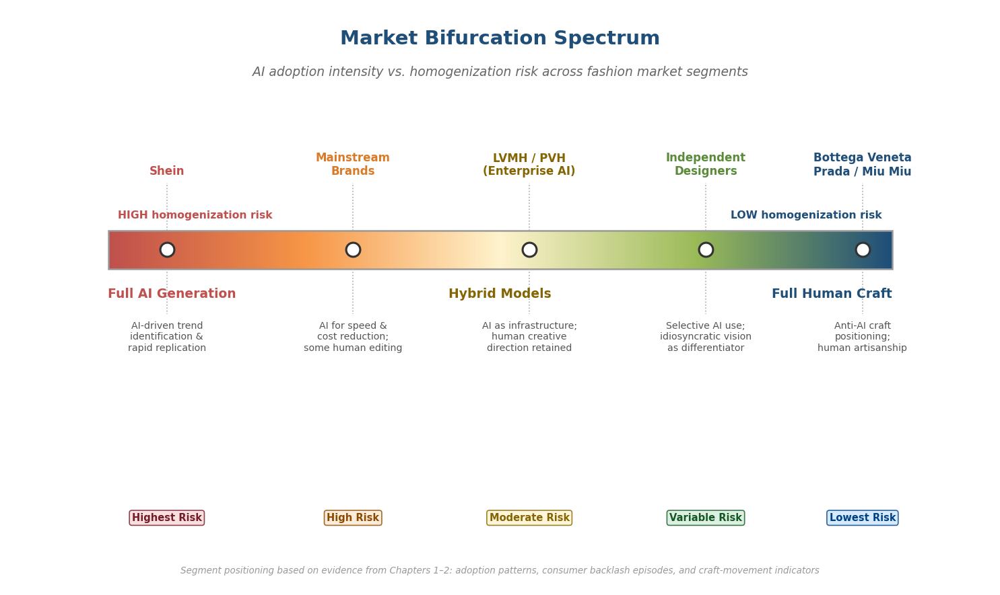
*Figure 2. Market Bifurcation Spectrum. Fashion market segments positioned along a gradient from full AI generation (left, highest homogenization risk) to full human craft (right, lowest risk), annotated with characteristic AI usage patterns and representative brands.*

## 2.5 Output Homogenization Versus Process Homogenization

A distinction that emerges from the evidence — yet receives insufficient attention in industry discourse — is the difference between convergence in what is produced and convergence in *how designers think*.

### The Internalization Effect

Georgetown neuroscientist Adam Green has documented that LLM use causes college applicants to converge on similar personal narratives in their essays — and, more troublingly, that students "internalize AI output as their own story," losing the capacity to distinguish between self-generated and machine-suggested ideas [DesignObserver](https://designobserver.com/suddenly-everyones-life-got-a-lot-more-similar-ai-isnt-just-imitating-creativity-its-homogenizing-thinking/ "January 2026"). If this internalization effect transfers to fashion design practice, the consequences extend well beyond any single collection's aesthetic range: designers who habituate to AI-generated ideation may gradually narrow their own creative vocabularies, even when working without algorithmic assistance. The tool shapes the user, not only the output.

### The Self-Reinforcing Cycle

Bellaiche has warned of a potential "self-reinforcing downward spiral of simplified images and simplified thinking" — a feedback loop in which AI-generated outputs become the new training data, further constraining the next generation of outputs, while designers who absorb those outputs as creative norms grow progressively less capable of independent aesthetic judgment [DesignObserver](https://designobserver.com/suddenly-everyones-life-got-a-lot-more-similar-ai-isnt-just-imitating-creativity-its-homogenizing-thinking/ "January 2026"). Combined with Shumailov et al.'s model collapse findings, this describes a dual degradation — technical and cognitive — that could erode creative diversity faster than either mechanism operating alone. The technical loop (model collapse) and the human loop (internalization) reinforce each other: as models narrow, designers trained on narrower outputs narrow further, producing data that feeds yet narrower models.

### Process Diversity as Strategic Asset

The Wharton experiments make the strategic implications concrete: in 37 of 45 paired comparisons, AI-assisted groups exhibited significantly lower creative diversity than control groups [Knowledge at Wharton](https://knowledge.wharton.upenn.edu/article/does-ai-limit-our-creativity/ "Does AI Limit Our Creativity? July 2025"). For fashion brands, whose competitive advantage frequently rests on distinctive aesthetic identity, the loss of *process* diversity may ultimately prove more damaging than any single season's output convergence. A brand whose designers all refine ideas through the same AI tool risks not only producing similar garments but thinking in similar patterns — a strategic vulnerability in an industry that prizes surprise and rewards the unexpected.

## 2.6 Assessment: Conditional Homogenization

The evidence assembled in this chapter does not support a simple narrative of either inevitable homogenization or unproblematic creative enhancement. Instead, it points toward what we characterize as **conditional homogenization**: AI design tools exert a measurable convergence pressure on creative output and process, but the magnitude of that pressure is modulated by operator skill, workflow architecture, and institutional context. Figure 3 maps the predicted creative diversity outcomes across these key variables.

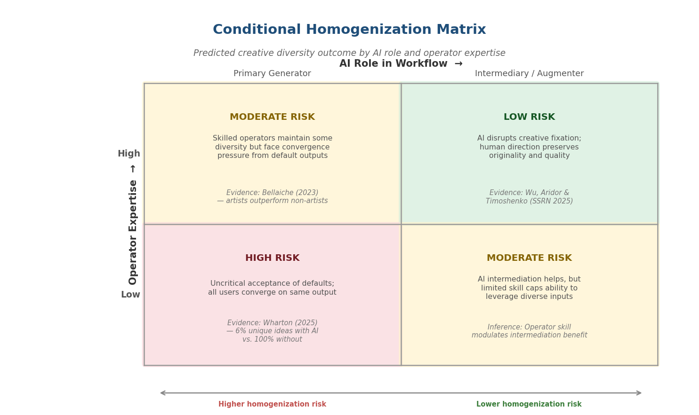
*Figure 3. Conditional Homogenization Matrix. Predicted creative diversity outcomes by AI role (primary generator vs. intermediary/augmenter) and operator expertise (high vs. low). Each quadrant is anchored to empirical findings: Wharton (2025) for the high-risk cell, Wu, Aridor & Timoshenko (SSRN 2025) for the low-risk cell, and Bellaiche (2023) for the moderate-risk cell.*

The convergence pressures are real and documented. Model collapse is a verified technical phenomenon. Cross-model homogeneity is empirically established. Consumer backlash against "AI slop" aesthetics provides market-level confirmation that the outputs of algorithmic design are perceptibly uniform. The Wharton experiments demonstrate that the narrowing effect extends beyond outputs to the creative process itself.

The counter-evidence is equally real but narrower in scope. Expert operators can maintain creative complexity when using AI tools. AI intermediation, when carefully structured, may reduce creative fixation rather than amplify it. The anti-AI craft movement demonstrates that market mechanisms can generate countervailing forces — though these forces currently concentrate in luxury segments that can monetize scarcity.

The critical finding is that homogenization risk concentrates in specific market segments and usage patterns: mass-market fashion where AI replaces rather than augments human ideation; contexts where designers accept default outputs without substantial modification; and production systems where speed-to-market incentives override creative exploration. Luxury brands possess institutional resources — craft heritage, creative director authority, consumer expectations of singularity — that partially buffer against convergence. Independent designers occupy an ambiguous position: they face the greatest competitive pressure to adopt AI tools for efficiency, yet their market differentiation depends precisely on the idiosyncratic vision that uncritical AI adoption may erode. The chapters that follow examine how legal frameworks (Chapter 3), litigation patterns (Chapter 4), and emerging governance models (Chapter 5) intersect with these conditional dynamics.

# 第3章 Legal and Copyright Frameworks Governing AI-Generated Fashion Designs

The rapid integration of generative AI into fashion design workflows has collided with intellectual property regimes never designed to adjudicate machine-generated creative output. Whether a dress silhouette produced through 600 iterative text prompts qualifies as a copyrightable "work," who owns a textile pattern refined by an algorithm trained on thousands of runway photographs, and whether designers can prevent their portfolios from becoming training data—these questions sit at the intersection of technology, law, and creative labor. The stakes are substantial: fashion is a USD 1.7 trillion global industry in which design originality anchors brand value, yet the legal infrastructure protecting that originality varies dramatically across jurisdictions and was constructed well before generative models existed.

This chapter provides a comparative analysis of how copyright and IP frameworks across the United States, the European Union, the United Kingdom, China, and Japan apply to AI-generated fashion designs, and examines why the fashion industry's historically weak IP protections make it especially vulnerable in the generative AI era. It proceeds in five parts: the evolving US framework of case law and Copyright Office guidance; the EU's layered regulatory architecture; the contrasting approaches of the UK, China, and Japan; the structural fragility of fashion design under IP law; and a comparative synthesis of the emerging global landscape.

## The US Copyright Office's Evolving Framework

### The Human Authorship Requirement: *Thaler v. Perlmutter*

The foundational US legal principle governing AI-generated works is that copyright requires a human author. In March 2025, the DC Circuit Court of Appeals unanimously affirmed the Copyright Office's refusal to register "A Recent Entrance to Paradise," an image created entirely by Dr. Stephen Thaler's AI system "Creativity Machine" without any human creative input. Writing for the panel, Judge Patricia Millett held that "many of the Copyright Act's provisions make sense only if an author is a human being" and that "the best reading of the Copyright Act is that human authorship is required for registration." The court further rejected the work-made-for-hire doctrine as an alternative route, holding that all copyrightable works must "be created in the first instance by a human being" [Goodwin](https://www.goodwinlaw.com/en/insights/publications/2025/03/alerts-technology-dc-circuit-holds-that-ai-cannot-be-an-author "DC Circuit ruling, March 2025"). *Thaler v. Perlmutter*, 130 F.4th 1039 (D.C. Cir. 2025).

On 2 March 2026, the US Supreme Court denied certiorari (Case No. 25-449), leaving the DC Circuit's human-authorship requirement as the highest-level US judicial pronouncement on AI authorship [Mayer Brown](https://www.mayerbrown.com/en/insights/publications/2026/03/supreme-court-denies-review-in-ai-authorship-case "SCOTUS cert denial, March 2026"). While a denial of certiorari is not a ruling on the merits, it forecloses any near-term prospect of Supreme Court reconsideration.

The scope of *Thaler* is deliberately narrow. Thaler listed his AI system as the sole author, disclaimed any human creative contribution, and sought copyright protection on that basis. The DC Circuit accordingly emphasized that its ruling does not "automatically disqualify works made by or with the assistance of artificial intelligence" [Copyright Lately](https://copyrightlately.com/thaler-is-dead-ai-copyright-questions/ "Post-Thaler analysis, March 2026"). The harder questions—how much human involvement suffices, and how to demonstrate it—remain unresolved.

### The Part 2 Report: Copyrightability of AI Outputs

The US Copyright Office's Part 2 Report, released in January 2025, provides the most detailed official guidance on when AI-assisted works may qualify for copyright protection. It establishes five key principles: (1) existing copyright law is sufficiently flexible to apply to generative AI without legislative change; (2) copyright protects original human expression even when a work also includes AI-generated material; (3) the sufficiency of human contribution must be assessed case by case; (4) prompts alone, "given current generally available technology," do not provide sufficient control to make the user an author of the output; and (5) human authors retain copyright in creative works perceptible in AI outputs, as well as in the creative selection, coordination, arrangement, or modification of AI-generated elements [US Copyright Office NewsNet 1060](https://www.copyright.gov/newsnet/2025/1060.html "USCO Part 2 Report, January 2025") [Crowell & Moring](https://www.crowell.com/en/insights/client-alerts/us-copyright-office-releases-part-2-of-artificial-intelligence-report-clarifying-copyrightability-of-generative-ai-outputs "Part 2 Report analysis").

The report drew the authorship line from both directions. On one side, it confirmed that using AI for assistive tasks—spell-checking, color correction, image sharpening—does not defeat copyright in the resulting work, and that incorporating AI-generated elements into a larger human-authored composition does not strip protection from the human-authored portions. On the other, it characterized iterative prompting as analogous to "re-rolling" dice: each new prompt produces a different output, but the expressive content remains the AI system's interpretation rather than the user's controlled expression [Copyright Lately](https://copyrightlately.com/thaler-is-dead-ai-copyright-questions/ "Analysis of USCO prompting framework, March 2026"). To illustrate the distinction, the Office cited country artist Randy Travis, who used a purpose-built AI vocal model trained on his pre-stroke singing voice—a use deemed copyrightable because the AI functioned as a tool to recast existing human expression, not to generate new expression autonomously [Crowell & Moring](https://www.crowell.com/en/insights/client-alerts/us-copyright-office-releases-part-2-of-artificial-intelligence-report-clarifying-copyrightability-of-generative-ai-outputs "Randy Travis example").

A significant practical milestone arrived in January 2025, when the Copyright Office registered *A Single Piece of American Cheese*, an image created using Invoke AI's inpainting tools through 35 rounds of iterative modification—the first AI-generated image to receive copyright registration. The registration turned on the applicant's claimed human authorship in the selection, coordination, and arrangement of AI-generated elements, not on the strength of the prompts themselves [Copyright Lately](https://copyrightlately.com/thaler-is-dead-ai-copyright-questions/ "A Single Piece of American Cheese registration, March 2026"). This precedent suggests a viable pathway for fashion designers who employ AI tools with substantial post-generation creative selection and modification, while reinforcing that prompting alone falls short of the authorship threshold.

### The Part 3 Report: Training on Copyrighted Works

The Part 3 Report, released in May 2025, addresses a distinct but equally consequential question: the legality of using copyrighted works to train generative AI models. Analyzing the four-factor fair use test, the report concluded that commercial use of "vast troves of copyrighted works to produce expressive content that competes with them in existing markets, especially where this is accomplished through illegal access, goes beyond established fair use boundaries." It further noted that the first factor (purpose and character of use) and fourth factor (market effect) "may carry more weight" in the AI training context, though fair use determination remains an inherently case-by-case inquiry [Crowell & Moring](https://www.crowell.com/en/insights/client-alerts/us-copyright-office-releases-third-report-on-ai-and-copyright-addressing-training-ai-models-with-copyrighted-materials "Part 3 Report analysis, May 2025").

On the question of legislative remedy, the report recommended market-based mechanisms over government intervention, cautioning that "premature adoption [of statutory, compulsory licenses]…risks stifling the development of flexible and creative market-based solutions." The Part 3 Report carries no binding legal effect, but it provides a significant interpretive signal for courts adjudicating pending AI training disputes and for legislators considering statutory frameworks.

### The Pending Test: *Allen v. Perlmutter*

The case most likely to shape how AI-assisted creative work—including fashion design—is treated under US copyright law is *Allen v. Perlmutter* (No. 1:24-cv-02665, D. Colo.). Artist Jason Allen challenges the Copyright Office's refusal to register *Théâtre D'opéra Spatial*, an image generated via Midjourney using at least 624 iterative text prompts, Midjourney's variation and upscaling tools, and subsequent Photoshop refinement. In January 2026, the government filed a cross-motion for summary judgment, maintaining that the work's underlying expressive elements were generated by Midjourney, not authored by Allen [Copyright Lately](https://copyrightlately.com/thaler-is-dead-ai-copyright-questions/ "Allen v. Perlmutter procedural status, March 2026"). Allen's February 2026 reply brief counters that the Copyright Office conflates the idea/expression dichotomy with the authorship question, asserting that his iterative specification of genre, tone, color, composition, and style constituted expressive choices reflected in the final work.

The outcome carries direct implications for fashion design practice. If the court sides with Allen, it could establish that sustained, detailed prompt engineering—combined with post-generation refinement—constitutes sufficient human authorship. If it sides with the government, it would reinforce the Copyright Office's position that prompting, regardless of volume or specificity, does not cross the authorship threshold. For fashion designers who use AI tools to generate initial concepts subsequently refined through human creative judgment, *Allen* represents the most consequential pending adjudication in the field.

## The European Union: AI Act, DSM Directive, and the 2026 Parliamentary Push

### Article 53 and the GPAI Compliance Framework

The EU has constructed the most elaborate regulatory architecture for AI and copyright through the interplay of three instruments: the AI Act, the Digital Single Market (DSM) Copyright Directive, and the General-Purpose AI (GPAI) Code of Practice. Article 53(1)(c) of the EU AI Act requires GPAI model providers to "put in place a policy to comply with Union law on copyright and related rights," specifically to identify and comply with rights reservations expressed under Article 4(3) of the DSM Directive. Article 53(1)(d) mandates publication of a "sufficiently detailed summary" of content used for training—an obligation operationalized through the Training Data Summary (TDS) Template published on 24 July 2025. Both obligations took effect on 2 August 2025 [Bird & Bird](https://www.twobirds.com/en/insights/2025/taking-the-eu-ai-act-to-practice-decoding-the-gpai-code-of-practice-and-the-training-data-summary-te "GPAI Code of Practice analysis") [Skadden](https://www.skadden.com/insights/publications/2025/08/eus-general-purpose-ai-obligations "EU GPAI obligations, August 2025").

The GPAI Code of Practice, formally approved on 1 August 2025, offers a voluntary compliance framework; signatories receive a "presumption of conformity" with Article 53. Its copyright chapter requires providers to maintain a publicly available copyright policy, ensure web crawlers reproduce only lawfully accessible works without circumventing technical protections, comply with rights reservations through machine-readable means including robots.txt, implement safeguards to mitigate copyright-infringing outputs, and designate a copyright complaints point of contact [Skadden](https://www.skadden.com/insights/publications/2025/08/eus-general-purpose-ai-obligations "GPAI Code of Practice measures, August 2025").

Non-compliance carries substantial penalties: fines of up to 3% of global annual turnover or EUR 15 million, whichever is greater, with enforcement powers becoming fully operational by 2 August 2026 [Clifford Chance](https://www.cliffordchance.com/insights/resources/blogs/ip-insights/2025/10/copyright-compliance-under-the-eu-ai-act-for-gpai-model-providers.html "GPAI compliance penalties, October 2025").

### The DSM Directive's Text and Data Mining Exceptions

The copyright framework underpinning the AI Act's obligations rests on two text and data mining (TDM) exceptions in the DSM Directive. Article 3 provides a mandatory exception permitting research organizations and cultural heritage institutions to mine copyrighted works for scientific research purposes. Article 4 extends TDM to any party for any purpose, but with a critical limitation: rights holders may reserve their rights through "appropriate means," including machine-readable signals. When a rights holder opts out, the exception does not apply [Bird & Bird](https://www.twobirds.com/en/insights/2025/taking-the-eu-ai-act-to-practice-decoding-the-gpai-code-of-practice-and-the-training-data-summary-te "TDM exceptions analysis").

For fashion, the opt-out mechanism is of particular significance. Luxury houses and independent designers whose runway imagery, lookbook photographs, and textile patterns are routinely scraped by AI training pipelines can, in principle, assert opt-out rights. The practical challenge lies in enforcement: the GPAI Code of Practice requires providers to respect machine-readable opt-out signals, but no centralized registry exists to verify compliance.

### The 2026 Parliamentary Resolution

On 10 March 2026, the European Parliament adopted a non-binding resolution on "copyright and generative AI" by a vote of 460 to 71. The resolution calls for AI providers to supply itemized training content inventories, the creation of a European opt-out registry administered by the European Union Intellectual Property Office (EUIPO), progress toward voluntary collective licensing arrangements, full compensation for media organizations, and a position that purely AI-generated content should not receive copyright protection [Finnish AI Region FAIR EDIH](https://www.fairedih.fi/en/2026/03/23/eu-parliament-backs-copyright-protections-for-ai-training-dividing-industry/ "EU Parliament resolution, March 2026").

Although non-binding, the resolution's overwhelming margin signals the political direction of EU copyright policy. Whether the European Commission will respond with binding legislative proposals remains an open question as of early 2026, but the resolution establishes a clear institutional preference for transparency, rights-holder compensation, and the denial of copyright to purely autonomous AI outputs.

## The United Kingdom: Section 9(3) and an Uncertain Future

The UK occupies a singular position in the global landscape of AI copyright: it is the only major jurisdiction that provides statutory copyright protection for "computer-generated works" (CGWs). Section 9(3) of the Copyright, Designs and Patents Act 1988 (CDPA) defines the author of a CGW as "the person by whom the arrangements necessary for the creation of the work are undertaken." Protection extends for 50 years, but no moral rights attach [Authors Alliance](https://www.authorsalliance.org/2025/05/19/the-uks-curious-case-of-copyright-for-ai-generated-works-what-section-93-means-today/ "UK Section 9(3) analysis, May 2025").

Enacted before the advent of modern generative AI, Section 9(3) was designed for earlier forms of computer-assisted creation—spreadsheet-generated charts, algorithmically composed music, automated database compilations. Its application to outputs of large-scale generative models remains largely untested in litigation. The only substantial judicial engagement with the provision is *Nova Productions v. Mazooma Games* [2007] EWCA Civ 219, which addressed copyright in a computer game's visual frames rather than in autonomous AI-generated works. The question of who "undertakes the arrangements necessary" when a user enters a text prompt into a diffusion model, which then generates a fashion design from millions of training images, has no judicial answer in UK law.

The UK Intellectual Property Office (IPO) has signaled a potential shift. A March 2026 government report proposed repealing Section 9(3), which would align the UK more closely with the US and EU position that purely AI-generated outputs are not copyrightable. The proposal remains under consultation, and no legislative amendment has been introduced. If enacted, repeal would eliminate the UK's anomalous CGW protection and leave AI-generated fashion designs without copyright coverage unless sufficient human authorship can be demonstrated—a standard whose contours remain undefined in UK case law.

This uncertainty creates a practical dilemma for fashion businesses operating across jurisdictions. A textile pattern generated by AI in the UK may currently enjoy Section 9(3) protection domestically while receiving no copyright protection in the US—a split that complicates global IP strategies for multinational fashion houses.

## China: Judicial Pragmatism and the Lowest Authorship Threshold

Chinese courts have adopted the most permissive stance among major jurisdictions toward copyright in AI-generated works. In November 2023, the Beijing Internet Court ruled that an image generated using Stable Diffusion could qualify for copyright protection. The court held that the plaintiff's process of selecting models, crafting prompts over multiple rounds, and adjusting parameters constituted "intellectual creation" (*zhili chuangzuo*) sufficient to establish authorship. Rather than treating the AI output as the "work" of the software, the court characterized the AI as a tool through which the human user expressed creative intent [DLA Piper](https://www.dlapiper.com/insights/publications/2025/05/another-chinese-court-finds-that-ai-generated-images-can-be-protected-by-copyright "Chinese AI copyright rulings, May 2025").

In March 2025, the Changshu Court extended this reasoning in the "Half Heart" case, granting copyright protection to an image generated via Midjourney and subsequently modified in Adobe Photoshop. The court awarded RMB 10,000 in damages, emphasizing that the combination of prompt-based generation and manual post-processing established sufficient human creative contribution [DLA Piper](https://www.dlapiper.com/insights/publications/2025/05/another-chinese-court-finds-that-ai-generated-images-can-be-protected-by-copyright "Changshu 'Half Heart' ruling, May 2025").

Two features distinguish the Chinese approach. First, the threshold for "intellectual creation" appears lower than in the US: multi-round prompting combined with parameter adjustments may suffice, whereas the US Copyright Office has explicitly stated that prompts alone are insufficient. Second, China has no specific text and data mining framework governing AI training on copyrighted works—the legal landscape for training data use remains underdeveloped, creating an asymmetry between relatively strong output protection and weak input-side regulation.

For fashion brands operating in or sourcing from China, these rulings suggest that AI-generated designs may enjoy stronger copyright protection than in other major markets, provided the designer can document a process of iterative human engagement with the AI tool.

## Japan: The Broadest Training Exception, Untested Output Rules

Japan's copyright framework occupies the opposite end of the spectrum from the EU on the question of training data. Article 30-4 of Japan's Copyright Act permits the use of copyrighted works for "information analysis" purposes—including AI training—without consent or compensation. This provision, interpreted broadly by the Japanese Cultural Affairs Agency, represents the most permissive training data exception among the jurisdictions examined here [Chambers](https://practiceguides.chambers.com/practice-guides/artificial-intelligence-2025/japan "Japan AI law guide, May 2025").

On the output side, the Cultural Affairs Agency's May 2024 guidance provides that purely autonomous AI-generated content does not qualify as a "work" (*chosakubutsu*) under Japanese copyright law, as it lacks the requisite human "creative contribution." However, when a user employs AI as a tool and exercises meaningful creative direction—through detailed prompts, parameter selection, or post-generation editing—the resulting output may be eligible for copyright protection. The guidance closely parallels the US Copyright Office's position, though no Japanese court has yet adjudicated an AI authorship dispute, leaving the practical application of these principles untested [Chambers](https://practiceguides.chambers.com/practice-guides/artificial-intelligence-2025/japan "Japan Cultural Affairs guidance, 2024").

Japan's combination of the broadest training data exception with a human-authorship requirement for output protection creates a distinctive policy posture: maximally permissive for AI developers consuming copyrighted fashion images as training material, but restrictive for users seeking to claim copyright in what the AI produces. For Japanese fashion brands, this asymmetry means their design archives are among the most legally accessible to AI training globally, while the IP protection available for their own AI-generated outputs remains uncertain.

## Fashion Design's Structural Vulnerability Under IP Law

The legal uncertainties surrounding AI-generated works intersect with a longstanding structural weakness: fashion design has historically received weaker IP protection than virtually any other creative industry. Understanding this baseline vulnerability is essential to appreciating why generative AI poses a disproportionate threat to the fashion sector.

### The US Gap: Separability, Failed Legislation, and Design Patent Limitations

In the United States, clothing and accessory designs occupy a precarious position under IP law. Under 17 U.S.C. § 101, "useful articles"—objects with an intrinsic utilitarian function—are eligible for copyright protection only if their artistic features "can be identified separately from, and are capable of existing independently of, the utilitarian aspects of the article." The Supreme Court's 2017 decision in *Star Athletica, LLC v. Varsity Brands, Inc.* clarified the separability test, holding that a design feature is eligible for protection if it (1) can be perceived as a two- or three-dimensional work of art separate from the useful article and (2) would qualify as a protectable pictorial, graphic, or sculptural work on its own. While *Star Athletica* expanded protection for surface decorations like cheerleader uniform stripes, it did not extend copyright to overall garment silhouettes, cuts, or structural designs [USCO Congressional Testimony](https://www.copyright.gov/docs/regstat072706.html "Protection for Fashion Design, 2006") [WIPO Magazine](https://www.wipo.int/en/web/wipo-magazine/articles/the-role-of-ip-rights-in-the-fashion-business-a-us-perspective-40479 "IP rights in fashion business").

Design patents offer a theoretical alternative, but present formidable practical obstacles. The examination process can extend 15–24 months—potentially exceeding the market lifespan of a fashion season—and the cost of prosecution and enforcement renders design patents accessible primarily to large brands with dedicated IP counsel. Three legislative attempts to close this gap—the Design Piracy Prohibition Act (DPPA), the Innovative Design Protection and Piracy Prevention Act (IDPPPA), and the Innovative Design Protection Act (IDPA)—all failed to pass Congress, reflecting a persistent legislative consensus that fashion design does not warrant the same protection as other creative works [WIPO Magazine](https://www.wipo.int/en/web/wipo-magazine/articles/the-role-of-ip-rights-in-the-fashion-business-a-us-perspective-40479 "Failed US fashion design legislation").

### The EU Contrast: Community Design Rights

The EU provides substantially stronger protection through the Community Design framework. Registered Community designs, administered by the EUIPO, offer up to 25 years of protection for designs that are new and have individual character. Crucially, the EU also grants unregistered Community design rights, which provide automatic three-year protection from the date a design is first made available to the public within the EU—without any registration requirement. This unregistered right is particularly valuable in fashion, where the speed of seasonal turnover makes registration impractical for many designs [WIPO Magazine](https://www.wipo.int/en/web/wipo-magazine/articles/the-role-of-ip-rights-in-the-fashion-business-a-us-perspective-40479 "EU Community design rights").

The practical consequence is stark: a dress design that receives automatic unregistered design right protection in the EU "simply does not exist" as a protectable IP asset in the United States. When generative AI systems are trained on datasets that include such designs, the lack of US protection means American designers have fewer legal tools to challenge either the training use of their work or the AI-generated outputs that may resemble it.

### AI as Amplifier of the Protection Gap

Generative AI amplifies fashion's pre-existing IP vulnerability in two ways. On the input side, the industry's vast corpus of publicly accessible imagery—runway photographs, e-commerce product shots, social media posts, street style documentation—constitutes an unusually rich and easily scraped training dataset. Fashion imagery is more abundant, more uniformly formatted, and less frequently protected by technical access controls than equivalent creative works in music, film, or publishing. On the output side, AI systems trained on this corpus can generate novel-seeming designs at a speed and volume that overwhelms the already limited enforcement mechanisms available to designers. The combination of weak input-side protection, abundant training data, and high-volume output creates what amounts to a structural IP arbitrage that disproportionately disadvantages fashion creators.

## Comparative Synthesis

The five jurisdictions examined in this chapter reveal a fragmented global landscape in which no consensus has emerged on either of the two central questions: whether AI-generated creative outputs deserve copyright protection, and whether training AI on copyrighted works constitutes infringement.

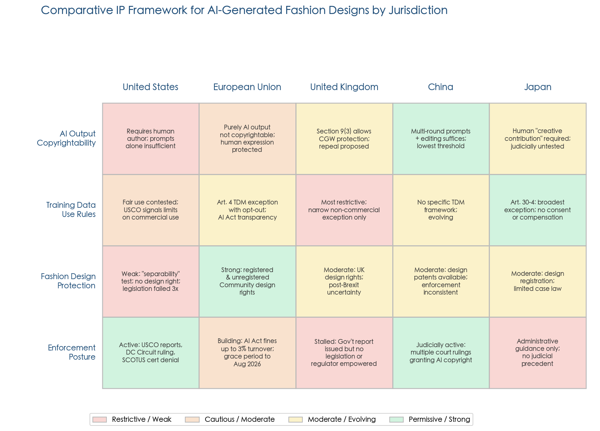

*Figure 1: Comparative IP framework across five major jurisdictions, mapping AI output copyrightability, training data rules, fashion design protection, and enforcement posture.*

On AI output copyrightability, a rough spectrum emerges. China sets the lowest bar, granting copyright where multi-round prompting and editing demonstrate "intellectual creation." The UK's Section 9(3) provides statutory protection for computer-generated works, though its future is uncertain. Japan and the EU require human creative contribution but have limited case law. The US, anchored by *Thaler* and the Part 2 Report, demands human authorship and has expressly rejected the sufficiency of prompting alone—the most restrictive position among major jurisdictions.

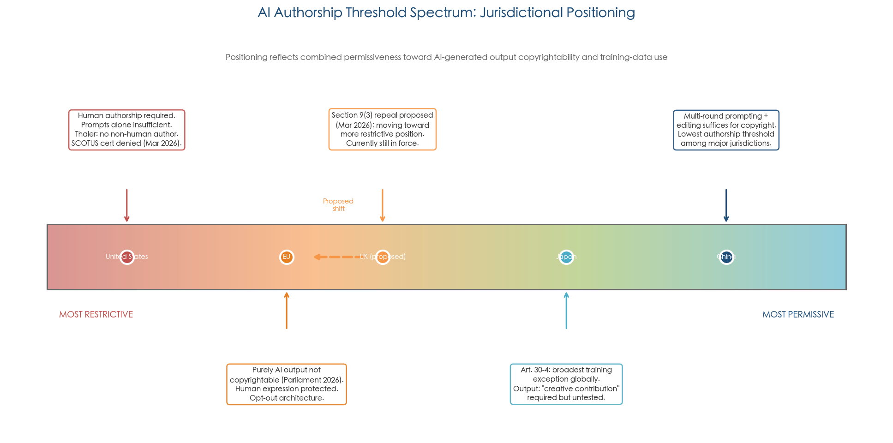

*Figure 2: Jurisdictional positioning on the AI authorship threshold spectrum, from most restrictive (United States) to most permissive (China).*

On training data use, the spectrum inverts. Japan's Article 30-4 permits the broadest use of copyrighted works for AI training without consent. The EU permits TDM under Article 4 of the DSM Directive but allows rights holders to opt out—a mechanism that the 2026 parliamentary resolution seeks to strengthen through a centralized registry. The US leaves the question to fair use litigation, with the Copyright Office signaling that large-scale commercial training on copyrighted works likely exceeds fair use boundaries. The UK maintains the most restrictive position, with only a narrow non-commercial research exception.

On fashion-specific protections, the EU stands alone in offering both registered and unregistered design rights that automatically cover fashion designs. China and Japan provide design patent regimes of moderate effectiveness. The UK offers design rights with post-Brexit uncertainty about their scope. The US provides the weakest protection, with the separability doctrine, expensive design patents, and three failed legislative attempts leaving a persistent gap.

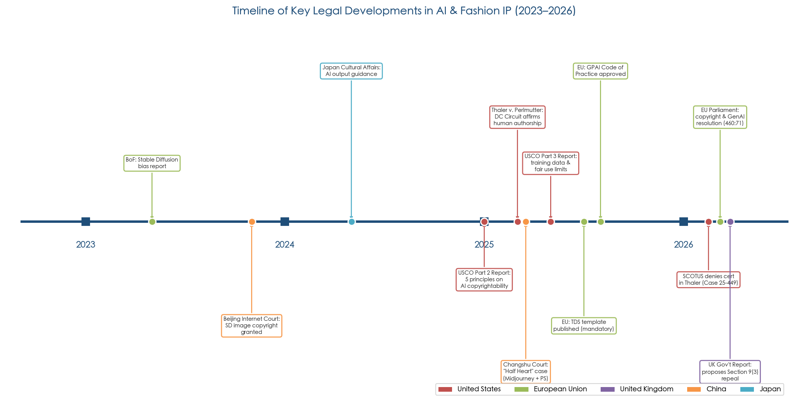

*Figure 3: Timeline of major legal developments across jurisdictions, from the 2023 Beijing Internet Court ruling through the 2026 SCOTUS cert denial and EU parliamentary resolution.*

The practical implications for fashion businesses are substantial. A multinational brand generating AI-assisted designs must navigate a patchwork in which the same output may be copyrightable in China, potentially protected under Section 9(3) in the UK, and unprotectable in the US—while the training data used to create it may be lawful in Japan, subject to opt-out in the EU, and contested under fair use in the US. Until international harmonization occurs—an unlikely near-term prospect—the legal status of AI-generated fashion designs will remain jurisdiction-dependent, creating both risks and strategic considerations that require careful management across every market in which a brand operates.

# 第4章 Key Copyright Disputes and Litigation Patterns

The legal frameworks surveyed in Chapter 3 remain largely untested until courts apply them to concrete disputes. As of early 2026, the litigation landscape at the intersection of AI and copyright is expanding rapidly—yet it displays a striking asymmetry. Dozens of high-profile cases pit content creators against AI model developers in music, publishing, and visual arts, but the fashion industry has generated remarkably few direct confrontations with generative AI tool companies. The most consequential fashion-specific disputes instead center on algorithmically accelerated design copying by ultra-fast-fashion platforms, above all Shein. This chapter catalogs the key cases, identifies emerging judicial patterns on fair use and training-data liability, examines the settlement and licensing deals reshaping the field, and assesses the structural litigation disadvantages that leave independent designers particularly exposed.

## The Litigation Surge: From 30 to 80+ Cases in Eighteen Months

By late 2024, approximately 30 copyright infringement lawsuits had been filed against AI companies in the United States. Over the course of 2025, that figure more than doubled: the Copyright Alliance documented over 70 active cases by December 2025, with at least six additional suits filed in February 2026 alone—bringing the cumulative total past 80 [Copyright Alliance Year in Review](https://copyrightalliance.org/ai-copyright-lawsuit-developments-2025/ "AI Copyright Lawsuit Developments in 2025, January 2026") [Copyright Alliance](https://copyrightalliance.org/copyright-stories-february-2026/ "Top Copyright Stories, February 2026"). Morrison Foerster projects that filings will continue to accelerate through 2026, with judicial attention increasingly shifting from training-data liability to the outputs themselves [Morrison Foerster](https://mofotech.mofo.com/topics/ai-trends-for-2026---copyright-litigation-shifts-from-training-data-to-ai-outputs "AI Trends for 2026").

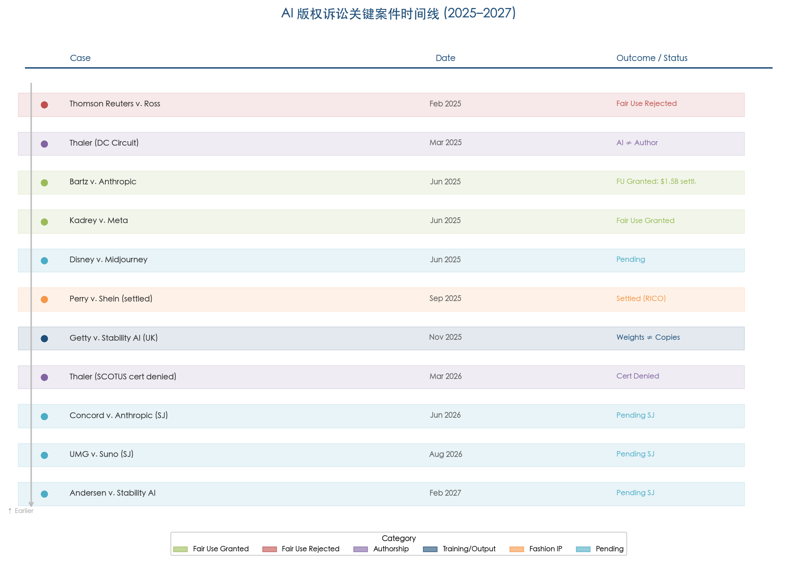
*Figure 1. Timeline of landmark AI copyright cases, color-coded by category (fair use, authorship, training/output, fashion IP, and pending rulings). Data compiled from Copyright Alliance, Reuters Legal, and court filings.*

The plaintiffs span the creative industries—authors, visual artists, music publishers, photographers, software developers, and news organizations—but fashion designers remain conspicuously underrepresented. No lawsuit filed through April 2026 directly challenges a generative AI design tool company (such as Style3D, The New Black, or Refabric) for copyright infringement of fashion designs. This absence is analytically significant in its own right: it reflects both the weak copyright protections available for garment designs under US law (discussed in Chapter 3) and the practical difficulty of proving that a specific AI-generated design was derived from a specific copyrighted work when training datasets remain opaque.

## Landmark Fair Use Rulings: Contradictory Signals

### Training as Transformative Use: *Bartz v. Anthropic* and *Kadrey v. Meta*

Two decisions from the Northern District of California in June 2025 offered the first substantive judicial analysis of whether using copyrighted works to train large language models constitutes fair use. In *Bartz v. Anthropic*, the court held that training an LLM on lawfully obtained books is transformative because the model does not store or reproduce the works but rather extracts statistical patterns to generate new content—a significant win for AI developers. The ruling came, however, with a critical caveat: Anthropic separately faced evidence that it had downloaded approximately 482,460 pirated books from shadow libraries. The piracy claims resulted in a $1.5 billion settlement, the largest AI copyright settlement to date, averaging roughly $3,000 per work [Reuters Legal](https://www.reuters.com/legal/legalindustry/copyright-law-2025-courts-begin-draw-lines-around-ai-training-piracy-market-harm--pracin-2026-03-16/ "Copyright Law in 2025, March 2026").

In *Kadrey v. Meta*, also in the Northern District of California, the court similarly found that Meta's use of copyrighted books to train its LLaMA models was "highly transformative," reasoning that the purpose of training—extracting generalized linguistic patterns—differs fundamentally from the purpose of the original expressive works. Taken together, these two rulings suggest that courts may tolerate large-scale ingestion of copyrighted material for training when the material was lawfully accessed, but will not extend that tolerance to pirated content [Reuters Legal](https://www.reuters.com/legal/legalindustry/copyright-law-2025-courts-begin-draw-lines-around-ai-training-piracy-market-harm--pracin-2026-03-16/ "Copyright Law in 2025, March 2026").

### Fair Use Denied: *Thomson Reuters v. Ross Intelligence*

A sharply different outcome emerged in *Thomson Reuters v. Ross Intelligence* (D. Del., February 2025), the first AI copyright case in which a court substantively rejected the fair use defense. Ross Intelligence had used 2,243 copyrighted Westlaw headnotes to train its AI-powered legal research tool—a product that directly competed with Thomson Reuters' own services. The court found the use non-transformative, reasoning that Ross's product "merely reproduced the organizational and analytical work embodied in Westlaw's headnotes" for the same functional purpose. The fourth fair use factor—market harm—weighed heavily against the defendant, as Ross Intelligence's tool served as a direct substitute for the copyright holder's product [Goodwin](https://www.goodwinlaw.com/en/insights/publications/2025/02/alerts-practices-ip-lit-court-rejects-fair-use-defense-in-ai-copyright-case "Court Rejects Fair Use Defense, February 2025").

The *Thomson Reuters* ruling illustrates a distinction that may prove critical for fashion: when an AI system is trained on copyrighted works and produces outputs that compete directly with those works in the same market, the fair use defense weakens considerably. An AI design tool trained on a portfolio of independent designers' runway images that generates competing garment designs for a fast-fashion platform would present a factual scenario closer to *Thomson Reuters* than to *Bartz* or *Kadrey*.

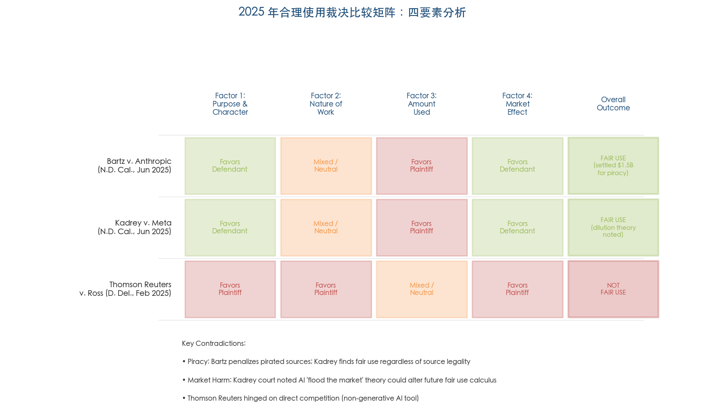
*Figure 2. Comparison of the four statutory fair use factors across the three landmark 2025 AI rulings, illustrating the divergent analytical outcomes and key contradictions in training-as-use jurisprudence.*

### The Visual Arts Frontier: *Getty Images v. Stability AI* and *Andersen v. Stability AI*

The two cases most proximate to fashion design both involve image-generation models. In *Getty Images v. Stability AI* (UK High Court, November 2025), the court reached a nuanced conclusion: model weights do not constitute "copies" of the training images, so the act of training Stable Diffusion did not in itself infringe Getty's copyrights. The court did, however, find that early versions of Stable Diffusion had reproduced Getty's watermark in generated outputs, constituting "limited" trademark infringement. The ruling implies that the primary legal risk for AI image generators lies less in the training process and more in what the model produces—a finding consistent with Morrison Foerster's prediction that litigation focus is shifting from inputs to outputs [Mayer Brown](https://www.mayerbrown.com/en/insights/publications/2025/11/getty-images-v-stability-ai-what-the-high-courts-decision-means-for-rights-holders-and-ai-developers "Getty v. Stability AI UK ruling, November 2025").

*Andersen v. Stability AI* (N.D. Cal.), brought by visual artists Sarah Andersen, Kelly McKernan, and Karla Ortiz, remains the flagship US case for image-generation copyright claims. The court allowed direct copyright infringement claims to proceed past the pleading stage, and summary judgment hearings—now postponed to February 2027—are expected to address whether text-to-image models that can reproduce recognizable elements of specific artists' styles constitute infringement. The eventual ruling carries direct implications for AI fashion design tools trained on identifiable designer aesthetics [Reuters Legal](https://www.reuters.com/legal/legalindustry/copyright-law-2025-courts-begin-draw-lines-around-ai-training-piracy-market-harm--pracin-2026-03-16/ "Copyright Law in 2025, March 2026").

## Fashion-Specific Disputes: The Shein Litigation Complex

The most consequential fashion-specific copyright disputes of this period are directed not at AI generative design companies but at the ultra-fast-fashion platform Shein, which simultaneously faces more than 50 active intellectual property lawsuits. Plaintiffs range from independent designers to established brands including Coach, Brandy Melville, Dr. Martens, H&M, and Levi's [ABA Landslide](https://www.americanbar.org/groups/intellectual_property_law/resources/landslide/2026-winter/how-will-ai-impact-fashion-industrys-public-domain/ "How Will AI Impact Fashion's Public Domain?, Winter 2026"). Two cases illustrate the evolving legal strategies available to designers.

### *Perry v. Shein*: RICO, Algorithmic Copying, and Settlement

In *Perry v. Shein* (C.D. Cal., filed 2023), three independent designers—Krista Perry, Larissa Martinez, and Jay Baron—invoked the Racketeer Influenced and Corrupt Organizations Act (RICO) alongside copyright infringement claims, alleging that Shein operates a systematic enterprise that uses algorithms to identify trending designs from independent creators and transmit them to its manufacturing network for rapid reproduction [Draftncraft](https://www.draftncraft.com/shein-facing-legal-battles-for-alleged-design-copying/ "Shein legal battles, March 2026").

The RICO theory was legally innovative. Traditional copyright claims against fast-fashion copyists face high evidentiary burdens: the plaintiff must prove access to the original work and substantial similarity between protected expression—not merely shared functional or aesthetic elements. RICO, by contrast, requires proof of a "pattern of racketeering activity" (here, repeated acts of wire fraud and copyright infringement), allowing plaintiffs to aggregate individually modest claims into a structurally significant case. In November 2024, the court declined to dismiss the RICO claims, a procedural milestone that signaled judicial willingness to treat algorithmic design copying as potential organized misconduct rather than a series of isolated infringement incidents.

The case settled in September 2025 on undisclosed terms. While the confidential settlement prevents assessment of the financial outcome, the procedural precedent—RICO's viability against algorithmic copying—remains available to future plaintiffs [Draftncraft](https://www.draftncraft.com/shein-facing-legal-battles-for-alleged-design-copying/ "Shein legal battles, March 2026").

### *Giana v. Shein*: Class Action and AI-Powered Copying Allegations

A second case extends the legal theory further. In *Giana v. Shein* (C.D. Cal., refiled as a class action in September 2025), the plaintiff alleges that Shein uses "algorithms, AI, and related computer surveillance systems" to identify trending designs and transmit them directly to factories for production—framing the copying not as opportunistic imitation but as a technologically mediated system of extraction [The Fashion Law](https://www.thefashionlaw.com/a-new-lawsuit-lifts-the-lid-on-sheins-ai-powered-ultra-fast-fashion-model/ "Shein AI-powered model, April 2024") [AEON Law](https://aeonlaw.com/artist-claims-shein-used-ai-to-steal-and-sell-images/ "Giana v. Shein refiled, September 2025"). The class action structure is significant: by aggregating claims from multiple designers, it mitigates the cost barrier that individual plaintiffs face in federal litigation against a company with annual revenues exceeding $30 billion. As of April 2026, the case has not yet reached a substantive ruling.

## Settlement and Licensing Trends: From Litigation to Market Mechanisms

Alongside the expanding docket of adversarial litigation, 2025 witnessed a parallel trend toward negotiated settlements and bilateral licensing agreements—a development that may ultimately prove more consequential for the creative economy than any single court ruling.

The *Bartz v. Anthropic* settlement—$1.5 billion for the piracy-related claims—stands as the largest AI copyright settlement to date and establishes a de facto price signal: approximately $3,000 per work for unauthorized use of copyrighted material obtained through illicit channels [Reuters Legal](https://www.reuters.com/legal/legalindustry/copyright-law-2025-courts-begin-draw-lines-around-ai-training-piracy-market-harm--pracin-2026-03-16/ "Copyright Law in 2025, March 2026"). In the music industry, Universal Music Group reached an agreement with Udio in October 2025 establishing an opt-in licensing paradigm: artists affirmatively choose to license their works for AI training and receive dual-layer compensation for both training use and downstream style-based generation. Warner Music Group followed with parallel settlements with Udio (November 19, 2025) and Suno (November 25, 2025), both adopting similar opt-in structures [UMG](https://www.universalmusic.com/universal-music-group-and-udio-announce-udios-first-strategic-agreements-for-new-licensed-ai-music-creation-platform/ "UMG-Udio agreement, October 2025") [Reuters](https://www.reuters.com/legal/litigation/warner-music-group-settles-copyright-case-with-suno-licensed-ai-music-2025-11-25/ "WMG-Suno settlement, November 2025"). In January 2026, Merlin—the independent label licensing collective—signed what it described as a "landmark" license with Udio, extending the opt-in model to the independent music sector [Merlin](https://merlinnetwork.org/merlin-and-udio-partner-to-advance-ai-for-independent-music/ "Merlin-Udio partnership, January 2026").

The publishing and media sectors have also moved toward bilateral licensing. News Corp's agreement with OpenAI, valued at approximately $250 million over five years, and Shutterstock's AI licensing revenue of $104 million in 2024 both indicate that a commercial market for training-data rights is materializing, albeit unevenly across industries [Copyright Alliance](https://copyrightalliance.org/ai-copyright-lawsuit-developments-2025/ "2025 Year in Review").

Fashion, however, has no equivalent licensing infrastructure. The industry lacks a collective rights organization analogous to ASCAP or BMI in music, and the fragmented, weak copyright protections for garment designs under US law (detailed in Chapter 3) make it unclear what rights could even be licensed. The music industry's opt-in model depends on clearly defined copyrights and centralized catalog management—conditions that the fashion sector does not currently satisfy.

## The Asymmetry Problem: Structural Barriers for Independent Designers

The litigation landscape reveals a pronounced structural asymmetry between the parties most harmed by AI-enabled design copying and those best positioned to seek legal redress. Data from the American Intellectual Property Law Association indicate that the median cost of copyright litigation with less than $1 million in dispute ranges from $200,000 to $400,000 through trial [ABA Landslide](https://www.americanbar.org/groups/intellectual_property_law/resources/landslide/2026-winter/how-will-ai-impact-fashion-industrys-public-domain/ "How Will AI Impact Fashion's Public Domain?, Winter 2026"). For an independent designer with median annual revenues in the range of $50,000, such costs are prohibitive—particularly when the defendant is a company like Shein, whose annual revenue exceeds $30 billion, or a well-capitalized AI company backed by billions in venture funding.

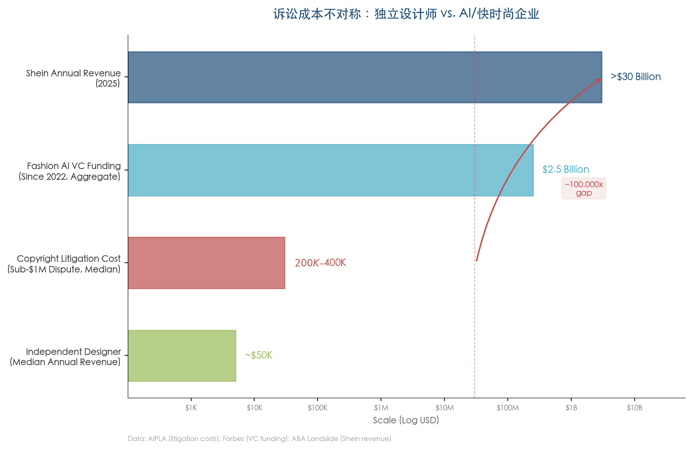
*Figure 3. Logarithmic comparison of enterprise revenues, AI venture capital, litigation costs, and independent designer revenues, illustrating the approximately 100,000× resource gap between the parties most affected by AI-enabled copying and those against whom claims must be brought. Sources: AIPLA (litigation costs); Forbes (VC funding); ABA Landslide (Shein revenue).*

This resource gap shapes litigation behavior in several ways. Independent designers are less likely to file suit, more likely to accept early and unfavorable settlements, and virtually unable to sustain the multi-year discovery processes that AI training-data cases require. The aggregation strategies visible in *Perry v. Shein* (RICO) and *Giana v. Shein* (class action) represent attempts to overcome this asymmetry, but both approaches carry their own risks: RICO claims require proof of predicate criminal acts, and class certification demands sufficient commonality among plaintiffs' claims. Venture-funded litigation funding and contingency arrangements by specialized IP firms offer partial relief, yet these mechanisms tend to favor cases with large potential damages—typically those involving established brands rather than emerging independent designers.

## Legislative Responses: The CLEAR Act and Transparency Mandates

Recognizing the limitations of case-by-case litigation, legislative proposals have begun to address AI copyright issues through transparency mandates rather than direct substantive reform. The bipartisan CLEAR Act (S. 3813, introduced February 2026 by Senators Schiff and Curtis) would require users of generative AI models to submit to the US Copyright Office, at least 30 days before commercial release, a summary of copyrighted works included in training datasets. The Copyright Office would maintain a publicly searchable database of these disclosures. Violations would carry fines of $5,000 per instance, capped at $2.5 million [Snell & Wilmer](https://www.swlaw.com/publication/legislation-watch-for-ai-developers-and-registered-copyright-owners-the-federal-clear-act/ "CLEAR Act, March 2026") [IPWatchdog](https://ipwatchdog.com/2026/02/11/clear-act-establish-notice-requirements-copyrighted-works-ai-training-data/ "CLEAR Act analysis, February 2026").

The CLEAR Act is a transparency measure, not a fair use adjudication: it does not determine whether training on copyrighted works is lawful. It has attracted endorsements from the RIAA, SAG-AFTRA, the Authors Guild, and the Graphic Artists Guild [Graphic Artists Guild](https://graphicartistsguild.org/gag-endorses-copyright-labeling-ai-reporting/ "GAG Endorses CLEAR Act, February 2025"). For fashion designers, however, its practical utility is limited by the requirement that works be registered with the Copyright Office—a threshold that most garment designs do not meet, given the weak and uncertain copyright protections available for apparel under US law.

## Emerging Judicial Patterns and Implications for Fashion

The litigation and settlement activity surveyed in this chapter reveals several patterns with direct bearing on AI-generated fashion design.

First, US courts in 2025 delivered contradictory signals on fair use: *Bartz* and *Kadrey* endorsed training on lawfully obtained copyrighted works as transformative, while *Thomson Reuters* rejected fair use when the AI product directly competed with the source material. The critical variable appears to be market substitution—a factor that weighs against AI design tools generating garments that compete with the designers whose work informed the training data.

Second, courts have shown uniform intolerance for pirated training data. The $1.5 billion *Bartz* settlement and the *Getty* ruling's focus on output-level reproduction both signal that the provenance and legality of training data will be a central battleground in future litigation.

Third, the shift in litigation focus from training inputs to model outputs—anticipated by Morrison Foerster and reinforced by the *Getty* ruling—has particular relevance for fashion. An AI tool's use of publicly available runway images for training may survive fair use scrutiny; the generation of substantially similar garment designs from that training is far more vulnerable.

Fourth, fashion-specific disputes remain overwhelmingly concentrated on fast-fashion algorithmic copying rather than generative AI design tools. The absence of direct litigation against AI fashion design companies reflects the structural weakness of US fashion design IP protections more than the absence of infringement risk. As AI design tools become more capable of generating outputs that closely resemble specific designers' work, the litigation gap is likely to narrow.

Finally, the settlement and licensing trends emerging from music and publishing provide a template that the fashion industry currently lacks the institutional infrastructure to replicate. The development of collective licensing mechanisms, AI training-data registries, and standardized opt-in frameworks for fashion design IP represents a structural prerequisite for bringing the fashion sector's copyright disputes into the emerging commercial equilibrium.

# 第5章 Resolution Mechanisms — Licensing, Technology, and Self-Regulation

The preceding chapters established a compound diagnosis: AI design tools are accelerating creative output while simultaneously intensifying the risk of aesthetic homogenization and deepening unresolved copyright tensions—burdens that fall disproportionately on independent designers who lack the institutional resources of major fashion houses. Legal frameworks remain fragmented across jurisdictions (Chapter 3), and the litigation patterns of 2025–2026 have produced contradictory judicial signals on fair use while exposing severe power asymmetries in enforcement (Chapter 4). This chapter shifts from diagnosis to prescription, evaluating four categories of resolution mechanisms—licensing models, technological safeguards, legislative reform, and industry self-regulation—and assessing their respective viability, limitations, and interdependencies within the fashion design ecosystem.

## Licensing Models: From Voluntary Markets to Collective Frameworks

### The USCO's Market-First Hierarchy

The US Copyright Office Part 3 report (May 2025) offered the most systematic taxonomy of licensing options for AI training data to date. It identified four models arrayed along a spectrum of government intervention: voluntary direct licensing, voluntary collective licensing, extended collective licensing (ECL), and compulsory licensing. The report's central recommendation explicitly favored market mechanisms, cautioning that "premature adoption of statutory compulsory licensing … risks impeding the development of flexible, creative market solutions" and that compulsory licensing should be contemplated only upon evidence of "clear market failure" [Lowenstein Sandler](https://www.lowenstein.com/news-insights/publications/client-alerts/us-copyright-office-releases-long-awaited-report-on-generative-ai-training-and-copyright-law "USCO Part 3 Report analysis, May 2025").

This preference for market-led solutions aligns with the broader US regulatory posture. The White House's March 2026 National AI Policy Framework declared that "training AI models on copyrighted material does not violate copyright law" and endorsed judicial resolution of fair use questions over legislative mandates for compulsory licensing [Holland & Knight](https://www.hklaw.com/en/insights/publications/2026/03/white-house-releases-a-national-policy-framework-for-artificial "White House AI Framework, March 2026"). Together, the USCO report and the White House framework establish a US policy baseline that is structurally unfavorable to creators seeking mandatory compensation from AI model developers—placing the onus on rights holders to negotiate or litigate.

### Opt-In Licensing: The Music Industry as Template

The most advanced operational model for AI training data licensing has emerged not in fashion but in music—an adjacent creative industry whose institutional maturity provides an instructive comparison. In October 2025, Universal Music Group and Udio announced a landmark opt-in licensing agreement under which artists proactively authorize specific works for AI training in exchange for dual-layer compensation: one payment stream for training usage and a second for revenue generated by AI-produced content that draws on the licensed style. A subscription platform implementing this framework was scheduled for launch in 2026 [UMG](https://www.universalmusic.com/universal-music-group-and-udio-announce-udios-first-strategic-agreements-for-new-licensed-ai-music-creation-platform/ "UMG-Udio agreements, October 2025").

Warner Music Group reached similar opt-in agreements with both Udio (November 19, 2025) and Suno (November 25, 2025). In January 2026, Merlin—the collective licensing body representing independent music labels—signed a "milestone" agreement with Udio, extending the opt-in paradigm beyond major labels to the independent sector [Merlin](https://merlinnetwork.org/merlin-and-udio-partner-to-advance-ai-for-independent-music/ "Merlin-Udio partnership, January 2026") [Reuters](https://www.reuters.com/legal/litigation/warner-music-group-settles-copyright-case-with-suno-licensed-ai-music-2025-11-25/ "WMG-Suno settlement, November 2025").

The music model's success rests on institutional infrastructure that fashion conspicuously lacks. ASCAP, BMI, and SESAC have administered collective licensing for over a century; their membership databases, royalty distribution algorithms, and legal frameworks provide a ready-made architecture for extending licensing to AI training. The music industry's trajectory also illustrates the catalytic role of litigation: the UMG-Udio and WMG-Suno agreements followed directly from copyright infringement lawsuits, suggesting that the credible threat of adverse judicial outcomes drove AI companies to the negotiating table.

### The Fashion Gap: Structural Barriers to Collective Licensing

Fashion design operates without any equivalent institutional infrastructure for collective rights management. No organization analogous to ASCAP or BMI exists for fashion designers, and several structural factors explain this absence.

First, US copyright law provides weak and uncertain protection for garment designs. As established in Chapter 3, the separability doctrine under 17 U.S.C. § 101 limits copyright to design elements that can be identified and exist independently of the article's utilitarian function. Most garment designs—silhouettes, cuts, proportions, color combinations—fail this test. Without a clear, registrable right, there is no underlying asset around which to construct a licensing framework.

Second, fashion design IP is radically fragmented. A single collection may draw on hundreds of design elements across fabrics, patterns, silhouettes, and embellishments, each with different provenance and protection status. Unlike a musical composition—a unified copyrightable work—a garment design is typically a composite of protectable and unprotectable elements, making licensing boundaries exceptionally difficult to delineate.

Third, the USCO itself flagged antitrust exposure: voluntary collective licensing requires coordination among competitors, and the Copyright Office urged the Department of Justice and Federal Trade Commission to issue guidance on antitrust safe harbors before such arrangements proliferate [Lowenstein Sandler](https://www.lowenstein.com/news-insights/publications/client-alerts/us-copyright-office-releases-long-awaited-report-on-generative-ai-training-and-copyright-law "USCO Part 3 Report analysis, May 2025"). Absent such guidance, any attempt by fashion designers to establish collective licensing could face legal challenge under existing competition law.

The European Parliament's March 2026 resolution pointed toward a partial solution, calling for "industry-specific voluntary collective licensing" rather than a uniform global rate—acknowledging that different creative sectors require tailored structures [European Parliament](https://www.europarl.europa.eu/news/en/press-room/20260306IPR37511/protecting-copyrighted-work-and-the-eu-s-creative-sector-in-the-age-of-ai "EP resolution, March 2026"). Whether the fashion industry can develop such a structure remains an open question, but the music industry's trajectory suggests that sustained litigation pressure may be a necessary precondition for collective action.

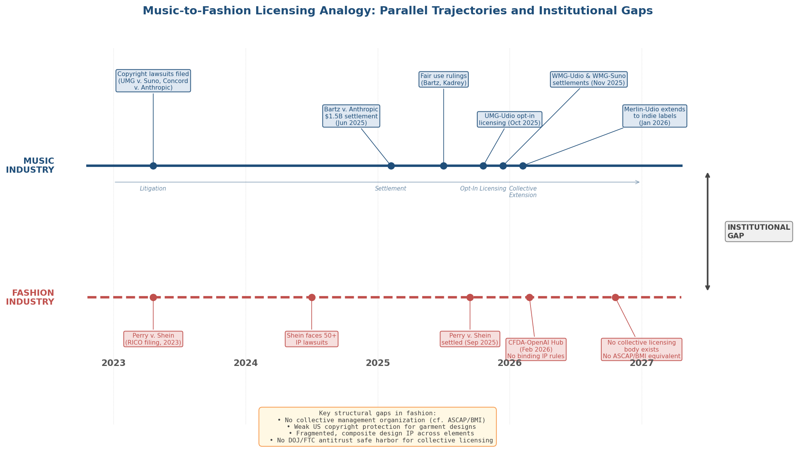

*Figure 5.1 — The music industry progressed from litigation through settlement to opt-in and collective licensing between 2023 and 2026. The fashion industry's parallel trajectory reveals a widening institutional gap: no collective management organization, weak US copyright for garment designs, fragmented design IP, and the absence of antitrust safe harbors for collective licensing.*

## Technological Solutions: Provenance, Watermarking, and Opt-Out Signals

### Content Credentials and C2PA

The Coalition for Content Provenance and Authenticity (C2PA) has evolved from a technical specification into a functioning ecosystem with tangible reach. The Content Authenticity Initiative community now exceeds 6,000 members, and hardware integration is advancing rapidly: Google's Pixel 10 and Samsung's Galaxy S25 both support Content Credentials natively. The specification is progressing toward adoption as ISO 22144 [Content Authenticity Initiative](https://contentauthenticity.org/blog/the-state-of-content-authenticity-in-2026 "Content Authenticity in 2026").

For fashion designers, C2PA offers a mechanism to embed verifiable creation metadata—including authorship, creation date, and modification history—directly into design files and images. The NSA and CISA jointly endorsed Content Credentials in a January 2025 security information sheet, noting that the standard now supports a "do not train" label signaling to AI systems that content should not be ingested for training purposes [NSA/CISA](https://media.defense.gov/2025/Jan/29/2003634788/-1/-1/1/CSI-CONTENT-CREDENTIALS.PDF "NSA/CISA Content Credentials, January 2025").

The practical limitation is fundamental: C2PA is a provenance and attribution tool, not an IP enforcement mechanism. It can prove that a design existed at a given time with a given author, but it cannot prevent an AI system from training on that design. Enforcement depends on downstream actors honoring the embedded metadata—a form of voluntary compliance whose reliability varies with the commercial incentives of each AI platform operator.

### Durable Content Credentials and Watermarking

Recognizing the fragility of standard metadata—which can be stripped by simple file conversion or social media re-upload—the C2PA ecosystem has introduced Durable Content Credentials. This approach adds two layers beyond traditional metadata: an imperceptible digital watermark embedded directly in the image pixels and a media fingerprint that enables matching even when the file has been modified. Together, these layers create a more resilient provenance signal capable of surviving common image transformations [NSA/CISA](https://media.defense.gov/2025/Jan/29/2003634788/-1/-1/1/CSI-CONTENT-CREDENTIALS.PDF "Durable Content Credentials").

Google DeepMind's SynthID represents the most widely deployed AI watermarking system, having watermarked over 10 billion pieces of content as of May 2025. Its text watermarking component has been open-sourced, and partnerships with NVIDIA and GetReal Security are extending third-party adoption [Google Blog](https://blog.google/innovation-and-ai/products/google-synthid-ai-content-detector/ "SynthID Detector, May 2025"). The EU AI Act's Article 50 mandates labeling of AI-generated content by August 2026, creating regulatory pressure for watermarking adoption across all AI content generation platforms operating in the European market.

Watermarking nonetheless faces an inherent adversarial dynamic. While SynthID is engineered to resist common image transformations (cropping, resizing, compression), no publicly available peer-reviewed study quantifies its robustness against determined adversarial attacks in fashion-specific contexts—such as pattern extraction, color remapping, or garment reconstruction from design images. The technology provides a valuable signal layer but cannot serve as a standalone enforcement mechanism.

### Opt-Out Mechanisms: A Fragmented Landscape

Multiple technical mechanisms exist for rights holders to signal that their content should not be used for AI training, but none has achieved universal adoption or enforcement. The robots.txt protocol, originally designed for search engine crawlers, remains the most widely recognized signal; compliance, however, is voluntary, and many AI training pipelines do not honor it. The W3C's TDMRep (Text and Data Mining Reservation Protocol) offers more granular control, enabling rights holders to specify permitted and prohibited uses at the individual-asset level, but adoption remains in early stages.

Supplementary tools have emerged from the creative community itself: Spawning.ai's "Have I Been Trained?" allows creators to check whether their images appear in major training datasets and submit opt-out requests, while DeviantArt introduced a "noai" metadata tag in 2022. Despite these efforts, a 2025 EUIPO study concluded that "no single opt-out mechanism has become a clearly and universally accepted standard" [Cleary Gottlieb](https://www.clearyiptechinsights.com/2025/06/genai-inputs-understanding-training-data-and-rights-reservations/ "GenAI Inputs, June 2025").

A potentially significant legal development emerged from the Hamburg Regional Court in *LAION v. Kneschke*, where an obiter dictum suggested that a natural-language rights reservation on a website could qualify as a "machine-readable" opt-out under EU law—broadening the potential scope of rights reservations beyond formal technical protocols. If adopted more broadly, this interpretation would lower the technical barrier for independent designers to assert their opt-out rights under the EU's DSM Directive Article 4.

The fundamental challenge with opt-out mechanisms is their asymmetry of burden: they place the obligation of action on individual creators, who must discover that their work has been or may be ingested, identify the relevant AI training pipelines, and implement the correct technical signal for each platform. For independent fashion designers operating without dedicated legal or technical staff, this burden constitutes a structural disadvantage that voluntary opt-out frameworks, by design, cannot resolve.

## Legislative and Regulatory Reform

### The CLEAR Act: Transparency Without Adjudication

The Content Labeling and Education about AI-Related (CLEAR) Act (S. 3813, introduced February 2026) represents the most concrete US legislative proposal addressing AI training data transparency. The bill requires any entity using copyrighted works to train a generative AI model to submit a summary of those works to the US Copyright Office at least 30 days before commercial release. The Copyright Office would maintain a publicly searchable database of these disclosures. Penalties for non-compliance range up to USD 5,000 per instance, capped at USD 2.5 million [Snell & Wilmer](https://www.swlaw.com/publication/legislation-watch-for-ai-developers-and-registered-copyright-owners-the-federal-clear-act/ "CLEAR Act, March 2026") [IPWatchdog](https://ipwatchdog.com/2026/02/11/clear-act-establish-notice-requirements-copyrighted-works-ai-training-data/ "CLEAR Act analysis, February 2026").

The CLEAR Act has attracted broad support from creative-sector organizations, including RIAA, SAG-AFTRA, the Authors Guild, and the Graphic Artists Guild [Graphic Artists Guild](https://graphicartistsguild.org/gag-endorses-copyright-labeling-ai-reporting/ "GAG Endorses CLEAR Act, February 2025"). Its design is deliberately limited: it mandates transparency rather than adjudicating whether training constitutes infringement or fair use. This modesty may be its legislative strength—it sidesteps the polarizing fair use debate that has stalled more ambitious proposals—but it simultaneously constrains its immediate utility for fashion designers. Because the disclosure requirement applies to registered copyrighted works, the vast majority of unregistered fashion designs would fall outside its protective scope.

### The EU's Multi-Layered Approach

The European Union has constructed the most comprehensive regulatory framework to date, layering the AI Act's GPAI obligations atop the DSM Directive's text-and-data-mining provisions and the Parliament's 2026 copyright resolution.

Article 53(1)(c) of the EU AI Act requires GPAI model providers to establish policies complying with EU copyright law and to respect rights reservations. Article 53(1)(d) mandates publication of a training data summary (TDS) using a template published in July 2025. The GPAI Code of Practice, formally approved on August 1, 2025, provides signatories with a "presumption of compliance" [Bird & Bird](https://www.twobirds.com/en/insights/2025/taking-the-eu-ai-act-to-practice-decoding-the-gpai-code-of-practice-and-the-training-data-summary-te "GPAI Code of Practice analysis") [Skadden](https://www.skadden.com/insights/publications/2025/08/eus-general-purpose-ai-obligations "EU GPAI obligations, August 2025"). The enforcement grace period expires on August 2, 2026, after which non-compliance may trigger fines of up to 3% of global annual turnover or EUR 15 million, whichever is greater [Clifford Chance](https://www.cliffordchance.com/insights/resources/blogs/ip-insights/2025/10/copyright-compliance-under-the-eu-ai-act-for-gpai-model-providers.html "GPAI compliance, October 2025").

The European Parliament's March 2026 resolution, adopted by a decisive 460-to-71 margin, went further, calling for: itemized training content inventories (beyond summaries), a centralized opt-out registry administered by EUIPO, industry-specific voluntary collective licensing frameworks, full compensation for media organizations, and denial of copyright protection for purely AI-generated content [European Parliament](https://www.europarl.europa.eu/news/en/press-room/20260306IPR37511/protecting-copyrighted-work-and-the-eu-s-creative-sector-in-the-age-of-ai "EP resolution, March 2026"). While non-binding, the resolution's overwhelming majority signals strong political will and may accelerate Commission legislative proposals.

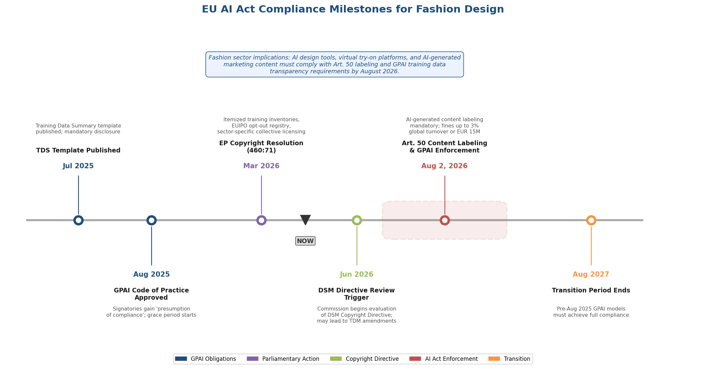

*Figure 5.2 — Key EU regulatory milestones from July 2025 through August 2027. Fashion sector AI tools—including design generators, virtual try-on platforms, and AI-generated marketing content—must comply with Article 50 labeling and GPAI training data transparency requirements by August 2, 2026. Models already on the market by August 2025 receive a transition period through August 2027.*

### The Missing Pillar: Fashion Design Protection Legislation

Despite the EU's comprehensive approach to AI regulation and repeated US legislative attempts, no jurisdiction has enacted specific protection for fashion designs that would address the AI copying challenge. Three US bills—the Design Piracy Prohibition Act (DPPA), the Innovative Design Protection and Piracy Prevention Act (IDPPPA), and the Innovative Design Protection Act (IDPA)—all failed to clear Congress. The 119th Congress (2025–2026) has not introduced any new fashion design protection legislation [USCO Congressional Testimony](https://www.copyright.gov/docs/regstat072706.html "Protection for Fashion Design, 2006") [WIPO Magazine](https://www.wipo.int/en/web/wipo-magazine/articles/the-role-of-ip-rights-in-the-fashion-business-a-us-perspective-40479 "IP rights in fashion business").

This legislative void produces a compounding effect: even if robust AI training data licensing frameworks emerge, fashion designers in the US would first need to establish protectable rights before they could license them. The EU's unregistered Community design right—which provides three years of automatic protection for novel designs without registration—offers a structurally superior starting point for building AI-specific licensing in European fashion markets. The contrast underscores a transatlantic asymmetry: European designers possess a baseline right that can, in principle, be extended into AI licensing frameworks; their American counterparts must contend with a protection gap that no pending legislation appears likely to close.

## Industry Self-Regulation: Initiatives and Limitations

### The CFDA-OpenAI Innovation Hub

The Council of Fashion Designers of America launched an Innovation Hub with OpenAI in February 2026, pairing six fashion brands with six AI tool companies. The program provides over USD 300,000 in grants and unlimited API access to participating designers, and is explicitly positioned as collaborative rather than adversarial—aiming to demonstrate responsible AI integration in fashion design workflows [CFDA](https://cfda.com/news/cfda-openai-launch-innovation-hub/ "CFDA-OpenAI Innovation Hub, February 2026").

The Innovation Hub does not, however, include binding IP protection standards. It functions as a demonstration project rather than a governance framework. Its reach is inherently narrow: the program serves a small cohort of selected brands, and its findings carry no binding effect on the broader AI tool ecosystem. For independent designers outside the CFDA's orbit, the initiative offers a signal of institutional engagement but no substantive protection.

### WFA Transparency Guidelines

The World Federation of Advertisers published voluntary guidelines for AI-generated marketing content transparency in April 2026, drawing on research among 27 multinational brands with combined advertising expenditure of USD 71 billion. The survey found that 78% of responding brands use AI-generated content in consumer-facing marketing, while 82% consider transparency about AI usage essential for brand reputation [WFA](https://wfanet.org/knowledge/item/2026/04/02/global-brands-call-for-clearer-consensus-on-ai-labelling-as-usage-accelerates-wfa-research "WFA AI labelling guidance, April 2026").

While the WFA guidelines address marketing content rather than design processes directly, they signal a broader trajectory: major brands increasingly recognize that AI transparency is a reputational imperative. The consumer backlash against Gucci's AI-generated campaign imagery (February 2026) and Valentino's AI video advertising (December 2025)—documented in Chapters 1 and 2—provides concrete evidence that opacity around AI usage carries measurable commercial risk, particularly in luxury segments where brand equity depends on perceived creative authenticity.

### Gaps in Self-Regulation

The fashion industry's major governance bodies—including the Camera Nazionale della Moda Italiana and the British Fashion Council—have not published AI-specific IP guidelines as of April 2026. The CFDA initiative remains the most visible industry-level response, but its voluntary, non-binding character and limited participant scope leave the vast majority of independent designers unaddressed. Self-regulation in its current form addresses reputational risk for established brands but does not create enforceable rights, standardized opt-out mechanisms, or compensation frameworks for the designers most vulnerable to AI-driven copying.

## Viability Assessment: No Single Solution

Evaluating the five mechanism categories across adoption maturity, applicability to fashion's specific IP landscape, burden on creators, enforcement strength, and scalability reveals that no individual approach provides adequate protection for fashion designers on its own.

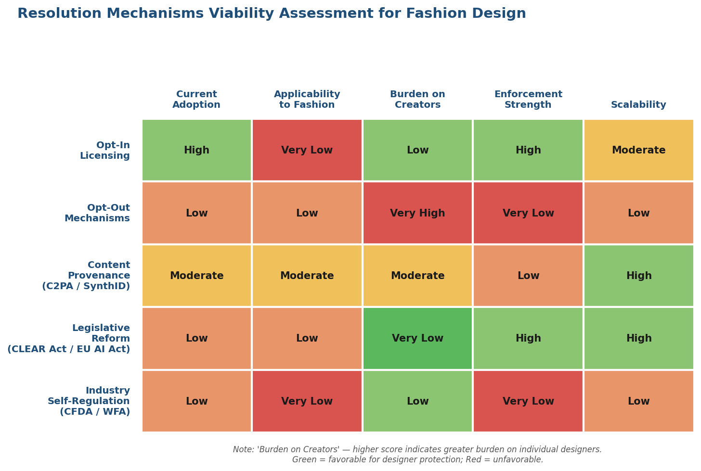

*Figure 5.3 — A comparative assessment of five resolution mechanism categories across five dimensions. Green cells indicate conditions favorable for designer protection; red cells indicate unfavorable conditions. No single mechanism achieves favorable scores across all dimensions, underscoring the need for a layered strategy.*

Opt-in licensing achieves the highest enforcement strength—demonstrated by the music industry's dual-compensation model—but its applicability to fashion remains very low due to the absence of collective management infrastructure and the fragmented nature of garment design IP. Opt-out mechanisms impose the heaviest burden on individual creators while offering the weakest enforcement, as compliance remains voluntary across all current technical protocols. Content provenance tools (C2PA, SynthID) offer the strongest scalability and moderate applicability to fashion, but function as attribution and signaling layers rather than enforcement instruments. Legislative reform—particularly the EU's GPAI obligations—promises high enforcement strength and scalability once the August 2026 deadline activates, yet current applicability to fashion-specific concerns remains low given the absence of dedicated design protection statutes. Industry self-regulation, as currently constituted, scores poorly across nearly every dimension.

The overarching conclusion is structural: effective protection for fashion designers in the AI era requires a layered approach that combines multiple mechanisms. Content provenance (C2PA with "do not train" signals) establishes a baseline of attribution and intent. Legislative transparency requirements (the CLEAR Act, EU AI Act Article 53) create accountability for AI model developers. Opt-in licensing, once fashion-specific collective institutions emerge, can generate compensation flows. And self-regulatory initiatives, if expanded beyond their current pilot scale, can establish norms that anticipate and complement binding regulation. The critical missing element remains foundational IP protection for fashion designs in the US—without which the entire licensing and enforcement architecture lacks a stable legal substrate.

# 第6章 Forward-Looking Analysis — Industry Trajectories and Policy Outlook Through Late 2026

The preceding chapters have established five interlocking findings: AI design tools are reshaping fashion's creative infrastructure at an unprecedented pace (Chapter 1); the resulting output carries measurable risks of aesthetic convergence (Chapter 2); legal frameworks governing AI-generated designs remain fragmented and jurisdictionally inconsistent (Chapter 3); litigation patterns are producing contradictory judicial signals while fashion-specific disputes remain scarce (Chapter 4); and no single resolution mechanism—licensing, technology, legislation, or self-regulation—is sufficient on its own (Chapter 5).

This chapter synthesizes those findings into a forward-looking assessment of how the AI fashion design ecosystem and its copyright landscape are likely to evolve through late 2026. It identifies the regulatory and judicial milestones that will shape that evolution, evaluates three plausible scenarios for the industry's near-term trajectory, and offers differentiated recommendations for independent designers, AI platform developers, and policymakers.

## 6.1 Regulatory Milestones: A Compressed Calendar

### The August 2026 Inflection Point

The single most consequential regulatory date on the near-term horizon is 2 August 2026, when two overlapping EU obligations take effect simultaneously. Article 50 of the EU AI Act mandates that all AI-generated content be labeled as such, creating a transparency requirement that applies directly to AI fashion design imagery, virtual try-on outputs, and campaign visuals produced by tools such as Style3D, Refabric, or The New Black. Concurrently, the enforcement grace period for GPAI model providers' copyright compliance obligations under Article 53 expires. Non-compliance with either obligation may trigger fines of up to 3% of global annual turnover or EUR 15 million, whichever is greater [Kennedys Law](https://www.kennedyslaw.com/en/thought-leadership/article/2026/the-eu-ai-act-implementation-timeline-understanding-the-next-deadline-for-compliance/ "EU AI Act timeline, 2026") [Clifford Chance](https://www.cliffordchance.com/insights/resources/blogs/ip-insights/2025/10/copyright-compliance-under-the-eu-ai-act-for-gpai-model-providers.html "GPAI compliance, October 2025"). GPAI models already on the market before August 2025 benefit from a longer transition period extending to August 2027 [Kennedys Law](https://www.kennedyslaw.com/en/thought-leadership/article/2026/the-eu-ai-act-implementation-timeline-understanding-the-next-deadline-for-compliance/ "EU AI Act timeline, 2026").

For AI fashion design tool providers operating in European markets, August 2026 represents a hard compliance deadline with two practical requirements: tool outputs must carry machine-readable provenance labels, and providers must demonstrate that their training processes comply with EU copyright law—including respect for opt-out signals expressed under Article 4 of the DSM Directive. Signatories to the GPAI Code of Practice (approved August 2025) receive a "presumption of compliance," but this presumption is rebuttable and does not shield against copyright infringement claims brought by individual rights holders [Bird & Bird](https://www.twobirds.com/en/insights/2025/taking-the-eu-ai-act-to-practice-decoding-the-gpai-code-of-practice-and-the-training-data-summary-te "GPAI Code of Practice analysis").

### The DSM Directive Review and Parliamentary Pressure

The European Commission is required to initiate a comprehensive evaluation of the DSM Copyright Directive beginning 7 June 2026. This review may trigger proposals to amend the text-and-data-mining exceptions under Articles 3 and 4, potentially tightening the conditions under which AI developers may use copyrighted fashion imagery for training [Taylor Wessing](https://www.taylorwessing.com/en/interface/2025/predictions-2026/copyright-in-2026 "Copyright in 2026, December 2025"). The European Parliament has signaled unwillingness to wait for the review's outcome: its March 2026 non-binding resolution, adopted 460 to 71, called on the Commission to act "without waiting for the review of the copyright directive or the AI Act" and demanded itemized training content inventories, a centralized opt-out registry administered by EUIPO, and sector-specific voluntary collective licensing frameworks [European Parliament](https://www.europarl.europa.eu/news/en/press-room/20260306IPR37511/protecting-copyrighted-work-and-the-eu-s-creative-sector-in-the-age-of-ai "EP resolution, March 2026"). The resolution's overwhelming majority signals strong political will, though its non-binding character means the Commission retains discretion over both timing and substance. As of April 2026, no formal Commission response has been published.

### CJEU: The First Generative AI Copyright Ruling

The Court of Justice of the European Union held its first-ever hearing on generative AI and copyright on 10 March 2026 in *Like Company v. Google Ireland* (C-250/25). The case, referred from the Austrian Supreme Court, poses two foundational questions: whether LLM training constitutes "reproduction" under EU copyright law, and whether EU copyright rules apply extraterritorially to training conducted outside the Union. The Advocate General's opinion is expected on 3 September 2026 [Bird & Bird](https://www.twobirds.com/en/insights/2026/like-company-v-google-cjeu-holds-first-ever-hearing-on-generative-ai-and-copyright-on-10-march-2026 "Like Company v. Google CJEU hearing, March 2026"). A final ruling will likely extend beyond 2026, but the Advocate General's opinion—while non-binding—will constitute the first authoritative EU judicial signal on the copyright status of AI training. Its conclusions could substantially influence how the Commission approaches the DSM Directive review.

### The US Landscape: Judicial Resolution Over Legislative Action

In the United States, the White House's March 2026 National AI Policy Framework explicitly endorsed the position that "training AI models on copyrighted material does not violate copyright law" and favored judicial resolution of fair use questions over new legislative mandates [Holland & Knight](https://www.hklaw.com/en/insights/publications/2026/03/white-house-releases-a-national-policy-framework-for-artificial "White House AI Framework, March 2026"). This executive posture makes comprehensive federal AI copyright legislation unlikely in the near term.

The CLEAR Act (S. 3813), introduced by Senators Schiff and Curtis in February 2026, represents the most viable congressional intervention. Referred to the Senate Judiciary Committee on 10 February 2026, the bill has not advanced to a hearing as of April 2026 [Congress.gov](https://www.congress.gov/bill/119th-congress/senate-bill/3813 "S.3813 CLEAR Act status"). Its deliberately narrow scope—mandating transparency about copyrighted works in training data without adjudicating fair use—may improve its legislative prospects relative to broader proposals, but passage in the current Congress remains uncertain.

The more consequential US developments will emerge from courts. The 2026 judicial calendar is densely packed:

- **July 15, 2026:** *Concord Music v. Anthropic* summary judgment hearing (C.D. Tenn.)
- **October 16, 2026:** *In re OpenAI Copyright Infringement Litigation* summary judgment replies due (S.D.N.Y.)
- **October 30, 2026:** *In re Mosaic LLM Litigation* hearing

[ChatGPT Is Eating the World](https://chatgptiseatingtheworld.com/2026/03/10/summary-judgment-calendar-for-ai-copyright-cases/ "Summary Judgment Calendar, March 2026"). Additionally, *Allen v. Perlmutter* (D. Colo.)—where the government filed a cross-motion for summary judgment in January 2026—could deliver the most fashion-relevant ruling on whether sustained prompt engineering combined with post-generation editing constitutes sufficient human authorship [Copyright Lately](https://copyrightlately.com/thaler-is-dead-ai-copyright-questions/ "Post-Thaler Copyright Questions, March 2026"). Morrison Foerster predicts that 2026 will see judicial attention shift increasingly from training-data liability to the copyright status of AI outputs themselves—a transition that directly implicates fashion designs produced by generative AI tools [Morrison Foerster](https://mofotech.mofo.com/topics/ai-trends-for-2026---copyright-litigation-shifts-from-training-data-to-ai-outputs "AI Trends for 2026").

The following timeline visualizes the compressed regulatory and judicial calendar from May through November 2026, illustrating how EU enforcement deadlines and US litigation milestones cluster within a six-month window.

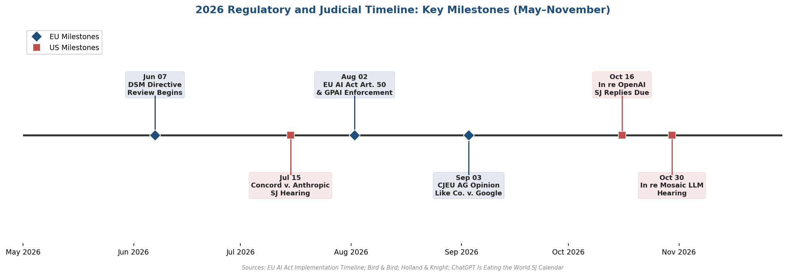

## 6.2 Market Evolution: Consolidation, Bifurcation, and the Hybrid Norm

### From Competitive Edge to Business Necessity

The BoF-McKinsey State of Fashion 2026 report characterizes AI's role in the industry as having shifted "from a competitive edge to a business necessity," with companies restructuring workforces to redirect existing roles toward higher-value creative and analytical tasks [McKinsey/BoF](https://www.mckinsey.com/industries/retail/our-insights/state-of-fashion "State of Fashion 2026"). This trajectory is reinforced by the rapid consolidation of AI design tools into enterprise infrastructure: Adobe's acquisition of Fashable for approximately USD 450 million (December 2024), LVMH's AI Factory partnership with Google Cloud serving over 40,000 monthly active users across 75 brands, and PVH's enterprise-wide deployment of ChatGPT Enterprise in January 2026 [Forbes](https://www.forbes.com/sites/josipamajic/2026/03/24/how-luxury-fashion-is-rebuilding-its-creative-and-commercial-stack-using-ai/ "Forbes, March 2026") [Google Cloud Blog](https://cloud.google.com/transform/lvmh-data-ai-platform-interview-franck-le-moal-luxury-gen-ai-louis-vuitton-sephora-dom-perignon "Inside LVMH's data estate, June 2025") [OpenAI](https://openai.com/index/pvh-future-of-fashion/ "PVH reimagines fashion with OpenAI, February 2026").

By late 2026, AI design tools will no longer function as optional experimental add-ons for major fashion houses. They will be embedded in standard workflows, shaping decisions from initial concept through virtual prototyping, campaign imagery, and inventory planning. This universalization amplifies the homogenization risk documented in Chapter 2: as more designers operate on the same platforms drawing from similar training data, the structural conditions for aesthetic convergence intensify.

### The Consumer Bifurcation

A parallel market dynamic is emerging alongside tool consolidation: a widening divergence between algorithm-optimized product and visibly human-crafted design. The Future Laboratory's Rose Coffey predicted in *Vogue* that 2026 would see a "consumer bifurcation" between low-friction, algorithmically generated products and premium goods carrying visible markers of human intent [Vogue](https://www.vogue.com/article/from-unseriousness-to-superfandom-consumer-trend-predictions-for-2026 "Consumer Trend Predictions for 2026, January 2026"). Evidence from the luxury segment supports this thesis: Bottega Veneta's "Craft is Our Language" campaign (May 2025) and Miu Miu's "Making of Old" initiative (January 2026) explicitly position handcraft as a counter-narrative to AI-generated aesthetics [Luxury Daily](https://www.luxurydaily.com/top-luxury-campaigns-of-2025-bottega-veneta-craft-is-our-language/ "Top luxury campaigns of 2025"). WGSN's Hannah Watkins identified "anti-AI" craft-driven aesthetics as a macro trend visible across the Fall 2026 runway season, citing Prada's deliberate fraying, Emilia Wickstead's painterly florals, and Ashlyn's raw-edge cuts [Fashionista](https://fashionista.com/2026/03/anti-ai-fashion-trend-human-craft "Anti-AI protest on runways, March 2026").

The anti-AI crafting movement, however, faces structural limits as a systemic corrective. It functions primarily as a luxury positioning strategy, formally named as such by Landor's Graham Sykes in December 2025 [Vogue](https://www.vogue.com/article/the-anti-ai-slop-playbook "The Anti-AI Slop Playbook, March 2026"). For mid-market and fast-fashion segments—where cost pressures drive adoption and AI-generated output enters physical production at scale—the handcraft premium is neither accessible nor economically viable. The bifurcation may therefore entrench rather than resolve the homogenization problem: luxury acquires a new differentiation axis while the mass market converges further.

### The Credibility Ceiling in Luxury

Consumer backlash against Gucci's AI-generated promotional imagery in February 2026 and Valentino's AI video advertisement in December 2025 (both documented in Chapter 2) exposes a "credibility ceiling" for consumer-facing generative AI in the luxury segment. Charlie Smith, CMO of Nothing and former Loewe executive, predicts that AI will eventually become "as taken for granted as electricity or the internet," but brand consultant Karmen Tsang argues the transition requires a "hybrid approach"—AI handling scale and efficiency while humans retain directional control over meaning and cultural relevance [Vogue](https://www.vogue.com/article/the-anti-ai-slop-playbook "The Anti-AI Slop Playbook, March 2026"). The hybrid model emerging across the industry reflects this pragmatic convergence: AI operates as internal infrastructure that accelerates design iteration, cost reduction, and inventory planning, while consumer-facing creative direction remains anchored in demonstrable human authorship.

## 6.3 The Homogenization Trajectory: Scientific Evidence and Mitigation

The scientific evidence assembled in Chapter 2 points to a structural tendency toward homogenization in AI-assisted creative output. Wenger and Kenett (March 2026, *PNAS Nexus*) demonstrated that LLM outputs across multiple model families exhibit significantly higher inter-response similarity than human responses—a finding that held across Gemini, GPT, and Llama variants [Wenger & Kenett, *PNAS Nexus*](https://neurosciencenews.com/ai-creativity-homogeneity-llm-30371/ "AI 'Creativity' is More Predictable Than Human Thought, March 2026; DOI: 10.1093/pnasnexus/pgag042"). Shumailov et al. (*Nature*, July 2024) established that recursive training on model-generated data causes distribution tails to vanish, a phenomenon poised to accelerate as AI-produced fashion imagery increasingly constitutes the training data for next-generation models [Shumailov et al., *Nature*](https://www.nature.com/articles/s41586-024-07566-y "AI models collapse when trained on recursively generated data, Nature vol. 631, July 2024"). The Wharton creativity experiments found that only 6% of AI-assisted ideas were rated as unique, compared with 100% in human-only groups; 37 of 45 paired comparisons showed AI-assisted groups producing significantly less diverse output [Knowledge at Wharton](https://knowledge.wharton.upenn.edu/article/does-ai-limit-our-creativity/ "Does AI Limit Our Creativity? July 2025").

Taken together, these findings suggest that homogenization is not a transitional artifact of early AI adoption but a structural feature of how current generative models operate. The fast-fashion and mid-market segments face the greatest exposure: their high adoption intensity, cost-driven optimization, and volume-oriented production cycles create the conditions under which AI's mean-reversion tendencies are most likely to manifest as visible aesthetic convergence.

Mitigation strategies are emerging but remain largely untested at scale. The Wharton researchers recommend chain-of-thought prompting and multi-model strategies—using outputs from several AI systems rather than a single platform—to preserve divergent thinking [Knowledge at Wharton](https://knowledge.wharton.upenn.edu/article/does-ai-limit-our-creativity/ "Does AI Limit Our Creativity? July 2025"). Designer Norma Kamali's approach—training a proprietary AI model exclusively on her own 50-year archive—represents a "closed-loop" strategy that insulates creative identity from the homogenizing pull of broad public training data, though it is available only to designers with sufficiently large and distinctive bodies of work. WGSN projects that by 2028, AI will have become sufficiently normalized to be perceived as "mundane," at which point the anti-AI craft movement may stabilize as a permanent luxury sub-market rather than a transient counter-trend [Fashionista](https://fashionista.com/2026/03/anti-ai-fashion-trend-human-craft "Anti-AI protest on runways, March 2026").

## 6.4 Three Scenarios Through Late 2026

Drawing on the regulatory, judicial, and market dynamics outlined above, three plausible scenarios capture the range of outcomes through the end of 2026. The comparative matrix below summarizes their probability, key triggers, and differentiated impacts.

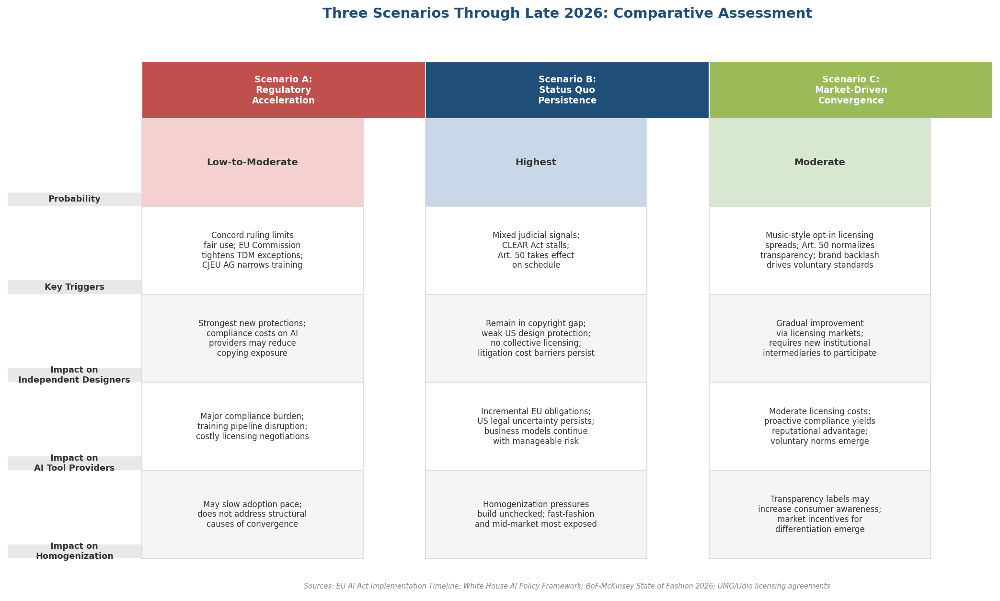

### Scenario A: Regulatory Acceleration (Probability: Low-to-Moderate)

In this scenario, the *Concord Music v. Anthropic* summary judgment hearing (July 2026) produces a ruling that substantially limits the fair use defense for AI training, and the European Commission responds to the Parliament's March resolution with a concrete legislative proposal tightening TDM exceptions before the year's end. The CJEU Advocate General's opinion in *Like Company v. Google* (September 2026) further narrows the scope of permissible training. The combined effect would create immediate compliance pressure on AI fashion design tool providers, potentially disrupting training pipelines and forcing costly licensing negotiations.

This scenario carries the lowest probability because it requires multiple institutions to move faster than their historical pace. The White House has explicitly opposed legislative intervention, the European Commission has not yet responded to the Parliament's resolution, and judicial timelines are subject to delay. However, even a single trigger—particularly a restrictive *Concord* ruling—could accelerate the others through precedential and political feedback effects.

### Scenario B: Status Quo Persistence (Probability: Highest)

The most probable outcome through late 2026 is a continuation of the current pattern: mixed judicial signals, regulatory implementation that proceeds on schedule without dramatic expansion, and legislative proposals that remain in committee. Under this scenario, the EU AI Act's Article 50 labeling mandate and GPAI enforcement powers take effect in August 2026 as planned, creating incremental compliance obligations for AI tool providers in European markets. US courts deliver rulings in individual cases without establishing a definitive fair use framework. The CLEAR Act remains in the Senate Judiciary Committee without advancing to a floor vote.

For the fashion industry, this scenario means the regulatory environment remains fundamentally ambiguous. AI design tool adoption continues to accelerate, homogenization pressures build, and independent designers remain trapped in the copyright gap identified in Chapters 3 and 4—with weak US design protection, no collective licensing infrastructure, and insufficient resources for individual litigation. Dispute resolution continues to occur through private settlements (as in *Perry v. Shein*) and bilateral licensing deals rather than systemic reform.

### Scenario C: Market-Driven Convergence on Norms (Probability: Moderate)

In this scenario, market forces—rather than regulation or litigation—drive the emergence of de facto industry standards. The music industry's opt-in licensing model (UMG/Udio, WMG/Suno, Merlin/Udio) provides a demonstrated template. The Article 50 labeling mandate normalizes AI content transparency, and reputational risks—exemplified by the Gucci and Valentino backlash—incentivize brands to adopt voluntary provenance standards. Major AI platform providers, seeking to reduce litigation exposure, proactively implement opt-in licensing frameworks and honor opt-out signals.

The key barrier to this scenario is the absence of institutional infrastructure in fashion equivalent to what ASCAP, BMI, and Merlin provide in music (as analyzed in Chapter 5). Without a collective management organization for fashion design IP, individual designers lack both the negotiating power and administrative capacity to participate in licensing markets. The CFDA-OpenAI Innovation Hub, while a step toward industry-AI collaboration, does not include binding IP protections and serves only a small number of selected brands [CFDA](https://cfda.com/news/cfda-openai-launch-innovation-hub/ "CFDA-OpenAI Innovation Hub, February 2026"). Market-driven convergence in fashion therefore depends on either the spontaneous emergence of new institutional intermediaries, or the extension of existing copyright infrastructure—such as the EU's unregistered Community design right—to create licensable rights that can anchor market transactions.

## 6.5 Differentiated Recommendations

The priority matrix below maps fifteen recommendations across three stakeholder groups by urgency and feasibility, enabling readers to identify actionable priorities at a glance.

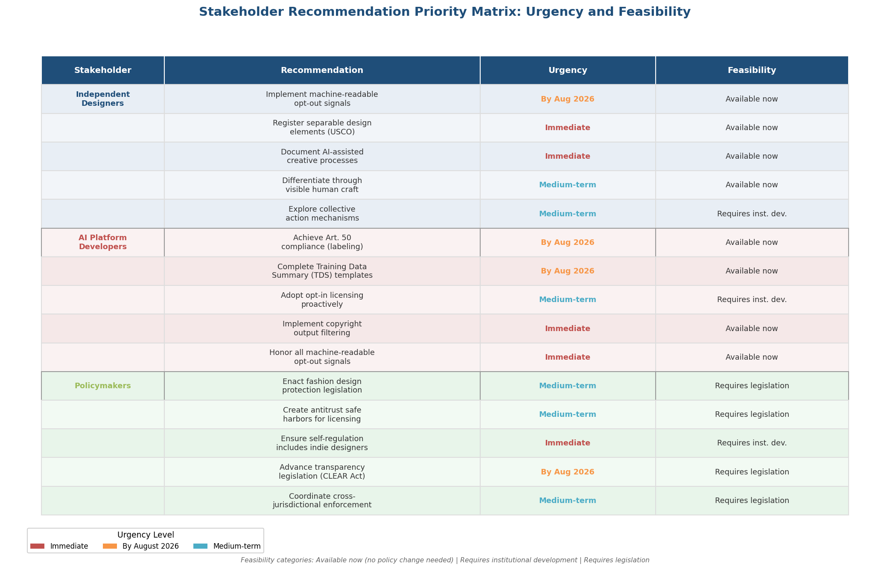

### For Independent Designers

The window for proactive action is narrowing. The following measures are available under existing frameworks and require no legislative change:

1. **Implement machine-readable opt-out signals before August 2026.** The EU AI Act's GPAI enforcement deadline creates a compliance obligation on tool providers to respect opt-out signals. Independent designers should deploy layered opt-out measures: robots.txt directives, W3C TDMRep declarations, and C2PA "do not train" metadata tags on all published design imagery. No single mechanism enjoys universal adoption, but deploying multiple signals maximizes the probability of protection and creates an evidentiary record of rights reservation [Cleary Gottlieb](https://www.clearyiptechinsights.com/2025/06/genai-inputs-understanding-training-data-and-rights-reservations/ "GenAI Inputs, June 2025").

2. **Register separable design elements with the US Copyright Office.** The CLEAR Act's disclosure requirements, if enacted, would apply only to registered copyrighted works. Registration also unlocks access to statutory damages and attorney's fees—essential for overcoming the litigation cost asymmetries documented in Chapter 4. The separability analysis under *Star Athletica v. Varsity Brands* permits registration of graphic, sculptural, and pictorial elements of garment designs that can be identified separately from the utilitarian article.

3. **Document AI-assisted creative processes exhaustively.** The outcome of *Allen v. Perlmutter* will likely hinge on the evidentiary record of human creative contribution. Designers who use AI tools should maintain detailed logs of prompts, parameter selections, rejected outputs, manual modifications, and final creative decisions. This documentation serves dual purposes: establishing authorship claims for copyright registration and providing a defensible record if the designer's work is later challenged.

4. **Differentiate through visible human craft.** The consumer bifurcation identified by Rose Coffey and the anti-AI movement tracked by WGSN indicate that visible markers of human creation—hand-stitching, artisanal finishing, material imperfections—carry increasing market value. Independent designers, who typically lack the resources to compete on AI-driven speed and scale, can leverage this dynamic as a positioning advantage.

5. **Explore collective action mechanisms.** The RICO theory tested in *Perry v. Shein* and the class action approach in *Giana v. Shein* demonstrate that aggregated litigation can overcome cost asymmetries. Independent designers facing systematic AI-enabled copying should consider collective legal strategies and monitor the development of designer advocacy organizations that may eventually serve a function analogous to music's Merlin.

### For AI Platform Developers

1. **Achieve Article 50 compliance by August 2026.** All AI-generated design outputs must carry machine-readable provenance labels. Implementing C2PA Content Credentials and SynthID watermarking provides both regulatory compliance and reputational protection against the "AI slop" consumer backlash that has already damaged luxury brands.

2. **Complete Training Data Summary (TDS) templates.** The mandatory TDS requirement under Article 53(1)(d) of the EU AI Act becomes enforceable from August 2026, with penalties up to 3% of global turnover. Early compliance also positions providers favorably should the CLEAR Act or equivalent transparency legislation advance in the US.

3. **Adopt opt-in licensing proactively.** The music industry's trajectory—from litigation to settlement to licensing—provides a clear directional signal. AI fashion design tool providers that proactively establish licensing frameworks for training data will reduce litigation exposure and build relationships with the creative community on which the tool ecosystem depends.

4. **Implement copyright output filtering.** As Morrison Foerster predicts judicial attention shifting from training inputs to AI outputs, tool providers face increasing liability risk when their products generate designs substantially similar to identifiable copyrighted works. Output-filtering systems that flag potentially infringing generations represent a prudent risk-management investment.

5. **Honor all machine-readable opt-out signals.** Regardless of whether compliance is legally mandated in a given jurisdiction, respecting robots.txt, TDMRep, and C2PA "do not train" tags is emerging as an industry norm. The Hamburg Regional Court's obiter dictum in *LAION v. Kneschke*—suggesting that even natural-language rights reservations may qualify as "machine-readable"—signals the direction of judicial interpretation.

### For Policymakers

1. **Enact fashion design protection legislation.** The persistent failure of US proposals (DPPA, IDPPPA, IDPA) has left garment designs uniquely vulnerable among creative works. The EU's unregistered Community design right—providing three years of automatic protection for novel designs without registration—offers a proven model. Without a registrable right, fashion designers cannot participate in licensing markets, invoke the CLEAR Act's transparency provisions, or effectively pursue infringement claims.

2. **Create antitrust safe harbors for collective licensing.** The USCO Part 3 report identified the need for DOJ/FTC guidance on whether fashion designers can collectively negotiate AI training data licenses without violating antitrust law. This guidance is a prerequisite for building the institutional infrastructure that music's collective management organizations currently provide.

3. **Ensure self-regulation includes independent designers.** The CFDA-OpenAI Innovation Hub and WFA transparency guidelines serve established brands. Policymakers should condition support for industry self-regulatory initiatives on meaningful inclusion of independent designers, who bear the greatest costs of the current system while having the least access to its emerging protections.

4. **Advance transparency legislation.** The CLEAR Act's narrow focus on disclosure—rather than adjudicating fair use—makes it the most politically viable US intervention. Ensuring that such legislation covers unregistered works, which constitute the vast majority of fashion designs, would substantially increase its utility for the fashion industry.

5. **Coordinate cross-jurisdictional enforcement.** The global nature of AI training pipelines means that opt-out signals respected in the EU may be disregarded by systems trained in jurisdictions with more permissive frameworks (notably Japan's Article 30-4). International coordination mechanisms—potentially through WIPO or bilateral agreements—are necessary to prevent regulatory arbitrage from undermining national protections.

# Conclusion

The convergence of generative AI and fashion design has produced a dual crisis—creative and legal—whose resolution will shape the industry's trajectory for the coming decade.

**On homogenization**, the evidence assembled across this report establishes that convergence pressures are real, empirically documented, and structurally embedded in how current generative models operate. Model collapse, cross-model homogeneity, training-data mean reversion, and platform default effects form a compounding system in which each channel reinforces the others. The Wharton experiments' finding that only 6% of AI-assisted ideas were rated as unique—compared with 100% in human-only groups—quantifies the scale of the risk. Yet homogenization is conditional, not deterministic: expert operators, AI intermediation architectures, and hybrid human-AI workflows can preserve and in some cases enhance creative diversity. The operative distinction is between AI as a primary generator of design—where convergence risk is highest—and AI as an intermediary that disrupts creative fixation while leaving directional authority with human designers. The anti-AI craft movement visible across Fall 2026 runways provides market confirmation that consumers can perceive algorithmic aesthetics and will reward visible human authorship, though this corrective concentrates in luxury segments and does not address the mass-market convergence that affects the broadest population of consumers and designers.

**On copyright disputes**, the analysis reveals a structural mismatch between the pace of technological change and the capacity of legal institutions to respond. The US framework—anchored by *Thaler v. Perlmutter*'s human authorship requirement, the Copyright Office's rejection of prompting as sufficient authorship, and the persistent failure of fashion design protection legislation—leaves garment designs uniquely vulnerable among creative works. The EU's layered regulatory approach, combining the AI Act's GPAI compliance obligations with the DSM Directive's opt-out mechanism and the Parliament's 2026 resolution calling for centralized registries and collective licensing, offers the most comprehensive framework to date, but its enforcement remains prospective. Chinese courts have set the lowest authorship threshold, creating a jurisdictional patchwork in which the same AI-generated design may be copyrightable in Beijing, potentially protected under Section 9(3) in London, and unprotectable in New York. The litigation surge—from 30 to over 80 active US cases in eighteen months—has produced contradictory fair use signals, with *Bartz v. Anthropic* endorsing transformative training while *Thomson Reuters v. Ross Intelligence* denied fair use when the AI product directly competed with its source material. The critical variable emerging from this jurisprudence is market substitution: AI design tools that generate garments competing with the designers whose work informed their training data face the weakest fair use defense.

**On resolution**, no single mechanism—licensing, technology, legislation, or self-regulation—provides adequate protection on its own. The music industry's opt-in licensing trajectory, from litigation through settlement to the UMG-Udio and Merlin-Udio agreements, offers the most instructive template, but its replication in fashion depends on institutional infrastructure that does not yet exist: a collective management organization for fashion design IP, antitrust safe harbors for collective licensing, and—most fundamentally—a registrable design right in the United States. Content provenance technologies (C2PA, SynthID) establish attribution and signaling layers but cannot enforce compliance. Legislative transparency mandates such as the CLEAR Act create accountability for training data use but apply only to registered works, excluding the vast majority of fashion designs. The EU AI Act's August 2026 enforcement deadline represents the first binding compliance obligation for AI fashion design tool providers and may catalyze the institutional development that voluntary mechanisms alone have failed to produce.

The most immediate practical imperative falls on independent designers, who bear the greatest costs of the current system while possessing the least access to its emerging protections. Implementing layered opt-out signals, registering separable design elements, documenting AI-assisted creative processes, and exploring collective legal strategies represent actions available under existing frameworks. For AI platform developers, proactive compliance with EU labeling and training data transparency requirements, combined with voluntary opt-in licensing, offers both risk reduction and reputational advantage. For policymakers, the foundational gap remains fashion design protection legislation—without which the licensing, transparency, and enforcement architecture lacks a stable legal substrate.

The question posed at the outset—whether AI fashion design tools are leading to creative homogenization—admits a nuanced answer: they are, under specific and identifiable conditions, and the industry possesses the means to mitigate that tendency through deliberate workflow design, institutional investment, and regulatory action. The question of how copyright disputes can be resolved admits a more sobering one: not through any single intervention, but through the construction of a layered governance ecosystem that the fashion industry has only begun to build.
