# Overview

For more than half a century, Gabriel García Márquez's *One Hundred Years of Solitude* stood as the single most celebrated example of the "unfilmable" novel — a work that had sold over 50 million copies in more than 40 languages, yet whose author spent decades personally blocking every attempt to bring it to the screen. When Netflix premiered its Spanish-language adaptation on December 11, 2024, as a 16-episode series filmed entirely in Colombia with an overwhelmingly local cast, it arrived freighted with a question that extended well beyond any single production: how did they pull it off?

This report reconstructs the full arc of that achievement across six dimensions. Chapter 1 traces the structural, aesthetic, and personal reasons that kept the novel off screen for over fifty years — from García Márquez's own characterization of the book as "written *against* the cinema" to the cautionary failure of *Love in the Time of Cholera* (2007). Chapter 2 examines how Netflix's Francisco Ramos brokered the rights deal with the author's estate, and how the family's non-negotiable conditions — Spanish language, Colombian production, unlimited duration, executive-producer oversight — became the creative architecture that made the adaptation viable. Chapter 3 documents the production strategies that translated those conditions into a finished work: chronological narrative restructuring, a practical-first approach to magical realism, four physically constructed versions of Macondo, and a casting philosophy that privileged unknown Colombian actors over international stars. Chapter 4 evaluates the adaptation's cultural fidelity through the responses of Colombian audiences, Latin American literary critics, and the broader Spanish-speaking cultural sphere. Chapter 5 assesses commercial performance — approximately 14 million cumulative views, an 83% Rotten Tomatoes score, a Metacritic score of 80, and dominant awards recognition in the Ibero-American sphere — while contextualizing these results against the structural barriers that non-English-language television faces in anglophone prestige circuits. Chapter 6 looks forward, examining Part 2's confirmed August 2026 premiere date and distilling the seven-element "Solitude Model" that Netflix has begun replicating across parallel literary adaptations in Argentina and Italy.

The central finding is that Netflix's adaptation succeeded not by overcoming García Márquez's conditions but by fulfilling them. The constraints the author and his estate imposed — conditions that had deterred every prior suitor — turned out to be the very principles that made the adaptation work: original-language production preserved the novel's cultural texture; Colombian filming and local casting grounded Macondo in physical authenticity; the long-form series format accommodated the narrative's multi-generational sweep; and family involvement as executive producers provided both quality control and legitimacy. The adaptation did not capture everything — the novel's prose voice, its humor, and its refusal to mark the supernatural remain qualities that informed critics identified as structurally untranslatable — but it captured enough to shift the burden of proof permanently. The question facing future "impossible" literary adaptations is no longer whether they can be brought to screen, but under what conditions.

# 第1章 The "Unfilmable" Novel — Why *One Hundred Years of Solitude* Resisted Adaptation for Decades

For more than half a century, Gabriel García Márquez's *One Hundred Years of Solitude* (*Cien años de soledad*, 1967) occupied a singular position in world literature: universally celebrated, perennially best-selling — with over 50 million copies in more than 40 languages — yet stubbornly absent from the screen. The novel was not merely unadapted; it was widely regarded as *unadaptable*. What follows traces the structural, aesthetic, and personal reasons why the book resisted cinematic translation for decades — from the author's own paradoxical relationship with film, through the parade of directors, producers, and studios whose ambitions were turned away, to the cautionary failure that seemed to confirm every skeptic's fears.

## A Novel "Written Against the Cinema"

The resistance began with the author himself — and it was anything but the hostility of a literary purist who disdained film. García Márquez had studied at the Centro Sperimentale di Cinematografia in Rome, moved to Mexico City in 1961 with the express goal of making cinema, and accumulated 38 screenwriting credits over the course of his career. In 1986, he founded the Escuela Internacional de Cine y Televisión (EICTV) in Cuba, an institution that has trained more than 800 filmmakers from across Latin America and the developing world. He described his lifelong entanglement with the medium as "a marriage on bad terms" [Harvard ReVista](https://revista.drclas.harvard.edu/garcia-marquez-and-cinema/ "García Márquez and Cinema, 2009").

Yet when it came to *One Hundred Years of Solitude* specifically, García Márquez drew an absolute line. As the scholar Alessandro Rocco documented, the author explicitly characterized the novel as a work "written *against* the cinema, in the sense that it sets out to show that literature has a much vaster scope, much greater possibilities for reaching people" [Cambridge University Press / Rocco](https://resolve.cambridge.org/core/services/aop-cambridge-core/content/view/BCB58BA999466852604185E43AA909A7/9781782043379c1_p1-46_CBO.pdf/cinema_in_the_life_of_garcia_marquez.pdf "The Cinema in the Life of García Márquez") [Sightlines](https://sightlinesmag.org/gabriel-garcia-marquez-and-the-cinema "García Márquez and the Cinema, Chale Nafus, 2020"). The novel was, by its creator's own admission, a demonstration that literature could accomplish what film could not.

The conviction was not empty rhetoric. García Márquez backed it with decades of refusal. In 1974, on the Piazza Navona in Rome, the Chilean writer Ariel Dorfman witnessed the Brazilian Cinema Novo director Glauber Rocha propose an adaptation. García Márquez's answer was immediate and final: "*¡Ni muerto!*" — "Over my dead body!" He added: "What is most entrancing in the book cannot be translated into another medium" [LitHub / Ariel Dorfman](https://lithub.com/what-would-gabriel-garcia-marquez-have-thought-of-the-netflix-version-of-his-novel/ "Dorfman first-person memoir, 2024").

## The Parade of Rejections

The list of suitors reads like a roll call of postwar cinema's most formidable figures. William Friedkin, fresh from *The French Connection* and *The Exorcist*, was turned away. Werner Herzog, whose appetite for impossible productions was legendary, received no better answer. The Italian mega-producer Dino De Laurentiis was rebuffed. In every instance, García Márquez held firm.

The most colorful rejection involved Harvey Weinstein, who recounted the episode in a *New York Times* remembrance published after the author's death. According to Weinstein, García Márquez proposed an exquisitely absurd counter-offer: "We must film the entire book, but only release one chapter — two minutes long — each year, for 100 years." Weinstein called it "the most elegant turndown" he had ever received [NYT](https://www.nytimes.com/2014/04/27/books/harvey-weinstein-remembers-gabriel-garcia-marquez.html "Weinstein Remembers García Márquez, 2014"). A related version of the condition — that any faithful adaptation would require a runtime of 100 hours, produced in Spanish and filmed in Colombia — circulated in multiple accounts and was later cited by *The Atlantic* [The Atlantic](https://www.theatlantic.com/culture/archive/2024/12/one-hundred-years-of-solitude-netflix-review/680972/ "The Trick to Adapting a Beloved Novel, Shirley Li, 2024"). The Weinstein anecdote rests on a single, uncorroborated source; the "100 hours" condition, while widely repeated, likewise lacks a definitive original citation.

When the Mexican-American actor Anthony Quinn reportedly offered a million dollars for the film rights in the early 1980s, García Márquez responded in a newspaper column: "Anthony Quinn, with or without his million dollars, will never be Coronel Aureliano Buendía to me or my readers" [Latino Rebels](https://www.latinorebels.com/2019/03/08/100yearsnetflix/ "Netflix adaptation rights announcement and historical background, 2019"). The remark encapsulated a deeper anxiety: that Hollywood would inevitably strip the novel of its cultural specificity, reducing a Colombian masterwork to a vehicle for English-language star casting.

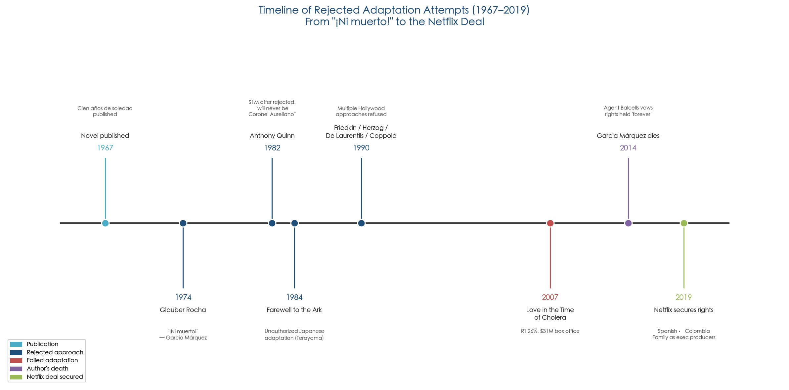

*Figure 1. From the novel's 1967 publication through decades of rejected approaches to the 2019 Netflix deal — a chronology of the suitors García Márquez turned away.*

## The Structural Barriers to Adaptation

García Márquez's personal refusals, however fierce, were symptoms of a more fundamental problem. *One Hundred Years of Solitude* presents a constellation of structural challenges that no conventional screenplay format can easily resolve.

**Non-linear temporality.** The novel's timeline is deliberately circular and recursive. Events echo across generations; causes follow effects; the founding of Macondo and its apocalyptic destruction are narrated as aspects of a single, predestined arc. Any linear retelling risks flattening this architecture into mere chronology — sacrificing the very quality that makes the story feel fated rather than merely sequential.

**Magical realism as narrative voice, not visual spectacle.** The novel's supernatural elements — a woman ascending bodily to heaven while hanging laundry, a trail of blood that navigates streets and turns corners to reach a mother's kitchen, an insomnia plague that erases collective memory — derive their power from the narrator's refusal to mark them as extraordinary. They are described in the same measured, matter-of-fact prose as births, deaths, and meals. As Dorfman argued in his 2024 assessment, cinematic depictions of the supernatural almost inevitably "create exactly the opposite effect that the novel accomplishes" by deploying moody lighting, ominous music, or CGI spectacle to signal that something uncanny is underway [LitHub / Ariel Dorfman](https://lithub.com/what-would-gabriel-garcia-marquez-have-thought-of-the-netflix-version-of-his-novel/ "2024"). Roger Ebert articulated the same concern when reviewing *Love in the Time of Cholera* (2007): "If you extract the story without the language, you are left with dust and bones but no beating heart" [Roger Ebert](https://www.rogerebert.com/reviews/love-in-the-time-of-cholera-2007 "2007").

**The primacy of language over plot.** Dorfman identified three specific dimensions of the adaptation challenge: first, the novel's supreme achievement resides in its prose rather than its storyline; second, magical realism depends on the narrator's perspective rather than on visual effects; and third, many of the novel's most celebrated images exist in a realm of pure literary imagination that resists direct visual translation [LitHub / Ariel Dorfman](https://lithub.com/what-would-gabriel-garcia-marquez-have-thought-of-the-netflix-version-of-his-novel/ "2024"). A conventional screenplay, constrained to dialogue and stage direction, has no native mechanism for reproducing the distinctive tone and cadence of García Márquez's narrative voice.

**Multi-generational naming and character density.** The novel traces five generations of the Buendía family across roughly a century, and García Márquez deliberately gave many characters identical or near-identical names — multiple José Arcadios, multiple Aurelianos — to reinforce the theme of cyclical repetition. *The Atlantic* observed that readers themselves routinely struggle with this system; for a visual medium lacking the novel's genealogical cues, the confusion compounds [The Atlantic](https://www.theatlantic.com/culture/archive/2024/12/one-hundred-years-of-solitude-netflix-review/680972/ "2024"). Scholar Ignacio López-Calvo later argued that the evolution of long-form serialized television — with its capacity for extended runtimes, gradual character development, and multi-season arcs — was what ultimately made adaptation conceivable: "A TV series seems ideal today for such a complex and sophisticated work" [Vanity Fair](https://www.vanityfair.com/hollywood/story/bringing-one-hundred-years-of-solitude-to-the-screen "Bringing One Hundred Years of Solitude to the Screen Took Decades, 2024").

## The Cautionary Precedent: *Love in the Time of Cholera* (2007)

If the theoretical arguments against adapting García Márquez needed empirical confirmation, Hollywood supplied it. In 2007, director Mike Newell brought *Love in the Time of Cholera* to the screen with a $50 million budget, a multinational cast led by Javier Bardem and Giovanna Mezzogiorno, and a screenplay by Ronald Harwood. The result was a critical and commercial failure: a 26% approval rating on Rotten Tomatoes, a Metacritic score of 43 out of 100, and a worldwide gross of just $31 million against its budget [Wikipedia](https://en.wikipedia.org/wiki/Love_in_the_Time_of_Cholera_(film) "Film article") [Roger Ebert](https://www.rogerebert.com/reviews/love-in-the-time-of-cholera-2007 "2007"). *Time* magazine called it "a serious contender [for] the worst movie ever made from a great novel."

The film's failure diagnosed exactly the pathology García Márquez had long feared. It was shot in English, stripping away the rhythms and cultural texture of the original Spanish. International stars rather than Colombian or Latin American actors severed the story from its geographic roots. Ebert's verdict — "dust and bones but no beating heart" — became a widely cited epitaph not only for that particular film but for the broader enterprise of translating García Márquez's fiction into anglophone cinema [Roger Ebert](https://www.rogerebert.com/reviews/love-in-the-time-of-cholera-2007 "2007").

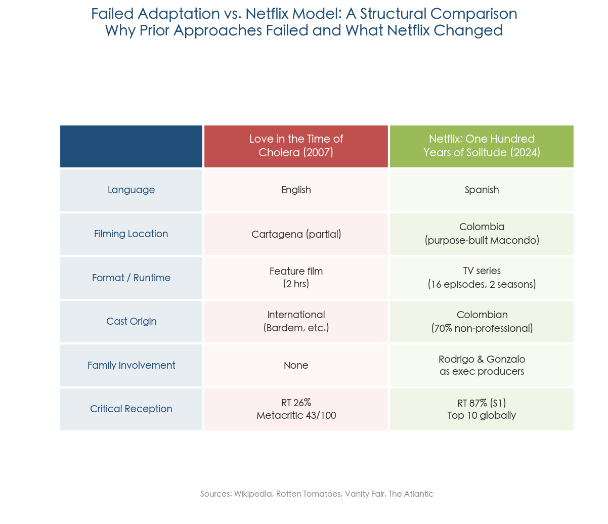

*Figure 2. Key structural differences between* Love in the Time of Cholera *(2007) and the Netflix adaptation of* One Hundred Years of Solitude *(2024) — language, location, format, casting, family involvement, and critical reception.*

A contrasting case, though far more modest in scale, hinted at what a different approach might yield. The Costa Rican director Hilda Hidalgo's *Of Love and Other Demons* (2010), adapted from García Márquez's 1994 novella, was one of the rare projects to receive the author's personal blessing — he granted the rights during a workshop at his own EICTV. *Variety* praised Hidalgo for having "seemingly unlocked the key to translating the cerebral sensuality of Gabriel García Márquez's writing into film" [LA Times](https://www.latimes.com/entertainment/movies/moviesnow/la-et-mn-gabriel-garcia-marquez-dies-inspired-many-films-mixed-results-20140417-story.html "García Márquez inspired many films, 2014"). The critical differences were instructive: a Latin American director, a Spanish-language production, and an intimate scale that did not attempt to compete with the grandeur of the source material.

The only work that can be considered even a loose cinematic engagement with *One Hundred Years of Solitude* itself is the Japanese director Shūji Terayama's posthumous film *Farewell to the Ark* (*Saraba Hakobune*, 1984), which transposed the novel's themes of cyclical time, incest taboo, and village isolation to a Japanese rural setting. The film screened at the 1985 Cannes Film Festival, but whether it ever received formal authorization from García Márquez remains unconfirmed [Wikipedia](https://en.wikipedia.org/wiki/Farewell_to_the_Ark "Farewell to the Ark").

## "Once He Was Dead, We Could Do Whatever We Wanted"

García Márquez died on April 17, 2014, at the age of 87. His literary agent, Carmen Balcells, promptly declared that the author's prohibition on adapting *One Hundred Years of Solitude* "will be upheld forever" [Vanity Fair](https://www.vanityfair.com/hollywood/story/bringing-one-hundred-years-of-solitude-to-the-screen "2024"). The fortress, it seemed, would hold even beyond the grave.

It did not. Balcells herself died in 2015. And the author's two sons — Rodrigo García, a Harvard-educated film and television director with credits on *Six Feet Under*, *The Sopranos*, and the Oscar-nominated *Albert Nobbs*; and Gonzalo García Barcha, a graphic designer based in Mexico City — had inherited not only the estate but a markedly different understanding of their father's wishes.

In a 2024 *Vanity Fair* interview, Rodrigo García revealed a detail that reframed the decades of refusal: before his death, García Márquez had told his sons that "once he was dead, we could do whatever we wanted. 'Just don't bother me'" [Vanity Fair](https://www.vanityfair.com/hollywood/story/bringing-one-hundred-years-of-solitude-to-the-screen "2024"). The remark was characteristically sardonic, but it carried genuine permission — an acknowledgment that the prohibition had always been personal rather than principled, and that it need not outlast the man who imposed it.

This revelation casts the half-century of refusals in a subtly different light. García Márquez's intransigence was not rooted in a belief that the novel was inherently sacred or that all adaptation constituted sacrilege. It was, rather, a function of his own aesthetic convictions, his distrust of Hollywood's cultural machinery, and — perhaps above all — his protective instinct toward a work he had conceived as literature's answer to cinema's limitations. With the author gone and the medium transformed by the rise of prestige long-form television, the conditions for adaptation had fundamentally changed.

Five years after García Márquez's death, on March 6, 2019 — what would have been his 92nd birthday — the estate announced that the rights to *One Hundred Years of Solitude* had been granted to Netflix. The decades of resistance were over. The challenge of actually making it work was only beginning.

# 第2章 Securing the Rights — Netflix's Path to the García Márquez Estate

On March 6, 2019 — what would have been Gabriel García Márquez's 92nd birthday — Netflix announced that it had acquired the rights to adapt *One Hundred Years of Solitude* (*Cien años de soledad*) as a Spanish-language television series. The deal, brokered by WME, attorney Shelley Surpin, and the Agencia Literaria Carmen Balcells on behalf of the author's estate, ended a half-century in which every major studio and a parade of celebrated directors had been turned away [Deadline](https://deadline.com/2019/03/netflix-to-adapt-gabriel-garcia-marquezs-literary-classic-one-hundred-years-of-solitude-into-spanish-language-series-1202570374/ "Netflix To Adapt One Hundred Years of Solitude, 2019") [LA Times](https://www.latimes.com/entertainment/tv/sneaks/la-et-st-one-hundred-years-solitude-netflix-20190306-story.html "2019"). This chapter traces how that transaction came together — the internal champion at Netflix, the negotiations with García Márquez's widow and sons, the non-negotiable conditions that shaped the project's creative DNA, and the early strategic decisions that set it apart from every previous attempt.

## The Internal Champion: Francisco Ramos

The Netflix side of the equation began with Francisco Ramos, the company's vice president of Spanish-language original content. Ramos, who joined Netflix in 2018, identified *One Hundred Years of Solitude* as his paramount ambition almost immediately upon assuming the role. He later described the project as "the most personal journey" of his career and emphasized that the acquisition involved "an extensive research phase — without rushing" [Vanity Fair](https://www.vanityfair.com/hollywood/story/bringing-one-hundred-years-of-solitude-to-the-screen "Bringing One Hundred Years of Solitude to the Screen Took Decades, 2024") [Vogue](https://www.vogue.com/article/one-hundred-years-of-solitude-netflix-site-visit "2024").

Ramos's approach reflected a recognition that this was not a conventional content acquisition. The García Márquez estate had spent decades refusing offers from the most powerful figures in Hollywood and international cinema. Any approach that resembled the transactional norms of the entertainment industry — optioning rights, attaching a star, fast-tracking development — would have been dead on arrival. What Ramos offered instead was patience, cultural fluency, and a willingness to cede meaningful creative control to the family.

## Negotiating with the Estate: From Mercedes Barcha to Rodrigo and Gonzalo

Ramos's initial counterpart was Mercedes Barcha, García Márquez's widow, who had been a fierce guardian of the author's literary legacy. Barcha's death in August 2020 transferred all decision-making authority to the couple's two sons: Rodrigo García, a Harvard-educated film and television director with credits on HBO's *Six Feet Under* and *The Sopranos*, as well as the Oscar-nominated *Albert Nobbs*; and Gonzalo García Barcha, a graphic designer based between Mexico City and Paris [Vanity Fair](https://www.vanityfair.com/hollywood/story/bringing-one-hundred-years-of-solitude-to-the-screen "2024").

The brothers brought distinct but complementary perspectives. Rodrigo, the elder, had spent decades inside the Anglo-American entertainment industry and understood its mechanics intimately; he could evaluate Netflix's capacity and intentions with a professional's eye. Gonzalo, less publicly visible, offered a perspective rooted in the family's private memory of their father's wishes. In a 2024 interview with the Spanish newspaper *La Vanguardia*, Gonzalo framed the family's understanding of García Márquez's stance in revealing terms: "Para Gabo, solo una telenovela podría reflejar 'Cien años...'" — for Gabo, only a telenovela could do justice to *One Hundred Years* [La Vanguardia](https://www.lavanguardia.com/cultura/20241204/10168057/gonzalo-garcia-barcha-gabo-telenovela-reflejar-cien-anos.html "Gonzalo García Barcha interview, 2024"). The remark captured a crucial nuance: García Márquez's resistance had never been absolute so much as conditional — the format had to be long enough, the language had to be Spanish, and the production had to be rooted in Colombian soil.

Both brothers confirmed this reading publicly. Speaking to *Bloomberg*, they stated: "mostly our conscience is clear, because he always said: when I'm not here, do whatever you want" [MPA](https://www.motionpictures.org/2024/05/netflixs-production-of-one-hundred-years-of-solitude-is-a-bold-showcase-of-latin-american-culture/ "Netflix's Production of One Hundred Years of Solitude, 2024"). Rodrigo elaborated in a *Variety* address, revealing that their father had on occasion "muse[d] that if it could be done in many hours and in Spanish and in Colombia, he would consider it" [Variety](https://variety.com/2025/tv/news/netflix-one-hundred-years-of-solitude-shooting-in-colombia-1236278697/ "2025"). This disclosure reframed the decades of public refusals. García Márquez's prohibition had been personal and contextual — a function of the available technology, the dominant production models of his era, and his distrust of Hollywood's cultural machinery — rather than an eternal decree against all adaptation.

## The Non-Negotiable Conditions

The family's agreement came with a set of conditions that were presented not as requests but as prerequisites. These conditions, articulated publicly at the time of the 2019 announcement and elaborated upon in subsequent interviews, would define the project's identity:

**Spanish-language production.** The series had to be produced entirely in Spanish — the language in which García Márquez wrote and in which the novel's prose rhythms, wordplay, and cultural cadences were embedded. This condition alone eliminated the possibility of an anglophone adaptation of the kind that had sunk *Love in the Time of Cholera* in 2007.

**Filming in Colombia.** Production had to take place on Colombian soil, anchoring the fictional Macondo in the physical landscapes, light, and vegetation of the country that inspired it.

**Unlimited duration.** There would be no pressure to compress the novel into a two-hour film or even a limited series. The format had to accommodate the full scope of the narrative — seven generations, a century of time, and the architectural complexity of García Márquez's interlocking storylines.

**Family involvement as executive producers.** Rodrigo and Gonzalo would serve as executive producers with genuine oversight, not merely honorary credits. This guaranteed a familial veto over decisions that might betray the spirit of the work.

Rodrigo added a fifth, less formal imperative: the production should "give back to the local community" — a stipulation that would later manifest in the massive economic footprint of the project across Colombia [Vanity Fair](https://www.vanityfair.com/hollywood/story/bringing-one-hundred-years-of-solitude-to-the-screen "2024") [Deadline](https://deadline.com/2019/03/netflix-to-adapt-gabriel-garcia-marquezs-literary-classic-one-hundred-years-of-solitude-into-spanish-language-series-1202570374/ "2019").

At the time of the announcement, Rodrigo framed the decision as a response to a transformed media landscape: "in the current golden age of series… the time could not be better" [Deadline](https://deadline.com/2019/03/netflix-to-adapt-gabriel-garcia-marquezs-literary-classic-one-hundred-years-of-solitude-into-spanish-language-series-1202570374/ "2019"). The implicit argument was that the rise of prestige long-form television — and Netflix's global distribution model — had created the infrastructure that García Márquez's conditions had always demanded but that the 20th-century film industry could never provide.

## The Role of the Agencia Literaria Carmen Balcells

A notable dimension of the deal concerns the Agencia Literaria Carmen Balcells, the Barcelona-based literary agency that had represented García Márquez since the 1960s. Carmen Balcells herself — the legendary agent often credited as the midwife of the Latin American literary boom — had declared shortly after the author's death in 2014 that his prohibition on adapting *One Hundred Years of Solitude* "will be upheld forever" [Vanity Fair](https://www.vanityfair.com/hollywood/story/bringing-one-hundred-years-of-solitude-to-the-screen "2024"). Balcells died in September 2015, and her agency continued to operate under new leadership. By the time Ramos initiated contact with the estate, the institutional guardians of the prohibition had changed: the agency's post-Balcells management evidently took a more pragmatic view, cooperating with WME and attorney Shelley Surpin to structure a deal that honored the family's conditions while enabling Netflix's global ambitions [Deadline](https://deadline.com/2019/03/netflix-to-adapt-gabriel-garcia-marquezs-literary-classic-one-hundred-years-of-solitude-into-spanish-language-series-1202570374/ "2019"). The financial terms of the agreement have never been publicly disclosed.

## Assembling the Creative Architecture

With the rights secured, the project entered a prolonged development phase that would stretch from 2019 to 2023 before cameras rolled. Rodrigo García offered a piece of counter-intuitive advice that would shape the adaptation's creative philosophy: "I told them they should feel free to truly adapt it." He diagnosed a recurring pathology in previous García Márquez screen adaptations — "too much respect for the book" — and urged the creative team to treat the novel as raw material for a new medium rather than a sacred text to be transcribed [LA Times](https://www.latimes.com/delos/story/2024-12-19/100-years-of-solitude-netflix-streaming-gabriel-garcia-marquez-alex-garcia-lopez-laura-mora "2024").

**The showrunner and writing team.** The task of translating the novel into screenplay form fell to José Rivera, an Oscar-nominated screenwriter of Puerto Rican descent best known for *The Motorcycle Diaries* (2004). Rivera constructed the overall dramatic architecture of all 16 episodes and wrote the initial drafts for each. His work was then enriched by a team of Colombian writers — Natalia Santa, Camila Brugés, Albatrós González, and María Camila Arias — who brought linguistic precision, regional cultural knowledge, and an intimate familiarity with the Colombian Caribbean world that García Márquez had transmuted into Macondo [Vanity Fair](https://www.vanityfair.com/hollywood/story/bringing-one-hundred-years-of-solitude-to-the-screen "2024") [LA Times](https://www.latimes.com/delos/story/2024-12-19/100-years-of-solitude-netflix-streaming-gabriel-garcia-marquez-alex-garcia-lopez-laura-mora "2024").

**The directors.** Part 1 (eight episodes) was divided between two directors with complementary sensibilities. Alex García López, an Argentine-born filmmaker whose credits included Netflix's *The Witcher* and *Chilling Adventures of Sabrina*, directed episodes 1, 2, 3, 7, and 8, bringing what he described as an appetite for "chaos" and kinetic movement. Laura Mora, a Colombian director whose feature *The Kings of the World* had established her international reputation, directed episodes 4, 5, and 6, contributing what colleagues characterized as a cinema purist's eye [About Netflix](https://about.netflix.com/news/from-colombia-to-the-world-how-one-hundred-years-of-solitude-was-brought-to "2024") [Vanity Fair](https://www.vanityfair.com/hollywood/story/bringing-one-hundred-years-of-solitude-to-the-screen "2024").

**The production company.** The series was produced by Dynamo Producciones, a Bogotá-based company founded in 2006 that had previously collaborated with Netflix on *Narcos* and with Universal on *American Made*. Dynamo's deep roots in Colombia's production ecosystem made it the natural partner for a project whose conditions demanded an overwhelmingly local crew and infrastructure [Variety](https://variety.com/2025/tv/news/netflix-one-hundred-years-of-solitude-shooting-in-colombia-1236278697/ "2025").

## The Casting Philosophy: "No Stars, Only Buendías"

One of the most consequential early decisions was the approach to casting. In June 2022, Netflix launched an open casting call across multiple Colombian cities — including Aracataca, García Márquez's birthplace and the model for Macondo — as well as online. The search drew over 10,000 candidates for 25 principal roles. The final ensemble was composed overwhelmingly of Colombian actors, with only approximately 30% classified as professionals with prior screen credits. An additional 20,000 extras were recruited from local communities [About Netflix](https://about.netflix.com/news/casting-begins-for-one-hundred-years-of-solitude-and-anyone-can-take-part "2022") [Wikipedia](https://en.wikipedia.org/wiki/One_Hundred_Years_of_Solitude_(TV_series) "TV series").

The decision to cast unknown or semi-professional actors was both an artistic and a strategic choice. Artistically, it ensured that audiences would encounter the Buendía family without the interference of star personas — the very problem García Márquez had identified when he rejected Anthony Quinn decades earlier. Strategically, it embedded the series in the texture of Colombian life, lending an authenticity that no international casting could replicate. As the Colombian critic Samuel Castro later observed: "ahí sí hubiera pasado lo que quería evitar García Márquez" — had they cast stars, precisely what the author feared would have come to pass [El País Colombia](https://elpais.com/america-colombia/2024-12-26/cien-anos-de-soledad-en-netflix-despierta-mas-elogios-que-criticas-en-colombia.html "2024").

## Scale, Timeline, and Economic Footprint

The production that emerged from these decisions was Netflix's largest project in Latin America by any measure. The complete timeline unfolded as follows: Ramos began pursuing the rights in 2018; the deal was announced on March 6, 2019; open casting commenced in June 2022; construction of the Macondo set began in November 2022; principal photography started in May 2023 and concluded in December 2023 after nine months of filming; and Part 1 (eight episodes) premiered globally on Netflix on December 11, 2024 [Wikipedia](https://en.wikipedia.org/wiki/One_Hundred_Years_of_Solitude_(TV_series) "TV series").

The physical scale was extraordinary. The main set in Alvarado, Tolima, covered approximately 133.4 acres, on which the production team constructed four distinct versions of Macondo representing different historical eras. At its peak, the construction employed 1,100 workers. Over 150 Colombian artisans — including Zenú basket-weavers, Chimila hammock-makers, and Wayúu textile craftspeople — contributed to the material culture of the production. The crew numbered nearly 900, the overwhelming majority Colombian nationals. The shoot spanned 15 locations across five Colombian departments [Variety](https://variety.com/2025/tv/news/netflix-one-hundred-years-of-solitude-shooting-in-colombia-1236278697/ "2025") [Vogue](https://www.vogue.com/article/one-hundred-years-of-solitude-netflix-site-visit "2024").

Netflix reported that the production contributed more than 225 billion Colombian pesos (approximately $51.8 million) to the Colombian economy, a figure encompassing local hiring, accommodation (over 100,000 hotel nights), materials procurement, and ancillary services. The company utilized Colombia's CINA tax incentive program, which provides a 35% rebate on qualifying local production expenditures by international projects. Silvia Echeverri, Colombia's film commissioner, described *One Hundred Years of Solitude* as "the biggest and most important project to have tapped this incentive" [Variety](https://variety.com/2025/tv/news/netflix-one-hundred-years-of-solitude-shooting-in-colombia-1236278697/ "2025") [Netflix About](https://about.netflix.com/news/one-hundred-years-of-solitude-contributed-over-225-billion-colombian-pesos "Official").

## Looking Toward Part 2

Part 2 — the final eight episodes — entered production in February 2025, with a scheduled premiere of August 2026. Laura Mora returns as director with an expanded role (five episodes, up from three in Part 1), joined by Colombian director Carlos Moreno (*Lavaperros*, *Perro come perro*), replacing Alex García López. Marleyda Soto (Úrsula) and Claudio Cataño (Colonel Aureliano Buendía) reprise their roles, alongside more than ten newly cast performers. Netflix's official statement accompanying the announcement struck a note of institutional continuity: "We have approached the second and final part with the same rigor, ambition, and respect for the novel" [Netflix Official](https://about.netflix.com/news/cien-anos-de-soledad-parte-dos "2025") [Forbes](https://www.forbes.com/sites/veronicavillafane/2025/12/11/one-hundred-years-of-solitude-part-2-netflix-sets-premiere-for-2026/ "2025").

The fact that the entire adaptation was conceived and announced as a two-part, 16-episode structure — rather than an open-ended series subject to renewal decisions — underscores the project's fidelity to the novel's closed narrative architecture. García Márquez wrote a story with a definitive ending; Netflix, for once, committed to one as well.

## The Deal in Perspective

The transaction that brought *One Hundred Years of Solitude* to Netflix was not merely a rights acquisition. It was a trust-building exercise conducted over years, shaped by the constraints of a family that held veto power and wielded it in service of a deceased author's artistic convictions. The conditions imposed by the García Márquez estate — Spanish language, Colombian production, unlimited duration, family oversight — were not obstacles to be negotiated away but the architectural principles that made the adaptation artistically viable. Every major creative decision that followed — the choice of a Colombian production company, the open casting call in Aracataca, the construction of a physically real Macondo, the employment of hundreds of local artisans — can be traced back to commitments made at the negotiation table.

Netflix's willingness to accept these conditions reflected a strategic calculus as much as an artistic one. By 2019, the company's international expansion depended increasingly on non-English content that could travel globally while remaining culturally specific. *One Hundred Years of Solitude* offered precisely that proposition: a property with universal name recognition, produced in conditions that guaranteed cultural authenticity, and delivered to a global audience of over 200 million subscribers. The estate's demands and Netflix's strategy, it turned out, were not in tension. They were aligned.

# 第3章 Translating Magic to Screen — Creative and Production Strategies

The challenge confronting the creative team behind Netflix's *One Hundred Years of Solitude* was not merely logistical but ontological: how to transpose a novel whose power resides in language, temporal dislocation, and the flattening of the miraculous into the mundane into a visual medium that, by its nature, renders everything it depicts with equal concreteness. The solution that coalesced across four years of development — from the securing of rights in March 2019 to the completion of principal photography in December 2023 — involved a constellation of interlocking creative and production strategies. These ranged from macro-level choices about narrative architecture to granular decisions about whether a priest's levitation should be achieved with a wire rig or a digital composite. Taken together, they constitute the most legible answer to the question of how this adaptation was made possible.

## Restructuring the Narrative: From Non-Linear Novel to Chronological Television

García Márquez wrote *One Hundred Years of Solitude* in a distinctly non-linear fashion, looping forward and backward through time, embedding prophecy alongside memory, and frequently introducing the outcome of an event before its cause. The screenwriting team — led by showrunner José Rivera and enriched by Colombian writers Natalia Santa, Camila Brugés, Albatrós González, and María Camila Arias — made an early and consequential decision: they would reorganize the novel's events into chronological order.

Brugés described the effect of this restructuring in revealing terms: "Organizing the events chronologically … was like having a clean slate. The great epiphany was asking ourselves, 'What are the dramatic arcs of the characters?'" [Netflix Tudum](https://www.netflix.com/tudum/features/on-adapting-one-hundred-years-of-solitude "Brugés Interview, 2025"). Rivera "tidied up" the novel's temporal structure into an approximate span from the 1850s to the mid-twentieth century, creating a framework within which "16 hours of what is otherwise a 400-page novel that features little dialogue and covers six generations" could be dramatized [LA Times](https://www.latimes.com/delos/story/2024-12-19/100-years-of-solitude-netflix-streaming-gabriel-garcia-marquez-alex-garcia-lopez-laura-mora "2024").

Two structural mandates came directly from Netflix: the narrative had to proceed chronologically, and a narrator had to be employed to provide cohesion. Natalia Santa explained the rationale for the latter in *El País*: the narrator was needed "to lend a certain unity to a work that can often move rapidly" [El País](https://english.elpais.com/culture/2024-11-24/a-mythical-historic-macondo-one-hundred-years-of-solitude-becomes-a-netflix-series.html "2024"). The narrator, voiced by Jesús Reyes, was identified within the fiction as Aureliano Babilonia — the sixth-generation Buendía who, in the novel's closing pages, deciphers the manuscript containing his family's entire history. Director Alex García López explained the creative logic: "What's special about our narrator is that he is discovering the story of his family at the same time the audience is" [Deadline](https://deadline.com/2024/12/alex-lopez-garcia-one-hundred-years-of-solitude-gabriel-garcia-marquez-netflix-1236200422/ "2024"). The writing team established a governing rule for the voiceover: it could illuminate mood, context, and interior states, but it could not advance plot — a discipline designed to prevent narration from becoming a crutch.

The device was not embraced without resistance. The writers initially opposed voiceover, but, as Brugés acknowledged, "soon we realized that the voice of the novel wasn't translating" without it [Netflix Tudum](https://www.netflix.com/tudum/features/on-adapting-one-hundred-years-of-solitude "2025"). García Márquez's prose carries much of the novel's emotional and philosophical weight through an omniscient narrative voice whose tone — calm, oracular, faintly amused — is inseparable from the reader's experience. Stripping it out entirely would have removed a defining layer of the work.

## Centering Úrsula and Expanding the Implied

A second structural decision concerned point of view. The novel distributes attention across dozens of characters, but the writing team chose to anchor the adaptation in the perspective of Úrsula Iguarán, the Buendía matriarch who spans virtually the entire narrative arc. Brugés articulated the rationale: "One of the biggest decisions we made from the beginning was to give Úrsula the point of view of this story… she has seen it all" [Netflix Tudum](https://www.netflix.com/tudum/features/on-adapting-one-hundred-years-of-solitude "2025"). This choice furnished the sprawling saga with an emotional center and a consistent lens through which the audience could process the family's escalating cycles of ambition, love, and ruin.

The adaptation's other major dramaturgical strategy involved expanding scenes that the novel merely implies. García Márquez often compresses entire relationships into a single sentence — a "dreamlike love," a "night of feverish caresses." The screenwriters' task was to unfold these compressions into dialogue, gesture, and dramatic sequence. Part 1 (eight episodes) covers roughly the first half of the novel, introducing the first three generations of Buendías, and much of its dramatic texture derives from this process of expansion — turning authorial summary into enacted scene [The Atlantic](https://www.theatlantic.com/culture/archive/2024/12/one-hundred-years-of-solitude-netflix-review/680972/ "The Trick to Adapting a Beloved Novel, 2024").

The series also introduced an original framing device: the opening sequence of Part 1 depicts the novel's ending — Aureliano Babilonia discovering the Melquíades manuscript — and introduces an original visual symbol, the ouroboros, representing the cyclical fate of the Buendía bloodline [Screen Rant](https://screenrant.com/one-hundred-years-solitude-season-1-book-changes-differences/ "2024"). This choice signaled from the first frame that the story about to unfold was already written, already fated — a tonal commitment to the novel's deterministic cosmology.

## Visualizing Magical Realism: The "Practical-First" Philosophy

The most closely watched dimension of the adaptation was always going to be its treatment of magical realism (*realismo mágico*). The novel's supernatural events — a priest who levitates after drinking hot chocolate, a trail of blood that snakes through town to find Úrsula in her kitchen, a rain of yellow flowers at a patriarch's death — are rendered in prose that treats them with precisely the same matter-of-fact tone as any quotidian occurrence. Translating this tonal flatness into a visual medium, where the camera necessarily depicts everything with equal vividness, presented the adaptation's most fundamental aesthetic challenge.

The production team's answer was a "practical-first" philosophy. Director Laura Mora articulated the governing principle: "Everything has to feel very homemade, very analog, very on-camera" [NYT](https://www.nytimes.com/interactive/2024/12/09/books/one-hundred-years-of-solitude-netflix-magical-realism.html "How Netflix Made Magic Look Real, 2024"). The objective was to render the miraculous through physical means wherever possible, reserving digital effects for invisible support work rather than spectacle.

Specific implementations illustrate the hierarchy. Ghosts — who in the novel appear as solid, unremarkable presences — were played by live actors in full prosthetic and blood makeup, not rendered as translucent CGI apparitions. The levitation of Father Nicanor was achieved with a practical wire rig; visual effects served only to erase the cables in post-production. The rain of flowers at José Arcadio Buendía's death combined real flowers and plastic replicas dropped physically from above the set [NYT](https://www.nytimes.com/interactive/2024/12/09/books/one-hundred-years-of-solitude-netflix-magical-realism.html "2024").

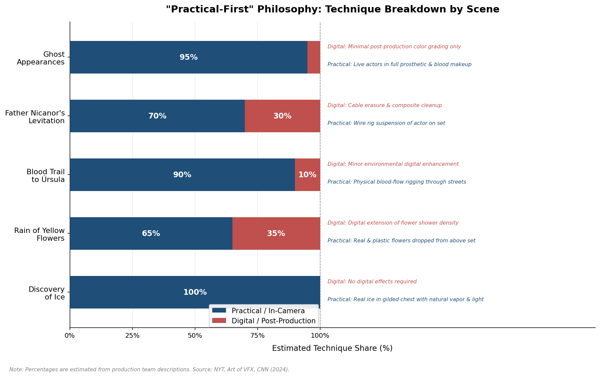

*Figure: Estimated practical (in-camera) vs. digital (post-production) technique share across five signature supernatural sequences. Percentages are derived from production team descriptions reported by NYT, Art of VFX, and CNN (2024).*

The blood-trail sequence — in which the blood of the murdered José Arcadio flows through the streets of Macondo, under doors and around corners, until it reaches Úrsula in her kitchen — was staged as a domestic event rather than a horror set piece. Mora insisted that the supernatural be presented "without drama or fanfare," mirroring the novel's technique of deploying the same calm narrative register for the impossible and the ordinary alike. Her creative philosophy distilled to a single formulation: "embrace it instead as a poetic place… not in an artificial way but in a very artisanal way" [NYT](https://www.nytimes.com/interactive/2024/12/09/books/one-hundred-years-of-solitude-netflix-magical-realism.html "2024") [LA Times](https://www.latimes.com/delos/story/2024-12-19/100-years-of-solitude-netflix-streaming-gabriel-garcia-marquez-alex-garcia-lopez-laura-mora "2024").

The VFX work was handled by El Ranchito, a Madrid-based studio with credits on *Game of Thrones*. Their mandate was characterized as "invisible yet essential" — augmenting practical effects (erasing wire rigs, digitally extending flower showers, expanding environmental vistas) rather than generating spectacle from scratch [Art of VFX](https://www.artofvfx.com/one-hundred-years-of-solitude-vfx-breakdown-by-el-ranchito/ "VFX Breakdown, 2024"). This hierarchy — practical first, digital second — ensured that the series' magical realism retained a tactile, earthbound quality consonant with García Márquez's prose.

Mora reflected on the deeper cultural logic underpinning this approach. Many of the novel's "magical" scenes, she noted, had real-world antecedents in García Márquez's childhood. His sisters did eat soil, as Rebeca does in the novel; local legends in the Aracataca region did include a levitating priest, whom García Márquez changed to one who rises after drinking hot chocolate "because he found that more believable." As Mora observed: "what he's doing here is narrating the stories of the world he was born into. Magical realism is a name that the academics have applied" [NYT](https://www.nytimes.com/interactive/2024/12/09/books/one-hundred-years-of-solitude-netflix-magical-realism.html "2024"). The production's practical-first aesthetic, in this reading, was not merely a technical choice but an epistemological one: it honored García Márquez's own understanding of the supernatural as continuous with, rather than opposed to, the real.

This approach did not satisfy all observers. Ariel Dorfman, in his extensive critical assessment for *LitHub*, argued that the series nonetheless fell into the trap of "strumming ominous music" and deploying "dark atmospheres" to signal the arrival of supernatural events — precisely the opposite of the novel's technique, which refuses to mark the miraculous as different from the mundane [LitHub/Dorfman](https://lithub.com/what-would-gabriel-garcia-marquez-have-thought-of-the-netflix-version-of-his-novel/ "2024"). The tension between the production team's stated intention and its execution, as perceived by at least some informed critics, underscores the structural difficulty of the task: even a deliberate commitment to understatement may not survive the visual medium's inherent tendency to dramatize.

## Building Macondo: Production Design as World-Building

If the screenwriters' challenge was temporal — how to organize a century of non-linear narrative — the production designers' challenge was spatial: how to construct a fictional town that exists simultaneously as a specific Colombian place and as a universal myth. Art director Enríquez addressed this by designing four distinct versions of Macondo, each corresponding to a stage in the town's evolution. The progression tracked Colombia's own architectural history: an initial encampment of mud walls and thatched roofs gave way to a colonial-era settlement, then to a more developed republican-period town [El País](https://english.elpais.com/culture/2024-11-24/a-mythical-historic-macondo-one-hundred-years-of-solitude-becomes-a-netflix-series.html "2024") [CNN](https://www.cnn.com/2024/12/02/style/one-hundred-years-of-solitude-netflix-production-costumes "2024"). The foundational journey of José Arcadio Buendía and Úrsula through the wilderness was filmed on the La Guajira peninsula, establishing the primordial landscape from which Macondo would rise.

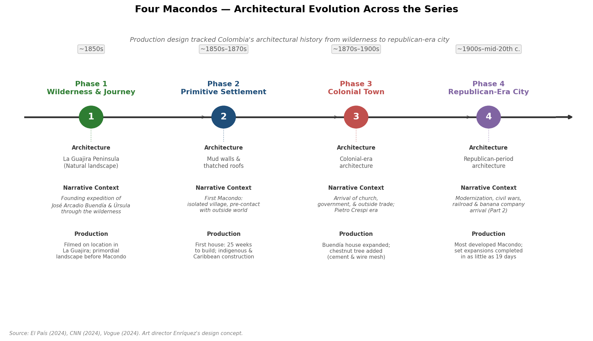

*Figure: The four phases of Macondo's production design, from La Guajira wilderness through the republican-era city, mapped to their narrative periods and key production milestones. Based on art director Enríquez's design concept as reported by El País, CNN, and Vogue (2024).*

Enríquez conceived the Buendía house as a character in its own right: "The house is just another Buendía. When Úrsula is happy, the house is happy" [CNN](https://www.cnn.com/2024/12/02/style/one-hundred-years-of-solitude-netflix-production-costumes "2024"). The structure was designed to grow over the course of the series, mirroring the family's expanding ambitions and accumulating ghosts. The first version of the house required 25 weeks to build; subsequent expansions — adding rooms, floors, and the courtyard chestnut tree — were executed in as few as 19 days. The iconic chestnut tree to which José Arcadio Buendía is tied in his madness was realized as a sculptural construction of cement and wire mesh [CNN](https://www.cnn.com/2024/12/02/style/one-hundred-years-of-solitude-netflix-production-costumes "2024") [Vogue](https://www.vogue.com/article/one-hundred-years-of-solitude-netflix-site-visit "2024").

The botanical dimension of the production merits particular attention. Botanist Marta Duque, guided by Santiago Madriñan's 2014 academic study *Flora de Macondo*, selected and planted 16,000 Caribbean native species across the set. This commitment extended the production's logic of physical authenticity to the natural environment: the vegetation surrounding the Buendía compound was not generic tropical foliage but the specific flora of García Márquez's Caribbean lowlands [Vogue](https://www.vogue.com/article/one-hundred-years-of-solitude-netflix-site-visit "2024").

Over 150 Colombian artisans from indigenous and Afro-Colombian communities contributed to the material culture of the production. Zenú artisans wove baskets; Chimila craftspeople made hammocks; Wayúu textile workers produced garments and fabrics. The Melquíades manuscript — the prophetic text that contains the Buendía family's history and serves as the novel's central meta-fictional device — was hand-lettered by Sanskrit translators and calligraphers, rendering it as a physical artifact rather than a digital prop [Vogue](https://www.vogue.com/article/one-hundred-years-of-solitude-netflix-site-visit "2024") [NYT](https://www.nytimes.com/interactive/2024/12/09/books/one-hundred-years-of-solitude-netflix-magical-realism.html "2024").

## The Sensory Detail: Costumes, Music, and the Discovery of Ice

Costume designer Catherine Rodríguez oversaw the creation of more than 34,000 garments and pairs of shoes, all manufactured from scratch by a Colombian team. The research base for the wardrobe included the *Comisión Corográfica*, a series of illustrated reports produced by nineteenth-century Colombian government scientific expeditions — a source that grounded the costumes in documented visual records of the period rather than generic period-drama conventions [El País](https://english.elpais.com/culture/2024-11-24/a-mythical-historic-macondo-one-hundred-years-of-solitude-becomes-a-netflix-series.html "2024") [CNN](https://www.cnn.com/2024/12/02/style/one-hundred-years-of-solitude-netflix-production-costumes "2024").

The score, composed by Camilo Sanabria and Juancho Valencia, was designed to evolve in tandem with Macondo's development. In the town's earliest incarnation, the soundscape is dominated by indigenous drums and wind instruments. European musical influences enter with the arrival of Pietro Crespi and his player piano — a narrative device García Márquez uses to mark the intrusion of modernity into the town's pre-industrial world. Musicians including Los Gaiteros de San Jacinto and a percussionist from Toto La Momposina's ensemble contributed to the recording, anchoring the score in authentic Colombian musical traditions [El País](https://english.elpais.com/culture/2024-11-24/a-mythical-historic-macondo-one-hundred-years-of-solitude-becomes-a-netflix-series.html "2024").

The commitment to physical authenticity extended to individual set pieces. In the scene in which the young Aureliano touches ice for the first time — one of the novel's most celebrated passages and its opening image — the production used real ice housed in a gilded chest that emitted vapor and refracted light. Art director Enríquez explained the rationale: "so that when (young Aureliano) touched the ice, the actor's reaction was authentic" [CNN](https://www.cnn.com/2024/12/02/style/one-hundred-years-of-solitude-netflix-production-costumes "2024"). The choice epitomized the production's broader philosophy: wherever a physical solution existed, it was preferred over a digital one, on the premise that the actor's genuine sensory experience would transmit itself to the viewer.

## Casting Across Generations and the Costeño Voice

The adaptation's casting strategy was dictated by the novel's multi-generational structure. Key characters age across decades, and the production chose to assign multiple actors to individual roles rather than rely on aging prosthetics. José Arcadio Buendía was played by González Ospina (young) and Diego Vásquez (mature and old age). Úrsula Iguarán was split between Susana Morales — a professional dancer with no prior acting experience — and Marleyda Soto. Colonel Aureliano Buendía, who spans the widest temporal range of any character, was divided among four actors; Claudio Cataño, who portrayed the adult and elder Colonel, underwent six months of intensive preparation for the role [Wikipedia](https://en.wikipedia.org/wiki/One_Hundred_Years_of_Solitude_(TV_series) "TV series") [Variety](https://variety.com/2025/tv/news/netflix-one-hundred-years-of-solitude-shooting-in-colombia-1236278697/ "2025").

Linguistic uniformity received as much attention as physical casting. The entire cast was trained to speak in the Costeño accent of Colombia's Caribbean coast — the dialect of García Márquez's homeland and the phonetic texture of Macondo's world. The production designated this linguistic immersion program "The School of One Hundred Years," and it extended beyond speech: actors also learned period-appropriate handwriting, sewing, and embroidery. The series additionally incorporated Wayúu, an indigenous language spoken by the characters Visitación and Cataure, reflecting the novel's depiction of indigenous presence in the early life of Macondo [NYT](https://www.nytimes.com/interactive/2024/12/09/books/one-hundred-years-of-solitude-netflix-magical-realism.html "2024") [Variety](https://variety.com/2025/tv/news/netflix-one-hundred-years-of-solitude-shooting-in-colombia-1236278697/ "2025").

## Dual Cinematographic Languages

The division of Part 1 between two directors — Alex García López and Laura Mora — was mirrored in the assignment of two directors of photography with distinct visual signatures. Paulo Perez, shooting García López's episodes (1, 2, 3, 7, and 8), employed handheld camerawork and candlelight illumination to create what he described as a sense of "freedom" — an aesthetic appropriate to the early, unstructured Macondo of José Arcadio Buendía's founding expedition. María Sarasvati, working with Mora on episodes 4, 5, and 6, adopted a more controlled Steadicam-driven visual language. She characterized the shift in narrative terms: "When my block arrives, religion and the government enter Macondo, and many things change" [MPA](https://www.motionpictures.org/2025/01/making-macondo-how-the-one-hundred-years-of-solitude-cinematographers-brought-gabriel-garcia-marquezs-epic-to-netflix/ "Making Macondo, 2025").

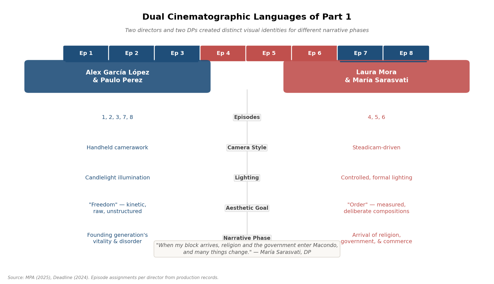

*Figure: The dual visual identities of Part 1 — contrasting the handheld, candlelit aesthetic of the García López / Perez episodes with the Steadicam-driven formality of the Mora / Sarasvati episodes, each mapped to its corresponding narrative phase. Based on MPA (2025) and Deadline (2024).*

This bifurcation was not an accident of scheduling but a deliberate interpretive choice. The rawer, more kinetic visual style of the early episodes reflected the founding generation's vitality and disorder; the progressively more formal compositions of the middle episodes tracked the arrival of institutional power — the church, the state, the commercial economy — that would gradually constrain Macondo's original freedom. The cinematographic strategy thus operated as a visual analogue to the novel's own thematic arc: from creation to ossification, from innocence to entropy.

## Chronological Shooting and Geographic Scope

In a decision unusual for a production of this scale, principal photography proceeded in chronological order across the nine-month shoot (May to December 2023), spanning 15 locations across five Colombian departments. Chronological shooting imposed significant logistical costs — sets had to be built, modified, and rebuilt in sequence rather than batched for efficiency — but offered compensating artistic advantages. Actors could inhabit their characters' emotional trajectories in order, building on cumulative experience rather than performing scenes out of context. The physical transformation of the Macondo set, from primitive encampment to colonial town, became a production reality rather than a post-production illusion [Deadline](https://deadline.com/2024/12/alex-lopez-garcia-one-hundred-years-of-solitude-gabriel-garcia-marquez-netflix-1236200422/ "2024").

## The Synthesis: Craft as Argument

The creative and production strategies documented above — chronological restructuring, narrator integration, practical-first magical realism, four-phase Macondo construction, artisan-driven material culture, multi-actor casting, dialect training, evolving cinematography — collectively represent an argument about how to adapt a work widely considered unadaptable. The argument, distilled, is that fidelity to the spirit of García Márquez's novel required not a literal transcription of his prose but an immersion in the sensory, cultural, and epistemological world from which that prose emerged. Where the novel achieves its effects through language, the series sought to achieve analogous effects through texture, physical space, human faces, and the refusal to treat the extraordinary as anything other than an extension of the ordinary.

Whether this argument succeeds — and the critical response, examined elsewhere in this report, reveals genuine disagreement on that question — the production's commitment to its own logic was thorough and internally consistent. From the Sanskrit calligraphy on the Melquíades manuscript to the 16,000 botanically accurate plants surrounding the Buendía house, the series pursued its vision with the kind of obsessive, encyclopedic attention to detail that García Márquez himself might have recognized as kindred to his own creative method.

# 第4章 Cultural Fidelity and Latin American Ownership

Any adaptation of *One Hundred Years of Solitude* (*Cien años de soledad*) was destined to be judged on two axes simultaneously: its fidelity to the text, and its fidelity to the culture the text encodes. The novel is not merely a work of Colombian literature; it functions, in the words of novelist Ricardo Silva Romero, as "Colombia's national poem" [The Guardian](https://www.theguardian.com/books/2024/dec/20/one-hundred-years-of-solitude-netflix-series "Colombians celebrate Netflix TV series, 2024"). García Márquez's face adorns the national currency; the book is compulsory reading for generations of schoolchildren across the country. To bring it to the screen was, inescapably, to define what Macondo looks like — and in doing so, to impose a single visual interpretation on a text whose power had always resided, in part, in the private imagery of each reader.

This chapter traces how the Netflix adaptation navigated the dual imperative of literary fidelity and cultural authenticity, and how the resulting series was received by the communities with the deepest stakes in its outcome: Colombian audiences, Latin American literary critics, and the broader Spanish-speaking cultural sphere.

## The Fidelity Debate: How Close Is Too Close?

The adaptation's relationship to its source material was, by most accounts, one of conspicuous reverence. Dr. Liz Harvey-Kattou, writing in *The Conversation*, characterized the approach as near-verbatim: "Where possible, the series enacts the book word for word." Her assessment went further, arguing that by expanding scenes García Márquez had compressed into single sentences, the adaptation paradoxically offered "a more cohesive experience than reading the book" [The Conversation](https://theconversation.com/one-hundred-years-of-solitude-netflix-adaptation-is-faithful-ambitious-and-beautifully-realised-244972 "2024"). This observation captures a distinctive quality of the series: its willingness to dramatize what the novel merely implies, while holding close to the novel's language wherever dialogue or narration appears.

The series did, however, make deliberate departures. A *Screen Rant* analysis catalogued eight specific changes in Part 1 alone: the cold open depicting the novel's final scene (Aureliano Babilonia discovering the Melquíades manuscript); the introduction of an original ouroboros symbol representing the Buendía family's cyclical fate; the compression of the insomnia plague, which omitted the novel's detail of victims seeing each other's dreams; the removal of José Arcadio's death-scent of gunpowder; the elimination of Aureliano's proposal to a hotel girl; the complete excision of the folk musician Francisco el Hombre; the reduction of Rebeca's search for her parents' bones; and the expansion of the relationship between Arcadio and Doctor Noguera [Screen Rant](https://screenrant.com/one-hundred-years-solitude-season-1-book-changes-differences/ "2024"). These departures ranged from structural reframing to narrative compression and selective expansion, forming a spectrum of adaptive choices that the figure below illustrates.

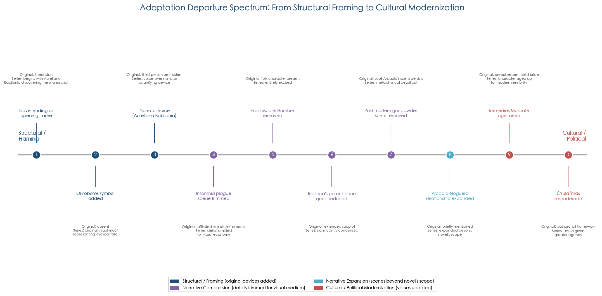
*Figure: The adaptation's departures from the novel span four categories — structural framing, narrative compression, narrative expansion, and cultural-political modernization — reflecting a deliberate calibration between textual fidelity and the demands of visual storytelling.*

Two changes carried particular cultural weight. The first was the aging-up of Remedios Moscote. In the novel, Colonel Aureliano Buendía marries Remedios when she has not yet reached puberty — a detail García Márquez presented without moral commentary. The series increased the character's age, a conscious modernization that Spanish-language critics noted approvingly. The second was the characterization of Úrsula Iguarán, who was rendered, as one Spanish-language reviewer observed, "más empoderada" — more empowered — than her novelistic counterpart [Las Cosas Que Nos Hacen Felices](https://www.lascosasquenoshacenfelices.com/analisis-de-cien-anos-de-soledad-netflix-entrega-una-adaptacion-a-la-que-le-falto-osadia-pero-aprueba-con-creces/ "2025"). These adjustments reflect the adaptation's effort to honor the novel's world while acknowledging that certain of its sexual and gender dynamics, rendered without authorial judgment in 1967, would register differently in a 2024 visual medium.

Not all observers regarded the overall fidelity as a virtue. The same Spanish-language review that praised the modernizations described the adaptation's faithfulness as "por momentos diría hasta exagerada y quizás pecando de cobardía" — at times excessive and perhaps guilty of cowardice [Las Cosas Que Nos Hacen Felices](https://www.lascosasquenoshacenfelices.com/analisis-de-cien-anos-de-soledad-netflix-entrega-una-adaptacion-a-la-que-le-falto-osadia-pero-aprueba-con-creces/ "2025"). This critique — that the series was too faithful, too cautious, too reluctant to assert an independent artistic vision — recurred across multiple assessments and constituted one of the more unexpected threads in the reception. Rodrigo García, the author's son and executive producer, had warned the creative team against precisely this tendency: "I told them they should feel free to truly adapt it," he said, arguing that the chronic failing of prior García Márquez adaptations had been "too much respect for the book" [LA Times](https://www.latimes.com/delos/story/2024-12-19/100-years-of-solitude-netflix-streaming-gabriel-garcia-marquez-alex-garcia-lopez-laura-mora "2024").

## What the Screen Cannot Carry: The Loss of Language

The most structurally significant critique of the adaptation came not from those who objected to specific changes but from those who argued that the novel's most essential dimension — its prose — was, by definition, untranslatable to any visual medium.

Ariel Dorfman, the Chilean-American novelist and scholar who had personally witnessed García Márquez refuse adaptation proposals in the 1970s, published an extensive assessment in *LitHub* that constituted perhaps the most intellectually rigorous evaluation of the series. He began by conceding that the adaptation was "certainly not a travesty" and that the decisions to film in Spanish and on location in Colombia had "brilliantly addressed" long-standing concerns. His central judgment, however, was unsparing: "the novel is above all a feat of language… It is that unique outlook which has been lost" [LitHub/Dorfman](https://lithub.com/what-would-gabriel-garcia-marquez-have-thought-of-the-netflix-version-of-his-novel/ "2024").

Dorfman identified two specific dimensions of loss. The first concerned the treatment of the supernatural. In the novel, magical realism operates through narrative tone: the omniscient narrator describes a priest levitating or a trail of blood threading through streets with precisely the same inflection used for a character eating breakfast. The series, despite its stated commitment to a "practical-first" aesthetic (as discussed in Chapter 3), nonetheless fell, in Dorfman's reading, into the trap of marking supernatural arrivals with ominous music and darkened atmospheres — "creates exactly the opposite effect that the novel accomplishes" [LitHub/Dorfman](https://lithub.com/what-would-gabriel-garcia-marquez-have-thought-of-the-netflix-version-of-his-novel/ "2024"). The tension between the production team's stated philosophy and Dorfman's perception of its execution illuminates a structural difficulty intrinsic to the medium: a camera that renders everything with equal visual vividness may still rely on non-visual cues — sound design, color grading, editing rhythm — to signal register shifts, and those cues can undermine the very tonal flatness the adaptation sought to achieve.

The second dimension of loss concerned tone. The novel, Dorfman argued, is "relentlessly comical" — a quality entirely absent from "this solemn cinematic version." Similarly, the novel's treatment of sex is "joyful," whereas the series reduced it to "standardized groans, heaving bodies" [LitHub/Dorfman](https://lithub.com/what-would-gabriel-garcia-marquez-have-thought-of-the-netflix-version-of-his-novel/ "2024"). These observations point to a broader challenge: García Márquez's humor and erotic energy are functions of his prose voice, embedded in the distance between narrator and event — a distance that collapses when a camera places the viewer directly inside the scene.

Despite these reservations, Dorfman concluded on a note of measured generosity, speculating that García Márquez "would be pleased that his beloved, flawed Buendías have been afforded such dignity" [LitHub/Dorfman](https://lithub.com/what-would-gabriel-garcia-marquez-have-thought-of-the-netflix-version-of-his-novel/ "2024").

## Colombian Voices: National Pride and Caribbean Scrutiny

The adaptation's reception within Colombia carried stakes that no international review could fully capture. The series was not merely a television event but a test of cultural sovereignty — whether the country's most sacred literary text could survive its translation into the visual grammar of a global streaming platform.

The dominant response, as reported by *El País Colombia*, was overwhelmingly favorable: "más elogios que críticas" — more praise than criticism [El País Colombia](https://elpais.com/america-colombia/2024-12-26/cien-anos-de-soledad-en-netflix-despierta-mas-elogios-que-criticas-en-colombia.html "2024"). Ricardo Silva Romero, one of Colombia's most prominent contemporary novelists, offered what amounted to the cultural establishment's benediction: "El solo hecho de que hayan construido el pueblo completamente señala que no es un ejercicio cínico… Difícilmente se podía hacer mejor" — the very fact that they built the entire town signals this is not a cynical exercise; it would be difficult to have done better [El País Colombia](https://elpais.com/america-colombia/2024-12-26/cien-anos-de-soledad-en-netflix-despierta-mas-elogios-que-criticas-en-colombia.html "2024").

Colombian film critic Samuel Castro provided a more granular but still positive evaluation, praising the series for achieving what the novel achieves for Latin American readers: "cuando los latinoamericanos leemos la novela, es como si alguien nos estuviera explicando el mundo" — when Latin Americans read the novel, it is as though someone is explaining the world to us. The series, in his judgment, "lo cumple, no perfectamente, pero sí de manera sobresaliente" — fulfills this promise, not perfectly, but outstandingly. He singled out the casting of unknown actors as essential to this effect: had the production used recognizable stars, "ahí sí hubiera pasado lo que quería evitar García Márquez" — that is precisely what García Márquez wanted to avoid [El País Colombia](https://elpais.com/america-colombia/2024-12-26/cien-anos-de-soledad-en-netflix-despierta-mas-elogios-que-criticas-en-colombia.html "2024").

A particularly resonant strand of Colombian response emerged from *The Guardian*'s reporting on everyday viewers. Irene Arenas, a Bogotá English teacher who first read the novel at thirteen, articulated the anxiety and relief that defined the experience for many: "I was completely skeptical. This book means so much to me, how on earth do you translate it into a series? But it overwhelmed me with its beauty." María Fernanda Cortés, an industrial designer from the Caribbean coastal town of Guachaca, reported that "the landscapes in the series are identical to the ones I see every day — the trees, the intense heat, the crystal-clear green rivers and the blue seas. It has made me feel like I live in Macondo" [The Guardian](https://www.theguardian.com/books/2024/dec/20/one-hundred-years-of-solitude-netflix-series "2024"). These reactions suggest that for a significant portion of Colombian viewers, the adaptation's achievement resided less in literary fidelity than in visual recognition — the experience of seeing one's own landscape, daily textures, and cultural rhythms reflected with seriousness and care in a global entertainment product.

The series also functioned, for some Colombian viewers, as a corrective to the country's dominant screen identity. Adrián Lemus, a Caribbean coast business administrator, told *The Guardian*: "We struggle not to be seen as a country of cocaine and drug cartels. Gabo's work is an example of resilience, strength and community — virtues that are carved into Colombians from childhood" [The Guardian](https://www.theguardian.com/books/2024/dec/20/one-hundred-years-of-solitude-netflix-series "2024"). After years of *Narcos* defining Colombia's image on the same platform, an adaptation of García Márquez offered what many perceived as a different — and truer — national narrative.

Not all Colombian reception was uncritical. Jassir Eljach, a Caribbean cultural commentator, took aim at the series' handling of regional accent, arguing that the narrator spoke with "un acento caribe falso" — a fake Caribbean accent — and that while the lead actors' physical performances were "espectacular," they "cojean cuando hablan como si fueran del Caribe" — they stumble when they speak as though they were from the Caribbean [Infobae Colombia](https://www.infobae.com/colombia/2024/12/21/la-adaptacion-de-cien-anos-de-soledad-divide-opiniones-es-imposible-capturar-su-esencia-en-una-serie/ "2024"). This critique highlighted a granularity of cultural fidelity invisible to international audiences: within Colombia, the Costeño accent is not a neutral stylistic choice but a marker of regional identity, and its imperfect reproduction registered as a meaningful gap.

## The Wider Latin American Debate: From Pasolini Comparisons to "Coffee Commercial" Attacks

Beyond Colombia's borders, the adaptation provoked a spectrum of responses across the Spanish-speaking world that organized roughly into three positions.

The first camp — broadly celebratory — was exemplified by a Colombian critic writing in *El Espectador* (translated by *Worldcrunch*), who elevated the adaptation to the company of Pier Paolo Pasolini's literary films: "It has that undefinable light or unfathomable quality of light that dissolved time as I watched, entranced" [Worldcrunch](https://worldcrunch.com/opinion-analysis/one-hundred-years-of-solitude-colombia/ "2025"). This was praise of the highest order, positioning the Netflix series not as a competent commercial adaptation but as a work of genuine cinematic poetry.

The second camp acknowledged the technical achievement while insisting that something essential had been lost. Cristina Escobar, a Cuban-American critic writing for *RogerEbert.com*, gave a generally positive assessment but raised a cultural-political concern that few other reviewers had articulated: "I can't help but wish the conversation about what it means to be Latin American… had advanced since 1967." She also criticized the series for faithfully reproducing the novel's depictions of underage sexual relationships without the mediating layer of García Márquez's narrative voice — a choice that, transposed from page to screen, struck her as more disturbing than it reads in prose [Roger Ebert](https://www.rogerebert.com/streaming/one-hundred-years-of-solitude-netflix-tv-review "2024").

The third camp was openly hostile. The most widely quoted attack came from Spanish writer Sergio del Molino, who in *El País* (Spain) described the series as "una serie horrorosa, un interminable anuncio de café" — a horrific series, an interminable coffee commercial — and condemned it as "un producto prefabricado e industrial sin autor reconocible" — a prefabricated, industrial product without a recognizable auteur [El País Spain](https://elpais.com/television/2024-12-13/cien-anos-de-soledad-en-netflix-una-serie-horrorosa-un-interminable-anuncio-de-cafe.html "2024"). From Peru, veteran director Francisco Lombardi (known for his adaptations of Mario Vargas Llosa's work) offered a comparably severe verdict: the series possessed "una estética publicitaria de gran calidad" — a high-quality advertising aesthetic — but "no transmite la esencia profunda" — it failed to transmit the novel's deeper essence [Infobae](https://www.infobae.com/peru/2024/12/16/la-dura-critica-del-cineasta-peruano-francisco-lombardi-a-la-serie-cien-anos-de-soledad-de-netflix-no-transmite/ "2024").

These criticisms — the coffee commercial, the advertising aesthetic — shared a common underlying anxiety: that the Netflix apparatus, however respectful in its intentions, had processed a singular work of literature into a polished, globally consumable product indistinguishable from the platform's broader output. The *New York Times Magazine* gave this anxiety its most fully theorized expression in a March 2025 essay by Robert Rubsam, which placed the adaptation within a broader pattern of Netflix "gobbling up world literature" — alongside *Pedro Páramo*, *The Leopard*, and *The Three-Body Problem*. Rubsam's core claim was that "the mini-series resembles the other things on Netflix more than it resembles anything in García Márquez" [NYT Magazine](https://www.nytimes.com/2025/03/11/magazine/netflix-one-hundred-years-of-solitude.html "2025"). The charge was not that the adaptation failed on its own terms, but that it participated in a process of cultural flattening — transforming irreducibly particular literary works into what Rubsam termed "frictionless international content consumption."

## The Tyranny of the Image

Perhaps the most philosophically penetrating commentary came from within the production itself. Director Laura Mora, in a remarkably candid reflection, acknowledged what she called "la tiranía que supone la adaptación" — the tyranny inherent in adaptation — specifically the tyranny of fixing a visual image onto a text that had previously existed in each reader's imagination: "A partir de mañana, tú buscas Macondo en Google y ya te va a aparecer este Macondo" — from tomorrow, you search for Macondo on Google and this Macondo will appear [El País Colombia](https://elpais.com/america-colombia/2024-12-26/cien-anos-de-soledad-en-netflix-despierta-mas-elogios-que-criticas-en-colombia.html "2024"). The statement amounted to a concession that the act of adaptation, however faithful, is also an act of appropriation — the visual medium's definitive claim over a territory previously governed by the reader's inner eye.

Mora tempered this acknowledgment with a statement of ethical intent: "pero lo hemos hecho con rigor y un profundo amor al libro" — but we have done it with rigor and a profound love for the book [El País Colombia](https://elpais.com/america-colombia/2024-12-26/cien-anos-de-soledad-en-netflix-despierta-mas-elogios-que-criticas-en-colombia.html "2024"). This duality — the awareness that adaptation simultaneously honors and diminishes its source — defined the most thoughtful currents of the cultural conversation.

The screenwriters, for their part, articulated their balancing act in terms of dual audiences. Natalia Santa explained that the goal was "not to please the reader, but to be faithful to the novel," drawing a distinction between reader-pleasing fan service and the deeper fidelity of preserving the work's internal logic: changes should "not make them feel like, this doesn't belong in this world" [Remezcla](https://remezcla.com/features/film/latina-colombian-screenwriters-one-hundred-years-of-solitude-netflix/ "2024"). Camila Brugés framed the adaptation as an act of emotional excavation rather than mechanical transposition — identifying the novel's core as "a tragic story, with a curse that crosses a love" and centering the series on the tension between hope and condemnation that, in her reading, runs through every page [Remezcla](https://remezcla.com/features/film/latina-colombian-screenwriters-one-hundred-years-of-solitude-netflix/ "2024").

## Mapping the Critical Landscape

Taken together, the critical responses to the adaptation's cultural fidelity organize into a coherent, if contested, map. Three broad positions emerge, summarized in the figure below.

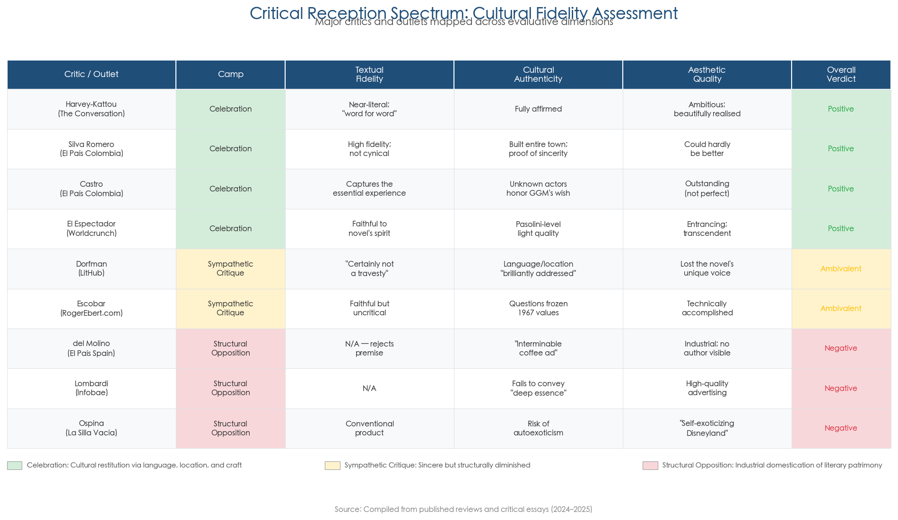
*Figure: Major critics and outlets mapped across evaluative dimensions — textual fidelity, cultural authenticity, aesthetic quality — and classified into three reception camps.*

**Position one: The adaptation as cultural triumph.** Represented by Silva Romero, Castro, Harvey-Kattou, and the *El Espectador* reviewer (via *Worldcrunch*), this camp emphasizes the production's unprecedented commitment to authenticity — the all-Colombian cast, the Spanish-language production, the physical construction of Macondo, the engagement of over 150 indigenous artisan communities — and concludes that these structural decisions produced a work that honors both the novel and the culture it encodes. For Colombian audiences in particular, the visual recognition of their own landscapes and daily textures in a globally distributed production constituted a form of cultural validation rarely extended to Latin American stories.

**Position two: The adaptation as respectful but fundamentally limited.** Represented by Dorfman, Escobar, and the Spanish-language reviewers who identified excessive caution, this camp accepts the production's good faith and technical excellence but argues that the novel's most essential qualities — its prose voice, its humor, its erotic energy, its refusal to mark the supernatural — are structurally untranslatable to screen. In this reading, the adaptation's very fidelity to the novel's plot and imagery paradoxically underscores what it cannot capture: the experience of inhabiting García Márquez's sentences.

**Position three: The adaptation as industrial product.** Represented by del Molino, Lombardi, and Rubsam, this camp views the series as symptomatic of a systemic problem: the absorption of irreducibly particular literary works into the homogenizing machinery of global streaming. For these critics, the relevant comparison is not between the series and the novel but between the series and everything else on Netflix — a comparison in which the adaptation's distinctiveness dissolves.

The geographic distribution of these positions is itself revealing. Colombian critics and audiences clustered disproportionately in the first camp, with some representation in the second. The harshest criticisms tended to originate from outside Colombia — from Spain (del Molino), Peru (Lombardi), and the United States (Rubsam) — suggesting that proximity to the source culture disposed viewers toward generosity, while distance permitted a more detached, and perhaps less emotionally invested, scrutiny.

What is notable across all three positions is the absence of charges of cultural exploitation or misrepresentation — the accusations that have attended many prior adaptations of non-Western literary works by Western entertainment companies. The structural decisions made at the project's inception — Spanish-language production, Colombian filming, family involvement, local casting, indigenous artisan participation — appear to have effectively inoculated the adaptation against the most damaging category of cultural critique. The debate, in the end, was not about whether the adaptation respected the culture, but about whether any adaptation, however respectful, can capture what makes this particular novel irreplaceable.

# 第5章 Reception, Performance, and Industry Impact

The premiere of *One Hundred Years of Solitude* on December 11, 2024, constituted a high-stakes test for Netflix's evolving content model: could a Spanish-language literary adaptation — anchored in magical realism, populated by unknown actors, and built on a novel long deemed unfilmable — register as a global event in a marketplace dominated by English-language intellectual property? The evidence assembled across viewership data, critical aggregation, awards recognition, and industry-level strategic indicators yields an affirmative but qualified answer. The series secured strong critical scores, meaningful viewership for a non-English title, and commanding awards traction in the Ibero-American sphere, while encountering structural barriers to penetration in the Anglo-American prestige circuit that confers the highest industry visibility. The following sections evaluate commercial performance, the critical landscape and its internal divisions, the geography of awards recognition, the production's economic footprint in Colombia, the adaptation's effect on the source novel's commercial life, and the broader implications for Netflix's non-English content strategy.

## Commercial Performance: Viewership in Context

Netflix's semi-annual Engagement Reports constitute the most authoritative publicly available data on the series' audience reach. The H2 2024 report, published on February 26, 2025, recorded 9 million views for Part 1 — a metric defined as total viewing hours divided by the runtime of a single episode. This figure covered only the final six days of 2024 availability, since Part 1 premiered on December 11 [Netflix Engagement Report H2 2024](https://about.netflix.com/news/what-we-watched-the-second-half-of-2024 "Published 2025-02-26"). The subsequent H1 2025 report, published on July 17, 2025, added a further 5 million views, bringing the cumulative total to approximately 14 million [Netflix Engagement Report H1 2025](https://about.netflix.com/news/what-we-watched-the-first-half-of-2025 "Published 2025-07-17").

These figures require contextual calibration. Within the same H2 2024 reporting window, the Norwegian disaster series *La Palma* accumulated 52 million views, the Mexican thriller *The Accident* reached 41 million, and *Squid Game* Season 2 garnered 87 million. The comparison is structurally misleading, however, because those titles benefited from substantially longer availability windows within the reporting period. The 9-million figure for *One Hundred Years of Solitude* reflects barely a week of data — an opening velocity that, if linearly extrapolated, would have positioned it competitively among the period's top non-English titles. The H1 2025 report singled out Colombia as a source of "strong numbers" in its non-English programming slate, citing the series by name [Netflix Engagement Report H2 2024](https://about.netflix.com/news/what-we-watched-the-second-half-of-2024 "Published 2025-02-26").

External indicators corroborate a meaningful global footprint. The series appeared in Netflix's Global Top 10 for non-English TV series for three consecutive weeks following its premiere, confirming sustained audience engagement beyond the initial release surge. Netflix's reporting framework, however, tracks only aggregate hours rather than completion rates or geographic distribution, leaving significant analytical gaps. The company does not disclose how viewership distributed across Latin American, European, and North American audiences — a distinction essential to assessing the series' crossover appeal beyond its natural Spanish-language base.

## The Critical Landscape: Aggregated Scores and Their Limits

On Rotten Tomatoes, Part 1 earned an 83% "Certified Fresh" rating from 30 critics, with an average score of 7.9 out of 10. The Critics Consensus read: "One Hundred Years of Solitude faithfully realizes Gabriel García Márquez's seminal novel with sumptuous polish" [Rotten Tomatoes](https://www.rottentomatoes.com/tv/one_hundred_years_of_solitude/s01 "Season 1 page"). The audience score ran considerably higher at approximately 92%, suggesting a measurable gap between professional critical reservations and popular enthusiasm.

Metacritic, which weights and averages individual critic scores, registered 80 out of 100 from 16 reviews, placing the series in "generally favorable" territory. The dispersion among individual assessments proved instructive: the *Washington Post* awarded a perfect 100/100, while *RogerEbert.com* gave 50/100 — a 50-point spread that crystallizes the interpretive divide examined in Chapter 4 between those who valued the adaptation's fidelity and ambition and those who found its literary voice irretrievably diminished. On IMDb, the series held an 8.3/10 rating from approximately 19,000 user reviews [Metacritic](https://www.metacritic.com/tv/one-hundred-years-of-solitude/ "TV series page") [IMDb](https://www.imdb.com/title/tt9892936/ "TV series page").

### Positioning Among Peer Adaptations

These scores acquire sharper meaning when set against comparable literary adaptations. The Metacritic score of 80 matches *Game of Thrones* Season 1 exactly, while the Rotten Tomatoes score of 83% falls modestly below *Game of Thrones* Season 1's approximately 90%. The adaptation dramatically outperformed Netflix's own recent literary efforts: *All the Light We Cannot See* (2023), adapted from Anthony Doerr's Pulitzer-winning novel, managed only 28% on Rotten Tomatoes and approximately 42 on Metacritic, while *Pedro Páramo* (2024) — Netflix's other major Latin American literary adaptation from the same calendar year — achieved roughly 57% on Rotten Tomatoes. Against the upper echelon of prestige TV adaptations, the series scored below *The Handmaid's Tale* Season 1 (Rotten Tomatoes 98%, Metacritic 92) and BBC's *War & Peace* (Rotten Tomatoes approximately 90%), though the latter was produced in English and operated within an entirely different industrial and linguistic context.

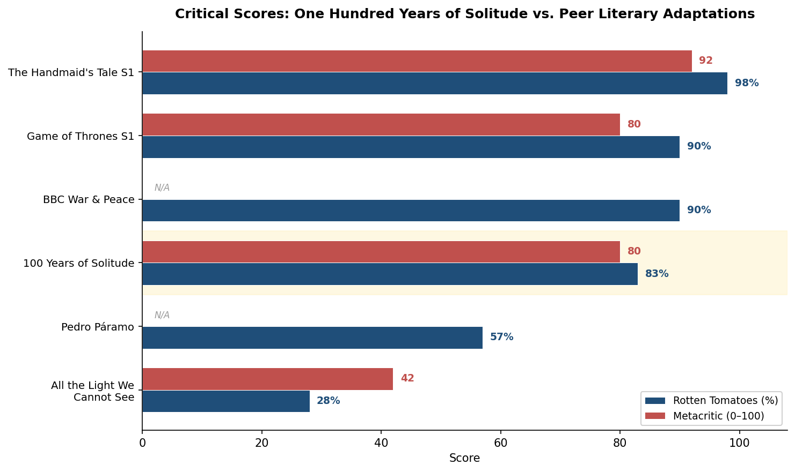

*Figure 1. Rotten Tomatoes and Metacritic scores for* One Hundred Years of Solitude *compared against five peer literary adaptations. The series' Metacritic score of 80 matches* Game of Thrones *Season 1, while substantially exceeding Netflix's other recent literary efforts.*

The comparison with *Pedro Páramo* is particularly instructive. Both series adapted canonical Latin American novels, both were produced in Spanish, and both premiered on Netflix within weeks of each other in late 2024. That *One Hundred Years of Solitude* scored roughly 25 percentage points higher on Rotten Tomatoes suggests that its critical success was not merely a function of cultural goodwill toward the source material but reflected genuinely effective creative execution — a point reinforced by the specificity of critical praise for the production design, casting, and visual treatment of magical realism.

### The Divide in English-Language Reviews

The English-language critical response sorted itself into discernible tiers. At the top, enthusiastic endorsements treated the series as both a cultural landmark and a production achievement. The *Washington Post* (100/100) called it "a stunning, sprawling, extremely improbable success." *The Atlantic* (93/100) found it "as haunting and wondrous as readers would hope." *The Hollywood Reporter* praised a "gorgeous, ambitious adaptation," and *Time* noted how "remarkable" it was that "Netflix comes to recreating the kinetic spirit of the book" [Wikipedia](https://en.wikipedia.org/wiki/One_Hundred_Years_of_Solitude_(TV_series) "Reviews section").

A second tier acknowledged the production's craft while identifying structural limitations inherent to the adaptation enterprise. *The Guardian* (3 out of 5 stars) expressed concern about the series' treatment of sexual politics. Cristina Escobar, writing for *RogerEbert.com*, offered a positive but cautious assessment, raising the cultural-political question of whether the conversation about Latin American identity had "advanced since 1967" and noting discomfort with the series' faithful reproduction of the novel's depictions of underage sexual relationships [RogerEbert.com](https://www.rogerebert.com/streaming/one-hundred-years-of-solitude-netflix-tv-review "Escobar review, 2024").

At the negative end, *The Times* of London awarded 2 out of 5 stars, calling the series "gorgeous but lethargic" — an aesthetic objection to pacing that recurred across several less favorable reviews. The most conceptually ambitious negative critique came from the *New York Times Magazine*, where Ian Rubsam positioned the adaptation within a broader argument about Netflix's consumption of world literature, contending that "the mini-series resembles the other things on Netflix more than it resembles anything in García Márquez" [NYT Magazine](https://www.nytimes.com/2025/03/11/magazine/netflix-one-hundred-years-of-solitude.html "Rubsam, 2025"). This critique — that the adaptation's production values and narrative rhythms had been homogenized into a recognizable Netflix house style — represented the most structurally challenging objection the series faced, one that could not be countered by pointing to fidelity, craft, or audience satisfaction alone.

## Awards Trajectory: Regional Triumph, Anglo-American Limits

The series' awards performance traced a revealing geography: dominant within the Ibero-American cultural sphere, present but not victorious at the international level, and structurally excluded from the U.S. domestic prestige circuit.

The most significant regional recognition came at the **41st India Catalina Awards** (April 2025, Cartagena), Colombia's premier audiovisual prize, where the series won 13 awards — including Best Series, Best Screenplay, Best Actress (Marleyda Soto), Best Actor (Claudio Cataño), Best Supporting Actress (Viña Machado), Best Supporting Actor (Diego Vásquez), and Breakout New Talent (Susana Morales) [Colombia One](https://colombiaone.com/2025/04/28/colombia-one-hundred-years-of-solitude-platino-awards-2025/ "India Catalina count confirmed, 2025"). The breadth of recognition — spanning writing, direction, and virtually every acting category — indicated that the Colombian industry regarded the production as a landmark achievement across disciplines, not merely a prestige exercise carried by its source material.

At the **12th Platino Awards** (April 2025, Madrid), the Ibero-American world's equivalent of the Emmys, the series received ten nominations and took home three awards: Best Ibero-American Miniseries or Television Series, Best Male Performance in a Miniseries or Television Series (Claudio Cataño), and Best Supporting Male Performance in a Miniseries or Television Series (Jairo Camargo) [Deadline](https://deadline.com/2025/04/platino-awards-im-still-here-fernanda-torres-1236378485/ "Full winners list, 2025"). Cataño's win for his portrayal of Colonel Aureliano Buendía — a role spanning the character's youth through old age, prepared over six months of specialized training — validated the production's strategy of casting unknown actors over recognizable stars.

Beyond the Ibero-American sphere, the series' awards path grew appreciably narrower. At the **53rd International Emmy Awards** (November 2025), Diego Vásquez received a Best Actor nomination for his portrayal of the adult José Arcadio Buendía but did not win [Variety](https://variety.com/2025/tv/news/international-emmy-awards-winners-2025-full-list-1236591280/ "International Emmy winners, 2025"). The series was nominated for the **Peabody Award** in the Entertainment category but was not among the seven Entertainment winners announced in May 2025 [Variety](https://variety.com/2025/tv/awards/peabody-awards-2025-winners-baby-reindeer-shogun-ripley-1236383333/ "Peabody winners, 2025"). A **Gotham TV Awards** Breakthrough Drama nomination likewise did not convert to a win [Deadline](https://deadline.com/2025/04/gotham-tv-awards-2025-nominations-1236379954/ "Gotham nominations, 2025"). On the other hand, composer Camilo Sanabria won the **Latin Grammy** for Best Music for Visual Media, and the series claimed a **Septimius Awards** Best Series trophy and two **Premios Aura** wins.

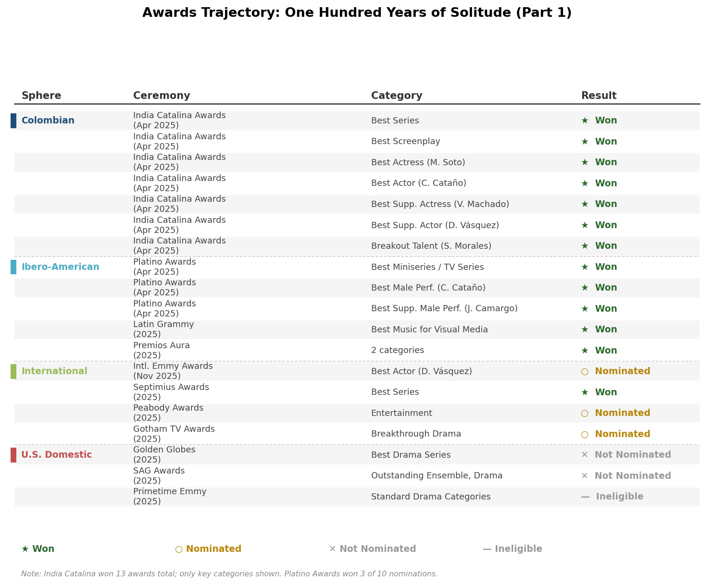

*Figure 2. Awards results for* One Hundred Years of Solitude *(Part 1), organized by institutional sphere. The pattern — comprehensive victories in Colombian and Ibero-American ceremonies, nominations without wins at the international level, and structural exclusion from U.S. domestic prestige awards — illustrates the bifurcated recognition landscape for non-English-language television.*

A structural factor shaped this awards geography. As a non-English-language production, the series was ineligible for the standard dramatic categories at the U.S. Primetime Emmy Awards — the ceremony that most directly drives prestige perception in the global television industry. Netflix submitted the series for Golden Globe (Best Drama Series) and SAG Awards (Outstanding Performance by an Ensemble in a Drama Series) consideration, but it received nominations for neither [Medium](https://davidbmorris.medium.com/emmy-watch-2025-phase-3-continued-90a6b6decda3 "Emmy Watch 2025, David Morris"). The absence from these ceremonies — not a reflection of quality but of linguistic eligibility rules and the voting habits of predominantly anglophone academies — effectively capped the series' visibility in the American trade-press cycle that shapes conversation about "the best shows on television."

The resulting awards profile mirrors the broader trajectory of non-English-language television in the post-*Parasite*, post-*Squid Game* era: crossover success in viewership does not automatically translate into crossover recognition in awards systems built around anglophone norms.

## Economic Footprint

The production's economic impact extended well beyond screen performance. Netflix's official report stated that the making of *One Hundred Years of Solitude* contributed over 225 billion Colombian pesos (approximately $51.8 million) to the Colombian economy. This figure encompasses direct production spending, hospitality expenditures (over 100,000 hotel room nights), employment of nearly 900 crew members — the vast majority Colombian — and the engagement of more than 150 indigenous and traditional artisans [Netflix About](https://about.netflix.com/news/one-hundred-years-of-solitude-contributed-over-225-billion-colombian-pesos "Official economic impact release") [Deadline](https://deadline.com/2024/12/netflix-one-hundred-years-of-solitude-series-colombia-economy-1236202767/ "Netflix economic impact, 2024"). The production utilized Colombia's CINA tax incentive, which provides a 35% rebate on qualifying local production expenditure by international projects, yielding an estimated $11 million in tax credits. Colombia's film commissioner, Silvia Echeverri, described it as "the biggest and most important project to have tapped this incentive" [Variety](https://variety.com/2025/tv/news/netflix-one-hundred-years-of-solitude-shooting-in-colombia-1236278697/ "Variety Colombia production report, 2025").

These figures position the production as a consequential case study in the economics of location-based cultural production. The CINA incentive effectively reduced Netflix's net local spending while simultaneously generating a fiscal multiplier through employment, hospitality, and supply-chain activity. The model — a global platform leveraging a developing country's tax infrastructure to produce culturally authentic content at reduced net cost — has since been applied by Netflix to parallel projects: *El Eternauta* contributed 41 billion pesos to the Argentine economy, and *The Leopard* deployed a comparable framework in Italy. The recurrence suggests a deliberate production template rather than an isolated arrangement.

## The Book-to-Screen Flywheel

One dimension of the series' impact that defies conventional performance metrics is its effect on the source novel's commercial life. *One Hundred Years of Solitude* had already sold over 50 million copies worldwide prior to the adaptation. Following the series' December 2024 premiere, Argentine booksellers reported that the "Netflix series has driven sales throughout the country," though no publisher has released official post-premiere sales figures through tracking services such as BookScan [Vanity Fair](https://www.vanityfair.com/hollywood/story/one-hundred-years-of-solitude-how-a-bold-netflix-series-honors-a-beloved-novel "Vanity Fair on adaptation and book sales, 2024"). The absence of granular data is notable but not unusual; publishers have historically been reluctant to disclose adaptation-driven sales lifts in disaggregated form.

Netflix's own strategic communications, however, indicate that the company regards the book-to-screen pipeline as a core business driver. In December 2025, the company published data showing that book adaptations drove over 4.5 billion views globally in H1 2025, with adapted titles appearing in the Global Top 10 every week. The flywheel effect was quantified through specific parallel examples: a *Frankenstein* tie-in edition saw a 180% sales increase, *The Hunting Wives* experienced a 5,000% one-week sales surge across all formats, and *El Eternauta* drove a 900% increase in book sales in Argentina [Netflix Official](https://about.netflix.com/news/another-exciting-chapter-in-our-book-to-screen-journey-and-whats-to-come "Netflix book-to-screen data, 2025-12"). While *One Hundred Years of Solitude* was not among the titles for which Netflix disclosed specific sales multipliers, the adaptation's cultural prominence — and the novel's already vast installed readership — make it a likely beneficiary of the same dynamic.

## Significance for Netflix's Non-English Strategy

The series premiered at a moment when Netflix's commitment to non-English content was reaching a structural inflection point. According to Ampere Analysis, non-English original TV series constituted over half (52%) of Netflix's original TV output for the first time in 2025, with Spanish-language content representing the single largest non-English category at 21% [TV Technology](https://www.tvtechnology.com/platform/streaming/non-english-content-makes-up-more-than-half-of-netflixs-tv-originals-a-first "Ampere Analysis data, 2026-02"). *One Hundred Years of Solitude* functioned as both a product of this strategic shift and its most visible proof of concept.

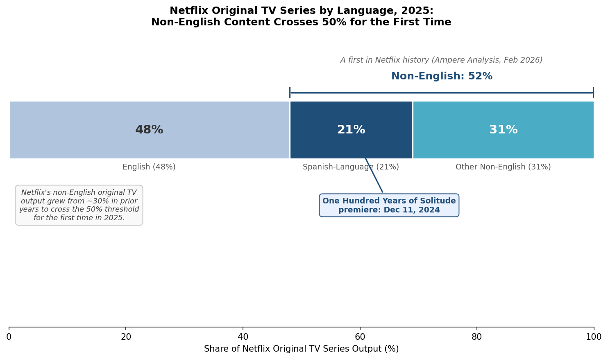

*Figure 3. Netflix's original TV series output by language category in 2025: English at 48%, Spanish-language at 21%, and other non-English languages at 31%. The premiere of* One Hundred Years of Solitude *in December 2024 is annotated as a landmark within the Spanish-language segment that crossed the historic 52% non-English threshold.*

The adaptation's significance within this strategy operates on multiple levels. First, it demonstrated that a non-English literary adaptation could achieve critical scores competitive with top-tier English-language prestige drama (Metacritic 80, matching *Game of Thrones* Season 1) without the cultural compromises — English-language production, internationally recognizable cast — that had defined prior attempts to globalize Latin American literature on screen. Second, it established a replicable production template: original-language filming, local infrastructure investment, estate or author participation, purpose-built sets, and multi-year development timelines. Netflix has since applied this template to parallel projects including *El Eternauta* in Argentina and *The Leopard* in Italy. Third, it anchored Colombia as a production center within Netflix's global network, a positioning reinforced by the CINA incentive structure and the deep bench of local crew talent developed during the nine-month shoot.

The limitations of the achievement are equally instructive. A cumulative 14 million views, while strong for a Spanish-language literary drama, places *One Hundred Years of Solitude* far below the viewership of Netflix's non-English genre blockbusters — *Squid Game* and *La Casa de Papel* each commanded audiences an order of magnitude larger. The series did not produce a viral cultural moment comparable to *Squid Game*'s global penetration, nor did it generate the kind of sustained social-media conversation that extends a title's visibility beyond its core audience. Its awards trajectory, as documented above, remained bounded by linguistic eligibility structures. These constraints suggest that the adaptation's primary achievement was cultural and industrial rather than commercial: it proved that the model works, even if it did not yield a global mega-hit.

For the broader streaming industry, the series represents a data point in an ongoing experiment: whether prestige literary adaptations in non-English languages can justify their production costs through a combination of cultural prestige, critical validation, book-sales synergies, subscriber acquisition in target markets, and long-tail catalog value. Netflix's decision to greenlight Part 2 within weeks of Part 1's premiere — and the company's simultaneous expansion of its literary adaptation pipeline across multiple languages — indicates that the internal calculus, at minimum, is positive.

# 第6章 The Road Ahead — Future Seasons and Lessons for Literary Adaptation

Part 1 of Netflix's *One Hundred Years of Solitude* concluded with an audience, an industry, and a literary estate awaiting the same question: what comes next? The first eight episodes demonstrated that a Spanish-language adaptation of Gabriel García Márquez's canonical novel could achieve critical respectability, meaningful viewership, and cultural resonance — yet the story they told covered barely half the book. The Buendía saga's most politically charged episodes — the Thousand Days' War's aftermath, the banana plantation economy, the massacre, and Macondo's prophesied destruction — remain ahead. Simultaneously, the adaptation's production model has already begun radiating outward, shaping how Netflix and the broader streaming industry approach non-English literary classics. This chapter examines the confirmed plans for Part 2, distills the structural model that the project has established, and considers what *One Hundred Years of Solitude* signals for the future of literary adaptation in the streaming era.

## Part 2: What Is Known

Netflix confirmed Part 2's production on February 11, 2025. Francisco Ramos, the company's vice president of Spanish-language original content, declared: "Following the reception from our members and specialized press from all around the world, we are deeply proud to announce that the production of the second part has begun" [Netflix Official](https://about.netflix.com/news/cien-anos-de-soledad-parte-dos "Part 2 production announcement, 2025.2.11"). On December 11, 2025 — exactly one year after Part 1's global debut — Netflix announced that Part 2 would premiere in **August 2026**, explicitly describing it as "la segunda y última parte" (the second and final part). The complete series will comprise 16 episodes across two parts, with no third installment planned [Netflix Official (Spanish)](https://about.netflix.com/es/news/the-second-part-of-one-hundred-years-of-solitude-will-arrive-in-august-2026 "Part 2 premiere date announcement, 2025.12.11") [Forbes](https://www.forbes.com/sites/veronicavillafane/2025/12/11/one-hundred-years-of-solitude-part-2-netflix-sets-premiere-for-2026/ "Forbes coverage, 2025").

Principal photography wrapped in early 2025 across Colombian locations including the departments of Tolima, Boyacá, Cundinamarca, and Magdalena, as confirmed by head writer Natalia Santa at a Ventana Sur masterclass in December 2025 [Screen Daily](https://www.screendaily.com/features/head-writer-natalia-santa-tells-ventana-sur-why-one-hundred-years-of-solitude-is-a-soap-opera/5211614.article "Natalia Santa interview, Ventana Sur, Dec 2025"). Part 1 required approximately one year of post-production following its nine-month shoot; the August 2026 target for Part 2 thus implies an accelerated but not implausible post-production timeline.

### Creative Continuity and Change

Laura Mora, the Colombian director who helmed episodes 4, 5, and 6 of Part 1, returns for Part 2 with an expanded role — directing five of the eight episodes, up from three. She is joined by Colombian director **Carlos Moreno**, known for *Lavaperros* (2020) and *Perro come perro* (2008), who replaces the Argentine-born Alex García López. The reasons for García López's departure have not been publicly disclosed [Netflix Official](https://about.netflix.com/news/cien-anos-de-soledad-parte-dos "Part 2 announcement, 2025.2.11") [Remezcla](https://remezcla.com/film/one-hundred-years-of-solitude-part-2-begins-filming-announces-new-cast/ "Part 2 filming and cast, 2025.2.11"). The shift carries symbolic weight: Part 2's directorial team is now entirely Colombian, deepening the project's commitment to local creative ownership.

Marleyda Soto (the adult and elderly Úrsula) and Claudio Cataño (Colonel Aureliano Buendía) return as principal cast members, joined by more than ten new actors portraying characters who dominate the novel's second half. Netflix's official synopsis confirms that Part 2 will cover the post-Neerlandia treaty period, the arrival of Fernanda del Carpio from Bogotá, José Arcadio Segundo's involvement with the railroad and banana company, and Macondo's foretold destruction [Netflix Official (Spanish)](https://about.netflix.com/es/news/the-second-part-of-one-hundred-years-of-solitude-will-arrive-in-august-2026 "Part 2 synopsis, 2025.12.11"). Art director Enríquez has confirmed that the production will depict both the Thousand Days' War and the Banana Massacre — the novel's most explicitly political episodes, rooted in the 1928 United Fruit Company massacre in Ciénaga, Colombia [Variety](https://variety.com/2025/film/global/netflix-one-hundred-years-of-solitude-gabriel-garcia-marquez-2-1236394271/ "Part 2 production details, 2025.5").

### The Narrative Challenge Ahead

Head writer Natalia Santa, elevated to lead the writing team for Part 2, offered a revealing framing at Ventana Sur. She described the novel as "profoundly melodramatic, full of elements of traditional Latin American melodrama and popular culture," and characterized the adaptation's form as essentially that of a soap opera — a deliberate embrace of the genre that García Márquez himself had once suggested as the only viable format for his work [Screen Daily](https://www.screendaily.com/features/head-writer-natalia-santa-tells-ventana-sur-why-one-hundred-years-of-solitude-is-a-soap-opera/5211614.article "Natalia Santa interview, Ventana Sur, Dec 2025"). Santa framed Part 1 as the story of "the transformation of a colonel into a caudillo," and Part 2 as the reckoning with "what happens to that caudillo" — a narrative arc that places political decay at the center of the second half's dramatic architecture.

Santa also acknowledged an irreducible constraint: "Even though 16 hours is a lot, it's not enough to tell everything that happens in *CAS* nor to include every character in the universe of the novel. Macondo fits — but all its events do not." The admission underscores the tension inherent in any adaptation of this scale: the novel's density exceeds even a 16-hour format, requiring the writing team to make choices about emphasis and omission that will inevitably invite scrutiny from the book's global readership.

The second half of the novel presents specific challenges that Part 1 largely avoided. The narrative accelerates across later generations; characters multiply and blur into one another as the novel's deliberate use of recurring names becomes even more pronounced; and the political allegory — particularly the banana massacre and its subsequent erasure from collective memory — carries resonances that remain sensitive in contemporary Colombian public discourse. Whether the series can maintain its strategy of chronological clarity and Úrsula-centered narration as the matriarch ages and the family's coherence disintegrates will constitute a decisive test of the adaptation's structural choices.

## The "Solitude Model": Seven Replicable Elements

The production of *One Hundred Years of Solitude* has generated what we identify as a distinctive and potentially replicable model for adapting canonical non-English literary works on global streaming platforms. The model comprises seven interlocking elements, each addressing a specific failure mode observed in previous literary adaptations:

**1. Estate or author participation as executive producers.** Rodrigo García and Gonzalo García Barcha served not as consultants but as executive producers with genuine creative oversight. This structure provided both a quality-control mechanism and a legitimacy shield — the family's imprimatur insulated the production from accusations of cultural appropriation that might otherwise attach to a Silicon Valley corporation adapting a Latin American masterwork.

**2. Original-language production.** Filming entirely in Spanish — the language in which García Márquez wrote and in which the novel's cultural textures are embedded — directly addressed the failure that had doomed the 2007 English-language *Love in the Time of Cholera* (RT 26%, Metacritic 43). The linguistic choice carried commercial risk, as non-English titles face structural barriers in anglophone awards systems and typically attract smaller U.S. audiences. Netflix's willingness to absorb that risk reflected a strategic bet that authenticity would prove more durable than accessibility.

**3. Local production infrastructure.** The partnership with Bogotá-based Dynamo Producciones (producer of *Narcos* and *American Made*) embedded the project within Colombia's existing production ecosystem rather than importing a foreign crew to execute a foreign vision on local soil. Nearly 900 crew members were Colombian, and over 150 indigenous and traditional artisans contributed to the production's material culture [Variety](https://variety.com/2025/tv/news/netflix-one-hundred-years-of-solitude-shooting-in-colombia-1236278697/ "2025").

**4. Tax incentive utilization.** Colombia's CINA program, offering a 35% rebate on qualifying local production expenditure by international projects, reduced Netflix's net spending while generating fiscal multiplier effects. Colombia's film commissioner Silvia Echeverri described the production as "the biggest and most important project to have tapped this incentive" [Variety](https://variety.com/2025/tv/news/netflix-one-hundred-years-of-solitude-shooting-in-colombia-1236278697/ "Colombia production economics, 2025"). The arrangement transforms cultural production into an economic development instrument for the host country — a value proposition that strengthens political support for future projects.

**5. Multi-year research and development.** Francisco Ramos began pursuing the rights in 2018; the series premiered in December 2024 — a six-year timeline that included an "extensive research phase — without rushing" [Vanity Fair](https://www.vanityfair.com/hollywood/story/bringing-one-hundred-years-of-solitude-to-the-screen "Bringing One Hundred Years of Solitude to the Screen, 2024"). This cadence stands in sharp contrast to the accelerated development cycles that characterize much streaming content, reflecting the recognition that canonical literary properties require a different rhythm of creative gestation.

**6. Purpose-built physical production.** The construction of four distinct versions of Macondo across a 133.4-acre site — encompassing Colombia's architectural evolution from pre-colonial settlements to republican-era towns — represented an investment in physical production design that resisted the industry's drift toward virtual production and green-screen dependency. The approach served both aesthetic and strategic purposes: it generated the tactile authenticity that critics praised, while creating infrastructure that anchored the production's economic footprint in Colombian communities.

**7. Community and indigenous participation.** From the 16,000 native Caribbean plants selected by botanical consultant Marta Duque to the Zenú basket-weavers, Chimila hammock-makers, and Wayúu textile artisans who contributed to the production's material world, the series embedded indigenous knowledge and labor into its visual fabric. The casting of 70% non-professional actors from open auditions across Colombia further distributed the production's cultural and economic benefits beyond the professional entertainment industry [Vogue](https://www.vogue.com/article/one-hundred-years-of-solitude-netflix-site-visit "2024").

These seven elements are not merely a description of one production's choices; they constitute a transferable template. Netflix has already applied variants of this model to parallel projects: *El Eternauta* (Argentina, local-language production, contributing 41 billion pesos to the Argentine economy) and *The Leopard* (Italian-language, €40 million budget, entering 30+ countries' Top 10 within five days of its March 2025 premiere) [Wikipedia](https://en.wikipedia.org/wiki/The_Leopard_(TV_series) "The Leopard TV series") [Netflix Official](https://about.netflix.com/news/the-production-of-the-eternaut-contributes-more-than-41-billion-pesos-to-argentinas-economy "El Eternauta economic impact"). The pattern suggests the emergence of a deliberate industrial strategy rather than a series of isolated creative decisions.

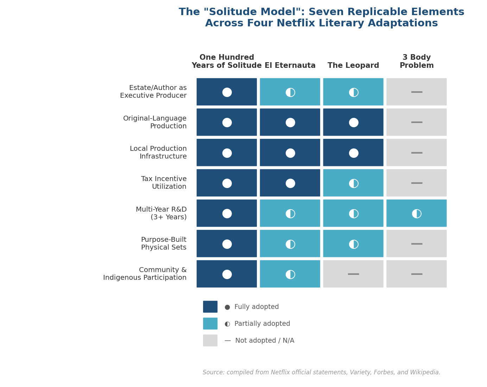

*Figure: Degree of adoption of each "Solitude Model" element across four Netflix literary adaptations. Only* One Hundred Years of Solitude *fully implements all seven components; other productions adopt the template partially or selectively.*

## The Adaptation Gold Rush: Context and Counterpoint

Netflix's *One Hundred Years of Solitude* arrives within a broader industry-wide intensification of literary adaptation. In H1 2025 alone, book adaptations on Netflix drove over 4.5 billion views globally, with adapted titles appearing in the Global Top 10 every week [Netflix Official](https://about.netflix.com/news/another-exciting-chapter-in-our-book-to-screen-journey-and-whats-to-come "Netflix book-to-screen strategy, 2025.12"). The company's forthcoming literary pipeline includes *The Age of Innocence* (Edith Wharton, adapted by Emma Frost, filming began in 2025), *Twilight Saga: Midnight Sun* (animated), *Lupin* Part 4, and Harlan Coben's thirteenth Netflix collaboration. Across the industry, 2026 has been characterized as "Hollywood's Adaptation Gold Rush," with Hulu's *The Testaments* (April 2026), Emerald Fennell's *Wuthering Heights*, Apple TV+'s *Margo's Got Money Troubles*, and Amazon's *Off Campus* all in various stages of production [Startup Fortune](https://startupfortune.com/hollywoods-adaptation-gold-rush-hits-streaming-in-2026/ "Hollywood's Adaptation Gold Rush, 2026").

Within this landscape, two distinct adaptation logics have crystallized. The first — which we term the **"BookTok model"** — is data-driven, algorithmically informed, and commercially optimized. It identifies titles with demonstrable social-media traction, targets younger demographics, and prioritizes speed to market. The *Off Campus* and *Hunting Wives* adaptations exemplify this approach: the flywheel effect is immediate and measurable, with Netflix reporting a 5,000% one-week sales surge for *The Hunting Wives* across all formats [Netflix Official](https://about.netflix.com/news/another-exciting-chapter-in-our-book-to-screen-journey-and-whats-to-come "Netflix book-to-screen strategy, 2025.12").

The second — the **"Solitude model"** — is estate-driven, culturally motivated, and long-gestating. It targets canonical works whose adaptation has been blocked by rights-holder resistance, linguistic requirements, or the sheer complexity of the source material. The value proposition is not a quick viral spike but rather cultural prestige, subscriber acquisition in specific geographic markets, long-tail catalog value, and the legitimization of the platform as a serious patron of global storytelling. *One Hundred Years of Solitude*, *The Leopard*, and (in a hybrid mode) *3 Body Problem* represent variations on this template.

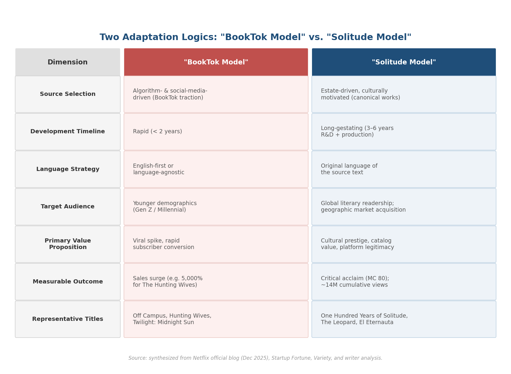

*Figure: A structured comparison of the two adaptation paradigms across seven dimensions — from source selection and development timeline to measurable outcomes and representative titles.*

The tension between these two logics is not merely commercial; it is aesthetic and ethical. A *New York Times Magazine* critique by Ian Rubsam, published in March 2025, positioned *One Hundred Years of Solitude* within a broader indictment of Netflix's consumption of world literature, arguing that the adaptation "resembles the other things on Netflix more than it resembles anything in García Márquez" — that the platform's production norms, narrative rhythms, and visual grammar inevitably homogenize diverse literary voices into "frictionless international content consumption" [NYT Magazine](https://www.nytimes.com/2025/03/11/magazine/netflix-one-hundred-years-of-solitude.html "Ian Rubsam critique, 2025.3"). This critique identifies a genuine structural risk: the very infrastructure that makes prestige literary adaptation possible at global scale — Netflix's production pipeline, its algorithmic recommendation engine, its standardized episode lengths and pacing conventions — may flatten precisely the qualities that made the source material irreplaceable.

## The Non-English Inflection Point

The series premiered at a moment of structural inflection in Netflix's content strategy. According to Ampere Analysis, non-English original TV series constituted over half (52%) of Netflix's original TV output for the first time in 2025, with Spanish-language content representing the single largest non-English category at 21% [TV Technology](https://www.tvtechnology.com/platform/streaming/non-english-content-makes-up-more-than-half-of-netflixs-tv-originals-a-first "Ampere Analysis data, 2026.2"). *One Hundred Years of Solitude* functions as both a product of this strategic shift and its most visible proof of concept — a demonstration that non-English literary prestige content can achieve Metacritic scores competitive with top-tier English-language drama (80, matching *Game of Thrones* Season 1) without the cultural compromises that defined prior globalization attempts.

The broader Latin American production landscape, however, presents a more complex picture. Ampere data shows that global streaming platforms' first-run commissions in Latin America declined from 67 titles in H1 2022 to just 32 in H1 2025 — a contraction of more than half [Variety](https://variety.com/2026/tv/global/netflix-globo-wild-sheep-gaumont-usa-content-americas-1236634604/ "Content Americas coverage, 2026.1"). Brazil has bucked this trend, but the broader regional decline means that individual flagship productions like *One Hundred Years of Solitude* carry outsized symbolic weight. The project's approximately $51.8 million contribution to the Colombian economy and its cultivation of 900 local crew members represent an infrastructure investment that could sustain future production — or could prove a one-off windfall if Netflix's Latin American commissioning continues to contract.

## What the Adaptation Proves — and What It Does Not

The success of *One Hundred Years of Solitude* Part 1 has demonstrated several propositions with reasonable confidence. It established that a non-English literary adaptation can achieve critical scores and audience engagement sufficient to justify its production cost within Netflix's portfolio logic. It showed that estate-driven creative constraints — Spanish language, Colombian location, family oversight — can function as quality-assurance mechanisms rather than obstacles. It proved that unknown actors, drawn from open auditions across a developing country, can deliver performances that earn international awards recognition. And it demonstrated that magical realism — a mode that many had considered inherently resistant to visual translation — can be rendered on screen through analog, practical-first techniques that respect the source material's refusal to sensationalize the supernatural.

What the adaptation has not yet demonstrated is equally significant. A cumulative 14 million views, while strong for a Spanish-language literary drama, places the series far below the viewership of Netflix's non-English genre blockbusters such as *Squid Game* or *La Casa de Papel*. The series did not produce a viral cultural moment comparable to *Squid Game*'s global penetration. Its awards trajectory remained bounded by linguistic eligibility structures that excluded it from U.S. Primetime Emmy categories. And the most structurally challenging critique — that Netflix's production norms homogenize diverse literary voices into platform-native content — has not been answered by the adaptation's fidelity or craft, because the critique operates at a level of industrial logic that individual creative decisions cannot fully address.

Part 2's August 2026 premiere will supply additional data points. The novel's second half is denser, more politically charged, and more narratively fragmented than the first — precisely the qualities that make it a harder test of the adaptation's structural choices. The banana massacre sequence, in particular, will test whether the series can handle historical trauma with the same restraint and authenticity that characterized Part 1's treatment of magical-realist episodes. The critical and audience response to Part 2 will determine whether the overall project is remembered as a qualified success — impressive for what it achieved within structural constraints — or as a transformative proof of concept that permanently expanded the possibilities of literary adaptation on streaming platforms.

What remains beyond dispute is that the project has already altered the landscape it entered. For half a century, *One Hundred Years of Solitude* stood as the paradigmatic example of the "unfilmable" novel — a work whose very existence was invoked to argue that certain literary achievements could never survive translation to the screen. That argument can no longer be made with the same confidence. The adaptation did not capture everything — no adaptation could — but it captured enough to shift the burden of proof. The question facing the next generation of "impossible" literary adaptations is no longer *whether* they can be brought to screen, but *under what conditions* — and at what cost to the irreducible singularity of the written word.

# Conclusion

Netflix's adaptation of *One Hundred Years of Solitude* resolved a paradox that had persisted for more than fifty years: the conditions that made the novel "unfilmable" turned out to be the conditions that made it filmable. García Márquez's insistence on Spanish-language production, Colombian filming, and a format long enough to honor the narrative's full scope were not arbitrary obstacles; they were the architectural requirements for an adaptation that could survive contact with his work. When the author's sons granted the rights in 2019, they did so precisely because Netflix was willing to accept these requirements as non-negotiable — and because the rise of prestige long-form television had, for the first time, created an industrial infrastructure capable of meeting them.

The resulting production demonstrated several principles with considerable clarity. First, estate-driven creative constraints can function as quality-assurance mechanisms rather than impediments: the family's conditions generated the all-Colombian cast, the physical Macondo, the artisan-produced material culture, and the Costeño linguistic texture that critics and Colombian audiences alike identified as the adaptation's most distinctive achievements. Second, a practical-first approach to magical realism — privileging wire rigs, real ice, live-actor ghosts, and botanically accurate flora over CGI spectacle — proved capable of approximating the novel's signature tonal register, in which the miraculous and the mundane coexist without hierarchy. Third, the decision to cast unknown actors from open auditions rather than international stars eliminated the persona-interference problem García Márquez had long feared, embedding the series in the texture of Colombian life rather than the conventions of global celebrity casting.

The adaptation's limitations were equally revealing. An 83% Rotten Tomatoes score and a Metacritic score of 80 attested to strong but not universal critical approval; the most penetrating objections — from Ariel Dorfman's argument that the novel's prose voice, humor, and erotic energy are structurally untranslatable, to the *New York Times Magazine*'s charge that the series "resembles the other things on Netflix more than it resembles anything in García Márquez" — identified losses that no amount of production craft could remedy, because they inhere in the gap between literary language and visual medium. A cumulative 14 million views positioned the series as a strong performer for a non-English literary drama but placed it far below the viewership of Netflix's genre blockbusters. And its awards trajectory — dominant at the India Catalina and Platino ceremonies, nominated but not victorious at the International Emmys and Peabodys, structurally excluded from U.S. Primetime Emmy categories — mapped the persistent asymmetry between non-English-language television's growing audience reach and the anglophone institutions that confer the highest industry visibility.

What the adaptation achieved beyond its own borders may prove equally consequential. The seven-element production template it established — estate participation, original-language filming, local production infrastructure, tax-incentive utilization, multi-year development, purpose-built physical sets, and community participation — has already been applied by Netflix to *El Eternauta* in Argentina and *The Leopard* in Italy, suggesting the emergence of a replicable industrial model for canonical literary adaptation at global scale. Part 2, confirmed for August 2026, will supply the decisive test: the novel's second half is denser, more politically charged, and more narratively fragmented, culminating in the banana massacre and Macondo's prophesied destruction — episodes that will challenge every structural choice the adaptation has made.

García Márquez once described *One Hundred Years of Solitude* as a work written to demonstrate that literature possesses "a much vaster scope, much greater possibilities for reaching people" than cinema. The Netflix adaptation did not refute that claim — the novel's prose remains irreducible — but it demonstrated that a visual medium, operating under the right conditions and with sufficient commitment to cultural authenticity, can achieve something the author himself considered impossible: a translation of Macondo that, for a significant global audience, felt not like a reduction but like a recognition.
