# Overview

The MDA (Mechanics-Dynamics-Aesthetics) framework, published by Hunicke, LeBlanc, and Zubek in 2004, remains the most cited formal model in game design scholarship, with approximately 5,442 Google Scholar citations as of early 2026. Its three-layer decomposition — designers author Mechanics, which give rise to Dynamics, which produce Aesthetics — introduced a shared analytical vocabulary that has shaped how the field conceptualizes games. Yet MDA's academic prominence coexists with a striking practical paradox: no published studio postmortem or industry workflow report documents its explicit adoption as a production methodology for a shipped title. This report investigates the current state of game design theory by examining MDA's foundations, the wave of successor frameworks that have targeted its structural limitations, and the technological and market forces that are reshaping both the theory and practice of game design.

The analysis proceeds across seven chapters. Chapter 1 traces MDA's intellectual lineage, details its architecture and contributions, and maps the six structural gaps — narrative absence, static modeling, aesthetic oversimplification, player-agency blindness, technology agnosticism, and an analysis-over-production orientation — that have motivated subsequent extensions. Chapter 2 surveys the principal post-MDA frameworks (DPE, DDE, RMDA, IP-MDA, E4X, and the Xu et al. agency-autonomy model), revealing a pattern of convergent critique but divergent solutions, with the field trending toward domain-specific specialization rather than universal replacement.

Chapter 3 examines how generative AI and procedural intelligence are migrating from offline asset pipelines into runtime game systems — through platforms such as NVIDIA ACE, Inworld AI, and the production-ready PCG framework in Unreal Engine 5.7 — while documenting the steepest three-year swing in developer sentiment the GDC survey has recorded: negative views of generative AI rose from 18% in 2024 to 52% in 2026. Chapter 4 turns to the measurement side of this equation, surveying advances in LLM-based player profiling, self-supervised behavioral embeddings, multi-modal biometric classification, and dynamic difficulty adjustment systems that are converting MDA's Dynamics layer from a theoretical abstraction into an empirically instrumented design surface.

Chapter 5 extends the analysis beyond the internal architecture of games to the paradigms redefining what a "game" is: live-service operations introducing temporality, UGC economies dissolving the designer–player boundary (with combined developer payouts reaching approximately $2.2 billion in 2025), and an ethical-regulatory-accessibility triad imposing normative constraints that no existing framework formally represents. Chapter 6 confronts the theory-practice gap directly, drawing on grounded-theory interviews, autoethnographic accounts, and GDC practitioner discourse to advance an "absorption hypothesis" — the proposition that frameworks function as conceptual infrastructure internalized during education rather than as instruments explicitly applied in production. Chapter 7 synthesizes these threads into five defining tensions, three emergent convergences, and six under-explored research frontiers, concluding that the field is entering a pluralist phase in which the productive question is not which single framework succeeds MDA but how domain-specific models can share vocabulary and interoperate.

Three cross-cutting findings anchor the report. First, MDA's core insight — that games are layered systems connecting authored rules to emergent behavior to player experience, traversed in opposite directions by designers and players — endures across every successor framework, even as each redraws the boundaries and renames the layers. Second, the most consequential advances in operationalizing this insight are occurring not through theoretical innovation alone but through the convergence of telemetry infrastructure, AI-driven adaptive systems, and empirically validated motivation models that together close the feedback loop MDA originally described as a one-directional cascade. Third, the design challenges of 2026 — multi-agent authorship in UGC platforms, AI-mediated runtime Dynamics, cross-jurisdictional regulatory compliance, and cross-cultural aesthetic variation — exceed the scope of any single compact framework, demanding an ecosystem of interoperable, domain-specific theoretical tools rather than a monolithic successor.

# 第1章 Foundations — The MDA Framework and Its Theoretical Lineage

Game design as a discipline has long oscillated between craft intuition and the pursuit of formal, communicable theory. For much of the medium's history, design knowledge resided in the tacit expertise of individual practitioners — transmitted through mentorship, postmortems, and iterative trial rather than through shared analytical vocabulary. The MDA (Mechanics-Dynamics-Aesthetics) framework, introduced by Robin Hunicke, Marc LeBlanc, and Robert Zubek in 2004, represented a watershed attempt to bridge this gap. Over two decades later it remains the single most cited formal framework in game design scholarship, accumulating approximately 5,442 Google Scholar citations as of early 2026 [MDA Original Paper](http://www.cs.northwestern.edu/~hunicke/MDA.pdf "Hunicke, LeBlanc & Zubek 2004"). Yet this citation prominence coexists with persistent critiques of the framework's scope and a documented absence of direct adoption in industry production workflows [RMDA Paper](https://www.mdpi.com/2078-2489/12/10/395 "Junior & Silva 2021, MDPI Information").

This chapter traces the intellectual lineage that led to MDA, provides a detailed account of the framework's structure and contributions, and identifies the specific theoretical gaps that have motivated over a decade of subsequent extensions and alternatives.

## 1.1 Before MDA: The Search for a Shared Design Vocabulary

The impulse to formalize game design predates MDA by two decades. Chris Crawford's *The Art of Computer Game Design* (1984) is widely regarded as the first book-length attempt to treat game design as a discipline amenable to systematic analysis rather than pure artistic intuition. Crawford proposed foundational distinctions — between games and puzzles, between challenge and conflict — that would reverberate through subsequent theoretical work, even as his specific taxonomies fell out of widespread use.

A more direct precursor to MDA emerged in 1999, when Doug Church published "Formal Abstract Design Tools" in *Game Developer* magazine. Church argued that the field desperately needed a shared vocabulary of design concepts, proposing three specific tools — *Intention* (the capacity for players to devise and execute plans), *Perceivable Consequence* (the ability of the game to communicate the results of player actions), and *Story* (the narrative arc arising from gameplay) — as a starting point [Church 1999](https://www.gamedeveloper.com/design/formal-abstract-design-tools "Church, Formal Abstract Design Tools"). Church's call for a common lexicon would directly inform LeBlanc's workshop activities at GDC in the years that followed.

Running in parallel, Greg Costikyan's influential essay "I Have No Words & I Must Design" (originally 1994, revised 2002) offered a structural definition of games as "interactive structures of endogenous meaning," foregrounding the principle that a game's internal economy of meaning — rather than its surface features — constitutes its core design substance. By the 2002 revision presented at the Tampere conference, Costikyan had already adopted LeBlanc's taxonomy of eight aesthetic categories, indicating that MDA's conceptual vocabulary was circulating within the design community before the framework's formal publication [Costikyan 2002](http://www.costik.com/nowords2002.pdf "Costikyan, I Have No Words, 2002 Tampere revision").

The most ambitious pre-MDA theoretical undertaking was Katie Salen and Eric Zimmerman's *Rules of Play: Game Design Fundamentals* (MIT Press, 2003), which organized game design around three conceptual pillars — Rules, Play, and Culture — and introduced the concept of "meaningful play" as the central design objective: interactions in which the relationship between player actions and system outcomes is both discernible and integrated into the larger game context [Salen & Zimmerman 2003](https://dl.acm.org/doi/10.5555/1215723 "MIT Press, Rules of Play"). *Rules of Play* remains the most comprehensive textbook-scale treatment of game design theory, but its breadth — spanning sociology, semiotics, systems theory, and cultural studies — also meant it functioned more as a reference encyclopedia than as a compact operational tool for design teams.

What these predecessors shared was a conviction that game design could and should be discussed in formal, transferable terms. What they lacked — and what MDA would attempt to supply — was a minimal, layered model capable of serving simultaneously as a design heuristic, an analytical lens, and a pedagogical scaffold.

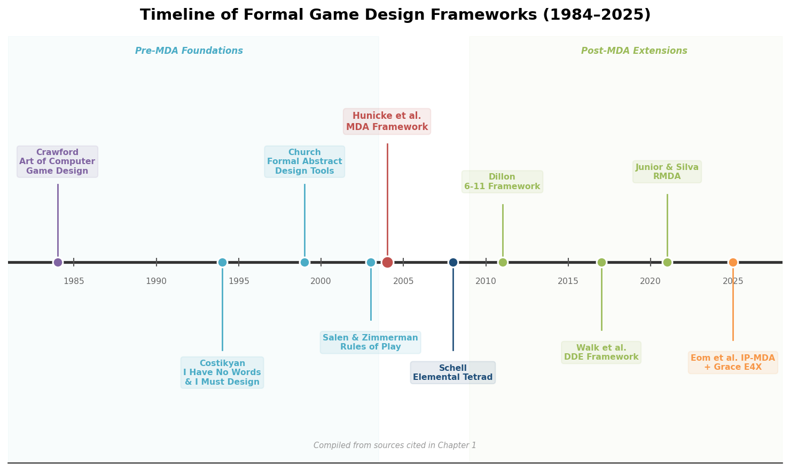

*Figure 1-1. Chronological placement of landmark game design frameworks — from Crawford (1984) through MDA (2004) to the post-MDA extension wave — illustrating the acceleration of formal framework proposals in recent years.*

## 1.2 The MDA Framework: Structure, Claims, and Contributions

MDA was formally published at the 2004 AAAI Workshop on Challenges in Game AI, though its conceptual roots trace to the GDC Game Design and Tuning Workshop led by LeBlanc between 2001 and 2004 [AAAI Proceedings](https://aaai.org/papers/ws04-04-001-mda-a-formal-approach-to-game-design-and-game-research/ "AAAI Workshop paper archive"). The framework decomposes games into three causally linked layers:

- **Mechanics**: The base-level components of a game — its data representations, algorithms, and rules. Mechanics define the formal system with which the player interacts.
- **Dynamics**: The runtime behavior that emerges when mechanics operate. Dynamics describe the patterns, strategies, and feedback loops that arise from mechanical interaction once the system is set in motion.
- **Aesthetics**: The desirable emotional responses evoked in the player during interaction. Aesthetics represent the experiential outcome that design ultimately targets.

The framework's central structural claim is a directional causal chain: designers author Mechanics, which give rise to Dynamics, which in turn produce Aesthetics. Crucially, MDA posits that this chain is traversed in opposite directions by designers and players. Designers work "forward" — from Mechanics through Dynamics to Aesthetics — while players experience the game "backward," first encountering Aesthetics (the emotional quality of play), then perceiving Dynamics (the behavioral patterns), and only implicitly engaging with underlying Mechanics. This bidirectional lens was among the framework's most influential contributions, offering a concise explanation for a fundamental asymmetry: why designers and players often talk past each other when discussing the same game.

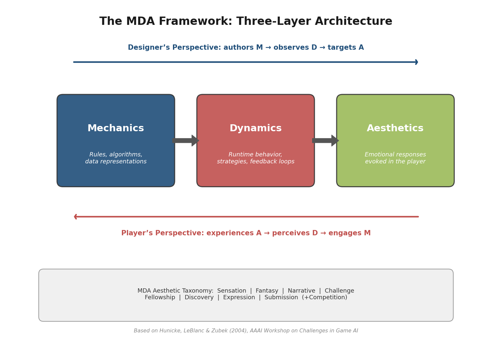

*Figure 1-2. The MDA three-layer architecture showing the designer-forward (Mechanics → Dynamics → Aesthetics) and player-backward (Aesthetics → Dynamics → Mechanics) traversal directions, with the eight-plus-one aesthetic taxonomy. Based on Hunicke, LeBlanc & Zubek (2004).*

To operationalize the Aesthetics layer, Hunicke, LeBlanc, and Zubek proposed a taxonomy of eight experiential categories intended to replace imprecise umbrella terms such as "fun" and "gameplay":

1. **Sensation** — game as sense-pleasure
2. **Fantasy** — game as make-believe
3. **Narrative** — game as drama
4. **Challenge** — game as obstacle course
5. **Fellowship** — game as social framework
6. **Discovery** — game as uncharted territory
7. **Expression** — game as self-discovery
8. **Submission** — game as pastime

A ninth category, **Competition**, is referenced separately in the original paper and is frequently included in extended discussions of the taxonomy [MDA Framework Wikipedia](https://en.wikipedia.org/wiki/MDA_framework "Wikipedia, confirming ninth category Competition"). This vocabulary furnished designers and researchers with a shared lexicon for articulating what a game aims to make players *feel*, independent of its mechanical implementation — a substantive advance over the undifferentiated invocations of "fun" that had previously dominated design discourse.

## 1.3 The Elemental Tetrad: A Parallel Decomposition

Jesse Schell's Elemental Tetrad, introduced in *The Art of Game Design: A Book of Lenses* (2008; third edition 2019), provides the most widely taught alternative decomposition of games. The Tetrad identifies four co-equal elements — **Mechanics**, **Story**, **Aesthetics**, and **Technology** — arranged not in a causal hierarchy but as mutually interdependent dimensions [Elemental Tetrad Wikipedia](https://en.wikipedia.org/wiki/Elemental_tetrad "Wikipedia, citing Schell 2019 3rd ed.").

Although MDA and the Elemental Tetrad share surface-level terminology, their conceptual architectures differ in instructive ways:

**Aesthetics as emotion vs. aesthetics as sensation.** MDA uses "Aesthetics" to denote the emotional responses evoked in the player — a psychological endpoint. Schell's "Aesthetics" refers to the sensory presentation of the game: its visual art, sound design, haptic feedback, and other perceptual qualities. This terminological collision has been a persistent source of confusion in both pedagogy and cross-framework discussion; a student trained on MDA who encounters "Aesthetics" in the Tetrad — or vice versa — faces a non-trivial disambiguation task.

**Narrative as aesthetic category vs. narrative as first-class element.** In MDA, Narrative is one of eight aesthetic categories — a type of emotional experience the game can evoke. In the Tetrad, Story is elevated to a co-equal structural element alongside Mechanics, receiving dedicated design attention. This divergence reflects a broader theoretical disagreement about whether narrative in games is best understood as an emergent experiential quality or as a designed structural component requiring its own analytical tools.

**Technology as explicit layer vs. technology as implicit substrate.** MDA contains no technology layer; the framework implicitly assumes that mechanical possibilities are constrained by implementation but does not model those constraints. The Tetrad explicitly incorporates Technology as a foundational element, acknowledging that the technical platform shapes and constrains every other design dimension — an omission in MDA that has grown increasingly conspicuous in an era of cloud streaming, VR/AR hardware, and generative AI runtimes.

**Causal hierarchy vs. mutual interdependence.** MDA's three layers are arranged in a strict causal sequence: Mechanics → Dynamics → Aesthetics. The Tetrad's four elements are presented as mutually interdependent, each influencing and constraining the others without a fixed directional flow.

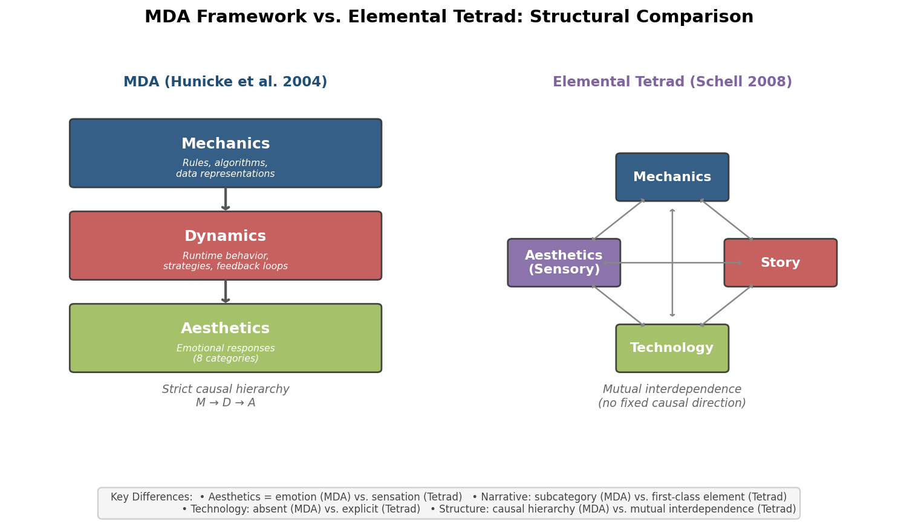

*Figure 1-3. Side-by-side comparison of MDA's strict three-layer causal hierarchy and the Elemental Tetrad's four-element mutual-interdependence model, highlighting the divergent treatment of aesthetics, narrative, technology, and structural relationships.*

These differences are not merely taxonomic. They reflect divergent assumptions about the primary unit of design analysis and how design knowledge should be organized. MDA privileges the causal pathway from system to experience, rendering it particularly suited to the analysis of emergence and systemic design. The Tetrad privileges a holistic view that integrates craft dimensions — art, narrative, technology — more visibly, making it more immediately applicable to the multidisciplinary realities of production teams. That both frameworks remain in widespread pedagogical use — MDA predominantly in academic game studies programs, the Tetrad predominantly in professional design education — suggests neither has fully displaced the other's analytical niche.

## 1.4 Theoretical Gaps and the Motivations for Extension

Despite its foundational status, MDA has attracted sustained and specific critique. The limitations identified by subsequent researchers are not incidental but structural — inherent constraints of the framework's minimalist three-layer architecture. Six principal gaps have been documented across the critical literature.

**The narrative deficit.** By subsuming Narrative under the Aesthetics taxonomy as one of eight experience types, MDA provides no tools for analyzing or designing narrative structures, branching story architectures, or the relationship between authored plot and emergent player stories. Walk, Görlich, and Barrett (2017), in proposing the DDE (Design, Dynamics, Experience) framework, argued that MDA conflates all non-mechanical design elements — including graphic style, sound design, and narrative structure — into an undifferentiated residual category [DDE Paper](https://www.researchgate.net/publication/315854140_Design_Dynamics_Experience_DDE_An_Advancement_of_the_MDA_Framework_for_Game_Design "Walk et al. 2017"). Walk's provocation that "90% of MDA 'mechanics' are not actually mechanical" underscores the view that the framework's Mechanics category, as commonly applied, absorbs design decisions properly belonging to distinct craft domains.

**Static and unidirectional modeling.** MDA's causal chain runs in one direction: Mechanics produce Dynamics, which produce Aesthetics. The framework does not model feedback loops — neither the iterative process by which observed Dynamics lead designers to revise Mechanics, nor the way player learning and adaptation reshape the Dynamics layer over time. This omission is particularly consequential for live-service games, where design is continuous and the system exists in perpetual dialogue with its player base.

**Aesthetic oversimplification.** The eight-category taxonomy, while a meaningful advance over "fun," has been criticized as neither exhaustive nor theoretically grounded. Dormans (2012) characterized it as a classification that "lacks fundamentals," and Junior and Silva (2021) observed that the categories lack a clear derivation from psychological theory, phenomenological analysis, or empirical player research [RMDA Paper](https://www.mdpi.com/2078-2489/12/10/395 "Junior & Silva 2021"). The absence of a generative principle — a theory explaining *why* these eight categories and not others — constrains the taxonomy's capacity to evolve or to account for aesthetic experiences not anticipated by the original authors.

**Player agency as a blind spot.** MDA models the player solely as a recipient of aesthetic experience, not as an agent whose decisions, motivations, and individual differences shape the system's behavior. The framework provides no vocabulary for discussing player types, motivational profiles, or the cognitive processes through which players interpret and respond to dynamics. Sicart (2008) critiqued this limitation directly, arguing that MDA's definition of mechanics conflates system-level algorithms with player-facing affordances — effectively erasing the player's role as an active participant in meaning-making [Sicart 2008](https://gamestudies.org/0802/articles/sicart "Sicart, Game Studies 8(2)").

**The technology blind spot.** As noted in the Elemental Tetrad comparison, MDA contains no layer for technological constraints. In an era when platform capabilities — cloud streaming, VR/AR hardware, mobile touch interfaces, generative AI runtimes — increasingly determine what mechanics are feasible and what dynamics are achievable, this absence has grown more consequential with each passing hardware generation.

**Analysis over production.** Perhaps the most practically significant critique is that MDA functions better as an analytical tool for examining completed games than as a generative tool for designing new ones. Junior and Silva (2021) observed that while MDA is widely taught in universities, it is "not in use in the games' industry for helping game design work" as a direct production methodology [RMDA Paper](https://www.mdpi.com/2078-2489/12/10/395 "Junior & Silva 2021, on industry adoption"). The resulting paradox — that the field's most cited framework has near-zero documented adoption in professional practice — establishes a tension that recurs throughout subsequent chapters of this report.

## 1.5 MDA's Enduring Contributions

It would be a mistake, however, to read the catalogue of limitations as a verdict of obsolescence. MDA's contributions remain structurally important to the field in at least three respects.

First, the framework established **a shared analytical vocabulary** — Mechanics, Dynamics, Aesthetics — that persists in design discourse even among practitioners who have never read the original paper. The three-layer decomposition has become part of the default conceptual toolkit for discussing games, functioning as what Cormio et al. (2024) describe as internalized "designerly ways of knowing" rather than an explicitly invoked methodology [Cormio et al. 2024](https://u-pad.unimc.it/retrieve/ac7f7535-fefb-4d56-b833-4b94d108b9fd/Cormio_Exploring-Game-Design_2024.pdf "Design Studies 91–92").

Second, the **bidirectional causal lens** — designers reason forward from Mechanics to Aesthetics while players experience backward from Aesthetics to Mechanics — remains one of the most elegant conceptual tools in game design pedagogy. It encapsulates, in a single diagram, a fundamental asymmetry in how games are made and how they are played.

Third, the **aesthetic taxonomy**, despite its acknowledged limitations, performed the essential service of demonstrating that "fun" is not a monolithic concept. By articulating eight distinct categories of desirable experience, MDA created conceptual space for analyzing why different players seek different things from games and why the same mechanical system can produce divergent experiential outcomes. This pluralization of aesthetic goals laid groundwork for subsequent player motivation research, including the Quantic Foundry model's empirically derived twelve-motivation taxonomy based on factor analysis of over 1.9 million players.

## 1.6 Defining Terms for Subsequent Analysis

Before proceeding to the contemporary extensions and critiques examined in subsequent chapters, it is useful to establish terminological distinctions maintained throughout this report.

**Framework vs. model vs. ontology.** In this report, *framework* refers to a structured set of concepts and relationships intended to guide analysis or design (MDA, DDE, Elemental Tetrad). *Model* refers to a more specific representation of a particular phenomenon, often with testable parameters (e.g., a player motivation model). *Ontology* refers to a formal specification of the entities and relationships within a domain (e.g., a game mechanics ontology). These terms are not always used consistently in the source literature; maintaining these distinctions here aids analytical clarity.

**PCG vs. generative-AI-based PCG.** Procedural content generation (PCG) encompasses rule-based, algorithmic approaches to content creation (e.g., noise-function terrain generation, L-system vegetation). Generative-AI-based PCG refers specifically to content generation driven by machine learning models — large language models, diffusion models, and related architectures. The distinction matters because the two approaches raise different design, quality-control, and authorial questions.

**Live service vs. GaaS.** *Live service* describes the operational model in which a released game receives continuous content updates, events, and balance adjustments. *Games as a Service* (GaaS) is the broader business model encompassing live service alongside subscription, microtransaction, and seasonal monetization structures.

**UGC vs. modding.** *User-generated content* (UGC) refers to content created by players within tools officially provided by the platform or game (e.g., Roblox Studio, Fortnite Creative). *Modding* refers to player modification of game assets or systems using unofficial or semi-official tools (e.g., community mods distributed via mod.io or Steam Workshop). The two categories overlap but carry different implications for platform governance, intellectual property, and design control.

These definitions anchor the analytical vocabulary for the subsequent examination of how MDA's intellectual descendants — and its competitors — have attempted to address the limitations mapped in this chapter.

# 第2章 Beyond MDA — Contemporary Extensions, Critiques, and Alternative Frameworks

The limitations mapped in the preceding chapter — narrative absence, static modeling, aesthetic oversimplification, player agency blindness, technology agnosticism, and an analysis-over-production orientation — have not gone unanswered. Over the past decade, and with particular intensity since 2021, a family of frameworks has emerged that directly targets one or more of these structural gaps. None has approached MDA's citation footprint, and none has achieved normative status in either the academy or the studio. Yet collectively they reveal how the field's theoretical ambitions have evolved: from a single compact decomposition toward a diversifying ecology of models, each tuned to a specific class of design problem.

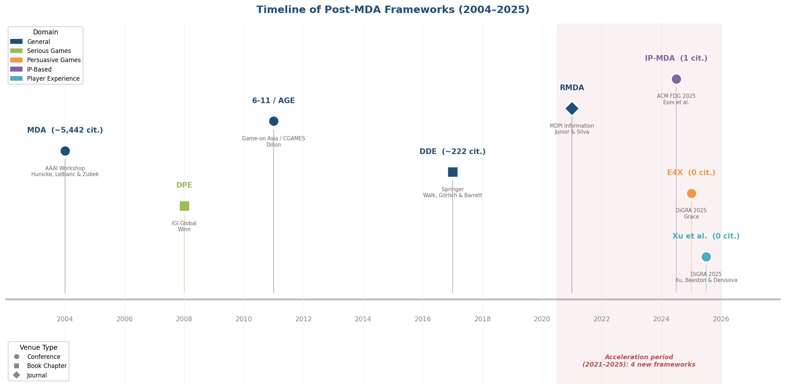

*Figure 2-1. Publication timeline of post-MDA frameworks (2004–2025), color-coded by primary domain and shaped by venue type. The 2021–2025 period saw four new framework proposals, reflecting an acceleration toward domain-specific theorizing.*

This chapter surveys the principal post-MDA frameworks in chronological order of publication, analyzes their structural innovations and the specific MDA shortcomings each addresses, and concludes with a comparative synthesis that maps the current theoretical landscape.

## 2.1 DPE: Extending MDA for Serious Games (Winn, 2008)

The earliest explicit extension of MDA originated outside the entertainment-game mainstream. Brian M. Winn's Design, Play, Experience (DPE) framework, published as a chapter in the *Handbook of Research on Effective Electronic Gaming in Education* (IGI Global, 2008, pp. 1010–1024), responded to a practical problem: interdisciplinary teams building educational games found MDA's three-layer architecture insufficient for coordinating the design decisions that mattered most to their work — learning objectives, pedagogical scaffolding, and assessment [DPE Description](https://www.yidizhu.com/articles/fyp/ "Detailed DPE analysis based on Winn 2008").

DPE generalizes MDA's column headers — Mechanics → Design, Dynamics → Play, Aesthetics → Experience — and then stacks four content layers beneath them: a **Learning** layer (content, pedagogy, and learning outcomes organized via Bloom's Taxonomy), a **Storytelling** layer (distinguishing the designer's authored narrative from the player's emergent story), a **Gameplay** layer (retaining mechanics, dynamics, and what Winn deliberately relabels *Affect* rather than Aesthetics), and a **User Experience** layer (interface, interactivity, and engagement). A fifth **Technology** layer sits beneath all four as an enabling and constraining foundation [DPE Description](https://www.yidizhu.com/articles/fyp/ "DPE framework layers, based on Winn 2008 Figure 5").

Two structural innovations distinguish DPE from its parent framework. First, by replacing "Aesthetics" with "Affect" at the gameplay layer, Winn anticipated the terminological critique that Walk would later articulate in the DDE proposal: the word "aesthetics" conflates sensory beauty with emotional response, and a framework intended to guide design decisions should not force that conflation. Second, DPE introduces an explicit **feedback arrow** from Experience back to Design — a structural acknowledgment that game design is iterative and that observed player experience must reshape design intent. MDA's original causal chain runs in one direction; DPE closes the loop.

DPE's scope limitation is also its strength: the framework does not aspire to replace MDA as a general-purpose tool. Its Learning and Storytelling layers are most relevant to serious games, educational simulations, and persuasive play. For entertainment-game design teams, these layers may introduce complexity without proportional analytical payoff. Nonetheless, DPE demonstrated that MDA's three-layer architecture could be productively extended by adding domain-specific layers — a design pattern that subsequent frameworks would adopt.

## 2.2 DDE: Dismantling the Mechanics Catch-All (Walk, Görlich & Barrett, 2017)

The most structurally ambitious challenge to MDA came from Wolfgang Walk, Daniel Görlich, and Mark Barrett, whose Design, Dynamics, Experience (DDE) framework was published in the Springer volume *Game Dynamics: Best Practices in Procedural and Dynamic Game Content Generation* (2017, pp. 27–45). As of early 2026, DDE has accumulated approximately 222 Google Scholar citations — a fraction of MDA's total, yet sufficient to establish it as the most widely cited post-MDA structural alternative [DDE — Game Developer](https://www.gamedeveloper.com/design/from-mda-to-dde "Walk 2015, original DDE concept article").

Walk's central provocation is that "90% of MDA 'mechanics' are not actually mechanical." Graphic style, sound design, narrative architecture, character art, and UI layout are all design decisions that shape player experience, yet MDA assigns them to neither its Mechanics layer (which concerns data representations and algorithms) nor any other explicit category. In practice, they are swept into Mechanics by default, producing a category so heterogeneous that it loses analytical precision.

DDE addresses this by replacing Mechanics with a tripartite **Design** layer:

- **Blueprint** — conceptual design decisions including world rules, art direction, narrative design, character design, sound design direction, and documentation. Blueprint captures the creative vision that precedes implementation.
- **Mechanics** — now narrowly redefined as code architecture, input/output systems, game rules implemented in code, and object interaction logic. This is the computational core that MDA's original "Mechanics" was intended to denote.
- **Interface** — everything that communicates the game world to the player: graphic assets, sound assets, cutscenes, text, and UI elements. Interface mediates between the system's internal state and the player's perceptual access to it.

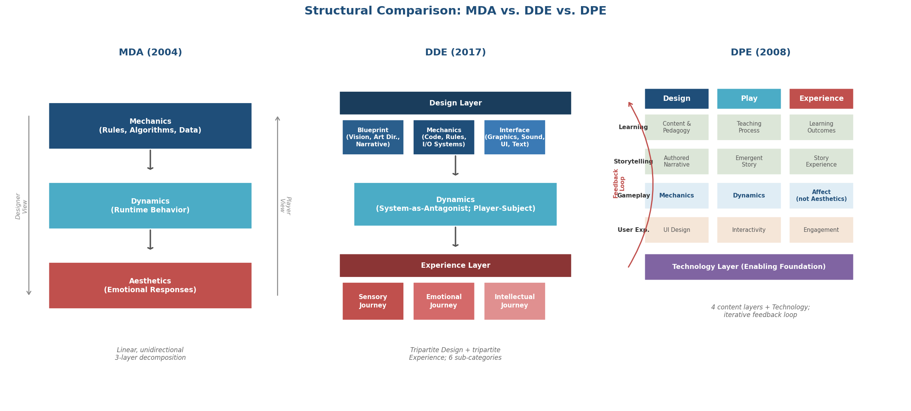

*Figure 2-2. Side-by-side comparison of the internal layer architectures of MDA (linear three-layer), DDE (tripartite Design and Experience sub-layers with player-subject dynamics), and DPE (four content layers plus Technology foundation with iterative feedback loop).*

On the experience side, DDE replaces Aesthetics with **Experience**, decomposed into three "journeys": the *sensory journey* (organoleptic perception), the *emotional journey* (affective response), and the *intellectual journey* (cognitive engagement and meaning-making). Walk argues that "Aesthetics" is terminologically untenable because the term collides with at least three established philosophical and psychological usages — Kantian phenomenological aesthetics, aesthetic theory concerned with beauty, and psychological aesthetics focused on individual perception — in addition to its colloquial equation with "visually attractive" [DDE — Game Developer](https://www.gamedeveloper.com/design/from-mda-to-dde "Walk's critique of the Aesthetics terminology").

A distinctive conceptual contribution is DDE's model of the game system as **antagonist** of the player-subject. Drawing on Sicart's (2009) concept of the player-subject, Walk argues that when dynamics reach sufficient sophistication, the game itself becomes a "worthy opponent" and the entire play experience acquires a narrative structure — irrespective of any authored story content. This move connects game design theory to Clint Hocking's concept of ludonarrative dissonance and furnishes a structural vocabulary for discussing the relationship between systemic and narrative design that MDA's architecture cannot accommodate.

DDE's limitations mirror its ambitions. The tripartite Design layer and tripartite Experience layer introduce six sub-categories where MDA had two endpoint categories, raising the question of whether the added granularity yields proportionally greater analytical or generative power. The framework's publication as a Springer book chapter rather than an open-access paper may also have constrained its pedagogical penetration relative to the freely available MDA paper.

## 2.3 RMDA: Redefining from Within (Junior & Silva, 2021)

Where DDE restructures MDA's architecture from the outside, the Redefining the MDA (RMDA) framework — published by Rogério Junior and Frutuoso Silva in *Information* 12(10), Article 395 (MDPI, 2021) — retains the three-layer skeleton but redefines each component with object-oriented precision [RMDA Paper](https://www.mdpi.com/2078-2489/12/10/395 "Junior & Silva 2021, MDPI Information, open access").

RMDA's redefinition of **Mechanics** is the most consequential innovation. Drawing on Sicart's (2008) critique that MDA conflates system-level algorithms with player-facing affordances, Junior and Silva define mechanics as "the doing responsibilities of entities, with a purpose to invoke dynamics." This OOP-inspired formulation explicitly distinguishes entities (a gun, a door, a character) from their behavioral responsibilities (shooting, opening, pathfinding). A gun is not a mechanic; *shooting* is. The framework further introduces a three-tier classification:

- **Implied mechanics** — genre-standard actions that players expect, such as running and jumping in a platformer.
- **Core mechanics** — the primary player action that defines the moment-to-moment play loop.
- **Extra mechanics** — differentiating actions added to distinguish a specific title from its genre peers.

**Dynamics** are redefined as "predictable runtime behaviours that emerge from mechanics, with a purpose to invoke aesthetics." The qualifier "predictable" is a deliberate design-facing constraint: it restricts the analytical scope to behaviors that a design team can identify during iterative development and playtesting, rather than the full space of theoretically possible emergent states. RMDA subdivides dynamics into **Simple** (emerging directly from mechanics) and **Complex** (emerging from the interaction of other dynamics with mechanics).

**Aesthetics** retains MDA's emotional-response orientation but shifts agency: "the player is ultimately responsible for creating their own emotions." The game offers tools, rules, and a virtual world that *enables* emotional experience; it does not deterministically *produce* it. This reframing addresses a persistent conceptual ambiguity in MDA's original formulation, which implies a direct causal link from system to emotion without accounting for the player's interpretive contribution.

RMDA's case studies demonstrate the framework's diagnostic power. The analysis of Diablo III's real-money auction house illustrates how an Extra mechanic (player-to-player trading for real currency) generated Complex dynamics (market speculation, item farming as the primary play loop) that undermined the game's intended Challenge and Discovery aesthetics. Blizzard's eventual removal of the auction house is interpreted through RMDA as a case of mechanics-dynamics misalignment resolvable only by excising the offending mechanic entirely. Similarly, the League of Legends dodge-penalty analysis and the BioShock Infinite aesthetic-imbalance case study demonstrate how RMDA's finer-grained vocabulary enables more precise diagnosis of design problems than MDA's original categories permit [RMDA Paper](https://www.mdpi.com/2078-2489/12/10/395 "Case studies in Section 4").

The framework's principal limitation is its conservatism: by retaining MDA's three-layer structure, RMDA inherits the absence of explicit narrative, technology, and player-agency layers that other extensions address. Junior and Silva acknowledge this scope boundary, positioning RMDA as a refinement rather than a replacement — a sharper lens for the same analytical territory.

## 2.4 IP-MDA: Bridging Transmedia Worlds and Game Mechanics (Eom et al., 2025)

As IP-based game development has grown into a dominant commercial strategy — spanning adaptations of film, television, comic, and literary properties — a specific structural gap in MDA and its successors has become apparent: none provides a systematic method for translating pre-existing narrative and worldbuilding IP into game mechanics and dynamics. IP elements are typically treated as thematic overlays applied after mechanical design rather than as inputs that shape mechanical decisions from the outset.

IP-MDA, proposed by Soyoun Eom, Chanuk Moon, Ahyeong Shim, Jooeun Kang, and Jaejun Lee at ACM FDG 2025 (Vienna/Graz), addresses this gap by integrating **Transmedia World (TMW) elements** into MDA's front end [IP-MDA — ACM DL](https://dl.acm.org/doi/10.1145/3723498.3723769 "ACM Digital Library"). The TMW elements derive from Klastrup and Tosca's (2004) framework for transmedial worlds and comprise three dimensions:

- **Mythos** — the backstory, mythology, and lore of the IP world
- **Ethos** — the characters' ethics, values, and behavioral codes
- **Topos** — the setting, geography, and spatial-environmental attributes

In IP-MDA's architecture, these TMW elements feed into the Mechanics layer as structured inputs, ensuring that IP characteristics are systematically translated into game rules and systems rather than relegated to surface-level aesthetic dressing. The framework was validated through iterative design iterations on the Korean horror game series *White Day* as a case study [IP-MDA — Semantic Scholar](https://www.semanticscholar.org/paper/Enhancing-Game-Mechanics-for-IP-Based-Games:-The-a-Eom-Moon/7fe9329627790515ae0818ba4c33cc97b3db0242 "Semantic Scholar metadata and abstract").

IP-MDA occupies a narrow but commercially significant niche. It does not attempt to resolve MDA's broader structural limitations — its Mechanics, Dynamics, and Aesthetics layers remain as originally defined — but adds a previously absent input dimension. As a 2025 publication with one citation to date, its adoption trajectory remains to be established, and its internal structural details await broader scholarly scrutiny.

## 2.5 E4X: A Change Engine for Persuasive Games (Grace, 2025)

The most conceptually divergent entry in the post-MDA landscape is the E4X framework (Game Engine for Change), proposed by Lindsay D. Grace of the University of Miami at DiGRA 2025 (Tampere, Finland) [E4X — DiGRA](https://dl.digra.org/index.php/dl/article/view/2431 "DiGRA 2025 proceedings"). Where other extensions modify or expand MDA's layer structure, E4X abandons it entirely in favor of a fundamentally different model of what games do and how designers should conceptualize them.

E4X is designed specifically for **persuasive and educational games** — games intended to change players' interests, activities, and opinions (AIO) beyond the boundaries of play. The framework models the play state as a "change engine" driven by the tension between two pairs of forces: **extrinsic knowledge and motivation** (what the player brings from the real world) and **intrinsic knowledge and motivation** (what the game generates within the play experience). Grace describes this tension through a thermodynamic metaphor: "like positive and negative ions in the human heart, or the management of controlled explosions in an internal combustion engine," the oscillation between extrinsic and intrinsic states generates the transformative energy through which persuasive games achieve their impact [E4X — Full PDF](https://dl.digra.org/index.php/dl/article/download/2431/2424/2460 "Grace 2025, pp. 6–9").

The framework posits that the critical design challenge for persuasive games is the **user-player transition**: the moment when someone enters the play state (becoming a player governed by intrinsic motivation) and the moment they exit it (returning to user status, where extrinsic knowledge and motivation reassert themselves). A persuasive game's effectiveness depends on what transpires at these boundary crossings and whether intrinsic-state insights survive the return to extrinsic reality.

A distinguishing feature of E4X is its methodological concreteness. The framework proposes eight empirical testing approaches: (1) motivational pre-/post-test assessment using established instruments such as the Intrinsic Motivation Inventory (IMI); (2) Critical Incident Technique for identifying play-state boundary events; (3) player experience journaling; (4) biometric and physiological feedback; (5) comparative variant testing through experimental game design; (6) embedded reflective prompts within gameplay; (7) longitudinal follow-up studies; and (8) re-engagement and return-to-play testing [E4X — Full PDF](https://dl.digra.org/index.php/dl/article/download/2431/2424/2460 "Methodological approaches, pp. 10–12"). This methodological specificity addresses one of MDA's most persistent criticisms: the absence of empirical validation protocols. MDA proposes a decomposition but offers no methods for testing whether that decomposition accurately describes how games function in practice. E4X, by contrast, arrives with a built-in evaluation toolkit.

The framework's grounding in over 50 persuasive games lends it empirical weight, but also constrains its scope. E4X does not claim applicability to entertainment game design, and its change-engine metaphor may prove less analytically productive for games whose primary design objective is sustained engagement rather than behavioral or attitudinal transformation.

## 2.6 Redefining Play: Agency and Autonomy as Distinct Dimensions (Xu, Beeston & Denisova, 2025)

MDA's treatment of the player as a largely passive recipient of aesthetic experience — rather than as an agent whose decisions, motivations, and individual differences actively shape the system — has been a recurring critique since Sicart's 2008 intervention. The most targeted response to date appeared at DiGRA 2025, where Xu, Beeston, and Denisova presented "Redefining Play: A Novel Framework for Differentiating Agency and Autonomy in Video Games" [Xu et al. — DiGRA 2025](https://dl.digra.org/index.php/dl/article/view/2477 "DiGRA 2025, abstract and metadata").

The framework's core contribution is the disaggregation of "player agency" — typically treated as a unitary concept in design discourse — into four analytically distinct dimensions:

- **Agency** — the capacity to act intentionally within the game world.
- **Autonomy** — the freedom to choose among meaningful alternatives.
- **Self-efficacy** — the player's belief in their ability to succeed.
- **Competence** — the player's actual skill level relative to the game's demands.

By treating these as independent variables rather than facets of a single construct, the framework enables finer-grained analysis of player experience and more precise design targeting. A game can offer high agency but low autonomy (many possible actions, few meaningful choices), or high autonomy but low self-efficacy (a wide choice space, yet insufficient player confidence to explore it).

As a DiGRA 2025 publication with limited citation history, the framework's empirical validation and adoption trajectory remain open questions. Its analytical vocabulary, however, addresses a genuine and widely acknowledged gap in MDA's conceptual architecture.

## 2.7 Dillon's 6-11 Framework and AGE: Emotion-First Design (2011–2012)

An alternative strand of post-MDA theorizing prioritizes psychological grounding over structural decomposition. Roberto Dillon's 6-11 Framework (2011, refined through 2016) organizes game analysis around six basic emotions — Fear, Anger, Joy/Happiness, Pride, Sadness, and Excitement — and eleven instincts — Survival, Self-Identification, Collecting, Greed, Protection/Care/Nurture, Aggressiveness, Revenge, Competition, Communication, Exploration/Curiosity, and Color Appreciation. The framework provides a systematic vocabulary for discussing the emotional landscape a game targets, offering finer granularity than MDA's eight aesthetic categories and an explicit grounding in psychological constructs rather than ad hoc experience typologies [RMDA Paper](https://www.mdpi.com/2078-2489/12/10/395 "Section 5, Dillon's 6-11 Framework cited as complementary methodology").

Dillon's companion AGE (Actions, Gameplay, Experience) framework maps structurally parallel to MDA — Actions corresponding roughly to Mechanics (player inputs), Gameplay to Dynamics (rules and interactions), Experience to Aesthetics (resulting player experience) — but employs terminology deliberately aligned to practitioner vocabulary rather than academic nomenclature [AGE Teaching Paper](https://researchonline.jcu.edu.au/24660/1/24660_Dillon_2012.pdf "Dillon 2012, Teaching Games through the A.G.E. Framework").

Junior and Silva (2021) evaluated the 6-11 Framework as having "enhanced the way that designers could work on the player's emotion," acknowledging its contribution to emotional design vocabulary while noting that it operates as a complement to structural frameworks rather than a replacement. The emotion-instinct taxonomy provides design targets — *what the player should feel* — but does not supply the structural decomposition — *how the game system produces those feelings* — that MDA, DDE, and RMDA address.

## 2.8 Comparative Synthesis: What the Post-MDA Landscape Reveals

The following table summarizes the structural relationships among the frameworks surveyed in this chapter, organized by year of publication, venue, core structural components, and the specific MDA limitations each addresses.

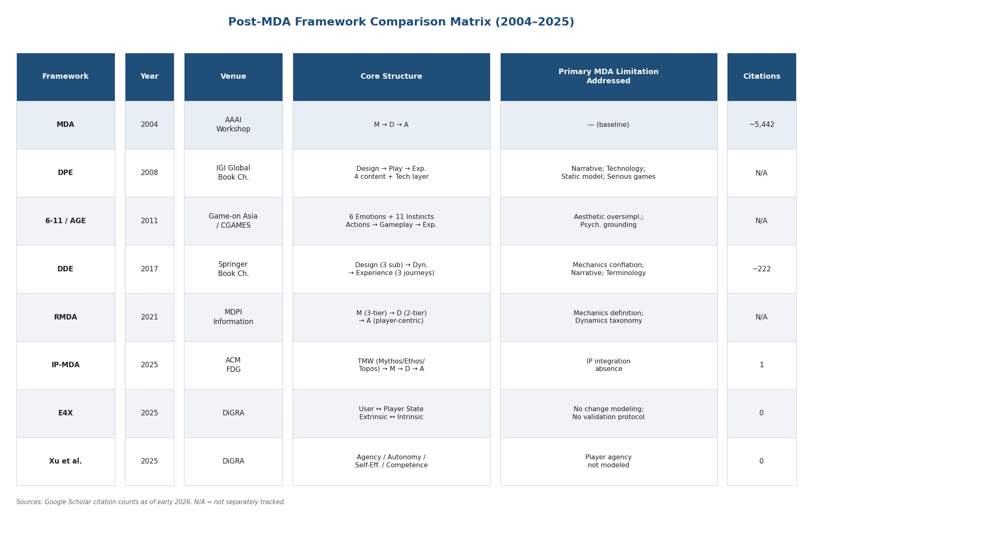

*Figure 2-3. Comparison matrix of eight game design frameworks (MDA and seven post-MDA extensions), organized by publication year, venue, core structure, primary MDA limitation addressed, and approximate citation count.*

| Framework | Year | Venue | Core Structure | Key MDA Replacement/Addition | Primary MDA Limitation Addressed | Approx. Citations |
|-----------|------|-------|----------------|------------------------------|----------------------------------|--------------------|
| **MDA** | 2004 | AAAI Workshop | Mechanics → Dynamics → Aesthetics | — | — | ~5,442 |
| **DPE** | 2008 | IGI Global | Design → Play → Experience; 4 content layers + Technology | M→Design, A→Affect; adds Learning, Storytelling, UX, Technology layers; feedback loop | Narrative absence; technology blindness; no serious-games support; static model | N/A |
| **6-11/AGE** | 2011 | Game-on Asia / CGAMES | 6 Emotions + 11 Instincts; Actions → Gameplay → Experience | Parallel terminology; emotion-instinct taxonomy | Aesthetic oversimplification; lack of psychological grounding | N/A |
| **DDE** | 2017 | Springer | Design (Blueprint/Mechanics/Interface) → Dynamics → Experience (Sensory/Emotional/Intellectual) | M→Design (3 sub-layers), A→Experience (3 journeys); player-subject and antagonist concepts | Narrative absence; mechanics conflation; terminology confusion | ~222 |
| **RMDA** | 2021 | MDPI *Information* | Mechanics (Implied/Core/Extra) → Dynamics (Simple/Complex) → Aesthetics | OOP-based redefinition of all three layers; mechanics trichotomy; dynamics dichotomy | Mechanics definition inconsistency; dynamics lacks taxonomy; analysis-only orientation | N/A |
| **IP-MDA** | 2025 | ACM FDG | TMW (Mythos/Ethos/Topos) → M → D → A | Adds Transmedia World input layer | No mechanism for IP integration | 1 |
| **E4X** | 2025 | DiGRA | User State ↔ Player State; Extrinsic ↔ Intrinsic tension | Entirely different structural model; 8 empirical methods | Not designed for persuasive/educational games; no change modeling; no validation protocol | 0 |
| **Xu et al.** | 2025 | DiGRA | Agency / Autonomy / Self-Efficacy / Competence | Adds four-dimensional player agency model | Player agency not modeled | 0 |

Several patterns emerge from this comparative view.

**Convergent critiques, divergent solutions.** The frameworks converge on what is wrong with MDA — the mechanics catch-all, the aesthetic oversimplification, the absence of narrative and technology layers, and the lack of player modeling — but diverge sharply in their proposed remedies. DDE restructures the entire architecture. RMDA refines from within. DPE adds domain-specific layers. E4X abandons the layer model entirely. This divergence suggests that MDA's limitations do not admit a single structural solution; they reflect fundamentally different assumptions about what a game design framework should accomplish.

**Specialization over universality.** The post-2008 frameworks trend toward domain-specific applicability rather than general-purpose replacement. DPE serves serious games; E4X serves persuasive games; IP-MDA serves IP-based adaptations; Xu et al. serves player experience analysis. Only DDE and RMDA aspire to general entertainment-game applicability, and neither has approached MDA's citation footprint. The absence of a clear successor is not merely a matter of insufficient time or marketing — it may reflect a structural reality: the field's design problems have diversified beyond what any single three-to-five-layer model can accommodate.

**The terminology problem persists.** MDA's "Aesthetics" has been independently replaced by "Affect" (DPE), "Experience" (DDE and AGE), or retained with caveats (RMDA). MDA's "Mechanics" has been narrowed (DDE, RMDA), expanded through additional input layers (IP-MDA), or bypassed entirely (E4X). Two decades after MDA's publication, the field has not converged on a shared terminological standard — a notable irony given that establishing such a standard was among MDA's explicit goals.

**Empirical validation remains scarce.** With the exception of E4X's proposed testing protocols and RMDA's retrospective case studies, the frameworks surveyed here are primarily theoretical proposals validated through illustrative examples rather than controlled empirical studies. No post-MDA framework has been subjected to the kind of large-sample, comparative empirical testing that would allow definitive claims about its analytical or generative superiority. This is not unusual for design theory — frameworks tend to spread through pedagogical adoption and practitioner utility rather than experimental validation — but it means that the relative merits of these proposals remain a matter of theoretical argument rather than empirical evidence.

**Citation asymmetry and the adoption gap.** MDA's approximately 5,442 Google Scholar citations dwarf those of all successor frameworks combined. DDE, the most cited alternative, stands at roughly 222 citations — approximately 4% of MDA's total. Yet as noted in Chapter 1 and explored further in Chapter 6, MDA's academic citation prominence coexists with documented near-zero adoption in industry production workflows [RMDA Paper](https://www.mdpi.com/2078-2489/12/10/395 "Junior & Silva 2021 on MDA's industry non-adoption"). The post-MDA frameworks, with their more modest citation profiles, face an even steeper adoption challenge. The field thus presents a paradox: a proliferation of theoretical alternatives in a domain where theoretical frameworks have had limited demonstrated influence on actual design practice.

These patterns do not diminish the contributions of the individual frameworks surveyed here. Each adds genuine analytical precision to a design problem that MDA's original architecture handles inadequately. DDE's tripartite Design layer provides vocabulary that MDA lacks for discussing art direction, narrative design, and interface craft as distinct design domains. RMDA's OOP-informed mechanics definition resolves a persistent conflation that has confused students and practitioners alike. E4X's empirical testing toolkit offers a methodological template that other frameworks could productively adopt. What the post-MDA landscape has not produced is convergence — and whether convergence is the right aspiration, or whether pluralistic specialization better serves a diversifying field, is a question that subsequent chapters of this report will revisit.

# 第3章 Generative AI and Procedural Intelligence in Game Design

The frameworks surveyed in the preceding chapter respond to MDA's structural limitations by rearranging layers, adding dimensions, or substituting terminology. A qualitatively different disruption, however, is arriving not through theoretical argument but through technological capability. Generative AI and advanced procedural content generation (PCG) are altering what game design systems can accomplish at runtime, what designers allocate their effort to during production, and — most consequentially for the present analysis — how the relationship among Mechanics, Dynamics, and Aesthetics is itself conceived. This chapter examines those developments across four registers: the formal attempt to embed AI within MDA's architecture, the industry tools redefining procedural intelligence, the empirical evidence on developer and player sentiment, and the emerging academic discourse on AI as a co-design partner.

## 3.1 AI-Enhanced MDA: A Framework-Level Integration Proposal

The most direct attempt to reconcile generative AI with MDA's theoretical architecture is the AI-enhanced MDA framework proposed by Wen and Chu in *Research in Learning Technology* Vol. 34, 2026 (DOI: 10.25304/rlt.v34.3746). Drawing on design-science methodology (Hevner et al. 2004) and conceptual framework-building procedures (Jabareen 2009), the proposal positions AI not as an add-on to a single MDA layer but as a **cross-cutting, constitutive design axis** that simultaneously reconfigures all three layers [AI-enhanced MDA](https://journal.alt.ac.uk/index.php/rlt/article/view/3746 "Wen & Chu 2026, Research in Learning Technology").

The framework maps three AI families across the full MDA stack. **Generative AI** operates at the Mechanics layer through dynamic rule and level creation, at the Dynamics layer through adaptive pacing and emergent content interactions, and at the Aesthetics layer through novelty, immersion, and presence. **Adaptive learning algorithms** tailor mechanics to individual player needs, modulate real-time dynamics via scaffolded interaction flow, and reduce frustration by matching challenge to skill. **Procedural content generation** supplies algorithmic level generation at the Mechanics layer, content variation and replayability at the Dynamics layer, and cross-session surprise at the Aesthetics layer [AI-enhanced MDA — full text](https://journal.alt.ac.uk/index.php/rlt/article/download/3746/3305 "Wen & Chu 2026, framework description pp. 6–9").

The distinctive contribution lies in its emphasis on **multi-directional, overlapping relationships** between AI subsystems and MDA layers. Where the original MDA posits a linear causal chain (designer → Mechanics → Dynamics → Aesthetics), the AI-enhanced variant recognizes that a single AI subsystem — an adaptive difficulty algorithm, for instance — simultaneously reconfigures mechanical rules, alters dynamic play patterns, and reshapes aesthetic experience. "Scaffolded interaction flow," in this account, emerges from the interplay between generative AI and the Dynamics layer rather than residing neatly in any one category [AI-enhanced MDA — full text](https://journal.alt.ac.uk/index.php/rlt/article/download/3746/3305 "Wen & Chu 2026, discussion pp. 9–11").

Two important caveats attend this proposal. First, it is scoped exclusively to educational game design; its applicability to entertainment titles, live-service ecosystems, or competitive multiplayer remains unexplored. Second, the authors explicitly acknowledge that the framework is **conceptual and has not been empirically validated**, calling for pilot tests and longitudinal classroom research. As of early 2026, no studio adoption or experimental corroboration has been reported. The AI-enhanced MDA thus represents the frontier of framework-level theorizing about AI integration while simultaneously illustrating how far the field remains from validated models.

## 3.2 Industry Tools: From Procedural Generation to Autonomous Game Characters

If the AI-enhanced MDA represents the theoretical frontier, the industry tool landscape reveals the practical one. Four platforms illustrate both the range and the velocity of change.

**NVIDIA ACE (Avatar Cloud Engine)** underwent a significant expansion at CES 2025 (January 6, 2025), evolving from conversational NPC support to a full architecture for **autonomous game characters** capable of perceiving, planning, and acting. The system comprises four subsystems: perception models (NemoAudio-4B-Instruct for audio, NemoVision-4B-128k-Instruct for vision, Parakeet-CTC-XXL-1.1B for multilingual ASR, plus game-state transcription), cognition models (Mistral-Nemo-Minitron at 8B/4B/2B parameter scales producing 8–13 micro-decisions per second), action models (text-to-speech, strategic planning via cloud LLM or chain-of-thought, and self-correcting reflection), and RAG-based memory using E5-Large-Unsupervised embeddings. Launch partners include PUBG: BATTLEGROUNDS and inZOI (KRAFTON), NARAKA: BLADEPOINT (NetEase), and MIR5 (Wemade Next) [NVIDIA ACE](https://www.nvidia.com/en-us/geforce/news/nvidia-ace-autonomous-ai-companions-pubg-naraka-bladepoint/ "NVIDIA CES 2025 announcement").

The MDA implications are considerable. ACE's perception–cognition–action–memory pipeline constitutes a runtime Dynamics engine that generates emergent behaviors from authored Mechanics (game rules, character personality parameters) in ways that the original MDA framework could not have anticipated. Under this architecture, the Dynamics layer ceases to be a passive emergent residue of static rules and becomes an actively modulated, AI-driven behavioral space.

**Inworld AI** has evolved from a server-side "character engine" to a **local C++ runtime framework** with hybrid inference (local plus cloud fallback). At GDC 2025, CEO Kylan Gibbs outlined the platform's capabilities: a C++ runtime embeddable directly in game engines, a telemetry and observability portal for QA of AI behavior, model distillation tools for compressing cloud models to local deployment, "controlled evolution" enabling model swaps without rebuilding integrations, and **dynamic crowds** — autonomous NPCs that perceive one another, hold conversations, and generate emergent environmental activity. Commercial traction includes the title *Status* (500,000 users within 19 days, averaging 1.5 hours per user per day) and collaborations with Logitech and NVIDIA. Gibbs noted that several AAA titles using Inworld prefer to remain unannounced [Inworld AI — GDC 2025](https://wccftech.com/inworld-ai-gdc-2025-qa-aaa-games-want-to-be-secret-but-theres-going-to-be-large-titles-announced/ "Wccftech interview, April 2025").

**Ubisoft La Forge** has pursued a parallel trajectory. Its Ghostwriter tool, unveiled at GDC 2023, generates first-draft NPC barks — the short ambient lines that populate open-world environments — thereby positioning narrative writers as editors rather than first-draft authors [Ubisoft Ghostwriter](https://news.ubisoft.com/en-us/article/7Cm07zbBGy4Xml6WgYi25d/the-convergence-of-ai-and-creativity-introducing-ghostwriter "Ubisoft official announcement"). By 2025, La Forge expanded its ambitions with the "Teammates" experimental project: a playable research prototype featuring real-time voice-commanded AI companions (Jaspar, an AI voice assistant, plus squad NPCs Sofia and Pablo) that perceive environmental context, respond to natural speech, and improvise within narrative guardrails authored by human writers. Narrative Director Virginie Mosser described the design philosophy: "I still write the story and character personalities, but instead of fixed lines, we create these kinds of fences that let NPCs improvise within the world" [Ubisoft Teammates](https://news.ubisoft.com/en-us/article/3mWlITIuWuu0MoVuR6o8ps/ubisoft-reveals-teammates-an-ai-experiment-to-change-the-game "Ubisoft official, 2025"). Teammates remains a research prototype rather than a shipped feature, but it signals a studio-level commitment to AI-driven Dynamics — the runtime generation of emergent NPC behavior within authored constraints.

On the engine side, **Unreal Engine 5.7** (released late 2025) marked a milestone by designating its Procedural Content Generation (PCG) framework as **Production-Ready** — its first stable release after debuting as Experimental in UE 5.2. Notable features include a PCG Editor Mode with a library of customizable tools (spline drawing, point painting, volume creation), each linked to a PCG Graph with real-time parameter control; significantly faster GPU compute for PCG operations; a Procedural Vegetation Editor (PVE) for graph-based vegetation asset creation with Nanite output; and an **in-editor AI assistant** offering question answering, C++ code generation, and step-by-step guidance [Unreal Engine 5.7](https://www.unrealengine.com/en-US/news/unreal-engine-5-7-is-now-available "Epic Games official release notes"). **Unity** announced the **Unity AI Gateway** at Unite 2025 (November 19, 2025), described as "the officially supported way to connect third-party AI agents securely with Unity," with a planned 2026 release. Unity also maintains Sentis (an inference engine for neural network models inside the Unity runtime) and the open-source ML-Agents Toolkit for reinforcement learning [Unity AI Gateway](https://unity.com/news/unity-developer-choice-flexibility-center-of-game-development-at-unite-2025 "Unity Unite 2025 press release").

Taken together, these platforms reveal a common trajectory: AI is migrating from offline asset-generation pipelines into **runtime game systems**. NVIDIA ACE and Inworld enable NPCs that generate behavior in real time; Ubisoft's Teammates experiment tests voice-driven AI companions; UE 5.7 and Unity are embedding procedural and AI capabilities directly into the editor and runtime. From MDA's perspective, this shift means the Dynamics layer is increasingly populated not by the passive emergence of authored rules but by the active, real-time output of AI models — a transformation that no existing framework, including the proposed AI-enhanced MDA, has fully formalized. Figure 1 summarizes the capability scope, deployment status, and integration level of these five platforms.

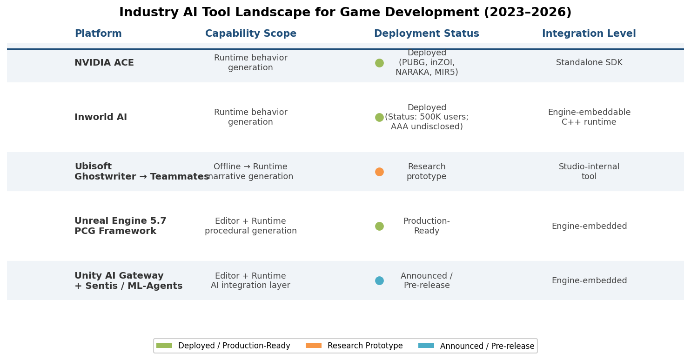

*Figure 1. Comparative overview of major industry AI platforms for game development, classified by capability scope, deployment status, and integration level. Source: compiled from official announcements and industry reporting, 2023–2026.*

## 3.3 LLMs and the Frontier of NPC Dialogue and Narrative Generation

A particularly active research front concerns the application of large language models (LLMs) to NPC dialogue and narrative generation — a domain that directly intersects MDA's aesthetic categories of Narrative and Fantasy.

McGrath, Lorandi, and Belz presented "Echoes of Others: Real-Time LLM Dialogue Generation for Immersive NPC Interaction" at the 18th International Natural Language Generation Conference (INLG 2025, Hanoi), demonstrating a system that produces contextually responsive NPC dialogue in real time within game environments [INLG 2025](https://aclanthology.org/2025.inlg-demos.1/ "McGrath et al., INLG 2025"). A complementary study at ACM CHI PLAY 2025 — "Beyond Pre-Defined Scripts: Player Perceptions on Generative Non-Player Character Dialogues" — investigated how players perceive LLM-generated dialogue, exploring both new conversational opportunities and their experiential consequences [ACM CHI PLAY 2025](https://dl.acm.org/doi/10.1145/3742413.3789221 "Player Perceptions of LLM NPC Dialogue"). A 2026 study in the *International Journal of Human-Computer Interaction* extended this line of inquiry to VR environments, examining player interactions with speech-based generative AI NPCs and their effects on immersion and engagement [IJHCI 2026](https://www.tandfonline.com/doi/full/10.1080/10447318.2026.2620647 "VR NPC dialogue study").

In the serious-game domain, Swacha and Gracel (2025) published a systematic mapping of how generative AI can support each stage of the serious game development lifecycle — from concept and design through production, testing, and deployment — in *Applied Sciences* 15(21):11606 [Swacha & Gracel 2025](https://doi.org/10.3390/app152111606 "Applied Sciences, November 2025"). Their lifecycle mapping complements the AI-enhanced MDA's layer-focused analysis by providing a temporal dimension: AI's role shifts across production phases, from ideation support during pre-production to runtime content generation in live systems.

The foundational scholarly landscape for this domain rests on two surveys. Summerville et al. (2018) established the canonical taxonomy for machine-learning-based PCG in *IEEE Transactions on Games* 10(3):257–270, a source cited by both the AI-enhanced MDA paper and the Alqahtani co-design study discussed in Section 3.5 [Summerville et al. 2018](https://doi.org/10.1109/TG.2018.2846639 "PCGML foundational survey, IEEE Transactions on Games"). More recently, Maleki and Zhao (2024) presented "Procedural Content Generation in Games: A Survey with Insights on Emerging LLM Integration" at the AAAI Conference on AI and Interactive Digital Entertainment (AIIDE 2024), documenting the accelerating embedding of LLMs within PCG pipelines. A TechRxiv preprint (March 2025) on GenAI in PCG for computer games provides additional bibliometric coverage, though it has not yet undergone formal peer review [TechRxiv PCG GenAI survey](https://www.techrxiv.org/doi/10.36227/techrxiv.174317787.76161480 "TechRxiv preprint, March 2025, not peer-reviewed").

## 3.4 Developer and Player Sentiment: The Three-Year GDC Trajectory

The most comprehensive longitudinal evidence on how the game development community perceives generative AI comes from the GDC State of the Game Industry survey, conducted annually by Informa in partnership with Omdia and Game Developer. The three-year trajectory from 2024 to 2026 constitutes the steepest swing in developer opinion the survey has recorded on any topic.

In the **2024 survey**, 18% of respondents reported that generative AI was having a negative impact on the games industry. By the **2025 survey** (3,000+ respondents, ±2% margin of error), that figure had climbed to 30%, with over half of developers reporting that their companies had implemented generative AI and one-third using such tools personally [GDC 2025](https://gdconf.com/article/gdc-2025-state-of-the-game-industry-devs-weigh-in-on-layoffs-ai-and-more/ "GDC 2025 official summary"). The **2026 survey** (2,300+ respondents; 62% employed at game companies or studios) recorded a further sharp escalation: **52% viewed generative AI negatively**, while only **7% held a positive view** — down from 13% in 2025 [GDC 2026 — GamesIndustry.biz](https://www.gamesindustry.biz/gdc-survey-reveals-layoffs-up-6-36-of-industry-using-ai-and-overwhelming-support-for-unionisation-in-the-us "GamesIndustry.biz, January 2026"). Figure 2 visualizes this three-year trajectory.

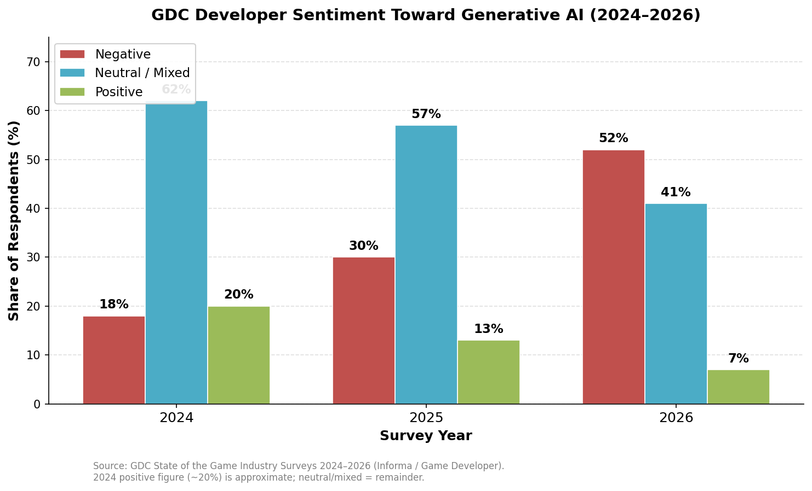

*Figure 2. Three-year trajectory of GDC survey respondents' views on generative AI's impact on the games industry, showing negative sentiment rising from 18% (2024) to 52% (2026) while positive sentiment fell from approximately 20% to 7%. Data: GDC State of the Game Industry Surveys 2024–2026 (Informa / Game Developer). Note: 2024 positive figure (~20%) is approximate; neutral/mixed = remainder.*

The 2026 data reveal important granularity by role. Opposition was strongest among **visual and technical artists** (64% negative), **game designers and narrative developers** (63%), and **programmers** (59%) — the roles most directly exposed to AI's potential displacement effects. Studio-based developers reported lower AI tool usage (30%) than publishing, marketing, and PR professionals (58%). Upper management adopted AI tools at 47% versus 29% for junior positions. A clear pattern emerged: "the more professionals understand generative AI, the less enthusiastic they tend to be about it" [GDC 2026 — 80 Level](https://80.lv/articles/gdc-survey-over-50-of-game-devs-say-generative-ai-harms-industry "80 Level coverage, January 2026").

The use-case breakdown further clarifies the nature of adoption. Among developers using AI, **81% employed it for research and brainstorming**, 47% for writing emails and daily tasks, 47% for code assistance, 35% for prototyping, 22% for testing and debugging, 19% for asset generation, 10% for procedural content generation, and only **5% for player-facing features**. ChatGPT was the most popular tool; 78% of respondents' companies had internal AI policies, and approximately 30% of AAA studios reported using proprietary AI systems [GDC 2026 — GIANTY](https://www.gianty.com/gdc-2026-report-about-generative-ai/ "GIANTY AI use-case analysis, March 2026"). Figure 3 illustrates this distribution, highlighting the concentration of adoption in internal and pre-production workflows versus minimal deployment in player-facing systems.

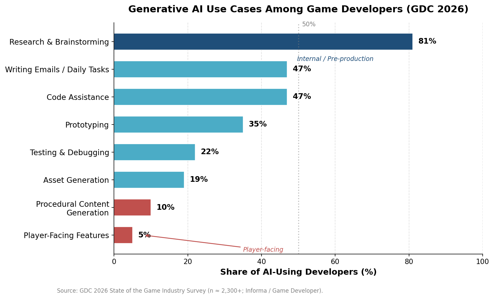

*Figure 3. Distribution of generative AI use cases among developers in the GDC 2026 survey, ranked from research and brainstorming (81%) to player-facing features (5%). Data: GDC 2026 State of the Game Industry Survey (n ≈ 2,300+; Informa / Game Developer).*

A countervailing data point merits attention for methodological contrast. A **Google Cloud/Harris Poll survey** (August 2025, n=615 developers in the US, South Korea, Finland, Norway, and Sweden) found that 90% of developers were already using some form of AI in their workflows and 97% believed generative AI was reshaping the industry. Reported use cases included reducing repetitive tasks (95%), developing new mechanics (93%), and creating new genres (92%). However, 63% expressed concerns about data ownership, and 32% about the copyright status of AI-generated content [Google Cloud survey](https://www.googlecloudpresscorner.com/2025-08-18-90-of-Games-Developers-Already-Using-AI-in-Workflows,-According-to-New-Google-Cloud-Research "Google Cloud press release, August 2025"). The divergence from GDC findings likely reflects methodological differences: the Google Cloud survey was commissioned research conducted among a smaller, geographically constrained sample recruited through the devcom conference ecosystem, whereas the GDC survey draws from a broader, self-selected population of active conference attendees. Neither methodology is intrinsically superior, but their contrasting findings underscore the importance of specifying survey context when citing adoption statistics.

On the player side, a **Quantic Foundry survey** (October–December 2025, n=1,799) found that gamers were "overwhelmingly negative" about generative AI in video games, providing a demand-side complement to the supply-side GDC data [Quantic Foundry](https://quanticfoundry.com/2025/12/18/gen-ai/ "Quantic Foundry, December 2025"). The convergence of developer skepticism and player resistance constitutes a significant constraint on the pace of AI integration into player-facing game systems — a finding that helps account for the 5% player-facing deployment rate observed in the GDC 2026 data.

## 3.5 AI as Co-Design Partner: Curation Rather Than Authorship

The sentiment data establish the attitudinal landscape; a parallel body of academic research examines the practical and creative dimensions of AI integration into design workflows.

Alqahtani (2025) published a mixed-method study in *Journal of Intelligence* 13(6):60 (MDPI), surveying 42 game design professionals and conducting 9 in-depth interviews. The findings reveal a nuanced adoption pattern: **90.5% used generative AI for ideation and brainstorming**, 83.3% for asset creation, 73.8% for programming, and 66.7% for narrative and dialogue generation, while only 28.6% used it for procedural level generation and 11.9% for QA. Over 80% intended to incorporate generative AI in future projects. Yet over 60% agreed that generative AI might reduce originality, and comparable proportions raised ethical concerns. The study characterizes an emerging paradigm in which AI functions as a **"creative companion"** across pipeline phases — from ideation through asset development to narrative refinement — rather than an autonomous content generator. Participants described the process as one of **"curation rather than authorship,"** in which the designer filters, refines, and directs AI-generated outputs [Alqahtani 2025](https://www.mdpi.com/2079-3200/13/6/60 "MDPI Journal of Intelligence, mixed-method study").

This "curation" framing resonates with Ratican and Hutson's (2024) theoretical proposal of **"Game Dev 3.0"** — a vision of symbiotic human-AI workflows in which AI actively contributes to artistic direction, aesthetic coherence, and creative originality, cited by both the AI-enhanced MDA paper and the Alqahtani study [Ratican & Hutson 2024](https://doi.org/10.54517/m2904 "Metaverse 5(2), AI-driven co-creation"). At the opposite end of the experience spectrum, Panchanadikar and Freeman (2024) documented indie developers' encounters with generative AI in *Proceedings of the ACM on Human-Computer Interaction*, finding that solo developers tended to view AI as an **"ill-informed co-worker"** — useful for cost reduction and workflow streamlining but carrying risks to intellectual property, career stability, and artistic coherence [Panchanadikar & Freeman 2024](https://doi.org/10.1145/3611035 "ACM PACM-HCI, indie development with GenAI").

The spectrum from "creative companion" to "ill-informed co-worker" is itself analytically revealing. It maps onto the MDA designer–player duality: from the designer's perspective (Mechanics → Dynamics → Aesthetics), AI is a tool that reshapes what mechanics can be authored and how dynamics emerge; from the experiential perspective (Aesthetics → Dynamics → Mechanics), the question is whether AI-mediated dynamics produce aesthetic experiences that feel authored, coherent, and meaningful — or hollow, generic, and algorithmically flat. The 60%+ concern about reduced originality in Alqahtani's data, the "ill-informed co-worker" characterization in Panchanadikar and Freeman's fieldwork, and the 52% negative sentiment in the GDC 2026 survey collectively point toward an industry that is adopting AI tools while harboring deep ambivalence about their effects on the experiential quality of the medium.

## 3.6 Implications for Framework Theory

The developments surveyed in this chapter expose a structural tension in the current landscape of game design theory. On one side, the AI-enhanced MDA (Wen & Chu 2026) represents a principled attempt to absorb AI into an established theoretical architecture — preserving MDA's tripartite decomposition while acknowledging AI's cross-cutting character. On the other, industry practice is advancing through tool-driven integration (NVIDIA ACE, Inworld, UE 5.7 PCG, Unity AI Gateway) that proceeds largely indifferent to formal frameworks, following instead the engineering-driven imperatives of latency, model size, runtime embedding, and telemetry-based iteration.

The gap between these trajectories reproduces, at a new scale, the theory–practice disconnect that Chapter 6 will examine in detail. The AI-enhanced MDA is conceptual, unvalidated, and scoped to educational games; NVIDIA ACE is deployed in commercial titles with millions of players. The GDC 2026 data indicate that 81% of AI-using developers employ it for research and brainstorming — the ideation phase that precedes formal design — while only 5% deploy it in player-facing features where framework-level theorizing about AI-mediated Dynamics would most directly apply. The dominant mode of AI adoption in game design, as of early 2026, is pragmatic and pre-theoretical: designers use AI to accelerate what they already know how to do, not to instantiate a new model of how games function.

This pragmatic reality does not diminish the importance of framework-level thinking. As AI-generated NPCs, adaptive difficulty systems, and procedural content become more prevalent in player-facing experiences, the need for analytical tools capable of describing, predicting, and evaluating AI-mediated Dynamics will intensify. The AI-enhanced MDA provides a starting vocabulary; the industry tools provide the engineering substrate. The challenge for the next phase of game design theory — a thread taken up in Chapters 4 and 7 — is to bridge these registers: to develop frameworks that are both theoretically rigorous and practically deployable within the AI-augmented design workflows that studios are already constructing.

# 第4章 Player Experience Modeling and Data-Driven Design

The preceding chapter traced how generative AI and procedural intelligence are migrating from offline pipelines into runtime game systems, increasingly populating MDA's Dynamics layer with the active output of AI models rather than the passive emergence of authored rules. This chapter examines a complementary transformation on the measurement side of that equation: the convergence of player modeling, telemetry analytics, and adaptive game systems that collectively enable designers to observe, quantify, and respond to player experience in near real time. Where Chapter 3 addressed what AI can generate, this chapter addresses what data-driven systems can perceive — and how that perception is closing the loop between MDA's theoretical architecture and the empirical realities of play.

Three research objectives structure the analysis. First, we survey recent advances in player modeling — from LLM-based profiling to self-supervised behavioral embeddings — that are redefining how designers understand who their players are and what they seek. Second, we examine the latest generation of Dynamic Difficulty Adjustment (DDA) systems, which represent the most direct technological instantiation of MDA's Mechanics–Dynamics–Aesthetics causal chain as an active feedback loop. Third, we assess the telemetry infrastructure and motivational frameworks that connect individual player data to design iteration at studio scale, effectively transforming MDA from a descriptive taxonomy into a prescriptive design cycle.

## 4.1 Player Modeling: From Static Taxonomies to Real-Time Profiling

Player modeling has historically relied on post-hoc classification systems — Bartle's four-type taxonomy (1996), BrainHex's seven neurobiologically grounded archetypes (Nacke, Bateman & Mandryk, 2014), or survey-derived motivation profiles. These approaches share a common structural limitation: they produce static labels applied after data collection rather than dynamic representations that evolve as players interact with a game system. Three lines of 2024–2025 research mark a substantive departure from this paradigm, each addressing the static-label constraint through a distinct technical strategy.

### LLM-Based Player Profiling

Souza, Berretta, and Carvalho at the Federal University of Goiás proposed an LLM-based player modeling method at SBGames 2025, using GPT-4o to analyze in-game interaction data in real time. The system monitors player attributes — score, remaining lives, and time remaining — at two-second intervals and produces two outputs: **reference values** (ideal target values for each player attribute, such as expected completion time for a level) and **dynamic player profiles** classified according to established frameworks such as Bartle's taxonomy. A proof-of-concept evaluation across 50 input–output pairs, scored by three LLM judges (Gemini 2.0 Flash, Meta LLaMA 3, and GPT-4o) using the G-Eval framework, yielded an overall average correctness of 4.044 out of 5.000, with 75% of responses scoring 4 or higher. The hallucination rate stood at 18% (9 of 50 outputs), a figure the authors characterize as within acceptable ranges per existing literature [Souza et al. — SBGames 2025](https://sol.sbc.org.br/index.php/sbgames/article/view/37373 "DOI: 10.5753/sbgames.2025.10174").

The significance of this approach lies in its solution to the **cold-start problem** that has long constrained player modeling systems. Traditional machine-learning pipelines require substantial volumes of labeled training data before producing useful classifications; LLMs, by contrast, can extract meaningful player insights from limited interaction data by leveraging pre-trained reasoning capabilities. The trade-off — an 18% hallucination rate — is non-trivial for production deployment, yet the method's capacity to generate interpretive, human-readable player profiles in real time represents a qualitative advance over purely statistical approaches.

### Self-Supervised Behavioral Embeddings

A complementary approach, player2vec (Wang et al., 2024), extends long-range Transformer models from natural language processing to mobile game player behavior data. Rather than classifying players into predefined types, player2vec treats in-game events analogously to words in sentences and learns **latent player representations** through self-supervised training — without ground-truth annotations — enabling downstream tasks including player segmentation, behavior prediction, and personalized recommendation [player2vec](https://arxiv.org/abs/2404.04234 "Wang et al. 2024, Transformer-based player behavior modeling").

The two approaches are architecturally complementary. Player2vec operates at the embedding layer, producing dense vector representations of player behavior trajectories suitable for clustering and similarity analysis. The SBGames LLM method operates at the reasoning layer, generating interpretive classifications and natural-language explanations of player state. Together, they illustrate an emerging bifurcation in the field: one branch pursues scalable, latent representation learning for large-scale analytics; the other pursues explainable, real-time profiling for individual player adaptation.

### Multi-Modal Player Classification

A third line of research pushes player modeling beyond behavioral telemetry into physiological territory. A study presented at ACM Mensch und Computer 2025 introduced a multi-modal data-driven approach integrating game telemetry, biometric sensor data (heart rate, blood oxygen saturation), and personality profiles (MBTI) to classify player behavior via unsupervised machine learning. Using K-Means and agglomerative clustering on data from 13 participants in a custom Unity prototype, the researchers identified distinct clusters characterized by performance-based groupings (high-performing, survival-focused, low-performing) and strategy-based groupings (aggressive versus defensive playstyles). Key statistical findings underscore the value of multi-modal integration: reaction time differed significantly between clusters (ANOVA p = 0.036), stress level showed highly significant variation (p = 0.00014), and shooting frequency diverged sharply (p = 5.6 × 10⁻⁶). Time-series correlation analysis further revealed significant associations between heart rate fluctuations and intense in-game moments such as boss spawns and survival-critical situations [ACM MuC 2025](https://dl.acm.org/doi/10.1145/3743049.3743070 "Data-driven player classification, DOI: 10.1145/3743049.3743070").

The finding that higher-performing players exhibited more pronounced physiological stress responses — rather than lower stress, as a naive model might predict — carries direct design implications. It suggests that skilled engagement is not a state of calm mastery but of heightened arousal channeled into effective action. For adaptive systems, this means that elevated biometric signals should not automatically trigger difficulty reduction; the relationship between physiological state and experiential quality is more nuanced than a simple stress-equals-frustration mapping.

The three player modeling approaches discussed above differ substantially in their technical requirements and operational characteristics. Figure 1 summarizes these trade-offs across five dimensions.

## 4.2 Dynamic Difficulty Adjustment: The Feedback Loop Made Algorithmic

DDA represents the most direct technological embodiment of MDA's core architectural insight: Mechanics produce Dynamics, which produce Aesthetics. A DDA system monitors Dynamics (emergent player behavior) in real time and algorithmically adjusts Mechanics (game parameters) to maintain target Aesthetics (engagement, flow, satisfaction). In MDA's terms, DDA converts the framework's causal chain from a one-directional cascade into a closed feedback loop. Three 2025 studies advance the state of the art in distinct directions, while a fourth — a 2026 contribution to affective modeling — extends the frontier further.

### Engagement-Oriented DDA

Ma and Gao at Northeastern University (Shenyang) proposed Engagement-Oriented Dynamic Difficulty Adjustment (EDDA), published in *Applied Sciences* 15(10):5610 (May 2025). EDDA's distinctive contribution is its direct consideration of **player churn trend** — modeling player disengagement not as an afterthought but as the primary signal driving difficulty adjustment. The system introduces a real-time monitoring algorithm that tracks gameplay time per unit time within each challenge, combined with a common parameter set adjustable at player, partner, opponent, and system levels. Testing across a prototype integrating seven major game genres (RPG, Racing, Fighting, Shooting, Adventure, Strategy, Casual) with 100 participants (50 male, 50 female, ages 19–29), EDDA achieved the largest mean and median scores across all genres for fitness, gameplay time, and Game Engagement Questionnaire (GEQ) scores compared to both a no-DDA baseline and a monitoring-only variant. Friedman tests confirmed significant differences for gameplay time (χ²(2) = 14, p < 0.001) and GEQ scores (χ²(2) = 14, p < 0.001), with the Adventure genre exhibiting the highest absolute improvement [EDDA — Applied Sciences](https://www.mdpi.com/2076-3417/15/10/5610 "Ma & Gao 2025, DOI: 10.3390/app15105610").

EDDA operationalizes Flow Theory in a specific manner: player churn is modeled as exit from the flow channel (the optimal band where challenge matches skill), and DDA intervention serves as the mechanism for re-entry. By targeting churn rather than performance metrics alone, EDDA acknowledges that a player may be performing adequately yet losing interest — a distinction that purely skill-based DDA systems miss.

### Self-Adaptive Systems Architecture for DDA

The same research group behind the SBGames 2025 LLM player modeling work developed a parallel architectural contribution. The DDA-MAPEKit framework, published in *Entertainment Computing* 52:100842 (2025), applies the MAPE-K (Monitor–Analyze–Plan–Execute–Knowledge) loop from self-adaptive systems engineering to dynamic difficulty adjustment. The framework's key innovation is its **modularity**: individual MAPE-K loops can be constructed for each game mechanic or group of mechanics, enabling integration of multiple DDA strategies within a single game. Enhancements include a descriptive player model with continuous profile assessment, a performance calculation method, and a dynamically adjustable rules system. A proof-of-concept implementation in a Space Shooter prototype demonstrated that the system effectively adapted game variables based on player performance [DDA-MAPEKit](https://www.sciencedirect.com/science/article/abs/pii/S1875952124002106 "Souza et al. 2025, Entertainment Computing 52").

The MAPE-K architectural pattern is notable because it formalizes what most DDA systems implement informally: a continuous cycle of monitoring player state, analyzing performance against target thresholds, planning adjustments, and executing parameter changes. By borrowing from the well-established self-adaptive systems literature in software engineering, DDA-MAPEKit provides a vocabulary and structural template that may help bridge the gap between DDA research prototypes and production game engines — a gap that a systematic literature review of DDA solutions identifies as a persistent challenge in the field [DDA SLR — Entertainment Computing](https://www.sciencedirect.com/science/article/abs/pii/S1875952125001211 "Souza et al. 2025, Systematic Literature Review on DDA").

### The Stabilization Hypothesis

A counterintuitive finding emerges from a comparative study of five DDA strategies conducted by Fisher and Kulshreshth at the University of Louisiana at Lafayette (IntechOpen, August 2025). The study compared Fixed, Player-Selected, Performance-Based, Emotion-Based (using EEG), and Hybrid DDA approaches in a custom first-person shooter with 31 participants. Despite significant differences in assigned difficulty levels across conditions (p < 0.001), EEG-derived metrics of focus, engagement, and stress remained **largely stable** — none survived Bonferroni correction at α = 0.0071. Self-reported excitement, focus, and enjoyment likewise showed no significant differences (Friedman p = 0.378, 0.614, and 0.393, respectively). Notably, the Emotion-Based system consistently assigned higher difficulty than other methods (mean 5.93 out of 7), yet players reported comparable experience quality [Fisher & Kulshreshth 2025](https://www.intechopen.com/chapters/1228576 "DDA concepts, techniques, and applications, IntechOpen August 2025").

The authors interpret this uniformity not as a failure of DDA but as evidence for what we term the **stabilization hypothesis**: the primary value of adaptive difficulty systems is not to produce dramatically different player experiences but to **stabilize engagement across diverse player profiles**. In a population of players with varying skill levels, motivations, and playstyles, DDA systems compress the variance of experiential outcomes — ensuring that both high-skill and low-skill players maintain comparable levels of flow, focus, and enjoyment. This reframes the DDA design goal from "personalization" to "equalization," a subtle but consequential distinction for how studios evaluate DDA effectiveness.

The study also raises a caveat grounded in Self-Determination Theory: if DDA adjustments are non-transparent, they risk undermining players' perceived competence — the sense that outcomes result from genuine skill. A player who discovers that difficulty was silently lowered may feel their achievements are hollow. The tension between adaptive support and perceived autonomy remains one of the unresolved ethical dimensions of DDA design.

Figure 2 summarizes the four DDA studies discussed above alongside the 2026 affective DDA contribution, comparing their approach types, sample sizes, key metrics, primary findings, and theoretical grounding.

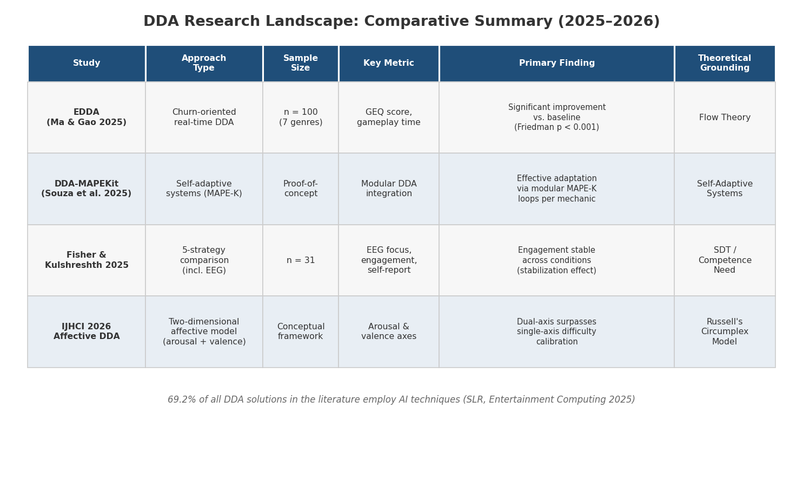

### The AI Dominance of DDA Research

A systematic literature review of DDA solutions published in *Entertainment Computing* (2025) by the same Brazilian research group provides a field-level perspective: **69.2% of DDA solutions employ AI techniques** (reinforcement learning, neural networks, and related methods), 15.3% rely on heuristics and parameter manipulation, and the remainder use other approaches. The review categorizes DDA solutions into frameworks, models, and methods, and identifies key research gaps: the need for more modular approaches integrating multiple DDA strategies, tools that simplify DDA implementation for non-specialist designers, and versatile solutions applicable across game genres and compatible with popular game engines [DDA SLR — Entertainment Computing](https://www.sciencedirect.com/science/article/abs/pii/S1875952125001211 "Souza et al. 2025, Systematic Literature Review on DDA").

The 69.2% AI adoption rate within DDA research carries a revealing implication: while the broader game industry debates whether to adopt AI at all (Chapter 3 documented that 52% of GDC 2026 respondents view generative AI negatively), the DDA research community has already settled on AI as its default technical substrate. This asymmetry suggests that developer skepticism about generative AI — focused primarily on content creation and authorship concerns — does not extend to AI-driven adaptive systems, where the technology operates beneath the surface of player experience rather than displacing creative labor.

## 4.3 Motivation Frameworks: Empirical Taxonomies of MDA's Aesthetics Layer

MDA's eight aesthetic categories (Sensation, Fantasy, Narrative, Challenge, Fellowship, Discovery, Expression, Submission) were proposed as a replacement for vague terms like "fun" and "gameplay." Yet as Chapters 1 and 2 documented, these categories have been criticized for lacking empirical grounding and exhaustiveness. The most significant empirical response to this limitation has emerged not from academic game studies but from industry psychometrics.

### The Quantic Foundry Gamer Motivation Model

Developed by Nick Yee and Nic Ducheneaut, the Quantic Foundry Gamer Motivation Model identifies **12 core gaming motivations** organized into **six pairs**: Action (Destruction, Excitement), Social (Competition, Community), Mastery (Challenge, Strategy), Achievement (Completion, Power), Immersion (Fantasy, Story), and Creativity (Design, Discovery). The model was constructed through factor analysis of large-scale survey data and validated with responses from over **1.9 million gamers** as of February 2026 [Quantic Foundry GDC 2025](https://quanticfoundry.com/gdc2025/ "GDC 2025 presentation on the Gamer Motivation Model").

In April 2026, Quantic Foundry released *The Evolution of Play: A Decade of Gamer Motivation* (2026 Inaugural Edition), a 169-page longitudinal report tracking shifts in player psychology from 2015 to 2026 based on data from **1,924,157 gamers**. The report provides granular cohort comparisons across gender, age, gamer type (casual, core, hardcore), platform (PC, Console, Mobile), and region (North America, Western Europe, Latin America, Southeast Asia). The sample comprises 74% male, 21% female, and 5% non-binary respondents, with a median age of 23; by self-identified segment, 12% are casual, 69% core, and 19% hardcore gamers. The report explicitly notes that no LLM tools were used in data synthesis [Evolution of Play](https://quanticfoundry.com/evolution-of-play/ "2026 Inaugural Edition, 169-page longitudinal report").

In MDA terms, the Quantic Foundry model functions as an **empirical taxonomy of what MDA calls Aesthetics** — the emotional and experiential responses players seek from games. Where MDA's eight categories were proposed through theoretical reflection, Quantic Foundry's twelve motivations derive from factor analysis of millions of data points. The differences are instructive: MDA's "Submission" (pastime, relaxation) has no direct Quantic Foundry counterpart, while Quantic Foundry's fine-grained distinction between "Destruction" and "Excitement" within the Action pair reveals motivational granularity that MDA's single "Sensation" category elides. The 1.9-million-respondent validation base provides the empirical grounding that critics such as Dormans (2012) and Junior and Silva (2021) found absent from MDA's original aesthetic taxonomy.

### Self-Determination Theory as Theoretical Infrastructure

While Quantic Foundry provides the most extensive empirical dataset, Self-Determination Theory (SDT) — as formulated by Ryan, Rigby, and Przybylski (2006) — remains the dominant theoretical framework underpinning both DDA research and player motivation studies. SDT posits three basic psychological needs — **autonomy** (sense of volition and choice), **competence** (sense of mastery and effectiveness), and **relatedness** (sense of connection with others) — as independent predictors of enjoyment and continued engagement. Every major DDA study reviewed in this chapter explicitly invokes SDT or its derivative concept of Flow Theory: EDDA targets flow-channel maintenance; Fisher and Kulshreshth ground their stabilization hypothesis in competence-need satisfaction; the ACM MuC 2025 multi-modal study frames player clustering in terms of engagement states that map onto SDT constructs.

The relationship between SDT's three needs and MDA's Aesthetics merits explicit articulation. Autonomy corresponds roughly to MDA's Expression and Discovery aesthetics; Competence maps to Challenge; Relatedness aligns with Fellowship. Yet SDT operates at a deeper explanatory level: it identifies *why* certain aesthetics produce satisfaction (because they fulfill basic psychological needs) rather than merely *what* those aesthetics are. This theoretical depth explains why SDT, despite being a general psychological theory rather than a game-specific framework, has proven more durable in player experience research than MDA's aesthetic categories.

## 4.4 Telemetry Infrastructure and the Design Feedback Loop

The practical infrastructure that enables data-driven design operates at a markedly different scale than the academic studies surveyed above. Two platform developments illustrate the current state of telemetry analytics in commercial game production.

### GameAnalytics IQ Suite

GameAnalytics, integrated into over 100,000 games and processing more than **27 billion daily events**, launched the IQ Suite in late 2025 — an evolution from a single analytics provider into a full studio growth platform. The suite comprises four products: **AnalyticsIQ** (real-time metrics, cohort analysis, retention tracking, engagement matrix, and pre-configured plus custom dashboards supporting 30+ game engines); **MarketIQ** (advertising and market intelligence); **SegmentIQ** (advanced player segmentation and user analysis); and **PipelineIQ** (scalable data pipeline solutions with Game Data Sharing for cross-studio KPI comparison). GameAnalytics is developing AI-powered assistants in collaboration with AWS for predictive lifetime value analytics and advanced segmentation for A/B testing. AnalyticsIQ remains permanently free; premium features are available at $29 per month. Major clients include Roblox's *Grow a Garden* (which achieved 24 million peak concurrent users), GSC Game World's *Stalker 2*, Voodoo, and Supercent [GameAnalytics IQ Suite](https://www.gamesindustry.biz/from-data-to-decisions-heres-how-gameanalytics-iq-suite-will-power-the-next-era-of-game-growth "GameAnalytics IQ Suite launch, October 2025").

### Unity Analytics and the deltaDNA Legacy

Unity's analytics capabilities build on the 2019 acquisition of deltaDNA, a platform that pioneered real-time analytics with direct data access, player segmentation, and event-triggered messaging for live-ops optimization. As of 2025–2026, Unity Analytics provides event tracking, funnel analysis, retention metrics, and A/B testing within the Unity ecosystem. The Unity AI Gateway, announced at Unite 2025 (November 19, 2025), extends this infrastructure by connecting third-party AI agents with the Unity Editor, enabling AI-driven insights on scene composition, hierarchy structure, assets, and platform targets. Combined with Unity's Sentis inference engine (for running neural network models inside the Unity runtime) and the open-source ML-Agents Toolkit (for reinforcement learning), the platform is converging analytics, adaptive AI, and design tooling into a unified development workflow.

### Closing the MDA Loop

The conceptual connection between telemetry infrastructure and MDA is foundational to this chapter's argument. In MDA's original formulation (Hunicke, LeBlanc & Zubek, 2004), Dynamics are the run-time behaviors emerging from player interaction with Mechanics — precisely what telemetry systems measure. Data-driven design closes the gap between the designer perspective (Mechanics → Dynamics → Aesthetics) and the player perspective (Aesthetics → Dynamics → Mechanics) by providing **empirical evidence of how Dynamics actually unfold** rather than relying on designer assumptions. Figure 3 contrasts MDA's original linear causal chain with the data-driven closed feedback loop enabled by modern telemetry infrastructure.

*Note: The annotation "278+ daily events" in the diagram is a rendering artifact; the correct figure is 27 billion+ daily events, as reported by GameAnalytics.*

Concretely, the feedback loop operates as follows: designers ship Mechanics (rules, systems, parameters); telemetry captures the resulting Dynamics (actual player behaviors, engagement patterns, retention curves, progression metrics); analysts infer Aesthetics from behavioral proxies (retention as a proxy for satisfaction, session length as a proxy for engagement, completion rates as a proxy for challenge calibration); and designers modify Mechanics accordingly. Both the EDDA study and the ACM MuC 2025 work exemplify this loop: telemetry data informs real-time mechanical adjustments that alter emergent Dynamics to optimize player experience. At industrial scale, platforms like GameAnalytics — processing 27 billion daily events — transform this feedback loop from a theoretical ideal into an operational reality.

This operationalization addresses one of MDA's most persistent criticisms: its static, single-pass character. The original MDA framework describes a unidirectional causal chain; it does not model iteration, feedback, or learning. Data-driven design effectively transforms MDA from a descriptive taxonomy into a **prescriptive design cycle**: observe Dynamics, diagnose Aesthetic shortfalls, modify Mechanics, re-observe. The DPE framework (Winn, 2008), discussed in Chapter 2, anticipated this need by introducing an explicit feedback arrow from Experience to Design — but it was the maturation of telemetry infrastructure, not theoretical innovation alone, that made such iteration practical at scale.

## 4.5 Biometric Measurement and the Frontier of Affective Modeling

The multi-modal player classification study from ACM MuC 2025 (Section 4.1) represents one end of a broader movement to supplement behavioral telemetry with physiological signals. Biometric approaches to player experience measurement are evolving from single-signal detection toward multi-modal integration across several signal types: **EEG** for anxiety and mental focus detection; **heart rate variability (HRV)** for stress and cognitive strain; **galvanic skin response (GSR) / electrodermal activity (EDA)** for emotional arousal; and **functional near-infrared spectroscopy (fNIRS)** for mental workload. Commercial implementations already exist in niche titles: *Nevermind* uses heart-rate-driven horror DDA, and *Deep* employs breathing-controlled meditative VR [Fisher & Kulshreshth 2025](https://www.intechopen.com/chapters/1228576 "Biometric DDA review, IntechOpen 2025").

The frontier of this work is the transition from single-axis to **multi-dimensional affective modeling**. A 2026 study in the *International Journal of Human-Computer Interaction* proposes a two-dimensional affective DDA approach using arousal and valence as independent axes rather than relying on genre-specific difficulty metrics (DOI: 10.1080/10447318.2026.2628144). This dual-axis model, grounded in Russell's circumplex model of affect, permits finer-grained emotional assessment: a player experiencing high arousal with positive valence (excitement) requires different adaptation than one experiencing high arousal with negative valence (frustration), even though both states produce similar physiological signals in single-axis systems. The approach thus promises a more generalizable framework for assessing players' perceptions of difficulty — one that transcends the genre-specific calibration constraining current DDA methods.

Meanwhile, the INTERACT 2025 Player Experience Evaluation model (Nascimento, Velasco, Barbosa, Berretta & Carvalho, LNCS 16108) proposes a questionnaire-based evaluation across **seven dimensions**: satisfaction, learning, immersion, challenge, usability, social interaction, and accessibility. This instrument extends earlier tools such as the Game Experience Questionnaire (GEQ) by incorporating dimensions — particularly accessibility and learning — that reflect contemporary design priorities absent from MDA's original aesthetics. The overlap between this work's authorship and the SBGames 2025 LLM player modeling team points to an integrated research program at the Federal University of Goiás connecting player modeling, DDA, and player experience evaluation into a coherent methodological pipeline.

## 4.6 Synthesis: Data-Driven Design as the Operationalization of MDA's Dynamics Layer

The convergence documented across this chapter points toward a single consequential conclusion: data-driven design is transforming MDA's Dynamics layer from a theoretical abstraction into an empirically grounded, actively managed design surface.

In 2004, when Hunicke, LeBlanc, and Zubek described Dynamics as "the run-time behavior of the mechanics acting on player inputs and each other's outputs," the concept served primarily as an analytical lens — a way of thinking about what happens when players interact with rules. Two decades later, the combination of LLM-based player profiling, self-supervised behavioral embeddings, multi-modal biometric sensing, real-time DDA algorithms, industrial-scale telemetry platforms, and empirically validated motivation models has rendered Dynamics not merely observable but **instrumentable**. Designers can now measure Dynamics with statistical precision (27 billion daily events on GameAnalytics alone), classify them against validated motivational taxonomies (1.9 million gamers in Quantic Foundry's dataset), predict their trajectory using AI (69.2% of DDA solutions employ AI techniques), and intervene in real time to reshape them (EDDA's churn-oriented monitoring, DDA-MAPEKit's modular adaptation loops).

This operationalization does not invalidate MDA; rather, it fulfills the framework's implicit promise. MDA posited that understanding the Mechanics–Dynamics–Aesthetics chain would enable better design. Data-driven approaches supply the empirical toolkit to test that proposition — measuring whether changes to Mechanics actually produce the intended Dynamics, and whether those Dynamics deliver the targeted Aesthetics. The AI-enhanced MDA framework (Wen & Chu, 2026), discussed in Chapter 3, attempts to formalize this integration at the theoretical level, but the infrastructure surveyed in this chapter demonstrates that integration is already occurring bottom-up through tooling and practice, regardless of whether a formal framework sanctions it.

Two tensions remain unresolved. First, the **transparency dilemma**: DDA systems that silently adjust difficulty risk undermining the very competence needs (per SDT) they aim to support. The Fisher and Kulshreshth finding that engagement metrics remain stable across DDA conditions is reassuring at the aggregate level, but the ethical dimension — whether players deserve to know that their experience is being actively managed — remains a design and regulatory question without consensus. Second, the **generalizability gap**: most DDA and player modeling research uses small, controlled samples (13 participants in the ACM MuC study, 31 in the Fisher and Kulshreshth study, 100 in EDDA), while production telemetry operates at scales of millions. Whether laboratory findings on adaptive systems transfer reliably to the high-variance conditions of commercial deployment is a question the field has only begun to address.

# 第5章 Emerging Design Paradigms — Live Service, UGC Economies, and Ethical Design

The data-driven feedback loops examined in Chapter 4 — telemetry capturing Dynamics, analytics inferring Aesthetics, designers iterating Mechanics — presuppose a game that continues to evolve after its initial release. This chapter turns to the structural paradigms that make such ongoing evolution both possible and, increasingly, mandatory: live-service operations, user-generated content (UGC) economies, and the ethical, regulatory, and accessibility constraints shaping how both are designed.

Where MDA and its successors theorize the internal architecture of a game, the paradigms surveyed here redefine the boundaries of what a "game" is — extending it into a continuously operated service, a platform for player-created content, and a regulated digital product subject to evolving legal obligations. Each development carries implications for formal design theory that the field has only begun to address. The chapter proceeds in five sections: the maturation of live-service design (Section 5.1), UGC economies and their challenge to the designer–player dichotomy (Section 5.2), dark patterns and regulatory pressure (Section 5.3), accessibility as a first-class design dimension (Section 5.4), and a synthesis of the three paradigm shifts and their collective implications for design theory (Section 5.5).

## 5.1 The Maturation of Live-Service Design

### From Ad-Hoc Updates to Operational Discipline

Live-service game design has undergone a structural transformation between 2024 and 2026. What was once a reactive practice — shipping hotfixes and seasonal content in response to player behavior — has consolidated into a formalized operational discipline with its own vocabulary, tooling, and organizational structures. A 2026 industry analysis documented this shift, observing that studios increasingly treat live-ops as "an ongoing production track rather than a collection of one-off updates," prioritizing faster iteration cycles, fewer engineering handoffs, and non-technical ownership of live content through visual configuration layers [PocketGamer.biz](https://www.pocketgamer.biz/live-ops-in-2026-what-2025-revealed-and-how-studios-should-prepare/ "Live ops in 2026, Jan 2026").

Template-driven operations became the backbone of this discipline in 2025. Studios widely adopted reusable building blocks — reward ladders, limited-time missions, seasonal progressions, chain offers, and event structures modeled on successful precedents — to reduce production overhead while maintaining predictable content cadence across multiple titles. At the portfolio level, studios operating five or more live games built unified live-ops calendars, shared event templates, cross-game performance insights, and centralized publisher account systems [PocketGamer.biz](https://www.pocketgamer.biz/live-ops-in-2026-what-2025-revealed-and-how-studios-should-prepare/ "Live ops in 2026, Jan 2026"). The emerging trajectory for 2026 points toward further automation — churn prediction models, behavioral recommendation engines, and predictive live-ops that forecast feature performance before rollout — alongside cross-genre borrowing of engagement patterns previously confined to specific categories.

This evolution carries direct theoretical significance for the MDA lineage. Template-driven live-ops effectively standardize and modularize the Mechanics layer: each template constitutes a pre-validated Mechanics module expected to produce known Dynamics (player engagement patterns) and target specific Aesthetics (the satisfaction of progression, the excitement of time-limited competition). The live-ops discipline is, in effect, a practitioner-developed formalization of the Mechanics–Dynamics–Aesthetics chain — one that emerged from production necessity rather than academic theorizing, and that operates at a granularity (individual event templates) far below the abstraction level at which MDA's original framework was conceived.

### Service Withdrawal and the GaaS Life Cycle

The structural demands of live-service design also generate a category of design problem absent from traditional game design theory: the problem of ending. A 2025 study in *Convergence* analyzing five Games-as-a-Service titles — *Final Fantasy XI*, *Age of Empires III*, *Guild Wars*, *Destiny*, and *Anthem* — identified three recurring motives for live-service withdrawal: attending to company resources and worker fatigue, attending to aging or broken products (legacy code, bloating file sizes), and attending to player attrition. The authors concluded that GaaS "demands intensive, ongoing resource commitment" and that planned withdrawal can function as a restorative act when executed proactively rather than as a crisis response [Dubois & Chalk, *Convergence* 2025](https://journals.sagepub.com/doi/abs/10.1177/13548565241256888 "Service withdrawal in GaaS").

Complementary empirical work in *IET Software* (2026) validated a user-centric quality model for GaaS, identifying controllability, responsiveness, accessibility, cost transparency, security, and social features as the key quality attributes influencing user satisfaction. Based on a 62-respondent cloud-gamer survey, the study found that users prioritize high-resolution graphics, diverse game libraries, intuitive controls, and seamless audio-visual performance [Shaheen et al., *IET Software* 2026](https://ietresearch.onlinelibrary.wiley.com/doi/10.1049/sfw2/6662968 "User-Centric Quality Model for GaaS").

Neither MDA nor its successor frameworks model the temporal dimension of a game's operational life cycle — the phases of launch, growth, maturity, and potential sunset that define the design space of every live-service title. The withdrawal research exposes a theoretical gap: existing frameworks treat a game as an artifact to be analyzed at a single point in time rather than as a service evolving through developmental stages, each with distinct design priorities and player-relationship dynamics.

### GDC 2026 and the Live-Service Design Conversation

The prominence of live-service design within professional discourse was underscored at GDC 2026, rebranded as the "GDC Festival of Gaming," where the keynote "An Odyssey in Building Games That Last" centered on live-service sustainability. The 2026 State of the Game Industry report addressed workforce trends, generative AI's impact, diversity and inclusion, and evolving business models — with monetization innovation continuing to prioritize retention-over-acquisition strategies [GDC 2026 State of the Industry](https://gdconf.com/article/gdc-2026-state-of-the-game-industry-reveals-impact-of-layoffs-generative-ai-and-more/ "GDC 2026 State of the Game Industry report"). This emphasis on long-term sustainability over launch-window optimization reflects a maturation of the live-service paradigm from a business model into a design philosophy — one that demands frameworks capable of modeling ongoing player relationships rather than one-time product experiences.

## 5.2 UGC Economies: When Players Become Designers

### The Scale of the UGC Ecosystem

The rise of user-generated content as a first-class design dimension — and an economic force — represents one of the most consequential structural shifts in the game industry. According to the Naavik 2026 State of UGC Games report (published March 2026), developer payouts across the top three UGC ecosystems (Roblox, Fortnite Creative, and Overwolf/CurseForge) reached approximately $2.2 billion in 2025, a 47% increase over 2024 [Naavik 2026](https://naavik.co/deep-dives/the-state-of-ugc-games-2026/ "The State of UGC Games 2026").

Roblox alone paid $1.5 billion to developers in 2025 (+70% year-over-year), with the top 1,000 creators earning an average of $1.3 million annually (up from $735,000 in 2024). The platform's annual bookings reached $6.8 billion in 2025 (+55% YoY), daily active users hit 506 million (+52% YoY), and hours engaged totaled 124 billion (+75% YoY) — accounting for 3.4% of global gaming content spending [Naavik 2026](https://naavik.co/deep-dives/the-state-of-ugc-games-2026/ "Roblox section").

Fortnite Creative exhibited a different growth pattern: approximately 70,000 active creators (plateaued from 2024), but total published maps surged from roughly 198,000 to approximately 488,000 by early 2026. Engagement-based payouts for 2025 are estimated at approximately $370 million (midpoint). In December 2025, Epic launched in-island transactions with a 100% V-Bucks revenue share for creators (dropping to 50% in February 2027), alongside Sponsored Row paid discovery and native Communities tools — establishing a three-revenue-stream model for creators [Naavik 2026](https://naavik.co/deep-dives/the-state-of-ugc-games-2026/ "Fortnite Creative section").

On the modding side, CurseForge grew mod downloads 38% to 33 billion total, with $300 million in developer payouts (+25% YoY). mod.io reached 26.6 million average monthly users in 2025 (up from 14.4 million in 2024), processing nearly 1 billion mod downloads in 12 months. Notably, 68% of all games that brought mods to console, mobile, VR, and streaming platforms chose mod.io as their infrastructure provider [mod.io Year in Review](https://blog.mod.io/2025-year-in-review-6b9d867e6d7f "mod.io 2025 Year in Review").

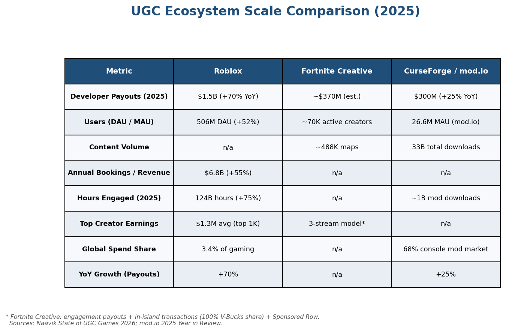

*Figure 5.1. Comparative scale of the three major UGC ecosystems in 2025, synthesizing data from the Naavik 2026 State of UGC Games report and the mod.io 2025 Year in Review.*

BCG's Video Gaming Report 2026 (published November 2025, based on a survey of approximately 3,000 gamers) corroborated the UGC trajectory, finding that 40% of gamers consumed more UGC in 2025 than the prior year. BCG estimated the global games market at $263 billion by end of 2025, identifying UGC as one of four strategic trends — alongside GenAI, cloud gaming, and app-store opening — expected to reshape the industry over the next five to ten years. The report noted that 44% of gaming parents said their children play video games by age five, with two of the three most popular first games being UGC-heavy titles (Minecraft and Roblox) [BCG Video Gaming Report 2026](https://www.bcg.com/publications/2025/video-gaming-report-2026-next-era-of-growth "BCG: The Next Era of Growth, Nov 2025"). BCG's proprietary survey methodology warrants noting as a methodological caveat.

### UGC's Measurable Impact on Game Longevity

The economic case for UGC extends beyond creator payouts to measurable effects on the host game's commercial performance. The mod.io/GameDiscoverCo UGC Impact Study 2025 (published September 2025), analyzing approximately 1,200 PC games on Steam with at least $1 million in first-month revenue, found that roughly 20% had official UGC or mod support. Games with UGC support demonstrated an 8% revenue advantage after one year, growing to 31% after five years; 75% better concurrent-user retention after two years, widening to 115% after five years; and 105% higher median DLC revenue per title. On consoles, the advantage proved even more pronounced: +16% on PlayStation and +24% on Xbox in year one — more than double the PC advantage at the same timeframe. A specific case study reinforced these aggregate findings: *Baldur's Gate 3* saw a 20% DAU increase across all platforms after implementing official mod support via mod.io in 2024 [mod.io UGC Impact Study 2025](https://blog.mod.io/ugc-impact-study-2025-066a5a0163d5 "UGC Impact Study 2025, Sep 2025").

### Theoretical Implications: Dissolving the Designer–Player Boundary

The UGC phenomenon poses a fundamental challenge to the conceptual architecture of MDA and its successors. Every framework in the MDA lineage — MDA itself, DDE, RMDA, DPE, the Elemental Tetrad — presupposes a clear boundary between designer and player. The designer authors Mechanics (or Design, or Rules); the player experiences Aesthetics (or Experience). MDA's dual causal chain — designer→Mechanics→Dynamics→Aesthetics versus player→Aesthetics→Dynamics→Mechanics — depends on the asymmetry between these two perspectives.

UGC economies dissolve this asymmetry. On Roblox, a platform with 506 million DAUs, and across 488,000 published Fortnite Creative maps, millions of players function simultaneously as designers and consumers. The top 1,000 Roblox creators earning an average of $1.3 million annually are not hobbyists experimenting with sandbox tools; they are professional designers operating within a platform's Mechanics layer to create Dynamics for other players' Aesthetics. This nested design relationship — player-creators designing experiences for player-consumers within a meta-game designed by the platform developer — lacks any representation in existing formal frameworks.

The mod.io data further complicates this picture. When UGC support extends a game's concurrent-user retention by 115% over five years, the UGC itself has become a primary driver of the game's Dynamics — not merely an addition to designer-authored Mechanics but a parallel source of Mechanics operating according to different authorial intentions and quality distributions. No current framework provides vocabulary for distinguishing designer-authored Mechanics from player-authored Mechanics, nor for modeling the emergent Dynamics that arise from their interaction.

## 5.3 Dark Patterns, Ethical Design, and Regulatory Pressure

### The Dark-Pattern Landscape

The maturation of live-service models and monetization-dependent business structures has simultaneously intensified scrutiny of manipulative design practices. "Dark patterns" — interface and system designs that exploit cognitive biases to drive spending, engagement, or data disclosure — have moved from a niche concern in UX criticism to a central topic in regulatory policy, industry self-governance, and academic ethics research.

The European Games Developer Federation (EGDF) published a comprehensive 2025 position paper arguing that existing EU and national frameworks (including the Digital Services Act), combined with industry self-regulation and co-regulation, are already capable of addressing dark patterns — while acknowledging that the concept itself "remains poorly defined." The paper documented internal ethical guidelines already adopted by many studios, covering practices such as avoiding overly-emotive prompts, false urgency timers, FOMO-driven purchase pressure, opaque virtual currency pricing, and aggressive default settings that lower protection for minors [EGDF Dark Patterns 2025](https://www.egdf.eu/documentation/7-balanced-protection-of-vulnerable-players/consumer-protection/dark-patterns-2025/ "Dark patterns 2025, EGDF").

A 2025 paper in *Games and Culture* explored the intersection from a moral-philosophical perspective, examining how dark-pattern design relates to the "gamer's dilemma" — contrasting morally questionable virtual content with exploitative monetization mechanics [Dark Patterns Meet the Gamer's Dilemma, *Games and Culture* 2025](https://journals.sagepub.com/doi/10.1177/15554120251319173 "Games and Culture, Sage 2025"). While operating at a philosophical rather than taxonomic level, this work signals the field's growing recognition that ethical considerations constitute integral dimensions of the design space rather than external constraints imposed upon it.

### The Regulatory Tightening

A practitioner-oriented guide published by GamesIndustry.biz in February 2026 identified six key design areas under active regulatory pressure: (1) dark patterns, prohibited by the UK Digital Markets, Competition and Consumers Act (DMCCA) 2024 and the EU Digital Services Act, with the forthcoming Digital Fairness Act sharpening attention; (2) UI and prompts — the Italian Competition Authority investigated Activision Blizzard for "misleading and aggressive" practices in *Diablo Immortal*; (3) loot boxes — UK ASA and Dutch regulators ruled that loot-box presence must be disclosed in game listings, and probability odds must be clearly accessible; (4) virtual currencies — Consumer Protection Cooperation Principles require clear real-world pricing disclosure; (5) player content and communications — the UK Online Safety Act requires active moderation and risk assessments for minors; and (6) AI-generated content labeling — EU AI Act provisions scheduled for August 2026, with a possible delay to 2027 [GamesIndustry.biz](https://www.gamesindustry.biz/how-recent-laws-impact-game-design-from-in-game-chat-to-notifications "How recent laws impact game design, Feb 2026").

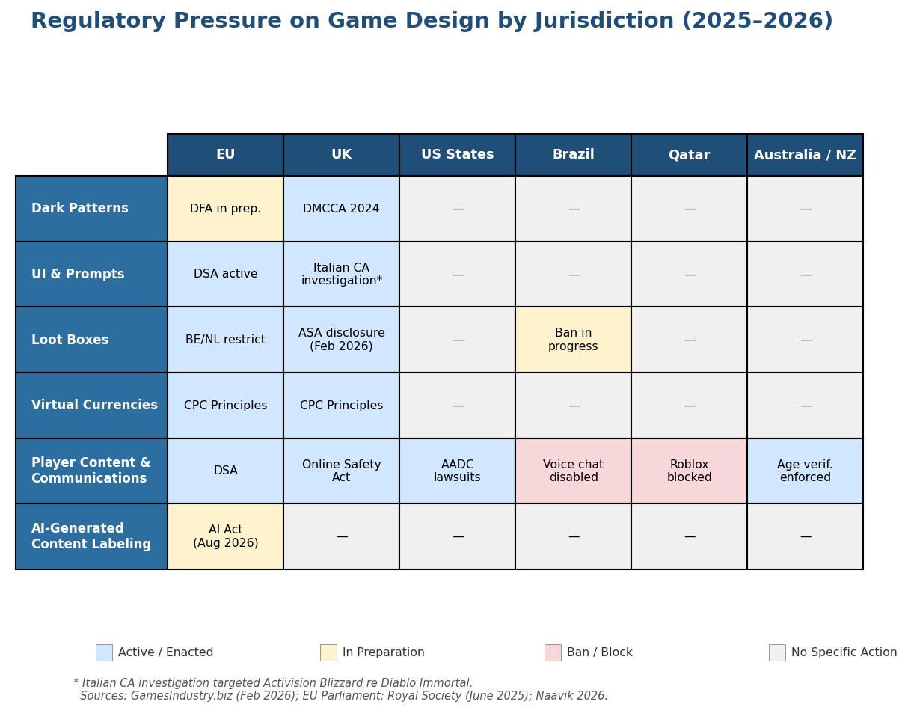

*Figure 5.2. Regulatory pressure matrix mapping six design areas against six jurisdictions, color-coded by regulatory status. Sources: GamesIndustry.biz (Feb 2026), EU Parliament, Royal Society (June 2025), and Naavik 2026.*

At the EU level, the Digital Fairness Act (DFA), in preparation as of early 2026, explicitly targets dark patterns, addictive design, and behavioral manipulation in digital services including games. The European Parliament's research service documented that EU law does not yet contain a general prohibition of dark patterns in all business-to-consumer transactions, and the DFA is intended to remedy this gap [EU Parliament](https://www.europarl.europa.eu/RegData/etudes/ATAG/2025/767191/EPRS_ATA(2025)767191_EN.pdf "Regulating dark patterns in the EU, 2025").

In the United Kingdom, the Royal Society published research in June 2025 revealing that the UK games industry association (Ukie) self-regulations on loot boxes are "very poorly complied with and are not enforced at all," with rules repeatedly broken. In response, the UK Advertising Standards Authority (ASA) introduced new measures in February 2026 requiring that consumers must know before purchasing or downloading a game whether it contains loot boxes [Royal Society](https://royalsociety.org/blog/2025/06/video-game-industry-loot-boxes/ "UK self-regulation failure, June 2025"). Belgium and the Netherlands continue to classify or restrict loot boxes under gambling legislation.

Beyond Europe, regulatory fragmentation is accelerating. Brazil forced Roblox to disable voice chat functionality nationwide, with a loot-box ban proceeding as of March 2026. Qatar blocked Roblox entirely in August 2025. Multiple U.S. states — Louisiana, Kentucky, and Texas — have sued Roblox for non-compliance with the Age-Appropriate Design Code. Australia and New Zealand enforced strict age-verification requirements under new social media regulations [Naavik 2026](https://naavik.co/deep-dives/the-state-of-ugc-games-2026/ "Roblox Safety and Governance section").

### Implications for Design Frameworks

The regulatory tightening carries direct implications for formal game design theory. None of the frameworks in the MDA lineage — MDA, DDE, RMDA, DPE, the Elemental Tetrad — incorporates ethical constraints, regulatory compliance, or player-protection obligations as a design layer or dimension. Monetization mechanics are Mechanics in the MDA sense; their effects on player behavior are Dynamics; the emotional responses they provoke are Aesthetics. Yet the question of whether those Mechanics are ethically permissible or legally compliant falls entirely outside every existing formal framework.

This absence is becoming untenable. When the UK ASA mandates loot-box disclosure, when the EU DFA prohibits specific influence mechanics, and when national authorities ban platform features outright, these are not business constraints imposed after design is complete — they are design constraints that shape the available Mechanics space from the outset. A design framework that cannot represent "this Mechanic is prohibited in jurisdiction X" or "this Dynamic pattern constitutes a regulated dark pattern" is incomplete in a way that has shifted from theoretical to operational.

## 5.4 Accessibility and Inclusive Design as First-Class Design Dimensions

### The State of Accessibility Knowledge

Parallel to the ethical-design discourse, accessibility and inclusive design have matured from aspirational add-ons into structured, evidence-based design disciplines supported by dedicated guidelines, industry initiatives, and emerging academic frameworks.

Oliva-Zamora and Mangiron (2025) published a literature review in *Universal Access in the Information Society* synthesizing 18 accepted documents (12 academic, 6 non-academic guidelines) into 14 recommendations for cognitive accessibility in video games. The most prevalent recommendations address uncluttered interfaces, adaptive controls, multiple information channels (visual, auditory, haptic), slow pacing with pause and rewind functionality, helping guidance (auto-aim, contextual reminders), suitable text display, simple progression, adjustable difficulty, reduced stimuli, enhanced motivation, safe playthrough and save systems, practice spaces, mental healthcare considerations, and complementary documentation. The most commonly addressed cognitive conditions were dyslexia, autism, ADHD, and memory loss [Oliva-Zamora & Mangiron 2025](https://link.springer.com/article/10.1007/s10209-025-01231-5 "Cognitive accessibility in video games, Springer 2025").

Several of these recommendations — adjustable difficulty, adaptive controls, multiple information channels — interface directly with the DDA systems and player modeling techniques discussed in Chapter 4, suggesting a natural convergence between accessibility design and data-driven personalization.

### Industry Infrastructure for Accessibility

Microsoft's Xbox Accessibility Guidelines (XAGs) remain the industry's most comprehensive best-practice set, developed in partnership with industry experts and disabled gamers, covering visual, audio, input, and cognitive accessibility dimensions [Xbox Accessibility Guidelines](https://learn.microsoft.com/en-us/gaming/accessibility/guidelines "Microsoft Learn, XAGs"). In July 2025, Microsoft launched the Accessible Games Initiative (AGI) tags across all digital storefronts, providing players with clear and consistent information about accessibility features prior to purchase — a disclosure mechanism analogous, in its transparency logic, to the loot-box disclosure mandates emerging from regulatory bodies [Xbox AGI](https://news.xbox.com/en-us/2025/07/09/accessible-games-initiative-tags-xbox-interview/ "Xbox AGI Tags, July 2025").

The IGDA Game Accessibility Special Interest Group (GA-SIG) maintains accessibility guidelines organized by disability type and recommends a "top ten" list of accessibility features as a starting point for developers. The 2024 GDC roundtable broadened its scope to include workplace inclusion for developers with disabilities — a shift reflected in a position paper at ACM FDG 2025 proposing seven principles for inclusive game workplaces: proactive inclusive leadership, flexible work-site approaches, cross-departmental collaborative workgroups on accessibility, transparent work environment assignments, enhanced inclusive recruitment and adaptive onboarding, accessible tools for game design, and normalized employee workplace adaptations [IGDA GA-SIG](https://igda-gasig.org/get-involved/sig-initiatives/resources-for-game-developers/sig-guidelines/ "IGDA Game Accessibility SIG Guidelines") [Westin et al., ACM FDG 2025](https://dl.acm.org/doi/full/10.1145/3723498.3723803 "Accessibility and Inclusion in the Game Industry").

### Academic Frameworks for Inclusive Design

The TEGA (Teaching and Experiential Game-based Activities) toolkit, published in *Frontiers in Education* (2025), represents a validated framework for inclusive analog game design in higher education. Phase 1 identified 28 key design themes and established 14 specific inclusivity measures addressing motor, cognitive, visual, and auditory domains. The toolkit adopts a motivational cybernetic game-loop model and underwent beta testing to validate practical applicability [TEGA toolkit, *Frontiers in Education* 2025](https://www.frontiersin.org/journals/education/articles/10.3389/feduc.2025.1670301/full "TEGA toolkit, Frontiers in Education 2025").

The Geena Davis Institute's GDI Playbook for Inclusive Game Design complements these technical accessibility frameworks with representation-focused guidance, aiming to empower developers to create games that reflect the diversity of their player base [GDI Playbook](https://geenadavisinstitute.org/spotlight/inclusive-game-design-playbook/ "GDI Playbook for Inclusive Game Design"). Together, the XAGs, IGDA guidelines, TEGA toolkit, and GDI Playbook constitute a layered ecosystem of accessibility and inclusion resources — spanning technical implementation checklists to cultural representation principles — that collectively define accessibility as a multi-dimensional design requirement rather than a single-checkbox compliance exercise.

### Accessibility's Relationship to Formal Frameworks

Like regulatory ethics, accessibility occupies an ambiguous position relative to existing design frameworks. In MDA terms, accessibility modifications are Mechanics changes (remappable controls, subtitle options, colorblind modes) intended to ensure that specific player populations can access the intended Aesthetics. In DPE terms, accessibility maps to the User Experience layer. In the Elemental Tetrad, it touches Technology (input devices, rendering options) and Aesthetics (sensory presentation). Yet none of these frameworks treats accessibility as a first-class design dimension — a constraint or objective that organizes design decisions across all layers simultaneously.

The INTERACT 2025 Player Experience Evaluation model, discussed in Chapter 4, explicitly includes accessibility as one of its seven evaluation dimensions alongside satisfaction, learning, immersion, challenge, usability, and social interaction — representing a step toward formal integration. The convergence of accessibility requirements with DDA capabilities — adjustable difficulty functioning simultaneously as an accessibility feature and a player-experience optimization tool — further suggests that accessibility is not a peripheral concern but a cross-cutting design axis that intersects every layer of every framework in the MDA lineage.

## 5.5 Synthesis: Three Paradigm Shifts and Their Collective Challenge to Design Theory

The three paradigm shifts examined in this chapter — live-service operations, UGC economies, and the ethical-regulatory-accessibility triad — share a common structural feature: each extends the design space beyond the boundaries that MDA and its successors were built to describe.

Live-service design introduces **temporality** as a design dimension. Games are no longer static artifacts but evolving services with life cycles, seasonal rhythms, and planned or unplanned endpoints. Template-driven live-ops modularize the Mechanics layer into reusable components, while service-withdrawal research reveals that the decision to stop designing — to end the service — is itself a design act with player-experience consequences.

UGC economies introduce **nested authorship** as a design dimension. When 506 million daily active users on Roblox include both player-consumers and player-creators, and when the top creators earn $1.3 million annually through their design labor, the designer–player asymmetry that underpins MDA's dual causal chain collapses. The five-year revenue advantage of 31% for UGC-supported games and the 115% concurrent-user retention premium demonstrate that player-authored Mechanics are not supplementary to designer-authored Mechanics but co-constitutive of the game's Dynamics.

The ethical-regulatory-accessibility triad introduces **normative constraints** as a design dimension. The emerging regulatory landscape — from the EU Digital Fairness Act to the UK ASA loot-box disclosure mandates to national-level platform bans — means that certain Mechanics are not merely suboptimal but prohibited. Accessibility requirements further constrain the Mechanics space, mandating that design choices accommodate diverse player capabilities. These constraints are not optional considerations to be evaluated after design is complete; they are boundary conditions that define the feasible design space from the outset.

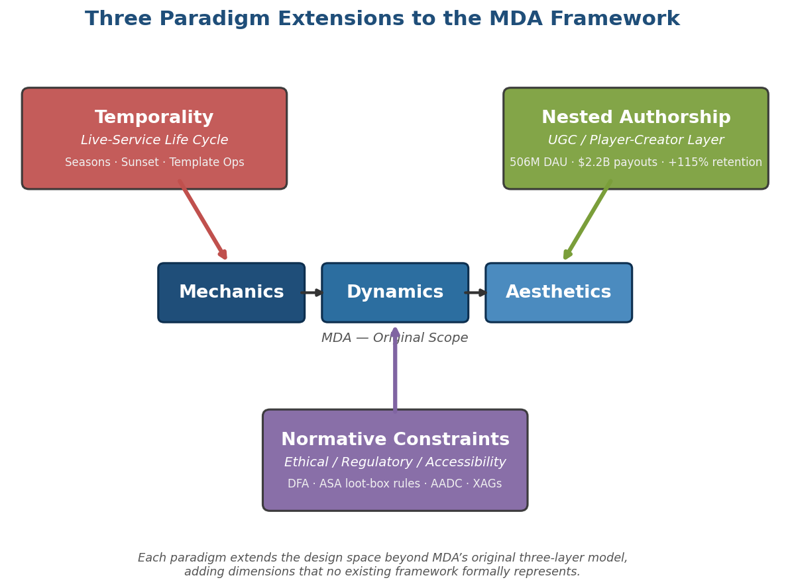

*Figure 5.3. Conceptual diagram illustrating how three emergent paradigms — temporality (live-service life cycles), nested authorship (UGC/player-creator economies), and normative constraints (ethical, regulatory, and accessibility requirements) — extend the design space beyond MDA's original three-layer model.*

No existing framework in the MDA lineage provides formal vocabulary for any of these three dimensions. The consequence is not that MDA and its successors are wrong — their analysis of the Mechanics–Dynamics–Aesthetics chain remains valid within its original scope — but that their scope is increasingly insufficient. The design challenges confronting studios in 2026 encompass not only "how do we create Mechanics that produce desirable Dynamics and Aesthetics?" but also "how do we sustain those Dynamics across a multi-year service life?", "how do we design a platform Mechanics layer that enables player-creators to produce their own Mechanics?", and "how do we ensure our Mechanics comply with divergent regulatory requirements across jurisdictions while remaining accessible to all player populations?" These are not peripheral questions; they constitute the central design problems of the contemporary industry's most successful products.

# 第6章 From Theory to Practice — Framework Adoption in Studio Workflows

The preceding chapters have traced the landscape of game design theory from its MDA foundations through contemporary extensions, AI-driven transformations, data-informed player modeling, and the emergent paradigms of live service, UGC, and ethical design. A recurring motif has surfaced throughout: frameworks proliferate in academic literature while their documented adoption in production studios remains conspicuously thin. This chapter confronts that motif directly, examining how studios actually adopt, adapt, or reject formal design frameworks — and what the persistent theory-practice gap reveals about the nature of game design knowledge itself.

The analysis draws on grounded-theory interview research, autoethnographic first-person accounts, GDC practitioner talks from 2025–2026, and a telling form of negative evidence — specifically, the absence of any published studio postmortem or workflow report documenting the explicit use of MDA, DDE, or the Elemental Tetrad as a production methodology. The chapter proceeds in five sections: the academic framing of the theory-practice gap (Section 6.1), ethnographic evidence from designers' actual practice (Section 6.2), practitioner discourse at GDC 2025–2026 (Section 6.3), the integration of AI tools into design workflows (Section 6.4), and an interpretive analysis of what the gap implies for framework development (Section 6.5).

## 6.1 The Theory-Practice Gap as a Structural Feature

### Framing the Divide

The gap between formalized game design theory and studio production practice is neither newly identified nor unique to game design. Beck and Ekbia characterized the theory-practice gap in HCI as a "generative metaphor" — a persistent structural feature of design disciplines that produces ongoing discourse rather than a deficiency awaiting a solution [Beck & Ekbia, CHI 2018](https://doi.org/10.1145/3173574.3174164 "Beck & Ekbia, CHI 2018"). Applied to game design, this framing suggests that the failure of MDA and its successors to penetrate production workflows may not indicate a flaw in the frameworks themselves but rather a fundamental epistemological divide between how design knowledge is formalized in academic contexts and how it is enacted in production environments.

The scale of this divide is striking. As established in Chapter 1, MDA has accumulated approximately 5,442 Google Scholar citations as of early 2026, making it the most-cited paper in game design theory [MDA Original](http://www.cs.northwestern.edu/~hunicke/MDA.pdf "Hunicke, LeBlanc & Zubek 2004"). DDE (Walk et al., 2017) has approximately 222 citations [DDE — Game Developer](https://www.gamedeveloper.com/design/from-mda-to-dde "Walk 2015"). The RMDA proposal (Junior & Silva, 2021) and other successors discussed in Chapter 2 have accumulated further hundreds of citations. Yet within the research window of this report, no published postmortem, GDC talk, studio blog, or industry case study was identified in which a named studio described adopting MDA, DDE, or the Elemental Tetrad as an explicit production methodology for a shipped title. This asymmetry — thousands of academic citations against zero documented production adoptions — constitutes the central empirical observation of this chapter.

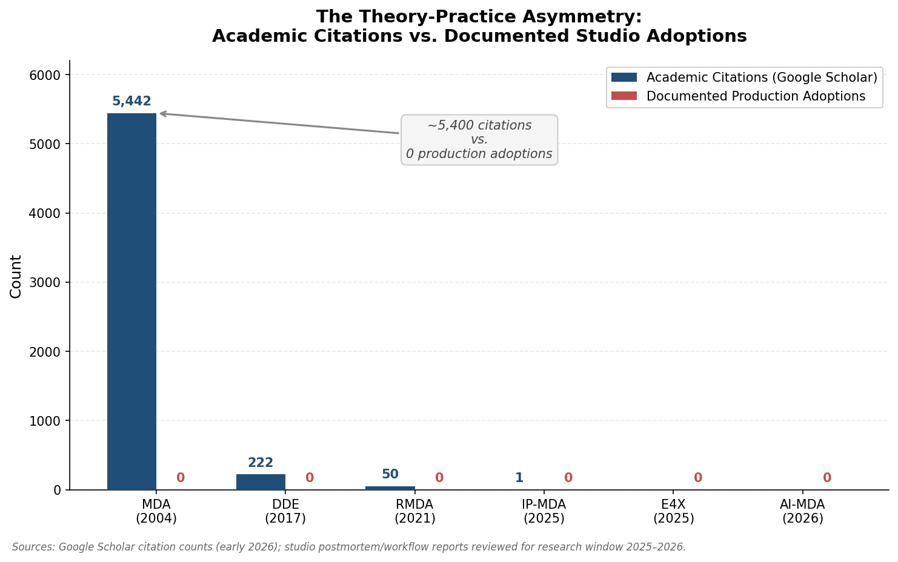

*Figure 6.1. Google Scholar citation counts for six game design frameworks contrasted with the number of documented production adoptions (zero for all frameworks), illustrating the core asymmetry between academic influence and studio practice. Data as of early 2026.*

### The RMDA Diagnosis

Junior and Silva's RMDA paper (2021) articulated the problem with unusual directness: MDA, despite being widely taught in universities, is "not in use in the games' industry for helping game design work" as a direct production tool [RMDA](https://www.mdpi.com/2078-2489/12/10/395 "Junior & Silva 2021, MDPI Information"). Their analysis attributed this non-adoption to three structural deficiencies: inconsistent definitions of mechanics that confuse system-level algorithms with player-facing affordances; a dynamics layer that lacks systematic categorization of emergent behavior types; and an aesthetics taxonomy that lacks theoretical grounding and is neither exhaustive nor mutually exclusive. These deficiencies, the authors argued, render MDA serviceable for retrospective analysis and classroom instruction but insufficiently precise for the iterative, collaborative, and highly contextual demands of commercial game production.

Walk's earlier critique (2015) identified a complementary production-facing problem: MDA's terminology creates friction in actual team communication. His observation that "90% of MDA 'mechanics' are not actually mechanical" — that graphic style, sound design, narrative structure, and other elements classified under mechanics in MDA are in fact aesthetic design decisions — pointed to a vocabulary mismatch between how the framework categorizes design elements and how production teams discuss and partition their work [Walk 2015](https://www.gamedeveloper.com/design/from-mda-to-dde "From MDA to DDE"). When a framework's core vocabulary fails to align with how practitioners naturally describe their activities, adoption encounters a fundamental communication barrier.

### A Parallel Effort: Compiling Mechanics for Practice

A recent effort to bridge this gap takes a different approach from framework revision. Albuquerque and Vianna dos Santos (2025) proposed a theoretical model that compiles and organizes hundreds of individual game mechanics into a structured reference, arguing that existing frameworks "frequently offer high-level conceptual frameworks" that "lack the granularity necessary to support the practical needs of designers who must identify, understand, and apply specific mechanics in diverse game development contexts" [Albuquerque & Vianna dos Santos, ECGBL 2025](https://papers.academic-conferences.org/index.php/ecgbl/article/view/4172 "DOI: 10.34190/ecgbl.19.2.4172, pp. 941–947"). The model aims to serve both as a creative ideation tool for professional designers and as a pedagogical structure for game design education. This granularity-focused approach implicitly concedes a critical premise: that MDA-level abstraction is too coarse for production use, and that practitioners require lower-level, more directly actionable design vocabularies.

## 6.2 What Designers Actually Do: Ethnographic Evidence

### Grounded Theory from Practitioner Interviews

The most methodologically rigorous empirical window into designer practice within the research period comes from Cormio et al. (2024), who conducted grounded-theory analysis of semi-structured interviews with eleven professional game designers. Published in *Design Studies* (Vol. 91–92), the study identified a core organizing principle of professional design practice: "Balancing Permanence and Change" [Cormio et al. 2024](https://u-pad.unimc.it/retrieve/ac7f7535-fefb-4d56-b833-4b94d108b9fd/Cormio_Exploring-Game-Design_2024.pdf "Design Studies 91–92").

Permanence, in the designers' accounts, manifests through fixed procedural steps — concept development, feasibility assessment, planning, prototyping, and playtesting — and through the anchoring role of a stable creative vision that persists across iteration cycles. Change manifests through continuous iteration, collaborative negotiation among team members with different disciplinary perspectives, and responsiveness to playtest feedback. The tension between these two forces, rather than any formal framework, constitutes the organizing structure through which designers navigate the design space.

The finding most relevant to this chapter's central question is what the interviews did *not* reveal: none of the eleven participants explicitly named MDA, DDE, the Elemental Tetrad, or any other formal framework as a tool they actively use in daily practice. The concepts underlying these frameworks — the distinction between rules and player experience, the importance of iterative testing, the recognition that mechanics produce emergent behavior — appeared in the designers' vocabulary as internalized intuitions rather than as references to specific theoretical sources. Cormio et al. characterized this as "designerly ways of knowing," a term borrowed from design studies to describe knowledge that is embodied, situated, and tacit rather than explicit and propositional.

The sample size (n=11) constrains the generalizability of this finding, and no large-scale quantitative survey of framework usage among professional designers has been identified within the research window. Nonetheless, the qualitative depth afforded by the grounded-theory method, combined with the consistency of the finding across all eleven participants, lends it considerable weight as an indicator of prevailing practice.

### Autoethnographic Testimony: Theory as Retrospective Lens

Complementary evidence comes from Rahbek's "Beyond the Rulebook" (DiGRA 2025), a seventeen-page autoethnographic account of a designer-scholar's first-person design process. Rahbek, affiliated with Kolding School of Design, documents the development of a game from initial concept through iterative prototyping, reflecting on the role — or conspicuous absence — of formal theory throughout [Rahbek 2025](https://dl.digra.org/index.php/dl/article/download/2443/2436/2472 "DiGRA 2025, full text").

The paper's central finding is that academic frameworks (specifically Sicart's mechanics ontology, Salen and Zimmerman's rules-play-culture model, and Caillois's play categories) did not answer what Rahbek identifies as the designer's fundamental question: "how do you know what to do to make a good game?" Key design breakthroughs in the documented process emerged from intuitive leaps — Rahbek describes receiving a movement-mechanic insight while playing guitar, a moment structurally analogous to the Tetris-like falling-block mechanic that became the game's core — rather than from systematic framework application.

Theory did play a role, but a circumscribed one: it functioned as a retrospective analytical tool. After arriving at design decisions through intuition, prototyping, and playtesting, Rahbek found that frameworks such as Juul's rules–fiction distinction and Sicart's aesthetics of rules provided useful language for *explaining* and *justifying* those decisions after the fact. The frameworks served, in Rahbek's account, as "lenses" through which completed design choices could be examined and communicated — not as generative instruments that produced those choices.

This distinction — between frameworks as analytical lenses and frameworks as design generators — aligns precisely with the limitation identified in Chapter 1 as one of MDA's six recognized shortcomings: its orientation toward analysis rather than production. The autoethnographic evidence suggests that this critique is not merely a theoretical observation but an accurate description of how even theoretically literate designers experience the relationship between frameworks and their practice.

## 6.3 Practitioner Discourse: GDC 2025–2026

### Creative Sobriety over Formal Frameworks

The Game Developers Conference remains the preeminent venue where practitioner design knowledge is articulated and transmitted. GDC 2025 and 2026 together provide a substantial corpus of design-track talks through which to assess the standing of formal frameworks in professional discourse.

At GDC 2025, Fawzi Mesmar — Vice President of Editorial at Ubisoft, with over twenty years of experience across DICE, King, Gameloft, and Atlus — delivered "Creative Sobriety: On Originality in Game Development," advocating for deep self-awareness regarding one's creative influences as the path to genuine originality [GDC Vault](https://gdcvault.com/play/1035110/Creative-Sobriety-On-Originality-in "Mesmar GDC 2025") [Game Developer](https://www.gamedeveloper.com/design/achieving-creative-sobriety-in-game-design "March 2025"). Mesmar's design philosophy, articulated from a position of senior industry authority, made no reference to MDA, DDE, the Elemental Tetrad, or any other formal framework. The methodology he advocated was introspective and experiential — understanding one's own relationship to games and creative influences — rather than systematic or framework-driven.

This stance is consistent with a pattern observable across the GDC design track more broadly. Other prominent 2025 design-track sessions included presentations on mass-audience RPG design for *Honkai: Star Rail*, accessibility balancing in *Prince of Persia: The Lost Crown*, and studio culture case studies from Jesse Schell's studio. In each case, the knowledge transmitted was contextual, project-specific, and rooted in production experience rather than in the application of generalized theoretical frameworks.

### The "Rules of the Game" Format as Implicit Theory Transfer

One GDC format warrants particular attention for the light it sheds on how design knowledge actually circulates among practitioners. The "Rules of the Game" series, running annually from 2015 through 2026, invites five designers to each share a single, specific design principle derived from their practice. The 2026 edition was hosted by Richard Rouse III (FarBridge) and Xalavier Nelson Jr. (Strange Scaffold) [GDC Schedule](https://schedule.gdconf.com/search/king "2026 Rules of the Game").

The format is significant because it represents a natural bridging mechanism between tacit design knowledge and communicable principles. Each "rule" is, in effect, a micro-theory — a distilled proposition about how some aspect of game design works, derived inductively from production experience rather than deductively from a theoretical framework. The format implicitly acknowledges that the most valued form of design knowledge in the professional community takes the shape of contextually grounded heuristics rather than comprehensive theoretical systems.

### Schell Games: The Framework Creator's Studio in Practice

A particularly revealing case emerges from the GDC 2026 presence of Schell Games — the studio founded by Jesse Schell, creator of the Elemental Tetrad (Mechanics, Story, Aesthetics, Technology). Schell Games' GDC 2026 presentations focused on practical studio management topics: "Three P's of Passion" and "Leadership as a Service," addressing team dynamics, creative leadership, and organizational culture [Schell Games](https://schellgames.com/blog/gdc-2026-schell-games "Schell Games GDC 2026 blog").

The choice of topics is instructive. Even the studio most directly associated with a formal design framework elected to present on management and leadership rather than on framework application. This does not demonstrate that the Elemental Tetrad is absent from Schell Games' internal practice — the studio's internal processes are not publicly documented in sufficient detail to support such a determination — but it does indicate that, in the most visible professional forum available, framework promotion was not the studio's priority. The signal aligns with the broader pattern: studios present what they consider their most valuable, differentiating knowledge, and that knowledge concerns production craft, team dynamics, and project-specific insights rather than theoretical framework application.

### GDC 2026: Structural Shifts in Design Discourse

GDC 2026, rebranded as the "GDC Festival of Gaming," comprised over 700 sessions. A structural observation about the conference's evolution bears directly on the theory-practice question: design-focused content has become increasingly distributed across specialized summits — including the AI Summit, Indie Games Summit, and production-focused tracks — rather than concentrated within a dedicated design track. This fragmentation mirrors the broader fragmentation of game design theory noted in Chapter 2: as the field's challenges diversify (live service, UGC platforms, AI integration, accessibility compliance), the design conversation diversifies with them, rendering any single unifying framework less likely to capture the full scope of professional discourse.

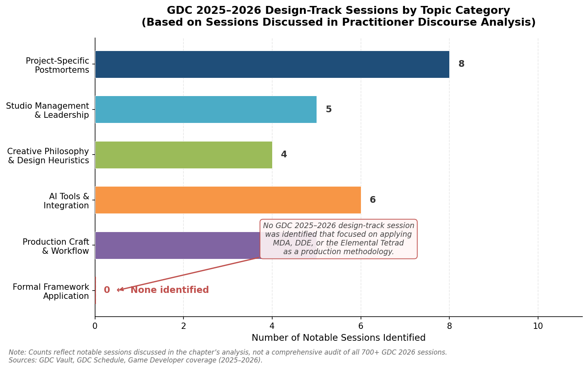

*Figure 6.2. Distribution of notable GDC 2025–2026 design-track sessions by topic category. Zero sessions were identified as focusing on formal framework application — a pattern consistent with the theory-practice gap observed across other evidence sources. Counts reflect sessions discussed in the practitioner-discourse analysis, not the full 700+ conference program. Sources: GDC Vault, GDC Schedule, and Game Developer coverage (2025–2026).*

## 6.4 AI Tools in Design Workflows: Tool-Driven, Not Framework-Driven

### The Pragmatic Integration Pattern

Chapter 3 documented the rapid integration of generative AI into game development workflows. This section examines that integration specifically through the lens of framework adoption — asking whether AI tools are being incorporated into production through formal design frameworks or through pragmatic, tool-first approaches.

The evidence strongly favors the latter. The GDC 2026 State of the Game Industry survey (2,300+ respondents, self-selected sample) found that among developers using AI, 81% employed it for research and brainstorming, while only 5% used it for player-facing features [GDC 2026 — GamesIndustry.biz](https://www.gamesindustry.biz/gdc-survey-reveals-layoffs-up-6-36-of-industry-using-ai-and-overwhelming-support-for-unionisation-in-the-us "GDC 2026 survey"). This usage pattern — overwhelmingly concentrated in pre-production ideation rather than distributed across the Mechanics-Dynamics-Aesthetics pipeline — suggests that AI tools are being adopted as general-purpose productivity aids rather than as components of a framework-guided design process.

Inworld AI's production integration philosophy exemplifies this tool-first approach. As documented in GDC 2025 presentations, Inworld's strategy involves embedding an AI runtime directly into game engines, instrumenting it with telemetry, and iterating on NPC behavior through empirical testing rather than theoretical specification. The resulting workflow cycle — integrate runtime → generate NPC behavior → measure player response via telemetry → iterate — resembles the data-driven feedback loops described in Chapter 4 far more closely than it resembles the application of a design framework [Inworld AI — WCCFTech](https://wccftech.com/inworld-ai-gdc-2025-qa-aaa-games-want-to-be-secret-but-theres-going-to-be-large-titles-announced/ "GDC 2025 CEO interview").

### AI-Enhanced MDA: The Exception That Confirms the Pattern

The sole identified attempt within the research period to integrate AI into a formal design framework is Wen and Chu's AI-enhanced MDA, published in *Research in Learning Technology* (Vol. 34, 2026). This proposed framework positions AI as a constitutive design axis across MDA's three layers — generative AI for dynamic rule and level creation (Mechanics), adaptive learning algorithms for personalized difficulty (Dynamics), and PCG for algorithmic content generation affecting player experience (Aesthetics) [Wen & Chu 2026](https://journal.alt.ac.uk/index.php/rlt/article/view/3746 "Research in Learning Technology, Vol. 34"). The framework addresses the multi-directional, overlapping nature of AI-MDA layer interactions, contrasting them with the original framework's linear mapping.

AI-enhanced MDA remains, however, a conceptual proposal without empirical validation or documented studio adoption. Its publication in an educational technology journal rather than a game development venue, and its focus on educational game contexts rather than commercial production, further circumscribe its relevance to the question of how mainstream studios integrate AI into design workflows. The proposal demonstrates that academics recognize the need to incorporate AI into formal frameworks, but the absence of uptake underscores the broader pattern: production studios adopt AI tools pragmatically, without waiting for — or apparently requiring — theoretical frameworks to guide that adoption.

## 6.5 What the Gap Reveals: Frameworks as Infrastructure, Not Instruments

### The Absorption Hypothesis

The evidence assembled in this chapter supports a specific interpretation of the theory-practice gap: formal game design frameworks function not as instruments directly applied in production but as *conceptual infrastructure* — vocabulary, categories, and analytical habits that are absorbed into designers' tacit knowledge during education and early career development, then deployed implicitly rather than explicitly in professional practice.

This interpretation reconciles several otherwise contradictory observations. MDA's 5,400+ citations reflect genuine influence on how the field conceptualizes games — the tripartite distinction between rules, emergent behavior, and player experience has become so widely internalized that it functions as a default analytical reflex rather than a conscious theoretical choice. The absence of explicit framework adoption in production does not indicate that frameworks exert no effect; rather, their effect operates at the level of shared vocabulary and conceptual orientation rather than at the level of prescribed methodology.

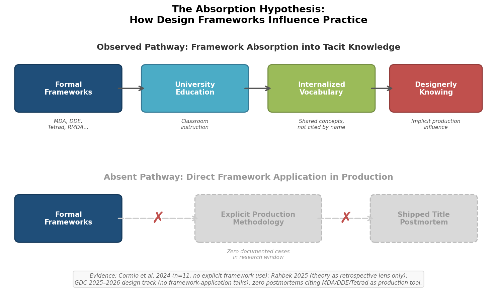

*Figure 6.3. The absorption hypothesis contrasts two pathways of framework influence. The observed pathway (top) shows frameworks absorbed through education into tacit "designerly knowing." The absent pathway (bottom) — direct application as explicit production methodology — yielded zero documented cases in the research window. Evidence from Cormio et al. (2024), Rahbek (2025), and GDC 2025–2026 design-track analysis supports this model.*

Cormio et al.'s finding that designers' language "echoes" MDA-style concepts without referencing MDA by name supports this reading directly. The framework has been absorbed into what the design-studies literature calls "designerly ways of knowing" — a form of knowledge that is embodied in practice rather than articulated as theory [Cormio et al. 2024](https://u-pad.unimc.it/retrieve/ac7f7535-fefb-4d56-b833-4b94d108b9fd/Cormio_Exploring-Game-Design_2024.pdf "Design Studies 91–92"). Rahbek's autoethnographic testimony that theory functions as a retrospective lens rather than a prospective guide provides the first-person complement to this third-person observation.

### Framework Applications That Do Exist — and Their Character

The few instances of explicit framework application identified within the research window share a revealing characteristic: they are academic exercises in retrospective analysis, not production workflow documentation. IP-MDA (Eom et al., FDG 2025) applied its proposed framework to the Korean horror game *White Day* as a design case study, but this was a post-hoc academic demonstration rather than a record of how the game was actually developed [IP-MDA — ACM DL](https://dl.acm.org/doi/10.1145/3723498.3723769 "ACM Digital Library, FDG 2025"). RMDA's case analyses of *Diablo III*'s auction house, *League of Legends*' dodge mechanic, and *BioShock Infinite*'s aesthetic imbalance similarly function as retrospective diagnostic exercises — deploying the framework to explain observed design problems, not to document how a framework guided design decisions during development [RMDA](https://www.mdpi.com/2078-2489/12/10/395 "Junior & Silva 2021").

This pattern is consistent with MDA's original design intent. Hunicke, LeBlanc, and Zubek positioned MDA as "a formal approach to game design and game research" — an analytical tool for understanding games, not a prescriptive methodology for building them [MDA Original](http://www.cs.northwestern.edu/~hunicke/MDA.pdf "Hunicke, LeBlanc & Zubek 2004"). The gap between theoretical aspiration and production use may thus reflect not a failure of adoption but an accurate reception of the framework's actual capabilities.

### The Contrast with Practitioner-Originated Formalizations

An instructive contrast emerges between the adoption trajectory of academic frameworks and that of formalizations originating within production practice. The template-driven live-ops discipline described in Chapter 5 — with its modular event structures, reusable reward ladders, and cross-game performance benchmarks — constitutes an effective formalization of the Mechanics-Dynamics-Aesthetics chain at a granularity far below MDA's abstraction level. Each event template is, in effect, a validated mechanics module expected to produce specific dynamics (engagement patterns) targeting specific aesthetics (progression satisfaction, competitive excitement).

Similarly, the telemetry-driven feedback loops examined in Chapter 4 — where GameAnalytics processes 27 billion daily events across 100,000+ games, and studios iterate mechanics based on observed dynamics and inferred aesthetic responses — represent a practitioner-developed operationalization of the MDA causal chain. These production-native formalizations succeed precisely where academic frameworks struggle: they are embedded in existing tools and workflows, expressed in the language teams already use, and validated by measurable outcomes rather than by theoretical arguments.

The implication is that the game industry has not failed to formalize its design knowledge — it has formalized that knowledge in forms that academic frameworks do not recognize as formalization. Production templates, telemetry dashboards, A/B testing protocols, and design-pattern libraries constitute a parallel formalization tradition that is practitioner-originated, tool-embedded, and empirically validated. The theory-practice gap, viewed from this angle, is partly an artifact of seeking academic-style framework adoption when the relevant formalization has taken a fundamentally different form.

### Quantitative Evidence: An Acknowledged Absence

A significant limitation of this chapter's analysis is the absence of large-scale quantitative data on framework usage among professional designers. No survey has been identified within the research window that directly asks a representative sample of game designers whether they use MDA, DDE, the Elemental Tetrad, or other formal frameworks in their work. Cormio et al.'s qualitative study (n=11) is the closest available proxy, and its sample size precludes statistical generalization. The RMDA paper's assertion that MDA is "not in use in the games' industry" is stated as a premise rather than supported by survey evidence. Future research explicitly surveying framework adoption — modeled, perhaps, on the annual GDC State of the Game Industry survey format — would substantially strengthen the empirical foundation of the claims advanced in this chapter.

# 第7章 Synthesis and Future Directions

The preceding six chapters have traced game design theory from its MDA foundations through a proliferating family of successor frameworks, the disruptive arrival of generative AI, the maturation of data-driven player modeling, the structural expansion of live-service and UGC paradigms, and the persistent gap between academic formalization and studio practice. This concluding chapter synthesizes those threads into a coherent assessment of where the field stands as of mid-2026. It identifies five defining tensions that characterize the current theoretical landscape, maps three convergences that are reshaping design practice faster than theory can accommodate, surveys six research frontiers that remain substantively under-explored, and evaluates the structural viability of a unified MDA successor. The analysis is grounded in the evidence assembled throughout this report; where it ventures into forward-looking assessment, it does so on the basis of documented trajectories rather than speculative projection.

## 7.1 Five Core Tensions Defining the Theoretical Landscape

The current state of game design theory is best understood not as a unified field advancing along a single axis but as a domain shaped by five interlocking tensions — structural contradictions that resist simple resolution and that together define the intellectual terrain any future framework must navigate. Figure 7-1 visualizes each tension as a spectrum, with annotated data points indicating where the balance of evidence falls as of mid-2026.

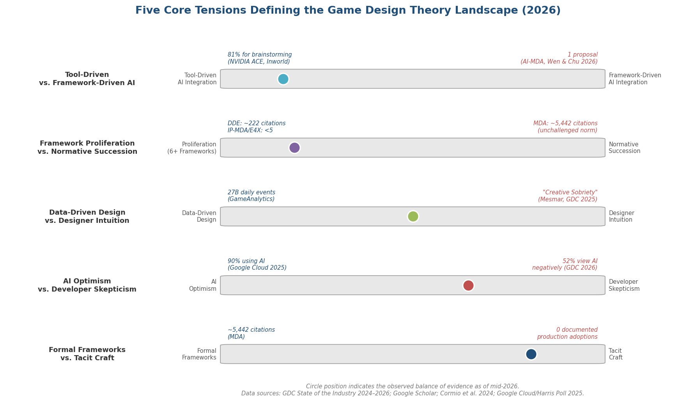

*Figure 7-1. The five structural tensions shaping game design theory as of mid-2026. Dot positions indicate the observed balance of evidence for each tension, drawn from data reported in Chapters 1–6.*

### Formal Frameworks versus Tacit Craft

The most fundamental tension documented throughout this report is the disjunction between the academic production of formal design frameworks and the tacit, experiential knowledge that governs actual studio practice. MDA has accumulated approximately 5,442 Google Scholar citations as of early 2026, establishing it as the most-cited paper in game design theory [MDA Original](http://www.cs.northwestern.edu/~hunicke/MDA.pdf "Hunicke, LeBlanc & Zubek 2004"). Yet no published studio postmortem, GDC talk, or workflow report within the research window documents the explicit use of MDA, DDE, or the Elemental Tetrad as a production methodology for a shipped title (Chapter 6). Cormio et al.'s grounded-theory study (2024, n=11 professional designers) found that none of the interviewed designers named any formal framework as a tool they actively use, even as their vocabulary "echoed" MDA-style conceptual distinctions [Cormio et al. 2024](https://u-pad.unimc.it/retrieve/ac7f7535-fefb-4d56-b833-4b94d108b9fd/Cormio_Exploring-Game-Design_2024.pdf "Design Studies 91–92"). Rahbek's autoethnographic account (DiGRA 2025) corroborated this pattern, characterizing theory as a "retrospective lens" for explaining completed design decisions rather than a generative instrument that produces them [Rahbek 2025](https://dl.digra.org/index.php/dl/article/download/2443/2436/2472 "DiGRA 2025, full text").

The pattern is not merely an adoption failure. The "absorption hypothesis" advanced in Chapter 6 holds that frameworks operate as conceptual infrastructure — absorbed during education and early career development into the tacit repertoire of "designerly ways of knowing," then deployed implicitly rather than referenced explicitly in production. This hypothesis reconciles MDA's citation prominence with its production invisibility, but it also carries an uncomfortable implication for framework developers: a framework's success may be inversely correlated with its visible adoption, because successful conceptual vocabulary ceases to be recognized as such once it has been fully internalized.

### AI Optimism versus Developer Skepticism

The second tension runs through the industry's relationship with generative AI. The GDC State of the Industry survey (2,300+ self-selected respondents) documents the steepest three-year sentiment shift in the survey's history: the proportion of developers viewing generative AI negatively rose from 18% in 2024 to 30% in 2025 to 52% in 2026, while positive views declined from roughly 20% to 13% to 7% over the same period [GDC 2026 — GamesIndustry.biz](https://www.gamesindustry.biz/gdc-survey-reveals-layoffs-up-6-36-of-industry-using-ai-and-overwhelming-support-for-unionisation-in-the-us "GDC 2026 survey"). Opposition was strongest among visual and technical artists (64%), game designers and narrative developers (63%), and programmers (59%).

Counterpoint data from the Google Cloud/Harris Poll survey (August 2025, n=615 developers, commissioned methodology) reported that 90% of developers were already using AI in their workflows and 97% believed generative AI was reshaping the industry [Google Cloud Survey](https://www.googlecloudpresscorner.com/2025-08-18-90-of-Games-Developers-Already-Using-AI-in-Workflows,-According-to-New-Google-Cloud-Research "Google Cloud press release, August 2025"). The apparent contradiction dissolves when use is distinguished from endorsement: developers adopt AI tools pragmatically — 81% for research and brainstorming — while simultaneously expressing deep concern about the technology's implications for creative authorship, employment, and data ownership. The field is not divided between AI users and AI resisters; practitioners are simultaneously using and distrusting the same technology, a posture that Alqahtani (2025) characterized as a shift from "authorship" to "curation" [Alqahtani 2025](https://www.mdpi.com/2079-3200/13/6/60 "MDPI Journal of Intelligence").

### Data-Driven Design versus Designer Intuition

The third tension concerns the relationship between empirical data and creative judgment. The scale of contemporary telemetry infrastructure is now formidable: GameAnalytics processes 27 billion daily events across 100,000+ games [GameAnalytics](https://www.gamesindustry.biz/from-data-to-decisions-heres-how-gameanalytics-iq-suite-will-power-the-next-era-of-game-growth "GameAnalytics IQ Suite, 2025"); Quantic Foundry's longitudinal dataset encompasses 1.92 million player profiles collected between 2015 and 2026 [Quantic Foundry](https://quanticfoundry.com/evolution-of-play/ "Evolution of Play, 2026 report"). DDA systems using reinforcement learning, Bayesian models, and LLM-based profiling (Souza et al., SBGames 2025; GPT-4o correctness 4.044/5.0) can adjust game parameters in real time based on observed player behavior [Souza et al. 2025](https://sol.sbc.org.br/index.php/sbgames/article/view/37373 "LLM-based player modeling, SBGames 2025").

Yet the practitioner discourse reveals a countervailing commitment to intuition-driven design. Fawzi Mesmar's "Creative Sobriety" talk (GDC 2025) advocated for deep self-awareness about creative influences — an introspective methodology that stands in deliberate contrast to data-driven optimization [GDC Vault](https://gdcvault.com/play/1035110/Creative-Sobriety-On-Originality-in "Mesmar GDC 2025"). The "Rules of the Game" series, running annually from 2015 through 2026, transmits design knowledge as practitioner-derived heuristics rather than as data-backed propositions. The tension, therefore, is not between data and intuition as competing approaches but between data as a feedback mechanism and intuition as a direction-setting faculty — a division of labor that existing frameworks have not theorized.

### Framework Proliferation without Succession

The fourth tension is structural. The field has produced at least six post-MDA frameworks (DPE, DDE, RMDA, IP-MDA, E4X, and the Xu et al. agency-autonomy model) since 2008, yet none has approached MDA's normative status. DDE, the most cited alternative, has accumulated approximately 222 Google Scholar citations — roughly 4% of MDA's total [DDE — Game Developer](https://www.gamedeveloper.com/design/from-mda-to-dde "Walk 2015"). IP-MDA (Eom et al., FDG 2025) and E4X (Grace, DiGRA 2025), both proposed within the past year, have minimal citation histories. Each successor addresses genuine limitations of MDA — DDE dismantles the mechanics catch-all, RMDA applies object-oriented redefinition, DPE adds learning and technology layers, IP-MDA integrates transmedia worldbuilding, E4X models persuasive-game dynamics — but each also narrows its scope in ways that preclude general adoption. The result is a landscape of specialized proposals with overlapping yet non-identical ambitions, communicating with each other primarily through their shared critique of MDA rather than through convergent theoretical development.

### Tool-Driven versus Framework-Driven AI Integration

The fifth tension concerns how AI is entering design practice. Studio adoption of AI is overwhelmingly tool-driven: developers integrate NVIDIA ACE for autonomous NPC behavior, Inworld AI for runtime dialogue, or LLM APIs for brainstorming, selecting tools based on capability and integration cost rather than on alignment with any theoretical framework. The sole identified attempt to integrate AI into a formal framework — Wen and Chu's proposed AI-enhanced MDA (2026) — remains a conceptual proposal without empirical validation or documented studio uptake [Wen & Chu 2026](https://journal.alt.ac.uk/index.php/rlt/article/view/3746 "Research in Learning Technology, Vol. 34"). The gap between how AI enters practice (pragmatically, tool by tool) and how theory proposes it should enter (systematically, layer by layer) mirrors the broader theory-practice divide, compounded by the additional difficulty that the technology itself evolves faster than any framework-level formalization can track.

## 7.2 Three Emergent Convergences

Against the backdrop of these tensions, three convergences are reshaping game design practice in ways that carry significant implications for future theoretical development.

### AI, Player Modeling, and the Operationalization of MDA's Dynamics Layer

The most consequential convergence involves the fusion of AI-driven player modeling, real-time telemetry, and adaptive game systems into empirical feedback loops that effectively operationalize MDA's Dynamics layer — the layer that the original framework left least specified. MDA defined Dynamics as "the runtime behavior of the mechanics acting on player inputs and each other's outputs" but provided no systematic categorization of dynamic phenomena and no mechanism for empirically observing or measuring them.

The technologies surveyed in Chapters 3 and 4 now supply that mechanism. LLM-based player profiling (Souza et al., SBGames 2025) generates real-time Bartle-type classifications from interaction data with a correctness score of 4.044/5.0, with an observed hallucination rate of 18% [Souza et al. 2025](https://sol.sbc.org.br/index.php/sbgames/article/view/37373 "SBGames 2025"). The EDDA system (Ma & Gao, Applied Sciences 2025) directly incorporates churn tendencies into difficulty adjustment, yielding statistically significant improvements in play duration and Game Experience Questionnaire scores across seven game genres (Friedman χ²(2) = 14, p < 0.001, n = 100) [EDDA](https://www.mdpi.com/2076-3417/15/10/5610 "MDPI Applied Sciences 2025"). Multimodal player classification (ACM Mensch und Computer 2025) integrates behavioral telemetry, biometric sensors (heart rate, blood oxygen), and personality traits, achieving statistically significant cluster differentiation on reaction time (p = 0.036), stress levels (p = 0.00014), and firing frequency (p = 5.6 × 10⁻⁶) [ACM MuC 2025](https://dl.acm.org/doi/10.1145/3743049.3743070 "Multimodal player classification"). Quantic Foundry's motivational model, validated across 1.92 million player profiles, provides the population-level dimensional structure within which individual-level modeling operates [Quantic Foundry](https://quanticfoundry.com/evolution-of-play/ "Evolution of Play, 2026 longitudinal report").

Collectively, these developments mean that MDA's Dynamics layer — once the most abstract and least actionable tier of the framework — is becoming the most empirically grounded. Telemetry captures actual player behavior (Dynamics); analytics infer experiential quality (Aesthetics, proxied by retention, session length, and increasingly by biometric signals); and AI-driven systems modify rules and parameters (Mechanics) in response. The MDA causal chain, conceived in 2004 as a unidirectional analytical abstraction, is being realized in 2026 as a closed-loop, data-mediated feedback system — not because the framework prescribed this operationalization, but because the technology has independently converged on the architecture the framework described.

### UGC, Modding, and the Dissolution of the Designer-Player Binary

A second convergence is collapsing the distinction between designer and player that MDA's bidirectional causal chain takes as axiomatic. MDA presumes two discrete roles: a designer who authors Mechanics and a player who experiences Aesthetics, linked through the mediating layer of Dynamics. The UGC economies analyzed in Chapter 5 challenge this binary at scale.

Naavik's 2026 State of UGC Games report documents combined developer revenue of approximately $2.2 billion across the Roblox, Fortnite, and Overwolf ecosystems (+47% year-over-year). Roblox alone disbursed $1.5 billion to developers in 2025 (+70%), with the top 1,000 creators earning an average of $1.3 million annually [Naavik 2026](https://naavik.co/deep-dives/the-state-of-ugc-games-2026/ "State of UGC Games 2026"). The mod.io/GameDiscoverCo UGC Impact Study (approximately 1,200 Steam titles) found that games supporting user-generated content enjoy a +31% revenue advantage after five years, +115% concurrent-player retention, and +105% median DLC revenue compared to non-UGC titles [UGC Impact Study](https://blog.mod.io/ugc-impact-study-2025-066a5a0163d5 "UGC Impact Study 2025").

These figures describe an ecosystem in which hundreds of thousands of player-creators author Mechanics (game rules, levels, interactive systems) for millions of player-consumers. The MDA chain does not disappear in this context — each UGC experience still involves mechanics producing dynamics producing aesthetics — but its foundational assumption of a single authorial agent no longer holds. A Roblox experience may involve platform-level Mechanics authored by Roblox Corporation, game-level Mechanics authored by a creator, and in-game modifications contributed by players, each producing overlapping and potentially conflicting Dynamics. Neither MDA nor the post-MDA alternatives surveyed in Chapter 2 have developed the theoretical vocabulary for this nested, multi-agent authorship structure.

### The "Curation Rather Than Authorship" Paradigm

A third convergence links the AI-curation dynamic with the UGC-creation dynamic into what may prove to be the defining paradigm shift of the current period. Alqahtani's mixed-methods study (2025) found that 90.5% of surveyed game developers used generative AI for creative ideation and brainstorming, while over 60% expressed concern that AI use reduces creative originality [Alqahtani 2025](https://www.mdpi.com/2079-3200/13/6/60 "MDPI Journal of Intelligence"). Ratican and Hutson (2024) formalized this shift as "Game Dev 3.0" — a mode of production in which the designer's primary role is selecting, refining, and combining AI-generated outputs rather than creating content from first principles.

This curatorial role converges with UGC platform dynamics, where designers of successful creator tools increasingly function as architects of possibility spaces rather than authors of specific experiences. Epic's Unreal Editor for Fortnite (UEFN), Roblox Studio, and the production-ready PCG framework in Unreal Engine 5.7 all position the professional designer as someone who builds systems that enable others — including AI agents and player-creators — to produce content. The designer-as-curator paradigm implies a theoretical reorientation: from frameworks that model what a designer *creates* to frameworks that model what a designer *enables*.

## 7.3 Under-Explored Research Frontiers

The literature reviewed across the preceding chapters has identified six research frontiers where substantive theoretical work is either absent or in its earliest stages. These are not speculative wish-list items but areas where the surveyed evidence documents an active need that existing frameworks fail to address. Figure 7-2 maps these frontiers against the existing framework family, indicating the degree of conceptual coverage and each frontier's maturity stage.

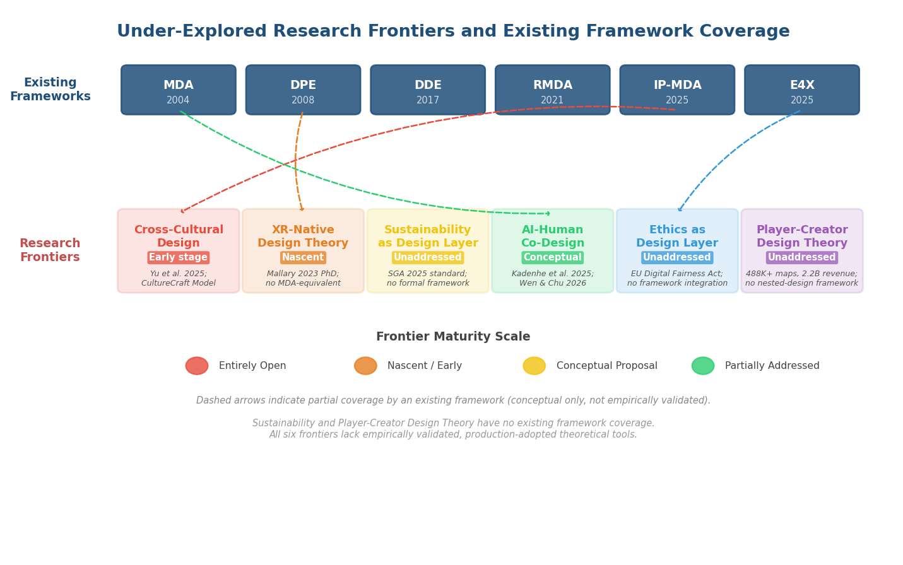

*Figure 7-2. Six under-explored research frontiers positioned relative to the MDA-lineage framework family. Dashed arrows indicate partial conceptual coverage; maturity badges reflect each frontier's current development stage as of mid-2026.*

### Cross-Cultural Game Design Frameworks

Game design theory has developed almost entirely within Anglo-American and Northern European academic traditions, yet the global player base demands frameworks that account for cultural variation in aesthetic preferences, narrative expectations, and interaction norms. Yu et al. (*Games and Culture*, 2025) proposed a "Cultural Affordance and Reception" three-dimensional framework using *Genshin Impact* as a case study, analyzing how cultural elements are encoded in design and decoded by players across cultural contexts [Yu et al. 2025](https://journals.sagepub.com/doi/10.1177/15554120251336564 "Cultural Affordance, Games and Culture"). The CultureCraft Model, presented at a DiGRA 2025 workshop, proposed an algorithmic approach to integrating cultural considerations. Neither framework has achieved broad adoption, and no MDA-lineage framework systematically integrates cross-cultural considerations into its layer architecture. As titles such as *Genshin Impact* and *Honkai: Star Rail* demonstrate that culturally inflected design can achieve global commercial success, the absence of cross-cultural theoretical tools represents an increasingly consequential gap.

### XR-Native Design Theory

Despite the growing installed base of VR and mixed-reality headsets — and Meta's GDC 2026 reports on "VR-native" adolescent user cohorts — no equivalent of MDA exists for XR-native design. Mallary's doctoral dissertation (2023) proposed a VR mechanic-to-emotion mapping framework, but validation details remain partially unpublished. The distinctive design challenges of XR — embodied interaction, spatial presence, vestibular comfort constraints, and the blurring of game space and physical space — require theoretical treatment that goes beyond appending a "Technology" layer (as the Elemental Tetrad and DPE do) to fundamentally rethinking how Mechanics, Dynamics, and Aesthetics operate when the player's body constitutes the primary interface.

### Sustainability as a Design Dimension

The Sustainable Games Alliance released its first global game industry emissions reporting framework in October 2025, with over 30 member companies adopting standardized environmental accounting [SGA Standard](https://www.gamesindustry.biz/new-sustainable-games-standard-framework-hopes-to-help-studios-measure-and-reduce-emissions "SGA, Oct 2025"). The IGDA Climate SIG published an Environmental Game Design Playbook. Yet no formal design framework integrates sustainability as a first-class design layer. Live-service models, which demand "intensive, ongoing resource commitment" [Dubois & Chalk](https://journals.sagepub.com/doi/abs/10.1177/13548565241256888 "Convergence 2025"), carry significant computational and energy costs that scale with engagement. The theoretical question of how to model the environmental externalities of design decisions within a framework that also tracks player experience and business viability remains unaddressed in the game design theory literature.

### AI-Human Co-Design Frameworks

Kadenhe et al. (AAAI Summer Symposium 2025) identified three frontiers for AI-human co-design in games: adaptive control mechanisms that balance AI autonomy with designer oversight, "ethical by design" co-creation tools that embed value constraints into AI-assisted workflows, and discipline-specific AI literacy that equips designers to evaluate and direct AI outputs [Kadenhe et al. 2025](https://ojs.aaai.org/index.php/AAAI-SS/article/download/36061/38216 "AAAI Summer Symposium 2025"). Panchanadikar and Freeman (ACM PACM-HCI, 2024) documented that independent developers perceive generative AI as an "ill-informed co-worker" whose outputs require substantial curation — underscoring the need for theoretical frameworks that model the designer-AI collaborative relationship rather than treating AI as either an autonomous creator or a passive tool [Panchanadikar & Freeman 2024](https://doi.org/10.1145/3611035 "ACM PACM-HCI"). Wen and Chu's proposed AI-enhanced MDA (2026) represents a step in this direction, but its educational-game scope and lack of empirical validation leave the broader co-design question unresolved.

### Ethics as a Formal Design Layer

The accelerating regulatory environment surrounding game design was documented in Chapter 5: the EU's forthcoming Digital Fairness Act targeting dark patterns and addictive design [EU Parliament](https://www.europarl.europa.eu/RegData/etudes/ATAG/2025/767191/EPRS_ATA(2025)767191_EN.pdf "Digital Fairness Act"); the UK Royal Society's finding that the Ukie industry self-regulation on loot boxes is "very poorly complied with and not enforced at all" [Royal Society](https://royalsociety.org/blog/2025/06/video-game-industry-loot-boxes/ "UK self-regulation failure, June 2025"); and multi-jurisdictional enforcement actions against platforms targeting younger users. Yet none of the frameworks in the MDA lineage — MDA, DDE, DPE, RMDA, IP-MDA, or E4X — includes an ethics or regulatory-compliance layer as a formal design dimension. Ethics enters these frameworks, if at all, as an external constraint rather than an integrated design consideration. As regulatory requirements become binding design parameters — mandated disclosure of loot-box probabilities, age-appropriate design obligations, restrictions on exploitative monetization — the absence of ethical formalization in design theory creates a disconnect between what designers are legally required to consider and what their theoretical tools equip them to reason about.

### Player-Creator Design Theory

The 488,000+ Fortnite Creative maps, the $1.3 million average annual revenue of top Roblox creators, and the demonstrated long-term revenue advantages of UGC-supported games collectively attest to a design paradigm in which players function as designers for other players. Existing frameworks model the player as an experience consumer; none models the player-as-creator — the individual who designs within constraints established by a professional designer, whose creations in turn shape the experience of downstream player-consumers. This "nested design" structure — a designer designing for a player-designer designing for a player-consumer — represents a genuine theoretical gap rather than a mere extension of existing models, because it requires formalizing not one but two distinct authorial relationships within a single system.

## 7.4 The Question of Unification

A natural response to the proliferation of frameworks and the accumulation of unaddressed design dimensions would be to call for a unified successor to MDA — a comprehensive framework that integrates AI, player modeling, UGC, ethics, XR, cultural variation, and sustainability into a single coherent architecture. The evidence assembled in this report suggests that such a call, while intellectually appealing, may be structurally inappropriate.

Game design has fragmented into specialized domains — live-service operations, UGC platform economics, XR interaction design, serious and persuasive games, AI-augmented production, accessibility-first design — each with distinct theoretical requirements that a single framework would struggle to satisfy simultaneously. DPE works for serious games precisely because it adds layers irrelevant to entertainment titles. IP-MDA addresses transmedia adaptation by adding a worldbuilding module that pure-systems games do not need. E4X models persuasive-game dynamics through a change-engine metaphor with no clear application to competitive multiplayer. The specialization that limits each framework's scope is also what makes it useful within that scope.

A more informative analogy may be drawn from the evolution of software engineering methodology. That discipline abandoned the pursuit of a single universal development methodology decades ago, settling instead on a toolkit approach — Agile, Scrum, Kanban, DevOps, and domain-specific practices coexisting and selected based on project context rather than theoretical superiority. Lao's systematic review (2025, 74 studies spanning 2020–2025) called for "standardized evaluation frameworks" for AI-driven game design, implicitly acknowledging the absence of shared standards while stopping short of proposing unification [Lao 2025](https://www.researchgate.net/publication/395059979_A_Systematic_Review_of_AI-Driven_Game_Design_and_User_Experience_Research "HSSR Vol. 8 No. 4").

We infer from this evidence that game design theory is entering — or has already entered — a pluralist phase in which the relevant question is not "which framework succeeds MDA?" but "what shared vocabulary and interoperable concepts allow domain-specific frameworks to communicate?" MDA's most durable contribution may prove to be the vocabulary it introduced — the layered decomposition of rules, emergent behavior, and experiential response — rather than the specific three-layer architecture it proposed. The conceptual distinction between what designers author, what systems produce at runtime, and what players experience endures across every successor framework, even as each redraws the boundaries and renames the layers.

## 7.5 A Quadruple Transformation

The convergences, tensions, and gaps surveyed above describe a field undergoing four simultaneous transformations that collectively challenge the foundational assumptions of MDA-era theory. Figure 7-3 visualizes these four shifts and the chapter-sourced evidence that supports each.

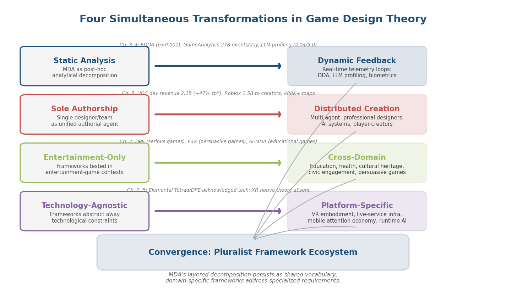

*Figure 7-3. Four concurrent transformations in game design theory, with supporting evidence drawn from Chapters 2–5. Each row traces a shift from an MDA-era assumption to an emerging paradigm, converging on a pluralist framework ecosystem.*

**From static analysis to dynamic feedback.** MDA and its immediate successors were conceived as analytical tools — frameworks for decomposing and understanding games after the fact. The telemetry infrastructure, AI-driven DDA systems, and LLM-based player profiling documented in Chapters 3 and 4 are converting the analytical framework into a live operational loop. The MDA causal chain is no longer merely a conceptual model; it is approximated by real-time systems that measure Dynamics, infer Aesthetics, and modify Mechanics in continuous cycles.

**From sole authorship to distributed creation.** MDA presumes a singular designer (or team functioning as a unified authorial agent) working "forward" through the Mechanics-Dynamics-Aesthetics chain. The UGC economies documented in Chapter 5, the AI co-creation paradigm described in Chapter 3, and the player-creator ecosystem growing across Roblox and Fortnite distribute authorship across professional designers, AI systems, and player-creators operating at different levels of the design stack. Future frameworks must therefore model multiple concurrent authorial agents with different levels of system access and different design objectives.

**From entertainment-only theory to cross-domain application.** MDA was formulated as a general game design framework but was tested and cited primarily in entertainment-game contexts. The extensions surveyed in Chapter 2 — DPE for serious games, E4X for persuasive games, AI-enhanced MDA for educational games — collectively reveal that the most productive theoretical development is occurring at the boundaries between games and adjacent domains: education, health, cultural heritage, civic engagement. Cross-domain design theory requires frameworks that accommodate not only player experience but also learning outcomes, behavioral change, cultural transmission, and therapeutic effect — objectives that coexist with but are not reducible to the eight aesthetic categories MDA proposed.

**From technology-agnostic frameworks to platform-specific theory.** MDA's architecture is deliberately technology-agnostic — it does not distinguish between board games, console titles, VR experiences, and mobile free-to-play products. This agnosticism was a strength when the primary analytical task was identifying shared structures across game types. It becomes a limitation when critical design decisions involve VR-specific embodiment mechanics, live-service infrastructure requirements, mobile attention-economy constraints, or the computational cost of runtime AI. The Elemental Tetrad's Technology layer and DPE's Technology foundation acknowledged this limitation at a high level of abstraction; the field now requires platform-specific theoretical tools that engage with the material constraints of specific delivery architectures.

These four transformations do not invalidate MDA or render its contributions obsolete. The framework's core insight — that games can be productively analyzed as layered systems connecting authored rules to emergent behavior to player experience, and that designers and players traverse this structure in opposite directions — remains as sound in 2026 as it was in 2004. What has changed is the complexity of the design landscape: more authorial agents, more delivery platforms, more regulatory constraints, more data-driven feedback mechanisms, and a broader range of design objectives than any single model conceived two decades ago could reasonably have anticipated.

The field's theoretical future lies not in replacing MDA with a more comprehensive monolith but in developing an ecosystem of interoperable, domain-specific frameworks connected by shared vocabulary and complementary ontological commitments. MDA's tripartite decomposition provides the conceptual bedrock for that vocabulary. The six under-explored frontiers identified in Section 7.3 mark the territories where the next generation of frameworks is needed. The five tensions identified in Section 7.1 define the constraints that any such framework must navigate. And the three convergences described in Section 7.2 identify the empirical trends reshaping practice faster than theory — the most productive sites for future theoretical engagement.

# Conclusion

Twenty-two years after its publication, the MDA framework occupies a distinctive position in game design scholarship: simultaneously foundational and insufficient. Its tripartite decomposition of games into Mechanics, Dynamics, and Aesthetics — and its insight that designers and players traverse this structure in opposite directions — introduced an analytical vocabulary so durable that it persists even among practitioners who have never read the original paper. The framework's approximately 5,442 Google Scholar citations attest to its intellectual influence; the zero documented cases of explicit production adoption attest to the limits of that influence's form.

The post-MDA landscape surveyed in this report reveals not a field awaiting a single successor but one that has already diversified beyond what any monolithic replacement could accommodate. DDE's tripartite Design layer resolves the mechanics catch-all that confounded MDA's original category. RMDA's object-oriented redefinition sharpens all three layers with production-facing precision. DPE adds the learning and technology dimensions that serious-game teams require. IP-MDA introduces transmedia worldbuilding as a structured input to mechanical design. E4X abandons the layer model entirely in favor of a change-engine architecture for persuasive games. The Xu et al. framework disaggregates player agency into four independently measurable dimensions. Each addresses genuine limitations; none commands the normative authority that MDA once held alone. The pattern is one of convergent diagnosis — the field agrees on what MDA lacks — coupled with divergent prescription, as each new framework narrows its scope to gain analytical depth.

The most consequential developments, however, are arriving not through framework revision but through technological and market-structural transformation. Generative AI is migrating from offline asset pipelines into runtime game systems: NVIDIA ACE's perception–cognition–action–memory architecture enables autonomous NPC behavior at commercial scale; Inworld AI deploys a local C++ runtime with hybrid inference; Unreal Engine 5.7's PCG framework reached production-ready status. These platforms are populating MDA's Dynamics layer with the active output of AI models rather than the passive emergence of static rules — a shift that no existing framework, including the proposed AI-enhanced MDA, has fully formalized. Meanwhile, the GDC survey trajectory from 18% negative developer sentiment toward generative AI in 2024 to 52% in 2026 documents an industry adopting tools it simultaneously distrusts, a posture aptly characterized as "curation rather than authorship."

On the measurement side, the convergence of LLM-based player profiling, self-supervised behavioral embeddings, multi-modal biometric classification, and industrial-scale telemetry (27 billion daily events on GameAnalytics alone) is converting MDA's least-specified layer — Dynamics — into its most empirically grounded. Dynamic difficulty adjustment systems, 69.2% of which employ AI techniques, close the loop that MDA originally described as a one-directional cascade: they monitor Dynamics, infer Aesthetics through behavioral proxies, and modify Mechanics in continuous cycles. Quantic Foundry's twelve-motivation model, validated across 1.9 million player profiles, provides the empirical taxonomy of experiential goals that MDA's eight aesthetic categories proposed but could not ground.

Beyond the internal architecture of games, three paradigm shifts are expanding the design space past the boundaries that MDA and its successors were built to describe. Live-service operations introduce temporality — the multi-year life cycle of launch, growth, maturity, and potential sunset — as a first-class design dimension. UGC economies, with combined developer payouts reaching approximately $2.2 billion in 2025, dissolve the designer–player binary on which MDA's bidirectional causal chain depends: when the top 1,000 Roblox creators earn an average of $1.3 million annually, the distinction between authoring Mechanics and experiencing Aesthetics no longer maps onto discrete human roles. The ethical-regulatory-accessibility triad imposes normative constraints — from the EU's forthcoming Digital Fairness Act to UK loot-box disclosure mandates to structured cognitive-accessibility guidelines — that define the feasible Mechanics space before a single design decision is made, yet that no existing framework formally represents.

The persistent gap between academic frameworks and studio practice is best understood through the absorption hypothesis advanced in this report: frameworks operate as conceptual infrastructure — internalized during education into the tacit repertoire of "designerly ways of knowing" — rather than as instruments explicitly invoked during production. The field has not failed to formalize its design knowledge; it has formalized that knowledge in forms that academic theory does not recognize as formalization — production templates, telemetry dashboards, A/B testing protocols, and live-ops event libraries that operationalize the Mechanics–Dynamics–Aesthetics chain at a granularity far below MDA's abstraction level.

The evidence assembled across this report converges on a single structural conclusion: game design theory is entering a pluralist phase. The productive question is no longer which framework succeeds MDA but how domain-specific models — tuned to serious games, persuasive play, XR interaction, transmedia adaptation, AI-augmented production, UGC platform design, and cross-cultural aesthetics — can share vocabulary and interoperate. MDA's most enduring legacy may be precisely the conceptual bedrock it provides for that interoperability: the layered decomposition of authored rules, emergent behavior, and experiential response that every successor framework, whatever its specific architecture, continues to presuppose.
