# Executive Summary

The proliferation of Advanced Driver-Assistance Systems (ADAS)—marketed under names such as "Autopilot," "Full Self-Driving," and "DRIVE PILOT"—has created a liability landscape in which neither traditional driver-fault models nor conventional product-liability doctrines adequately allocate responsibility for crashes that occur during shared human-machine vehicle control. This report integrates technical analysis of ADAS architectures, cross-jurisdictional regulatory mapping, case law review, doctrinal examination, and evidentiary-infrastructure assessment to produce a systematic framework for liability allocation in the emerging era of partial and conditional driving automation.

**The central finding is that the SAE J3016 Level 2/Level 3 boundary constitutes the decisive liability inflection point.** At Level 2, the human driver retains the object-and-event-detection-and-response (OEDR) obligation and bears primary responsibility; yet manufacturer liability is increasingly recognized as concurrent rather than excluded, particularly where inadequate driver-monitoring systems, absent Operational Design Domain (ODD) enforcement, or marketing-induced over-reliance contribute to foreseeable misuse. At Level 3, the automated driving system performs the OEDR within its defined ODD, and primary liability shifts structurally to the manufacturer or Automated Driving System Entity (ADSE)—a transfer already formalized in Germany's Autonomous Driving Act, the UK's Automated Vehicles Act 2024, and Mercedes-Benz's precedent-setting voluntary liability commitment.

Three developments define the current inflection in the liability landscape. First, the August 2025 Florida jury verdict in *Benavides Leon / Angulo v. Tesla*—a $243 million manufacturer liability award in a crash where the driver was found 67% at fault—demonstrates that product liability survives even overwhelming driver negligence under comparative-fault regimes, and that marketing misrepresentation and data-concealment practices independently amplify punitive exposure. Second, NHTSA's March 2026 escalation of its Full Self-Driving investigation to an engineering analysis covering 3.2 million Tesla vehicles signals a potential trajectory toward the first mandatory recall of a commercially deployed Level 2 ADAS feature, grounded in a "foreseeable misuse" doctrine that places the burden of designing against predictable driver over-reliance on the manufacturer. Third, the simultaneous retreat of Mercedes-Benz, BMW, and Stellantis from Level 3 deployment between August 2025 and February 2026 reveals that unresolved liability exposure, unfavorable unit economics, and regulatory fragmentation have rendered first-generation Level 3 systems commercially unviable—even as second-wave commitments from Ford, General Motors, and Honda target 2028 deployment.

The evidentiary infrastructure required to adjudicate ADAS liability remains structurally incomplete. Current U.S. Event Data Recorder standards capture vehicle dynamics but record no ADAS-specific data—engagement status, sensor inputs, perception outputs, or transition demands—leaving the systems most frequently involved in contested-liability crashes without standardized evidentiary records. Manufacturer control over proprietary telemetry data creates an information asymmetry that has already influenced trial outcomes, as the Florida verdict's $200 million punitive-damages component reflects.

Drawing on this analysis, the report proposes eight regulatory recommendations: a tiered liability framework explicitly indexed to the SAE automation level active at the time of the accident; mandatory Data Storage System for Automated Driving (DSSAD) requirements extended to Level 2+ systems; binding OTA governance with software-version preservation obligations; prohibition of autonomy-implying marketing for driver-support features; harmonized international minimum performance standards through UNECE WP.29; ADSE-attached insurance mandates for Level 3+ operation with minimum coverage floors of €10 million for personal injury; data-access equalization requiring standardized, non-proprietary crash-data formats; and mandatory algorithmic transparency and audit obligations anchored in the emerging ISO/PAS 8800 standard.

# 第1章 Technical Foundations of Advanced Driver-Assistance Systems

The allocation of liability in accidents involving partially or conditionally automated vehicles depends, at its root, on what the technology can and cannot do. Before examining legal frameworks, case law, or doctrinal models, it is necessary to establish the engineering baseline: how Advanced Driver-Assistance Systems (ADAS) and Automated Driving Systems (ADS) perceive the environment, plan trajectories, execute maneuvers, and—critically—transfer control back to human drivers when the system reaches the boundaries of its competence. This chapter provides that technical foundation, organized around six elements that most directly shape the liability question: the SAE automation taxonomy, sensor architectures, the perception–planning–actuation pipeline, Operational Design Domain (ODD) constraints, control-authority handoff mechanisms, and the human-factors dynamics of automation complacency.

## 1.1 The SAE J3016 Automation Taxonomy: Levels, Definitions, and the L2/L3 Boundary

SAE International Standard J3016:2021 defines six levels of driving automation (Level 0 through Level 5) along a spectrum that distinguishes between "driver support" features and "Automated Driving Systems." At Levels 0–2, the human driver performs all or part of the dynamic driving task (DDT) and retains full responsibility for object and event detection and response (OEDR)—the continuous monitoring of the driving environment. At Levels 3–5, the ADS performs the complete DDT, including OEDR, within a defined ODD. The human occupant at Level 3 is a "fallback-ready user" who must respond to a take-over request (TOR); at Levels 4–5, the system itself executes fallback maneuvers without requiring human intervention [SAE J3016 User Guide](https://users.ece.cmu.edu/~koopman/j3016/ "Koopman CMU guide to SAE J3016:2021").

The boundary between Level 2 and Level 3 constitutes the single most consequential distinction for liability allocation. At Level 2, the driver supervises and bears primary responsibility for safe operation; the system merely assists with lateral and longitudinal vehicle control. At Level 3, the ADS monitors the driving environment—not the human—and primary liability shifts, at least structurally, to the entity responsible for the system. SAE J3016 is explicitly a terminology standard, not a safety or performance standard, and its authors have cautioned against marketing terms such as "Level 2+" or "Level 2.5," which have no technical definition and blur this critical boundary [SAE J3016 User Guide](https://users.ece.cmu.edu/~koopman/j3016/ "Koopman CMU: Myth #18 — Levels apply to features, not vehicles").

A further nuance with direct legal implications is that SAE levels apply to features, not to vehicles as a whole. A single vehicle may simultaneously carry features operating at different SAE levels—for example, a Level 2 highway-assist function and a Level 0 parking-assist system. At any given moment, the level in effect depends on which feature is engaged, creating a temporal fluidity in the allocation of control authority and, consequently, responsibility [SAE J3016 User Guide](https://users.ece.cmu.edu/~koopman/j3016/ "Koopman CMU: Myth #18").

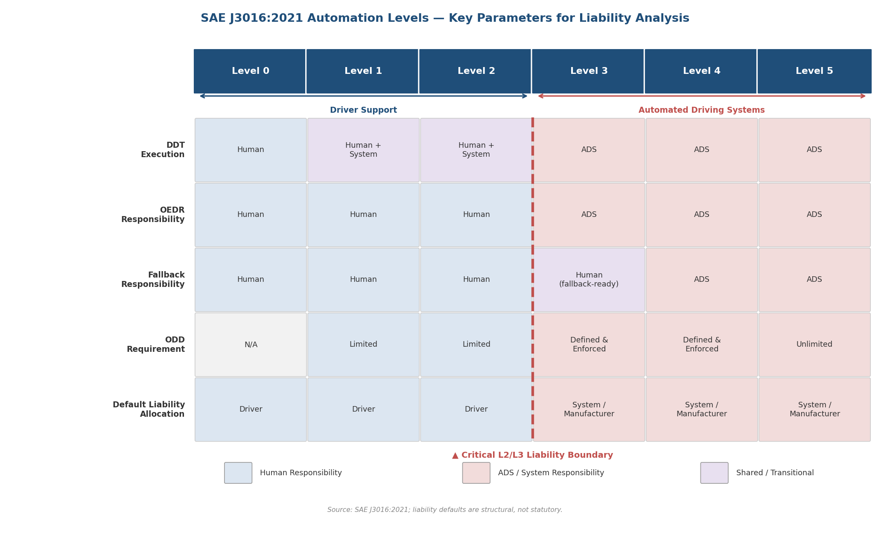

*Figure 1.1. SAE J3016:2021 automation levels mapped to liability-critical parameters. The L2/L3 boundary (dashed line) marks the transition of OEDR responsibility—and the corresponding default liability allocation—from the human driver to the automated driving system. Source: SAE J3016:2021; liability defaults are structural, not statutory.*

## 1.2 Sensor Architectures and Perception Strategies

### 1.2.1 Camera-Centric Systems: Tesla Vision

Tesla adopted a camera-only perception strategy ("Tesla Vision") across its fleet beginning in mid-2021, removing forward-facing radar from new vehicles and relying entirely on eight exterior cameras processed through deep neural networks. The underlying premise is that human drivers operate with visual input alone, and that sufficiently capable vision algorithms can replicate and exceed human perception at a fraction of the per-unit cost of LiDAR-equipped platforms.

In March 2026, NHTSA escalated its Full Self-Driving (FSD) investigation to an engineering analysis (EA26002) covering 3,203,754 Tesla vehicles. The agency found that the camera-based system "did not detect common roadway conditions like glare, dust or other airborne obstructions" and "lost track of or never detected a lead vehicle" in multiple reviewed crashes, identifying nine specific incidents including one fatal crash [Reuters](https://www.reuters.com/business/autos-transportation/us-auto-safety-regulator-opens-probe-into-tesla-vehicles-with-fsd-2026-03-19/ "NHTSA escalates FSD probe, March 2026"). These findings expose a fundamental vulnerability of camera-centric architectures: cameras share the same failure modes as human vision—susceptibility to glare, low light, fog, rain, and occlusion—without the contextual reasoning and adaptation that experienced human drivers bring to degraded visual conditions. Because cameras lack native depth sensing, stationary-object detection at highway speeds has proved a persistent failure mode, contributing to multiple crashes into parked emergency vehicles investigated by NHTSA since 2021.

### 1.2.2 Multi-Sensor Fusion: Waymo and Mercedes-Benz

Waymo's 5th-generation Driver platform employs a multi-sensor fusion architecture combining 360-degree LiDAR with a range exceeding 300 meters, cameras with visibility beyond 500 meters, and imaging radar. The design principle is deliberate redundancy: no single sensor modality provides sufficient detail alone, and each modality compensates for the weaknesses of others. LiDAR delivers precise three-dimensional spatial mapping regardless of lighting conditions but degrades in adverse weather; cameras provide rich color and texture data for object classification but suffer under variable lighting; radar penetrates weather and darkness but offers lower spatial resolution [Waymo](https://waymo.com/blog/2020/03/introducing-5th-generation-waymo-driver "5th-gen Waymo Driver, March 2020").

Mercedes-Benz DRIVE PILOT, the first type-approved Level 3 system deployed on public roads, employs LiDAR, radar, cameras, road-moisture sensors, ultrasonic sensors, and microphones. The redundancy design permits continued operation if a single sensor fails, with the system issuing a control-handover request to the fallback-ready user rather than immediately disengaging [Mercedes-Benz VSSA](https://group.mercedes-benz.com/dokumente/innovation/sonstiges/2023-03-06-vssa-mercedes-benz-drive-pilot.pdf "DRIVE PILOT VSSA document"). This approach to graceful degradation—maintaining system availability through sensor-level fault tolerance—is a prerequisite for accepting manufacturer liability, since an immediate disengagement upon any sensor anomaly would transfer risk back to the driver under conditions where the driver may be least prepared.

The choice of sensor architecture is not merely an engineering preference; it directly determines the system's failure envelope and thus shapes the liability question. A camera-only system that cannot detect a stationary emergency vehicle due to sun glare presents a fundamentally different liability profile than a LiDAR-fusion system designed to maintain perception under the same conditions.

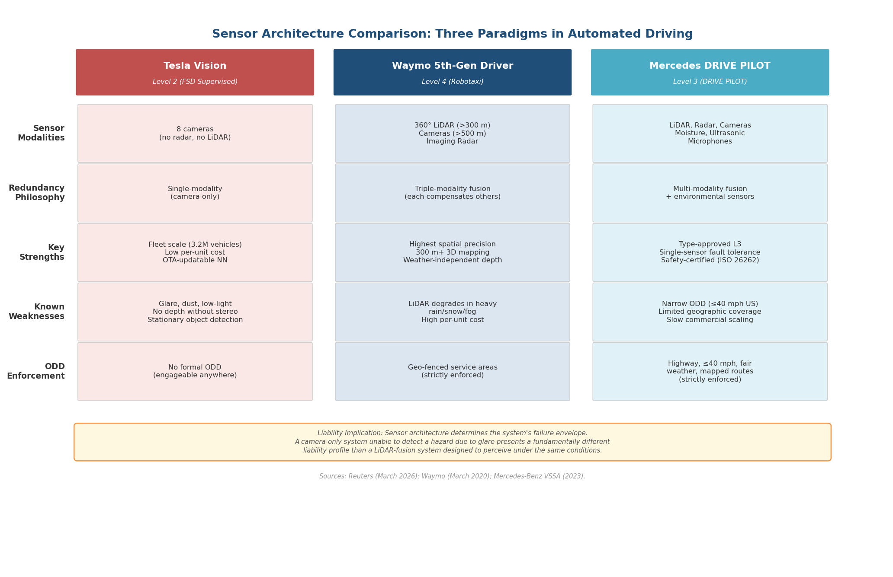

*Figure 1.2. Comparison of three representative sensor architectures across modalities, redundancy philosophy, strengths, weaknesses, and ODD enforcement. The choice of architecture directly defines the system's failure envelope and the manufacturer's resulting liability exposure. Sources: Reuters (March 2026); Waymo (March 2020); Mercedes-Benz VSSA (2023).*

### 1.2.3 The Perception–Planning–Actuation Pipeline

All ADAS and ADS operate through a sequential (or, in modern end-to-end architectures, partially parallelized) pipeline of perception, planning, and actuation. Failure at any stage produces cascading downstream effects that can culminate in a crash:

- **Perception failures** include missed detections (the system fails to register an object entirely), false positives (phantom braking triggered by non-existent obstacles), misclassification (a pedestrian registered as a road sign or vice versa), and progressive sensor degradation due to environmental conditions or hardware wear.
- **Planning failures** encompass incorrect trajectory prediction of other road users, inability to handle edge-case scenarios poorly represented in training data, and errors in decision logic when confronting novel or ambiguous situations.
- **Actuation failures** involve latency between commanded and executed maneuvers, hardware faults in braking or steering systems, and communication errors between the software stack and the vehicle's mechanical actuators.

Mercedes-Benz addresses these failure categories through dual compliance with ISO 26262 (functional safety) and ISO 21448/SOTIF (Safety of the Intended Functionality). SOTIF specifically targets hazards arising from technological limitations and foreseeable misuse, rather than component malfunction [Mercedes-Benz VSSA](https://group.mercedes-benz.com/dokumente/innovation/sonstiges/2023-03-06-vssa-mercedes-benz-drive-pilot.pdf "DRIVE PILOT safety concept: SOTIF and ISO 26262"). The distinction between these two safety frameworks carries direct legal significance: ISO 26262 addresses whether the system functions as designed (a question central to manufacturing-defect claims), while SOTIF addresses whether the design itself is adequate for real-world conditions (the core question in design-defect litigation).

## 1.3 Operational Design Domain: The Boundaries of System Competence

The Operational Design Domain defines the specific conditions—geographic, environmental, temporal, and traffic-related—under which an automated driving feature is designed to function. ODD specification is not merely a technical detail; it constitutes the contractual boundary between system competence and human responsibility, and its enforceability determines whether manufacturer liability can attach.

Mercedes-Benz DRIVE PILOT's ODD at its United States launch was narrowly defined: fully access-controlled highways only, speeds at or below 40 mph, medium-to-dense traffic (requiring a lead vehicle), fair weather, machine-detectable lane markings, no tunnels or toll booths, pre-mapped routes, and daytime operation. In December 2024, the European ODD was expanded to 95 km/h (~59 mph) under revised UN Regulation No. 157 [Mercedes-Benz VSSA](https://group.mercedes-benz.com/dokumente/innovation/sonstiges/2023-03-06-vssa-mercedes-benz-drive-pilot.pdf "DRIVE PILOT ODD specifications"). The specificity and enforceability of this ODD is what enables Mercedes to accept manufacturer liability during Level 3 engagement: the system operates exclusively in conditions where its sensor suite and planning algorithms have been validated, and the vehicle's software prevents activation outside those conditions.

Tesla's FSD (Supervised), by contrast, operates as a Level 2 feature with no formally published ODD boundary. The system can be engaged on virtually any road type—urban arterials, unlit rural highways, construction zones—even where its perception capabilities may not perform reliably. Under SAE J3016, this absence of ODD enforcement is definitionally incompatible with Level 3 or higher classification: if a system can be engaged outside its validated performance envelope, it is by definition Level 1 or Level 2, and liability remains with the human driver [SAE J3016 User Guide](https://users.ece.cmu.edu/~koopman/j3016/ "Koopman: Myth #9 — ODD enforcement requirement").

This divergence creates a structural tension in market incentives. A manufacturer that defines a narrow, enforceable ODD accepts liability within those bounds but delivers limited consumer utility—a trade-off that contributed to the January 2026 pause of Mercedes DRIVE PILOT from the facelifted S-Class. A manufacturer that defines no ODD boundary avoids accepting system-level liability by keeping the feature classified at Level 2, shifting all responsibility to the driver, while delivering a user experience that may feel subjectively indistinguishable from full autonomy. The resulting expectation gap between marketed capability and engineering reality has become a central focus of both regulatory enforcement and product-liability litigation.

## 1.4 Control-Authority Handoff and Transition Demand Timing

The mechanism by which control transfers between the automated system and the human driver is among the most liability-critical elements of any Level 3 system. UN Regulation No. 157 (Automated Lane Keeping Systems, or ALKS) mandates a minimum 10-second transition demand before the system initiates a minimal risk maneuver (MRM). Mercedes DRIVE PILOT provides approximately 10 seconds for the fallback-ready user to resume control. If the user fails to respond, the system escalates through a defined sequence: visual and auditory alerts, haptic warning via seat vibration, emergency braking initiation, controlled lane stop, activation of hazard lamps, and finally an emergency call with automatic door unlock [Mercedes-Benz VSSA](https://group.mercedes-benz.com/dokumente/innovation/sonstiges/2023-03-06-vssa-mercedes-benz-drive-pilot.pdf "DRIVE PILOT: ~10-second TOR, MRC procedures") and [SAE J3016 User Guide](https://users.ece.cmu.edu/~koopman/j3016/ "Koopman: Myth #14 — ALKS 10-second minimum").

Whether 10 seconds is sufficient depends on empirical human-factors research. Zhang et al. (2019), in a meta-analysis of 129 simulator and on-road studies, found that mean take-over time varies substantially depending on urgency, driver engagement in non-driving tasks, and alert modality. The mean take-over time across studies was approximately 4.5 seconds, but the range extended from 1.5 to 15.0 seconds. Higher-urgency scenarios produce shorter mean response times, while drivers engaged in visual non-driving tasks or using handheld devices require significantly longer to resume control. Critically, the study found that mean and standard deviation of take-over time are highly correlated, indicating that design parameters based solely on average response times systematically underserve the tail of the distribution—the very drivers most likely to be involved in transition-related crashes [Zhang et al., Transportation Research Part F, Vol. 64 (2019)](https://doi.org/10.1016/j.trf.2019.04.020 "Zhang et al. 2019: meta-analysis of 129 take-over time studies").

Eriksson and Stanton (2017), studying noncritical transitions in a simulator at 70 mph, observed a range of 1.9 to 25.7 seconds for drivers to take over control from automation, with a mean of approximately 8.0 seconds. When drivers were engaged in secondary tasks, response times were significantly longer. The authors cautioned that designing take-over request lead times based on data from critical-urgency studies risks setting time budgets too short for routine transitions, creating safety hazards from abrupt or poorly executed maneuvers [Eriksson & Stanton, Human Factors (2017)](https://pubmed.ncbi.nlm.nih.gov/28124573/ "Eriksson & Stanton 2017: noncritical take-over times").

The liability implication is direct: if a Level 3 system issues a take-over request with insufficient lead time—or under conditions where the human is predictably unable to respond in time—the system designer bears responsibility for the resulting gap in vehicle control. The 10-second minimum mandated by UN R157 represents a regulatory judgment that errs on the side of caution relative to the empirical distribution, but it does not eliminate the risk that individual drivers will fail to respond within that window, particularly those engaged in permitted non-driving activities.

A further complication is that the minimal risk condition (MRC)—the state to which the system defaults when the driver fails to resume control—does not guarantee safety. Stopping a vehicle in a lane of high-speed traffic introduces its own hazards. Whether the MRC is "safe" depends on both the vehicle's condition and the surrounding operating environment, a judgment the system must make dynamically and under uncertainty [SAE J3016 User Guide](https://users.ece.cmu.edu/~koopman/j3016/ "Koopman: Myth #13 — MRC ≠ safe").

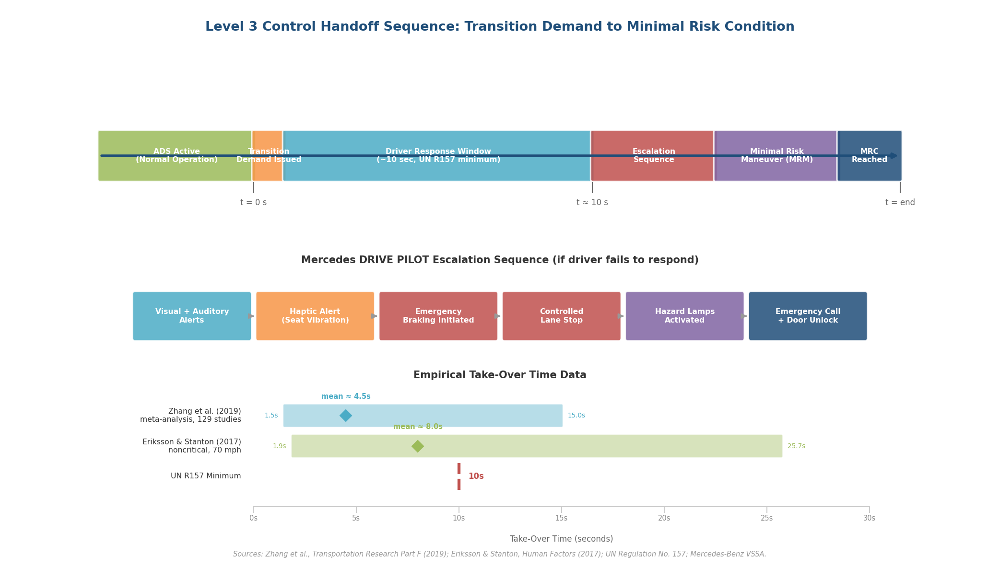

*Figure 1.3. The Level 3 control-handoff sequence from normal ADS operation through transition demand, driver response window, escalation, MRM, and MRC. The Mercedes DRIVE PILOT escalation sequence is shown in detail alongside empirical take-over time distributions from Zhang et al. (2019) and Eriksson & Stanton (2017), benchmarked against the UN R157 10-second minimum. A significant portion of the empirical distribution exceeds the regulatory floor. Sources: Zhang et al. (2019); Eriksson & Stanton (2017); UN R157; Mercedes-Benz VSSA.*

## 1.5 Automation Complacency and Human-Machine Interface Design

The technical architecture of an ADAS does not operate in isolation; it interacts with predictable human behavioral responses. Automation complacency—the progressive reduction of operator vigilance when supervising a reliable automated system—is well-documented in aviation and process-control literature and is now empirically confirmed in the driving domain.

Nordhoff et al. (2023), in a qualitative study of 103 Tesla users, documented systematic patterns of progressive complacency: 48 of 103 participants reported using Autopilot outside its designed ODD, 46 of 103 engaged in eyes-off-road driving, 21 of 103 had defeated the steering-wheel torque sensor designed to ensure driver engagement, and 15 of 103 reported driving while fatigued or mentally disengaged. One respondent reported driving 44 miles without looking at the road [Nordhoff et al., Frontiers in Psychology (2023)](https://pmc.ncbi.nlm.nih.gov/articles/PMC9996345/ "Nordhoff et al. 2023: misuse patterns among 103 Tesla users"). These findings are not anomalous; they reflect a structural property of the human-machine interaction in Level 2 systems. When a system performs the DDT competently for extended periods, the human monitor's attention degrades—precisely the function the system nominally relies upon for safety.

The design of the driver monitoring system (DMS) therefore becomes the critical safeguard against complacency-induced misuse. Tesla's early reliance on steering-wheel torque monitoring, which could be defeated by attaching a weight to the wheel, represents a qualitatively different level of DMS robustness than cabin-facing camera systems with gaze tracking, as deployed in General Motors' Super Cruise and Mercedes DRIVE PILOT. The NHTSA December 2023 recall of 2,031,220 Tesla vehicles (recall 23V-838) explicitly characterized driver circumvention of the torque-based monitoring system as "foreseeable misuse" constituting a safety defect—a regulatory determination that reframes the misuse problem as a design-adequacy question rather than a user-behavior question.

The California Department of Motor Vehicles ruled on December 16, 2025, that Tesla violated state law by marketing "Autopilot" and "Full Self-Driving Capability" as tantamount to autonomous driving capability, ordering Tesla to modify its marketing language within 60 days [California DMV](https://www.dmv.ca.gov/portal/news-and-media/news-releases/dmv-finds-tesla-violated-california-state-law/ "California DMV: Tesla violated state law, December 2025"). This regulatory finding underscores the causal relationship between marketing language and complacency: when the system's name implies capabilities that exceed its engineering reality, users predictably calibrate their behavior to the name rather than the technical limitations disclosed in the owner's manual.

## 1.6 Incident Data: Scale of the Safety Record

Under NHTSA's Standing General Order (SGO), manufacturers are required to report qualifying crashes involving Level 2 ADAS and Automated Driving Systems. Through November 2025, 5,202 incidents had been reported across the industry. Tesla accounted for 2,732 incidents (52.5%), Waymo for 1,443 (27.7%), and Cruise for 155 (3.0%). Approximately 7.4% of reported incidents resulted in injury, and 1.2%—65 incidents—involved a fatality [NHTSA SGO](https://www.nhtsa.gov/laws-regulations/standing-general-order-crash-reporting "NHTSA Standing General Order") and [Craft Law Firm analysis](https://www.craftlawfirm.com/autonomous-vehicle-accidents-2019-2024-crash-data/ "SGO data analysis: 5,202 incidents through November 2025").

NHTSA explicitly warns that raw SGO counts are not normalized by fleet size, miles traveled, or exposure hours, and therefore cannot support comparative safety conclusions between manufacturers. Tesla's dominant share of reported incidents reflects, in substantial part, its vastly larger fleet of Level 2 vehicles on public roads—over 3.2 million vehicles equipped with Autopilot or FSD—compared to Waymo's smaller fleet of Level 4 robotaxis operating in geo-fenced urban zones. The data nonetheless confirms that ADAS-involved accidents are not rare events and that both Level 2 and Level 4 systems produce crashes at a frequency requiring systematic investigation, regulatory oversight, and, increasingly, judicial adjudication.

## 1.7 Technical Architecture as the Foundation of Liability Analysis

The technical parameters described in this chapter—SAE level classification, sensor architecture, ODD definition and enforcement, take-over request timing, DMS robustness, and failure-mode behavior—are not abstract engineering details. Each maps directly to a contested question in liability analysis:

- **SAE level** determines who bears primary monitoring responsibility: the driver at Level 2, the system at Level 3.
- **Sensor architecture** determines the system's perception envelope and, consequently, which hazards it can and cannot detect—a central question in design-defect litigation.
- **ODD specification and enforcement** defines the boundary between system competence and human responsibility; absence of ODD enforcement at Level 2 is the structural mechanism that preserves full driver liability.
- **Take-over request timing** determines whether the handoff from machine to human can be executed safely, and whether the manufacturer has provided adequate transition time given the empirical distribution of human response latencies.
- **DMS design** determines whether the manufacturer has taken reasonable steps to prevent the foreseeable misuse that automation complacency produces—a question that NHTSA has already answered affirmatively in the context of the December 2023 Tesla recall.
- **Marketing language** relative to technical capability creates the expectation gap that courts and regulators have increasingly treated as an independent basis for liability, distinct from traditional design-defect or failure-to-warn theories.

The divergence between two paradigmatic approaches—Tesla's wide-deployment, camera-only, Level 2 system with no formal ODD and torque-based DMS, versus Mercedes' narrow-ODD, multi-sensor, Level 3 system with camera-based gaze tracking and explicit manufacturer liability acceptance—illustrates how technical design choices translate directly into legal exposure. The chapters that follow examine how existing legal frameworks, judicial decisions, and liability doctrines grapple with these technical realities.

# 第2章 Legal and Regulatory Frameworks Across Jurisdictions

The allocation of liability for accidents involving Advanced Driver-Assistance Systems (ADAS) and Automated Driving Systems (ADS) depends fundamentally on the regulatory architecture within which these systems operate. No single international framework governs ADAS/ADS liability; instead, responsibility is distributed across a patchwork of federal, state, supranational, and national regimes that vary substantially in scope, stringency, and underlying legal theory. This chapter maps the principal regulatory frameworks in the United States, the European Union, the UNECE international harmonization system, and China — identifying how each regime allocates responsibility among the driver, the manufacturer, and the vehicle operator, and where critical gaps or conflicts persist. As the technical taxonomy established in Chapter 1 makes clear, the SAE Level 2/Level 3 boundary marks the point at which control authority shifts from human to machine; the regulatory frameworks examined here reflect — and in several cases, struggle to keep pace with — that technical inflection point.

## 2.1 United States: Federal Regulatory Architecture

### 2.1.1 NHTSA Standing General Order and Crash Reporting

The National Highway Traffic Safety Administration's (NHTSA) Standing General Order (SGO) 2021-01, third-amended effective June 16, 2025, constitutes the primary federal data-collection mechanism for ADAS/ADS incidents. The SGO requires manufacturers and operators to report qualifying crashes involving ADS-equipped vehicles within five calendar days for severe incidents (fatality, hospitalization, airbag deployment) and on a monthly basis otherwise. For Level 2 ADAS, reporting obligations are triggered by fatalities, airbag deployments, hospitalizations, and incidents involving vulnerable road users. Violations carry civil penalties of up to $27,874 per violation per day, to a maximum of $139,356,994 for a related series of violations (penalty figures indexed to December 30, 2024) [NHTSA SGO](https://www.nhtsa.gov/laws-regulations/standing-general-order-crash-reporting "Standing General Order on Crash Reporting — NHTSA official page").

The SGO's significance for liability analysis is structural rather than direct: it does not assign fault, but generates an evidentiary infrastructure upon which liability determinations increasingly depend. The GM Cruise deferred prosecution agreement of November 2024, in which Cruise admitted submitting incomplete crash reports and agreed to a $500,000 criminal fine (see Chapter 3), demonstrates that SGO reporting obligations carry independent enforcement consequences — and that data concealment itself can become a discrete basis for legal exposure.

### 2.1.2 The Automated Vehicle Framework and FMVSS Reform

On April 24, 2025, U.S. Department of Transportation Secretary Sean Duffy unveiled NHTSA's Automated Vehicle Framework, organized around three stated pillars: prioritize safety, unleash innovation, and enable deployment. The first concrete action expanded the Automated Vehicle Exemption Program (AVEP) to domestically produced vehicles. In June 2025, NHTSA streamlined the Part 555 exemption process, permitting manufacturers to deploy up to 2,500 vehicles per year that do not comply with existing Federal Motor Vehicle Safety Standards (FMVSS) — including vehicles lacking traditional steering wheels or brake pedals [DOT Press Release](https://www.transportation.gov/briefing-room/trumps-transportation-secretary-sean-p-duffy-unveils-new-automated-vehicle-framework "DOT AV Framework, April 2025").

FMVSS reform constitutes a critical prerequisite for Level 4 and Level 5 deployment at scale. On March 16, 2026, NHTSA published two proposed rulemakings amending FMVSS Nos. 102, 103, and 104 to accommodate ADS vehicles without manual controls. Significant barriers persist in FMVSS Nos. 108 (lighting), 135 (brake systems), 111 (mirrors/rearview), and 101 (controls/displays), all of which presuppose the presence of a human driver. NHTSA has indicated it is "working toward establishing minimum performance standards for ADS competency," a formulation that signals a potential paradigm shift from prescriptive equipment mandates to performance-based safety evaluation [Sidley Austin](https://environmentalhealthsafetybrief.sidley.com/2026/03/23/nhtsa-proposes-amending-federal-crash-avoidance-standards-for-autonomous-vehicles/ "NHTSA Proposes Amending Crash Avoidance FMVSS, March 2026"). If this shift materializes, it would alter the relationship between regulatory compliance and tort liability: performance-based standards leave manufacturers wider design latitude but also make compliance-as-defense arguments more complex in litigation.

### 2.1.3 The SELF DRIVE Act (H.R. 7390)

H.R. 7390, introduced in February 2026, represents the most comprehensive federal legislative proposal for ADS governance to date. The bill targets Level 4 and Level 5 vehicles and would: (i) require safety-case-based FMVSS for ADS vehicles; (ii) create a National AV Safety Data Repository; and (iii) — critically for liability purposes — preempt state regulation of ADS design, construction, and performance while preserving state authority over licensing, registration, and insurance. The finalization deadline is September 30, 2027 [Upstream Security](https://upstream.auto/blog/the-self-drive-act-returns-why-congress-is-taking-another-shot-at-av-regulation/ "SELF DRIVE Act analysis, March 2026").

If enacted, the SELF DRIVE Act would address a central structural tension in U.S. ADAS/ADS regulation: the absence of federal preemption has allowed divergent state-level regimes to proliferate, creating an environment in which identical vehicles face materially different liability exposure depending on the jurisdiction of operation. The bill's preemption provision, however, is narrowly scoped — it would harmonize ADS design and performance standards at the federal level while leaving the state-controlled domains of insurance, registration, and licensing untouched. Since practical liability allocation frequently operates through insurance mandates and state tort law, the SELF DRIVE Act would reduce but not eliminate interstate regulatory fragmentation.

## 2.2 United States: State-Level Frameworks

### 2.2.1 California: Tiered Permitting and Marketing Enforcement

California operates a three-step AV permitting regime — drivered testing, driverless testing, and deployment — that is among the most granular in the United States. In December 2025, the California Department of Motor Vehicles published revised proposed regulations imposing a 50,000-mile drivered-testing prerequisite before a driverless testing permit may be issued, along with comprehensive safety-case submissions and expanded incident-reporting requirements. Heavy-duty vehicles exceeding 10,001 pounds must accumulate one million total test miles before deployment authorization [Sidley Austin](https://environmentalhealthsafetybrief.sidley.com/2025/12/22/the-state-of-play-in-california-for-autonomous-vehicles/ "California AV regulatory state of play, December 2025").

California's regulatory significance extends well beyond permitting. On December 16, 2025, the California DMV ruled that Tesla violated state law by marketing "Autopilot" and "Full Self-Driving Capability" as tantamount to autonomous driving capability, and ordered modification of marketing language within 60 days [California DMV](https://www.dmv.ca.gov/portal/news-and-media/news-releases/dmv-finds-tesla-violated-california-state-law/ "California DMV: Tesla violated state law, December 2025"). This administrative finding carries direct liability implications: by establishing that Tesla's marketing language was unlawful, it strengthens failure-to-warn and design-defect claims premised on the gap between marketed capability and actual system performance — a doctrinal thread examined in detail in Chapter 4.

### 2.2.2 Texas: ADS as Legal Operator

Texas Transportation Code §§545.451–545.459, effective September 1, 2025, adopts a distinctive approach to liability allocation: when an ADS is engaged, the ADS itself — not a human — is deemed the legal "operator" of the vehicle. Level 4 and Level 5 vehicles may operate without a human physically present, and traffic citations for ADS-operated vehicles are issued to the owner or authorization holder rather than to a human driver. Texas further prohibits state agencies from imposing additional ADS-specific regulations beyond existing law [CMS Expert Guide — Texas](https://cms.law/en/int/expert-guides/cms-expert-guide-to-autonomous-vehicles-avs/texas-united-states "CMS Expert Guide: AV law in Texas, September 2025").

The Texas framework represents the most aggressive state-level liability reallocation in the United States. By deeming the ADS the "operator," the statute conceptually removes the human driver from the liability chain during automated operation, shifting primary responsibility to the vehicle owner and — through products-liability doctrine — to the manufacturer. This approach contrasts sharply with California's emphasis on gatekeeping through stringent permitting and marketing enforcement, and with Florida's reliance on elevated insurance mandates to manage concentrated technological risk.

### 2.2.3 Florida: Deployment-Permissive with Insurance Mandates

Florida permits fully autonomous vehicles to operate without human operators under §316.85(2). Section 316.86(2) shields original manufacturers from liability for defects caused by third-party conversion — a provision structurally parallel to Nevada's NRS 482A.090, which similarly insulates original manufacturers from damages attributable to unauthorized modifications [NRS 482A.090](https://law.justia.com/codes/nevada/chapter-482a/statute-482a-090/ "Nevada NRS 482A.090 — manufacturer not liable for third-party conversion defects").

Florida's distinctive contribution to the liability architecture is its insurance mandate: §627.749 requires $1 million in primary liability coverage for driverless AV operation, a threshold that substantially exceeds standard personal auto insurance requirements [Florida Bar Journal](https://www.floridabar.org/the-florida-bar-journal/navigating-the-road-ahead-floridas-autonomous-vehicle-statute-and-its-effect-on-liability/ "Florida Bar Journal: Florida AV Statute and Liability") and [FL §627.749](https://www.flsenate.gov/laws/statutes/2023/627.749 "FL §627.749 — AV insurance requirements"). This elevated minimum reflects a legislative recognition that driverless operation concentrates risk on the vehicle's technology stack rather than on human driver behavior, necessitating a correspondingly higher financial backstop.

### 2.2.4 Nevada: Early Mover, Liability Lacuna

Nevada was the first U.S. state to authorize autonomous vehicle testing (2011) and operation (2017) under NRS Chapter 482A. The statute incorporates SAE J3016 terminology — defining "automated driving system," "dynamic driving task," "operational design domain," and "minimal risk condition" — and permits fully autonomous vehicles to operate without a human driver under NRS 482A.200. However, NRS 482A contains no explicit provisions allocating civil liability between the ADS manufacturer, the vehicle owner, and the human occupant during ADS-engaged operation. Section 482A.090 addresses only the narrow question of third-party conversions, immunizing the original manufacturer from liability for defects caused by unauthorized modifications [NRS 482A.090](https://law.justia.com/codes/nevada/chapter-482a/statute-482a-090/ "Nevada NRS 482A.090").

Nevada's framework exemplifies a broader gap in early-adopter AV statutes: permitting deployment without establishing how the resulting liability exposure is distributed among the relevant parties. In the absence of specific ADS liability provisions, Nevada courts must resolve ADAS/ADS accident claims through general products-liability and negligence law — frameworks designed for traditional vehicles and ill-suited to the distributed agency characteristic of automated driving.

### 2.2.5 Cross-State Fragmentation

The divergence among California (stringent permitting and marketing enforcement), Texas (ADS-as-operator with a deregulatory posture), Florida (deployment-permissive with elevated insurance mandates), and Nevada (permissive with an unresolved liability lacuna) illustrates the central structural problem of U.S. ADAS/ADS regulation: a manufacturer deploying identical Level 4 vehicles across these four states confronts four distinct regulatory and liability regimes, none of which harmonize with one another. The SELF DRIVE Act's preemption provision (Section 2.1.3) would partially address this fragmentation at the design and performance level, but state-level authority over insurance, registration, and licensing — the domains where much of the practical liability allocation occurs — would remain heterogeneous. Until federal preemption is enacted, interstate forum-shopping incentives and compliance-cost asymmetries will persist as defining features of the U.S. ADAS/ADS regulatory landscape.

## 2.3 European Union: Layered Supranational Governance

### 2.3.1 The EU AI Act and Automotive Carve-Out

Regulation (EU) 2024/1689 — the EU AI Act — entered into force on August 1, 2024, and classifies ADS and ADAS as high-risk AI systems under Article 6. However, Article 2(2) creates a significant carve-out: AI systems already governed by EU harmonized legislation — specifically the Type-Approval Regulation (2018/858) and the General Safety Regulation (GSR) 2019/2144 — are deferred to those sectoral frameworks rather than being subjected to the AI Act's Chapter III high-risk provisions directly. High-risk AI obligations apply from August 2, 2026, and from August 2, 2027 for products falling under existing harmonization legislation. Non-compliance penalties reach up to €15 million or 3% of global annual turnover, whichever is higher [Taylor Wessing](https://www.taylorwessing.com/en/insights-and-events/insights/2025/03/ai-act-and-the-automotive-industry "AI Act and Automotive Industry, March 2025").

The practical effect of the Article 2(2) carve-out is that the AI Act governs automotive AI *indirectly* — through the eventual adaptation of type-approval regulations to incorporate AI Act principles — rather than imposing an additional direct compliance layer. As of early 2026, no concrete regulatory proposal for this sectoral adaptation had been published, creating a transitional period in which automotive manufacturers must monitor both the AI Act's general obligations and the sector-specific regulatory timeline.

### 2.3.2 The Revised Product Liability Directive

Directive (EU) 2024/2853, with a Member State transposition deadline of December 9, 2026, represents the most consequential EU legislative development for ADAS/ADS liability. The revised Product Liability Directive (PLD) explicitly brings software, AI systems, and over-the-air (OTA) updates within the definition of "products." Cybersecurity vulnerabilities and post-sale software changes — including machine-learning behavioral drift and OTA updates — can constitute actionable defects under the Directive.

Two procedural innovations substantially strengthen claimant positions in ADAS/ADS cases. First, the revised PLD introduces rebuttable presumptions of both defect and causation for technically complex cases, reducing the evidentiary burden on plaintiffs who must otherwise confront the opacity of AI decision-making systems. Second, the standard liability period is ten years, extended to 25 years for latent injuries — a provision of particular relevance given that ADAS/ADS defects may manifest only after prolonged deployment under evolving real-world conditions [Reed Smith](https://www.reedsmith.com/articles/the-new-eu-product-liability-key-implications-autonomous-vehicle/ "New EU PLD implications for automotive/AV, October 2025").

For ADAS/ADS specifically, the revised PLD creates a critical doctrinal bridge: parties that "substantially modify" products via software — including OEMs issuing safety-relevant OTA updates — can be deemed "manufacturers" under the Directive, potentially extending liability to entities that alter system behavior post-sale. This provision effectively treats an OTA update that modifies ADS perception or planning logic as a new product placement, carrying fresh liability exposure with each deployment.

### 2.3.3 The Withdrawal of the AI Liability Directive

The European Commission formally withdrew the proposed AI Liability Directive (AILD) — which would have established a harmonized fault-based civil liability framework for AI-related harms — in its 2025 Work Programme, adopted February 11, 2025. The official withdrawal was published in the Official Journal on October 6, 2025, with the Commission citing the absence of "foreseeable agreement" among co-legislators and stakeholders [IAPP](https://iapp.org/news/a/european-commission-withdraws-ai-liability-directive-from-consideration "IAPP: AI Liability Directive withdrawn, Feb 2025") and [EAPIL](https://eapil.org/2025/10/09/european-commission-withdraws-two-proposals-assignments-of-claims-regulation-and-ai-liability-directive/ "Official withdrawal published in OJ, Oct 2025").

The AILD's withdrawal leaves the revised PLD as the sole EU-level instrument for AI product liability, creating a consequential gap: no harmonized EU fault-based civil liability framework governs AI-related harms. Fault-based claims for ADAS/ADS accidents in EU Member States must proceed under divergent national tort law, meaning that identical accidents involving the same vehicle model may produce materially different liability outcomes across the 27 Member States. The contrast with the United States is instructive: where interstate fragmentation in the U.S. stems from the absence of federal preemption, intra-EU fragmentation results from the withdrawal of a proposed harmonizing directive.

### 2.3.4 The General Safety Regulation and Mandatory ADAS

EU General Safety Regulation (GSR) 2019/2144 mandates a suite of ADAS technologies on all new EU-type-approved vehicles: Intelligent Speed Assistance (ISA), Autonomous Emergency Braking (AEB), Driver Drowsiness and Attention Warning (DDAW), Advanced Driver Distraction Warning (ADDW), Emergency Lane-Keeping System (ELKS), Event Data Recorder (EDR), and reversing detection systems. Implementing Regulation (EU) 2022/1426 further provides for type-approval of Level 4 fully automated vehicles, though currently limited to small-series production. Regulatory sandboxes and automated driving corridors are planned from 2026 to enable controlled deployment of higher-automation systems in real-world environments [Taylor Wessing](https://www.taylorwessing.com/en/insights-and-events/insights/2026/02/legal-frameworks-for-autonomous-driving-and-teledriving "Legal framework for autonomous driving, February 2026").

The GSR's mandatory ADAS requirements create an important baseline liability expectation: when regulation compels the inclusion of safety-critical features, manufacturers bear heightened responsibility for ensuring those features perform as intended. Failure of a mandatory ADAS function — for instance, a required AEB system that does not activate in a scenario within its design parameters — may trigger stricter liability scrutiny than failure of an optional feature that the manufacturer voluntarily chose to include, because the regulatory mandate creates a performance expectation that shapes both consumer reliance and judicial assessment of defectiveness.

## 2.4 Germany: The Most Developed National Framework

Germany's Autonomous Driving Act (Gesetz zum autonomen Fahren), enacted July 28, 2021, amended the Road Traffic Act (Straßenverkehrsgesetz, StVG) §§1a–1l, establishing the most detailed national statutory framework for ADS liability among major automotive jurisdictions. The Act addresses Level 3, Level 4, and teleoperated driving within a single legislative instrument, providing a structural clarity that few other jurisdictions have achieved.

**Level 3 in regular traffic.** The amended StVG permits Level 3 driving on public roads, with the driver required to remain in a state of readiness to resume control upon issuance of a transition demand. Mercedes-Benz's DRIVE PILOT was type-approved by the Kraftfahrt-Bundesamt (KBA) under this framework — the first Level 3 system to receive such approval globally — and has operated commercially in Germany since 2022.

**Level 4 with geographic and operational constraints.** Level 4 vehicles require both type-approval and a specific operating-area license, restricting deployment to geo-fenced zones. A mandatory "technical supervision" function (technische Aufsicht) — a form of remote human-in-the-loop oversight — must be maintained for all Level 4 operations, ensuring that a qualified human can intervene when the system encounters situations beyond its competence.

**Strict keeper liability with doubled caps.** The StVG's Gefährdungshaftung (strict keeper liability) under §7 applies to autonomous vehicles: the vehicle keeper (Halter) bears strict liability regardless of fault. For vehicles operating automated driving functions, maximum keeper liability is doubled to €10 million for personal injury and €2 million for property damage, compared with standard caps of €5 million and €1 million, respectively [CMS Expert Guide — Germany](https://cms.law/en/int/expert-guides/cms-expert-guide-to-autonomous-vehicles-avs/germany "CMS: German Halter strict liability and doubled caps"). Mandatory insurance is required to cover these elevated thresholds.

**Data recording and teleoperation.** A Data Storage System for Automated Driving (DSSAD) is mandatory in all Level 3 and Level 4 vehicles, ensuring that a forensic record of system state and driver interactions is preserved for post-incident analysis. In December 2025, the Road Traffic Remote Control Ordinance (Straßenverkehrs-Fernlenk-Verordnung, StVFernLV) was adopted, creating a legal framework for teleoperated driving — an emerging operational model for Level 4 vehicles that operate without an in-vehicle human fallback [Taylor Wessing](https://www.taylorwessing.com/en/insights-and-events/insights/2026/02/legal-frameworks-for-autonomous-driving-and-teledriving "German StVG liability provisions") and [UNECE](https://unece.org/sites/default/files/2024-12/Presentation9-GE.3-09-12e.pdf "UNECE: German framework for autonomous driving").

Germany's framework is notable for the explicit line it draws between Level 3 and Level 4 operations. At Level 3, the keeper bears strict liability with doubled caps, and the manufacturer — exemplified by Mercedes-Benz's formal commitment — accepts product liability during system engagement within the ODD. At Level 4, geo-fencing and mandatory technical supervision provide additional safeguards, while strict keeper liability (backstopped by compulsory insurance) ensures that injured parties have an identifiable, solvent defendant regardless of whether the fault lies with the system, the operator, or the technical supervisor.

## 2.5 UNECE WP.29: International Harmonization

### 2.5.1 UN Regulation No. 157 (ALKS)

UN Regulation No. 157 on Automated Lane Keeping Systems (ALKS) is the first binding international regulation governing a Level 3 automated driving function. Adopted by UNECE's World Forum for Harmonization of Vehicle Regulations (WP.29) in June 2020 and in force since January 2021, R157 mandates a set of performance requirements that have become the de facto international baseline for Level 3 systems: a minimum 10-second transition demand before the system initiates a Minimal Risk Maneuver (MRM); driver availability recognition systems; a Data Storage System for Automated Driving (DSSAD); and compliance with cybersecurity (R155) and software update (R156) requirements. The original speed limit of 60 km/h has been progressively raised to 130 km/h, and the scope was extended to heavy vehicles in November 2021. Revision 1 was published in June 2025. As of early 2026, R157 had been adopted by 56 Contracting Parties [UNECE](https://unece.org/transport/documents/2021/03/standards/un-regulation-no-157-automated-lane-keeping-systems-alks "UN Regulation No. 157 — ALKS").

A critical limitation of R157 for liability purposes is that it establishes safety performance standards — defining what an ALKS must do (detect hazards, warn the driver, execute an MRM) — without assigning civil or criminal liability. The question of who bears responsibility when an R157-compliant ALKS causes an accident is left entirely to national law. This design is deliberate: UNECE sets minimum technical standards while Contracting Parties retain sovereign authority over tort and criminal liability allocation. The practical consequence is that a Mercedes DRIVE PILOT vehicle type-approved under R157 faces one liability regime in Germany (strict keeper liability with doubled caps under the StVG), a different regime in France (general product liability under national implementation of the revised PLD), and potentially yet another in Japan or South Korea — notwithstanding identical technical compliance.

### 2.5.2 Toward an ADS Global Technical Regulation

UNECE's Informal Working Group on ADS (IWG-ADS) is developing a broader Global Technical Regulation (GTR) for automated driving systems that extends beyond the ALKS-specific scope of R157. The ADS GTR would establish performance-based requirements for Level 3 and Level 4 systems across a wider range of operational scenarios, including urban driving and complex intersections. As of early 2026, precise adoption timelines remain unconfirmed by primary UNECE documents, though the regulation is expected to build on R157's architecture of performance standards combined with data recording and cybersecurity mandates. Like R157, the GTR would defer liability allocation to national jurisdictions — maintaining the structural separation between international technical harmonization and domestic legal accountability.

## 2.6 China: Rapid Regulatory Maturation

### 2.6.1 OTA Governance

China's Ministry of Industry and Information Technology (MIIT), jointly with the State Administration for Market Regulation (SAMR), issued binding OTA governance requirements effective March 1, 2025. The circular mandates documentation of activation, execution, and exit policies for assisted driving functions; user notification protocols; regulatory filing of 44 technical parameters; and an explicit prohibition on using OTA updates to conceal defects [APCO](https://apcoworldwide.com/blog/road-safety-china-tightens-regulations-on-intelligent-driving/ "China tightens regulations on intelligent driving, 2025"). China's OTA Circular constitutes the first mandatory national framework governing OTA updates for driving automation systems, addressing a liability gap — the question of post-sale software modification as a source of new or altered product defects — that other jurisdictions have only begun to recognize through instruments such as the EU's revised PLD and UNECE R156.

### 2.6.2 Marketing and Terminology Restrictions

In April 2025, MIIT ordered 60 automakers to eliminate misleading terms — including "automatic driving" and "autonomous driving" — from all marketing materials. Driverless features such as automated valet parking, smart summon, and remote-control driving were ordered disabled pending compliance. The Ministry of Public Security concurrently confirmed that all vehicles operating on Chinese roads function at Level 2, reinforcing the regulatory position that no vehicle available to Chinese consumers possesses autonomous capability [APCO](https://apcoworldwide.com/blog/road-safety-china-tightens-regulations-on-intelligent-driving/ "MIIT April 2025 advertising bans"). This regulatory action parallels California's December 2025 ruling against Tesla's marketing practices and reflects a broader global convergence toward stricter enforcement against autonomy-implying terminology for Level 2 systems — a convergence driven by concern that marketing language creates user expectations that exceed actual system capability, with direct consequences for driver behavior and, ultimately, liability allocation.

### 2.6.3 Mandatory Level 3 Safety Standard

In February 2026, MIIT published China's first mandatory Level 3 safety standard, effective July 1, 2027, with a 13-month transition period for vehicles already holding type-approval. The standard requires ADS to independently execute Minimal Risk Maneuvers — including lane changes, safe stops, and non-obstructing parking — when the driver fails to resume control within the transition-demand window. A DSSAD compliant with China's national recording standard (in force since January 2026) is mandatory for all Level 3 vehicles [ADT Media](https://www.adt.media/autonomous-driving-systems/china-tightens-rules-for-autonomous-driving/2618053 "China tightens L3 rules, February 2026").

China's Level 3 standard is notable for its specificity regarding MRM capabilities. Where UNECE R157 permits a simple controlled lane stop as a minimal risk condition, the Chinese standard requires the ADS to execute active maneuvers to reach a non-obstructing position — reflecting a more demanding performance expectation that may, in turn, raise the bar for what constitutes a "defective" MRM in Chinese tort proceedings.

### 2.6.4 Liability Framework and Ethics Guidelines

Under China's Road Traffic Safety Law (道路交通安全法), the human driver remains the primary liability subject at Level 2 and below. MIIT's ethics guidelines, published July 23, 2025, establish a scenario-dependent liability allocation for higher automation levels: at Level 3, the ADS must enable traceability to the relevant responsible persons; at Level 5, the ADS is designated the primary responsibility subject unless the user intervenes. The first Level 3 license plates were issued in Chongqing and Beijing in late 2025 [JunHe](https://www.junhe.com/legal-updates/2901 "JunHe: China AD liability framework and ethics guidelines, 2025"). China's tiered liability model — driver primary at Level 2, shared responsibility with traceability at Level 3, ADS primary at Level 5 — represents the most explicitly graduated liability allocation framework among major jurisdictions, with the Level 3 "traceability" requirement functioning as an accountability bridge between human and system responsibility.

In February 2026, China's Supreme People's Court (SPC) issued a guiding case establishing that drivers remain liable for accidents even when using ADAS — and even when they have vacated the driver's seat. The underlying case involved an intoxicated driver who activated a Level 2 system, bypassed its safety protocols, and fell asleep in the passenger seat, resulting in a criminal conviction for dangerous driving and a sentence of criminal detention plus a ¥4,000 fine [Caixin Global](https://www.caixinglobal.com/2026-02-14/chinas-top-court-rules-drivers-are-liable-for-cars-with-assistance-systems-102414579.html "China SPC ruling, Feb 2026"). As an SPC guiding case, this decision establishes a unified national judicial standard: human drivers retain primary criminal and civil responsibility for accidents during Level 2 operation regardless of system engagement, consistent with the SAE J3016 principle that Level 2 systems are driver-support features requiring continuous human supervision.

## 2.7 Comparative Analysis: Convergences and Divergences

Several structural patterns emerge from this cross-jurisdictional survey. The following comparative table and timeline consolidate the principal regulatory dimensions and milestones discussed in Sections 2.1–2.6.

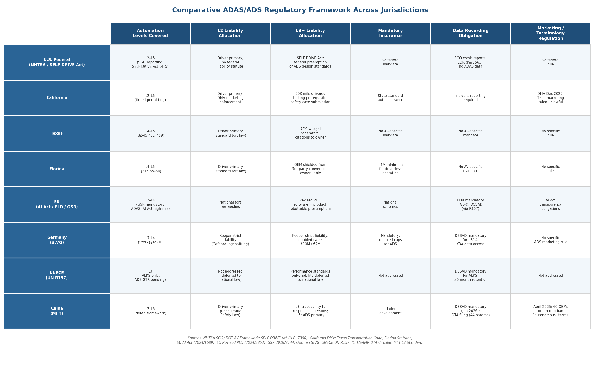

*Figure 2.1 — Synoptic comparison of eight jurisdictions across six regulatory dimensions: automation levels covered, Level 2 liability allocation, Level 3+ liability allocation, mandatory insurance, data recording obligations, and marketing/terminology regulation.*

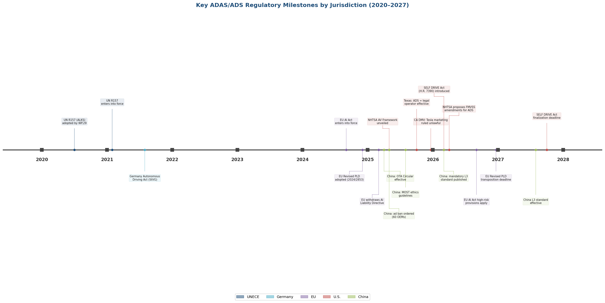

*Figure 2.2 — Chronological timeline of major regulatory milestones from 2020 to 2027, color-coded by jurisdiction. The concentration of milestones in 2025–2026 reflects an acceleration of regulatory activity across all four major jurisdictional blocs.*

**Convergence on the Level 2/Level 3 liability boundary.** Every jurisdiction examined treats the Level 2/Level 3 boundary as the critical inflection point for liability allocation. At Level 2, the driver bears primary responsibility — whether under U.S. general tort law, China's Road Traffic Safety Law, Germany's StVG Gefährdungshaftung, or the scope limitation of UNECE R157. At Level 3, a shift occurs: Germany's StVG and Mercedes-Benz's liability commitment, China's ethics guidelines, and the UNECE R157 performance requirements all contemplate primary manufacturer or system-operator responsibility during ADS engagement within the ODD. This convergence reflects a shared recognition, grounded in the SAE J3016 technical taxonomy (Chapter 1), that the transfer of Object and Event Detection and Response (OEDR) from human to machine at Level 3 necessitates a corresponding transfer of legal accountability.

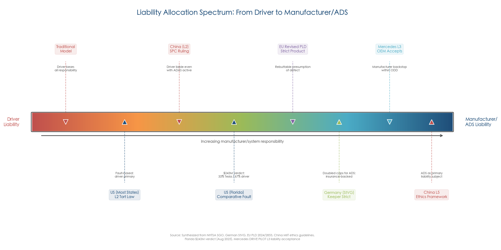

*Figure 2.3 — The liability allocation spectrum across jurisdictions, illustrating the progressive shift from driver-centric to manufacturer/ADS-centric responsibility as automation levels and regulatory frameworks evolve.*

**Divergence on enforcement mechanisms.** Jurisdictions diverge sharply on how they enforce the Level 2/Level 3 boundary. California and China regulate marketing terminology to prevent autonomy inflation; Germany imposes strict keeper liability with doubled insurance caps; Texas legally redefines the "operator" to be the ADS itself; and the SELF DRIVE Act proposes federal preemption of state ADS design standards. These divergent mechanisms reflect different national approaches to the same underlying problem: ensuring that the legal allocation of responsibility corresponds to the actual distribution of control authority between human and machine.

**Persistent structural gaps.** Three critical gaps recur across jurisdictions. First, no jurisdiction has yet established a comprehensive civil liability framework specifically designed for ADAS/ADS accidents; all rely on adapting existing products-liability, negligence, or strict-liability regimes originally conceived for conventional products and human-operated vehicles. Second, the relationship between technical compliance (e.g., R157 type-approval, FMVSS conformity) and tort liability remains unresolved — whether regulatory compliance constitutes a defense to design-defect claims varies by jurisdiction and has not been authoritatively tested for ADAS/ADS systems in any major reported decision. Third, the fragmentation of authority between federal/supranational and state/national levels (U.S. federal–state, EU–Member State) produces regulatory inconsistency that increases compliance costs, complicates cross-border deployment, and creates forum-shopping incentives that undermine the coherence of liability outcomes.

# 第3章 Case Law and Enforcement Precedents

The statutory and regulatory frameworks surveyed in Chapter 2 define the rules of ADAS/ADS liability on paper. This chapter examines how those rules have been applied—and, in several instances, expanded—by courts, regulators, and prosecutors confronting real-world crashes. The cases analyzed span the period from 2018 to early 2026 and reveal five emergent liability principles: (1) product liability survives even extreme driver fault under comparative negligence; (2) misleading marketing constitutes an independent basis for manufacturer liability; (3) criminal prosecution in the ADAS context defaults to the human operator; (4) regulatory false reporting triggers separate corporate criminal exposure; and (5) NHTSA's enforcement posture is escalating progressively toward recall-track proceedings. These principles are distilled from detailed analysis of core judicial decisions, NHTSA enforcement actions, a DOJ deferred prosecution agreement, and emerging litigation that extends the boundaries of ADAS liability theory.

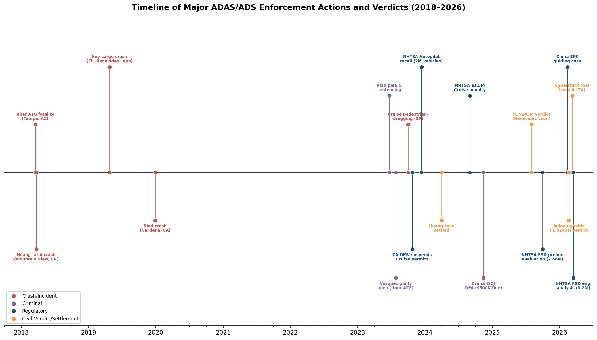

*Figure 3.1 — Timeline of major ADAS/ADS enforcement actions and verdicts from 2018 to early 2026, categorized by crashes/incidents, criminal proceedings, regulatory actions, and civil verdicts or settlements. The concentration of events in 2023–2026 reflects a marked acceleration in enforcement activity.*

## 3.1 Tesla Autopilot Fatal-Crash Litigation

### 3.1.1 Walter Huang — Mountain View, California (2018)

On March 23, 2018, Walter Huang, a 38-year-old Apple engineer, was killed when his Tesla Model X, operating on Autopilot, steered into a damaged crash attenuator at the Highway 85/101 interchange in Mountain View, California. The NTSB investigation determined that Autopilot's lane-following system misread faded lane markings at a gore area, directing the vehicle leftward into the crumpled barrier. The system simultaneously accelerated from a following speed to the cruise-set speed of 75 mph upon losing detection of the lead vehicle. Neither the camera nor the radar subsystem identified the stationary barrier, and no emergency braking was activated [NTSB/Forbes](https://www.forbes.com/sites/bradtempleton/2020/02/13/ntsb-releases-report-on-2018-fatal-silicon-valley-tesla-autopilot-crash/ "NTSB docket analysis of 2018 Tesla Autopilot fatal crash").

The NTSB identified three contributing factors: Huang's failure to maintain situational awareness despite having experienced Autopilot failures at the same location on prior occasions; Caltrans' delay in replacing the damaged crash attenuator; and the Autopilot system's inability to handle faded lane markings and stationary objects—a known limitation of the camera-radar perception architecture discussed in Chapter 1. Forensic evidence suggested Huang may have been engaged with a mobile game, though the finding was not conclusive [NTSB/Forbes](https://www.forbes.com/sites/bradtempleton/2020/02/13/ntsb-releases-report-on-2018-fatal-silicon-valley-tesla-autopilot-crash/ "NTSB contributing-factor findings").

Tesla settled the wrongful-death lawsuit brought by Huang's family in April 2024, on the eve of trial; settlement terms were not publicly disclosed [AP News](https://apnews.com/article/tesla-autopilot-lawsuit-settlement-f4c19ce05e17669de212fc262265e351 "Tesla settles Huang lawsuit, April 2024"). Because the case resolved without a jury verdict, it produced no binding liability precedent. The NTSB's factual findings—particularly its identification of Autopilot's stationary-object detection failure and the multi-factor causation analysis—have nonetheless been cited in subsequent litigation and regulatory proceedings.

### 3.1.2 Benavides Leon / Angulo v. Tesla — The $243 Million Florida Verdict (2025)

The most consequential ADAS liability verdict to date arose from an April 25, 2019 crash in Key Largo, Florida. Driver George McGee, operating a 2019 Model S with Autopilot engaged on a dark rural road, was distracted by a dropped cellphone and drove through flashing lights, a stop sign, and a T-intersection at 62 mph, striking a parked Chevrolet Tahoe. Naibel Benavides Leon, 22, was killed; her boyfriend Dillon Angulo sustained broken bones and a traumatic brain injury [U.S. News/AP](https://www.usnews.com/news/us/articles/2025-08-01/jury-says-tesla-must-pay-329-million-for-a-deadly-crash-involving-autopilot "AP report on Florida jury verdict, August 2025").

On August 1, 2025, a Miami federal jury returned a total award of $329 million, apportioning 33% fault to Tesla and 67% to McGee. Tesla's resulting liability: $19.5 million in compensatory damages to the Benavides Leon estate, $23.1 million to Angulo, and $200 million in punitive damages—totaling $243 million in the first federal jury verdict in a fatal Autopilot crash [U.S. News/AP](https://www.usnews.com/news/us/articles/2025-08-01/jury-says-tesla-must-pay-329-million-for-a-deadly-crash-involving-autopilot "Verdict breakdown, August 2025").

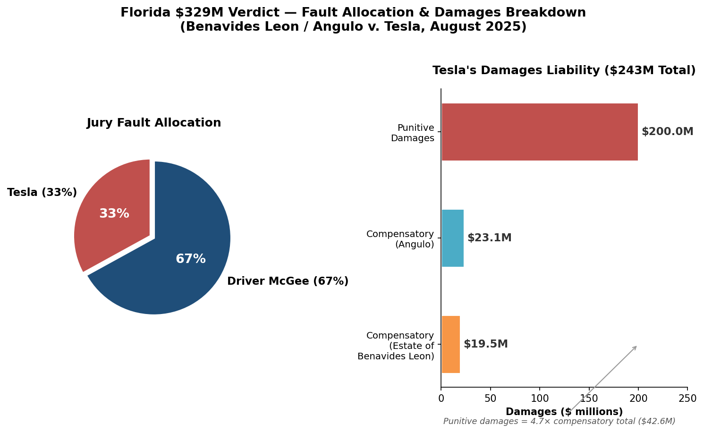

*Figure 3.2 — Jury fault allocation (left) and Tesla's $243 million damages liability breakdown (right) in the Benavides Leon / Angulo v. Tesla verdict. Punitive damages ($200 million) constitute 4.7× the compensatory total ($42.6 million), reflecting jury concern with manufacturer conduct beyond the crash itself.*

The verdict's significance lies in three dimensions. First, under Florida's modified comparative fault framework, Tesla's product liability survived despite the jury finding the driver overwhelmingly at fault. Plaintiff counsel successfully argued that Tesla failed to disengage Autopilot when the driver exhibited signs of distraction and permitted Autopilot engagement on smaller roads outside its intended operational context. Second, the $200 million punitive damages component—disproportionately large relative to the $42.6 million compensatory award—strongly suggests the jury was influenced by Tesla's conduct during litigation rather than the crash alone.

**Evidentiary Discovery: The Collision Snapshot Controversy.** The trial's most striking dimension concerned Tesla's handling of crash data. Plaintiffs alleged that Tesla systematically withheld "collision snapshot" data—sensor and camera recordings captured in the seconds surrounding the crash—which had been uploaded to Tesla's servers while the local vehicle copy was marked for deletion. Tesla denied possessing this data for years during discovery. A forensic data expert retained by plaintiffs recovered the data directly from vehicle hardware, revealing three critical facts: (a) Autopilot had not issued a "Take Over Immediately" alert despite approaching a T-intersection with a stationary vehicle; (b) the Autopilot electronic control unit's internal map data flagged the area as a "restricted Autosteer zone," yet the system remained engaged at full speed; and (c) Tesla's servers had received and acknowledged the collision snapshot minutes after the crash. Tesla's counsel characterized the data handling as "clumsy" but denied intentional misconduct [Hemmings](https://www.hemmings.com/stories/hacker-uncovers-data-tesla-found-withholding-evidence-in-florida-wrongful-death-case/ "Forensic recovery of Tesla withheld evidence, 2025") and [Washington Post](https://www.washingtonpost.com/technology/2025/08/29/tesla-autopilot-crashes-evidence-testimony-wrongful-death/ "Tesla crash data withholding investigation, August 2025").

On February 21, 2026, U.S. District Judge Beth Bloom denied Tesla's motion to overturn the verdict, ruling that the trial evidence "more than supports" the jury's decision [CNBC](https://www.cnbc.com/2026/02/20/tesla-loses-bid-toss-243-million-verdict-fatal-autopilot-crash-suit.html "Judge denies Tesla motion to overturn $243M verdict, February 2026"). Tesla is expected to appeal to the Eleventh Circuit, though no formal appellate filing had been confirmed as of early April 2026.

### 3.1.3 Kevin Riad — First Felony Prosecution of an ADAS Driver (California, 2019 Crash)

On December 29, 2019, Kevin George Aziz Riad's Tesla Model S, operating on Autopilot, ran a red light on Artesia Boulevard in Gardena, California, at 74 mph and struck a Honda Civic, killing both occupants: Gilberto Alcazar Lopez, 40, and Maria Guadalupe Nieves-Lopez, 39. Riad was charged in October 2021 with two counts of vehicular manslaughter—the first U.S. felony prosecution against a driver using a commercially available Level 2 ADAS. Tesla crash data showed the steering wheel was near center and Riad's hands remained on the wheel, but no braking occurred in the six minutes preceding impact, indicating sustained over-reliance on Autopilot [Daily Breeze](https://www.dailybreeze.com/2023/06/30/driver-of-tesla-on-autopilot-gets-probation-for-crash-that-killed-2-in-gardena/ "Riad case details and sentence, June 2023").

On June 22, 2023, Riad pleaded no contest. He was sentenced to two years of probation (with a four-year prison sentence suspended), 31 days of Caltrans community-service work, 100 hours of additional community service, 90 days of house arrest, and completion of a hospital-and-morgue program. The prosecution did not seek charges against Tesla. The Riad case thus established a critical precedent: at Level 2, criminal liability for vehicular manslaughter attaches to the human driver, not the vehicle manufacturer [Daily Breeze](https://www.dailybreeze.com/2023/06/30/driver-of-tesla-on-autopilot-gets-probation-for-crash-that-killed-2-in-gardena/ "Riad probation sentence, June 2023").

## 3.2 Uber ATG Pedestrian Fatality — Tempe, Arizona (2018)

The first fatal crash involving a fully autonomous test vehicle occurred on March 18, 2018, at 9:58 p.m. in Tempe, Arizona. A modified 2017 Volvo XC90 operated by Uber's Advanced Technologies Group (ATG) in autonomous mode struck and killed Elaine Herzberg, 49, as she crossed N. Mill Avenue outside a crosswalk while pushing a bicycle. The vehicle was traveling at approximately 45 mph [NTSB](https://www.ntsb.gov/investigations/Pages/HWY18MH010.aspx "NTSB official investigation page, Tempe AZ crash").

The NTSB investigation revealed a cascade of perception failures characteristic of the pipeline vulnerabilities identified in Chapter 1. The ADS first detected Herzberg 5.6 seconds before impact but cycled through classifying her as a "vehicle," "bicycle," "other," and "unknown"—never accurately identifying her as a pedestrian or predicting her trajectory. By the time the system determined a collision was imminent, the required braking distance exceeded available stopping distance. Critically, emergency braking had been disabled by Uber's system design, with collision avoidance delegated entirely to the human safety driver. Safety driver Rafaela Vasquez was watching the television show "The Voice" on her personal cellphone and redirected her gaze to the road only approximately one second before impact [NTSB](https://www.ntsb.gov/investigations/Pages/HWY18MH010.aspx "NTSB probable cause and findings").

The NTSB identified three institutional contributing factors: Uber ATG's (1) inadequate safety risk-assessment procedures, (2) ineffective oversight of vehicle operators, and (3) lack of adequate mechanisms for addressing automation complacency—all characterized as consequences of an "inadequate safety culture." Additional contributing factors included the pedestrian's decision to cross outside a crosswalk (with drugs impairing her judgment detected in toxicology) and the Arizona Department of Transportation's insufficient oversight of autonomous vehicle testing [NTSB](https://www.ntsb.gov/investigations/Pages/HWY18MH010.aspx "NTSB contributing factors").

**Criminal Outcome.** Vasquez was originally charged with negligent homicide. On July 28, 2023, she pleaded guilty to an "undesignated felony" of endangerment—reclassifiable as a misdemeanor upon successful completion of probation—and was sentenced to three years of supervised probation [NPR](https://www.npr.org/2023/07/28/1190866476/autonomous-uber-backup-driver-pleads-guilty-death "NPR: Vasquez guilty plea, July 2023").

**Corporate Non-Prosecution.** Prosecutors declined to file criminal charges against Uber as a corporation, despite the NTSB's findings regarding its deficient safety culture. Uber settled with the Herzberg family on undisclosed terms. The defense argued that Uber bore systemic responsibility for placing a single safety operator in the vehicle without a second crew member, stating: "It was not a question of if but when it was going to happen." The case thus established a pattern replicated in subsequent ADAS criminal proceedings: the human operator absorbs criminal liability while the corporate developer escapes prosecution, even where the investigating agency finds the developer's safety practices fundamentally deficient [NPR](https://www.npr.org/2023/07/28/1190866476/autonomous-uber-backup-driver-pleads-guilty-death "NPR: Uber settlement and corporate non-prosecution, July 2023").

## 3.3 GM Cruise — Regulatory Collapse and Corporate Criminal Liability

The GM Cruise episode represents the most comprehensive enforcement action to date against an autonomous vehicle developer, encompassing permit revocation, civil penalties, and a federal criminal admission—triggered not by the underlying crash but by the company's response to it.

### 3.3.1 The San Francisco Pedestrian-Dragging Incident (October 2023)

On October 2, 2023, a Cruise (GM subsidiary) autonomous Chevrolet Bolt robotaxi struck and dragged a pedestrian approximately 20 feet at roughly 7 mph in San Francisco. The pedestrian had first been struck by a separate, human-driven vehicle and thrown into the robotaxi's path. The robotaxi initially stopped upon contact but then executed a programmed "pull over" maneuver, dragging the pinned pedestrian along the roadway and inflicting serious injuries [CBS News](https://www.cbsnews.com/sanfrancisco/news/nhtsa-robotaxi-cruise-pay-penalty-failing-report-san-francisco-crash-involving-pedestrian/ "CBS report on Cruise incident and NHTSA penalty, September 2024").

### 3.3.2 California DMV Permit Suspension

On October 24, 2023, the California DMV immediately suspended Cruise's deployment and driverless testing permits, citing unreasonable risk to public safety and Cruise's misrepresentation of safety-related information. The DMV invoked regulations permitting suspension when "the manufacturer has misrepresented any information related to safety of the autonomous technology of its vehicles." The California Public Utilities Commission concurrently suspended Cruise's driverless operations permit. Cruise subsequently withdrew all driverless vehicles from roads nationwide [CNBC](https://www.cnbc.com/2023/10/24/california-dmv-suspends-cruises-self-driving-car-permits.html "CNBC: DMV permit suspension, October 2023").

### 3.3.3 NHTSA Civil Penalty

In September 2024, NHTSA imposed a $1.5 million civil penalty on Cruise via consent order for failing to fully report the October 2023 pedestrian-dragging incident. Cruise's initial report to NHTSA had omitted any reference to the dragging. The consent order required Cruise to submit a corrective action plan, hold quarterly meetings with NHTSA, and comply with enhanced reporting requirements for at least two years [CBS News](https://www.cbsnews.com/sanfrancisco/news/nhtsa-robotaxi-cruise-pay-penalty-failing-report-san-francisco-crash-involving-pedestrian/ "CBS: NHTSA $1.5M penalty, September 2024").

### 3.3.4 DOJ Deferred Prosecution Agreement

On November 14, 2024, the U.S. Department of Justice announced that Cruise had admitted to submitting a false report to influence a federal investigation related to the October 2023 crash. Under a three-year deferred prosecution agreement (DPA), Cruise agreed to pay a $500,000 criminal fine, cooperate with ongoing government investigations, implement a safety compliance program, and provide annual reports to the U.S. Attorney's Office for the Northern District of California [Reuters](https://www.reuters.com/business/autos-transportation/gm-self-driving-unit-cruise-admits-submitting-false-report-will-pay-500000-fine-2024-11-15/ "Reuters: Cruise DOJ DPA, November 2024").

The corporate fallout extended well beyond the criminal fine. CEO Kyle Vogt and co-founder Dan Kan resigned. Cruise cut approximately 25% of its workforce and dismissed nine executives, including its chief operating officer and chief legal and policy officer. GM reached a settlement with the injured pedestrian worth at least $8 million, and the company faces an ongoing Securities and Exchange Commission investigation [Reuters](https://www.reuters.com/business/autos-transportation/gm-self-driving-unit-cruise-admits-submitting-false-report-will-pay-500000-fine-2024-11-15/ "Reuters: Cruise leadership departures and settlement, November 2024").

The Cruise episode establishes a principle with broad implications: regulatory false reporting by an AV developer triggers independent corporate criminal exposure wholly separate from underlying crash liability. This precedent significantly raises the compliance stakes for all companies operating under NHTSA's Standing General Order reporting regime (Chapter 2, Section 2.1).

## 3.4 NHTSA Enforcement Actions Against Tesla

NHTSA's enforcement trajectory against Tesla illustrates a progressively escalating approach—from investigation to recall to engineering analysis on a recall track—and reveals how the "foreseeable misuse" doctrine is being operationalized at the regulatory level.

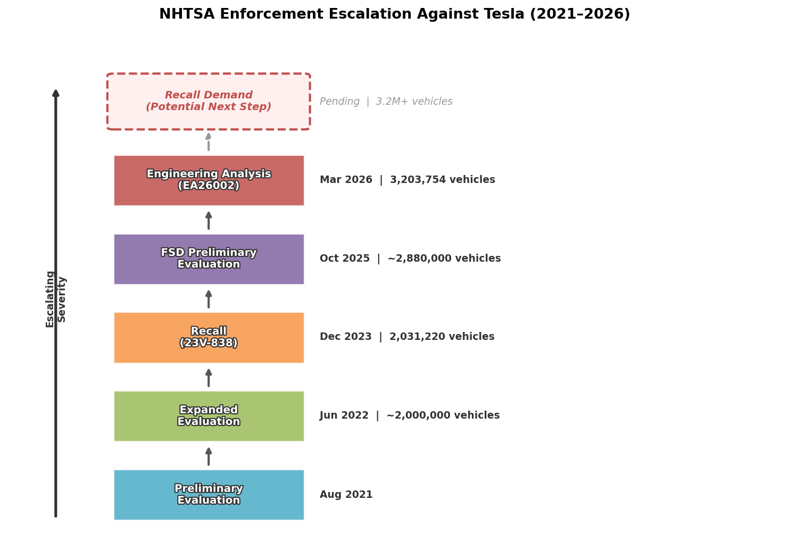

*Figure 3.3 — NHTSA enforcement escalation ladder against Tesla, 2021–2026. Each successive stage covers a larger vehicle population, culminating in the March 2026 Engineering Analysis (EA26002) covering 3.2 million vehicles—the final procedural step before a potential recall demand.*

### 3.4.1 December 2023 Autopilot Recall (23V-838)

On December 13, 2023, NHTSA issued the largest-ever Tesla recall: 2,031,220 vehicles (2012–2023 Model S, 2016–2023 Model X, 2017–2023 Model 3, and 2020–2023 Model Y equipped with Autopilot). The agency found that Autosteer controls "may not be sufficient to prevent driver misuse" and could increase the risk of a crash, constituting a safety defect. The critical doctrinal innovation was NHTSA's characterization: driver misuse was deemed "foreseeable misuse," placing the burden on the manufacturer to design against predictable over-reliance rather than merely warning against it [Reuters](https://www.reuters.com/business/autos-transportation/tesla-update-software-autopilot-control-issue-2-mln-vehicles-nhtsa-2023-12-13/ "Reuters: Tesla 2M vehicle Autopilot recall, December 2023").

The remedy—an over-the-air software update (version 2023.44.30) adding visual alerts, simplified Autosteer engagement/disengagement controls, and additional engagement checks—was deployed without physical service visits. Tesla stated it did not agree with NHTSA's analysis but implemented the update. The underlying investigation had originated in August 2021 after NHTSA identified more than a dozen crashes in which Tesla vehicles on Autopilot struck stationary emergency vehicles, and was expanded in June 2022 following review of 956 crashes where Autopilot was initially alleged to have been in use, with focused analysis of 322 confirmed Autopilot-involved crashes [Reuters](https://www.reuters.com/business/autos-transportation/tesla-update-software-autopilot-control-issue-2-mln-vehicles-nhtsa-2023-12-13/ "Reuters: Autopilot investigation background, December 2023").

The foreseeable-misuse framing carries significant doctrinal implications, as analyzed in Chapter 4. By classifying predictable driver over-reliance as a design defect rather than user error, NHTSA established that Level 2 ADAS manufacturers bear a duty to design systems robust against the very complacency their own systems induce—a principle rooted in the automation-complacency dynamics discussed in Chapter 1.

### 3.4.2 FSD Investigation Escalation (2025–2026)

NHTSA's scrutiny of Tesla's Full Self-Driving (Supervised) software has followed a progressive enforcement arc:

- **October 2025**: NHTSA opened a preliminary evaluation into approximately 2.88 million Tesla vehicles equipped with FSD after receiving reports of 58 safety incidents, including crashes where the system directed vehicles through red lights, into opposing traffic lanes, and through turn-only intersections [CBS News](https://www.cbsnews.com/news/tesla-fsd-nhtsa-investigation-traffic-violations/ "CBS: FSD investigation opened, October 2025").

- **March 18, 2026**: NHTSA escalated the probe to an Engineering Analysis (EA26002) covering 3,203,754 vehicles—a mandatory procedural step before the agency can seek a recall. The engineering analysis identified concerns that Tesla's camera-based perception system (Tesla Vision, adopted in mid-2021 after the removal of radar and ultrasonic sensors) fails to detect or appropriately warn drivers under degraded visibility conditions including sun glare, dust, fog, and other airborne obstructions. Nine incidents were identified as potentially linked to this issue, including one fatal crash and two injury crashes, with six additional crashes under review. In many of the examined crashes, "FSD also lost track of or never detected a lead vehicle in its path" [Reuters](https://www.reuters.com/business/autos-transportation/us-auto-safety-regulator-opens-probe-into-tesla-vehicles-with-fsd-2026-03-19/ "Reuters: NHTSA FSD engineering analysis, March 2026").

The engineering analysis phase typically concludes within 18 months, after which NHTSA either closes the case or moves toward a formal recall demand. The investigation's focus on camera-degradation detection failures directly implicates the sensor-architecture trade-offs discussed in Chapter 1—specifically, the vulnerabilities inherent in Tesla's camera-only approach compared with the multi-sensor fusion architectures employed by Waymo and Mercedes-Benz.

## 3.5 Emerging Cases and International Precedents (2025–2026)

### 3.5.1 Tesla Cybertruck FSD Lawsuit — Texas (March 2026)

In March 2026, plaintiff Justine Saint Amour filed suit in Harris County District Court, Texas, seeking over $1 million in damages after her Cybertruck, running FSD, attempted to drive straight off a Houston overpass (69 Eastex Freeway) into a concrete barrier on August 18, 2025, rather than following the highway curve. Saint Amour disengaged the system and seized the wheel but could not fully avoid the collision [Electrek](https://electrek.co/2026/03/11/tesla-cybertruck-fsd-lawsuit-musk-negligent-hiring/ "Electrek: Cybertruck FSD lawsuit, March 2026").

The lawsuit advances several novel legal theories. Among 16 specific allegations of negligent conduct, the complaint includes a theory of "negligently hiring and negligently retaining Elon Musk as CEO, and allowing him to participate in product design decisions"—specifically accusing Tesla of permitting Musk to override engineer recommendations to incorporate radar and LiDAR sensors. The complaint also asserts strict liability claims for design defects and marketing defects, alleging that the "Full Self-Driving" label is materially misleading for a Level 2 system. The petition references a December 2025 California judicial ruling that Tesla's FSD marketing is "actually, unambiguously false and counterfactual" [Electrek](https://electrek.co/2026/03/11/tesla-cybertruck-fsd-lawsuit-musk-negligent-hiring/ "Electrek: novel legal theories in Cybertruck lawsuit, March 2026").

While no verdict has been rendered, the Cybertruck lawsuit is notable for attempting to pierce the boundary between executive decision-making and product-design liability—specifically targeting the CEO's role in sensor-architecture decisions that NHTSA's engineering analysis has separately flagged as a safety concern. If this theory gains traction, it could establish a new dimension of corporate officer liability in ADAS product design.

### 3.5.2 China — Supreme People's Court Guiding Case (February 2026)

On February 13, 2026, China's Supreme People's Court (SPC) issued a guiding case establishing that drivers remain legally liable for their vehicles even when using advanced driver-assistance systems—and even when vacating the driver's seat. The underlying case involved a driver convicted in September 2025 of dangerous driving after activating his Level 2 driver-assistance system while intoxicated, bypassing safety protocols, and falling asleep in the passenger seat. He was sentenced to criminal detention and fined 4,000 yuan (~$574). Notably, no collision occurred; the vehicle eventually stopped and blocked a roadway [Caixin Global](https://www.caixinglobal.com/2026-02-14/chinas-top-court-rules-drivers-are-liable-for-cars-with-assistance-systems-102414579.html "Caixin: China SPC guiding case, February 2026").

The SPC guiding case carries quasi-binding authority within China's judicial hierarchy, establishing a unified national standard: until full autonomy is achieved, human drivers retain primary criminal responsibility regardless of ADAS engagement status. This ruling complements the tiered liability framework established by MIIT's July 2025 ethics guidelines (Chapter 2, Section 2.4) and reinforces the principle that Level 2 systems—regardless of marketing as "intelligent driving" or "autonomous"—do not transfer legal control authority from the human driver.

### 3.5.3 Mercedes-Benz DRIVE PILOT — Untested Liability Acceptance

Mercedes-Benz's 2022 commitment to accept legal liability when its Level 3 DRIVE PILOT system is engaged within its defined Operational Design Domain (ODD) represents the first formal manufacturer assumption of driving liability for an SAE Level 3 feature. DRIVE PILOT received type approval from Germany's KBA in December 2021 and was subsequently certified for operation in Nevada and California (2023–2024) [Mercedes-Benz Group](https://group.mercedes-benz.com/technology/autonomous-driving/driving/legal-framework.html "Mercedes official automated driving legal framework").

As of early 2026, no publicly reported crashes, injuries, or lawsuits involving DRIVE PILOT have been identified; the liability commitment therefore remains an untested framework. Its structural viability rests on the narrow, enforceable ODD (highway-only, speed-limited, fair weather, pre-mapped routes), robust driver monitoring, and guaranteed minimal risk condition (MRC) procedures—the same features that define the technical architecture of responsible Level 3 deployment as discussed in Chapter 1. Whether this commitment will survive a high-stakes wrongful-death claim remains an open question, particularly given Mercedes's January 2026 decision to pause DRIVE PILOT deployment in the facelifted S-Class due to the restricted ODD, high LiDAR costs, and the bankruptcy of former LiDAR supplier Luminar (Chapter 6).

## 3.6 Evidentiary Challenges in ADAS/ADS Litigation

The cases surveyed above reveal a set of recurring evidentiary challenges that fundamentally shape litigation outcomes in ADAS/ADS disputes.

### 3.6.1 Manufacturer Data Asymmetry and Concealment

Tesla's collision-snapshot controversy in the Florida $243 million verdict (Section 3.1.2) illustrates the most acute evidentiary problem: manufacturers control virtually all post-crash data. Tesla vehicles generate substantial quantities of raw CAN bus data, but the company has historically produced only curated "EDR summaries" in litigation, with the proprietary DBC file needed to decode raw CAN data controlled exclusively by the manufacturer. Courts have found Tesla's claims not to possess crash data "not credible and appear[] to have been a willful and/or intentional misrepresentation" [FlyingPenguin](https://www.flyingpenguin.com/guide-to-tesla-hiding-their-crash-data/ "Tesla crash data forensic analysis, October 2025").

This data asymmetry places plaintiffs at a structural disadvantage. In the Florida case, only the retention of an independent forensic expert capable of decoding vehicle hardware yielded the evidence that proved decisive at trial. The $200 million punitive damages award suggests the jury penalized Tesla not merely for the crash but for its post-crash data-handling conduct—a pattern that may incentivize future plaintiffs to pursue discovery-abuse claims alongside substantive product-defect theories.

### 3.6.2 OTA Updates as a Moving Evidentiary Target

Over-the-air software updates create a distinctive evidentiary challenge: the software version operating at the time of a crash may differ materially from the version available at trial. NHTSA's December 2023 recall remedy was itself delivered via OTA—the same mechanism that "fixes" the defect simultaneously alters the software configuration that constituted the defect, complicating litigation over pre-recall incidents. The Cybertruck FSD lawsuit further alleges that Tesla uses non-disclosure agreements to prevent drivers from sharing information about FSD's performance, a practice NHTSA has flagged as adversely affecting its investigative capacity [Electrek](https://electrek.co/2026/03/11/tesla-cybertruck-fsd-lawsuit-musk-negligent-hiring/ "Electrek: NDA and NHTSA concerns, March 2026").

Where pre-crash software states are not preserved, plaintiffs face a spoliation problem: the evidence of the defect has been overwritten by the manufacturer's own remedial action. Chapter 5 examines the regulatory infrastructure—EDR mandates, DSSAD requirements, and OTA governance frameworks—designed to address this gap.

### 3.6.3 Neural Network Opacity — The "Black Box" Problem

Proving defect in neural-network-based ADAS requires demonstrating that the training data, model architecture, or inference pipeline was inadequate—a burden that far exceeds traditional product-defect proof. The Uber ATG case illustrates this challenge starkly: the ADS detected Herzberg 5.6 seconds before impact but cycled through four classification categories without ever correctly identifying her. The system "saw" the obstacle but could not interpret it—a failure mode practically invisible without deep forensic examination of the perception pipeline [NTSB](https://www.ntsb.gov/investigations/Pages/HWY18MH010.aspx "NTSB: ADS classification cycling in Herzberg crash").

In the Huang case, the NTSB determined that Tesla's lane-finding neural networks had not been trained to identify a crumpled crash attenuator—an environmental feature outside the system's training distribution. Reconstructing this failure required extensive forensic analysis of sensor logs and neural-network behavior. For plaintiffs, the malfunction doctrine under Restatement (Third) §3—which permits circumstantial proof of defect when a product performs in a manner "that ordinarily occurs as a result of product defect"—may offer the most viable path around the black-box problem, as analyzed in Chapter 4.

### 3.6.4 Comparative Fault as a Liability Framework

A consistent pattern across Tesla Autopilot cases is the application of comparative fault, with juries apportioning shared liability between driver and manufacturer. In the Florida verdict, the 33%/67% Tesla/driver split meant that even a finding of overwhelming driver fault preserved $243 million in manufacturer liability—including the full punitive damages award. The driver himself testified: "I trusted the technology too much. I believed that if the car saw something in front of it, it would provide a warning and apply the brakes" [U.S. News/AP](https://www.usnews.com/news/us/articles/2025-08-01/jury-says-tesla-must-pay-329-million-for-a-deadly-crash-involving-autopilot "Driver testimony, August 2025").

This comparative-fault dynamic creates a structurally significant outcome: manufacturers cannot fully insulate themselves from liability by demonstrating driver negligence. In modified comparative fault jurisdictions such as Florida, the manufacturer's marketing practices—and the expectation gap they create between system capability and user belief—may function as a liability multiplier, as explored in Chapter 4's analysis of the "driver's double bind."

## 3.7 Synthesis: Emergent Liability Principles

The cases and enforcement actions analyzed in this chapter yield five emergent principles reshaping the law of ADAS/ADS liability:

**1. Product liability survives driver fault.** The Florida $243 million verdict demonstrates that under comparative negligence, a manufacturer can face liability of hundreds of millions of dollars even when the driver was overwhelmingly at fault. Comparative fault allocates responsibility proportionally, and punitive damages—driven by manufacturer conduct in litigation—can dwarf the compensatory award.

**2. Misleading marketing constitutes an independent liability basis.** The Florida verdict, the Cybertruck Texas lawsuit, and the California DMV's December 2025 ruling (Chapter 1) all target Tesla's use of "Autopilot" and "Full Self-Driving" terminology. The California ruling's finding that FSD marketing is "actually, unambiguously false and counterfactual" provides a foundation for standalone failure-to-warn and marketing-defect claims independent of any specific crash.

**3. Criminal liability defaults to the human operator.** In both the Riad and Vasquez cases, criminal charges fell on the human driver or safety operator, not the manufacturer or developer. Prosecutors declined to charge Uber despite the NTSB's finding of "inadequate safety culture," and Tesla has faced no criminal charges in connection with Autopilot fatalities. This pattern reflects the current legal architecture at Level 2: the driver bears the monitoring obligation and thus absorbs criminal fault.

**4. Regulatory false reporting triggers independent corporate criminal exposure.** The Cruise DOJ deferred prosecution agreement established that AV companies face criminal liability for submitting false or misleading safety reports—a basis for prosecution entirely separate from the underlying crash. This precedent raises the compliance stakes for all entities subject to NHTSA's Standing General Order reporting requirements.

**5. NHTSA's enforcement posture is escalating progressively.** The trajectory from preliminary evaluation to expanded evaluation to engineering analysis—each covering a larger vehicle population (approximately 2.4 million to 2.88 million to 3.2 million)—demonstrates a pattern of progressive intensification. The engineering analysis (EA26002) represents the final procedural step before a recall demand, signaling that NHTSA may be moving toward the first-ever mandatory recall of a "Full Self-Driving" feature.

Taken together, these principles indicate that the liability landscape for ADAS-equipped vehicles is shifting toward a multi-dimensional accountability framework in which manufacturer liability is not extinguished by driver fault, marketing claims carry independent legal weight, data-handling practices influence punitive exposure, and regulatory enforcement converges with private litigation to create compounding liability risk. Chapter 4 situates these emergent principles within established liability doctrine and proposes a structured allocation model.

# 第4章 Liability Theory and Allocation Models

The preceding chapters established the technical architecture of Advanced Driver-Assistance Systems (ADAS) and Automated Driving Systems (ADS) (Chapter 1), the statutory and regulatory frameworks governing their deployment across major jurisdictions (Chapter 2), and the judicial and enforcement precedents that have begun to define liability in practice (Chapter 3). Building on those foundations, this chapter undertakes a doctrinal analysis of the competing liability theories applicable to shared human-machine driving, examines how existing tort frameworks accommodate—or fail to accommodate—the distinctive characteristics of partially and conditionally automated vehicles, and synthesizes these threads into a multi-factor liability allocation model. The analysis draws on the Restatement (Third) of Torts: Products Liability, the leading academic treatments by Geistfeld (2017), Marchant and Lindor (2012), Robertson (2023), and Abraham and Rabin (2019), and the emerging concept of the Automated Driving System Entity (ADSE) as adopted in Germany, the United Kingdom, Australia, and China. The central argument is that no single liability doctrine adequately addresses the full spectrum of ADAS/ADS deployment; rather, a structured multi-factor framework—indexed to the degree of automation active at the moment of an accident—is required to achieve both adequate victim compensation and appropriate innovation incentives.

## 4.1 Strict Product Liability: Design Defect, Manufacturing Defect, and Failure to Warn

### 4.1.1 Design Defect — The Consumer-Expectation and Risk-Utility Tests

Under the Restatement (Third) of Torts: Products Liability § 2(b), a product contains a design defect when the foreseeable risks of harm could have been reduced or avoided by adopting a reasonable alternative design, and the omission of that alternative renders the product not reasonably safe. Two principal tests for design defect—consumer expectation and risk-utility—yield markedly different outcomes when applied to ADAS.

The **risk-utility test**, adopted by a majority of U.S. jurisdictions, asks whether the manufacturer could have adopted a reasonable alternative design that would have reduced harm at acceptable cost. For ADAS, this inquiry is analytically tractable: a plaintiff may argue that a more robust driver-monitoring system (DMS), the incorporation of LiDAR fusion rather than camera-only perception, or stricter Operational Design Domain (ODD) enforcement software would have prevented the crash at reasonable marginal cost. The risk-utility framework is well suited to evaluating engineering trade-offs in automated driving because it permits expert testimony on alternative sensor architectures, redundancy strategies, and software design choices [Marchant & Lindor, 52 Santa Clara L. Rev. 1321 (2012)](https://digitalcommons.law.scu.edu/cgi/viewcontent.cgi?article=2731&context=lawreview "Marchant & Lindor 2012: risk-utility analysis for autonomous vehicles").

The **consumer-expectation test**, by contrast, asks whether the product performed as safely as an ordinary consumer would expect when used in an intended or reasonably foreseeable manner. The Restatement (Third) § 2 comment d characterizes this standard as "generally considered particularly inapplicable in cases involving the analysis of technical and scientific information." For ADAS, however, the consumer-expectation test exposes what Robertson (2023) terms the "driver's double bind": manufacturers market systems under names such as "Autopilot" and "Full Self-Driving" that cultivate expectations of autonomous capability, while simultaneously warning in owner's manuals that the driver must remain attentive and in control at all times. The ordinary consumer who encounters the brand name "Full Self-Driving" on a purchase screen forms expectations that diverge sharply from those implied by the disclaimer on page 87 of the owner's manual [Robertson, Case Western Faculty Publications 2188 (2023)](https://scholarlycommons.law.case.edu/cgi/viewcontent.cgi?article=3188&context=faculty_publications "Robertson 2023: the driver's double bind and autonowashing"). The California Department of Motor Vehicles' December 2025 ruling—finding Tesla's FSD marketing "actually, unambiguously false and counterfactual"—provides a concrete legal basis for arguing that manufacturer-created expectations, not merely product performance, constitute an independent basis for design defect claims.

### 4.1.2 Manufacturing Defect and the Software-as-Product Question

Traditional manufacturing defect doctrine under Restatement (Third) § 2(a) applies when a product departs from its intended design due to a production-line error affecting individual units. Geistfeld (2017) argues that software coding errors in ADAS are analytically design defects rather than manufacturing defects, because every vehicle running the same software version shares the identical flaw. A manufacturing defect claim presupposes that the defective unit diverges from the manufacturer's intended design—an architecture that does not map onto software, where the "design" is the code itself. In the ADAS context, manufacturing defect claims are therefore largely confined to quality-control problems with hardware (sensor misalignment, wiring faults, component degradation) rather than algorithmic failures [Geistfeld, 105 Calif. L. Rev. 1611 (2017)](https://lawcat.berkeley.edu/record/1127996/files/fulltext.pdf "Geistfeld 2017: software defects as design defects").

The revised EU Product Liability Directive (PLD), Directive (EU) 2024/2853—with a transposition deadline of December 9, 2026—resolves an ambiguity that had persisted under the 1985 directive by explicitly defining software, AI systems, and over-the-air (OTA) updates as "products." A party that "substantially modifies" a product via software update can be deemed a "manufacturer" for liability purposes, and each safety-relevant OTA constitutes a new product placement that restarts the ten-year liability period [Reed Smith](https://www.reedsmith.com/articles/the-new-eu-product-liability-key-implications-autonomous-vehicle/ "Reed Smith: EU PLD implications for autonomous vehicles, October 2025"). This framework means that a machine-learning model whose behavior drifts through retraining, or an OTA update that alters perception-system parameters, can independently give rise to product liability—a significant doctrinal expansion beyond current U.S. jurisprudence, which has not yet explicitly classified post-sale software modifications as new product placements.

### 4.1.3 Failure to Warn and the "Autonowashing" Problem

Under Restatement (Third) § 2(c), a product is defective due to inadequate instructions or warnings when the foreseeable risks of harm could have been reduced by reasonable instructions or warnings and their omission renders the product not reasonably safe. Comment l to § 2 establishes a critical limitation: when a safer design exists, "adoption of that design is required over a warning that leaves a significant residuum of risks." Warnings are legally insufficient when users are "likely to be inattentive" to them—a description that aligns precisely with the automation complacency patterns documented in Chapter 1.

Robertson (2023) introduces the concept of "autonowashing"—the systematic inflation of autonomous capabilities through marketing, user-interface design, and public statements that cultivate user reliance beyond the system's actual functional envelope. The doctrinal consequence is that manufacturer-generated marketing messages may undermine the legal adequacy of the manufacturer's own warnings, creating an independent failure-to-warn claim even when the owner's manual contains technically accurate disclaimers. Two recent regulatory actions confirm that failure-to-warn theory extends beyond the product manual to encompass the entire marketing ecosystem: the California DMV's December 2025 ruling ordered Tesla to modify marketing language for "Autopilot" and "Full Self-Driving Capability" within sixty days after finding these terms violated state law [California DMV](https://www.dmv.ca.gov/portal/news-and-media/news-releases/dmv-finds-tesla-violated-california-state-law/ "California DMV: Tesla marketing violation, December 2025"), while China's MIIT in April 2025 directed sixty automakers to ban misleading autonomy-implying terms. Together, these actions establish a cross-jurisdictional regulatory consensus that the naming and marketing of ADAS constitute a material component of the manufacturer's duty to warn.

### 4.1.4 The State-of-the-Art Defense and Hindsight Bias

A persistent concern in applying product liability to ADAS is the state-of-the-art defense: the argument that the manufacturer employed the best available technology at the time of design and therefore should not be held liable for limitations inherent in the technological frontier. Marchant and Lindor (2012) identify an acute hindsight-bias problem: in an adversarial litigation environment, plaintiff experts can "almost always identify an alternative approach or technology that the manufacturer should have known about and used," even when that approach was experimental or commercially infeasible at the time of product release [Marchant & Lindor, 52 Santa Clara L. Rev. 1321 (2012)](https://digitalcommons.law.scu.edu/cgi/viewcontent.cgi?article=2731&context=lawreview "Marchant & Lindor 2012: state-of-the-art defense and hindsight bias"). The risk is that excessive liability exposure may chill innovation, deterring manufacturers from deploying safety-improving systems to avoid becoming litigation targets for inevitable edge-case failures.

The revised EU PLD addresses this tension by permitting—but not requiring—Member States to recognize the state-of-the-art defense. A Member State that omits this defense creates a regime of potentially more expansive liability for ADAS manufacturers marketing products within its territory. The resulting divergence among Member State approaches, combined with the cross-border nature of automotive markets, introduces regulatory arbitrage considerations that have no analogue in the unified U.S. federal products-liability framework under the Restatement. For manufacturers deploying identical ADAS software across EU markets, the practical consequence is that the most restrictive Member State's approach may define the effective liability standard for the entire European fleet.

## 4.2 Negligence: Manufacturer Duty of Care and Foreseeable Misuse

### 4.2.1 Fault-Tolerant Design as a Duty of Care

Independent of strict product liability, manufacturers of ADAS owe a common-law duty of care grounded in negligence principles. Geistfeld (2017) articulates this duty in terms of "fault-tolerant design": manufacturers "cannot merely warn drivers to stay 'alert'; they must instead adopt fault-tolerant designs for DAS whenever doing so would be a cost-effective method for reducing the risk of driver error." This obligation is analytically distinct from design defect doctrine—it asks not whether the product is "defective" but whether the manufacturer exercised reasonable care in anticipating and mitigating foreseeable human behavioral responses to the system [Geistfeld, 105 Calif. L. Rev. 1611 (2017)](https://lawcat.berkeley.edu/record/1127996/files/fulltext.pdf "Geistfeld 2017: fault-tolerant design obligation").

The practical implication is significant: compliance with formal safety standards such as ISO 26262 (functional safety) and ISO 21448/SOTIF (Safety of the Intended Functionality) is probative of due care but not dispositive. Under Restatement (Third) § 4 comment e, compliance with industry standards or government regulations does not immunize a manufacturer from liability where a reasonable person in the manufacturer's position would have taken additional precautions. Mercedes-Benz's DRIVE PILOT safety case—which layers ISO 26262 and SOTIF analysis with redundant sensor architectures and a narrowly defined, hardware-enforced ODD (Chapter 1)—exemplifies the kind of fault-tolerant design approach that satisfies this standard. By contrast, Tesla's reliance on camera-only perception without LiDAR fusion, combined with a DMS historically based on steering-wheel torque sensing rather than camera-based gaze tracking, raises questions about whether those design choices meet the fault-tolerant threshold—particularly when the system is marketed under the "Full Self-Driving" label that may encourage driver disengagement.

### 4.2.2 Foreseeable Misuse as a Doctrinal Bridge

The concept of foreseeable misuse serves as a critical doctrinal bridge between negligence theory and the technical realities of ADAS deployment. Under Restatement (Third) § 2, comment m, a manufacturer must anticipate "reasonably foreseeable" product uses, including uses that deviate from the manufacturer's instructions. When a manufacturer possesses actual knowledge that users predictably engage in behavior that its product enables but its warnings prohibit—such as sustained hands-off, eyes-off driving during Level 2 (L2) ADAS engagement—the duty extends beyond warning to encompass design measures that prevent or mitigate the foreseeable misuse.

NHTSA's December 2023 recall of 2,031,220 Tesla vehicles provides a regulatory anchor for this doctrine. NHTSA explicitly characterized the driver behavior documented in its investigation—sustained inattention during Autopilot engagement—as "foreseeable misuse" constituting a safety defect, rather than unforeseeable driver negligence excusing the manufacturer [Reuters](https://www.reuters.com/business/autos-transportation/tesla-update-software-autopilot-control-issue-2-mln-vehicles-nhtsa-2023-12-13/ "Reuters: Tesla recall, foreseeable misuse framing, December 2023"). This framing aligns with the empirical evidence surveyed in Chapter 1: Nordhoff et al. (2023), interviewing 103 Tesla users, documented that 46 of 103 respondents engaged in eyes-off-road driving, 48 of 103 used Autopilot outside its designed ODD, and 21 of 103 defeated the steering-wheel torque sensor to avoid monitoring prompts [Nordhoff et al. 2023](https://pmc.ncbi.nlm.nih.gov/articles/PMC9996345/ "Nordhoff et al., 2023: misuse patterns among 103 Tesla users").

The doctrinal significance is that foreseeable misuse converts what would otherwise be a pure driver-fault defense into a concurrent manufacturer liability theory. A manufacturer that knows—through its own telemetry data, published academic research, and regulatory findings—that users predictably misuse its product cannot rely on the instruction-manual warning as a complete defense; it must design against the foreseeable misuse or accept concurrent liability for the consequences.

### 4.2.3 Automation Complacency and HMI Design Negligence

Closely related to foreseeable misuse is the phenomenon of automation complacency—well-documented in human-factors research—whereby operators of partially automated systems progressively disengage from the supervisory task precisely because the automation performs reliably most of the time. Robertson (2023) draws on Bainbridge's seminal "ironies of automation" to frame the liability problem: partially automated systems create a paradoxical safety risk in which better automation degrades human supervisory capacity, meaning that the very success of the system in routine operation undermines the driver's ability to intervene when the system encounters an edge case [Robertson, Case Western Faculty Publications 2188 (2023)](https://scholarlycommons.law.case.edu/cgi/viewcontent.cgi?article=3188&context=faculty_publications "Robertson 2023: ironies of automation and HMI negligence").

The negligence theory here targets the human-machine interface (HMI) design rather than the automated driving function itself. When a DMS is inadequate—as with Tesla's pre-2024 steering-wheel torque sensor, which users could defeat with a weighted clip or water bottle—or when the system fails to escalate alerts in a manner calibrated to empirically observed complacency patterns, the manufacturer may bear negligence liability for designing an HMI that invites the complacency it purports to guard against. Google's decision to abandon its Level 2/Level 3 development program after internal testing revealed engineers falling asleep and streaming video during test drives illustrates the industry's own recognition that certain HMI architectures are inherently incompatible with sustained human vigilance—a recognition that strengthens the negligence case against manufacturers who persist with such architectures.

## 4.3 Vicarious and Enterprise Liability in the Multi-Vendor Supply Chain

### 4.3.1 The OEM as System Integrator

Modern ADAS architectures involve multi-layered supply chains: sensor hardware suppliers (e.g., Mobileye, Luminar, Continental), software platform developers, mapping providers, and the original equipment manufacturer (OEM) that integrates these components into a finished vehicle. Under Restatement (Third) § 5 comment b, a component supplier generally owes no independent duty to warn the ultimate consumer when the buyer-integrator is a "sophisticated purchaser" capable of evaluating the component's risks. The OEM, as the party that selects, integrates, calibrates, and markets the final system, bears primary exposure due to its control over the integrated product and its position as the entity with deepest pockets [Marchant & Lindor, 52 Santa Clara L. Rev. 1321 (2012)](https://digitalcommons.law.scu.edu/cgi/viewcontent.cgi?article=2731&context=lawreview "Marchant & Lindor 2012: multi-party supply-chain liability").

Tesla's camera-only "Tesla Vision" architecture illustrates integrator liability in practice. NHTSA's March 2026 engineering analysis (EA26002) into 3.2 million Tesla vehicles identified perception failures—inability to detect common roadway conditions such as glare, dust, and airborne obstructions—attributable to the system-level design decision to rely exclusively on cameras without LiDAR or radar fusion. The investigation targets Tesla as the system integrator, not the individual camera-module suppliers, because the decision to eliminate supplementary sensor modalities was an OEM-level architectural choice with system-wide safety implications [Reuters](https://www.reuters.com/business/autos-transportation/us-auto-safety-regulator-opens-probe-into-tesla-vehicles-with-fsd-2026-03-19/ "Reuters: NHTSA FSD engineering analysis targeting Tesla, March 2026").

### 4.3.2 Abraham and Rabin's Manufacturer Enterprise Responsibility

Abraham and Rabin (2019) propose a transformative departure from prevailing fault-based and comparative-negligence frameworks for higher levels of automation. Their manufacturer enterprise responsibility model envisions strict no-fault manufacturer liability for all accidents occurring during automated driving in Level 4 (L4) and Level 5 (L5) vehicles. The model rests on three pillars: (1) the manufacturer is the entity best positioned to internalize accident costs and translate them into safety-improving design incentives; (2) the driver's supervisory role is functionally eliminated at L4–L5, rendering driver-fault analysis conceptually incoherent; and (3) a vehicle-sales surcharge funds the liability pool, distributing costs across the entire fleet rather than imposing catastrophic exposure on individual accident victims [Abraham & Rabin, 105 Va. L. Rev. 127 (2019)](https://www.virginialawreview.org/wp-content/uploads/2020/12/A&R_Book.pdf "Abraham & Rabin 2019: manufacturer enterprise responsibility for highly automated vehicles").

Abraham and Rabin propose triggering this regime when highly automated vehicles reach twenty-five percent market penetration—a threshold that would eliminate driver negligence claims during automated driving and replace them with manufacturer strict liability. While this threshold remains distant (S&P Global Mobility projects approximately 3.5 million Level 3 and 1.7 million Level 4 vehicles on U.S. roads by 2035), the model provides an analytically coherent endpoint for the liability trajectory already visible in the L2/L3 transition: as automation capability increases, the driver-fault share decreases and the manufacturer-liability share correspondingly increases.

The following figure summarizes the applicability of the liability theories discussed in Sections 4.1 through 4.3 across the SAE automation spectrum, illustrating the progressive shift from driver-centric to manufacturer-centric liability.

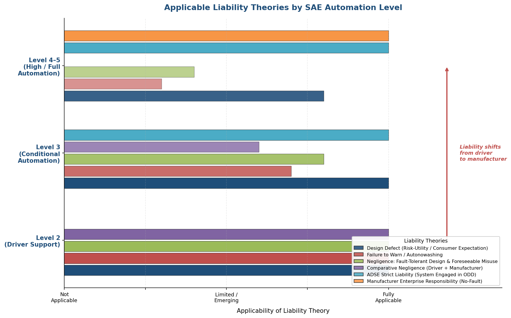

*Figure 4.1 — Applicability of six liability theories across three SAE automation tiers (L2, L3, L4–L5). The annotated arrow highlights the progressive shift of primary liability from driver to manufacturer as the degree of automation increases.*

## 4.4 Comparative Negligence and the Expectation Gap

### 4.4.1 The Florida Verdict as a Model for Shared Liability

The August 2025 Florida verdict in *Benavides Leon / Angulo v. Tesla* (Chapter 3) provides the most significant empirical data point for comparative negligence allocation in ADAS litigation. The jury assigned 33% fault to Tesla and 67% to driver McGee, yielding a $243 million manufacturer share of the $329 million total award. Under Florida's modified comparative fault regime, this allocation permitted the plaintiff to recover Tesla's proportionate share despite the driver's substantial negligence—a result that would have been barred in a contributory negligence jurisdiction.

The verdict demonstrates that product liability and driver negligence are not mutually exclusive categories but concurrent, proportionally allocated fault streams. Robertson (2023) argues that courts should "consider collaborative driving as a system when allocating liability," recognizing that in an L2 ADAS context, human performance and machine performance are interdependent: the system's capabilities shape the driver's behavior, and the driver's behavior determines whether the system's limitations become dangerous [Robertson, Case Western Faculty Publications 2188 (2023)](https://scholarlycommons.law.case.edu/cgi/viewcontent.cgi?article=3188&context=faculty_publications "Robertson 2023: collaborative driving system approach to liability"). This "system" perspective reframes the liability question from a binary attribution—either the driver erred or the product was defective—to a functional analysis of how the human-machine interaction as a whole produced the harmful outcome.

### 4.4.2 The Marketing-Induced Expectation Gap as a Liability Multiplier

In modified comparative fault jurisdictions—where a plaintiff's recovery is barred if the plaintiff's fault exceeds a specified threshold (typically 50% or 51%)—the allocation between manufacturer and driver fault is outcome-determinative. The "expectation gap" between marketed capability and actual system limitations functions as a liability multiplier: the wider the gap, the greater the manufacturer's proportionate share of fault. A manufacturer that markets a system as "Full Self-Driving" while simultaneously requiring constant driver supervision creates an expectation gap that a jury may translate into a higher manufacturer fault percentage.

The $200 million punitive damages component of the Florida verdict—nearly five times the $42.6 million compensatory award—illustrates how the expectation gap interacts with discovery-phase conduct. Evidence that Tesla withheld collision snapshot data, that the system's internal map data flagged the crash location as a "restricted Autosteer zone" while permitting Autopilot to remain engaged, and that the Autopilot electronic control unit did not issue a take-over alert collectively contributed to a punitive damages award reflecting the jury's assessment of corporate conduct, not merely the product's technical limitations (Chapter 3). The implication for future ADAS litigation is that the expectation gap operates on two levels: it enlarges the manufacturer's compensatory fault share by establishing that the driver's over-reliance was foreseeable and manufacturer-induced, and it independently supports punitive damages when the manufacturer's post-sale conduct—data concealment, failure to restrict the system in known problem areas—compounds the marketing misrepresentation.

## 4.5 The Automated Driving System Entity (ADSE) as a Single Accountable Person

### 4.5.1 Origins and Jurisdictional Variants

As automation levels increase and the driver's supervisory role diminishes, traditional liability doctrines centering on the human driver become increasingly strained. The concept of the Automated Driving System Entity (ADSE)—a single legal person accountable for the performance of the ADS when the system is engaged—has emerged as the principal doctrinal innovation designed to address this strain. The concept originated with Australia's National Transport Commission (NTC) in 2018: "when the ADS is engaged, it is the ADSE that is responsible for complying with dynamic driving task obligations" [Australia NTC](https://www.ntc.gov.au/sites/default/files/assets/files/NTC-Decision-RIS-In-service-safety-for-AVs.pdf "NTC Australia: ADSE concept origin, 2018 Decision RIS").

Three major jurisdictions have adopted functional equivalents of the ADSE concept, each with distinctive characteristics:

**Germany** relies on the existing keeper (*Halter*) strict liability framework under Straßenverkehrsgesetz (StVG) § 7, augmented by the 2021 Autonomous Driving Act. The vehicle keeper bears strict liability (*Gefährdungshaftung*) regardless of fault, with doubled insurance caps for automated driving functions: €10 million for personal injury and €2 million for property damage, compared to €5 million and €1 million for conventional vehicles. Mercedes-Benz's voluntary acceptance of manufacturer liability when DRIVE PILOT is engaged within its ODD backstops the keeper's compulsory insurance during L3 operation [CMS Expert Guide — Germany](https://cms.law/en/int/expert-guides/cms-expert-guide-to-autonomous-vehicles-avs/germany "CMS: German Halter strict liability and doubled caps for automated driving").

**The United Kingdom** enacted the Automated Vehicles Act 2024, creating the "Authorised Self-Driving Entity" (ASDE)—the entity holding the type-approval authorization for the self-driving feature. The Act provides the user-in-charge with immunity from criminal liability arising from the dynamic driving task when the vehicle is driving itself, provided the user-in-charge complied with residual obligations (e.g., responding to transition demands, maintaining roadworthiness). Civil liability in automated mode flows through the insurer under the Automated and Electric Vehicles Act (AEVA) 2018, with subrogation rights against the ASDE/manufacturer. This structure effectively shifts both criminal and civil liability away from the human occupant and toward the ASDE and its insurer during automated driving [UK Automated Vehicles Act 2024](https://www.legislation.gov.uk/ukpga/2024/10/notes/division/3/index.htm "AVA 2024: user-in-charge immunity provisions").

**China's** July 2025 Driving Automation Ethics Guidelines, published by the Ministry of Science and Technology, establish tiered liability: at L2, the driver remains the primary liability subject; at L3–L4, liability is scenario-dependent with mandatory traceability to responsible persons; at L5, the ADS itself is the primary responsibility subject unless the user intervenes. The February 2026 Supreme People's Court guiding case reinforced that at L2, human drivers retain full liability even when ADAS is engaged, including in cases where the driver circumvented safety protocols (Chapter 3).

The following figure compares these ADSE-equivalent frameworks across six key dimensions.

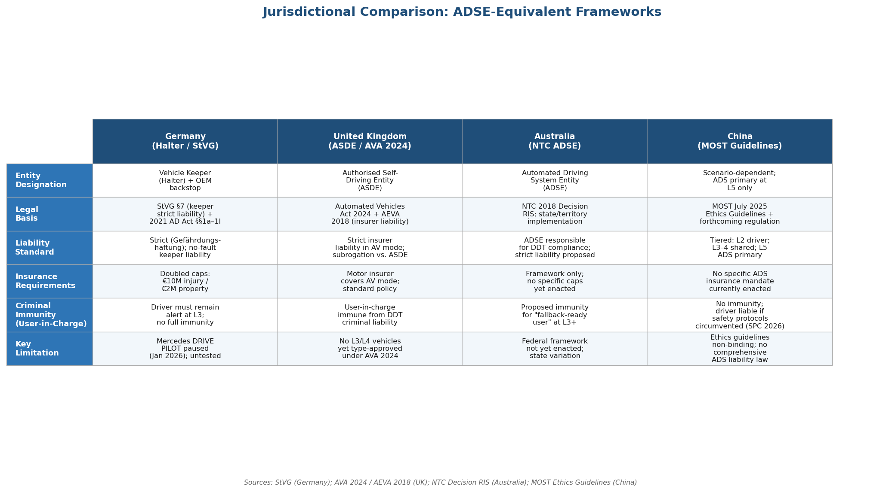

*Figure 4.2 — Comparative table of ADSE-equivalent legal frameworks across Germany (Halter/StVG), the United Kingdom (ASDE/AVA 2024), Australia (NTC ADSE), and China (MOST Ethics Guidelines), comparing entity designation, legal basis, liability standard, insurance requirements, criminal immunity, and key current limitations.*

### 4.5.2 Doctrinal Implications

The ADSE concept resolves a fundamental problem in traditional products liability: it designates a single point of accountability for the system's performance, eliminating the need for a plaintiff to navigate the multi-vendor supply chain to identify which component or software module caused the failure. Under the ADSE model, the entity that holds the type-approval for the automated driving feature—typically the OEM—bears primary responsibility, with recourse against component suppliers governed by contractual indemnification agreements rather than plaintiff-facing tort litigation.

The ADSE concept also provides a coherent doctrinal basis for the emerging consensus—visible in the German, UK, Chinese, and Australian frameworks—that the L2/L3 boundary represents a liability inflection point: below L3, the driver bears primary responsibility because the driver performs the object and event detection and response (OEDR) task; at L3 and above, the ADSE bears primary responsibility because the ADS performs the OEDR within its ODD. Mercedes-Benz's DRIVE PILOT liability commitment—while significant as a first-mover precedent—has not been tested in litigation as of early 2026. Koopman's (2024) analysis cautions that the commitment distinguishes product liability (which manufacturers already bear under existing law) from tort liability for wrongful-death claims exceeding insurance limits, where the manufacturer "might (or might not) conveniently find an excuse to walk away" [Koopman](https://philkoopman.substack.com/p/mercedes-benz-drive-pilot-and-driver "Koopman: Mercedes Drive Pilot liability ambiguity, July 2024"). Whether voluntary manufacturer commitments prove durable under the pressure of high-value wrongful-death litigation remains an open question that only future case law can resolve.

## 4.6 The Malfunction Doctrine and Software Opacity

For neural-network-based ADAS, where the perception system's decision-making process is opaque even to the manufacturer's own engineers, traditional proof of defect through identification of a specific design flaw may be practically impossible. Restatement (Third) § 3 addresses this evidentiary challenge through the malfunction doctrine: a plaintiff may prove defect by circumstantial evidence when the incident "was of a kind that ordinarily occurs as a result of product defect" and was "not, in the particular case, solely the result of causes other than product defect." This evidentiary pathway is critical for ADAS litigation because it relieves the plaintiff of the burden of identifying the precise algorithmic failure that caused the crash.

The Uber ATG case illustrates the doctrinal need. The ADS detected Elaine Herzberg 5.6 seconds before impact but cycled through four classification categories—"vehicle," "bicycle," "other," and "unknown"—without ever correctly identifying her as a pedestrian or predicting her trajectory (Chapter 3). Identifying the specific neural-network weight or training-data deficiency responsible for this misclassification sequence would require access to proprietary model architecture and training datasets that manufacturers do not ordinarily disclose. Under the malfunction doctrine, a plaintiff need only demonstrate that the system's behavior—detecting an object for 5.6 seconds and failing to initiate emergency braking—is "of a kind that ordinarily occurs as a result of product defect" [Geistfeld, 105 Calif. L. Rev. 1611 (2017)](https://lawcat.berkeley.edu/record/1127996/files/fulltext.pdf "Geistfeld 2017: malfunction doctrine applied to ADS").

The revised EU PLD reinforces this approach through its rebuttable presumptions: in technically complex cases, the burden shifts to the manufacturer to prove that the product was not defective, effectively creating a European analogue to the malfunction doctrine. The convergence of the U.S. malfunction doctrine and the EU's rebuttable presumptions means that ADAS manufacturers face evidentiary frameworks in both major markets that do not require plaintiffs to reverse-engineer proprietary AI systems to establish liability—a development that substantially reduces the informational asymmetry between manufacturers and crash victims.

## 4.7 A Multi-Factor Liability Allocation Model

Synthesizing the doctrinal analysis above and the case law surveyed in Chapter 3, this section proposes a five-factor liability allocation model that indexes the distribution of responsibility between driver and manufacturer/ADSE to five observable variables at the moment of the accident:

1. **SAE Level Active at the Time of Accident.** The automation level determines the baseline allocation of the OEDR task between driver and system. At L2, the driver performs the OEDR and bears primary responsibility; at L3, the ADS performs the OEDR within the ODD and the manufacturer/ADSE bears primary responsibility during automated driving. This variable establishes the starting position for the allocation analysis.

2. **ODD Compliance.** Whether the ADS was operating within its defined ODD at the time of the incident modifies the baseline allocation. At L3, an ADS operating within its ODD shifts primary liability to the manufacturer; an ADS operating outside its ODD—whether due to a system failure to detect ODD exit or to driver action overriding ODD enforcement—shifts liability toward the party responsible for the ODD violation. At L2, where no formally enforced ODD exists (as with Tesla FSD Supervised), this variable assesses whether the system was operating in conditions within its reasonable functional envelope.

3. **DMS Status and Adequacy.** The design and operational state of the driver-monitoring system at the time of the accident reflects the manufacturer's compliance with its fault-tolerant design obligation. A manufacturer deploying an easily defeated DMS (e.g., torque-based steering-wheel detection) bears a higher share of fault than one deploying camera-based gaze tracking with escalating alerts. This variable captures the Geistfeld (2017) fault-tolerant design standard and the NHTSA foreseeable misuse doctrine.

4. **Take-Over Request (TOR) Compliance.** At L3, the driver's response to a transition demand is a critical liability variable. Under UN Regulation No. 157, the ADS must provide a minimum ten-second transition demand before initiating a minimal risk maneuver. A driver who fails to respond to a properly issued TOR within the prescribed window bears responsibility for the period following TOR non-compliance. Conversely, a system that fails to issue a TOR—or issues an insufficient one (too late, too ambiguous, or during conditions where the driver cannot reasonably respond)—shifts liability to the manufacturer.

5. **Marketing and Expectation Gap.** The divergence between the manufacturer's marketing representations and the system's actual capabilities serves as a liability multiplier applicable across all automation levels. The wider the gap—as measured by naming conventions, advertising materials, point-of-sale representations, and HMI design signals—the greater the manufacturer's proportionate fault share. This variable incorporates Robertson's (2023) autonowashing analysis and the regulatory findings of the California DMV (December 2025) and China's MIIT (April 2025).

The following figure presents these five factors in a matrix format across three representative automation scenarios, illustrating how the manufacturer's liability share increases as the level of automation rises and the driver's supervisory role diminishes.

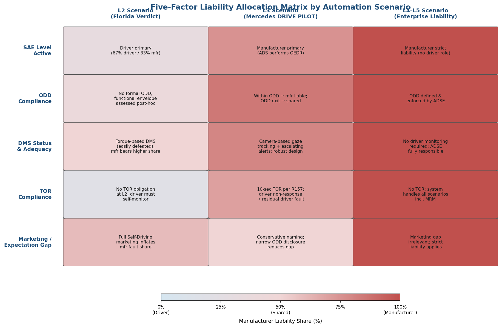

*Figure 4.3 — Five-factor liability allocation matrix mapping SAE level, ODD compliance, DMS status, TOR compliance, and marketing/expectation gap against three automation scenarios: the L2 Florida verdict, L3 Mercedes DRIVE PILOT, and L4–L5 enterprise liability. Color gradient indicates manufacturer's proportionate liability share from 0% (driver-predominant) to 100% (manufacturer strict liability).*

The model operates as a structured framework for comparative fault allocation, not as a mechanical formula. In a pure L2 scenario with adequate DMS, no marketing misrepresentation, and clear driver inattention, the model yields a predominantly driver-fault allocation (analogous to the 67%/33% split in the Florida verdict). In an L3 scenario within ODD with proper TOR issuance and driver non-response, the model yields a predominantly manufacturer-fault allocation during the automated driving phase, with residual driver liability only for TOR non-compliance. At L4–L5, where the driver has no monitoring obligation, the model converges with Abraham and Rabin's (2019) manufacturer enterprise responsibility: the manufacturer/ADSE bears strict liability for all accidents during automated driving.

Geistfeld's (2017) "aggregate performance" benchmark provides a complementary macro-level standard: the manufacturer satisfies its tort obligation if the autonomous fleet performs at least twice as safely as the conventional vehicle fleet on a per-mile basis. This benchmark operates at the population level rather than the individual-accident level, offering a statistical defense for manufacturers whose systems demonstrably reduce aggregate crash risk even while individual failures remain inevitable [Geistfeld, 105 Calif. L. Rev. 1611 (2017)](https://lawcat.berkeley.edu/record/1127996/files/fulltext.pdf "Geistfeld 2017: aggregate fleet performance standard").

The American Law Institute's (ALI) October 2024 launch of the Principles of the Law, Civil Liability for Artificial Intelligence project—with Geistfeld as Reporter—signals that the doctrinal synthesis attempted in this chapter will be subject to authoritative institutional refinement in the coming years [ALI](https://www.ali.org/project/principles-law-civil-liability-artificial-intelligence "ALI: Principles of the Law, Civil Liability for AI, launched October 2024"). The five-factor model proposed here is intended to be compatible with whatever framework the ALI ultimately adopts, as it builds on the same Restatement foundations and academic literature that inform the ALI project.

# 第5章 Data Governance, Evidentiary Infrastructure, and Insurance

Liability allocation in ADAS-involved accidents ultimately depends on a foundational question: what data exist to reconstruct who—or what—was in control at the moment of a crash, and who has access to that data? The preceding chapters established that the Level 2/Level 3 boundary determines whether primary responsibility rests with the human driver or the automated driving system, that case law is rapidly crystallizing manufacturer accountability, and that doctrinal frameworks supply the analytical tools for apportioning fault. This chapter examines the evidentiary and economic infrastructure that operationalizes those legal principles across three interlocking domains: (1) event data recording mandates and the critical gap in ADAS-specific telemetry; (2) over-the-air update governance and its implications for evidence preservation; and (3) the structural transformation of motor insurance from a driver-centric to a product-liability-oriented model. Together, these domains determine whether the sophisticated liability theories developed in Chapter 4 can be implemented in practice—or whether they remain aspirational constructs defeated by information asymmetry and actuarial uncertainty.

## 5.1 Event Data Recorders: Expanding Capture, Persisting Gaps

### 5.1.1 The December 2024 Final Rule

On December 18, 2024, NHTSA published a final rule (89 FR 102810) substantially upgrading Event Data Recorder (EDR) requirements under 49 CFR Part 563. The rule extends pre-crash recording from 5 seconds at 2 Hz to 20 seconds at 10 Hz—a tenfold increase in sampling rate and a fourfold increase in capture duration. A Virginia Tech Transportation Institute study underpinning the rulemaking found that a 20-second window captures the 90th-percentile recording duration for rear-end, intersection, and road-departure crashes, which collectively account for approximately 70% of all passenger-vehicle crashes in the United States [NHTSA Federal Register](https://www.federalregister.gov/documents/2024/12/18/2024-29862/event-data-recorders "89 FR 102810 — NHTSA EDR final rule, December 2024").

The original compliance date was September 1, 2027. In November 2025, NHTSA proposed delaying compliance to September 1, 2028, with a manufacturer phase-in period [DOT Regulations](https://www.transportation.gov/regulations/federal-register-documents/2025-21506 "NHTSA proposed EDR compliance delay, November 2025"). Part 563 remains formally an "if equipped" standard—NHTSA does not mandate EDR installation—but this distinction is largely academic: as of model year 2021, approximately 99.5% of light vehicles sold in the United States were equipped with EDRs, rendering the standard de facto universal.

### 5.1.2 The ADAS Data Void

The expanded EDR rule captures vehicle dynamics—speed, braking, steering input, seatbelt status, airbag deployment timing—but records no data specific to ADAS or ADS operation. Current Part 563 omits: ADAS/ADS engagement status, sensor inputs (camera, LiDAR, radar), object-detection and classification outputs, path-planning commands, transition demands (take-over requests), driver-monitoring system readings, and software version identifiers. NHTSA acknowledged this gap in the rulemaking but deferred ADAS-specific data elements to potential future rulemaking [NHTSA Federal Register](https://www.federalregister.gov/documents/2024/12/18/2024-29862/event-data-recorders "NHTSA deferral of ADAS data elements").

The consequence is stark: an EDR can reconstruct *what happened physically* in a crash (vehicle deceleration, steering angle, impact forces) but cannot reconstruct *what the automated system perceived, decided, or commanded*. Measured against the five-factor liability allocation model developed in Chapter 4—indexing responsibility to SAE level active, ODD compliance, driver-monitoring system status, take-over request compliance, and marketing/expectation gap—EDR data alone cannot resolve any of the first four factors. This evidentiary deficit shifts the burden of crash reconstruction to proprietary manufacturer data systems, producing the information asymmetry documented in Section 5.3.

### 5.1.3 DSSAD: Closing the Control-Authority Gap

The Data Storage System for Automated Driving (DSSAD), mandated under UN Regulation No. 157 (Automated Lane Keeping Systems), addresses precisely the gap that EDRs leave open. DSSAD records timestamped data on: system activation and deactivation events, transition demands issued by the ADS, driver responses to transition demands, minimal risk maneuver initiation, driver overrides, and system failures. Data must be retained for a minimum of six months and made accessible to competent authorities for accident investigation [UN R157 Revision 1](https://unece.org/sites/default/files/2025-06/R157r1e.pdf "UN R157 Revision 1, June 2025").

The EDR and DSSAD are functionally complementary. The EDR reconstructs crash dynamics; the DSSAD reconstructs the control-authority chain. Together, they can resolve the two central liability questions: (1) was the automated system or the human driver in operational control at the moment of the accident? and (2) did the system properly execute its transition-demand and minimal-risk-maneuver protocols? [AUTOCRYPT](https://autocrypt.io/edr-dssad-vehicle-accident-analysis-tools/ "AUTOCRYPT: EDR and DSSAD comparison, November 2024").

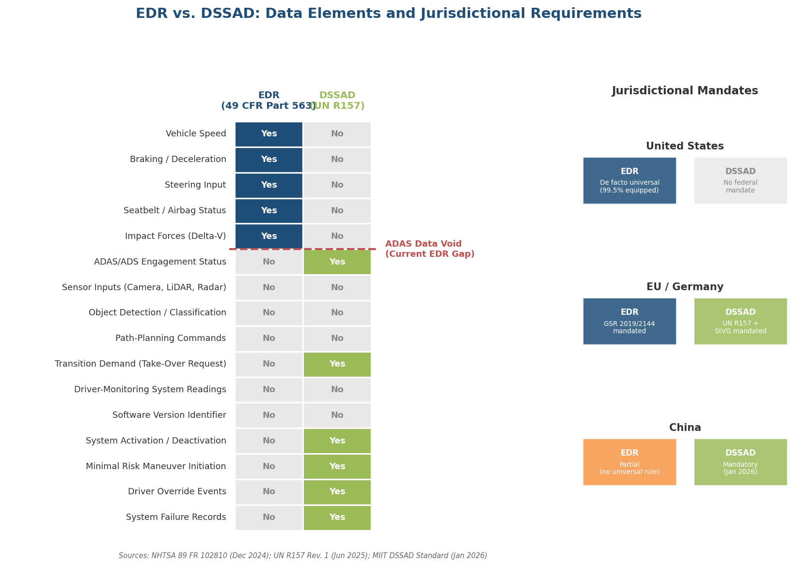

*Figure 5.1 — Comparison of data elements captured by EDRs (49 CFR Part 563) versus DSSADs (UN R157), alongside jurisdictional mandate status for the United States, EU/Germany, and China. The "ADAS Data Void" in current EDR standards is highlighted by the absence of automation-specific data fields.*

Germany has implemented the DSSAD mandate through the Straßenverkehrsgesetz (StVG), requiring all Level 3 and Level 4 vehicles to carry DSSAD. The German framework stipulates that data is stored in the vehicle and the manufacturer cannot demand exclusive access to it. The Kraftfahrt-Bundesamt (KBA) is entitled to non-personal data for road-safety assessment, and storage periods are aligned with applicable statutes of limitations [CMS Expert Guide — Germany](https://cms.law/en/int/expert-guides/cms-expert-guide-to-autonomous-vehicles-avs/germany "CMS: German StVG DSSAD provisions") and [Freshfields](https://technologyquotient.freshfields.com/post/102gr7g/amendments-to-germanys-laws-on-autonomous-driving-what-does-it-mean-for-data-pr "Freshfields: manufacturer cannot demand exclusive DSSAD access").

China's mandatory national DSSAD recording standard took effect in January 2026, and the February 2026 Level 3 safety standard requires full DSSAD compliance. The standard mandates that the system "accurately record critical operational data, allowing investigators to reconstruct scenarios after traffic accidents" [CarNewsChina](https://carnewschina.com/2026/02/26/new-chinese-regulations-push-l3-autonomous-vehicles-closer-to-l4-capabilities-with-enhanced-safety-protocols/ "CarNewsChina: China mandatory DSSAD standard, February 2026").

### 5.1.4 The Jurisdictional Patchwork: DSSAD for Level 3 Only

A critical limitation persists: the DSSAD mandate under UN R157 applies exclusively to Level 3 ALKS-equipped vehicles. Level 2 ADAS—which accounts for the overwhelming majority of partially automated vehicles on the road and is implicated in the majority of ADAS-related crashes reported under NHTSA's Standing General Order—operates without any standardized automated-system data recording requirement. Tesla's Full Self-Driving (Supervised), classified as Level 2, generates extensive telemetry data but stores and controls that data under proprietary protocols, with no regulatory obligation to preserve or disclose it in a standardized format.

The gap between Level 2 and Level 3 data-recording obligations mirrors the liability gap at the same boundary: the systems most likely to be involved in contested-liability crashes are the least likely to have standardized, independently accessible evidentiary records. Until regulators extend DSSAD-equivalent requirements to Level 2 systems—a reform pathway analyzed in Section 5.5—the evidentiary infrastructure will remain structurally misaligned with the litigation landscape.

## 5.2 Over-the-Air Updates: Evidentiary Spoliation and Regulatory Responses

### 5.2.1 The OTA Spoliation Problem

Over-the-air (OTA) software updates present a distinctive evidentiary challenge without precedent in conventional automotive litigation. When an OTA update overwrites pre-crash software, the original decision logic—the perception algorithms, path-planning parameters, and control thresholds that governed the vehicle's behavior at the time of the accident—may be irretrievably lost. The mechanism that corrects a defect simultaneously alters the software configuration that constituted the defect, creating a tension between remediation and evidence preservation.

NHTSA's December 2023 recall of 2,031,220 Tesla vehicles (Recall 23V-838) illustrates this tension concretely. The remedy for Autosteer's "foreseeable misuse" defect was implemented entirely via OTA update—additional visual alerts and simplified engagement controls were deployed remotely. For any pre-recall crash forming the basis of future litigation, the vehicle's software configuration at the time of the incident may no longer exist on the vehicle itself [NHTSA Part 573 Report 23V-838](https://static.nhtsa.gov/odi/rcl/2023/RCLRPT-23V838-8276.PDF "NHTSA Recall 23V-838, December 2023"). Under traditional product-liability discovery, a plaintiff could inspect the allegedly defective product in its as-sold condition. OTA updates fundamentally undermine this assumption: the "product" is continuously modified after sale, and no U.S. regulatory requirement currently ensures that pre-update software versions are preserved.

### 5.2.2 The EU Response: OTA as Product Placement

The revised EU Product Liability Directive (PLD), Directive (EU) 2024/2853, addresses OTA updates with doctrinal precision. The Directive explicitly classifies software—including OTA updates—as "products." Each safety-relevant OTA update constitutes a new product placement, restarting the standard 10-year liability period. Parties that "substantially modify" a product via software can be deemed "manufacturers" under the Directive, exposing not only the original equipment manufacturer but also third-party software providers to product liability. The Directive further introduces rebuttable presumptions of defect and causation for technically complex products, easing the plaintiff's evidentiary burden in cases involving opaque algorithmic decision-making. The standard 10-year liability period extends to 25 years for latent injuries [Reed Smith](https://www.reedsmith.com/articles/the-new-eu-product-liability-key-implications-autonomous-vehicle/ "Reed Smith: EU PLD OTA update implications, October 2025").

This framework generates a consequential paradox for OTA governance. Every safety-relevant update—whether correcting a perception algorithm, modifying transition-demand timing, or adjusting ODD boundaries—creates a new potential liability event. Failing to update known defects constitutes negligence, but deploying the update may create spoliation risks for pre-update incidents and simultaneously triggers a fresh liability clock. Manufacturers must therefore calibrate update deployment against both the duty to remediate and the obligation to preserve pre-update evidence.

### 5.2.3 China's OTA Circular: Binding Governance at Scale

China became the first jurisdiction to impose a comprehensive, binding OTA governance framework specifically targeting ADAS and ADS. A joint circular from the Ministry of Industry and Information Technology (MIIT) and the State Administration for Market Regulation (SAMR), effective March 1, 2025, mandates: documentation of activation, execution, and exit policies for assisted-driving functions; user notification for all safety-relevant updates; regulatory filing with 44 specified technical parameters; and an explicit prohibition on using OTA to conceal defects or to substitute for formal recall procedures [APCO](https://apcoworldwide.com/blog/road-safety-china-tightens-regulations-on-intelligent-driving/ "APCO: China OTA Circular, March 2025").

The prohibition on using OTA to conceal defects is particularly significant in light of the evidentiary patterns identified in Chapter 3. Tesla's "collision snapshot" data concealment—uploading sensor and camera data to corporate servers while marking local copies for deletion—represents the type of conduct China's circular directly targets. While the circular does not impose criminal sanctions for non-compliance, the regulatory filing requirement creates an administrative record that can serve as evidence in subsequent litigation or recall proceedings. The filing mechanism also establishes a pre-update documentary baseline, potentially mitigating the spoliation problem by creating a government-held record of the software configuration prior to each update.

## 5.3 Manufacturer Data Asymmetry and Access Disputes

### 5.3.1 The Structural Problem

Modern ADAS-equipped vehicles generate extraordinary volumes of data. Tesla vehicles, for example, produce an estimated 5–10 GB of raw Controller Area Network (CAN) bus data per 10-minute window, encompassing sensor inputs, perception outputs, control commands, and system-state information. In litigation, however, manufacturers have historically produced only curated "EDR summaries"—a small fraction of available data, formatted to manufacturer specifications. The proprietary Database Container (DBC) file needed to decode raw CAN data is controlled exclusively by the manufacturer, creating an information asymmetry that courts have increasingly scrutinized.

The Florida wrongful-death litigation that produced the $243 million verdict (discussed in Chapter 3) exposed this asymmetry in stark terms. Forensic analysis revealed that Tesla systematically withheld "collision snapshot" data—sensor and camera information uploaded to Tesla's servers at the time of crashes, with local copies marked for deletion. Tesla denied the existence of this data for years. A forensic expert recovered the data from vehicle hardware, revealing that the Autopilot system had not issued a "Take Over Immediately" alert and that internal map data had flagged the crash area as a "restricted Autosteer zone"—yet Autopilot remained engaged. A court found Tesla's claims of not possessing crash data "not credible and appears to have been a willful and/or intentional misrepresentation" [FlyingPenguin](https://www.flyingpenguin.com/guide-to-tesla-hiding-their-crash-data/ "FlyingPenguin: Tesla crash data forensic analysis, October 2025"). The $200 million punitive damages component of the verdict strongly suggests the jury was influenced by this pattern of data concealment—a finding with implications extending well beyond the individual case.

### 5.3.2 State-Level EDR Data Ownership

In the United States, at least 15 states have enacted legislation governing ownership of and access to EDR data. These statutes generally treat EDR data as the property of the vehicle owner, restricting access to specified circumstances: owner consent, court order, emergency medical dispatch, or vehicle-safety research. Washington State's Recording Devices in Motor Vehicles Law (2009) provides a representative template: mandatory written disclosure of EDR presence, prohibition on data download without owner consent or court order, purpose-limitation requirements, and criminal penalties (misdemeanor) for unauthorized access. Colorado's statute (CRS § 42-4-2402) imposes stricter protections, classifying EDR data as the driver's "personal information" and prescribing criminal penalties including fines and up to 18 months' imprisonment for violations [EPIC](https://epic.org/state-auto-black-boxes-policy/ "EPIC: State Auto Black Boxes Policy").

These data-ownership statutes, however, were drafted for conventional EDR data—vehicle dynamics parameters—and do not address the far richer telemetry generated by ADAS systems. The manufacturer's proprietary control over ADAS data falls outside these statutory frameworks, creating a regulatory vacuum in which the entity with the greatest informational advantage in litigation faces the fewest data-access obligations.

### 5.3.3 Insurer Data Access

The insurance industry confronts a parallel data-access problem. The Association of British Insurers (ABI) and Thatcham Research published requirements in April 2024 specifying that collision data must be "immediately available on a neutral and equitable basis," with a minimum 30-second pre-collision recording window. The ABI/Thatcham framework demands data accessibility in standardized, non-proprietary formats to enable independent accident reconstruction [ABI/Thatcham](https://www.abi.org.uk/globalassets/files/publications/public/motor/2024/insurer-requirements-for-automated-vehicles.pdf "ABI/Thatcham: Insurer Requirements for Automated Vehicles, April 2024").

Under the UK's Automated and Electric Vehicles Act (AEVA) 2018, insurers become directly liable for accidents occurring when an automated vehicle is "driving itself." Yet insurers may lack access to the data needed to determine whether automated mode was active at the time of the crash—the very factual determination that triggers their statutory liability. This produces a structural incongruity: the statute imposes liability on insurers based on a factual condition (automated-mode engagement) for which the insurer depends entirely on manufacturer-controlled data. Without mandatory, real-time data-sharing protocols, insurers bear financial exposure they cannot independently verify.

## 5.4 Insurance Model Transformation

### 5.4.1 From Driver-Centric to Product-Liability Coverage

The traditional motor insurance model prices risk based on driver demographics: age, driving record, location, annual mileage, and vehicle type. Increasing automation disrupts every element of this pricing structure. As control shifts from driver to system, the relevant risk factors shift from human behavior to system design, software reliability, sensor performance, and ODD adherence. This structural transition is already underway in jurisdictions that have enacted ADAS-specific insurance frameworks.

The UK's AEVA 2018 represents the most far-reaching statutory restructuring. Under Part 1 of the Act, when an insured automated vehicle causes an accident "when driving itself," the insurer is directly liable to injured parties under a strict-liability standard. The insurer then holds subrogation rights against the manufacturer or the Authorised Self-Driving Entity (ASDE). The policyholder—traditionally the defendant in a motor-accident claim—becomes a potential claimant against the insurer during automated driving, fundamentally reconfiguring the tripartite relationship among driver, insurer, and manufacturer [AEVA 2018, Part 1](https://www.legislation.gov.uk/ukpga/2018/18/part/1 "AEVA 2018 — Liability of insurers").

Germany's approach preserves the keeper-liability (Gefährdungshaftung) model under StVG §7 but doubles the maximum liability caps for automated driving functions: €10 million for personal injury and €2 million for property damage, compared with the standard €5 million and €1 million respectively. Mercedes-Benz's acceptance of manufacturer liability when DRIVE PILOT is engaged within its ODD backstops the keeper's compulsory insurance during Level 3 operation [CMS Expert Guide — Germany](https://cms.law/en/int/expert-guides/cms-expert-guide-to-autonomous-vehicles-avs/germany "CMS: German doubled insurance caps for automated driving").

Florida requires $1 million in primary liability coverage for driverless autonomous vehicle operation under §627.749—significantly above the state's standard minimum coverage requirements [FL §627.749](https://www.flsenate.gov/laws/statutes/2023/627.749 "FL §627.749 — AV insurance requirements").

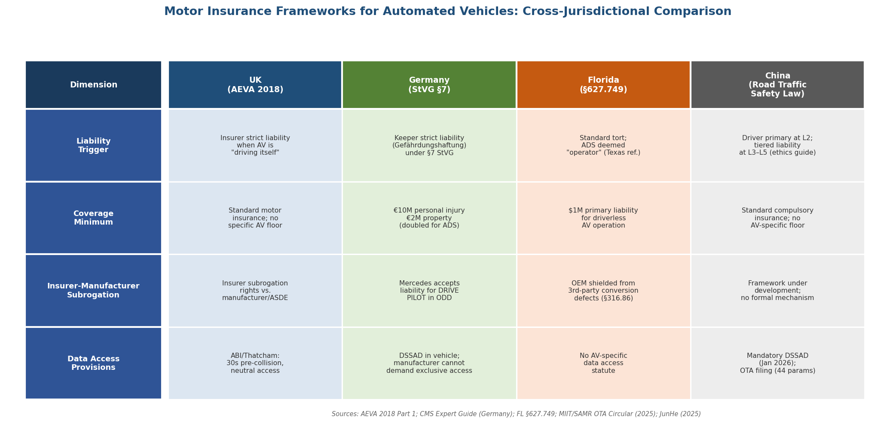

*Figure 5.2 — Cross-jurisdictional comparison of motor insurance frameworks for automated vehicles across the UK, Germany, Florida, and China. Dimensions include liability trigger, coverage minimum, insurer-manufacturer subrogation mechanism, and data access provisions.*

### 5.4.2 The Actuarial Pricing Gap

The Casualty Actuarial Society's Automated Vehicles Task Force (CAS AVTF) identified in 2018 a significant lag between loss-reduction performance and premium adjustment. A vehicle reducing accident losses by 50% would receive only an 8% premium discount after four years under then-current actuarial models. More consequentially, the Task Force projected that shifting liability from personal auto to products-liability coverage would increase per-vehicle premiums by a factor of 2–3×, from $781 to a range of $1,578–$2,355. The increase reflects higher expense ratios in products-liability underwriting (38.7% versus 34.4% for personal auto), dramatically higher defense costs (76 cents per claim dollar versus 6 cents), and higher profit-loading targets (10.0% versus 3.1%). Accident frequency would need to decrease by approximately 75% for total premium costs under a products-liability model to reach parity with the current driver-centric framework [CAS AVTF](https://www.casact.org/sites/default/files/2021-02/pubs_forum_18spforum_01_avtf_2018_report.pdf "CAS: Automated Vehicles and the Insurance Industry, Winter 2018").

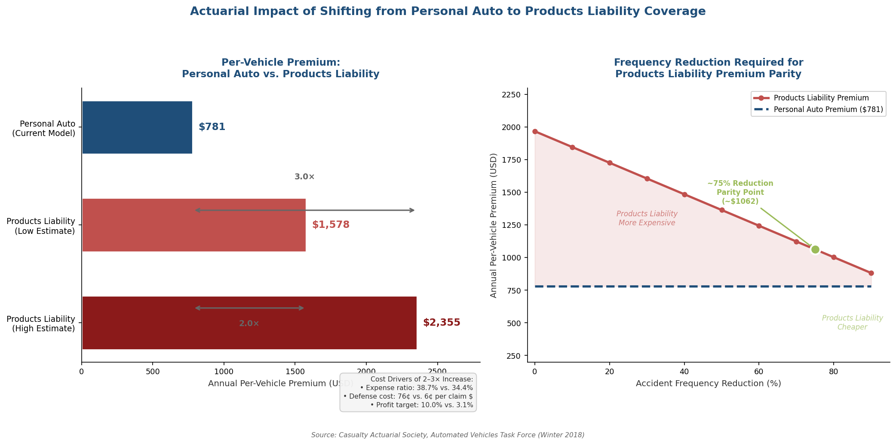

*Figure 5.3 — Left panel: per-vehicle premium comparison between personal auto ($781) and products liability coverage ($1,578–$2,355), with cost-driver annotations. Right panel: accident-frequency reduction trajectory required for products liability premiums to reach parity with the current personal auto model, marking the ~75% reduction threshold. Data from CAS Automated Vehicles Task Force (2018).*

These projections carry a critical implication for Level 3 viability. As discussed in Chapter 6, the simultaneous retreat of Mercedes-Benz, BMW, and Stellantis from Level 3 deployment was driven in part by the absence of actuarial models capable of pricing manufacturer liability at scale. Without real-world Level 3 crash-frequency data—Mercedes DRIVE PILOT's incident record has not been publicly disclosed—actuaries cannot develop experience-rated premiums, creating a pricing vacuum that discourages both manufacturer deployment and insurer participation.

### 5.4.3 Usage-Based Insurance and Dynamic Coverage

S&P Global Mobility projects that by 2035, the U.S. vehicle fleet will include approximately 87 million Level 2, 45 million Level 2+, 3.5 million Level 3, and 1.7 million Level 4 vehicles. Greater China is projected to lead in higher automation penetration, with more than 23% of new sales at Level 3–5 by 2036; Europe and North America are projected below 5% [S&P Global Mobility](https://www.spglobal.com/automotive-insights/en/blogs/2025/08/autonomous-vehicles-future-of-car-insurance "S&P Global: AV insurance forecasts, August 2025").

Insurance policies in this mixed-fleet environment must adapt dynamically depending on whether the vehicle was under human or system control at the time of an incident. Underwriting is shifting from driver demographics to "feature-level detail and software versioning"—requiring insurers to price not merely the vehicle, but the specific ADAS/ADS software version installed, the ODD within which the system operates, and the driver-monitoring system configuration. Robotaxi fleets introduce additional complexity: annual mileage exposure is approximately four times that of private vehicles (~52,000 miles per year versus ~13,000), concentrating risk exposure while potentially improving per-mile safety performance through fleet-level data optimization [S&P Global Mobility](https://www.spglobal.com/automotive-insights/en/blogs/2025/08/autonomous-vehicles-future-of-car-insurance "S&P Global: Dynamic insurance and per-mile exposure").

### 5.4.4 The Mercedes DRIVE PILOT Liability Ambiguity

Mercedes-Benz's 2022 commitment to "accept liability" when DRIVE PILOT is engaged within its ODD was widely characterized as a breakthrough in manufacturer accountability. Independent analysis, however, reveals significant ambiguity in the scope of that commitment. Philip Koopman's 2024 analysis distinguishes between product liability—which manufacturers already bear under existing law—and tort liability for high-value wrongful-death claims that exceed insurance coverage limits. The DRIVE PILOT owner's manual continues to place residual obligations on the "user-in-charge," and Koopman observes: "What matters is who takes responsibility for the $10M+ wrongful death tort lawsuit that blows well past the insurance coverage of the driver, and which MB might (or might not) conveniently find an excuse to walk away from" [Koopman](https://philkoopman.substack.com/p/mercedes-benz-drive-pilot-and-driver "Koopman: DRIVE PILOT and driver blame, July 2024").

This ambiguity is compounded by two developments. First, Mercedes's January 2026 decision not to include DRIVE PILOT in the facelifted S-Class means the liability commitment has never been tested in litigation—no publicly reported crashes involving DRIVE PILOT in automated mode have been identified as of early 2026. Second, Germany's doubled keeper-liability caps (€10 million for personal injury) may prove insufficient for catastrophic multi-victim incidents, raising the unresolved question of who bears residual liability beyond the insurance maximum: the keeper, the manufacturer, or the state.

## 5.5 Toward Evidentiary and Insurance Infrastructure Reform

The convergence of data governance deficiencies and insurance-model disruption points toward several structural reforms necessary to support the liability frameworks analyzed in earlier chapters.

First, the ADAS data void in EDR requirements demands urgent regulatory action. NHTSA's deferral of ADAS data elements to future rulemaking leaves Level 2 systems—where liability is most contested and crash frequency highest—without standardized evidentiary infrastructure. Extending DSSAD-equivalent recording requirements to all Level 2+ systems would close this gap. China's January 2026 DSSAD standard and Germany's StVG provisions provide implementable templates, and NHTSA's broader regulatory agenda—which includes "modernizing event data recorder requirements" among its active rulemakings—offers a potential vehicle for this extension [Foley & Lardner](https://www.foley.com/insights/publications/2025/11/driving-into-2026-the-state-of-nhtsa-and-the-future-of-vehicle-safety-regulation/ "Foley: NHTSA regulatory agenda, November 2025").

Second, OTA governance must incorporate mandatory software-version preservation for any vehicle involved in a reported crash. The preservation period should align with the applicable statute of limitations. Post-crash OTA updates that overwrite pre-crash software should trigger spoliation sanctions, placing the evidentiary burden on the party that destroyed the evidence. The EU's treatment of each safety-relevant OTA as a new product placement provides a coherent doctrinal framework; China's OTA Circular offers practical administrative mechanisms that can serve as implementation models.

Third, data-access equalization is essential to fair adjudication. The German StVG model—DSSAD data stored in the vehicle, manufacturer prohibited from demanding exclusive access—should serve as a baseline for international harmonization. The ABI/Thatcham framework's demand for data "immediately available on a neutral and equitable basis" in standardized, non-proprietary formats aligns with both litigation needs and insurance-market functionality.

Fourth, insurance mandates must adapt to the Level 3+ liability shift. The UK AEVA 2018 model (insurer strict liability during automated driving with manufacturer subrogation) and Germany's doubled keeper caps represent viable but distinct approaches. Minimum per-incident coverage for Level 3+ automated-mode operation should be harmonized internationally, with floors sufficient for catastrophic claims—at least €10 million for personal injury, consistent with Germany's current cap. Actuarial models must evolve from driver-demographic pricing to feature-level, software-version-specific risk assessment, supported by mandatory aggregate fleet-performance data disclosure from manufacturers.

# 第6章 Emerging Trends and Forward-Looking Regulatory Recommendations

The preceding chapters established that the Level 2 (L2)/Level 3 (L3) boundary constitutes the central liability fault line for shared human-machine driving (Chapter 1); that regulatory frameworks across major jurisdictions are converging on this boundary as the demarcation of primary responsibility (Chapter 2); that case law has begun to crystallize manufacturer accountability even under L2 through foreseeable-misuse and failure-to-warn doctrines (Chapter 3); that doctrinal analysis supports a five-factor liability allocation model indexed to automation level, Operational Design Domain (ODD) compliance, driver-monitoring system (DMS) status, take-over request (TOR) compliance, and marketing-induced expectation gaps (Chapter 4); and that the evidentiary and insurance infrastructure required to operationalize these principles remains incomplete (Chapter 5).

This chapter examines three sets of developments that are reshaping the liability landscape in real time—the commercial viability crisis of L3, the emergence of AI-specific regulatory instruments, and the expansion of cooperative driving technologies—before synthesizing these threads into eight concrete regulatory recommendations.

## 6.1 The Level 3 Commercial Viability Crisis

### 6.1.1 The First-Mover Retreat

Between August 2025 and February 2026, the three European original equipment manufacturers (OEMs) that had most aggressively pursued Level 3 conditional automation withdrew or suspended their programs in rapid succession. The compressed timeline—three retreats within six months—signals structural obstacles rather than coincidental corporate decisions.

**Stellantis** shelved its STLA AutoDrive 1.0 L3 program in August 2025, only six months after declaring the system "deployment-ready." Cost overruns, limited market demand, and a broader restructuring of the company's software division drove the decision. Industry sources characterize it as a permanent cancellation rather than a temporary postponement [Automotive World](https://www.automotiveworld.com/news/bmw-drops-level-3-adas-as-industry-backing-ebbs-away/ "Automotive World: Stellantis L3 retreat, August 2025").

**Mercedes-Benz**—the first OEM to obtain regulatory type-approval for an L3 system (DRIVE PILOT, approved by Germany's Kraftfahrt-Bundesamt in December 2021) and the first to formally accept manufacturer liability during L3 operation within its ODD (Chapter 4)—confirmed in January 2026 that DRIVE PILOT would not be included in the facelifted 2026 S-Class. Spokesperson Tobias Mueller cited three factors: a restrictive ODD that limited customer value (originally ≤40 mph on pre-mapped divided highways in fair weather and medium-to-dense traffic), high LiDAR hardware costs, and the bankruptcy of Luminar Technologies, the company's former LiDAR supplier. Mercedes is instead deploying "MB.Drive Assist Pro," an L2++ system covering urban scenarios at higher speeds, while redirecting engineering resources toward a future L3 system at motorway speeds and an L4 prototype on public roads in Abu Dhabi [The Verge](https://www.theverge.com/transportation/860935/mercedes-drive-pilot-level-3-scrapped "Mercedes temporarily scraps L3 Drive Pilot, January 2026").

**BMW** confirmed on February 24, 2026, that it would discontinue its Personal Pilot L3 system from the facelifted 7 Series. The L3 option, priced at €5,110–€6,000 per vehicle, is being replaced by "Motorway Assistant," an L2++ system priced at approximately €1,450 and capable of hands-off operation at speeds up to 130 km/h. BMW's head of development, Joachim Post, stated: "We had the level 3 system in the vehicles, but we realized that the demand for this was not at a stage where we could be profitable" [BMW Blog](https://www.bmwblog.com/2026/03/17/bmw-explains-why-dropping-level-3-self-driving-tech/ "BMW explains dropping L3, March 2026") and [Automotive World](https://www.automotiveworld.com/news/bmw-drops-level-3-adas-as-industry-backing-ebbs-away/ "BMW drops L3, February 24, 2026").

### 6.1.2 Structural Drivers of the Retreat

The simultaneous withdrawal of three OEMs reflects four mutually reinforcing structural barriers.

First, **unit economics remain unfavorable**. L3 systems require LiDAR, high-definition mapping, redundant sensor architectures, and fail-operational hardware—component costs that translate into option prices of €5,000–€6,000 per vehicle. At these price points, consumer uptake has been negligible relative to L2++ alternatives that deliver superficially similar functionality (hands-off highway driving) at roughly one-third the cost and without the restrictive ODD limitations that constrain L3 utility.

Second, **narrow ODDs limit perceived value**. Mercedes DRIVE PILOT's ODD at U.S. launch—fully access-controlled highways, ≤40 mph, medium-to-dense traffic, fair weather, machine-detectable lane markings, no tunnels or toll booths, pre-mapped routes, daytime only (Chapter 1)—meant the system could be activated in only a small fraction of total driving scenarios. Even the December 2024 European expansion to 95 km/h (~59 mph) under revised UN Regulation No. 157 did not fundamentally alter the consumer value proposition; L2++ systems could be engaged at 130 km/h on the same roads with fewer restrictions.

Third, **unresolved tort exposure** compounds the economic calculus. As documented in Chapter 5, no actuarial model exists for pricing L3 manufacturer liability at scale. The Casualty Actuarial Society's Automated Vehicles Task Force projected a 2–3× premium increase when moving from personal-auto to products-liability coverage, but this projection rests on assumptions that cannot be validated without real-world L3 crash-frequency data—data that does not yet exist in meaningful volumes. Mercedes's DRIVE PILOT liability commitment, while symbolically significant, has never been tested in litigation; no publicly reported crashes involving DRIVE PILOT in automated mode have been identified as of early 2026.

Fourth, **regulatory fragmentation** limits addressable markets. L3 type-approval is available in only three jurisdictions: Germany (KBA), Nevada, and California. The absence of a unified U.S. federal framework (Chapter 2), the EU's ongoing reliance on UNECE WP.29 for technical harmonization, and China's L3 mandatory safety standard (effective July 1, 2027) collectively mean that manufacturers must pursue jurisdiction-by-jurisdiction certification at substantial cost for limited deployment volume.

### 6.1.3 Second-Wave Level 3 Commitments

The OEM retreat from L3 is not universal. A second wave of commitments, targeting 2028 deployment, reflects a recalibrated approach that seeks to address the cost and ODD barriers that undermined first-wave programs.

**Ford** announced at CES in January 2026 that it will deliver L3 eyes-off driving capability by 2028 on an electric pickup truck priced at approximately $30,000, developing LiDAR in-house to reduce dependency on external suppliers whose financial viability has proven uncertain [CNBC](https://www.cnbc.com/2026/01/07/ford-eyes-off-driving-ev-2028.html "Ford L3 EV 2028, January 2026"). **General Motors** announced in October 2025 that L3 capability would debut on the Cadillac Escalade IQ (priced above $127,000) in 2028, beginning with highway driving [GM News](https://news.gm.com/home.detail.html/Pages/news/us/en/2025/oct/1022-AI-GM-launch-eyes-off-driving-conversational-AI.html "GM L3 Escalade IQ 2028, October 2025"). **Honda** has indicated that its 0 Series EVs will target L3 capability post-2026, though specific timelines, jurisdictions, and liability allocation approaches remain unspecified.

None of these second-wave manufacturers has publicly stated whether it will follow Mercedes's precedent of accepting manufacturer liability during L3 engagement. The absence of such commitments, combined with the still-unresolved actuarial and regulatory barriers documented above, suggests that the 2028 timeline carries significant execution risk.

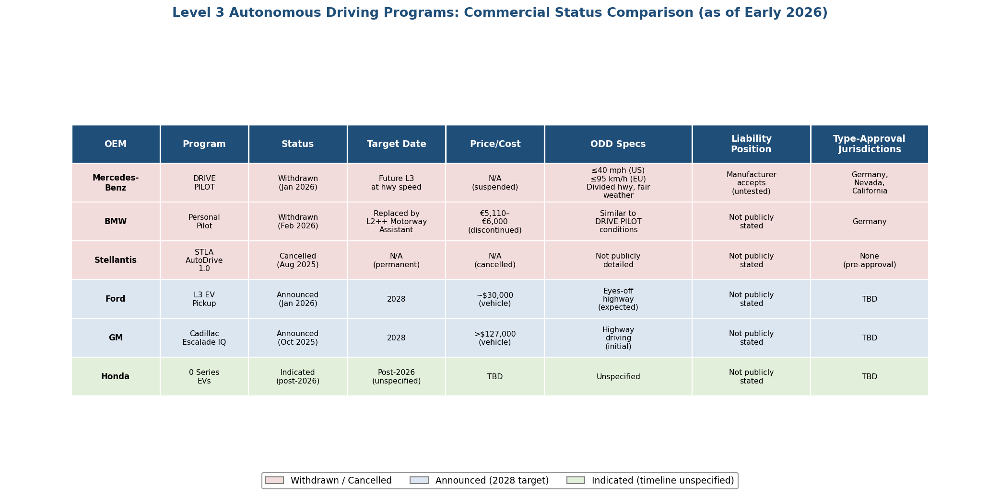

*Figure 6.1: Comparison of six OEM Level 3 programs across program status, target dates, pricing, ODD specifications, liability positions, and type-approval jurisdictions. Color coding distinguishes withdrawn/cancelled programs from announced and indicated commitments.*

## 6.2 The EU AI Act and the Automotive Regulatory Interface

### 6.2.1 Indirect Application Through the Sectoral Carve-Out

The EU AI Act, Regulation (EU) 2024/1689, entered into force on August 1, 2024, and classifies Automated Driving Systems (ADS) and Advanced Driver-Assistance Systems (ADAS) as high-risk AI under Article 6. However, Article 2(2) contains a critical carve-out: AI systems already governed by EU harmonized legislation—specifically the Type-Approval Regulation 2018/858 and the General Safety Regulation (GSR) 2019/2144—are subject to those sectoral frameworks rather than directly to the AI Act's Chapter III high-risk provisions. The high-risk obligations apply from August 2, 2026, with an extended deadline of August 2, 2027 for products covered by existing harmonization legislation [Taylor Wessing](https://www.taylorwessing.com/en/insights-and-events/insights/2025/03/ai-act-and-the-automotive-industry "Taylor Wessing: AI Act and Automotive Industry, March 2025").

The practical consequence is that the AI Act governs automotive AI *indirectly*—through anticipated sectoral adaptation of type-approval regulations rather than through direct imposition of conformity-assessment, transparency, and human-oversight requirements. As of early 2026, no concrete European Commission proposal for adapting automotive type-approval regulations to incorporate AI Act requirements has been published. International standards currently under development—ISO 26262 (functional safety), ISO 21448/SOTIF (safety of the intended functionality), ISO/PAS 8800 (AI and machine learning in road vehicles), and ISO/SAE 21434 (cybersecurity)—are expected to serve as the technical backbone for this adaptation [Taylor Wessing](https://www.taylorwessing.com/en/insights-and-events/insights/2026/02/faq-ki-und-software "Taylor Wessing: AI and vehicle software FAQ, February 2026"). The resulting uncertainty—binding AI Act timelines without specified automotive implementing rules—creates a regulatory gap that manufacturers must navigate through conservative compliance assumptions.

### 6.2.2 The AI Liability Directive: Withdrawal and Consequences

The EU's proposed AI Liability Directive (AILD)—intended to establish a harmonized fault-based civil liability framework for AI harms, including a right of access to evidence and rebuttable presumptions of causation—was formally withdrawn by the European Commission. The Commission included the withdrawal in its 2025 work program, adopted on February 11, 2025, citing "no foreseeable agreement" among co-legislators. The official withdrawal was published in the Official Journal on October 6, 2025 [IAPP](https://iapp.org/news/a/european-commission-withdraws-ai-liability-directive-from-consideration "IAPP: AI Liability Directive withdrawn, February 2025") and [EAPIL](https://eapil.org/2025/10/09/european-commission-withdraws-two-proposals-assignments-of-claims-regulation-and-ai-liability-directive/ "EAPIL: Official withdrawal published in OJ, October 2025").

The withdrawal leaves the revised Product Liability Directive (PLD), Directive (EU) 2024/2853, as the sole EU-level instrument for AI product liability. The PLD's rebuttable presumptions of defect and causation for technically complex products partially address the evidentiary burden that the AILD was designed to ease, but a significant gap persists: no harmonized EU framework governs fault-based civil liability for AI harms. Liability for ADAS/ADS accidents in the EU will therefore continue to be governed by divergent national tort law across 27 Member States—a fragmentation that may produce inconsistent outcomes depending on the jurisdiction in which a crash occurs. This divergence is particularly consequential for cross-border driving scenarios: a vehicle's L3 system may be type-approved in Germany under KBA certification yet involved in an accident in France, where French national tort law governs the claim.

## 6.3 Ethical and Algorithmic Accountability Frameworks

### 6.3.1 China's Driving Automation Ethics Guidelines

On July 23, 2025, China's Ministry of Science and Technology (MOST) published the *Ethics Guidelines for Driving Automation*, the first comprehensive integration of algorithmic accountability principles into autonomous driving governance by a major jurisdiction. The guidelines articulate four foundational principles: people-oriented design, safety first, fairness and avoidance of bias, and informed protection of user rights [Reuters](https://www.reuters.com/sustainability/china-issues-ethical-guidelines-autonomous-driving-technology-2025-07-23/ "Reuters: China AD ethics guidelines, July 2025").

The guidelines establish a tiered liability framework explicitly indexed to SAE automation levels. At L2, the driver remains the primary liability subject. At L3–L4, liability is scenario-dependent, with mandatory traceability to responsible persons. At Level 5, the ADS itself is the primary responsibility subject unless the user intervenes. The guidelines require that ADS decision-making be "traceable and auditable" (可追溯、可审查) and that algorithms be "recorded and made accessible" [JunHe](https://junhe.com/law-reviews/2766 "JunHe: Ethics Guidelines analysis, July 2025").

This framework marks a significant departure from both the U.S. and EU approaches. The United States has no federal algorithmic-accountability requirement for automotive AI; NHTSA's regulatory posture focuses on safety performance outcomes rather than decision-process transparency. The EU AI Act's transparency and explainability requirements apply indirectly to automotive AI through the sectoral carve-out discussed in Section 6.2, and no implementing regulation has specified what "transparency" means for neural-network-based perception systems operating at highway speeds. China's approach—mandating traceability and auditability as enforceable requirements rather than voluntary aspirations—represents the most prescriptive algorithmic-accountability regime currently applicable to ADAS/ADS.

### 6.3.2 Explainability Challenges for Perception Systems

The demand for algorithmic transparency encounters a fundamental technical obstacle: modern ADAS perception systems rely on deep neural networks whose internal decision processes resist human-interpretable explanation. The Uber ATG case (Chapter 3) illustrates this concretely—the ADS detected Elaine Herzberg 5.6 seconds before impact but cycled through four classification categories ("vehicle," "bicycle," "other," "unknown") without correctly identifying her as a pedestrian. Explaining *why* the neural network produced this misclassification sequence requires access to proprietary model architecture, training data, and intermediate-layer activations—information that manufacturers do not ordinarily disclose and that may not yield a human-comprehensible explanation even when disclosed.

The emerging standard ISO/PAS 8800 (*Safety and artificial intelligence—Road vehicles*), currently under development, is intended to provide safety requirements and guidance for AI and machine-learning components in road vehicles. Adoption of ISO/PAS 8800 as a mandatory type-approval standard—rather than a voluntary guidance document—would create a baseline for what "traceable and auditable" decision-making means in practice. Such a baseline would encompass documented training-data provenance, model-version records, validation and verification protocols for safety-critical perception functions, and post-crash perception-state reconstruction capabilities. The functional analogue is the combined flight data recorder (FDR) and cockpit voice recorder (CVR) regime in civil aviation, which has served as the evidentiary foundation for aviation safety investigation for decades.

## 6.4 Vehicle-to-Everything Communication and Multi-Party Liability

### 6.4.1 V2X Deployment Status

Vehicle-to-Everything (V2X) communication—encompassing Vehicle-to-Vehicle (V2V), Vehicle-to-Infrastructure (V2I), and Vehicle-to-Network (V2N) protocols—introduces cooperative driving capabilities that extend the liability perimeter beyond the traditional driver-manufacturer dyad. As of early 2026, V2X deployment is advancing unevenly across jurisdictions. The EU has approximately 1.5 million V2X-equipped vehicles and more than 2,700 roadside units (RSUs) across 21+ countries, supported by over €1 billion in EU co-funding. The United States has approximately 9,300 RSUs operational, with the U.S. Department of Transportation targeting 20% of the National Highway System by 2028 and full coverage by 2036. China has designated 20 pilot cities under its "vehicle-road-cloud" strategy, and Japan reports approximately 500,000 V2X-equipped vehicles and 115 RSUs [Vector](https://www.vector.com/us/en/know-how/v2x/v2x-worldwide-status-and-outlook-2025/ "Vector: V2X Worldwide Status and Outlook 2025").

### 6.4.2 The V2X Liability Gap

V2X creates liability chains that existing frameworks do not adequately address. In a cooperative driving scenario—for example, a V2I-coordinated intersection crossing where the infrastructure communicates signal-phase timing to an approaching ADS—an accident may result from failures by any combination of the ADS, the RSU equipment, the infrastructure operator (typically a municipality), the network provider, or the V2X message-authentication service. Cooperative maneuvers such as platooning and cooperative merge introduce further complexity: if a platoon-follower vehicle fails to brake because it relied on a V2V message from the lead vehicle that was delayed, corrupted, or spoofed, liability distributes across the platoon leader, the follower's ADS, the V2V communication system, and potentially the cybersecurity framework governing message authentication.

No jurisdiction has enacted a comprehensive V2X liability framework as of early 2026. The Automated Driving System Entity (ADSE) concept analyzed in Chapter 4—which designates a single legal person accountable for ADS performance—does not account for failures originating in infrastructure systems outside the ADSE's control. Similarly, the keeper/Halter strict-liability model under German StVG §7 allocates liability to the vehicle keeper, not to the infrastructure operator whose RSU malfunction may have contributed to the crash. As V2X deployment scales from pilot projects to production environments, this gap will require either an extension of the ADSE concept to encompass cooperative-system failures or the creation of a distinct liability framework for V2X-coordinated driving that allocates responsibility among vehicle manufacturers, infrastructure operators, and communication-service providers.

## 6.5 Regulatory Recommendations

The analysis across Chapters 1 through 5 and the emerging trends documented above converge on eight regulatory recommendations. These recommendations are offered as analytical conclusions derived from the evidence assembled in this report, addressing identified gaps in liability allocation, evidentiary infrastructure, marketing governance, international harmonization, insurance design, data access, and algorithmic accountability. Each recommendation draws on existing models—regulatory provisions, judicial precedents, or academic proposals described in prior chapters—to maximize implementability. Figure 6.2 provides a consolidated overview.

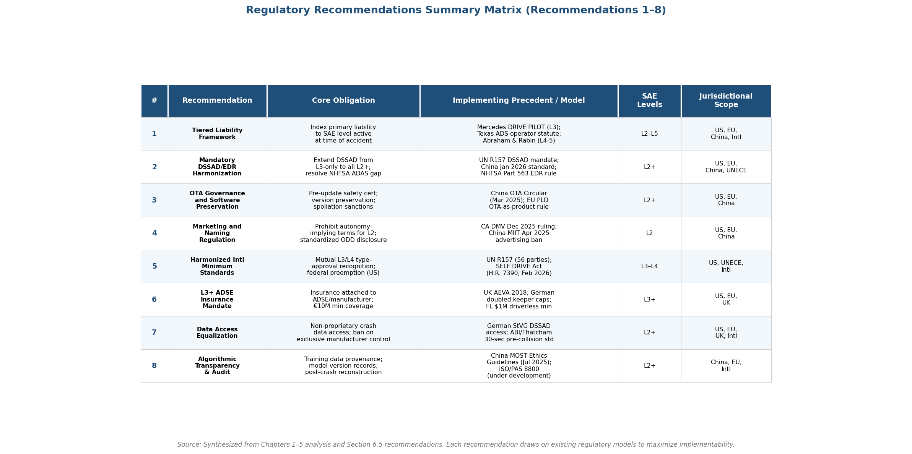

*Figure 6.2: Summary matrix of all eight regulatory recommendations, showing core obligations, implementing precedents, applicable SAE levels, and jurisdictional scope.*

### Recommendation 1: Tiered Liability Framework Indexed to SAE Level

Jurisdictions should adopt a tiered liability allocation framework that explicitly indexes primary responsibility to the SAE J3016 automation level active at the time of the accident. The five-factor allocation model developed in Chapter 4 provides the analytical scaffold.

- **Level 2 (Driver Support):** The driver bears primary responsibility for the entire object and event detection and response (OEDR) task. However, the manufacturer bears concurrent product liability for design defects that contribute to foreseeable misuse—specifically, inadequate DMS, failure to enforce ODD boundaries, and marketing-induced expectation gaps that cultivate over-reliance. The five factors—SAE level, ODD compliance, DMS status, TOR compliance, and marketing gap—apply in their full complexity at L2 because this is the level at which contested human-machine liability is most frequent.

- **Level 3 (Conditional Automation):** The manufacturer or ADSE bears primary liability when the ADS is engaged within its defined ODD. The driver retains residual liability only for failure to comply with a properly issued transition demand within the applicable time window (10 seconds under UN Regulation No. 157). Mercedes-Benz's DRIVE PILOT liability commitment (Chapter 4), the German Halter strict-liability framework with doubled caps (Chapter 5), and the UK Automated Vehicles Act 2024's user-in-charge criminal immunity provision (Chapter 4) provide implementable templates.

- **Level 4–5 (High/Full Automation):** The ADSE or fleet operator bears strict liability for all accidents during automated driving, consistent with the Abraham and Rabin (2019) manufacturer enterprise responsibility model (Chapter 4) [Abraham & Rabin, 105 Va. L. Rev. 127 (2019)](https://www.virginialawreview.org/wp-content/uploads/2020/12/A&R_Book.pdf "Abraham & Rabin 2019: manufacturer enterprise responsibility"). Texas's statutory framework (Transportation Code §§545.451–545.459, effective September 1, 2025), which deems the ADS—not a human—the "operator" when engaged, offers a working legislative model for this tier (Chapter 2).

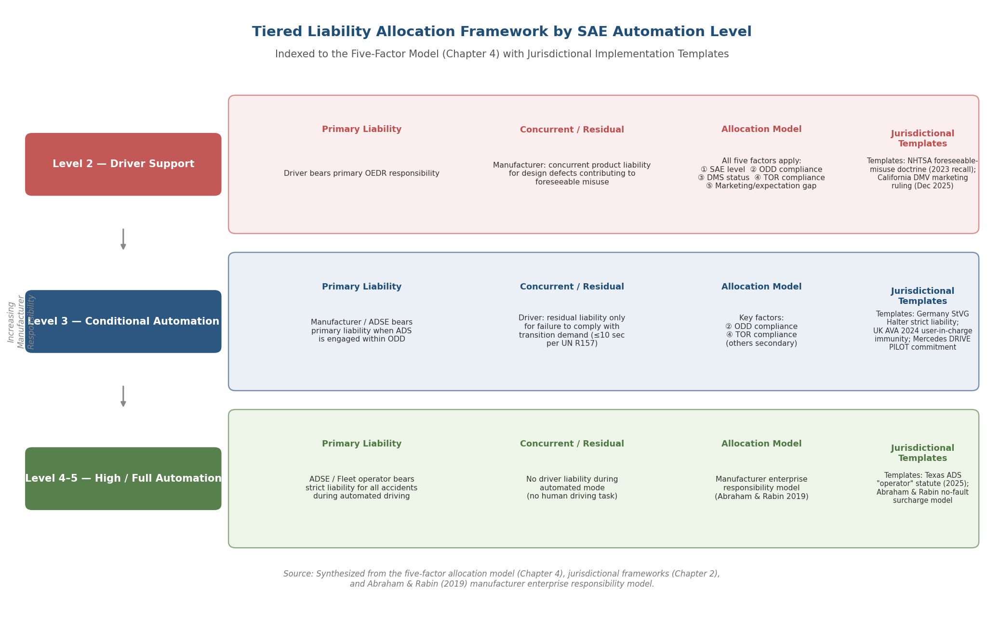

*Figure 6.3: Three-tier liability allocation structure (L2 / L3 / L4–5) showing primary liability holders, concurrent and residual liability, the applicable allocation model for each tier, and jurisdictional implementation templates.*

### Recommendation 2: Mandatory DSSAD/EDR Harmonization Across Level 2+

The current regulatory architecture imposes standardized automated-system data recording (DSSAD) only on L3 vehicles under UN R157, while the overwhelming majority of ADAS-related crashes involve L2 systems operating without standardized recording obligations (Chapter 5). This asymmetry must be addressed.

NHTSA should resolve its deferral of ADAS data elements in the Part 563 EDR rulemaking and extend DSSAD-equivalent recording requirements to all L2+ systems. At minimum, the expanded standard should capture: ADAS/ADS engagement status, DMS readings, transition demands and driver responses, ODD boundary conditions, sensor-health status, and software version identifiers. China's mandatory DSSAD standard (effective January 2026) and Germany's StVG DSSAD provisions provide implementable reference models. International harmonization through UNECE WP.29 should establish mutual recognition of data formats and access protocols, enabling cross-border crash reconstruction with consistent evidentiary standards.

### Recommendation 3: OTA Governance and Software Preservation

Over-the-air (OTA) updates create distinctive evidentiary challenges that existing discovery and evidence-preservation doctrines do not adequately address (Chapter 5). Three regulatory measures are warranted.

First, **pre-update safety certification** for all safety-relevant OTA updates—following the model established by China's March 2025 OTA Circular, which mandates regulatory filing with 44 specified technical parameters and prohibits using OTA to conceal defects or substitute for formal recall procedures [APCO](https://apcoworldwide.com/blog/road-safety-china-tightens-regulations-on-intelligent-driving/ "APCO: China OTA Circular, March 2025").

Second, **mandatory software-version preservation** for any vehicle involved in a reported crash. The preservation period should align with the applicable statute of limitations, and manufacturers should be required to maintain retrievable archives of all safety-relevant software versions deployed to production vehicles.

Third, **spoliation sanctions** for post-crash OTA updates that overwrite pre-crash software, placing the evidentiary burden on the party that destroyed the evidence. The EU PLD's treatment of each safety-relevant OTA as a new product placement—restarting the 10-year liability period—provides a coherent doctrinal framework for this obligation [Reed Smith](https://www.reedsmith.com/articles/the-new-eu-product-liability-key-implications-autonomous-vehicle/ "Reed Smith: EU PLD OTA implications, October 2025").

### Recommendation 4: Marketing and Naming Regulation

The evidence reviewed in this report consistently identifies manufacturer marketing practices as a decisive factor in liability outcomes. The $243 million Florida verdict's punitive damages component (Chapter 3), California DMV's December 2025 ruling that Tesla's FSD marketing was "actually, unambiguously false," China's April 2025 MIIT directive ordering 60 automakers to ban misleading autonomy-implying terms, and the doctrinal analysis of the "expectation gap" as a liability multiplier (Chapter 4) converge on the same conclusion: marketing-induced over-reliance on ADAS is a structural contributor to crash causation, not a peripheral concern.

Regulators should prohibit autonomy-implying terms for L2 features—specifically names such as "Full Self-Driving," "Autopilot," or "autonomous" for systems that require continuous human supervision. Mandatory standardized ODD disclosure at point of sale and within the human-machine interface (HMI) should replace manufacturer-specific warning language that users demonstrably do not read or comprehend. California DMV's December 2025 action [California DMV](https://www.dmv.ca.gov/portal/news-and-media/news-releases/dmv-finds-tesla-violated-california-state-law/ "California DMV: Tesla marketing violation, December 2025") and MIIT's April 2025 directive provide working enforcement precedents.

### Recommendation 5: Harmonized International Minimum Standards

The regulatory fragmentation documented in Chapter 2—jurisdiction-by-jurisdiction type-approval, divergent state-level AV statutes within the United States, asymmetric EU/China/U.S. regulatory calendars—imposes compliance costs that contributed directly to the L3 commercial viability crisis described in Section 6.1. Two complementary harmonization strategies are warranted.

At the international level, UNECE WP.29 should serve as the primary vehicle for multilateral technical harmonization. UN Regulation No. 157 (ALKS), applied by 56 Contracting Parties, demonstrates that binding international L3 safety performance standards are achievable. Extension of this framework to Level 4 through the forthcoming ADS Global Technical Regulation should be prioritized.

At the U.S. federal level, the SELF DRIVE Act (H.R. 7390, introduced February 2026) offers a viable structural model: federal preemption of state ADS design, construction, and performance regulation, combined with preservation of state authority over licensing, registration, and insurance (Chapter 2) [Upstream Security](https://upstream.auto/blog/the-self-drive-act-returns-why-congress-is-taking-another-shot-at-av-regulation/ "SELF DRIVE Act analysis, March 2026"). The critical design principle is that international bodies establish safety-performance minimums while national law retains authority over liability allocation and insurance requirements.

### Recommendation 6: Level 3+ ADSE Insurance Mandate

The insurance model transformation documented in Chapter 5 requires a decisive shift from driver-centric to product-liability-oriented coverage for L3+ operation. Three design elements are essential.

First, **mandatory insurance attaching to the ADSE/manufacturer**, not solely the driver. The UK AEVA 2018 model—insurer strict liability during automated driving, with subrogation rights against the manufacturer/ADSE—and Germany's doubled keeper caps (€10 million personal injury / €2 million property damage) represent viable templates [AEVA 2018, Part 1](https://www.legislation.gov.uk/ukpga/2018/18/part/1 "AEVA 2018: Liability of insurers") and [CMS Expert Guide — Germany](https://cms.law/en/int/expert-guides/cms-expert-guide-to-autonomous-vehicles-avs/germany "CMS: German doubled insurance caps").

Second, **minimum per-incident coverage floors** for L3+ automated-mode operation should be set at levels sufficient for catastrophic claims—at minimum €10 million for personal injury, consistent with Germany's current cap. Florida's $1 million minimum for driverless AV operation (§627.749) is inadequate for multi-victim incidents.

Third, **actuarial models must evolve** from driver-demographic pricing to feature-level, software-version-specific risk assessment. This transition requires mandatory aggregate fleet-performance data disclosure by manufacturers, enabling actuaries to develop experience-rated premiums grounded in actual L3+ crash-frequency data rather than theoretical projections. Geistfeld's (2017) "aggregate performance" benchmark—under which a manufacturer satisfies its tort obligation if its fleet performs at least twice as safely as conventional vehicles—could serve as both a liability standard and an actuarial pricing anchor [Geistfeld, 105 Calif. L. Rev. 1611 (2017)](https://lawcat.berkeley.edu/record/1127996/files/fulltext.pdf "Geistfeld 2017: aggregate fleet performance standard").

### Recommendation 7: Data Access Equalization

The manufacturer data asymmetry documented in Chapter 5—Tesla generating 5–10 GB of raw CAN bus data per 10-minute window while producing only curated EDR summaries in litigation, with proprietary DBC files required to decode raw data controlled exclusively by the manufacturer—undermines the integrity of crash reconstruction and the enforceability of liability frameworks.

The German StVG model should serve as a baseline for international harmonization: DSSAD data stored in the vehicle, manufacturer prohibited from demanding exclusive access, regulatory authorities entitled to non-personal data for road-safety assessment. The ABI/Thatcham Research framework's requirement for collision data "immediately available on a neutral and equitable basis" with a minimum 30-second pre-collision recording in standardized, non-proprietary formats should be adopted as a regulatory mandate [ABI/Thatcham](https://www.abi.org.uk/globalassets/files/publications/public/motor/2024/insurer-requirements-for-automated-vehicles.pdf "ABI/Thatcham: Insurer Requirements for Automated Vehicles, April 2024").

Data access equalization should encompass four dimensions: (1) standardized data formats that do not require proprietary decoding tools; (2) real-time access for emergency responders and accident investigators; (3) litigation-discovery access with spoliation sanctions for non-compliance; and (4) insurer access sufficient to determine whether automated mode was active and within ODD at the time of the crash.

### Recommendation 8: Algorithmic Transparency and Audit Obligations

China's July 2025 Ethics Guidelines, mandating that ADS algorithms be "recorded and made accessible" and that decisions be "traceable and auditable," establish the most prescriptive algorithmic-accountability regime currently applicable to automotive AI (Section 6.3). This approach should be extended and standardized internationally.

Minimum explainability requirements for ADAS perception systems should include: documented training-data provenance (data sources, labeling methodology, geographic and environmental coverage); model-version records tied to vehicle identification numbers and deployment dates; validation and verification protocols for safety-critical perception functions; and post-crash perception-state reconstruction capability—enabling investigators to determine what the system perceived, how it classified objects, and what trajectory decisions it generated in the seconds preceding a crash. The functional analogue is the combined FDR/CVR regime in civil aviation, which has served as the evidentiary foundation for aviation safety investigation for decades.

The emerging ISO/PAS 8800 (*Safety and artificial intelligence—Road vehicles*) should be adopted as a mandatory type-approval standard rather than a voluntary guidance document. Mandatory adoption would establish a binding international baseline for algorithmic transparency, training-data governance, and perception-system validation—converting China's principle of "traceable and auditable" decision-making into a technically specified, enforceable requirement across all major automotive markets.

# Conclusion

The liability allocation problem for ADAS-involved accidents is not a single legal question but a convergence of technical, doctrinal, evidentiary, and institutional challenges, each compounding the others. This report's analysis across six chapters yields several core conclusions.

**The Level 2/Level 3 boundary is the structural axis of liability allocation.** Every jurisdiction examined—the United States, the European Union, Germany, the United Kingdom, China, and the UNECE international framework—treats this boundary as the point at which primary responsibility for the dynamic driving task transfers from the human driver to the automated system. At Level 2, the driver supervises; at Level 3, the system monitors. This technical distinction, rooted in the SAE J3016 taxonomy, generates the foundational legal question: when a system that is designed to assist but not replace the human driver contributes to a crash, how should responsibility be apportioned between the entity that built the system and the person nominally supervising it?

**Existing tort doctrines are adapting, not failing.** Strict product liability, negligence, comparative fault, and the malfunction doctrine each address a portion of the ADAS liability problem. Design-defect analysis under the risk-utility test permits evaluation of alternative sensor architectures, driver-monitoring systems, and ODD enforcement software. The foreseeable-misuse doctrine—operationalized by NHTSA's December 2023 Tesla recall and validated by the August 2025 Florida jury verdict—establishes that manufacturers bear a duty to design against the predictable over-reliance their own systems induce. The Automated Driving System Entity (ADSE) concept, adopted in various forms by Germany, the United Kingdom, Australia, and China, provides a single-point-of-accountability framework that simplifies the plaintiff's task in navigating multi-vendor supply chains. No single doctrine is sufficient, but the five-factor allocation model proposed in Chapter 4—indexing liability to SAE level, ODD compliance, DMS status, take-over-request compliance, and marketing-induced expectation gap—integrates these doctrines into a structured framework for proportional fault distribution.

**Marketing practices are a material contributor to crash causation.** The evidence is consistent and cross-jurisdictional: naming a Level 2 system "Full Self-Driving" cultivates user expectations that diverge from the system's engineering reality, producing the automation complacency that the system's own safety architecture nominally depends on the driver to resist. The California DMV's December 2025 finding that Tesla's FSD marketing is "actually, unambiguously false and counterfactual," China's April 2025 directive ordering 60 automakers to eliminate misleading autonomy terminology, and the $200 million punitive damages component of the Florida verdict all confirm that the gap between marketed capability and actual system performance has become an independent basis for manufacturer liability—not merely a contextual factor in driver-fault assessment.

**The evidentiary infrastructure lags behind the liability framework.** The most sophisticated liability allocation model is inoperative if the data required to apply it do not exist or are not accessible. Current U.S. EDR standards record vehicle dynamics but not ADAS engagement status, sensor inputs, perception outputs, or transition demands. The DSSAD mandate under UN R157 addresses this gap for Level 3 systems, but Level 2—where the vast majority of contested-liability crashes occur—operates without standardized automated-system data recording. Manufacturer control over proprietary telemetry data produces an information asymmetry that distorts litigation outcomes, as the Florida verdict's collision-snapshot controversy demonstrates. Closing this evidentiary gap—through extension of DSSAD requirements to Level 2+ systems, mandatory software-version preservation, and data-access equalization—is a prerequisite for translating doctrinal principles into reliable adjudicative practice.

**The Level 3 commercial viability crisis is a liability problem, not solely an engineering one.** The simultaneous withdrawal of Mercedes-Benz, BMW, and Stellantis from Level 3 deployment reflects the compounding effects of unfavorable unit economics, narrow ODDs that limit consumer value, and—critically—unresolved tort exposure in the absence of actuarial models capable of pricing manufacturer liability at scale. The second-wave commitments from Ford, General Motors, and Honda for 2028 deployment will face the same structural barriers unless the regulatory and insurance frameworks evolve in parallel. The eight recommendations proposed in Chapter 6—tiered liability indexed to SAE level, mandatory DSSAD harmonization, OTA governance, marketing regulation, international harmonization, ADSE insurance mandates, data-access equalization, and algorithmic transparency—are designed to address these barriers collectively rather than in isolation.

The overarching trajectory is clear: as automated driving technology assumes greater control over the dynamic driving task, the legal system must correspondingly shift the locus of accountability from the human occupant to the entities that design, deploy, and profit from the technology. The pace and coherence of that shift will determine whether the transition to higher automation levels produces a liability framework that adequately compensates victims, appropriately incentivizes safety investment, and sustains the commercial viability of technologies that hold genuine promise for reducing the toll of road traffic injuries and fatalities.
