# Overview

*Saint Seiya*, created by Masami Kurumada and serialized in *Weekly Shōnen Jump* from 1986 to 1990, built one of the most intricate power hierarchies in anime and manga history. At its foundation lies a universe where mortal warriors — each bonded to a constellation-linked armor — wage recurrent "Holy Wars" on behalf of rival deities. The franchise's defining thesis is that rank does not determine destiny: the lowest-class Bronze Saints, wearing the weakest armor in Athena's arsenal, systematically ascend through Silver, Gold, and ultimately divine-tier opponents, driven by a Cosmo (inner spiritual energy) system that rewards willpower over material station.

This report provides a structured analysis of the *Saint Seiya* franchise organized around its distinct armor classes and warrior factions. **Chapter 1** examines the Bronze Saints — the five protagonists whose trajectory from the lowest Cloth rank to God Cloth–bearing god-slayers constitutes the series' narrative spine — profiling each character's techniques, Cosmo progression, key battles, and fate. **Chapter 2** covers the Silver Saints, the 24-strong enforcement arm of Sanctuary who serve as the franchise's first major power-scaling benchmark and whose systematic defeat signals the protagonists' readiness for higher-tier challenges. **Chapter 4** turns to Poseidon's Marina Generals, seven elite warriors guarding the Mammoth Pillars in Scales armor of Gold Cloth–equivalent durability, and the god who commands them. **Chapter 5** dissects the 108 Specters of Hades's Underworld — from the Three Judges and the twin gods Thanatos and Hypnos to the lord of the dead himself — along with the Surplice armor system that enables traversal of the afterlife. **Chapter 6** profiles the God Warriors of Asgard, an anime-original faction clad in Norse-themed God Robes and organized under the seven stars of the Big Dipper. **Chapter 7** synthesizes the divine hierarchy — Athena, Zeus, Apollo, Artemis, and the Kamui armor class — and constructs a unified ten-tier power framework spanning the entire franchise.

Across these chapters, the analysis draws primarily on Kurumada's original manga (28 volumes), the canonical sequel *Next Dimension* (ongoing), the 1986–1989 TV anime, the Hades OVA trilogy, *The Lost Canvas*, *Soul of Gold*, *Saint Seiya Omega*, and the *Tenkai-hen Josō Overture* film — distinguishing between manga canon and anime-exclusive or spin-off material where relevant.

# 第1章 Bronze Saints — The Vanguard of Athena

## 1.1 The Bronze Tier in the Cloth Hierarchy

Within the constellation-based ranking system of *Saint Seiya*, the 88 Cloths (聖衣, *Kurosu*) are divided into 48 Bronze, 24 Silver, and 12 Gold, with an additional four of indeterminate rank and Athena's own divine raiment [Seiyapedia — Cloths](https://saintseiya.fandom.com/wiki/Cloths "Cloth hierarchy overview"). Bronze Cloths occupy the lowest stratum: they afford the least body coverage, freeze at −150 °C, and fracture under roughly 4,000 kg of pressure — thresholds that Silver and Gold Cloths surpass by orders of magnitude [Seiyapedia — Bronze Cloths](https://saintseiya.fandom.com/wiki/Bronze_Cloths "Durability thresholds"). Each Bronze Cloth nevertheless compensates with a unique constellation-linked ability, and the franchise's governing principle — "the stronger the Cloth, the more it covers the wearer's body" — implies that Bronze Saints who burn sufficiently powerful Cosmo can narrow the gap between armor classes [Seiyapedia — Cloths](https://saintseiya.fandom.com/wiki/Cloths "Coverage-power correlation").

All Cloths are living entities imbued with Cosmo, forged during the Age of Myth by alchemists of the Mu Continent from Gamanium, Stardust Sand, and Orichalcum as countermeasures against Poseidon's Scales [Seiyapedia — Cloths](https://saintseiya.fandom.com/wiki/Cloths "Cloth origins and materials"). Bronze Cloths, though the weakest class, retain the same capacity for sentient response as their higher-ranked counterparts — a property that proves critical when these Cloths evolve in tandem with their bearers' spiritual growth.

## 1.2 Cloth Evolution: From Bronze to Divine

The five protagonist Bronze Cloths undergo a three-stage evolution unmatched by any other armor class in the original manga, mechanically encoding the theme that the lowest-ranked warriors receive the greatest transformative reward.

**Stage 1 → V2 / New Bronze Cloth.** After the Battle of the Twelve Houses, the protagonists' Cloths were shattered beyond conventional repair. Aries Mu, the sole living Cloth-restoration alchemist, infused them with Gold Saint blood, triggering an evolutionary leap: the V2 Cloths gained substantially greater body coverage and, when their wearer raises Cosmo to the Seventh Sense, temporarily radiate gold and attain Gold Cloth–equivalent defensive strength [Seiyapedia — Cloths](https://saintseiya.fandom.com/wiki/Cloths "V2 upgrade trigger — Gold Saint blood repair").

**Stage 2 → God Cloth (神聖衣, *Goddo Kurosu*).** During the Hades Arc, the Bronze Cloths were anointed with Athena's own blood. When a Bronze Saint simultaneously burns Cosmo to its extreme and awakens the Eighth Sense, the Cloth undergoes a second metamorphosis into a God Cloth — a near-full-plate winged armor that surpasses Gold Cloths and subordinate deities alike. Thanatos's Terrible Providence, a technique that destroyed five Gold Cloths in a single blast, failed to scratch Seiya's Pegasus God Cloth. Only the Kamui (divine armors of the Olympian gods) rank categorically higher; Hades's cursed sword pierced Seiya's God Cloth, confirming its mortal-made ceiling [Seiyapedia — God Cloths](https://saintseiya.fandom.com/wiki/God_Cloths "God Cloth definition and durability ceiling").

Gold Cloths do not undergo this God-tier evolution in the original manga — Gold God Cloths appear only in the anime-exclusive *Soul of Gold* side story. The franchise thus reserves its ultimate armor apotheosis for the Bronze tier alone [Seiyapedia — God Cloths](https://saintseiya.fandom.com/wiki/God_Cloths "Only Bronze Saints attain God Cloths in manga").

The following table summarizes each protagonist's Cloth progression, upgrade triggers, and distinguishing characteristics across the three evolutionary stages.

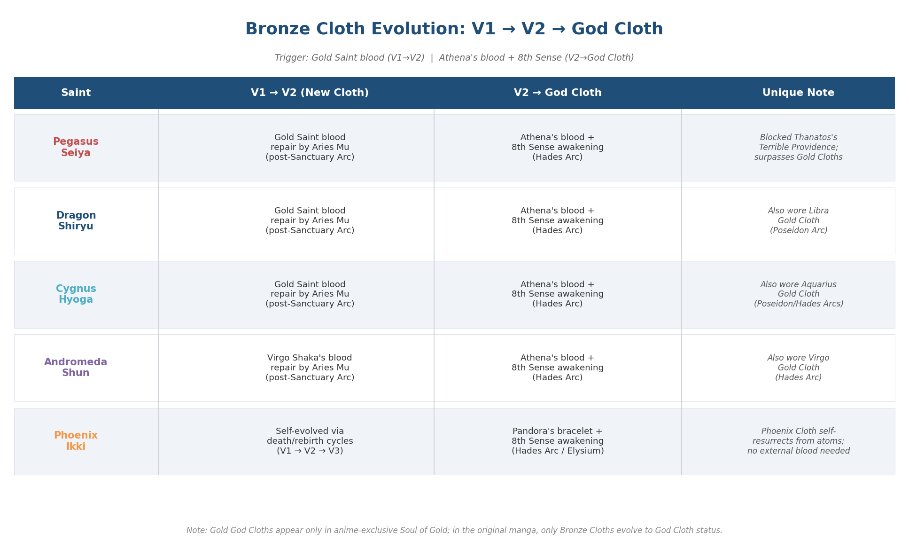

## 1.3 Cosmo Progression: The Engine of Bronze Transcendence

The Cosmo system (小宇宙, "small universe") determines a Saint's combat power independently of Cloth rank, functioning as the narrative mechanism that permits Bronze Saints to challenge progressively divine opponents.

- **Base Cosmo** — Standard Bronze Saints operate at Mach 1–10 with superhuman physical output, sufficient to overcome ordinary combatants but inadequate against Silver or Gold opponents.
- **Seventh Sense (第七感, *Sebunsu Sensu* / "Miraculosity")** — The critical threshold that places a warrior on par with Gold Saints, enabling movement at light speed. Each protagonist awakens this sense during the Sanctuary Arc: Shiryu against Cancer Deathmask, Seiya against multiple Gold Saint opponents, Hyoga in his rematch with Aquarius Camus, Ikki while confronting Virgo Shaka, and Shun intermittently across several encounters [Seiyapedia — Dragon Shiryu](https://saintseiya.fandom.com/wiki/Dragon_Shiryu "Shiryu's 7th Sense awakening").
- **Eighth Sense (第八感, *Eitsu Sensu* / "Arayashiki")** — Permits entry into the Underworld with body and soul intact, beyond Hades's dominion. All five protagonists awaken this sense after the Gold Saints' sacrifice at the Wailing Wall during the Hades Arc [Seiyapedia — Dragon Shiryu](https://saintseiya.fandom.com/wiki/Dragon_Shiryu "8th Sense explanation").
- **Near-Ninth Sense / Divine Cosmo** — Upon attaining God Cloths, the protagonists reach power levels associated with the divine Ninth Sense, enabling them to wound subordinate gods (Thanatos, Hypnos) and injure Hades himself.

This tiered progression ensures that power derives from spiritual will rather than material rank — the foundational thesis of the entire franchise. The diagram below maps these four tiers against the corresponding opponent classes and story arcs.

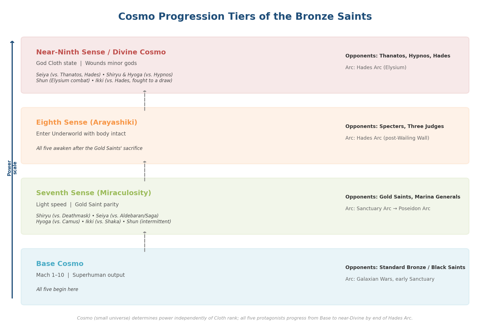

## 1.4 Pegasus Seiya — The Undying Meteor

**Full Designation:** Pegasus Seiya (天馬星座ペガサスの星矢) — series protagonist and narrative avatar of the "weakest rising to challenge gods" motif.

**Training and Origin.** Seiya trained for six years under Silver Saint Eagle Marin at Sanctuary, Greece, earning the Pegasus Cloth. His primary motivation throughout the series is the search for his lost sister — a subplot later revealed to be separate from Marin's own sibling mystery.

**Signature Techniques.**

- *Pegasus Ryūsei Ken* (ペガサス流星拳, Pegasus Meteor Fist) — A barrage of roughly 100 punches per second at base Cosmo, scaling dramatically with the user's spiritual intensity. Debuted in manga Vol. 1, Ch. 1 [Seiyapedia — Pegasus Meteor Fist](https://saintseiya.fandom.com/wiki/Pegasus_Meteor_Fist "Technique details and debut").
- *Pegasus Suisei Ken* (ペガサス彗星拳, Pegasus Comet Fist) — A concentrated single-point strike delivering approximately 100× the Meteor Fist's destructive output [Seiyapedia — Pegasus Comet Fist](https://saintseiya.fandom.com/wiki/Pegasus_Comet_Fist "Technique power comparison").
- *Pegasus Rolling Crush* — A close-range grapple throw, deployed most notably against Lizard Misty during the Silver Saint Arc.

**Cloth Progression:** Pegasus Cloth V1 → V2 (Gold Saint blood repair) → Pegasus God Cloth (Athena's blood, Hades Arc).

**Key Battles.**

- *Galaxian Wars:* Defeated Dragon Shiryu by exploiting the millisecond heart-exposure vulnerability inherent in Rozan Shō Ryū Ha, then restarted Shiryu's heart — establishing Seiya's defining pattern of transcending physical limits through sheer will.
- *Sanctuary Arc:* Fought through multiple Zodiac temples. Briefly awakened the Seventh Sense against Taurus Aldebaran, shattering his Cloth's horn. Defeated Gemini Saga in the climactic confrontation while wearing the Sagittarius Gold Cloth, with Athena's direct support.
- *Poseidon Arc:* Donning the Sagittarius Gold Cloth, Seiya destroyed the Main Breadwinner pillar and sealed Poseidon's soul in Athena's amphora.
- *Hades Arc:* Traversed the Underworld and Elysium. Became the first Bronze Saint to awaken a God Cloth after Thanatos shattered his V2 armor. Blocked Thanatos's Terrible Providence barehanded, destroyed the god's Surplice, and killed him. Delivered the final blow to Hades alongside Athena, but was impaled through the chest by Hades's cursed sword.

**Final Fate.** In the manga's closing pages (Vol. 28), Seiya survives but remains comatose, the divine sword lodged in his body. In *Next Dimension* (the ongoing manga sequel by Kurumada), Athena and Shun travel to the 18th century to find a way to lift the curse. In the anime-only *Saint Seiya Omega*, Seiya eventually recovers and assumes the mantle of Sagittarius Seiya, a Gold Saint [Seiyapedia — Pegasus Meteor Fist](https://saintseiya.fandom.com/wiki/Pegasus_Meteor_Fist "Technique details").

## 1.5 Dragon Shiryu — The Calculated Sacrifice

**Full Designation:** Dragon Shiryu (龍星座ドラゴンの紫龍; lit. "Purple Dragon") — the most composed and tactically deliberate of the five protagonists, ranked first in Japanese character popularity polls [Seiyapedia — Dragon Shiryu](https://saintseiya.fandom.com/wiki/Dragon_Shiryu "Character introduction").

**Training and Origin.** Shiryu trained at the Five Ancient Peaks of Lushan (廬山), China, under Libra Gold Saint Dohko — known to him as "the Old Master." His final trial required reversing the Lushan waterfall with a single blow, a feat demanding near-superhuman Cosmo control.

**Signature Techniques.**

- *Rozan Shō Ryū Ha* (廬山昇龍覇, Lushan Rising Dragon Lord) — An ascending strike that conjures a rising dragon. Its inherent vulnerability: the user's heart is momentarily exposed during execution.
- *Rozan Hyaku Ryū Ha* (廬山百龍覇, Lushan One Hundred Dragon Lords) — A Seventh Sense–level barrage of 100 simultaneous dragons, mastered by observing Dohko.
- *Rozan Kō Ryū Ha* (廬山亢龍覇, Lushan High Dragon Lord) — A forbidden suicide technique in which Shiryu grasps his opponent and launches both into the stratosphere to perish in the heat of reentry.
- *Excalibur* (聖剣エクスカリバー) — Inherited from Capricorn Shura after their mortal combat. Cosmo focused into an infinitely sharp cutting edge along Shiryu's right arm, later refined to sever Chrysaor Krishna's supposedly unbreakable Golden Lance during the Poseidon Arc.

**Cloth Progression:** Dragon Cloth V1 → V2 → Dragon God Cloth. Shiryu also temporarily wore the Libra Gold Cloth during the Poseidon Arc.

**Key Battles.**

- *Silver Saint Arc:* Blinded himself to negate the petrification effect of Perseus Algol's Medusa Shield — the first instance of Shiryu's signature pattern of self-sacrifice for tactical advantage.
- *Sanctuary Arc:* Defeated Cancer Deathmask by awakening the Seventh Sense, causing the Cancer Cloth to abandon its dishonorable wearer. Employed the forbidden Rozan Kō Ryū Ha against Capricorn Shura; both were launched into space, but the dying Shura expended his last energy to save Shiryu and bequeath Excalibur.
- *Poseidon Arc:* Defeated Chrysaor Krishna by severing the Golden Lance and cutting all seven chakra points with Excalibur, though Shiryu lost his sight again from the backlash of Krishna's Kundalini energy.
- *Hades Arc:* Attained the Dragon God Cloth alongside Hyoga, and together they defeated Hypnos, the God of Sleep.

**Final Fate.** Shiryu survived the Hades Arc. In *Next Dimension*, he returned to Lushan to live with Shunrei and their adopted son before rejoining the fight to save Seiya; the 18th-century Dohko proclaimed him the future Libra Gold Saint. In *Omega*, he served as the legendary Libra Shiryu. Across the original manga, he won 58% of his documented battles [Seiyapedia — Dragon Shiryu](https://saintseiya.fandom.com/wiki/Dragon_Shiryu "Battle record and final fate").

## 1.6 Cygnus Hyoga — Absolute Zero and the Mastery of Emotion

**Full Designation:** Cygnus Hyoga (白鳥星座キグナスの氷河; lit. "Glacier") — half-Japanese, half-Russian, defined by the tension between emotional attachment and combat discipline [Seiyapedia — Cygnus Hyoga](https://saintseiya.fandom.com/wiki/Cygnus_Hyoga "Character introduction").

**Training and Origin.** Hyoga trained in the Siberian wilderness under Aquarius Camus, a Gold Saint who taught him to arrest atomic motion through Cosmo-driven temperature manipulation. In the 1986 anime, an anime-original intermediary — the Crystal Saint, a subordinate student of Camus — substitutes as Hyoga's direct master before Camus confronts him in the Sanctuary Arc.

**Signature Techniques.**

- *Diamond Dust* (ダイヤモンドダスト) — A basic freezing barrage of ice crystals, Hyoga's standard opening attack.
- *Kholodnyi Smerch* (ホーロドニースメルチ; Russian: холодный смерч, "Cold Tornado") — His most powerful pre-Gold-level technique, concentrating Cosmo into a single devastating ice tornado.
- *Aurora Thunder Attack* (オーロラサンダーアタック) — A horizontal ice-blast variant of Kholodnyi Smerch.
- *Aurora Execution* (オーロラエクスキューション) — The Gold Saint–level ultimate technique of the Aquarius lineage, capable of reaching absolute zero. Hyoga mastered it in the crucible of his death match with Camus, turning the master's own technique against him.
- *Kol'tso* (カリツォー; Russian: кольцо, "Ring") — Creates an ice ring to immobilize opponents.

**Cloth Progression:** Cygnus Cloth V1 → V2 → Cygnus God Cloth. Hyoga also wore the Aquarius Gold Cloth during segments of the Poseidon and Hades Arcs.

**Key Battles.**

- *Sanctuary Arc:* Defeated his master Aquarius Camus by unleashing Aurora Execution — Camus fell but expressed satisfaction that his student had achieved absolute zero. Earlier, Hyoga had been sealed in Camus's Freezing Coffin within the Libra Temple before his comrades freed him.
- *Poseidon Arc:* Defeated Kraken Isaac, his long-lost training partner who had survived in Poseidon's service after losing an eye while saving Hyoga years earlier. Isaac's Aurora Borealis fell short of Camus's Aurora Execution, and Hyoga prevailed at the Seventh Sense [Seiyapedia — Kraken Isaac](https://saintseiya.fandom.com/wiki/Kraken_Isaak "Isaac biography").
- *Hades Arc:* Confronted Griffon Minos, one of the Three Judges and among the most powerful Specters, and maneuvered him into the currents of the Hyperdimension. Attained the Cygnus God Cloth alongside Shiryu, and together they killed Hypnos.

**Final Fate.** Hyoga survived the Hades Arc. In *Next Dimension*, the 18th-century Aquarius Mystoria proclaimed him the future Aquarius Gold Saint. In *Omega*, he served as a mentor to the next generation [Seiyapedia — Cygnus Hyoga](https://saintseiya.fandom.com/wiki/Cygnus_Hyoga "Full biography and fate").

## 1.7 Andromeda Shun — The Pacifist Vessel of Hades

**Full Designation:** Andromeda Shun (アンドロメダ星座アンドロメダの瞬; lit. "Twinkle/Instant") — paradoxically one of the strongest Saints in the series, whose pacifist nature deliberately restrains his full combat output [Seiyapedia — Andromeda Shun](https://saintseiya.fandom.com/wiki/Andromeda_Shun "Character introduction").

**Training and Origin.** Shun trained on Andromeda Island under Silver Saint Cepheus Daidalos. His trial required surviving the "Sacrifice of Andromeda" — chained to seaside cliffs, he had to free himself before the tide drowned him. Daidalos was later assassinated by Pisces Aphrodite for defying the false Pope's orders, adding a dimension of personal vengeance to Shun's motivation.

**Signature Techniques.**

- *Nebula Chain* (星雲鎖ネビュラチェーン) — The Andromeda Cloth's chain weapon, manipulated at will for autonomous attack, defense, and enemy detection. The circular-tip chain (Round Lock) serves defense, while the triangular-tip chain (Triangle Lock / Thunder Wave) provides offense with heat-seeking properties.
- *Rolling Defense / Circle Defense* — Chains twirled around the body or set on the ground to form a protective perimeter.
- *Nebula Stream* (ネビュラストリーム) — A Cosmo-based binding attack that entangles enemies in Andromeda energy currents.
- *Nebula Storm* (ネビュラストーム) — Shun's ultimate attack: a single catastrophic Cosmo burst released only when he abandons his chains entirely. Its immense destructive power constitutes a deliberate narrative irony — the gentlest Saint wields one of the most devastating finishers in the series.

**Cloth Progression:** Andromeda Cloth V1 → V2 (repaired with Virgo Shaka's blood) → Andromeda God Cloth. Shun also briefly wore the Virgo Gold Cloth during the Hades Arc encounter with Thanatos.

**Key Battles.**

- *Galaxian Wars:* Dominated Unicorn Jabu through the Nebula Chain's autonomous targeting.
- *Sanctuary Arc:* Escaped Gemini Saga's Another Dimension via a brief Seventh Sense awakening. Defeated Pisces Aphrodite with Nebula Storm — avenging his master Daidalos — though he succumbed to Aphrodite's Bloody Rose in the aftermath.
- *Poseidon Arc:* Defeated Scylla Io by improvising six distinct defensive chain configurations against Io's six-beast attack pattern, awakening the Seventh Sense in the process. Defeated Siren Sorrento with Nebula Storm but chose to spare his life.
- *Hades Arc:* In the franchise's most dramatic revelation, Shun was identified as the chosen vessel of Hades, selected for the extraordinary purity of his soul. Hades's spirit seized control of Shun's body; Shun briefly regained consciousness and begged Ikki to kill him, but Ikki could not comply. Athena's blood ultimately separated Hades's soul from Shun's body. After the separation, Shun re-donned his Cloth and fought in Elysium.

**Final Fate.** Shun survived the Hades Arc. In *Next Dimension*, Virgo Shaka proclaimed him the future Virgo Gold Saint — a fitting designation given the Virgo constellation's thematic link to purity and spiritual power. In *Omega*, he became a traveling doctor. He won 60% of his documented manga battles (6 of 10) [Seiyapedia — Andromeda Shun](https://saintseiya.fandom.com/wiki/Andromeda_Shun "Full biography and fate").

## 1.8 Phoenix Ikki — Resurrection Incarnate

**Full Designation:** Phoenix Ikki (鳳凰星座フェニックスの一輝; lit. "One/Singular Brilliance") — introduced as the series' first antagonist before evolving into its most powerful Bronze Saint. Though officially Bronze-ranked, Ikki's base combat power surpasses most Silver Saints [Seiyapedia — Phoenix Ikki](https://saintseiya.fandom.com/wiki/Phoenix_Ikki "Power classification").

**Training and Origin.** Ikki trained on Death Queen Island under the brutal master Guilty, who murdered his beloved Esmeralda. Ikki killed Guilty in a rage and claimed the Phoenix Cloth — a traumatic origin that permanently distinguished him from the other protagonists' mentor-respecting arcs.

**Signature Techniques.**

- *Hōyoku Tenshō* (鳳翼天翔, Phoenix Wings Rise) — A concentrated blast of wind and heat that serves as Ikki's primary finishing technique, effective against multiple opponents simultaneously.
- *Hōō Genmaken* (鳳凰幻魔拳, Phoenix Illusion Demon Fist) — A mental attack delivered by a single fist or finger that devastates the target's psyche through nightmare illusions indistinguishable from reality, shattering Cosmo control.

**Unique Ability — Resurrection.** The Phoenix Cloth can reform from atoms even after total destruction — a capability possessed by no other Cloth. Ikki himself resurrects from apparent death in the manner of his mythological namesake, returning stronger each time. This self-resurrection mechanic uniquely drives the Phoenix Cloth's evolution through Ikki's repeated deaths and rebirths, bypassing the Gold Saint blood or Athena's blood triggers that upgrade the other four protagonists' Cloths.

**Cloth Progression:** Phoenix Cloth V1 → V2 → V3 (self-evolved through death/rebirth cycles) → Phoenix God Cloth. The God Cloth activation in Elysium follows a distinct path: Ikki received Pandora's bracelet to gain passage rather than having Athena's blood applied directly to his Cloth, though the underlying Eighth Sense mechanism converges with that of his comrades.

**Key Battles.**

- *Black Saints Arc:* Stole the Sagittarius Gold Cloth and singlehandedly defeated all four fellow Bronze protagonists before falling to their combined assault — establishing him as a class apart within the Bronze tier.
- *Sanctuary Arc:* Confronted Virgo Shaka and awakened the Seventh Sense by having all six normal senses stripped away. Sacrificed himself to eject Shaka to another dimensional plane, later rescued by Aries Mu.
- *Poseidon Arc:* Instantly penetrated Lyumnades Kasa's shapeshifting deceptions — illusions that had fooled Seiya, Hyoga, and Shun. Fought Sea Dragon Kanon to a strategic draw while extracting intelligence about the arc's true manipulator.
- *Hades Arc:* Defeated Garuda Aiacos, one of the Three Judges, with contemptuous ease — demonstrating the axiom that "the same technique cannot work twice on a Saint." Confronted Hades while the god possessed Shun's body but was defeated and imprisoned in Cocytus, the deepest frozen prison of the Underworld. Freed by Pandora's defection, Ikki attained the Phoenix God Cloth in Elysium and fought Hades to a draw before Athena's intervention.

**Final Fate.** Ikki survived the Hades Arc. In *Next Dimension*, he leapt 243 years into the past and was proclaimed the future Leo Gold Saint by 18th-century Leo Kaiser. He won 63% of his documented manga battles (10 of 16) — the highest win rate among the five protagonists [Seiyapedia — Phoenix Ikki](https://saintseiya.fandom.com/wiki/Phoenix_Ikki "Full biography, battle record, and Next Dimension fate").

## 1.9 Secondary Bronze Saints: The Standard Ceiling

Five secondary Bronze Saints — Unicorn Jabu, Lionet Ban, Bear Geki, Hydra Ichi, and Wolf Nachi — serve as narrative foils that delineate the "normal" Bronze Saint power ceiling, against which the protagonists' transcendence is measured.

**Unicorn Jabu** (一角獣星座ユニコーンの邪武) is the most prominent member of the group. His signature technique, *Unicorn Gallop* (ユニコーンギャロップ), delivers a kick-based barrage equivalent in speed to the Pegasus Meteor Fist. Fiercely loyal to Saori Kido since childhood, Jabu was defeated by Andromeda Shun at the Galaxian Wars. During the Hades Arc, he defended Seiya's sister Seika against Thanatos's assault [Seiyapedia — Unicorn Jabu](https://saintseiya.fandom.com/wiki/Unicorn_Jabu "Jabu's role and techniques"). **Lionet Ban** (Leo Minor), **Bear Geki** (Ursa Major), **Hydra Ichi** (Hydra), and **Wolf Nachi** (Lupus) fill rear-guard and Sanctuary defense roles across the Sanctuary, Poseidon, and Hades arcs, protecting non-combatants while the protagonists advance into enemy territory.

These five represent competent but ultimately limited warriors — unable to challenge Silver or Gold Saints and never awakening the Seventh Sense. Their static power level throws the protagonists' exponential growth into sharp relief. In *The Lost Canvas*, structurally analogous characters occupy the same constellation slots — Unicorn Yato, Wolf Junkers, Hydra Curtis, Bear Douglas, and Lionet Bleriot — confirming that the secondary Bronze Saint archetype functions as a recurring franchise template rather than an incidental casting choice [Seiyapedia — Cloths](https://saintseiya.fandom.com/wiki/Cloths "Lost Canvas Bronze Saint counterparts").

## 1.10 Cross-Media Variations

The Bronze Saints' portrayal diverges across the franchise's layered continuity. In Kurumada's original manga (1986–1990, 28 volumes) and its direct sequel *Next Dimension* (ongoing), the five protagonists' evolution from Bronze to God Cloth stands as definitive canon. The 1986 television anime largely follows the manga but introduces notable additions: the Crystal Saint as Hyoga's direct master (replacing Camus in early episodes), the anime-original Asgard Arc (episodes 74–99), and supplementary filler battles.

*Saint Seiya Omega* (2012–2014, anime-only) envisions an alternate future in which the protagonists have aged into mentors and Gold Saints — Seiya as Sagittarius, Shiryu as Libra, Hyoga and Shun in advisory capacities. A new generation of Bronze Saints (Pegasus Kōga, Dragon Ryūhō, and others) inherits the protagonist mantle, operating under an "Elemental Cosmo" system absent from the original manga.

*Next Dimension* provides the most significant canon expansion for the Bronze protagonists' ultimate fates: each is designated the future Gold Saint of a specific constellation — Shiryu (Libra), Hyoga (Aquarius), Shun (Virgo), Ikki (Leo) — establishing that their Bronze-to-Gold ascent, merely implied at the close of the Hades Arc, carries formal institutional recognition within Sanctuary's history.

## 1.11 Thematic Synthesis: Will Transcends Hierarchy

The narrative architecture of *Saint Seiya* rests on the paradox of Bronze Saints — the lowest-ranked warriors — progressively defeating Silver Saints, Gold Saints, Marina Generals, Specters, the Three Judges, the Twin Gods (Thanatos and Hypnos), and ultimately the supreme deity Hades. The Bronze–Silver–Gold ranking system represents "a journey and not just a rank," as one analysis frames it: the tiered hierarchy exists precisely so that the Bronze Saints can shatter it [CBR — Saint Rank Meanings](https://www.cbr.com/saint-seiya-saint-rank-meanings/ "Rank hierarchy as journey motif").

The Cosmo system is the philosophical engine of this theme. A Saint's power derives entirely from inner spiritual energy — the "small universe" — rather than from the grade of armor worn. The Cloth amplifies but does not generate power; when Seiya first donned the Pegasus Cloth without burning Cosmo, he was immobilized by its weight [Seiyapedia — Cloths](https://saintseiya.fandom.com/wiki/Cloths "Cloth as amplifier, not power source"). Each protagonist enacts this theme through a distinct register: Seiya embodies unyielding will; Shiryu embodies calculated sacrifice (self-blinding, suicide techniques); Hyoga embodies the transcendence of emotional attachment through mastery of absolute zero; Shun embodies the paradox of pacifist power, his Nebula Storm ranking among the strongest attacks precisely because he refuses to deploy it lightly; and Ikki embodies literal resurrection — the phoenix rising stronger from every death.

The following visualization compares the five protagonists' documented battle records and most notable engagements across the original manga.

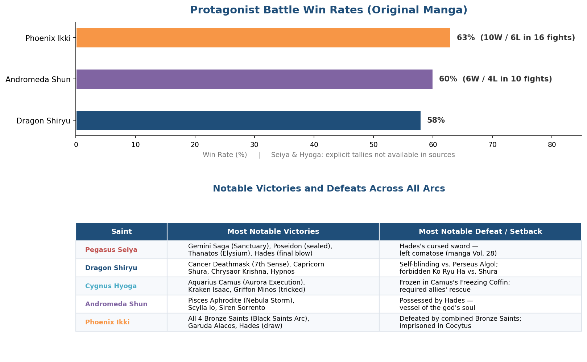

This motif contributed to codifying the "underdog hero" template in shōnen manga, influencing subsequent series from *Dragon Ball Z* to *Naruto* to *Bleach* in their shared structure of weakest-tier warriors burning willpower to overcome impossibly powerful foes through escalating transformations.

# 第2章 Silver Saints — The Middle Echelon

Between the expendable Bronze rank and the near-divine Gold tier stands a class of warriors that functions as the operational backbone of Athena's Sanctuary: the Silver Saints. Numbering 24 within the canonical 88-constellation system, they occupy a deceptively critical position in both the institutional hierarchy and the narrative architecture of *Saint Seiya*. Silver Saints serve as enforcers, trainers, and Cloth custodians; in the original manga's Sanctuary Arc, they constitute the first truly lethal opponents the Bronze protagonists face. Their systematic defeat at the hands of Seiya and his companions establishes the power-escalation rhythm that defines the franchise, while a handful of exceptional Silver-rank warriors — Lyra Orphée, Crateris Suikyō, Altar Hakurei — demonstrate that Cloth class is not an absolute ceiling on individual strength.

## 2.1 Silver Cloth Properties and Combat Parameters

The 24 Silver Cloths (白銀聖衣, *Shirubā Kurosu*) represent the second tier of Athena's 88 constellation-linked armors. Like all Cloths, they are living entities forged during the Age of Myth from Orichalcum, Gamanium, and Stardust Sand, possessing limited self-repair capabilities and the ability to be revived with a Saint's blood [Seiyapedia — Cloths](https://saintseiya.fandom.com/wiki/Cloths "Cloth origin materials and sentience"). Their physical specifications mark a measurable step above Bronze Cloths: Silver Cloths freeze at −200°C (versus −150°C for Bronze) and can withstand ocean-seabed pressure — a substantial improvement over Bronze Cloths, which fracture under approximately 4,000 kg of force [Seiyapedia — Silver Cloths](https://saintseiya.fandom.com/wiki/Silver_Cloths "Freeze threshold: −200°C") [Seiyapedia — Bronze Cloths](https://saintseiya.fandom.com/wiki/Bronze_Cloths "Bronze comparison: −150°C, ~4,000 kg break threshold"). Silver Cloths also provide greater body coverage than Bronze, shielding a substantial portion of the wearer's torso and limbs — intermediate between Bronze's vital-point-only protection and Gold's near-complete plating.

Beyond structural defense, several Silver Cloths possess unique embedded abilities. The Perseus Cloth's Medusa Shield can petrify opponents on sight, and the Crow Cloth maintains a symbiotic relationship with trained corvids that serve as reconnaissance and attack vectors [Seiyapedia — Silver Cloths](https://saintseiya.fandom.com/wiki/Silver_Cloths "Silver Cloth special abilities").

In combat terms, Silver Saints operate at speeds between Mach 2 and Mach 5, with the weakest being at least twice as powerful as a standard Bronze Saint and the strongest reaching five times that baseline. Their Cosmo development centers on the Sixth Sense (Intuition) — a level of spiritual mastery that grants heightened tactical awareness and refined technique but falls short of the Seventh Sense that enables Gold Saint combat at lightspeed [Seiyapedia — Silver Saints](https://saintseiya.fandom.com/wiki/Silver_Saints "Speed: Mach 2–5; Cosmo: Sixth Sense; power multiplier: 2×–5× Bronze"). The figure below summarizes the specification gap across all three Cloth tiers.

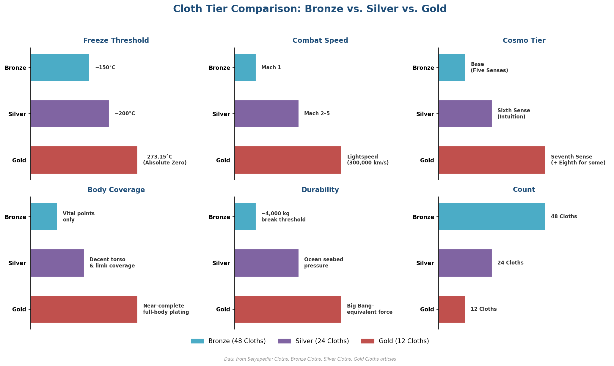
*Figure 2-1. Six-dimension comparison of Bronze, Silver, and Gold Cloth specifications: freeze threshold, combat speed, Cosmo tier, body coverage, durability, and total Cloth count.*

Despite this general ceiling, three exceptional Silver Saints demonstrably rival or exceed Gold-level power. Lyra Orphée, designated the "Legendary Saint," is described as surpassing typical Gold Saints. Crateris Suikyō, introduced in *Next Dimension*, is evaluated by Phoenix Ikki as stronger than any Gold Saint Ikki had fought. Altar Hakurei, from *The Lost Canvas*, is stated to be equal to Grand Pope Sage — himself the former Cancer Gold Saint [Seiyapedia — Silver Saints](https://saintseiya.fandom.com/wiki/Silver_Saints "Exceptions at Gold level: Orphée, Suikyō, Hakurei"). These outliers affirm a fundamental principle of the Cosmo system: rank classifies armor, not the wearer's potential.

## 2.2 Institutional Role: Enforcers, Trainers, and Pawns

Silver Saints serve the Pope (Grand Patriarch) as the Sanctuary's primary enforcement arm. When issued assignments, they travel anywhere in the world to fulfill them, sometimes leading Bronze Saints as subordinate support [Seiyapedia — Silver Saints](https://saintseiya.fandom.com/wiki/Silver_Saints "Silver Saints as Sanctuary enforcers"). A less visible but equally important function is the custodianship of ownerless Cloths and the training of new Saint candidates — roles critical to institutional continuity given the heavy casualties of each Holy War cycle.

During the 13-year reign of the false Pope (Gemini Saga masquerading as the Grand Patriarch), Silver Saints became instruments of a corrupted chain of command. The Seiyapedia wiki observes that Silver Saints in the original series appear "ruthless, malevolent, and sadistic in nature, akin to assassins rather than warriors of peace" [Seiyapedia — Silver Saints](https://saintseiya.fandom.com/wiki/Silver_Saints "Moral ambiguity of Silver Saints"). This characterization is largely explained by deception: most Silver Saints genuinely believed the Bronze Saints were traitors who had stolen the Sagittarius Gold Cloth and obeyed the Pope they trusted. A few — notably Cepheus Daidalos, Eagle Marin, and Ophiuchus Shaina (eventually) — recognized or suspected the Pope's illegitimacy, placing them in opposition to the majority.

The false Pope deployed Silver Saints in two assassination waves against the Bronze protagonists during the Sanctuary Arc. Wave 1 (Reconnaissance Group), led by Lizard Misty, comprised Whale Moses, Hound Asterion, and Centaurus Babel. Wave 2 (Assault Squadron), led by Perseus Algol, brought Cerberus Dante, Auriga Capella, and Crow Jamian [Seiyapedia — Lizard Misty](https://saintseiya.fandom.com/wiki/Lizard_Misty "Misty leads first assassination wave") [Seiyapedia — Perseus Algol](https://saintseiya.fandom.com/wiki/Perseus_Algol "Algol leads second squadron"). Both waves were systematically dismantled by the Bronze Saints — initially with difficulty, then with increasing ease — establishing Silver Saints as a power-scaling benchmark whose defeat signaled the protagonists' readiness for the vastly greater challenge of the Twelve Houses.

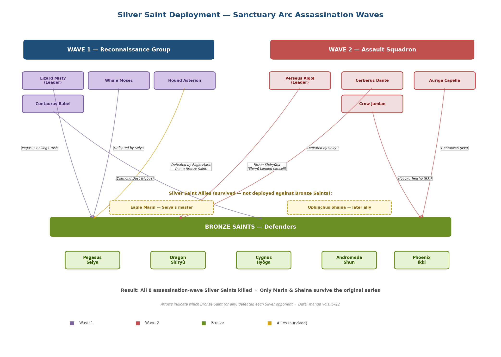
*Figure 2-2. Deployment diagram of the two Silver Saint assassination waves. Arrows indicate which Bronze Saint (or ally) defeated each Silver opponent and the technique used. All eight assassination-wave Silver Saints were killed; only the two allied Silver Saints — Marin and Shaina — survived the original series.*

Female Silver Saints bear an additional institutional burden: the Law of the Masks requires them to conceal their faces, renouncing their femininity. Should a man see a female Saint's face, she must either kill him or fall in love with him — a rule that drives the entire character arc of Ophiuchus Shaina [Seiyapedia — Ophiuchus Shaina](https://saintseiya.fandom.com/wiki/Ophiuchus_Shaina "Law of the Masks: kill or love").

## 2.3 Key Silver Saint Profiles

### 2.3.1 Ophiuchus Shaina

**Designation**: Ophiuchus Silver Saint — one of the two most prominent female Saints in the franchise.

**Cosmo Tier**: Sixth Sense (standard Silver level).

**Signature Technique**: *Thunder Claw* (サンダークロウ, *Sandā Kurou*) — a cobra-stance claw strike that channels Cosmo into electrical charges of 10,000 volts [Seiyapedia — Ophiuchus Shaina](https://saintseiya.fandom.com/wiki/Ophiuchus_Shaina "Thunder Claw: 10,000-volt electrical claw attack").

**Key Appearances**: Shaina's arc begins as an antagonist during the Galaxian Wars, where she trained Cassios to compete for the Pegasus Cloth and resented Seiya for winning it. After Seiya shattered her mask, the Law of the Masks compelled an obsession that gradually transformed from hatred into reluctant devotion. She was critically wounded shielding Seiya from Leo Aiolia's lightspeed attack — an act that marked her definitive transition from antagonist to protector. During the Poseidon Arc (anime), Shaina became the only Silver Saint to directly confront a god, attacking Poseidon himself, though his psychic power effortlessly overwhelmed her [Seiyapedia — Ophiuchus Shaina](https://saintseiya.fandom.com/wiki/Ophiuchus_Shaina "Only Silver Saint to fight a god directly").

**Fate**: Shaina survives all arcs of the original series. In the Hades Arc, she guards the Sanctuary and sustains injuries protecting Seiya's sister Seika from Thanatos. She and Eagle Marin are the only Silver Saints confirmed alive at the series' conclusion [Seiyapedia — Eagle Marin](https://saintseiya.fandom.com/wiki/Eagle_Marin "Marin and Shaina: only Silver Saints surviving the series"). In *Saint Seiya Omega*, she takes on an expanded role as master of the new protagonist Pegasus Kōga, gaining the Thunder elemental attribute [Seiyapedia — Ophiuchus Shaina](https://saintseiya.fandom.com/wiki/Ophiuchus_Shaina "Omega: master of Kōga, Thunder attribute"). In *Next Dimension*, she discovers the ruins of the sealed 13th temple (Ophiuchus) between the Scorpio and Sagittarius houses.

### 2.3.2 Eagle Marin

**Designation**: Eagle Silver Saint — Seiya's master at the Sanctuary.

**Cosmo Tier**: Sixth Sense (high-end Silver).

**Signature Techniques**:
- *Ryūsei Ken* (流星拳, Meteor Fists): 100 blows per second at Mach 3+ — the foundational technique she taught Seiya.
- *Eagle Toe Flash* (イーグルトゥフラッシュ): A high-speed aerial dive kick exceeding Mach 3, her most powerful offensive attack [Seiyapedia — Eagle Marin](https://saintseiya.fandom.com/wiki/Eagle_Marin "Eagle Toe Flash: dive kick exceeding Mach 3").
- *Kūken* (空拳, Empty Fist): An illusory non-offensive feint simulating a lethal blow — employed to fake Seiya's death before Misty's reconnaissance group.
- *Silence* (サイレンス): Deep meditation that blanks the mind entirely, nullifying psychic abilities such as Asterion's mind-reading [Seiyapedia — Eagle Marin](https://saintseiya.fandom.com/wiki/Eagle_Marin "Silence: mental void vs. Asterion").

**Key Appearances**: Marin is central to the "lost sibling" subplot threading through the franchise. As a Japanese woman who came to Sanctuary searching for a lost younger sibling, she was long suspected of being Seiya's sister Seika. This was ultimately disproven: her brother was revealed to be Angel Icarus Tōma, a warrior of Artemis, in the *Tenkai-hen Josō Overture* film and *Next Dimension* [Seiyapedia — Eagle Marin](https://saintseiya.fandom.com/wiki/Eagle_Marin "Lost sibling: Tōma revealed as Marin's brother"). During the Sanctuary Arc, Marin faked Seiya's death with Kūken but was exposed, beaten by Moses and Asterion, and bound to a cross in the tide as bait. She escaped, defeated Asterion with Eagle Toe Flash, then ascended the forbidden Star Hill and discovered the corpse of Pope Shion — confirming that the reigning Pope was an impostor. During the Twelve Houses assault, she saved Seiya in Pisces Aphrodite's Royal Demon Rose garden by lending him her mask as a poison filter.

**Fate**: Marin survives. During the Hades Arc, she located Seika living with amnesia near Sanctuary and was wounded protecting her from Thanatos. In *Next Dimension*, she continues guarding the comatose Seiya [Seiyapedia — Eagle Marin](https://saintseiya.fandom.com/wiki/Eagle_Marin "Hades Arc: finds Seika; wounded by Thanatos").

### 2.3.3 Lizard Misty

**Designation**: Lizard Silver Saint — the first character officially introduced with the Silver Saint title in both manga and anime, and leader of the first assassination group dispatched to Japan.

**Cosmo Tier**: Sixth Sense (upper Silver).

**Signature Techniques**:
- *Mavrou Trypa* (マーブル・トリパー, lit. "Black Hole" in Greek): Manipulates atmospheric currents into a devastating air vortex capable of shaking Mount Fuji and triggering internal collapses [Seiyapedia — Lizard Misty](https://saintseiya.fandom.com/wiki/Lizard_Misty "Mavrou Trypa: air vortex, shook Mt. Fuji").
- *Air Shield*: An invisible atmospheric barrier created by moving his hands at high speed; blocks all attacks unless the opponent matches his speed.

**Key Battle**: Misty confronted Seiya on a Japanese beach in manga vol. 5. Distinguished by extreme narcissism — he claimed never to have been wounded in combat — Misty initially dominated the fight. Seiya broke through his Air Shield by matching his speed and finished him with Pegasus Rolling Crush [Seiyapedia — Lizard Misty](https://saintseiya.fandom.com/wiki/Lizard_Misty "Defeated by Seiya; manga vol. 5").

**Fate**: Killed by Seiya (manga vol. 5). In the Hades OVA, Misty was resurrected alongside Moses and Babel, dispatched to Siberia, and swiftly defeated by Hyōga; before dying, the three reaffirmed loyalty to Athena. In *Episode G*, he appears defending Egypt from mummies generated by the Cronos–Aiolia conflict, where his Mavrou Trypa demonstrated an expanded capability of dispersing dead souls [Seiyapedia — Lizard Misty](https://saintseiya.fandom.com/wiki/Lizard_Misty "Hades OVA resurrection; Episode G: disperses dead souls").

### 2.3.4 Perseus Algol

**Designation**: Perseus Silver Saint — leader of the second Silver Saint assassination squadron, deployed alongside Cerberus Dante and Auriga Capella (manga) or with Shaina and Spartan (anime).

**Cosmo Tier**: Sixth Sense.

**Signature Techniques**:
- *Medusa Shield*: The Perseus Cloth's unique artifact — a shield bearing the face of Medusa that petrifies anyone who gazes upon it. Successfully turned Andromeda Shun, Cygnus Hyōga (manga), and Pegasus Seiya to stone [Seiyapedia — Perseus Algol](https://saintseiya.fandom.com/wiki/Perseus_Algol "Medusa Shield petrification").
- *Ra's Al Ghul Gorgonio* (ラスアルグールゴルゴニオ, lit. "Head of the Ghoul Gorgoneion"): An aerial kick technique conjuring an illusion of serpents.

**Key Battle**: Algol's defeat by Dragon Shiryu ranks among the most iconic Silver Saint encounters. After blindfolds proved insufficient — the shield's petrification partially penetrated cloth barriers — Shiryu blinded himself by striking his own eyes, then defeated Algol with Rozan Shōryūha (廬山昇龍覇, Lushan Rising Dragon Lord) guided by Athena's Cosmo (manga vols. 6–7). Shiryu's self-blinding became a defining character moment, establishing his recurring pattern of sacrificing his body to protect others [Seiyapedia — Perseus Algol](https://saintseiya.fandom.com/wiki/Perseus_Algol "Shiryu self-blinding; manga vols. 6–7").

**Fate**: Killed by Shiryu. In the Hades OVA, Algol was resurrected alongside Dante and Capella wearing Surplices; all three were defeated simultaneously by a single Rozan Shōryūha at the Rozan waterfall — a scene that vividly illustrates the power gap between late-series Bronze protagonists and Silver-class opponents [Seiyapedia — Perseus Algol](https://saintseiya.fandom.com/wiki/Perseus_Algol "Hades OVA: three Silver Saints defeated by one Rozan Shōryūha").

### 2.3.5 Crow Jamian

**Designation**: Crow (Corvus) Silver Saint. Part of the second assassination wave.

**Cosmo Tier**: Sixth Sense.

**Signature Technique**: *Black Wing Shaft* (ブラック・ウイング・シャフト) — Jamian commands a flock of crows to drop Cosmo-imbued feathers onto the target. The feathers are abnormally heavy, accumulating to immobilize and suffocate the opponent [Seiyapedia — Crow Jamian](https://saintseiya.fandom.com/wiki/Crow_Jamian "Black Wing Shaft: feather immobilization technique").

**Key Event**: Jamian was tasked with kidnapping Saori Kido (Athena) and retrieving the Sagittarius Gold Cloth. He successfully abducted Saori using his crows, but she instinctively unleashed Athena's Cosmo, turning his own birds against him.

**Fate**: Killed by Phoenix Ikki's Hōyoku Tenshō (鳳翼天翔, Phoenix Wings Rise), falling off a cliff (manga vols. 5–6) [Seiyapedia — Crow Jamian](https://saintseiya.fandom.com/wiki/Crow_Jamian "Killed by Ikki; manga vols. 5–6").

### 2.3.6 Hound Asterion

**Designation**: Hound (Canes Venatici) Silver Saint. Member of Misty's first reconnaissance group.

**Cosmo Tier**: Sixth Sense, with a rare psychic specialization.

**Special Ability**: *Satori no Hō* (mind-reading) — Asterion reads opponents' thoughts in real time, anticipating their movements. This ability can be countered only by a completely blanked mind [Seiyapedia — Hound Asterion](https://saintseiya.fandom.com/wiki/Hound_Asterion "Satori: mind-reading ability").

**Signature Technique**: *Million Ghost Attack* — Asterion leaps into the air, generates hundreds of copies of himself moving at Mach 3, and overwhelms the target from all directions [Seiyapedia — Hound Asterion](https://saintseiya.fandom.com/wiki/Hound_Asterion "Million Ghost Attack: Mach 3 copies").

**Key Battle**: Paired with Whale Moses, Asterion captured and tortured Marin as bait for Seiya. After Seiya dispatched Moses, Asterion confronted Marin directly. She activated the Silence technique — blanking her mind to nullify his psychic advantage — and defeated him with Eagle Toe Flash.

**Fate**: In the manga, Marin spared him so he could report back to the Pope. Kurumada later depicted his grave in the Kazenban revised edition, implying death from wounds or subsequent punishment. In the anime, he dies after the battle with Marin [Seiyapedia — Hound Asterion](https://saintseiya.fandom.com/wiki/Hound_Asterion "Manga: spared then implied dead; anime: dies after Marin fight").

### 2.3.7 Secondary Silver Saints

Several additional Silver Saints appear in the original manga and anime with limited individual development but collectively flesh out the Silver class:

- **Whale Moses** (鯨座のモーゼス): A physical-power specialist distinguished by enormous strength and a scar-covered body — a deliberate contrast to Misty's unblemished vanity. Defeated by Seiya on the beach; resurrected in the Hades OVA alongside Misty and Babel, where Hyōga dispatched him again [Seiyapedia — Lizard Misty](https://saintseiya.fandom.com/wiki/Lizard_Misty "Moses resurrected in Hades OVA").
- **Centaurus Babel** (ケンタウルス座のバベル): A fire-based Silver Saint in Misty's reconnaissance group. Killed by Cygnus Hyōga in Japan; resurrected in the Hades OVA and defeated by Hyōga a second time, reaffirming loyalty to Athena before dying [Seiyapedia — Lizard Misty](https://saintseiya.fandom.com/wiki/Lizard_Misty "Babel killed by Hyoga").
- **Cerberus Dante** (ケルベロス座のダンテ): A member of Algol's second squadron employing a three-headed attack channeling the Cerberus motif. Defeated alongside Algol and Capella; resurrected in the Hades OVA and dispatched by Shiryu.
- **Auriga Capella** (馭者座のカペラ): Wields razor-sharp throwing discs thematically linked to the charioteer constellation's wheel imagery. Killed by Phoenix Ikki's Genmaken (鳳凰幻魔拳, Phoenix Illusion Demon Fist) before the battle with Algol began (manga); resurrected in the Hades OVA and defeated by Shiryu [Seiyapedia — Perseus Algol](https://saintseiya.fandom.com/wiki/Perseus_Algol "Capella killed by Ikki; resurrected in Hades OVA").
- **Canis Major Sirius** and **Sagitta Ptolemy**: Rarely featured, listed among the 17 named Silver Saints of the 20th-century Sanctuary. Ptolemy wields arrow-based techniques befitting the Sagitta constellation.
- **Heracles Algethi**, **Musca Dio**, and **Ara Nicole**: Named in the official Silver Saint roster with minimal narrative appearances; their inclusion rounds out the 24-Cloth count without contributing individually to major plot developments.

### 2.3.8 Cepheus Daidalos

**Designation**: Cepheus Silver Saint — master of Andromeda Shun and Chameleon June on Andromeda Island.

**Cosmo Tier**: Sixth Sense.

**Key Narrative**: Daidalos independently recognized the false Pope's corruption, aligning him with the small group of dissenters that included Aries Mu, Libra Dohko, and Eagle Marin. He refused to respond to the Pope's summons, and for this perceived treason, the Pope dispatched Pisces Aphrodite to assassinate him. Daidalos was killed by Aphrodite's Royal Demon Roses before the main storyline began [Seiyapedia — Cepheus Daidalos](https://saintseiya.fandom.com/wiki/Cepheus_Daidalos "Assassinated by Aphrodite for refusing Pope's summons").

His death serves a dual narrative function: it demonstrates the false Pope's willingness to eliminate dissenting Silver Saints — ensuring that only loyalists or the deceived remained as active enforcers — and it provides Shun with a personal motivation for the Sanctuary campaign: vengeance for his murdered master.

### 2.3.9 Lyra Orphée — The Legendary Saint

**Designation**: Lyra Silver Saint — known as the "Legendary Saint," a Silver-rank warrior whose Cosmo surpasses that of typical Gold Saints, making him the most powerful canonical Silver Saint [Seiyapedia — Silver Saints](https://saintseiya.fandom.com/wiki/Silver_Saints "Orphée: Legendary Saint, surpasses Gold Saints").

**Cosmo Tier**: At or above Seventh Sense (Gold Saint–equivalent).

**Signature Techniques**:
- *Stinger Fine* (スティンガーファイン): A focused strike channeled through his lyre.
- *Stringer Nocturne* (ストリンガーノクターン): Deadly sonic waves generated by playing his lyre, capable of incapacitating or destroying opponents [Seiyapedia — Lyra Orphée](https://saintseiya.fandom.com/wiki/Lyra_Orph%C3%A9e "Techniques: Stringer Nocturne").
- *Death Trip Serenade* (デストリップセレナーデ): His ultimate technique — a lyre composition that puts opponents into eternal sleep or directly destroys them, potent enough to momentarily charm Hades himself [Seiyapedia — Lyra Orphée](https://saintseiya.fandom.com/wiki/Lyra_Orph%C3%A9e "Death Trip Serenade").

**Key Narrative**: Orphée's story is a direct transposition of the Greek myth of Orpheus. He descended into the Underworld to save his beloved Eurydice but was tricked by Hades into remaining there, living in self-imposed exile as a lyre player in the realm of the dead. During the Hades Arc, he encountered the Bronze Saints in the Underworld and initially appeared to serve Hades, but his true allegiance remained with Athena. He defeated Sphinx Pharaoh — a Celestial-class Specter whose Balance of Curse technique forced opponents' hearts out on a scale — using Stringer Nocturne [Seiyapedia — Sphinx Pharaoh](https://saintseiya.fandom.com/wiki/Sphinx_Pharaoh "Pharaoh defeated by Orphée's Stringer Nocturne"). Orphée then fought alongside Seiya against further Specters before sacrificing himself.

**Significance**: Orphée's existence as a Silver Saint demonstrably stronger than most Gold Saints constitutes the franchise's clearest evidence that Cloth rank does not strictly determine power. His Cosmo mastery — not his armor classification — defines his combat ceiling.

## 2.4 The Silver Saint Power Ceiling and Late-Series Obsolescence

The Silver Saints collectively function as the franchise's first major power-scaling benchmark. Their introduction establishes a clear tier above Bronze Saints (Mach 2–5 versus Mach 1; −200°C freeze threshold versus −150°C), and their systematic defeat illustrates the Bronze protagonists' accelerating growth trajectory. The Seiyapedia wiki explicitly notes that Silver Saints "have been variably mistreated in the series, being defeated by the five Bronze Saints, initially with difficulties, later becoming progressively easy. This is perhaps as a prelude to the introduction of the Gold Saints" [Seiyapedia — Silver Saints](https://saintseiya.fandom.com/wiki/Silver_Saints "Silver Saints mistreated as escalation tool").

By the time the Bronze protagonists awaken the Seventh Sense during the Twelve Houses arc, they surpass Silver Saints entirely. This is demonstrated most strikingly in the Hades OVA, where Dragon Shiryu defeats three resurrected Silver Saints — Algol, Dante, and Capella — simultaneously with a single Rozan Shōryūha [Seiyapedia — Perseus Algol](https://saintseiya.fandom.com/wiki/Perseus_Algol "Hades OVA: Shiryu defeats three Silver Saints at once"). The scene encapsulates the Silver tier's narrative function: not as a permanent class of warriors, but as a measure against which the protagonists' growth becomes visible.

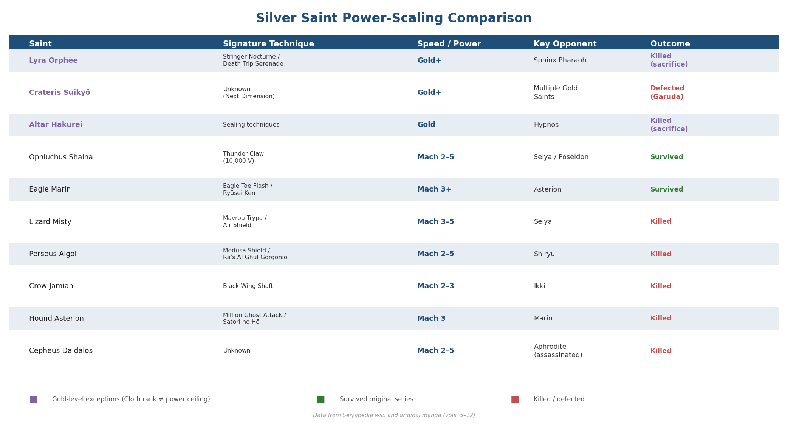
*Figure 2-3. Power-scaling comparison of ten major Silver Saints. Purple rows highlight Gold-level exceptions (Orphée, Suikyō, Hakurei) whose Cosmo transcends their Cloth rank. Green indicates survival; red indicates death or defection.*

Only Marin and Shaina — the two Silver Saints who aligned with the Bronze protagonists rather than opposing them — survive the original series. Their longevity is a function of narrative utility: both continue to serve as supporting characters through the Poseidon, Hades, and *Next Dimension* continuities.

## 2.5 Silver Saints in Spin-Off and Parallel Media

### 2.5.1 The Lost Canvas (Shiori Teshirogi)

*The Lost Canvas*, set during the 18th-century Holy War, significantly expands the Silver Saint roster. The most prominent addition is **Crane Yuzuriha** (鶴星座のユズリハ), a Lemurian from Jamir and former training partner of Aries Shion. She wields psychokinesis and the technique *Kenbu Shōsenkyaku* (絢舞裳閃脚, "Dazzling Dance of Beautiful Flashing Kicks"). In a notable lore detail, she offered her own blood to repair Unicorn Yato's Cloth, demonstrating that Silver Saint–level Cosmo can substitute for a Saint's blood in Cloth restoration [Seiyapedia — Crane Yuzuriha](https://saintseiya.fandom.com/wiki/Crane_Yuzuriha "Crane Yuzuriha: Lemurian psychokinesis user, blood for Cloth repair").

**Altar Hakurei**, Yuzuriha's master, is explicitly stated to be as powerful as Grand Pope Sage — the former Cancer Gold Saint — placing him at Gold Saint level despite his Silver rank. Hakurei sealed Hypnos during the 18th-century Holy War, a feat underscoring his exceptional Cosmo [Seiyapedia — Silver Saints](https://saintseiya.fandom.com/wiki/Silver_Saints "Hakurei: Silver Saint at Gold Saint level"). Additional *Lost Canvas* Silver Saints include Puppis Lacaille and Vela Tsubaki, along with unnamed 18th-century holders for most classic Silver Cloth constellations, indicating institutional continuity across Holy War cycles [Seiyapedia — Silver Saints](https://saintseiya.fandom.com/wiki/Silver_Saints "Lost Canvas: unnamed Silver Saints for most constellations").

### 2.5.2 Episode G (Megumu Okada)

*Episode G* features **Triangle Noesis**, a Silver Saint serving Sanctuary during the Titan conflict, and gives Lizard Misty an expanded role defending Egypt from mummies generated by the Cronos–Aiolia battle's time-space distortions.

### 2.5.3 Next Dimension (Masami Kurumada)

As the canonical sequel/prequel written by Kurumada himself, *Next Dimension* introduces the most consequential Silver Saint addition: **Crateris Suikyō** (杯座のスイキョウ), active during the 18th-century Holy War. Phoenix Ikki explicitly evaluates Suikyō as stronger than any Gold Saint Ikki had fought — a statement carrying significant weight given Ikki's combat record against opponents up to and including Garuda Aiacos. Suikyō's narrative takes a dramatic turn when he assumes the Garuda Surplice, making him one of the franchise's few dual-allegiance characters (Silver Saint and Specter) [Seiyapedia — Silver Saints](https://saintseiya.fandom.com/wiki/Silver_Saints "Suikyō: stronger than Gold Saints per Ikki; Garuda dual role").

In the present timeline of *Next Dimension*, Shaina and Marin remain active, protecting the comatose Seiya in Sanctuary. Shaina discovers the ruins of the sealed 13th temple (Ophiuchus) beneath the path between the Scorpio and Sagittarius houses and is temporarily mind-controlled into attacking Marin before being subdued [Seiyapedia — Ophiuchus Shaina](https://saintseiya.fandom.com/wiki/Ophiuchus_Shaina "Next Dimension: Ophiuchus temple discovery, mind control").

### 2.5.4 Saint Seiya Omega (Toei Animation)

*Omega* introduces the most numerically extensive Silver Saint expansion, adding over 16 new characters for the 21st-century era, including Hound Miguel, Crow Johann, Musca Fly, Peacock Pavlin, Sagitta Sham, Auriga Almaaz, Cerberus Dorer, and Perseus Mirfak [Seiyapedia — Silver Saints](https://saintseiya.fandom.com/wiki/Silver_Saints "Omega: 16+ new Silver Saints"). Ophiuchus Shaina receives her most expansive role in this continuity, becoming Kōga's master and participating in wars against Mars and Pallas.

### 2.5.5 Saintia Shō (Chimaki Kuori)

*Saintia Shō* adds four Silver Saints to the roster: Pavo Mayura, Scutum Juan, Southern Cross Georg, and Crateris Aeson, all active during the Eris resurrection arc [Seiyapedia — Silver Saints](https://saintseiya.fandom.com/wiki/Silver_Saints "Saintia Shō: four new Silver Saints").

## 2.6 Thematic Synthesis: Rank, Potential, and the Limits of Hierarchy

The Silver Saints embody a central tension in the *Saint Seiya* Cosmo system. As an institutional class, they are defined by their armor's material limits — a −200°C freeze point, Mach 2–5 operational speed, Sixth Sense Cosmo development. As individual warriors, their actual power can diverge radically from class norms: Orphée's Gold-surpassing abilities, Suikyō's Ikki-verified supremacy over Gold Saints, and Hakurei's Pope-level strength all attest that the Cosmo system rewards spiritual mastery over material rank.

This design choice serves Kurumada's overarching thesis: willpower transcends hierarchical classification. The Bronze Saints' ability to defeat Silver opponents — and eventually surpass them entirely — is not an anomaly but the system's intended function. Silver Saints exist to be surpassed, just as Gold Saints exist to be challenged. The franchise's power structure is not a rigid caste but a ladder that individual Cosmo can override.

At the same time, the Silver tier's narrative treatment reveals a structural asymmetry. Of the 17 named Silver Saints in the original manga, 15 die — most killed by the Bronze protagonists they were sent to assassinate. Only Marin and Shaina survive, and both do so by aligning with the protagonists rather than opposing them. The Silver class is, in narrative terms, expendable: powerful enough to generate genuine tension in their initial encounters, then systematically discarded once the Bronze Saints' growth renders them obsolete. Their collective fate reflects less a deficiency in strength than a function of story architecture — they are the scaffolding removed once the edifice of the Twelve Houses stands visible.

Above the Silver tier stand the 12 Gold Saints — the Seventh Sense warriors who guard the Zodiac temples and define the franchise's most celebrated combat standard. Their properties (Orichalcum Cloths that freeze only at absolute zero, lightspeed movement, semi-sentient armor that can abandon an unworthy wearer) and their individual battles are referenced extensively throughout the chapters that follow: Gemini Saga's dual identity and Kanon's redemption arc (Chapter 4), the Gold Saints' sacrifice at the Wailing Wall and subsequent resurrection as Specters (Chapter 5), their power as the benchmark against which God Warriors (Chapter 6) and divine entities (Chapter 7) are measured. The Gold Saint tier constitutes the axis around which every other faction's power is calibrated — the threshold that Bronze Saints must reach to matter, that Marina Generals approximate, that Specters challenge, and that only God Cloths decisively surpass.

# 第4章 Marina Generals — Poseidon's Oceanic Legion

## 4.1 Poseidon's Military Hierarchy: A Mirror and a Foil to Sanctuary

Where Athena's Sanctuary fields a three-tiered army of 88 Saints (48 Bronze, 24 Silver, 12 Gold), Poseidon's undersea domain compresses its fighting strength into a single elite stratum: seven Marina Generals, each assigned to guard one of the seven Mammoth Pillars that anchor the world's oceans. Below them exist only unnamed foot soldiers and a single named subordinate, Mermaid Thetis — there is no Silver Saint equivalent, no graduated training pipeline, and no internal promotion path [Seiyapedia — Poseidon](https://saintseiya.fandom.com/wiki/Poseidon "Poseidon hierarchy and army structure"). The resulting organizational portrait is one of concentrated power rather than institutional depth: Poseidon's army trades Sanctuary's bureaucratic resilience for raw individual combat potency at the top.

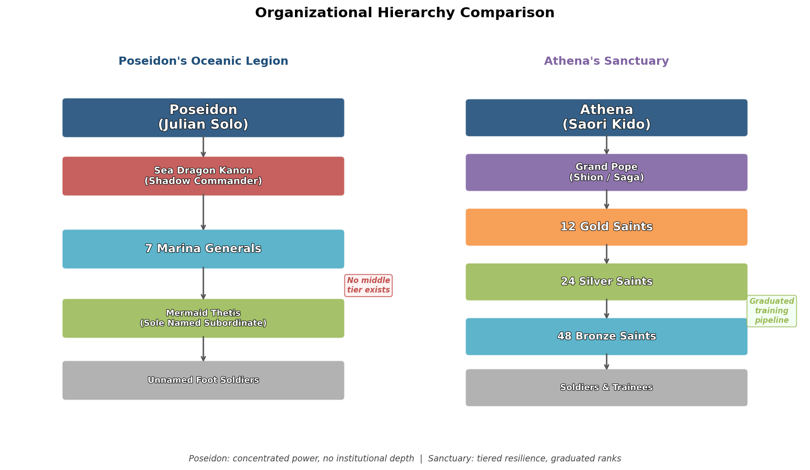

*Figure 4-1. Side-by-side structural comparison of Poseidon's flat command chain (God → Shadow Commander → 7 Generals → Thetis → foot soldiers) against Sanctuary's graduated pyramid (Athena → Pope → 12 Gold → 24 Silver → 48 Bronze → trainees). The absence of a middle tier in the Marina system is the defining organizational asymmetry.*

The structural contrast extends to narrative architecture. The Sanctuary Arc funneled the Bronze Saints through a sequential gauntlet — one Zodiac temple after another, each encounter building on the last. The Poseidon Arc instead disperses its battles across simultaneous fronts, forcing the five protagonists to fight independently and without mutual support. This design choice transforms the arc into a test of individual maturity: each Bronze Saint must demonstrate that the Seventh Sense awakened during the Twelve Houses is now a stable, self-sustained capability rather than a crisis-driven flare.

Critically, the entire war was engineered by a single infiltrator. Sea Dragon Kanon, twin brother of Gemini Saga, broke Athena's seal on the sacred amphora containing Poseidon's soul, awakened the god within the body of teenage heir Julian Solo, and installed himself as de facto ruler while keeping Poseidon partially dormant [Seiyapedia — Sea Dragon Kanon](https://saintseiya.fandom.com/wiki/Sea_Dragon_Kanon "Kanon's manipulation of the Poseidon Arc"). The Marina Generals therefore served a cause that was, from the outset, a proxy war orchestrated by a mortal tactician exploiting divine authority — a mirror of the false Pope Saga's thirteen-year usurpation of Athena's Sanctuary.

## 4.2 The Scales Armor System

The Scales (スケイル, *Sukeiru*) constitute Poseidon's counterpart to Athena's Cloths. Composed of Orichalcum — a mythological "hypermetal" — Scales are stated to predate Cloths chronologically: "The Cloths were born to counteract the devastating powers of Poseidon's Scales," indicating that Athena's armory was a reactive creation following Poseidon's first campaign against the surface world [Seiyapedia — Scales](https://saintseiya.fandom.com/wiki/Scales "Scales composition, origin, and naming conventions").

Nine named Scales appear in the manga: seven for the Generals (Sea Dragon, Siren, Chrysaor, Scylla, Sea Horse, Lyumnades, Kraken), one for the god himself (Poseidon Scale), and one for the sole non-General combatant (Mermaid Scale). Each General's Scale derives its designation from a marine or mythological creature, diverging from the constellation-based taxonomy that governs Athena's Cloth system. The Sea Horse Scale is explicitly assigned Gold Cloth–equivalent durability, and by extension, the remaining General-class Scales occupy the same defensive tier [Seiyapedia — Sea Horse Baian](https://saintseiya.fandom.com/wiki/Sea_Horse_Baian "Sea Horse Scale = Gold Cloth durability").

Several functional differences distinguish Scales from Cloths. Scales exhibit no confirmed sentience, no evolutionary mechanism, and no recorded instance of abandoning a wearer — unlike the Cancer Gold Cloth, which famously deserted Deathmask when it judged him unworthy. Scales also carry no weapon prohibition: Chrysaor Krishna's Golden Lance is fully integrated into his combat style, and the Libra Cloth's unique weapons-deployment restriction finds no Scales-side parallel. Storage and transport conventions (no Pandora Box equivalent is depicted) remain unaddressed in Kurumada's manga, reinforcing the impression of an armory designed for permanent underwater deployment rather than surface-world mobility.

## 4.3 Power Calibration: Generals vs. Gold Saints

The Marina Generals occupy a position in the franchise's power hierarchy that is nominally equivalent to the Gold Saints yet functionally subordinate. Several data points establish the upper bound: Siren Sorrento incapacitated Taurus Aldebaran with Dead End Symphony (manga vol. 14); Sea Horse Baian's Scale durability is rated at Gold Cloth level; and Sea Dragon Kanon, as Saga's twin, wields Galaxian Explosion — the attack signature of the strongest Gold Saint of his generation [Seiyapedia — Siren Sorrento](https://saintseiya.fandom.com/wiki/Siren_Sorrento "Sorrento defeats Aldebaran") [Seiyapedia — Sea Dragon Kanon](https://saintseiya.fandom.com/wiki/Sea_Dragon_Kanon "Kanon's Gold-level power").

The lower bound, however, is equally clear. All seven Generals were defeated in one-on-one battles by Bronze Saints wearing V2 Cloths upgraded with Gold Saint blood and operating at the Seventh Sense. No General forced a Bronze Saint to exceed the Seventh Sense threshold — a feat that Gold Saints such as Virgo Shaka and Gemini Saga routinely demanded. The internal hierarchy among Generals further reveals a wide spread:

- **Top tier**: Kanon (true Gold Saint–level; later assumed the Gemini Gold Cloth)
- **Upper tier**: Sorrento, Krishna, Isaac (near-Gold combat output, specialized techniques capable of threatening Gold Saints)
- **Mid tier**: Io, Baian (solid Seventh Sense combatants with conventional fighting styles)
- **Bottom tier**: Kasa (weakest General; reliant on deception rather than raw Cosmo)

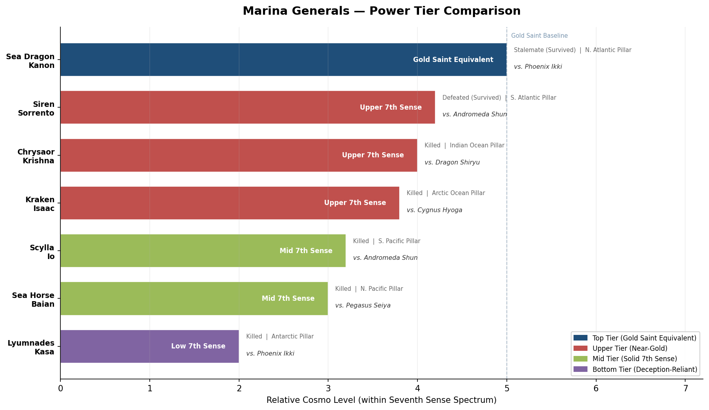

*Figure 4-2. Relative Cosmo levels of the seven Marina Generals within the Seventh Sense spectrum. Each bar is color-coded by tier and annotated with pillar assignment, Bronze Saint opponent, and battle outcome. Kanon's position at the Gold Saint boundary and Kasa's relegation to deception-reliant tactics bookend the range.*

This stratification indicates that while the Marina Generals collectively calibrate to Gold Saint level, most individual Generals fall into the lower range of that bracket — roughly equivalent to the weaker Gold Saints (Cancer Deathmask, Pisces Aphrodite) rather than the elite (Saga, Shaka, Dohko).

## 4.4 Sea Dragon Kanon — The Puppeteer Behind the Throne

**Full Designation:** Sea Dragon Kanon (海龍のカノン, *Shī Doragon no Kanon*) — North Atlantic Mammoth Pillar guardian; self-appointed General; twin brother of Gemini Saga.

**Cosmo Tier:** Seventh Sense (Gold Saint–level baseline). Kanon possesses an identical Cosmo signature to Saga, placing him at or near the apex of mortal combat power. His subsequent assumption of the Gemini Gold Cloth (see Chapter 3) confirms institutional recognition of this tier.

**Signature Techniques:**

- *Galaxian Explosion* (ギャラクシアンエクスプロージョン) — The same devastating wide-area Cosmo blast wielded by Saga, concentrating the user's entire Cosmo into a single explosive release.
- *Golden Triangle* (ゴールデントライアングル) — A space-time distortion technique linked to the Bermuda Triangle legend, trapping opponents in a dimensional void. This technique serves as Kanon's primary offensive identity as Sea Dragon, distinguishing him from Saga's Gemini arsenal.
- *Genrō Maō Ken* (幻朗魔皇拳, Demon Emperor Fist) — The same brainwashing technique Saga employed to control the Pope's court, capable of implanting absolute obedience. Kanon deployed it to manipulate Poseidon's awakening sequence [Seiyapedia — Sea Dragon Kanon](https://saintseiya.fandom.com/wiki/Sea_Dragon_Kanon "Kanon's techniques and biography").

**Key Battles and Role.** Kanon's arc constitutes one of the franchise's most layered villain-to-hero trajectories. Imprisoned by Saga at Cape Sounion for attempting to seize power, Kanon discovered the sealed amphora containing Poseidon's soul, broke the seal, and triggered the god's gradual awakening within Julian Solo. He then installed himself as the Marina Generals' hidden commander, keeping Poseidon in a semi-conscious state to rule as proxy.

During the Poseidon Arc, Kanon fought Phoenix Ikki to a stalemate — a telling feat, given that Ikki's base power exceeds most Silver Saints and his Phoenix Cloth grants resurrection. The battle ended inconclusively when Sorrento exposed Kanon's manipulation, forcing him to confront the moral consequences of his scheme. In the arc's climax, Kanon intercepted Poseidon's trident to shield Athena, completing his defection from self-serving ambition to genuine self-sacrifice.

**Fate:** Survived the Poseidon Arc. Kanon later inherited the Gemini Gold Cloth after Saga's death. During the Hades Arc, he deployed the Labyrinth of Twins technique against a Specter trio and ultimately perished in a mutual annihilation exchange with Wyvern Rhadamanthys, detonating Galaxian Explosion at point-blank range (manga vol. 19 onward). His sacrifice at the Wailing Wall alongside the other Gold Saints completed the redemption arc — from would-be usurper to Athena's loyal soldier.

## 4.5 Siren Sorrento — The Deadly Virtuoso

**Full Designation:** Siren Sorrento (セイレーンのソレント, *Seirēn no Sorento*) — South Atlantic Mammoth Pillar guardian; Austrian musician.

**Cosmo Tier:** Upper Seventh Sense. Sorrento ranks among the strongest Generals after Kanon, distinguished by his capacity to incapacitate a Gold Saint through technique refinement rather than brute Cosmo output.

**Signature Techniques:**

- *Dead End Symphony* (デッド・エンド・シンフォニー) — Sorrento's primary attack channels Cosmo through his flute, generating a lethal resonance directly within the opponent's brain. Because the attack bypasses physical hearing and targets neural tissue, covering one's ears provides no defense. This technique incapacitated Taurus Aldebaran (manga vol. 14) — a confirmed Gold Saint with full Seventh Sense — establishing one of the arc's strongest power-scaling benchmarks for the Marina Generals [Seiyapedia — Siren Sorrento](https://saintseiya.fandom.com/wiki/Siren_Sorrento "Dead End Symphony mechanics and Aldebaran feat").
- *Dead End Climax* — A lethal crescendo variant that amplifies the Symphony to killing intensity.

**Key Battles.** Sorrento confronted Andromeda Shun at the South Atlantic Pillar. Shun endured the Dead End Symphony through sheer willpower and ultimately unleashed Nebula Storm — his most powerful offensive technique, triggered only when he abandons his defensive chains entirely. Sorrento was defeated but survived, making him one of only two Generals (alongside Kanon) to live through the arc.

More significant than his combat record is Sorrento's role as the arc's moral compass among the antagonists. He exposed Kanon's manipulation to the assembled Generals, demonstrating that his loyalty lay with the genuine Poseidon rather than with Kanon's puppet regime. After learning the truth, Sorrento assisted in the destruction of the North Atlantic Pillar, effectively sabotaging his own side's defenses.

**Fate:** Survived. Sorrento accompanied Julian Solo on a humanitarian mission to aid flood victims after Poseidon's sealing. He briefly reappeared during the Hades Arc (manga vol. 27), confirming his continued existence as Julian's companion and protector. Among the Marina Generals, Sorrento undergoes the most complete moral transformation — from obedient soldier to conscientious defector — without dying in the process.

## 4.6 Chrysaor Krishna — The Indian Ocean's Foremost Warrior

**Full Designation:** Chrysaor Krishna (クリュサオルのクリシュナ, *Kuryusaoru no Kurishuna*) — Indian Ocean Mammoth Pillar guardian; Indian warrior.

**Cosmo Tier:** Upper Seventh Sense. Described within the arc as the premier close-combat specialist among the Generals, Krishna synthesizes Hindu cosmological concepts with the Cosmo system: his Kundalini equates to Cosmo, and his seven Chakra points function as star-points governing energy flow.

**Signature Techniques:**

- *Golden Lance* (ゴールデンランス) — A weapon integrated into the Chrysaor Scale, stated to pierce any defense. Its existence underscores the Scales system's absence of weapon restrictions — a marked contrast to Athena's prohibition on all armaments save the Libra Cloth's arsenal.
- *Maha Roshini* (マハ・ローシニ, "Great Light") — Krishna's ultimate Cosmo release, a devastating radiant blast fueled by fully opened Chakra channels [Seiyapedia — Chrysaor Krishna](https://saintseiya.fandom.com/wiki/Chrysaor_Krishna "Krishna's full battle and techniques").

**Key Battle.** Krishna engaged Dragon Shiryu at the Indian Ocean Pillar (manga vol. 16). Shiryu's Rozan Shō Ryū Ha could not penetrate the Golden Lance's guard, forcing him to resort to Excalibur — the infinitely sharp energy blade inherited from Capricorn Shura during the Sanctuary Arc. Using Excalibur, Shiryu shattered the Golden Lance and systematically struck all seven of Krishna's Chakra points, collapsing his Cosmo network. The backlash of Krishna's released Kundalini energy, however, cost Shiryu his eyesight — a recurring sacrifice pattern for the Dragon Saint, who had previously blinded himself against Perseus Algol.

**Fate:** Killed. Krishna's defeat illustrates the arc's recurring theme: Bronze Saints prevail not through superior raw power but by deploying techniques inherited from Gold Saint mentors (Excalibur from Shura, in Shiryu's case), effectively channeling Gold-tier offensive capability through Bronze-tier bodies.

## 4.7 Scylla Io, Sea Horse Baian, Lyumnades Kasa, and Kraken Isaac

### Scylla Io — The Six-Headed Beast

**Full Designation:** Scylla Io (スキュラのイオ, *Sukyura no Io*) — South Pacific Mammoth Pillar guardian; Chilean warrior.

**Cosmo Tier:** Mid-Seventh Sense.

**Signature Techniques:** Io's combat style is unique among the Generals: he deploys six distinct beast-themed attacks — Eagle Clutch, Queen Bee Stinger, Serpent Strangle, Vampire Inhale, Wolf's Fang, and Grizzly Slap — with Big Tornado as his ultimate technique. Each beast attack mimics a different predatory mode, forcing opponents to adapt continuously [Seiyapedia — Scylla Io](https://saintseiya.fandom.com/wiki/Scylla_Io "Io's six beast techniques").

**Key Battle.** Andromeda Shun countered each of Io's six beasts with adaptive chain configurations, using the battle as a crucible to stabilize his Seventh Sense. After exhausting Io's repertoire, Shun destroyed the South Pacific Pillar using a weapon from the Libra Gold Cloth. Io perished shielding his pillar from the Libra nunchaku strike — the only character in the franchise killed by a direct hit from a Libra weapon (manga vol. 16).

**Fate:** Killed. Io's death while protecting his pillar, rather than in direct combat defeat, grants him the tragic nobility that characterizes many *Saint Seiya* antagonists.

### Sea Horse Baian — The Gold-Equivalent Gatekeeper

**Full Designation:** Sea Horse Baian (シーホースのバイアン, *Shīhōsu no Baian*) — North Pacific Mammoth Pillar guardian.

**Cosmo Tier:** Mid-Seventh Sense.

**Signature Techniques:**

- *God Breath* (ゴッドブレス) — A hurricane-force gale expelled from the mouth.
- *Rising Billows* (ライジングビロウ) — A tidal-wave energy launch.
- An invisible air barrier functionally identical to Silver Saint Lizard Misty's Air Shield [Seiyapedia — Sea Horse Baian](https://saintseiya.fandom.com/wiki/Sea_Horse_Baian "Baian biography, techniques, and Scale durability").

**Key Battle.** Baian's primary narrative function is as a power-scaling anchor: his Scale is explicitly stated to possess Gold Cloth–equivalent durability, establishing the baseline for all General-class Scales. Pegasus Seiya defeated him at Seventh Sense output (manga vol. 14–15), confirming that the upgraded Bronze Saints had reached the threshold necessary to damage Gold-tier armor.

**Fate:** Killed.

### Lyumnades Kasa — The Weakest General

**Full Designation:** Lyumnades Kasa (リュムナデスのカーサ, *Ryumunadesu no Kāsa*) — Antarctic Ocean Mammoth Pillar guardian; Portuguese warrior.

**Cosmo Tier:** Low Seventh Sense. Kasa is recognized as the weakest of the seven Generals, compensating for limited Cosmo output through psychological warfare.

**Signature Techniques:**

- *Shapeshifting / Illusion* — Kasa's primary ability allows him to scan an opponent's memories for the person they love most, then assume that person's appearance, voice, and mannerisms. Whether this constitutes physical transformation or a mental projection imposed on the target's perception remains ambiguous in the manga.
- *Salamander Shock* (サラマンダーショック) — An energy-wave attack of last resort, explicitly stated as ineffective against Seventh Sense users [VS Battles Wiki — Lymnades Kasa](https://vsbattles.fandom.com/wiki/Lymnades_Kasa "Kasa's techniques and weaknesses").

**Key Battle.** Kasa deceived Seiya, Hyoga, and Shun in succession by impersonating their loved ones. Phoenix Ikki, however, saw through every deception instantly — a testament to Ikki's hardened psyche and resistance to mental manipulation, traits established in earlier encounters with Virgo Shaka's Tenbu Hōrin and Gemini Kanon's illusions. Ikki dispatched Kasa swiftly (manga vol. 17), rendering the battle one of the arc's most lopsided outcomes.

**Fate:** Killed. Kasa's role in the narrative illustrates the limits of deception-based combat in a universe where spiritual willpower determines outcomes: once an opponent proves immune to illusions, raw Cosmo inferiority becomes fatal.

### Kraken Isaac — The Fallen Comrade

**Full Designation:** Kraken Isaac (クラーケンのアイザック, *Kurāken no Aizakku*) — Arctic Ocean Mammoth Pillar guardian; Hyoga's former training partner under Aquarius Camus.

**Cosmo Tier:** Upper Seventh Sense, approaching Gold-level ice-technique mastery.

**Signature Techniques:**

- *Aurora Borealis* (オーロラボレアリス) — An ice-based offensive technique described as "almost on par with Camus's Aurora Execution, but somewhat weaker." This placement situates Isaac near the ceiling of Marina General power without quite reaching the Gold Saint benchmark set by his master [Seiyapedia — Kraken Isaac](https://saintseiya.fandom.com/wiki/Kraken_Isaak "Isaac biography and Aurora Borealis").

**Key Battle.** Isaac lost his left eye saving Hyoga during a training accident in the Siberian seas, after which Poseidon's power rescued and recruited him. His confrontation with Hyoga at the Arctic Pillar (manga vol. 17) carries the arc's heaviest emotional weight: two students of the same master, trained in the same ice-saint lineage, locked in combat over irreconcilable loyalties. Hyoga defeated Isaac with Aurora Execution — the perfected absolute-zero technique Isaac himself could never fully master — confirming that Hyoga had surpassed his fellow disciple through the Seventh Sense awakening Camus catalyzed during the Sanctuary Arc.

**Fate:** Killed. In his dying moments, Isaac warned Hyoga about Sea Dragon Kanon's overwhelming power, redirecting Hyoga's attention toward the arc's true threat. Isaac's death completes a thematic through-line: master (Camus) and elder student (Isaac) both fall to Hyoga's Aurora Execution, each death marking a successive stage in Hyoga's maturation as the inheritor of the Aquarius ice lineage.

## 4.8 Mermaid Thetis and the Limits of Poseidon's Ranks

**Full Designation:** Mermaid Thetis (人魚姫のテティス, *Māmeido no Tetisu*) — a Marina of lower rank than the Generals, serving as Poseidon's messenger and Julian Solo's personal attendant.

Thetis occupies a unique position in Poseidon's hierarchy: she is the only named non-General combatant and the only Marina whose origin is explicitly non-human. In Kurumada's manga (vol. 14, ch. 46), Thetis is revealed to have originally been a fish saved by a young Julian Solo; exposure to Poseidon's awakening Cosmo transformed her into a human woman with Sixth Sense–level abilities. Her single named technique, *Deathtrap Coral* (デストラップ・コーラル), enables her to manipulate living coral to ensnare and asphyxiate opponents — though this technique appears only in the anime adaptation [Seiyapedia — Mermaid Thetis](https://saintseiya.fandom.com/wiki/Mermaid_Thetis "Thetis biography, origin, and technique").

Thetis's combat contribution is minimal. She briefly fought Kiki (Mu's apprentice) and was defeated by Ophiuchus Shaina while attempting to prevent the delivery of the Libra Gold Cloth to the Bronze Saints. Her narrative importance lies elsewhere: she served as the conduit who delivered Poseidon's challenge to Athena's camp, explained the Mammoth Pillar system to the Bronze Saints, and — in the manga's epilogue — was revealed as the coral-colored fish Julian finds on the shore after Poseidon's sealing. Kurumada explicitly modeled her after Hans Christian Andersen's *The Little Mermaid*: a creature who attains human form through love for a nobleman, only to return to the sea when that love's purpose is fulfilled.

Her existence confirms a broader structural point about Poseidon's military: unlike Sanctuary's graduated ranks, the Marina hierarchy possesses no middle tier. No "Silver Marina" class exists. If other rank-and-file Marinas are present, they are never named or shown. Poseidon's military relies entirely on seven elite warriors and a god's overwhelming divine Cosmo, with no institutional depth to absorb losses — a vulnerability the Bronze Saints systematically exploit by defeating each General in isolation.

## 4.9 Poseidon and Julian Solo — The Divine Vessel

**Full Designation:** Poseidon (海皇ポセイドン, *Kaiō Poseidon*) — Emperor of the Seas, one of the three great Olympian brothers alongside Zeus and Hades. His mortal vessel is Julian Solo (ジュリアン・ソロ), scion of a Greek shipping dynasty.

**Divine Cosmo Tier:** Poseidon's Cosmo is described as "far superior to humans and even higher than Athena under normal circumstances," placing him unambiguously above the Gold Saint tier and at parity with Hades among the Olympian gods [Seiyapedia — Poseidon](https://saintseiya.fandom.com/wiki/Poseidon "Poseidon's Cosmo and divine hierarchy"). Unlike Athena, who reincarnates as a fully mortal infant and must reawaken her divinity, Poseidon operates through vessel possession: his soul enters a chosen human body, suppressing the host's personality. Julian Solo was possessed at age three after Kanon broke the amphora seal, and the god's consciousness gradually surfaced over the following years.

**Powers and Combat.** Poseidon commands all of Earth's oceans and can generate worldwide flooding through sheer divine will — a power that functions as a ticking-clock mechanism throughout the arc, as rising waters threaten global annihilation while the Bronze Saints battle their way through the Mammoth Pillars. In direct combat, Poseidon wields a golden trident and projects overwhelming Cosmo. Critically, Poseidon was *not fully awakened* during the arc — Kanon deliberately maintained him in a semi-conscious state to preserve proxy control — yet even at partial power, no individual Saint could match him [Seiyapedia — Poseidon](https://saintseiya.fandom.com/wiki/Poseidon "Partial awakening and combat power").

**Sealing.** Poseidon's defeat does not arrive through combat in the conventional sense. After Seiya destroyed the Main Breadwinner pillar (wearing the Sagittarius Gold Cloth), the Sagittarius Golden Arrow struck the amphora, and the resonance of Athena's divine Cosmo channeled through the arrow awakened Julian Solo's dormant consciousness. Julian's own will, reasserting itself within his body, provided the opening for Athena to reseal Poseidon's soul in the amphora (manga vol. 18). The mechanism carries narrative significance: Poseidon is defeated by the host's love for Athena triggering a moment of divine vulnerability, not by any Saint overpowering a god through combat — maintaining the principle that Olympian deities exist on a fundamentally different power plane from mortal warriors [Seiyapedia — Julian Solo](https://saintseiya.fandom.com/wiki/Julian_Solo "Julian's awakening and Poseidon's sealing").

**Post-Arc Role.** Julian Solo, freed from possession, departed on a humanitarian mission with Sorrento to aid communities devastated by Poseidon's floods. In the Hades Arc (manga vol. 27), Poseidon briefly reawakened within Julian to send the five Bronze Saints' Gold Cloths to Elysium — a pivotal act that enabled the God Cloth awakening. This intervention reframes Poseidon not as a defeated villain but as a "utopian extremist" whose quarrel with humanity does not preclude alliance against a greater threat. Among the franchise's three major divine antagonists, Poseidon is the only one who actively assists Athena's Saints after his own defeat.

## 4.10 The Poseidon Arc in Structural Perspective

The Poseidon Arc (manga vols. 14–18; anime episodes 100–114) occupies a transitional position in the franchise's narrative architecture. Sandwiched between the Sanctuary Arc's operatic crescendo and the Hades Arc's eschatological finale, it functions as a proving ground: the Bronze Saints must demonstrate that their Seventh Sense is a permanent attainment, not a crisis-induced miracle. The simultaneous-pillar structure tests independence; the Marina Generals' Gold-equivalent power tests sustainability; and Poseidon's divine-tier Cosmo foreshadows the god-level threats of the Hades chapter.

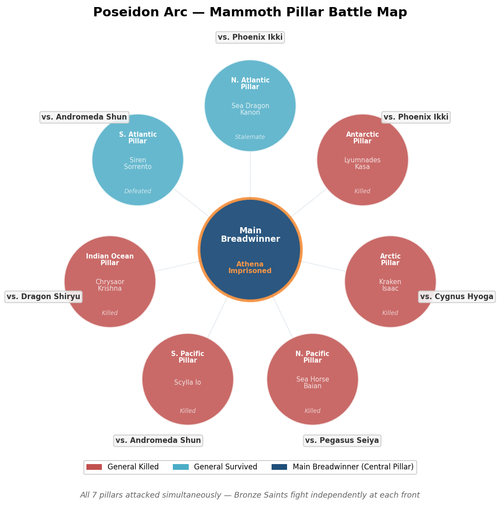

*Figure 4-3. Radial battle-assignment diagram mapping each of the seven Mammoth Pillars to its defending General, the Bronze Saint opponent, and the battle outcome (red = General killed; blue = General survived). The simultaneous-front structure required each protagonist to fight independently, in contrast to the Sanctuary Arc's sequential temple gauntlet.*

Several narrative innovations distinguish the arc. It introduces the first divine antagonist the Saints face directly, establishing the vessel-possession mechanic that Hades will later employ with Andromeda Shun. It deploys Kanon as a morally complex antagonist whose machinations, rather than a god's malice, drive the conflict — a narrative sophistication absent from the Sanctuary Arc's corrupted-Pope framework. And it produces two surviving antagonists (Sorrento and Kanon) who become allies, demonstrating the franchise's recurring thesis that enemies who fight with genuine conviction can be redeemed through the Saints' example.

The arc's weaknesses are structural rather than conceptual. With seven Generals and only five protagonists, certain battles receive compressed treatment (Kasa and Baian are resolved within single chapters). The absence of a middle tier in Poseidon's army means that every battle operates at the same intensity, producing a flatter dramatic curve than the Sanctuary Arc's graduated ascent through Bronze → Silver → Gold opponents. These limitations, however, serve a franchise-level purpose: the arc's relative brevity (5 manga volumes versus the Sanctuary Arc's 13) preserves narrative momentum for the Hades chapter's 10-volume climax.

In *The Lost Canvas* spin-off, the 18th-century Poseidon Arc receives expanded treatment: Aquarius Dégel freezes the entire Atlantis at absolute zero to contain Poseidon, and the Marina General roster includes Sea Dragon Unity — a character distinct from Kanon who establishes the Sea Dragon Scale as a permanent institutional position rather than a one-time usurpation.

# 第5章 Specters — The Army of the Underworld

The Hades Chapter represents both the narrative climax and the power-scaling apex of the *Saint Seiya* franchise. Where the Sanctuary Arc established the Gold Saint benchmark and the Poseidon Arc tested Bronze Saints against a divine military apparatus, the Hades Chapter escalates to an existential confrontation with death itself. Hades's army — the 108 Specters — constitutes the most structurally complex antagonist force in the series, organized across a rigid hierarchy from expendable skeleton soldiers through the twin gods of death and sleep to the lord of the Underworld. Their armor system, the Surplice, carries its own mythological weight as a dark mirror of Athena's Cloths. The sections that follow profile the Specter hierarchy, the Surplice system, the Three Judges, the subordinate deities Thanatos and Hypnos, notable mid-tier Specters, and Hades himself — tracing how the Underworld campaign redefines the franchise's power ceiling and delivers its most consequential character revelations.

## 5.1 The 108-Star System and Specter Hierarchy

The Specters derive their organizational logic from the *Water Margin* (水滸伝) tradition: 108 Evil Stars (魔星) divided into 36 Celestial Stars (天星) and 72 Terrestrial Stars (地星). Each Specter is an ordinary human harboring a dormant Specter soul; when Hades's seal breaks every 243 years, these souls awaken, compelling their hosts to serve the Underworld [Seiyapedia — Papillon Myu](https://saintseiya.fandom.com/wiki/Papillon_Myu "Specter awakening mechanics"). The distinction between Celestial and Terrestrial designation roughly tracks combat power — Celestial Specters occupy higher ranks, including the Three Judges — though individual exceptions exist (most notably Papillon Myu, a Terrestrial Star whose combat output rivals Celestial-tier opponents).

The full hierarchy, from lowest to highest, comprises seven distinct tiers:

1. **Skeleton soldiers** — nameless, Cosmo-less cannon fodder
2. **Terrestrial Star Specters** (地星) — rank-and-file warriors, individually below Gold Saint tier
3. **Celestial Star Specters** (天星) — elite combatants, several approaching or rivaling Gold Saints
4. **The Three Judges** — Wyvern Rhadamanthys, Griffon Minos, Garuda Aiacos — governors of the three infernal prisons
5. **Pandora** — Hades's appointed commander of the 108 Specters
6. **Thanatos and Hypnos** — twin gods wielding Divine Cosmo ("Big Will"), categorically above Gold Saints
7. **Hades** — lord of the Underworld, a major Olympian god

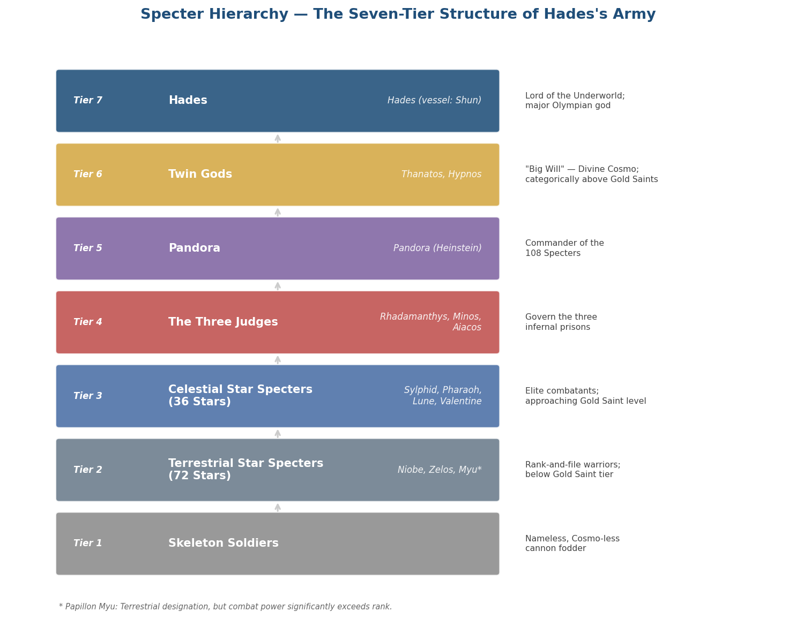

*Figure 1: The seven-tier organizational structure of Hades's Specter army, from expendable skeleton soldiers at the base to the Olympian lord at the apex, with representative characters at each level.*

This seven-tier structure exceeds the complexity of both Sanctuary (three Cloth tiers plus the Pope) and Poseidon's realm (two tiers plus a god). The Specters function simultaneously as a military force and a bureaucratic apparatus: they administer the afterlife, judge the dead, and maintain the cosmic cycle of reincarnation — duties that frame Hades not merely as a villain but as a necessary cosmic functionary [Seiyapedia — Surplices](https://saintseiya.fandom.com/wiki/Surplices "108-star system").

## 5.2 The Surplice Armor System

Surplices (冥衣, Meii) are the Underworld's counterpart to Athena's Cloths, forged from minerals native to the realm of the dead. In the manga, all Surplices are uniformly black, though the anime introduces color variations. Their defining functional property is enabling traversal of the Underworld without requiring the Eighth Sense — an ability that Cloths do not confer. This makes Surplices operationally indispensable: without one, a living being entering the Underworld must independently awaken the Eighth Sense (Arayashiki) or forfeit their physical body [Seiyapedia — Surplices](https://saintseiya.fandom.com/wiki/Surplices "Surplice properties").

Unlike Cloths, Surplices exhibit no confirmed self-repair capability, no evolutionary stages, and no demonstrated sentience (contrasting with, for instance, the Cancer Cloth's abandonment of Deathmask). They do, however, share the 108-constellation designation system with the Evil Stars, linking each Surplice to a specific celestial identity. The table below situates Surplices within the franchise's broader four-system armor taxonomy.

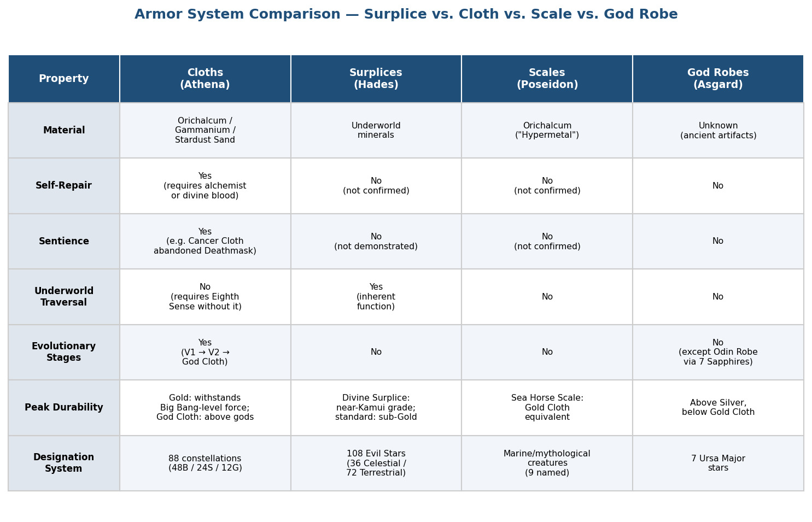

*Figure 2: A comparative overview of the four major armor systems in the franchise — Cloths (Athena), Surplices (Hades), Scales (Poseidon), and God Robes (Asgard) — across key functional properties including material composition, self-repair, sentience, and peak durability.*

A critical plot mechanism involves the corruption of Cloths into Surplices. When Hades resurrects deceased Saints — as he does with Gemini Saga, Aquarius Camus, and Capricorn Shura at the outset of the Hades Chapter — their Gold Cloths transform into black Surplices. This visual transformation underscores a thematic inversion central to the arc: protectors of Athena reborn as agents of death.

At the apex of the Surplice hierarchy sit the divine-grade Surplices worn by Hades, Thanatos, and Hypnos. Soaked in divine blood, these are categorically superior to standard Specters' Surplices, though they remain distinct from true Kamui (the original armors of the Olympian gods). Hades's Surplice, in particular, occupies an ambiguous position in the franchise's armor taxonomy — some sources describe it as approaching Kamui-grade, while others classify it strictly as an enhanced Surplice [Seiyapedia — Surplices](https://saintseiya.fandom.com/wiki/Surplices "Surplice properties").

## 5.3 The Three Judges of the Underworld

The Three Judges (冥界三巨頭) preside over Hades's domain, each governing one of the three infernal prisons. They represent the Specters' combat elite — Celestial Star warriors whose power approaches or matches Gold Saint level, and whose tactical sophistication exceeds that of most Gold-tier opponents the protagonists have previously faced.

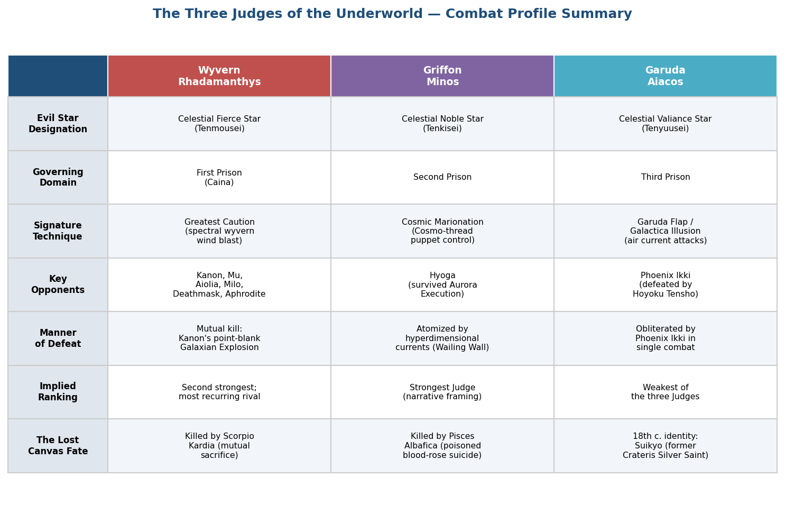

*Figure 3: Combat profile summary of the Three Judges — Wyvern Rhadamanthys, Griffon Minos, and Garuda Aiacos — covering each Judge's Evil Star designation, governing domain, signature techniques, key opponents, manner of defeat, and fate in The Lost Canvas.*

### Wyvern Rhadamanthys (天猛星)

Rhadamanthys bears the Celestial Fierce Star (天猛星) and oversees the First Prison, Caina. Among the Three Judges, he receives the most extensive narrative treatment and functions as the Hades Chapter's recurring rival figure — particularly for Gemini Kanon.

His signature technique, Greatest Caution (グレイテストコーション), unleashes a devastating wind blast that manifests as a spectral wyvern form. The technique's destructive output is formidable: Rhadamanthys defeated Cancer Deathmask and Pisces Aphrodite with minimal effort, and engaged Aries Mu, Leo Aiolia, and Scorpio Milo simultaneously while operating at what the narrative frames as approximately 10% of his full Cosmo [Seiyapedia — Wyvern Rhadamanthys](https://saintseiya.fandom.com/wiki/Wyvern_Rhadamanthys "Full profile").

Rhadamanthys's final confrontation pits him against Gemini Kanon. After extended combat across the Underworld, Kanon seizes Rhadamanthys and detonates Galaxian Explosion at point-blank range, killing both combatants. This mutual destruction underscores a recurring Hades Chapter motif: victory against Specters of this caliber demands sacrifice at the highest cost.

In *The Lost Canvas*, the 18th-century Rhadamanthys battles Scorpio Kardia in an extended duel. Kardia, suffering from a degenerative heart condition, pushes his Cosmo beyond its limits to defeat Rhadamanthys — dying in the process. This parallel across eras reinforces Rhadamanthys's narrative function as the Judge who exacts lethal sacrifice from every opponent capable of matching him.

### Griffon Minos (天貴星)

Minos bears the Celestial Noble Star (天貴星) and is characterized as the most powerful of the Three Judges. His technique, Cosmic Marionation (コズミックマリオネーション), deploys near-invisible Cosmo threads to seize control of an opponent's body — a puppeteer attack that neutralizes physical resistance entirely. The technique's potency is evident in Minos's survival of Cygnus Hyoga's Aurora Execution, an absolute-zero attack that defeated Aquarius Camus — a feat suggesting that Minos's durability exceeds at least some Gold Saints [Seiyapedia — Griffon Minos](https://saintseiya.fandom.com/wiki/Griffon_Minos "Full profile").

Minos does not fall to a conventional defeat. He is atomized by the hyperdimensional currents beyond the Wailing Wall — environmental destruction rather than combat loss. This narrative choice preserves his status as the strongest Specter while removing him from the battlefield.

In *The Lost Canvas*, Minos wields the additional technique Gigantic Feathers Flap and receives an expanded backstory. His 18th-century incarnation is ultimately killed by Pisces Albafica's poisoned blood-rose technique — a suicide attack that ensures mutual destruction through Albafica's own toxic blood.

### Garuda Aiacos (天雄星)

Aiacos bears the Celestial Valiance Star (天雄星). His techniques include Garuda Flap (ガルーダフラップ — a kinetic assault that blasts the enemy skyward, marks an X on their body, and crashes them earthward) and Galactica Illusion (ギャラクティカイリュージョン — a dark air current attack with demonic visual projections) [Seiyapedia — Garuda Aiacos](https://saintseiya.fandom.com/wiki/Garuda_Aiacos "Full profile").

Among the Three Judges, Aiacos receives the most definitive single-combat defeat. Phoenix Ikki obliterates him with Hōyoku Tenshō (鳳翼天翔), invoking the axiom central to Ikki's combat philosophy: "The same technique cannot work twice on a Saint." Aiacos had previously deployed Garuda Flap against Ikki, who adapted and countered with overwhelming force. The ease of Ikki's victory implicitly ranks Aiacos below both Rhadamanthys and Minos in the Judges' internal hierarchy.

*Next Dimension* adds a significant layer to the Garuda mantle: the 18th-century Garuda is revealed to be Suikyō, formerly the Crateris Silver Saint — one of the rare Silver Saints stated to rival Gold-level power. His dual identity as both Saint and Specter across incarnations complicates the franchise's moral binary between Athena's forces and those of Hades.

## 5.4 Pandora — Commander of the 108 Specters

Pandora occupies a singular position in the Specter hierarchy: she is not a Specter herself but Hades's human sister in the current incarnation, born into the German Heinstein family. At age three, she inadvertently released Thanatos and Hypnos from a sealed box — an act that set the Hades Chapter's events into motion. The twin gods designated her as commander of the 108 Specters and custodian of Hades's earthly affairs [Seiyapedia — Pandora](https://saintseiya.fandom.com/wiki/Pandora "Origin, abilities, death").

Pandora wields a trident-staff and a torture-harp capable of inflicting pain at a distance. Her necklace permits free traversal between the human world and the Underworld. Her role, however, is administrative and coercive rather than combative — she governs through authority delegated by Hades and the twin gods, not through personal Cosmo power. The cost of her servitude is the loss of color vision, a detail that literalizes her psychological imprisonment within the Underworld's grayscale moral framework.

Her narrative arc culminates in betrayal. After witnessing the twin gods' cruelty and recognizing that Hades's endgame — the Greatest Eclipse — would annihilate all life, Pandora defects. She gives her world-traversal necklace to Phoenix Ikki, enabling his passage to Elysion. Thanatos executes her for this treason. The "Yours Ever" pendant she placed on infant Shun is ultimately revealed as the mechanism that marked him as Hades's chosen vessel — tying Pandora's earliest act of obedience to the series' most consequential plot twist.

## 5.5 The Twin Gods — Thanatos and Hypnos

Thanatos (God of Death) and Hypnos (God of Sleep) occupy the tier immediately below Hades in the Underworld hierarchy. They wield "Big Will" — Divine Cosmo — a power classification that explicitly exceeds Gold Saints. Their introduction in the Elysion segment of the Hades Chapter resets the power scale entirely: abilities that sufficed against Gold Saints and Judges prove inadequate against divine-tier opponents.

### Thanatos (God of Death)

Thanatos's defining feat is the single-blast destruction of five Gold Cloths — Sagittarius, Libra, Aquarius, Virgo, and Leo — worn by the Bronze Saints en route to Elysion. No prior antagonist had demonstrated this level of destructive output; Gold Cloths, which withstand forces "equivalent to a Big Bang" under standard conditions, shattered instantly under Terrible Providence (テリブルプロビデンス). The technique cripples body and mind simultaneously, obliterating the target's senses [Seiyapedia — Thanatos](https://saintseiya.fandom.com/wiki/Thanatos "Gold Cloth destruction, defeat by Seiya").

Thanatos's defeat marks the franchise's single most dramatic power-scaling inflection point. After Athena's blood repairs Seiya's destroyed Pegasus Cloth and Seiya burns his Cosmo to its extremity, the Pegasus God Cloth manifests. Seiya blocks Terrible Providence barehanded — the same technique that obliterated five Gold Cloths moments earlier — shatters Thanatos's divine Surplice, and kills him with a direct strike. This sequence establishes God Cloth power as categorically above the Gold tier and on par with subordinate deities.

In *The Lost Canvas*, the 18th-century Thanatos meets a distinct end: Cancer Manigoldo destroys his physical body in a kamikaze attack, and former Pope Sage seals his soul. This parallel confirms that Thanatos's divine-tier power has been challenged across multiple Holy Wars, though invariably at the cost of the challenger's life.

### Hypnos (God of Sleep)

Hypnos is the calmer, more strategically inclined twin. His primary narrative function centers on imprisoning Athena within the Sacred Amphora in Elysion, slowly draining her blood to fuel Hades's plans. His signature technique, Eternal Drowsiness (エターナルドラウジネス), induces irreversible sleep — a non-lethal but absolute form of neutralization [Seiyapedia — Hypnos](https://saintseiya.fandom.com/wiki/Hypnos "Techniques, defeat, warning").

Hypnos falls to the combined assault of Dragon Shiryu and Cygnus Hyoga wielding their God Cloths. The defeat exploits the franchise's foundational combat axiom — "the same technique cannot work twice on a Saint" — as Hypnos's initial attack fails against the God Cloth–empowered Saints and he cannot recalibrate in time. His dying warning — that destroying Hades's true body would dissolve Elysion and the entire Underworld — introduces the existential stakes for the final confrontation.

In *The Lost Canvas*, the 18th-century Hypnos is sealed by Altar Hakurei, again at the cost of the sealer's life. The pattern across both incarnations reinforces the twin gods' narrative function: they are gatekeepers whose defeat is achievable but never without existential sacrifice.

## 5.6 Hades — Lord of the Underworld

Hades is one of the three eldest Olympian brothers alongside Zeus and Poseidon, and serves as the final antagonist of Kurumada's original manga. His power places him among the supreme Olympians — categorically above his own subordinate gods and beyond any individual mortal combatant.

### Vessel Mechanics and the Shun Revelation

Unlike Athena, who reincarnates as a mortal girl, Hades possesses the purest human soul available in each era. In the 20th century, that vessel is Andromeda Shun — the series' most dramatic character revelation. The connection was established when Pandora placed the "Yours Ever" pendant on infant Shun, unknowingly marking him for divine possession. Hades's soul gradually overtakes Shun's consciousness, transforming the gentlest of the five Bronze protagonists into the avatar of death [Seiyapedia — Hades](https://saintseiya.fandom.com/wiki/Hades "Vessel, Greatest Eclipse, final defeat").

Shun's selection as vessel is narratively deliberate: his extraordinary purity of soul — the same quality that made him the least violent Bronze Saint — is precisely what qualifies him as the ideal host. The inversion between character and cosmic role generates the Hades Chapter's central dramatic tension.

Hades's true body, distinct from any vessel, rests in a marble tomb within Elysion. When the vessel is damaged or expelled, Hades retreats to this body for his final stand.

### The Greatest Eclipse

Hades's endgame is the Greatest Eclipse (グレイテストエクリプス): a planetary alignment that creates eternal darkness, extinguishing the sun and destroying all living souls. Unlike Poseidon's flood — framed as misguided utopianism — the Greatest Eclipse entails absolute annihilation, raising the existential stakes beyond those of any prior arc.

### Final Confrontation and Defeat

The battle against Hades requires the combined force of all five God Cloth Bronze Saints and Athena herself. Hades fights simultaneously against Seiya, Shiryu, Hyoga, Shun, and Ikki while sustaining damage that would annihilate lesser beings. In the decisive moment, Hades curses Seiya with his divine sword, leaving Seiya comatose — a wound that persists beyond the manga's conclusion and drives the central plot of *Next Dimension*. Athena delivers the killing blow using the Nike Staff (Victory Staff), channeling the Cosmo of the four remaining Bronze Saints. Hades's destruction triggers Hypnos's prophesied collapse of Elysion, from which the surviving Saints barely escape.

The defeat of Hades closes Kurumada's original serialization (manga vol. 28), though its consequences — particularly Seiya's cursed coma — extend into *Next Dimension* as the active narrative thread motivating Athena's journey through time.

### The Lost Canvas Parallel

In *The Lost Canvas*, the 18th-century Holy War against Hades unfolds with distinct mechanics. Hades's vessel in that era is Alone, a gentle painter whose artistic sensibility is exploited by the god — the Greatest Eclipse variant involves Hades painting the sky itself into darkness. The expanded cast of Specters, Gold Saints, and supporting characters provides the Hades mythology its most comprehensive treatment, though *The Lost Canvas* operates outside Kurumada's direct canon (authored by Shiori Teshirogi under Kurumada's supervision).

## 5.7 Notable Specters Beyond the Judges

While the Three Judges, Pandora, and the twin gods dominate the Hades Chapter's major confrontations, several mid-tier Specters receive distinctive profiles that enrich the Underworld's narrative and tactical texture.

### Balrog Lune (天英星)

Lune bears the Celestial Brilliance Star and serves as a substitute judge in the absence of Minos, presiding over trials of the dead. His techniques include Reincarnation (which forces souls into judgment) and the Fire Whip. Lune's role is as much administrative as it is martial — he embodies the Underworld's judicial bureaucracy in action. He is killed by Gemini Kanon, who tears through the Second Prison en route to his final confrontation with Rhadamanthys [Seiyapedia — Balron Lune](https://saintseiya.fandom.com/wiki/Balron_Lune "Lune profile").

### Papillon Myu (地妖星)

Myu bears the Terrestrial Fiend Star and ranks among the Specters' most unusual combatants. His three metamorphic stages — larva, chrysalis, and butterfly — mirror his namesake, while his primary techniques include Fairy Thronging (a swarm attack) and telekinesis powerful enough to rival Aries Mu's psychic abilities. Despite bearing a Terrestrial rather than Celestial designation, Myu's combat power significantly exceeds his nominal rank — a conspicuous exception to the hierarchy's general correlation between star class and strength. His defeat by Mu's Starlight Extinction establishes the Aries Gold Saint as the Specters' primary psychic-class counter [Seiyapedia — Papillon Myu](https://saintseiya.fandom.com/wiki/Papillon_Myu "Myu profile").

### Sphinx Pharaoh (天獣星)

Pharaoh bears the Celestial Beast Star and guards the entrance to the Second Prison. His weapon, the Balance of Curse harp, forces an opponent's heart onto a judgment scale — if the heart is heavier than Maat's feather (a direct adaptation of Egyptian afterlife mythology), the victim dies. Pharaoh's defeat comes at the hands of Lyra Orphée's Stringer Nocturne, a confrontation that pairs two harp-wielding combatants in what functions as a musical duel transposed into Cosmo combat [Seiyapedia — Sphinx Pharaoh](https://saintseiya.fandom.com/wiki/Sphinx_Pharaoh "Pharaoh profile").

### Deep Niobe (地暗星)

Niobe bears the Terrestrial Darkness Star and wields the Deep Fragrance technique — a lethal perfume that kills without visible attack. His most significant feat is the assassination of Taurus Aldebaran during the Hades prelude (manga vol. 22), making Niobe one of only a handful of Terrestrial Specters to kill a Gold Saint. The circumstances are complicated by Aldebaran's already-weakened state, yet the kill nonetheless demonstrates that Specter lethality does not require Celestial-tier power when technique compensates for raw Cosmo [Seiyapedia — Hades](https://saintseiya.fandom.com/wiki/Hades "Hades prelude — Aldebaran's death").

### Basilisk Sylphid (天哭星)

Sylphid bears the Celestial Crying Star. His Annihilation Flap generates atomic-level poison wind — a technique that operates at a fundamentally different scale from most Cosmo attacks, targeting molecular structure rather than energy output. As one of the Celestial Star elites, Sylphid represents the upper echelon of non-Judge Specters.

### Other Notable Specters

Harpy Valentine (天牢星, Celestial Prison Star) serves as Rhadamanthys's most loyal subordinate, distinguished more by devotion than individual combat feats. Frog Zelos (地暴星, Terrestrial Violence Star) provides rare comic relief within the Hades Chapter — a cowardly Specter whose presence underscores the wide variance in quality within the 108-member army.

*The Lost Canvas* substantially expands the Specter roster with characters who receive far more development than their original manga counterparts. Bennu Kagaho — a phoenix-themed Specter who mirrors Ikki thematically — Behemoth Violate (a rare female combat Specter), Nasu Veronica, and Necromancer Byaku each receive multi-chapter arcs. The Dream Gods — Morpheus, Phantasos, Icelus, and Oneiros, presented as children of Hypnos — introduce a sub-hierarchy within the divine tier that the original manga does not explore [Seiyapedia — Hades](https://saintseiya.fandom.com/wiki/Hades "TLC Specter roster expansions").

## 5.8 The Hades Chapter Across Media

The Hades narrative spans multiple media formats, each contributing distinct elements to the Specter mythology.

Kurumada's original manga covers the Hades Chapter across volumes 22–28 (the final volumes of the series), serialized in *Weekly Shōnen Jump* from 1990 to 1991. The manga establishes all core Specter profiles, the Surplice system, and the escalating confrontation through Judges, twin gods, and Hades himself.

The Hades OVA trilogy adapted the manga across 31 episodes produced in three phases: the Sanctuary chapter (13 episodes, November 2002–April 2003), the Inferno chapter (12 episodes, December 2005–February 2007), and the Elysion chapter (6 episodes, March–August 2008). The Bronze Saint voice actors were recast from the second season onward, and composer Seiji Yokoyama returned to score the adaptation [Wikipedia — Hades Chapter](https://en.wikipedia.org/wiki/Saint_Seiya:_The_Hades_Chapter "OVA production history"). The OVA's extended production timeline — spanning six years — reflects both the enduring commercial viability of the Hades material and the logistical challenges of adapting the franchise's densest arc.

*The Lost Canvas* (manga 2006–2011, anime 2009–2011) provides the most expansive treatment of the Specter army, depicting the 18th-century Holy War in full. Its Specter roster exceeds the original manga's in both number and characterization depth. The Judges receive extended backstories, the twin gods' defeat mechanisms differ from the 20th-century versions, and Hades's vessel (Alone) generates a narrative parallel to the Shun possession that explores the host's psychology in greater detail. *Next Dimension* (Kurumada's own 18th-century prequel, serialized intermittently from 2006) introduces further variations — notably revealing that the 18th-century Griffon is Vermeer and the Garuda is the former Silver Saint Suikyō — but remains incomplete as of early 2026.

## 5.9 The Specters' Narrative Function

The Specter army serves a structural purpose that extends well beyond antagonism. The Hades Chapter's escalating power tiers — from resurrected Gold Saints to Terrestrial Specters to Celestial Specters to Judges to twin gods to Hades — create a gauntlet that systematically exhausts the protagonists' resources. Each tier demands a qualitative leap in the heroes' Cosmo: the Gold Saints must sacrifice themselves at the Wailing Wall, Kanon must die to defeat Rhadamanthys, and ultimately only God Cloth awakening suffices against divine opponents.

The Specters also embody the franchise's deepest thematic engagement with death. Where Gold Saints represent martial nobility and Marina Generals represent oceanic imperialism, the Specters literalize mortality — they are the dead, administering death, serving the god of death. The heroes' journey through the Underworld recapitulates classical katabasis (the descent to the realm of the dead), with each Specter encounter functioning as a trial of mortality that strips away conventional strength and demands transcendence.

# 第6章 God Warriors — The Norse Sentinels of Asgard

## 6.1 An Anime-Original Arc: Production Context and Canon Status

The Asgard Arc (episodes 74–99 of the 1986–1989 TV anime) occupies a singular position within the *Saint Seiya* franchise: it is the only major saga that does not originate from Masami Kurumada's manga. Toei Animation conceived the arc as an original insertion between the Sanctuary Arc (episodes 1–73) and the Poseidon Arc (episodes 100–114), prompted by a practical constraint — the anime had outpaced the manga's serialization after the Sanctuary Arc finale achieved a series-high 20.6% audience rating [Seiyapedia — God Warriors](https://saintseiya.fandom.com/wiki/God_Warriors "Anime-only designation and production rationale"). Rather than produce filler episodes lacking narrative cohesion, Toei commissioned a self-contained saga equipped with its own mythology, armor system, and cast of antagonists, drawing partial inspiration from the 1988 theatrical film *The Heated Battle of the Gods* [Wikipedia — List of Saint Seiya episodes](https://en.wikipedia.org/wiki/List_of_Saint_Seiya_episodes "Episode listing and Asgard placement").

The arc's premiere aired on April 23, 1988, and its conclusion on November 12, 1988 — a span of 26 episodes produced under director Kazuhito Kikuchi's oversight. The production introduced a pronounced aesthetic shift: the opening theme changed from the iconic "Pegasus Fantasy" to Hironobu Kageyama's "Soldier Dream," while the visual palette pivoted from Mediterranean sun to Nordic snow and fjords [Seiyapedia — Category: Saint Seiya episodes](https://saintseiya.fandom.com/wiki/Category:Saint_Seiya_episodes "Asgard Arc episode listing and air dates").

Despite its non-canonical status relative to Kurumada's manga, the Asgard Arc has earned a lasting reputation as one of the finest examples of "filler done right" in shōnen anime history. Its characters were subsequently incorporated into multiple *Saint Seiya* video games, and the arc's mythology received a spiritual sequel in *Soul of Gold* (2015), a 13-episode web anime featuring Leo Aiolia reawakening in Asgard and donning the Odin Robe [Seiyapedia — God Warriors](https://saintseiya.fandom.com/wiki/God_Warriors "Legacy and Soul of Gold").

## 6.2 The God Robes: Norse Armors of the Seven Stars

The God Robes (神闘衣, *Kami no Tōi*) are Asgard's counterpart to Athena's Cloths, Poseidon's Scales, and Hades's Surplices. Each God Robe is an ancient artifact awakened by Hilda of Polaris through the power of the Polaris star, corresponding to one of the seven stars of the Big Dipper (Ursa Major): Alpha Dubhe, Beta Merak, Gamma Phecda, Delta Megrez, Epsilon Alioth, Zeta Mizar (with the companion star Alcor), and Eta Benetnasch [Seiyapedia — God Robes](https://saintseiya.fandom.com/wiki/God_Robes "God Robe properties and stellar designations").

In durability, the God Robes occupy a tier above Silver Cloths but below Gold Cloths — described as providing "just below Gold Cloth" coverage. They exhibit no confirmed self-repair capability, no sentient behavior (unlike Gold Cloths, which can abandon unworthy wearers), and no storage mechanism analogous to Pandora Boxes. Their construction materials remain unspecified in any extant Toei production document.

The God Robes' most distinctive feature is their design language. Each Robe draws its visual motif from a figure in Norse mythology rather than a Greco-Roman constellation: Fafnir the dragon (Siegfried), Sleipnir the eight-legged horse (Hagen), Jörmungandr the world serpent (Thor), Fenrir the wolf (Fenrir), and the saber-toothed Smilodon (Syd/Bud). This Norse aesthetic sets the Asgard Arc apart from every other saga in the franchise and reinforces the thematic premise that cosmic warfare extends beyond the Mediterranean world.

Critically, each God Robe contains one Odin Sapphire — a gemstone that confers no power-boosting function upon its bearer but is essential to a larger mechanism. When all seven Sapphires are placed upon the statue of Odin, they summon the supreme Odin Robe and its embedded weapon, the legendary sword Balmung. This collection mechanic provides the arc's structural spine: every battle yields a Sapphire, and every Sapphire brings the Bronze Saints one step closer to the means of freeing Hilda [Seiyapedia — Odin Robe](https://saintseiya.fandom.com/wiki/Odin_Robe "Odin Robe summoning conditions and Balmung").

The table below summarizes all seven God Warriors and the shadow warrior Alcor Bud, with their stellar designations, God Robe motifs, key techniques, Bronze Saint opponents, episode ranges, and fates.

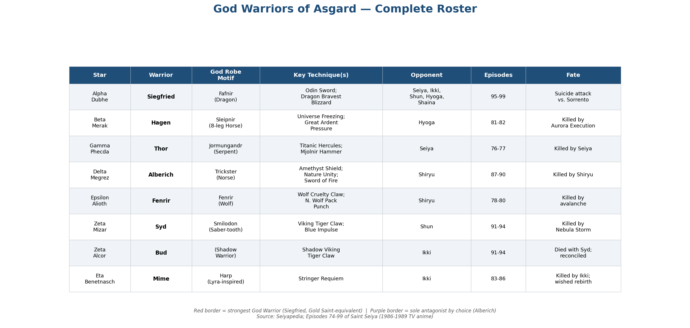

*Figure 6-1. Complete roster of the seven God Warriors and shadow warrior Alcor Bud, organized by Big Dipper star designation. Red border denotes the strongest God Warrior (Siegfried); purple border denotes the sole antagonist by choice (Alberich). Data sourced from Seiyapedia; episodes 74–99 of the 1986–1989 TV anime.*

## 6.3 Hilda of Polaris and the Nibelung Ring

The Asgard Arc's central tragedy belongs not to a God Warrior but to the woman who commands them. Hilda of Polaris (ポラリスのヒルダ) serves as Odin's earthly representative and high priestess of Asgard, charged with maintaining the frozen barrier that shields the Nordic lands. She falls victim to possession by the Nibelung Ring (ニーベルンゲンの指輪), an artifact of Norse origin modeled on the cursed Andvaranaut of the *Völsunga saga* — and, within the anime's continuity, secretly controlled by Poseidon as a prelude to his own arc [Seiyapedia — Polaris Hilda](https://saintseiya.fandom.com/wiki/Polaris_Hilda "Hilda profile and Nibelung Ring connection") [Seiyapedia — Nibelungen Ring](https://saintseiya.fandom.com/wiki/Nibelungen_Ring "Ring mythology and Poseidon link").

The Ring's mechanism is deliberately cruel: Hilda's mind remains fully aware while her body acts as an instrument of aggression, ordering her God Warriors to annihilate Athena's Saints. She watches helplessly as warriors who love and serve her die one by one in battles she herself initiated. This narrative architecture transforms Hilda from a conventional antagonist into a victim whose liberation constitutes the arc's true objective. Her characterization draws on the Valkyrie Brynhildr of Norse legend — a powerful woman ensnared by a cursed ring, awaiting rescue through the artifact's destruction.

The Ring is ultimately shattered when Seiya, clad in the Odin Robe, strikes it with the sword Balmung in the arc's climax (episode 99). Hilda's liberation restores Asgard's protective barrier and supplies the narrative bridge to the Poseidon Arc: Poseidon, having lost his proxy war through Asgard, launches a direct assault on Athena's world.

## 6.4 Power Scaling: God Warriors vs. Gold Saints

The God Warriors' calibration relative to Gold Saints remains one of the more contested aspects of the franchise's scaling hierarchy. The Seiyapedia wiki characterizes their powers as "comparable to Gold Saints," noting that these powers "can be pushed even beyond" under extreme circumstances [Seiyapedia — God Warriors](https://saintseiya.fandom.com/wiki/God_Warriors "Power comparison to Gold Saints"). In practice, the available evidence suggests a range that overlaps with Gold Saint territory without consistently matching it.

Evidence supporting the high-end reading is substantial. Alpha Dubhe Siegfried defeated Seiya, Ikki, Shun, Hyoga, and Shaina in consecutive or near-consecutive encounters — a feat no single Gold Saint achieved during the Sanctuary Arc. Zeta Mizar Syd claimed to have felled Taurus Aldebaran in a single blow, though this was later revealed to involve covert assistance from his twin brother Bud, complicating the scaling claim.

Evidence supporting the lower-end reading is equally compelling. God Robe durability is explicitly rated below Gold Cloths. The Bronze Saints who defeated the God Warriors were operating at the Seventh Sense — the same power threshold that enabled them to challenge Gold Saints — yet in most cases prevailed through tactical ingenuity rather than the desperate Cosmo escalations required against elite Gold Saints such as Virgo Shaka or Gemini Saga. No God Warrior forced a Bronze Saint to awaken the Eighth Sense or achieve a qualitatively new power state.

A defensible synthesis places most God Warriors in the upper Silver to lower Gold range, with Siegfried as the clear outlier at solid Gold Saint level and the weakest (Fenrir) closer to the upper Silver boundary. The God Robes' sub-Gold durability functions as a consistent limiting factor, even where the wearer's Cosmo output approaches Gold-tier intensity.

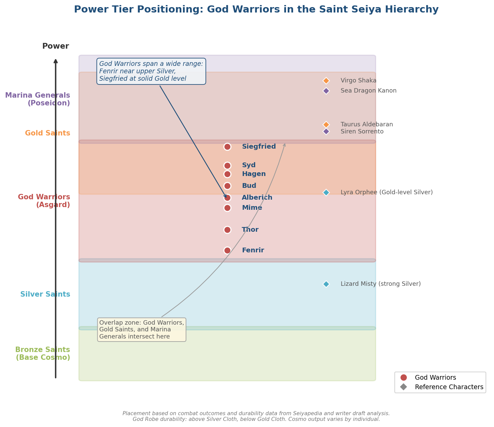

*Figure 6-2. Vertical tier positioning diagram illustrating where each God Warrior falls within the broader Saint Seiya power hierarchy. God Warriors span a wide range — from Fenrir near the upper Silver boundary to Siegfried at solid Gold level — with an overlap zone where God Warriors, Gold Saints, and Marina Generals intersect. Reference characters from other tiers provide cross-tier context. Based on Seiyapedia battle data and durability assessments.*

## 6.5 Alpha Dubhe Siegfried — The Invulnerable Dragon Knight

**Full Designation:** Alpha Dubhe Siegfried (ドゥベのジークフリート) — God Robe of Fafnir (dragon motif). Leader of Hilda's God Warriors and the arc's primary antagonist-turned-martyr.

**Cosmo Tier:** Gold Saint–equivalent. Siegfried is the only God Warrior whose combat output consistently matches or exceeds that of individual Gold Saints, demonstrated through his successive defeats of multiple Seventh Sense–awakened Bronze Saints.

**Signature Techniques:**

- *Odin Sword* (オーディーン・ソード) — A concentrated Cosmo blade channeling the divine authority of Odin.
- *Dragon Bravest Blizzard* (ドラゴン・ブレーヴェスト・ブリザード) — A devastating two-headed cold dragon blast. Its critical weakness lies in a momentary exposure of Siegfried's chest during execution — specifically, the single mortal spot on his back left unprotected when he bathed in Fafnir's blood.

**Key Battles (Episodes 95–99).** Siegfried's defining attribute is near-total physical invulnerability. In accordance with his mythological namesake — the Siegfried of the *Nibelungenlied* who bathed in dragon blood and gained impenetrable skin save for one spot covered by a linden leaf — the anime's Siegfried possesses a body that resists virtually all attacks. He defeated Seiya, Ikki, Shun, Hyoga, and Shaina in sequence, establishing himself as the most individually dominant opponent the Bronze Saints faced between the Twelve Houses and the Poseidon Arc [Seiyapedia — Dubhe Alpha Siegfried](https://saintseiya.fandom.com/wiki/Dubhe_Alpha_Siegfried "Full profile, invulnerability, and battle record").

Despite his loyalty to Hilda, Siegfried ultimately recognized the truth of her possession and voluntarily surrendered his Odin Sapphire to Seiya, enabling the summoning of the Odin Robe.

**Fate:** Siegfried died in a suicide attack against Siren Sorrento, who had arrived from the undersea realm as a harbinger of the Poseidon Arc. His death served a dual narrative function: it provided the arc's climactic act of self-sacrifice and established Sorrento — and by extension, the Marina Generals — as a credible next-tier threat. Siegfried's sacrifice epitomizes the Asgard Arc's central theme: warriors who are enemies by circumstance, not by nature.

## 6.6 Beta Merak Hagen — Master of Ice and Flame

**Full Designation:** Beta Merak Hagen (メラクのハーゲン) — God Robe of Sleipnir (Odin's eight-legged horse).

**Cosmo Tier:** Upper God Warrior tier, ranked among the three strongest alongside Siegfried and Syd. Hagen's dual-element mastery — ice and fire — affords him a tactical versatility that most single-element fighters lack.

**Signature Techniques:**

- *Universe Freezing* (ユニバース・フリージング) — An ice-based offensive that rivals Hyoga's cold techniques in raw output.
- *Great Ardent Pressure* (グレート・アーデント・プレッシャー) — A fire-based attack cultivated through training in a volcanic lava cave, granting Hagen the capacity to alternate between thermal extremes.

**Key Battles (Episodes 81–82).** Hagen's narrative is built upon his relationship with Freya, Hilda's younger sister. His devotion to Hilda's cause stems less from ideology than from love for Freya and loyalty to the Polaris household. His battle against Cygnus Hyoga becomes a duel between ice warriors with divergent philosophies: Hyoga fights for Athena's universal justice; Hagen fights for personal bonds [Seiyapedia — Merak Beta Hagen](https://saintseiya.fandom.com/wiki/Merak_Beta_Hagen "Full profile and techniques").

**Fate:** Killed by Hyoga's Aurora Execution. Hagen's death ranks among the arc's most emotionally resonant moments — Freya witnesses the fall of her childhood companion, a loss that deepens her resolve to assist the Bronze Saints in freeing Hilda.

## 6.7 Gamma Phecda Thor — The Gentle Giant

**Full Designation:** Gamma Phecda Thor (フェクダのトール) — God Robe of Jörmungandr (world serpent motif).

**Cosmo Tier:** Mid-tier God Warrior. Thor's combat approach relies on overwhelming physical power rather than Cosmo finesse.

**Signature Techniques:**

- *Titanic Hercules* (タイタニック・ハーキュリーズ) — A brute-force energy offensive leveraging Thor's massive physical frame.
- *Mjolnir Hammer* — Twin axes wielded in close combat, named for the Norse thunder god's legendary weapon.

**Key Battles (Episodes 76–77).** Thor is the first God Warrior the Bronze Saints encounter upon arriving in Asgard, and his characterization immediately establishes the arc's tonal distinction from preceding sagas. Despite his imposing stature and loyalty to Hilda, Thor is revealed to be a compassionate man who shares food with impoverished families in the region — a detail that humanizes him before his inevitable defeat [Seiyapedia — Phecda Gamma Thor](https://saintseiya.fandom.com/wiki/Phecda_Gamma_Thor "Full profile, kindness motif, and battle with Seiya").

**Fate:** Killed by Seiya. In his final moments, Thor expressed faith in the Bronze Saints' mission — an early signal that the God Warriors are not villains but honorable opponents fighting under false pretenses. His dying conviction that Seiya carried a righteous cause foreshadowed the arc's ultimate resolution.

## 6.8 Delta Megrez Alberich — The Scheming Opportunist

**Full Designation:** Delta Megrez Alberich (メグレスのアルベリッヒ) — God Robe linked to Norse trickster and treasure-hoarder traditions.

**Cosmo Tier:** Mid-to-upper God Warrior tier. Alberich compensates for middling raw Cosmo with formidable tactical intelligence and a versatile technique repertoire.

**Signature Techniques:**

- *Amethyst Shield* (アメジスト・シールド) — Traps opponents in an amethyst crystal coffin that steadily drains their life force. This technique disabled both Marin and Seiya before Shiryu's intervention.
- *Nature Unity* (ネイチャー・ユーニティ) — Manipulates nature spirits to assault the opponent from multiple vectors simultaneously.
- *Sword of Fire* — A flame-based blade technique employed in close combat.

**Key Battles (Episodes 87–90).** Alberich stands as the only God Warrior who serves Hilda's cause out of calculated malice rather than misguided loyalty. His covert ambition — to collect all seven Odin Sapphires himself, assassinate Hilda, and seize control of Asgard — makes him, in narrative terms, the Asgard Arc's functional equivalent of Gemini Saga's "false Pope" persona. He defeated Eagle Marin, Seiya, and Hyoga in succession before Dragon Shiryu, guided by Libra Dohko's strategic counsel, identified and exploited Alberich's tactical vulnerabilities [Seiyapedia — Megrez Delta Alberich](https://saintseiya.fandom.com/wiki/Megrez_Delta_Alberich "Full profile, ambition, and defeat by Shiryu").

**Fate:** Killed by Shiryu. Alberich's death carries no tragic weight — he is the sole God Warrior whose demise is presented as unambiguous justice rather than lamented sacrifice.

## 6.9 Epsilon Alioth Fenrir — The Feral Wolf

**Full Designation:** Epsilon Alioth Fenrir (アリオトのフェンリル) — God Robe of Fenrir (the great wolf of Ragnarök).

**Cosmo Tier:** Lower God Warrior tier. Fenrir's combat style is feral and instinct-driven rather than Cosmo-refined, placing him at the bottom of the God Warrior hierarchy.

**Signature Techniques:**

- *Wolf Cruelty Claw* (ウルフ・クルエルティ・クロウ) — A slashing claw attack channeling lupine ferocity.
- *Northern Wolf Pack Punch* (ノーザン群狼拳) — Summons spectral wolf projections to overwhelm the opponent through coordinated pack tactics.

**Key Battles (Episodes 78–80).** Fenrir's backstory is among the arc's most primal: orphaned after his parents were killed, he was raised by wolves in the Asgardian wilderness, developing a deep misanthropy and a bond with animals that supersedes any human loyalty. His battle against Dragon Shiryu proved sufficiently dangerous to temporarily blind Shiryu — a recurring ordeal for the Dragon Saint — yet Fenrir's reliance on instinct over strategy ultimately left him vulnerable to a calculated counterattack [Seiyapedia — Alioth Epsilon Fenrir](https://saintseiya.fandom.com/wiki/Alioth_Epsilon_Fenrir "Full profile, backstory, and battle with Shiryu").

**Fate:** Killed when an avalanche triggered by Shiryu's Rozan Shō Ryū Ha (Lushan Rising Dragon Lord) engulfed him. The manner of his death — consumed by the very natural forces he revered — carries a bitter poetic symmetry.

## 6.10 Zeta Mizar Syd and Alcor Bud — The Sundered Twins

**Full Designation:** Zeta Mizar Syd (ミザールのシド) and Alcor Bud (アルコルのバド) — God Robe of Smilodon (saber-toothed cat). Syd wears the primary God Robe; Bud operates as a shadow warrior without formal God Robe status.

**Cosmo Tier:** Syd ranks among the three strongest God Warriors. Bud, despite lacking a God Robe, possesses comparable raw Cosmo — a fact concealed throughout most of the arc.

**Signature Techniques:**

- Syd: *Viking Tiger Claw* (バイキング・タイガー・クロウ), *Blue Impulse* — close-range claw strikes channeling cold Cosmo.
- Bud: *Shadow Viking Tiger Claw* (暗黒バイキング・タイガー・クロウ) — a dark-mirrored variant of his brother's technique, executed from concealment.

**Key Battles (Episodes 91–94).** The Syd/Bud narrative constitutes the Asgard Arc's most complex character study. Separated at birth because twins were deemed an ill omen in Asgardian tradition, Syd was raised as nobility while Bud was cast into poverty. Bud's secret function was to serve as Syd's invisible auxiliary — he covertly assisted Syd in defeating Taurus Aldebaran, inflating Syd's reputation beyond his solo capability. The arc reveals this deception incrementally, culminating in a confrontation where Bud's rage at a lifetime of erasure drives him to challenge Phoenix Ikki [Seiyapedia — Mizar Zeta Syd](https://saintseiya.fandom.com/wiki/Mizar_Zeta_Syd "Syd profile and twin deception") [Seiyapedia — Alcor Zeta Bud](https://saintseiya.fandom.com/wiki/Alcor_Zeta_Bud "Bud profile and reconciliation").

**Fate:** Syd was killed by Andromeda Shun's Nebula Storm. Bud, after his battle with Ikki exposed the truth of his brotherhood, reconciled with Syd in their final moments — carrying his brother's body to die together. Their shared death is the arc's purest expression of Norse fatalism: destinies sundered by prejudice, reunited only in oblivion.

## 6.11 Eta Benetnasch Mime — The Tragic Harpist

**Full Designation:** Eta Benetnasch Mime (ベネトナーシュのミーメ) — God Robe bearing a harp motif (a reworking of the Lyra Orpheus concept introduced in the first theatrical film).

**Cosmo Tier:** Mid-to-upper God Warrior tier. Mime's combat effectiveness derives from a technique that bypasses conventional physical defense entirely.

**Signature Techniques:**

- *Stringer Requiem* (ストリンガー・レクイエム) — Channels Cosmo through harp strings that constrict and strangle the opponent. The attack operates at a frequency rendering the strings nearly invisible, combining physical lethality with psychological dread.

**Key Battles (Episodes 83–86).** Mime's backstory is the arc's most psychologically layered. He killed his foster father Folken under the false belief that Folken had murdered his biological parents — a trauma that left Mime consumed by guilt and suppressed rage. When Andromeda Shun's autonomous Nebula Chain refused to attack Mime, sensing the goodness buried beneath his hostility, the narrative signaled that Mime's aggression was a mask for grief rather than genuine malice [Seiyapedia — Benetnasch Eta Mime](https://saintseiya.fandom.com/wiki/Benetnasch_Eta_Mime "Full profile, Folken backstory, and battle sequence").

Phoenix Ikki, whose own traumatic past (killing his master Guilty on Death Queen Island) mirrors Mime's, exposed the truth: Folken had sacrificed himself willingly. Ikki's Hōō Genmaken (Phoenix Illusion Demon Fist) forced Mime to relive his suppressed memories, shattering his false narrative.

**Fate:** Mime died following his battle with Ikki, expressing a wish to be reborn as Ikki's friend — a line that encapsulates the Asgard Arc's ethos of enemies who, under different circumstances, would have been allies.

## 6.12 Thematic Architecture: Norse Fatalism and the "Noble Enemy"

The Asgard Arc's enduring reputation rests on a structural innovation that distinguishes it from every other *Saint Seiya* saga: the systematic humanization of its antagonists. In the Sanctuary Arc, the Gold Saints ranged from outright villains (Cancer Deathmask) to tragic loyalists (Capricorn Shura) to de facto allies (Aries Mu). In the Poseidon Arc, most Marina Generals received minimal backstory, functioning primarily as combat obstacles. The Asgard Arc, by contrast, dedicates two to four episodes per God Warrior, furnishing each with a detailed personal history, moral complexity, and a death scene calibrated for emotional resonance rather than spectacle.

This structure draws on two distinct traditions. The first is the Wagnerian operatic framework explicitly signaled by the arc's mythology: the Nibelung Ring, the cursed treasure, the doomed love between Hagen and Freya, and the final redemption through self-sacrifice all echo *Der Ring des Nibelungen*. Character names — Siegfried, Hagen, Mime, Alberich — derive directly from Wagner's cycle, and the arc's narrative rhythm (loyalty → revelation → sacrifice) mirrors the Ring cycle's tragic logic [Seiyapedia — God Warriors](https://saintseiya.fandom.com/wiki/God_Warriors "Norse thematic framework").

The second tradition is the Japanese literary concept of the "noble enemy" (高潔な敵), whereby an antagonist's honor and sincerity elevate the conflict beyond simple good-versus-evil. Six of the seven God Warriors (all except Alberich) fight out of genuine devotion to Hilda and Asgard, unaware that their cause has been corrupted by Poseidon's Nibelung Ring. Their deaths are framed not as defeats but as tragic sacrifices — a framing that anticipates the Hades Arc's treatment of the revived Gold Saints, who similarly perish in service to a cause they recognize as doomed.

The Ursa Major stellar schema provides an organizational parallel to the Zodiac system governing Athena's Gold Saints. Where the Twelve Houses mapped the Zodiac onto a sequential gauntlet of ascending temples, the Seven Stars of the Big Dipper map onto a dispersed battlefield where encounters occur in a more fluid sequence. This structural choice — drawing, in part, on the *Hokuto no Ken* (Fist of the North Star) tradition of Ursa Major symbolism — reinforces the Asgard Arc's identity as a self-contained mythological unit operating under its own cosmological logic.

## 6.13 Soul of Gold: The Spiritual Sequel

In 2015, Toei Animation revisited Asgard with *Saint Seiya: Soul of Gold* (聖闘士星矢 黄金魂 -soul of gold-), a 13-episode web anime that functions as a spiritual sequel to both the Asgard Arc and the Hades Arc. The series resurrects the twelve Gold Saints in Asgard following their sacrifice at the Wailing Wall, with Leo Aiolia as protagonist. Aiolia ultimately dons the Odin Robe — establishing a direct continuity link between the anime-original Asgard mythology and the manga's Gold Saint canon [Seiyapedia — Odin Robe](https://saintseiya.fandom.com/wiki/Odin_Robe "Aiolia wears Odin Robe in Soul of Gold").

*Soul of Gold* introduced a new generation of God Warriors and explored the concept of Gold Cloth evolution into "God Cloths" — a formulation distinct from the manga's Bronze God Cloths — thereby expanding the Asgard mythology beyond its original 1988 boundaries. While the series received mixed critical reception, it confirmed the Asgard Arc's lasting commercial viability and the God Warriors' status as an integral, if non-canonical, component of the franchise's identity.

# 第7章 Deities and Cosmic-Tier Entities — The Divine Hierarchy

The *Saint Seiya* universe positions mortal warriors — Saints, Marina Generals, Specters, God Warriors — as the franchise's dramatic center, yet the narrative engine that propels every major arc is fundamentally theological. Each saga culminates in a confrontation between human will and divine power: Athena's Saints storm the Twelve Houses to unseat a false Pope channeling a god's authority; they breach Poseidon's undersea pillars to challenge the Lord of the Seas; they descend through the circles of the Underworld to face the King of the Dead. The divine hierarchy is not decorative backdrop — it is the structural framework that calibrates every power ceiling, explains every armor evolution, and gives meaning to every mortal sacrifice. This chapter maps that hierarchy from the goddess who leads the protagonists to the supreme deity who has never appeared on the page, examining along the way the God Cloths and Kamui that bridge the gap between mortal and divine.

## 7.1 Athena (Saori Kido) — The Pacifist War Goddess

Athena occupies a singular position in the franchise's cosmology. As one of the twelve Olympian gods — firstborn daughter of Zeus, goddess of both War and Wisdom — she commands divine Cosmo on par with the mightiest beings in the narrative. Yet her role across all arcs is overwhelmingly defensive and sacrificial rather than combative [Seiyapedia — Athena](https://saintseiya.fandom.com/wiki/Athena "Athena article"). This paradox of a war goddess who refuses to wage war is the thematic linchpin of the entire series and the catalyst for every Cloth evolution that defines the franchise's power trajectory.

### Reincarnation and Vessel Mechanics

Unlike Poseidon and Hades, who possess pre-existing human hosts (Julian Solo and Andromeda Shun, respectively), Athena uniquely reincarnates as a mortal girl approximately every 200–243 years, fully merging her divine essence with a human body from birth. In the 20th century, she is born as Saori Kido, adopted by the billionaire Mitsumasa Kido and raised without knowledge of her divine nature until the events of the Galaxian Wars [Seiyapedia — Saori Kido](https://saintseiya.fandom.com/wiki/Saori_Kido "Saori Kido article"). This incarnation mechanic carries theological weight: Athena does not commandeer a human soul — she *becomes* human, sharing fully in mortal vulnerability. Her Saints fight for her not as servants of a distant goddess, but as protectors of a girl who bleeds, weeps, and can die.

The three primary deities of the franchise each employ a fundamentally different model of mortal-world manifestation, ranging from Athena's complete identity merger to Hades's hostile takeover of the purest available soul:

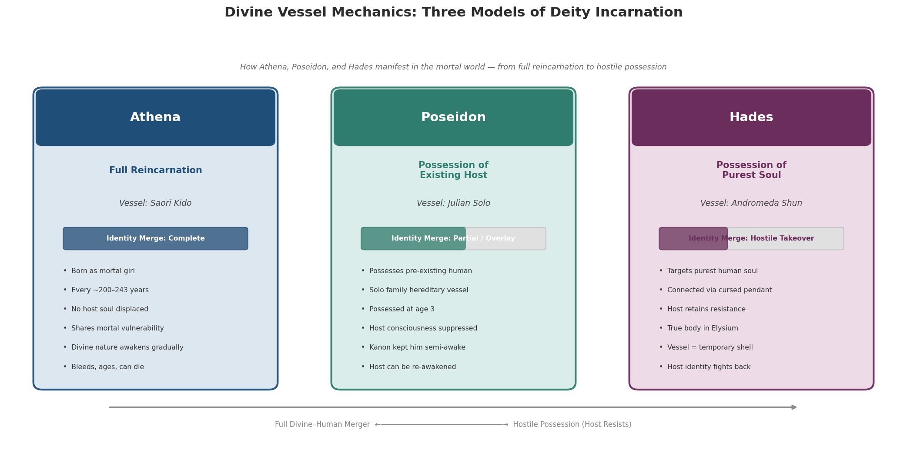

*Figure 7-1. Comparative diagram of the three deity incarnation models: Athena (full reincarnation), Poseidon (partial possession of hereditary host), and Hades (hostile possession of the purest soul). The spectrum runs from complete divine–human identity merger to forcible occupation with active host resistance.*

### Divine Abilities and Cosmo

Athena's Cosmo reaches the Eighth Sense (Arayashiki) by the Hades Arc — a level shared with only the most exceptional mortal Saints and placing her squarely among the franchise's supreme beings. Her confirmed abilities include:

- **Healing auras**: Restoration of wounded Saints' Cosmo reserves and physical injuries, demonstrated across the Sanctuary, Poseidon, and Hades arcs.
- **Defensive barriers**: Energy shields capable of absorbing divine-level attacks.
- **Seal of Athena**: The mechanism by which she sealed Poseidon within Athena's amphora (manga vol. 18) and contributed to Hades's recurring imprisonment across mythological cycles.
- **Misopethamenos**: A divine gift that reduced Libra Dohko's aging rate to near zero for 243 years, preserving him as a sentinel between Holy Wars [Seiyapedia — Athena](https://saintseiya.fandom.com/wiki/Athena "Seal and Misopethamenos abilities").

Her sole confirmed direct offensive act is the final blow against Hades, delivered through the Nike Staff (Victory Staff, ニケの杖) — powered by the combined Cosmo of four God Cloth Bronze Saints. Athena wields two divine artifacts across the narrative: the Nike Staff and the Aegis Shield, the latter described as impervious to all attack and capable of purging evil [Seiyapedia — Saori Kido](https://saintseiya.fandom.com/wiki/Saori_Kido "Nike Staff and Aegis Shield").

### Thematic Significance

Athena's refusal to fight offensively transforms her into something rarer and more potent than a battle goddess: a moral catalyst. Her willingness to sacrifice herself — allowing Saga to stab her with the golden dagger, sealing herself within the Main Breadwinner pillar to hold back Poseidon's flood, draining her own blood into the amphora in the Underworld — generates the emotional extremity that drives her Saints beyond their mortal limits. The franchise's recurring thesis — that human will can overcome divine power — is made possible only because Athena's suffering provides the provocation, and her blood provides the literal alchemical agent for Cloth evolution. Without Athena's blood, no Bronze Cloth achieves God Cloth status; without her sacrifice, no Saint finds the desperation necessary to burn Cosmo to the Eighth Sense. She is simultaneously the narrative's most vulnerable figure and its most indispensable force multiplier.

## 7.2 The Olympian Hierarchy: Zeus, the Major Three, and Subordinate Deities

### Zeus — The Absent Supreme

Zeus (天帝ゼウス, *Tentei Zeusu*, "Sovereign of the Heavens") stands at the confirmed apex of the *Saint Seiya* power hierarchy. He is explicitly acknowledged as superior to both Poseidon and Hades in *Next Dimension* and referenced throughout the original manga — by the narrator in volume 1, by Gemini Saga, and by Hypnos in volume 28 [Seiyapedia — Zeus](https://saintseiya.fandom.com/wiki/Zeus "Zeus article"). A Kurumada conceptual sketch depicts Zeus wearing a Kamui (divine armor), confirming his intended status as an active deity within the cosmology rather than a mere abstraction.

Despite this supreme status, Zeus has never physically appeared in Kurumada's manga proper. In the non-Kurumada spin-off *Episode G: Assassin*, Zeus uses Leo Aiolia as a vessel — a storyline that, while outside primary canon, illustrates the franchise's recurring interest in the collision between divine will and mortal identity. Zeus's narrative absence carries its own thematic weight: he functions as the ceiling that can be referenced but never reached, the ultimate power that no mortal Saint has challenged and that the narrative never requires them to overcome.

### Poseidon and Hades at the Divine Level

Poseidon and Hades receive detailed combat analysis in Chapters 4 and 5, respectively. At the level of the divine hierarchy, several cross-cutting observations warrant emphasis.

**Poseidon** (Lord of the Seas, one of the three Olympian brothers alongside Zeus and Hades) possesses divine Cosmo "far superior to humans and even higher than Athena under normal circumstances" [Seiyapedia — Poseidon](https://saintseiya.fandom.com/wiki/Poseidon "Poseidon Cosmo assessment"). During the Poseidon Arc, he was never fully awakened — Kanon deliberately maintained him in a semi-conscious state to govern the Undersea Realm as proxy. Even partially awakened, Poseidon's Cosmo overwhelmed every Saint who confronted him directly; only Athena's amphora seal, delivered via Seiya's Sagittarius Golden Arrow penetrating Julian Solo's consciousness, ended the conflict. In the Hades Arc (manga vol. 27), Poseidon demonstrated continued divine agency by briefly reawakening to dispatch five Gold Cloths to the Bronze Saints heading to Elysium — an act of inter-divine alliance implying that Poseidon retains full consciousness even within his sealed state.

**Hades** (King of the Underworld, eldest of the three Olympian brothers) wields a Cosmo tier that dwarfs any mortal combatant. His Greatest Eclipse (グレイテストエクリプス) — a planetary alignment engineered to create eternal darkness and destroy all living souls — represents the single most destructive technique referenced in the original manga. Hades fought all five God Cloth Bronze Saints and Athena simultaneously, cursed Seiya with a divine sword that left him comatose (manga vol. 28), and required the combined Cosmo of four God Cloth Saints channeled through Athena's Nike Staff for his final defeat [Seiyapedia — Hades](https://saintseiya.fandom.com/wiki/Hades "Greatest Eclipse and final defeat"). The franchise positions Poseidon and Hades as near-equals — both major Olympians who proved defeatable only through Athena's strategic orchestration of mortal Saints, divine seals, and sacred artifacts assembled across millennia.

### Thanatos and Hypnos — The Twin Gods

Thanatos (God of Death) and Hypnos (God of Sleep) occupy a tier beneath the major Olympians but decisively above Gold Saints. Both wield "Big Will" — a form of divine Cosmo explicitly stated to surpass mortal Cosmo regardless of the latter's mastery level [Seiyapedia — Hypnos](https://saintseiya.fandom.com/wiki/Hypnos "Big Will confirmation"). Their combat feats provide the franchise's clearest quantitative demonstration of the gap between Gold-tier and god-tier power.

**Thanatos** shattered five Gold Cloths with a single blast of Terrible Providence (テリブルプロビデンス) — an unprecedented destruction that underscored the inadequacy of Gold-tier armaments against divine force. He was defeated only after Seiya's Pegasus Cloth evolved into a God Cloth through contact with Athena's blood, at which point Seiya blocked Terrible Providence barehanded, shattered Thanatos's Surplice, and killed the death god with a concentrated strike (manga vol. 27) [Seiyapedia — Thanatos](https://saintseiya.fandom.com/wiki/Thanatos "Gold Cloth destruction and defeat by God Cloth Seiya").

**Hypnos** employed Eternal Drowsiness (エターナルドラウジネス), inducing irresistible sleep on mortals, and imprisoned Athena within the Sacred Amphora to drain her blood. He survived an initial Aurora Execution from God Cloth Hyoga but was defeated when Shiryu and Hyoga combined their God Cloth attacks — exploiting the franchise axiom that the same technique cannot work on a Saint twice. Before dying, Hypnos warned that destroying Hades's true body would dissolve Elysium and the entire Underworld — intelligence that proved critical to the final confrontation's stakes [Seiyapedia — Hypnos](https://saintseiya.fandom.com/wiki/Hypnos "Defeat sequence and Elysium warning").

In *The Lost Canvas*, the Twin Gods receive expanded treatment: Cancer Manigoldo destroyed Thanatos's physical body through a kamikaze attack, with former Pope Sage sealing the death god's soul, while Altar Hakurei sealed Hypnos in a separate engagement — demonstrating that prior-era Saints achieved comparable feats through self-sacrifice rather than God Cloth elevation [Wikipedia — Lost Canvas Characters](https://en.wikipedia.org/wiki/List_of_Saint_Seiya:_The_Lost_Canvas_characters "TLC Twin Gods defeat").

### Chronos — The Primordial Beyond Olympus

Chronos (Χρόνος), the primordial god of Time, occupies a category altogether distinct from the Olympian hierarchy. Referenced in *Next Dimension* — where his power enables the time-travel mechanism Athena employs to save the comatose Seiya — and manifested in *The Lost Canvas* as the Twin Time Gods, Chronos exists beyond the Olympian framework as a being whose dominion over time and space transcends the authority of even Zeus. His power tier remains implied but unconfirmed relative to the Olympians in Kurumada's canon; what the narrative establishes is that his abilities (creation and annihilation of spacetime) operate on a fundamentally different axis than the combat-oriented Cosmo system governing mortal and Olympian confrontations [Seiyapedia — Artemis](https://saintseiya.fandom.com/wiki/Artemis "Hecate and Chronos reference in Next Dimension time travel"). Chronos thus functions as the franchise's reminder that the Olympian hierarchy, however vast, does not exhaust the cosmological order.

## 7.3 God Cloths (Divine Cloths) — Mortality Transcended

The God Cloths represent the most dramatic armor evolution in the franchise: mortal-made Bronze Cloths elevated to a power tier approaching the divine Kamui. Their awakening in the Hades Arc (manga vols. 27–28) redefined the series' power ceiling and delivered the narrative payoff for its central thesis — that Bronze Saints, the lowest rank, carry the highest potential for transcendence.

### Awakening Conditions

Two simultaneous conditions must be met for a God Cloth to manifest:

1. **Athena's blood**: The Cloth must be anointed with the blood of the incarnate goddess — establishing a direct biochemical link between divine sacrifice and mortal empowerment.
2. **Extreme Cosmo combustion**: The Saint must burn Cosmo to its absolute limit, contextually aligned with Eighth Sense activation.

Upon witnessing the first God Cloth awakening, Hypnos recalled a precedent from the mythological era, confirming that the mechanism is recurrent across Holy War cycles rather than a one-time anomaly [Seiyapedia — God Cloth](https://saintseiya.fandom.com/wiki/God_Cloth "God Cloth article — awakening conditions and mythological precedent").

### The Five God Cloth Recipients

The five protagonist Bronze Saints are the sole confirmed God Cloth bearers in the original manga:

- **Pegasus Seiya**: First to awaken. Trigger: Thanatos destroyed Seiya's Bronze Cloth along with the five Gold Cloths shielding him; Athena's blood, already present on the Cloth from her earlier sacrifice, catalyzed the transformation. Seiya immediately blocked Terrible Providence — the same attack that had annihilated five Gold Cloths — barehanded, then destroyed Thanatos outright. This sequence constitutes the definitive demonstration of the God Cloth's power ceiling.
- **Andromeda Shun**: God Cloth manifested during Hypnos's offensive in Elysium.
- **Dragon Shiryu and Cygnus Hyoga**: Awakened simultaneously; they jointly engaged and defeated Hypnos through a combined assault.
- **Phoenix Ikki**: His God Cloth awakening is implied rather than depicted with the same granularity as the others. The underlying mechanism is consistent — exposure to Athena's blood — though Ikki's unique passage through the Underworld (enabled by Pandora's necklace rather than the conventional Eighth Sense route) introduces ambiguity regarding the precise triggering moment. His God Cloth appears fully formed for the final battle against Hades [Seiyapedia — Phoenix Ikki](https://saintseiya.fandom.com/wiki/Phoenix_Ikki "Implied God Cloth awakening via Athena's blood").

### Power Tier Implications

Hypnos himself described the God Cloths as "closest to the power and prominence of a Kamui" [Seiyapedia — Hypnos](https://saintseiya.fandom.com/wiki/Hypnos "Kamui comparison statement"). The combat record corroborates this assessment:

- Thanatos's Terrible Providence, which shattered five Gold Cloths simultaneously, failed to scratch Seiya's Pegasus God Cloth.
- Five God Cloth Saints fought Hades — a major Olympian — to a standstill before Athena's Nike Staff delivered the killing blow.
- No Gold Cloth–level combatant achieved comparable feats against divine opponents anywhere in the original manga.

The God Cloths thus occupy Tier 8 in the franchise power hierarchy (see Section 7.7): decisively above Gold Saints and the Three Judges, capable of defeating subordinate deities (Thanatos, Hypnos) outright, and capable of engaging but not independently defeating major Olympians. Hades's destruction required the coordinated effort of five God Cloth Saints channeling their Cosmo through Athena and her Nike Staff — no single God Cloth bearer could have achieved it alone.

A notable asymmetry persists within the canon: only Bronze Cloths evolve to God Cloth status in Kurumada's manga. The anime-only *Soul of Gold* (2015) introduced Gold God Cloths for the twelve Gold Saints, but this development falls outside manga canon and does not alter the hierarchy established in the original text.

## 7.4 Kamui — The Divine Armors of the Gods

The Kamui (神衣, *Kamui*, literally "divine cloth/garment") are the original armors of the twelve Olympian gods, representing the absolute pinnacle of the franchise's armor hierarchy. Every other armor system — Cloths, Scales, Surplices, God Robes — exists below the Kamui in both raw power and mythological pedigree [Seiyapedia — Kamui](https://saintseiya.fandom.com/wiki/Kamui "Kamui article — definition and hierarchy placement").

### Known Kamui

Only one Kamui has been confirmed in action within the manga:

**Athena's Kamui** hibernates as the colossal Athena statue atop Sanctuary. When revived by Athena's blood, it assumes the form of a divine armor that envelops the goddess completely. During the Hades Arc, Athena donned her Kamui for the final confrontation in Elysium, where it withstood sustained attacks from Hades without visible damage — a durability feat unmatched by any other armor in the franchise against a major Olympian's direct offensive [Seiyapedia — Kamui](https://saintseiya.fandom.com/wiki/Kamui "Athena's Kamui in action").

**Zeus's Kamui** appears in a Kurumada conceptual sketch, confirming its existence within the intended cosmology but providing no combat data or detailed specifications.

### The Kamui–God Cloth Distinction

The franchise draws a clear conceptual line between Kamui and God Cloths:

| Attribute | Kamui | God Cloth |
|---|---|---|
| **Origin** | Divine — created for/by the gods | Mortal-made — Bronze Cloths elevated through Athena's blood |
| **Intended wearer** | Olympian deities | Mortal Saints |
| **Power tier** | Supreme | "Closest to Kamui" (per Hypnos) |
| **Confirmed users** | Athena | Seiya, Shiryu, Hyoga, Shun, Ikki |

This distinction preserves the franchise's power ceiling: even at their most elevated, mortal Saints in God Cloths approach but do not equal the gods wearing their own armaments. The narrative requires this gap — Hades was defeated not by God Cloths alone but by God Cloths *plus* Athena wielding her Nike Staff within her Kamui.

The broader armor taxonomy extends well beyond this binary. The following comparison situates all seven major armor classes across their defining attributes:

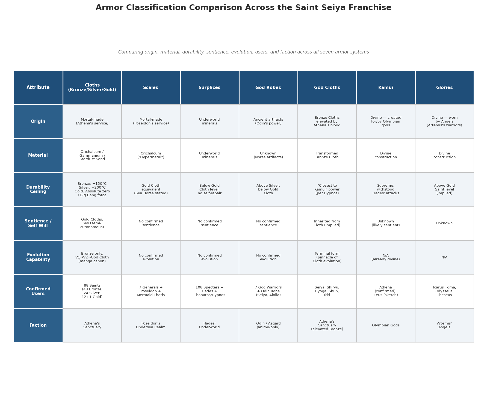

*Figure 7-2. Seven-column comparison of the franchise's armor systems — Cloths (Bronze/Silver/Gold), Scales, Surplices, God Robes, God Cloths, Kamui, and Glories — evaluated across origin, material, durability ceiling, sentience, evolution capability, confirmed users, and faction affiliation.*

### Unresolved Questions

The possible existence of Poseidon's Kamui equivalent ("God Scales") and Hades's Kamui equivalent ("God Surplice") appears in certain fan wiki discussions, but neither concept is confirmed in any Kurumada-authored source. In the manga, Poseidon wears a Scale and Hades wears a Surplice — whether these represent their true Kamui-equivalent armaments or lesser forms remains an open question that future installments of *Next Dimension* or the planned Heaven Chapter manga may resolve.

## 7.5 Apollo, Artemis, and the Angels — The Heaven Chapter Deities

### Apollo — The Immeasurable Power

Apollo (アポロン), god of the sun, represents the highest confirmed combat power among deities who have appeared on screen within the franchise. He is canonical through *Heaven Chapter: Overture* (2004), the theatrical film for which Kurumada authored the script. During the film's events, Athena warns Seiya explicitly that her own abilities and those of Artemis are "dwarfed in an immeasurable way" by Apollo's — a statement positioning Apollo above all other deities witnessed in combat, including Hades and Poseidon [Seiyapedia — Apollo](https://saintseiya.fandom.com/wiki/Apollo "Apollo article — Athena's power comparison statement").

Apollo's demonstrated abilities include overwhelming divine Cosmo, teleportation, and memory erasure effective on both gods and mortals. He sentenced Athena and her Saints to death for the transgression of fighting fellow Olympians — reframing the events of the Sanctuary, Poseidon, and Hades arcs as violations of the divine order rather than heroic victories. Kurumada later clarified that Apollo's motivation was benevolent: he erased Seiya's memories to free him from the burden of warfare, a characterization that complicates any straightforward reading of Apollo as antagonist.

*Overture* was cancelled and removed from Toei's catalog following creative disputes between Kurumada and the studio. Kurumada has indicated that the Heaven Chapter will eventually continue as manga, securing Apollo's canonical status while leaving his narrative trajectory incomplete.

### Artemis — The Moon Goddess and Her Angels

Artemis (アルテミス), goddess of the moon and twin sister of Apollo, holds a dual presence in the franchise through both *Overture* and *Next Dimension*, giving her simultaneous footing in film and manga canon. In *Next Dimension*, Artemis assists Athena by ordering the witch-goddess Hecate to guide the time-travel mechanism that sends Athena to the 18th century to save the comatose Seiya — demonstrating that inter-divine cooperation extends well beyond the battlefield [Seiyapedia — Artemis](https://saintseiya.fandom.com/wiki/Artemis "Artemis article — Next Dimension role and Angels").

Artemis commands the Angels (天闘士, *Tentoushi*), warriors who wear Glories (天衣, *Teni*) — a divine armor class distinct from Cloths, Scales, Surplices, and God Robes. Three Angels are named in the franchise: Icarus Tōma (revealed as Eagle Marin's lost brother, resolving a long-running subplot from the Sanctuary Arc), Odysseus, and Theseus. The Angels are described as operating above Gold Saint level, though direct combat comparisons with other high-tier entities remain limited.

Artemis's confirmed abilities include instant manipulation of day and night cycles, spatial distortion, and lunar control. Unlike Poseidon and Hades, Artemis appears to inhabit her own body from the mythological era rather than reincarnating or possessing a mortal vessel — a detail aligning her more closely with Apollo than with the major Olympians who interact with the mortal world through hosts.

## 7.6 Movie-Only Deities: Abel, Eris, and Lucifer

The *Saint Seiya* theatrical films (1987–1989) introduced several deities who exist outside manga canon but warrant analysis for their contributions to the franchise's divine cosmology and their enduring presence in ancillary media.

### Phoebus Abel (Legend of Crimson Youth, 1988)

Abel is presented as the Sun God and Athena's brother — a characterization placing him in the same divine niche later occupied by the canonical Apollo, making Abel effectively a non-canonical prototype for the sun god archetype. He demonstrated the ability to revive deceased Gold Saints (Deathmask, Aphrodite, and Shura served him as Corona Saints) and generated cosmic energy sufficient to threaten Earth's existence. Abel was killed by the Sagittarius Golden Arrow — the same weapon that recurrently serves as the franchise's divine-killing instrument [Seiyapedia — Phoebus Abel](https://saintseiya.fandom.com/wiki/Abel "Abel article").

### Eris (Evil Goddess Eris, 1987)

Eris, goddess of Discord and Athena's half-sister, is the weakest movie antagonist in direct combat terms. She kidnapped Saori/Athena to serve as a vessel for her own resurrection and deployed Ghost Saints as her army. Defeated by Seiya's golden arrow, Eris nonetheless gained extended narrative life through her subsequent appearance in the *Saintia Shō* spin-off manga, where she received additional character development outside the film continuity [Seiyapedia — Eris](https://saintseiya.fandom.com/wiki/Eris "Eris article — movie and Saintia Shō").

### Lucifer (Warriors of the Final Holy Battle, 1989)

Lucifer occupies the most extreme power tier among movie-only antagonists. Characterized as a fallen archangel who rebelled against the Creator — an entity above the Olympians, referenced only in this film — Lucifer summoned the spirits of Abel, Eris, and Poseidon and deployed Fallen Angel servants who defeated all twelve Gold Saints. His destruction required the Sagittarius Golden Arrow combined with the concentrated radiance of all twelve Gold Cloths, constituting the largest combined power output shown in any *Saint Seiya* narrative at the time of the film's release [Seiyapedia — Lucifer](https://saintseiya.fandom.com/wiki/Lucifer "Lucifer article — abilities and defeat"). Lucifer's implied near-Olympian tier exists within an isolated movie-canon scaling system that does not interact with the manga's established hierarchy.

These three film deities share a structural pattern: each serves as a one-off escalation requiring a unique weapon (invariably the Sagittarius Golden Arrow) for defeat, and each introduces mythological elements — solar gods, discord goddesses, fallen angels — that the manga would later address through different canonical characters.

## 7.7 Franchise-Wide Power Hierarchy — A Unified Synthesis

Synthesizing data from across the franchise's armor systems, Cosmo tiers, and narrative outcomes, the following ten-tier hierarchy emerges. This framework draws exclusively from combat feats, stated power comparisons, and confirmed armor durability data — prioritizing manga-canon evidence while noting anime-only and spin-off material where it supplements the picture.

**Tier 1 — Ordinary Combatants**: Hades's Skeleton foot soldiers and unnamed rank-and-file warriors. No significant Cosmo. Defeated en masse by any trained Saint.

**Tier 2 — Bronze Saints (Base Cosmo)**: Standard Bronze Saints (Unicorn Jabu, Lionet Ban, and their peers) and the protagonist Bronze Saints at the series' outset. Cloths freeze at −150°C; combat speed ranges from Mach 1 to Mach 10. Effective against non-Cosmo opponents and each other; outmatched by any higher tier.

**Tier 3 — Silver Saints (Sixth Sense / Intuition)**: Mach 2–5 combat speed; Cloths freeze at −200°C. Serve as Sanctuary enforcers and Saint trainers. Notable exceptions breach the tier ceiling: Lyra Orphée surpasses typical Gold Saints; Crateris Suikyō (*Next Dimension*) and Altar Hakurei (*The Lost Canvas*) operate at Gold level.

**Tier 4 — Elite Bronze / God Warriors / Marina Generals**: Bronze protagonists upon Seventh Sense activation, God Warriors in God Robes (sub-Gold durability but Gold-range Cosmo), and Marina Generals in Scales (Sea Horse Baian's Scale rated at Gold Cloth–equivalent durability). This tier represents the threshold at which mortal warriors begin to challenge the Gold standard. Internal variation is substantial: Siegfried and Sea Dragon Kanon occupy the tier's ceiling, while Lyumnades Kasa and Epsilon Fenrir mark its floor.

**Tier 5 — Gold Saints (Seventh Sense Baseline)**: Lightspeed combat as the standard. Cloths composed of Orichalcum, freezing only at absolute zero (−273.15°C), capable of withstanding force equivalent to a Big Bang. Semi-autonomous Cloths with sentient will (the Cancer Cloth notably abandoned Deathmask mid-battle). The Athena Exclamation — a forbidden three-Gold-Saint combination attack — produces energy equivalent to a small-scale Big Bang. The "Thousand Day War" axiom holds that two equivalent Gold Saints cannot resolve combat quickly. Internal variation spans from Pisces Aphrodite (considered among the weaker Gold Saints in direct confrontation) to Virgo Shaka ("the Man Closest to God," acknowledged by Kurumada as the most powerful Gold Saint) and Gemini Saga (stated as the most powerful Gold Saint of his generation in *Next Dimension* ch. 41).

**Tier 6 — The Three Judges of the Underworld**: Wyvern Rhadamanthys, Griffon Minos, and Garuda Aiacos command the 108 Specters and operate at or near Gold Saint power. Minos is described as "the most powerful Specter." Rhadamanthys fought Mu, Aiolia, and Milo simultaneously at a self-stated 10% Cosmo output and later required Kanon's point-blank Galaxian Explosion kamikaze for his defeat. The Judges' Surplices lack Gold Cloth–level durability and sentience, but their wearers' raw Cosmo output compensates for this material disadvantage.

**Tier 7 — Subordinate Deities (Thanatos / Hypnos)**: Wield "Big Will" (Divine Cosmo), explicitly surpassing any mortal Cosmo regardless of mastery. Thanatos's single Terrible Providence shattered five Gold Cloths — the franchise's clearest quantitative demonstration of the Gold-to-god power gap. Entities at this tier require God Cloth–level opposition to defeat.

**Tier 8 — God Cloth Bronze Saints**: Mortal Saints wearing Cloths elevated to near-Kamui status through Athena's blood and Eighth Sense activation. Capable of defeating subordinate deities outright (Seiya vs. Thanatos; Shiryu and Hyoga vs. Hypnos) and of challenging major Olympians in coordinated groups. The quantum leap from Tier 5 to Tier 8 is demonstrated with brutal clarity by Thanatos's effortless destruction of five Gold Cloths followed by his inability to scratch Seiya's Pegasus God Cloth.

**Tier 9 — Major Olympians**: Poseidon, Hades, Athena (in Kamui), Artemis, and Apollo. Poseidon and Hades represent near-equal powers, each defeated across the franchise only through Athena's strategic combination of Saints, seals, and divine artifacts. Apollo stands above all others present on screen — Athena herself states his power dwarfs hers "immeasurably."

**Tier 10 — Zeus (Supreme Deity)**: Confirmed in *Next Dimension* as stronger than both Poseidon and Hades. Never defeated, never physically appeared in manga. Zeus represents the franchise's absolute power ceiling — the unreachable apex of the cosmological order.

**Outside the hierarchy**: Chronos (primordial god of Time) operates on a fundamentally different axis — dominion over spacetime rather than combat Cosmo. His power is implied to transcend the Olympian framework but is not directly ranked against Zeus in Kurumada's canon. Movie-only entities (Abel, Eris, Lucifer) occupy an isolated scaling system: Lucifer's near-Olympian tier and Eris's sub-Gold vulnerability coexist within film continuity without affecting manga-canon rankings.

The following pyramid diagram consolidates this ten-tier synthesis into a single visual reference:

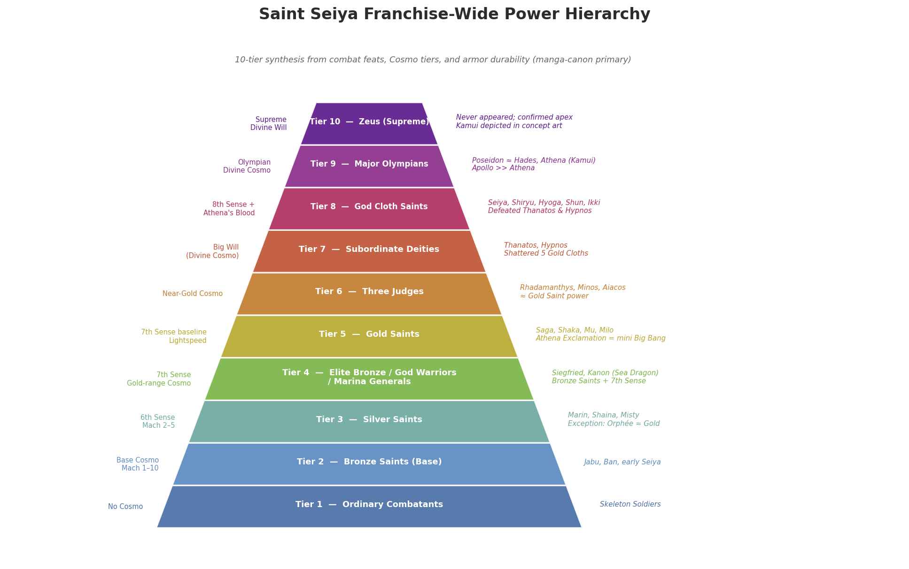

*Figure 7-3. Ten-tier vertical pyramid illustrating the franchise's complete power hierarchy, from Tier 1 (Skeleton Soldiers) through Bronze, Silver, and Gold Saints, the Three Judges, subordinate deities, God Cloth Saints, and Major Olympians, to Tier 10 (Zeus). Each tier is annotated with representative characters, Cosmo tier, and armor class.*

### The Hierarchy's Narrative Function

This tiered system is not merely a power-scaling exercise — it is a narrative architecture. Each arc advances the protagonists upward by one or two tiers: the Sanctuary Arc elevates Bronze Saints from Tier 2 to Tier 4/5 (Seventh Sense awakening); the Poseidon Arc consolidates them at Tier 4; the Hades Arc catapults them to Tier 8 (God Cloths). The hierarchy ensures that each successive antagonist faction — Silver Saints → Gold Saints → Marina Generals → Specters → Twin Gods → Hades — represents a genuine escalation in threat, while the franchise's core thesis — that the lowest-ranked warriors carry the highest potential — is validated only at the ultimate crisis point, when mortal will and divine blood converge to produce God Cloths capable of wounding gods. The architecture is both mechanical and philosophical: it establishes that power in the *Saint Seiya* universe is not inherited but earned through suffering, and that the ceiling is never truly fixed so long as a Saint is willing to burn brighter.

# Conclusion

The *Saint Seiya* franchise sustains its narrative across four decades through a deceptively simple structural principle: every armor class, warrior faction, and divine antagonist exists within a single, internally consistent power hierarchy — and that hierarchy exists to be transcended. The analysis presented in this report traces how this principle manifests across the franchise's major factions.

**Bronze Saints** anchor the entire narrative. The five protagonists begin at the lowest Cloth tier (−150°C freeze threshold, Mach 1–10 combat speed) and undergo a three-stage armor evolution — V1, V2 (Gold Saint blood), God Cloth (Athena's blood plus Eighth Sense) — that culminates in the destruction of subordinate gods and the wounding of Hades himself. Crucially, God Cloth evolution is reserved exclusively for Bronze Cloths within the original manga, encoding the franchise's thesis at the mechanical level: the lowest rank receives the greatest transformative potential.

**Silver Saints** function as the first power-scaling benchmark. Their Sixth Sense Cosmo ceiling (Mach 2–5) establishes the threshold the protagonists must breach, while outliers such as Lyra Orphée (Gold-surpassing), Crateris Suikyō (stated by Ikki as stronger than any Gold Saint he fought), and Altar Hakurei (Pope-level) demonstrate that Cloth class constrains armor, not the warrior's Cosmo. Of the 17 named Silver Saints in the original manga, only Eagle Marin and Ophiuchus Shaina survived — both by aligning with the protagonists rather than opposing them.

**Marina Generals** compress Poseidon's military into a single elite stratum of seven warriors wearing Scales of Gold Cloth–equivalent durability. Their simultaneous-pillar battle structure tests the Bronze Saints' ability to sustain the Seventh Sense independently, without the sequential escalation of the Twelve Houses. Sea Dragon Kanon's arc — from imprisoned schemer to self-sacrificing Gemini Gold Saint — represents the franchise's most complete villain-to-hero trajectory, while Siren Sorrento's moral defection and Kraken Isaac's tragic lineage demonstrate that even antagonist factions harbor genuine conviction.

**Specters** constitute the franchise's most complex antagonist force, organized across seven hierarchical tiers from skeleton soldiers to the twin gods Thanatos and Hypnos to Hades himself. The Surplice armor system's unique capacity to enable Underworld traversal without Eighth Sense awakening, the Three Judges' near-Gold-Saint combat power, and the twin gods' "Big Will" (Divine Cosmo) each represent a qualitative escalation that systematically exhausts the protagonists' resources and demands the God Cloth evolution for resolution.

**God Warriors** of Asgard, though anime-original, contributed an enduring innovation: the systematic humanization of antagonists through detailed backstory, moral complexity, and deaths framed as tragic sacrifice rather than villain defeat. Their Norse-themed God Robes — spanning upper Silver to solid Gold power levels — and the Odin Sapphire collection mechanic provided a self-contained mythological arc that many analysts regard as the finest "filler" segment in shōnen anime history.

At the apex, the **divine hierarchy** establishes the ceiling against which all mortal achievement is measured. Athena's paradoxical role as a pacifist war goddess whose blood catalyzes every major Cloth evolution makes her simultaneously the narrative's most vulnerable figure and its most indispensable force multiplier. Poseidon and Hades, near-equals among the Olympians, proved defeatable only through Athena's orchestration of mortal sacrifice, divine seals, and sacred artifacts. Zeus remains the unreachable apex — confirmed as the supreme deity yet never physically present, functioning as the structural guarantee that the franchise's power ceiling can always be raised.

The ten-tier power framework synthesized in Chapter 7 — from Skeleton Soldiers (Tier 1) through Bronze, Silver, and Gold Saints, Marina Generals, the Three Judges, subordinate deities, God Cloth Saints, and Major Olympians, to Zeus at Tier 10 — captures this architecture in its entirety. The hierarchy is not merely a scaling exercise but a philosophical statement: power in the *Saint Seiya* universe is earned through suffering, and no ceiling is permanent so long as a warrior is willing to burn Cosmo beyond all prior limits. This principle — that will transcends rank — is the franchise's foundational contribution to the shōnen genre and the engine that has sustained its global resonance for nearly four decades.
