# 执行摘要

This report presents a comprehensive analysis of the computational pipeline for understanding singles badminton player actions from sports video, organized along four sequential research components: (1) object detection and tracking, (2) stroke-type classification, (3) tactical intent recognition, and (4) action prediction. Each component is examined through the lens of state-of-the-art methods, public benchmarks, quantitative performance frontiers, and remaining research gaps.

**Object Detection and Tracking.** The perceptual foundation of badminton video analytics has matured substantially for three of four detection targets. Shuttlecock tracking, the most technically demanding task due to near-subpixel object size and velocities reaching 493 km/h, is dominated by two complementary paradigms: heatmap regression (the TrackNet family) achieves superior trajectory completeness—TrackNetV3 attains 97.51% tracking accuracy and 98.56% F1—while YOLO-based bounding-box detectors (YO-CSA-T) deliver 99.43% mAP@0.5 at over 130 fps, comfortably exceeding real-time requirements. Player detection achieves 97.38% mAP@0.5 with fine-tuned Faster R-CNN, and court homography registration reaches 99.08% mIoU via deep semantic segmentation. MonoTrack demonstrates feasible monocular 3D trajectory reconstruction by coupling learned perception with physics-informed ballistic models. Racket detection, however, remains an unaddressed gap: no dedicated method exists, and the absence of racket-level annotations in all public datasets constrains downstream stroke disambiguation.

**Stroke-Type Classification.** The recognition of individual stroke techniques has advanced from skeleton-only graph convolutional networks (ST-GCN: 77.58% on ShuttleSet, 25 classes) to cross-modal fusion Transformers. The Badminton Stroke-type Transformer (BST, 2025) achieves the current best accuracy of 83.22% and 80.97% Macro-F1 by fusing player skeleton sequences with shuttlecock trajectory and court position through cross-attention, yielding a cumulative +5.66 percentage-point gain over skeleton-only baselines. Shuttlecock trajectory emerges as the single most discriminative auxiliary signal (+3.44 pp), owing to its immunity to deceptive body movements—a domain-specific challenge in which elite players deliberately mimic preparation motions for different strokes. A critical methodological caveat pervades the literature: nearly all models assume pre-segmented stroke boundaries, and automatic temporal stroke detection remains a largely unsolved prerequisite for end-to-end deployment.

**Tactical Intent Recognition.** Bridging low-level stroke labels with high-level strategic understanding constitutes the least mature component of the pipeline. Computational approaches range from deterministic heuristic mappings (TIVEE, BFMD) and game-theoretic analysis (gaming tree achieving >90% top-5 prediction precision on the Lin Dan–Lee Chong Wei rivalry) to offline reinforcement learning (CQL reward of 0.8703 on 59,472 strokes) and knowledge graph reasoning (BadmintonKG with 198,563 triples). Visual analytics systems (ShuttleSpace, TIVEE, VIRD) provide interactive coaching interfaces validated with Olympic athletes. However, no quantitative tactical intent classification benchmark exists—no study reports F1 or accuracy for a supervised offensive/defensive/transitional classification task. Mid-rally tactical quality assessment remains near chance accuracy (approximately 59%), and the best multimodal large language models achieve only 38.62% on tactical reasoning questions. Score state, widely considered fundamental by coaches, has not been integrated into any computational model.

**Action Prediction.** Forecasting subsequent strokes, landing positions, and player movements has progressed from Seq2Seq LSTM baselines to Transformer-based architectures (ShuttleNet), graph neural networks for movement forecasting (DyMF, SPAIT), normalizing flows for distributional prediction (ShuttleFlow achieving approximately 3× lower spatial RMSE), and reinforcement learning for strategic optimization (PPO agents reaching 98.3% win rate against imitation-based opponents in ShuttleEnv). The best reported next-stroke top-1 accuracy is approximately 54% (RallyTemPose), with top-3 accuracy reaching 92.5%. SPAIT reduces physically implausible predictions by enforcing shot-position consistency constraints. Despite these advances, a substantial research-practice gap persists: prediction accuracy remains below the approximately 60% top-1 threshold required for real-time coaching, inference latency exceeds the reaction-time budget for live play, critical contextual variables (score state, fatigue, psychological momentum) are uniformly absent, and no human expert baselines exist for calibrating model performance.

**Cross-Cutting Finding.** A unifying theme across all four components is error propagation: detection-stage errors cascade through stroke classification, tactical inference, and prediction, yet no published study has systematically quantified this compounding effect. The field also lacks a unified multi-task benchmark that evaluates detection, classification, tactical analysis, and prediction on the same video corpus. These structural gaps—rather than any single model's accuracy ceiling—represent the most significant barriers to translating research advances into practical coaching systems.

# Object Detection and Tracking in Badminton Videos

Object detection and tracking constitute the perceptual foundation upon which every subsequent stage of video-based badminton analytics rests. Before a system can recognize stroke types (Chapter 2), infer tactical intent (Chapter 3), or predict subsequent actions (Chapter 4), it must first reliably localize and continuously track four principal targets—the player, the shuttlecock, the court boundary, and the racket—across every frame of monocular broadcast footage. This chapter surveys the state-of-the-art methods for each detection target, examines the unique visual challenges that distinguish badminton from other racket sports, catalogs the public datasets available for training and benchmarking, and identifies the remaining methodological gaps that constrain downstream analysis.

## 1.1 Unique Visual Challenges of Badminton Video Analysis

Badminton broadcast videos present a distinctive constellation of visual challenges that are considerably more severe than those encountered in most other ball sports. Five factors render shuttlecock detection especially difficult: (a) the shuttlecock subtends approximately 5 pixels in standard 1280×720 broadcast footage, effectively constituting a near-subpixel target; (b) shuttlecock velocities can reach 493 km/h, producing extreme motion blur that elongates and distorts its appearance across consecutive frames; (c) the conical feathered geometry causes substantial appearance variation depending on the viewing angle; (d) white court lines, net edges, and specular reflections on the floor create persistent false-positive distractors; and (e) the shuttlecock is frequently occluded when passing behind players or the net [Sensors 2022](https://pmc.ncbi.nlm.nih.gov/articles/PMC9655598/ "Shuttlecock detection challenges survey"). These object-level challenges are further compounded at the system level by broadcast production conventions—camera switches between baseline and side views, graphical overlays, instant replays, and variable lighting across venues—that disrupt the temporal visual continuity assumed by most tracking algorithms.

Beyond the shuttlecock, player detection—while benefiting from a larger target size—faces its own difficulties: the far-court ("top") player occupies significantly fewer pixels than the near-court ("bottom") player, severe motion blur accompanies lunging and jumping actions, and partial occlusion by the net is common during front-court exchanges. Court detection is complicated by the wide variety of court surface colors across international venues and the geometric distortion introduced by oblique broadcast camera angles. Racket detection remains the least addressed target overall: the racket head is small, undergoes extremely rapid angular velocity changes during swings, and is frequently occluded by the player's body.

Figure 1.1 illustrates the overall detection and tracking pipeline architecture, depicting how the four detection targets produce intermediate representations that subsequently drive the downstream analysis tasks covered in Chapters 2–4. The maturity ratings reflect the current state of the literature: shuttlecock, player, and court detection have each reached relative maturity, while racket detection remains a nascent research gap.

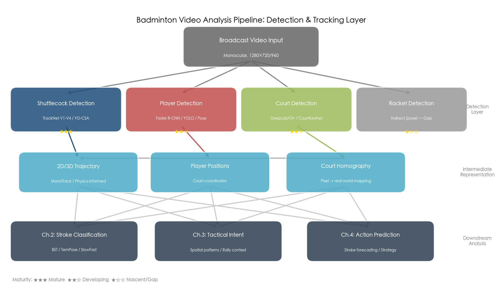

## 1.2 Shuttlecock Detection and Tracking

### 1.2.1 The Heatmap Regression Paradigm: TrackNet Family

Heatmap regression has emerged as the dominant paradigm for shuttlecock tracking. By predicting a 2D probability distribution over the image plane rather than regressing bounding-box coordinates, heatmap methods circumvent the anchor-design and box-regression difficulties that plague traditional detectors when applied to sub-pixel-scale objects, while naturally accommodating partial visibility [TrackNet](https://arxiv.org/abs/1907.03698 "Huang et al., IEEE AVSS 2019"). The seminal model in this line of work is TrackNet (2019), which pioneered the application of deep learning to high-speed tiny-object tracking in sports video. Built on a VGG-16 encoder with a deconvolution decoder, TrackNet processes 640×360 input by stacking three consecutive frames into a 9-channel tensor and regresses a 2D Gaussian heatmap centered on the shuttlecock position. On a single match, TrackNet achieved an F1 score of 98.5%; however, this figure dropped to 84.3% under 10-fold cross-validation across 10 videos, revealing significant generalization challenges when visual conditions vary across matches [TrackNet](https://arxiv.org/abs/1907.03698 "Huang et al., IEEE AVSS 2019").

TrackNetV2 (2020) addressed both the accuracy ceiling and the throughput bottleneck of its predecessor by adopting a U-Net encoder-decoder architecture that processes three frames simultaneously, producing three heatmap outputs from a single forward pass. On a training corpus of 78,200 labeled frames drawn from 26 broadcast videos, TrackNetV2 achieved accuracy of 96.3%, precision of 97.0%, and recall of 98.7% [TrackNetV2](https://scholar.nycu.edu.tw/en/publications/tracknetv2-efficient-shuttlecock-tracking-network "Sun et al., ICPAI 2020"). On the held-out test split—comprising 3 matches with unseen players—the model attained accuracy of 94.98%, precision of 99.64%, recall of 94.56%, and F1 of 97.03%, indicating strong but imperfect cross-match generalization [TrackNetV3 Benchmark](https://github.com/qaz812345/TrackNetV3 "Official TrackNetV3 repository, performance table"). The multi-frame output design also yielded approximately 3× faster throughput than the original TrackNet, reaching roughly 28 fps [TrackNetV2](https://scholar.nycu.edu.tw/en/publications/tracknetv2-efficient-shuttlecock-tracking-network "Sun et al., ICPAI 2020").

TrackNetV3 (2024) further advanced the accuracy–completeness frontier through two novel modules: trajectory prediction and trajectory rectification. The trajectory prediction module leverages an estimated background image as auxiliary data and employs mixup-based data augmentation to synthesize complex occlusion scenarios, thereby strengthening robustness to cluttered backgrounds. The trajectory rectification module analyzes the predicted trajectory to generate repair masks, then applies an inpainting network to reconstruct occluded segments. On the standard test split, these innovations raised shuttlecock tracking accuracy from 87.72% (the baseline without augmentation or rectification) to 97.51%, with precision of 97.79%, recall of 99.33%, and F1 of 98.56%—an approximately 10-percentage-point improvement in accuracy and a 1.5-point improvement in F1 over TrackNetV2 [TrackNetV3](https://dl.acm.org/doi/10.1145/3595916.3626370 "Chen & Wang, ACM MMAsia 2023/2024").

The most recent iteration, TrackNetV4 (2025), introduced learnable motion attention maps that are fused with high-level visual features through a dedicated motion-aware mechanism. When applied to the TrackNetV2 backbone, TrackNetV4 achieved an F1 score of 91.4% for shuttlecock tracking on a cross-sport benchmark encompassing badminton, tennis, and table tennis, demonstrating that explicit motion priors can further reduce false negatives—a persistent weakness of heatmap approaches in frames with severe occlusion [TrackNetV4](https://arxiv.org/abs/2409.14543 "Raj & Wang, arXiv:2409.14543, 2024/2025").

### 1.2.2 Bounding-Box Detection: YOLO-Based Approaches

While heatmap regression dominates the academic research literature, YOLO-family detectors offer a complementary paradigm characterized by substantially higher throughput. Standard YOLO variants achieve near-perfect mAP@0.5 for shuttlecock detection—YOLOv5s reaches 98.49%, YOLOv8s 99.38%, and YOLO11s 99.37%—yet performance degrades markedly under stricter IoU thresholds: mAP@0.75 ranges from 76% to 90%, indicating that precise bounding-box localization remains challenging for an object as small and deformable as the shuttlecock [YO-CSA-T](https://arxiv.org/pdf/2501.06472 "Lai et al., arXiv:2501.06472, Jan 2025, Table I").

YO-CSA (2025) represents the most advanced YOLO adaptation for badminton, augmenting YOLOv8s with Contextual Transformer (CoT2f) blocks and Spatial Group-wise Enhance (SGE) modules. The CoT2f blocks introduce cross-attention between neighboring spatial regions, enabling the model to disambiguate the shuttlecock from visually similar distractors such as court lines, while the SGE modules recalibrate feature groups to enhance the spatial salience of small targets. On a dataset of 32,539 images spanning 10 venues, YO-CSA achieved 99.43% mAP@0.5, 90.43% mAP@0.75, and 74.00% mAP@0.5:0.95, substantially outperforming both YOLOv8s (71.50% mAP@0.5:0.95) and YOLO11s (71.56%). The complete YO-CSA-T 3D tracking system maintained over 130 fps, making it viable for real-time broadcast analysis [YO-CSA-T](https://arxiv.org/pdf/2501.06472 "Lai et al., arXiv:2501.06472, Jan 2025").

### 1.2.3 Speed–Accuracy Trade-Off

The speed disparity between heatmap and bounding-box methods is substantial. TrackNet operates at 12–15 fps; TrackNetV2 reaches approximately 28–30 fps; standard YOLO variants run at 230–290 fps; and the complete YO-CSA-T 3D system, despite incorporating a full tracking pipeline, sustains over 130 fps [YO-CSA-T](https://arxiv.org/pdf/2501.06472 "Lai et al., 2025, Table IV"). Real-time broadcast analysis typically demands 30–60 fps, a threshold that YOLO-based methods comfortably exceed but heatmap methods barely meet (TrackNetV2) or fail to meet altogether (TrackNet, TrackNetV3 at approximately 25 fps). It bears emphasis, however, that heatmap methods consistently achieve higher recall and trajectory completeness, particularly for occluded or heavily blurred frames. The optimal paradigm choice therefore depends on whether the target application prioritizes latency—as in live coaching or augmented-reality overlays—or trajectory completeness, as required for post-match analysis and dataset annotation.

Figure 1.2 consolidates the performance and speed data for all major shuttlecock detection methods, visually illustrating the quality–speed trade-off. The left panel compares accuracy-class and localization-class metrics, while the right panel shows inference throughput with real-time and broadcast thresholds marked.

## 1.3 Player Detection and Tracking

Player detection in badminton broadcast videos has received comparatively less dedicated research attention than shuttlecock tracking, largely because general-purpose object detectors already achieve strong performance on human targets of moderate size. The most comprehensive badminton-specific evaluation to date was conducted by Ghosh et al. (WACV 2018), who fine-tuned a Faster R-CNN network on manually annotated bounding boxes from 10 Olympic matches (approximately 3,000 boxes across 20 players). On a test set comprising 3 unseen matches with 6 previously unobserved players, the system achieved 97.85% mAP@0.5 for the near-court ("bottom") player and 96.90% mAP@0.5 for the far-court ("top") player, yielding a weighted average of 97.38% mAP@0.5 [Ghosh et al.](https://cdn.iiit.ac.in/cdn/cvit.iiit.ac.in/images/ConferencePapers/2018/badminton_analytics.pdf "Ghosh, Singh & Jawahar, WACV 2018"). The performance gap between the two player positions reflects the inherent scale asymmetry of baseline-view broadcast footage: the bottom player is substantially larger and more visually detailed, while the top player frequently occupies fewer than 100 pixels in height.

Subsequent badminton analytics systems—including BadmintonVis, TIVEE, and the MonoTrack pipeline—have typically adopted off-the-shelf YOLO detectors or pose estimation models (e.g., HRNet, YOLOv8-Pose) to localize players, treating player detection as a solved upstream component rather than a research contribution in itself. This pragmatic approach is justified by the near-ceiling performance of modern detectors on human targets of moderate size; however, it leaves unaddressed the question of robustness under adversarial conditions such as extreme motion blur during diving saves, partial occlusion by the net, and rapid camera transitions—all of which remain unquantified in any dedicated benchmark.

## 1.4 Court Detection and Homography Registration

Accurate court detection and homography estimation are essential prerequisites for mapping pixel-space coordinates to real-world court positions, thereby enabling downstream spatial analysis of player movement patterns and shuttlecock landing distributions. Two complementary methodological approaches have emerged in the literature.

**Semantic segmentation for court registration.** Jouini et al. (2024) proposed a deep semantic segmentation pipeline combining ResNet-50 as a feature backbone with DeepLabV3Plus for dense pixel-wise court prediction, followed by RANSAC-based homography estimation. On 564 broadcast images spanning diverse court surface colors, this approach achieved mean IoU 0.781 for homography registration and 99.08% mIoU for court zone segmentation, demonstrating robustness to the wide color palette of international venues [Court Registration](https://openreview.net/pdf/01b2e7445170ebd4328ed615e1196d4ce6b880ef.pdf "Jouini et al., 2024").

**Keypoint-based court detection.** CourtKeyNet (2026) introduced an octave-based architecture augmented with Polar Transform Attention and a Quadrilateral Constraint Module specifically designed for badminton court keypoint detection. The Polar Transform Attention mechanism captures the radial symmetry of court line intersections, while the Quadrilateral Constraint Module enforces geometric consistency by penalizing predicted keypoint configurations that violate the rectangular topology of a standard court [CourtKeyNet](https://github.com/adithyanraj03/Paper_09_Data-Set_CourtKeyNet "Raj & Prethija, ML with Applications, 2026"). CourtKeyNet reportedly outperforms general-purpose keypoint detection methods, though full quantitative benchmarks (IoU, keypoint localization error) are not yet publicly available from the complete paper.

Both approaches share a common limitation: they assume a static or slowly panning camera within each rally. Rapid camera switches—common during broadcast production—require re-initialization of the homography, introducing potential discontinuities in the mapped coordinate stream that propagate to downstream modules.

## 1.5 Monocular 3D Trajectory Reconstruction

MonoTrack (CVPR Workshop 2022) presented the first end-to-end system for monocular 3D shuttlecock trajectory reconstruction from standard broadcast video. The pipeline integrates four sequential modules: (1) court recognition, which establishes the 3D reference frame via homography estimation; (2) a TrackNet-based 2D trajectory estimator; (3) a GRU-based hit detection network that identifies frames where the shuttlecock changes direction due to player contact; and (4) a physics-informed 3D reconstruction module that fits parabolic trajectories between consecutive hits subject to aerodynamic drag constraints [MonoTrack](https://arxiv.org/abs/2204.01899 "Liu & Wang, CVSports 2022"). By decomposing the full trajectory into piecewise parabolic segments anchored at hit events, MonoTrack circumvents the ill-conditioned problem of global 3D estimation and produces trajectories that are physically plausible. This work demonstrates that coupling learned perception (2D detection, hit detection) with physics-based priors (ballistic flight models incorporating drag) can effectively bridge the gap between 2D video observations and 3D spatial understanding, furnishing a substantially richer input representation for downstream stroke classification and tactical analysis.

## 1.6 Racket Detection

Racket detection remains the least explored detection target in badminton video analysis. No dedicated deep learning method has been published for localizing the racket as an independent object in broadcast footage. Current approaches infer racket position indirectly through wrist and hand keypoints derived from pose estimation models—an approximation that provides coarse spatial localization but cannot capture the racket's orientation, angular velocity, or contact point with the shuttlecock. This absence constitutes a significant gap in the perception pipeline: racket kinematics (swing trajectory, face angle at contact) carry critical discriminative information for stroke classification, particularly for disambiguating kinematically similar strokes such as a drop shot versus a clear, where the primary distinguishing signal resides in the racket face angle at contact rather than in gross body posture. Closing this gap will likely require specialized training data with racket-level annotations—a resource that no existing public dataset currently provides.

## 1.7 Public Datasets and Benchmarks

The availability of annotated datasets has been a principal driver of methodological progress in badminton video analysis. Existing datasets, however, vary widely in annotation granularity, scale, and intended research tasks, and no unified multi-task benchmark currently exists.

**TrackNet Shuttlecock Trajectory Dataset.** The foundational benchmark for shuttlecock detection and tracking comprises 26 broadcast videos (78,200 labeled frames) with per-frame shuttlecock pixel coordinates, covering 2018–2021 international tournaments featuring elite players. The dataset is split into 23 training and 3 test matches, with test matches containing unseen players to evaluate generalization [TrackNet Dataset](https://hackmd.io/@TUIK/rJkRW54cU "Official CoachAI dataset page"). All models in the TrackNet family (V1–V4) and the YO-CSA-T system are evaluated on this benchmark, making it the de facto standard for shuttlecock tracking.

**ShuttleSet (KDD 2023).** The largest badminton singles dataset with 36,492 human-annotated strokes across 3,685 rallies in 44 matches, featuring 18 shot type classes and player court positions. ShuttleSet provides the richest stroke-level annotation and has become the primary benchmark for stroke classification (Chapter 2) and stroke forecasting (Chapter 4) [ShuttleSet](https://arxiv.org/abs/2306.04948 "Wang et al., KDD 2023").

**ShuttleSet22 (IJCAI 2024).** A complementary dataset providing 30,172 training strokes in 2,888 rallies from 2022 high-ranking matches, designed specifically for the CoachAI Badminton Challenge and stroke forecasting benchmarking. Its temporal separation from ShuttleSet (drawn from different tournament years) enables evaluation of temporal generalization [ShuttleSet22](https://arxiv.org/abs/2306.15664 "Wang et al., IJCAI 2024 Demo").

**VideoBadminton (IEEE BigData 2024).** Contains 7,822 video clips (145 minutes) from 19 players covering 18 BWF-standard stroke classes at 1280×960 resolution and 60 fps. Unlike ShuttleSet, which provides tabular stroke annotations, VideoBadminton provides raw video clips suitable for appearance-based action recognition models. The best reported top-1 accuracy on this dataset is 82.80%, achieved by SlowFast [VideoBadminton](https://arxiv.org/html/2403.12385v1 "Li et al., IEEE BigData 2024").

**FineBadminton (ACM MM 2025).** The most recent and semantically richest dataset, containing 3,215 rally clips with multi-level annotation spanning three tiers: Foundational Actions (stroke types), Tactical Semantics (offensive/defensive/transitional intent, strategic classifications), and Decision Evaluation (shot quality assessment). FineBadminton is specifically designed for evaluating multimodal large language models (MLLMs) on fine-grained sports video understanding, and its FBBench reveals that current MLLMs struggle substantially with badminton comprehension [FineBadminton](https://arxiv.org/abs/2508.07554 "He et al., ACM MM 2025").

Figure 1.3 provides a consolidated comparison of all five public badminton datasets, summarizing their provenance, scale, annotation types, and intended research tasks at a glance.

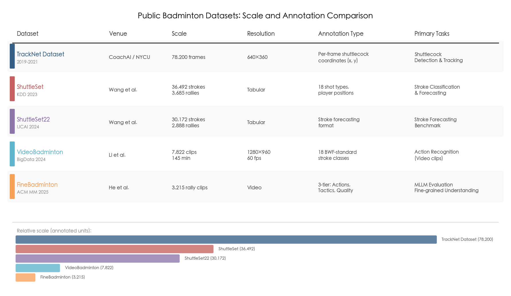

A critical limitation shared by all existing benchmarks is the absence of a unified multi-task evaluation protocol. Different studies employ different datasets, different train/test splits, and different metrics, rendering rigorous cross-method comparison exceedingly difficult. The TrackNet benchmark covers only shuttlecock detection; ShuttleSet provides only stroke-level tabular data; VideoBadminton supports only clip-level action recognition. An integrated benchmark that evaluates detection, tracking, stroke classification, and tactical analysis on the same video corpus with standardized protocols would significantly accelerate progress across the entire pipeline.

## 1.8 Error Propagation and Remaining Gaps

Detection and tracking errors at this foundational stage of the pipeline cascade through all downstream modules. A missed shuttlecock detection produces a gap in the reconstructed trajectory that corrupts hit-event detection, which in turn degrades stroke segmentation accuracy. A false-positive player detection in a non-play frame—such as during a replay or graphic overlay—introduces phantom strokes into the temporal sequence. Inaccurate court homography maps player and shuttlecock positions to incorrect court zones, distorting the spatial features that inform tactical analysis (Chapter 3) and action prediction (Chapter 4). Critically, the magnitude of this error cascade remains unquantified: no published study has systematically measured how detection-stage error rates propagate into downstream classification or prediction degradation.

Several specific gaps persist in the current detection and tracking landscape:

1. **Racket detection and tracking.** As discussed in Section 1.6, no dedicated method exists. Integrating racket-level annotations into future datasets and developing specialized detectors for small, fast-rotating objects would enrich the feature representation available to downstream models.

2. **Player detection benchmarks.** While Ghosh et al. (WACV 2018) demonstrated 97.38% mAP@0.5, this evaluation predates contemporary detectors such as YOLOv8, YOLO11, and RT-DETR. No systematic re-evaluation has been conducted with these modern architectures, and robustness under extreme conditions—diving saves, net-adjacent occlusion, rapid camera transitions—remains unquantified.

3. **Unified benchmarks.** The field lacks a single benchmark that jointly evaluates all detection targets (shuttlecock, player, court, racket) on the same video corpus, with standardized metrics and train/test protocols.

4. **Real-time heatmap tracking.** Heatmap methods offer superior trajectory completeness but remain at or below the real-time threshold (≤30 fps). Architectural innovations that close the speed gap without sacrificing recall—potentially through efficient attention mechanisms, model pruning, or knowledge distillation—would enable heatmap-quality tracking in latency-sensitive live coaching applications.

5. **Generalization across venues and broadcast conditions.** TrackNet's cross-validation F1 drop from 98.5% (single match) to 84.3% (10-match cross-validation) underscores a persistent domain shift problem. Techniques such as domain adaptation, venue-agnostic data augmentation, and self-supervised pre-training on unlabeled broadcast footage represent promising avenues for mitigating this gap.

# Recognition of Technical Actions (Stroke-Type Classification)

Stroke-type classification constitutes the second stage of the badminton video analytics pipeline. Once detection and tracking modules (Chapter 1) have localized the player, shuttlecock, and court in each frame, the recognition module must assign a semantic label—clear, smash, drop, net shot, drive, among others—to each stroke event within a rally. The resulting stroke-type sequence serves as the atomic vocabulary upon which tactical intent inference (Chapter 3) and action prediction (Chapter 4) are built. Errors at this stage propagate directly into downstream reasoning: a smash misclassified as a drop corrupts the tactical sequence representation, potentially inverting the inferred intent from offensive to defensive. This chapter surveys the feature representations, model architectures, annotation taxonomies, and benchmark datasets that define the current landscape of badminton stroke classification, and identifies the remaining challenges that constrain recognition accuracy.

## 2.1 Problem Definition and Annotation Taxonomies

### 2.1.1 Defining "Stroke Type" in Computational Badminton Analysis

In badminton analytics, a stroke type denotes the biomechanical technique a player employs to redirect the shuttlecock. The Badminton World Federation (BWF) coaching manuals distinguish approximately 12–18 canonical stroke categories—clear, drop, smash, net shot, drive, lob, push, lift, block, and cut, among others—each further differentiated by forehand versus backhand execution, jump versus standing posture, and wrist or slice variations. Computational research operationalizes these categories at varying levels of granularity, and the choice of taxonomy profoundly influences both classification difficulty and practical utility.

### 2.1.2 Taxonomy Landscape Across Datasets

The principal datasets employ markedly different taxonomic granularities, creating a fragmented evaluation landscape.

**ShuttleSet** (KDD 2023), the largest publicly available stroke-level singles dataset, defines 18 original stroke categories with per-player differentiation, expanding to 35 fine-grained classes when distinguishing top-player from bottom-player orientation. Class distribution is highly imbalanced, with a ratio exceeding 24:1 between the most and least common stroke types [ShuttleSet](https://arxiv.org/abs/2306.04948 "Wang et al., KDD 2023"). In practice, several kinematically overlapping categories can be merged to yield 25 practical classes—a convention adopted by the state-of-the-art BST model [BST](https://arxiv.org/html/2502.21085v4 "Chang, arXiv:2502.21085, Feb 2025, Appendix E").

**VideoBadminton** (IEEE BigData 2024) independently aligns its taxonomy with BWF standards, defining 18 stroke classes across 7,822 video clips (145 minutes total) captured at 1280×960 resolution and 60 fps from 19 professional players [VideoBadminton](https://arxiv.org/html/2403.12385v1 "Li et al., IEEE BigData 2024"). **BadmintonDB** (ACM MMSports 2022) uses a coarser 9-category-per-player scheme (18 total) across 7,658 strokes from 8 matches—a smaller and less challenging benchmark, as evidenced by near-perfect classification results reported on it [BST](https://arxiv.org/html/2502.21085v4 "Chang, Table 4").

**FineBadminton** (ACM MM 2025) introduces the most granular annotation hierarchy to date, deconstructing each stroke into 11 primary hit types and 20 sub-types based on hand and wrist movement nuances. A single stroke may simultaneously belong to multiple sub-categories. Beyond pure stroke classification, FineBadminton layers Tactical Semantics (3 action categories, 9 strategic classifications, 6 shot characteristics) and Decision Evaluation (1–7 quality scores with free-text commentary) atop its Foundational Actions level, totaling 3,215 rally clips and 33,325 strokes from 120 BWF singles matches [FineBadminton](https://arxiv.org/html/2508.07554v1 "He et al., ACM MM 2025").

**F3SET** (ICLR 2025), originally developed for tennis, has extended its annotation framework to badminton with 6 sub-classes and 28 elements yielding up to 1,008 composite event types—each event simultaneously encoding player identity, court position, hand side, shot type, shot direction, and outcome. This multi-label formulation represents the finest combinatorial granularity currently available, although the badminton partition of F3SET remains under community expansion [F3SET](https://arxiv.org/html/2504.08222v1 "Liu et al., ICLR 2025").

### 2.1.3 Temporal Segmentation: The Pre-Segmented Assumption

A critical methodological caveat pervades the stroke classification literature: the vast majority of models operate on pre-segmented clips with known stroke boundaries. ShuttleSet provides human-annotated stroke timestamps; VideoBadminton ships pre-trimmed clips; BST and TemPose both assume stroke intervals are given at inference time. Automatic stroke boundary localization—referred to as temporal action detection in the broader computer vision literature—remains a distinct and largely unsolved sub-problem for badminton.

Two recent frameworks address this gap from complementary angles. FineBadminton's automated annotation pipeline employs a VideoMAE-based hit-event detector fine-tuned on badminton footage, identifying the frame of racket-shuttlecock contact and using that as an anchor for downstream classification [FineBadminton](https://arxiv.org/html/2508.07554v1 "He et al., ACM MM 2025, Section 3.2"). F3SET formalizes the problem as instantaneous event detection with ±1-frame tolerance, proposing the F3ED model that jointly localizes and classifies events in an end-to-end manner. Evaluation on badminton's "semi-F3" setting demonstrates that existing temporal action understanding methods face substantial challenges with fast, frequent, and fine-grained events [F3SET](https://arxiv.org/html/2504.08222v1 "Liu et al., ICLR 2025, Section 5.3"). Until reliable automatic segmentation is integrated into the full pipeline, any reported classification accuracy should be interpreted as an upper bound conditioned on oracle stroke boundaries.

## 2.2 Feature Representations for Stroke Classification

Three families of feature representation dominate the literature: skeleton-based pose sequences, RGB appearance features, and hybrid multi-modal inputs that fuse pose, trajectory, and position information. The relative effectiveness of each representation is not uniform—it depends on data regime, class granularity, and the availability of complementary signals.

### 2.2.1 Skeleton-Based Representations

Skeleton-based methods extract 2D or 3D joint coordinates from each frame using off-the-shelf pose estimators (e.g., HRNet, AlphaPose) and model the temporal evolution of joint configurations across the stroke window. Their appeal is threefold: skeleton representations are invariant to player appearance, jersey color, lighting, and camera angle; they are compact and computationally efficient; and they isolate the biomechanical signal most directly relevant to stroke technique.

Empirical evidence strongly supports this invariance advantage, particularly in low-data regimes. On VideoBadminton, with only 10 training samples per class, ST-GCN achieves 28.05% accuracy compared to SlowFast's 12.79%; with 50 samples per class, the gap widens further to 60.70% versus 12.28%, confirming that skeleton representations generalize far more effectively under data scarcity [VideoBadminton](https://arxiv.org/html/2403.12385v1 "Li et al., IEEE BigData 2024, Table 2").

However, skeleton-only methods encounter a performance ceiling on larger benchmarks. On ShuttleSet (25 merged classes), standard GCN architectures without auxiliary inputs yield limited accuracy: ST-GCN achieves 77.58%, BlockGCN (CVPR 2024) 76.52%, SkateFormer (ECCV 2024) 77.10%, and ProtoGCN (CVPR 2025) 77.46%—all using joint-only input without shuttlecock or positional data [BST](https://arxiv.org/html/2502.21085v4 "Chang, Table 1"). This ceiling exists because skeleton data alone cannot disambiguate strokes whose body motions are intentionally similar—a fundamental consequence of deceptive play (Section 2.5).

An important empirical finding concerns the choice of joint dimensionality: 2D skeleton joints outperform 3D joints for badminton stroke recognition. BST reports 76.95% accuracy with 2D input versus 75.25% with 3D input on ShuttleSet (35 classes). The 3D pose estimation models currently available are trained on general-purpose datasets (e.g., Human3.6M) and introduce systematic bias toward generic standing and walking poses, distorting the highly specialized overhead, lunging, and jumping postures characteristic of badminton [BST](https://arxiv.org/html/2502.21085v4 "Chang, Appendix B.2").

### 2.2.2 RGB Appearance-Based Representations

Appearance-based methods operate directly on pixel-level video frames, encoding both the player's body motion and contextual visual cues such as shuttlecock position, court markings, and background texture. The dominant architectures in this category are 3D convolutional networks and video Transformers. On VideoBadminton (18 classes), SlowFast achieves the highest RGB-based Top-1 accuracy of 82.80% (Mean Class Accuracy 73.80%), followed by Video Swin Transformer at 81.99% and R(2+1)D at 79.53% [VideoBadminton](https://arxiv.org/html/2403.12385v1 "Li et al., IEEE BigData 2024, Table 3"). Among skeleton methods evaluated on the same dataset, PoseC3D achieves 80.76% and ST-GCN reaches 74.41%, indicating that with sufficient training data, RGB methods can match or exceed skeleton-based approaches in overall accuracy.

The principal disadvantage of RGB representations is their susceptibility to appearance variation—differences in court colors, lighting conditions, and jersey styles—coupled with substantially higher computational cost. Their complementary strength lies in implicitly capturing contextual cues that skeleton representations discard entirely, such as shuttlecock motion blur patterns and court-relative spatial information.

### 2.2.3 Hybrid and Multi-Modal Representations

The most accurate current approaches combine skeleton data with complementary signals—shuttlecock trajectory and player court position—to overcome the limitations inherent to any single modality. The empirical contribution of each auxiliary signal has been quantified through systematic ablation studies.

Shuttlecock trajectory emerges as the most discriminative auxiliary signal: adding shuttlecock position information to the TemPose-V baseline yields a +3.44 percentage-point improvement (77.56% → 81.00%), while adding player court position produces a smaller +1.86 pp gain (→ 79.42%) [BST](https://arxiv.org/html/2502.21085v4 "Chang, Table 1, modality analysis"). The superiority of trajectory information is attributed to its inherent reliability: the shuttlecock trajectory "always reflects the actual stroke-type and contains no misleading information," whereas player body movements can be deliberately deceptive [BST](https://arxiv.org/html/2502.21085v4 "Chang, Section 1"). When both auxiliary signals are combined and fused through BST's cross-modal attention mechanism, accuracy reaches 83.22%—a cumulative gain of +5.66 pp over the skeleton-only baseline. Figure 2.1 visualizes these incremental modality contributions.

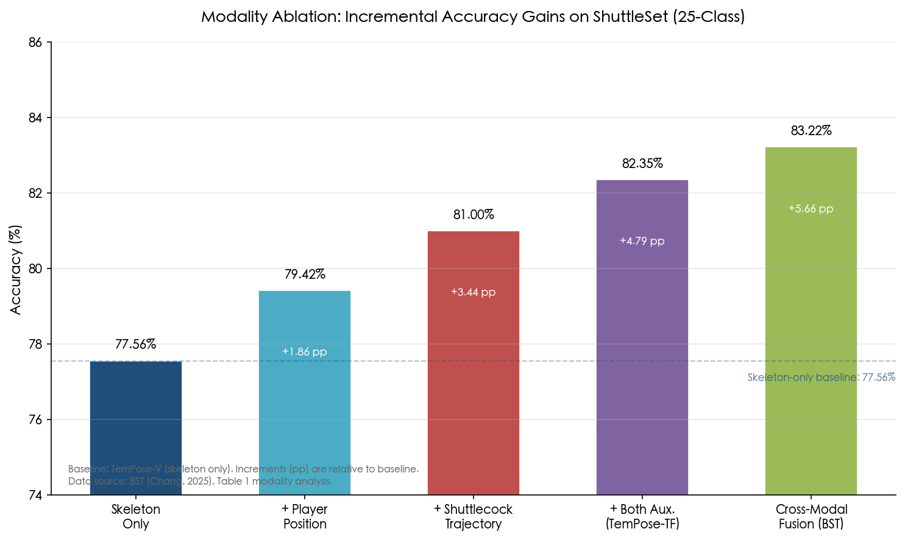

**Figure 2.1.** Modality ablation analysis on ShuttleSet (25 classes). Starting from the skeleton-only baseline (TemPose-V, 77.56%), accuracy improves incrementally with the addition of player position (+1.86 pp), shuttlecock trajectory (+3.44 pp), both auxiliary signals (+4.79 pp), and BST's cross-modal fusion (+5.66 pp). Data source: BST (Chang, 2025).

Asriani et al. (2026) explored an alternative hybrid pathway, combining RGB features with skeleton data through handcrafted descriptors (HOG, HOF, MBH, ROMI) and dynamic time warping (DTW), fused via a weighted soft-voting ensemble. This approach achieved 98.21% accuracy, though on a custom smaller-scale dataset rather than standardized benchmarks, which limits its comparability with the results above [Asriani et al. 2026](https://www.etasr.com/index.php/ETASR/article/view/15586 "Asriani et al., ETASR vol. 16, Feb 2026").

## 2.3 Model Architectures

### 2.3.1 Graph Convolutional Networks (GCNs)

GCNs model the human skeleton as a spatial graph in which joints serve as nodes and bones as edges, then apply spectral or spatial convolutions over both graph topology and the temporal dimension. ST-GCN (AAAI 2018) established this paradigm; subsequent architectures—MS-G3D, BlockGCN, SkateFormer, ProtoGCN—refine the message-passing scheme or introduce multi-scale temporal receptive fields. On the ShuttleSet benchmark, however, these architectures cluster within a narrow accuracy band of 76.5%–77.6% on 25 classes when using joint-only input, suggesting that marginal improvements in graph convolution design yield diminishing returns in the absence of richer input features [BST](https://arxiv.org/html/2502.21085v4 "Chang, Table 1").

### 2.3.2 Factorized Skeleton Transformers: TemPose

TemPose (CVPR Workshop 2023) introduces a factorized Transformer architecture with separate temporal and interaction layers, specifically designed for fine-grained racket-sport motions. The temporal layer captures per-joint motion patterns across frames, while the interaction layer models inter-joint dependencies within each frame. Two variants are defined: TemPose-TB employs time-block-wise decomposition, and TemPose-TF uses a fully factorized scheme.

On the Badminton Olympics (Bad OL) dataset (13 classes, 15,300 samples), TemPose-TF achieves 90.7% Top-1 accuracy with only 1.7 million parameters, substantially outperforming ST-GCN (82.0%), MS-G3D (83.2%), and AcT (83.7%) [TemPose](https://openaccess.thecvf.com/content/CVPR2023W/CVSports/papers/Ibh_TemPose_A_New_Skeleton-Based_Transformer_Model_Designed_for_Fine-Grained_Motion_CVPRW_2023_paper.pdf "Ibh et al., CVPRW 2023"). Notably, TemPose's Transformer depth requires careful tuning to avoid overfitting on the relatively small badminton datasets: performance peaks at depth L_T = 2, L_N = 2 (90.7%) and degrades to 85.2% at L_T = 8, L_N = 8—a 5.5 pp drop that illustrates how model capacity can easily exceed the statistical support available in current badminton corpora [TemPose](https://openaccess.thecvf.com/content/CVPR2023W/CVSports/papers/Ibh_TemPose_A_New_Skeleton-Based_Transformer_Model_Designed_for_Fine-Grained_Motion_CVPRW_2023_paper.pdf "Ibh et al., CVPRW 2023, Table 4").

### 2.3.3 Cross-Modal Fusion Transformer: BST

The Badminton Stroke-type Transformer (BST, 2025) represents the current state of the art for stroke classification. Its key architectural innovation is the Cross Transformer Layer, which performs cross-attention where keys (K) and values (V) derive from a shuttlecock trajectory latent representation while queries (Q) originate from player pose and position embeddings. This design enables the model to attend to trajectory features conditioned on the player's biomechanical state, effectively fusing the two most discriminative modalities through an attention-gated mechanism rather than simple feature concatenation.

On ShuttleSet (25 merged classes, 33,481 strokes), BST-CG-AP achieves 83.22% accuracy and 80.97% Macro-F1, surpassing TemPose-TF (82.35% accuracy, 80.28% Macro-F1). On the fine-grained 35-class split, BST-CG-AP reaches 77.80% accuracy and 71.16% Macro-F1, compared with TemPose-TF at 76.42% and 69.53% respectively [BST](https://arxiv.org/html/2502.21085v4 "Chang, arXiv:2502.21085, Feb 2025"). On BadmintonDB (9 classes per player, 7,658 strokes), BST-AP achieves 99.23% accuracy and 99.22% Macro-F1, further confirming its effectiveness while also indicating that this particular dataset is approaching performance saturation [BST](https://arxiv.org/html/2502.21085v4 "Chang, Table 4").

### 2.3.4 Temporal Backbone: TCN over Recurrent Architectures

Both TemPose and BST adopt Temporal Convolutional Networks (TCNs) as their temporal backbone—a deliberate choice over LSTM and GRU alternatives. TCNs offer parallelizable computation, stable gradients over long sequences, and flexible receptive field expansion through dilated convolutions, properties that make them well-suited for processing the variable-length stroke sequences encountered in badminton [TemPose](https://openaccess.thecvf.com/content/CVPR2023W/CVSports/papers/Ibh_TemPose_A_New_Skeleton-Based_Transformer_Model_Designed_for_Fine-Grained_Motion_CVPRW_2023_paper.pdf "Ibh et al., CVPRW 2023") [BST](https://arxiv.org/html/2502.21085v4 "Chang, Section 3.3.1"). The consistent adoption of TCNs across the two leading architectures suggests convergence in the community's understanding of appropriate temporal modeling for fine-grained sports actions.

### 2.3.5 Integrated Recognition and Quality Assessment

Li et al. (2025) present the first pipeline that integrates badminton stroke recognition with quality assessment. The system employs HRNet for pose estimation (83.2% mAP), followed by a SlowFast backbone for temporal feature extraction, achieving 83.08% Top-1 stroke classification accuracy. For quality assessment, a Siamese network compares the extracted stroke features against reference actions performed by expert players, generating a continuous quality score. This pipeline demonstrates that stroke classification need not serve merely as a categorical label; it can function as the foundation for continuous skill evaluation applicable to coaching and athlete development [Li et al. 2025](https://journals.sagepub.com/doi/10.1177/1088467X251353444 "Li et al., Intelligent Data Analysis, 2025").

## 2.4 The Role of Temporal Context and Adaptive Clipping

The temporal window surrounding a stroke event carries substantial discriminative information that extends beyond the biomechanics of the stroke itself. BST's adaptive clipping strategy, which selects 100 frames encompassing context from adjacent strokes—including the opponent's previous and subsequent actions—outperforms fixed-width clipping at 30 frames, improving accuracy from 82.54% to 83.22% on ShuttleSet (25 classes), a gain of 0.68 pp [BST](https://arxiv.org/html/2502.21085v4 "Chang, Appendix D"). The inclusion of the opponent's strokes provides contextual constraints rooted in the sequential logic of rally play: a net shot is more likely to follow a drop than to follow a clear, and a smash return is more likely to be a block or a lob than another smash. These contextual priors prove especially valuable for disambiguating kinematically similar strokes, as the biomechanical preparation for a smash and a drop may be nearly identical during the early frames of the motion.

## 2.5 The Deception Problem

Deceptive strokes represent a fundamental and domain-specific challenge for skeleton-based classification. Elite players deliberately perform misleading body movements—mimicking the preparation for a smash but executing a drop, or feinting a cross-court clear before playing a straight net shot—specifically to deceive their opponents. These deceptive movements are equally effective at deceiving skeleton-based classifiers, because the skeleton sequence during the preparation phase is intentionally crafted to resemble a different stroke type.

Shuttlecock trajectory provides a natural resolution to this ambiguity. As Chang (2025) observes, the trajectory "always reflects the actual stroke-type" regardless of the player's deceptive body motion [BST](https://arxiv.org/html/2502.21085v4 "Chang, Section 1"). This property renders trajectory-augmented models fundamentally more robust to deception than skeleton-only architectures—a finding with direct implications for the design of classification systems intended for elite-level competition analysis.

Park et al. (2019) investigated the human perception side of this problem through controlled perceptual experiments (n = 24), finding that kinematic information—global body motion patterns—is more reliable than non-kinematic cues for detecting deceptive movements in badminton, although human observers still rely heavily on contextual knowledge and competitive experience [Park et al. 2019](https://e-space.mmu.ac.uk/627947/ "Park et al., Perception 48(4), 2019"). The quantitative gap between computational deception detection and expert human performance remains largely unexplored, representing an opportunity for future investigation.

## 2.6 Performance Landscape and Error Analysis

### 2.6.1 Consolidated Benchmark Comparison

The following synthesis draws together results across the principal benchmarks to delineate the current performance frontier. On ShuttleSet (25 classes), the accuracy hierarchy is: BST-CG-AP (83.22%) > TemPose-TF (82.35%) > ST-GCN (77.58%) > SkateFormer (77.10%) > ProtoGCN (77.46%) > BlockGCN (76.52%). The approximately 6 pp gap between multi-modal BST and skeleton-only GCNs quantifies the cumulative contribution of shuttlecock trajectory and player position signals. On VideoBadminton (18 classes), the ranking among RGB methods is: SlowFast (82.80%) > Video Swin Transformer (81.99%) > PoseC3D (80.76%) > R(2+1)D (79.53%) > ST-GCN (74.41%), where appearance-based methods hold a slight edge given sufficient training data. On BadmintonDB (9 classes per player), BST-AP achieves a near-perfect 99.23%, establishing a performance ceiling that suggests this benchmark is approaching saturation and may no longer discriminate among future methods. Figure 2.2 visualizes the ShuttleSet comparison.

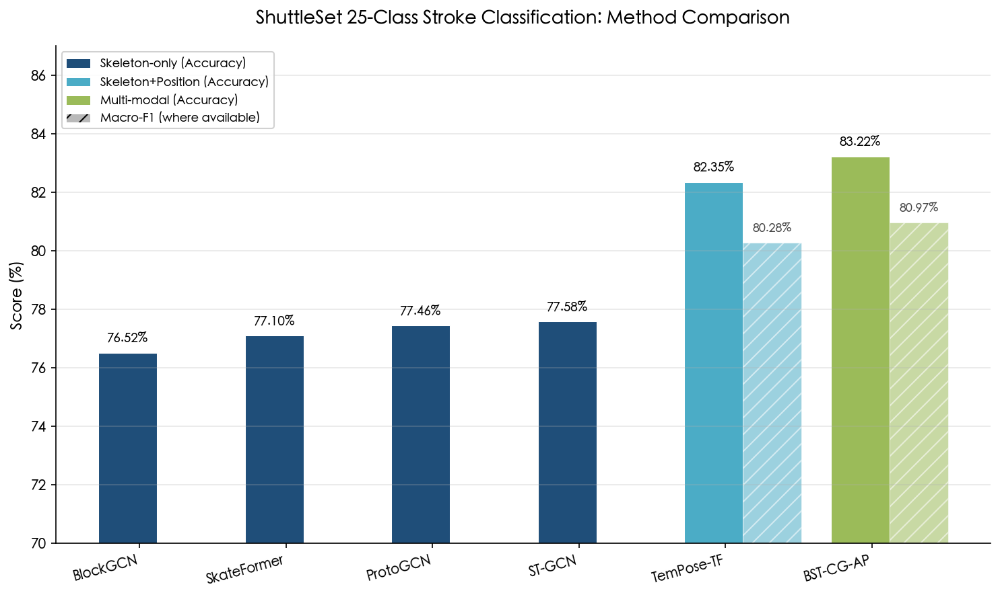

**Figure 2.2.** Comparison of six methods on ShuttleSet (25-class stroke classification). Skeleton-only methods (BlockGCN, SkateFormer, ProtoGCN, ST-GCN) cluster within 76–78% accuracy, while methods incorporating auxiliary signals (TemPose-TF, BST-CG-AP) achieve 82–83%, illustrating the ~6 pp gain from multi-modal fusion. Hatched bars indicate Macro-F1 where available.

### 2.6.2 Confusion Patterns and Residual Errors

Confusion matrices from BST reveal that the primary error sources are kinematically similar stroke pairs: "smash" versus "wrist smash," "return net" versus "defensive return drive," and other pairs where the preparation phase is visually near-identical and only the contact and follow-through phases diverge [BST](https://arxiv.org/html/2502.21085v4 "Chang, Appendix B"). These confusions are not merely classifier failures—they reflect genuine biomechanical ambiguity that challenges even expert human annotators. The inter-annotator agreement for fine-grained sub-type distinctions in FineBadminton required multi-round quality control with senior annotator arbitration to achieve acceptable consistency [FineBadminton](https://arxiv.org/html/2508.07554v1 "He et al., ACM MM 2025, Section 3.1"). This observation suggests that a portion of the residual error in current models may approach the irreducible noise floor set by human labeling uncertainty.

### 2.6.3 Multimodal Large Language Model Performance on Stroke Recognition

FineBadminton's FBBench benchmark provides the first systematic evaluation of Multimodal Large Language Models (MLLMs) on badminton stroke understanding. The Action category of FBBench (tasks T4–T6) tests fine-grained stroke classification, plausible return prediction, and temporal action localization. Results reveal substantial limitations in current general-purpose MLLMs: on overall multiple-choice accuracy, the best commercial model, Gemini 2.5 Pro with Hit-Centric Keyframe Selection, achieves only 38.62% (932/2,413 correct), while GPT-4.1 reaches 32.41% and Doubao 1.5 Pro reaches 35.47%. After domain-specific fine-tuning with both Keyframe Selection and Coordinate-Guided Condensation, however, the open-source Qwen2.5VL-7B achieves 42.06%, surpassing all commercial models [FineBadminton](https://arxiv.org/html/2508.07554v1 "He et al., ACM MM 2025, Table 1"). These results demonstrate that current general-purpose MLLMs lack the fine-grained spatio-temporal reasoning required for expert-level stroke analysis, but that targeted domain adaptation can close much of the gap even with substantially smaller model sizes.

## 2.7 Remaining Challenges and Open Problems

### 2.7.1 Automatic Stroke Boundary Detection

The reliance on pre-segmented clips represents the most significant practical limitation constraining deployment of stroke classification in real-world systems. Deploying stroke classification within end-to-end pipelines requires reliable temporal stroke boundary detection from continuous video. The F3SET framework's formalization of badminton strokes as instantaneous events with ±1-frame tolerance and the accompanying F3ED model's multi-label detection approach offer a promising direction, though the badminton-specific evaluation within F3SET remains in early stages [F3SET](https://arxiv.org/html/2504.08222v1 "Liu et al., ICLR 2025"). FineBadminton's VideoMAE-based hit-event detector represents a complementary approach, leveraging visual features from frames surrounding detected hits combined with spatial coordinate data for joint localization and classification [FineBadminton](https://arxiv.org/html/2508.07554v1 "He et al., ACM MM 2025, Section 3.2"). Bridging the gap between these proof-of-concept detectors and production-grade temporal segmentation remains a key challenge for the field.

### 2.7.2 Cross-Dataset Generalization

No systematic cross-dataset evaluation exists to date—for example, training on ShuttleSet and testing on BadmintonDB, or vice versa. Each dataset employs different annotation conventions, camera angles, resolution settings, and player populations, making it unclear whether current models learn generalizable stroke representations or overfit to dataset-specific visual statistics. The taxonomy misalignment across datasets (18 classes in ShuttleSet versus 9 in BadmintonDB versus 11+20 in FineBadminton) further complicates any attempt at cross-dataset benchmarking and raises the question of whether a unified taxonomy standard is needed for the field to advance.

### 2.7.3 Error Propagation from Upstream Detection

Classification accuracy is fundamentally bounded by the quality of upstream inputs. Pose estimation errors—particularly for the far-court player where image resolution is limited—propagate directly into skeleton-based classifiers. Shuttlecock trajectory gaps during occlusion (partially addressed by TrackNetV3's inpainting module but not fully solved) create missing-data challenges for trajectory-augmented models. Court homography errors distort the player position coordinates used by BST and TemPose as auxiliary features. Figure 2.3 illustrates the complete end-to-end pipeline and highlights the two primary error propagation pathways: pose estimation inaccuracies and trajectory occlusion gaps.

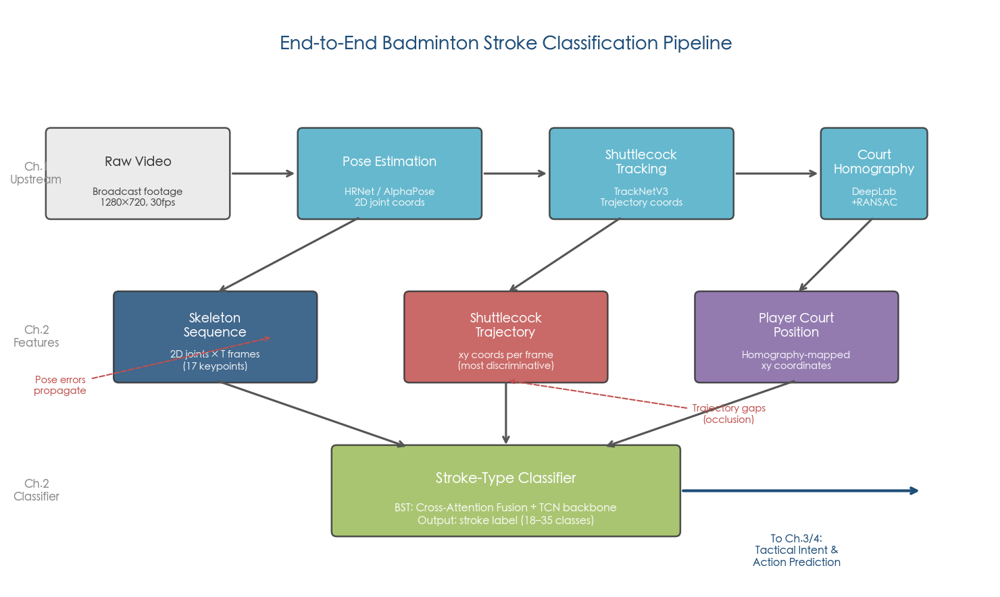

**Figure 2.3.** End-to-end stroke classification pipeline. Raw broadcast video is processed through three upstream modules—pose estimation (HRNet/AlphaPose), shuttlecock tracking (TrackNetV3), and court homography (DeepLab+RANSAC)—to extract skeleton sequences, shuttlecock trajectories, and player court positions. These features are fused by the BST classifier via cross-attention to produce stroke labels. Red annotations indicate the two principal error propagation paths: pose estimation inaccuracies and trajectory occlusion gaps. Classified strokes feed into downstream tactical intent and action prediction modules (Chapters 3–4).

A full pipeline evaluation that quantifies classification accuracy degradation as a function of upstream detection error rates has not yet been conducted—an important gap given that the practical value of stroke classification depends on its robustness within a complete system.

### 2.7.4 Real-World Deployment Considerations

The computational cost of the full recognition pipeline—pose estimation, shuttlecock tracking, and stroke classification—must be evaluated holistically rather than in isolation. While TCN-based classifiers themselves are lightweight, the upstream HRNet pose estimator and TrackNetV3 shuttlecock tracker impose substantial latency. For real-time coaching applications, the entire pipeline must operate within the approximately 300 ms reaction window of competitive play. Current architectures have not been benchmarked against this real-time constraint in an integrated end-to-end system, and the feasibility of meeting this latency target with existing hardware remains an open engineering question.

# Recognition of Tactical Intent Behind Singles Players' Actions

Tactical intent recognition constitutes the third stage of the badminton video analytics pipeline. Whereas stroke-type classification (Chapter 2) assigns biomechanical labels to individual actions—smash, clear, drop, net shot—tactical intent inference addresses a fundamentally harder question: *why* did the player choose that particular stroke at that particular moment? A smash aimed at the opponent's backhand corner signifies offensive pressure; the same stroke executed from an off-balance posture toward center court may represent a desperate defensive gambit. Bridging low-level action recognition with high-level strategic understanding requires modeling contextual features—player court positions, rally history, shuttlecock landing zones, opponent state—that extend well beyond the biomechanics captured by a single stroke clip.

Critically, errors from upstream pipeline stages cascade into tactical inference: a misidentified drop that was actually a deceptive cut will corrupt any heuristic or learned mapping from stroke types to tactical categories. This error propagation imposes a ceiling on tactical analysis quality that no downstream model can fully overcome.

This chapter examines three interrelated questions: how tactical intent categories can be formally defined and operationalized for computational modeling; which contextual features are most informative for intent inference; and what computational methods—from visual analytics and game-theoretic models to offline reinforcement learning and large language models—have been brought to bear on the problem.

## 3.1 Defining Tactical Intent: Taxonomies and Operationalization

### 3.1.1 From Stroke Types to Tactical Categories

The transition from individual stroke labels to tactical categories requires an explicit mapping that groups biomechanically diverse strokes by their strategic function. Three principal taxonomies have emerged in the computational literature, each reflecting different levels of granularity and alignment with coaching practice.

TIVEE (IEEE TVCG 2022) establishes a three-category tactical taxonomy: **offensive techniques** (smash, net shot, cut smash), **control techniques** (clear, drop, chop, push, hook shot, drive), and **defensive techniques** (lob, block). A "tactic" is formally defined as "a combination of consecutive strokes (containing at least two of a player's strokes)," and the minimal tactical unit consists of three consecutive strokes—the player's two strokes bracketing one intervening opponent stroke [TIVEE](https://ssxiexiao.github.io/papers/TIVEE.pdf "Chu et al., IEEE TVCG 2022, Section 3.2"). This three-stroke convention mirrors established practice in racket sports analysis; table tennis researchers have similarly adopted it as the standard unit for tactical pattern mining [ViSTec](https://vistec2024.github.io/static/paper.pdf "He et al., AAAI 2024, Section 'Data Descriptions'").

FineBadminton (ACM MM 2025) introduces the most fine-grained computational tactical taxonomy to date, decomposing each stroke into three annotation layers. At the Tactical Semantics level, the schema specifies 3 categories of player actions (offensive, defensive, and passive-transitional), 9 strategic classifications, and 6 types of shot characteristics. Notably, FineBadminton includes "deception" as an explicit intent label—the first dataset to operationalize this concept computationally. The dataset encompasses 3,215 rally clips containing 33,325 strokes drawn from 120 BWF singles matches [FineBadminton](https://arxiv.org/html/2508.07554v1 "He et al., ACM MM 2025, Sections 3.1/3.3").

BFMD (arXiv 2026) adopts a coarser mapping of fine-grained shot types into attack/control/defense categories, designed specifically for temporal tactical evolution analysis. Through sliding-window pattern matching across full match timelines, BFMD reveals dynamic strategic transitions—for instance, how a player shifts from a predominantly controlling strategy in the first game to an aggressive attacking posture in the second after securing a game lead [BFMD](https://arxiv.org/html/2603.25533v1 "Ding et al., arXiv:2603.25533, Section 3.5").

### 3.1.2 Court Zone Division as Spatial Context

Tactical intent cannot be inferred from stroke type alone; the spatial context—where on the court the stroke is executed and where the shuttlecock lands—is equally critical. Existing studies employ a range of court zone division schemes, and the choice of spatial granularity directly shapes the resolution at which tactical patterns can be analyzed.

TIVEE uses a 3×3×3 = 27-field three-dimensional division that combines court distance (front, mid, back), lateral position (left, center, right), and shuttlecock height (low, mid, high), producing the richest spatial representation at the cost of data sparsity for infrequent zone combinations [TIVEE](https://ssxiexiao.github.io/papers/TIVEE.pdf "Chu et al., IEEE TVCG 2022"). BadmintonVis adopts a simplified 6-zone scheme that prioritizes coaching readability [BadmintonVis](https://people.cs.nycu.edu.tw/~yushuen/data/BadmintonVis23.pdf "Chen et al., CGF 2023"). FineBadminton uses a 9-zone layout aligned with BWF coaching conventions, balancing granularity and statistical reliability [FineBadminton](https://arxiv.org/html/2508.07554v1 "He et al., ACM MM 2025"). CoachAI+ employs a 10-area division with finer net-front resolution. The gaming tree approach of Liu et al. adopts a 3×3 = 9 grid (front/mid/back × left/center/right) per side, recording both the starting position and the target placement of each stroke [Gaming Tree](https://www.mdpi.com/2076-3417/13/13/7380 "Liu et al., Applied Sciences 13(13):7380, 2023").

No consensus exists on an optimal spatial discretization, and the absence of a shared standard complicates cross-study comparison. Finer spatial granularity captures more tactical nuance but demands substantially more annotated data to avoid sparse cells—a fundamental tradeoff that remains unresolved across the field.

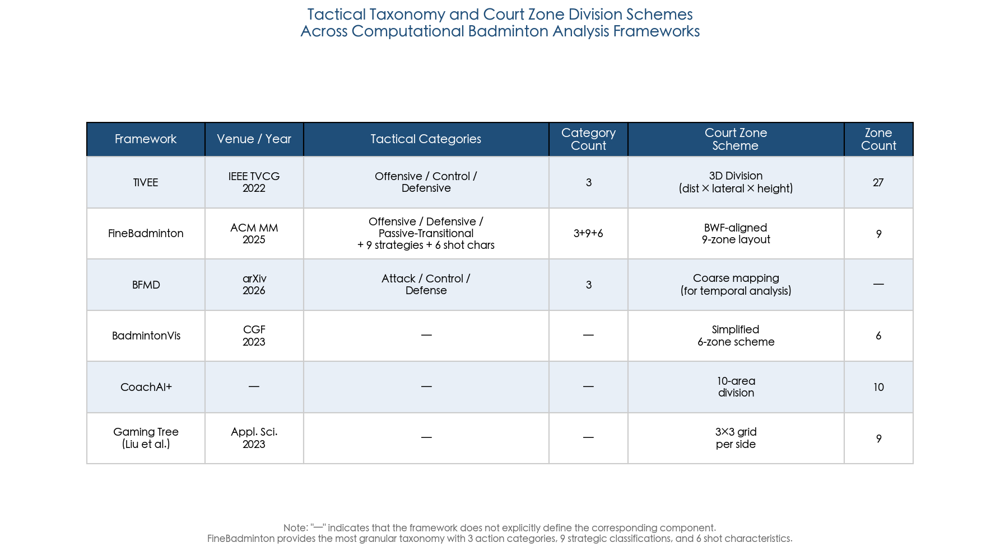

Figure 3.1 summarizes the tactical classification systems and court zone division schemes across the six principal frameworks reviewed in this section. The heterogeneity in both categorical definitions and spatial granularity underscores the lack of standardization that currently impedes cross-study comparison.

### 3.1.3 Tactic Aggregation and Scoring

Given a taxonomy of stroke types and a court zone scheme, tactical patterns can be mined by aggregating all three-stroke units sharing the same technique sequence and ranking them by a composite tactic score. TIVEE computes this score as the product of usage rate (how frequently a player employs a given three-stroke combination) and scoring rate (the fraction of rallies containing that combination that the player wins). Three-stroke tactical units are grouped, ranked, and presented to coaches in descending order of tactic score, enabling rapid identification of a player's most effective offensive patterns and most vulnerable defensive sequences [TIVEE](https://ssxiexiao.github.io/papers/TIVEE.pdf "Chu et al., IEEE TVCG 2022, Sections 4.1–4.3").

This aggregation principle extends naturally to other racket sports. ViSTec (AAAI 2024) demonstrates that stroke technique sequences extracted automatically from broadcast video can be analyzed to identify high-scoring-rate tactical combinations. In a case study on the 2022 World Table Tennis Cup, ViSTec found that the sequence "Serve → Short → Topspin" exhibited the highest scoring rate, while substituting a second "Short" after the initial "Serve → Short" caused a dramatic scoring rate drop to approximately 0.43—empirically confirming the coaching intuition that early offensive initiative increases win probability [ViSTec](https://vistec2024.github.io/static/paper.pdf "He et al., AAAI 2024, Case Study 2"). Although these specific findings pertain to table tennis, the analytical framework transfers directly to badminton, as both sports share the alternating-stroke rally structure and the three-stroke tactical unit convention.

## 3.2 Computational Approaches to Tactical Intent Inference

The computational methods for tactical intent inference span a broad spectrum—from deterministic heuristic mappings to learning-based models that operate on structured match data. Figure 3.2 provides an architectural overview of the full pipeline from raw video input through detection, stroke classification, and tactical inference, with methods grouped by analytical paradigm.

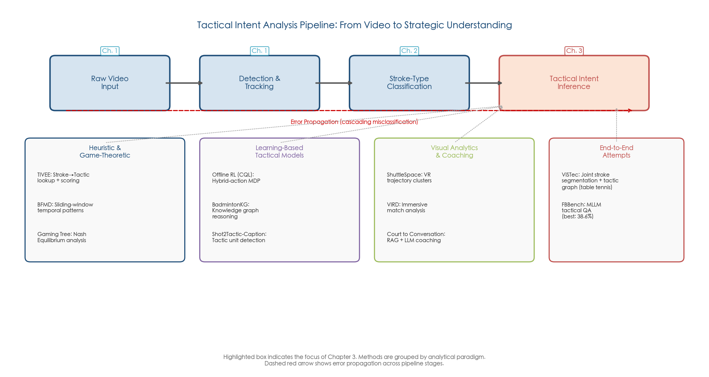

Figure 3.2 illustrates the modular pipeline architecture for tactical intent analysis, highlighting error propagation across stages and the four principal analytical paradigms: heuristic and game-theoretic methods, learning-based tactical models, visual analytics and coaching interfaces, and end-to-end attempts.

### 3.2.1 Heuristic Mapping from Stroke Types

The simplest approach to tactical intent classification maps each recognized stroke type to a predetermined tactical category via a lookup table—smash → offensive, lob → defensive, clear → control—and labels entire stroke sequences by the dominant category. Both BFMD and TIVEE employ this heuristic as their primary tactical labeling mechanism. The advantage lies in interpretability and zero additional model complexity; the limitation is that context is entirely ignored. A lob executed from deep in the backcourt after a forced defensive sequence carries a fundamentally different tactical meaning from a lob played from mid-court as a deliberate tempo-shifting maneuver, yet both receive the identical "defensive" label under heuristic mapping.

### 3.2.2 Game-Theoretic Tactical Analysis

Game theory provides a formal framework for evaluating tactical benefit by modeling the sequential decision-making of two opposing players. Liu et al. (2023) construct a gaming tree from 29 matches between Lin Dan and Lee Chong Wei spanning 2006–2018, representing each stroke as a node characterized by player identity, stroke technique, start position, and target placement on a 3×3 court grid. Each node accumulates a benefit score proportional to its contribution to rally outcomes, weighted so that later strokes, rallies, and games carry exponentially greater importance. Nash Equilibrium analysis on the resulting tree identifies each player's optimal strategy at every decision point: for Lin Dan, the highest-benefit tactic was directing the shuttlecock to the backcourt, whereas Lee Chong Wei's optimal strategy centered on forecourt control [Gaming Tree](https://www.mdpi.com/2076-3417/13/13/7380 "Liu et al., Applied Sciences 13(13):7380, 2023").

The predictive capability of this approach is noteworthy. When the top-5 highest-benefit strokes from historical matches are used to predict the first 5 strokes of subsequent encounters, prediction precision exceeds 90% for strokes that exist in the tree, demonstrating that elite players' tactical repertoires, while extensive, are sufficiently structured to be captured by tree-based enumeration [Gaming Tree](https://www.mdpi.com/2076-3417/13/13/7380 "Liu et al., Applied Sciences, 2023, Section 3.4"). The analysis also reveals how tactical repertoires evolve over careers: both players developed more diverse ways to defeat each other through the middle career period (2010–2015), but in their final encounters (2016–2018), the number of distinct tactical strategies decreased sharply—consistent with mutual familiarity forcing reliance on the most efficient techniques.

The principal limitation is data hunger: the gaming tree grows combinatorially with the number of zones, stroke types, and rally depth, confining practical analysis to well-documented rivalries with dozens of matches and precluding generalization to arbitrary player pairings.

### 3.2.3 Knowledge Graph-Based Tactical Reasoning

Hu et al. (IJACSA 2024) propose a complementary knowledge representation approach, constructing a badminton-domain knowledge graph (BadmintonKG) containing 9,742 entities, 135 relationship types, and 198,563 triples that cover players, tactics, techniques, courts, and coaching patterns. To address the heterogeneity of this graph, they introduce a heterogeneous graph splitting method combined with a cross-relational attention mechanism within relational graph neural networks, assigning varying weights to neighboring nodes across different relation types. Block-diagonal matrix decomposition reduces the parameter count for large-scale graph inference. On the BadmintonKG link prediction task (training subgraph size of 80,000), the proposed model achieves MRR of 0.2753 and Hits@10 of 0.4638, outperforming GCN (MRR 0.1910), GAT (MRR 0.2503), and R-GCN (MRR 0.2653) [Knowledge Graph](https://thesai.org/Downloads/Volume15No10/Paper_11-Knowledge_Graph_Based_Badminton_Tactics_Mining.pdf "Hu et al., IJACSA 15(10), 2024").

While these results demonstrate the feasibility of knowledge graph reasoning for badminton tactical structures, the approach currently operates on manually curated knowledge bases rather than automatically extracted video features. Bridging the gap between raw video perception and structured tactical knowledge representation remains an open challenge that limits the practical applicability of this paradigm.

### 3.2.4 Tactic Unit Detection and Captioning

Shot2Tactic-Caption (ACM MMSports 2025) addresses a more fine-grained task: given a sequence of recognized shot events, automatically detect valid tactic units, classify their type, and track their state (Interrupt or Resume) within ongoing rallies. The framework incorporates a Tactic Unit Detector that identifies valid three-stroke tactical segments from continuous shot sequences, along with a captioning module that generates natural-language descriptions of each tactic. The accompanying dataset contains 5,494 shot captions and 544 tactic captions, constituting the first large-scale tactic-level caption dataset for badminton [Shot2Tactic-Caption](https://arxiv.org/abs/2510.14617 "Ding et al., ACM MMSports 2025"). This work represents an important step toward bridging structured tactical analysis and natural-language coaching interfaces, although the captioning quality metrics have not yet been benchmarked against human expert annotations.

### 3.2.5 Offline Reinforcement Learning for Tactical Decision Modeling

A fundamentally different approach treats each stroke as an action within a Markov Decision Process (MDP), enabling the use of reinforcement learning to both evaluate and recommend tactical decisions. Liu et al. (EAAI 2026) formulate badminton tactics as a hybrid-action MDP where the state comprises player and opponent court positions plus the last action, and the action space is decomposed into a discrete component (shot type) and continuous components (landing position, player movement position). This formulation captures the essential structure of tactical decisions: a player must simultaneously choose *what* stroke to play (discrete) and *where* to place it (continuous).

The policy is trained via Conservative Q-Learning (CQL) on an offline dataset of 94 international singles matches encompassing 59,472 strokes. CQL achieves an average reward of 0.8703 ± 0.0786, outperforming Behavior Cloning (0.8482) and Decision Transformer (0.8027). The learned policy exhibits measurably more aggressive tactical behavior than the observed data: the Active Shot Type Rate increases from 0.3015 (observed) to 0.3526 (CQL policy), and the Average Distance of Opponent Landing Position rises from 0.2185 to 0.3898, indicating that the RL agent learns to mobilize the opponent more aggressively across the court [Offline RL Badminton](https://wenminggong.github.io/papers/Offline_RL_for_Badminton_EAAI_paper.pdf "Liu et al., EAAI 2026, Tables 5/8").

A critical innovation is the preference-based reward model that learns from rally outcomes rather than requiring explicit reward engineering. This model achieves 96.92% rally-preference accuracy and 92.27% action-preference accuracy when the outcome (win/loss) is known. However, non-terminal rally-preference accuracy—the ability to distinguish tactical quality *during* a rally before the outcome is determined—drops to approximately 59%, barely above chance for binary classification. This finding exposes a fundamental limitation: current models learn tactical quality primarily from win/lose signals rather than from expert-annotated intent, and distinguishing mid-rally tactical quality from outcome data alone remains largely intractable [Offline RL Badminton](https://wenminggong.github.io/papers/Offline_RL_for_Badminton_EAAI_paper.pdf "Liu et al., EAAI 2026, Table 4").

Additional limitations merit emphasis: the framework employs myopic one-step policy evaluation only; the underlying "winner is superior" assumption ignores the stochastic nature of individual rallies; the policy produces a 0.80% irrational shot type rate (predicting physically implausible strokes) and a 3.17% out-of-bounds action rate; and no real-world coaching validation has been conducted. The RL framework also explicitly excludes score state as a state variable—a significant omission given that tactical intent is widely understood to be score-dependent in competitive play [Offline RL Badminton](https://wenminggong.github.io/papers/Offline_RL_for_Badminton_EAAI_paper.pdf "Liu et al., EAAI 2026, Section 7").

## 3.3 Deception Detection: The Adversarial Dimension of Tactical Intent

Deception constitutes a core tactical weapon in badminton: a player deliberately performs misleading body movements—initiating a smash motion but executing a drop, or feinting a cross-court clear before playing a straight net shot—to delay the opponent's response. This adversarial dimension of tactical intent cannot be resolved through pure stroke-type analysis, as the deceptive motion is designed precisely to make the executed stroke appear to be something else.

Park et al. (2019) conducted human perception studies (n = 24) establishing that kinematic information (global body motion) is more reliable than non-kinematic cues for detecting deceptive movements in badminton. Observers who attended to full-body motion trajectories rather than isolated limb positions were significantly better at distinguishing genuine from deceptive strokes [Park et al. 2019](https://e-space.mmu.ac.uk/627947/ "Park et al., Perception 48(4), 2019"). This finding aligns with BST's observation that shuttlecock trajectory "always reflects the actual stroke-type" regardless of deceptive body movements—the shuttlecock does not lie, even when the body does [BST](https://arxiv.org/html/2502.21085v4 "Chang, 2025, Section 1").

FineBadminton is the first dataset to include explicit deception intent labels for computational training, thereby enabling supervised learning approaches to deception detection. However, no dedicated computational deception detection model has yet been published. The necessary components exist—skeleton sequences from pose estimation, shuttlecock trajectories from TrackNet, and deception labels from FineBadminton—but they have not been integrated into a unified detection system [FineBadminton](https://arxiv.org/html/2508.07554v1 "He et al., ACM MM 2025"). A contrastive learning framework comparing skeleton-predicted intent against trajectory-confirmed stroke type could provide a natural architecture for this task, leveraging the discrepancy between body motion (which can deceive) and shuttlecock trajectory (which cannot) as a supervisory signal.

## 3.4 Visual Analytics and Coaching Interfaces

### 3.4.1 Immersive Visual Analytics Systems

A complementary line of research focuses on making tactical analysis accessible to coaches through interactive visual analytics tools, rather than pursuing fully automated intent classification. Three systems published in IEEE TVCG form a coherent methodological progression.

**ShuttleSpace** (IEEE TVCG 2021, 116 citations) pioneers immersive visualization of badminton tactics by clustering shuttlecock trajectories and rendering them in a VR first-person perspective, enabling coaches to experience rallies from the player's viewpoint [ShuttleSpace](https://www.computer.org/csdl/journal/tg/2021/02/09222313/1nTr29xEpkk "Ye et al., TVCG 2021"). **TIVEE** (IEEE TVCG 2022, 86 citations) extends this paradigm by incorporating tactic sequence analysis within a multi-court VR environment, enabling coaches to compare tactical patterns across matches and identify exploitable tendencies [TIVEE](https://ssxiexiao.github.io/papers/TIVEE.pdf "Chu et al., TVCG 2022"). **VIRD** (IEEE TVCG 2024, 47 citations) supports end-to-end immersive match analysis and has been validated with Olympic athletes, demonstrating that visual analytics tools can meet the demands of elite-level coaching [VIRD](https://arxiv.org/abs/2307.12539 "Lin et al., TVCG 2024").

### 3.4.2 ViSTec: Bridging Video Perception and Tactical Analysis

ViSTec (AAAI 2024) represents a significant methodological advance by directly connecting video-level stroke recognition with downstream tactical analysis within a single framework. The architecture comprises a two-stage action perception module (VideoMAE-based stroke segmentation followed by technique classification) and a domain knowledge module that explicitly models technique-transition dependencies via a directed graph. The graph assigns transition weights between stroke techniques, incorporating contextual knowledge as an inductive prior during joint training. On a World Table Tennis (WTT) broadcast video dataset of 4,000 rally clips, ViSTec achieves 83.5% frame-wise accuracy and F1@50 of 78.5%, significantly outperforming state-of-the-art action segmentation models including ASFormer (77.5% accuracy), UVAST (76.1%), and MS-TCN (78.2%) [ViSTec](https://vistec2024.github.io/static/paper.pdf "He et al., AAAI 2024, Table 1").

Ablation experiments confirm that the graph module contributes meaningfully: removing it degrades accuracy from 83.5% to 82.0%, and further removing the adaptive uncertainty term from the graph weight update reduces accuracy to 82.2%. ViSTec processes broadcast video at 39.3 fps on a single A100 GPU, exceeding the typical 30 fps broadcast frame rate and thus enabling real-time processing [ViSTec](https://vistec2024.github.io/static/paper.pdf "He et al., AAAI 2024"). Although ViSTec was demonstrated on table tennis, its architecture—combining sparse visual features with contextual knowledge graphs for technique-to-tactic inference—is directly applicable to badminton, particularly given the shared three-stroke tactical unit convention between the two sports.

### 3.4.3 LLM-Based Tactical Interpretation

The most recent development in tactical analysis leverages large language models (LLMs) to generate natural-language tactical interpretations from structured match data. "Court to Conversation" (Knowledge-Based Systems 333:115027, 2026) presents a novel end-to-end system that converts computer vision outputs—player positions, stroke types, shuttlecock trajectories—into structured tactical representations, then employs Retrieval-Augmented Generation (RAG)-enhanced LLMs to produce conversational tactical analysis for coaching applications [Court to Conversation](https://www.sciencedirect.com/science/article/abs/pii/S0950705125020659 "Bharadwaj & Srinivasa, KBS 333:115027, 2026"). This system bridges the gap between raw visual analytics and the natural-language format through which coaches actually communicate tactical insights to players.

The FineBadminton benchmark (FBBench) reveals, however, the substantial chasm between current multimodal LLM capabilities and human-expert tactical understanding. On tactical multiple-choice questions grounded in match video, the best-performing model—Gemini 2.5 Pro—achieves only 38.62% accuracy, while GPT-4.1 scores approximately 30% [FineBadminton](https://arxiv.org/html/2508.07554v1 "He et al., ACM MM 2025, Table 1"). These results indicate that tactical comprehension—requiring simultaneous reasoning about spatial configurations, temporal dynamics, and strategic context—remains well beyond the capabilities of current general-purpose multimodal models.

## 3.5 The Tactical Intent Gap: Open Challenges

### 3.5.1 Absence of Quantitative Intent Classification Benchmarks

The most significant gap in the current literature is the absence of quantitative tactical intent classification accuracy—no published study reports F1 or accuracy specifically for an offensive/defensive/transitional classification task as a standalone supervised learning problem. Existing approaches either map stroke types heuristically to tactical categories (TIVEE, BFMD), generate natural-language descriptions without classification metrics (Shot2Tactic-Caption), or operate at the rally-outcome level (offline RL). FineBadminton provides the annotation infrastructure for a supervised intent classifier, but no model has been trained and evaluated on its tactical labels as a classification task with standard metrics. Figure 3.3 quantifies this performance landscape, highlighting the disparity across different formulations and the gap between structured methods and end-to-end multimodal approaches.

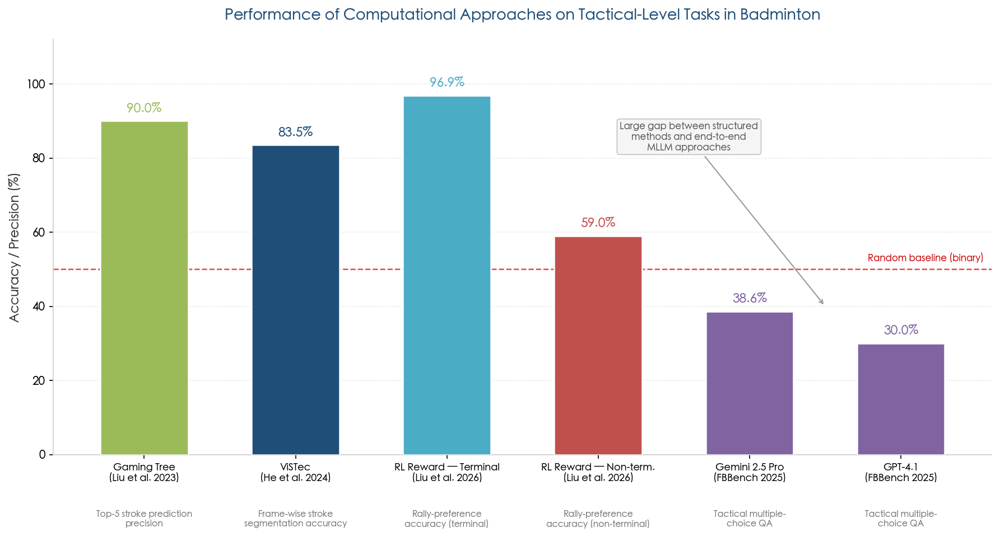

Figure 3.3 compares the performance of six computational approaches on tactical-level tasks. The gaming tree achieves 90.0% top-5 stroke prediction precision on a well-documented rivalry, and the RL reward model reaches 96.9% rally-preference accuracy on terminal rallies; however, non-terminal tactical quality assessment (59.0%) and MLLM-based tactical reasoning (Gemini 2.5 Pro at 38.6%, GPT-4.1 at 30.0%) remain close to or below the random baseline, underscoring the fundamental difficulty of automated tactical comprehension.

### 3.5.2 Score State and Match Momentum

No published study quantitatively demonstrates how incorporating score state improves tactical intent prediction. The offline RL framework of Liu et al. (EAAI 2026) explicitly excludes score state from the state representation, despite the well-established coaching convention that tactical intent is deeply score-dependent—players adopt more conservative strategies when leading and more aggressive strategies when trailing, particularly at game point or set point [Offline RL Badminton](https://wenminggong.github.io/papers/Offline_RL_for_Badminton_EAAI_paper.pdf "Liu et al., EAAI 2026"). The gaming tree analysis of the Lin Dan–Lee Chong Wei rivalry indirectly acknowledges this by weighting later rallies and games with exponentially higher importance, but does not model score state as an explicit conditioning variable [Gaming Tree](https://www.mdpi.com/2076-3417/13/13/7380 "Liu et al., Applied Sciences, 2023"). Integrating score state as a contextual feature in tactical models represents a clear and actionable research direction.

### 3.5.3 Non-Terminal Tactical Quality Assessment

The approximately 59% non-terminal rally-preference accuracy of the offline RL reward model exposes a deep difficulty: distinguishing good tactical play from bad tactical play *before the rally ends* is a problem that current computational methods handle only marginally better than random guessing. Human coaches routinely make such assessments—recognizing that a player has "seized the initiative" or "been forced onto the back foot"—but formalizing this mid-rally tactical quality judgment into a learnable signal remains an unsolved problem. Addressing this challenge likely requires expert-annotated per-stroke intent labels (as provided by FineBadminton's Tactical Semantics layer) rather than weak supervision from rally outcomes alone.

### 3.5.4 From Pipeline to End-to-End

The dominant paradigm for tactical analysis remains a modular pipeline: detection → tracking → stroke classification → heuristic tactical mapping. Each stage introduces errors that compound downstream, as illustrated by the error propagation path in Figure 3.2. An end-to-end alternative—directly inferring tactical intent from raw video without intermediate stroke classification—has not been explored for badminton. The FBBench evaluation of multimodal LLMs represents a first, though largely unsuccessful, attempt at end-to-end tactical understanding from video. The ViSTec framework, which jointly trains stroke segmentation, classification, and tactical graph modules, offers a more promising intermediate architecture that preserves interpretability while permitting gradient flow across stages.

### 3.5.5 Computational Deception Detection

Despite the availability of deception labels in FineBadminton and the demonstrated importance of deception in competitive play, no dedicated computational model for deception detection has been published. The required components—skeleton sequences, shuttlecock trajectories, and supervised labels—are all available, indicating that this is a tractable research direction with immediate practical value for coaching applications. The convergence of annotation infrastructure and perception capabilities suggests that deception detection represents one of the most actionable near-term opportunities in tactical intent research.

## 3.6 Summary

Tactical intent recognition in badminton has progressed from manual coaching observation to computational frameworks combining visual analytics, game-theoretic modeling, knowledge graph reasoning, and reinforcement learning. The establishment of formal tactical taxonomies (offensive/control/defensive), standardized court zone schemes, and the three-stroke tactical unit convention provides a shared vocabulary for computational analysis. ViSTec demonstrates that technique-to-tactic inference can be automated from broadcast video at real-time speed (39.3 fps on A100). Offline RL reveals that learned policies generate measurably more aggressive tactical behavior than observed human play data, with the Active Shot Type Rate increasing from 0.3015 to 0.3526. Knowledge graph reasoning and gaming tree analysis offer complementary structural perspectives on tactical patterns, with the gaming tree achieving over 90% prediction precision on well-documented rivalries.

The field nonetheless remains at a nascent stage compared to stroke-type classification. Quantitative tactical intent classification benchmarks do not exist. Score state—a variable coaches consider fundamental—has not been integrated into any computational model. Mid-rally tactical quality assessment hovers near chance accuracy at approximately 59%. Deception detection lacks a dedicated model. The best multimodal LLMs achieve only 38.62% on tactical reasoning questions (Gemini 2.5 Pro), far below human coaching expertise. The FineBadminton dataset, with its multi-level annotations spanning foundational actions, tactical semantics, and decision evaluation, provides the most promising foundation for addressing these gaps. Bridging the chasm between automated stroke classification (Chapter 2) and meaningful tactical understanding remains the central open challenge for this component of the badminton video analytics pipeline, and it constitutes a prerequisite for the action prediction systems examined in Chapter 4.

# Prediction of Singles Players' Subsequent Actions

Action prediction occupies the final and most cognitively demanding stage of the badminton video analytics pipeline. Object detection (Chapter 1) answers *where* the players and shuttlecock are; stroke-type classification (Chapter 2) determines *what* action is being performed; tactical intent recognition (Chapter 3) infers *why* a player chose a given stroke. Action prediction confronts the most ambitious question: *what will happen next?* Given a partially observed rally—a sequence of stroke types, landing locations, and player positions—the task is to forecast the next stroke type, the shuttlecock's landing position, and both players' subsequent court movements. This chapter examines how the prediction problem is formally defined, which sequence modeling and reinforcement learning architectures achieve the strongest performance, how different approaches handle the inherent uncertainty and multi-modality of human decision-making, and where the gap between research accuracy and practical coaching utility currently stands. Because action prediction sits at the terminus of the perception-to-cognition pipeline, it is maximally sensitive to cascaded errors: detection failures from Chapter 1, stroke misclassifications from Chapter 2, and tactical misinterpretations from Chapter 3 all propagate into the rally representations on which prediction models condition, making this the most error-sensitive component of the full system.

## 4.1 Problem Formulation and Prediction Targets

### 4.1.1 The Canonical Stroke Forecasting Formulation

ShuttleNet (AAAI 2022) established the canonical formulation that subsequent work has adopted with minor variations. A badminton rally is represented as a sequence of strokes $R = \{S_1, S_2, \ldots, S_{|R|}\}$, where each stroke $S_t$ consists of a shot type $s_t$ drawn from a discrete set (typically 10 categories: net shot, lob, defensive shot, smash, drop, push/rush, short service, clear, drive, long service) and a landing area coordinate $(x_t, y_t)$ on the normalized court. Given $\tau$ observed strokes, the objective is to predict all future strokes $\{S_{\tau+1}, \ldots, S_{|R|}\}$. ShuttleNet further conditions on the pair of players $P = (p_a, p_b)$, enabling the model to learn player-specific tendencies [ShuttleNet](https://ojs.aaai.org/index.php/AAAI/article/view/20341/20100 "Wang et al., AAAI 2022").

This formulation embeds several consequential design decisions. First, the prediction target is generative rather than classificatory: models must produce entire future rally continuations, not merely the next single stroke. Second, the stochastic evaluation protocol—generating $K$ sample sequences (typically $K = 6$ or $K = 10$) and evaluating the closest to ground truth—explicitly acknowledges that multiple plausible continuations exist for any given rally prefix. Third, evaluation metrics reflect the dual nature of the prediction targets: cross-entropy (CE) for shot type distributions and mean squared error (MSE) / mean absolute error (MAE) for landing area coordinates [ShuttleNet](https://ojs.aaai.org/index.php/AAAI/article/view/20341/20100 "Wang et al., AAAI 2022").

### 4.1.2 Extending to Movement Forecasting

DyMF (AAAI 2023) extended the prediction target beyond stroke forecasting to encompass the court positions of *both* players after each stroke. At each time step, the model predicts not only the shot type $s_t$ and shuttlecock landing position but also the 2D coordinates of both the striking player and the defending player: $L_t = \{L_t^a, L_t^b\}$, where $L_t^a = (l_{ax}^t, l_{ay}^t)$ and $L_t^b = (l_{bx}^t, l_{by}^t)$. This extended formulation captures a crucial tactical dimension: player positioning for defense after executing a stroke is itself a strategic choice that reveals intent and constrains the opponent's response options [DyMF](https://arxiv.org/abs/2211.12217 "Chang et al., AAAI 2023").

The distinction between "where to hit" and "where to move" carries substantial strategic significance. A player who returns a lob and repositions to the center court signals readiness for multiple response types; the same player returning the same lob but remaining near the net reveals either confidence in a weak opponent return or a deliberate tactical gamble. Movement forecasting thus subsumes stroke forecasting while adding a layer of strategic modeling that pure shot-type prediction cannot capture.

### 4.1.3 Evaluation Metrics and Protocols

The evaluation ecosystem for badminton action prediction has converged on a standardized suite of metrics, shaped largely by the CoachAI Badminton Challenge series. For shot type prediction, cross-entropy (CE) measures the distributional quality of predicted shot-type probabilities, while top-$k$ accuracy ($k = 1, 2, 3, 5$) provides a more interpretable classification perspective. For spatial predictions—both shuttlecock landing positions and player locations—MSE, MAE, and root mean squared error (RMSE) quantify coordinate-level accuracy. Beyond point-wise metrics, Dynamic Time Warping (DTW) evaluates the temporal similarity of generated rally sequences, Jensen-Shannon Divergence (JSD) assesses rally length distributions, and Earth Mover's Distance (EMD) compares the spatial distributions of predicted versus actual landing positions [ShuttleNet](https://ojs.aaai.org/index.php/AAAI/article/view/20341/20100 "Wang et al., AAAI 2022") [ShuttleSet22](https://ar5iv.labs.arxiv.org/html/2306.15664 "Du & Peng, IJCAI 2024").

The CoachAI Badminton Challenge 2023 (IJCAI 2023, Track 2) provided the first standardized benchmark for stroke forecasting, using ShuttleSet22 with 30,172 training strokes and 2,040 test strokes across 2,888 rallies from 2022 high-ranking matches. The challenge adopted a combined score (CE + MAE) as the primary ranking metric. The winning team achieved a total score of 2.5776 (CE = 1.7892, MAE = 0.7884), compared to the ShuttleNet baseline of 2.8774. Notably, 11 of 16 participating teams outperformed ShuttleNet, yet improvements were concentrated in shot type CE while area MAE barely improved—suggesting that spatial prediction accuracy had plateaued under the available data and representations [ShuttleSet22](https://ar5iv.labs.arxiv.org/html/2306.15664 "Du & Peng, IJCAI 2024").

## 4.2 Sequence Modeling Architectures

### 4.2.1 ShuttleNet: The Foundational Architecture

ShuttleNet introduced three architectural innovations that remain influential in subsequent work. The **Transformer-Based Rally Extractor (TRE)** processes the full rally sequence with a type-area disentangled attention mechanism, applying separate attention heads to shot-type embeddings and area-coordinate embeddings before fusing them. This disentanglement reflects the insight that the sequential dependencies governing shot-type choices differ fundamentally from those governing spatial placement. The **Transformer-Based Player Extractor (TPE)** separates the interleaved rally sequence into two player-specific subsequences, enabling the model to capture each player's individual style and tendencies without interference from the opponent's interleaved strokes. The **Position-Aware Gated Fusion Network (PGFN)** dynamically weights the contributions of rally progress context and player style context based on the current rally position [ShuttleNet](https://ojs.aaai.org/index.php/AAAI/article/view/20341/20100 "Wang et al., AAAI 2022").

On 75 matches (43,191 strokes) with $\tau = 8$ observed strokes, ShuttleNet achieves CE = 1.9802, MSE = 1.5856, and MAE = 1.3802, outperforming Seq2Seq LSTM (CE = 2.5219) and vanilla Transformer (CE = 2.3843) by 21.5% and 17.0% respectively in shot type CE. The performance gap widens under shorter observation windows: at $\tau = 2$, ShuttleNet's advantage over Seq2Seq grows to 24.0% in CE, indicating superior ability to extract predictive signal from minimal context [ShuttleNet](https://ojs.aaai.org/index.php/AAAI/article/view/20341/20100 "Wang et al., AAAI 2022").

### 4.2.2 DyMF: Graph-Based Movement Forecasting

DyMF introduced the Player Movements (PM) graph to represent strategic relations between players' locations across time steps. The PM graph connects player position nodes via 12 relation types: 10 shot types (net shot, lob, defensive shot, smash, drop, push/rush, short service, clear, drive, long service) and 2 movement purpose types (defend, return). This relational structure captures qualitatively different movement semantics—a player moving toward the corner to return a drop shot versus moving toward the center to defend—that flat sequence models conflate.

The architecture comprises an encoder-decoder structure with two principal modules: **Interaction Style Extractors**, which combine Relational GCN (for inter-player interactions via the PM graph) with Dynamic GCN (using pattern-generated weights from a Conv1D + LSTM pipeline to capture evolving individual player tactics); and **Hierarchical Fusion** modules, which integrate player-player style influence with rally interaction context through parallel co-attention and gated fusion.

On the same 75-match dataset at $\tau = 8$, DyMF achieves MSE = 1.0827, MAE = 1.5739, and CE = 1.9570, yielding improvements of up to 35.3% in MSE, 21.5% in MAE, and 24.3% in CE over the weakest baselines, while consistently outperforming ShuttleNet across all metrics (ShuttleNet: MSE = 1.1399, MAE = 1.6360, CE = 1.9654). Ablation analysis confirms that the dynamic GCN module contributes the largest individual improvement; its removal degrades MSE by 9.6%, from 1.0827 to 1.1838 [DyMF](https://arxiv.org/abs/2211.12217 "Chang et al., AAAI 2023, Tables 1 and 3").

### 4.2.3 RallyTemPose: Incorporating Skeleton Pose Data

RallyTemPose (CVPR Workshop 2024) represents the first model to incorporate skeleton pose data into stroke prediction, building on the TemPose architecture discussed in Chapter 2. The model fuses four input modalities: player skeleton poses, player court positions, shuttlecock trajectory, and rally context. On ShuttleSet, RallyTemPose achieves 54.3% top-1 accuracy, 77.3% top-2, and 92.5% top-3 for next-shot type prediction, outperforming Seq2Seq LSTM (47.9% top-1) and vanilla Transformer (49.8% top-1) [RallyTemPose](https://openaccess.thecvf.com/content/CVPR2024W/CVsports/papers/Ibh_A_Stroke_of_Genius_Predicting_the_Next_Move_in_Badminton_CVPRW_2024_paper.pdf "Ibh et al., CVPRW 2024").

A particularly noteworthy finding from RallyTemPose concerns modality ablation. Player ground position emerges as the most critical input, contributing +2.6 percentage points to accuracy from its inclusion. Skeleton pose adds meaningful but smaller improvements, suggesting that body posture contains predictive information about the upcoming stroke beyond what court position alone provides. The model also reveals substantial inter-player variability: prediction accuracy varies by more than 20 percentage points across different players, indicating that some players are inherently more "readable"—their stroke choices are more predictable from prior context—than others. This finding carries direct practical implications: an opponent scouting system could quantify each player's predictability and identify which players are most vulnerable to anticipation-based strategies [RallyTemPose](https://openaccess.thecvf.com/content/CVPR2024W/CVsports/papers/Ibh_A_Stroke_of_Genius_Predicting_the_Next_Move_in_Badminton_CVPRW_2024_paper.pdf "Ibh et al., CVPRW 2024").

### 4.2.4 SPAIT: Position-Adaptive Inference

SPAIT (Journal of Big Data, 2026) addresses a fundamental limitation shared by ShuttleNet and DyMF: the inconsistency between predicted shot types and predicted player positions. Earlier models occasionally predict physically implausible combinations—such as a net shot executed from the deep backcourt—because shot type and position are predicted by separate decoder heads without mutual constraints. SPAIT proposes three architectural solutions. The **Area Position Feature-Encoder (APF-Encoder)** jointly models continuous (position coordinates) and discrete (shot type) representations within a unified Transformer framework. The **Guidance Mask (GM)** mechanism employs masking and positional encoding to constrain predictions to feasible movement regions, simultaneously accelerating convergence. The hierarchical **Infer-Decoder** builds explicit connections between shot types and player positions through cascaded inference steps, ensuring that predicted positions remain consistent with predicted shot types [SPAIT](https://link.springer.com/article/10.1186/s40537-026-01407-7 "Jhang et al., J Big Data, 2026").

Experimental results on ShuttleSet22 demonstrate that SPAIT outperforms DyMF across multiple evaluation dimensions: on average, SPAIT improves Average Displacement Error (ADE) by 9.72%, Final Displacement Error (FDE) by 11.51%, and Shot-type Error Rate (SER) by 15.14% [SPAIT](https://link.springer.com/article/10.1186/s40537-026-01407-7 "Jhang et al., J Big Data, 2026"). The consistency constraint represents a conceptual advance: by enforcing coherence between the "what" (shot type) and "where" (player position) predictions, SPAIT reduces the proportion of physically implausible outputs that would undermine coaching trust in any deployed system.

## 4.3 Handling Prediction Uncertainty

### 4.3.1 The Multi-Modality Problem

A fundamental challenge in action prediction is that human decision-making is inherently multi-modal: at any given decision point, a skilled player has multiple plausible options, and the "correct" prediction is a distribution over possibilities rather than a single deterministic output. A player at the net facing a high lift has at least three viable responses—smash cross-court, drop straight, or clear to the backcourt—each with meaningful probability. Models that output point estimates miss this distributional structure, while models that average across modes produce blurred predictions corresponding to no plausible action.

Three paradigms have emerged for handling this uncertainty, each embodying different assumptions about the shape of the predictive distribution. Figure 4.1 illustrates how these three paradigms represent the same multi-modal decision scenario.

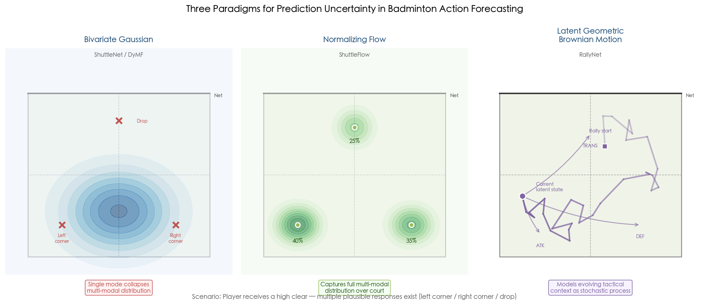

### 4.3.2 Parametric Gaussian Assumption

ShuttleNet and DyMF both model landing position distributions as bivariate Gaussians, parameterized by mean $(μ_x, μ_y)$, variance $(σ_x, σ_y)$, and correlation coefficient $ρ$. This approach offers computational simplicity—only five parameters per distribution—and straightforward sampling. However, ShuttleFlow (Machine Learning, 2025) demonstrates empirically that the bivariate Gaussian assumption is invalid for badminton landing distributions, which are frequently multi-modal. A player receiving a high clear, for instance, has roughly equal probability of playing to the left or right rear corner, producing a bimodal distribution that no single Gaussian can represent without collapsing to the midpoint between the two modes [ShuttleFlow](https://link.springer.com/article/10.1007/s10994-024-06682-0 "Lien et al., Machine Learning 114(2), 2025").

### 4.3.3 Normalizing Flows: Full Distribution Modeling

ShuttleFlow reframes stroke prediction as a distribution modeling problem using conditional normalizing flows—a class of invertible neural networks that learn bijective transformations between a simple base distribution and the complex target distribution. By modeling the full conditional distribution $p(x_{t+1}, y_{t+1} | S_1, \ldots, S_t)$ without parametric constraints, normalizing flows can capture arbitrary multi-modal structures.

The empirical gains are substantial. On 78 games (3,553 rallies), ShuttleFlow achieves approximately 3× lower shuttlecock position RMSE ($\approx 0.17$ vs. ShuttleNet's $\approx 0.53$) and approximately 25% lower shot type CE ($\approx 1.6$ vs. $\approx 2.0$). The distributional output also enables qualitatively new coaching applications: predicted probability densities can be visualized over the court surface, identifying not only the most likely landing zone but also secondary options and their relative probabilities. This visualization modality is arguably more informative for coaching than point predictions, as it communicates the full range of threats a player must defend against [ShuttleFlow](https://link.springer.com/article/10.1007/s10994-024-06682-0 "Lien et al., Machine Learning 114(2), 2025").

The cost of distributional modeling is computational. ShuttleFlow requires approximately 0.5 seconds on an RTX 4090 GPU to generate 96 samples—a latency that exceeds the approximately 0.3-second reaction window available in live play, currently precluding real-time deployment [ShuttleFlow](https://link.springer.com/article/10.1007/s10994-024-06682-0 "Lien et al., Machine Learning 114(2), 2025").

### 4.3.4 Latent Stochastic Processes

RallyNet (arXiv 2024) introduces a third paradigm, modeling player decision-making as a latent stochastic process using Geometric Brownian Motion (GBM) within a hierarchical offline imitation learning framework. Each player's tactical context is represented as a latent variable evolving according to GBM dynamics, where the drift term captures systematic strategic tendencies and the diffusion term captures stochastic variability. The contextual MDP formulation enables the model to infer unobserved tactical intents from observed stroke sequences and leverage these inferred intents to improve prediction.

RallyNet surpasses all baselines by at least 16% in Mean Rally Normalized Score (MRNS), a composite metric evaluating the holistic quality of generated rally continuations. The maximum win rate difference from ground truth is only 3.79% (compared to Behavior Cloning's 13.21%), indicating that RallyNet's generated rallies closely reproduce the statistical properties of real matches. Beyond predictive accuracy, the latent GBM representation affords tactical interpretability: the decoded context variables can be mapped to interpretable tactical intents (e.g., "attacking," "defending," "transitioning"), offering coaches insight into the model's reasoning [RallyNet](https://arxiv.org/html/2403.12406v2 "Wang et al., arXiv:2403.12406, 2024").

## 4.4 Reinforcement Learning Approaches

### 4.4.1 From Prediction to Prescription

The sequence modeling approaches described in Sections 4.2–4.3 address the descriptive question: *what will the player do?* Reinforcement learning (RL) approaches address a complementary prescriptive question: *what should the player do?* This distinction—between predicting human behavior and optimizing strategic decisions—is fundamental. A descriptive model that perfectly predicts an opponent's tendencies is valuable for scouting but does not directly recommend optimal counter-strategies. An RL agent, by contrast, can explore action spaces that human players have not considered and discover novel tactical solutions.

### 4.4.2 The CoachAI Badminton Environment

The CoachAI Badminton Environment (AAAI 2024) provides the first RL environment that bridges simulated and real-world badminton. It offers data-driven opponent AIs trained on real match data, enabling interactive rally-level simulation in which an RL agent plays complete rallies against opponents whose behavior approximates that of real elite players. This environment addresses a critical bottleneck for RL in sports: the impossibility of online interaction with real opponents during training, and the inadequacy of hand-crafted simulators that fail to capture the complexity of human play [CoachAI Environment](https://ojs.aaai.org/index.php/AAAI/article/view/30584 "Wang et al., AAAI 2024").

### 4.4.3 ShuttleEnv: Online RL for Strategy Discovery

ShuttleEnv (arXiv 2026) advances the RL paradigm by constructing an interactive environment grounded specifically in elite match data from the Lin Dan–Lee Chong Wei rivalry. The environment models both the physical dynamics of shuttlecock flight and the behavioral patterns of each player, enabling agents to train against realistic opponent models.

The results demonstrate that RL can discover strategies substantially superior to those learned through imitation. A Proximal Policy Optimization (PPO) agent achieves a 98.3% ± 2.5% win rate over 1,000 simulated matches against a fixed Behavior Cloning (BC) opponent, compared to BC's 33.2%, A2C's 65.8%, and SAC's 90.5%. The progression from BC through A2C, SAC, to PPO reveals a clear hierarchy in which on-policy methods with carefully tuned advantage estimation (PPO) dominate both off-policy methods (SAC) and pure imitation (BC) [ShuttleEnv](https://arxiv.org/html/2603.17324v1 "Gong et al., arXiv:2603.17324, 2026").

These results warrant cautious interpretation. The RL agents train against fixed opponent models that do not adapt, whereas real opponents adjust their strategies in response to novel tactics. The 98.3% win rate against a non-adaptive BC opponent does not translate directly to expected performance against adaptive human players. Nevertheless, the magnitude of improvement over imitation-based play suggests that current human strategies leave substantial room for optimization, and RL-discovered tactics could inform coaching recommendations even if they cannot be deployed as real-time autonomous players.

### 4.4.4 Offline RL with Hybrid Action Spaces

The offline RL approach of Liu et al. (EAAI 2026), examined in Chapter 3 from the tactical intent perspective, also contributes to the prediction literature through its treatment of action representation. The formulation decomposes each action into a discrete component (shot type from a categorical distribution) and continuous components (landing position and player movement position in $\mathbb{R}^2$), capturing the hybrid discrete-continuous nature of badminton decisions more faithfully than purely discrete or purely continuous action spaces.

Conservative Q-Learning (CQL) achieves an average reward of 0.8703 ± 0.0786 on an offline dataset of 94 international singles matches (59,472 strokes), outperforming Behavior Cloning (0.8482) and Decision Transformer (0.8027). The learned CQL policy generates more aggressive tactical behavior: the Active Shot Type Rate increases from 0.3015 (observed in training data) to 0.3526 (CQL policy), and the Average Distance of Opponent Landing Position rises from 0.2185 to 0.3898, indicating that the RL agent discovers strategies that mobilize the opponent more aggressively across the court than human players typically do [Offline RL Badminton](https://wenminggong.github.io/papers/Offline_RL_for_Badminton_EAAI_paper.pdf "Liu et al., EAAI 2026, Tables 5/8").

The offline RL approach inherits significant limitations, however. The policy is evaluated myopically (one-step lookahead only). The reward model's non-terminal rally-preference accuracy of approximately 59%—barely above chance for binary classification—indicates that mid-rally quality assessment remains essentially unsolved. The agent generates a 0.80% irrational shot type rate and a 3.17% out-of-bounds action rate, confirming that the policy occasionally produces physically impossible actions. No real-world coaching validation has been conducted [Offline RL Badminton](https://wenminggong.github.io/papers/Offline_RL_for_Badminton_EAAI_paper.pdf "Liu et al., EAAI 2026, Section 7").

### 4.4.5 Game-Tree Search Enhanced with Deep Learning

Minooka et al. (ICAART 2026) propose a hybrid approach combining classical game-tree search with deep learning-based action valuation. The method uses SARSA + LSTM to compute action values for each node in an expanded game tree, where SARSA provides temporal-difference estimates of state-action quality and LSTM captures long-range sequential dependencies within rallies. On ShuttleSet (2,220 rallies, 18 stroke classes), this hybrid method achieves 34.6% top-1 accuracy, 66.9% top-3, and 81.5% top-5, outperforming both ShuttleNet (31.5% / 54.8% / 78.0%) and conventional game trees without neural valuation (31.8% / 65.6% / 80.9%) [Minooka et al.](https://www.scitepress.org/publishedPapers/2026/143176/pdf/index.html "Minooka et al., ICAART 2026").

The game-tree approach offers two distinctive advantages. First, it provides explicit decision trees that coaches can inspect and reason about, contrasting with the opaque internal representations of neural sequence models. Second, the SARSA + LSTM combination captures both immediate tactical payoffs and long-range strategic consequences, addressing the myopic limitation of one-step offline RL. The principal disadvantage is data hunger: the game tree grows combinatorially with the number of zones, stroke types, and rally depth, restricting practical analysis to well-documented matchups with sufficient historical data.

## 4.5 Transformer Dominance and Architectural Trends

Across the prediction literature, a consistent empirical pattern emerges: Transformer-based architectures outperform RNN-based alternatives. ShuttleNet (CE = 1.98) surpasses Seq2Seq LSTM (CE = 2.52) by 21.4%. RallyTemPose (54.3% top-1) outperforms Seq2Seq LSTM (47.9%) by 6.4 percentage points. The advantages of Transformer architectures in this domain are threefold: (1) superior long-range dependency capture through self-attention, which is critical for rallies that can extend to 30+ strokes; (2) the capacity to implement disentangled attention mechanisms (type-area separation in ShuttleNet, player-rally separation in TPE) that respect the structured nature of badminton data; and (3) parallelizable training that scales to larger datasets more efficiently than recurrent models [ShuttleNet](https://ojs.aaai.org/index.php/AAAI/article/view/20341/20100 "Wang et al., AAAI 2022") [RallyTemPose](https://openaccess.thecvf.com/content/CVPR2024W/CVsports/papers/Ibh_A_Stroke_of_Genius_Predicting_the_Next_Move_in_Badminton_CVPRW_2024_paper.pdf "Ibh et al., CVPRW 2024").

Figure 4.2 summarizes the performance evolution from early Seq2Seq LSTM baselines through ShuttleFlow (2025), illustrating the progressive reduction in shot type CE alongside the current gap between best top-1 accuracy and practical coaching utility thresholds.

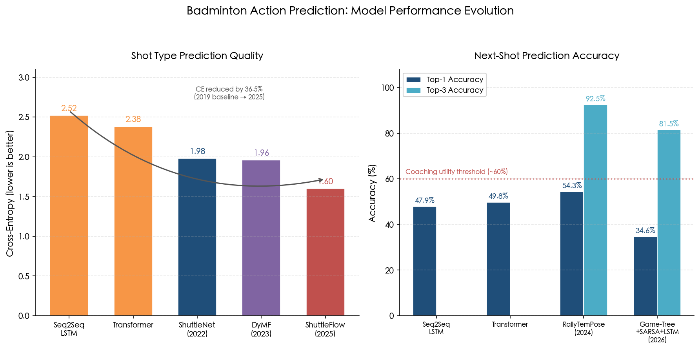

Graph-based approaches (DyMF, SPAIT) occupy a complementary niche. They excel at modeling the relational structure between players—particularly the asymmetric roles of attacker and defender, and the strategic interaction between positioning and shot selection—which flat sequence models capture only implicitly. The PM graph construction in DyMF, with its explicit relation types for different movement purposes (defend vs. return), provides architectural inductive biases aligned with the domain structure. SPAIT's position-adaptive inference extends this relational modeling by enforcing consistency constraints between predicted shot types and positions, reducing the physically implausible prediction rate [DyMF](https://arxiv.org/abs/2211.12217 "Chang et al., AAAI 2023") [SPAIT](https://link.springer.com/article/10.1186/s40537-026-01407-7 "Jhang et al., J Big Data, 2026").

No single architectural paradigm dominates across all metrics and settings. Transformer-based models lead on shot type prediction (CE), graph-based models on movement prediction (MSE/MAE), and normalizing flow models on spatial distribution quality (RMSE). This landscape suggests that future architectures should incorporate multiple structural inductive biases—temporal attention for shot sequences, relational graphs for player interactions, and distributional outputs for spatial predictions—within a unified framework.

## 4.6 The Research-Practice Gap

### 4.6.1 Accuracy Limitations

The best reported top-1 accuracy for next-stroke prediction is approximately 54% (RallyTemPose), meaning that even the strongest models are wrong nearly half the time. While top-3 accuracy reaches 92.5%, recommending three possible actions is qualitatively different from predicting the single next action. For coaching applications—where a player must commit to a single anticipatory movement—top-1 accuracy below approximately 60% provides insufficient confidence for real-time decision support [RallyTemPose](https://openaccess.thecvf.com/content/CVPR2024W/CVsports/papers/Ibh_A_Stroke_of_Genius_Predicting_the_Next_Move_in_Badminton_CVPRW_2024_paper.pdf "Ibh et al., CVPRW 2024").

### 4.6.2 Latency Constraints

Real-time prediction in badminton faces extreme latency requirements. A shuttlecock traveling at 300 km/h crosses the 13.4-meter court in approximately 0.16 seconds; even at moderate speeds of 100 km/h, the transit time is approximately 0.48 seconds. After subtracting human reaction time (approximately 0.15–0.20 seconds) and movement initiation time, the computational budget for prediction reduces to approximately 0.1–0.3 seconds. ShuttleFlow's inference latency of approximately 0.5 seconds on an RTX 4090 already exceeds this budget. No published model has been evaluated under real-time latency constraints on embedded or edge computing hardware [ShuttleFlow](https://link.springer.com/article/10.1007/s10994-024-06682-0 "Lien et al., Machine Learning 114(2), 2025").

### 4.6.3 Missing Contextual Variables

Current models uniformly omit several contextual variables that coaches consider fundamental to tactical decision-making. **Score state** is absent from all reviewed models—yet coaching convention holds that a player trailing 18–20 in the third game adopts radically different tactics from the same player leading 11–3 in the first game. **Fatigue** is not modeled, despite its well-documented effect on reducing shot variety and increasing error rates late in matches. **Psychological state**—confidence, anxiety, momentum—is entirely unaddressed, though human coaches routinely incorporate these assessments into tactical predictions. The offline RL framework of Liu et al. (EAAI 2026) explicitly excludes score state from the state representation, acknowledging this as a limitation [Offline RL Badminton](https://wenminggong.github.io/papers/Offline_RL_for_Badminton_EAAI_paper.pdf "Liu et al., EAAI 2026").

Figure 4.3 provides a systematic assessment of coaching deployment readiness across seven representative prediction models, highlighting the pervasive absence of score and fatigue context as a system-level gap.

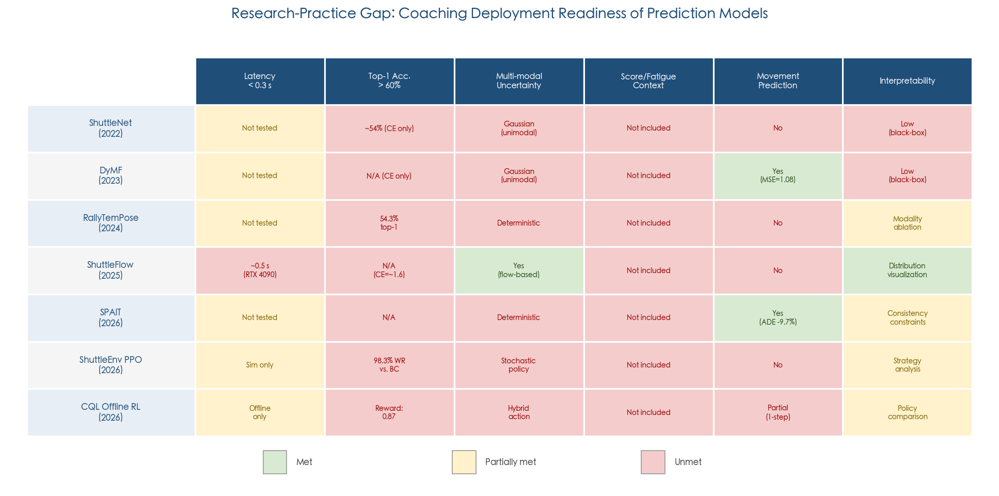

### 4.6.4 The "What Will" vs. "What Should" Distinction

A conceptual gap separates descriptive prediction ("what will the player do?") from prescriptive recommendation ("what should the player do?"). Sequence models (ShuttleNet, DyMF, RallyTemPose, ShuttleFlow) address the descriptive task, learning to replicate observed human play patterns. RL approaches (CQL, PPO, SARSA + game trees) address the prescriptive task, optimizing for winning outcomes. Coaching practice requires both: descriptive models for opponent scouting (predicting what the opponent is likely to do) and prescriptive models for tactical planning (recommending what the player should do in response). No existing system integrates both modes within a unified framework [ShuttleNet](https://ojs.aaai.org/index.php/AAAI/article/view/20341/20100 "Wang et al., AAAI 2022") [ShuttleEnv](https://arxiv.org/html/2603.17324v1 "Gong et al., arXiv:2603.17324, 2026").

### 4.6.5 Absence of Human Expert Baselines

No published study directly compares model predictions against human coach predictions. This absence constitutes a critical evaluation gap. Without knowing how accurately experienced coaches predict the next stroke, it is impossible to assess whether current models have reached, exceeded, or remain far below human expert performance. Establishing such baselines—through controlled experiments where coaches predict next shots from video—is a prerequisite for meaningful evaluation of practical utility.

### 4.6.6 Toward Practical Application: Opponent Scouting

Despite the limitations documented above, current prediction models offer immediate practical value for pre-match opponent scouting. ShuttleNet's case studies demonstrate the ability to identify player-specific response patterns—for example, revealing that a particular player responds to cross-court clears with a net shot 45% of the time but switches to a smash when positioned in the mid-court [ShuttleNet](https://ojs.aaai.org/index.php/AAAI/article/view/20341/20100 "Wang et al., AAAI 2022"). ShuttleFlow's distributional output enables visualization of an opponent's full response distribution for any given rally context, allowing coaches to identify high-probability target zones and prepare countermeasures. RallyNet's decoded context variables provide tactical interpretability, revealing when a modeled opponent is likely to transition from defensive to offensive play [RallyNet](https://arxiv.org/html/2403.12406v2 "Wang et al., arXiv:2403.12406, 2024"). These offline scouting applications do not require real-time latency and tolerate moderate prediction accuracy, positioning them as the most promising near-term pathway from research to practice.

## 4.7 End-to-End Alternatives versus Modular Pipelines

The dominant paradigm throughout Chapters 1–4 follows a modular pipeline: detection → tracking → stroke classification → tactical analysis → prediction. Each module receives structured inputs from its predecessor and produces structured outputs for its successor. The prediction stage sits at the terminus of this pipeline and is therefore maximally sensitive to cascaded errors: a missed shuttlecock detection in Chapter 1 corrupts the stroke boundary in Chapter 2, which misclassifies the shot type fed into Chapter 3's tactical mapping, ultimately degrading the rally context on which Chapter 4's models condition.

An end-to-end alternative—directly predicting future actions from raw video without intermediate symbolic representations—has not been fully explored for badminton. The FineBadminton benchmark (ACM MM 2025) provides a partial assessment: when multimodal large language models (Gemini 2.5 Pro, GPT-4.1) are presented with rally video and asked to predict tactical developments, their performance on tactical reasoning questions (best accuracy: 38.62% for Gemini 2.5 Pro) falls far below the accuracy of modular systems operating on curated symbolic inputs [FineBadminton](https://arxiv.org/html/2508.07554v1 "He et al., ACM MM 2025, Table 1"). This result suggests that end-to-end video-based prediction, while conceptually attractive for eliminating pipeline errors, currently lacks the perceptual and reasoning capabilities required for competitive performance.

A more promising intermediate approach is exemplified by models that operate on partially structured inputs—such as RallyTemPose's use of automatically extracted skeleton poses—rather than either raw video or fully manual annotations. As the detection and tracking modules described in Chapter 1 continue to improve (TrackNetV3's 97.51% shuttlecock tracking accuracy, YO-CSA-T's 99.43% mAP@0.5), the error introduced by early pipeline stages diminishes, and the modular approach becomes increasingly viable. We anticipate that the optimal architecture will combine automatic perception modules with structured sequence models rather than abandoning modularity entirely.

## 4.8 Summary

Action prediction in badminton singles has progressed from simple sequence-to-sequence models to a diverse ecosystem encompassing Transformer-based rally extractors, graph neural networks for movement forecasting, normalizing flows for distributional prediction, and reinforcement learning for strategic optimization. ShuttleNet (AAAI 2022) established the canonical formulation and baseline performance. DyMF (AAAI 2023) extended prediction to player movement, achieving a 5.0% improvement in location MSE over ShuttleNet. RallyTemPose (CVPR Workshop 2024) demonstrated that skeleton pose data improves shot-type prediction to 54.3% top-1 accuracy. ShuttleFlow (Machine Learning, 2025) achieved approximately 3× lower spatial RMSE through normalizing flows. SPAIT (Journal of Big Data, 2026) enforced shot-position consistency, reducing movement prediction errors by 9.72–15.14%. In the RL domain, ShuttleEnv (2026) showed that PPO agents can achieve 98.3% win rates against imitation-based opponents, while offline CQL (EAAI 2026) discovered more aggressive tactical policies than those exhibited in human play data.

Several interconnected challenges define the current frontier. Prediction accuracy (best top-1: approximately 54%) remains insufficient for real-time coaching. Inference latency exceeds the reaction-time budget for live play. Critical contextual variables—score state, fatigue, psychological momentum—are uniformly absent from current models. No human expert baselines exist for calibrating model performance. The distinction between descriptive prediction and prescriptive recommendation remains architecturally unresolved. Opponent scouting via distributional visualization and player tendency analysis represents the most viable near-term application pathway, while the pursuit of real-time in-match prediction systems remains an aspirational but currently unrealizable goal.

# 结论与风险提示

## Core Conclusions

This report has surveyed the four principal research components of video-based singles badminton player action analysis—object detection and tracking, stroke-type classification, tactical intent recognition, and action prediction—across the full spectrum of published methods through early 2026. Five overarching conclusions emerge from this cross-component synthesis.

**1. The perception layer has reached operational maturity for three of four detection targets, but the pipeline remains incomplete.** Shuttlecock tracking (TrackNetV3: 97.51% accuracy, 98.56% F1; YO-CSA-T: 99.43% mAP@0.5 at >130 fps), player detection (97.38% mAP@0.5), and court homography registration (99.08% mIoU) all approach or exceed the accuracy thresholds required for reliable downstream analysis. Racket detection, however, remains entirely unaddressed by dedicated methods, leaving a critical gap in the feature representation available for disambiguating kinematically similar strokes such as drops and clears, where racket face angle at contact is the primary distinguishing signal. Closing this gap through specialized detectors and racket-level dataset annotations constitutes a high-priority near-term research objective.

**2. Multi-modal fusion is the decisive factor in stroke classification accuracy.** The progression from skeleton-only GCNs (approximately 77% on ShuttleSet, 25 classes) to the cross-modal BST architecture (83.22%) demonstrates that fusing player pose with shuttlecock trajectory and court position yields consistent and substantial accuracy improvements. Shuttlecock trajectory is the single most informative auxiliary signal (+3.44 pp), attributable to its immunity to deceptive body movements—a domain-specific challenge that fundamentally limits skeleton-only approaches. This finding carries a clear architectural implication: future classification systems should treat multi-modal fusion as a baseline requirement rather than an optional enhancement.

**3. Tactical intent recognition remains at a nascent stage, lacking both standardized benchmarks and reliable automated methods.** Despite the availability of formal tactical taxonomies (offensive/control/defensive), the three-stroke tactical unit convention, and the richly annotated FineBadminton dataset, no study reports quantitative classification accuracy on a supervised tactical intent classification task. The best computational results operate at different granularities: game-theoretic analysis achieves >90% top-5 stroke prediction precision but only on well-documented rivalries; offline RL reward models reach 96.92% rally-preference accuracy on terminal rallies but drop to approximately 59% for non-terminal assessment; and general-purpose multimodal LLMs achieve at most 38.62% on tactical reasoning questions. The gap between these fragmented results and the integrated tactical understanding that human coaches routinely demonstrate underscores the distance this component must still travel.

**4. Action prediction accuracy has not yet crossed the threshold for real-time coaching utility.** The best next-stroke top-1 accuracy (approximately 54%, RallyTemPose) and the inference latency of distributional prediction models (approximately 0.5 seconds for ShuttleFlow, exceeding the approximately 0.3-second reaction budget) indicate that real-time in-match prediction remains aspirational. Reinforcement learning approaches discover strategies that outperform human play data—PPO achieves 98.3% win rate against imitation-based opponents, and CQL increases the Active Shot Type Rate from 0.3015 to 0.3526—but these results are obtained against fixed, non-adaptive opponent models and lack real-world validation. The most viable near-term application pathway is offline opponent scouting, where distributional visualization and player tendency analysis can inform pre-match preparation without requiring real-time latency.

**5. Error propagation across pipeline stages is the most consequential systemic challenge, yet it remains unquantified.** The modular pipeline architecture—detection → tracking → stroke classification → tactical inference → prediction—implies that errors at each stage compound downstream. A missed shuttlecock detection corrupts stroke boundary localization; a misclassified stroke inverts the inferred tactical intent; an inaccurate court homography distorts the spatial features on which prediction models condition. Despite the importance of this cascading effect, no published study has systematically measured how upstream error rates degrade downstream task performance. Quantifying and mitigating this error propagation represents a structural research priority that cuts across all four components.

## Limitations

The following limitations apply both to the body of literature reviewed and to this report itself. They are presented in order of their estimated impact on the validity and generalizability of the conclusions drawn above.

**1. Dataset representativeness and scale.** The field relies on a small number of public datasets—ShuttleSet (36,492 strokes / 44 matches), ShuttleSet22 (30,172 strokes / 2,888 rallies), VideoBadminton (7,822 clips / 19 players), TrackNet Dataset (78,200 frames / 26 videos), and FineBadminton (3,215 rally clips / 120 matches)—all drawn from elite international competition. The generalizability of models trained on these datasets to amateur, junior, or recreational play remains untested. Player populations are dominated by East Asian elite athletes; geographic and demographic diversity is limited. Court surfaces, camera angles, and broadcast production styles vary across datasets, and no cross-dataset evaluation has been conducted.

**2. Pre-segmented stroke assumption.** Nearly all stroke classification benchmarks provide oracle stroke boundaries (human-annotated timestamps or pre-trimmed clips). Reported classification accuracies—including the 83.22% achieved by BST—should be interpreted as upper bounds conditioned on perfect temporal segmentation. The integration of automatic stroke boundary detection (addressed by F3SET and FineBadminton's VideoMAE-based hit detector) into the full classification pipeline has not been benchmarked, and the resulting end-to-end accuracy degradation remains unknown.

**3. Absence of a unified multi-task benchmark.** Different studies evaluate on different datasets, with different splits, taxonomies, and metrics. The TrackNet benchmark covers only shuttlecock detection; ShuttleSet provides only tabular stroke annotations; VideoBadminton supports only clip-level recognition. An integrated benchmark evaluating detection, tracking, classification, tactical analysis, and prediction on the same video corpus with standardized protocols does not exist, rendering rigorous cross-method and cross-component comparison exceedingly difficult.

**4. Omission of critical contextual variables.** No reviewed prediction or tactical model incorporates score state, fatigue indicators, or psychological momentum—variables that coaches consider fundamental to tactical decision-making. This omission limits the ecological validity of all reported results, as models are trained and evaluated on decontextualized rally data that strips away the match-level factors known to influence player behavior.

**5. Scope of this review.** This report focuses exclusively on singles badminton. Doubles play introduces fundamentally different detection challenges (four players, frequent occlusion, coordinated positioning) and tactical structures (rotation systems, combined attack-defense formations) that are not addressed. The review further excludes non-video data sources (wearable sensors, inertial measurement units, instrumented rackets) that provide complementary biomechanical signals. Publications in languages other than English, and proprietary systems developed by national badminton federations, may contain relevant work not captured in this survey.
