# Overview

The global video editing and creation software market stands at an inflection point. Valued at an estimated USD 2.7–3.8 billion in 2026—depending on whether mobile, SaaS, and web-based platforms are included alongside traditional desktop Non-Linear Editors (NLEs)—the market is being reshaped by three converging forces: the rapid integration of generative AI into mainstream editing workflows, a structural shift from perpetual-license desktop software to subscription-based and cloud-native delivery, and the explosive growth of the creator economy, projected to surpass USD 230 billion in 2026 with over 207 million individuals worldwide identifying as content creators.

This report provides a comprehensive market research analysis of the global video editing and creation software landscape as of April 2026, spanning major products from Adobe (Premiere Pro, After Effects), Apple (Final Cut Pro, iMovie), Blackmagic Design (DaVinci Resolve), ByteDance (CapCut), and an expanding field of AI-native challengers including Runway ML, Descript, and Meta Edits. The analysis proceeds through seven chapters:

- **Chapter 1** establishes market sizing across multiple research-firm estimates and definitional scopes, profiles the SaaS growth engine and adjacent AI video generation market, and maps demand drivers including the creator economy, enterprise video adoption, and short-form content proliferation.
- **Chapter 2** profiles the competitive landscape and major players—examining Adobe's incumbent revenue leadership, Apple's Creator Studio subscription pivot, Blackmagic's hardware-subsidized free-tier disruption, CapCut's user-volume dominance amid geopolitical risk, and the positioning of Avid, Clipchamp, Meta Edits, Filmora, Runway ML, Descript, and Canva.
- **Chapter 3** examines the technology trends driving market evolution: AI feature integration across all major NLEs, the maturation of cloud-native collaborative workflows (Adobe Frame.io, Blackmagic Cloud), the accelerating convergence of AI video generation with traditional editing, and hardware enablers from NVIDIA's Blackwell architecture and Apple's M4 Silicon family.
- **Chapter 4** disaggregates the user base into professional, prosumer, and consumer segments, revealing a stark inversion: professionals account for approximately 36% of market revenue but only ~5% of total users, while consumers represent over 80% of users yet contribute roughly 25% of revenue. Cross-segment migration patterns—consumers graduating to prosumer tools, professionals selectively adopting AI-native lightweight editors—are reshaping competitive dynamics.
- **Chapter 5** analyzes the diverse and increasingly hybrid business models coexisting in the market: Adobe's subscription-plus-generative-credit architecture, Apple's new Creator Studio bundle, Blackmagic's hardware-subsidized free software, CapCut's freemium model at scale, and the emergence of AI-credit consumption as a new monetization layer.
- **Chapter 6** maps regional dynamics and platform-ecosystem considerations, documenting the divergence between revenue geography (North America at 37.6%) and user geography (Asia-Pacific as the fastest-growing region), the regulatory landscape surrounding ByteDance across the U.S., India, and the EU, and the channel effects of Apple, Windows, and Android ecosystems on tool adoption.
- **Chapter 7** synthesizes a forward-looking analysis of market evolution through 2030, presenting baseline, upside, and downside market-size scenarios, identifying the technology trends most likely to disrupt competitive positions, and assessing the strategic imperatives facing incumbents and AI-native challengers alike.

Five principal findings emerge from this analysis. First, AI has displaced core editing functionality as the primary axis of competitive differentiation—every major product now ships AI-powered features, and the vendors that gate AI behind premium tiers (Adobe's generative credits) versus those that distribute it freely (Blackmagic's DaVinci Resolve 20) are defining the market's next structural fault line. Second, the business-model landscape is converging toward hybrid subscription-plus-consumption architectures, with pure perpetual licenses increasingly relegated to niche positions. Third, CapCut's 736 million monthly active mobile users represent the market's largest user base by a substantial margin, yet its unresolved regulatory status in the United States under PAFACA constitutes the single most consequential geopolitical variable in the industry. Fourth, the boundary between "video editing" and "video creation" is dissolving as generative AI tools add editing capabilities and traditional NLEs embed generative features—a convergence that will force market-definition revisions within the coming years. Fifth, the adjacent AI video generation market, growing at 46% CAGR, is on a trajectory to overlap materially with the traditional editing market by 2028–2030, potentially expanding the combined addressable market to USD 6–8 billion under broadened definitional scopes.

# 第1章 Market Overview and Sizing

## 1.1 Scope and Definitional Framework

The global video editing and creation software market spans a broad continuum of tools—from professional desktop Non-Linear Editors (NLEs) and motion-graphics suites to mobile-native editing apps, cloud/browser-based platforms, and the emerging class of AI-native video generation tools. Published market-size estimates vary significantly depending on which segments a given research firm includes in its definition. Throughout this report, "video editing software" refers to applications used for post-production manipulation of recorded video—cutting, sequencing, color correction, audio mixing, titling, and effects—across desktop, mobile, and cloud delivery modes. The adjacent but rapidly expanding category of AI video generators (text-to-video, image-to-video) is discussed separately where relevant but is not included in baseline market-size figures unless explicitly stated.

This definitional precision is essential: published 2024 market valuations range from approximately USD 2.29 billion under narrow desktop-NLE-only scopes to USD 4.50 billion or more when mobile, SaaS, and template-driven platforms are fully incorporated. All monetary figures in this chapter are denominated in USD, and the analytical present is April 2026 unless otherwise noted.

## 1.2 Market Size Estimates: Triangulating Across Research Firms

### 1.2.1 Narrow-Scope Estimates (Desktop NLE + License Revenue)

Several market intelligence firms anchor the traditional video editing software market in the USD 2.3–3.3 billion range for 2024:

- **TBRC (The Business Research Company)** estimated USD 2.38 billion in 2024, growing to USD 2.54 billion in 2025 and USD 3.27 billion by 2029 at a compound annual growth rate (CAGR) of 6.6–6.8% [TBRC/Research and Markets](https://www.researchandmarkets.com/report/video-editing-software "Video Editing Software Global Market Report 2025").
- **Straits Research** placed the 2024 market at USD 2.29 billion, projecting growth to USD 3.73 billion by 2033 at a more conservative 5.2% CAGR [Straits Research](https://straitsresearch.com/report/video-editing-software-market "Video Editing Software Market Size 2033").
- **SNS Insider** estimated a higher baseline of USD 3.25 billion in 2024, forecasting USD 4.83 billion by 2032 at 5.8% CAGR [SNS Insider](https://www.snsinsider.com/reports/video-editing-software-market-1543 "Video Editing Software Market 2032").
- **Research and Markets** valued the market at USD 2.68 billion in 2026, projected to reach USD 3.41 billion by 2030 at 6.2% CAGR [Research and Markets](https://www.researchandmarkets.com/report/video-editing-software "Video Editing Software Market Size & Forecast to 2030").

### 1.2.2 Broader-Scope Estimates (Including Mobile, Web, and SaaS)

When mobile editing apps, browser-based editors, and subscription cloud platforms are included, the market expands substantially:

- **Mordor Intelligence** valued the broader video editing market at USD 3.54 billion in 2025, growing to USD 3.75 billion in 2026 and reaching USD 4.99 billion by 2031 at 5.88% CAGR [Mordor Intelligence](https://www.mordorintelligence.com/industry-reports/video-editing-market "Video Editing Market Size Report 2031").
- **Maia Research** placed the global video editing software market at USD 4.50 billion in 2025, projecting it to reach USD 6.39 billion by 2031 [Maia Research via MarketResearch.com](https://www.marketresearch.com/Maia-Research-v4212/Global-Video-Editing-Software-Trends-43304303/ "Global Video Editing Software Trends 2025–2031").
- **Dataintelo** estimated USD 3.2 billion in 2025 with growth to USD 5.2 billion by 2034 at 5.6% CAGR [Dataintelo](https://dataintelo.com/report/global-video-editing-software-market "Video Editing Software Market 2034").

### 1.2.3 Reconciling the Divergence

The variation across these estimates—from a 2025 midpoint of roughly USD 2.5 billion (narrow) to USD 4.5 billion (broad)—reflects genuine differences in market-definition scope rather than analytical error. Narrow estimates typically capture license and subscription revenue from desktop NLE applications sold to professionals and prosumers. Broader estimates fold in mobile editing app revenue (in-app purchases, subscriptions), template-driven video creation platforms, and cloud rendering services. For the purposes of this report, we adopt a working range of **USD 2.7–3.8 billion for 2026** across the narrow-to-broad definitional spectrum, with medium-term projections converging toward **USD 3.4–5.0 billion by 2030** depending on scope.

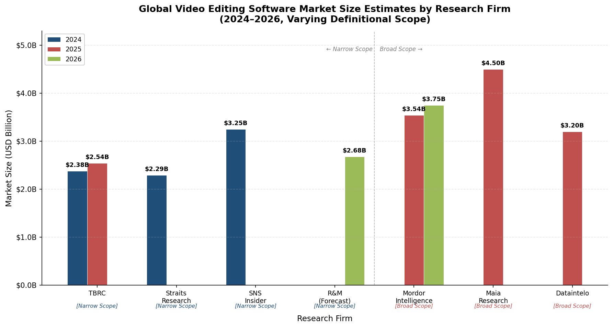

*Figure 1.1 — Market-size estimates from seven research firms, grouped by definitional scope (narrow vs. broad). The spread from approximately USD 2.3 billion to USD 4.5 billion underscores how scope assumptions drive valuation differences rather than fundamental disagreement on market trajectory.*

## 1.3 The SaaS Growth Engine

Within the overall market, the video editing Software-as-a-Service (SaaS) subsegment is expanding at roughly three times the pace of the aggregate market. Research and Markets valued the video editing SaaS market at USD 2.49 billion in 2024, projecting growth to USD 5.26 billion by 2029 at a 16.4% CAGR [Research and Markets via GlobeNewswire](https://www.globenewswire.com/news-release/2026/01/14/3218662/28124/en/5-25-Bn-Video-Editing-Software-as-a-Service-SaaS-Global-Market-Trends-Strategies-and-Opportunities-2019-2024-2024-2029F-2034F.html "Video Editing SaaS Global Market Report, Jan 2026"). This outsized CAGR signals a structural shift in delivery models: subscription-based cloud services are steadily absorbing market share from traditional perpetual-license desktop software.

Several reinforcing dynamics underpin the SaaS migration. Cloud delivery lowers entry barriers for casual and prosumer users, enables seamless cross-device workflows, and provides vendors with recurring revenue streams in place of one-time purchases. Adobe's full transition to Creative Cloud subscriptions, the growth of browser-based editors such as Clipchamp (Microsoft) and Canva Video, and CapCut's freemium cloud model all exemplify this structural shift.

## 1.4 The Adjacent AI Video Generation Market

Although distinct from traditional video editing, the AI video generator software market is increasingly relevant to the competitive landscape. This category—encompassing text-to-video, image-to-video, and AI-driven scene generation tools—was valued at USD 1.23 billion in 2025, with projections reaching USD 21.61 billion by 2034 at a 46.0% CAGR [Intel Market Research](https://www.intelmarketresearch.com/ai-video-generator-software-market-36387 "AI Video Generator Software Market Outlook 2026–2034"). Grand View Research separately estimated the creative AI video generator segment at USD 1.66 billion in 2024, projecting USD 11.41 billion by 2030 [Grand View Research](https://www.grandviewresearch.com/horizon/statistics/ai-video-market/watts/creative-ai-video-generators/global "Creative AI Video Generators Market Outlook").

Key players in this space include OpenAI (Sora), Runway ML, Pika Labs, and HeyGen. As these tools increasingly integrate editing capabilities—and as traditional NLEs embed generative AI features—the boundary between "video editing" and "video creation" continues to blur. This convergence may fundamentally alter market sizing conventions within the next two to three years.

## 1.5 Market Segmentation by Deployment Model and Platform

### 1.5.1 Deployment: On-Premise vs. Cloud

As of 2025, on-premise (desktop-installed) software retained a 51.3% share of the video editing market by revenue, reflecting the continued dominance of professional NLEs—Adobe Premiere Pro, DaVinci Resolve, Final Cut Pro, and Avid Media Composer—in high-end production workflows. Cloud-based deployments, however, are expanding at an 8.23% CAGR, outpacing the overall market [Mordor Intelligence](https://www.mordorintelligence.com/industry-reports/video-editing-market "Deployment & Platform Analysis").

This near-parity between on-premise and cloud reflects a transitional period. Many professional users operate in hybrid configurations—editing locally on high-performance hardware while leveraging cloud services for storage, collaboration, proxy editing, and rendering. The SaaS subsegment data (Section 1.3) further corroborates the cloud trajectory: within five years, cloud-delivered video editing revenue is projected to surpass on-premise revenue.

### 1.5.2 Platform: Desktop vs. Mobile

Desktop and laptop platforms accounted for 54.4% of the 2025 market, while smartphone and tablet platforms are growing at 8.62% CAGR [Mordor Intelligence](https://www.mordorintelligence.com/industry-reports/video-editing-market "Platform Analysis"). The mobile segment is propelled by the global proliferation of short-form video content creation on platforms such as TikTok, Instagram Reels, and YouTube Shorts. Straits Research separately estimated the global mobile video editing applications market at USD 1.20 billion in 2026, projected to reach USD 2.49 billion by 2034 [Straits Research](https://straitsresearch.com/report/mobile-video-editing-applications-market "Mobile Video Editing Applications Market 2034"). CapCut (ByteDance), which originated as a mobile-first editor, represents the most prominent example of mobile-native market capture at scale.

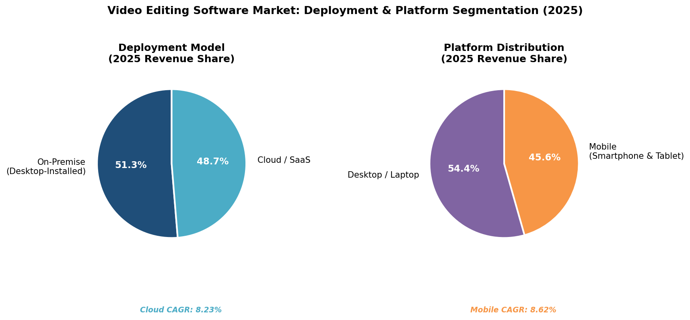

*Figure 1.2 — Left: On-premise vs. cloud/SaaS deployment revenue split (51.3% vs. 48.7%) with cloud CAGR of 8.23%. Right: Desktop/laptop vs. mobile platform revenue split (54.4% vs. 45.6%) with mobile CAGR of 8.62%. Source: Mordor Intelligence.*

## 1.6 Regional Revenue Distribution

North America constituted the largest regional market in 2025, contributing 37.6% of global video editing software revenue. The region's dominance reflects the concentration of major studios, media companies, advertising agencies, and a large base of professional and prosumer creators. The United States alone accounts for the majority of North American revenue; U.S. video advertising spend reached USD 52.1 billion, having doubled since 2020, serving as a critical downstream demand driver [ElectroIQ](https://electroiq.com/stats/video-editing-statistics/ "Video Marketing Statistics") (T3 source; treated as indicative).

Asia-Pacific is the fastest-growing region, expanding at a 7.22% CAGR, driven by rapid growth in social media content creation across China, India, and Southeast Asia, as well as expanding local film and entertainment industries [Mordor Intelligence](https://www.mordorintelligence.com/industry-reports/video-editing-market "Regional Analysis"). The region's mobile-first consumer behavior particularly favors tools such as CapCut, VN Video Editor, and other mobile-native editing platforms.

Europe represents the third-largest regional market, characterized by a blend of professional broadcast and film production demand alongside a growing creator-economy segment.

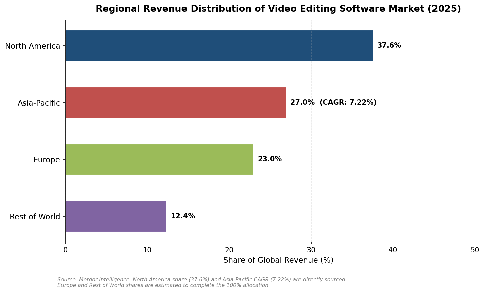

*Figure 1.3 — Regional revenue shares: North America (37.6%), Asia-Pacific (27.0%, CAGR 7.22%), Europe (23.0%), and Rest of World (12.4%). North America share and Asia-Pacific CAGR sourced from Mordor Intelligence; Europe and Rest of World shares are estimated allocations.*

## 1.7 Demand Drivers

### 1.7.1 The Creator Economy

The creator economy—the ecosystem of independent content creators producing and monetizing digital content—is estimated to exceed USD 250 billion in 2026, with projections toward USD 500 billion by 2030 [Yahoo Finance](https://finance.yahoo.com/news/creator-economy-statistics-2026-120-150000105.html "Creator Economy Statistics 2026"). This expansion directly fuels demand for video editing tools across all skill levels, from one-click mobile editors to full-featured professional suites. As creator monetization opportunities grow—through platform ad-revenue sharing, brand partnerships, and subscription-based content—creators at every tier face increasing incentives to invest in higher-quality video production.

### 1.7.2 Enterprise Video Adoption

Beyond the individual creator market, enterprise demand for video content has surged. The enterprise video market—encompassing corporate communications, training, marketing, and live events—is projected at USD 27.97 billion in 2026, growing to USD 42.23 billion by 2031 at 8.6% CAGR [MarketsandMarkets](https://www.marketsandmarkets.com/Market-Reports/enterprise-video-market-1182.html "Enterprise Video Market 2026–2031"). With an estimated 85% of businesses now using video as a core marketing tool, sustained demand persists for editing solutions that integrate with enterprise content management and collaboration workflows.

### 1.7.3 Short-Form Video Proliferation

The explosion of short-form video platforms—TikTok, Instagram Reels, YouTube Shorts—has reshaped content creation patterns, dramatically expanding the total addressable user base for video editing tools. This trend particularly benefits mobile-first and freemium editors that minimize friction for first-time video creators.

### 1.7.4 Remote and Distributed Production

Post-pandemic work patterns have normalized remote and hybrid production workflows, accelerating demand for cloud-based collaboration features, remote rendering, and real-time multi-user editing. These capabilities, once peripheral to traditional desktop NLEs, are now central to competitive positioning.

## 1.8 Competitive Concentration

The competitive landscape exhibits moderate concentration. The top five companies—Adobe, Apple, Blackmagic Design, Avid Technology, and Corel Corporation—collectively hold approximately 60% of market revenue [Mordor Intelligence](https://www.mordorintelligence.com/industry-reports/video-editing-market "Competitive Landscape"). Indicative market-share estimates from third-party aggregators place Adobe Premiere Pro at approximately 35% revenue share, followed by Final Cut Pro at 25%, DaVinci Resolve at 15%, Avid Media Composer at 10%, and Filmora (Wondershare) and CapCut (ByteDance) at 5% and 4% respectively [ElectroIQ citing SendShort data](https://electroiq.com/stats/video-editing-statistics/ "Software Market Share 2025"). These share figures originate from a T3 source and should be treated as directionally indicative rather than definitive; notably, free-tier products such as DaVinci Resolve (free) and CapCut generate large user bases not proportionally reflected in revenue-based share metrics.

## 1.9 Headwinds and Risk Factors

### 1.9.1 Commoditization and Free-Tool Pricing Pressure

The availability of powerful free and freemium editing tools—DaVinci Resolve (free tier), CapCut (free), Clipchamp (bundled with Windows), iMovie (bundled with macOS/iOS)—exerts sustained downward pressure on pricing for mid-tier paid software. This dynamic compresses margins for vendors positioned between free consumer tools and premium professional suites, reinforcing a market structure that increasingly bifurcates between "free/freemium" and "premium subscription."

### 1.9.2 Subscription Fatigue

As the industry shifts toward SaaS delivery, user resistance to accumulating software subscriptions—commonly termed "subscription fatigue"—has emerged as a notable friction point. Adobe's periodic pricing adjustments and the persistence of perpetual-license options from competitors (e.g., DaVinci Resolve Studio at a one-time USD 295, Final Cut Pro's one-time purchase model) reflect vendor awareness of this headwind.

### 1.9.3 Geopolitical Risk: CapCut and ByteDance

CapCut, owned by ByteDance, faces ongoing geopolitical uncertainty in the United States. The app was briefly removed from U.S. app stores on January 19, 2025, under the Protecting Americans from Foreign Adversary Controlled Applications Act (PAFACA), though service was restored within days. As of April 2026, CapCut's legal status in the U.S. remains unresolved, creating persistent regulatory overhang for one of the market's fastest-growing mobile editing platforms. European regulators have concurrently increased scrutiny of ByteDance's data practices, compounding geographic risk exposure.

### 1.9.4 AI Content Regulation

Emerging regulatory frameworks—including the EU AI Act and evolving U.S. federal and state proposals—introduce compliance uncertainties for AI-powered editing and generation features. Requirements for content provenance labeling, synthetic-media disclosure, and algorithmic transparency may impose additional development costs and constrain certain AI feature rollouts.

### 1.9.5 Data Sovereignty and Cross-Border Cloud Rendering

Data residency regulations in jurisdictions including the EU, China, and India can limit the efficiency of cross-border cloud rendering services, potentially fragmenting cloud-based editing workflows along geographic lines and adding infrastructure costs for vendors operating globally.

## 1.10 Summary

The global video editing and creation software market occupies a working range of approximately USD 2.7–3.8 billion in 2026, depending on definitional scope, with medium-term projections pointing toward USD 3.4–5.0 billion by 2030 at CAGRs of 5.2–6.8%. The SaaS delivery model constitutes the primary growth engine, expanding at roughly three times the overall market rate. The adjacent AI video generation market, valued at over USD 1.2 billion in 2025 and growing at 46% CAGR, is increasingly converging with traditional editing workflows—a development that may reshape market boundaries in coming years.

Demand is propelled by the expanding creator economy (projected to exceed USD 250 billion in 2026), surging enterprise video adoption, and the short-form video content boom. The market remains moderately concentrated, with Adobe maintaining the largest revenue share among the top five vendors. Key headwinds include free-tool pricing pressure, subscription fatigue, unresolved geopolitical risks for ByteDance/CapCut, and emerging AI content regulation. The deployment mix is transitioning from on-premise dominance toward cloud parity, while mobile platforms represent the fastest-growing access mode.

# 第2章 Competitive Landscape and Major Player Profiles

## 2.1 Market Concentration and Share Distribution

The global video editing software market exhibits moderate concentration. The top five companies by revenue—Adobe, Apple, Blackmagic Design, Avid Technology, and Corel Corporation—collectively hold approximately 60% of market revenue as of 2025 [Mordor Intelligence](https://www.mordorintelligence.com/industry-reports/video-editing-market "Video Editing Market Competitive Landscape"). The remaining 40% is fragmented across mobile-first challengers, AI-native entrants, open-source alternatives, and a long tail of regional or niche editors.

Third-party estimates (from T3 sources, presented here as indicative rather than definitive) suggest the following approximate revenue-share distribution in 2025: Adobe Premiere Pro at roughly 35%, Final Cut Pro (Apple) at 25%, DaVinci Resolve (Blackmagic Design) at 15%, Avid Media Composer at 10%, Filmora (Wondershare) at 5%, and CapCut (ByteDance) at 4% [ElectroIQ citing SendShort data](https://electroiq.com/stats/video-editing-statistics/ "Video Editing Statistics 2025 — Software Market Share"). These revenue-share figures, however, understate CapCut's footprint by user volume. When measured by monthly active users (MAU), CapCut's dominance in the consumer and mobile segments is substantially larger: the app reached an estimated 300 million MAU on mobile by mid-2024 [Musically](https://musically.com/2025/04/23/meta-takes-on-bytedances-capcut-with-instagram-edits-app/ "Meta takes on CapCut"), and third-party trackers reported over 1 billion cumulative Android downloads by Q3 2024 [SendShort citing Google Play data](https://sendshort.ai/statistics/capcut/ "CapCut Revenue & User Growth Statistics 2026").

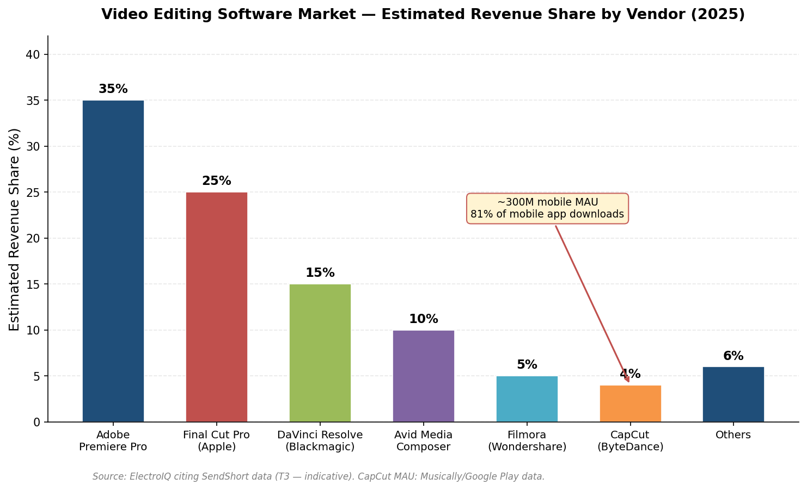

*Figure 2-1. Estimated revenue share by vendor in 2025. CapCut's annotation highlights the gap between its modest 4% revenue share and its approximately 300 million mobile MAU, illustrating the structural divergence between revenue-weighted and user-weighted market rankings. Source data: ElectroIQ citing SendShort; CapCut MAU from Musically / Google Play.*

This divergence between revenue share and user share is structurally significant. Adobe commands the largest revenue pool through premium subscription pricing, while CapCut commands the largest user base through a free-tier and freemium model that generates comparatively modest direct revenue. As subsequent sections detail, this split in market-leadership metrics shapes each player's strategic calculus—from pricing and bundling decisions to AI-feature investment priorities.

## 2.2 Adobe: The Incumbent Leader

### 2.2.1 Financial Scale and Market Position

Adobe remains the clear revenue leader in video editing and the broader creative software market. In fiscal year 2025 (ending November 2025), the company reported total revenue of USD 23.86 billion. The Digital Media segment—encompassing Creative Cloud, Document Cloud, and related products—generated USD 17.65 billion, up 11% year-over-year, while Digital Media annualized recurring revenue (ARR) reached USD 19.20 billion (+11.5% YoY) [Adobe FY2025 Earnings](https://news.adobe.com/news/2025/12/122025-q4earnings "Adobe Reports Record Q4 and FY2025 Revenue"). Adobe does not disclose revenue for individual products such as Premiere Pro or After Effects. Nevertheless, its Creative Cloud subscription model—where video tools are distributed both as standalone plans and as components of the all-apps suite—generates the largest single revenue stream in the global creative software industry and underpins the estimated 35% revenue share cited in Section 2.1.

### 2.2.2 Product Updates (April 2025–April 2026)

Adobe delivered substantial feature updates across its video product line during the research window, with AI integration emerging as the common thread:

- **Premiere Pro 25.2 (April 2025, NAB)**: Introduced Firefly-powered Generative Extend at 4K resolution, enabling editors to add AI-generated frames to extend shots at either end of a clip. The release also shipped AI-powered Media Intelligence with natural-language search across footage, automatic caption translation in 27 languages, and a drag-and-drop color management system (Premiere Color Management) built on the ACEScct wide-gamut color pipeline [Adobe Blog](https://blog.adobe.com/en/publish/2025/04/02/introducing-new-ai-powered-features-workflow-enhancements-premiere-pro-after-effects "Premiere Pro and After Effects 25.2 — NAB 2025").
- **After Effects 25.2 (April 2025)**: Launched High Performance Preview Playback, a fundamental rewrite of the caching system that leverages both RAM and local disk to enable full-composition playback on any hardware configuration. New 3D motion-design tools included Animated Environment Lights, native FBX model import, and HDR monitoring [Adobe Blog](https://blog.adobe.com/en/publish/2025/04/02/introducing-new-ai-powered-features-workflow-enhancements-premiere-pro-after-effects "After Effects 25.2 Features").
- **Adobe MAX 2025 (October 2025)**: Showcased AI Object Mask, faster vector mask tracking, and deeper NVIDIA Blackwell GPU acceleration for H.264/HEVC decode, achieving faster-than-real-time playback in beta on supported Windows hardware [Adobe](https://news.adobe.com/news/2025/10/adobe-max-2025-creative-cloud "Adobe MAX 2025 — Creative Cloud Innovations").
- **Premiere Pro January 2026 update**: Extended the AI integration trajectory with additional motion-design workflow improvements and expanded Firefly generative capabilities [Adobe Blog](https://blog.adobe.com/en/publish/2026/01/20/new-ai-powered-video-editing-tools-premiere-major-motion-design-upgrades-after-effects "January 2026 AI Video Editing Updates").

### 2.2.3 Strategic Positioning

Adobe's competitive moat rests on three reinforcing pillars: (1) ecosystem breadth—Creative Cloud bundles video, photo, design, and document workflows into a single subscription, creating high switching costs; (2) deep enterprise penetration through team and enterprise licensing across media, advertising, and corporate marketing departments; and (3) aggressive AI investment via the Firefly model family, which embeds generative capabilities directly into existing editorial tools rather than requiring users to adopt separate AI applications. The introduction of consumption-based generative credits as a pricing layer atop subscriptions signals a shift toward hybrid subscription-plus-usage monetization—a theme explored further in Chapter 5.

## 2.3 Apple: Ecosystem Integration and the Creator Studio Pivot

### 2.3.1 Product Scope

Apple's video editing portfolio spans Final Cut Pro (professional NLE for Mac and iPad), iMovie (consumer editor bundled with macOS and iOS), and Motion (motion-graphics companion to Final Cut Pro). Final Cut Pro has historically differentiated through deep performance optimization for Apple silicon, a magnetic timeline editing paradigm, and a one-time-purchase pricing model at USD 299.99—a notable contrast to Adobe's subscription-only approach that has sustained a loyal professional user base.

### 2.3.2 The Apple Creator Studio Launch (January 2026)

The most significant strategic move in Apple's creative software portfolio during the research window was the January 2026 launch of **Apple Creator Studio**, a subscription bundle priced at USD 12.99 per month (USD 129/year; USD 2.99/month for students). Creator Studio encompasses Final Cut Pro, Logic Pro, Pixelmator Pro (following Apple's completion of the Pixelmator acquisition in late 2024), Motion, Compressor, and MainStage, plus premium content and AI-powered features for Keynote, Pages, and Numbers [Apple Newsroom](https://www.apple.com/newsroom/2026/01/introducing-apple-creator-studio-an-inspiring-collection-of-creative-apps/ "Apple Creator Studio Launch — January 2026").

One-time purchases remain available for individual apps (e.g., Final Cut Pro at USD 299.99), but certain new AI features and premium content libraries are exclusive to Creator Studio subscribers. This partial subscription pivot represents Apple's first systematic effort to generate recurring creative-software revenue and directly challenges Adobe Creative Cloud's bundling strategy—at a price point roughly one-fifth of Adobe's all-apps plan.

### 2.3.3 Final Cut Pro Feature Updates

Key capabilities delivered during the research window include:

- **Final Cut Pro 11 (November 2024)**: Magnetic Mask—AI-powered subject isolation without a green screen—Transcribe to Captions (on-device automatic captioning), and spatial video editing support for Apple Vision Pro [Apple Newsroom](https://www.apple.com/newsroom/2024/11/final-cut-pro-11-begins-a-new-chapter-for-video-editing-on-mac/ "Final Cut Pro 11 Launch").
- **Final Cut Pro January 2026 update**: Added Transcript Search for natural-language search of spoken dialogue across an entire media library, Visual Search for AI-powered object and action detection within clips, and Beat Detection for automatic music-beat alignment in the timeline [Apple Newsroom](https://www.apple.com/newsroom/2026/01/introducing-apple-creator-studio-an-inspiring-collection-of-creative-apps/ "Final Cut Pro Features in Creator Studio").
- **Final Cut Pro for iPad**: Introduced Montage Maker, an AI feature that automatically assembles edits from the strongest visual moments across imported footage, complemented by Auto Crop for vertical-format reframing targeted at social-media creators.

### 2.3.4 M&A: The MotionVFX Acquisition

In March 2026, Apple acquired **MotionVFX**, a Poland-based developer of professional plugins, templates, and motion-graphics tools for Final Cut Pro. The 70-person company was one of Final Cut Pro's most prolific third-party ecosystem contributors, with a catalog spanning hundreds of templates, effects, and title packs. The acquisition signals Apple's intent to internalize premium visual-effects content and strengthen Creator Studio's value proposition vis-à-vis Adobe's extensive effects and template marketplace [CNBC](https://www.cnbc.com/2026/03/16/apple-acquires-video-editing-company-motionvfx-to-boost-subscribers.html "Apple Acquires MotionVFX") [MacRumors](https://www.macrumors.com/2026/03/16/apple-acquires-motionvfx/ "Apple Acquires Final Cut Pro Plugin Company MotionVFX").

## 2.4 Blackmagic Design: The Professional-Grade Disruptor

### 2.4.1 Market Position

Blackmagic Design occupies a distinctive position in the competitive landscape as a hardware-first company—manufacturing cinema cameras, capture cards, and broadcast equipment—that distributes its professional-grade NLE, DaVinci Resolve, as a free download, with a one-time USD 295 upgrade to DaVinci Resolve Studio. This hardware-subsidized software model has enabled Blackmagic to build an estimated 15% revenue share of the video editing software market while maintaining one of the largest free-tier user bases among professional-grade editors [ElectroIQ citing SendShort data](https://electroiq.com/stats/video-editing-statistics/ "Software Market Share 2025").

DaVinci Resolve is unique among major NLEs in integrating editing, color grading, visual effects (Fusion), audio post-production (Fairlight), and media delivery within a single application. This unified-workflow architecture reduces the roundtripping between multiple tools that characterizes competing pipelines and provides a compelling value proposition for independent filmmakers and mid-size post-production houses.

### 2.4.2 DaVinci Resolve 20 (April 2025)

Announced at NAB 2025, **DaVinci Resolve 20** delivered over 100 new features. AI capabilities spanned multiple workflow stages, reinforcing Blackmagic's strategy of matching or exceeding subscription-priced competitors on feature depth:

- **AI IntelliScript**: Generates timelines directly from text scripts, automating rough-cut assembly from transcribed dialogue.
- **AI Multicam SmartSwitch**: Automatically selects camera angles based on active speakers, targeting the podcast, interview, and live-event editing market.
- **AI Audio Assistant**: Produces a professional audio mix in a single click, reducing manual sound-design time.
- **AI Set Extender**: Extends scenes to fill frames from text prompts, generating missing backgrounds or expanding limited clip angles.
- **AI Detect Music Beats**: Analyzes audio tracks to place beat markers for rhythm-synced editing automatically.
- **Blackmagic Cloud enhancements**: Improved real-time collaboration tools for geographically distributed production teams.
- **Color page innovations**: New Chroma Warp function for intuitive saturation adjustment; collaborative pin-point annotations for client–editor feedback workflows.
- **Cut and Edit page improvements**: Dedicated keyframe editor, voiceover recording directly into the timeline, safe trimming mode, and dynamic vertical-video layout reorientation for social-media output.

The free tier of DaVinci Resolve 20 includes the majority of these features, sustaining Blackmagic's long-standing strategy of pressuring subscription-based competitors on value [PetaPixel](https://petapixel.com/2025/04/04/davinci-resolve-20-delivers-more-than-100-new-features/ "DaVinci Resolve 20 — 100+ New Features") [Blackmagic Design](https://www.blackmagicdesign.com/products/davinciresolve/whatsnew "DaVinci Resolve 20 What's New").

## 2.5 CapCut (ByteDance): The Mobile-First Challenger

### 2.5.1 Scale and Growth Trajectory

CapCut, developed by ByteDance and tightly integrated with TikTok's content ecosystem, has emerged as the highest-growth player in the video editing market by user volume. The app surpassed 1 billion cumulative Android downloads by Q3 2024, and third-party estimates placed mobile MAU at approximately 300 million by mid-2024—capturing an estimated 81% share of the mobile video-editing app market by downloads [Musically](https://musically.com/2025/04/23/meta-takes-on-bytedances-capcut-with-instagram-edits-app/ "CapCut Market Position"). ByteDance does not publicly disclose CapCut-specific revenue. Third-party estimates suggest approximately USD 100 million in 2023 revenue, with growth driven by in-app purchases, a Pro subscription tier, and cloud storage subscriptions introduced in August 2024 at USD 2.49/month (100 GB) and USD 7.49/month (1 TB) [SendShort citing Tracxn/TechCrunch data](https://sendshort.ai/statistics/capcut/ "CapCut Revenue Statistics"). While substantial in absolute terms, these revenue figures remain a fraction of Adobe's or Apple's creative-software income, underscoring the persistent gap between user-base dominance and revenue capture in the freemium model.

### 2.5.2 Product Strategy

CapCut's competitive advantage rests on three mutually reinforcing elements: (1) a zero-cost entry point paired with professional-quality templates and effects that compress the gap between consumer and prosumer output quality; (2) deep integration with TikTok's distribution and discovery engine, ensuring that content created in CapCut flows directly into one of the world's largest video platforms; and (3) aggressive deployment of AI features—auto-captioning, AI effects and filters, template-based editing—that lower the skill floor for video creation to near-zero. The platform is available across iOS, Android, web browser, and desktop (Mac and Windows), positioning it as a cross-platform tool rather than a purely mobile application.

### 2.5.3 Geopolitical Risk

CapCut's growth trajectory faces material and ongoing regulatory uncertainty. The app was removed from U.S. app stores on January 19, 2025, under the Protecting Americans from Foreign Adversary Controlled Applications Act (PAFACA), alongside TikTok. Service was restored within days following an executive enforcement delay, but the underlying legal framework remains active. As of April 2026, CapCut is available in the United States, yet ByteDance has not completed divestiture, and the statutory mandate under PAFACA has not been rescinded. Separately, CapCut has been permanently banned in India since 2020 as part of a broader prohibition on Chinese-origin applications. This regulatory overhang creates persistent uncertainty for a tool with a massive global user base and an estimated 4% of market revenue [CyberYozh](https://app.cyberyozh.com/blog/is-capcut-getting-banned-everything-you-need-to-know/ "CapCut Ban Status — 2026 Update").

## 2.6 Avid Technology: The Broadcast and Post-Production Specialist

Avid Media Composer maintains a durable, if narrowing, presence in high-end broadcast, film post-production, and news editing. The product holds an estimated 10% revenue share of the video editing software market, anchored by deep institutional adoption among broadcast networks, major film studios, and news organizations [ElectroIQ citing SendShort data](https://electroiq.com/stats/video-editing-statistics/ "Software Market Share 2025"). Avid's competitive position rests on proprietary media-management infrastructure—Avid NEXIS shared storage, MediaCentral asset management—and long-established integration with broadcast automation systems that create high switching costs for incumbent customers.

During the research window, Avid continued its transition from perpetual licensing to a subscription model and invested in cloud-based collaborative workflows through the Avid | Edit On Demand cloud editing platform. The company faces margin pressure, however, from DaVinci Resolve's expanding feature parity and free-tier availability, particularly among independent post-production houses that are migrating away from legacy Avid workflows in search of lower total cost of ownership.

## 2.7 Microsoft Clipchamp: The Windows Integration Play

Microsoft acquired Clipchamp in 2021 and has progressively integrated it as the default video editor in Windows 11 and the Microsoft 365 ecosystem. Clipchamp targets the casual and small-business video-creation segment with a browser-based interface, template-driven workflows, and AI-powered features—including transcript-based video editing introduced in 2025 [Microsoft Clipchamp](https://clipchamp.com/en/whats-new/ "Clipchamp What's New"). As a free inclusion with Windows and Microsoft 365, Clipchamp does not generate standalone subscription revenue; its strategic significance lies in distribution rather than direct monetization. Pre-installation on hundreds of millions of Windows devices positions Clipchamp as a user-acquisition funnel within Microsoft's broader productivity ecosystem, though its feature depth remains well below that of professional NLEs.

## 2.8 Meta Edits: A New Competitive Entrant

In April 2025, Meta launched **Edits**, a standalone free video-creation app explicitly designed to compete with CapCut in the mobile creator-editing segment. Edits offers multi-track timeline editing, AI-powered effects, and—critically—seamless integration with Instagram Reels and the broader Instagram distribution ecosystem [PetaPixel](https://petapixel.com/2025/04/22/instagrams-capcut-competitor-edits-is-now-available/ "Instagram Edits Launch — April 2025") [The Verge](https://www.theverge.com/news/653136/instagram-edits-meta-capcut-clone-tiktok-bytedance "Instagram Launches Edits"). Meta's strategic motivation is transparent: CapCut serves as a key content-creation pipeline feeding TikTok, and by offering a comparable editor tightly linked to Instagram, Meta aims to capture creator workflows upstream of content distribution. As of early 2026, Edits remains a nascent product with limited market share, but its backing by Meta's distribution infrastructure—encompassing over 2 billion Instagram MAU—positions it as a competitive force whose trajectory warrants monitoring over the coming product cycles.

## 2.9 Niche and Emerging Players

### 2.9.1 Wondershare Filmora

Filmora occupies the prosumer segment with an approachable interface, a large template and effects library, and competitive pricing—perpetual licenses from approximately USD 50–80 alongside subscription options. It holds an estimated 5% market revenue share and targets YouTubers, educators, and small-business creators who require more capability than consumer tools but find Premiere Pro or DaVinci Resolve overly complex for their needs [ElectroIQ citing SendShort data](https://electroiq.com/stats/video-editing-statistics/ "Software Market Share 2025").

### 2.9.2 Runway ML

Runway ML represents the AI-native editing paradigm most directly. Founded in 2018 and valued at USD 5.3 billion following a USD 315 million Series E round in February 2026, Runway builds generative AI models for video creation and editing—including text-to-video generation, AI-powered inpainting, motion-brush animation, and style transfer [TechCrunch](https://techcrunch.com/2026/02/10/ai-video-startup-runway-raises-315m-at-5-3b-valuation-eyes-more-capable-world-models/ "Runway Series E — $5.3B Valuation") [Bloomberg](https://www.bloomberg.com/news/articles/2026-02-10/ai-video-startup-runway-valued-at-5-3-billion-with-new-funding "Runway $315M Funding"). Rather than competing directly with timeline-based NLEs, Runway is redefining the boundaries of "video editing" by enabling content creation from text prompts, still images, and compositional instructions. Its Gen-4 and Gen-5 models are increasingly adopted in professional advertising, film pre-visualization, and social content production. Runway also launched the Runway Fund, an investment vehicle supporting AI-creative startups, signaling ambitions that extend well beyond a single product.

### 2.9.3 Descript

Descript pioneered the text-based video editing paradigm, in which users edit video by manipulating a transcript rather than a timeline. The company has raised USD 101 million in total funding, with a valuation estimated at approximately USD 550 million and ARR of roughly USD 95–110 million as of 2025, growing 32–38% year-over-year [Tracxn](https://tracxn.com/d/companies/descript/__vF948CDG-Kh3N00CfMczYLzLCnpIqW3JvPsaCVEZfPU "Descript Company Profile 2026") [Miracuves](https://miracuves.com/blog/descript-clone-revenue-model/ "Descript Revenue Model 2026"). Descript's core users are podcasters, corporate communicators, and social-media marketers who prioritize editing speed and accessibility over fine-grained timeline control. Key AI features include automatic transcription, filler-word removal, AI voice cloning (Overdub), and AI-powered multicam editing. During the research window, Descript shifted from transcription-minute-based to media-minute-based billing with purchasable AI-credit top-ups—a pricing evolution that reflects the industry-wide migration toward consumption-based AI monetization.

### 2.9.4 Canva Video

Canva has expanded from graphic design into video creation through its browser-based video editor and the 2024 acquisition of Affinity (bringing Affinity Designer, Photo, and Publisher into Canva's portfolio). Canva Video targets the same small-business and non-designer demographic as Clipchamp but differentiates through a stronger template-driven, drag-and-drop design philosophy integrated within the broader Canva design ecosystem. With over 200 million MAU across all product lines, Canva commands a substantial distribution advantage for its video tools—even as the editor itself remains oriented toward simple, short-form content rather than professional post-production.

### 2.9.5 CyberLink PowerDirector and Other Desktop Editors

CyberLink PowerDirector, Vegas Pro (MAGIX), and HitFilm (FXhome) serve mid-range desktop editing needs. PowerDirector maintains particularly strong distribution in Asia-Pacific markets through OEM partnerships with PC manufacturers. Vegas Pro, formerly Sony-owned, retains a loyal user base of independent filmmakers and hobbyists under MAGIX ownership. Collectively, these products represent single-digit market share but continue to provide viable alternatives for users who resist subscription models or require platform-specific features outside the major ecosystems.

### 2.9.6 Mobile-First Editors

Beyond CapCut, the mobile editing segment includes KineMaster, InShot, VivaVideo, and LumaFusion. KineMaster and InShot hold particular significance in emerging markets—Southeast Asia and Latin America—where mobile-first content creation dominates and desktop penetration remains lower. LumaFusion occupies a distinctive niche as a professional-grade mobile editor for iPad, though its position faces increasing pressure from Final Cut Pro for iPad's expanding feature set and Apple's integrated ecosystem advantages.

## 2.10 Competitive Dynamics: Incumbents vs. Challengers

The competitive landscape is defined by a fundamental tension between two strategic models.

**Incumbent model (Adobe, Apple, Avid)**: These vendors monetize through subscriptions or premium pricing, invest heavily in AI features and ecosystem integration, and target professionals and prosumers willing to pay for depth and reliability. Adobe's FY2025 Digital Media revenue of USD 17.65 billion and Apple's new Creator Studio bundle at USD 12.99/month exemplify the recurring-revenue orientation of this cluster [Adobe FY2025 Earnings](https://news.adobe.com/news/2025/12/122025-q4earnings "Adobe FY2025 Revenue") [Apple Newsroom](https://www.apple.com/newsroom/2026/01/introducing-apple-creator-studio-an-inspiring-collection-of-creative-apps/ "Apple Creator Studio").

**Challenger model (CapCut, Blackmagic, Meta Edits)**: These players acquire massive user bases through free or near-free access, monetize indirectly—hardware sales for Blackmagic, platform engagement for CapCut and Meta—and leverage AI to compress the feature gap with incumbents. Blackmagic's DaVinci Resolve 20, delivering over 100 features including AI tools at zero cost for the free tier, represents the most aggressive expression of this model in the professional segment.

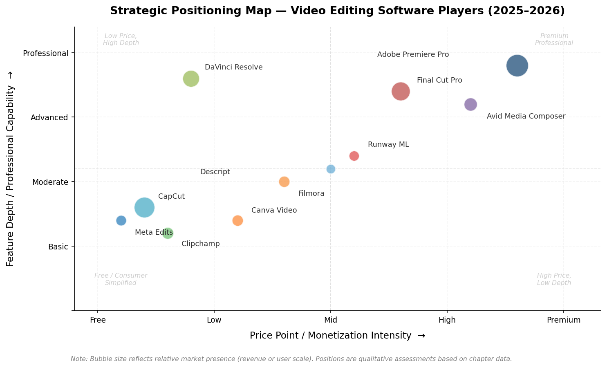

*Figure 2-2. Strategic positioning map of 11 major players across two qualitative axes: price point / monetization intensity (x-axis) and feature depth / professional capability (y-axis). Bubble size reflects relative market presence. The incumbent premium-professional cluster (upper right) is visually separated from the free/consumer challenger cluster (lower left), with an emerging mid-tier segment occupying the center.*

The April 2025–April 2026 research window saw the competitive boundary between these two models blur significantly. Adobe introduced consumption-based AI credits layered atop subscriptions. Apple launched a subscription bundle while retaining one-time purchase options. Blackmagic added AI features to its free tier. CapCut expanded premium subscription tiers. The net effect is a market in which pricing models are converging toward hybrid structures, and the primary locus of differentiation is shifting from core editing functionality—increasingly commoditized across both camps—toward ecosystem integration, AI capability depth, and platform-specific distribution advantages.

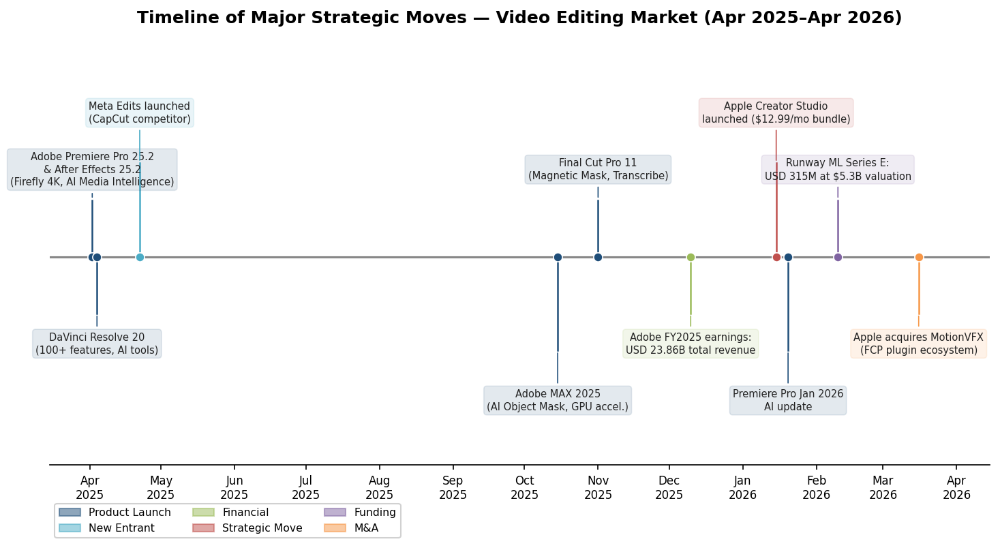

*Figure 2-3. Chronological timeline of major strategic events during the research window, color-coded by category: product launches (blue), new market entrants (light blue), financial milestones (green), funding rounds (purple), strategic moves (red), and M&A activity (orange). The concentration of AI-focused product releases in April 2025 and subscription-model shifts in January 2026 underscores the two dominant competitive themes of this period.*

# 第3章 Technology Trends — AI, Cloud, and Next-Generation Editing Workflows

The April 2025–April 2026 research window marks a period in which three interrelated technology currents reshaped the video editing and creation software landscape: the rapid integration of AI-powered features into established Non-Linear Editors (NLEs), the maturation of cloud-native collaborative workflows, and the accelerating convergence of generative AI video tools with traditional post-production pipelines. Underpinning all three trends are hardware advances—particularly in GPU acceleration and neural processing—that have expanded the performance envelope available to editors on both desktop and mobile platforms.

This chapter examines each trend in turn, assesses the response of open-source and community-driven tools, and considers the implications for the market's evolving definitional boundaries. The analysis draws on product announcements, vendor documentation, and independent benchmarks from the research window to trace how these technology shifts are redefining competitive positioning and user expectations across every market segment.

## 3.1 AI Feature Integration in Mainstream Editing Tools

### 3.1.1 From Novelty to Core Workflow

AI-powered features in video editing software have transitioned from experimental add-ons to core components of the production workflow. As of early 2026, every major NLE and mobile editor ships with multiple AI capabilities addressing historically time-intensive tasks: automatic captioning, intelligent scene detection, subject isolation, noise reduction, and—increasingly—generative content creation within the timeline itself.

The breadth and depth of these features vary considerably by vendor, yet the directional convergence is unmistakable: AI is being deployed to compress the interval between raw footage import and finished output, lower the skill floor for complex operations, and differentiate premium subscription tiers from free offerings.

### 3.1.2 Adobe: Firefly-Powered Generative Editing

Adobe's AI strategy centers on its proprietary Firefly generative model family, integrated directly into the Premiere Pro and After Effects timelines. The Premiere Pro 25.2 release (April 2025, announced at NAB) introduced several landmark capabilities:

- **Generative Extend (4K)**: Editors can add AI-generated frames to the beginning or end of clips, effectively extending shots without reshooting. The feature shipped at 4K resolution—a threshold that renders it viable for broadcast and cinematic workflows rather than social-media content alone [Adobe Blog](https://blog.adobe.com/en/publish/2025/04/02/introducing-new-ai-powered-features-workflow-enhancements-premiere-pro-after-effects "Premiere Pro 25.2 — NAB 2025").
- **Media Intelligence with Natural-Language Search**: An AI engine analyzes footage and applies semantic tags, enabling editors to search across their media library using natural language—describing objects, locations, camera angles, and transcribed dialogue rather than relying on manually entered metadata [Adobe Blog](https://blog.adobe.com/en/publish/2025/04/02/introducing-new-ai-powered-features-workflow-enhancements-premiere-pro-after-effects "Media Intelligence in Premiere Pro").
- **Automatic Caption Translation**: On-device AI translates captions into 27 languages, addressing a significant workflow bottleneck for creators distributing content across global platforms.

At Adobe MAX 2025 (October 2025), additional AI features were showcased, including AI Object Mask for precision rotoscoping and faster vector mask tracking. The January 2026 update continued this trajectory with expanded Firefly generative capabilities and deeper integration of AI-powered workflows across the Creative Cloud suite [Adobe Blog](https://blog.adobe.com/en/publish/2026/01/20/new-ai-powered-video-editing-tools-premiere-major-motion-design-upgrades-after-effects "January 2026 Updates").

After Effects 25.2 received a fundamental rewrite of its caching system—High Performance Preview Playback—that combines RAM and local disk to enable full-composition playback on commodity hardware, alongside new AI-assisted 3D motion-design tools. The caching overhaul addresses a long-standing performance bottleneck that had pushed motion designers toward third-party rendering solutions [Adobe Blog](https://blog.adobe.com/en/publish/2025/04/02/introducing-new-ai-powered-features-workflow-enhancements-premiere-pro-after-effects "After Effects 25.2").

Adobe's approach ties AI feature access to its generative-credit consumption model, where premium AI operations consume credits allocated by subscription tier. This creates a hybrid subscription-plus-usage pricing layer—a structural monetization shift explored in greater detail in Chapter 5.

### 3.1.3 Apple: On-Device AI and Creator Studio Features

Apple's AI strategy in Final Cut Pro leverages the Neural Engine in Apple Silicon to enable on-device AI processing without cloud dependency—a differentiator that confers both privacy and latency advantages.

Final Cut Pro 11 (November 2024) introduced **Magnetic Mask**, an AI-powered subject-isolation tool that operates without green screens, and **Transcribe to Captions**, an on-device automatic captioning system [Apple Newsroom](https://www.apple.com/newsroom/2024/11/final-cut-pro-11-begins-a-new-chapter-for-video-editing-on-mac/ "Final Cut Pro 11 Launch"). The January 2026 Creator Studio update added three further AI capabilities:

- **Transcript Search**: Natural-language search of spoken dialogue across all footage in a project.
- **Visual Search**: AI-powered detection and retrieval of objects and actions within clips.
- **Beat Detection**: Automatic identification and alignment of music beats in the timeline.

For iPad, **Montage Maker** uses AI to automatically assemble edits from the strongest visual moments in a footage library, combined with **Auto Crop** for vertical-format reframing—capabilities designed specifically for the short-form social-video workflow that dominates creator output on TikTok and Instagram Reels [Apple Newsroom](https://www.apple.com/newsroom/2026/01/introducing-apple-creator-studio-an-inspiring-collection-of-creative-apps/ "Creator Studio Features").

Apple's on-device architecture avoids the credit-based pricing models adopted by Adobe and others, positioning AI features as inherent to the hardware-software integration rather than as an incremental cost layer. The trade-off is that AI capability scales directly with hardware generation: users on older devices receive fewer or degraded AI features.

### 3.1.4 Blackmagic Design: AI Democratization Through the Free Tier

DaVinci Resolve 20, announced at NAB 2025, shipped over 100 new features with AI capabilities spanning multiple workflow stages. The AI feature set is notable for both its breadth and its inclusion in the free tier:

- **AI IntelliScript**: Automatically generates timelines from text scripts by matching transcribed dialogue to footage.
- **AI Multicam SmartSwitch**: Selects camera angles based on active speakers, targeting podcast and multi-camera interview editing.
- **AI Audio Assistant**: Produces a professional audio mix in a single click, automating loudness normalization and frequency balancing.
- **AI Set Extender**: Uses text prompts to extend scenes and generate missing backgrounds—a generative capability previously confined to dedicated AI platforms.
- **AI Detect Music Beats**: Places beat markers for rhythm-synced editing.
- **UltraNR Noise Reduction**: An AI-driven denoising mode integrated with NVIDIA TensorRT, running up to 75% faster on the GeForce RTX 5090 compared with previous-generation GPUs.
- **Magic Mask v2**: An enhanced AI masking tool with a paint-brush interface for manual refinement of automatically generated masks.

Critically, the majority of these features are available in the free version of DaVinci Resolve 20, sustaining Blackmagic's long-standing strategy of using free software to drive hardware sales (cameras, capture cards, Cloud Store devices) while applying direct pricing pressure on subscription-based competitors [PetaPixel](https://petapixel.com/2025/04/04/davinci-resolve-20-delivers-more-than-100-new-features/ "DaVinci Resolve 20") [Blackmagic Design](https://www.blackmagicdesign.com/products/davinciresolve/whatsnew "DaVinci Resolve 20 What's New").

### 3.1.5 CapCut and Mobile-First AI

CapCut (ByteDance) has deployed AI as a core differentiator in the mobile editing segment. Its AI feature set—auto-captioning in dozens of languages, AI-driven effects and filters, template-driven editing, and background-removal tools—is engineered to minimize manual editing and enable rapid creation of platform-native short-form content. While individual feature capabilities overlap with those of desktop NLEs, CapCut's implementation prioritizes one-tap simplicity over granular control, reflecting its consumer-oriented user base. The geopolitical uncertainties surrounding ByteDance's U.S. market access (discussed in Chapter 1) add a layer of regulatory risk to an otherwise high-adoption product.

### 3.1.6 Descript: Text-Based Editing as an AI-Native Paradigm

Descript represents the most radical rethinking of the editing interface through AI. By enabling editors to manipulate video by editing a transcript, Descript collapses the distinction between text editing and timeline editing. Key AI features include automatic transcription, filler-word removal, AI voice cloning (Overdub), and AI-powered multicam editing. With estimated annualized recurring revenue (ARR) of USD 95–110 million as of 2025, growing 32–38% year-over-year, Descript demonstrates that an AI-native editing paradigm can sustain a meaningful commercial business even as traditional NLEs incorporate incremental AI features [Tracxn](https://tracxn.com/d/companies/descript/__vF948CDG-Kh3N00CfMczYLzLCnpIqW3JvPsaCVEZfPU "Descript Company Profile 2026").

The following matrix summarizes AI feature availability across eight major products as of early 2026, illustrating the variation in feature coverage, access tiers, and monetization approaches:

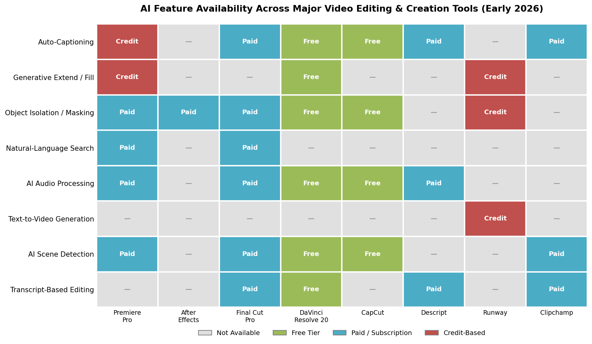

*Figure 3-1. AI feature availability matrix comparing eight products across eight capability categories. Color coding indicates access tier: free, paid/subscription, credit-based, or not available. DaVinci Resolve 20 offers the broadest free-tier AI feature set, while Adobe Premiere Pro gates several capabilities behind generative credits. Source: compiled from vendor documentation and product specifications.*

## 3.2 Cloud-Native Collaborative Workflows

### 3.2.1 The Shift Toward Real-Time Multi-User Editing

Cloud-based collaboration has evolved from a peripheral convenience to a strategic differentiator. The catalyst is threefold: the growth of geographically distributed production teams, the persistence of remote post-production workflows accelerated during the pandemic, and the escalating volume of content requiring concurrent work by editors, colorists, VFX artists, and audio engineers.

Two platforms made the most significant advances during the research window: Adobe Frame.io and Blackmagic Cloud.

### 3.2.2 Adobe Frame.io V4

Frame.io, acquired by Adobe in 2021 for approximately USD 1.275 billion, received its V4 overhaul at Adobe MAX 2024 with continuous refinement throughout 2025. By Adobe MAX 2025, Frame.io V4 had accumulated over 100 updates and established itself as Adobe's central cloud-collaboration layer. Key capabilities as of early 2026 include:

- **Media Intelligence Search**: The same AI engine powering Premiere Pro's natural-language search is integrated into Frame.io, enabling semantic search across all stored assets—users can query for "drone shots from last week with mountain footage" regardless of filenames or manual metadata [Frame.io Blog](https://blog.frame.io/2025/10/28/adobe-max-2025-connected-creativity-for-modern-content-production/ "Frame.io at Adobe MAX 2025").
- **Rebuilt Premiere Pro Panel**: A ground-up rebuild of the Frame.io panel within Premiere Pro (available in version 25.6) allows editors to browse, import, share, and review media without leaving the timeline. Camera-to-Cloud footage auto-uploads to Frame.io and becomes immediately available for import.
- **Content Credentials**: Automatic reading and preservation of Content Credentials metadata, including AI-generation provenance—an emerging compliance requirement as AI-generated content proliferates across distribution channels.
- **Forensic Watermarking and DRM**: Enterprise-grade security features targeting studios and brands managing pre-release content under strict confidentiality requirements.
- **Firefly Services Integration**: Enterprise customers can automate bulk asset variations (localized versions, format adaptations) using Adobe's Firefly generative AI, with review and approval managed within Frame.io.
- **Workfront Integration**: Native bidirectional synchronization between Frame.io and Adobe Workfront connects marketing project management with creative asset review, reducing handoff friction in enterprise workflows.

Frame.io's strategic positioning as the connective layer between capture (Camera to Cloud), editing (Premiere Pro), and distribution (delivery workflows) reflects Adobe's effort to construct a cloud-based moat that extends beyond the editing application itself. The resulting lock-in effect—where teams depend on Frame.io for asset management, review, and delivery—raises switching costs in ways that standalone NLE features cannot.

### 3.2.3 Blackmagic Cloud

Blackmagic Cloud, integrated into DaVinci Resolve 20, offers a fundamentally different architectural model: cloud-hosted project databases paired with locally stored media, rather than full cloud rendering. Multiple editors, colorists, VFX artists, and audio engineers can work on the same project simultaneously using DaVinci Resolve's dedicated functional pages. Key capabilities include:

- **Simultaneous Multi-User Editing**: Multiple users work on the same timeline with automatic bin and timeline locking to prevent overwrites. Changes propagate in real time, with visual timeline comparison tools for reviewing and merging concurrent edits [Blackmagic Design](https://www.blackmagicdesign.com/products/davinciresolve/collaboration "DaVinci Resolve Collaboration").
- **Live Camera Sync**: Blackmagic cameras generate small H.264 proxy files that upload to Blackmagic Cloud in real time during shooting, enabling editors to begin assembly before the full-resolution media arrives at the studio.
- **Blackmagic Cloud Presentations**: A beta review-and-approval tool that allows stakeholders to view work-in-progress directly from the cloud without VPN access; shared markers and comments automatically synchronize back to DaVinci Resolve timelines.
- **Organizations Management**: Enterprise features for managing teams, groups, single sign-on, and rental licenses through a centralized dashboard.
- **Blackmagic Cloud Store Sync**: Hardware-accelerated local network storage that synchronizes media between geographically distributed locations, enabling each collaborator to work with a local copy at full bandwidth.

Blackmagic's approach avoids cloud rendering costs entirely—all processing remains local—making it substantially cheaper to operate than full cloud-rendering platforms. The trade-off is that each collaborator must maintain local storage with synchronized media, which introduces bandwidth and storage-management overhead for teams with large media libraries. For productions that can tolerate this constraint, the model offers professional-grade collaboration at a fraction of the cost of cloud-rendering alternatives.

### 3.2.4 Other Cloud Collaboration Developments

Microsoft Clipchamp, a browser-native editor integrated with Microsoft 365, offers inherently cloud-based workflows: projects are stored in OneDrive and accessible from any device with a browser. While Clipchamp lacks the multi-user simultaneous-editing capabilities of Frame.io or Blackmagic Cloud, its integration with Microsoft Teams and SharePoint positions it as a default video-creation tool for enterprise communications teams. In 2025, Clipchamp added transcript-based editing, further aligning its feature set with the AI-assisted workflow trend [Microsoft Clipchamp](https://clipchamp.com/en/whats-new/ "Clipchamp What's New").

Canva Video, similarly browser-based, leverages Canva's existing real-time multi-user collaboration infrastructure—originally built for graphic design—for video editing. With over 200 million monthly active users across all Canva products, the platform applies a design-collaboration ethos to video creation, though its editing capabilities remain oriented toward template-driven assembly rather than fine-grained NLE operations. Together with Clipchamp, Canva Video illustrates a broader pattern: cloud-native platforms are expanding the definition of "video editing" beyond the professional NLE paradigm, reaching user populations that would never adopt a traditional timeline-based tool.

## 3.3 Convergence of AI Video Generation and Traditional Editing

### 3.3.1 The Blurring Definitional Boundary

The most structurally significant technology trend during the research window is the accelerating convergence between AI video generation tools and traditional editing workflows. As recently as 2023, these were largely separate categories: NLEs manipulated existing footage, while AI generators created footage from text prompts or reference images. By early 2026, the boundary has become increasingly porous—generation capabilities now appear inside editing timelines, and editing capabilities appear inside generation platforms.

This convergence carries direct implications for market definition. As discussed in Chapter 1, the adjacent AI video generator market was valued at USD 1.23 billion in 2025, projected to reach USD 21.61 billion by 2034 at a 46.0% CAGR [Intel Market Research](https://www.intelmarketresearch.com/ai-video-generator-software-market-36387 "AI Video Generator Software Market 2026–2034"). As generation and editing merge, a growing share of this high-growth segment will overlap with the traditional video editing market, complicating revenue attribution and competitive analysis for years to come.

### 3.3.2 Runway: The Editing-Generation Hybrid

Runway ML, valued at USD 5.3 billion following a USD 315 million Series E round in February 2026, is the most advanced exemplar of this convergence. Its Gen-4 model (launched March 2025) introduced consistent character, location, and object generation across scenes—users can establish a visual identity and the model maintains coherence across multiple generated clips without fine-tuning or additional training [Runway ML](https://runwayml.com/research/introducing-runway-gen-4 "Introducing Runway Gen-4").

Runway's platform extends well beyond text-to-video generation. It includes a timeline-based editing interface with capabilities for color grading, layering, and compositing, alongside generative tools for inpainting, motion-brush animation, style transfer, and scene extension. This positions Runway as a hybrid tool that competes simultaneously with traditional NLEs (for AI-native creators) and with other generative models (for quality and controllability). The company's introduction of "GVFX" (Generative Visual Effects) represents a nascent category of visual effects that are generated rather than manually composited—a workflow paradigm that could eventually displace significant portions of traditional VFX pipelines [Runway ML](https://runwayml.com/research/introducing-runway-gen-4 "Gen-4 GVFX Capabilities") [TechCrunch](https://techcrunch.com/2026/02/10/ai-video-startup-runway-raises-315m-at-5-3b-valuation-eyes-more-capable-world-models/ "Runway Series E").

### 3.3.3 Google Veo and Flow: A Platform Giant Enters

Google's entry into AI video generation ranks among the most consequential developments of the research window. Veo 3, launched at Google I/O in May 2025, became the first major AI video model to generate native audio alongside video—producing dialogue, ambient sound, and music synchronized with the visual content [CNBC](https://www.cnbc.com/2025/05/20/google-ai-video-generator-audio-veo-3.html "Google Veo 3 Launch").

Alongside Veo 3, Google launched **Flow**, a dedicated AI filmmaking tool that integrates video generation with editing-like capabilities: reference-image-driven character control, first-and-last-frame interpolation, video extension, and—with Veo 3.1 (October 2025)—object insertion and removal within generated clips. By October 2025, users had created over 275 million videos in Flow, a figure that underscores the latent demand for AI-assisted video creation tools outside the traditional NLE paradigm [Google Blog](https://blog.google/innovation-and-ai/products/veo-updates-flow/ "Introducing Veo 3.1 and Flow Updates") [TechCrunch](https://techcrunch.com/2025/10/15/google-releases-veo-3-1-adds-it-to-flow-video-editor/ "Google Releases Veo 3.1").

Veo 3.1 added richer audio generation, improved prompt adherence, and enhanced realism with true-to-life textures. The model supports 1080p output and 4K via upscaling, with configurable aspect ratios for landscape and portrait formats. Flow's editing features—object insertion, clip extension, start/end frame specification—embody Google's thesis that the distinction between "generating" and "editing" video will collapse for a significant share of content creation use cases.

### 3.3.4 OpenAI Sora: A Cautionary Trajectory

OpenAI's Sora illustrates both the promise and the economic fragility of AI video generation at scale. The original Sora model debuted in early 2024 as a research preview. In September 2025, OpenAI launched a dedicated Sora app, framing it as a potential "GPT-3.5 moment for video." The app reached the top of the Apple App Store and achieved one million downloads faster than ChatGPT [Axios](https://www.axios.com/2026/03/24/openai-discontinue-sora-video-app "OpenAI Shutters Sora").

The trajectory reversed sharply: by January 2026, downloads had plunged 45%. On March 24, 2026, OpenAI announced the discontinuation of the Sora app, API, and Sora.com—just six months after launch. The stated rationale centered on compute economics: Sora was consuming approximately USD 500,000 per day in server expenses, and the company chose to redirect GPU capacity and engineering resources toward its core enterprise AI products and the development of its next-generation "Spud" model family [Axios](https://www.axios.com/2026/03/24/openai-discontinue-sora-video-app "OpenAI Shutters Sora") [WSJ](https://www.wsj.com/tech/ai/the-sudden-fall-of-openais-most-hyped-product-since-chatgpt-64c730c9 "The Sudden Fall of Sora").

The Sora shutdown carries implications beyond OpenAI. It demonstrates that compute-intensive video generation models face severe unit-economics challenges at consumer scale, particularly when offered at price points designed to compete with free or low-cost editing tools. The concurrent cancellation of OpenAI's landmark partnership with Disney—which had included licensing of over 200 characters and a planned USD 1 billion Disney investment in OpenAI—further underscores the commercial fragility of current-generation AI video tools [Axios](https://www.axios.com/2026/03/24/openai-discontinue-sora-video-app "Disney Deal Cancelled"). The lesson for the broader market is clear: generative video viability depends not only on model quality but on achieving sustainable unit economics at deployment scale.

### 3.3.5 Other Generative Video Entrants

**Pika Labs** continues to iterate on its consumer-friendly AI video generation platform, competing on speed and accessibility. **Kling AI** (Kuaishou) has gained traction as a China-originated generative video model with expanding international availability. Both compete with Runway and Google Veo for the attention of creators exploring AI-native video production, though neither has achieved Runway's scale of venture funding nor Google's distribution reach.

The competitive landscape in generative video remains highly dynamic, with model capabilities improving on a quarterly cadence and business model sustainability largely unproven at consumer-facing price points—a reality starkly illustrated by Sora's shutdown. The timeline below captures the density and acceleration of technology milestones across AI features, generative models, cloud collaboration, and hardware during the research window:

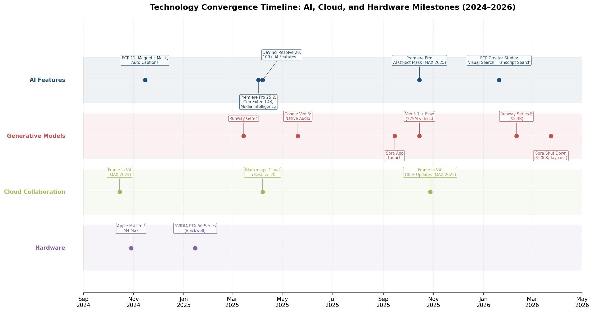

*Figure 3-2. Horizontal timeline plotting 16 key milestones across four technology categories—AI Features (blue), Generative Models (red), Cloud Collaboration (green), and Hardware (purple)—from September 2024 to April 2026. The concentration of events in the April–October 2025 window illustrates the pace of simultaneous change across all four domains. Source: compiled from vendor announcements and press reporting.*

## 3.4 Hardware Enablers: GPU Acceleration and Neural Processing

### 3.4.1 NVIDIA Blackwell Architecture (GeForce RTX 50 Series)

Hardware advances have been essential enablers of the software trends described above. NVIDIA's GeForce RTX 50 Series, based on the Blackwell architecture and shipping from early 2025, introduced several capabilities with direct impact on video editing workflows:

- **4:2:2 Hardware Encode/Decode**: For the first time, consumer GPUs include dedicated hardware acceleration for 4:2:2 10-bit video—the color-subsampling format used by professional cameras. The RTX 50 Series achieves a 10× acceleration in 4:2:2 encoding and can decode up to 8K at 75 fps, equivalent to 10× 4K30 streams per decoder. This eliminates the need for proxy workflows when editing 4:2:2 footage—a significant time savings for professional editors [NVIDIA Blog](https://blogs.nvidia.com/blog/rtx-ai-garage-studio-adobe-premiere-davinci-resolve-blackwell/ "RTX Blackwell Video Editing Acceleration").
- **Ninth-Generation NVENC**: A 5% improvement in HEVC and AV1 encoding quality (BD-BR), with a new Ultra High Quality (UHQ) mode that yields a further 5% quality gain. Multi-encoder support enables up to 2.5× faster exports in DaVinci Resolve, CapCut, and Filmora.
- **Fifth-Generation Tensor Cores**: Support for FP4 quantization, enabling generative AI models (such as WAN and LTX Video for local video generation) to run 2× faster at half the VRAM footprint. This capability is critical for enabling local, on-device AI video generation without cloud dependency.
- **Multi-Stream Decode**: The RTX 5090 supports up to 5× 8K30 or 20× 4K30 simultaneous input streams, enabling real-time multicam editing without proxy generation.

Application-specific performance gains are substantial: Adobe Media Intelligence runs 30% faster on the RTX 5090 Laptop GPU compared with the RTX 4090 Laptop GPU; Adobe Enhance Speech runs 7× faster on the RTX 5090 Laptop GPU compared with the MacBook Pro M4 Max; and DaVinci Resolve's UltraNR Noise Reduction runs 75% faster on the RTX 5090 versus the previous generation [NVIDIA Blog](https://blogs.nvidia.com/blog/rtx-ai-garage-studio-adobe-premiere-davinci-resolve-blackwell/ "RTX 50 Series Performance Benchmarks").

### 3.4.2 Apple Silicon M4 Family

Apple's M4 chip family (M4, M4 Pro, M4 Max), shipping in MacBook Pro, Mac Studio, and Mac Pro configurations since late 2024, advances the Apple Silicon trajectory with specific relevance to video editing:

- **Neural Engine**: Up to 38 trillion operations per second (TOPS)—over 3× the capability of the M1-generation Neural Engine. This powers on-device AI features in Final Cut Pro (Magnetic Mask, Transcribe to Captions, Visual Search) without cloud round-trips [Apple Newsroom](https://www.apple.com/newsroom/2024/10/apple-introduces-m4-pro-and-m4-max/ "M4 Pro and M4 Max Introduction").
- **Media Engine**: Hardware-accelerated encode and decode for H.264, HEVC, ProRes, and ProRes RAW. The M4 Max supports up to two ProRes 8K streams or up to 33 simultaneous ProRes 4K streams.
- **Unified Memory Architecture**: Up to 128 GB of unified memory (M4 Max) accessible to both CPU and GPU, eliminating memory-bandwidth bottlenecks for large project files and high-resolution timeline scrubbing.

Apple's hardware-software co-design approach ensures that Final Cut Pro optimizations for M4 are available from the day new hardware ships—a structural advantage over cross-platform competitors that must optimize for heterogeneous hardware environments.

The following chart compares key hardware performance metrics across the NVIDIA and Apple Silicon platforms, illustrating both the scale of generational improvement and the architectural differences between the two ecosystems:

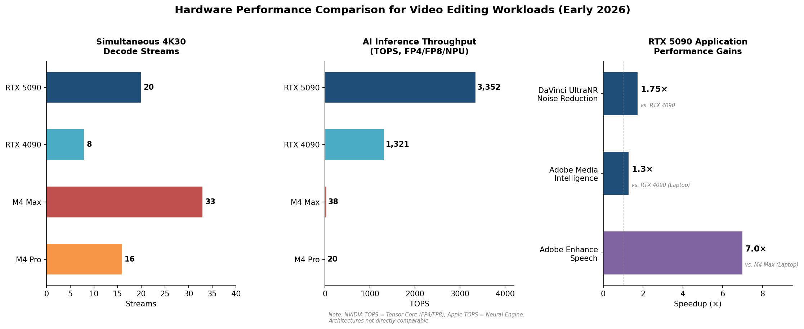

*Figure 3-3. Three-panel comparison of hardware performance metrics relevant to video editing. Left: simultaneous 4K30 decode stream capacity (M4 Max leads at 33 streams). Center: AI inference throughput in TOPS (RTX 5090 leads at 3,352 TOPS; note that NVIDIA Tensor Core and Apple Neural Engine architectures are not directly comparable). Right: RTX 5090 application-specific speedups versus prior-generation hardware. Source: vendor specifications and independent benchmarks.*

### 3.4.3 Neural Processing Units (NPUs) in the PC Ecosystem

Beyond discrete GPUs, the proliferation of NPUs in Intel (Meteor Lake, Arrow Lake) and Qualcomm (Snapdragon X Elite) processor architectures has created a new compute tier for AI-accelerated editing features on thin-and-light laptops. While NPU performance remains well below that of discrete GPUs for complex AI workloads, NPUs are increasingly leveraged for lightweight, always-on AI tasks: background noise removal during recording, real-time auto-captioning, and smart scene detection during media import. Microsoft's Copilot+ PC certification—requiring a minimum of 40 TOPS NPU performance—signals platform-level expectations that AI-ready hardware will be standard across the PC ecosystem, broadening the addressable base for AI features in editing software and lowering the hardware barrier to entry for AI-assisted workflows.

## 3.5 Open-Source and Community-Driven Responses

### 3.5.1 The DaVinci Resolve Free Tier as a De Facto Standard

While DaVinci Resolve is not open-source, its free tier occupies a functionally analogous role in the market: a fully capable, professionally adopted NLE available at zero cost. DaVinci Resolve 20's inclusion of AI IntelliScript, AI Multicam SmartSwitch, AI Audio Assistant, and other AI features in the free version sets an aggressive capability baseline that pure open-source editors cannot currently match. The free tier's professional-grade color grading (widely regarded as the industry standard), integrated Fusion VFX, and Fairlight audio post-production create a comprehensive package that has drawn users away from both paid NLEs and open-source alternatives. The result is a gravitational effect: DaVinci Resolve's free tier increasingly functions as the default "free option" in the market, reducing the addressable user base for dedicated open-source projects.

### 3.5.2 Kdenlive

Kdenlive, the KDE Non-Linear Video Editor, remains the most capable fully open-source video editor available across Linux, Windows, macOS, and BSD. Recent development cycles have improved stability and added features such as nested timelines, improved keyframe editing, and enhanced proxy workflow support. However, Kdenlive has not integrated AI-powered features at scale, and its development resources—primarily community-contributed—are orders of magnitude smaller than those of Adobe or Blackmagic. Independent reviews from the 2025–2026 window consistently rate Kdenlive as a strong choice for users who prioritize open-source principles or require a capable editor on Linux, while acknowledging that it trails DaVinci Resolve in feature depth, stability, and raw performance.

### 3.5.3 Shotcut

Shotcut, a cross-platform open-source editor built on the MLT multimedia framework and FFmpeg, continues to receive regular updates with broad format support and a modular filter architecture. Like Kdenlive, Shotcut has not adopted AI-powered editing features. Its primary strengths remain wide format compatibility and zero cost, serving a niche of users who require straightforward editing on resource-constrained hardware or who prefer open-source licensing.

### 3.5.4 The FFmpeg Ecosystem

FFmpeg—the open-source multimedia framework that underpins transcoding, streaming, and format conversion across the industry—remains foundational infrastructure for virtually all video editing tools, including commercial products. The FFmpeg project's ongoing development of hardware-accelerated encode/decode support (including NVIDIA NVENC, Intel Quick Sync, and Apple VideoToolbox) directly enables the performance gains that commercial editors market as proprietary capabilities. While FFmpeg itself is a command-line tool rather than an editor, its role as the enabling layer for format support and transcoding across the ecosystem is structurally irreplaceable—a rare case where the open-source project retains decisive influence over the commercial landscape.

### 3.5.5 The Open-Source AI Gap

The most consequential observation across the open-source video editing landscape is the widening capability gap with commercial tools, driven almost entirely by AI. Developing, training, and deploying machine-learning models for video editing tasks—object segmentation, noise reduction, speech recognition, generative fill—requires computational resources and specialized talent that community-funded open-source projects cannot currently mobilize. This AI gap risks accelerating user migration from open-source editors to free commercial tiers (particularly DaVinci Resolve) that offer AI features without monetary cost, further concentrating the market around a small number of well-funded vendors. Unless open-source projects find scalable pathways to integrate pre-trained AI models—perhaps through partnerships with open-model ecosystems—the structural disadvantage is likely to compound with each commercial product cycle.

## 3.6 Implications for Market Evolution

The technology trends examined in this chapter point to several structural implications for the video editing and creation software market:

1. **AI as the new locus of differentiation.** Core editing functionality—cutting, sequencing, color correction, titling—is increasingly commoditized across both paid and free tools. The competitive frontier has shifted to AI capability depth, with vendors differentiating on the sophistication of their AI features, the seamlessness of timeline integration, and the pricing models that govern AI access (subscription, credit-based, or hardware-bundled).

2. **Cloud collaboration as an ecosystem strategy.** Cloud platforms such as Frame.io and Blackmagic Cloud function not merely as features but as strategic moats. They increase switching costs by embedding the editing tool into team workflows, asset management, and review-approval cycles that extend well beyond the timeline itself—binding organizations rather than individual users.

3. **Generation-editing convergence will redefine the market.** As AI video generation capabilities mature and achieve sustainable unit economics—a challenge starkly highlighted by Sora's shutdown at USD 500,000 per day in compute costs—the distinction between "video editing" and "video creation" will increasingly collapse. Market-sizing frameworks will need to adapt, and incumbents that fail to integrate generative capabilities risk ceding ground to AI-native entrants operating at the intersection of both categories.

4. **Hardware-software co-evolution accelerates.** The tight coupling between GPU/NPU advances and AI feature rollouts means that software capabilities increasingly depend on hardware refresh cycles. This dynamic reinforces the competitive position of vertically integrated players (Apple) and vendors with deep hardware partnerships (Adobe–NVIDIA, Blackmagic–NVIDIA), while disadvantaging software-only entrants that lack hardware-level optimization pathways.

5. **Open-source faces a structural challenge.** Without AI capabilities comparable to those in commercial free tiers, open-source editors risk relegation to niche use cases. The widening AI feature gap with each commercial product cycle makes this a compounding disadvantage absent new models for AI integration in community-driven projects.

# 第4章 User Segmentation — Professional, Prosumer, and Consumer Markets

The global video editing software market serves a remarkably heterogeneous user base. A Hollywood post-production house operating multi-seat Avid Media Composer installations and a teenager assembling a TikTok clip in CapCut on a smartphone both consume "video editing software," yet their workflows, willingness to pay, and feature requirements share almost no overlap. Understanding these divergences is essential for interpreting market dynamics, competitive positioning, and growth trajectories across the industry.

This chapter disaggregates the market into three primary user segments—professional, prosumer, and consumer—defines each segment's boundaries, estimates its relative scale, maps tool preferences, and identifies the cross-segment migration patterns reshaping competitive dynamics as of early 2026.

## 4.1 Segment Definitions and Sizing Framework

### 4.1.1 Three-Tier Taxonomy

For the purposes of this analysis, the market is divided into three tiers:

- **Professional segment** — Full-time editors, post-production houses, broadcast facilities, advertising agencies, and film/television studios whose primary output is commercially distributed long-form or premium content. These users typically operate within collaborative multi-seat environments, require deep format support (ProRes, DNxHR, RAW codecs) and color-science pipelines, and integrate editing tools with broader asset-management, VFX, and audio-post workflows.

- **Prosumer segment** — Independent creators (YouTubers, podcasters, social-media marketers), corporate video teams, freelance videographers, independent filmmakers, and educational content producers. These users create content for commercial or semi-commercial purposes and invest meaningfully in tools and skills, but typically work as individuals or small teams rather than within institutional production environments.

- **Consumer segment** — Casual users editing personal videos, social-media posts, or hobby projects. Editing activity is intermittent, driven by social sharing rather than revenue generation, and the user typically has no formal editing training. This segment overwhelmingly favors free or freemium mobile-first tools.

### 4.1.2 Segment Scale Estimates

Precise revenue segmentation by user tier is not published by major market-research firms in the video editing vertical. The analysis below therefore triangulates across multiple proxy indicators; the resulting estimates should be treated as directional rather than definitive.

**Professional segment.** Professional editing suites account for approximately 36% of total video editing software usage, while consumer-grade editors represent the remaining 64% [Market Reports World](https://www.marketreportsworld.com/market-reports/video-editing-software-market-14722049 "Video Editing Software Market Size, 2025–2034"). Applied to the working market range of USD 2.7–3.8 billion established in Chapter 1 for 2026, the professional segment generates an estimated USD 1.0–1.4 billion in annual revenue—disproportionate to its user count but consistent with premium pricing and multi-seat licensing structures.

**Prosumer segment.** The number of paid premium video editing software users globally was projected to reach 48.22 million by 2025 [ElectroIQ](https://electroiq.com/stats/video-editing-statistics/ "Video Editing Statistics 2025"). A substantial share of these paid users—estimated at 40–50%—fall in the prosumer category, encompassing individual Creative Cloud subscribers, Final Cut Pro license holders, and DaVinci Resolve Studio purchasers. This segment likely accounts for 35–40% of market revenue, reflecting mid-tier pricing (USD 10–55/month for subscriptions, or one-time purchases of USD 295–300).

**Consumer segment.** By user count, the consumer segment dwarfs the other two tiers. CapCut alone reported 323 million monthly active users (MAU) in July 2024 [Yahoo Finance via Expanded Ramblings](https://expandedramblings.com/index.php/capcut/ "CapCut Statistics 2026"), and iMovie is pre-installed on every Apple device. However, consumer users generate disproportionately low revenue: most rely on free-tier tools (CapCut free, iMovie, Clipchamp, InShot basic) and contribute revenue only through in-app purchases, watermark removal fees, or advertising. We estimate the consumer segment contributes 20–25% of total market revenue despite representing over 80% of the user base.

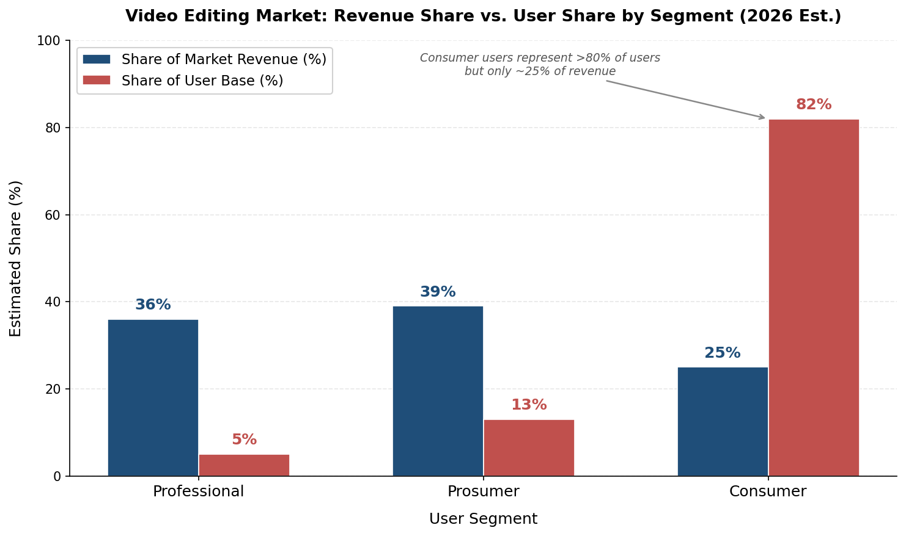

*Figure 4-1. The stark inversion between revenue contribution and user base composition across the three segments. Professional users account for roughly 36% of market revenue but only ~5% of total users; consumers represent over 80% of users yet contribute approximately 25% of revenue. Data: triangulated estimates based on Market Reports World, ElectroIQ, and CapCut usage data.*

## 4.2 Professional Segment: Tool Preferences and Workflow Requirements

### 4.2.1 Dominant Tools

The professional segment remains anchored around three core platforms:

- **Adobe Premiere Pro** holds an estimated 35% revenue share of the overall video editing market, with disproportionate concentration among advertising agencies, corporate media departments, and independent post-production facilities [ElectroIQ citing SendShort data](https://electroiq.com/stats/video-editing-statistics/ "Software Market Share 2025"). As of early 2026, Adobe Creative Cloud had surpassed 41 million paid subscribers globally [ProDesignTools](https://prodesigntools.com/number-of-creative-cloud-subscribers.html "Adobe Creative Cloud Adoption Grows to 41 Million Paid Subscribers"), though this figure encompasses all Creative Cloud applications rather than video tools alone. In higher education, Premiere Pro leads institutional deployments with 1,282 installations, followed closely by marketing and advertising (1,232) and media production verticals [ElectroIQ](https://electroiq.com/stats/adobe-premiere-pro-vs-final-cut-pro-statistics/ "Adobe Premiere Pro vs Final Cut Pro Statistics 2025").

- **Avid Media Composer** retains significant share in high-end broadcast and film post-production (estimated 10% of market revenue). Its bin-locking collaborative workflow, deep metadata integration with Avid NEXIS shared-storage systems, and decades of institutional entrenchment sustain loyalty despite an aging interface paradigm.

- **DaVinci Resolve Studio (Blackmagic Design)** has steadily expanded its professional footprint, commanding an estimated 15% revenue share. Its integrated four-application architecture (Edit, Fusion, Fairlight, Color) and industry-leading color grading tools have established it as the primary NLE for colorists and an increasingly common choice for narrative film editors. The free tier—which includes the vast majority of features—serves as a powerful pipeline from prosumer adoption to Studio upgrades.

### 4.2.2 Professional Workflow Requirements

Professional users are distinguished less by which NLE they operate than by the surrounding ecosystem requirements:

- **Collaboration infrastructure** — Multi-editor projects demand shared project files, bin locking, and centralized media management. Adobe Frame.io (integrated since 2021), Avid NEXIS paired with Media Composer's bin-locking system, and Blackmagic Cloud collaboration each address this need through differing architectural approaches.
- **Format and codec depth** — Support for cinema-camera RAW formats (ARRI ARRIRAW, RED R3D, Blackmagic RAW), broadcast codecs (XDCAM, AVC-Intra), and mastering specifications (IMF, DCP) is a non-negotiable baseline.
- **Color-science pipelines** — ACES-based color management, HDR monitoring, and LUT management are standard requirements. Premiere Pro's introduction of Premiere Color Management (ACEScct-based) in version 25.2 and DaVinci Resolve's long-standing reference-grade color toolset both target this need.
- **Integration with VFX, audio, and graphics** — Round-tripping between NLE and compositing (After Effects, Fusion, Nuke), audio post (Pro Tools, Fairlight), and graphics tools is a daily workflow requirement that creates significant switching costs.

### 4.2.3 Emerging Professional Adoption Patterns

A notable trend during the research window is the selective adoption of AI-native and consumer-grade tools by professional users for specific workflow stages. Editors at established post houses have reported using CapCut or Descript for rapid social-media deliverables derived from long-form master edits, and Runway ML for experimental generative-fill or scene-extension tasks. This pattern does not represent NLE displacement but rather workflow augmentation: professionals are adding lightweight, purpose-specific tools alongside their primary editing environment to address tasks where speed outweighs fine-grained control.

## 4.3 Prosumer Segment: The Creator-Economy Catalyst

### 4.3.1 The Scale of the Creator Economy

The prosumer segment has undergone the most dramatic expansion of any user tier over the past five years, driven overwhelmingly by the growth of the creator economy. The global creator economy was valued at an estimated USD 191.55 billion in 2025, growing at a 22.5% CAGR, with projections reaching USD 234.65 billion in 2026 and USD 528.39 billion by 2030 [Exploding Topics citing Coherent Market Insights/GlobeNewswire](https://explodingtopics.com/blog/creator-economy-market-size "Creator Economy Market Size 2025–2030"). Over 207 million individuals worldwide identify as content creators, with approximately 45 million in the United States classifying themselves as professional creators [DemandSage citing Linktree](https://www.demandsage.com/creator-economy-statistics/ "Creator Economy Statistics 2026"). Nearly half (46.7%) of all creators work full-time on content production [DemandSage](https://www.demandsage.com/creator-economy-statistics/ "Creator Economy Statistics 2026").

A generational shift underlies these figures. A 2024 YouTube survey conducted in partnership with SmithGeiger found that 65% of Gen Z respondents describe themselves as "video content creators," compared with 40% of the general population [Washington Post](https://www.washingtonpost.com/technology/2024/06/27/genz-video-content-creators-youtube/ "Most of Gen Z describe themselves as video content creators"). This self-identification as a creator is reshaping demand patterns: younger users enter the editing-tool market with expectations of speed, template availability, and social-platform integration rather than the deep timeline control that historically defined NLE selection criteria.

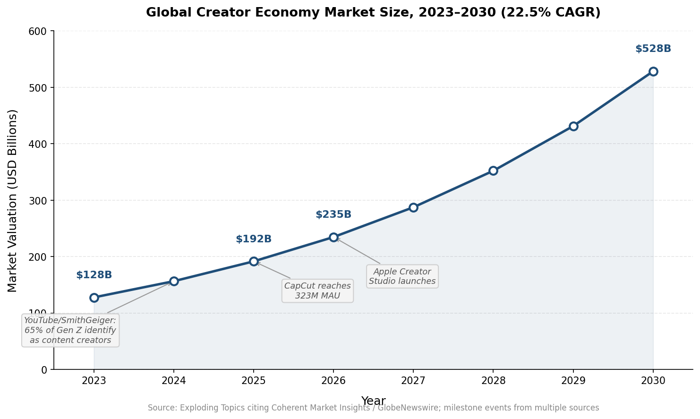

*Figure 4-2. Growth trajectory of the global creator economy from USD 128 billion (2023) to a projected USD 528 billion (2030), annotated with key ecosystem milestones that contextualize the prosumer segment's expansion. Source: Exploding Topics citing Coherent Market Insights/GlobeNewswire; milestone events from multiple sources.*

### 4.3.2 Prosumer Tool Preferences

The prosumer segment's tool preferences cluster around three primary NLEs and an expanding set of AI-augmented alternatives:

- **Adobe Premiere Pro** remains the most widely adopted prosumer NLE, benefiting from ecosystem integration with After Effects, Photoshop, and Audition within the Creative Cloud bundle. The single-app subscription (USD 22.99/month) and the all-apps bundle position Premiere Pro as accessible to individual creators requiring professional-grade output. Premiere Pro's user base grew from approximately 5 million in 2019 to an estimated 30 million in 2024, reflecting both market expansion and subscription-model accessibility [SendShort](https://sendshort.ai/statistics/premiere-pro/ "Adobe Premiere Pro Revenue & Growth Statistics").

- **Apple Final Cut Pro** has sustained a loyal prosumer following through its one-time purchase model (USD 299.99) and deep Apple Silicon optimization. The January 2026 launch of Apple Creator Studio—a subscription bundle at USD 12.99/month encompassing Final Cut Pro, Logic Pro, Pixelmator Pro, and premium content—represents Apple's most direct play for prosumer subscribers, offering an all-in-one creative suite at roughly one-fifth of Adobe's all-apps pricing. Features such as Montage Maker and Auto Crop on iPad specifically target the short-form social-video workflow that dominates prosumer output.

- **DaVinci Resolve (free tier and Studio)** occupies a distinctive prosumer position. Its free tier—which includes the majority of professional features—has become the default recommendation for budget-conscious creators entering the market. The USD 295 one-time purchase for Studio represents one of the lowest total-cost-of-ownership options for creators who require advanced capabilities such as multi-GPU rendering, HDR grading tools, and DaVinci Neural Engine AI features. DaVinci Resolve 20 (announced NAB 2025) shipped over 100 new features, including AI IntelliScript and AI Audio Assistant in the free tier, further compressing the feature gap with subscription-based competitors.

- **Filmora (Wondershare)** targets the entry-level prosumer with a simplified interface, template-driven workflows, and pricing at USD 49.99/year—roughly one-quarter of Premiere Pro's annual cost. Its estimated 5% market revenue share understates its reach among newer creators seeking a middle ground between CapCut's simplicity and Premiere Pro's complexity.

- **AI-native tools** such as Descript (text-based editing, podcast-optimized) and Canva Video (template-first, design-oriented) have carved distinct niches within the prosumer tier. Descript's transcript-driven editing paradigm—in which cutting text automatically cuts the timeline—has attracted podcasters, corporate communicators, and educators who prioritize speed over fine-grained timeline control.

### 4.3.3 Prosumer Spending Patterns

Prosumer willingness to pay spans a wide band. At the lower end, entry-level creators may spend nothing (DaVinci Resolve free, CapCut free) or under USD 10/month (Filmora, CapCut Pro at USD 7.99/month). At the upper end, professional-adjacent prosumers subscribe to Adobe Creative Cloud Pro at USD 59.99–69.99/month—a price point that in practice overlaps with studio-level professional spending. The median prosumer expenditure on editing software is estimated at USD 15–30/month, a range that captures single-app Adobe subscriptions, Apple Creator Studio, and various annual-plan prosumer tools.

The critical dynamic in prosumer economics is the conversion funnel from free to paid tiers. CapCut, DaVinci Resolve, and Clipchamp all deploy free tiers that attract massive user bases, a subset of which upgrade as their content output professionalizes. This funnel confers a distinct competitive advantage on platforms with robust free offerings, as the switching cost of learned workflows and accumulated project files compounds over time.

## 4.4 Consumer Segment: Scale Without Revenue

### 4.4.1 The Mobile-First Consumer Base

The consumer segment is defined by its sheer scale and minimal direct revenue contribution. CapCut (ByteDance) dominates this tier, with 323 million MAU reported in July 2024 [Yahoo Finance via Expanded Ramblings](https://expandedramblings.com/index.php/capcut/ "CapCut Statistics 2026"), an estimated 490 million total users as of mid-2023 [TechCrunch via data.ai](https://expandedramblings.com/index.php/capcut/ "CapCut Install Base 2023"), and cumulative Android downloads surpassing 1 billion by Q3 2024. Third-party trackers indicated an 81% share of the mobile video-editing apps market by mid-2024 [Musically](https://musically.com/2025/04/23/meta-takes-on-bytedances-capcut-with-instagram-edits-app/ "Meta Takes on ByteDance's CapCut").

Other significant consumer-tier tools include:

- **iMovie (Apple)** — Pre-installed on all Apple devices, iMovie serves as the default entry point for hundreds of millions of iOS and macOS users. Its zero-cost availability and seamless upgrade path to Final Cut Pro make it a strategically important pipeline tool within Apple's ecosystem.
- **Clipchamp (Microsoft)** — Integrated into Windows 11 and available through Microsoft 365, Clipchamp functions as the Windows-ecosystem analog to iMovie: a free, browser-based editor designed to convert casual users into the Microsoft creative workflow.
- **InShot, KineMaster, and VivaVideo** — Mobile-first editors popular in Asia-Pacific and emerging markets, typically operating freemium models with watermark removal, HD export, and premium effects as paid upgrades.

### 4.4.2 Consumer Demographics and Behavior

The consumer editing population skews young and mobile-native. CapCut's user demographics show the 25–34 age group as the largest cohort (30.88%), followed by 18–24 (21.32%) and 35–44 (23.26%) [SendShort citing SimilarWeb](https://sendshort.ai/statistics/capcut/ "CapCut User Demographics"). Gender distribution is near-equal (51.18% female, 48.82% male). Geographically, CapCut's user base is globally distributed: Russia (11.1%), the United States (8.02%), and Indonesia (6.27%) constitute the three largest country markets by user share [SendShort citing SimilarWeb](https://sendshort.ai/statistics/capcut/ "CapCut Users by Country").

Consumer editing behavior is characterized by brevity and template-dependence. The typical consumer editing session produces a clip of 15–60 seconds using pre-built templates, AI-driven effects, and automated captioning; manual timeline manipulation is minimal. This usage pattern is tightly coupled to social-platform distribution: CapCut's integration with TikTok, InShot's optimization for Instagram Stories, and Clipchamp's direct-to-social export pathways all reflect the consumer segment's platform-native orientation.

### 4.4.3 Revenue Implications

Despite enormous user numbers, the consumer segment generates limited direct revenue. CapCut's estimated revenue was approximately USD 100 million in 2023 [SendShort citing Tracxn/TechCrunch](https://sendshort.ai/statistics/capcut/ "CapCut Revenue"), implying an average revenue per user (ARPU) well below USD 1 per year. The introduction of CapCut Pro subscriptions (USD 7.99/month) and cloud-storage pricing tiers (USD 2.49–7.49/month from August 2024) represents ByteDance's effort to monetize a fraction of this base more aggressively, though the vast majority of consumer users remain on the free tier.

The mobile video editing applications market as a whole was valued at USD 1.10 billion in 2025, projected to reach USD 1.20 billion in 2026 [Straits Research](https://straitsresearch.com/report/mobile-video-editing-applications-market "Mobile Video Editing Applications Market Size"). This figure represents roughly 30% of the total video editing market by revenue—a notable share given that mobile users constitute the majority of the global editing user base by headcount.

## 4.5 Cross-Segment Migration and Boundary Blurring

The three-tier taxonomy described above provides a useful analytical frame, but segment boundaries are increasingly porous. Two countervailing migration patterns—upward and downward—are actively reshaping the competitive landscape.

### 4.5.1 Upward Migration: Consumer to Prosumer

The most consequential migration flow is the movement of consumer-segment users into prosumer territory as their content creation ambitions—and revenue potential—grow. A creator who begins editing TikTok clips in CapCut may, within 6–18 months of audience growth, graduate to Premiere Pro or DaVinci Resolve to access multi-track audio mixing, advanced color grading, or motion graphics capabilities that consumer tools cannot deliver. This upward migration represents the primary customer-acquisition channel for prosumer tools; Adobe, Apple, and Blackmagic Design each benefit from users outgrowing consumer-tier editors.

Creator-economy data corroborate this pattern. The average content creator takes approximately six and a half months to earn their first dollar and about 17 months to become self-supporting [DemandSage citing The Tilt](https://www.demandsage.com/creator-economy-statistics/ "Creator Economy Statistics 2026"). This monetization timeline roughly corresponds to the point at which creators typically begin investing in more capable editing tools, as the quality expectations of a monetized audience exceed what template-driven consumer editors can deliver.

### 4.5.2 Downward Adoption: Professional to Consumer-Grade AI Tools

A countervailing migration pattern—professionals selectively adopting consumer-grade or AI-native tools—has gained visibility during the research window. As discussed in Section 4.2.3, professional editors increasingly use lightweight tools for derivative deliverables (social-media cuts from long-form masters) or for specific AI-powered tasks (auto-captioning, rough-cut assembly) where speed outweighs precision. Descript's text-based editing, CapCut's one-tap captioning, and Runway ML's generative capabilities each fill workflow niches that traditional NLEs address less efficiently.

This downward adoption does not displace the professional NLE; it extends the professional editor's toolkit. The competitive implication is that incumbent NLE vendors face pressure to internalize these capabilities—a dynamic already evident in Adobe's Firefly-powered Media Intelligence, Apple's Transcript Search, and Blackmagic's AI IntelliScript—or risk ceding discrete workflow stages to AI-native competitors.

### 4.5.3 The Shrinking Prosumer-Professional Boundary

The feature gap between prosumer and professional tools has narrowed substantially. DaVinci Resolve's free tier includes Hollywood-grade color tools. Final Cut Pro's magnetic timeline and Apple Silicon optimization deliver performance that rivals Avid Media Composer for many project types. Adobe Premiere Pro serves users ranging from YouTube creators to broadcast facilities within a single application. The remaining differentiators between prosumer and professional tiers are increasingly found not in the NLE itself but in surrounding infrastructure: shared storage, asset management, compliance tools, and enterprise support agreements.

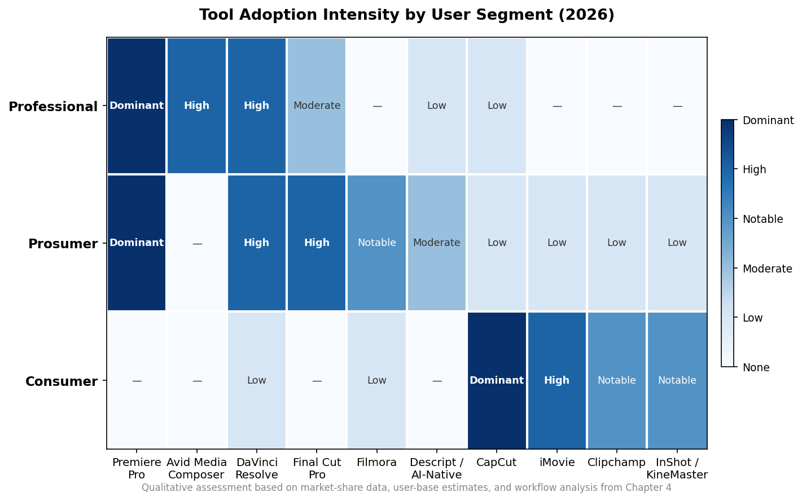

*Figure 4-3. Tool adoption intensity across the three user segments. Premiere Pro and DaVinci Resolve span multiple tiers, while Avid Media Composer and CapCut occupy segment-specific niches. Color intensity corresponds to adoption strength, from "Dominant" (darkest) to "None" (white).*

## 4.6 Geographic and Demographic Influences on Segment Distribution

### 4.6.1 Regional Segment Composition

Segment distribution varies significantly by geography:

- **North America** (37.6% of 2025 market revenue [Mordor Intelligence](https://www.mordorintelligence.com/industry-reports/video-editing-market "Regional Analysis")) has the highest concentration of professional-segment revenue, driven by the Hollywood production ecosystem, enterprise video marketing, and the mature creator economy. North America also accounts for approximately 40% of the global creator economy by value, worth an estimated USD 43.48 billion in 2026 [Exploding Topics citing Coherent Market Insights](https://explodingtopics.com/blog/creator-economy-market-size "Creator Economy Geographic Breakdown").

- **Asia-Pacific**, the fastest-growing region at 7.22% CAGR [Mordor Intelligence](https://www.mordorintelligence.com/industry-reports/video-editing-market "Regional Growth Rates"), is disproportionately weighted toward the consumer segment. Mobile-first editing dominates in markets such as India, Indonesia, and Southeast Asia, where smartphone penetration is high but desktop editing workstation access remains limited. CapCut's domestic variant JianYing is the dominant editing tool in China, and regionally popular mobile editors (InShot, VN Video Editor, KineMaster) hold significant share in their respective home markets.

- **Europe** occupies a middle position, with strong professional segments in broadcast-centric markets (UK, Germany, France) and growing prosumer adoption driven by the continent's creator economy, valued at an estimated USD 18.70 billion in 2026 [Exploding Topics citing Coherent Market Insights](https://explodingtopics.com/blog/creator-economy-market-size "European Creator Economy").

### 4.6.2 Age and Platform Ecosystem Effects

Age is the strongest demographic predictor of segment membership and tool selection. Gen Z users (born 1997–2012) overwhelmingly enter the market through mobile-first consumer tools: 64% name TikTok as their preferred content platform [eMarketer](https://www.emarketer.com/content/gen-z-leads-shift-vertical-video-creator-first-media "Gen Z Vertical Video Shift"), and CapCut ranks among the top downloaded apps by Gen Z young adults [TechCrunch](https://techcrunch.com/2024/11/10/these-are-the-top-apps-gen-z-young-adults-downloaded-this-year/ "Top Apps Gen Z Downloaded 2024"). The 65% self-identification rate as "video content creators" among Gen Z [YouTube/SmithGeiger via Washington Post](https://www.washingtonpost.com/technology/2024/06/27/genz-video-content-creators-youtube/ "Gen Z Content Creators Survey") signals an expanding future pipeline for both prosumer and professional tools as this cohort matures and monetizes.

Platform ecosystem allegiance also shapes tool selection. Apple users disproportionately gravitate toward the iMovie → Final Cut Pro upgrade path, while Windows users encounter Clipchamp as their default editor and subsequently choose between Adobe subscriptions and DaVinci Resolve. Android-dominant markets in South and Southeast Asia are most naturally served by mobile editors such as CapCut, InShot, and KineMaster.

## 4.7 Segment-Level Outlook

**Professional segment.** Growth is expected to track the overall market at 5–7% CAGR, with incremental gains driven by AI-powered productivity enhancements and expanding enterprise video needs. The segment's revenue share may gradually decline as prosumer tools absorb an increasing proportion of workflows that previously required professional-grade infrastructure.

**Prosumer segment.** This tier is the primary growth engine. Fueled by creator-economy expansion projected at 22.5% CAGR through 2030, and by the progressive democratization of professional-grade features through tools such as DaVinci Resolve free and Apple Creator Studio, the prosumer segment is expected to grow at 8–12% CAGR—outpacing the overall market. Its revenue contribution is likely to exceed the professional segment's within the next three to five years.

**Consumer segment.** User counts will continue to expand—potentially reaching 1 billion or more monthly active editing users globally as smartphone penetration deepens in emerging markets and social-video creation becomes a default digital behavior. Revenue growth, however, hinges on the success of freemium-to-paid conversion strategies: CapCut Pro's subscription adoption rate, Microsoft's ability to upsell Clipchamp users, and Apple's iMovie-to-Creator Studio pipeline will collectively determine whether the consumer segment's revenue contribution meaningfully increases.

# 第5章 Business Models, Pricing Strategies, and Monetization

## 5.1 The Pricing Landscape: An Overview of Prevailing Models

The global video editing software market as of early 2026 is characterized by an unusually diverse set of monetization architectures coexisting—and increasingly colliding—within a single competitive arena. Five distinct pricing models predominate: (1) recurring SaaS subscriptions, (2) one-time perpetual licenses, (3) freemium with premium upsells, (4) hardware-subsidized free software, and (5) platform-embedded free tools monetized through ecosystem engagement. No single model has achieved outright dominance; most major vendors now operate hybrid structures that blend elements of two or more approaches, and several introduced new monetization layers—particularly AI-credit systems—during 2025.

This diversity reflects the market's structural heterogeneity across user segments. Professional users in film, broadcast, and advertising tolerate—and often prefer—premium subscription pricing in exchange for continuous feature updates, enterprise-grade support, and guaranteed compatibility across production pipelines. Consumer and creator-economy users gravitate toward free or near-free entry points, converting to paid tiers only when specific capability ceilings (export resolution, advanced AI features, cloud storage) are reached. Enterprise buyers negotiate volume licensing with custom terms that diverge significantly from publicly listed individual pricing. The result is a market where listed "sticker prices" reveal only a fraction of the monetization picture, and where the strategic logic behind a given price point often matters more than the price itself.

## 5.2 Pricing Tiers and Structures by Major Vendor

### 5.2.1 Adobe: Subscription-First with Tiered AI Credits

Adobe operates the most complex and revenue-rich pricing architecture in the market. As of early 2026, its individual pricing for video-related products is structured across several tiers:

- **Premiere Pro (single app)**: USD 22.99/month on an annual plan [Adobe Premiere Plans](https://www.adobe.com/products/premiere/plans.html "Adobe Premiere Pricing Page").
- **Creative Cloud Standard**: The former "All Apps" tier was renamed and repositioned in June 2025 as the baseline multi-app subscription, retaining desktop applications (Photoshop, Illustrator, Premiere Pro, After Effects, and others) with 100 GB of cloud storage but limited access to generative AI features and web/mobile applications.
- **Creative Cloud Pro**: Launched June 17, 2025, at USD 69.99/month (annual commitment, billed monthly) for individuals—a 16.7% increase over the prior All Apps price of USD 59.99/month. Creative Cloud Pro includes unlimited access to standard AI features (e.g., Generative Fill in Photoshop) and a monthly allocation of 4,000 generative credits for premium AI capabilities such as text-to-video generation via Firefly [Adobe Creative Cloud Pro](https://www.adobe.com/creativecloud/pro.html "Creative Cloud Pro Features and Pricing") [Livingstone Tech](https://blog.livingstone-tech.com/en/knowledge/adobes-creative-cloud-price-hike-what-you-need-to-know "Adobe Creative Cloud Price Hike Analysis").
- **Students and teachers**: USD 29.99/month for the first year, rising to USD 39.99/month thereafter (up from USD 19.99/USD 34.99 previously).
- **Teams (annual)**: USD 99.99/month per license (up from USD 89.99) [Livingstone Tech](https://blog.livingstone-tech.com/en/knowledge/adobes-creative-cloud-price-hike-what-you-need-to-know "Teams Pricing Update").
- **Single-app AI credits**: Reduced from 500 to 25 monthly generative credits for single-app subscribers, creating a sharp incentive to upgrade to the Pro tier.

The June 2025 restructuring carries significant strategic implications. By automatically migrating existing Creative Cloud All Apps subscribers to Creative Cloud Pro—unless users actively opted to downgrade to Standard—Adobe effectively implemented a forced upsell that bundles AI capabilities into the subscription regardless of whether individual users require them. This approach maximizes per-subscriber revenue and positions generative credits as a consumption-based monetization layer atop the recurring subscription base. The credit reduction for single-app plans (from 500 to 25 per month) further tightens the funnel, channeling users toward the highest-margin tier.

### 5.2.2 Apple: The Subscription Bundle Pivot

Apple's pricing strategy underwent its most significant transformation in years with the January 2026 launch of Apple Creator Studio:

- **Final Cut Pro (one-time purchase)**: USD 299.99 on Mac; USD 4.99/month or USD 49/year on iPad [Apple Newsroom](https://www.apple.com/newsroom/2026/01/introducing-apple-creator-studio-an-inspiring-collection-of-creative-apps/ "Apple Creator Studio Launch").
- **Apple Creator Studio (subscription bundle)**: USD 12.99/month or USD 129/year; USD 2.99/month for students. The bundle encompasses Final Cut Pro, Logic Pro, Pixelmator Pro, Motion, Compressor, and MainStage, along with premium content and AI-powered features available exclusively to subscribers [Apple Newsroom](https://www.apple.com/newsroom/2026/01/introducing-apple-creator-studio-an-inspiring-collection-of-creative-apps/ "Creator Studio Pricing").

While one-time purchases remain available for individual applications, certain AI features and premium content are exclusive to Creator Studio subscribers. This partial subscription pivot establishes a two-track system: existing professional users can continue with perpetual licenses, but access to new capabilities increasingly requires a subscription commitment. At USD 129/year for six professional creative applications, Creator Studio undercuts Adobe Creative Cloud Pro (approximately USD 840/year) by more than 80%—though the comparison is imperfect given Adobe's broader application portfolio and cross-platform availability. Apple's model leverages its hardware ecosystem lock-in: Creator Studio runs exclusively on Apple devices, meaning the true cost of entry includes hardware investment that Adobe's platform-agnostic approach does not require.

### 5.2.3 Blackmagic Design: Hardware-Subsidized Free Software

DaVinci Resolve maintains the most disruptive pricing model among professional-grade NLEs:

- **DaVinci Resolve (free)**: A fully functional editing suite encompassing color grading, Fusion VFX, and Fairlight audio post-production—including the majority of AI features introduced in DaVinci Resolve 20—at zero cost [Blackmagic Design](https://www.blackmagicdesign.com/products/davinciresolve "DaVinci Resolve Product Page").
- **DaVinci Resolve Studio**: USD 295 as a one-time perpetual license, adding GPU-accelerated AI tools (DaVinci Neural Engine features), stereoscopic 3D, HDR grading tools, temporal and spatial noise reduction, and export resolution above UHD [Blackmagic Design](https://www.blackmagicdesign.com/products/davinciresolve "DaVinci Resolve Studio Features").

Blackmagic's software economics differ fundamentally from those of pure-software competitors. DaVinci Resolve functions as a distribution and adoption vehicle for Blackmagic's hardware ecosystem—cinema cameras, capture cards, broadcast equipment, and control surfaces. Revenue from the camera business (URSA, Pocket Cinema Camera lines) and broadcast infrastructure subsidizes free software distribution. This cross-subsidy model enables Blackmagic to exert sustained pricing pressure on subscription-based competitors without needing to generate direct software revenue at scale. For the broader market, the existence of a genuinely free professional-grade NLE establishes a de facto price ceiling that constrains subscription-based competitors' ability to raise prices without delivering demonstrably superior value.

### 5.2.4 CapCut (ByteDance): Freemium at Scale

CapCut's pricing structure as of January 2026 spans four tiers:

| Plan | Monthly Price | Annual Price |
|------|--------------|--------------|
| Free | USD 0 | USD 0 |
| Standard | USD 9.99/month | USD 89.99/year |
| Pro | USD 19.99/month | USD 179.99/year |
| Team | USD 24.99/month | USD 214.99/year |

[PriceTimeline](https://pricetimeline.com/data/price/capcut "CapCut Pricing as of January 2026")

The free tier provides core editing functionality, templates, effects, and basic AI features—sufficient for the majority of casual and social-media creators. The Standard tier adds 4K export, additional cloud storage, and premium templates. The Pro tier unlocks advanced AI capabilities, priority rendering, and expanded asset libraries. ByteDance does not disclose CapCut-specific revenue; third-party estimates placed it at approximately USD 100 million in 2023 [SendShort citing Tracxn data](https://sendshort.ai/statistics/capcut/ "CapCut Revenue Statistics"), with growth driven by subscription conversions and in-app purchases.

CapCut's monetization logic mirrors TikTok's broader platform strategy: acquire users at zero cost through a compelling free product tightly integrated with TikTok's content distribution engine, then monetize through premium upgrades once users are embedded in the ecosystem. The conversion rate from free to paid tiers remains low relative to the total user base (estimated at 300 million MAU on mobile as of mid-2024), but even modest single-digit conversion rates on a base of this scale yield substantial aggregate revenue. This strategy's primary vulnerability lies in its dependence on continued U.S. and European market access, which remains subject to evolving regulatory decisions regarding ByteDance-owned applications.

### 5.2.5 Other Notable Pricing Models

**Wondershare Filmora** offers a hybrid perpetual-subscription structure: an annual subscription at approximately USD 49.99–61.99/year, a perpetual license at approximately USD 79.99 (one-time), and a bundled plan including creative assets at USD 109.99/year. A separate AI credits system governs access to AI-powered features, adding a consumption-based revenue layer atop the base subscription [Wondershare Filmora Shop](https://filmora.wondershare.com/shop/buy/buy-video-editor.html "Filmora Pricing Plans").

**Runway ML** operates a credit-based pricing model across five tiers: Free (125 one-time credits), Standard (USD 12/month, 625 credits), Pro (USD 28/month, 2,250 credits), Unlimited (USD 76/month, unlimited standard generations), and Enterprise (custom pricing) [Runway ML Pricing](https://runwayml.com/pricing "Runway ML Plans and Pricing"). This structure positions generative AI usage—measured in credits consumed per video generation—as the primary billing metric, representing a fundamentally different approach from timeline-based editing tools where the unit of value is feature access rather than computational consumption.

**Descript** shifted in late 2025 from transcription-hour-based to media-minute-based billing with purchasable AI-credit top-ups. Plans range from Free (60 lifetime media minutes, 100 one-time AI credits, 720p export with watermark) through Hobbyist (USD 16/month, 10 hours of media), Creator (USD 24/month, 30 hours), to Business (USD 50/month, 40 hours) [Descript Pricing](https://www.descript.com/pricing "Descript Plans and Pricing"). The billing-model migration illustrates how AI-native editors are converging on usage-based metrics as the primary monetization dimension.

**Canva** embeds video editing within its broader design platform rather than offering it as a standalone product: Free (basic video editing), Pro (USD 12.99/month or USD 119.99/year for individuals), and Teams (approximately USD 10/user/month with a 3-user minimum) [Canva Pricing](https://www.canva.com/en/pricing/ "Canva Plans and Pricing"). Video editing is not separately priced; its value is subsumed within the comprehensive design subscription, making it an indirect competitor that lowers the perceived cost of entry-level video editing to zero for existing Canva subscribers.

**Microsoft Clipchamp** is distributed free with Windows 11 and Microsoft 365 subscriptions, generating no standalone revenue but serving as a user-acquisition and engagement tool within Microsoft's productivity ecosystem. Its strategic role is analogous to Blackmagic's hardware-subsidy model: video editing capabilities are offered at no marginal cost to strengthen the value proposition of a broader platform.

## 5.3 Freemium Funnels, Ecosystem Moats, and Switching Costs

The proliferation of free and freemium video editing tools has fundamentally reshaped user-acquisition dynamics across the market. CapCut, DaVinci Resolve (free tier), Clipchamp, and Canva's embedded editor collectively ensure that any user with internet access can begin editing video at zero cost. The strategic question is no longer whether free tools attract users—they manifestly do—but rather how effectively each vendor converts free-tier adoption into durable revenue.

Three distinct conversion architectures are observable. The first, exemplified by CapCut and Filmora, relies on **capability gating**: the free tier delivers a compelling but deliberately constrained experience, with premium features (4K export, advanced AI tools, expanded cloud storage) locked behind paid tiers. Conversion rates in this model are typically low in percentage terms—industry benchmarks for freemium SaaS applications range from 2% to 5%—but at the scale of CapCut's estimated 300 million mobile MAU, even a 2–3% conversion rate to the USD 9.99/month Standard tier would imply annualized revenue in the hundreds of millions.

The second architecture, employed by **Adobe and Apple**, relies on **ecosystem lock-in** rather than capability gating at the free tier. Adobe does not offer a meaningfully free version of Premiere Pro; instead, its moat is built on format dominance (the .prproj file format), integration depth across the Creative Cloud suite (Premiere Pro ↔ After Effects ↔ Photoshop ↔ Audition), and the institutional inertia of enterprise procurement cycles. Switching costs for a professional user embedded in Adobe's ecosystem are substantial: project files, team templates, custom presets, and workflow integrations all create friction that exceeds the subscription's monetary cost. Apple's moat operates through hardware-software co-optimization—Final Cut Pro's performance advantages on Apple Silicon are difficult to replicate on competing platforms, and Creator Studio's exclusive features deepen this dependency.

The third architecture, represented by **Blackmagic and Microsoft**, treats free software as a **loss leader** for adjacent revenue streams. Blackmagic's conversion funnel runs not from free software to paid software, but from free software to hardware purchases. Microsoft's funnel directs users toward Microsoft 365 and Windows ecosystem retention. In both cases, the software itself is never expected to generate significant direct revenue; its value is measured in terms of ecosystem stickiness and hardware attach rates.

## 5.4 AI Credits and Consumption-Based Monetization as an Emerging Revenue Layer

A defining pricing development of 2025–2026 is the emergence of AI-credit systems as a supplementary—and in some cases primary—monetization mechanism. Adobe, Runway ML, Descript, and Filmora have each implemented credit-based billing for generative AI features, and the structural logic of this approach is likely to propagate further across the market.

Credit-based billing introduces a **usage-proportional cost structure** that fundamentally differs from the flat-rate subscription model. Under traditional subscriptions, a power user and a casual user pay identical fees, creating cross-subsidization that benefits heavy users at light users' expense. Credit systems realign costs to usage: a creator generating ten AI-powered video clips per month consumes more credits—and pays more—than one generating two. For vendors, this model offers two advantages. First, it captures incremental revenue from high-usage customers who would otherwise be undermonetized under flat pricing. Second, it creates a variable-cost signal that helps users self-select into appropriate tiers, reducing churn driven by perceived overpayment.

The risk, however, is user friction. Adobe's reduction of single-app generative credits from 500 to 25 per month drew significant backlash from individual creators who perceived the change as punitive rather than value-aligned [Livingstone Tech](https://blog.livingstone-tech.com/en/knowledge/adobes-creative-cloud-price-hike-what-you-need-to-know "Adobe Creative Cloud Price Hike Analysis"). Runway ML's model, where a single high-quality video generation can consume dozens of credits, has led to user complaints about unpredictable monthly costs. The challenge for vendors is calibrating credit allocations and pricing to feel generous enough to drive adoption while tight enough to drive upgrades—a balance that none has yet convincingly struck.

A further dimension involves **marketplace and template economies** as supplementary revenue. Adobe Stock, Canva's template marketplace, and CapCut's premium template library each generate revenue through creator-produced digital assets sold or licensed within the platform. These marketplace models align incentives between the platform (which takes a commission), the template creator (who earns passive revenue), and the end user (who accesses production-ready assets). While marketplace revenue is not separately disclosed by most vendors, it represents an increasingly material component of platform economics, particularly for Canva, whose design-template marketplace is central to its value proposition.

## 5.5 Enterprise and Team Licensing versus Individual Pricing

Enterprise and team licensing constitutes a distinct revenue stratum with pricing logic that diverges sharply from individual-creator plans. Adobe's Teams plan at USD 99.99/month per license (approximately USD 1,200/year per seat) carries a 43% premium over the individual Creative Cloud Pro plan (USD 840/year), justified by centralized administration, SSO integration, shared asset libraries, and dedicated support SLAs. Apple's Creator Studio does not yet offer a dedicated enterprise tier, which may limit its penetration in institutional settings where centralized license management and compliance controls are requirements. Blackmagic addresses the enterprise segment through volume hardware-plus-software bundles and dedicated post-production facility partnerships rather than software licensing per se.

For subscription-dependent vendors, the B2B segment is disproportionately valuable relative to its user count. Enterprise licenses carry higher per-seat revenue, lower churn rates (driven by multi-year contracts and procurement cycle inertia), and greater upsell potential (cloud storage, collaboration features, priority support). Adobe's Digital Media segment, which encompasses Creative Cloud and Document Cloud, generated USD 16.55 billion in revenue in its fiscal year 2025 (ended November 2025), with enterprise and team subscriptions representing a growing—though not separately disclosed—share of that total [Adobe FY2025 Annual Report](https://www.adobe.com/investor-relations.html "Adobe Investor Relations"). The enterprise video market's projected growth to USD 42.23 billion by 2031 at 8.6% CAGR [MarketsandMarkets](https://www.marketsandmarkets.com/Market-Reports/enterprise-video-market-1182.html "Enterprise Video Market 2026-2031") suggests that team and enterprise licensing will become an increasingly contested battleground, particularly as cloud-native collaborative editing features mature and reduce the workflow advantage that has historically favored Adobe in multi-user production environments.

## 5.6 Converging Pressures and Model Evolution

The pricing and monetization landscape of the video editing software market in 2026 is shaped by the intersection of three structural forces. First, **downward price pressure from free alternatives** (DaVinci Resolve, Clipchamp, CapCut's free tier) constrains the ability of subscription-based vendors to raise prices without delivering corresponding feature differentiation—particularly in AI capabilities, which have become the primary axis of perceived value addition. Second, **the migration from flat-rate subscriptions to hybrid subscription-plus-credit models** introduces new complexity for both vendors and users, with credit-based AI monetization representing a high-upside but still-unproven revenue layer whose long-term consumer acceptance remains uncertain. Third, **ecosystem bundling strategies** from Apple (Creator Studio) and Microsoft (Clipchamp within Microsoft 365) redefine the competitive unit from the standalone application to the platform suite, making direct price comparisons increasingly misleading.

These forces are unlikely to produce a single winning model. Rather, the market appears to be settling into a durable coexistence of approaches, each optimized for a different user segment and competitive position. Subscription-plus-credits will likely remain the dominant model for professional and prosumer segments where AI features justify premium pricing. Freemium with ecosystem monetization will continue to dominate consumer and social-media creator segments. Hardware-subsidized free software will persist as long as Blackmagic's integrated hardware-software business model remains viable. The most consequential shift over the next two to three years will be the degree to which AI-credit consumption emerges as a meaningful share of total vendor revenue—a development that could restructure the economics of the entire market if generative AI features evolve from supplementary tools to core editing workflows.

# 第6章 Regional Dynamics and Platform Ecosystem Considerations

The global video editing software market is not a monolith. Beneath the aggregate figures discussed in preceding chapters—USD 2.7–3.8 billion in 2026 revenue across definitional scopes—lies a landscape shaped by pronounced regional variation in market size, growth rate, regulatory environment, platform-ecosystem allegiance, and user behavior. A tool that dominates in North America may hold negligible share in South Asia; a regulatory action in Washington or Brussels can reshape competitive dynamics for hundreds of millions of users overnight; and the operating-system ecosystem within which a user operates—Apple, Windows, or Android—channels tool adoption in ways that pricing and feature comparisons alone cannot capture.

This chapter examines these regional and platform-level dynamics across four dimensions: the major regional markets (North America, Europe, Asia-Pacific, and emerging regions) and their distinct competitive structures; the evolving regulatory environment surrounding ByteDance's CapCut across multiple jurisdictions; the influence of operating-system ecosystems on tool adoption; and the roles of locally dominant players in shaping competitive conditions within their home markets.

## 6.1 Regional Market Size and Growth Trajectories

The figure below summarizes estimated 2026 revenue and compound annual growth rates across the four major regional segments, illustrating the divergence between revenue concentration (North America) and growth momentum (Asia-Pacific).

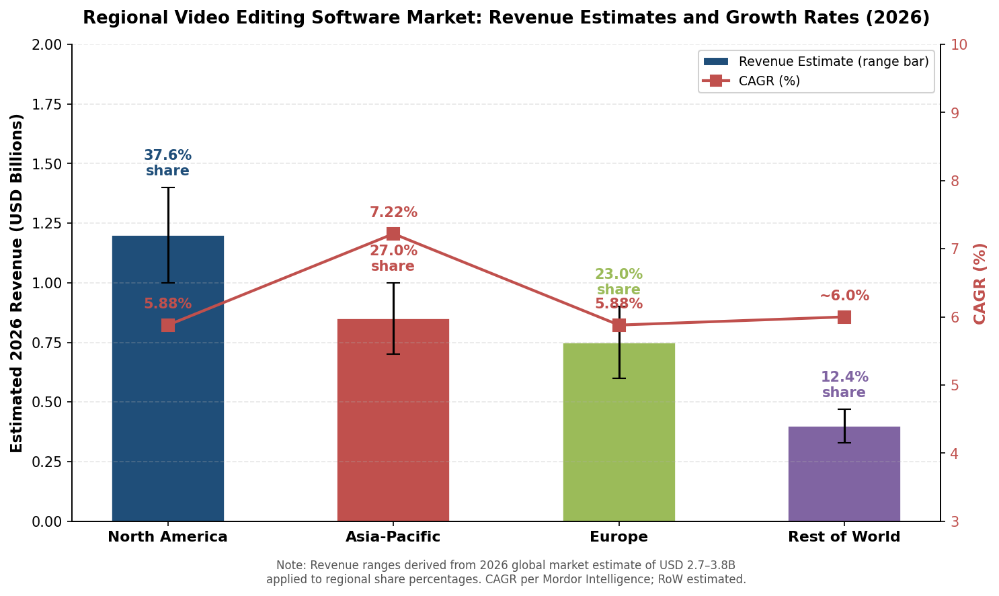

### 6.1.1 North America: The Revenue Center of Gravity

North America constituted the largest regional market in 2025, contributing 37.6% of global video editing software revenue [Mordor Intelligence](https://www.mordorintelligence.com/industry-reports/video-editing-market "Regional Analysis"). Applied to the working market range of USD 2.7–3.8 billion adopted in Chapter 1 for 2026, this translates to approximately USD 1.0–1.4 billion in regional revenue. The region's revenue concentration is disproportionate to its share of global users, a gap explained by several structural factors.

First, North America hosts the world's largest concentration of professional post-production infrastructure. Hollywood studios, broadcast networks, advertising agencies, and corporate media departments drive sustained demand for high-end NLE subscriptions and enterprise licensing at premium price points. Adobe's Creative Cloud team licenses at USD 99.99/month per seat (as detailed in Chapter 5), and multi-year studio contracts with Avid generate per-user revenue multiples of what mobile-first consumer tools command in emerging markets.

Second, the North American creator economy is the most monetized globally. The United States alone accounts for approximately 40% of the global creator economy by value—an estimated USD 43.48 billion in 2026 [Exploding Topics citing Coherent Market Insights](https://explodingtopics.com/blog/creator-economy-market-size "Creator Economy Geographic Breakdown"). With approximately 45 million Americans identifying as professional creators [DemandSage citing Linktree](https://www.demandsage.com/creator-economy-statistics/ "Creator Economy Statistics 2026"), the prosumer segment skews toward higher willingness to pay, supporting adoption of mid-tier and premium tools such as Premiere Pro single-app subscriptions, Apple Creator Studio, and DaVinci Resolve Studio.

Third, enterprise video expenditure anchors the professional tier. U.S. video advertising spend reached USD 52.1 billion, having doubled since 2020 [ElectroIQ](https://electroiq.com/stats/video-editing-statistics/ "Video Marketing Statistics"), while the broader enterprise video market is projected at USD 27.97 billion in 2026 [MarketsandMarkets](https://www.marketsandmarkets.com/Market-Reports/enterprise-video-market-1182.html "Enterprise Video Market 2026–2031"). This enterprise demand sustains premium pricing power for tools offering collaboration, asset-management, and compliance capabilities.

### 6.1.2 Asia-Pacific: The Growth Engine

Asia-Pacific is the fastest-growing regional market, expanding at a 7.22% CAGR—well above the global average of 5.88% [Mordor Intelligence](https://www.mordorintelligence.com/industry-reports/video-editing-market "Regional Analysis"). Dataintelo separately projects the Asia-Pacific video editing software market to advance at 7.4% CAGR between 2026 and 2034 [Dataintelo](https://dataintelo.com/report/global-video-editing-software-market "Video Editing Software Market 2034"). The region's estimated 27% share of 2025 global revenue—approximately USD 0.7–1.0 billion when applied to the 2026 working range—understates its significance when measured by user volume: CapCut and its Chinese domestic counterpart JianYing (剪映) together command the majority of mobile video editing usage across the region.

Several demand drivers are specific to Asia-Pacific. Mobile-first content creation dominates in India, Indonesia, the Philippines, and Southeast Asia broadly, where smartphone penetration is high but desktop workstation access remains limited. Government-backed creative industry initiatives in China, South Korea, and India provide additional tailwinds. The sheer scale of social-media content creation—driven by platforms including Douyin (TikTok's Chinese counterpart), Instagram, YouTube, and regional platforms such as Bilibili—sustains a massive base of casual and prosumer editors.

The regional competitive landscape is correspondingly more fragmented than in North America. While Adobe Premiere Pro and DaVinci Resolve maintain professional footholds, the consumer and prosumer tiers are contested by a broader array of locally popular tools: KineMaster and InShot in Southeast Asia, VN Video Editor and VivaVideo across multiple markets, and CyberLink PowerDirector in East Asia through OEM partnerships with PC manufacturers.

### 6.1.3 Europe: Professional Strength amid Regulatory Complexity

Europe represents the third-largest regional market, accounting for an estimated 23% of 2025 global revenue—approximately USD 0.6–0.9 billion when applied to the 2026 working range. The region's professional segment is anchored by broadcast-centric markets—the United Kingdom, Germany, and France—where public broadcasters, commercial networks, and film production industries sustain demand for enterprise-grade NLE solutions.

Europe's creator economy, valued at an estimated USD 18.70 billion in 2026 [Exploding Topics citing Coherent Market Insights](https://explodingtopics.com/blog/creator-economy-market-size "European Creator Economy"), is smaller than North America's but expanding rapidly, with particularly strong creator communities in the UK, Germany, Spain, and the Nordics. Prosumer tool preferences broadly mirror North American patterns, with Premiere Pro and DaVinci Resolve as the dominant choices and Final Cut Pro maintaining a loyal but Apple-ecosystem-constrained user base.

What distinguishes Europe from other regions is the density and assertiveness of its regulatory environment. The General Data Protection Regulation (GDPR), the Digital Services Act (DSA), and the EU AI Act collectively impose compliance requirements that shape product strategy, cloud infrastructure decisions, and competitive dynamics in ways without direct parallel in other major markets—a dimension explored in detail in Section 6.2.

## 6.2 Regulatory Landscape: ByteDance, CapCut, and Geopolitical Risk

Regulatory and geopolitical dynamics surrounding ByteDance's products constitute a first-order competitive variable in the global video editing market. The status matrix below summarizes CapCut's regulatory posture across the five key jurisdictions as of April 2026.

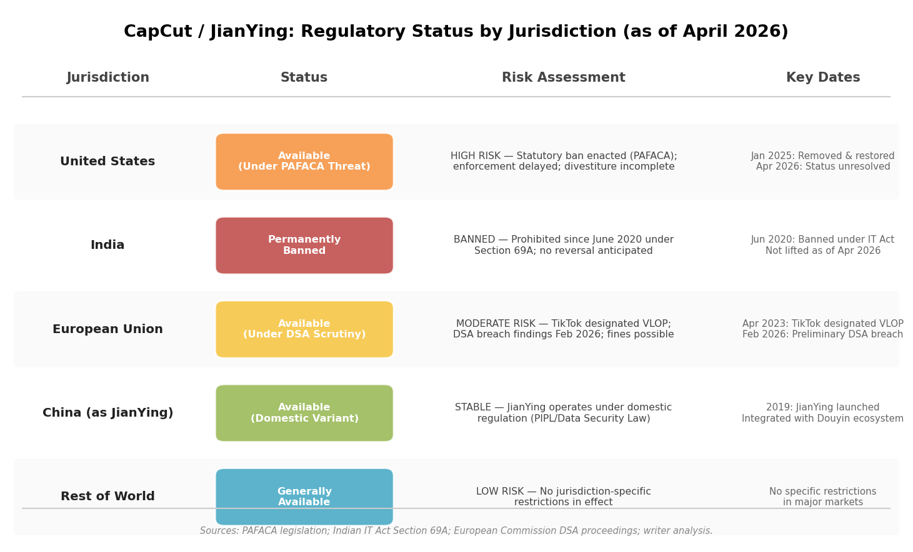

### 6.2.1 United States: PAFACA and Unresolved Legal Status

The regulatory trajectory of CapCut in the United States remains the single most consequential geopolitical variable in the video editing market. CapCut was removed from U.S. app stores on January 19, 2025, under the Protecting Americans from Foreign Adversary Controlled Applications Act (PAFACA), alongside TikTok. Service was restored within days following an executive enforcement delay, and as of April 2026, CapCut remains available in the United States—though ByteDance has not completed divestiture, and the statutory mandate under PAFACA has not been rescinded [CyberYozh](https://app.cyberyozh.com/blog/is-capcut-getting-banned-everything-you-need-to-know/ "CapCut Ban Status — 2026 Update").

The brief January 2025 removal offered a natural experiment in market sensitivity to regulatory action. During CapCut's temporary unavailability, alternative mobile editors—InShot, KineMaster, and Filmora—experienced immediate download surges. Meta accelerated development of its Edits app, announced on January 19, 2025 (the same day as the TikTok/CapCut removal) and launched in April 2025. Edits achieved 7.1 million downloads in its first week—approximately 37 times more iOS downloads than CapCut recorded during its own initial launch—demonstrating substantial latent demand for a CapCut alternative integrated with a major Western social platform [TechCrunch](https://techcrunch.com/2025/04/26/instagram-edits-topped-7m-downloads-in-first-week-a-bigger-launch-than-capcuts/ "Instagram Edits topped 7M downloads in first week").

The unresolved legal status generates persistent strategic uncertainty. For CapCut, the risk is existential in its largest Western market: a future enforcement action could permanently remove the app from U.S. distribution channels. For competitors, the uncertainty creates both opportunity (potential market-share capture) and planning difficulty (the magnitude and timing of any CapCut displacement remain unknown). For the market as a whole, the episode confirms that regulatory risk has become a first-order competitive variable rather than a peripheral concern.

### 6.2.2 India: A Permanent Ban and Its Competitive Consequences

India provides the clearest empirical case of how a CapCut ban reshapes a national video editing market. CapCut has been permanently banned in India since June 2020, when the government prohibited it alongside TikTok and over 50 other Chinese-origin applications under Section 69A of the Information Technology Act, citing national security and data-sovereignty concerns [Simplified](https://simplified.com/blog/ai-video/capcut-ban-and-best-alternatives "CapCut Ban Explained"). The ban has not been lifted.

The competitive consequences have been substantial. In CapCut's absence, India's mobile video editing market is contested among InShot, KineMaster, VN Video Editor, and Filmora's mobile variant, with none achieving CapCut's level of market dominance observed elsewhere. This fragmentation has produced a more competitive and price-sensitive environment, with multiple apps offering freemium models and competing aggressively on template libraries and AI features. India's mobile video editing users—numbering in the tens of millions given the country's 750+ million smartphone users—represent a significant market opportunity that CapCut's competitors have only partially captured.

The India case also exposes a structural vulnerability in ByteDance's global expansion strategy: because CapCut's growth depends heavily on integration with TikTok's content ecosystem, a ban on TikTok in any jurisdiction simultaneously removes CapCut's primary distribution and engagement advantage. Competitors in India have not replicated CapCut's editing-to-distribution pipeline, but they have demonstrated that the mobile editing market can sustain meaningful growth without a single dominant platform.

### 6.2.3 European Union: DSA Enforcement and Data-Sovereignty Pressures

In the European Union, ByteDance faces a regulatory framework distinct from the outright bans or threatened bans in the United States and India. TikTok was designated as a Very Large Online Platform (VLOP) under the Digital Services Act (DSA) in April 2023, subjecting it to enhanced obligations regarding algorithmic transparency, content moderation, and risk assessment. TikTok reported 178 million monthly active users in the EU as of the second half of 2025 [TikTok DSA Transparency Report](https://newsroom.tiktok.com/digital-services-act-our-sixth-transparency-report-on-content-moderation-in-europe?lang=en-150 "TikTok EU Transparency Report H2 2025").

In February 2026, the European Commission issued preliminary findings that TikTok's "addictive design" features—including infinite scroll and autoplay—breach the DSA [European Commission](https://digital-strategy.ec.europa.eu/en/news/commission-preliminarily-finds-tiktoks-addictive-design-breach-digital-services-act "Commission DSA TikTok Findings"). While these proceedings target TikTok rather than CapCut directly, they carry indirect implications for CapCut's European position. A final adverse ruling could result in fines of up to 6% of TikTok's global annual turnover, potential structural remedies, or behavioral changes that weaken the TikTok–CapCut content pipeline—the primary mechanism through which CapCut acquires and retains users.

Separately, GDPR and evolving EU data-sovereignty regulations compel cloud-based video editing vendors to establish in-region data hosting. Services that upload user footage to cloud servers for AI processing, rendering, or collaboration—a category encompassing CapCut's cloud features, Adobe Frame.io, and Blackmagic Cloud—must process personal data of EU residents in accordance with strict transfer mechanisms when routing data outside the European Economic Area. These requirements elongate procurement cycles and raise infrastructure costs for vendors operating cross-border cloud services, creating a structural advantage for those with established EU data-center presences.

The EU AI Act, which entered into force in stages beginning August 2024, adds a further regulatory layer. Video editing tools deploying generative AI features—such as Adobe's Firefly-powered Generative Extend, Runway's text-to-video generation, and CapCut's AI effects—face increasing transparency and labeling obligations when their outputs constitute AI-generated content. While the full implementation timeline extends to 2026–2027, the Act's requirements are already influencing product roadmaps: Adobe's integration of Content Credentials metadata (provenance tracking for AI-generated elements) into Frame.io and Premiere Pro represents a direct response to anticipated EU compliance requirements.

## 6.3 Platform-Ecosystem Allegiances and Tool Adoption

The following figure maps each major operating-system platform to its dominant video editing tools, illustrating how ecosystem allegiance channels user adoption toward specific products.

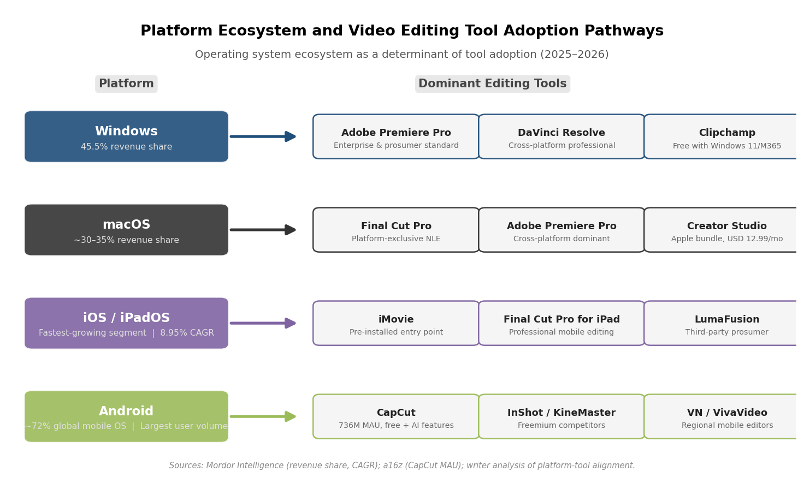

### 6.3.1 The Operating-System Layer

The operating system on which a user works is among the strongest predictors of video editing tool adoption—often more deterministic than pricing, features, or brand preference. As of 2025, Windows captured 45.50% of the video editing software market by revenue, reflecting its dominance in corporate, enterprise, and general-purpose computing environments [Mordor Intelligence](https://www.mordorintelligence.com/industry-reports/video-editing-market "OS Market Share Analysis"). Dataintelo separately estimated Windows at approximately 42.3% of market revenues in 2025, citing its ubiquity in corporate and prosumer settings [Dataintelo](https://dataintelo.com/report/global-video-editing-software-market "Video Editing Software Market 2034"). macOS, despite its smaller global computing share, commands a disproportionate presence in professional creative workflows—an estimated 30–35% of video editing revenue—anchored by Final Cut Pro's platform exclusivity and Premiere Pro's strong adoption among Mac-based creative professionals.

iOS and iPadOS constitute the fastest-growing platform segment, expanding at 8.95% CAGR [Mordor Intelligence](https://www.mordorintelligence.com/industry-reports/video-editing-market "Platform Growth Rates"). This growth reflects the expansion of mobile and tablet-based editing, driven by Final Cut Pro for iPad, LumaFusion, and the cross-platform availability of CapCut and other mobile editors on Apple's mobile ecosystem. Android, while commanding the largest global smartphone install base, generates lower per-user revenue in the video editing market due to the preponderance of free and low-cost editors (CapCut, InShot, KineMaster) on the platform.

### 6.3.2 The Apple Ecosystem: Hardware-Software Integration as Competitive Moat

Apple's video editing strategy is inseparable from its hardware ecosystem. Final Cut Pro's performance optimization for Apple Silicon—the M-series chips powering Mac, iPad, and Apple Vision Pro—delivers rendering and playback advantages that are architecturally difficult for competitors to replicate on non-Apple hardware. The January 2026 launch of Apple Creator Studio deepened this integration by bundling six professional creative applications into a single USD 12.99/month subscription available exclusively on Apple devices.

The ecosystem creates a tiered adoption pipeline. iMovie, pre-installed on every Apple device, serves as the default entry point for hundreds of millions of iOS and macOS users. As editing needs grow, the iMovie → Final Cut Pro → Creator Studio upgrade path retains users within Apple's ecosystem, generating both software subscription revenue and hardware-attach benefits. Apple's March 2026 acquisition of MotionVFX—a major Final Cut Pro plugin developer—signals intent to further internalize the surrounding content ecosystem and reduce reliance on third-party tools that might weaken platform lock-in.

The limitation of this strategy is geographic reach: Apple's computing device market share, while substantial in North America and parts of Europe, is significantly lower in Asia-Pacific and emerging markets, where Android and Windows dominate. Final Cut Pro's platform exclusivity thus imposes a geographic ceiling on its addressable market.

### 6.3.3 The Windows–Adobe Axis

Windows' dominant share of the desktop computing market creates a natural alignment with Adobe, whose Creative Cloud applications—including Premiere Pro and After Effects—run on both Windows and macOS. In practice, Windows is the primary platform for Adobe's enterprise and team-licensing business: corporate video departments, advertising agencies, and media companies predominantly operate Windows infrastructure, and Adobe's deep integration with Windows-centric enterprise IT environments (Active Directory, SSO, centralized deployment) reinforces this alignment.

Microsoft's own video editing offering, Clipchamp, is distributed free with Windows 11 and Microsoft 365. Its strategic role is not to compete with Premiere Pro at the professional tier but to capture casual and small-business users within the Windows ecosystem—a positioning analogous to Apple's iMovie strategy. The Windows ecosystem thus sustains a two-tier structure: Clipchamp for consumer and lightweight business use, and Premiere Pro (or DaVinci Resolve, which also runs on Windows, macOS, and Linux) for professional and prosumer workflows.

### 6.3.4 The Android–Mobile-First Ecosystem

Android's global smartphone dominance—approximately 72% of the worldwide mobile operating system market—makes it the primary platform for mobile video editing by user volume. CapCut surpassed 1 billion cumulative Android downloads by Q3 2024, and the a16z Top 100 Gen AI Consumer Apps report (March 2026) placed CapCut at 736 million monthly active mobile users globally, making it the second-largest consumer AI product in the world by mobile MAU [a16z](https://www.a16z.news/p/top-100-gen-ai-consumer-apps-march "Top 100 Gen AI Consumer Apps: March 2026"). This figure—more than double the 300 million MAU reported in mid-2024—reflects CapCut's continued rapid expansion, fueled by AI feature adoption and sustained TikTok integration.

The Android ecosystem's competitive dynamics differ fundamentally from Apple's. No single editor enjoys the platform-integrated advantage that Final Cut Pro holds on Apple devices. Instead, multiple mobile editors—CapCut, InShot, KineMaster, VN Video Editor, VivaVideo—compete on template libraries, AI features, and social-platform integration. The absence of a dominant platform-native editor produces a more open competitive field, but it also means that user retention is weaker: switching costs between mobile editors remain low, and users frequently maintain multiple editing apps for different use cases.

## 6.4 Locally Dominant Players and Regional Competitive Structures

### 6.4.1 China: JianYing and the Domestic Ecosystem

China's video editing market operates largely independently of the global competitive landscape. ByteDance's JianYing (剪映)—the domestic counterpart to CapCut—is the dominant mobile editing tool, tightly integrated with Douyin (TikTok's Chinese version) in the same manner that CapCut integrates with international TikTok. JianYing offers a comparable feature set, including AI-powered editing tools, templates, and direct publishing to Douyin, and has been downloaded hundreds of millions of times since its 2019 launch [Ocean Engine](https://www.oceanengine.io/resource/advertising-on-jianying "Advertising on Jianying").

The Chinese market is distinctive in several respects. Foreign editing tools—particularly Adobe's subscription products—face adoption barriers stemming from pricing sensitivity, localization limitations, and competition from domestic alternatives. DaVinci Resolve maintains a professional presence, particularly in film and television post-production, but the mass-market consumer tier is dominated by domestic mobile editors. Content platforms including Bilibili, Xiaohongshu, and Kuaishou each foster ecosystems of creator tools that compete with and complement JianYing.

Data-sovereignty regulations—including the Personal Information Protection Law (PIPL) and Data Security Law—require that data generated by Chinese users be stored and processed within China, effectively segmenting the domestic cloud-editing market from international services. Adobe's Frame.io, Blackmagic Cloud, and other Western cloud collaboration platforms cannot serve the Chinese market without establishing compliant local infrastructure, reinforcing the structural separation between domestic and international competitive dynamics.

### 6.4.2 India: A Fragmented Post-Ban Landscape

India's video editing market has developed along a distinct trajectory since the 2020 ban on CapCut and TikTok. The absence of both the dominant mobile editor and its primary distribution platform created a vacuum that no single competitor has fully filled. InShot, KineMaster, and VN Video Editor have each captured meaningful share of India's mobile editing users, supported by YouTube Shorts and Instagram Reels as the primary short-form video distribution channels [TrueFan AI](https://www.truefan.ai/blogs/capcut-alternatives-india-2025 "CapCut Alternatives India 2025").

India's market is characterized by extreme price sensitivity and mobile-first usage patterns. With over 750 million smartphone users and expanding 4G/5G penetration, the country represents one of the world's largest addressable markets for mobile video editing tools. Domestic alternatives have emerged to serve this demand—including apps optimized for Indian languages and regional content formats—though none has achieved the scale or feature depth of CapCut's international product.

### 6.4.3 Southeast Asia and Latin America: Mobile-First Growth Markets

Southeast Asia (Indonesia, Vietnam, Thailand, the Philippines) and Latin America (Brazil, Mexico, Colombia) represent high-growth mobile-first markets where CapCut, InShot, and KineMaster hold particularly strong positions. These regions share common structural characteristics: high smartphone penetration, young demographics with intensive social-media engagement, limited desktop computing infrastructure outside professional settings, and price sensitivity that favors free and freemium tools.

In Southeast Asia, CapCut's availability and TikTok integration confer a significant competitive advantage. KineMaster, headquartered in South Korea, has built particular strength in Indonesia and Vietnam through localization efforts and regional marketing partnerships. CyberLink PowerDirector maintains distribution in East and Southeast Asian markets through OEM bundling agreements with PC manufacturers—a distribution channel that provides a pre-installed footprint analogous to what Clipchamp achieves through Windows and iMovie through macOS.

### 6.4.4 The Middle East and Africa: Emerging Frontiers

The Middle East and Africa constitute the smallest regional segment of the video editing software market but are projected to experience above-average growth rates, driven by expanding mobile internet access, growing youth populations, and rising social-media engagement. Tool adoption patterns in these regions closely resemble those in South and Southeast Asia: mobile-first, price-sensitive, and dominated by freemium editors. CapCut, InShot, and KineMaster maintain the strongest positions in markets where internet infrastructure supports video uploading and editing workflows.

## 6.5 Content Localization and Infrastructure Constraints

### 6.5.1 Language and Localization as Competitive Differentiators

The global reach of video editing tools depends critically on content localization—both of the tools themselves and of the content they produce. Adobe's introduction of automatic caption translation in 27 languages (Premiere Pro 25.2, April 2025) and CapCut's auto-captioning in dozens of languages represent direct responses to the multilingual demands of global content creation. Tools that offer broad language support for interfaces, templates, captions, and AI features maintain a competitive advantage in non-English-speaking markets that collectively represent the majority of global editing activity.

Localization extends beyond language to cultural content expectations. Template libraries, effects, and music catalogs that reflect regional aesthetics and cultural norms—Indian festival themes, Chinese New Year templates, Latin American music-driven formats—serve as competitive differentiators in their respective markets. CapCut and JianYing's template libraries are notably localized for Asian and global markets, contributing to their adoption advantage over tools with more Western-centric content offerings.

### 6.5.2 Internet Infrastructure and Editing Modality

Varying internet infrastructure conditions directly influence the viability of cloud-based versus locally installed editing tools. In regions with high-bandwidth, low-latency connections—North America, Western Europe, developed East Asia—cloud-based collaboration, proxy editing, and cloud rendering are practical workflow components. In regions with constrained or inconsistent connectivity—parts of South Asia, sub-Saharan Africa, and rural areas globally—locally installed desktop and mobile editors that do not depend on continuous internet access retain structural advantages.

This infrastructure divide reinforces the on-premise/desktop segment's continued relevance even as the global trend favors cloud migration. The 51.3% on-premise share of the 2025 market (as reported in Chapter 1) partially reflects the reality that cloud-dependent workflows remain impractical for a significant portion of the global editing user base. For vendors, this dynamic necessitates product strategies that accommodate both cloud-native and offline-capable usage modes—a dual-track requirement that adds development complexity and influences regional feature rollout priorities.

## 6.6 Synthesis: Regional Dynamics as Competitive Determinants

The analysis presented in this chapter demonstrates that regional dynamics and platform ecosystem allegiances are not secondary to product features or pricing in determining competitive outcomes—they function as co-equal factors. Several cross-cutting observations emerge.

**Revenue geography and user geography diverge sharply.** North America generates approximately 38% of global video editing revenue but represents a far smaller share of global editing users. Asia-Pacific, the fastest-growing region by both revenue (7.22% CAGR) and user volume, is disproportionately weighted toward the consumer segment and free-tier tools. This divergence means that revenue-based market-share figures (which favor Adobe) and user-based metrics (which favor CapCut) tell structurally different stories depending on the geographic lens applied.

**Regulatory risk is concentrated but consequential.** The three active or potential regulatory constraints on ByteDance's products—the U.S. PAFACA framework, India's permanent ban, and the EU's DSA enforcement actions—collectively affect markets representing over 60% of global video editing revenue. Escalation in any of these jurisdictions would disproportionately benefit Western-headquartered competitors (Adobe, Apple, Meta/Edits) and regionally dominant alternatives.

**Platform ecosystems create semi-permeable competitive boundaries.** Apple's hardware-software integration channels hundreds of millions of users toward iMovie and Final Cut Pro. Windows' enterprise dominance reinforces Adobe's institutional position. Android's open ecosystem sustains the most competitive—and most fragmented—mobile editing market. These platform effects are most pronounced in their respective geographic strongholds: Apple in North America and Western Europe, Windows in enterprise environments globally, and Android in Asia-Pacific and emerging markets.

**Local competitive structures resist global homogenization.** China's domestic market operates under regulatory and platform-ecosystem conditions that effectively exclude most Western vendors. India's post-ban landscape demonstrates that market dynamics can diverge significantly from global patterns when a dominant player is removed. These regional specificities mean that no single product strategy can optimize for all markets simultaneously—a structural challenge that favors vendors with the resources and organizational capacity to maintain differentiated regional approaches.

# 第7章 Future Outlook — Market Evolution and Strategic Implications (2026–2030)

The preceding chapters have documented a market undergoing structural transformation: AI integration accelerating across every product tier, business models converging toward hybrid subscription-plus-consumption architectures, free-tier disruptors compressing incumbent pricing power, and regulatory uncertainties reshaping competitive dynamics across major geographies. This concluding chapter synthesizes these threads into a forward-looking analysis of how the global video editing and creation software market is likely to evolve between 2026 and 2030. The discussion proceeds through six dimensions: market-size trajectories under alternative scenarios, technology trends most likely to disrupt current competitive positions, the shifting boundary between "video editing" and "video generation," strategic imperatives for incumbents and challengers, probable investment and M&A themes, and risks and uncertainties that could materially alter the market's course.

## 7.1 Market-Size Trajectories: Baseline, Upside, and Downside Scenarios

### 7.1.1 Baseline Scenario: Steady Growth at Historical CAGRs

The baseline projection draws on the consensus range established in Chapter 1. Under a narrow scope (desktop NLE + license revenue), the market is projected to grow from approximately USD 2.68 billion in 2026 to USD 3.41 billion by 2030, implying a 6.2% CAGR [Research and Markets](https://www.researchandmarkets.com/report/video-editing-software "Video Editing Software Market Size & Forecast to 2030"). Under a broader scope encompassing mobile, SaaS, and web-based tools, Mordor Intelligence projects USD 3.75 billion in 2026 advancing toward USD 4.99 billion by 2031 at a 5.88% CAGR [Mordor Intelligence](https://www.mordorintelligence.com/industry-reports/video-editing-market "Video Editing Market Size Report 2031"). The working range adopted throughout this report—USD 2.7–3.8 billion for 2026, converging toward USD 3.4–5.0 billion by 2030—reflects these divergent definitional scopes.

Under this baseline, the SaaS subsegment continues to outpace the aggregate market, expanding from USD 2.49 billion (2024) toward USD 5.26 billion by 2029 at a 16.4% CAGR [Research and Markets via GlobeNewswire](https://www.globenewswire.com/news-release/2026/01/14/3218662/28124/en/5-25-Bn-Video-Editing-Software-as-a-Service-SaaS-Global-Market-Trends-Strategies-and-Opportunities-2019-2024-2024-2029F-2034F.html "Video Editing SaaS Global Market Report, Jan 2026"). Cloud-delivered revenue is projected to surpass on-premise revenue by approximately 2028, completing the structural transition from perpetual-license desktop software to recurring subscription models.

Key assumptions underlying the baseline include: stable macroeconomic conditions in major markets; continued creator-economy expansion toward a projected USD 500 billion by 2030 [Yahoo Finance](https://finance.yahoo.com/news/creator-economy-statistics-2026-120-150000105.html "Creator Economy Statistics 2026"); no major additional regulatory disruptions beyond those already in force; and incremental—rather than transformative—AI feature integration into existing editing workflows.

### 7.1.2 Upside Scenario: AI-Accelerated Market Expansion

The upside scenario envisions a market that expands beyond baseline projections as AI-powered tools substantially enlarge the total addressable user base and accelerate per-user revenue generation. Under this scenario, the definitional boundary of "video editing software" broadens to encompass AI video generation tools that incorporate editing capabilities, pushing the combined addressable market toward USD 6–8 billion by 2030.

Several catalysts could drive this trajectory. The AI video generation market—valued at USD 1.23 billion in 2025 and projected to reach USD 21.61 billion by 2034 at a 46.0% CAGR [Intel Market Research](https://www.intelmarketresearch.com/ai-video-generator-software-market-36387 "AI Video Generator Software Market Outlook 2026–2034")—is converging with traditional editing workflows. Virtue Market Research separately estimated the global AI video editing tools market at USD 1.6 billion in 2025, projected to reach USD 9.3 billion by 2030 [Virtue Market Research](https://virtuemarketresearch.com/report/ai-video-editing-tools-market "AI Video Editing Tools Market 2025–2030"). If AI-native tools such as Runway, Pika, and Kling increasingly serve users who would otherwise never have engaged with traditional editing software—small businesses generating product videos from text prompts, marketers automating ad variations, educators producing instructional content without camera equipment—the addressable market expands well beyond the population of self-identified "video editors."

Additionally, consumption-based pricing (generative credits, per-second API billing) could accelerate per-user monetization. Adobe's generative-credit model and Runway's per-second API pricing (as detailed in Chapters 3 and 5) create revenue streams that scale with usage intensity rather than seat count, potentially generating higher lifetime value per user than fixed subscriptions alone.

The broader AI-in-media market provides a directional reference: MarketsandMarkets projects this adjacent space to grow from USD 8.21 billion in 2024 to USD 51.08 billion by 2030 at a 35.6% CAGR [MarketsandMarkets](https://www.marketsandmarkets.com/Market-Reports/ai-in-media-market-213984142.html "AI in Media Market Report 2024–2030"). While the video editing subsegment would capture only a fraction of this total, even modest spillover from the broader AI-media expansion would push traditional market-size estimates upward.

### 7.1.3 Downside Scenario: Regulatory Disruption and Macro Headwinds

The downside scenario envisions market growth decelerating to 3–4% CAGR, with the 2030 market size remaining in the USD 3.1–3.8 billion range under narrow scope. Potential triggers include:

- **Macroeconomic contraction** compressing discretionary software spending—particularly among prosumer and consumer users—and reducing the enterprise marketing budgets that drive demand for video production tools.
- **Regulatory escalation** against ByteDance products, including permanent CapCut removal from the U.S. market under PAFACA enforcement. While competitors would absorb displaced users, the immediate effect would be a net reduction in aggregate mobile editing tool revenue and the disruption of the market's largest free-tier user acquisition engine.
- **AI regulation constraining feature rollout**: Aggressive implementation of the EU AI Act's transparency and labeling requirements, or new U.S. federal legislation governing synthetic media, could slow the pace of AI feature deployment—the single most important growth catalyst in the current market cycle.
- **Subscription fatigue intensifying**: A prolonged period of price increases without commensurate perceived value—exemplified by Adobe's June 2025 Creative Cloud restructuring—could accelerate churn among prosumer subscribers, benefiting free-tier alternatives but compressing total market revenue.

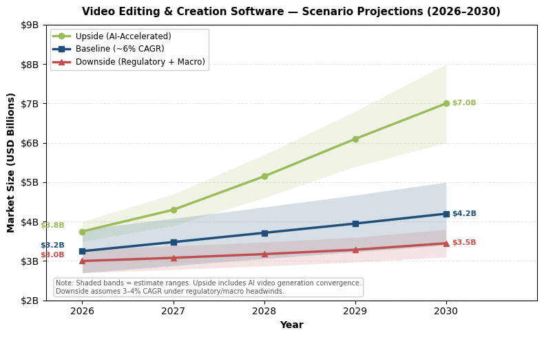

*Three-scenario projection of global video editing and creation software market size. The baseline trajectory (~6% CAGR) rises from USD 3.2 billion in 2026 to USD 4.2 billion by 2030; the upside scenario (AI-accelerated expansion with broadened market definition) reaches USD 7.0 billion; the downside scenario (regulatory disruption and macroeconomic headwinds, 3–4% CAGR) grows modestly to USD 3.5 billion. Shaded bands represent estimate ranges for each scenario.*

## 7.2 Technology Trends Most Likely to Disrupt Competitive Positions

### 7.2.1 Generative AI: From Feature to Paradigm

The most consequential technology trend of the 2026–2030 period is the evolution of generative AI from a supplementary feature within traditional NLEs to a foundational paradigm that redefines what "video editing" means. This shift is already underway: Adobe's Firefly-powered Generative Extend, DaVinci Resolve 20's AI Set Extender, and Runway's Gen-4 text-to-video model each occupy distinct points along a spectrum from incremental AI augmentation to AI-native content creation.

The trajectory of the AI video generation market provides the clearest signal of disruption velocity. Venture capital investment in AI video generation reached USD 4.7 billion in 2025—a 189% increase from 2023 [Digital Applied](https://www.digitalapplied.com/blog/ai-video-market-after-sora-runway-kling-veo-2026 "AI Video Market After Sora"). Runway raised USD 315 million in a February 2026 Series E at a USD 5.3 billion valuation [TechCrunch](https://techcrunch.com/2026/02/10/ai-video-startup-runway-raises-315m-at-5-3b-valuation-eyes-more-capable-world-models/ "Runway Series E"). Pika Labs reached an estimated valuation of approximately USD 900 million by early 2026 [Fueler](https://fueler.io/blog/pika-labs-usage-revenue-valuation-growth-statistics "Pika Labs Valuation & Growth Statistics"). These valuations reflect investor conviction that AI-native video tools will capture a material share of content creation budgets currently flowing to traditional editing software.

The March 2026 shutdown of OpenAI's Sora—which generated only USD 2.1 million in total lifetime revenue despite enormous compute expenditures—illustrates that this transition is neither linear nor assured [Digital Applied](https://www.digitalapplied.com/blog/ai-video-market-after-sora-runway-kling-veo-2026 "Sora Shutdown Analysis"). Sora's failure was fundamentally an economics problem rather than a demand problem: it demonstrated both robust appetite for AI video generation and the imperative that viable products achieve sustainable unit economics. The post-Sora competitive landscape—led by Runway (quality-first positioning), Kling (cost-efficiency at USD 0.07/second), Google Veo (native audio generation), and Pika (creative expression)—is structurally healthier precisely because these players prioritized business sustainability over hype-driven scale.

By 2028–2030, we assess that AI-generated video content will constitute a substantial share of total video output produced using editing and creation tools—particularly in categories such as social-media advertisements, product demonstrations, personalized marketing content, and template-driven corporate communications. For traditional NLE vendors, this implies that the competitive threat from AI-native tools operates not at the feature level but at the workflow level: users who can generate finished video directly from text or image prompts may bypass the timeline-based editing paradigm entirely for certain content categories.

### 7.2.2 Real-Time Collaboration and Cloud-Native Production

The migration from locally installed editing to cloud-native collaborative production represents a slower-moving but structurally significant shift. Adobe Frame.io V4 and Blackmagic Cloud have established the architectural foundations; the 2026–2030 period will determine whether cloud collaboration becomes the default mode for professional editing or remains a supplementary layer atop local workflows.

Several dynamics favor accelerated cloud adoption. The enterprise video market—projected at USD 27.97 billion in 2026 and growing to USD 42.23 billion by 2031 at an 8.6% CAGR [MarketsandMarkets](https://www.marketsandmarkets.com/Market-Reports/enterprise-video-market-1182.html "Enterprise Video Market 2026–2031")—increasingly demands multi-user workflows spanning geographies, time zones, and organizational boundaries. Adobe's deep integration of Frame.io with Premiere Pro (V4 receiving over 100 updates by October 2025, including AI-powered Media Intelligence search) positions cloud collaboration as a revenue-expansion vector: enterprise customers pay premium team licenses that include collaboration features unavailable to individual subscribers.

However, infrastructure constraints limit the pace of this transition. As discussed in Chapter 6, regions with inconsistent internet connectivity—parts of South Asia, sub-Saharan Africa, and rural areas globally—cannot reliably support cloud-dependent editing workflows. The 51.3% on-premise share observed in 2025 partially reflects this infrastructure reality. Cloud-delivered video editing revenue is projected to surpass on-premise revenue by 2028 in developed markets, while the global crossover may not occur until 2029–2030.

### 7.2.3 Audio-Visual Convergence in AI Generation

A technology development with near-term disruptive potential is the emergence of native audio generation within AI video tools. Google Veo 3, launched in early 2026, produces synchronized sound effects, ambient audio, and character dialogue directly from text prompts—collapsing what has traditionally been a separate and resource-intensive post-production phase [Digital Applied](https://www.digitalapplied.com/blog/ai-video-market-after-sora-runway-kling-veo-2026 "Google Veo 3 Audio Generation"). Kling 3.0 (Kuaishou) followed with native audio capabilities including lip-synced dialogue. By 2027, native audio generation is expected to become a standard feature across major AI video platforms.

For the traditional editing software market, audio-visual convergence is significant because it removes one of the key remaining justifications for manual post-production in lower-tier content categories. A small business that can generate a 15-second product video with synchronized narration, music, and sound effects from a single text prompt has limited need for either a traditional NLE or separate audio editing software. This dynamic accelerates the bifurcation between high-complexity professional workflows—where human editorial judgment remains essential—and high-volume routine content production, where AI-native tools increasingly suffice.

### 7.2.4 Extended-Duration and Multi-Shot Generation

Current AI video generation models are constrained to clips of 5–15 seconds at standard quality tiers, with Google Veo Ultra extending to 60+ seconds. The competitive push toward 2–5 minute coherent clips—with character consistency, narrative continuity, and multi-shot sequencing—represents the next capability frontier. Kling 3.0 already generates multi-shot sequences of 2–6 scenes with automatic transitions and camera logic [Digital Applied](https://www.digitalapplied.com/blog/ai-video-market-after-sora-runway-kling-veo-2026 "Kling 3.0 Multi-Shot Capability"). As these capabilities mature, they will unlock use cases that currently require traditional timeline-based editing: full product walkthroughs, short-form advertising, and instructional content.

We assess that by 2029–2030, AI generation models capable of producing coherent 2–3 minute video segments at 1080p or higher resolution will be commercially available at price points competitive with the total cost of producing equivalent content through traditional shooting and editing workflows for standard commercial applications.

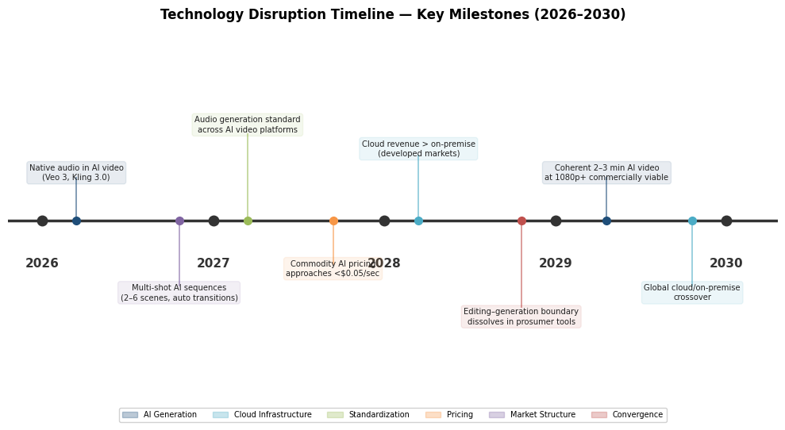

*Projected technology milestones spanning 2026 to 2030. Color-coded categories include AI generation (native audio, extended-duration clips), cloud infrastructure (cloud–on-premise revenue crossovers), pricing (commodity AI video pricing approaching USD 0.05/second), and convergence (editing-generation boundary dissolution). The timeline synthesizes the technology trends analyzed in Sections 7.2.1–7.2.4.*

## 7.3 The Shifting Boundary Between Video Editing and Video Generation

### 7.3.1 Market Definition Under Pressure

The definitional boundary established in Chapter 1—"video editing software" as applications for post-production manipulation of recorded video, distinct from AI video generation tools—faces increasing strain as the two categories converge. Several developments during the research window illustrate this trajectory:

- Adobe has embedded Firefly-powered generative capabilities directly within the Premiere Pro timeline (Generative Extend, AI Set Extender), making generation an editing operation rather than a separate workflow.
- DaVinci Resolve 20 includes AI Set Extender for text-prompt-based scene extension, positioning generative AI as a native compositing tool within a professional NLE.
- Runway's Aleph in-video editor enables users to refine and edit AI-generated video directly within the generation platform, adding timeline-like control to an AI-native tool.
- Descript's text-based editing paradigm treats content manipulation and generation as two facets of a unified interface.

By 2028–2030, the distinction between "editing recorded footage" and "generating new footage from prompts" is expected to become analytically unsustainable for market-sizing purposes. The practical reality for a growing share of users—particularly prosumers and enterprise content teams—will be hybrid workflows where AI-generated elements (extended scenes, background replacements, generated B-roll, synthetic voiceovers) are seamlessly interleaved with recorded footage on a single timeline.

### 7.3.2 Implications for Market Sizing and Incumbents

This convergence carries two structural consequences. First, market-research firms will likely expand their definitional scope, incorporating at least the editing-adjacent functions of AI video generation tools into "video editing and creation software" market estimates. This expansion could push reported market sizes meaningfully above current projections by 2030—potentially into the USD 6–8 billion range under the upside scenario outlined in Section 7.1.2.

Second, incumbents face a strategic imperative to integrate generative capabilities deeply enough that users need not leave the incumbent's ecosystem to access AI generation. Adobe's Firefly integration and Blackmagic's DaVinci Neural Engine represent proactive responses. Apple's on-device AI approach, while privacy-advantaged, may lag in generative capability relative to cloud-based competitors if model scale and training-data breadth prove decisive. Vendors that fail to incorporate generative AI credibly risk ceding users to AI-native platforms that add editing capabilities—a reversal of the traditional competitive direction.

## 7.4 Strategic Imperatives for Incumbents and Challengers

### 7.4.1 Adobe: Defending the Revenue Core While Monetizing AI

Adobe's strategic position through 2030 hinges on its ability to convert generative AI from a cost center into a revenue-expansion engine without alienating its subscriber base through pricing fatigue. The June 2025 Creative Cloud restructuring—raising individual pricing to USD 69.99/month for Creative Cloud Pro while reducing single-app AI credits from 500 to 25—signals the intended direction: AI capabilities serve as the primary justification for premium pricing, with generative credits creating a consumption-based revenue layer atop the subscription base.

The attendant risk is that this strategy accelerates the attractiveness of alternatives. Each price increase widens the value gap between Creative Cloud Pro (~USD 840/year) and Apple Creator Studio (USD 129/year) or DaVinci Resolve Studio (USD 295, one-time). Adobe's moat—ecosystem breadth, enterprise integration depth, and the Frame.io collaboration layer—must generate sufficient switching-cost resistance to sustain premium pricing as AI feature parity narrows across competitors.

Adobe's M&A strategy will likely prioritize the acquisition of AI-native capabilities that complement Firefly. The company's track record of integrating acquisitions into Creative Cloud (Frame.io in 2021, the attempted Figma acquisition) points toward continued interest in AI video tools, collaborative platforms, and enterprise workflow automation companies.

### 7.4.2 Apple: Ecosystem Deepening as a Growth Strategy

Apple's Creator Studio launch in January 2026 marks a strategic inflection: the company's first systematic effort to build recurring creative-software revenue. The March 2026 acquisition of MotionVFX [CNBC](https://www.cnbc.com/2026/03/16/apple-acquires-video-editing-company-motionvfx-to-boost-subscribers.html "Apple Acquires MotionVFX") signals intent to internalize the surrounding plugin and template ecosystem, strengthening Creator Studio's value proposition while deepening platform lock-in.

Through 2030, Apple's strategic imperative is to expand Creator Studio's subscriber base within its hardware installed base while extending Final Cut Pro's professional credibility. The on-device AI approach—processing on Apple Silicon's Neural Engine without cloud dependency—differentiates on privacy and latency but imposes constraints on model scale. Should generative video quality prove highly dependent on cloud-scale training infrastructure, Apple may need to reconcile its on-device philosophy with the computational demands of competitive AI generation.

Apple's geographic ceiling remains a structural limitation: Final Cut Pro's platform exclusivity confines its addressable market to Apple device owners, who represent a minority of global computing users—though a disproportionate share of high-ARPU creative professionals in North America and Western Europe.

### 7.4.3 Blackmagic Design: Sustaining the Free-Tier Disruptor Model

Blackmagic's hardware-subsidized software model is well positioned for the 2026–2030 period. DaVinci Resolve 20's inclusion of AI features in its free tier maintains competitive pressure on subscription-priced rivals, while the one-time USD 295 Studio upgrade captures revenue from professionals who require GPU-accelerated AI processing, HDR grading, and higher-resolution exports.

The strategic question for Blackmagic is whether the hardware-subsidy model scales with the AI transition. As AI features become more compute-intensive and increasingly rely on cloud inference rather than local GPU processing, the economics of distributing AI capabilities at zero cost may come under strain. Blackmagic Cloud's expansion addresses the collaboration dimension, but generative AI at the Firefly or Runway level requires training infrastructure and model development investment that a hardware-first company may find difficult to sustain.

Blackmagic's most probable strategic path involves deepening the DaVinci Resolve–Blackmagic hardware integration (cameras, Cloud Store, capture cards) while selectively partnering with or licensing AI models from third-party providers rather than developing frontier generative models in-house.

### 7.4.4 CapCut/ByteDance: Navigating Regulatory Headwinds

CapCut's strategic trajectory through 2030 is dominated by regulatory uncertainty. With 736 million monthly active mobile users globally as of early 2026 [a16z](https://www.a16z.news/p/top-100-gen-ai-consumer-apps-march "Top 100 Gen AI Consumer Apps: March 2026"), CapCut commands the largest user base in the market by a substantial margin. Regulatory constraints in the U.S. (PAFACA, unresolved), India (permanent ban since 2020), and the EU (DSA enforcement actions against TikTok) collectively affect markets representing over 60% of global video editing revenue, as analyzed in Chapter 6.

ByteDance's strategic options include completing a divestiture of TikTok/CapCut's U.S. operations (thus far not executed), investing in localized compliance infrastructure to address EU data-sovereignty and AI-transparency requirements, and expanding aggressively in markets without regulatory constraints—Southeast Asia, Latin America, the Middle East, and Africa. The company's domestic counterpart, JianYing, provides a fallback revenue stream and user base within China's segregated digital ecosystem.

For the broader market, the unresolved CapCut regulatory situation represents both risk and opportunity: a permanent U.S. ban would redistribute an estimated 50–80 million American mobile editing users across competitors, while continued availability would sustain the competitive pressure that CapCut's free tier exerts on paid alternatives.

### 7.4.5 AI-Native Challengers: Runway, Pika, and Kling

AI-native video tools face a distinct strategic challenge: transitioning from venture-backed growth to sustainable profitability while competing simultaneously with well-funded incumbents adding AI features and with each other in an increasingly crowded generation market.

Runway's USD 5.3 billion valuation and USD 315 million Series E [TechCrunch](https://techcrunch.com/2026/02/10/ai-video-startup-runway-raises-315m-at-5-3b-valuation-eyes-more-capable-world-models/ "Runway Series E — $5.3B Valuation") provide substantial runway for R&D and market development, but the company must demonstrate that professional users will pay premium rates for quality-first AI generation at scale. Runway's launch of a USD 10 million venture fund to support early-stage AI-creative startups [TechCrunch](https://techcrunch.com/2026/03/31/exclusive-runway-launches-10m-fund-builders-program-to-support-early-stage-ai-startups/ "Runway Builders Fund") signals platform-ecosystem ambitions extending beyond a single product.

Pika Labs, valued at approximately USD 900 million in early 2026, and Kling (Kuaishou) are positioned in the creative-expression and cost-efficiency tiers, respectively. Price compression is already visible: Google Veo 3.1 Lite's USD 0.05/second pricing undercuts Kling's USD 0.07/second, signaling that basic AI video generation may approach commodity pricing by 2027–2028 [Digital Applied](https://www.digitalapplied.com/blog/ai-video-market-after-sora-runway-kling-veo-2026 "AI Video Pricing Comparison"). In this environment, differentiation through superior output quality, creative tooling, or ecosystem integration becomes essential—mirroring the competitive dynamic already observed in the traditional editing market.

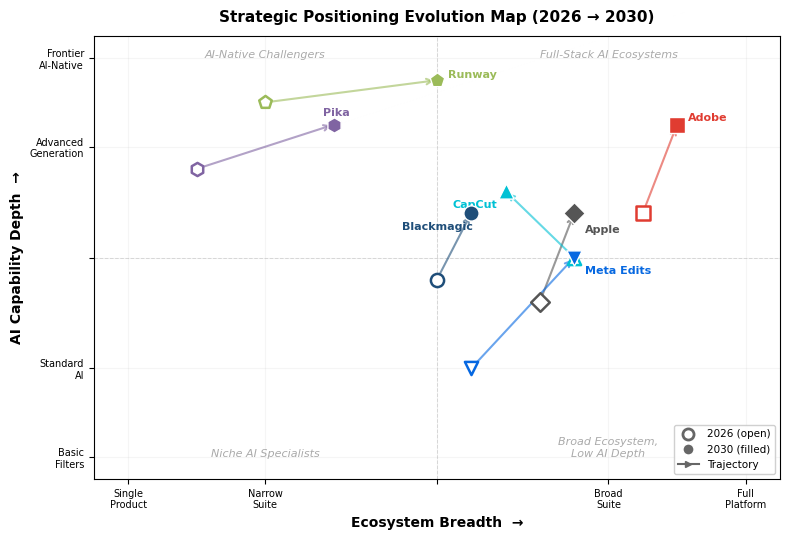

*Two-axis strategic positioning map plotting seven major players along Ecosystem Breadth (x-axis) and AI Capability Depth (y-axis). Open markers indicate estimated 2026 positions; filled markers with directional arrows show projected 2030 trajectories. Key movements include Runway and Pika expanding ecosystem breadth while maintaining AI-native leadership, Adobe deepening AI capability within its broad platform, and CapCut's ecosystem breadth potentially narrowing under regulatory headwinds.*

## 7.5 Investment and M&A Themes (2026–2030)

### 7.5.1 AI Video Generation as the Primary Investment Magnet

The most capital-intensive investment theme in the video creation ecosystem through 2030 is AI video generation. Venture capital investment in this subsector reached USD 4.7 billion in 2025 [Digital Applied](https://www.digitalapplied.com/blog/ai-video-market-after-sora-runway-kling-veo-2026 "AI Video VC Investment"), and major rounds continue into 2026 (Runway's USD 315 million Series E). As models improve and unit economics become clearer, a wave of late-stage funding and pre-IPO rounds for leading AI video companies is expected between 2027 and 2029.

The Sora shutdown in March 2026—despite OpenAI's dominant position in the broader AI ecosystem—underscores that AI video generation does not confer automatic commercial viability. Sora's failure to convert massive compute investment into sustainable revenue (USD 2.1 million in total lifetime revenue against an estimated USD 15 million per day in inference costs) serves as a cautionary benchmark for investors evaluating burn rates in this subsector [Digital Applied](https://www.digitalapplied.com/blog/ai-video-market-after-sora-runway-kling-veo-2026 "Sora Economics").

### 7.5.2 Incumbent Acquisition of AI Capabilities

We anticipate that at least one major incumbent will acquire a significant AI video generation company by 2028. The strategic logic is straightforward: Adobe, Apple, and (to a lesser extent) Google each face the risk that AI-native tools disintermediate their editing products. Acquiring a company such as Runway, Pika, or a comparable player would provide trained models, research teams, and existing user bases that would be prohibitively expensive and time-consuming to replicate organically.

Apple's acquisition of MotionVFX in March 2026 provides a template: a relatively modest deal (a 70-person company) that enhances an existing product's value proposition and deepens ecosystem lock-in. Larger-scale acquisitions—such as a hypothetical Adobe acquisition of Runway or a Google integration of Pika—would carry higher regulatory scrutiny but could fundamentally reshape competitive dynamics.

### 7.5.3 Consolidation Among Mid-Tier Players

The mid-tier of the video editing market—Wondershare Filmora, CyberLink PowerDirector, MAGIX Vegas Pro, HitFilm—faces a challenging 2026–2030 period. These vendors occupy the space between free consumer tools (CapCut, iMovie, Clipchamp) and professional incumbents (Adobe, Blackmagic, Apple), with AI-native tools compressing the market from above. Consolidation through mergers among mid-tier players and selective acquisitions by larger companies seeking distribution channels or user bases in specific geographic or demographic segments appears likely.

Canva's 2024 acquisition of Affinity provides a model for how platform companies with broad user bases may acquire specialized creative tools to construct comprehensive design-to-video workflows.

### 7.5.4 Enterprise Collaboration and Workflow Platforms

A secondary M&A theme is the acquisition of enterprise video collaboration and workflow tools by productivity-platform companies. Adobe's acquisition of Frame.io (2021) established the template. Microsoft, Google, or Salesforce could plausibly acquire video-workflow startups to deepen their enterprise video capabilities, particularly as the enterprise video market approaches USD 42 billion by 2031 [MarketsandMarkets](https://www.marketsandmarkets.com/Market-Reports/enterprise-video-market-1182.html "Enterprise Video Market 2026–2031").

## 7.6 Key Risks and Uncertainties

### 7.6.1 Regulatory Risk: Geopolitical and AI-Specific

Regulatory risk constitutes the single most consequential uncertainty for the 2026–2030 period. Two vectors demand attention:

**Geopolitical**: The unresolved status of ByteDance's U.S. operations under PAFACA creates binary risk for CapCut—the market's largest user base by a substantial margin. A forced divestiture, if completed, could restructure ownership and alter CapCut's competitive dynamics, its integration with TikTok, and its pricing strategy. A permanent ban would trigger the largest single competitive displacement event in the market's history.

**AI-specific**: The EU AI Act's phased implementation (2024–2027) will impose transparency, labeling, and risk-assessment obligations on AI-powered editing and generation features. Adobe's integration of Content Credentials metadata into Frame.io and Premiere Pro represents an early compliance response. Whether AI regulation constrains feature innovation or merely adds compliance costs will significantly influence the pace of AI-driven market transformation. Potential U.S. federal legislation on synthetic media could impose a second major regulatory layer.

### 7.6.2 Technological Uncertainty: The Pace and Direction of AI Progress

The rate of improvement in generative AI video quality, coherence, and duration is the most important technological variable. If models achieve reliable 2–3 minute coherent generation at broadcast quality by 2028–2029, the competitive threat to traditional editing workflows in routine content categories becomes acute. If progress is slower—constrained by compute economics, training-data limitations, or diminishing returns from model scaling—traditional NLEs retain relevance for a broader range of content categories over a longer period.

The Sora episode illustrates a specific sub-risk: that compute costs for frontier AI video models may remain structurally elevated, limiting the commercial viability of the most capable generation tools to premium use cases and constraining the rate at which AI generation penetrates mass-market content production.

### 7.6.3 Macroeconomic and Demand-Side Risks

A global economic downturn would disproportionately affect the prosumer segment—independent creators and small businesses that constitute the most price-sensitive paid user base. Subscription churn would accelerate, free-tier usage would increase (benefiting CapCut and DaVinci Resolve's free tier), and enterprise video budgets would contract. The SaaS subsegment's 16.4% projected CAGR assumes sustained willingness to pay for cloud-based tools; macroeconomic stress would test this assumption directly.

### 7.6.4 Competitive Risk: Big Tech Platform Strategies

Google, Meta, and Microsoft each possess the financial resources, AI research capabilities, and distribution infrastructure to become major forces in the video editing and creation market should they choose to invest more aggressively. Meta's launch of Edits in April 2025—achieving 7.1 million downloads in its first week [TechCrunch](https://techcrunch.com/2025/04/26/instagram-edits-topped-7m-downloads-in-first-week-a-bigger-launch-than-capcuts/ "Instagram Edits Launch")—demonstrates the latent competitive threat posed by platform companies that can leverage billions of existing social-media users as a distribution channel. Google's Veo models, with native audio generation and integration into the Google Cloud and YouTube ecosystems, represent a parallel avenue for disruption. A strategic decision by any of these companies to subsidize video editing tools as a loss leader for broader platform engagement could compress margins across the market.

## 7.7 Synthesis: The Market in 2030

The global video editing and creation software market in 2030 will be structurally distinct from the market that existed at the start of this research window. Several developments, while uncertain in precise timing, appear highly probable based on the trends analyzed throughout this report:

**The editing-generation boundary will have dissolved for practical purposes.** Most major editing platforms will offer integrated generative capabilities, and most AI generation platforms will offer editing controls. Market-research firms will likely adopt broader definitional scopes, and reported market sizes will adjust upward accordingly.

**AI will serve as the primary axis of product differentiation.** Core editing functions—cutting, sequencing, color correction, audio mixing—will be largely commoditized across free and paid tiers. Competitive advantage will derive from the quality, speed, and creative range of AI-powered features: generative content creation, intelligent asset search, automated assembly, and AI-driven audio-visual production.

**The business-model landscape will stabilize around hybrid subscription-plus-consumption architectures.** Pure subscription models will be supplemented by usage-based AI credit systems. One-time perpetual licenses (DaVinci Resolve Studio, Final Cut Pro standalone) will persist as niche alternatives but will not represent the market's primary growth vector.

**The user base will expand substantially.** AI-powered simplification of video creation will lower the skill floor further, bringing tens of millions of additional users into the market—individuals who would not have identified as "video editors" under pre-AI definitions. This expansion will be most pronounced in emerging markets and among small businesses and enterprise teams for whom traditional video production was previously cost-prohibitive.

**Regulatory and geopolitical factors will remain active competitive variables.** The resolution—or continued non-resolution—of ByteDance's regulatory status in the U.S. and the full implementation of the EU AI Act will shape competitive dynamics in ways that technology and pricing alone cannot determine.

The market's medium-term trajectory, under our baseline assessment, points toward a 2030 value of USD 3.4–5.0 billion under traditional scope definitions, with the potential for meaningfully higher figures if AI video generation revenue is incorporated into an expanded market definition. The companies best positioned to capture this growth are those that successfully integrate generative AI into established workflows, maintain sustainable pricing architectures, and navigate an increasingly complex regulatory environment across multiple jurisdictions.

# Conclusion

The global video editing and creation software market in 2026 is a market in structural transition. The analysis presented across the preceding seven chapters documents an industry where the fundamental assumptions governing competitive positioning, business-model design, and product definition are shifting simultaneously—driven by the convergence of generative AI, cloud-native workflows, and a dramatically expanded creator-economy user base.

**Market size and growth trajectory.** The market occupies a working range of USD 2.7–3.8 billion in 2026, with medium-term projections converging toward USD 3.4–5.0 billion by 2030 at 5.2–6.8% compound annual growth rates under traditional definitional scopes. The SaaS delivery subsegment, expanding at roughly 16.4% CAGR, constitutes the primary growth engine and is projected to surpass on-premise revenue by approximately 2028. Under an upside scenario that incorporates the adjacent AI video generation market—valued at USD 1.23 billion in 2025 and growing at 46% CAGR—the combined addressable market could reach USD 6–8 billion by 2030 as generation and editing workflows converge.

**Competitive landscape.** The market remains moderately concentrated, with the top five vendors (Adobe, Apple, Blackmagic Design, Avid, and Corel) holding approximately 60% of revenue. Adobe commands the largest revenue share through its Creative Cloud subscription ecosystem, reporting USD 17.65 billion in Digital Media revenue in FY2025. CapCut (ByteDance), with an estimated 736 million monthly active mobile users as of early 2026, dominates the market by user volume but captures only approximately 4% of revenue—a structural divergence that encapsulates the fundamental tension between subscription-premium and freemium-at-scale business models. Apple's January 2026 launch of Creator Studio at USD 12.99/month represents the most significant new competitive entry by an incumbent, undercutting Adobe's pricing by more than 80% while deepening hardware-ecosystem lock-in. Blackmagic Design's DaVinci Resolve 20, delivering over 100 new features including AI capabilities in its free tier, continues to set an aggressive capability baseline that constrains subscription-based competitors' pricing power.

**Technology as competitive determinant.** AI has become the primary axis of product differentiation. Every major NLE now ships multiple AI-powered features—from Adobe's Firefly-powered Generative Extend at 4K resolution to Blackmagic's AI IntelliScript and Apple's on-device Magnetic Mask and Visual Search. The competitive question is no longer whether to integrate AI, but how to monetize it: Adobe gates premium AI capabilities behind generative credits layered atop subscriptions; Blackmagic distributes AI features freely to drive hardware sales; Apple bundles AI as an inherent benefit of its silicon-optimized ecosystem. The emergence of AI-native platforms—Runway ML (valued at USD 5.3 billion), Descript, Pika Labs, and Google's Veo/Flow—challenges the conventional editing paradigm by enabling video creation directly from text prompts, blurring the boundary between "editing" and "generation" in ways that will require market-definition revision within the next two to three years. The March 2026 shutdown of OpenAI's Sora—consuming approximately USD 500,000 per day in compute costs against only USD 2.1 million in total lifetime revenue—serves as a stark reminder that commercial viability in AI video depends on sustainable unit economics, not model quality alone.

**User segmentation and demand dynamics.** The market serves a remarkably heterogeneous user base spanning professional post-production facilities, a prosumer creator class of over 207 million individuals, and a consumer segment exceeding 300 million monthly active users on CapCut alone. The prosumer segment, fueled by a creator economy projected at USD 234 billion in 2026 and growing at 22.5% CAGR, represents the market's primary growth engine, expected to outpace overall market expansion at 8–12% CAGR. Cross-segment migration—consumers graduating to prosumer tools as their content monetizes, professionals selectively adopting AI-native lightweight editors for derivative workflows—is eroding the boundaries between tiers and compressing the feature gap between free and premium offerings.

**Business-model evolution.** The market is settling into a durable coexistence of monetization approaches: subscription-plus-consumption (Adobe), ecosystem-bundled subscriptions (Apple Creator Studio), hardware-subsidized free software (Blackmagic), and freemium-at-scale (CapCut). The emergence of AI-credit systems as a supplementary billing mechanism—adopted by Adobe, Runway, Descript, and Filmora—introduces a consumption-proportional cost structure whose long-term consumer acceptance remains unproven but whose revenue potential is substantial for high-usage professional and prosumer segments.

**Regional and regulatory dynamics.** North America generates 37.6% of global revenue but represents a far smaller share of users; Asia-Pacific, expanding at 7.22% CAGR, is the fastest-growing region by both revenue and user volume. Regulatory risk—concentrated around ByteDance's unresolved U.S. legal status under PAFACA, CapCut's permanent ban in India, and the EU's DSA enforcement actions and AI Act implementation—constitutes a first-order competitive variable. Markets representing over 60% of global video editing revenue are subject to active or potential regulatory constraints on the market's largest user-base holder, creating persistent strategic uncertainty for both ByteDance and its competitors.

The market's evolution through 2030 will be shaped by the resolution of three interlocking questions: whether generative AI achieves the unit economics necessary to sustain mass-market deployment, whether hybrid subscription-plus-credit pricing models gain broad consumer acceptance, and whether regulatory frameworks stabilize or escalate in ways that restructure competitive access to major geographies. The companies best positioned to navigate this transition are those that combine deep AI capability with sustainable monetization architectures, robust ecosystem integration, and the organizational agility to adapt to a regulatory landscape that remains, as of April 2026, materially unresolved.
