# Overview

Cloud-based train control represents the most significant architectural shift in urban rail signaling since Communications-Based Train Control (CBTC) displaced legacy fixed-block systems in the early 2000s. Driven by the structural limitations of conventional CBTC — hardware intensity, vendor lock-in, and escalating lifecycle costs — and propelled by explosive global metro expansion (247 networks across 202 cities, with China alone operating 10,945.6 km of urban rail at end-2024), the industry is migrating safety-critical signaling logic from distributed proprietary hardware to centralized software platforms running on commercial off-the-shelf (COTS) servers. This report examines the current state of that transition as of early 2026, mapping the enabling technologies, deployment milestones, standards landscape, and unresolved challenges that will shape adoption over the coming decade.

Several core findings emerge from the analysis. First, the technological feasibility of SIL 4 safety-critical train control on COTS hardware is no longer theoretical: Siemens Mobility's DS3 platform has sustained 100% availability over more than four years of revenue operation at ÖBB Achau in Austria, while a live CBTC-on-cloud demonstration at Singapore's Rail Test Center in November 2025 extended this capability to urban metro signaling. Second, two architecturally distinct pathways are competing to reduce dependence on distributed wayside infrastructure — Siemens' centralized cloud-data-center model (Signaling X) and Alstom's train-centric paradigm (Urbalis Fluence), the latter having reached commercial revenue service on Lille Metro Line 1 in February 2026. Third, the enabling technology stack — spanning 5G/FRMCS communications, hypervisor-based and diverse-redundancy safety architectures, AI-driven predictive maintenance, and cybersecurity frameworks anchored by CLC/TS 50701 — has matured to the point of field-validated performance, though gaps remain in multicore worst-case execution time assurance and FRMCS security assessment. Fourth, the standards and certification framework, while evolving through initiatives such as the Safe Computing Platform, Cloud4Rail, and EULYNX Baseline Set 4, has not yet fully adapted to cloud-native deployment: EN 50129's hardware-binding assumption remains the central regulatory tension. Fifth, the realistic adoption trajectory points to staggered maturation — train-centric systems in revenue service now, cloud-based urban CBTC contracts likely emerging in the 2027–2029 window, and fleet-wide cloud-based operations at scale materializing in the early-to-mid 2030s.

Chapter 1 establishes the technical baseline of conventional CBTC and traces the market, infrastructure, and policy forces driving the transition. Chapter 2 examines the five key enabling technology pillars: cloud computing and virtualization, edge computing and real-time determinism, FRMCS and 5G communications, artificial intelligence, and cybersecurity. Chapter 3 surveys recent deployments, pilot projects, and the vendor ecosystem across geographies. Chapter 4 analyzes the standards, certification, and regulatory landscape governing cloud-based signaling. Chapter 5 assesses the adoption timeline, critical technical and institutional barriers, and the convergence of cloud-based signaling with autonomous operation, digital twins, and smart-city integration.

# 第1章 From Traditional CBTC to Cloud-Based Train Control — Context and Drivers

Urban rail networks worldwide confront a compound challenge: ridership is growing, cities are expanding, and the signaling infrastructure that underpins safe, high-frequency train operation is straining against the limits of its traditional architecture. Communications-Based Train Control (CBTC), the dominant signaling paradigm for metro and light-rail systems since the early 2000s, has delivered substantial capacity gains over legacy fixed-block systems. Yet its dependence on distributed proprietary hardware, vendor-specific protocols, and extensive wayside equipment rooms increasingly constrains operators pursuing lower lifecycle costs, faster deployment cycles, and digital-era flexibility. This chapter establishes the technical baseline of conventional CBTC, examines its structural limitations, and traces the market, infrastructure, and policy forces driving the rail industry toward cloud-based alternatives.

## 1.1 The CBTC Paradigm: Architecture and Operating Principles

CBTC is formally defined by IEEE 1474.1, whose latest revision — IEEE 1474.1-2025 — specifies three primary characteristics: (1) high-resolution train location determination independent of track circuits, (2) continuous bidirectional train-to-wayside data communications, and (3) train-borne and wayside processors performing vital safety functions, including Automatic Train Protection (ATP), with optional Automatic Train Operation (ATO) and Automatic Train Supervision (ATS) [CBTC Solutions — IEEE 1474.1 Explainer](https://www.cbtcsolutions.ca/blog/2017/1/30/what-is-cbtc-ieee-14741 "Detailed explanation of IEEE 1474.1 CBTC standard"); [ANSI Webstore — IEEE 1474.1-2025](https://webstore.ansi.org/standards/ieee/ieee14742025 "Official listing for IEEE 1474.1-2025").

A typical CBTC installation comprises three functional subsystems. The **wayside equipment** layer encompasses electronic interlocking systems and zone controllers housed in trackside equipment rooms; these elements perform route-setting, point control, and movement authority generation. The **onboard equipment** layer — principally the ATP and ATO processors — resides on each train and enforces speed profiles and stopping accuracy. Linking these two layers is the **train-to-wayside communication** link, most commonly operating at 2.4 GHz (IEEE 802.11), with 900 MHz and 5.8 GHz variants deployed in certain environments [Wikipedia — Communications-based train control](https://en.wikipedia.org/wiki/Communications-based_train_control "CBTC architecture overview").

Train positioning relies on transponder beacons installed along the guideway for coarse location calibration and axle-mounted tachometers for continuous fine positioning between beacons. This positioning accuracy enables **moving-block operation**, in which safe separation between trains is computed dynamically from real-time position, speed, and braking performance rather than fixed block boundaries — yielding significantly shorter achievable headways compared with fixed-block signaling [CBTC Solutions — IEEE 1474.1 Explainer](https://www.cbtcsolutions.ca/blog/2017/1/30/what-is-cbtc-ieee-14741 "CBTC positioning mechanism").

CBTC supports four Grades of Automation (GoA) as defined by IEC 62290-1: GoA 1 (non-automated train operation with ATP supervision), GoA 2 (semi-automatic with driver), GoA 3 (driverless with attendant), and GoA 4 (fully unattended train operation). The progression from GoA 2 to GoA 4 has been a defining trajectory for metro systems globally, reflecting both operator ambitions for efficiency and passenger expectations for service frequency [Wikipedia — Communications-based train control](https://en.wikipedia.org/wiki/Communications-based_train_control "Grades of Automation per IEC 62290-1").

## 1.2 Structural Limitations of Conventional CBTC

Despite these technical merits, conventional CBTC carries structural constraints that grow increasingly burdensome as networks scale and operators pursue digital transformation.

### Hardware Intensity and Wayside Footprint

Traditional CBTC distributes safety-critical processing across numerous trackside equipment rooms, each housing zone controllers, interlocking hardware, uninterruptible power supplies, and climate-control systems. The civil works required — structural provision, cabling, fire suppression, and redundant power feeds — constitute a substantial share of total signaling project cost. This physical footprint also complicates tunnel construction and limits design flexibility in constrained urban corridors [Wikipedia — Communications-based train control](https://en.wikipedia.org/wiki/Communications-based_train_control "Wayside equipment distribution"). The potential magnitude of consolidation is illustrated by Siemens Mobility's Train2Cloud concept, built on the DS3 (Distributed Smart Safe System) SIL 4 platform, which targets up to 80% reduction in wayside indoor equipment by migrating zone controller functions to commercial off-the-shelf (COTS) servers housed in centralized data centers [Siemens Mobility Press Release — UITP Summit 2025](https://press.siemens.com/global/en/pressrelease/siemens-mobility-showcases-digital-solutions-urban-rail-transport-uitp-summit-2025 "June 2025: Train2Cloud 80% equipment reduction claim").

### Vendor Lock-In and Interoperability Gaps

The CBTC market exhibits pronounced vendor concentration. In 2024, the five largest signaling companies — Alstom, Thales, Siemens, Hitachi, and Cisco — held a combined 43% of the global railway signaling market, with Alstom alone commanding approximately 14% [Global Market Insights — Railway Signaling System Market](https://www.gminsights.com/pressrelease/railway-signaling-system-market "September 2025: vendor share data"). Unlike mainline ETCS, which benefits from UNISIG-standardized baselines, CBTC implementations under IEEE 1474 remain proprietary at the protocol level. Once an operator selects a CBTC vendor for a given line, switching suppliers for extensions, upgrades, or fleet expansion entails prohibitive re-engineering costs, effectively binding the operator to a single-vendor ecosystem for decades.

### Lifecycle Cost and Procurement Complexity

Long procurement cycles, limited scalability, and elevated lifecycle costs characterize legacy CBTC — particularly in brownfield deployments where new signaling must coexist with and eventually supplant older systems [Global Market Insights — Railway Signaling System Market](https://www.gminsights.com/pressrelease/railway-signaling-system-market "Challenges section: integration complexity, long ROI cycles"). The combination of bespoke hardware platforms, proprietary software stacks, and the absence of standardized inter-subsystem interfaces means that even routine software updates or safety-certificate renewals can necessitate extensive regression testing and re-certification against specific hardware configurations.

## 1.3 Urban Rail Expansion: Scale Creates Urgency

The limitations outlined above are amplified by the sheer scale of global urban rail expansion, which is generating unprecedented demand for signaling solutions that can be deployed faster, at lower cost, and with greater operational flexibility.

### Global Metro Growth

UITP's Global Metro Figures 2024, published in May 2025, documented 247 metro and urban rail networks across 202 cities worldwide, collectively serving more than 1 billion people. Between 2021 and 2023 alone, 13 additional urban areas commenced metro services — including the first network in Sub-Saharan Africa [UITP — Global Metro Figures 2024](https://www.uitp.org/publications/global-metro-figures-2024/ "247 networks, 202 cities, 1B+ riders"). Global automated metro track reached 2,279 km by end-2023 [UITP — Global Employment Report 2025](https://horizoneuropencpportal.eu/sites/default/files/2025-07/uitp-global-employment-in-urban-public-transport-report-2025.pdf "2,279 km automated metro globally by 2023").

### China: The Dominant Growth Engine

China's urban rail network has emerged as the single largest driver of global signaling demand. By end-2024, the country operated 325 lines across 54 cities, totaling 10,945.6 km of track — of which 86.6% is metro or light rail. During 2024 alone, 748 km of new urban rail entered service, while annual ridership reached 32.24 billion trips, a 9.5% year-on-year increase [Lianhe Credit — 2025 Urban Rail Analysis](https://www.lhratings.com/file/fe403910cf4.pdf "China MOT data: 54 cities, 10,945.6 km, 32.24B ridership"). China has already surpassed its 14th Five-Year Plan target of 10,000 km of urban rail transit: actual mileage reached 10,159 km by end-2023 and 10,945.6 km by end-2024 [China State Council — 14th FYP Transport Plan](http://www.scio.gov.cn/zdgz/jj/202309/t20230914_769420.html "Official plan with 10,000 km target").

The construction pipeline remains equally formidable. At end-2024, 44 Chinese cities had 226 lines under construction totaling 5,833 km, backed by RMB 474.9 billion (approximately USD 65 billion) invested during the year [Lianhe Credit — 2025 Urban Rail Analysis](https://www.lhratings.com/file/fe403910cf4.pdf "Construction pipeline and investment data"). Each new line requires a complete signaling system; each extension or capacity upgrade on an existing line confronts the limitations of the incumbent CBTC installation. The scale of this build-out alone creates powerful commercial incentive for signaling architectures that reduce per-kilometer cost and accelerate deployment.

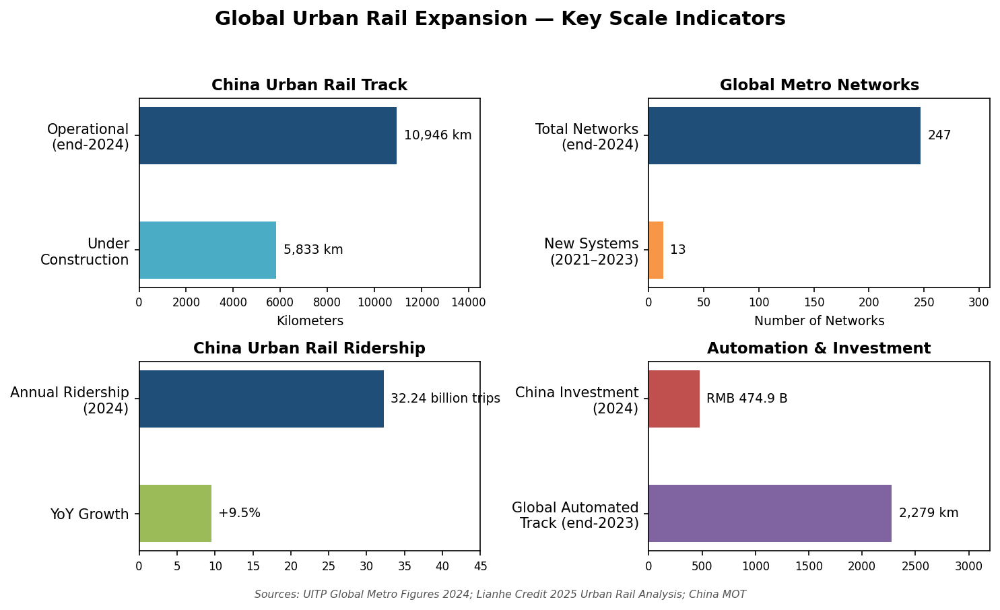

*Figure 1.1 — Key scale indicators for global urban rail expansion as of end-2024, encompassing China's operational and under-construction track, global metro network counts, ridership volumes, and automation and investment figures. Sources: UITP Global Metro Figures 2024; Lianhe Credit 2025 Urban Rail Analysis; China MOT.*

## 1.4 The Signaling Market: Size and Trajectory

The infrastructure expansion described above underpins a rapidly growing signaling market. Global Market Insights estimated the worldwide railway signaling market at USD 18.2 billion in 2024 and projected it to reach USD 42.4 billion by 2034, implying a compound annual growth rate (CAGR) of 8.9%. The ETCS segment held a sizeable share in 2024, with Europe constituting the largest regional market and Asia Pacific the fastest-growing region [Global Market Insights — Railway Signaling System Market](https://www.gminsights.com/pressrelease/railway-signaling-system-market "USD 18.2B in 2024, 8.9% CAGR to USD 42.4B by 2034").

Complementing these figures, the UNIFE World Rail Market Study (10th edition, September 2024) forecast approximately 3% annual real growth in the broader global rail supply market through the end of the decade, with the average annual market reaching EUR 240.8 billion [UNIFE 2024 Annual Report](https://www.unife.org/wp-content/uploads/2025/01/UNIFE-2024-Annual-Report.pdf "WRMS 10th edition forecast"). Within this expanding envelope, signaling and train control represent one of the fastest-growing segments, propelled by the dual imperatives of capacity optimization and safety-standard compliance.

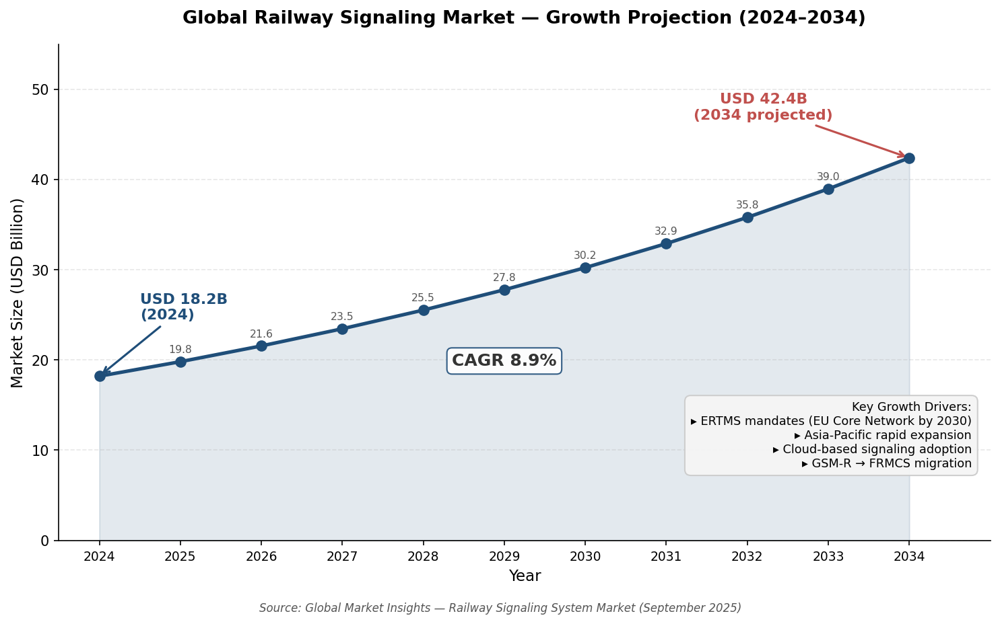

*Figure 1.2 — Projected trajectory of the global railway signaling market from USD 18.2 billion (2024) to USD 42.4 billion (2034) at an 8.9% CAGR, with key growth drivers annotated. Source: Global Market Insights, September 2025.*

## 1.5 Policy Drivers: Mandates, Investments, and Digital Transformation

Alongside market forces, government and regulatory mandates are actively channeling the industry toward modernized signaling, creating demand conditions that structurally favor cloud-based, software-defined approaches.

### Europe: ERTMS Mandates and Infrastructure Investment

The European Commission's Third ERTMS Work Plan, published in February 2026, reported that ETCS had been deployed on approximately 12,400 km of track — roughly 10% of the TEN-T network — and that 8,730 vehicles had been equipped by end-2024. The revised TEN-T Regulation, effective since July 2024, designates ERTMS as the single European signaling system and mandates deployment on the Core Network by 2030, with extended and comprehensive network coverage required by 2040 and 2050 respectively [European Commission — Third ERTMS Work Plan](https://transport.ec.europa.eu/news-events/news/third-ertms-work-plan-ertms-deployment-progressing-more-must-be-done-2026-02-23_en "12,400 km ETCS, 8,730 vehicles, 2030 mandate"); [UNIFE 2024 Annual Report](https://www.unife.org/wp-content/uploads/2025/01/UNIFE-2024-Annual-Report.pdf "TEN-T Regulation: ERTMS as single system").

The mandated decommissioning of national legacy signaling systems across Europe creates structural demand for modern, software-upgradeable platforms. UNIFE and EU rail industry bodies have advocated EUR 100 billion for a renewed Connecting Europe Facility (CEF) post-2027, while the Recovery and Resilience Facility already includes approximately EUR 50 billion in rail investments [UNIFE 2024 Annual Report](https://www.unife.org/wp-content/uploads/2025/01/UNIFE-2024-Annual-Report.pdf "Investment advocacy: EUR 100B CEF, EUR 50B RRF"). The scale of this investment program, coupled with an explicit mandate to replace fragmented national systems with harmonized digital signaling, constitutes one of the strongest policy-level drivers for cloud-based architectures.

### China: Smart Urban Rail and TCO Pressure

China's 14th Five-Year Plan for transport explicitly integrates 5G, the Internet of Things, big data, cloud computing, and artificial intelligence with the transport sector, mandating the development of "smart urban rail" including autonomous train control [China State Council — 14th FYP Transport Plan](http://www.scio.gov.cn/zdgz/jj/202309/t20230914_769420.html "Ch.7: smart transport technology targets"). This top-down policy direction provides a clear mandate for cloud-enabled and AI-augmented signaling within the Chinese ecosystem.

The policy imperative is reinforced by acute financial pressure. Chinese urban rail operators collectively recorded an average revenue-to-cost ratio of only 57.85% in 2024, meaning that farebox and ancillary revenues covered barely more than half of operating costs [Lianhe Credit — 2025 Urban Rail Analysis](https://www.lhratings.com/file/fe403910cf4.pdf "57.85% revenue-to-cost ratio"). With 5,833 km of new lines under construction and ongoing expansion plans spanning dozens of cities, any signaling technology that demonstrably reduces total cost of ownership — through lower hardware requirements, simplified maintenance, and remote software updates — acquires a powerful economic rationale that extends well beyond its technical merits.

### Industry Response: Lifecycle Cost and Energy Efficiency

Vendors have begun to quantify the economic and environmental value proposition of next-generation signaling. Siemens Mobility's Signaling X platform, unveiled at InnoTrans 2024, claims up to 20% lifecycle cost improvement over conventional signaling; when combined with ATO and ETCS functionality, the platform reports up to 30% energy savings. Deployments in Austria, Spain, and Finland are underway [Siemens Mobility Press Release — UITP Summit 2025](https://press.siemens.com/global/en/pressrelease/siemens-mobility-showcases-digital-solutions-urban-rail-transport-uitp-summit-2025 "Signaling X: 20% lifecycle cost, 30% energy savings"). These figures originate from the vendor and await independent validation across diverse operating environments; nonetheless, they indicate the direction in which the industry's economic calculus is shifting.

## 1.6 From Limitation to Opportunity: The Case for Cloud-Based Train Control

The convergence of these factors — architectural constraints in conventional CBTC, explosive global network growth, a multi-billion-dollar signaling market on a steep growth trajectory, and policy mandates demanding digital transformation — builds a compelling case for cloud-based train control. By migrating safety-critical logic from distributed proprietary hardware to centralized (or hybrid centralized-edge) software platforms running on COTS servers, cloud-based architectures promise to address several of conventional CBTC's core limitations simultaneously: reducing wayside infrastructure and its associated civil-works costs, enabling remote software updates without line closures, improving scalability through virtualization, and opening paths to multi-vendor interoperability via standardized computing platforms.

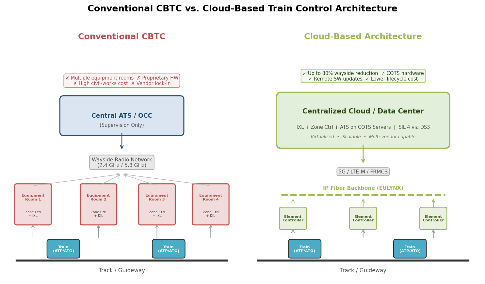

*Figure 1.3 — Simplified comparison of conventional CBTC architecture (multiple trackside equipment rooms housing zone controllers and interlockings) against a cloud-based architecture (centralized data center running IXL and zone controller functions on COTS servers at SIL 4, connected to lightweight element controllers via IP fiber backbone with EULYNX interfaces). The cloud model targets up to 80% wayside equipment reduction.*

The transition, however, is neither straightforward nor risk-free. Achieving SIL 4 (Safety Integrity Level 4) functional safety on commercially available, non-bespoke hardware; guaranteeing deterministic latency for real-time train control over IP-based networks; certifying virtualized software stacks under railway safety standards designed for tightly coupled hardware-software systems; and managing brownfield migration on live metro networks — each of these represents a formidable technical and institutional challenge. The chapters that follow examine how the industry is addressing these dimensions: the key enabling technologies (Chapter 2), the current state of deployments and vendor strategies (Chapter 3), the evolving standards and certification landscape (Chapter 4), and the outlook for adoption at scale (Chapter 5).

# 第2章 Key Enabling Technologies

Migrating safety-critical train control from distributed proprietary hardware to cloud-based software platforms is not a single technological leap but the convergence of several independent technology streams. Cloud computing and virtualization supply the execution environment; edge computing enforces the deterministic latency that train control demands; next-generation mobile communications — principally the Future Railway Mobile Communication System (FRMCS) and 5G — provide the radio bearer; artificial intelligence layers analytics and optimization atop the data-rich cloud architecture; and cybersecurity frameworks together with functional-safety assurance methods must be adapted for an environment in which safety-critical code runs on commercial off-the-shelf (COTS) servers rather than bespoke hardware. This chapter examines each technology pillar in turn, with particular attention to architectural patterns and field-validated performance evidence available as of early 2026.

## 2.1 Cloud Computing, Virtualization, and Microservice Architectures

### From Proprietary Hardware to COTS Servers

The foundational shift in cloud-based train control is the decoupling of safety-critical application logic from dedicated, vendor-specific hardware. In conventional CBTC, interlocking logic, zone controllers, and Radio Block Centre (RBC) functions each execute on purpose-built processors whose hardware identity is tightly bound to the safety case. Cloud-based architectures replace these proprietary platforms with standard COTS multicore servers housed in centralized or geo-distributed data centers, connected to lightweight trackside element controllers via IP-based fiber backbones.

Siemens Mobility's DS3 (Distributed Smart Safe System) platform is the most technically documented example of this transition. DS3 enables Safety Integrity Level 4 (SIL 4) applications — interlockings, RBCs, and ETCS functions — to execute on COTS multicore hardware, with standardized EULYNX interfaces connecting the centralized compute layer to trackside element controllers (ECs) over an IP fiber backbone. The platform supports what Siemens terms "unlimited control distance": a centralized data center can supervise field elements regardless of geographic separation, provided the fiber network satisfies latency requirements [Siemens — DS3 Interlocking in the Cloud (IRSC 2024)](https://international-railway-safety-council.com/wp-content/uploads/2025/04/Sonja-Steffen_Interlocking-in-the-Cloud.pdf "IRSC Vienna, Sept 2024: DS3 architecture from proprietary IXL to cloud-based COTS").

Operational validation of this model is now substantial. ÖBB Achau in Austria became the world's first SIL 4 interlocking on COTS hardware when commissioned on 18 November 2020. After more than four years of revenue operation, the installation has maintained 100% availability. The existing certified interlocking application logic (Trackguard Simis AT) was migrated to the COTS platform with untouched application software and unchanged interfaces — demonstrating that DS3 separates the safety-critical application from the execution platform cleanly enough to avoid re-certification of the application layer [RailTech — ÖBB cloud interlocking](https://www.railtech.com/innovation/2020/11/30/obb-puts-first-cloud-enabled-interlocking-in-operation/ "First SIL 4 interlocking on COTS, November 2020").

### Achieving SIL 4 Through Diverse Software Redundancy

The central technical challenge in running safety-critical code on COTS hardware is achieving SIL 4 integrity — a tolerable functional failure rate of 10⁻⁹ to 10⁻⁸ per hour — without the hardware-level diversity that traditional platforms provide. DS3 addresses this through a multi-layered software-based safety architecture comprising four interlocking mechanisms:

- **2-out-of-3 redundancy**: Each safety-critical application runs in at least two parallel instances with diverse ("colored") safety mechanisms on separate CPUs. A third instance provides 2-out-of-3 availability, ensuring that single-point hardware failures do not interrupt service.
- **Diverse scattered memory management**: A patented mechanism distributes memory allocations across non-contiguous addresses using different patterns for each instance, enabling detection of common-cause failures (CCFs) that might otherwise affect both redundant instances identically.
- **Safe voting**: A protocol gateway compares the outputs of redundant instances before any safety-critical command is issued to trackside equipment.
- **CoreShield S2L2 Linux**: A lean, hardened Linux variant serves as both the operating system and the IT security layer, supporting runtime security patching without taking the interlocking out of service [Siemens — DS3 IRSC 2024](https://international-railway-safety-council.com/wp-content/uploads/2025/04/Sonja-Steffen_Interlocking-in-the-Cloud.pdf "2oo2 for safety, 2oo3 for availability, colored scattered memory management").

This software-diversity approach enables capabilities beyond the reach of traditional proprietary SIL 4 platforms: mixed-SIL applications on the same hardware (e.g., a SIL 4 interlocking and a SIL 2 level-crossing controller sharing one server cluster), simplified obsolescence management through COTS server refresh without application re-certification, and geographical redundancy via dual data center operation [Siemens — DS3 IRSC 2024](https://international-railway-safety-council.com/wp-content/uploads/2025/04/Sonja-Steffen_Interlocking-in-the-Cloud.pdf "Mixed-SIL, multicore COTS, geographical redundancy").

### The Hypervisor-Based Approach: PikeOS and the SIL4 Cloud Concept

An alternative architectural pathway to SIL 4 on COTS relies on certified real-time hypervisors that provide hardware-enforced partitioning. SYSGO's PikeOS, a separation-kernel hypervisor pre-certified to EN 50128 / EN 50657 SIL 4, uses strict temporal and spatial partitioning to isolate safety-critical applications from non-critical functions running on the same multicore processor. Temporal partitioning allocates fixed CPU time slots (following ARINC 653 principles), while spatial partitioning enforces complete memory and I/O isolation between partitions [SYSGO — PikeOS Railway](https://www.sysgo.com/railway "PikeOS pre-certified EN 50128/EN 50657 SIL 4; temporal and spatial partitioning").

PikeOS forms one of the two solution approaches examined in the Digitale Schiene Deutschland (DSD) SIL4 Cloud research project (September 2022), conducted by DB Netz AG, Thales, SYSGO, Fraunhofer IESE, and the University of Rostock. The project confirmed the general feasibility of a certifiable SIL 4 private cloud for railway applications, identifying the central design paradigm as a standardized separation of application, runtime environment, and hardware — regardless of the specific solution approach. This three-layer separation aligns with the Safe Computing Platform (SCP) concept developed under the Reference CCS Architecture (RCA) and OCORA initiatives [SYSGO — SIL4Cloud](https://www.sysgo.com/press-releases/sil4-cloud-a-novel-it-platform-architecture-for-safety-relevant-railway-applications "Multi-partner SIL4 Cloud research: feasibility confirmed"); [DSD — SIL4 Cloud](https://digitale-schiene-deutschland.de/en/news/2022/SIL4-Cloud "SIL4 Cloud feasibility confirmed, standardized separation paradigm").

SYSGO and Kontron have further commercialized this approach as SAFe-VX, a turnkey development platform for wayside control systems that partitions critical and non-critical application code in independent time and memory spaces on a single hardware platform, reducing hardware cost while enabling separate certification of each partition [SYSGO — Railway](https://www.sysgo.com/railway "SAFe-VX: turnkey platform for wayside control systems").

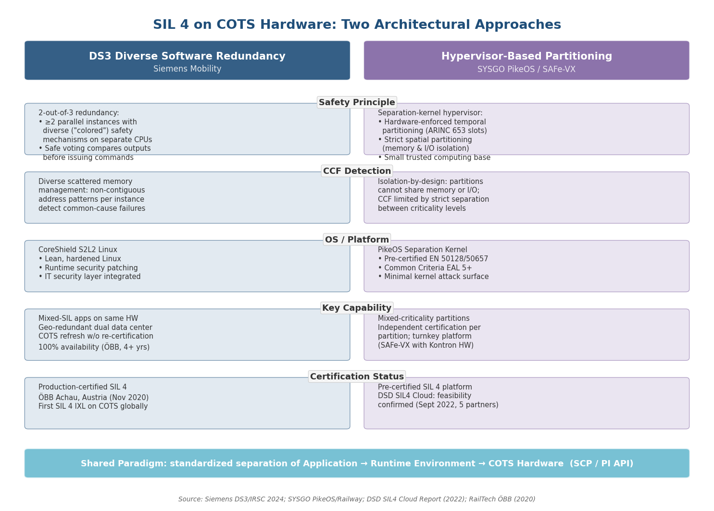

*Figure 2-1. Side-by-side comparison of the two principal approaches to achieving SIL 4 on COTS hardware: Siemens DS3's diverse software redundancy model and the SYSGO PikeOS hypervisor-based partitioning model. Both share a common design paradigm of standardized separation between application, runtime environment, and hardware (SCP / PI API).*

### Train-Centric Architectures: Intelligence on Board

Not all next-generation signaling architectures place the cloud at the center. Alstom's Urbalis Fluence represents a train-centric paradigm in which core signaling intelligence resides onboard the train, with train-to-train communication managing interval spacing. This approach reduces trackside equipment by approximately 20% and energy consumption by 30%, achieving headways as low as 60 seconds. Urbalis Fluence supports LTE and future 5G communications and has been deployed across 190 metro lines globally, of which 67 operate driverless [Alstom — Urbalis Fluence](https://www.alstom.com/solutions/signalling/urban-signalling/urbalis-fluence-train-centric-cbtc "60s headways, 20% trackside reduction, 190 lines globally").

While Urbalis Fluence is not cloud-based in the infrastructure-centralization sense, it achieves a functionally similar outcome — reducing dependence on distributed wayside hardware — through a different architectural strategy. The train-centric model places the heaviest computational burden on onboard processors rather than centralized servers, with distinct implications for certification (onboard safety cases are well-established), latency (no cloud round-trip is required for time-critical decisions), and scalability (each additional train adds its own processing capacity).

Hitachi Rail has committed C$100 million or more (announced November 2024) to SelTrac G9, its next-generation CBTC platform explicitly integrating AI, 5G, edge computing, and cloud computing. Development is centered in Toronto, with a new C$30 million Global CBTC Competence Centre opened in February 2026. Published architectural details remain limited; SelTrac G9 is in early development, and its specific approach to cloud-edge partitioning and SIL 4 assurance has not yet been disclosed [Hitachi Rail — SelTrac G9](https://www.hitachirail.com/blog/hitachi-rail-invests-in-the-next-generation-rail-signaling-technology/ "Feb 2026: C$100M+ SelTrac G9 investment").

## 2.2 Edge Computing and Real-Time Determinism

### The Latency Challenge

Safety-critical train control imposes hard real-time constraints that conventional cloud computing — designed for throughput and elasticity rather than deterministic latency — cannot inherently guarantee. An Automatic Train Protection (ATP) system must process train position, calculate safe braking curves, and issue movement authorities within tightly bounded time windows. The UNISIG Subset 93 specification defines Quality of Service requirements for the radio bearer connecting ETCS onboard units to Radio Block Centres, establishing the latency and reliability thresholds that any replacement communication technology must satisfy.

The 5GRAIL project (EU Horizon 2020) provided the first rigorous field measurements of ETCS performance over 5G standalone (SA) networks. In trials conducted across French (SNCF) and German (DB) testbeds, ETCS end-to-end one-way application latency measured approximately 40–55 ms, well within UNISIG Subset 93 requirements. The underlying FRMCS network one-way latency was approximately 20 ms. Inter-gNB (base station) handover latency, however, averaged approximately 125 ms — a figure that, while not violating current specifications, underscores the challenge of maintaining uninterrupted service in dense urban environments where trains traverse cell coverage boundaries at high frequency [5GRAIL D5.3 Report](http://5grail.eu/wp-content/uploads/2024/05/D5.3-Conclusion-Report-on-5G-FRMCS-Field-Trials.pdf "EU Horizon 2020: ETCS E2E ~40-55 ms, network ~20 ms, handover ~125 ms").

### Architectural Patterns: Centralized Cloud vs. Multi-Access Edge Computing

The 5GRAIL trials illuminated two contrasting deployment architectures for the compute infrastructure supporting cloud-based signaling:

- **Multi-Access Edge Computing (MEC)**: The French testbed (SNCF, operating at 1.9 GHz on NR band n39) deployed the 5G core and application logic co-located near the trackside, minimizing network round-trip time. This edge-heavy model suits scenarios where latency margins are tightest or where network topology favors localized processing.
- **Remote centralized core**: The German testbed (DB, operating at 3.7 GHz on NR band n78) placed the 5G core and processing in a remote centralized data center, relying on the fiber backbone to meet latency requirements despite additional network hops [5GRAIL D5.3](http://5grail.eu/wp-content/uploads/2024/05/D5.3-Conclusion-Report-on-5G-FRMCS-Field-Trials.pdf "French MEC vs German centralized testbed architectures").

These two models represent the endpoints of a spectrum; real-world deployments will likely occupy hybrid configurations between them. The Siemens DS3 architecture, for instance, centralizes safety-critical interlocking logic in data centers but connects to distributed trackside element controllers via IP fiber backbone with EULYNX interfaces. The element controllers perform local I/O functions (actuating points, reading signals) but do not execute safety-critical logic — making them lightweight, standardized field devices rather than computation nodes. This design centralizes the most complex and costly-to-certify functions while keeping the physical interface layer distributed [Siemens — DS3 IRSC 2024](https://international-railway-safety-council.com/wp-content/uploads/2025/04/Sonja-Steffen_Interlocking-in-the-Cloud.pdf "Centralized Rail Data Center with ECs via fiber backbone").

### Deterministic Scheduling and Worst-Case Execution Time

A fundamental tension exists between cloud computing's elasticity — dynamic resource allocation, auto-scaling, live migration of workloads — and the deterministic worst-case execution time (WCET) guarantees required by safety standards. EN 50716:2023 (the successor to EN 50128 for railway safety software) explicitly introduces multicore WCET analysis requirements, recognizing that interference channels between co-located processes on shared multicore processors can introduce non-deterministic timing variations.

The hypervisor-based approach addresses this tension through strict temporal partitioning: PikeOS allocates fixed execution time slots to each safety-critical partition, ensuring that a SIL 4 application receives its guaranteed CPU share regardless of other partitions' behavior. DS3 addresses the same challenge differently, through diverse redundancy: if timing anomalies affect one instance, the safe voting mechanism detects divergence from a second instance running on a separate CPU with different memory management patterns. Both approaches effectively sacrifice the dynamic elasticity of general-purpose cloud computing in favor of determinism — accepting that a "SIL 4 cloud" will not auto-scale in the manner of a commercial web-services cloud.

## 2.3 Next-Generation Communications: FRMCS, 5G-R, and the GSM-R Sunset

### FRMCS: The 5G-Based Successor to GSM-R

The Future Railway Mobile Communication System (FRMCS) is the UIC-designed successor to GSM-R, the dedicated 2G railway radio standard that currently underpins ETCS and operational voice communication across approximately 130,000 km of European track and 210,000 km worldwide. GSM-R suppliers have informed the industry that the technology will become obsolete by 2030, with support commitments extending to 2035–2040 depending on the vendor [ERTMS.net — FRMCS moves forward](https://www.ertms.net/news/frmcs-moves-forward/ "July 2024: GSM-R obsolete by 2030, support to 2035/2040").

FRMCS is built on 5G technology standardized through 3GPP, with railway-specific features developed across Releases 15 through 19 (the MONASTERY series through FRMCS Phase 5). The system extends the Mission Critical (MCX) framework — originally designed for public-safety users — with railway-specific functions including Mission Critical Push-to-Talk (MCPTT), Mission Critical Data (MCData), and Mission Critical Video (MCVideo) [3GPP — Railways](https://www.3gpp.org/technologies/railways1 "April 2025: complete Release 15-19 railway standardization timeline").

Dedicated spectrum has been allocated through ECC Decision (20)02: 874.4–880.0 / 919.4–925.0 MHz in FDD mode (NR band n100) and 1900–1910 MHz in TDD mode (NR band n101). Introduced in 3GPP Release 17, these bands support train speeds up to 500 km/h on Frequency Range 1 (FR1), comfortably exceeding the operational envelope of urban rail transit [3GPP — Railways](https://www.3gpp.org/technologies/railways1 "NR bands n100/n101 for RMR, speed support 500 km/h FR1").

### Standardization and Deployment Timeline

The UIC has designated FRMCS V3 ("1st Edition") as the first implementable version, targeted for inclusion in the 2027 CCS Technical Specification for Interoperability (TSI). The FP2-MORANE2 project, launched in December 2024 with a 34-month duration, will validate V3 through operational testing [UIC — FRMCS](https://uic.org/rail-system/telecoms-signalling/frmcs "Sept 2025: FRMCS V3 for 2027, FP2-MORANE2 validation").

The transition from GSM-R to FRMCS will be extended and operationally complex. Initial FRMCS rollouts are expected in 2027–2028, followed by a prolonged period of dual GSM-R/FRMCS operation extending into the mid-2030s. France plans phased switchovers between 2032 and 2035. Germany faces the additional infrastructure challenge of constructing approximately 20,000 new radio masts to support FRMCS coverage [Fujikura Europe](https://www.europe.fujikura.com/insights/whats-replacing-gsm-r-in-the-rail-industry/ "FRMCS rollout 2027-28, dual operation mid-2030s"); [Ericsson blog](https://www.ericsson.com/en/blog/2024/10/mapping-a-route-to-5g-rail-corridors "~20,000 new masts needed in Germany").

### Field Validation: 5GRAIL Results

The 5GRAIL project provided the most comprehensive public field-trial data for FRMCS over 5G SA networks. The French testbed operated at 1.9 GHz (NR band n39) and the German testbed at 3.7 GHz (NR band n78). Key performance results included:

- **MCPTT access time**: 75–86 ms (against a 300 ms requirement), confirming that 5G voice quality far exceeds GSM-R benchmarks.
- **ETCS round-trip time (dynamic)**: 89–111 ms, within UNISIG Subset 93 thresholds.
- **ETCS end-to-end one-way latency**: approximately 40–55 ms.
- **FRMCS network one-way latency**: approximately 20 ms.

The final demonstration took place on 20 September 2023 aboard DB's TrainLab ICE test train [5GRAIL D5.3](http://5grail.eu/wp-content/uploads/2024/05/D5.3-Conclusion-Report-on-5G-FRMCS-Field-Trials.pdf "MCPTT 75-86 ms, ETCS RTT 89-111 ms, final demo Sept 2023").

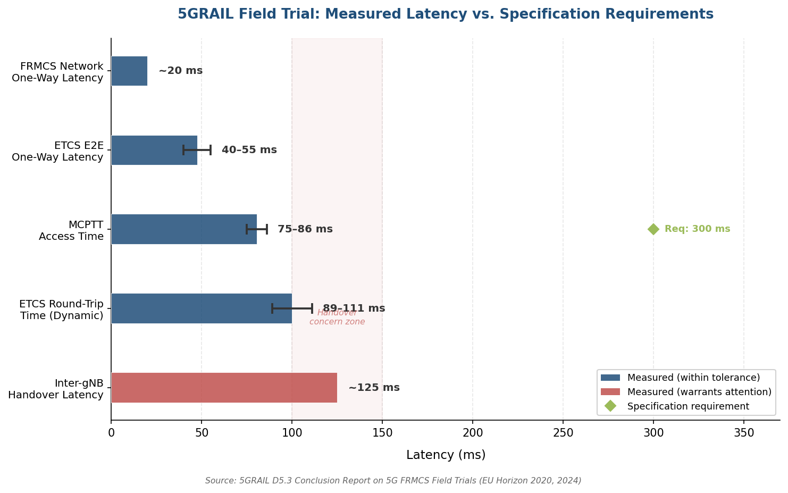

*Figure 2-2. Latency metrics measured during 5GRAIL field trials compared against specification requirements. All metrics met their respective thresholds, though inter-gNB handover latency (~125 ms, highlighted in red) warrants attention for dense urban deployments with frequent cell transitions. Source: 5GRAIL D5.3 Conclusion Report (EU Horizon 2020, 2024).*

### First Commercial FRMCS Deployment

Huawei and CASCO launched the world's first FRMCS-based Train Autonomous Circumambulation Network (TACN) system at Mobile World Congress Barcelona on 2 March 2026. The system delivers 20 Mbps bandwidth and 99.999% reliability through dual-network redundancy, and has been deployed on an African freight railway where it achieved a 60% capacity increase to 100 million tonnes per year. Although this deployment serves a mainline freight application rather than urban rail transit, it establishes FRMCS as a commercially operational technology and demonstrates that the communication bandwidth supports not only ETCS data transmission but also predictive operations and maintenance functions [Huawei Enterprise](https://e.huawei.com/gr/news/2026/industries/transportation/railway/casco-release-frmcs-based-tacn-system "MWC 2026: FRMCS-based TACN, 60% capacity increase").

## 2.4 Artificial Intelligence and Machine Learning Applications

Cloud-based train control architectures generate far richer data streams than their conventional counterparts. Centralized or cloud-connected systems continuously collect telemetry from trackside sensors, onboard equipment, and communication networks, creating the data foundation on which AI and machine learning applications can operate. The current generation of AI applications in cloud-based rail signaling falls into three primary categories: predictive maintenance, operational optimization, and anomaly detection.

### Predictive Maintenance

Siemens Mobility's Railigent X platform exemplifies the predictive maintenance layer. Operating as a cloud-based rail asset management system, Railigent X applies "Remaining Useful Life" algorithms to predict optimal maintenance intervals for signaling components and rolling stock. By unifying data from trains and signaling infrastructure on a single cloud platform, it enables condition-based rather than time-based maintenance schedules, reducing both unplanned downtime and over-maintenance of healthy equipment [Siemens — Railigent X](https://www.mobility.siemens.com/global/en/portfolio/digital-solutions-software/digital-services/railigent-x/whitepaper-innovative-approach.html "Railigent X AI-driven predictive maintenance").

The DS3 platform at ÖBB Achau provides an operational illustration: signals and points connected to the cloud-based interlocking are "smartly controlled, enabling diagnoses, predictions of malfunctions" — a capability that arises directly from the centralized architecture's ability to aggregate and analyze field-element telemetry that would otherwise remain siloed in conventional trackside equipment rooms [RailTech — ÖBB](https://www.railtech.com/innovation/2020/11/30/obb-puts-first-cloud-enabled-interlocking-in-operation/ "DS3 predictive maintenance capabilities").

The Huawei/CASCO FRMCS-based TACN system similarly leverages FRMCS bandwidth — 20 Mbps, far exceeding GSM-R's capacity — to support predictive operations and maintenance for train safety and punctuality. The higher bandwidth enables continuous streaming of onboard diagnostic data that would be impractical over legacy radio systems [Huawei Enterprise — TACN](https://e.huawei.com/gr/news/2026/industries/transportation/railway/casco-release-frmcs-based-tacn-system "Predictive O&M via FRMCS bandwidth").

### Operational Optimization and Anomaly Detection

Hitachi Rail's SelTrac G9, currently in early development, explicitly positions AI integration alongside 5G, edge, and cloud computing as a core architectural pillar. While published performance data are not yet available, the stated objectives encompass operational efficiency and passenger experience optimization — suggesting applications such as adaptive headway management, energy-optimal speed profiling, and real-time demand-responsive scheduling [Hitachi Rail — SelTrac G9](https://www.hitachirail.com/blog/hitachi-rail-invests-in-the-next-generation-rail-signaling-technology/ "AI integration in SelTrac G9").

A note of caution is warranted: current AI/ML applications in cloud-based rail signaling remain primarily vendor-stated capabilities. Independent, quantified performance data — such as measurable reductions in failure rates, maintenance costs, or headway variability attributable specifically to AI — have not been published at a level permitting rigorous comparative assessment. Predictive maintenance is the most mature application category; operational optimization and anomaly detection remain largely in pilot or conceptual stages.

## 2.5 Cybersecurity for Virtualized Signaling Environments

### The Expanded Attack Surface

Migrating train control to cloud infrastructure fundamentally alters the cybersecurity threat landscape. Conventional CBTC systems benefit from a degree of physical isolation — proprietary hardware in locked trackside rooms with limited network connectivity. Cloud-based architectures, by contrast, introduce standard networking protocols, COTS operating systems, shared compute environments, and IP-based connections between centralized servers and distributed field elements. Each of these expands the potential attack surface and must be systematically addressed.

### CLC/TS 50701: Bridging Railway Safety and Cybersecurity

The first European technical specification dedicated to railway cybersecurity — CLC/TS 50701, published by CENELEC in June 2021 and revised in a second edition in 2023 — bridges the industrial cybersecurity framework IEC 62443 with the railway functional-safety lifecycle defined by EN 50126 (RAMS). Covering signalling, rolling stock, and fixed installations, the specification provides a structured methodology for railway operators and suppliers to conduct cybersecurity risk assessments, implement protective measures, and manage security throughout the system lifecycle, including patch management [CENELEC — CLC/TS 50701](https://www.cencenelec.eu/news-events/news/2021/eninthespotlight/2021-06-10-new-clc-ts-50701-railways-cybersecurity/ "June 2021: first railway cybersecurity TS, bridges IEC 62443 and EN 50126").

CLC/TS 50701 operates in concert with EN 50716:2023 (the successor to EN 50128 for railway safety software), which integrates mandatory cybersecurity considerations into the software development lifecycle. Together, these standards form a complementary ecosystem: EN 50716 governs how safety software is developed with security in mind, while CLC/TS 50701 provides the overarching railway-specific cybersecurity framework governing development, deployment, and operations [LDRA — RAMS standards](https://ldra.com/en-5012x/ "EN 50716 + CLC/TS 50701 complementary standards").

### Runtime Security in Cloud-Based Interlockings

The Siemens DS3 platform addresses cybersecurity at the operating-system level through CoreShield S2L2 Linux, a lean, hardened Linux variant serving as both the OS and the IT security layer. A critical capability for cloud-based signaling is the ability to apply security patches during runtime without taking the interlocking out of service. In conventional systems, security updates often require planned service interruptions, creating tension between cybersecurity hygiene and operational availability. S2L2 Linux resolves this through live patching, enabling the virtualized environment to respond to evolving threats without compromising the continuous availability that urban rail operations demand [Siemens — DS3 IRSC 2024](https://international-railway-safety-council.com/wp-content/uploads/2025/04/Sonja-Steffen_Interlocking-in-the-Cloud.pdf "S2L2 Linux: lean IT-security patching during runtime").

The hypervisor-based approach offers complementary cybersecurity advantages. SYSGO's PikeOS separation kernel has achieved Common Criteria EAL 5+ security certification, among the highest commercially available assurance levels. Its small kernel size and limited number of system calls reduce the attack surface, while strict partitioning ensures that a compromised non-critical partition cannot interfere with safety-critical functions [SYSGO — PikeOS Railway](https://www.sysgo.com/railway "PikeOS: Common Criteria EAL 5+, small kernel, strict partitioning").

### Open Questions in FRMCS Security

The 5GRAIL project's field trials validated basic authentication and encryption for FRMCS over 5G SA networks, but the project explicitly identified FRMCS security and privacy as areas requiring further investigation. A comprehensive security assessment — addressing threats specific to the railway radio environment such as jamming, spoofing, and man-in-the-middle attacks on the air interface — remains an open work item for the FP2-MORANE2 validation project and subsequent standardization efforts [5GRAIL D5.3](http://5grail.eu/wp-content/uploads/2024/05/D5.3-Conclusion-Report-on-5G-FRMCS-Field-Trials.pdf "FRMCS security: future work needed").

## 2.6 Technology Integration: Toward a Unified Cloud-Based Signaling Stack

The five technology pillars examined in this chapter — cloud/virtualization, edge computing, next-generation communications, AI/ML, and cybersecurity — do not operate independently within a cloud-based train control system. Their value proposition is realized through integration into a coherent technology stack.

At the lowest layer, FRMCS or 5G provides the radio bearer connecting onboard equipment to the network. The IP fiber backbone links trackside element controllers to centralized or edge-distributed compute nodes. On those nodes, a certified execution environment — whether DS3's diverse software redundancy on S2L2 Linux or a hypervisor-based partition architecture such as PikeOS — hosts SIL 4 safety-critical applications (interlocking, ATP, RBC). Above the safety layer, AI/ML applications consume the telemetry data generated by the system for predictive maintenance and operational optimization. Spanning all layers, the cybersecurity framework defined by CLC/TS 50701 and EN 50716 governs threat management from the radio interface through the application layer.

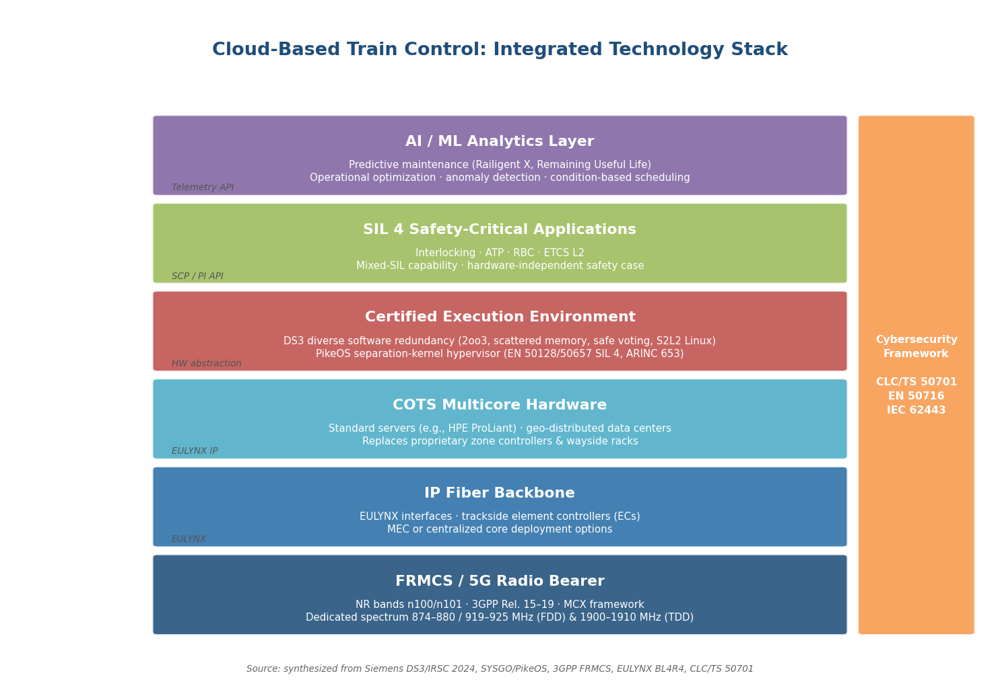

*Figure 2-3. Integrated technology stack for cloud-based train control, from FRMCS/5G radio bearer at the base through COTS hardware, certified execution environments, SIL 4 safety applications, and AI/ML analytics, with a cross-cutting cybersecurity framework (CLC/TS 50701, EN 50716, IEC 62443) and standardized interface labels (EULYNX, SCP/PI API) between layers.*

The standardization of interfaces between these layers — particularly the EULYNX specifications for interlocking-to-field-element communication and the SCP Platform Independent API for application-to-platform portability — is what distinguishes a cloud-based signaling architecture from a simple port of legacy software to new hardware. Without standardized interfaces, the migration merely substitutes one form of vendor lock-in for another. The standards landscape supporting this integration is examined in detail in Chapter 4, while specific vendor implementations and deployment milestones are surveyed in Chapter 3.

# 第3章 Recent Deployments, Pilot Projects, and the Vendor Ecosystem

The enabling technologies surveyed in Chapter 2 — cloud-native SIL 4 platforms, edge computing, FRMCS, and AI-driven analytics — are no longer confined to laboratory prototypes. Between 2024 and early 2026, a succession of landmark deployments, live demonstrations, and large-scale procurement decisions has begun translating these technology streams into operational reality. This chapter maps the deployment landscape across geographies and vendors, examines the divergent architectural philosophies that the leading signaling suppliers have adopted, and assesses the emerging role of information and communications technology (ICT)-origin players entering the rail signaling value chain.

## 3.1 Siemens Signaling X and DS3: From Mainline Pioneer to Urban Demonstrator

### Mainline Track Record

Siemens Mobility's DS3 (Distributed Smart Safe System) platform holds the longest operational history of any SIL 4-on-COTS deployment. ÖBB Achau in Austria, commissioned on 18 November 2020, remains the world's first SIL 4 interlocking running on commercial off-the-shelf (COTS) hardware; after more than four years of revenue operation, the installation has sustained 100 % availability [RailTech — ÖBB cloud interlocking](https://www.railtech.com/innovation/2020/11/30/obb-puts-first-cloud-enabled-interlocking-in-operation/ "First SIL 4 interlocking on COTS, November 2020"). In southwestern Europe, FGC Barcelona has operated a WESTRACE@DS3 cloud interlocking in shadow mode, accumulating over 10,000 hours and constituting the first such deployment in Spain [Mafex — Spain FGC](https://magazine.mafex.es/en/first-digital-interlocking-in-the-cloud-in-southwestern-europe-in-spain/ "DS3 at FGC Barcelona: 10,000+ shadow hours").

The most ambitious mainline commitment to date is Finland's Digirail program. Built on Signaling X — Siemens' unified mainline-and-urban signaling platform, unveiled at InnoTrans 2024 — Digirail will deploy ETCS Level 2 across Finland's entire 6,000 km railway network by 2040, with a first commissioned section of 191 km targeted for 2029. By network scope, Digirail represents the largest known Signaling X contract [Siemens — Digirail](https://www.mobility.siemens.com/global/en/portfolio/references/digirail-transforming-finlands-rail-network-with-signaling-x.html "Finland 6,000 km Signaling X ETCS L2").

### The Singapore Urban CBTC Breakthrough

In November 2025, Siemens achieved what it characterized as a world premiere: a live CBTC-on-cloud demonstration at the Singapore Rail Test Center (SRTC). The demonstration ran SIL 4 CBTC logic on HPE ProLiant COTS servers, consolidating equipment that previously filled four 19-inch racks into a single partially filled rack. The architecture employed a 2-out-of-3 geo-distributable server configuration, meaning the three redundant servers could, in principle, be distributed across geographically separated data centers for resilience [Siemens Press Release — Singapore Demo](https://press.siemens.com/global/en/pressrelease/world-premiere-siemens-proves-unique-signaling-x-solution-live-metro-operation "November 2025: world's first CBTC on Signaling X at SRTC"); [Heise Online](https://www.heise.de/en/background/Signaling-X-Siemens-shows-metro-control-CBTC-on-conventional-servers-11136822.html "Jan 2026: HPE ProLiant, 3-server redundancy").

A critical element of the Singapore demonstration was the **Smart Object Control Box** prototype — a compact unit that connects legacy trackside hardware to the Signaling X platform via Ethernet. The device addresses the brownfield migration challenge: rather than mandating simultaneous replacement of all trackside equipment, it allows operators to migrate line segments incrementally while retaining fallback capability to legacy systems. Siemens reported that the switchover between legacy and cloud-based control was demonstrated in approximately one day [Heise Online](https://www.heise.de/en/background/Signaling-X-Siemens-shows-metro-control-CBTC-on-conventional-servers-11136822.html "Smart Object Control Box for brownfield migration, ~1-day switchover").

### Performance Claims and Commercial Status

Signaling X carries a set of published performance claims: up to 20 % improvement in operational efficiency, 15 % reduction in capital expenditure, and 30 % energy savings when combined with ATO and ETCS. The platform supports geo-redundant dual-data-center operation and remote software updates without service interruption [RailTech — Signaling X](https://www.railtech.com/digitalisation/2026/03/03/signaling-x-siemens-mobilitys-cloud-revolution-in-rail-signalling/ "March 2026: 20% efficiency, 15% CAPEX, 30% energy savings"). For urban metro applications specifically, the Train2Cloud concept — a Signaling X derivative optimized for metro operations — supports 80-second headways at SIL 4, with an advertised 80 % reduction in wayside indoor equipment [Siemens Mobility Press Release — UITP Summit 2025](https://press.siemens.com/global/en/pressrelease/siemens-mobility-showcases-digital-solutions-urban-rail-transport-uitp-summit-2025 "June 2025: Train2Cloud 80 s headways, 80% equipment reduction").

An important caveat accompanies these milestones: as of early 2026, no commercial urban rail contract for Signaling X has been announced. The Singapore demonstration remains a controlled test-center exercise, not a revenue-service deployment. Siemens' own Jurong Region Line project in Singapore — scheduled for opening in 2029 — uses conventional Siemens CBTC rather than Signaling X [Heise Online](https://www.heise.de/en/background/Signaling-X-Siemens-shows-metro-control-CBTC-on-conventional-servers-11136822.html "Jurong Region Line uses conventional CBTC"). The gap between demonstration readiness and commercial deployment underscores the certification and procurement lead times that separate a technically viable platform from revenue operation.

## 3.2 The German and Nordic CBTC Pipeline

Several major European cities are advancing through various stages of CBTC deployment, creating a near-term pipeline of systems that may serve as future Signaling X upgrade candidates.

In Frankfurt, the Digital Train Control (DTC) project — a partnership between VGF and Siemens — completed GoA 2 prototype testing in September 2025 and commenced network test runs in January 2026, with revenue service targeted for 2027. The current DTC implementation uses Trainguard MT, Siemens' established CBTC platform, rather than Signaling X [Siemens/VGF Press Release](https://press.siemens.com/global/en/pressrelease/optimally-connected-faster-more-reliable-vgf-and-siemens-mobility-present-milestone "Sept 2025: Frankfurt DTC milestone").

Hamburg's U2 and U4 lines are scheduled to receive CBTC by end-2027, while Berlin's U5 is planned for 2029 and U8 for 2033. In Oslo, the first 3 km CBTC section was commissioned in late 2025. All of these deployments employ conventional CBTC architectures, yet their contractual and technical proximity to Siemens positions them as logical candidates for mid-life upgrades to Signaling X once the platform reaches commercial maturity [Heise Online](https://www.heise.de/en/background/Signaling-X-Siemens-shows-metro-control-CBTC-on-conventional-servers-11136822.html "Hamburg, Berlin, Oslo CBTC timelines"). Collectively, the German and Nordic pipeline illustrates a two-phase adoption model: conventional CBTC deployed in the near term, with a cloud-based upgrade pathway built into the contractual horizon.

## 3.3 Alstom Urbalis Fluence: Train-Centric CBTC in Revenue Service

While Siemens pursues a centralized cloud-data-center model, Alstom has adopted a fundamentally different architecture with Urbalis Fluence: a **train-centric** CBTC in which the majority of control intelligence migrates onboard the vehicle rather than into a remote cloud. Under Fluence, trains communicate directly with one another for interval management, and the interlocking function is merged into the onboard system — reducing trackside equipment by approximately 20 % and energy consumption by 30 %. The system supports headways as short as 60 seconds and is engineered for GoA 4 (unattended) operation from inception. Alstom reports deployment across 190 metro lines globally, of which 67 are driverless [Alstom — Urbalis Fluence](https://www.alstom.com/solutions/signalling/urban-signalling/urbalis-fluence-train-centric-cbtc "Train-centric CBTC: 60 s headways, 20% trackside reduction, 190 lines, 67 driverless").

### Lille Metro Line 1: First Commercial Deployment

Lille Metro Line 1 constitutes the world's first commercial deployment of Urbalis Fluence in revenue service. CBTC system installation was completed in November 2024, and the first five Boa trainsets entered passenger service on 14 February 2026, with the full fleet of 27 trainsets scheduled for delivery by December 2026. Rush-hour headways have reached 66 seconds. Operator confidence in the platform is evidenced by Ilévia's January 2025 order for 15 additional Boa trainsets equipped with Fluence signaling, valued at approximately €210 million [Railway Gazette — Lille](https://www.railwaygazette.com/metro/alstom-boa-trains-enter-service-on-lille-metro-line-1/70536.article "March 2026: Lille Urbalis Fluence in service"); [Alstom PR — Lille additional trainsets](https://www.alstom.com/press-releases-news/2025/1/alstom-supply-fifteen-additional-metros-equipped-new-urbalis-fluence-signalling-and-automated-control-system-lille-metropolitan-area-france "Jan 2025: €210M for 15 additional trainsets").

### Paris Grand Paris Express Line 18

The second major Fluence deployment is Paris Grand Paris Express Line 18 — a 33 km GoA 4 line forming part of the broader Grand Paris Express network. The first trainset was delivered in May 2025, with on-track testing commencing in June 2025. Revenue service on the initial 8.5 km section is targeted for Q4 2026, and a second section extending to Orly Airport is planned for end-2027. The rolling stock order comprises 15 trainsets valued at approximately €199 million [Alstom PR — Line 18](https://www.alstom.com/press-releases-news/2025/6/delivery-first-train-set-and-start-tests-line-18-grand-paris-express "June 2025: Line 18 first trainset, testing started, revenue Q4 2026").

### Hamburg U5: Largest Fluence Framework

In July 2024, Alstom and Hamburger Hochbahn signed a framework agreement worth up to €2.8 billion for up to 374 DT6 trains equipped with Urbalis Fluence signaling. Hamburg U5, a fully automated GoA 4 line spanning 25 km, is planned to open its first section in 2029. By contract value, this represents the largest single Fluence framework and underscores the platform's positioning at the premium end of the European metro market [Alstom PR — Hamburg](https://www.alstom.com/press-releases-news/2024/7/alstom-and-hamburger-hochbahn-sign-framework-contract-worth-eu28-bn-new-metro-trains-and-innovative-signalling-technology "July 2024: €2.8B Hamburg U5 framework agreement").

### Architectural Distinction

Urbalis Fluence achieves wayside reduction goals comparable to Siemens' cloud-based approach but through a fundamentally different mechanism: distributing intelligence to the vehicle rather than centralizing it in a data center. The train-centric model reduces dependence on external infrastructure — communication networks, data centers — yet places greater demands on onboard computing power and inter-vehicle communication reliability. Fluence is not cloud-based in the infrastructure sense; it does not execute safety-critical functions on remote COTS servers. It does, however, occupy a parallel trajectory in the broader movement away from distributed wayside hardware, and its revenue-service lead over Signaling X gives it a near-term commercial advantage.

## 3.4 Hitachi Rail: SelTrac G9 and Installed-Base Leverage

Hitachi Rail — which absorbed the majority of Thales' ground transportation signaling business in 2023 — operates the SelTrac CBTC platform across more than 75 cities worldwide. In November 2024, the company announced a C$100 million-plus investment in the development of **SelTrac G9**, its next-generation CBTC platform explicitly integrating AI, 5G, edge, and cloud computing [Hitachi Rail — SelTrac G9](https://www.hitachirail.com/blog/hitachi-rail-invests-in-the-next-generation-rail-signaling-technology/ "Feb 2026: C$100M+ SelTrac G9 investment"). In February 2026, Hitachi Rail inaugurated a C$30 million Canadian headquarters in Toronto, housing a new Global CBTC Competence Centre dedicated to G9 development [Hitachi Ltd — Toronto HQ](https://www.hitachi.com/en/press/articles/2026/02/0220/ "C$30M Canadian HQ, Global CBTC Competence Centre").

The current-generation SelTrac platform continues to accumulate new deployments in parallel. On 25 February 2026, SelTrac entered revenue service on SEPTA's Philadelphia Media–Sharon Hill line (11.9 miles), demonstrating Hitachi Rail's sustained ability to execute conventional CBTC projects while investing in its next-generation platform [GlobeNewswire — SEPTA SelTrac](https://www.globenewswire.com/news-release/2026/02/24/3243824/0/en/Hitachi-Rail-SelTrac-to-enter-revenue-service-for-SEPTA-s-Media-Sharon-Hill-Line.html "Feb 2026: SelTrac on SEPTA Media–Sharon Hill").

SelTrac G9 remains at an early stage of development. No detailed architecture has been published beyond the high-level description of AI, 5G, edge, and cloud integration, and no pilot deployment or demonstration has been announced. The program is best understood as a competitive response to the pressure exerted by Siemens' Signaling X and Alstom's Fluence: Hitachi Rail's installed base of 75+ cities furnishes a natural upgrade market, but the timeline to a demonstrable product remains uncertain.

## 3.5 The Chinese Ecosystem: CASCO, CRSC, and Huawei

China's urban rail network — 54 cities, 325 lines, and 10,945.6 km at end-2024 — generates a demand scale unmatched elsewhere. The domestic signaling ecosystem has pursued cloud-adjacent architectures along lines distinct from those of European vendors.

### CASCO "Qiji" TACS: Train-Centric GoA 4

CASCO Signal, a joint venture between Alstom and China Railway Signal & Communication Corporation (CRSC), developed the "Qiji" Train Autonomous Circumambulation System (TACS) — a train-centric, vehicle-to-vehicle signaling architecture supporting GoA 4. TACS entered revenue service on Shenzhen Metro Line 20 on 28 December 2021, marking one of the earliest commercial implementations of a train-centric paradigm in the Asia-Pacific region. Architecturally, the approach parallels Alstom's Urbalis Fluence in its emphasis on shifting intelligence onboard [CRSC 2024 Annual Report](http://star.sse.com.cn/disclosure/listedinfo/announcement/c/new/2025-03-29/688009_20250329_BBK2.pdf "Qiji TACS on Shenzhen L20, GoA 4, revenue service December 2021").

### CRSC "Two-Level Train Control"

CRSC, the dominant Chinese signaling supplier, has disclosed research into a "two-level train control" architecture featuring centralized logic at the control center and simplified trackside elements. The system is reported to be undergoing field testing on a Sichuan mountain railway. Published details remain limited, and it is not yet clear whether this approach constitutes cloud-based signaling in the centralized-COTS sense — as Siemens' DS3 does — or represents a more conventional centralized interlocking with reduced wayside hardware [CRSC 2024 Annual Report](http://star.sse.com.cn/disclosure/listedinfo/announcement/c/new/2025-03-29/688009_20250329_BBK2.pdf "CRSC two-level train control R&D, Sichuan field testing").

### Huawei and CASCO: FRMCS-Based TACN

At Mobile World Congress Barcelona on 2 March 2026, Huawei and CASCO jointly launched what they described as the world's first FRMCS-based Train Application Communication Network (TACN). The system delivers 20 Mbps bandwidth with 99.999 % reliability through dual-network redundancy. Its first deployment — on an unnamed African freight railway — reportedly achieved a 60 % capacity increase, bringing throughput to 100 million tonnes per year [Huawei Enterprise](https://e.huawei.com/en/news/2026/industries/transportation/railway/casco-release-frmcs-based-tacn-system "MWC 2026: FRMCS-TACN, 20 Mbps, 99.999% reliability, 60% capacity increase"). The TACN system leverages the FRMCS communication architecture discussed in Chapter 2, with Huawei providing the 5G-based network infrastructure and CASCO supplying the control application layer.

This deployment model — in which an ICT company supplies the communication network while a traditional signaling firm provides the safety-critical application — exemplifies a division of labor likely to become more prevalent as FRMCS adoption accelerates.

## 3.6 ICT-Origin Players in the Signaling Value Chain

The migration toward cloud-based and communication-intensive train control has opened entry points for companies that originate outside traditional railway signaling. Figure 1 illustrates where these entrants position themselves relative to established OEMs across the four principal layers of the signaling value chain.

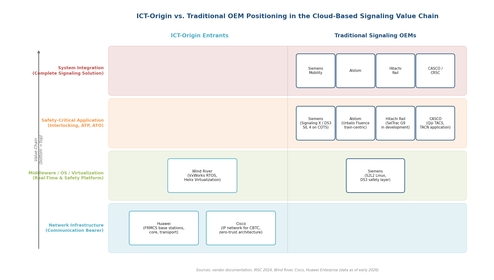

*Figure 1 — Positioning of ICT-origin entrants and traditional signaling OEMs across the cloud-based signaling value chain. ICT players occupy the network infrastructure and middleware layers, while safety-critical application development and system integration remain the domain of traditional OEMs.*

**Huawei** functions as an FRMCS network infrastructure supplier — providing base stations, core network elements, and transport equipment — rather than as a direct competitor to signaling OEMs in safety-critical application development. Its partnership with CASCO illustrates the emerging pattern: deep telecom expertise paired with domain-specific rail safety competence [Huawei Enterprise](https://e.huawei.com/en/news/2026/industries/transportation/railway/casco-release-frmcs-based-tacn-system "Huawei as FRMCS network provider").

**Cisco** supplies IP network infrastructure for CBTC environments, offering redundant, modular, zero-trust network architectures specifically designed for the deterministic requirements of train control communication. Its role is that of a network equipment supplier rather than a signaling system integrator [Cisco — Rail CBTC](https://blogs.cisco.com/industrial-iot/introducing-cisco-rail-communications-based-train-control-cbtc-and-safety-solution "Cisco Rail CBTC network solution").

**Wind River** occupies a lower layer of the technology stack: its VxWorks real-time operating system (RTOS) and Helix Virtualization Platform underpin safety-critical rail applications for multiple OEMs. LS Electric obtained Korea's first SIL 4 certification using VxWorks Cert, demonstrating that middleware suppliers can enable SIL 4 outcomes for signaling firms that lack in-house COTS safety platforms [Wind River — Rail](https://www.windriver.com/resource/rail-transportation-use-case "Helix Virtualization for train control"); [Wind River — LS Electric SIL 4](https://www.windriver.com/news/press/news-13718 "Korea first SIL 4 with VxWorks Cert").

The common pattern across these ICT entrants is that they supply enabling infrastructure — networks, operating systems, hypervisors — rather than competing head-to-head with Siemens, Alstom, or Hitachi Rail on complete signaling system integration. Their entry nonetheless reshapes the value chain by commoditizing layers that were previously bundled into proprietary signaling packages, lowering barriers for new signaling firms and creating modular procurement options for operators.

## 3.7 Geographic Deployment Map

The distribution of cloud-based and cloud-adjacent train control deployments reveals a pronounced European concentration, with emerging activity in Asia and limited penetration elsewhere. Figure 2 presents a chronological overview of the principal milestones across geographies.

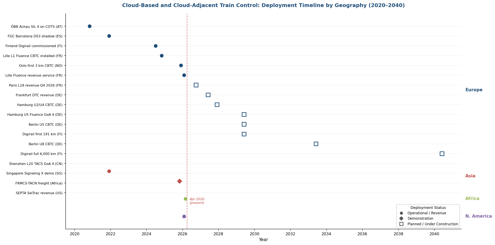

*Figure 2 — Deployment timeline of cloud-based and cloud-adjacent train control milestones by geography (2020–2040). Markers distinguish operational/revenue deployments, demonstrations, and planned/under-construction projects. The vertical dashed line marks April 2026.*

**Europe** leads decisively across both mainline and urban domains. Austria (ÖBB Achau, operational since 2020), Spain (FGC Barcelona shadow operation), and Finland (Digirail, 6,000 km by 2040) anchor the mainline DS3 track record. France hosts the first two Urbalis Fluence revenue-service deployments (Lille Line 1 and Paris Line 18). Germany's pipeline — Frankfurt DTC (2027), Hamburg U2/U4 (end-2027), Hamburg U5 (2029), Berlin U5 (2029), Berlin U8 (2033) — constitutes the densest near-term urban CBTC program globally, albeit on conventional architectures with potential for future cloud-based upgrades. Norway commissioned its first 3 km CBTC section in late 2025.

**Asia** presents a more fragmented picture. Singapore hosted the Signaling X CBTC demonstration in November 2025 but has not awarded a commercial cloud-based signaling contract. China's CASCO Qiji TACS has been in revenue service on Shenzhen Metro Line 20 since 2021, while CRSC's two-level train control is under field testing. The sheer scale of China's urban rail pipeline — 44 cities with 5,833 km under construction at end-2024, supported by RMB 474.9 billion in 2024 investment — positions the Chinese market as a potentially transformative adopter if cloud-based architectures demonstrate their cost-reduction value proposition. This potential is sharpened by the intense total-cost-of-ownership pressure facing Chinese operators, whose average revenue-to-cost ratio stood at just 57.85 % in 2024 [Lianhe Credit — 2025 Urban Rail Analysis](https://www.lhratings.com/file/fe403910cf4.pdf "44 cities, 5,833 km under construction, RMB 474.9B investment, 57.85% revenue-to-cost ratio").

**Africa** has received the first FRMCS-based deployment (Huawei/CASCO TACN on an unnamed freight railway), though specific project details — country, operator, and line — have not been publicly disclosed.

**North America** has seen limited cloud-related activity. SEPTA Philadelphia's SelTrac deployment (February 2026) uses current-generation CBTC, and Hitachi Rail's G9 development is centered in Toronto. No cloud-based signaling demonstration or deployment has been announced on the continent.

**Middle East and Latin America** maintain significant conventional CBTC pipelines (Dubai, Riyadh, São Paulo), but no cloud-based or cloud-ready signaling projects have been identified at T1/T2 sourcing levels.

## 3.8 Vendor Architecture Comparison

The four principal signaling platforms emerging in this transition embody distinct architectural philosophies, each with characteristic strengths and trade-offs. Figure 3 provides a structured comparison across key dimensions.

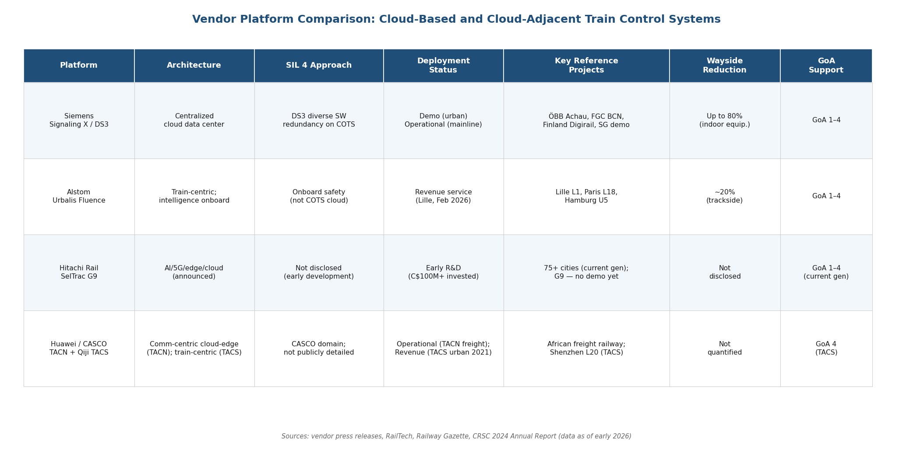

*Figure 3 — Side-by-side comparison of four leading cloud-based and cloud-adjacent train control platforms across architecture type, SIL 4 approach, deployment status, key reference projects, wayside reduction claims, and GoA support.*

**Siemens Signaling X / DS3** pursues a fully cloud-ready, centralized data-center model. Safety-critical functions run on COTS servers in geo-distributable data centers, connected to lightweight trackside element controllers via EULYNX-standardized IP-fiber interfaces. The DS3 diverse-software-redundancy approach remains the only production-certified method for achieving SIL 4 on COTS hardware. Signaling X unifies mainline (ETCS) and urban (CBTC) signaling on a single platform — a competitive differentiator that allows operators to standardize across domains. The principal limitation is the absence of commercial urban rail contracts as of early 2026.

**Alstom Urbalis Fluence** implements a train-centric model in which intelligence migrates to the vehicle, trains communicate directly for interval management, and interlocking is merged onboard. This approach achieves wayside equipment reduction (~20 %) and energy savings (~30 %) comparable to cloud-based alternatives, but through distribution rather than centralization. Fluence holds the advantage of being the first next-generation CBTC platform in revenue service (Lille, February 2026) and carries a substantial order book (Hamburg U5, €2.8 billion framework). Its limitations include greater demands on onboard computing and inter-vehicle communication, and it does not benefit from the cloud-native advantages of centralized software lifecycle management.

**Hitachi Rail SelTrac G9** has been announced with AI, 5G, edge, and cloud integration, backed by a C$100 million-plus investment. Hitachi Rail's competitive asset is its installed base spanning 75+ cities, providing a natural upgrade pathway. The platform remains in early development with no published architecture or demonstration results, rendering comparative assessment premature.

**Huawei/CASCO** operates on a communication-centric, cloud-edge collaborative model. Huawei provides FRMCS network infrastructure while CASCO supplies control applications (Qiji TACS for urban, TACN for mainline/freight). CASCO's Qiji TACS is architecturally train-centric for urban rail, paralleling Fluence. The FRMCS-TACN approach is distinctive in foregrounding the communication layer as the platform, with safety-critical train control functions layered atop a 5G-based bearer. The African TACN deployment constitutes the first operational FRMCS-based system, though detailed technical specifications and independent validation remain forthcoming.

No T1/T2 evidence of a cloud-native or virtualized signaling platform from the former Thales ground transportation business has been identified. That business was largely absorbed by Hitachi Rail in 2023, and post-acquisition product roadmap consolidation appears to be channeling development toward SelTrac G9.

# 第4章 Standards, Certification, and the Regulatory Landscape

The migration of safety-critical train control functions from dedicated proprietary hardware to commercial off-the-shelf (COTS) servers and cloud infrastructure raises fundamental questions about functional safety assurance. Railway signaling operates under some of the most rigorous safety regimes in any industrial domain: Safety Integrity Level 4 (SIL 4) — the highest tier — demands a tolerable functional failure rate (TFFR) on the order of 10⁻⁹ to 10⁻⁸ per hour. Achieving this target on general-purpose computing platforms, where hardware may be replaced without notice and multiple applications share physical resources, challenges assumptions that have underpinned certification practice for decades. This chapter examines the standards framework governing cloud-based train control, the certification obstacles it introduces, ongoing European and international initiatives to adapt that framework, and the regulatory mechanisms through which new systems gain approval.

## 4.1 The CENELEC EN 5012x Framework

The dominant functional safety standard set for European railway signaling comprises three pillars: EN 50126:2017, which defines the RAMS (Reliability, Availability, Maintainability, Safety) lifecycle; EN 50129:2018, which specifies requirements for safety acceptance and the structure of the Safety Case; and EN 50716:2023, which supersedes the earlier EN 50128:2011 for software development [LDRA — EN 5012x Guide](https://ldra.com/en-5012x/ "EN 5012x standards overview: EN 50716 supersedes EN 50128/50657"). Together, these standards establish a comprehensive regime spanning hazard analysis, safety requirements specification, design, implementation, verification, validation, and through-life safety management.

EN 50129 requires SIL 4 systems to demonstrate a TFFR of 10⁻⁹ to 10⁻⁸ per hour and to present a structured Safety Case that ties safety evidence to a specific system configuration — traditionally including the exact hardware platform on which safety-critical software executes [LDRA — EN 5012x Guide](https://ldra.com/en-5012x/ "SIL 4 TFFR requirements and EN 50129 safety case structure"). This hardware-binding assumption represents a core tension with cloud-based architectures, where safety applications may execute on any compatible server within a data-center pool.

EN 50716:2023, approved in October 2023, introduces several updates of direct relevance to cloud-based signaling. The standard integrates mandatory cybersecurity considerations by referencing CLC/TS 50701 and IEC 62443, adds requirements for worst-case execution time (WCET) analysis on multicore processors, and strengthens requirements for modularity and separation of concerns [LDRA — EN 5012x Guide](https://ldra.com/en-5012x/ "EN 50716: cybersecurity integration, multicore WCET analysis"). These provisions address characteristics inherent to modern COTS server hardware — multicore CPUs with shared caches and memory buses — that pose analytical challenges absent in single-core proprietary safety platforms.

## 4.2 IEC Equivalents and Regional Applicability

Outside Europe, the functionally equivalent IEC standards — IEC 62278 (RAMS), IEC 62279 (software), and IEC 62425 (safety-related electronic systems) — serve as the primary certification reference. These standards largely mirror the CENELEC EN 5012x suite and constitute the railway sector's application of the generic IEC 61508 framework [LDRA — EN 5012x Guide](https://ldra.com/en-5012x/ "IEC 62278/62279/62425 as EN 5012x equivalents"). IEC 62279 remains active internationally despite the European transition to EN 50716.

Regulatory geography determines which framework applies. Within the European Union, the EN 5012x standards are mandated through TSI Directive 2016/797 and the broader ERTMS regulatory framework. In Asia-Pacific, the Middle East, and Latin America, projects typically reference the IEC equivalents, often supplemented by national requirements [TÜV SÜD — Functional Safety for Rail](https://www.tuvsud.com/en-gb/industries/infrastructure-and-rail/rail/functional-safety-for-rail "Certification against EN 5012x or IEC equivalents depending on jurisdiction"). For vendors developing cloud-based signaling platforms intended for global deployment, this dual-framework landscape necessitates safety cases that satisfy both standard families — or, more pragmatically, designs that target the more stringent of the two and demonstrate equivalence.

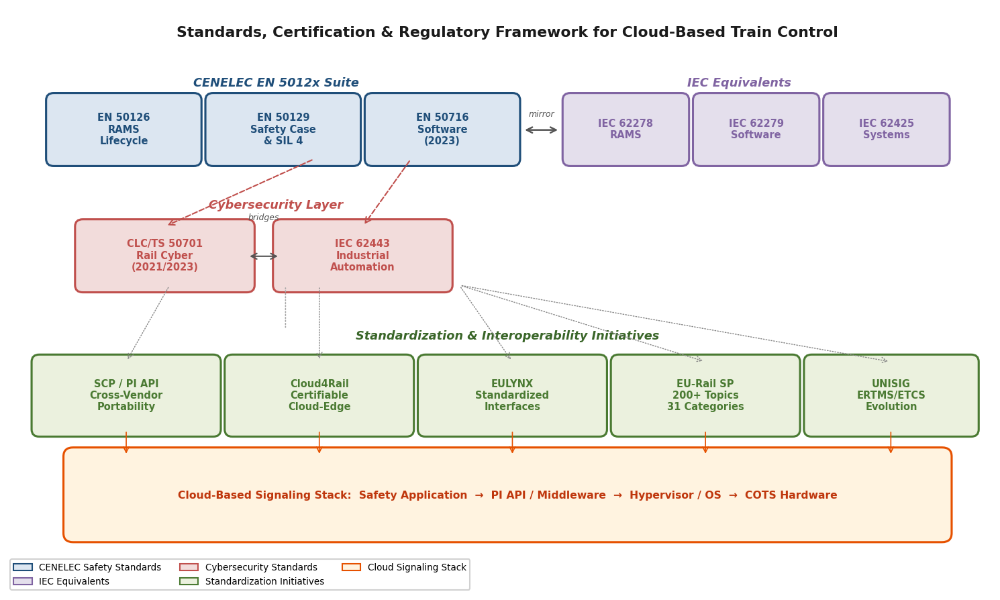

*Figure 4.1 — The standards, certification, and regulatory framework for cloud-based train control, illustrating the relationships between the CENELEC EN 5012x suite, IEC equivalents, cybersecurity standards, standardization initiatives, and the cloud-based signaling technology stack.*

## 4.3 SIL 4 Certification Challenges for Cloud and Virtualized Systems

The migration to cloud infrastructure introduces certification challenges absent from traditional signaling architectures. A foundational study is the Digitale Schiene Deutschland (DSD) SIL 4 Cloud report, published in September 2022 by a consortium of DB Netz, Thales, SYSGO, Fraunhofer IESE, and the University of Rostock. The report confirms the general feasibility of a certifiable SIL 4 private cloud for railway applications, contingent on a central paradigm: rigorous standardized separation of application, runtime environment, and hardware layers [DSD — SIL4 Cloud Report](https://digitale-schiene-deutschland.de/en/news/2022/SIL4-Cloud "SIL4 Cloud feasibility confirmed; layered separation paradigm"); [SYSGO — SIL4 Cloud](https://www.sysgo.com/press-releases/sil4-cloud-a-novel-it-platform-architecture-for-safety-relevant-railway-applications "Multi-partner SIL4 Cloud research project").

Four principal certification challenges emerge from the DSD study and subsequent industry analysis:

**Hardware independence.** EN 50129 conventionally binds safety evidence to a specified hardware configuration. In a cloud environment, COTS servers are treated as replaceable commodity resources. Server mean time between failures (MTBF) can only be pessimistically estimated because COTS hardware undergoes frequent component revisions outside the safety applicant's control [DSD — SIL4 Cloud Report](https://digitale-schiene-deutschland.de/en/news/2022/SIL4-Cloud "Hardware independence challenge: MTBF estimation for COTS").

**Shared compute and hypervisor partitioning.** When multiple applications — potentially at different SIL levels — share a physical server, the partitioning mechanism (hypervisor or operating system) must provide demonstrable freedom from interference. Any failure in temporal or spatial partitioning could compromise the safety application's integrity [SYSGO — Can Cloud be SIL 4?](https://www.sysgo.com/blog/article/can-the-cloud-be-sil-4-a-new-milestone-for-railway-safety-and-innovation "Redundancy, determinism, resilience requirements for cloud SIL 4").

**Dynamic resource allocation.** Cloud-native patterns such as auto-scaling, load balancing, and live migration of virtual machines or containers fundamentally conflict with the deterministic WCET assumptions required by EN 50716:2023. A safety-critical application whose execution environment may change at runtime cannot easily provide the bounded timing guarantees that safety analysis demands [DSD — SIL4 Cloud Report](https://digitale-schiene-deutschland.de/en/news/2022/SIL4-Cloud "Dynamic resource allocation vs. deterministic WCET").

**Software supply chain qualification.** The COTS operating system, hypervisor, middleware, and container runtime are inherently SIL 0 elements — they were not developed under railway safety processes. The safety case must either qualify these elements to the required SIL or demonstrate that the safety architecture tolerates their failure through redundancy and diversity [SYSGO — Can Cloud be SIL 4?](https://www.sysgo.com/blog/article/can-the-cloud-be-sil-4-a-new-milestone-for-railway-safety-and-innovation "COTS software stack as SIL 0: qualification or toleration").

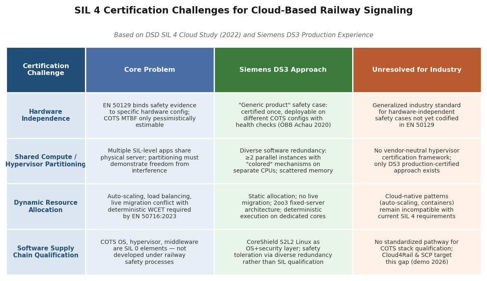

*Figure 4.2 — SIL 4 certification challenges for cloud-based railway signaling: a comparison of the four principal challenges identified by the DSD SIL 4 Cloud Study (2022), the Siemens DS3 production approach, and remaining unresolved industry-wide gaps.*

The only production-certified approach to date is the Siemens DS3 (Distributed Smart Safe System) platform. DS3 achieves SIL 4 through diverse software redundancy: at least two parallel instances of each safety-critical application execute with diverse ("colored") safety mechanisms on separate CPUs, employing scattered memory management for common-cause failure detection and safe voting to compare results; a third instance provides 2-out-of-3 availability. The CoreShield S2L2 Linux layer provides both operating system services and IT security functions, including the ability to apply security patches at runtime without service interruption [Siemens — DS3 at IRSC 2024](https://international-railway-safety-council.com/wp-content/uploads/2025/04/Sonja-Steffen_Interlocking-in-the-Cloud.pdf "DS3 SIL 4 safety principle: diverse redundancy, scattered memory, S2L2 Linux"). This architecture was first certified and deployed at ÖBB Achau in Austria in November 2020 — the world's first SIL 4 interlocking on COTS hardware — and has demonstrated 100% availability over more than four years of operation. The existing certified application logic (Trackguard Simis AT) was migrated to DS3 with untouched application software and unchanged interfaces, avoiding re-certification of the application layer [RailTech — ÖBB Cloud Interlocking](https://www.railtech.com/innovation/2020/11/30/obb-puts-first-cloud-enabled-interlocking-in-operation/ "ÖBB Achau: first SIL 4 on COTS, generic product safety case").

## 4.4 European Standards Evolution Initiatives

Recognition that the existing EN 5012x framework was not designed for cloud-native deployment has spurred multiple European initiatives aimed at bridging the gap.

### Safe Computing Platform (SCP) and the Platform Independent API

The Safe Computing Platform concept, developed jointly by the Reference CCS Architecture (RCA) initiative and OCORA from 2020 onward, proposes a standardized Platform Independent API (PI API) that decouples railway safety applications from the underlying middleware and hardware. Eleven partners — including DB, SBB, SNCF, Siemens, Thales, SYSGO, and Wind River — participate in its specification. The PI API is intended to enable cross-vendor application portability: a safety application certified once against the PI API could, in principle, execute on any computing platform that implements the same interface, eliminating the hardware-binding problem inherent in current EN 50129 safety cases [DSD — SCP Specification](https://digitale-schiene-deutschland.de/en/news/2022/safe-computing-platform-specification "SCP with PI API for cross-vendor portability; 11-partner consortium").

### Cloud4Rail

Cloud4Rail, funded under the EU's IPCEI-CIS (Important Projects of Common European Interest — Cloud Infrastructure and Services) with €2.43 million in EU support, aims to produce the first trackside demonstration of a modular, certifiable computing platform for safety-critical railway applications operating across the cloud-edge continuum. The project integrates DevSecOps and CI/CD methodologies — standard in IT but novel for safety-critical rail — and targets a field demonstration in 2026 at the Digital Rail Testfield in the Ore Mountains of Germany [EC — Cloud4Rail Project](https://commission.europa.eu/projects/ipcei-next-generation-cloud-infrastructure-and-services-ipcei-cis-db-netz-cloud4rail-operations_en "Cloud4Rail: €2.43M, cloud-edge safety platform for rail"); [DSD — Safe Computing Platforms](https://digitale-schiene-deutschland.de/en/projects/Safe-Computing-Platforms "Cloud4Rail field demo planned 2026").

### EU-Rail System Pillar

The EU-Rail Joint Undertaking's System Pillar published its System Technical Integration Plan (STIP) V1.0 in summer 2024, cataloguing more than 200 harmonization topics organized in 31 categories. These include safety management (Category C12) and cybersecurity (Category C11). DSD co-leads the "Computing Environment" domain within this structure, directly influencing how future European standards accommodate cloud-based and virtualized signaling architectures [EU-Rail WP2026](https://rail-research.europa.eu/wp-content/uploads/2025/12/Annex_GB-Decision_09-25_WP2026.pdf "System Pillar STIP V1.0: 200+ harmonization topics in 31 categories").

### CENELEC TC 9X SG 34

CENELEC Technical Committee 9X Sub-Group 34, focused on "Digitalization for Railways," is active in AI and digital twin standardization for the railway sector, coordinating with CEN-CENELEC JTC 21 on artificial intelligence [TC 9X SG34 Presentation](https://rails-project.eu/wp-content/uploads/sites/73/2022/03/Cenelec_TC_9X_SG34.pdf "SG34: AI and digital twin standardization for railway"). Although SG 34 does not specifically address cloud-native architectures, its work on AI certification and digital twin assurance intersects with the broader challenge of certifying software-intensive, data-driven systems on general-purpose computing platforms.

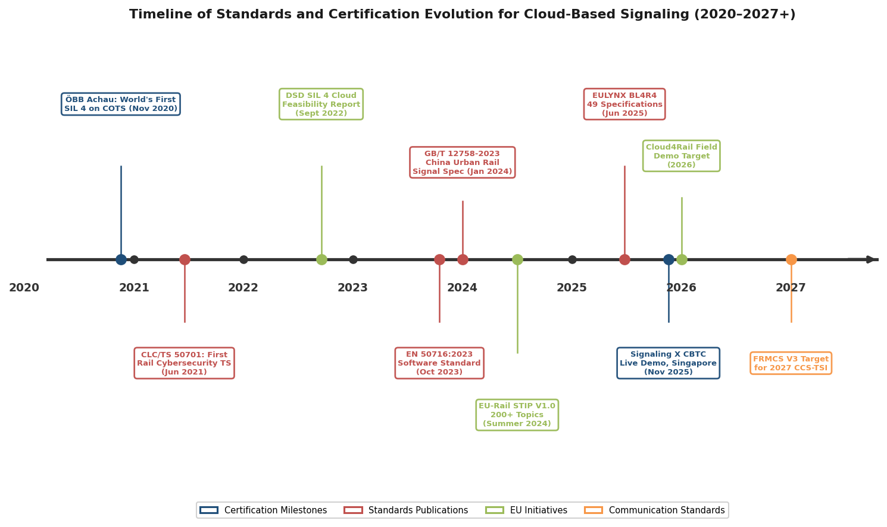

*Figure 4.3 — Key milestones in the evolution of standards and certification for cloud-based signaling, from the first SIL 4 interlocking on COTS hardware (November 2020) through the FRMCS V3 target (2027), color-coded by category: certification milestones, standards publications, EU initiatives, and communication standards.*

## 4.5 EULYNX: Standardized Interfaces for Cloud-Ready Signaling

The EULYNX initiative defines standardized interfaces between interlocking cores and trackside field elements — points, signals, level crossings, and track vacancy detection systems. Its objectives of lifecycle separation, vendor lock-in reduction, and cost optimization have driven EULYNX's evolution from a cooperative project into a standing organization now integrated into the EU-Rail System Pillar [EULYNX — Introduction](https://eulynx.eu/lessons/1-introduction-of-eulynx/ "EULYNX: standardized signaling interfaces for lifecycle separation and vendor lock-in reduction").

Baseline Set 4 Release 4 (BL4R4), published on 26 June 2025, comprises 25 joint specifications with the EU-Rail System Pillar and 24 EULYNX-specific documents, achieving full alignment with the EU-Rail Cybersecurity Specification V1.0 [EULYNX — BL4R4](https://eulynx.eu/2025/06/26/baseline-set-4-release-4-published/ "June 2025: BL4R4 with 49 specifications, cybersecurity alignment").

EULYNX directly enables cloud-based signaling by providing the standardized IP-based connection protocol between centralized interlocking servers and distributed trackside element controllers. Siemens Signaling X relies on EULYNX interfaces to connect DS3-based interlocking logic running in a rail data center with field elements via a fiber backbone — an architecture that replaces conventional point-to-point wiring between co-located zone controllers and field hardware [Siemens — DS3 at IRSC 2024](https://international-railway-safety-council.com/wp-content/uploads/2025/04/Sonja-Steffen_Interlocking-in-the-Cloud.pdf "DS3 uses EULYNX interfaces for centralized-to-trackside IP connection").

## 4.6 UNISIG and ERTMS Evolution

UNISIG, comprising seven full members and three associated partners under the UNIFE umbrella, develops and maintains the ERTMS/ETCS technical specifications. Its recent publication SUBSET-150 addresses the evolution of the on-board CCS (Command, Control, and Signalling) architecture, and UNISIG is working jointly with the EU-Rail System Pillar to align signaling standards with the broader system-of-systems architecture [UNISIG Factsheet 2025](https://www.ertms.net/wp-content/uploads/2025/02/UNISIG-Factsheet.pdf "UNISIG: SUBSET-150 on CCS architecture evolution, EU-Rail SP collaboration").

The relevance of UNISIG to cloud-based signaling is twofold. First, ERTMS/ETCS provides a common interoperability baseline for mainline signaling that IEEE 1474-based CBTC lacks, meaning that cloud-based mainline deployments such as Finland's Digirail can leverage standardized train-to-trackside protocols, whereas urban CBTC remains vendor-proprietary at the protocol level. Second, as trackside ETCS components — Radio Block Centres, interlockings — migrate to cloud infrastructure, UNISIG specifications must accommodate execution on shared, replaceable computing platforms rather than dedicated hardware.

## 4.7 Cybersecurity Standards for Cloud-Based Signaling

The convergence of safety and cybersecurity is acutely consequential in cloud-based train control. Moving signaling functions onto networked COTS platforms inherently expands the attack surface relative to isolated proprietary hardware. Two complementary standards now define the European regulatory baseline.

CLC/TS 50701, first published by CENELEC in June 2021 and revised in its second edition in 2023, is the first European technical specification dedicated to railway cybersecurity. It bridges the industrial automation cybersecurity framework IEC 62443-3-3/4-2 to the railway context defined by EN 50126, covering the full lifecycle from risk assessment through design, implementation, and operational patch management [CENELEC — CLC/TS 50701](https://www.cencenelec.eu/news-events/news/2021/eninthespotlight/2021-06-10-new-clc-ts-50701-railways-cybersecurity/ "June 2021: first railway cybersecurity TS; bridges IEC 62443 and EN 50126 lifecycle"). EN 50716:2023 complements this by integrating cybersecurity directly into the safety software development lifecycle, creating a unified regime in which functional safety and cybersecurity are addressed in parallel rather than as separate compliance exercises [LDRA — EN 5012x Guide](https://ldra.com/en-5012x/ "EN 50716 + CLC/TS 50701 complementary cybersecurity-safety ecosystem").

In practice, cloud-based signaling implementations have begun embedding cybersecurity into their safety architectures. The Siemens DS3 platform's CoreShield S2L2 Linux layer integrates operating system and IT security functions, enabling runtime security patching without removing the interlocking from service — a capability critical for virtualized environments exposed to evolving threats that cannot tolerate the extended maintenance windows typical of proprietary systems [Siemens — DS3 at IRSC 2024](https://international-railway-safety-council.com/wp-content/uploads/2025/04/Sonja-Steffen_Interlocking-in-the-Cloud.pdf "S2L2 Linux: lean IT-security patching during runtime"). The 5GRAIL project, while validating FRMCS performance over 5G SA networks, identified security and privacy as areas requiring further investigation: basic authentication and encryption were validated during field trials, but a comprehensive security assessment of the FRMCS protocol stack for safety-critical applications remains an open work item [5GRAIL D5.3 Report](http://5grail.eu/wp-content/uploads/2024/05/D5.3-Conclusion-Report-on-5G-FRMCS-Field-Trials.pdf "FRMCS security and privacy: future work identified").

The EULYNX Baseline Set 4 Release 4, published in June 2025, achieves full alignment with the EU-Rail Cybersecurity Specification V1.0, ensuring that the standardized interfaces through which cloud-based interlockings communicate with trackside field elements incorporate cybersecurity requirements from inception rather than as an afterthought [EULYNX — BL4R4](https://eulynx.eu/2025/06/26/baseline-set-4-release-4-published/ "BL4R4: cybersecurity alignment with EU-Rail specification").

## 4.8 China's Standards Landscape

China's urban rail transit signaling standards follow a parallel but distinct trajectory. The principal standard is GB/T 12758-2023, effective 1 January 2024, which replaces the 2004 version and provides the general specification for urban rail transit signal systems. Drafted by a consortium including a CRSC subsidiary, Beijing Jiaotong University, and CASCO, it covers system functions, technical requirements, and safety requirements [SAMR — GB/T 12758-2023](https://std.samr.gov.cn/gb/search/gbDetailed?id=053404E3EF358F91E06397BE0A0A9209 "GB/T 12758-2023: urban rail signaling general specification, effective 2024-01-01").

GB/T 12758-2023 addresses signaling systems broadly but does not contain provisions specifically tailored to cloud-based or virtualized SIL 4 architectures. Chinese vendors — notably CASCO with its "Qiji" TACS (Train Autonomous Circumambulation System) deployed on Shenzhen Metro Line 20, and CRSC with its "two-level train control" system under field testing — are actively developing next-generation signaling platforms. The absence of dedicated cloud-specific safety standards in the GB/T framework represents a regulatory gap likely to be addressed through future revisions or supplementary technical specifications.

China's 14th Five-Year Plan explicitly integrates 5G, IoT, big data, cloud computing, and AI with transport infrastructure, mandating "smart urban rail" including autonomous train control [China State Council — 14th FYP Transport Plan](http://www.scio.gov.cn/zdgz/jj/202309/t20230914_769420.html "Chapter 7: smart transport technology targets including cloud and AI"). This policy direction, combined with the scale of the country's urban rail network — 54 cities, 10,945.6 km in operation, and 5,833 km under construction at end-2024 — creates substantial demand for standardized approaches to cloud-based signaling certification, even as the specific regulatory pathway remains under development.

## 4.9 Independent Safety Assessment and Type-Approval

Independent Safety Assessors (ISAs) — organizations such as TÜV SÜD, TÜV Rheinland, RINA/Certifer, and Lloyd's — play a critical role in the certification chain. ISAs evaluate safety concepts, failure mode and effects analyses (FMEA), Markov models, fault tree analyses (FTA), generic product validation, and software development processes against EN 50129 or IEC 62425 requirements. For cloud-based systems, ISA evaluation must additionally address the COTS hardware safety case, hypervisor or OS partitioning assurance, and the adequacy of diverse software redundancy in achieving the required TFFR [TÜV SÜD — Functional Safety for Rail](https://www.tuvsud.com/en-gb/industries/infrastructure-and-rail/rail/functional-safety-for-rail "ISA services: safety concept review, quantitative safety analysis, generic product validation").

The ÖBB Achau deployment established an important precedent. The SIL 4 approval granted in November 2020 employed a "generic product" safety case: the DS3 platform was certified in a manner that permits deployment on different COTS hardware configurations, subject to defined health checks, without requiring per-variant recertification [RailTech — ÖBB Cloud Interlocking](https://www.railtech.com/innovation/2020/11/30/obb-puts-first-cloud-enabled-interlocking-in-operation/ "Generic product safety case: hardware-independent SIL 4 approval"). This generic-product approach directly addresses the hardware independence challenge identified in the DSD SIL 4 Cloud study and provides a pragmatic model for scaling cloud-based signaling across multiple deployment sites.

The benefits of DS3's approach extend beyond initial certification. The platform supports mixed-SIL operation on the same hardware, simplified obsolescence management (COTS servers can be refreshed without re-certifying the safety application), geographical redundancy across data centers, and high automation for software maintenance — each of which reduces through-life certification burden [Siemens — DS3 at IRSC 2024](https://international-railway-safety-council.com/wp-content/uploads/2025/04/Sonja-Steffen_Interlocking-in-the-Cloud.pdf "DS3 benefits: mixed-SIL, obsolescence management, geographical redundancy").

## 4.10 The Interoperability Challenge

Cross-vendor interoperability remains one of the most significant structural barriers in urban rail signaling, and the transition to cloud-based architectures has not yet resolved it. ERTMS/ETCS benefits from the UNISIG common baseline that enables, at least in principle, interchangeable trackside and on-board equipment from different vendors. IEEE 1474-based CBTC, by contrast, remains proprietary at the communication protocol level: a given metro line's signaling system is effectively locked to a single vendor for its operational lifetime.

EULYNX addresses one layer of this problem by standardizing the interface between interlocking cores and trackside field elements, enabling operators to source element controllers from different vendors while retaining a single interlocking platform. EULYNX does not, however, standardize the full CBTC communication protocol stack — train-to-wayside communication, movement authority computation, and train-centric control logic remain vendor-specific.

The most directly relevant cloud interoperability initiative is the Safe Computing Platform with its Platform Independent API. If realized, the PI API would standardize the interface between safety-critical applications and the underlying computing platform, enabling a certified interlocking application developed by one vendor to execute on a computing platform provided by another [DSD — SCP Specification](https://digitale-schiene-deutschland.de/en/news/2022/safe-computing-platform-specification "SCP/PI API: cross-vendor application portability for cloud-based signaling"). Such a development would constitute a paradigm shift from today's vertically integrated model, in which the signaling vendor controls the entire stack from application logic through safety platform to hardware. SCP remains in specification and early demonstration stages; its maturation will serve as a critical indicator of whether cloud-based signaling achieves genuine multi-vendor ecosystems or merely replaces one form of vendor lock-in with another.

# 第5章 Future Outlook and Open Challenges

The preceding chapters have documented a signaling domain in active transition: cloud-native and train-centric architectures have progressed from concept papers to live demonstrations and, in select cases, commercial revenue service. The distance between a controlled test-center exercise and fleet-wide deployment across a global metro network of more than 200 cities, however, remains substantial. This chapter assesses the realistic adoption trajectory for cloud-based train control over three time horizons, identifies the most consequential technical and institutional barriers still unresolved, and examines how convergence with autonomous operation, digital twins, and smart-city platforms is reshaping the value proposition of next-generation signaling.

## 5.1 Adoption Timeline: From Demonstration to Scale

The transition from traditional CBTC to cloud-based and train-centric architectures is unfolding across three overlapping horizons. Each horizon is anchored to concrete project milestones and contractual commitments rather than speculative forecasts.

### Near-Term (2026–2028)

The most immediate marker of commercial maturity is Alstom's Urbalis Fluence deployment on Lille Metro Line 1. The first five Boa trainsets entered passenger service on 14 February 2026 — marking the world's first commercial revenue operation of a train-centric CBTC system. Full fleet delivery (42 trainsets, 66-second rush-hour headways) is scheduled for February 2028 [Railway Gazette — Lille](https://www.railwaygazette.com/metro/alstom-boa-trains-enter-service-on-lille-metro-line-1/70536.article "March 2026: Lille Urbalis Fluence in revenue service"). Paris Grand Paris Express Line 18, a GoA 4 greenfield line, began trainset testing in June 2025 and targets revenue service on its initial 8.5 km section in Q4 2026 [Alstom — Line 18](https://www.alstom.com/press-releases-news/2025/6/delivery-first-train-set-and-start-tests-line-18-grand-paris-express "Line 18: first trainset delivered May 2025, revenue Q4 2026").

On the cloud-infrastructure side, Siemens achieved a live CBTC-on-cloud demonstration at the Singapore Rail Test Center in November 2025, running SIL 4 logic on HPE ProLiant COTS servers. No commercial urban rail contract has followed as of early 2026 [Siemens Press Release — Singapore Demo](https://press.siemens.com/global/en/pressrelease/world-premiere-siemens-proves-unique-signaling-x-solution-live-metro-operation "November 2025: world's first CBTC on Signaling X at SRTC"). Frankfurt's Digital Train Control project targets revenue service in 2027 using conventional Trainguard MT, and Hamburg's U2/U4 CBTC rollout is planned for end-2027 — both representing upgrade candidates for future Signaling X migration [Siemens/VGF Press Release](https://press.siemens.com/global/en/pressrelease/optimally-connected-faster-more-reliable-vgf-and-siemens-mobility-present-milestone "Sept 2025: Frankfurt DTC milestone").

Two further near-term milestones carry system-level significance. Cloud4Rail, funded under the EU's IPCEI-CIS program with €2.43 million, plans a 2026 field demonstration of a modular, certifiable computing platform for safety-critical railway applications at the Digital Rail Testfield in the Ore Mountains of Germany [EC — Cloud4Rail](https://commission.europa.eu/projects/ipcei-next-generation-cloud-infrastructure-and-services-ipcei-cis-db-netz-cloud4rail-operations_en "Cloud4Rail: €2.43M, field demo 2026"). UIC targets 2027 for integrating FRMCS V3 — the first implementable version of the Future Railway Mobile Communication System — into the CCS Technical Specification for Interoperability, with operational validation conducted by the FP2-MORANE2 project (launched December 2024, 34-month duration) [UIC — FRMCS](https://uic.org/rail-system/telecoms-signalling/frmcs "FRMCS V3 for 2027 CCS-TSI; FP2-MORANE2 validation").

### Medium-Term (2028–2032)

The medium-term horizon is defined by the transition from isolated deployments to programmatic fleet-wide commitments. Hamburg U5 — covered by Alstom's €2.8 billion framework contract for up to 374 DT6 trains equipped with Urbalis Fluence at GoA 4 — targets its first section opening in 2029 [Alstom — Hamburg U5](https://www.alstom.com/press-releases-news/2024/7/alstom-and-hamburger-hochbahn-sign-framework-contract-worth-eu28-bn-new-metro-trains-and-innovative-signalling-technology "July 2024: €2.8B Hamburg U5 GoA 4"). Finland's Digirail program will commission its first 191 km Signaling X ETCS Level 2 section by 2029, representing the first large-scale mainline deployment of the DS3-based platform [Siemens — Digirail](https://www.mobility.siemens.com/global/en/portfolio/references/digirail-transforming-finlands-rail-network-with-signaling-x.html "Digirail: first 191 km by 2029"). Berlin U5 CBTC is targeted for 2029, with U8 following by 2033.

Communications infrastructure will undergo parallel transformation during this period. GSM-R suppliers have informed the industry of component obsolescence by 2030, with extended support commitments running to 2035–2040. A protracted dual-operation period of GSM-R alongside FRMCS is expected into the mid-2030s, with France planning phased switchovers between 2032 and 2035 [Fujikura Europe](https://www.europe.fujikura.com/insights/whats-replacing-gsm-r-in-the-rail-industry/ "FRMCS rollout 2027–28, dual operation into mid-2030s"). Germany alone will require approximately 20,000 new FRMCS masts to achieve nationwide coverage [Ericsson Blog](https://www.ericsson.com/en/blog/2024/10/mapping-a-route-to-5g-rail-corridors "~20,000 new masts needed in Germany"). The pace of this infrastructure build-out will directly condition the bandwidth and reliability available for cloud-based signaling's real-time data requirements.

### Long-Term (2032–2040)

At the longest horizon, structural regulatory mandates become the primary adoption driver. The revised EU TEN-T Regulation requires ERTMS deployment on the Core Network by 2030 and on the wider network by 2040/2050, designating ETCS as the single European signaling system and mandating the decommissioning of national legacy systems [European Commission — Third ERTMS Work Plan](https://transport.ec.europa.eu/news-events/news/third-ertms-work-plan-ertms-deployment-progressing-more-must-be-done-2026-02-23_en "TEN-T: ERTMS on Core Network by 2030, wider network by 2040/2050"). Finland's Digirail targets completion across its full 6,000 km network by 2040. The GSM-R-to-FRMCS migration will reach its terminal phase during this period, enabling the full bandwidth and reliability required for cloud-based signaling's continuous real-time data streams.

The cumulative picture that emerges from these three horizons is one of staggered maturation. Train-centric architectures (Alstom Urbalis Fluence) have reached commercial revenue service ahead of fully cloud-based infrastructure approaches (Siemens Signaling X), which remain at the demonstration stage for urban rail as of early 2026. A reasonable expectation is that the first commercial Signaling X urban metro contract may emerge in the 2027–2029 window, with fleet-wide cloud-based CBTC operations at scale — spanning multiple operators and geographies — materializing in the early-to-mid 2030s.

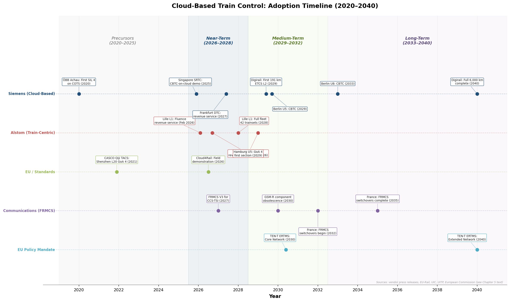

*Figure 5.1 — Swim-lane timeline mapping 19 key milestones across five categories (Siemens cloud-based, Alstom train-centric, EU/Standards, FRMCS communications, EU policy mandates) from the first SIL 4 COTS deployment at ÖBB Achau (2020) through projected completion of Digirail and the TEN-T Extended Network ERTMS mandate (2040).*

## 5.2 Critical Technical Barriers

### SIL 4 Generalization on COTS Hardware

The most consequential technical barrier to broad adoption is the generalization of SIL 4 certification on COTS platforms beyond a single vendor's proprietary approach. As of early 2026, Siemens' DS3 remains the only production-certified solution: its diverse software redundancy scheme — 2-out-of-2 for safety, 2-out-of-3 for availability, with colored scattered memory management for common-cause failure detection — has been in continuous revenue operation at ÖBB Achau since November 2020, achieving 100% availability over more than four years [RailTech — ÖBB cloud interlocking](https://www.railtech.com/innovation/2020/11/30/obb-puts-first-cloud-enabled-interlocking-in-operation/ "First SIL 4 interlocking on COTS, 100% availability after 4+ years"). The DSD SIL 4 Cloud research project (September 2022), a multi-partner initiative involving DB Netz, Thales, SYSGO, and Fraunhofer IESE, confirmed the general feasibility of certifiable SIL 4 private cloud for railway but identified persistent challenges: COTS server mean time between failures (MTBF) can only be pessimistically estimated because hardware revisions occur outside the safety applicant's control; partitioning mechanisms must demonstrate freedom from interference; and dynamic resource allocation patterns — auto-scaling, live migration — conflict with the deterministic worst-case execution time (WCET) assumptions required by EN 50716:2023 [DSD — SIL4 Cloud Report](https://digitale-schiene-deutschland.de/en/news/2022/SIL4-Cloud "SIL4 Cloud: feasibility confirmed but COTS MTBF, partitioning, dynamic allocation remain open"); [SYSGO — Can Cloud be SIL 4?](https://www.sysgo.com/blog/article/can-the-cloud-be-sil-4-a-new-milestone-for-railway-safety-and-innovation "Redundancy, determinism, resilience challenges").

No competing vendor has published a comparable SIL 4-on-COTS architecture at T1/T2 level. Alstom's Urbalis Fluence achieves wayside reduction through a train-centric paradigm — consolidating intelligence onboard rather than virtualizing it in data centers — which sidesteps rather than resolves the COTS certification challenge. Hitachi Rail's SelTrac G9, backed by a C$100 million-plus investment announced in November 2024, explicitly targets AI, 5G, edge, and cloud integration, but no published architecture or certification pathway has appeared [Hitachi Rail — SelTrac G9](https://www.hitachirail.com/blog/hitachi-rail-invests-in-the-next-generation-rail-signaling-technology/ "Feb 2026: C$100M+ SelTrac G9 investment, AI/5G/edge/cloud"). Until at least one additional vendor achieves production SIL 4 on COTS, the competitive dynamics that typically drive down cost and accelerate technology diffusion will remain constrained.

### Deterministic Latency and Real-Time Guarantees

Cloud-based architectures centralize safety-critical logic in data centers connected to distributed trackside element controllers via IP fiber backbones, introducing latency budgets that must be rigorously bounded. The 5GRAIL field trials measured ETCS end-to-end one-way application latency of approximately 40–55 ms over 5G standalone networks — comfortably within UNISIG Subset 93 requirements — and FRMCS network one-way latency of approximately 20 ms [5GRAIL D5.3 Report](http://5grail.eu/wp-content/uploads/2024/05/D5.3-Conclusion-Report-on-5G-FRMCS-Field-Trials.pdf "ETCS E2E ~40–55 ms, network ~20 ms over 5G SA"). Inter-gNB handover, however, averaged 125 ms — a figure that warrants further investigation in dense urban environments where frequent cell transitions are unavoidable.

The multicore WCET analysis requirements introduced by EN 50716:2023 compound this challenge. On shared-core COTS servers, interference channels — shared caches, memory buses, I/O controllers — produce execution time variability that is difficult to bound analytically. Traditional railway safety platforms relied on single-core processors precisely to avoid this uncertainty. The DS3 approach addresses the issue through software-level diversity and CoreShield S2L2 Linux, but a standardized, vendor-neutral methodology for multicore WCET assurance in railway cloud environments has not yet emerged [LDRA — EN 5012x Guide](https://ldra.com/en-5012x/ "EN 50716: multicore WCET analysis requirements"). Establishing such a methodology — potentially through CENELEC TC 9X or the EU-Rail System Pillar's computing environment domain — is a prerequisite for multi-vendor cloud-based signaling at scale.

### Multi-Vendor Interoperability

Traditional CBTC systems under IEEE 1474 remain proprietary per vendor, with no common protocol stack enabling cross-vendor train-to-wayside communication. EULYNX Baseline Set 4 Release 4, published in June 2025 with 25 joint specifications, standardizes interfaces between interlocking cores and field elements — directly enabling cloud-based architectures such as Signaling X to communicate with distributed trackside controllers — but does not extend to the full CBTC communication stack [EULYNX — BL4R4](https://eulynx.eu/2025/06/26/baseline-set-4-release-4-published/ "June 2025: 25 joint specifications, cybersecurity aligned").

The most structurally significant interoperability initiative is the Safe Computing Platform (SCP) concept, developed by RCA and OCORA with 11 partners including DB, SBB, SNCF, Siemens, Thales, SYSGO, and Wind River. SCP defines a Platform Independent API (PI API) that decouples railway safety applications from the underlying middleware and hardware, potentially enabling cross-vendor application portability on shared computing platforms [DSD — Safe Computing Platform](https://digitale-schiene-deutschland.de/en/news/2022/safe-computing-platform-specification "SCP with PI API for cross-vendor portability"). If the PI API achieves commercial maturity, it could transform cloud-based signaling from a series of vendor-specific silos into a genuinely open ecosystem — but that outcome remains aspirational, as the SCP concept has not been demonstrated in a revenue-service environment.

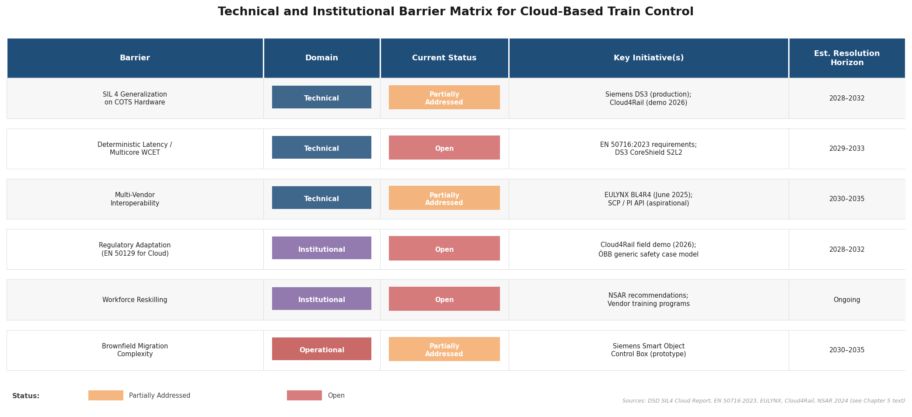

*Figure 5.2 — Summary matrix of the six most consequential barriers to cloud-based train control adoption, classified by domain (technical, institutional, operational), with current status, key addressing initiatives, and estimated resolution horizons. Barriers rated "Open" (red) lack a production-proven solution; those rated "Partially Addressed" (orange) have at least one vendor or initiative providing a partial response.*

## 5.3 Institutional, Workforce, and Migration Barriers

### Regulatory Conservatism

The standards framework analyzed in Chapter 4 reveals a structural tension: EN 50129's requirement that safety evidence be bound to specific hardware configurations is fundamentally challenged by cloud architectures in which safety applications run on replaceable COTS servers. No confirmed CENELEC TC 9X working group is specifically tasked with adapting EN 50129 or EN 50716 for cloud-native architectures; the closest initiatives are SG 34 (AI and digital twins) and WG 26 (cybersecurity). Cloud4Rail's planned 2026 field demonstration aims to establish a technical precedent for certifiable cloud-edge computing in railway operations, but translating that precedent into normative standards revisions will require additional years of committee deliberation, ISA review, and industry consensus-building [EC — Cloud4Rail](https://commission.europa.eu/projects/ipcei-next-generation-cloud-infrastructure-and-services-ipcei-cis-db-netz-cloud4rail-operations_en "Cloud4Rail: field demo 2026 to establish precedent").

The ÖBB Achau certification offers a partial template for navigating this constraint. Its "generic product" safety case permits deployment on different COTS hardware configurations, subject to health checks, without requiring per-variant recertification [RailTech — ÖBB](https://www.railtech.com/innovation/2020/11/30/obb-puts-first-cloud-enabled-interlocking-in-operation/ "Generic product safety case: hardware-independent SIL 4"). Extending this model industry-wide will require ISAs — including TÜV SÜD, TÜV Rheinland, Certifer, and Lloyd's — to develop consistent evaluation methodologies for COTS hardware safety cases, hypervisor partitioning assurance, and diverse software redundancy adequacy.

### Workforce Reskilling

The transition from proprietary hardware platforms to cloud-native, software-defined signaling demands a fundamentally different skill set encompassing cloud operations, DevOps, containerization, and cybersecurity. The UK's NSAR 2024 Annual Workforce Survey quantifies this challenge in one national context: the signalling sub-sector faces an annual deficit of 2,000–3,000 workers; approximately 12% of the 220,500-strong UK rail workforce (roughly 30,000 individuals) requires reskilling; 47,000 retirements are projected by 2030; and 35% of software engineers may leave for higher-paying technology-sector employers. The estimated annual cost of these skills shortages reaches £720 million [NSAR — 2024 Annual Workforce Survey](https://www.nsar.co.uk/wp-content/uploads/2024/11/ONLINE-Annual-Workforce-Survey-2024-compressed.pdf "UK: 2,000–3,000 signalling deficit/year, £720M/year cost"). While these figures are UK-specific, the underlying dynamic — competition for cloud, DevOps, and cybersecurity talent against better-compensated technology employers — applies across all markets pursuing cloud-based signaling transformation.

### Brownfield Migration Complexity

The majority of the world's 247 metro networks operate legacy signaling systems that predate cloud-native architectures. UITP has highlighted that brownfield upgrades to higher Grades of Automation involve interlocking technical, project management, and human resources challenges that are qualitatively distinct from greenfield deployments [UITP — Brownfield Metro Automation](https://www.uitp.org/publications/brownfield-metro-automations-considerations-for-goa4-goa3-and-goa2-upgrade-projects/ "GoA4 brownfield: multi-dimensional challenges"). Siemens' Smart Object Control Box prototype, demonstrated in Singapore, addresses one dimension of this problem — connecting legacy trackside hardware to the Signaling X platform via Ethernet with approximately one-day switchover — but it remains a prototype rather than a production-qualified product [Heise Online](https://www.heise.de/en/background/Signaling-X-Siemens-shows-metro-control-CBTC-on-conventional-servers-11136822.html "Smart Object Control Box: prototype, ~1-day switchover").

The economic imperative for cost-reducing migration is particularly acute in China, where the average revenue-to-cost ratio across urban rail transit systems stood at only 57.85% in 2024. With 44 cities operating 226 lines under construction totaling 5,833 km and RMB 474.9 billion (approximately USD 65 billion) invested in 2024 alone, any signaling technology offering meaningful lifecycle cost reduction carries substantial appeal [Lianhe Credit — 2025 Urban Rail Analysis](https://www.lhratings.com/file/fe403910cf4.pdf "57.85% revenue-to-cost ratio; 5,833 km under construction; RMB 474.9B invested in 2024"). CASCO's Qiji TACS — a train-centric, vehicle-to-vehicle GoA 4 system in revenue service on Shenzhen Metro Line 20 since December 2021 — and CRSC's "two-level train control" concept, with centralized logic under field testing on a Sichuan mountain railway, represent Chinese pathways toward cost reduction. Neither, however, has been characterized as a cloud-based COTS platform in published documentation [CRSC 2024 Annual Report](http://star.sse.com.cn/disclosure/listedinfo/announcement/c/new/2025-03-29/688009_20250329_BBK2.pdf "Qiji TACS on Shenzhen L20; CRSC two-level train control R&D").

## 5.4 Convergence with Autonomous Train Operation

Cloud-based and train-centric signaling architectures are developing in parallel with — and increasingly in service of — the global expansion of fully automated (GoA 3/4) metro operation. GoA 4 (unattended train operation) now spans more than 40 cities and over 2,200 km of urban rail track, representing approximately 18% of the global urban rail network as of 2025 [Wikipedia — List of driverless train systems](https://en.wikipedia.org/wiki/List_of_driverless_train_systems "GoA 4: 40+ cities, 2,200+ km"). China has been the dominant contributor, with more than 40 GoA 4 lines operational since 2017. The Riyadh Metro — 176 km of fully driverless operation — became the world's longest GoA 4 metro system upon receiving a Guinness World Record in January 2025 [Gulf News](https://gulfnews.com/business/top-15-longest-driverless-metro-systems-in-2025-1.500362027 "Riyadh 176 km GoA 4, Guinness record Jan 2025").

UITP projected in 2018 that fully automated operation (FAO) would reach approximately 2,300 km by 2025, from a base of 1,026 km across 42 cities. That projection has been broadly met or exceeded [UITP — Metro Automation Statistics](https://www.uitp.org/wp-content/uploads/sites/7/2025/04/Statistics-Brief-Metro-automation_final_web03.pdf "1,026 km FAO in 2018; 2,300 km projected by 2025"). The GoA 4 pipeline for the next decade is extensive: Paris Grand Paris Express Lines 15, 16, 17, and 18; Hamburg U5 (2029); Toronto Ontario Line (2031); Athens Line 4 (2029); Glasgow Subway (2026); Copenhagen S-Train (2030–2040); Prague Metro C (2028–2030); and Stockholm Yellow Line (2034), among others [Wikipedia — List of driverless train systems](https://en.wikipedia.org/wiki/List_of_driverless_train_systems "Planned GoA 4 projects through 2034").

Cloud-based signaling directly enables GoA 4 at reduced lifecycle cost by consolidating wayside intelligence into data centers or onboard systems, thereby reducing the distributed equipment that must be maintained in unmanned operation. Siemens' Train2Cloud supports 80-second headways at SIL 4 with an advertised 80% reduction in wayside indoor equipment [Siemens Mobility — UITP Summit 2025](https://press.siemens.com/global/en/pressrelease/siemens-mobility-showcases-digital-solutions-urban-rail-transport-uitp-summit-2025 "Train2Cloud: 80s headways, SIL 4, 80% equipment reduction"). Alstom's Urbalis Fluence, designed explicitly for GoA 4 deployment (Paris Line 18, Hamburg U5), achieves 60-second headways with a 20% wayside reduction and 30% energy savings through its train-centric architecture [Alstom — Urbalis Fluence](https://www.alstom.com/solutions/signalling/urban-signalling/urbalis-fluence-train-centric-cbtc "GoA 4, 60s headway, 20% wayside reduction, 30% energy savings"). The economic alignment is structural: each additional GoA 4 line increases demand for signaling systems that minimize unattended wayside infrastructure — precisely the value proposition that cloud-based and train-centric approaches are designed to deliver.

## 5.5 Digital Twins and Smart-City Integration

Cloud-based signaling generates continuous, high-resolution data streams — train positions, switch states, signaling commands, diagnostic telemetry — that were previously locked within proprietary wayside controllers. Centralizing these data streams in cloud infrastructure creates a natural foundation for digital twin modeling and advanced analytics applications.

Siemens has been the most visible proponent of this integration trajectory. Its signalling simulation center at Singapore's Gali Batu Depot operates a digital twin of the Downtown Line signalling system, enabling testing of software releases, incident troubleshooting, and vulnerability checks without disrupting live service [Railway PRO — Singapore](https://www.railwaypro.com/wp/siemens-mobility-to-build-a-signalling-simulation-center-in-singapore/ "Digital twin of DTL signalling at Gali Batu Depot"). At the UITP 2025 Global Public Transport Summit, Siemens showcased two cloud-connected products: Digital Station, a centralized station infrastructure control platform claiming 20% lifecycle cost reduction, and RailXplore, a real-time CBTC analytics and diagnosis tool [Siemens — UITP Summit 2025](https://press.siemens.com/global/en/pressrelease/siemens-mobility-showcases-digital-solutions-urban-rail-transport-uitp-summit-2025 "Digital Station: 20% lifecycle cost reduction; RailXplore: real-time CBTC analytics"). Railigent X, Siemens' cloud-based asset management platform, uses AI-driven "Remaining Useful Life" predictions to optimize maintenance intervals across both rolling stock and signaling assets [Siemens — Railigent X](https://www.mobility.siemens.com/global/en/portfolio/digital-solutions-software/digital-services/railigent-x/whitepaper-innovative-approach.html "Railigent X: AI predictive maintenance").

At the European institutional level, the EU-Rail Flagship Project FP3-IAM4RAIL is developing digital twin capabilities for station asset management using Building Information Modeling (BIM), while CENELEC TC 9X SG34 is examining standardization pathways for AI and digital twins in railway applications [EU-Rail — FP3-IAM4RAIL](https://rail-research.europa.eu/rail-projects/fp3-iam4rail/ "Digital twin for station assets via BIM"); [TC 9X SG34 Presentation](https://rails-project.eu/wp-content/uploads/sites/73/2022/03/Cenelec_TC_9X_SG34.pdf "SG34: AI and digital twin standardization"). UNIFE's Digitalisation Vision Paper, published in June 2025, positions AI, digital twins, and connected data as essential strategic pillars for the future European rail system [UNIFE — Digitalisation Vision Paper](https://www.unife.org/publication/unife-digitalisation-vision-paper/ "June 2025: AI, digital twins, connected data as strategic priorities").

The trajectory is clear: as signaling logic migrates to cloud infrastructure, the data it produces becomes available for digital twin modeling, predictive maintenance, and real-time operational optimization. Integration with broader smart-city platforms — linking metro signaling data with bus networks, traffic management, and passenger information systems — remains at a conceptual stage, with no operational deployments documented at T1/T2 level. Realizing such integration will require resolution of data governance, cybersecurity, and interface standardization challenges that extend well beyond the signaling domain itself.

## 5.6 Market Evolution and Competitive Dynamics

The global railway signaling market was valued at USD 18.2 billion in 2024 and is projected to reach USD 42.4 billion by 2034 at an 8.9% compound annual growth rate (CAGR), with the Asia-Pacific region as the fastest-growing segment [Global Market Insights — Railway Signaling System Market](https://www.gminsights.com/pressrelease/railway-signaling-system-market "Sept 2025: USD 18.2B in 2024, 8.9% CAGR to USD 42.4B by 2034"). The broader rail supply market, per UNIFE's World Rail Market Study (10th edition, September 2024), is forecast to grow at approximately 3% annually in real terms through the end of the decade, reaching an average annual market of €240.8 billion [UNIFE 2024 Annual Report](https://www.unife.org/wp-content/uploads/2025/01/UNIFE-2024-Annual-Report.pdf "WRMS 10th ed.: ~3% annual real growth, €240.8B average annual market"). EU policy advocacy calls for €100 billion in renewed Connecting Europe Facility (CEF) funding post-2027, and the Recovery and Resilience Facility includes approximately €50 billion in rail investments [UNIFE 2024 Annual Report](https://www.unife.org/wp-content/uploads/2025/01/UNIFE-2024-Annual-Report.pdf "€100B CEF advocacy, ~€50B RRF rail investment").

The competitive landscape for cloud-based signaling is currently defined by divergent strategic positions among the major vendors:

- **Siemens** holds a first-mover advantage in cloud-based mainline signaling through DS3 (operational since 2020) and the unified Signaling X platform (unveiled at InnoTrans 2024), but this advantage is tempered by the absence of a commercial urban rail contract as of early 2026.
- **Alstom** has achieved first-to-revenue-service status through its train-centric Urbalis Fluence paradigm, deployed commercially in Lille and contracted for Paris Line 18 and Hamburg U5.
- **Hitachi Rail** possesses a 75-city installed base through the SelTrac franchise and has committed C$100 million-plus to SelTrac G9 development, but the next-generation platform remains in early development with no published architecture.
- In the **Chinese ecosystem**, CASCO's Qiji TACS offers a train-centric GoA 4 alternative already in revenue service on Shenzhen Metro Line 20, while CRSC's "two-level train control" concept may yield a centralized-cloud approach — though published documentation remains limited [RailTech — Signaling X](https://www.railtech.com/digitalisation/2026/03/03/signaling-x-siemens-mobilitys-cloud-revolution-in-rail-signalling/ "Signaling X competitive position"); [CRSC 2024 Annual Report](http://star.sse.com.cn/disclosure/listedinfo/announcement/c/new/2025-03-29/688009_20250329_BBK2.pdf "CRSC two-level train control").

A notable structural shift is the entry of ICT-origin players into the rail signaling value chain. Huawei, serving as the FRMCS network infrastructure supplier behind the world's first FRMCS-based TACN system (launched with CASCO at MWC Barcelona in March 2026), provides base stations, core network, and transport layers — not signaling applications directly, but an essential enabling infrastructure [Huawei Enterprise](https://e.huawei.com/en/news/2026/industries/transportation/railway/casco-release-frmcs-based-tacn-system "MWC 2026: FRMCS-TACN, Huawei as network provider"). Wind River's Helix Virtualization Platform and VxWorks Cert RTOS underpin safety-critical applications for multiple rail vendors, including LS Electric's attainment of Korea's first SIL 4 certification [Wind River — LSIS SIL 4](https://www.windriver.com/news/press/news-13718 "Korea first SIL 4 with VxWorks Cert"). These ICT entrants reshape the supply chain by introducing cloud-native, telecom-grade, and RTOS capabilities that traditional signaling OEMs have historically developed in-house.

The market's direction points toward a layered, modular architecture in which computing platforms, communication networks, and safety applications may be sourced from different vendors — a marked departure from the vertically integrated model that has dominated railway signaling for decades. Whether this modular vision materializes depends critically on three factors: the maturation of the Safe Computing Platform's PI API, the establishment of standardized certification pathways for COTS-based safety systems, and the willingness of operators and regulators to accept architectures that decouple safety software from specific hardware configurations.

# Conclusion

The migration of urban rail train control from distributed proprietary hardware to cloud-based and train-centric software architectures has crossed from concept to early operational reality. The evidence assembled across this report supports three principal conclusions regarding the state of the transition as of early 2026.

**Cloud-based SIL 4 signaling on COTS hardware is technically proven but not yet commercially deployed for urban rail.** The Siemens DS3 platform — employing diverse software redundancy, scattered memory management, and safe voting on standard multicore servers — has operated at SIL 4 with 100% availability at ÖBB Achau since November 2020, and has been extended to CBTC metro signaling in a controlled demonstration at the Singapore Rail Test Center (November 2025). The DS3 architecture's "generic product" safety case, which decouples the certified application from the specific COTS hardware configuration, establishes a certification model applicable to future deployments. However, DS3 remains the sole production-certified SIL 4-on-COTS solution; the hypervisor-based approach (PikeOS/SAFe-VX) has confirmed feasibility through the DSD SIL4 Cloud research project but has not reached equivalent operational maturity. The absence of a second production-certified approach constrains the competitive dynamics that typically accelerate technology diffusion and cost reduction.

**Train-centric architectures hold a near-term commercial lead over centralized cloud models.** Alstom's Urbalis Fluence entered revenue service on Lille Metro Line 1 in February 2026 — the first commercial deployment of a next-generation CBTC system — and carries a substantial forward order book including Paris Grand Paris Express Line 18 (GoA 4, revenue service targeted Q4 2026) and the Hamburg U5 framework (€2.8 billion for up to 374 trainsets). By shifting intelligence onboard and enabling direct train-to-train communication, Fluence sidesteps the cloud-specific certification challenges of hardware independence and dynamic resource allocation while achieving comparable wayside reduction outcomes. The two paradigms — centralized cloud and distributed train-centric — are not mutually exclusive, and hybrid architectures may emerge as the technology matures.

**The standards and communication infrastructure required for fleet-wide cloud-based signaling are on defined trajectories but remain years from completion.** FRMCS V3, the first implementable successor to GSM-R, is targeted for inclusion in the 2027 CCS Technical Specification for Interoperability, with field validation by the FP2-MORANE2 project. The EULYNX initiative has delivered Baseline Set 4 Release 4 (June 2025) with 49 specifications aligned to EU-Rail cybersecurity requirements, providing the standardized IP-based interfaces on which cloud-based interlocking architectures depend. The Safe Computing Platform's Platform Independent API offers the most structurally significant path toward multi-vendor interoperability, but remains in specification and early demonstration stages. Cloud4Rail's planned 2026 field demonstration at the Digital Rail Testfield in Germany will test the first modular, certifiable computing platform for safety-critical railway applications across the cloud-edge continuum. Translating these initiatives into normative standards and routine procurement practice will extend well into the 2030s.

The realistic adoption trajectory that emerges from these findings is one of staggered maturation rather than rapid displacement. Train-centric CBTC systems are in revenue service now. The first commercial cloud-based urban metro contract may emerge in the 2027–2029 window, contingent on the certification and procurement lead times that separate a technically demonstrated platform from revenue operation. Fleet-wide cloud-based CBTC operations spanning multiple operators and geographies are more plausibly a phenomenon of the early-to-mid 2030s, coinciding with the GSM-R-to-FRMCS transition, the maturation of SCP/PI API standards, and the regulatory mandates embedded in the EU's TEN-T timeline. The global railway signaling market — projected to grow from USD 18.2 billion in 2024 to USD 42.4 billion by 2034 — provides substantial commercial incentive for this transition, particularly in the Asia-Pacific region, where China's 54-city, 10,945.6 km urban rail network and its acute total-cost-of-ownership pressures (57.85% revenue-to-cost ratio in 2024) position cloud-based architectures as an economic imperative as much as a technological ambition.
