# Overview

The *Vajracchedikā Prajñāpāramitā Sūtra* — the Diamond Sutra — is a compact dialogue between the Buddha and his disciple Subhūti that has shaped Buddhist thought, contemplative practice, and East Asian culture for nearly two millennia. Composed between the 2nd and 5th centuries CE, translated into at least six Chinese versions and a Tibetan rendering, and printed in the world's oldest dated book (868 CE), it distills the vast Prajñāpāramitā literature into a single, relentless argument: every concept — self, merit, teaching, teacher, even enlightenment — is empty of inherent existence, and precisely this emptiness enables its conventional function. The sutra's signature negation formula, "X is not X, therefore it is called X," appears at least thirty times across the text, training the reader to dissolve fixation without denying the reality of experience.

This study examines the Diamond Sutra's historical foundations, core philosophical teachings, and major interpretive traditions — Yogācāra, Chan/Zen, Tibetan Madhyamaka, and modern Western philosophy — before tracing the sutra's concrete applications across six domains of contemporary life: emotional well-being, workplace and career ethics, marriage and parenting, interpersonal dynamics, and contemplative practice. A final chapter assesses the sutra's continuing relevance in the age of digital culture, interfaith dialogue, and empirical psychology.

Several findings recur across these domains. The sutra's deconstruction of fixed self-concepts parallels the clinical mechanism of "decentering," identified by Bennett et al. (2021) as a core component of therapeutic change with medium-to-large effect sizes (Cohen's *d* = 0.6–1.85). Its teaching on non-abiding generosity — giving without fixation on giver, recipient, or reward — provides a structural diagnosis of burnout, transactional relationships, and performative virtue. Its bodhisattva paradox — serving all beings while recognizing that no fixed self performs the service and no fixed beings await salvation — models a form of wholehearted engagement that resists both ego-inflation and cynical withdrawal. And its raft analogy — even the teaching itself must be released — prevents the sutra from hardening into ideology, rendering it uniquely adaptable across historical periods and cultural contexts.

The study draws on Paul Harrison's 2006 translation from the oldest surviving Sanskrit manuscripts, Red Pine's commentary tradition incorporating fifty-three Zen masters, Thich Nhat Hanh's engaged-practice readings, and empirical research spanning randomized controlled trials, meta-analyses, and qualitative studies of Buddhist practitioners in professional settings. What emerges is a portrait of a text that addresses not a particular historical moment but the perennial human tendency to solidify experience into fixed categories and then suffer inside them — a tendency the Diamond Sutra has been cutting through, with the precision its title promises, for over fifteen hundred years.

# 第1章 Historical and Textual Foundations

The *Vajracchedikā Prajñāpāramitā Sūtra* — the Diamond Sutra — ranks among the most widely circulated and culturally consequential texts in the Mahāyāna Buddhist canon. Cast as a compact dialogue between the Buddha and his senior disciple Subhūti, it has been copied by hand on palm leaf, birchbark, and paper; chanted in monasteries from Nālandā to Nara; carved into cliff faces; printed with woodblocks in one of the earliest dated uses of the technology; and, in the twenty-first century, encoded in synthetic DNA. Understanding the sutra's origins, lines of transmission, and textual architecture is essential groundwork for any serious engagement with its philosophical content.

## 1.1 Composition and Dating

The precise date of the Diamond Sutra's composition remains unresolved. Scholarly arguments place it between the 2nd and 5th centuries CE, a range that reflects both the scarcity of direct evidence and the complexity of Indian Buddhist literary history.

Edward Conze, whose mid-twentieth-century chronological framework dominated Western scholarship for decades, situated the Vajracchedikā in what he termed the "contraction" phase of Prajñāpāramitā (perfection of wisdom; 般若波罗蜜多) literature — a period in which the sprawling earlier sūtras were distilled into shorter, more focused works. Conze dated this phase broadly, observing that the Prajñāpāramitā sūtras constitute "a collection of about forty texts … composed between approximately 100 BC and AD 600" [Prajñāpāramitā — Wikipedia, citing Conze 1993](https://en.wikipedia.org/wiki/Prajnaparamita "Wikipedia on Prajñāpāramitā literature, citing Conze's chronological framework").

Gregory Schopen has challenged this developmental model. Schopen argued that the Vajracchedikā may actually predate the much longer Aṣṭasāhasrikā Prajñāpāramitā (the "8,000 Line" text often considered the foundational work of the genre), on the basis of evidence pointing to a transition from oral to written transmission visible in the text's internal structure [Prajñāpāramitā — Wikipedia, citing Schopen 2005, pp. 31–32](https://en.wikipedia.org/wiki/Prajnaparamita "Wikipedia, citing Schopen, *Figments and Fragments of Mahāyāna Buddhism in India*"). If this argument is correct, the Diamond Sutra's origins may reach back to the 2nd century CE — substantially earlier than Conze's chronology allows.

By the 4th–5th century, the text was in any case well established: both Asaṅga and Vasubandhu — towering figures of the Yogācāra school — had already composed commentaries on it, confirming wide circulation across Indian Buddhist intellectual life by this period [Encyclopedia of Buddhism, "Diamond Sutra" entry by Gregory Schopen](https://www.encyclopedia.com/religion/encyclopedias-almanacs-transcripts-and-maps/diamond-sutra "Macmillan Encyclopedia of Buddhism, article by Gregory Schopen").

Paul Harrison (2006) adds a philological dimension to the dating question. He observes that the text contains puns and wordplays already obscured in the surviving Sanskrit manuscripts, suggesting they originated in an earlier Prākṛt form before being transposed into classical Sanskrit — a pattern characteristic of texts with deep oral roots [Paul Harrison 2006](https://static1.squarespace.com/static/5c03ced75ffd204418037b7a/t/5c5306ce575d1f9230da8a6a/1548945103490/Diamond+Sutra-Paul+Harrison+tr.pdf "Harrison 2006, p. 141").

*Figure 1.1. Timeline of the Diamond Sutra's textual transmission, spanning nearly two millennia from estimated earliest composition to modern scholarly translations. Events are color-coded by category: composition period, Sanskrit manuscripts, Chinese translations, Tibetan translation, commentators, the Dunhuang printed scroll, and English translations.*

## 1.2 Surviving Sanskrit Manuscripts

At least three early Sanskrit manuscripts of the Vajracchedikā survive from roughly the 5th–7th centuries CE, attesting to the text's wide geographic circulation across Central and South Asia [Paul Harrison 2006](https://static1.squarespace.com/static/5c03ced75ffd204418037b7a/t/5c5306ce575d1f9230da8a6a/1548945103490/Diamond+Sutra-Paul+Harrison+tr.pdf "Harrison 2006, pp. 133–134").

The Schøyen Collection manuscript (MS 2385), written on birchbark in Gilgit/Bamiyan ornate book script, was recovered from the region near Bamiyan, Afghanistan, and dates to approximately the 6th century CE [Schøyen Collection, MS 2385](https://www.schoyencollection.com/22-buddhism-collection/22-3-mahayana-sutras/bhaisaiyagur-vajracchedika-ms-2385 "Schøyen Collection catalogue entry"). A second major witness is the Gilgit manuscript, likewise on birchbark, recovered from the Gilgit region of present-day Pakistan. Harrison's 2006 translation — the current scholarly gold standard in English — draws primarily on these two Gandhāran manuscripts, supplementing one with the other where physical damage has created lacunae [Paul Harrison 2006](https://static1.squarespace.com/static/5c03ced75ffd204418037b7a/t/5c5306ce575d1f9230da8a6a/1548945103490/Diamond+Sutra-Paul+Harrison+tr.pdf "Harrison 2006, pp. 133–135"). A third manuscript, held in the Stein Collection at the British Library, was recovered from Central Asia and dates to a similar period.

These manuscripts are significant not merely as artifacts but as critical witnesses to the text's evolution. They preserve readings that diverge from the later Sanskrit editions prepared by Max Müller (1881) and Edward Conze (1957), both of which relied on considerably later Nepalese manuscripts. Comparison across these witnesses illuminates the processes of scribal transmission, regional adaptation, and doctrinal emphasis that shaped the sūtra as it moved through different Buddhist communities over the centuries.

## 1.3 The Six Chinese Translations

The Diamond Sutra's journey into Chinese constitutes one of the most remarkable chapters in the history of Buddhist translation. Six canonical Chinese renderings survive, spanning three centuries of sustained engagement:

| Translator | Date | Character Count | Taishō No. |
|---|---|---|---|
| Kumārajīva (鸠摩罗什) | 402 CE | 5,180 | T235 |
| Bodhiruci (菩提流支) | 509 CE | 6,105 | T236 |
| Paramārtha (真谛) | 562 CE | 6,447 | T237 |
| Dharmagupta (笈多) | 590 CE | 7,109 | T238 |
| Xuanzang (玄奘) | 648 CE | 8,208 | T220 (scroll 577) |
| Yijing (义净) | 703 CE | 5,118 | T239 |

*Data source:* [Tingting Mi, "A Study of the Diamond Sūtra and its Different Versions," ICHSSR 2020](https://www.atlantis-press.com/article/125939324.pdf "Atlantis Press paper on the six Chinese versions").

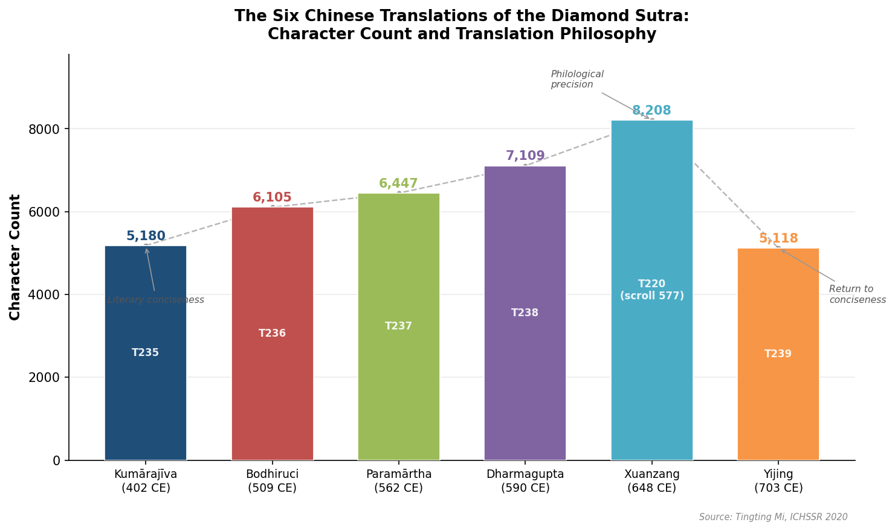

*Figure 1.2. Character counts of the six Chinese translations. The progression from Kumārajīva's 5,180 characters to Xuanzang's 8,208 — and Yijing's subsequent return to 5,118 — traces an arc from literary conciseness through philological precision back to brevity.*

Kumārajīva's translation has dominated Chinese Buddhist culture for over sixteen centuries. Its literary elegance and memorability established it as the standard text for recitation, commentary, and devotional practice across East Asia. At 5,180 characters, it is among the shortest of the six versions — a conciseness that paradoxically contributed to its durability, as the entire text can be chanted in approximately thirty to forty minutes.

Xuanzang, who produced his own translation two and a half centuries later, criticized earlier renderings for omitting *neng duàn* (能斷, "able to cut") from the title, arguing that this obscured the vajra metaphor's active, cutting force [Red Pine 2001](https://bodhibass.com/wp-content/uploads/2018/11/diamond-sutra.pdf "Red Pine, Translator's Preface"). His version, at 8,208 characters, is considerably more expansive — reflecting a preference for accuracy over literary compression. Yet Kumārajīva's version retained its primacy in liturgical and contemplative practice.

The progressive increase in character count across the first five translations — from 5,180 to 8,208 — followed by Yijing's return to 5,118 offers a window into the evolution of translation philosophy in medieval Chinese Buddhism: from Kumārajīva's literary fluency, through the incrementally more literal approaches of Bodhiruci, Paramārtha, and Dharmagupta, to Xuanzang's philological rigor, and finally Yijing's return to conciseness.

## 1.4 The Tibetan Translation and Other Versions

The Vajracchedikā was translated into Tibetan by the Indian paṇḍita Śīlendrabodhi and the Tibetan translator Ye shes sde at the beginning of the 9th century, during the imperially sponsored translation project under the Tibetan kings [IKGA, "Surendrabodhi and Ye shes sde, trans."](https://east.ikga.oeaw.ac.at/bib/5384/ "Austrian Academy of Sciences bibliographic entry"). In the Tibetan Kangyur, the text appears as Tohoku No. 16, classified among the "Eleven Sons" of the Prajñāpāramitā section — shorter texts regarded as emanations of the vast "Mother" sūtras [Prajñāpāramitā — Wikipedia, citing Karma Phuntsho 2005](https://en.wikipedia.org/wiki/Prajnaparamita "Wikipedia, citing Karma Phuntsho on the Tibetan canon's internal organization").

The text is also known as the Triśatikā Prajñāpāramitā Sūtra (the "300-Line Perfection of Wisdom"), a designation reflecting its relative brevity within the genre. The 84000 Translation Project lists Toh 16 as in progress, indicating that a new scholarly English translation from the Tibetan is forthcoming [84000.co, Toh 16](https://84000.co/translation/toh16 "84000 project page for the Vajracchedikā").

Beyond Chinese and Tibetan, the Diamond Sutra was rendered into Khotanese, Sogdian, Uighur, Mongolian, and Manchu — a distribution that testifies to its cultural reach across the entire Inner Asian corridor, from the oasis cities of the Tarim Basin to the Mongol and Manchu courts [Encyclopedia of Buddhism](https://www.encyclopedia.com/religion/encyclopedias-almanacs-transcripts-and-maps/diamond-sutra "Schopen's encyclopedia entry on the Diamond Sutra's translation history").

## 1.5 The Dunhuang Diamond Sutra: The World's Oldest Dated Printed Book

Among the Diamond Sutra's many material incarnations, one stands alone in world cultural history. The Dunhuang Diamond Sutra (British Library Or.8210/P.2) is a woodblock-printed scroll dated 11 May 868 CE — the earliest known dated printed book. The scroll measures 27.6 cm × 499.5 cm and reproduces Kumārajīva's translation. At its head is a finely executed frontispiece depicting the Buddha seated on a lotus throne, addressing Subhūti before a congregation of monks, bodhisattvas, and protective deities [British Library IDP](https://idp.bl.uk/collection/51FDAEAFB4A24E2E9981692A98130BC8/ "IDP record for Or.8210/P.2").

The scroll's colophon reads: "Reverently made for universal free distribution by Wang Jie on behalf of his two parents." The dedication encodes a practice central to Chinese Buddhist culture: the commissioning of sūtra copies as an act of merit transfer (*huíxiàng*, 回向) on behalf of family members. That the world's earliest dated printed book was produced not for commercial sale but as an act of filial devotion and free distribution is a striking commentary on the relationship between technology, religious aspiration, and generosity [Oxford Cabinet of Curiosities](https://www.cabinet.ox.ac.uk/worlds-earliest-dated-printed-book-diamond-sutra-868-ce "Discovery and colophon details").

The scroll was discovered in 1900 by the Daoist monk Wang Yuanlu in the sealed Library Cave (Cave 17) at the Mogao Grottoes near Dunhuang, along with tens of thousands of other manuscripts and printed documents dating from the 5th to the 11th century. It was purchased by the Hungarian-British archaeologist Aurel Stein in 1907 and transported to the British Museum (now British Library), where it remains among the institution's most treasured holdings [Oxford Cabinet of Curiosities](https://www.cabinet.ox.ac.uk/worlds-earliest-dated-printed-book-diamond-sutra-868-ce "Discovery narrative and provenance"). The International Dunhuang Project (IDP) has fully digitized the scroll, making it accessible to researchers and the general public worldwide.

The Dunhuang scroll's significance extends well beyond its age. Its very existence demonstrates that by the late Tang dynasty, the Diamond Sutra occupied a position of extraordinary cultural centrality — sufficiently valued to justify the considerable expense and technical sophistication of woodblock printing for free distribution. By the end of the Tang (907 CE), over 80 commentaries had been composed on the Diamond Sutra in China alone, of which 32 survive. Around the text there had grown a broader cult that included miracle tales, daily recitation practices, and monumental stone-carved copies [Encyclopedia of Buddhism](https://www.encyclopedia.com/religion/encyclopedias-almanacs-transcripts-and-maps/diamond-sutra "Schopen's encyclopedia entry on the sutra's cultural significance in China").

## 1.6 The Narrative Frame and Internal Structure

The Diamond Sutra opens with a scene of studied ordinariness. The Buddha is staying at the Jetavana — Anāthapindada's Garden — near Śrāvastī. He dresses, takes up his bowl, walks into town for alms, returns, eats, puts away his robe and bowl, washes his feet, and sits down. The elder Subhūti then rises from the assembly, bares one shoulder, kneels, and poses the question that structures the entire dialogue: how should one who has set out on the bodhisattva path stand, how should they walk, and how should they control their thoughts?

This mundane opening is, in the view of multiple commentators, already a teaching. Red Pine observes that the setting at Anāthapindada's Garden — named after a lay benefactor renowned for selfless generosity — embodies the sūtra's first substantive doctrine of non-abiding generosity (*apratisthita-dāna*) before a single word of philosophy is spoken [Red Pine 2001](https://bodhibass.com/wp-content/uploads/2018/11/diamond-sutra.pdf "Red Pine's commentary on Chapter One"). The Buddha's utterly ordinary actions — eating, washing, sitting — prefigure the text's central insight that awakening is not located in some extraordinary realm but in the fabric of daily conduct.

The dialogue that follows is distinctive within Mahāyāna literature for its relentless dialectical method. Rather than presenting a systematic doctrine, the Buddha proceeds through a series of negations, each dismantling an attachment that the preceding exchange may have inadvertently created. The text's signature rhetorical formula — "X has been preached by the Tathāgata as a-X, therefore it is called X" — appears at least 30 times across the dialogue, establishing a rhythmic pattern of affirmation through denial that has fascinated and perplexed readers for centuries [Paul Harrison 2006](https://static1.squarespace.com/static/5c03ced75ffd204418037b7a/t/5c5306ce575d1f9230da8a6a/1548945103490/Diamond+Sutra-Paul+Harrison+tr.pdf "Harrison 2006, pp. 136–139").

A notable feature distinguishes the Vajracchedikā from virtually all other Prajñāpāramitā texts: it never once uses the term *śūnyatā* (emptiness; 空). The concept pervades the entire text — indeed, the dialogue can be read as an extended meditation on emptiness — but the word itself is absent. Harrison characterizes this as a "distinctive strategy of affirmation through denial," in which the text *enacts* emptiness rather than naming it [Paul Harrison 2006](https://static1.squarespace.com/static/5c03ced75ffd204418037b7a/t/5c5306ce575d1f9230da8a6a/1548945103490/Diamond+Sutra-Paul+Harrison+tr.pdf "Harrison 2006, p. 141").

### The 32-Section Division

In the standard Chinese edition — by far the most widely circulated format — the Diamond Sutra is divided into 32 sections, each bearing a title. This division does not exist in the Sanskrit or Tibetan texts, which present the dialogue as continuous prose. It is attributed to Prince Xiao Tong (蕭統), the Crown Prince Zhaoming (501–531 CE) of the Liang dynasty, a cultivated literary patron who also compiled the celebrated *Wenxuan* (文選) anthology.

Red Pine notes a symbolic resonance: just as a buddha is recognized by 32 physical marks (*lakṣaṇa*), the sūtra is organized into 32 sections — yet the text will go on to systematically deconstruct the very notion that a buddha can be known by such marks [Red Pine 2001](https://bodhibass.com/wp-content/uploads/2018/11/diamond-sutra.pdf "Red Pine's commentary on the 32-section structure"). The division, then, functions as a kind of teaching device in its own right: it imposes visible structure on a text whose content dissolves all structure.

## 1.7 Key English Translations

The Diamond Sutra's English translation history spans over a century, reflecting shifting scholarly methods, audience expectations, and the evolving availability of manuscript witnesses:

- **Max Müller (1894)**: The first English translation, rendered from a late Sanskrit manuscript. Pioneering in its era but now dated in both philology and prose style.
- **Edward Conze (1957/1958)**: The landmark scholarly version that shaped a generation of Western Buddhist studies. Conze worked from Müller's Sanskrit edition and his own critical text, establishing the vocabulary and interpretive framework that subsequent translators would engage or contest.
- **A. F. Price and Wong Mou-lam (1947)**: An accessible English version that paired the Diamond Sutra with the Platform Sutra of the Sixth Patriarch, introducing both texts to a broad anglophone readership.
- **Thich Nhat Hanh (1992)**: A Zen-inflected commentary translation that foregrounds practical application and contemplative engagement over philological precision.
- **Red Pine (2001)**: A richly annotated edition drawing on multiple Chinese commentators and Buddhist traditions, providing the most comprehensive English-language commentary available.
- **Paul Harrison (2006)**: A scholarly translation based on the two oldest surviving manuscripts (Schøyen and Gilgit), representing the current philological gold standard.

[Paul Harrison 2006](https://static1.squarespace.com/static/5c03ced75ffd204418037b7a/t/5c5306ce575d1f9230da8a6a/1548945103490/Diamond+Sutra-Paul+Harrison+tr.pdf "Harrison 2006, pp. 134–135, on the translation lineage")

Each translation opens a different window onto the text. Kumārajīva's literary Chinese privileges concision and mnemonic power; Harrison's English from Gandhāran manuscripts reveals readings obscured by later traditions; Red Pine's commentary situates each section within a living tradition of interpretation. Reading across translations is itself an exercise consonant with the sūtra's own teaching: no single verbal formulation captures the reality toward which it points.

## 1.8 The Title: What Does *Vajracchedikā* Mean?

The Sanskrit title *Vajracchedikā Prajñāpāramitā* has been rendered in various ways, and the divergence is not merely semantic. Conze maintained it means "the perfection of wisdom which cuts like the thunderbolt" — *vajra* as instrument, *chedikā* as the act of cutting. Red Pine identifies three aspects of the vajra that structure the entire text: cutting (the diamond's capacity to sever all attachments), radiating light (the illumination of reality), and indestructibility (the unshakeable quality of wisdom that has released all fixed positions). He connects these three aspects to the three bodies (*trikāya*) of every buddha [Red Pine 2001](https://bodhibass.com/wp-content/uploads/2018/11/diamond-sutra.pdf "Red Pine, Translator's Preface").

Xuanzang's critique of earlier Chinese titles — his insistence on including *neng duàn* (能斷, "able to cut") — highlights a characteristic tension in Diamond Sutra translation: between preserving the poetic resonance of *vajra* as "diamond" and capturing its active, even violent, function as a tool that severs illusion [Paul Harrison 2006](https://static1.squarespace.com/static/5c03ced75ffd204418037b7a/t/5c5306ce575d1f9230da8a6a/1548945103490/Diamond+Sutra-Paul+Harrison+tr.pdf "Harrison 2006, p. 135"). The title, in this reading, is itself a teaching: wisdom is not a passive state of knowing but an active capacity to cut through the conceptual fabrications that bind sentient beings to suffering.

---

The Diamond Sutra's historical trajectory — from an Indian oral text of uncertain date, through multiple translations into the literary languages of Asia, to its iconic 868 CE printed incarnation and its ongoing life in modern scholarship — reveals a text that has consistently attracted the most ambitious forms of cultural transmission. Each translation, each manuscript, each commentary represents an attempt to realize the sūtra's own paradoxical injunction: to transmit a teaching that undermines the very possibility of fixed transmission. This paradox, embedded in the text's material history no less than in its philosophical content, is the thread that connects its textual foundations to the doctrinal, interpretive, and cultural dimensions examined in the chapters that follow.

# 第2章 Core Philosophical Teachings

The Diamond Sutra is, at its core, a sustained exercise in dismantling the conceptual habits that generate suffering. Over the course of a single dialogue between the Buddha and his disciple Subhūti, the text systematically deconstructs attachment to self, to phenomena, to spiritual attainment, and ultimately to the teaching itself. What remains is not nihilism but a radical clarity — a mode of engagement with the world that is fully active yet entirely free of fixation. This chapter examines the sutra's central philosophical content: its distinctive rhetorical logic, its treatment of emptiness (śūnyatā; 空), the four marks of self, the paradox of the bodhisattva path, non-abiding generosity, the nature of the Tathāgata, the raft analogy, the escalating merit comparisons, and the nine closing similes.

## 2.1 The Vajra Metaphor: What the Diamond Cuts

The sutra's full title — *Vajracchedikā Prajñāpāramitā* — is itself a doctrinal statement. Edward Conze rendered it "the perfection of wisdom which cuts like the thunderbolt" [Red Pine 2001](https://bodhibass.com/wp-content/uploads/2018/11/diamond-sutra.pdf "Red Pine, Translator's Preface"). The term *vajra* (金刚) carries a semantic range far exceeding the English "diamond." In Vedic mythology it is Indra's thunderbolt; in tantric iconography, an indestructible ritual implement; in ordinary usage, the hardest known substance.

Red Pine identifies three interrelated aspects of *vajra* — cutting, radiating light, and indestructibility — which he maps onto the three bodies (*trikāya*) of every buddha [Red Pine 2001](https://bodhibass.com/wp-content/uploads/2018/11/diamond-sutra.pdf "Red Pine, Translator's Preface"). Xuanzang, in his 648 CE translation, explicitly criticized earlier Chinese renderings for omitting *neng duàn* (能斷, "able to cut"), insisting that the title conveys an active, severing function [Paul Harrison 2006](https://static1.squarespace.com/static/5c03ced75ffd204418037b7a/t/5c5306ce575d1f9230da8a6a/1548945103490/Diamond+Sutra-Paul+Harrison+tr.pdf "Harrison 2006, p. 135"). What the vajra of prajñā cuts through is not ignorance in the abstract but a specific set of conceptual habits — attachment to self, to dharmas, to merit, and to the teaching as a reified entity — that the sutra proceeds to enumerate and dismantle one by one.

## 2.2 The Signature Formula: "A Is Not A, Therefore It Is Called A"

No feature of the Diamond Sutra is more distinctive than its recurring negation formula. Appearing at least 30 times throughout the text, the pattern takes the form: "X has been preached by the Tathāgata as a-X, therefore it is called X" [Paul Harrison 2006](https://static1.squarespace.com/static/5c03ced75ffd204418037b7a/t/5c5306ce575d1f9230da8a6a/1548945103490/Diamond+Sutra-Paul+Harrison+tr.pdf "Harrison 2006, pp. 136–139"). On its surface, the formula appears to violate the law of identity — a logical impossibility within standard Western propositional frameworks. Read with philological precision, however, it articulates a rigorous philosophical position on the relationship between language and reality.

Harrison identifies a critical grammatical distinction that most readers overlook. The Sanskrit prefix *a-* can be parsed in two ways. Under the *karmadhāraya* (attributive compound) reading, *a-X* means "non-X" — a straightforward negation. Under the *bahuvrīhi* (possessive compound) reading, *a-X* means "that which is devoid of X-ness" or "X-less" [Paul Harrison 2006](https://static1.squarespace.com/static/5c03ced75ffd204418037b7a/t/5c5306ce575d1f9230da8a6a/1548945103490/Diamond+Sutra-Paul+Harrison+tr.pdf "Harrison 2006, pp. 136–140"). The divergence is philosophically consequential. The Chinese translations, including Kumārajīva's foundational 402 CE version, follow the *karmadhāraya* reading: "A is not A." The Tibetan translations follow the *bahuvrīhi*: "A is devoid of A-ness." Harrison argues the *bahuvrīhi* is "more cogent philosophically," because it preserves the conventional existence of X while denying that X possesses any fixed, inherent essence.

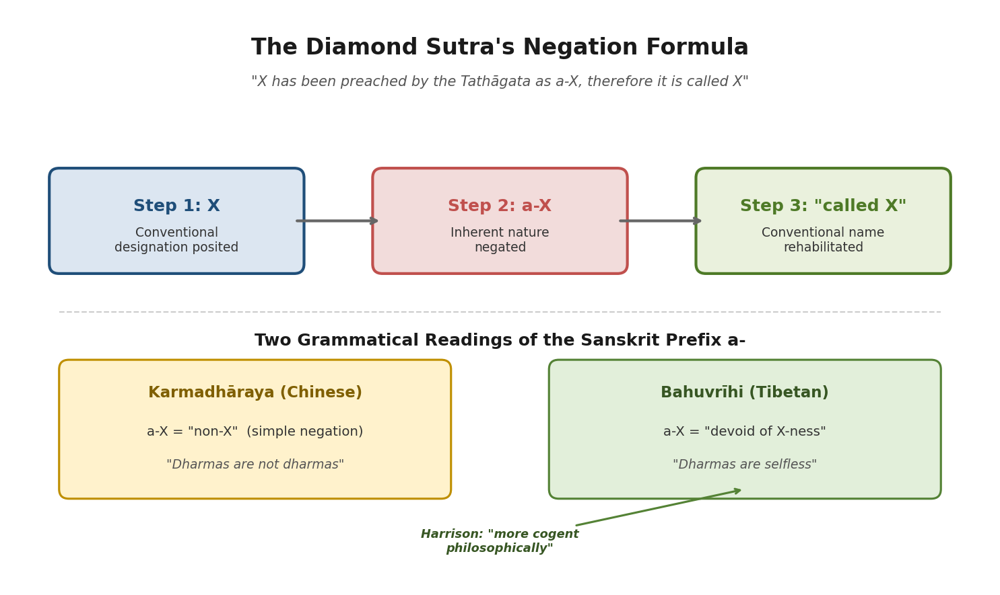

The philosophical import becomes clearest in §17h, where the formula is applied to dharmas themselves: *nirātmāno dharmāḥ* — "dharmas are selfless." Conventional language functions — names point, categories organize, concepts enable communication — precisely *because* the things they name are empty of fixed essence. If phenomena were frozen in inherent identity, language would be impossible: nothing could be designated as anything, because it would simply *be* its nature, requiring no label. This parallels the standpoint of Nāgārjuna, who in *Mūlamadhyamakakārikā* 24.10 argued that without emptiness, conventional truth collapses and with it the possibility of the path itself [Paul Harrison 2006](https://static1.squarespace.com/static/5c03ced75ffd204418037b7a/t/5c5306ce575d1f9230da8a6a/1548945103490/Diamond+Sutra-Paul+Harrison+tr.pdf "Harrison 2006, pp. 139–140"); [Stanford Encyclopedia of Philosophy](https://plato.stanford.edu/entries/twotruths-india/ "SEP on Two Truths in Indian Philosophy").

The formula thus performs two operations simultaneously: it deconstructs any reification of X (there is no fixed, inherent X), and it rehabilitates the conventional designation (therefore it is *called* X). This is not contradiction but a precise articulation of how language and reality relate under the two-truths framework: conventionally, X exists and functions; ultimately, X is empty of self-nature.

## 2.3 Emptiness Without the Word: The Sutra's Distinctive Strategy

A remarkable feature of the Diamond Sutra is that, despite belonging to the *Prajñāpāramitā* genre — whose central subject is śūnyatā (emptiness) — it never once employs the term. The Heart Sutra, by contrast, declares "form is emptiness, emptiness is form" in a single declarative pronouncement. The Diamond Sutra's approach diverges fundamentally: it *enacts* emptiness through the negation formula rather than naming it as a doctrine [Paul Harrison 2006](https://static1.squarespace.com/static/5c03ced75ffd204418037b7a/t/5c5306ce575d1f9230da8a6a/1548945103490/Diamond+Sutra-Paul+Harrison+tr.pdf "Harrison 2006, p. 141").

This performative strategy carries profound implications. By refusing to name emptiness, the sutra prevents śūnyatā itself from becoming an object of grasping. Had the text declared "all dharmas are empty," readers might seize upon emptiness as a new fixed truth — a metaphysical claim to be believed rather than a way of seeing to be practiced. By declining to use the word while relentlessly demonstrating the principle across dozens of instances, the text forestalls this danger. The negation formula operationally enacts what Nāgārjuna expressed in MMK 24.19: "There is nothing whatsoever that is not dependent origination; therefore there is nothing whatsoever that is not empty." Where Nāgārjuna argues discursively, however, the Diamond Sutra performs the insight through repetition across every category of experience [Stanford Encyclopedia of Philosophy](https://plato.stanford.edu/entries/twotruths-india/ "SEP on Nāgārjuna and two truths").

## 2.4 The Four Marks: Deconstructing the Self

The sutra's first substantive deconstruction targets the concept of self. It repeatedly negates the "four marks" (*catvāri nimittāni*): the notion of a self (*ātma-saṃjñā*), a person (*pudgala-saṃjñā*), a sentient being (*sattva-saṃjñā*), and a life-span (*jīva-saṃjñā*). These four are not synonyms; they represent progressively broader forms of identity-construction — from the individual ego, to the socially recognized person, to membership in a class of sentient beings, to the continuity of a temporal existence.

In §3, the scope of the negation is already sweeping: "anybody to whom the idea of a living being occurs… should not be called a bodhisattva" [Paul Harrison 2006, §3](https://static1.squarespace.com/static/5c03ced75ffd204418037b7a/t/5c5306ce575d1f9230da8a6a/1548945103490/Diamond+Sutra-Paul+Harrison+tr.pdf "Harrison 2006, p. 142"). By §14c, even the *idea* of these four categories is negated: they are "idealess" (*asaṃjñā*) [Paul Harrison 2006, §14c](https://static1.squarespace.com/static/5c03ced75ffd204418037b7a/t/5c5306ce575d1f9230da8a6a/1548945103490/Diamond+Sutra-Paul+Harrison+tr.pdf "Harrison 2006, p. 149"). And by §17f, the denial extends from self to all phenomena: "all dharmas are devoid of a living being, devoid of a soul, devoid of a person" [Paul Harrison 2006, §17f](https://static1.squarespace.com/static/5c03ced75ffd204418037b7a/t/5c5306ce575d1f9230da8a6a/1548945103490/Diamond+Sutra-Paul+Harrison+tr.pdf "Harrison 2006, p. 153").

This trajectory — from personal self to dharma-selflessness — recapitulates in compressed form the historical development from early Buddhist *anattā* (not-self applied to persons) to the Mahāyāna extension of *dharma-nairātmya* (selflessness applied to all phenomena). The Diamond Sutra does not merely deny that "you" are a fixed self; it denies that *anything* — any concept, any teaching, any momentary experience — possesses inherent existence. The practical consequence is a comprehensive release from the habit of solidifying experience into "things" that can be clung to or defended against.

## 2.5 The Bodhisattva Paradox: Saving All Beings, Finding None

The sutra's treatment of the bodhisattva path ranks among its most demanding passages. In §3, the bodhisattva is instructed to aspire to bring all beings — "be they born from eggs, born from wombs, born from moisture, or born from transformation; be they with form or without form; be they with perception or without perception or with neither perception nor non-perception" — to "nirvāṇa without remainder." Yet the Buddha immediately adds: "no living being whatsoever has been brought to extinction" [Paul Harrison 2006, §§2–3](https://static1.squarespace.com/static/5c03ced75ffd204418037b7a/t/5c5306ce575d1f9230da8a6a/1548945103490/Diamond+Sutra-Paul+Harrison+tr.pdf "Harrison 2006, pp. 142–143").

This is not a logical contradiction but a statement about the relationship between motivation and metaphysics. The bodhisattva acts with complete compassionate intention — nothing is withheld. The action, however, is grounded in the recognition that the categories "savior," "saved," and "act of saving" are all empty of inherent existence. Were the bodhisattva to believe that truly fixed beings require rescue by a truly fixed rescuer, the enterprise would be rooted in the very self-grasping it seeks to overcome.

By §17a–f, the deconstruction advances further: even the designation "bodhisattva" is dismantled. There is, the Buddha states, "no dharma called 'one who has set out on the bodhisattva path.'" Red Pine renders *mahāsattva* (great being; 摩诃萨) as "fearless" rather than "great being," capturing the quality of one who acts fully while holding no fixed concept of what they are [Red Pine 2001](https://bodhibass.com/wp-content/uploads/2018/11/diamond-sutra.pdf "Red Pine commentary on Chapter 1"). Genuine spiritual activity, the sutra implies, becomes possible only when the agent relinquishes any sense of themselves as a spiritual agent.

## 2.6 Non-Abiding Generosity: Giving Without Ground

The first substantive teaching of the sutra, presented in §4, concerns *dāna* (generosity; 布施) — but a generosity unlike any ordinary account. "A bodhisattva should not give a gift while fixing on an object," the Buddha instructs. The key term is *nimitta*, which Harrison notes carries a double meaning: both "sense-object" (what is perceived) and "motive" (what is intended). Non-abiding generosity thus entails simultaneously non-fixation on what is given and non-fixation on why one gives [Paul Harrison 2006, §4](https://static1.squarespace.com/static/5c03ced75ffd204418037b7a/t/5c5306ce575d1f9230da8a6a/1548945103490/Diamond+Sutra-Paul+Harrison+tr.pdf "Harrison 2006, pp. 143–144").

The Sanskrit term *apratisthita* (non-abiding; 无所住) is central. The gift should not "abide" in — should not come to rest upon or be established in — any concept of giver, recipient, or thing given. Red Pine observes that the setting of the sutra itself embodies this principle: Anāthapindada's Garden (Jetavana; 祇树给孤独园) was named for Anāthapindada, who purchased the grove by covering the ground with gold — a legendary act of generosity that left no trace of self-aggrandizement [Red Pine 2001](https://bodhibass.com/wp-content/uploads/2018/11/diamond-sutra.pdf "Red Pine's commentary on Chapter One").

The sutra does not counsel against generosity. It counsels against *fixated* generosity — the kind that generates a self-concept ("I am generous"), a debt ("you owe me"), or a merit account ("this will benefit me"). The paradox, articulated across the merit-comparison passages, is that non-abiding generosity generates immeasurably *greater* merit precisely because it is not performed for the sake of merit.

## 2.7 The Nature of the Tathāgata: Neither Coming Nor Going

The Diamond Sutra devotes sustained attention to how the Buddha should — and should not — be understood. The deconstruction begins in §5 with the physical body: "as long as there is any distinctive feature there is falsehood" [Paul Harrison 2006, §5](https://static1.squarespace.com/static/5c03ced75ffd204418037b7a/t/5c5306ce575d1f9230da8a6a/1548945103490/Diamond+Sutra-Paul+Harrison+tr.pdf "Harrison 2006, pp. 143–144"). The 32 major marks (*lakṣaṇa*) of a great being — webbed fingers, golden complexion, cranial protuberance — are conventional descriptions, not ultimate identifiers. To mistake the marks for the reality is to grasp an empty sign.

In §26, this teaching crystallizes in verse: "Who looks for me in form / who seeks me in a voice / indulges in wasted effort. / Such people fail to see me" [Paul Harrison 2006, §26](https://static1.squarespace.com/static/5c03ced75ffd204418037b7a/t/5c5306ce575d1f9230da8a6a/1548945103490/Diamond+Sutra-Paul+Harrison+tr.pdf "Harrison 2006, p. 155"). The Tathāgata is not to be located in any perceptible form. In §17c, the sutra identifies Tathāgata with *tathatā* (thusness; 真如) — reality as such, prior to conceptual elaboration [Paul Harrison 2006, §17c](https://static1.squarespace.com/static/5c03ced75ffd204418037b7a/t/5c5306ce575d1f9230da8a6a/1548945103490/Diamond+Sutra-Paul+Harrison+tr.pdf "Harrison 2006, p. 152").

The final deconstruction of the Buddha-concept comes in §29, where the title itself is dismantled. *Tathāgata* (如来) can be etymologically parsed as either "thus-come" or "thus-gone." The sutra declares: "they do not go anywhere, nor do they come from anywhere, therefore they are called 'Tathāgata'" [Paul Harrison 2006, §29](https://static1.squarespace.com/static/5c03ced75ffd204418037b7a/t/5c5306ce575d1f9230da8a6a/1548945103490/Diamond+Sutra-Paul+Harrison+tr.pdf "Harrison 2006, p. 157"). The negation formula is here applied to the Buddha's very name: the Tathāgata neither comes nor goes because there is no fixed entity to undertake the journey. The title, understood correctly, is a conventional designation that points beyond itself.

## 2.8 The Raft Analogy: Letting Go of the Teaching

In §6, the sutra deploys a parable drawn from the earlier Pāli canon — specifically the *Alagaddūpamasutta* (M.I.130–142), in which the Buddha compares his teaching to a raft used for crossing a river. Once the far shore is reached, the raft is left behind rather than carried on the traveler's back. The Diamond Sutra presses this analogy further. Harrison notes that the Sanskrit verb *udgrah-* means both "to grasp" and "to learn," yielding a pointed double meaning in the Buddha's instruction: "The teachings should be let go of, to say nothing of what is not the teachings" [Paul Harrison 2006, §6](https://static1.squarespace.com/static/5c03ced75ffd204418037b7a/t/5c5306ce575d1f9230da8a6a/1548945103490/Diamond+Sutra-Paul+Harrison+tr.pdf "Harrison 2006, p. 144, footnotes 41–42").

The reflexive quality of this passage is striking. The sutra does not merely advise its audience to abandon non-Buddhist teachings; it advises them to abandon *its own teachings* — to relinquish the raft of the Diamond Sutra itself once it has served its purpose. This self-undermining gesture distinguishes the text from virtually all other wisdom literature. The *Dao De Jing* opens with "The Tao that can be told is not the eternal Tao," but does not proceed to systematically deconstruct its own authority across 32 sections. The Diamond Sutra does.

## 2.9 Merit Comparisons: The Paradox of Spiritual Value

One of the sutra's most architecturally prominent features is its series of escalating merit-comparison passages. At least eight such passages appear across §§4, 8, 11, 13e, 15a, 16b, 24, and 32, each following a consistent structure: an imagined act of cosmic material generosity — filling three thousand great thousand worlds with the seven treasures, or with as many Ganges rivers as there are grains of sand in the Ganges — is compared unfavorably to learning even a single four-line verse (*catuṣpādikā gāthā*) from the Diamond Sutra and teaching it to others [Paul Harrison 2006, §§8, 11, 32](https://static1.squarespace.com/static/5c03ced75ffd204418037b7a/t/5c5306ce575d1f9230da8a6a/1548945103490/Diamond+Sutra-Paul+Harrison+tr.pdf "Harrison 2006, pp. 145–146").

These passages serve multiple functions. On one level, they valorize wisdom over material offerings — a direct challenge to the merit-economy of mainstream Buddhist practice, where donations to monasteries were widely understood to generate karmic benefit. More subtly, the escalating scale (each comparison involves a vaster material offering than the last) enacts a reductio: no quantity of material generosity, however inconceivable, can match the transformative power of understanding emptiness.

Yet the sutra refuses to let merit itself become an object of fixation. In §19, the negation formula is applied directly: "a body of merit is spoken of as no body." In §28, the teaching reaches its final form: merit is real — it functions, it matters — but it must not be "grasped" (*upādāna*) [Paul Harrison 2006, §§19, 28](https://static1.squarespace.com/static/5c03ced75ffd204418037b7a/t/5c5306ce575d1f9230da8a6a/1548945103490/Diamond+Sutra-Paul+Harrison+tr.pdf "Harrison 2006, pp. 151, 156"); [Red Pine 2001, §§19, 28](https://bodhibass.com/wp-content/uploads/2018/11/diamond-sutra.pdf "Red Pine translation"). The paradox is complete: pursue merit without fixating on merit; value the teaching without reifying the teaching.

## 2.10 The Nine Similes: A Phenomenology of Impermanence

The sutra concludes in §32b with what is arguably the most celebrated verse in all of Mahāyāna literature:

> *As a shooting star, a clouding of the sight, a lamp,*
> *An illusion, a dewdrop, a bubble,*
> *A dream, a lightning flash, a thunder cloud —*
> *View all created things like this.*

These nine similes — star, defect of vision, lamp, illusion (*māyā*), dewdrop, bubble, dream, lightning flash, and cloud — are not ornamental. Each illuminates a specific facet of conditioned phenomena (*saṃskṛta-dharma*) [Paul Harrison 2006, §32b](https://static1.squarespace.com/static/5c03ced75ffd204418037b7a/t/5c5306ce575d1f9230da8a6a/1548945103490/Diamond+Sutra-Paul+Harrison+tr.pdf "Harrison 2006, p. 158").

Khensur Jampa Tegchok provides a detailed per-simile analysis rooted in the Gelug Madhyamaka tradition. The shooting star (*tārakā*) illustrates the fleeting nature of appearances — present for a moment, gone without remainder. The defect of vision (*timira*) reveals that what seems to be "out there" is already conditioned by the perceiving apparatus. The lamp (*dīpa*), dependent on wick, oil, and flame, demonstrates dependent origination. The illusion (*māyā*) shows that phenomena can appear vivid and functional while lacking inherent existence — the magician's elephant is seen and feared but was never there. The dewdrop (*avashyāya*) and bubble (*budbuda*) both capture fragility and transience, but with different temporal textures: the dewdrop evaporates gradually; the bubble pops in an instant. The dream (*svapna*) demonstrates that entire experiential worlds — fully convincing while they last — can dissolve upon waking. The lightning flash (*vidyut*) illuminates and vanishes simultaneously, suggesting that present-moment experience "cannot be found under analysis." The thunder cloud (*abhram*), vast and impressive, is nevertheless constituted entirely of transient conditions and will soon disperse [Khensur Jampa Tegchok, *Insight into Emptiness*](https://shantidevanyc.org/wp-content/uploads/2023/11/Similes-from-the-Vajra-Cutter-Sutra-Khensur-Jampa-Tegchok.pdf "Khensur Jampa Tegchok on the nine similes").

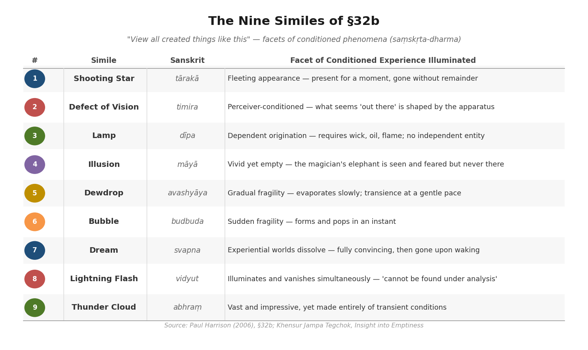

Taken together, the nine similes do not argue a thesis; they offer nine angles of contemplation, each training the practitioner to perceive conditioned phenomena as they are: vivid, functional, and utterly without the solidity that habitual perception attributes to them.

## 2.11 The Architecture of Deconstruction

Viewed as a whole, the Diamond Sutra's philosophical architecture follows a pattern of progressive deconstruction, each layer encompassing and surpassing the last:

1. **Self** — The four marks are negated (§§3, 14c, 17f, 31a), dismantling attachment to personal identity.
2. **Dharmas** — The negation formula extends to teachings, concepts, and phenomena (§§6, 17h), broadening selflessness from persons to all objects of experience.
3. **Attainment** — The merit-comparison passages simultaneously valorize and deconstruct spiritual achievement (§§8, 19, 28).
4. **The Teacher** — The Tathāgata is identified with thusness, then negated as a name (§§5, 17c, 26, 29).
5. **The Teaching** — The raft analogy and the principle "even dharmas should be relinquished" turn the deconstruction upon the sutra itself (§6).

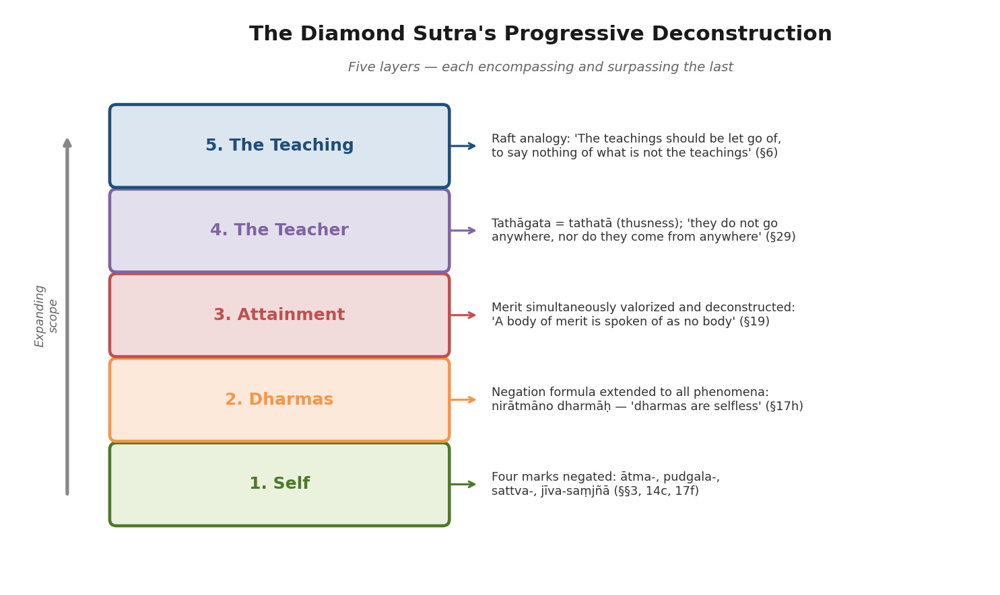

This spiraling structure — each layer of deconstruction encompassing and surpassing the last — accounts for the sutra's enduring capacity to reward rereading across centuries. Each encounter reveals another stratum of attachment that the vajra of prajñā has yet to sever. The sutra's refusal to employ the term *śūnyatā* while demonstrating emptiness through every passage ensures that its teaching cannot be reduced to a position, a slogan, or a belief. It must be continually enacted — in reading, in contemplation, and, as subsequent chapters explore, across the full range of human experience.

# 第3章 Interpretive Traditions — A Comparative Lens

The Diamond Sutra has never been a single text. From its earliest circulation in 4th-century India to its 21st-century encounters with phenomenology and deconstruction, it has been read through radically different philosophical frameworks — each drawing from its negation formula, its four marks, and its bodhisattva paradox a distinctive set of conclusions. This chapter surveys the major interpretive traditions that have shaped the Diamond Sutra's meaning: the Indian Yogācāra commentarial line of Asaṅga and Vasubandhu, the Chinese Chan reading crystallized in Huineng's enlightenment narrative, the Tibetan Madhyamaka reading grounded in Nāgārjuna's two-truths framework, the Theravāda tradition's parallel concerns and divergences, and modern Western philosophical engagements ranging from Derridean deconstruction to process metaphysics. Rather than treating these traditions as competing "interpretations" of a fixed original, what emerges is that the sutra's signature formula — "X is not X, therefore it is called X" — generates genuinely different philosophical conclusions depending on whether the reader emphasizes grammatical structure, soteriological urgency, logical precision, or lived transformation.

## 3.1 The Indian Commentarial Foundation: Asaṅga and Vasubandhu

The earliest sustained interpretations of the Diamond Sutra emerge from the Yogācāra school. Two major Indian commentaries survive: Asaṅga's verses and Vasubandhu's prose commentary, collectively titled *Triśatikāyāḥ Prajñāpāramitāyāḥ Kārikāsaptatiḥ* (Seventy Verses on the Three-Hundred-Line Perfection of Wisdom), translated into Chinese by Bodhiruci in 509 CE (Taishō 25, No. 1511). The attribution remains debated — the Tibetan tradition assigns the verses to Asaṅga and the commentary to Vasubandhu, while Giuseppe Tucci, who edited the Sanskrit, Chinese, and Tibetan versions in 1956, attributed the whole to Vasubandhu [NTI Buddhist Text Reader, "Introduction to the English commentary on the Diamond Sūtra"](https://ntireader.org/taisho/t0235_commentary_00.html "NTI Reader, Diamond Sūtra commentary introduction, reference to Bodhiruci's Chinese translation T25 No. 1511").

What matters philosophically is how the Yogācāra lens reshapes the Diamond Sutra's negation formula. When the sutra declares "X is not X, therefore it is called X," Vasubandhu reads this through the doctrine of three natures (*trisvabhāva*): the imagined nature (*parikalpita*), the dependent nature (*paratantra*), and the perfected nature (*pariniṣpanna*). The first clause — "X is not X" — negates the imagined nature, the conceptual overlay projected onto experience. The third clause — "therefore it is called X" — reaffirms X at the conventional level of the dependent nature: things arise through causes and conditions and function within that web of dependence. The perfected nature corresponds to recognition of reality as it is, free from the superimpositions of the imagined [Red Pine 2001](https://www.crisrieder.org/thejourney/storage/2024/06/Diamond-Sutra-Red-Pine.pdf "Red Pine, Translator's Preface, on Vasubandhu's trisvabhāva reading").

This Yogācāra approach produces a distinctive reading strategy. Vasubandhu treats the Diamond Sutra as a structured manual for bodhisattva training, systematically dividing its teaching into a progression of topics: the vow to liberate beings, non-attached giving (*dāna*), the impossibility of recognizing Buddhas by marks, and the nature of merit. Where later Chan tradition would prize the sutra for its anti-structural, paradoxical force, the Indian Yogācāra commentators read it as an orderly curriculum. As Stefan Anacker observes, Vasubandhu is "particularly known in Zen circles for his Commentary on the Diamond Sutra," yet his reading of it could not be more different from the Zen approach [NTI Buddhist Text Reader](https://ntireader.org/taisho/t0235_commentary_00.html "NTI Reader commentary introduction, describing Asaṅga/Vasubandhu's systematic approach").

Red Pine's 2001 edition places Vasubandhu's commentary alongside those of fifty-three Chinese Zen masters, enabling direct comparison. The juxtaposition proves instructive: where Vasubandhu carefully distinguishes levels of reality and maps the sutra onto a doctrinal schema, the Chan commentators tend to collapse all such levels into the immediacy of direct experience. Both readings find textual support; the Diamond Sutra's architecture accommodates systematic and anti-systematic approaches with equal hospitality.

## 3.2 The Chan/Zen Reading: Huineng and the Diamond Sutra as Sudden Awakening

No interpretive tradition has been more profoundly shaped by the Diamond Sutra — or has more dramatically shaped how the sutra is read — than Chinese Chan (禅; Japanese: Zen). The sutra's centrality to Chan is inseparable from the narrative of Huineng (慧能, 638–713), the Sixth Patriarch, whose enlightenment story in the *Platform Sutra* (六祖壇經) established the Diamond Sutra as the emblematic text of the sudden-awakening tradition.

The *Platform Sutra* narrates two pivotal encounters with the Diamond Sutra. First, Huineng — an impoverished, illiterate firewood-seller — overhears someone reciting it: "as soon as I heard the words of the sutra my mind opened forth in enlightenment." He travels to Huangmei to study under the Fifth Patriarch Hongren. Later, Hongren privately expounds the Diamond Sutra to him. Upon hearing the phrase "responding to the nonabiding, yet generating the mind" (應無所住而生其心; §10 of the sutra), Huineng experiences a second, definitive awakening, realizing "all the myriad dharmas do not transcend their self-natures" [John R. McRae, trans., *The Platform Sutra of the Sixth Patriarch*, BDK America, 2000](https://bdkamerica.org/download/1872 "McRae translation, pp. 17–24").

The famous verse contest between Shenxiu and Huineng crystallizes the Chan interpretive divide. Shenxiu's verse presents practice as gradual purification: "The body is the bodhi tree; / The mind is like a bright mirror's stand. / Be always diligent in rubbing it — / Do not let it attract any dust." Huineng's response enacts the Diamond Sutra's negation directly: "Bodhi is fundamentally without any tree; / The bright mirror is also not a stand. / Fundamentally there is not a single thing — / Where could any dust be attracted?" [McRae, *Platform Sutra*, BDK 2000](https://bdkamerica.org/download/1872 "McRae translation, pp. 20–23"). Hongren recognized that Shenxiu had "come only as far as outside the gate," while Huineng demonstrated the Diamond Sutra's core teaching — that all dharmas are empty of self-nature — not as doctrinal conclusion but as lived realization.

A critical historical detail underlies this narrative. The shift from the *Laṅkāvatāra Sūtra* to the Diamond Sutra as Chan's principal text occurred under Hongren (601–674). The *Platform Sutra* records that Hongren "always exhorts both monks and laymen to simply maintain the Diamond Sutra, so that one can see the [self]-nature by oneself and achieve buddhahood directly and completely" [McRae, *Platform Sutra*, BDK 2000](https://bdkamerica.org/download/1872 "McRae translation, p. 17"). This transition marked a doctrinal reorientation: from the Yogācāra-inflected "mind-only" discourse of the *Laṅkāvatāra* to a more radical emphasis on emptiness and non-abiding as Chan's philosophical foundation. Where the *Laṅkāvatāra* preserved a residual notion of "mind" (*citta*) as a kind of substrate, the Diamond Sutra refused any such resting-place.

Scholarly caution is warranted. McRae notes that the historical Huineng "is almost totally unknown" and the *Platform Sutra* is a "literary creation" likely composed ca. 780 CE — well after Huineng's death — to furnish an origin narrative for the burgeoning Chan movement. Huineng was an acceptable figurehead "precisely because of his anonymity." The earliest extant version was found among Dunhuang manuscripts; the later "mature version" (a Yuan-dynasty composite by Zongbao) is substantially longer and includes the elaborate verse contest that became canonical [McRae, *Platform Sutra*, BDK 2000](https://bdkamerica.org/download/1872 "McRae, Translator's Introduction, pp. xiii–xvi"). The Diamond Sutra's role in Chan is thus simultaneously historical and mythological — its textual authority intertwined with a narrative that may itself be understood through the sutra's own lens: "a teaching is not a teaching, therefore it is called a teaching."

The Tang dynasty (618–907 CE) witnessed a massive flourishing of Diamond Sutra commentary. Huineng's own commentary (金剛經解義, Taishō 24, No. 2459) claimed that "more than eight hundred have written commentaries to it, and each has explained its meaning according to his own perspective. But though perspectives differ, the Dharma is one and the same" [Red Pine 2001](https://www.crisrieder.org/thejourney/storage/2024/06/Diamond-Sutra-Red-Pine.pdf "Red Pine, Translator's Preface, citing Huineng's commentary"). By the end of the Tang, over 80 commentaries had been produced in China, of which 32 survive. Key figures include Zongmi (宗密, 780–841), who synthesized Huayan doctrinal analysis with Chan practice, and the Tang prime minister Chang Wu-chin. The sutra's cultural influence extended far beyond monastic walls: miracle tales, recitation cults, stone-carved copies — including the monumental Sutra Stone Valley on Mount Tai — and the 868 CE Dunhuang printed scroll all attest to its penetration into every stratum of Tang society [Jayarava Attwood, *JOCBS* 19, 2020](http://jocbs.org/index.php/jocbs/article/viewFile/230/293 "Attwood 2020"); [Brill, "Diamond Sutra Narratives"](https://brill.com/display/book/9789004406728/BP000001.xml "Brill, Diamond Sutra Narratives").

## 3.3 The Tibetan Madhyamaka Reading: Two Truths and the Grammar of Emptiness

The Tibetan interpretive tradition reads the Diamond Sutra through a fundamentally different grammatical — and therefore philosophical — lens than the Chinese. As Paul Harrison's 2006 analysis demonstrates, the Tibetan translations consistently parse the sutra's negation compounds as *bahuvrīhi* (possessive compounds), yielding readings such as "perfection-less" (*phar phyin ma yin pa*) rather than "non-perfection." Where the Chinese *karmadhāraya* reading produces the stark "A is not A," the Tibetan *bahuvrīhi* produces the more nuanced "A is devoid of A-ness." Harrison considers the *bahuvrīhi* reading "more cogent philosophically" because it preserves the conventional existence of X while denying that X possesses any fixed, inherent essence [Paul Harrison 2006](https://static1.squarespace.com/static/5c03ced75ffd204418037b7a/t/5c5306ce575d1f9230da8a6a/1548945103490/Diamond+Sutra-Paul+Harrison+tr.pdf "Harrison 2006, pp. 136–140"). The diagram below illustrates the structural contrast between these two readings.

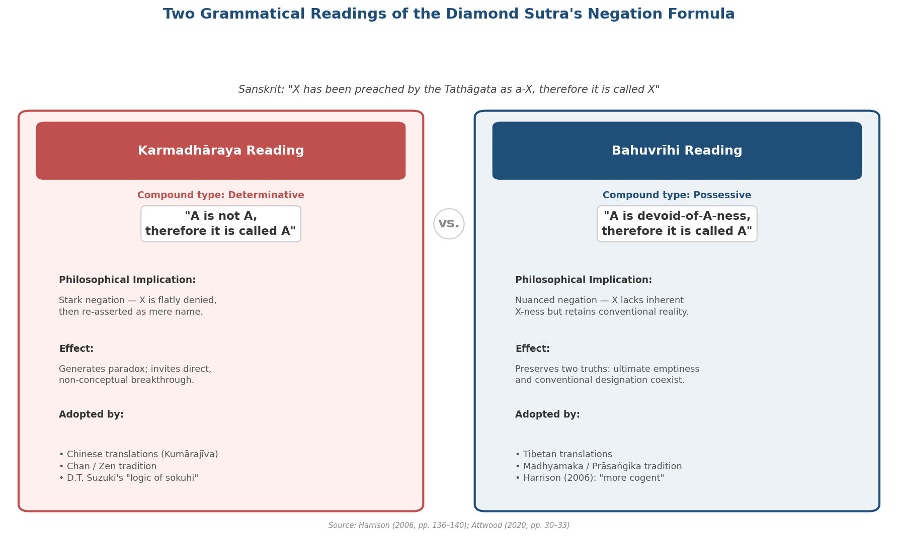

*Figure 3-1. Side-by-side comparison of the karmadhāraya (Chinese) and bahuvrīhi (Tibetan) grammatical parsings of the Diamond Sutra's negation formula, showing compound type, philosophical implications, downstream effects, and the traditions that adopted each reading. Based on Harrison (2006, pp. 136–140) and Attwood (2020, pp. 30–33).*

This grammatical distinction aligns the Diamond Sutra directly with Nāgārjuna's two-truths framework. In *Mūlamadhyamakakārikā* 24.8–10, Nāgārjuna established the principle structuring all subsequent Madhyamaka thought: "The Dharma taught by the Buddhas is precisely based on two truths: a truth of worldly convention and a truth of ultimate meaning." The Diamond Sutra's negation formula, on the Tibetan reading, enacts this two-truths logic with precision: the first clause affirms conventional designation ("X has been preached by the Tathāgata"), the second reveals ultimate emptiness ("as devoid-of-X-ness"), and the third re-establishes the conventional term ("therefore it is called X") — precisely because emptiness enables, rather than destroys, conventional reality [Stanford Encyclopedia of Philosophy, "The Theory of Two Truths in India"](https://plato.stanford.edu/entries/twotruths-india/ "SEP entry on two-truths, discussing Nāgārjuna's MMK 24.8–10").

Kamalaśīla (c. 740–795), a student of Śāntarakṣita, brought this Madhyamaka reading into direct contact with meditation practice. His three *Bhāvanākrama* (Stages of Meditation) texts, while not commentaries on the Diamond Sutra per se, represent the Madhyamaka interpretive tradition applied to Prajñāpāramitā themes. Kamalaśīla's framework requires the practitioner to realize both the emptiness of self (*pudgala-nairātmya*) and the emptiness of dharmas (*dharma-nairātmya*) through a union of śamatha (calm abiding; 止) and vipaśyanā (insight; 观). His approach became the normative Tibetan standard after the Council of Samye (c. 792–794), where Kamalaśīla debated the Chan monk Moheyan. Moheyan advocated a "sudden" approach — akin to the Huineng tradition — in which all conceptual activity is simply dropped. Kamalaśīla countered that analytical investigation of emptiness must precede and accompany direct experience. The outcome of the debate effectively foreclosed the Chan interpretation of the Diamond Sutra in Tibet and established gradual analytical meditation as the authorized path [Rigpa Wiki, "Kamalashila"](https://www.rigpawiki.org/index.php?title=Kamalashila "Rigpa Wiki entry on Kamalaśīla, the three Bhāvanākrama texts, and the Council of Samye").

The Gelug school, following Je Tsongkhapa (1357–1419), further refined the Madhyamaka reading through Candrakīrti's Prāsaṅgika lens. Tsongkhapa's *Lam rim chen mo* (Great Treatise on the Stages of the Path) and his *Ocean of Reasoning* (commentary on the *Mūlamadhyamakakārikā*) insist that emptiness must be understood as the absence of *svabhāva* (intrinsic nature) rather than mere nonexistence. This interpretive framework treats the Diamond Sutra's negation formula as a practical enactment of the Prāsaṅgika method: deploying logical consequence (*prasaṅga*) to deconstruct reified concepts until the meditator recognizes that phenomena are empty of inherent existence while retaining full conventional efficacy [Stanford Encyclopedia of Philosophy, "The Theory of Two Truths in Tibet"](https://plato.stanford.edu/archives/fall2025/entries/twotruths-tibet/ "SEP entry on the Tibetan two-truths, discussing Tsongkhapa and Candrakīrti").

The Tibetan reading thus transforms the Diamond Sutra from a paradoxical lightning-bolt — the Chan emphasis — into a precise instrument of philosophical analysis. Both readings honor the text; they prioritize different dimensions of its teaching.

## 3.4 Theravāda Parallels and Divergences

The Diamond Sutra is a Mahāyāna text, absent from the Pāli canon. Yet its core teaching of *anātman* (non-self; 无我) has direct continuity with the Pāli *anattā* doctrine. The *Anattalakkhaṇa Sutta* (SN 22.59), the Buddha's second discourse, establishes that form, feeling, perception, formations, and consciousness are each "not-self" — a teaching the Diamond Sutra extends from persons to all dharmas (*dharma-nairātmya*). The sutra's §17f declaration that "all dharmas are devoid of a living being, devoid of a soul, devoid of a person" parallels and radicalizes the Theravāda three marks (*tilakkhaṇa*: impermanence, suffering, not-self).

The primary divergence lies in the ontological status of dharmas themselves. Theravāda Abhidhamma traditions analyze experience into ultimately real dharmas — momentary mental and physical phenomena that genuinely exist even as persons do not. The Diamond Sutra takes the further step of applying the negation formula to dharmas themselves: "All dharmas are spoken of by the Tathāgata as no dharmas. Thus are they called dharmas" (§17). This "emptiness of dharmas" (*dharma-śūnyatā*) marks a distinctively Mahāyāna move beyond the Theravāda position, which the Prajñāpāramitā literature explicitly characterizes as incomplete.

The concept of emptiness itself illustrates the divergence. Pāli *suññatā* appears in the *Cūḷasuññata Sutta* (MN 121) and *Mahāsuññata Sutta* (MN 122), where it refers primarily to a meditative state in which the mind is "empty of" disturbances — a quality of experience rather than an ontological claim about reality's structure. The Diamond Sutra's *śūnyatā* operates at a more radical level: it denotes not merely a quality of meditative experience but the fundamental character of reality itself. As Red Pine observes, the sutra teaches "the view that because nothing exists independently of other things, it has no nature of its own, and everything is therefore empty, and this emptiness is the true nature of reality" [Red Pine 2001](https://www.crisrieder.org/thejourney/storage/2024/06/Diamond-Sutra-Red-Pine.pdf "Red Pine, Translator's Preface, on śūnyatā as the nature of reality").

The bodhisattva ideal presents another significant divergence. The Diamond Sutra's §3 — "I shall liberate all beings, and yet not a single being is liberated" — has no structural parallel in the Pāli canon. Where Theravāda practice aims at individual liberation from *saṃsāra* through the arhat path, the Diamond Sutra takes the bodhisattva vow as its starting point and then immediately deconstructs it by denying the reality of both the liberator and the liberated. The Theravāda *Jātaka* tales of the bodhisatta's selfless action across lifetimes share thematic resonance with the Diamond Sutra's compassionate ideal, but the sutra's distinctive paradoxical structure — fully intending liberation while recognizing there is no one to liberate — represents a philosophical move characteristic of the Mahāyāna turn.

These connections and divergences bear directly on subsequent chapters: the Diamond Sutra's application to daily life, relationships, and social engagement draws on both the early Buddhist foundation of *anattā* and the Mahāyāna extension to all phenomena.

## 3.5 Modern Western Engagements: Deconstruction, Process, and the Kyoto School

The Diamond Sutra entered Western philosophical discourse through multiple channels — D.T. Suzuki's Zen popularization, Edward Conze's scholarly translations, and the Kyoto School's encounter with Heidegger — each generating distinctive readings.

### Suzuki's "Logic of Sokuhi" and the Kyoto School

D.T. Suzuki derived from the Diamond Sutra's negation formula a "logic of *sokuhi*" (即非, "is/not"): "A is not A, therefore it is A." This formulation became foundational for the Kyoto School of Japanese philosophy. Nishida Kitarō (1870–1945) developed a "logic of place" (*basho no ronri*) intended as a non-Western alternative to Aristotelian logic. His student Nishitani Keiji (1900–1990), in *Religion and Nothingness* (1961; English trans. 1982), argued that Buddhist *śūnyatā* represents a more radical overcoming of nihilism than Heidegger's retrieval of Being (*Sein*). For Nishitani, nihilism — the loss of all grounds — cannot be overcome by recovering a concealed ground (Heidegger's strategy) but only by radicalizing groundlessness to the "standpoint of śūnyatā," where emptiness becomes the field on which all things are encountered as they are [Nishitani Keiji, *Religion and Nothingness*, University of California Press, 1982](https://www.ucpress.edu/books/religion-and-nothingness/paper "Nishitani 1982, Chapter 4: 'The Standpoint of Sunyata'"). Nishitani's formula — "each thing is itself in not being itself" — directly echoes the Diamond Sutra's negation logic.

However, as Jayarava Attwood's critical assessment (2020) demonstrates, Harrison showed that Suzuki's understanding of the Vajracchedikā was "based on a misconception." Suzuki's "A is not A, therefore it is A" followed the Chinese *karmadhāraya* reading rather than the philosophically more cogent Tibetan *bahuvrīhi*. This finding does not invalidate the Kyoto School's philosophical achievements, but it reveals that their Diamond Sutra interpretation rests on a grammatical foundation the Sanskrit text does not straightforwardly support [Jayarava Attwood, *JOCBS* 19, 2020](http://jocbs.org/index.php/jocbs/article/viewFile/230/293 "Attwood 2020, pp. 30–33, on Suzuki's logic of sokuhi and Harrison's correction").

### Derridean Deconstruction and *Sous Rature*

David Loy's "The Deconstruction of Buddhism" (1992) represents the most sustained scholarly comparison between the Diamond Sutra's logic and Derridean deconstruction. Loy draws parallels between Nāgārjuna's *śūnyatā* and Derrida's *différance*: both refuse to posit a "transcendental signified" or ultimate ground, and both operate by systematically undermining binary oppositions. The Diamond Sutra's negation formula has been compared to Derrida's *sous rature* ("under erasure"): a term is used because necessary but simultaneously crossed out because inadequate. Both the sutra and Derrida share the insight that language cannot capture reality without distortion, yet cannot simply be abandoned [David R. Loy, "The Deconstruction of Buddhism," SUNY Press, 1992](https://www.scribd.com/document/74163945/The-Deconstruction-of-Buddhism "Loy 1992, pp. 227–253"); [Jin Y. Park, ed., *Buddhisms and Deconstructions*, Rowman & Littlefield, 2006](https://dokumen.pub/buddhisms-and-deconstructions-9780742572195-2005028481.html "Park 2006 volume").

Loy identifies a crucial divergence: while Derridean deconstruction "remains too focused on language alone rather than the world we inhabit," Buddhism aims at a transformation of lived experience, not merely of textual meaning. The Diamond Sutra deconstructs the self that reads it, the world it describes, and the merit of understanding it — then extends this deconstruction into the practitioner's daily conduct through the bodhisattva vow. Derrida's project, by contrast, remains primarily within the domain of textuality.

### Process Philosophy

Alfred North Whitehead's metaphysics of "actual occasions" — momentary events of experience that perish immediately upon arising — offers structural parallels with the Diamond Sutra's vision of reality as dynamic, interdependent, and lacking permanent substance. Steve Odin's *Process Metaphysics and Hua-Yen Buddhism* (1982) and John Cobb Jr.'s comparative work drew explicit connections between Whitehead's rejection of "substance metaphysics" and the Buddhist doctrine of dependent origination (*pratītyasamutpāda*). The Diamond Sutra's teaching in §18 that "a past thought cannot be found, a future thought cannot be found, nor can a present thought be found" resonates with Whitehead's insistence that reality consists not of enduring substances but of momentary occasions fully actual only in the instant of their becoming [Red Pine 2001, Ch. 18](https://www.crisrieder.org/thejourney/storage/2024/06/Diamond-Sutra-Red-Pine.pdf "Red Pine, Chapter Eighteen").

The parallel, however, is imperfect. Whitehead's system ultimately posits God as the "primordial actual entity" — a kind of permanent ground that the Diamond Sutra would subject to its negation formula. Process philosophy shares the sutra's rejection of static substance but stops short of the sutra's refusal of *all* stable grounds, marking the limit of the analogy.

## 3.6 One Formula, Multiple Readings: A Comparative Assessment

The Diamond Sutra's interpretive history reveals a remarkable feature: the same formula generates genuinely different — not merely superficially different — philosophical conclusions depending on the reader's tradition.

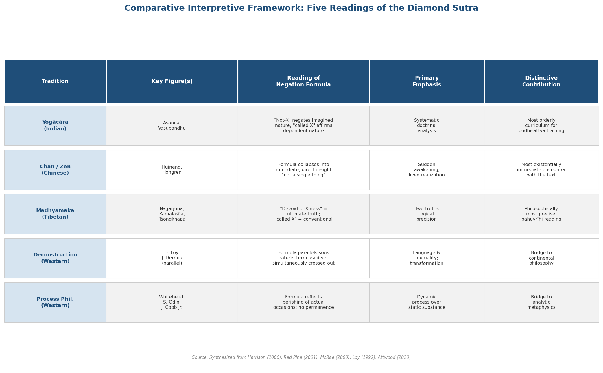

*Figure 3-2. Five major interpretive traditions compared across key figures, reading of the negation formula, primary philosophical emphasis, and distinctive contribution.*

The core distinctions may be summarized as follows:

- **Yogācāra (Vasubandhu)**: The formula maps onto three natures. "Not-X" negates the *imagined*; "called X" affirms the *dependent*. The perfected nature is the correct seeing of the other two.
- **Chan/Zen (Huineng)**: The formula points beyond all conceptual mediation to direct, sudden realization. Huineng's verse — "Fundamentally there is not a single thing" — collapses the formula into immediate insight.
- **Madhyamaka (Tibetan)**: The formula enacts two truths. "Devoid-of-X-ness" is the ultimate truth; "called X" is the conventional truth. Both are preserved without reduction.
- **Deconstruction (Loy)**: The formula parallels *sous rature*. Language is used and simultaneously undermined, but — unlike Derrida — the sutra aims to transform the user, not merely the text.
- **Process philosophy (Whitehead)**: The formula reflects the perishing of actual occasions. Nothing has permanent self-nature because reality is constituted by process, not substance.

These represent not competing errors but complementary angles of approach, each illuminating a different facet of the sutra's negation logic. The Yogācāra reading offers the most systematic doctrinal architecture. The Chan reading offers the most existentially immediate encounter. The Madhyamaka reading offers the most logically precise formulation. The Western parallels offer the most productive bridges to non-Buddhist philosophical discourse.

Harrison's philological contribution — demonstrating that the Tibetan *bahuvrīhi* reading is grammatically closer to the original Sanskrit — does not "refute" the Chinese Chan reading so much as reveal that the Chinese tradition, by following the *karmadhāraya*, developed a distinctive philosophical trajectory of its own. The Chan tradition's emphasis on paradox and sudden insight was enabled precisely by the starker "A is not A" formulation. The loss of the *bahuvrīhi* nuance in Chinese represents, from a Madhyamaka perspective, a grammatical imprecision; from a Chan perspective, a creative intensification.

This comparative lens is essential for what follows. When Chapter 4 applies the Diamond Sutra to emotional well-being, it draws primarily on the Chan emphasis on non-abiding mind and the Madhyamaka framework for decentering fixed concepts. When Chapter 5 addresses workplace ethics, the Yogācāra distinction between imagined and dependent natures illuminates how professional roles can be fully inhabited without being reified. When Chapters 6 and 7 explore relationships and social life, the bodhisattva paradox — serve all beings while recognizing no being is ultimately "saved" — requires both Madhyamaka precision and Chan wholeheartedness. The interpretive traditions surveyed here are not background knowledge; they are the active philosophical instruments through which the Diamond Sutra's ancient negation formula becomes a tool for navigating contemporary life.

# 第4章 Everyday Life and Emotional Well-Being

The Diamond Sutra was not composed as a therapeutic manual. Its concern is soteriological — the liberation of all sentient beings through the perfection of wisdom. Yet the teachings examined in Chapter 2 — the negation formula, the four marks of self, non-abiding generosity, and the nine closing similes — address the root mechanisms of psychological suffering with a precision that contemporary clinical research has only recently begun to articulate. This chapter traces how the sutra's philosophical framework translates into practical principles for daily emotional life: managing stress and anxiety, dissolving rigid self-narratives, and cultivating a mode of emotional engagement that is neither suppressive nor reactive.

The connection is not merely analogical. As the interpretive traditions surveyed in Chapter 3 demonstrate, Chan practitioners from Huineng onward treated the Diamond Sutra as a lived practice text, its phrases — especially §10's "non-abiding mind" — serving as direct instructions for navigating the turbulence of ordinary experience. The convergence between contemplative Buddhism and empirical psychology over the past three decades has produced a substantial body of evidence indicating that the cognitive operations the sutra prescribes — decentering from thoughts, releasing attachment to fixed self-concepts, recognizing the constructed nature of emotional experience — correspond closely to the mechanisms through which effective psychological interventions produce measurable change.

## 4.1 The Non-Abiding Mind as Emotional Regulation

The phrase that triggered Huineng's awakening — 應無所住而生其心, rendered by Thich Nhat Hanh as "they should give rise to an intention with their minds not dwelling anywhere" — encapsulates the sutra's core instruction for engaging with emotional experience [Thich Nhat Hanh, *The Diamond That Cuts Through Illusion*](https://plumvillage.org/library/sutras/the-diamond-that-cuts-through-illusion "Thich Nhat Hanh's translation, §10"). The passage (§10) does not instruct practitioners to suppress emotion or withdraw from engagement. Its target is *abiding* (住; Skt. *pratiṣṭhita*) — the cognitive operation by which a passing emotional state is solidified into a permanent condition, a fleeting thought mistaken for a fixed truth about one's identity.

In ordinary emotional life, this solidification operates continuously. A moment of anxiety becomes "I am an anxious person." A flash of anger hardens into "I am someone who has been wronged." A period of sadness congeals into "I am broken." The sutra's instruction intervenes at the pivot point of this sequence: *experience the emotion fully* (generate the mind; 生其心), but *do not allow it to take up permanent residence* (without abiding; 無所住). The result is not emotional flatness but emotional fluidity — the capacity to respond to each situation as it arises without carrying forward the accumulated weight of reified experience.

The Chan tradition recognized this as a transformative practical instruction rather than an abstract philosophical claim. As discussed in Chapter 3, Hongren's shift from the *Laṅkāvatāra Sūtra* to the Diamond Sutra as Chan's principal text reflected this pragmatic emphasis: the Diamond Sutra offered not a theory of mind but a method for liberating the mind from its own fixations in real time.

## 4.2 Deconstructing the Self-Narrative: The Four Marks in Psychological Context

The sutra's systematic negation of the four marks — self (*ātma-saṃjñā*), person (*pudgala-saṃjñā*), sentient being (*sattva-saṃjñā*), and life-span (*jīva-saṃjñā*) — maps onto a central concern of contemporary clinical psychology: the role of rigid self-narratives in perpetuating emotional suffering.

Cognitive behavioral therapy (CBT), acceptance and commitment therapy (ACT), and mindfulness-based approaches converge on the recognition that psychological distress is maintained not by events themselves but by the stories constructed around those events — and especially by the degree to which those stories fuse with one's sense of identity. The Diamond Sutra's four marks represent four registers at which such fusion operates. The *ātma-saṃjñā* (self-concept) constitutes the narrative core: "I am this kind of person." The *pudgala-saṃjñā* (person-concept) extends to social role: "I am a responsible parent," "I am a failure." The *sattva-saṃjñā* (being-concept) fixes one within a category of essential difference: "I am fundamentally unlike those who succeed." The *jīva-saṃjñā* (life-span concept) projects permanence onto the whole: "I have always been this way and always will be."

In §3, the sutra declares that "anybody to whom the idea of a living being occurs… should not be called a bodhisattva" [Paul Harrison 2006, §3](https://static1.squarespace.com/static/5c03ced75ffd204418037b7a/t/5c5306ce575d1f9230da8a6a/1548945103490/Diamond+Sutra-Paul+Harrison+tr.pdf "Harrison 2006, p. 142"). By §14c, even these categories are declared "idealess" (*asaṃjñā*). The progression models a complete disassembly of narrative self-construction — not to produce a void but to restore flexibility. Without the four marks, one can respond to circumstances as they actually present themselves rather than as one's narrative demands they be.

Thich Nhat Hanh translates this principle into practice with characteristic directness: "We are made of animals, vegetables, and minerals. If we see this, we can see our Interbeing with the planet." The four marks dissolve not into nihilism but into what he terms "interbeing" — the recognition that the boundaries marking off a separate self are conventional, useful, and ultimately empty [Thich Nhat Hanh, "Free from Notions: The Diamond Sutra," Plum Village, 2011](https://plumvillage.org/library/dharma-talks/free-from-notions-the-diamond-sutra "100-minute dharma talk at Deer Park Monastery").

## 4.3 Cognitive Defusion and the Negation Formula

The structural parallel between the Diamond Sutra's negation formula and the clinical technique of "cognitive defusion" in acceptance and commitment therapy (ACT) is sufficiently pronounced that ACT's principal architect has acknowledged it. Steven C. Hayes (2002) explicitly traced ACT's philosophical roots to Buddhist philosophy, observing that the therapeutic goal of creating distance between the self and its thoughts mirrors the Buddhist insight that mental formations are not identical with the one who observes them [Hayes, *Cognitive and Behavioral Practice* 9(1), 2002](https://psycnet.apa.org/record/2002-01916-009 "Hayes 2002, linking ACT to Buddhist philosophy").

The logic of the negation formula, applied to an anxious thought, yields: "This anxiety is not anxiety, therefore it is called anxiety." Under Harrison's *bahuvrīhi* reading (see Chapter 2), the middle term signifies "devoid of anxiety-ness" — the experience arises through causes and conditions, functions conventionally as what language labels "anxiety," but possesses no inherent, fixed, self-existing "anxiety nature." The anxious feeling is not denied; it is desubstantialized. It remains available for engagement, yet it has lost its apparent solidity — its implicit claim to define the person who experiences it.

This operation corresponds precisely to what ACT terms "defusion": the separation of the observing self from the content of thought, such that "I am anxious" is recast as "I am noticing a thought called 'anxious.'" Kenneth Fung (2015) confirmed that ACT's concept of "self-as-context" — a stable point of observation distinct from the stream of mental content — is structurally analogous to the Buddhist doctrine of *anātman* (not-self) [Fung, *Transcultural Psychiatry* 52(4), 2015](https://pubmed.ncbi.nlm.nih.gov/25085722/ "Fung 2015"). The Diamond Sutra, however, extends further than standard ACT practice: it applies the negation formula not only to the self but to the "context" itself, to the teaching, and ultimately to every conceivable resting-place for the mind.

## 4.4 Decentering: The Clinical Evidence

The cognitive operation that the Diamond Sutra's negation formula performs on emotional experience has been studied under the clinical label "decentering" — the capacity to observe thoughts and feelings as transient mental events rather than direct reflections of reality or identity. A growing body of evidence identifies decentering as a core mechanism of therapeutic change across multiple treatment modalities.

In a landmark randomized controlled trial, Teasdale et al. (2002) demonstrated that mindfulness-based cognitive therapy (MBCT) reduced depressive relapse by cultivating "metacognitive awareness" — the ability to experience negative thoughts as passing mental events rather than as truths about the self. Among patients with three or more previous depressive episodes, MBCT reduced relapse rates from 78% to 36% over the 60-week study period [Teasdale et al., *Journal of Consulting and Clinical Psychology* 70(2), 2002](https://pubmed.ncbi.nlm.nih.gov/11952186/ "Teasdale et al. 2002 RCT on metacognitive awareness"). The mechanism is instructive: what changed was not the frequency of negative thoughts but the *relationship* to those thoughts — a shift from "I am worthless" to "there is a thought of worthlessness arising." The Diamond Sutra's negation formula ("worthlessness is not worthlessness, therefore it is called worthlessness") enacts precisely this cognitive repositioning.

Bennett et al. (2021) consolidated the evidence in a comprehensive review establishing decentering as a "core component" cutting across CBT, ACT, and MBCT. They reported medium-to-large effect sizes (Cohen's *d* = 0.6–1.85) for decentering interventions and, critically, demonstrated temporal mediation: improvements in decentering *preceded* reductions in clinical symptoms, supporting a causal rather than merely correlational relationship [Bennett et al., *Translational Psychiatry* 11, 2021](https://www.nature.com/articles/s41398-021-01397-5 "Bennett et al. 2021 comprehensive review").

Soler et al. (2021) advanced the analysis through bifactor modeling with a sample of 608 participants. Acceptance, decentering, and non-attachment loaded onto a single latent factor the researchers termed "Delusion of Me" — a label deliberately echoing Buddhist phenomenology. This unified factor correlated strongly with resilience (β = 0.81) and inversely with depression (β = −0.55) [Soler et al., *Frontiers in Psychiatry* 12, 2021](https://pmc.ncbi.nlm.nih.gov/articles/PMC8637104/ "Soler et al. 2021, bifactor analysis, N=608"). The finding carries particular significance because it suggests that the Diamond Sutra's apparently distinct teachings — non-attachment, negation of self-marks, recognition of the constructed nature of experience — may constitute a single underlying psychological operation rather than disparate techniques.

## 4.5 Non-Attachment as Measurable Construct

The Diamond Sutra's teaching on non-attachment is not a prescription for indifference. The sutra's term *apratisthita* (non-abiding; 无所住) describes a way of relating to experience that is fully engaged yet unclenched — present to what arises without grasping at it or pushing it away. Pema Chödrön, drawing on the Prajñāpāramitā tradition, articulates this orientation: "'Nothing to hold on to' is the root of happiness" (*When Things Fall Apart*, 1997). Groundlessness — the experiential correlate of śūnyatā — functions not as existential despair but as the precondition for emotional freedom. When no fixed position requires defense, nothing can be threatened; when no reified self demands protection, vulnerability becomes a resource rather than a liability.

Empirical psychology has begun to operationalize this construct with precision. Sahdra et al. (2010) developed the Non-Attachment Scale (NAS), defining non-attachment as "a flexible, balanced way of relating to one's experiences without clinging to or suppressing them." Across multiple validation studies, NAS scores were positively associated with subjective well-being and negatively associated with depression. Critically, non-attachment predicted psychological outcomes *beyond* what mindfulness measures alone could account for [Sahdra et al., *Journal of Personality Assessment* 92(2), 2010](https://www.researchgate.net/publication/41429946_A_Scale_to_Measure_Nonattachment "Sahdra et al. 2010, NAS development"). This incremental validity is important because it indicates that the Diamond Sutra's emphasis on non-attachment identifies a dimension of psychological health related to but distinct from the bare attention emphasized in much secular mindfulness discourse.

Van Gordon et al. (2019) tested a meditation protocol specifically focused on emptiness — the philosophical core of the Diamond Sutra — with a sample of 25 advanced meditators in a controlled crossover design. Compared to a mindfulness control condition, emptiness meditation produced a 24% further reduction in negative emotions and a 10% reduction in attachment to self [Van Gordon et al., *Explore* 15(4), 2019](https://pubmed.ncbi.nlm.nih.gov/30660506/ "Van Gordon et al. 2019, emptiness meditation study"). The sample is small and the population specialized, but the finding provides preliminary evidence that contemplating the kind of emptiness the Diamond Sutra enacts may confer emotional benefits distinct from those of general mindfulness practice.

## 4.6 The Nine Similes as Contemplative Framework for Emotional Experience

The sutra's closing verse (§32b) offers nine similes for conditioned existence:

> *As a star, a defect of vision, a lamp,*
> *An illusion, a dewdrop, a bubble,*
> *A dream, a lightning flash, a thunder cloud —*
> *View all conditioned things like this.*
>
> — [Paul Harrison 2006, §32b](https://static1.squarespace.com/static/5c03ced75ffd204418037b7a/t/5c5306ce575d1f9230da8a6a/1548945103490/Diamond+Sutra-Paul+Harrison+tr.pdf "Harrison 2006, p. 158")

These nine images are not a poetic flourish appended to the sutra's philosophical argument; they constitute a systematic contemplative toolkit for reframing emotional experience. Khensur Jampa Tegchok provides detailed analysis in which each simile illuminates a different facet of how conditioned phenomena — including emotional states — arise and function [Khensur Jampa Tegchok, *Insight into Emptiness*](https://shantidevanyc.org/wp-content/uploads/2023/11/Similes-from-the-Vajra-Cutter-Sutra-Khensur-Jampa-Tegchok.pdf "Tegchok on the nine similes").

The **dewdrop** illustrates impermanence at the most intimate scale: intense emotions, like dew on a morning leaf, are real while they last and vanish without remainder. The **dream** addresses the gap between appearance and reality: emotions present themselves as substantive truths about the world ("everything is hopeless," "I am unlovable"), yet under investigation they possess no more inherent reality than dream-objects. The **lightning flash** captures momentariness: a surge of anger illuminates the experiential field with startling intensity but dissipates before its essence can be located — by the time one searches for it, it has already passed. The **bubble** suggests fragility: what appears solid and pressing (a crisis of self-confidence, a wave of grief) is sustained only by the temporary convergence of conditions and dissolves when those conditions shift.

The similes do not counsel suppression. The star is real — it shines, it navigates ships. The lamp illuminates. The thunder cloud delivers rain. Conditioned phenomena *function*. The force of the similes lies not in denying the reality of emotional experience but in revealing its nature: dependently arisen, impermanent, and empty of the solidity it appears to possess. To "view all conditioned things like this" is to meet each emotional state with the recognition that it will arise, function, and pass — and that one's fundamental well-being does not depend on its content.

## 4.7 Against Spiritual Bypassing: Non-Attachment Is Not Withdrawal

A persistent misunderstanding — one the Diamond Sutra itself anticipates — holds that non-attachment entails emotional disengagement, numbness, or refusal to care. The sutra addresses this directly. In Thich Nhat Hanh's rendering of §27: "Do not think that when one gives rise to the highest awakened mind, one needs to see all objects of mind as nonexistent, cut off from life" [Thich Nhat Hanh, *The Diamond That Cuts Through Illusion*](https://plumvillage.org/library/sutras/the-diamond-that-cuts-through-illusion "Anti-nihilism passage, §27"). The passage constitutes an explicit rejection of nihilistic withdrawal — the "annihilationist" (*uccheda*) interpretation that the sutra's own tradition recognizes as the primary misreading of emptiness.

The distinction is structurally embedded in the negation formula itself. "Anxiety is not anxiety, therefore it is called anxiety" does not mean "anxiety does not exist" or "one should not feel anxiety." It means anxiety is empty of inherent, fixed, self-existing nature — and precisely *because* it is empty, it functions, it arises in dependence on conditions, and it can be named, recognized, and engaged with. The formula preserves the conventional reality of emotional experience while stripping away its apparent metaphysical weight. What is released is not the feeling but the *identification* — the collapse of "an anxious feeling is present" into "I am an anxious person."

Pema Chödrön draws the distinction with precision: the point is not to achieve a state free from discomfort but to develop "the ability to relax with the uncertainty of the present moment — without reaching for anything to protect ourselves" (*Living Beautifully*, 2012). The bodhisattva of §3 aspires to liberate all beings from suffering — maximal emotional engagement, not withdrawal. The paradox is that such engagement becomes possible precisely through release of the four marks: without a fixed self to protect, one can afford to remain present to the full intensity of experience.

The practical implications for daily application are considerable. Non-abiding does not mean failing to grieve a loss — it means grieving without the additional suffering generated by "I should not still be feeling this" or "This proves I will never recover." It does not mean suppressing anger — it means experiencing anger without the compounding narrative that "This is who I am" or "This person has permanently wronged my essential self." The sutra's teaching consistently targets the *second arrow* — the conceptual elaboration layered onto raw experience — rather than the first.

## 4.8 Stress, Impermanence, and the Three Times

Section 18 of the Diamond Sutra offers a teaching with direct relevance to stress and rumination: "A past thought cannot be found, a present thought cannot be found, a future thought cannot be found" (過去心不可得，現在心不可得，未來心不可得). Red Pine observes that this passage dismantles the temporal scaffolding on which anxiety characteristically depends [Red Pine 2001](https://bodhibass.com/wp-content/uploads/2018/11/diamond-sutra.pdf "Red Pine, Chapter Eighteen"). Stress is overwhelmingly a phenomenon of temporal displacement: rumination fixates on the past (what went wrong, what should have been different), while anxiety projects into the future (what might happen, what must be prevented). The present moment — where action is actually possible — receives the least sustained attention.

The sutra's claim is not that past and future are unreal in a naive sense; causation operates, consequences follow actions, planning retains its value. The claim is that the *mind* attempting to locate itself in past or future "cannot be found." The mind that ruminates about yesterday's failure is not yesterday's mind — it is a present-moment construction projecting backward. The mind that worries about tomorrow's presentation is not tomorrow's mind — it is a present-moment construction projecting forward. Recognizing this does not abolish memory or planning; it restores them to their proper status as present-moment activities rather than portals into fixed realities.

This analysis converges with findings documented across the MBCT literature, where the mechanism of change in effective stress-reduction programs is not the elimination of negative thoughts but the *transformation of one's relationship* to those thoughts. MBCT's instruction to observe thoughts as "mental events" rather than facts closely parallels §18's teaching that no thought in any temporal direction can be "found" (得; Skt. *upalabhyate*) — that is, grasped as a solid, abiding entity.

## 4.9 Integration: A Diamond Sutra Framework for Emotional Well-Being

The teachings examined in this chapter do not constitute a self-help program. They constitute a philosophical framework whose practical consequences have been corroborated, in significant part, by empirical investigation. Several convergent principles emerge.

**Non-abiding engagement.** Meet each emotional experience fully, without solidifying it into identity. The instruction of §10 — generate the mind without dwelling — functions as a moment-by-moment orientation toward emotional life, permitting intense feeling without the compounding suffering of reification.

**Release of the four marks.** Recognize that self-narratives ("I am anxious," "I am a failure," "I have always been this way") are conventional designations, not fixed truths. The sutra's progressive negation — from self-concept through person-concept to life-span concept — models a systematic loosening of narrative rigidity. The clinical literature confirms that this loosening (decentering, defusion) operates as a primary mechanism of therapeutic change, with effect sizes ranging from medium to large (Cohen's *d* = 0.6–1.85) across multiple treatment modalities [Bennett et al., *Translational Psychiatry* 11, 2021](https://www.nature.com/articles/s41398-021-01397-5 "Bennett et al. 2021").

**The negation formula as cognitive practice.** Applied to any reified emotional state — "this depression is not depression, therefore it is called depression" — the formula desubstantializes the experience without denying it. It preserves the conventional reality of the emotion while dissolving its claim to inherent, permanent existence. This structural operation underlies both ACT's defusion technique and MBCT's metacognitive awareness training.

**The nine similes as daily contemplation.** The closing verse's images — star, defect of vision, lamp, illusion, dewdrop, bubble, dream, lightning flash, thunder cloud — supply a portable contemplative vocabulary for relating to the arising and passing of emotional states. Each simile foregrounds a different aspect of conditioned experience: impermanence, dependence on conditions, the gap between appearance and reality, momentariness.

**Non-attachment without detachment.** The sutra explicitly guards against nihilistic withdrawal (§27). Non-attachment is not the absence of caring but the presence of caring without clinging — a "flexible, balanced way of relating to one's experiences" that empirical research associates with well-being outcomes beyond those predicted by mindfulness alone [Sahdra et al., *Journal of Personality Assessment* 92(2), 2010](https://www.researchgate.net/publication/41429946_A_Scale_to_Measure_Nonattachment "Sahdra et al. 2010").

The Diamond Sutra does not promise the elimination of suffering. It holds — and the evidence increasingly supports — that the *relationship* to suffering can be fundamentally transformed. When emotional experiences are met with the recognition that they are dependently arisen, empty of fixed self-nature, and incapable of defining the one who experiences them, the secondary elaboration that converts ordinary pain into sustained anguish loses its grip. What remains is the capacity to respond — fully, appropriately, and without residue.

# 第5章 Workplace, Career, and Business Ethics

The Diamond Sutra emerged from a monastic dialogue between the Buddha and Subhūti at Jetavana Grove — a setting far removed from quarterly earnings reports and organizational charts. Yet the teachings examined in Chapter 2 — the negation formula, non-abiding generosity, the raft analogy, the deconstruction of the four marks — address the deep structures of motivation, identity, and purpose that shape professional life. The question this chapter investigates is not whether ancient Buddhist philosophy can be retrofitted onto modern management theory, but whether the sutra's analysis of clinging, identity, and selfless action illuminates persistent problems in workplace ethics that conventional professional frameworks leave unresolved: burnout driven by attachment to outcomes, leadership rigidity rooted in reified role identities, strategic paralysis from clinging to past successes, and the erosion of meaning that results from reducing work to a transaction between labor and compensation.

Several intellectual bridges connect the sutra's teachings to contemporary professional contexts. Payutto's distinction between *taṇhā* and *chanda* gives non-attachment a precise economic vocabulary. Schumacher's "Buddhist Economics" established the framework for treating work as a site of human development rather than a cost to be minimized. And empirical research — from qualitative studies of Buddhist business leaders to population-level data on non-attachment and workplace flourishing — provides evidence that the sutra's principles are not aspirational abstractions but measurable psychological orientations with demonstrable effects on professional well-being and organizational performance.

## 5.1 Leadership Without Fixed Identity: The Negation Formula at Work

The Diamond Sutra's signature formula — "X has been preached by the Tathāgata as a-X, therefore it is called X" — appears at least thirty times throughout the text, systematically applied to dharmas, Buddhahood, merit, and the teaching itself [Paul Harrison 2006](https://static1.squarespace.com/static/5c03ced75ffd204418037b7a/t/5c5306ce575d1f9230da8a6a/1548945103490/Diamond+Sutra-Paul+Harrison+tr.pdf "Harrison 2006, pp. 136–140"). Applied to professional roles, the formula yields a principle that is paradoxical only on the surface: a leader exercises authority most effectively precisely when that authority is not fused with personal identity.

The formula's logic, extended to a CEO, runs: "A leader is not a leader, therefore called a leader." Under the *bahuvrīhi* reading that Harrison argues is "more cogent philosophically," the middle term means "devoid of intrinsic leader-nature." The role arises through causes and conditions — organizational structure, team trust, situational demands — and functions conventionally as what we designate "leadership," yet it possesses no permanent, inherent essence that defines the person occupying it. The individual who recognizes this can adapt fluidly: stepping forward when the situation demands initiative, stepping back when it requires listening, without the existential threat that such flexibility poses to someone whose self-worth is anchored in the identity "I am the leader."

In §14c, the sutra extends this deconstruction to the four marks themselves: "Any such idea of a self is indeed idealess, any idea of a living being, idea of a soul, or idea of a person is indeed idealess" [Paul Harrison 2006, §14c](https://static1.squarespace.com/static/5c03ced75ffd204418037b7a/t/5c5306ce575d1f9230da8a6a/1548945103490/Diamond+Sutra-Paul+Harrison+tr.pdf "Harrison 2006, p. 149"). For a manager or executive, clinging to "I am the expert," "I am the authority," or "I am the innovator" constitutes precisely the kind of fixed self-concept (*ātma-saṃjñā*) the sutra warns against. The teaching does not ask leaders to abdicate responsibility; it asks them to hold the role without the role holding them — to exercise authority as a function rather than an essence, a response to conditions rather than a permanent attribute of selfhood.

### Empirical Evidence: Self-Decentralization in Leadership

This principle finds empirical grounding in Vu and Burton's (2021) qualitative study of 53 Buddhist leader-practitioners across 28 organizations in Vietnam, spanning multiple industries and organizational sizes. The researchers found that Buddhist leaders interpret and operationalize what they term "self-decentralization" — grounded in Buddhist emptiness theory — as a practical form of moral reasoning in daily managerial decisions. One CEO stated: "No one can be right all the time. Non-self teaches me exactly that. No good leadership can be sustained in isolation. Thinking you are right all the time is definitely a cause of suffering" [Vu & Burton, *Journal of Business Ethics* 178, 2021](https://pmc.ncbi.nlm.nih.gov/articles/PMC8556827/ "Vu & Burton 2021, N=53 Buddhist leader-practitioners in Vietnamese organizations").

The study identified two mechanisms through which Buddhist leaders navigate the tension between non-ego and organizational effectiveness. The first is *Skillful Means* (*upāya*) — the context-sensitive application of non-self, recognizing that Buddhist practice in professional settings functions as an adaptive orientation rather than a rigid formula. The second is the *Middle Way* — balancing self-decentralization against legitimate organizational expectations to avoid both ego-centrism and self-abnegation. One participant articulated this balance: "Balancing your own and others' expectations is very important. It is called the Middle Way. Without such a balance, you only end up fulfilling your own imagination of your 'self' … or promoting the 'self' that others expect to see from you" [Vu & Burton 2021](https://pmc.ncbi.nlm.nih.gov/articles/PMC8556827/ "Vu & Burton 2021, Skillful Means and the Middle Way in Buddhist leadership").

The study also documented substantive tensions. Leaders who practice self-decentralization report vulnerability to exploitation, perceived exclusion when peers do not share their values, and the temptation to recenter the ego as an "enlightened" leader — a subtle form of spiritual ego. One respondent observed: "Non-self can be an easy target for others as well. If people do not understand why you are sacrificing things, especially other shareholders, they just exclude you gently step by step from important meetings" [Vu & Burton 2021](https://pmc.ncbi.nlm.nih.gov/articles/PMC8556827/ "Vu & Burton 2021, tensions and vulnerabilities of self-decentralization"). The Diamond Sutra anticipates this risk: the bodhisattva vow (§3) demands compassionate action while the negation formula (§17a) deconstructs even the identity of "one who has set out on the bodhisattva path." The selfless leader who builds a new identity around selflessness has merely replaced one form of clinging with another.

## 5.2 Purposeful Striving Without Craving: Taṇhā, Chanda, and the Nature of Ambition

The most common objection to applying non-attachment in professional contexts is that it appears incompatible with ambition, drive, and competitive excellence. If one is not attached to outcomes, why strive at all? The Diamond Sutra does not address this question in the language of modern motivation theory, but the Theravāda scholar-monk P. A. Payutto provides a framework that maps the sutra's principles onto a precise distinction between two fundamentally different kinds of desire.

In *Buddhist Economics: A Middle Way for the Market Place* (1992; rev. 2016), Payutto distinguishes *taṇhā* (craving for pleasurable experience and things that feed the sense of self) from *chanda* (desire for true well-being and genuine excellence). The distinction is not between desire and its absence but between desire aimed at ego-gratification and desire aimed at intrinsic quality:

> Work in the Buddhist sense, performed in order to meet the desire for well-being, can give a constant satisfaction. People are able to enjoy their work. In Buddhist terminology it is referred to working with *chanda*. But work with the desire for some pleasure or other is called working with *taṇhā*. People working with *taṇhā* have the desire to consume, so that while still working (and thus not yet consuming) they experience no satisfaction, and so are unable to enjoy their work. [P. A. Payutto, *Buddhist Economics*, 2016](https://www.watnyanaves.net/uploads/File/books/pdf/buddhist_economics.pdf "Payutto 2016, pp. 22–24")

The implications for professional life are substantial. A software engineer working with *chanda* finds satisfaction in crafting elegant code — the work itself is meaningful. The same engineer working with *taṇhā* views coding as an instrument for acquiring a promotion, a salary increase, or a reputation — and experiences the coding itself as merely tolerable, a cost paid for future consumption. The Diamond Sutra's non-attachment targets *taṇhā*, not *chanda*. Its teaching is not the elimination of ambition but its purification: from ego-serving craving to purpose-driven striving. Payutto is explicit: Buddhism "is not denying craving, but rather is looking towards transforming it as much as possible into the desire for well-being, and to make that desire for well-being lead to self-improvement" [P. A. Payutto 2016](https://www.watnyanaves.net/uploads/File/books/pdf/buddhist_economics.pdf "Payutto 2016, pp. 24–25").

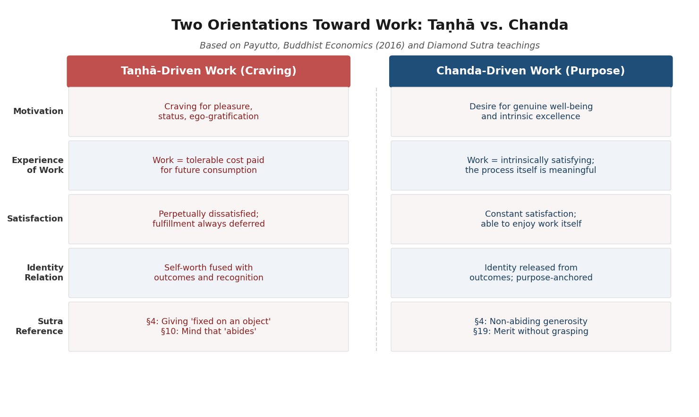

This framework reframes the relationship between non-attachment and professional excellence. The Diamond Sutra's merit-comparison passages (§§8, 11, 15a, 24, 32) assert that teaching even a four-line verse generates more merit than filling world-systems with treasures — a clear endorsement of purposeful contribution. Yet the sutra simultaneously deconstructs merit itself: "A body of merit … is spoken of by the Tathāgata as no body" (§19) [Paul Harrison 2006, §§8, 19](https://static1.squarespace.com/static/5c03ced75ffd204418037b7a/t/5c5306ce575d1f9230da8a6a/1548945103490/Diamond+Sutra-Paul+Harrison+tr.pdf "Harrison 2006, pp. 145–146"). The instruction is to do excellent work and generate real value, but not to grasp at the value generated as a possession of the self. The paradox resolves when one recognizes that *chanda*-driven work does not require the motivational fuel of attachment to outcomes — the work's intrinsic quality sustains the worker.

## 5.3 Work as Human Development: Schumacher's Buddhist Economics

The intellectual genealogy connecting the Diamond Sutra to modern workplace ethics passes through E. F. Schumacher's "Buddhist Economics" (Chapter 4 of *Small is Beautiful*, 1973), the foundational text that introduced Buddhist principles into Western economic discourse. Schumacher's starting point was the inclusion of Right Livelihood (*sammā ājīva*) in the Noble Eightfold Path — evidence that Buddhism has always regarded professional activity as an integral domain of ethical and spiritual life, not a morally neutral sphere governed by separate rules.

Schumacher identified three functions of work: "giving man a chance to utilize and develop his faculties; to enable him to overcome his ego-centredness by joining with other people in a common task; and to bring forth the goods and services needed for a becoming existence" [E. F. Schumacher, *Small is Beautiful*, Ch. 4, 1973](https://www.ditext.com/schumacher/small/1.html "Schumacher 1973, 'Buddhist Economics'"). The first function — development of faculties — aligns with Payutto's *chanda*: work as intrinsically fulfilling rather than merely instrumental. The second — overcoming ego-centredness through common tasks — directly parallels the Diamond Sutra's deconstruction of fixed self-concepts through engagement with others. The third — producing needed goods — grounds the teaching in material reality: non-attachment does not entail indifference to whether one's work serves genuine needs.

Schumacher drew a sharp contrast with Western economic orthodoxy: "The modern economist … has been brought up to consider 'labour' or work as little more than a necessary evil." He argued that "to organize work in such a manner that it becomes meaningless, boring, stultifying, or nerve-racking for the worker would be little short of criminal" [E. F. Schumacher 1973](https://www.ditext.com/schumacher/small/1.html "Schumacher 1973, Buddhist vs. Western attitudes to labor"). This critique resonates with the Diamond Sutra's ontological framework: phenomena function *because* they are empty of fixed essence. Work's meaning is not inherent in the job title or the task description — it arises through the conditions (intention, context, purpose, relationships) under which it is performed. A task that is meaningless under *taṇhā*-driven conditions becomes meaningful under *chanda*-driven conditions, not because the task has changed but because the orientation toward it has.

## 5.4 Non-Abiding Generosity in Professional Contexts

The Diamond Sutra's first substantive teaching (§4) addresses generosity (*dāna*): "A bodhisattva should not give a gift while fixing on an object" [Paul Harrison 2006, §4](https://static1.squarespace.com/static/5c03ced75ffd204418037b7a/t/5c5306ce575d1f9230da8a6a/1548945103490/Diamond+Sutra-Paul+Harrison+tr.pdf "Harrison 2006, pp. 143–144"). Harrison notes that the Sanskrit *nimitta* carries a double meaning — both "sense-object" and "motive" — so the bodhisattva's generosity is "absolutely fluid and free," unanchored to any particular recipient, occasion, or expected return. This principle of *apratisthita-dāna* (non-abiding generosity; 無住布施) bears directly on several professional practices.

**Mentoring without calculating reciprocity.** The transactional mentoring model — "I invest time in you, and you advance my network or reputation" — represents generosity "fixed on an object." Non-abiding mentoring invests in a junior colleague's development because development is intrinsically valuable, without tracking the return. Research on organizational citizenship behavior consistently shows that such non-transactional contributions generate stronger networks and greater trust precisely because they are not strategic.

**Knowledge sharing without fixation on credit.** In knowledge-intensive industries, hoarding information is a common power strategy. The sutra's teaching challenges this at the motivational level: the impulse to hoard arises from *ātma-saṃjñā* — the fixed self-concept that equates personal value with exclusive possession of expertise. When that identification is loosened, sharing becomes natural rather than threatening.

**Corporate social responsibility without self-congratulation.** The merit-comparison passages affirm that genuine contribution generates real value. Yet the negation formula applied to merit itself (§19) cautions against grasping at that value. CSR programs designed primarily to burnish corporate image represent generosity "fixed on a sign" — the sign being reputational benefit. The sutra's standard is more demanding: genuine ethical practice that does not fixate on the return. The verse in §26 — "Who looks for me in form / who seeks me in a voice / indulges in wasted effort" — applies here: evaluating generosity by its visible, outward form misses its substance [Paul Harrison 2006, §26](https://static1.squarespace.com/static/5c03ced75ffd204418037b7a/t/5c5306ce575d1f9230da8a6a/1548945103490/Diamond+Sutra-Paul+Harrison+tr.pdf "Harrison 2006, p. 155").

## 5.5 The Raft Analogy and Strategic Adaptation

The raft analogy (§6) is among the Diamond Sutra's most practically applicable teachings for business and career strategy: "Those who understand the round of teachings of the Simile of the Raft should let go of the dharmas themselves, to say nothing of the non-dharmas" [Paul Harrison 2006, §6](https://static1.squarespace.com/static/5c03ced75ffd204418037b7a/t/5c5306ce575d1f9230da8a6a/1548945103490/Diamond+Sutra-Paul+Harrison+tr.pdf "Harrison 2006, p. 144"). Drawing on the Pāli *Alagaddūpamasutta* (M.I.130–142), the passage uses the image of a raft constructed to cross a river: useful during the crossing, burdensome if carried overland afterward. Harrison notes the Sanskrit *udgrah-* means both "to grasp" and "to learn," yielding a deliberate double meaning: the teachings themselves are tools that must not become objects of attachment.

Applied to business strategy and organizational methodology, this teaching addresses a well-documented pathology: the persistence of strategies and frameworks long after the conditions that made them effective have changed. Business models, management frameworks (Agile, Lean, Six Sigma, OKRs), and organizational structures are means of "crossing" a particular competitive or operational situation. A company that clings to a once-successful strategy after market conditions have shifted is, in the sutra's terms, carrying the raft on its back. The technology sector offers abundant illustrations: companies that defined entire product categories yet failed to adapt when platforms shifted — not for lack of intelligence or resources, but because organizational identity had fused with method.

The raft analogy applies with equal force to individual career development. The expertise and approaches that served one professional phase should not be clung to when a new phase demands different capabilities. The Chan tradition's emphasis on "sudden" responsiveness — rooted in its Diamond Sutra interpretation — bears directly on this capacity: the ability to perceive present conditions clearly, unencumbered by attachment to what worked before.

## 5.6 Decision-Making Under Uncertainty: §18 and the Three Aspects of Vajra

§18 contains a passage with direct implications for strategic decision-making: "a past thought cannot be found, a present thought cannot be found, nor can a future thought be found" (Kumārajīva: 過去心不可得，現在心不可得，未來心不可得). The teaching that no fixed "mind" can be located in any temporal frame undercuts three common cognitive traps in professional contexts.

The first is *fixation on past successes*: "We've always done it this way" assumes a stable entity (the past strategy) that can be located and replicated. The sutra's teaching is that the conditions that produced past success have already changed — the "past thought" cannot be found because those conditions are no longer present. The second is *grasping at present circumstances as permanent*: "The market will always be like this" treats a momentary configuration as a fixed reality. The third is *treating future projections as certainties*: strategic plans built on the assumption that current trends will continue indefinitely represent precisely the kind of temporal fixation the sutra deconstructs.

The title metaphor itself — *vajra* (diamond/thunderbolt) — provides a complementary decision-making framework. Red Pine identifies three aspects of *vajra*: its ability to *cut* through all things, representing prajñā's (wisdom; 般若) capacity to slice through self-deception and sunk-cost fallacies; its power to *radiate light*, representing clarity of perception unclouded by ego-investment; and its *indestructibility*, representing the stability that arises from a decision-making process anchored in reality rather than in personal identity [Red Pine, *The Diamond Sutra*, 2001](https://bodhibass.com/wp-content/uploads/2018/11/diamond-sutra.pdf "Red Pine, Translator's Preface"). A decision made with vajra-like clarity cuts through attachment to what should have been, illuminates what actually is, and holds firm because it is not dependent on any single individual's ego.

## 5.7 Buddhist-Influenced Business Leadership: The Inamori Case

Kazuo Inamori (1932–2022), founder of Kyocera Corporation and KDDI, and chairman of Japan Airlines during its bankruptcy restructuring, represents the most prominent case of Buddhist-influenced business leadership at global scale. Ordained as a Zen Buddhist priest in 1997 at Enpuku-ji Temple in Kyoto (taking the monastic name Daiwa), Inamori developed a management philosophy he termed "Strategic Altruism" — the principle that ethical purpose and profitability are synergistic rather than opposed. His central decision-making question — "Is my motive truly good?" (*動機善なりや、私心なかりしか*) — directly parallels the Diamond Sutra's deconstruction of self-serving motivation and the *taṇhā*/*chanda* distinction [Prof. Keikoh Ryu, CoBS/Keio Business School, 2025](https://cobsinsights.org/2025/11/19/kazuo-inamori-how-a-buddhist-engineer-built-japans-most-ethical-management-system/ "Ryu on Inamori's Zen-informed management philosophy").

Inamori's Amoeba Management system — in which large organizations are divided into small, autonomous profit centers each responsible for its own profit-and-loss statement — operationalizes distributed responsibility without ego-centralized control. The system's philosophical foundation resonates with the sutra's deconstruction of the four marks: no single "self" (corporate headquarters, charismatic CEO) holds ultimate authority; leadership is distributed across nodes that respond to local conditions. When Inamori assumed the chairmanship of Japan Airlines in 2010 at age 77, accepting no salary, JAL reported a ¥188.4 billion operating profit within one year and re-listed on the Tokyo Stock Exchange by 2012. Prof. Keikoh Ryu (Keio Business School) describes Inamori's approach: "He believed that people are not merely rational actors but moral agents capable of cultivating a 'higher ego' (altruistic conscience) over a 'lower ego' (selfish desire)" [Prof. Keikoh Ryu, CoBS Insights, 2025](https://cobsinsights.org/2025/11/19/kazuo-inamori-how-a-buddhist-engineer-built-japans-most-ethical-management-system/ "Ryu on JAL turnaround and Amoeba Management").

The Inamori case illustrates rather than proves the Diamond Sutra's applicability — his Buddhism was broadly Zen rather than specifically Diamond Sutra–focused, and the JAL turnaround involved multiple conventional business factors alongside philosophical orientation. The value of the example lies in demonstrating that the sutra's principles of non-self-serving motivation, distributed authority, and purpose-driven striving are not incompatible with commercial success at the highest levels but may be structurally advantageous.

## 5.8 Non-Attachment and Workplace Well-Being: Empirical Findings

The psychological research surveyed in Chapter 4 — on decentering, cognitive defusion, and the Non-Attachment Scale — extends directly into workplace contexts. The most substantial evidence comes from Tsoi, Tong, and Mak (2022), who used structural equation modeling to examine the relationship between dispositional non-attachment and workplace well-being in a sample of 1,008 working adults in Hong Kong. Non-attachment (measured by the Non-Attachment Scale-Short Form) was positively associated with flourishing (β = 0.477, p < .001) and negatively related to depression and anxiety symptoms (β = −0.291, p < .001). The model accounted for 50% of variance in flourishing and 20.7% of variance in depressive/anxiety symptoms [Tsoi, Tong, & Mak, *Mindfulness* 13(10), 2022](https://pmc.ncbi.nlm.nih.gov/articles/PMC9441328/ "Tsoi et al. 2022, N=1,008 working adults in Hong Kong").

The study's most revealing finding concerned the mediating role of perceived control and supervisor support. Non-attachment predisposed workers to perceive greater agency at work and stronger interpersonal relationships — "letting go," paradoxically, fostered a greater sense of control. The authors noted that "nonattachment entails nonclinging to work arrangements and events at work and work outcomes, as well as the sense of self of being a certain kind of worker or being" — language that directly echoes the Diamond Sutra's systematic negation of fixed role identities [Tsoi, Tong, & Mak 2022](https://pmc.ncbi.nlm.nih.gov/articles/PMC9441328/ "Tsoi et al. 2022, mediation by perceived control and supervisor support"). Employees high in non-attachment were less reactive to workplace stressors, less likely to hold grudges, and more capable of perceiving situations without the distorting lens of unmet expectations.

Earlier work by Pande and Naidu (1992) had established a foundational finding: employees high in *anāsakti* (non-attachment, drawn from the Bhagavad Gita's concept but closely paralleling the Diamond Sutra's *apratisthita*) experienced significantly less distress and better mental health than those low in non-attachment, *despite experiencing comparable frequencies of stressful life events* [cited in Tsoi et al. 2022, referencing Pande & Naidu, *Psychology and Developing Societies* 4(1), 1992](https://pmc.ncbi.nlm.nih.gov/articles/PMC9441328/ "Pande & Naidu 1992, cited in Tsoi et al. 2022"). This finding captures the Diamond Sutra's central insight in empirical form: non-attachment does not change external circumstances but fundamentally alters one's relationship to them. The stressful event remains; what changes is the absence of a solidified self that the event threatens.

The cross-sectional design of these studies limits causal inference, and no randomized controlled trial has yet tested a specifically non-attachment-focused intervention (as distinct from generic mindfulness) for workplace outcomes. The existing evidence is nonetheless consistent with the sutra's prediction: releasing fixed self-concepts and outcome-attachment does not diminish professional engagement but may enhance the psychological conditions that sustain it.

## 5.9 Burnout Prevention Through Non-Clinging

Burnout — the syndrome comprising emotional exhaustion, depersonalization, and reduced personal accomplishment (Maslach & Jackson, 1981) — is among the most prevalent occupational health problems in contemporary professional life. A systematic review by Luken and Sammons (2016) evaluated eight RCTs on mindfulness practice for reducing job burnout: six of the eight demonstrated statistically significant decreases in burnout after mindfulness training, with seven of the eight studies rated fair-to-good quality on the PEDro scale. The populations studied included healthcare professionals and teachers — occupations defined by sustained interpersonal engagement and high emotional demand. The authors concluded that "there is strong evidence for the use of mindfulness practice to reduce job burnout" [Luken & Sammons, *American Journal of Occupational Therapy* 70(2), 2016](https://pmc.ncbi.nlm.nih.gov/articles/PMC4776732/ "Luken & Sammons 2016, systematic review of 8 RCTs on mindfulness and burnout").

The Diamond Sutra's teachings map onto each of Maslach's three burnout dimensions with structural precision. *Emotional exhaustion* arises from chronic over-investment of emotional energy in outcomes over which one has limited control — a direct manifestation of the "abiding" (住) that §10 addresses. The non-abiding principle prescribes engagement without fixation: respond fully to the demands of the role, but do not allow each outcome to become a referendum on the self. *Depersonalization* — the cynical distancing from clients, students, or colleagues — can be understood as a defensive reaction to over-identification with the "helper" role. The sutra's negation of fixed role identities offers an alternative to both extremes: neither the exhausting fusion of self with role nor the corrosive detachment of cynicism, but a middle position in which the role is inhabited fully yet held lightly. *Reduced personal accomplishment* — the feeling that one's work no longer matters — stems from measuring self-worth against external recognition. The sutra's simultaneous affirmation and deconstruction of merit (§§8, 19, 28) teaches that work has value independent of whether it is recognized, rewarded, or reciprocated.

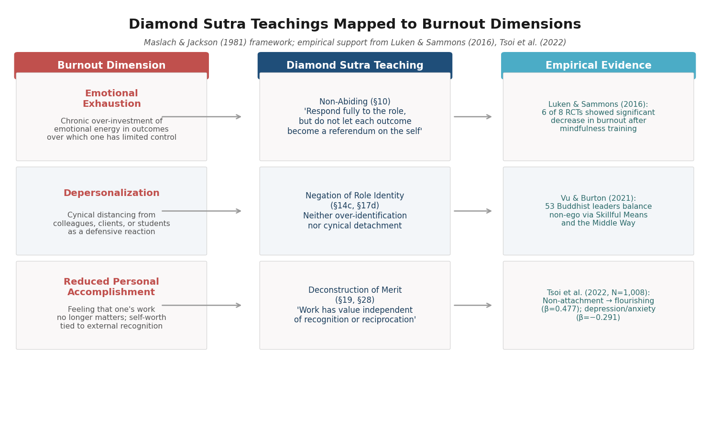

The closing verse (§32b) provides a contemplative framework directly applicable to workplace stress:

> A shooting star, a clouding of the sight, a lamp,
> An illusion, a drop of dew, a bubble,
> A dream, a lightning's flash, a thunder cloud —
> This is the way one should view what is conditioned.
> [Paul Harrison 2006, §32b](https://static1.squarespace.com/static/5c03ced75ffd204418037b7a/t/5c5306ce575d1f9230da8a6a/1548945103490/Diamond+Sutra-Paul+Harrison+tr.pdf "Harrison 2006, p. 158")

A difficult quarter, a failed project, a contentious superior, a restructuring — all are "conditioned" phenomena: dependently arisen, impermanent, and empty of the solidity they appear to possess. The nine similes do not counsel indifference to professional challenges but offer a perceptual framework in which those challenges are experienced as transient configurations of causes and conditions rather than permanent features of reality against which the self must struggle.

## 5.10 Toward a Diamond Sutra Ethics of Professional Life

The Diamond Sutra does not prescribe a management system, an organizational design, or a career strategy. Its contribution to workplace ethics is more fundamental: it provides a diagnostic framework for identifying the root of professional suffering — clinging to fixed identities, attachment to outcomes, confusion of ego-gratification with genuine purpose — and a set of principles for addressing it: non-abiding engagement, purpose-driven striving freed from craving, and the skilled use and timely release of methods and strategies.

Several practical implications crystallize from the teachings examined in this chapter. First, the negation formula applied to professional roles frees leaders from the rigidity that accompanies identity-fused authority, enabling the adaptive, situationally responsive leadership that complex organizations require. Second, Payutto's *taṇhā*/*chanda* distinction provides a vocabulary for differentiating toxic ambition (driven by ego-craving, perpetually dissatisfied) from healthy ambition (driven by genuine purpose, intrinsically sustaining). Third, the raft analogy offers a standing corrective against strategic rigidity — a reminder that no method, framework, or business model constitutes a permanent possession but rather a tool to be used and released as conditions change. Fourth, non-abiding generosity reframes professional contributions — mentoring, knowledge-sharing, ethical business practice — as acts whose value is greatest when they are least transactional.

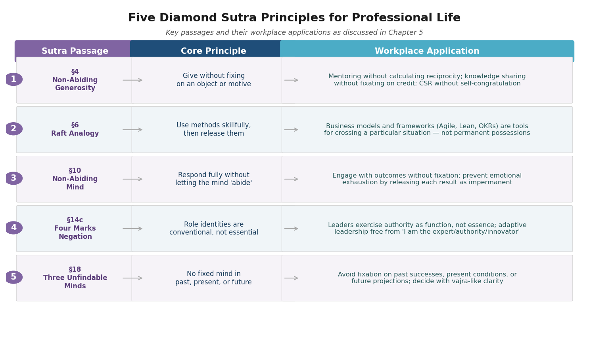

The empirical evidence reviewed here — from Vu and Burton's Buddhist leaders in Vietnam to Tsoi et al.'s population-level data in Hong Kong to Luken and Sammons's systematic review on burnout — is consistent with these principles. Taken together, this body of research suggests that the psychological orientation the Diamond Sutra prescribes — non-attachment, released self-concepts, purpose over ego — correlates with and may causally contribute to both individual well-being and professional effectiveness. The sutra's ancient insight, that selfless action is not less effective but more effective than self-serving action, finds contemporary support in the empirical finding that workers high in non-attachment report both greater flourishing and stronger professional relationships than their more rigidly attached counterparts.

# 第6章 Marriage, Parenting, and Family Relationships

The Diamond Sutra is a text addressed to renunciants — a dialogue between the Buddha and an elder monk in a monastic park. Its explicit subject is the path of the bodhisattva, not the complexities of domestic life. Yet the philosophical instruments examined in Chapter 2 — the negation formula, the deconstruction of the four marks, non-abiding generosity, the raft analogy, and the nine closing similes — cut with particular precision into the structures of suffering that pervade intimate relationships: the fixed images partners construct of each other, the conditional love that masquerades as devotion, the identity fusion that turns a marriage into a cage, and the projections parents impose on children in the name of care. The question animating this chapter is not whether a 1,600-year-old monastic dialogue has anything to say about marriage and family, but whether its analysis of clinging, identity, and selfless action illuminates problems that conventional relationship advice leaves structurally unresolved.

The connection is not merely analogical. As Chapter 3 demonstrated, Chan practitioners from Huineng onward treated the Diamond Sutra as a lived-practice text, and Thich Nhat Hanh explicitly extended its teachings to marriage, calling the couple "a sangha of two" and describing parenting as "a dharma door." Empirical research on mindfulness and relationships — including laboratory-based couple conflict studies and mindful parenting interventions — furnishes evidence that the cognitive operations the sutra prescribes have measurable effects on relationship satisfaction, partner acceptance, and parent-child interaction quality.

## 6.1 "A Spouse Is Not a Spouse, Therefore Called a Spouse": The Negation Formula in Intimate Relationships

The Diamond Sutra's signature formula — "X has been preached by the Tathāgata as a-X, therefore it is called X" — appears at least thirty times throughout the text, applied to dharmas, merit, Buddhahood, and the teaching itself [Paul Harrison 2006](https://static1.squarespace.com/static/5c03ced75ffd204418037b7a/t/5c5306ce575d1f9230da8a6a/1548945103490/Diamond+Sutra-Paul+Harrison+tr.pdf "Harrison 2006, pp. 136–140"). Applied to intimate partnership, the formula yields a statement that is paradoxical only on the surface: "A spouse is not a spouse, therefore called a spouse."

Under Harrison's *bahuvrīhi* reading — which he argues is "more cogent philosophically" than the Chinese *karmadhāraya* rendering (see Chapter 2) — the middle term means "devoid of inherent spouse-nature." The person one married is not a fixed, self-existing entity captured by the label "spouse." That person is constituted by non-spouse elements: childhood conditioning, professional pressures, shifting moods, biological changes, cultural inheritance, and the countless causes and conditions that produce the being who sits across the breakfast table on any given morning. The label "spouse" functions conventionally — organizing legal, social, and emotional expectations — but it must not be mistaken for a permanent description of who the other person is. When it is so mistaken, the result is a specific and recognizable pattern of suffering: "You used to be...," "You should be...," "You're not the person I married."

Harrison articulates the formula's philosophical import in terms that resonate directly with relational dynamics: "conventional language only makes sense *because* of the ultimate emptiness of the things it names" [Paul Harrison 2006](https://static1.squarespace.com/static/5c03ced75ffd204418037b7a/t/5c5306ce575d1f9230da8a6a/1548945103490/Diamond+Sutra-Paul+Harrison+tr.pdf "Harrison 2006, pp. 139–140"). The paradox resolves itself: one can love and commit to a spouse precisely because the spouse is not a fixed object to which one is bound, but a living, changing being with whom one continuously renews a relationship that itself possesses no permanent essence. The commitment is real; what is abandoned is the fantasy that either partner or the relationship itself can be frozen at any point.

## 6.2 The Four Marks in Family Life: Releasing Fixed Projections

The sutra's systematic deconstruction of the four marks — self (*ātma-saṃjñā*), person (*pudgala-saṃjñā*), sentient being (*sattva-saṃjñā*), and life-span (*jīva-saṃjñā*) — addresses a root mechanism of relational suffering: the imposition of fixed identity narratives onto the people one loves most.

In §3, the sutra warns: "If, Subhūti, the idea of a living being occurs to a bodhisattva, he should not be called a bodhisattva" [Paul Harrison 2006, §3](https://static1.squarespace.com/static/5c03ced75ffd204418037b7a/t/5c5306ce575d1f9230da8a6a/1548945103490/Diamond+Sutra-Paul+Harrison+tr.pdf "Harrison 2006, p. 142"). By §14c, even the categories themselves are declared "idealess" (*asaṃjñā*). In family contexts, each of the four marks maps onto a specific relational fixation:

- **Self-mark (*ātma-saṃjñā*)**: "I am the responsible one" — the parent or partner who constructs a rigid self-image as the family's anchor, generating resentment when others fail to acknowledge the sacrifice.
- **Person-mark (*pudgala-saṃjñā*)**: "My child is the difficult one" — the projection of a fixed character onto a family member, filtering all their behavior through a predetermined narrative.
- **Being-mark (*sattva-saṃjñā*)**: "You never change" — the conviction that a partner or child is a static entity incapable of growth, transformation, or surprise.
- **Life-span mark (*jīva-saṃjñā*)**: "This is who you will always be" — the temporal extension of fixation, projecting current traits into a permanent future.

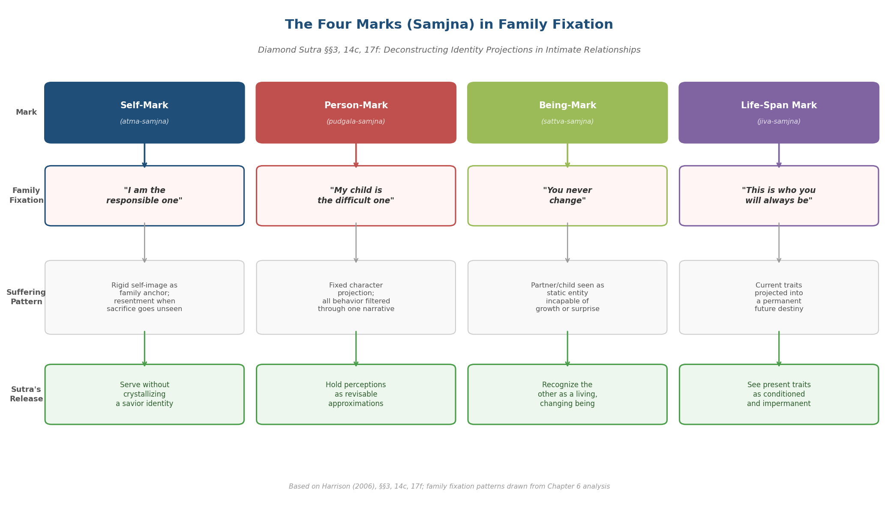

The sutra's instruction is not that these perceptions are meaningless but that they are *provisional*. When §14c declares that even the idea of a self is "idealess," the teaching invites parents and partners to hold their perceptions of family members as revisable approximations rather than permanent truths. The partner who was "irresponsible" during a difficult year may not be irresponsible by nature. The child labeled "shy" may be manifesting a developmental phase rather than a destiny. The Diamond Sutra does not ask practitioners to abandon discernment; it asks them to abandon the reification of discernment into dogma.

## 6.3 Non-Abiding Generosity as the Foundation of Unconditional Love

The first substantive teaching of the Diamond Sutra (§4) addresses the bodhisattva's practice of giving: "A bodhisattva should not give a gift while fixing on an object." Harrison notes that the Sanskrit term *nimitta* carries a double meaning: both "sense-object" — the visible recipient of generosity — and "motive" — the reason for giving. The bodhisattva's giving is therefore "absolutely fluid and free," unattached to both the external target and the internal reward [Paul Harrison 2006, §4](https://static1.squarespace.com/static/5c03ced75ffd204418037b7a/t/5c5306ce575d1f9230da8a6a/1548945103490/Diamond+Sutra-Paul+Harrison+tr.pdf "Harrison 2006, pp. 143–144").

This teaching supplies the doctrinal architecture for unconditional love in family life — and simultaneously diagnoses its most common failures. Consider the specific ways *nimitta*-fixation operates in domestic contexts:

A parent gives time and attention to a child while fixing on the *nimitta* of gratitude: "After everything I've done for you." The gift is real, but it is conditioned — and the child senses the invisible invoice. A spouse provides emotional support while fixing on the *nimitta* of self-image: "I am the caring one in this relationship." The generosity is genuine in its content but corrupted in its structure; it serves the giver's identity as much as the receiver's need. A family member sacrifices career opportunities for the household while fixing on the *nimitta* of reciprocity: "You owe me for what I gave up." The sacrifice is real, but the attachment to return converts it retroactively into a transaction.

Non-abiding generosity (*apratisthita-dāna*) does not mean giving without care or discernment. It means giving without *fixing* — providing love, attention, discipline, and resources without attaching strings that bind the gift to the giver's need for recognition, control, or self-confirmation. The sutra's merit-comparison passages (§§8, 11, 24, 32) assert that such non-abiding generosity generates "immeasurable, incalculable" merit — not because an external authority rewards it, but because it is the only form of giving that does not simultaneously plant the seeds of future resentment [Paul Harrison 2006, §§8, 19](https://static1.squarespace.com/static/5c03ced75ffd204418037b7a/t/5c5306ce575d1f9230da8a6a/1548945103490/Diamond+Sutra-Paul+Harrison+tr.pdf "Harrison 2006, pp. 145–146").

## 6.4 The "Sangha of Two": Thich Nhat Hanh on Marriage and Non-Self

Thich Nhat Hanh extended the Diamond Sutra's philosophical framework to intimate relationships with characteristic directness. In an interview with *Lion's Roar*, he connected the insight of non-self to the capacity for love: "True self is non-self, the awareness that the self is made only of non-self elements. There's no separation between self and other, and everything is interconnected." He described the dissolution of rigid boundaries in love: "When people love each other, the distinction, the limits, the frontier between them begins to dissolve, and they become one with the person they love. There's no longer any jealousy or anger, because if they are angry at the other person, they are angry at themselves. That is why non-self is not a theory, a doctrine, or an ideology, but a realization that can bring about a lot of happiness" [Thich Nhat Hanh, "This Is the Buddha's Love," *Lion's Roar*](https://www.lionsroar.com/this-is-the-buddhas-love/ "Interview with Thich Nhat Hanh on non-self, interdependence, and love without limits").

In a dharma talk published in *The Mindfulness Bell*, Thich Nhat Hanh described marriage as forming "a primary sangha, a sangha of two," and articulated five awarenesses for married couples to recite together — including the recognition that one's happiness is not an individual matter but affects ancestors and future generations, and the understanding that "where there is understanding, there is love." He insisted on a crucial distinction: "If we still have the feeling of being attached to each other, that is not real love yet. Love in the Buddhist context is loving kindness and compassion. It is the kind of love that does not have any conditions" [Thich Nhat Hanh, "Relationships," *The Mindfulness Bell*](https://www.parallax.org/mindfulnessbell/article/22850/ "Dharma talk on the Five Awarenesses, marriage as a sangha of two").

Most pointedly for the Diamond Sutra's framework, Thich Nhat Hanh identified the mechanism by which relationships deteriorate — the fixation on *nimitta* (marks/signs) that §4 warns against: "Everyone of us has flowers and garbage inside us, not just of our making but of the making of our ancestors. If we know this in advance, we can be ready to accept everything that will manifest in the other person. When people fall in love, they construct a beautiful image of the other person, and they may feel shocked when they compare it with the reality... Until we give up our preconceived image, we miss the real beauty in the other person" [Thich Nhat Hanh, "Relationships," *The Mindfulness Bell*](https://www.parallax.org/mindfulnessbell/article/22850/ "On releasing preconceived images of the partner"). The "preconceived image" is precisely the *nimitta* the sutra instructs the bodhisattva to abandon; the "real beauty in the other person" is what becomes visible only when that fixed image is relinquished.

## 6.5 Non-Attachment Is Not Detachment: Commitment Without Clinging

The most persistent misreading of the Diamond Sutra's relevance to intimate life equates non-attachment with emotional withdrawal. If all phenomena are empty, if no self exists, if even the teaching is to be relinquished like a raft — why commit to a marriage at all? Three prominent Buddhist teachers have addressed this confusion directly, each from a distinct lineage.

Zenkei Blanche Hartman, the first woman Abbot of San Francisco Zen Center, stated: "'Nonattachment' does not mean that we cannot love someone or be committed to a spouse or family. It means that we have understood that *all* conditioned things are marked by impermanence, not-self, and unsatisfactoriness (*dukkha*). Therefore, we do not cause ourselves misery by clinging to an idea of a substantial, permanent self or other, because we know that everything is changing and contingent on myriad causes and conditions" [Zenkei Blanche Hartman, *Lion's Roar*, 2005](https://www.lionsroar.com/ask-the-teachers-8/ "Three Buddhist teachers on non-attachment and marriage"). Hartman's framing clarifies the target of non-attachment: it is not the person one loves but the *idea* of a fixed person one has constructed — the expectation that the other will remain forever as one remembers or desires them to be.

Narayan Helen Liebenson offered a sharper diagnostic: "Attachment is the problem, not the object of our attachment. Sometimes people try to deal with the suffering of attachment by avoiding commitment. This is called fear, not liberation." She described intimate relationships as "a wonderful invitation to discern the difference between attachment and love" — specifically, to see "the ways in which we basically think the other person should be like us" and "the ways in which our love for that person has strings attached to it" [Narayan Helen Liebenson, *Lion's Roar*, 2005](https://www.lionsroar.com/ask-the-teachers-8/ "Liebenson on attachment as the problem, not the object"). The distinction maps precisely onto the Diamond Sutra's framework: attachment (*upādāna*) fixes on *nimitta*; love does not require fixing. The person who avoids commitment in the name of non-attachment has misidentified the problem — they are practicing avoidance, which is itself a form of fixation (on safety, on autonomy, on a self-image as "spiritually free").

Geshe Tenzin Wangyal Rinpoche added a practice-oriented dimension: "In marriage, we can work with attachments every day and transform them into love or one of the four immeasurables: love, compassion, joy, and equanimity" [Geshe Tenzin Wangyal Rinpoche, *Lion's Roar*, 2005](https://www.lionsroar.com/ask-the-teachers-8/ "Wangyal Rinpoche on transforming attachment into the four immeasurables in marriage"). This is not a philosophical concession but a practice instruction: the clinging that arises in intimate life is not an obstacle to be eliminated before practice begins but the very material with which practice works. Each moment of possessiveness toward a partner, each urge to control a child's future, each flash of resentment at unreciprocated sacrifice becomes — when met with awareness rather than automaticity — an occasion for cultivating the four *brahmavihārā*.

## 6.6 Parenting as a Dharma Door: Tools, Not Dogmas

Thich Nhat Hanh directly addressed parenting within the framework of Buddhist practice: "Parenting is a dharma door. Single parenting is a dharma door. We need retreats, seminars, and dharma discussions on how to be parents." His observation about the nuclear family carries particular force: "The nuclear family is very small. There is not enough air to breathe. When there is trouble between the father and mother, the child has no escape." The remedy he proposed drew from the sangha model: "Having a community where people can gather as brothers and sisters in the dharma, and where children have a number of uncles and aunts is a very wonderful thing" [Thich Nhat Hanh, "Relationships," *The Mindfulness Bell*](https://www.parallax.org/mindfulnessbell/article/22850/ "On parenting as a dharma door and the sangha as extended family"). The insight resonates with the Diamond Sutra's deconstruction of the four marks: the fixation on "my child" as a private possession belonging to "my family" is itself a form of *ātma-saṃjñā* — a self-concept extended to include one's offspring as an extension of one's identity.

Thich Nhat Hanh also offered the image of the partner as gardener: "Both partners in the couple should regard themselves as the gardener, the caretaker, of the other. When we discover a weakness in the other person, we have to accept that... If the tree doesn't grow well, we don't blame it. We blame ourselves for not taking care of it well" [Thich Nhat Hanh, "Relationships," *The Mindfulness Bell*](https://www.parallax.org/mindfulnessbell/article/22850/ "The partner-as-gardener metaphor"). The metaphor operates on the same logic as the bodhisattva vow: patient, non-judgmental care directed at growth rather than compliance, unburdened by the expectation that the tree become something other than what its nature and conditions allow.

The Diamond Sutra's raft analogy (§6) extends this insight to parenting philosophies themselves. Harrison translates: "Those who understand the round of teachings of the Simile of the Raft should let go of the dharmas themselves, to say nothing of the non-dharmas" [Paul Harrison 2006, §6](https://static1.squarespace.com/static/5c03ced75ffd204418037b7a/t/5c5306ce575d1f9230da8a6a/1548945103490/Diamond+Sutra-Paul+Harrison+tr.pdf "Harrison 2006, p. 144"). Applied to parenting, the implication is direct: attachment parenting, free-range parenting, authoritative discipline, Montessori education — all are rafts. They serve a purpose at a particular developmental stage, in a particular family configuration, under particular circumstances. Clinging to any single method as dogma — "I must always co-sleep," "Screen time is always harmful," "My child must attend this kind of school" — generates suffering when circumstances change, when the child's needs evolve, or when the method simply does not work for a particular child. Even sound parenting methods must be held lightly, evaluated by their effects rather than their ideological purity.

## 6.7 The Bodhisattva Vow and Family Service Without Savior Identity

The bodhisattva vow (§3) provides a model for family service that addresses a specific and pervasive pattern of domestic suffering: the parent or partner who gives without limit, constructs a fixed identity around that giving, and eventually collapses into resentment or burnout when the sacrifice goes unrecognized.

Harrison translates the paradox at the heart of the vow: the bodhisattva aspires to bring all living beings to final nirvāṇa, "yet no living being whatsoever has been brought to extinction." In §17a–f, even the designation "bodhisattva" is deconstructed: "There is no dharma called 'one who has set out on the bodhisattva path'" [Paul Harrison 2006, §§3, 17a–f](https://static1.squarespace.com/static/5c03ced75ffd204418037b7a/t/5c5306ce575d1f9230da8a6a/1548945103490/Diamond+Sutra-Paul+Harrison+tr.pdf "Harrison 2006, pp. 142–143, 152–153"). The vow thus models a form of wholehearted service that does not crystallize into identity: one acts to liberate all beings without constructing a self-concept as "liberator."

Applied to family life, this teaching addresses the "martyr parent" and "invisible spouse" syndromes with structural precision. One can cook meals, attend to a child's distress, care for aging parents, and manage the logistics of domestic life wholeheartedly — without constructing a fixed identity as "the one who holds everything together," "the sacrificing mother," or "the reliable breadwinner." The sutra teaches that clinging to the identity of helper is itself a form of self-grasping (*ātma-saṃjñā*) that produces a predictable sequence: self-sacrifice → implicit expectation of recognition → disappointment when recognition fails to materialize → resentment → withdrawal or eruption. The bodhisattva's paradox dissolves this sequence at its origin: serve fully, but do not become "a servant." The identity claim is the toxin, not the service itself.

## 6.8 The Nine Similes and Family Impermanence

The closing verse (§32b) offers nine similes for conditioned existence:

> *As a star, a defect of vision, a lamp,*
> *An illusion, a dewdrop, a bubble,*
> *A dream, a lightning flash, a thunder cloud —*
> *View all conditioned things like this.*
>
> — [Paul Harrison 2006, §32b](https://static1.squarespace.com/static/5c03ced75ffd204418037b7a/t/5c5306ce575d1f9230da8a6a/1548945103490/Diamond+Sutra-Paul+Harrison+tr.pdf "Harrison 2006, p. 158")

Khensur Jampa Tegchok's per-simile analysis assigns each image a distinct contemplative function. Several map onto family experience with striking specificity [Khensur Jampa Tegchok, *Insight into Emptiness*](https://shantidevanyc.org/wp-content/uploads/2023/11/Similes-from-the-Vajra-Cutter-Sutra-Khensur-Jampa-Tegchok.pdf "Tegchok on the nine similes"):

- The **dewdrop** illustrates impermanence at its most tender: a child's infancy, a season of closeness with an aging parent, the years when the house is full. These phases evaporate as inevitably as morning dew; grieving their passing is natural, but mistaking them for permanent conditions produces chronic dissatisfaction.
- The **dream** reveals that phenomena do not exist as they appear: the "perfect family" is a construction — a narrative assembled from selective memory, social comparison, and projected ideals. Recognizing this does not diminish the real joys of family life; it releases one from the impossible standard against which actual experience is perpetually measured.
- The **lightning flash** shows that present emotional states — a bitter argument, a teenager's rebellion, a moment of estrangement between partners — "cannot be found under analysis." They arise from conditions, illuminate the landscape for an instant, and pass. The teaching is not to dismiss them as unreal but to resist the impulse to solidify them into permanent descriptions of the relationship.
- The **bubble** captures the fragility of family arrangements: a household's configuration is sustained by conditions — health, employment, proximity, mutual willingness — that can shift without warning.

The teaching is not nihilistic dismissal of family bonds. It is a shift in *how one relates to* the inevitable transitions of domestic life — children leaving home, relationships evolving, parents declining, configurations dissolving and reconstituting. Viewing these transitions as conditioned, dependently arisen phenomena rather than catastrophic violations of a fixed order does not diminish their emotional weight; it removes the additional layer of suffering that comes from believing they should not have happened.

## 6.9 Empirical Evidence: Mindfulness, Partner Acceptance, and Relationship Satisfaction

The Diamond Sutra's teachings are not confined to contemplative intuition. A growing empirical literature demonstrates that the cognitive operations the sutra prescribes — non-reactive awareness, release of fixed images, acceptance of the partner's actual being rather than an idealized projection — produce measurable improvements in romantic relationship functioning.

Barnes, Brown, Krusemark, Campbell, and Rogge (2007) conducted two studies examining mindfulness and romantic relationships. In Study 1 (longitudinal, N = 89 dating college students), trait mindfulness significantly predicted higher relationship satisfaction (β = .37, *p* < .001) and greater capacity for accommodation over a ten-week period. In Study 2 (laboratory conflict discussion paradigm, N = 57 couples), trait mindfulness predicted lower post-conflict anger-hostility (*p* < .01) and anxiety (*p* < .05), as well as positive change in perceived love and commitment (*p* < .05). State mindfulness during the conflict discussion predicted less verbal aggression (*p* < .001) and less negativity as coded by independent observers (*p* < .05) [Barnes et al., *Journal of Marital and Family Therapy* 33(4), 2007](https://selfdeterminationtheory.org/wp-content/uploads/2020/10/2007_BarnesBrownKrusemarkCampbellRogge_JMFT.pdf "Barnes et al. 2007, two studies on mindfulness and romantic relationships").

These findings bear directly on the Diamond Sutra framework: the sutra's instruction of non-abiding attention — being fully present without fixing on any object or motive — has measurable behavioral correlates in precisely the situations where intimate relationships are most vulnerable. Gottman (1994) identified "stonewalling" and "defensiveness" as two of the "Four Horsemen" threatening marital stability; Barnes et al. found that mindfulness was inversely related to both, suggesting that the non-reactive, present-centered awareness the Diamond Sutra cultivates directly counteracts the destructive conflict patterns that predict relationship dissolution.

Kappen, Karremans, Burk, and Buyukcan-Tetik (2018) advanced the analysis by investigating partner acceptance — the construct that most directly parallels the Diamond Sutra's deconstruction of fixed marks (*lakṣaṇa*). Across three studies (N₁ = 190, N₂ = 140, N₃ = 118 MBSR trainees + 53 partners), they found that trait mindfulness was positively associated with partner acceptance, defined as "the ability and willingness to acknowledge potential imperfections of a partner without feeling the urge to change the partner." In Study 1, partner acceptance mediated 51% of the total effect of mindfulness on relationship satisfaction. In dyadic analyses (Study 3), Partner A's mindfulness was indirectly associated with Partner B's relationship satisfaction through Partner A's partner acceptance (indirect path *b* = .28, 95% CI [.04, .26]) [Kappen et al., *Mindfulness* 9(5), 2018](https://pmc.ncbi.nlm.nih.gov/articles/PMC6153889/ "Kappen et al. 2018, three studies on mindfulness, partner acceptance, and relationship satisfaction").

The finding that partner acceptance mediates the mindfulness–satisfaction link constitutes a direct empirical correlate of the Diamond Sutra's teaching. What the sutra deconstructs philosophically — the reification of the partner into a fixed image (§5: "as long as there is any distinctive feature there is falsehood") — psychological research operationalizes as "partner acceptance." The mechanism is the same: relating to the partner's actual being rather than to the gap between that being and a preconceived ideal. The dyadic finding — that one partner's mindfulness improves the *other* partner's satisfaction — resonates with the sutra's vision of non-abiding generosity as producing immeasurable merit: the benefits flow outward, unbounded by the self-other distinction.

## 6.10 Mindful Parenting: The Five-Dimension Model and Its Evidence

Duncan, Coatsworth, and Greenberg (2009) proposed a five-dimension model of "mindful parenting" that translates the Diamond Sutra's framework into specific, operationalized parenting capacities: (a) listening with full attention; (b) nonjudgmental acceptance of self and child; (c) emotional awareness of self and child; (d) self-regulation in the parenting relationship; and (e) compassion for self and child [Duncan et al., *Clinical Child and Family Psychology Review* 12(3), 2009](https://pmc.ncbi.nlm.nih.gov/articles/PMC2730447/ "Duncan et al. 2009, foundational model of mindful parenting").

Each dimension corresponds to a specific Diamond Sutra teaching. "Listening with full attention" is the relational expression of the non-abiding mind (§10): being present to what the child actually communicates rather than filtering it through predetermined expectations. "Nonjudgmental acceptance" operationalizes the deconstruction of the four marks: the authors note that "mindful parenting involves being consciously attentive to the attributions and expectations one is making that may skew perceptions of parenting interactions... Parents communicate their beliefs about their child's attributes and competencies and these communications may be biased by parents' own desires for the attributes they want their child to possess." The Diamond Sutra's formula — "a child is not a child, therefore called a child" — enacts this same insight: the conventional label functions, but it must not harden into a projection of who the child inherently is or should become. "Self-regulation" parallels the sutra's warning against the four marks applied to oneself: the parent who can regulate reactive anger or anxiety is the parent who has loosened the grip of "*I* am the one who must control this situation."

A pilot randomized controlled trial of the Mindfulness-enhanced Strengthening Families Program (MSFP) produced significantly stronger effects than the standard SFP or waitlist control on mindful parenting, parent-youth relationship quality, and parental well-being [Duncan et al. 2009](https://pmc.ncbi.nlm.nih.gov/articles/PMC2730447/ "Pilot RCT results showing MSFP outperformed standard SFP"). The evidence, while preliminary, suggests that explicitly cultivating the capacities the Diamond Sutra prescribes — non-fixating attention, acceptance that transcends projections, compassion that encompasses the self — improves not only the parent's subjective experience but the measurable quality of the parent-child relationship.

## 6.11 Synthesis: The Paradox of Deep Commitment Without Possessiveness

The Diamond Sutra's contribution to understanding intimate and family life is not a set of techniques but a structural insight: the deepest forms of love and commitment become possible precisely when one relinquishes the attempt to fix, control, or permanently define the persons one loves. This is not a paradox that resolves into a comfortable formula. It is a practice orientation that must be renewed in each interaction, each conflict, each transition.

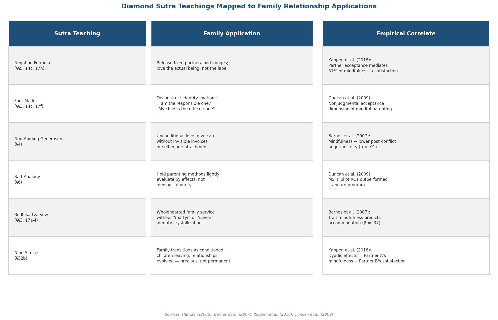

The negation formula ("a spouse is not a spouse, therefore called a spouse") does not dissolve commitment — it purifies commitment of the possessiveness that corrodes it from within. The deconstruction of the four marks does not deny that family members have distinct characters — it releases those characters from the prison of permanent labels. Non-abiding generosity does not require that love be impersonal — it asks that love not be transactional. The raft analogy does not dismiss parenting philosophies — it treats them as servants of the child's welfare rather than totems of parental identity. The bodhisattva vow does not prohibit wholehearted service — it prevents that service from crystallizing into a self-concept that demands reciprocation. And the nine similes do not declare family life meaningless — they invite practitioners to see its beauty and its sorrow as equally conditioned, equally impermanent, and therefore equally precious.

Thich Nhat Hanh captured the full scope of this teaching: "Through my love for you, I want to express my love for the whole cosmos, the whole of humanity, and all beings. By loving one person, you love all" [Thich Nhat Hanh, "Relationships," *The Mindfulness Bell*](https://www.parallax.org/mindfulnessbell/article/22850/ "On love as expression of universal compassion"). The Diamond Sutra's non-self is not the enemy of intimate love. It is the condition that makes intimate love inexhaustible — because what is not owned cannot be lost, and what is not fixed cannot be outgrown.

# 第7章 Interpersonal Dynamics and Social Life

Preceding chapters have traced the Diamond Sutra's teachings through emotional well-being (Chapter 4), professional life (Chapter 5), and family relationships (Chapter 6). Each of those contexts involves relationships with specific, identifiable individuals — a therapist and a patient, a manager and a subordinate, a spouse and a child. Yet much of human suffering arises not in such bounded dyads but in the wider, less structured terrain of social life: friendships that calcify into obligation, group identities that harden into tribal antagonism, social media interactions that reduce persons to curated images, community engagements that begin in generosity and end in savior complexes, and the pervasive, low-grade conflict that surfaces whenever individuals gather under the assumption that "I" and "you" are fundamentally separate, competing entities.

The Diamond Sutra addresses this terrain with a precision that its monastic origins might seem to preclude. Its core philosophical instruments — the negation formula, the deconstruction of the four marks, non-abiding generosity, the bodhisattva vow, and the critique of *lakṣaṇa* (signs/marks) — were forged in a dialogue between the Buddha and Subhūti about the nature of reality itself. Yet as Norman Fischer observes, the sutra's deconstruction of self and other dissolves not merely metaphysical illusions but the interpersonal entanglements those illusions produce: "In emptiness… there's only love and connection, but not entanglement. Entanglement comes along because of separation" [Fischer, "Wandering Around in the Diamond Sutra, Part II," Everyday Zen, 2000](https://everydayzen.org/teachings/wandering-around-in-the-diamond-sutra-part-ii/ "Fischer on emptiness dissolving entanglement"). This chapter examines how the sutra's philosophical framework illuminates the dynamics of friendship, community, social identity, conflict resolution, civic engagement, and digital social life.

## 7.1 The Negation Formula and Social Labels

The Diamond Sutra's signature formula — "X has been preached by the Tathāgata as a-X, therefore it is called X" — appears at least thirty times in the text [Paul Harrison 2006](https://static1.squarespace.com/static/5c03ced75ffd204418037b7a/t/5c5306ce575d1f9230da8a6a/1548945103490/Diamond+Sutra-Paul+Harrison+tr.pdf "Harrison 2006, pp. 136–140"). Applied to social relationships, the formula yields a set of propositions that are counterintuitive only to the extent that social convention has been mistaken for metaphysical fact:

- "A friend is not a friend, therefore called a friend."
- "An enemy is not an enemy, therefore called an enemy."
- "A stranger is not a stranger, therefore called a stranger."

Under Harrison's *bahuvrīhi* reading — "devoid of inherent X-nature" rather than the Chinese *karmadhāraya* "non-X" — each proposition asserts that the social label functions precisely because no fixed essence underlies it. A "friend" is a conventional designation for a relationship constituted by specific conditions: shared history, mutual affection, aligned interests, reciprocal trust. Remove or alter any of these conditions and the friendship transforms — not because the "friend" has betrayed some essential nature, but because the relationship was dependently arisen from the outset. An "enemy" is likewise a conventional designation for a relationship defined by opposition, grievance, or threat — conditions that are themselves impermanent and subject to transformation.

The practical import is considerable. When one reifies the label "friend" into an essence, the inevitable shifts in any relationship — the friend who grows distant, who develops divergent interests, who disappoints — register as betrayals. When one reifies "enemy" into an essence, reconciliation becomes structurally impossible: if the other person *is* an enemy by nature, no change in conditions can alter the fundamental hostility. The negation formula dissolves both fixations. It does not deny that some relationships are nourishing and others destructive; it denies that the categories "nourishing" and "destructive" are permanent features of the persons involved rather than current descriptions of the relational dynamic.

William Waldron, drawing on both Buddhist *abhidharma* analysis and contemporary social science, identifies the root mechanism: "Self-identity is… based upon an ultimately untenable dichotomy between 'self' and 'other.'" The process of *ahaṃ-kāra* — the ongoing construction of "I" — necessarily entails the construction of "not-I," and this dichotomy, when extended to group identity, produces the in-group/out-group dynamics that fuel social conflict. Recognizing the emptiness of both "us" and "them" does not require abandoning group affiliation; it frees one to participate in groups "without compulsive self-protection" [Waldron, "Buddhism and Social Science on the Affliction of Self-Identity," 2008](https://www.middlebury.edu/college/sites/default/files/2023-03/buddhism_and_social_science-on_the_affliction_of_self-identity0.pdf "Waldron 2008").

## 7.2 The Four Marks as Social Identity Fixations

The sutra's deconstruction of the four marks (*ātma-saṃjñā*, *pudgala-saṃjñā*, *sattva-saṃjñā*, *jīva-saṃjñā*) extends from individual psychology (Chapter 4) and family dynamics (Chapter 6) into the broader social arena:

- **Self-mark (*ātma-saṃjñā*) in social identity**: "I am a progressive," "I am a conservative," "I am a member of X community." The fixation lies not in holding a position but in solidifying it into an identity — such that any challenge to the position registers as an attack on the self. §14c declares even the concept of self "idealess" [Paul Harrison 2006, §14c](https://static1.squarespace.com/static/5c03ced75ffd204418037b7a/t/5c5306ce575d1f9230da8a6a/1548945103490/Diamond+Sutra-Paul+Harrison+tr.pdf "Harrison 2006, p. 149").
- **Person-mark (*pudgala-saṃjñā*) in social judgment**: The reduction of complex individuals to single attributes — "the narcissist," "the toxic person," "the Karen." Such labels perform the same function as the person-mark: they convert a fluid, conditioned being into a fixed character type, foreclosing the possibility of change.
- **Being-mark (*sattva-saṃjñā*) in group stereotyping**: "Those people are all like that" — the extension of a fixed attribute to an entire group, treating statistical tendencies (if they exist at all) as essential natures.
- **Life-span mark (*jīva-saṃjñā*) in social permanence**: "They will never change," "This community has always been this way" — the temporal projection that freezes current conditions into perpetuity.

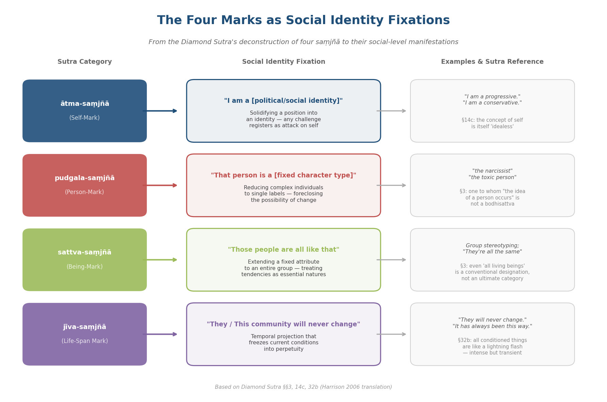

The sutra's treatment is not merely diagnostic but prescriptive. In §3, "anybody to whom the idea of a living being occurs… should not be called a bodhisattva" [Paul Harrison 2006, §3](https://static1.squarespace.com/static/5c03ced75ffd204418037b7a/t/5c5306ce575d1f9230da8a6a/1548945103490/Diamond+Sutra-Paul+Harrison+tr.pdf "Harrison 2006, p. 142"). The instruction is uncompromising: the aspiration to serve others becomes self-defeating the moment it depends on a fixed conception of who those others are. A community organizer who operates from a rigid image of "the oppressed" and "the oppressor" may achieve tactical gains but risks reproducing the very structures of identity-based conflict that the Diamond Sutra identifies as the root of suffering.

## 7.3 The Bodhisattva Vow: Social Engagement Without Savior Complex

The bodhisattva vow (§3) presents a paradox with direct implications for anyone engaged in community service, activism, volunteering, or social advocacy. In Harrison's translation, the bodhisattva aspires to bring all living beings to final nirvāṇa — "yet no living being whatsoever has been brought to extinction" [Paul Harrison 2006, §3](https://static1.squarespace.com/static/5c03ced75ffd204418037b7a/t/5c5306ce575d1f9230da8a6a/1548945103490/Diamond+Sutra-Paul+Harrison+tr.pdf "Harrison 2006, pp. 142–143"). By §17a, even the designation "bodhisattva" is deconstructed: "There is no dharma called 'one who has set out on the bodhisattva path'" [Paul Harrison 2006, §17a](https://static1.squarespace.com/static/5c03ced75ffd204418037b7a/t/5c5306ce575d1f9230da8a6a/1548945103490/Diamond+Sutra-Paul+Harrison+tr.pdf "Harrison 2006, pp. 152–153").

This teaching addresses a specific pathology of social engagement: the construction of a fixed identity as "the one who helps." Dr. Larry Ward, a Dharma teacher in the Plum Village tradition, distilled the tension into a single diagnostic question: "Am I practicing with my precious life, or am I giving away my precious life?" [Ward, Plum Village, 2024](https://plumvillage.org/articles/how-to-be-engaged-without-becoming-entangled "Ward on engagement without entanglement"). The distinction separates engagement rooted in the bodhisattva's non-abiding compassion — which sustains itself because it does not depend on recognition, reciprocity, or the construction of a savior identity — from engagement rooted in *ātma-saṃjñā*, which depletes because the self it serves is insatiable.

The savior complex operates through a predictable mechanism: the helper constructs a self-image as "the compassionate one," "the activist," "the voice of the voiceless." This identity requires the continued existence of helpless others to sustain itself. When those others fail to express adequate gratitude, when the social problem proves more intractable than anticipated, or when another helper appears to receive more recognition, the savior identity is threatened — and the helper experiences not compassion fatigue but identity crisis. The Diamond Sutra severs this mechanism at its root: serve wholeheartedly, but do not become "a helper." The vow is real; the one who vows is empty of inherent vow-nature.

## 7.4 Engaged Buddhism: The Diamond Sutra Beyond the Meditation Hall

Thich Nhat Hanh placed the Diamond Sutra at the center of what he termed Engaged Buddhism — the insistence that contemplative insight must manifest in social action. "When bombs begin to fall on people, you cannot stay in the meditation hall all of the time," he wrote. His approach to conflict resolution centered on deep listening (*śravaṇa*) as the foundational practice: listening not to formulate a response, but to understand the suffering behind the other person's words and actions. He described the next Buddha not as an individual but as a collective: "The next Buddha may take the form of a community — a community practicing understanding and loving kindness, a community practicing mindful living" [Thich Nhat Hanh, *Lion's Roar*, 2003](https://www.lionsroar.com/in-engaged-buddhism-peace-begins-with-you/ "TNH on Engaged Buddhism").

This communal vision of awakening directly parallels the Diamond Sutra's deconstruction of the Tathāgata. In §29, the Tathāgata is defined by what it is not: "they do not go anywhere, nor do they come from anywhere" [Paul Harrison 2006, §29](https://static1.squarespace.com/static/5c03ced75ffd204418037b7a/t/5c5306ce575d1f9230da8a6a/1548945103490/Diamond+Sutra-Paul+Harrison+tr.pdf "Harrison 2006, p. 157"). If the Tathāgata cannot be located in any fixed form, the implication for social life is that awakening is not a property of charismatic individuals but a quality that can emerge in the relational field of a community practicing together.

Thich Nhat Hanh's Fourteen Mindfulness Trainings of the Order of Interbeing operationalize the Diamond Sutra's principles for communal and social practice. Three trainings in particular translate core sutra teachings into interpersonal ethics:

- **Training 1 (Openness)**: "Aware of the suffering created by fanaticism and intolerance, we are determined not to be idolatrous about or bound to any doctrine, theory, or ideology." This is the raft analogy (§6) applied to social and ideological commitments: political frameworks, activist methodologies, and community norms are tools, not articles of faith.
- **Training 2 (Non-Attachment to Views)**: "Aware of the suffering created by attachment to views and wrong perceptions, we are determined to avoid being narrow-minded and bound to present views." This directly enacts the negation formula: "a view is not a view, therefore called a view." One can hold a position with conviction while recognizing that the position is a provisional response to conditions, not an expression of eternal truth.
- **Training 8 (True Community and Communication)**: "We will practice Right Speech — speaking truthfully, using words that inspire confidence, joy, and hope. When anger is manifesting in us, we are determined not to speak." This training operationalizes the sutra's teaching on anger and conflict: Thich Nhat Hanh argued that "when you express your anger… you are feeding the seed of anger" — the expression does not discharge the emotion but amplifies it [Thich Nhat Hanh, *Lion's Roar*, 2003](https://www.lionsroar.com/in-engaged-buddhism-peace-begins-with-you/ "TNH seed model of anger") [Order of Interbeing, Fourteen Mindfulness Trainings](https://orderofinterbeing.org/for-the-aspirant/fourteen-mindfulness-trainings/ "Full text of the Fourteen Mindfulness Trainings").

Sulak Sivaraksa, the Thai activist and social critic, extended this framework into explicit political engagement. His insistence on "buddhism with a small b" echoes the Diamond Sutra's self-reflexive negation: even Buddhist teachings must be subjected to the sutra's own deconstructive logic. "Do not be idolatrous about or bound to any doctrine, theory or ideology, even Buddhist ones," he argued — a direct application of the raft analogy to the tradition itself [Barua, *Buddhistdoor Global*, 2025](https://www.buddhistdoor.net/features/buddhism-and-activism-sulak-sivaraksas-teachings-on-social-change/ "Sivaraksa on small 'b' buddhism"). Sivaraksa's decades of activism — addressing environmental degradation, economic inequality, and political authoritarianism in Thailand — exemplify the bodhisattva vow in social action: wholehearted engagement that resists crystallizing into a fixed ideological identity.

## 7.5 Conflict Resolution Through the Diamond Sutra's Logic

The Diamond Sutra provides a multi-layered framework for understanding and resolving interpersonal and social conflict. Three core teachings converge on the mechanisms that sustain disputes:

**The four marks deconstruct "I am right" identity.** Most interpersonal conflicts persist not because the substantive disagreement is irresolvable but because the positions have fused with identity. "I am right" is not merely an assertion about the issue at hand — it is a statement about who I am (*ātma-saṃjñā*). Conceding the point feels tantamount to losing the self. The sutra's instruction to release all four marks dissolves this fusion: one can hold a position, advocate for it, and revise it in light of new evidence without experiencing the revision as self-annihilation.

**The negation formula applies to positions themselves.** "This position is not this position, therefore it is called this position." Every stance in a conflict is a conventional designation arising from conditions — personal history, available information, emotional state, social context. Recognizing this does not require abandoning the position; it requires holding it with the lightness the formula prescribes. When both parties in a dispute can perceive their own positions as conditioned rather than absolute, the space for negotiation opens.

**The nine similes reframe conflicts as conditioned and transient.** The closing verse instructs the practitioner to view all conditioned things as "a star, a defect of vision, a lamp, an illusion, a dewdrop, a bubble, a dream, a lightning flash, a thunder cloud" [Paul Harrison 2006, §32b](https://static1.squarespace.com/static/5c03ced75ffd204418037b7a/t/5c5306ce575d1f9230da8a6a/1548945103490/Diamond+Sutra-Paul+Harrison+tr.pdf "Harrison 2006, p. 158"). Applied to the felt permanence of social conflicts, each simile performs a specific reframing. The neighborhood dispute that seems intractable today is a lightning flash — intense, illuminating, and gone. The political argument that feels like a fundamental rift in a friendship is a bubble — real while it persists, dissolved the moment the conditions sustaining it shift. The teaching does not trivialize conflict; it challenges the assumption that any conflict permanently defines a relationship.

Thich Nhat Hanh's conflict resolution methodology integrates these principles into structured practice. His "seed model" of consciousness holds that anger, compassion, jealousy, and equanimity all exist as seeds in the storehouse consciousness (*ālayavijñāna*). Speaking from anger "waters the seed of anger" in both oneself and the listener. The alternative is not suppression but transformation: return attention to the breath, recognize the anger as a conditioned phenomenon (the nine similes), and speak only when one can speak from understanding rather than reactivity. "In engaged Buddhism, peace begins with you," he wrote — not as a privatization of political responsibility, but as a recognition that interpersonal peace and social peace share a common root in the release of fixed self-concepts [Thich Nhat Hanh, *Lion's Roar*, 2003](https://www.lionsroar.com/in-engaged-buddhism-peace-begins-with-you/ "TNH on conflict resolution through inner peace").

## 7.6 Non-Abiding Generosity in Social Contexts: The Three Empty Wheels

The Diamond Sutra's teaching on non-abiding generosity (*apratisthita-dāna*, §4) finds its broadest application in the sphere of social life — volunteering, community support, charitable giving, mentoring, and the countless forms of everyday kindness that sustain social bonds. Norman Fischer identifies the teaching's core structure through the traditional Mahāyāna concept of the "three empty wheels — giver, receiver, and gift." In authentic generosity, none of these three elements is reified into a fixed entity: the giver does not construct a self-image around the act, the receiver is not reduced to a role ("the needy"), and the gift itself is not treated as a permanent transaction creating obligation [Fischer, "Wandering Around in the Diamond Sutra, Part II," Everyday Zen, 2000](https://everydayzen.org/teachings/wandering-around-in-the-diamond-sutra-part-ii/ "Fischer on giving without strings").

This framework addresses a pervasive contemporary phenomenon: performative generosity and virtue signaling. In social media environments, charitable acts are frequently documented, posted, and curated for an audience — the generosity becomes inseparable from its display. The Diamond Sutra's critique of *nimitta* (§4) identifies the structural problem: when one "gives a gift while fixing on an object," the gift is conditioned by the giver's attachment to the visible *sign* of generosity — the photograph of the volunteer event, the public acknowledgment, the social capital accumulated through visible benevolence. §26 extends the critique: "Who looks for me in form / who seeks me in a voice / indulges in wasted effort" [Paul Harrison 2006, §26](https://static1.squarespace.com/static/5c03ced75ffd204418037b7a/t/5c5306ce575d1f9230da8a6a/1548945103490/Diamond+Sutra-Paul+Harrison+tr.pdf "Harrison 2006, p. 156"). Judging generosity by its visible form — the size of the donation, the public recognition, the performative display — constitutes "wasted effort" because it confuses the sign with the substance.

This does not mean generosity must be invisible. The sutra does not prescribe secrecy; it prescribes non-fixation. One can announce a charitable initiative, organize a community event, and acknowledge volunteers without the announcement, organization, or acknowledgment becoming the *purpose* of the generosity. The test is not whether the act is seen but whether the giver would perform it equally if unseen.

## 7.7 Empirical Evidence: Meditation, Compassion, and Prosocial Behavior

The Diamond Sutra's claim that non-abiding awareness transforms not only inner experience but outward behavior toward others finds support in a growing body of empirical research.

Condon, Desbordes, Miller, and DeSteno (2013) conducted a study in which participants completed eight weeks of meditation training (either mindfulness- or compassion-based) and were then placed in a waiting room with three chairs, two occupied by confederates. When a third confederate entered on crutches, visibly in pain, experimenters measured whether the participant would give up their seat. Among meditators, 50% offered their seat; among non-meditators, only 15.8% did — rendering meditators 5.33 times more likely to engage in spontaneous compassionate helping. The effect held regardless of whether the training was explicitly compassion-oriented, suggesting that the cultivation of non-reactive awareness itself — the cognitive operation the Diamond Sutra prescribes — increases prosocial behavior [Condon et al., *Psychological Science* 24(10), 2013](https://prsinstitute.org/downloads/related/spiritual-sciences/meditation/MeditationIncreasesCompassionateResponsestoSuffering.pdf "Condon et al. 2013, meditation increases compassionate responses").

Berry, Cairo, Goodman, Quaglia, Green, and Brown (2020) conducted a comprehensive meta-analysis of 29 studies (total *N* = 3,100) examining mindfulness and prosocial behavior. Their findings quantified three distinct pathways through which mindfulness affects interpersonal dynamics: compassionate helping (Hedges' *g* = .548), reduced prejudice (*g* = .464), and reduced retaliation (*g* = .536). Each pathway aligns with a specific Diamond Sutra teaching. Compassionate helping reflects non-abiding generosity (§4) — the spontaneous movement toward another's need without fixation on reward. Reduced prejudice reflects the deconstruction of the four marks — the loosening of fixed group-based identity attributions. Reduced retaliation reflects the release of "I am right" identity in conflict — the refusal to solidify a perceived offense into a permanent grievance requiring vengeance [Berry et al., *Personality and Social Psychology Bulletin* 46(7), 2020](https://www.csusm.edu/profiles/users/drberry/berry_pspb_2020_2.pdf "Berry et al. 2020 meta-analysis, k=29, N=3,100").

These represent medium-to-large effect sizes by conventional standards. They demonstrate that the cognitive operations the Diamond Sutra prescribes — non-fixating awareness, release of identity-based judgments, non-reactive presence — produce measurable consequences for how individuals treat others in social contexts. The sutra's assertion that non-abiding awareness generates "immeasurable, incalculable" merit (§8) is not merely devotional hyperbole; it describes a structural feature of human cognition and behavior whereby releasing the grip of self-centered fixation opens space for spontaneous compassion.

## 7.8 The Diamond Sutra and Digital Social Life

§26 of the Diamond Sutra contains a verse that reads, in Harrison's translation: "Who looks for me in form / who seeks me in a voice / indulges in wasted effort. / Such people are on a wrong path" [Paul Harrison 2006, §26](https://static1.squarespace.com/static/5c03ced75ffd204418037b7a/t/5c5306ce575d1f9230da8a6a/1548945103490/Diamond+Sutra-Paul+Harrison+tr.pdf "Harrison 2006, p. 156"). Composed to address the Tathāgata's non-identity with physical form, the verse applies to digital social platforms with striking precision.

Social media platforms are architecturally built on *nimitta* — signs, marks, images. The curated profile, the filtered photograph, the carefully worded post, the follower count — each is a *lakṣaṇa* (distinguishing mark) that users construct and consume as though it represented the reality of the person behind it. The Diamond Sutra's teaching holds that "as long as there is any distinctive feature there is falsehood" (§5). Applied to digital life, the more polished the online persona, the greater the gap between the sign and the reality it purports to represent. The person "looked for in form" — the Instagram profile, the LinkedIn summary, the Twitter persona — is not the person.

The sutra's nine similes (§32b) provide a contemplative counter-frame for online interaction:

- The **illusion** simile: online conflicts often arise from reactions to projections rather than to actual persons. The "opponent" in a comment thread is a construction assembled from a username, an avatar, and a few hundred characters of text — an illusion that feels solid only because of the emotional charge it triggers.
- The **bubble** simile: viral controversies arise rapidly, command intense attention, and dissolve within days. The cycle of outrage, counter-outrage, and exhaustion is structurally identical to the bubble's brief, shimmering existence.
- The **dream** simile: social comparison — the perception that others' lives are more successful, more attractive, more meaningful than one's own — operates on dream logic. The comparison is between one's inner experience and another's outer display, a category error that produces suffering as reliably as any dream produces confusion upon waking.

Thich Nhat Hanh's Fifth Mindfulness Training extends the Diamond Sutra's principles directly to consumption, including digital consumption: "We are determined not to gamble, or to use alcohol, drugs, or any other products which contain toxins, such as certain websites, electronic games, TV programs, films, magazines, books, and conversations" [Order of Interbeing, Fourteen Mindfulness Trainings](https://orderofinterbeing.org/for-the-aspirant/fourteen-mindfulness-trainings/ "Fifth Training on mindful consumption"). The training does not prescribe withdrawal from digital life; it prescribes non-fixation — engagement with digital platforms that does not depend on the platform for identity, validation, or the resolution of existential loneliness.

## 7.9 Friendship and Community Through the Lens of Dependent Origination

The Diamond Sutra does not use the term "dependent origination" (*pratītyasamutpāda*) explicitly, but its negation formula enacts the concept: every conventional designation functions because the designated entity arises from conditions rather than existing independently. Applied to friendship, this insight yields a model of relationship that is neither instrumentalist nor sentimentalist.

The instrumentalist view treats friendships as exchanges: "I give support; I receive support. When the balance tips, the friendship fails." The sentimentalist view treats friendships as essences: "True friends are forever; if a friendship ends, it was never real." The Diamond Sutra dissolves both. A friendship is a dependently arisen phenomenon — constituted by shared experience, mutual understanding, compatible temperaments, aligned life circumstances, and countless other conditions. It is real but not permanent. It is valuable but not a possession. It may deepen over decades or dissolve over months, not because anyone "failed" but because the conditions that constituted it shifted.

This view does not diminish the preciousness of friendship. The nine similes suggest the opposite: precisely because a friendship is conditioned and impermanent — a dewdrop, a lightning flash — it merits the same quality of attention one would give to anything that will not endure. The non-abiding mind (§10) in friendship means: be fully present with this person now, without clinging to how the friendship was in the past or projecting what it should become in the future. Listen without the filter of expectation. Give without the ledger of reciprocity.

Fischer captures the quality of such relationships: in emptiness, "there's only love and connection, but not entanglement" [Fischer, Everyday Zen, 2000](https://everydayzen.org/teachings/wandering-around-in-the-diamond-sutra-part-ii/ "Fischer on emptiness and connection"). The distinction is precise. Connection is the natural state of beings who are not separate. Entanglement is what arises when the fiction of separation creates a compensatory need to bind, possess, or control. The Diamond Sutra dissolves the fiction; the connection remains.

## 7.10 Synthesis: Social Life as Bodhisattva Practice

The Diamond Sutra's teaching on interpersonal dynamics can be distilled into a single structural insight: the suffering that permeates social life — tribalism, performative generosity, identity-driven conflicts, loneliness beneath connectivity, savior complexes, comparison spirals — arises from the same root the sutra identifies in its opening sections: the reification of self and other into fixed, separate entities. Every instrument the sutra deploys — the negation formula, the four marks, non-abiding generosity, the raft analogy, the bodhisattva vow, the critique of *lakṣaṇa*, the nine similes — serves a single function: to dissolve this reification without destroying the conventional relationships it sustains.

The empirical evidence confirms the direction of the sutra's teaching. Meditators are 5.33 times more likely to help a stranger in pain (Condon et al. 2013). Mindfulness reduces prejudice (*g* = .464), retaliation (*g* = .536), and increases compassionate helping (*g* = .548) (Berry et al. 2020). These are not small effects achieved through esoteric practices accessible only to monastics; they are measurable changes in ordinary social behavior produced by the same cognitive operations the Diamond Sutra has prescribed for over fifteen centuries: releasing fixation on self and other, attending to present experience without constructing permanent narratives, and giving without calculating return.

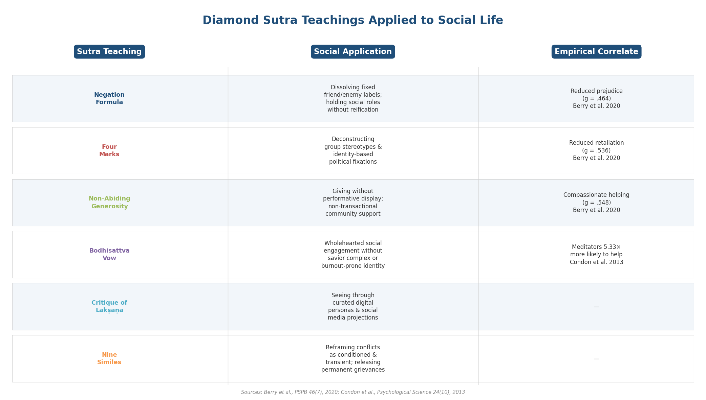

The bodhisattva vow (§3) provides the orienting framework. Social life is neither an obstacle to awakening nor a stage for the display of spiritual attainment. It is the field in which the vow is enacted — the place where "all living beings" are encountered, served, and released from the categories that would reduce them to fixed objects of one's compassion, judgment, or indifference. The Diamond Sutra's final instruction applies as much to a community meeting as to a meditation hall: "View all conditioned things like this" — as dependently arisen, as impermanent, as worthy of full engagement precisely because nothing about them is permanent enough to grasp.

# 第8章 Contemplative Practice — Meditation and Study Methods

The Diamond Sutra is not merely a text to be read; it is, by its own account, a text to be *upheld*. Eight escalating merit-comparison passages (§§4, 8, 11, 13e, 15a, 16b, 24, 32) insist that even a single four-line verse, when taken up, studied, and taught to others, generates merit surpassing cosmic material offerings. The claim is not hyperbolic decoration but a doctrinal instruction: the Diamond Sutra demands active contemplative engagement — sustained, embodied practice with its language, logic, and silence — rather than passive intellectual assent. As Chapter 2 demonstrated, the sutra enacts emptiness rather than naming it; as Chapters 4 through 7 traced, that enactment carries concrete consequences for emotional regulation, professional conduct, family life, and social engagement. This chapter turns to the methods by which such enactment is cultivated: recitation, analytical meditation, sutra copying, structured study, and contemplative integration — the traditional and contemporary practices that transform the Diamond Sutra from a philosophical treatise into a living discipline.

The raft analogy of §6 — examined in Chapter 2 — applies reflexively to every method described below. Recitation, meditation, copying, and group study are all rafts: indispensable for crossing the river of conceptual habit, yet themselves to be released upon arrival. A practitioner who grasps any method as an end in itself reproduces the very attachment the sutra dismantles. The paradox is precise: one must practice earnestly while holding practice itself as empty of inherent nature [Red Pine 2001, Ch. 6](https://bodhibass.com/wp-content/uploads/2018/11/diamond-sutra.pdf "Red Pine, Chapter Six — the raft analogy").

## 8.1 The Four Modes of Sutra Engagement

Master Sheng Yen (聖嚴法師, 1931–2009), founder of Dharma Drum Mountain, identified four progressively deepening modes of engaging with a sutra: silent reading (*mòdú*, 默讀), reading aloud (*lǎngdú*, 朗讀), chanting from memory (*sòngjīng*, 誦經), and "upholding" (*shòuchí*, 受持). Each mode involves a qualitatively different relationship between practitioner and text [Dharma Drum Mountain](https://www.dharmadrum.org/portal_d8_cnt_page.php?folder_id=33&cnt_id=93&up_page=1 "Sheng Yen's four methods of sutra practice").

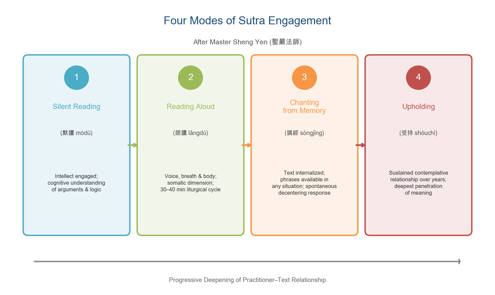
*Figure 8.1. The four modes of sutra engagement progress from intellectual comprehension through somatic involvement and memorization to sustained contemplative relationship.*

**Silent reading** engages the intellect: the practitioner works through the text's meaning, grapples with its logic, and constructs conceptual understanding of its arguments. This mode corresponds to the kind of engagement the preceding chapters have modeled — analyzing the negation formula, tracing the deconstruction of the four marks, comprehending non-abiding generosity as a principle.

**Reading aloud** adds a somatic dimension. Voice, breath, and body become involved; the text moves from purely cognitive engagement to one that occupies the whole organism. In Chinese Buddhist practice, recitation follows a structured liturgical sequence: the Purifying Speech Mantra (*jìngkǒuyè zhēnyán*, 淨口業真言), the Sutra Opening Verse (*kāijīng jì*, 開經偈), the main body of the sutra (following Kumārajīva's 5,180-character text), and the Merit Transfer Verse (*huíxiàng jì*, 迴向偈). A full recitation typically takes 30 to 40 minutes — long enough to require sustained concentration, short enough to incorporate into daily practice [Dharma Drum Mountain](https://www.dharmadrum.org/portal_d8_cnt_page.php?folder_id=33&cnt_id=93&up_page=1 "Sheng Yen on recitation practice and liturgical structure").

**Chanting from memory** deepens internalization further. Freed from the written page, the practitioner carries the sutra's phrases into any situation — walking, cooking, or the emotionally charged moments examined in Chapters 4 through 7. The negation formula, encountered some thirty times, begins to function not as a remembered proposition but as a spontaneous cognitive habit: an automatic decentering response that arises whenever the mind begins to solidify experience into fixed categories.

**Upholding** (*shòuchí*) represents the deepest mode. Sheng Yen described it as the discipline of returning to the text over months and years, allowing each encounter to reveal new dimensions of meaning as the practitioner's experience deepens. Upholding is not mere repetition; it is the transformation of reading into a sustained contemplative relationship. The sutra itself uses this term in §15a: "whoever takes up this teaching discourse, upholds, recites, studies it" (*ya imāṃ dharmaparyāyam udgrahīṣyanti dhārayiṣyanti vācayiṣyanti paryavāpsyanti*) — a compound verb sequence moving from grasping the text, through retaining it, to reciting it aloud, and finally to thoroughly penetrating its meaning [Paul Harrison 2006, §15a](https://static1.squarespace.com/static/5c03ced75ffd204418037b7a/t/5c5306ce575d1f9230da8a6a/1548945103490/Diamond+Sutra-Paul+Harrison+tr.pdf "Harrison 2006, pp. 150–151").

## 8.2 Non-Abiding Mind: §10 as Direct Meditation Instruction

Among the Diamond Sutra's many passages that function as contemplative instructions, §10 holds a singular status in the Chan/Zen tradition. The phrase 應無所住而生其心 — "Generate a mind that does not abide anywhere" — is the passage that, according to the *Platform Sutra*, triggered Huineng's awakening [McRae, *Platform Sutra*, BDK 2000](https://bdkamerica.org/download/1872 "McRae translation, pp. 17–24"). Its force lies in the paradox it encodes: the mind must be fully active ("generate"), yet entirely free of fixation ("not abide anywhere").

In meditation practice, this instruction operates on two levels. At the level of *śamatha* (calm abiding; 止), it directs the practitioner away from exclusive concentration on any single object. Many traditions instruct beginners to fix attention on the breath, a mantra, or a visual point; the Diamond Sutra's instruction goes further — even these meditation objects must not become sites of abiding. The practitioner cultivates a wide, open awareness that includes whatever arises — thoughts, sensations, sounds, emotions — without fixing upon any element as "the object." This is not distraction but a specific attentional stance in which awareness is simultaneously vivid and unfixed.

At the level of *vipaśyanā* (insight; 觀), the instruction functions as direct investigation into the nature of mind. The practitioner examines: *Where does this mind abide?* The search yields no findable location — no permanent subject, no fixed vantage point. The sutra's §18 extends this investigation temporally: "A past thought cannot be found, a present thought cannot be found, a future thought cannot be found" [Red Pine 2001, Ch. 18](https://bodhibass.com/wp-content/uploads/2018/11/diamond-sutra.pdf "Red Pine, Chapter Eighteen"). The "non-abiding mind" is thus not a special state to be achieved but a recognition of what mind already is: a dynamic, empty process without fixed center.

The practical implications for the challenges examined in earlier chapters are direct. The non-abiding mind does not suppress the stress response discussed in Chapter 4; it provides the cognitive ground on which stress arises and passes without solidifying into identity. It does not eliminate professional ambition (Chapter 5); it allows ambition to function as response to conditions rather than expression of a fixed self. It does not dissolve love (Chapter 6); it frees love from the imprisonment of projection. It does not withdraw from social engagement (Chapter 7); it enables participation without compulsive self-protection.

## 8.3 Analytical Meditation on the Negation Formula

The negation formula's thirty-plus instances across the Diamond Sutra provide a structured object for *vipaśyanā*. Each instance follows the same logical form — "X has been preached by the Tathāgata as a-X, therefore it is called X" — but applies it to a different referent: dharmas, merit, physical marks, buddha-fields, the thirty-two signs, the teaching itself [Paul Harrison 2006](https://static1.squarespace.com/static/5c03ced75ffd204418037b7a/t/5c5306ce575d1f9230da8a6a/1548945103490/Diamond+Sutra-Paul+Harrison+tr.pdf "Harrison 2006, pp. 136–140"). This repetitive structure is not an artifact of oral composition; it constitutes a meditation curriculum.

The practitioner takes a single instance of the formula and works through three investigative stages:

1. **What is X?** — Identify the conventional referent. What do we ordinarily mean by "merit," "the thirty-two marks," "a buddha-field"? What expectations, emotional charges, and identity investments attach to this concept? This step corresponds to the identification of attachment points examined in Chapters 4 through 7: the fixed self-concept that generates emotional suffering, the professional identity that breeds burnout, the spouse-image that produces relational rigidity, the social label that fuels tribal antagonism.

2. **In what sense is X "not-X" (or "devoid of X-ness")?** — Investigate the absence of inherent existence. Under what conditions did X arise? What sustains it? Can it be found as an independent, self-existing entity? This step applies the *bahuvrīhi* reading Harrison identified as "more cogent philosophically": not a flat denial that X exists, but a recognition that X is constituted entirely by non-X elements — causes, conditions, relationships, and processes that are themselves empty.

3. **Why does emptiness enable the conventional designation?** — The formula's distinctive contribution: precisely *because* X lacks fixed essence, the label "X" functions. If merit were inherently real, it could not be generated, transferred, or surpassed. If a buddha-field were inherently perfect, no being could be reborn there. The conventional functions *because* of the ultimate emptiness. This step reintegrates the practitioner with the world of appearances, preventing the nihilistic misreading that emptiness means nonexistence.

Kamalaśīla's *Bhāvanākrama* (Stages of Meditation) provides the classical procedural framework for this kind of analytical practice. The method unfolds in four stages: (1) develop compassion as motivation — the investigation serves to liberate all beings from suffering produced by reification; (2) establish *śamatha* — settle the mind sufficiently to sustain focused investigation; (3) apply *vipaśyanā* — examine the referent for inherent existence, using the negation formula as the analytical instrument; (4) alternate *śamatha* and *vipaśyanā* until they merge — the recognition of emptiness itself becomes the object of calm abiding [Dalai Lama/Kamalaśīla, *Stages of Meditation*, Snow Lion, 2001](https://export.gettingtoglobal.org/Resources/Yld8ge/2AD091/dalai-lama__stages__of_meditation.pdf "Bhāvanākrama II English translation"). Applied to the Diamond Sutra, the practitioner takes a single negation-formula instance, searches for the inherent existence of the referent, and rests in the recognition that no such inherent existence can be found — not as an intellectual conclusion but as direct experiential insight.

## 8.4 The Nine Similes as a Complete Contemplation Cycle

The closing verse of the Diamond Sutra (§32b) contains nine similes that constitute, in compressed form, a complete contemplative curriculum:

> *As a shooting star, a clouding of sight, a lamp,*
> *An illusion, a dewdrop, a bubble,*
> *A dream, a lightning flash, a thunder cloud —*
> *View all created things like this.*
>
> [Paul Harrison 2006, §32b](https://static1.squarespace.com/static/5c03ced75ffd204418037b7a/t/5c5306ce575d1f9230da8a6a/1548945103490/Diamond+Sutra-Paul+Harrison+tr.pdf "Harrison 2006, p. 158")

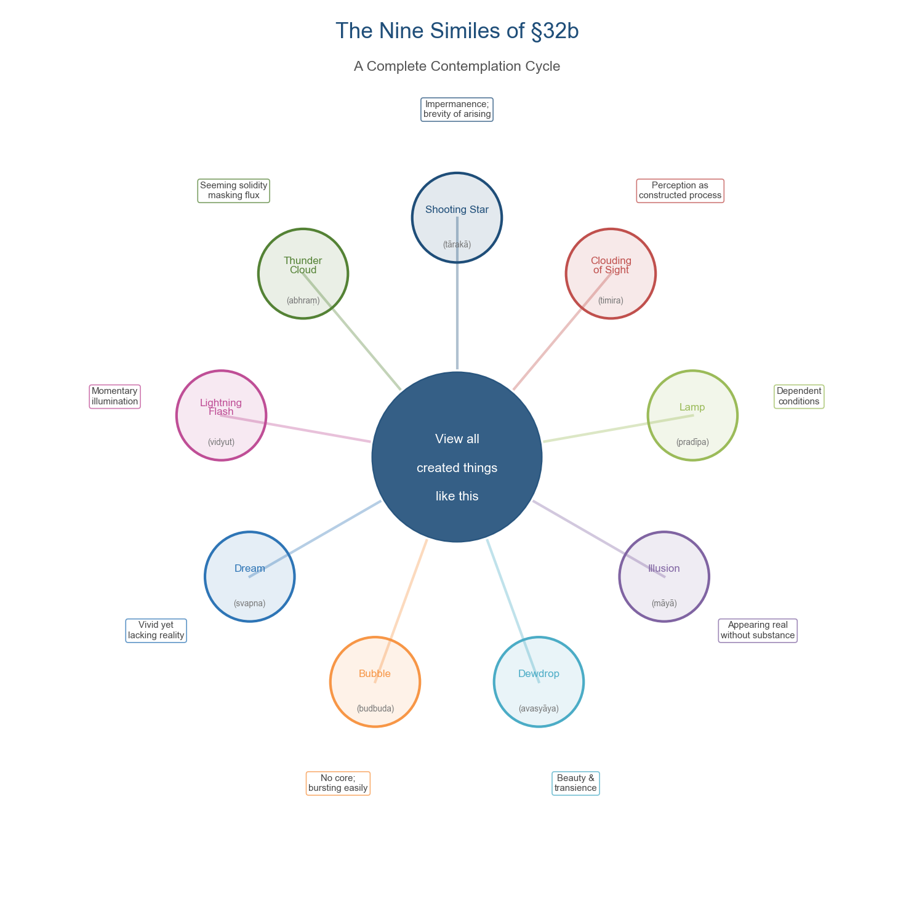
*Figure 8.2. Each of the nine similes illuminates a distinct facet of conditioned phenomena and serves as an independent meditation object.*

Each simile can serve as a self-contained contemplative focus [Red Pine 2001, Ch. 32](https://bodhibass.com/wp-content/uploads/2018/11/diamond-sutra.pdf "Red Pine, Chapter Thirty-Two"):

- **A shooting star** (*tārakā*): phenomena are fleeting — arising briefly, already vanishing. The meditator contemplates the brevity of any experience, any emotional state, any self-concept.
- **A clouding of sight** (*timira*): perception is not transparent access to reality but a constructed, conditioned process. What we "see" — in others, in ourselves, in situations — is shaped by cognitive habits, as Chapter 4's discussion of self-narratives demonstrated.
- **A lamp** (*pradīpa*): experience depends on conditions, as a flame depends on wick, oil, and air. Remove any condition and the flame ceases. This simile directly parallels the dependent-origination analysis underlying the negation formula.
- **An illusion** (*māyā*): phenomena appear real but lack substantial existence — not nonexistent, but not what they appear to be. The professional identity examined in Chapter 5, the spouse-image examined in Chapter 6, the social labels examined in Chapter 7 are all *māyā* in this precise sense.
- **A dewdrop** (*avasyāya*): the beautiful and the precious are also the most transient. Attachment to any state — happiness, success, intimacy — is attachment to dew.
- **A bubble** (*budbuda*): arising from conditions, possessing no core, bursting at the slightest disturbance. The self-concept, the sutra implies, has exactly this structure.
- **A dream** (*svapna*): vivid and experientially compelling while occurring, yet lacking the ontological status attributed to it. The meditator investigates: in what sense is waking experience different from dream?
- **A lightning flash** (*vidyut*): momentary illumination against a vast background of darkness. Insight, the sutra suggests, has this character — brief, vivid, impossible to grasp.
- **A thunder cloud** (*abhraṃ*): massive, seemingly solid, yet composed of water vapor and lacking fixed form. Institutions, relationships, career trajectories — all exhibit this quality of apparent solidity masking processual flux.

The sutra's merit-comparison passages authorize working with these similes as minimal contemplative units. §8 declares that even one four-line verse (*catuṣpādikā gāthā*), when taken up and taught, generates more merit than filling three thousand worlds with the seven treasures [Paul Harrison 2006, §8](https://static1.squarespace.com/static/5c03ced75ffd204418037b7a/t/5c5306ce575d1f9230da8a6a/1548945103490/Diamond+Sutra-Paul+Harrison+tr.pdf "Harrison 2006, pp. 145–146"). The nine-similes verse is the most frequently extracted passage for this purpose, alongside §26's "Who looks for me in form, who seeks me in a voice, indulges in wasted effort." A practitioner need not memorize the entire sutra; a single verse, held with sustained attention and investigated through the analytical method described in §8.3, constitutes a complete practice.

## 8.5 Thich Nhat Hanh's Three Doors of Liberation

Thich Nhat Hanh (1926–2022) developed a distinctive Diamond Sutra practice centered on "throwing away" the four notions through the three doors of liberation: emptiness (*śūnyatā*; 空), signlessness (*animitta*; 無相), and aimlessness (*apraṇihita*; 無願). His approach collapses the distance between philosophical understanding and embodied practice: "Emptiness is not a philosophy; emptiness is a practice." The Diamond Sutra, in his reading, functions as "the oldest text on deep ecology" — dissolving the boundary between self and world not through argument but through lived experience of interbeing [Thich Nhat Hanh, "Dharma Talk: Throwing Away," *The Mindfulness Bell*, 2006](https://www.parallax.org/mindfulnessbell/article/dharma-talk-throwing-away/ "Plum Village dharma talk, 2006").

The three doors operate as progressive stages of contemplative release:

1. **Emptiness** (*śūnyatā*): Recognize that the self is composed entirely of non-self elements. The practitioner investigates any phenomenon — a feeling, a thought, a relationship — and identifies its constituent conditions. Nothing stands alone. This corresponds to the negation formula's second step: X is "devoid of X-ness."

2. **Signlessness** (*animitta*): Release attachment to the "signs" (*lakṣaṇa*; 相) by which phenomena are identified and categorized. The sutra's §5 declares: "as long as there is any distinctive feature there is falsehood" [Paul Harrison 2006, §5](https://static1.squarespace.com/static/5c03ced75ffd204418037b7a/t/5c5306ce575d1f9230da8a6a/1548945103490/Diamond+Sutra-Paul+Harrison+tr.pdf "Harrison 2006, p. 143"). In practice, signlessness means relating to people and situations without the overlay of fixed categorization — the skill Chapters 6 and 7 identified as central to healthy relationships and social engagement.

3. **Aimlessness** (*apraṇihita*): Abandon the pursuit of any goal external to the present moment — including enlightenment. The bodhisattva paradox of §3 (saving all beings while recognizing that no being is saved) is the paradigmatic expression of aimlessness. In daily practice, it means acting fully while releasing attachment to outcome — the non-abiding generosity (*apratisthita-dāna*) that Chapter 5 examined as the foundation of ethical professional conduct and Chapter 4 identified as the ground of emotional resilience.

## 8.6 Sutra Copying as Embodied Contemplation

The practice of sutra copying (*chāojīng*, 抄經; Japanese: *shakyō*, 写経) transforms engagement with the Diamond Sutra from a cognitive and auditory exercise into a kinesthetic one. The tradition dates to the Six Dynasties period (220–589 CE) in China, when copying sutras was understood simultaneously as a devotional act, a merit-generating practice, and a meditative discipline.

Soto Zen preserves detailed instructions for *shakyō*: prepare a clean room and set up an altar; wash hands and regulate the breath; recite the Four Great Vows; then begin tracing each character with a brush pen. The completed copy is to be treated "as though treating a Buddha statue" — not as a personal possession or aesthetic object but as an embodiment of the dharma [Soto Zen International](https://www.sotozen.com/sch/practice/sutra/shakyo.html "Official Soto Zen shakyo instructions").

The contemplative logic of sutra copying operates through a specific mechanism: the slowness required by brush calligraphy forces the practitioner into sustained, moment-by-moment contact with each character. Where silent reading permits the mind to race ahead, constructing meaning from phrases and paragraphs, copying demands attention to individual strokes. The negation formula, encountered during copying, cannot be skimmed; each character must be formed individually, and the paradoxical logic of "A is not A, therefore A" unfolds at the pace of ink on paper rather than the pace of conceptual processing.

The historical depth of this practice is substantial. Zhang Jizhi's 1253 CE calligraphic copy of the Diamond Sutra — a masterwork of Song dynasty calligraphy now in the public domain — exemplifies the convergence of aesthetic accomplishment and contemplative discipline the tradition cultivates. The Dunhuang Diamond Sutra of 868 CE, discussed in Chapter 1, was itself produced as a devotional project: its colophon records that it was "reverently made for universal free distribution by Wang Jie on behalf of his two parents" — an act of non-abiding generosity that predates the invention of movable type by nearly two centuries.

## 8.7 Empirical Evidence: Emptiness Meditation and Psychological Outcomes

The contemplative methods described above are not only traditional practices; a growing body of empirical research has begun to investigate their psychological effects. Van Gordon, Shonin, and Griffiths (2019) conducted a controlled study of emptiness meditation — a two-phase practice involving (1) a concentrative phase in which attention is stabilized and (2) an investigative phase in which the practitioner examines phenomena for inherent existence. This two-phase structure mirrors the *śamatha-vipaśyanā* framework of Kamalaśīla's *Bhāvanākrama*. Among 25 advanced meditators, those who engaged in emptiness meditation achieved a 24% reduction in negative emotions and a 10% increase in positive emotions beyond the effects observed in a mindfulness control group [Van Gordon et al., *Explore* 15(4), 2019](https://pubmed.ncbi.nlm.nih.gov/30660506/ "Van Gordon et al. 2019, emptiness meditation study, N=25 advanced meditators").

These findings align with the psychological mechanisms examined in Chapter 4. The Diamond Sutra's core contemplative operation — investigating any phenomenon for inherent existence and recognizing its absence — corresponds to what clinical psychology terms "decentering" or "cognitive defusion": the capacity to observe thoughts and emotions as transient mental events rather than fixed truths about the self. The distinction is that the Diamond Sutra's method extends further in scope: it applies the investigation not only to thoughts and emotions but to the self that observes them, to the practice that investigates them, and to the teaching that authorizes the investigation.

## 8.8 Structured Study: Buddhist Lectio Divina and Group Practice

The Diamond Sutra's contemplative engagement need not be solitary. Two contemporary models offer structured frameworks for communal study.

### The "Tathāgata Citta" Method

Peng (2024), in a dissertation at the University of the West, developed an eight-step method of Buddhist scriptural engagement adapted from the Christian tradition of *Lectio Divina*. The steps — Arrive, Reading, Reflecting, Writing, Responding, Rest, Discussion, and Check-out — provide a container for contemplative engagement transferable to Diamond Sutra study [Peng, UWest, 2024](https://ir.uwest.edu/files/original/25a96b1420e4bc3209a75f569622bd458cf955c7.pdf "UWest dissertation on Buddhist Lectio Divina").

Applied to the Diamond Sutra, the method might proceed as follows: *Arrive* — settle body and mind through brief sitting meditation. *Reading* — a facilitator reads a passage aloud (e.g., one instance of the negation formula, or one of the nine similes). *Reflecting* — participants sit in silence, allowing the passage to resonate without rushing to interpretation. *Writing* — each participant journals a response: What does this passage evoke? Where does it meet resistance? *Responding* — participants share briefly, speaking from personal experience rather than doctrinal analysis. *Rest* — a period of silent meditation, allowing the discussion to settle. *Discussion* — open dialogue, now informed by contemplative engagement rather than purely intellectual debate. *Check-out* — each participant offers a single word or phrase capturing the session's resonance.

### The Plum Village Sangha Model

Thich Nhat Hanh's Plum Village tradition offers a complementary approach through Dharma sharing within a sangha (practice community). The *Joyful Sangha Facilitation Handbook* (2020) outlines core elements: sitting meditation as "stopping and deep looking" (*śamatha-vipaśyanā* in accessible language); Dharma sharing — structured group discussion governed by deep listening (no advice, no debate, no interruption); Beginning Anew — a four-part conflict-resolution practice (flower watering, expressing regret, expressing hurt, asking for support); and embodied practices such as walking meditation, eating meditation, and tea meditation [*Joyful Sangha Facilitation Handbook*, 2020](https://plumvillagesanghas.org/wp-content/uploads/2022/02/FacilitatorHandbook.pdf "Plum Village handbook").

The Plum Village model is especially relevant to the life-context challenges examined in Chapters 4 through 7. Beginning Anew, for instance, operationalizes the non-abiding generosity discussed in Chapters 5 and 6: one offers appreciation (flower watering) without attachment to reciprocation, and one expresses hurt without solidifying the offending party into a fixed identity. Dharma sharing, by prohibiting advice and debate, enforces a mode of listening that enacts the Diamond Sutra's dissolution of the self/other boundary examined in Chapter 7.

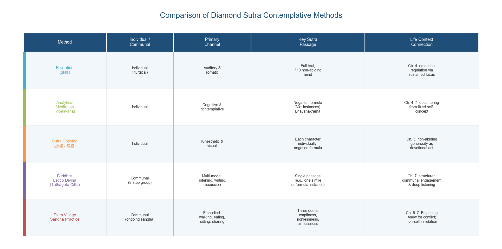
*Figure 8.3. Five contemplative methods compared across mode (individual vs. communal), primary sensory channel, key sutra passage, and connection to the life-context chapters.*

## 8.9 The Raft Analogy Revisited: Practice as Self-Negating Method

Every method described in this chapter — recitation, analytical meditation, sutra copying, structured study, group practice — operates under the governance of the raft analogy (§6). The analogy, drawn from the Pāli *Alagaddūpamasutta* (M.I.130–142), warns against clinging to the dharma itself: "The teachings should be let go of, to say nothing of what is not the teachings" [Paul Harrison 2006, §6](https://static1.squarespace.com/static/5c03ced75ffd204418037b7a/t/5c5306ce575d1f9230da8a6a/1548945103490/Diamond+Sutra-Paul+Harrison+tr.pdf "Harrison 2006, p. 144"). Harrison notes that the Sanskrit *udgrah-* carries a double meaning — both "to grasp" and "to learn" — yielding a precise ambiguity: one must *learn* the teaching without *grasping* it.

This principle applies to every practice modality. The practitioner who recites the Diamond Sutra daily for decades — deriving peace, stability, and insight from the practice — must hold the recitation itself as empty of inherent nature. The meditator who achieves the *śamatha-vipaśyanā* union described by Kamalaśīla must recognize that the meditative state possesses no fixed essence. The study group that becomes a source of community and support must not reify the group into an identity to be defended. The calligrapher who produces exquisite copies of the sutra must release attachment to the product.

This is not a counsel of nihilism or indifference. The raft is indispensable while one is crossing. The sutra does not say "do not build a raft"; it says "do not carry the raft on your head once you have crossed." The distinction is between using a method and being used by it — between practice as a living response to conditions and practice as a new form of identity and attachment.

The Diamond Sutra's contemplative methods thus embody its philosophical core. The negation formula applies to the methods themselves: "Practice is not practice, therefore it is called practice." Recitation, meditation, copying, and study function precisely because they are empty of inherent practice-nature — conventional tools, dependently arisen, responsive to conditions, and effective only insofar as they are held lightly. The practitioner who grasps this point has not merely understood the Diamond Sutra; she has begun to live it.

# 第9章 The Diamond Sutra in the Modern World — Synthesis and Continuing Relevance

A text composed between the 2nd and 5th centuries CE, transmitted through at least six Chinese translations, a Tibetan rendering, and multiple Central Asian versions, printed in the world's oldest dated book in 868 CE, and — in the twenty-first century — encoded in synthetic DNA: the Diamond Sutra's material history alone testifies to a persistence that few documents of any tradition can match. Mere longevity, however, does not constitute relevance. The question this concluding chapter addresses is what, precisely, the Diamond Sutra offers the contemporary world that other wisdom traditions, secular philosophies, or modern therapeutic frameworks do not — and why, after nearly two millennia, its central teaching retains the capacity to cut.

The preceding chapters traced the sutra's philosophical architecture (Chapter 2), its divergent readings across Buddhist and Western intellectual traditions (Chapter 3), and its concrete applications to emotional well-being (Chapter 4), professional life (Chapter 5), marriage and parenting (Chapter 6), social dynamics (Chapter 7), and contemplative practice (Chapter 8). This chapter draws those threads together, examining the sutra's continuing vitality in East Asian and Western Buddhism, its role as an instrument of interfaith dialogue, its encounters with digital culture and contemporary art, its distinctive contribution compared to other canonical wisdom texts, and the unifying logic that connects its ancient negation formula to the lived concerns of a 21st-century audience.

## 9.1 A Living Text: The Diamond Sutra in Contemporary Buddhist Practice

The Diamond Sutra has never been a museum piece. Across East Asian Buddhism, it remains one of the most widely recited texts — chanted daily in monasteries throughout China, Korea, Japan, and Vietnam, and upheld by lay practitioners who recite Kumārajīva's 5,180-character translation as a daily discipline. Master Sheng Yen articulated four modes of engagement with the sutra (Chapter 8): silent reading, reading aloud, chanting from memory, and sustained "upholding" over months and years — a graduated practice in which the text progressively reshapes the practitioner's relationship to experience.

Hsing Yun (星雲大師, 1927–2023), founder of Fo Guang Shan and among the most influential figures in modern Chinese Buddhism, identified the Diamond Sutra as a "core text" of Chinese Buddhist practice and distilled its teaching into four operational principles: "to give without notions, to liberate with no notion of self, to live without abiding, and to cultivate without attainment" [Hsing Yun, *Four Insights for Finding Fulfillment*, 2012](https://foguangpedia.org/blog-post/success-in-the-human-world/ "Hsing Yun on the Diamond Sutra in Humanistic Buddhism"). Each principle maps directly onto the sutra's doctrinal architecture examined in Chapter 2: non-abiding generosity (§4), the paradox of the bodhisattva vow (§3), the non-abiding mind (§10), and the self-negating logic of enlightenment (§22). Hsing Yun's formulation exemplifies how the sutra functions within contemporary Humanistic Buddhism — not as an esoteric treatise reserved for monastics but as a practical orientation for engaged lay life.

In Western convert Buddhism, the Diamond Sutra has achieved a distinctive status as a text that bridges contemplative depth and intellectual rigor. Thich Nhat Hanh's Plum Village community freely distributes his translation online, making the text accessible to practitioners worldwide without institutional gatekeeping. Norman Fischer, former co-abbot of the San Francisco Zen Center, frames the prajñāpāramitā teaching as "an attitude of unshakeable confidence … a foundation built on absolutely nothing is absolutely unshakeable" [Fischer, Everyday Zen, 2008](https://everydayzen.org/teachings/diamond-sutra-1/ "Fischer's 2008 Diamond Sutra series"). Fischer's formulation captures the paradox that runs through every chapter of this study: emptiness is not a deficit but a liberation, not nihilism but the ground of fearless engagement.

The translation lineage itself testifies to the sutra's continuing vitality. Max Müller's pioneering 1894 rendering from Sanskrit initiated the modern English tradition; Edward Conze's landmark 1957 scholarly edition established the academic benchmark; A.F. Price and Wong Mou-Lam's 1947 version profoundly influenced the Beat Generation; Thich Nhat Hanh's 1992 Zen commentary made the text a vehicle for engaged practice; and Red Pine's 2001 edition drew upon commentaries from fifty-three Zen masters to produce a richly layered reading. Paul Harrison's 2006 translation, based on the oldest surviving Gandhāran manuscripts, represents the current scholarly gold standard, while Alex Johnson's modern English version targets lay readers outside traditional Buddhist institutions [diamond-sutra.com](https://diamond-sutra.com/ "Johnson's modern translation"). The 84000 project — a major international initiative to translate the entire Tibetan Buddhist canon — lists Toh 16 (the Vajracchedikā) as in progress, ensuring that the Tibetan transmission will receive a new critical English rendering [84000.co](https://84000.co/translation/toh16 "84000 project, Toh 16 in-progress"). That each generation has found it necessary to render the sutra afresh speaks to a quality inhering in the text itself: its meaning is not exhausted by any single translation, because the negation formula resists final capture in any fixed verbal form.

## 9.2 The Diamond Sutra and Interfaith Dialogue

The sutra's capacity to generate productive conversation across religious boundaries derives from a feature examined in Chapter 2: its refusal to name emptiness while relentlessly demonstrating the principle. Because the Diamond Sutra enacts a way of seeing rather than declaring a metaphysical doctrine, it can function as a dialogue partner with traditions that approach the ineffable from different directions — without requiring doctrinal assimilation from either side.

D.T. Suzuki's *Mysticism: Christian and Buddhist* (1957) established the paradigmatic case for such dialogue. Suzuki demonstrated convergence between Meister Eckhart's *Abgeschiedenheit* (absolute detachment) and Buddhist non-attachment, arguing that Eckhart's "Godhead" — the formless ground beyond the personal God — corresponds structurally to śūnyatā (emptiness; 空). Where Eckhart wrote "God is nothing" (*Gott ist ein lauter Nichts*), not to deny God but to place the divine beyond all categories, the Diamond Sutra's negation formula performs an analogous operation: "The Tathāgata is not the Tathāgata, therefore called the Tathāgata" (§17c) [Suzuki, *Mysticism: Christian and Buddhist*, Ch. I](https://sacred-texts.com/bud/mcb/mcb03.htm "Suzuki on Eckhart and Zen"). Neither tradition arrives at mere negation; both deploy negation as a pathway to an encounter with reality that transcends conceptual grasping.

This triple convergence — Prajñāpāramitā, Christian mysticism, and Daoist apophatic thought (the Dao that can be spoken is not the constant Dao) — positions the Diamond Sutra as a natural instrument for interfaith contemplative dialogue. The sutra does not claim that all traditions teach the same thing; its raft analogy (§6), examined in Chapter 2, explicitly acknowledges that teachings are context-dependent instruments to be relinquished upon arrival. Its performative strategy — showing rather than telling, enacting emptiness rather than dogmatizing it — creates a meeting-ground where practitioners of different traditions can recognize structurally similar operations within their own contemplative vocabularies without collapsing the real differences between those traditions.

The Western philosophical engagement traced in Chapter 3 extends this dialogue beyond theistic traditions. David Loy's comparison of the Diamond Sutra with Derridean deconstruction identified a crucial asymmetry: both refuse to posit a "transcendental signified," but Buddhism aims at transformation of lived experience, not merely textual meaning [David R. Loy, "The Deconstruction of Buddhism," SUNY Press, 1992](https://www.scribd.com/document/74163945/The-Deconstruction-of-Buddhism "Loy 1992, pp. 227–253"). The negation formula's resemblance to Derrida's *sous rature* ("under erasure") — using a term while crossing it out — is structurally genuine but soteriologically insufficient: the Diamond Sutra deconstructs concepts not to demonstrate the instability of meaning but to liberate beings from suffering. This distinction — deconstruction in the service of compassion rather than critique — renders the sutra's philosophical contribution irreducible to any single Western counterpart.

## 9.3 Digital Culture, Contemporary Art, and New Materialities

The Diamond Sutra's encounter with modernity extends beyond interpretation to materiality. Its history as a physical object — from birchbark manuscript to woodblock scroll to synthetic DNA — mirrors, with striking literalness, the sutra's own teaching about form and emptiness: every material substrate in which the text has been inscribed is itself impermanent, yet the teaching persists through successive transformations.

The British Library's 868 CE Dunhuang scroll has been fully digitized by the International Dunhuang Project (IDP), making a document discovered in a sealed cave in 1900 available to anyone with an internet connection — a development that would have delighted its colophon's author, Wang Jie, who commissioned the printing "for universal free distribution." Major museum exhibitions have framed the sutra as both a cultural artifact and a living philosophical provocation. The British Library's 2024–2025 exhibition "A Silk Road Oasis" presented the scroll alongside contextual materials illuminating the Dunhuang cave complex. At Harvard, the CAMLab's 2025 exhibition "All Forms Are Not True Forms" — its title quoting the Diamond Sutra directly — employed AI-generated Buddha icons to investigate the sutra's critique of *lakṣaṇa* (marks/signs) in the age of artificial image-making [IDP](https://idp.bl.uk/blog/the-diamond-sutra-on-display-text-panel-1/ "IDP blog on exhibition"); [Harvard CAMLab](https://camlab.fas.harvard.edu/exhibition/all-forms-are-not-true-forms/ "CAMLab 2025 exhibition"). The exhibition's premise — that AI-generated imagery enacts a contemporary analogue to the sutra's warning against fixating on appearances (§5, §26) — exemplifies how the text's philosophical instruments find application in contexts its authors could not have anticipated.

The most radical material transformation to date is the Sutra2DNA project at Temple University, which encoded Kumārajīva's Chinese translation in synthetic DNA and housed the result in 3D-printed stupas deposited at the Library of Congress and five other global repositories. Marcus Bingenheimer, the project's lead researcher, frames the work within the Diamond Sutra's own history of adopting new information technologies: from oral recitation to palm-leaf manuscript, from manuscript to woodblock printing, from printing to digital encoding, and now from digital to biological storage. Buddhists, Bingenheimer observes, have been "early adopters" of every information technology [Bingenheimer, Sutra2DNA](https://mbingenheimer.net/sutra2DNA/ "Temple University Sutra2DNA project"). The Smithsonian has placed the Diamond Sutra within "the pantheon of revered books" alongside the Gutenberg Bible — a recognition of its dual status as cultural monument and philosophical instrument [Smithsonian Magazine, 2016](https://www.smithsonianmag.com/smart-news/Five-things-to-know-about-diamond-sutra-worlds-oldest-dated-printed-book-180959052/ "Smithsonian on the Diamond Sutra as cultural artifact").

The sutra's critique of *lakṣaṇa* and *nimitta* (signs/marks) — examined in Chapters 2 and 7 — acquires fresh urgency in the age of social media and artificial intelligence. §26's verse — "Who looks for me in form / who seeks me in a voice / indulges in wasted effort" — reads as a precise diagnosis of digital culture's fixation on curated images, personal brands, and algorithmically amplified appearances. Platforms built on *nimitta* reward the construction of fixed identities and penalize the fluidity the sutra prescribes (Chapter 7). The nine similes of §32 — "a star, a defect of vision, a lamp, an illusion, a dewdrop, a bubble, a dream, a lightning flash, a cloud" — provide a counter-frame for the apparent solidity of online conflict, viral outrage, and comparison-driven anxiety. The Diamond Sutra does not reject technology; its own transmission history constitutes an extended testimony to technological adoption. It rejects the perennial mistake of taking any form — digital or physical, algorithmically generated or handcrafted — as ultimately real.

## 9.4 The Distinctive Voice: What the Diamond Sutra Offers That Other Texts Do Not

Many wisdom traditions teach non-attachment. The Bhagavad Gītā instructs action without attachment to results (*niṣkāma karma*). The Dao De Jing counsels non-action (*wuwei*) and the way that cannot be spoken. Stoic philosophy prescribes indifference to externals. The question that justifies a sustained study of the Diamond Sutra — rather than a general survey of non-attachment traditions — is what this particular text contributes that the others do not.

Several features distinguish it, each reinforcing the others.

**Dialogic structure.** The Diamond Sutra is a conversation, not a declaration. Where the Heart Sutra compresses the prajñāpāramitā teaching into a few terse lines of assertion ("form is emptiness, emptiness is form"), the Diamond Sutra unfolds its insight through sustained dialogue between teacher and student. Subhūti asks, the Buddha responds, Subhūti is moved to tears (§14), and the Buddha circles back to the same questions at progressively deeper levels. The dialogic form mirrors the sutra's philosophical content: understanding arises through encounter, not from isolated proclamation. For contemporary readers accustomed to authoritarian pronouncements or soundbite wisdom, the Diamond Sutra models a pedagogical relationship in which the student's confusion is not an obstacle to be overcome but the raw material of awakening.

**The negation formula's unique logic.** The sutra's "A is not A, therefore it is called A" — appearing at least thirty times across the text — has no precise counterpart in any other canonical work [Paul Harrison 2006](https://static1.squarespace.com/static/5c03ced75ffd204418037b7a/t/5c5306ce575d1f9230da8a6a/1548945103490/Diamond+Sutra-Paul+Harrison+tr.pdf "Harrison 2006, pp. 136–140"). Nagatomo (2000) argues that this formula transcends both the classical Indian catuṣkoṭi (four-cornered logic) and Western propositional logic [Nagatomo, *Asian Philosophy* 10(3), 2000](https://en.wikipedia.org/wiki/Diamond_Sutra "Wikipedia citing Nagatomo 2000"). As Chapter 2 demonstrated, the formula simultaneously deconstructs reification (there is no inherently existing X) and rehabilitates convention (therefore it is *called* X). This double operation — dismantling fixation while preserving function — is what gives the sutra its practical power across the domains examined in Chapters 4 through 7. The Dao De Jing gestures toward a similar insight ("The Dao that can be spoken is not the constant Dao"), but does not systematically apply this logic to every category of experience: to merit, to the teacher, to the teaching, to beings, to the path itself.

**Emptiness without the word.** As Harrison observes, the Diamond Sutra never uses the term *śūnyatā* — it *enacts* emptiness rather than naming it [Paul Harrison 2006](https://static1.squarespace.com/static/5c03ced75ffd204418037b7a/t/5c5306ce575d1f9230da8a6a/1548945103490/Diamond+Sutra-Paul+Harrison+tr.pdf "Harrison 2006, p. 141"). This performative strategy, unique among Prajñāpāramitā texts, prevents emptiness from becoming a new object of attachment. The Heart Sutra names emptiness and risks its reification; the Diamond Sutra demonstrates emptiness through relentless application, sidestepping the trap. For readers approaching Buddhist philosophy for the first time, this strategy carries particular pedagogical force: one learns what emptiness *does* before learning what it is *called*.

**Self-reflexive negation.** The sutra's most radical move is to turn the negation formula upon itself. §6's raft analogy — "even dharmas should be relinquished, to say nothing of what is not dharmas" — instructs practitioners to release the teaching itself upon reaching the other shore [Paul Harrison 2006, §6](https://static1.squarespace.com/static/5c03ced75ffd204418037b7a/t/5c5306ce575d1f9230da8a6a/1548945103490/Diamond+Sutra-Paul+Harrison+tr.pdf "Harrison 2006, p. 144"). §13 applies the formula to the sutra's own name: "the perfection of wisdom is said by the Tathāgata to be no perfection." §21 denies that the Tathāgata teaches any dharma at all. This systematic self-undermining has no exact counterpart in the Bhagavad Gītā (which does not question its own authority), the Dao De Jing (which acknowledges the limitation of language but does not formally negate its own propositions), or the Stoic texts (which assume the reliability of rational discourse). It is this self-reflexive negation that enables the applications explored throughout this study: the sutra cannot become an ideology, a fixed position, or a new source of attachment — at least, not without violating its own explicit instructions.

**Universal scope of compassion.** The bodhisattva vow of §3 — "in the realm of complete nirvāṇa I shall liberate all beings, and while I thus liberate beings, not a single being is liberated" — yokes the most expansive possible ethical commitment to the most radical possible deconstruction. The Bhagavad Gītā's *niṣkāma karma* prescribes detached action but does not simultaneously deconstruct the agent, the action, and the category of "beings" served. The Diamond Sutra insists that compassion operates at full intensity precisely through the recognition that no fixed self performs the saving and no fixed beings await salvation. As Chapters 5 through 7 demonstrated, this paradox is the source of the sutra's practical power: it enables wholeheartedness without burnout (Chapter 5), unconditional love without possessiveness (Chapter 6), and social engagement without savior complexes (Chapter 7).

## 9.5 The Unifying Logic: From Negation Formula to Lived Practice

Across the domains examined in this study, a single structural insight recurs: the Diamond Sutra's negation formula operates not as an abstract philosophical proposition but as a cognitive operation that, when applied to any fixation, dissolves the suffering generated by that fixation while preserving the functional engagement it distorts.

In emotional life (Chapter 4), the formula desubstantializes anxiety: "This anxiety is devoid of inherent anxiety-nature, therefore it is called anxiety." The feeling is not denied; it is freed from its apparent claim to define the person who experiences it. The clinical literature on decentering — identified as a "core component" across CBT, ACT, and MBCT, with medium-to-large effect sizes (d = 0.6–1.85) — describes essentially the same cognitive operation in empirical terms [Bennett et al., *Translational Psychiatry* 11, 2021](https://www.nature.com/articles/s41398-021-01397-5 "Bennett et al. 2021 comprehensive review").

In professional life (Chapter 5), the formula desubstantializes role identity: "A leader is devoid of inherent leader-nature, therefore called a leader." The result, as Vu and Burton (2021) documented among 53 Buddhist leader-practitioners in Vietnam, is not the abdication of authority but its more adaptive and ethical exercise [Vu & Burton, *Journal of Business Ethics* 178, 2021](https://pmc.ncbi.nlm.nih.gov/articles/PMC8556827/ "Vu & Burton 2021"). Payutto's distinction between *taṇhā* (ego-driven craving) and *chanda* (desire for genuine well-being) provides the motivational framework: non-attachment eliminates the former while cultivating the latter, enabling purposeful effort freed from self-aggrandizement.

In marriage and parenting (Chapter 6), the formula desubstantializes the fixed image of the other: "A spouse is devoid of inherent spouse-nature, therefore called a spouse." The person one loves is not denied; the fantasy that love requires a frozen object is released. Barnes et al. (2007, N = 57 couples) found that trait mindfulness predicted higher relationship satisfaction (β = .37) precisely through the capacity for non-reactive awareness that the sutra cultivates [Barnes et al., *Journal of Marital and Family Therapy* 33(4), 2007](https://selfdeterminationtheory.org/wp-content/uploads/2020/10/2007_BarnesBrownKrusemarkCampbellRogge_JMFT.pdf "Barnes et al. 2007").

In social life (Chapter 7), the formula desubstantializes group labels: "An enemy is devoid of inherent enemy-nature, therefore called an enemy." Waldron's analysis of *ahaṃ-kāra* (self-making) demonstrates how the in-group/out-group dichotomy dissolves when neither "us" nor "them" is treated as an essential identity [Waldron, 2008](https://www.middlebury.edu/college/sites/default/files/2023-03/buddhism_and_social_science-on_the_affliction_of_self-identity0.pdf "Waldron 2008"). Berry et al.'s meta-analysis (2020, k = 29, N = 3,100) found that mindfulness-based practices reduce prejudice (g = .464) and retaliation (g = .536) while increasing compassionate helping (g = .548), providing empirical corroboration for the interpersonal effects the sutra's logic predicts [Berry et al., *PSPB*, 2020](https://www.csusm.edu/profiles/users/drberry/berry_pspb_2020_2.pdf "Berry et al. 2020 meta-analysis").

In contemplative practice (Chapter 8), the formula applies reflexively to the methods themselves: recitation, meditation, sutra copying, and study are all "rafts" — tools that must not become objects of attachment. The practitioner who grasps any method as an end in itself reproduces the very fixation the sutra dismantles.

The consistency of this structure across radically different life domains is not coincidental. The Diamond Sutra identifies a single root mechanism of suffering — the reification of what is dependently arisen into what appears inherently existent — and provides a single instrument for its dissolution: the negation formula, applied not once but at least thirty times across the sutra's length, training the mind to perform the operation spontaneously across every category of experience. The closing verse encapsulates the result: "As a star, a defect of vision, a lamp, an illusion, a dewdrop, a bubble, a dream, a lightning flash, a cloud — view all created things like this." The instruction is not to withdraw from phenomena but to perceive them clearly, engage them fully, and release them continuously.

## 9.6 Why the Diamond Sutra Endures

The Diamond Sutra endures not because it is old, revered, or culturally prestigious — though it is all three — but because it addresses a problem that does not age. The human tendency to solidify experience into fixed categories, to mistake labels for essences, to build prisons of identity and then suffer inside them, is no more or less prevalent in the 21st century than in the 5th. What changes are the forms through which fixation operates (career identity, social media persona, political tribe), the technologies through which signs are produced and consumed (woodblock printing, digital platforms, AI-generated imagery), and the therapeutic vocabularies through which liberation is described (decentering, cognitive defusion, non-attachment). The underlying mechanism — reification and the suffering it generates — remains constant.

The sutra anticipates this constancy. Its negation formula is content-agnostic: it does not prescribe what to think about specific topics but provides a formal operation applicable to any content whatsoever. "X is not X, therefore it is called X" functions identically whether X is "the Tathāgata" or "my job title" or "my political identity" or "my anxiety." This universality of application — rooted in the formula's purely formal character — is what gives the Diamond Sutra its remarkable adaptability across historical periods, cultural contexts, and individual circumstances.

The sutra also anticipates its own supersession. The raft analogy insists that the teaching itself must be released. The negation formula is applied to the perfection of wisdom, to merit, to the bodhisattva designation, and to the Buddha's teaching itself. A text that systematically deconstructs its own authority cannot become an idol — at least, not without violating its own explicit instructions. This self-undermining constitutes the Diamond Sutra's final and most distinctive contribution: it frees the reader not only from attachment to the world's apparent solidity but from attachment to the very text that performed the liberation.

Thich Nhat Hanh declared the Diamond Sutra "the oldest text on deep ecology," extending its teaching to the relationship between human consciousness and the natural world [TNH, *The Mindfulness Bell*, 2006](https://www.parallax.org/mindfulnessbell/article/dharma-talk-throwing-away/ "TNH ecological reading"). The claim is characteristically bold and philosophically defensible: if the sutra deconstructs the boundary between self and other, it deconstructs the boundary between human and non-human with equal force. The four marks negated in §3 and §14c — self, person, being, life-span — constitute the conceptual architecture not only of individual ego but of species-level anthropocentrism. A consciousness trained by the negation formula does not cease to care for the world; it ceases to place the human self at the center of its care.

The sutra's continuing relevance rests, finally, on a feature that is at once literary and philosophical: it is beautiful. The nine similes of §32 possess a compression and luminosity that survives translation across twenty centuries and a dozen languages. "As a star, a defect of vision, a lamp" — the sequence moves from the cosmic to the intimate to the domestic, grounding vast metaphysical insight in the sensory texture of ordinary experience. The Diamond Sutra's endurance is inseparable from its poetics: it teaches not only through argument but through image, rhythm, and the silence that surrounds each negation. "Those who become aware of their own minds realize this sutra does not consist of words," the Sixth Patriarch Huineng wrote [Red Pine 2001](https://bodhibass.com/wp-content/uploads/2018/11/diamond-sutra.pdf "Red Pine, Translator's Preface, citing Huineng's commentary"). The words are the raft. What they carry the reader toward cannot be spoken — only lived.

# Conclusion

The Diamond Sutra's central operation is disarmingly simple: it takes any concept the mind has solidified and reveals that concept to be dependently arisen, empty of inherent existence, and therefore conventionally functional. The negation formula — "X is not X, therefore it is called X" — performs this operation on self, on merit, on the Buddha, on the teaching, and on the formula itself. What the preceding nine chapters demonstrate is that this single logical structure, applied with consistency, cuts through the root mechanisms of suffering across every domain of human experience examined here.

The sutra's historical trajectory (Chapter 1) reveals a text that has attracted the most ambitious forms of cultural transmission available in each era — oral recitation, palm-leaf manuscript, woodblock printing, synthetic DNA — as though each generation recognized that the teaching demanded preservation through whatever technology was at hand. Its philosophical architecture (Chapter 2) establishes the instruments — the negation formula, the four marks, non-abiding generosity, the raft analogy, the nine closing similes — that subsequent chapters deploy. The interpretive traditions surveyed in Chapter 3 — Yogācāra, Chan/Zen, Tibetan Madhyamaka, and modern Western philosophy — demonstrate that the sutra's formula generates genuinely different, and complementary, philosophical conclusions depending on the grammatical, cultural, and soteriological framework through which it is read.

In emotional well-being (Chapter 4), the sutra's teachings converge with clinical findings on decentering and cognitive defusion, identified as core mechanisms of therapeutic change with effect sizes of *d* = 0.6–1.85 across CBT, ACT, and MBCT modalities. In professional life (Chapter 5), Payutto's distinction between *taṇhā* (ego-driven craving) and *chanda* (desire for genuine well-being), Schumacher's Buddhist economics, and Vu and Burton's study of 53 Buddhist leader-practitioners provide both a philosophical framework and empirical evidence for the claim that non-attachment enhances rather than undermines professional effectiveness. In marriage and parenting (Chapter 6), the negation formula dissolves the fixed images that corrode intimate relationships, while empirical research — Barnes et al.'s laboratory conflict studies, Kappen et al.'s partner-acceptance mediation analyses, Duncan et al.'s mindful-parenting model — confirms that the cognitive operations the sutra prescribes produce measurable improvements in relationship satisfaction and parent-child interaction quality. In social life (Chapter 7), Berry et al.'s meta-analysis of 29 studies (*N* = 3,100) finds that mindfulness-based practices reduce prejudice (*g* = .464) and retaliation (*g* = .536) while increasing compassionate helping (*g* = .548) — effects that correspond directly to the sutra's deconstruction of fixed social identities and its model of non-abiding generosity. And in contemplative practice (Chapter 8), the sutra's own instructions — recitation, analytical meditation on the negation formula, sutra copying, and structured communal study — provide methods for transforming philosophical understanding into embodied cognitive habit.

What distinguishes the Diamond Sutra from other wisdom traditions teaching non-attachment — the Bhagavad Gītā's *niṣkāma karma*, the Dao De Jing's *wuwei*, Stoic indifference to externals — is the thoroughness and self-reflexivity of its negation. The sutra does not merely prescribe release from attachment; it applies the same deconstructive logic to the teaching, the teacher, and the act of release itself. A text that systematically undermines its own authority cannot become an ideology. This self-negating quality is what has allowed the Diamond Sutra to remain a living practice text across radically different historical periods, cultural contexts, and individual circumstances — from 4th-century Indian monasteries to 21st-century psychotherapy research.

The closing verse captures the sutra's final instruction with nine images of compressed luminosity: "As a star, a defect of vision, a lamp, an illusion, a dewdrop, a bubble, a dream, a lightning flash, a thunder cloud — view all conditioned things like this." The instruction is not to withdraw from phenomena but to perceive them as they are: vivid, functional, dependently arisen, and utterly without the solidity that habitual perception attributes to them. When phenomena are met with this recognition — in the therapy session, the boardroom, the marriage, the community meeting, the meditation hall — the secondary elaboration that converts ordinary difficulty into sustained anguish loses its grip. What remains is the capacity to respond: fully, appropriately, and without residue.
