# Overview

The global smart home market surpassed the hundred-billion-dollar revenue threshold in 2025, with estimates ranging from USD 89.86 billion to USD 162.78 billion depending on scope definitions — yet unit shipments grew by barely 0.6% the preceding year. This paradox signals a market in structural transition: growth is now driven less by first-time device adoption and more by rising average selling prices, expanding subscription layers, and intensifying platform competition around generative artificial intelligence.

This report analyzes the forces shaping smart home product development through late 2026 and into 2027, drawing on market data from four leading research firms, consumer surveys encompassing more than 10,000 respondents, regulatory filings across U.S. and EU jurisdictions, and product announcements from CES 2026 and platform launch events. The analysis is organized around six thematic pillars:

- **Market fundamentals** (Chapter 1): Revenue projections, shipment dynamics, product-category segmentation, and regional adoption patterns establish the quantitative foundation, revealing a market shifting from volume growth to value growth, from entertainment dominance to security and energy leadership, and from new-build to retrofit deployment.

- **Technology enablers** (Chapter 2): The Matter interoperability standard (now exceeding 1,000 certified products), the migration of AI inference from cloud to device edge, and the emergence of ambient computing powered by mmWave radar and sensor fusion collectively redefine what smart home products can do, how reliably they interoperate, and how privately they operate.

- **Consumer adoption** (Chapter 3): With approximately 48% of U.S. households owning at least one smart home device, the market has crossed the halfway mark. Security, energy savings, and convenience constitute the triple engine of purchase motivation, while setup complexity (affecting 52% of DIY users), intensifying privacy anxiety (70% of consumers concerned, up from 60%), and residual affordability friction shape the remaining barriers.

- **Competitive landscape** (Chapter 4): Amazon, Google, Apple, and Samsung have each reorganized around generative AI as the primary axis of differentiation, pursuing divergent strategies — Prime bundling, Android-style platform licensing, on-device privacy-first processing, and appliance-embedded sensing, respectively. Simultaneously, builder channels, multifamily property managers, and insurance carriers are emerging as high-volume distribution pathways that bypass traditional retail.

- **Regulatory environment** (Chapter 5): EU cybersecurity mandates under the Radio Equipment Directive and Cyber Resilience Act are already enforceable or imminent; the U.S. Cyber Trust Mark faces operational delays despite an approaching federal procurement deadline; 19 U.S. states have enacted consumer data privacy statutes; and energy-efficiency codes are evolving to mandate grid-interactive device capabilities.

- **Future product trends** (Chapter 6): Ten specific product types and feature categories — from AI-native home hubs and on-device-processing security cameras to whole-home energy management systems, biometric smart lock platforms, and insurance-integrated maintenance services — are identified as the trends most likely to define the industry's trajectory, each validated against technology readiness, consumer demand, regulatory catalysts, and competitive investment patterns.

The central finding is that the smart home industry is converging on a product paradigm defined by embedded generative AI, privacy-preserving edge processing, standards-based interoperability, and subscription-funded intelligence — a combination that will reshape not only what products are built but how they are sold, monetized, and regulated.

# 第1章 Smart Home Market Overview and Growth Dynamics

The global smart home market entered 2025 in a state of paradox: aggregate revenue surged past the hundred-billion-dollar threshold while unit shipments barely grew, signaling a market driven less by first-time device adoption and more by rising average selling prices, expanding service layers, and intensifying platform competition. This chapter establishes the quantitative foundation for the report by examining market size and growth trajectories, revenue segmentation by product category, regional adoption patterns, and the macroeconomic forces shaping near-term demand.

## 1.1 Market Size and Growth Projections: Navigating Divergent Estimates

Any assessment of the smart home market must first grapple with a significant methodological challenge: leading research firms publish headline figures that diverge by as much as 65%, a gap that reflects fundamentally different scope definitions rather than analytical error. Three prominent estimates illustrate this range:

- **Fortune Business Insights** values the global market at USD 147.52 billion in 2025, projecting USD 180.12 billion in 2026 and a CAGR of 21.40% through 2034 (projected USD 848.47 billion). The estimate encompasses device hardware, installation services, and recurring subscription revenue across consumer and light-commercial segments. [Fortune Business Insights](https://www.fortunebusinessinsights.com/industry-reports/smart-home-market-101900 "Global smart home market size 2025–2034, CAGR 21.40%")

- **Grand View Research** produces the broadest estimate at USD 162.78 billion in 2025, with a CAGR of 27.0% through 2030 (projected USD 537.27 billion). Its scope includes platform revenue, cloud service fees, and professional monitoring subscriptions alongside hardware. [Grand View Research](https://www.grandviewresearch.com/industry-analysis/smart-homes-industry "Smart Home Market 2025–2030, CAGR 27.0%")

- **MarketsandMarkets** applies the narrowest definition, arriving at USD 89.86 billion in 2025 and a 6.4% CAGR to reach USD 139.24 billion by 2032. Its methodology largely excludes installation services and focuses on end-user hardware and embedded software. [MarketsandMarkets](https://www.marketsandmarkets.com/Market-Reports/smart-homes-and-assisted-living-advanced-technologie-and-global-market-121.html "Smart Home Market Report 2026–2032")

A fourth estimate from **Mordor Intelligence** bridges the middle ground at USD 164.13 billion in 2026, growing at a CAGR of 13.65% to USD 311.22 billion by 2031. [Mordor Intelligence](https://www.mordorintelligence.com/industry-reports/global-smart-homes-market-industry "Smart Homes Market 2026–2031, CAGR 13.65%")

The divergence stems from three principal definitional variables: (1) whether professional installation and integration services — a segment independently estimated at USD 12.73 billion in 2026 and growing at 24.43% CAGR — are included in the addressable market; (2) whether recurring subscription and monitoring revenue (Ring Protect, Google Home Premium, ADT) counts toward market size; and (3) the extent to which light-commercial and multi-dwelling-unit deployments are folded into "smart home" figures versus classified under commercial building automation. [Mordor Intelligence](https://www.mordorintelligence.com/industry-reports/smart-home-installation-service-market "Smart Home Installation Service Market, 2026–2031")

Despite these methodological differences, all four firms agree on a directional conclusion: the smart home market is expanding at a double-digit pace through the late 2020s, with the broadest definitions placing CAGR above 20% and the narrowest still above 6%. For the purposes of this report, data points are cited from each source with explicit scope notes, and cross-firm comparisons are avoided unless scope alignment has been verified.

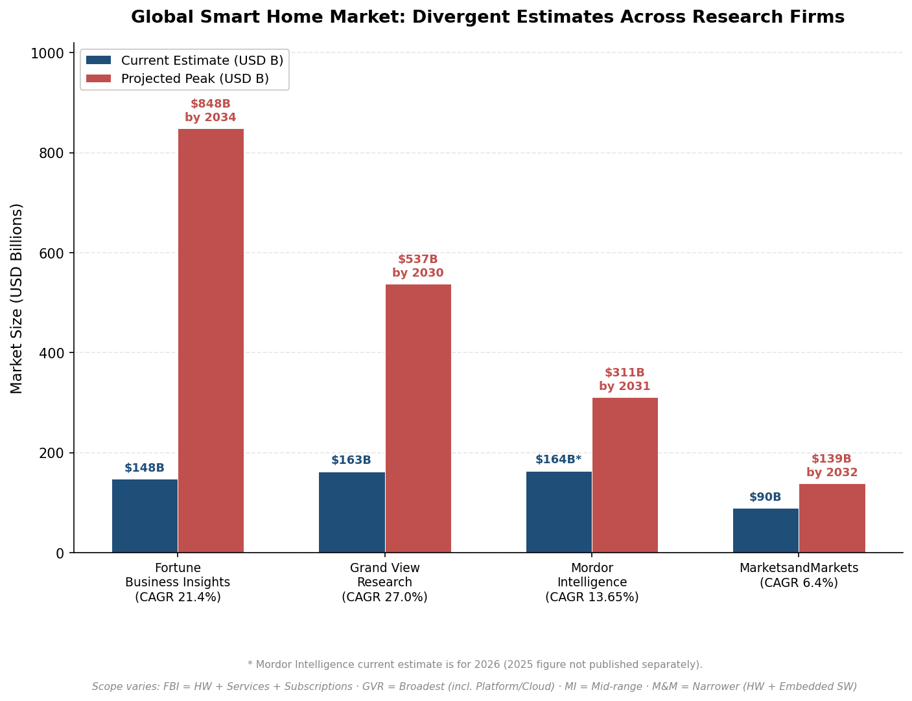

*Figure 1-1. Side-by-side comparison of 2025 market size estimates and projected peak values from four leading research firms. The roughly 65% gap between the highest and lowest current-year estimates reflects differences in scope — ranging from hardware-only (MarketsandMarkets) to hardware plus services, subscriptions, and platform revenue (Grand View Research).*

## 1.2 Shipment Volumes: Flat Units, Rising Value

While revenue metrics paint an expansionary picture, unit shipment data tells a more nuanced story. IDC reported that global smart home device shipments in 2024 were essentially flat at 892.3 million units (+0.6% year-over-year). The firm's forecast projected a 4.4% rebound in 2025 to 931.1 million units, with a 5.6% CAGR through 2028 expected to push annual shipments to approximately 1.1 billion units. [IDC via Back End News](https://backendnews.net/idc-emerging-regions-to-boost-smart-home-market-growth-by-2025/ "IDC smart home device shipments forecast")

The disconnect between surging revenue and stagnant unit volumes reflects several structural dynamics:

- **Rising average selling prices (ASPs).** Manufacturers are embedding AI processors, higher-resolution cameras, and multi-protocol radios (Matter, Thread, Wi-Fi 6E) into flagship products, lifting per-unit revenue.
- **Growing subscription attach rates.** Platforms such as Google Home Premium (launched October 2025 at USD 10–20 per month) and Amazon Alexa+ (USD 19.99 per month, free for Prime members) are converting hardware-only transactions into recurring revenue streams.
- **Taxonomic divergence.** IDC's device taxonomy counts individual SKUs — a single smart speaker or camera — whereas revenue-focused estimates capture the full economic value chain, including installation, cloud compute, and professional monitoring.

## 1.3 Revenue by Product-Category Segment

The smart home market is not monolithic; distinct product categories exhibit markedly different growth trajectories, penetration rates, and competitive dynamics. Figure 1-2 illustrates the approximate revenue distribution across six segments as of 2025.

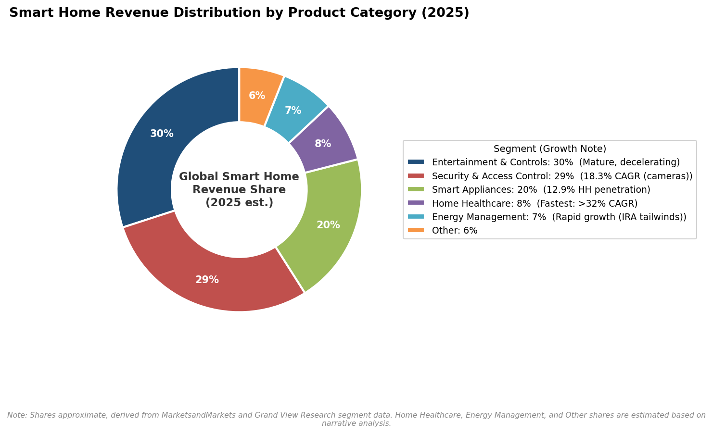

*Figure 1-2. Approximate global smart home revenue share by product category in 2025. Entertainment & Controls and Security & Access Control together account for roughly 59% of the market, while Home Healthcare — though the smallest named segment — is growing at the fastest rate (>32% CAGR). Sources: MarketsandMarkets, Grand View Research.*

### Entertainment and Controls
The entertainment and controls segment — encompassing smart speakers, streaming devices, and universal remote/hub controllers — held approximately 30% of global smart home revenue in 2025, making it the single largest category by revenue share. [MarketsandMarkets via Yahoo Finance](https://finance.yahoo.com/news/smart-home-market-expected-grow-140000842.html "Entertainment & other controls ~30% share") Its dominance reflects the high installed base of smart speakers (Amazon Echo, Google Nest, Apple HomePod) and smart TVs, though unit growth in mature markets has decelerated as household saturation approaches a ceiling.

### Security and Access Control
Security and access control captured over 29% of global revenue in 2024, positioning it as the second-largest — and arguably the most strategically significant — segment. [Grand View Research](https://www.grandviewresearch.com/industry-analysis/smart-homes-industry "Security >29% share") Smart security cameras alone are forecast to grow at an 18.32% CAGR through 2031. [Mordor Intelligence](https://www.mordorintelligence.com/industry-reports/global-smart-homes-market-industry "Smart security cameras 18.32% CAGR") A reinforcing financial incentive is accelerating adoption: insurance carriers have begun offering 5–10% premium discounts for professionally monitored systems, creating a feedback loop in which reduced insurance costs partially offset subscription fees.

### Home Healthcare and Aging-in-Place
Home healthcare emerges as the fastest-growing segment, with Grand View Research projecting a CAGR exceeding 32% from 2025 to 2030. [Grand View Research](https://www.grandviewresearch.com/industry-analysis/smart-homes-industry "Home healthcare fastest >32% CAGR") This growth is driven by demographic shifts (aging populations in the U.S., Europe, and Japan), consumer willingness to use technology for aging-in-place, and increasing integration of health-monitoring capabilities into mainstream smart home sensors.

### Smart Appliances
Smart appliance revenue reached approximately USD 68.7 billion in 2025 — a substantial figure in absolute terms — yet household penetration stood at only 12.9%. [IoT Breakthrough citing Statista](https://iotbreakthrough.com/the-smart-home-in-2026-whats-actually-sticking-and-whats-not/ "Smart appliance revenue & penetration") The gap between revenue and penetration suggests that purchases remain concentrated among premium buyers, with mainstream consumers either unconvinced of the value proposition or deterred by elevated price points. Unlike security cameras or smart speakers, which offer tangible daily-use benefits at moderate cost, smart refrigerators and washing machines must justify a significant price premium over conventional alternatives — a hurdle that has slowed mass-market diffusion.

## 1.4 Regional Adoption Patterns

Smart home adoption is a geographically uneven phenomenon, shaped by income levels, housing stock characteristics, broadband penetration, and regulatory incentives. Figure 1-3 summarizes regional revenue distribution and growth differentials.

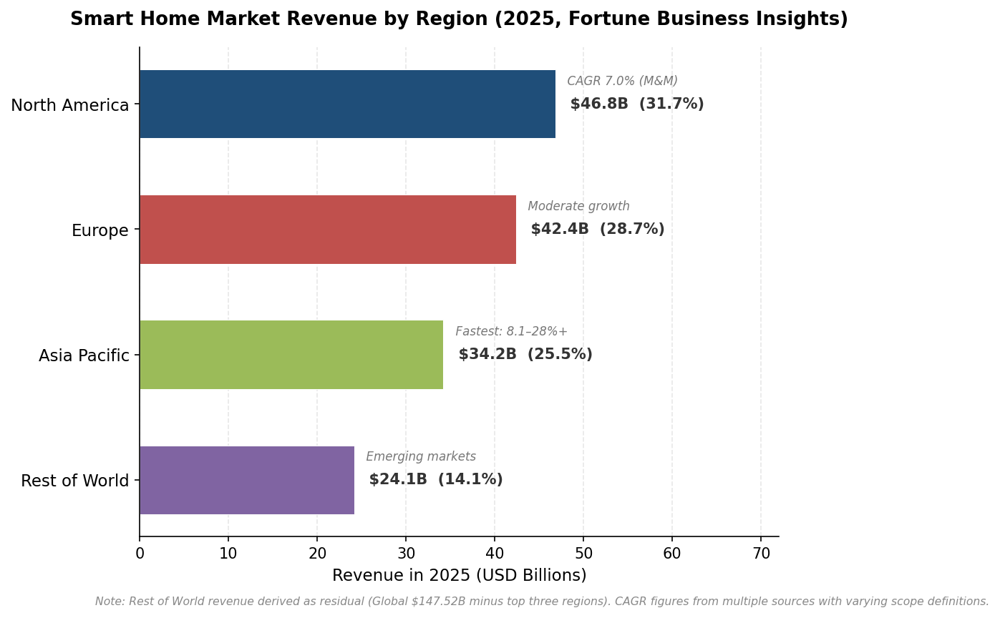

*Figure 1-3. Regional revenue distribution of the global smart home market in 2025, based on Fortune Business Insights data. Asia Pacific records the widest CAGR range across sources (8.1–28%+), reflecting both the region's heterogeneity and different firms' scope definitions.*

### North America
North America remains the largest regional market. Fortune Business Insights estimates 2025 revenue at USD 46.8 billion, representing a 31.70% share of the global total. [Fortune Business Insights](https://www.fortunebusinessinsights.com/industry-reports/smart-home-market-101900 "North America market") MarketsandMarkets, using its narrower scope, places North American revenue at USD 32.58 billion with a 7.0% CAGR. [MarketsandMarkets](https://www.marketsandmarkets.com/Market-Reports/north-america-smart-home-market-244808723.html "North America CAGR 7.0%") The region benefits from high broadband penetration, mature e-commerce distribution channels, and the presence of all four major platform ecosystems (Amazon, Google, Apple, Samsung). Growth, however, is increasingly dependent on upgrade cycles and service monetization rather than first-time acquisition: roughly 45–48% of U.S. internet households already own at least one smart home device.

### Europe
Europe constitutes the second-largest market at USD 42.39 billion in 2025 (28.70% global share), with Germany (projected USD 12.72 billion by 2026) and the United Kingdom (USD 12.29 billion by 2026) anchoring regional demand. [Fortune Business Insights](https://www.fortunebusinessinsights.com/industry-reports/smart-home-market-101900 "Europe 28.70% share") European adoption is increasingly shaped by energy-efficiency regulation and carbon-reduction mandates: the EU's expanding Code of Conduct for energy-smart appliances and building-performance directives generate both demand-pull for smart thermostats and home energy management systems (HEMS), and compliance requirements that influence product feature sets across the region.

### Asia Pacific
Asia Pacific, valued at USD 34.2 billion in 2025 (25.50% global share), is consistently identified as the fastest-growing region, with CAGR estimates ranging from 8.1% (MarketsandMarkets) to above 28% (Grand View Research), depending on scope and time horizon. [Fortune Business Insights](https://www.fortunebusinessinsights.com/industry-reports/smart-home-market-101900 "APAC fastest-growing") [Grand View Research](https://www.grandviewresearch.com/industry-analysis/smart-homes-industry "APAC CAGR >28%") China drives the bulk of regional volume through domestic ecosystems (Xiaomi, Huawei HarmonyOS, Tuya-enabled white-label brands), while Japan's aging population fuels healthcare-oriented smart home demand, and India represents a nascent but rapidly expanding market as smartphone penetration and affordable Wi-Fi infrastructure converge.

## 1.5 Macroeconomic and Housing-Market Context

The smart home market does not operate in isolation from broader economic conditions. Several macroeconomic factors exert measurable influence on near-term growth trajectories.

### Housing Construction and Mortgage Rates
The National Association of Home Builders (NAHB) projected U.S. housing starts to increase by only 1.0% in 2026, reaching approximately 940,000 units, with mortgage rates remaining above 6%. [NAHB](https://www.nahb.org/news-and-economics/press-releases/2026/02/2026-housing-outlook-ongoing-challenges-cautious-optimism-and-incremental-gains "2026 Housing Outlook") This constrained new-construction pipeline limits the "builder channel" — the pathway through which smart home systems are pre-installed in new homes. Remodeling spending, however, has risen as a compensating force: renovation accounted for 45% of residential construction expenditure as of Q3 2025, redirecting smart home demand toward retrofit-friendly products.

### Retrofit Dominance
The slow pace of new construction reinforces an already-dominant trend: retrofit installations accounted for 64.36% of smart home deployments in 2025, growing at a CAGR of 14.12%. [Mordor Intelligence](https://www.mordorintelligence.com/industry-reports/global-smart-homes-market-industry "Retrofit 64.36% of installations") This retrofit orientation carries significant product design implications. Devices must accommodate existing wiring, mounting points, and connectivity infrastructure — constraints that have elevated battery-powered sensors, wire-free cameras, and no-neutral-wire smart switches to product design priorities. The retrofit emphasis also benefits wireless protocols such as Thread and Wi-Fi over hardwired alternatives, shaping both the competitive landscape and the standards trajectory discussed in Chapter 2.

### Policy Incentives and Energy Economics
Government policy is functioning as a tangible demand accelerant. The U.S. Inflation Reduction Act (IRA) provides 30% tax credits for qualifying heat pumps, battery storage systems, and electric vehicle chargers through 2032. When combined with state and utility rebate stacking, these incentives can reduce net device costs by up to 35%. Connected thermostats — a foundational smart home device — save 10–23% on residential electricity bills according to U.S. Department of Energy data, translating to a 2–3 year payback period that makes them among the most economically justified smart home purchases. [Mordor Intelligence](https://www.mordorintelligence.com/industry-reports/global-smart-homes-market-industry "IRA credits and thermostat savings citing DOE")

These policy tailwinds are particularly relevant for the energy management segment, which is positioned to grow rapidly as homeowners seek to optimize solar generation, battery storage, EV charging, and grid electricity consumption in an increasingly complex residential energy landscape.

## 1.6 Synthesis: A Market in Structural Transition

The evidence assembled in this chapter reveals a smart home market undergoing structural transition rather than simple linear expansion. Revenue growth in the range of 6–27% CAGR (depending on scope) is robust, yet the underlying dynamics are shifting in ways that carry direct implications for product strategy and competitive positioning:

1. **From volume growth to value growth.** Near-flat device shipments alongside double-digit revenue increases indicate that the market's expansion is increasingly driven by higher-value products, service subscriptions, and professional installation — not merely by selling more units.

2. **From entertainment to security and energy.** While entertainment and controls remain the largest revenue segment, security and energy management are growing faster and attracting greater competitive investment, positioning them as the market's center of gravity through the late 2020s.

3. **From new-build to retrofit.** With nearly two-thirds of deployments occurring in existing homes, product design must prioritize ease of installation, backward compatibility, and minimal infrastructure requirements.

4. **From hardware-only to hardware-plus-subscription.** The emergence of tiered AI subscription models from Amazon, Google, and Samsung signals a business-model evolution that will reshape pricing strategy and feature allocation across the product landscape.

These structural shifts form the backdrop against which subsequent chapters examine technology enablers (Chapter 2), consumer adoption dynamics (Chapter 3), competitive strategies (Chapter 4), regulatory frameworks (Chapter 5), and the specific product trends poised to define the industry's trajectory (Chapter 6).

# 第2章 Technology Enablers — AI, Connectivity Standards, and Compute Architecture

The smart home industry's product trajectory is shaped less by consumer preference alone than by the technology substrate on which new products can be built. Three converging forces — the maturation of the Matter interoperability protocol and Thread mesh networking, the migration of artificial-intelligence inference from the cloud to the device edge, and the emergence of ambient computing paradigms powered by new sensing and silicon — are collectively redefining what smart home products can do, how reliably they interoperate, and how privately they operate.

This chapter examines each enabler in turn, assessing its current state as of early 2026 and its near-term implications for product development. The analysis proceeds from the connectivity layer (Matter and Thread), through the intelligence layer (cloud-based and edge AI), to the interaction layer (ambient computing and multimodal sensing), before synthesizing cross-cutting implications for manufacturers and platform developers.

## 2.1 Matter Protocol: From Fragmentation Toward Unified Interoperability

Matter — the application-layer connectivity standard developed by the Connectivity Standards Alliance (CSA) — is the industry's most consequential attempt to resolve the interoperability problem that has plagued smart home adoption for over a decade. Between November 2024 and November 2025, the CSA released three significant specification updates, each expanding the universe of device categories that Matter can address.

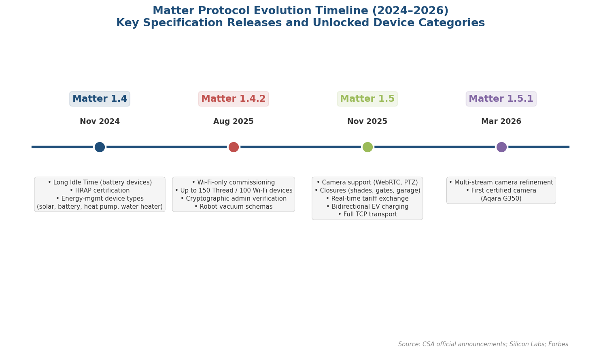

### 2.1.1 Matter 1.4 and Long Idle Time for Battery Devices

Matter 1.4, released in November 2024, addressed one of the protocol's most critical weaknesses: poor battery performance relative to Zigbee. The Long Idle Time (LIT) feature permits battery-powered devices to enter sleep cycles of up to 18 hours while maintaining reliable Thread connections — a prerequisite for sensors, wireless buttons, and contact detectors to compete with Zigbee incumbents optimized over two decades of low-power operation [Silicon Labs](https://www.silabs.com/blog/matter-1-4-continues-the-csas-commitment-to-unifying-the-home "Matter 1.4 blog post, Silicon Labs, 2025-06-27"). The same release introduced certifiable Home Router and Access Point (HRAP) specifications, combining Wi-Fi routing and Thread Border Router functionality in a single device, as well as energy-management device types covering solar panels, batteries, heat pumps, and water heaters.

Battery-life parity with Zigbee remains aspirational in practice. Aqara's FP300 multi-sensor, which supports both protocols, carries a manufacturer rating of approximately three years on Zigbee versus two years on Thread; real-world results vary further depending on mesh stability, border-router proximity, and multi-admin polling frequency [matter-smarthome.de](https://matter-smarthome.de/en/development/the-matter-standard-in-2026-a-status-review/ "Matter in 2026 status review, January 2026"). Nevertheless, LIT represents a structural advance over prior Matter specifications, and the first devices certified under Matter 1.4 began reaching retail shelves in late 2025.

### 2.1.2 Matter 1.4.2: Simplified Onboarding and Higher Device Limits

The August 2025 release of Matter 1.4.2 targeted two practical bottlenecks that had constrained real-world usability. First, Wi-Fi-only commissioning eliminated the Bluetooth requirement for device onboarding — a source of frequent confusion during setup, particularly among non-technical users. Second, network capacity limits rose to 150 Thread devices and 100 Wi-Fi devices per network, anticipating households that accumulate dozens of sensors, switches, and actuators over time [Forbes](https://www.forbes.com/sites/paullamkin/2025/08/12/matter-142-is-here-what-it-means-for-your-smart-home/ "Matter 1.4.2 analysis, Forbes, August 2025"). Additional features included cryptographic admin verification to counter counterfeit devices, unified robot vacuum command schemas, and certificate revocation mechanisms to block compromised devices prior to network entry.

### 2.1.3 Matter 1.5: Cameras, Closures, and Energy Management

The most expansive specification update arrived on November 20, 2025, when the CSA published Matter 1.5. For the first time, the standard supports cameras through WebRTC-based live video and audio streaming, multi-stream configurations, pan-tilt-zoom control, and both local and cloud recording options. A revamped closure device category brings window shades, gates, and garage doors into the Matter fold. For energy management, Matter 1.5 enables real-time electricity tariff exchange between utility providers and home devices, bidirectional EV charging coordination, and grid carbon-intensity reporting — features that position the protocol as foundational infrastructure for residential demand response [CSA](https://csa-iot.org/newsroom/matter-1-5-introduces-cameras-closures-and-enhanced-energy-management-capabilities/ "Official Matter 1.5 announcement, CSA, November 2025"). Full TCP transport support accompanies these additions, addressing the high-bandwidth requirements of video streaming and large firmware updates.

The first commercial product to leverage this specification, the Aqara G350, reached market by March 2026 as the world's first Matter 1.5-certified camera — a dual-lens 4K+2.5K device with on-device AI person, pet, and sound detection that also functions as a Zigbee hub, Matter controller, and Thread Border Router [The Verge](https://www.theverge.com/tech/895326/aqara-g350-matter-camera-samsung-smartthings-hands-on-review "First Matter camera, March 2026"). The CSA followed with Matter 1.5.1 in March 2026, refining multi-stream camera behavior and solidifying the specification for broader manufacturer adoption.

### 2.1.4 Adoption Reality: Platform Implementation Lags Specification Progress

Despite the rapid cadence of specification releases, platform-level adoption remains markedly uneven. As of early 2026, Samsung SmartThings is the only major ecosystem to support Matter cameras; Amazon Alexa and Google Home continue to route their cameras through proprietary protocols. More broadly, Amazon's ecosystem claims SDK-level support for Matter 1.4 but implements only a subset of its features, while Google Home has not yet exposed all device types defined in the original Matter 1.0 release [matter-smarthome.de](https://matter-smarthome.de/en/development/the-matter-standard-in-2026-a-status-review/ "Matter in 2026 status review, January 2026"). The resulting consumer experience is fragmented in ways the specification was designed to prevent: an IKEA Bilresa remote control works seamlessly on the Dirigera Hub but fails to register in Google Home, while IKEA's Klippbok water detector is invisible to Alexa because Amazon has not yet implemented leak-sensor support.

The cumulative result is a large and growing certified product base — the CSA reports more than 1,000 Matter-certified devices as of early 2026 [innovation-matters.at](https://www.innovation-matters.at/en/matter/devices "Matter Devices overview, citing CSA certification figures") — alongside an inconsistent user experience that varies substantially by ecosystem controller. For product developers, Matter certification is approaching table-stakes status for new launches, yet manufacturers must still test and validate against each major platform individually to ensure reliable cross-ecosystem operation.

## 2.2 Thread 1.4 and Network-Layer Unification

Thread, the IPv6-based mesh networking protocol that serves as Matter's primary low-power transport layer, received its own critical update in September 2024. Thread 1.4 standardizes the exchange of network credentials so that border routers from different manufacturers automatically join an existing Thread mesh rather than spawning parallel networks — a common source of connectivity failures in multi-vendor deployments and a persistent frustration for early adopters.

As of January 1, 2026, Thread 1.4 became the sole specification under which new border routers can receive certification, and the CSA's Matter 1.4.2 rules require border routers and network infrastructure managers (NIMs) to carry Thread 1.4 certification [The Verge](https://www.theverge.com/news/686512/apple-thread-1-4-tvos-26-matter-google-amazon "Thread 1.4 adoption timeline, The Verge, June 2025"). Platform vendor timelines remain staggered: Apple's tvOS 26 beta includes Thread 1.4 support for Apple TV, Samsung has committed to border-router updates "later this year," Amazon has pledged support "next year," and Google remains in an "actively working toward" posture — a sequence that underscores the difficulty of coordinating network-layer upgrades across rival ecosystems.

HRAP devices — routers that combine Wi-Fi and Thread Border Router radios in a single unit — remain conspicuously absent from the market despite specifications being available for over a year. No major networking vendor (Eero, Nest Wi-Fi, TP-Link, Asus) has released a certified HRAP product as of early 2026. Industry momentum appears to be shifting toward ISP-embedded Thread radios in next-generation modem routers, leveraging chipsets from Qualcomm and Broadcom that integrate Silicon Labs Thread radio dies [Matter Alpha](https://www.matteralpha.com/explainer/most-anticipated-matter-features-and-devices-in-2026 "Anticipated Matter features 2026, Matter Alpha, January 2026"). If this approach gains traction, Thread mesh coverage could scale passively as consumers upgrade broadband equipment — a distribution mechanism that circumvents the chicken-and-egg problem of requiring deliberate smart-home hardware purchases to build out mesh infrastructure.

## 2.3 Edge AI: Moving Intelligence From Cloud to Device

Edge AI — the execution of machine-learning inference directly on-device rather than in remote data centers — represents a paradigm shift for smart home products. Three interrelated motivations drive this migration: latency reduction (cloud round-trip times of 500 ms or more are unacceptable for real-time voice, video, and automation triggers), privacy preservation (local processing eliminates the need to transmit sensitive audio and video to external servers), and reliability (edge inference continues to function during internet outages). As of early 2026, the smart home industry occupies a transitional state in which cloud-based and on-device AI coexist, with the boundary between them shifting rapidly toward the edge.

### 2.3.1 Cloud-First AI: Alexa+ and Gemini for Home

The two largest voice-assistant ecosystems launched generative-AI overhauls in 2025, both relying primarily on cloud infrastructure. Amazon introduced Alexa+ in February 2025 as a generative-AI assistant built on Amazon Bedrock large language models, featuring agentic capabilities that enable self-directed web navigation to complete tasks across a base of 600 million Alexa-enabled devices. The service is priced at $19.99 per month, free for Amazon Prime subscribers [Amazon](https://www.aboutamazon.com/news/devices/new-alexa-generative-artificial-intelligence "Alexa+ announcement, Amazon, February 2025").

Google replaced Google Assistant with Gemini for Home across its smart speaker and smart display portfolio by late 2025. The upgrade enables natural-language automation creation (e.g., "Create an automation to turn on the porch lights and lock the front door at sunset"), contextual multi-turn conversation, and AI-powered camera scene descriptions — all processed through cloud-based Gemini models [Google Blog](https://blog.google/products-and-platforms/devices/google-nest/gemini-for-home-launch/ "Gemini for Home launch, Google, October 2025"). Advanced features, including Gemini Live, AI-powered camera notifications, and natural-language video-history search, require a Google Home Premium subscription ($10 or $20 per month). No publicly available T1/T2 source confirms that Google Home speakers or displays run Gemini Nano on-device; the processing architecture appears to remain cloud-centric.

Both cloud-first approaches deliver substantial natural-language understanding gains but carry inherent trade-offs: dependence on broadband connectivity, exposure to server-side latency fluctuations, and the transmission of potentially sensitive household data to external infrastructure. These trade-offs create a structural opening for products capable of executing meaningful AI workloads locally.

### 2.3.2 The On-Device LLM Frontier

Industry analysis identifies a "Goldilocks zone" of 3 billion to 30 billion parameters for on-device large language models — large enough to deliver useful reasoning and natural-language capabilities, yet small enough to fit within the thermal and power envelopes of edge hardware. Representative models spanning this range include Llama 3.2 3B, Phi-3 3.8B, Gemma 7B, and the mixture-of-experts architecture Qwen3-30B-A3B, which activates only 3.3 billion parameters per token despite its nominal 30B size. Interactive use demands 40 or more tokens per second on quantized 7-billion-parameter models [Semiconductor Engineering](https://semiengineering.com/the-on-device-llm-revolution/ "On-device LLM revolution, February 2026").

Apple has positioned itself at the intersection of on-device AI and smart home control. Apple Intelligence, the company's on-device foundation model, was opened to third-party developers at WWDC in June 2025, enabling private local AI processing across the Apple ecosystem [Apple Newsroom](https://www.apple.com/newsroom/2025/06/apple-intelligence-gets-even-more-powerful-with-new-capabilities-across-apple-devices/ "Apple Intelligence WWDC 2025"). Apple's forthcoming smart home display (code-named J490, targeting September 2026) has reportedly been delayed specifically because of challenges integrating an LLM-powered Siri assistant — a case that underscores both the strategic importance and the engineering difficulty of delivering on-device generative AI in a home hub form factor.

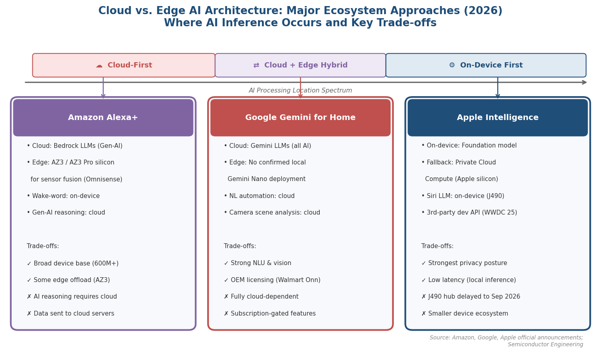

### 2.3.3 Silicon Enabling On-Device Intelligence

The viability of edge AI in smart home products depends on purpose-built silicon that delivers sufficient compute within strict power budgets. Several chip families reached commercial maturity or volume shipment during the April 2025 – April 2026 window:

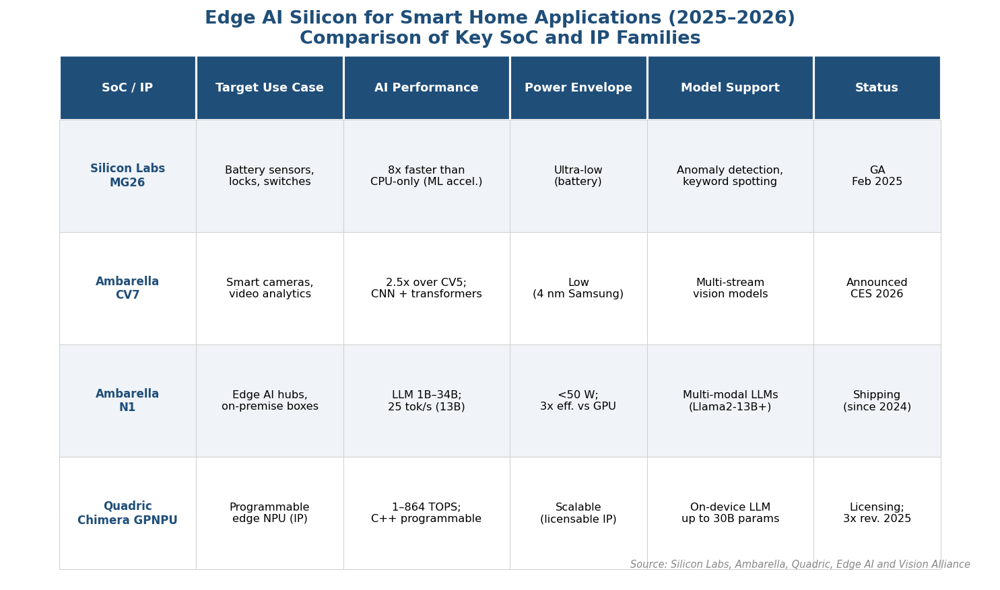

**Silicon Labs MG26 SoC** (generally available February 2025): This system-on-chip doubles Flash and RAM relative to its MG24 predecessor, incorporates embedded AI/ML hardware acceleration delivering up to 8× faster inference at one-sixth the power consumption of CPU-only execution, and supports concurrent Zigbee and Matter-over-Thread multiprotocol operation with +19.5 dBm transmission power. Targeting battery-powered locks, sensors, and switches, the MG26 enables on-device anomaly detection, keyword spotting, and basic vision classification at the extreme low-power end of the smart home silicon spectrum [Silicon Labs via PR Newswire](https://www.prnewswire.com/news-releases/silicon-labs-redefines-smart-home-connectivity-with-new-concurrent-multiprotocol-soc-302385539.html "MG26 GA, Silicon Labs, February 2025").

**Ambarella CV7** (announced CES 2026): Fabricated on Samsung's 4 nm process, the CV7 delivers 2.5× the AI performance of the prior-generation CV5 at 20% lower power, with hardware-accelerated video encoding up to 8Kp60. The SoC supports simultaneous CNN and transformer networks for multi-stream video analytics — a capability essential for the next generation of smart home cameras that must perform on-device person, object, and scene recognition in real time. Ambarella's cumulative shipment of more than 39 million edge AI SoCs across its portfolio attests to the commercial maturity of this product line [Ambarella](https://www.ambarella.com/news/ambarella-launches-powerful-edge-ai-8k-vision-soc-with-industry-leading-ai-and-multi-sensor-perception-performance/ "CV7 launch, Ambarella, January 2026").

**Ambarella N1 SoC**: Designed for higher-compute edge endpoints, the N1 supports multi-modal LLMs from 1 billion to 34 billion parameters on a single chip, running Llama2-13B at 25 tokens per second at under 50 W with up to 3× better power efficiency per token than GPU-based solutions. The N1 targets on-premise AI boxes and edge hubs that could serve as local inference engines for smart home networks, offloading generative-AI tasks from cloud infrastructure [Ambarella Investor Relations](https://investor.ambarella.com/news-releases/news-release-details/ambarella-brings-generative-ai-capabilities-edge-devices "N1 SoC, Ambarella, January 2024").

**Quadric Chimera GPNPU** (Series C funding January 2026: $30 M round, $72 M total raised): A fully C++ programmable general-purpose neural processing unit scaling from 1 TOPS to 864 TOPS, capable of on-device LLM inference up to 30 billion parameters. Unlike fixed-function NPUs that risk obsolescence as model architectures evolve, the Chimera's programmable design permits adaptation to new model families through software updates alone. Quadric's product revenues tripled in 2025, indicating growing licensee traction across edge-AI applications [Edge AI and Vision Alliance](https://www.edge-ai-vision.com/2026/01/quadric-inference-engine-for-on-device-ai-chips-raises-30m-series-c-as-design-wins-accelerate-across-edge/ "Quadric Series C, January 2026").

Collectively, these silicon advances establish a hardware foundation for a new class of smart home products — cameras, hubs, and multi-function panels — that can perform meaningful AI tasks without cloud dependency. The gap between cloud-class inference quality and edge-device capability is narrowing, particularly for the structured, domain-specific tasks most relevant to smart home use cases: person detection, anomaly classification, and natural-language device control.

## 2.4 Ambient Computing and Multimodal Sensing

Ambient computing — also referred to as ambient intelligence — describes a paradigm in which smart home devices sense, interpret, and act upon household context without requiring explicit user commands. Rather than responding to "Hey Google, turn off the lights," an ambient system detects that the household occupants have gone to bed and adjusts lighting, thermostat, and security settings autonomously. Realizing this vision requires two converging capabilities: multimodal sensing to capture environmental context across multiple data channels, and on-device inference to interpret that context in real time without cloud dependency.

### 2.4.1 Samsung SmartThings Ambient Sensing

Samsung unveiled SmartThings Ambient Sensing at CES 2025 (January 2025), enabling existing Samsung products — TVs, Music Frame speakers, Family Hub refrigerators, and air conditioning units — to function as motion and sound sensors for the SmartThings platform. The system employs mmWave radar to detect specific activities such as cooking, exercising, and sleeping, triggering automations accordingly. Samsung emphasizes that all ambient sensing data is processed and stored locally on the SmartThings hub, with no cloud transmission required [The Verge](https://www.theverge.com/2025/1/22/24349488/samsung-smartthings-ambient-sensing-home-ai "SmartThings Ambient Sensing, The Verge, January 2025").

The strategic significance of this approach lies in Samsung's capacity to embed sensing capabilities into appliances that consumers purchase for non-smart-home reasons — a television, a speaker, a refrigerator — thereby building ambient sensing density across the home without requiring dedicated sensor purchases. If deployed broadly across Samsung's installed base, this approach could accelerate the transition from command-driven to context-driven smart home interaction at scale.

### 2.4.2 Amazon Omnisense

Amazon's September 2025 Echo hardware refresh introduced "Omnisense," a sensor-fusion platform that combines camera, ultrasound, Wi-Fi radar, and accelerometer inputs across the new Echo lineup, powered by custom AZ3 and AZ3 Pro silicon with dedicated AI accelerators for edge inference [Amazon](https://www.aboutamazon.com/news/devices/amazon-new-echo-devices-alexa-plus "Next-gen Echo devices, September 2025"). Like Samsung's approach, Omnisense constructs a persistent model of household activity that enables proactive automation — adjusting lighting, audio, and device states based on detected occupancy patterns rather than explicit voice commands. The integration of Wi-Fi radar as a sensing modality is particularly notable: it permits the device to detect motion through walls and across rooms using existing Wi-Fi signals, requiring neither line-of-sight nor additional sensor hardware.

### 2.4.3 mmWave Radar and Ultra-Low-Power Sensing Hardware

The hardware underpinning ambient sensing is becoming dramatically more power-efficient. Texas Instruments' IWRL6432 60 GHz mmWave radar sensor achieves an average power consumption of just 3.2 mW for motion detection — low enough to enable battery-powered presence sensing for the first time in a consumer-grade form factor. The broader TI radar portfolio (IWRL6432, IWR6843, IWR6843AOP) supports presence detection, localization, people counting, vitals sensing (breathing rate and heart rate), sleep monitoring, and gesture recognition, making it applicable across air conditioners, smart speakers, lighting fixtures, and smart locks [Texas Instruments](https://www.ti.com/lit/swra807 "mmWave radar in smart home appliances, TI, March 2024").

At CES 2026, Pontosense demonstrated Silver Shield, a radar-based fall-detection system targeting older adults — a product archetype that bridges ambient sensing with the aging-in-place use case discussed in Chapter 3. The combination of ultra-low-power radar sensing and edge AI inference creates the technical foundation for sensor suites capable of monitoring health-relevant indicators (falls, breathing irregularities, sleep quality) continuously and privately, without the privacy intrusion associated with cameras.

## 2.5 Emerging Compute Architectures: Neuromorphic Processors

On the speculative frontier, neuromorphic processors — chips that mimic the brain's spiking-neural-network architecture to achieve extreme energy efficiency — remain pre-mass-market for consumer smart home devices as of early 2026. BrainChip demonstrated its Akida-powered neuromorphic edge AI at CES 2026, showcasing the AKD1500 processor for ultra-low-power visual classification and previewing the Akida 3 architecture with integrated LLM capabilities. The company raised $25 million in December 2025 to advance commercialization [BrainChip](https://brainchip.com/ces-2026/ "BrainChip CES 2026, December 2025"). No shipping consumer smart home products based on neuromorphic processors have been confirmed, however; current applications remain limited to partner demonstrations in drones, cybersecurity appliances, and wearables. The technology warrants monitoring for its potential to enable always-on AI sensing at sub-milliwatt power levels, but it does not yet influence product planning timelines for mainstream smart home manufacturers.

## 2.6 Synthesis: Implications for Product Development

The technology enablers examined in this chapter converge on several product-development implications that will shape the smart home industry through late 2026 and into 2027:

**Matter certification is approaching table-stakes status.** With more than 1,000 certified products, near-universal adoption at CES 2026 product launches, and expanding device-type coverage through Matter 1.5 (cameras, closures, energy management), manufacturers that ship non-Matter devices face growing risk of ecosystem exclusion. The gap between specification completeness and platform implementation, however, means that Matter certification alone does not guarantee a consistent cross-platform experience.

**Thread 1.4 will determine mesh reliability at scale.** The mandatory certification requirement for new border routers and the potential for ISP-embedded Thread radios could resolve the fragmented-mesh problem that has undermined Thread's reliability promise. Product developers targeting battery-powered sensors and actuators should design for Thread 1.4 from the outset, anticipating that the installed base of 1.4-capable border routers will grow substantially by late 2026.

**Edge AI opens a new product-differentiation axis.** The availability of purpose-built silicon (MG26 for ultra-low-power endpoints, CV7 for camera vision, N1 and Chimera for hub-class LLM inference) enables manufacturers to ship products with meaningful on-device intelligence. Products that perform person detection, anomaly classification, or natural-language control without cloud dependency carry structural advantages in latency, privacy, and reliability — attributes that consumer surveys consistently rank among the highest-value differentiators.

**Ambient computing shifts the interaction model.** Samsung's Ambient Sensing, Amazon's Omnisense, and the proliferation of ultra-low-power mmWave radar sensing hardware collectively point toward a smart home that acts on inferred context rather than explicit commands. Products designed around this paradigm — appliances that sense activity, sensors that monitor health indicators, hubs that orchestrate proactive automations — represent a qualitative departure from the command-and-control model that has defined the industry since its inception.

**The cloud-to-edge transition is gradual, not binary.** The two largest ecosystems (Amazon and Google) remain cloud-first for their generative-AI assistants, while Apple pursues an on-device-first strategy. The likely near-term architecture is hybrid: cloud LLMs handle complex reasoning and open-ended queries; edge AI manages latency-sensitive tasks (voice wake-word detection, camera object recognition, automation triggers); and local-only processing governs privacy-critical functions (health monitoring, occupancy detection). Product designers must architect for this hybrid reality rather than betting exclusively on either endpoint of the processing spectrum.

# 第3章 Consumer Adoption Patterns and Behavioral Shifts

The smart home market's trajectory hinges less on the pace of technological innovation than on whether consumers adopt, integrate, and sustain spending on the products that innovation produces. As of early 2026, approximately half of American households own at least one smart home device — a milestone marking the transition from early-adopter curiosity to mainstream penetration. Yet adoption is neither uniform nor friction-free. Purchase motivations have shifted from novelty toward security, energy savings, and convenience; demographic segmentation reveals pronounced differences by age, ethnicity, and household composition; and persistent barriers — setup complexity, privacy anxiety, affordability concerns — continue to suppress conversion among otherwise interested consumers. This chapter maps these evolving demand signals and behavioral patterns, bridging the technology supply analyzed in Chapter 2 with the market dynamics established in Chapter 1.

## 3.1 Current Penetration: A Market at the Halfway Mark

Two independent surveys conducted in early-to-mid 2025 converge on a consistent picture of U.S. household adoption. Parks Associates reports that approximately 45% of U.S. internet households own at least one core smart home device — excluding smart speakers, which are often classified as general consumer electronics rather than purpose-built home automation — with approximately 20% owning a video doorbell and the average household operating roughly 17 connected devices [Parks Associates](https://www.parksassociates.com/blogs/in-the-news/smart-device-adoption-grows-but-setup-stumps-52-of-users "Smart device adoption, August 2025"). Horowitz Research, drawing on a nationally representative sample of 2,200 adults surveyed in January–February 2025, places the figure at 48% of American homes owning at least one smart home device [Horowitz Research](https://www.horowitzresearch.com/all/nearly-half-of-american-homes-have-smart-devices-higher-among-younger-and-multicultural-consumers/ "Nearly Half of American Homes Have Smart Devices, 2025").

Among households that have adopted smart home technology, device category ownership reveals a clear hierarchy. Smart TVs lead at 70%, followed by security cameras at 66%, sound systems at 57%, video doorbells and door cameras at 52%, and smart light fixtures at 35% [Horowitz Research](https://www.horowitzresearch.com/all/nearly-half-of-american-homes-have-smart-devices-higher-among-younger-and-multicultural-consumers/ "2025"). The prominence of security-oriented devices — cameras and doorbells together outpace all other non-entertainment categories — foreshadows the motivational analysis in Section 3.2.

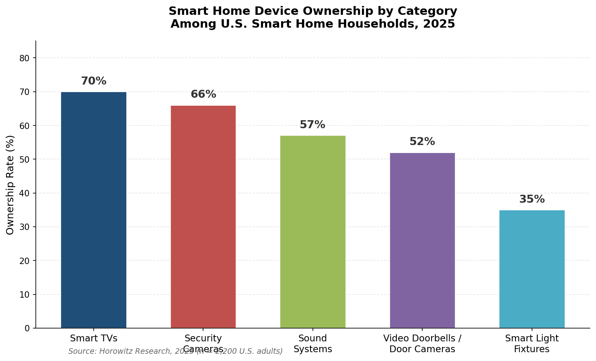

*Figure 3.1 — Device category ownership rates among U.S. smart home households. Security cameras (66%) and video doorbells (52%) collectively rank as the most widely owned non-entertainment device categories. Source: Horowitz Research, 2025 (n = 2,200).*

Spending data reinforces the picture of a market deepening rather than merely widening. U.S. households spent an average of $896 on connected devices in 2025, up 17% from $764 in 2024. Monthly expenditure on digital services reached $183 (up from $175 in 2024), and 25% of consumers expected to increase their technology service spending — nearly double the 14% who expressed the same intent a year earlier [Deloitte](https://www.deloitte.com/us/en/about/press-room/connectivity-mobile-trends-survey.html "Deloitte 2025 Connected Consumer Survey, September 2025"). These figures indicate that for the roughly half of households already within the smart home ecosystem, the direction of travel is toward more devices and more paid services rather than retrenchment.

## 3.2 Purchase Motivations: Security, Energy, and Convenience as the Triple Engine

Identifying why consumers buy smart home products is essential for forecasting which product categories will grow fastest. Multiple 2025 surveys point to a consistent set of primary motivators, though their relative ranking varies by methodology.

### 3.2.1 Security and Peace of Mind

Security has emerged as the single most powerful adoption driver. Parks Associates reports that 47% of U.S. internet households owned a home security solution in 2025, up from 38% in 2022 — a nine-percentage-point increase in three years, with 35% subscribing to professional monitoring services [Parks Associates](https://www.prnewswire.com/news-releases/parks-associates-47-of-us-internet-households-own-a-security-solution-and-35-have-a-paid-security-service-302525649.html "47% own security solution, August 2025"). The Nationwide 2025 Homeowners Survey identifies protection (56%) and peace of mind (55%) as the two most cited benefits of smart home technology, while 37% of respondents install safety technology specifically to qualify for insurance premium discounts [Nationwide 2025 Homeowners Survey](https://riskandinsurance.com/millennials-embrace-smart-home-tech-while-boomers-prioritize-repairs-creating-protection-gaps/ "Nationwide 2025 Homeowners Survey, October 2025").

AI-enhanced security features are accelerating this dynamic. Forty percent of smart home device owners value AI-powered notifications for unknown-person detection — a capability that converts security cameras from passive recording instruments into proactive alert systems [Parks Associates](https://www.prnewswire.com/news-releases/parks-associates-47-of-us-internet-households-own-a-security-solution-and-35-have-a-paid-security-service-302525649.html "August 2025"). This consumer appetite aligns directly with the on-device AI processing capabilities and Matter 1.5 camera interoperability standards analyzed in Chapter 2.

### 3.2.2 Energy Savings and Resource Management

Energy management constitutes the second major motivational cluster. Joint research by Parks Associates and Vivint finds that 50% of U.S. households are actively working to reduce energy consumption, generating structural demand for smart thermostats, energy monitors, and automated load-management systems [Parks Associates & Vivint](https://www.residentialsystems.com/news/parks-associates-and-vivint-release-white-paper-on-the-significance-of-centralized-smart-home-energy-and-security "The Smart Home Value Stack white paper, December 2025"). The Nielsen Norman Group's 2025 study of smart home user values ranks "saving resources/money" as the third most important purchase motivation, behind convenience and safety [Nielsen Norman Group](https://www.nngroup.com/articles/smart-homes-user-value/ "What Users Value Most in Smart Homes, December 2025").

Tangible financial incentives reinforce this motivation. Connected thermostats reduce residential electricity bills by 10–23%, with a two-to-three-year payback period, according to U.S. Department of Energy data. The Inflation Reduction Act's 30% tax credits for heat pumps, battery storage, and EV chargers — available through 2032 — further lower the net cost of energy-management devices, with rebate stacking capable of cutting effective device prices by up to 35% [Mordor Intelligence](https://www.mordorintelligence.com/industry-reports/global-smart-homes-market-industry "IRA credits and thermostat savings citing DOE"). The confluence of consumer motivation, demonstrable ROI, and federal subsidy creates a durable demand floor for energy-oriented smart home products.

### 3.2.3 Convenience, Control, and Ambient Comfort

Convenience and time-saving consistently rank as either the first or second motivator across methodologies. The Nielsen Norman Group's 2025 ranking places convenience/time-saving at the top, followed by safety/peace of mind, saving resources/money, tracking home data, and mood/ambiance control [Nielsen Norman Group](https://www.nngroup.com/articles/smart-homes-user-value/ "What Users Value Most in Smart Homes, December 2025"). The Nationwide survey reports that 39% of homeowners cite mobile control and convenience as a primary benefit [Nationwide 2025 Homeowners Survey](https://riskandinsurance.com/millennials-embrace-smart-home-tech-while-boomers-prioritize-repairs-creating-protection-gaps/ "October 2025").

The character of the convenience motive is evolving. Early smart home adopters valued the novelty of voice-activated light control or remote thermostat adjustment. As of 2026, the frontier has shifted toward proactive automation — systems that act without explicit commands based on learned routines, occupancy detection, and contextual awareness. Samsung's SmartThings Ambient Sensing, Amazon's Omnisense sensor-fusion platform, and Google's natural-language automation creation through Gemini represent supply-side responses to this demand signal. Consumer willingness to pay for such capabilities is measurable: Parks Associates finds that 42–52% of consumers would pay a monthly fee for an AI-powered smart home assistant delivering security, convenience, and automation use cases, and 79% find at least one AI-powered smart home benefit valuable [Parks Associates](https://www.parksassociates.com/blogs/pr-smart-home/parks-associates-up-to-52-of-consumers-are-willing-to-pay-a-monthly-fee-for-an-ai-smart-home-assistant-that-offers-security-convenience-and-automation-use-cases "Up to 52% willing to pay, 2025").

### 3.2.4 The AI Marketing Paradox

Consumer attitudes toward AI-branded products reveal a counterintuitive pattern. Parks Associates reports that 30% of consumers are less likely to purchase a product marketed as "AI-powered" — nearly twice the share whose purchase intent increases in response to AI branding. Smart home and security products, however, represent a notable exception: they exhibit a net-positive AI marketing effect, suggesting that consumers perceive concrete functional value in AI when applied to home security and automation rather than viewing the label as a buzzword [Parks Associates](https://www.prnewswire.com/news-releases/generative-ai-reaches-58-of-us-internet-households-but-monetization-and-trust-lag-according-to-new-research-from-parks-associates-302691183.html "February 2026"). The implication for product positioning is direct: manufacturers of security cameras, smart locks, and home automation hubs can lean into AI branding more aggressively than makers of AI-enhanced kitchen appliances, where the value proposition remains less intuitive to consumers.

## 3.3 Adoption Barriers: Setup Complexity, Privacy Anxiety, and Affordability

The roughly 50% of U.S. households that have not adopted smart home technology are not simply unaware of it. Persistent barriers — technical, psychological, and economic — continue to suppress conversion. Notably, these barriers are evolving at different rates: privacy anxiety is intensifying while affordability pressure is easing.

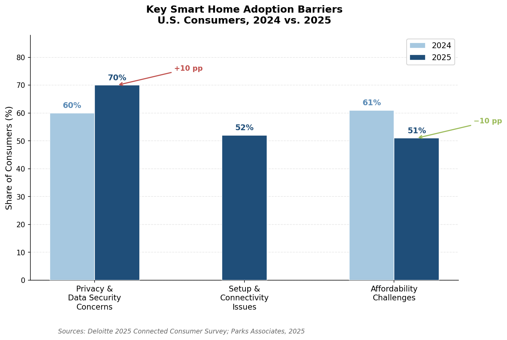

*Figure 3.2 — Year-over-year comparison of the three primary adoption barriers. Privacy and data security concerns rose 10 percentage points (60% → 70%), while affordability challenges declined by the same magnitude (61% → 51%). Sources: Deloitte 2025 Connected Consumer Survey; Parks Associates, 2025.*

### 3.3.1 Setup and Interoperability Friction

Setup complexity remains the most frequently cited technical barrier. Parks Associates' 2025 data shows that 52% of DIY smart home users encounter setup or connectivity issues during installation [Parks Associates](https://www.parksassociates.com/blogs/in-the-news/smart-device-adoption-grows-but-setup-stumps-52-of-users "52% setup issues, August 2025"). Among consumers who attempt to build multi-device routines and automations, 39% encounter difficulty with the configuration process [Parks Associates & Vivint](https://www.residentialsystems.com/news/parks-associates-and-vivint-release-white-paper-on-the-significance-of-centralized-smart-home-energy-and-security "December 2025").

The interoperability dimension of this problem is particularly telling. Households that own a security system — which typically provides a unifying hub and professional installation — achieve significantly higher rates of device integration: 54% report their devices working together, compared with only 35% of households without a security system [Parks Associates & Vivint](https://www.residentialsystems.com/news/parks-associates-and-vivint-release-white-paper-on-the-significance-of-centralized-smart-home-energy-and-security "December 2025"). This 19-percentage-point gap underscores that the barrier is not consumer disinterest in multi-device ecosystems but rather the technical difficulty of achieving cross-device coordination without a centralized controller or professional setup. The Matter protocol's promise of plug-and-play interoperability, analyzed in Chapter 2, directly targets this friction point — though platform-level implementation remains uneven as of early 2026.

### 3.3.2 Privacy and Data Security Concerns

Privacy anxiety has intensified rather than subsided as smart home devices grow more capable. Deloitte's 2025 Connected Consumer Survey documents a concerning trajectory: 70% of consumers express worry about data privacy and security with digital services, up from 60% in 2024. Only approximately 10% describe themselves as "very willing" to share sensitive information with service providers. Fewer than 48% of consumers believe that the benefits of digital services outweigh the associated privacy concerns — the lowest figure since Deloitte began tracking this metric in 2019 [Deloitte 2025 Connected Consumer Survey](https://www.deloitte.com/us/en/about/press-room/connectivity-mobile-trends-survey.html "Deloitte 2025 Connected Consumer Survey, September 2025").

These concerns are grounded in concrete enforcement actions. The FTC's $25 million penalty against Amazon for retaining children's Alexa voice recordings, the $5.8 million Ring settlement over employee access to private video, the Texas Attorney General's December 2025 lawsuits against five smart TV manufacturers over unauthorized Automatic Content Recognition (ACR) data collection, and California's record $2.75 million CCPA settlement establishing cross-device opt-out requirements all received widespread media coverage, directly eroding consumer trust.

The product-development implication is clear: privacy-preserving architectures — particularly on-device AI processing that eliminates the need to transmit video, audio, or biometric data to external servers — represent not merely a technical preference but an increasingly potent competitive differentiator. Samsung's decision to process SmartThings Ambient Sensing data entirely on-device, and the broader industry trend toward edge AI inference documented in Chapter 2, are direct responses to this consumer signal.

### 3.3.3 Affordability and Spending Hesitancy

Economic barriers have moderated but not disappeared. Deloitte's 2025 survey finds that 51% of respondents expect affordability challenges in maintaining their current level of connected device spending — a meaningful share, though improved from 61% in 2024. Twenty-three percent expect to delay device purchases, and 17% report being unable to afford the advanced devices they desire [Deloitte](https://www.deloitte.com/us/en/insights/industry/telecommunications/connectivity-mobile-trends-survey.html "Deloitte 2025 spending section").

The affordability barrier is being eroded from two directions. On the supply side, platforms are driving down entry-level price points: the Google–Walmart partnership produced Onn-branded indoor cameras at $22.96 and video doorbells at $49.86 — AI-powered devices at price points previously associated with non-connected equivalents. On the demand side, insurance subsidies (Hippo's complimentary device bundles, State Farm's premium discounts) and IRA tax credits reduce net consumer costs for security and energy-management products. Residual affordability friction is concentrated among consumers who desire premium whole-home systems — multi-room audio, integrated lighting control, comprehensive security — where total system costs can easily exceed $2,000.

## 3.4 Demographic Segmentation: Age, Ethnicity, and Household Composition

Smart home adoption is not evenly distributed across demographic groups. The segmentation patterns documented below carry direct implications for product design, marketing strategy, and channel selection.

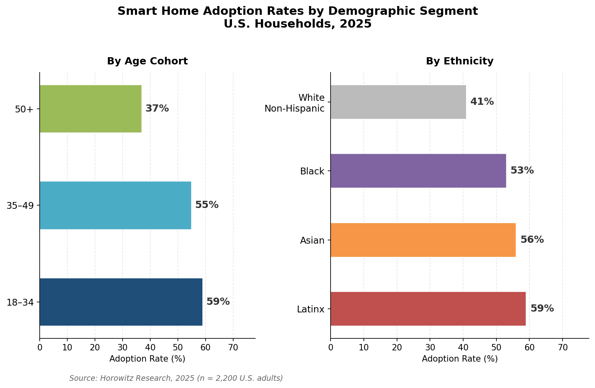

*Figure 3.3 — Adoption rates by age cohort and ethnicity. Adults aged 18–34 (59%) and Latinx households (59%) lead their respective categories, while the 50+ cohort (37%) and White non-Hispanic households (41%) trail. Source: Horowitz Research, 2025 (n = 2,200).*

### 3.4.1 Age Cohorts: Millennials Lead in Volume, Gen X in Breadth

Horowitz Research's 2025 data reveals a clear age gradient: 59% of adults aged 18–34 and 55% of those aged 35–49 own smart home devices, compared with 37% of adults aged 50 and older [Horowitz Research](https://www.horowitzresearch.com/all/nearly-half-of-american-homes-have-smart-devices-higher-among-younger-and-multicultural-consumers/ "2025"). Younger consumers are more likely to own smart home technology, but the 35–49 cohort owns the most diverse device portfolios, averaging 5.1 device types per household. Complementary data from the Nationwide 2025 Homeowners Survey shows millennial households averaging 4.6 smart devices, compared with 3.1 for Generation X and 2.2 for Baby Boomers [Nationwide Survey](https://riskandinsurance.com/millennials-embrace-smart-home-tech-while-boomers-prioritize-repairs-creating-protection-gaps/ "October 2025").

The practical implication is twofold. Products targeting younger consumers should prioritize low-friction onboarding, app-first interfaces, and subscription-model pricing that minimizes upfront cost. Products targeting the 35–49 demographic — which already owns the broadest device mix — should emphasize ecosystem integration and cross-device automation, as these households are most likely to encounter interoperability challenges when adding a sixth or seventh connected device.

### 3.4.2 The Aging-in-Place Opportunity

The 50+ demographic, while exhibiting lower overall adoption rates, represents one of the highest-potential growth segments for specific product categories. The EY Global Consumer Health Survey 2025, conducted across 4,501 respondents in six countries, finds that 75% of adults aged 50 and older are open to smart home technology for aging-in-place applications — a striking figure given the cohort's lower general adoption rate [EY via McKnight's Senior Living](https://www.mcknightsseniorliving.com/news/smart-home-tech-the-answer-for-aging-in-place-older-adults-say/ "EY Global Consumer Health Survey 2025, October 2025").

This openness is conditional on product design that accommodates age-related needs: simplified interfaces, voice-first interaction (reducing dependence on small touchscreens), passive monitoring that does not require active engagement, and privacy-preserving health sensing. The ambient sensing technologies emerging from Samsung, Texas Instruments, and Cognitive Systems — analyzed in Chapter 2 — constitute the technology substrate that could convert this latent demand into adoption. Products such as Pontosense's Silver Shield radar-based fall detection system, showcased at CES 2026, represent early commercial attempts to serve this segment.

### 3.4.3 Multicultural Households: Higher Adoption, Deeper Engagement

Among the most noteworthy findings from the Horowitz Research 2025 survey is the pronounced over-indexing of multicultural households in smart home adoption. Latinx households report 59% adoption, followed by Asian households at 56% and Black households at 53% — all meaningfully above the 41% rate among White non-Hispanic households [Horowitz Research](https://www.horowitzresearch.com/all/nearly-half-of-american-homes-have-smart-devices-higher-among-younger-and-multicultural-consumers/ "Multicultural adoption, 2025").

Multicultural households that have adopted smart home technology also own broader device portfolios: Latinx smart homes average 6.2 device types, Black households 5.7, and Asian households 4.7 [Horowitz Research](https://www.horowitzresearch.com/all/nearly-half-of-american-homes-have-smart-devices-higher-among-younger-and-multicultural-consumers/ "2025"). These figures challenge a persistent industry assumption — that smart home technology is primarily the domain of affluent, White, tech-enthusiast households — and indicate that product marketing and retail channel strategies would benefit from more intentional multicultural targeting.

### 3.4.4 Families with Children as the Core Power-User Segment

Families with children account for more than 60% of smart home households and own an average of 5.4 device types — the highest of any household-composition segment [Horowitz Research](https://www.horowitzresearch.com/all/nearly-half-of-american-homes-have-smart-devices-higher-among-younger-and-multicultural-consumers/ "2025"). The combination of security concerns (monitoring children and home perimeters), energy management needs (larger homes with higher utility bills), and entertainment demand (smart TVs, multi-room audio) creates a compound motivation structure driving both breadth and depth of adoption.

This segment's centrality reinforces the strategic importance of ecosystem coherence and cross-device functionality: a household running five or more device types across multiple rooms is far more likely to encounter — and be frustrated by — interoperability failures than a single-device household. Products and platforms that deliver reliable multi-device orchestration are positioned to capture a disproportionate share of this high-value segment.

## 3.5 The Shift Toward Ecosystems and Subscription Models

The most consequential behavioral shift underway is the transition from discrete, single-device purchases toward integrated ecosystems and recurring subscription relationships.

### 3.5.1 From Point Solutions to Platform Attachment

The contrast between households with and without security systems illustrates the ecosystem dynamic. In households with a security system, 54% of consumers report their smart devices working together; in households without one, only 35% achieve this level of integration [Parks Associates & Vivint](https://www.residentialsystems.com/news/parks-associates-and-vivint-release-white-paper-on-the-significance-of-centralized-smart-home-energy-and-security "December 2025"). Security systems function as ecosystem anchors — centralized controllers that unify disparate devices under a single interface and, critically, a single professional installation experience.

This pattern is replicating beyond traditional security. Google's Gemini for Home ecosystem, Samsung's SmartThings platform with Ambient Sensing, and Amazon's Alexa+ with Omnisense each position their respective platforms as orchestration layers around which households accumulate additional devices. The economics are compelling: a household that owns a single smart speaker generates minimal recurring revenue, but a household locked into an ecosystem with a security subscription ($10–$30/month), a premium AI tier ($10–$20/month), and five or more compatible devices generates substantial lifetime value.

### 3.5.2 Willingness to Pay for AI-Powered Subscriptions

Consumer willingness to pay for subscription intelligence layers constitutes a critical signal for the industry's future revenue model. Parks Associates reports that 42–52% of consumers would pay a monthly fee for an AI smart home assistant offering safety, security, maintenance, and convenience use cases [Parks Associates](https://www.parksassociates.com/blogs/pr-smart-home/parks-associates-up-to-52-of-consumers-are-willing-to-pay-a-monthly-fee-for-an-ai-smart-home-assistant-that-offers-security-convenience-and-automation-use-cases "2025"). Among the 15% of U.S. internet households already using a paid AI application, 75% express willingness to pay for a smart home AI service — a strong leading indicator of mainstream adoption potential [Parks Associates](https://www.prnewswire.com/news-releases/fifteen-percent-of-us-internet-households-use-a-paid-ai-application-and-75-of-those-paying-for-generative-ai-apps-today-are-willing-to-pay-for-a-smart-home-ai-service-302529619.html "August 2025").

The correlation between security system ownership and paid AI adoption is particularly notable: security system owners use paid AI applications at approximately twice the rate of average households [Parks Associates](https://www.prnewswire.com/news-releases/generative-ai-reaches-58-of-us-internet-households-but-monetization-and-trust-lag-according-to-new-research-from-parks-associates-302691183.html "February 2026"). With approximately 41 million U.S. households owning a security system, this segment represents a pre-qualified addressable market for premium AI subscriptions. Google Home Premium ($10–$20/month) and Amazon Alexa+ ($19.99/month, free for Prime) are the first large-scale attempts to convert this willingness into recurring revenue. Parks Associates estimates that tech-enabled home services — including HVAC monitoring and fire detection — each represent more than $2 billion in annual recurring revenue potential, with 66% of homeowners expressing likely adoption at $10–$30 per month price points [Parks Associates via Yahoo Finance](https://finance.yahoo.com/news/parks-associates-models-emerge-smart-122300542.html "Smart Home Services, April 2025").

### 3.5.3 The Role of Intermediary Channels

Subscription adoption is increasingly mediated not by consumer electronics retailers but by intermediary channels — insurance companies, HVAC providers, and property managers — that bundle smart home devices into existing service relationships. Forty-six percent of smart thermostat owners received their devices through HVAC providers rather than purchasing them independently [Parks Associates via Yahoo Finance](https://finance.yahoo.com/news/parks-associates-models-emerge-smart-122300542.html "April 2025"). Insurance carriers such as Hippo (which provides free smart home devices to all policyholders) and State Farm (which offers premium discounts or complimentary three-year monitoring subscriptions) subsidize device adoption as a loss-prevention strategy.

In the multifamily rental sector, property managers who implemented smart technology reported a 20% gain in operational efficiency and an 18% reduction in costs, while more than one-third of renters indicated willingness to pay an additional $60 per month for smart home features — an $8.5 billion annual revenue opportunity by industry estimates [PointCentral](https://www.pointcentral.com/2025/12/18/2025-in-review-how-smart-technology-shaped-multifamily-property-management/ "Smart Tech in Multifamily, December 2025"). Smart locks, video intercoms, and predictive-maintenance sensors are the most commonly deployed categories in this channel, reflecting property managers' priorities around access control, resident safety, and asset protection.

These intermediary channels are significant because they reach consumer segments that would not otherwise self-select into smart home purchases — renters, older adults in managed communities, and cost-sensitive homeowners for whom insurance-subsidized devices eliminate the upfront cost barrier entirely.

## 3.6 Implications for Product Development

The consumer adoption patterns documented in this chapter generate several demand-side signals that directly inform the product trend analysis in Chapter 6.

Security and energy management are not merely popular product categories — they form the motivational foundation on which multi-device ecosystems are built. Products that combine security monitoring with energy optimization and AI-powered automation address the three most powerful purchase motivators simultaneously, positioning them for disproportionate adoption.

The 52% setup-failure rate among DIY users represents the single largest actionable barrier to market expansion. Products and platforms that reduce installation friction — through simplified Matter onboarding, tool-free hardware installation (as in Yale's Linus L2 Lite renter-targeted smart lock), or professional installation bundled via HVAC or insurance channels — hold a structural advantage over technically superior but setup-intensive alternatives.

Demographic data reveals that the addressable market is broader and more diverse than industry marketing has historically assumed. Multicultural households, families with children, and adults aged 50 and older each represent high-potential segments with distinct product needs — from multilingual voice interfaces to aging-in-place sensor suites to child-safety monitoring features.

Willingness-to-pay data for AI-powered subscriptions, particularly among existing security system owners, validates the subscription-intelligence business model that Google, Amazon, and Samsung are pursuing. The transition from hardware-margin to subscription-revenue economics is a consumer-demand-endorsed shift, not merely a platform-strategy imposition.

Finally, the deepening privacy concern — with trust metrics at their lowest since Deloitte began measurement in 2019 — creates a competitive wedge for products that demonstrably process data locally. On-device AI is not merely a technology trend; it is a consumer-trust imperative.

# 第4章 Competitive Landscape and Strategic Positioning

The smart home industry entered 2026 amid a strategic inflection. Between April 2025 and April 2026, the four major ecosystem platforms — Amazon, Google, Apple, and Samsung — each reoriented around generative AI as the primary axis of differentiation, while pursuing divergent strategies for hardware design, pricing architecture, and third-party licensing. Simultaneously, established industrial conglomerates restructured through multi-billion-dollar divestitures and corporate splits, while a layer of challenger companies — white-label platform providers, builder-channel specialists, and energy-management entrants — broadened the competitive field well beyond traditional consumer-electronics incumbents. This chapter examines the strategic moves of each competitor category and their implications for product distribution, channel evolution, and the competitive openings available to new entrants.

## 4.1 Big-Four Ecosystem Platforms: Divergent AI Strategies

The defining competitive dynamic of the past twelve months has been the race to embed generative AI into smart home ecosystems. Each of the four major platform holders has committed to an AI-centric strategy, yet their approaches to monetization, hardware architecture, and third-party openness differ markedly — producing four distinct competitive models whose divergences will shape the industry's structure for years to come.

### 4.1.1 Amazon: AI-Bundled with Prime, Proprietary Silicon

Amazon launched Alexa+ in February 2025 as a generative-AI-powered successor to its original voice assistant, built on Amazon Bedrock large language models. The service introduces agentic capabilities — orchestrating tasks across "tens of thousands of services and devices" through specialized "experts" (groups of systems, capabilities, and APIs tuned for specific task domains). By bundling Alexa+ free for Prime subscribers ($19.99/month standalone), Amazon embedded smart home AI within its broadest consumer loyalty program. The company reports over 600 million Alexa-enabled devices in the field, with early-access users interacting with Alexa "over 2x more" than before the upgrade [Amazon News](https://www.aboutamazon.com/news/devices/new-alexa-generative-artificial-intelligence "Introducing Alexa+, February 2025").

In September 2025, Amazon unveiled four new Echo devices purpose-built for Alexa+: the Echo Dot Max ($99.99), Echo Studio ($219.99), Echo Show 8 ($179.99), and Echo Show 11 ($219.99). These devices feature custom AZ3 and AZ3 Pro silicon with a dedicated AI Accelerator for edge inference, alongside a new "Omnisense" sensor-fusion platform combining camera, ultrasound, Wi-Fi radar, and accelerometer data for proactive, ambient AI experiences. Third-party integration is expanding concurrently, with Bose, Sonos, LG, Samsung, and BMW adding Alexa+ to their devices [Amazon News](https://www.aboutamazon.com/news/devices/amazon-new-echo-devices-alexa-plus "Next-gen Echo devices, September 2025").

Amazon's strategy centers on vertical integration: proprietary silicon, proprietary AI, and monetization through Prime subscription lock-in rather than per-device margins. The Omnisense platform represents a bet that ambient, sensor-fusion-driven AI — inferring user state without explicit commands — will constitute the differentiating experience layer by late 2026.

### 4.1.2 Google: Platform Licensing and Tiered Subscriptions

Google adopted a structurally different approach. In October 2025, the company replaced Google Assistant with Gemini for Home across its smart speaker and display lineup, announcing a refreshed Nest camera range and an upgraded Google Home smart speaker scheduled for spring 2026. Google reports over 800 million devices in its ecosystem via Cloud-to-Cloud APIs and Matter [TechCrunch](https://techcrunch.com/2025/10/01/google-reveals-its-gemini-powered-smart-home-lineup-and-ai-strategy/ "Google reveals Gemini-powered smart home lineup, October 2025").

Where Amazon ties AI to Prime, Google adopted a two-tier subscription model: Google Home Premium Standard ($10/month or $100/year) and Advanced ($20/month or $200/year). The Advanced tier unlocks Gemini AI camera features such as natural-language event descriptions and camera search [TechCrunch](https://techcrunch.com/2025/10/01/google-reveals-its-gemini-powered-smart-home-lineup-and-ai-strategy/ "October 2025").

The most strategically significant move, however, was Google's adoption of an Android-style platform-licensing model. Google explicitly opened its camera SDK, reference hardware designs, and SoC recommendations to third-party manufacturers. Google Home CPO Anish Kattukaran stated that Google does not believe "Gemini should be constrained to one set of devices from one OEM, at one set of price points" [Google Developers Blog](https://developers.googleblog.com/gemini-for-home-expanding-the-platform-for-a-new-era-of-smart-home-ai/ "Gemini for Home platform expansion, October 2025"). Walmart became the first partner, launching Onn-branded indoor cameras ($22.96) and video doorbells ($49.86) with full Gemini integration — establishing a sub-$25 entry point for AI-powered security cameras that significantly undercuts Amazon's Ring and Blink product lines [The Verge](https://www.theverge.com/news/787179/walmart-onn-indoor-camera-video-doorbell-google-home "Walmart Onn cameras with Google Home, October 2025").

This licensing model implies a potential proliferation of Gemini-powered devices across multiple price tiers and retail channels, mirroring how Android OEM licensing reshaped the smartphone market. Should Google extend the program beyond Walmart, the competitive implications for Amazon's vertically integrated approach — and for standalone camera brands — would be substantial.

### 4.1.3 Apple: Hardware-Ready, Software-Delayed

Apple's smart home ambitions remain the most constrained among the four platforms. The company's smart home hub (codename J490) — a 7-inch iPad-like display attached to a speaker base or wall mount, priced at approximately $350 — has been delayed repeatedly, from an initial spring 2025 target to March 2026 and then to approximately September 2026. The hardware has reportedly been finished for months; the delays stem from difficulties integrating large language model capabilities into Siri, with Apple awaiting the LLM-powered Siri expected to ship with iOS 27. A robotic version featuring a 9-inch display on an articulating arm is targeted for 2027 at approximately $1,000 [AppleInsider](https://appleinsider.com/articles/26/03/09/apples-smart-home-hub-delayed-again-because-updating-siri-is-hard "Apple Home Hub delayed to September 2026, March 2026") [AppleInsider](https://appleinsider.com/articles/25/10/15/rumored-apple-home-hub-tablet-to-be-made-in-vietnam-cost-350 "Pricing and manufacturing details, October 2025").

Apple is also developing a smart doorbell and indoor security camera (codename J450, expected late 2026), which would mark its first entry into the security device segment [AppleInsider](https://appleinsider.com/articles/26/03/09/apples-smart-home-hub-delayed-again-because-updating-siri-is-hard "March 2026"). Apple's differentiation will likely center on privacy — on-device processing via Apple Intelligence foundation models and tight integration with the Apple ecosystem's privacy infrastructure — but the repeated delays risk ceding the first-mover window in AI-native home hubs to Amazon and Google.

### 4.1.4 Samsung: SmartThings as Appliance Connective Tissue

Samsung positioned SmartThings as the connective tissue of its "Bespoke AI" ecosystem at CES 2026, branding appliances as "Home Companions" equipped with Bixby voice recognition, embedded screens, and cameras for proactive response. The strategy emphasizes regional differentiation: innovative form factors (e.g., Bespoke AI Laundry Combo) for North America, energy-efficient appliances for Europe, and expanded AI features at broader price points in Asia and Latin America [Samsung Global Newsroom](https://news.samsung.com/global/connected-comprehension-inside-samsungs-2026-ai-home "Samsung CES 2026 Deep Dive: Bespoke AI and SmartThings, January 2026").

Samsung's competitive position is distinct from the other three platforms in one critical respect: it controls a massive installed base of major appliances — refrigerators, washing machines, HVAC systems — that serve as physical anchors for SmartThings connectivity. The company has signaled expansion into HVAC management, modular homes, and insurance-based care as future growth vectors [Samsung Global Newsroom](https://news.samsung.com/global/connected-comprehension-inside-samsungs-2026-ai-home "January 2026"). Samsung was also the first platform to support Matter 1.5 cameras through SmartThings, securing a temporary interoperability advantage over Google and Amazon, both of which maintain proprietary camera ecosystems.

### 4.1.5 Comparative Assessment

The four platforms present four distinct competitive models, summarized in the figure below. Amazon optimizes for ecosystem lock-in through Prime bundling and proprietary silicon. Google pursues platform scale through open licensing and subscription-tiered AI. Apple bets on privacy and premium integration but faces execution risk from repeated delays. Samsung leverages appliance ubiquity and regional diversification. The common thread is that generative AI has become the primary battleground: each company treats AI not as an incremental feature but as the core operating layer around which hardware, software, and monetization strategies revolve.

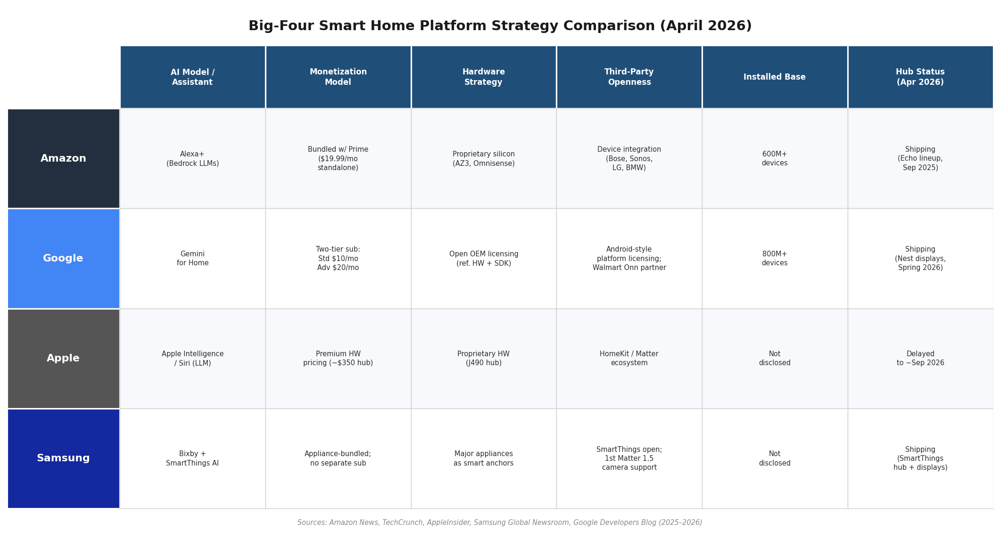

*Figure 4-1. Six-dimension comparison of Amazon, Google, Apple, and Samsung smart home platform strategies as of April 2026, spanning AI model, monetization, hardware approach, third-party openness, installed device base, and hub shipping status.*

## 4.2 Established Industrials: Restructuring for a Software-Defined Market

While the platform giants compete for the AI-powered consumer interface, a parallel transformation is reshaping the industrial companies whose products constitute much of the physical smart home infrastructure — HVAC systems, access control hardware, electrical panels, and building management platforms. Between mid-2025 and early 2026, three of the largest players executed significant corporate restructurings that collectively redefine their smart home exposure. The timeline below illustrates the cadence and scale of these moves.

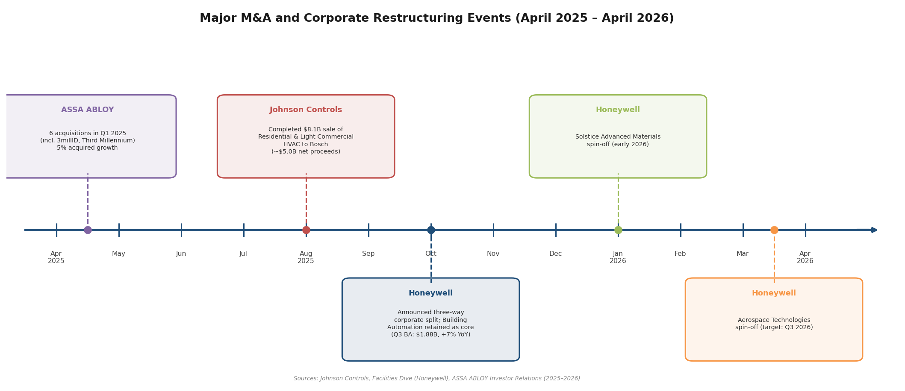

*Figure 4-2. Timeline of major corporate restructuring events among smart home infrastructure companies, April 2025 through April 2026, including ASSA ABLOY's Q1 2025 acquisition spree, Johnson Controls' $8.1 billion HVAC divestiture, and Honeywell's three-way corporate split.*

### 4.2.1 Johnson Controls: Exiting Residential, Concentrating on Commercial

Johnson Controls completed the $8.1 billion all-cash sale of its Residential and Light Commercial (R&LC) HVAC business to the Bosch Group on August 1, 2025, receiving approximately $5.0 billion in net cash proceeds. CEO Joakim Weidemanis characterized the transaction as positioning the company to become "a leading pure-play provider of innovative building solutions," and the company immediately allocated the proceeds to a $5.0 billion accelerated share repurchase program [Johnson Controls](https://www.johnsoncontrols.com/media-center/news/press-releases/2025/08/01/johnson-controls-completes-sale-of-residential-and-light-commercial-hvac-business "JCI completes R&LC HVAC sale to Bosch, August 2025").

This divestiture effectively removes Johnson Controls from the residential climate-control market, concentrating its smart-building portfolio on commercial building automation (OpenBlue platform), fire safety, and security. For the broader smart home competitive landscape, the transaction shifts the R&LC HVAC balance of power: Bosch gains a substantial North American residential HVAC installed base, potentially strengthening its position in connected thermostat and heat-pump ecosystems, while Johnson Controls no longer competes for residential smart-home-adjacent HVAC revenue.

### 4.2.2 Honeywell: Three-Way Split with Building Automation at the Core

Honeywell is executing a three-way corporate split expected to complete by mid-2026. The company will spin off Solstice Advanced Materials (early 2026) and Honeywell Aerospace Technologies (Q3 2026), leaving a "RemainCo" comprising building automation, process automation, and industrial automation — all segments with built-environment exposure [Facilities Dive](https://www.facilitiesdive.com/news/honeywell-spin-off-plans-leave-building-automation-at-core/803711/ "Honeywell spin-off leaves building automation at core, October 2025").

The decision to retain building automation as the core business reflects the segment's growth trajectory. In Q3 2025, Honeywell's building automation unit posted $1.88 billion in sales, up 7% organically year-over-year, with orders growing approximately 10% — driven by demand from data centers, healthcare, and hospitality. In June 2025, Honeywell launched "Connected Solutions," an AI-powered building management system offering a unified interface for software, services, and devices [Facilities Dive](https://www.facilitiesdive.com/news/honeywell-spin-off-plans-leave-building-automation-at-core/803711/ "October 2025"). While Honeywell's primary focus remains commercial buildings, its Home by Honeywell product line (thermostats, security systems) benefits from technology spillover and the brand equity of the parent company's building-automation capabilities.

### 4.2.3 ASSA ABLOY: Acquisition-Driven Digital Credential Expansion

ASSA ABLOY pursued a different restructuring logic: rapid inorganic growth in digital access control. The company completed six acquisitions in Q1 2025 alone, contributing 5% acquired growth. Notable targets include 3millID Corp. (U.S.) and Third Millennium Systems Ltd. (U.K.), both acquired for digital credential and access-control capabilities [ASSA ABLOY](https://www.assaabloy.com/group/en/investors/acquisitions "Acquisitions overview"). Its Yale brand has simultaneously expanded a Matter-native smart lock portfolio, offering native cross-platform interoperability across Google Home, Apple Home, and other Matter-enabled ecosystems [Yale Home](https://shopyalehome.com/pages/matter "Yale Smart Lock with Matter").

ASSA ABLOY's strategy reflects a conviction that the smart lock category — increasingly a gateway device for whole-home smart ecosystems, particularly in multifamily and builder channels — will reward companies that combine physical security hardware expertise with digital credential technology and broad interoperability-standard compliance.

## 4.3 Distribution Channels: Builders, Property Managers, and Insurers

One of the most consequential competitive developments of 2025–2026 is the rise of non-traditional distribution channels — homebuilders, multifamily property managers, and insurance carriers — as high-volume pathways for smart home device deployment. These channels bypass the traditional consumer-retail decision, embedding smart home technology into the built environment before end users make an individual purchase choice. The figure below maps these emerging channels alongside traditional retail, highlighting key players, product categories, and distribution models in each pathway.

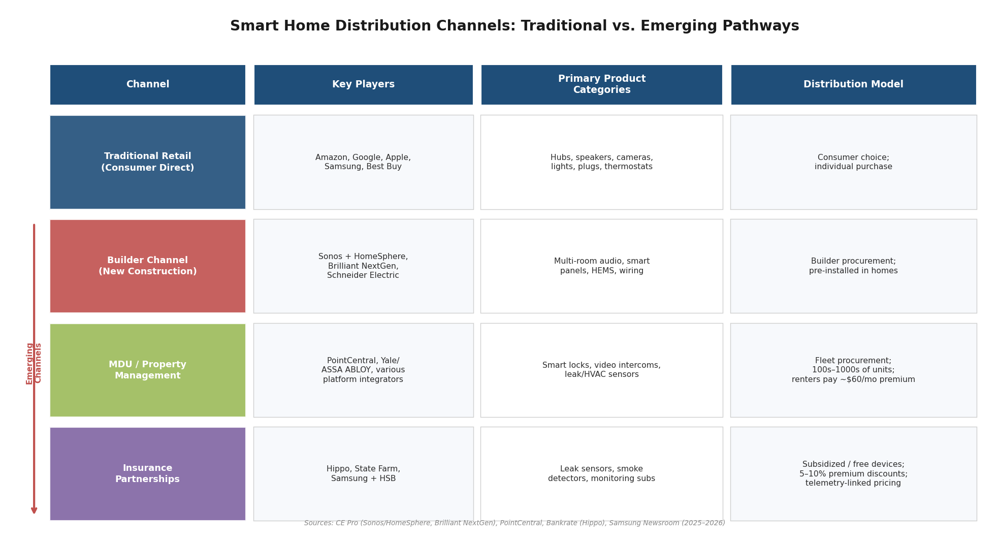

*Figure 4-3. Comparison of traditional retail and three emerging smart home distribution channels — builder, MDU/property management, and insurance partnerships — showing key players, primary product categories, and distribution model characteristics.*

### 4.3.1 The Builder Channel

Homebuilders represent a particularly efficient distribution vector because device installation during construction eliminates retrofit complexity — the factor that 52% of DIY smart home users cite as a setup barrier (Chapter 3). Sonos partnered with HomeSphere's builder rebate program to pre-wire and install multi-room audio in new construction; HomeSphere connects brands to its builder network, which constructs hundreds of thousands of homes annually, with builders receiving rebates for completed installations. Sonos showcased this program at the International Builders' Show (IBS) 2025 [CE Pro](https://www.cepro.com/news/sonos-highlights-products-homesphere-builder-program-at-ibs-2025/147016/ "Sonos HomeSphere at IBS 2025").

Brilliant NextGen, which re-emerged from bankruptcy restructuring in 2025, also targets the builder channel with its second-generation AI-ready switch-replacement panels, offering wholesale pricing, model-home demo products, and smart home package consulting [CE Pro](https://www.cepro.com/news/brilliant-nextgen-launches-second-generation-smart-home-controls-for-single-family-and-multifamily-applications/618192/ "Brilliant NextGen launch, May 2025"). The builder channel's strategic importance is amplified by the housing market context analyzed in Chapter 1: with remodeling spending rising to 45% of U.S. residential construction expenditure in Q3 2025, device manufacturers that secure builder and remodeler relationships gain access to high-intent renovation budgets.

### 4.3.2 Multifamily and Property Management

The multifamily/MDU (multi-dwelling unit) sector emerged as a high-growth distribution channel in 2025. Property managers implementing smart property technology reported a 20% increase in operational efficiency and an 18% reduction in costs, according to a Parks Associates study cited by PointCentral. Over one-third of apartment renters indicated willingness to pay an additional $60 per month for smart home and security features, representing an estimated $8.5 billion annual revenue opportunity in the multifamily market [PointCentral](https://www.pointcentral.com/2025/12/18/2025-in-review-how-smart-technology-shaped-multifamily-property-management/ "Smart Tech in Multifamily Property Management, December 2025").

Smart locks, video intercoms, and predictive-maintenance sensors (for HVAC systems and water-leak detection) became the most-deployed categories in MDU settings [PointCentral](https://www.pointcentral.com/2025/12/18/2025-in-review-how-smart-technology-shaped-multifamily-property-management/ "December 2025"). This channel is strategically significant because it aggregates purchase decisions at the property-manager level — a single procurement choice can equip hundreds or thousands of units — and reaches renter households that might otherwise face barriers to smart home adoption, including the inability to modify rental properties or reluctance to invest in non-portable hardware.

### 4.3.3 Insurance Partnerships

Insurance carriers have emerged as a distinctive distribution mechanism, subsidizing smart home device adoption to reduce claim costs. Hippo Insurance provides all customers with basic smart home devices (leak sensors, smart smoke detectors) free of charge and offers additional premium discounts for maintaining them in active use. State Farm offers smart-home discounts on homeowners policies or complimentary three-year monitoring subscriptions [Bankrate](https://www.bankrate.com/insurance/reviews/hippo-insurance/ "Hippo Insurance smart home details"). Broader industry data corroborates this trend: insurers are offering 5–10% premium discounts for professionally monitored systems [Mordor Intelligence](https://www.mordorintelligence.com/industry-reports/global-smart-homes-market-industry "Smart security cameras and insurance discounts").

Samsung advanced this model further by collaborating with Hartford Steam Boiler (HSB) on "Smart Home Savings," integrating appliance telemetry data with insurance risk models [Samsung Global Newsroom](https://news.samsung.com/global/samsung-electronics-collaborates-with-hartford-steam-boiler-hsb-to-introduce-smart-home-savings "Samsung–HSB collaboration, January 2026"). This partnership points toward a future in which appliance-generated data — leak detection, electrical anomaly alerts, HVAC performance metrics — directly influences insurance pricing, creating a closed-loop economic incentive for smart home adoption that operates independently of individual consumer purchase intent.

## 4.4 Emerging Challengers and White-Label Infrastructure

Beyond the platform giants and legacy industrials, a tier of challenger companies is expanding the competitive field by targeting structural gaps: white-label AI infrastructure for global ODMs, builder-specific hardware, and cross-category energy management platforms.

### 4.4.1 Tuya Smart: Democratizing AI for the Long Tail

Tuya Smart (NYSE: TUYA) debuted its "Hey Tuya" AI Life Assistant at CES 2026, reinforcing its position as the leading white-label IoT/AIoT platform for original design manufacturers (ODMs) worldwide. Hey Tuya employs a Multi-Agent collaborative architecture with an "OmniMem" long-term memory engine, enabling proactive rather than reactive smart home control. Tuya also launched an AI Agent Development Platform that allows developers to integrate an AI "brain" into hardware in 10 minutes, alongside the TuyaOpen open-source framework for software-hardware integration [Tuya Smart](https://www.tuya.com/news-details/tuya-smart-brings-ai-to-real-life-at-ces-2026-Kf9n2k7vvbj1y "Tuya Smart CES 2026: AI Life Assistant and platform, January 2026").

Tuya's platform underpins devices across 500+ categories for manufacturers worldwide, serving as invisible infrastructure behind many regional and white-label smart home brands. The competitive significance is that Tuya democratizes AI capabilities — natural-language control, proactive automation, long-term user modeling — that were previously exclusive to Amazon, Google, and Samsung. For regional brands in Southeast Asia, Latin America, the Middle East, and Africa, Tuya effectively eliminates the need to build proprietary AI stacks, compressing the capability gap between platform incumbents and smaller manufacturers.

### 4.4.2 Schneider Electric: Industrial-to-Residential Bridging

Schneider Electric expanded its Wiser smart home ecosystem with an AI-powered Home Energy Management System (HEMS) at CES 2026, introducing an advanced Energy Center alongside new Square DX & XD light switch and socket series integrated into the Wiser platform [Schneider Electric Blog](https://blog.se.com/homes/2026/03/26/building-a-new-home-energy-landscape/ "Schneider Electric HEMS and Wiser ecosystem, March 2026") [CES Tech](https://www.ces.tech/videos/schneider-electric-smart-sustainable-homes-us/ "Schneider Electric at CES 2026").

Schneider's competitive advantage lies in its capacity to bridge industrial building automation and residential smart home products, leveraging established relationships with electricians, builders, and electrical distributors. In a market where energy management is emerging as a major product trend (Chapter 6), Schneider's combination of electrical infrastructure expertise, HEMS software, and professional-installer channel positions it to compete against both consumer-facing brands (Ecobee, Sense) and platform incumbents in the whole-home energy management space.

### 4.4.3 Brilliant NextGen: Builder-Channel Specialist

Brilliant NextGen's re-emergence from bankruptcy with second-generation smart home controls illustrates the viability of niche, channel-specific competitive strategies. The company's dual-band Wi-Fi, AI-ready switch-replacement panels target builders and multifamily operators specifically, offering wholesale pricing, model-home demos, and smart home package consulting [CE Pro](https://www.cepro.com/news/brilliant-nextgen-launches-second-generation-smart-home-controls-for-single-family-and-multifamily-applications/618192/ "Brilliant NextGen launch, May 2025"). Rather than competing for consumer mindshare against Amazon or Google, Brilliant competes for builder procurement budgets — a lower-visibility but potentially high-volume pathway to installed-base growth.

## 4.5 Competitive Implications for Product Development Trends

The competitive dynamics analyzed above carry direct implications for the product development trajectories examined in Chapter 6.

**AI as the organizing principle.** All four platform holders now treat generative AI as the primary operating layer. This consensus validates the emergence of AI-native home hubs and subscription-based intelligence tiers as structural features of the industry's trajectory rather than speculative bets by individual companies.

**Platform licensing reshapes price architecture.** Google's Walmart partnership establishes a sub-$25 price floor for AI-powered security cameras — a development that could accelerate the commoditization of basic smart security hardware while shifting value capture to subscription tiers and platform licensing fees. This dynamic directly informs the trajectory of AI-enhanced security cameras and the broader shift toward subscription-based business models.

**Channel diversification favors interoperable, installer-friendly products.** The growing importance of builder, MDU, and insurance distribution channels — each of which aggregates purchase decisions at the institutional rather than individual level — favors products designed for professional installation, remote fleet management, and multi-platform compatibility. Matter-native interoperability and smart lock/access platforms are the product categories most directly positioned to benefit from these channel dynamics.

**White-label AI infrastructure expands the competitive field.** Tuya's platform enables hundreds of regional ODMs to offer AI-powered smart home devices without building proprietary stacks, broadening the competitive field well beyond the four major platforms. This dynamic suggests that the smart home market will not consolidate around a single platform winner in the manner of smartphones; instead, a diverse ecosystem of brands — differentiated by region, price tier, and channel — will coexist atop shared AI and connectivity infrastructure.

**Established industrials reposition around adjacencies.** Johnson Controls' exit from residential HVAC, Honeywell's building-automation focus, and ASSA ABLOY's digital-credential acquisition spree indicate that established industrials are either concentrating on commercial-building adjacencies or acquiring digital capabilities to compete in the connected-access category. The residential HEMS and smart lock segments are the most likely to be reshaped by these industrial-sector repositionings.

# 第5章 Regulatory Environment, Standards, and Trust Frameworks

The smart home industry's product development trajectory is shaped not only by technological capability and consumer demand but also by the regulatory and standards environment within which products must be designed, certified, and sold. Between April 2025 and April 2026, three regulatory domains underwent substantial evolution: cybersecurity certification programs in both the United States and European Union moved from voluntary aspiration toward enforceable mandate; state-level data privacy enforcement in the U.S. intensified through amended statutes, multi-state coordination, and high-profile litigation; and energy-efficiency standards expanded to require demand-responsive capabilities in residential connected devices. Simultaneously, the Matter interoperability standard continued to function as a de facto mandatory certification regime that determines which products can participate in the emerging unified smart home ecosystem.

Each of these domains is examined in turn below, assessing both current enforcement status and forward-looking implications for smart home product design, feature prioritization, and go-to-market strategy. The analysis focuses on how these frameworks constrain or catalyze the product trends identified in Chapter 6.

## 5.1 Cybersecurity Certification: From Voluntary Labels to Market-Access Requirements

### 5.1.1 The U.S. Cyber Trust Mark

The Federal Communications Commission (FCC) established the U.S. Cyber Trust Mark in March 2024 as a voluntary cybersecurity labeling program for wireless consumer IoT products — spanning smart home cameras, voice assistants, smart appliances, and baby monitors — grounded in criteria developed by the National Institute of Standards and Technology (NIST). Qualifying products bear a shield-shaped logo accompanied by a QR code linking to a registry detailing support period, patch frequency, default password instructions, and encryption standards [FCC](https://www.fcc.gov/CyberTrustMark "Official FCC Cyber Trust Mark program page").

The program's trajectory from voluntary label to procurement requirement has been swift in design but slow in execution. Executive Order 14144, signed on January 16, 2025, directs the Federal Acquisition Regulation (FAR) Council to require that by January 4, 2027, all vendors supplying consumer IoT products to the U.S. federal government carry the Cyber Trust Mark [Federal Register](https://www.federalregister.gov/documents/2025/01/17/2025-01470/strengthening-and-promoting-innovation-in-the-nations-cybersecurity "EO 14144, Sec. 7(c)(ii)"). This deadline converts a consumer-facing label into a procurement gate for any manufacturer seeking government sales channels — a category encompassing institutional and military housing, government offices, and federally funded smart building projects.

Operational reality has lagged policy ambition. UL Solutions, selected as the program's Lead Administrator in December 2024, withdrew from the role effective December 19, 2025. The FCC opened a replacement application window from January 7 through February 9, 2026, and a separate Cybersecurity Label Administrator application window from January 27 through February 24, 2026. As of early 2026, the program has not yet begun accepting product submissions for labeling [Global Policy Watch](https://www.globalpolicywatch.com/2026/01/fcc-opens-application-window-for-new-cyber-trust-mark-program-lead-administrator/ "January 2026 filing window analysis").

The gap between the January 2027 procurement mandate and the program's operational status creates material uncertainty for manufacturers. Companies targeting federal contracts must plan for Cyber Trust Mark certification without clear visibility into submission timelines, testing costs, or processing durations. For the broader consumer market, the label's influence remains prospective: no labeled products exist on retail shelves, and consumer awareness is negligible. The program's eventual impact on product design is nonetheless significant — NIST-aligned requirements mandate features such as unique default credentials, automatic security updates, vulnerability disclosure processes, and data encryption at rest and in transit, all of which impose engineering costs that smaller manufacturers may find disproportionately burdensome.

### 5.1.2 The EU Cyber Resilience Act and Radio Equipment Directive

European cybersecurity regulation for smart home products operates on a dual-track timeline that is more advanced than its U.S. counterpart. The EU Cyber Resilience Act (CRA), which entered into force on December 10, 2024, introduces mandatory cybersecurity requirements for all products with digital elements sold in the EU market. The CRA imposes lifecycle-spanning obligations: manufacturers must address cybersecurity from design through maintenance, report actively exploited vulnerabilities, and provide security updates for the expected product lifetime or a minimum of five years. Vulnerability-reporting obligations take effect on September 11, 2026; main compliance obligations — including CE marking for cybersecurity — apply from December 11, 2027 [EU Commission](https://digital-strategy.ec.europa.eu/en/policies/cyber-resilience-act "Official CRA policy page").

Before the CRA's main obligations engage, EU smart home manufacturers already face enforceable cybersecurity requirements under the Radio Equipment Directive (RED). Delegated Regulation 2022/30, effective August 1, 2025, mandates that internet-connected radio equipment — a category encompassing the vast majority of smart home devices — meet three cybersecurity requirements under Article 3(3)(d)–(f): protection of network integrity, safeguarding of personal data and privacy, and inclusion of anti-fraud features. Harmonized standards (EN 18031 series) for demonstrating compliance were published in January 2025 [Reed Smith](https://www.reedsmith.com/our-insights/blogs/viewpoints/102ktki/red-eu-cybersecurity-obligations-for-iot-products-from-august-2025/ "RED cybersecurity obligations analysis").

The practical consequence is that any smart home manufacturer placing radio-equipped products on the EU market since August 2025 must already comply with cybersecurity requirements substantively similar to the CRA's eventual mandates, though narrower in scope. The CRA will layer additional obligations — including software bill-of-materials (SBOM) requirements and stricter vulnerability handling timelines — atop this existing baseline. For global manufacturers, the EU's regulatory posture demands that cybersecurity be embedded in product architecture from the earliest design stages rather than addressed as a compliance afterthought.

### 5.1.3 Convergence and Divergence Across Jurisdictions

The U.S. and EU approaches share a common destination — mandatory cybersecurity baselines for consumer IoT — but diverge in enforcement architecture and timeline. The EU framework is further advanced operationally: RED cybersecurity requirements are already enforceable, and the CRA provides a clear two-year compliance runway with defined standards. The U.S. framework remains partially aspirational: the Cyber Trust Mark is not yet operational despite an approaching federal procurement mandate. This asymmetry creates a compliance sequencing challenge for global manufacturers. Companies designing for EU compliance under RED and CRA will, in most cases, exceed what the Cyber Trust Mark eventually requires — suggesting that EU regulatory requirements will function as the de facto global standard for cybersecurity-conscious smart home products, with U.S.-specific compliance as an incremental overlay rather than a parallel track.

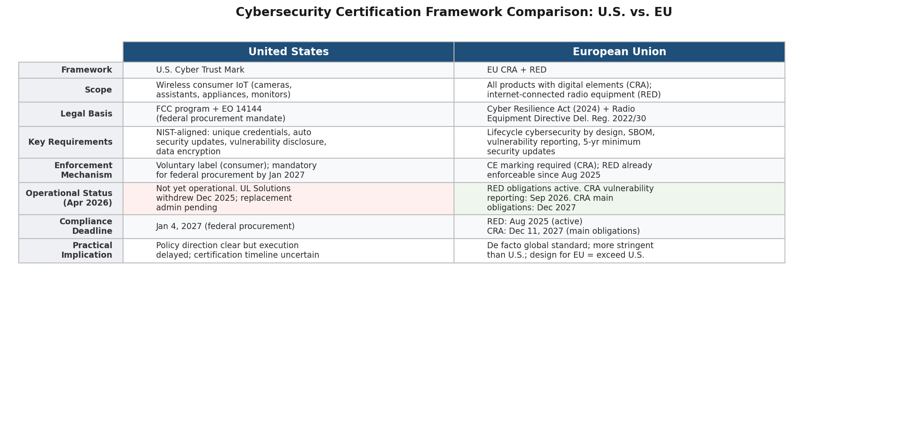

*Figure 5.1 — Side-by-side comparison of the U.S. Cyber Trust Mark and EU CRA/RED frameworks across scope, requirements, enforcement mechanism, and operational status as of April 2026. The contrast in operational readiness underscores why EU requirements are emerging as the de facto global baseline.*

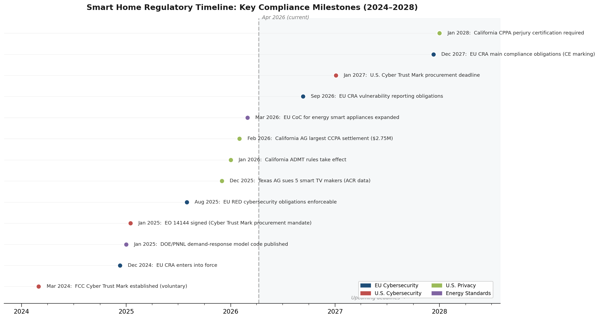

*Figure 5.2 — Chronological timeline of 13 key regulatory milestones across EU cybersecurity, U.S. cybersecurity, U.S. privacy, and energy standards from March 2024 through January 2028. The dashed reference line marks April 2026, distinguishing already-enforceable obligations from upcoming deadlines.*

## 5.2 Data Privacy: Fragmented Enforcement with Escalating Consequences

### 5.2.1 The U.S. Patchwork: 19 States and Counting

The absence of a federal comprehensive data privacy law has produced a regulatory environment in which 19 U.S. states have enacted consumer data privacy statutes as of 2025. While no new comprehensive law was enacted during 2025 — the first such pause since 2020 — nine states amended their existing privacy laws with significant expansions. Connecticut's SB 1295 added AI profiling rights and classified neural data as sensitive personal information, extending protections into territory directly relevant to smart home products employing biometric or behavioral analysis. Montana's SB 297 lowered applicability thresholds to 25,000 consumers, bringing smaller smart home device companies under regulatory scope [IAPP](https://iapp.org/news/a/retrospective-2025-in-state-data-privacy-law "2025 state privacy retrospective").

For smart home manufacturers, the multi-state privacy landscape imposes cumulative compliance costs functionally equivalent to a national regulation — without the benefit of uniform requirements. A smart security camera sold across all 50 states must simultaneously satisfy California's CCPA/CPRA, Virginia's VCDPA, Colorado's CPA, Connecticut's CTDPA, and up to 15 additional state frameworks, each with differing definitions of sensitive data, consent requirements, and consumer rights. The formation of a Consortium of Privacy Regulators by ten U.S. states, coupled with joint investigative sweeps announced by California, Connecticut, and Colorado, amplifies enforcement risk: a privacy violation surfaced in one state can trigger coordinated scrutiny across multiple jurisdictions [IAPP](https://iapp.org/news/a/retrospective-2025-in-state-data-privacy-law "10-state consortium and joint sweeps").

### 5.2.2 California's ADMT and Cybersecurity Audit Rules

The California Privacy Protection Agency (CPPA) finalized new CCPA regulations effective January 1, 2026, with particular significance for AI-enabled smart home products. The automated decision-making technology (ADMT) rules require businesses using automated systems for significant decisions — including housing-related determinations — to provide consumers with opt-out rights, access to information about how automated decisions are made, and the ability to request human review. Separate provisions mandate risk assessments for businesses processing personal information through automated systems, as well as cybersecurity audits for companies whose data practices present significant risk [IAPP](https://iapp.org/news/a/retrospective-2025-in-state-data-privacy-law "CPPA ADMT and cybersecurity audit regulations").

Beginning in 2028, businesses subject to these requirements must submit certifications to the CPPA under penalty of perjury attesting that risk assessments and cybersecurity audits have been completed. For smart home device manufacturers deploying AI-driven features — facial recognition in cameras, behavioral pattern analysis in ambient sensing systems, automated energy management — these rules create direct obligations to document, assess, and certify the privacy implications of core product functionality.

### 5.2.3 Enforcement Actions Signal Elevated Risk

The regulatory posture toward smart home data practices has shifted from guidance-oriented to enforcement-oriented, with several high-profile actions in 2025–2026 establishing precedents that reshape product design incentives.

The FTC and DOJ charged Amazon with combined penalties of $30.8 million: $25 million for Alexa's violation of the Children's Online Privacy Protection Act (COPPA) — specifically, retaining children's voice recordings indefinitely and undermining parental deletion requests — and $5.8 million for Ring's failure to prevent employee and contractor access to consumers' private video recordings [FTC](https://www.ftc.gov/news-events/news/press-releases/2023/05/ftc-doj-charge-amazon-violating-childrens-privacy-law-keeping-kids-alexa-voice-recordings-forever "FTC Amazon Alexa/Ring penalties"). While the financial penalties are modest relative to Amazon's scale, the resulting consent decrees impose structural requirements — mandatory data deletion schedules, employee access controls, and external security audits — that establish operational baselines with broader industry applicability.

In December 2025, Texas Attorney General Ken Paxton filed lawsuits against five smart TV manufacturers — Sony, Samsung, LG, Hisense, and TCL — over automated content recognition (ACR) data collection, obtaining temporary restraining orders against Hisense and Samsung. The suits were brought under the Texas Deceptive Trade Practices Act, the same statute underlying Texas's $1.4 billion Meta settlement (2024) and $1.375 billion Google settlement (2025), signaling that penalties for smart home data violations could escalate substantially [Captain Compliance](https://captaincompliance.com/education/texas-turns-smart-tvs-into-a-privacy-battleground-as-acr-tracking-faces-aggressive-state-enforcement/ "Texas AG ACR enforcement, December 2025").

The California AG's February 2026 CCPA settlement — the largest to date at $2.75 million — established a principle with direct implications for multi-device smart home ecosystems: if a business can associate a consumer's devices for advertising purposes, it must also associate those devices for honoring opt-out requests [Troutman Pepper](https://www.troutmanprivacy.com/2026/02/california-ag-announces-largest-ccpa-enforcement-settlement-to-date/ "February 2026 CCPA settlement"). For smart home platforms where a single user account controls cameras, speakers, displays, thermostats, and locks, this cross-device opt-out principle means that privacy consent management must operate at the account level rather than the device level — a non-trivial engineering requirement for platforms historically built on device-specific data pipelines.

### 5.2.4 The Privacy-Trust Deficit

The cumulative effect of privacy enforcement, data breach publicity, and consumer advocacy has produced a measurable trust deficit that directly constrains smart home adoption. Deloitte's 2025 Connected Consumer Survey reports that 70% of consumers worry about data privacy and security with digital services, up from 60% in 2024; only approximately 10% are "very willing" to share sensitive information; and fewer than 48% believe the benefits of connected services outweigh privacy concerns — the lowest proportion since Deloitte began tracking this metric in 2019 [Deloitte](https://www.deloitte.com/us/en/about/press-room/connectivity-mobile-trends-survey.html "Deloitte 2025 Connected Consumer Survey, September 2025").

This trust deficit creates a product design imperative that extends well beyond legal compliance. The consumer adoption analysis in Chapter 3 identifies privacy anxiety as the fastest-rising adoption barrier, even as affordability concerns decline. Manufacturers that can demonstrably shift data processing to the device edge — eliminating cloud transmission of video, audio, and biometric data — gain a competitive trust advantage that regulatory compliance alone does not confer. Samsung's SmartThings Ambient Sensing, which processes all data locally, and the Matter standard's design for local-first operation without internet dependency, represent architectural responses to this demand signal.

## 5.3 Energy-Efficiency Standards and Demand-Response Mandates

### 5.3.1 U.S. Building Codes: Embedding Grid-Interactive Intelligence

Energy-efficiency regulation is evolving from prescriptive equipment standards (minimum SEER ratings, insulation R-values) toward performance-based requirements that mandate grid-interactive capabilities in residential devices. The U.S. Department of Energy (DOE), through Pacific Northwest National Laboratory (PNNL), published a January 2025 technical brief proposing model code language for demand-responsive thermostats, water heaters, and energy storage systems to be incorporated into state building energy codes based on the International Energy Conservation Code (IECC). The proposed requirements mandate that smart thermostats support demand-responsive control via OpenADR 2.0, CTA-2045, or IEC 62746-10-1 communication protocols and automatically adjust heating or cooling setpoints by 1–4°F in response to utility grid signals [DOE/PNNL](https://www.energycodes.gov/sites/default/files/2025-01/TechBrief_GEB_Demand_Response.pdf "PNNL-31994-1, January 2025").

The scale of potential impact is substantial. DOE estimates that grid-interactive efficient buildings could yield $100–200 billion in U.S. electric power system cost savings over the next two decades [DOE/PNNL](https://www.energycodes.gov/sites/default/files/2025-01/TechBrief_GEB_Demand_Response.pdf "PNNL-31994-1, January 2025"). California's Title 24 residential code (Joint Appendix 5) already serves as a regulatory proof-of-concept, requiring HVAC thermostatic controls to support automatic setpoint adjustment of ±4°F, return to original setpoints after demand events, and three operational modes: automatic demand shed, manual, and disabled. As additional states adopt IECC-aligned code language, demand-responsive capability will transition from a premium feature to a code-mandated requirement in new construction.

For smart thermostat manufacturers, these evolving codes effectively standardize the communication protocols and response behaviors that products must support. Companies that have already invested in OpenADR and CTA-2045 integration — including ecobee, Honeywell Home, and Google Nest — hold a compliance head start. The regulatory direction also reinforces the energy management capabilities added to the Matter protocol in versions 1.4 and 1.5, which support energy device types, real-time tariff exchange, and bidirectional EV charging coordination — creating alignment between private-sector interoperability standards and public-sector energy codes.

### 5.3.2 EU Energy Smart Appliance Code of Conduct

The European Commission's Joint Research Centre (JRC) expanded its voluntary Code of Conduct for energy smart appliance interoperability in March 2026. Originally launched in 2024 covering white goods and HVAC equipment (including heat pumps), the expanded Code now encompasses energy management systems, photovoltaic inverters, batteries, and EV home chargers, with plans for further broadening by mid-2027. As of March 2026, ten manufacturers — including Daikin, Electrolux, Miele, Panasonic, and Vaillant — are signatories, with approximately 130 compliant models in production and around 200 additional models still on the market. Compliant products are discoverable through the EU's EPREL (European Product Registry for Energy Labelling) database using a dedicated "energy smart appliance" filter [EU JRC](https://joint-research-centre.ec.europa.eu/jrc-news-and-updates/energy-smart-appliances-code-conduct-expands-coverage-promoting-interoperability-2026-03-25_en "March 2026 CoC expansion").

Although currently voluntary, the Code of Conduct establishes interoperability expectations that may harden into regulatory requirements as the EU pursues its electrification and demand-response objectives. The expansion to batteries and EV chargers aligns with the broader EU push toward vehicle-to-home (V2H) and vehicle-to-grid (V2G) integration — capabilities that Matter 1.5 supports at the protocol level. For manufacturers targeting the EU market, voluntary compliance today positions products for anticipated regulatory compliance, while the EPREL database integration provides a consumer-facing discovery mechanism that rewards early adoption.

### 5.3.3 Inflation Reduction Act: Sustained Subsidy Through 2032

The U.S. Inflation Reduction Act's (IRA) 30% tax credits for heat pumps, battery storage, and EV chargers — available through 2032 — continue to function as a structural demand accelerator for connected energy devices. Rebate stacking with state and utility programs can reduce net device costs by up to 35%, creating a financial pathway for adoption of whole-home energy management systems incorporating smart controls [Mordor Intelligence](https://www.mordorintelligence.com/industry-reports/global-smart-homes-market-industry "IRA credits and thermostat savings citing DOE"). The combination of building code mandates (push) and tax incentives (pull) creates a dual-sided regulatory framework that strongly favors smart energy products with grid-interactive capabilities.

## 5.4 Interoperability Standards as Regulatory Architecture

### 5.4.1 Matter Certification: A Private-Sector Mandate

While the Cyber Trust Mark, CRA, and state privacy laws represent government-imposed regulatory frameworks, the Matter standard functions as a private-sector regulatory regime with comparable consequences for market access. Matter certification, administered by the Connectivity Standards Alliance (CSA), is mandatory for all devices seeking to participate in Matter-enabled ecosystems — non-certified devices are blocked from commissioning into a Matter network through a public key infrastructure (PKI) that verifies device attestation certificates at the point of onboarding. Over 750 Matter-certified products are available across more than 20 device categories, with the catalog continuing to expand as manufacturers certify against the latest specification versions [CSA](https://csa-iot.org/newsroom/matter-1-4-enables-more-capable-smart-homes/ "Matter 1.4 announcement").

The certification requirement serves multiple functions analogous to government regulation: it establishes minimum interoperability and security standards, creates a structured barrier to entry (membership fees plus per-product certification costs), provides a consumer-facing trust signal, and enables enforcement through technical means (PKI-based blocking) rather than legal proceedings. For small and mid-size manufacturers, the cost and complexity of Matter certification can be significant — requiring CSA membership, compliance testing through authorized laboratories, and ongoing recertification as specifications evolve.

The competitive implications are substantial. Nearly all smart locks showcased at CES 2026 carried Matter certification, and the first Matter-certified camera reached market by March 2026. As documented in Chapter 2, Matter certification is approaching table-stakes status for new product launches in lighting, locks, sensors, and thermostats. Products launched without Matter certification face exclusion from the growing installed base of Matter-enabled hubs and controllers — a market-access consequence that parallels regulatory non-compliance even though it originates from a private-sector consortium rather than a government agency.

### 5.4.2 ENERGY STAR and Demand-Response Alignment

ENERGY STAR certification for smart thermostats already requires demonstrable energy savings through reduced HVAC runtime and the ability to interface with utility demand-response programs, though specific demand-response behaviors are not mandated. The convergence of ENERGY STAR efficiency requirements, DOE-proposed demand-response code language, and Matter protocol energy management capabilities creates a layered certification environment in which products must satisfy multiple, partially overlapping standards. For consumers, these labels function as trust signals that simplify purchase decisions in an otherwise complex market. For manufacturers, the overlap between private-sector interoperability standards (Matter), government efficiency labels (ENERGY STAR), and building code requirements (Title 24, IECC) demands coordinated compliance strategies addressing all three simultaneously.

## 5.5 Implications for Product Development and Market Strategy

The regulatory and standards landscape described above yields five actionable implications for smart home product development through late 2026 and into 2027.

**Privacy-by-design as a competitive differentiator.** The combination of escalating state privacy enforcement (19 laws, a 10-state consortium, "hundreds of open investigations"), California's ADMT and cybersecurity audit rules, and the consumer trust deficit documented by Deloitte (70% concerned, sub-48% net benefit perception) means that privacy architecture choices — on-device processing versus cloud transmission, granular consent management, data minimization — function as product differentiation decisions as much as legal obligations. The FTC's Amazon penalties and the Texas AG's smart TV lawsuits demonstrate that enforcement consequences extend beyond fines to structural consent-decree requirements that constrain future product design. Manufacturers that proactively adopt edge-AI architectures and local data storage gain both a compliance margin and a consumer trust advantage.

**Cybersecurity certification as a market-access prerequisite.** The EU's RED cybersecurity requirements are already enforceable; the CRA's main obligations take effect in December 2027; and the U.S. Cyber Trust Mark becomes a federal procurement requirement by January 2027. While the Cyber Trust Mark's operational delays inject short-term uncertainty, the policy direction is unambiguous: certified cybersecurity is migrating from optional to expected. Manufacturers should design products to meet the more stringent EU CRA requirements, which will in most cases satisfy or exceed U.S. standards, and incorporate certification timelines into product launch schedules.

**Energy code mandates reshaping smart thermostat and HVAC control feature sets.** DOE-proposed model code language for demand-responsive devices, California's existing Title 24 requirements, and the EU's expanding Code of Conduct for energy smart appliances collectively point toward a future in which grid-interactive capability — support for OpenADR, CTA-2045, or equivalent protocols — is a baseline feature rather than a premium differentiator. The IRA's sustained subsidies through 2032 ensure that consumer demand for qualifying devices remains financially supported.

**Multi-jurisdiction compliance favoring platform-scale manufacturers.** The fragmentation of U.S. state privacy laws, the gap between EU and U.S. cybersecurity timelines, and the accumulation of certification requirements (Matter, ENERGY STAR, Cyber Trust Mark, CE/CRA) disproportionately burden smaller manufacturers. Companies operating on white-label platforms such as Tuya gain a compliance advantage if the platform provider absorbs certification and privacy framework management; independent startups face escalating regulatory overhead that raises effective barriers to market entry.

**Cross-device privacy management as a new engineering requirement.** The California AG's cross-device opt-out principle — established in the February 2026 settlement — mandates that smart home platforms associate privacy preferences across all connected devices linked to a single consumer account. For ecosystems spanning cameras, speakers, displays, locks, and sensors, this requires account-level consent architecture that propagates opt-out signals across disparate device types, protocols, and data pipelines. Platforms designed with device-centric rather than account-centric privacy management will require retrofit engineering to comply.

# 第6章 Future Product Trends — Product Types and Features Poised to Define the Smart Home

The preceding chapters established that the global smart home market is expanding at a double-digit pace through the late 2020s (Chapter 1), powered by converging technology enablers — on-device AI, the Matter interoperability standard, and low-power ambient-sensing silicon (Chapter 2). Consumer demand signals point toward security, energy savings, and convenience as primary adoption drivers, with 42–52% willingness to pay for AI-augmented home services (Chapter 3). Platform holders are investing aggressively in generative-AI assistants and third-party licensing models while industrial incumbents restructure around connected building solutions (Chapter 4). Regulatory frameworks simultaneously catalyze adoption — through energy-efficiency mandates and tax incentives — and impose new design constraints via cybersecurity certification and automated-decision-making rules (Chapter 5).

This chapter synthesizes those findings into ten specific product trends expected to shape the smart home industry through late 2026 and into 2027. Each trend is anchored to at least one technology-readiness signal, one consumer-demand indicator, and — where applicable — a regulatory or competitive catalyst. Trends are organized from those nearest to mainstream adoption to those still in an early or emerging phase. The maturity matrix below provides a visual summary of where each trend sits along the technology-readiness and consumer-demand axes.

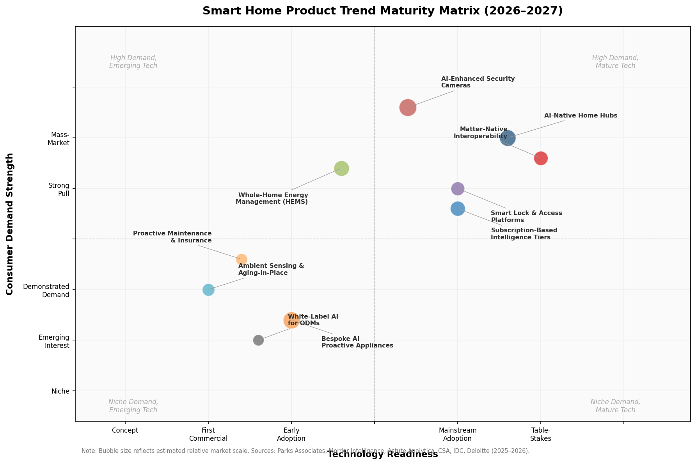

*Figure 6.1 — Ten product trends plotted by technology readiness (x-axis) and consumer demand strength (y-axis). Bubble size reflects estimated relative market scale. Sources: Parks Associates, Astute Analytica, CSA, IDC, Deloitte (2025–2026).*

## 6.1 AI-Native Home Hubs with Generative-AI Assistants

The most consequential near-term product trend is the emergence of dedicated smart home hubs built around generative-AI assistants rather than traditional voice-command engines. Within a twelve-month window, three of the four major ecosystem players shipped or announced AI-native hub hardware. Amazon launched its next-generation Echo lineup with custom AZ3/AZ3 Pro silicon and the Alexa+ generative-AI assistant in September 2025 [Amazon News](https://www.aboutamazon.com/news/devices/amazon-new-echo-devices-alexa-plus "Next-gen Echo devices, September 2025"). Google replaced Assistant with Gemini for Home across smart speakers and displays in October 2025, introducing two subscription tiers — Standard at $10/month and Advanced at $20/month — with features such as natural-language camera search [TechCrunch](https://techcrunch.com/2025/10/01/google-reveals-its-gemini-powered-smart-home-lineup-and-ai-strategy/ "Google Gemini-powered smart home, October 2025"). Apple's J490, a 7-inch smart home display priced at approximately $350, is targeted for September 2026 after repeated delays attributed to Siri LLM integration challenges [AppleInsider](https://appleinsider.com/articles/26/03/09/apples-smart-home-hub-delayed-again-because-updating-siri-is-hard "Apple J490 delay, March 2026").

Consumer willingness to pay underpins this trajectory. Parks Associates reports that 42–52% of consumers would pay a monthly fee for an AI smart home assistant offering security, convenience, and automation use cases [Parks Associates](https://www.parksassociates.com/blogs/pr-smart-home/parks-associates-up-to-52-of-consumers-are-willing-to-pay-a-monthly-fee-for-an-ai-smart-home-assistant-that-offers-security-convenience-and-automation-use-cases "Up to 52% willing to pay, 2025"). Among paid AI users — 15% of U.S. internet households — 75% express willingness to pay for a smart home AI service [Parks Associates](https://www.prnewswire.com/news-releases/fifteen-percent-of-us-internet-households-use-a-paid-ai-application-and-75-of-those-paying-for-generative-ai-apps-today-are-willing-to-pay-for-a-smart-home-ai-service-302529619.html "August 2025").

The competitive dynamics diverge by platform strategy. Amazon bundles Alexa+ free with Prime ($19.99/month standalone), leveraging its 600-million-device installed base to drive adoption through existing subscriptions. Google has pursued an Android-style licensing model, opening its camera SDK and reference hardware to third parties — exemplified by Walmart's Onn-branded cameras with full Gemini integration at sub-$25 price points [The Verge](https://www.theverge.com/news/787179/walmart-onn-indoor-camera-video-doorbell-google-home "Walmart Onn cameras, October 2025"). Apple emphasizes on-device processing through Apple Intelligence, prioritizing privacy but lagging in market timing. Samsung complements its SmartThings ecosystem with Bixby and Gemini integration embedded directly into appliances.

Hub hardware architectures are evolving to support edge AI inference. Amazon's AZ3 Pro includes a dedicated AI accelerator for on-device processing, while the broader industry is converging on the 3B–30B parameter range for on-device LLMs, with expectations of 40+ tokens per second on quantized 7B models [Semiconductor Engineering](https://semiengineering.com/the-on-device-llm-revolution/ "On-device LLM revolution, 2026-02-20"). This architecture enables latency-sensitive features — real-time voice interaction, proactive automation triggers, and local camera inference — without the 500 ms+ round-trip penalty of cloud-dependent systems.

**Trajectory assessment:** Early adoption transitioning to mainstream by late 2026–2027. The hub form factor is commercially established; the differentiator is the quality and autonomy of the embedded AI.

## 6.2 AI-Enhanced Security Cameras with On-Device Processing and Matter Interoperability

Smart security cameras represent the product category in which AI capabilities, interoperability standards, and consumer demand most directly converge. Security remains the leading adoption driver for smart home technology: 47% of U.S. internet households owned a security solution in 2025 (up from 38% in 2022), and 40% of smart home device owners value AI notifications for unknown-person detection [Parks Associates](https://www.prnewswire.com/news-releases/parks-associates-47-of-us-internet-households-own-a-security-solution-and-35-have-a-paid-security-service-302525649.html "47% own security solution, August 2025"). Mordor Intelligence projects smart security cameras to grow at an 18.32% CAGR through 2031 [Mordor Intelligence](https://www.mordorintelligence.com/industry-reports/global-smart-homes-market-industry "Smart security cameras 18.32% CAGR").

The technology inflection occurred with Matter 1.5 (November 2025), which introduced camera support through WebRTC live video/audio, pan-tilt-zoom control, and local or cloud recording profiles [CSA](https://csa-iot.org/newsroom/matter-1-5-introduces-cameras-closures-and-enhanced-energy-management-capabilities/ "Official Matter 1.5 announcement, November 2025"). Aqara's G350 — the first Matter 1.5-certified camera — shipped in March 2026 with dual-lens 4K+2.5K resolution, on-device AI for person, pet, and sound detection, and multifunctional capability as a Zigbee hub, Matter controller, and Thread Border Router [The Verge](https://www.theverge.com/tech/895326/aqara-g350-matter-camera-samsung-smartthings-hands-on-review "First Matter camera, March 2026"). The CSA followed with Matter 1.5.1 (March 2026), refining multi-stream camera performance [CSA](https://csa-iot.org/newsroom/matter-1-5-1-enhancing-camera-performance-and-expanding-device-flexibility/ "Matter 1.5.1, March 2026").

On the silicon side, Ambarella's CV7 edge AI vision SoC (announced at CES 2026) delivers 2.5× the AI performance of its predecessor on a Samsung 4 nm process, supporting simultaneous CNN and transformer networks for on-device scene understanding at 20% lower power [Ambarella](https://www.ambarella.com/news/ambarella-launches-powerful-edge-ai-8k-vision-soc-with-industry-leading-ai-and-multi-sensor-perception-performance/ "CV7 launch, January 2026"). At the cloud-AI tier, Google's Gemini Advanced ($20/month) enables natural-language camera search — allowing queries such as "When did the delivery arrive?" — and returns AI-generated summaries with relevant video clips.

A notable constraint tempers the pace of this trend: as of early 2026, only Samsung SmartThings supports Matter cameras. Google and Amazon maintain proprietary camera ecosystems, meaning true cross-platform camera interoperability remains aspirational rather than realized. Google's licensing model for the Onn cameras simultaneously democratizes AI-powered security at sub-$25 price points while reinforcing platform lock-in through Gemini integration.

**Trajectory assessment:** Early adoption transitioning to mainstream. On-device AI object detection is approaching table-stakes status for mid-tier cameras ($50–100); Matter camera interoperability is in its first commercial phase with limited platform support.

## 6.3 Whole-Home Energy Management Systems with AI Optimization

Whole-home energy management systems (HEMS) constitute the product category with the strongest convergence of consumer demand, regulatory tailwinds, and technology-standards maturation. The global HEMS market was valued at USD 3.60 billion in 2024 and is projected to reach USD 19.43 billion by 2033 at a 20.6% CAGR [Astute Analytica via GlobeNewswire](https://finance.yahoo.com/news/home-energy-management-system-market-115500882.html "HEMS $19.43 B by 2033, February 2026"). Consumer pull is strong: 50% of U.S. households are actively working to reduce energy consumption [Parks Associates & Vivint](https://www.residentialsystems.com/news/parks-associates-and-vivint-release-white-paper-on-the-significance-of-centralized-smart-home-energy-and-security "December 2025"), and connected thermostats already deliver 10–23% savings on residential electricity with 2–3-year payback periods [Mordor Intelligence](https://www.mordorintelligence.com/industry-reports/global-smart-homes-market-industry "IRA credits and thermostat savings citing DOE").

Multiple forces are accelerating HEMS product development simultaneously. On the regulatory side, IRA Section 25D provides 30% tax credits for heat pumps, battery storage, and EV chargers through 2032, with rebate stacking reducing net device costs by up to 35% [Mordor Intelligence](https://www.mordorintelligence.com/industry-reports/global-smart-homes-market-industry "IRA credits citing DOE"). The DOE's proposed model code language (January 2025) mandates that demand-responsive thermostats, water heaters, and energy storage support OpenADR 2.0, CTA-2045, or IEC 62746-10-1 protocols and auto-adjust setpoints by 1–4 °F; the DOE estimates grid-interactive efficient buildings could save $100–200 billion in U.S. power-system costs over two decades [DOE/PNNL](https://www.energycodes.gov/sites/default/files/2025-01/TechBrief_GEB_Demand_Response.pdf "PNNL-31994-1, January 2025"). In Europe, the EU Joint Research Centre expanded its voluntary Code of Conduct for energy smart appliances (March 2026) to cover energy management systems, PV inverters, batteries, and EV home chargers, with 10 manufacturer signatories and approximately 130 compliant models [EU JRC](https://joint-research-centre.ec.europa.eu/jrc-news-and-updates/energy-smart-appliances-code-conduct-expands-coverage-promoting-interoperability-2026-03-25_en "March 2026 CoC expansion").

On the technology side, Matter 1.5 introduced advanced energy management device types including real-time tariff exchange, EV bidirectional charging support, and grid carbon-intensity reporting [CSA](https://csa-iot.org/newsroom/matter-1-5-introduces-cameras-closures-and-enhanced-energy-management-capabilities/ "Matter 1.5, November 2025"). Commercial launches reflect this convergence: Schneider Electric's Wiser AI-powered HEMS claims 25% energy-bill savings through intelligent load orchestration across solar, battery, EV charger, and grid inputs [Schneider Electric Blog](https://blog.se.com/homes/2026/03/26/building-a-new-home-energy-landscape/ "Wiser HEMS, March 2026"); Anker Solix introduced the E10 at CES 2026 as a smart hybrid whole-home backup system (10 kW, expandable to 30 kW).

Vehicle-to-home (V2H) integration is an emerging dimension of HEMS. By early 2026, multiple automakers — Ford (F-150 Lightning), GM (Ultium platform), Tesla (2024+ Model 3/Y and Cybertruck at 11.5 kW V2H), Hyundai (IONIQ 5/6), and Volkswagen (ID.4, ID.Buzz) — ship or have announced V2H-capable vehicles, while bidirectional charger manufacturers such as Enphase (IQ Bidirectional EV Charger) and EcoFlow (Smart Home Panel 3) provide integration hardware [EcoFlow](https://www.ecoflow.com/us/blog/bidirectional-charging-v2g-cars "Bidirectional Charging V2G in 2026, January 2026"). Matter 1.5's protocol-level support for EV bidirectional charging creates a standards pathway for these systems to communicate with the broader smart home ecosystem.

**Trajectory assessment:** Niche broadening rapidly toward mainstream. IRA tax credits, utility demand-response programs, and Matter energy-management protocols create a policy-technology alignment not present in most other smart home categories.

## 6.4 Smart Lock and Access Platforms with Biometrics and Matter Certification

Smart locks are evolving from single-function deadbolt replacements into multimodal access platforms that combine biometric authentication, video capabilities, and interoperability certification. At CES 2026, nearly all newly announced smart locks carried Matter certification — a threshold signaling the standard's transition from differentiator to baseline expectation in this category [TechRadar](https://www.techradar.com/tech-events/ces-2026-smart-locks "CES 2026 smart locks, January 2026").

The feature envelope is expanding along several dimensions. UWB (ultra-wideband) precision unlocking, exemplified by the Aqara U400, enables hands-free, proximity-based entry with centimeter-level accuracy — eliminating the false triggers common with Bluetooth-only approaches. Biometric modalities are diversifying beyond fingerprint readers: the Desloc S150 Max incorporates 3D facial recognition with 1.5-second unlock times, while Lockin's V7 Max adds palm-vein biometrics and wireless charging. Convergence between locks and video doorbells is evident in the Lockly Affirm, which integrates a video doorbell directly into the lock assembly. At the accessible end of the market, Yale's Linus L2 Lite features tool-free installation specifically targeting the renter demographic [TechRadar](https://www.techradar.com/tech-events/ces-2026-smart-locks "CES 2026 smart locks, January 2026").

Distribution channels are accelerating adoption beyond the DIY retrofit market. ASSA ABLOY completed six acquisitions in Q1 2025 alone, including digital credential companies, to extend the Yale brand's cross-platform capability [ASSA ABLOY](https://www.assaabloy.com/group/en/investors/acquisitions "Acquisitions overview"). The multifamily sector presents a particularly large opportunity: more than one-third of renters express willingness to pay an additional $60 per month for smart home features, an estimated $8.5 billion annual revenue opportunity, with smart locks as the most-deployed category in MDU properties [PointCentral](https://www.pointcentral.com/2025/12/18/2025-in-review-how-smart-technology-shaped-multifamily-property-management/ "Smart Tech in Multifamily, December 2025"). Property managers implementing smart lock technology report 20% operational efficiency gains and 18% cost reductions across managed portfolios.

The regulatory environment reinforces this trend. The EU's RED cybersecurity requirements (effective August 2025) and the approaching U.S. Cyber Trust Mark (with a January 2027 federal procurement mandate) favor manufacturers investing in secure-by-design architectures — a competitive moat for established brands such as Yale and Schlage over unbranded imports.

**Trajectory assessment:** Early adoption transitioning to mainstream. Matter certification is approaching table-stakes; biometric modalities and MDU/builder-channel expansion are the primary growth vectors.

## 6.5 Ambient Sensing and Aging-in-Place Sensor Suites

A distinct product archetype is emerging at the intersection of radar-based ambient sensing, aging-in-place demand, and privacy-preserving design: whole-home sensor suites that detect occupant presence, activity patterns, and health indicators without cameras or wearables. This category addresses 16.3 million U.S. households that use assistive technology (up from 14.4 million in 2022), representing a $5 billion annual market opportunity [Parks Associates](https://www.parksassociates.com/blogs/digital-health/the-future-of-senior-care-how-ambient-sensing-is-transforming-aging-in-place "Ambient sensing for aging in place, 2025"). Demand extends beyond specialized caregiving: 75% of adults aged 50 and older globally are open to smart home technology for aging-in-place, according to the EY Global Consumer Health Survey 2025 (n = 4,501 across six countries) [EY via McKnight's Senior Living](https://www.mcknightsseniorliving.com/news/smart-home-tech-the-answer-for-aging-in-place-older-adults-say/ "EY Global Consumer Health Survey 2025, October 2025").

The enabling technology has reached commercial maturity. Texas Instruments' IWRL6432 60 GHz mmWave radar achieves 3.2 mW average power for motion detection, supporting battery-powered deployment for presence detection, people counting, vital-sign sensing (breathing and heart rate), sleep monitoring, and gesture recognition [Texas Instruments](https://www.ti.com/lit/swra807 "mmWave radar in smart home, March 2024"). Samsung's SmartThings Ambient Sensing, unveiled at CES 2025, repurposes existing household devices — TVs, speakers, refrigerators, and air conditioners — as motion and sound sensors using embedded mmWave radar, detecting activities such as cooking, exercising, and sleeping with all processing and data storage performed locally [The Verge](https://www.theverge.com/2025/1/22/24349488/samsung-smartthings-ambient-sensing-home-ai "SmartThings Ambient Sensing, January 2025"). Wi-Fi sensing technology from providers such as Cognitive Systems detects motion and behavioral patterns through existing Wi-Fi signals without requiring additional hardware.

Dedicated aging-focused products are appearing at the consumer level. Pontosense's Silver Shield, introduced at CES 2026, uses radar-based fall detection specifically targeting older adults [Forbes](https://www.forbes.com/sites/jamiegold/2026/01/27/six-top-smart-home-trends-from-2026-ces-tech-expo/ "CES 2026 safety innovations"). Amazon's Echo lineup with the Omnisense sensor-fusion platform combines camera, ultrasound, Wi-Fi radar, and accelerometer data for ambient awareness [Amazon News](https://www.aboutamazon.com/news/devices/amazon-new-echo-devices-alexa-plus "Next-gen Echo devices, September 2025").

The privacy architecture of these products is a critical design consideration. Some 70% of consumers express concern about data privacy with digital services (up from 60% in 2024), and fewer than 48% believe benefits outweigh privacy risks [Deloitte 2025 Connected Consumer Survey](https://www.deloitte.com/us/en/about/press-room/connectivity-mobile-trends-survey.html "September 2025"). Radar and Wi-Fi sensing approaches offer an inherent advantage over cameras: they detect presence, movement, and physiological signals without capturing identifiable imagery. Samsung's local-only data architecture for Ambient Sensing and the Silicon Labs MG26 SoC's on-device anomaly detection capability (8× faster inference at one-sixth the power versus CPU-only processing) illustrate the industry's design response to these concerns [Silicon Labs via PR Newswire](https://www.prnewswire.com/news-releases/silicon-labs-redefines-smart-home-connectivity-with-new-concurrent-multiprotocol-soc-302385539.html "MG26 GA, February 2025").

**Trajectory assessment:** Concept-to-first-commercial phase. Dedicated aging-in-place sensor suites are entering the market; ambient sensing embedded in existing devices (Samsung, Amazon) will broaden reach. The category is poised for acceleration by 2027 as radar silicon costs decline and insurance-based distribution models mature.

## 6.6 "Bespoke AI" Proactive Appliances

Large home appliances — refrigerators, washing machines, ovens, and robot vacuums — are undergoing a design transformation from passively connected devices to proactively intelligent systems. Samsung's CES 2026 presentation epitomized this vision: the Bespoke AI Refrigerator Family Hub integrates Google Gemini (a first for any home appliance), enabling natural-language interaction, FoodNote nutrition tracking via AI Vision food recognition, and proactive grocery management. The Bespoke AI Jet Bot Ultra robot vacuum, powered by a Qualcomm Dragonwing AI chipset, identifies objects and liquid spills for adaptive cleaning. Samsung committed to up to seven years of software updates for these appliances, signaling a shift toward long-lifecycle, continuously improving product models [Samsung Global Newsroom](https://news.samsung.com/global/ces-2026-a-home-companion-making-daily-life-more-effortless "Samsung CES 2026 Home Companion, January 2026").

Consumer adoption data, however, introduces a significant caveat. Smart appliance household penetration stood at approximately 12.9% in 2025, with projections reaching only 30.8% by 2029 [IoT Breakthrough citing Statista](https://iotbreakthrough.com/the-smart-home-in-2026-whats-actually-sticking-and-whats-not/ "Smart appliance penetration 12.9%"). Despite generating approximately USD 68.7 billion in revenue in 2025, the category's penetration rate substantially trails those of smart speakers, security cameras, and smart lighting. The gap between revenue (driven by high average selling prices) and penetration (reflecting limited consumer enthusiasm for "smart" features in appliance purchases) suggests that AI integration alone may not resolve the fundamental adoption challenge: consumers replace appliances infrequently and prioritize core functionality over connectivity.

Samsung's regional differentiation strategy acknowledges this reality — innovative form factors for North America, energy-efficient designs for Europe, and broader price points for Asia and Latin America [Samsung Global Newsroom](https://news.samsung.com/global/connected-comprehension-inside-samsungs-2026-ai-home "Samsung CES 2026, January 2026"). The path to broader adoption likely runs through utility-driven value propositions: energy optimization that reduces operating costs, predictive maintenance that prevents costly failures, and insurance integration that lowers premiums. This aligns with the finding that 30% of consumers are less likely to purchase products marketed as "AI-powered," though smart home products represent an exception with a net-positive AI marketing effect [Parks Associates](https://www.prnewswire.com/news-releases/generative-ai-reaches-58-of-us-internet-households-but-monetization-and-trust-lag-according-to-new-research-from-parks-associates-302691183.html "February 2026").

**Trajectory assessment:** Early adoption in premium segments; broadening through price-point expansion and utility-driven value propositions. Mainstream adoption of AI-embedded appliances remains constrained by replacement cycles and consumer skepticism toward smart features in traditional appliance categories.

## 6.7 Subscription-Based Intelligence Tiers

The business model underlying smart home products is shifting from one-time hardware sales toward recurring subscription revenue, with AI-powered intelligence tiers as the primary monetization vehicle. Concrete pricing from the two largest platforms now anchors this transition. Google Home Premium offers a Standard tier at $10/month and an Advanced tier at $20/month, the latter unlocking Gemini-powered camera features including natural-language video search and AI scene descriptions [TechCrunch](https://techcrunch.com/2025/10/01/google-reveals-its-gemini-powered-smart-home-lineup-and-ai-strategy/ "Google subscription tiers, October 2025"). Amazon's Alexa+ is bundled free for Prime subscribers ($19.99/month standalone), monetizing through the broader Prime ecosystem rather than a standalone smart home subscription.

Consumer willingness to pay provides the demand-side foundation. Parks Associates finds that 66% of homeowners are likely to adopt tech-enabled home services priced at $10–30 per month, with HVAC monitoring and fire/CO detection each representing more than $2 billion in annual recurring revenue potential [Parks Associates via Yahoo Finance](https://finance.yahoo.com/news/parks-associates-models-emerge-smart-122300542.html "Smart Home Services, April 2025"). U.S. households spent an average of $896 on connected devices in 2025 (up 17% from $764 in 2024) and $183/month on digital services, with 25% expecting to increase tech-service spending [Deloitte 2025 Connected Consumer Survey](https://www.deloitte.com/us/en/about/press-room/connectivity-mobile-trends-survey.html "September 2025").

The subscription model reshapes product design incentives. Manufacturers are motivated to sell hardware at or below cost — as Google's Walmart Onn partnership demonstrates with sub-$25 cameras — and capture margin through ongoing services. This dynamic accelerates device proliferation while creating long-term lock-in: cameras, hubs, and sensors become distribution channels for software revenue rather than profit centers in themselves. For consumers, subscription fatigue poses a countervailing risk. With monthly digital services already at $183 on average, each incremental subscription faces rising scrutiny. Nonetheless, 51% of respondents report declining affordability concerns (down from 61% in 2024), and AI-enhanced security specifically commands net-positive purchase intent [Deloitte](https://www.deloitte.com/us/en/insights/industry/telecommunications/connectivity-mobile-trends-survey.html "Deloitte 2025 spending section") [Parks Associates](https://www.prnewswire.com/news-releases/generative-ai-reaches-58-of-us-internet-households-but-monetization-and-trust-lag-according-to-new-research-from-parks-associates-302691183.html "February 2026").

**Trajectory assessment:** Early adoption transitioning to mainstream. Subscription tiers are a defining business-model feature of the next product generation; the key variable is whether consumers perceive AI-tier pricing as delivering sufficient marginal value over free or basic tiers.

## 6.8 Matter-Native Interoperability as Table-Stakes

The Matter interoperability standard, developed by the Connectivity Standards Alliance (CSA), is transitioning from a competitive differentiator to a baseline product requirement across multiple device categories. Over 750 certified products span more than 20 categories as of early 2026 [CSA](https://csa-iot.org/newsroom/matter-1-4-enables-more-capable-smart-homes/ "Matter 1.4 announcement"). The standard's scope has expanded aggressively through successive releases: Matter 1.4 (November 2024) introduced Long Idle Time for battery-powered devices and energy-management device types; Matter 1.4.2 (August 2025) added Wi-Fi-only commissioning and support for up to 150 Thread and 100 Wi-Fi devices per network; Matter 1.5 (November 2025) added cameras, closure devices, soil moisture sensors, and advanced energy management [Silicon Labs](https://www.silabs.com/blog/matter-1-4-continues-the-csas-commitment-to-unifying-the-home "Matter 1.4, Silicon Labs") [Forbes](https://www.forbes.com/sites/paullamkin/2025/08/12/matter-142-is-here-what-it-means-for-your-smart-home/ "Matter 1.4.2, Forbes") [CSA](https://csa-iot.org/newsroom/matter-1-5-introduces-cameras-closures-and-enhanced-energy-management-capabilities/ "Matter 1.5, November 2025").

IKEA's decision to rebuild its entire smart home range around Matter underscores the standard's gravitational pull on mass-market products. In November 2025, IKEA launched 21 new Matter-over-Thread products across lighting (eleven smart bulb variants), sensors (motion, door/window, temperature/humidity, air quality, and water leakage), and controls (remotes and smart plugs), all designed to work with the DIRIGERA hub or any third-party Matter controller [IKEA Newsroom](https://www.ikea.com/global/en/newsroom/retail/the-new-smart-home-from-ikea-matter-compatible-251106/ "IKEA 21 new smart home products, November 2025"). IKEA's entry at accessible price points signals that Matter certification is becoming a prerequisite for shelf placement at mass retailers, not merely a feature for enthusiast-targeted products.

Matter's PKI-based device attestation certificate system functions as an enforced quality gate: non-certified devices are blocked from commissioning, creating a hard boundary between the interoperable ecosystem and legacy proprietary products. This architectural choice, combined with the approaching EU CRA and U.S. Cyber Trust Mark requirements, means that manufacturers investing in Matter certification simultaneously address interoperability and cybersecurity compliance — a convergence that raises barriers for uncertified competitors.

Notable gaps persist. Thread 1.4 — the mesh networking layer underlying many Matter devices — requires border routers from different manufacturers to auto-join existing Thread networks, but major networking vendors (Eero, Nest Wi-Fi, TP-Link, Asus) have not released certified HRAP products as of early 2026 [Matter Alpha](https://www.matteralpha.com/explainer/most-anticipated-matter-features-and-devices-in-2026 "Anticipated Matter features 2026, January 2026"). Matter camera support remains limited to Samsung SmartThings, with Google and Amazon maintaining proprietary camera ecosystems. These gaps constrain the fully interoperable whole-home vision but do not diminish Matter's centrality as a product-development requirement.

**Trajectory assessment:** Differentiator transitioning to table-stakes by late 2026 for locks, lighting, sensors, and thermostats. Camera and energy-management interoperability under Matter 1.5 remains in the emerging phase.

## 6.9 White-Label AI Platforms for Global ODMs

The AI capabilities demonstrated by Amazon, Google, and Samsung risk creating a two-tier smart home market in which products from smaller brands and regional manufacturers lack competitive intelligence features. Tuya Smart's (NYSE: TUYA) Hey Tuya platform, unveiled at CES 2026, directly addresses this gap through a Multi-Agent AI architecture with an OmniMem long-term memory engine, enabling context-aware interactions across more than 500 device categories. The accompanying AI Agent Development Platform allows hardware manufacturers to integrate AI capabilities into their products within ten minutes, with TuyaOpen providing an open-source development framework [Tuya Smart](https://www.tuya.com/news-details/tuya-smart-brings-ai-to-real-life-at-ces-2026-Kf9n2k7vvbj1y "CES 2026, January 2026").

This platform model democratizes AI for the long tail of global smart home brands — the thousands of ODMs, regional appliance manufacturers, and emerging-market brands that collectively account for a substantial share of global device shipments but lack the R&D resources to build proprietary AI stacks. Google's parallel move to license Gemini for Home to third-party camera manufacturers (evidenced by the Walmart Onn partnership) reflects a similar strategic recognition that AI platform licensing, rather than exclusive first-party integration, may prove the dominant distribution model.

The competitive implication is that AI-powered features will cease to be exclusive to premium-priced products from major platform holders. As white-label AI platforms mature, the differentiator shifts from "has AI" to "quality of AI experience" — the accuracy of scene detection, the naturalness of voice interaction, the relevance of proactive suggestions, and the depth of cross-device learning.

**Trajectory assessment:** Niche broadening. Tuya's platform is commercially available; adoption velocity depends on ODM integration cycles (typically 6–12 months from platform availability to shipping product).

## 6.10 Proactive Maintenance and Insurance-Integrated Service Platforms

A product-service category is forming around the integration of smart home sensor data with predictive maintenance algorithms and insurance risk models. The economic rationale is compelling: 66% of U.S. homeowners express interest in tech-enabled home services, and 46% of smart thermostat owners received their devices through HVAC service providers rather than retail channels — indicating that service-relationship distribution is already established [Parks Associates via Yahoo Finance](https://finance.yahoo.com/news/parks-associates-models-emerge-smart-122300542.html "Smart Home Services, April 2025").

Insurance partnerships provide the clearest commercial traction. Samsung and Hartford Steam Boiler (HSB) launched Smart Home Savings at CES 2026, integrating appliance operational data with insurance risk models to identify potential failures before they generate claims [Samsung Global Newsroom](https://news.samsung.com/global/samsung-electronics-collaborates-with-hartford-steam-boiler-hsb-to-introduce-smart-home-savings "Samsung–HSB, January 2026"). Hippo Insurance provides free smart home devices (water leak sensors, smoke detectors) to all policyholders, while State Farm offers premium discounts or complimentary three-year monitoring subscriptions [Bankrate](https://www.bankrate.com/insurance/reviews/hippo-insurance/ "Hippo Insurance smart home details"). Insurance carriers more broadly offer 5–10% premium discounts for professionally monitored smart home security systems [Mordor Intelligence](https://www.mordorintelligence.com/industry-reports/global-smart-homes-market-industry "Insurance premium discounts").

Specialized sensor companies are targeting specific risk categories. Whisker Labs addresses electrical hazard detection, while Flume provides water leak monitoring with predictive analytics. These products generate continuous data streams that, when integrated with insurer platforms, enable loss-prevention interventions — such as automated water shutoff upon leak detection — that directly reduce claim frequency and severity.

Consumer receptivity reinforces the model. Homeowners already cite qualifying for insurance discounts as a primary motivation for smart home adoption (37%, per the Nationwide 2025 Homeowners Survey), and this motivation is strongest among the 35–49 age cohort that owns the most device types (5.1 on average) [Nationwide 2025 Homeowners Survey](https://riskandinsurance.com/millennials-embrace-smart-home-tech-while-boomers-prioritize-repairs-creating-protection-gaps/ "October 2025").

**Trajectory assessment:** Early adoption transitioning to mainstream. Insurance and HVAC service channels represent established distribution pathways; the remaining challenge is standardizing data-sharing protocols between device manufacturers and insurers.

## 6.11 Cross-Cutting Feature Assessment: Table-Stakes, Differentiators, and Emerging Capabilities

Beyond specific product categories, several features are undergoing transitions in competitive positioning that will shape product design decisions across the industry. The timeline below maps these transitions from differentiator status through a transition phase to table-stakes arrival.

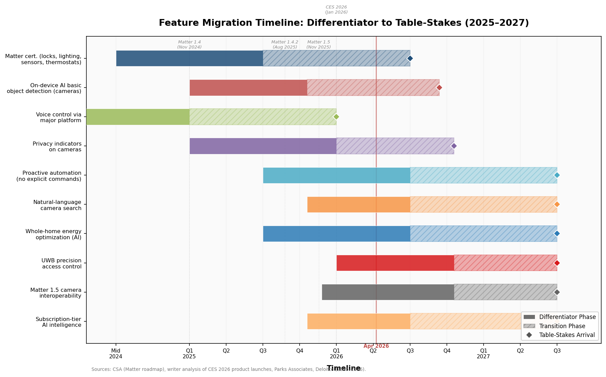

*Figure 6.2 — Projected timeline for ten key smart home features migrating from differentiator to table-stakes status. The vertical reference line marks April 2026; key Matter protocol milestones are annotated. Sources: CSA Matter roadmap, CES 2026 product launch analysis, Parks Associates, Deloitte (2025–2026).*

### Features Becoming Table-Stakes by Late 2026

- **Matter certification** for locks, lighting, sensors, and thermostats — driven by IKEA's mass-market adoption, CES 2026 product launches, and Matter's PKI enforcement mechanism.
- **On-device AI for basic object detection** in security cameras — enabled by Ambarella CV7 and comparable vision SoCs; expected in mid-tier ($50–100) cameras by late 2026.
- **Voice control via at least one major platform** — Amazon, Google, or Apple ecosystem compatibility is a prerequisite for retail placement.
- **App-based remote control and monitoring** — a baseline consumer expectation across all connected product categories.
- **Privacy indicators on cameras** — physical shutters, LED indicators, and local processing modes, driven by privacy regulation (CCPA ADMT rules, EU RED) and consumer sensitivity (70% privacy concern per Deloitte).

### Current Differentiators (2026–2027)

- **Proactive automation without explicit commands** — Samsung Omnisense sensor fusion, SmartThings Ambient Sensing, and Alexa+ agentic capabilities that anticipate user needs.
- **Natural-language camera search** — Gemini Advanced and Alexa+ enable conversational querying of recorded footage.
- **Whole-home energy optimization** across solar, battery, EV, and dynamic-tariff inputs — Schneider Wiser, Anker Solix, and EcoFlow systems with AI-driven load orchestration.
- **UWB precision access control** — hands-free, centimeter-accurate unlocking in premium smart locks.
- **AI-driven predictive maintenance with insurance integration** — Samsung–HSB and Hippo models linking sensor data to risk models.
- **Edge LLM inference (3B–30B parameters)** — enabling conversational AI on hubs and edge devices without cloud dependency.

### Emerging Capabilities (Approaching Table-Stakes by 2027)

- **Matter 1.5 camera interoperability** — protocol support exists, but platform adoption beyond Samsung SmartThings is required for table-stakes status.
- **Thread 1.4 unified mesh networking** — specification finalized, but certified border router products from major networking vendors remain absent.
- **Subscription-tier AI intelligence** — pricing models are established; consumer adoption and retention data will determine whether tiers become standard or face consolidation.
- **V2H/V2G bidirectional energy integration** — Matter protocol support and automotive hardware are in place, but smart home integration products remain in early availability.

---

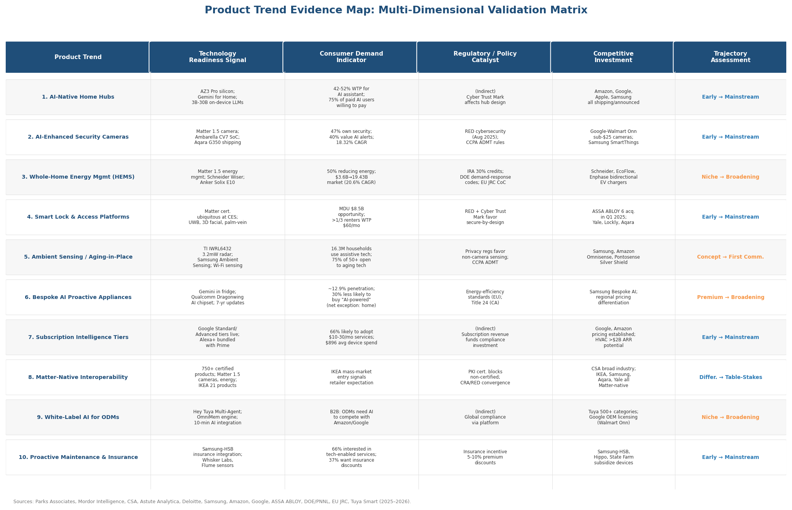

*Figure 6.3 — Each of the ten product trends mapped against four evidence dimensions: technology readiness signal, consumer demand indicator, regulatory/policy catalyst, and competitive investment pattern, alongside a trajectory assessment. Sources drawn from the chapter's primary references (2025–2026).*

# Conclusion

The smart home industry is no longer defined primarily by the proliferation of discrete connected devices. The evidence assembled across six chapters points to a structural inflection in which the axis of competition, the logic of product design, and the mechanisms of distribution are all shifting simultaneously. The products and features poised to define the industry's near-term future cluster around five reinforcing dynamics.

## The AI-Embedded Product Paradigm

Generative AI has moved from a marketing overlay to the central organizing principle of smart home product development. All four major ecosystem platforms shipped or announced AI-native hub hardware between September 2025 and September 2026, and consumer willingness to pay for AI-powered home services (42–52% across Parks Associates surveys) validates subscription-funded intelligence as a viable business model rather than a speculative bet. The most consequential product categories emerging from this shift are **AI-native home hubs** that replace command-driven voice assistants with proactive, context-aware orchestration engines, and **AI-enhanced security cameras** that perform on-device person, object, and scene recognition powered by purpose-built silicon such as Ambarella's CV7 and Amazon's AZ3 Pro. These products represent the clearest near-term growth vectors, with the differentiator shifting from "has AI" to the quality, privacy, and autonomy of the embedded intelligence.

## Edge Processing and Privacy as Competitive Architecture

The migration of AI inference from cloud to device edge is driven by three converging forces: consumer privacy anxiety (70% concerned, the highest level Deloitte has recorded), regulatory pressure (EU RED/CRA mandates, California ADMT rules, FTC enforcement actions), and technical performance requirements (sub-100 ms latency for real-time automation triggers). Products that demonstrably process sensitive data — video, audio, biometric, and behavioral — on-device rather than transmitting it to external servers hold a structural advantage that spans consumer trust, regulatory compliance, and operational reliability. The silicon foundation is in place: the MG26 for ultra-low-power endpoints, the CV7 for camera vision, and the Chimera GPNPU and Ambarella N1 for hub-class LLM inference collectively enable meaningful on-device intelligence across the product spectrum. **Ambient sensing suites** built on mmWave radar and Wi-Fi sensing — exemplified by Samsung's SmartThings Ambient Sensing and products such as Pontosense's Silver Shield — represent the privacy-preserving product archetype best positioned to serve the fast-growing aging-in-place segment (75% openness among adults 50+, per EY) without the intrusiveness of camera-based monitoring.

## Interoperability as Market-Access Requirement

Matter certification has crossed from differentiator to table-stakes for smart locks, lighting, sensors, and thermostats, with over 1,000 certified products and IKEA's mass-market commitment underscoring the standard's gravitational pull. The expansion of Matter's scope through versions 1.4, 1.4.2, and 1.5 — adding battery-device optimization, cameras, closures, and energy management — means that the standard now addresses the majority of smart home product categories. Products launched without Matter certification face growing risk of exclusion from the installed base of Matter-enabled controllers. However, platform-level implementation continues to lag specification progress: Matter camera support remains limited to Samsung SmartThings, and Thread 1.4 border router products from major networking vendors are still absent. **Matter-native interoperability** is a prerequisite for competitive participation, but certification alone does not guarantee a seamless cross-platform experience.

## Energy Management at the Regulatory-Technology Nexus

**Whole-home energy management systems** occupy a uniquely favorable position at the intersection of consumer demand (50% of U.S. households actively reducing energy consumption), regulatory mandate (DOE-proposed demand-response code language, California Title 24, EU Code of Conduct expansion), sustained fiscal incentive (IRA 30% tax credits through 2032), and protocol maturation (Matter 1.5 energy device types with real-time tariff exchange and bidirectional EV charging). The HEMS market, projected to grow from USD 3.60 billion (2024) to USD 19.43 billion (2033) at a 20.6% CAGR, represents the product category with the most durable multi-factor tailwind. Vehicle-to-home integration adds an emerging dimension as bidirectional EV chargers and Matter protocol support create a pathway for electric vehicles to function as dispatchable residential energy storage.

## Distribution Beyond Retail

The products most likely to achieve scale are those designed for institutional distribution channels — builders, multifamily property managers, HVAC service providers, and insurance carriers — in addition to traditional consumer retail. **Smart lock and access platforms** are the category most directly accelerated by these channels: ASSA ABLOY's acquisition-driven digital credential expansion, the multifamily sector's estimated $8.5 billion annual revenue opportunity, and the 20% operational efficiency gains reported by property managers implementing smart technology all point to locks as a gateway device for institutional smart home deployment. **Proactive maintenance and insurance-integrated service platforms**, exemplified by the Samsung–Hartford Steam Boiler partnership, represent an emerging product-service category in which sensor data, predictive algorithms, and insurance risk models converge — creating closed-loop economic incentives for adoption that operate independently of individual consumer purchase decisions.

## Products and Features Defining the Industry's Future

Synthesizing across all six chapters, the following product types and feature categories emerge as the major trends shaping the smart home industry's trajectory:

1. **AI-native home hubs** with generative-AI assistants and edge inference capability — the new center of the smart home ecosystem.
2. **AI-enhanced security cameras** with on-device object detection, Matter 1.5 interoperability, and subscription-tiered cloud intelligence.
3. **Whole-home energy management systems** with AI optimization across solar, battery, EV, and grid inputs, supported by regulatory mandates and tax incentives.
4. **Biometric smart lock platforms** with Matter certification, UWB precision access, and multi-channel distribution through builders, MDU operators, and digital credential ecosystems.
5. **Ambient sensing and aging-in-place sensor suites** using radar and Wi-Fi sensing for privacy-preserving health monitoring and fall detection.
6. **Subscription-based intelligence tiers** as the dominant monetization model, shifting value capture from hardware margins to recurring AI-powered service revenue.
7. **Matter-native interoperability** as a universal product requirement, functioning as both a private-sector regulatory regime and a consumer trust signal.
8. **White-label AI platforms** (Tuya, Google licensing) that democratize generative-AI capabilities for global ODMs, preventing the market from consolidating around a single platform winner.
9. **"Bespoke AI" proactive appliances** with embedded intelligence, long-lifecycle software updates, and utility-driven value propositions — constrained by low penetration but positioned for gradual expansion.
10. **Insurance-integrated maintenance platforms** linking sensor telemetry to predictive analytics and risk models, creating subsidy-driven adoption loops.

The common thread uniting these trends is a shift from passive connectivity to proactive intelligence, from cloud dependence to hybrid edge-cloud architectures, from single-device purchases to ecosystem-and-subscription relationships, and from consumer-retail distribution to multi-channel institutional deployment. The smart home industry's next phase will be defined not by how many devices a household owns, but by how intelligently, privately, and autonomously those devices operate — and by the business models that sustain their continuous improvement.
