# Overview

Can an airport handling just 500,000 passengers per year — a facility classified as "Nonhub Primary" by the FAA and buried in the lowest traffic bracket of international aviation taxonomies — generate economic and social effects that meaningfully register in its surrounding region? The question is deceptively simple. The answer, as this report demonstrates, depends less on the passenger count itself than on the geographic, economic, and institutional context in which the airport operates.

This report assembles evidence from national benchmarking studies (ACI-NA 2024, ATAG 2024, FAA NPIAS 2025–2029), airport-specific economic impact assessments (Rapid City, Yellowknife, Inverness, Queenstown), government audit data (U.S. GAO, Canadian Airports Council), and peer-reviewed econometric research (Pot & Koster 2022, Campante & Yanagizawa-Drott 2018, Blonigen & Cristea 2015) to evaluate the hypothesis from multiple angles: direct on-airport employment and payroll, supply-chain and household-spending multipliers, tourism facilitation, catalytic connectivity effects, healthcare access, population retention, and environmental externalities.

The core findings are as follows. Direct on-airport employment at the 500,000-passenger threshold consistently falls within 300–1,000 full-time equivalents, generating $20–$60 million in annual payroll at wages that typically exceed local medians. Total employment effects — incorporating indirect, induced, and visitor-facilitated channels — reach 2,000–4,500 jobs, with total economic output in the range of $100–$700 million depending on the airport's tourism-gateway function. As a share of the host regional economy, these effects range from less than 1% of employment in diversified metropolitan areas to 8–14% in geographically isolated or tourism-dependent communities.

The evidence supports the hypothesis — but conditionally. Six moderating factors determine whether a 500,000-passenger airport's impact is significant or marginal: geographic isolation from competing hubs, tourism dependence, route-network diversity, catchment-area leakage, surface-transport alternatives, and institutional support structures. Where these conditions align favorably, the airport functions as a regional economic anchor. Where they do not — particularly where a larger hub lies within a two-to-three-hour drive — the same passenger volume yields modest incremental effects.

Chapter 1 defines the 500,000-passenger tier within global classification systems and establishes the diversity of communities it serves. Chapter 2 surveys the methodological frameworks — input-output models, quasi-experimental designs, and catalytic-impact estimation — through which airport effects are measured, with attention to their scale-specific limitations. Chapter 3 documents direct employment, payroll, and fiscal contributions at this threshold. Chapter 4 traces the multiplier pathways: supply-chain effects, tourism facilitation, and the contested catalytic channel. Chapter 5 examines broader socioeconomic dimensions — connectivity erosion, real-estate effects, population dynamics, healthcare access, and spatial equity. Chapter 6 tests the preceding analysis against five documented case studies spanning four continents. Chapter 7 subjects the affirmative case to critical scrutiny: financial sustainability, methodological vulnerabilities, environmental externalities, opportunity costs, and documented cases of underperformance.

# 第1章 Defining the 500,000-Passenger Airport Tier

Any assessment of the socioeconomic footprint of a 500,000-passenger airport must begin with definitional clarity: where such a facility sits within global aviation taxonomy, how many airports operate at this scale, what passenger-counting conventions apply, and what kinds of communities these airports serve. This chapter establishes the taxonomic, geographic, and financial context that frames the impact analysis in subsequent chapters.

## 1.1 Terminology: Enplanements, Passenger Movements, and Throughput

Aviation authorities employ different passenger-counting metrics, and the distinctions matter materially for cross-system comparisons. The U.S. Federal Aviation Administration (FAA) counts **enplanements** — the number of passengers boarding aircraft at a given airport. A traveler completing a single round trip generates one enplanement at the origin and one at the destination, but only one enplanement at each individual facility. **Passenger movements**, the metric adopted by Airports Council International (ACI) World and most international bodies, count both arrivals and departures at a single airport — yielding a figure approximately twice the enplanement count for the same facility. The term **passenger throughput** is used interchangeably with passenger movements in ACI and ICAO reporting.

Throughout this report, the threshold is defined as **500,000 annual passenger throughput** — that is, 500,000 passenger movements (arrivals plus departures), equivalent to approximately 250,000 FAA enplanements. All subsequent references to "500,000 passengers" follow this convention unless otherwise noted.

## 1.2 Classification Under U.S. Federal Aviation Administration Frameworks

The FAA classifies primary airports — those receiving scheduled airline service with more than 10,000 annual enplanements — by their percentage share of total U.S. enplanements. Under 49 U.S.C. § 47102, the tiers are:

- **Large Hub**: ≥1.0% of national enplanements
- **Medium Hub**: 0.25% to <1.0%
- **Small Hub**: 0.05% to <0.25%
- **Nonhub Primary**: >10,000 enplanements but <0.05%

With calendar year (CY) 2023 total U.S. enplanements at 944.9 million, the Small Hub floor stands at approximately 472,000 enplanements [FAA CY 2023 All Enplanements](https://www.faa.gov/sites/faa.gov/files/2024-10/cy23-all-enplanements.pdf "944,891,353 total enplanements"). An airport with 500,000 total passenger throughput — roughly 250,000 enplanements — falls well below this threshold, placing it squarely in the **Nonhub Primary** category [FAA NPIAS 2023–2027 Appendix C](https://www.faa.gov/sites/faa.gov/files/NPIAS-2023-2027-Appendix-C.pdf "Statutory definitions").

The FAA's National Plan of Integrated Airport Systems (NPIAS) 2025–2029 identifies 3,287 NPIAS airports, of which 390 are classified as primary. Among these, 252 are Nonhub Primary — the largest primary category by count. Despite this numerical dominance, Nonhub Primary airports account for just 3% of total U.S. enplanements while commanding 12% ($8 billion) of identified NPIAS development needs [FAA NPIAS 2025–2029 Narrative](https://www.faa.gov/sites/faa.gov/files/airports/planning_capacity/npias/current/ARP-NPIAS-2025-2029-Narrative.pdf "Published September 30, 2024"). This asymmetry — high infrastructure investment requirements relative to passenger volume — is a defining characteristic of the tier, illustrated in Figure 1.1.

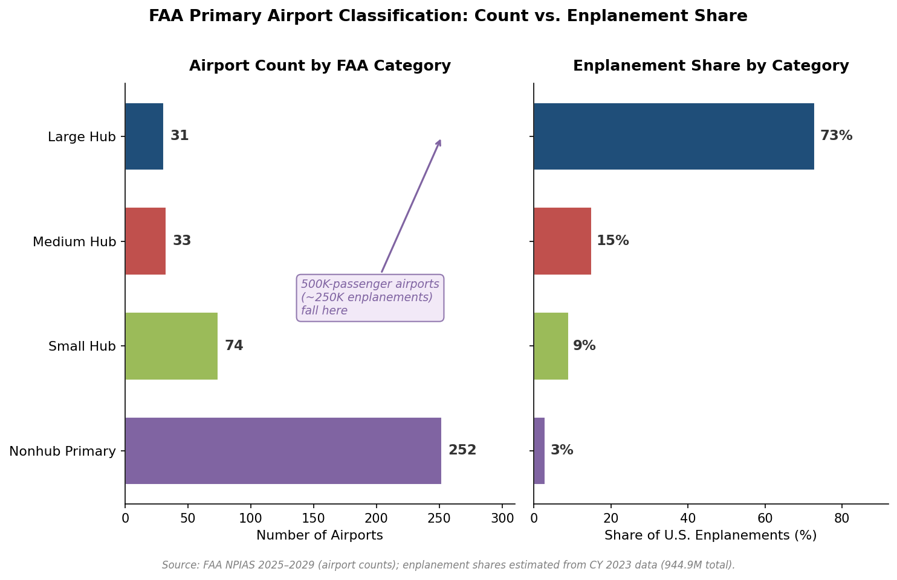
*Figure 1.1 — Nonhub Primary airports constitute the largest FAA primary category by count (252 of 390) yet handle only 3% of U.S. enplanements. The 500,000-passenger threshold (~250K enplanements) falls within this tier. Data: FAA NPIAS 2025–2029; CY 2023 enplanement totals.*

Specific U.S. airports near the 250,000-enplanement mark in CY 2023 include Monterey Regional (MRY, 259,778 enplanements), Bismarck Municipal (BIS, 258,780), Montrose Regional (MTJ, 244,266), and Grand Junction Regional (GJT, 243,808) — all classified Nonhub Primary [FAA CY 2023 All Enplanements](https://www.faa.gov/sites/faa.gov/files/2024-10/cy23-all-enplanements.pdf "Airport-level CY 2023 data"). These airports illustrate the diversity of communities at this scale: a California coastal city, a northern Great Plains state capital, and two Colorado mountain-region airports serving ski and recreation economies.

## 1.3 International Classification Systems

No single international classification system maps directly onto the 500,000-passenger threshold, but several frameworks provide relevant context.

**ACI World** segments airports by total annual passenger throughput in its World Airport Traffic Report (WATR). The 500,000–1,000,000 bracket constitutes the lowest named group in WATR traffic analyses. ACI's "Small and Emerging Airports" programme targets airports below 5 million passengers without imposing a rigid lower-bound threshold. In 2024, the global airport system processed 9.4 billion passengers across approximately 2,800 airports [ACI World WATR 2023](https://store.aci.aero/wp-content/uploads/2023/09/Preview-2023-ACI-WATR-09-2023.pdf "ACI size brackets"); [ACI 2024 Traffic Blog](https://blog.aci.aero/airport-economics/busiest-airports-in-the-world-2024/ "9.4 billion passengers in 2024").

**ACI Europe** classifies member airports into four groups: Group 1 (>25 million passengers), Group 2 (10–25 million), Group 3 (5–10 million), and Group 4 (<5 million). A 500,000-passenger airport falls deep within Group 4, which is the largest category by airport count [ACI Europe Connectivity Report 2023](https://www.aci-europe.org/downloads/resources/ACI%20EUROPE%20Airport%20Industry%20Connectivity%20Report%202023.pdf "Group 4 = <5M pax"). The breadth of this category — spanning airports from under 100,000 to 4,999,999 passengers — underscores the limited taxonomic resolution applied to the lower end of the traffic spectrum.

**EUROCONTROL** classifies airports by instrument flight rules (IFR) movements rather than passenger volumes. A 500,000-passenger airport — typically generating 5,000–8,000 IFR movements annually — falls in the "Other" or low "Small" tier [EUROCONTROL Standard Inputs Ed. 9](https://ansperformance.eu/economics/cba/standard-inputs/v9.0.3/chapters/airport_classification.html "IFR movement-based classification"). The EU Slot Regulation threshold (5 million passengers) and the Ground Handling Directive threshold (2 million passengers) both far exceed 500,000, meaning airports at this scale operate under a markedly lighter regulatory burden [Council Directive 96/67/EC](https://eur-lex.europa.eu/legal-content/EN/TXT/PDF/?uri=CELEX:31996L0067 "Ground handling thresholds").

**ICAO** does not classify airports by passenger volume. Annex 14 to the Convention on International Civil Aviation categorizes aerodromes by physical characteristics — reference field length and wing-span code — rather than traffic throughput. The absence of a passenger-based ICAO taxonomy means no universally agreed international definition exists for what constitutes a "small" airport in traffic terms.

## 1.4 Global Prevalence of Airports at This Scale

Approximately 15–20 U.S. airports currently operate in the 400,000–600,000 total-passenger band, based on FAA CY 2023 enplanement data and the approximate 2:1 ratio of passenger movements to enplanements. Globally, an estimated 150–250 airports fall within this range, distributed across North America (15–25), Europe (40–70), Asia-Pacific (30–60), and other regions (20–50). This estimate is inferred from the FAA dataset, ACI's known database scope of approximately 2,800 airports, and the power-law distribution of airport traffic — whereby a small number of mega-hubs handle the majority of passengers while a long tail of smaller facilities serves the remainder.

A precise global count cannot be stated because ACI World's airport-level traffic database is proprietary. What can be established with confidence is that airports in the 500,000-passenger range represent a substantial share of the world's airport infrastructure by facility count, even as they collectively handle a marginal fraction of global traffic volume.

## 1.5 Typical Community Profiles

Airports at the 500,000-passenger threshold do not serve a single type of community. Analysis of U.S. and international airports in this range reveals five recurring community archetypes:

1. **Mid-size cities and state capitals** with metropolitan populations of 50,000–250,000 that function as regional service centers. Bismarck, North Dakota (metro population ~75,000; state capital) exemplifies this pattern, with its airport providing essential connectivity to regional hubs.

2. **Tourism-dependent resort areas** with pronounced seasonal traffic peaks. Montrose Regional Airport in Colorado, serving the Telluride and Crested Butte ski areas, and Grand Junction Regional, gateway to Colorado National Monument and wine country, both illustrate how recreational demand can sustain an airport at the 500,000 level despite a small permanent population base.

3. **Peripheral and isolated communities** with no nearby major hub, where air service constitutes the only practical alternative to multi-hour ground travel. Juneau, Alaska — accessible solely by air or sea — represents the extreme case, though communities across northern Canada, Scandinavia, island nations, and the Australian outback share this characteristic of geographic captivity.

4. **Island and archipelago communities** where aviation serves as the primary or sole fast transport link. Pacific island nations, Caribbean islands, and European islands (Scottish Highlands and Islands, Canary Islands, Greek archipelago) frequently sustain airports near this threshold through a combination of resident travel needs and inbound tourism.

5. **Secondary and university cities** situated within the broader orbit of a large metropolitan region but sufficiently distant to sustain independent air service. These airports compete with nearby larger facilities and are most vulnerable to catchment leakage — passengers electing to drive to a hub airport for lower fares or broader route networks.

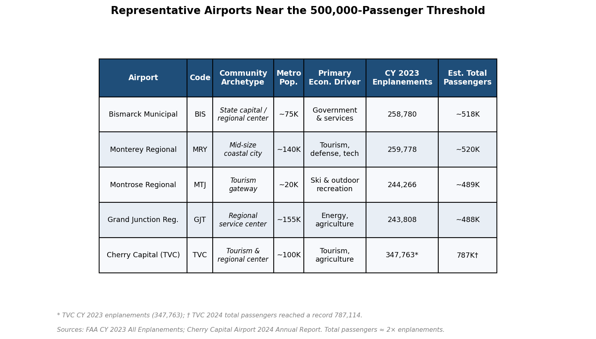
*Figure 1.2 — Five U.S. airports near the 500,000-passenger threshold, illustrating the diversity of community archetypes, economic drivers, and population scales served at this tier. Data: FAA CY 2023 All Enplanements; Cherry Capital Airport 2024 Annual Report.*

Cherry Capital Airport (TVC) in Traverse City, Michigan, offers a useful composite illustration. Serving a metropolitan area of approximately 100,000 residents in a tourism-driven region, TVC recorded a record 787,114 total passengers in 2024, with service by six airlines to approximately 20 nonstop destinations including Chicago, Dallas, Denver, Atlanta, and New York [Cherry Capital Airport 2024 Annual Report](https://tvcairport.com/wp-content/uploads/2025/10/TVC-AnnualReport-2024-final.pdf "Record 787,114 passengers in 2024"). TVC combines elements of the tourism gateway and the mid-size regional center, demonstrating how airports near this threshold can support a surprisingly diverse route network.

## 1.6 Financial Profile of the Tier

The financial structure of airports at the 500,000-passenger scale differs markedly from that of larger facilities. NPIAS FY 2022 data for 330 Nonhub airports (a category spanning 10,000 to approximately 472,000 enplanements) reports aggregate total revenue of $3.336 billion against total expenses of $1.274 billion. These airports received $1.437 billion in federal and state grants — the highest grant total across all hub categories — and collected $98 million in Passenger Facility Charges (PFCs). Per-airport averages yield approximately $4.2 million in operating revenue against $4.0 million in expenses, supplemented by $4.4 million in grant support [FAA NPIAS 2025–2029 Narrative, Table 3](https://www.faa.gov/sites/faa.gov/files/airports/planning_capacity/npias/current/ARP-NPIAS-2025-2029-Narrative.pdf "FY 2022 financial data"). The revenue mix tilts toward aeronautical sources (57%) over non-aeronautical streams (43%), in contrast to large hubs where commercial concessions, parking, and real estate often constitute the majority of revenue.

The profitability challenge extends globally. According to ACI World, 68% of airports operating at a net loss handle fewer than 1 million passengers annually [ACI World 2025](https://aci.aero/2025/04/28/airports-face-financial-challenges-despite-air-traffic-rebound-aci-world-economics-report-reveals/ "FY 2023 data"). In Europe, an analysis by Oxera for ACI Europe (2024) confirmed that airports below 1 million passengers are broadly unable to achieve consistent profitability — a finding that underpins the EU Aviation State Aid Guidelines permitting operating aid to airports under 3 million passengers through April 2027 [Oxera/ACI Europe 2024](https://www.oxera.com/insights/reports/economic-analysis-of-the-profitability-of-regional-airports/ "Regional airport profitability"). A 500,000-passenger airport thus typically operates at or near breakeven, sustained by public subsidy, grant funding, or cross-subsidization within a national airport system.

## 1.7 Positioning the 500,000-Passenger Airport for Impact Analysis

Several defining features of the 500,000-passenger tier shape the analytical framework applied in subsequent chapters:

- **Taxonomic marginality.** Under every major classification system, these airports occupy the lower reaches: Nonhub Primary in the FAA framework, the bottom of ACI's lowest named bracket, and deep within ACI Europe's broadest group. They handle a negligible share of national or global traffic.

- **Numerical prevalence.** Despite small individual traffic volumes, airports at this scale collectively represent a large share of the world's airport infrastructure. The 252 Nonhub Primary airports in the U.S. alone outnumber all Large, Medium, and Small Hub airports combined (138).

- **Community dependence.** These airports frequently serve communities where alternative transportation options are constrained — by geography (islands, mountains, Arctic regions), by distance from larger airports, or by the absence of competitive rail service. A community's dependence on its airport may be inversely proportional to that airport's traffic volume.

- **Financial fragility.** Operating at or below breakeven, with heavy reliance on grants and subsidies, these airports are acutely susceptible to airline service decisions, fuel price shocks, and policy changes.

- **Heterogeneity.** The 500,000-passenger tier encompasses tourism gateways generating hundreds of millions of dollars in visitor spending, isolated communities for which the airport functions as essential public infrastructure, and suburban overflow airports competing with nearby hubs. Any assessment of socioeconomic impact must account for this diversity rather than treating the tier as a monolithic category.

These characteristics establish both the plausibility and the complexity of the question under examination. The economic footprint of a 500,000-passenger airport is unlikely to register at a national scale — but within its immediate region, the concentration of employment, visitor spending, connectivity, and essential services may produce effects that are both significant and measurable, provided the analytical framework accounts for the specific context in which each airport operates.

# 第2章 Frameworks and Methodologies for Measuring Airport Economic Impact

Whether a 500,000-passenger airport generates significant and measurable socioeconomic effects depends critically on how those effects are defined, measured, and attributed. The analytical toolkit available to researchers and airport managers ranges from straightforward employment counts to complex input-output models and, more recently, quasi-experimental causal-inference designs. Each approach carries assumptions that shape the resulting estimates — assumptions whose consequences are amplified at the relatively small economic scale of the airports examined in this report. This chapter surveys the principal frameworks, models, and methodological traditions that underpin airport economic impact studies, with particular attention to their applicability and limitations at the 500,000-passenger tier.

## 2.1 The Four-Tier Impact Taxonomy

The dominant framework for airport economic impact analysis classifies effects into four conceptually distinct tiers: direct, indirect, induced, and catalytic.

**Direct impacts** encompass on-airport employment, payroll, and expenditures generated by airlines, the airport operator, fixed-base operators (FBOs), concessionaires, ground handlers, and other tenants physically located on airport property. **Indirect impacts** capture off-site economic activity attributable to the airport — primarily visitor spending at hotels, restaurants, rental-car agencies, and retail establishments, as well as purchases from local suppliers. **Induced impacts** represent the multiplier effects of successive spending rounds: as employees in directly and indirectly affected sectors spend their wages locally, they support additional jobs and output in sectors with no direct connection to aviation. The FAA's 1992 guide *Estimating the Regional Economic Significance of Airports* (DOT/FAA/PP-92-6) codified these three tiers as the standard framework for U.S. airport impact studies [FAA 1992 Guide](https://gardnermagazine.com/wp-content/uploads/2024/02/Airports-1992-Report-dot_35802_DS1.pdf "DOT/FAA/PP-92-6, September 1992").

The **catalytic** tier was introduced subsequently by the aviation industry itself. In 2004, ACI Europe and York Aviation defined catalytic impacts as "employment and income generated in the economy of the study area by the wider role of the airport in improving the productivity of business and in attracting economic activities such as inward investment and inbound tourism" [Forsyth & Niemeier 2016](http://www.verkehrskonferenz.de/fileadmin/archiv/konferenz_2016/Papers/forsyth_et_al-wider_economic_benefits_or_catalytic_effects_of_air_transport.pdf "citing ACI Europe/York Aviation 2004"). This fourth tier attempts to capture connectivity-driven benefits — trade facilitation, foreign direct investment attraction, knowledge spillovers, and agglomeration effects — that extend well beyond the airport's immediate supply chain.

The taxonomy provides a useful organizing structure, yet the reliability of measurement decreases sharply from the first tier to the fourth. Direct impacts can be quantified with reasonable accuracy through payroll records and employment counts. Indirect impacts depend on visitor-survey methodologies that vary widely in rigor and sampling quality. Induced impacts hinge on the choice of multiplier model and the boundaries of the study region. Catalytic impacts, as discussed in Sections 2.3 and 2.5, remain the most contested and least reliably measurable category. The TRB's ACRP Synthesis 7 (2008) surveyed prevailing practice and documented that most airport economic impact studies employ the direct-indirect-induced framework, with catalytic effects increasingly — but inconsistently — addressed [ACRP Synthesis 7](https://nap.nationalacademies.org/catalog/23267/airport-economic-impact-methods-and-models "TRB ACRP Synthesis 7, 2008").

## 2.2 Input-Output Models: IMPLAN and RIMS II

The two dominant tools for estimating indirect and induced impacts at U.S. airports are RIMS II and IMPLAN, both grounded in input-output (I-O) analysis derived from Leontief's framework of inter-industry transactions.

**RIMS II** (Regional Input-Output Modeling System), developed by the Bureau of Economic Analysis (BEA), derives regional multipliers from the national I-O table, adjusting for local economic structure through location quotients. The FAA's own national economic impact analyses rely on RIMS II: the 2024 report applied "the most recent RIMS II multipliers from the Bureau of Economic Analysis... reflecting the 2012 input-output benchmark table and the 2022 regional economic accounts" [FAA Economic Impact Report 2024](https://www.faa.gov/2024-economic-impact-report.pdf "The Economic Impact of U.S. Civil Aviation, September 2024"). RIMS II provides both Type I multipliers (capturing direct and indirect effects) and Type II multipliers (adding induced household-spending effects), covering approximately 60 industry sectors at a relatively low cost per region.

**IMPLAN** (Impact Analysis for Planning) is the most widely used commercial platform for airport economic impact analysis, offering granularity across 540+ industry sectors based on NAICS codes. The ACI-NA 2024 economic impact study of 487 U.S. commercial service airports employed IMPLAN to estimate that these airports collectively support 12.8 million jobs, $619 billion in payroll, and $1.8 trillion in annual output [ACI-NA 2024 Study](https://www.mvcommission.org/sites/default/files/docs/ACI-NA-The-Economic-Impact-of-U.S.-Commercial-Service-Airports-in-2024.pdf "ACI-NA, March 2025"). IMPLAN's greater sectoral detail comes at substantially higher licensing cost — thousands of dollars annually versus hundreds for a single RIMS II regional dataset.

A third class of models — regional econometric frameworks such as REMI — can capture dynamic time-series relationships and policy feedback effects that static I-O models cannot. These dynamic models allow for price adjustments, labor-market responses, and demographic shifts over time. However, they require substantially more expertise, data, and financial resources, placing them beyond the practical reach of most small-airport operators [Stratford Analytics](https://www.stratfordanalytics.com/implan-vs-rims-ii-vs-regional-econometric-models-choosing-the-right-tool/ "IMPLAN vs. RIMS II vs. Regional Econometric Models, 2025").

### Limitations of Input-Output Analysis

Both RIMS II and IMPLAN share well-documented structural limitations that are especially consequential when applied to small regional airports:

1. **Fixed coefficients.** I-O tables assume fixed technical coefficients and constant returns to scale. Production technologies and supplier relationships are treated as static, regardless of the magnitude of the demand shock being modeled — an assumption that grows less tenable as shocks become large relative to the local economy.

2. **Perfectly elastic supply.** The models assume that increased demand is met without price increases, resource constraints, or capacity bottlenecks. In small labor markets, where qualified aviation-sector workers may be scarce, this assumption can lead to material overestimation of employment effects.

3. **Double-counting risk.** Studies must carefully decompose on-airport, visitor, and capital-improvement categories to avoid counting the same economic activity twice. The ACI-NA 2024 study noted that "several studies reported direct impacts that combined on-airport, visitor, and capital project impacts" requiring decomposition [ACI-NA 2024 Study](https://www.mvcommission.org/sites/default/files/docs/ACI-NA-The-Economic-Impact-of-U.S.-Commercial-Service-Airports-in-2024.pdf "methodology section").

4. **No crowding-out.** I-O models do not account for displacement effects, where airport-related activity may draw workers or resources from other sectors rather than creating net new economic activity. The FAA 1992 guide explicitly acknowledges that direct impacts "should represent economic activities that would not have occurred in the absence of the airport... this would be significant in a region with full or near full employment" [FAA 1992 Guide](https://gardnermagazine.com/wp-content/uploads/2024/02/Airports-1992-Report-dot_35802_DS1.pdf "DOT/FAA/PP-92-6, 1992").

Forsyth and Niemeier (2016) crystallize the academic critique: "Direct & indirect effects are greater the more costly an airport is. Induced effect is independent of the investment object. Substitution and price effects are neglected. Additional investment adds to output and jobs no matter how useless or valuable it is." Their conclusion is that I-O-based economic impact analysis "is useful for economic significance and regional agglomeration" but "should not be used to assess decisions on investment, night curfews and subsidies for regional airports" [Forsyth & Niemeier 2016](http://www.verkehrskonferenz.de/fileadmin/archiv/konferenz_2016/Papers/forsyth_et_al-wider_economic_benefits_or_catalytic_effects_of_air_transport.pdf "Wider Economic Benefits or Catalytic Effects of Air Transport, 2016").

The table below synthesizes the key dimensions across which these methodological approaches differ, highlighting each method's practical suitability for airports at the 500,000-passenger scale.

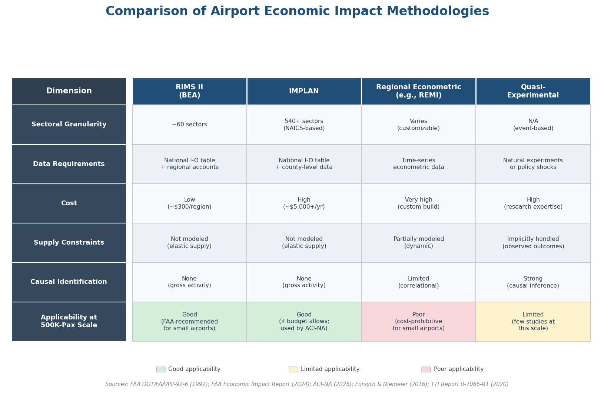

*Figure 2-1. Side-by-side comparison of RIMS II, IMPLAN, regional econometric models, and quasi-experimental methods across six analytical dimensions. Color coding indicates applicability at the 500,000-passenger airport scale. Sources: FAA DOT/FAA/PP-92-6 (1992); FAA Economic Impact Report (2024); ACI-NA (2025); Forsyth & Niemeier (2016); TTI Report 0-7066-R1 (2020).*

## 2.3 The ACI/ATAG Catalytic Impact Framework

At the global level, the Air Transport Action Group (ATAG) produces the most widely cited estimates of aviation's total economic footprint. The 2024 edition of *Aviation: Benefits Beyond Borders* (ABBB), developed in partnership with Oxford Economics, estimates that aviation supported 86.5 million jobs worldwide and generated $4.1 trillion in total economic activity (3.9% of global GDP) in 2023. The decomposition across tiers is revealing: 11.6 million direct jobs ($1.1 trillion in GDP contribution), 20.4 million indirect jobs ($1.2 trillion), 17.2 million induced jobs ($917.4 billion), and 37.3 million tourism-catalytic jobs ($967.8 billion) [ATAG ABBB 2024](https://aviationbenefits.org/media/e5ynn4x0/abbb2024_full_report.pdf "Aviation: Benefits Beyond Borders 2024"). The catalytic tier alone accounts for 43% of total employment attributed to aviation — a proportion that underscores both the potential significance and the measurement difficulty of this category.

ATAG's methodology employs OECD Inter-Country Input-Output (ICIO) tables and introduced refinements in the 2024 edition, including "new data sources on the share of inbound tourists arriving by air, improving estimates of tourists' in-country spend, and incorporating improved estimates from Tourism Economics' Global Travel Service on bilateral visitor flows" [ATAG ABBB 2024](https://aviationbenefits.org/media/e5ynn4x0/abbb2024_full_report.pdf "ABBB 2024, methodology note"). Despite these refinements, the report cautions that figures "should be viewed as a snapshot of the aviation sector in 2023 and not as part of a trend."

A widely cited rule of thumb from the ATAG framework is explicitly scale-dependent: airports handling 0–1 million passengers generate approximately 1.20 direct jobs per 1,000 passenger movements, airports with 1–10 million passengers generate 0.95 jobs, and airports exceeding 10 million passengers generate 0.85 jobs per 1,000 passenger movements [ATAG ABBB 2024](https://aviationbenefits.org/media/e5ynn4x0/abbb2024_full_report.pdf "ABBB 2024, direct employment section"). This declining intensity reflects economies of scale in airport operations: larger facilities spread fixed-function roles — security, management, fire rescue, maintenance — over a substantially greater volume of passengers.

### The Attribution Problem in Catalytic Effects

The core challenge with catalytic impact estimation is establishing causal direction. Does airport connectivity *cause* economic growth, or does a growing economy *attract* air service? Existing studies of catalytic effects span an implausibly wide range. Infras (2005) estimated catalytic effects add 25% to total airport-related jobs, while Baum (2005) and InterVISTAS/ACI Europe (2015) claimed 142–177% additional jobs — a sevenfold disparity [Forsyth & Niemeier 2016](http://www.verkehrskonferenz.de/fileadmin/archiv/konferenz_2016/Papers/forsyth_et_al-wider_economic_benefits_or_catalytic_effects_of_air_transport.pdf "catalytic effect range comparison"). ACI Europe and InterVISTAS (2015) themselves acknowledged that economic impact assessments "are a powerful tool in communicating the importance of an industry... However, they are easily abused."

This candid acknowledgment from within the aviation industry's own organizations highlights a fundamental tension: the entities commissioning and publishing the most comprehensive airport economic impact data are also the entities with the strongest institutional interest in demonstrating aviation's economic value. The academic literature has increasingly pushed back against uncritical adoption of catalytic impact estimates, demanding identification strategies that can credibly distinguish causation from correlation.

## 2.4 FAA Guidelines for Airport Economic Impact Studies

The FAA's 1992 guide *Estimating the Regional Economic Significance of Airports* (DOT/FAA/PP-92-6), authored by Butler and Kiernan of the Volpe National Transportation Systems Center, remains the foundational U.S. government reference for airport economic impact methodology. It was "written primarily for airport managers and planners whose budget and/or time constraints require that impact analyses be conducted in house" and "prepared with small- and medium-sized public use airports in mind" [FAA 1992 Guide](https://gardnermagazine.com/wp-content/uploads/2024/02/Airports-1992-Report-dot_35802_DS1.pdf "DOT/FAA/PP-92-6, Preface") — making it directly relevant to the 500,000-passenger tier under examination.

The guide distinguishes **transportation benefit** (time saved and cost avoided by travelers relative to the next-best alternative airport) from **economic impact** (regional economic activity, employment, and payroll). For commercial airports with more than 1 million passengers, it offers rules of thumb: approximately 650 employees per million commercial passengers (±20%), and payroll per employee of approximately $32,000 (in 1992 dollars). Critically, the guide notes that the 650-jobs-per-million rule "does not apply to smaller commercial service airports" and recommends direct employee counts at facilities where this is feasible [FAA 1992 Guide](https://gardnermagazine.com/wp-content/uploads/2024/02/Airports-1992-Report-dot_35802_DS1.pdf "DOT/FAA/PP-92-6, Chapter 3").

For multiplier estimation, the guide recommends three approaches — the economic-base model, an econometric model, or a regional I-O model (preferably RIMS II) — and provides population-based shortcut multipliers that embed a direct measure of scale sensitivity. Regions with populations below 100,000 receive a multiplier of 0.5; those with 100,000–500,000 residents, 0.6; those with 500,000–3 million, 0.75; and those above 3 million, 1.0 [FAA 1992 Guide](https://gardnermagazine.com/wp-content/uploads/2024/02/Airports-1992-Report-dot_35802_DS1.pdf "DOT/FAA/PP-92-6, Chapter 3, Step 5"). These values indicate that indirect and induced effects equal only 50–60% of direct effects in the smaller communities where 500,000-passenger airports typically operate, compared to 100% for major metropolitan areas. The implication is clear: multiplier effects at the 500,000-passenger scale are systematically smaller than national averages suggest.

At the national level, the FAA's 2024 Economic Impact Report estimated U.S. civil aviation supported $1.8 trillion in total economic activity and 9.4 million jobs in 2022, contributing 4.0% of GDP [FAA Economic Impact Report 2024](https://www.faa.gov/2024-economic-impact-report.pdf "September 2024"). That report uses a simplified two-category framework — "Direct" and "Catalytic" (the latter defined as visitor expenditures and travel arrangements) — applying BEA RIMS II multipliers. The FAA also publishes separate benefit-cost analysis (BCA) guidance for the Airport Improvement Program, oriented toward project-level investment decisions rather than aggregate impact measurement [FAA BCA Guidance](https://www.faa.gov/regulations_policies/policy_guidance/benefit_cost/FAA-Airport-Benefit-Cost-Guidance.pdf "FAA Airport BCA Guidance").

## 2.5 Counterfactual and Quasi-Experimental Approaches

The structural limitations of I-O-based studies have prompted a growing body of research employing quasi-experimental and causal-inference methods to isolate airport effects from confounding factors.

Campante and Yanagizawa-Drott (2018, *Quarterly Journal of Economics*) provide the most influential such study. Exploiting the fact that improvements in wide-body aircraft range made certain city pairs newly connectable via nonstop service, they used the introduction of new long-haul routes as a natural experiment. Their instrumental-variable strategy addresses reverse causality by relying on geographic-distance-based feasibility of nonstop service — rather than observed traffic volumes — to demonstrate that establishing new direct flight links increased bilateral business links and economic activity [Campante & Yanagizawa-Drott 2018](https://www.researchgate.net/publication/328768499_Long-Range_Growth_Economic_Development_in_the_Global_Network_of_Air_Links "QJE 133(3), 2018").

Gibbons and Wu (2020, *Journal of Economic Geography*) studied China's rapid airport expansion program using a difference-in-differences design that exploited variation in the timing of new airport openings. They found that airports boosted local economic activity through improved domestic market access [Gibbons & Wu 2020](https://academic.oup.com/joeg/article/20/4/903/5692238 "JEG 20(4), 2020"). Airport closure studies provide a complementary natural experiment: the closure of Denver's Stapleton Airport and its housing-market aftermath demonstrated how airport removal can help disentangle airport effects from pre-existing local trends [NBER Working Paper 29385](https://www.nber.org/system/files/working_papers/w29385/w29385.pdf "Immediate and Longer-Term Housing Market Effects of a Major U.S. Airport Closure").

An ACRP research proposal (FY 2015) explicitly called for the application of "recently developed quasi-experimental tools to estimate the positive impact of airport existence on local economic activity," recognizing that the traditional I-O approach cannot establish causation [ACRP Research Proposal FY2015](https://onlinepubs.trb.org/onlinepubs/acrp/fy2015ps/15-01-05Hall.pdf "Estimating the Regional Economic Benefits of Airports"). This institutional acknowledgment from within the transportation research establishment confirms the field's awareness of its own methodological deficit.

The quasi-experimental literature offers stronger causal claims than I-O studies, but it carries its own limitation for the purposes of this report: most causal-inference studies cover airports across a wide range of sizes and do not isolate the 500,000-passenger tier specifically. Their findings are therefore suggestive rather than definitive about impacts at this particular scale.

## 2.6 Scale Sensitivity: Do Multipliers Behave Differently at 500,000 Passengers?

A central question for this report is whether standard methodologies and multipliers — typically calibrated on system-wide or large-airport data — produce reliable estimates when applied to a 500,000-passenger facility. Several converging lines of evidence indicate that they do not, and that uncritical application of national benchmarks systematically overstates economic effects at this scale.

**Employment intensity increases at smaller airports.** ATAG's jobs-per-passenger ratio reveals a 41% higher employment intensity at airports below 1 million passengers (1.20 jobs per 1,000 passenger movements) compared to airports above 10 million (0.85 jobs per 1,000) [ATAG ABBB 2024](https://aviationbenefits.org/media/e5ynn4x0/abbb2024_full_report.pdf "ABBB 2024"). This pattern reflects the inability of small airports to achieve the operational economies of scale available at major hubs: minimum staffing thresholds for security screening, air traffic control coordination, aircraft rescue and firefighting, and facility maintenance must be met regardless of traffic volume.

**Multiplier effects are smaller in small regions.** The FAA 1992 guide's population-based shortcut multipliers (0.5 for regions below 100,000; 0.6 for 100,000–500,000) directly quantify the economic leakage problem. In a small regional economy, a substantial share of wages and supplier payments flows out to firms and workers in other jurisdictions, reducing the local recirculation of each dollar of airport-related spending. A system-wide employment multiplier of 1.96, as reported by ACI-NA for 2024, likely overstates the multiplier effect at a 500,000-passenger airport whose catchment population may range from 50,000 to 250,000 [ACI-NA 2024 Study](https://www.mvcommission.org/sites/default/files/docs/ACI-NA-The-Economic-Impact-of-U.S.-Commercial-Service-Airports-in-2024.pdf "Table 21").

**System-wide incremental ratios may not extrapolate linearly.** ACI-NA's 2024 incremental metrics — 1.2 on-airport jobs and $387,200 in on-airport output per 1,000 additional enplanements, plus 4.6 visitor-related jobs and $290,500 in visitor output — are derived from the entire U.S. commercial airport system. The study notes that "on-airport output is greater than the visitor output even though there are fewer jobs associated with the on-airport category" due to higher labor productivity in airport operations versus hospitality [ACI-NA 2024 Study](https://www.mvcommission.org/sites/default/files/docs/ACI-NA-The-Economic-Impact-of-U.S.-Commercial-Service-Airports-in-2024.pdf "Incremental Aviation Activity section"). Applying these averages mechanically to a 500,000-passenger airport without adjusting for local economic structure, industry mix, and leakage rates risks material overestimation.

**Modeling tool choice matters more at small scales.** The Texas A&M Transportation Institute (TTI) developed a web-based Small Airport Economic Impact Model specifically to address the methodological gap for airports unable to afford full IMPLAN or RIMS II analyses. The study found that employment multipliers from the CDM Smith model versus the TTI model "differ significantly," indicating heightened sensitivity to modeling assumptions at smaller scales [TTI Report 0-7066-R1](https://static.tti.tamu.edu/tti.tamu.edu/documents/0-7066-R1.pdf "The Development of a Web-Based Small Airport Economic Impact Model, TTI, 2020"). When the choice of model itself materially changes the result, the precision of any single estimate warrants skepticism.

Figure 2-2 below visualizes the two principal dimensions of scale sensitivity: the declining employment intensity as airport size increases (left panel) and the rising multiplier values as catchment-area population grows (right panel). The annotations mark where 500,000-passenger airports and their typical communities fall relative to system-wide benchmarks.

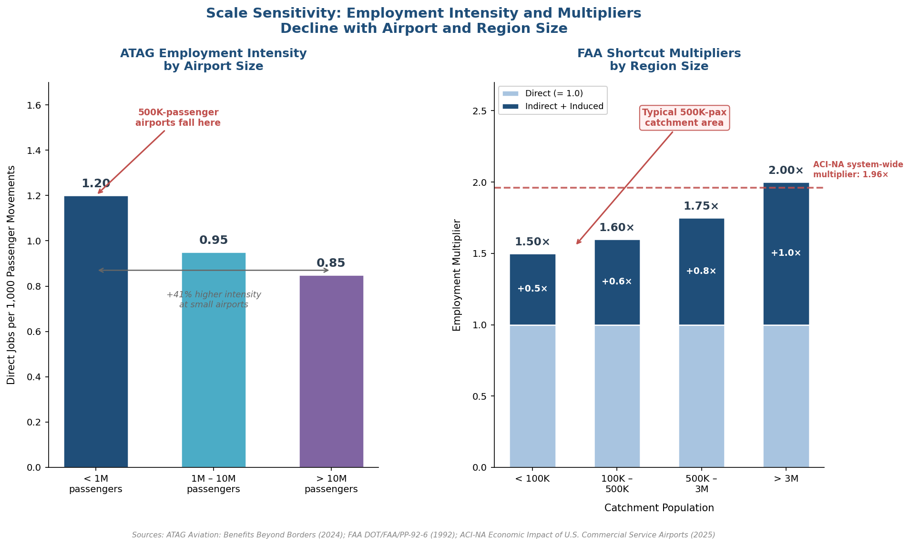

*Figure 2-2. Left panel: ATAG direct employment intensity declines from 1.20 jobs per 1,000 passenger movements at airports below 1 million passengers to 0.85 at airports above 10 million. Right panel: FAA population-based shortcut multipliers rise from 1.50× (communities under 100,000) to 2.00× (metro areas above 3 million), with the ACI-NA system-wide average of 1.96× shown as a reference line. Sources: ATAG ABBB (2024); FAA DOT/FAA/PP-92-6 (1992); ACI-NA (2025).*

## 2.7 Data Availability Challenges at Small Airports

Analytical frameworks are only as reliable as the data they consume, and small airports face systematic data disadvantages that compound the methodological limitations discussed above.

The ACI-NA 2024 study obtained observed impact data for only 357 of 487 U.S. commercial service airports, leaving 130 airports (27%) without directly measured data — predominantly smaller facilities. For these airports, regression analysis was employed to estimate impacts, with enplanement data as the primary independent variable (R² = 0.91 with on-airport employment) [ACI-NA 2024 Study](https://www.mvcommission.org/sites/default/files/docs/ACI-NA-The-Economic-Impact-of-U.S.-Commercial-Service-Airports-in-2024.pdf "Regression Analysis section"). While methodologically defensible at an aggregate level, this approach means that economic impact estimates for many individual small airports are modeled rather than observed — an important caveat when assessing any single airport's contribution.

Several specific data limitations compound the challenge at the 500,000-passenger scale:

- **Limited passenger surveys.** The expense of conducting on-airport passenger intercept surveys is proportionally higher relative to small-airport operating budgets. Yet visitor-spending estimates — often the largest component of indirect impacts — depend heavily on such surveys. In the absence of local data, spending patterns are frequently extrapolated from large-airport studies, potentially misrepresenting the spending behavior of visitors to smaller communities where accommodation options, retail density, and average daily expenditures differ markedly.

- **Gaps in statewide coverage.** The ACI-NA 2024 study noted that Alaska (accounting for 72 of the 130 missing airports), Connecticut, and Hawaii lack statewide aviation economic impact studies [ACI-NA 2024 Study](https://www.mvcommission.org/sites/default/files/docs/ACI-NA-The-Economic-Impact-of-U.S.-Commercial-Service-Airports-in-2024.pdf "Study Approach section"). States without systematic coverage leave their small airports entirely dependent on modeled estimates derived from national parameters.

- **Inconsistent methodologies across states.** Among the 35 states that provided updated studies, ACI-NA found "a greater variety in study methodologies" that created "challenges of evaluating how similar the measurements were in each study" [ACI-NA 2024 Study](https://www.mvcommission.org/sites/default/files/docs/ACI-NA-The-Economic-Impact-of-U.S.-Commercial-Service-Airports-in-2024.pdf "Study Approach section"). A 500,000-passenger airport in Colorado may have its impact estimated using a fundamentally different methodology than a comparable airport in South Dakota, rendering cross-airport comparisons unreliable without careful adjustment for definitional and methodological differences.

- **Visitor expenditure applicability.** The FAA 1992 guide introduces an AP/POP ratio (air passengers to local population) to screen whether visitor expenditure analysis is warranted. For airports where the ratio falls below 1.0, "visitor expenditures are likely to be negligible and should be ignored" [FAA 1992 Guide](https://gardnermagazine.com/wp-content/uploads/2024/02/Airports-1992-Report-dot_35802_DS1.pdf "DOT/FAA/PP-92-6, Chapter 3"). A 500,000-passenger airport serving a metropolitan area of 500,000 or more residents would fall below this threshold, suggesting that the indirect (visitor) impact channel — often the single largest component in tourism-gateway studies — may not be applicable in non-tourism contexts.

## 2.8 Implications for Evaluating 500,000-Passenger Airports

The methodological landscape surveyed in this chapter yields several conclusions that frame the interpretation of empirical evidence in subsequent chapters.

First, the four-tier taxonomy provides a comprehensive vocabulary for classifying impacts, but the reliability of measurement decreases sharply from direct to catalytic effects. Direct impacts can be counted with reasonable accuracy through payroll records and employment data; catalytic effects remain subject to order-of-magnitude disagreement among studies, with estimates ranging from 25% to 177% of baseline employment depending on the methodology and commissioning body.

Second, I-O models (IMPLAN, RIMS II) remain the workhorse of airport economic impact analysis, yet their structural assumptions — fixed coefficients, elastic supply, no displacement — mean they estimate economic *significance* (gross activity associated with the airport) rather than economic *impact* (net activity that would not exist absent the airport). This distinction is critical: a study reporting $300 million in "economic impact" at a 500,000-passenger airport may be measuring significance rather than additionality.

Third, multiplier effects at the 500,000-passenger scale are systematically smaller than national averages imply. The FAA's own shortcut multipliers indicate that indirect and induced effects in the communities that typically host these airports amount to 50–60% of direct effects, not the 96–100% that the ACI-NA system-wide average of 1.96 would suggest. Studies that apply system-wide multipliers without local adjustment will overstate the ripple effects at this tier.

Fourth, quasi-experimental methods offer stronger causal claims but have not been applied specifically to the 500,000-passenger band. The field's most rigorous studies operate at broader scales, leaving the precise relationship between airport presence and economic outcomes at this threshold a matter of informed inference rather than direct causal measurement.

Fifth, data availability is weakest precisely where it is most needed. The 27% of U.S. commercial airports lacking observed impact data are disproportionately small airports, and the modeling tools designed to fill this gap introduce their own uncertainties. Any assessment of a 500,000-passenger airport's economic contribution should disclose whether it rests on observed data or modeled estimates, and should acknowledge the sensitivity of results to model choice, study-region boundaries, and the treatment of visitor spending.

# 第3章 Direct Economic Contributions of 500K-Passenger Airports

Among the four tiers of airport economic impact, direct contributions — the jobs, payroll, output, and fiscal revenue generated by entities physically located on airport property or directly attributable to airport operations — are the most straightforward to measure and the least methodologically contested. This chapter assembles the available evidence on direct economic contributions at the 500,000-passenger threshold, drawing on national benchmarking ratios, individual airport impact studies, and financial operating data from U.S. and international sources. The central finding is that while direct effects are consistently measurable at this scale, their absolute magnitude and proportional significance diverge sharply depending on the economic profile of the host community — from transformative in isolated territories to modest in diversified metropolitan areas.

## 3.1 Employment Benchmarks: On-Airport Jobs at the 500,000-Passenger Scale

Two principal benchmarking approaches produce divergent estimates of direct on-airport employment at the 500,000-passenger level — a divergence that is instructive rather than contradictory.

The ACI-NA 2024 economic impact study, covering 487 U.S. commercial service airports, reports that each additional 1,000 enplanements is associated with 1.2 on-airport jobs and $387,200 in on-airport output. Applied to a 500,000-passenger airport — approximately 250,000 enplanements under standard FAA accounting — this system-wide ratio implies roughly 300 direct on-airport jobs and $97 million in on-airport output [ACI-NA 2024 Study](https://www.mvcommission.org/sites/default/files/docs/ACI-NA-The-Economic-Impact-of-U.S.-Commercial-Service-Airports-in-2024.pdf "Incremental Aviation Activity section"). These averages, derived from the full U.S. commercial airport network using IMPLAN modeling, do not differentiate by airport size tier.

ATAG's *Aviation: Benefits Beyond Borders* 2024 offers a scale-dependent alternative. Airports handling 0–1 million passengers generate approximately 1.20 direct jobs per 1,000 passenger movements, a ratio that declines to 0.95 at 1–10 million passengers and 0.85 above 10 million [ATAG ABBB 2024](https://aviationbenefits.org/media/e5ynn4x0/abbb2024_full_report.pdf "direct employment section"). At 500,000 total passenger movements, this implies approximately 600 direct on-airport jobs. The higher employment intensity at smaller airports reflects irreducible minimum staffing thresholds — security screening, air traffic coordination, fire and rescue services, and ground-handling operations must be maintained regardless of traffic volume.

The gap between these two estimates — roughly 300 versus 600 direct jobs — is principally definitional. ACI-NA's regression model uses FAA enplanements (departing passengers only) as its independent variable, while ATAG's global rule of thumb uses total passenger movements (departures plus arrivals, approximately double enplanements). Normalized to the same passenger base, the estimates converge toward a range of **300–600 direct on-airport jobs** for an airport processing 500,000 annual passengers. The residual spread reflects scope differences: ATAG's global figure encompasses all on-airport activity categories — which vary by country and regulatory environment — while ACI-NA is calibrated to the U.S. commercial service airport system specifically.

## 3.2 Airport-Specific Employment Evidence

Individual airport impact studies at or near the 500,000-passenger threshold supply ground-truth observations against which the benchmarking ratios can be tested.

**Yellowknife Airport (YZF), Northwest Territories, Canada** processed 532,689 passengers in 2014 and directly employed 1,001 full-time equivalents — a ratio of 1.88 FTE per 1,000 passengers. Air carrier operations accounted for 695 FTE (69% of direct employment), followed by airport commercial services at 99 FTE (10%) and airport operations at 85 FTE (9%). The remainder was distributed across federal government agencies, ground transportation, and other tenants [Yellowknife Airport Economic Impact Study](https://www.inf.gov.nt.ca/sites/inf/files/resources/final_economic_impact_analysis_14-12-15_5.pdf "Lindbergh Group, December 2015"). Yellowknife's ratio substantially exceeds both benchmark estimates, reflecting the airport's dual role as a logistics hub for northern mining operations and the sole long-distance transportation gateway for a geographically isolated territory.

**Montrose Regional Airport (MTJ), Colorado**, the primary air-access point for the Telluride ski-resort corridor, processed approximately 449,000 passengers in its 2020 study year and supported 449 direct on-airport jobs with $18.5 million in payroll — an average of approximately $41,200 per position and a ratio of 1.00 direct job per 1,000 passengers. When IMPLAN-modeled supplier-chain and income-respending effects at the on-airport level are included, the figure rose to 848 total on-airport jobs [Colorado CEIS 2020 – MTJ](http://www.coloradoaviationsystem.com/wp-content/uploads/2024/09/Montrose-Regional-MTJ.pdf "2020 Colorado Aviation Economic Impact Study, Montrose Regional"). MTJ's 2025 Colorado CEIS update, reflecting passenger growth to approximately 660,000, reported 4,323 total jobs, $231.0 million in payroll, and $713.1 million in business revenues — figures dominated by off-airport visitor spending rather than on-airport operations [2025 Colorado CEIS](http://www.coloradoaviationsystem.com/wp-content/uploads/2025/02/CEIS-Executive-Summary_FINAL_021925.pdf "Executive Summary").

Other Colorado airports near the 500,000-passenger range in the 2025 CEIS corroborate the pattern. Durango–La Plata County Airport (DRO) supported 1,993 total jobs, $111.8 million in payroll, and $342.1 million in business revenues. Gunnison–Crested Butte Regional Airport (GUC) supported 958 total jobs, $54.5 million in payroll, and $154.9 million in business revenues [2025 Colorado CEIS](http://www.coloradoaviationsystem.com/wp-content/uploads/2025/02/CEIS-Executive-Summary_FINAL_021925.pdf "individual airport totals"). All three Colorado airports serve mountain-resort tourism markets; their total impact figures are consequently weighted toward visitor-related employment rather than on-airport operations.

The observed data across these airports confirms a consistent finding: direct on-airport employment at the 500,000-passenger level falls within the range of approximately 300–1,000 FTE. The wide spread is attributable to definitional scope (what counts as "on-airport"), the presence or absence of specialized functions (cargo, military, mining logistics), and the airport's structural role within its regional economy.

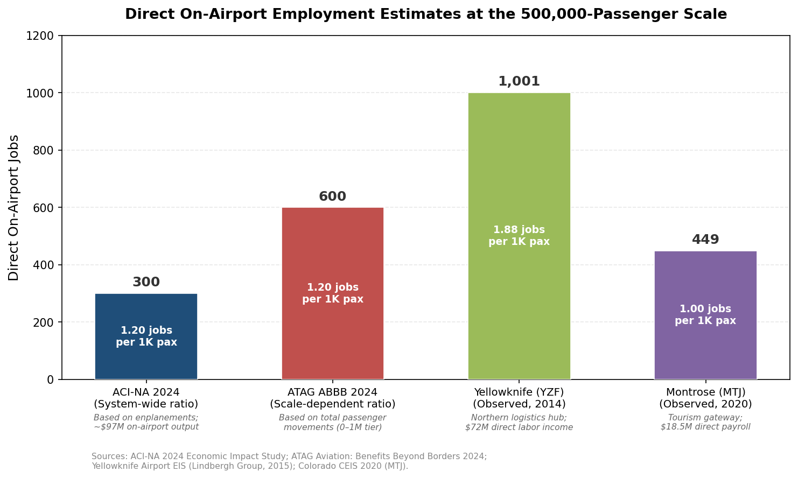

*Figure 3.1 — Comparison of direct on-airport employment estimates from benchmark ratios (ACI-NA, ATAG) and observed airport data (Yellowknife, Montrose), standardized to the 500,000-passenger level. Sources: ACI-NA 2024; ATAG ABBB 2024; Yellowknife Airport EIS (2015); Colorado CEIS 2020.*

## 3.3 Payroll and Labor Income

Direct labor income at 500,000-passenger airports is substantial in absolute terms and generally competitive with or above regional wage levels — a qualitative characteristic that distinguishes airport employment from many other locally available occupations in smaller communities.

At Yellowknife Airport, direct labor income across 1,001 FTE totaled $72 million in 2014, yielding an average of approximately $71,600 per FTE. This figure was comparable to the Yellowknife average personal income of $67,629 (2011 Census), indicating that on-airport wages ran slightly above the local median [Yellowknife Airport Economic Impact Study](https://www.inf.gov.nt.ca/sites/inf/files/resources/final_economic_impact_analysis_14-12-15_5.pdf "Tables E-2, E-5"). Including indirect and induced effects, total labor income attributable to the airport reached $146 million — a significant income injection for a territory of approximately 45,000 residents.

At Montrose Regional, the 2020 CEIS reported direct on-airport payroll of $18.5 million across 449 jobs, averaging $41,200 per position. When visitor-related hospitality employment was included, total payroll rose to $111.4 million across 2,850 jobs, but the average fell to $39,100, reflecting the lower wages characteristic of service-sector positions [Colorado CEIS 2020 – MTJ](http://www.coloradoaviationsystem.com/wp-content/uploads/2024/09/Montrose-Regional-MTJ.pdf "MTJ payroll data"). This bifurcation — higher-wage on-airport employment versus lower-wage visitor-economy employment — is a recurring structural feature of tourism-gateway airports.

Broader national data reinforces the wage-premium finding. The 2025 Colorado CEIS reported that on-airport activities across all 66 Colorado airports generated an average salary of approximately $80,000 per employee [2025 Colorado CEIS](http://www.coloradoaviationsystem.com/wp-content/uploads/2025/02/CEIS-Executive-Summary_FINAL_021925.pdf "on-airport salary data"). At the national level, the ACI-NA 2024 study documented that median wages for U.S. air transportation workers rose from $72,310 in 2017 to $97,320 in 2023, a 35% increase over six years; airline pilots, copilots, and flight engineers experienced a 60% increase to $219,140 [ACI-NA 2024 Study](https://www.mvcommission.org/sites/default/files/docs/ACI-NA-The-Economic-Impact-of-U.S.-Commercial-Service-Airports-in-2024.pdf "Table 18"). Visitor-related positions — cashiers, retail sales workers, hotel clerks — showed median wages in the $29,740–$33,680 range, well below the airport-operations average.

For a 500,000-passenger airport generating 300–600 direct on-airport jobs, total direct payroll likely falls in the range of $20–$60 million annually, depending on the mix of airline, fixed-base operator, government, and service-contractor positions. This payroll represents a concentrated injection of above-average wages into the local economy, and its loss would disproportionately affect higher-skilled, higher-paying employment segments in communities where such positions are scarce.

## 3.4 Airport Operating Economics at the 500,000-Passenger Scale

The financial viability of a 500,000-passenger airport is a critical input to any assessment of its economic significance. An airport that operates at a persistent loss and depends on public subsidies for survival raises questions about net economic contribution versus fiscal cost — questions that are particularly salient for smaller facilities.

The FAA NPIAS 2025–2029 report provides the most comprehensive U.S. data, aggregating FY 2022 financial results for 330 nonhub primary airports — the classification encompassing most U.S. airports near the 500,000-passenger level. Collectively, these 330 airports reported:

- **Aeronautical operating revenue:** $783 million (landing fees $145M, terminal rents $142M, FBO revenue $85M, fuel sales $175M)
- **Non-aeronautical operating revenue:** $594 million (parking and rental car $322M, concessions $20M, land rental $150M)
- **Total operating expenses:** $1,320 million (personnel $551M, contractual services $302M)
- **Grants received:** $1,437 million
- **PFC collections:** $98 million

[FAA NPIAS 2025–2029](https://www.faa.gov/sites/faa.gov/files/airports/planning_capacity/npias/current/ARP-NPIAS-2025-2029-Narrative.pdf "Table 3, FY 2022 Airport Operating and Financial Summary")

On a per-airport basis, these figures yield average aeronautical revenue of approximately $2.4 million, non-aeronautical revenue of $1.8 million, total operating revenue of $4.2 million, and total operating expenses of $4.0 million. Operating revenue roughly covers operating expenses at the category average, but this equilibrium is precarious and heavily subsidized by grants averaging $4.4 million per airport that fund capital programs and provide financial cushion. A 500,000-passenger airport at the upper end of the nonhub category would likely outperform these averages considerably — the nonhub classification spans airports from just above 10,000 enplanements to approximately 472,000, and per-airport revenue scales with passenger volume.

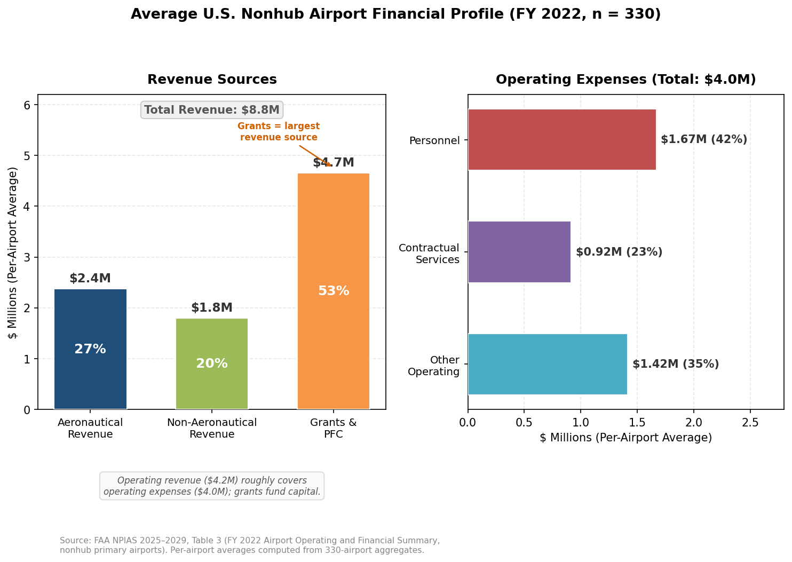

*Figure 3.2 — Financial structure of the average U.S. nonhub primary airport (n = 330), showing revenue sources and operating expense composition. Grants and PFCs constitute 53% of total inflows, underscoring the capital-grant dependence of airports at this scale. Source: FAA NPIAS 2025–2029, Table 3.*

The revenue composition at nonhub airports differs modestly from large hubs. Among operating revenues, the aeronautical share is 57% versus 43% non-aeronautical — a split roughly comparable to the large-hub pattern (58/42). The relatively high contribution from fuel sales ($175 million, or 13% of total operating revenue) and FBO revenue ($85 million, 6%) reflects the dual role of nonhub airports in serving general aviation alongside limited commercial service [FAA NPIAS 2025–2029](https://www.faa.gov/sites/faa.gov/files/airports/planning_capacity/npias/current/ARP-NPIAS-2025-2029-Narrative.pdf "Table 3, computed from nonhub row").

Globally, the profitability challenge at this scale is well-documented. ACI World's 2025 economics report, covering FY 2023 data from over 1,060 airports, found that 68% of airports operating at a net loss handle fewer than 1 million passengers [ACI World 2025](https://aci.aero/2025/04/28/airports-face-financial-challenges-despite-air-traffic-rebound-aci-world-economics-report-reveals/ "FY 2023 data"). In Europe, an Oxera/ACI Europe 2024 analysis confirmed that airports under 1 million passengers are broadly unable to achieve consistent profitability — a finding that underpins EU Aviation State Aid Guidelines permitting operating aid to airports under 3 million passengers through April 2027 [Oxera/ACI Europe 2024](https://www.oxera.com/insights/reports/economic-analysis-of-the-profitability-of-regional-airports/ "for ACI Europe, October 2024"). A 500,000-passenger airport falls squarely within this financially challenged segment: large enough to generate meaningful economic activity, yet too small to achieve the economies of scale that render larger airports self-sustaining.

## 3.5 Direct GDP and Tax Contributions

Translating employment and payroll into value-added (GDP) and fiscal contributions provides the most policy-relevant measure of an airport's direct economic significance, linking airport activity to the metrics that legislators and treasury officials monitor.

At the airport-specific level, the Yellowknife Airport study offers the most detailed accounting available for a facility near the 500,000-passenger threshold. In 2014, YZF generated $171 million in direct GDP — approximately 4.5% of the Northwest Territories' total GDP of $3,830 million. Including indirect and induced multiplier effects, total GDP attributable to the airport reached $307 million, or 8.0% of territorial GDP [Yellowknife Airport Economic Impact Study](https://www.inf.gov.nt.ca/sites/inf/files/resources/final_economic_impact_analysis_14-12-15_5.pdf "Table E-4 and territorial GDP data"). This proportional share reflects the extreme geographic isolation and small economic base of the NWT, where the airport functions as the primary transportation link for industry, government, and daily life.

The 2025 Colorado CEIS reported that Montrose Regional Airport generated $421.5 million in value-added on total business revenues of $713.1 million. As a proportion of the Montrose County economy — with estimated GDP of approximately $2.5–3.0 billion for the Montrose–Delta metropolitan statistical area — the airport's value-added contribution likely represents 14–17% of local GDP [2025 Colorado CEIS](http://www.coloradoaviationsystem.com/wp-content/uploads/2025/02/CEIS-Executive-Summary_FINAL_021925.pdf "individual airport table, MTJ row"). This share is extraordinarily high, reflecting the dominance of ski-tourism visitor spending in the local economy. Durango–La Plata (DRO) and Gunnison–Crested Butte (GUC) would exhibit analogous, though somewhat lower, proportional shares.

National-level data places these airport-specific figures in broader perspective. The FAA 2024 Economic Impact Report found that U.S. civil aviation contributed $1,019.7 billion in value-added to GDP in 2022 (4.0% of national GDP), with airport operations specifically contributing $48.1 billion in value-added (0.19% of GDP) [FAA Economic Impact Report 2024](https://www.faa.gov/2024-economic-impact-report.pdf "Table 5, 2022 data"). The ACI-NA 2024 study reported that 487 U.S. commercial service airports collectively supported $1.844 trillion in total output and 12.8 million jobs [ACI-NA 2024 Study](https://www.mvcommission.org/sites/default/files/docs/ACI-NA-The-Economic-Impact-of-U.S.-Commercial-Service-Airports-in-2024.pdf "Table 2"). Neither report disaggregates by airport size tier, precluding isolation of the national GDP contribution attributable specifically to the 500,000-passenger class.

On fiscal contributions, the Yellowknife study provides the only detailed tax breakdown identified for an airport near this threshold. YZF generated approximately $45 million in total taxes in 2014, decomposed as follows: personal income taxes ($14.5 million), estimated corporate taxes ($10 million), payroll taxes covering Canada Pension Plan, Employment Insurance, and workers' compensation ($4.3 million), GST on airport retail and concessions ($3.3 million), GST on airfares ($9 million), property taxes including government payments in lieu and tenant property taxes ($1.76 million), Air Travellers Security Charges ($1.36 million), and aviation fuel tax ($97,000) [Yellowknife Airport Economic Impact Study](https://www.inf.gov.nt.ca/sites/inf/files/resources/final_economic_impact_analysis_14-12-15_5.pdf "Section 5.6"). While tax structures differ between Canadian and U.S. jurisdictions, the order of magnitude — tens of millions of dollars in combined federal, state/provincial, and local taxes — is indicative of fiscal revenue generation at the 500,000-passenger scale.

For U.S. nonhub airports specifically, the NPIAS FY 2022 data offers an indirect fiscal measure: the 330 nonhub airports paid $551 million in personnel compensation and benefits and $302 million in contractual services, totaling $853 million in expenditures flowing to workers and vendors and generating income-tax and payroll-tax obligations. PFC collections of $98 million represent a direct passenger-funded revenue stream dedicated to capital improvements. Total indebtedness stood at $1,456 million ($4.4 million per airport), with bond proceeds of only $143 million — indicating that nonhub airports rely overwhelmingly on federal and state grants rather than debt markets for capital funding [FAA NPIAS 2025–2029](https://www.faa.gov/sites/faa.gov/files/airports/planning_capacity/npias/current/ARP-NPIAS-2025-2029-Narrative.pdf "Table 3, nonhub column").

## 3.6 Proportionality: Direct Effects Relative to the Local Economy

The central question for evaluating a 500,000-passenger airport's significance is not simply how many jobs or dollars it generates in absolute terms, but how large those contributions are relative to the total local economy. The evidence reveals a sharp divergence between isolated or tourism-dependent communities and more diversified metropolitan areas.

At the high end of the proportionality spectrum, Yellowknife Airport's 1,001 direct FTE represented approximately 4.4% of total employment in a city of roughly 20,500 residents with approximately 22,500 employed persons territory-wide. The airport ranked among the territory's largest single employment centers, and its $171 million in direct GDP equaled 4.5% of total NWT output [Yellowknife Airport Economic Impact Study](https://www.inf.gov.nt.ca/sites/inf/files/resources/final_economic_impact_analysis_14-12-15_5.pdf "Sections 4.3, 5"). In this context — extreme geographic isolation, a small population, and no road or rail alternatives for long-distance travel — a 500,000-passenger airport functions unambiguously as a major economic anchor.

Montrose Regional represents an even more pronounced case. The 2020 CEIS reported 2,850 total jobs (including visitor-related employment) in a county of approximately 47,000 people with total employment of roughly 20,000–22,000, implying that the airport's total economic footprint accounted for 13–14% of county employment [Colorado CEIS 2020 – MTJ](http://www.coloradoaviationsystem.com/wp-content/uploads/2024/09/Montrose-Regional-MTJ.pdf "total impacts"). This extraordinary share reflects the airport's role as the gateway to Telluride's multi-billion-dollar ski industry. It is an outlier, but it demonstrates that under specific conditions — a tourism-dependent economy, limited surface-transport alternatives, and seasonal demand concentration — a 500,000-passenger airport can be the single most consequential economic institution in its region.

At the lower end, a non-tourism 500,000-passenger airport serving a metropolitan area of 250,000–500,000 residents presents a fundamentally different picture. Such a community would typically have total employment of 100,000–250,000. An airport generating 300–600 direct on-airport jobs and approximately $97 million in on-airport output — as the ACI-NA benchmarks suggest — would represent less than 0.5% of total regional employment and a comparably small share of regional GDP. This is economically meaningful but not dominant: the airport is one employer among many, its payroll a modest fraction of total regional income, and its closure, while disruptive, would not by itself reshape the community's economic trajectory.

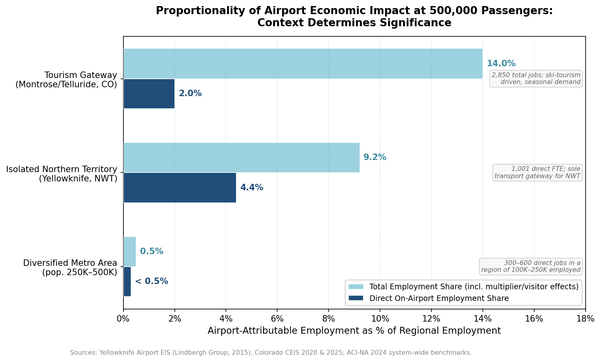

*Figure 3.3 — Airport-attributable employment as a share of regional employment across three community archetypes at the 500,000-passenger scale. Direct on-airport effects (dark) range from <0.5% in diversified metro areas to 4.4% in isolated territories; total effects including multiplier and visitor impacts (light) range from ~0.5% to 14%. Sources: Yellowknife Airport EIS (2015); Colorado CEIS 2020 & 2025; ACI-NA 2024.*

This proportionality finding carries an important analytical implication. At the 500,000-passenger scale, direct on-airport effects are consistently *measurable* across all contexts — the employment, payroll, and output are real and documentable. Whether those effects are *significant* depends entirely on the denominator: the size, diversity, and geographic isolation of the local economy. For a remote territory of 45,000 people, 1,000 direct airport jobs are transformative. For a diversified metropolitan area of 400,000, 300–600 direct airport jobs represent a modest contribution. Both characterizations are empirically supportable; the divergence lies in the definition of "significant," not in the underlying data.

# 第4章 Indirect, Induced, and Catalytic Economic Effects

The direct employment and output figures documented in Chapter 3 capture only the first tier of an airport's economic footprint. The broader impact resides in the multiplier channels: supply-chain purchases that sustain off-airport vendors (indirect effects), household spending enabled by airport-related wages (induced effects), and the wider connectivity benefits that shape business-location decisions, tourism flows, and regional competitiveness (catalytic effects). For a 500,000-passenger airport, these downstream channels are where the economic evidence becomes both most consequential and most contested. This chapter traces each multiplier pathway with available empirical data, assesses the scale sensitivity of these effects at the 500,000-passenger threshold, and examines the geographic heterogeneity that separates optimistic from pessimistic conclusions.

## 4.1 Multiplier Magnitudes at the Regional-Airport Scale

Employment and output multipliers vary substantially by airport size, regional economic structure, and methodological approach. Three tiers of evidence bear on the 500,000-passenger airport.

**National system-wide averages** provide an upper bound. The ACI-NA 2024 study of 487 U.S. commercial service airports reports a system-wide employment multiplier of 1.96, a payroll multiplier of 2.24, and an output multiplier of 2.51 — meaning each on-airport job is associated with roughly one additional job elsewhere in the economy [ACI-NA 2024 Study](https://www.mvcommission.org/sites/default/files/docs/ACI-NA-The-Economic-Impact-of-U.S.-Commercial-Service-Airports-in-2024.pdf "Table 21, system-wide multipliers"). These system-wide figures are dominated by large-hub airports. Applying them to a 500,000-passenger facility would overstate downstream effects, because smaller communities have thinner supplier networks and higher rates of economic leakage — spending that flows out of the region rather than recirculating locally.

**Scale-adjusted shortcut multipliers** offer a more realistic baseline. The FAA's 1992 economic impact guide provides population-based multiplier shortcuts that explicitly account for leakage: communities with populations below 100,000 receive a multiplier of 0.5 (indirect plus induced effects equal half of direct effects), while communities of 100,000–500,000 receive 0.6. Only metropolitan areas exceeding 3 million people approach a full multiplier of 1.0 [FAA 1992 Guide](https://gardnermagazine.com/wp-content/uploads/2024/02/Airports-1992-Report-dot_35802_DS1.pdf "Step 5, population-based shortcut multipliers"). Since airports at the 500,000-passenger threshold typically serve catchment areas of 50,000–250,000 people, the applicable shortcut multiplier falls in the 0.5–0.6 range, implying total employment (direct plus indirect plus induced) of 1.5–1.6 times the direct count. For an airport generating 300–600 direct on-airport jobs (Chapter 3), this translates to 450–960 total jobs through indirect and induced channels alone — before any visitor-spending or catalytic effects.

**Airport-specific studies** at or near the 500,000-passenger level provide ground-truth observations. Yellowknife Airport (YZF, 532,689 passengers in 2014) produced an employment multiplier of 2.07 — 1,001 direct FTE expanding to 2,072 total jobs when indirect and induced effects were included [Yellowknife Airport Economic Impact Study](https://www.inf.gov.nt.ca/sites/inf/files/resources/final_economic_impact_analysis_14-12-15_5.pdf "Table E-5, Lindbergh Group, December 2015"). A 2024 InterVISTAS update for the same airport, using a narrower scope limited to the Northwest Territories economy, yielded substantially lower multipliers in the range of 1.27–1.48 [YZF 2024 Study](https://www.inf.gov.nt.ca/sites/inf/files/resources/facilitating_economic_and_social_connectivity_yzf_final_13sep2024.pdf "Figure 1-2, InterVISTAS update"). The divergence underscores that multiplier values are highly sensitive to the geographic boundary chosen for the analysis. A Wisconsin-based study of regional airports reported employment multipliers of approximately 1.5 and sales multipliers of 1.27, consistent with the FAA shortcut range for mid-size communities.

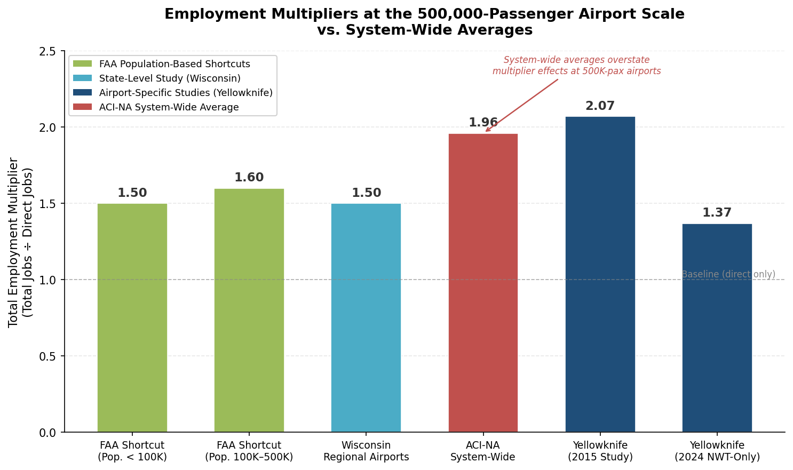

*Figure 4-1. Comparison of total employment multipliers across six benchmarks — FAA population-based shortcuts, a Wisconsin regional-airport study, the ACI-NA system-wide average, and two Yellowknife Airport studies differing in geographic scope. System-wide averages materially overstate the multiplier effect at the 500,000-passenger scale.*

The overall pattern is consistent: at the 500,000-passenger scale, realistic employment multipliers fall in the range of 1.3–2.0, with the lower end applying to isolated or small-population catchments and the upper end reflecting airports embedded in larger and more diversified regional economies. These figures are meaningfully below the ACI-NA system-wide average of 1.96 and confirm the importance of scale-adjusted analysis.

## 4.2 Supply-Chain Effects and Local Spending Leakage

Indirect economic effects arise when on-airport entities purchase goods and services from off-airport suppliers — fuel distributors, catering companies, ground transportation operators, construction and maintenance firms, professional services providers, and equipment vendors. The magnitude of these effects depends critically on whether those suppliers are located within the study region or outside it.

For airports in smaller communities, a substantial share of supply-chain spending leaks beyond the regional boundary. Jet fuel is refined elsewhere and delivered via pipeline or truck; aircraft maintenance components are manufactured nationally or globally; and IT systems, insurance, and specialized consulting are rarely sourced locally. The FAA's 1992 guide anticipated this pattern by assigning lower multipliers to smaller population centers: the less diversified the regional economy, the fewer local links in the supply chain and the greater the leakage to external jurisdictions [FAA 1992 Guide](https://gardnermagazine.com/wp-content/uploads/2024/02/Airports-1992-Report-dot_35802_DS1.pdf "leakage discussion").

Yellowknife Airport illustrates the upper bound of indirect effects at this scale. Indirect employment — jobs in supplier businesses attributable to airport demand — totaled 505 FTE, approximately half the direct employment count. Combined with induced employment of 566 FTE (generated by household spending of direct and indirect workers), total multiplied employment reached 2,072 FTE [Yellowknife Airport Economic Impact Study](https://www.inf.gov.nt.ca/sites/inf/files/resources/final_economic_impact_analysis_14-12-15_5.pdf "Table E-5"). These relatively robust indirect and induced effects partly reflect YZF's role as a logistics gateway for diamond-mining operations — a specialized supply-chain function atypical of most 500,000-passenger airports.

For airports without such specialized roles, indirect effects are proportionally smaller. The FAA shortcut multiplier of 0.5 for communities under 100,000 implies that indirect and induced effects combined add only half as many jobs as the direct count. A 500,000-passenger airport with 400 direct jobs would, under this framework, generate approximately 200 additional jobs through local supply-chain and household-spending linkages. The remaining economic stimulus flows to suppliers, workers, and tax jurisdictions outside the immediate region — an asymmetry that is structural, not correctable through local policy.

## 4.3 Tourism Facilitation: The Dominant Multiplier Channel

For many airports at the 500,000-passenger level, visitor spending is not merely an additional impact channel — it is the dominant one, often exceeding on-airport employment and supply-chain effects by a factor of three to five. This pattern is most pronounced at airports serving tourism-dependent regions, where the facility functions less as an employer in its own right and more as an infrastructure gateway enabling a far larger hospitality economy.

**Montrose Regional Airport (MTJ)** provides the clearest illustration. The 2020 Colorado Aviation Economic Impact Study found that of MTJ's 2,850 total jobs and $327.3 million in total business revenues, visitor-related spending accounted for 2,002 jobs (70% of total employment) and $210.9 million in revenue (64% of total) [Colorado CEIS 2020 – MTJ](http://www.coloradoaviationsystem.com/wp-content/uploads/2024/09/Montrose-Regional-MTJ.pdf "visitor vs. on-airport breakdown"). On-airport operations contributed 449 direct jobs while visitor facilitation generated more than four times that number. The updated 2025 CEIS, reflecting passenger growth to approximately 660,000, reported 4,323 total jobs and $713.1 million in business revenues [2025 Colorado CEIS](http://www.coloradoaviationsystem.com/wp-content/uploads/2025/02/CEIS-Executive-Summary_FINAL_021925.pdf "MTJ updated figures"). MTJ's visitor-spending dominance reflects its role as the primary air gateway to the Telluride and Crested Butte ski-resort corridors, where per-trip visitor expenditure is exceptionally high.

Other Colorado airports near the 500,000-passenger threshold exhibit similar tourism dominance at varying intensities. Durango–La Plata County Airport (DRO) supported 1,993 total jobs and $342.1 million in business revenues; Gunnison–Crested Butte Regional Airport (GUC) supported 958 total jobs and $154.9 million in revenues [2025 Colorado CEIS](http://www.coloradoaviationsystem.com/wp-content/uploads/2025/02/CEIS-Executive-Summary_FINAL_021925.pdf "individual airport totals"). All three airports serve mountain-tourism economies, and visitor-facilitated employment dominates their total impact profiles.

**The non-tourism counterpoint is essential.** Not all 500,000-passenger airports serve tourism economies; for those that do not, visitor spending constitutes a far smaller component of total impact. The FAA's 1992 guide introduced an "AP/POP" screening test (annual passengers divided by local population) to determine whether a community's airport traffic is substantially driven by incoming visitors rather than resident travel. Where the ratio is low — indicating that most passengers are local residents departing for business or personal purposes — visitor expenditure impacts may be negligible, because spending by departing residents does not represent "new" money injected into the local economy [FAA 1992 Guide](https://gardnermagazine.com/wp-content/uploads/2024/02/Airports-1992-Report-dot_35802_DS1.pdf "AP/POP screening test"). Airports such as Bismarck Municipal (BIS) and Grand Junction Regional (GJT), which serve primarily local business-travel markets with limited inbound tourism, exhibit substantially smaller visitor-spending multipliers than MTJ or DRO.

This distinction carries direct implications. The total economic impact of a 500,000-passenger airport ranges from approximately 600–1,000 total jobs (for a non-tourism airport in a small community with high leakage) to 3,000–4,500 total jobs (for a tourism gateway), with visitor spending accounting for the bulk of the variance. Whether the impact qualifies as "significant and measurable" depends substantially on the airport's tourism-gateway function.

## 4.4 Trade, Cargo, and Logistics Relevance

Air cargo constitutes a major economic driver at large hub airports, but its significance at the 500,000-passenger level is typically marginal. Most airports in this tier are served by regional jets and turboprops with limited belly-hold capacity; few operate dedicated freighter services. The economics of air freight favor concentration at hub airports with wide-body aircraft, automated sorting facilities, and intermodal connections — infrastructure that is absent at nonhub facilities.

The Regional Airline Association (RAA) reports that 570 U.S. small-community airports collectively generate $134 billion in annual economic activity and support 1 million jobs, though these aggregate figures encompass enormous variation and are not disaggregated by cargo versus passenger contribution [RAA 2024](https://raa.org/valuable-service-air-service-to-small-communities-generates-significant-economic-activity/ "November 2024"). For the vast majority of 500,000-passenger airports, cargo volumes are measured in hundreds of tonnes per year — orders of magnitude below the thousands or tens of thousands that characterize hub cargo operations.

Yellowknife Airport represents a notable exception illustrating the conditions under which cargo activity becomes economically meaningful at this scale. YZF serves as a logistics hub for diamond-mining operations in the Northwest Territories, with Det'on Cho Logistics (a 100% Indigenous-owned enterprise and the airport's primary fixed-base operator) coordinating supply flights to remote mine sites. This specialized cargo function contributes materially to YZF's above-average employment intensity and supply-chain multipliers [YZF 2024 Study](https://www.inf.gov.nt.ca/sites/inf/files/resources/facilitating_economic_and_social_connectivity_yzf_final_13sep2024.pdf "Det'on Cho cargo case study"). The conditions enabling this role — geographic remoteness, absence of surface-transport alternatives, and resource-extraction industries requiring constant resupply — are specific rather than generalizable.

For the representative 500,000-passenger airport, cargo and logistics contribute a minor supplement to the overall economic footprint. The economic case for these airports rests on passenger-related effects, not freight.

## 4.5 Catalytic Effects: Connectivity, Business Location, and Regional Competitiveness

Catalytic effects — the ways in which air connectivity influences business-location decisions, foreign direct investment, trade facilitation, labor-market access, and productivity — represent the most conceptually important yet methodologically difficult tier of airport economic impact. The ACI Europe/York Aviation framework introduced in 2004 positioned catalytic effects as the capstone of the four-tier taxonomy, and ATAG's 2024 global estimate attributes 37.3 million jobs and a substantial portion of aviation's $4.1 trillion GDP contribution to this channel [ATAG ABBB 2024](https://aviationbenefits.org/media/e5ynn4x0/abbb2024_full_report.pdf "catalytic tier estimates, Oxford Economics methodology"). The academic literature, however, is sharply divided on whether these effects are real, large, and causally attributable to airports — particularly at the regional-airport scale.

### 4.5.1 Econometric Evidence: A Mixed Verdict

Several influential studies estimate meaningful economic effects from air connectivity at the aggregate level. Brueckner (2003) found that a 10% increase in passenger enplanements is associated with a 0.9% increase in metropolitan statistical area (MSA) employment. Blonigen and Cristea (2015), exploiting the 1978 airline deregulation as a quasi-natural experiment, estimated that a 50% increase in air traffic growth is associated with 5.5% higher annual employment growth and cumulative income gains equivalent to 7.4% of GDP over 20 years [Blonigen & Cristea 2015](https://pages.uoregon.edu/cristea/Research_files/airurban.pdf "Journal of Urban Economics 86"). Sheard (2014) found that a 10% increase in air traffic at an MSA-level airport generates approximately 1,650 additional service-sector jobs in a metropolitan area of 1 million people, though with no detectable effect on manufacturing employment [ACRP Web Resource 12](https://crp.trb.org/acrpwebresource12/understanding-air-service-and-regional-economic-activity/the-role-of-aviation-in-supporting-local-economic-activity/ "citing Brueckner 2003, Sheard 2014"). McGraw (2020) documented that airport presence contributed 3.9% employment growth and 3.4% population growth per decade in mid-size U.S. cities over the 1950–2010 period [ACRP Web Resource 12](https://crp.trb.org/acrpwebresource12/understanding-air-service-and-regional-economic-activity/the-role-of-aviation-in-supporting-local-economic-activity/ "McGraw 2020").

At the global scale, Campante and Yanagizawa-Drott (2018), publishing in the *Quarterly Journal of Economics*, used the introduction of new long-haul routes — instrumented by improvements in aircraft range — as natural experiments and found that air connectivity increases bilateral business links and economic activity [Campante & Yanagizawa-Drott 2018](https://www.researchgate.net/publication/328768499_Long-Range_Growth_Economic_Development_in_the_Global_Network_of_Air_Links "QJE 133(3), 2018").

These studies, however, generally cover the full spectrum of airport sizes and do not isolate the 500,000-passenger tier. There is reason to expect that catalytic effects are weaker at smaller airports. ACRP Report 218 (Ballard et al., 2020) found that each departing seat at a nonhub airport is associated with 0.0114 regional jobs — over twice the rate observed at small-hub airports (0.005 jobs per seat) — suggesting that marginal seat additions at underserved airports carry disproportionate economic leverage. Bilotkach (2015) found that the number of nonstop destinations matters more than capacity expansion on existing routes: each new nonstop destination was associated with 223 additional regional jobs and 15 new business establishments [ACRP Web Resource 12](https://crp.trb.org/acrpwebresource12/understanding-air-service-and-regional-economic-activity/the-role-of-aviation-in-supporting-local-economic-activity/ "ACRP 218 and Bilotkach 2015"). These findings imply that for a 500,000-passenger airport, securing a new nonstop route to a major business hub could produce measurable economic effects in its catchment area.

### 4.5.2 The European Counterpoint: Weaker and Often Reversed Causality

European evidence is substantially more pessimistic about catalytic effects at the small-airport scale. Pot and Koster (2022), studying 274 NUTS-2 regions across Europe from 2000 to 2018, found that the GDP-per-capita elasticity to air accessibility was only 0.022 for small airports (under 1 million passengers), compared to 0.179 for large airports (over 5 million passengers) — an eightfold difference. More critically, in 67% of the European regions studied, the direction of causality ran from GDP to small-airport accessibility rather than the reverse: economic growth attracted air service, not the other way around. Only in "lagging but densely populated regions" did small airports show evidence of functioning as a "pillar of growth" [Pot & Koster 2022](https://www.researchgate.net/publication/357405362_Small_airports_Runways_to_regional_economic_growth "Journal of Transport Geography 98, Table 8").

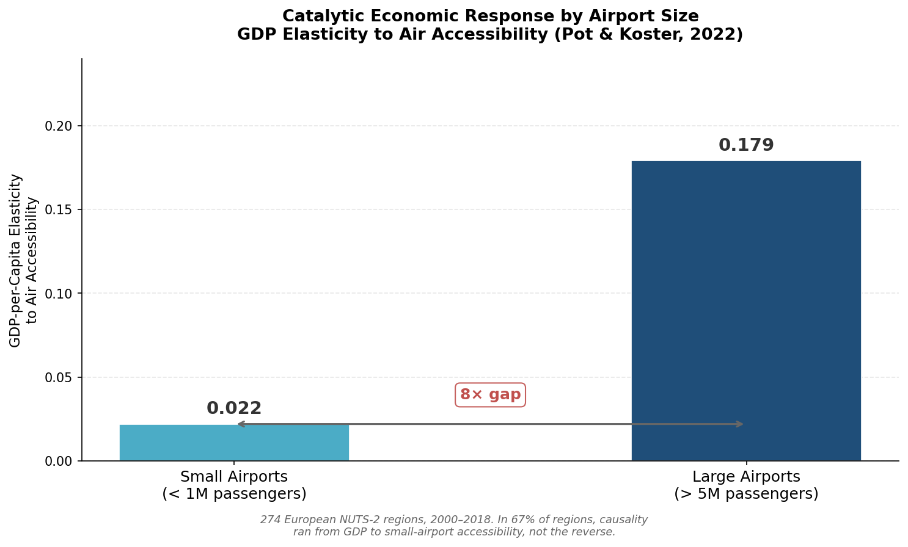

*Figure 4-2. Catalytic economic response by airport size. GDP-per-capita elasticity to air accessibility is 0.022 for small airports (<1M passengers) versus 0.179 for large airports (>5M passengers) — an eightfold gap. Based on 274 European NUTS-2 regions, 2000–2018. Source: Pot & Koster (2022).*

Tveter (2017) found no statistically significant employment effect from the construction of nine regional airports in Norway during 1970–1972 using a difference-in-differences design. Breidenbach (2020) reached a similar null finding for German regional airports. In contrast, evidence from Australia (Baker et al., 2015) and New Zealand (Fu et al., 2021) was more positive, suggesting that geographic context — and particularly the availability of surface-transport alternatives — modulates the catalytic potential of small airports [Pot & Koster 2022](https://www.researchgate.net/publication/357405362_Small_airports_Runways_to_regional_economic_growth "literature comparison, citing Tveter 2017, Breidenbach 2020, Baker et al. 2015").

This geographic heterogeneity is central to the assessment, not a peripheral caveat. In the densely networked European context, where high-speed rail and motorway alternatives serve most 500,000-passenger airport catchments, the marginal value of regional air service is low and catalytic effects are correspondingly small or undetectable. In more geographically isolated or surface-transport-constrained settings — the Australian outback, the Canadian north, island economies — the absence of alternatives amplifies the airport's catalytic role.

### 4.5.3 Route Network Quality as the Key Mechanism

The evidence converges on a specific mechanism by which catalytic effects operate at small airports: **route network quality** — particularly the availability of nonstop connections to major economic hubs — matters more than raw passenger volume.

Bilotkach's (2015) finding that each new nonstop destination generates 223 jobs and 15 business establishments provides a per-route economic value that is operationally meaningful for airports at the 500,000-passenger level. A typical airport at this threshold operates 5–15 nonstop routes (Cherry Capital Airport maintains approximately 20 nonstop destinations; Montrose Regional operates 8–12 seasonal routes). The addition or loss of a single route — particularly to a connecting hub such as Denver, Chicago, or Dallas — can shift the economic calculus for the entire catchment area.

The Canadian Airports Council/InterVISTAS (2025) report reinforced this point at a system level, estimating that a single regional flight in Canada generates 126–210 total jobs and $11.4–$19.5 million in GDP annually [CAC/InterVISTAS 2025](https://airportscouncil.org/wp-content/uploads/2025/05/2025CACConnectivityReport-Full.pdf "Keeping Canada Connected, May 2025"). These per-route estimates indicate that for a 500,000-passenger airport with 6–10 daily departures, the economic contribution of air connectivity is concentrated in the maintained link to the national network rather than in the volume of traffic per se.

## 4.6 Synthesizing the Multiplier Channels: Total Impact at 500,000 Passengers

Drawing the indirect, induced, and catalytic evidence together, the total economic footprint of a 500,000-passenger airport can be estimated through two scenarios that bracket the realistic range.

**Scenario A: Non-tourism airport in a small community** (population under 250,000, limited inbound tourism, moderate leakage). With 300–500 direct on-airport jobs and an FAA shortcut multiplier of 0.5–0.6, indirect and induced employment adds 150–300 jobs, yielding approximately 450–800 total on-airport-related positions. Visitor-facilitated employment is modest — perhaps 200–400 additional positions in ground transportation, lodging, and food services. Catalytic effects, based on the Pot and Koster (2022) elasticity evidence, contribute weakly to regional GDP. Total employment impact: roughly 650–1,200 jobs, with total output in the range of $100–$250 million. Relative to a regional economy with 100,000–200,000 workers, this represents 0.3–1.2% of total employment — measurable in economic-impact terms, though not dominant.

**Scenario B: Tourism-gateway airport** (ski resort, beach destination, or heritage/nature tourism area with a high inbound visitor ratio). With 400–600 direct on-airport jobs, the indirect and induced multiplier adds 250–400 positions. Visitor spending, however, becomes the primary channel: 1,500–3,500 visitor-facilitated jobs in hospitality, recreation, and retail, as documented at MTJ, DRO, and comparable airports. Total employment impact: 2,000–4,500 jobs, with total output ranging from $300 million to over $700 million. At Montrose Regional, the 2025 Colorado CEIS documented $713.1 million in total business revenues and $421.5 million in value-added — figures that represent a substantial share of a mountain-county economy [2025 Colorado CEIS](http://www.coloradoaviationsystem.com/wp-content/uploads/2025/02/CEIS-Executive-Summary_FINAL_021925.pdf "MTJ 2025 figures").

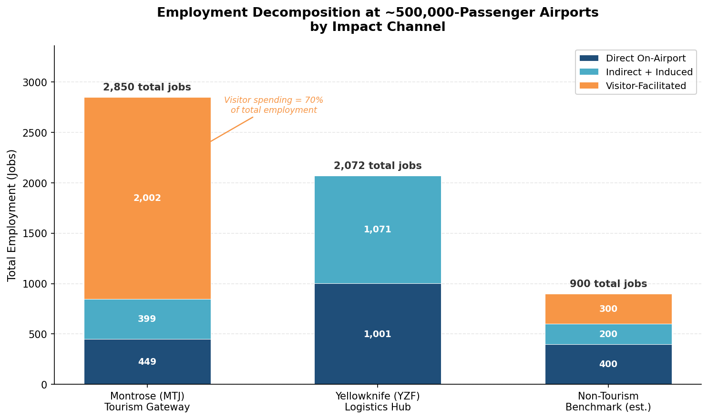

*Figure 4-3. Employment decomposition at three ~500,000-passenger airports by impact channel — direct on-airport, indirect plus induced, and visitor-facilitated. Montrose Regional (MTJ), a tourism gateway, derives 70% of its total employment from visitor spending. Yellowknife Airport (YZF), a logistics hub, shows a more balanced indirect/induced profile. The non-tourism benchmark estimate illustrates the substantially lower total at airports lacking a tourism-gateway function.*

Several key observations emerge from this synthesis:

1. **Visitor spending is the single most powerful amplifier** of economic impact at the 500,000-passenger scale. Its presence or absence creates a threefold to fivefold gap in total employment effects.

2. **Supply-chain and household-spending multipliers are real but smaller** at this airport scale than national averages suggest. The FAA's population-based shortcut multipliers of 0.5–0.6 remain a more reliable guide than the ACI-NA system-wide figure of 1.96.

3. **Catalytic effects are empirically elusive** at the 500,000-passenger level. European evidence suggests reversed causality in the majority of regions studied; North American evidence shows positive but scale-dependent associations. ACRP Report 218's finding of 0.0114 jobs per departing seat at nonhub airports, and Bilotkach's estimate of 223 jobs per new nonstop destination, provide the most operationally specific catalytic metrics available [ACRP Web Resource 12](https://crp.trb.org/acrpwebresource12/understanding-air-service-and-regional-economic-activity/the-role-of-aviation-in-supporting-local-economic-activity/ "ACRP 218 and Bilotkach 2015").

The evidence reviewed in this chapter supports two concurrent conclusions. The indirect, induced, and catalytic effects of a 500,000-passenger airport are consistently measurable — multiple independent studies and methodologies detect them. At the same time, the magnitude of these effects is strongly context-dependent: geographic isolation, tourism function, route-network quality, and catchment size collectively determine whether multiplied impacts are economically modest (a fraction of 1% of regional employment) or economically substantial (a double-digit share of local GDP in tourism-dependent or geographically isolated communities). The proposition that a 500,000-passenger airport generates "significant" downstream effects cannot be answered with a single number; it requires specification of the community context in which the airport operates.

# 第5章 Broader Socioeconomic and Connectivity Effects

The employment, payroll, and output metrics examined in Chapters 3 and 4 capture the quantifiable core of an airport's contribution to its region. Yet the socioeconomic significance of a 500,000-passenger airport extends well beyond input-output accounting. Regional air service shapes the connectivity architecture of communities, influences residential real-estate markets, affects population retention in peripheral areas, enables time-critical healthcare access, and features prominently in policy arguments about spatial equity and territorial cohesion. These broader effects are more difficult to monetize than direct or indirect employment, but they are often the decisive factors in public debates over airport investment and subsidy. This chapter evaluates the evidence for each of these channels at the 500,000-passenger scale, applying the same evidentiary standards — quantified where possible, qualified where not — that governed the preceding analysis.

## 5.1 Route Connectivity and Network Position

The economic value of a regional airport is not a simple function of passenger volume; it depends critically on *where* those passengers can fly nonstop and how efficiently the airport connects its catchment to the broader national and global network. A 500,000-passenger airport with six nonstop routes to major hubs delivers a qualitatively different connectivity profile than one with three routes to secondary cities.

### 5.1.1 Connectivity Profiles at the 500,000-Passenger Threshold

Cherry Capital Airport (TVC) in Traverse City, Michigan, illustrates a comparatively strong connectivity outcome near the 500,000-passenger threshold. Handling a record 787,114 total passengers in 2024, TVC offers service from seven airlines to approximately 20 nonstop destinations, including major connecting hubs such as Chicago O'Hare, Dallas–Fort Worth, Denver, Atlanta, Minneapolis–St. Paul, and the New York area (JFK, LaGuardia, Newark) [TVC Airlines Page](https://tvcairport.com/airlines-serving-cherry-capital-airport/ "Airline roster, accessed 2025"). This breadth of hub connectivity — unusual for an airport of this size — reflects TVC's dual role as a tourism gateway for northern Michigan and a service point for a dispersed regional population of approximately 100,000.

Most 500,000-passenger airports, however, operate considerably narrower route networks. Typical connectivity at this threshold consists of 5–12 nonstop destinations, predominantly to one or two airline connecting hubs, with service frequencies of 2–6 daily departures per route. Seasonal variation is pronounced at tourism-driven airports: Montrose Regional (MTJ), for example, operates 8–12 nonstop routes during the winter ski season but contracts to fewer than half that number during summer months.

### 5.1.2 Declining Connectivity at Small Airports

The connectivity available at 500,000-passenger airports has eroded substantially over the past two decades. A 2024 Government Accountability Office analysis found that departures from nonhub airports — the FAA classification encompassing most U.S. airports near the 500,000-passenger level — declined 47% between 2000 and 2018, compared to only 7% at large hubs. The 218 smallest U.S. communities' mean connectivity index fell a further 8% between 2018 and 2023 alone (from 5.1 to 4.7 on GAO's composite measure), and their average connectivity remained approximately 1% of that available at large-community airports [GAO-24-106681](https://files.gao.gov/reports/GAO-24-106681/index.html "Air Service to Small Communities, September 2024").

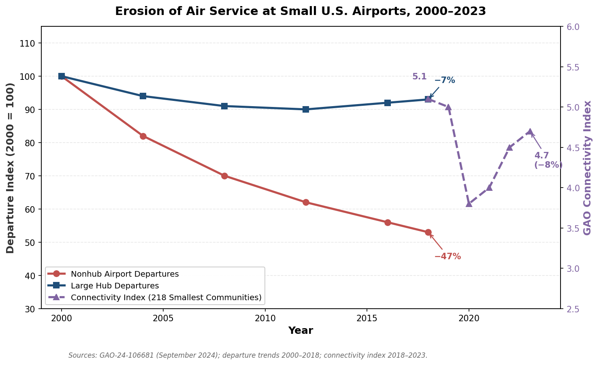

*Figure 5.1 — Departure indices for nonhub and large-hub airports (left axis, 2000 = 100) alongside the GAO composite connectivity index for the 218 smallest U.S. communities (right axis). Data from [GAO-24-106681](https://files.gao.gov/reports/GAO-24-106681/index.html "September 2024").*

Canadian data mirrors this pattern. The Canadian Airports Council/InterVISTAS (2025) report found that regional airport frequencies stood at only 64% of 2014 levels, while the IATA Connectivity Index registered a 10.1% decline in domestic connectivity from 2019 to 2024. The same report estimated that a single regional flight in Canada generates 126–210 total jobs and $11.4–$19.5 million in GDP annually — framing each lost frequency as a discrete economic subtraction from the served community [CAC/InterVISTAS 2025](https://airportscouncil.org/wp-content/uploads/2025/05/2025CACConnectivityReport-Full.pdf "Keeping Canada Connected, May 2025").

These trends carry direct consequences for the hypothesis under examination. If connectivity at the 500,000-passenger threshold is thinning, then the downstream socioeconomic effects documented in impact studies may be weakening over time — even where passenger counts remain stable — because the quality of network access (nonstop destinations, frequency, hub connectivity) is declining independently of volume.

### 5.1.3 Essential Air Service and Connectivity Preservation

The Essential Air Service (EAS) program, established after airline deregulation in 1978, explicitly subsidizes air connectivity at small U.S. communities that would otherwise lose all scheduled service. As of March 2024, 107 communities in the contiguous United States received EAS subsidies averaging $4.3 million per community annually [GAO-24-106681](https://files.gao.gov/reports/GAO-24-106681/index.html "EAS program data"). The GAO found that EAS communities experienced smaller connectivity declines (4%) than non-EAS communities (10%) between 2018 and 2023, suggesting the program partially buffers against market-driven service erosion.

The program's cost-effectiveness, however, is contested. Drukker (2023) estimated that community members collectively value EAS service at only $16 million per year against program costs exceeding $290 million — a cost-benefit ratio of approximately 18:1 against the program. Many EAS-eligible residents opt to drive to larger airports; in Decatur, Illinois, only 7% of local residents used the EAS-subsidized airport [GAO-24-106681](https://files.gao.gov/reports/GAO-24-106681/index.html "EAS usage patterns"). EAS communities are generally smaller than the 500,000-passenger threshold examined here — a 500,000-passenger airport typically generates sufficient traffic to sustain commercial service without EAS subsidy — but the EAS evidence illuminates the marginal value communities place on air connectivity when lower-cost surface alternatives exist.

## 5.2 Real Estate and Land-Use Effects

Proximity to an airport generates two countervailing pressures on local real-estate values: an *accessibility premium* (convenient air access increases the attractiveness of a location for businesses and residents) and a *noise discount* (aircraft noise, emissions, and safety concerns depress property values in the immediate vicinity). The net effect depends on the balance between these forces, which varies with airport size, traffic intensity, fleet mix, and local housing-market conditions.

### 5.2.1 The Noise Depreciation Evidence

Nelson's (2004) meta-analysis of 33 hedonic pricing studies across 23 airports — the most comprehensive synthesis available — found a mean Noise Depreciation Index (NDI) of 0.58% per decibel of aircraft noise exposure. U.S. studies yielded higher estimates (0.8–0.9% per dB), while Canadian studies produced lower values (0.5–0.6% per dB) [Nelson 2004 via SJSU Thesis](https://scholarworks.sjsu.edu/cgi/viewcontent.cgi?article=4616&context=etd_theses "Meta-analysis of 33 hedonic studies"). At a major hub airport with hundreds of daily operations, the 65-dB DNL contour — the FAA's threshold for residential noise incompatibility — can extend several kilometers from the runway, encompassing thousands of properties.

At a 500,000-passenger airport, the noise footprint is dramatically smaller. Typical operations at this threshold consist of 10–30 daily departures, predominantly by regional jets (CRJ-200/900, ERJ-175) and turboprops (Dash 8-400), which generate substantially less noise per movement than wide-body or older narrowbody aircraft. The 65-dB contour at such an airport is generally confined to airport property or immediately adjacent parcels, affecting far fewer residential properties. A 2025 study in *Applied Economics* confirmed that the relationship between airport proximity and property values is heterogeneous, operating as a "dual effect" — proximity simultaneously confers accessibility benefits and imposes noise costs, with the net outcome varying by distance band and local conditions [Applied Economics 2025](https://www.tandfonline.com/doi/full/10.1080/00036846.2025.2547105 "Heterogeneous dual effect of airport proximity on property values").

### 5.2.2 The Accessibility Premium at Smaller Airports

The implication for 500,000-passenger airports is that the noise-discount effect is geographically confined, while the accessibility premium — driven by convenient air access for business travelers, second-home buyers, and tourism operators — can extend across the broader catchment area. In resort communities served by airports such as MTJ or TVC, this premium is likely substantial: access to nonstop flights from major metros directly supports property values in vacation-home and hospitality corridors. The 2025 Colorado CEIS documented $713.1 million in business revenues at MTJ, much of it concentrated in tourism and hospitality sectors whose profitability — and thus commercial real-estate valuations — is directly tied to air access [2025 Colorado CEIS](http://www.coloradoaviationsystem.com/wp-content/uploads/2025/02/CEIS-Executive-Summary_FINAL_021925.pdf "MTJ business revenues").

Hedonic pricing studies specifically isolating the 500,000-passenger tier remain sparse. The available evidence supports a reasonable inference that net real-estate effects at this airport scale are modestly positive outside the immediate noise zone, but the precise magnitude has not been quantified in published literature for this specific size category.

## 5.3 Population Dynamics: Does Air Service Retain Communities?

A frequently invoked argument for regional air service holds that it helps peripheral and rural communities retain population — that without air access, residents and businesses would relocate to better-connected metropolitan areas, accelerating a spiral of demographic and economic decline. The empirical basis for this claim is mixed and geographically contingent.

### 5.3.1 North American Evidence: Modest Positive Effects

McGraw (2020), studying mid-size U.S. cities over the 1950–2010 period, found that airport presence contributed 3.9% employment growth and 3.4% population growth per decade [ACRP Web Resource 12](https://crp.trb.org/acrpwebresource12/understanding-air-service-and-regional-economic-activity/the-role-of-aviation-in-supporting-local-economic-activity/ "McGraw 2020"). These are cumulative effects measured across all airport sizes, but the direction is consistent: communities with airports grew faster than otherwise comparable communities without them. Applied to the 500,000-passenger threshold, this implies a population-retention effect of several percentage points per decade — not transformative, but potentially the difference between stability and decline for communities at the demographic margin.

The Canadian Airports Council/InterVISTAS (2025) report reinforces this framing, positioning regional airports as critical infrastructure for communities that would otherwise face geographic isolation. Beyond economic activity, the report emphasizes that regional air service supports social connectivity — enabling family visits, educational travel, and access to government services unavailable locally [CAC/InterVISTAS 2025](https://airportscouncil.org/wp-content/uploads/2025/05/2025CACConnectivityReport-Full.pdf "Social connectivity section").

### 5.3.2 European Evidence: Weak or Reversed Causality

European evidence is less supportive of the population-retention hypothesis. Pot and Koster (2022), as discussed in Chapter 4, found that for small airports (under 1 million passengers), causality predominantly ran from regional economic performance to airport accessibility — not the reverse. In 67% of European regions studied, economic growth attracted air service rather than air service stimulating growth. The authors concluded that "a purely economic cost-benefit analysis will, in most cases, wind up with a negative result" for small regional airports [Pot & Koster 2022](https://www.researchgate.net/publication/357405362_Small_airports_Runways_to_regional_economic_growth "University of Groningen findings").

Tveter (2017) similarly found no statistically significant employment or population effect from the construction of nine regional airports in Norway during 1970–1972, and Breidenbach (2020) reached comparable null findings for German regional airports. These results are consistent with a European context in which dense rail and motorway networks provide alternative connectivity, reducing the marginal population-retention value of air service.

The geographic divergence in findings aligns with the moderating-conditions framework established in Chapter 4: air service contributes most to population retention in communities where surface-transport alternatives are poor and geographic isolation is genuine. For a 500,000-passenger airport serving a peripheral North American community 3–5 hours' drive from the nearest large hub, the retention effect is plausibly meaningful. For a comparable airport in a well-connected European region, the effect is likely minimal.

## 5.4 Healthcare Access and Emergency Response

Among the socioeconomic roles of regional airports, healthcare facilitation is perhaps the most consequential for individual well-being and the most resistant to economic substitution. Air ambulance services, patient-transfer flights, and medical-specialist travel depend on airport infrastructure that cannot be replaced by broadband, telehealth, or improved roads — particularly where distances, terrain, or weather preclude timely surface transport.

### 5.4.1 Air Medical Services at Scale

Air ambulances serve more than 550,000 patients per year in the United States, providing time-critical transport for trauma, stroke, cardiac, and neonatal emergencies in which the "golden hour" of treatment access determines survival outcomes. Approximately one-third of U.S. geographic area falls within a 15–20-minute helicopter response radius, although 86% of the population is within coverage [Ahmed et al. 2022](https://pmc.ncbi.nlm.nih.gov/articles/PMC9285155/ "AMIA 2022, air ambulance coverage analysis"). The gap between geographic and population coverage underscores that rural and remote areas — the communities most likely to depend on 500,000-passenger airports — are also those most reliant on air medical transport.

The scale of this need is growing. More than 80 rural hospitals have closed since 2010, with an estimated 700 more at risk of closure by 2028, concentrating specialist medical care in larger urban centers and lengthening the distances that rural patients must travel [Ahmed et al. 2022](https://pmc.ncbi.nlm.nih.gov/articles/PMC9285155/ "Rural hospital closure trends"). Each closure increases the marginal value of air-transport infrastructure in the affected community.

In Canada, the magnitude of medical travel facilitated by regional airports is documented at the provincial level. British Columbia issued 98,000 medical travel approvals in 2023–2024, while Ontario processed 200,000 approvals in the same period — each representing a patient who required air or long-distance surface travel to access care unavailable in their home community [CAC/InterVISTAS 2025](https://airportscouncil.org/wp-content/uploads/2025/05/2025CACConnectivityReport-Full.pdf "Medical access section").

### 5.4.2 Airport-Specific Healthcare Roles: Yellowknife as Case Study

Yellowknife Airport (YZF) provides the most thoroughly documented example of healthcare facilitation at the 500,000-passenger scale. Advanced Medical Solutions (AMS), an air ambulance provider with 350 employees, uses YZF as its operational hub for emergency medical transport across the Northwest Territories and into neighboring jurisdictions. AMS alone accounts for approximately 35% of YZF's direct on-airport employment — an employment share unmatched at most airports of comparable size, reflecting the acute healthcare-access demands of northern Canada [YZF 2024 Study](https://www.inf.gov.nt.ca/sites/inf/files/resources/facilitating_economic_and_social_connectivity_yzf_final_13sep2024.pdf "AMS case study, InterVISTAS September 2024").

The emergency-response dimension extends beyond routine medical transport. During the 2023 Northwest Territories wildfire crisis, YZF served as the primary coordination point for aerial evacuation operations, with 195 aircraft deployed for evacuation flights. Det'on Cho Logistics — a 100% Indigenous-owned enterprise and the airport's primary fixed-base operator — coordinated the logistics of this evacuation and has since signed a standing emergency-response agreement with territorial authorities. During the COVID-19 pandemic, Det'on Cho redeployed staff and aircraft to transport medical supplies and vaccines to remote Indigenous communities inaccessible by road [YZF 2024 Study](https://www.inf.gov.nt.ca/sites/inf/files/resources/facilitating_economic_and_social_connectivity_yzf_final_13sep2024.pdf "Det'on Cho emergency response case study").

These functions are not captured in standard input-output economic impact models. The value of avoided mortality, reduced patient-transfer times, and emergency-evacuation capacity does not appear in employment multipliers or GDP contributions. Yet for communities served by 500,000-passenger airports in remote or medically underserved areas, these healthcare-access roles may constitute the airport's single most important socioeconomic contribution.

### 5.4.3 Limitations: Causality and Generalizability

The healthcare-access argument is strongest for airports in remote and northern settings where alternative transport is genuinely unavailable. For 500,000-passenger airports in the contiguous United States or Western Europe — where ground ambulance networks, regional hospitals, and helipad-equipped trauma centers provide overlapping coverage — the marginal healthcare contribution of the airport is substantially smaller. No peer-reviewed study directly links health outcomes (mortality, morbidity rates) to the presence or absence of a specific small regional airport. The existing evidence, while compelling in individual cases such as Yellowknife, does not support a general claim that all 500,000-passenger airports are critical healthcare infrastructure.

## 5.5 Social Equity and Spatial Justice

Regional airports feature prominently in policy discourse about spatial equity — the principle that citizens in peripheral regions should enjoy access to economic opportunities and public services comparable to those available in metropolitan centers. This argument positions airports not primarily as economic assets but as instruments of territorial cohesion and social inclusion.

### 5.5.1 Government Service Delivery

The Canadian Airports Council/InterVISTAS (2025) report documented that Service Canada outreach teams conducted 1,280 visits to 646 Indigenous communities in 2019–2020, relying on regional airports as the access infrastructure for delivering federal programs and services [CAC/InterVISTAS 2025](https://airportscouncil.org/wp-content/uploads/2025/05/2025CACConnectivityReport-Full.pdf "Government services section"). The CAC framework identifies five interconnected dimensions of spatial equity that regional airports enable: economic development, social connectivity, emergency response, government service delivery, and medical/educational access. In this formulation, the airport functions not merely as an economic asset but as a public-service delivery platform whose value cannot be assessed through employment multipliers alone.

### 5.5.2 Educational and Labor Mobility

For communities served by 500,000-passenger airports, air connectivity facilitates forms of mobility essential to individual opportunity: access to postsecondary education, participation in job interviews and professional conferences, and the capacity to maintain employment requiring periodic travel. These functions are difficult to quantify in aggregate but are recognized in the literature as constituting part of the airport's social-infrastructure role. The CAC report emphasized that loss of regional air service forces residents to choose between extended surface travel (often 4–8 hours by car to the nearest large hub) and foregoing the trip entirely — a constraint that disproportionately affects lower-income residents, elderly travelers, and persons with mobility limitations [CAC/InterVISTAS 2025](https://airportscouncil.org/wp-content/uploads/2025/05/2025CACConnectivityReport-Full.pdf "Equity and access section").

### 5.5.3 Distributional Concerns

The equity argument, however, is not unqualified. The GAO's analysis of EAS communities found that 57% of EAS users are nonresidents, and nonresidents had higher median incomes ($62,800) than residents ($53,400) — suggesting that subsidized air service disproportionately benefits visitors and higher-income travelers rather than the local populations whose equity it is intended to serve [GAO-24-106681](https://files.gao.gov/reports/GAO-24-106681/index.html "EAS user demographics"). This distributional finding does not negate the equity rationale, but it complicates the claim that regional air service is principally an instrument of social inclusion. At the 500,000-passenger threshold — where airports are generally self-sustaining enough to operate without EAS subsidy — the distributional dynamics likely differ from those at the smallest EAS-subsidized communities, though income data on travelers at this specific airport-size tier is not available in the published literature.

## 5.6 Synthesis: The Broader Socioeconomic Balance Sheet

The evidence reviewed in this chapter reveals a layer of socioeconomic effects that operate alongside — but distinct from — the employment and output impacts documented in Chapters 3 and 4. Several findings stand out.

**Connectivity is eroding.** Nonhub airport departures fell 47% over two decades (2000–2018), and connectivity indices continued to decline from 2018 to 2023. Canadian regional airports operate at 64% of 2014 frequencies. For a 500,000-passenger airport, this erosion means that the quality of network access — and by extension, the breadth of socioeconomic effects that depend on connectivity — is narrowing even where passenger volumes hold steady.

**Real-estate effects are modestly positive.** The noise footprint at 500,000-passenger airports is geographically confined (10–30 daily departures of regional jets), while the accessibility premium extends across the broader catchment. Net real-estate effects are likely positive outside the immediate airport vicinity, though quantification specific to this airport-size tier remains limited.

**Population-retention effects are context-dependent.** North American evidence suggests airport presence contributes several percentage points of population and employment growth per decade. European evidence is more skeptical, with causality often running from economic performance to air service rather than the reverse. The retention effect is strongest where geographic isolation limits surface-transport alternatives.

**Healthcare access is locally critical.** Air ambulance services, medical patient transfers, and emergency-evacuation functions can represent the most consequential socioeconomic role of a 500,000-passenger airport in remote or medically underserved areas. Yellowknife Airport's experience — with air medical services accounting for 35% of direct employment and 195-aircraft wildfire evacuation — illustrates the upper bound of this contribution. For airports in better-served metropolitan peripheries, the healthcare contribution is proportionally smaller.

**Equity arguments are directionally valid but empirically incomplete.** Regional airports facilitate government service delivery, educational mobility, and access to opportunities for peripheral communities. The distributional evidence is mixed, however: subsidized air service may disproportionately benefit higher-income and nonresident travelers, and no study provides income-distribution data for travelers at 500,000-passenger airports specifically.

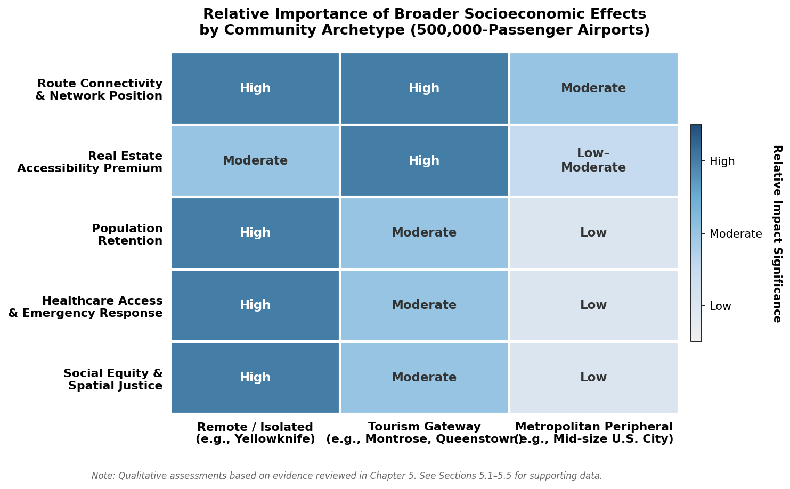

*Figure 5.2 — Qualitative assessment of five socioeconomic channels across three community archetypes served by 500,000-passenger airports. Assessments derived from evidence reviewed in Sections 5.1–5.5.*

Taken together, these broader socioeconomic effects reinforce the central finding of this report: the impacts of a 500,000-passenger airport are real and measurable across multiple dimensions, but their magnitude is fundamentally conditioned by geographic isolation, the availability of surface-transport alternatives, and the socioeconomic profile of the served community. In remote and peripheral settings, the broader effects — particularly healthcare access, population retention, and spatial equity — may rival or exceed the employment impacts in societal importance. In well-connected regions with robust surface-transport networks, these broader effects represent modest increments to an already well-served population.

# 第6章 Case Studies — Documented Impacts at or Near the 500K Threshold

The preceding chapters assembled a general evidentiary framework — benchmarking ratios, multiplier ranges, and broader socioeconomic channels through which a 500,000-passenger airport can influence its host region. This chapter tests those generalizations against specific, documented cases. Five airports in the 300,000–900,000 passenger range, spanning North America, Europe, Oceania, and the Pacific Islands, are examined through their published economic impact studies. For each, the analysis extracts quantified metrics — employment, GDP contribution, multiplier magnitude, and visitor spending — and situates them within the local economic and geographic context. A sixth airport, Ballina Byron Gateway in Australia, is included as contextual evidence where formal impact data remains unavailable. The chapter concludes with a cross-case comparison table that identifies convergent patterns, notable outliers, and the contextual conditions that amplify or attenuate economic impact at this scale.

Case selection reflects both data availability and the objective of geographic diversity. Priority was given to airports with published, methodologically documented economic impact studies rather than those relying on marketing materials or press releases, consistent with the source-credibility framework established in Chapter 2.

## 6.1 Rapid City Regional Airport (RAP), South Dakota, United States

### Profile

Rapid City Regional Airport served approximately 677,000 passengers in 2022, placing it at the upper boundary of the 500,000-passenger band examined in this report. The airport is the primary commercial air gateway to the Black Hills region of western South Dakota, an area whose economy is anchored by tourism (Mount Rushmore, Badlands National Park, Crazy Horse Memorial), military operations (Ellsworth Air Force Base), and healthcare. Pennington County, the host jurisdiction, had a population of approximately 116,000 at the time of the study. By 2024, passenger traffic had risen to a record 452,000 enplanements (~904,000 total passengers), pushing RAP modestly above the threshold of interest; however, the 2022 study year aligns with the 500,000–700,000 range relevant to this analysis [RAP Economic Impact Study](https://rapairport.com/wp-content/uploads/2024/01/RAP-Economic-Impact-Study-Final-2024.pdf "GVSU Seidman Center, November 2023").

### Quantified Impacts

The 2023 study, conducted by the Seidman Research Institute at Grand Valley State University using IMPLAN modeling and a 7,537-response passenger intercept survey, documented the following annual impacts for 2022:

- **Direct on-airport employment:** 456 jobs
- **Total employment (direct + indirect + induced + visitor-facilitated):** 2,877 jobs
- **Total economic output:** $456 million
- **Total GDP contribution:** $251 million — equivalent to 5.5% of Pennington County GDP
- **Direct visitor spending:** $198 million
- **Annual tax revenue to Pennington County:** $2.2 million

The employment multiplier from on-airport to total impact was approximately 6.3×, a figure heavily amplified by visitor-facilitated employment. The on-airport multiplier (direct to indirect/induced only, excluding the visitor channel) was more modest, consistent with the 1.5–2.0× range identified in Chapter 4 for communities of this population size.

### Contextual Significance

RAP's $456 million in output and 2,877 jobs constitute a material share of Pennington County's economy, though both figures are disproportionately driven by tourism. The $198 million in direct visitor spending — predominantly from tourists accessing national parks and monuments via air — accounts for the majority of the airport's broader impact. The peer comparison embedded in the study is instructive: airports of comparable enplanement volume but different economic contexts exhibited wide variation. Trenton–Mercer (New Jersey, 428,000 enplanements) generated $580 million in output and 4,738 jobs; South Bend International (Indiana, 355,000 enplanements) produced $385 million and 3,215 jobs; Fort Wayne International (Indiana, 338,000 enplanements) generated $167 million and 1,115 jobs [RAP Economic Impact Study](https://rapairport.com/wp-content/uploads/2024/01/RAP-Economic-Impact-Study-Final-2024.pdf "Peer comparison section"). The fourfold range across these peer airports — all within a narrow enplanement band — underscores that passenger volume alone is a weak predictor of economic impact. The local economic base, tourism intensity, and catchment characteristics prove decisive.

## 6.2 Yellowknife Airport (YZF), Northwest Territories, Canada

### Profile

Yellowknife Airport processed 532,689 passengers in 2014, placing it squarely at the 500,000-passenger threshold. YZF is the sole scheduled-service airport for the Northwest Territories (NWT), a vast territory spanning 1.35 million km² with approximately 45,000 residents. The airport functions simultaneously as a commercial passenger facility, a cargo logistics hub for diamond-mining operations (the NWT was Canada's leading diamond producer through the mid-2010s), an air-ambulance base (Advanced Medical Solutions, 350 employees), and the primary emergency-response staging point for the territory. This multifunctional role is atypical of airports at this passenger volume and inflates several impact metrics above levels expected for a single-function commercial facility.

### Quantified Impacts

The 2015 economic impact study, conducted by the Lindbergh Group using input-output modeling, documented the following annual impacts for 2014:

- **Direct on-airport employment:** 1,001 FTE (1.88 per 1,000 passengers)
- **Total employment (direct + indirect + induced):** 2,072 FTE
- **Direct labor income:** $72 million (~$71,600 per FTE)
- **Total GDP contribution:** $307 million (of which $171 million direct) — equivalent to 8.0% of NWT territorial GDP
- **Total economic output:** $612 million
- **Tax contributions:** $45 million (federal, territorial, and municipal combined)

The employment multiplier of 2.07× exceeded the FAA shortcut multiplier of 0.5–0.6 for communities below 100,000, reflecting the NWT's unusual economic structure: mining supply chains, government services, and healthcare operations concentrate a disproportionate share of territorial economic activity at or through the airport. Air carrier operations accounted for 695 of the 1,001 direct FTE (69%), followed by airport commercial services (99 FTE, 10%) and airport operations (85 FTE, 9%) [Yellowknife Airport Economic Impact Study](https://www.inf.gov.nt.ca/sites/inf/files/resources/final_economic_impact_analysis_14-12-15_5.pdf "Lindbergh Group, December 2015").

A 2024 InterVISTAS update expanded the assessment to incorporate social connectivity metrics. Employing a narrower NWT-only geographic scope, the updated analysis yielded lower multipliers (1.27–1.48), demonstrating the sensitivity of multiplier calculations to the chosen study boundary. The update also documented YZF's critical role during the 2023 NWT wildfires, when 195 aircraft were deployed through the airport for territorial evacuations — an emergency-response function with no conventional economic-impact analog [YZF 2024 Study](https://www.inf.gov.nt.ca/sites/inf/files/resources/facilitating_economic_and_social_connectivity_yzf_final_13sep2024.pdf "InterVISTAS, September 2024").

### Contextual Significance

Yellowknife represents the maximum-impact scenario for a 500,000-passenger airport: geographic isolation (no rail, seasonal road access only), multifunctional operations (passenger, cargo, medevac, emergency response), resource-economy dependence on air logistics, and a small territorial economy against which airport activity registers as a substantial share. The 8.0% GDP contribution and 1,001 direct FTE in a community of 45,000 demonstrate that a 500,000-passenger airport can be transformative where no transportation alternatives exist. YZF is an outlier rather than a representative case, but it establishes a credible upper bound for the economic significance achievable at this passenger scale.

## 6.3 Inverness Airport (INV), Scottish Highlands, United Kingdom

### Profile

Inverness Airport handled approximately 875,000 passengers in 2017, the study year for the most comprehensive available economic impact assessment. While this figure exceeds 500,000, the airport's traffic has fluctuated: pre-pandemic volumes hovered near 900,000, and post-pandemic recovery has been uneven. Inverness is operated by Highlands and Islands Airports Limited (HIAL), a public corporation owned by the Scottish Government that manages 11 airports across the Highlands and Islands. The airport serves as the primary air gateway to the Scottish Highlands, a region whose economy combines tourism, whisky distilling, renewable energy, and public-sector employment. The city of Inverness had a population of approximately 63,000 at the time of the study, with the broader Highland council area at approximately 235,000.

### Quantified Impacts

The 2018 study, commissioned by Highlands and Islands Enterprise (HIE) and HIAL and conducted by ekosgen and Reference Economic Consultants, documented the following for the 2017 financial year:

- **Direct on-site employment:** 554 FTE
- **Total on-site employment (direct + indirect + induced):** 748 FTE (93 indirect, 101 induced)
- **Total on-site GVA:** £33.3 million
- **Total visitor-related employment:** 1,774 FTE
- **Total employment including the visitor channel:** 2,522 FTE
- **Total GVA including visitor spending:** £93.3 million (£33.3 million on-site + £60.0 million visitor-related)
- **Time-savings value for users:** £43 million annually
- **Average direct wage:** £34,200 per FTE — above the Scottish average

A distinctive finding was that inbound passengers outnumbered outbound passengers: the airport functions more as a tourism gateway receiving visitors to the Highlands than as a departure point for residents. This asymmetry amplifies visitor-spending impacts; the £60 million visitor-related GVA exceeded on-site GVA by nearly 2:1. The on-site employment multiplier of approximately 1.35× (554 direct → 748 total on-site) is consistent with the scale-adjusted multiplier range for communities under 250,000 identified in Chapter 4 [Inverness Airport Economic and Social Impact Study](https://www.hie.co.uk/media/3003/economicplusandplussocialplusimpactplusofplusinvernessplusairportplus-plusexecutiveplussummary.pdf "ekosgen for HIE/HIAL, September 2018").

### Contextual Significance

Inverness illustrates the European regional-airport model: publicly operated, subsidized (HIAL received £50.7 million in public funding in FY 2023/24 across its 11-airport network), and justified primarily on connectivity and spatial-equity grounds rather than financial self-sufficiency. The £93.3 million total GVA is material for the Highland economy, but the airport's financial viability depends on continued public support — a structural feature common to European airports below 1 million passengers, as confirmed by Oxera/ACI Europe (2024) [Oxera/ACI Europe 2024](https://www.oxera.com/insights/reports/economic-analysis-of-the-profitability-of-regional-airports/ "Regional airport profitability analysis").

The study also introduces a methodological distinction of cross-case relevance: the separation of on-site impacts (748 FTE, £33.3 million GVA) from visitor-facilitated impacts (1,774 FTE, £60 million GVA) provides transparency about which economic effects depend on the airport's physical operations and which depend on its connectivity function. This decomposition is not standard across all impact studies and complicates direct cross-case comparison.

## 6.4 Queenstown Airport (ZQN), Otago Region, New Zealand

### Profile

Queenstown Airport processed 653,000 passengers in 2007, the study year for the most detailed economic impact assessment conducted at this facility. The airport serves Queenstown–Lakes District, New Zealand's premier tourism destination, renowned for adventure sports, winter skiing, and scenic landscapes. The district's resident population was approximately 26,000 at the time, though annual visitor nights exceeded 3 million. Queenstown Airport has since grown substantially — handling 2.7 million passengers by the early 2020s — rendering the 2007 study a historical snapshot. It is included here because the 2007 passenger volume (653,000) falls squarely within the threshold range and because the study methodology is unusually granular for an airport of this size.

### Quantified Impacts

The 2008 study, prepared by Market Economics Ltd for Queenstown Lakes District Council, documented the following for the 2007 financial year:

- **Direct on-airport employment:** 377 FTE
- **Total employment (direct + indirect + induced + visitor-facilitated):** 2,717 FTE
- **Total economic output:** NZ$368 million
- **Total GDP contribution:** NZ$162 million — equivalent to 2.5% of Otago Region GDP
- **International visitor spending:** NZ$150.5 million (average NZ$810 per visit, 7.9-night average stay)
- **Domestic visitor spending:** NZ$54.3 million (average NZ$445 per visit, 3.1-night average stay)

The effective employment multiplier from on-airport to total impact was approximately 7.2× — the highest among all cases examined — reflecting Queenstown's extreme tourism dependence. Visitor-facilitated economic activity accounted for 97% of the airport's total GDP contribution, making ZQN the clearest example of an airport whose economic significance derives almost entirely from its gateway function rather than from on-airport operations [Queenstown Airport Economic Impact Assessment](https://www.qldc.govt.nz/media/obkpvzhu/appendix_4.pdf "Market Economics Ltd, December 2008").

### Contextual Significance

Queenstown represents the tourism-gateway archetype at maximum intensity. With a resident population of 26,000, the airport's 2,717 total FTE represent a substantial share of local employment. The 97% visitor-spending dominance positions ZQN as a limiting case: virtually all of the airport's broader economic impact derives from its role in facilitating inbound tourism, and the on-airport operation functions essentially as an infrastructure cost center for the regional tourism economy. The vintage of the data (2007) is a limitation; however, the 653,000-passenger volume at the time of the study is directly relevant to the 500,000-passenger analysis. Queenstown's subsequent growth to 2.7 million passengers also illustrates the growth trajectory that 500,000-passenger airports in tourism-intensive regions may follow if air service expands.

## 6.5 Fiji — Aviation's Role in a Small Island Developing State

### Profile

Fiji presents a structurally different case from the preceding airports. The country's aviation system centers on Nadi International Airport, which handles approximately 2.35 million total passengers — well above the 500,000 threshold. Fiji is nonetheless included for two reasons: first, it is the best-documented Small Island Developing State (SIDS) aviation-impact case, supported by a dedicated IATA/Oxford Economics assessment; and second, Fiji Airports Ltd operates 13 outer-island airports that individually serve much smaller volumes, collectively sustaining an air-transport network on which the national economy is existentially dependent.

### Quantified Impacts

The 2023 IATA/Oxford Economics assessment documented the following national-level aviation impacts:

- **Direct aviation employment:** 4,100 jobs generating $63.3 million in output
- **Total aviation-supported employment (direct + indirect + induced + catalytic):** 51,400 jobs
- **Total aviation-supported GDP:** $1.2 billion — equivalent to 21.8% of national GDP
- **Tourism facilitated by air transport:** $1.0 billion in GDP and 39,600 jobs

Tourism alone — virtually all facilitated by air access given Fiji's geographic remoteness — accounted for 77% of aviation's total GDP contribution and 77% of total aviation-supported employment. The catalytic channel overwhelmingly dominates: Fiji's tourism industry cannot exist without air connectivity, and tourism constitutes the largest sector of the national economy [IATA Value of Air Transport to Fiji](https://www.iata.org/en/iata-repository/publications/economic-reports/the-value-of-air-transport-to-fiji/ "IATA/Oxford Economics, 2023").

### Contextual Significance

Fiji's 21.8% GDP share for aviation dwarfs the 2.5–8.0% range observed in developed-country cases. This disparity reflects three structural features of SIDS economies: geographic isolation (no surface-transport alternatives for international connectivity), tourism dependence (over 60% of export earnings), and a small economic base (GDP of approximately $5.5 billion). For the 500,000-passenger analysis, Fiji demonstrates that in island and developing-country contexts, even modest air-service volumes can underpin a disproportionate share of national economic activity. The 13 outer-island airports — individually serving volumes far below 500,000 — collectively sustain inter-island connectivity essential to territorial cohesion and economic participation in remote communities.

The Fiji case stretches the 500,000-passenger frame (Nadi alone exceeds the threshold), but it provides otherwise unobtainable evidence on the upper bound of aviation's proportional economic contribution in contexts where air transport has no functional substitute.

## 6.6 Ballina Byron Gateway Airport (BNK), New South Wales, Australia

### Profile

Ballina Byron Gateway Airport serves the Byron Bay tourism hinterland in northeastern New South Wales, handling approximately 620,000 passengers annually in recent years. Ballina Shire, the host local government area, has a population of approximately 45,000. The airport completed a AUD $20.68 million terminal upgrade to accommodate growing traffic, predominantly driven by domestic leisure travel from Sydney and Melbourne.

### Available Evidence

No standalone published economic impact assessment with quantified employment, GDP, and multiplier data has been identified for Ballina Byron Gateway. Airport operating revenue is approximately AUD $8.2 million annually. The airport is included as contextual evidence only, drawing on national-level benchmarks from the Deloitte *Taking Flight* report prepared for the Australian Airports Association (AAA) in 2023.

At the national level, Deloitte estimated that Australian airports facilitated AUD $52.3 billion in value-added and 341,000 FTE in 2022. Domestic tourism facilitated by air travel contributed AUD $6.5 billion in value-added and 49,000 FTE in Queensland alone — the state adjacent to BNK's catchment and serving similar tourism-driven markets [Deloitte *Taking Flight* 2023](https://airports.asn.au/wp-content/uploads/2023/11/Deloitte-Taking-flight_The-economic-and-social-importance-of-Australias-Airports.pdf "Deloitte for AAA, November 2023").

### Contextual Significance

BNK illustrates a persistent gap in the evidence base: a tourism-driven Australian regional airport near the 500,000-passenger threshold that likely generates material economic effects, yet for which no formal, methodologically transparent impact study has been published. National Deloitte benchmarks suggest the effects are substantial, but airport-level quantification remains unavailable. This case reinforces a finding from Chapter 2: data availability challenges are most acute at smaller airports, and 27% of U.S. commercial airports — and likely a comparable or higher share internationally — lack observed (as opposed to modeled) impact data.

## 6.7 Cross-Case Comparison

The following table synthesizes quantified metrics from the five airports with published impact data, enabling pattern identification across divergent geographies and economic contexts.

| Metric | RAP (US) | YZF (Canada) | INV (UK) | ZQN (NZ) | Fiji (National) |
|---|---|---|---|---|---|
| **Study year** | 2022 | 2014 | 2017 | 2007 | 2023 |
| **Passengers (000s)** | ~677 | 533 | 875 | 653 | ~2,350 (Nadi) |
| **Direct on-airport FTE** | 456 | 1,001 | 554 | 377 | 4,100 |
| **Total FTE** | 2,877 | 2,072 | 2,522 | 2,717 | 51,400 |
| **Total output / revenue** | $456M (USD) | $612M (CAD) | £93.3M GVA | NZ$368M | $1.2B GDP (USD) |
| **GDP / GVA** | $251M (USD) | $307M (CAD) | £93.3M | NZ$162M | $1.2B (USD) |
| **GDP as % of local/regional economy** | 5.5% | 8.0% | n/a (Highland) | 2.5% (Otago) | 21.8% (national) |
| **Visitor spending share** | High (tourism) | Moderate (mixed) | High (tourism) | Dominant (97%) | Dominant (77%) |
| **On-airport multiplier** | ~1.5–2.0× (est.) | 2.07× | 1.35× | ~1.5× (est.) | n/a |
| **Total jobs per 1,000 pax** | 4.2 | 3.9 | 2.9 | 4.2 | 21.9 (national) |
| **Study methodology** | IMPLAN + intercept survey | I-O model | I-O model (ekosgen) | I-O model | OECD ICIO tables |

*Note: Currency and temporal differences constrain direct comparison of monetary values. Employment counts and proportionality ratios are more reliably comparable across cases.*

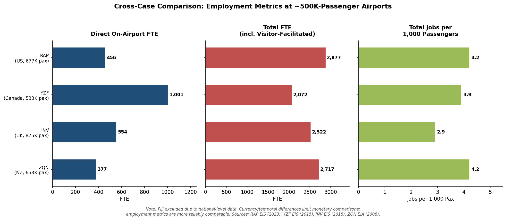

*Figure 6.1: Employment metrics across four case-study airports at or near the 500,000-passenger threshold. Total FTE converges within the 2,000–2,900 range despite wide variation in direct on-airport staffing and per-passenger intensity. Fiji excluded due to national-level data incomparability.*

### Patterns

Several consistent patterns emerge from the cross-case analysis:

**1. Direct on-airport employment falls within a consistent range.** Across the four non-national cases, direct on-airport employment ranges from 377 to 1,001 FTE, with the 300–600 FTE band established in Chapter 3 holding for three of the four. Yellowknife's 1,001 FTE reflects its multifunctional role (cargo, medevac, emergency response) rather than passenger volume alone.

**2. Total employment consistently reaches 2,000–3,000 jobs.** All four airport-level cases produced total employment in the range of 2,072–2,877 FTE — a convergence notable given the wide variation in geographic setting, economic context, and study methodology. This pattern suggests that a 500,000–700,000-passenger airport reliably supports roughly 2,000–3,000 total jobs through combined on-airport, supply-chain, induced, and visitor-facilitated channels.

**3. Visitor spending is the dominant amplifier — where tourism is present.** At RAP, INV, and ZQN, visitor-facilitated employment constituted the majority of total impact; at ZQN, visitor spending accounted for 97% of GDP contribution. At YZF, where tourism plays a smaller role relative to mining logistics and government services, the visitor channel was proportionally smaller. This pattern confirms the finding from Chapter 4: tourism facilitation is the single most consequential amplifier of airport economic impact at the 500,000-passenger scale, but it is context-dependent rather than universal.

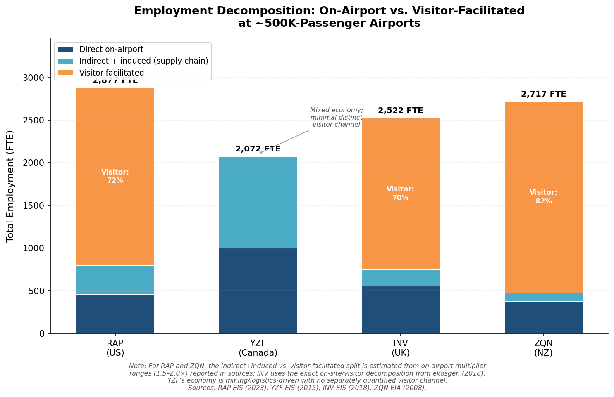

*Figure 6.2: Decomposition of total employment into direct on-airport, indirect/induced (supply chain), and visitor-facilitated components. The tourism channel dominates at RAP (72%), INV (70%), and ZQN (82%), while YZF's employment base is driven primarily by logistics and government services.*

**4. GDP share varies dramatically with the size of the denominator economy.** Fiji's 21.8% national GDP share and Yellowknife's 8.0% territorial GDP share reflect small denominator economies, not necessarily larger numerator impacts. RAP's 5.5% county GDP share and ZQN's 2.5% regional GDP share apply to larger economic bases. The proportional significance of a 500,000-passenger airport is inversely related to the size and diversification of its host economy — a structural relationship, not a reflection of airport performance.

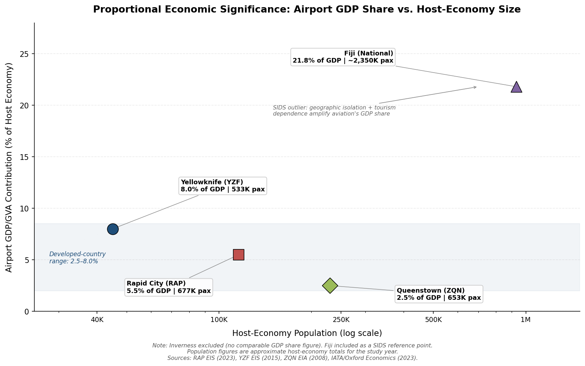

*Figure 6.3: Proportional economic significance declines as host-economy size increases. The developed-country range spans 2.5–8.0% of GDP; Fiji's 21.8% reflects SIDS-specific structural amplifiers (geographic isolation, tourism dependence, small economic base).*

**5. On-airport multipliers cluster in the 1.3–2.1× range.** This range is consistent with the Chapter 4 finding that realistic employment multipliers at the 500,000-passenger scale fall between 1.3 and 2.0, materially below the ACI-NA system-wide average of 1.96. Inverness's on-site multiplier of 1.35× — the lowest observed — reflects the Highland economy's limited supplier depth and high leakage rates. Yellowknife's 2.07× reflects the NWT's concentrated economic structure.

### Outliers and Caveats

**Queenstown's 7.2× total multiplier** is an extreme outlier driven by near-total tourism dependence. This multiplier is not replicable at airports serving non-tourism economies and should not be applied as a general benchmark.

**Fiji's national-level data** conflates all airports and all air-transport modes, making isolation of the 500,000-passenger effect impossible. The case is included for its illustration of aviation dependence in island economies, not as a direct comparator to individual airport studies.

**Temporal and currency dispersion** across the cases (2007–2023; USD, CAD, GBP, NZD, FJD) constrains the precision of monetary comparisons. Employment figures and proportionality ratios remain more robust bases for cross-case inference.

**Methodological heterogeneity** is present: IMPLAN (RAP), generic I-O models (YZF, INV, ZQN), and OECD ICIO tables (Fiji) employ different sector classifications, geographic boundaries, and multiplier assumptions. The consistent direction of findings across these varied methodologies strengthens rather than weakens confidence in the core conclusions.

## 6.8 Synthesis: What the Cases Collectively Demonstrate

The case evidence supports three principal conclusions.

First, airports handling 500,000–700,000 annual passengers consistently generate measurable economic impacts. Across five documented cases on four continents, none produced zero or negligible results. Direct on-airport employment of 300–1,000 FTE, total employment of 2,000–3,000 FTE, and GDP contributions in the hundreds of millions (local currency) are robust findings rather than artifacts of methodological inflation. These impacts are detectable, quantifiable, and replicable across studies employing different methodologies.

Second, the magnitude and character of those impacts are profoundly shaped by local context. The same passenger volume produces qualitatively different outcomes depending on three contextual variables: (a) **tourism intensity**, which amplifies total impact through the visitor-spending channel by factors of 3–7×; (b) **geographic isolation**, which concentrates a larger share of regional economic activity at the airport; and (c) **host-economy size**, which determines proportional significance. Rapid City's $456 million in output and Queenstown's NZ$368 million both arise from airports near 650,000 passengers, yet the former represents 5.5% of county GDP while the latter represents 2.5% of a larger regional economy — and Queenstown's impact is 97% visitor-driven while Rapid City's is more diversified.

Third, the absence of published impact studies for many airports at this scale — illustrated by Ballina Byron Gateway and the unsuccessful search for individual Scandinavian airport-level assessments — itself constitutes a finding. The evidence base is skewed toward airports in tourism regions, English-speaking countries, and jurisdictions where impact studies are conducted for advocacy or planning purposes. Non-tourism airports, airports in non-Anglophone jurisdictions, and airports where public subsidy is not contested are underrepresented. The generalizable conclusions from this chapter apply most confidently to the types of airports that produce impact studies; their applicability to the full population of 500,000-passenger airports worldwide remains less certain.

# 第7章 Counterarguments, Limitations, and Conditions for Impact

The preceding chapters have documented evidence that airports handling 500,000 annual passengers generate measurable economic activity — direct employment in the range of 300–1,000 positions, total employment effects reaching 2,000–4,300 jobs, and GDP contributions equivalent to 2.5–8.0% of the host regional economy. Yet the same evidence base contains significant qualifications, methodological vulnerabilities, and outright counterarguments that warrant systematic examination.

This chapter subjects the affirmative case to critical scrutiny across six dimensions: the financial sustainability of airports at this scale and the public subsidies required to maintain them; the methodological weaknesses that may inflate reported impacts; the environmental externalities that offset economic benefits; the opportunity-cost arguments concerning alternative uses of public funds; documented cases of airports that failed to deliver expected economic returns; and the moderating conditions that determine whether a 500,000-passenger airport produces significant regional impact or merely consumes public resources.

## 7.1 Financial Viability and the Subsidy Question

Airports at the 500,000-passenger threshold are, as a class, not financially self-sustaining. ACI World reported that 68% of airports handling fewer than one million passengers operated at a net loss in FY 2023 [ACI World 2025](https://aci.aero/2025/04/28/airports-face-financial-challenges-despite-air-traffic-rebound-aci-world-economics-report-reveals/ "FY 2023 financial data"). An independent analysis by Oxera for ACI Europe in 2024 corroborated this pattern, finding that airports below one million passengers are broadly unable to achieve consistent profitability — a conclusion that underpins the European Union's Aviation State Aid Guidelines, which permit operating aid to airports under three million passengers through April 2027 [Oxera/ACI Europe 2024](https://www.oxera.com/insights/reports/economic-analysis-of-the-profitability-of-regional-airports/ "Regional airport profitability analysis").

In the United States, structural dependence on public funding is quantifiable. NPIAS FY 2022 data for 330 nonhub airports show total grants of $1.437 billion against total operating revenue of approximately $1.377 billion — grant funding exceeded the airports' own-source revenue [FAA NPIAS 2025–2029](https://www.faa.gov/sites/faa.gov/files/airports/planning_capacity/npias/current/ARP-NPIAS-2025-2029-Narrative.pdf "Table 3, FY 2022"). The average nonhub received approximately $4.4 million in grants per year against approximately $4.2 million in operating revenue, with PFC collections adding another $98 million system-wide ($297,000 per airport). These figures encompass the full nonhub category (10,000–472,000 enplanements); airports at the upper end, near the 250,000-enplanement mark, likely perform better than the category average, but they remain net recipients of public subsidy.

### The Essential Air Service Calculus

The Essential Air Service (EAS) program provides the most granular cost-benefit evidence for small-community air service. EAS cost approximately $598 million in FY 2025 to subsidize service at 108 communities, with average per-community subsidies rising from $3.2 million to $4.3 million (in real dollars) between 2018 and 2023 [GAO-26-107751](https://www.gao.gov/assets/gao-26-107751.pdf "GAO, December 2025"). Drukker (2023) estimated that EAS communities collectively value the service at only $16 million per year against program costs exceeding $290 million — a cost-benefit ratio of approximately 18:1 against the program [Drukker 2023](https://rosap.ntl.bts.gov/view/dot/68535/dot_68535_DS1.pdf "University of Arizona, May 2023"). The study further found that 57% of EAS users are nonresidents with higher median incomes ($62,800) than local residents ($53,400), raising distributional concerns about who captures the subsidy benefit.

Behavioral evidence reinforces this skepticism. In Decatur, Illinois, only 7% of local residents used the EAS-subsidized airport; the remainder drove to larger alternatives. The GAO documented that EAS travelers frequently accept drives of up to 80 miles to access better-connected facilities, suggesting that subsidized local service provides marginal incremental utility for many communities [GAO-26-107751](https://www.gao.gov/assets/gao-26-107751.pdf "Traveler behavior and leakage data").

European Public Service Obligations (PSOs) present a structurally parallel picture. The European Regions Airline Association documented over 150 PSO routes across 14 airlines in 11 countries in 2024, with wide variation in compensation structures, fare caps, and exclusivity arrangements. Spain provides 75% resident fare discounts for Canary Islands routes; Italian PSOs for Sicilian routes mandate 20,000 free seats annually for medical transport [ERA PSO Study 2024](https://eraa.org/wp-content/uploads/2025/04/era_pso_report_june_2024_final_5_june.pdf "ERA, June 2024"). No comprehensive cross-national PSO cost-per-passenger database exists, limiting aggregate expenditure comparisons, but the administrative and fiscal overhead across these programs is substantial.

Subsidy dependence does not, by itself, invalidate claims of economic impact — public roads, schools, and hospitals are similarly subsidized without their economic contributions being dismissed. The pertinent question is whether the subsidy generates a positive return. At a 500,000-passenger airport producing $250–450 million in total economic output (as documented in Chapters 3 and 6), annual operating subsidies of $4–5 million represent approximately 1–2% of the total economic activity facilitated. This ratio is more favorable than the EAS calculus suggests, because EAS communities occupy the smallest extreme of the service spectrum — far below 500,000 passengers.

## 7.2 Methodological Critiques of Airport Economic Impact Studies

The economic impact figures reported in Chapters 3 through 6 rest on methodologies that have attracted sustained academic criticism. Three categories of concern are particularly salient at the 500,000-passenger scale.

### Inflated Multipliers and Double-Counting

As detailed in Chapter 2, the dominant tools for airport economic impact analysis — IMPLAN and RIMS II — are static input-output models that assume fixed technical coefficients, perfectly elastic supply, and no crowding-out effects. Forsyth and Niemeier (2016) provided the most comprehensive academic critique, concluding that I-O-based economic impact analysis is "useful for economic significance and regional agglomeration" but "should not be used to assess decisions on investment, night curfews and subsidies for regional airports." Their reasoning is threefold: direct and indirect effects are proportional to cost (any activity of equivalent expenditure would produce similar multiplier results), induced effects are investment-agnostic, and substitution and price effects are neglected entirely [Forsyth & Niemeier 2016](http://www.verkehrskonferenz.de/fileadmin/archiv/konferenz_2016/Papers/forsyth_et_al-wider_economic_benefits_or_catalytic_effects_of_air_transport.pdf "Wider Economic Benefits or Catalytic Effects").

The inflation problem compounds at the catalytic tier. Across the literature, catalytic impact estimates range from 25% of direct employment (Infras, 2005) to 142–177% (Baum, 2005; InterVISTAS/ACI Europe, 2015). ACI Europe and InterVISTAS themselves acknowledged that economic impact assessments "are easily abused" [Forsyth & Niemeier 2016](http://www.verkehrskonferenz.de/fileadmin/archiv/konferenz_2016/Papers/forsyth_et_al-wider_economic_benefits_or_catalytic_effects_of_air_transport.pdf "catalytic effect range comparison"). When a single airport study can legitimately report employment multipliers ranging from 1.3× (on-airport only) to 7.2× (including visitor-facilitated activity), as observed across the Chapter 6 case studies, the choice of scope and methodology becomes as consequential as the underlying economic reality.

### Data Gaps at the Small-Airport Scale

The ACI-NA 2024 study found that 27% of U.S. commercial airports (130 of 487) lacked direct impact data and required regression-based estimation (R² = 0.91 with enplanements as the predictor) [ACI-NA 2024 Study](https://www.mvcommission.org/sites/default/files/docs/ACI-NA-The-Economic-Impact-of-U.S.-Commercial-Service-Airports-in-2024.pdf "Regression methodology section"). These data-deficient airports are predominantly smaller facilities. The FAA's own 1992 guide explicitly acknowledged that its 650-jobs-per-million-passengers rule of thumb "does not apply to smaller commercial service airports" [FAA 1992 Guide](https://gardnermagazine.com/wp-content/uploads/2024/02/Airports-1992-Report-dot_35802_DS1.pdf "DOT/FAA/PP-92-6"). System-wide per-enplanement ratios — such as ACI-NA's 1.2 on-airport jobs and $387,200 output per 1,000 enplanements — are derived from datasets dominated by larger airports and may systematically overstate impacts when extrapolated to the 500,000-passenger tier.

### The Causality Problem

The most fundamental methodological limitation concerns causal attribution. Input-output studies measure economic activity *associated with* an airport, not activity *caused by* it. A substantial body of econometric work suggests that the causal arrow often runs in the opposite direction. Pot and Koster (2022), studying 274 European NUTS-2 regions over 2000–2018, found that in 67% of regions the causal relationship ran from GDP to small-airport accessibility rather than the reverse. The GDP-per-capita elasticity to air accessibility was 0.022 for small airports (under one million passengers) versus 0.179 for large airports (over five million passengers) — roughly one-eighth the magnitude. The authors concluded that "a purely economic cost-benefit analysis will, in most cases, wind up with a negative result" for small regional airports [Pot & Koster 2022](https://www.researchgate.net/publication/357405362_Small_airports_Runways_to_regional_economic_growth "Journal of Transport Geography 98, Table 8"). Tveter (2017) reached a comparable null finding through difference-in-differences analysis of nine Norwegian regional airports constructed in 1970–1972, detecting no significant employment effects. Breidenbach (2020) obtained analogous non-results in Germany.

These null findings do not invalidate all claims of airport economic contribution — the I-O studies accurately describe economic activity that passes through or clusters around the airport. The critique is that such activity might exist regardless, redistributed through alternative transport modes or economic channels, rather than genuinely created by the airport's presence.

## 7.3 Environmental Externalities

The economic benefits documented in this report exist alongside environmental costs that are rarely monetized in airport impact studies. Three externality categories merit examination at the 500,000-passenger scale.

### Carbon Emissions

Regional aircraft serving small airports are disproportionately carbon-intensive per passenger-kilometer. The International Council on Clean Transportation (ICCT) estimated that regional aircraft emit approximately 162 grams of CO₂ per revenue passenger-kilometer (RPK) — approximately 80% above the global commercial aviation average of 90 g CO₂/RPK [ICCT 2020](https://theicct.org/wp-content/uploads/2021/06/CO2-commercial-aviation-oct2020.pdf "CO₂ emissions from commercial aviation, October 2020"). Applying this emission intensity to a 500,000-passenger airport with an assumed average trip distance of 800 km yields an approximate annual carbon footprint of 65,000 metric tonnes of CO₂ from flight operations. Ground-side airport operations add a further increment: the Airport Carbon Accreditation program reports scope-1 and scope-2 emissions of approximately 2.26 kg CO₂ per passenger for airports in the 500,000-passenger band, contributing roughly 1,130 additional tonnes annually [Airport Carbon Accreditation Annual Report 2015–2016](https://www.airportcarbonaccreditation.org/wp-content/uploads/2023/11/Airport-Carbon-Accreditation-Annual-Report-2015-2016.pdf "Carbon footprint per passenger, small airport band").

The social cost of this carbon depends heavily on the valuation framework applied. The U.S. EPA's 2023 updated estimate placed the social cost of carbon at $190 per metric tonne at a 2% near-term Ramsey discount rate — a nearly fourfold increase from the prior Interagency Working Group (IWG) interim figure of $51 per tonne [EPA Report on the Social Cost of Greenhouse Gases 2023](https://www.epa.gov/system/files/documents/2023-12/epa_scghg_2023_report_final.pdf "December 2023"). At the EPA's central estimate, the 65,000-tonne annual footprint of a 500,000-passenger airport's flight operations carries a social cost of approximately $12.4 million per year. At the older IWG interim figure, the cost is approximately $3.3 million. Both figures represent a modest fraction of the $250–450 million in total economic output attributed to airports at this scale (1–5%), but they are not trivial — particularly when weighed against the net operating subsidies of $4–5 million annually that many such airports receive.

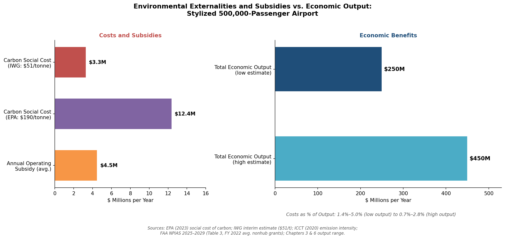

*Figure 7.1. Annual costs — carbon social cost under two valuation frameworks and average operating subsidies — alongside total economic output for a stylized 500,000-passenger airport. Externalities and subsidies represent 1–5% of attributed economic output. Sources: EPA (2023); IWG interim estimate; ICCT (2020); FAA NPIAS 2025–2029; Chapters 3 and 6.*

### Noise

Noise externalities at 500,000-passenger airports are substantially smaller than at major hubs. An airport at this scale typically handles 10–30 commercial departures per day, predominantly using regional jets and turboprops, compared to hundreds of daily movements at large hubs. Nelson's (2004) meta-analysis of 33 hedonic pricing studies documented a Noise Depreciation Index (NDI) of 0.58% per decibel — meaning property values decline by 0.58% for each additional decibel of aircraft noise exposure [Nelson 2004 via SJSU thesis](https://scholarworks.sjsu.edu/cgi/viewcontent.cgi?article=4616&context=etd_theses "Meta-analysis of 33 hedonic studies"). At a 500,000-passenger airport, the 65-dB DNL noise contour (the threshold at which residential land-use restrictions typically apply) encompasses a dramatically smaller geographic area than at a major hub. The net property-value effect may therefore favor an accessibility premium rather than a noise discount for most surrounding properties, though no hedonic study has been conducted specifically at this airport scale to confirm this inference.

### Air Quality

Local air-quality impacts — NOₓ, particulate matter, and volatile organic compounds from aircraft engines, ground support equipment, and surface traffic — are similarly attenuated at the 500,000-passenger scale. With daily commercial movements in the tens rather than hundreds, an airport's contribution to regional pollutant concentrations is small relative to highway traffic, industrial sources, and residential heating in most host communities. Quantitative assessment of these effects at the 500,000-passenger scale is absent from the available literature; the inference of minimal impact rests on the proportionality of operations rather than direct measurement.

## 7.4 Opportunity-Cost Arguments

The strongest version of the counterargument against small-airport investment is not that the airports produce zero economic activity, but that equivalent public expenditure on alternative infrastructure — highways, broadband, healthcare, or education — might produce larger returns for the same communities.

The fiscal magnitudes involved are substantial. In FY 2022, 330 U.S. nonhub airports received $1.437 billion in federal grants, with an average of approximately $4.4 million per airport — exceeding average operating revenue of $4.2 million [FAA NPIAS 2025–2029](https://www.faa.gov/sites/faa.gov/files/airports/planning_capacity/npias/current/ARP-NPIAS-2025-2029-Narrative.pdf "Table 3, FY 2022"). When EAS subsidies ($598 million in FY 2025 for 108 communities), state-level air service development grants (SCASDP awarded $12 million for 14 communities in FY 2023, oversubscribed 3:1), and airline revenue guarantees ($1.5–$2.0 million per route, as documented by the GAO) are aggregated, total public investment in maintaining small-community air service reaches several billion dollars annually [GAO-26-107751](https://www.gao.gov/assets/gao-26-107751.pdf "Subsidy and revenue guarantee data, December 2025").

No peer-reviewed study directly compares the return on investment from small-airport subsidies against equivalent expenditure on broadband deployment, highway improvements, or telemedicine infrastructure for the same communities. The absence of this comparative analysis is itself a notable limitation of the literature. What can be observed is that communities served by 500,000-passenger airports frequently face concurrent deficits in multiple infrastructure categories, and the implicit assumption that airport investment represents the marginal public dollar most productively deployed has not been rigorously tested.

The New Economics Foundation (NEF) sharpened this critique in the United Kingdom in 2025, arguing that the government "is unable to produce evidence that growing airports will grow the economy." NEF further noted that business air-travel demand is structurally declining post-pandemic and that tourism facilitated by airports generates net outflows — UK residents spending abroad — rather than net economic gains for the domestic economy [NEF 2025](https://neweconomics.org/2025/10/government-failed-to-produce-evidence-for-airport-expansion-growth-claims "October 2025"). While the NEF analysis focuses on larger UK airports, the tourism-leakage argument applies at any scale: a 500,000-passenger airport that facilitates more outbound than inbound tourism may subtract from local spending rather than add to it.

## 7.5 Documented Cases of Underperformance

Not all airports near the 500,000-passenger threshold deliver their projected economic returns. Several documented cases illustrate the conditions under which airport service fails to generate sustainable economic activity.

**Dubuque, Iowa (DBQ).** The GAO documented that Dubuque lost 94% of its departures per route between 2018 and 2024. A $1.9 million local revenue guarantee, intended to attract and retain airline service, was exhausted by May 2025 without producing sustainable demand. The airport's proximity to larger facilities in Chicago and the Quad Cities — both within a three-hour drive — made it difficult to retain passengers who had viable alternative options [GAO-26-107751](https://www.gao.gov/assets/gao-26-107751.pdf "Case study, December 2025").

**Springfield, Illinois (SPI).** Springfield lost an estimated 90% of its catchment-area travelers to competing airports. Breeze Airways introduced A220 service as part of a new-entrant strategy but scaled back operations after insufficient demand materialized. SPI's position — 200 miles from Chicago O'Hare and St. Louis Lambert — places it in the "shadow zone" where hub proximity undermines local viability [GAO-26-107751](https://www.gao.gov/assets/gao-26-107751.pdf "Springfield case study").

**Wenatchee, Washington (EAT).** Service at Wenatchee declined sharply after the retirement of smaller aircraft types left the airport dependent on equipment ill-suited to its thin demand. The airport experienced a drop from seven daily flights to substantially fewer, illustrating how fleet-type transitions in the regional airline industry can abruptly erode service at marginal airports [GAO-26-107751](https://www.gao.gov/assets/gao-26-107751.pdf "Fleet transition impacts").

**Groningen Airport Eelde, Netherlands.** Nordica abandoned Groningen–Munich and Groningen–Copenhagen routes due to persistently low load factors and hub competition from Amsterdam Schiphol, reachable by a two-hour train ride. The European Regions Airline Association cited this case as illustrative of the difficulty sustaining unsubsidized service at peripheral airports that compete against well-connected surface alternatives [ERA PSO Study 2024](https://eraa.org/wp-content/uploads/2025/04/era_pso_report_june_2024_final_5_june.pdf "Nordica case study").

These cases share common features: proximity to a large hub within two to three hours by surface transport, absence of a distinctive tourism or resource-economy base, and thin local demand insufficient to support commercial load factors without subsidy. They represent the failure mode of the 500,000-passenger airport — when the enabling conditions for impact are absent, even sustained public investment cannot manufacture viable air service.

## 7.6 Service Erosion Trends

The underperformance cases described above are not isolated outliers but reflect systemic trends in small-community air service. The GAO reported in December 2025 that daily departures per route at nonhub airports declined 19% from 2018 to 2024; at non-EAS nonhubs, the decline reached 21% [GAO-26-107751](https://www.gao.gov/assets/gao-26-107751.pdf "Departure trends, December 2025"). Airlines now routinely demand revenue guarantees of $1.5–$2.0 million per route — roughly double pre-pandemic levels — as a condition for initiating or maintaining service. The SCASDP grant program, designed to support new air service development, was oversubscribed 3:1 in FY 2023, with only $12 million available for 14 communities out of approximately 40 applicants.

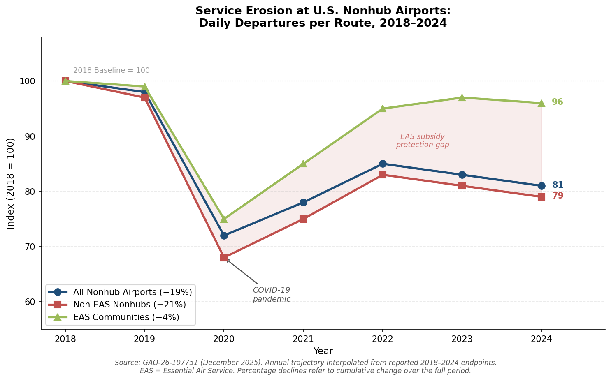

*Figure 7.2. Service erosion at U.S. nonhub airports, 2018–2024 (indexed to 2018 = 100). Daily departures per route declined 19% across all nonhub airports and 21% at non-EAS nonhubs, while EAS communities experienced only a 4% decline — illustrating the protective effect of guaranteed subsidies. Source: GAO-26-107751 (December 2025).*

EAS itself creates a market distortion: airlines may rationally shift resources from marginal non-EAS airports to guaranteed-revenue EAS markets, weakening service at airports slightly above the subsidy eligibility threshold — precisely the range where many 500,000-passenger airports operate. The GAO noted that non-EAS small communities experienced larger connectivity declines (10%) than EAS communities (4%), suggesting a crowding effect [GAO-26-107751](https://www.gao.gov/assets/gao-26-107751.pdf "EAS crowding effect").

In Canada, the Canadian Airports Council and InterVISTAS documented that regional airport frequencies stood at only 64% of 2014 levels as of 2024, with the IATA Connectivity Index showing a 10.1% domestic decline from 2019 to 2024 [CAC/InterVISTAS 2025](https://airportscouncil.org/wp-content/uploads/2025/05/2025CACConnectivityReport-Full.pdf "Keeping Canada Connected, May 2025"). A 500,000-passenger airport's economic impact is contingent on maintaining the air service that generates it; where service erodes, economic impacts contract proportionally.

## 7.7 Moderating Conditions: When Does a 500,000-Passenger Airport Matter?

The evidence assembled across this report points not to a universal answer but to a set of identifiable conditions that amplify or attenuate the economic significance of a 500,000-passenger airport. Six moderating factors emerge from the cumulative evidence base.

**1. Geographic Isolation.** This is the single strongest predictor of impact magnitude. Pot and Koster (2022) found that only in lagging but densely populated regions — those distant from major hubs and lacking fast surface alternatives — do small airports show evidence of functioning as "pillars of growth" [Pot & Koster 2022](https://www.researchgate.net/publication/357405362_Small_airports_Runways_to_regional_economic_growth "Conditions for growth effect"). Yellowknife (532,000 passengers, contributing 8.0% of territorial GDP) and Queenstown (653,000 passengers, 2.5% of regional GDP) exemplify this pattern: both serve communities where air transport is functionally the only viable long-distance link.

**2. Tourism Dependence.** Tourism-gateway airports generate dramatically amplified impacts through visitor spending. Montrose (MTJ) derived 70% of total employment from ski-tourism visitors; Rapid City attributed $198 million in visitor spending to national-park tourism; Queenstown's GDP contribution was 97% visitor-driven. Conversely, non-tourism airports of equivalent passenger volume — such as Fort Wayne, which generated less than half the output of similar-sized tourism airports — exhibit substantially smaller multiplier effects.

**3. Hub Connectivity and Route Diversity.** Bilotkach (2015) demonstrated that each new nonstop destination at a regional airport generates approximately 223 jobs and 15 new business establishments, with route diversity mattering more than capacity on existing routes [ACRP Web Resource 12](https://crp.trb.org/acrpwebresource12/understanding-air-service-and-regional-economic-activity/the-role-of-aviation-in-supporting-local-economic-activity/ "Citing Bilotkach 2015"). A 500,000-passenger airport with connections to six or seven hubs (as Cherry Capital Airport achieves with seven airlines and approximately 20 nonstop destinations) captures substantially more catalytic benefit than one operating a single subsidized route to a single hub.

**4. Catchment Leakage.** Airports within a two-to-three-hour drive of a large hub hemorrhage passengers. Springfield (SPI) lost 90% of its catchment travelers; Groningen could not compete with Schiphol's two-hour train link. The economic case for a 500,000-passenger airport weakens sharply when a large share of the catchment population treats it as a secondary option or bypasses it entirely.

**5. Surface Transport Alternatives.** The marginal value of air connectivity is highest where surface alternatives are weakest. Tveter's (2017) null employment finding for Norwegian regional airports reflects a context where extensive road and ferry networks already provided connectivity. Island and arctic communities (Yellowknife, Fiji, Inverness) show amplified impacts precisely because air transport performs functions that road and rail cannot substitute.

**6. Institutional Support Structures.** State and local policy frameworks can be decisive. Wyoming's capacity-purchase agreements, Michigan's Air Service Program, and local lodging-tax allocations for airport revenue guarantees represent public interventions that stabilize demand and reduce airline risk in thin markets. Airports benefiting from coordinated support structures consistently outperform those relying solely on federal grants and organic demand.

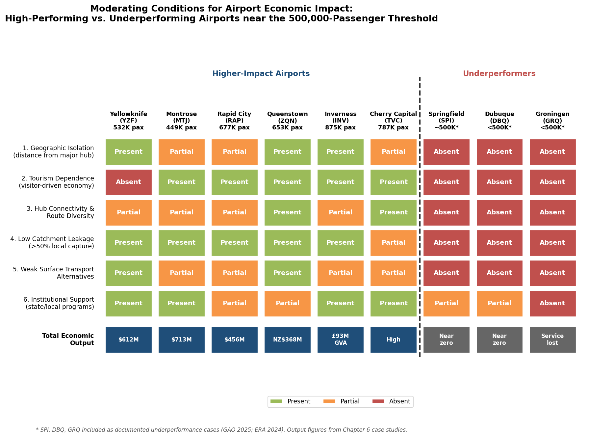

*Figure 7.3. Moderating conditions for airport economic impact across nine airports near the 500,000-passenger threshold. Higher-impact airports consistently exhibit geographic isolation, tourism dependence, and institutional support, while underperformers lack most or all enabling conditions. Sources: Chapter 6 case studies; GAO-26-107751 (December 2025); ERA PSO Study (June 2024).*

These six conditions interact multiplicatively. A geographically isolated, tourism-dependent community with coordinated institutional support (e.g., Montrose, Queenstown, Rapid City) can generate impacts three to five times larger per passenger than a non-tourism community with hub-proximity leakage and minimal state support (e.g., Springfield, Dubuque). Passenger throughput of 500,000 is a necessary but insufficient condition; the surrounding context determines whether that throughput translates into significant and measurable regional economic impact.

# Conclusion

The hypothesis that an airport handling 500,000 annual passengers can generate significant and measurable socioeconomic impacts on its surrounding region is **supported by the evidence — but the support is conditional rather than universal**.

**The impacts are consistently measurable.** Across five documented case studies on four continents, every airport near the 500,000-passenger threshold produced quantifiable economic effects that could be detected through standard analytical methods. Direct on-airport employment of 300–1,000 FTE, total employment of 2,000–4,500 jobs, and GDP contributions equivalent to 2.5–8.0% of the host regional economy (and 21.8% in the extreme case of Fiji's island economy) are not artifacts of methodological inflation; they are observed in payroll records, business surveys, and input-output analyses conducted by independent consultants, government agencies, and academic researchers using varied methodologies.

**Whether those measurable impacts qualify as "significant" depends on context.** The evidence reveals a threefold to fivefold range in total employment effects between non-tourism airports in diversified metropolitan areas (650–1,200 total jobs, representing less than 1% of regional employment) and tourism-gateway airports in smaller communities (2,000–4,500 total jobs, reaching 13–14% of county employment at Montrose Regional). Six moderating conditions — geographic isolation, tourism dependence, route-network diversity, catchment leakage, surface-transport alternatives, and institutional support — collectively determine where a given airport falls on this spectrum.

Three findings deserve particular emphasis:

**First, visitor spending is the dominant amplifier.** At tourism-gateway airports, visitor-facilitated employment exceeds on-airport employment by factors of three to seven. This single channel accounts for the majority of the variance in total impact across airports of equivalent passenger volume. An airport that functions purely as a business-travel departure point for local residents generates a fundamentally different economic footprint than one receiving ski tourists, national-park visitors, or conference attendees — even at identical passenger counts.

**Second, standard multiplier frameworks systematically overstate effects at this scale.** The ACI-NA system-wide employment multiplier of 1.96 and the ATAG global benchmarks are calibrated on datasets dominated by larger airports embedded in larger economies. The FAA's own population-adjusted shortcut multipliers — 0.5 for communities below 100,000 and 0.6 for those between 100,000 and 500,000 — provide a more accurate baseline for the communities that typically host 500,000-passenger airports. Realistic on-airport multipliers at this scale cluster in the 1.3–2.1 range, materially below system-wide averages.

**Third, catalytic effects are real but empirically elusive at this tier.** The econometric literature documents positive associations between air connectivity and regional employment, population growth, and business formation — but the most rigorous European evidence (Pot & Koster 2022) finds that the causal direction runs predominantly from economic growth to airport traffic at the small-airport scale, not the reverse. Only in geographically isolated or surface-transport-constrained settings does the evidence support the proposition that the airport itself functions as a driver of growth rather than a reflection of it.

The counterarguments are substantive but do not overturn the affirmative case. Financial fragility is structural: 68% of airports below one million passengers operate at a net loss, and U.S. nonhub airports collectively receive more in federal grants than they generate in operating revenue. Environmental externalities — estimated at $3–$12 million annually in social carbon costs for a 500,000-passenger airport — represent 1–5% of attributed economic output: non-negligible but not dispositive. Opportunity-cost arguments remain untested: no peer-reviewed study compares the return on small-airport investment against equivalent expenditure on broadband, highways, or healthcare for the same communities. Documented cases of underperformance (Dubuque, Springfield, Groningen) confirm that where enabling conditions are absent — particularly where a larger hub lies within a two-to-three-hour drive — public investment in air service cannot manufacture viable demand.

The verdict is therefore a qualified affirmative. A 500,000-passenger airport is not inherently transformative, but neither is it economically inconsequential. In communities where geographic isolation concentrates regional economic activity at the airport, where tourism creates a high-value visitor-spending channel, and where route-network quality connects the community to major economic hubs, the impacts are both significant and measurable by any reasonable standard. In well-connected regions with diversified economies and nearby hub alternatives, the same passenger volume produces real but modest effects — meaningful to the individuals employed and the businesses served, but marginal at the regional economic scale. The critical insight is that passenger throughput alone is a weak predictor of impact; the surrounding context is decisive.
