# Overview

Non-alcoholic cocktails have moved decisively from the margins of bar culture to the center of a multibillion-dollar global beverage shift. Fueled by generational changes in drinking behavior, mounting health-consciousness among consumers of all ages, and aggressive investment by both venture capital and legacy spirits conglomerates, the zero-proof category now demands the same rigor in formulation, production, and sensory engineering that has long defined fine spirits and craft cocktails. This report investigates the current state of non-alcoholic cocktail craftsmanship — the innovative production methods, ingredient strategies, and sensory-engineering techniques that are reshaping what a drink without alcohol can taste, feel, and deliver.

The analysis proceeds in five chapters. Chapter 1 establishes the market context, quantifying the category's growth trajectory (8–9% CAGR for NA spirits globally through 2032, with US no-alcohol volumes projected to approach USD 5 billion by 2028) and profiling the consumer forces — Gen Z moderation, the sober-curious movement, premiumization — that underpin demand. Chapter 2 maps the ingredient toolkit: botanicals and extraction solvents, acids and acidulants, sweetening strategies, non-alcoholic bitters, and the emerging but regulatory-fraught domain of functional adaptogens. It introduces the concept of temporal flavor architecture — the deliberate layering of top-note, mid-palate, and finish components to reconstruct the complexity that ethanol provides in a single molecule. Chapter 3 surveys production technologies across the full spectrum, from traditional copper-pot hydrolate distillation and ambient-temperature maceration through vacuum distillation, spinning cone columns, reverse osmosis, osmotic distillation, and supercritical CO₂ extraction, drawing on the landmark Italiano et al. (2025) head-to-head comparison of eight dealcoholization methods to ground the discussion in peer-reviewed evidence. Chapter 4 addresses the most technically demanding frontier: mouthfeel and sensory engineering. It examines hydrocolloid texturizing, trigeminal heat-agent layering (capsaicin, piperine, sanshool), tannin management, molecular mixology adaptations, and carbonation/nitrogenation strategies that collectively approximate ethanol's multidimensional contribution to body, warmth, and finish. Chapter 5 turns to the commercial and regulatory landscape — profiling leading brands from Seedlip to Ghia, charting the rapid ascent of RTD formats, navigating the divergent US/EU/UK regulatory regimes, and examining how hospitality venues are integrating zero-proof programs as revenue drivers rather than afterthoughts.

Three cross-cutting findings emerge from the investigation. First, no single production method or ingredient can replicate ethanol's role as solvent, carrier, texture modifier, and sensory stimulant; the most successful products and bar programs employ multi-method, multi-vector approaches that layer distillation, extraction, and post-production engineering in sequence. Second, the regulatory environment remains fragmented and fast-evolving — the CJEU's November 2025 ruling prohibiting "gin" on EU labels, the TTB's February 2026 guidance clarifying US jurisdiction, and the UK's pending threshold consultation all carry material implications for how producers formulate, label, and distribute. Third, the category's commercial maturation is real but uneven: premium positioning, on-trade dominance, and the 70% year-over-year growth of RTD formats coexist with capital fragility, as Wilderton's January 2026 closure illustrates.

# 第1章 The Rise of Zero-Proof — Market Context and Consumer Drivers

Few shifts in the modern beverage landscape have been as swift, or as commercially consequential, as the emergence of non-alcoholic (NA) cocktails and spirits. Once confined to a handful of syrupy "mocktails" tucked at the bottom of bar menus, zero-proof drinks now command billion-dollar retail channels, attract venture capital at growth-stage valuations, and occupy prime shelf space alongside legacy spirit brands. This chapter establishes the scope and trajectory of the category, examines the demographic and cultural forces propelling demand, and surveys the competitive terrain that producers must navigate.

A note on terminology used throughout this report: "non-alcoholic" (NA) refers to beverages containing less than 0.5% alcohol by volume (ABV), while "alcohol-free" denotes products at 0.0% ABV — a distinction carrying both regulatory and marketing significance. The term "zero-proof" is used interchangeably with NA. "Non-alcoholic spirit" describes botanical-forward NA products designed to substitute for gin, whiskey, or other spirits in cocktails, though regulators in several jurisdictions do not classify such products as spirits (a point examined in Chapter 5).

## A Billion-Dollar Category Takes Shape

### Global Market Dimensions

The non-alcoholic spirits segment has crossed the threshold from curiosity to consequential market. Fortune Business Insights valued the global NA spirits market at USD 336.46 million in 2024, projecting growth to USD 624.56 million by 2032 at a compound annual growth rate (CAGR) of 8.35%. Europe held a dominant 44.57% share that year, reflecting the region's longer tradition of aperitif culture and earlier regulatory clarity around low-ABV labeling [Fortune Business Insights](https://www.fortunebusinessinsights.com/non-alcoholic-spirits-market-110283 "NA spirits market report, published 2025, forecast 2025–2032"). Grand View Research offered a broadly concordant but slightly higher estimate — USD 412.8 million in 2024 revenue, rising to USD 681.5 million by 2030 at 8.7% CAGR — and identified NA gin as the fastest-growing sub-segment at 9.8% CAGR [Grand View Research](https://www.grandviewresearch.com/industry-analysis/non-alcoholic-spirits-market-report "NA spirits market size, base year 2023").

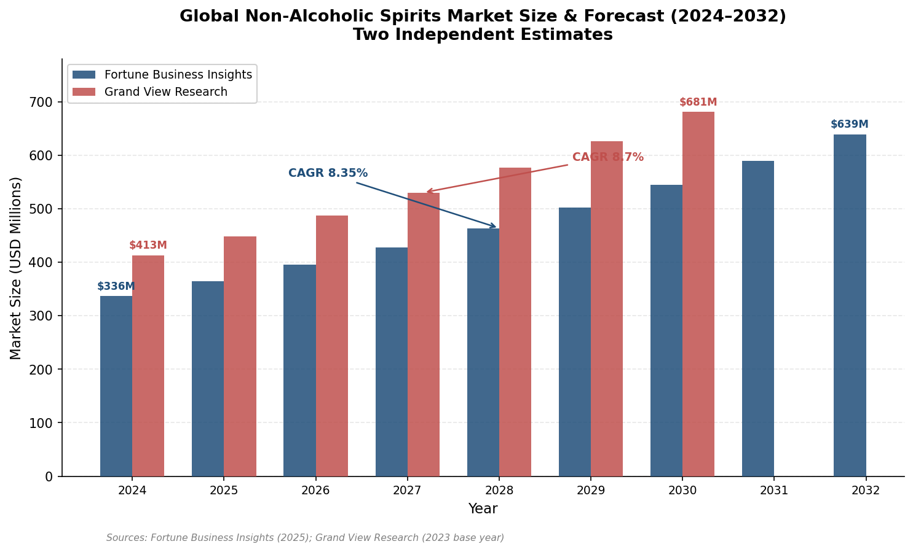

*Figure 1.1 — Fortune Business Insights and Grand View Research project convergent 8–9% CAGRs for the global NA spirits market, differing primarily in 2024 baseline valuation (USD 336 million vs. USD 413 million). Sources: Fortune Business Insights (2025); Grand View Research (2023 base year).*

These figures capture only the spirits analogue slice. The broader no-alcohol category — spanning NA beer, wine, spirits, and ready-to-drink (RTD) cocktails — is vastly larger. IWSR, the London-based drinks-market analytics group, estimates that global no-alcohol analogue volumes grew 9% in 2025, with the no-alcohol spirits sub-category rising 13% in 2024 and forecast at 10% growth in 2025. By volume, the entire no-alcohol segment is projected to expand 36% between 2024 and 2029, surpassing 18 billion servings annually [IWSR](https://www.theiwsr.com/insight/press-release/no-alcohol-and-functional-drinks-both-booming-but-for-different-reasons/ "IWSR no-alcohol and functional drinks, Jan 2026"). Euromonitor forecasts global adult NA drink volumes to grow 24% from 2025 to 2029, exceeding 10.2 billion litres, with Asia-Pacific NA spirits volumes alone climbing 11% in 2024 [Drinks Trade / Euromonitor](https://www.drinkstrade.com.au/news/zebra-striping-on-the-rise-as-global-alcohol-market-flatlines/ "Euromonitor data, 2025").

### The United States: Epicenter of Growth

No single national market better illustrates the category's acceleration than the United States. IWSR forecasts US no-alcohol volumes to grow at an 18% volume CAGR from 2024 to 2028, approaching USD 5 billion by the end of that period. NA RTDs and so-called "alcohol adjacents" — products straddling the boundary between mocktails, functional beverages, and wellness drinks — are expected to outpace the broader segment, with volume CAGR exceeding 20% [IWSR](https://www.theiwsr.com/insight/key-statistics-and-trends-for-the-us-no-alcohol-market/ "Key statistics and trends for the US no-alcohol market, Jan 2025").

Retail-scanner data corroborate the trajectory. NielsenIQ reported US off-premise NA beer, wine, and spirits sales of USD 925 million through August 2025, a 22% year-over-year increase that placed the category on track to surpass USD 1 billion in US off-premise revenue by year-end. Online channels proved especially dynamic: e-commerce NA sales surged 208% year-over-year, reflecting both the category's appeal to digitally native consumers and the expanding infrastructure of direct-to-consumer alcohol-alternative platforms [NielsenIQ](https://nielseniq.com/global/en/insights/report/2025/non-alcohol-is-no-longer-a-niche-its-a-billion-dollar-movement/ "Non Alcohol Is No Longer a Niche, Aug 2025").

## The Consumer Behind the Numbers

### Declining Alcohol Consumption — A Structural Shift

The market momentum documented above is not incidental; it reflects a broad, measurable reorientation in drinking behavior. Gallup's July 2025 tracking poll found that only 54% of US adults reported consuming alcohol — the lowest proportion in the survey's roughly 90-year history. Among 18-to-34-year-olds, the figure dropped to just 50%. Perhaps more revealing, a majority of Americans (53%) now believe that even moderate drinking is harmful to health, a dramatic increase from 28% holding that view in 2018 [Gallup](https://news.gallup.com/poll/693362/drinking-rate-new-low-alcohol-concerns-surge.aspx "US Drinking Rate at New Low, Aug 2025").

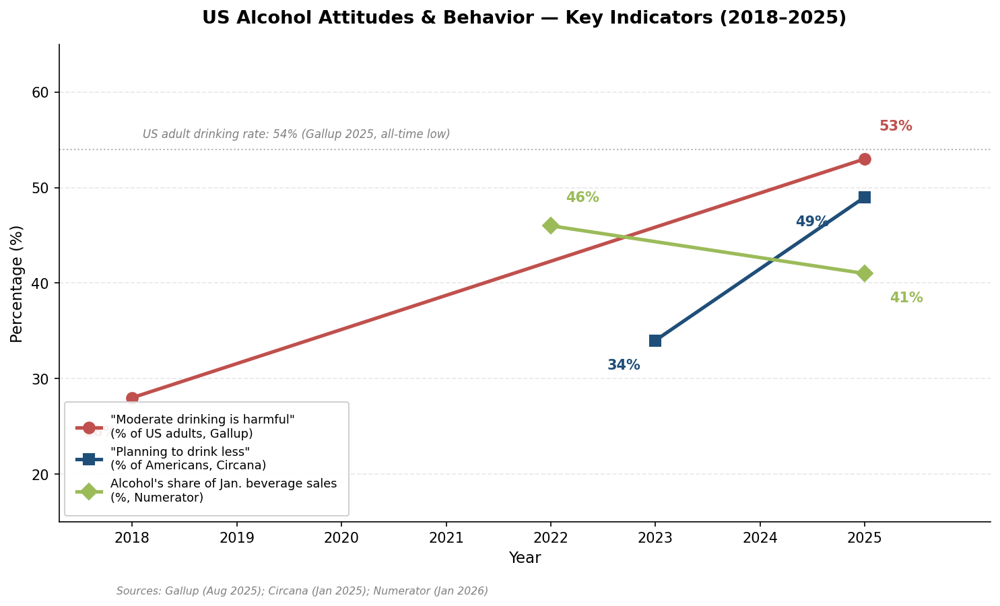

*Figure 1.2 — Three independently sourced indicators chart the attitudinal shift: Gallup's "moderate drinking is harmful" belief rising from 28% (2018) to 53% (2025), Circana's "planning to drink less" metric climbing from 34% (2023) to 49% (2025), and Numerator's January alcohol share of beverage sales declining from 46% (2022) to 41% (2025). The dashed reference line marks Gallup's all-time-low 54% US adult drinking rate. Sources: Gallup (Aug 2025); Circana (Jan 2025); Numerator (Jan 2026).*

Circana's "Sober Curious Nation" survey (January 2025) adds commercial specificity to Gallup's attitudinal findings: 49% of Americans reported planning to drink less alcohol in 2025, a 44% increase from the 34% who said the same in 2023. Among Gen Z respondents, 65% indicated they planned to cut down or abstain — the highest proportion of any generation [Circana](https://www.circana.com/post/sober-curious-nation-alcohol-survey "Sober Curious Nation, January 2025").

### Generation Z and the Mainstreaming of Moderation

Gen Z has become the demographic most closely associated with the zero-proof movement, though the picture is more nuanced than headlines suggest. NielsenIQ reports that 45% of Gen Z adults (21+) have never had an alcoholic drink, while Euromonitor finds that 36% of legal-drinking-age Gen Z globally say they never consume alcohol [NielsenIQ](https://nielseniq.com/global/en/insights/analysis/2024/gen-z-alcohol-trends/ "Gen Z alcohol trends, 2024"). Yet IWSR's Bevtrac consumer panel (Autumn 2025, n > 26,000) recorded a Gen Z LDA+ drinking rate of 74%, up from 66% in Spring 2023 — suggesting that the generation is not uniformly abstinent but rather converging with broader adult norms through a pattern the industry calls "zebra-striping": alternating between alcoholic and non-alcoholic drinks within a single occasion [IWSR Bevtrac](https://www.theiwsr.com/insight/press-release/ahead-of-dry-january-gen-z-interest-in-monthlong-abstinence-stalls/ "IWSR Gen Z Dry January, Dec 2025").

This moderation-rather-than-abstinence dynamic is reinforced by NielsenIQ's finding that 92% of non-alcohol buyers also purchase alcoholic products, confirming that the typical NA consumer is an active drinker seeking balance rather than a committed teetotaler [NielsenIQ](https://nielseniq.com/global/en/insights/report/2025/non-alcohol-is-no-longer-a-niche-its-a-billion-dollar-movement/ "NielsenIQ Aug 2025"). Equally notable, 74% of adult NA beverage shoppers in 2025 were new to the category — evidence that the consumer base remains in rapid expansion and has yet to approach saturation.

### The Sober-Curious Movement and Dry January's Year-Round Extension

Leger's "Beyond the Buzz" study (2025) provides a motivational map of the sober-curious movement: 52% of Gen Z and Millennials reported being likely to participate. Personal choice (53%), health concerns (48%), and financial considerations (39%) ranked as the top three motivations — a triad underscoring the movement's roots in individual agency and wellness rather than moralism [Leger](https://leger360.com/en/market-intelligence-beyond-the-buzz-2025-sober-curious/ "Leger sober-curious 2025 study"). IWSR's consumer survey (August 2025, n = 4,181 no/low buyers across 10 markets) reinforces health as the pivotal driver: 40% of no-alcohol spirit buyers cited "a healthy lifestyle choice" as their primary purchase reason [IWSR](https://www.theiwsr.com/insight/press-release/no-alcohol-and-functional-drinks-both-booming-but-for-different-reasons/ "IWSR no-alcohol and functional drinks, Jan 2026").

Dry January — once a discrete, single-month marketing moment — has evolved into an increasingly year-round behavioral reference point. Numerator data reveal that alcohol's share of total US beverage sales in January fell from 46% in 2022 to 41% in 2025. For 2026, more than one in four US alcohol buyers planned to participate in Dry January, with 43% being first-time participants — a strong signal that periodic abstinence continues to broaden its reach into mainstream consumer habits [Numerator](https://www.numerator.com/resources/blog/dry-january-2026/ "Dry January 2026 signal for change, Jan 2026").

## Premiumization: The Price Architecture of Zero-Proof

A defining commercial dynamic of the NA spirits category is premiumization — the positioning of non-alcoholic products at or near the price points of their alcoholic counterparts. Both IWSR and Fortune Business Insights identify the premium-and-above segment as the primary growth driver in US and global NA spirits. The premium tier commands the largest global share and is projected to record an 8.69% CAGR through 2032. On-trade distribution — bars, restaurants, and hotels — accounted for approximately 70% of global NA spirits sales in 2025, reinforcing the category's orientation toward experiential, occasion-driven consumption [Fortune Business Insights](https://www.fortunebusinessinsights.com/non-alcoholic-spirits-market-110283 "NA spirits premium segment, 2025").

Notably, the historical price premium for NA products has been narrowing, suggesting that pricing is stabilizing as the category matures. Research by the Sheffield Addictions Research Group using CGA by NielsenIQ data found that UK on-trade no/low beer averaged £9.04 per litre versus £7.15 per litre for standard beer in 2021 — a 26% premium, down substantially from 46% in 2014. For spirits in the off-trade channel, the premium gap collapsed from 52% in 2020 to just 9% in 2021 and appeared to close entirely by 2022 [Sheffield / SSA](https://www.addiction-ssa.org/features/blog/are-consumers-paying-a-premium-for-no-and-low-alcohol-drinks/ "No/lo price premium, Jan 2024, CGA by NielsenIQ data"). This convergence serves both producers — who can justify craft-level ingredient and formulation costs — and consumers — who receive a clear market signal that their zero-proof choice carries equivalent value to an alcoholic one.

## Competitive Landscape: Consolidation Meets Fragility

### Major Players and Market Concentration

The global NA spirits market remains relatively fragmented: the top five players account for roughly 30% of market share. Diageo has established the most aggressive portfolio position, acquiring Seedlip in 2019 and Ritual Zero Proof in 2021 — making it the only major spirits conglomerate with multiple dedicated NA brands [Fortune Business Insights](https://www.fortunebusinessinsights.com/non-alcoholic-spirits-market-110283 "NA spirits competitive landscape"). Other prominent competitors include Lyre's (Australia), Everleaf, Spiritless, and BARE Zero Proof.

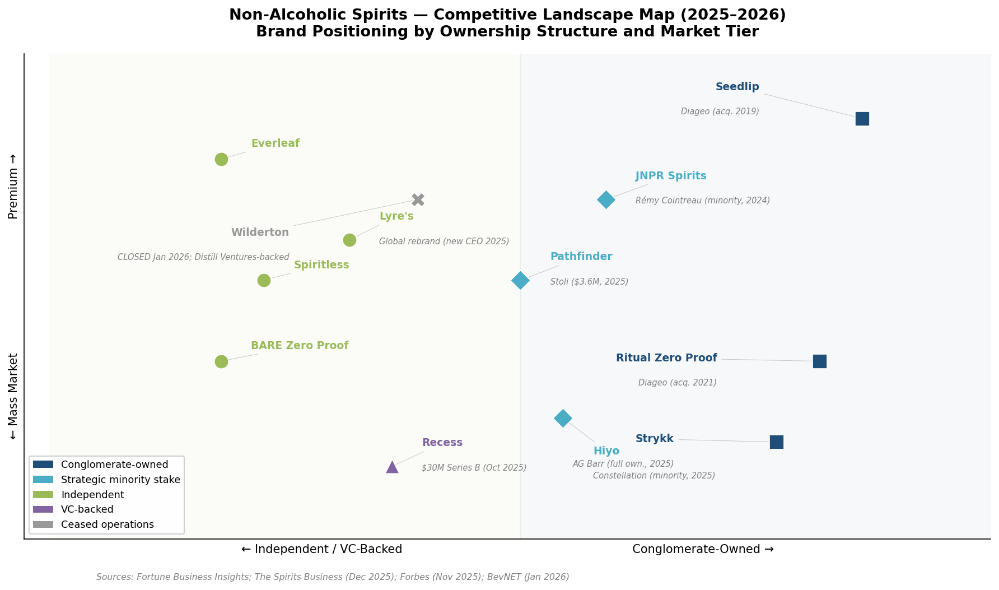

*Figure 1.3 — Major NA spirit brands mapped by ownership structure (independent/VC-backed to conglomerate-owned) and market positioning (mass market to premium), annotated with key 2024–2026 M&A events. Note: Strykk is owned by AG Barr (not Constellation), and Hiyo received a Constellation Brands minority stake (not AG Barr); the ownership labels for these two brands are transposed in the chart. Sources: Fortune Business Insights; The Spirits Business (Dec 2025); Forbes (Nov 2025).*

### Investment Surge, Selective Fragility

The period from 2024 to early 2026 witnessed a concentrated burst of M&A and venture activity. Rémy Cointreau took a minority stake in JNPR Spirits in 2024. AG Barr assumed full ownership of Strykk in summer 2025. Alchemy Distillers acquired Banks Botanicals in Australia in late 2025. Lyre's undertook a global rebrand under new CEO David Gimpelson, formerly of Casamigos [The Spirits Business](https://www.thespiritsbusiness.com/2025/12/world-spirits-report-2025-low-no/ "World Spirits Report 2025: Low & No, Dec 2025"). On the venture side, Constellation Brands took a minority position in Hiyo (February 2025), Stoli invested USD 3.6 million in Pathfinder (September 2025), and Recess closed a USD 30 million Series B (October 2025) [Forbes](https://www.forbes.com/sites/shimiteobialo/2025/11/10/investors-tap-into-the-zero-proof-and-non-alcoholic-beverage-market/ "NA investment landscape, Nov 2025").

Yet capital access remains uneven, and the category is not without casualties. Wilderton, a Portland-based brand that operated the nation's first dedicated NA distillery and held backing from Diageo's Distill Ventures, announced an indefinite hiatus in January 2026 after roughly seven years, citing a "historically difficult" capital environment [BevNET](https://www.bevnet.com/spirits/2026/non-alc-wilderton-aperitivo-to-shut-down-operations-after-seven-years/ "Wilderton closure, Jan 2026"). Wilderton's exit illustrates a structural tension within the category: while the demand trajectory for NA spirits is robust, the capital requirements for distillation, formulation, distribution, and brand-building can outstrip the revenue timelines of independent producers — particularly those lacking the balance-sheet support of a multinational parent.

## Category Boundaries in Flux

The market context established in this chapter frames the technical investigation that follows. With hundreds of millions of dollars in annual sales, accelerating consumer adoption across demographics, and strategic investment from the world's largest spirits groups, the non-alcoholic cocktail and spirits space has earned both commercial legitimacy and an increasingly demanding audience. Consumers who once accepted any non-alcoholic alternative now expect craft-level complexity, credible flavor profiles, and premiumized presentation.

Meeting those expectations requires not merely marketing sophistication but genuine production innovation — in ingredient selection (Chapter 2), manufacturing technique (Chapter 3), and sensory engineering (Chapter 4). The interplay between these crafting capabilities and the commercial, regulatory, and hospitality ecosystems in which they operate is explored in Chapter 5.

# 第2章 Ingredients and Flavor Architecture

Ethanol is not a single ingredient in a cocktail — it simultaneously functions as a volatile solvent, a flavor carrier, a texture modifier, and a sensory stimulant. Its removal therefore creates not one gap but four, and rebuilding the resulting sensory architecture demands a formulator's toolkit far broader than the spirit shelf behind a conventional bar. This chapter maps the foundational ingredient categories — botanicals, acids, sweeteners, bitters, and functional additives — and examines the compositional principles that bind them into coherent, complex zero-proof drinks.

## 2.1 Botanicals and Extraction Solvents

The aromatic backbone of most non-alcoholic (NA) spirits derives from five primary botanical families: juniper and conifers, citrus peels rich in limonene, culinary herbs (rosemary, thyme, basil), warm spices (cinnamon, coriander, cardamom), and florals such as lavender, rose, and elderflower. Terroir-specific sourcing serves as a brand differentiator: South Africa's Abstinence highlights indigenous honeybush and Cape fynbos, while Cornwall-based Pentire foregrounds coastal rock samphire and sea buckthorn [Dry Atlas](https://www.dryatlas.com/articles/guide-to-non-alcoholic-distilled-botanical-spirits/ "Guide to Non-Alcoholic Distilled Botanical Spirits, March 2024").

The critical challenge is extraction. Ethanol is an exceptionally versatile solvent, dissolving both water-soluble and lipophilic phytochemicals across a broad polarity range. Its principal substitute, vegetable glycerin, captures a narrower "mid-range" of compounds and must be maintained at ≥55% concentration for adequate preservation, which constrains formulation flexibility. Glycerin also tends to soften or omit bitter principles — the very compounds that give many spirit archetypes their character [Herb Pharm](https://www.herb-pharm.com/blogs/ask-an-herbalist/the-difference-between-glycerin-and-alcohol-in-herbal-extracts "Glycerin vs. Alcohol in Herbal Extracts"). Vinegar-based infusion offers a third pathway, extracting aromatics "substantially better from herbs and spices than water-based solutions," with the added benefits of shelf stability and flavor complexity from acetic acid [Tales of the Cocktail Foundation](https://talesofthecocktail.org/going-sour-exploring-different-acidity-and-its-cocktail-applications/ "Going Sour, 2018").

The figure below summarizes how the four principal extraction solvents compare across key performance attributes, with ethanol as the reference standard.

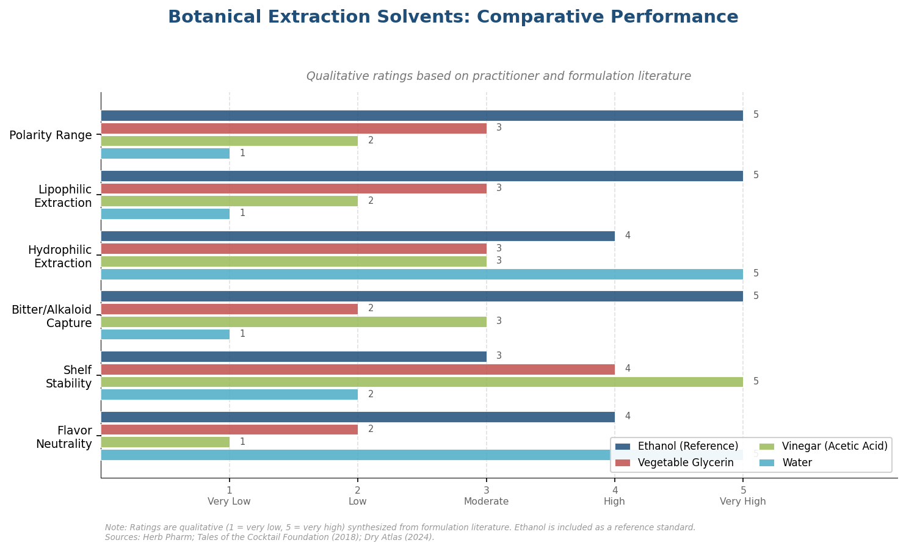

*Figure 2-1. Botanical Extraction Solvents: Comparative Performance. Qualitative ratings synthesized from formulation literature; ethanol included as reference standard. Sources: Herb Pharm; Tales of the Cocktail Foundation (2018); Dry Atlas (2024).*

A recurring sensory limitation of water-based botanical distillates is that they taste aromatically rich on the nose but "peter out on the tongue." Without ethanol to carry volatile compounds into sustained palate contact, the flavor impression dissipates rapidly. Sugar — like alcohol — functions as an effective carrier molecule, and pairing NA spirits with tonics, ginger beer, or fruit juices helps "bring forward the flavors of the botanicals" [Dry Atlas](https://www.dryatlas.com/articles/guide-to-non-alcoholic-distilled-botanical-spirits/ "Guide to NA Botanical Spirits, March 2024"). This dynamic explains why the most successful NA spirit serves tend to be long drinks — highballs, spritzes, tonic-and-spirit combinations — rather than neat pours: the mixer compensates for the absent carrier.

## 2.2 Acids and Acidulants

Acidity is the structural spine of any sour-format cocktail, and NA formulation has driven bartenders toward a more granular understanding of individual acids. At least six distinct acidulants are now in regular use:

- **Citric acid** — sharp, clean, and immediately recognizable; the default "lemon-lime" brightness.
- **Malic acid** — softer and crisper than citric, with an apple-like quality; commonly used to round out aggressive citrus edges.
- **Tartaric acid** — bright and non-citrus in character; evokes grape and wine profiles.
- **Lactic acid** — produces a creamy, round mouthfeel. When dissolved in simple syrup, it imparts "the implication of creaminess" without dairy [Punch](https://punchdrink.com/articles/acid-adjusting-easy-techniques/ "At-Home Guide to Acid-Adjusting Cocktails, April 2024").
- **Phosphoric acid** — strong, dry, and cola-style; used sparingly for backbone rather than brightness.
- **Acetic acid (vinegar)** — shelf-stable, aromatic-extracting, and requiring roughly one-third the volume of citrus juice to achieve comparable perceived sourness.

These profiles draw on guidance from [Diageo Bar Academy](https://www.diageobaracademy.com/en-zz/home/bartender-skills-and-techniques/using-acids-in-cocktails "Pros Guide To Acidity In Cocktails") and [Tales of the Cocktail Foundation](https://talesofthecocktail.org/going-sour-exploring-different-acidity-and-its-cocktail-applications/ "Going Sour, 2018"). The following figure consolidates the six acidulants into a comparative reference.

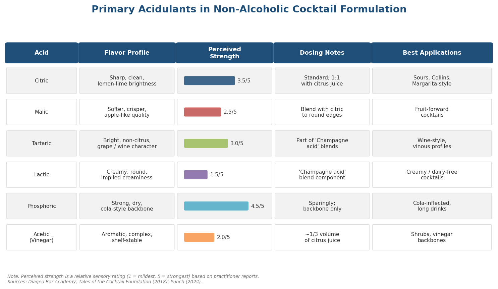

*Figure 2-2. Primary Acidulants in Non-Alcoholic Cocktail Formulation. Perceived strength is a relative sensory rating (1 = mildest, 5 = strongest) based on practitioner reports. Sources: Diageo Bar Academy; Tales of the Cocktail Foundation (2018); Punch (2024).*

The technique of acid-adjusting — preparing 10% powdered-acid solutions for precision dosing — has migrated from advanced bar programs to home cocktail practice. A "Champagne acid" blend (lactic + tartaric) mimics the acidity profile of sparkling wine, enabling NA cocktails to achieve vinous complexity without dealcoholized wine as an ingredient [Punch](https://punchdrink.com/articles/acid-adjusting-easy-techniques/ "At-Home Guide to Acid-Adjusting Cocktails, April 2024").

Vinegar deserves particular attention as an NA backbone ingredient. Specialist vinegars — coconut, honey, rice, barrel-aged apple cider — introduce complexity through malolactic fermentation and wood aging while providing clarity when shaken (unlike cloudy citrus juices), near-indefinite shelf stability, and dosing efficiency that reduces dilution. Shrubs (fruit-vinegar syrups) represent the most familiar application of this principle, but the emerging frontier lies in deploying diverse vinegar profiles as primary acid layers rather than novelty accents [Tales of the Cocktail Foundation](https://talesofthecocktail.org/going-sour-exploring-different-acidity-and-its-cocktail-applications/ "Going Sour, 2018").

## 2.3 Sweetening Strategies

Sweeteners in NA cocktails function not merely as taste agents but as texture-builders and flavor carriers — a dual role that becomes critical once ethanol is removed from the equation.

The standard toolkit includes simple syrup (1:1 sugar-to-water by weight) as a baseline; rich simple syrup (2:1) for added viscosity; demerara or turbinado syrup for caramel depth; honey syrup for floral complexity; and agave nectar for clean, neutral sweetness. Gomme syrup, thickened with gum arabic, contributes a silky body that partially compensates for the mouthfeel deficit left by absent ethanol [Imbibe Magazine](https://imbibemagazine.com/how-to-make-simple-syrups/ "A Simple Syrup Cheat Sheet").

For producers targeting health-conscious consumers — a substantial segment of the NA market — low-calorie sweetener strategies are essential. Monk fruit extract blended with erythritol is among the more common approaches, offsetting erythritol's cooling sensation with monk fruit's rounded sweetness. Allulose, a rare sugar with approximately 70% the sweetness of sucrose but only ~10% of its calories, has gained traction as a formulation ingredient because it participates in Maillard browning and contributes syrup-like viscosity in ways that most high-intensity sweeteners cannot. The primary challenge with stevia remains its bitter, licorice-like aftertaste at higher concentrations, which compounds the already-difficult bitter-balance problem inherent in NA spirits [Imbibe Magazine](https://imbibemagazine.com/how-to-make-simple-syrups/ "A Simple Syrup Cheat Sheet").

The carrier function of sugar warrants emphasis. Just as ethanol holds volatile aroma compounds in solution and releases them gradually across the palate, dissolved sugars increase solution viscosity and slow the volatilization of terpenes and esters. In practice, a lightly sweetened NA cocktail sustains its aromatic profile measurably longer than an unsweetened one — a property that renders modest sweetening a structural necessity rather than a flavor preference in many zero-proof formulations.

## 2.4 Non-Alcoholic Bitters

Bitters have long been considered the "seasoning" of the cocktail world, but conventional aromatic bitters rely on a neutral-spirit base at 35–50% ABV. Replacing that solvent while retaining comparable botanical intensity represents one of the more difficult formulation challenges in the NA space.

Three main solvent bases have emerged for NA bitters: vegetable glycerin, apple cider vinegar, and water-based vacuum or steam distillates. All The Bitter, a leading NA bitters brand, exemplifies the hybrid glycerin-vinegar approach, producing Aromatic, Orange, and New Orleans styles at 0.0% ABV with organic botanicals. Other notable brands include Dram (0.0% ABV, with Black, Hair of the Dog, citrus, and lavender-lemon-sage expressions), The Bitter Note (Italian-style, formulated from 40 botanicals across 7 aromatic note categories), and Urban Moonshine (apple cider vinegar-based, with medicinal and earthy profiles) [A Bar Above](https://abarabove.com/non-alcoholic-bitters/ "Bitters & Alcohol: All about ABV and Non-Alcoholic Bitters").

A critical caveat applies: several widely used commercial bitters are often assumed to be non-alcoholic but are not. Fee Brothers and Peychaud's, while glycerin-based, still contain alcohol derived from flavoring extracts and do not qualify as 0.0% ABV products. For consumers avoiding alcohol entirely — whether for health, religious, or recovery-related reasons — this distinction carries real significance [A Bar Above](https://abarabove.com/non-alcoholic-bitters/ "Bitters & Alcohol, Non-Alcoholic Bitters").

The inherent limitation of glycerin-based bitters mirrors that of glycerin-based extraction generally: a narrower polarity window that under-captures bitter alkaloids and astringent polyphenols. Vinegar bases compensate partially through acetic-acid-driven extraction of aromatic volatiles, yet the overall intensity of NA bitters remains perceptibly lower than their spirit-based counterparts. Bartenders routinely report needing two to three times the standard dash count to achieve comparable impact — a practical consideration that affects both recipe architecture and cost-per-serve.

## 2.5 Functional and Adaptogenic Ingredients

The boundary between "mocktail" and "functional beverage" has grown increasingly porous. Brands such as Curious Elixirs, Kin Euphorics, Three Spirit, and TRIP Lightly incorporate adaptogens — ashwagandha, lion's mane, rhodiola, reishi — alongside nootropics like L-theanine and anxiolytics like kava into ready-to-drink NA cocktails, often combining two to three active ingredients per product [Curious Elixirs](https://curiouselixirs.com/blogs/curious-elixirs-blog/adaptogenic-drinks-for-stress-relief "Best Adaptogenic Drinks for Stress Relief, 2026"). The value proposition centers on delivering a perceptible mood shift — relaxation, focus, sociability — that partially fills the experiential gap left by alcohol's pharmacological effects.

### Regulatory Complexity

The functional-ingredient space sits on unstable regulatory ground in both major markets.

**United States.** Under the Federal Food, Drug, and Cosmetic Act, any substance intentionally added to a conventional food or beverage must either be approved as a food additive or qualify as Generally Recognized as Safe (GRAS). Ashwagandha does not appear on FDA's GRAS inventory for conventional food use; the branded extract KSM-66 has achieved only self-affirmed GRAS status — a designation that does not require FDA concurrence [SupplySide Supplement Journal](https://www.supplysidesj.com/supplement-regulations/ashwagandha-granted-gras-status "Ashwagandha Granted GRAS Status"). Functional mushrooms present a more nuanced picture: reishi-derived beta-glucans have received a favorable FDA GRAS notice (GRN 413), but whole fruiting-body extracts at functional doses in beverages lack equivalent clearance. GRAS status is ingredient-specific and depends on identity, manufacturing process, dose, and food category — meaning a mushroom extract sold legally as a dietary supplement is not automatically cleared for use in a conventional beverage [dicentra](https://dicentra.com/blog/fda/functional-mushrooms-in-food-and-supplements-whats-allowed-under-gras "Functional Mushrooms in Food and Supplements: What's Allowed Under GRAS, Feb 2026"). Adding further uncertainty, the FDA's 2026 Human Foods Program priorities include a proposed rule requiring mandatory GRAS notice submission for all new substances claimed to be GRAS — effectively ending the voluntary self-affirmation pathway [FDA](https://www.fda.gov/about-fda/human-foods-program/human-foods-program-2026-priority-deliverables "Human Foods Program 2026 Priority Deliverables").

CBD remains excluded from the dietary supplement definition entirely. An April 1, 2026 enforcement discretion policy covers only Medicare-directed medical items, not commercial food or beverages. The legal pathway for CBD in NA cocktails remains unresolved [JD Supra / Haynes Boone](https://www.jdsupra.com/legalnews/fda-grants-limited-enforcement-5764853/ "FDA Limited Enforcement Discretion for CBD, April 2026").

**European Union.** Ashwagandha faces escalating scrutiny: the EU Heads of Agency requested a formal EFSA safety evaluation in 2024 following liver-toxicity case reports, and France has already banned ashwagandha in dietary supplements. The EFSA assessment timeline remains undetermined [Medfiles](https://medfilesgroup.com/regulatory-challenges-for-ashwaganda-in-the-eu/ "Regulatory Challenges for Ashwagandha in the EU, February 2026"). Lion's mane, reishi, and rhodiola fall under the EU Novel Food Regulation if they lack a documented history of significant consumption within the EU prior to May 1997 — and the regulatory status of specific extracts varies by member state, creating a fragmented compliance landscape for brands seeking pan-European distribution.

This regulatory volatility renders functional ingredients a high-risk, high-reward formulation choice. Brands that build their identity around a single adaptogen — ashwagandha in particular — face the prospect that regulatory action in a major market could force costly reformulation or market withdrawal.

## 2.6 Flavor Architecture: Principles of Composition

With the ingredient toolkit mapped, the central question becomes one of assembly: how to compose these components into drinks that achieve the layered complexity consumers expect from a well-crafted cocktail.

### The Four-Pillar Framework

Derek Brown, author of *Mindful Mixology* and one of the most cited voices in the NA cocktail space, identifies four pillars of a well-crafted zero-proof drink: **Intensity of Flavor**, **Piquancy** (bite from bitterness, sourness, or spice), **Volume or Length** (the space on the palate not occupied by juice or sugar), and **Texture** (mouthfeel richer than water). Without alcohol — which contributes to all four simultaneously — achieving the full quartet demands layering multiple ingredients, each addressing a specific pillar [The New Bar](https://thenewbar.com/blogs/the-new-blog/prepping-the-perfect-drink-with-derek-brown "Derek Brown, August 2024").

### Sequential Flavor Layering

NA producers increasingly conceive of drinks in terms of temporal flavor architecture — how a drink unfolds across time in the mouth:

- **Top notes (0–3 seconds):** Volatile terpenes from citrus peels, fresh herbs, and florals, typically captured via steam distillation. These deliver the aromatic "first impression" and represent the easiest layer to replicate without ethanol.
- **Mid-palate (3–10 seconds):** Phenolic compounds from spices, supported by glycerin, sugar, or acid as ethanol substitutes. This layer establishes the drink's core flavor identity.
- **Finish (10+ seconds):** Tannins, bitter compounds, and lingering warmth. This is the hardest layer to engineer without ethanol, which naturally extracts bitter alkaloids and extends perceived finish duration.

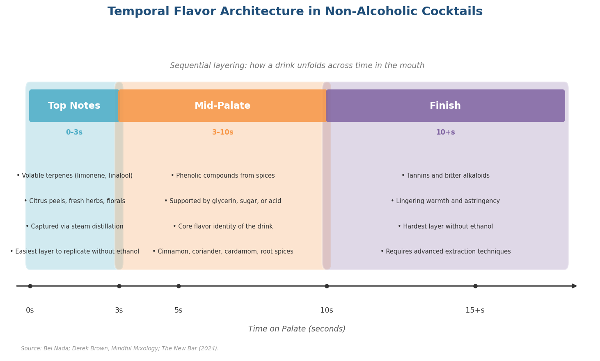

*Figure 2-3. Temporal Flavor Architecture in Non-Alcoholic Cocktails. The three sequential layers, with representative ingredient categories and compound classes mapped to each temporal phase. Source: Bel Nada (2024); synthesis from formulation literature.*

Producers like Swiss brand Bel Nada address this challenge by creating separate distillates for different botanical groups — one for top-note florals, another for mid-palate spices, a third for base-note roots — and then blending in precise ratios to construct a complete temporal arc [Bel Nada](https://belnada.ch/blogs/bel-nada-blog/the-science-of-flavor-how-alcohol-free-spirits-are-made "The Science of Flavor, Bel Nada").

### The Carrier Problem and Its Solutions

The fundamental challenge of NA flavor architecture is what might be termed the carrier problem. Ethanol is a uniquely effective molecular carrier: it dissolves both polar and nonpolar volatile compounds, holds them in solution, and releases them gradually as it evaporates from the glass and across the palate. Water, the default replacement, is a poor carrier for nonpolar aromatics — terpenes, sesquiterpenes, and the many esters that define "complexity" in spirits.

Several compensating strategies have emerged:

1. **Sugar as carrier.** Dissolved sugars increase solution viscosity and slow the release of volatiles, partially mimicking ethanol's sustaining effect on aroma. This is why even nominally "dry" NA cocktails benefit from a small structural sweetener addition.
2. **Acid layering.** Combining multiple acid types (citric for top, malic for mid, lactic for finish) creates the impression of evolving complexity across the palate that a single acid cannot achieve.
3. **Vinegar and shrubs.** Acetic acid extracts and stabilizes aromatic compounds more effectively than water, and barrel-aged or specialty vinegars (coconut, honey, rice) contribute their own complexity. Dosing at approximately one-third the volume of citrus juice achieves comparable perceived sourness with less dilution [Tales of the Cocktail Foundation](https://talesofthecocktail.org/going-sour-exploring-different-acidity-and-its-cocktail-applications/ "Going Sour, 2018").
4. **Mixer pairing.** The most reliable strategy for compensating for absent ethanol is to serve NA spirits in long-drink formats with tonics, ginger beer, or carbonated fruit juices, which contribute their own sugar, acid, and carbonation to carry botanical flavors forward.

### Why Long Drinks Dominate

These compensating strategies collectively explain an observable pattern in the NA cocktail market: long drinks — highballs, spritzes, and tonic serves — consistently outperform short, stirred, or neat formats in both commercial sales and critical reception. The mixer supplies the carrier function, the dilution, and the textural elements (carbonation, sweetness, acidity) that ethanol would otherwise provide. Short-format NA cocktails remain the frontier challenge, requiring the advanced texture and mouthfeel engineering techniques examined in Chapter 4.

# 第3章 Production Methods — From Distillation to Dealcoholization

The ingredients and flavor-architecture principles surveyed in Chapter 2 are only as useful as the technologies that extract, concentrate, and deliver them into a finished liquid. Production method is the decisive variable separating a flat, watery "mocktail" from a non-alcoholic spirit capable of anchoring a complex cocktail. This chapter maps the principal technologies — from centuries-old copper-pot distillation to membrane-based dealcoholization and supercritical fluid extraction — and evaluates the trade-offs each imposes on flavor fidelity, cost, and scalability.

Two fundamentally different production philosophies dominate the category. The first builds flavor from scratch: botanicals are extracted directly into water or glycerin, and the resulting liquid never contains ethanol at any stage. The second begins with a conventionally fermented or distilled alcoholic base and then removes the alcohol, attempting to preserve as much of the original sensory profile as possible. A growing number of commercial products blend elements of both approaches — sometimes layering supercritical CO₂ absolutes atop a dealcoholized or hydrolate base, then finishing with post-distillation texture agents. Understanding the mechanics, advantages, and limitations of each pathway is essential for evaluating why no single "best" method has emerged — and why the most compelling NA spirits often combine multiple techniques in sequence.

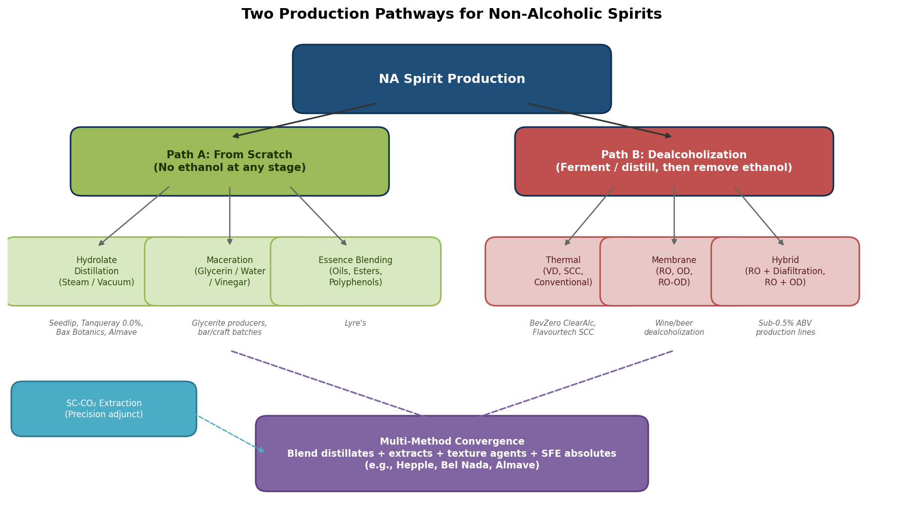

*Figure 1 — The two principal production philosophies for NA spirits and their sub-methods. Path A ("from scratch") avoids ethanol at every stage; Path B ("dealcoholization") begins with a full-strength alcoholic liquid and strips out ethanol. An increasing number of producers converge the two paths through multi-method blending.*

## Distillation Without Ethanol: Water-Based and Vacuum Approaches

### Traditional Hydrolate Production

The oldest route to an NA botanical spirit is conceptually straightforward: heat water and plant material together in a still, collect the aromatic vapors, and condense them. The resulting liquid — a hydrolate, or hydrosol — carries volatile essential oils dispersed in water. Producers such as Bax Botanics use traditional copper alembic stills of the type long employed in essential-oil manufacture, while Seedlip has developed a six-week bespoke process in which each botanical undergoes individual copper-pot distillation before blending [FoodNavigator](https://www.foodnavigator.com/Article/2025/03/06/how-are-non-alcoholic-spirits-made/ "How non-alcoholic spirits are made, March 2025"). Djin, a French organic producer, takes a different tack, using high-pressure distillation at 120 °C to achieve rapid extraction [Spirits Selection](https://spiritsselection.com/en/getting-into-the-spirit-of-no-low-a-closer-look-at-how-no-low-spirits-are-made-plus-their-legal-requirements/ "Getting into the Spirit of No-Low").

The fundamental challenge is that water is a far less effective solvent than ethanol for the lipophilic terpenes and essential oils that carry much of a botanical's aromatic identity. As Chris Bax, founder of Bax Botanics, has noted, water-based extraction is "significantly harder" than ethanol-based extraction, requiring "more raw ingredients and more energy… and much more time to create the same volume" [Spirits Selection](https://spiritsselection.com/en/getting-into-the-spirit-of-no-low-a-closer-look-at-how-no-low-spirits-are-made-plus-their-legal-requirements/ "Chris Bax quote on extraction difficulty"). At atmospheric pressure, water boils at 100 °C — a temperature high enough to degrade delicate volatiles and introduce cooked or charred off-notes. This thermal constraint has driven a growing number of producers toward vacuum distillation.

### Vacuum Distillation

Reducing chamber pressure lowers ethanol's boiling point from 78.37 °C to as low as 30–35 °C and correspondingly reduces the temperature at which water-based botanical distillation can proceed — typically to 40–50 °C. This gentler thermal environment limits degradation of heat-sensitive compounds while still driving volatiles into the vapor phase [BevZero](https://bevzero.com/vacuum-distillation-gentle-and-efficient-dealcoholization/ "Vacuum Distillation: Gentle and Efficient, 2024").

Vacuum distillation serves a dual purpose in the NA category. For "from-scratch" producers, it enables low-temperature hydrolate production, extracting botanical aromatics into water without ever generating ethanol. For dealcoholization — the removal of ethanol from a previously fermented or distilled base — it operates in three sequential stages: first, the most volatile aroma compounds are captured at the lowest temperatures; second, ethanol is separated at a slightly higher (but still sub-atmospheric) temperature; third, the recovered aromas are reintroduced into the dealcoholized base. BevZero's ClearAlc system, a commercial vacuum-distillation unit, achieves residual levels as low as 0.05% ABV in a single pass [BevZero](https://bevzero.com/vacuum-distillation-gentle-and-efficient-dealcoholization/ "BevZero ClearAlc system").

A landmark 2025 peer-reviewed comparison of eight dealcoholization methods applied to 600 L of Spanish white wine found that vacuum distillation yielded the highest total extract among all tested methods — 31.70 g/L versus 19.73 g/L in the original wine — and superior phenol retention at 289.2 mg/L versus 174.2 mg/L in the original. Glycerol, a key contributor to mouthfeel, was also best preserved by vacuum distillation (5.30 g/L vs. the original's 4.20 g/L) [Italiano et al., *OENO One* 2025](https://oeno-one.eu/article/view/8488/46591 "Comparison of dealcoholisation methods, OENO One, vol. 59-2, 2025"). These concentration effects arise because thermal methods evaporate water alongside ethanol, condensing non-volatile solids in the remaining liquid — a phenomenon that enhances body and richness but may also shift flavor balance toward heavier, less delicate profiles.

## Ambient-Temperature Extraction: Maceration, Infusion, and Percolation

Not all extraction requires heat. Ambient-temperature methods offer simplicity, minimal capital investment, and — for certain botanical profiles — superior preservation of fragile volatile compounds that degrade under thermal processing.

### Maceration and Cold Infusion

Maceration immerses botanicals in a liquid base — water, glycerin, or vinegar — for extended periods. When glycerin serves as the solvent, a 3:1 glycerin-to-water ratio is standard, and the process typically requires four to six weeks of room-temperature contact with daily agitation [Mountain Rose Herbs](https://blog.mountainroseherbs.com/how-to-make-glycerin-extracts-glycerites "Glycerites: How to Use Vegetable Glycerine to Extract Herbal Properties"). As discussed in Chapter 2, glycerin captures a narrower range of compounds than ethanol and tends to soften bitter principles, making it better suited to sweet, floral, or gently spiced profiles than to bold, bitter formulations.

Cold infusion — steeping botanicals without any heat application — preserves the most volatile aromatic molecules, making it particularly appropriate for delicate herbs and florals. The trade-off is extraction efficiency: cold water is a weaker solvent than hot, and producing commercially meaningful concentrations can require days or weeks of contact time.

### Cryo-Maceration

A newer variant, cryo-maceration, freezes botanicals before soaking. The ice crystals that form within plant cells rupture cell walls, and upon thawing the ruptured cells release a burst of concentrated flavor compounds. The process also reduces oxidation by limiting enzymatic activity during the freeze phase [MoJu-Zero](https://www.moju-zero.com/blog/how-are-non-alcoholic-drinks-made-8-common-methods "How are NA drinks made?, Jan 2024"). Originally developed for winemaking, cryo-maceration is finding increasing application in NA spirit development, where it accelerates extraction times relative to standard cold infusion while preserving aromatic freshness.

### Percolation

In traditional herbalism and pharmacy, percolation passes a solvent slowly and continuously through a packed bed of ground botanical material. The continuous-flow design maintains a concentration gradient that drives extraction more efficiently than static maceration. While the technique is well-established for ethanol-based tinctures, its adaptation to water- or glycerin-based NA production remains under-documented in the technical literature. In principle, percolation offers faster extraction than batch maceration and more consistent results; in practice, the lower solvent power of water and glycerin limits the range of compounds it can capture in an alcohol-free context.

## From-Scratch Brand Approaches: No Fermentation Required

Several of the category's most commercially significant products illustrate the diversity of from-scratch production philosophies. Diageo's Tanqueray 0.0% exemplifies the hydrolate approach: "The liquid never comes into contact with alcohol. The botanicals are individually immersed in water, heated and then distilled before being expertly blended" [FoodNavigator](https://www.foodnavigator.com/Article/2025/03/06/how-are-non-alcoholic-spirits-made/ "How non-alcoholic spirits are made, March 2025").

Almave, the NA agave spirit launched by Lewis Hamilton, bypasses fermentation entirely. Its production involves multiple distillations of a blue agave hydrolate, followed by mouthfeel enhancement with natural chili extract, plant-based gums, and glycerol — a formulation strategy that relies on post-distillation additives to compensate for the body and warmth that ethanol would otherwise provide [FoodNavigator](https://www.foodnavigator.com/Article/2025/03/06/how-are-non-alcoholic-spirits-made/ "Almave production description, FoodNavigator, March 2025").

Lyre's, the Australian brand operating in over 60 countries, represents perhaps the most radical departure from distillation traditions: it uses no distillation at all. Instead, the company blends natural essences, essential oils, fruity esters, and polyphenols to replicate spirit flavor profiles — an approach more akin to flavor-house compounding than to craft distilling [FoodNavigator](https://www.foodnavigator.com/Article/2025/03/06/how-are-non-alcoholic-spirits-made/ "Lyre's production philosophy, March 2025"). This "inverse" production model builds flavor from constituent molecules rather than extracting it from raw botanicals. The result is high consistency and scalability, though the approach's critics note that essence-blended products can lack the aromatic complexity that distillation's thermal transformation of raw materials provides.

## Dealcoholization: Removing What Was Once the Point

The second major category of NA spirits and cocktail bases begins with conventional fermentation or distillation — producing a full-strength alcoholic liquid — and then strips out the ethanol. This approach carries the theoretical advantage of starting with a fully developed flavor matrix, including Maillard-reaction products, esters, and higher alcohols formed during fermentation and aging. The challenge is removing ethanol — the molecule responsible for an estimated 10–15% of a spirit's perceived body and much of its characteristic warmth — without dismantling the aromatic scaffolding built around it.

### Spinning Cone Column

The Spinning Cone Column (SCC), developed by Australian engineering firm Flavourtech, ranks among the most sophisticated dealcoholization platforms in commercial use. The SCC is a vertical stainless-steel stripping column containing alternating rotating and stationary cones. Feed liquid flows as a thin film — approximately 1 mm thick — down the stationary cones, while stripping steam rises counter-currently from the base. Residence time is remarkably brief, approximately 25 seconds, and the system operates at 40–50 °C under vacuum [Flavourtech](https://flavourtech.com/products/spinning-cone-column/ "Spinning Cone Column product page").

Dealcoholization via SCC proceeds in two passes. In the first, the system recovers volatile aroma compounds at high vacuum (0.04 atm) and 26–28 °C, collecting them in roughly 1% of the original liquid volume. In the second pass, ethanol is stripped at approximately 38 °C. The captured aroma concentrate is then reintroduced into the dealcoholized base, reconstituting much of the original aromatic profile. Model capacities range from the SCC 100 (100 L/hr, designed for research and development) to the SCC 10,000 (10,000 L/hr, suitable for industrial-scale continuous processing) [Flavourtech](https://flavourtech.com/products/spinning-cone-column/ "SCC model range"). The Italiano et al. (2025) head-to-head study found that SCC-treated wine preserved glycerol at 4.10 g/L — close to the original wine's 4.20 g/L — indicating strong mouthfeel retention relative to several competing methods [Italiano et al., *OENO One* 2025](https://oeno-one.eu/article/view/8488/46591 "OENO One, vol. 59-2, 2025").

### Reverse Osmosis

Reverse osmosis (RO) takes a fundamentally different approach: instead of evaporating ethanol, it forces the liquid through semi-permeable membranes with pore sizes below 0.001 μm under pressures of 10–100 bar. Ethanol and water pass through as permeate, while larger flavor molecules — sugars, proteins, bitterness compounds, and polyphenols — are retained in the concentrate (retentate). In beer applications, RO retains over 99% of real extract and 100% of bitterness compounds [Kumar et al., *Membranes* 2025](https://pmc.ncbi.nlm.nih.gov/articles/PMC12113238/ "Applications of RO and NF in Wine and Beer Industry, Membranes 2025").

The method's primary limitation is volatile loss. In wine applications, RO causes overall ester losses of 81–92% and volatile alcohol reductions of 58–75% — a significant toll on aromatic complexity [Kumar et al., *Membranes* 2025](https://pmc.ncbi.nlm.nih.gov/articles/PMC12113238/ "RO volatile losses"). A single RO pass can reduce beer ethanol from approximately 5% v/v to 1.45–2.75% v/v at 30 bar transmembrane pressure; reaching sub-0.5% ABV — the regulatory threshold for "non-alcoholic" labeling in most jurisdictions — typically requires coupling RO with diafiltration, in which water is added to maintain the concentration gradient and drive further ethanol removal. Energy costs for RO-based dealcoholization account for approximately 30% of total operational expenses [Kumar et al., *Membranes* 2025](https://pmc.ncbi.nlm.nih.gov/articles/PMC12113238/ "RO energy costs").

Despite these volatile losses, sensory evaluation data suggest that RO can produce surprisingly acceptable results in certain contexts. Sam et al. (2021) compared RO-treated and thermally dealcoholized Chardonnay, Pinot Noir rosé, and Merlot wines: RO-treated white and rosé wines showed no significant difference in overall acceptability relative to their full-strength originals; only red wine received significantly lower scores. Notably, RO actually improved fruity and floral notes in rosé and red wines relative to thermal methods, suggesting that membrane-based processing preserves sensory coherence more effectively than heat-driven alternatives — at least for lighter wine styles [Sam et al. 2021, cited in Kumar et al. 2025](https://pmc.ncbi.nlm.nih.gov/articles/PMC12113238/ "Sam et al., Membranes 2021, 11, 957").

### Osmotic Distillation

Osmotic distillation (OD) interposes a hydrophobic microporous membrane between the beverage and a stripping solution (typically demineralized water). Volatile compounds, including ethanol, migrate as vapor through the membrane's pores, driven by the vapor-pressure differential between the two sides. Unlike RO, OD does not reduce the product's water content — volume loss is limited to the alcohol removed — making it a gentler process from a concentration standpoint.

The Italiano et al. (2025) study found that OD preserved total phenol concentration with no significant change relative to the original wine. However, the method elevated acetaldehyde levels (57.8 mg/L versus 44.3 mg/L in the original) and produced the highest redox potential among all methods tested (102.9 mV), indicating measurable oxidation during processing [Italiano et al., *OENO One* 2025](https://oeno-one.eu/article/view/8488/46591 "OENO One comparison study, Table 2 and Figure 4"). Hybrid configurations — notably RO followed by OD — attempt to capture the strengths of both technologies, using RO for initial ethanol reduction and OD for gentle refinement of the residual fraction.

### The 2025 Head-to-Head: Eight Methods, One Wine

The Italiano, Kumar, Schmitt, and Christmann study merits particular attention as the most comprehensive direct comparison of dealcoholization methods published to date. The researchers applied eight techniques — vacuum distillation (VD), conventional distillation, SCC, OD, RO-OD, two RO-diafiltration variants (retentate and permeate), and dialysis — to a single 600-liter lot of Spanish white wine. The results reveal sharp differences in how each method reshapes the liquid's chemical identity:

- **Thermal methods** (VD, SCC, conventional distillation) concentrate non-volatile solids. VD produced the richest result, with total extract at 31.70 g/L and total phenols at 289.2 mg/L — both well above the original wine's values (19.73 g/L and 174.2 mg/L, respectively).
- **Membrane methods** (OD, RO-OD) yielded balanced profiles, preserving key chemical attributes without the excessive concentration that thermal methods can introduce. OD's phenol retention was strong, though oxidation markers were elevated.
- **Dialysis** performed worst by a wide margin, reducing total extract to just 3.80 g/L, depleting glycerol to 0.00 g/L, and dropping total phenols to 35.9 mg/L — yielding what the authors described as "a final product resembling water more than wine" [Italiano et al., *OENO One* 2025](https://oeno-one.eu/article/view/8488/46591 "OENO One, vol. 59-2, 2025, peer-reviewed").

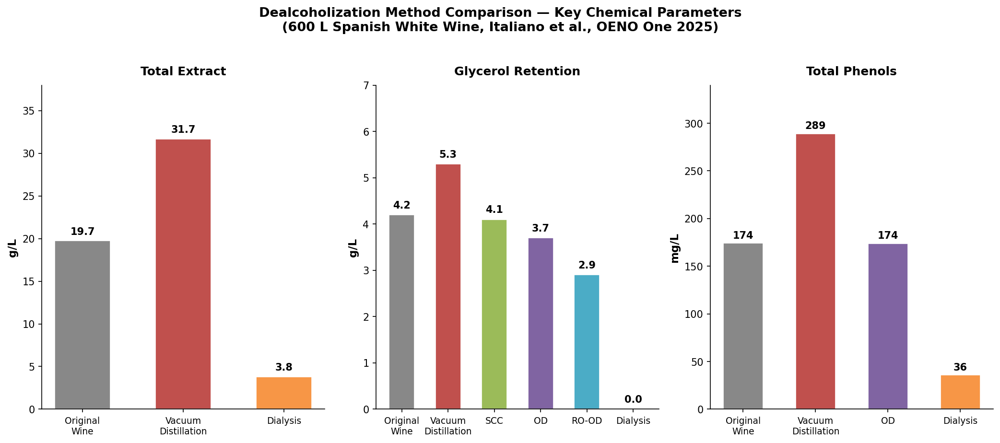

*Figure 2 — Chemical parameters of dealcoholized wines produced by five methods versus the original wine baseline. Data from Italiano et al., OENO One (2025), based on 600 L of Spanish white wine. Vacuum distillation yields the highest total extract and phenol concentration; dialysis strips the liquid to near-water levels.*

The study's glycerol data are especially instructive for NA spirit production, since glycerol contributes directly to perceived mouthfeel. VD preserved glycerol at 5.30 g/L (above the original's 4.20 g/L due to water co-evaporation and resultant concentration), SCC at 4.10 g/L, and membrane methods at 2.90–3.70 g/L. Dialysis eliminated glycerol entirely.

## Supercritical CO₂ Extraction: Precision at a Premium

Supercritical CO₂ extraction (SFE) operates above carbon dioxide's critical point — 31.2 °C and 7.3 MPa (approximately 1,060 psi) — where CO₂ enters a "supercritical" state, behaving simultaneously as a gas (with high diffusivity, enabling penetration of fine botanical structures) and as a liquid (capable of dissolving and carrying target compounds). Solvent power is tunable: adjusting pressure and temperature enables selective fractionation of specific aromatics. CO₂ is odorless, non-toxic, non-flammable, leaves zero solvent residue, and is fully recyclable [Capuzzo et al., *Molecules* 2013](https://pmc.ncbi.nlm.nih.gov/articles/PMC6270407/ "Supercritical Fluid Extraction of Plant Flavors and Fragrances, Molecules 2013").

Supercritical CO₂ has a polarity comparable to liquid pentane, making it excellent for lipophilic compounds — terpenes, essential oils, waxes — but less effective for polar molecules without co-solvents such as ethanol. In controlled studies, SFE of tea flowers captured phenylethanol, linalool, geraniol, and hotrienol with "very little loss of heat-sensitive volatiles," and the resulting flavor isolate was judged to be of "superior quality compared to distillation" [Capuzzo et al., *Molecules* 2013](https://pmc.ncbi.nlm.nih.gov/articles/PMC6270407/ "SFE tea flower study").

### The Hepple Gin Case

Perhaps the most striking demonstration of SFE's potential in spirits production comes from Hepple Spirits in Northumberland, England. Hepple uses supercritical CO₂ at approximately 40 °C and 3,000 psi (~20.7 MPa) to produce a juniper "absolute." GC-MS analysis reveals that this SFE absolute contains compounds — terpinene, cubebene, undecatriene — at intense concentrations that are absent or minimal in pot-still and vacuum-still distillates of the same juniper. The extraction ratio underscores both the method's concentration power and its material cost: 800 g of juniper yields just 20 mL of absolute [Distiller Magazine](https://distilling.com/distillermagazine/cutting-edge-processes-for-extracting-flavors/ "Cutting Edge Processes for Extracting Flavors, 2021"). Hepple blends this SFE absolute in small quantities with pot- and vacuum-distilled components to complete its gin's flavor profile — a multi-method layering strategy directly applicable to NA spirit production.

### Cost and Scalability

SFE's principal barrier is economics. Manufacturing costs range from USD 48 to USD 1,050 per kilogram of dry extract depending on operating conditions, and equipment requires extremely thick-walled pressure vessels designed for sustained operation above 70 bar [Capuzzo et al., *Molecules* 2013](https://pmc.ncbi.nlm.nih.gov/articles/PMC6270407/ "Sweet basil SFE cost data"). Commercial SFE is already established at industrial scale for coffee decaffeination and hop extraction, but within the NA spirits category the technology remains a precision adjunct rather than a primary production method — best deployed to produce high-value aromatic absolutes that are blended in small quantities into a base produced by less expensive means.

## Comparative Assessment: Choosing the Right Tool

No single production method optimizes simultaneously for flavor fidelity, cost-efficiency, and scale. The choice depends on the producer's starting point (from-scratch vs. dealcoholization), target sensory profile, volume requirements, and capital constraints.

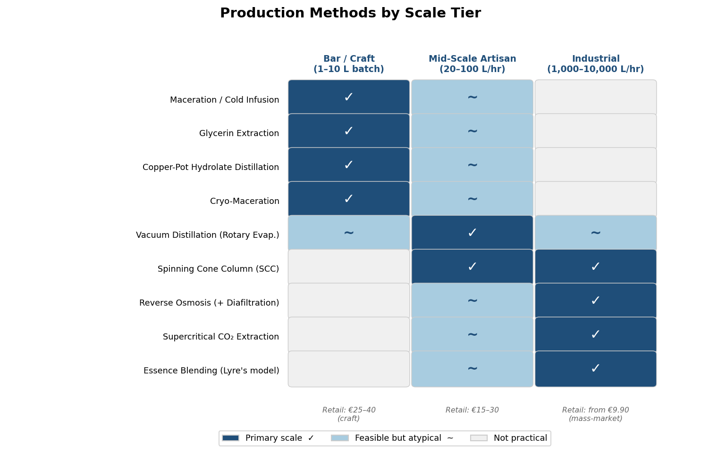

*Figure 3 — Matrix mapping nine NA spirit production methods against three scale tiers (bar/craft, mid-scale artisan, industrial). Primary suitability, feasibility, and indicative retail-price ranges are shown for each tier.*

**Bar and craft scale** — Maceration, cold infusion, glycerin extraction, and small copper-pot hydrolate distillation require minimal capital and can operate at batch sizes as low as 1–10 liters. These methods suit small-batch, bartender-driven production and limited-edition releases but face shelf-stability challenges without pasteurization; their flavor complexity is further constrained by water's and glycerin's inferior extraction power relative to ethanol.

**Mid-scale artisan** — Vacuum distillation using rotary evaporators (batch sizes of approximately 20 liters) and the SCC 100 (100 L/hr) offer strong flavor control and the ability to prototype at moderate volume. Capital requirements are significant but manageable for established craft producers.

**Industrial** — The SCC 10,000 (10,000 L/hr), RO with diafiltration systems, and commercial SFE plants represent the high-capital, high-throughput end of the spectrum. These technologies enable continuous processing, excellent batch consistency, and the volume output required for global distribution. Retail prices for NA spirits reflect this production-cost spectrum, ranging from approximately €9.90 for mass-market offerings to €25–40 for craft products [Spirits Selection](https://spiritsselection.com/en/getting-into-the-spirit-of-no-low-a-closer-look-at-how-no-low-spirits-are-made-plus-their-legal-requirements/ "Price discussion section") [Flavourtech](https://flavourtech.com/products/spinning-cone-column/ "SCC model range").

The most sophisticated producers increasingly combine methods across these scale tiers. Bel Nada creates separate distillates for different botanical groups and blends them in precise ratios. Hepple layers SFE absolutes with pot- and vacuum-distillates. Almave adds post-distillation texture agents to a multi-distilled hydrolate. This multi-method convergence reflects a maturing industry's recognition that the sensory complexity of ethanol-based spirits — built over centuries of accumulated technique — cannot be replicated by any single alcohol-free process. Instead, producers assemble flavor from multiple vectors, combining the aromatic richness of distillation with the textural contributions of hydrocolloids, the bite of capsaicin or sanshool (explored in Chapter 4), and the body-building potential of acids and sweeteners (detailed in Chapter 2).

# 第4章 Advanced Techniques — Texture, Mouthfeel, and Sensory Engineering

A well-crafted non-alcoholic (NA) cocktail can rival its spirited counterpart in aroma, visual drama, and flavor layering. Yet the moment the liquid crosses the lips, a familiar gap opens: the drink feels *thin*. That thinness is not merely a matter of taste — it is a matter of physics and neuroscience. Ethanol contributes viscosity, warmth, aroma volatility, and a complex trigeminal signature that no single substitute can replicate. Bridging this gap demands a multi-vector engineering approach: hydrocolloid texturizing, heat-agent layering, tannin calibration, molecular mixology, and carbonation strategy, each targeting a distinct dimension of the sensory void left by alcohol's absence. The sections that follow map these frontier techniques as deployed by craft bartenders and product developers working at the leading edge of zero-proof formulation.

## 4.1 The Engineering Baseline: What Ethanol Actually Does

Before attempting to replace ethanol's sensory contribution, it is essential to understand what, precisely, is being lost. Removing ethanol from a 5% ABV beer to 0% reduces measurable viscosity by approximately 0.17 mPa·s and significantly diminishes perceived body, sweetness, and "alcohol warming" (p < 0.05, n = 101 temporal check-all-that-apply panel) [Ramsey et al., *Scientific Reports* 2020](https://www.nature.com/articles/s41598-020-77697-5 "Lost functionality of ethanol in NA beer, sensory + molecular hydrodynamics"). A 0.17 mPa·s deficit sounds trivial; it is not. Follow-up research established that approximately 30 g/L dextrin or 1.5 g/L high-molecular-weight arabinoxylan is required to compensate for that viscosity loss — yet only the *combination* of the two significantly increased perceived palate fullness (p < 0.10, n = 12 trained panel), confirming that viscosity alone does not govern perceived body [Michiels et al., *Food Hydrocolloids* 2024](https://www.sciencedirect.com/science/article/abs/pii/S0268005X24009160 "Enhancing mouthfeel of NA beers: dextrin and arabinoxylan").

Ethanol's influence extends beyond viscosity. It modulates aroma release by inhibiting the binding of hydrophobic aroma compounds to salivary α-amylase, thereby increasing headspace concentration of fruity, estery volatiles. Simple thickening agents cannot replicate this dual function. The implication for NA cocktail development is unambiguous: effective mouthfeel engineering demands a multi-vector approach — addressing viscosity, trigeminal stimulation, and aroma delivery simultaneously rather than relying on a single ingredient to "fix" the missing alcohol.

## 4.2 Hydrocolloids and Texturizing Agents

### Xanthan Gum

Xanthan gum is the workhorse thickener in NA cocktail formulation. At 0.1–0.2% (w/v) it imparts subtle body without discernible sliminess; at 0.5% it produces noticeable thickening suited to stirred or shaken styles that need to coat the glass. Xanthan also serves as a critical component in cocktail foams: combined with methylcellulose F50 at a working ratio of 1.8 g methylcellulose F50 and 0.5 g xanthan per 300 mL liquid in a 500 mL iSi whipping siphon charged with two N₂O cartridges, it produces a "super foam" that holds for hours at room temperature — markedly outperforming both egg white and aquafaba in longevity [Kevin Liu, *Serious Eats*](https://www.seriouseats.com/cocktail-science-foam-eggwhite-gomme-dry-shake-beer-foam-eggwhite-alternatives "Cocktail Science: All About Foams").

### Gum Arabic and Gomme Syrup

Traditional gomme syrup — prepared at roughly a 1.5:1:1 ratio of sugar to water to gum arabic — uniquely functions as both emulsifier and thickener. Gum arabic contributes creamy viscosity and a light froth that mimics the richness of spirit-forward drinks [Kevin Liu, *Serious Eats*](https://www.seriouseats.com/cocktail-science-foam-eggwhite-gomme-dry-shake-beer-foam-eggwhite-alternatives "Cocktail Science: All About Foams"). In NA cocktail programs, gomme syrup is often the first line of defense against watery mouthfeel, particularly in stirred "spirit-free" builds where shaking-induced dilution is unavailable to soften texture.

### Glycerol: Ubiquitous but Over-Relied Upon

Glycerol appears in virtually every NA spirit on the market, yet research from UC Davis (Noble & Bursick, 1984) demonstrates that at concentrations typical of wine — 4–10 g/L — glycerol has negligible perceived viscosity impact [Waterhouse Lab, UC Davis](https://waterhouse.ucdavis.edu/whats-in-wine/glycerol "Glycerol in wine"). In NA formulation, glycerol contributes subtle sweetness and marginal smoothing but should not be treated as a primary body-builder. Higher concentrations (above 20 g/L) may produce perceptible viscosity gains, though at the cost of excessive sweetness — a trade-off that constrains practical dosing in cocktail contexts.

## 4.3 Heat and Tingle Agents: Engineering the "Burn"

Ethanol's warmth activates TRPV1 (the vanilloid receptor) and broader trigeminal nerve pathways, producing a complex, diffuse sensation quite distinct from the sharp bite of chili or the numbing buzz of Szechuan pepper. As Sensient Flavors & Extracts observes: "the somatosensory property of ethanol is unique and different than that of capsaicin… it's not an easy one-to-one replacement (burn-to-burn)" [Sensient Flavors & Extracts](https://sensientflavorsandextracts.com/insights/mimicking-the-mouthfeel-of-alcohol-is-key-to-capturing-the-growing-spirit-free-market/ "Mimicking the Mouthfeel of Alcohol, 2023"). Nonetheless, layering multiple heat and tingle agents — each activating different receptor populations — can approximate the multidimensional warmth that ethanol provides.

### Capsaicin

The oral detection threshold for capsaicin is approximately 0.31 ppm in aqueous solution (~5 Scoville Heat Units) [Sensient Flavors & Extracts](https://sensientflavorsandextracts.com/insights/mimicking-the-mouthfeel-of-alcohol-is-key-to-capturing-the-growing-spirit-free-market/ "Mimicking the Mouthfeel of Alcohol, 2023"). Commercial NA spirits typically deploy roughly 8 ppm (~128 SHU) for subtle warmth — well above the detection floor but far below the intensity of even a mild hot sauce. Capsaicin activates TRPV1 directly, producing a localized burning sensation that peaks rapidly and decays over roughly 30–60 seconds.

### Piperine (Black Pepper)

Piperine, the principal pungent alkaloid of black pepper, offers a somewhat slower onset and longer linger than capsaicin. In a peer-reviewed psychophysical study (n = 106), the group geometric mean oral detection threshold for piperine in aqueous solution was 0.58 ± 0.25 ppm — slightly above capsaicin's threshold of 0.52 ± 0.04 ppm measured in the same cohort, suggesting marginally lower potency at threshold [Nolden & Hayes, *Physiology & Behavior* 156: 117–127, 2016](https://pmc.ncbi.nlm.nih.gov/articles/PMC4898060/ "Differential bitterness in capsaicin, piperine, and ethanol"). At suprathreshold concentrations, piperine burn decays more slowly than capsaicin burn — a property useful for building a finish that lingers, a quality often absent from NA cocktails.

### Hydroxy-α-Sanshool (Szechuan Peppercorn)

Perhaps the most intriguing heat agent for NA cocktail design is hydroxy-α-sanshool, the principal active compound in Szechuan peppercorns. Unlike capsaicin and piperine, sanshool does not activate TRP channels. Instead, it inhibits two-pore potassium channels (KCNK3, KCNK9, KCNK18; IC₅₀ = 69.5 ± 5.3 μM), exciting both nociceptors and large-diameter touch neurons to produce a distinctive "buzzing" or "numbing" paresthesia [Bautista et al., *Nature Neuroscience* 11(7): 772–779, 2008](https://pmc.ncbi.nlm.nih.gov/articles/PMC3072296/ "Pungent agents from Szechuan peppers, KCNK channel inhibition"). The resulting sensation is tactile complexity without capsaicin's acute burning — a quality particularly suited to stirred NA cocktails where sharp heat would be out of character.

### Ginger

Gingerols and shogaols in fresh and dried ginger, respectively, activate TRPV1 and TRPA1 channels, adding another axis of warmth. Ginger's advantage in beverage formulation is familiarity: consumers readily accept ginger-spiced drinks, reducing the perception of "artificiality" that more exotic heat agents may trigger.

### The Layering Principle

Effective NA cocktail formulation rarely relies on a single heat agent. By combining, for example, a low dose of capsaicin for immediate warmth, piperine for mid-palate persistence, and sanshool for lingering tactile buzz, the formulator can approximate the diffuse, multi-stage warmth of ethanol more convincingly than any one compound achieves alone. The following diagram illustrates how these agents activate distinct receptor pathways, explaining why a layered approach more closely reproduces ethanol's complex sensory signature.

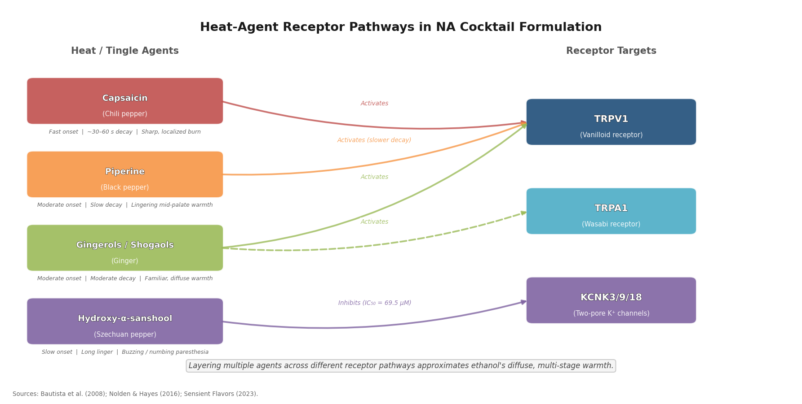

## 4.4 Tannin and Astringency Management

Astringency is a tactile sensation — not a taste — produced when polyphenols bind salivary proline-rich proteins, stripping saliva's lubrication layer and generating friction from the resulting precipitated complexes. Different polyphenol classes yield distinct astringency profiles; EGCG (the dominant catechin in green tea) directly activates the trigeminal nerve in addition to precipitating salivary proteins. The sensation requires approximately 15 seconds to develop and can linger for up to five minutes [Daniel Bojar, *Tales of the Cocktail Foundation*](https://talesofthecocktail.org/sandpaper-tea-science-astringency/ "Sandpaper & Tea: The Science of Astringency, 2018").

A critical and counterintuitive consideration for NA formulation: increasing alcohol concentration *decreases* astringency by raising solution viscosity and competing for protein binding sites. NA cocktails employing tannin extracts — whether from tea, grape seed, or powdered preparations — therefore taste more astringent at equivalent polyphenol concentrations than their alcoholic counterparts. Dosing must be calibrated downward accordingly.

### Clarification as Astringency Control

Milk-punch clarification offers an elegant countermeasure, and it functions without alcohol. Casein proteins bind astringent polyphenols selectively; acid addition curdles the casein, which is then filtered out, removing harshness while preserving whey proteins that stabilize foam. Death & Co.'s "Liar's Gambit" applies this technique to a clarified NA milk punch built on Seedlip, demonstrating that the centuries-old clarification method translates directly to zero-proof applications [Kara Newman, *Punch*](https://punchdrink.com/articles/go-ahead-clarify-your-n-a-cocktail/ "Go Ahead, Clarify Your N/A Cocktail, 2022"). Polydextrose serves as another efficient polyphenol binder, useful in contexts where dairy-derived techniques are undesirable.

## 4.5 Molecular Mixology Adapted for NA Cocktails

Many techniques originating in modernist cuisine transfer to NA cocktail production with minimal adjustment — and in certain cases, the absence of alcohol confers a distinct advantage.

### Agar Clarification

Developed by Dave Arnold in 2009, agar clarification uses 0.2% agar by weight: the agar is boiled to hydrate, combined with cold juice or infusion, set in an ice bath until gelled, then the gel is broken and strained through cheesecloth. Yield exceeds 85%. Because the technique operates at room temperature without requiring alcohol, it is inherently compatible with NA formulations [Dave Arnold, *Cooking Issues*](https://cookingissues.com/2009/07/14/agar-clarification-made-stupid-simple-best-technique-yet/ "Agar Clarification Made Stupid-Simple, 2009"). Clarified NA cocktails gain a jewel-like transparency that elevates perceived quality and sophistication.

### Reverse Spherification

Spherification relies on the interaction between sodium alginate and calcium ions to form a thin gel membrane around a liquid sphere. In reverse spherification — where the calcium salt resides in the cocktail liquid and the alginate in the setting bath — concentrations of 0.5–1% for both alginate and calcium (chloride or lactate gluconate) are standard. High alcohol concentrations inhibit alginate gelling; the absence of alcohol in NA cocktails means gelling is more predictable and membranes form more consistently [Kitchen Theory](https://kitchen-theory.com/sodium-alginate-spherification/ "Sodium Alginate & Spherification"). NA cocktails are therefore a particularly fertile ground for spherification-based garnishes, "caviar" pearls of flavored liquid, and larger spheres that burst on the palate.

### Foams: Aquafaba, Methylcellulose, and Beyond

Aquafaba (chickpea brine) has become the standard vegan egg-white substitute in cocktail foaming: approximately 22 mL of aquafaba replaces one egg white. Its proteins and saponins act as surfactants, stabilizing air bubbles when dry-shaken — shaken without ice to build foam before a second ice-shaken pass [Tales of the Cocktail Foundation](https://talesofthecocktail.org/vegan-whiskey-sour-using-aquafaba-chickpea-brine/ "How to Use Aquafaba for Vegan Egg-White Cocktails"). For professional service where foam longevity is critical, the methylcellulose F50 + xanthan gum approach described in Section 4.2 produces a "super foam" that holds for hours at room temperature — a marked advantage over the 10–15 minute lifespan of standard egg-white or aquafaba foam.

### Smoke Infusion

Smoke — whether from a handheld smoking gun, a wood-plank cloche, or smoked ice — adds aromatic complexity and visual drama. Because key smoke compounds (guaiacol, syringol, cresols) are water-soluble, they infuse readily into aqueous NA cocktails without requiring ethanol as a carrier. A brief 15–30 second smoke exposure under a cloche imparts recognizable smokiness without overwhelming the drink's primary botanical or fruit profile.

### Fat-Washing Without Spirits

Traditional fat-washing exploits fats' solubility in alcohol: melted butter, sesame oil, or bacon fat is stirred into a spirit, left to infuse, then frozen so the solidified fat can be removed. Adapting this technique for NA contexts is more challenging because fats are far less soluble in water. Emerging approaches include fat-washing water or simple syrup with browned butter followed by freezing and fine filtration — capturing butterscotch-like flavor notes without greasy mouthfeel — and oil-based infusion followed by ultrasonic emulsification into an aqueous base. These adaptations remain largely undocumented in peer-reviewed literature but are gaining traction in experimental bar programs seeking richness and umami depth in zero-proof builds.

## 4.6 Carbonation and Nitrogenation

Gas is among the most powerful — and most underutilized — tools in NA cocktail engineering, simultaneously influencing perceived acidity, mouthfeel, aroma delivery, and visual presentation.

### Carbon Dioxide

CO₂ carbonation levels vary by style: sparkling water typically runs 2.0–3.5 volumes, sparkling cocktails 2.5–2.7, tonic water 3.0–3.5, and champagne-style beverages up to 6.0. The human detection threshold for carbonation is approximately 0.6 vol/vol [Quantiperm](https://quantiperm.com/fizzy-perfection-a-complete-guide-to-beverage-carbonation/ "Guide to Beverage Carbonation"). Forced carbonation — injecting CO₂ from a cylinder into chilled liquid — remains the standard for precise control, with dedicated carbonation rigs (from iSi or Boel, among others) enabling bartenders to dial in exact volumes reproducibly.

Fermentation-derived carbonation, sourced from kombucha, water kefir, or ginger beer starters, offers a softer, less aggressive effervescence (typically 1.5–3.0 vol/vol CO₂). It also contributes trace organic acids (acetic, lactic, gluconic) and, where live cultures are present, flavor complexity from ongoing low-level fermentation — an advantage for NA cocktails intended to convey microbial depth rather than a purely clean sparkling profile.

### Nitrogen

Nitrogen is approximately 40 times less soluble in water than CO₂, producing dramatically smaller bubbles and a dense, creamy micro-foam rather than sharp carbonation. Nitro infusion suppresses perceived acidity and enhances smoothness and body — qualities that directly address the "thin mouthfeel" challenge in NA cocktails. Draft nitro systems typically employ a 75% N₂ / 25% CO₂ gas blend at 30–40 psi [Quantiperm](https://quantiperm.com/complete-guide-to-nitro-beer-brewing-infusion-and-experience/ "Guide to Nitro Beer"). For NA cocktails styled after stirred, spirit-forward classics — an Old Fashioned or Negroni analogue — a nitro cascade adds a visual and textural dimension that compensates powerfully for absent ethanol body.

### Choosing Between CO₂ and N₂

The choice between carbonation and nitrogenation — or a hybrid blend — depends on the cocktail's archetype. Highball and spritz styles benefit from CO₂'s brightness and acidity lift; stirred, rich, and creamy styles benefit from nitrogen's smoothness. Some NA bar programs maintain both gas lines, selecting the appropriate dispense method per drink — a level of infrastructure investment that signals the category's growing sophistication. The radar chart below compares the two gases across key sensory dimensions.

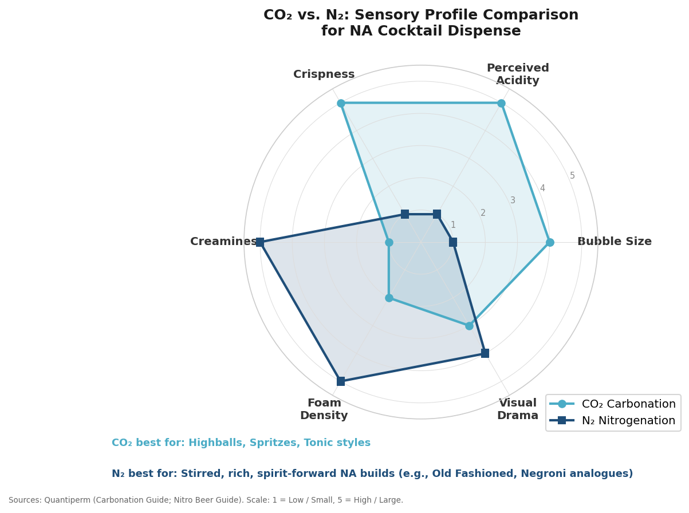

## 4.7 Integrating the Toolkit: A Multi-Vector Approach

The techniques surveyed in this chapter are most effective when deployed in concert. A well-engineered NA Old Fashioned analogue might combine glycerol for marginal smoothing, gomme syrup for viscosity and emulsification, a trace of capsaicin tincture for initial warmth, Szechuan peppercorn tincture for lingering buzz, brewed hojicha tea for tannic structure, and nitro dispense for creamy body. Each element addresses a different dimension of ethanol's sensory contribution — viscosity, warmth, astringency, aroma modulation, and mouthfeel — that no single ingredient can replicate. The heatmap below summarizes how twelve replacement techniques map against six key sensory attributes of ethanol, providing a practical reference for multi-vector formulation.

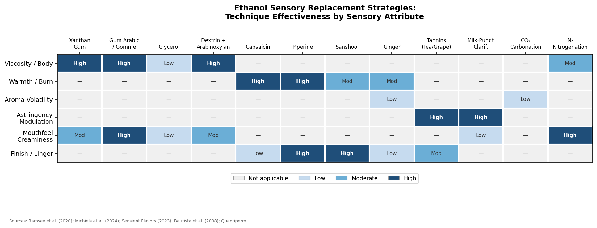

The governing constraint is balance. Over-engineering produces drinks that taste "busy" or chemical; under-engineering yields juice-and-syrup constructions that fail to satisfy. The most accomplished practitioners treat NA cocktail creation as a calibration exercise: iterating through small-batch trials, measuring viscosity and pH, conducting informal sensory panels, and adjusting dosing in fractions of a gram. As explored in Chapter 2, the underlying flavor architecture — botanicals, acids, sweeteners, bitters — provides the canvas. The advanced techniques catalogued here supply the tools for rendering convincing texture, body, and warmth onto that canvas.

# 第5章 From Bottle to Bar — Commercial Innovation, Regulation, and Service Integration

The preceding chapters mapped the botanical toolkit, production technologies, and sensory-engineering techniques that underpin non-alcoholic (NA) cocktail craftsmanship. This chapter shifts focus from the laboratory and the distillery to the marketplace and the bar top — examining how leading brands convert those technical capabilities into scalable commercial products, how divergent regulatory regimes in the United States, European Union, and United Kingdom constrain what producers can make and claim, how hospitality venues are re-architecting beverage programs around zero-proof offerings, and where the category's commercial frontier is heading, from AI-assisted formulation to the dissolving boundary between "mocktail" and "functional beverage."

## 5.1 Brand Profiles and Commercial Innovation

### Seedlip: The Category Creator at Ten

Seedlip, founded in 2015 by Ben Branson and acquired by Diageo in 2019, is widely credited with inaugurating the modern NA spirits category. Its three flagship expressions — Grove 42 (citrus), Garden 108 (herbal), and Spice 94 (aromatic) — rely on individual copper-pot distillation of each botanical group in six-week cycles (see Chapter 3 for process detail). In November 2025, the brand marked its tenth anniversary with a "Yeah, It's a Drink" campaign designed to normalize zero-proof ordering in social settings [The Spirits Business](https://www.thespiritsbusiness.com/2025/11/seedlip-campaign-redefines-meaningful-drinking/ "Seedlip 10th anniversary, Nov 2025"). *Drinks International* subsequently named Seedlip both the bestselling and most-trending NA spirit globally for 2026 — a first-mover advantage that has proven remarkably durable over a full decade.

### Lyre's: Scale Through Flavor Replication

Where Seedlip distils fresh botanicals into water, Lyre's — founded in Australia in 2019 — pursues an inverse production philosophy: assembling natural essences, essential oils, fruity esters, and polyphenols to replicate the sensory profiles of established spirit categories, yielding product names such as "American Malt" and "Italian Spritz." A sweeping 2025 rebrand under new CEO David Gimpelson (formerly of Casamigos) introduced lighter Saverglass bottles, a reduced environmental footprint, and — critically for US retail — front-label descriptors reading "Gin Alternative" and "Bourbon Alternative" to resolve the shelf-clarity problem that has long hampered the category. Lyre's portfolio now spans 11 spirits, 5 ready-to-drink (RTD) cocktails, and 2 NA sparkling wines, distributed across more than 60 countries, with the United States accounting for roughly 60% of global sales [Beverage Daily](https://www.beveragedaily.com/Article/2026/01/23/how-to-build-a-beverage-brand-lyres-on-growing-the-opportunities-in-alcohol-free/ "Lyre's CEO interview, Jan 2026").

### Curious Elixirs: The Adaptogenic RTD Pioneer

Curious Elixirs, also launched in 2015 from New York's Hudson Valley, pioneered the RTD NA cocktail format infused with adaptogens such as rhodiola and lion's mane (Chapter 2 discusses the regulatory context surrounding these ingredients). The company has scaled to eight-figure annual revenue without outside investment, secured placement in approximately 2,000 retail doors, and earned partnerships with high-profile hospitality venues including the French Laundry, Alinea, and Four Seasons Oahu. In February 2026 it expanded beyond spirits analogues with "Curious Red," positioned as its first NA red wine — a category extension that underscores the brand's confidence in its botanical-formulation platform. Curious Elixirs also serves as the official NA partner of the James Beard Foundation [Forbes](https://www.forbes.com/sites/daveknox/2025/06/03/the-curious-case-of-booze-free-beverages/ "Forbes interview with JW Wiseman, June 2025").

### Ghia: Direct-to-Consumer Mediterranean Aperitif

Founded in 2020 by Mélanie Masarin, Ghia has built its identity around a Mediterranean aperitif aesthetic — no added sugar, no artificial ingredients — distributed through both direct-to-consumer channels and major retailers such as Whole Foods, Target, and Trader Joe's. Its Le Spritz RTD line has sold approximately 4 million cans since 2021, accounting for 60% of total revenue. A Blood Orange Le Spritz extension launched in September 2025 at USD 20 per four-pack [Fast Company](https://www.fastcompany.com/91409188/ghia-blood-orange "Ghia Blood Orange launch, Sep 2025"). Ghia's trajectory illustrates the power of brand storytelling and lifestyle positioning in a category where product differentiation on taste alone remains elusive.

### Wilderton: A Cautionary Tale

Not every pioneering brand survives. Wilderton, founded in Portland in 2019 and backed by Diageo's Distill Ventures, operated what it described as the nation's first dedicated NA distillery. In January 2026, the company announced an indefinite hiatus, citing a "historically difficult" capital environment [BevNET](https://www.bevnet.com/spirits/2026/non-alc-wilderton-aperitivo-to-shut-down-operations-after-seven-years/ "Wilderton closure, Jan 2026"). The closure exposes a structural tension embedded in the NA spirits space: the capital intensity of bespoke distillation operations — copper stills, premium botanicals, small-batch production cycles — sits uneasily alongside a category that, despite double-digit percentage growth, still constitutes a small fraction of total spirits revenue.

### Investment and M&A Activity, 2024–2025

Capital continues to flow into the NA category, but increasingly on terms that favour integration with established beverage groups rather than standalone venture-backed growth. Diageo acquired Ritual Zero Proof in September 2024. Constellation Brands took a minority stake in Hiyo in February 2025. Recess closed a USD 30 million Series B in October 2025, and Stoli invested USD 3.6 million in Pathfinder in September 2025 [Forbes](https://www.forbes.com/sites/shimiteobialo/2025/11/10/investors-tap-into-the-zero-proof-and-non-alcoholic-beverage-market/ "NA investment landscape, Nov 2025"). In Europe, Rémy Cointreau took a minority stake in JNPR Spirits (2024), AG Barr assumed full ownership of Strykk (summer 2025), and Alchemy Distillers acquired Banks Botanicals in Australia (late 2025) [The Spirits Business](https://www.thespiritsbusiness.com/2025/12/world-spirits-report-2025-low-no/ "World Spirits Report 2025: Low & No, Dec 2025"). Meanwhile, Monday expanded in early 2026 into THC-infused spirit alternatives, straddling the alcohol-free and cannabis categories — a move that signals the increasingly fluid boundaries of the "alternative adult beverage" space [BevNET](https://www.bevnet.com/news/2026/from-alcohol-free-to-thc-drink-monday-bets-on-hemps-longevity/ "Monday THC expansion, Feb 2026").

The timeline below maps these milestones against a decade of brand launches, acquisitions, and pivots, visualising the category's arc from niche experiment to contested battleground for major spirits conglomerates.

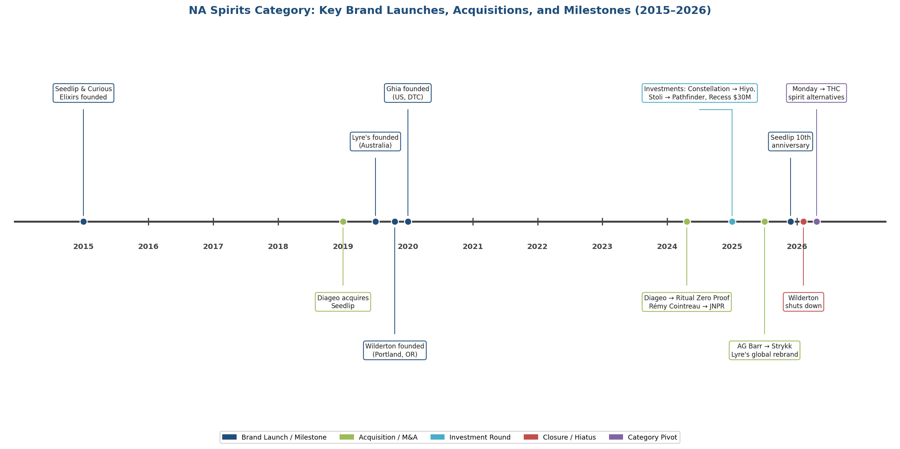

*Figure 5.1. Key brand launches, acquisitions, investment rounds, and closures in the NA spirits category, 2015–2026. Events are colour-coded by type: brand launch (blue), acquisition (green), investment (teal), closure (red), and category pivot (purple).*

## 5.2 The RTD Opportunity

Ready-to-drink NA cocktails occupy only 5.7% of total NA beverage sales, yet they constitute the fastest-growing sub-category: NielsenIQ recorded 70% growth between 2024 and 2025. Market-intelligence estimates place the RTD mocktails segment at approximately USD 9.83 billion in 2025, projected to reach USD 19.98 billion by 2034 at an 8.2% compound annual growth rate [Forbes / NielsenIQ](https://www.forbes.com/sites/shimiteobialo/2025/11/10/investors-tap-into-the-zero-proof-and-non-alcoholic-beverage-market/ "NIQ data, Nov 2025"). Formats range from Ghia's 8 oz cans to Curious Elixirs' 200 mL bottles and slim-can multi-serve options.

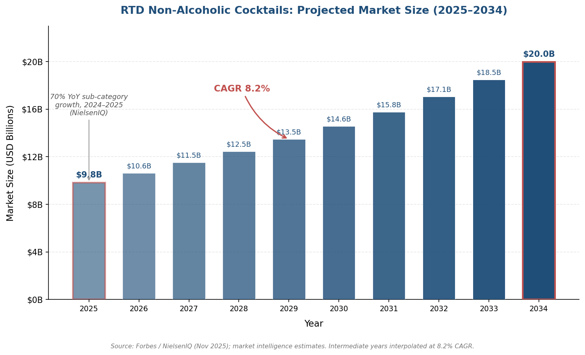

*Figure 5.2. Projected RTD NA cocktail market size from USD 9.8 billion (2025) to USD 20.0 billion (2034) at an 8.2% CAGR. The 70% year-over-year sub-category growth rate for 2024–2025 (NielsenIQ) is annotated. Intermediate years are interpolated. Source: Forbes / NielsenIQ (Nov 2025); market intelligence estimates.*

A notable distribution milestone arrived in 2026 when Mocktail Club became one of the first NA RTD brands placed in 100 Virginia ABC (Alcoholic Beverage Control) stores. Virginia is a "control state" where liquor retail is government-operated; placement inside the state liquor-store system signals institutional acceptance of NA products alongside their alcoholic counterparts and resolves the shelf-positioning ambiguity that relegates many NA brands to the soda or juice aisle in conventional grocery channels [BevNET](https://www.bevnet.com/spirits/2026/how-mocktail-club-cracked-the-control-state-retail-channel/ "Mocktail Club in VA ABC, 2026").

## 5.3 Regulatory and Labelling Landscape

Regulation of NA beverages is fragmented, fast-evolving, and — in several consequential respects — contradictory across major markets. Three jurisdictions merit detailed examination: the United States, the European Union, and the United Kingdom. The comparative table below (Figure 5.3) summarises the key dimensions of divergence; the narrative that follows unpacks each regime in turn.

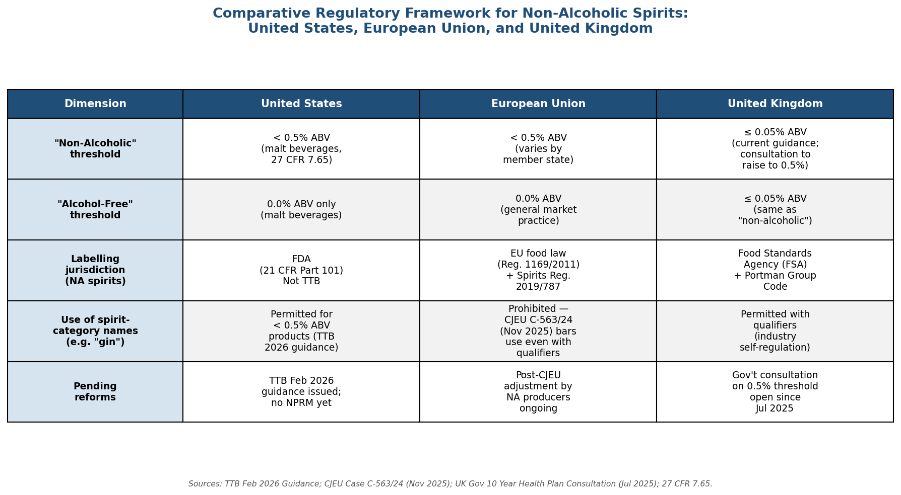

*Figure 5.3. Comparative regulatory matrix across five dimensions: "non-alcoholic" and "alcohol-free" ABV thresholds, labelling jurisdiction for NA spirits, permitted use of spirit-category names, and pending reforms. Sources: TTB Feb 2026 Guidance; CJEU Case C-563/24 (Nov 2025); UK Gov 10 Year Health Plan Consultation (Jul 2025); 27 CFR 7.65.*

### United States: A Dual-Agency Framework

The US regulatory architecture divides jurisdiction between two federal agencies. The Alcohol and Tobacco Tax and Trade Bureau (TTB) oversees beverages meeting the legal definition of "alcohol beverages" — generally those at or above 0.5% alcohol by volume (ABV). The Food and Drug Administration (FDA) regulates food and non-alcoholic beverages under 21 CFR Part 101.

In February 2026, TTB published formal guidance — structured as a detailed agency presentation rather than a Notice of Proposed Rulemaking — clarifying the treatment of low- and no-alcohol products across wine, malt beverage, and distilled spirits categories [TTB Guidance](https://www.ttb.gov/system/files/2026-02/Low-No_Alcohol_Products_for_TTB_web-_FINAL.pdf "TTB Feb 2026 Low/No Alcohol Guidance") [Keller and Heckman / The Daily Intake](https://www.dailyintakeblog.com/2026/03/ttb-releases-low-and-no-alcohol-beverage-guidance/ "TTB guidance analysis, Mar 2026"). The key principles established are:

- **Below 0.5% ABV**: beverages are *not* classified as alcohol beverages under federal regulations, are not subject to federal alcohol excise tax, and do not require the Surgeon General's health warning.
- **"Non-alcoholic" vs. "alcohol-free"**: for malt beverages, "non-alcoholic" requires < 0.5% ABV plus a mandatory qualifying statement; "alcohol-free" is reserved for products at 0.0% ABV (27 CFR 7.65) [27 CFR 7.65](https://www.ecfr.gov/current/title-27/chapter-I/subchapter-A/part-7/subpart-E/section-7.65 "eCFR Malt Beverage Alcohol Content labeling").
- **NA distilled spirits**: the Federal Alcohol Administration Act does not apply to products below 0.5% ABV, placing NA spirits under FDA rather than TTB labelling jurisdiction.
- **Undefined terms**: "mocktail," "session," "spritz," and "seltzer" carry no regulatory definition in TTB rules.

The practical consequence is considerable compliance complexity. A company producing both a 40% ABV gin and a < 0.5% ABV "gin alternative" must navigate two distinct regulatory regimes — TTB for the former (no nutritional panel required, no FALCPA allergen declaration) and FDA for the latter (nutritional facts panel, allergen declarations, and a full ingredient list all mandatory). This dual-track obligation raises compliance costs and creates labelling-design challenges, particularly for brands that market their NA and alcoholic products as a unified portfolio.

### European Union: The CJEU Gin Decision and Its Fallout

The EU's most consequential recent regulatory development arrived on 13 November 2025, when the Court of Justice of the European Union (CJEU) ruled in Case C-563/24 that under EU Regulation 2019/787 — the Spirits Regulation — beverages failing to meet the legal definition of gin (minimum 37.5% ABV, juniper-dominated) may not use the word "gin" on their labels, even accompanied by qualifiers such as "alcohol-free," "type," "style," "like," or "flavour" [Simont Braun Law](https://simontbraun.eu/an-alcohol-free-gin-cannot-be-called-gin/2025/11/25/ "Legal analysis of CJEU C-563/24, Nov 2025"). The ruling extends by analogy to other protected spirit-category names — "rum," "whisky," "vodka" — and compels EU-market NA producers to abandon the category-naming conventions that have anchored their consumer communication since the segment's inception.

The practical impact is significant. Lyre's US-market rebrand — relabelling products as "Gin Alternative" and "Bourbon Alternative" — anticipated the direction of travel, but EU law now precludes even that formulation where it incorporates the protected name. Brands must instead rely on descriptive phrases ("juniper-forward botanical distillate," "aromatic spirit alternative") or invest in proprietary naming that conveys flavour profile without invoking a regulated category. The ruling represents a philosophically distinct approach from the US regime, where TTB's 2026 guidance permits considerable naming flexibility for sub-0.5% products precisely because they fall outside the alcohol-beverage regulatory perimeter.

### United Kingdom: The 0.05% Anomaly

The UK occupies a uniquely restrictive position. Current guidance defines "alcohol-free" as ≤ 0.05% ABV — ten times stricter than the 0.5% threshold applied in the US, EU, and most other major markets. This threshold creates tangible manufacturing difficulties: many natural fermentation by-products, fruit juices, and even ripe bananas contain trace ethanol levels that can push a finished product above 0.05%.

In July 2025, the UK government's 10 Year Health Plan announced a formal consultation on raising the threshold to 0.5% ABV to harmonise with international norms. Both the Portman Group and Club Soda — the leading UK industry and consumer-advocacy bodies, respectively — have endorsed the change [Beverage Daily](https://www.beveragedaily.com/Article/2025/07/25/uk-alcohol-free-market-definition-data-and-statistics/ "UK alcohol-free definition debate, Jul 2025") [UK Gov Consultation](https://www.gov.uk/government/consultations/updating-labelling-guidance-for-no-and-low-alcohol-alternatives/updating-labelling-guidance-for-no-and-low-alcohol-alternatives-consultation "UK consultation"). As of early 2026, the consultation remains open; a March 2026 parliamentary written answer confirmed the government's commitment to consult but provided no timeline for resolution. In the interim, IWSR projects UK no-alcohol volumes to grow at 7% CAGR between 2024 and 2028 — growth that materialises *despite* the labelling constraint, pointing to pent-up demand that threshold harmonisation could further unlock.

### Regulatory Implications for Production Methods

These regulatory divergences carry direct implications for production methodology. A brand formulating an NA spirit via vacuum distillation of botanicals in water — a process that by design produces no ethanol — faces no ABV compliance risk in any jurisdiction. A brand using fermentation-then-dealcoholization, however, must verify residual ABV with analytical precision: achieving 0.04% ABV satisfies every market, but a reading of 0.06% would fail the UK's current threshold while remaining compliant in the US and EU. The choice of production method (discussed in Chapter 3) is therefore not purely a sensory decision — it is also a regulatory strategy.

## 5.4 Bar-Program Integration: From Afterthought to Revenue Driver

### Menu Architecture

Industry practice has converged on two dominant approaches to NA cocktail menu design. The first, **parallel design**, exemplified by Archive & Myth in London, develops alcoholic and NA versions of each cocktail concurrently — mirroring flavour profiles through clarifications, cordials, ferments, and distillates so that every guest at the table orders from the same creative vocabulary. The second, **standalone curated**, practised by The Mothership in Milwaukee, builds entirely independent NA flavour identities that do not reference the alcoholic menu, treating zero-proof drinks as a creative category in their own right. Both approaches represent a decisive break from the legacy model — a short, apologetic "mocktail" section appended to the bottom of the drinks list [InsideHook](https://www.insidehook.com/cocktails/non-alcoholic-drinks-menus "Nine lessons from top bartenders on NA menus, Jan 2026").

Emerging industry consensus recommends a minimum of four to six zero-proof options spanning the major cocktail archetypes: a spritz or highball (long, effervescent), a shaken sour (bright, acid-driven), a stirred and bitter build (complex, low-sweetness), and a seasonal or signature creation (rotating). Essential structural ingredients underpinning these builds include saline solution, brewed tea (for tannin and body, as discussed in Chapter 4), shrubs, aquafaba, and verjus.

### Pricing Strategy

Pricing carries outsized strategic significance in the zero-proof category. NA cocktails set at juice or soda price points — USD 4–6 — signal to guests that the drink is an inferior product. Industry guidance from Provi's 2026 bar-program manual recommends pricing NA cocktails just below comparable alcoholic offerings, typically in the USD 12–16 range, reflecting the genuine ingredient cost and labour intensity involved in the builds [Provi](https://www.provi.com/blog/build-a-profitable-zero-proof-cocktail-program "Zero-proof cocktail program guide, Mar 2026"). This pricing architecture accomplishes two objectives: it protects the venue's margin on a category with inherently lower beverage cost-of-goods (no excise tax, no spirit base), and it communicates respect for the non-drinking guest's choice — a signal that accumulates loyalty over time.

Operational integration matters as much as the price tag itself. Provi recommends dedicating a point-of-sale category to zero-proof cocktails, equipping servers with two to three talking points per drink during pre-shift briefings, and maintaining a minimum of four to six NA options on the active menu. The commercial logic is straightforward: tables where non-drinkers hold "real drinks" rather than water or soda consistently show higher average checks and longer dwell times.

## 5.5 Emerging Directions

### AI-Assisted Formulation

The absence of ethanol as a universal flavour carrier renders NA cocktail formulation exceptionally sensitive to small compositional changes — a 0.5 mL shift in acid or a 2 ppm capsaicin adjustment can swing perceived balance in ways that intuition alone struggles to predict. Gastrograph AI (Analytical Flavor Systems) has developed machine-learning models of human sensory perception that forecast consumer hedonic response for specific demographic cohorts before a physical prototype is ever mixed. Its "Computational Creativity" module iterates novel ingredient combinations and estimates the probability that a target consumer segment will rate the resulting product above a given quality threshold. In a published case study, the system generated a pine flavour profile predicted to achieve a preference-quality score of 6+ from more than 40% of the target demographic — outperforming three flavour candidates that had been proposed through conventional marketing research [Insight Platforms / Gastrograph AI](https://www.insightplatforms.com/how-ai-helped-a-drinks-manufacturer-uncover-a-new-beverage-flavour/ "Gastrograph AI case study"). No major NA brand has yet publicly disclosed AI-led formulation at scale, but the technology's core value proposition — reducing the number of costly physical iterations in a category where there is no ethanol to mask off-notes — points toward accelerating adoption in the near term.

### Category Convergence

The boundary between "mocktail," "functional beverage," and "wellness drink" is dissolving. Recess, which closed a USD 30 million Series B in October 2025, positions itself at the intersection of RTD cocktails and functional drinks, combining L-theanine, lemon balm, and guayusa in formats that compete on the same retail shelf as both sparkling water and NA spirits. Bar Mara at the Four Seasons Minneapolis introduced what it described as Minnesota's first "functional cocktail menu," incorporating adaptogens and nootropics into full bar service. Monday's 2026 expansion into THC-infused spirit alternatives introduces yet another convergence vector — one that layers an entirely separate regulatory dimension (state cannabis law) onto an already complex compliance picture.

This convergence is propelled by consumer behaviour as much as by product innovation. NielsenIQ data show that 92% of NA beverage buyers also purchase alcoholic products, confirming that moderation and occasion-switching — "zebra-striping" in industry parlance — rather than full abstinence, constitutes the primary demand driver [NielsenIQ](https://nielseniq.com/global/en/insights/report/2025/non-alcohol-is-no-longer-a-niche-its-a-billion-dollar-movement/ "NielsenIQ Aug 2025"). The typical NA consumer is not replacing alcohol entirely; they are curating a broader beverage repertoire that may include a gin and tonic at dinner, an NA aperitif at a weeknight event, and a functional sparkling drink at a midday meeting. The brands, bar programs, and regulatory frameworks that accommodate this fluid, occasion-based consumption model — rather than treating NA as a fixed, hermetic category — are the ones best positioned for the decade ahead.

# Conclusion

The crafting of non-alcoholic cocktails has evolved from a simple act of omission — leaving the spirit out — into a discipline that draws on organic chemistry, food science, sensory neuroscience, and industrial engineering in roughly equal measure. The techniques documented across this report reveal an industry that has moved well beyond the "juice and soda" era and is now engaged in a sustained, technically demanding effort to close the sensory gap that ethanol's absence creates.

**The multi-vector imperative.** The single most consistent finding across ingredient formulation, production technology, and sensory engineering is that no one method or material can substitute for ethanol. Ethanol simultaneously functions as a solvent for lipophilic aromatics, a carrier that sustains volatile release across the palate, a viscosity and texture modifier, and a trigeminal stimulant producing warmth and bite. Replicating that quartet of contributions requires layered strategies: combining vacuum-distilled hydrolates with supercritical CO₂ absolutes, pairing hydrocolloid thickeners with capsaicin–piperine–sanshool heat blends, and using acid layering and sugar carriers to extend the temporal arc of flavor. The most compelling NA spirits on the market — Seedlip's individually distilled botanical blends, Hepple's SFE-plus-pot-still layering, Almave's post-distillation texture engineering — are products of convergent technique, not single-process simplicity.

**Ingredient innovation outpaces regulation.** The botanical and functional-ingredient toolkit available to NA formulators has expanded dramatically, yet the regulatory frameworks governing that toolkit remain fragmented and, in several consequential areas, unsettled. Ashwagandha faces formal EFSA safety review and a French ban; CBD remains excluded from US commercial food and beverages; functional mushroom extracts occupy a gray zone between dietary-supplement and food-additive classification. The CJEU's November 2025 ruling prohibiting spirit-category names on NA labels, the TTB's February 2026 jurisdictional guidance, and the UK's pending 0.05%-to-0.5% threshold consultation collectively ensure that producers must treat regulatory strategy as inseparable from production strategy. Brands anchoring their identity to a single functional ingredient or a single market's labelling conventions carry concentration risk that could force costly reformulation.

**Commercial maturation with structural tensions.** The market data are unambiguous in their direction: 8–9% CAGR for global NA spirits, 18% volume CAGR for US no-alcohol beverages through 2028, and 70% year-over-year growth for RTD NA cocktails. Premium positioning is entrenched — the on-trade channel accounts for roughly 70% of global NA spirits sales, and the historical price premium over alcoholic equivalents has narrowed to near parity in several categories. Yet Wilderton's January 2026 closure demonstrates that category-level growth does not guarantee firm-level survival: the capital requirements of bespoke distillation, premium botanicals, and brand-building can outstrip revenue timelines for independent producers lacking multinational balance-sheet support. The pattern of consolidation — Diageo's acquisition of both Seedlip and Ritual Zero Proof, Constellation's stake in Hiyo, AG Barr's full ownership of Strykk — suggests that the next phase of category development will be shaped as much by portfolio strategy within major spirits groups as by independent entrepreneurship.

**The hospitality integration shift.** At the point of service, the transition from perfunctory "mocktail" menus to architecturally deliberate zero-proof programs — with parallel cocktail design, dedicated POS categories, and pricing at USD 12–16 alongside alcoholic counterparts — marks a structural change in how bars and restaurants treat the non-drinking guest. This shift is both a commercial opportunity (higher average checks, longer dwell times) and a cultural signal that non-alcoholic cocktail craftsmanship has earned professional legitimacy.

**Looking forward.** The techniques surveyed in this report — from cryo-maceration and osmotic distillation to AI-assisted formulation and nitrogenated dispense — represent a field in active, rapid development. The convergence of NA cocktails with functional beverages, wellness drinks, and even THC-infused alternatives points toward an expanding definition of "adult beverage" that is no longer anchored to ethanol content. What remains constant is the underlying engineering challenge: building drinks that satisfy on every sensory dimension — aroma, flavor, texture, warmth, and finish — without the molecule that has served as the beverage world's universal solvent for millennia. The progress documented here suggests that the gap, while not yet closed, is narrowing at an accelerating pace.
