# Overview

Light-based therapies—encompassing lasers, intense pulsed light (IPL), and LED photobiomodulation (PBM)—have become foundational tools in aesthetic dermatology for treating photoaging, hyperpigmentation, and skin-tone irregularities. Since Anderson and Parrish formalized the principle of selective photothermolysis in 1983, the field has evolved through successive waves of technological innovation: from full-field ablative resurfacing to fractional delivery systems, from nanosecond Q-switched pulses to picosecond photoacoustic platforms, and from single-wavelength devices to multi-modality workstations integrating AI-driven energy delivery. Concurrently, the consumer market for at-home LED devices has expanded rapidly, raising questions about efficacy validation and regulatory oversight. This report synthesizes the current scientific evidence and recent clinical advancements across these modalities, organized around six interconnected themes.

**Chapter 1** establishes the biophysical framework governing light–tissue interaction, tracing the fate of photons in skin through reflection, scattering, and absorption by endogenous chromophores (melanin, hemoglobin, water), and delineating the photothermal, photochemical, and photomechanical mechanisms that underpin all subsequent clinical applications. **Chapter 2** surveys the laser armamentarium—from ablative CO₂ and Er:YAG resurfacing through fractional systems to picosecond platforms—evaluating comparative efficacy and safety across photoaging, pigmented lesions, and skin rejuvenation, with attention to 2025–2026 platform innovations. **Chapter 3** examines IPL's distinctive polychromatic approach, positioning it against lasers through head-to-head comparative evidence for rosacea, solar lentigines, and diffuse photodamage, and documenting the molecular-level rejuvenation data from the Chang et al. (2013) gene-expression study. **Chapter 4** critically evaluates LED photobiomodulation, assessing the evidence for red, near-infrared, blue, and amber wavelengths across anti-aging, acne, and pigmentation indications, while clarifying the irradiance gap between professional and consumer devices and the regulatory distinction between FDA clearance and registration. **Chapter 5** adopts a condition-centric framework for hyperpigmentation management—melasma, post-inflammatory hyperpigmentation, and solar lentigines—synthesizing cross-modality evidence and detailing Fitzpatrick skin type–specific treatment algorithms. **Chapter 6** maps the emerging technology landscape, including next-generation platforms (AVAVA MIRIA, UltraClear 2910 nm), AI integration, laser–exosome combination strategies, and the regulatory developments reshaping the commercial environment.

Three principal findings emerge from this analysis. First, fractional delivery and picosecond pulse technology have substantially improved the safety–efficacy balance of laser treatments, particularly for patients with darker skin types (Fitzpatrick III–VI), though the evidence base for picosecond skin rejuvenation and melasma remains at an early stage. Second, combination protocols pairing light-based devices with topical depigmenting agents—notably tranexamic acid—demonstrate statistically significant superiority over monotherapy for melasma beginning at eight weeks, supporting a paradigm of sustained, multi-modal management rather than single-session intervention. Third, LED photobiomodulation occupies a distinct therapeutic niche as a genuinely non-invasive, broadly safe modality with moderate anti-aging efficacy, an emerging role in pigmentation modulation and PIH prevention, and a rapidly expanding at-home device market that has outpaced independent clinical validation.

# 第1章 Scientific Foundations of Light–Tissue Interaction

All light-based aesthetic therapies—from high-energy ablative lasers to gentle LED phototherapy panels—rest on a shared set of biophysical principles governing the encounter between photons and living skin. This chapter establishes that foundational framework. It traces the fate of light as it enters tissue, identifies the endogenous chromophores responsible for wavelength-selective absorption, delineates the three principal mechanisms through which absorbed optical energy produces biological change (photothermal, photochemical, and photomechanical), and examines the dosimetric parameters that clinicians adjust to achieve therapeutic outcomes while preserving adequate safety margins. The chapter concludes with a discussion of skin-type considerations and a quantitative reference table consolidating chromophore absorption data at clinically important laser wavelengths.

## 1.1 The Fate of Photons in Skin: Reflection, Scattering, Absorption, and Transmission

When a beam of light strikes the cutaneous surface, four simultaneous optical processes determine the spatial and energetic distribution of photons within the tissue: reflection, scattering, absorption, and transmission.

**Reflection** occurs at the air–stratum-corneum interface, where the refractive-index mismatch deflects a portion of incident photons before they enter the tissue. Across the visible spectrum, approximately 4–7% of incident light undergoes specular reflection at the skin surface; the exact fraction varies with angle of incidence and surface hydration [Lister et al. 2012](https://www.spiedigitallibrary.org/journals/journal-of-biomedical-optics/volume-17/issue-9/090901/Optical-properties-of-human-skin/10.1117/1.JBO.17.9.090901.full "Optical properties of human skin. J Biomed Opt 2012;17(9):090901").

**Scattering** redirects photons from their original trajectory without absorbing them. In the epidermis, keratin fibers serve as the primary scattering structures; in the dermis, collagen fibers dominate. Two superimposed regimes characterize cutaneous scattering: Mie scattering from collagen cylinders (~2.8 µm diameter), which exhibits an approximate λ^(−1.5) wavelength dependence, and Rayleigh-limit scattering from sub-wavelength collagen substructures (~70–100 nm), which follows λ^(−4) [Jacques 1998](https://omlc.org/news/jan98/skinoptics.html "Skin Optics Summary, Oregon Medical Laser Center"). At short visible wavelengths (blue, ~450 nm), Rayleigh scattering dominates and severely limits penetration depth; above approximately 650 nm, Mie scattering from larger fibers becomes the primary contributor, and the combined reduced scattering coefficient falls monotonically with increasing wavelength. The practical consequence is a pronounced wavelength dependence of optical penetration: blue and green light reach only the superficial dermis (~0.5–1 mm), whereas red and near-infrared (NIR) light can penetrate to 3–5 mm or deeper [Lister et al. 2012](https://www.spiedigitallibrary.org/journals/journal-of-biomedical-optics/volume-17/issue-9/090901/Optical-properties-of-human-skin/10.1117/1.JBO.17.9.090901.full "Optical properties of human skin").

**Absorption** converts photon energy into molecular excitation—vibrational, electronic, or thermal—and is the process most directly responsible for therapeutic effects. Because absorption is both chromophore-specific and wavelength-dependent, it forms the basis for wavelength-selective targeting, as discussed in detail in Section 1.2.

**Transmission** describes the fraction of photons that traverse the full tissue thickness without being absorbed or back-scattered. In intact skin, transmission is negligible at UV wavelengths and increases progressively into the NIR, consistent with the declining absorption and scattering coefficients at longer wavelengths.

## 1.2 Endogenous Chromophores: The Molecular Targets of Light-Based Therapy

The selectivity of light-based treatments rests on the differential absorption spectra of four principal endogenous chromophores: melanin, oxyhemoglobin (HbO₂), deoxyhemoglobin (Hb), and water. Each absorbs preferentially within specific wavelength bands, and the resulting spectral specificity allows clinicians to target distinct tissue structures by selecting an appropriate wavelength. The subsections below characterize each chromophore in turn; Figure 1 (at the end of this section) consolidates their absorption spectra on a single set of axes for direct comparison.

### 1.2.1 Melanin

Melanin—the dominant absorber in the epidermis—is a heterogeneous biopolymer synthesized within melanosomes (~1–2 µm diameter). Unlike hemoglobin and water, melanin does not exhibit sharp absorption peaks; its absorption coefficient decreases monotonically from the ultraviolet through the NIR, following an approximate λ^(−3.33) power-law dependence [Jacques 1998](https://omlc.org/news/jan98/skinoptics.html "Skin Optics Summary, OMLC"). This broad, featureless spectrum makes melanin the principal competing absorber across virtually all wavelengths employed in aesthetic dermatology (300–1100 nm), a characteristic with profound clinical implications for treatment safety in pigmented skin.

The absorption coefficient of a single melanosome (µ_a,mel) can be approximated as 6.6 × 10¹¹ × λ^(−3.33) cm⁻¹, yielding representative values of approximately 228 cm⁻¹ at 694 nm (ruby laser), 170 cm⁻¹ at 755 nm (alexandrite laser), and 55 cm⁻¹ at 1064 nm (Nd:YAG laser) [Jacques 1998](https://omlc.org/news/jan98/skinoptics.html "Skin Optics Summary, OMLC"). The net epidermal absorption coefficient depends on the volume fraction of melanosomes (f_mel), which ranges from 1.3–6.3% in lightly pigmented skin to 18–43% in darkly pigmented skin. For a moderately pigmented individual (f_mel ≈ 10%), the effective epidermal absorption coefficient is approximately 23 cm⁻¹ at 694 nm but only 5.7 cm⁻¹ at 1064 nm—a fourfold decrease that accounts for the greater safety margin of long-wavelength lasers in pigmented skin [Jacques 1998](https://omlc.org/news/jan98/skinoptics.html "Skin Optics Summary, OMLC").

### 1.2.2 Hemoglobin

Oxyhemoglobin (HbO₂) exhibits its strongest absorption peak at approximately 418 nm (Soret band), with secondary Q-band peaks at 542 nm and 577 nm. Deoxyhemoglobin (Hb) peaks at approximately 430 nm and 555 nm. The clinical significance of these peaks lies in the design of vascular-targeting devices: pulsed dye lasers (585–595 nm), KTP lasers (532 nm), and IPL systems with vascular-specific cut-off filters are all engineered to exploit hemoglobin absorption bands while minimizing competitive absorption by melanin [Lister et al. 2012](https://www.spiedigitallibrary.org/journals/journal-of-biomedical-optics/volume-17/issue-9/090901/Optical-properties-of-human-skin/10.1117/1.JBO.17.9.090901.full "Optical properties of human skin"); [Alhallak et al. 2021](https://www.heraldopenaccess.us/openaccess/skin-light-and-their-interactions-an-in-depth-review-for-modern-light-based-skin-therapies "Skin, Light and their Interactions — In-Depth Review").

### 1.2.3 Water

Water becomes the dominant tissue absorber at wavelengths beyond approximately 1,400 nm. Strong absorption peaks occur at ~1,450 nm, ~1,940 nm, 2,940 nm (exploited by the Er:YAG laser), and 10,600 nm (exploited by the CO₂ laser). The 2,940 nm peak coincides with an O–H stretch vibration and exhibits an absorption coefficient roughly 12–18 times that at 10,600 nm—a difference that accounts for the shallower ablation depth and reduced residual thermal damage characteristic of Er:YAG relative to CO₂ resurfacing [Lister et al. 2012](https://www.spiedigitallibrary.org/journals/journal-of-biomedical-optics/volume-17/issue-9/090901/Optical-properties-of-human-skin/10.1117/1.JBO.17.9.090901.full "Optical properties of human skin"); [Alhallak et al. 2021](https://www.heraldopenaccess.us/openaccess/skin-light-and-their-interactions-an-in-depth-review-for-modern-light-based-skin-therapies "Skin, Light and their Interactions — In-Depth Review").

### 1.2.4 The Optical Window and Its Clinical Exploitation

Between approximately 600 nm and 1,100 nm, the absorption of melanin, hemoglobin, and water all reach relative minima, creating the so-called "optical window" of skin. Within this spectral window, photons achieve the greatest penetration depth into the dermis. Aesthetic laser systems that target deep dermal structures—Nd:YAG (1064 nm), alexandrite (755 nm), diode (800–810 nm)—are deliberately engineered to operate within this window, enabling them to reach hair follicle bulbs, deep vascular malformations, and dermal melanocytic deposits while minimizing superficial epidermal absorption [Alhallak et al. 2021](https://www.heraldopenaccess.us/openaccess/skin-light-and-their-interactions-an-in-depth-review-for-modern-light-based-skin-therapies "Skin, Light and their Interactions — In-Depth Review").

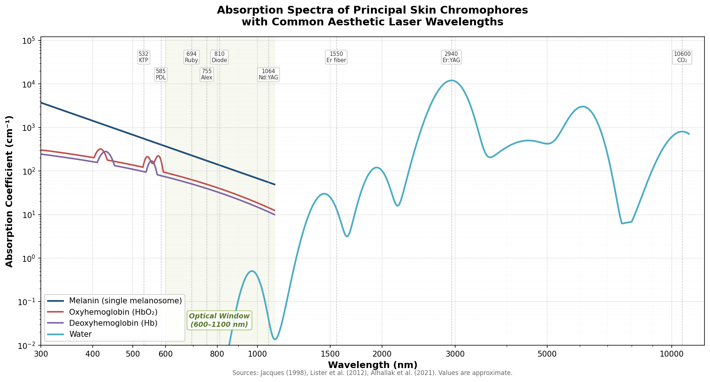

*Figure 1. Absorption coefficients of the four principal skin chromophores as a function of wavelength (300–11,000 nm). Dashed vertical lines indicate clinically important laser wavelengths; the green-shaded region marks the 600–1,100 nm optical window where all chromophore absorptions reach relative minima and tissue penetration is maximal. Data sources: Jacques (1998), Lister et al. (2012), Alhallak et al. (2021).*

## 1.3 Three Mechanisms of Light–Tissue Interaction

The biological effects of light on skin can be categorized into three principal mechanisms—photothermal, photochemical, and photomechanical—each operating through distinct physical pathways and producing qualitatively different therapeutic outcomes. Figure 2 provides a schematic overview of this interaction cascade, mapping the journey from photon incidence through the four optical processes to the three mechanistic pathways and their clinical endpoints.

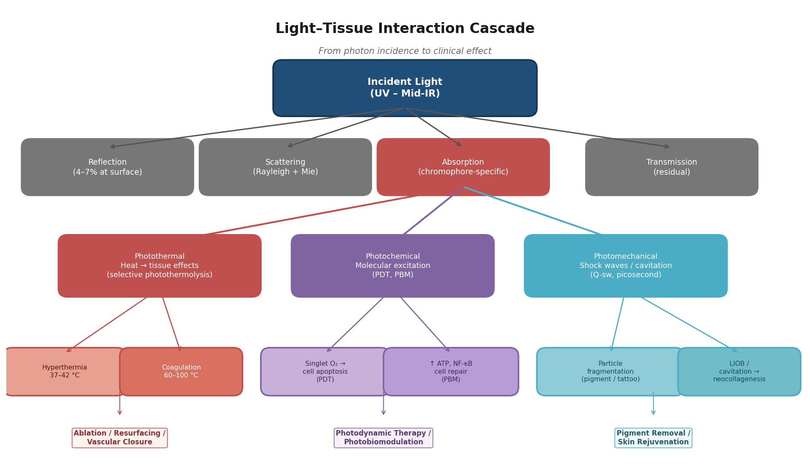

*Figure 2. Light–tissue interaction cascade. Incident photons undergo reflection, scattering, absorption, or transmission. Absorbed energy produces biological change through three principal mechanisms: photothermal (selective photothermolysis, coagulation, ablation), photochemical (photodynamic therapy, photobiomodulation), and photomechanical (shock-wave fragmentation, laser-induced optical breakdown).*

### 1.3.1 Photothermal Interaction

Photothermal effects dominate the majority of aesthetic laser and IPL procedures. When a chromophore absorbs a photon, the absorbed energy is rapidly converted to heat through vibrational relaxation. The magnitude and spatial distribution of the resulting temperature rise determine the biological outcome along a well-characterized continuum: reversible hyperthermia at 37–42 °C induces vasodilation and transient cellular stress; protein denaturation and coagulative necrosis occur between 60 °C and 100 °C; and tissue vaporization and ablation begin above 100 °C [Jacques 1992](https://pubmed.ncbi.nlm.nih.gov/1589829/ "Laser-tissue interactions. Surg Clin North Am 1992;72(3):531-58").

The concept of **selective photothermolysis**, introduced by Anderson and Parrish in 1983, provided the theoretical basis for modern aesthetic laser medicine. This principle holds that a targeted chromophore-containing structure can be selectively damaged while sparing surrounding tissue if three conditions are simultaneously satisfied: (1) the wavelength is preferentially absorbed by the target chromophore relative to surrounding tissue; (2) the target contains a sufficiently high concentration of the chromophore; and (3) the laser pulse duration is equal to or shorter than the thermal relaxation time (TRT) of the target, thereby confining deposited heat before significant diffusion to adjacent structures occurs [Anderson & Parrish 1983](https://pubmed.ncbi.nlm.nih.gov/6836297/ "Selective photothermolysis. Science 1983;220(4596):524-527").

The thermal relaxation time is approximated by TRT ≈ d²/16κ, where *d* is the target diameter and *κ* is the thermal diffusivity of tissue. This relationship yields markedly different time scales for different clinical targets: melanosomes (~1 µm diameter) have a TRT of approximately 250 ns to 1 µs, requiring nanosecond or picosecond pulses for selective destruction; dermal blood vessels (50–100 µm) have TRTs of 1–10 ms, matched by millisecond-domain pulsed dye and KTP lasers; and hair follicles (200–300 µm effective diameter) have TRTs of 40–100 ms, permitting the use of long-pulse (3–100 ms) lasers for photoepilation [Alhallak et al. 2021](https://www.heraldopenaccess.us/openaccess/skin-light-and-their-interactions-an-in-depth-review-for-modern-light-based-skin-therapies "Skin, Light and their Interactions — In-Depth Review"). Figure 3 maps these target-specific TRT ranges against laser pulse-duration regimes on a logarithmic time axis.

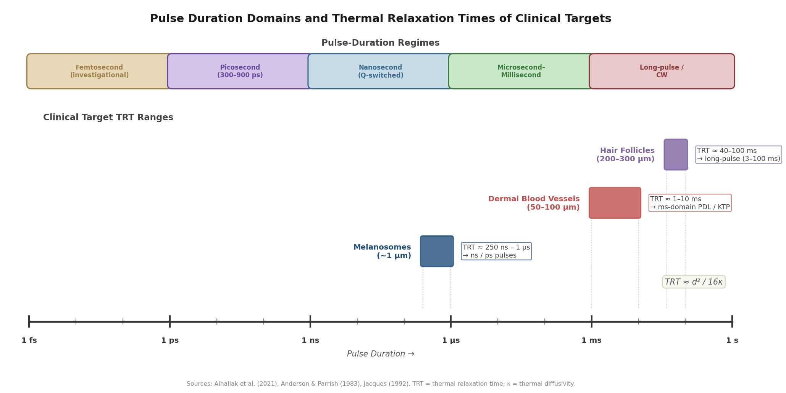

*Figure 3. Pulse-duration regimes (femtosecond through continuous-wave) aligned with the thermal relaxation times of three clinical target structures: melanosomes (~1 µm), dermal blood vessels (50–100 µm), and hair follicles (200–300 µm). Selective photothermolysis requires that the pulse duration does not exceed the target's TRT. Sources: Anderson & Parrish (1983), Jacques (1992), Alhallak et al. (2021).*

#### Extended Theory of Selective Photothermolysis

The original Anderson–Parrish model assumed uniform chromophore distribution within the target. Many clinically relevant targets, however—notably hair follicles and certain vascular malformations—feature non-uniform pigment distribution, with melanin concentrated in discrete sub-structures (e.g., the hair shaft and matrix) rather than distributed homogeneously throughout the target volume. Altshuler, Anderson, Manstein et al. (2001) addressed this limitation by formulating an extended theory of selective photothermolysis. The extended model demonstrates that when pigment is spatially separated from the ultimate target structure, thermal damage depends on controlled heat diffusion from the pigmented absorber to the surrounding non-pigmented tissue. A key prediction is that optimal pulse durations for non-uniformly pigmented targets can be significantly longer than the classical TRT—a finding experimentally verified by the observation that hair follicle damage was pulse-width independent across a broad range (30–400 ms) at constant fluence [Altshuler et al. 2001](https://pubmed.ncbi.nlm.nih.gov/11891730/ "Extended theory of selective photothermolysis. Lasers Surg Med 2001;29(5):416-432"). This extension provides the theoretical justification for the super-long-pulse modes (up to 400 ms) employed in modern diode and Nd:YAG photoepilation platforms.

### 1.3.2 Photochemical Interaction

Photochemical effects occur when absorbed photons drive chemical reactions without producing significant bulk tissue heating. Two clinically important subcategories exist within this domain:

**Photodynamic therapy (PDT)** involves the administration of an exogenous photosensitizer (e.g., 5-aminolevulinic acid, metabolized intracellularly to protoporphyrin IX) followed by irradiation at the photosensitizer's absorption wavelength (typically 630–635 nm for ALA-PDT). The excited photosensitizer transfers energy to molecular oxygen, generating cytotoxic singlet oxygen (¹O₂) that induces apoptosis in target cells. Although PDT is primarily employed in dermatologic oncology, it has established aesthetic applications including photodamage reversal and acne management.

**Photobiomodulation (PBM)**, discussed in detail in Section 1.4, represents a fundamentally different photochemical pathway in which low-irradiance light modulates endogenous mitochondrial chromophores to stimulate reparative cellular processes—without exogenous photosensitizer administration or tissue destruction.

### 1.3.3 Photomechanical (Photoacoustic) Interaction

When laser pulse durations are compressed to the nanosecond or picosecond domain—far shorter than the TRT of the target chromophore—energy deposition becomes so rapid that thermoelastic expansion and shock-wave generation, rather than bulk thermal diffusion, become the dominant damage mechanisms. Rapid heating of melanosomes or tattoo pigment particles generates inertially confined stress waves that mechanically fracture the target into smaller fragments amenable to macrophage clearance. This photoacoustic fragmentation is the operating principle of Q-switched (nanosecond) and picosecond lasers used for pigmented-lesion treatment and tattoo removal [Alhallak et al. 2021](https://www.heraldopenaccess.us/openaccess/skin-light-and-their-interactions-an-in-depth-review-for-modern-light-based-skin-therapies "Skin, Light and their Interactions — In-Depth Review"). Picosecond platforms (300–750 ps pulse widths) intensify the photomechanical component relative to nanosecond systems, generating greater particle fragmentation per pulse. When combined with diffractive or microlens arrays, picosecond pulses can produce laser-induced optical breakdown (LIOB) and cavitation bubbles within the dermis, stimulating neocollagenesis without bulk thermal injury—a mechanism that underpins fractional picosecond skin-rejuvenation protocols.

## 1.4 Photobiomodulation: Cellular Mechanisms and the Biphasic Dose Response

Photobiomodulation (PBM)—also referred to historically as low-level light therapy (LLLT) or, in the context of consumer devices, LED phototherapy—is a non-thermal, photochemical modulation of cellular function. PBM operates at power densities and energy densities orders of magnitude below those employed in selective photothermolysis: typical parameters range from 1–500 mW/cm² irradiance and 1–20 J/cm² fluence, producing no measurable tissue temperature elevation. These values contrast sharply with the 5–100+ J/cm² fluences characteristic of photothermal laser procedures [de Freitas & Hamblin 2016](https://pubmed.ncbi.nlm.nih.gov/28070154/ "Proposed Mechanisms of PBM. IEEE J Sel Top Quantum Electron 2016;22(3):7000417").

### 1.4.1 Mitochondrial Chromophore: Cytochrome c Oxidase

The primary intracellular photoacceptor for PBM is cytochrome c oxidase (CCO, Complex IV of the mitochondrial electron transport chain), a metalloprotein containing copper and heme centers with absorption bands in the red (600–700 nm) and near-infrared (780–1,100 nm) regions. The prevailing mechanistic hypothesis holds that photon absorption by CCO causes photo-dissociation of inhibitory nitric oxide (NO) from the enzyme's binuclear center, thereby restoring electron flow, increasing the mitochondrial membrane potential (ΔΨm), and elevating ATP production. Downstream, transient increases in reactive oxygen species (ROS), cyclic AMP (cAMP), released NO, and intracellular Ca²⁺ activate transcription factors—including NF-κB and AP-1—that upregulate genes involved in protein synthesis, cell proliferation, migration, and anti-inflammatory signaling [de Freitas & Hamblin 2016](https://pubmed.ncbi.nlm.nih.gov/28070154/ "Proposed Mechanisms of PBM"); [Hamblin 2018](https://onlinelibrary.wiley.com/doi/full/10.1111/php.12864 "Mechanisms and Mitochondrial Redox Signaling in PBM. Photochem Photobiol 2018;94(2):199-212").

### 1.4.2 Biphasic Dose Response (Arndt–Schulz Curve)

A defining characteristic of PBM is its biphasic dose–response relationship, often described by analogy to the Arndt–Schulz principle or biological hormesis. At very low doses, the stimulus is insufficient to elicit a measurable biological response. Within an intermediate, optimal dose window, maximal beneficial effects are observed—enhanced proliferation, increased collagen synthesis, reduced inflammation. Beyond this optimum, increasing dose yields diminishing returns and, at sufficiently high levels, produces inhibitory or cytotoxic effects. This biphasic behavior has been demonstrated across multiple cell types and in vivo models, and it underscores the critical importance of precise dosimetry in PBM protocols: delivering more light does not necessarily produce a proportionally greater therapeutic benefit [Hamblin 2018](https://onlinelibrary.wiley.com/doi/full/10.1111/php.12864 "Mechanisms and Mitochondrial Redox Signaling in PBM. Photochem Photobiol 2018;94(2):199-212").

## 1.5 Dosimetric Parameters: Shaping Treatment Outcomes

Beyond wavelength selection and mechanism of action, the clinical outcome of any light-based therapy is governed by a set of interdependent dosimetric parameters under operator control. These parameters collectively define the therapeutic window—the range of settings that achieve the desired biological effect while maintaining an acceptable safety margin.

### 1.5.1 Fluence (Energy Density)

Fluence, expressed in J/cm², represents the total energy delivered per unit area and is the most commonly reported dose parameter in light-based dermatology. For selective photothermolysis, clinically effective fluences typically range from 5–100+ J/cm², depending on the target and wavelength; for PBM, effective fluences fall in the 1–20 J/cm² range. At any given wavelength, fluence determines whether the biological response crosses the threshold for the desired effect—be it coagulation, ablation, or biostimulation—while remaining below the threshold for unacceptable collateral damage.

### 1.5.2 Pulse Duration

Pulse duration determines the temporal confinement of deposited energy and thus the dominant mechanism of tissue interaction. As outlined in Section 1.3, pulse widths shorter than the target TRT confine thermal damage to the chromophore-bearing structure (selective photothermolysis); pulse widths much shorter than the stress relaxation time (~1 µs for melanosomes) shift the interaction into the photomechanical regime. The clinically relevant continuum spans from femtosecond (10⁻¹⁵ s, investigational) through picosecond (10⁻¹² s), nanosecond (10⁻⁹ s), microsecond, and millisecond domains up to continuous-wave (CW) operation. Each temporal domain preferentially couples to different tissue targets and interaction mechanisms, as illustrated in Figure 3.

### 1.5.3 Spot Size and Penetration Depth

Increasing the beam spot diameter from 1 mm to approximately 20 mm substantially increases the effective optical penetration depth, because a wider beam reduces the relative loss of photons through lateral scattering out of the irradiated volume. Beyond approximately 20 mm diameter, the marginal gain in penetration diminishes. This relationship carries direct clinical significance: large-spot, low-fluence approaches (e.g., Nd:YAG at 1064 nm for hair removal) can deliver therapeutically useful energy to deep follicular targets that small-spot configurations cannot effectively reach [Alhallak et al. 2021](https://www.heraldopenaccess.us/openaccess/skin-light-and-their-interactions-an-in-depth-review-for-modern-light-based-skin-therapies "Skin, Light and their Interactions — In-Depth Review").

### 1.5.4 Cooling Strategies

Epidermal cooling is essential for protecting the melanin-rich epidermis during photothermal procedures that target deeper chromophores. Three principal approaches are in widespread clinical use:

- **Contact cooling**: a chilled sapphire or copper window (typically maintained at ~4 °C) placed against the skin before and during pulse delivery, providing continuous conductive heat extraction from the epidermal surface.
- **Dynamic cryogen cooling (DCD)**: a brief spray of cryogen (R-134a) immediately before the laser pulse, transiently cooling the superficial ~200 µm of epidermis to approximately −30 °C without affecting deeper target structures.
- **Forced cold air**: convective cooling with air at approximately −30 °C, providing continuous but less precisely localized thermal protection.

Each modality selectively lowers epidermal temperature, increasing the thermal gradient between the protected epidermis and the target chromophore depth and thereby widening the therapeutic window—the fluence range that is simultaneously effective and safe [Das et al. 2016](https://pmc.ncbi.nlm.nih.gov/articles/PMC5227072/ "Cooling Devices in Laser therapy. J Cutan Aesthet Surg 2016;9(4):215-219").

## 1.6 Skin-Type Considerations: Fitzpatrick Classification and Differential Risk

The Fitzpatrick skin type (FST) classification system grades skin from Type I (very fair; always burns, never tans) through Type VI (deeply pigmented; never burns), based primarily on constitutive melanin content and the cutaneous response to ultraviolet exposure. From a biophysical standpoint, the FST system serves as a clinical proxy for epidermal melanin density, which directly determines the degree to which epidermal melanin competes with deeper target chromophores for absorption of incident laser energy.

Quantitatively, the absorption coefficient of darkly pigmented skin (FST V–VI) can exceed that of lightly pigmented skin by up to 74% across the 400–1,000 nm spectrum [Setchfield et al. 2024](https://pmc.ncbi.nlm.nih.gov/articles/PMC10807857/ "Effect of skin color on optical properties. J Biomed Opt 2024;29(1):010901"). This elevated epidermal absorption carries two adverse consequences: first, a greater fraction of incident energy is deposited in the epidermis before reaching the intended dermal target, reducing treatment efficacy; second, the excess epidermal energy deposition increases the risk of thermal injury to melanocytes, potentially producing post-inflammatory hyperpigmentation (PIH), burns, or depigmentation.

Mitigation strategies for darker skin types follow directly from the biophysical principles established in the preceding sections:

- **Longer wavelengths** (e.g., 1064 nm Nd:YAG in preference to 755 nm alexandrite): melanin's absorption coefficient at 1064 nm is roughly one-third that at 755 nm, dramatically reducing the epidermal absorption penalty.
- **Lower fluence**: reducing energy density decreases the absolute thermal load deposited in epidermal melanin.
- **Longer pulse duration**: extending pulse width beyond the melanosome TRT permits partial heat dissipation from melanosomes to surrounding keratinocytes during the pulse, reducing peak melanosome temperature and the risk of epidermal injury.
- **Enhanced cooling**: aggressive pre-cooling (DCD or contact cooling) selectively lowers epidermal temperature, raising the maximum fluence that can be delivered safely.

These parameter adjustments are not merely empirical conventions but follow rigorously from the wavelength-dependent absorption spectra, the TRT framework, and the epidermal cooling dynamics described in Sections 1.2–1.5 [Sharma & Patel 2023](https://www.ncbi.nlm.nih.gov/books/NBK557626/ "Laser Fitzpatrick Skin Type Recommendations. StatPearls 2023"); [Setchfield et al. 2024](https://pmc.ncbi.nlm.nih.gov/articles/PMC10807857/ "Effect of skin color on optical properties. J Biomed Opt 2024;29(1):010901").

## 1.7 Summary of Quantitative Reference Points

Table 1 consolidates approximate absorption coefficients for the four principal chromophores at clinically important laser wavelengths. Values for melanin are calculated for a single melanosome using the Jacques (1998) model (µ_a,mel ≈ 6.6 × 10¹¹ × λ^(−3.33) cm⁻¹); net epidermal absorption scales linearly with the melanosome volume fraction (typically 1–43%, depending on skin type). Hemoglobin values represent whole blood at 45% hematocrit. Water values are approximate tissue-level coefficients.

| Wavelength (nm) | Laser Type | Melanin µ_a,mel (cm⁻¹) | HbO₂ (cm⁻¹) | Hb (cm⁻¹) | Water (cm⁻¹) | Primary Target |
|---|---|---|---|---|---|---|
| 532 | KTP / Nd:YAG ×2 | ~550 | ~210 | ~130 | <0.1 | Melanin, HbO₂ |
| 585–595 | Pulsed dye | ~340–310 | ~25–15 | ~30–40 | <0.1 | HbO₂ |
| 694 | Ruby | ~228 | ~2.5 | ~2.0 | <0.1 | Melanin |
| 755 | Alexandrite | ~170 | ~2.0 | ~1.8 | <0.1 | Melanin |
| 810 | Diode | ~120 | ~4.0 | ~3.5 | <0.1 | Melanin (deep) |
| 1064 | Nd:YAG | ~55 | ~1.5 | ~1.8 | ~0.15 | Deep melanin, vessels |
| 1550 | Erbium fiber | ~15 | <1 | <1 | ~10 | Water (dermis) |
| 2940 | Er:YAG | — | — | — | ~12,000 | Water (ablation) |
| 10,600 | CO₂ | — | — | — | ~800 | Water (ablation) |

*Table 1. Approximate absorption coefficients (cm⁻¹) of principal skin chromophores at clinically important laser wavelengths. Melanin values follow the Jacques (1998) single-melanosome model; hemoglobin values are derived from Lister et al. (2012) and OMLC tabulated spectra; water values are from Alhallak et al. (2021) and standard tissue optics references. All values are order-of-magnitude approximations intended to illustrate relative chromophore competition at each wavelength; actual tissue-level values will vary with skin type, blood volume fraction, and tissue hydration.*

# 第2章 Laser Therapies in Aesthetic Dermatology

Laser technology constitutes the backbone of modern aesthetic dermatology. Since the articulation of selective photothermolysis in 1983 (see Chapter 1), successive generations of laser platforms have expanded the clinician's armamentarium from full-field ablative resurfacing to fractional delivery systems, from nanosecond Q-switched pulses to picosecond photoacoustic architectures, and from single-wavelength devices to multi-wavelength, multi-mode platforms. This chapter surveys the principal laser modalities in current clinical use—organized by mechanism, wavelength, and pulse domain—and evaluates their comparative efficacy and safety profiles for photoaging, pigmented lesions, and skin rejuvenation, with particular attention to evidence published and platforms commercialized between 2025 and early 2026.

## 2.1 Ablative Resurfacing Lasers: CO₂ and Erbium:YAG

### CO₂ Laser (10 600 nm)

The carbon dioxide laser remains one of the most powerful resurfacing instruments available. Operating at 10 600 nm, it targets intracellular and extracellular water, producing controlled tissue vaporization at 20–60 µm per pass with a residual thermal damage zone of 100–150 µm. This thermal coagulation zone is clinically significant: it drives immediate collagen contraction and triggers a prolonged wound-healing cascade that culminates in neocollagenesis over weeks to months. Early clinical series reported wrinkle improvement of up to 90% with full-field CO₂ resurfacing [StatPearls — Ablative Laser Resurfacing](https://www.ncbi.nlm.nih.gov/books/NBK557474/ "Verma et al., StatPearls 2023").

A 2024 expert consensus involving 21 international physicians confirmed the fractional ablative CO₂ laser (FACL) as the "gold standard" for nonsurgical skin rejuvenation, recommending Fitzpatrick skin types (FST) I–III as ideal candidates; only 12% of respondents reported performing FACL on FST IV or higher. Importantly, 95% of panelists had encountered post-inflammatory hyperpigmentation (PIH) following FACL, leading the consensus to endorse prophylactic measures: topical hydroquinone (52% agreement) and strict sun avoidance beginning at least four weeks before treatment (67% agreement) [Levy et al. 2024](https://pmc.ncbi.nlm.nih.gov/articles/PMC11776446/ "Expert Consensus on Fractional Ablative CO₂ Laser, Lasers Surg Med 2024;57:15").

Wu et al. (2025) subsequently refined CO₂ treatment strategies for Asian skin, demonstrating that a "low energy combined with high-density coverage" approach yielded the best efficacy-to-safety ratio for periorbital wrinkles in Chinese patients. This finding reinforces a broader paradigm shift toward conservative parameter settings with multiple passes, particularly in populations with higher baseline melanin density [Wu et al. 2025](https://pmc.ncbi.nlm.nih.gov/articles/PMC12092846/ "Fractional CO₂ AFL for Periorbital Wrinkles in Chinese, 2025").

### Erbium:YAG Laser (2 940 nm)

The Er:YAG laser operates at a wavelength whose water absorption coefficient is 12–18 times greater than that of the CO₂ laser at 10 600 nm. This stronger absorption translates into precise, superficial ablation of 3–5 µm per pass with only 10–40 µm of residual thermal damage—roughly one-quarter to one-third that of CO₂. The shallower thermal footprint accelerates re-epithelialization to approximately five days (versus approximately eight for CO₂) and limits post-procedural erythema to three to four weeks, in contrast to the several months commonly associated with aggressive CO₂ resurfacing [StatPearls — Ablative Laser Resurfacing](https://www.ncbi.nlm.nih.gov/books/NBK557474/ "Verma et al., StatPearls 2023").

A 2024 meta-analysis comparing fractional CO₂ with fractional Er:YAG for atrophic acne scars found that CO₂ achieved a significantly higher overall effective rate but at the cost of greater procedural pain and longer recovery. Er:YAG was favored for patients at elevated risk of dyspigmentation—specifically FST IV–VI—where its reduced thermal damage zone minimizes melanocyte perturbation [CO₂ vs. Er:YAG meta-analysis](https://onlinelibrary.wiley.com/doi/full/10.1111/jocd.16348 "J Cosmet Dermatol 2024").

## 2.2 Fractional Technology: Ablative Fractional vs. Non-Ablative Fractional Resurfacing

The introduction of fractional photothermolysis by Manstein et al. in 2004 transformed laser resurfacing by replacing uniform surface ablation with arrays of microscopic treatment zones (MTZs)—each less than 400 µm in diameter and extending up to 1 300 µm into the dermis—while leaving intervening tissue intact. The preserved bridges of undamaged epidermis serve as reservoirs for rapid re-epithelialization, dramatically reducing downtime and complication rates relative to full-field ablation.

### Ablative Fractional Lasers (AFL)

Fractional CO₂ and fractional Er:YAG systems deliver the tissue-removal capacity of their full-field predecessors through a pattern of discrete microcolumns. Fractional CO₂ achieves up to 80% patient-reported acceptable rhytide reduction with five- to ten-day recovery periods [StatPearls — Ablative Laser Resurfacing](https://www.ncbi.nlm.nih.gov/books/NBK557474/ "Verma et al., StatPearls 2023"). A systematic review encompassing 1 093 patients (Mirza et al. 2021) confirmed that fractional delivery carries a markedly lower incidence of prolonged erythema, scarring, and dyspigmentation compared with full-field ablative treatments [Mirza et al. 2021](https://onlinelibrary.wiley.com/doi/abs/10.1111/dth.14432 "Dermatol Ther 2021;34:e14432").

### Non-Ablative Fractional Lasers (NAFL)

Non-ablative fractional systems—including the 1 540 nm erbium:glass, 1 550 nm erbium-doped fiber, and 1 927 nm thulium fiber laser—create zones of thermal coagulation within the dermis without disrupting the epidermal surface. A comprehensive 2024 review by Haykal et al., synthesizing 92 studies, established that NAFL provides moderate textural and pigmentary improvements with minimal surface damage, typical recovery of one to three days, and lower PIH risk. These attributes make NAFL platforms particularly suitable for darker skin types and for patients who prioritize minimal downtime [Haykal et al. 2024](https://onlinelibrary.wiley.com/doi/10.1111/jocd.16514 "J Cosmet Dermatol 2024;23:3078–3089").

### Hybrid Fractional Systems

Hybrid fractional laser platforms combine ablative and non-ablative wavelengths within a single treatment session, seeking to balance the superior efficacy of ablative delivery with the reduced downtime inherent to non-ablative treatment. The Haykal et al. review noted that such hybrid approaches have demonstrated sustained clinical outcomes and high patient satisfaction persisting up to six years post-treatment [Haykal et al. 2024](https://onlinelibrary.wiley.com/doi/10.1111/jocd.16514 "J Cosmet Dermatol 2024;23:3078–3089").

## 2.3 Non-Ablative Rejuvenation Lasers: Nd:YAG 1 064 nm, Diode 1 450 nm, and Thulium 1 927 nm

Among non-ablative systems, the Nd:YAG 1 064 nm laser occupies a central role owing to its position within the skin's optical window (approximately 600–1 100 nm), where competing absorption by melanin, hemoglobin, and water is minimized. Deep dermal penetration combined with reduced epidermal melanin interaction makes the 1 064 nm wavelength the safest established option for treating pigmented lesions in FST IV–VI [Haykal et al. 2024](https://onlinelibrary.wiley.com/doi/10.1111/jocd.16514 "J Cosmet Dermatol 2024;23:3078–3089").

The 1 927 nm fractional thulium fiber laser (FTL) has emerged as a versatile platform bridging ablative and non-ablative domains. Its moderate water affinity yields a penetration depth of 200–300 µm, targeting superficial epidermal and upper dermal structures and making it well suited for pigmentary disorders and mild-to-moderate photoaging. A 2023 prospective study of 27 patients (FST II–IV) demonstrated statistically significant improvements in melanin index, wrinkle scores, and skin elasticity after three monthly treatments, with 70% patient satisfaction and zero instances of PIH [Li et al. 2023](https://pmc.ncbi.nlm.nih.gov/articles/PMC10025463/ "Front Surg 2023;10:1076848"). A 2025 systematic review by da Silva Sardinha et al. further confirmed the 1 927 nm laser's efficacy across melasma, scars, and skin rejuvenation, reporting low adverse-effect rates and favorable performance in skin of color [da Silva Sardinha et al. 2025](https://www.tandfonline.com/doi/abs/10.1080/14764172.2025.2483703 "J Cosmet Laser Ther 2025").

## 2.4 Q-Switched Nanosecond Lasers for Pigmented Lesions

Q-switched (QS) nanosecond lasers—including the Nd:YAG (532 nm and 1 064 nm), alexandrite (755 nm), and ruby (694 nm)—deliver pulse durations of 5–50 nanoseconds. At this timescale, pulses remain well within the thermal relaxation time of melanosomes (approximately 250 ns–1 µs; see Chapter 1), enabling selective photothermolysis of pigment particles while limiting collateral thermal injury to surrounding tissue.

### Efficacy Across Pigmented Lesion Subtypes

A landmark meta-analysis by Williams et al. (2021), encompassing 57 studies and 13 417 patients, provided the most comprehensive quantitative comparison of Q-switched laser performance for nevus of Ota—a prototypical dermal melanocytosis. Pooled success rates and adverse-event profiles were as follows:

- **QS Nd:YAG 1 064 nm**: 64% success rate (95% CI 52–76%), 5% adverse-event rate (95% CI 4–6%)—the largest evidence base and lowest complication rate among QS platforms.
- **QS Alexandrite 755 nm**: 58% success rate, 9% adverse-event rate.
- **QS Ruby 694 nm**: 54% success rate, 14% adverse-event rate.

These data position the QS Nd:YAG 1 064 nm as the best-characterized and safest Q-switched platform for dermal pigmented lesions, particularly in darker skin types where its longer wavelength reduces competitive absorption by epidermal melanin [Williams et al. 2021](https://pubmed.ncbi.nlm.nih.gov/32839837/ "Lasers Med Sci 2021;36:723–733").

For solar lentigines—superficial epidermal melanin deposits—QS 532 nm (frequency-doubled Nd:YAG) and QS 755 nm alexandrite represent established first-line treatments. The shorter wavelengths target the shallower melanin distribution characteristic of lentigines more efficiently than 1 064 nm [Haykal et al. 2024](https://onlinelibrary.wiley.com/doi/10.1111/jocd.16514 "J Cosmet Dermatol 2024;23:3078–3089").

## 2.5 Picosecond Lasers: Photoacoustic Mechanism and Comparative Evidence

### Mechanism and Platform Landscape

Picosecond lasers represent the next evolution in pulse-duration technology, delivering energy in 300–900 picosecond pulses—roughly 10–100 times shorter than Q-switched nanosecond systems. At these ultrashort durations, the dominant tissue interaction shifts from photothermal destruction toward photoacoustic and photomechanical effects: rapid thermoelastic expansion generates pressure waves that physically fragment pigment particles into finer debris, facilitating more efficient macrophage clearance (Figure 1) [Zhou et al. 2023](https://pmc.ncbi.nlm.nih.gov/articles/PMC9852188/ "Lasers Med Sci 2023;38:45").

A distinguishing feature of modern picosecond platforms is the use of fractional optical delivery systems—diffractive lens arrays (DLA) or micro-lens arrays (MLA)—that redistribute the beam into a grid of high-intensity focal points. These focal spots generate laser-induced optical breakdown (LIOB) in the epidermis and laser-induced cavitation (LIC) in the dermis, creating microvacuoles that stimulate neocollagenesis and elastin fiber elongation without requiring surface ablation [Zhou et al. 2023](https://pmc.ncbi.nlm.nih.gov/articles/PMC9852188/ "Lasers Med Sci 2023;38:45").

The principal commercial platforms include:

- **PicoSure** (755 nm alexandrite; Cynosure) — FDA-cleared in 2012; the 755 nm wavelength is preferentially absorbed by melanin.
- **PicoWay** (532/730/785/1 064 nm; Candela) — a multi-wavelength system offering the broadest spectral coverage for diverse pigment targets.
- **PicoPlus / PicoLO** (1 064/532 nm; Lutronic) — widely adopted in Asian markets for pigmented lesions and toning protocols.

### Picosecond vs. Nanosecond: Head-to-Head Evidence

The most rigorous comparative trial to date is the randomized split-lesion study by Ge et al. (2020, *JAAD*, n = 56), comparing picosecond alexandrite laser (PSAL) with Q-switched alexandrite laser (QSAL) for nevus of Ota. PSAL achieved a superior clearance score on a 5-point scale (4.53 vs. 4.0), required fewer treatment sessions (5.26 vs. 5.87), produced lower pain scores (VAS 5.61 vs. 6.40), and resulted in reduced PIH (26% vs. 34%) and hypopigmentation (21% vs. 47%) [Ge et al. 2020](https://pubmed.ncbi.nlm.nih.gov/30885760/ "JAAD 2020;83:397–403").

The Williams et al. meta-analysis reported a pooled 100% success rate (95% CI 98–102%) for PSAL in treating nevus of Ota—markedly higher than any Q-switched platform. PSAL, however, also carried a 44% adverse-event rate (95% CI 31–57%), underscoring that superior clearance does not automatically translate into a more favorable safety profile. The authors concluded that QS Nd:YAG 1 064 nm retains the most established evidence for safe treatment, while picosecond alexandrite may offer superior efficacy where aggressive clearance is prioritized [Williams et al. 2021](https://pubmed.ncbi.nlm.nih.gov/32839837/ "Lasers Med Sci 2021;36:723–733").

### Tattoo Removal

A prospective comparison by Kono et al. (2020) in 11 Asian patients bearing 37 multicolor tattoos demonstrated that picosecond 532/1 064 nm Nd:YAG was significantly superior to its nanosecond counterpart for black, red, and green inks. PIH ranged from 21.6% (1 064 nm picosecond) to 35.1% (532 nm nanosecond); no scarring occurred in any treatment arm [Kono et al. 2020](https://pmc.ncbi.nlm.nih.gov/articles/PMC7447827/ "Laser Therapy 2020;29:47–52"). Wavelength selection follows the complementary-color principle: 1 064 nm addresses black and dark blue inks, 532 nm targets red, orange, and yellow pigments, and 694 nm or 755 nm is employed for green and blue inks.

### Skin Rejuvenation and Evidence Grading

For photoaging, fractional picosecond delivery with DLA (755 nm, 0.71 J/cm²) improved the average Fitzpatrick wrinkle score from 5.48 to 3.47 at six months in 40 patients (Weiss et al. 2017). A split-face RCT comparing fractional picosecond 1 064 nm with fractional CO₂ for acne scars (Sirithanabadeekul et al. 2021) found comparable scar-volume reduction, but fractional picosecond treatment produced a lower incidence of PIH [Zhou et al. 2023](https://pmc.ncbi.nlm.nih.gov/articles/PMC9852188/ "Lasers Med Sci 2023;38:45").

Wu and Goldman's 2021 systematic review of 77 studies established a tiered evidence framework for picosecond lasers: Level I evidence supports their use in tattoo removal; Level II evidence supports treatment of benign pigmented lesions and acne scarring; Level IV evidence (case series and expert opinion) supports skin rejuvenation and melasma, indicating that more rigorous RCTs remain necessary for these latter indications [Wu & Goldman 2021](https://pubmed.ncbi.nlm.nih.gov/32282094/ "Lasers Surg Med 2021;53:9–49").

## 2.6 Wavelength Selection by Indication: A Clinical Framework

Matching laser wavelength and pulse domain to the specific lesion subtype is fundamental to achieving optimal clearance with minimal adverse effects. The framework below synthesizes the evidence reviewed in the preceding sections; Figure 2 provides a complementary visual summary.

| Indication | First-Line Wavelength(s) | Pulse Domain | Key Evidence |
|---|---|---|---|
| Solar lentigines (epidermal) | 532 nm, 755 nm | QS nanosecond or picosecond | Established first-line; picosecond may require fewer sessions |
| Dermal melanocytosis (nevus of Ota, ABNOM) | 1 064 nm (QS or pico); 755 nm (pico) | Nanosecond or picosecond | QS Nd:YAG: 64% success / 5% AE; PSAL: ~100% success / 44% AE |
| Tattoo removal (multicolor) | 1 064 nm (black/blue), 532 nm (red/yellow), 755 nm (green/blue) | Picosecond preferred | Level I evidence; pico > nano for all ink colors |
| Melasma | 1 064 nm (low-fluence QS or pico); 1 927 nm (FTL) | Nanosecond toning or picosecond | Level IV pico evidence; 1 927 nm gaining support |
| Photoaging / rejuvenation | Fractional CO₂ (10 600 nm); fractional Er:YAG (2 940 nm); 1 927 nm; fractional pico 755/1 064 nm | AFL, NAFL, or fractional pico | CO₂ most efficacious; NAFL safest for darker skin |
| Acne scarring | Fractional CO₂; fractional Er:YAG; fractional pico 1 064 nm | AFL or fractional pico | CO₂ higher efficacy; pico lower PIH |

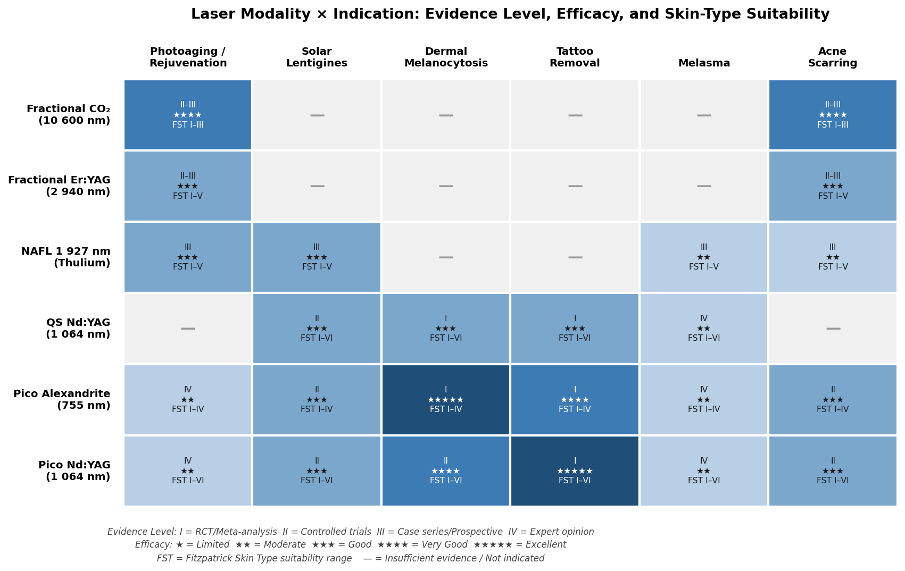

## 2.7 Safety, Adverse Events, and Skin-Type-Specific Protocols

### Post-Inflammatory Hyperpigmentation

PIH is the most frequently reported adverse event following laser skin resurfacing and disproportionately affects patients with FST III–VI. The 2024 Levy et al. consensus established that 95% of experienced practitioners had encountered PIH after FACL; more than 90% recommended parameter adjustments—reduced density, lower energy, and enhanced cooling—for FST III–IV patients [Levy et al. 2024](https://pmc.ncbi.nlm.nih.gov/articles/PMC11776446/ "Lasers Surg Med 2024;57:15"). Non-fractional CO₂ resurfacing is contraindicated for FST IV and above owing to unacceptably high rates of dyspigmentation [StatPearls — Ablative Laser Resurfacing](https://www.ncbi.nlm.nih.gov/books/NBK557474/ "Verma et al., StatPearls 2023").

Fractional delivery markedly mitigates these risks. The Mirza et al. systematic review (1 093 patients, 2021) confirmed a lower incidence of prolonged erythema, scarring, and dyspigmentation with fractional versus full-field ablative approaches [Mirza et al. 2021](https://onlinelibrary.wiley.com/doi/abs/10.1111/dth.14432 "Dermatol Ther 2021;34:e14432"). Among non-ablative options, the 1 927 nm thulium laser demonstrated zero PIH in 27 patients with FST II–IV, attributable to its superficial penetration and minimal dermal melanocyte disruption [Li et al. 2023](https://pmc.ncbi.nlm.nih.gov/articles/PMC10025463/ "Front Surg 2023;10:1076848").

Picosecond lasers exhibit a favorable safety profile compared with Q-switched systems in darker skin. In the Ge et al. RCT for nevus of Ota, PSAL produced PIH in 26% of patients versus 34% for QSAL and hypopigmentation in 21% versus 47%—a difference attributed to reduced collateral thermal injury from the shorter pulse duration [Ge et al. 2020](https://pubmed.ncbi.nlm.nih.gov/30885760/ "JAAD 2020;83:397–403"). Figure 3 summarizes adverse-event and PIH rates across laser platforms from the key comparative studies reviewed in this chapter.

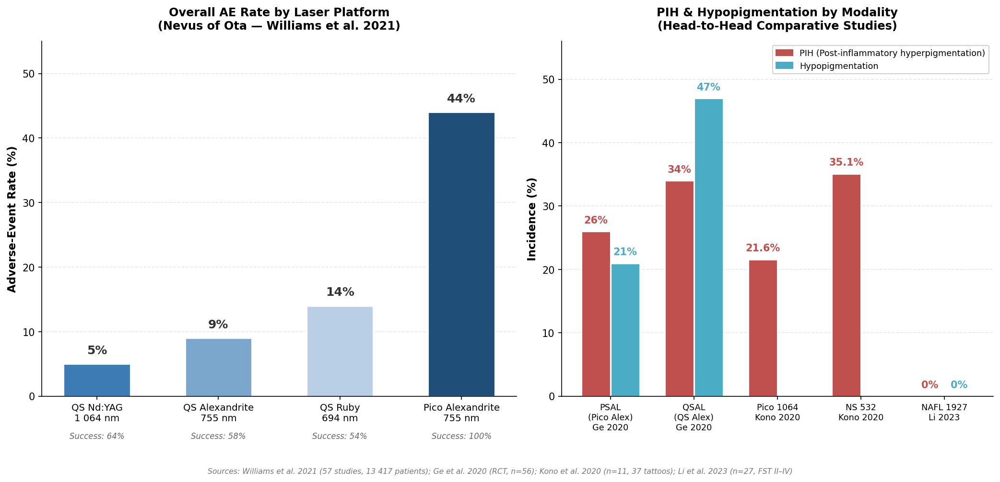

### Scarring

Scarring remains rare with fractional modalities. In the Levy et al. consensus, only 33% of panelists had ever encountered scarring after FACL, and the events were typically associated with overly aggressive settings (high density combined with high energy) or treatment of high-risk anatomical zones such as the neck and non-facial sites [Levy et al. 2024](https://pmc.ncbi.nlm.nih.gov/articles/PMC11776446/ "Lasers Surg Med 2024;57:15").

### Wavelength and Skin-Type Optimization

The Nd:YAG 1 064 nm wavelength—in both nanosecond and picosecond configurations—is regarded as the safest option for treating pigmented lesions in FST IV–VI. Its longer wavelength bypasses epidermal melanin absorption more effectively than the 532 nm, 694 nm, or 755 nm alternatives [Haykal et al. 2024](https://onlinelibrary.wiley.com/doi/10.1111/jocd.16514 "J Cosmet Dermatol 2024;23:3078–3089"). For ablative resurfacing in darker skin, Er:YAG is preferred over CO₂ given its shallower thermal damage zone and faster re-epithelialization, both of which reduce the temporal window during which melanocytes are susceptible to perturbation [StatPearls — Ablative Laser Resurfacing](https://www.ncbi.nlm.nih.gov/books/NBK557474/ "Verma et al., StatPearls 2023").

## 2.8 Emerging Laser Platforms and Innovations (2025–2026)

Several developments between 2025 and early 2026 expand the clinical toolkit and warrant attention.

**Laserase™ 1 927 nm Thulium Platform (Saratoga Technologies).** Launched in February 2026 with FDA 510(k) clearance, Laserase is a dedicated 1 927 nm thulium fiber laser combining micro-ablative and non-ablative treatment modes in a single device with zero consumables. Cleared indications span pigmentation disorders, photoaging, fine lines and wrinkles, acne scarring, melasma, PIH, and laser-assisted drug delivery (LADD). The manufacturer reports suitability for FST I–VI [Saratoga Technologies 2026](https://finance.yahoo.com/news/saratoga-technologies-l-l-c-150700001.html "Laserase 1927 nm FDA-cleared launch, Feb 2026"); independent clinical validation data are awaited.

**Lasermach Triple-Wavelength System (Wingderm International).** In 2025, Wingderm received expanded FDA clearance for its Lasermach platform across all three wavelengths—755, 808, and 1 064 nm—covering hair removal, benign pigmented lesion treatment, and vascular lesion management within a single device [Wingderm 2025](https://www.wingderm.com/lasermach-by-wingderm-receives-fda-clearance-for-all-three-wavelengths/ "Lasermach FDA clearance 2025"). Multi-wavelength consolidation reduces capital equipment burden and broadens treatment versatility in clinical settings.

**Hybrid Fractional and LADD Paradigms.** The Haykal et al. 2024 review identified three converging trends: (1) hybrid fractional systems integrating ablative and non-ablative wavelengths in single sessions; (2) laser-assisted drug delivery leveraging micro-channels created by fractional lasers for enhanced penetration of topical agents such as PRP, corticosteroids, and cosmeceuticals; and (3) development of safer treatment protocols for skin of color using conservative parameters with Nd:YAG and picosecond platforms [Haykal et al. 2024](https://onlinelibrary.wiley.com/doi/10.1111/jocd.16514 "J Cosmet Dermatol 2024;23:3078–3089").

**Parameter Optimization for Asian Skin.** The Wu et al. 2025 study on fractional CO₂ for periorbital wrinkles in Chinese populations formalized the "low energy, high density" strategy as the most efficacious and safest approach, contributing to a growing body of evidence that standard parameter sets derived from lighter-skin populations require modification for higher-melanin skin [Wu et al. 2025](https://pmc.ncbi.nlm.nih.gov/articles/PMC12092846/ "Fractional CO₂ AFL for Periorbital Wrinkles in Chinese, 2025").

## 2.9 Synthesis

The contemporary laser landscape in aesthetic dermatology is defined by three interrelated trajectories. First, fractional delivery has become the dominant paradigm, mitigating the adverse-event burden of full-field ablation while preserving clinically meaningful efficacy—a principle now reinforced by consensus guidelines and systematic review evidence. Second, picosecond pulse technology is progressively establishing its advantage over nanosecond Q-switched systems for pigmented lesions, with Level I evidence for tattoo removal and a growing RCT base for dermal melanocytosis; its role in skin rejuvenation and melasma, however, remains at an earlier evidence stage (Level IV). Third, the 1 927 nm thulium fiber laser has emerged as a versatile bridge between ablative and non-ablative domains, offering a favorable safety profile in skin of color supported by both prospective data and systematic review.

Safety considerations remain paramount, particularly for patients with FST III–VI. The Nd:YAG 1 064 nm wavelength—delivered in either nanosecond or picosecond mode—continues to represent the safest option for dermal pigment treatment in darker skin. For resurfacing, the choice between ablative and non-ablative fractional systems involves a deliberate trade-off between efficacy and downtime, with hybrid platforms and optimized parameter protocols (such as the low-energy, high-density approach validated for Asian skin) increasingly offering intermediate solutions. As new platforms enter the market and LADD protocols mature, rigorous head-to-head trials will be essential—particularly direct comparisons of ablative fractional CO₂ versus non-ablative fractional systems for photoaging using standardized outcome measures, and long-term durability data for fractional picosecond rejuvenation beyond the current 6–12 month follow-up horizon.

# 第3章 Intense Pulsed Light (IPL) — Mechanisms, Clinical Applications, and Positioning Relative to Lasers

Intense pulsed light (IPL) occupies a distinctive niche in the aesthetic-dermatology armamentarium. Unlike the lasers surveyed in Chapter 2—each emitting a single, coherent wavelength—IPL delivers a broad, polychromatic spectrum capable of simultaneously engaging multiple chromophores across a wide treatment field. Since its initial FDA clearance in 1995, the technology has undergone iterative refinement in filter design, pulse architecture, and fluence control, evolving from a relatively crude broadband source into a precision instrument that addresses diffuse photodamage, vascular dyschromia, and pigmentary irregularities with clinically meaningful efficacy and a favorable safety margin. The global IPL devices market, valued at USD 1.63 billion in 2025 and projected to reach USD 2.23 billion by 2034 (CAGR 5.4%), reflects sustained clinical adoption and continued platform innovation [IntelMarketResearch 2025](https://www.intelmarketresearch.com/ipl-devices-market-24362 "IPL devices market outlook 2025–2034").

This chapter examines IPL's biophysical foundations, evaluates its performance across key aesthetic indications—including solar lentigines, diffuse photoaging, rosacea, and melasma—positions it against competing laser modalities through head-to-head comparative evidence, and documents the technological advances and combination protocols reported in 2025–2026.

## 3.1 Physics of IPL: Broadband Emission, Spectral Filtering, and Pulse-Train Configurations

### Distinguishing IPL from Laser Light

IPL is generated by a high-intensity xenon flashlamp whose output is focused and filtered to yield a broad spectral band, typically spanning 500–1 200 nm. Three physical properties differentiate it from laser emission: **polychromaticity** (multiple wavelengths emitted simultaneously), **non-coherence** (photons are not phase-aligned), and **non-collimation** (the beam diverges rather than traveling in parallel rays). These distinctions carry direct clinical implications. Whereas a 532 nm Q-switched Nd:YAG laser deposits energy into a narrow melanin absorption peak, IPL distributes energy across a continuum that intersects the absorption spectra of melanin, oxyhemoglobin, deoxyhemoglobin, and water simultaneously [Zhai et al. 2024](https://pmc.ncbi.nlm.nih.gov/articles/PMC11626304/ "Meta-analysis of IPL vs PDL for rosacea, J Cosmet Dermatol 2024"). The result is a versatile platform capable of treating pigmented and vascular lesions—and stimulating dermal remodeling—within the same session, albeit with lower peak-power delivery to any single chromophore than a wavelength-matched laser at comparable total fluence.

### Spectral Filtering and Target Selectivity

Clinical versatility arises from interchangeable cut-off filters that sculpt IPL's spectral output to match the dominant chromophore of a given indication. A 500–677 nm pass-band preferentially targets oxyhemoglobin absorption peaks at 542 nm and 577 nm (see Chapter 1) for vascular lesions, while a 640+ nm long-pass filter bypasses superficial hemoglobin absorption and directs energy toward deeper melanin deposits—reducing the risk of vascular purpura and minimizing competitive absorption by epidermal melanin, a critical consideration in darker skin types [Piccolo et al. 2024](https://www.mdpi.com/2077-0383/13/6/1646 "IPL vascular chromophore-specific wavelength study, J Clin Med 2024"). Current advanced platforms offer eight or more selectable filters, enabling clinicians to tailor spectral output to the predominant chromophore and adjust mid-session without changing handpieces [Lumenis 2025](https://www.prnewswire.com/news-releases/lumenis-launches-new-stellar-m22-skin-treatments-platform-with-xpl-technology-backed-by-new-clinical-data-at-the-annual-american-society-for-dermatologic-surgery-meeting-asds-302619068.html "Stellar M22 XPL launch, ASDS 2025").

### Pulse Architecture and Dosimetric Parameters

IPL devices modulate energy delivery through adjustable pulse duration (1.5–50 ms), inter-pulse delays, and multi-pulse sequences (double or triple pulse trains with cooling intervals). These parameters allow the clinician to match energy deposition to the thermal relaxation time (TRT) of the target structure: shorter pulses with minimal delay for small melanosomes, longer pulse trains with inter-pulse cooling for larger vascular structures. Typical treatment parameters reported across clinical studies include spot sizes of 10 × 15 mm² to 15 × 45 mm—substantially larger than most laser spots—and fluences of 8–40 J/cm², with three to six sessions spaced at three- to four-week intervals [Martignago et al. 2024](https://ijdvl.com/efficacy-and-safety-of-intense-pulsed-light-in-rosacea-a-systematic-review/ "Systematic review of IPL in rosacea, 14 studies"). The large spot size confers two advantages: it improves treatment speed for diffuse conditions and increases effective penetration depth (as discussed in Chapter 1). However, the broad spectral distribution inherently dilutes energy per chromophore relative to a wavelength-matched laser at comparable total fluence—a fundamental trade-off between versatility and single-target intensity.

The following figure summarizes recommended IPL treatment parameters by clinical indication, synthesizing data from the principal studies reviewed in Sections 3.2–3.5.

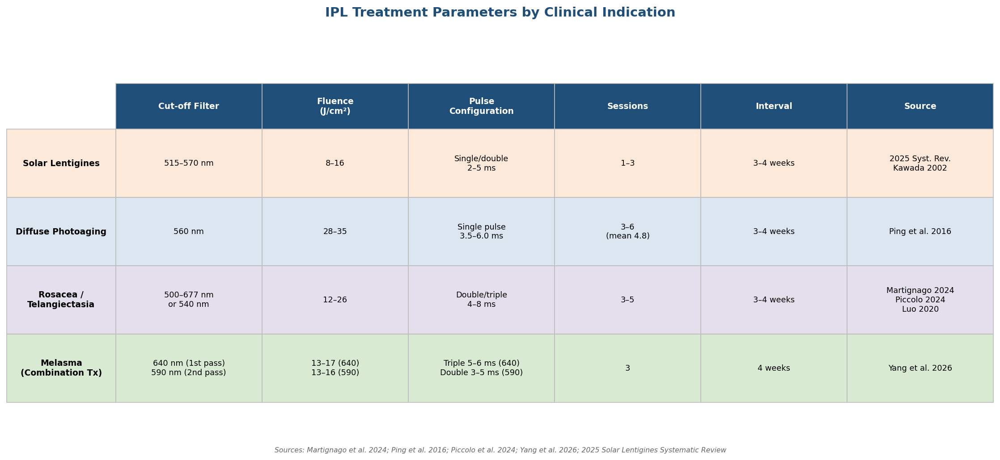

*Figure 3-1. IPL treatment parameter matrix mapping cut-off filter wavelength, fluence range, pulse configuration, session count, and treatment interval to four core clinical indications. Data compiled from Martignago et al. 2024, Ping et al. 2016, Piccolo et al. 2024, Yang et al. 2026, and the 2025 solar lentigines systematic review.*

## 3.2 Clinical Indications: Solar Lentigines, Diffuse Photodamage, and Molecular Rejuvenation

### Solar Lentigines

Solar lentigines—flat, hyperpigmented macules driven by focal melanocyte hyperactivity and melanin accumulation in the basal epidermis—represent one of IPL's strongest evidence-supported indications. A 2025 systematic review reported IPL success rates of 74.6–90% for solar lentigines, compared with Q-switched laser success rates of 36.4–97%. Although the upper end of Q-switched clearance exceeded that of IPL, IPL demonstrated more consistent outcomes for lighter, superficial lesions and superior patient tolerability owing to its lower peak irradiance [2025 Solar Lentigines Systematic Review](https://onlinelibrary.wiley.com/doi/10.1111/jocd.70133 "J Cosmet Dermatol 2025"). Histological corroboration was provided by Kawada et al. (2002) in a study of 76 patients treated with 570–950 nm IPL: greater than 50% improvement was observed in 75% of patients with solar lentigines and 71% with ephelides, with biopsy specimens confirming selective destruction of melanocytes and melanin granules within the epidermis while preserving surrounding keratinocytes [Kawada et al. 2002](https://europepmc.org/article/med/12081680 "Dermatol Surg 2002").

### Diffuse Photoaging

For the composite clinical picture of photoaging—dyschromia, telangiectasia, textural roughening, and fine rhytides—IPL's polychromatic nature becomes a strategic advantage rather than a limitation. A retrospective analysis of 97 Chinese patients treated with IPL (560 nm cut-off filter, 28–35 J/cm², 3.5–6.0 ms pulse duration) demonstrated an overall effective rate of 90.7% after a mean of 4.8 sessions, with significant improvements in pigmented lesions, telangiectasia, skin texture, and pore size [Ping et al. 2016](https://pubmed.ncbi.nlm.nih.gov/26734811/ "J Dermatolog Treat 2016"). The simultaneous engagement of melanin and hemoglobin chromophores—unachievable with any single-wavelength laser in a single pass—allows IPL to address the multi-component pathology of photodamage efficiently, an operational advantage that underpins its widespread adoption in photorejuvenation protocols.

### Molecular-Level Evidence: Gene-Expression Rejuvenation

A landmark 2013 study by Chang, Bitter, and colleagues at Stanford University provided the most granular molecular evidence obtained to date for any non-ablative light-based anti-aging intervention. Using broadband light (BBL, an IPL variant; 515–560 nm cut-off filter, 8–14 J/cm², 10–20 ms pulse duration) on photoaged forearm skin of women over 50 years of age, the investigators demonstrated that three monthly treatments altered the expression of 2 265 coding and non-coding RNAs, of which 1 293 genes shifted toward an expression profile characteristic of younger skin (donors under 30). Rejuvenated genes included key longevity regulators: *ZMPSTE24* (lamin A processing, defective in Hutchinson-Gilford progeria), *IGF1R* (implicated in lifespan modulation in humans and model organisms), and *EIF4G1* (lifespan extension in *Caenorhabditis elegans*). Pathway analysis revealed that 827 of the 1 293 rejuvenated genes were NF-κB targets (P = 1.2 × 10⁻⁷⁵), implicating NF-κB-mediated senescence and inflammatory pathways as a central mechanism of BBL-induced molecular rejuvenation [Chang et al. 2013](https://pmc.ncbi.nlm.nih.gov/articles/PMC3547222/ "J Invest Dermatol 2013").

Clinically, treated skin showed statistically significant improvements in fine wrinkling (P = 0.03), pigmentation irregularity (P = 0.02), and global skin aging score (P = 0.01). Histological examination revealed diminished elastotic fibers and improved collagen organization. No gene-expression changes associated with wounding or scarring were detected, indicating that the observed molecular shifts represent genuine rejuvenation rather than a repair response to injury [Chang et al. 2013](https://pmc.ncbi.nlm.nih.gov/articles/PMC3547222/ "J Invest Dermatol 2013"). A subsequent longitudinal study by Bitter and Pozner demonstrated that patients who maintained annual or biannual BBL treatments over 5–11 years exhibited delayed and reduced long-term manifestations of photodamage, telangiectasia, and skin laxity, suggesting durable biological effects from sustained low-intensity broadband light exposure [Sciton BBL longitudinal data](https://sciton.com/blog-scitons-broadband-light-bbl-technology-is-revolutionizing-the-future-of-ipl/ "Bitter & Pozner longitudinal BBL study reference").

## 3.3 IPL for Rosacea and Vascular Lesions

Rosacea-associated erythema and telangiectasia constitute another core indication for which IPL has accumulated substantial clinical evidence. The underlying pathology involves dilated superficial dermal capillaries with diameters of 50–200 µm and TRTs in the millisecond range—well matched to IPL's adjustable pulse durations and vascular-selective filter bands.

A 2024 systematic review encompassing 14 clinical studies confirmed that IPL produced positive outcomes for telangiectasia and diffuse erythema across all included investigations, in patients with FST I–IV. Adverse effects were universally transitory—mild erythema, edema, minimal bruising, and occasional burning sensation—with no reported cases of blistering, scarring, or permanent dyspigmentation [Martignago et al. 2024](https://ijdvl.com/efficacy-and-safety-of-intense-pulsed-light-in-rosacea-a-systematic-review/ "Systematic review of IPL in rosacea, 14 studies"). Within this evidence base, Kassir et al. (2011, n = 102) reported that 80% of patients achieved reduced redness, 78% experienced diminished flushing and improved texture, 72% had fewer acneiform breakouts, and 51% showed reduced telangiectasias. Papageorgiou et al. (2008, n = 34) observed 39% erythema reduction on the cheeks and 22% on the chin; over 50% improvement was reported by 73% of patients and 83% of physicians, with effects sustained at six months [Martignago et al. 2024](https://ijdvl.com/efficacy-and-safety-of-intense-pulsed-light-in-rosacea-a-systematic-review/ "Individual study results within systematic review").

The largest prospective trial—Luo et al. (2020, n = 260)—employed a 540 nm cut-off filter and demonstrated a total efficacy rate of 95.3% at six months, with a notably low two-year recurrence rate of 8.4% compared with 48.3% in untreated controls, indicating durable vascular remodeling rather than transient vasoconstriction [Luo et al. 2020, cited in Zhai et al. 2024](https://pmc.ncbi.nlm.nih.gov/articles/PMC11626304/ "Luo 2020 RCT, 540 nm IPL, 2-year follow-up"). Piccolo et al. (2024) advanced filter engineering further by testing a vascular chromophore-specific dual-band filter (500–677 nm combined with 854–1 200 nm) in 39 patients with telangiectasia, rosacea, erythrosis, and poikiloderma. After three monthly sessions, 54% of patients achieved excellent improvement and 33% achieved good improvement, with zero instances of post-inflammatory hyper- or hypopigmentation [Piccolo et al. 2024](https://www.mdpi.com/2077-0383/13/6/1646 "J Clin Med 2024").

## 3.4 IPL vs. Laser: Head-to-Head Comparative Evidence

Positioning IPL relative to laser modalities requires condition-specific comparison rather than blanket generalizations. The available head-to-head evidence, though limited in volume, reveals a consistent pattern: IPL trades peak single-target efficacy for broader clinical applicability and a more favorable adverse-event profile—particularly regarding post-inflammatory hyperpigmentation (PIH) in patients with moderate melanin density.

### IPL vs. Pulsed Dye Laser (PDL) for Rosacea

A 2024 meta-analysis of four randomized controlled trials (n = 141) comparing IPL with 595 nm PDL for rosacea and telangiectasia found no significant difference in achieving greater than 50% lesion clearance—both modalities reached approximately 89–100% clearance rates (RR = −0.07; 95% CI: −0.19 to 0.05). At the more stringent threshold of greater than 75% clearance, however, IPL demonstrated significant superiority (77.8% vs. 66.7%; RR = −0.13; 95% CI: −0.23 to −0.04; P < 0.05). PDL produced significantly lower pain scores on the visual analog scale (SMD = 1.54; 95% CI: 0.08–3.00), attributed to its integrated dynamic cooling device [Zhai et al. 2024](https://pmc.ncbi.nlm.nih.gov/articles/PMC11626304/ "IPL vs PDL meta-analysis for rosacea"). The investigators attributed IPL's advantage at higher clearance thresholds to its wider wavelength coverage, which engages more than one hemoglobin absorption peak simultaneously, and its larger spot sizes, which treat lesions at varying depths within a single pulse [Zhai et al. 2024](https://pmc.ncbi.nlm.nih.gov/articles/PMC11626304/ "Discussion of IPL vs PDL advantages").

### IPL vs. Q-Switched Lasers for Pigmented Lesions

In a randomized, physician-blinded, split-face trial in 32 Asian patients, Wang et al. (2006) compared IPL with the Q-switched alexandrite laser (QSAL, 755 nm) for freckles and solar lentigines. QSAL proved superior for freckle clearance (P = 0.04), consistent with its higher peak power and narrower melanin-targeting capacity. The safety differential, however, was pronounced: PIH occurred in 0 of 32 IPL-treated patients compared with 8 of 17 lentigo patients (47%) treated with QSAL—underscoring IPL's gentler thermal profile and positioning it as a preferred modality for superficial pigmented lesions in Asian skin (FST III–IV) when PIH avoidance is a primary treatment objective [Wang et al. 2006](https://pubmed.ncbi.nlm.nih.gov/16635661/ "JAAD 2006, split-face RCT"). A 2021 comparative study of IPL versus Q-switched Nd:YAG (1 064 nm) for axillary hyperpigmentation found no significant difference between modalities in melanin index, color-chart grading, or patient satisfaction, with both producing significant improvement and minimal adverse events [IPL vs. QS Nd:YAG 2021](https://pubmed.ncbi.nlm.nih.gov/33550634/ "J Cosmet Dermatol 2021").

### Synthesis

The comparative evidence converges on a consistent pattern: IPL approaches or matches laser efficacy for diffuse, superficial conditions—photoaging, telangiectasia, and mild-to-moderate lentigines—while lasers retain an advantage for focal, deep, or refractory pigmented lesions requiring high peak power. IPL's consistently lower PIH incidence in head-to-head trials positions it as a risk-adjusted alternative in populations with moderate melanin density (FST III–IV), where aggressive laser parameters carry proportionally higher dyspigmentation risk. The following comparative summary synthesizes the key differentiating parameters across modalities.

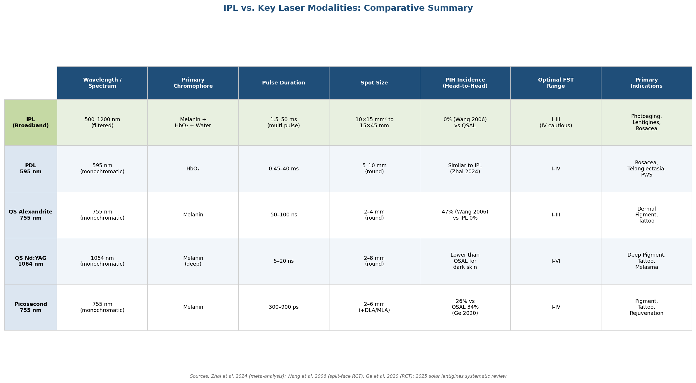

*Figure 3-2. Structured comparison of IPL against four major laser modalities across wavelength/spectrum, target chromophore, pulse duration, spot size, PIH incidence from head-to-head trials, optimal Fitzpatrick skin type range, and primary indications. Data sourced from Zhai et al. 2024, Wang et al. 2006, Ge et al. 2020, and the 2025 solar lentigines systematic review.*

## 3.5 Combination Approaches: IPL with Topical Agents and Multimodal Protocols

IPL monotherapy yields clinically meaningful results across its core indications, yet emerging evidence supports combination protocols—pairing IPL with topical depigmenting agents or other energy-based modalities—to enhance efficacy, reduce recurrence, and address conditions such as melasma where monotherapy outcomes remain suboptimal.

### IPL Combined with Topical Agents for Melasma

A 2026 meta-analysis of 11 randomized controlled trials (n = 461) evaluating laser- and light-based therapies combined with topical agents for melasma found that combination therapy offered no significant advantage over topical treatment alone at four weeks, but produced statistically significant improvements at eight, twelve, and sixteen weeks (pooled SMD: −0.55; 95% CI: −0.74 to −0.36; P < 0.00001). This time-dependent pattern suggests a cumulative therapeutic effect in which light-mediated melanin disruption and dermal remodeling progressively augment the biochemical inhibition of melanogenesis provided by topical agents [Fithria et al. 2026](https://pmc.ncbi.nlm.nih.gov/articles/PMC12795099/ "Medicine 2026, laser/light + topicals for melasma meta-analysis"). The same meta-analysis documented a significantly higher adverse-event risk in the combination group (OR: 8.96; 95% CI: 3.71–21.64), with erythema and PIH as the most frequent events—a finding that mandates careful patient selection and conservative parameter settings when combining modalities, particularly in FST IV–VI patients.

### IPL Plus Tranexamic Acid Microneedling

A 2026 retrospective study (n = 29, FST III–IV) compared IPL alone with IPL combined with tranexamic acid (TA) microneedling for melasma. The IPL protocol employed the M22 AOPT platform in a dual-filter sequence: a first pass with a 640 nm cut-off filter (13–17 J/cm², 5.0–6.0 ms, triple pulse) followed by a second pass with a 590 nm cut-off filter (13–16 J/cm², 3.0–5.0 ms, double pulse). TA was delivered via microneedling (0.5 mm depth, 5% TA solution with glutathione) immediately after IPL, for three sessions at monthly intervals. Both groups achieved significant MASI score reductions at one month (IPL alone: 11.3 ± 5.1 → 6.4 ± 3.8, P = 0.017; IPL + TA: 10.7 ± 5.3 → 6.2 ± 3.8, P = 0.026). The IPL + TA group demonstrated higher patient satisfaction (86.7% vs. 71.4%) and notably lower three-month recurrence (6.7% vs. 21.5%), suggesting that TA's plasmin-inhibitory effect on keratinocyte-mediated melanogenesis signaling complements IPL's direct melanin photothermolysis, providing more durable suppression of the melasma disease cycle [Yang et al. 2026](https://pmc.ncbi.nlm.nih.gov/articles/PMC12991486/ "Medicine 2026, IPL + TA for melasma").

### Multimodal Platform Integration

Contemporary IPL platforms increasingly function as hubs within multimodal treatment systems rather than standalone devices. The Lumenis Stellar M22, for example, integrates XPL (Expert Pulsed Light) with ResurFX fractional non-ablative resurfacing, Nd:YAG, and Q-switched Nd:YAG modules, enabling hybrid protocols—such as PhotoFABULOUS (XPL + ResurFX) and SmoothGlo (XPL combined with triLift radiofrequency microneedling)—within a single session [Lumenis 2025](https://www.prnewswire.com/news-releases/lumenis-launches-new-stellar-m22-skin-treatments-platform-with-xpl-technology-backed-by-new-clinical-data-at-the-annual-american-society-for-dermatologic-surgery-meeting-asds-302619068.html "Stellar M22 platform specifications, ASDS 2025"). This platform convergence reflects a broader clinical trend toward individualized, multi-target treatment plans that combine energy modalities sequentially or concurrently to address the multifactorial nature of skin aging and dyschromia.

## 3.6 Safety Profile: Adverse Events, PIH Risk, and Fitzpatrick-Type Limitations

### General Safety

The overall safety record of IPL is well established. Across the 14 studies in the 2024 rosacea systematic review, adverse effects were consistently transitory: mild erythema (most common), edema, minimal bruising or purpura, burning sensation, and occasional mild pain. No severe adverse events—blistering, scarring, or permanent dyspigmentation—were reported in any included study [Martignago et al. 2024](https://ijdvl.com/efficacy-and-safety-of-intense-pulsed-light-in-rosacea-a-systematic-review/ "Safety assessment across 14 studies"). This favorable profile is consistent with IPL's lower peak irradiance relative to pulsed lasers: energy is distributed across a broad spectrum and a large spot, reducing the probability of focal thermal injury to any single tissue layer.

### Fitzpatrick Skin Type Considerations

Standard IPL photorejuvenation protocols are generally considered safe for FST I–III. In FST IV patients, caution is warranted: elevated epidermal melanin competes for photon absorption, increasing the thermal load on the epidermis and the risk of burns and PIH. FST V–VI patients are generally advised to avoid conventional IPL protocols altogether [Sharma & Patel 2023](https://www.ncbi.nlm.nih.gov/books/NBK557626/ "StatPearls, Laser Fitzpatrick Skin Type Recommendations"). Mitigation strategies for intermediate skin types include: employing long-wavelength cut-off filters (640+ nm) to bypass epidermal melanin absorption, reducing fluence, extending pulse duration, inserting inter-pulse delays for epidermal cooling, and applying pre- and post-treatment depigmenting agents [Sharma & Patel 2023](https://www.ncbi.nlm.nih.gov/books/NBK557626/ "Safety recommendations for darker skin types").

The Wang et al. (2006) split-face trial provides a quantitative illustration of IPL's relative safety advantage in moderate-melanin populations: zero PIH events among 32 IPL-treated Asian patients versus 47% PIH incidence following Q-switched alexandrite laser treatment of the same lesion types [Wang et al. 2006](https://pubmed.ncbi.nlm.nih.gov/16635661/ "JAAD 2006, split-face RCT"). This differential underscores that IPL's distributed spectral energy, while less aggressive toward focal pigment, also poses substantially less collateral risk to surrounding melanocytes—a trade-off that decisively favors IPL in skin types where PIH avoidance is a primary treatment goal.

### Combination Therapy Safety Considerations

The enhanced efficacy of combination protocols comes at a measurable cost in adverse-event incidence. The 2026 melasma meta-analysis documented an adverse-event odds ratio of 8.96 (95% CI: 3.71–21.64) relative to topical monotherapy, with FST IV–VI patients at greatest risk for PIH [Fithria et al. 2026](https://pmc.ncbi.nlm.nih.gov/articles/PMC12795099/ "Medicine 2026, safety outcomes"). This finding mandates conservative fluence settings, extended inter-pulse delays, and close post-treatment monitoring when IPL is combined with chemical agents—particularly in patients with darker skin types where the therapeutic window between efficacy and adverse events narrows considerably.

## 3.7 Recent IPL Platform Innovations and Protocol Refinements (2025–2026)

### Lumenis Stellar M22 with XPL Technology

Launched at the American Society for Dermatologic Surgery (ASDS) annual meeting in November 2025, the Stellar M22 with XPL (Expert Pulsed Light) technology represents the most significant recent advance in IPL platform engineering. Key technical features include eight expert filters for chromophore-specific targeting, sub-pulsing technology for finer energy modulation, Advanced Pulse Design for precision fluence control, and a new XPL Glide Mode enabling faster in-motion treatments across large body areas. Retrospective clinical data presented at ASDS demonstrated 76–100% clearance of cutaneous vascular and pigmented lesions after a single XPL session [Lumenis 2025](https://www.prnewswire.com/news-releases/lumenis-launches-new-stellar-m22-skin-treatments-platform-with-xpl-technology-backed-by-new-clinical-data-at-the-annual-american-society-for-dermatologic-surgery-meeting-asds-302619068.html "Stellar M22 XPL launch, ASDS 2025"). The platform integrates four energy modalities (XPL, ResurFX, Nd:YAG, Q-switched Nd:YAG) with over 850 built-in expert protocols covering more than 30 FDA-cleared indications, positioning it as a comprehensive multimodal workstation.

### Sciton BBL HERO

Sciton's BBL HERO (High Energy Rapid Output) platform offers four times the speed, three times the peak power, and twice the cooling capacity of the original BBL system, with a 15 × 45 mm spot size, magnetic spot-size adapters, and change-on-the-fly smart filters. The high repetition rate enables full-face treatment in two to five minutes—a throughput advantage that improves clinical workflow for high-volume practices. Notably, the SkinTyte continuous-pulsing mode has received clearance for FST I–VI, extending broadband-light tissue tightening applications to a wider patient demographic than conventional IPL protocols typically accommodate [Sciton BBL overview](https://sciton.com/blog-scitons-broadband-light-bbl-technology-is-revolutionizing-the-future-of-ipl/ "BBL HERO specifications and capabilities").

### Market Trajectory

The global IPL devices market was valued at USD 1.63 billion in 2025 and is projected to reach USD 2.23 billion by 2034, growing at a compound annual growth rate (CAGR) of 5.4%. Growth drivers include technological innovation in filter systems and pulse optimization, expanding clinical indications, multimodal platform integration, and increasing consumer demand for minimally invasive photorejuvenation [IntelMarketResearch 2025](https://www.intelmarketresearch.com/ipl-devices-market-24362 "IPL devices market outlook 2025–2034").

The following timeline charts the major milestones in IPL development—from the 1995 FDA clearance through the latest combination protocols and platform innovations—illustrating the technology's evolution from a broadband photorejuvenation source into a precision multimodal platform.

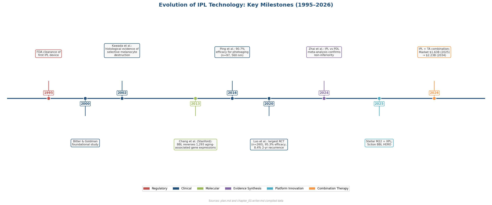

*Figure 3-3. Annotated timeline of IPL development milestones spanning regulatory clearances, pivotal clinical trials, molecular-level evidence (Chang et al. 2013), evidence syntheses, platform innovations (Stellar M22 XPL, BBL HERO), and the 2026 combination therapy protocols. Market trajectory data: USD 1.63 billion (2025) → USD 2.23 billion (2034 projected).*

# 第4章 LED Phototherapy and Low-Level Light Therapy (Photobiomodulation)

Light-emitting diode (LED) phototherapy represents the gentlest end of the light-based aesthetic spectrum. Unlike the lasers and intense pulsed light (IPL) systems examined in preceding chapters—which rely on selective photothermolysis, tissue ablation, or photomechanical disruption—LED devices operate through photobiomodulation (PBM), a non-thermal, photochemical process that modulates cellular metabolism without damaging tissue. The therapeutic premise is deceptively simple: deliver photons at specific wavelengths and controlled doses to chromophores within dermal and epidermal cells, triggering signaling cascades that promote collagen synthesis, suppress inflammation, accelerate wound repair, and—according to emerging evidence—modulate melanogenesis. Yet simplicity of concept belies complexity in practice. Published protocols span three orders of magnitude in dose, the consumer device market has outpaced the clinical evidence base, and regulatory distinctions between "FDA-cleared" and "FDA-registered" remain poorly understood by practitioners and patients alike. This chapter critically evaluates the evidence for LED-based PBM across aesthetic indications, assesses protocol parameters and device categories, and clarifies the regulatory landscape.

## 4.1 Photobiomodulation Mechanisms: Wavelength-Specific Cellular Pathways

### The Cytochrome c Oxidase Hypothesis

The molecular foundation of PBM rests on the absorption of red (600–700 nm) and near-infrared (NIR, 780–1100 nm) photons by cytochrome c oxidase (CCO), the terminal enzyme (Complex IV) of the mitochondrial electron transport chain. The prevailing mechanistic model proposes that inhibitory nitric oxide (NO) bound to CCO's binuclear center is photodissociated upon photon absorption, restoring electron flow, elevating mitochondrial membrane potential (ΔΨm), and increasing adenosine triphosphate (ATP) production. Downstream, transient increases in reactive oxygen species (ROS), cyclic AMP, and intracellular calcium activate transcription factors—including NF-κB and AP-1—that upregulate genes governing cell proliferation, collagen synthesis, and anti-inflammatory responses [de Freitas & Hamblin 2016](https://pubmed.ncbi.nlm.nih.gov/28070154/ "Proposed Mechanisms of PBM. IEEE J Sel Top Quantum Electron 2016;22(3):7000417").

### The Biphasic Dose Response

A distinguishing feature of PBM is the biphasic dose-response relationship, often described through the Arndt-Schulz principle. Insufficient doses fail to trigger meaningful biological change; moderate doses produce optimal stimulation; and excessive doses paradoxically inhibit or damage the target tissue. This characteristic complicates protocol standardization: the therapeutic window is defined not by a single threshold but by an interaction of irradiance (mW/cm²), fluence (J/cm²), wavelength, pulse structure, and treatment duration. PBM operates at power densities of 1–500 mW/cm² and energy densities of 1–20 J/cm², parameters that are orders of magnitude below the fluences employed in selective photothermolysis (5–100+ J/cm²) and produce no measurable tissue heating [Hamblin 2018](https://onlinelibrary.wiley.com/doi/full/10.1111/php.12864 "Mechanisms and Mitochondrial Redox Signaling in PBM. Photochem Photobiol 2018;94(2):199-212").

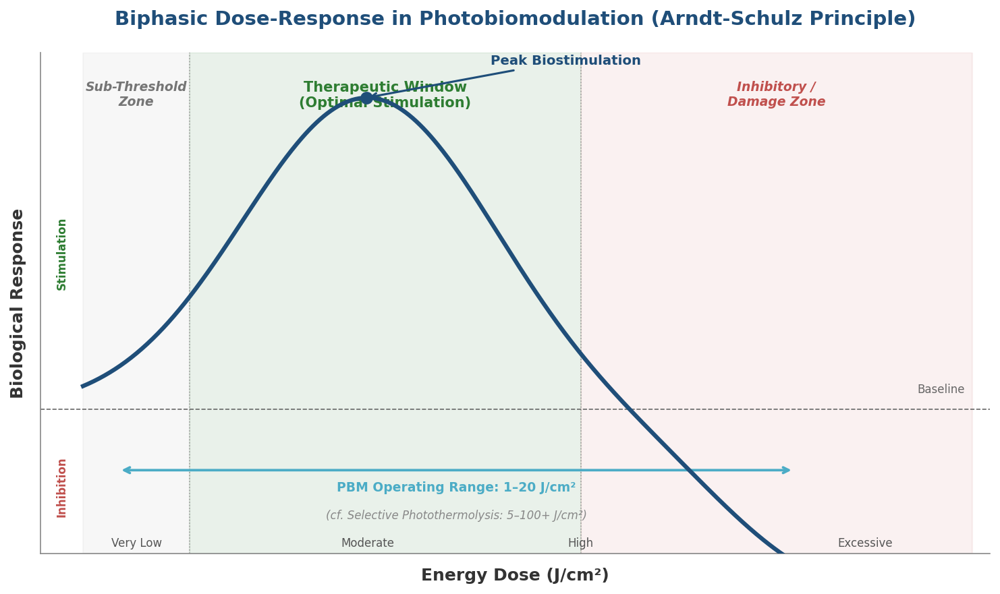

*Figure 4.1. The biphasic dose-response relationship (Arndt-Schulz principle) underlying PBM. Biological response peaks within the therapeutic window at moderate energy densities (1–20 J/cm²) and declines into inhibition at excessive doses—a pattern that distinguishes PBM from the high-fluence regimes of selective photothermolysis.*

### Wavelength-Specific Biological Targets

Beyond the CCO-mediated pathway, different LED wavelengths engage distinct biological targets and penetrate to different tissue depths:

- **Red light (620–660 nm)** penetrates to the upper dermis (~1–3 mm) and is absorbed primarily by CCO, driving the canonical PBM cascade. It stimulates fibroblast proliferation and procollagen synthesis while downregulating matrix metalloproteinase-1 (MMP-1), the primary collagen-degrading enzyme [Avci et al. 2013](https://pmc.ncbi.nlm.nih.gov/articles/PMC4126803/ "Semin Cutan Med Surg 2013;32(1):41-52").
- **Near-infrared (830–850 nm)** achieves deeper penetration (~3–5 mm), reaching the reticular dermis and subcutaneous vasculature. NIR engages the same CCO pathway but also modulates inflammatory mediators and enhances microcirculation—properties that underpin its application in wound healing and post-procedural recovery.
- **Blue light (~415 nm)** is absorbed not by CCO but by endogenous porphyrins (coproporphyrin III, protoporphyrin IX) within *Cutibacterium acnes*, generating singlet oxygen that destroys the bacterium through an endogenous photodynamic effect. Blue light penetration is limited to the epidermis and superficial dermis (<1 mm).
- **Amber/yellow light (~590 nm)** targets hemoglobin absorption bands and has been proposed to reduce erythema and modulate melanogenesis, although its mechanistic pathway remains less clearly delineated than that of red or NIR wavelengths.

## 4.2 Red and Near-Infrared LED Therapy: Anti-Aging and Collagen Remodeling Evidence

### The Landmark Wunsch & Matuschka RCT

The largest and most methodologically rigorous RCT of LED photobiomodulation for skin rejuvenation remains the 2014 study by Wunsch and Matuschka (n = 136, of whom 113 received active treatment and 23 served as untreated controls). Two polychromatic LED panels were tested: one emitting primarily in the red range (611–650 nm) and one spanning a broader red-to-NIR spectrum (570–850 nm). Participants received 30 sessions over approximately 15 weeks (twice weekly), with normalized doses of approximately 9 J/cm² in the 611–650 nm band. Irradiance ranged from 5.9 to 13.3 mW/cm² in that band, with total irradiance across the 570–850 nm panel reaching 10.3–54.8 mW/cm². Session durations varied from 12 to 25 minutes; notably, different irradiance-duration combinations produced comparable outcomes, supporting the Bunsen-Roscoe reciprocity law within these parameters [Wunsch & Matuschka 2014](https://pmc.ncbi.nlm.nih.gov/articles/PMC3926176/ "Photomedicine and Laser Surgery 2014;32(2):93-100").

Results were unambiguous: treated subjects demonstrated statistically significant improvements in skin complexion, skin roughness measured by profilometry, and intradermal collagen density measured by ultrasound (all p < 0.001 vs. controls). Blinded expert evaluation of standardized photographs showed wrinkle improvement in 69–75% of treated subjects compared with 4% of controls. No severe adverse events were recorded. Follow-up at six months, however, revealed diminishing effects—an observation that underscores the probable need for maintenance protocols to sustain clinical gains.

### Corroborating Evidence: Dual-Wavelength and Pulsed Protocols

Several earlier controlled studies reinforce the Wunsch & Matuschka findings, albeit with smaller cohorts. Lee et al. (2007) conducted a prospective, double-blinded, split-face RCT comparing red LED (640 nm), NIR (830 nm), combination red + NIR, and sham treatment. All active arms achieved statistically significant wrinkle severity reductions—26% (red), 33% (NIR), and 36% (combination)—with histological analysis confirming increased collagen and elastic fiber density in treated skin [cited in Avci et al. 2013](https://pmc.ncbi.nlm.nih.gov/articles/PMC4126803/ "Semin Cutan Med Surg 2013;32(1):41-52"). Goldberg et al. (2006) reported periorbital wrinkle softening in 80% of subjects treated with combined 633 nm and 830 nm LED, accompanied by histologic evidence of increased collagen fibril number and thickness [cited in Opel et al. 2015](https://jcadonline.com/light-emitting-diodes-a-brief-review-and-clinical-experience/ "J Clin Aesthet Dermatol 2015;8(6):36-44").

Barolet et al. (2009) added a mechanistic dimension by demonstrating that pulsed 660 nm LED upregulated collagen synthesis and downregulated MMP-1 in a tissue-engineered three-dimensional human skin model. The accompanying clinical study found that more than 90% of subjects exhibited reduction in rhytid depth after 12 treatments, with 87% reporting improved Fitzpatrick wrinkling severity scores [cited in Avci et al. 2013](https://pmc.ncbi.nlm.nih.gov/articles/PMC4126803/ "J Invest Dermatol 2009;129:2751-2759").

Collectively, this body of evidence supports a consistent signal: red and NIR LED at appropriate doses stimulate measurable collagen remodeling and clinically perceptible wrinkle reduction, with combination wavelength protocols trending toward additive benefit. The magnitude of improvement, however, remains modest relative to fractional laser resurfacing—a distinction that informs LED's positioning within the broader treatment hierarchy.

## 4.3 Blue LED Therapy: Acne as the Primary Indication

### Mechanism: Endogenous Photodynamic Destruction of *C. acnes*

Blue LED (~415 nm) exploits the photosensitizing properties of bacterial porphyrins naturally produced by *Cutibacterium acnes* (formerly *Propionibacterium acnes*). Coproporphyrin III and protoporphyrin IX, which accumulate in the bacterial cell membrane, absorb blue-violet photons and undergo intersystem crossing to generate singlet oxygen—a potent cytotoxic species that permeabilizes the membrane and kills the bacterium. This constitutes an endogenous photodynamic therapy (PDT) requiring no exogenous photosensitizer, making it uniquely suited to non-invasive, device-based treatment [Scott et al. 2019](https://pmc.ncbi.nlm.nih.gov/articles/PMC6846280/ "Ann Fam Med 2019;17(6):545-553").

### Clinical Evidence: Efficacy Signals Amid Methodological Limitations

The largest systematic review and meta-analysis of blue light for acne (Scott et al., 2019; 14 RCTs, n = 698) found that five of 14 trials reported investigator-assessed improvement, with three demonstrating statistically significant superiority over sham or no treatment. Pooled meta-analysis of inflammatory lesion counts, however, revealed no significant difference between blue light and control groups (MD = 0.16, 95% CI −0.99 to 1.31, p = 0.78). The authors attributed the discrepancy to small sample sizes, short follow-up periods (most < 12 weeks), and high risk of bias, concluding that "methodological and reporting limitations of existing evidence limit conclusions about the effectiveness of blue light for acne" [Scott et al. 2019](https://pmc.ncbi.nlm.nih.gov/articles/PMC6846280/ "Ann Fam Med 2019;17(6):545-553"). The 2016 Cochrane review (Barbaric et al.) reached a concordant conclusion, assigning low certainty of evidence to blue and green light therapies for acne.

Heterogeneity in dosimetric parameters compounds the interpretive challenge. A 2021 systematic review of eight RCTs (Diogo et al.) documented wavelengths spanning 405–450 nm, irradiances from 3.5 to 200 mW/cm², and doses from 0.6 to 320 J/cm², with many trials failing to report complete dosimetric data [Diogo et al. 2021](https://pmc.ncbi.nlm.nih.gov/articles/PMC8537635/ "Sensors 2021;21(20):6943").

Among individual trials, the Papageorgiou et al. (2000) RCT (n = 107) remains the most frequently cited: combination blue/red light (415/660 nm) produced the greatest reduction in inflammatory lesions at 12 weeks (76%), outperforming blue light alone (63%), white light, and 5% benzoyl peroxide. This finding, now over two decades old, has not been superseded by a larger, more definitive trial [cited in Opel et al. 2015](https://jcadonline.com/light-emitting-diodes-a-brief-review-and-clinical-experience/ "referencing Papageorgiou et al., Br J Dermatol 2000;142:973-978").

## 4.4 Amber/Yellow LED (~590 nm): Contested Evidence and Adjunctive Role

### Initial Claims and Replication Failure

Amber LED at 590 nm has been the subject of polarized debate. Weiss et al. (2005) reported that a proprietary pulsed yellow LED protocol (GentleWaves, 590 nm, 0.1 J/cm², 35-second treatments) decreased photoaging by one Fitzpatrick wrinkle class in 90% of 93 subjects, with a subsequent cohort of 90 patients showing 10% improvement by surface topography and histologic evidence of increased collagen in all biopsy specimens [cited in Opel et al. 2015](https://jcadonline.com/light-emitting-diodes-a-brief-review-and-clinical-experience/ "Opel et al., J Clin Aesthet Dermatol 2015;8(6):36-44"). These results were notable for the extremely low energy density employed—orders of magnitude below that used in red or NIR protocols.

A critical replication attempt by Boulos et al. (2009), however, failed to reproduce the objective findings. While patients reported subjective improvement, a panel of 30 blinded expert evaluators could not confirm measurable change, raising concerns about placebo effect and observer bias in the original studies [cited in Opel et al. 2015](https://jcadonline.com/light-emitting-diodes-a-brief-review-and-clinical-experience/ "citing Boulos et al., Dermatol Surg 2009;35:229-239"). Opel et al. (2015), reporting on their own clinical experience at Loyola University with the same 590 nm device, found modest improvement in fine periocular rhytides in 8 of 10 photoaging patients, but none improved their Glogau photoaging score—leading them to conclude that the mixed results were "more a function of the energy settings used than a reflection on the technology as a whole."

### Established Adjunctive Use: Post-Procedural Erythema Reduction

Where amber/yellow LED has demonstrated more consistent utility is as an adjunctive treatment for post-procedural erythema. Khoury and Goldman (2008) documented approximately 10% erythema reduction on the LED-treated side in a split-face study following IPL, and Alster and Wanitphakdeedecha (2009) reported decreased erythema after fractional laser resurfacing [cited in Opel et al. 2015](https://jcadonline.com/light-emitting-diodes-a-brief-review-and-clinical-experience/ "citing Khoury & Goldman 2008; Alster 2009"). The proposed mechanism involves modulation of hemoglobin-mediated vascular responses, consistent with the 590 nm wavelength's proximity to oxyhemoglobin's Q-band absorption peaks. No RCTs published between 2023 and 2026 have strengthened the standalone anti-aging evidence for this wavelength, and its primary clinical role remains adjunctive.

## 4.5 Emerging Evidence: LED and Pigmentation Modulation

### Mechanistic Basis for Melanogenesis Modulation

Although LED-based PBM is not traditionally positioned as a depigmenting modality, preclinical and early clinical data indicate that specific wavelengths can modulate melanin production through non-thermal pathways. Oh et al. (2017) demonstrated that 660 nm LED inhibited α-melanocyte stimulating hormone (α-MSH)-induced tyrosinase activity in B16F10 mouse melanoma cells, with concurrent downregulation of microphthalmia-associated transcription factor (MITF) and activation of extracellular regulated kinase (ERK) signaling [Oh et al. 2017](https://pubmed.ncbi.nlm.nih.gov/27561026/ "Photodermatol Photoimmunol Photomed 2017;33(1):49-57"). Lee et al. (2022) extended this work to a wearable micro-LED patch at 630 nm, showing reduced melanin content in a human skin equivalent model along with decreased expression of melan-A, tyrosinase, and MITF [Lee et al. 2022](https://pubmed.ncbi.nlm.nih.gov/36239680/ "Adv Healthc Mater 2022;12(1):2201796").

At the 590 nm amber wavelength, Dai et al. (2022) reported that LED irradiation at 20 mW/cm² and 20 J/cm² ameliorated pigmentation in melasma patients through a multi-pathway mechanism encompassing antiangiogenic effects via reduced VEGF and stem cell factor expression in endothelial cells, triggered autophagy in melanocytes, and upregulation of long noncoding RNA H19 and its associated exosomal microRNA-675 in keratinocytes [Dai et al. 2022](https://pmc.ncbi.nlm.nih.gov/articles/PMC9785909/ "Cells 2022;11(24):3949").

### Clinical Observations

A comprehensive review by Hamblin (2023) characterized PBM as a "dual-function treatment" for pigmentation disorders—capable of either stimulating repigmentation (as in vitiligo, via melanocyte stem cell activation) or reducing hyperpigmentation depending on wavelength, dose, and target condition [Hamblin 2023](https://pmc.ncbi.nlm.nih.gov/articles/PMC10171961/ "Photobiomod Photomed Laser Surg 2023;41(5):199-201"). Barolet (2018) reported the first pilot trial of PBM for dermal-type melasma (n = 7), using 940 nm LED at 90 mW/cm² and 13.5 J/cm² combined with microdermabrasion: MASI scores decreased from 11.4 to 4.7 (~59% reduction, p < 0.001) [Barolet 2018](https://jcadonline.com/effect-photobiomodulation-melasma/ "J Clin Aesthet Dermatol 2018;11(4):28-34").

The Park et al. (2025) multi-center home-use LED mask trial (discussed in Section 4.6) noted that approximately one-quarter of participants spontaneously reported skin-brightening effects—lighter skin tone and fading of blemishes—although this observation was not quantified with objective instrumentation and was explicitly identified by the authors as requiring dedicated future investigation [Park et al. 2025](https://pmc.ncbi.nlm.nih.gov/articles/PMC11835066/ "Medicine 2025;104(7):e41596").

These findings remain preliminary, and no large-scale RCT has yet been designed with melanin reduction or skin brightening as a primary endpoint. The evidence base supports LED PBM as a plausible adjunctive tool for pigmentation modulation but does not yet support its use as a standalone depigmenting therapy.

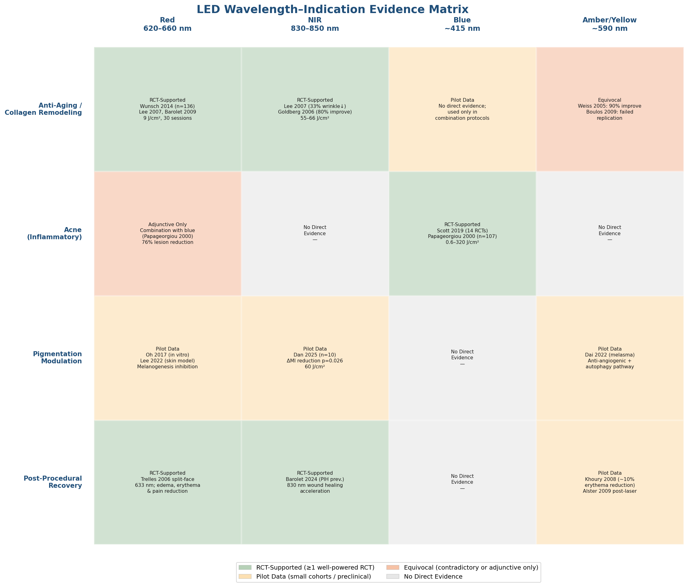

*Figure 4.2. LED Wavelength–Indication Evidence Matrix. Each cell maps a major wavelength band against a core aesthetic indication, color-coded by evidence level: RCT-supported (green), pilot data (yellow), equivocal (pink), or no direct evidence (gray). Sections 4.2–4.5 provide the underlying detail.*

## 4.6 Professional Versus At-Home LED Devices: The Irradiance Gap

### Power Output and Treatment Time

The most consequential distinction between professional and consumer LED devices lies in irradiance. Professional systems—exemplified by the Omnilux platform—deliver well-characterized, high-output parameters: Omnilux Revive (633 nm) at 105 mW/cm² and 126 J/cm², Omnilux Blue (415 nm) at 40 mW/cm² and 48 J/cm², and Omnilux Plus (830 nm) at 55 mW/cm² and 66 J/cm² [Avci et al. 2013](https://pmc.ncbi.nlm.nih.gov/articles/PMC4126803/ "Table 1: Examples of LLLT Devices for Dermatological Applications"). Consumer at-home devices typically operate at 5–30 mW/cm², requiring substantially longer treatment durations to achieve equivalent doses—a relationship governed by the reciprocity principle (dose = irradiance × time). A Stanford Medicine expert assessment (February 2025) summarized the gap: "red light therapy, particularly for hair growth or skin rejuvenation, delivered in a clinic will almost always be more powerful than any at-home device," and effectiveness "depends on the strength and duration of the treatment—which is largely unknown when people buy tools for use at home" [Stanford Medicine 2025](https://med.stanford.edu/news/insights/2025/02/red-light-therapy-skin-hair-medical-clinics.html "Red light therapy: What the science says").

### Clinical Evidence for At-Home Devices

Despite the irradiance gap, a growing body of RCT evidence supports the efficacy of home-use LED devices within specific indications. The first systematic review and meta-analysis of at-home LED devices for acne, published in *JAMA Dermatology* in March 2025 (Ershadi & Barbieri, 6 RCTs, n = 216), found significantly greater percent change in inflammatory lesions (45.3%, 95% CI 25.1–65.5%), noninflammatory lesions (47.7%, 95% CI 18.0–77.4%), and Investigator Global Assessment improvement (45.7%, 95% CI 29.1–62.4%) compared with controls. Red, blue, and combination wavelength devices all demonstrated efficacy. No severe adverse reactions were reported. The authors noted moderate-to-high heterogeneity between studies and limited sample sizes as caveats [Ershadi & Barbieri 2025](https://pmc.ncbi.nlm.nih.gov/articles/PMC11883593/ "JAMA Dermatol 2025;161(5):552").

For anti-aging specifically, Park et al. (2025) conducted a multi-center, double-blind, sham-controlled RCT of a home-use LED/IRED mask (630 nm LED + 850 nm IRED, each at a maximum of 10 mW/cm²) in 60 Asian participants (Fitzpatrick skin type (FST) II–V, aged 30–65). Participants used the device for 9 minutes, five times per week, over 12 weeks (60 sessions, 540 minutes total). Independent blinded evaluators documented statistically significant improvement in crow's feet wrinkle scores (CFGS) at 8, 12, and 16 weeks compared with sham (all p < 0.001). At 12 weeks, 86.2% of the treatment group (FAS) showed improvement versus 16.7% in the sham group—a between-group difference of 69.5 percentage points. Investigator-assessed GAIS scores confirmed the findings. No serious adverse events occurred [Park et al. 2025](https://pmc.ncbi.nlm.nih.gov/articles/PMC11835066/ "Medicine 2025;104(7):e41596").

These results, while encouraging, carry important caveats. The Park et al. study was industry-funded (Y&J Bio, Seoul), employed relatively short follow-up (16 weeks including a 4-week observation phase), and did not include objective collagen density measurements. Independent verification of manufacturer-stated irradiance values for consumer devices remains conspicuously absent from the peer-reviewed literature—a gap that complicates dose–response interpretation for the entire home-use category.

### Typical Protocol Parameters Across Settings

| Parameter | Professional Systems | Home-Use Devices |
|---|---|---|
| Irradiance | 40–150 mW/cm² | 5–30 mW/cm² |
| Treatment duration | 20–30 min per session | 9–20 min per session |
| Session frequency | 2–3×/week | 3–5×/week |
| Course length | 4–12 weeks (8–30 sessions) | 8–16 weeks (40–80 sessions) |
| Typical dose (red/NIR) | 9–126 J/cm² | 3–18 J/cm² |

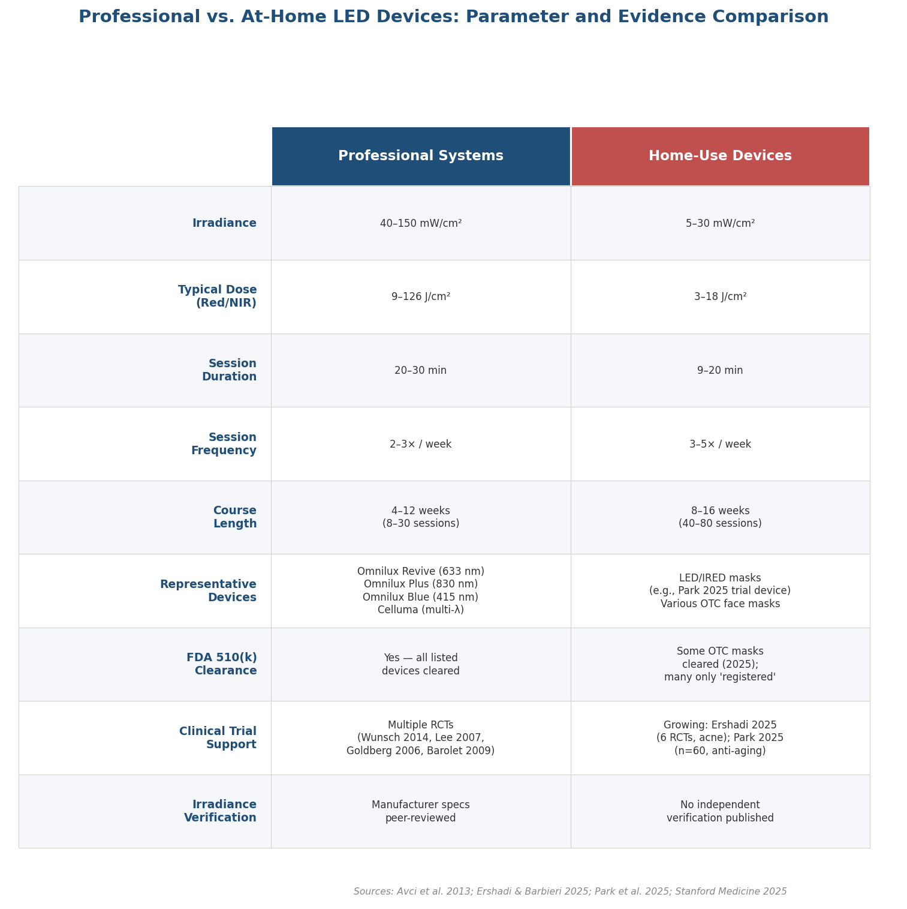

*Figure 4.3. Detailed comparison of professional LED systems and home-use devices across nine parameters, including irradiance, representative devices, FDA clearance status, clinical trial support, and independent irradiance verification. Data synthesized from Avci et al. 2013, Ershadi & Barbieri 2025, Park et al. 2025, and Stanford Medicine 2025.*

## 4.7 FDA Regulatory Framework for LED Devices

### Class II 510(k) Clearance: What It Means and What It Does Not

LED phototherapy devices are classified by the U.S. Food and Drug Administration (FDA) as Class II medical devices and undergo the 510(k) premarket notification pathway. This process requires the manufacturer to demonstrate that the device is "substantially equivalent" in intended use and technological characteristics to a legally marketed predicate device. The critical regulatory distinction is that this constitutes *clearance*, not *approval*. FDA approval—via the Pre-Market Approval (PMA) pathway—is reserved for Class III high-risk devices (such as implantable cardiac defibrillators) and demands rigorous clinical trial data demonstrating both safety and efficacy. No LED phototherapy device has undergone PMA review [FDA 510(k) page](https://www.fda.gov/medical-devices/device-approvals-and-clearances/510k-clearances "FDA official 510(k) clearance pathway").

Specific professional LED systems that have obtained 510(k) clearance include Omnilux Revive (633 nm, for skin rejuvenation), Omnilux Blue (415 nm, for mild-to-moderate acne and actinic keratoses), Omnilux Plus (830 nm, for skin rejuvenation and wound healing), and Celluma (multiple wavelengths, cleared for acne, aging skin/wrinkles, pain management, and hair restoration) [Celluma FDA guide](https://www.celluma.com/blogs/blog/fda-cleared-versus-fda-approved "FDA-Cleared vs. FDA-Approved detailed explanation").

### The "FDA-Registered" Misconception

A persistent source of consumer confusion is the distinction between "FDA-cleared" and "FDA-registered." Registration is a legal obligation for all medical device manufacturers and simply means the company has listed its establishment and devices with the FDA; it entails no review of safety, efficacy, or device performance. Many consumer LED devices marketed as "FDA-registered" have not undergone 510(k) review and carry no FDA determination of substantial equivalence to a cleared predicate. The marketing use of "FDA-registered" can mislead consumers into believing that a regulatory endorsement has occurred when, in fact, only an administrative filing requirement has been satisfied [Celluma FDA guide](https://www.celluma.com/blogs/blog/fda-cleared-versus-fda-approved "Registration vs. clearance distinction").

It is equally important to recognize that 510(k) clearance itself does not constitute an FDA determination of efficacy—it is a safety-focused pathway assessing substantial equivalence. The FDA does not independently test devices but reviews manufacturer-submitted data. Clearance permits legal marketing for stated indications but should not be interpreted as an endorsement of therapeutic superiority over alternative treatments.

## 4.8 LED as Adjunctive Therapy: Post-Procedural Healing and Combination Protocols

### Accelerating Recovery After Ablative and Non-Ablative Procedures

Red and NIR LED therapy has demonstrated consistent benefit as an adjunctive modality for reducing post-procedural morbidity following laser resurfacing and other aesthetic procedures. Trelles and Allones (2006), in a split-face study following blepharoplasty and periocular ablative laser resurfacing, documented statistically significant improvement in edema, erythema, bruising, and pain on the LED-treated side (633 nm) compared with the untreated contralateral side [cited in Avci et al. 2013](https://pmc.ncbi.nlm.nih.gov/articles/PMC4126803/ "Semin Cutan Med Surg 2013"). Weiss et al. (2005) reported that among 600 patients receiving LED in combination with thermal-based photorejuvenation, patients described "prominent reduction in post-treatment erythema and an overall impression of increased efficacy with the additional LED treatment" [cited in Avci et al. 2013](https://pmc.ncbi.nlm.nih.gov/articles/PMC4126803/ "citing Weiss et al. 2005").

LED phototherapy has also been reported to accelerate re-epithelialization of CO₂ laser wounds in a controlled pilot study. In a small cohort of nine patients with second-degree burns from non-ablative laser devices, daily LED treatment for one week produced healing approximately 50% faster than clinically expected [Avci et al. 2013](https://pmc.ncbi.nlm.nih.gov/articles/PMC4126803/ "LLLT for Burns section"). A nuanced assessment from Stanford Medicine experts (2025) noted that one blepharoplasty study showed the LED-treated side "healed in half the time" during early weeks, but at six weeks both sides were equivalent—suggesting LED may accelerate early-phase wound healing without altering final outcomes [Stanford Medicine 2025](https://med.stanford.edu/news/insights/2025/02/red-light-therapy-skin-hair-medical-clinics.html "Wound healing section").

### PBM for PIH Prevention: A Nascent Approach

An intriguing clinical application is the use of PBM as a preconditioning and post-treatment strategy to reduce post-inflammatory hyperpigmentation (PIH) following laser procedures. Barolet and Barolet (2024) reported the first documented case of preventive PBM: a pulsed 630 nm home-use device applied for two weeks before and after fractional CO₂ laser treatment resulted in significantly reduced PIH on the PBM-treated side at 12 weeks compared with the control side [Barolet & Barolet 2024](https://pubmed.ncbi.nlm.nih.gov/38776545/ "Photobiomod Photomed Laser Surg 2024"). A 2025 pilot study (Dan et al., n = 10) found that 830 nm LED at 60 J/cm² significantly reduced UVB-induced erythema index (ΔEI 9.30 vs. 11.52, p = 0.027) and melanin index (ΔMI 7.79 vs. 9.25, p = 0.026) [Dan et al. 2025](https://pubmed.ncbi.nlm.nih.gov/39899363/ "Photodermatol Photoimmunol Photomed 2025"). These findings are preliminary—based on a single case report and a small pilot cohort—but they define a clinically relevant hypothesis: that PBM-mediated anti-inflammatory and melanogenesis-modulatory effects could widen the safety margin of aggressive laser treatments, particularly in FST III–VI patients at elevated PIH risk. Controlled studies with adequate sample sizes are needed to validate this approach.

## 4.9 Clinical Evidence Assessment: Strengths, Gaps, and the Path Forward

### What the Evidence Supports

Systematic and narrative reviews, including the comprehensive assessment by Avci et al. (2013, Harvard/Massachusetts General Hospital), have concluded that "LLLT has beneficial effects on wrinkles, acne scars, hypertrophic scars, and healing of burns" and that "the non-invasive nature and almost complete absence of side-effects encourages further testing in dermatology" [Avci et al. 2013](https://pmc.ncbi.nlm.nih.gov/articles/PMC4126803/ "Semin Cutan Med Surg 2013;32(1):41-52"). For red and NIR wavelengths, the anti-aging evidence rests on at least one well-powered RCT (Wunsch & Matuschka 2014, n = 136) and multiple smaller controlled studies, conferring moderate confidence. For blue LED in acne, the signal is suggestive but compromised by small trial sizes, short follow-up, and dosimetric heterogeneity. For amber/yellow LED as a standalone anti-aging treatment, the evidence remains equivocal.

### Persistent Evidence Gaps

Several structural limitations constrain the LED evidence base. No head-to-head RCT has directly compared LED PBM with fractional laser or IPL for anti-aging outcomes—a comparison that would clarify LED's position in the treatment hierarchy. Long-term durability data beyond six months are sparse; the Wunsch & Matuschka follow-up suggests effect attenuation after cessation of treatment. Dose-response relationships remain fragmented: no published consensus exists on optimal irradiance, fluence, or session frequency for specific aesthetic indications. The most frequently cited anti-aging RCTs date from the 2005–2014 period, and no large-scale red/NIR LED anti-aging RCTs have appeared in the 2023–2026 literature. Independent third-party verification of manufacturer-claimed irradiance values for consumer devices does not exist in the peer-reviewed literature.

### Positioning Within the Aesthetic Armamentarium

LED-based PBM occupies a distinct therapeutic niche: it offers genuinely non-invasive treatment with negligible adverse effects, no downtime, and suitability across all Fitzpatrick skin types—advantages that no laser or IPL modality can fully match. Its limitations are equally clear: effect magnitudes for wrinkle reduction and collagen remodeling are modest compared with fractional laser resurfacing, onset is gradual (typically requiring 8–30 sessions over weeks to months), and maintenance treatment may be necessary to sustain results. The clinical value proposition of LED PBM is strongest in three roles: as a low-risk entry-level anti-aging treatment for patients who cannot tolerate or do not desire procedural downtime; as an adjunctive therapy to enhance procedural outcomes and reduce recovery times; and as a maintenance modality between more aggressive interventions.

# 第5章 Light-Based Management of Hyperpigmentation and Skin Brightening

Chapters 2 through 4 examined laser, intense pulsed light (IPL), and LED photobiomodulation (PBM) as distinct modalities, each evaluated against its own set of indications. Hyperpigmentation, however, cuts across all three platforms: melasma challenges laser practitioners with rebound darkening; solar lentigines respond to both Q-switched lasers and IPL yet carry different risk profiles; and post-inflammatory hyperpigmentation (PIH) may arise as an iatrogenic consequence of the very light-based procedures intended to improve skin appearance. This chapter therefore adopts a condition-centric rather than device-centric framework, synthesizing the evidence presented in Chapters 2–4 to determine which light modality—or combination of modalities and topical agents—offers the best risk-adjusted efficacy for each hyperpigmentation subtype. Particular attention is given to the multi-compartment pathophysiology of melasma, the emerging role of PBM as a preventive adjunct, and Fitzpatrick skin type (FST)–specific protocol recommendations drawn from the 2025–2026 literature.

## 5.1 Pathophysiology of Target Conditions: A Treatment-Relevant Framework

Effective deployment of light-based therapies for hyperpigmentation requires understanding why different pigmentary conditions respond—and fail to respond—so differently to identical wavelengths and energy parameters. The three conditions addressed in this chapter—melasma, post-inflammatory hyperpigmentation (PIH), and solar lentigines—differ in melanin compartmentalization, vascular involvement, and inflammatory milieu, and these differences dictate the safety and efficacy of each light modality.

### Melasma

Melasma is a chronic, relapsing acquired pigmentary disorder characterized by symmetric brown-to-grey patches on the face. Its pathogenesis extends well beyond simple melanocyte hyperactivity. Current evidence identifies disruptions across an integrated epidermis–extracellular-matrix–dermis axis: melanocyte-stimulating paracrine signaling from keratinocytes, fibroblasts, and endothelial cells drives increased melanin production and melanosome transfer, while dermal changes—including melanophage accumulation at the dermal–epidermal junction (DEJ), perivascular lymphocytic infiltration, solar elastosis, and vascular proliferation with upregulated vascular endothelial growth factor (VEGF)—create a self-reinforcing microenvironment that resists depigmentation [Chehrara et al. 2025](https://pmc.ncbi.nlm.nih.gov/articles/PMC12696807/ "J Cosmet Dermatol 2025; meta-analysis of 16 RCTs"); [Liang et al. 2025](https://link.springer.com/article/10.1007/s10103-025-04286-1 "Lasers Med Sci 2025"). This multi-compartment pathology explains why treatments targeting only epidermal melanin—including aggressive laser toning—frequently produce initial clearing followed by rebound hyperpigmentation once the underlying dermal and vascular drivers reassert themselves.

### Post-Inflammatory Hyperpigmentation

PIH represents a secondary pigmentary response to cutaneous injury or inflammation. Inflammatory cytokines—interleukin-1 (IL-1), prostaglandin E₂ (PGE₂), and tumor necrosis factor-α (TNF-α)—activate melanocytes and trigger excess melanin deposition in the epidermis (epidermal PIH) or release of melanin into the dermis through a damaged basal membrane, a process termed pigmentary incontinence (dermal PIH). PIH affects all skin tones but exhibits a markedly heightened predilection for FST III–VI, in which baseline melanocyte reactivity is greater and the melanin burden is higher. In the context of aesthetic light-based procedures, PIH has been reported in up to 20–30% of patients undergoing CO₂ laser resurfacing [Barolet & Barolet 2024](https://pubmed.ncbi.nlm.nih.gov/38776545/ "Photobiomod Photomed Laser Surg 2024"), and 95% of an international expert panel reported encountering PIH after fractional ablative CO₂ procedures (Chapter 2). PIH thus occupies a dual role in pigment management: it is both a clinical indication and an iatrogenic complication—a duality that places it at the center of any discussion of light-based pigment therapy.

### Solar Lentigines

Solar lentigines—flat, well-demarcated hyperpigmented macules—arise from localized melanocyte proliferation and increased melanin production within the epidermis in response to cumulative ultraviolet (UV) exposure. They affect more than 90% of individuals older than 50 years with fair skin [Mardani et al. 2025](https://pmc.ncbi.nlm.nih.gov/articles/PMC11948172/ "J Cosmet Dermatol 2025; systematic review of 41 trials"). Unlike melasma, solar lentigines are confined to the epidermis, lack a significant vascular or dermal inflammatory component, and do not exhibit the rebound dynamics that render melasma recalcitrant. This epidermal confinement makes them excellent targets for selective photothermolysis at wavelengths preferentially absorbed by melanin, as well as for broadband IPL platforms.

## 5.2 Laser Approaches to Hyperpigmentation: Comparative Evidence Across Modalities

### Low-Fluence Q-Switched Nd:YAG Toning for Melasma

The low-fluence Q-switched Nd:YAG (LFQSNY) 1064 nm "toning" protocol—delivering sub-threshold fluences (1.6–3.5 J/cm², 5–10 ns pulses) over multiple sessions—remains the most extensively studied laser approach to melasma. A 2025 meta-analysis of 16 RCTs encompassing 471 patients across 26 treatment arms demonstrated a pooled standardized mean difference (SMD) of 0.88 (95% CI 0.65–1.11, p < 0.00001) for Melasma Area and Severity Index (MASI) reduction, confirming a moderate-to-large treatment effect; average patient satisfaction across included studies was 66.2% [Chehrara et al. 2025](https://pmc.ncbi.nlm.nih.gov/articles/PMC12696807/ "J Cosmet Dermatol 2025; systematic review and meta-analysis").

The principal limitation of LFQSNY toning is recurrence. Among the RCTs included in the meta-analysis, Kroon et al. reported 50% recurrence at six-month follow-up, and Ustuner et al. documented 43.8% recurrence at twelve weeks [Chehrara et al. 2025](https://pmc.ncbi.nlm.nih.gov/articles/PMC12696807/ "Recurrence data from included RCTs"). Side effects included transient erythema, mild edema, temporary burns, and—most notably—PIH in approximately 15% of patients receiving LFQSNY monotherapy. These recurrence rates underscore a fundamental challenge: low-fluence toning can suppress melanin at the epidermal level but does not resolve the underlying dermal and vascular pathology that drives melasma relapse.

### Picosecond Lasers: An Evolving Alternative

Picosecond lasers, operating at 300–900 ps pulse widths, offer a mechanistically distinct approach to pigmented lesions. Their ultrashort pulses generate predominantly photoacoustic and photomechanical effects rather than the photothermal injury pattern of nanosecond Q-switched devices (Chapter 2). This reduced thermal footprint theoretically minimizes collateral melanocyte activation and, consequently, PIH risk.

A three-arm RCT (n = 60, FST III–IV) comparing picosecond Nd:YAG 1064 nm (PSNYL), picosecond alexandrite 755 nm (PSAL), and 2% hydroquinone over 24 weeks demonstrated that PSNYL produced the greatest MASI reduction, significantly outperforming both PSAL (p = 0.016) and hydroquinone (p = 0.018). Overall recurrence was low at 6.8%, with PSNYL at 5% and PSAL at 10% [Liang et al. 2023](https://www.frontiersin.org/journals/medicine/articles/10.3389/fmed.2023.1132823/full "Front Med 2023; 3-arm RCT, FST III–IV"). A subsequent 2025 RCT (n = 40, FST III–IV) introduced a combined Q-switched plus long-pulse Nd:YAG protocol (QLNYL) and found it significantly superior to non-fractional PSAL at weeks 8 and 12 (p < 0.05), with a 0% recurrence rate at 24 weeks compared with 10.5% for PSAL [Liang et al. 2025](https://link.springer.com/article/10.1007/s10103-025-04286-1 "Lasers Med Sci 2025; QLNYL vs PSAL"). The rationale for QLNYL is that the Q-switched component targets melanosomes photomechanically while the long-pulse component induces controlled dermal remodeling and vascular modulation—directly addressing the multi-compartment pathology described in Section 5.1.

Emerging wavelength options further expand the picosecond armamentarium. A study of 25 Chinese patients (FST II–IV) treated with a 730 nm picosecond laser reported 33.7% MASI reduction after a mean of 3.56 sessions over 8.48 weeks (p < 0.001), with no hyperpigmentation or hypopigmentation events [Han et al. 2025, cited in Chehrara et al. 2025](https://pmc.ncbi.nlm.nih.gov/articles/PMC12696807/ "Dermatol Surg 2025"). Situated between the alexandrite 755 nm and ruby 694 nm peaks, the 730 nm wavelength may offer a favorable melanin-to-hemoglobin absorption ratio that balances efficacy with safety in intermediate skin types.

### Fractional Lasers for Pigmentation

Fractional ablative CO₂ laser has produced the largest absolute MASI reductions among all laser modalities examined in the Chehrara et al. meta-analysis (mean MASI reduction −9.36, 95% CI −6.21 to −12.51), accompanied by 82.5% patient satisfaction [Chehrara et al. 2025](https://pmc.ncbi.nlm.nih.gov/articles/PMC12696807/ "Citing Lai et al. 2022 meta-analysis of 22 RCTs"). However, its aggressive thermal profile limits suitability for FST IV–VI patients and for melasma, where the risk of treatment-induced PIH may offset pigment clearance gains. Non-ablative fractional 1550 nm laser showed no significant difference compared with triple topical therapy (hydroquinone + tretinoin + triamcinolone) for melasma in one included RCT, yet exhibited 50% recurrence at six months [Chehrara et al. 2025](https://pmc.ncbi.nlm.nih.gov/articles/PMC12696807/ "Kroon et al. 2011, included in meta-analysis").

### Thulium 1927 nm: A Favorable Intermediate Option

The 1927 nm fractional thulium fiber laser occupies a distinctive niche between ablative and non-ablative modalities. Its shallow penetration depth of 200–300 µm targets the epidermis and superficial dermis—precisely the compartments where melasma melanin is most concentrated—while sparing the deeper dermis. A retrospective study of 100 patients demonstrated MASI reductions from 11.8 ± 6.3 at baseline to 6.7 ± 4.1 after one session and 3.4 ± 3.8 after two sessions, with no major side effects [Kurmuş et al. 2019](https://pubmed.ncbi.nlm.nih.gov/31690148/ "J Cosmet Laser Ther 2019; retrospective study, n = 100"). The 1927 nm wavelength has also demonstrated efficacy for PIH in skin of color [Bae et al. 2020, cited in Qiao et al. 2025](https://link.springer.com/article/10.1007/s10103-025-04611-8 "Lasers Med Sci 2025"), and a 2025 systematic review confirmed its utility across melasma, scarring, and rejuvenation with a favorable safety profile in pigmented skin (Chapter 2) [da Silva Sardinha et al. 2025](https://www.tandfonline.com/doi/abs/10.1080/14764172.2025.2483703 "J Cosmet Laser Ther 2025"). These results position the 1927 nm thulium laser as a promising option for patients in whom both aggressive ablative lasers and repetitive Q-switched toning carry excessive risk.

### Solar Lentigines: Laser Efficacy and Safety

For solar lentigines, the evidence base is comparatively straightforward. A 2025 systematic review of 41 clinical trials (3 234 patients) reported Q-switched laser success rates of 36.4–97%, with the wide range reflecting heterogeneous study designs and lesion characteristics [Mardani et al. 2025](https://pmc.ncbi.nlm.nih.gov/articles/PMC11948172/ "J Cosmet Dermatol 2025; systematic review"). Picosecond technology narrows this variability: the 532 nm picosecond Nd:YAG laser achieved 93.0% clinically excellent improvement with only 5% PIH incidence, compared with 30% PIH for the 532 nm Q-switched Nd:YAG counterpart in Asian patients (FST III–V) [Mardani et al. 2025](https://pmc.ncbi.nlm.nih.gov/articles/PMC11948172/ "Citing Kim et al. 2020 and Negishi et al. 2018"). Lesion clearance scores also favored the picosecond modality: 2.95 versus 1.8 on standardized scales, with significantly higher patient satisfaction [Mardani et al. 2025](https://pmc.ncbi.nlm.nih.gov/articles/PMC11948172/ "Comparative outcome data from systematic review"). Q-switched Nd:YAG, however, showed a 12.7% recurrence rate for larger lesions, suggesting that some lentigines may require consolidation or maintenance treatment.

The following matrix consolidates efficacy, PIH risk, recurrence, FST suitability, and evidence level across the major light-based modalities discussed in this chapter.

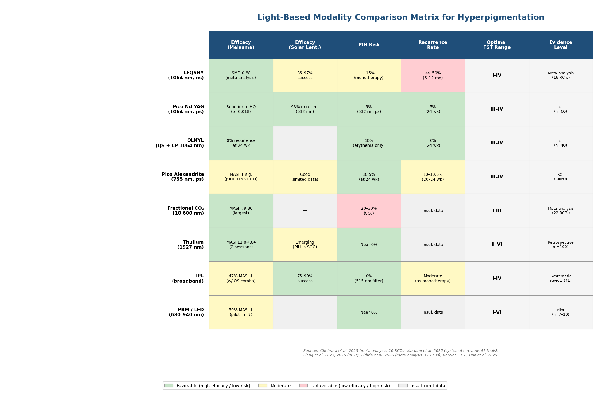

*Figure 5.1. Comparison matrix of eight light-based modalities across key clinical parameters for hyperpigmentation management. Color coding distinguishes favorable (green), moderate (yellow), and unfavorable (red) outcomes; grey denotes insufficient data.*

## 5.3 IPL for Pigmentation Clearance

IPL's broadband emission offers a fundamentally different interaction profile with pigmented lesions compared with single-wavelength lasers. Rather than concentrating energy at a single melanin absorption peak, IPL distributes it across a continuum (typically 500–1 200 nm, shaped by cut-off filters), engaging both melanin and hemoglobin chromophores simultaneously (Chapter 3). For pigmentary conditions with a mixed epidermal-vascular component—such as photodamage-associated dyschromia and, to some extent, melasma with its known vascular contribution—this polychromatic approach carries theoretical advantages.

### Solar Lentigines

IPL represents one of the best-supported modalities for solar lentigines. The 2025 systematic review by Mardani et al. reported IPL success rates of 74.6–90%, with notably consistent outcomes for superficial epidermal lesions and excellent tolerability. IPL with a 515 nm filter achieved greater than 50% improvement in 62% of treated cases and greater than 75% improvement in 23%, with zero PIH events. When applied with a KTP filter, good-to-excellent outcomes were observed in 74.6% of facial lesions and 90% of hand lesions [Mardani et al. 2025](https://pmc.ncbi.nlm.nih.gov/articles/PMC11948172/ "J Cosmet Dermatol 2025; systematic review of 41 trials"). Pulsed dye laser (PDL) and IPL were identified as the modalities least likely to cause PIH among all physical treatments assessed—a finding of particular relevance for patients with intermediate skin types (FST III–IV) in whom Q-switched lasers carry elevated PIH risk.

A head-to-head comparison of IPL versus Q-switched alexandrite laser (QSAL) in 32 Asian patients demonstrated that while QSAL achieved superior clearance for ephelides (p = 0.04), IPL produced zero PIH (0/32) compared with 47% (8/17) for QSAL, illustrating the safety–efficacy trade-off that governs modality selection in pigmented skin [Wang et al. 2006](https://pubmed.ncbi.nlm.nih.gov/16635661/ "JAAD 2006; split-face RCT").

### IPL for Melasma

As a monotherapy for melasma, IPL evidence remains limited. Combining IPL with low-fluence Q-switched Nd:YAG outperformed IPL alone: 47% MASI reduction at one month versus 15% for the IPL-only group, with the combination arm maintaining a 20.1% melanin index (MI) reduction compared with 14.6% for IPL-only during follow-up [Chehrara et al. 2025](https://pmc.ncbi.nlm.nih.gov/articles/PMC12696807/ "Yun et al. 2014; included in meta-analysis"). A comparison of conventional versus fractionated IPL delivery in 30 Korean women with melasma showed no statistically significant MASI difference between the two modes, although fractionated IPL exhibited a greater positive trend in MASI reduction over time, with histological evidence of melanin reduction [Chehrara et al. 2025](https://pmc.ncbi.nlm.nih.gov/articles/PMC12696807/ "Yun et al. 2015; included in meta-analysis"). These results position IPL not as a primary melasma treatment but as an adjunctive or maintenance modality, particularly in patients with concurrent vascular and pigmentary photodamage.

## 5.4 Photobiomodulation as a Pigment-Modulating and Preventive Adjunct

The role of PBM in hyperpigmentation management differs fundamentally from that of lasers and IPL. Rather than destroying melanin through photothermolysis or photomechanical disruption, PBM modulates melanogenesis at the cellular level—suppressing melanin biosynthesis through downregulation of tyrosinase, tyrosinase-related protein-1 (TRP-1), and microphthalmia-associated transcription factor (MITF) expression—without inducing melanocyte cytotoxicity (Chapter 4). This non-destructive mechanism opens two distinct clinical applications: direct depigmentation and prophylactic PIH prevention.

### Direct Depigmentation

The first clinical evidence for PBM-mediated depigmentation came from a split-face pilot study (n = 7) in patients with bilateral dermal melasma. Following microdermabrasion, pulsed 940 nm LED photobiomodulation was applied to one side of the face. At 12 weeks, MASI scores decreased from 11.4 to 4.7 on the PBM-treated side (approximately 59% reduction, p < 0.001) compared with the untreated control [Barolet 2018](https://jcadonline.com/effect-photobiomodulation-melasma/ "J Clin Aesthet Dermatol 2018; first study of PBM for melasma"). The study also proposed a photoprevention hypothesis: 940 nm photons may modulate p53 gene expression, preconditioning skin to resist future UV-induced melanogenesis—a mechanism consistent with the observation that some patients maintained improvement at 12-month follow-up. While the sample size limits generalizability, this pilot established PBM as a mechanistically distinct approach to melasma warranting further investigation.

### PIH Prevention and Preconditioning

A more immediately translatable application is the use of PBM to prevent or mitigate PIH following ablative laser procedures. The first published case report of prophylactic PBM described a patient who applied a pulsed 630 nm home-use device to the right periorbital area before and after CO₂ laser resurfacing for two consecutive weeks. At 12 weeks, PIH was markedly reduced on the PBM-treated side, while the contralateral untreated side demonstrated persistent erythema through six months [Barolet & Barolet 2024](https://pubmed.ncbi.nlm.nih.gov/38776545/ "Photobiomod Photomed Laser Surg 2024; prophylactic PBM case study").

This observation was corroborated by a 2025 pilot study (n = 10) using an in vivo UVB-induced PIH model. Therapeutic 830 nm LED irradiation at 60 J/cm² significantly reduced both erythema index (ΔEI: 9.30 vs. 11.52, p = 0.027) and melanin index (ΔMI: 7.79 vs. 9.25, p = 0.026) compared with untreated controls. Preventive irradiation (applied before UV challenge) yielded even stronger protection against erythema: 830 nm reduced ΔEI from 19.90 to 9.85 (p = 0.001), and 590 nm reduced ΔEI to 12.50 (p = 0.008) [Dan et al. 2025](https://pubmed.ncbi.nlm.nih.gov/39899363/ "Photodermatol Photoimmunol Photomed 2025; LED for PIE and PIH prevention"). These findings suggest that PBM preconditioning may emerge as a practical strategy for reducing PIH in patients undergoing aggressive light-based treatments—particularly those with FST III–VI, in whom PIH risk is highest. Both studies, however, employed small sample sizes, and validation through larger controlled trials remains necessary before protocol standardization.

## 5.5 Combination Protocols: Light Plus Topical Depigmenting Agents

The recognition that melasma is a multi-compartment disease with high recurrence rates under monotherapy has driven increasing interest in combination protocols pairing light-based modalities with topical depigmenting agents. The rationale is straightforward: light devices clear existing melanin deposits through physical destruction or photobiological suppression, while topical agents—inhibiting melanin synthesis, promoting melanin degradation, or blocking melanosome transfer—address the ongoing biochemical drivers of hyperpigmentation and reduce recurrence.

### Meta-Analytic Evidence for Combination Superiority

A 2026 systematic review and meta-analysis of 11 RCTs (461 patients) provided the most comprehensive assessment of this strategy to date. Combination therapy (laser/light plus topical agents) produced no significant advantage over topical agents alone at four weeks but achieved significantly greater MASI reduction at 8, 12, and 16 weeks, with a pooled SMD of −0.55 (95% CI −0.74 to −0.36, p < 0.00001). This delayed onset of superiority suggests a cumulative mechanism in which repeated light sessions progressively clear melanin while topical agents simultaneously suppress new melanin production [Fithria et al. 2026](https://pmc.ncbi.nlm.nih.gov/articles/PMC12795099/ "Medicine 2026; systematic review of laser/light + topical agents for melasma").

The safety analysis, however, revealed a significantly higher adverse event risk in the combination groups (OR 8.96, 95% CI 3.71–21.64), predominantly erythema and PIH, particularly in FST III–V patients. The certainty of evidence was rated moderate for efficacy but very low for safety outcomes—a discrepancy reflecting the small sample sizes and inconsistent adverse event reporting in the underlying trials [Fithria et al. 2026](https://pmc.ncbi.nlm.nih.gov/articles/PMC12795099/ "Safety outcomes from meta-analysis").

### Tranexamic Acid Combinations

Tranexamic acid (TA)—a plasmin inhibitor that suppresses melanogenesis through inhibition of the plasminogen–keratinocyte interaction and reduction of UV-induced melanocyte-stimulating pathways—has emerged as a particularly promising combination partner for light-based therapies.

Oral TA (750 mg/day for 8 weeks) combined with LFQSNY enhanced melasma clearance compared with laser alone in Korean patients [Shin et al. 2013, cited in Chehrara et al. 2025](https://pmc.ncbi.nlm.nih.gov/articles/PMC12696807/ "Data from Shin et al. 2013 RCT"). Fractional Er:YAG laser-assisted drug delivery (LADD) of 5% TA combined with oral TA (250 mg twice daily) achieved 64.7% mMASI improvement versus 41.8% for LADD alone (p = 0.027) in patients with intractable melasma [Botsali et al. 2022, cited in Chehrara et al. 2025](https://pmc.ncbi.nlm.nih.gov/articles/PMC12696807/ "Botsali et al. 2022 RCT"). Fractional CO₂ laser combined with oral TA outperformed Q-switched Nd:YAG plus TA in refractory melasma, with the fractional CO₂ arm showing greater improvement in MASI, patient global assessment, and physician global assessment scores [Beyzaee et al. 2021, cited in Chehrara et al. 2025](https://pmc.ncbi.nlm.nih.gov/articles/PMC12696807/ "Beyzaee et al. 2021 RCT").

A 2026 RCT (n = 29, FST III–IV) comparing IPL plus TA microneedling against IPL monotherapy for melasma found higher patient satisfaction in the combination group (86.7% vs. 71.4%) and a lower three-month recurrence rate (6.7% vs. 21.5%) [Yang et al. 2026](https://pmc.ncbi.nlm.nih.gov/articles/PMC12991486/ "Medicine 2026; IPL + TA microneedling for melasma").

The following chart summarizes efficacy outcomes for key combination protocols relative to their respective monotherapy controls.

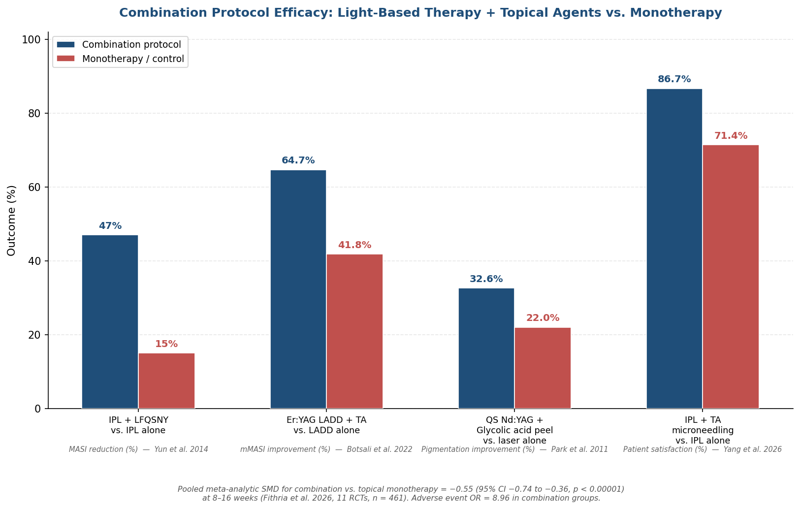

*Figure 5.2. Grouped bar chart comparing outcome percentages for four combination protocols versus monotherapy controls. Each pair is annotated with the specific outcome metric and source study. The pooled meta-analytic SMD of −0.55 (p < 0.00001) from Fithria et al. 2026 is noted at the bottom.*

### Other Topical Combination Partners

Additional combination data, though more limited in scope, reinforce the principle of multi-agent synergy:

- **Vitamin C microneedling**: Q-switched Nd:YAG plus vitamin C-based microneedling produced significantly lower MASI scores at months 1–4 compared with laser alone, despite the combination group having higher baseline MASI scores [Ustuner et al. 2017, cited in Chehrara et al. 2025](https://pmc.ncbi.nlm.nih.gov/articles/PMC12696807/ "Ustuner et al. 2017; included in meta-analysis").
- **Glycolic acid peels**: The combination of 1064 nm Q-switched Nd:YAG plus 30% glycolic acid peel yielded 32.6% pigmentation improvement versus 22.0% for laser alone; independent dermatologist evaluation found greater than 50% improvement in 69% of combination patients versus 31% for the laser-only group over five months [Park et al. 2011, cited in Chehrara et al. 2025](https://pmc.ncbi.nlm.nih.gov/articles/PMC12696807/ "Park et al. 2011; included in meta-analysis").
- **Hydroquinone**: In the three-arm RCT by Liang et al. (2023), 2% hydroquinone served as the active comparator; both picosecond laser arms outperformed it, though hydroquinone still achieved clinically meaningful MASI reduction [Liang et al. 2023](https://www.frontiersin.org/journals/medicine/articles/10.3389/fmed.2023.1132823/full "Front Med 2023; 3-arm RCT").

The 2026 meta-analysis concluded that epidermal-predominant melasma responds best to superficial light-based treatment combined with hydroquinone or triple combination creams, while dermal or mixed-type melasma requires gentler, repeated Q-switched Nd:YAG sessions paired with adjuncts such as tranexamic acid or niacinamide to prevent pigment rebound [Fithria et al. 2026](https://pmc.ncbi.nlm.nih.gov/articles/PMC12795099/ "Clinical recommendations from systematic review").

## 5.6 Skin-Type-Specific Treatment Algorithms

The differential absorption of laser and broadband light by epidermal melanin (Chapter 1) imposes fundamental constraints on modality selection across the Fitzpatrick spectrum. In darker skin (FST IV–VI), epidermal melanin acts as a competing chromophore, absorbing a greater fraction of incident energy and increasing the risk of thermal injury to the basal layer—the primary mechanism underlying treatment-induced PIH, hypopigmentation, and, in severe cases, scarring. The evidence reviewed in this chapter and in Chapters 2–3 supports the following condition-specific algorithms.

### Melasma in FST III–VI

For melasma patients with FST III–IV—the majority of the global melasma population—the available RCT evidence supports several key principles:

1. **Wavelength selection**: The 1064 nm Nd:YAG wavelength, operating within the optical window where melanin absorption is relatively low (Chapter 1), remains the safest laser option for pigmented skin. The QLNYL protocol (combined Q-switched plus long-pulse 1064 nm) demonstrated 0% recurrence at 24 weeks with only 10% adverse reactions (erythema and pruritus) in FST III–IV patients [Liang et al. 2025](https://link.springer.com/article/10.1007/s10103-025-04286-1 "Lasers Med Sci 2025; safety data for FST III–IV").
2. **Fluence reduction**: Low-fluence toning protocols (1.6–3.5 J/cm²) are preferred over standard-fluence treatments; the meta-analytic evidence confirms efficacy at these sub-threshold parameters while minimizing melanocyte perturbation [Chehrara et al. 2025](https://pmc.ncbi.nlm.nih.gov/articles/PMC12696807/ "J Cosmet Dermatol 2025").
3. **Adjunctive topicals**: Combination with oral or topical tranexamic acid, or with chemical peels, improves outcomes and reduces recurrence; the 2026 meta-analysis supports initiating topical agents concurrently with the first laser session to maximize the synergistic window beginning at week 8 [Fithria et al. 2026](https://pmc.ncbi.nlm.nih.gov/articles/PMC12795099/ "Medicine 2026").
4. **PBM preconditioning**: Preliminary data suggest that pre- and post-procedure PBM (630 nm or 830 nm) may reduce PIH risk, though this recommendation awaits RCT-level validation [Barolet & Barolet 2024](https://pubmed.ncbi.nlm.nih.gov/38776545/ "Photobiomod Photomed Laser Surg 2024"); [Dan et al. 2025](https://pubmed.ncbi.nlm.nih.gov/39899363/ "Photodermatol Photoimmunol Photomed 2025").
5. **Post-procedure management**: The 2026 meta-analysis documented significantly elevated adverse event risk in combination therapy groups for FST III–V, recommending lower fluences, fewer passes, and anti-inflammatory post-procedure regimens including topical corticosteroids [Fithria et al. 2026](https://pmc.ncbi.nlm.nih.gov/articles/PMC12795099/ "Medicine 2026; safety recommendations").

### Solar Lentigines in FST III–V

For solar lentigines in patients with intermediate-to-dark skin, modality selection should be guided by the PIH risk differential documented across comparative studies:

- **Picosecond over Q-switched**: The 532 nm picosecond Nd:YAG laser demonstrated 5% PIH versus 30% for the Q-switched counterpart in Asian patients, establishing it as the preferred laser for lentigines in pigmented skin [Mardani et al. 2025](https://pmc.ncbi.nlm.nih.gov/articles/PMC11948172/ "Citing Kim et al. 2020 and Negishi et al. 2018").
- **IPL as a lower-risk alternative**: IPL with appropriate filtering (515–560 nm) achieved zero PIH in the 2025 systematic review and provided consistent outcomes for superficial lesions, making it a suitable option for patients who prioritize safety over maximal single-session clearance [Mardani et al. 2025](https://pmc.ncbi.nlm.nih.gov/articles/PMC11948172/ "Comparative PIH risk data").
- **Pulsed dye laser (PDL)**: PDL demonstrated a greater lightening effect for solar lentigines in FST III–IV with fewer side effects compared with cryotherapy, and ranked alongside IPL as the modality least likely to cause PIH [Mardani et al. 2025](https://pmc.ncbi.nlm.nih.gov/articles/PMC11948172/ "PDL safety data for darker skin").
- **Thulium 1927 nm**: Its documented efficacy for PIH in skin of color and favorable safety profile position it as an emerging option for patients presenting with both lentigines and diffuse dyspigmentation [Bae et al. 2020, cited in Qiao et al. 2025](https://link.springer.com/article/10.1007/s10103-025-04611-8 "Lasers Med Sci 2025").

## 5.7 Outcome Measures and the Challenge of Recurrence

### Standardized Outcome Assessment

MASI and its modified variant mMASI remain the primary clinical outcome instruments for melasma across the studies reviewed in this chapter. The pooled SMD of 0.88 (95% CI 0.65–1.11) from the 2025 meta-analysis provides a benchmark for treatment-effect magnitude, while the average patient satisfaction of 66.2% suggests that a substantial proportion of patients consider outcomes suboptimal [Chehrara et al. 2025](https://pmc.ncbi.nlm.nih.gov/articles/PMC12696807/ "J Cosmet Dermatol 2025; pooled outcome data"). Objective quantitative tools—spectrophotometric melanin index, VISIA multi-spectral imaging, and chromameter-based luminance and chromaticity measurements—offer complementary data but suffer from inconsistent calibration and reporting standards across studies, complicating cross-trial comparison.

For solar lentigines, outcome assessment relies on lesion clearance scores (typically 0–4 scales), physician-rated improvement categories (poor, fair, good, excellent), and patient satisfaction surveys. The 532 nm picosecond Nd:YAG achieved clearance scores of 2.95 versus 1.8 for the Q-switched counterpart, with the higher score reflecting more complete depigmentation [Mardani et al. 2025](https://pmc.ncbi.nlm.nih.gov/articles/PMC11948172/ "Comparative outcome data").

### The Recurrence Problem

Recurrence remains the most critical clinical challenge in light-based melasma management. Across the studies synthesized in this chapter, reported recurrence rates range from 0% (QLNYL at 24 weeks; picosecond alexandrite at 20 weeks) to 50% (LFQSNY and non-ablative 1550 nm fractional laser at six months), with the wide spread attributable to variable follow-up durations, inconsistent recurrence definitions, and differences in concurrent topical maintenance [Chehrara et al. 2025](https://pmc.ncbi.nlm.nih.gov/articles/PMC12696807/ "Recurrence data summary"). Short follow-up periods—the majority of included RCTs assessed outcomes at 12–24 weeks—represent the most significant limitation in the current evidence base. The multi-compartment pathophysiology of melasma, described in Section 5.1, implies that light-based clearance of existing melanin deposits will be followed by re-pigmentation unless the dermal, vascular, and paracrine drivers are concurrently addressed and maintained under suppression.

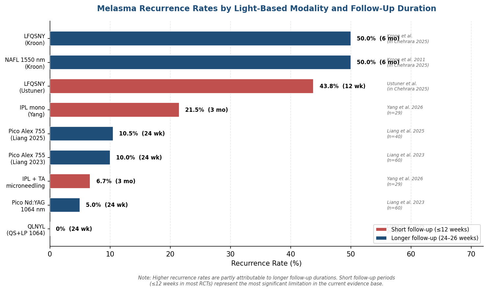

*Figure 5.3. Horizontal bar chart ranking nine modality–study combinations by melasma recurrence rate (0–50%), color-coded by follow-up duration (short ≤12 weeks in red vs. longer 24–26 weeks in blue). Higher recurrence rates are partly attributable to longer follow-up durations; short follow-up periods in most RCTs represent a major limitation of the evidence base.*

This reality supports a paradigm in which light-based therapies for melasma are conceptualized not as curative interventions but as components of an ongoing management strategy integrating topical maintenance (triple combination cream, tranexamic acid, or photoprotection), periodic low-fluence laser or IPL sessions, and potentially PBM preconditioning to mitigate treatment-related PIH. The 2026 meta-analysis demonstrating combination superiority beginning at week 8—but not at week 4—reinforces the importance of sustained, multi-modal protocols over single-session treatments [Fithria et al. 2026](https://pmc.ncbi.nlm.nih.gov/articles/PMC12795099/ "Medicine 2026").

# 第6章 Emerging Technologies, Combination Strategies, and the Evolving Landscape

The preceding chapters established the biophysical foundations of light–tissue interaction (Chapter 1), surveyed laser platforms (Chapter 2), intense pulsed light (Chapter 3), and LED photobiomodulation (PBM) systems (Chapter 4), and synthesized condition-specific evidence for hyperpigmentation management (Chapter 5). Across these analyses, several recurring evidence gaps emerged: the absence of head-to-head randomized controlled trials (RCTs) comparing artificial-intelligence (AI)–guided protocols with standard clinical practice, the lack of long-term durability data for picosecond laser skin rejuvenation, limited independent validation of at-home device irradiance claims, and the nascent state of laser–exosome combination research. This chapter examines the technologies, integration strategies, and regulatory developments converging to address those gaps. It distinguishes platforms approaching near-term clinical deployment (2026–2027) from those still in early-stage investigation, and maps the commercial and regulatory forces shaping the field's trajectory.

## 6.1 Next-Generation Laser and Light Platforms

### AVAVA MIRIA: Focal Point Technology for Inclusive Skin Types

Among the most clinically notable platform launches of 2025 is the AVAVA MIRIA, a 1550 nm non-ablative fractional laser employing proprietary Focal Point Technology™. The device received FDA 510(k) clearance in April 2025 for acne scar treatment across all Fitzpatrick skin types (FST I–VI)—a meaningful distinction, given that the majority of fractional lasers carry advisory limitations for FST V–VI (Chapter 2). A prospective, multi-center trial (n = 47, 75% skin of color) reported greater than 90% visible improvement, a median Échelle d'Évaluation Clinique des Cicatrices d'Acné (ECCA) score reduction of 50%, and erythema resolution within one to two days [AVAVA 2025 press release](https://www.globenewswire.com/news-release/2025/04/22/3065698/0/en/AVAVA-Receives-FDA-Clearance-for-Revolutionary-Acne-Scar-Treatment-using-Focal-Point-Technology.html "April 2025 FDA clearance"). The platform also integrates AI-driven energy delivery for real-time beam-placement optimization, a feature discussed further in Section 6.2. At the 2025 American Society for Laser Medicine and Surgery (ASLMS) meeting, AVAVA presented 14 abstracts, signaling forthcoming indication expansion beyond acne scarring.

### UltraClear 2910 nm Cold Ablative Fiber Laser

The UltraClear system (Acclaro Medical) introduces a wavelength innovation in ablative resurfacing. Operating at 2910 nm—positioned between the Er:YAG peak at 2940 nm and the water absorption minimum near 2800 nm—its erbium-doped fluoride glass fiber architecture enables controlled tissue ablation with reduced collateral thermal damage relative to conventional CO₂ or Er:YAG systems. A clinical study of 22 subjects with advanced photoaging, treated with three full-face and neck sessions spaced 6–8 weeks apart, yielded a mean Global Aesthetic Improvement Scale (GAIS) score of 3.8 (subject-assessed) and 3.2 (blinded physician-assessed), mean satisfaction of 4.8/5, and average pain scores of 4.9/10. Post-treatment responses (pinpoint hemorrhage, erythema, edema, crusting) resolved within 5–7 days—approximately half the downtime of conventional fractional CO₂ resurfacing. Two instances of temporary hyperpigmentation were recorded; no scarring or hypopigmentation occurred [Murray et al. 2024](https://pubmed.ncbi.nlm.nih.gov/38353284/ "Lasers Surg Med 2024;56(3):249-256"). Active clinical trials (NCT05808842, NCT07254884) are evaluating the platform for expanded indications including pigmented lesion clearance and vascular dyschromia; additional FDA clearance for benign pigmented lesions followed in 2025. At the March 2026 American Academy of Dermatology (AAD) annual meeting, multiple presentations highlighted customizable resurfacing protocols for skin of color and a proprietary Laser Coring™ technique for structural scar revision [Acclaro AAD 2026 press release](https://ultraclearlaser.com/press-releases/new-frontiers-academy-of-dermatology-annual-2026/ "AAD 2026 presentations"). Should ongoing trials confirm the 2910 nm platform's suitability for darker skin types, it would address one of the principal limitations identified in Chapter 2 for ablative resurfacing.

### Lumenis Stellar M22 + XPL Technology

The Stellar M22 with XPL technology, launched at the November 2025 American Society for Dermatologic Surgery (ASDS) meeting, extends the IPL paradigm discussed in Chapter 3. The platform incorporates eight expert-designed cut-off filters, Sub-pulsing capability for finer temporal energy control, and a Glide Mode enabling continuous-motion treatment. Retrospective clinical data presented at launch indicated that a single XPL session cleared 76–100% of vascular and pigmented lesions [Lumenis 2025](https://www.prnewswire.com/news-releases/lumenis-launches-new-stellar-m22-skin-treatments-platform-with-xpl-technology-backed-by-new-clinical-data-at-the-annual-american-society-for-dermatologic-surgery-meeting-asds-302619068.html "Stellar M22 XPL launch, ASDS 2025"). The clinical significance of Sub-pulsing lies in its capacity to deliver energy in micro-trains that maintain tissue temperature below the threshold for non-specific thermal injury while still achieving selective photothermolysis within the target chromophore—an approach that extends the pulse-duration optimization framework established in Chapter 1.

### Multi-Wavelength and Hybrid Platforms

The trend toward multi-wavelength platform consolidation accelerated through 2025–2026. Wingderm Lasermach received FDA 510(k) clearance in March 2026 for all three of its wavelengths (755, 808, and 1064 nm), enabling a single device to address hair removal, vascular lesions, and pigmented lesions across FST I–VI [Wingderm 2025](https://www.wingderm.com/lasermach-by-wingderm-receives-fda-clearance-for-all-three-wavelengths/ "Lasermach FDA clearance 2025"). Saratoga Technologies launched the FDA-cleared Laserase™ 1927 nm thulium laser platform in February 2026, incorporating both micro-ablative and non-ablative modes for pigmentary disorders, photoaging, fine lines, acne scars, melasma, post-inflammatory hyperpigmentation (PIH), and laser-assisted drug delivery (LADD) [Saratoga 2026 press release](https://finance.yahoo.com/news/saratoga-technologies-l-l-c-150700001.html "Laserase™ 1927 nm FDA-cleared launch, Feb 2026"). Broader multi-platform integration—exemplified by the Alma Harmony system (over 130 FDA-cleared indications) and the Rohrer Spectrum (four laser wavelengths combined with IPL)—reflects market-driven demand for versatility that reduces per-practice capital expenditure while broadening treatment scope.

### Femtosecond Lasers: A Pre-Clinical Frontier

At the far end of temporal precision, femtosecond (fs) lasers—delivering pulses in the 10⁻¹⁵-second domain—offer the theoretical capacity for ultra-precise tissue ablation with near-zero collateral thermal damage. A 2025 preclinical study demonstrated precision skin ablation at sub-cellular resolution, opening a conceptual pathway toward scar-free resurfacing [PubMed 2025](https://pubmed.ncbi.nlm.nih.gov/40979898/ "Precision fs-laser skin ablation 2025"). The technology remains at an early investigational stage, however, with no published human aesthetic clinical trials and substantial engineering challenges related to beam delivery systems, treatment speed, and cost. Clinical relevance for aesthetic applications is unlikely before 2028 at the earliest.

## 6.2 Artificial Intelligence in Light-Based Aesthetic Practice

### Commercially Deployed AI Features

AI integration into laser and light platforms has progressed from conceptual exploration to clinical deployment. Three commercially available systems illustrate the current state of the field:

- **Sciton BBL HERO**: Real-time AI detects handpiece position and dynamically adjusts treatment endpoints; the HALO TRIBRID system tracks cumulative delivered energy to prevent overlap-related over-treatment.
- **AVAVA Focal Point**: AI-driven precision delivery optimizes beam placement across the treatment field, contributing to the platform's favorable safety profile in skin of color (Section 6.1).
- **IoT-enabled LED systems**: Prototype intelligent LED panels use deep learning to adjust wavelength combinations and irradiance based on real-time skin-surface monitoring, although these remain at the clinical-investigational stage [Chen et al. 2025](https://link.springer.com/article/10.1007/s13555-025-01459-2 "AI in aesthetic dermatology, Dermatol Ther 2025").

### Four Domains of AI Application

A 2024 review by Haykal et al. mapped AI applications in laser aesthetics across four domains: (1) skin analysis and pattern recognition for treatment planning; (2) deep-learning-based parameter optimization tailored to individual skin characteristics; (3) predictive outcome modeling, with particular utility for PIH risk stratification in darker skin types; and (4) post-procedure recovery monitoring via mobile applications [Haykal, J Cosmet Dermatol 2024](https://pmc.ncbi.nlm.nih.gov/articles/PMC11845933/ "AI in laser aesthetics review"). Chen et al. (2025) expanded this framework to encompass convolutional neural network (CNN)–based skin measurements, robotic laser path planning that increased coverage area by more than 20% with improved uniformity, AI-based prediction of vitiligo excimer-laser response, and IoT-integrated deep-learning LED acne-treatment systems [Chen et al. 2025](https://link.springer.com/article/10.1007/s13555-025-01459-2 "AI in aesthetic dermatology, Dermatol Ther 2025").

### Evidence Maturity Assessment

The maturity gradient across these four domains is steep. Diagnostic and monitoring AI—deployed for skin-type classification, lesion identification, and post-treatment tracking—is commercially available and supported by validation datasets, although independent prospective validation in multi-ethnic populations remains limited. Fully autonomous parameter optimization, by contrast, has not been evaluated in a randomized setting: no published RCT has compared AI-guided laser treatment protocols against clinician-determined standard practice. This absence constitutes the most significant evidence gap in AI-augmented aesthetics. Until prospective data demonstrate measurable improvements in efficacy, safety, or efficiency, AI features function as clinical-decision-support tools rather than autonomous treatment planners.

## 6.3 The At-Home Light-Therapy Device Ecosystem

### Market Trajectory and Consumer Adoption

The at-home light-therapy segment has emerged as one of the fastest-growing verticals in aesthetic medicine. The global home-use LED phototherapy market was valued at an estimated USD 1.32 billion in 2025 and is projected to reach USD 2.61 billion by 2033, reflecting sustained consumer demand for accessible, non-invasive anti-aging and acne interventions [Forbes 2026](https://www.forbes.com/sites/forbes-personal-shopper/2026/02/25/the-rise-of-red-light-therapy/ "Red light therapy market 2026"). This expansion has been accompanied by a proliferation of marketing claims that frequently outpace the supporting evidence base—a discrepancy documented by a 2025 study identifying significant divergence between social-media promotional content for red-light therapy and published clinical evidence.

### Clinical Evidence for Home-Use Devices

The first meta-analysis dedicated to home-use LED devices for acne, published in JAMA Dermatology in 2025 (six RCTs, n = 216), reported mean reductions of 45.3% (95% CI 25.1–65.5%) for inflammatory lesions, 47.7% for non-inflammatory lesions, and 45.7% for Investigator Global Assessment (IGA) scores. Red, blue, and combination wavelengths all demonstrated efficacy, and no serious adverse events were recorded [Ershadi & Barbieri 2025](https://pmc.ncbi.nlm.nih.gov/articles/PMC11883593/ "JAMA Dermatol 2025;161(5):552"). A 2025 clinical study further confirmed the safety and effectiveness of a home-use 630/850 nm LED panel for skin rejuvenation [Park et al. 2025](https://pubmed.ncbi.nlm.nih.gov/39960921/ "J Cosmet Dermatol 2025").

These findings are encouraging but must be contextualized against the irradiance gap between home-use and professional devices. Professional LED panels deliver 40–150 mW/cm², whereas consumer devices typically operate at 5–30 mW/cm² (Chapter 4). Stanford Medicine experts have noted that clinical LED systems are "almost always more powerful" than their consumer counterparts, and whether lower-irradiance home devices achieve comparable photobiomodulative effects on dermal collagen remains an open question [Stanford Medicine 2025](https://med.stanford.edu/news/insights/2025/02/red-light-therapy-skin-hair-medical-clinics.html "Red light therapy: What the science says"). No published study has established a minimum effective irradiance threshold for home-use devices, and independent third-party verification of manufacturer-stated irradiance specifications is largely absent—a gap that undermines consumer ability to compare products on a common technical basis.

### Regulatory Landscape for Consumer Devices

In the United States, LED devices marketed with medical or therapeutic claims are classified as Class II medical devices requiring FDA 510(k) clearance. Multiple over-the-counter (OTC) LED face masks received 510(k) clearance in 2025 (e.g., K251042, K252983), signaling increased regulatory engagement with the home-use segment. The distinction between "FDA-cleared" (the 510(k) pathway demonstrating substantial equivalence to a predicate device) and "FDA-registered" (a mandatory administrative listing carrying no implication of safety or efficacy review) remains a persistent source of consumer confusion (Chapter 4). Marketing materials frequently cite "FDA-registered" status in a manner that implies regulatory validation—a practice that has drawn increased enforcement attention (Section 6.5).

## 6.4 Evolving Combination Strategies: Light Plus Biologics

### Laser-Assisted Exosome Delivery

The convergence of fractional laser technology with cell-derived exosomes represents one of the most actively investigated combination paradigms in aesthetic dermatology. Fractional lasers create microscopic channels in the stratum corneum—a mechanism already validated for laser-assisted drug delivery (LADD) of topical agents such as tranexamic acid (Chapter 5)—and exosomes exploit these channels to deliver bioactive cargo (growth factors, cytokines, microRNAs) directly to the dermis.

**Pilot and early-phase evidence.** A 2025 pilot study (n = 2) by Clementi et al. evaluated fractional CO₂ laser followed by topical bovine colostrum-derived exosomes. In the scar-treatment case, erythema resolved within 5–6 days compared with the typical 8–12-day recovery for fractional CO₂ alone; in the pigmentation case, UV pigment scores decreased by approximately 30% [Clementi et al. 2025](https://www.mdpi.com/2079-9284/12/5/199 "LAED pilot, Cosmetics 2025"). While suggestive, these observations are constrained by the absence of controls and a sample size of two.

**RCT-level data.** A 2026 RCT by Park and Park (n = 75) compared fractional non-ablative Nd:YAG laser alone against fractional Nd:YAG plus human-derived exosomes and fractional Nd:YAG plus plant-derived exosomes for acne scar treatment. Modified Vancouver Scar Scale (mVSS) improvement was 0.7 points for laser alone, 2.5 for the human-derived exosome group, and 2.8 for the plant-derived exosome group (p = 0.03). Grey-scale intensity reduction—a proxy for pigment normalization—was 2.9, 11.3, and 13.1 units respectively (p = 0.01), indicating that exosome co-delivery substantially augmented both structural and pigmentary outcomes [Park & Park 2026](https://pmc.ncbi.nlm.nih.gov/articles/PMC12942482/ "Life 2026"). An earlier split-face RCT (n = 25) by Kwon et al. (2020) demonstrated that fractional CO₂ plus adipose-derived stem cell exosomes reduced ECCA scores by 32.5% versus 19.9% for placebo (p < 0.01), providing corroborative evidence for the exosome-augmentation hypothesis.

**Fractional laser plus platelet-rich plasma.** A 2025 meta-analysis of seven RCTs (366 patients) evaluating fractional laser combined with platelet-rich plasma (PRP) for vitiligo repigmentation found statistically significant improvements in repigmentation grade (mean difference = 1.58, p < 0.01) and patient satisfaction (mean difference = 1.87, p = 0.0001) [Feng et al. 2025](https://pmc.ncbi.nlm.nih.gov/articles/PMC12086957/ "J Cosmet Dermatol 2025"). Although the vitiligo indication is clinically distinct from the photoaging and hyperpigmentation focus of this report, these findings reinforce the principle that fractional laser–created microchannels serve as effective conduits for biologic delivery, with potential applicability to aesthetic pigment normalization and rejuvenation.

### Active Clinical Pipeline

Several investigator-initiated and industry-sponsored trials are extending the laser–biologic combination paradigm:

- **Aerolase 1064 nm plus umbilical-cord mesenchymal stem cell (MSC) exosomes** for skin rejuvenation is under active clinical investigation [ClinicalTrials.gov](https://ctv.veeva.com/study/enhancing-skin-rejuvenation-using-laser-and-exosomes "Laser+exosome trial").
- **Hybrosome™**, a commercially available exosome–liposome hybrid vesicle system, is marketed for aesthetic use but lacks published RCT-level efficacy data as of April 2026.
- Exosome-based investigational candidates in adjacent dermatologic applications—Exo-7A-SC (anti-scarring), BRE-AD01 (atopic dermatitis), and AGLE-102 (immunomodulation)—may generate translatable safety data relevant to aesthetic combination protocols.

### Regulatory Ambiguity for Exosome Products

Exosome-based products for aesthetic applications in the United States occupy a regulatory grey zone. The FDA has not approved any exosome product for injection or topical aesthetic use; these products sit at an uncertain intersection of cosmetic, biologic, and device regulatory pathways. Reporting from The Aesthetic Guide in 2026 noted that this ambiguity creates compliance risk for clinicians who incorporate exosome products into laser combination protocols, particularly when marketing claims extend beyond the evidence base [The Aesthetic Guide 2026](https://www.theaestheticguide.com/aesthetic-dermatology/the-pulse-of-aesthetics-the-trends-defining-2026 "Exosome regulatory status 2026"). Until a clear regulatory framework emerges—or until specific exosome products receive FDA clearance or approval through the biologic or device pathway—the laser–exosome combination paradigm, despite promising early data, carries inherent regulatory and medicolegal uncertainty.

## 6.5 Regulatory Trends Shaping the Commercial Landscape

### FDA Enforcement Intensification

The U.S. Food and Drug Administration escalated advertising enforcement activity in the second half of 2025. In September 2025, the agency issued more than 100 warning and cease-and-desist letters to device manufacturers and distributors; 32 of these specifically targeted medical device marketing violations, including claims disseminated through social media and key-opinion-leader (KOL) promotional partnerships [Morgan Lewis 2025](https://www.morganlewis.com/blogs/asprescribed/2025/10/marketing-medical-devices-navigating-increased-fda-scrutiny "FDA enforcement Oct 2025"). For the light-based aesthetics sector, this enforcement surge carries implications for both device manufacturers and clinician practices: off-label efficacy claims for 510(k)-cleared devices, exaggerated outcome representations on social media, and misuse of "FDA-approved" language for Class II cleared devices all fall within the enforcement perimeter.

### Device Reclassification

In March 2026, the FDA published a final order reclassifying optical diagnostic devices for melanoma detection, reflecting the agency's broader initiative to update device classifications in response to technological evolution [Federal Register 2026](https://www.federalregister.gov/documents/2026/03/25/2026-05772/general-and-plastic-surgery-devices-reclassification-of-optical-diagnostic-devices-for-melanoma "FDA reclassification 2026"). Although this action applies to diagnostic rather than therapeutic devices, it signals a regulatory posture of active review that may extend to aesthetic light-based therapeutic devices—particularly as AI-integrated platforms (Section 6.2) blur the boundary between diagnostic and therapeutic functionality.

### European Union: MDR Annex XVI and the Aesthetic Device Transition

Under EU Medical Device Regulation (MDR) 2017/745, Annex XVI requires that non-medical aesthetic devices—including laser, IPL, and LED systems marketed for cosmetic purposes—meet the same safety and performance requirements as medical devices. Manufacturers must establish agreements with notified bodies and secure CE marking; the compliance deadline for market placement is 31 December 2028, with clinical-investigation commencement required by 31 December 2027 for devices seeking extended transitional provisions. Typical CE-marking timelines for energy-based aesthetic devices are estimated at 12–18 months, with costs ranging from €500,000 to €2 million [Syrma Johari 2025](https://syrmajoharimedtech.com/regulatory-compliance-guide-for-energy-based-aesthetic-devices/ "EU MDR compliance guide"). This regulatory tightening is expected to produce a market-consolidation effect: smaller manufacturers lacking the capital to navigate the full MDR pathway may exit the European market, while larger incumbents with established regulatory infrastructure gain competitive advantage.

### MoCRA and U.S. Cosmetics Oversight

The Modernization of Cosmetics Regulation Act (MoCRA), enacted in December 2022, introduced the first major update to U.S. cosmetics regulation in over 80 years. Under MoCRA, cosmetic manufacturing facilities must complete registration renewal by 1 July 2026. Although MoCRA's primary scope is cosmetics rather than medical devices, it intersects with the light-based aesthetics market through topical products used in combination protocols—serums, growth factors, and exosome preparations applied during or after laser and IPL procedures. Products marketed as cosmetics but containing biologically active exosome-derived components may face heightened scrutiny under both MoCRA and existing FDA biologic-product authorities.

## 6.6 Market Context and Industry Trajectory

The global dermatology lasers market was valued at approximately USD 4.07 billion in 2026 and is projected to reach USD 6.89 billion by 2033, representing a compound annual growth rate (CAGR) of 7.8% [Coherent Market Insights](https://www.coherentmarketinsights.com/industry-reports/dermatology-lasers-market "Market forecast 2026-2033"). The IPL device segment, valued at an estimated USD 1.63 billion in 2025, is forecast to reach USD 2.23 billion by 2034 at a CAGR of 5.4% (Chapter 3). The home-use LED segment (USD 1.32 billion in 2025, projected USD 2.61 billion by 2033) exhibits the highest relative growth rate at approximately 8.9% CAGR, underscoring consumer demand for accessible light-based therapies. Figure 1 illustrates the comparative scale and growth trajectories across these three segments.

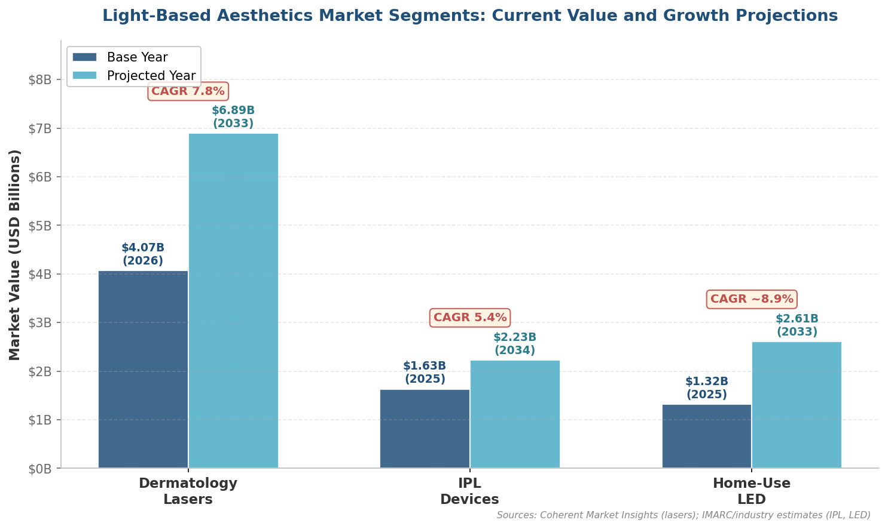

*Figure 1. Light-Based Aesthetics Market Segments — Current Value and Growth Projections. Dermatology lasers (USD 4.07 B → 6.89 B, CAGR 7.8%), IPL devices (USD 1.63 B → 2.23 B, CAGR 5.4%), and home-use LED phototherapy (USD 1.32 B → 2.61 B, CAGR ~8.9%). Sources: Coherent Market Insights (lasers); IMARC/industry estimates (IPL, LED).*

Several structural forces are driving this growth:

1. **Platform consolidation**: The multi-wavelength, multi-modality trend (e.g., Alma Harmony's 130+ FDA-cleared indications; Rohrer Spectrum's four-laser-plus-IPL architecture) reduces per-practice capital expenditure and expands addressable patient populations.
2. **Skin-of-color inclusivity**: Platforms explicitly designed or cleared for FST IV–VI—including AVAVA MIRIA, UltraClear 2910 nm, and Sciton BBL HERO SkinTyte mode—address a historically underserved patient demographic and expand the total addressable market.
3. **At-home device penetration**: The USD 1.32 billion home-use LED market creates a consumer-education pipeline that drives awareness of, and demand for, professional-grade treatments.
4. **AI integration as a competitive differentiator**: AI-guided treatment planning and real-time energy modulation are emerging as competitive differentiators, although their clinical value proposition remains to be established through prospective trials (Section 6.2).

## 6.7 Maturity Assessment: Near-Term Clinical Viability Versus Early-Stage Investigation

Not all emerging technologies occupy the same position on the translational continuum. The following assessment distinguishes platforms and strategies by their readiness for routine clinical deployment. Figure 2 provides a consolidated view of eight key technologies mapped against five maturity dimensions.

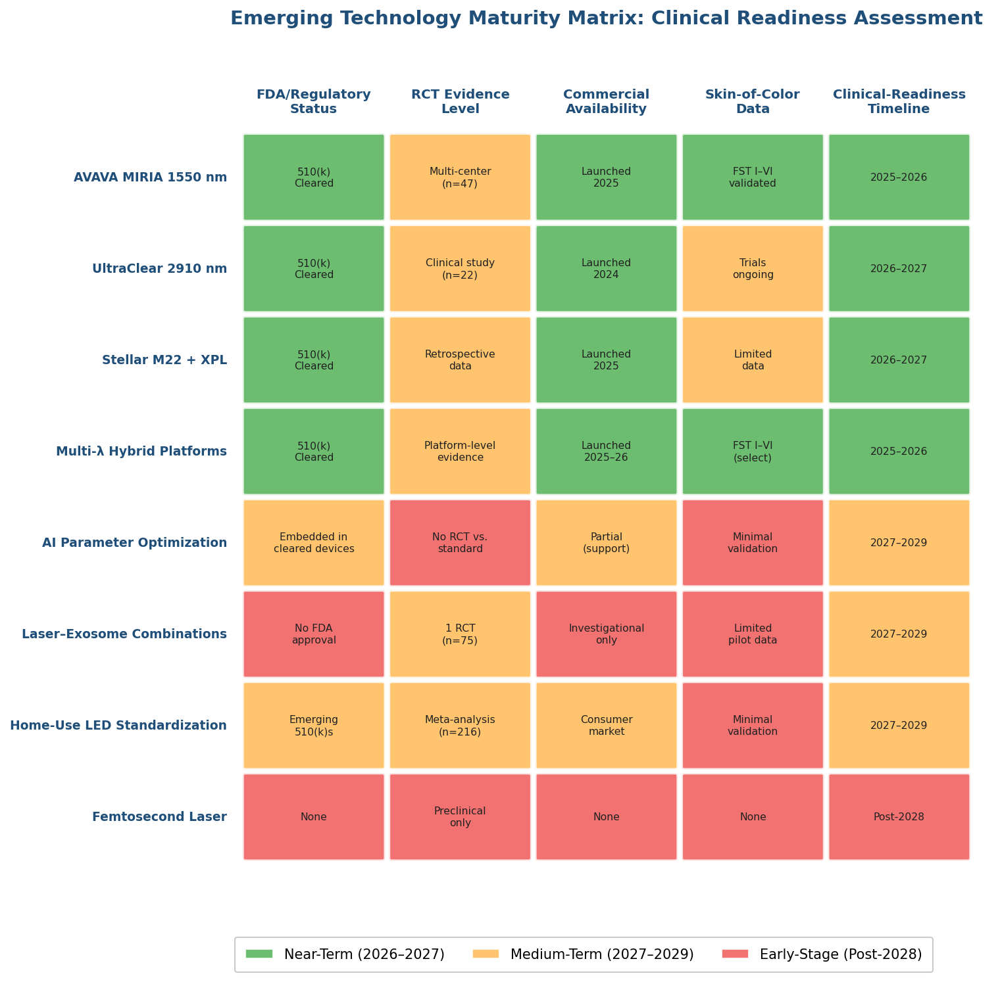

*Figure 2. Emerging Technology Maturity Matrix — Clinical Readiness Assessment. Green cells indicate near-term readiness (2026–2027), amber cells indicate medium-term investigation (2027–2029), and red cells indicate early-stage investigation (post-2028).*

**Near-term clinical viability (2026–2027)**:

- Multi-wavelength hybrid platforms (Wingderm Lasermach, Saratoga Laserase™): FDA-cleared, commercially available, and addressing established clinical indications with incremental technical refinements.
- UltraClear 2910 nm: FDA-cleared for resurfacing and benign pigmented lesions, with active trials for expanded indications and accumulating real-world experience; sufficient comparative data are likely by 2027.
- AVAVA MIRIA 1550 nm: FDA-cleared for acne scars across all skin types, with indication expansion anticipated based on the 2025 ASLMS presentation pipeline.
- Lumenis Stellar M22 + XPL: Commercially deployed with preliminary single-session efficacy data; prospective comparative trials are pending.
- AI-assisted treatment planning (diagnostic/monitoring tier): Deployed in Sciton and AVAVA platforms with an established clinical-decision-support role, although autonomous optimization remains investigational.

**Medium-term investigation (2027–2029)**:

- Laser–exosome combination protocols: Supported by one RCT and several pilot studies; the regulatory pathway for exosome products remains undefined; anticipated RCT proliferation in 2026–2028 will determine the pace of clinical uptake.
- PBM preconditioning for PIH prevention: Supported by case-level and small-pilot data (Chapter 5); controlled trials are needed to establish protocol standardization.
- Fully autonomous AI parameter optimization: No RCT data exist; prospective validation demonstrating superiority or non-inferiority to clinician judgment is a prerequisite.
- Home-use device standardization: Establishing minimum effective irradiance thresholds and independent verification frameworks are prerequisites for evidence-based consumer guidance.

**Early-stage investigation (post-2028)**:

- Femtosecond laser aesthetic resurfacing: Preclinical data only; significant engineering barriers remain before clinical translation.
- Novel picosecond wavelengths (730 nm, 785 nm) for aesthetic indications beyond pigmented lesions: No 2025–2026 clinical trial registrations or FDA clearances have been identified.
- Exosome-specific FDA-approved products for aesthetic injection or topical delivery: No candidate has entered the FDA approval pipeline as of April 2026.

# Conclusion

The evidence synthesized across this report confirms that light-based therapies have matured into a stratified, mechanism-driven discipline in which wavelength selection, pulse duration, and dosimetric precision are matched to specific chromophore targets and clinical conditions. Several converging conclusions emerge from the current literature.

**Laser therapies** exhibit the broadest efficacy range but also the widest safety variability. Fractional ablative CO₂ resurfacing remains the most efficacious single modality for photoaging, yet its thermal profile confines safe use largely to Fitzpatrick skin types I–III; the 2024 expert consensus documenting 95% PIH encounter rates after fractional CO₂ underscores the clinical significance of this limitation. Picosecond lasers have established Level I evidence for tattoo removal and Level II evidence for pigmented lesions, with head-to-head RCT data (Ge et al. 2020) demonstrating superior clearance and reduced PIH relative to Q-switched nanosecond platforms for nevus of Ota. The 1927 nm fractional thulium fiber laser has emerged as a versatile intermediate option, combining superficial ablative precision with a favorable safety profile in skin of color across melasma, photoaging, and PIH.

**Intense pulsed light** occupies a distinctive position: its polychromatic emission simultaneously engages melanin, hemoglobin, and water chromophores, enabling efficient treatment of the multi-component pathology of photodamage within a single session. The 2024 meta-analysis comparing IPL with pulsed dye laser for rosacea demonstrated IPL's significant superiority at stringent (>75%) clearance thresholds. For pigmented lesions, IPL consistently produces lower PIH rates than Q-switched lasers in head-to-head trials—zero PIH in 32 Asian patients versus 47% for Q-switched alexandrite in the Wang et al. (2006) split-face RCT—positioning it as the risk-adjusted choice for superficial hyperpigmentation in FST III–IV. The molecular-level evidence from Chang et al. (2013), showing that broadband light altered 1,293 genes toward a younger expression profile via NF-κB-mediated pathways, provides mechanistic depth that extends IPL's clinical rationale beyond empirical observation.

**LED photobiomodulation** represents the gentlest modality in the aesthetic armamentarium, with the Wunsch and Matuschka RCT (n = 136) establishing red and near-infrared wavelengths as effective for collagen remodeling and wrinkle reduction, albeit at a magnitude modest relative to fractional laser resurfacing. Emerging preclinical and pilot clinical data indicate that specific wavelengths (630 nm, 660 nm, 940 nm) can modulate melanogenesis through downregulation of tyrosinase and MITF expression—opening a potential role in depigmentation and PIH prevention that warrants controlled investigation. The at-home LED device market, projected to reach USD 2.61 billion by 2033, has expanded faster than the clinical evidence can support; independent verification of consumer-device irradiance claims and establishment of minimum effective dose thresholds remain critical unmet needs.

**Hyperpigmentation management** represents the domain where cross-modality integration is most consequential. The 2025 meta-analysis of 16 RCTs for melasma confirmed a moderate-to-large treatment effect for low-fluence Q-switched Nd:YAG toning (pooled SMD 0.88), but recurrence rates of 43–50% at six months highlight the fundamental challenge: light-based clearance of existing melanin deposits does not resolve the dermal, vascular, and paracrine drivers of melasma relapse. The 2026 meta-analysis of 11 RCTs (n = 461) demonstrated that combination therapy with topical agents achieves statistically significant superiority over monotherapy beginning at week 8 (SMD −0.55, p < 0.00001), reinforcing a paradigm of sustained multi-modal management. For solar lentigines, picosecond 532 nm Nd:YAG achieves 93% clinically excellent improvement with only 5% PIH in Asian patients—a marked improvement over the 30% PIH observed with Q-switched 532 nm—establishing it as the preferred laser modality for pigmented skin.

**Emerging technologies** are expanding the clinical frontier along several axes. Platforms explicitly designed for skin of color—AVAVA MIRIA (FDA-cleared across FST I–VI) and UltraClear 2910 nm—address a historically underserved patient demographic. AI-integrated systems are deployed for clinical-decision support in treatment planning and energy delivery, though no RCT has yet validated autonomous AI-guided protocols against clinician-determined standard practice. Laser–exosome combination strategies show early promise (Park and Park 2026 RCT: 2.8-point mVSS improvement with plant-derived exosomes vs. 0.7 for laser alone), but the regulatory pathway for exosome products remains undefined. The convergence of EU MDR Annex XVI requirements, increased FDA enforcement, and MoCRA implementation is expected to consolidate the device market and raise the evidence threshold for therapeutic claims—developments that should ultimately benefit clinical practice by differentiating validated technologies from inadequately supported marketing assertions.

Across all modalities, two overarching principles hold. First, Fitzpatrick skin type remains the single most important patient-level variable determining treatment safety: the fourfold reduction in melanin absorption between 755 nm and 1064 nm, the extended thermal relaxation time framework, and aggressive epidermal cooling strategies constitute the biophysical toolkit for safe treatment of pigmented skin. Second, the field's trajectory points decisively toward individualized, multi-modal protocols rather than monotherapy—combining light-based devices with topical agents, PBM preconditioning, and potentially biologic adjuncts—to achieve durable outcomes for conditions where recurrence, not initial clearance, is the defining clinical challenge.
